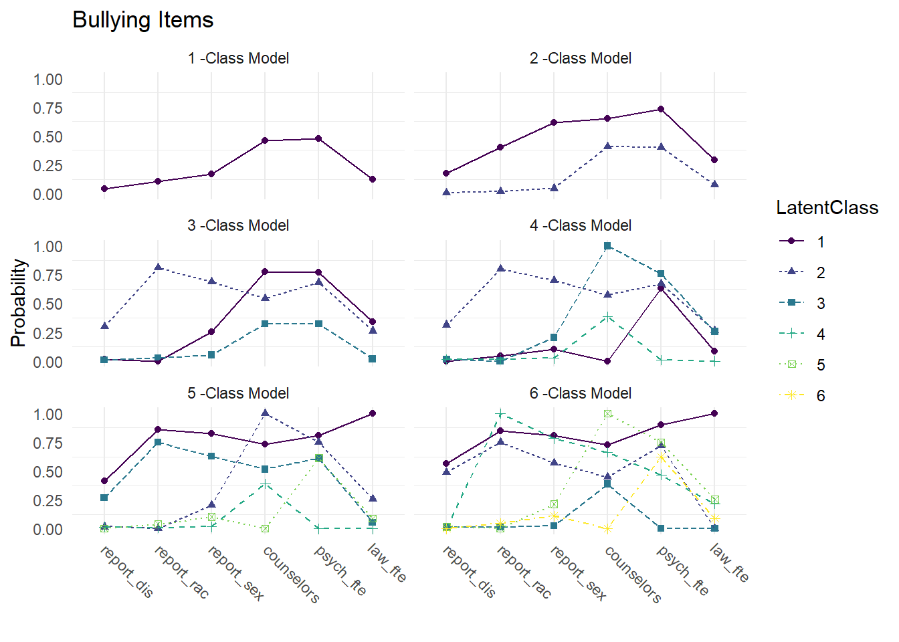
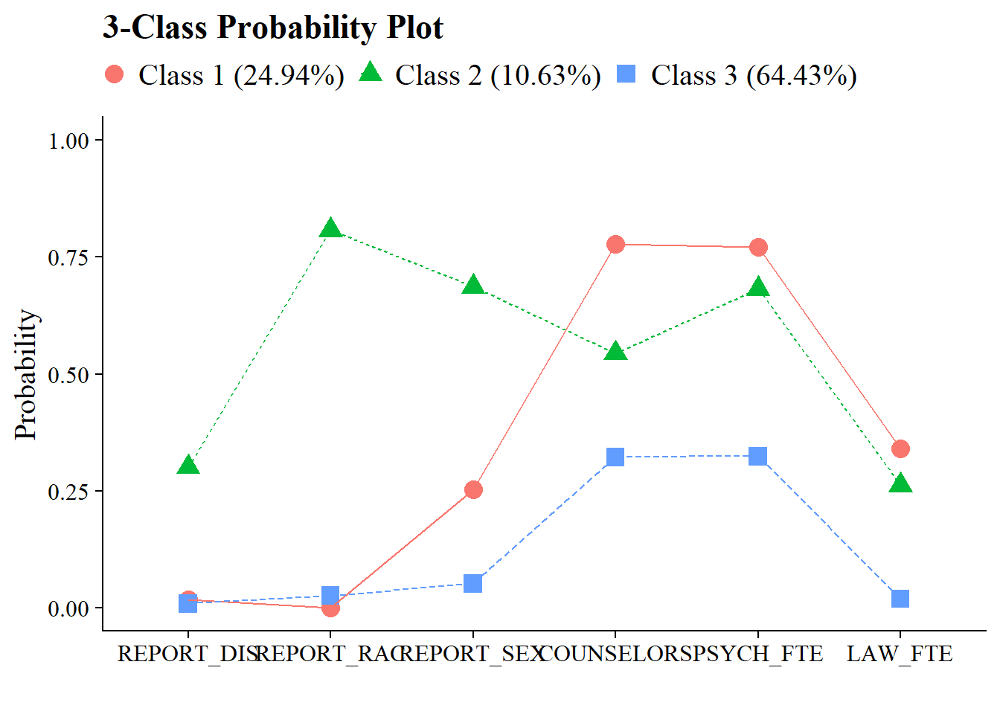

# LCA Enumeration

------------------------------------------------------------------------

Example: Bullying in Schools

------------------------------------------------------------------------

To demonstrate mixture modeling in the training program and online resource components of the IES grant we utilize the *Civil Rights Data Collection (CRDC)*[@usdoe2014] data repository.
The CRDC is a federally mandated school-level data collection effort that occurs every other year.
This public data is currently available for selected latent class indicators across 4 years (2011, 2013, 2015, 2017) and all US states.
In this example, we use the Arizona state sample.
We utilize six focal indicators which constitute the latent class model in our example; three variables which report on harassment/bullying in schools based on disability, race, or sex, and three variables on full-time equivalent school staff hires (counselor, psychologist, law enforcement).
This data source also includes covariates on a variety of subjects and distal outcomes reported in 2018 such as math/reading assessments and graduation rates.

------------------------------------------------------------------------

Load packages


``` r
library(tidyverse)
library(haven)
library(glue)
library(MplusAutomation)
library(here)
library(janitor)
library(gt)
library(cowplot)
library(DiagrammeR) 
```

## Variable Description


```{=html}
<div id="wrirjcvzul" style="padding-left:0px;padding-right:0px;padding-top:10px;padding-bottom:10px;overflow-x:auto;overflow-y:auto;width:auto;height:auto;">
<style>#wrirjcvzul table {
  font-family: system-ui, 'Segoe UI', Roboto, Helvetica, Arial, sans-serif, 'Apple Color Emoji', 'Segoe UI Emoji', 'Segoe UI Symbol', 'Noto Color Emoji';
  -webkit-font-smoothing: antialiased;
  -moz-osx-font-smoothing: grayscale;
}

#wrirjcvzul thead, #wrirjcvzul tbody, #wrirjcvzul tfoot, #wrirjcvzul tr, #wrirjcvzul td, #wrirjcvzul th {
  border-style: none;
}

#wrirjcvzul p {
  margin: 0;
  padding: 0;
}

#wrirjcvzul .gt_table {
  display: table;
  border-collapse: collapse;
  line-height: normal;
  margin-left: auto;
  margin-right: auto;
  color: #333333;
  font-size: 16px;
  font-weight: normal;
  font-style: normal;
  background-color: #FFFFFF;
  width: 75%;
  border-top-style: solid;
  border-top-width: 2px;
  border-top-color: #A8A8A8;
  border-right-style: none;
  border-right-width: 2px;
  border-right-color: #D3D3D3;
  border-bottom-style: solid;
  border-bottom-width: 2px;
  border-bottom-color: #A8A8A8;
  border-left-style: none;
  border-left-width: 2px;
  border-left-color: #D3D3D3;
}

#wrirjcvzul .gt_caption {
  padding-top: 4px;
  padding-bottom: 4px;
}

#wrirjcvzul .gt_title {
  color: #333333;
  font-size: 125%;
  font-weight: initial;
  padding-top: 4px;
  padding-bottom: 4px;
  padding-left: 5px;
  padding-right: 5px;
  border-bottom-color: #FFFFFF;
  border-bottom-width: 0;
}

#wrirjcvzul .gt_subtitle {
  color: #333333;
  font-size: 85%;
  font-weight: initial;
  padding-top: 3px;
  padding-bottom: 5px;
  padding-left: 5px;
  padding-right: 5px;
  border-top-color: #FFFFFF;
  border-top-width: 0;
}

#wrirjcvzul .gt_heading {
  background-color: #FFFFFF;
  text-align: center;
  border-bottom-color: #FFFFFF;
  border-left-style: none;
  border-left-width: 1px;
  border-left-color: #D3D3D3;
  border-right-style: none;
  border-right-width: 1px;
  border-right-color: #D3D3D3;
}

#wrirjcvzul .gt_bottom_border {
  border-bottom-style: solid;
  border-bottom-width: 2px;
  border-bottom-color: #D3D3D3;
}

#wrirjcvzul .gt_col_headings {
  border-top-style: solid;
  border-top-width: 2px;
  border-top-color: #D3D3D3;
  border-bottom-style: solid;
  border-bottom-width: 2px;
  border-bottom-color: #D3D3D3;
  border-left-style: none;
  border-left-width: 1px;
  border-left-color: #D3D3D3;
  border-right-style: none;
  border-right-width: 1px;
  border-right-color: #D3D3D3;
}

#wrirjcvzul .gt_col_heading {
  color: #333333;
  background-color: #FFFFFF;
  font-size: 100%;
  font-weight: normal;
  text-transform: inherit;
  border-left-style: none;
  border-left-width: 1px;
  border-left-color: #D3D3D3;
  border-right-style: none;
  border-right-width: 1px;
  border-right-color: #D3D3D3;
  vertical-align: bottom;
  padding-top: 5px;
  padding-bottom: 6px;
  padding-left: 5px;
  padding-right: 5px;
  overflow-x: hidden;
}

#wrirjcvzul .gt_column_spanner_outer {
  color: #333333;
  background-color: #FFFFFF;
  font-size: 100%;
  font-weight: normal;
  text-transform: inherit;
  padding-top: 0;
  padding-bottom: 0;
  padding-left: 4px;
  padding-right: 4px;
}

#wrirjcvzul .gt_column_spanner_outer:first-child {
  padding-left: 0;
}

#wrirjcvzul .gt_column_spanner_outer:last-child {
  padding-right: 0;
}

#wrirjcvzul .gt_column_spanner {
  border-bottom-style: solid;
  border-bottom-width: 2px;
  border-bottom-color: #D3D3D3;
  vertical-align: bottom;
  padding-top: 5px;
  padding-bottom: 5px;
  overflow-x: hidden;
  display: inline-block;
  width: 100%;
}

#wrirjcvzul .gt_spanner_row {
  border-bottom-style: hidden;
}

#wrirjcvzul .gt_group_heading {
  padding-top: 8px;
  padding-bottom: 8px;
  padding-left: 5px;
  padding-right: 5px;
  color: #333333;
  background-color: #FFFFFF;
  font-size: 100%;
  font-weight: initial;
  text-transform: inherit;
  border-top-style: solid;
  border-top-width: 2px;
  border-top-color: #D3D3D3;
  border-bottom-style: solid;
  border-bottom-width: 2px;
  border-bottom-color: #D3D3D3;
  border-left-style: none;
  border-left-width: 1px;
  border-left-color: #D3D3D3;
  border-right-style: none;
  border-right-width: 1px;
  border-right-color: #D3D3D3;
  vertical-align: middle;
  text-align: left;
}

#wrirjcvzul .gt_empty_group_heading {
  padding: 0.5px;
  color: #333333;
  background-color: #FFFFFF;
  font-size: 100%;
  font-weight: initial;
  border-top-style: solid;
  border-top-width: 2px;
  border-top-color: #D3D3D3;
  border-bottom-style: solid;
  border-bottom-width: 2px;
  border-bottom-color: #D3D3D3;
  vertical-align: middle;
}

#wrirjcvzul .gt_from_md > :first-child {
  margin-top: 0;
}

#wrirjcvzul .gt_from_md > :last-child {
  margin-bottom: 0;
}

#wrirjcvzul .gt_row {
  padding-top: 8px;
  padding-bottom: 8px;
  padding-left: 5px;
  padding-right: 5px;
  margin: 10px;
  border-top-style: solid;
  border-top-width: 1px;
  border-top-color: #D3D3D3;
  border-left-style: none;
  border-left-width: 1px;
  border-left-color: #D3D3D3;
  border-right-style: none;
  border-right-width: 1px;
  border-right-color: #D3D3D3;
  vertical-align: middle;
  overflow-x: hidden;
}

#wrirjcvzul .gt_stub {
  color: #333333;
  background-color: #FFFFFF;
  font-size: 100%;
  font-weight: initial;
  text-transform: inherit;
  border-right-style: solid;
  border-right-width: 2px;
  border-right-color: #D3D3D3;
  padding-left: 5px;
  padding-right: 5px;
}

#wrirjcvzul .gt_stub_row_group {
  color: #333333;
  background-color: #FFFFFF;
  font-size: 100%;
  font-weight: initial;
  text-transform: inherit;
  border-right-style: solid;
  border-right-width: 2px;
  border-right-color: #D3D3D3;
  padding-left: 5px;
  padding-right: 5px;
  vertical-align: top;
}

#wrirjcvzul .gt_row_group_first td {
  border-top-width: 2px;
}

#wrirjcvzul .gt_row_group_first th {
  border-top-width: 2px;
}

#wrirjcvzul .gt_summary_row {
  color: #333333;
  background-color: #FFFFFF;
  text-transform: inherit;
  padding-top: 8px;
  padding-bottom: 8px;
  padding-left: 5px;
  padding-right: 5px;
}

#wrirjcvzul .gt_first_summary_row {
  border-top-style: solid;
  border-top-color: #D3D3D3;
}

#wrirjcvzul .gt_first_summary_row.thick {
  border-top-width: 2px;
}

#wrirjcvzul .gt_last_summary_row {
  padding-top: 8px;
  padding-bottom: 8px;
  padding-left: 5px;
  padding-right: 5px;
  border-bottom-style: solid;
  border-bottom-width: 2px;
  border-bottom-color: #D3D3D3;
}

#wrirjcvzul .gt_grand_summary_row {
  color: #333333;
  background-color: #FFFFFF;
  text-transform: inherit;
  padding-top: 8px;
  padding-bottom: 8px;
  padding-left: 5px;
  padding-right: 5px;
}

#wrirjcvzul .gt_first_grand_summary_row {
  padding-top: 8px;
  padding-bottom: 8px;
  padding-left: 5px;
  padding-right: 5px;
  border-top-style: double;
  border-top-width: 6px;
  border-top-color: #D3D3D3;
}

#wrirjcvzul .gt_last_grand_summary_row_top {
  padding-top: 8px;
  padding-bottom: 8px;
  padding-left: 5px;
  padding-right: 5px;
  border-bottom-style: double;
  border-bottom-width: 6px;
  border-bottom-color: #D3D3D3;
}

#wrirjcvzul .gt_striped {
  background-color: rgba(128, 128, 128, 0.05);
}

#wrirjcvzul .gt_table_body {
  border-top-style: solid;
  border-top-width: 2px;
  border-top-color: #D3D3D3;
  border-bottom-style: solid;
  border-bottom-width: 2px;
  border-bottom-color: #D3D3D3;
}

#wrirjcvzul .gt_footnotes {
  color: #333333;
  background-color: #FFFFFF;
  border-bottom-style: none;
  border-bottom-width: 2px;
  border-bottom-color: #D3D3D3;
  border-left-style: none;
  border-left-width: 2px;
  border-left-color: #D3D3D3;
  border-right-style: none;
  border-right-width: 2px;
  border-right-color: #D3D3D3;
}

#wrirjcvzul .gt_footnote {
  margin: 0px;
  font-size: 90%;
  padding-top: 4px;
  padding-bottom: 4px;
  padding-left: 5px;
  padding-right: 5px;
}

#wrirjcvzul .gt_sourcenotes {
  color: #333333;
  background-color: #FFFFFF;
  border-bottom-style: none;
  border-bottom-width: 2px;
  border-bottom-color: #D3D3D3;
  border-left-style: none;
  border-left-width: 2px;
  border-left-color: #D3D3D3;
  border-right-style: none;
  border-right-width: 2px;
  border-right-color: #D3D3D3;
}

#wrirjcvzul .gt_sourcenote {
  font-size: 90%;
  padding-top: 4px;
  padding-bottom: 4px;
  padding-left: 5px;
  padding-right: 5px;
}

#wrirjcvzul .gt_left {
  text-align: left;
}

#wrirjcvzul .gt_center {
  text-align: center;
}

#wrirjcvzul .gt_right {
  text-align: right;
  font-variant-numeric: tabular-nums;
}

#wrirjcvzul .gt_font_normal {
  font-weight: normal;
}

#wrirjcvzul .gt_font_bold {
  font-weight: bold;
}

#wrirjcvzul .gt_font_italic {
  font-style: italic;
}

#wrirjcvzul .gt_super {
  font-size: 65%;
}

#wrirjcvzul .gt_footnote_marks {
  font-size: 75%;
  vertical-align: 0.4em;
  position: initial;
}

#wrirjcvzul .gt_asterisk {
  font-size: 100%;
  vertical-align: 0;
}

#wrirjcvzul .gt_indent_1 {
  text-indent: 5px;
}

#wrirjcvzul .gt_indent_2 {
  text-indent: 10px;
}

#wrirjcvzul .gt_indent_3 {
  text-indent: 15px;
}

#wrirjcvzul .gt_indent_4 {
  text-indent: 20px;
}

#wrirjcvzul .gt_indent_5 {
  text-indent: 25px;
}

#wrirjcvzul .katex-display {
  display: inline-flex !important;
  margin-bottom: 0.75em !important;
}

#wrirjcvzul div.Reactable > div.rt-table > div.rt-thead > div.rt-tr.rt-tr-group-header > div.rt-th-group:after {
  height: 0px !important;
}
</style>
<table class="gt_table" data-quarto-disable-processing="false" data-quarto-bootstrap="false">
  <thead>
    <tr class="gt_heading">
      <td colspan="3" class="gt_heading gt_title gt_font_normal gt_bottom_border" style>LCA indicators<span class="gt_footnote_marks" style="white-space:nowrap;font-style:italic;font-weight:normal;line-height:0;"><sup>1</sup></span></td>
    </tr>
    
    <tr class="gt_col_headings">
      <th class="gt_col_heading gt_columns_bottom_border gt_left" rowspan="1" colspan="1" scope="col" id="Name">Name</th>
      <th class="gt_col_heading gt_columns_bottom_border gt_left" rowspan="1" colspan="1" scope="col" id="Label">Label</th>
      <th class="gt_col_heading gt_columns_bottom_border gt_left" rowspan="1" colspan="1" scope="col" id="Values">Values</th>
    </tr>
  </thead>
  <tbody class="gt_table_body">
    <tr><td headers="Name" class="gt_row gt_left">leaid</td>
<td headers="Label" class="gt_row gt_left">District Identification Code</td>
<td headers="Values" class="gt_row gt_left"></td></tr>
    <tr><td headers="Name" class="gt_row gt_left">ncessch</td>
<td headers="Label" class="gt_row gt_left">School Identification Code</td>
<td headers="Values" class="gt_row gt_left"></td></tr>
    <tr><td headers="Name" class="gt_row gt_left">report_dis</td>
<td headers="Label" class="gt_row gt_left">Number of students harassed or bullied on the basis of disability</td>
<td headers="Values" class="gt_row gt_left">0 = No reported incidents, 1 = At least one reported incident</td></tr>
    <tr><td headers="Name" class="gt_row gt_left">report_race</td>
<td headers="Label" class="gt_row gt_left">Number of students harassed or bullied on the basis of race, color, or national origin</td>
<td headers="Values" class="gt_row gt_left">0 = No reported incidents, 1 = At least one reported incident</td></tr>
    <tr><td headers="Name" class="gt_row gt_left">report_sex</td>
<td headers="Label" class="gt_row gt_left">Number of students harassed or bullied on the basis of sex</td>
<td headers="Values" class="gt_row gt_left">0 = No reported incidents, 1 = At least one reported incident</td></tr>
    <tr><td headers="Name" class="gt_row gt_left">counselors_fte</td>
<td headers="Label" class="gt_row gt_left">Number of full time equivalent counselors hired as school staff</td>
<td headers="Values" class="gt_row gt_left">0 = No staff present, 1 = At least one staff present</td></tr>
    <tr><td headers="Name" class="gt_row gt_left">psych_fte</td>
<td headers="Label" class="gt_row gt_left">Number of full time equivalent psychologists hired as school staff</td>
<td headers="Values" class="gt_row gt_left">0 = No staff present, 1 = At least one staff present</td></tr>
    <tr><td headers="Name" class="gt_row gt_left">law_fte</td>
<td headers="Label" class="gt_row gt_left">Number of full time equivalent law enforcement officers hired as school staff</td>
<td headers="Values" class="gt_row gt_left">0 = No staff present, 1 = At least one staff present</td></tr>
  </tbody>
  
  <tfoot class="gt_footnotes">
    <tr>
      <td class="gt_footnote" colspan="3"><span class="gt_footnote_marks" style="white-space:nowrap;font-style:italic;font-weight:normal;line-height:0;"><sup>1</sup></span> Civil Rights Data Collection (CRDC)</td>
    </tr>
  </tfoot>
</table>
</div>
```


------------------------------------------------------------------------

**Variables have been transformed to be dichotomous indicators using the following coding strategy**

Harassment and bullying count variables are recoded `1` if the school reported at least one incident of harassment (`0` indicates no reported incidents).
On the original scale reported by the CDRC staff variables for full time equivalent employees (FTE) are represented as `1` and part time employees are represented by values between `1` and `0`.
Schools with greater than one staff of the designated type are represented by values greater than 1.
All values greater than zero were recorded as `1s` (e.g., `.5`, `1`,`3`) indicating that the school has a staff present on campus at least part time.
Schools with no staff of the designated type are indicated as `0` for the dichotomous variable.

------------------------------------------------------------------------


```{=html}
<div class="grViz html-widget html-fill-item" id="htmlwidget-079f26619291a9c2660b" style="width:672px;height:480px;"></div>
<script type="application/json" data-for="htmlwidget-079f26619291a9c2660b">{"x":{"diagram":" digraph cfa_model {\n\n# The `graph` statement - No editing needed\n\n    graph [layout = dot, overlap = true]\n \n# Two `node` statements\n \n# One for measured variables (box) \n\n    node [shape=box]\n    report_dis report_race report_sex counselors_fte psych_fte law_fte;\n \n# One for latent variables (circle) \n \n    node [shape=circle]\n    bully [label=<Bullying <br/>C<sub>k<\/sub>>];\n    \n# `edge` statements\n \n    edge [minlen = 2]\n    bully -> {report_dis report_race report_sex counselors_fte psych_fte law_fte}\n \n }","config":{"engine":"dot","options":null}},"evals":[],"jsHooks":[]}</script>
```


------------------------------------------------------------------------

## Prepare Data


``` r
df_bully <- read_csv(here("data", "crdc_lca_data.csv")) %>% 
  clean_names() %>% 
  dplyr::select(report_dis, report_race, report_sex, counselors_fte, psych_fte, law_fte) 
```

------------------------------------------------------------------------

## Descriptive Statistics


``` r
# Set up data to find proportions of binary indicators
ds <- df_bully %>% 
  pivot_longer(c(report_dis, report_race, report_sex, counselors_fte, psych_fte, law_fte), names_to = "variable") 


# Create table of variables and counts, then find proportions and round to 3 decimal places
prop_df <- ds %>%
  count(variable, value) %>%
  group_by(variable) %>%
  mutate(prop = n / sum(n)) %>%
  ungroup() %>%
  mutate(prop = round(prop, 3))


# Make it a gt() table
prop_table <- prop_df %>% 
  gt(groupname_col = "variable", rowname_col = "value") %>%
  tab_stubhead(label = md("*Values*")) %>%
  tab_header(
    md(
      "Variable Proportions"
    )
  ) %>%
  cols_label(
    variable = md("*Variable*"),
    value = md("*Value*"),
    n = md("*N*"),
    prop = md("*Proportion*")
  ) 
  
prop_table
```


```{=html}
<div id="hgbsrjcglz" style="padding-left:0px;padding-right:0px;padding-top:10px;padding-bottom:10px;overflow-x:auto;overflow-y:auto;width:auto;height:auto;">
<style>#hgbsrjcglz table {
  font-family: system-ui, 'Segoe UI', Roboto, Helvetica, Arial, sans-serif, 'Apple Color Emoji', 'Segoe UI Emoji', 'Segoe UI Symbol', 'Noto Color Emoji';
  -webkit-font-smoothing: antialiased;
  -moz-osx-font-smoothing: grayscale;
}

#hgbsrjcglz thead, #hgbsrjcglz tbody, #hgbsrjcglz tfoot, #hgbsrjcglz tr, #hgbsrjcglz td, #hgbsrjcglz th {
  border-style: none;
}

#hgbsrjcglz p {
  margin: 0;
  padding: 0;
}

#hgbsrjcglz .gt_table {
  display: table;
  border-collapse: collapse;
  line-height: normal;
  margin-left: auto;
  margin-right: auto;
  color: #333333;
  font-size: 16px;
  font-weight: normal;
  font-style: normal;
  background-color: #FFFFFF;
  width: auto;
  border-top-style: solid;
  border-top-width: 2px;
  border-top-color: #A8A8A8;
  border-right-style: none;
  border-right-width: 2px;
  border-right-color: #D3D3D3;
  border-bottom-style: solid;
  border-bottom-width: 2px;
  border-bottom-color: #A8A8A8;
  border-left-style: none;
  border-left-width: 2px;
  border-left-color: #D3D3D3;
}

#hgbsrjcglz .gt_caption {
  padding-top: 4px;
  padding-bottom: 4px;
}

#hgbsrjcglz .gt_title {
  color: #333333;
  font-size: 125%;
  font-weight: initial;
  padding-top: 4px;
  padding-bottom: 4px;
  padding-left: 5px;
  padding-right: 5px;
  border-bottom-color: #FFFFFF;
  border-bottom-width: 0;
}

#hgbsrjcglz .gt_subtitle {
  color: #333333;
  font-size: 85%;
  font-weight: initial;
  padding-top: 3px;
  padding-bottom: 5px;
  padding-left: 5px;
  padding-right: 5px;
  border-top-color: #FFFFFF;
  border-top-width: 0;
}

#hgbsrjcglz .gt_heading {
  background-color: #FFFFFF;
  text-align: center;
  border-bottom-color: #FFFFFF;
  border-left-style: none;
  border-left-width: 1px;
  border-left-color: #D3D3D3;
  border-right-style: none;
  border-right-width: 1px;
  border-right-color: #D3D3D3;
}

#hgbsrjcglz .gt_bottom_border {
  border-bottom-style: solid;
  border-bottom-width: 2px;
  border-bottom-color: #D3D3D3;
}

#hgbsrjcglz .gt_col_headings {
  border-top-style: solid;
  border-top-width: 2px;
  border-top-color: #D3D3D3;
  border-bottom-style: solid;
  border-bottom-width: 2px;
  border-bottom-color: #D3D3D3;
  border-left-style: none;
  border-left-width: 1px;
  border-left-color: #D3D3D3;
  border-right-style: none;
  border-right-width: 1px;
  border-right-color: #D3D3D3;
}

#hgbsrjcglz .gt_col_heading {
  color: #333333;
  background-color: #FFFFFF;
  font-size: 100%;
  font-weight: normal;
  text-transform: inherit;
  border-left-style: none;
  border-left-width: 1px;
  border-left-color: #D3D3D3;
  border-right-style: none;
  border-right-width: 1px;
  border-right-color: #D3D3D3;
  vertical-align: bottom;
  padding-top: 5px;
  padding-bottom: 6px;
  padding-left: 5px;
  padding-right: 5px;
  overflow-x: hidden;
}

#hgbsrjcglz .gt_column_spanner_outer {
  color: #333333;
  background-color: #FFFFFF;
  font-size: 100%;
  font-weight: normal;
  text-transform: inherit;
  padding-top: 0;
  padding-bottom: 0;
  padding-left: 4px;
  padding-right: 4px;
}

#hgbsrjcglz .gt_column_spanner_outer:first-child {
  padding-left: 0;
}

#hgbsrjcglz .gt_column_spanner_outer:last-child {
  padding-right: 0;
}

#hgbsrjcglz .gt_column_spanner {
  border-bottom-style: solid;
  border-bottom-width: 2px;
  border-bottom-color: #D3D3D3;
  vertical-align: bottom;
  padding-top: 5px;
  padding-bottom: 5px;
  overflow-x: hidden;
  display: inline-block;
  width: 100%;
}

#hgbsrjcglz .gt_spanner_row {
  border-bottom-style: hidden;
}

#hgbsrjcglz .gt_group_heading {
  padding-top: 8px;
  padding-bottom: 8px;
  padding-left: 5px;
  padding-right: 5px;
  color: #333333;
  background-color: #FFFFFF;
  font-size: 100%;
  font-weight: initial;
  text-transform: inherit;
  border-top-style: solid;
  border-top-width: 2px;
  border-top-color: #D3D3D3;
  border-bottom-style: solid;
  border-bottom-width: 2px;
  border-bottom-color: #D3D3D3;
  border-left-style: none;
  border-left-width: 1px;
  border-left-color: #D3D3D3;
  border-right-style: none;
  border-right-width: 1px;
  border-right-color: #D3D3D3;
  vertical-align: middle;
  text-align: left;
}

#hgbsrjcglz .gt_empty_group_heading {
  padding: 0.5px;
  color: #333333;
  background-color: #FFFFFF;
  font-size: 100%;
  font-weight: initial;
  border-top-style: solid;
  border-top-width: 2px;
  border-top-color: #D3D3D3;
  border-bottom-style: solid;
  border-bottom-width: 2px;
  border-bottom-color: #D3D3D3;
  vertical-align: middle;
}

#hgbsrjcglz .gt_from_md > :first-child {
  margin-top: 0;
}

#hgbsrjcglz .gt_from_md > :last-child {
  margin-bottom: 0;
}

#hgbsrjcglz .gt_row {
  padding-top: 8px;
  padding-bottom: 8px;
  padding-left: 5px;
  padding-right: 5px;
  margin: 10px;
  border-top-style: solid;
  border-top-width: 1px;
  border-top-color: #D3D3D3;
  border-left-style: none;
  border-left-width: 1px;
  border-left-color: #D3D3D3;
  border-right-style: none;
  border-right-width: 1px;
  border-right-color: #D3D3D3;
  vertical-align: middle;
  overflow-x: hidden;
}

#hgbsrjcglz .gt_stub {
  color: #333333;
  background-color: #FFFFFF;
  font-size: 100%;
  font-weight: initial;
  text-transform: inherit;
  border-right-style: solid;
  border-right-width: 2px;
  border-right-color: #D3D3D3;
  padding-left: 5px;
  padding-right: 5px;
}

#hgbsrjcglz .gt_stub_row_group {
  color: #333333;
  background-color: #FFFFFF;
  font-size: 100%;
  font-weight: initial;
  text-transform: inherit;
  border-right-style: solid;
  border-right-width: 2px;
  border-right-color: #D3D3D3;
  padding-left: 5px;
  padding-right: 5px;
  vertical-align: top;
}

#hgbsrjcglz .gt_row_group_first td {
  border-top-width: 2px;
}

#hgbsrjcglz .gt_row_group_first th {
  border-top-width: 2px;
}

#hgbsrjcglz .gt_summary_row {
  color: #333333;
  background-color: #FFFFFF;
  text-transform: inherit;
  padding-top: 8px;
  padding-bottom: 8px;
  padding-left: 5px;
  padding-right: 5px;
}

#hgbsrjcglz .gt_first_summary_row {
  border-top-style: solid;
  border-top-color: #D3D3D3;
}

#hgbsrjcglz .gt_first_summary_row.thick {
  border-top-width: 2px;
}

#hgbsrjcglz .gt_last_summary_row {
  padding-top: 8px;
  padding-bottom: 8px;
  padding-left: 5px;
  padding-right: 5px;
  border-bottom-style: solid;
  border-bottom-width: 2px;
  border-bottom-color: #D3D3D3;
}

#hgbsrjcglz .gt_grand_summary_row {
  color: #333333;
  background-color: #FFFFFF;
  text-transform: inherit;
  padding-top: 8px;
  padding-bottom: 8px;
  padding-left: 5px;
  padding-right: 5px;
}

#hgbsrjcglz .gt_first_grand_summary_row {
  padding-top: 8px;
  padding-bottom: 8px;
  padding-left: 5px;
  padding-right: 5px;
  border-top-style: double;
  border-top-width: 6px;
  border-top-color: #D3D3D3;
}

#hgbsrjcglz .gt_last_grand_summary_row_top {
  padding-top: 8px;
  padding-bottom: 8px;
  padding-left: 5px;
  padding-right: 5px;
  border-bottom-style: double;
  border-bottom-width: 6px;
  border-bottom-color: #D3D3D3;
}

#hgbsrjcglz .gt_striped {
  background-color: rgba(128, 128, 128, 0.05);
}

#hgbsrjcglz .gt_table_body {
  border-top-style: solid;
  border-top-width: 2px;
  border-top-color: #D3D3D3;
  border-bottom-style: solid;
  border-bottom-width: 2px;
  border-bottom-color: #D3D3D3;
}

#hgbsrjcglz .gt_footnotes {
  color: #333333;
  background-color: #FFFFFF;
  border-bottom-style: none;
  border-bottom-width: 2px;
  border-bottom-color: #D3D3D3;
  border-left-style: none;
  border-left-width: 2px;
  border-left-color: #D3D3D3;
  border-right-style: none;
  border-right-width: 2px;
  border-right-color: #D3D3D3;
}

#hgbsrjcglz .gt_footnote {
  margin: 0px;
  font-size: 90%;
  padding-top: 4px;
  padding-bottom: 4px;
  padding-left: 5px;
  padding-right: 5px;
}

#hgbsrjcglz .gt_sourcenotes {
  color: #333333;
  background-color: #FFFFFF;
  border-bottom-style: none;
  border-bottom-width: 2px;
  border-bottom-color: #D3D3D3;
  border-left-style: none;
  border-left-width: 2px;
  border-left-color: #D3D3D3;
  border-right-style: none;
  border-right-width: 2px;
  border-right-color: #D3D3D3;
}

#hgbsrjcglz .gt_sourcenote {
  font-size: 90%;
  padding-top: 4px;
  padding-bottom: 4px;
  padding-left: 5px;
  padding-right: 5px;
}

#hgbsrjcglz .gt_left {
  text-align: left;
}

#hgbsrjcglz .gt_center {
  text-align: center;
}

#hgbsrjcglz .gt_right {
  text-align: right;
  font-variant-numeric: tabular-nums;
}

#hgbsrjcglz .gt_font_normal {
  font-weight: normal;
}

#hgbsrjcglz .gt_font_bold {
  font-weight: bold;
}

#hgbsrjcglz .gt_font_italic {
  font-style: italic;
}

#hgbsrjcglz .gt_super {
  font-size: 65%;
}

#hgbsrjcglz .gt_footnote_marks {
  font-size: 75%;
  vertical-align: 0.4em;
  position: initial;
}

#hgbsrjcglz .gt_asterisk {
  font-size: 100%;
  vertical-align: 0;
}

#hgbsrjcglz .gt_indent_1 {
  text-indent: 5px;
}

#hgbsrjcglz .gt_indent_2 {
  text-indent: 10px;
}

#hgbsrjcglz .gt_indent_3 {
  text-indent: 15px;
}

#hgbsrjcglz .gt_indent_4 {
  text-indent: 20px;
}

#hgbsrjcglz .gt_indent_5 {
  text-indent: 25px;
}

#hgbsrjcglz .katex-display {
  display: inline-flex !important;
  margin-bottom: 0.75em !important;
}

#hgbsrjcglz div.Reactable > div.rt-table > div.rt-thead > div.rt-tr.rt-tr-group-header > div.rt-th-group:after {
  height: 0px !important;
}
</style>
<table class="gt_table" data-quarto-disable-processing="false" data-quarto-bootstrap="false">
  <thead>
    <tr class="gt_heading">
      <td colspan="3" class="gt_heading gt_title gt_font_normal gt_bottom_border" style><span class='gt_from_md'>Variable Proportions</span></td>
    </tr>
    
    <tr class="gt_col_headings">
      <th class="gt_col_heading gt_columns_bottom_border gt_left" rowspan="1" colspan="1" scope="col" id="a::stub"><span class='gt_from_md'><em>Values</em></span></th>
      <th class="gt_col_heading gt_columns_bottom_border gt_right" rowspan="1" colspan="1" scope="col" id="n"><span class='gt_from_md'><em>N</em></span></th>
      <th class="gt_col_heading gt_columns_bottom_border gt_right" rowspan="1" colspan="1" scope="col" id="prop"><span class='gt_from_md'><em>Proportion</em></span></th>
    </tr>
  </thead>
  <tbody class="gt_table_body">
    <tr class="gt_group_heading_row">
      <th colspan="3" class="gt_group_heading" scope="colgroup" id="counselors_fte">counselors_fte</th>
    </tr>
    <tr class="gt_row_group_first"><th id="stub_1_1" scope="row" class="gt_row gt_right gt_stub">0</th>
<td headers="counselors_fte stub_1_1 n" class="gt_row gt_right">1081</td>
<td headers="counselors_fte stub_1_1 prop" class="gt_row gt_right">0.533</td></tr>
    <tr><th id="stub_1_2" scope="row" class="gt_row gt_right gt_stub">1</th>
<td headers="counselors_fte stub_1_2 n" class="gt_row gt_right">919</td>
<td headers="counselors_fte stub_1_2 prop" class="gt_row gt_right">0.453</td></tr>
    <tr><th id="stub_1_3" scope="row" class="gt_row gt_right gt_stub">NA</th>
<td headers="counselors_fte stub_1_3 n" class="gt_row gt_right">27</td>
<td headers="counselors_fte stub_1_3 prop" class="gt_row gt_right">0.013</td></tr>
    <tr class="gt_group_heading_row">
      <th colspan="3" class="gt_group_heading" scope="colgroup" id="law_fte">law_fte</th>
    </tr>
    <tr class="gt_row_group_first"><th id="stub_1_4" scope="row" class="gt_row gt_right gt_stub">0</th>
<td headers="law_fte stub_1_4 n" class="gt_row gt_right">1749</td>
<td headers="law_fte stub_1_4 prop" class="gt_row gt_right">0.863</td></tr>
    <tr><th id="stub_1_5" scope="row" class="gt_row gt_right gt_stub">1</th>
<td headers="law_fte stub_1_5 n" class="gt_row gt_right">251</td>
<td headers="law_fte stub_1_5 prop" class="gt_row gt_right">0.124</td></tr>
    <tr><th id="stub_1_6" scope="row" class="gt_row gt_right gt_stub">NA</th>
<td headers="law_fte stub_1_6 n" class="gt_row gt_right">27</td>
<td headers="law_fte stub_1_6 prop" class="gt_row gt_right">0.013</td></tr>
    <tr class="gt_group_heading_row">
      <th colspan="3" class="gt_group_heading" scope="colgroup" id="psych_fte">psych_fte</th>
    </tr>
    <tr class="gt_row_group_first"><th id="stub_1_7" scope="row" class="gt_row gt_right gt_stub">0</th>
<td headers="psych_fte stub_1_7 n" class="gt_row gt_right">1050</td>
<td headers="psych_fte stub_1_7 prop" class="gt_row gt_right">0.518</td></tr>
    <tr><th id="stub_1_8" scope="row" class="gt_row gt_right gt_stub">1</th>
<td headers="psych_fte stub_1_8 n" class="gt_row gt_right">947</td>
<td headers="psych_fte stub_1_8 prop" class="gt_row gt_right">0.467</td></tr>
    <tr><th id="stub_1_9" scope="row" class="gt_row gt_right gt_stub">NA</th>
<td headers="psych_fte stub_1_9 n" class="gt_row gt_right">30</td>
<td headers="psych_fte stub_1_9 prop" class="gt_row gt_right">0.015</td></tr>
    <tr class="gt_group_heading_row">
      <th colspan="3" class="gt_group_heading" scope="colgroup" id="report_dis">report_dis</th>
    </tr>
    <tr class="gt_row_group_first"><th id="stub_1_10" scope="row" class="gt_row gt_right gt_stub">0</th>
<td headers="report_dis stub_1_10 n" class="gt_row gt_right">1915</td>
<td headers="report_dis stub_1_10 prop" class="gt_row gt_right">0.945</td></tr>
    <tr><th id="stub_1_11" scope="row" class="gt_row gt_right gt_stub">1</th>
<td headers="report_dis stub_1_11 n" class="gt_row gt_right">85</td>
<td headers="report_dis stub_1_11 prop" class="gt_row gt_right">0.042</td></tr>
    <tr><th id="stub_1_12" scope="row" class="gt_row gt_right gt_stub">NA</th>
<td headers="report_dis stub_1_12 n" class="gt_row gt_right">27</td>
<td headers="report_dis stub_1_12 prop" class="gt_row gt_right">0.013</td></tr>
    <tr class="gt_group_heading_row">
      <th colspan="3" class="gt_group_heading" scope="colgroup" id="report_race">report_race</th>
    </tr>
    <tr class="gt_row_group_first"><th id="stub_1_13" scope="row" class="gt_row gt_right gt_stub">0</th>
<td headers="report_race stub_1_13 n" class="gt_row gt_right">1794</td>
<td headers="report_race stub_1_13 prop" class="gt_row gt_right">0.885</td></tr>
    <tr><th id="stub_1_14" scope="row" class="gt_row gt_right gt_stub">1</th>
<td headers="report_race stub_1_14 n" class="gt_row gt_right">206</td>
<td headers="report_race stub_1_14 prop" class="gt_row gt_right">0.102</td></tr>
    <tr><th id="stub_1_15" scope="row" class="gt_row gt_right gt_stub">NA</th>
<td headers="report_race stub_1_15 n" class="gt_row gt_right">27</td>
<td headers="report_race stub_1_15 prop" class="gt_row gt_right">0.013</td></tr>
    <tr class="gt_group_heading_row">
      <th colspan="3" class="gt_group_heading" scope="colgroup" id="report_sex">report_sex</th>
    </tr>
    <tr class="gt_row_group_first"><th id="stub_1_16" scope="row" class="gt_row gt_right gt_stub">0</th>
<td headers="report_sex stub_1_16 n" class="gt_row gt_right">1660</td>
<td headers="report_sex stub_1_16 prop" class="gt_row gt_right">0.819</td></tr>
    <tr><th id="stub_1_17" scope="row" class="gt_row gt_right gt_stub">1</th>
<td headers="report_sex stub_1_17 n" class="gt_row gt_right">340</td>
<td headers="report_sex stub_1_17 prop" class="gt_row gt_right">0.168</td></tr>
    <tr><th id="stub_1_18" scope="row" class="gt_row gt_right gt_stub">NA</th>
<td headers="report_sex stub_1_18 n" class="gt_row gt_right">27</td>
<td headers="report_sex stub_1_18 prop" class="gt_row gt_right">0.013</td></tr>
  </tbody>
  
  
</table>
</div>
```


Save as image


``` r
gtsave(prop_table, here("figures", "prop_table.png"))
```

------------------------------------------------------------------------

## Enumeration

This code uses the `mplusObject` function in the `MplusAutomation` package and saves all model runs in the `enum` folder.


``` r

lca_6  <- lapply(1:6, function(k) {
  lca_enum  <- mplusObject(
      
    TITLE = glue("{k}-Class"), 
  
    VARIABLE = glue(
    "categorical = report_dis-law_fte; 
     usevar = report_dis-law_fte;
     classes = c({k}); "),
  
  ANALYSIS = 
   "estimator = mlr; 
    type = mixture;
    starts = 200 100; 
    processors = 10;",
  
  OUTPUT = "sampstat residual tech11 tech14;",
  
  PLOT = 
    "type = plot3; 
    series = report_dis-law_fte(*);",
  
  usevariables = colnames(df_bully),
  rdata = df_bully)

lca_enum_fit <- mplusModeler(lca_enum, 
                            dataout=glue(here("enum", "bully.dat")),
                            modelout=glue(here("enum", "c{k}_bully.inp")) ,
                            check=TRUE, run = TRUE, hashfilename = FALSE)
})

```

**IMPORTANT**: Before moving forward, make sure to open each output document to ensure models were estimated normally. 

------------------------------------------------------------------------

## Examine and extract Mplus files

Code by Delwin Carter (2025)

Check all Models for:

1. Warnings  
2. Errors  
3. Convergence and Loglikelihood Replication Information


``` r
source(here("functions", "extract_mplus_info.R"))

# Define the directory where all of the .out files are located.
output_dir <- here("enum")

# Get all .out files
output_files <- list.files(output_dir, pattern = "\\.out$", full.names = TRUE)

# Process all .out files into one dataframe
final_data <- map_dfr(output_files, extract_mplus_info_extended)

# Extract Sample_Size from final_data
sample_size <- unique(final_data$Sample_Size)

```

### Examine Mplus Warnings


``` r
source(here("functions", "extract_warnings.R"))

warnings_table <- extract_warnings(final_data)
warnings_table
```


```{=html}
<div id="opfpcwkfjq" style="padding-left:0px;padding-right:0px;padding-top:10px;padding-bottom:10px;overflow-x:auto;overflow-y:auto;width:auto;height:auto;">
<style>#opfpcwkfjq table {
  font-family: system-ui, 'Segoe UI', Roboto, Helvetica, Arial, sans-serif, 'Apple Color Emoji', 'Segoe UI Emoji', 'Segoe UI Symbol', 'Noto Color Emoji';
  -webkit-font-smoothing: antialiased;
  -moz-osx-font-smoothing: grayscale;
}

#opfpcwkfjq thead, #opfpcwkfjq tbody, #opfpcwkfjq tfoot, #opfpcwkfjq tr, #opfpcwkfjq td, #opfpcwkfjq th {
  border-style: none;
}

#opfpcwkfjq p {
  margin: 0;
  padding: 0;
}

#opfpcwkfjq .gt_table {
  display: table;
  border-collapse: collapse;
  line-height: normal;
  margin-left: auto;
  margin-right: auto;
  color: #333333;
  font-size: 16px;
  font-weight: normal;
  font-style: normal;
  background-color: #FFFFFF;
  width: 100%;
  border-top-style: solid;
  border-top-width: 2px;
  border-top-color: #A8A8A8;
  border-right-style: none;
  border-right-width: 2px;
  border-right-color: #D3D3D3;
  border-bottom-style: solid;
  border-bottom-width: 2px;
  border-bottom-color: #A8A8A8;
  border-left-style: none;
  border-left-width: 2px;
  border-left-color: #D3D3D3;
}

#opfpcwkfjq .gt_caption {
  padding-top: 4px;
  padding-bottom: 4px;
}

#opfpcwkfjq .gt_title {
  color: #333333;
  font-size: 125%;
  font-weight: initial;
  padding-top: 4px;
  padding-bottom: 4px;
  padding-left: 5px;
  padding-right: 5px;
  border-bottom-color: #FFFFFF;
  border-bottom-width: 0;
}

#opfpcwkfjq .gt_subtitle {
  color: #333333;
  font-size: 85%;
  font-weight: initial;
  padding-top: 3px;
  padding-bottom: 5px;
  padding-left: 5px;
  padding-right: 5px;
  border-top-color: #FFFFFF;
  border-top-width: 0;
}

#opfpcwkfjq .gt_heading {
  background-color: #FFFFFF;
  text-align: center;
  border-bottom-color: #FFFFFF;
  border-left-style: none;
  border-left-width: 1px;
  border-left-color: #D3D3D3;
  border-right-style: none;
  border-right-width: 1px;
  border-right-color: #D3D3D3;
}

#opfpcwkfjq .gt_bottom_border {
  border-bottom-style: solid;
  border-bottom-width: 2px;
  border-bottom-color: #D3D3D3;
}

#opfpcwkfjq .gt_col_headings {
  border-top-style: solid;
  border-top-width: 2px;
  border-top-color: #D3D3D3;
  border-bottom-style: solid;
  border-bottom-width: 2px;
  border-bottom-color: #D3D3D3;
  border-left-style: none;
  border-left-width: 1px;
  border-left-color: #D3D3D3;
  border-right-style: none;
  border-right-width: 1px;
  border-right-color: #D3D3D3;
}

#opfpcwkfjq .gt_col_heading {
  color: #333333;
  background-color: #FFFFFF;
  font-size: 100%;
  font-weight: normal;
  text-transform: inherit;
  border-left-style: none;
  border-left-width: 1px;
  border-left-color: #D3D3D3;
  border-right-style: none;
  border-right-width: 1px;
  border-right-color: #D3D3D3;
  vertical-align: bottom;
  padding-top: 5px;
  padding-bottom: 6px;
  padding-left: 5px;
  padding-right: 5px;
  overflow-x: hidden;
}

#opfpcwkfjq .gt_column_spanner_outer {
  color: #333333;
  background-color: #FFFFFF;
  font-size: 100%;
  font-weight: normal;
  text-transform: inherit;
  padding-top: 0;
  padding-bottom: 0;
  padding-left: 4px;
  padding-right: 4px;
}

#opfpcwkfjq .gt_column_spanner_outer:first-child {
  padding-left: 0;
}

#opfpcwkfjq .gt_column_spanner_outer:last-child {
  padding-right: 0;
}

#opfpcwkfjq .gt_column_spanner {
  border-bottom-style: solid;
  border-bottom-width: 2px;
  border-bottom-color: #D3D3D3;
  vertical-align: bottom;
  padding-top: 5px;
  padding-bottom: 5px;
  overflow-x: hidden;
  display: inline-block;
  width: 100%;
}

#opfpcwkfjq .gt_spanner_row {
  border-bottom-style: hidden;
}

#opfpcwkfjq .gt_group_heading {
  padding-top: 8px;
  padding-bottom: 8px;
  padding-left: 5px;
  padding-right: 5px;
  color: #333333;
  background-color: #FFFFFF;
  font-size: 100%;
  font-weight: initial;
  text-transform: inherit;
  border-top-style: solid;
  border-top-width: 2px;
  border-top-color: #D3D3D3;
  border-bottom-style: solid;
  border-bottom-width: 2px;
  border-bottom-color: #D3D3D3;
  border-left-style: none;
  border-left-width: 1px;
  border-left-color: #D3D3D3;
  border-right-style: none;
  border-right-width: 1px;
  border-right-color: #D3D3D3;
  vertical-align: middle;
  text-align: left;
}

#opfpcwkfjq .gt_empty_group_heading {
  padding: 0.5px;
  color: #333333;
  background-color: #FFFFFF;
  font-size: 100%;
  font-weight: initial;
  border-top-style: solid;
  border-top-width: 2px;
  border-top-color: #D3D3D3;
  border-bottom-style: solid;
  border-bottom-width: 2px;
  border-bottom-color: #D3D3D3;
  vertical-align: middle;
}

#opfpcwkfjq .gt_from_md > :first-child {
  margin-top: 0;
}

#opfpcwkfjq .gt_from_md > :last-child {
  margin-bottom: 0;
}

#opfpcwkfjq .gt_row {
  padding-top: 8px;
  padding-bottom: 8px;
  padding-left: 5px;
  padding-right: 5px;
  margin: 10px;
  border-top-style: solid;
  border-top-width: 1px;
  border-top-color: #D3D3D3;
  border-left-style: none;
  border-left-width: 1px;
  border-left-color: #D3D3D3;
  border-right-style: none;
  border-right-width: 1px;
  border-right-color: #D3D3D3;
  vertical-align: middle;
  overflow-x: hidden;
}

#opfpcwkfjq .gt_stub {
  color: #333333;
  background-color: #FFFFFF;
  font-size: 100%;
  font-weight: initial;
  text-transform: inherit;
  border-right-style: solid;
  border-right-width: 2px;
  border-right-color: #D3D3D3;
  padding-left: 5px;
  padding-right: 5px;
}

#opfpcwkfjq .gt_stub_row_group {
  color: #333333;
  background-color: #FFFFFF;
  font-size: 100%;
  font-weight: initial;
  text-transform: inherit;
  border-right-style: solid;
  border-right-width: 2px;
  border-right-color: #D3D3D3;
  padding-left: 5px;
  padding-right: 5px;
  vertical-align: top;
}

#opfpcwkfjq .gt_row_group_first td {
  border-top-width: 2px;
}

#opfpcwkfjq .gt_row_group_first th {
  border-top-width: 2px;
}

#opfpcwkfjq .gt_summary_row {
  color: #333333;
  background-color: #FFFFFF;
  text-transform: inherit;
  padding-top: 8px;
  padding-bottom: 8px;
  padding-left: 5px;
  padding-right: 5px;
}

#opfpcwkfjq .gt_first_summary_row {
  border-top-style: solid;
  border-top-color: #D3D3D3;
}

#opfpcwkfjq .gt_first_summary_row.thick {
  border-top-width: 2px;
}

#opfpcwkfjq .gt_last_summary_row {
  padding-top: 8px;
  padding-bottom: 8px;
  padding-left: 5px;
  padding-right: 5px;
  border-bottom-style: solid;
  border-bottom-width: 2px;
  border-bottom-color: #D3D3D3;
}

#opfpcwkfjq .gt_grand_summary_row {
  color: #333333;
  background-color: #FFFFFF;
  text-transform: inherit;
  padding-top: 8px;
  padding-bottom: 8px;
  padding-left: 5px;
  padding-right: 5px;
}

#opfpcwkfjq .gt_first_grand_summary_row {
  padding-top: 8px;
  padding-bottom: 8px;
  padding-left: 5px;
  padding-right: 5px;
  border-top-style: double;
  border-top-width: 6px;
  border-top-color: #D3D3D3;
}

#opfpcwkfjq .gt_last_grand_summary_row_top {
  padding-top: 8px;
  padding-bottom: 8px;
  padding-left: 5px;
  padding-right: 5px;
  border-bottom-style: double;
  border-bottom-width: 6px;
  border-bottom-color: #D3D3D3;
}

#opfpcwkfjq .gt_striped {
  background-color: rgba(128, 128, 128, 0.05);
}

#opfpcwkfjq .gt_table_body {
  border-top-style: solid;
  border-top-width: 2px;
  border-top-color: #D3D3D3;
  border-bottom-style: solid;
  border-bottom-width: 2px;
  border-bottom-color: #D3D3D3;
}

#opfpcwkfjq .gt_footnotes {
  color: #333333;
  background-color: #FFFFFF;
  border-bottom-style: none;
  border-bottom-width: 2px;
  border-bottom-color: #D3D3D3;
  border-left-style: none;
  border-left-width: 2px;
  border-left-color: #D3D3D3;
  border-right-style: none;
  border-right-width: 2px;
  border-right-color: #D3D3D3;
}

#opfpcwkfjq .gt_footnote {
  margin: 0px;
  font-size: 90%;
  padding-top: 4px;
  padding-bottom: 4px;
  padding-left: 5px;
  padding-right: 5px;
}

#opfpcwkfjq .gt_sourcenotes {
  color: #333333;
  background-color: #FFFFFF;
  border-bottom-style: none;
  border-bottom-width: 2px;
  border-bottom-color: #D3D3D3;
  border-left-style: none;
  border-left-width: 2px;
  border-left-color: #D3D3D3;
  border-right-style: none;
  border-right-width: 2px;
  border-right-color: #D3D3D3;
}

#opfpcwkfjq .gt_sourcenote {
  font-size: 90%;
  padding-top: 4px;
  padding-bottom: 4px;
  padding-left: 5px;
  padding-right: 5px;
}

#opfpcwkfjq .gt_left {
  text-align: left;
}

#opfpcwkfjq .gt_center {
  text-align: center;
}

#opfpcwkfjq .gt_right {
  text-align: right;
  font-variant-numeric: tabular-nums;
}

#opfpcwkfjq .gt_font_normal {
  font-weight: normal;
}

#opfpcwkfjq .gt_font_bold {
  font-weight: bold;
}

#opfpcwkfjq .gt_font_italic {
  font-style: italic;
}

#opfpcwkfjq .gt_super {
  font-size: 65%;
}

#opfpcwkfjq .gt_footnote_marks {
  font-size: 75%;
  vertical-align: 0.4em;
  position: initial;
}

#opfpcwkfjq .gt_asterisk {
  font-size: 100%;
  vertical-align: 0;
}

#opfpcwkfjq .gt_indent_1 {
  text-indent: 5px;
}

#opfpcwkfjq .gt_indent_2 {
  text-indent: 10px;
}

#opfpcwkfjq .gt_indent_3 {
  text-indent: 15px;
}

#opfpcwkfjq .gt_indent_4 {
  text-indent: 20px;
}

#opfpcwkfjq .gt_indent_5 {
  text-indent: 25px;
}

#opfpcwkfjq .katex-display {
  display: inline-flex !important;
  margin-bottom: 0.75em !important;
}

#opfpcwkfjq div.Reactable > div.rt-table > div.rt-thead > div.rt-tr.rt-tr-group-header > div.rt-th-group:after {
  height: 0px !important;
}
</style>
<table class="gt_table" style="table-layout:fixed;width:100%;" data-quarto-disable-processing="false" data-quarto-bootstrap="false">
  <colgroup>
    <col style="width:150px;"/>
    <col style="width:150px;"/>
    <col style="width:400px;"/>
  </colgroup>
  <thead>
    <tr class="gt_heading">
      <td colspan="3" class="gt_heading gt_title gt_font_normal gt_bottom_border" style><span class='gt_from_md'><strong>Model Warnings</strong></span></td>
    </tr>
    
    <tr class="gt_col_headings">
      <th class="gt_col_heading gt_columns_bottom_border gt_left" rowspan="1" colspan="1" scope="col" id="File_Name">Output File</th>
      <th class="gt_col_heading gt_columns_bottom_border gt_left" rowspan="1" colspan="1" scope="col" id="Warning_Summary"># of Warnings</th>
      <th class="gt_col_heading gt_columns_bottom_border gt_left" rowspan="1" colspan="1" scope="col" id="Warnings">Warning Message(s)</th>
    </tr>
  </thead>
  <tbody class="gt_table_body">
    <tr><td headers="File_Name" class="gt_row gt_left">c1_bully.out</td>
<td headers="Warning_Summary" class="gt_row gt_left">There are 5 warnings in the output file.</td>
<td headers="Warnings" class="gt_row gt_left"><div style='white-space: normal; word-wrap: break-word;'>*** WARNING in VARIABLE command   Note that only the first 8 characters of variable names are used in the output.   Shorten variable names to avoid any confusion.</div></td></tr>
    <tr><td headers="File_Name" class="gt_row gt_left"></td>
<td headers="Warning_Summary" class="gt_row gt_left"></td>
<td headers="Warnings" class="gt_row gt_left"><div style='white-space: normal; word-wrap: break-word;'>*** WARNING in PLOT command   Note that only the first 8 characters of variable names are used in plots.   If variable names are not unique within the first 8 characters, problems   may occur.</div></td></tr>
    <tr><td headers="File_Name" class="gt_row gt_left"></td>
<td headers="Warning_Summary" class="gt_row gt_left"></td>
<td headers="Warnings" class="gt_row gt_left"><div style='white-space: normal; word-wrap: break-word;'>*** WARNING in OUTPUT command   SAMPSTAT option is not available when all outcomes are censored, ordered   categorical, unordered categorical (nominal), count or continuous-time   survival variables.  Request for SAMPSTAT is ignored.</div></td></tr>
    <tr><td headers="File_Name" class="gt_row gt_left"></td>
<td headers="Warning_Summary" class="gt_row gt_left"></td>
<td headers="Warnings" class="gt_row gt_left"><div style='white-space: normal; word-wrap: break-word;'>*** WARNING in OUTPUT command   TECH11 option is not available for TYPE=MIXTURE with only one class.   Request for TECH11 is ignored.</div></td></tr>
    <tr><td headers="File_Name" class="gt_row gt_left"></td>
<td headers="Warning_Summary" class="gt_row gt_left"></td>
<td headers="Warnings" class="gt_row gt_left"><div style='white-space: normal; word-wrap: break-word;'>*** WARNING in OUTPUT command   TECH14 option is not available for TYPE=MIXTURE with only one class.   Request for TECH14 is ignored.    </div></td></tr>
    <tr><td headers="File_Name" class="gt_row gt_left">c2_bully.out</td>
<td headers="Warning_Summary" class="gt_row gt_left">There are 3 warnings in the output file.</td>
<td headers="Warnings" class="gt_row gt_left"><div style='white-space: normal; word-wrap: break-word;'>*** WARNING in VARIABLE command   Note that only the first 8 characters of variable names are used in the output.   Shorten variable names to avoid any confusion.</div></td></tr>
    <tr><td headers="File_Name" class="gt_row gt_left"></td>
<td headers="Warning_Summary" class="gt_row gt_left"></td>
<td headers="Warnings" class="gt_row gt_left"><div style='white-space: normal; word-wrap: break-word;'>*** WARNING in PLOT command   Note that only the first 8 characters of variable names are used in plots.   If variable names are not unique within the first 8 characters, problems   may occur.</div></td></tr>
    <tr><td headers="File_Name" class="gt_row gt_left"></td>
<td headers="Warning_Summary" class="gt_row gt_left"></td>
<td headers="Warnings" class="gt_row gt_left"><div style='white-space: normal; word-wrap: break-word;'>*** WARNING in OUTPUT command   SAMPSTAT option is not available when all outcomes are censored, ordered   categorical, unordered categorical (nominal), count or continuous-time   survival variables.  Request for SAMPSTAT is ignored.    </div></td></tr>
    <tr><td headers="File_Name" class="gt_row gt_left">c3_bully.out</td>
<td headers="Warning_Summary" class="gt_row gt_left">There are 3 warnings in the output file.</td>
<td headers="Warnings" class="gt_row gt_left"><div style='white-space: normal; word-wrap: break-word;'>*** WARNING in VARIABLE command   Note that only the first 8 characters of variable names are used in the output.   Shorten variable names to avoid any confusion.</div></td></tr>
    <tr><td headers="File_Name" class="gt_row gt_left"></td>
<td headers="Warning_Summary" class="gt_row gt_left"></td>
<td headers="Warnings" class="gt_row gt_left"><div style='white-space: normal; word-wrap: break-word;'>*** WARNING in PLOT command   Note that only the first 8 characters of variable names are used in plots.   If variable names are not unique within the first 8 characters, problems   may occur.</div></td></tr>
    <tr><td headers="File_Name" class="gt_row gt_left"></td>
<td headers="Warning_Summary" class="gt_row gt_left"></td>
<td headers="Warnings" class="gt_row gt_left"><div style='white-space: normal; word-wrap: break-word;'>*** WARNING in OUTPUT command   SAMPSTAT option is not available when all outcomes are censored, ordered   categorical, unordered categorical (nominal), count or continuous-time   survival variables.  Request for SAMPSTAT is ignored.    </div></td></tr>
    <tr><td headers="File_Name" class="gt_row gt_left">c4_bully.out</td>
<td headers="Warning_Summary" class="gt_row gt_left">There are 3 warnings in the output file.</td>
<td headers="Warnings" class="gt_row gt_left"><div style='white-space: normal; word-wrap: break-word;'>*** WARNING in VARIABLE command   Note that only the first 8 characters of variable names are used in the output.   Shorten variable names to avoid any confusion.</div></td></tr>
    <tr><td headers="File_Name" class="gt_row gt_left"></td>
<td headers="Warning_Summary" class="gt_row gt_left"></td>
<td headers="Warnings" class="gt_row gt_left"><div style='white-space: normal; word-wrap: break-word;'>*** WARNING in PLOT command   Note that only the first 8 characters of variable names are used in plots.   If variable names are not unique within the first 8 characters, problems   may occur.</div></td></tr>
    <tr><td headers="File_Name" class="gt_row gt_left"></td>
<td headers="Warning_Summary" class="gt_row gt_left"></td>
<td headers="Warnings" class="gt_row gt_left"><div style='white-space: normal; word-wrap: break-word;'>*** WARNING in OUTPUT command   SAMPSTAT option is not available when all outcomes are censored, ordered   categorical, unordered categorical (nominal), count or continuous-time   survival variables.  Request for SAMPSTAT is ignored.    </div></td></tr>
    <tr><td headers="File_Name" class="gt_row gt_left">c5_bully.out</td>
<td headers="Warning_Summary" class="gt_row gt_left">There are 3 warnings in the output file.</td>
<td headers="Warnings" class="gt_row gt_left"><div style='white-space: normal; word-wrap: break-word;'>*** WARNING in VARIABLE command   Note that only the first 8 characters of variable names are used in the output.   Shorten variable names to avoid any confusion.</div></td></tr>
    <tr><td headers="File_Name" class="gt_row gt_left"></td>
<td headers="Warning_Summary" class="gt_row gt_left"></td>
<td headers="Warnings" class="gt_row gt_left"><div style='white-space: normal; word-wrap: break-word;'>*** WARNING in PLOT command   Note that only the first 8 characters of variable names are used in plots.   If variable names are not unique within the first 8 characters, problems   may occur.</div></td></tr>
    <tr><td headers="File_Name" class="gt_row gt_left"></td>
<td headers="Warning_Summary" class="gt_row gt_left"></td>
<td headers="Warnings" class="gt_row gt_left"><div style='white-space: normal; word-wrap: break-word;'>*** WARNING in OUTPUT command   SAMPSTAT option is not available when all outcomes are censored, ordered   categorical, unordered categorical (nominal), count or continuous-time   survival variables.  Request for SAMPSTAT is ignored.    </div></td></tr>
    <tr><td headers="File_Name" class="gt_row gt_left">c6_bully.out</td>
<td headers="Warning_Summary" class="gt_row gt_left">There are 3 warnings in the output file.</td>
<td headers="Warnings" class="gt_row gt_left"><div style='white-space: normal; word-wrap: break-word;'>*** WARNING in VARIABLE command   Note that only the first 8 characters of variable names are used in the output.   Shorten variable names to avoid any confusion.</div></td></tr>
    <tr><td headers="File_Name" class="gt_row gt_left"></td>
<td headers="Warning_Summary" class="gt_row gt_left"></td>
<td headers="Warnings" class="gt_row gt_left"><div style='white-space: normal; word-wrap: break-word;'>*** WARNING in PLOT command   Note that only the first 8 characters of variable names are used in plots.   If variable names are not unique within the first 8 characters, problems   may occur.</div></td></tr>
    <tr><td headers="File_Name" class="gt_row gt_left"></td>
<td headers="Warning_Summary" class="gt_row gt_left"></td>
<td headers="Warnings" class="gt_row gt_left"><div style='white-space: normal; word-wrap: break-word;'>*** WARNING in OUTPUT command   SAMPSTAT option is not available when all outcomes are censored, ordered   categorical, unordered categorical (nominal), count or continuous-time   survival variables.  Request for SAMPSTAT is ignored.    </div></td></tr>
  </tbody>
  
  
</table>
</div>
```


``` r

# Save the warnings table
#gtsave(warnings_table, here("figures", "warnings_table.png"))
```

### Examine Mplus Errors


``` r
source(here("functions", "error_visualization.R"))

# Process errors
error_table_data <- process_error_data(final_data)
error_table_data
```


```{=html}
<div id="zbulweogfn" style="padding-left:0px;padding-right:0px;padding-top:10px;padding-bottom:10px;overflow-x:auto;overflow-y:auto;width:auto;height:auto;">
<style>#zbulweogfn table {
  font-family: system-ui, 'Segoe UI', Roboto, Helvetica, Arial, sans-serif, 'Apple Color Emoji', 'Segoe UI Emoji', 'Segoe UI Symbol', 'Noto Color Emoji';
  -webkit-font-smoothing: antialiased;
  -moz-osx-font-smoothing: grayscale;
}

#zbulweogfn thead, #zbulweogfn tbody, #zbulweogfn tfoot, #zbulweogfn tr, #zbulweogfn td, #zbulweogfn th {
  border-style: none;
}

#zbulweogfn p {
  margin: 0;
  padding: 0;
}

#zbulweogfn .gt_table {
  display: table;
  border-collapse: collapse;
  line-height: normal;
  margin-left: auto;
  margin-right: auto;
  color: #333333;
  font-size: 16px;
  font-weight: normal;
  font-style: normal;
  background-color: #FFFFFF;
  width: 600px;
  border-top-style: solid;
  border-top-width: 2px;
  border-top-color: #A8A8A8;
  border-right-style: none;
  border-right-width: 2px;
  border-right-color: #D3D3D3;
  border-bottom-style: solid;
  border-bottom-width: 2px;
  border-bottom-color: #A8A8A8;
  border-left-style: none;
  border-left-width: 2px;
  border-left-color: #D3D3D3;
}

#zbulweogfn .gt_caption {
  padding-top: 4px;
  padding-bottom: 4px;
}

#zbulweogfn .gt_title {
  color: #333333;
  font-size: 125%;
  font-weight: initial;
  padding-top: 4px;
  padding-bottom: 4px;
  padding-left: 5px;
  padding-right: 5px;
  border-bottom-color: #FFFFFF;
  border-bottom-width: 0;
}

#zbulweogfn .gt_subtitle {
  color: #333333;
  font-size: 85%;
  font-weight: initial;
  padding-top: 3px;
  padding-bottom: 5px;
  padding-left: 5px;
  padding-right: 5px;
  border-top-color: #FFFFFF;
  border-top-width: 0;
}

#zbulweogfn .gt_heading {
  background-color: #FFFFFF;
  text-align: center;
  border-bottom-color: #FFFFFF;
  border-left-style: none;
  border-left-width: 1px;
  border-left-color: #D3D3D3;
  border-right-style: none;
  border-right-width: 1px;
  border-right-color: #D3D3D3;
}

#zbulweogfn .gt_bottom_border {
  border-bottom-style: solid;
  border-bottom-width: 2px;
  border-bottom-color: #D3D3D3;
}

#zbulweogfn .gt_col_headings {
  border-top-style: solid;
  border-top-width: 2px;
  border-top-color: #D3D3D3;
  border-bottom-style: solid;
  border-bottom-width: 2px;
  border-bottom-color: #D3D3D3;
  border-left-style: none;
  border-left-width: 1px;
  border-left-color: #D3D3D3;
  border-right-style: none;
  border-right-width: 1px;
  border-right-color: #D3D3D3;
}

#zbulweogfn .gt_col_heading {
  color: #333333;
  background-color: #FFFFFF;
  font-size: 100%;
  font-weight: normal;
  text-transform: inherit;
  border-left-style: none;
  border-left-width: 1px;
  border-left-color: #D3D3D3;
  border-right-style: none;
  border-right-width: 1px;
  border-right-color: #D3D3D3;
  vertical-align: bottom;
  padding-top: 5px;
  padding-bottom: 6px;
  padding-left: 5px;
  padding-right: 5px;
  overflow-x: hidden;
}

#zbulweogfn .gt_column_spanner_outer {
  color: #333333;
  background-color: #FFFFFF;
  font-size: 100%;
  font-weight: normal;
  text-transform: inherit;
  padding-top: 0;
  padding-bottom: 0;
  padding-left: 4px;
  padding-right: 4px;
}

#zbulweogfn .gt_column_spanner_outer:first-child {
  padding-left: 0;
}

#zbulweogfn .gt_column_spanner_outer:last-child {
  padding-right: 0;
}

#zbulweogfn .gt_column_spanner {
  border-bottom-style: solid;
  border-bottom-width: 2px;
  border-bottom-color: #D3D3D3;
  vertical-align: bottom;
  padding-top: 5px;
  padding-bottom: 5px;
  overflow-x: hidden;
  display: inline-block;
  width: 100%;
}

#zbulweogfn .gt_spanner_row {
  border-bottom-style: hidden;
}

#zbulweogfn .gt_group_heading {
  padding-top: 8px;
  padding-bottom: 8px;
  padding-left: 5px;
  padding-right: 5px;
  color: #333333;
  background-color: #FFFFFF;
  font-size: 100%;
  font-weight: initial;
  text-transform: inherit;
  border-top-style: solid;
  border-top-width: 2px;
  border-top-color: #D3D3D3;
  border-bottom-style: solid;
  border-bottom-width: 2px;
  border-bottom-color: #D3D3D3;
  border-left-style: none;
  border-left-width: 1px;
  border-left-color: #D3D3D3;
  border-right-style: none;
  border-right-width: 1px;
  border-right-color: #D3D3D3;
  vertical-align: middle;
  text-align: left;
}

#zbulweogfn .gt_empty_group_heading {
  padding: 0.5px;
  color: #333333;
  background-color: #FFFFFF;
  font-size: 100%;
  font-weight: initial;
  border-top-style: solid;
  border-top-width: 2px;
  border-top-color: #D3D3D3;
  border-bottom-style: solid;
  border-bottom-width: 2px;
  border-bottom-color: #D3D3D3;
  vertical-align: middle;
}

#zbulweogfn .gt_from_md > :first-child {
  margin-top: 0;
}

#zbulweogfn .gt_from_md > :last-child {
  margin-bottom: 0;
}

#zbulweogfn .gt_row {
  padding-top: 8px;
  padding-bottom: 8px;
  padding-left: 5px;
  padding-right: 5px;
  margin: 10px;
  border-top-style: solid;
  border-top-width: 1px;
  border-top-color: #D3D3D3;
  border-left-style: none;
  border-left-width: 1px;
  border-left-color: #D3D3D3;
  border-right-style: none;
  border-right-width: 1px;
  border-right-color: #D3D3D3;
  vertical-align: middle;
  overflow-x: hidden;
}

#zbulweogfn .gt_stub {
  color: #333333;
  background-color: #FFFFFF;
  font-size: 100%;
  font-weight: initial;
  text-transform: inherit;
  border-right-style: solid;
  border-right-width: 2px;
  border-right-color: #D3D3D3;
  padding-left: 5px;
  padding-right: 5px;
}

#zbulweogfn .gt_stub_row_group {
  color: #333333;
  background-color: #FFFFFF;
  font-size: 100%;
  font-weight: initial;
  text-transform: inherit;
  border-right-style: solid;
  border-right-width: 2px;
  border-right-color: #D3D3D3;
  padding-left: 5px;
  padding-right: 5px;
  vertical-align: top;
}

#zbulweogfn .gt_row_group_first td {
  border-top-width: 2px;
}

#zbulweogfn .gt_row_group_first th {
  border-top-width: 2px;
}

#zbulweogfn .gt_summary_row {
  color: #333333;
  background-color: #FFFFFF;
  text-transform: inherit;
  padding-top: 8px;
  padding-bottom: 8px;
  padding-left: 5px;
  padding-right: 5px;
}

#zbulweogfn .gt_first_summary_row {
  border-top-style: solid;
  border-top-color: #D3D3D3;
}

#zbulweogfn .gt_first_summary_row.thick {
  border-top-width: 2px;
}

#zbulweogfn .gt_last_summary_row {
  padding-top: 8px;
  padding-bottom: 8px;
  padding-left: 5px;
  padding-right: 5px;
  border-bottom-style: solid;
  border-bottom-width: 2px;
  border-bottom-color: #D3D3D3;
}

#zbulweogfn .gt_grand_summary_row {
  color: #333333;
  background-color: #FFFFFF;
  text-transform: inherit;
  padding-top: 8px;
  padding-bottom: 8px;
  padding-left: 5px;
  padding-right: 5px;
}

#zbulweogfn .gt_first_grand_summary_row {
  padding-top: 8px;
  padding-bottom: 8px;
  padding-left: 5px;
  padding-right: 5px;
  border-top-style: double;
  border-top-width: 6px;
  border-top-color: #D3D3D3;
}

#zbulweogfn .gt_last_grand_summary_row_top {
  padding-top: 8px;
  padding-bottom: 8px;
  padding-left: 5px;
  padding-right: 5px;
  border-bottom-style: double;
  border-bottom-width: 6px;
  border-bottom-color: #D3D3D3;
}

#zbulweogfn .gt_striped {
  background-color: rgba(128, 128, 128, 0.05);
}

#zbulweogfn .gt_table_body {
  border-top-style: solid;
  border-top-width: 2px;
  border-top-color: #D3D3D3;
  border-bottom-style: solid;
  border-bottom-width: 2px;
  border-bottom-color: #D3D3D3;
}

#zbulweogfn .gt_footnotes {
  color: #333333;
  background-color: #FFFFFF;
  border-bottom-style: none;
  border-bottom-width: 2px;
  border-bottom-color: #D3D3D3;
  border-left-style: none;
  border-left-width: 2px;
  border-left-color: #D3D3D3;
  border-right-style: none;
  border-right-width: 2px;
  border-right-color: #D3D3D3;
}

#zbulweogfn .gt_footnote {
  margin: 0px;
  font-size: 90%;
  padding-top: 4px;
  padding-bottom: 4px;
  padding-left: 5px;
  padding-right: 5px;
}

#zbulweogfn .gt_sourcenotes {
  color: #333333;
  background-color: #FFFFFF;
  border-bottom-style: none;
  border-bottom-width: 2px;
  border-bottom-color: #D3D3D3;
  border-left-style: none;
  border-left-width: 2px;
  border-left-color: #D3D3D3;
  border-right-style: none;
  border-right-width: 2px;
  border-right-color: #D3D3D3;
}

#zbulweogfn .gt_sourcenote {
  font-size: 90%;
  padding-top: 4px;
  padding-bottom: 4px;
  padding-left: 5px;
  padding-right: 5px;
}

#zbulweogfn .gt_left {
  text-align: left;
}

#zbulweogfn .gt_center {
  text-align: center;
}

#zbulweogfn .gt_right {
  text-align: right;
  font-variant-numeric: tabular-nums;
}

#zbulweogfn .gt_font_normal {
  font-weight: normal;
}

#zbulweogfn .gt_font_bold {
  font-weight: bold;
}

#zbulweogfn .gt_font_italic {
  font-style: italic;
}

#zbulweogfn .gt_super {
  font-size: 65%;
}

#zbulweogfn .gt_footnote_marks {
  font-size: 75%;
  vertical-align: 0.4em;
  position: initial;
}

#zbulweogfn .gt_asterisk {
  font-size: 100%;
  vertical-align: 0;
}

#zbulweogfn .gt_indent_1 {
  text-indent: 5px;
}

#zbulweogfn .gt_indent_2 {
  text-indent: 10px;
}

#zbulweogfn .gt_indent_3 {
  text-indent: 15px;
}

#zbulweogfn .gt_indent_4 {
  text-indent: 20px;
}

#zbulweogfn .gt_indent_5 {
  text-indent: 25px;
}

#zbulweogfn .katex-display {
  display: inline-flex !important;
  margin-bottom: 0.75em !important;
}

#zbulweogfn div.Reactable > div.rt-table > div.rt-thead > div.rt-tr.rt-tr-group-header > div.rt-th-group:after {
  height: 0px !important;
}
</style>
<table class="gt_table" style="table-layout:fixed;width:600px;" data-quarto-disable-processing="false" data-quarto-bootstrap="false">
  <colgroup>
    <col style="width:150px;"/>
    <col style="width:100px;"/>
    <col style="width:400px;"/>
  </colgroup>
  <thead>
    <tr class="gt_heading">
      <td colspan="3" class="gt_heading gt_title gt_font_normal gt_bottom_border" style><span class='gt_from_md'><strong>Model Estimation Errors</strong></span></td>
    </tr>
    
    <tr class="gt_col_headings">
      <th class="gt_col_heading gt_columns_bottom_border gt_left" rowspan="1" colspan="1" scope="col" id="File_Name">Output File</th>
      <th class="gt_col_heading gt_columns_bottom_border gt_left" rowspan="1" colspan="1" scope="col" id="Class_Model">Model Type</th>
      <th class="gt_col_heading gt_columns_bottom_border gt_left" rowspan="1" colspan="1" scope="col" id="Error_Message">Error Message</th>
    </tr>
  </thead>
  <tbody class="gt_table_body">
    <tr><td headers="File_Name" class="gt_row gt_left">c2_bully.out</td>
<td headers="Class_Model" class="gt_row gt_left">2-Class</td>
<td headers="Error_Message" class="gt_row gt_left">THE BEST LOGLIKELIHOOD VALUE HAS BEEN REPLICATED.  RERUN WITH AT LEAST TWICE THE RANDOM STARTS TO CHECK THAT THE BEST LOGLIKELIHOOD IS STILL OBTAINED AND REPLICATED.  </td></tr>
    <tr><td headers="File_Name" class="gt_row gt_left">c3_bully.out</td>
<td headers="Class_Model" class="gt_row gt_left">3-Class</td>
<td headers="Error_Message" class="gt_row gt_left">THE BEST LOGLIKELIHOOD VALUE HAS BEEN REPLICATED.  RERUN WITH AT LEAST TWICE THE RANDOM STARTS TO CHECK THAT THE BEST LOGLIKELIHOOD IS STILL OBTAINED AND REPLICATED.       IN THE OPTIMIZATION, ONE OR MORE LOGIT THRESHOLDS APPROACHED EXTREME VALUES      OF -15.000 AND 15.000 AND WERE FIXED TO STABILIZE MODEL ESTIMATION.  THESE      VALUES IMPLY PROBABILITIES OF 0 AND 1.  IN THE MODEL RESULTS SECTION, THESE      PARAMETERS HAVE 0 STANDARD ERRORS AND 999 IN THE Z-SCORE AND P-VALUE COLUMNS.    </td></tr>
    <tr><td headers="File_Name" class="gt_row gt_left">c4_bully.out</td>
<td headers="Class_Model" class="gt_row gt_left">4-Class</td>
<td headers="Error_Message" class="gt_row gt_left">THE BEST LOGLIKELIHOOD VALUE HAS BEEN REPLICATED.  RERUN WITH AT LEAST TWICE THE RANDOM STARTS TO CHECK THAT THE BEST LOGLIKELIHOOD IS STILL OBTAINED AND REPLICATED.       IN THE OPTIMIZATION, ONE OR MORE LOGIT THRESHOLDS APPROACHED EXTREME VALUES      OF -15.000 AND 15.000 AND WERE FIXED TO STABILIZE MODEL ESTIMATION.  THESE      VALUES IMPLY PROBABILITIES OF 0 AND 1.  IN THE MODEL RESULTS SECTION, THESE      PARAMETERS HAVE 0 STANDARD ERRORS AND 999 IN THE Z-SCORE AND P-VALUE COLUMNS.    </td></tr>
    <tr><td headers="File_Name" class="gt_row gt_left">c5_bully.out</td>
<td headers="Class_Model" class="gt_row gt_left">5-Class</td>
<td headers="Error_Message" class="gt_row gt_left">THE BEST LOGLIKELIHOOD VALUE HAS BEEN REPLICATED.  RERUN WITH AT LEAST TWICE THE RANDOM STARTS TO CHECK THAT THE BEST LOGLIKELIHOOD IS STILL OBTAINED AND REPLICATED.       IN THE OPTIMIZATION, ONE OR MORE LOGIT THRESHOLDS APPROACHED EXTREME VALUES      OF -15.000 AND 15.000 AND WERE FIXED TO STABILIZE MODEL ESTIMATION.  THESE      VALUES IMPLY PROBABILITIES OF 0 AND 1.  IN THE MODEL RESULTS SECTION, THESE      PARAMETERS HAVE 0 STANDARD ERRORS AND 999 IN THE Z-SCORE AND P-VALUE COLUMNS.    </td></tr>
    <tr><td headers="File_Name" class="gt_row gt_left">c6_bully.out</td>
<td headers="Class_Model" class="gt_row gt_left">6-Class</td>
<td headers="Error_Message" class="gt_row gt_left">THE BEST LOGLIKELIHOOD VALUE HAS BEEN REPLICATED.  RERUN WITH AT LEAST TWICE THE RANDOM STARTS TO CHECK THAT THE BEST LOGLIKELIHOOD IS STILL OBTAINED AND REPLICATED.       IN THE OPTIMIZATION, ONE OR MORE LOGIT THRESHOLDS APPROACHED EXTREME VALUES      OF -15.000 AND 15.000 AND WERE FIXED TO STABILIZE MODEL ESTIMATION.  THESE      VALUES IMPLY PROBABILITIES OF 0 AND 1.  IN THE MODEL RESULTS SECTION, THESE      PARAMETERS HAVE 0 STANDARD ERRORS AND 999 IN THE Z-SCORE AND P-VALUE COLUMNS.    </td></tr>
  </tbody>
  
  
</table>
</div>
```


``` r

# Save the errors table
#gtsave(error_table, here("figures", "error_table.png"))
```

### Examine Convergence and Loglikelihood Replications


``` r
source(here("functions", "summary_table.R"))

# Print Table with Superheader & Heatmap
summary_table <- create_flextable(final_data, sample_size)
summary_table
```


```{=html}
<div class="tabwid"><style>.cl-f1afaa68{}.cl-f1a7f5b6{font-family:'Avenir Next';font-size:11pt;font-weight:normal;font-style:italic;text-decoration:none;color:rgba(0, 0, 0, 1.00);background-color:transparent;}.cl-f1a7f5c0{font-family:'Avenir Next';font-size:11pt;font-weight:normal;font-style:normal;text-decoration:none;color:rgba(0, 0, 0, 1.00);background-color:transparent;}.cl-f1a7f5c1{font-family:'Avenir Next';font-size:11pt;font-weight:normal;font-style:normal;text-decoration:none;color:rgba(255, 255, 255, 1.00);background-color:transparent;}.cl-f1aae816{margin:0;text-align:left;border-bottom: 0 solid rgba(0, 0, 0, 1.00);border-top: 0 solid rgba(0, 0, 0, 1.00);border-left: 0 solid rgba(0, 0, 0, 1.00);border-right: 0 solid rgba(0, 0, 0, 1.00);padding-bottom:5pt;padding-top:5pt;padding-left:5pt;padding-right:5pt;line-height: 1;background-color:transparent;}.cl-f1aae820{margin:0;text-align:center;border-bottom: 0 solid rgba(0, 0, 0, 1.00);border-top: 0 solid rgba(0, 0, 0, 1.00);border-left: 0 solid rgba(0, 0, 0, 1.00);border-right: 0 solid rgba(0, 0, 0, 1.00);padding-bottom:5pt;padding-top:5pt;padding-left:5pt;padding-right:5pt;line-height: 1;background-color:transparent;}.cl-f1aae82a{margin:0;text-align:center;border-bottom: 0 solid rgba(0, 0, 0, 1.00);border-top: 0 solid rgba(0, 0, 0, 1.00);border-left: 0 solid rgba(0, 0, 0, 1.00);border-right: 0 solid rgba(0, 0, 0, 1.00);padding-bottom:5pt;padding-top:5pt;padding-left:5pt;padding-right:5pt;line-height: 1;background-color:transparent;}.cl-f1ab079c{width:0.7in;background-color:rgba(240, 240, 240, 1.00);vertical-align: bottom;border-bottom: 0 solid rgba(255, 255, 255, 0.00);border-top: 1.5pt solid rgba(102, 102, 102, 1.00);border-left: 0 solid rgba(0, 0, 0, 1.00);border-right: 0 solid rgba(0, 0, 0, 1.00);margin-bottom:0;margin-top:0;margin-left:0;margin-right:0;}.cl-f1ab07a6{width:0.8in;background-color:rgba(240, 240, 240, 1.00);vertical-align: bottom;border-bottom: 0 solid rgba(255, 255, 255, 0.00);border-top: 1.5pt solid rgba(102, 102, 102, 1.00);border-left: 0 solid rgba(0, 0, 0, 1.00);border-right: 0 solid rgba(0, 0, 0, 1.00);margin-bottom:0;margin-top:0;margin-left:0;margin-right:0;}.cl-f1ab07a7{width:0.4in;background-color:rgba(240, 240, 240, 1.00);vertical-align: bottom;border-bottom: 0 solid rgba(255, 255, 255, 0.00);border-top: 1.5pt solid rgba(102, 102, 102, 1.00);border-left: 0 solid rgba(0, 0, 0, 1.00);border-right: 0 solid rgba(0, 0, 0, 1.00);margin-bottom:0;margin-top:0;margin-left:0;margin-right:0;}.cl-f1ab07a8{width:0.5in;background-color:rgba(240, 240, 240, 1.00);vertical-align: bottom;border-bottom: 0 solid rgba(255, 255, 255, 0.00);border-top: 1.5pt solid rgba(102, 102, 102, 1.00);border-left: 0 solid rgba(0, 0, 0, 1.00);border-right: 0 solid rgba(0, 0, 0, 1.00);margin-bottom:0;margin-top:0;margin-left:0;margin-right:0;}.cl-f1ab07b0{width:0.7in;background-color:transparent;vertical-align: bottom;border-bottom: 1.5pt solid rgba(102, 102, 102, 1.00);border-top: 0 solid rgba(255, 255, 255, 0.00);border-left: 0 solid rgba(0, 0, 0, 1.00);border-right: 0 solid rgba(0, 0, 0, 1.00);margin-bottom:0;margin-top:0;margin-left:0;margin-right:0;}.cl-f1ab07b1{width:0.8in;background-color:transparent;vertical-align: bottom;border-bottom: 1.5pt solid rgba(102, 102, 102, 1.00);border-top: 0 solid rgba(255, 255, 255, 0.00);border-left: 0 solid rgba(0, 0, 0, 1.00);border-right: 0 solid rgba(0, 0, 0, 1.00);margin-bottom:0;margin-top:0;margin-left:0;margin-right:0;}.cl-f1ab07b2{width:0.4in;background-color:transparent;vertical-align: bottom;border-bottom: 1.5pt solid rgba(102, 102, 102, 1.00);border-top: 0 solid rgba(255, 255, 255, 0.00);border-left: 0 solid rgba(0, 0, 0, 1.00);border-right: 0 solid rgba(0, 0, 0, 1.00);margin-bottom:0;margin-top:0;margin-left:0;margin-right:0;}.cl-f1ab07ba{width:0.5in;background-color:transparent;vertical-align: bottom;border-bottom: 1.5pt solid rgba(102, 102, 102, 1.00);border-top: 0 solid rgba(255, 255, 255, 0.00);border-left: 0 solid rgba(0, 0, 0, 1.00);border-right: 0 solid rgba(0, 0, 0, 1.00);margin-bottom:0;margin-top:0;margin-left:0;margin-right:0;}.cl-f1ab07bb{width:0.7in;background-color:rgba(240, 240, 240, 1.00);vertical-align: middle;border-bottom: 0 solid rgba(0, 0, 0, 1.00);border-top: 0 solid rgba(0, 0, 0, 1.00);border-left: 0 solid rgba(0, 0, 0, 1.00);border-right: 0 solid rgba(0, 0, 0, 1.00);margin-bottom:0;margin-top:0;margin-left:0;margin-right:0;}.cl-f1ab07bc{width:0.8in;background-color:rgba(240, 240, 240, 1.00);vertical-align: middle;border-bottom: 0 solid rgba(0, 0, 0, 1.00);border-top: 0 solid rgba(0, 0, 0, 1.00);border-left: 0 solid rgba(0, 0, 0, 1.00);border-right: 0 solid rgba(0, 0, 0, 1.00);margin-bottom:0;margin-top:0;margin-left:0;margin-right:0;}.cl-f1ab07c4{width:0.4in;background-color:rgba(240, 240, 240, 1.00);vertical-align: middle;border-bottom: 0 solid rgba(0, 0, 0, 1.00);border-top: 0 solid rgba(0, 0, 0, 1.00);border-left: 0 solid rgba(0, 0, 0, 1.00);border-right: 0 solid rgba(0, 0, 0, 1.00);margin-bottom:0;margin-top:0;margin-left:0;margin-right:0;}.cl-f1ab07c5{width:0.5in;background-color:rgba(240, 240, 240, 1.00);vertical-align: middle;border-bottom: 0 solid rgba(0, 0, 0, 1.00);border-top: 0 solid rgba(0, 0, 0, 1.00);border-left: 0 solid rgba(0, 0, 0, 1.00);border-right: 0 solid rgba(0, 0, 0, 1.00);margin-bottom:0;margin-top:0;margin-left:0;margin-right:0;}.cl-f1ab07c6{width:0.7in;background-color:transparent;vertical-align: middle;border-bottom: 0 solid rgba(0, 0, 0, 1.00);border-top: 0 solid rgba(0, 0, 0, 1.00);border-left: 0 solid rgba(0, 0, 0, 1.00);border-right: 0 solid rgba(0, 0, 0, 1.00);margin-bottom:0;margin-top:0;margin-left:0;margin-right:0;}.cl-f1ab07c7{width:0.8in;background-color:transparent;vertical-align: middle;border-bottom: 0 solid rgba(0, 0, 0, 1.00);border-top: 0 solid rgba(0, 0, 0, 1.00);border-left: 0 solid rgba(0, 0, 0, 1.00);border-right: 0 solid rgba(0, 0, 0, 1.00);margin-bottom:0;margin-top:0;margin-left:0;margin-right:0;}.cl-f1ab07ce{width:0.4in;background-color:transparent;vertical-align: middle;border-bottom: 0 solid rgba(0, 0, 0, 1.00);border-top: 0 solid rgba(0, 0, 0, 1.00);border-left: 0 solid rgba(0, 0, 0, 1.00);border-right: 0 solid rgba(0, 0, 0, 1.00);margin-bottom:0;margin-top:0;margin-left:0;margin-right:0;}.cl-f1ab07cf{width:0.5in;background-color:transparent;vertical-align: middle;border-bottom: 0 solid rgba(0, 0, 0, 1.00);border-top: 0 solid rgba(0, 0, 0, 1.00);border-left: 0 solid rgba(0, 0, 0, 1.00);border-right: 0 solid rgba(0, 0, 0, 1.00);margin-bottom:0;margin-top:0;margin-left:0;margin-right:0;}.cl-f1ab07d0{width:0.5in;background-color:rgba(237, 134, 107, 1.00);vertical-align: middle;border-bottom: 0 solid rgba(0, 0, 0, 1.00);border-top: 0 solid rgba(0, 0, 0, 1.00);border-left: 0 solid rgba(0, 0, 0, 1.00);border-right: 0 solid rgba(0, 0, 0, 1.00);margin-bottom:0;margin-top:0;margin-left:0;margin-right:0;}.cl-f1ab07d8{width:0.5in;background-color:rgba(255, 255, 255, 1.00);vertical-align: middle;border-bottom: 0 solid rgba(0, 0, 0, 1.00);border-top: 0 solid rgba(0, 0, 0, 1.00);border-left: 0 solid rgba(0, 0, 0, 1.00);border-right: 0 solid rgba(0, 0, 0, 1.00);margin-bottom:0;margin-top:0;margin-left:0;margin-right:0;}.cl-f1ab07d9{width:0.5in;background-color:rgba(252, 219, 210, 1.00);vertical-align: middle;border-bottom: 0 solid rgba(0, 0, 0, 1.00);border-top: 0 solid rgba(0, 0, 0, 1.00);border-left: 0 solid rgba(0, 0, 0, 1.00);border-right: 0 solid rgba(0, 0, 0, 1.00);margin-bottom:0;margin-top:0;margin-left:0;margin-right:0;}.cl-f1ab07e2{width:0.5in;background-color:rgba(250, 210, 198, 1.00);vertical-align: middle;border-bottom: 0 solid rgba(0, 0, 0, 1.00);border-top: 0 solid rgba(0, 0, 0, 1.00);border-left: 0 solid rgba(0, 0, 0, 1.00);border-right: 0 solid rgba(0, 0, 0, 1.00);margin-bottom:0;margin-top:0;margin-left:0;margin-right:0;}.cl-f1ab07e3{width:0.5in;background-color:rgba(233, 109, 76, 1.00);vertical-align: middle;border-bottom: 0 solid rgba(0, 0, 0, 1.00);border-top: 0 solid rgba(0, 0, 0, 1.00);border-left: 0 solid rgba(0, 0, 0, 1.00);border-right: 0 solid rgba(0, 0, 0, 1.00);margin-bottom:0;margin-top:0;margin-left:0;margin-right:0;}.cl-f1ab07e4{width:0.5in;background-color:rgba(237, 133, 105, 1.00);vertical-align: middle;border-bottom: 0 solid rgba(0, 0, 0, 1.00);border-top: 0 solid rgba(0, 0, 0, 1.00);border-left: 0 solid rgba(0, 0, 0, 1.00);border-right: 0 solid rgba(0, 0, 0, 1.00);margin-bottom:0;margin-top:0;margin-left:0;margin-right:0;}.cl-f1ab07ec{width:0.5in;background-color:rgba(229, 88, 51, 1.00);vertical-align: middle;border-bottom: 0 solid rgba(0, 0, 0, 1.00);border-top: 0 solid rgba(0, 0, 0, 1.00);border-left: 0 solid rgba(0, 0, 0, 1.00);border-right: 0 solid rgba(0, 0, 0, 1.00);margin-bottom:0;margin-top:0;margin-left:0;margin-right:0;}.cl-f1ab07ed{width:0.7in;background-color:transparent;vertical-align: middle;border-bottom: 1.5pt solid rgba(102, 102, 102, 1.00);border-top: 0 solid rgba(0, 0, 0, 1.00);border-left: 0 solid rgba(0, 0, 0, 1.00);border-right: 0 solid rgba(0, 0, 0, 1.00);margin-bottom:0;margin-top:0;margin-left:0;margin-right:0;}.cl-f1ab07ee{width:0.8in;background-color:transparent;vertical-align: middle;border-bottom: 1.5pt solid rgba(102, 102, 102, 1.00);border-top: 0 solid rgba(0, 0, 0, 1.00);border-left: 0 solid rgba(0, 0, 0, 1.00);border-right: 0 solid rgba(0, 0, 0, 1.00);margin-bottom:0;margin-top:0;margin-left:0;margin-right:0;}.cl-f1ab07f6{width:0.4in;background-color:transparent;vertical-align: middle;border-bottom: 1.5pt solid rgba(102, 102, 102, 1.00);border-top: 0 solid rgba(0, 0, 0, 1.00);border-left: 0 solid rgba(0, 0, 0, 1.00);border-right: 0 solid rgba(0, 0, 0, 1.00);margin-bottom:0;margin-top:0;margin-left:0;margin-right:0;}.cl-f1ab07f7{width:0.5in;background-color:transparent;vertical-align: middle;border-bottom: 1.5pt solid rgba(102, 102, 102, 1.00);border-top: 0 solid rgba(0, 0, 0, 1.00);border-left: 0 solid rgba(0, 0, 0, 1.00);border-right: 0 solid rgba(0, 0, 0, 1.00);margin-bottom:0;margin-top:0;margin-left:0;margin-right:0;}.cl-f1ab07f8{width:0.5in;background-color:rgba(228, 77, 38, 1.00);vertical-align: middle;border-bottom: 1.5pt solid rgba(102, 102, 102, 1.00);border-top: 0 solid rgba(0, 0, 0, 1.00);border-left: 0 solid rgba(0, 0, 0, 1.00);border-right: 0 solid rgba(0, 0, 0, 1.00);margin-bottom:0;margin-top:0;margin-left:0;margin-right:0;}</style><table data-quarto-disable-processing='true' class='cl-f1afaa68'><thead><tr style="overflow-wrap:break-word;"><th  colspan="3"class="cl-f1ab079c"><p class="cl-f1aae816"><span class="cl-f1a7f5b6">N</span><span class="cl-f1a7f5c0"> = </span><span class="cl-f1a7f5c0">2027</span></p></th><th  colspan="2"class="cl-f1ab07a8"><p class="cl-f1aae820"><span class="cl-f1a7f5c0">Random Starts</span></p></th><th  colspan="2"class="cl-f1ab07a8"><p class="cl-f1aae820"><span class="cl-f1a7f5c0">Final starting value sets converging</span></p></th><th  colspan="2"class="cl-f1ab07a8"><p class="cl-f1aae820"><span class="cl-f1a7f5c0">LL Replication</span></p></th><th  colspan="2"class="cl-f1ab07a8"><p class="cl-f1aae820"><span class="cl-f1a7f5c0">Smallest Class</span></p></th></tr><tr style="overflow-wrap:break-word;"><th class="cl-f1ab07b0"><p class="cl-f1aae816"><span class="cl-f1a7f5c0">Model</span></p></th><th class="cl-f1ab07b1"><p class="cl-f1aae820"><span class="cl-f1a7f5c0">Best LL</span></p></th><th class="cl-f1ab07b2"><p class="cl-f1aae820"><span class="cl-f1a7f5c0">npar</span></p></th><th class="cl-f1ab07ba"><p class="cl-f1aae820"><span class="cl-f1a7f5c0">Initial</span></p></th><th class="cl-f1ab07ba"><p class="cl-f1aae820"><span class="cl-f1a7f5c0">Final</span></p></th><th class="cl-f1ab07ba"><p class="cl-f1aae820"><span class="cl-f1a7f5b6">f</span></p></th><th class="cl-f1ab07ba"><p class="cl-f1aae820"><span class="cl-f1a7f5c0">%</span></p></th><th class="cl-f1ab07ba"><p class="cl-f1aae820"><span class="cl-f1a7f5b6">f</span></p></th><th class="cl-f1ab07ba"><p class="cl-f1aae820"><span class="cl-f1a7f5c0">%</span></p></th><th class="cl-f1ab07ba"><p class="cl-f1aae820"><span class="cl-f1a7f5b6">f</span></p></th><th class="cl-f1ab07ba"><p class="cl-f1aae820"><span class="cl-f1a7f5c0">%</span></p></th></tr></thead><tbody><tr style="overflow-wrap:break-word;"><td class="cl-f1ab07bb"><p class="cl-f1aae82a"><span class="cl-f1a7f5c0">1-Class</span></p></td><td class="cl-f1ab07bc"><p class="cl-f1aae82a"><span class="cl-f1a7f5c0">-5,443.409</span></p></td><td class="cl-f1ab07c4"><p class="cl-f1aae82a"><span class="cl-f1a7f5c0">6</span></p></td><td class="cl-f1ab07c5"><p class="cl-f1aae82a"><span class="cl-f1a7f5c0">200</span></p></td><td class="cl-f1ab07c5"><p class="cl-f1aae82a"><span class="cl-f1a7f5c0">100</span></p></td><td class="cl-f1ab07c5"><p class="cl-f1aae82a"><span class="cl-f1a7f5c0">100</span></p></td><td class="cl-f1ab07c5"><p class="cl-f1aae82a"><span class="cl-f1a7f5c0">100%</span></p></td><td class="cl-f1ab07c5"><p class="cl-f1aae82a"><span class="cl-f1a7f5c0">100</span></p></td><td class="cl-f1ab07c5"><p class="cl-f1aae82a"><span class="cl-f1a7f5c0">100.0%</span></p></td><td class="cl-f1ab07c5"><p class="cl-f1aae82a"><span class="cl-f1a7f5c0">2,027</span></p></td><td class="cl-f1ab07c5"><p class="cl-f1aae82a"><span class="cl-f1a7f5c0">100.0%</span></p></td></tr><tr style="overflow-wrap:break-word;"><td class="cl-f1ab07c6"><p class="cl-f1aae82a"><span class="cl-f1a7f5c0">2-Class</span></p></td><td class="cl-f1ab07c7"><p class="cl-f1aae82a"><span class="cl-f1a7f5c0">-5,194.136</span></p></td><td class="cl-f1ab07ce"><p class="cl-f1aae82a"><span class="cl-f1a7f5c0">13</span></p></td><td class="cl-f1ab07cf"><p class="cl-f1aae82a"><span class="cl-f1a7f5c0">200</span></p></td><td class="cl-f1ab07cf"><p class="cl-f1aae82a"><span class="cl-f1a7f5c0">100</span></p></td><td class="cl-f1ab07cf"><p class="cl-f1aae82a"><span class="cl-f1a7f5c0">57</span></p></td><td class="cl-f1ab07d0"><p class="cl-f1aae82a"><span class="cl-f1a7f5c1">57%</span></p></td><td class="cl-f1ab07cf"><p class="cl-f1aae82a"><span class="cl-f1a7f5c0">57</span></p></td><td class="cl-f1ab07d8"><p class="cl-f1aae82a"><span class="cl-f1a7f5c0">100.0%</span></p></td><td class="cl-f1ab07cf"><p class="cl-f1aae82a"><span class="cl-f1a7f5c0">444</span></p></td><td class="cl-f1ab07cf"><p class="cl-f1aae82a"><span class="cl-f1a7f5c0">21.9%</span></p></td></tr><tr style="overflow-wrap:break-word;"><td class="cl-f1ab07bb"><p class="cl-f1aae82a"><span class="cl-f1a7f5c0">3-Class</span></p></td><td class="cl-f1ab07bc"><p class="cl-f1aae82a"><span class="cl-f1a7f5c0">-5,122.478</span></p></td><td class="cl-f1ab07c4"><p class="cl-f1aae82a"><span class="cl-f1a7f5c0">20</span></p></td><td class="cl-f1ab07c5"><p class="cl-f1aae82a"><span class="cl-f1a7f5c0">200</span></p></td><td class="cl-f1ab07c5"><p class="cl-f1aae82a"><span class="cl-f1a7f5c0">100</span></p></td><td class="cl-f1ab07c5"><p class="cl-f1aae82a"><span class="cl-f1a7f5c0">93</span></p></td><td class="cl-f1ab07d9"><p class="cl-f1aae82a"><span class="cl-f1a7f5c0">93%</span></p></td><td class="cl-f1ab07c5"><p class="cl-f1aae82a"><span class="cl-f1a7f5c0">80</span></p></td><td class="cl-f1ab07e2"><p class="cl-f1aae82a"><span class="cl-f1a7f5c0">86.0%</span></p></td><td class="cl-f1ab07c5"><p class="cl-f1aae82a"><span class="cl-f1a7f5c0">216</span></p></td><td class="cl-f1ab07c5"><p class="cl-f1aae82a"><span class="cl-f1a7f5c0">10.6%</span></p></td></tr><tr style="overflow-wrap:break-word;"><td class="cl-f1ab07c6"><p class="cl-f1aae82a"><span class="cl-f1a7f5c0">4-Class</span></p></td><td class="cl-f1ab07c7"><p class="cl-f1aae82a"><span class="cl-f1a7f5c0">-5,111.757</span></p></td><td class="cl-f1ab07ce"><p class="cl-f1aae82a"><span class="cl-f1a7f5c0">27</span></p></td><td class="cl-f1ab07cf"><p class="cl-f1aae82a"><span class="cl-f1a7f5c0">200</span></p></td><td class="cl-f1ab07cf"><p class="cl-f1aae82a"><span class="cl-f1a7f5c0">100</span></p></td><td class="cl-f1ab07cf"><p class="cl-f1aae82a"><span class="cl-f1a7f5c0">46</span></p></td><td class="cl-f1ab07e3"><p class="cl-f1aae82a"><span class="cl-f1a7f5c1">46%</span></p></td><td class="cl-f1ab07cf"><p class="cl-f1aae82a"><span class="cl-f1a7f5c0">20</span></p></td><td class="cl-f1ab07e4"><p class="cl-f1aae82a"><span class="cl-f1a7f5c1">43.5%</span></p></td><td class="cl-f1ab07cf"><p class="cl-f1aae82a"><span class="cl-f1a7f5c0">212</span></p></td><td class="cl-f1ab07cf"><p class="cl-f1aae82a"><span class="cl-f1a7f5c0">10.5%</span></p></td></tr><tr style="overflow-wrap:break-word;"><td class="cl-f1ab07bb"><p class="cl-f1aae82a"><span class="cl-f1a7f5c0">5-Class</span></p></td><td class="cl-f1ab07bc"><p class="cl-f1aae82a"><span class="cl-f1a7f5c0">-5,105.589</span></p></td><td class="cl-f1ab07c4"><p class="cl-f1aae82a"><span class="cl-f1a7f5c0">34</span></p></td><td class="cl-f1ab07c5"><p class="cl-f1aae82a"><span class="cl-f1a7f5c0">200</span></p></td><td class="cl-f1ab07c5"><p class="cl-f1aae82a"><span class="cl-f1a7f5c0">100</span></p></td><td class="cl-f1ab07c5"><p class="cl-f1aae82a"><span class="cl-f1a7f5c0">37</span></p></td><td class="cl-f1ab07ec"><p class="cl-f1aae82a"><span class="cl-f1a7f5c1">37%</span></p></td><td class="cl-f1ab07c5"><p class="cl-f1aae82a"><span class="cl-f1a7f5c0">7</span></p></td><td class="cl-f1ab07ec"><p class="cl-f1aae82a"><span class="cl-f1a7f5c1">18.9%</span></p></td><td class="cl-f1ab07c5"><p class="cl-f1aae82a"><span class="cl-f1a7f5c0">43</span></p></td><td class="cl-f1ab07c5"><p class="cl-f1aae82a"><span class="cl-f1a7f5c0">2.1%</span></p></td></tr><tr style="overflow-wrap:break-word;"><td class="cl-f1ab07ed"><p class="cl-f1aae82a"><span class="cl-f1a7f5c0">6-Class</span></p></td><td class="cl-f1ab07ee"><p class="cl-f1aae82a"><span class="cl-f1a7f5c0">-5,099.881</span></p></td><td class="cl-f1ab07f6"><p class="cl-f1aae82a"><span class="cl-f1a7f5c0">41</span></p></td><td class="cl-f1ab07f7"><p class="cl-f1aae82a"><span class="cl-f1a7f5c0">200</span></p></td><td class="cl-f1ab07f7"><p class="cl-f1aae82a"><span class="cl-f1a7f5c0">100</span></p></td><td class="cl-f1ab07f7"><p class="cl-f1aae82a"><span class="cl-f1a7f5c0">32</span></p></td><td class="cl-f1ab07f8"><p class="cl-f1aae82a"><span class="cl-f1a7f5c1">32%</span></p></td><td class="cl-f1ab07f7"><p class="cl-f1aae82a"><span class="cl-f1a7f5c0">4</span></p></td><td class="cl-f1ab07f8"><p class="cl-f1aae82a"><span class="cl-f1a7f5c1">12.5%</span></p></td><td class="cl-f1ab07f7"><p class="cl-f1aae82a"><span class="cl-f1a7f5c0">36</span></p></td><td class="cl-f1ab07f7"><p class="cl-f1aae82a"><span class="cl-f1a7f5c0">1.8%</span></p></td></tr></tbody></table></div>
```


``` r

# Save the flextable as a PNG image
#invisible(save_as_image(summary_table, path = here("figures", "housekeeping.png")))
```


### Check for Loglikelihood Replication

Visualize and examine loglikelihood replication values for each ouput file individually


``` r
# Load the function for separate plots
source(here("functions", "ll_replication_plots.R"))

# Generate individual log-likelihood replication tables
ll_replication_tables <- generate_ll_replication_plots(final_data)
ll_replication_tables
```

$c1_bully.out
<div id="nkgyinpuju" style="padding-left:0px;padding-right:0px;padding-top:10px;padding-bottom:10px;overflow-x:auto;overflow-y:auto;width:auto;height:auto;">
  <style>#nkgyinpuju table {
  font-family: system-ui, 'Segoe UI', Roboto, Helvetica, Arial, sans-serif, 'Apple Color Emoji', 'Segoe UI Emoji', 'Segoe UI Symbol', 'Noto Color Emoji';
  -webkit-font-smoothing: antialiased;
  -moz-osx-font-smoothing: grayscale;
}

#nkgyinpuju thead, #nkgyinpuju tbody, #nkgyinpuju tfoot, #nkgyinpuju tr, #nkgyinpuju td, #nkgyinpuju th {
  border-style: none;
}

#nkgyinpuju p {
  margin: 0;
  padding: 0;
}

#nkgyinpuju .gt_table {
  display: table;
  border-collapse: collapse;
  line-height: normal;
  margin-left: auto;
  margin-right: auto;
  color: #333333;
  font-size: 12px;
  font-weight: normal;
  font-style: normal;
  background-color: #FFFFFF;
  width: auto;
  border-top-style: solid;
  border-top-width: 2px;
  border-top-color: #A8A8A8;
  border-right-style: none;
  border-right-width: 2px;
  border-right-color: #D3D3D3;
  border-bottom-style: solid;
  border-bottom-width: 2px;
  border-bottom-color: #A8A8A8;
  border-left-style: none;
  border-left-width: 2px;
  border-left-color: #D3D3D3;
}

#nkgyinpuju .gt_caption {
  padding-top: 4px;
  padding-bottom: 4px;
}

#nkgyinpuju .gt_title {
  color: #333333;
  font-size: 125%;
  font-weight: initial;
  padding-top: 4px;
  padding-bottom: 4px;
  padding-left: 5px;
  padding-right: 5px;
  border-bottom-color: #FFFFFF;
  border-bottom-width: 0;
}

#nkgyinpuju .gt_subtitle {
  color: #333333;
  font-size: 85%;
  font-weight: initial;
  padding-top: 3px;
  padding-bottom: 5px;
  padding-left: 5px;
  padding-right: 5px;
  border-top-color: #FFFFFF;
  border-top-width: 0;
}

#nkgyinpuju .gt_heading {
  background-color: #FFFFFF;
  text-align: center;
  border-bottom-color: #FFFFFF;
  border-left-style: none;
  border-left-width: 1px;
  border-left-color: #D3D3D3;
  border-right-style: none;
  border-right-width: 1px;
  border-right-color: #D3D3D3;
}

#nkgyinpuju .gt_bottom_border {
  border-bottom-style: solid;
  border-bottom-width: 2px;
  border-bottom-color: #D3D3D3;
}

#nkgyinpuju .gt_col_headings {
  border-top-style: solid;
  border-top-width: 2px;
  border-top-color: #D3D3D3;
  border-bottom-style: solid;
  border-bottom-width: 2px;
  border-bottom-color: #D3D3D3;
  border-left-style: none;
  border-left-width: 1px;
  border-left-color: #D3D3D3;
  border-right-style: none;
  border-right-width: 1px;
  border-right-color: #D3D3D3;
}

#nkgyinpuju .gt_col_heading {
  color: #333333;
  background-color: #FFFFFF;
  font-size: 100%;
  font-weight: normal;
  text-transform: inherit;
  border-left-style: none;
  border-left-width: 1px;
  border-left-color: #D3D3D3;
  border-right-style: none;
  border-right-width: 1px;
  border-right-color: #D3D3D3;
  vertical-align: bottom;
  padding-top: 5px;
  padding-bottom: 6px;
  padding-left: 5px;
  padding-right: 5px;
  overflow-x: hidden;
}

#nkgyinpuju .gt_column_spanner_outer {
  color: #333333;
  background-color: #FFFFFF;
  font-size: 100%;
  font-weight: normal;
  text-transform: inherit;
  padding-top: 0;
  padding-bottom: 0;
  padding-left: 4px;
  padding-right: 4px;
}

#nkgyinpuju .gt_column_spanner_outer:first-child {
  padding-left: 0;
}

#nkgyinpuju .gt_column_spanner_outer:last-child {
  padding-right: 0;
}

#nkgyinpuju .gt_column_spanner {
  border-bottom-style: solid;
  border-bottom-width: 2px;
  border-bottom-color: #D3D3D3;
  vertical-align: bottom;
  padding-top: 5px;
  padding-bottom: 5px;
  overflow-x: hidden;
  display: inline-block;
  width: 100%;
}

#nkgyinpuju .gt_spanner_row {
  border-bottom-style: hidden;
}

#nkgyinpuju .gt_group_heading {
  padding-top: 8px;
  padding-bottom: 8px;
  padding-left: 5px;
  padding-right: 5px;
  color: #333333;
  background-color: #FFFFFF;
  font-size: 100%;
  font-weight: initial;
  text-transform: inherit;
  border-top-style: solid;
  border-top-width: 2px;
  border-top-color: #D3D3D3;
  border-bottom-style: solid;
  border-bottom-width: 2px;
  border-bottom-color: #D3D3D3;
  border-left-style: none;
  border-left-width: 1px;
  border-left-color: #D3D3D3;
  border-right-style: none;
  border-right-width: 1px;
  border-right-color: #D3D3D3;
  vertical-align: middle;
  text-align: left;
}

#nkgyinpuju .gt_empty_group_heading {
  padding: 0.5px;
  color: #333333;
  background-color: #FFFFFF;
  font-size: 100%;
  font-weight: initial;
  border-top-style: solid;
  border-top-width: 2px;
  border-top-color: #D3D3D3;
  border-bottom-style: solid;
  border-bottom-width: 2px;
  border-bottom-color: #D3D3D3;
  vertical-align: middle;
}

#nkgyinpuju .gt_from_md > :first-child {
  margin-top: 0;
}

#nkgyinpuju .gt_from_md > :last-child {
  margin-bottom: 0;
}

#nkgyinpuju .gt_row {
  padding-top: 2px;
  padding-bottom: 2px;
  padding-left: 5px;
  padding-right: 5px;
  margin: 10px;
  border-top-style: none;
  border-top-width: 1px;
  border-top-color: #D3D3D3;
  border-left-style: none;
  border-left-width: 1px;
  border-left-color: #D3D3D3;
  border-right-style: none;
  border-right-width: 1px;
  border-right-color: #D3D3D3;
  vertical-align: middle;
  overflow-x: hidden;
}

#nkgyinpuju .gt_stub {
  color: #333333;
  background-color: #FFFFFF;
  font-size: 100%;
  font-weight: initial;
  text-transform: inherit;
  border-right-style: solid;
  border-right-width: 2px;
  border-right-color: #D3D3D3;
  padding-left: 5px;
  padding-right: 5px;
}

#nkgyinpuju .gt_stub_row_group {
  color: #333333;
  background-color: #FFFFFF;
  font-size: 100%;
  font-weight: initial;
  text-transform: inherit;
  border-right-style: solid;
  border-right-width: 2px;
  border-right-color: #D3D3D3;
  padding-left: 5px;
  padding-right: 5px;
  vertical-align: top;
}

#nkgyinpuju .gt_row_group_first td {
  border-top-width: 2px;
}

#nkgyinpuju .gt_row_group_first th {
  border-top-width: 2px;
}

#nkgyinpuju .gt_summary_row {
  color: #333333;
  background-color: #FFFFFF;
  text-transform: inherit;
  padding-top: 8px;
  padding-bottom: 8px;
  padding-left: 5px;
  padding-right: 5px;
}

#nkgyinpuju .gt_first_summary_row {
  border-top-style: solid;
  border-top-color: #D3D3D3;
}

#nkgyinpuju .gt_first_summary_row.thick {
  border-top-width: 2px;
}

#nkgyinpuju .gt_last_summary_row {
  padding-top: 8px;
  padding-bottom: 8px;
  padding-left: 5px;
  padding-right: 5px;
  border-bottom-style: solid;
  border-bottom-width: 2px;
  border-bottom-color: #D3D3D3;
}

#nkgyinpuju .gt_grand_summary_row {
  color: #333333;
  background-color: #FFFFFF;
  text-transform: inherit;
  padding-top: 8px;
  padding-bottom: 8px;
  padding-left: 5px;
  padding-right: 5px;
}

#nkgyinpuju .gt_first_grand_summary_row {
  padding-top: 8px;
  padding-bottom: 8px;
  padding-left: 5px;
  padding-right: 5px;
  border-top-style: double;
  border-top-width: 6px;
  border-top-color: #D3D3D3;
}

#nkgyinpuju .gt_last_grand_summary_row_top {
  padding-top: 8px;
  padding-bottom: 8px;
  padding-left: 5px;
  padding-right: 5px;
  border-bottom-style: double;
  border-bottom-width: 6px;
  border-bottom-color: #D3D3D3;
}

#nkgyinpuju .gt_striped {
  background-color: rgba(128, 128, 128, 0.05);
}

#nkgyinpuju .gt_table_body {
  border-top-style: solid;
  border-top-width: 2px;
  border-top-color: #D3D3D3;
  border-bottom-style: solid;
  border-bottom-width: 2px;
  border-bottom-color: #D3D3D3;
}

#nkgyinpuju .gt_footnotes {
  color: #333333;
  background-color: #FFFFFF;
  border-bottom-style: none;
  border-bottom-width: 2px;
  border-bottom-color: #D3D3D3;
  border-left-style: none;
  border-left-width: 2px;
  border-left-color: #D3D3D3;
  border-right-style: none;
  border-right-width: 2px;
  border-right-color: #D3D3D3;
}

#nkgyinpuju .gt_footnote {
  margin: 0px;
  font-size: 90%;
  padding-top: 4px;
  padding-bottom: 4px;
  padding-left: 5px;
  padding-right: 5px;
}

#nkgyinpuju .gt_sourcenotes {
  color: #333333;
  background-color: #FFFFFF;
  border-bottom-style: none;
  border-bottom-width: 2px;
  border-bottom-color: #D3D3D3;
  border-left-style: none;
  border-left-width: 2px;
  border-left-color: #D3D3D3;
  border-right-style: none;
  border-right-width: 2px;
  border-right-color: #D3D3D3;
}

#nkgyinpuju .gt_sourcenote {
  font-size: 90%;
  padding-top: 4px;
  padding-bottom: 4px;
  padding-left: 5px;
  padding-right: 5px;
}

#nkgyinpuju .gt_left {
  text-align: left;
}

#nkgyinpuju .gt_center {
  text-align: center;
}

#nkgyinpuju .gt_right {
  text-align: right;
  font-variant-numeric: tabular-nums;
}

#nkgyinpuju .gt_font_normal {
  font-weight: normal;
}

#nkgyinpuju .gt_font_bold {
  font-weight: bold;
}

#nkgyinpuju .gt_font_italic {
  font-style: italic;
}

#nkgyinpuju .gt_super {
  font-size: 65%;
}

#nkgyinpuju .gt_footnote_marks {
  font-size: 75%;
  vertical-align: 0.4em;
  position: initial;
}

#nkgyinpuju .gt_asterisk {
  font-size: 100%;
  vertical-align: 0;
}

#nkgyinpuju .gt_indent_1 {
  text-indent: 5px;
}

#nkgyinpuju .gt_indent_2 {
  text-indent: 10px;
}

#nkgyinpuju .gt_indent_3 {
  text-indent: 15px;
}

#nkgyinpuju .gt_indent_4 {
  text-indent: 20px;
}

#nkgyinpuju .gt_indent_5 {
  text-indent: 25px;
}

#nkgyinpuju .katex-display {
  display: inline-flex !important;
  margin-bottom: 0.75em !important;
}

#nkgyinpuju div.Reactable > div.rt-table > div.rt-thead > div.rt-tr.rt-tr-group-header > div.rt-th-group:after {
  height: 0px !important;
}
</style>
  <table class="gt_table" data-quarto-disable-processing="false" data-quarto-bootstrap="false">
  <thead>
    <tr class="gt_heading">
      <td colspan="3" class="gt_heading gt_title gt_font_normal" style>Log Likelihood Replications: 1-Class</td>
    </tr>
    <tr class="gt_heading">
      <td colspan="3" class="gt_heading gt_subtitle gt_font_normal gt_bottom_border" style>Source File: c1_bully.out</td>
    </tr>
    <tr class="gt_col_headings">
      <th class="gt_col_heading gt_columns_bottom_border gt_center" rowspan="1" colspan="1" scope="col" id="LogLikelihood">Log Likelihood</th>
      <th class="gt_col_heading gt_columns_bottom_border gt_center" rowspan="1" colspan="1" scope="col" id="Count">Replication Count</th>
      <th class="gt_col_heading gt_columns_bottom_border gt_center" rowspan="1" colspan="1" scope="col" id="Percentage">% of Valid Replications</th>
    </tr>
  </thead>
  <tbody class="gt_table_body">
    <tr><td headers="LogLikelihood" class="gt_row gt_center" style="border-bottom-width: 1px; border-bottom-style: solid; border-bottom-color: #000000;">−5,443.409</td>
<td headers="Count" class="gt_row gt_center" style="border-bottom-width: 1px; border-bottom-style: solid; border-bottom-color: #000000;">100.000</td>
<td headers="Percentage" class="gt_row gt_center" style="border-bottom-width: 1px; border-bottom-style: solid; border-bottom-color: #000000;">100.00%</td></tr>
  </tbody>
  
  
</table>
</div>

$c2_bully.out
<div id="bjbrtruykn" style="padding-left:0px;padding-right:0px;padding-top:10px;padding-bottom:10px;overflow-x:auto;overflow-y:auto;width:auto;height:auto;">
  <style>#bjbrtruykn table {
  font-family: system-ui, 'Segoe UI', Roboto, Helvetica, Arial, sans-serif, 'Apple Color Emoji', 'Segoe UI Emoji', 'Segoe UI Symbol', 'Noto Color Emoji';
  -webkit-font-smoothing: antialiased;
  -moz-osx-font-smoothing: grayscale;
}

#bjbrtruykn thead, #bjbrtruykn tbody, #bjbrtruykn tfoot, #bjbrtruykn tr, #bjbrtruykn td, #bjbrtruykn th {
  border-style: none;
}

#bjbrtruykn p {
  margin: 0;
  padding: 0;
}

#bjbrtruykn .gt_table {
  display: table;
  border-collapse: collapse;
  line-height: normal;
  margin-left: auto;
  margin-right: auto;
  color: #333333;
  font-size: 12px;
  font-weight: normal;
  font-style: normal;
  background-color: #FFFFFF;
  width: auto;
  border-top-style: solid;
  border-top-width: 2px;
  border-top-color: #A8A8A8;
  border-right-style: none;
  border-right-width: 2px;
  border-right-color: #D3D3D3;
  border-bottom-style: solid;
  border-bottom-width: 2px;
  border-bottom-color: #A8A8A8;
  border-left-style: none;
  border-left-width: 2px;
  border-left-color: #D3D3D3;
}

#bjbrtruykn .gt_caption {
  padding-top: 4px;
  padding-bottom: 4px;
}

#bjbrtruykn .gt_title {
  color: #333333;
  font-size: 125%;
  font-weight: initial;
  padding-top: 4px;
  padding-bottom: 4px;
  padding-left: 5px;
  padding-right: 5px;
  border-bottom-color: #FFFFFF;
  border-bottom-width: 0;
}

#bjbrtruykn .gt_subtitle {
  color: #333333;
  font-size: 85%;
  font-weight: initial;
  padding-top: 3px;
  padding-bottom: 5px;
  padding-left: 5px;
  padding-right: 5px;
  border-top-color: #FFFFFF;
  border-top-width: 0;
}

#bjbrtruykn .gt_heading {
  background-color: #FFFFFF;
  text-align: center;
  border-bottom-color: #FFFFFF;
  border-left-style: none;
  border-left-width: 1px;
  border-left-color: #D3D3D3;
  border-right-style: none;
  border-right-width: 1px;
  border-right-color: #D3D3D3;
}

#bjbrtruykn .gt_bottom_border {
  border-bottom-style: solid;
  border-bottom-width: 2px;
  border-bottom-color: #D3D3D3;
}

#bjbrtruykn .gt_col_headings {
  border-top-style: solid;
  border-top-width: 2px;
  border-top-color: #D3D3D3;
  border-bottom-style: solid;
  border-bottom-width: 2px;
  border-bottom-color: #D3D3D3;
  border-left-style: none;
  border-left-width: 1px;
  border-left-color: #D3D3D3;
  border-right-style: none;
  border-right-width: 1px;
  border-right-color: #D3D3D3;
}

#bjbrtruykn .gt_col_heading {
  color: #333333;
  background-color: #FFFFFF;
  font-size: 100%;
  font-weight: normal;
  text-transform: inherit;
  border-left-style: none;
  border-left-width: 1px;
  border-left-color: #D3D3D3;
  border-right-style: none;
  border-right-width: 1px;
  border-right-color: #D3D3D3;
  vertical-align: bottom;
  padding-top: 5px;
  padding-bottom: 6px;
  padding-left: 5px;
  padding-right: 5px;
  overflow-x: hidden;
}

#bjbrtruykn .gt_column_spanner_outer {
  color: #333333;
  background-color: #FFFFFF;
  font-size: 100%;
  font-weight: normal;
  text-transform: inherit;
  padding-top: 0;
  padding-bottom: 0;
  padding-left: 4px;
  padding-right: 4px;
}

#bjbrtruykn .gt_column_spanner_outer:first-child {
  padding-left: 0;
}

#bjbrtruykn .gt_column_spanner_outer:last-child {
  padding-right: 0;
}

#bjbrtruykn .gt_column_spanner {
  border-bottom-style: solid;
  border-bottom-width: 2px;
  border-bottom-color: #D3D3D3;
  vertical-align: bottom;
  padding-top: 5px;
  padding-bottom: 5px;
  overflow-x: hidden;
  display: inline-block;
  width: 100%;
}

#bjbrtruykn .gt_spanner_row {
  border-bottom-style: hidden;
}

#bjbrtruykn .gt_group_heading {
  padding-top: 8px;
  padding-bottom: 8px;
  padding-left: 5px;
  padding-right: 5px;
  color: #333333;
  background-color: #FFFFFF;
  font-size: 100%;
  font-weight: initial;
  text-transform: inherit;
  border-top-style: solid;
  border-top-width: 2px;
  border-top-color: #D3D3D3;
  border-bottom-style: solid;
  border-bottom-width: 2px;
  border-bottom-color: #D3D3D3;
  border-left-style: none;
  border-left-width: 1px;
  border-left-color: #D3D3D3;
  border-right-style: none;
  border-right-width: 1px;
  border-right-color: #D3D3D3;
  vertical-align: middle;
  text-align: left;
}

#bjbrtruykn .gt_empty_group_heading {
  padding: 0.5px;
  color: #333333;
  background-color: #FFFFFF;
  font-size: 100%;
  font-weight: initial;
  border-top-style: solid;
  border-top-width: 2px;
  border-top-color: #D3D3D3;
  border-bottom-style: solid;
  border-bottom-width: 2px;
  border-bottom-color: #D3D3D3;
  vertical-align: middle;
}

#bjbrtruykn .gt_from_md > :first-child {
  margin-top: 0;
}

#bjbrtruykn .gt_from_md > :last-child {
  margin-bottom: 0;
}

#bjbrtruykn .gt_row {
  padding-top: 2px;
  padding-bottom: 2px;
  padding-left: 5px;
  padding-right: 5px;
  margin: 10px;
  border-top-style: none;
  border-top-width: 1px;
  border-top-color: #D3D3D3;
  border-left-style: none;
  border-left-width: 1px;
  border-left-color: #D3D3D3;
  border-right-style: none;
  border-right-width: 1px;
  border-right-color: #D3D3D3;
  vertical-align: middle;
  overflow-x: hidden;
}

#bjbrtruykn .gt_stub {
  color: #333333;
  background-color: #FFFFFF;
  font-size: 100%;
  font-weight: initial;
  text-transform: inherit;
  border-right-style: solid;
  border-right-width: 2px;
  border-right-color: #D3D3D3;
  padding-left: 5px;
  padding-right: 5px;
}

#bjbrtruykn .gt_stub_row_group {
  color: #333333;
  background-color: #FFFFFF;
  font-size: 100%;
  font-weight: initial;
  text-transform: inherit;
  border-right-style: solid;
  border-right-width: 2px;
  border-right-color: #D3D3D3;
  padding-left: 5px;
  padding-right: 5px;
  vertical-align: top;
}

#bjbrtruykn .gt_row_group_first td {
  border-top-width: 2px;
}

#bjbrtruykn .gt_row_group_first th {
  border-top-width: 2px;
}

#bjbrtruykn .gt_summary_row {
  color: #333333;
  background-color: #FFFFFF;
  text-transform: inherit;
  padding-top: 8px;
  padding-bottom: 8px;
  padding-left: 5px;
  padding-right: 5px;
}

#bjbrtruykn .gt_first_summary_row {
  border-top-style: solid;
  border-top-color: #D3D3D3;
}

#bjbrtruykn .gt_first_summary_row.thick {
  border-top-width: 2px;
}

#bjbrtruykn .gt_last_summary_row {
  padding-top: 8px;
  padding-bottom: 8px;
  padding-left: 5px;
  padding-right: 5px;
  border-bottom-style: solid;
  border-bottom-width: 2px;
  border-bottom-color: #D3D3D3;
}

#bjbrtruykn .gt_grand_summary_row {
  color: #333333;
  background-color: #FFFFFF;
  text-transform: inherit;
  padding-top: 8px;
  padding-bottom: 8px;
  padding-left: 5px;
  padding-right: 5px;
}

#bjbrtruykn .gt_first_grand_summary_row {
  padding-top: 8px;
  padding-bottom: 8px;
  padding-left: 5px;
  padding-right: 5px;
  border-top-style: double;
  border-top-width: 6px;
  border-top-color: #D3D3D3;
}

#bjbrtruykn .gt_last_grand_summary_row_top {
  padding-top: 8px;
  padding-bottom: 8px;
  padding-left: 5px;
  padding-right: 5px;
  border-bottom-style: double;
  border-bottom-width: 6px;
  border-bottom-color: #D3D3D3;
}

#bjbrtruykn .gt_striped {
  background-color: rgba(128, 128, 128, 0.05);
}

#bjbrtruykn .gt_table_body {
  border-top-style: solid;
  border-top-width: 2px;
  border-top-color: #D3D3D3;
  border-bottom-style: solid;
  border-bottom-width: 2px;
  border-bottom-color: #D3D3D3;
}

#bjbrtruykn .gt_footnotes {
  color: #333333;
  background-color: #FFFFFF;
  border-bottom-style: none;
  border-bottom-width: 2px;
  border-bottom-color: #D3D3D3;
  border-left-style: none;
  border-left-width: 2px;
  border-left-color: #D3D3D3;
  border-right-style: none;
  border-right-width: 2px;
  border-right-color: #D3D3D3;
}

#bjbrtruykn .gt_footnote {
  margin: 0px;
  font-size: 90%;
  padding-top: 4px;
  padding-bottom: 4px;
  padding-left: 5px;
  padding-right: 5px;
}

#bjbrtruykn .gt_sourcenotes {
  color: #333333;
  background-color: #FFFFFF;
  border-bottom-style: none;
  border-bottom-width: 2px;
  border-bottom-color: #D3D3D3;
  border-left-style: none;
  border-left-width: 2px;
  border-left-color: #D3D3D3;
  border-right-style: none;
  border-right-width: 2px;
  border-right-color: #D3D3D3;
}

#bjbrtruykn .gt_sourcenote {
  font-size: 90%;
  padding-top: 4px;
  padding-bottom: 4px;
  padding-left: 5px;
  padding-right: 5px;
}

#bjbrtruykn .gt_left {
  text-align: left;
}

#bjbrtruykn .gt_center {
  text-align: center;
}

#bjbrtruykn .gt_right {
  text-align: right;
  font-variant-numeric: tabular-nums;
}

#bjbrtruykn .gt_font_normal {
  font-weight: normal;
}

#bjbrtruykn .gt_font_bold {
  font-weight: bold;
}

#bjbrtruykn .gt_font_italic {
  font-style: italic;
}

#bjbrtruykn .gt_super {
  font-size: 65%;
}

#bjbrtruykn .gt_footnote_marks {
  font-size: 75%;
  vertical-align: 0.4em;
  position: initial;
}

#bjbrtruykn .gt_asterisk {
  font-size: 100%;
  vertical-align: 0;
}

#bjbrtruykn .gt_indent_1 {
  text-indent: 5px;
}

#bjbrtruykn .gt_indent_2 {
  text-indent: 10px;
}

#bjbrtruykn .gt_indent_3 {
  text-indent: 15px;
}

#bjbrtruykn .gt_indent_4 {
  text-indent: 20px;
}

#bjbrtruykn .gt_indent_5 {
  text-indent: 25px;
}

#bjbrtruykn .katex-display {
  display: inline-flex !important;
  margin-bottom: 0.75em !important;
}

#bjbrtruykn div.Reactable > div.rt-table > div.rt-thead > div.rt-tr.rt-tr-group-header > div.rt-th-group:after {
  height: 0px !important;
}
</style>
  <table class="gt_table" data-quarto-disable-processing="false" data-quarto-bootstrap="false">
  <thead>
    <tr class="gt_heading">
      <td colspan="3" class="gt_heading gt_title gt_font_normal" style>Log Likelihood Replications: 2-Class</td>
    </tr>
    <tr class="gt_heading">
      <td colspan="3" class="gt_heading gt_subtitle gt_font_normal gt_bottom_border" style>Source File: c2_bully.out</td>
    </tr>
    <tr class="gt_col_headings">
      <th class="gt_col_heading gt_columns_bottom_border gt_center" rowspan="1" colspan="1" scope="col" id="LogLikelihood">Log Likelihood</th>
      <th class="gt_col_heading gt_columns_bottom_border gt_center" rowspan="1" colspan="1" scope="col" id="Count">Replication Count</th>
      <th class="gt_col_heading gt_columns_bottom_border gt_center" rowspan="1" colspan="1" scope="col" id="Percentage">% of Valid Replications</th>
    </tr>
  </thead>
  <tbody class="gt_table_body">
    <tr><td headers="LogLikelihood" class="gt_row gt_center" style="border-bottom-width: 1px; border-bottom-style: solid; border-bottom-color: #000000;">−5,194.136</td>
<td headers="Count" class="gt_row gt_center" style="border-bottom-width: 1px; border-bottom-style: solid; border-bottom-color: #000000;">57.000</td>
<td headers="Percentage" class="gt_row gt_center" style="border-bottom-width: 1px; border-bottom-style: solid; border-bottom-color: #000000;">100.00%</td></tr>
  </tbody>
  
  
</table>
</div>

$c3_bully.out
<div id="nfzxdwxadv" style="padding-left:0px;padding-right:0px;padding-top:10px;padding-bottom:10px;overflow-x:auto;overflow-y:auto;width:auto;height:auto;">
  <style>#nfzxdwxadv table {
  font-family: system-ui, 'Segoe UI', Roboto, Helvetica, Arial, sans-serif, 'Apple Color Emoji', 'Segoe UI Emoji', 'Segoe UI Symbol', 'Noto Color Emoji';
  -webkit-font-smoothing: antialiased;
  -moz-osx-font-smoothing: grayscale;
}

#nfzxdwxadv thead, #nfzxdwxadv tbody, #nfzxdwxadv tfoot, #nfzxdwxadv tr, #nfzxdwxadv td, #nfzxdwxadv th {
  border-style: none;
}

#nfzxdwxadv p {
  margin: 0;
  padding: 0;
}

#nfzxdwxadv .gt_table {
  display: table;
  border-collapse: collapse;
  line-height: normal;
  margin-left: auto;
  margin-right: auto;
  color: #333333;
  font-size: 12px;
  font-weight: normal;
  font-style: normal;
  background-color: #FFFFFF;
  width: auto;
  border-top-style: solid;
  border-top-width: 2px;
  border-top-color: #A8A8A8;
  border-right-style: none;
  border-right-width: 2px;
  border-right-color: #D3D3D3;
  border-bottom-style: solid;
  border-bottom-width: 2px;
  border-bottom-color: #A8A8A8;
  border-left-style: none;
  border-left-width: 2px;
  border-left-color: #D3D3D3;
}

#nfzxdwxadv .gt_caption {
  padding-top: 4px;
  padding-bottom: 4px;
}

#nfzxdwxadv .gt_title {
  color: #333333;
  font-size: 125%;
  font-weight: initial;
  padding-top: 4px;
  padding-bottom: 4px;
  padding-left: 5px;
  padding-right: 5px;
  border-bottom-color: #FFFFFF;
  border-bottom-width: 0;
}

#nfzxdwxadv .gt_subtitle {
  color: #333333;
  font-size: 85%;
  font-weight: initial;
  padding-top: 3px;
  padding-bottom: 5px;
  padding-left: 5px;
  padding-right: 5px;
  border-top-color: #FFFFFF;
  border-top-width: 0;
}

#nfzxdwxadv .gt_heading {
  background-color: #FFFFFF;
  text-align: center;
  border-bottom-color: #FFFFFF;
  border-left-style: none;
  border-left-width: 1px;
  border-left-color: #D3D3D3;
  border-right-style: none;
  border-right-width: 1px;
  border-right-color: #D3D3D3;
}

#nfzxdwxadv .gt_bottom_border {
  border-bottom-style: solid;
  border-bottom-width: 2px;
  border-bottom-color: #D3D3D3;
}

#nfzxdwxadv .gt_col_headings {
  border-top-style: solid;
  border-top-width: 2px;
  border-top-color: #D3D3D3;
  border-bottom-style: solid;
  border-bottom-width: 2px;
  border-bottom-color: #D3D3D3;
  border-left-style: none;
  border-left-width: 1px;
  border-left-color: #D3D3D3;
  border-right-style: none;
  border-right-width: 1px;
  border-right-color: #D3D3D3;
}

#nfzxdwxadv .gt_col_heading {
  color: #333333;
  background-color: #FFFFFF;
  font-size: 100%;
  font-weight: normal;
  text-transform: inherit;
  border-left-style: none;
  border-left-width: 1px;
  border-left-color: #D3D3D3;
  border-right-style: none;
  border-right-width: 1px;
  border-right-color: #D3D3D3;
  vertical-align: bottom;
  padding-top: 5px;
  padding-bottom: 6px;
  padding-left: 5px;
  padding-right: 5px;
  overflow-x: hidden;
}

#nfzxdwxadv .gt_column_spanner_outer {
  color: #333333;
  background-color: #FFFFFF;
  font-size: 100%;
  font-weight: normal;
  text-transform: inherit;
  padding-top: 0;
  padding-bottom: 0;
  padding-left: 4px;
  padding-right: 4px;
}

#nfzxdwxadv .gt_column_spanner_outer:first-child {
  padding-left: 0;
}

#nfzxdwxadv .gt_column_spanner_outer:last-child {
  padding-right: 0;
}

#nfzxdwxadv .gt_column_spanner {
  border-bottom-style: solid;
  border-bottom-width: 2px;
  border-bottom-color: #D3D3D3;
  vertical-align: bottom;
  padding-top: 5px;
  padding-bottom: 5px;
  overflow-x: hidden;
  display: inline-block;
  width: 100%;
}

#nfzxdwxadv .gt_spanner_row {
  border-bottom-style: hidden;
}

#nfzxdwxadv .gt_group_heading {
  padding-top: 8px;
  padding-bottom: 8px;
  padding-left: 5px;
  padding-right: 5px;
  color: #333333;
  background-color: #FFFFFF;
  font-size: 100%;
  font-weight: initial;
  text-transform: inherit;
  border-top-style: solid;
  border-top-width: 2px;
  border-top-color: #D3D3D3;
  border-bottom-style: solid;
  border-bottom-width: 2px;
  border-bottom-color: #D3D3D3;
  border-left-style: none;
  border-left-width: 1px;
  border-left-color: #D3D3D3;
  border-right-style: none;
  border-right-width: 1px;
  border-right-color: #D3D3D3;
  vertical-align: middle;
  text-align: left;
}

#nfzxdwxadv .gt_empty_group_heading {
  padding: 0.5px;
  color: #333333;
  background-color: #FFFFFF;
  font-size: 100%;
  font-weight: initial;
  border-top-style: solid;
  border-top-width: 2px;
  border-top-color: #D3D3D3;
  border-bottom-style: solid;
  border-bottom-width: 2px;
  border-bottom-color: #D3D3D3;
  vertical-align: middle;
}

#nfzxdwxadv .gt_from_md > :first-child {
  margin-top: 0;
}

#nfzxdwxadv .gt_from_md > :last-child {
  margin-bottom: 0;
}

#nfzxdwxadv .gt_row {
  padding-top: 2px;
  padding-bottom: 2px;
  padding-left: 5px;
  padding-right: 5px;
  margin: 10px;
  border-top-style: none;
  border-top-width: 1px;
  border-top-color: #D3D3D3;
  border-left-style: none;
  border-left-width: 1px;
  border-left-color: #D3D3D3;
  border-right-style: none;
  border-right-width: 1px;
  border-right-color: #D3D3D3;
  vertical-align: middle;
  overflow-x: hidden;
}

#nfzxdwxadv .gt_stub {
  color: #333333;
  background-color: #FFFFFF;
  font-size: 100%;
  font-weight: initial;
  text-transform: inherit;
  border-right-style: solid;
  border-right-width: 2px;
  border-right-color: #D3D3D3;
  padding-left: 5px;
  padding-right: 5px;
}

#nfzxdwxadv .gt_stub_row_group {
  color: #333333;
  background-color: #FFFFFF;
  font-size: 100%;
  font-weight: initial;
  text-transform: inherit;
  border-right-style: solid;
  border-right-width: 2px;
  border-right-color: #D3D3D3;
  padding-left: 5px;
  padding-right: 5px;
  vertical-align: top;
}

#nfzxdwxadv .gt_row_group_first td {
  border-top-width: 2px;
}

#nfzxdwxadv .gt_row_group_first th {
  border-top-width: 2px;
}

#nfzxdwxadv .gt_summary_row {
  color: #333333;
  background-color: #FFFFFF;
  text-transform: inherit;
  padding-top: 8px;
  padding-bottom: 8px;
  padding-left: 5px;
  padding-right: 5px;
}

#nfzxdwxadv .gt_first_summary_row {
  border-top-style: solid;
  border-top-color: #D3D3D3;
}

#nfzxdwxadv .gt_first_summary_row.thick {
  border-top-width: 2px;
}

#nfzxdwxadv .gt_last_summary_row {
  padding-top: 8px;
  padding-bottom: 8px;
  padding-left: 5px;
  padding-right: 5px;
  border-bottom-style: solid;
  border-bottom-width: 2px;
  border-bottom-color: #D3D3D3;
}

#nfzxdwxadv .gt_grand_summary_row {
  color: #333333;
  background-color: #FFFFFF;
  text-transform: inherit;
  padding-top: 8px;
  padding-bottom: 8px;
  padding-left: 5px;
  padding-right: 5px;
}

#nfzxdwxadv .gt_first_grand_summary_row {
  padding-top: 8px;
  padding-bottom: 8px;
  padding-left: 5px;
  padding-right: 5px;
  border-top-style: double;
  border-top-width: 6px;
  border-top-color: #D3D3D3;
}

#nfzxdwxadv .gt_last_grand_summary_row_top {
  padding-top: 8px;
  padding-bottom: 8px;
  padding-left: 5px;
  padding-right: 5px;
  border-bottom-style: double;
  border-bottom-width: 6px;
  border-bottom-color: #D3D3D3;
}

#nfzxdwxadv .gt_striped {
  background-color: rgba(128, 128, 128, 0.05);
}

#nfzxdwxadv .gt_table_body {
  border-top-style: solid;
  border-top-width: 2px;
  border-top-color: #D3D3D3;
  border-bottom-style: solid;
  border-bottom-width: 2px;
  border-bottom-color: #D3D3D3;
}

#nfzxdwxadv .gt_footnotes {
  color: #333333;
  background-color: #FFFFFF;
  border-bottom-style: none;
  border-bottom-width: 2px;
  border-bottom-color: #D3D3D3;
  border-left-style: none;
  border-left-width: 2px;
  border-left-color: #D3D3D3;
  border-right-style: none;
  border-right-width: 2px;
  border-right-color: #D3D3D3;
}

#nfzxdwxadv .gt_footnote {
  margin: 0px;
  font-size: 90%;
  padding-top: 4px;
  padding-bottom: 4px;
  padding-left: 5px;
  padding-right: 5px;
}

#nfzxdwxadv .gt_sourcenotes {
  color: #333333;
  background-color: #FFFFFF;
  border-bottom-style: none;
  border-bottom-width: 2px;
  border-bottom-color: #D3D3D3;
  border-left-style: none;
  border-left-width: 2px;
  border-left-color: #D3D3D3;
  border-right-style: none;
  border-right-width: 2px;
  border-right-color: #D3D3D3;
}

#nfzxdwxadv .gt_sourcenote {
  font-size: 90%;
  padding-top: 4px;
  padding-bottom: 4px;
  padding-left: 5px;
  padding-right: 5px;
}

#nfzxdwxadv .gt_left {
  text-align: left;
}

#nfzxdwxadv .gt_center {
  text-align: center;
}

#nfzxdwxadv .gt_right {
  text-align: right;
  font-variant-numeric: tabular-nums;
}

#nfzxdwxadv .gt_font_normal {
  font-weight: normal;
}

#nfzxdwxadv .gt_font_bold {
  font-weight: bold;
}

#nfzxdwxadv .gt_font_italic {
  font-style: italic;
}

#nfzxdwxadv .gt_super {
  font-size: 65%;
}

#nfzxdwxadv .gt_footnote_marks {
  font-size: 75%;
  vertical-align: 0.4em;
  position: initial;
}

#nfzxdwxadv .gt_asterisk {
  font-size: 100%;
  vertical-align: 0;
}

#nfzxdwxadv .gt_indent_1 {
  text-indent: 5px;
}

#nfzxdwxadv .gt_indent_2 {
  text-indent: 10px;
}

#nfzxdwxadv .gt_indent_3 {
  text-indent: 15px;
}

#nfzxdwxadv .gt_indent_4 {
  text-indent: 20px;
}

#nfzxdwxadv .gt_indent_5 {
  text-indent: 25px;
}

#nfzxdwxadv .katex-display {
  display: inline-flex !important;
  margin-bottom: 0.75em !important;
}

#nfzxdwxadv div.Reactable > div.rt-table > div.rt-thead > div.rt-tr.rt-tr-group-header > div.rt-th-group:after {
  height: 0px !important;
}
</style>
  <table class="gt_table" data-quarto-disable-processing="false" data-quarto-bootstrap="false">
  <thead>
    <tr class="gt_heading">
      <td colspan="3" class="gt_heading gt_title gt_font_normal" style>Log Likelihood Replications: 3-Class</td>
    </tr>
    <tr class="gt_heading">
      <td colspan="3" class="gt_heading gt_subtitle gt_font_normal gt_bottom_border" style>Source File: c3_bully.out</td>
    </tr>
    <tr class="gt_col_headings">
      <th class="gt_col_heading gt_columns_bottom_border gt_center" rowspan="1" colspan="1" scope="col" id="LogLikelihood">Log Likelihood</th>
      <th class="gt_col_heading gt_columns_bottom_border gt_center" rowspan="1" colspan="1" scope="col" id="Count">Replication Count</th>
      <th class="gt_col_heading gt_columns_bottom_border gt_center" rowspan="1" colspan="1" scope="col" id="Percentage">% of Valid Replications</th>
    </tr>
  </thead>
  <tbody class="gt_table_body">
    <tr><td headers="LogLikelihood" class="gt_row gt_center">−5,122.478</td>
<td headers="Count" class="gt_row gt_center">80.000</td>
<td headers="Percentage" class="gt_row gt_center">86.02%</td></tr>
    <tr><td headers="LogLikelihood" class="gt_row gt_center">−5,123.945</td>
<td headers="Count" class="gt_row gt_center">10.000</td>
<td headers="Percentage" class="gt_row gt_center">10.75%</td></tr>
    <tr><td headers="LogLikelihood" class="gt_row gt_center" style="border-bottom-width: 1px; border-bottom-style: solid; border-bottom-color: #000000;">−5,123.979</td>
<td headers="Count" class="gt_row gt_center" style="border-bottom-width: 1px; border-bottom-style: solid; border-bottom-color: #000000;">3.000</td>
<td headers="Percentage" class="gt_row gt_center" style="border-bottom-width: 1px; border-bottom-style: solid; border-bottom-color: #000000;">3.23%</td></tr>
  </tbody>
  
  
</table>
</div>

$c4_bully.out
<div id="bethiqdbek" style="padding-left:0px;padding-right:0px;padding-top:10px;padding-bottom:10px;overflow-x:auto;overflow-y:auto;width:auto;height:auto;">
  <style>#bethiqdbek table {
  font-family: system-ui, 'Segoe UI', Roboto, Helvetica, Arial, sans-serif, 'Apple Color Emoji', 'Segoe UI Emoji', 'Segoe UI Symbol', 'Noto Color Emoji';
  -webkit-font-smoothing: antialiased;
  -moz-osx-font-smoothing: grayscale;
}

#bethiqdbek thead, #bethiqdbek tbody, #bethiqdbek tfoot, #bethiqdbek tr, #bethiqdbek td, #bethiqdbek th {
  border-style: none;
}

#bethiqdbek p {
  margin: 0;
  padding: 0;
}

#bethiqdbek .gt_table {
  display: table;
  border-collapse: collapse;
  line-height: normal;
  margin-left: auto;
  margin-right: auto;
  color: #333333;
  font-size: 12px;
  font-weight: normal;
  font-style: normal;
  background-color: #FFFFFF;
  width: auto;
  border-top-style: solid;
  border-top-width: 2px;
  border-top-color: #A8A8A8;
  border-right-style: none;
  border-right-width: 2px;
  border-right-color: #D3D3D3;
  border-bottom-style: solid;
  border-bottom-width: 2px;
  border-bottom-color: #A8A8A8;
  border-left-style: none;
  border-left-width: 2px;
  border-left-color: #D3D3D3;
}

#bethiqdbek .gt_caption {
  padding-top: 4px;
  padding-bottom: 4px;
}

#bethiqdbek .gt_title {
  color: #333333;
  font-size: 125%;
  font-weight: initial;
  padding-top: 4px;
  padding-bottom: 4px;
  padding-left: 5px;
  padding-right: 5px;
  border-bottom-color: #FFFFFF;
  border-bottom-width: 0;
}

#bethiqdbek .gt_subtitle {
  color: #333333;
  font-size: 85%;
  font-weight: initial;
  padding-top: 3px;
  padding-bottom: 5px;
  padding-left: 5px;
  padding-right: 5px;
  border-top-color: #FFFFFF;
  border-top-width: 0;
}

#bethiqdbek .gt_heading {
  background-color: #FFFFFF;
  text-align: center;
  border-bottom-color: #FFFFFF;
  border-left-style: none;
  border-left-width: 1px;
  border-left-color: #D3D3D3;
  border-right-style: none;
  border-right-width: 1px;
  border-right-color: #D3D3D3;
}

#bethiqdbek .gt_bottom_border {
  border-bottom-style: solid;
  border-bottom-width: 2px;
  border-bottom-color: #D3D3D3;
}

#bethiqdbek .gt_col_headings {
  border-top-style: solid;
  border-top-width: 2px;
  border-top-color: #D3D3D3;
  border-bottom-style: solid;
  border-bottom-width: 2px;
  border-bottom-color: #D3D3D3;
  border-left-style: none;
  border-left-width: 1px;
  border-left-color: #D3D3D3;
  border-right-style: none;
  border-right-width: 1px;
  border-right-color: #D3D3D3;
}

#bethiqdbek .gt_col_heading {
  color: #333333;
  background-color: #FFFFFF;
  font-size: 100%;
  font-weight: normal;
  text-transform: inherit;
  border-left-style: none;
  border-left-width: 1px;
  border-left-color: #D3D3D3;
  border-right-style: none;
  border-right-width: 1px;
  border-right-color: #D3D3D3;
  vertical-align: bottom;
  padding-top: 5px;
  padding-bottom: 6px;
  padding-left: 5px;
  padding-right: 5px;
  overflow-x: hidden;
}

#bethiqdbek .gt_column_spanner_outer {
  color: #333333;
  background-color: #FFFFFF;
  font-size: 100%;
  font-weight: normal;
  text-transform: inherit;
  padding-top: 0;
  padding-bottom: 0;
  padding-left: 4px;
  padding-right: 4px;
}

#bethiqdbek .gt_column_spanner_outer:first-child {
  padding-left: 0;
}

#bethiqdbek .gt_column_spanner_outer:last-child {
  padding-right: 0;
}

#bethiqdbek .gt_column_spanner {
  border-bottom-style: solid;
  border-bottom-width: 2px;
  border-bottom-color: #D3D3D3;
  vertical-align: bottom;
  padding-top: 5px;
  padding-bottom: 5px;
  overflow-x: hidden;
  display: inline-block;
  width: 100%;
}

#bethiqdbek .gt_spanner_row {
  border-bottom-style: hidden;
}

#bethiqdbek .gt_group_heading {
  padding-top: 8px;
  padding-bottom: 8px;
  padding-left: 5px;
  padding-right: 5px;
  color: #333333;
  background-color: #FFFFFF;
  font-size: 100%;
  font-weight: initial;
  text-transform: inherit;
  border-top-style: solid;
  border-top-width: 2px;
  border-top-color: #D3D3D3;
  border-bottom-style: solid;
  border-bottom-width: 2px;
  border-bottom-color: #D3D3D3;
  border-left-style: none;
  border-left-width: 1px;
  border-left-color: #D3D3D3;
  border-right-style: none;
  border-right-width: 1px;
  border-right-color: #D3D3D3;
  vertical-align: middle;
  text-align: left;
}

#bethiqdbek .gt_empty_group_heading {
  padding: 0.5px;
  color: #333333;
  background-color: #FFFFFF;
  font-size: 100%;
  font-weight: initial;
  border-top-style: solid;
  border-top-width: 2px;
  border-top-color: #D3D3D3;
  border-bottom-style: solid;
  border-bottom-width: 2px;
  border-bottom-color: #D3D3D3;
  vertical-align: middle;
}

#bethiqdbek .gt_from_md > :first-child {
  margin-top: 0;
}

#bethiqdbek .gt_from_md > :last-child {
  margin-bottom: 0;
}

#bethiqdbek .gt_row {
  padding-top: 2px;
  padding-bottom: 2px;
  padding-left: 5px;
  padding-right: 5px;
  margin: 10px;
  border-top-style: none;
  border-top-width: 1px;
  border-top-color: #D3D3D3;
  border-left-style: none;
  border-left-width: 1px;
  border-left-color: #D3D3D3;
  border-right-style: none;
  border-right-width: 1px;
  border-right-color: #D3D3D3;
  vertical-align: middle;
  overflow-x: hidden;
}

#bethiqdbek .gt_stub {
  color: #333333;
  background-color: #FFFFFF;
  font-size: 100%;
  font-weight: initial;
  text-transform: inherit;
  border-right-style: solid;
  border-right-width: 2px;
  border-right-color: #D3D3D3;
  padding-left: 5px;
  padding-right: 5px;
}

#bethiqdbek .gt_stub_row_group {
  color: #333333;
  background-color: #FFFFFF;
  font-size: 100%;
  font-weight: initial;
  text-transform: inherit;
  border-right-style: solid;
  border-right-width: 2px;
  border-right-color: #D3D3D3;
  padding-left: 5px;
  padding-right: 5px;
  vertical-align: top;
}

#bethiqdbek .gt_row_group_first td {
  border-top-width: 2px;
}

#bethiqdbek .gt_row_group_first th {
  border-top-width: 2px;
}

#bethiqdbek .gt_summary_row {
  color: #333333;
  background-color: #FFFFFF;
  text-transform: inherit;
  padding-top: 8px;
  padding-bottom: 8px;
  padding-left: 5px;
  padding-right: 5px;
}

#bethiqdbek .gt_first_summary_row {
  border-top-style: solid;
  border-top-color: #D3D3D3;
}

#bethiqdbek .gt_first_summary_row.thick {
  border-top-width: 2px;
}

#bethiqdbek .gt_last_summary_row {
  padding-top: 8px;
  padding-bottom: 8px;
  padding-left: 5px;
  padding-right: 5px;
  border-bottom-style: solid;
  border-bottom-width: 2px;
  border-bottom-color: #D3D3D3;
}

#bethiqdbek .gt_grand_summary_row {
  color: #333333;
  background-color: #FFFFFF;
  text-transform: inherit;
  padding-top: 8px;
  padding-bottom: 8px;
  padding-left: 5px;
  padding-right: 5px;
}

#bethiqdbek .gt_first_grand_summary_row {
  padding-top: 8px;
  padding-bottom: 8px;
  padding-left: 5px;
  padding-right: 5px;
  border-top-style: double;
  border-top-width: 6px;
  border-top-color: #D3D3D3;
}

#bethiqdbek .gt_last_grand_summary_row_top {
  padding-top: 8px;
  padding-bottom: 8px;
  padding-left: 5px;
  padding-right: 5px;
  border-bottom-style: double;
  border-bottom-width: 6px;
  border-bottom-color: #D3D3D3;
}

#bethiqdbek .gt_striped {
  background-color: rgba(128, 128, 128, 0.05);
}

#bethiqdbek .gt_table_body {
  border-top-style: solid;
  border-top-width: 2px;
  border-top-color: #D3D3D3;
  border-bottom-style: solid;
  border-bottom-width: 2px;
  border-bottom-color: #D3D3D3;
}

#bethiqdbek .gt_footnotes {
  color: #333333;
  background-color: #FFFFFF;
  border-bottom-style: none;
  border-bottom-width: 2px;
  border-bottom-color: #D3D3D3;
  border-left-style: none;
  border-left-width: 2px;
  border-left-color: #D3D3D3;
  border-right-style: none;
  border-right-width: 2px;
  border-right-color: #D3D3D3;
}

#bethiqdbek .gt_footnote {
  margin: 0px;
  font-size: 90%;
  padding-top: 4px;
  padding-bottom: 4px;
  padding-left: 5px;
  padding-right: 5px;
}

#bethiqdbek .gt_sourcenotes {
  color: #333333;
  background-color: #FFFFFF;
  border-bottom-style: none;
  border-bottom-width: 2px;
  border-bottom-color: #D3D3D3;
  border-left-style: none;
  border-left-width: 2px;
  border-left-color: #D3D3D3;
  border-right-style: none;
  border-right-width: 2px;
  border-right-color: #D3D3D3;
}

#bethiqdbek .gt_sourcenote {
  font-size: 90%;
  padding-top: 4px;
  padding-bottom: 4px;
  padding-left: 5px;
  padding-right: 5px;
}

#bethiqdbek .gt_left {
  text-align: left;
}

#bethiqdbek .gt_center {
  text-align: center;
}

#bethiqdbek .gt_right {
  text-align: right;
  font-variant-numeric: tabular-nums;
}

#bethiqdbek .gt_font_normal {
  font-weight: normal;
}

#bethiqdbek .gt_font_bold {
  font-weight: bold;
}

#bethiqdbek .gt_font_italic {
  font-style: italic;
}

#bethiqdbek .gt_super {
  font-size: 65%;
}

#bethiqdbek .gt_footnote_marks {
  font-size: 75%;
  vertical-align: 0.4em;
  position: initial;
}

#bethiqdbek .gt_asterisk {
  font-size: 100%;
  vertical-align: 0;
}

#bethiqdbek .gt_indent_1 {
  text-indent: 5px;
}

#bethiqdbek .gt_indent_2 {
  text-indent: 10px;
}

#bethiqdbek .gt_indent_3 {
  text-indent: 15px;
}

#bethiqdbek .gt_indent_4 {
  text-indent: 20px;
}

#bethiqdbek .gt_indent_5 {
  text-indent: 25px;
}

#bethiqdbek .katex-display {
  display: inline-flex !important;
  margin-bottom: 0.75em !important;
}

#bethiqdbek div.Reactable > div.rt-table > div.rt-thead > div.rt-tr.rt-tr-group-header > div.rt-th-group:after {
  height: 0px !important;
}
</style>
  <table class="gt_table" data-quarto-disable-processing="false" data-quarto-bootstrap="false">
  <thead>
    <tr class="gt_heading">
      <td colspan="3" class="gt_heading gt_title gt_font_normal" style>Log Likelihood Replications: 4-Class</td>
    </tr>
    <tr class="gt_heading">
      <td colspan="3" class="gt_heading gt_subtitle gt_font_normal gt_bottom_border" style>Source File: c4_bully.out</td>
    </tr>
    <tr class="gt_col_headings">
      <th class="gt_col_heading gt_columns_bottom_border gt_center" rowspan="1" colspan="1" scope="col" id="LogLikelihood">Log Likelihood</th>
      <th class="gt_col_heading gt_columns_bottom_border gt_center" rowspan="1" colspan="1" scope="col" id="Count">Replication Count</th>
      <th class="gt_col_heading gt_columns_bottom_border gt_center" rowspan="1" colspan="1" scope="col" id="Percentage">% of Valid Replications</th>
    </tr>
  </thead>
  <tbody class="gt_table_body">
    <tr><td headers="LogLikelihood" class="gt_row gt_center">−5,111.757</td>
<td headers="Count" class="gt_row gt_center">20.000</td>
<td headers="Percentage" class="gt_row gt_center">43.48%</td></tr>
    <tr><td headers="LogLikelihood" class="gt_row gt_center">−5,111.759</td>
<td headers="Count" class="gt_row gt_center">3.000</td>
<td headers="Percentage" class="gt_row gt_center">6.52%</td></tr>
    <tr><td headers="LogLikelihood" class="gt_row gt_center">−5,112.253</td>
<td headers="Count" class="gt_row gt_center">3.000</td>
<td headers="Percentage" class="gt_row gt_center">6.52%</td></tr>
    <tr><td headers="LogLikelihood" class="gt_row gt_center">−5,112.955</td>
<td headers="Count" class="gt_row gt_center">1.000</td>
<td headers="Percentage" class="gt_row gt_center">2.17%</td></tr>
    <tr><td headers="LogLikelihood" class="gt_row gt_center">−5,115.532</td>
<td headers="Count" class="gt_row gt_center">11.000</td>
<td headers="Percentage" class="gt_row gt_center">23.91%</td></tr>
    <tr><td headers="LogLikelihood" class="gt_row gt_center">−5,115.538</td>
<td headers="Count" class="gt_row gt_center">1.000</td>
<td headers="Percentage" class="gt_row gt_center">2.17%</td></tr>
    <tr><td headers="LogLikelihood" class="gt_row gt_center">−5,115.884</td>
<td headers="Count" class="gt_row gt_center">1.000</td>
<td headers="Percentage" class="gt_row gt_center">2.17%</td></tr>
    <tr><td headers="LogLikelihood" class="gt_row gt_center">−5,116.981</td>
<td headers="Count" class="gt_row gt_center">3.000</td>
<td headers="Percentage" class="gt_row gt_center">6.52%</td></tr>
    <tr><td headers="LogLikelihood" class="gt_row gt_center" style="border-bottom-width: 1px; border-bottom-style: solid; border-bottom-color: #000000;">−5,117.829</td>
<td headers="Count" class="gt_row gt_center" style="border-bottom-width: 1px; border-bottom-style: solid; border-bottom-color: #000000;">3.000</td>
<td headers="Percentage" class="gt_row gt_center" style="border-bottom-width: 1px; border-bottom-style: solid; border-bottom-color: #000000;">6.52%</td></tr>
  </tbody>
  
  
</table>
</div>

$c5_bully.out
<div id="ahvootrvzg" style="padding-left:0px;padding-right:0px;padding-top:10px;padding-bottom:10px;overflow-x:auto;overflow-y:auto;width:auto;height:auto;">
  <style>#ahvootrvzg table {
  font-family: system-ui, 'Segoe UI', Roboto, Helvetica, Arial, sans-serif, 'Apple Color Emoji', 'Segoe UI Emoji', 'Segoe UI Symbol', 'Noto Color Emoji';
  -webkit-font-smoothing: antialiased;
  -moz-osx-font-smoothing: grayscale;
}

#ahvootrvzg thead, #ahvootrvzg tbody, #ahvootrvzg tfoot, #ahvootrvzg tr, #ahvootrvzg td, #ahvootrvzg th {
  border-style: none;
}

#ahvootrvzg p {
  margin: 0;
  padding: 0;
}

#ahvootrvzg .gt_table {
  display: table;
  border-collapse: collapse;
  line-height: normal;
  margin-left: auto;
  margin-right: auto;
  color: #333333;
  font-size: 12px;
  font-weight: normal;
  font-style: normal;
  background-color: #FFFFFF;
  width: auto;
  border-top-style: solid;
  border-top-width: 2px;
  border-top-color: #A8A8A8;
  border-right-style: none;
  border-right-width: 2px;
  border-right-color: #D3D3D3;
  border-bottom-style: solid;
  border-bottom-width: 2px;
  border-bottom-color: #A8A8A8;
  border-left-style: none;
  border-left-width: 2px;
  border-left-color: #D3D3D3;
}

#ahvootrvzg .gt_caption {
  padding-top: 4px;
  padding-bottom: 4px;
}

#ahvootrvzg .gt_title {
  color: #333333;
  font-size: 125%;
  font-weight: initial;
  padding-top: 4px;
  padding-bottom: 4px;
  padding-left: 5px;
  padding-right: 5px;
  border-bottom-color: #FFFFFF;
  border-bottom-width: 0;
}

#ahvootrvzg .gt_subtitle {
  color: #333333;
  font-size: 85%;
  font-weight: initial;
  padding-top: 3px;
  padding-bottom: 5px;
  padding-left: 5px;
  padding-right: 5px;
  border-top-color: #FFFFFF;
  border-top-width: 0;
}

#ahvootrvzg .gt_heading {
  background-color: #FFFFFF;
  text-align: center;
  border-bottom-color: #FFFFFF;
  border-left-style: none;
  border-left-width: 1px;
  border-left-color: #D3D3D3;
  border-right-style: none;
  border-right-width: 1px;
  border-right-color: #D3D3D3;
}

#ahvootrvzg .gt_bottom_border {
  border-bottom-style: solid;
  border-bottom-width: 2px;
  border-bottom-color: #D3D3D3;
}

#ahvootrvzg .gt_col_headings {
  border-top-style: solid;
  border-top-width: 2px;
  border-top-color: #D3D3D3;
  border-bottom-style: solid;
  border-bottom-width: 2px;
  border-bottom-color: #D3D3D3;
  border-left-style: none;
  border-left-width: 1px;
  border-left-color: #D3D3D3;
  border-right-style: none;
  border-right-width: 1px;
  border-right-color: #D3D3D3;
}

#ahvootrvzg .gt_col_heading {
  color: #333333;
  background-color: #FFFFFF;
  font-size: 100%;
  font-weight: normal;
  text-transform: inherit;
  border-left-style: none;
  border-left-width: 1px;
  border-left-color: #D3D3D3;
  border-right-style: none;
  border-right-width: 1px;
  border-right-color: #D3D3D3;
  vertical-align: bottom;
  padding-top: 5px;
  padding-bottom: 6px;
  padding-left: 5px;
  padding-right: 5px;
  overflow-x: hidden;
}

#ahvootrvzg .gt_column_spanner_outer {
  color: #333333;
  background-color: #FFFFFF;
  font-size: 100%;
  font-weight: normal;
  text-transform: inherit;
  padding-top: 0;
  padding-bottom: 0;
  padding-left: 4px;
  padding-right: 4px;
}

#ahvootrvzg .gt_column_spanner_outer:first-child {
  padding-left: 0;
}

#ahvootrvzg .gt_column_spanner_outer:last-child {
  padding-right: 0;
}

#ahvootrvzg .gt_column_spanner {
  border-bottom-style: solid;
  border-bottom-width: 2px;
  border-bottom-color: #D3D3D3;
  vertical-align: bottom;
  padding-top: 5px;
  padding-bottom: 5px;
  overflow-x: hidden;
  display: inline-block;
  width: 100%;
}

#ahvootrvzg .gt_spanner_row {
  border-bottom-style: hidden;
}

#ahvootrvzg .gt_group_heading {
  padding-top: 8px;
  padding-bottom: 8px;
  padding-left: 5px;
  padding-right: 5px;
  color: #333333;
  background-color: #FFFFFF;
  font-size: 100%;
  font-weight: initial;
  text-transform: inherit;
  border-top-style: solid;
  border-top-width: 2px;
  border-top-color: #D3D3D3;
  border-bottom-style: solid;
  border-bottom-width: 2px;
  border-bottom-color: #D3D3D3;
  border-left-style: none;
  border-left-width: 1px;
  border-left-color: #D3D3D3;
  border-right-style: none;
  border-right-width: 1px;
  border-right-color: #D3D3D3;
  vertical-align: middle;
  text-align: left;
}

#ahvootrvzg .gt_empty_group_heading {
  padding: 0.5px;
  color: #333333;
  background-color: #FFFFFF;
  font-size: 100%;
  font-weight: initial;
  border-top-style: solid;
  border-top-width: 2px;
  border-top-color: #D3D3D3;
  border-bottom-style: solid;
  border-bottom-width: 2px;
  border-bottom-color: #D3D3D3;
  vertical-align: middle;
}

#ahvootrvzg .gt_from_md > :first-child {
  margin-top: 0;
}

#ahvootrvzg .gt_from_md > :last-child {
  margin-bottom: 0;
}

#ahvootrvzg .gt_row {
  padding-top: 2px;
  padding-bottom: 2px;
  padding-left: 5px;
  padding-right: 5px;
  margin: 10px;
  border-top-style: none;
  border-top-width: 1px;
  border-top-color: #D3D3D3;
  border-left-style: none;
  border-left-width: 1px;
  border-left-color: #D3D3D3;
  border-right-style: none;
  border-right-width: 1px;
  border-right-color: #D3D3D3;
  vertical-align: middle;
  overflow-x: hidden;
}

#ahvootrvzg .gt_stub {
  color: #333333;
  background-color: #FFFFFF;
  font-size: 100%;
  font-weight: initial;
  text-transform: inherit;
  border-right-style: solid;
  border-right-width: 2px;
  border-right-color: #D3D3D3;
  padding-left: 5px;
  padding-right: 5px;
}

#ahvootrvzg .gt_stub_row_group {
  color: #333333;
  background-color: #FFFFFF;
  font-size: 100%;
  font-weight: initial;
  text-transform: inherit;
  border-right-style: solid;
  border-right-width: 2px;
  border-right-color: #D3D3D3;
  padding-left: 5px;
  padding-right: 5px;
  vertical-align: top;
}

#ahvootrvzg .gt_row_group_first td {
  border-top-width: 2px;
}

#ahvootrvzg .gt_row_group_first th {
  border-top-width: 2px;
}

#ahvootrvzg .gt_summary_row {
  color: #333333;
  background-color: #FFFFFF;
  text-transform: inherit;
  padding-top: 8px;
  padding-bottom: 8px;
  padding-left: 5px;
  padding-right: 5px;
}

#ahvootrvzg .gt_first_summary_row {
  border-top-style: solid;
  border-top-color: #D3D3D3;
}

#ahvootrvzg .gt_first_summary_row.thick {
  border-top-width: 2px;
}

#ahvootrvzg .gt_last_summary_row {
  padding-top: 8px;
  padding-bottom: 8px;
  padding-left: 5px;
  padding-right: 5px;
  border-bottom-style: solid;
  border-bottom-width: 2px;
  border-bottom-color: #D3D3D3;
}

#ahvootrvzg .gt_grand_summary_row {
  color: #333333;
  background-color: #FFFFFF;
  text-transform: inherit;
  padding-top: 8px;
  padding-bottom: 8px;
  padding-left: 5px;
  padding-right: 5px;
}

#ahvootrvzg .gt_first_grand_summary_row {
  padding-top: 8px;
  padding-bottom: 8px;
  padding-left: 5px;
  padding-right: 5px;
  border-top-style: double;
  border-top-width: 6px;
  border-top-color: #D3D3D3;
}

#ahvootrvzg .gt_last_grand_summary_row_top {
  padding-top: 8px;
  padding-bottom: 8px;
  padding-left: 5px;
  padding-right: 5px;
  border-bottom-style: double;
  border-bottom-width: 6px;
  border-bottom-color: #D3D3D3;
}

#ahvootrvzg .gt_striped {
  background-color: rgba(128, 128, 128, 0.05);
}

#ahvootrvzg .gt_table_body {
  border-top-style: solid;
  border-top-width: 2px;
  border-top-color: #D3D3D3;
  border-bottom-style: solid;
  border-bottom-width: 2px;
  border-bottom-color: #D3D3D3;
}

#ahvootrvzg .gt_footnotes {
  color: #333333;
  background-color: #FFFFFF;
  border-bottom-style: none;
  border-bottom-width: 2px;
  border-bottom-color: #D3D3D3;
  border-left-style: none;
  border-left-width: 2px;
  border-left-color: #D3D3D3;
  border-right-style: none;
  border-right-width: 2px;
  border-right-color: #D3D3D3;
}

#ahvootrvzg .gt_footnote {
  margin: 0px;
  font-size: 90%;
  padding-top: 4px;
  padding-bottom: 4px;
  padding-left: 5px;
  padding-right: 5px;
}

#ahvootrvzg .gt_sourcenotes {
  color: #333333;
  background-color: #FFFFFF;
  border-bottom-style: none;
  border-bottom-width: 2px;
  border-bottom-color: #D3D3D3;
  border-left-style: none;
  border-left-width: 2px;
  border-left-color: #D3D3D3;
  border-right-style: none;
  border-right-width: 2px;
  border-right-color: #D3D3D3;
}

#ahvootrvzg .gt_sourcenote {
  font-size: 90%;
  padding-top: 4px;
  padding-bottom: 4px;
  padding-left: 5px;
  padding-right: 5px;
}

#ahvootrvzg .gt_left {
  text-align: left;
}

#ahvootrvzg .gt_center {
  text-align: center;
}

#ahvootrvzg .gt_right {
  text-align: right;
  font-variant-numeric: tabular-nums;
}

#ahvootrvzg .gt_font_normal {
  font-weight: normal;
}

#ahvootrvzg .gt_font_bold {
  font-weight: bold;
}

#ahvootrvzg .gt_font_italic {
  font-style: italic;
}

#ahvootrvzg .gt_super {
  font-size: 65%;
}

#ahvootrvzg .gt_footnote_marks {
  font-size: 75%;
  vertical-align: 0.4em;
  position: initial;
}

#ahvootrvzg .gt_asterisk {
  font-size: 100%;
  vertical-align: 0;
}

#ahvootrvzg .gt_indent_1 {
  text-indent: 5px;
}

#ahvootrvzg .gt_indent_2 {
  text-indent: 10px;
}

#ahvootrvzg .gt_indent_3 {
  text-indent: 15px;
}

#ahvootrvzg .gt_indent_4 {
  text-indent: 20px;
}

#ahvootrvzg .gt_indent_5 {
  text-indent: 25px;
}

#ahvootrvzg .katex-display {
  display: inline-flex !important;
  margin-bottom: 0.75em !important;
}

#ahvootrvzg div.Reactable > div.rt-table > div.rt-thead > div.rt-tr.rt-tr-group-header > div.rt-th-group:after {
  height: 0px !important;
}
</style>
  <table class="gt_table" data-quarto-disable-processing="false" data-quarto-bootstrap="false">
  <thead>
    <tr class="gt_heading">
      <td colspan="3" class="gt_heading gt_title gt_font_normal" style>Log Likelihood Replications: 5-Class</td>
    </tr>
    <tr class="gt_heading">
      <td colspan="3" class="gt_heading gt_subtitle gt_font_normal gt_bottom_border" style>Source File: c5_bully.out</td>
    </tr>
    <tr class="gt_col_headings">
      <th class="gt_col_heading gt_columns_bottom_border gt_center" rowspan="1" colspan="1" scope="col" id="LogLikelihood">Log Likelihood</th>
      <th class="gt_col_heading gt_columns_bottom_border gt_center" rowspan="1" colspan="1" scope="col" id="Count">Replication Count</th>
      <th class="gt_col_heading gt_columns_bottom_border gt_center" rowspan="1" colspan="1" scope="col" id="Percentage">% of Valid Replications</th>
    </tr>
  </thead>
  <tbody class="gt_table_body">
    <tr><td headers="LogLikelihood" class="gt_row gt_center">−5,105.589</td>
<td headers="Count" class="gt_row gt_center">7.000</td>
<td headers="Percentage" class="gt_row gt_center">18.92%</td></tr>
    <tr><td headers="LogLikelihood" class="gt_row gt_center">−5,105.661</td>
<td headers="Count" class="gt_row gt_center">1.000</td>
<td headers="Percentage" class="gt_row gt_center">2.70%</td></tr>
    <tr><td headers="LogLikelihood" class="gt_row gt_center">−5,105.791</td>
<td headers="Count" class="gt_row gt_center">3.000</td>
<td headers="Percentage" class="gt_row gt_center">8.11%</td></tr>
    <tr><td headers="LogLikelihood" class="gt_row gt_center">−5,105.799</td>
<td headers="Count" class="gt_row gt_center">4.000</td>
<td headers="Percentage" class="gt_row gt_center">10.81%</td></tr>
    <tr><td headers="LogLikelihood" class="gt_row gt_center">−5,106.748</td>
<td headers="Count" class="gt_row gt_center">2.000</td>
<td headers="Percentage" class="gt_row gt_center">5.41%</td></tr>
    <tr><td headers="LogLikelihood" class="gt_row gt_center">−5,106.983</td>
<td headers="Count" class="gt_row gt_center">1.000</td>
<td headers="Percentage" class="gt_row gt_center">2.70%</td></tr>
    <tr><td headers="LogLikelihood" class="gt_row gt_center">−5,107.169</td>
<td headers="Count" class="gt_row gt_center">2.000</td>
<td headers="Percentage" class="gt_row gt_center">5.41%</td></tr>
    <tr><td headers="LogLikelihood" class="gt_row gt_center">−5,107.172</td>
<td headers="Count" class="gt_row gt_center">4.000</td>
<td headers="Percentage" class="gt_row gt_center">10.81%</td></tr>
    <tr><td headers="LogLikelihood" class="gt_row gt_center">−5,107.450</td>
<td headers="Count" class="gt_row gt_center">1.000</td>
<td headers="Percentage" class="gt_row gt_center">2.70%</td></tr>
    <tr><td headers="LogLikelihood" class="gt_row gt_center">−5,107.458</td>
<td headers="Count" class="gt_row gt_center">1.000</td>
<td headers="Percentage" class="gt_row gt_center">2.70%</td></tr>
    <tr><td headers="LogLikelihood" class="gt_row gt_center">−5,107.517</td>
<td headers="Count" class="gt_row gt_center">1.000</td>
<td headers="Percentage" class="gt_row gt_center">2.70%</td></tr>
    <tr><td headers="LogLikelihood" class="gt_row gt_center">−5,107.728</td>
<td headers="Count" class="gt_row gt_center">1.000</td>
<td headers="Percentage" class="gt_row gt_center">2.70%</td></tr>
    <tr><td headers="LogLikelihood" class="gt_row gt_center">−5,107.958</td>
<td headers="Count" class="gt_row gt_center">1.000</td>
<td headers="Percentage" class="gt_row gt_center">2.70%</td></tr>
    <tr><td headers="LogLikelihood" class="gt_row gt_center">−5,108.058</td>
<td headers="Count" class="gt_row gt_center">1.000</td>
<td headers="Percentage" class="gt_row gt_center">2.70%</td></tr>
    <tr><td headers="LogLikelihood" class="gt_row gt_center">−5,108.096</td>
<td headers="Count" class="gt_row gt_center">1.000</td>
<td headers="Percentage" class="gt_row gt_center">2.70%</td></tr>
    <tr><td headers="LogLikelihood" class="gt_row gt_center">−5,108.860</td>
<td headers="Count" class="gt_row gt_center">4.000</td>
<td headers="Percentage" class="gt_row gt_center">10.81%</td></tr>
    <tr><td headers="LogLikelihood" class="gt_row gt_center">−5,109.002</td>
<td headers="Count" class="gt_row gt_center">1.000</td>
<td headers="Percentage" class="gt_row gt_center">2.70%</td></tr>
    <tr><td headers="LogLikelihood" class="gt_row gt_center" style="border-bottom-width: 1px; border-bottom-style: solid; border-bottom-color: #000000;">−5,110.474</td>
<td headers="Count" class="gt_row gt_center" style="border-bottom-width: 1px; border-bottom-style: solid; border-bottom-color: #000000;">1.000</td>
<td headers="Percentage" class="gt_row gt_center" style="border-bottom-width: 1px; border-bottom-style: solid; border-bottom-color: #000000;">2.70%</td></tr>
  </tbody>
  
  
</table>
</div>

$c6_bully.out
<div id="qfteflgcpq" style="padding-left:0px;padding-right:0px;padding-top:10px;padding-bottom:10px;overflow-x:auto;overflow-y:auto;width:auto;height:auto;">
  <style>#qfteflgcpq table {
  font-family: system-ui, 'Segoe UI', Roboto, Helvetica, Arial, sans-serif, 'Apple Color Emoji', 'Segoe UI Emoji', 'Segoe UI Symbol', 'Noto Color Emoji';
  -webkit-font-smoothing: antialiased;
  -moz-osx-font-smoothing: grayscale;
}

#qfteflgcpq thead, #qfteflgcpq tbody, #qfteflgcpq tfoot, #qfteflgcpq tr, #qfteflgcpq td, #qfteflgcpq th {
  border-style: none;
}

#qfteflgcpq p {
  margin: 0;
  padding: 0;
}

#qfteflgcpq .gt_table {
  display: table;
  border-collapse: collapse;
  line-height: normal;
  margin-left: auto;
  margin-right: auto;
  color: #333333;
  font-size: 12px;
  font-weight: normal;
  font-style: normal;
  background-color: #FFFFFF;
  width: auto;
  border-top-style: solid;
  border-top-width: 2px;
  border-top-color: #A8A8A8;
  border-right-style: none;
  border-right-width: 2px;
  border-right-color: #D3D3D3;
  border-bottom-style: solid;
  border-bottom-width: 2px;
  border-bottom-color: #A8A8A8;
  border-left-style: none;
  border-left-width: 2px;
  border-left-color: #D3D3D3;
}

#qfteflgcpq .gt_caption {
  padding-top: 4px;
  padding-bottom: 4px;
}

#qfteflgcpq .gt_title {
  color: #333333;
  font-size: 125%;
  font-weight: initial;
  padding-top: 4px;
  padding-bottom: 4px;
  padding-left: 5px;
  padding-right: 5px;
  border-bottom-color: #FFFFFF;
  border-bottom-width: 0;
}

#qfteflgcpq .gt_subtitle {
  color: #333333;
  font-size: 85%;
  font-weight: initial;
  padding-top: 3px;
  padding-bottom: 5px;
  padding-left: 5px;
  padding-right: 5px;
  border-top-color: #FFFFFF;
  border-top-width: 0;
}

#qfteflgcpq .gt_heading {
  background-color: #FFFFFF;
  text-align: center;
  border-bottom-color: #FFFFFF;
  border-left-style: none;
  border-left-width: 1px;
  border-left-color: #D3D3D3;
  border-right-style: none;
  border-right-width: 1px;
  border-right-color: #D3D3D3;
}

#qfteflgcpq .gt_bottom_border {
  border-bottom-style: solid;
  border-bottom-width: 2px;
  border-bottom-color: #D3D3D3;
}

#qfteflgcpq .gt_col_headings {
  border-top-style: solid;
  border-top-width: 2px;
  border-top-color: #D3D3D3;
  border-bottom-style: solid;
  border-bottom-width: 2px;
  border-bottom-color: #D3D3D3;
  border-left-style: none;
  border-left-width: 1px;
  border-left-color: #D3D3D3;
  border-right-style: none;
  border-right-width: 1px;
  border-right-color: #D3D3D3;
}

#qfteflgcpq .gt_col_heading {
  color: #333333;
  background-color: #FFFFFF;
  font-size: 100%;
  font-weight: normal;
  text-transform: inherit;
  border-left-style: none;
  border-left-width: 1px;
  border-left-color: #D3D3D3;
  border-right-style: none;
  border-right-width: 1px;
  border-right-color: #D3D3D3;
  vertical-align: bottom;
  padding-top: 5px;
  padding-bottom: 6px;
  padding-left: 5px;
  padding-right: 5px;
  overflow-x: hidden;
}

#qfteflgcpq .gt_column_spanner_outer {
  color: #333333;
  background-color: #FFFFFF;
  font-size: 100%;
  font-weight: normal;
  text-transform: inherit;
  padding-top: 0;
  padding-bottom: 0;
  padding-left: 4px;
  padding-right: 4px;
}

#qfteflgcpq .gt_column_spanner_outer:first-child {
  padding-left: 0;
}

#qfteflgcpq .gt_column_spanner_outer:last-child {
  padding-right: 0;
}

#qfteflgcpq .gt_column_spanner {
  border-bottom-style: solid;
  border-bottom-width: 2px;
  border-bottom-color: #D3D3D3;
  vertical-align: bottom;
  padding-top: 5px;
  padding-bottom: 5px;
  overflow-x: hidden;
  display: inline-block;
  width: 100%;
}

#qfteflgcpq .gt_spanner_row {
  border-bottom-style: hidden;
}

#qfteflgcpq .gt_group_heading {
  padding-top: 8px;
  padding-bottom: 8px;
  padding-left: 5px;
  padding-right: 5px;
  color: #333333;
  background-color: #FFFFFF;
  font-size: 100%;
  font-weight: initial;
  text-transform: inherit;
  border-top-style: solid;
  border-top-width: 2px;
  border-top-color: #D3D3D3;
  border-bottom-style: solid;
  border-bottom-width: 2px;
  border-bottom-color: #D3D3D3;
  border-left-style: none;
  border-left-width: 1px;
  border-left-color: #D3D3D3;
  border-right-style: none;
  border-right-width: 1px;
  border-right-color: #D3D3D3;
  vertical-align: middle;
  text-align: left;
}

#qfteflgcpq .gt_empty_group_heading {
  padding: 0.5px;
  color: #333333;
  background-color: #FFFFFF;
  font-size: 100%;
  font-weight: initial;
  border-top-style: solid;
  border-top-width: 2px;
  border-top-color: #D3D3D3;
  border-bottom-style: solid;
  border-bottom-width: 2px;
  border-bottom-color: #D3D3D3;
  vertical-align: middle;
}

#qfteflgcpq .gt_from_md > :first-child {
  margin-top: 0;
}

#qfteflgcpq .gt_from_md > :last-child {
  margin-bottom: 0;
}

#qfteflgcpq .gt_row {
  padding-top: 2px;
  padding-bottom: 2px;
  padding-left: 5px;
  padding-right: 5px;
  margin: 10px;
  border-top-style: none;
  border-top-width: 1px;
  border-top-color: #D3D3D3;
  border-left-style: none;
  border-left-width: 1px;
  border-left-color: #D3D3D3;
  border-right-style: none;
  border-right-width: 1px;
  border-right-color: #D3D3D3;
  vertical-align: middle;
  overflow-x: hidden;
}

#qfteflgcpq .gt_stub {
  color: #333333;
  background-color: #FFFFFF;
  font-size: 100%;
  font-weight: initial;
  text-transform: inherit;
  border-right-style: solid;
  border-right-width: 2px;
  border-right-color: #D3D3D3;
  padding-left: 5px;
  padding-right: 5px;
}

#qfteflgcpq .gt_stub_row_group {
  color: #333333;
  background-color: #FFFFFF;
  font-size: 100%;
  font-weight: initial;
  text-transform: inherit;
  border-right-style: solid;
  border-right-width: 2px;
  border-right-color: #D3D3D3;
  padding-left: 5px;
  padding-right: 5px;
  vertical-align: top;
}

#qfteflgcpq .gt_row_group_first td {
  border-top-width: 2px;
}

#qfteflgcpq .gt_row_group_first th {
  border-top-width: 2px;
}

#qfteflgcpq .gt_summary_row {
  color: #333333;
  background-color: #FFFFFF;
  text-transform: inherit;
  padding-top: 8px;
  padding-bottom: 8px;
  padding-left: 5px;
  padding-right: 5px;
}

#qfteflgcpq .gt_first_summary_row {
  border-top-style: solid;
  border-top-color: #D3D3D3;
}

#qfteflgcpq .gt_first_summary_row.thick {
  border-top-width: 2px;
}

#qfteflgcpq .gt_last_summary_row {
  padding-top: 8px;
  padding-bottom: 8px;
  padding-left: 5px;
  padding-right: 5px;
  border-bottom-style: solid;
  border-bottom-width: 2px;
  border-bottom-color: #D3D3D3;
}

#qfteflgcpq .gt_grand_summary_row {
  color: #333333;
  background-color: #FFFFFF;
  text-transform: inherit;
  padding-top: 8px;
  padding-bottom: 8px;
  padding-left: 5px;
  padding-right: 5px;
}

#qfteflgcpq .gt_first_grand_summary_row {
  padding-top: 8px;
  padding-bottom: 8px;
  padding-left: 5px;
  padding-right: 5px;
  border-top-style: double;
  border-top-width: 6px;
  border-top-color: #D3D3D3;
}

#qfteflgcpq .gt_last_grand_summary_row_top {
  padding-top: 8px;
  padding-bottom: 8px;
  padding-left: 5px;
  padding-right: 5px;
  border-bottom-style: double;
  border-bottom-width: 6px;
  border-bottom-color: #D3D3D3;
}

#qfteflgcpq .gt_striped {
  background-color: rgba(128, 128, 128, 0.05);
}

#qfteflgcpq .gt_table_body {
  border-top-style: solid;
  border-top-width: 2px;
  border-top-color: #D3D3D3;
  border-bottom-style: solid;
  border-bottom-width: 2px;
  border-bottom-color: #D3D3D3;
}

#qfteflgcpq .gt_footnotes {
  color: #333333;
  background-color: #FFFFFF;
  border-bottom-style: none;
  border-bottom-width: 2px;
  border-bottom-color: #D3D3D3;
  border-left-style: none;
  border-left-width: 2px;
  border-left-color: #D3D3D3;
  border-right-style: none;
  border-right-width: 2px;
  border-right-color: #D3D3D3;
}

#qfteflgcpq .gt_footnote {
  margin: 0px;
  font-size: 90%;
  padding-top: 4px;
  padding-bottom: 4px;
  padding-left: 5px;
  padding-right: 5px;
}

#qfteflgcpq .gt_sourcenotes {
  color: #333333;
  background-color: #FFFFFF;
  border-bottom-style: none;
  border-bottom-width: 2px;
  border-bottom-color: #D3D3D3;
  border-left-style: none;
  border-left-width: 2px;
  border-left-color: #D3D3D3;
  border-right-style: none;
  border-right-width: 2px;
  border-right-color: #D3D3D3;
}

#qfteflgcpq .gt_sourcenote {
  font-size: 90%;
  padding-top: 4px;
  padding-bottom: 4px;
  padding-left: 5px;
  padding-right: 5px;
}

#qfteflgcpq .gt_left {
  text-align: left;
}

#qfteflgcpq .gt_center {
  text-align: center;
}

#qfteflgcpq .gt_right {
  text-align: right;
  font-variant-numeric: tabular-nums;
}

#qfteflgcpq .gt_font_normal {
  font-weight: normal;
}

#qfteflgcpq .gt_font_bold {
  font-weight: bold;
}

#qfteflgcpq .gt_font_italic {
  font-style: italic;
}

#qfteflgcpq .gt_super {
  font-size: 65%;
}

#qfteflgcpq .gt_footnote_marks {
  font-size: 75%;
  vertical-align: 0.4em;
  position: initial;
}

#qfteflgcpq .gt_asterisk {
  font-size: 100%;
  vertical-align: 0;
}

#qfteflgcpq .gt_indent_1 {
  text-indent: 5px;
}

#qfteflgcpq .gt_indent_2 {
  text-indent: 10px;
}

#qfteflgcpq .gt_indent_3 {
  text-indent: 15px;
}

#qfteflgcpq .gt_indent_4 {
  text-indent: 20px;
}

#qfteflgcpq .gt_indent_5 {
  text-indent: 25px;
}

#qfteflgcpq .katex-display {
  display: inline-flex !important;
  margin-bottom: 0.75em !important;
}

#qfteflgcpq div.Reactable > div.rt-table > div.rt-thead > div.rt-tr.rt-tr-group-header > div.rt-th-group:after {
  height: 0px !important;
}
</style>
  <table class="gt_table" data-quarto-disable-processing="false" data-quarto-bootstrap="false">
  <thead>
    <tr class="gt_heading">
      <td colspan="3" class="gt_heading gt_title gt_font_normal" style>Log Likelihood Replications: 6-Class</td>
    </tr>
    <tr class="gt_heading">
      <td colspan="3" class="gt_heading gt_subtitle gt_font_normal gt_bottom_border" style>Source File: c6_bully.out</td>
    </tr>
    <tr class="gt_col_headings">
      <th class="gt_col_heading gt_columns_bottom_border gt_center" rowspan="1" colspan="1" scope="col" id="LogLikelihood">Log Likelihood</th>
      <th class="gt_col_heading gt_columns_bottom_border gt_center" rowspan="1" colspan="1" scope="col" id="Count">Replication Count</th>
      <th class="gt_col_heading gt_columns_bottom_border gt_center" rowspan="1" colspan="1" scope="col" id="Percentage">% of Valid Replications</th>
    </tr>
  </thead>
  <tbody class="gt_table_body">
    <tr><td headers="LogLikelihood" class="gt_row gt_center">−5,099.881</td>
<td headers="Count" class="gt_row gt_center">4.000</td>
<td headers="Percentage" class="gt_row gt_center">12.50%</td></tr>
    <tr><td headers="LogLikelihood" class="gt_row gt_center">−5,100.272</td>
<td headers="Count" class="gt_row gt_center">1.000</td>
<td headers="Percentage" class="gt_row gt_center">3.12%</td></tr>
    <tr><td headers="LogLikelihood" class="gt_row gt_center">−5,100.842</td>
<td headers="Count" class="gt_row gt_center">2.000</td>
<td headers="Percentage" class="gt_row gt_center">6.25%</td></tr>
    <tr><td headers="LogLikelihood" class="gt_row gt_center">−5,100.874</td>
<td headers="Count" class="gt_row gt_center">1.000</td>
<td headers="Percentage" class="gt_row gt_center">3.12%</td></tr>
    <tr><td headers="LogLikelihood" class="gt_row gt_center">−5,100.928</td>
<td headers="Count" class="gt_row gt_center">2.000</td>
<td headers="Percentage" class="gt_row gt_center">6.25%</td></tr>
    <tr><td headers="LogLikelihood" class="gt_row gt_center">−5,101.017</td>
<td headers="Count" class="gt_row gt_center">1.000</td>
<td headers="Percentage" class="gt_row gt_center">3.12%</td></tr>
    <tr><td headers="LogLikelihood" class="gt_row gt_center">−5,101.071</td>
<td headers="Count" class="gt_row gt_center">2.000</td>
<td headers="Percentage" class="gt_row gt_center">6.25%</td></tr>
    <tr><td headers="LogLikelihood" class="gt_row gt_center">−5,101.089</td>
<td headers="Count" class="gt_row gt_center">1.000</td>
<td headers="Percentage" class="gt_row gt_center">3.12%</td></tr>
    <tr><td headers="LogLikelihood" class="gt_row gt_center">−5,101.117</td>
<td headers="Count" class="gt_row gt_center">1.000</td>
<td headers="Percentage" class="gt_row gt_center">3.12%</td></tr>
    <tr><td headers="LogLikelihood" class="gt_row gt_center">−5,101.316</td>
<td headers="Count" class="gt_row gt_center">1.000</td>
<td headers="Percentage" class="gt_row gt_center">3.12%</td></tr>
    <tr><td headers="LogLikelihood" class="gt_row gt_center">−5,101.332</td>
<td headers="Count" class="gt_row gt_center">1.000</td>
<td headers="Percentage" class="gt_row gt_center">3.12%</td></tr>
    <tr><td headers="LogLikelihood" class="gt_row gt_center">−5,101.389</td>
<td headers="Count" class="gt_row gt_center">1.000</td>
<td headers="Percentage" class="gt_row gt_center">3.12%</td></tr>
    <tr><td headers="LogLikelihood" class="gt_row gt_center">−5,101.452</td>
<td headers="Count" class="gt_row gt_center">1.000</td>
<td headers="Percentage" class="gt_row gt_center">3.12%</td></tr>
    <tr><td headers="LogLikelihood" class="gt_row gt_center">−5,101.494</td>
<td headers="Count" class="gt_row gt_center">1.000</td>
<td headers="Percentage" class="gt_row gt_center">3.12%</td></tr>
    <tr><td headers="LogLikelihood" class="gt_row gt_center">−5,101.512</td>
<td headers="Count" class="gt_row gt_center">1.000</td>
<td headers="Percentage" class="gt_row gt_center">3.12%</td></tr>
    <tr><td headers="LogLikelihood" class="gt_row gt_center">−5,101.592</td>
<td headers="Count" class="gt_row gt_center">1.000</td>
<td headers="Percentage" class="gt_row gt_center">3.12%</td></tr>
    <tr><td headers="LogLikelihood" class="gt_row gt_center">−5,101.593</td>
<td headers="Count" class="gt_row gt_center">1.000</td>
<td headers="Percentage" class="gt_row gt_center">3.12%</td></tr>
    <tr><td headers="LogLikelihood" class="gt_row gt_center">−5,101.913</td>
<td headers="Count" class="gt_row gt_center">1.000</td>
<td headers="Percentage" class="gt_row gt_center">3.12%</td></tr>
    <tr><td headers="LogLikelihood" class="gt_row gt_center">−5,102.075</td>
<td headers="Count" class="gt_row gt_center">1.000</td>
<td headers="Percentage" class="gt_row gt_center">3.12%</td></tr>
    <tr><td headers="LogLikelihood" class="gt_row gt_center">−5,102.613</td>
<td headers="Count" class="gt_row gt_center">1.000</td>
<td headers="Percentage" class="gt_row gt_center">3.12%</td></tr>
    <tr><td headers="LogLikelihood" class="gt_row gt_center">−5,102.616</td>
<td headers="Count" class="gt_row gt_center">1.000</td>
<td headers="Percentage" class="gt_row gt_center">3.12%</td></tr>
    <tr><td headers="LogLikelihood" class="gt_row gt_center">−5,104.167</td>
<td headers="Count" class="gt_row gt_center">1.000</td>
<td headers="Percentage" class="gt_row gt_center">3.12%</td></tr>
    <tr><td headers="LogLikelihood" class="gt_row gt_center">−5,104.462</td>
<td headers="Count" class="gt_row gt_center">1.000</td>
<td headers="Percentage" class="gt_row gt_center">3.12%</td></tr>
    <tr><td headers="LogLikelihood" class="gt_row gt_center">−5,105.309</td>
<td headers="Count" class="gt_row gt_center">1.000</td>
<td headers="Percentage" class="gt_row gt_center">3.12%</td></tr>
    <tr><td headers="LogLikelihood" class="gt_row gt_center">−5,107.302</td>
<td headers="Count" class="gt_row gt_center">1.000</td>
<td headers="Percentage" class="gt_row gt_center">3.12%</td></tr>
    <tr><td headers="LogLikelihood" class="gt_row gt_center" style="border-bottom-width: 1px; border-bottom-style: solid; border-bottom-color: #000000;">−5,107.624</td>
<td headers="Count" class="gt_row gt_center" style="border-bottom-width: 1px; border-bottom-style: solid; border-bottom-color: #000000;">1.000</td>
<td headers="Percentage" class="gt_row gt_center" style="border-bottom-width: 1px; border-bottom-style: solid; border-bottom-color: #000000;">3.12%</td></tr>
  </tbody>
  
  
</table>
</div>


Visualize and examine loglikelihood replication for each output file together


``` r
ll_replication_table_all <- source(here("functions", "ll_replication_processing.R"), local = TRUE)$value
ll_replication_table_all
```


```{=html}
<div class="tabwid"><style>.cl-f21e85be{}.cl-f21530ea{font-family:'Avenir Next';font-size:11pt;font-weight:normal;font-style:normal;text-decoration:none;color:rgba(0, 0, 0, 1.00);background-color:transparent;}.cl-f21530f4{font-family:'Avenir Next';font-size:11pt;font-weight:normal;font-style:italic;text-decoration:none;color:rgba(0, 0, 0, 1.00);background-color:transparent;}.cl-f21530fe{font-family:'Avenir Next';font-size:10pt;font-weight:normal;font-style:normal;text-decoration:none;color:rgba(0, 0, 0, 1.00);background-color:transparent;}.cl-f2187cf0{margin:0;text-align:center;border-bottom: 0 solid rgba(0, 0, 0, 1.00);border-top: 0 solid rgba(0, 0, 0, 1.00);border-left: 0 solid rgba(0, 0, 0, 1.00);border-right: 0 solid rgba(0, 0, 0, 1.00);padding-bottom:3pt;padding-top:3pt;padding-left:3pt;padding-right:3pt;line-height: 1;background-color:transparent;}.cl-f2187cfa{margin:0;text-align:center;border-bottom: 0 solid rgba(0, 0, 0, 1.00);border-top: 0 solid rgba(0, 0, 0, 1.00);border-left: 0 solid rgba(0, 0, 0, 1.00);border-right: 0 solid rgba(0, 0, 0, 1.00);padding-bottom:3pt;padding-top:3pt;padding-left:3pt;padding-right:3pt;line-height: 1;background-color:transparent;}.cl-f2189e10{width:0.7in;background-color:transparent;vertical-align: middle;border-bottom: 1pt solid rgba(255, 255, 255, 0.00);border-top: 1.5pt solid rgba(102, 102, 102, 1.00);border-left: 0 solid rgba(0, 0, 0, 1.00);border-right: 0 solid rgba(0, 0, 0, 1.00);margin-bottom:0;margin-top:0;margin-left:0;margin-right:0;}.cl-f2189e11{width:0.3in;background-color:transparent;vertical-align: middle;border-bottom: 1pt solid rgba(255, 255, 255, 0.00);border-top: 1.5pt solid rgba(102, 102, 102, 1.00);border-left: 0 solid rgba(0, 0, 0, 1.00);border-right: 0 solid rgba(0, 0, 0, 1.00);margin-bottom:0;margin-top:0;margin-left:0;margin-right:0;}.cl-f2189e1a{width:0.7in;background-color:transparent;vertical-align: middle;border-bottom: 1.5pt solid rgba(102, 102, 102, 1.00);border-top: 1pt solid rgba(255, 255, 255, 0.00);border-left: 0 solid rgba(0, 0, 0, 1.00);border-right: 0 solid rgba(0, 0, 0, 1.00);margin-bottom:0;margin-top:0;margin-left:0;margin-right:0;}.cl-f2189e1b{width:0.3in;background-color:transparent;vertical-align: middle;border-bottom: 1.5pt solid rgba(102, 102, 102, 1.00);border-top: 1pt solid rgba(255, 255, 255, 0.00);border-left: 0 solid rgba(0, 0, 0, 1.00);border-right: 0 solid rgba(0, 0, 0, 1.00);margin-bottom:0;margin-top:0;margin-left:0;margin-right:0;}.cl-f2189e1c{width:0.7in;background-color:transparent;vertical-align: middle;border-bottom: 0 solid rgba(0, 0, 0, 1.00);border-top: 0 solid rgba(0, 0, 0, 1.00);border-left: 0 solid rgba(0, 0, 0, 1.00);border-right: 0 solid rgba(0, 0, 0, 1.00);margin-bottom:0;margin-top:0;margin-left:0;margin-right:0;}.cl-f2189e24{width:0.3in;background-color:transparent;vertical-align: middle;border-bottom: 0 solid rgba(0, 0, 0, 1.00);border-top: 0 solid rgba(0, 0, 0, 1.00);border-left: 0 solid rgba(0, 0, 0, 1.00);border-right: 0 solid rgba(0, 0, 0, 1.00);margin-bottom:0;margin-top:0;margin-left:0;margin-right:0;}.cl-f2189e25{width:0.7in;background-color:transparent;vertical-align: middle;border-bottom: 1.5pt solid rgba(102, 102, 102, 1.00);border-top: 0 solid rgba(0, 0, 0, 1.00);border-left: 0 solid rgba(0, 0, 0, 1.00);border-right: 0 solid rgba(0, 0, 0, 1.00);margin-bottom:0;margin-top:0;margin-left:0;margin-right:0;}.cl-f2189e2e{width:0.3in;background-color:transparent;vertical-align: middle;border-bottom: 1.5pt solid rgba(102, 102, 102, 1.00);border-top: 0 solid rgba(0, 0, 0, 1.00);border-left: 0 solid rgba(0, 0, 0, 1.00);border-right: 0 solid rgba(0, 0, 0, 1.00);margin-bottom:0;margin-top:0;margin-left:0;margin-right:0;}</style><table data-quarto-disable-processing='true' class='cl-f21e85be'><thead><tr style="overflow-wrap:break-word;"><th  colspan="3"class="cl-f2189e10"><p class="cl-f2187cf0"><span class="cl-f21530ea">1-Class</span></p></th><th  colspan="3"class="cl-f2189e10"><p class="cl-f2187cf0"><span class="cl-f21530ea">2-Class</span></p></th><th  colspan="3"class="cl-f2189e10"><p class="cl-f2187cf0"><span class="cl-f21530ea">3-Class</span></p></th><th  colspan="3"class="cl-f2189e10"><p class="cl-f2187cf0"><span class="cl-f21530ea">4-Class</span></p></th><th  colspan="3"class="cl-f2189e10"><p class="cl-f2187cf0"><span class="cl-f21530ea">5-Class</span></p></th><th  colspan="3"class="cl-f2189e10"><p class="cl-f2187cf0"><span class="cl-f21530ea">6-Class</span></p></th></tr><tr style="overflow-wrap:break-word;"><th class="cl-f2189e1a"><p class="cl-f2187cf0"><span class="cl-f21530f4">LL</span></p></th><th class="cl-f2189e1b"><p class="cl-f2187cf0"><span class="cl-f21530f4">N</span></p></th><th class="cl-f2189e1b"><p class="cl-f2187cf0"><span class="cl-f21530f4">%</span></p></th><th class="cl-f2189e1a"><p class="cl-f2187cf0"><span class="cl-f21530f4">LL</span></p></th><th class="cl-f2189e1b"><p class="cl-f2187cf0"><span class="cl-f21530f4">N</span></p></th><th class="cl-f2189e1b"><p class="cl-f2187cf0"><span class="cl-f21530f4">%</span></p></th><th class="cl-f2189e1a"><p class="cl-f2187cf0"><span class="cl-f21530f4">LL</span></p></th><th class="cl-f2189e1b"><p class="cl-f2187cf0"><span class="cl-f21530f4">N</span></p></th><th class="cl-f2189e1b"><p class="cl-f2187cf0"><span class="cl-f21530f4">%</span></p></th><th class="cl-f2189e1a"><p class="cl-f2187cf0"><span class="cl-f21530f4">LL</span></p></th><th class="cl-f2189e1b"><p class="cl-f2187cf0"><span class="cl-f21530f4">N</span></p></th><th class="cl-f2189e1b"><p class="cl-f2187cf0"><span class="cl-f21530f4">%</span></p></th><th class="cl-f2189e1a"><p class="cl-f2187cf0"><span class="cl-f21530f4">LL</span></p></th><th class="cl-f2189e1b"><p class="cl-f2187cf0"><span class="cl-f21530f4">N</span></p></th><th class="cl-f2189e1b"><p class="cl-f2187cf0"><span class="cl-f21530f4">%</span></p></th><th class="cl-f2189e1a"><p class="cl-f2187cf0"><span class="cl-f21530f4">LL</span></p></th><th class="cl-f2189e1b"><p class="cl-f2187cf0"><span class="cl-f21530f4">N</span></p></th><th class="cl-f2189e1b"><p class="cl-f2187cf0"><span class="cl-f21530f4">%</span></p></th></tr></thead><tbody><tr style="overflow-wrap:break-word;"><td class="cl-f2189e1c"><p class="cl-f2187cfa"><span class="cl-f21530fe">-5443.409</span></p></td><td class="cl-f2189e24"><p class="cl-f2187cfa"><span class="cl-f21530fe">100</span></p></td><td class="cl-f2189e24"><p class="cl-f2187cfa"><span class="cl-f21530fe">100</span></p></td><td class="cl-f2189e1c"><p class="cl-f2187cfa"><span class="cl-f21530fe">-5194.136</span></p></td><td class="cl-f2189e24"><p class="cl-f2187cfa"><span class="cl-f21530fe">57</span></p></td><td class="cl-f2189e24"><p class="cl-f2187cfa"><span class="cl-f21530fe">100</span></p></td><td class="cl-f2189e1c"><p class="cl-f2187cfa"><span class="cl-f21530fe">-5122.478</span></p></td><td class="cl-f2189e24"><p class="cl-f2187cfa"><span class="cl-f21530fe">80</span></p></td><td class="cl-f2189e24"><p class="cl-f2187cfa"><span class="cl-f21530fe">86</span></p></td><td class="cl-f2189e1c"><p class="cl-f2187cfa"><span class="cl-f21530fe">-5111.757</span></p></td><td class="cl-f2189e24"><p class="cl-f2187cfa"><span class="cl-f21530fe">20</span></p></td><td class="cl-f2189e24"><p class="cl-f2187cfa"><span class="cl-f21530fe">43.5</span></p></td><td class="cl-f2189e1c"><p class="cl-f2187cfa"><span class="cl-f21530fe">-5105.589</span></p></td><td class="cl-f2189e24"><p class="cl-f2187cfa"><span class="cl-f21530fe">7</span></p></td><td class="cl-f2189e24"><p class="cl-f2187cfa"><span class="cl-f21530fe">18.9</span></p></td><td class="cl-f2189e1c"><p class="cl-f2187cfa"><span class="cl-f21530fe">-5,099.881</span></p></td><td class="cl-f2189e24"><p class="cl-f2187cfa"><span class="cl-f21530fe">4</span></p></td><td class="cl-f2189e24"><p class="cl-f2187cfa"><span class="cl-f21530fe">12.5</span></p></td></tr><tr style="overflow-wrap:break-word;"><td class="cl-f2189e1c"><p class="cl-f2187cfa"><span class="cl-f21530fe">—</span></p></td><td class="cl-f2189e24"><p class="cl-f2187cfa"><span class="cl-f21530fe">—</span></p></td><td class="cl-f2189e24"><p class="cl-f2187cfa"><span class="cl-f21530fe">—</span></p></td><td class="cl-f2189e1c"><p class="cl-f2187cfa"><span class="cl-f21530fe">—</span></p></td><td class="cl-f2189e24"><p class="cl-f2187cfa"><span class="cl-f21530fe">—</span></p></td><td class="cl-f2189e24"><p class="cl-f2187cfa"><span class="cl-f21530fe">—</span></p></td><td class="cl-f2189e1c"><p class="cl-f2187cfa"><span class="cl-f21530fe">-5123.945</span></p></td><td class="cl-f2189e24"><p class="cl-f2187cfa"><span class="cl-f21530fe">10</span></p></td><td class="cl-f2189e24"><p class="cl-f2187cfa"><span class="cl-f21530fe">10.8</span></p></td><td class="cl-f2189e1c"><p class="cl-f2187cfa"><span class="cl-f21530fe">-5111.759</span></p></td><td class="cl-f2189e24"><p class="cl-f2187cfa"><span class="cl-f21530fe">3</span></p></td><td class="cl-f2189e24"><p class="cl-f2187cfa"><span class="cl-f21530fe">6.5</span></p></td><td class="cl-f2189e1c"><p class="cl-f2187cfa"><span class="cl-f21530fe">-5105.661</span></p></td><td class="cl-f2189e24"><p class="cl-f2187cfa"><span class="cl-f21530fe">1</span></p></td><td class="cl-f2189e24"><p class="cl-f2187cfa"><span class="cl-f21530fe">2.7</span></p></td><td class="cl-f2189e1c"><p class="cl-f2187cfa"><span class="cl-f21530fe">-5,100.272</span></p></td><td class="cl-f2189e24"><p class="cl-f2187cfa"><span class="cl-f21530fe">1</span></p></td><td class="cl-f2189e24"><p class="cl-f2187cfa"><span class="cl-f21530fe">3.1</span></p></td></tr><tr style="overflow-wrap:break-word;"><td class="cl-f2189e1c"><p class="cl-f2187cfa"><span class="cl-f21530fe">—</span></p></td><td class="cl-f2189e24"><p class="cl-f2187cfa"><span class="cl-f21530fe">—</span></p></td><td class="cl-f2189e24"><p class="cl-f2187cfa"><span class="cl-f21530fe">—</span></p></td><td class="cl-f2189e1c"><p class="cl-f2187cfa"><span class="cl-f21530fe">—</span></p></td><td class="cl-f2189e24"><p class="cl-f2187cfa"><span class="cl-f21530fe">—</span></p></td><td class="cl-f2189e24"><p class="cl-f2187cfa"><span class="cl-f21530fe">—</span></p></td><td class="cl-f2189e1c"><p class="cl-f2187cfa"><span class="cl-f21530fe">-5123.979</span></p></td><td class="cl-f2189e24"><p class="cl-f2187cfa"><span class="cl-f21530fe">3</span></p></td><td class="cl-f2189e24"><p class="cl-f2187cfa"><span class="cl-f21530fe">3.2</span></p></td><td class="cl-f2189e1c"><p class="cl-f2187cfa"><span class="cl-f21530fe">-5112.253</span></p></td><td class="cl-f2189e24"><p class="cl-f2187cfa"><span class="cl-f21530fe">3</span></p></td><td class="cl-f2189e24"><p class="cl-f2187cfa"><span class="cl-f21530fe">6.5</span></p></td><td class="cl-f2189e1c"><p class="cl-f2187cfa"><span class="cl-f21530fe">-5105.791</span></p></td><td class="cl-f2189e24"><p class="cl-f2187cfa"><span class="cl-f21530fe">3</span></p></td><td class="cl-f2189e24"><p class="cl-f2187cfa"><span class="cl-f21530fe">8.1</span></p></td><td class="cl-f2189e1c"><p class="cl-f2187cfa"><span class="cl-f21530fe">-5,100.842</span></p></td><td class="cl-f2189e24"><p class="cl-f2187cfa"><span class="cl-f21530fe">2</span></p></td><td class="cl-f2189e24"><p class="cl-f2187cfa"><span class="cl-f21530fe">6.2</span></p></td></tr><tr style="overflow-wrap:break-word;"><td class="cl-f2189e1c"><p class="cl-f2187cfa"><span class="cl-f21530fe">—</span></p></td><td class="cl-f2189e24"><p class="cl-f2187cfa"><span class="cl-f21530fe">—</span></p></td><td class="cl-f2189e24"><p class="cl-f2187cfa"><span class="cl-f21530fe">—</span></p></td><td class="cl-f2189e1c"><p class="cl-f2187cfa"><span class="cl-f21530fe">—</span></p></td><td class="cl-f2189e24"><p class="cl-f2187cfa"><span class="cl-f21530fe">—</span></p></td><td class="cl-f2189e24"><p class="cl-f2187cfa"><span class="cl-f21530fe">—</span></p></td><td class="cl-f2189e1c"><p class="cl-f2187cfa"><span class="cl-f21530fe">—</span></p></td><td class="cl-f2189e24"><p class="cl-f2187cfa"><span class="cl-f21530fe">—</span></p></td><td class="cl-f2189e24"><p class="cl-f2187cfa"><span class="cl-f21530fe">—</span></p></td><td class="cl-f2189e1c"><p class="cl-f2187cfa"><span class="cl-f21530fe">-5112.955</span></p></td><td class="cl-f2189e24"><p class="cl-f2187cfa"><span class="cl-f21530fe">1</span></p></td><td class="cl-f2189e24"><p class="cl-f2187cfa"><span class="cl-f21530fe">2.2</span></p></td><td class="cl-f2189e1c"><p class="cl-f2187cfa"><span class="cl-f21530fe">-5105.799</span></p></td><td class="cl-f2189e24"><p class="cl-f2187cfa"><span class="cl-f21530fe">4</span></p></td><td class="cl-f2189e24"><p class="cl-f2187cfa"><span class="cl-f21530fe">10.8</span></p></td><td class="cl-f2189e1c"><p class="cl-f2187cfa"><span class="cl-f21530fe">-5,100.874</span></p></td><td class="cl-f2189e24"><p class="cl-f2187cfa"><span class="cl-f21530fe">1</span></p></td><td class="cl-f2189e24"><p class="cl-f2187cfa"><span class="cl-f21530fe">3.1</span></p></td></tr><tr style="overflow-wrap:break-word;"><td class="cl-f2189e1c"><p class="cl-f2187cfa"><span class="cl-f21530fe">—</span></p></td><td class="cl-f2189e24"><p class="cl-f2187cfa"><span class="cl-f21530fe">—</span></p></td><td class="cl-f2189e24"><p class="cl-f2187cfa"><span class="cl-f21530fe">—</span></p></td><td class="cl-f2189e1c"><p class="cl-f2187cfa"><span class="cl-f21530fe">—</span></p></td><td class="cl-f2189e24"><p class="cl-f2187cfa"><span class="cl-f21530fe">—</span></p></td><td class="cl-f2189e24"><p class="cl-f2187cfa"><span class="cl-f21530fe">—</span></p></td><td class="cl-f2189e1c"><p class="cl-f2187cfa"><span class="cl-f21530fe">—</span></p></td><td class="cl-f2189e24"><p class="cl-f2187cfa"><span class="cl-f21530fe">—</span></p></td><td class="cl-f2189e24"><p class="cl-f2187cfa"><span class="cl-f21530fe">—</span></p></td><td class="cl-f2189e1c"><p class="cl-f2187cfa"><span class="cl-f21530fe">-5115.532</span></p></td><td class="cl-f2189e24"><p class="cl-f2187cfa"><span class="cl-f21530fe">11</span></p></td><td class="cl-f2189e24"><p class="cl-f2187cfa"><span class="cl-f21530fe">23.9</span></p></td><td class="cl-f2189e1c"><p class="cl-f2187cfa"><span class="cl-f21530fe">-5106.748</span></p></td><td class="cl-f2189e24"><p class="cl-f2187cfa"><span class="cl-f21530fe">2</span></p></td><td class="cl-f2189e24"><p class="cl-f2187cfa"><span class="cl-f21530fe">5.4</span></p></td><td class="cl-f2189e1c"><p class="cl-f2187cfa"><span class="cl-f21530fe">-5,100.928</span></p></td><td class="cl-f2189e24"><p class="cl-f2187cfa"><span class="cl-f21530fe">2</span></p></td><td class="cl-f2189e24"><p class="cl-f2187cfa"><span class="cl-f21530fe">6.2</span></p></td></tr><tr style="overflow-wrap:break-word;"><td class="cl-f2189e1c"><p class="cl-f2187cfa"><span class="cl-f21530fe">—</span></p></td><td class="cl-f2189e24"><p class="cl-f2187cfa"><span class="cl-f21530fe">—</span></p></td><td class="cl-f2189e24"><p class="cl-f2187cfa"><span class="cl-f21530fe">—</span></p></td><td class="cl-f2189e1c"><p class="cl-f2187cfa"><span class="cl-f21530fe">—</span></p></td><td class="cl-f2189e24"><p class="cl-f2187cfa"><span class="cl-f21530fe">—</span></p></td><td class="cl-f2189e24"><p class="cl-f2187cfa"><span class="cl-f21530fe">—</span></p></td><td class="cl-f2189e1c"><p class="cl-f2187cfa"><span class="cl-f21530fe">—</span></p></td><td class="cl-f2189e24"><p class="cl-f2187cfa"><span class="cl-f21530fe">—</span></p></td><td class="cl-f2189e24"><p class="cl-f2187cfa"><span class="cl-f21530fe">—</span></p></td><td class="cl-f2189e1c"><p class="cl-f2187cfa"><span class="cl-f21530fe">-5115.538</span></p></td><td class="cl-f2189e24"><p class="cl-f2187cfa"><span class="cl-f21530fe">1</span></p></td><td class="cl-f2189e24"><p class="cl-f2187cfa"><span class="cl-f21530fe">2.2</span></p></td><td class="cl-f2189e1c"><p class="cl-f2187cfa"><span class="cl-f21530fe">-5106.983</span></p></td><td class="cl-f2189e24"><p class="cl-f2187cfa"><span class="cl-f21530fe">1</span></p></td><td class="cl-f2189e24"><p class="cl-f2187cfa"><span class="cl-f21530fe">2.7</span></p></td><td class="cl-f2189e1c"><p class="cl-f2187cfa"><span class="cl-f21530fe">-5,101.017</span></p></td><td class="cl-f2189e24"><p class="cl-f2187cfa"><span class="cl-f21530fe">1</span></p></td><td class="cl-f2189e24"><p class="cl-f2187cfa"><span class="cl-f21530fe">3.1</span></p></td></tr><tr style="overflow-wrap:break-word;"><td class="cl-f2189e1c"><p class="cl-f2187cfa"><span class="cl-f21530fe">—</span></p></td><td class="cl-f2189e24"><p class="cl-f2187cfa"><span class="cl-f21530fe">—</span></p></td><td class="cl-f2189e24"><p class="cl-f2187cfa"><span class="cl-f21530fe">—</span></p></td><td class="cl-f2189e1c"><p class="cl-f2187cfa"><span class="cl-f21530fe">—</span></p></td><td class="cl-f2189e24"><p class="cl-f2187cfa"><span class="cl-f21530fe">—</span></p></td><td class="cl-f2189e24"><p class="cl-f2187cfa"><span class="cl-f21530fe">—</span></p></td><td class="cl-f2189e1c"><p class="cl-f2187cfa"><span class="cl-f21530fe">—</span></p></td><td class="cl-f2189e24"><p class="cl-f2187cfa"><span class="cl-f21530fe">—</span></p></td><td class="cl-f2189e24"><p class="cl-f2187cfa"><span class="cl-f21530fe">—</span></p></td><td class="cl-f2189e1c"><p class="cl-f2187cfa"><span class="cl-f21530fe">-5115.884</span></p></td><td class="cl-f2189e24"><p class="cl-f2187cfa"><span class="cl-f21530fe">1</span></p></td><td class="cl-f2189e24"><p class="cl-f2187cfa"><span class="cl-f21530fe">2.2</span></p></td><td class="cl-f2189e1c"><p class="cl-f2187cfa"><span class="cl-f21530fe">-5107.169</span></p></td><td class="cl-f2189e24"><p class="cl-f2187cfa"><span class="cl-f21530fe">2</span></p></td><td class="cl-f2189e24"><p class="cl-f2187cfa"><span class="cl-f21530fe">5.4</span></p></td><td class="cl-f2189e1c"><p class="cl-f2187cfa"><span class="cl-f21530fe">-5,101.071</span></p></td><td class="cl-f2189e24"><p class="cl-f2187cfa"><span class="cl-f21530fe">2</span></p></td><td class="cl-f2189e24"><p class="cl-f2187cfa"><span class="cl-f21530fe">6.2</span></p></td></tr><tr style="overflow-wrap:break-word;"><td class="cl-f2189e1c"><p class="cl-f2187cfa"><span class="cl-f21530fe">—</span></p></td><td class="cl-f2189e24"><p class="cl-f2187cfa"><span class="cl-f21530fe">—</span></p></td><td class="cl-f2189e24"><p class="cl-f2187cfa"><span class="cl-f21530fe">—</span></p></td><td class="cl-f2189e1c"><p class="cl-f2187cfa"><span class="cl-f21530fe">—</span></p></td><td class="cl-f2189e24"><p class="cl-f2187cfa"><span class="cl-f21530fe">—</span></p></td><td class="cl-f2189e24"><p class="cl-f2187cfa"><span class="cl-f21530fe">—</span></p></td><td class="cl-f2189e1c"><p class="cl-f2187cfa"><span class="cl-f21530fe">—</span></p></td><td class="cl-f2189e24"><p class="cl-f2187cfa"><span class="cl-f21530fe">—</span></p></td><td class="cl-f2189e24"><p class="cl-f2187cfa"><span class="cl-f21530fe">—</span></p></td><td class="cl-f2189e1c"><p class="cl-f2187cfa"><span class="cl-f21530fe">-5116.981</span></p></td><td class="cl-f2189e24"><p class="cl-f2187cfa"><span class="cl-f21530fe">3</span></p></td><td class="cl-f2189e24"><p class="cl-f2187cfa"><span class="cl-f21530fe">6.5</span></p></td><td class="cl-f2189e1c"><p class="cl-f2187cfa"><span class="cl-f21530fe">-5107.172</span></p></td><td class="cl-f2189e24"><p class="cl-f2187cfa"><span class="cl-f21530fe">4</span></p></td><td class="cl-f2189e24"><p class="cl-f2187cfa"><span class="cl-f21530fe">10.8</span></p></td><td class="cl-f2189e1c"><p class="cl-f2187cfa"><span class="cl-f21530fe">-5,101.089</span></p></td><td class="cl-f2189e24"><p class="cl-f2187cfa"><span class="cl-f21530fe">1</span></p></td><td class="cl-f2189e24"><p class="cl-f2187cfa"><span class="cl-f21530fe">3.1</span></p></td></tr><tr style="overflow-wrap:break-word;"><td class="cl-f2189e1c"><p class="cl-f2187cfa"><span class="cl-f21530fe">—</span></p></td><td class="cl-f2189e24"><p class="cl-f2187cfa"><span class="cl-f21530fe">—</span></p></td><td class="cl-f2189e24"><p class="cl-f2187cfa"><span class="cl-f21530fe">—</span></p></td><td class="cl-f2189e1c"><p class="cl-f2187cfa"><span class="cl-f21530fe">—</span></p></td><td class="cl-f2189e24"><p class="cl-f2187cfa"><span class="cl-f21530fe">—</span></p></td><td class="cl-f2189e24"><p class="cl-f2187cfa"><span class="cl-f21530fe">—</span></p></td><td class="cl-f2189e1c"><p class="cl-f2187cfa"><span class="cl-f21530fe">—</span></p></td><td class="cl-f2189e24"><p class="cl-f2187cfa"><span class="cl-f21530fe">—</span></p></td><td class="cl-f2189e24"><p class="cl-f2187cfa"><span class="cl-f21530fe">—</span></p></td><td class="cl-f2189e1c"><p class="cl-f2187cfa"><span class="cl-f21530fe">-5117.829</span></p></td><td class="cl-f2189e24"><p class="cl-f2187cfa"><span class="cl-f21530fe">3</span></p></td><td class="cl-f2189e24"><p class="cl-f2187cfa"><span class="cl-f21530fe">6.5</span></p></td><td class="cl-f2189e1c"><p class="cl-f2187cfa"><span class="cl-f21530fe">-5107.45</span></p></td><td class="cl-f2189e24"><p class="cl-f2187cfa"><span class="cl-f21530fe">1</span></p></td><td class="cl-f2189e24"><p class="cl-f2187cfa"><span class="cl-f21530fe">2.7</span></p></td><td class="cl-f2189e1c"><p class="cl-f2187cfa"><span class="cl-f21530fe">-5,101.117</span></p></td><td class="cl-f2189e24"><p class="cl-f2187cfa"><span class="cl-f21530fe">1</span></p></td><td class="cl-f2189e24"><p class="cl-f2187cfa"><span class="cl-f21530fe">3.1</span></p></td></tr><tr style="overflow-wrap:break-word;"><td class="cl-f2189e1c"><p class="cl-f2187cfa"><span class="cl-f21530fe">—</span></p></td><td class="cl-f2189e24"><p class="cl-f2187cfa"><span class="cl-f21530fe">—</span></p></td><td class="cl-f2189e24"><p class="cl-f2187cfa"><span class="cl-f21530fe">—</span></p></td><td class="cl-f2189e1c"><p class="cl-f2187cfa"><span class="cl-f21530fe">—</span></p></td><td class="cl-f2189e24"><p class="cl-f2187cfa"><span class="cl-f21530fe">—</span></p></td><td class="cl-f2189e24"><p class="cl-f2187cfa"><span class="cl-f21530fe">—</span></p></td><td class="cl-f2189e1c"><p class="cl-f2187cfa"><span class="cl-f21530fe">—</span></p></td><td class="cl-f2189e24"><p class="cl-f2187cfa"><span class="cl-f21530fe">—</span></p></td><td class="cl-f2189e24"><p class="cl-f2187cfa"><span class="cl-f21530fe">—</span></p></td><td class="cl-f2189e1c"><p class="cl-f2187cfa"><span class="cl-f21530fe">—</span></p></td><td class="cl-f2189e24"><p class="cl-f2187cfa"><span class="cl-f21530fe">—</span></p></td><td class="cl-f2189e24"><p class="cl-f2187cfa"><span class="cl-f21530fe">—</span></p></td><td class="cl-f2189e1c"><p class="cl-f2187cfa"><span class="cl-f21530fe">-5107.458</span></p></td><td class="cl-f2189e24"><p class="cl-f2187cfa"><span class="cl-f21530fe">1</span></p></td><td class="cl-f2189e24"><p class="cl-f2187cfa"><span class="cl-f21530fe">2.7</span></p></td><td class="cl-f2189e1c"><p class="cl-f2187cfa"><span class="cl-f21530fe">-5,101.316</span></p></td><td class="cl-f2189e24"><p class="cl-f2187cfa"><span class="cl-f21530fe">1</span></p></td><td class="cl-f2189e24"><p class="cl-f2187cfa"><span class="cl-f21530fe">3.1</span></p></td></tr><tr style="overflow-wrap:break-word;"><td class="cl-f2189e1c"><p class="cl-f2187cfa"><span class="cl-f21530fe">—</span></p></td><td class="cl-f2189e24"><p class="cl-f2187cfa"><span class="cl-f21530fe">—</span></p></td><td class="cl-f2189e24"><p class="cl-f2187cfa"><span class="cl-f21530fe">—</span></p></td><td class="cl-f2189e1c"><p class="cl-f2187cfa"><span class="cl-f21530fe">—</span></p></td><td class="cl-f2189e24"><p class="cl-f2187cfa"><span class="cl-f21530fe">—</span></p></td><td class="cl-f2189e24"><p class="cl-f2187cfa"><span class="cl-f21530fe">—</span></p></td><td class="cl-f2189e1c"><p class="cl-f2187cfa"><span class="cl-f21530fe">—</span></p></td><td class="cl-f2189e24"><p class="cl-f2187cfa"><span class="cl-f21530fe">—</span></p></td><td class="cl-f2189e24"><p class="cl-f2187cfa"><span class="cl-f21530fe">—</span></p></td><td class="cl-f2189e1c"><p class="cl-f2187cfa"><span class="cl-f21530fe">—</span></p></td><td class="cl-f2189e24"><p class="cl-f2187cfa"><span class="cl-f21530fe">—</span></p></td><td class="cl-f2189e24"><p class="cl-f2187cfa"><span class="cl-f21530fe">—</span></p></td><td class="cl-f2189e1c"><p class="cl-f2187cfa"><span class="cl-f21530fe">-5107.517</span></p></td><td class="cl-f2189e24"><p class="cl-f2187cfa"><span class="cl-f21530fe">1</span></p></td><td class="cl-f2189e24"><p class="cl-f2187cfa"><span class="cl-f21530fe">2.7</span></p></td><td class="cl-f2189e1c"><p class="cl-f2187cfa"><span class="cl-f21530fe">-5,101.332</span></p></td><td class="cl-f2189e24"><p class="cl-f2187cfa"><span class="cl-f21530fe">1</span></p></td><td class="cl-f2189e24"><p class="cl-f2187cfa"><span class="cl-f21530fe">3.1</span></p></td></tr><tr style="overflow-wrap:break-word;"><td class="cl-f2189e1c"><p class="cl-f2187cfa"><span class="cl-f21530fe">—</span></p></td><td class="cl-f2189e24"><p class="cl-f2187cfa"><span class="cl-f21530fe">—</span></p></td><td class="cl-f2189e24"><p class="cl-f2187cfa"><span class="cl-f21530fe">—</span></p></td><td class="cl-f2189e1c"><p class="cl-f2187cfa"><span class="cl-f21530fe">—</span></p></td><td class="cl-f2189e24"><p class="cl-f2187cfa"><span class="cl-f21530fe">—</span></p></td><td class="cl-f2189e24"><p class="cl-f2187cfa"><span class="cl-f21530fe">—</span></p></td><td class="cl-f2189e1c"><p class="cl-f2187cfa"><span class="cl-f21530fe">—</span></p></td><td class="cl-f2189e24"><p class="cl-f2187cfa"><span class="cl-f21530fe">—</span></p></td><td class="cl-f2189e24"><p class="cl-f2187cfa"><span class="cl-f21530fe">—</span></p></td><td class="cl-f2189e1c"><p class="cl-f2187cfa"><span class="cl-f21530fe">—</span></p></td><td class="cl-f2189e24"><p class="cl-f2187cfa"><span class="cl-f21530fe">—</span></p></td><td class="cl-f2189e24"><p class="cl-f2187cfa"><span class="cl-f21530fe">—</span></p></td><td class="cl-f2189e1c"><p class="cl-f2187cfa"><span class="cl-f21530fe">-5107.728</span></p></td><td class="cl-f2189e24"><p class="cl-f2187cfa"><span class="cl-f21530fe">1</span></p></td><td class="cl-f2189e24"><p class="cl-f2187cfa"><span class="cl-f21530fe">2.7</span></p></td><td class="cl-f2189e1c"><p class="cl-f2187cfa"><span class="cl-f21530fe">-5,101.389</span></p></td><td class="cl-f2189e24"><p class="cl-f2187cfa"><span class="cl-f21530fe">1</span></p></td><td class="cl-f2189e24"><p class="cl-f2187cfa"><span class="cl-f21530fe">3.1</span></p></td></tr><tr style="overflow-wrap:break-word;"><td class="cl-f2189e1c"><p class="cl-f2187cfa"><span class="cl-f21530fe">—</span></p></td><td class="cl-f2189e24"><p class="cl-f2187cfa"><span class="cl-f21530fe">—</span></p></td><td class="cl-f2189e24"><p class="cl-f2187cfa"><span class="cl-f21530fe">—</span></p></td><td class="cl-f2189e1c"><p class="cl-f2187cfa"><span class="cl-f21530fe">—</span></p></td><td class="cl-f2189e24"><p class="cl-f2187cfa"><span class="cl-f21530fe">—</span></p></td><td class="cl-f2189e24"><p class="cl-f2187cfa"><span class="cl-f21530fe">—</span></p></td><td class="cl-f2189e1c"><p class="cl-f2187cfa"><span class="cl-f21530fe">—</span></p></td><td class="cl-f2189e24"><p class="cl-f2187cfa"><span class="cl-f21530fe">—</span></p></td><td class="cl-f2189e24"><p class="cl-f2187cfa"><span class="cl-f21530fe">—</span></p></td><td class="cl-f2189e1c"><p class="cl-f2187cfa"><span class="cl-f21530fe">—</span></p></td><td class="cl-f2189e24"><p class="cl-f2187cfa"><span class="cl-f21530fe">—</span></p></td><td class="cl-f2189e24"><p class="cl-f2187cfa"><span class="cl-f21530fe">—</span></p></td><td class="cl-f2189e1c"><p class="cl-f2187cfa"><span class="cl-f21530fe">-5107.958</span></p></td><td class="cl-f2189e24"><p class="cl-f2187cfa"><span class="cl-f21530fe">1</span></p></td><td class="cl-f2189e24"><p class="cl-f2187cfa"><span class="cl-f21530fe">2.7</span></p></td><td class="cl-f2189e1c"><p class="cl-f2187cfa"><span class="cl-f21530fe">-5,101.452</span></p></td><td class="cl-f2189e24"><p class="cl-f2187cfa"><span class="cl-f21530fe">1</span></p></td><td class="cl-f2189e24"><p class="cl-f2187cfa"><span class="cl-f21530fe">3.1</span></p></td></tr><tr style="overflow-wrap:break-word;"><td class="cl-f2189e1c"><p class="cl-f2187cfa"><span class="cl-f21530fe">—</span></p></td><td class="cl-f2189e24"><p class="cl-f2187cfa"><span class="cl-f21530fe">—</span></p></td><td class="cl-f2189e24"><p class="cl-f2187cfa"><span class="cl-f21530fe">—</span></p></td><td class="cl-f2189e1c"><p class="cl-f2187cfa"><span class="cl-f21530fe">—</span></p></td><td class="cl-f2189e24"><p class="cl-f2187cfa"><span class="cl-f21530fe">—</span></p></td><td class="cl-f2189e24"><p class="cl-f2187cfa"><span class="cl-f21530fe">—</span></p></td><td class="cl-f2189e1c"><p class="cl-f2187cfa"><span class="cl-f21530fe">—</span></p></td><td class="cl-f2189e24"><p class="cl-f2187cfa"><span class="cl-f21530fe">—</span></p></td><td class="cl-f2189e24"><p class="cl-f2187cfa"><span class="cl-f21530fe">—</span></p></td><td class="cl-f2189e1c"><p class="cl-f2187cfa"><span class="cl-f21530fe">—</span></p></td><td class="cl-f2189e24"><p class="cl-f2187cfa"><span class="cl-f21530fe">—</span></p></td><td class="cl-f2189e24"><p class="cl-f2187cfa"><span class="cl-f21530fe">—</span></p></td><td class="cl-f2189e1c"><p class="cl-f2187cfa"><span class="cl-f21530fe">-5108.058</span></p></td><td class="cl-f2189e24"><p class="cl-f2187cfa"><span class="cl-f21530fe">1</span></p></td><td class="cl-f2189e24"><p class="cl-f2187cfa"><span class="cl-f21530fe">2.7</span></p></td><td class="cl-f2189e1c"><p class="cl-f2187cfa"><span class="cl-f21530fe">-5,101.494</span></p></td><td class="cl-f2189e24"><p class="cl-f2187cfa"><span class="cl-f21530fe">1</span></p></td><td class="cl-f2189e24"><p class="cl-f2187cfa"><span class="cl-f21530fe">3.1</span></p></td></tr><tr style="overflow-wrap:break-word;"><td class="cl-f2189e1c"><p class="cl-f2187cfa"><span class="cl-f21530fe">—</span></p></td><td class="cl-f2189e24"><p class="cl-f2187cfa"><span class="cl-f21530fe">—</span></p></td><td class="cl-f2189e24"><p class="cl-f2187cfa"><span class="cl-f21530fe">—</span></p></td><td class="cl-f2189e1c"><p class="cl-f2187cfa"><span class="cl-f21530fe">—</span></p></td><td class="cl-f2189e24"><p class="cl-f2187cfa"><span class="cl-f21530fe">—</span></p></td><td class="cl-f2189e24"><p class="cl-f2187cfa"><span class="cl-f21530fe">—</span></p></td><td class="cl-f2189e1c"><p class="cl-f2187cfa"><span class="cl-f21530fe">—</span></p></td><td class="cl-f2189e24"><p class="cl-f2187cfa"><span class="cl-f21530fe">—</span></p></td><td class="cl-f2189e24"><p class="cl-f2187cfa"><span class="cl-f21530fe">—</span></p></td><td class="cl-f2189e1c"><p class="cl-f2187cfa"><span class="cl-f21530fe">—</span></p></td><td class="cl-f2189e24"><p class="cl-f2187cfa"><span class="cl-f21530fe">—</span></p></td><td class="cl-f2189e24"><p class="cl-f2187cfa"><span class="cl-f21530fe">—</span></p></td><td class="cl-f2189e1c"><p class="cl-f2187cfa"><span class="cl-f21530fe">-5108.096</span></p></td><td class="cl-f2189e24"><p class="cl-f2187cfa"><span class="cl-f21530fe">1</span></p></td><td class="cl-f2189e24"><p class="cl-f2187cfa"><span class="cl-f21530fe">2.7</span></p></td><td class="cl-f2189e1c"><p class="cl-f2187cfa"><span class="cl-f21530fe">-5,101.512</span></p></td><td class="cl-f2189e24"><p class="cl-f2187cfa"><span class="cl-f21530fe">1</span></p></td><td class="cl-f2189e24"><p class="cl-f2187cfa"><span class="cl-f21530fe">3.1</span></p></td></tr><tr style="overflow-wrap:break-word;"><td class="cl-f2189e1c"><p class="cl-f2187cfa"><span class="cl-f21530fe">—</span></p></td><td class="cl-f2189e24"><p class="cl-f2187cfa"><span class="cl-f21530fe">—</span></p></td><td class="cl-f2189e24"><p class="cl-f2187cfa"><span class="cl-f21530fe">—</span></p></td><td class="cl-f2189e1c"><p class="cl-f2187cfa"><span class="cl-f21530fe">—</span></p></td><td class="cl-f2189e24"><p class="cl-f2187cfa"><span class="cl-f21530fe">—</span></p></td><td class="cl-f2189e24"><p class="cl-f2187cfa"><span class="cl-f21530fe">—</span></p></td><td class="cl-f2189e1c"><p class="cl-f2187cfa"><span class="cl-f21530fe">—</span></p></td><td class="cl-f2189e24"><p class="cl-f2187cfa"><span class="cl-f21530fe">—</span></p></td><td class="cl-f2189e24"><p class="cl-f2187cfa"><span class="cl-f21530fe">—</span></p></td><td class="cl-f2189e1c"><p class="cl-f2187cfa"><span class="cl-f21530fe">—</span></p></td><td class="cl-f2189e24"><p class="cl-f2187cfa"><span class="cl-f21530fe">—</span></p></td><td class="cl-f2189e24"><p class="cl-f2187cfa"><span class="cl-f21530fe">—</span></p></td><td class="cl-f2189e1c"><p class="cl-f2187cfa"><span class="cl-f21530fe">-5108.86</span></p></td><td class="cl-f2189e24"><p class="cl-f2187cfa"><span class="cl-f21530fe">4</span></p></td><td class="cl-f2189e24"><p class="cl-f2187cfa"><span class="cl-f21530fe">10.8</span></p></td><td class="cl-f2189e1c"><p class="cl-f2187cfa"><span class="cl-f21530fe">-5,101.592</span></p></td><td class="cl-f2189e24"><p class="cl-f2187cfa"><span class="cl-f21530fe">1</span></p></td><td class="cl-f2189e24"><p class="cl-f2187cfa"><span class="cl-f21530fe">3.1</span></p></td></tr><tr style="overflow-wrap:break-word;"><td class="cl-f2189e1c"><p class="cl-f2187cfa"><span class="cl-f21530fe">—</span></p></td><td class="cl-f2189e24"><p class="cl-f2187cfa"><span class="cl-f21530fe">—</span></p></td><td class="cl-f2189e24"><p class="cl-f2187cfa"><span class="cl-f21530fe">—</span></p></td><td class="cl-f2189e1c"><p class="cl-f2187cfa"><span class="cl-f21530fe">—</span></p></td><td class="cl-f2189e24"><p class="cl-f2187cfa"><span class="cl-f21530fe">—</span></p></td><td class="cl-f2189e24"><p class="cl-f2187cfa"><span class="cl-f21530fe">—</span></p></td><td class="cl-f2189e1c"><p class="cl-f2187cfa"><span class="cl-f21530fe">—</span></p></td><td class="cl-f2189e24"><p class="cl-f2187cfa"><span class="cl-f21530fe">—</span></p></td><td class="cl-f2189e24"><p class="cl-f2187cfa"><span class="cl-f21530fe">—</span></p></td><td class="cl-f2189e1c"><p class="cl-f2187cfa"><span class="cl-f21530fe">—</span></p></td><td class="cl-f2189e24"><p class="cl-f2187cfa"><span class="cl-f21530fe">—</span></p></td><td class="cl-f2189e24"><p class="cl-f2187cfa"><span class="cl-f21530fe">—</span></p></td><td class="cl-f2189e1c"><p class="cl-f2187cfa"><span class="cl-f21530fe">-5109.002</span></p></td><td class="cl-f2189e24"><p class="cl-f2187cfa"><span class="cl-f21530fe">1</span></p></td><td class="cl-f2189e24"><p class="cl-f2187cfa"><span class="cl-f21530fe">2.7</span></p></td><td class="cl-f2189e1c"><p class="cl-f2187cfa"><span class="cl-f21530fe">-5,101.593</span></p></td><td class="cl-f2189e24"><p class="cl-f2187cfa"><span class="cl-f21530fe">1</span></p></td><td class="cl-f2189e24"><p class="cl-f2187cfa"><span class="cl-f21530fe">3.1</span></p></td></tr><tr style="overflow-wrap:break-word;"><td class="cl-f2189e1c"><p class="cl-f2187cfa"><span class="cl-f21530fe">—</span></p></td><td class="cl-f2189e24"><p class="cl-f2187cfa"><span class="cl-f21530fe">—</span></p></td><td class="cl-f2189e24"><p class="cl-f2187cfa"><span class="cl-f21530fe">—</span></p></td><td class="cl-f2189e1c"><p class="cl-f2187cfa"><span class="cl-f21530fe">—</span></p></td><td class="cl-f2189e24"><p class="cl-f2187cfa"><span class="cl-f21530fe">—</span></p></td><td class="cl-f2189e24"><p class="cl-f2187cfa"><span class="cl-f21530fe">—</span></p></td><td class="cl-f2189e1c"><p class="cl-f2187cfa"><span class="cl-f21530fe">—</span></p></td><td class="cl-f2189e24"><p class="cl-f2187cfa"><span class="cl-f21530fe">—</span></p></td><td class="cl-f2189e24"><p class="cl-f2187cfa"><span class="cl-f21530fe">—</span></p></td><td class="cl-f2189e1c"><p class="cl-f2187cfa"><span class="cl-f21530fe">—</span></p></td><td class="cl-f2189e24"><p class="cl-f2187cfa"><span class="cl-f21530fe">—</span></p></td><td class="cl-f2189e24"><p class="cl-f2187cfa"><span class="cl-f21530fe">—</span></p></td><td class="cl-f2189e1c"><p class="cl-f2187cfa"><span class="cl-f21530fe">-5110.474</span></p></td><td class="cl-f2189e24"><p class="cl-f2187cfa"><span class="cl-f21530fe">1</span></p></td><td class="cl-f2189e24"><p class="cl-f2187cfa"><span class="cl-f21530fe">2.7</span></p></td><td class="cl-f2189e1c"><p class="cl-f2187cfa"><span class="cl-f21530fe">-5,101.913</span></p></td><td class="cl-f2189e24"><p class="cl-f2187cfa"><span class="cl-f21530fe">1</span></p></td><td class="cl-f2189e24"><p class="cl-f2187cfa"><span class="cl-f21530fe">3.1</span></p></td></tr><tr style="overflow-wrap:break-word;"><td class="cl-f2189e1c"><p class="cl-f2187cfa"><span class="cl-f21530fe">—</span></p></td><td class="cl-f2189e24"><p class="cl-f2187cfa"><span class="cl-f21530fe">—</span></p></td><td class="cl-f2189e24"><p class="cl-f2187cfa"><span class="cl-f21530fe">—</span></p></td><td class="cl-f2189e1c"><p class="cl-f2187cfa"><span class="cl-f21530fe">—</span></p></td><td class="cl-f2189e24"><p class="cl-f2187cfa"><span class="cl-f21530fe">—</span></p></td><td class="cl-f2189e24"><p class="cl-f2187cfa"><span class="cl-f21530fe">—</span></p></td><td class="cl-f2189e1c"><p class="cl-f2187cfa"><span class="cl-f21530fe">—</span></p></td><td class="cl-f2189e24"><p class="cl-f2187cfa"><span class="cl-f21530fe">—</span></p></td><td class="cl-f2189e24"><p class="cl-f2187cfa"><span class="cl-f21530fe">—</span></p></td><td class="cl-f2189e1c"><p class="cl-f2187cfa"><span class="cl-f21530fe">—</span></p></td><td class="cl-f2189e24"><p class="cl-f2187cfa"><span class="cl-f21530fe">—</span></p></td><td class="cl-f2189e24"><p class="cl-f2187cfa"><span class="cl-f21530fe">—</span></p></td><td class="cl-f2189e1c"><p class="cl-f2187cfa"><span class="cl-f21530fe">—</span></p></td><td class="cl-f2189e24"><p class="cl-f2187cfa"><span class="cl-f21530fe">—</span></p></td><td class="cl-f2189e24"><p class="cl-f2187cfa"><span class="cl-f21530fe">—</span></p></td><td class="cl-f2189e1c"><p class="cl-f2187cfa"><span class="cl-f21530fe">-5,102.075</span></p></td><td class="cl-f2189e24"><p class="cl-f2187cfa"><span class="cl-f21530fe">1</span></p></td><td class="cl-f2189e24"><p class="cl-f2187cfa"><span class="cl-f21530fe">3.1</span></p></td></tr><tr style="overflow-wrap:break-word;"><td class="cl-f2189e1c"><p class="cl-f2187cfa"><span class="cl-f21530fe">—</span></p></td><td class="cl-f2189e24"><p class="cl-f2187cfa"><span class="cl-f21530fe">—</span></p></td><td class="cl-f2189e24"><p class="cl-f2187cfa"><span class="cl-f21530fe">—</span></p></td><td class="cl-f2189e1c"><p class="cl-f2187cfa"><span class="cl-f21530fe">—</span></p></td><td class="cl-f2189e24"><p class="cl-f2187cfa"><span class="cl-f21530fe">—</span></p></td><td class="cl-f2189e24"><p class="cl-f2187cfa"><span class="cl-f21530fe">—</span></p></td><td class="cl-f2189e1c"><p class="cl-f2187cfa"><span class="cl-f21530fe">—</span></p></td><td class="cl-f2189e24"><p class="cl-f2187cfa"><span class="cl-f21530fe">—</span></p></td><td class="cl-f2189e24"><p class="cl-f2187cfa"><span class="cl-f21530fe">—</span></p></td><td class="cl-f2189e1c"><p class="cl-f2187cfa"><span class="cl-f21530fe">—</span></p></td><td class="cl-f2189e24"><p class="cl-f2187cfa"><span class="cl-f21530fe">—</span></p></td><td class="cl-f2189e24"><p class="cl-f2187cfa"><span class="cl-f21530fe">—</span></p></td><td class="cl-f2189e1c"><p class="cl-f2187cfa"><span class="cl-f21530fe">—</span></p></td><td class="cl-f2189e24"><p class="cl-f2187cfa"><span class="cl-f21530fe">—</span></p></td><td class="cl-f2189e24"><p class="cl-f2187cfa"><span class="cl-f21530fe">—</span></p></td><td class="cl-f2189e1c"><p class="cl-f2187cfa"><span class="cl-f21530fe">-5,102.613</span></p></td><td class="cl-f2189e24"><p class="cl-f2187cfa"><span class="cl-f21530fe">1</span></p></td><td class="cl-f2189e24"><p class="cl-f2187cfa"><span class="cl-f21530fe">3.1</span></p></td></tr><tr style="overflow-wrap:break-word;"><td class="cl-f2189e1c"><p class="cl-f2187cfa"><span class="cl-f21530fe">—</span></p></td><td class="cl-f2189e24"><p class="cl-f2187cfa"><span class="cl-f21530fe">—</span></p></td><td class="cl-f2189e24"><p class="cl-f2187cfa"><span class="cl-f21530fe">—</span></p></td><td class="cl-f2189e1c"><p class="cl-f2187cfa"><span class="cl-f21530fe">—</span></p></td><td class="cl-f2189e24"><p class="cl-f2187cfa"><span class="cl-f21530fe">—</span></p></td><td class="cl-f2189e24"><p class="cl-f2187cfa"><span class="cl-f21530fe">—</span></p></td><td class="cl-f2189e1c"><p class="cl-f2187cfa"><span class="cl-f21530fe">—</span></p></td><td class="cl-f2189e24"><p class="cl-f2187cfa"><span class="cl-f21530fe">—</span></p></td><td class="cl-f2189e24"><p class="cl-f2187cfa"><span class="cl-f21530fe">—</span></p></td><td class="cl-f2189e1c"><p class="cl-f2187cfa"><span class="cl-f21530fe">—</span></p></td><td class="cl-f2189e24"><p class="cl-f2187cfa"><span class="cl-f21530fe">—</span></p></td><td class="cl-f2189e24"><p class="cl-f2187cfa"><span class="cl-f21530fe">—</span></p></td><td class="cl-f2189e1c"><p class="cl-f2187cfa"><span class="cl-f21530fe">—</span></p></td><td class="cl-f2189e24"><p class="cl-f2187cfa"><span class="cl-f21530fe">—</span></p></td><td class="cl-f2189e24"><p class="cl-f2187cfa"><span class="cl-f21530fe">—</span></p></td><td class="cl-f2189e1c"><p class="cl-f2187cfa"><span class="cl-f21530fe">-5,102.616</span></p></td><td class="cl-f2189e24"><p class="cl-f2187cfa"><span class="cl-f21530fe">1</span></p></td><td class="cl-f2189e24"><p class="cl-f2187cfa"><span class="cl-f21530fe">3.1</span></p></td></tr><tr style="overflow-wrap:break-word;"><td class="cl-f2189e1c"><p class="cl-f2187cfa"><span class="cl-f21530fe">—</span></p></td><td class="cl-f2189e24"><p class="cl-f2187cfa"><span class="cl-f21530fe">—</span></p></td><td class="cl-f2189e24"><p class="cl-f2187cfa"><span class="cl-f21530fe">—</span></p></td><td class="cl-f2189e1c"><p class="cl-f2187cfa"><span class="cl-f21530fe">—</span></p></td><td class="cl-f2189e24"><p class="cl-f2187cfa"><span class="cl-f21530fe">—</span></p></td><td class="cl-f2189e24"><p class="cl-f2187cfa"><span class="cl-f21530fe">—</span></p></td><td class="cl-f2189e1c"><p class="cl-f2187cfa"><span class="cl-f21530fe">—</span></p></td><td class="cl-f2189e24"><p class="cl-f2187cfa"><span class="cl-f21530fe">—</span></p></td><td class="cl-f2189e24"><p class="cl-f2187cfa"><span class="cl-f21530fe">—</span></p></td><td class="cl-f2189e1c"><p class="cl-f2187cfa"><span class="cl-f21530fe">—</span></p></td><td class="cl-f2189e24"><p class="cl-f2187cfa"><span class="cl-f21530fe">—</span></p></td><td class="cl-f2189e24"><p class="cl-f2187cfa"><span class="cl-f21530fe">—</span></p></td><td class="cl-f2189e1c"><p class="cl-f2187cfa"><span class="cl-f21530fe">—</span></p></td><td class="cl-f2189e24"><p class="cl-f2187cfa"><span class="cl-f21530fe">—</span></p></td><td class="cl-f2189e24"><p class="cl-f2187cfa"><span class="cl-f21530fe">—</span></p></td><td class="cl-f2189e1c"><p class="cl-f2187cfa"><span class="cl-f21530fe">-5,104.167</span></p></td><td class="cl-f2189e24"><p class="cl-f2187cfa"><span class="cl-f21530fe">1</span></p></td><td class="cl-f2189e24"><p class="cl-f2187cfa"><span class="cl-f21530fe">3.1</span></p></td></tr><tr style="overflow-wrap:break-word;"><td class="cl-f2189e1c"><p class="cl-f2187cfa"><span class="cl-f21530fe">—</span></p></td><td class="cl-f2189e24"><p class="cl-f2187cfa"><span class="cl-f21530fe">—</span></p></td><td class="cl-f2189e24"><p class="cl-f2187cfa"><span class="cl-f21530fe">—</span></p></td><td class="cl-f2189e1c"><p class="cl-f2187cfa"><span class="cl-f21530fe">—</span></p></td><td class="cl-f2189e24"><p class="cl-f2187cfa"><span class="cl-f21530fe">—</span></p></td><td class="cl-f2189e24"><p class="cl-f2187cfa"><span class="cl-f21530fe">—</span></p></td><td class="cl-f2189e1c"><p class="cl-f2187cfa"><span class="cl-f21530fe">—</span></p></td><td class="cl-f2189e24"><p class="cl-f2187cfa"><span class="cl-f21530fe">—</span></p></td><td class="cl-f2189e24"><p class="cl-f2187cfa"><span class="cl-f21530fe">—</span></p></td><td class="cl-f2189e1c"><p class="cl-f2187cfa"><span class="cl-f21530fe">—</span></p></td><td class="cl-f2189e24"><p class="cl-f2187cfa"><span class="cl-f21530fe">—</span></p></td><td class="cl-f2189e24"><p class="cl-f2187cfa"><span class="cl-f21530fe">—</span></p></td><td class="cl-f2189e1c"><p class="cl-f2187cfa"><span class="cl-f21530fe">—</span></p></td><td class="cl-f2189e24"><p class="cl-f2187cfa"><span class="cl-f21530fe">—</span></p></td><td class="cl-f2189e24"><p class="cl-f2187cfa"><span class="cl-f21530fe">—</span></p></td><td class="cl-f2189e1c"><p class="cl-f2187cfa"><span class="cl-f21530fe">-5,104.462</span></p></td><td class="cl-f2189e24"><p class="cl-f2187cfa"><span class="cl-f21530fe">1</span></p></td><td class="cl-f2189e24"><p class="cl-f2187cfa"><span class="cl-f21530fe">3.1</span></p></td></tr><tr style="overflow-wrap:break-word;"><td class="cl-f2189e1c"><p class="cl-f2187cfa"><span class="cl-f21530fe">—</span></p></td><td class="cl-f2189e24"><p class="cl-f2187cfa"><span class="cl-f21530fe">—</span></p></td><td class="cl-f2189e24"><p class="cl-f2187cfa"><span class="cl-f21530fe">—</span></p></td><td class="cl-f2189e1c"><p class="cl-f2187cfa"><span class="cl-f21530fe">—</span></p></td><td class="cl-f2189e24"><p class="cl-f2187cfa"><span class="cl-f21530fe">—</span></p></td><td class="cl-f2189e24"><p class="cl-f2187cfa"><span class="cl-f21530fe">—</span></p></td><td class="cl-f2189e1c"><p class="cl-f2187cfa"><span class="cl-f21530fe">—</span></p></td><td class="cl-f2189e24"><p class="cl-f2187cfa"><span class="cl-f21530fe">—</span></p></td><td class="cl-f2189e24"><p class="cl-f2187cfa"><span class="cl-f21530fe">—</span></p></td><td class="cl-f2189e1c"><p class="cl-f2187cfa"><span class="cl-f21530fe">—</span></p></td><td class="cl-f2189e24"><p class="cl-f2187cfa"><span class="cl-f21530fe">—</span></p></td><td class="cl-f2189e24"><p class="cl-f2187cfa"><span class="cl-f21530fe">—</span></p></td><td class="cl-f2189e1c"><p class="cl-f2187cfa"><span class="cl-f21530fe">—</span></p></td><td class="cl-f2189e24"><p class="cl-f2187cfa"><span class="cl-f21530fe">—</span></p></td><td class="cl-f2189e24"><p class="cl-f2187cfa"><span class="cl-f21530fe">—</span></p></td><td class="cl-f2189e1c"><p class="cl-f2187cfa"><span class="cl-f21530fe">-5,105.309</span></p></td><td class="cl-f2189e24"><p class="cl-f2187cfa"><span class="cl-f21530fe">1</span></p></td><td class="cl-f2189e24"><p class="cl-f2187cfa"><span class="cl-f21530fe">3.1</span></p></td></tr><tr style="overflow-wrap:break-word;"><td class="cl-f2189e1c"><p class="cl-f2187cfa"><span class="cl-f21530fe">—</span></p></td><td class="cl-f2189e24"><p class="cl-f2187cfa"><span class="cl-f21530fe">—</span></p></td><td class="cl-f2189e24"><p class="cl-f2187cfa"><span class="cl-f21530fe">—</span></p></td><td class="cl-f2189e1c"><p class="cl-f2187cfa"><span class="cl-f21530fe">—</span></p></td><td class="cl-f2189e24"><p class="cl-f2187cfa"><span class="cl-f21530fe">—</span></p></td><td class="cl-f2189e24"><p class="cl-f2187cfa"><span class="cl-f21530fe">—</span></p></td><td class="cl-f2189e1c"><p class="cl-f2187cfa"><span class="cl-f21530fe">—</span></p></td><td class="cl-f2189e24"><p class="cl-f2187cfa"><span class="cl-f21530fe">—</span></p></td><td class="cl-f2189e24"><p class="cl-f2187cfa"><span class="cl-f21530fe">—</span></p></td><td class="cl-f2189e1c"><p class="cl-f2187cfa"><span class="cl-f21530fe">—</span></p></td><td class="cl-f2189e24"><p class="cl-f2187cfa"><span class="cl-f21530fe">—</span></p></td><td class="cl-f2189e24"><p class="cl-f2187cfa"><span class="cl-f21530fe">—</span></p></td><td class="cl-f2189e1c"><p class="cl-f2187cfa"><span class="cl-f21530fe">—</span></p></td><td class="cl-f2189e24"><p class="cl-f2187cfa"><span class="cl-f21530fe">—</span></p></td><td class="cl-f2189e24"><p class="cl-f2187cfa"><span class="cl-f21530fe">—</span></p></td><td class="cl-f2189e1c"><p class="cl-f2187cfa"><span class="cl-f21530fe">-5,107.302</span></p></td><td class="cl-f2189e24"><p class="cl-f2187cfa"><span class="cl-f21530fe">1</span></p></td><td class="cl-f2189e24"><p class="cl-f2187cfa"><span class="cl-f21530fe">3.1</span></p></td></tr><tr style="overflow-wrap:break-word;"><td class="cl-f2189e25"><p class="cl-f2187cfa"><span class="cl-f21530fe">—</span></p></td><td class="cl-f2189e2e"><p class="cl-f2187cfa"><span class="cl-f21530fe">—</span></p></td><td class="cl-f2189e2e"><p class="cl-f2187cfa"><span class="cl-f21530fe">—</span></p></td><td class="cl-f2189e25"><p class="cl-f2187cfa"><span class="cl-f21530fe">—</span></p></td><td class="cl-f2189e2e"><p class="cl-f2187cfa"><span class="cl-f21530fe">—</span></p></td><td class="cl-f2189e2e"><p class="cl-f2187cfa"><span class="cl-f21530fe">—</span></p></td><td class="cl-f2189e25"><p class="cl-f2187cfa"><span class="cl-f21530fe">—</span></p></td><td class="cl-f2189e2e"><p class="cl-f2187cfa"><span class="cl-f21530fe">—</span></p></td><td class="cl-f2189e2e"><p class="cl-f2187cfa"><span class="cl-f21530fe">—</span></p></td><td class="cl-f2189e25"><p class="cl-f2187cfa"><span class="cl-f21530fe">—</span></p></td><td class="cl-f2189e2e"><p class="cl-f2187cfa"><span class="cl-f21530fe">—</span></p></td><td class="cl-f2189e2e"><p class="cl-f2187cfa"><span class="cl-f21530fe">—</span></p></td><td class="cl-f2189e25"><p class="cl-f2187cfa"><span class="cl-f21530fe">—</span></p></td><td class="cl-f2189e2e"><p class="cl-f2187cfa"><span class="cl-f21530fe">—</span></p></td><td class="cl-f2189e2e"><p class="cl-f2187cfa"><span class="cl-f21530fe">—</span></p></td><td class="cl-f2189e25"><p class="cl-f2187cfa"><span class="cl-f21530fe">-5,107.624</span></p></td><td class="cl-f2189e2e"><p class="cl-f2187cfa"><span class="cl-f21530fe">1</span></p></td><td class="cl-f2189e2e"><p class="cl-f2187cfa"><span class="cl-f21530fe">3.1</span></p></td></tr></tbody></table></div>
```


{style=" width="500"}

------------------------------------------------------------------------

## Table of Fit

First, extract data:


``` r
output_enum <- readModels(here("enum"), filefilter = "bully", quiet = TRUE)

# Extract fit indices
enum_extract <- LatexSummaryTable(
  output_enum,
  keepCols = c(
    "Title",
    "Parameters",
    "LL",
    "BIC",
    "aBIC",
    "BLRT_PValue",
    "T11_VLMR_PValue",
    "Observations"
  ),
  sortBy = "Title"
)

# Calculate additional fit indices
allFit <- enum_extract %>%
  mutate(CAIC = -2 * LL + Parameters * (log(Observations) + 1)) %>%
  mutate(AWE = -2 * LL + 2 * Parameters * (log(Observations) + 1.5)) %>%
  mutate(SIC = -.5 * BIC) %>%
  mutate(expSIC = exp(SIC - max(SIC))) %>%
  mutate(BF = exp(SIC - lead(SIC))) %>%
  mutate(cmPk = expSIC / sum(expSIC)) %>%
  dplyr::select(Title, Parameters, LL, BIC, aBIC, CAIC, AWE, BLRT_PValue, T11_VLMR_PValue, BF, cmPk) %>%
  arrange(Parameters)

# Merge columns with LL replications and class size from `final_data`
merged_table <- allFit %>%
  mutate(Title = str_trim(Title)) %>%
  left_join(
    final_data %>%
      select(
        Class_Model,
        Perc_Convergence,
        Replicated_LL_Perc,
        Smallest_Class,
        Smallest_Class_Perc
      ),
    by = c("Title" = "Class_Model")
  ) %>%
  mutate(Smallest_Class = coalesce(Smallest_Class, final_data$Smallest_Class[match(Title, final_data$Class_Model)])) %>%
  relocate(Perc_Convergence, Replicated_LL_Perc, .after = LL) %>%
  mutate(Smallest_Class_Combined = paste0(Smallest_Class, "\u00A0(", Smallest_Class_Perc, "%)")) %>%
  select(
    Title,
    Parameters,
    LL,
    Perc_Convergence,
    Replicated_LL_Perc,
    BIC,
    aBIC,
    CAIC,
    AWE,
    T11_VLMR_PValue,
    BLRT_PValue,
    Smallest_Class_Combined,
    BF,
    cmPk
  )
```

Then, create table:


``` r
fit_table1 <- merged_table %>%
  select(Title, Parameters, LL, Perc_Convergence, Replicated_LL_Perc, 
         BIC, aBIC, CAIC, AWE, 
         T11_VLMR_PValue, BLRT_PValue, 
         Smallest_Class_Combined) %>% 
  gt() %>%
  tab_header(title = md("**Model Fit Summary Table**")) %>%
  tab_spanner(label = "Model Fit Indices", columns = c(BIC, aBIC, CAIC, AWE)) %>%
  tab_spanner(label = "LRTs", columns = c(T11_VLMR_PValue, BLRT_PValue)) %>%
  tab_spanner(label = md("Smallest\u00A0Class"), columns = c(Smallest_Class_Combined)) %>%
  cols_label(
    Title = "Classes",
    Parameters = md("Par"),
    LL = md("*LL*"),
    Perc_Convergence = "% Converged",
    Replicated_LL_Perc = "% Replicated",
    BIC = "BIC",
    aBIC = "aBIC",
    CAIC = "CAIC",
    AWE = "AWE",
    T11_VLMR_PValue = "VLMR",
    BLRT_PValue = "BLRT",
    Smallest_Class_Combined = "n (%)"
  ) %>%
  tab_footnote(
    footnote = md(
      "*Note.* Par = Parameters; *LL* = model log likelihood;
BIC = Bayesian information criterion;
aBIC = sample size adjusted BIC; CAIC = consistent Akaike information criterion;
AWE = approximate weight of evidence criterion;
BLRT = bootstrapped likelihood ratio test p-value;
VLMR = Vuong-Lo-Mendell-Rubin adjusted likelihood ratio test p-value;
*cmPk* = approximate correct model probability."
    ),
locations = cells_title()
  ) %>%
  tab_options(column_labels.font.weight = "bold") %>%
  fmt_number(
    columns = c(3, 6:9), 
    decimals = 2
  ) %>%
  sub_missing(1:11,
              missing_text = "--") %>%
  fmt(
    c(T11_VLMR_PValue, BLRT_PValue),
    fns = function(x)
      ifelse(x < 0.001, "<.001",
             scales::number(x, accuracy = .01))
  ) %>%
  fmt_percent(
    columns = c(Perc_Convergence, Replicated_LL_Perc),
    decimals = 0,
    scale_values = FALSE
  ) %>%
  
  cols_align(align = "center", columns = everything()) %>%  
  tab_style(
    style = list(cell_text(weight = "bold")),
    locations = list(
      cells_body(columns = BIC, row = BIC == min(BIC)),
      cells_body(columns = aBIC, row = aBIC == min(aBIC)),
      cells_body(columns = CAIC, row = CAIC == min(CAIC)),
      cells_body(columns = AWE, row = AWE == min(AWE)),
      cells_body(columns = T11_VLMR_PValue, 
                 row = ifelse(T11_VLMR_PValue < .05 & lead(T11_VLMR_PValue) > .05, T11_VLMR_PValue < .05, NA)),
      cells_body(columns = BLRT_PValue, 
                 row = ifelse(BLRT_PValue < .05 & lead(BLRT_PValue) > .05, BLRT_PValue < .05, NA))
    )
  )

fit_table1
```


```{=html}
<div id="xpfujllryw" style="padding-left:0px;padding-right:0px;padding-top:10px;padding-bottom:10px;overflow-x:auto;overflow-y:auto;width:auto;height:auto;">
<style>#xpfujllryw table {
  font-family: system-ui, 'Segoe UI', Roboto, Helvetica, Arial, sans-serif, 'Apple Color Emoji', 'Segoe UI Emoji', 'Segoe UI Symbol', 'Noto Color Emoji';
  -webkit-font-smoothing: antialiased;
  -moz-osx-font-smoothing: grayscale;
}

#xpfujllryw thead, #xpfujllryw tbody, #xpfujllryw tfoot, #xpfujllryw tr, #xpfujllryw td, #xpfujllryw th {
  border-style: none;
}

#xpfujllryw p {
  margin: 0;
  padding: 0;
}

#xpfujllryw .gt_table {
  display: table;
  border-collapse: collapse;
  line-height: normal;
  margin-left: auto;
  margin-right: auto;
  color: #333333;
  font-size: 16px;
  font-weight: normal;
  font-style: normal;
  background-color: #FFFFFF;
  width: auto;
  border-top-style: solid;
  border-top-width: 2px;
  border-top-color: #A8A8A8;
  border-right-style: none;
  border-right-width: 2px;
  border-right-color: #D3D3D3;
  border-bottom-style: solid;
  border-bottom-width: 2px;
  border-bottom-color: #A8A8A8;
  border-left-style: none;
  border-left-width: 2px;
  border-left-color: #D3D3D3;
}

#xpfujllryw .gt_caption {
  padding-top: 4px;
  padding-bottom: 4px;
}

#xpfujllryw .gt_title {
  color: #333333;
  font-size: 125%;
  font-weight: initial;
  padding-top: 4px;
  padding-bottom: 4px;
  padding-left: 5px;
  padding-right: 5px;
  border-bottom-color: #FFFFFF;
  border-bottom-width: 0;
}

#xpfujllryw .gt_subtitle {
  color: #333333;
  font-size: 85%;
  font-weight: initial;
  padding-top: 3px;
  padding-bottom: 5px;
  padding-left: 5px;
  padding-right: 5px;
  border-top-color: #FFFFFF;
  border-top-width: 0;
}

#xpfujllryw .gt_heading {
  background-color: #FFFFFF;
  text-align: center;
  border-bottom-color: #FFFFFF;
  border-left-style: none;
  border-left-width: 1px;
  border-left-color: #D3D3D3;
  border-right-style: none;
  border-right-width: 1px;
  border-right-color: #D3D3D3;
}

#xpfujllryw .gt_bottom_border {
  border-bottom-style: solid;
  border-bottom-width: 2px;
  border-bottom-color: #D3D3D3;
}

#xpfujllryw .gt_col_headings {
  border-top-style: solid;
  border-top-width: 2px;
  border-top-color: #D3D3D3;
  border-bottom-style: solid;
  border-bottom-width: 2px;
  border-bottom-color: #D3D3D3;
  border-left-style: none;
  border-left-width: 1px;
  border-left-color: #D3D3D3;
  border-right-style: none;
  border-right-width: 1px;
  border-right-color: #D3D3D3;
}

#xpfujllryw .gt_col_heading {
  color: #333333;
  background-color: #FFFFFF;
  font-size: 100%;
  font-weight: bold;
  text-transform: inherit;
  border-left-style: none;
  border-left-width: 1px;
  border-left-color: #D3D3D3;
  border-right-style: none;
  border-right-width: 1px;
  border-right-color: #D3D3D3;
  vertical-align: bottom;
  padding-top: 5px;
  padding-bottom: 6px;
  padding-left: 5px;
  padding-right: 5px;
  overflow-x: hidden;
}

#xpfujllryw .gt_column_spanner_outer {
  color: #333333;
  background-color: #FFFFFF;
  font-size: 100%;
  font-weight: bold;
  text-transform: inherit;
  padding-top: 0;
  padding-bottom: 0;
  padding-left: 4px;
  padding-right: 4px;
}

#xpfujllryw .gt_column_spanner_outer:first-child {
  padding-left: 0;
}

#xpfujllryw .gt_column_spanner_outer:last-child {
  padding-right: 0;
}

#xpfujllryw .gt_column_spanner {
  border-bottom-style: solid;
  border-bottom-width: 2px;
  border-bottom-color: #D3D3D3;
  vertical-align: bottom;
  padding-top: 5px;
  padding-bottom: 5px;
  overflow-x: hidden;
  display: inline-block;
  width: 100%;
}

#xpfujllryw .gt_spanner_row {
  border-bottom-style: hidden;
}

#xpfujllryw .gt_group_heading {
  padding-top: 8px;
  padding-bottom: 8px;
  padding-left: 5px;
  padding-right: 5px;
  color: #333333;
  background-color: #FFFFFF;
  font-size: 100%;
  font-weight: initial;
  text-transform: inherit;
  border-top-style: solid;
  border-top-width: 2px;
  border-top-color: #D3D3D3;
  border-bottom-style: solid;
  border-bottom-width: 2px;
  border-bottom-color: #D3D3D3;
  border-left-style: none;
  border-left-width: 1px;
  border-left-color: #D3D3D3;
  border-right-style: none;
  border-right-width: 1px;
  border-right-color: #D3D3D3;
  vertical-align: middle;
  text-align: left;
}

#xpfujllryw .gt_empty_group_heading {
  padding: 0.5px;
  color: #333333;
  background-color: #FFFFFF;
  font-size: 100%;
  font-weight: initial;
  border-top-style: solid;
  border-top-width: 2px;
  border-top-color: #D3D3D3;
  border-bottom-style: solid;
  border-bottom-width: 2px;
  border-bottom-color: #D3D3D3;
  vertical-align: middle;
}

#xpfujllryw .gt_from_md > :first-child {
  margin-top: 0;
}

#xpfujllryw .gt_from_md > :last-child {
  margin-bottom: 0;
}

#xpfujllryw .gt_row {
  padding-top: 8px;
  padding-bottom: 8px;
  padding-left: 5px;
  padding-right: 5px;
  margin: 10px;
  border-top-style: solid;
  border-top-width: 1px;
  border-top-color: #D3D3D3;
  border-left-style: none;
  border-left-width: 1px;
  border-left-color: #D3D3D3;
  border-right-style: none;
  border-right-width: 1px;
  border-right-color: #D3D3D3;
  vertical-align: middle;
  overflow-x: hidden;
}

#xpfujllryw .gt_stub {
  color: #333333;
  background-color: #FFFFFF;
  font-size: 100%;
  font-weight: initial;
  text-transform: inherit;
  border-right-style: solid;
  border-right-width: 2px;
  border-right-color: #D3D3D3;
  padding-left: 5px;
  padding-right: 5px;
}

#xpfujllryw .gt_stub_row_group {
  color: #333333;
  background-color: #FFFFFF;
  font-size: 100%;
  font-weight: initial;
  text-transform: inherit;
  border-right-style: solid;
  border-right-width: 2px;
  border-right-color: #D3D3D3;
  padding-left: 5px;
  padding-right: 5px;
  vertical-align: top;
}

#xpfujllryw .gt_row_group_first td {
  border-top-width: 2px;
}

#xpfujllryw .gt_row_group_first th {
  border-top-width: 2px;
}

#xpfujllryw .gt_summary_row {
  color: #333333;
  background-color: #FFFFFF;
  text-transform: inherit;
  padding-top: 8px;
  padding-bottom: 8px;
  padding-left: 5px;
  padding-right: 5px;
}

#xpfujllryw .gt_first_summary_row {
  border-top-style: solid;
  border-top-color: #D3D3D3;
}

#xpfujllryw .gt_first_summary_row.thick {
  border-top-width: 2px;
}

#xpfujllryw .gt_last_summary_row {
  padding-top: 8px;
  padding-bottom: 8px;
  padding-left: 5px;
  padding-right: 5px;
  border-bottom-style: solid;
  border-bottom-width: 2px;
  border-bottom-color: #D3D3D3;
}

#xpfujllryw .gt_grand_summary_row {
  color: #333333;
  background-color: #FFFFFF;
  text-transform: inherit;
  padding-top: 8px;
  padding-bottom: 8px;
  padding-left: 5px;
  padding-right: 5px;
}

#xpfujllryw .gt_first_grand_summary_row {
  padding-top: 8px;
  padding-bottom: 8px;
  padding-left: 5px;
  padding-right: 5px;
  border-top-style: double;
  border-top-width: 6px;
  border-top-color: #D3D3D3;
}

#xpfujllryw .gt_last_grand_summary_row_top {
  padding-top: 8px;
  padding-bottom: 8px;
  padding-left: 5px;
  padding-right: 5px;
  border-bottom-style: double;
  border-bottom-width: 6px;
  border-bottom-color: #D3D3D3;
}

#xpfujllryw .gt_striped {
  background-color: rgba(128, 128, 128, 0.05);
}

#xpfujllryw .gt_table_body {
  border-top-style: solid;
  border-top-width: 2px;
  border-top-color: #D3D3D3;
  border-bottom-style: solid;
  border-bottom-width: 2px;
  border-bottom-color: #D3D3D3;
}

#xpfujllryw .gt_footnotes {
  color: #333333;
  background-color: #FFFFFF;
  border-bottom-style: none;
  border-bottom-width: 2px;
  border-bottom-color: #D3D3D3;
  border-left-style: none;
  border-left-width: 2px;
  border-left-color: #D3D3D3;
  border-right-style: none;
  border-right-width: 2px;
  border-right-color: #D3D3D3;
}

#xpfujllryw .gt_footnote {
  margin: 0px;
  font-size: 90%;
  padding-top: 4px;
  padding-bottom: 4px;
  padding-left: 5px;
  padding-right: 5px;
}

#xpfujllryw .gt_sourcenotes {
  color: #333333;
  background-color: #FFFFFF;
  border-bottom-style: none;
  border-bottom-width: 2px;
  border-bottom-color: #D3D3D3;
  border-left-style: none;
  border-left-width: 2px;
  border-left-color: #D3D3D3;
  border-right-style: none;
  border-right-width: 2px;
  border-right-color: #D3D3D3;
}

#xpfujllryw .gt_sourcenote {
  font-size: 90%;
  padding-top: 4px;
  padding-bottom: 4px;
  padding-left: 5px;
  padding-right: 5px;
}

#xpfujllryw .gt_left {
  text-align: left;
}

#xpfujllryw .gt_center {
  text-align: center;
}

#xpfujllryw .gt_right {
  text-align: right;
  font-variant-numeric: tabular-nums;
}

#xpfujllryw .gt_font_normal {
  font-weight: normal;
}

#xpfujllryw .gt_font_bold {
  font-weight: bold;
}

#xpfujllryw .gt_font_italic {
  font-style: italic;
}

#xpfujllryw .gt_super {
  font-size: 65%;
}

#xpfujllryw .gt_footnote_marks {
  font-size: 75%;
  vertical-align: 0.4em;
  position: initial;
}

#xpfujllryw .gt_asterisk {
  font-size: 100%;
  vertical-align: 0;
}

#xpfujllryw .gt_indent_1 {
  text-indent: 5px;
}

#xpfujllryw .gt_indent_2 {
  text-indent: 10px;
}

#xpfujllryw .gt_indent_3 {
  text-indent: 15px;
}

#xpfujllryw .gt_indent_4 {
  text-indent: 20px;
}

#xpfujllryw .gt_indent_5 {
  text-indent: 25px;
}

#xpfujllryw .katex-display {
  display: inline-flex !important;
  margin-bottom: 0.75em !important;
}

#xpfujllryw div.Reactable > div.rt-table > div.rt-thead > div.rt-tr.rt-tr-group-header > div.rt-th-group:after {
  height: 0px !important;
}
</style>
<table class="gt_table" data-quarto-disable-processing="false" data-quarto-bootstrap="false">
  <thead>
    <tr class="gt_heading">
      <td colspan="12" class="gt_heading gt_title gt_font_normal gt_bottom_border" style><span class='gt_from_md'><strong>Model Fit Summary Table</strong></span><span class="gt_footnote_marks" style="white-space:nowrap;font-style:italic;font-weight:normal;line-height:0;"><sup>1</sup></span></td>
    </tr>
    
    <tr class="gt_col_headings gt_spanner_row">
      <th class="gt_col_heading gt_columns_bottom_border gt_center" rowspan="2" colspan="1" scope="col" id="Title">Classes</th>
      <th class="gt_col_heading gt_columns_bottom_border gt_center" rowspan="2" colspan="1" scope="col" id="Parameters"><span class='gt_from_md'>Par</span></th>
      <th class="gt_col_heading gt_columns_bottom_border gt_center" rowspan="2" colspan="1" scope="col" id="LL"><span class='gt_from_md'><em>LL</em></span></th>
      <th class="gt_col_heading gt_columns_bottom_border gt_center" rowspan="2" colspan="1" scope="col" id="Perc_Convergence">% Converged</th>
      <th class="gt_col_heading gt_columns_bottom_border gt_center" rowspan="2" colspan="1" scope="col" id="Replicated_LL_Perc">% Replicated</th>
      <th class="gt_center gt_columns_top_border gt_column_spanner_outer" rowspan="1" colspan="4" scope="colgroup" id="Model Fit Indices">
        <div class="gt_column_spanner">Model Fit Indices</div>
      </th>
      <th class="gt_center gt_columns_top_border gt_column_spanner_outer" rowspan="1" colspan="2" scope="colgroup" id="LRTs">
        <div class="gt_column_spanner">LRTs</div>
      </th>
      <th class="gt_center gt_columns_top_border gt_column_spanner_outer" rowspan="1" colspan="1" scope="col" id="Smallest Class">
        <div class="gt_column_spanner"><span class='gt_from_md'>Smallest Class</span></div>
      </th>
    </tr>
    <tr class="gt_col_headings">
      <th class="gt_col_heading gt_columns_bottom_border gt_center" rowspan="1" colspan="1" scope="col" id="BIC">BIC</th>
      <th class="gt_col_heading gt_columns_bottom_border gt_center" rowspan="1" colspan="1" scope="col" id="aBIC">aBIC</th>
      <th class="gt_col_heading gt_columns_bottom_border gt_center" rowspan="1" colspan="1" scope="col" id="CAIC">CAIC</th>
      <th class="gt_col_heading gt_columns_bottom_border gt_center" rowspan="1" colspan="1" scope="col" id="AWE">AWE</th>
      <th class="gt_col_heading gt_columns_bottom_border gt_center" rowspan="1" colspan="1" scope="col" id="T11_VLMR_PValue">VLMR</th>
      <th class="gt_col_heading gt_columns_bottom_border gt_center" rowspan="1" colspan="1" scope="col" id="BLRT_PValue">BLRT</th>
      <th class="gt_col_heading gt_columns_bottom_border gt_center" rowspan="1" colspan="1" scope="col" id="Smallest_Class_Combined">n (%)</th>
    </tr>
  </thead>
  <tbody class="gt_table_body">
    <tr><td headers="Title" class="gt_row gt_center">1-Class</td>
<td headers="Parameters" class="gt_row gt_center">6</td>
<td headers="LL" class="gt_row gt_center">−5,443.41</td>
<td headers="Perc_Convergence" class="gt_row gt_center">100%</td>
<td headers="Replicated_LL_Perc" class="gt_row gt_center">100%</td>
<td headers="BIC" class="gt_row gt_center">10,932.50</td>
<td headers="aBIC" class="gt_row gt_center">10,913.44</td>
<td headers="CAIC" class="gt_row gt_center">10,938.50</td>
<td headers="AWE" class="gt_row gt_center">10,996.19</td>
<td headers="T11_VLMR_PValue" class="gt_row gt_center">–</td>
<td headers="BLRT_PValue" class="gt_row gt_center">–</td>
<td headers="Smallest_Class_Combined" class="gt_row gt_center">2027 (100%)</td></tr>
    <tr><td headers="Title" class="gt_row gt_center">2-Class</td>
<td headers="Parameters" class="gt_row gt_center">13</td>
<td headers="LL" class="gt_row gt_center">−5,194.14</td>
<td headers="Perc_Convergence" class="gt_row gt_center">57%</td>
<td headers="Replicated_LL_Perc" class="gt_row gt_center">100%</td>
<td headers="BIC" class="gt_row gt_center">10,487.26</td>
<td headers="aBIC" class="gt_row gt_center">10,445.96</td>
<td headers="CAIC" class="gt_row gt_center">10,500.26</td>
<td headers="AWE" class="gt_row gt_center">10,625.24</td>
<td headers="T11_VLMR_PValue" class="gt_row gt_center"><.001</td>
<td headers="BLRT_PValue" class="gt_row gt_center"><.001</td>
<td headers="Smallest_Class_Combined" class="gt_row gt_center">444 (21.9%)</td></tr>
    <tr><td headers="Title" class="gt_row gt_center">3-Class</td>
<td headers="Parameters" class="gt_row gt_center">20</td>
<td headers="LL" class="gt_row gt_center">−5,122.48</td>
<td headers="Perc_Convergence" class="gt_row gt_center">93%</td>
<td headers="Replicated_LL_Perc" class="gt_row gt_center">86%</td>
<td headers="BIC" class="gt_row gt_center" style="font-weight: bold;">10,397.24</td>
<td headers="aBIC" class="gt_row gt_center" style="font-weight: bold;">10,333.70</td>
<td headers="CAIC" class="gt_row gt_center" style="font-weight: bold;">10,417.24</td>
<td headers="AWE" class="gt_row gt_center" style="font-weight: bold;">10,609.53</td>
<td headers="T11_VLMR_PValue" class="gt_row gt_center"><.001</td>
<td headers="BLRT_PValue" class="gt_row gt_center"><.001</td>
<td headers="Smallest_Class_Combined" class="gt_row gt_center">216 (10.6%)</td></tr>
    <tr><td headers="Title" class="gt_row gt_center">4-Class</td>
<td headers="Parameters" class="gt_row gt_center">27</td>
<td headers="LL" class="gt_row gt_center">−5,111.76</td>
<td headers="Perc_Convergence" class="gt_row gt_center">46%</td>
<td headers="Replicated_LL_Perc" class="gt_row gt_center">44%</td>
<td headers="BIC" class="gt_row gt_center">10,429.10</td>
<td headers="aBIC" class="gt_row gt_center">10,343.32</td>
<td headers="CAIC" class="gt_row gt_center">10,456.10</td>
<td headers="AWE" class="gt_row gt_center">10,715.69</td>
<td headers="T11_VLMR_PValue" class="gt_row gt_center" style="font-weight: bold;">0.01</td>
<td headers="BLRT_PValue" class="gt_row gt_center" style="font-weight: bold;"><.001</td>
<td headers="Smallest_Class_Combined" class="gt_row gt_center">212 (10.5%)</td></tr>
    <tr><td headers="Title" class="gt_row gt_center">5-Class</td>
<td headers="Parameters" class="gt_row gt_center">34</td>
<td headers="LL" class="gt_row gt_center">−5,105.59</td>
<td headers="Perc_Convergence" class="gt_row gt_center">37%</td>
<td headers="Replicated_LL_Perc" class="gt_row gt_center">19%</td>
<td headers="BIC" class="gt_row gt_center">10,470.07</td>
<td headers="aBIC" class="gt_row gt_center">10,362.04</td>
<td headers="CAIC" class="gt_row gt_center">10,504.06</td>
<td headers="AWE" class="gt_row gt_center">10,830.95</td>
<td headers="T11_VLMR_PValue" class="gt_row gt_center">0.18</td>
<td headers="BLRT_PValue" class="gt_row gt_center">0.29</td>
<td headers="Smallest_Class_Combined" class="gt_row gt_center">43 (2.1%)</td></tr>
    <tr><td headers="Title" class="gt_row gt_center">6-Class</td>
<td headers="Parameters" class="gt_row gt_center">41</td>
<td headers="LL" class="gt_row gt_center">−5,099.88</td>
<td headers="Perc_Convergence" class="gt_row gt_center">32%</td>
<td headers="Replicated_LL_Perc" class="gt_row gt_center">12%</td>
<td headers="BIC" class="gt_row gt_center">10,511.95</td>
<td headers="aBIC" class="gt_row gt_center">10,381.69</td>
<td headers="CAIC" class="gt_row gt_center">10,552.95</td>
<td headers="AWE" class="gt_row gt_center">10,947.14</td>
<td headers="T11_VLMR_PValue" class="gt_row gt_center">0.18</td>
<td headers="BLRT_PValue" class="gt_row gt_center">0.38</td>
<td headers="Smallest_Class_Combined" class="gt_row gt_center">36 (1.8%)</td></tr>
  </tbody>
  
  <tfoot class="gt_footnotes">
    <tr>
      <td class="gt_footnote" colspan="12"><span class="gt_footnote_marks" style="white-space:nowrap;font-style:italic;font-weight:normal;line-height:0;"><sup>1</sup></span> <span class='gt_from_md'><em>Note.</em> Par = Parameters; <em>LL</em> = model log likelihood;
BIC = Bayesian information criterion;
aBIC = sample size adjusted BIC; CAIC = consistent Akaike information criterion;
AWE = approximate weight of evidence criterion;
BLRT = bootstrapped likelihood ratio test p-value;
VLMR = Vuong-Lo-Mendell-Rubin adjusted likelihood ratio test p-value;
<em>cmPk</em> = approximate correct model probability.</span></td>
    </tr>
  </tfoot>
</table>
</div>
```


------------------------------------------------------------------------

Save table


``` r
gtsave(fit_table1, here("figures", "fit_table.png"))
```

------------------------------------------------------------------------

## Information Criteria Plot


``` r
allFit %>%
  dplyr::select(2:7) %>%
  rowid_to_column() %>%
  pivot_longer(`BIC`:`AWE`,
               names_to = "Index",
               values_to = "ic_value") %>%
  mutate(Index = factor(Index,
                        levels = c ("AWE", "CAIC", "BIC", "aBIC"))) %>%
  ggplot(aes(
    x = rowid,
    y = ic_value,
    color = Index,
    shape = Index,
    group = Index,
    lty = Index
  )) +
  geom_point(size = 2.0) + geom_line(linewidth = .8) +
  scale_x_continuous(breaks = 1:nrow(allFit)) +
  scale_colour_grey(end = .5) +
  theme_cowplot() +
  labs(x = "Number of Classes", y = "Information Criteria Value", title = "Information Criteria") +
  theme(
    text = element_text(family = "serif", size = 12),
    legend.text = element_text(family="serif", size=12),
    legend.key.width = unit(3, "line"),
    legend.title = element_blank(),
    legend.position = "top"  
  )
```


------------------------------------------------------------------------

Save figure


``` r
ggsave(here("figures", "info_criteria.png"), dpi=300, height=5, width=7, units="in")
```

------------------------------------------------------------------------

## Compare Class Solutions

Compare probability plots for $K = 1:6$ class solutions


``` r
model_results <- data.frame()

for (i in 1:length(output_enum)) {
  
  temp <- output_enum[[i]]$parameters$probability.scale %>%                                       
    mutate(model = paste(i,"-Class Model"))                                                  
  
  model_results <- rbind(model_results, temp)
}

rm(temp)

compare_plot <-
  model_results %>%
  filter(category == 2) %>%
  dplyr::select(est, model, LatentClass, param) %>%
  mutate(param = as.factor(str_to_lower(param))) 

compare_plot$param <- fct_inorder(compare_plot$param)

ggplot(
  compare_plot,
  aes(
    x = param,
    y = est,
    color = LatentClass,
    shape = LatentClass,
    group = LatentClass,
    lty = LatentClass
  )
) +
  geom_point() + 
  geom_line() +
  scale_colour_viridis_d() +
  facet_wrap( ~ model, ncol = 2) +
  labs(title = "Bullying Items",
       x = " ", y = "Probability") +
  theme_minimal() +
  theme(panel.grid.major.y = element_blank(),
                          axis.text.x = element_text(angle = -45, hjust = -.1))                            
```



------------------------------------------------------------------------

Save figure:


``` r
ggsave(here("figures", "compare_kclass_plot.png"), dpi=300, height=5, width=7, units="in")
```

------------------------------------------------------------------------

## 3-Class Probability Plot

Use the `plot_lca` function provided in the folder to plot the item probability plot. This function requires one argument:
- `model_name`: The name of the Mplus `readModels` object (e.g., `output_enum$c3_bully.out`)


``` r
source("plot_lca.txt")

plot_lca(model_name = output_enum$c3_bully.out)
```



------------------------------------------------------------------------

Save figure:


``` r
ggsave(here("figures", "C3_bully_LCA_Plot.png"), dpi="retina", height=5, width=7, units="in")
```

------------------------------------------------------------------------

## Observed Response Patterns

Save response frequencies for the 3-class model from the previous lab with `response is _____.dat` under `SAVEDATA.`


``` r

patterns  <- mplusObject(
  
  TITLE = "C3 LCA - Save response patterns", 
  
  VARIABLE = 
  "categorical = report_dis-law_fte; 
   usevar =  report_dis-law_fte;
   classes = c(3);",
  
  ANALYSIS = 
   "estimator = mlr; 
    type = mixture;
    starts = 0;
    processors = 10;
    optseed = 802779;",
  
  SAVEDATA = 
   "File=savedata.dat;
    Save=cprob;
    
    ! Code to save response frequency data 
    
    response is resp_patterns.dat;",
  
  OUTPUT = "residual patterns tech11 tech14",
  
  usevariables = colnames(df_bully),
  rdata = df_bully)

patterns_fit <- mplusModeler(patterns,
                dataout=here("mplus", "bully.dat"),
                modelout=here("mplus", "patterns.inp") ,
                check=TRUE, run = TRUE, hashfilename = FALSE)
```

------------------------------------------------------------------------

Read in observed response pattern data and relabel the columns


``` r
# Read in response frequency data that we just created:
patterns <- read_table(here("mplus", "resp_patterns.dat"),
                        col_names=FALSE, na = "*") 

# Extract the column names
names <- names(readModels(here("mplus", "patterns.out"))[['savedata']]) 

# Add the names back to the dataset
colnames(patterns) <- c("Frequency", names)  
```

Create a table with the top 5 unconditional response pattern, then top of conditional response pattern for each modal class assignment


``` r
# Order responses by highest frequency
order_highest <- patterns %>% 
  arrange(desc(Frequency)) 

# Loop `patterns` data to list top 5 conditional response patterns for each class
loop_cond  <- lapply(1:max(patterns$C), function(k) {       
order_cond <- patterns %>%                    
  filter(C == k) %>%                    
  arrange(desc(Frequency)) %>%                
  head(5)                                     
  })                                          

# Convert loop into data frame
table_data <- as.data.frame(bind_rows(loop_cond))

# Combine unconditional and conditional responses patterns
response_patterns <-  rbind(order_highest[1:5,], table_data) 
```

Finally, use `{gt}` to make a nicely formatted table


``` r
resp_table <- response_patterns %>% 
  gt() %>%
    tab_header(
    title = "Observed Response Patterns",
    subtitle = html("Response patterns, estimated frequencies, estimated posterior class probabilities and modal assignments")) %>% 
    tab_source_note(
    source_note = md("Data Source: **Civil Rights Data Collection (CRDC)**")) %>%
    cols_label(
      Frequency = html("<i>f</i><sub>r</sub>"),
    REPORT_D = "Harrassment: Disability",
    REPORT_R = "Harrassment: Race",
    REPORT_S = "Harrassment: Sex",
    COUNSELO = "Staff: Counselor",
    PSYCH_FT = "Staff: Psychologist",
    LAW_FTE = "Staff: Law Enforcement",
    CPROB1 = html("P<sub><i>k</i></sub>=1"),
    CPROB2 = html("P<sub><i>k</i></sub>=2"),
    CPROB3 = html("P<sub><i>k</i></sub>=3"),
    C = md("*k*")) %>% 
  tab_row_group(
    label = "Unconditional response patterns",
    rows = 1:5) %>%
  tab_row_group(
    label = md("*k* = 1 Conditional response patterns"),
    rows = 6:10) %>% #EDIT THESE VALUES BASED ON THE LAST COLUMN
  tab_row_group(
    label = md("*k* = 2 Conditional response patterns"),
    rows = 11:15)  %>% #EDIT THESE VALUES BASED ON THE LAST COLUMN
  tab_row_group(
    label = md("*k* = 3 Conditional response patterns"),
    rows = 16:20)  %>% #EDIT THESE VALUES BASED ON THE LAST COLUMN  
    row_group_order(
      groups = c("Unconditional response patterns",
                 md("*k* = 1 Conditional response patterns"),
                 md("*k* = 2 Conditional response patterns"),
                 md("*k* = 3 Conditional response patterns"))) %>% 
    tab_footnote(
    footnote = html(
      "<i>Note.</i> <i>f</i><sub>r</sub> = response pattern frequency; P<sub><i>k</i></sub> = posterior class probabilities"
    )
  ) %>% 
  cols_align(align = "center") %>% 
  opt_align_table_header(align = "left") %>% 
  gt::tab_options(table.font.names = "Times New Roman")

resp_table
```


```{=html}
<div id="bvcispdznb" style="padding-left:0px;padding-right:0px;padding-top:10px;padding-bottom:10px;overflow-x:auto;overflow-y:auto;width:auto;height:auto;">
<style>#bvcispdznb table {
  font-family: 'Times New Roman';
  -webkit-font-smoothing: antialiased;
  -moz-osx-font-smoothing: grayscale;
}

#bvcispdznb thead, #bvcispdznb tbody, #bvcispdznb tfoot, #bvcispdznb tr, #bvcispdznb td, #bvcispdznb th {
  border-style: none;
}

#bvcispdznb p {
  margin: 0;
  padding: 0;
}

#bvcispdznb .gt_table {
  display: table;
  border-collapse: collapse;
  line-height: normal;
  margin-left: auto;
  margin-right: auto;
  color: #333333;
  font-size: 16px;
  font-weight: normal;
  font-style: normal;
  background-color: #FFFFFF;
  width: auto;
  border-top-style: solid;
  border-top-width: 2px;
  border-top-color: #A8A8A8;
  border-right-style: none;
  border-right-width: 2px;
  border-right-color: #D3D3D3;
  border-bottom-style: solid;
  border-bottom-width: 2px;
  border-bottom-color: #A8A8A8;
  border-left-style: none;
  border-left-width: 2px;
  border-left-color: #D3D3D3;
}

#bvcispdznb .gt_caption {
  padding-top: 4px;
  padding-bottom: 4px;
}

#bvcispdznb .gt_title {
  color: #333333;
  font-size: 125%;
  font-weight: initial;
  padding-top: 4px;
  padding-bottom: 4px;
  padding-left: 5px;
  padding-right: 5px;
  border-bottom-color: #FFFFFF;
  border-bottom-width: 0;
}

#bvcispdznb .gt_subtitle {
  color: #333333;
  font-size: 85%;
  font-weight: initial;
  padding-top: 3px;
  padding-bottom: 5px;
  padding-left: 5px;
  padding-right: 5px;
  border-top-color: #FFFFFF;
  border-top-width: 0;
}

#bvcispdznb .gt_heading {
  background-color: #FFFFFF;
  text-align: left;
  border-bottom-color: #FFFFFF;
  border-left-style: none;
  border-left-width: 1px;
  border-left-color: #D3D3D3;
  border-right-style: none;
  border-right-width: 1px;
  border-right-color: #D3D3D3;
}

#bvcispdznb .gt_bottom_border {
  border-bottom-style: solid;
  border-bottom-width: 2px;
  border-bottom-color: #D3D3D3;
}

#bvcispdznb .gt_col_headings {
  border-top-style: solid;
  border-top-width: 2px;
  border-top-color: #D3D3D3;
  border-bottom-style: solid;
  border-bottom-width: 2px;
  border-bottom-color: #D3D3D3;
  border-left-style: none;
  border-left-width: 1px;
  border-left-color: #D3D3D3;
  border-right-style: none;
  border-right-width: 1px;
  border-right-color: #D3D3D3;
}

#bvcispdznb .gt_col_heading {
  color: #333333;
  background-color: #FFFFFF;
  font-size: 100%;
  font-weight: normal;
  text-transform: inherit;
  border-left-style: none;
  border-left-width: 1px;
  border-left-color: #D3D3D3;
  border-right-style: none;
  border-right-width: 1px;
  border-right-color: #D3D3D3;
  vertical-align: bottom;
  padding-top: 5px;
  padding-bottom: 6px;
  padding-left: 5px;
  padding-right: 5px;
  overflow-x: hidden;
}

#bvcispdznb .gt_column_spanner_outer {
  color: #333333;
  background-color: #FFFFFF;
  font-size: 100%;
  font-weight: normal;
  text-transform: inherit;
  padding-top: 0;
  padding-bottom: 0;
  padding-left: 4px;
  padding-right: 4px;
}

#bvcispdznb .gt_column_spanner_outer:first-child {
  padding-left: 0;
}

#bvcispdznb .gt_column_spanner_outer:last-child {
  padding-right: 0;
}

#bvcispdznb .gt_column_spanner {
  border-bottom-style: solid;
  border-bottom-width: 2px;
  border-bottom-color: #D3D3D3;
  vertical-align: bottom;
  padding-top: 5px;
  padding-bottom: 5px;
  overflow-x: hidden;
  display: inline-block;
  width: 100%;
}

#bvcispdznb .gt_spanner_row {
  border-bottom-style: hidden;
}

#bvcispdznb .gt_group_heading {
  padding-top: 8px;
  padding-bottom: 8px;
  padding-left: 5px;
  padding-right: 5px;
  color: #333333;
  background-color: #FFFFFF;
  font-size: 100%;
  font-weight: initial;
  text-transform: inherit;
  border-top-style: solid;
  border-top-width: 2px;
  border-top-color: #D3D3D3;
  border-bottom-style: solid;
  border-bottom-width: 2px;
  border-bottom-color: #D3D3D3;
  border-left-style: none;
  border-left-width: 1px;
  border-left-color: #D3D3D3;
  border-right-style: none;
  border-right-width: 1px;
  border-right-color: #D3D3D3;
  vertical-align: middle;
  text-align: left;
}

#bvcispdznb .gt_empty_group_heading {
  padding: 0.5px;
  color: #333333;
  background-color: #FFFFFF;
  font-size: 100%;
  font-weight: initial;
  border-top-style: solid;
  border-top-width: 2px;
  border-top-color: #D3D3D3;
  border-bottom-style: solid;
  border-bottom-width: 2px;
  border-bottom-color: #D3D3D3;
  vertical-align: middle;
}

#bvcispdznb .gt_from_md > :first-child {
  margin-top: 0;
}

#bvcispdznb .gt_from_md > :last-child {
  margin-bottom: 0;
}

#bvcispdznb .gt_row {
  padding-top: 8px;
  padding-bottom: 8px;
  padding-left: 5px;
  padding-right: 5px;
  margin: 10px;
  border-top-style: solid;
  border-top-width: 1px;
  border-top-color: #D3D3D3;
  border-left-style: none;
  border-left-width: 1px;
  border-left-color: #D3D3D3;
  border-right-style: none;
  border-right-width: 1px;
  border-right-color: #D3D3D3;
  vertical-align: middle;
  overflow-x: hidden;
}

#bvcispdznb .gt_stub {
  color: #333333;
  background-color: #FFFFFF;
  font-size: 100%;
  font-weight: initial;
  text-transform: inherit;
  border-right-style: solid;
  border-right-width: 2px;
  border-right-color: #D3D3D3;
  padding-left: 5px;
  padding-right: 5px;
}

#bvcispdznb .gt_stub_row_group {
  color: #333333;
  background-color: #FFFFFF;
  font-size: 100%;
  font-weight: initial;
  text-transform: inherit;
  border-right-style: solid;
  border-right-width: 2px;
  border-right-color: #D3D3D3;
  padding-left: 5px;
  padding-right: 5px;
  vertical-align: top;
}

#bvcispdznb .gt_row_group_first td {
  border-top-width: 2px;
}

#bvcispdznb .gt_row_group_first th {
  border-top-width: 2px;
}

#bvcispdznb .gt_summary_row {
  color: #333333;
  background-color: #FFFFFF;
  text-transform: inherit;
  padding-top: 8px;
  padding-bottom: 8px;
  padding-left: 5px;
  padding-right: 5px;
}

#bvcispdznb .gt_first_summary_row {
  border-top-style: solid;
  border-top-color: #D3D3D3;
}

#bvcispdznb .gt_first_summary_row.thick {
  border-top-width: 2px;
}

#bvcispdznb .gt_last_summary_row {
  padding-top: 8px;
  padding-bottom: 8px;
  padding-left: 5px;
  padding-right: 5px;
  border-bottom-style: solid;
  border-bottom-width: 2px;
  border-bottom-color: #D3D3D3;
}

#bvcispdznb .gt_grand_summary_row {
  color: #333333;
  background-color: #FFFFFF;
  text-transform: inherit;
  padding-top: 8px;
  padding-bottom: 8px;
  padding-left: 5px;
  padding-right: 5px;
}

#bvcispdznb .gt_first_grand_summary_row {
  padding-top: 8px;
  padding-bottom: 8px;
  padding-left: 5px;
  padding-right: 5px;
  border-top-style: double;
  border-top-width: 6px;
  border-top-color: #D3D3D3;
}

#bvcispdznb .gt_last_grand_summary_row_top {
  padding-top: 8px;
  padding-bottom: 8px;
  padding-left: 5px;
  padding-right: 5px;
  border-bottom-style: double;
  border-bottom-width: 6px;
  border-bottom-color: #D3D3D3;
}

#bvcispdznb .gt_striped {
  background-color: rgba(128, 128, 128, 0.05);
}

#bvcispdznb .gt_table_body {
  border-top-style: solid;
  border-top-width: 2px;
  border-top-color: #D3D3D3;
  border-bottom-style: solid;
  border-bottom-width: 2px;
  border-bottom-color: #D3D3D3;
}

#bvcispdznb .gt_footnotes {
  color: #333333;
  background-color: #FFFFFF;
  border-bottom-style: none;
  border-bottom-width: 2px;
  border-bottom-color: #D3D3D3;
  border-left-style: none;
  border-left-width: 2px;
  border-left-color: #D3D3D3;
  border-right-style: none;
  border-right-width: 2px;
  border-right-color: #D3D3D3;
}

#bvcispdznb .gt_footnote {
  margin: 0px;
  font-size: 90%;
  padding-top: 4px;
  padding-bottom: 4px;
  padding-left: 5px;
  padding-right: 5px;
}

#bvcispdznb .gt_sourcenotes {
  color: #333333;
  background-color: #FFFFFF;
  border-bottom-style: none;
  border-bottom-width: 2px;
  border-bottom-color: #D3D3D3;
  border-left-style: none;
  border-left-width: 2px;
  border-left-color: #D3D3D3;
  border-right-style: none;
  border-right-width: 2px;
  border-right-color: #D3D3D3;
}

#bvcispdznb .gt_sourcenote {
  font-size: 90%;
  padding-top: 4px;
  padding-bottom: 4px;
  padding-left: 5px;
  padding-right: 5px;
}

#bvcispdznb .gt_left {
  text-align: left;
}

#bvcispdznb .gt_center {
  text-align: center;
}

#bvcispdznb .gt_right {
  text-align: right;
  font-variant-numeric: tabular-nums;
}

#bvcispdznb .gt_font_normal {
  font-weight: normal;
}

#bvcispdznb .gt_font_bold {
  font-weight: bold;
}

#bvcispdznb .gt_font_italic {
  font-style: italic;
}

#bvcispdznb .gt_super {
  font-size: 65%;
}

#bvcispdznb .gt_footnote_marks {
  font-size: 75%;
  vertical-align: 0.4em;
  position: initial;
}

#bvcispdznb .gt_asterisk {
  font-size: 100%;
  vertical-align: 0;
}

#bvcispdznb .gt_indent_1 {
  text-indent: 5px;
}

#bvcispdznb .gt_indent_2 {
  text-indent: 10px;
}

#bvcispdznb .gt_indent_3 {
  text-indent: 15px;
}

#bvcispdznb .gt_indent_4 {
  text-indent: 20px;
}

#bvcispdznb .gt_indent_5 {
  text-indent: 25px;
}

#bvcispdznb .katex-display {
  display: inline-flex !important;
  margin-bottom: 0.75em !important;
}

#bvcispdznb div.Reactable > div.rt-table > div.rt-thead > div.rt-tr.rt-tr-group-header > div.rt-th-group:after {
  height: 0px !important;
}
</style>
<table class="gt_table" data-quarto-disable-processing="false" data-quarto-bootstrap="false">
  <thead>
    <tr class="gt_heading">
      <td colspan="11" class="gt_heading gt_title gt_font_normal" style>Observed Response Patterns</td>
    </tr>
    <tr class="gt_heading">
      <td colspan="11" class="gt_heading gt_subtitle gt_font_normal gt_bottom_border" style>Response patterns, estimated frequencies, estimated posterior class probabilities and modal assignments</td>
    </tr>
    <tr class="gt_col_headings">
      <th class="gt_col_heading gt_columns_bottom_border gt_center" rowspan="1" colspan="1" scope="col" id="Frequency"><i>f</i><sub>r</sub></th>
      <th class="gt_col_heading gt_columns_bottom_border gt_center" rowspan="1" colspan="1" scope="col" id="REPORT_D">Harrassment: Disability</th>
      <th class="gt_col_heading gt_columns_bottom_border gt_center" rowspan="1" colspan="1" scope="col" id="REPORT_R">Harrassment: Race</th>
      <th class="gt_col_heading gt_columns_bottom_border gt_center" rowspan="1" colspan="1" scope="col" id="REPORT_S">Harrassment: Sex</th>
      <th class="gt_col_heading gt_columns_bottom_border gt_center" rowspan="1" colspan="1" scope="col" id="COUNSELO">Staff: Counselor</th>
      <th class="gt_col_heading gt_columns_bottom_border gt_center" rowspan="1" colspan="1" scope="col" id="PSYCH_FT">Staff: Psychologist</th>
      <th class="gt_col_heading gt_columns_bottom_border gt_center" rowspan="1" colspan="1" scope="col" id="LAW_FTE">Staff: Law Enforcement</th>
      <th class="gt_col_heading gt_columns_bottom_border gt_center" rowspan="1" colspan="1" scope="col" id="CPROB1">P<sub><i>k</i></sub>=1</th>
      <th class="gt_col_heading gt_columns_bottom_border gt_center" rowspan="1" colspan="1" scope="col" id="CPROB2">P<sub><i>k</i></sub>=2</th>
      <th class="gt_col_heading gt_columns_bottom_border gt_center" rowspan="1" colspan="1" scope="col" id="CPROB3">P<sub><i>k</i></sub>=3</th>
      <th class="gt_col_heading gt_columns_bottom_border gt_center" rowspan="1" colspan="1" scope="col" id="C"><span class='gt_from_md'><em>k</em></span></th>
    </tr>
  </thead>
  <tbody class="gt_table_body">
    <tr class="gt_group_heading_row">
      <th colspan="11" class="gt_group_heading" scope="colgroup" id="Unconditional response patterns">Unconditional response patterns</th>
    </tr>
    <tr class="gt_row_group_first"><td headers="Unconditional response patterns  Frequency" class="gt_row gt_center">525</td>
<td headers="Unconditional response patterns  REPORT_D" class="gt_row gt_center">0</td>
<td headers="Unconditional response patterns  REPORT_R" class="gt_row gt_center">0</td>
<td headers="Unconditional response patterns  REPORT_S" class="gt_row gt_center">0</td>
<td headers="Unconditional response patterns  COUNSELO" class="gt_row gt_center">0</td>
<td headers="Unconditional response patterns  PSYCH_FT" class="gt_row gt_center">0</td>
<td headers="Unconditional response patterns  LAW_FTE" class="gt_row gt_center">0</td>
<td headers="Unconditional response patterns  CPROB1" class="gt_row gt_center">0.023</td>
<td headers="Unconditional response patterns  CPROB2" class="gt_row gt_center">0.002</td>
<td headers="Unconditional response patterns  CPROB3" class="gt_row gt_center">0.976</td>
<td headers="Unconditional response patterns  C" class="gt_row gt_center">3</td></tr>
    <tr><td headers="Unconditional response patterns  Frequency" class="gt_row gt_center">299</td>
<td headers="Unconditional response patterns  REPORT_D" class="gt_row gt_center">0</td>
<td headers="Unconditional response patterns  REPORT_R" class="gt_row gt_center">0</td>
<td headers="Unconditional response patterns  REPORT_S" class="gt_row gt_center">0</td>
<td headers="Unconditional response patterns  COUNSELO" class="gt_row gt_center">0</td>
<td headers="Unconditional response patterns  PSYCH_FT" class="gt_row gt_center">1</td>
<td headers="Unconditional response patterns  LAW_FTE" class="gt_row gt_center">0</td>
<td headers="Unconditional response patterns  CPROB1" class="gt_row gt_center">0.139</td>
<td headers="Unconditional response patterns  CPROB2" class="gt_row gt_center">0.007</td>
<td headers="Unconditional response patterns  CPROB3" class="gt_row gt_center">0.854</td>
<td headers="Unconditional response patterns  C" class="gt_row gt_center">3</td></tr>
    <tr><td headers="Unconditional response patterns  Frequency" class="gt_row gt_center">293</td>
<td headers="Unconditional response patterns  REPORT_D" class="gt_row gt_center">0</td>
<td headers="Unconditional response patterns  REPORT_R" class="gt_row gt_center">0</td>
<td headers="Unconditional response patterns  REPORT_S" class="gt_row gt_center">0</td>
<td headers="Unconditional response patterns  COUNSELO" class="gt_row gt_center">1</td>
<td headers="Unconditional response patterns  PSYCH_FT" class="gt_row gt_center">0</td>
<td headers="Unconditional response patterns  LAW_FTE" class="gt_row gt_center">0</td>
<td headers="Unconditional response patterns  CPROB1" class="gt_row gt_center">0.146</td>
<td headers="Unconditional response patterns  CPROB2" class="gt_row gt_center">0.004</td>
<td headers="Unconditional response patterns  CPROB3" class="gt_row gt_center">0.850</td>
<td headers="Unconditional response patterns  C" class="gt_row gt_center">3</td></tr>
    <tr><td headers="Unconditional response patterns  Frequency" class="gt_row gt_center">251</td>
<td headers="Unconditional response patterns  REPORT_D" class="gt_row gt_center">0</td>
<td headers="Unconditional response patterns  REPORT_R" class="gt_row gt_center">0</td>
<td headers="Unconditional response patterns  REPORT_S" class="gt_row gt_center">0</td>
<td headers="Unconditional response patterns  COUNSELO" class="gt_row gt_center">1</td>
<td headers="Unconditional response patterns  PSYCH_FT" class="gt_row gt_center">1</td>
<td headers="Unconditional response patterns  LAW_FTE" class="gt_row gt_center">0</td>
<td headers="Unconditional response patterns  CPROB1" class="gt_row gt_center">0.541</td>
<td headers="Unconditional response patterns  CPROB2" class="gt_row gt_center">0.009</td>
<td headers="Unconditional response patterns  CPROB3" class="gt_row gt_center">0.449</td>
<td headers="Unconditional response patterns  C" class="gt_row gt_center">1</td></tr>
    <tr><td headers="Unconditional response patterns  Frequency" class="gt_row gt_center">75</td>
<td headers="Unconditional response patterns  REPORT_D" class="gt_row gt_center">0</td>
<td headers="Unconditional response patterns  REPORT_R" class="gt_row gt_center">0</td>
<td headers="Unconditional response patterns  REPORT_S" class="gt_row gt_center">0</td>
<td headers="Unconditional response patterns  COUNSELO" class="gt_row gt_center">1</td>
<td headers="Unconditional response patterns  PSYCH_FT" class="gt_row gt_center">1</td>
<td headers="Unconditional response patterns  LAW_FTE" class="gt_row gt_center">1</td>
<td headers="Unconditional response patterns  CPROB1" class="gt_row gt_center">0.959</td>
<td headers="Unconditional response patterns  CPROB2" class="gt_row gt_center">0.011</td>
<td headers="Unconditional response patterns  CPROB3" class="gt_row gt_center">0.030</td>
<td headers="Unconditional response patterns  C" class="gt_row gt_center">1</td></tr>
    <tr class="gt_group_heading_row">
      <th colspan="11" class="gt_group_heading" scope="colgroup" id="&lt;span class='gt_from_md'&gt;&lt;em&gt;k&lt;/em&gt; = 1 Conditional response patterns&lt;/span&gt;"><span class='gt_from_md'><em>k</em> = 1 Conditional response patterns</span></th>
    </tr>
    <tr class="gt_row_group_first"><td headers="*k* = 1 Conditional response patterns  Frequency" class="gt_row gt_center">251</td>
<td headers="*k* = 1 Conditional response patterns  REPORT_D" class="gt_row gt_center">0</td>
<td headers="*k* = 1 Conditional response patterns  REPORT_R" class="gt_row gt_center">0</td>
<td headers="*k* = 1 Conditional response patterns  REPORT_S" class="gt_row gt_center">0</td>
<td headers="*k* = 1 Conditional response patterns  COUNSELO" class="gt_row gt_center">1</td>
<td headers="*k* = 1 Conditional response patterns  PSYCH_FT" class="gt_row gt_center">1</td>
<td headers="*k* = 1 Conditional response patterns  LAW_FTE" class="gt_row gt_center">0</td>
<td headers="*k* = 1 Conditional response patterns  CPROB1" class="gt_row gt_center">0.541</td>
<td headers="*k* = 1 Conditional response patterns  CPROB2" class="gt_row gt_center">0.009</td>
<td headers="*k* = 1 Conditional response patterns  CPROB3" class="gt_row gt_center">0.449</td>
<td headers="*k* = 1 Conditional response patterns  C" class="gt_row gt_center">1</td></tr>
    <tr><td headers="*k* = 1 Conditional response patterns  Frequency" class="gt_row gt_center">75</td>
<td headers="*k* = 1 Conditional response patterns  REPORT_D" class="gt_row gt_center">0</td>
<td headers="*k* = 1 Conditional response patterns  REPORT_R" class="gt_row gt_center">0</td>
<td headers="*k* = 1 Conditional response patterns  REPORT_S" class="gt_row gt_center">0</td>
<td headers="*k* = 1 Conditional response patterns  COUNSELO" class="gt_row gt_center">1</td>
<td headers="*k* = 1 Conditional response patterns  PSYCH_FT" class="gt_row gt_center">1</td>
<td headers="*k* = 1 Conditional response patterns  LAW_FTE" class="gt_row gt_center">1</td>
<td headers="*k* = 1 Conditional response patterns  CPROB1" class="gt_row gt_center">0.959</td>
<td headers="*k* = 1 Conditional response patterns  CPROB2" class="gt_row gt_center">0.011</td>
<td headers="*k* = 1 Conditional response patterns  CPROB3" class="gt_row gt_center">0.030</td>
<td headers="*k* = 1 Conditional response patterns  C" class="gt_row gt_center">1</td></tr>
    <tr><td headers="*k* = 1 Conditional response patterns  Frequency" class="gt_row gt_center">72</td>
<td headers="*k* = 1 Conditional response patterns  REPORT_D" class="gt_row gt_center">0</td>
<td headers="*k* = 1 Conditional response patterns  REPORT_R" class="gt_row gt_center">0</td>
<td headers="*k* = 1 Conditional response patterns  REPORT_S" class="gt_row gt_center">1</td>
<td headers="*k* = 1 Conditional response patterns  COUNSELO" class="gt_row gt_center">1</td>
<td headers="*k* = 1 Conditional response patterns  PSYCH_FT" class="gt_row gt_center">1</td>
<td headers="*k* = 1 Conditional response patterns  LAW_FTE" class="gt_row gt_center">0</td>
<td headers="*k* = 1 Conditional response patterns  CPROB1" class="gt_row gt_center">0.803</td>
<td headers="*k* = 1 Conditional response patterns  CPROB2" class="gt_row gt_center">0.088</td>
<td headers="*k* = 1 Conditional response patterns  CPROB3" class="gt_row gt_center">0.108</td>
<td headers="*k* = 1 Conditional response patterns  C" class="gt_row gt_center">1</td></tr>
    <tr><td headers="*k* = 1 Conditional response patterns  Frequency" class="gt_row gt_center">38</td>
<td headers="*k* = 1 Conditional response patterns  REPORT_D" class="gt_row gt_center">0</td>
<td headers="*k* = 1 Conditional response patterns  REPORT_R" class="gt_row gt_center">0</td>
<td headers="*k* = 1 Conditional response patterns  REPORT_S" class="gt_row gt_center">1</td>
<td headers="*k* = 1 Conditional response patterns  COUNSELO" class="gt_row gt_center">0</td>
<td headers="*k* = 1 Conditional response patterns  PSYCH_FT" class="gt_row gt_center">1</td>
<td headers="*k* = 1 Conditional response patterns  LAW_FTE" class="gt_row gt_center">0</td>
<td headers="*k* = 1 Conditional response patterns  CPROB1" class="gt_row gt_center">0.431</td>
<td headers="*k* = 1 Conditional response patterns  CPROB2" class="gt_row gt_center">0.139</td>
<td headers="*k* = 1 Conditional response patterns  CPROB3" class="gt_row gt_center">0.430</td>
<td headers="*k* = 1 Conditional response patterns  C" class="gt_row gt_center">1</td></tr>
    <tr><td headers="*k* = 1 Conditional response patterns  Frequency" class="gt_row gt_center">34</td>
<td headers="*k* = 1 Conditional response patterns  REPORT_D" class="gt_row gt_center">0</td>
<td headers="*k* = 1 Conditional response patterns  REPORT_R" class="gt_row gt_center">0</td>
<td headers="*k* = 1 Conditional response patterns  REPORT_S" class="gt_row gt_center">0</td>
<td headers="*k* = 1 Conditional response patterns  COUNSELO" class="gt_row gt_center">0</td>
<td headers="*k* = 1 Conditional response patterns  PSYCH_FT" class="gt_row gt_center">1</td>
<td headers="*k* = 1 Conditional response patterns  LAW_FTE" class="gt_row gt_center">1</td>
<td headers="*k* = 1 Conditional response patterns  CPROB1" class="gt_row gt_center">0.789</td>
<td headers="*k* = 1 Conditional response patterns  CPROB2" class="gt_row gt_center">0.027</td>
<td headers="*k* = 1 Conditional response patterns  CPROB3" class="gt_row gt_center">0.184</td>
<td headers="*k* = 1 Conditional response patterns  C" class="gt_row gt_center">1</td></tr>
    <tr class="gt_group_heading_row">
      <th colspan="11" class="gt_group_heading" scope="colgroup" id="&lt;span class='gt_from_md'&gt;&lt;em&gt;k&lt;/em&gt; = 2 Conditional response patterns&lt;/span&gt;"><span class='gt_from_md'><em>k</em> = 2 Conditional response patterns</span></th>
    </tr>
    <tr class="gt_row_group_first"><td headers="*k* = 2 Conditional response patterns  Frequency" class="gt_row gt_center">24</td>
<td headers="*k* = 2 Conditional response patterns  REPORT_D" class="gt_row gt_center">0</td>
<td headers="*k* = 2 Conditional response patterns  REPORT_R" class="gt_row gt_center">1</td>
<td headers="*k* = 2 Conditional response patterns  REPORT_S" class="gt_row gt_center">0</td>
<td headers="*k* = 2 Conditional response patterns  COUNSELO" class="gt_row gt_center">0</td>
<td headers="*k* = 2 Conditional response patterns  PSYCH_FT" class="gt_row gt_center">1</td>
<td headers="*k* = 2 Conditional response patterns  LAW_FTE" class="gt_row gt_center">0</td>
<td headers="*k* = 2 Conditional response patterns  CPROB1" class="gt_row gt_center">0.000</td>
<td headers="*k* = 2 Conditional response patterns  CPROB2" class="gt_row gt_center">0.561</td>
<td headers="*k* = 2 Conditional response patterns  CPROB3" class="gt_row gt_center">0.439</td>
<td headers="*k* = 2 Conditional response patterns  C" class="gt_row gt_center">2</td></tr>
    <tr><td headers="*k* = 2 Conditional response patterns  Frequency" class="gt_row gt_center">20</td>
<td headers="*k* = 2 Conditional response patterns  REPORT_D" class="gt_row gt_center">0</td>
<td headers="*k* = 2 Conditional response patterns  REPORT_R" class="gt_row gt_center">1</td>
<td headers="*k* = 2 Conditional response patterns  REPORT_S" class="gt_row gt_center">1</td>
<td headers="*k* = 2 Conditional response patterns  COUNSELO" class="gt_row gt_center">0</td>
<td headers="*k* = 2 Conditional response patterns  PSYCH_FT" class="gt_row gt_center">1</td>
<td headers="*k* = 2 Conditional response patterns  LAW_FTE" class="gt_row gt_center">0</td>
<td headers="*k* = 2 Conditional response patterns  CPROB1" class="gt_row gt_center">0.000</td>
<td headers="*k* = 2 Conditional response patterns  CPROB2" class="gt_row gt_center">0.981</td>
<td headers="*k* = 2 Conditional response patterns  CPROB3" class="gt_row gt_center">0.019</td>
<td headers="*k* = 2 Conditional response patterns  C" class="gt_row gt_center">2</td></tr>
    <tr><td headers="*k* = 2 Conditional response patterns  Frequency" class="gt_row gt_center">19</td>
<td headers="*k* = 2 Conditional response patterns  REPORT_D" class="gt_row gt_center">0</td>
<td headers="*k* = 2 Conditional response patterns  REPORT_R" class="gt_row gt_center">1</td>
<td headers="*k* = 2 Conditional response patterns  REPORT_S" class="gt_row gt_center">1</td>
<td headers="*k* = 2 Conditional response patterns  COUNSELO" class="gt_row gt_center">1</td>
<td headers="*k* = 2 Conditional response patterns  PSYCH_FT" class="gt_row gt_center">1</td>
<td headers="*k* = 2 Conditional response patterns  LAW_FTE" class="gt_row gt_center">0</td>
<td headers="*k* = 2 Conditional response patterns  CPROB1" class="gt_row gt_center">0.000</td>
<td headers="*k* = 2 Conditional response patterns  CPROB2" class="gt_row gt_center">0.992</td>
<td headers="*k* = 2 Conditional response patterns  CPROB3" class="gt_row gt_center">0.008</td>
<td headers="*k* = 2 Conditional response patterns  C" class="gt_row gt_center">2</td></tr>
    <tr><td headers="*k* = 2 Conditional response patterns  Frequency" class="gt_row gt_center">18</td>
<td headers="*k* = 2 Conditional response patterns  REPORT_D" class="gt_row gt_center">0</td>
<td headers="*k* = 2 Conditional response patterns  REPORT_R" class="gt_row gt_center">1</td>
<td headers="*k* = 2 Conditional response patterns  REPORT_S" class="gt_row gt_center">1</td>
<td headers="*k* = 2 Conditional response patterns  COUNSELO" class="gt_row gt_center">1</td>
<td headers="*k* = 2 Conditional response patterns  PSYCH_FT" class="gt_row gt_center">0</td>
<td headers="*k* = 2 Conditional response patterns  LAW_FTE" class="gt_row gt_center">0</td>
<td headers="*k* = 2 Conditional response patterns  CPROB1" class="gt_row gt_center">0.000</td>
<td headers="*k* = 2 Conditional response patterns  CPROB2" class="gt_row gt_center">0.967</td>
<td headers="*k* = 2 Conditional response patterns  CPROB3" class="gt_row gt_center">0.033</td>
<td headers="*k* = 2 Conditional response patterns  C" class="gt_row gt_center">2</td></tr>
    <tr><td headers="*k* = 2 Conditional response patterns  Frequency" class="gt_row gt_center">12</td>
<td headers="*k* = 2 Conditional response patterns  REPORT_D" class="gt_row gt_center">0</td>
<td headers="*k* = 2 Conditional response patterns  REPORT_R" class="gt_row gt_center">1</td>
<td headers="*k* = 2 Conditional response patterns  REPORT_S" class="gt_row gt_center">1</td>
<td headers="*k* = 2 Conditional response patterns  COUNSELO" class="gt_row gt_center">1</td>
<td headers="*k* = 2 Conditional response patterns  PSYCH_FT" class="gt_row gt_center">1</td>
<td headers="*k* = 2 Conditional response patterns  LAW_FTE" class="gt_row gt_center">1</td>
<td headers="*k* = 2 Conditional response patterns  CPROB1" class="gt_row gt_center">0.000</td>
<td headers="*k* = 2 Conditional response patterns  CPROB2" class="gt_row gt_center">1.000</td>
<td headers="*k* = 2 Conditional response patterns  CPROB3" class="gt_row gt_center">0.000</td>
<td headers="*k* = 2 Conditional response patterns  C" class="gt_row gt_center">2</td></tr>
    <tr class="gt_group_heading_row">
      <th colspan="11" class="gt_group_heading" scope="colgroup" id="&lt;span class='gt_from_md'&gt;&lt;em&gt;k&lt;/em&gt; = 3 Conditional response patterns&lt;/span&gt;"><span class='gt_from_md'><em>k</em> = 3 Conditional response patterns</span></th>
    </tr>
    <tr class="gt_row_group_first"><td headers="*k* = 3 Conditional response patterns  Frequency" class="gt_row gt_center">525</td>
<td headers="*k* = 3 Conditional response patterns  REPORT_D" class="gt_row gt_center">0</td>
<td headers="*k* = 3 Conditional response patterns  REPORT_R" class="gt_row gt_center">0</td>
<td headers="*k* = 3 Conditional response patterns  REPORT_S" class="gt_row gt_center">0</td>
<td headers="*k* = 3 Conditional response patterns  COUNSELO" class="gt_row gt_center">0</td>
<td headers="*k* = 3 Conditional response patterns  PSYCH_FT" class="gt_row gt_center">0</td>
<td headers="*k* = 3 Conditional response patterns  LAW_FTE" class="gt_row gt_center">0</td>
<td headers="*k* = 3 Conditional response patterns  CPROB1" class="gt_row gt_center">0.023</td>
<td headers="*k* = 3 Conditional response patterns  CPROB2" class="gt_row gt_center">0.002</td>
<td headers="*k* = 3 Conditional response patterns  CPROB3" class="gt_row gt_center">0.976</td>
<td headers="*k* = 3 Conditional response patterns  C" class="gt_row gt_center">3</td></tr>
    <tr><td headers="*k* = 3 Conditional response patterns  Frequency" class="gt_row gt_center">299</td>
<td headers="*k* = 3 Conditional response patterns  REPORT_D" class="gt_row gt_center">0</td>
<td headers="*k* = 3 Conditional response patterns  REPORT_R" class="gt_row gt_center">0</td>
<td headers="*k* = 3 Conditional response patterns  REPORT_S" class="gt_row gt_center">0</td>
<td headers="*k* = 3 Conditional response patterns  COUNSELO" class="gt_row gt_center">0</td>
<td headers="*k* = 3 Conditional response patterns  PSYCH_FT" class="gt_row gt_center">1</td>
<td headers="*k* = 3 Conditional response patterns  LAW_FTE" class="gt_row gt_center">0</td>
<td headers="*k* = 3 Conditional response patterns  CPROB1" class="gt_row gt_center">0.139</td>
<td headers="*k* = 3 Conditional response patterns  CPROB2" class="gt_row gt_center">0.007</td>
<td headers="*k* = 3 Conditional response patterns  CPROB3" class="gt_row gt_center">0.854</td>
<td headers="*k* = 3 Conditional response patterns  C" class="gt_row gt_center">3</td></tr>
    <tr><td headers="*k* = 3 Conditional response patterns  Frequency" class="gt_row gt_center">293</td>
<td headers="*k* = 3 Conditional response patterns  REPORT_D" class="gt_row gt_center">0</td>
<td headers="*k* = 3 Conditional response patterns  REPORT_R" class="gt_row gt_center">0</td>
<td headers="*k* = 3 Conditional response patterns  REPORT_S" class="gt_row gt_center">0</td>
<td headers="*k* = 3 Conditional response patterns  COUNSELO" class="gt_row gt_center">1</td>
<td headers="*k* = 3 Conditional response patterns  PSYCH_FT" class="gt_row gt_center">0</td>
<td headers="*k* = 3 Conditional response patterns  LAW_FTE" class="gt_row gt_center">0</td>
<td headers="*k* = 3 Conditional response patterns  CPROB1" class="gt_row gt_center">0.146</td>
<td headers="*k* = 3 Conditional response patterns  CPROB2" class="gt_row gt_center">0.004</td>
<td headers="*k* = 3 Conditional response patterns  CPROB3" class="gt_row gt_center">0.850</td>
<td headers="*k* = 3 Conditional response patterns  C" class="gt_row gt_center">3</td></tr>
    <tr><td headers="*k* = 3 Conditional response patterns  Frequency" class="gt_row gt_center">36</td>
<td headers="*k* = 3 Conditional response patterns  REPORT_D" class="gt_row gt_center">0</td>
<td headers="*k* = 3 Conditional response patterns  REPORT_R" class="gt_row gt_center">0</td>
<td headers="*k* = 3 Conditional response patterns  REPORT_S" class="gt_row gt_center">1</td>
<td headers="*k* = 3 Conditional response patterns  COUNSELO" class="gt_row gt_center">0</td>
<td headers="*k* = 3 Conditional response patterns  PSYCH_FT" class="gt_row gt_center">0</td>
<td headers="*k* = 3 Conditional response patterns  LAW_FTE" class="gt_row gt_center">0</td>
<td headers="*k* = 3 Conditional response patterns  CPROB1" class="gt_row gt_center">0.117</td>
<td headers="*k* = 3 Conditional response patterns  CPROB2" class="gt_row gt_center">0.060</td>
<td headers="*k* = 3 Conditional response patterns  CPROB3" class="gt_row gt_center">0.823</td>
<td headers="*k* = 3 Conditional response patterns  C" class="gt_row gt_center">3</td></tr>
    <tr><td headers="*k* = 3 Conditional response patterns  Frequency" class="gt_row gt_center">27</td>
<td headers="*k* = 3 Conditional response patterns  REPORT_D" class="gt_row gt_center">0</td>
<td headers="*k* = 3 Conditional response patterns  REPORT_R" class="gt_row gt_center">0</td>
<td headers="*k* = 3 Conditional response patterns  REPORT_S" class="gt_row gt_center">0</td>
<td headers="*k* = 3 Conditional response patterns  COUNSELO" class="gt_row gt_center">NA</td>
<td headers="*k* = 3 Conditional response patterns  PSYCH_FT" class="gt_row gt_center">NA</td>
<td headers="*k* = 3 Conditional response patterns  LAW_FTE" class="gt_row gt_center">NA</td>
<td headers="*k* = 3 Conditional response patterns  CPROB1" class="gt_row gt_center">0.236</td>
<td headers="*k* = 3 Conditional response patterns  CPROB2" class="gt_row gt_center">0.006</td>
<td headers="*k* = 3 Conditional response patterns  CPROB3" class="gt_row gt_center">0.758</td>
<td headers="*k* = 3 Conditional response patterns  C" class="gt_row gt_center">3</td></tr>
  </tbody>
  <tfoot class="gt_sourcenotes">
    <tr>
      <td class="gt_sourcenote" colspan="11"><span class='gt_from_md'>Data Source: <strong>Civil Rights Data Collection (CRDC)</strong></span></td>
    </tr>
  </tfoot>
  <tfoot class="gt_footnotes">
    <tr>
      <td class="gt_footnote" colspan="11"> <i>Note.</i> <i>f</i><sub>r</sub> = response pattern frequency; P<sub><i>k</i></sub> = posterior class probabilities</td>
    </tr>
  </tfoot>
</table>
</div>
```


------------------------------------------------------------------------

Save table:


``` r
gtsave(resp_table, here("figures","resp_table.png"))
```

------------------------------------------------------------------------

## Classification Diagnostics

Use Mplus to calculate k-class confidence intervals (Note: Change the synax to make your chosen *k*-class model):


``` r
classification  <- mplusObject(
  
  TITLE = "C3 LCA - Calculated k-Class 95% CI",
  
  VARIABLE =
    "categorical = report_dis-law_fte;
   usevar =  report_dis-law_fte;
   classes = c(3);", 
  
  ANALYSIS =
    "estimator = ml;
    type = mixture;
    starts = 0; 
    processors = 10;
    optseed = 802779;
    bootstrap = 1000;",
  
  MODEL =
    "
  !CHANGE THIS SECTION TO YOUR CHOSEN k-CLASS MODEL
    
  %OVERALL%
  [C#1](c1);
  
  [C#2](C2);

  Model Constraint:
  New(p1 p2 p3);
  
  p1 = exp(c1)/(1+exp(c1)+exp(c2));
  p2 = exp(c2)/(1+exp(c1)+exp(c2));
  p3 = 1/(1+exp(c1)+exp(c2));",

  
  OUTPUT = "cinterval(bcbootstrap)",
  
  usevariables = colnames(df_bully),
  rdata = df_bully)

classification_fit <- mplusModeler(classification,
                dataout=here("mplus", "bully.dat"),
                modelout=here("mplus", "class.inp") ,
                check=TRUE, run = TRUE, hashfilename = FALSE)
```

*Note*: Ensure that the classes did not shift during this step (i.g., Class 1 in the enumeration run is now Class 4). Evaluate output and compare the class counts and proportions for the latent classes. Using the OPTSEED function ensures replication of the best loglikelihood value run.

------------------------------------------------------------------------

Read in the 3-class model:


``` r
# Read in the 3-class model and extract information needed
output_enum <- readModels(here("mplus", "class.out"))

# Entropy
entropy <- c(output_enum$summaries$Entropy, rep(NA, output_enum$summaries$NLatentClasses-1))

# 95% k-Class and k-class 95% Confidence Intervals
k_ci <- output_enum$parameters$ci.unstandardized %>% 
  filter(paramHeader == "New.Additional.Parameters") %>% 
  unite(CI, c(low2.5,up2.5), sep=", ", remove = TRUE) %>% 
  mutate(CI = paste0("[", CI, "]")) %>% 
  rename(kclass=est) %>% 
  dplyr::select(kclass, CI)

# AvePPk = Average Latent Class Probabilities for Most Likely Latent Class Membership (Row) by Latent Class (Column)
avePPk <- tibble(avePPk = diag(output_enum$class_counts$avgProbs.mostLikely))

# mcaPk = modal class assignment proportion 
mcaPk <- round(output_enum$class_counts$mostLikely,3) %>% 
  mutate(model = paste0("Class ", class)) %>% 
  add_column(avePPk, k_ci) %>% 
  rename(mcaPk = proportion) %>% 
  dplyr::select(model, kclass, CI, mcaPk, avePPk)

# OCCk = odds of correct classification
OCCk <- mcaPk %>% 
  mutate(OCCk = round((avePPk/(1-avePPk))/(kclass/(1-kclass)),3))

# Put everything together
class_table <- data.frame(OCCk, entropy)
```

Now, use `{gt}` to make a nicely formatted table


``` r
class_table <- class_table %>% 
  gt() %>%
    tab_header(
    title = "Model Classification Diagnostics for the 3-Class Solution") %>%
    cols_label(
      model = md("*k*-Class"),
      kclass = md("*k*-Class Proportions"),
      CI = "95% CI",
      mcaPk = html("McaP<sub>k</sub>"),
      avePPk = md("AvePP<sub>k</sub>"),
      OCCk = md("OCC<sub>k</sub>"),
      entropy = "Entropy") %>% 
    sub_missing(7,
              missing_text = "") %>%
    tab_footnote(
    footnote = html(
      "<i>Note.</i> McaP<sub>k</sub> = Modal class assignment proportion; AvePP<sub>k</sub> = Average posterior class probabilities; OCC<sub>k</sub> = Odds of correct classification; "
    )
  ) %>% 
  cols_align(align = "center") %>% 
  opt_align_table_header(align = "left") %>% 
  gt::tab_options(table.font.names = "Times New Roman")

class_table
```


```{=html}
<div id="xepfrwoamk" style="padding-left:0px;padding-right:0px;padding-top:10px;padding-bottom:10px;overflow-x:auto;overflow-y:auto;width:auto;height:auto;">
<style>#xepfrwoamk table {
  font-family: 'Times New Roman';
  -webkit-font-smoothing: antialiased;
  -moz-osx-font-smoothing: grayscale;
}

#xepfrwoamk thead, #xepfrwoamk tbody, #xepfrwoamk tfoot, #xepfrwoamk tr, #xepfrwoamk td, #xepfrwoamk th {
  border-style: none;
}

#xepfrwoamk p {
  margin: 0;
  padding: 0;
}

#xepfrwoamk .gt_table {
  display: table;
  border-collapse: collapse;
  line-height: normal;
  margin-left: auto;
  margin-right: auto;
  color: #333333;
  font-size: 16px;
  font-weight: normal;
  font-style: normal;
  background-color: #FFFFFF;
  width: auto;
  border-top-style: solid;
  border-top-width: 2px;
  border-top-color: #A8A8A8;
  border-right-style: none;
  border-right-width: 2px;
  border-right-color: #D3D3D3;
  border-bottom-style: solid;
  border-bottom-width: 2px;
  border-bottom-color: #A8A8A8;
  border-left-style: none;
  border-left-width: 2px;
  border-left-color: #D3D3D3;
}

#xepfrwoamk .gt_caption {
  padding-top: 4px;
  padding-bottom: 4px;
}

#xepfrwoamk .gt_title {
  color: #333333;
  font-size: 125%;
  font-weight: initial;
  padding-top: 4px;
  padding-bottom: 4px;
  padding-left: 5px;
  padding-right: 5px;
  border-bottom-color: #FFFFFF;
  border-bottom-width: 0;
}

#xepfrwoamk .gt_subtitle {
  color: #333333;
  font-size: 85%;
  font-weight: initial;
  padding-top: 3px;
  padding-bottom: 5px;
  padding-left: 5px;
  padding-right: 5px;
  border-top-color: #FFFFFF;
  border-top-width: 0;
}

#xepfrwoamk .gt_heading {
  background-color: #FFFFFF;
  text-align: left;
  border-bottom-color: #FFFFFF;
  border-left-style: none;
  border-left-width: 1px;
  border-left-color: #D3D3D3;
  border-right-style: none;
  border-right-width: 1px;
  border-right-color: #D3D3D3;
}

#xepfrwoamk .gt_bottom_border {
  border-bottom-style: solid;
  border-bottom-width: 2px;
  border-bottom-color: #D3D3D3;
}

#xepfrwoamk .gt_col_headings {
  border-top-style: solid;
  border-top-width: 2px;
  border-top-color: #D3D3D3;
  border-bottom-style: solid;
  border-bottom-width: 2px;
  border-bottom-color: #D3D3D3;
  border-left-style: none;
  border-left-width: 1px;
  border-left-color: #D3D3D3;
  border-right-style: none;
  border-right-width: 1px;
  border-right-color: #D3D3D3;
}

#xepfrwoamk .gt_col_heading {
  color: #333333;
  background-color: #FFFFFF;
  font-size: 100%;
  font-weight: normal;
  text-transform: inherit;
  border-left-style: none;
  border-left-width: 1px;
  border-left-color: #D3D3D3;
  border-right-style: none;
  border-right-width: 1px;
  border-right-color: #D3D3D3;
  vertical-align: bottom;
  padding-top: 5px;
  padding-bottom: 6px;
  padding-left: 5px;
  padding-right: 5px;
  overflow-x: hidden;
}

#xepfrwoamk .gt_column_spanner_outer {
  color: #333333;
  background-color: #FFFFFF;
  font-size: 100%;
  font-weight: normal;
  text-transform: inherit;
  padding-top: 0;
  padding-bottom: 0;
  padding-left: 4px;
  padding-right: 4px;
}

#xepfrwoamk .gt_column_spanner_outer:first-child {
  padding-left: 0;
}

#xepfrwoamk .gt_column_spanner_outer:last-child {
  padding-right: 0;
}

#xepfrwoamk .gt_column_spanner {
  border-bottom-style: solid;
  border-bottom-width: 2px;
  border-bottom-color: #D3D3D3;
  vertical-align: bottom;
  padding-top: 5px;
  padding-bottom: 5px;
  overflow-x: hidden;
  display: inline-block;
  width: 100%;
}

#xepfrwoamk .gt_spanner_row {
  border-bottom-style: hidden;
}

#xepfrwoamk .gt_group_heading {
  padding-top: 8px;
  padding-bottom: 8px;
  padding-left: 5px;
  padding-right: 5px;
  color: #333333;
  background-color: #FFFFFF;
  font-size: 100%;
  font-weight: initial;
  text-transform: inherit;
  border-top-style: solid;
  border-top-width: 2px;
  border-top-color: #D3D3D3;
  border-bottom-style: solid;
  border-bottom-width: 2px;
  border-bottom-color: #D3D3D3;
  border-left-style: none;
  border-left-width: 1px;
  border-left-color: #D3D3D3;
  border-right-style: none;
  border-right-width: 1px;
  border-right-color: #D3D3D3;
  vertical-align: middle;
  text-align: left;
}

#xepfrwoamk .gt_empty_group_heading {
  padding: 0.5px;
  color: #333333;
  background-color: #FFFFFF;
  font-size: 100%;
  font-weight: initial;
  border-top-style: solid;
  border-top-width: 2px;
  border-top-color: #D3D3D3;
  border-bottom-style: solid;
  border-bottom-width: 2px;
  border-bottom-color: #D3D3D3;
  vertical-align: middle;
}

#xepfrwoamk .gt_from_md > :first-child {
  margin-top: 0;
}

#xepfrwoamk .gt_from_md > :last-child {
  margin-bottom: 0;
}

#xepfrwoamk .gt_row {
  padding-top: 8px;
  padding-bottom: 8px;
  padding-left: 5px;
  padding-right: 5px;
  margin: 10px;
  border-top-style: solid;
  border-top-width: 1px;
  border-top-color: #D3D3D3;
  border-left-style: none;
  border-left-width: 1px;
  border-left-color: #D3D3D3;
  border-right-style: none;
  border-right-width: 1px;
  border-right-color: #D3D3D3;
  vertical-align: middle;
  overflow-x: hidden;
}

#xepfrwoamk .gt_stub {
  color: #333333;
  background-color: #FFFFFF;
  font-size: 100%;
  font-weight: initial;
  text-transform: inherit;
  border-right-style: solid;
  border-right-width: 2px;
  border-right-color: #D3D3D3;
  padding-left: 5px;
  padding-right: 5px;
}

#xepfrwoamk .gt_stub_row_group {
  color: #333333;
  background-color: #FFFFFF;
  font-size: 100%;
  font-weight: initial;
  text-transform: inherit;
  border-right-style: solid;
  border-right-width: 2px;
  border-right-color: #D3D3D3;
  padding-left: 5px;
  padding-right: 5px;
  vertical-align: top;
}

#xepfrwoamk .gt_row_group_first td {
  border-top-width: 2px;
}

#xepfrwoamk .gt_row_group_first th {
  border-top-width: 2px;
}

#xepfrwoamk .gt_summary_row {
  color: #333333;
  background-color: #FFFFFF;
  text-transform: inherit;
  padding-top: 8px;
  padding-bottom: 8px;
  padding-left: 5px;
  padding-right: 5px;
}

#xepfrwoamk .gt_first_summary_row {
  border-top-style: solid;
  border-top-color: #D3D3D3;
}

#xepfrwoamk .gt_first_summary_row.thick {
  border-top-width: 2px;
}

#xepfrwoamk .gt_last_summary_row {
  padding-top: 8px;
  padding-bottom: 8px;
  padding-left: 5px;
  padding-right: 5px;
  border-bottom-style: solid;
  border-bottom-width: 2px;
  border-bottom-color: #D3D3D3;
}

#xepfrwoamk .gt_grand_summary_row {
  color: #333333;
  background-color: #FFFFFF;
  text-transform: inherit;
  padding-top: 8px;
  padding-bottom: 8px;
  padding-left: 5px;
  padding-right: 5px;
}

#xepfrwoamk .gt_first_grand_summary_row {
  padding-top: 8px;
  padding-bottom: 8px;
  padding-left: 5px;
  padding-right: 5px;
  border-top-style: double;
  border-top-width: 6px;
  border-top-color: #D3D3D3;
}

#xepfrwoamk .gt_last_grand_summary_row_top {
  padding-top: 8px;
  padding-bottom: 8px;
  padding-left: 5px;
  padding-right: 5px;
  border-bottom-style: double;
  border-bottom-width: 6px;
  border-bottom-color: #D3D3D3;
}

#xepfrwoamk .gt_striped {
  background-color: rgba(128, 128, 128, 0.05);
}

#xepfrwoamk .gt_table_body {
  border-top-style: solid;
  border-top-width: 2px;
  border-top-color: #D3D3D3;
  border-bottom-style: solid;
  border-bottom-width: 2px;
  border-bottom-color: #D3D3D3;
}

#xepfrwoamk .gt_footnotes {
  color: #333333;
  background-color: #FFFFFF;
  border-bottom-style: none;
  border-bottom-width: 2px;
  border-bottom-color: #D3D3D3;
  border-left-style: none;
  border-left-width: 2px;
  border-left-color: #D3D3D3;
  border-right-style: none;
  border-right-width: 2px;
  border-right-color: #D3D3D3;
}

#xepfrwoamk .gt_footnote {
  margin: 0px;
  font-size: 90%;
  padding-top: 4px;
  padding-bottom: 4px;
  padding-left: 5px;
  padding-right: 5px;
}

#xepfrwoamk .gt_sourcenotes {
  color: #333333;
  background-color: #FFFFFF;
  border-bottom-style: none;
  border-bottom-width: 2px;
  border-bottom-color: #D3D3D3;
  border-left-style: none;
  border-left-width: 2px;
  border-left-color: #D3D3D3;
  border-right-style: none;
  border-right-width: 2px;
  border-right-color: #D3D3D3;
}

#xepfrwoamk .gt_sourcenote {
  font-size: 90%;
  padding-top: 4px;
  padding-bottom: 4px;
  padding-left: 5px;
  padding-right: 5px;
}

#xepfrwoamk .gt_left {
  text-align: left;
}

#xepfrwoamk .gt_center {
  text-align: center;
}

#xepfrwoamk .gt_right {
  text-align: right;
  font-variant-numeric: tabular-nums;
}

#xepfrwoamk .gt_font_normal {
  font-weight: normal;
}

#xepfrwoamk .gt_font_bold {
  font-weight: bold;
}

#xepfrwoamk .gt_font_italic {
  font-style: italic;
}

#xepfrwoamk .gt_super {
  font-size: 65%;
}

#xepfrwoamk .gt_footnote_marks {
  font-size: 75%;
  vertical-align: 0.4em;
  position: initial;
}

#xepfrwoamk .gt_asterisk {
  font-size: 100%;
  vertical-align: 0;
}

#xepfrwoamk .gt_indent_1 {
  text-indent: 5px;
}

#xepfrwoamk .gt_indent_2 {
  text-indent: 10px;
}

#xepfrwoamk .gt_indent_3 {
  text-indent: 15px;
}

#xepfrwoamk .gt_indent_4 {
  text-indent: 20px;
}

#xepfrwoamk .gt_indent_5 {
  text-indent: 25px;
}

#xepfrwoamk .katex-display {
  display: inline-flex !important;
  margin-bottom: 0.75em !important;
}

#xepfrwoamk div.Reactable > div.rt-table > div.rt-thead > div.rt-tr.rt-tr-group-header > div.rt-th-group:after {
  height: 0px !important;
}
</style>
<table class="gt_table" data-quarto-disable-processing="false" data-quarto-bootstrap="false">
  <thead>
    <tr class="gt_heading">
      <td colspan="7" class="gt_heading gt_title gt_font_normal gt_bottom_border" style>Model Classification Diagnostics for the 3-Class Solution</td>
    </tr>
    
    <tr class="gt_col_headings">
      <th class="gt_col_heading gt_columns_bottom_border gt_center" rowspan="1" colspan="1" scope="col" id="model"><span class='gt_from_md'><em>k</em>-Class</span></th>
      <th class="gt_col_heading gt_columns_bottom_border gt_center" rowspan="1" colspan="1" scope="col" id="kclass"><span class='gt_from_md'><em>k</em>-Class Proportions</span></th>
      <th class="gt_col_heading gt_columns_bottom_border gt_center" rowspan="1" colspan="1" scope="col" id="CI">95% CI</th>
      <th class="gt_col_heading gt_columns_bottom_border gt_center" rowspan="1" colspan="1" scope="col" id="mcaPk">McaP<sub>k</sub></th>
      <th class="gt_col_heading gt_columns_bottom_border gt_center" rowspan="1" colspan="1" scope="col" id="avePPk"><span class='gt_from_md'>AvePP<sub>k</sub></span></th>
      <th class="gt_col_heading gt_columns_bottom_border gt_center" rowspan="1" colspan="1" scope="col" id="OCCk"><span class='gt_from_md'>OCC<sub>k</sub></span></th>
      <th class="gt_col_heading gt_columns_bottom_border gt_center" rowspan="1" colspan="1" scope="col" id="entropy">Entropy</th>
    </tr>
  </thead>
  <tbody class="gt_table_body">
    <tr><td headers="model" class="gt_row gt_center">Class 1</td>
<td headers="kclass" class="gt_row gt_center">0.249</td>
<td headers="CI" class="gt_row gt_center">[0.166, 0.329]</td>
<td headers="mcaPk" class="gt_row gt_center">0.282</td>
<td headers="avePPk" class="gt_row gt_center">0.675</td>
<td headers="OCCk" class="gt_row gt_center">6.264</td>
<td headers="entropy" class="gt_row gt_center">0.635</td></tr>
    <tr><td headers="model" class="gt_row gt_center">Class 2</td>
<td headers="kclass" class="gt_row gt_center">0.106</td>
<td headers="CI" class="gt_row gt_center">[0.083, 0.136]</td>
<td headers="mcaPk" class="gt_row gt_center">0.095</td>
<td headers="avePPk" class="gt_row gt_center">0.904</td>
<td headers="OCCk" class="gt_row gt_center">79.420</td>
<td headers="entropy" class="gt_row gt_center"><br /></td></tr>
    <tr><td headers="model" class="gt_row gt_center">Class 3</td>
<td headers="kclass" class="gt_row gt_center">0.644</td>
<td headers="CI" class="gt_row gt_center">[0.561, 0.731]</td>
<td headers="mcaPk" class="gt_row gt_center">0.623</td>
<td headers="avePPk" class="gt_row gt_center">0.893</td>
<td headers="OCCk" class="gt_row gt_center">4.614</td>
<td headers="entropy" class="gt_row gt_center"><br /></td></tr>
  </tbody>
  
  <tfoot class="gt_footnotes">
    <tr>
      <td class="gt_footnote" colspan="7"> <i>Note.</i> McaP<sub>k</sub> = Modal class assignment proportion; AvePP<sub>k</sub> = Average posterior class probabilities; OCC<sub>k</sub> = Odds of correct classification; </td>
    </tr>
  </tfoot>
</table>
</div>
```


<div style="text-align: center;"></div>
