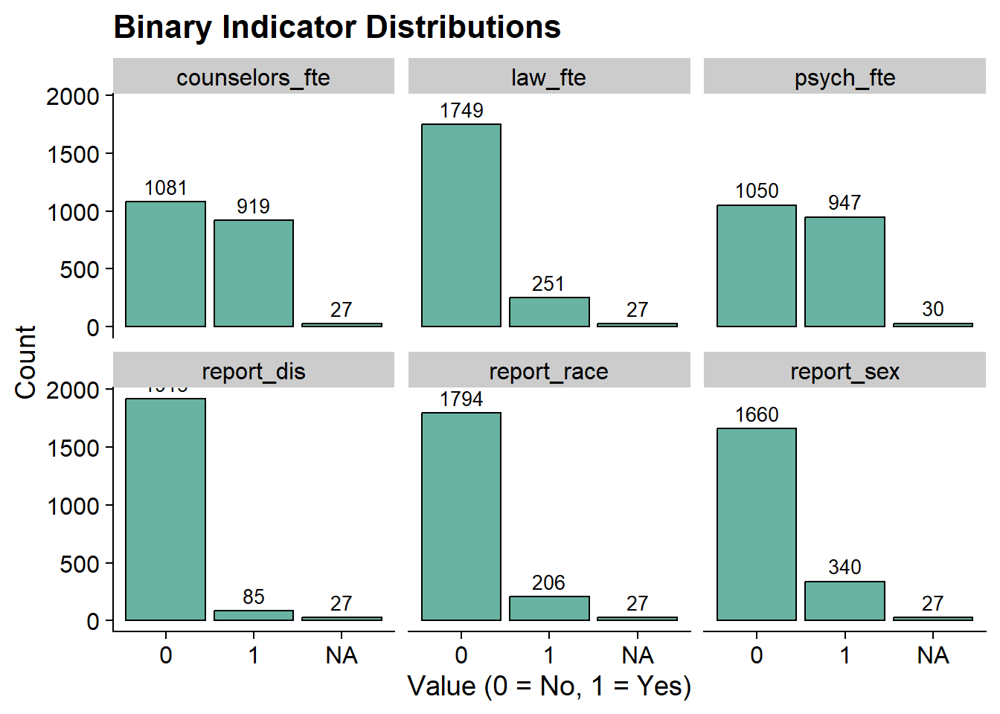
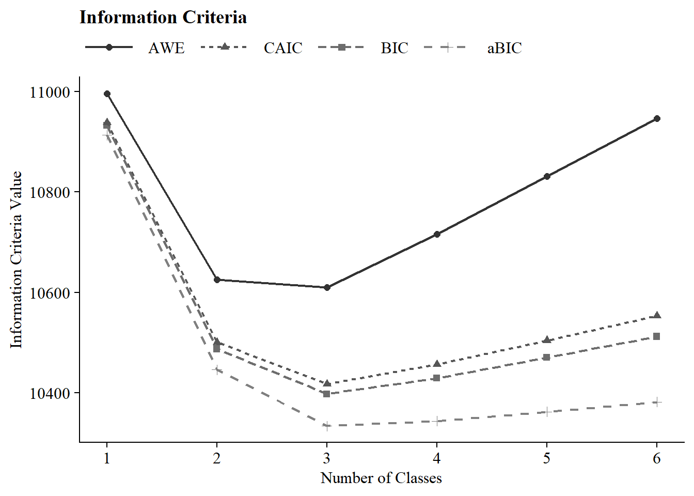

# (PART) Latent Class Analysis {-}

# Enumeration {#lca-enum}

------------------------------------------------------------------------

Example: Bullying in Schools

------------------------------------------------------------------------

To demonstrate mixture modeling in the training program and online resource components of the IES grant we utilize the *Civil Rights Data Collection (CRDC)*[@usdoe2014] data repository.
The CRDC is a federally mandated school-level data collection effort that occurs every other year.
This public data is currently available for selected latent class indicators across 4 years (2011, 2013, 2015, 2017) and all US states.
In this example, we use the Arizona state sample.
We utilize six focal indicators which constitute the latent class model in our example; three variables which report on harassment/bullying in schools based on disability, race, or sex, and three variables on full-time equivalent school staff hires (counselor, psychologist, law enforcement).
This data source also includes covariates on a variety of subjects and distal outcomes reported in 2018 such as math/reading assessments and graduation rates.

------------------------------------------------------------------------

Load packages


``` r
library(tidyverse)
library(haven)
library(glue)
library(MplusAutomation)
library(here)
library(janitor)
library(gt)
library(cowplot)
library(DiagrammeR) 
```

## Variable Description


```{=html}
<div id="resjgyluer" style="padding-left:0px;padding-right:0px;padding-top:10px;padding-bottom:10px;overflow-x:auto;overflow-y:auto;width:auto;height:auto;">
<style>#resjgyluer table {
  font-family: system-ui, 'Segoe UI', Roboto, Helvetica, Arial, sans-serif, 'Apple Color Emoji', 'Segoe UI Emoji', 'Segoe UI Symbol', 'Noto Color Emoji';
  -webkit-font-smoothing: antialiased;
  -moz-osx-font-smoothing: grayscale;
}

#resjgyluer thead, #resjgyluer tbody, #resjgyluer tfoot, #resjgyluer tr, #resjgyluer td, #resjgyluer th {
  border-style: none;
}

#resjgyluer p {
  margin: 0;
  padding: 0;
}

#resjgyluer .gt_table {
  display: table;
  border-collapse: collapse;
  line-height: normal;
  margin-left: auto;
  margin-right: auto;
  color: #333333;
  font-size: 16px;
  font-weight: normal;
  font-style: normal;
  background-color: #FFFFFF;
  width: 75%;
  border-top-style: solid;
  border-top-width: 2px;
  border-top-color: #A8A8A8;
  border-right-style: none;
  border-right-width: 2px;
  border-right-color: #D3D3D3;
  border-bottom-style: solid;
  border-bottom-width: 2px;
  border-bottom-color: #A8A8A8;
  border-left-style: none;
  border-left-width: 2px;
  border-left-color: #D3D3D3;
}

#resjgyluer .gt_caption {
  padding-top: 4px;
  padding-bottom: 4px;
}

#resjgyluer .gt_title {
  color: #333333;
  font-size: 125%;
  font-weight: initial;
  padding-top: 4px;
  padding-bottom: 4px;
  padding-left: 5px;
  padding-right: 5px;
  border-bottom-color: #FFFFFF;
  border-bottom-width: 0;
}

#resjgyluer .gt_subtitle {
  color: #333333;
  font-size: 85%;
  font-weight: initial;
  padding-top: 3px;
  padding-bottom: 5px;
  padding-left: 5px;
  padding-right: 5px;
  border-top-color: #FFFFFF;
  border-top-width: 0;
}

#resjgyluer .gt_heading {
  background-color: #FFFFFF;
  text-align: center;
  border-bottom-color: #FFFFFF;
  border-left-style: none;
  border-left-width: 1px;
  border-left-color: #D3D3D3;
  border-right-style: none;
  border-right-width: 1px;
  border-right-color: #D3D3D3;
}

#resjgyluer .gt_bottom_border {
  border-bottom-style: solid;
  border-bottom-width: 2px;
  border-bottom-color: #D3D3D3;
}

#resjgyluer .gt_col_headings {
  border-top-style: solid;
  border-top-width: 2px;
  border-top-color: #D3D3D3;
  border-bottom-style: solid;
  border-bottom-width: 2px;
  border-bottom-color: #D3D3D3;
  border-left-style: none;
  border-left-width: 1px;
  border-left-color: #D3D3D3;
  border-right-style: none;
  border-right-width: 1px;
  border-right-color: #D3D3D3;
}

#resjgyluer .gt_col_heading {
  color: #333333;
  background-color: #FFFFFF;
  font-size: 100%;
  font-weight: normal;
  text-transform: inherit;
  border-left-style: none;
  border-left-width: 1px;
  border-left-color: #D3D3D3;
  border-right-style: none;
  border-right-width: 1px;
  border-right-color: #D3D3D3;
  vertical-align: bottom;
  padding-top: 5px;
  padding-bottom: 6px;
  padding-left: 5px;
  padding-right: 5px;
  overflow-x: hidden;
}

#resjgyluer .gt_column_spanner_outer {
  color: #333333;
  background-color: #FFFFFF;
  font-size: 100%;
  font-weight: normal;
  text-transform: inherit;
  padding-top: 0;
  padding-bottom: 0;
  padding-left: 4px;
  padding-right: 4px;
}

#resjgyluer .gt_column_spanner_outer:first-child {
  padding-left: 0;
}

#resjgyluer .gt_column_spanner_outer:last-child {
  padding-right: 0;
}

#resjgyluer .gt_column_spanner {
  border-bottom-style: solid;
  border-bottom-width: 2px;
  border-bottom-color: #D3D3D3;
  vertical-align: bottom;
  padding-top: 5px;
  padding-bottom: 5px;
  overflow-x: hidden;
  display: inline-block;
  width: 100%;
}

#resjgyluer .gt_spanner_row {
  border-bottom-style: hidden;
}

#resjgyluer .gt_group_heading {
  padding-top: 8px;
  padding-bottom: 8px;
  padding-left: 5px;
  padding-right: 5px;
  color: #333333;
  background-color: #FFFFFF;
  font-size: 100%;
  font-weight: initial;
  text-transform: inherit;
  border-top-style: solid;
  border-top-width: 2px;
  border-top-color: #D3D3D3;
  border-bottom-style: solid;
  border-bottom-width: 2px;
  border-bottom-color: #D3D3D3;
  border-left-style: none;
  border-left-width: 1px;
  border-left-color: #D3D3D3;
  border-right-style: none;
  border-right-width: 1px;
  border-right-color: #D3D3D3;
  vertical-align: middle;
  text-align: left;
}

#resjgyluer .gt_empty_group_heading {
  padding: 0.5px;
  color: #333333;
  background-color: #FFFFFF;
  font-size: 100%;
  font-weight: initial;
  border-top-style: solid;
  border-top-width: 2px;
  border-top-color: #D3D3D3;
  border-bottom-style: solid;
  border-bottom-width: 2px;
  border-bottom-color: #D3D3D3;
  vertical-align: middle;
}

#resjgyluer .gt_from_md > :first-child {
  margin-top: 0;
}

#resjgyluer .gt_from_md > :last-child {
  margin-bottom: 0;
}

#resjgyluer .gt_row {
  padding-top: 8px;
  padding-bottom: 8px;
  padding-left: 5px;
  padding-right: 5px;
  margin: 10px;
  border-top-style: solid;
  border-top-width: 1px;
  border-top-color: #D3D3D3;
  border-left-style: none;
  border-left-width: 1px;
  border-left-color: #D3D3D3;
  border-right-style: none;
  border-right-width: 1px;
  border-right-color: #D3D3D3;
  vertical-align: middle;
  overflow-x: hidden;
}

#resjgyluer .gt_stub {
  color: #333333;
  background-color: #FFFFFF;
  font-size: 100%;
  font-weight: initial;
  text-transform: inherit;
  border-right-style: solid;
  border-right-width: 2px;
  border-right-color: #D3D3D3;
  padding-left: 5px;
  padding-right: 5px;
}

#resjgyluer .gt_stub_row_group {
  color: #333333;
  background-color: #FFFFFF;
  font-size: 100%;
  font-weight: initial;
  text-transform: inherit;
  border-right-style: solid;
  border-right-width: 2px;
  border-right-color: #D3D3D3;
  padding-left: 5px;
  padding-right: 5px;
  vertical-align: top;
}

#resjgyluer .gt_row_group_first td {
  border-top-width: 2px;
}

#resjgyluer .gt_row_group_first th {
  border-top-width: 2px;
}

#resjgyluer .gt_summary_row {
  color: #333333;
  background-color: #FFFFFF;
  text-transform: inherit;
  padding-top: 8px;
  padding-bottom: 8px;
  padding-left: 5px;
  padding-right: 5px;
}

#resjgyluer .gt_first_summary_row {
  border-top-style: solid;
  border-top-color: #D3D3D3;
}

#resjgyluer .gt_first_summary_row.thick {
  border-top-width: 2px;
}

#resjgyluer .gt_last_summary_row {
  padding-top: 8px;
  padding-bottom: 8px;
  padding-left: 5px;
  padding-right: 5px;
  border-bottom-style: solid;
  border-bottom-width: 2px;
  border-bottom-color: #D3D3D3;
}

#resjgyluer .gt_grand_summary_row {
  color: #333333;
  background-color: #FFFFFF;
  text-transform: inherit;
  padding-top: 8px;
  padding-bottom: 8px;
  padding-left: 5px;
  padding-right: 5px;
}

#resjgyluer .gt_first_grand_summary_row {
  padding-top: 8px;
  padding-bottom: 8px;
  padding-left: 5px;
  padding-right: 5px;
  border-top-style: double;
  border-top-width: 6px;
  border-top-color: #D3D3D3;
}

#resjgyluer .gt_last_grand_summary_row_top {
  padding-top: 8px;
  padding-bottom: 8px;
  padding-left: 5px;
  padding-right: 5px;
  border-bottom-style: double;
  border-bottom-width: 6px;
  border-bottom-color: #D3D3D3;
}

#resjgyluer .gt_striped {
  background-color: rgba(128, 128, 128, 0.05);
}

#resjgyluer .gt_table_body {
  border-top-style: solid;
  border-top-width: 2px;
  border-top-color: #D3D3D3;
  border-bottom-style: solid;
  border-bottom-width: 2px;
  border-bottom-color: #D3D3D3;
}

#resjgyluer .gt_footnotes {
  color: #333333;
  background-color: #FFFFFF;
  border-bottom-style: none;
  border-bottom-width: 2px;
  border-bottom-color: #D3D3D3;
  border-left-style: none;
  border-left-width: 2px;
  border-left-color: #D3D3D3;
  border-right-style: none;
  border-right-width: 2px;
  border-right-color: #D3D3D3;
}

#resjgyluer .gt_footnote {
  margin: 0px;
  font-size: 90%;
  padding-top: 4px;
  padding-bottom: 4px;
  padding-left: 5px;
  padding-right: 5px;
}

#resjgyluer .gt_sourcenotes {
  color: #333333;
  background-color: #FFFFFF;
  border-bottom-style: none;
  border-bottom-width: 2px;
  border-bottom-color: #D3D3D3;
  border-left-style: none;
  border-left-width: 2px;
  border-left-color: #D3D3D3;
  border-right-style: none;
  border-right-width: 2px;
  border-right-color: #D3D3D3;
}

#resjgyluer .gt_sourcenote {
  font-size: 90%;
  padding-top: 4px;
  padding-bottom: 4px;
  padding-left: 5px;
  padding-right: 5px;
}

#resjgyluer .gt_left {
  text-align: left;
}

#resjgyluer .gt_center {
  text-align: center;
}

#resjgyluer .gt_right {
  text-align: right;
  font-variant-numeric: tabular-nums;
}

#resjgyluer .gt_font_normal {
  font-weight: normal;
}

#resjgyluer .gt_font_bold {
  font-weight: bold;
}

#resjgyluer .gt_font_italic {
  font-style: italic;
}

#resjgyluer .gt_super {
  font-size: 65%;
}

#resjgyluer .gt_footnote_marks {
  font-size: 75%;
  vertical-align: 0.4em;
  position: initial;
}

#resjgyluer .gt_asterisk {
  font-size: 100%;
  vertical-align: 0;
}

#resjgyluer .gt_indent_1 {
  text-indent: 5px;
}

#resjgyluer .gt_indent_2 {
  text-indent: 10px;
}

#resjgyluer .gt_indent_3 {
  text-indent: 15px;
}

#resjgyluer .gt_indent_4 {
  text-indent: 20px;
}

#resjgyluer .gt_indent_5 {
  text-indent: 25px;
}

#resjgyluer .katex-display {
  display: inline-flex !important;
  margin-bottom: 0.75em !important;
}

#resjgyluer div.Reactable > div.rt-table > div.rt-thead > div.rt-tr.rt-tr-group-header > div.rt-th-group:after {
  height: 0px !important;
}
</style>
<table class="gt_table" data-quarto-disable-processing="false" data-quarto-bootstrap="false">
  <thead>
    <tr class="gt_heading">
      <td colspan="3" class="gt_heading gt_title gt_font_normal gt_bottom_border" style>LCA indicators<span class="gt_footnote_marks" style="white-space:nowrap;font-style:italic;font-weight:normal;line-height:0;"><sup>1</sup></span></td>
    </tr>
    
    <tr class="gt_col_headings">
      <th class="gt_col_heading gt_columns_bottom_border gt_left" rowspan="1" colspan="1" scope="col" id="Name">Name</th>
      <th class="gt_col_heading gt_columns_bottom_border gt_left" rowspan="1" colspan="1" scope="col" id="Label">Label</th>
      <th class="gt_col_heading gt_columns_bottom_border gt_left" rowspan="1" colspan="1" scope="col" id="Values">Values</th>
    </tr>
  </thead>
  <tbody class="gt_table_body">
    <tr><td headers="Name" class="gt_row gt_left">leaid</td>
<td headers="Label" class="gt_row gt_left">District Identification Code</td>
<td headers="Values" class="gt_row gt_left"></td></tr>
    <tr><td headers="Name" class="gt_row gt_left">ncessch</td>
<td headers="Label" class="gt_row gt_left">School Identification Code</td>
<td headers="Values" class="gt_row gt_left"></td></tr>
    <tr><td headers="Name" class="gt_row gt_left">report_dis</td>
<td headers="Label" class="gt_row gt_left">Number of students harassed or bullied on the basis of disability</td>
<td headers="Values" class="gt_row gt_left">0 = No reported incidents, 1 = At least one reported incident</td></tr>
    <tr><td headers="Name" class="gt_row gt_left">report_race</td>
<td headers="Label" class="gt_row gt_left">Number of students harassed or bullied on the basis of race, color, or national origin</td>
<td headers="Values" class="gt_row gt_left">0 = No reported incidents, 1 = At least one reported incident</td></tr>
    <tr><td headers="Name" class="gt_row gt_left">report_sex</td>
<td headers="Label" class="gt_row gt_left">Number of students harassed or bullied on the basis of sex</td>
<td headers="Values" class="gt_row gt_left">0 = No reported incidents, 1 = At least one reported incident</td></tr>
    <tr><td headers="Name" class="gt_row gt_left">counselors_fte</td>
<td headers="Label" class="gt_row gt_left">Number of full time equivalent counselors hired as school staff</td>
<td headers="Values" class="gt_row gt_left">0 = No staff present, 1 = At least one staff present</td></tr>
    <tr><td headers="Name" class="gt_row gt_left">psych_fte</td>
<td headers="Label" class="gt_row gt_left">Number of full time equivalent psychologists hired as school staff</td>
<td headers="Values" class="gt_row gt_left">0 = No staff present, 1 = At least one staff present</td></tr>
    <tr><td headers="Name" class="gt_row gt_left">law_fte</td>
<td headers="Label" class="gt_row gt_left">Number of full time equivalent law enforcement officers hired as school staff</td>
<td headers="Values" class="gt_row gt_left">0 = No staff present, 1 = At least one staff present</td></tr>
  </tbody>
  
  <tfoot class="gt_footnotes">
    <tr>
      <td class="gt_footnote" colspan="3"><span class="gt_footnote_marks" style="white-space:nowrap;font-style:italic;font-weight:normal;line-height:0;"><sup>1</sup></span> Civil Rights Data Collection (CRDC)</td>
    </tr>
  </tfoot>
</table>
</div>
```


------------------------------------------------------------------------

**Variables have been transformed to be dichotomous indicators using the following coding strategy**

Harassment and bullying count variables are recoded `1` if the school reported at least one incident of harassment (`0` indicates no reported incidents).
On the original scale reported by the CDRC staff variables for full time equivalent employees (FTE) are represented as `1` and part time employees are represented by values between `1` and `0`.
Schools with greater than one staff of the designated type are represented by values greater than 1.
All values greater than zero were recorded as `1s` (e.g., `.5`, `1`,`3`) indicating that the school has a staff present on campus at least part time.
Schools with no staff of the designated type are indicated as `0` for the dichotomous variable.

------------------------------------------------------------------------


```{=html}
<div class="grViz html-widget html-fill-item" id="htmlwidget-783e1e0fdd846d03d01b" style="width:672px;height:480px;"></div>
<script type="application/json" data-for="htmlwidget-783e1e0fdd846d03d01b">{"x":{"diagram":" digraph cfa_model {\n\n# The `graph` statement - No editing needed\n\n    graph [layout = dot, overlap = true]\n \n# Two `node` statements\n \n# One for measured variables (box) \n\n    node [shape=box]\n    report_dis report_race report_sex counselors_fte psych_fte law_fte;\n \n# One for latent variables (circle) \n \n    node [shape=circle]\n    bully [label=<Bullying <br/>C<sub>k<\/sub>>];\n    \n# `edge` statements\n \n    edge [minlen = 2]\n    bully -> {report_dis report_race report_sex counselors_fte psych_fte law_fte}\n \n }","config":{"engine":"dot","options":null}},"evals":[],"jsHooks":[]}</script>
```


------------------------------------------------------------------------

## Prepare Data


``` r
df_bully <- read_csv(here("data", "crdc_lca_data.csv")) %>% 
  clean_names() %>% 
  dplyr::select(report_dis, report_race, report_sex, counselors_fte, psych_fte, law_fte) 
```

------------------------------------------------------------------------

## Descriptive Statistics


``` r
dframe <- df_bully %>%
  pivot_longer(
    c(report_dis, report_race, report_sex, counselors_fte, psych_fte, law_fte),
    names_to = "Variable"
  ) %>%
  group_by(Variable) %>%
  summarise(
    Count = sum(value == 1, na.rm = TRUE),
    Total = n(),
    .groups = "drop"
  ) %>%
  mutate(`Proportion Endorsed` = round(Count / Total, 3)) %>%
  select(Variable, `Proportion Endorsed`, Count)

gt(dframe) %>%
  tab_header(
    title = md("**LCA Indicator Endorsement**"),
    subtitle = md("&nbsp;")
  ) %>%
  tab_options(
    column_labels.font.weight = "bold",
    row_group.font.weight = "bold"
  )
```


```{=html}
<div id="ypendqcjjc" style="padding-left:0px;padding-right:0px;padding-top:10px;padding-bottom:10px;overflow-x:auto;overflow-y:auto;width:auto;height:auto;">
<style>#ypendqcjjc table {
  font-family: system-ui, 'Segoe UI', Roboto, Helvetica, Arial, sans-serif, 'Apple Color Emoji', 'Segoe UI Emoji', 'Segoe UI Symbol', 'Noto Color Emoji';
  -webkit-font-smoothing: antialiased;
  -moz-osx-font-smoothing: grayscale;
}

#ypendqcjjc thead, #ypendqcjjc tbody, #ypendqcjjc tfoot, #ypendqcjjc tr, #ypendqcjjc td, #ypendqcjjc th {
  border-style: none;
}

#ypendqcjjc p {
  margin: 0;
  padding: 0;
}

#ypendqcjjc .gt_table {
  display: table;
  border-collapse: collapse;
  line-height: normal;
  margin-left: auto;
  margin-right: auto;
  color: #333333;
  font-size: 16px;
  font-weight: normal;
  font-style: normal;
  background-color: #FFFFFF;
  width: auto;
  border-top-style: solid;
  border-top-width: 2px;
  border-top-color: #A8A8A8;
  border-right-style: none;
  border-right-width: 2px;
  border-right-color: #D3D3D3;
  border-bottom-style: solid;
  border-bottom-width: 2px;
  border-bottom-color: #A8A8A8;
  border-left-style: none;
  border-left-width: 2px;
  border-left-color: #D3D3D3;
}

#ypendqcjjc .gt_caption {
  padding-top: 4px;
  padding-bottom: 4px;
}

#ypendqcjjc .gt_title {
  color: #333333;
  font-size: 125%;
  font-weight: initial;
  padding-top: 4px;
  padding-bottom: 4px;
  padding-left: 5px;
  padding-right: 5px;
  border-bottom-color: #FFFFFF;
  border-bottom-width: 0;
}

#ypendqcjjc .gt_subtitle {
  color: #333333;
  font-size: 85%;
  font-weight: initial;
  padding-top: 3px;
  padding-bottom: 5px;
  padding-left: 5px;
  padding-right: 5px;
  border-top-color: #FFFFFF;
  border-top-width: 0;
}

#ypendqcjjc .gt_heading {
  background-color: #FFFFFF;
  text-align: center;
  border-bottom-color: #FFFFFF;
  border-left-style: none;
  border-left-width: 1px;
  border-left-color: #D3D3D3;
  border-right-style: none;
  border-right-width: 1px;
  border-right-color: #D3D3D3;
}

#ypendqcjjc .gt_bottom_border {
  border-bottom-style: solid;
  border-bottom-width: 2px;
  border-bottom-color: #D3D3D3;
}

#ypendqcjjc .gt_col_headings {
  border-top-style: solid;
  border-top-width: 2px;
  border-top-color: #D3D3D3;
  border-bottom-style: solid;
  border-bottom-width: 2px;
  border-bottom-color: #D3D3D3;
  border-left-style: none;
  border-left-width: 1px;
  border-left-color: #D3D3D3;
  border-right-style: none;
  border-right-width: 1px;
  border-right-color: #D3D3D3;
}

#ypendqcjjc .gt_col_heading {
  color: #333333;
  background-color: #FFFFFF;
  font-size: 100%;
  font-weight: bold;
  text-transform: inherit;
  border-left-style: none;
  border-left-width: 1px;
  border-left-color: #D3D3D3;
  border-right-style: none;
  border-right-width: 1px;
  border-right-color: #D3D3D3;
  vertical-align: bottom;
  padding-top: 5px;
  padding-bottom: 6px;
  padding-left: 5px;
  padding-right: 5px;
  overflow-x: hidden;
}

#ypendqcjjc .gt_column_spanner_outer {
  color: #333333;
  background-color: #FFFFFF;
  font-size: 100%;
  font-weight: bold;
  text-transform: inherit;
  padding-top: 0;
  padding-bottom: 0;
  padding-left: 4px;
  padding-right: 4px;
}

#ypendqcjjc .gt_column_spanner_outer:first-child {
  padding-left: 0;
}

#ypendqcjjc .gt_column_spanner_outer:last-child {
  padding-right: 0;
}

#ypendqcjjc .gt_column_spanner {
  border-bottom-style: solid;
  border-bottom-width: 2px;
  border-bottom-color: #D3D3D3;
  vertical-align: bottom;
  padding-top: 5px;
  padding-bottom: 5px;
  overflow-x: hidden;
  display: inline-block;
  width: 100%;
}

#ypendqcjjc .gt_spanner_row {
  border-bottom-style: hidden;
}

#ypendqcjjc .gt_group_heading {
  padding-top: 8px;
  padding-bottom: 8px;
  padding-left: 5px;
  padding-right: 5px;
  color: #333333;
  background-color: #FFFFFF;
  font-size: 100%;
  font-weight: bold;
  text-transform: inherit;
  border-top-style: solid;
  border-top-width: 2px;
  border-top-color: #D3D3D3;
  border-bottom-style: solid;
  border-bottom-width: 2px;
  border-bottom-color: #D3D3D3;
  border-left-style: none;
  border-left-width: 1px;
  border-left-color: #D3D3D3;
  border-right-style: none;
  border-right-width: 1px;
  border-right-color: #D3D3D3;
  vertical-align: middle;
  text-align: left;
}

#ypendqcjjc .gt_empty_group_heading {
  padding: 0.5px;
  color: #333333;
  background-color: #FFFFFF;
  font-size: 100%;
  font-weight: bold;
  border-top-style: solid;
  border-top-width: 2px;
  border-top-color: #D3D3D3;
  border-bottom-style: solid;
  border-bottom-width: 2px;
  border-bottom-color: #D3D3D3;
  vertical-align: middle;
}

#ypendqcjjc .gt_from_md > :first-child {
  margin-top: 0;
}

#ypendqcjjc .gt_from_md > :last-child {
  margin-bottom: 0;
}

#ypendqcjjc .gt_row {
  padding-top: 8px;
  padding-bottom: 8px;
  padding-left: 5px;
  padding-right: 5px;
  margin: 10px;
  border-top-style: solid;
  border-top-width: 1px;
  border-top-color: #D3D3D3;
  border-left-style: none;
  border-left-width: 1px;
  border-left-color: #D3D3D3;
  border-right-style: none;
  border-right-width: 1px;
  border-right-color: #D3D3D3;
  vertical-align: middle;
  overflow-x: hidden;
}

#ypendqcjjc .gt_stub {
  color: #333333;
  background-color: #FFFFFF;
  font-size: 100%;
  font-weight: initial;
  text-transform: inherit;
  border-right-style: solid;
  border-right-width: 2px;
  border-right-color: #D3D3D3;
  padding-left: 5px;
  padding-right: 5px;
}

#ypendqcjjc .gt_stub_row_group {
  color: #333333;
  background-color: #FFFFFF;
  font-size: 100%;
  font-weight: initial;
  text-transform: inherit;
  border-right-style: solid;
  border-right-width: 2px;
  border-right-color: #D3D3D3;
  padding-left: 5px;
  padding-right: 5px;
  vertical-align: top;
}

#ypendqcjjc .gt_row_group_first td {
  border-top-width: 2px;
}

#ypendqcjjc .gt_row_group_first th {
  border-top-width: 2px;
}

#ypendqcjjc .gt_summary_row {
  color: #333333;
  background-color: #FFFFFF;
  text-transform: inherit;
  padding-top: 8px;
  padding-bottom: 8px;
  padding-left: 5px;
  padding-right: 5px;
}

#ypendqcjjc .gt_first_summary_row {
  border-top-style: solid;
  border-top-color: #D3D3D3;
}

#ypendqcjjc .gt_first_summary_row.thick {
  border-top-width: 2px;
}

#ypendqcjjc .gt_last_summary_row {
  padding-top: 8px;
  padding-bottom: 8px;
  padding-left: 5px;
  padding-right: 5px;
  border-bottom-style: solid;
  border-bottom-width: 2px;
  border-bottom-color: #D3D3D3;
}

#ypendqcjjc .gt_grand_summary_row {
  color: #333333;
  background-color: #FFFFFF;
  text-transform: inherit;
  padding-top: 8px;
  padding-bottom: 8px;
  padding-left: 5px;
  padding-right: 5px;
}

#ypendqcjjc .gt_first_grand_summary_row {
  padding-top: 8px;
  padding-bottom: 8px;
  padding-left: 5px;
  padding-right: 5px;
  border-top-style: double;
  border-top-width: 6px;
  border-top-color: #D3D3D3;
}

#ypendqcjjc .gt_last_grand_summary_row_top {
  padding-top: 8px;
  padding-bottom: 8px;
  padding-left: 5px;
  padding-right: 5px;
  border-bottom-style: double;
  border-bottom-width: 6px;
  border-bottom-color: #D3D3D3;
}

#ypendqcjjc .gt_striped {
  background-color: rgba(128, 128, 128, 0.05);
}

#ypendqcjjc .gt_table_body {
  border-top-style: solid;
  border-top-width: 2px;
  border-top-color: #D3D3D3;
  border-bottom-style: solid;
  border-bottom-width: 2px;
  border-bottom-color: #D3D3D3;
}

#ypendqcjjc .gt_footnotes {
  color: #333333;
  background-color: #FFFFFF;
  border-bottom-style: none;
  border-bottom-width: 2px;
  border-bottom-color: #D3D3D3;
  border-left-style: none;
  border-left-width: 2px;
  border-left-color: #D3D3D3;
  border-right-style: none;
  border-right-width: 2px;
  border-right-color: #D3D3D3;
}

#ypendqcjjc .gt_footnote {
  margin: 0px;
  font-size: 90%;
  padding-top: 4px;
  padding-bottom: 4px;
  padding-left: 5px;
  padding-right: 5px;
}

#ypendqcjjc .gt_sourcenotes {
  color: #333333;
  background-color: #FFFFFF;
  border-bottom-style: none;
  border-bottom-width: 2px;
  border-bottom-color: #D3D3D3;
  border-left-style: none;
  border-left-width: 2px;
  border-left-color: #D3D3D3;
  border-right-style: none;
  border-right-width: 2px;
  border-right-color: #D3D3D3;
}

#ypendqcjjc .gt_sourcenote {
  font-size: 90%;
  padding-top: 4px;
  padding-bottom: 4px;
  padding-left: 5px;
  padding-right: 5px;
}

#ypendqcjjc .gt_left {
  text-align: left;
}

#ypendqcjjc .gt_center {
  text-align: center;
}

#ypendqcjjc .gt_right {
  text-align: right;
  font-variant-numeric: tabular-nums;
}

#ypendqcjjc .gt_font_normal {
  font-weight: normal;
}

#ypendqcjjc .gt_font_bold {
  font-weight: bold;
}

#ypendqcjjc .gt_font_italic {
  font-style: italic;
}

#ypendqcjjc .gt_super {
  font-size: 65%;
}

#ypendqcjjc .gt_footnote_marks {
  font-size: 75%;
  vertical-align: 0.4em;
  position: initial;
}

#ypendqcjjc .gt_asterisk {
  font-size: 100%;
  vertical-align: 0;
}

#ypendqcjjc .gt_indent_1 {
  text-indent: 5px;
}

#ypendqcjjc .gt_indent_2 {
  text-indent: 10px;
}

#ypendqcjjc .gt_indent_3 {
  text-indent: 15px;
}

#ypendqcjjc .gt_indent_4 {
  text-indent: 20px;
}

#ypendqcjjc .gt_indent_5 {
  text-indent: 25px;
}

#ypendqcjjc .katex-display {
  display: inline-flex !important;
  margin-bottom: 0.75em !important;
}

#ypendqcjjc div.Reactable > div.rt-table > div.rt-thead > div.rt-tr.rt-tr-group-header > div.rt-th-group:after {
  height: 0px !important;
}
</style>
<table class="gt_table" data-quarto-disable-processing="false" data-quarto-bootstrap="false">
  <thead>
    <tr class="gt_heading">
      <td colspan="3" class="gt_heading gt_title gt_font_normal" style><span class='gt_from_md'><strong>LCA Indicator Endorsement</strong></span></td>
    </tr>
    <tr class="gt_heading">
      <td colspan="3" class="gt_heading gt_subtitle gt_font_normal gt_bottom_border" style><span class='gt_from_md'> </span></td>
    </tr>
    <tr class="gt_col_headings">
      <th class="gt_col_heading gt_columns_bottom_border gt_left" rowspan="1" colspan="1" scope="col" id="Variable">Variable</th>
      <th class="gt_col_heading gt_columns_bottom_border gt_right" rowspan="1" colspan="1" scope="col" id="Proportion-Endorsed">Proportion Endorsed</th>
      <th class="gt_col_heading gt_columns_bottom_border gt_right" rowspan="1" colspan="1" scope="col" id="Count">Count</th>
    </tr>
  </thead>
  <tbody class="gt_table_body">
    <tr><td headers="Variable" class="gt_row gt_left">counselors_fte</td>
<td headers="Proportion Endorsed" class="gt_row gt_right">0.453</td>
<td headers="Count" class="gt_row gt_right">919</td></tr>
    <tr><td headers="Variable" class="gt_row gt_left">law_fte</td>
<td headers="Proportion Endorsed" class="gt_row gt_right">0.124</td>
<td headers="Count" class="gt_row gt_right">251</td></tr>
    <tr><td headers="Variable" class="gt_row gt_left">psych_fte</td>
<td headers="Proportion Endorsed" class="gt_row gt_right">0.467</td>
<td headers="Count" class="gt_row gt_right">947</td></tr>
    <tr><td headers="Variable" class="gt_row gt_left">report_dis</td>
<td headers="Proportion Endorsed" class="gt_row gt_right">0.042</td>
<td headers="Count" class="gt_row gt_right">85</td></tr>
    <tr><td headers="Variable" class="gt_row gt_left">report_race</td>
<td headers="Proportion Endorsed" class="gt_row gt_right">0.102</td>
<td headers="Count" class="gt_row gt_right">206</td></tr>
    <tr><td headers="Variable" class="gt_row gt_left">report_sex</td>
<td headers="Proportion Endorsed" class="gt_row gt_right">0.168</td>
<td headers="Count" class="gt_row gt_right">340</td></tr>
  </tbody>
  
  
</table>
</div>
```


Save as image


``` r
gtsave(prop_table, here("figures", "prop_table.png"))
```

Frequency Plot


``` r
data_long <- df_bully %>%
  pivot_longer(c(report_dis, report_race, report_sex, counselors_fte, psych_fte, law_fte), names_to = "variable")

# Bar plot for 0/1 indicators
ggplot(data_long, aes(x = factor(value))) +
  geom_bar(fill = "#69b3a2", color = "black") +
  geom_text(stat = "count", aes(label = after_stat(count)), 
            vjust = -0.5, size = 3.5) +
  facet_wrap(~ variable) +
  labs(
    title = "Binary Indicator Distributions",
    x = "Value (0 = No, 1 = Yes)",
    y = "Count"
  ) +
  theme_cowplot()
```



------------------------------------------------------------------------

## Enumeration

This code uses the `mplusObject` function in the `MplusAutomation` package and saves all model runs in the `enum` folder.


``` r

lca_6  <- lapply(1:6, function(k) {
  lca_enum  <- mplusObject(
      
    TITLE = glue("{k}-Class"), 
  
    VARIABLE = glue(
    "categorical = report_dis-law_fte; 
     usevar = report_dis-law_fte;
     classes = c({k}); "),
  
  ANALYSIS = 
   "estimator = mlr; 
    type = mixture;
    starts = 200 100; 
    processors = 10;",
  
  OUTPUT = "sampstat residual tech11 tech14;",
  
  PLOT = 
    "type = plot3; 
    series = report_dis-law_fte(*);",
  
  usevariables = colnames(df_bully),
  rdata = df_bully)

lca_enum_fit <- mplusModeler(lca_enum, 
                            dataout=glue(here("enum", "bully.dat")),
                            modelout=glue(here("enum", "c{k}_bully.inp")) ,
                            check=TRUE, run = TRUE, hashfilename = FALSE)
})

```

**IMPORTANT**: Before moving forward, make sure to open each output document to ensure models were estimated normally. 

------------------------------------------------------------------------

## Examine and extract Mplus files

Code by Delwin Carter (2025)

Check all Models for:

1. Warnings  
2. Errors  
3. Convergence and Loglikelihood Replication Information


``` r
source(here("functions", "extract_mplus_info.R"))

# Define the directory where all of the .out files are located.
output_dir <- here("enum")

# Get all .out files
output_files <- list.files(output_dir, pattern = "\\.out$", full.names = TRUE)

# Process all .out files into one dataframe
final_data <- map_dfr(output_files, extract_mplus_info_extended)

# Extract Sample_Size from final_data
sample_size <- unique(final_data$Sample_Size)

```

### Examine Mplus Warnings


``` r
source(here("functions", "extract_warnings.R"))

warnings_table <- extract_warnings(final_data)
warnings_table
```


```{=html}
<div id="wtvtufwucv" style="padding-left:0px;padding-right:0px;padding-top:10px;padding-bottom:10px;overflow-x:auto;overflow-y:auto;width:auto;height:auto;">
<style>#wtvtufwucv table {
  font-family: system-ui, 'Segoe UI', Roboto, Helvetica, Arial, sans-serif, 'Apple Color Emoji', 'Segoe UI Emoji', 'Segoe UI Symbol', 'Noto Color Emoji';
  -webkit-font-smoothing: antialiased;
  -moz-osx-font-smoothing: grayscale;
}

#wtvtufwucv thead, #wtvtufwucv tbody, #wtvtufwucv tfoot, #wtvtufwucv tr, #wtvtufwucv td, #wtvtufwucv th {
  border-style: none;
}

#wtvtufwucv p {
  margin: 0;
  padding: 0;
}

#wtvtufwucv .gt_table {
  display: table;
  border-collapse: collapse;
  line-height: normal;
  margin-left: auto;
  margin-right: auto;
  color: #333333;
  font-size: 16px;
  font-weight: normal;
  font-style: normal;
  background-color: #FFFFFF;
  width: 100%;
  border-top-style: solid;
  border-top-width: 2px;
  border-top-color: #A8A8A8;
  border-right-style: none;
  border-right-width: 2px;
  border-right-color: #D3D3D3;
  border-bottom-style: solid;
  border-bottom-width: 2px;
  border-bottom-color: #A8A8A8;
  border-left-style: none;
  border-left-width: 2px;
  border-left-color: #D3D3D3;
}

#wtvtufwucv .gt_caption {
  padding-top: 4px;
  padding-bottom: 4px;
}

#wtvtufwucv .gt_title {
  color: #333333;
  font-size: 125%;
  font-weight: initial;
  padding-top: 4px;
  padding-bottom: 4px;
  padding-left: 5px;
  padding-right: 5px;
  border-bottom-color: #FFFFFF;
  border-bottom-width: 0;
}

#wtvtufwucv .gt_subtitle {
  color: #333333;
  font-size: 85%;
  font-weight: initial;
  padding-top: 3px;
  padding-bottom: 5px;
  padding-left: 5px;
  padding-right: 5px;
  border-top-color: #FFFFFF;
  border-top-width: 0;
}

#wtvtufwucv .gt_heading {
  background-color: #FFFFFF;
  text-align: center;
  border-bottom-color: #FFFFFF;
  border-left-style: none;
  border-left-width: 1px;
  border-left-color: #D3D3D3;
  border-right-style: none;
  border-right-width: 1px;
  border-right-color: #D3D3D3;
}

#wtvtufwucv .gt_bottom_border {
  border-bottom-style: solid;
  border-bottom-width: 2px;
  border-bottom-color: #D3D3D3;
}

#wtvtufwucv .gt_col_headings {
  border-top-style: solid;
  border-top-width: 2px;
  border-top-color: #D3D3D3;
  border-bottom-style: solid;
  border-bottom-width: 2px;
  border-bottom-color: #D3D3D3;
  border-left-style: none;
  border-left-width: 1px;
  border-left-color: #D3D3D3;
  border-right-style: none;
  border-right-width: 1px;
  border-right-color: #D3D3D3;
}

#wtvtufwucv .gt_col_heading {
  color: #333333;
  background-color: #FFFFFF;
  font-size: 100%;
  font-weight: normal;
  text-transform: inherit;
  border-left-style: none;
  border-left-width: 1px;
  border-left-color: #D3D3D3;
  border-right-style: none;
  border-right-width: 1px;
  border-right-color: #D3D3D3;
  vertical-align: bottom;
  padding-top: 5px;
  padding-bottom: 6px;
  padding-left: 5px;
  padding-right: 5px;
  overflow-x: hidden;
}

#wtvtufwucv .gt_column_spanner_outer {
  color: #333333;
  background-color: #FFFFFF;
  font-size: 100%;
  font-weight: normal;
  text-transform: inherit;
  padding-top: 0;
  padding-bottom: 0;
  padding-left: 4px;
  padding-right: 4px;
}

#wtvtufwucv .gt_column_spanner_outer:first-child {
  padding-left: 0;
}

#wtvtufwucv .gt_column_spanner_outer:last-child {
  padding-right: 0;
}

#wtvtufwucv .gt_column_spanner {
  border-bottom-style: solid;
  border-bottom-width: 2px;
  border-bottom-color: #D3D3D3;
  vertical-align: bottom;
  padding-top: 5px;
  padding-bottom: 5px;
  overflow-x: hidden;
  display: inline-block;
  width: 100%;
}

#wtvtufwucv .gt_spanner_row {
  border-bottom-style: hidden;
}

#wtvtufwucv .gt_group_heading {
  padding-top: 8px;
  padding-bottom: 8px;
  padding-left: 5px;
  padding-right: 5px;
  color: #333333;
  background-color: #FFFFFF;
  font-size: 100%;
  font-weight: initial;
  text-transform: inherit;
  border-top-style: solid;
  border-top-width: 2px;
  border-top-color: #D3D3D3;
  border-bottom-style: solid;
  border-bottom-width: 2px;
  border-bottom-color: #D3D3D3;
  border-left-style: none;
  border-left-width: 1px;
  border-left-color: #D3D3D3;
  border-right-style: none;
  border-right-width: 1px;
  border-right-color: #D3D3D3;
  vertical-align: middle;
  text-align: left;
}

#wtvtufwucv .gt_empty_group_heading {
  padding: 0.5px;
  color: #333333;
  background-color: #FFFFFF;
  font-size: 100%;
  font-weight: initial;
  border-top-style: solid;
  border-top-width: 2px;
  border-top-color: #D3D3D3;
  border-bottom-style: solid;
  border-bottom-width: 2px;
  border-bottom-color: #D3D3D3;
  vertical-align: middle;
}

#wtvtufwucv .gt_from_md > :first-child {
  margin-top: 0;
}

#wtvtufwucv .gt_from_md > :last-child {
  margin-bottom: 0;
}

#wtvtufwucv .gt_row {
  padding-top: 8px;
  padding-bottom: 8px;
  padding-left: 5px;
  padding-right: 5px;
  margin: 10px;
  border-top-style: solid;
  border-top-width: 1px;
  border-top-color: #D3D3D3;
  border-left-style: none;
  border-left-width: 1px;
  border-left-color: #D3D3D3;
  border-right-style: none;
  border-right-width: 1px;
  border-right-color: #D3D3D3;
  vertical-align: middle;
  overflow-x: hidden;
}

#wtvtufwucv .gt_stub {
  color: #333333;
  background-color: #FFFFFF;
  font-size: 100%;
  font-weight: initial;
  text-transform: inherit;
  border-right-style: solid;
  border-right-width: 2px;
  border-right-color: #D3D3D3;
  padding-left: 5px;
  padding-right: 5px;
}

#wtvtufwucv .gt_stub_row_group {
  color: #333333;
  background-color: #FFFFFF;
  font-size: 100%;
  font-weight: initial;
  text-transform: inherit;
  border-right-style: solid;
  border-right-width: 2px;
  border-right-color: #D3D3D3;
  padding-left: 5px;
  padding-right: 5px;
  vertical-align: top;
}

#wtvtufwucv .gt_row_group_first td {
  border-top-width: 2px;
}

#wtvtufwucv .gt_row_group_first th {
  border-top-width: 2px;
}

#wtvtufwucv .gt_summary_row {
  color: #333333;
  background-color: #FFFFFF;
  text-transform: inherit;
  padding-top: 8px;
  padding-bottom: 8px;
  padding-left: 5px;
  padding-right: 5px;
}

#wtvtufwucv .gt_first_summary_row {
  border-top-style: solid;
  border-top-color: #D3D3D3;
}

#wtvtufwucv .gt_first_summary_row.thick {
  border-top-width: 2px;
}

#wtvtufwucv .gt_last_summary_row {
  padding-top: 8px;
  padding-bottom: 8px;
  padding-left: 5px;
  padding-right: 5px;
  border-bottom-style: solid;
  border-bottom-width: 2px;
  border-bottom-color: #D3D3D3;
}

#wtvtufwucv .gt_grand_summary_row {
  color: #333333;
  background-color: #FFFFFF;
  text-transform: inherit;
  padding-top: 8px;
  padding-bottom: 8px;
  padding-left: 5px;
  padding-right: 5px;
}

#wtvtufwucv .gt_first_grand_summary_row {
  padding-top: 8px;
  padding-bottom: 8px;
  padding-left: 5px;
  padding-right: 5px;
  border-top-style: double;
  border-top-width: 6px;
  border-top-color: #D3D3D3;
}

#wtvtufwucv .gt_last_grand_summary_row_top {
  padding-top: 8px;
  padding-bottom: 8px;
  padding-left: 5px;
  padding-right: 5px;
  border-bottom-style: double;
  border-bottom-width: 6px;
  border-bottom-color: #D3D3D3;
}

#wtvtufwucv .gt_striped {
  background-color: rgba(128, 128, 128, 0.05);
}

#wtvtufwucv .gt_table_body {
  border-top-style: solid;
  border-top-width: 2px;
  border-top-color: #D3D3D3;
  border-bottom-style: solid;
  border-bottom-width: 2px;
  border-bottom-color: #D3D3D3;
}

#wtvtufwucv .gt_footnotes {
  color: #333333;
  background-color: #FFFFFF;
  border-bottom-style: none;
  border-bottom-width: 2px;
  border-bottom-color: #D3D3D3;
  border-left-style: none;
  border-left-width: 2px;
  border-left-color: #D3D3D3;
  border-right-style: none;
  border-right-width: 2px;
  border-right-color: #D3D3D3;
}

#wtvtufwucv .gt_footnote {
  margin: 0px;
  font-size: 90%;
  padding-top: 4px;
  padding-bottom: 4px;
  padding-left: 5px;
  padding-right: 5px;
}

#wtvtufwucv .gt_sourcenotes {
  color: #333333;
  background-color: #FFFFFF;
  border-bottom-style: none;
  border-bottom-width: 2px;
  border-bottom-color: #D3D3D3;
  border-left-style: none;
  border-left-width: 2px;
  border-left-color: #D3D3D3;
  border-right-style: none;
  border-right-width: 2px;
  border-right-color: #D3D3D3;
}

#wtvtufwucv .gt_sourcenote {
  font-size: 90%;
  padding-top: 4px;
  padding-bottom: 4px;
  padding-left: 5px;
  padding-right: 5px;
}

#wtvtufwucv .gt_left {
  text-align: left;
}

#wtvtufwucv .gt_center {
  text-align: center;
}

#wtvtufwucv .gt_right {
  text-align: right;
  font-variant-numeric: tabular-nums;
}

#wtvtufwucv .gt_font_normal {
  font-weight: normal;
}

#wtvtufwucv .gt_font_bold {
  font-weight: bold;
}

#wtvtufwucv .gt_font_italic {
  font-style: italic;
}

#wtvtufwucv .gt_super {
  font-size: 65%;
}

#wtvtufwucv .gt_footnote_marks {
  font-size: 75%;
  vertical-align: 0.4em;
  position: initial;
}

#wtvtufwucv .gt_asterisk {
  font-size: 100%;
  vertical-align: 0;
}

#wtvtufwucv .gt_indent_1 {
  text-indent: 5px;
}

#wtvtufwucv .gt_indent_2 {
  text-indent: 10px;
}

#wtvtufwucv .gt_indent_3 {
  text-indent: 15px;
}

#wtvtufwucv .gt_indent_4 {
  text-indent: 20px;
}

#wtvtufwucv .gt_indent_5 {
  text-indent: 25px;
}

#wtvtufwucv .katex-display {
  display: inline-flex !important;
  margin-bottom: 0.75em !important;
}

#wtvtufwucv div.Reactable > div.rt-table > div.rt-thead > div.rt-tr.rt-tr-group-header > div.rt-th-group:after {
  height: 0px !important;
}
</style>
<table class="gt_table" style="table-layout:fixed;width:100%;" data-quarto-disable-processing="false" data-quarto-bootstrap="false">
  <colgroup>
    <col style="width:150px;"/>
    <col style="width:150px;"/>
    <col style="width:400px;"/>
  </colgroup>
  <thead>
    <tr class="gt_heading">
      <td colspan="3" class="gt_heading gt_title gt_font_normal gt_bottom_border" style><span class='gt_from_md'><strong>Model Warnings</strong></span></td>
    </tr>
    
    <tr class="gt_col_headings">
      <th class="gt_col_heading gt_columns_bottom_border gt_left" rowspan="1" colspan="1" scope="col" id="File_Name">Output File</th>
      <th class="gt_col_heading gt_columns_bottom_border gt_left" rowspan="1" colspan="1" scope="col" id="Warning_Summary"># of Warnings</th>
      <th class="gt_col_heading gt_columns_bottom_border gt_left" rowspan="1" colspan="1" scope="col" id="Warnings">Warning Message(s)</th>
    </tr>
  </thead>
  <tbody class="gt_table_body">
    <tr><td headers="File_Name" class="gt_row gt_left">c1_bully.out</td>
<td headers="Warning_Summary" class="gt_row gt_left">There are 5 warnings in the output file.</td>
<td headers="Warnings" class="gt_row gt_left"><div style='white-space: normal; word-wrap: break-word;'>*** WARNING in VARIABLE command   Note that only the first 8 characters of variable names are used in the output.   Shorten variable names to avoid any confusion.</div></td></tr>
    <tr><td headers="File_Name" class="gt_row gt_left"></td>
<td headers="Warning_Summary" class="gt_row gt_left"></td>
<td headers="Warnings" class="gt_row gt_left"><div style='white-space: normal; word-wrap: break-word;'>*** WARNING in PLOT command   Note that only the first 8 characters of variable names are used in plots.   If variable names are not unique within the first 8 characters, problems   may occur.</div></td></tr>
    <tr><td headers="File_Name" class="gt_row gt_left"></td>
<td headers="Warning_Summary" class="gt_row gt_left"></td>
<td headers="Warnings" class="gt_row gt_left"><div style='white-space: normal; word-wrap: break-word;'>*** WARNING in OUTPUT command   SAMPSTAT option is not available when all outcomes are censored, ordered   categorical, unordered categorical (nominal), count or continuous-time   survival variables.  Request for SAMPSTAT is ignored.</div></td></tr>
    <tr><td headers="File_Name" class="gt_row gt_left"></td>
<td headers="Warning_Summary" class="gt_row gt_left"></td>
<td headers="Warnings" class="gt_row gt_left"><div style='white-space: normal; word-wrap: break-word;'>*** WARNING in OUTPUT command   TECH11 option is not available for TYPE=MIXTURE with only one class.   Request for TECH11 is ignored.</div></td></tr>
    <tr><td headers="File_Name" class="gt_row gt_left"></td>
<td headers="Warning_Summary" class="gt_row gt_left"></td>
<td headers="Warnings" class="gt_row gt_left"><div style='white-space: normal; word-wrap: break-word;'>*** WARNING in OUTPUT command   TECH14 option is not available for TYPE=MIXTURE with only one class.   Request for TECH14 is ignored.    </div></td></tr>
    <tr><td headers="File_Name" class="gt_row gt_left">c2_bully.out</td>
<td headers="Warning_Summary" class="gt_row gt_left">There are 3 warnings in the output file.</td>
<td headers="Warnings" class="gt_row gt_left"><div style='white-space: normal; word-wrap: break-word;'>*** WARNING in VARIABLE command   Note that only the first 8 characters of variable names are used in the output.   Shorten variable names to avoid any confusion.</div></td></tr>
    <tr><td headers="File_Name" class="gt_row gt_left"></td>
<td headers="Warning_Summary" class="gt_row gt_left"></td>
<td headers="Warnings" class="gt_row gt_left"><div style='white-space: normal; word-wrap: break-word;'>*** WARNING in PLOT command   Note that only the first 8 characters of variable names are used in plots.   If variable names are not unique within the first 8 characters, problems   may occur.</div></td></tr>
    <tr><td headers="File_Name" class="gt_row gt_left"></td>
<td headers="Warning_Summary" class="gt_row gt_left"></td>
<td headers="Warnings" class="gt_row gt_left"><div style='white-space: normal; word-wrap: break-word;'>*** WARNING in OUTPUT command   SAMPSTAT option is not available when all outcomes are censored, ordered   categorical, unordered categorical (nominal), count or continuous-time   survival variables.  Request for SAMPSTAT is ignored.    </div></td></tr>
    <tr><td headers="File_Name" class="gt_row gt_left">c3_bully.out</td>
<td headers="Warning_Summary" class="gt_row gt_left">There are 3 warnings in the output file.</td>
<td headers="Warnings" class="gt_row gt_left"><div style='white-space: normal; word-wrap: break-word;'>*** WARNING in VARIABLE command   Note that only the first 8 characters of variable names are used in the output.   Shorten variable names to avoid any confusion.</div></td></tr>
    <tr><td headers="File_Name" class="gt_row gt_left"></td>
<td headers="Warning_Summary" class="gt_row gt_left"></td>
<td headers="Warnings" class="gt_row gt_left"><div style='white-space: normal; word-wrap: break-word;'>*** WARNING in PLOT command   Note that only the first 8 characters of variable names are used in plots.   If variable names are not unique within the first 8 characters, problems   may occur.</div></td></tr>
    <tr><td headers="File_Name" class="gt_row gt_left"></td>
<td headers="Warning_Summary" class="gt_row gt_left"></td>
<td headers="Warnings" class="gt_row gt_left"><div style='white-space: normal; word-wrap: break-word;'>*** WARNING in OUTPUT command   SAMPSTAT option is not available when all outcomes are censored, ordered   categorical, unordered categorical (nominal), count or continuous-time   survival variables.  Request for SAMPSTAT is ignored.    </div></td></tr>
    <tr><td headers="File_Name" class="gt_row gt_left">c4_bully.out</td>
<td headers="Warning_Summary" class="gt_row gt_left">There are 3 warnings in the output file.</td>
<td headers="Warnings" class="gt_row gt_left"><div style='white-space: normal; word-wrap: break-word;'>*** WARNING in VARIABLE command   Note that only the first 8 characters of variable names are used in the output.   Shorten variable names to avoid any confusion.</div></td></tr>
    <tr><td headers="File_Name" class="gt_row gt_left"></td>
<td headers="Warning_Summary" class="gt_row gt_left"></td>
<td headers="Warnings" class="gt_row gt_left"><div style='white-space: normal; word-wrap: break-word;'>*** WARNING in PLOT command   Note that only the first 8 characters of variable names are used in plots.   If variable names are not unique within the first 8 characters, problems   may occur.</div></td></tr>
    <tr><td headers="File_Name" class="gt_row gt_left"></td>
<td headers="Warning_Summary" class="gt_row gt_left"></td>
<td headers="Warnings" class="gt_row gt_left"><div style='white-space: normal; word-wrap: break-word;'>*** WARNING in OUTPUT command   SAMPSTAT option is not available when all outcomes are censored, ordered   categorical, unordered categorical (nominal), count or continuous-time   survival variables.  Request for SAMPSTAT is ignored.    </div></td></tr>
    <tr><td headers="File_Name" class="gt_row gt_left">c5_bully.out</td>
<td headers="Warning_Summary" class="gt_row gt_left">There are 3 warnings in the output file.</td>
<td headers="Warnings" class="gt_row gt_left"><div style='white-space: normal; word-wrap: break-word;'>*** WARNING in VARIABLE command   Note that only the first 8 characters of variable names are used in the output.   Shorten variable names to avoid any confusion.</div></td></tr>
    <tr><td headers="File_Name" class="gt_row gt_left"></td>
<td headers="Warning_Summary" class="gt_row gt_left"></td>
<td headers="Warnings" class="gt_row gt_left"><div style='white-space: normal; word-wrap: break-word;'>*** WARNING in PLOT command   Note that only the first 8 characters of variable names are used in plots.   If variable names are not unique within the first 8 characters, problems   may occur.</div></td></tr>
    <tr><td headers="File_Name" class="gt_row gt_left"></td>
<td headers="Warning_Summary" class="gt_row gt_left"></td>
<td headers="Warnings" class="gt_row gt_left"><div style='white-space: normal; word-wrap: break-word;'>*** WARNING in OUTPUT command   SAMPSTAT option is not available when all outcomes are censored, ordered   categorical, unordered categorical (nominal), count or continuous-time   survival variables.  Request for SAMPSTAT is ignored.    </div></td></tr>
    <tr><td headers="File_Name" class="gt_row gt_left">c6_bully.out</td>
<td headers="Warning_Summary" class="gt_row gt_left">There are 3 warnings in the output file.</td>
<td headers="Warnings" class="gt_row gt_left"><div style='white-space: normal; word-wrap: break-word;'>*** WARNING in VARIABLE command   Note that only the first 8 characters of variable names are used in the output.   Shorten variable names to avoid any confusion.</div></td></tr>
    <tr><td headers="File_Name" class="gt_row gt_left"></td>
<td headers="Warning_Summary" class="gt_row gt_left"></td>
<td headers="Warnings" class="gt_row gt_left"><div style='white-space: normal; word-wrap: break-word;'>*** WARNING in PLOT command   Note that only the first 8 characters of variable names are used in plots.   If variable names are not unique within the first 8 characters, problems   may occur.</div></td></tr>
    <tr><td headers="File_Name" class="gt_row gt_left"></td>
<td headers="Warning_Summary" class="gt_row gt_left"></td>
<td headers="Warnings" class="gt_row gt_left"><div style='white-space: normal; word-wrap: break-word;'>*** WARNING in OUTPUT command   SAMPSTAT option is not available when all outcomes are censored, ordered   categorical, unordered categorical (nominal), count or continuous-time   survival variables.  Request for SAMPSTAT is ignored.    </div></td></tr>
  </tbody>
  
  
</table>
</div>
```


``` r

# Save the warnings table
#gtsave(warnings_table, here("figures", "warnings_table.png"))
```

### Examine Mplus Errors


``` r
source(here("functions", "error_visualization.R"))

# Process errors
error_table_data <- process_error_data(final_data)
error_table_data
```


```{=html}
<div id="yimdxpeziy" style="padding-left:0px;padding-right:0px;padding-top:10px;padding-bottom:10px;overflow-x:auto;overflow-y:auto;width:auto;height:auto;">
<style>#yimdxpeziy table {
  font-family: system-ui, 'Segoe UI', Roboto, Helvetica, Arial, sans-serif, 'Apple Color Emoji', 'Segoe UI Emoji', 'Segoe UI Symbol', 'Noto Color Emoji';
  -webkit-font-smoothing: antialiased;
  -moz-osx-font-smoothing: grayscale;
}

#yimdxpeziy thead, #yimdxpeziy tbody, #yimdxpeziy tfoot, #yimdxpeziy tr, #yimdxpeziy td, #yimdxpeziy th {
  border-style: none;
}

#yimdxpeziy p {
  margin: 0;
  padding: 0;
}

#yimdxpeziy .gt_table {
  display: table;
  border-collapse: collapse;
  line-height: normal;
  margin-left: auto;
  margin-right: auto;
  color: #333333;
  font-size: 16px;
  font-weight: normal;
  font-style: normal;
  background-color: #FFFFFF;
  width: 600px;
  border-top-style: solid;
  border-top-width: 2px;
  border-top-color: #A8A8A8;
  border-right-style: none;
  border-right-width: 2px;
  border-right-color: #D3D3D3;
  border-bottom-style: solid;
  border-bottom-width: 2px;
  border-bottom-color: #A8A8A8;
  border-left-style: none;
  border-left-width: 2px;
  border-left-color: #D3D3D3;
}

#yimdxpeziy .gt_caption {
  padding-top: 4px;
  padding-bottom: 4px;
}

#yimdxpeziy .gt_title {
  color: #333333;
  font-size: 125%;
  font-weight: initial;
  padding-top: 4px;
  padding-bottom: 4px;
  padding-left: 5px;
  padding-right: 5px;
  border-bottom-color: #FFFFFF;
  border-bottom-width: 0;
}

#yimdxpeziy .gt_subtitle {
  color: #333333;
  font-size: 85%;
  font-weight: initial;
  padding-top: 3px;
  padding-bottom: 5px;
  padding-left: 5px;
  padding-right: 5px;
  border-top-color: #FFFFFF;
  border-top-width: 0;
}

#yimdxpeziy .gt_heading {
  background-color: #FFFFFF;
  text-align: center;
  border-bottom-color: #FFFFFF;
  border-left-style: none;
  border-left-width: 1px;
  border-left-color: #D3D3D3;
  border-right-style: none;
  border-right-width: 1px;
  border-right-color: #D3D3D3;
}

#yimdxpeziy .gt_bottom_border {
  border-bottom-style: solid;
  border-bottom-width: 2px;
  border-bottom-color: #D3D3D3;
}

#yimdxpeziy .gt_col_headings {
  border-top-style: solid;
  border-top-width: 2px;
  border-top-color: #D3D3D3;
  border-bottom-style: solid;
  border-bottom-width: 2px;
  border-bottom-color: #D3D3D3;
  border-left-style: none;
  border-left-width: 1px;
  border-left-color: #D3D3D3;
  border-right-style: none;
  border-right-width: 1px;
  border-right-color: #D3D3D3;
}

#yimdxpeziy .gt_col_heading {
  color: #333333;
  background-color: #FFFFFF;
  font-size: 100%;
  font-weight: normal;
  text-transform: inherit;
  border-left-style: none;
  border-left-width: 1px;
  border-left-color: #D3D3D3;
  border-right-style: none;
  border-right-width: 1px;
  border-right-color: #D3D3D3;
  vertical-align: bottom;
  padding-top: 5px;
  padding-bottom: 6px;
  padding-left: 5px;
  padding-right: 5px;
  overflow-x: hidden;
}

#yimdxpeziy .gt_column_spanner_outer {
  color: #333333;
  background-color: #FFFFFF;
  font-size: 100%;
  font-weight: normal;
  text-transform: inherit;
  padding-top: 0;
  padding-bottom: 0;
  padding-left: 4px;
  padding-right: 4px;
}

#yimdxpeziy .gt_column_spanner_outer:first-child {
  padding-left: 0;
}

#yimdxpeziy .gt_column_spanner_outer:last-child {
  padding-right: 0;
}

#yimdxpeziy .gt_column_spanner {
  border-bottom-style: solid;
  border-bottom-width: 2px;
  border-bottom-color: #D3D3D3;
  vertical-align: bottom;
  padding-top: 5px;
  padding-bottom: 5px;
  overflow-x: hidden;
  display: inline-block;
  width: 100%;
}

#yimdxpeziy .gt_spanner_row {
  border-bottom-style: hidden;
}

#yimdxpeziy .gt_group_heading {
  padding-top: 8px;
  padding-bottom: 8px;
  padding-left: 5px;
  padding-right: 5px;
  color: #333333;
  background-color: #FFFFFF;
  font-size: 100%;
  font-weight: initial;
  text-transform: inherit;
  border-top-style: solid;
  border-top-width: 2px;
  border-top-color: #D3D3D3;
  border-bottom-style: solid;
  border-bottom-width: 2px;
  border-bottom-color: #D3D3D3;
  border-left-style: none;
  border-left-width: 1px;
  border-left-color: #D3D3D3;
  border-right-style: none;
  border-right-width: 1px;
  border-right-color: #D3D3D3;
  vertical-align: middle;
  text-align: left;
}

#yimdxpeziy .gt_empty_group_heading {
  padding: 0.5px;
  color: #333333;
  background-color: #FFFFFF;
  font-size: 100%;
  font-weight: initial;
  border-top-style: solid;
  border-top-width: 2px;
  border-top-color: #D3D3D3;
  border-bottom-style: solid;
  border-bottom-width: 2px;
  border-bottom-color: #D3D3D3;
  vertical-align: middle;
}

#yimdxpeziy .gt_from_md > :first-child {
  margin-top: 0;
}

#yimdxpeziy .gt_from_md > :last-child {
  margin-bottom: 0;
}

#yimdxpeziy .gt_row {
  padding-top: 8px;
  padding-bottom: 8px;
  padding-left: 5px;
  padding-right: 5px;
  margin: 10px;
  border-top-style: solid;
  border-top-width: 1px;
  border-top-color: #D3D3D3;
  border-left-style: none;
  border-left-width: 1px;
  border-left-color: #D3D3D3;
  border-right-style: none;
  border-right-width: 1px;
  border-right-color: #D3D3D3;
  vertical-align: middle;
  overflow-x: hidden;
}

#yimdxpeziy .gt_stub {
  color: #333333;
  background-color: #FFFFFF;
  font-size: 100%;
  font-weight: initial;
  text-transform: inherit;
  border-right-style: solid;
  border-right-width: 2px;
  border-right-color: #D3D3D3;
  padding-left: 5px;
  padding-right: 5px;
}

#yimdxpeziy .gt_stub_row_group {
  color: #333333;
  background-color: #FFFFFF;
  font-size: 100%;
  font-weight: initial;
  text-transform: inherit;
  border-right-style: solid;
  border-right-width: 2px;
  border-right-color: #D3D3D3;
  padding-left: 5px;
  padding-right: 5px;
  vertical-align: top;
}

#yimdxpeziy .gt_row_group_first td {
  border-top-width: 2px;
}

#yimdxpeziy .gt_row_group_first th {
  border-top-width: 2px;
}

#yimdxpeziy .gt_summary_row {
  color: #333333;
  background-color: #FFFFFF;
  text-transform: inherit;
  padding-top: 8px;
  padding-bottom: 8px;
  padding-left: 5px;
  padding-right: 5px;
}

#yimdxpeziy .gt_first_summary_row {
  border-top-style: solid;
  border-top-color: #D3D3D3;
}

#yimdxpeziy .gt_first_summary_row.thick {
  border-top-width: 2px;
}

#yimdxpeziy .gt_last_summary_row {
  padding-top: 8px;
  padding-bottom: 8px;
  padding-left: 5px;
  padding-right: 5px;
  border-bottom-style: solid;
  border-bottom-width: 2px;
  border-bottom-color: #D3D3D3;
}

#yimdxpeziy .gt_grand_summary_row {
  color: #333333;
  background-color: #FFFFFF;
  text-transform: inherit;
  padding-top: 8px;
  padding-bottom: 8px;
  padding-left: 5px;
  padding-right: 5px;
}

#yimdxpeziy .gt_first_grand_summary_row {
  padding-top: 8px;
  padding-bottom: 8px;
  padding-left: 5px;
  padding-right: 5px;
  border-top-style: double;
  border-top-width: 6px;
  border-top-color: #D3D3D3;
}

#yimdxpeziy .gt_last_grand_summary_row_top {
  padding-top: 8px;
  padding-bottom: 8px;
  padding-left: 5px;
  padding-right: 5px;
  border-bottom-style: double;
  border-bottom-width: 6px;
  border-bottom-color: #D3D3D3;
}

#yimdxpeziy .gt_striped {
  background-color: rgba(128, 128, 128, 0.05);
}

#yimdxpeziy .gt_table_body {
  border-top-style: solid;
  border-top-width: 2px;
  border-top-color: #D3D3D3;
  border-bottom-style: solid;
  border-bottom-width: 2px;
  border-bottom-color: #D3D3D3;
}

#yimdxpeziy .gt_footnotes {
  color: #333333;
  background-color: #FFFFFF;
  border-bottom-style: none;
  border-bottom-width: 2px;
  border-bottom-color: #D3D3D3;
  border-left-style: none;
  border-left-width: 2px;
  border-left-color: #D3D3D3;
  border-right-style: none;
  border-right-width: 2px;
  border-right-color: #D3D3D3;
}

#yimdxpeziy .gt_footnote {
  margin: 0px;
  font-size: 90%;
  padding-top: 4px;
  padding-bottom: 4px;
  padding-left: 5px;
  padding-right: 5px;
}

#yimdxpeziy .gt_sourcenotes {
  color: #333333;
  background-color: #FFFFFF;
  border-bottom-style: none;
  border-bottom-width: 2px;
  border-bottom-color: #D3D3D3;
  border-left-style: none;
  border-left-width: 2px;
  border-left-color: #D3D3D3;
  border-right-style: none;
  border-right-width: 2px;
  border-right-color: #D3D3D3;
}

#yimdxpeziy .gt_sourcenote {
  font-size: 90%;
  padding-top: 4px;
  padding-bottom: 4px;
  padding-left: 5px;
  padding-right: 5px;
}

#yimdxpeziy .gt_left {
  text-align: left;
}

#yimdxpeziy .gt_center {
  text-align: center;
}

#yimdxpeziy .gt_right {
  text-align: right;
  font-variant-numeric: tabular-nums;
}

#yimdxpeziy .gt_font_normal {
  font-weight: normal;
}

#yimdxpeziy .gt_font_bold {
  font-weight: bold;
}

#yimdxpeziy .gt_font_italic {
  font-style: italic;
}

#yimdxpeziy .gt_super {
  font-size: 65%;
}

#yimdxpeziy .gt_footnote_marks {
  font-size: 75%;
  vertical-align: 0.4em;
  position: initial;
}

#yimdxpeziy .gt_asterisk {
  font-size: 100%;
  vertical-align: 0;
}

#yimdxpeziy .gt_indent_1 {
  text-indent: 5px;
}

#yimdxpeziy .gt_indent_2 {
  text-indent: 10px;
}

#yimdxpeziy .gt_indent_3 {
  text-indent: 15px;
}

#yimdxpeziy .gt_indent_4 {
  text-indent: 20px;
}

#yimdxpeziy .gt_indent_5 {
  text-indent: 25px;
}

#yimdxpeziy .katex-display {
  display: inline-flex !important;
  margin-bottom: 0.75em !important;
}

#yimdxpeziy div.Reactable > div.rt-table > div.rt-thead > div.rt-tr.rt-tr-group-header > div.rt-th-group:after {
  height: 0px !important;
}
</style>
<table class="gt_table" style="table-layout:fixed;width:600px;" data-quarto-disable-processing="false" data-quarto-bootstrap="false">
  <colgroup>
    <col style="width:150px;"/>
    <col style="width:100px;"/>
    <col style="width:400px;"/>
  </colgroup>
  <thead>
    <tr class="gt_heading">
      <td colspan="3" class="gt_heading gt_title gt_font_normal gt_bottom_border" style><span class='gt_from_md'><strong>Model Estimation Errors</strong></span></td>
    </tr>
    
    <tr class="gt_col_headings">
      <th class="gt_col_heading gt_columns_bottom_border gt_left" rowspan="1" colspan="1" scope="col" id="File_Name">Output File</th>
      <th class="gt_col_heading gt_columns_bottom_border gt_left" rowspan="1" colspan="1" scope="col" id="Class_Model">Model Type</th>
      <th class="gt_col_heading gt_columns_bottom_border gt_left" rowspan="1" colspan="1" scope="col" id="Error_Message">Error Message</th>
    </tr>
  </thead>
  <tbody class="gt_table_body">
    <tr><td headers="File_Name" class="gt_row gt_left">c2_bully.out</td>
<td headers="Class_Model" class="gt_row gt_left">2-Class</td>
<td headers="Error_Message" class="gt_row gt_left">THE BEST LOGLIKELIHOOD VALUE HAS BEEN REPLICATED.  RERUN WITH AT LEAST TWICE THE RANDOM STARTS TO CHECK THAT THE BEST LOGLIKELIHOOD IS STILL OBTAINED AND REPLICATED.  </td></tr>
    <tr><td headers="File_Name" class="gt_row gt_left">c3_bully.out</td>
<td headers="Class_Model" class="gt_row gt_left">3-Class</td>
<td headers="Error_Message" class="gt_row gt_left">THE BEST LOGLIKELIHOOD VALUE HAS BEEN REPLICATED.  RERUN WITH AT LEAST TWICE THE RANDOM STARTS TO CHECK THAT THE BEST LOGLIKELIHOOD IS STILL OBTAINED AND REPLICATED.       IN THE OPTIMIZATION, ONE OR MORE LOGIT THRESHOLDS APPROACHED EXTREME VALUES      OF -15.000 AND 15.000 AND WERE FIXED TO STABILIZE MODEL ESTIMATION.  THESE      VALUES IMPLY PROBABILITIES OF 0 AND 1.  IN THE MODEL RESULTS SECTION, THESE      PARAMETERS HAVE 0 STANDARD ERRORS AND 999 IN THE Z-SCORE AND P-VALUE COLUMNS.    </td></tr>
    <tr><td headers="File_Name" class="gt_row gt_left">c4_bully.out</td>
<td headers="Class_Model" class="gt_row gt_left">4-Class</td>
<td headers="Error_Message" class="gt_row gt_left">THE BEST LOGLIKELIHOOD VALUE HAS BEEN REPLICATED.  RERUN WITH AT LEAST TWICE THE RANDOM STARTS TO CHECK THAT THE BEST LOGLIKELIHOOD IS STILL OBTAINED AND REPLICATED.       IN THE OPTIMIZATION, ONE OR MORE LOGIT THRESHOLDS APPROACHED EXTREME VALUES      OF -15.000 AND 15.000 AND WERE FIXED TO STABILIZE MODEL ESTIMATION.  THESE      VALUES IMPLY PROBABILITIES OF 0 AND 1.  IN THE MODEL RESULTS SECTION, THESE      PARAMETERS HAVE 0 STANDARD ERRORS AND 999 IN THE Z-SCORE AND P-VALUE COLUMNS.    </td></tr>
    <tr><td headers="File_Name" class="gt_row gt_left">c5_bully.out</td>
<td headers="Class_Model" class="gt_row gt_left">5-Class</td>
<td headers="Error_Message" class="gt_row gt_left">THE BEST LOGLIKELIHOOD VALUE HAS BEEN REPLICATED.  RERUN WITH AT LEAST TWICE THE RANDOM STARTS TO CHECK THAT THE BEST LOGLIKELIHOOD IS STILL OBTAINED AND REPLICATED.       IN THE OPTIMIZATION, ONE OR MORE LOGIT THRESHOLDS APPROACHED EXTREME VALUES      OF -15.000 AND 15.000 AND WERE FIXED TO STABILIZE MODEL ESTIMATION.  THESE      VALUES IMPLY PROBABILITIES OF 0 AND 1.  IN THE MODEL RESULTS SECTION, THESE      PARAMETERS HAVE 0 STANDARD ERRORS AND 999 IN THE Z-SCORE AND P-VALUE COLUMNS.    </td></tr>
    <tr><td headers="File_Name" class="gt_row gt_left">c6_bully.out</td>
<td headers="Class_Model" class="gt_row gt_left">6-Class</td>
<td headers="Error_Message" class="gt_row gt_left">THE BEST LOGLIKELIHOOD VALUE HAS BEEN REPLICATED.  RERUN WITH AT LEAST TWICE THE RANDOM STARTS TO CHECK THAT THE BEST LOGLIKELIHOOD IS STILL OBTAINED AND REPLICATED.       IN THE OPTIMIZATION, ONE OR MORE LOGIT THRESHOLDS APPROACHED EXTREME VALUES      OF -15.000 AND 15.000 AND WERE FIXED TO STABILIZE MODEL ESTIMATION.  THESE      VALUES IMPLY PROBABILITIES OF 0 AND 1.  IN THE MODEL RESULTS SECTION, THESE      PARAMETERS HAVE 0 STANDARD ERRORS AND 999 IN THE Z-SCORE AND P-VALUE COLUMNS.    </td></tr>
  </tbody>
  
  
</table>
</div>
```


``` r

# Save the errors table
#gtsave(error_table, here("figures", "error_table.png"))
```

### Examine Convergence and Loglikelihood Replications


``` r
source(here("functions", "summary_table.R"))

# Print Table with Superheader & Heatmap
summary_table <- create_flextable(final_data, sample_size)
summary_table
```


```{=html}
<div class="tabwid"><style>.cl-bc5bc680{}.cl-bc54aab2{font-family:'Avenir Next';font-size:11pt;font-weight:normal;font-style:italic;text-decoration:none;color:rgba(0, 0, 0, 1.00);background-color:transparent;}.cl-bc54aabc{font-family:'Avenir Next';font-size:11pt;font-weight:normal;font-style:normal;text-decoration:none;color:rgba(0, 0, 0, 1.00);background-color:transparent;}.cl-bc54aabd{font-family:'Avenir Next';font-size:11pt;font-weight:normal;font-style:normal;text-decoration:none;color:rgba(255, 255, 255, 1.00);background-color:transparent;}.cl-bc577f3a{margin:0;text-align:left;border-bottom: 0 solid rgba(0, 0, 0, 1.00);border-top: 0 solid rgba(0, 0, 0, 1.00);border-left: 0 solid rgba(0, 0, 0, 1.00);border-right: 0 solid rgba(0, 0, 0, 1.00);padding-bottom:5pt;padding-top:5pt;padding-left:5pt;padding-right:5pt;line-height: 1;background-color:transparent;}.cl-bc577f44{margin:0;text-align:center;border-bottom: 0 solid rgba(0, 0, 0, 1.00);border-top: 0 solid rgba(0, 0, 0, 1.00);border-left: 0 solid rgba(0, 0, 0, 1.00);border-right: 0 solid rgba(0, 0, 0, 1.00);padding-bottom:5pt;padding-top:5pt;padding-left:5pt;padding-right:5pt;line-height: 1;background-color:transparent;}.cl-bc577f4e{margin:0;text-align:center;border-bottom: 0 solid rgba(0, 0, 0, 1.00);border-top: 0 solid rgba(0, 0, 0, 1.00);border-left: 0 solid rgba(0, 0, 0, 1.00);border-right: 0 solid rgba(0, 0, 0, 1.00);padding-bottom:5pt;padding-top:5pt;padding-left:5pt;padding-right:5pt;line-height: 1;background-color:transparent;}.cl-bc579e0c{width:0.7in;background-color:rgba(240, 240, 240, 1.00);vertical-align: bottom;border-bottom: 0 solid rgba(255, 255, 255, 0.00);border-top: 1.5pt solid rgba(102, 102, 102, 1.00);border-left: 0 solid rgba(0, 0, 0, 1.00);border-right: 0 solid rgba(0, 0, 0, 1.00);margin-bottom:0;margin-top:0;margin-left:0;margin-right:0;}.cl-bc579e16{width:0.8in;background-color:rgba(240, 240, 240, 1.00);vertical-align: bottom;border-bottom: 0 solid rgba(255, 255, 255, 0.00);border-top: 1.5pt solid rgba(102, 102, 102, 1.00);border-left: 0 solid rgba(0, 0, 0, 1.00);border-right: 0 solid rgba(0, 0, 0, 1.00);margin-bottom:0;margin-top:0;margin-left:0;margin-right:0;}.cl-bc579e17{width:0.4in;background-color:rgba(240, 240, 240, 1.00);vertical-align: bottom;border-bottom: 0 solid rgba(255, 255, 255, 0.00);border-top: 1.5pt solid rgba(102, 102, 102, 1.00);border-left: 0 solid rgba(0, 0, 0, 1.00);border-right: 0 solid rgba(0, 0, 0, 1.00);margin-bottom:0;margin-top:0;margin-left:0;margin-right:0;}.cl-bc579e20{width:0.5in;background-color:rgba(240, 240, 240, 1.00);vertical-align: bottom;border-bottom: 0 solid rgba(255, 255, 255, 0.00);border-top: 1.5pt solid rgba(102, 102, 102, 1.00);border-left: 0 solid rgba(0, 0, 0, 1.00);border-right: 0 solid rgba(0, 0, 0, 1.00);margin-bottom:0;margin-top:0;margin-left:0;margin-right:0;}.cl-bc579e21{width:0.7in;background-color:transparent;vertical-align: bottom;border-bottom: 1.5pt solid rgba(102, 102, 102, 1.00);border-top: 0 solid rgba(255, 255, 255, 0.00);border-left: 0 solid rgba(0, 0, 0, 1.00);border-right: 0 solid rgba(0, 0, 0, 1.00);margin-bottom:0;margin-top:0;margin-left:0;margin-right:0;}.cl-bc579e22{width:0.8in;background-color:transparent;vertical-align: bottom;border-bottom: 1.5pt solid rgba(102, 102, 102, 1.00);border-top: 0 solid rgba(255, 255, 255, 0.00);border-left: 0 solid rgba(0, 0, 0, 1.00);border-right: 0 solid rgba(0, 0, 0, 1.00);margin-bottom:0;margin-top:0;margin-left:0;margin-right:0;}.cl-bc579e2a{width:0.4in;background-color:transparent;vertical-align: bottom;border-bottom: 1.5pt solid rgba(102, 102, 102, 1.00);border-top: 0 solid rgba(255, 255, 255, 0.00);border-left: 0 solid rgba(0, 0, 0, 1.00);border-right: 0 solid rgba(0, 0, 0, 1.00);margin-bottom:0;margin-top:0;margin-left:0;margin-right:0;}.cl-bc579e2b{width:0.5in;background-color:transparent;vertical-align: bottom;border-bottom: 1.5pt solid rgba(102, 102, 102, 1.00);border-top: 0 solid rgba(255, 255, 255, 0.00);border-left: 0 solid rgba(0, 0, 0, 1.00);border-right: 0 solid rgba(0, 0, 0, 1.00);margin-bottom:0;margin-top:0;margin-left:0;margin-right:0;}.cl-bc579e2c{width:0.7in;background-color:rgba(240, 240, 240, 1.00);vertical-align: middle;border-bottom: 0 solid rgba(0, 0, 0, 1.00);border-top: 0 solid rgba(0, 0, 0, 1.00);border-left: 0 solid rgba(0, 0, 0, 1.00);border-right: 0 solid rgba(0, 0, 0, 1.00);margin-bottom:0;margin-top:0;margin-left:0;margin-right:0;}.cl-bc579e34{width:0.8in;background-color:rgba(240, 240, 240, 1.00);vertical-align: middle;border-bottom: 0 solid rgba(0, 0, 0, 1.00);border-top: 0 solid rgba(0, 0, 0, 1.00);border-left: 0 solid rgba(0, 0, 0, 1.00);border-right: 0 solid rgba(0, 0, 0, 1.00);margin-bottom:0;margin-top:0;margin-left:0;margin-right:0;}.cl-bc579e35{width:0.4in;background-color:rgba(240, 240, 240, 1.00);vertical-align: middle;border-bottom: 0 solid rgba(0, 0, 0, 1.00);border-top: 0 solid rgba(0, 0, 0, 1.00);border-left: 0 solid rgba(0, 0, 0, 1.00);border-right: 0 solid rgba(0, 0, 0, 1.00);margin-bottom:0;margin-top:0;margin-left:0;margin-right:0;}.cl-bc579e3e{width:0.5in;background-color:rgba(240, 240, 240, 1.00);vertical-align: middle;border-bottom: 0 solid rgba(0, 0, 0, 1.00);border-top: 0 solid rgba(0, 0, 0, 1.00);border-left: 0 solid rgba(0, 0, 0, 1.00);border-right: 0 solid rgba(0, 0, 0, 1.00);margin-bottom:0;margin-top:0;margin-left:0;margin-right:0;}.cl-bc579e3f{width:0.7in;background-color:transparent;vertical-align: middle;border-bottom: 0 solid rgba(0, 0, 0, 1.00);border-top: 0 solid rgba(0, 0, 0, 1.00);border-left: 0 solid rgba(0, 0, 0, 1.00);border-right: 0 solid rgba(0, 0, 0, 1.00);margin-bottom:0;margin-top:0;margin-left:0;margin-right:0;}.cl-bc579e48{width:0.8in;background-color:transparent;vertical-align: middle;border-bottom: 0 solid rgba(0, 0, 0, 1.00);border-top: 0 solid rgba(0, 0, 0, 1.00);border-left: 0 solid rgba(0, 0, 0, 1.00);border-right: 0 solid rgba(0, 0, 0, 1.00);margin-bottom:0;margin-top:0;margin-left:0;margin-right:0;}.cl-bc579e49{width:0.4in;background-color:transparent;vertical-align: middle;border-bottom: 0 solid rgba(0, 0, 0, 1.00);border-top: 0 solid rgba(0, 0, 0, 1.00);border-left: 0 solid rgba(0, 0, 0, 1.00);border-right: 0 solid rgba(0, 0, 0, 1.00);margin-bottom:0;margin-top:0;margin-left:0;margin-right:0;}.cl-bc579e4a{width:0.5in;background-color:transparent;vertical-align: middle;border-bottom: 0 solid rgba(0, 0, 0, 1.00);border-top: 0 solid rgba(0, 0, 0, 1.00);border-left: 0 solid rgba(0, 0, 0, 1.00);border-right: 0 solid rgba(0, 0, 0, 1.00);margin-bottom:0;margin-top:0;margin-left:0;margin-right:0;}.cl-bc579e52{width:0.5in;background-color:rgba(236, 126, 98, 1.00);vertical-align: middle;border-bottom: 0 solid rgba(0, 0, 0, 1.00);border-top: 0 solid rgba(0, 0, 0, 1.00);border-left: 0 solid rgba(0, 0, 0, 1.00);border-right: 0 solid rgba(0, 0, 0, 1.00);margin-bottom:0;margin-top:0;margin-left:0;margin-right:0;}.cl-bc579e53{width:0.5in;background-color:rgba(255, 255, 255, 1.00);vertical-align: middle;border-bottom: 0 solid rgba(0, 0, 0, 1.00);border-top: 0 solid rgba(0, 0, 0, 1.00);border-left: 0 solid rgba(0, 0, 0, 1.00);border-right: 0 solid rgba(0, 0, 0, 1.00);margin-bottom:0;margin-top:0;margin-left:0;margin-right:0;}.cl-bc579e54{width:0.5in;background-color:rgba(252, 219, 210, 1.00);vertical-align: middle;border-bottom: 0 solid rgba(0, 0, 0, 1.00);border-top: 0 solid rgba(0, 0, 0, 1.00);border-left: 0 solid rgba(0, 0, 0, 1.00);border-right: 0 solid rgba(0, 0, 0, 1.00);margin-bottom:0;margin-top:0;margin-left:0;margin-right:0;}.cl-bc579e55{width:0.5in;background-color:rgba(250, 211, 200, 1.00);vertical-align: middle;border-bottom: 0 solid rgba(0, 0, 0, 1.00);border-top: 0 solid rgba(0, 0, 0, 1.00);border-left: 0 solid rgba(0, 0, 0, 1.00);border-right: 0 solid rgba(0, 0, 0, 1.00);margin-bottom:0;margin-top:0;margin-left:0;margin-right:0;}.cl-bc579e5c{width:0.5in;background-color:rgba(232, 101, 67, 1.00);vertical-align: middle;border-bottom: 0 solid rgba(0, 0, 0, 1.00);border-top: 0 solid rgba(0, 0, 0, 1.00);border-left: 0 solid rgba(0, 0, 0, 1.00);border-right: 0 solid rgba(0, 0, 0, 1.00);margin-bottom:0;margin-top:0;margin-left:0;margin-right:0;}.cl-bc579e5d{width:0.5in;background-color:rgba(228, 78, 39, 1.00);vertical-align: middle;border-bottom: 0 solid rgba(0, 0, 0, 1.00);border-top: 0 solid rgba(0, 0, 0, 1.00);border-left: 0 solid rgba(0, 0, 0, 1.00);border-right: 0 solid rgba(0, 0, 0, 1.00);margin-bottom:0;margin-top:0;margin-left:0;margin-right:0;}.cl-bc579e5e{width:0.5in;background-color:rgba(230, 89, 53, 1.00);vertical-align: middle;border-bottom: 0 solid rgba(0, 0, 0, 1.00);border-top: 0 solid rgba(0, 0, 0, 1.00);border-left: 0 solid rgba(0, 0, 0, 1.00);border-right: 0 solid rgba(0, 0, 0, 1.00);margin-bottom:0;margin-top:0;margin-left:0;margin-right:0;}.cl-bc579e5f{width:0.7in;background-color:transparent;vertical-align: middle;border-bottom: 1.5pt solid rgba(102, 102, 102, 1.00);border-top: 0 solid rgba(0, 0, 0, 1.00);border-left: 0 solid rgba(0, 0, 0, 1.00);border-right: 0 solid rgba(0, 0, 0, 1.00);margin-bottom:0;margin-top:0;margin-left:0;margin-right:0;}.cl-bc579e60{width:0.8in;background-color:transparent;vertical-align: middle;border-bottom: 1.5pt solid rgba(102, 102, 102, 1.00);border-top: 0 solid rgba(0, 0, 0, 1.00);border-left: 0 solid rgba(0, 0, 0, 1.00);border-right: 0 solid rgba(0, 0, 0, 1.00);margin-bottom:0;margin-top:0;margin-left:0;margin-right:0;}.cl-bc579e66{width:0.4in;background-color:transparent;vertical-align: middle;border-bottom: 1.5pt solid rgba(102, 102, 102, 1.00);border-top: 0 solid rgba(0, 0, 0, 1.00);border-left: 0 solid rgba(0, 0, 0, 1.00);border-right: 0 solid rgba(0, 0, 0, 1.00);margin-bottom:0;margin-top:0;margin-left:0;margin-right:0;}.cl-bc579e67{width:0.5in;background-color:transparent;vertical-align: middle;border-bottom: 1.5pt solid rgba(102, 102, 102, 1.00);border-top: 0 solid rgba(0, 0, 0, 1.00);border-left: 0 solid rgba(0, 0, 0, 1.00);border-right: 0 solid rgba(0, 0, 0, 1.00);margin-bottom:0;margin-top:0;margin-left:0;margin-right:0;}.cl-bc579e68{width:0.5in;background-color:rgba(228, 77, 38, 1.00);vertical-align: middle;border-bottom: 1.5pt solid rgba(102, 102, 102, 1.00);border-top: 0 solid rgba(0, 0, 0, 1.00);border-left: 0 solid rgba(0, 0, 0, 1.00);border-right: 0 solid rgba(0, 0, 0, 1.00);margin-bottom:0;margin-top:0;margin-left:0;margin-right:0;}</style><table data-quarto-disable-processing='true' class='cl-bc5bc680'><thead><tr style="overflow-wrap:break-word;"><th  colspan="3"class="cl-bc579e0c"><p class="cl-bc577f3a"><span class="cl-bc54aab2">N</span><span class="cl-bc54aabc"> = </span><span class="cl-bc54aabc">2027</span></p></th><th  colspan="2"class="cl-bc579e20"><p class="cl-bc577f44"><span class="cl-bc54aabc">Random Starts</span></p></th><th  colspan="2"class="cl-bc579e20"><p class="cl-bc577f44"><span class="cl-bc54aabc">Final starting value sets converging</span></p></th><th  colspan="2"class="cl-bc579e20"><p class="cl-bc577f44"><span class="cl-bc54aabc">LL Replication</span></p></th><th  colspan="2"class="cl-bc579e20"><p class="cl-bc577f44"><span class="cl-bc54aabc">Smallest Class</span></p></th></tr><tr style="overflow-wrap:break-word;"><th class="cl-bc579e21"><p class="cl-bc577f3a"><span class="cl-bc54aabc">Model</span></p></th><th class="cl-bc579e22"><p class="cl-bc577f44"><span class="cl-bc54aabc">Best LL</span></p></th><th class="cl-bc579e2a"><p class="cl-bc577f44"><span class="cl-bc54aabc">npar</span></p></th><th class="cl-bc579e2b"><p class="cl-bc577f44"><span class="cl-bc54aabc">Initial</span></p></th><th class="cl-bc579e2b"><p class="cl-bc577f44"><span class="cl-bc54aabc">Final</span></p></th><th class="cl-bc579e2b"><p class="cl-bc577f44"><span class="cl-bc54aab2">f</span></p></th><th class="cl-bc579e2b"><p class="cl-bc577f44"><span class="cl-bc54aabc">%</span></p></th><th class="cl-bc579e2b"><p class="cl-bc577f44"><span class="cl-bc54aab2">f</span></p></th><th class="cl-bc579e2b"><p class="cl-bc577f44"><span class="cl-bc54aabc">%</span></p></th><th class="cl-bc579e2b"><p class="cl-bc577f44"><span class="cl-bc54aab2">f</span></p></th><th class="cl-bc579e2b"><p class="cl-bc577f44"><span class="cl-bc54aabc">%</span></p></th></tr></thead><tbody><tr style="overflow-wrap:break-word;"><td class="cl-bc579e2c"><p class="cl-bc577f4e"><span class="cl-bc54aabc">1-Class</span></p></td><td class="cl-bc579e34"><p class="cl-bc577f4e"><span class="cl-bc54aabc">-5,443.409</span></p></td><td class="cl-bc579e35"><p class="cl-bc577f4e"><span class="cl-bc54aabc">6</span></p></td><td class="cl-bc579e3e"><p class="cl-bc577f4e"><span class="cl-bc54aabc">200</span></p></td><td class="cl-bc579e3e"><p class="cl-bc577f4e"><span class="cl-bc54aabc">100</span></p></td><td class="cl-bc579e3e"><p class="cl-bc577f4e"><span class="cl-bc54aabc">100</span></p></td><td class="cl-bc579e3e"><p class="cl-bc577f4e"><span class="cl-bc54aabc">100%</span></p></td><td class="cl-bc579e3e"><p class="cl-bc577f4e"><span class="cl-bc54aabc">100</span></p></td><td class="cl-bc579e3e"><p class="cl-bc577f4e"><span class="cl-bc54aabc">100.0%</span></p></td><td class="cl-bc579e3e"><p class="cl-bc577f4e"><span class="cl-bc54aabc">2,027</span></p></td><td class="cl-bc579e3e"><p class="cl-bc577f4e"><span class="cl-bc54aabc">100.0%</span></p></td></tr><tr style="overflow-wrap:break-word;"><td class="cl-bc579e3f"><p class="cl-bc577f4e"><span class="cl-bc54aabc">2-Class</span></p></td><td class="cl-bc579e48"><p class="cl-bc577f4e"><span class="cl-bc54aabc">-5,194.136</span></p></td><td class="cl-bc579e49"><p class="cl-bc577f4e"><span class="cl-bc54aabc">13</span></p></td><td class="cl-bc579e4a"><p class="cl-bc577f4e"><span class="cl-bc54aabc">200</span></p></td><td class="cl-bc579e4a"><p class="cl-bc577f4e"><span class="cl-bc54aabc">100</span></p></td><td class="cl-bc579e4a"><p class="cl-bc577f4e"><span class="cl-bc54aabc">56</span></p></td><td class="cl-bc579e52"><p class="cl-bc577f4e"><span class="cl-bc54aabd">56%</span></p></td><td class="cl-bc579e4a"><p class="cl-bc577f4e"><span class="cl-bc54aabc">56</span></p></td><td class="cl-bc579e53"><p class="cl-bc577f4e"><span class="cl-bc54aabc">100.0%</span></p></td><td class="cl-bc579e4a"><p class="cl-bc577f4e"><span class="cl-bc54aabc">444</span></p></td><td class="cl-bc579e4a"><p class="cl-bc577f4e"><span class="cl-bc54aabc">21.9%</span></p></td></tr><tr style="overflow-wrap:break-word;"><td class="cl-bc579e2c"><p class="cl-bc577f4e"><span class="cl-bc54aabc">3-Class</span></p></td><td class="cl-bc579e34"><p class="cl-bc577f4e"><span class="cl-bc54aabc">-5,122.478</span></p></td><td class="cl-bc579e35"><p class="cl-bc577f4e"><span class="cl-bc54aabc">20</span></p></td><td class="cl-bc579e3e"><p class="cl-bc577f4e"><span class="cl-bc54aabc">200</span></p></td><td class="cl-bc579e3e"><p class="cl-bc577f4e"><span class="cl-bc54aabc">100</span></p></td><td class="cl-bc579e3e"><p class="cl-bc577f4e"><span class="cl-bc54aabc">93</span></p></td><td class="cl-bc579e54"><p class="cl-bc577f4e"><span class="cl-bc54aabc">93%</span></p></td><td class="cl-bc579e3e"><p class="cl-bc577f4e"><span class="cl-bc54aabc">80</span></p></td><td class="cl-bc579e55"><p class="cl-bc577f4e"><span class="cl-bc54aabc">86.0%</span></p></td><td class="cl-bc579e3e"><p class="cl-bc577f4e"><span class="cl-bc54aabc">216</span></p></td><td class="cl-bc579e3e"><p class="cl-bc577f4e"><span class="cl-bc54aabc">10.6%</span></p></td></tr><tr style="overflow-wrap:break-word;"><td class="cl-bc579e3f"><p class="cl-bc577f4e"><span class="cl-bc54aabc">4-Class</span></p></td><td class="cl-bc579e48"><p class="cl-bc577f4e"><span class="cl-bc54aabc">-5,111.757</span></p></td><td class="cl-bc579e49"><p class="cl-bc577f4e"><span class="cl-bc54aabc">27</span></p></td><td class="cl-bc579e4a"><p class="cl-bc577f4e"><span class="cl-bc54aabc">200</span></p></td><td class="cl-bc579e4a"><p class="cl-bc577f4e"><span class="cl-bc54aabc">100</span></p></td><td class="cl-bc579e4a"><p class="cl-bc577f4e"><span class="cl-bc54aabc">46</span></p></td><td class="cl-bc579e5c"><p class="cl-bc577f4e"><span class="cl-bc54aabd">46%</span></p></td><td class="cl-bc579e4a"><p class="cl-bc577f4e"><span class="cl-bc54aabc">18</span></p></td><td class="cl-bc579e52"><p class="cl-bc577f4e"><span class="cl-bc54aabd">39.1%</span></p></td><td class="cl-bc579e4a"><p class="cl-bc577f4e"><span class="cl-bc54aabc">212</span></p></td><td class="cl-bc579e4a"><p class="cl-bc577f4e"><span class="cl-bc54aabc">10.5%</span></p></td></tr><tr style="overflow-wrap:break-word;"><td class="cl-bc579e2c"><p class="cl-bc577f4e"><span class="cl-bc54aabc">5-Class</span></p></td><td class="cl-bc579e34"><p class="cl-bc577f4e"><span class="cl-bc54aabc">-5,105.589</span></p></td><td class="cl-bc579e35"><p class="cl-bc577f4e"><span class="cl-bc54aabc">34</span></p></td><td class="cl-bc579e3e"><p class="cl-bc577f4e"><span class="cl-bc54aabc">200</span></p></td><td class="cl-bc579e3e"><p class="cl-bc577f4e"><span class="cl-bc54aabc">100</span></p></td><td class="cl-bc579e3e"><p class="cl-bc577f4e"><span class="cl-bc54aabc">37</span></p></td><td class="cl-bc579e5d"><p class="cl-bc577f4e"><span class="cl-bc54aabd">37%</span></p></td><td class="cl-bc579e3e"><p class="cl-bc577f4e"><span class="cl-bc54aabc">7</span></p></td><td class="cl-bc579e5e"><p class="cl-bc577f4e"><span class="cl-bc54aabd">18.9%</span></p></td><td class="cl-bc579e3e"><p class="cl-bc577f4e"><span class="cl-bc54aabc">43</span></p></td><td class="cl-bc579e3e"><p class="cl-bc577f4e"><span class="cl-bc54aabc">2.1%</span></p></td></tr><tr style="overflow-wrap:break-word;"><td class="cl-bc579e5f"><p class="cl-bc577f4e"><span class="cl-bc54aabc">6-Class</span></p></td><td class="cl-bc579e60"><p class="cl-bc577f4e"><span class="cl-bc54aabc">-5,099.881</span></p></td><td class="cl-bc579e66"><p class="cl-bc577f4e"><span class="cl-bc54aabc">41</span></p></td><td class="cl-bc579e67"><p class="cl-bc577f4e"><span class="cl-bc54aabc">200</span></p></td><td class="cl-bc579e67"><p class="cl-bc577f4e"><span class="cl-bc54aabc">100</span></p></td><td class="cl-bc579e67"><p class="cl-bc577f4e"><span class="cl-bc54aabc">36</span></p></td><td class="cl-bc579e68"><p class="cl-bc577f4e"><span class="cl-bc54aabd">36%</span></p></td><td class="cl-bc579e67"><p class="cl-bc577f4e"><span class="cl-bc54aabc">4</span></p></td><td class="cl-bc579e68"><p class="cl-bc577f4e"><span class="cl-bc54aabd">11.1%</span></p></td><td class="cl-bc579e67"><p class="cl-bc577f4e"><span class="cl-bc54aabc">36</span></p></td><td class="cl-bc579e67"><p class="cl-bc577f4e"><span class="cl-bc54aabc">1.8%</span></p></td></tr></tbody></table></div>
```


``` r

# Save the flextable as a PNG image
#invisible(save_as_image(summary_table, path = here("figures", "housekeeping.png")))
```


### Check for Loglikelihood Replication

Visualize and examine loglikelihood replication values for each ouput file individually


``` r
# Load the function for separate plots
source(here("functions", "ll_replication_plots.R"))

# Generate individual log-likelihood replication tables
ll_replication_tables <- generate_ll_replication_plots(final_data)
ll_replication_tables
```

$c1_bully.out
<div id="xtyljbsfen" style="padding-left:0px;padding-right:0px;padding-top:10px;padding-bottom:10px;overflow-x:auto;overflow-y:auto;width:auto;height:auto;">
  <style>#xtyljbsfen table {
  font-family: system-ui, 'Segoe UI', Roboto, Helvetica, Arial, sans-serif, 'Apple Color Emoji', 'Segoe UI Emoji', 'Segoe UI Symbol', 'Noto Color Emoji';
  -webkit-font-smoothing: antialiased;
  -moz-osx-font-smoothing: grayscale;
}

#xtyljbsfen thead, #xtyljbsfen tbody, #xtyljbsfen tfoot, #xtyljbsfen tr, #xtyljbsfen td, #xtyljbsfen th {
  border-style: none;
}

#xtyljbsfen p {
  margin: 0;
  padding: 0;
}

#xtyljbsfen .gt_table {
  display: table;
  border-collapse: collapse;
  line-height: normal;
  margin-left: auto;
  margin-right: auto;
  color: #333333;
  font-size: 12px;
  font-weight: normal;
  font-style: normal;
  background-color: #FFFFFF;
  width: auto;
  border-top-style: solid;
  border-top-width: 2px;
  border-top-color: #A8A8A8;
  border-right-style: none;
  border-right-width: 2px;
  border-right-color: #D3D3D3;
  border-bottom-style: solid;
  border-bottom-width: 2px;
  border-bottom-color: #A8A8A8;
  border-left-style: none;
  border-left-width: 2px;
  border-left-color: #D3D3D3;
}

#xtyljbsfen .gt_caption {
  padding-top: 4px;
  padding-bottom: 4px;
}

#xtyljbsfen .gt_title {
  color: #333333;
  font-size: 125%;
  font-weight: initial;
  padding-top: 4px;
  padding-bottom: 4px;
  padding-left: 5px;
  padding-right: 5px;
  border-bottom-color: #FFFFFF;
  border-bottom-width: 0;
}

#xtyljbsfen .gt_subtitle {
  color: #333333;
  font-size: 85%;
  font-weight: initial;
  padding-top: 3px;
  padding-bottom: 5px;
  padding-left: 5px;
  padding-right: 5px;
  border-top-color: #FFFFFF;
  border-top-width: 0;
}

#xtyljbsfen .gt_heading {
  background-color: #FFFFFF;
  text-align: center;
  border-bottom-color: #FFFFFF;
  border-left-style: none;
  border-left-width: 1px;
  border-left-color: #D3D3D3;
  border-right-style: none;
  border-right-width: 1px;
  border-right-color: #D3D3D3;
}

#xtyljbsfen .gt_bottom_border {
  border-bottom-style: solid;
  border-bottom-width: 2px;
  border-bottom-color: #D3D3D3;
}

#xtyljbsfen .gt_col_headings {
  border-top-style: solid;
  border-top-width: 2px;
  border-top-color: #D3D3D3;
  border-bottom-style: solid;
  border-bottom-width: 2px;
  border-bottom-color: #D3D3D3;
  border-left-style: none;
  border-left-width: 1px;
  border-left-color: #D3D3D3;
  border-right-style: none;
  border-right-width: 1px;
  border-right-color: #D3D3D3;
}

#xtyljbsfen .gt_col_heading {
  color: #333333;
  background-color: #FFFFFF;
  font-size: 100%;
  font-weight: normal;
  text-transform: inherit;
  border-left-style: none;
  border-left-width: 1px;
  border-left-color: #D3D3D3;
  border-right-style: none;
  border-right-width: 1px;
  border-right-color: #D3D3D3;
  vertical-align: bottom;
  padding-top: 5px;
  padding-bottom: 6px;
  padding-left: 5px;
  padding-right: 5px;
  overflow-x: hidden;
}

#xtyljbsfen .gt_column_spanner_outer {
  color: #333333;
  background-color: #FFFFFF;
  font-size: 100%;
  font-weight: normal;
  text-transform: inherit;
  padding-top: 0;
  padding-bottom: 0;
  padding-left: 4px;
  padding-right: 4px;
}

#xtyljbsfen .gt_column_spanner_outer:first-child {
  padding-left: 0;
}

#xtyljbsfen .gt_column_spanner_outer:last-child {
  padding-right: 0;
}

#xtyljbsfen .gt_column_spanner {
  border-bottom-style: solid;
  border-bottom-width: 2px;
  border-bottom-color: #D3D3D3;
  vertical-align: bottom;
  padding-top: 5px;
  padding-bottom: 5px;
  overflow-x: hidden;
  display: inline-block;
  width: 100%;
}

#xtyljbsfen .gt_spanner_row {
  border-bottom-style: hidden;
}

#xtyljbsfen .gt_group_heading {
  padding-top: 8px;
  padding-bottom: 8px;
  padding-left: 5px;
  padding-right: 5px;
  color: #333333;
  background-color: #FFFFFF;
  font-size: 100%;
  font-weight: initial;
  text-transform: inherit;
  border-top-style: solid;
  border-top-width: 2px;
  border-top-color: #D3D3D3;
  border-bottom-style: solid;
  border-bottom-width: 2px;
  border-bottom-color: #D3D3D3;
  border-left-style: none;
  border-left-width: 1px;
  border-left-color: #D3D3D3;
  border-right-style: none;
  border-right-width: 1px;
  border-right-color: #D3D3D3;
  vertical-align: middle;
  text-align: left;
}

#xtyljbsfen .gt_empty_group_heading {
  padding: 0.5px;
  color: #333333;
  background-color: #FFFFFF;
  font-size: 100%;
  font-weight: initial;
  border-top-style: solid;
  border-top-width: 2px;
  border-top-color: #D3D3D3;
  border-bottom-style: solid;
  border-bottom-width: 2px;
  border-bottom-color: #D3D3D3;
  vertical-align: middle;
}

#xtyljbsfen .gt_from_md > :first-child {
  margin-top: 0;
}

#xtyljbsfen .gt_from_md > :last-child {
  margin-bottom: 0;
}

#xtyljbsfen .gt_row {
  padding-top: 2px;
  padding-bottom: 2px;
  padding-left: 5px;
  padding-right: 5px;
  margin: 10px;
  border-top-style: none;
  border-top-width: 1px;
  border-top-color: #D3D3D3;
  border-left-style: none;
  border-left-width: 1px;
  border-left-color: #D3D3D3;
  border-right-style: none;
  border-right-width: 1px;
  border-right-color: #D3D3D3;
  vertical-align: middle;
  overflow-x: hidden;
}

#xtyljbsfen .gt_stub {
  color: #333333;
  background-color: #FFFFFF;
  font-size: 100%;
  font-weight: initial;
  text-transform: inherit;
  border-right-style: solid;
  border-right-width: 2px;
  border-right-color: #D3D3D3;
  padding-left: 5px;
  padding-right: 5px;
}

#xtyljbsfen .gt_stub_row_group {
  color: #333333;
  background-color: #FFFFFF;
  font-size: 100%;
  font-weight: initial;
  text-transform: inherit;
  border-right-style: solid;
  border-right-width: 2px;
  border-right-color: #D3D3D3;
  padding-left: 5px;
  padding-right: 5px;
  vertical-align: top;
}

#xtyljbsfen .gt_row_group_first td {
  border-top-width: 2px;
}

#xtyljbsfen .gt_row_group_first th {
  border-top-width: 2px;
}

#xtyljbsfen .gt_summary_row {
  color: #333333;
  background-color: #FFFFFF;
  text-transform: inherit;
  padding-top: 8px;
  padding-bottom: 8px;
  padding-left: 5px;
  padding-right: 5px;
}

#xtyljbsfen .gt_first_summary_row {
  border-top-style: solid;
  border-top-color: #D3D3D3;
}

#xtyljbsfen .gt_first_summary_row.thick {
  border-top-width: 2px;
}

#xtyljbsfen .gt_last_summary_row {
  padding-top: 8px;
  padding-bottom: 8px;
  padding-left: 5px;
  padding-right: 5px;
  border-bottom-style: solid;
  border-bottom-width: 2px;
  border-bottom-color: #D3D3D3;
}

#xtyljbsfen .gt_grand_summary_row {
  color: #333333;
  background-color: #FFFFFF;
  text-transform: inherit;
  padding-top: 8px;
  padding-bottom: 8px;
  padding-left: 5px;
  padding-right: 5px;
}

#xtyljbsfen .gt_first_grand_summary_row {
  padding-top: 8px;
  padding-bottom: 8px;
  padding-left: 5px;
  padding-right: 5px;
  border-top-style: double;
  border-top-width: 6px;
  border-top-color: #D3D3D3;
}

#xtyljbsfen .gt_last_grand_summary_row_top {
  padding-top: 8px;
  padding-bottom: 8px;
  padding-left: 5px;
  padding-right: 5px;
  border-bottom-style: double;
  border-bottom-width: 6px;
  border-bottom-color: #D3D3D3;
}

#xtyljbsfen .gt_striped {
  background-color: rgba(128, 128, 128, 0.05);
}

#xtyljbsfen .gt_table_body {
  border-top-style: solid;
  border-top-width: 2px;
  border-top-color: #D3D3D3;
  border-bottom-style: solid;
  border-bottom-width: 2px;
  border-bottom-color: #D3D3D3;
}

#xtyljbsfen .gt_footnotes {
  color: #333333;
  background-color: #FFFFFF;
  border-bottom-style: none;
  border-bottom-width: 2px;
  border-bottom-color: #D3D3D3;
  border-left-style: none;
  border-left-width: 2px;
  border-left-color: #D3D3D3;
  border-right-style: none;
  border-right-width: 2px;
  border-right-color: #D3D3D3;
}

#xtyljbsfen .gt_footnote {
  margin: 0px;
  font-size: 90%;
  padding-top: 4px;
  padding-bottom: 4px;
  padding-left: 5px;
  padding-right: 5px;
}

#xtyljbsfen .gt_sourcenotes {
  color: #333333;
  background-color: #FFFFFF;
  border-bottom-style: none;
  border-bottom-width: 2px;
  border-bottom-color: #D3D3D3;
  border-left-style: none;
  border-left-width: 2px;
  border-left-color: #D3D3D3;
  border-right-style: none;
  border-right-width: 2px;
  border-right-color: #D3D3D3;
}

#xtyljbsfen .gt_sourcenote {
  font-size: 90%;
  padding-top: 4px;
  padding-bottom: 4px;
  padding-left: 5px;
  padding-right: 5px;
}

#xtyljbsfen .gt_left {
  text-align: left;
}

#xtyljbsfen .gt_center {
  text-align: center;
}

#xtyljbsfen .gt_right {
  text-align: right;
  font-variant-numeric: tabular-nums;
}

#xtyljbsfen .gt_font_normal {
  font-weight: normal;
}

#xtyljbsfen .gt_font_bold {
  font-weight: bold;
}

#xtyljbsfen .gt_font_italic {
  font-style: italic;
}

#xtyljbsfen .gt_super {
  font-size: 65%;
}

#xtyljbsfen .gt_footnote_marks {
  font-size: 75%;
  vertical-align: 0.4em;
  position: initial;
}

#xtyljbsfen .gt_asterisk {
  font-size: 100%;
  vertical-align: 0;
}

#xtyljbsfen .gt_indent_1 {
  text-indent: 5px;
}

#xtyljbsfen .gt_indent_2 {
  text-indent: 10px;
}

#xtyljbsfen .gt_indent_3 {
  text-indent: 15px;
}

#xtyljbsfen .gt_indent_4 {
  text-indent: 20px;
}

#xtyljbsfen .gt_indent_5 {
  text-indent: 25px;
}

#xtyljbsfen .katex-display {
  display: inline-flex !important;
  margin-bottom: 0.75em !important;
}

#xtyljbsfen div.Reactable > div.rt-table > div.rt-thead > div.rt-tr.rt-tr-group-header > div.rt-th-group:after {
  height: 0px !important;
}
</style>
  <table class="gt_table" data-quarto-disable-processing="false" data-quarto-bootstrap="false">
  <thead>
    <tr class="gt_heading">
      <td colspan="3" class="gt_heading gt_title gt_font_normal" style>Log Likelihood Replications: 1-Class</td>
    </tr>
    <tr class="gt_heading">
      <td colspan="3" class="gt_heading gt_subtitle gt_font_normal gt_bottom_border" style>Source File: c1_bully.out</td>
    </tr>
    <tr class="gt_col_headings">
      <th class="gt_col_heading gt_columns_bottom_border gt_center" rowspan="1" colspan="1" scope="col" id="LogLikelihood">Log Likelihood</th>
      <th class="gt_col_heading gt_columns_bottom_border gt_center" rowspan="1" colspan="1" scope="col" id="Count">Replication Count</th>
      <th class="gt_col_heading gt_columns_bottom_border gt_center" rowspan="1" colspan="1" scope="col" id="Percentage">% of Valid Replications</th>
    </tr>
  </thead>
  <tbody class="gt_table_body">
    <tr><td headers="LogLikelihood" class="gt_row gt_center" style="border-bottom-width: 1px; border-bottom-style: solid; border-bottom-color: #000000;">−5,443.409</td>
<td headers="Count" class="gt_row gt_center" style="border-bottom-width: 1px; border-bottom-style: solid; border-bottom-color: #000000;">100.000</td>
<td headers="Percentage" class="gt_row gt_center" style="border-bottom-width: 1px; border-bottom-style: solid; border-bottom-color: #000000;">100.00%</td></tr>
  </tbody>
  
  
</table>
</div>

$c2_bully.out
<div id="qozwdcomki" style="padding-left:0px;padding-right:0px;padding-top:10px;padding-bottom:10px;overflow-x:auto;overflow-y:auto;width:auto;height:auto;">
  <style>#qozwdcomki table {
  font-family: system-ui, 'Segoe UI', Roboto, Helvetica, Arial, sans-serif, 'Apple Color Emoji', 'Segoe UI Emoji', 'Segoe UI Symbol', 'Noto Color Emoji';
  -webkit-font-smoothing: antialiased;
  -moz-osx-font-smoothing: grayscale;
}

#qozwdcomki thead, #qozwdcomki tbody, #qozwdcomki tfoot, #qozwdcomki tr, #qozwdcomki td, #qozwdcomki th {
  border-style: none;
}

#qozwdcomki p {
  margin: 0;
  padding: 0;
}

#qozwdcomki .gt_table {
  display: table;
  border-collapse: collapse;
  line-height: normal;
  margin-left: auto;
  margin-right: auto;
  color: #333333;
  font-size: 12px;
  font-weight: normal;
  font-style: normal;
  background-color: #FFFFFF;
  width: auto;
  border-top-style: solid;
  border-top-width: 2px;
  border-top-color: #A8A8A8;
  border-right-style: none;
  border-right-width: 2px;
  border-right-color: #D3D3D3;
  border-bottom-style: solid;
  border-bottom-width: 2px;
  border-bottom-color: #A8A8A8;
  border-left-style: none;
  border-left-width: 2px;
  border-left-color: #D3D3D3;
}

#qozwdcomki .gt_caption {
  padding-top: 4px;
  padding-bottom: 4px;
}

#qozwdcomki .gt_title {
  color: #333333;
  font-size: 125%;
  font-weight: initial;
  padding-top: 4px;
  padding-bottom: 4px;
  padding-left: 5px;
  padding-right: 5px;
  border-bottom-color: #FFFFFF;
  border-bottom-width: 0;
}

#qozwdcomki .gt_subtitle {
  color: #333333;
  font-size: 85%;
  font-weight: initial;
  padding-top: 3px;
  padding-bottom: 5px;
  padding-left: 5px;
  padding-right: 5px;
  border-top-color: #FFFFFF;
  border-top-width: 0;
}

#qozwdcomki .gt_heading {
  background-color: #FFFFFF;
  text-align: center;
  border-bottom-color: #FFFFFF;
  border-left-style: none;
  border-left-width: 1px;
  border-left-color: #D3D3D3;
  border-right-style: none;
  border-right-width: 1px;
  border-right-color: #D3D3D3;
}

#qozwdcomki .gt_bottom_border {
  border-bottom-style: solid;
  border-bottom-width: 2px;
  border-bottom-color: #D3D3D3;
}

#qozwdcomki .gt_col_headings {
  border-top-style: solid;
  border-top-width: 2px;
  border-top-color: #D3D3D3;
  border-bottom-style: solid;
  border-bottom-width: 2px;
  border-bottom-color: #D3D3D3;
  border-left-style: none;
  border-left-width: 1px;
  border-left-color: #D3D3D3;
  border-right-style: none;
  border-right-width: 1px;
  border-right-color: #D3D3D3;
}

#qozwdcomki .gt_col_heading {
  color: #333333;
  background-color: #FFFFFF;
  font-size: 100%;
  font-weight: normal;
  text-transform: inherit;
  border-left-style: none;
  border-left-width: 1px;
  border-left-color: #D3D3D3;
  border-right-style: none;
  border-right-width: 1px;
  border-right-color: #D3D3D3;
  vertical-align: bottom;
  padding-top: 5px;
  padding-bottom: 6px;
  padding-left: 5px;
  padding-right: 5px;
  overflow-x: hidden;
}

#qozwdcomki .gt_column_spanner_outer {
  color: #333333;
  background-color: #FFFFFF;
  font-size: 100%;
  font-weight: normal;
  text-transform: inherit;
  padding-top: 0;
  padding-bottom: 0;
  padding-left: 4px;
  padding-right: 4px;
}

#qozwdcomki .gt_column_spanner_outer:first-child {
  padding-left: 0;
}

#qozwdcomki .gt_column_spanner_outer:last-child {
  padding-right: 0;
}

#qozwdcomki .gt_column_spanner {
  border-bottom-style: solid;
  border-bottom-width: 2px;
  border-bottom-color: #D3D3D3;
  vertical-align: bottom;
  padding-top: 5px;
  padding-bottom: 5px;
  overflow-x: hidden;
  display: inline-block;
  width: 100%;
}

#qozwdcomki .gt_spanner_row {
  border-bottom-style: hidden;
}

#qozwdcomki .gt_group_heading {
  padding-top: 8px;
  padding-bottom: 8px;
  padding-left: 5px;
  padding-right: 5px;
  color: #333333;
  background-color: #FFFFFF;
  font-size: 100%;
  font-weight: initial;
  text-transform: inherit;
  border-top-style: solid;
  border-top-width: 2px;
  border-top-color: #D3D3D3;
  border-bottom-style: solid;
  border-bottom-width: 2px;
  border-bottom-color: #D3D3D3;
  border-left-style: none;
  border-left-width: 1px;
  border-left-color: #D3D3D3;
  border-right-style: none;
  border-right-width: 1px;
  border-right-color: #D3D3D3;
  vertical-align: middle;
  text-align: left;
}

#qozwdcomki .gt_empty_group_heading {
  padding: 0.5px;
  color: #333333;
  background-color: #FFFFFF;
  font-size: 100%;
  font-weight: initial;
  border-top-style: solid;
  border-top-width: 2px;
  border-top-color: #D3D3D3;
  border-bottom-style: solid;
  border-bottom-width: 2px;
  border-bottom-color: #D3D3D3;
  vertical-align: middle;
}

#qozwdcomki .gt_from_md > :first-child {
  margin-top: 0;
}

#qozwdcomki .gt_from_md > :last-child {
  margin-bottom: 0;
}

#qozwdcomki .gt_row {
  padding-top: 2px;
  padding-bottom: 2px;
  padding-left: 5px;
  padding-right: 5px;
  margin: 10px;
  border-top-style: none;
  border-top-width: 1px;
  border-top-color: #D3D3D3;
  border-left-style: none;
  border-left-width: 1px;
  border-left-color: #D3D3D3;
  border-right-style: none;
  border-right-width: 1px;
  border-right-color: #D3D3D3;
  vertical-align: middle;
  overflow-x: hidden;
}

#qozwdcomki .gt_stub {
  color: #333333;
  background-color: #FFFFFF;
  font-size: 100%;
  font-weight: initial;
  text-transform: inherit;
  border-right-style: solid;
  border-right-width: 2px;
  border-right-color: #D3D3D3;
  padding-left: 5px;
  padding-right: 5px;
}

#qozwdcomki .gt_stub_row_group {
  color: #333333;
  background-color: #FFFFFF;
  font-size: 100%;
  font-weight: initial;
  text-transform: inherit;
  border-right-style: solid;
  border-right-width: 2px;
  border-right-color: #D3D3D3;
  padding-left: 5px;
  padding-right: 5px;
  vertical-align: top;
}

#qozwdcomki .gt_row_group_first td {
  border-top-width: 2px;
}

#qozwdcomki .gt_row_group_first th {
  border-top-width: 2px;
}

#qozwdcomki .gt_summary_row {
  color: #333333;
  background-color: #FFFFFF;
  text-transform: inherit;
  padding-top: 8px;
  padding-bottom: 8px;
  padding-left: 5px;
  padding-right: 5px;
}

#qozwdcomki .gt_first_summary_row {
  border-top-style: solid;
  border-top-color: #D3D3D3;
}

#qozwdcomki .gt_first_summary_row.thick {
  border-top-width: 2px;
}

#qozwdcomki .gt_last_summary_row {
  padding-top: 8px;
  padding-bottom: 8px;
  padding-left: 5px;
  padding-right: 5px;
  border-bottom-style: solid;
  border-bottom-width: 2px;
  border-bottom-color: #D3D3D3;
}

#qozwdcomki .gt_grand_summary_row {
  color: #333333;
  background-color: #FFFFFF;
  text-transform: inherit;
  padding-top: 8px;
  padding-bottom: 8px;
  padding-left: 5px;
  padding-right: 5px;
}

#qozwdcomki .gt_first_grand_summary_row {
  padding-top: 8px;
  padding-bottom: 8px;
  padding-left: 5px;
  padding-right: 5px;
  border-top-style: double;
  border-top-width: 6px;
  border-top-color: #D3D3D3;
}

#qozwdcomki .gt_last_grand_summary_row_top {
  padding-top: 8px;
  padding-bottom: 8px;
  padding-left: 5px;
  padding-right: 5px;
  border-bottom-style: double;
  border-bottom-width: 6px;
  border-bottom-color: #D3D3D3;
}

#qozwdcomki .gt_striped {
  background-color: rgba(128, 128, 128, 0.05);
}

#qozwdcomki .gt_table_body {
  border-top-style: solid;
  border-top-width: 2px;
  border-top-color: #D3D3D3;
  border-bottom-style: solid;
  border-bottom-width: 2px;
  border-bottom-color: #D3D3D3;
}

#qozwdcomki .gt_footnotes {
  color: #333333;
  background-color: #FFFFFF;
  border-bottom-style: none;
  border-bottom-width: 2px;
  border-bottom-color: #D3D3D3;
  border-left-style: none;
  border-left-width: 2px;
  border-left-color: #D3D3D3;
  border-right-style: none;
  border-right-width: 2px;
  border-right-color: #D3D3D3;
}

#qozwdcomki .gt_footnote {
  margin: 0px;
  font-size: 90%;
  padding-top: 4px;
  padding-bottom: 4px;
  padding-left: 5px;
  padding-right: 5px;
}

#qozwdcomki .gt_sourcenotes {
  color: #333333;
  background-color: #FFFFFF;
  border-bottom-style: none;
  border-bottom-width: 2px;
  border-bottom-color: #D3D3D3;
  border-left-style: none;
  border-left-width: 2px;
  border-left-color: #D3D3D3;
  border-right-style: none;
  border-right-width: 2px;
  border-right-color: #D3D3D3;
}

#qozwdcomki .gt_sourcenote {
  font-size: 90%;
  padding-top: 4px;
  padding-bottom: 4px;
  padding-left: 5px;
  padding-right: 5px;
}

#qozwdcomki .gt_left {
  text-align: left;
}

#qozwdcomki .gt_center {
  text-align: center;
}

#qozwdcomki .gt_right {
  text-align: right;
  font-variant-numeric: tabular-nums;
}

#qozwdcomki .gt_font_normal {
  font-weight: normal;
}

#qozwdcomki .gt_font_bold {
  font-weight: bold;
}

#qozwdcomki .gt_font_italic {
  font-style: italic;
}

#qozwdcomki .gt_super {
  font-size: 65%;
}

#qozwdcomki .gt_footnote_marks {
  font-size: 75%;
  vertical-align: 0.4em;
  position: initial;
}

#qozwdcomki .gt_asterisk {
  font-size: 100%;
  vertical-align: 0;
}

#qozwdcomki .gt_indent_1 {
  text-indent: 5px;
}

#qozwdcomki .gt_indent_2 {
  text-indent: 10px;
}

#qozwdcomki .gt_indent_3 {
  text-indent: 15px;
}

#qozwdcomki .gt_indent_4 {
  text-indent: 20px;
}

#qozwdcomki .gt_indent_5 {
  text-indent: 25px;
}

#qozwdcomki .katex-display {
  display: inline-flex !important;
  margin-bottom: 0.75em !important;
}

#qozwdcomki div.Reactable > div.rt-table > div.rt-thead > div.rt-tr.rt-tr-group-header > div.rt-th-group:after {
  height: 0px !important;
}
</style>
  <table class="gt_table" data-quarto-disable-processing="false" data-quarto-bootstrap="false">
  <thead>
    <tr class="gt_heading">
      <td colspan="3" class="gt_heading gt_title gt_font_normal" style>Log Likelihood Replications: 2-Class</td>
    </tr>
    <tr class="gt_heading">
      <td colspan="3" class="gt_heading gt_subtitle gt_font_normal gt_bottom_border" style>Source File: c2_bully.out</td>
    </tr>
    <tr class="gt_col_headings">
      <th class="gt_col_heading gt_columns_bottom_border gt_center" rowspan="1" colspan="1" scope="col" id="LogLikelihood">Log Likelihood</th>
      <th class="gt_col_heading gt_columns_bottom_border gt_center" rowspan="1" colspan="1" scope="col" id="Count">Replication Count</th>
      <th class="gt_col_heading gt_columns_bottom_border gt_center" rowspan="1" colspan="1" scope="col" id="Percentage">% of Valid Replications</th>
    </tr>
  </thead>
  <tbody class="gt_table_body">
    <tr><td headers="LogLikelihood" class="gt_row gt_center" style="border-bottom-width: 1px; border-bottom-style: solid; border-bottom-color: #000000;">−5,194.136</td>
<td headers="Count" class="gt_row gt_center" style="border-bottom-width: 1px; border-bottom-style: solid; border-bottom-color: #000000;">56.000</td>
<td headers="Percentage" class="gt_row gt_center" style="border-bottom-width: 1px; border-bottom-style: solid; border-bottom-color: #000000;">100.00%</td></tr>
  </tbody>
  
  
</table>
</div>

$c3_bully.out
<div id="rgevzbnxkr" style="padding-left:0px;padding-right:0px;padding-top:10px;padding-bottom:10px;overflow-x:auto;overflow-y:auto;width:auto;height:auto;">
  <style>#rgevzbnxkr table {
  font-family: system-ui, 'Segoe UI', Roboto, Helvetica, Arial, sans-serif, 'Apple Color Emoji', 'Segoe UI Emoji', 'Segoe UI Symbol', 'Noto Color Emoji';
  -webkit-font-smoothing: antialiased;
  -moz-osx-font-smoothing: grayscale;
}

#rgevzbnxkr thead, #rgevzbnxkr tbody, #rgevzbnxkr tfoot, #rgevzbnxkr tr, #rgevzbnxkr td, #rgevzbnxkr th {
  border-style: none;
}

#rgevzbnxkr p {
  margin: 0;
  padding: 0;
}

#rgevzbnxkr .gt_table {
  display: table;
  border-collapse: collapse;
  line-height: normal;
  margin-left: auto;
  margin-right: auto;
  color: #333333;
  font-size: 12px;
  font-weight: normal;
  font-style: normal;
  background-color: #FFFFFF;
  width: auto;
  border-top-style: solid;
  border-top-width: 2px;
  border-top-color: #A8A8A8;
  border-right-style: none;
  border-right-width: 2px;
  border-right-color: #D3D3D3;
  border-bottom-style: solid;
  border-bottom-width: 2px;
  border-bottom-color: #A8A8A8;
  border-left-style: none;
  border-left-width: 2px;
  border-left-color: #D3D3D3;
}

#rgevzbnxkr .gt_caption {
  padding-top: 4px;
  padding-bottom: 4px;
}

#rgevzbnxkr .gt_title {
  color: #333333;
  font-size: 125%;
  font-weight: initial;
  padding-top: 4px;
  padding-bottom: 4px;
  padding-left: 5px;
  padding-right: 5px;
  border-bottom-color: #FFFFFF;
  border-bottom-width: 0;
}

#rgevzbnxkr .gt_subtitle {
  color: #333333;
  font-size: 85%;
  font-weight: initial;
  padding-top: 3px;
  padding-bottom: 5px;
  padding-left: 5px;
  padding-right: 5px;
  border-top-color: #FFFFFF;
  border-top-width: 0;
}

#rgevzbnxkr .gt_heading {
  background-color: #FFFFFF;
  text-align: center;
  border-bottom-color: #FFFFFF;
  border-left-style: none;
  border-left-width: 1px;
  border-left-color: #D3D3D3;
  border-right-style: none;
  border-right-width: 1px;
  border-right-color: #D3D3D3;
}

#rgevzbnxkr .gt_bottom_border {
  border-bottom-style: solid;
  border-bottom-width: 2px;
  border-bottom-color: #D3D3D3;
}

#rgevzbnxkr .gt_col_headings {
  border-top-style: solid;
  border-top-width: 2px;
  border-top-color: #D3D3D3;
  border-bottom-style: solid;
  border-bottom-width: 2px;
  border-bottom-color: #D3D3D3;
  border-left-style: none;
  border-left-width: 1px;
  border-left-color: #D3D3D3;
  border-right-style: none;
  border-right-width: 1px;
  border-right-color: #D3D3D3;
}

#rgevzbnxkr .gt_col_heading {
  color: #333333;
  background-color: #FFFFFF;
  font-size: 100%;
  font-weight: normal;
  text-transform: inherit;
  border-left-style: none;
  border-left-width: 1px;
  border-left-color: #D3D3D3;
  border-right-style: none;
  border-right-width: 1px;
  border-right-color: #D3D3D3;
  vertical-align: bottom;
  padding-top: 5px;
  padding-bottom: 6px;
  padding-left: 5px;
  padding-right: 5px;
  overflow-x: hidden;
}

#rgevzbnxkr .gt_column_spanner_outer {
  color: #333333;
  background-color: #FFFFFF;
  font-size: 100%;
  font-weight: normal;
  text-transform: inherit;
  padding-top: 0;
  padding-bottom: 0;
  padding-left: 4px;
  padding-right: 4px;
}

#rgevzbnxkr .gt_column_spanner_outer:first-child {
  padding-left: 0;
}

#rgevzbnxkr .gt_column_spanner_outer:last-child {
  padding-right: 0;
}

#rgevzbnxkr .gt_column_spanner {
  border-bottom-style: solid;
  border-bottom-width: 2px;
  border-bottom-color: #D3D3D3;
  vertical-align: bottom;
  padding-top: 5px;
  padding-bottom: 5px;
  overflow-x: hidden;
  display: inline-block;
  width: 100%;
}

#rgevzbnxkr .gt_spanner_row {
  border-bottom-style: hidden;
}

#rgevzbnxkr .gt_group_heading {
  padding-top: 8px;
  padding-bottom: 8px;
  padding-left: 5px;
  padding-right: 5px;
  color: #333333;
  background-color: #FFFFFF;
  font-size: 100%;
  font-weight: initial;
  text-transform: inherit;
  border-top-style: solid;
  border-top-width: 2px;
  border-top-color: #D3D3D3;
  border-bottom-style: solid;
  border-bottom-width: 2px;
  border-bottom-color: #D3D3D3;
  border-left-style: none;
  border-left-width: 1px;
  border-left-color: #D3D3D3;
  border-right-style: none;
  border-right-width: 1px;
  border-right-color: #D3D3D3;
  vertical-align: middle;
  text-align: left;
}

#rgevzbnxkr .gt_empty_group_heading {
  padding: 0.5px;
  color: #333333;
  background-color: #FFFFFF;
  font-size: 100%;
  font-weight: initial;
  border-top-style: solid;
  border-top-width: 2px;
  border-top-color: #D3D3D3;
  border-bottom-style: solid;
  border-bottom-width: 2px;
  border-bottom-color: #D3D3D3;
  vertical-align: middle;
}

#rgevzbnxkr .gt_from_md > :first-child {
  margin-top: 0;
}

#rgevzbnxkr .gt_from_md > :last-child {
  margin-bottom: 0;
}

#rgevzbnxkr .gt_row {
  padding-top: 2px;
  padding-bottom: 2px;
  padding-left: 5px;
  padding-right: 5px;
  margin: 10px;
  border-top-style: none;
  border-top-width: 1px;
  border-top-color: #D3D3D3;
  border-left-style: none;
  border-left-width: 1px;
  border-left-color: #D3D3D3;
  border-right-style: none;
  border-right-width: 1px;
  border-right-color: #D3D3D3;
  vertical-align: middle;
  overflow-x: hidden;
}

#rgevzbnxkr .gt_stub {
  color: #333333;
  background-color: #FFFFFF;
  font-size: 100%;
  font-weight: initial;
  text-transform: inherit;
  border-right-style: solid;
  border-right-width: 2px;
  border-right-color: #D3D3D3;
  padding-left: 5px;
  padding-right: 5px;
}

#rgevzbnxkr .gt_stub_row_group {
  color: #333333;
  background-color: #FFFFFF;
  font-size: 100%;
  font-weight: initial;
  text-transform: inherit;
  border-right-style: solid;
  border-right-width: 2px;
  border-right-color: #D3D3D3;
  padding-left: 5px;
  padding-right: 5px;
  vertical-align: top;
}

#rgevzbnxkr .gt_row_group_first td {
  border-top-width: 2px;
}

#rgevzbnxkr .gt_row_group_first th {
  border-top-width: 2px;
}

#rgevzbnxkr .gt_summary_row {
  color: #333333;
  background-color: #FFFFFF;
  text-transform: inherit;
  padding-top: 8px;
  padding-bottom: 8px;
  padding-left: 5px;
  padding-right: 5px;
}

#rgevzbnxkr .gt_first_summary_row {
  border-top-style: solid;
  border-top-color: #D3D3D3;
}

#rgevzbnxkr .gt_first_summary_row.thick {
  border-top-width: 2px;
}

#rgevzbnxkr .gt_last_summary_row {
  padding-top: 8px;
  padding-bottom: 8px;
  padding-left: 5px;
  padding-right: 5px;
  border-bottom-style: solid;
  border-bottom-width: 2px;
  border-bottom-color: #D3D3D3;
}

#rgevzbnxkr .gt_grand_summary_row {
  color: #333333;
  background-color: #FFFFFF;
  text-transform: inherit;
  padding-top: 8px;
  padding-bottom: 8px;
  padding-left: 5px;
  padding-right: 5px;
}

#rgevzbnxkr .gt_first_grand_summary_row {
  padding-top: 8px;
  padding-bottom: 8px;
  padding-left: 5px;
  padding-right: 5px;
  border-top-style: double;
  border-top-width: 6px;
  border-top-color: #D3D3D3;
}

#rgevzbnxkr .gt_last_grand_summary_row_top {
  padding-top: 8px;
  padding-bottom: 8px;
  padding-left: 5px;
  padding-right: 5px;
  border-bottom-style: double;
  border-bottom-width: 6px;
  border-bottom-color: #D3D3D3;
}

#rgevzbnxkr .gt_striped {
  background-color: rgba(128, 128, 128, 0.05);
}

#rgevzbnxkr .gt_table_body {
  border-top-style: solid;
  border-top-width: 2px;
  border-top-color: #D3D3D3;
  border-bottom-style: solid;
  border-bottom-width: 2px;
  border-bottom-color: #D3D3D3;
}

#rgevzbnxkr .gt_footnotes {
  color: #333333;
  background-color: #FFFFFF;
  border-bottom-style: none;
  border-bottom-width: 2px;
  border-bottom-color: #D3D3D3;
  border-left-style: none;
  border-left-width: 2px;
  border-left-color: #D3D3D3;
  border-right-style: none;
  border-right-width: 2px;
  border-right-color: #D3D3D3;
}

#rgevzbnxkr .gt_footnote {
  margin: 0px;
  font-size: 90%;
  padding-top: 4px;
  padding-bottom: 4px;
  padding-left: 5px;
  padding-right: 5px;
}

#rgevzbnxkr .gt_sourcenotes {
  color: #333333;
  background-color: #FFFFFF;
  border-bottom-style: none;
  border-bottom-width: 2px;
  border-bottom-color: #D3D3D3;
  border-left-style: none;
  border-left-width: 2px;
  border-left-color: #D3D3D3;
  border-right-style: none;
  border-right-width: 2px;
  border-right-color: #D3D3D3;
}

#rgevzbnxkr .gt_sourcenote {
  font-size: 90%;
  padding-top: 4px;
  padding-bottom: 4px;
  padding-left: 5px;
  padding-right: 5px;
}

#rgevzbnxkr .gt_left {
  text-align: left;
}

#rgevzbnxkr .gt_center {
  text-align: center;
}

#rgevzbnxkr .gt_right {
  text-align: right;
  font-variant-numeric: tabular-nums;
}

#rgevzbnxkr .gt_font_normal {
  font-weight: normal;
}

#rgevzbnxkr .gt_font_bold {
  font-weight: bold;
}

#rgevzbnxkr .gt_font_italic {
  font-style: italic;
}

#rgevzbnxkr .gt_super {
  font-size: 65%;
}

#rgevzbnxkr .gt_footnote_marks {
  font-size: 75%;
  vertical-align: 0.4em;
  position: initial;
}

#rgevzbnxkr .gt_asterisk {
  font-size: 100%;
  vertical-align: 0;
}

#rgevzbnxkr .gt_indent_1 {
  text-indent: 5px;
}

#rgevzbnxkr .gt_indent_2 {
  text-indent: 10px;
}

#rgevzbnxkr .gt_indent_3 {
  text-indent: 15px;
}

#rgevzbnxkr .gt_indent_4 {
  text-indent: 20px;
}

#rgevzbnxkr .gt_indent_5 {
  text-indent: 25px;
}

#rgevzbnxkr .katex-display {
  display: inline-flex !important;
  margin-bottom: 0.75em !important;
}

#rgevzbnxkr div.Reactable > div.rt-table > div.rt-thead > div.rt-tr.rt-tr-group-header > div.rt-th-group:after {
  height: 0px !important;
}
</style>
  <table class="gt_table" data-quarto-disable-processing="false" data-quarto-bootstrap="false">
  <thead>
    <tr class="gt_heading">
      <td colspan="3" class="gt_heading gt_title gt_font_normal" style>Log Likelihood Replications: 3-Class</td>
    </tr>
    <tr class="gt_heading">
      <td colspan="3" class="gt_heading gt_subtitle gt_font_normal gt_bottom_border" style>Source File: c3_bully.out</td>
    </tr>
    <tr class="gt_col_headings">
      <th class="gt_col_heading gt_columns_bottom_border gt_center" rowspan="1" colspan="1" scope="col" id="LogLikelihood">Log Likelihood</th>
      <th class="gt_col_heading gt_columns_bottom_border gt_center" rowspan="1" colspan="1" scope="col" id="Count">Replication Count</th>
      <th class="gt_col_heading gt_columns_bottom_border gt_center" rowspan="1" colspan="1" scope="col" id="Percentage">% of Valid Replications</th>
    </tr>
  </thead>
  <tbody class="gt_table_body">
    <tr><td headers="LogLikelihood" class="gt_row gt_center">−5,122.478</td>
<td headers="Count" class="gt_row gt_center">80.000</td>
<td headers="Percentage" class="gt_row gt_center">86.02%</td></tr>
    <tr><td headers="LogLikelihood" class="gt_row gt_center">−5,123.945</td>
<td headers="Count" class="gt_row gt_center">10.000</td>
<td headers="Percentage" class="gt_row gt_center">10.75%</td></tr>
    <tr><td headers="LogLikelihood" class="gt_row gt_center" style="border-bottom-width: 1px; border-bottom-style: solid; border-bottom-color: #000000;">−5,123.979</td>
<td headers="Count" class="gt_row gt_center" style="border-bottom-width: 1px; border-bottom-style: solid; border-bottom-color: #000000;">3.000</td>
<td headers="Percentage" class="gt_row gt_center" style="border-bottom-width: 1px; border-bottom-style: solid; border-bottom-color: #000000;">3.23%</td></tr>
  </tbody>
  
  
</table>
</div>

$c4_bully.out
<div id="tnioqzffaq" style="padding-left:0px;padding-right:0px;padding-top:10px;padding-bottom:10px;overflow-x:auto;overflow-y:auto;width:auto;height:auto;">
  <style>#tnioqzffaq table {
  font-family: system-ui, 'Segoe UI', Roboto, Helvetica, Arial, sans-serif, 'Apple Color Emoji', 'Segoe UI Emoji', 'Segoe UI Symbol', 'Noto Color Emoji';
  -webkit-font-smoothing: antialiased;
  -moz-osx-font-smoothing: grayscale;
}

#tnioqzffaq thead, #tnioqzffaq tbody, #tnioqzffaq tfoot, #tnioqzffaq tr, #tnioqzffaq td, #tnioqzffaq th {
  border-style: none;
}

#tnioqzffaq p {
  margin: 0;
  padding: 0;
}

#tnioqzffaq .gt_table {
  display: table;
  border-collapse: collapse;
  line-height: normal;
  margin-left: auto;
  margin-right: auto;
  color: #333333;
  font-size: 12px;
  font-weight: normal;
  font-style: normal;
  background-color: #FFFFFF;
  width: auto;
  border-top-style: solid;
  border-top-width: 2px;
  border-top-color: #A8A8A8;
  border-right-style: none;
  border-right-width: 2px;
  border-right-color: #D3D3D3;
  border-bottom-style: solid;
  border-bottom-width: 2px;
  border-bottom-color: #A8A8A8;
  border-left-style: none;
  border-left-width: 2px;
  border-left-color: #D3D3D3;
}

#tnioqzffaq .gt_caption {
  padding-top: 4px;
  padding-bottom: 4px;
}

#tnioqzffaq .gt_title {
  color: #333333;
  font-size: 125%;
  font-weight: initial;
  padding-top: 4px;
  padding-bottom: 4px;
  padding-left: 5px;
  padding-right: 5px;
  border-bottom-color: #FFFFFF;
  border-bottom-width: 0;
}

#tnioqzffaq .gt_subtitle {
  color: #333333;
  font-size: 85%;
  font-weight: initial;
  padding-top: 3px;
  padding-bottom: 5px;
  padding-left: 5px;
  padding-right: 5px;
  border-top-color: #FFFFFF;
  border-top-width: 0;
}

#tnioqzffaq .gt_heading {
  background-color: #FFFFFF;
  text-align: center;
  border-bottom-color: #FFFFFF;
  border-left-style: none;
  border-left-width: 1px;
  border-left-color: #D3D3D3;
  border-right-style: none;
  border-right-width: 1px;
  border-right-color: #D3D3D3;
}

#tnioqzffaq .gt_bottom_border {
  border-bottom-style: solid;
  border-bottom-width: 2px;
  border-bottom-color: #D3D3D3;
}

#tnioqzffaq .gt_col_headings {
  border-top-style: solid;
  border-top-width: 2px;
  border-top-color: #D3D3D3;
  border-bottom-style: solid;
  border-bottom-width: 2px;
  border-bottom-color: #D3D3D3;
  border-left-style: none;
  border-left-width: 1px;
  border-left-color: #D3D3D3;
  border-right-style: none;
  border-right-width: 1px;
  border-right-color: #D3D3D3;
}

#tnioqzffaq .gt_col_heading {
  color: #333333;
  background-color: #FFFFFF;
  font-size: 100%;
  font-weight: normal;
  text-transform: inherit;
  border-left-style: none;
  border-left-width: 1px;
  border-left-color: #D3D3D3;
  border-right-style: none;
  border-right-width: 1px;
  border-right-color: #D3D3D3;
  vertical-align: bottom;
  padding-top: 5px;
  padding-bottom: 6px;
  padding-left: 5px;
  padding-right: 5px;
  overflow-x: hidden;
}

#tnioqzffaq .gt_column_spanner_outer {
  color: #333333;
  background-color: #FFFFFF;
  font-size: 100%;
  font-weight: normal;
  text-transform: inherit;
  padding-top: 0;
  padding-bottom: 0;
  padding-left: 4px;
  padding-right: 4px;
}

#tnioqzffaq .gt_column_spanner_outer:first-child {
  padding-left: 0;
}

#tnioqzffaq .gt_column_spanner_outer:last-child {
  padding-right: 0;
}

#tnioqzffaq .gt_column_spanner {
  border-bottom-style: solid;
  border-bottom-width: 2px;
  border-bottom-color: #D3D3D3;
  vertical-align: bottom;
  padding-top: 5px;
  padding-bottom: 5px;
  overflow-x: hidden;
  display: inline-block;
  width: 100%;
}

#tnioqzffaq .gt_spanner_row {
  border-bottom-style: hidden;
}

#tnioqzffaq .gt_group_heading {
  padding-top: 8px;
  padding-bottom: 8px;
  padding-left: 5px;
  padding-right: 5px;
  color: #333333;
  background-color: #FFFFFF;
  font-size: 100%;
  font-weight: initial;
  text-transform: inherit;
  border-top-style: solid;
  border-top-width: 2px;
  border-top-color: #D3D3D3;
  border-bottom-style: solid;
  border-bottom-width: 2px;
  border-bottom-color: #D3D3D3;
  border-left-style: none;
  border-left-width: 1px;
  border-left-color: #D3D3D3;
  border-right-style: none;
  border-right-width: 1px;
  border-right-color: #D3D3D3;
  vertical-align: middle;
  text-align: left;
}

#tnioqzffaq .gt_empty_group_heading {
  padding: 0.5px;
  color: #333333;
  background-color: #FFFFFF;
  font-size: 100%;
  font-weight: initial;
  border-top-style: solid;
  border-top-width: 2px;
  border-top-color: #D3D3D3;
  border-bottom-style: solid;
  border-bottom-width: 2px;
  border-bottom-color: #D3D3D3;
  vertical-align: middle;
}

#tnioqzffaq .gt_from_md > :first-child {
  margin-top: 0;
}

#tnioqzffaq .gt_from_md > :last-child {
  margin-bottom: 0;
}

#tnioqzffaq .gt_row {
  padding-top: 2px;
  padding-bottom: 2px;
  padding-left: 5px;
  padding-right: 5px;
  margin: 10px;
  border-top-style: none;
  border-top-width: 1px;
  border-top-color: #D3D3D3;
  border-left-style: none;
  border-left-width: 1px;
  border-left-color: #D3D3D3;
  border-right-style: none;
  border-right-width: 1px;
  border-right-color: #D3D3D3;
  vertical-align: middle;
  overflow-x: hidden;
}

#tnioqzffaq .gt_stub {
  color: #333333;
  background-color: #FFFFFF;
  font-size: 100%;
  font-weight: initial;
  text-transform: inherit;
  border-right-style: solid;
  border-right-width: 2px;
  border-right-color: #D3D3D3;
  padding-left: 5px;
  padding-right: 5px;
}

#tnioqzffaq .gt_stub_row_group {
  color: #333333;
  background-color: #FFFFFF;
  font-size: 100%;
  font-weight: initial;
  text-transform: inherit;
  border-right-style: solid;
  border-right-width: 2px;
  border-right-color: #D3D3D3;
  padding-left: 5px;
  padding-right: 5px;
  vertical-align: top;
}

#tnioqzffaq .gt_row_group_first td {
  border-top-width: 2px;
}

#tnioqzffaq .gt_row_group_first th {
  border-top-width: 2px;
}

#tnioqzffaq .gt_summary_row {
  color: #333333;
  background-color: #FFFFFF;
  text-transform: inherit;
  padding-top: 8px;
  padding-bottom: 8px;
  padding-left: 5px;
  padding-right: 5px;
}

#tnioqzffaq .gt_first_summary_row {
  border-top-style: solid;
  border-top-color: #D3D3D3;
}

#tnioqzffaq .gt_first_summary_row.thick {
  border-top-width: 2px;
}

#tnioqzffaq .gt_last_summary_row {
  padding-top: 8px;
  padding-bottom: 8px;
  padding-left: 5px;
  padding-right: 5px;
  border-bottom-style: solid;
  border-bottom-width: 2px;
  border-bottom-color: #D3D3D3;
}

#tnioqzffaq .gt_grand_summary_row {
  color: #333333;
  background-color: #FFFFFF;
  text-transform: inherit;
  padding-top: 8px;
  padding-bottom: 8px;
  padding-left: 5px;
  padding-right: 5px;
}

#tnioqzffaq .gt_first_grand_summary_row {
  padding-top: 8px;
  padding-bottom: 8px;
  padding-left: 5px;
  padding-right: 5px;
  border-top-style: double;
  border-top-width: 6px;
  border-top-color: #D3D3D3;
}

#tnioqzffaq .gt_last_grand_summary_row_top {
  padding-top: 8px;
  padding-bottom: 8px;
  padding-left: 5px;
  padding-right: 5px;
  border-bottom-style: double;
  border-bottom-width: 6px;
  border-bottom-color: #D3D3D3;
}

#tnioqzffaq .gt_striped {
  background-color: rgba(128, 128, 128, 0.05);
}

#tnioqzffaq .gt_table_body {
  border-top-style: solid;
  border-top-width: 2px;
  border-top-color: #D3D3D3;
  border-bottom-style: solid;
  border-bottom-width: 2px;
  border-bottom-color: #D3D3D3;
}

#tnioqzffaq .gt_footnotes {
  color: #333333;
  background-color: #FFFFFF;
  border-bottom-style: none;
  border-bottom-width: 2px;
  border-bottom-color: #D3D3D3;
  border-left-style: none;
  border-left-width: 2px;
  border-left-color: #D3D3D3;
  border-right-style: none;
  border-right-width: 2px;
  border-right-color: #D3D3D3;
}

#tnioqzffaq .gt_footnote {
  margin: 0px;
  font-size: 90%;
  padding-top: 4px;
  padding-bottom: 4px;
  padding-left: 5px;
  padding-right: 5px;
}

#tnioqzffaq .gt_sourcenotes {
  color: #333333;
  background-color: #FFFFFF;
  border-bottom-style: none;
  border-bottom-width: 2px;
  border-bottom-color: #D3D3D3;
  border-left-style: none;
  border-left-width: 2px;
  border-left-color: #D3D3D3;
  border-right-style: none;
  border-right-width: 2px;
  border-right-color: #D3D3D3;
}

#tnioqzffaq .gt_sourcenote {
  font-size: 90%;
  padding-top: 4px;
  padding-bottom: 4px;
  padding-left: 5px;
  padding-right: 5px;
}

#tnioqzffaq .gt_left {
  text-align: left;
}

#tnioqzffaq .gt_center {
  text-align: center;
}

#tnioqzffaq .gt_right {
  text-align: right;
  font-variant-numeric: tabular-nums;
}

#tnioqzffaq .gt_font_normal {
  font-weight: normal;
}

#tnioqzffaq .gt_font_bold {
  font-weight: bold;
}

#tnioqzffaq .gt_font_italic {
  font-style: italic;
}

#tnioqzffaq .gt_super {
  font-size: 65%;
}

#tnioqzffaq .gt_footnote_marks {
  font-size: 75%;
  vertical-align: 0.4em;
  position: initial;
}

#tnioqzffaq .gt_asterisk {
  font-size: 100%;
  vertical-align: 0;
}

#tnioqzffaq .gt_indent_1 {
  text-indent: 5px;
}

#tnioqzffaq .gt_indent_2 {
  text-indent: 10px;
}

#tnioqzffaq .gt_indent_3 {
  text-indent: 15px;
}

#tnioqzffaq .gt_indent_4 {
  text-indent: 20px;
}

#tnioqzffaq .gt_indent_5 {
  text-indent: 25px;
}

#tnioqzffaq .katex-display {
  display: inline-flex !important;
  margin-bottom: 0.75em !important;
}

#tnioqzffaq div.Reactable > div.rt-table > div.rt-thead > div.rt-tr.rt-tr-group-header > div.rt-th-group:after {
  height: 0px !important;
}
</style>
  <table class="gt_table" data-quarto-disable-processing="false" data-quarto-bootstrap="false">
  <thead>
    <tr class="gt_heading">
      <td colspan="3" class="gt_heading gt_title gt_font_normal" style>Log Likelihood Replications: 4-Class</td>
    </tr>
    <tr class="gt_heading">
      <td colspan="3" class="gt_heading gt_subtitle gt_font_normal gt_bottom_border" style>Source File: c4_bully.out</td>
    </tr>
    <tr class="gt_col_headings">
      <th class="gt_col_heading gt_columns_bottom_border gt_center" rowspan="1" colspan="1" scope="col" id="LogLikelihood">Log Likelihood</th>
      <th class="gt_col_heading gt_columns_bottom_border gt_center" rowspan="1" colspan="1" scope="col" id="Count">Replication Count</th>
      <th class="gt_col_heading gt_columns_bottom_border gt_center" rowspan="1" colspan="1" scope="col" id="Percentage">% of Valid Replications</th>
    </tr>
  </thead>
  <tbody class="gt_table_body">
    <tr><td headers="LogLikelihood" class="gt_row gt_center">−5,111.757</td>
<td headers="Count" class="gt_row gt_center">18.000</td>
<td headers="Percentage" class="gt_row gt_center">39.13%</td></tr>
    <tr><td headers="LogLikelihood" class="gt_row gt_center">−5,111.759</td>
<td headers="Count" class="gt_row gt_center">4.000</td>
<td headers="Percentage" class="gt_row gt_center">8.70%</td></tr>
    <tr><td headers="LogLikelihood" class="gt_row gt_center">−5,112.253</td>
<td headers="Count" class="gt_row gt_center">4.000</td>
<td headers="Percentage" class="gt_row gt_center">8.70%</td></tr>
    <tr><td headers="LogLikelihood" class="gt_row gt_center">−5,112.955</td>
<td headers="Count" class="gt_row gt_center">1.000</td>
<td headers="Percentage" class="gt_row gt_center">2.17%</td></tr>
    <tr><td headers="LogLikelihood" class="gt_row gt_center">−5,115.532</td>
<td headers="Count" class="gt_row gt_center">11.000</td>
<td headers="Percentage" class="gt_row gt_center">23.91%</td></tr>
    <tr><td headers="LogLikelihood" class="gt_row gt_center">−5,115.538</td>
<td headers="Count" class="gt_row gt_center">1.000</td>
<td headers="Percentage" class="gt_row gt_center">2.17%</td></tr>
    <tr><td headers="LogLikelihood" class="gt_row gt_center">−5,115.884</td>
<td headers="Count" class="gt_row gt_center">1.000</td>
<td headers="Percentage" class="gt_row gt_center">2.17%</td></tr>
    <tr><td headers="LogLikelihood" class="gt_row gt_center">−5,116.981</td>
<td headers="Count" class="gt_row gt_center">3.000</td>
<td headers="Percentage" class="gt_row gt_center">6.52%</td></tr>
    <tr><td headers="LogLikelihood" class="gt_row gt_center" style="border-bottom-width: 1px; border-bottom-style: solid; border-bottom-color: #000000;">−5,117.829</td>
<td headers="Count" class="gt_row gt_center" style="border-bottom-width: 1px; border-bottom-style: solid; border-bottom-color: #000000;">3.000</td>
<td headers="Percentage" class="gt_row gt_center" style="border-bottom-width: 1px; border-bottom-style: solid; border-bottom-color: #000000;">6.52%</td></tr>
  </tbody>
  
  
</table>
</div>

$c5_bully.out
<div id="wgcvfbnonh" style="padding-left:0px;padding-right:0px;padding-top:10px;padding-bottom:10px;overflow-x:auto;overflow-y:auto;width:auto;height:auto;">
  <style>#wgcvfbnonh table {
  font-family: system-ui, 'Segoe UI', Roboto, Helvetica, Arial, sans-serif, 'Apple Color Emoji', 'Segoe UI Emoji', 'Segoe UI Symbol', 'Noto Color Emoji';
  -webkit-font-smoothing: antialiased;
  -moz-osx-font-smoothing: grayscale;
}

#wgcvfbnonh thead, #wgcvfbnonh tbody, #wgcvfbnonh tfoot, #wgcvfbnonh tr, #wgcvfbnonh td, #wgcvfbnonh th {
  border-style: none;
}

#wgcvfbnonh p {
  margin: 0;
  padding: 0;
}

#wgcvfbnonh .gt_table {
  display: table;
  border-collapse: collapse;
  line-height: normal;
  margin-left: auto;
  margin-right: auto;
  color: #333333;
  font-size: 12px;
  font-weight: normal;
  font-style: normal;
  background-color: #FFFFFF;
  width: auto;
  border-top-style: solid;
  border-top-width: 2px;
  border-top-color: #A8A8A8;
  border-right-style: none;
  border-right-width: 2px;
  border-right-color: #D3D3D3;
  border-bottom-style: solid;
  border-bottom-width: 2px;
  border-bottom-color: #A8A8A8;
  border-left-style: none;
  border-left-width: 2px;
  border-left-color: #D3D3D3;
}

#wgcvfbnonh .gt_caption {
  padding-top: 4px;
  padding-bottom: 4px;
}

#wgcvfbnonh .gt_title {
  color: #333333;
  font-size: 125%;
  font-weight: initial;
  padding-top: 4px;
  padding-bottom: 4px;
  padding-left: 5px;
  padding-right: 5px;
  border-bottom-color: #FFFFFF;
  border-bottom-width: 0;
}

#wgcvfbnonh .gt_subtitle {
  color: #333333;
  font-size: 85%;
  font-weight: initial;
  padding-top: 3px;
  padding-bottom: 5px;
  padding-left: 5px;
  padding-right: 5px;
  border-top-color: #FFFFFF;
  border-top-width: 0;
}

#wgcvfbnonh .gt_heading {
  background-color: #FFFFFF;
  text-align: center;
  border-bottom-color: #FFFFFF;
  border-left-style: none;
  border-left-width: 1px;
  border-left-color: #D3D3D3;
  border-right-style: none;
  border-right-width: 1px;
  border-right-color: #D3D3D3;
}

#wgcvfbnonh .gt_bottom_border {
  border-bottom-style: solid;
  border-bottom-width: 2px;
  border-bottom-color: #D3D3D3;
}

#wgcvfbnonh .gt_col_headings {
  border-top-style: solid;
  border-top-width: 2px;
  border-top-color: #D3D3D3;
  border-bottom-style: solid;
  border-bottom-width: 2px;
  border-bottom-color: #D3D3D3;
  border-left-style: none;
  border-left-width: 1px;
  border-left-color: #D3D3D3;
  border-right-style: none;
  border-right-width: 1px;
  border-right-color: #D3D3D3;
}

#wgcvfbnonh .gt_col_heading {
  color: #333333;
  background-color: #FFFFFF;
  font-size: 100%;
  font-weight: normal;
  text-transform: inherit;
  border-left-style: none;
  border-left-width: 1px;
  border-left-color: #D3D3D3;
  border-right-style: none;
  border-right-width: 1px;
  border-right-color: #D3D3D3;
  vertical-align: bottom;
  padding-top: 5px;
  padding-bottom: 6px;
  padding-left: 5px;
  padding-right: 5px;
  overflow-x: hidden;
}

#wgcvfbnonh .gt_column_spanner_outer {
  color: #333333;
  background-color: #FFFFFF;
  font-size: 100%;
  font-weight: normal;
  text-transform: inherit;
  padding-top: 0;
  padding-bottom: 0;
  padding-left: 4px;
  padding-right: 4px;
}

#wgcvfbnonh .gt_column_spanner_outer:first-child {
  padding-left: 0;
}

#wgcvfbnonh .gt_column_spanner_outer:last-child {
  padding-right: 0;
}

#wgcvfbnonh .gt_column_spanner {
  border-bottom-style: solid;
  border-bottom-width: 2px;
  border-bottom-color: #D3D3D3;
  vertical-align: bottom;
  padding-top: 5px;
  padding-bottom: 5px;
  overflow-x: hidden;
  display: inline-block;
  width: 100%;
}

#wgcvfbnonh .gt_spanner_row {
  border-bottom-style: hidden;
}

#wgcvfbnonh .gt_group_heading {
  padding-top: 8px;
  padding-bottom: 8px;
  padding-left: 5px;
  padding-right: 5px;
  color: #333333;
  background-color: #FFFFFF;
  font-size: 100%;
  font-weight: initial;
  text-transform: inherit;
  border-top-style: solid;
  border-top-width: 2px;
  border-top-color: #D3D3D3;
  border-bottom-style: solid;
  border-bottom-width: 2px;
  border-bottom-color: #D3D3D3;
  border-left-style: none;
  border-left-width: 1px;
  border-left-color: #D3D3D3;
  border-right-style: none;
  border-right-width: 1px;
  border-right-color: #D3D3D3;
  vertical-align: middle;
  text-align: left;
}

#wgcvfbnonh .gt_empty_group_heading {
  padding: 0.5px;
  color: #333333;
  background-color: #FFFFFF;
  font-size: 100%;
  font-weight: initial;
  border-top-style: solid;
  border-top-width: 2px;
  border-top-color: #D3D3D3;
  border-bottom-style: solid;
  border-bottom-width: 2px;
  border-bottom-color: #D3D3D3;
  vertical-align: middle;
}

#wgcvfbnonh .gt_from_md > :first-child {
  margin-top: 0;
}

#wgcvfbnonh .gt_from_md > :last-child {
  margin-bottom: 0;
}

#wgcvfbnonh .gt_row {
  padding-top: 2px;
  padding-bottom: 2px;
  padding-left: 5px;
  padding-right: 5px;
  margin: 10px;
  border-top-style: none;
  border-top-width: 1px;
  border-top-color: #D3D3D3;
  border-left-style: none;
  border-left-width: 1px;
  border-left-color: #D3D3D3;
  border-right-style: none;
  border-right-width: 1px;
  border-right-color: #D3D3D3;
  vertical-align: middle;
  overflow-x: hidden;
}

#wgcvfbnonh .gt_stub {
  color: #333333;
  background-color: #FFFFFF;
  font-size: 100%;
  font-weight: initial;
  text-transform: inherit;
  border-right-style: solid;
  border-right-width: 2px;
  border-right-color: #D3D3D3;
  padding-left: 5px;
  padding-right: 5px;
}

#wgcvfbnonh .gt_stub_row_group {
  color: #333333;
  background-color: #FFFFFF;
  font-size: 100%;
  font-weight: initial;
  text-transform: inherit;
  border-right-style: solid;
  border-right-width: 2px;
  border-right-color: #D3D3D3;
  padding-left: 5px;
  padding-right: 5px;
  vertical-align: top;
}

#wgcvfbnonh .gt_row_group_first td {
  border-top-width: 2px;
}

#wgcvfbnonh .gt_row_group_first th {
  border-top-width: 2px;
}

#wgcvfbnonh .gt_summary_row {
  color: #333333;
  background-color: #FFFFFF;
  text-transform: inherit;
  padding-top: 8px;
  padding-bottom: 8px;
  padding-left: 5px;
  padding-right: 5px;
}

#wgcvfbnonh .gt_first_summary_row {
  border-top-style: solid;
  border-top-color: #D3D3D3;
}

#wgcvfbnonh .gt_first_summary_row.thick {
  border-top-width: 2px;
}

#wgcvfbnonh .gt_last_summary_row {
  padding-top: 8px;
  padding-bottom: 8px;
  padding-left: 5px;
  padding-right: 5px;
  border-bottom-style: solid;
  border-bottom-width: 2px;
  border-bottom-color: #D3D3D3;
}

#wgcvfbnonh .gt_grand_summary_row {
  color: #333333;
  background-color: #FFFFFF;
  text-transform: inherit;
  padding-top: 8px;
  padding-bottom: 8px;
  padding-left: 5px;
  padding-right: 5px;
}

#wgcvfbnonh .gt_first_grand_summary_row {
  padding-top: 8px;
  padding-bottom: 8px;
  padding-left: 5px;
  padding-right: 5px;
  border-top-style: double;
  border-top-width: 6px;
  border-top-color: #D3D3D3;
}

#wgcvfbnonh .gt_last_grand_summary_row_top {
  padding-top: 8px;
  padding-bottom: 8px;
  padding-left: 5px;
  padding-right: 5px;
  border-bottom-style: double;
  border-bottom-width: 6px;
  border-bottom-color: #D3D3D3;
}

#wgcvfbnonh .gt_striped {
  background-color: rgba(128, 128, 128, 0.05);
}

#wgcvfbnonh .gt_table_body {
  border-top-style: solid;
  border-top-width: 2px;
  border-top-color: #D3D3D3;
  border-bottom-style: solid;
  border-bottom-width: 2px;
  border-bottom-color: #D3D3D3;
}

#wgcvfbnonh .gt_footnotes {
  color: #333333;
  background-color: #FFFFFF;
  border-bottom-style: none;
  border-bottom-width: 2px;
  border-bottom-color: #D3D3D3;
  border-left-style: none;
  border-left-width: 2px;
  border-left-color: #D3D3D3;
  border-right-style: none;
  border-right-width: 2px;
  border-right-color: #D3D3D3;
}

#wgcvfbnonh .gt_footnote {
  margin: 0px;
  font-size: 90%;
  padding-top: 4px;
  padding-bottom: 4px;
  padding-left: 5px;
  padding-right: 5px;
}

#wgcvfbnonh .gt_sourcenotes {
  color: #333333;
  background-color: #FFFFFF;
  border-bottom-style: none;
  border-bottom-width: 2px;
  border-bottom-color: #D3D3D3;
  border-left-style: none;
  border-left-width: 2px;
  border-left-color: #D3D3D3;
  border-right-style: none;
  border-right-width: 2px;
  border-right-color: #D3D3D3;
}

#wgcvfbnonh .gt_sourcenote {
  font-size: 90%;
  padding-top: 4px;
  padding-bottom: 4px;
  padding-left: 5px;
  padding-right: 5px;
}

#wgcvfbnonh .gt_left {
  text-align: left;
}

#wgcvfbnonh .gt_center {
  text-align: center;
}

#wgcvfbnonh .gt_right {
  text-align: right;
  font-variant-numeric: tabular-nums;
}

#wgcvfbnonh .gt_font_normal {
  font-weight: normal;
}

#wgcvfbnonh .gt_font_bold {
  font-weight: bold;
}

#wgcvfbnonh .gt_font_italic {
  font-style: italic;
}

#wgcvfbnonh .gt_super {
  font-size: 65%;
}

#wgcvfbnonh .gt_footnote_marks {
  font-size: 75%;
  vertical-align: 0.4em;
  position: initial;
}

#wgcvfbnonh .gt_asterisk {
  font-size: 100%;
  vertical-align: 0;
}

#wgcvfbnonh .gt_indent_1 {
  text-indent: 5px;
}

#wgcvfbnonh .gt_indent_2 {
  text-indent: 10px;
}

#wgcvfbnonh .gt_indent_3 {
  text-indent: 15px;
}

#wgcvfbnonh .gt_indent_4 {
  text-indent: 20px;
}

#wgcvfbnonh .gt_indent_5 {
  text-indent: 25px;
}

#wgcvfbnonh .katex-display {
  display: inline-flex !important;
  margin-bottom: 0.75em !important;
}

#wgcvfbnonh div.Reactable > div.rt-table > div.rt-thead > div.rt-tr.rt-tr-group-header > div.rt-th-group:after {
  height: 0px !important;
}
</style>
  <table class="gt_table" data-quarto-disable-processing="false" data-quarto-bootstrap="false">
  <thead>
    <tr class="gt_heading">
      <td colspan="3" class="gt_heading gt_title gt_font_normal" style>Log Likelihood Replications: 5-Class</td>
    </tr>
    <tr class="gt_heading">
      <td colspan="3" class="gt_heading gt_subtitle gt_font_normal gt_bottom_border" style>Source File: c5_bully.out</td>
    </tr>
    <tr class="gt_col_headings">
      <th class="gt_col_heading gt_columns_bottom_border gt_center" rowspan="1" colspan="1" scope="col" id="LogLikelihood">Log Likelihood</th>
      <th class="gt_col_heading gt_columns_bottom_border gt_center" rowspan="1" colspan="1" scope="col" id="Count">Replication Count</th>
      <th class="gt_col_heading gt_columns_bottom_border gt_center" rowspan="1" colspan="1" scope="col" id="Percentage">% of Valid Replications</th>
    </tr>
  </thead>
  <tbody class="gt_table_body">
    <tr><td headers="LogLikelihood" class="gt_row gt_center">−5,105.589</td>
<td headers="Count" class="gt_row gt_center">7.000</td>
<td headers="Percentage" class="gt_row gt_center">18.92%</td></tr>
    <tr><td headers="LogLikelihood" class="gt_row gt_center">−5,105.661</td>
<td headers="Count" class="gt_row gt_center">1.000</td>
<td headers="Percentage" class="gt_row gt_center">2.70%</td></tr>
    <tr><td headers="LogLikelihood" class="gt_row gt_center">−5,105.791</td>
<td headers="Count" class="gt_row gt_center">3.000</td>
<td headers="Percentage" class="gt_row gt_center">8.11%</td></tr>
    <tr><td headers="LogLikelihood" class="gt_row gt_center">−5,105.799</td>
<td headers="Count" class="gt_row gt_center">4.000</td>
<td headers="Percentage" class="gt_row gt_center">10.81%</td></tr>
    <tr><td headers="LogLikelihood" class="gt_row gt_center">−5,106.748</td>
<td headers="Count" class="gt_row gt_center">2.000</td>
<td headers="Percentage" class="gt_row gt_center">5.41%</td></tr>
    <tr><td headers="LogLikelihood" class="gt_row gt_center">−5,106.983</td>
<td headers="Count" class="gt_row gt_center">1.000</td>
<td headers="Percentage" class="gt_row gt_center">2.70%</td></tr>
    <tr><td headers="LogLikelihood" class="gt_row gt_center">−5,107.169</td>
<td headers="Count" class="gt_row gt_center">2.000</td>
<td headers="Percentage" class="gt_row gt_center">5.41%</td></tr>
    <tr><td headers="LogLikelihood" class="gt_row gt_center">−5,107.172</td>
<td headers="Count" class="gt_row gt_center">4.000</td>
<td headers="Percentage" class="gt_row gt_center">10.81%</td></tr>
    <tr><td headers="LogLikelihood" class="gt_row gt_center">−5,107.449</td>
<td headers="Count" class="gt_row gt_center">1.000</td>
<td headers="Percentage" class="gt_row gt_center">2.70%</td></tr>
    <tr><td headers="LogLikelihood" class="gt_row gt_center">−5,107.450</td>
<td headers="Count" class="gt_row gt_center">1.000</td>
<td headers="Percentage" class="gt_row gt_center">2.70%</td></tr>
    <tr><td headers="LogLikelihood" class="gt_row gt_center">−5,107.458</td>
<td headers="Count" class="gt_row gt_center">1.000</td>
<td headers="Percentage" class="gt_row gt_center">2.70%</td></tr>
    <tr><td headers="LogLikelihood" class="gt_row gt_center">−5,107.728</td>
<td headers="Count" class="gt_row gt_center">1.000</td>
<td headers="Percentage" class="gt_row gt_center">2.70%</td></tr>
    <tr><td headers="LogLikelihood" class="gt_row gt_center">−5,107.958</td>
<td headers="Count" class="gt_row gt_center">1.000</td>
<td headers="Percentage" class="gt_row gt_center">2.70%</td></tr>
    <tr><td headers="LogLikelihood" class="gt_row gt_center">−5,108.058</td>
<td headers="Count" class="gt_row gt_center">1.000</td>
<td headers="Percentage" class="gt_row gt_center">2.70%</td></tr>
    <tr><td headers="LogLikelihood" class="gt_row gt_center">−5,108.084</td>
<td headers="Count" class="gt_row gt_center">1.000</td>
<td headers="Percentage" class="gt_row gt_center">2.70%</td></tr>
    <tr><td headers="LogLikelihood" class="gt_row gt_center">−5,108.860</td>
<td headers="Count" class="gt_row gt_center">4.000</td>
<td headers="Percentage" class="gt_row gt_center">10.81%</td></tr>
    <tr><td headers="LogLikelihood" class="gt_row gt_center">−5,109.002</td>
<td headers="Count" class="gt_row gt_center">1.000</td>
<td headers="Percentage" class="gt_row gt_center">2.70%</td></tr>
    <tr><td headers="LogLikelihood" class="gt_row gt_center" style="border-bottom-width: 1px; border-bottom-style: solid; border-bottom-color: #000000;">−5,110.474</td>
<td headers="Count" class="gt_row gt_center" style="border-bottom-width: 1px; border-bottom-style: solid; border-bottom-color: #000000;">1.000</td>
<td headers="Percentage" class="gt_row gt_center" style="border-bottom-width: 1px; border-bottom-style: solid; border-bottom-color: #000000;">2.70%</td></tr>
  </tbody>
  
  
</table>
</div>

$c6_bully.out
<div id="owvipgbpek" style="padding-left:0px;padding-right:0px;padding-top:10px;padding-bottom:10px;overflow-x:auto;overflow-y:auto;width:auto;height:auto;">
  <style>#owvipgbpek table {
  font-family: system-ui, 'Segoe UI', Roboto, Helvetica, Arial, sans-serif, 'Apple Color Emoji', 'Segoe UI Emoji', 'Segoe UI Symbol', 'Noto Color Emoji';
  -webkit-font-smoothing: antialiased;
  -moz-osx-font-smoothing: grayscale;
}

#owvipgbpek thead, #owvipgbpek tbody, #owvipgbpek tfoot, #owvipgbpek tr, #owvipgbpek td, #owvipgbpek th {
  border-style: none;
}

#owvipgbpek p {
  margin: 0;
  padding: 0;
}

#owvipgbpek .gt_table {
  display: table;
  border-collapse: collapse;
  line-height: normal;
  margin-left: auto;
  margin-right: auto;
  color: #333333;
  font-size: 12px;
  font-weight: normal;
  font-style: normal;
  background-color: #FFFFFF;
  width: auto;
  border-top-style: solid;
  border-top-width: 2px;
  border-top-color: #A8A8A8;
  border-right-style: none;
  border-right-width: 2px;
  border-right-color: #D3D3D3;
  border-bottom-style: solid;
  border-bottom-width: 2px;
  border-bottom-color: #A8A8A8;
  border-left-style: none;
  border-left-width: 2px;
  border-left-color: #D3D3D3;
}

#owvipgbpek .gt_caption {
  padding-top: 4px;
  padding-bottom: 4px;
}

#owvipgbpek .gt_title {
  color: #333333;
  font-size: 125%;
  font-weight: initial;
  padding-top: 4px;
  padding-bottom: 4px;
  padding-left: 5px;
  padding-right: 5px;
  border-bottom-color: #FFFFFF;
  border-bottom-width: 0;
}

#owvipgbpek .gt_subtitle {
  color: #333333;
  font-size: 85%;
  font-weight: initial;
  padding-top: 3px;
  padding-bottom: 5px;
  padding-left: 5px;
  padding-right: 5px;
  border-top-color: #FFFFFF;
  border-top-width: 0;
}

#owvipgbpek .gt_heading {
  background-color: #FFFFFF;
  text-align: center;
  border-bottom-color: #FFFFFF;
  border-left-style: none;
  border-left-width: 1px;
  border-left-color: #D3D3D3;
  border-right-style: none;
  border-right-width: 1px;
  border-right-color: #D3D3D3;
}

#owvipgbpek .gt_bottom_border {
  border-bottom-style: solid;
  border-bottom-width: 2px;
  border-bottom-color: #D3D3D3;
}

#owvipgbpek .gt_col_headings {
  border-top-style: solid;
  border-top-width: 2px;
  border-top-color: #D3D3D3;
  border-bottom-style: solid;
  border-bottom-width: 2px;
  border-bottom-color: #D3D3D3;
  border-left-style: none;
  border-left-width: 1px;
  border-left-color: #D3D3D3;
  border-right-style: none;
  border-right-width: 1px;
  border-right-color: #D3D3D3;
}

#owvipgbpek .gt_col_heading {
  color: #333333;
  background-color: #FFFFFF;
  font-size: 100%;
  font-weight: normal;
  text-transform: inherit;
  border-left-style: none;
  border-left-width: 1px;
  border-left-color: #D3D3D3;
  border-right-style: none;
  border-right-width: 1px;
  border-right-color: #D3D3D3;
  vertical-align: bottom;
  padding-top: 5px;
  padding-bottom: 6px;
  padding-left: 5px;
  padding-right: 5px;
  overflow-x: hidden;
}

#owvipgbpek .gt_column_spanner_outer {
  color: #333333;
  background-color: #FFFFFF;
  font-size: 100%;
  font-weight: normal;
  text-transform: inherit;
  padding-top: 0;
  padding-bottom: 0;
  padding-left: 4px;
  padding-right: 4px;
}

#owvipgbpek .gt_column_spanner_outer:first-child {
  padding-left: 0;
}

#owvipgbpek .gt_column_spanner_outer:last-child {
  padding-right: 0;
}

#owvipgbpek .gt_column_spanner {
  border-bottom-style: solid;
  border-bottom-width: 2px;
  border-bottom-color: #D3D3D3;
  vertical-align: bottom;
  padding-top: 5px;
  padding-bottom: 5px;
  overflow-x: hidden;
  display: inline-block;
  width: 100%;
}

#owvipgbpek .gt_spanner_row {
  border-bottom-style: hidden;
}

#owvipgbpek .gt_group_heading {
  padding-top: 8px;
  padding-bottom: 8px;
  padding-left: 5px;
  padding-right: 5px;
  color: #333333;
  background-color: #FFFFFF;
  font-size: 100%;
  font-weight: initial;
  text-transform: inherit;
  border-top-style: solid;
  border-top-width: 2px;
  border-top-color: #D3D3D3;
  border-bottom-style: solid;
  border-bottom-width: 2px;
  border-bottom-color: #D3D3D3;
  border-left-style: none;
  border-left-width: 1px;
  border-left-color: #D3D3D3;
  border-right-style: none;
  border-right-width: 1px;
  border-right-color: #D3D3D3;
  vertical-align: middle;
  text-align: left;
}

#owvipgbpek .gt_empty_group_heading {
  padding: 0.5px;
  color: #333333;
  background-color: #FFFFFF;
  font-size: 100%;
  font-weight: initial;
  border-top-style: solid;
  border-top-width: 2px;
  border-top-color: #D3D3D3;
  border-bottom-style: solid;
  border-bottom-width: 2px;
  border-bottom-color: #D3D3D3;
  vertical-align: middle;
}

#owvipgbpek .gt_from_md > :first-child {
  margin-top: 0;
}

#owvipgbpek .gt_from_md > :last-child {
  margin-bottom: 0;
}

#owvipgbpek .gt_row {
  padding-top: 2px;
  padding-bottom: 2px;
  padding-left: 5px;
  padding-right: 5px;
  margin: 10px;
  border-top-style: none;
  border-top-width: 1px;
  border-top-color: #D3D3D3;
  border-left-style: none;
  border-left-width: 1px;
  border-left-color: #D3D3D3;
  border-right-style: none;
  border-right-width: 1px;
  border-right-color: #D3D3D3;
  vertical-align: middle;
  overflow-x: hidden;
}

#owvipgbpek .gt_stub {
  color: #333333;
  background-color: #FFFFFF;
  font-size: 100%;
  font-weight: initial;
  text-transform: inherit;
  border-right-style: solid;
  border-right-width: 2px;
  border-right-color: #D3D3D3;
  padding-left: 5px;
  padding-right: 5px;
}

#owvipgbpek .gt_stub_row_group {
  color: #333333;
  background-color: #FFFFFF;
  font-size: 100%;
  font-weight: initial;
  text-transform: inherit;
  border-right-style: solid;
  border-right-width: 2px;
  border-right-color: #D3D3D3;
  padding-left: 5px;
  padding-right: 5px;
  vertical-align: top;
}

#owvipgbpek .gt_row_group_first td {
  border-top-width: 2px;
}

#owvipgbpek .gt_row_group_first th {
  border-top-width: 2px;
}

#owvipgbpek .gt_summary_row {
  color: #333333;
  background-color: #FFFFFF;
  text-transform: inherit;
  padding-top: 8px;
  padding-bottom: 8px;
  padding-left: 5px;
  padding-right: 5px;
}

#owvipgbpek .gt_first_summary_row {
  border-top-style: solid;
  border-top-color: #D3D3D3;
}

#owvipgbpek .gt_first_summary_row.thick {
  border-top-width: 2px;
}

#owvipgbpek .gt_last_summary_row {
  padding-top: 8px;
  padding-bottom: 8px;
  padding-left: 5px;
  padding-right: 5px;
  border-bottom-style: solid;
  border-bottom-width: 2px;
  border-bottom-color: #D3D3D3;
}

#owvipgbpek .gt_grand_summary_row {
  color: #333333;
  background-color: #FFFFFF;
  text-transform: inherit;
  padding-top: 8px;
  padding-bottom: 8px;
  padding-left: 5px;
  padding-right: 5px;
}

#owvipgbpek .gt_first_grand_summary_row {
  padding-top: 8px;
  padding-bottom: 8px;
  padding-left: 5px;
  padding-right: 5px;
  border-top-style: double;
  border-top-width: 6px;
  border-top-color: #D3D3D3;
}

#owvipgbpek .gt_last_grand_summary_row_top {
  padding-top: 8px;
  padding-bottom: 8px;
  padding-left: 5px;
  padding-right: 5px;
  border-bottom-style: double;
  border-bottom-width: 6px;
  border-bottom-color: #D3D3D3;
}

#owvipgbpek .gt_striped {
  background-color: rgba(128, 128, 128, 0.05);
}

#owvipgbpek .gt_table_body {
  border-top-style: solid;
  border-top-width: 2px;
  border-top-color: #D3D3D3;
  border-bottom-style: solid;
  border-bottom-width: 2px;
  border-bottom-color: #D3D3D3;
}

#owvipgbpek .gt_footnotes {
  color: #333333;
  background-color: #FFFFFF;
  border-bottom-style: none;
  border-bottom-width: 2px;
  border-bottom-color: #D3D3D3;
  border-left-style: none;
  border-left-width: 2px;
  border-left-color: #D3D3D3;
  border-right-style: none;
  border-right-width: 2px;
  border-right-color: #D3D3D3;
}

#owvipgbpek .gt_footnote {
  margin: 0px;
  font-size: 90%;
  padding-top: 4px;
  padding-bottom: 4px;
  padding-left: 5px;
  padding-right: 5px;
}

#owvipgbpek .gt_sourcenotes {
  color: #333333;
  background-color: #FFFFFF;
  border-bottom-style: none;
  border-bottom-width: 2px;
  border-bottom-color: #D3D3D3;
  border-left-style: none;
  border-left-width: 2px;
  border-left-color: #D3D3D3;
  border-right-style: none;
  border-right-width: 2px;
  border-right-color: #D3D3D3;
}

#owvipgbpek .gt_sourcenote {
  font-size: 90%;
  padding-top: 4px;
  padding-bottom: 4px;
  padding-left: 5px;
  padding-right: 5px;
}

#owvipgbpek .gt_left {
  text-align: left;
}

#owvipgbpek .gt_center {
  text-align: center;
}

#owvipgbpek .gt_right {
  text-align: right;
  font-variant-numeric: tabular-nums;
}

#owvipgbpek .gt_font_normal {
  font-weight: normal;
}

#owvipgbpek .gt_font_bold {
  font-weight: bold;
}

#owvipgbpek .gt_font_italic {
  font-style: italic;
}

#owvipgbpek .gt_super {
  font-size: 65%;
}

#owvipgbpek .gt_footnote_marks {
  font-size: 75%;
  vertical-align: 0.4em;
  position: initial;
}

#owvipgbpek .gt_asterisk {
  font-size: 100%;
  vertical-align: 0;
}

#owvipgbpek .gt_indent_1 {
  text-indent: 5px;
}

#owvipgbpek .gt_indent_2 {
  text-indent: 10px;
}

#owvipgbpek .gt_indent_3 {
  text-indent: 15px;
}

#owvipgbpek .gt_indent_4 {
  text-indent: 20px;
}

#owvipgbpek .gt_indent_5 {
  text-indent: 25px;
}

#owvipgbpek .katex-display {
  display: inline-flex !important;
  margin-bottom: 0.75em !important;
}

#owvipgbpek div.Reactable > div.rt-table > div.rt-thead > div.rt-tr.rt-tr-group-header > div.rt-th-group:after {
  height: 0px !important;
}
</style>
  <table class="gt_table" data-quarto-disable-processing="false" data-quarto-bootstrap="false">
  <thead>
    <tr class="gt_heading">
      <td colspan="3" class="gt_heading gt_title gt_font_normal" style>Log Likelihood Replications: 6-Class</td>
    </tr>
    <tr class="gt_heading">
      <td colspan="3" class="gt_heading gt_subtitle gt_font_normal gt_bottom_border" style>Source File: c6_bully.out</td>
    </tr>
    <tr class="gt_col_headings">
      <th class="gt_col_heading gt_columns_bottom_border gt_center" rowspan="1" colspan="1" scope="col" id="LogLikelihood">Log Likelihood</th>
      <th class="gt_col_heading gt_columns_bottom_border gt_center" rowspan="1" colspan="1" scope="col" id="Count">Replication Count</th>
      <th class="gt_col_heading gt_columns_bottom_border gt_center" rowspan="1" colspan="1" scope="col" id="Percentage">% of Valid Replications</th>
    </tr>
  </thead>
  <tbody class="gt_table_body">
    <tr><td headers="LogLikelihood" class="gt_row gt_center">−5,099.881</td>
<td headers="Count" class="gt_row gt_center">4.000</td>
<td headers="Percentage" class="gt_row gt_center">11.11%</td></tr>
    <tr><td headers="LogLikelihood" class="gt_row gt_center">−5,100.272</td>
<td headers="Count" class="gt_row gt_center">1.000</td>
<td headers="Percentage" class="gt_row gt_center">2.78%</td></tr>
    <tr><td headers="LogLikelihood" class="gt_row gt_center">−5,100.842</td>
<td headers="Count" class="gt_row gt_center">2.000</td>
<td headers="Percentage" class="gt_row gt_center">5.56%</td></tr>
    <tr><td headers="LogLikelihood" class="gt_row gt_center">−5,100.874</td>
<td headers="Count" class="gt_row gt_center">1.000</td>
<td headers="Percentage" class="gt_row gt_center">2.78%</td></tr>
    <tr><td headers="LogLikelihood" class="gt_row gt_center">−5,100.928</td>
<td headers="Count" class="gt_row gt_center">2.000</td>
<td headers="Percentage" class="gt_row gt_center">5.56%</td></tr>
    <tr><td headers="LogLikelihood" class="gt_row gt_center">−5,101.017</td>
<td headers="Count" class="gt_row gt_center">1.000</td>
<td headers="Percentage" class="gt_row gt_center">2.78%</td></tr>
    <tr><td headers="LogLikelihood" class="gt_row gt_center">−5,101.071</td>
<td headers="Count" class="gt_row gt_center">2.000</td>
<td headers="Percentage" class="gt_row gt_center">5.56%</td></tr>
    <tr><td headers="LogLikelihood" class="gt_row gt_center">−5,101.089</td>
<td headers="Count" class="gt_row gt_center">1.000</td>
<td headers="Percentage" class="gt_row gt_center">2.78%</td></tr>
    <tr><td headers="LogLikelihood" class="gt_row gt_center">−5,101.117</td>
<td headers="Count" class="gt_row gt_center">1.000</td>
<td headers="Percentage" class="gt_row gt_center">2.78%</td></tr>
    <tr><td headers="LogLikelihood" class="gt_row gt_center">−5,101.316</td>
<td headers="Count" class="gt_row gt_center">1.000</td>
<td headers="Percentage" class="gt_row gt_center">2.78%</td></tr>
    <tr><td headers="LogLikelihood" class="gt_row gt_center">−5,101.332</td>
<td headers="Count" class="gt_row gt_center">1.000</td>
<td headers="Percentage" class="gt_row gt_center">2.78%</td></tr>
    <tr><td headers="LogLikelihood" class="gt_row gt_center">−5,101.389</td>
<td headers="Count" class="gt_row gt_center">1.000</td>
<td headers="Percentage" class="gt_row gt_center">2.78%</td></tr>
    <tr><td headers="LogLikelihood" class="gt_row gt_center">−5,101.452</td>
<td headers="Count" class="gt_row gt_center">1.000</td>
<td headers="Percentage" class="gt_row gt_center">2.78%</td></tr>
    <tr><td headers="LogLikelihood" class="gt_row gt_center">−5,101.494</td>
<td headers="Count" class="gt_row gt_center">1.000</td>
<td headers="Percentage" class="gt_row gt_center">2.78%</td></tr>
    <tr><td headers="LogLikelihood" class="gt_row gt_center">−5,101.512</td>
<td headers="Count" class="gt_row gt_center">1.000</td>
<td headers="Percentage" class="gt_row gt_center">2.78%</td></tr>
    <tr><td headers="LogLikelihood" class="gt_row gt_center">−5,101.592</td>
<td headers="Count" class="gt_row gt_center">1.000</td>
<td headers="Percentage" class="gt_row gt_center">2.78%</td></tr>
    <tr><td headers="LogLikelihood" class="gt_row gt_center">−5,101.593</td>
<td headers="Count" class="gt_row gt_center">1.000</td>
<td headers="Percentage" class="gt_row gt_center">2.78%</td></tr>
    <tr><td headers="LogLikelihood" class="gt_row gt_center">−5,101.913</td>
<td headers="Count" class="gt_row gt_center">1.000</td>
<td headers="Percentage" class="gt_row gt_center">2.78%</td></tr>
    <tr><td headers="LogLikelihood" class="gt_row gt_center">−5,101.951</td>
<td headers="Count" class="gt_row gt_center">1.000</td>
<td headers="Percentage" class="gt_row gt_center">2.78%</td></tr>
    <tr><td headers="LogLikelihood" class="gt_row gt_center">−5,102.075</td>
<td headers="Count" class="gt_row gt_center">1.000</td>
<td headers="Percentage" class="gt_row gt_center">2.78%</td></tr>
    <tr><td headers="LogLikelihood" class="gt_row gt_center">−5,102.558</td>
<td headers="Count" class="gt_row gt_center">1.000</td>
<td headers="Percentage" class="gt_row gt_center">2.78%</td></tr>
    <tr><td headers="LogLikelihood" class="gt_row gt_center">−5,102.578</td>
<td headers="Count" class="gt_row gt_center">1.000</td>
<td headers="Percentage" class="gt_row gt_center">2.78%</td></tr>
    <tr><td headers="LogLikelihood" class="gt_row gt_center">−5,102.613</td>
<td headers="Count" class="gt_row gt_center">1.000</td>
<td headers="Percentage" class="gt_row gt_center">2.78%</td></tr>
    <tr><td headers="LogLikelihood" class="gt_row gt_center">−5,102.616</td>
<td headers="Count" class="gt_row gt_center">1.000</td>
<td headers="Percentage" class="gt_row gt_center">2.78%</td></tr>
    <tr><td headers="LogLikelihood" class="gt_row gt_center">−5,102.662</td>
<td headers="Count" class="gt_row gt_center">1.000</td>
<td headers="Percentage" class="gt_row gt_center">2.78%</td></tr>
    <tr><td headers="LogLikelihood" class="gt_row gt_center">−5,104.167</td>
<td headers="Count" class="gt_row gt_center">1.000</td>
<td headers="Percentage" class="gt_row gt_center">2.78%</td></tr>
    <tr><td headers="LogLikelihood" class="gt_row gt_center">−5,104.462</td>
<td headers="Count" class="gt_row gt_center">1.000</td>
<td headers="Percentage" class="gt_row gt_center">2.78%</td></tr>
    <tr><td headers="LogLikelihood" class="gt_row gt_center">−5,105.309</td>
<td headers="Count" class="gt_row gt_center">1.000</td>
<td headers="Percentage" class="gt_row gt_center">2.78%</td></tr>
    <tr><td headers="LogLikelihood" class="gt_row gt_center">−5,107.302</td>
<td headers="Count" class="gt_row gt_center">1.000</td>
<td headers="Percentage" class="gt_row gt_center">2.78%</td></tr>
    <tr><td headers="LogLikelihood" class="gt_row gt_center" style="border-bottom-width: 1px; border-bottom-style: solid; border-bottom-color: #000000;">−5,107.624</td>
<td headers="Count" class="gt_row gt_center" style="border-bottom-width: 1px; border-bottom-style: solid; border-bottom-color: #000000;">1.000</td>
<td headers="Percentage" class="gt_row gt_center" style="border-bottom-width: 1px; border-bottom-style: solid; border-bottom-color: #000000;">2.78%</td></tr>
  </tbody>
  
  
</table>
</div>


Visualize and examine loglikelihood replication for each output file together


``` r
ll_replication_table_all <- source(here("functions", "ll_replication_processing.R"), local = TRUE)$value
ll_replication_table_all
```


```{=html}
<div class="tabwid"><style>.cl-bcc8bc90{}.cl-bcbfeb74{font-family:'Avenir Next';font-size:11pt;font-weight:normal;font-style:normal;text-decoration:none;color:rgba(0, 0, 0, 1.00);background-color:transparent;}.cl-bcbfeb7e{font-family:'Avenir Next';font-size:11pt;font-weight:normal;font-style:italic;text-decoration:none;color:rgba(0, 0, 0, 1.00);background-color:transparent;}.cl-bcbfeb88{font-family:'Avenir Next';font-size:10pt;font-weight:normal;font-style:normal;text-decoration:none;color:rgba(0, 0, 0, 1.00);background-color:transparent;}.cl-bcc2f1b6{margin:0;text-align:center;border-bottom: 0 solid rgba(0, 0, 0, 1.00);border-top: 0 solid rgba(0, 0, 0, 1.00);border-left: 0 solid rgba(0, 0, 0, 1.00);border-right: 0 solid rgba(0, 0, 0, 1.00);padding-bottom:3pt;padding-top:3pt;padding-left:3pt;padding-right:3pt;line-height: 1;background-color:transparent;}.cl-bcc2f1b7{margin:0;text-align:center;border-bottom: 0 solid rgba(0, 0, 0, 1.00);border-top: 0 solid rgba(0, 0, 0, 1.00);border-left: 0 solid rgba(0, 0, 0, 1.00);border-right: 0 solid rgba(0, 0, 0, 1.00);padding-bottom:3pt;padding-top:3pt;padding-left:3pt;padding-right:3pt;line-height: 1;background-color:transparent;}.cl-bcc30eda{width:0.7in;background-color:transparent;vertical-align: middle;border-bottom: 1pt solid rgba(255, 255, 255, 0.00);border-top: 1.5pt solid rgba(102, 102, 102, 1.00);border-left: 0 solid rgba(0, 0, 0, 1.00);border-right: 0 solid rgba(0, 0, 0, 1.00);margin-bottom:0;margin-top:0;margin-left:0;margin-right:0;}.cl-bcc30edb{width:0.3in;background-color:transparent;vertical-align: middle;border-bottom: 1pt solid rgba(255, 255, 255, 0.00);border-top: 1.5pt solid rgba(102, 102, 102, 1.00);border-left: 0 solid rgba(0, 0, 0, 1.00);border-right: 0 solid rgba(0, 0, 0, 1.00);margin-bottom:0;margin-top:0;margin-left:0;margin-right:0;}.cl-bcc30ee4{width:0.7in;background-color:transparent;vertical-align: middle;border-bottom: 1.5pt solid rgba(102, 102, 102, 1.00);border-top: 1pt solid rgba(255, 255, 255, 0.00);border-left: 0 solid rgba(0, 0, 0, 1.00);border-right: 0 solid rgba(0, 0, 0, 1.00);margin-bottom:0;margin-top:0;margin-left:0;margin-right:0;}.cl-bcc30ee5{width:0.3in;background-color:transparent;vertical-align: middle;border-bottom: 1.5pt solid rgba(102, 102, 102, 1.00);border-top: 1pt solid rgba(255, 255, 255, 0.00);border-left: 0 solid rgba(0, 0, 0, 1.00);border-right: 0 solid rgba(0, 0, 0, 1.00);margin-bottom:0;margin-top:0;margin-left:0;margin-right:0;}.cl-bcc30ee6{width:0.7in;background-color:transparent;vertical-align: middle;border-bottom: 0 solid rgba(0, 0, 0, 1.00);border-top: 0 solid rgba(0, 0, 0, 1.00);border-left: 0 solid rgba(0, 0, 0, 1.00);border-right: 0 solid rgba(0, 0, 0, 1.00);margin-bottom:0;margin-top:0;margin-left:0;margin-right:0;}.cl-bcc30eee{width:0.3in;background-color:transparent;vertical-align: middle;border-bottom: 0 solid rgba(0, 0, 0, 1.00);border-top: 0 solid rgba(0, 0, 0, 1.00);border-left: 0 solid rgba(0, 0, 0, 1.00);border-right: 0 solid rgba(0, 0, 0, 1.00);margin-bottom:0;margin-top:0;margin-left:0;margin-right:0;}.cl-bcc30eef{width:0.7in;background-color:transparent;vertical-align: middle;border-bottom: 1.5pt solid rgba(102, 102, 102, 1.00);border-top: 0 solid rgba(0, 0, 0, 1.00);border-left: 0 solid rgba(0, 0, 0, 1.00);border-right: 0 solid rgba(0, 0, 0, 1.00);margin-bottom:0;margin-top:0;margin-left:0;margin-right:0;}.cl-bcc30ef0{width:0.3in;background-color:transparent;vertical-align: middle;border-bottom: 1.5pt solid rgba(102, 102, 102, 1.00);border-top: 0 solid rgba(0, 0, 0, 1.00);border-left: 0 solid rgba(0, 0, 0, 1.00);border-right: 0 solid rgba(0, 0, 0, 1.00);margin-bottom:0;margin-top:0;margin-left:0;margin-right:0;}</style><table data-quarto-disable-processing='true' class='cl-bcc8bc90'><thead><tr style="overflow-wrap:break-word;"><th  colspan="3"class="cl-bcc30eda"><p class="cl-bcc2f1b6"><span class="cl-bcbfeb74">1-Class</span></p></th><th  colspan="3"class="cl-bcc30eda"><p class="cl-bcc2f1b6"><span class="cl-bcbfeb74">2-Class</span></p></th><th  colspan="3"class="cl-bcc30eda"><p class="cl-bcc2f1b6"><span class="cl-bcbfeb74">3-Class</span></p></th><th  colspan="3"class="cl-bcc30eda"><p class="cl-bcc2f1b6"><span class="cl-bcbfeb74">4-Class</span></p></th><th  colspan="3"class="cl-bcc30eda"><p class="cl-bcc2f1b6"><span class="cl-bcbfeb74">5-Class</span></p></th><th  colspan="3"class="cl-bcc30eda"><p class="cl-bcc2f1b6"><span class="cl-bcbfeb74">6-Class</span></p></th></tr><tr style="overflow-wrap:break-word;"><th class="cl-bcc30ee4"><p class="cl-bcc2f1b6"><span class="cl-bcbfeb7e">LL</span></p></th><th class="cl-bcc30ee5"><p class="cl-bcc2f1b6"><span class="cl-bcbfeb7e">N</span></p></th><th class="cl-bcc30ee5"><p class="cl-bcc2f1b6"><span class="cl-bcbfeb7e">%</span></p></th><th class="cl-bcc30ee4"><p class="cl-bcc2f1b6"><span class="cl-bcbfeb7e">LL</span></p></th><th class="cl-bcc30ee5"><p class="cl-bcc2f1b6"><span class="cl-bcbfeb7e">N</span></p></th><th class="cl-bcc30ee5"><p class="cl-bcc2f1b6"><span class="cl-bcbfeb7e">%</span></p></th><th class="cl-bcc30ee4"><p class="cl-bcc2f1b6"><span class="cl-bcbfeb7e">LL</span></p></th><th class="cl-bcc30ee5"><p class="cl-bcc2f1b6"><span class="cl-bcbfeb7e">N</span></p></th><th class="cl-bcc30ee5"><p class="cl-bcc2f1b6"><span class="cl-bcbfeb7e">%</span></p></th><th class="cl-bcc30ee4"><p class="cl-bcc2f1b6"><span class="cl-bcbfeb7e">LL</span></p></th><th class="cl-bcc30ee5"><p class="cl-bcc2f1b6"><span class="cl-bcbfeb7e">N</span></p></th><th class="cl-bcc30ee5"><p class="cl-bcc2f1b6"><span class="cl-bcbfeb7e">%</span></p></th><th class="cl-bcc30ee4"><p class="cl-bcc2f1b6"><span class="cl-bcbfeb7e">LL</span></p></th><th class="cl-bcc30ee5"><p class="cl-bcc2f1b6"><span class="cl-bcbfeb7e">N</span></p></th><th class="cl-bcc30ee5"><p class="cl-bcc2f1b6"><span class="cl-bcbfeb7e">%</span></p></th><th class="cl-bcc30ee4"><p class="cl-bcc2f1b6"><span class="cl-bcbfeb7e">LL</span></p></th><th class="cl-bcc30ee5"><p class="cl-bcc2f1b6"><span class="cl-bcbfeb7e">N</span></p></th><th class="cl-bcc30ee5"><p class="cl-bcc2f1b6"><span class="cl-bcbfeb7e">%</span></p></th></tr></thead><tbody><tr style="overflow-wrap:break-word;"><td class="cl-bcc30ee6"><p class="cl-bcc2f1b7"><span class="cl-bcbfeb88">-5443.409</span></p></td><td class="cl-bcc30eee"><p class="cl-bcc2f1b7"><span class="cl-bcbfeb88">100</span></p></td><td class="cl-bcc30eee"><p class="cl-bcc2f1b7"><span class="cl-bcbfeb88">100</span></p></td><td class="cl-bcc30ee6"><p class="cl-bcc2f1b7"><span class="cl-bcbfeb88">-5194.136</span></p></td><td class="cl-bcc30eee"><p class="cl-bcc2f1b7"><span class="cl-bcbfeb88">56</span></p></td><td class="cl-bcc30eee"><p class="cl-bcc2f1b7"><span class="cl-bcbfeb88">100</span></p></td><td class="cl-bcc30ee6"><p class="cl-bcc2f1b7"><span class="cl-bcbfeb88">-5122.478</span></p></td><td class="cl-bcc30eee"><p class="cl-bcc2f1b7"><span class="cl-bcbfeb88">80</span></p></td><td class="cl-bcc30eee"><p class="cl-bcc2f1b7"><span class="cl-bcbfeb88">86</span></p></td><td class="cl-bcc30ee6"><p class="cl-bcc2f1b7"><span class="cl-bcbfeb88">-5111.757</span></p></td><td class="cl-bcc30eee"><p class="cl-bcc2f1b7"><span class="cl-bcbfeb88">18</span></p></td><td class="cl-bcc30eee"><p class="cl-bcc2f1b7"><span class="cl-bcbfeb88">39.1</span></p></td><td class="cl-bcc30ee6"><p class="cl-bcc2f1b7"><span class="cl-bcbfeb88">-5105.589</span></p></td><td class="cl-bcc30eee"><p class="cl-bcc2f1b7"><span class="cl-bcbfeb88">7</span></p></td><td class="cl-bcc30eee"><p class="cl-bcc2f1b7"><span class="cl-bcbfeb88">18.9</span></p></td><td class="cl-bcc30ee6"><p class="cl-bcc2f1b7"><span class="cl-bcbfeb88">-5,099.881</span></p></td><td class="cl-bcc30eee"><p class="cl-bcc2f1b7"><span class="cl-bcbfeb88">4</span></p></td><td class="cl-bcc30eee"><p class="cl-bcc2f1b7"><span class="cl-bcbfeb88">11.1</span></p></td></tr><tr style="overflow-wrap:break-word;"><td class="cl-bcc30ee6"><p class="cl-bcc2f1b7"><span class="cl-bcbfeb88">—</span></p></td><td class="cl-bcc30eee"><p class="cl-bcc2f1b7"><span class="cl-bcbfeb88">—</span></p></td><td class="cl-bcc30eee"><p class="cl-bcc2f1b7"><span class="cl-bcbfeb88">—</span></p></td><td class="cl-bcc30ee6"><p class="cl-bcc2f1b7"><span class="cl-bcbfeb88">—</span></p></td><td class="cl-bcc30eee"><p class="cl-bcc2f1b7"><span class="cl-bcbfeb88">—</span></p></td><td class="cl-bcc30eee"><p class="cl-bcc2f1b7"><span class="cl-bcbfeb88">—</span></p></td><td class="cl-bcc30ee6"><p class="cl-bcc2f1b7"><span class="cl-bcbfeb88">-5123.945</span></p></td><td class="cl-bcc30eee"><p class="cl-bcc2f1b7"><span class="cl-bcbfeb88">10</span></p></td><td class="cl-bcc30eee"><p class="cl-bcc2f1b7"><span class="cl-bcbfeb88">10.8</span></p></td><td class="cl-bcc30ee6"><p class="cl-bcc2f1b7"><span class="cl-bcbfeb88">-5111.759</span></p></td><td class="cl-bcc30eee"><p class="cl-bcc2f1b7"><span class="cl-bcbfeb88">4</span></p></td><td class="cl-bcc30eee"><p class="cl-bcc2f1b7"><span class="cl-bcbfeb88">8.7</span></p></td><td class="cl-bcc30ee6"><p class="cl-bcc2f1b7"><span class="cl-bcbfeb88">-5105.661</span></p></td><td class="cl-bcc30eee"><p class="cl-bcc2f1b7"><span class="cl-bcbfeb88">1</span></p></td><td class="cl-bcc30eee"><p class="cl-bcc2f1b7"><span class="cl-bcbfeb88">2.7</span></p></td><td class="cl-bcc30ee6"><p class="cl-bcc2f1b7"><span class="cl-bcbfeb88">-5,100.272</span></p></td><td class="cl-bcc30eee"><p class="cl-bcc2f1b7"><span class="cl-bcbfeb88">1</span></p></td><td class="cl-bcc30eee"><p class="cl-bcc2f1b7"><span class="cl-bcbfeb88">2.8</span></p></td></tr><tr style="overflow-wrap:break-word;"><td class="cl-bcc30ee6"><p class="cl-bcc2f1b7"><span class="cl-bcbfeb88">—</span></p></td><td class="cl-bcc30eee"><p class="cl-bcc2f1b7"><span class="cl-bcbfeb88">—</span></p></td><td class="cl-bcc30eee"><p class="cl-bcc2f1b7"><span class="cl-bcbfeb88">—</span></p></td><td class="cl-bcc30ee6"><p class="cl-bcc2f1b7"><span class="cl-bcbfeb88">—</span></p></td><td class="cl-bcc30eee"><p class="cl-bcc2f1b7"><span class="cl-bcbfeb88">—</span></p></td><td class="cl-bcc30eee"><p class="cl-bcc2f1b7"><span class="cl-bcbfeb88">—</span></p></td><td class="cl-bcc30ee6"><p class="cl-bcc2f1b7"><span class="cl-bcbfeb88">-5123.979</span></p></td><td class="cl-bcc30eee"><p class="cl-bcc2f1b7"><span class="cl-bcbfeb88">3</span></p></td><td class="cl-bcc30eee"><p class="cl-bcc2f1b7"><span class="cl-bcbfeb88">3.2</span></p></td><td class="cl-bcc30ee6"><p class="cl-bcc2f1b7"><span class="cl-bcbfeb88">-5112.253</span></p></td><td class="cl-bcc30eee"><p class="cl-bcc2f1b7"><span class="cl-bcbfeb88">4</span></p></td><td class="cl-bcc30eee"><p class="cl-bcc2f1b7"><span class="cl-bcbfeb88">8.7</span></p></td><td class="cl-bcc30ee6"><p class="cl-bcc2f1b7"><span class="cl-bcbfeb88">-5105.791</span></p></td><td class="cl-bcc30eee"><p class="cl-bcc2f1b7"><span class="cl-bcbfeb88">3</span></p></td><td class="cl-bcc30eee"><p class="cl-bcc2f1b7"><span class="cl-bcbfeb88">8.1</span></p></td><td class="cl-bcc30ee6"><p class="cl-bcc2f1b7"><span class="cl-bcbfeb88">-5,100.842</span></p></td><td class="cl-bcc30eee"><p class="cl-bcc2f1b7"><span class="cl-bcbfeb88">2</span></p></td><td class="cl-bcc30eee"><p class="cl-bcc2f1b7"><span class="cl-bcbfeb88">5.6</span></p></td></tr><tr style="overflow-wrap:break-word;"><td class="cl-bcc30ee6"><p class="cl-bcc2f1b7"><span class="cl-bcbfeb88">—</span></p></td><td class="cl-bcc30eee"><p class="cl-bcc2f1b7"><span class="cl-bcbfeb88">—</span></p></td><td class="cl-bcc30eee"><p class="cl-bcc2f1b7"><span class="cl-bcbfeb88">—</span></p></td><td class="cl-bcc30ee6"><p class="cl-bcc2f1b7"><span class="cl-bcbfeb88">—</span></p></td><td class="cl-bcc30eee"><p class="cl-bcc2f1b7"><span class="cl-bcbfeb88">—</span></p></td><td class="cl-bcc30eee"><p class="cl-bcc2f1b7"><span class="cl-bcbfeb88">—</span></p></td><td class="cl-bcc30ee6"><p class="cl-bcc2f1b7"><span class="cl-bcbfeb88">—</span></p></td><td class="cl-bcc30eee"><p class="cl-bcc2f1b7"><span class="cl-bcbfeb88">—</span></p></td><td class="cl-bcc30eee"><p class="cl-bcc2f1b7"><span class="cl-bcbfeb88">—</span></p></td><td class="cl-bcc30ee6"><p class="cl-bcc2f1b7"><span class="cl-bcbfeb88">-5112.955</span></p></td><td class="cl-bcc30eee"><p class="cl-bcc2f1b7"><span class="cl-bcbfeb88">1</span></p></td><td class="cl-bcc30eee"><p class="cl-bcc2f1b7"><span class="cl-bcbfeb88">2.2</span></p></td><td class="cl-bcc30ee6"><p class="cl-bcc2f1b7"><span class="cl-bcbfeb88">-5105.799</span></p></td><td class="cl-bcc30eee"><p class="cl-bcc2f1b7"><span class="cl-bcbfeb88">4</span></p></td><td class="cl-bcc30eee"><p class="cl-bcc2f1b7"><span class="cl-bcbfeb88">10.8</span></p></td><td class="cl-bcc30ee6"><p class="cl-bcc2f1b7"><span class="cl-bcbfeb88">-5,100.874</span></p></td><td class="cl-bcc30eee"><p class="cl-bcc2f1b7"><span class="cl-bcbfeb88">1</span></p></td><td class="cl-bcc30eee"><p class="cl-bcc2f1b7"><span class="cl-bcbfeb88">2.8</span></p></td></tr><tr style="overflow-wrap:break-word;"><td class="cl-bcc30ee6"><p class="cl-bcc2f1b7"><span class="cl-bcbfeb88">—</span></p></td><td class="cl-bcc30eee"><p class="cl-bcc2f1b7"><span class="cl-bcbfeb88">—</span></p></td><td class="cl-bcc30eee"><p class="cl-bcc2f1b7"><span class="cl-bcbfeb88">—</span></p></td><td class="cl-bcc30ee6"><p class="cl-bcc2f1b7"><span class="cl-bcbfeb88">—</span></p></td><td class="cl-bcc30eee"><p class="cl-bcc2f1b7"><span class="cl-bcbfeb88">—</span></p></td><td class="cl-bcc30eee"><p class="cl-bcc2f1b7"><span class="cl-bcbfeb88">—</span></p></td><td class="cl-bcc30ee6"><p class="cl-bcc2f1b7"><span class="cl-bcbfeb88">—</span></p></td><td class="cl-bcc30eee"><p class="cl-bcc2f1b7"><span class="cl-bcbfeb88">—</span></p></td><td class="cl-bcc30eee"><p class="cl-bcc2f1b7"><span class="cl-bcbfeb88">—</span></p></td><td class="cl-bcc30ee6"><p class="cl-bcc2f1b7"><span class="cl-bcbfeb88">-5115.532</span></p></td><td class="cl-bcc30eee"><p class="cl-bcc2f1b7"><span class="cl-bcbfeb88">11</span></p></td><td class="cl-bcc30eee"><p class="cl-bcc2f1b7"><span class="cl-bcbfeb88">23.9</span></p></td><td class="cl-bcc30ee6"><p class="cl-bcc2f1b7"><span class="cl-bcbfeb88">-5106.748</span></p></td><td class="cl-bcc30eee"><p class="cl-bcc2f1b7"><span class="cl-bcbfeb88">2</span></p></td><td class="cl-bcc30eee"><p class="cl-bcc2f1b7"><span class="cl-bcbfeb88">5.4</span></p></td><td class="cl-bcc30ee6"><p class="cl-bcc2f1b7"><span class="cl-bcbfeb88">-5,100.928</span></p></td><td class="cl-bcc30eee"><p class="cl-bcc2f1b7"><span class="cl-bcbfeb88">2</span></p></td><td class="cl-bcc30eee"><p class="cl-bcc2f1b7"><span class="cl-bcbfeb88">5.6</span></p></td></tr><tr style="overflow-wrap:break-word;"><td class="cl-bcc30ee6"><p class="cl-bcc2f1b7"><span class="cl-bcbfeb88">—</span></p></td><td class="cl-bcc30eee"><p class="cl-bcc2f1b7"><span class="cl-bcbfeb88">—</span></p></td><td class="cl-bcc30eee"><p class="cl-bcc2f1b7"><span class="cl-bcbfeb88">—</span></p></td><td class="cl-bcc30ee6"><p class="cl-bcc2f1b7"><span class="cl-bcbfeb88">—</span></p></td><td class="cl-bcc30eee"><p class="cl-bcc2f1b7"><span class="cl-bcbfeb88">—</span></p></td><td class="cl-bcc30eee"><p class="cl-bcc2f1b7"><span class="cl-bcbfeb88">—</span></p></td><td class="cl-bcc30ee6"><p class="cl-bcc2f1b7"><span class="cl-bcbfeb88">—</span></p></td><td class="cl-bcc30eee"><p class="cl-bcc2f1b7"><span class="cl-bcbfeb88">—</span></p></td><td class="cl-bcc30eee"><p class="cl-bcc2f1b7"><span class="cl-bcbfeb88">—</span></p></td><td class="cl-bcc30ee6"><p class="cl-bcc2f1b7"><span class="cl-bcbfeb88">-5115.538</span></p></td><td class="cl-bcc30eee"><p class="cl-bcc2f1b7"><span class="cl-bcbfeb88">1</span></p></td><td class="cl-bcc30eee"><p class="cl-bcc2f1b7"><span class="cl-bcbfeb88">2.2</span></p></td><td class="cl-bcc30ee6"><p class="cl-bcc2f1b7"><span class="cl-bcbfeb88">-5106.983</span></p></td><td class="cl-bcc30eee"><p class="cl-bcc2f1b7"><span class="cl-bcbfeb88">1</span></p></td><td class="cl-bcc30eee"><p class="cl-bcc2f1b7"><span class="cl-bcbfeb88">2.7</span></p></td><td class="cl-bcc30ee6"><p class="cl-bcc2f1b7"><span class="cl-bcbfeb88">-5,101.017</span></p></td><td class="cl-bcc30eee"><p class="cl-bcc2f1b7"><span class="cl-bcbfeb88">1</span></p></td><td class="cl-bcc30eee"><p class="cl-bcc2f1b7"><span class="cl-bcbfeb88">2.8</span></p></td></tr><tr style="overflow-wrap:break-word;"><td class="cl-bcc30ee6"><p class="cl-bcc2f1b7"><span class="cl-bcbfeb88">—</span></p></td><td class="cl-bcc30eee"><p class="cl-bcc2f1b7"><span class="cl-bcbfeb88">—</span></p></td><td class="cl-bcc30eee"><p class="cl-bcc2f1b7"><span class="cl-bcbfeb88">—</span></p></td><td class="cl-bcc30ee6"><p class="cl-bcc2f1b7"><span class="cl-bcbfeb88">—</span></p></td><td class="cl-bcc30eee"><p class="cl-bcc2f1b7"><span class="cl-bcbfeb88">—</span></p></td><td class="cl-bcc30eee"><p class="cl-bcc2f1b7"><span class="cl-bcbfeb88">—</span></p></td><td class="cl-bcc30ee6"><p class="cl-bcc2f1b7"><span class="cl-bcbfeb88">—</span></p></td><td class="cl-bcc30eee"><p class="cl-bcc2f1b7"><span class="cl-bcbfeb88">—</span></p></td><td class="cl-bcc30eee"><p class="cl-bcc2f1b7"><span class="cl-bcbfeb88">—</span></p></td><td class="cl-bcc30ee6"><p class="cl-bcc2f1b7"><span class="cl-bcbfeb88">-5115.884</span></p></td><td class="cl-bcc30eee"><p class="cl-bcc2f1b7"><span class="cl-bcbfeb88">1</span></p></td><td class="cl-bcc30eee"><p class="cl-bcc2f1b7"><span class="cl-bcbfeb88">2.2</span></p></td><td class="cl-bcc30ee6"><p class="cl-bcc2f1b7"><span class="cl-bcbfeb88">-5107.169</span></p></td><td class="cl-bcc30eee"><p class="cl-bcc2f1b7"><span class="cl-bcbfeb88">2</span></p></td><td class="cl-bcc30eee"><p class="cl-bcc2f1b7"><span class="cl-bcbfeb88">5.4</span></p></td><td class="cl-bcc30ee6"><p class="cl-bcc2f1b7"><span class="cl-bcbfeb88">-5,101.071</span></p></td><td class="cl-bcc30eee"><p class="cl-bcc2f1b7"><span class="cl-bcbfeb88">2</span></p></td><td class="cl-bcc30eee"><p class="cl-bcc2f1b7"><span class="cl-bcbfeb88">5.6</span></p></td></tr><tr style="overflow-wrap:break-word;"><td class="cl-bcc30ee6"><p class="cl-bcc2f1b7"><span class="cl-bcbfeb88">—</span></p></td><td class="cl-bcc30eee"><p class="cl-bcc2f1b7"><span class="cl-bcbfeb88">—</span></p></td><td class="cl-bcc30eee"><p class="cl-bcc2f1b7"><span class="cl-bcbfeb88">—</span></p></td><td class="cl-bcc30ee6"><p class="cl-bcc2f1b7"><span class="cl-bcbfeb88">—</span></p></td><td class="cl-bcc30eee"><p class="cl-bcc2f1b7"><span class="cl-bcbfeb88">—</span></p></td><td class="cl-bcc30eee"><p class="cl-bcc2f1b7"><span class="cl-bcbfeb88">—</span></p></td><td class="cl-bcc30ee6"><p class="cl-bcc2f1b7"><span class="cl-bcbfeb88">—</span></p></td><td class="cl-bcc30eee"><p class="cl-bcc2f1b7"><span class="cl-bcbfeb88">—</span></p></td><td class="cl-bcc30eee"><p class="cl-bcc2f1b7"><span class="cl-bcbfeb88">—</span></p></td><td class="cl-bcc30ee6"><p class="cl-bcc2f1b7"><span class="cl-bcbfeb88">-5116.981</span></p></td><td class="cl-bcc30eee"><p class="cl-bcc2f1b7"><span class="cl-bcbfeb88">3</span></p></td><td class="cl-bcc30eee"><p class="cl-bcc2f1b7"><span class="cl-bcbfeb88">6.5</span></p></td><td class="cl-bcc30ee6"><p class="cl-bcc2f1b7"><span class="cl-bcbfeb88">-5107.172</span></p></td><td class="cl-bcc30eee"><p class="cl-bcc2f1b7"><span class="cl-bcbfeb88">4</span></p></td><td class="cl-bcc30eee"><p class="cl-bcc2f1b7"><span class="cl-bcbfeb88">10.8</span></p></td><td class="cl-bcc30ee6"><p class="cl-bcc2f1b7"><span class="cl-bcbfeb88">-5,101.089</span></p></td><td class="cl-bcc30eee"><p class="cl-bcc2f1b7"><span class="cl-bcbfeb88">1</span></p></td><td class="cl-bcc30eee"><p class="cl-bcc2f1b7"><span class="cl-bcbfeb88">2.8</span></p></td></tr><tr style="overflow-wrap:break-word;"><td class="cl-bcc30ee6"><p class="cl-bcc2f1b7"><span class="cl-bcbfeb88">—</span></p></td><td class="cl-bcc30eee"><p class="cl-bcc2f1b7"><span class="cl-bcbfeb88">—</span></p></td><td class="cl-bcc30eee"><p class="cl-bcc2f1b7"><span class="cl-bcbfeb88">—</span></p></td><td class="cl-bcc30ee6"><p class="cl-bcc2f1b7"><span class="cl-bcbfeb88">—</span></p></td><td class="cl-bcc30eee"><p class="cl-bcc2f1b7"><span class="cl-bcbfeb88">—</span></p></td><td class="cl-bcc30eee"><p class="cl-bcc2f1b7"><span class="cl-bcbfeb88">—</span></p></td><td class="cl-bcc30ee6"><p class="cl-bcc2f1b7"><span class="cl-bcbfeb88">—</span></p></td><td class="cl-bcc30eee"><p class="cl-bcc2f1b7"><span class="cl-bcbfeb88">—</span></p></td><td class="cl-bcc30eee"><p class="cl-bcc2f1b7"><span class="cl-bcbfeb88">—</span></p></td><td class="cl-bcc30ee6"><p class="cl-bcc2f1b7"><span class="cl-bcbfeb88">-5117.829</span></p></td><td class="cl-bcc30eee"><p class="cl-bcc2f1b7"><span class="cl-bcbfeb88">3</span></p></td><td class="cl-bcc30eee"><p class="cl-bcc2f1b7"><span class="cl-bcbfeb88">6.5</span></p></td><td class="cl-bcc30ee6"><p class="cl-bcc2f1b7"><span class="cl-bcbfeb88">-5107.449</span></p></td><td class="cl-bcc30eee"><p class="cl-bcc2f1b7"><span class="cl-bcbfeb88">1</span></p></td><td class="cl-bcc30eee"><p class="cl-bcc2f1b7"><span class="cl-bcbfeb88">2.7</span></p></td><td class="cl-bcc30ee6"><p class="cl-bcc2f1b7"><span class="cl-bcbfeb88">-5,101.117</span></p></td><td class="cl-bcc30eee"><p class="cl-bcc2f1b7"><span class="cl-bcbfeb88">1</span></p></td><td class="cl-bcc30eee"><p class="cl-bcc2f1b7"><span class="cl-bcbfeb88">2.8</span></p></td></tr><tr style="overflow-wrap:break-word;"><td class="cl-bcc30ee6"><p class="cl-bcc2f1b7"><span class="cl-bcbfeb88">—</span></p></td><td class="cl-bcc30eee"><p class="cl-bcc2f1b7"><span class="cl-bcbfeb88">—</span></p></td><td class="cl-bcc30eee"><p class="cl-bcc2f1b7"><span class="cl-bcbfeb88">—</span></p></td><td class="cl-bcc30ee6"><p class="cl-bcc2f1b7"><span class="cl-bcbfeb88">—</span></p></td><td class="cl-bcc30eee"><p class="cl-bcc2f1b7"><span class="cl-bcbfeb88">—</span></p></td><td class="cl-bcc30eee"><p class="cl-bcc2f1b7"><span class="cl-bcbfeb88">—</span></p></td><td class="cl-bcc30ee6"><p class="cl-bcc2f1b7"><span class="cl-bcbfeb88">—</span></p></td><td class="cl-bcc30eee"><p class="cl-bcc2f1b7"><span class="cl-bcbfeb88">—</span></p></td><td class="cl-bcc30eee"><p class="cl-bcc2f1b7"><span class="cl-bcbfeb88">—</span></p></td><td class="cl-bcc30ee6"><p class="cl-bcc2f1b7"><span class="cl-bcbfeb88">—</span></p></td><td class="cl-bcc30eee"><p class="cl-bcc2f1b7"><span class="cl-bcbfeb88">—</span></p></td><td class="cl-bcc30eee"><p class="cl-bcc2f1b7"><span class="cl-bcbfeb88">—</span></p></td><td class="cl-bcc30ee6"><p class="cl-bcc2f1b7"><span class="cl-bcbfeb88">-5107.45</span></p></td><td class="cl-bcc30eee"><p class="cl-bcc2f1b7"><span class="cl-bcbfeb88">1</span></p></td><td class="cl-bcc30eee"><p class="cl-bcc2f1b7"><span class="cl-bcbfeb88">2.7</span></p></td><td class="cl-bcc30ee6"><p class="cl-bcc2f1b7"><span class="cl-bcbfeb88">-5,101.316</span></p></td><td class="cl-bcc30eee"><p class="cl-bcc2f1b7"><span class="cl-bcbfeb88">1</span></p></td><td class="cl-bcc30eee"><p class="cl-bcc2f1b7"><span class="cl-bcbfeb88">2.8</span></p></td></tr><tr style="overflow-wrap:break-word;"><td class="cl-bcc30ee6"><p class="cl-bcc2f1b7"><span class="cl-bcbfeb88">—</span></p></td><td class="cl-bcc30eee"><p class="cl-bcc2f1b7"><span class="cl-bcbfeb88">—</span></p></td><td class="cl-bcc30eee"><p class="cl-bcc2f1b7"><span class="cl-bcbfeb88">—</span></p></td><td class="cl-bcc30ee6"><p class="cl-bcc2f1b7"><span class="cl-bcbfeb88">—</span></p></td><td class="cl-bcc30eee"><p class="cl-bcc2f1b7"><span class="cl-bcbfeb88">—</span></p></td><td class="cl-bcc30eee"><p class="cl-bcc2f1b7"><span class="cl-bcbfeb88">—</span></p></td><td class="cl-bcc30ee6"><p class="cl-bcc2f1b7"><span class="cl-bcbfeb88">—</span></p></td><td class="cl-bcc30eee"><p class="cl-bcc2f1b7"><span class="cl-bcbfeb88">—</span></p></td><td class="cl-bcc30eee"><p class="cl-bcc2f1b7"><span class="cl-bcbfeb88">—</span></p></td><td class="cl-bcc30ee6"><p class="cl-bcc2f1b7"><span class="cl-bcbfeb88">—</span></p></td><td class="cl-bcc30eee"><p class="cl-bcc2f1b7"><span class="cl-bcbfeb88">—</span></p></td><td class="cl-bcc30eee"><p class="cl-bcc2f1b7"><span class="cl-bcbfeb88">—</span></p></td><td class="cl-bcc30ee6"><p class="cl-bcc2f1b7"><span class="cl-bcbfeb88">-5107.458</span></p></td><td class="cl-bcc30eee"><p class="cl-bcc2f1b7"><span class="cl-bcbfeb88">1</span></p></td><td class="cl-bcc30eee"><p class="cl-bcc2f1b7"><span class="cl-bcbfeb88">2.7</span></p></td><td class="cl-bcc30ee6"><p class="cl-bcc2f1b7"><span class="cl-bcbfeb88">-5,101.332</span></p></td><td class="cl-bcc30eee"><p class="cl-bcc2f1b7"><span class="cl-bcbfeb88">1</span></p></td><td class="cl-bcc30eee"><p class="cl-bcc2f1b7"><span class="cl-bcbfeb88">2.8</span></p></td></tr><tr style="overflow-wrap:break-word;"><td class="cl-bcc30ee6"><p class="cl-bcc2f1b7"><span class="cl-bcbfeb88">—</span></p></td><td class="cl-bcc30eee"><p class="cl-bcc2f1b7"><span class="cl-bcbfeb88">—</span></p></td><td class="cl-bcc30eee"><p class="cl-bcc2f1b7"><span class="cl-bcbfeb88">—</span></p></td><td class="cl-bcc30ee6"><p class="cl-bcc2f1b7"><span class="cl-bcbfeb88">—</span></p></td><td class="cl-bcc30eee"><p class="cl-bcc2f1b7"><span class="cl-bcbfeb88">—</span></p></td><td class="cl-bcc30eee"><p class="cl-bcc2f1b7"><span class="cl-bcbfeb88">—</span></p></td><td class="cl-bcc30ee6"><p class="cl-bcc2f1b7"><span class="cl-bcbfeb88">—</span></p></td><td class="cl-bcc30eee"><p class="cl-bcc2f1b7"><span class="cl-bcbfeb88">—</span></p></td><td class="cl-bcc30eee"><p class="cl-bcc2f1b7"><span class="cl-bcbfeb88">—</span></p></td><td class="cl-bcc30ee6"><p class="cl-bcc2f1b7"><span class="cl-bcbfeb88">—</span></p></td><td class="cl-bcc30eee"><p class="cl-bcc2f1b7"><span class="cl-bcbfeb88">—</span></p></td><td class="cl-bcc30eee"><p class="cl-bcc2f1b7"><span class="cl-bcbfeb88">—</span></p></td><td class="cl-bcc30ee6"><p class="cl-bcc2f1b7"><span class="cl-bcbfeb88">-5107.728</span></p></td><td class="cl-bcc30eee"><p class="cl-bcc2f1b7"><span class="cl-bcbfeb88">1</span></p></td><td class="cl-bcc30eee"><p class="cl-bcc2f1b7"><span class="cl-bcbfeb88">2.7</span></p></td><td class="cl-bcc30ee6"><p class="cl-bcc2f1b7"><span class="cl-bcbfeb88">-5,101.389</span></p></td><td class="cl-bcc30eee"><p class="cl-bcc2f1b7"><span class="cl-bcbfeb88">1</span></p></td><td class="cl-bcc30eee"><p class="cl-bcc2f1b7"><span class="cl-bcbfeb88">2.8</span></p></td></tr><tr style="overflow-wrap:break-word;"><td class="cl-bcc30ee6"><p class="cl-bcc2f1b7"><span class="cl-bcbfeb88">—</span></p></td><td class="cl-bcc30eee"><p class="cl-bcc2f1b7"><span class="cl-bcbfeb88">—</span></p></td><td class="cl-bcc30eee"><p class="cl-bcc2f1b7"><span class="cl-bcbfeb88">—</span></p></td><td class="cl-bcc30ee6"><p class="cl-bcc2f1b7"><span class="cl-bcbfeb88">—</span></p></td><td class="cl-bcc30eee"><p class="cl-bcc2f1b7"><span class="cl-bcbfeb88">—</span></p></td><td class="cl-bcc30eee"><p class="cl-bcc2f1b7"><span class="cl-bcbfeb88">—</span></p></td><td class="cl-bcc30ee6"><p class="cl-bcc2f1b7"><span class="cl-bcbfeb88">—</span></p></td><td class="cl-bcc30eee"><p class="cl-bcc2f1b7"><span class="cl-bcbfeb88">—</span></p></td><td class="cl-bcc30eee"><p class="cl-bcc2f1b7"><span class="cl-bcbfeb88">—</span></p></td><td class="cl-bcc30ee6"><p class="cl-bcc2f1b7"><span class="cl-bcbfeb88">—</span></p></td><td class="cl-bcc30eee"><p class="cl-bcc2f1b7"><span class="cl-bcbfeb88">—</span></p></td><td class="cl-bcc30eee"><p class="cl-bcc2f1b7"><span class="cl-bcbfeb88">—</span></p></td><td class="cl-bcc30ee6"><p class="cl-bcc2f1b7"><span class="cl-bcbfeb88">-5107.958</span></p></td><td class="cl-bcc30eee"><p class="cl-bcc2f1b7"><span class="cl-bcbfeb88">1</span></p></td><td class="cl-bcc30eee"><p class="cl-bcc2f1b7"><span class="cl-bcbfeb88">2.7</span></p></td><td class="cl-bcc30ee6"><p class="cl-bcc2f1b7"><span class="cl-bcbfeb88">-5,101.452</span></p></td><td class="cl-bcc30eee"><p class="cl-bcc2f1b7"><span class="cl-bcbfeb88">1</span></p></td><td class="cl-bcc30eee"><p class="cl-bcc2f1b7"><span class="cl-bcbfeb88">2.8</span></p></td></tr><tr style="overflow-wrap:break-word;"><td class="cl-bcc30ee6"><p class="cl-bcc2f1b7"><span class="cl-bcbfeb88">—</span></p></td><td class="cl-bcc30eee"><p class="cl-bcc2f1b7"><span class="cl-bcbfeb88">—</span></p></td><td class="cl-bcc30eee"><p class="cl-bcc2f1b7"><span class="cl-bcbfeb88">—</span></p></td><td class="cl-bcc30ee6"><p class="cl-bcc2f1b7"><span class="cl-bcbfeb88">—</span></p></td><td class="cl-bcc30eee"><p class="cl-bcc2f1b7"><span class="cl-bcbfeb88">—</span></p></td><td class="cl-bcc30eee"><p class="cl-bcc2f1b7"><span class="cl-bcbfeb88">—</span></p></td><td class="cl-bcc30ee6"><p class="cl-bcc2f1b7"><span class="cl-bcbfeb88">—</span></p></td><td class="cl-bcc30eee"><p class="cl-bcc2f1b7"><span class="cl-bcbfeb88">—</span></p></td><td class="cl-bcc30eee"><p class="cl-bcc2f1b7"><span class="cl-bcbfeb88">—</span></p></td><td class="cl-bcc30ee6"><p class="cl-bcc2f1b7"><span class="cl-bcbfeb88">—</span></p></td><td class="cl-bcc30eee"><p class="cl-bcc2f1b7"><span class="cl-bcbfeb88">—</span></p></td><td class="cl-bcc30eee"><p class="cl-bcc2f1b7"><span class="cl-bcbfeb88">—</span></p></td><td class="cl-bcc30ee6"><p class="cl-bcc2f1b7"><span class="cl-bcbfeb88">-5108.058</span></p></td><td class="cl-bcc30eee"><p class="cl-bcc2f1b7"><span class="cl-bcbfeb88">1</span></p></td><td class="cl-bcc30eee"><p class="cl-bcc2f1b7"><span class="cl-bcbfeb88">2.7</span></p></td><td class="cl-bcc30ee6"><p class="cl-bcc2f1b7"><span class="cl-bcbfeb88">-5,101.494</span></p></td><td class="cl-bcc30eee"><p class="cl-bcc2f1b7"><span class="cl-bcbfeb88">1</span></p></td><td class="cl-bcc30eee"><p class="cl-bcc2f1b7"><span class="cl-bcbfeb88">2.8</span></p></td></tr><tr style="overflow-wrap:break-word;"><td class="cl-bcc30ee6"><p class="cl-bcc2f1b7"><span class="cl-bcbfeb88">—</span></p></td><td class="cl-bcc30eee"><p class="cl-bcc2f1b7"><span class="cl-bcbfeb88">—</span></p></td><td class="cl-bcc30eee"><p class="cl-bcc2f1b7"><span class="cl-bcbfeb88">—</span></p></td><td class="cl-bcc30ee6"><p class="cl-bcc2f1b7"><span class="cl-bcbfeb88">—</span></p></td><td class="cl-bcc30eee"><p class="cl-bcc2f1b7"><span class="cl-bcbfeb88">—</span></p></td><td class="cl-bcc30eee"><p class="cl-bcc2f1b7"><span class="cl-bcbfeb88">—</span></p></td><td class="cl-bcc30ee6"><p class="cl-bcc2f1b7"><span class="cl-bcbfeb88">—</span></p></td><td class="cl-bcc30eee"><p class="cl-bcc2f1b7"><span class="cl-bcbfeb88">—</span></p></td><td class="cl-bcc30eee"><p class="cl-bcc2f1b7"><span class="cl-bcbfeb88">—</span></p></td><td class="cl-bcc30ee6"><p class="cl-bcc2f1b7"><span class="cl-bcbfeb88">—</span></p></td><td class="cl-bcc30eee"><p class="cl-bcc2f1b7"><span class="cl-bcbfeb88">—</span></p></td><td class="cl-bcc30eee"><p class="cl-bcc2f1b7"><span class="cl-bcbfeb88">—</span></p></td><td class="cl-bcc30ee6"><p class="cl-bcc2f1b7"><span class="cl-bcbfeb88">-5108.084</span></p></td><td class="cl-bcc30eee"><p class="cl-bcc2f1b7"><span class="cl-bcbfeb88">1</span></p></td><td class="cl-bcc30eee"><p class="cl-bcc2f1b7"><span class="cl-bcbfeb88">2.7</span></p></td><td class="cl-bcc30ee6"><p class="cl-bcc2f1b7"><span class="cl-bcbfeb88">-5,101.512</span></p></td><td class="cl-bcc30eee"><p class="cl-bcc2f1b7"><span class="cl-bcbfeb88">1</span></p></td><td class="cl-bcc30eee"><p class="cl-bcc2f1b7"><span class="cl-bcbfeb88">2.8</span></p></td></tr><tr style="overflow-wrap:break-word;"><td class="cl-bcc30ee6"><p class="cl-bcc2f1b7"><span class="cl-bcbfeb88">—</span></p></td><td class="cl-bcc30eee"><p class="cl-bcc2f1b7"><span class="cl-bcbfeb88">—</span></p></td><td class="cl-bcc30eee"><p class="cl-bcc2f1b7"><span class="cl-bcbfeb88">—</span></p></td><td class="cl-bcc30ee6"><p class="cl-bcc2f1b7"><span class="cl-bcbfeb88">—</span></p></td><td class="cl-bcc30eee"><p class="cl-bcc2f1b7"><span class="cl-bcbfeb88">—</span></p></td><td class="cl-bcc30eee"><p class="cl-bcc2f1b7"><span class="cl-bcbfeb88">—</span></p></td><td class="cl-bcc30ee6"><p class="cl-bcc2f1b7"><span class="cl-bcbfeb88">—</span></p></td><td class="cl-bcc30eee"><p class="cl-bcc2f1b7"><span class="cl-bcbfeb88">—</span></p></td><td class="cl-bcc30eee"><p class="cl-bcc2f1b7"><span class="cl-bcbfeb88">—</span></p></td><td class="cl-bcc30ee6"><p class="cl-bcc2f1b7"><span class="cl-bcbfeb88">—</span></p></td><td class="cl-bcc30eee"><p class="cl-bcc2f1b7"><span class="cl-bcbfeb88">—</span></p></td><td class="cl-bcc30eee"><p class="cl-bcc2f1b7"><span class="cl-bcbfeb88">—</span></p></td><td class="cl-bcc30ee6"><p class="cl-bcc2f1b7"><span class="cl-bcbfeb88">-5108.86</span></p></td><td class="cl-bcc30eee"><p class="cl-bcc2f1b7"><span class="cl-bcbfeb88">4</span></p></td><td class="cl-bcc30eee"><p class="cl-bcc2f1b7"><span class="cl-bcbfeb88">10.8</span></p></td><td class="cl-bcc30ee6"><p class="cl-bcc2f1b7"><span class="cl-bcbfeb88">-5,101.592</span></p></td><td class="cl-bcc30eee"><p class="cl-bcc2f1b7"><span class="cl-bcbfeb88">1</span></p></td><td class="cl-bcc30eee"><p class="cl-bcc2f1b7"><span class="cl-bcbfeb88">2.8</span></p></td></tr><tr style="overflow-wrap:break-word;"><td class="cl-bcc30ee6"><p class="cl-bcc2f1b7"><span class="cl-bcbfeb88">—</span></p></td><td class="cl-bcc30eee"><p class="cl-bcc2f1b7"><span class="cl-bcbfeb88">—</span></p></td><td class="cl-bcc30eee"><p class="cl-bcc2f1b7"><span class="cl-bcbfeb88">—</span></p></td><td class="cl-bcc30ee6"><p class="cl-bcc2f1b7"><span class="cl-bcbfeb88">—</span></p></td><td class="cl-bcc30eee"><p class="cl-bcc2f1b7"><span class="cl-bcbfeb88">—</span></p></td><td class="cl-bcc30eee"><p class="cl-bcc2f1b7"><span class="cl-bcbfeb88">—</span></p></td><td class="cl-bcc30ee6"><p class="cl-bcc2f1b7"><span class="cl-bcbfeb88">—</span></p></td><td class="cl-bcc30eee"><p class="cl-bcc2f1b7"><span class="cl-bcbfeb88">—</span></p></td><td class="cl-bcc30eee"><p class="cl-bcc2f1b7"><span class="cl-bcbfeb88">—</span></p></td><td class="cl-bcc30ee6"><p class="cl-bcc2f1b7"><span class="cl-bcbfeb88">—</span></p></td><td class="cl-bcc30eee"><p class="cl-bcc2f1b7"><span class="cl-bcbfeb88">—</span></p></td><td class="cl-bcc30eee"><p class="cl-bcc2f1b7"><span class="cl-bcbfeb88">—</span></p></td><td class="cl-bcc30ee6"><p class="cl-bcc2f1b7"><span class="cl-bcbfeb88">-5109.002</span></p></td><td class="cl-bcc30eee"><p class="cl-bcc2f1b7"><span class="cl-bcbfeb88">1</span></p></td><td class="cl-bcc30eee"><p class="cl-bcc2f1b7"><span class="cl-bcbfeb88">2.7</span></p></td><td class="cl-bcc30ee6"><p class="cl-bcc2f1b7"><span class="cl-bcbfeb88">-5,101.593</span></p></td><td class="cl-bcc30eee"><p class="cl-bcc2f1b7"><span class="cl-bcbfeb88">1</span></p></td><td class="cl-bcc30eee"><p class="cl-bcc2f1b7"><span class="cl-bcbfeb88">2.8</span></p></td></tr><tr style="overflow-wrap:break-word;"><td class="cl-bcc30ee6"><p class="cl-bcc2f1b7"><span class="cl-bcbfeb88">—</span></p></td><td class="cl-bcc30eee"><p class="cl-bcc2f1b7"><span class="cl-bcbfeb88">—</span></p></td><td class="cl-bcc30eee"><p class="cl-bcc2f1b7"><span class="cl-bcbfeb88">—</span></p></td><td class="cl-bcc30ee6"><p class="cl-bcc2f1b7"><span class="cl-bcbfeb88">—</span></p></td><td class="cl-bcc30eee"><p class="cl-bcc2f1b7"><span class="cl-bcbfeb88">—</span></p></td><td class="cl-bcc30eee"><p class="cl-bcc2f1b7"><span class="cl-bcbfeb88">—</span></p></td><td class="cl-bcc30ee6"><p class="cl-bcc2f1b7"><span class="cl-bcbfeb88">—</span></p></td><td class="cl-bcc30eee"><p class="cl-bcc2f1b7"><span class="cl-bcbfeb88">—</span></p></td><td class="cl-bcc30eee"><p class="cl-bcc2f1b7"><span class="cl-bcbfeb88">—</span></p></td><td class="cl-bcc30ee6"><p class="cl-bcc2f1b7"><span class="cl-bcbfeb88">—</span></p></td><td class="cl-bcc30eee"><p class="cl-bcc2f1b7"><span class="cl-bcbfeb88">—</span></p></td><td class="cl-bcc30eee"><p class="cl-bcc2f1b7"><span class="cl-bcbfeb88">—</span></p></td><td class="cl-bcc30ee6"><p class="cl-bcc2f1b7"><span class="cl-bcbfeb88">-5110.474</span></p></td><td class="cl-bcc30eee"><p class="cl-bcc2f1b7"><span class="cl-bcbfeb88">1</span></p></td><td class="cl-bcc30eee"><p class="cl-bcc2f1b7"><span class="cl-bcbfeb88">2.7</span></p></td><td class="cl-bcc30ee6"><p class="cl-bcc2f1b7"><span class="cl-bcbfeb88">-5,101.913</span></p></td><td class="cl-bcc30eee"><p class="cl-bcc2f1b7"><span class="cl-bcbfeb88">1</span></p></td><td class="cl-bcc30eee"><p class="cl-bcc2f1b7"><span class="cl-bcbfeb88">2.8</span></p></td></tr><tr style="overflow-wrap:break-word;"><td class="cl-bcc30ee6"><p class="cl-bcc2f1b7"><span class="cl-bcbfeb88">—</span></p></td><td class="cl-bcc30eee"><p class="cl-bcc2f1b7"><span class="cl-bcbfeb88">—</span></p></td><td class="cl-bcc30eee"><p class="cl-bcc2f1b7"><span class="cl-bcbfeb88">—</span></p></td><td class="cl-bcc30ee6"><p class="cl-bcc2f1b7"><span class="cl-bcbfeb88">—</span></p></td><td class="cl-bcc30eee"><p class="cl-bcc2f1b7"><span class="cl-bcbfeb88">—</span></p></td><td class="cl-bcc30eee"><p class="cl-bcc2f1b7"><span class="cl-bcbfeb88">—</span></p></td><td class="cl-bcc30ee6"><p class="cl-bcc2f1b7"><span class="cl-bcbfeb88">—</span></p></td><td class="cl-bcc30eee"><p class="cl-bcc2f1b7"><span class="cl-bcbfeb88">—</span></p></td><td class="cl-bcc30eee"><p class="cl-bcc2f1b7"><span class="cl-bcbfeb88">—</span></p></td><td class="cl-bcc30ee6"><p class="cl-bcc2f1b7"><span class="cl-bcbfeb88">—</span></p></td><td class="cl-bcc30eee"><p class="cl-bcc2f1b7"><span class="cl-bcbfeb88">—</span></p></td><td class="cl-bcc30eee"><p class="cl-bcc2f1b7"><span class="cl-bcbfeb88">—</span></p></td><td class="cl-bcc30ee6"><p class="cl-bcc2f1b7"><span class="cl-bcbfeb88">—</span></p></td><td class="cl-bcc30eee"><p class="cl-bcc2f1b7"><span class="cl-bcbfeb88">—</span></p></td><td class="cl-bcc30eee"><p class="cl-bcc2f1b7"><span class="cl-bcbfeb88">—</span></p></td><td class="cl-bcc30ee6"><p class="cl-bcc2f1b7"><span class="cl-bcbfeb88">-5,101.951</span></p></td><td class="cl-bcc30eee"><p class="cl-bcc2f1b7"><span class="cl-bcbfeb88">1</span></p></td><td class="cl-bcc30eee"><p class="cl-bcc2f1b7"><span class="cl-bcbfeb88">2.8</span></p></td></tr><tr style="overflow-wrap:break-word;"><td class="cl-bcc30ee6"><p class="cl-bcc2f1b7"><span class="cl-bcbfeb88">—</span></p></td><td class="cl-bcc30eee"><p class="cl-bcc2f1b7"><span class="cl-bcbfeb88">—</span></p></td><td class="cl-bcc30eee"><p class="cl-bcc2f1b7"><span class="cl-bcbfeb88">—</span></p></td><td class="cl-bcc30ee6"><p class="cl-bcc2f1b7"><span class="cl-bcbfeb88">—</span></p></td><td class="cl-bcc30eee"><p class="cl-bcc2f1b7"><span class="cl-bcbfeb88">—</span></p></td><td class="cl-bcc30eee"><p class="cl-bcc2f1b7"><span class="cl-bcbfeb88">—</span></p></td><td class="cl-bcc30ee6"><p class="cl-bcc2f1b7"><span class="cl-bcbfeb88">—</span></p></td><td class="cl-bcc30eee"><p class="cl-bcc2f1b7"><span class="cl-bcbfeb88">—</span></p></td><td class="cl-bcc30eee"><p class="cl-bcc2f1b7"><span class="cl-bcbfeb88">—</span></p></td><td class="cl-bcc30ee6"><p class="cl-bcc2f1b7"><span class="cl-bcbfeb88">—</span></p></td><td class="cl-bcc30eee"><p class="cl-bcc2f1b7"><span class="cl-bcbfeb88">—</span></p></td><td class="cl-bcc30eee"><p class="cl-bcc2f1b7"><span class="cl-bcbfeb88">—</span></p></td><td class="cl-bcc30ee6"><p class="cl-bcc2f1b7"><span class="cl-bcbfeb88">—</span></p></td><td class="cl-bcc30eee"><p class="cl-bcc2f1b7"><span class="cl-bcbfeb88">—</span></p></td><td class="cl-bcc30eee"><p class="cl-bcc2f1b7"><span class="cl-bcbfeb88">—</span></p></td><td class="cl-bcc30ee6"><p class="cl-bcc2f1b7"><span class="cl-bcbfeb88">-5,102.075</span></p></td><td class="cl-bcc30eee"><p class="cl-bcc2f1b7"><span class="cl-bcbfeb88">1</span></p></td><td class="cl-bcc30eee"><p class="cl-bcc2f1b7"><span class="cl-bcbfeb88">2.8</span></p></td></tr><tr style="overflow-wrap:break-word;"><td class="cl-bcc30ee6"><p class="cl-bcc2f1b7"><span class="cl-bcbfeb88">—</span></p></td><td class="cl-bcc30eee"><p class="cl-bcc2f1b7"><span class="cl-bcbfeb88">—</span></p></td><td class="cl-bcc30eee"><p class="cl-bcc2f1b7"><span class="cl-bcbfeb88">—</span></p></td><td class="cl-bcc30ee6"><p class="cl-bcc2f1b7"><span class="cl-bcbfeb88">—</span></p></td><td class="cl-bcc30eee"><p class="cl-bcc2f1b7"><span class="cl-bcbfeb88">—</span></p></td><td class="cl-bcc30eee"><p class="cl-bcc2f1b7"><span class="cl-bcbfeb88">—</span></p></td><td class="cl-bcc30ee6"><p class="cl-bcc2f1b7"><span class="cl-bcbfeb88">—</span></p></td><td class="cl-bcc30eee"><p class="cl-bcc2f1b7"><span class="cl-bcbfeb88">—</span></p></td><td class="cl-bcc30eee"><p class="cl-bcc2f1b7"><span class="cl-bcbfeb88">—</span></p></td><td class="cl-bcc30ee6"><p class="cl-bcc2f1b7"><span class="cl-bcbfeb88">—</span></p></td><td class="cl-bcc30eee"><p class="cl-bcc2f1b7"><span class="cl-bcbfeb88">—</span></p></td><td class="cl-bcc30eee"><p class="cl-bcc2f1b7"><span class="cl-bcbfeb88">—</span></p></td><td class="cl-bcc30ee6"><p class="cl-bcc2f1b7"><span class="cl-bcbfeb88">—</span></p></td><td class="cl-bcc30eee"><p class="cl-bcc2f1b7"><span class="cl-bcbfeb88">—</span></p></td><td class="cl-bcc30eee"><p class="cl-bcc2f1b7"><span class="cl-bcbfeb88">—</span></p></td><td class="cl-bcc30ee6"><p class="cl-bcc2f1b7"><span class="cl-bcbfeb88">-5,102.558</span></p></td><td class="cl-bcc30eee"><p class="cl-bcc2f1b7"><span class="cl-bcbfeb88">1</span></p></td><td class="cl-bcc30eee"><p class="cl-bcc2f1b7"><span class="cl-bcbfeb88">2.8</span></p></td></tr><tr style="overflow-wrap:break-word;"><td class="cl-bcc30ee6"><p class="cl-bcc2f1b7"><span class="cl-bcbfeb88">—</span></p></td><td class="cl-bcc30eee"><p class="cl-bcc2f1b7"><span class="cl-bcbfeb88">—</span></p></td><td class="cl-bcc30eee"><p class="cl-bcc2f1b7"><span class="cl-bcbfeb88">—</span></p></td><td class="cl-bcc30ee6"><p class="cl-bcc2f1b7"><span class="cl-bcbfeb88">—</span></p></td><td class="cl-bcc30eee"><p class="cl-bcc2f1b7"><span class="cl-bcbfeb88">—</span></p></td><td class="cl-bcc30eee"><p class="cl-bcc2f1b7"><span class="cl-bcbfeb88">—</span></p></td><td class="cl-bcc30ee6"><p class="cl-bcc2f1b7"><span class="cl-bcbfeb88">—</span></p></td><td class="cl-bcc30eee"><p class="cl-bcc2f1b7"><span class="cl-bcbfeb88">—</span></p></td><td class="cl-bcc30eee"><p class="cl-bcc2f1b7"><span class="cl-bcbfeb88">—</span></p></td><td class="cl-bcc30ee6"><p class="cl-bcc2f1b7"><span class="cl-bcbfeb88">—</span></p></td><td class="cl-bcc30eee"><p class="cl-bcc2f1b7"><span class="cl-bcbfeb88">—</span></p></td><td class="cl-bcc30eee"><p class="cl-bcc2f1b7"><span class="cl-bcbfeb88">—</span></p></td><td class="cl-bcc30ee6"><p class="cl-bcc2f1b7"><span class="cl-bcbfeb88">—</span></p></td><td class="cl-bcc30eee"><p class="cl-bcc2f1b7"><span class="cl-bcbfeb88">—</span></p></td><td class="cl-bcc30eee"><p class="cl-bcc2f1b7"><span class="cl-bcbfeb88">—</span></p></td><td class="cl-bcc30ee6"><p class="cl-bcc2f1b7"><span class="cl-bcbfeb88">-5,102.578</span></p></td><td class="cl-bcc30eee"><p class="cl-bcc2f1b7"><span class="cl-bcbfeb88">1</span></p></td><td class="cl-bcc30eee"><p class="cl-bcc2f1b7"><span class="cl-bcbfeb88">2.8</span></p></td></tr><tr style="overflow-wrap:break-word;"><td class="cl-bcc30ee6"><p class="cl-bcc2f1b7"><span class="cl-bcbfeb88">—</span></p></td><td class="cl-bcc30eee"><p class="cl-bcc2f1b7"><span class="cl-bcbfeb88">—</span></p></td><td class="cl-bcc30eee"><p class="cl-bcc2f1b7"><span class="cl-bcbfeb88">—</span></p></td><td class="cl-bcc30ee6"><p class="cl-bcc2f1b7"><span class="cl-bcbfeb88">—</span></p></td><td class="cl-bcc30eee"><p class="cl-bcc2f1b7"><span class="cl-bcbfeb88">—</span></p></td><td class="cl-bcc30eee"><p class="cl-bcc2f1b7"><span class="cl-bcbfeb88">—</span></p></td><td class="cl-bcc30ee6"><p class="cl-bcc2f1b7"><span class="cl-bcbfeb88">—</span></p></td><td class="cl-bcc30eee"><p class="cl-bcc2f1b7"><span class="cl-bcbfeb88">—</span></p></td><td class="cl-bcc30eee"><p class="cl-bcc2f1b7"><span class="cl-bcbfeb88">—</span></p></td><td class="cl-bcc30ee6"><p class="cl-bcc2f1b7"><span class="cl-bcbfeb88">—</span></p></td><td class="cl-bcc30eee"><p class="cl-bcc2f1b7"><span class="cl-bcbfeb88">—</span></p></td><td class="cl-bcc30eee"><p class="cl-bcc2f1b7"><span class="cl-bcbfeb88">—</span></p></td><td class="cl-bcc30ee6"><p class="cl-bcc2f1b7"><span class="cl-bcbfeb88">—</span></p></td><td class="cl-bcc30eee"><p class="cl-bcc2f1b7"><span class="cl-bcbfeb88">—</span></p></td><td class="cl-bcc30eee"><p class="cl-bcc2f1b7"><span class="cl-bcbfeb88">—</span></p></td><td class="cl-bcc30ee6"><p class="cl-bcc2f1b7"><span class="cl-bcbfeb88">-5,102.613</span></p></td><td class="cl-bcc30eee"><p class="cl-bcc2f1b7"><span class="cl-bcbfeb88">1</span></p></td><td class="cl-bcc30eee"><p class="cl-bcc2f1b7"><span class="cl-bcbfeb88">2.8</span></p></td></tr><tr style="overflow-wrap:break-word;"><td class="cl-bcc30ee6"><p class="cl-bcc2f1b7"><span class="cl-bcbfeb88">—</span></p></td><td class="cl-bcc30eee"><p class="cl-bcc2f1b7"><span class="cl-bcbfeb88">—</span></p></td><td class="cl-bcc30eee"><p class="cl-bcc2f1b7"><span class="cl-bcbfeb88">—</span></p></td><td class="cl-bcc30ee6"><p class="cl-bcc2f1b7"><span class="cl-bcbfeb88">—</span></p></td><td class="cl-bcc30eee"><p class="cl-bcc2f1b7"><span class="cl-bcbfeb88">—</span></p></td><td class="cl-bcc30eee"><p class="cl-bcc2f1b7"><span class="cl-bcbfeb88">—</span></p></td><td class="cl-bcc30ee6"><p class="cl-bcc2f1b7"><span class="cl-bcbfeb88">—</span></p></td><td class="cl-bcc30eee"><p class="cl-bcc2f1b7"><span class="cl-bcbfeb88">—</span></p></td><td class="cl-bcc30eee"><p class="cl-bcc2f1b7"><span class="cl-bcbfeb88">—</span></p></td><td class="cl-bcc30ee6"><p class="cl-bcc2f1b7"><span class="cl-bcbfeb88">—</span></p></td><td class="cl-bcc30eee"><p class="cl-bcc2f1b7"><span class="cl-bcbfeb88">—</span></p></td><td class="cl-bcc30eee"><p class="cl-bcc2f1b7"><span class="cl-bcbfeb88">—</span></p></td><td class="cl-bcc30ee6"><p class="cl-bcc2f1b7"><span class="cl-bcbfeb88">—</span></p></td><td class="cl-bcc30eee"><p class="cl-bcc2f1b7"><span class="cl-bcbfeb88">—</span></p></td><td class="cl-bcc30eee"><p class="cl-bcc2f1b7"><span class="cl-bcbfeb88">—</span></p></td><td class="cl-bcc30ee6"><p class="cl-bcc2f1b7"><span class="cl-bcbfeb88">-5,102.616</span></p></td><td class="cl-bcc30eee"><p class="cl-bcc2f1b7"><span class="cl-bcbfeb88">1</span></p></td><td class="cl-bcc30eee"><p class="cl-bcc2f1b7"><span class="cl-bcbfeb88">2.8</span></p></td></tr><tr style="overflow-wrap:break-word;"><td class="cl-bcc30ee6"><p class="cl-bcc2f1b7"><span class="cl-bcbfeb88">—</span></p></td><td class="cl-bcc30eee"><p class="cl-bcc2f1b7"><span class="cl-bcbfeb88">—</span></p></td><td class="cl-bcc30eee"><p class="cl-bcc2f1b7"><span class="cl-bcbfeb88">—</span></p></td><td class="cl-bcc30ee6"><p class="cl-bcc2f1b7"><span class="cl-bcbfeb88">—</span></p></td><td class="cl-bcc30eee"><p class="cl-bcc2f1b7"><span class="cl-bcbfeb88">—</span></p></td><td class="cl-bcc30eee"><p class="cl-bcc2f1b7"><span class="cl-bcbfeb88">—</span></p></td><td class="cl-bcc30ee6"><p class="cl-bcc2f1b7"><span class="cl-bcbfeb88">—</span></p></td><td class="cl-bcc30eee"><p class="cl-bcc2f1b7"><span class="cl-bcbfeb88">—</span></p></td><td class="cl-bcc30eee"><p class="cl-bcc2f1b7"><span class="cl-bcbfeb88">—</span></p></td><td class="cl-bcc30ee6"><p class="cl-bcc2f1b7"><span class="cl-bcbfeb88">—</span></p></td><td class="cl-bcc30eee"><p class="cl-bcc2f1b7"><span class="cl-bcbfeb88">—</span></p></td><td class="cl-bcc30eee"><p class="cl-bcc2f1b7"><span class="cl-bcbfeb88">—</span></p></td><td class="cl-bcc30ee6"><p class="cl-bcc2f1b7"><span class="cl-bcbfeb88">—</span></p></td><td class="cl-bcc30eee"><p class="cl-bcc2f1b7"><span class="cl-bcbfeb88">—</span></p></td><td class="cl-bcc30eee"><p class="cl-bcc2f1b7"><span class="cl-bcbfeb88">—</span></p></td><td class="cl-bcc30ee6"><p class="cl-bcc2f1b7"><span class="cl-bcbfeb88">-5,102.662</span></p></td><td class="cl-bcc30eee"><p class="cl-bcc2f1b7"><span class="cl-bcbfeb88">1</span></p></td><td class="cl-bcc30eee"><p class="cl-bcc2f1b7"><span class="cl-bcbfeb88">2.8</span></p></td></tr><tr style="overflow-wrap:break-word;"><td class="cl-bcc30ee6"><p class="cl-bcc2f1b7"><span class="cl-bcbfeb88">—</span></p></td><td class="cl-bcc30eee"><p class="cl-bcc2f1b7"><span class="cl-bcbfeb88">—</span></p></td><td class="cl-bcc30eee"><p class="cl-bcc2f1b7"><span class="cl-bcbfeb88">—</span></p></td><td class="cl-bcc30ee6"><p class="cl-bcc2f1b7"><span class="cl-bcbfeb88">—</span></p></td><td class="cl-bcc30eee"><p class="cl-bcc2f1b7"><span class="cl-bcbfeb88">—</span></p></td><td class="cl-bcc30eee"><p class="cl-bcc2f1b7"><span class="cl-bcbfeb88">—</span></p></td><td class="cl-bcc30ee6"><p class="cl-bcc2f1b7"><span class="cl-bcbfeb88">—</span></p></td><td class="cl-bcc30eee"><p class="cl-bcc2f1b7"><span class="cl-bcbfeb88">—</span></p></td><td class="cl-bcc30eee"><p class="cl-bcc2f1b7"><span class="cl-bcbfeb88">—</span></p></td><td class="cl-bcc30ee6"><p class="cl-bcc2f1b7"><span class="cl-bcbfeb88">—</span></p></td><td class="cl-bcc30eee"><p class="cl-bcc2f1b7"><span class="cl-bcbfeb88">—</span></p></td><td class="cl-bcc30eee"><p class="cl-bcc2f1b7"><span class="cl-bcbfeb88">—</span></p></td><td class="cl-bcc30ee6"><p class="cl-bcc2f1b7"><span class="cl-bcbfeb88">—</span></p></td><td class="cl-bcc30eee"><p class="cl-bcc2f1b7"><span class="cl-bcbfeb88">—</span></p></td><td class="cl-bcc30eee"><p class="cl-bcc2f1b7"><span class="cl-bcbfeb88">—</span></p></td><td class="cl-bcc30ee6"><p class="cl-bcc2f1b7"><span class="cl-bcbfeb88">-5,104.167</span></p></td><td class="cl-bcc30eee"><p class="cl-bcc2f1b7"><span class="cl-bcbfeb88">1</span></p></td><td class="cl-bcc30eee"><p class="cl-bcc2f1b7"><span class="cl-bcbfeb88">2.8</span></p></td></tr><tr style="overflow-wrap:break-word;"><td class="cl-bcc30ee6"><p class="cl-bcc2f1b7"><span class="cl-bcbfeb88">—</span></p></td><td class="cl-bcc30eee"><p class="cl-bcc2f1b7"><span class="cl-bcbfeb88">—</span></p></td><td class="cl-bcc30eee"><p class="cl-bcc2f1b7"><span class="cl-bcbfeb88">—</span></p></td><td class="cl-bcc30ee6"><p class="cl-bcc2f1b7"><span class="cl-bcbfeb88">—</span></p></td><td class="cl-bcc30eee"><p class="cl-bcc2f1b7"><span class="cl-bcbfeb88">—</span></p></td><td class="cl-bcc30eee"><p class="cl-bcc2f1b7"><span class="cl-bcbfeb88">—</span></p></td><td class="cl-bcc30ee6"><p class="cl-bcc2f1b7"><span class="cl-bcbfeb88">—</span></p></td><td class="cl-bcc30eee"><p class="cl-bcc2f1b7"><span class="cl-bcbfeb88">—</span></p></td><td class="cl-bcc30eee"><p class="cl-bcc2f1b7"><span class="cl-bcbfeb88">—</span></p></td><td class="cl-bcc30ee6"><p class="cl-bcc2f1b7"><span class="cl-bcbfeb88">—</span></p></td><td class="cl-bcc30eee"><p class="cl-bcc2f1b7"><span class="cl-bcbfeb88">—</span></p></td><td class="cl-bcc30eee"><p class="cl-bcc2f1b7"><span class="cl-bcbfeb88">—</span></p></td><td class="cl-bcc30ee6"><p class="cl-bcc2f1b7"><span class="cl-bcbfeb88">—</span></p></td><td class="cl-bcc30eee"><p class="cl-bcc2f1b7"><span class="cl-bcbfeb88">—</span></p></td><td class="cl-bcc30eee"><p class="cl-bcc2f1b7"><span class="cl-bcbfeb88">—</span></p></td><td class="cl-bcc30ee6"><p class="cl-bcc2f1b7"><span class="cl-bcbfeb88">-5,104.462</span></p></td><td class="cl-bcc30eee"><p class="cl-bcc2f1b7"><span class="cl-bcbfeb88">1</span></p></td><td class="cl-bcc30eee"><p class="cl-bcc2f1b7"><span class="cl-bcbfeb88">2.8</span></p></td></tr><tr style="overflow-wrap:break-word;"><td class="cl-bcc30ee6"><p class="cl-bcc2f1b7"><span class="cl-bcbfeb88">—</span></p></td><td class="cl-bcc30eee"><p class="cl-bcc2f1b7"><span class="cl-bcbfeb88">—</span></p></td><td class="cl-bcc30eee"><p class="cl-bcc2f1b7"><span class="cl-bcbfeb88">—</span></p></td><td class="cl-bcc30ee6"><p class="cl-bcc2f1b7"><span class="cl-bcbfeb88">—</span></p></td><td class="cl-bcc30eee"><p class="cl-bcc2f1b7"><span class="cl-bcbfeb88">—</span></p></td><td class="cl-bcc30eee"><p class="cl-bcc2f1b7"><span class="cl-bcbfeb88">—</span></p></td><td class="cl-bcc30ee6"><p class="cl-bcc2f1b7"><span class="cl-bcbfeb88">—</span></p></td><td class="cl-bcc30eee"><p class="cl-bcc2f1b7"><span class="cl-bcbfeb88">—</span></p></td><td class="cl-bcc30eee"><p class="cl-bcc2f1b7"><span class="cl-bcbfeb88">—</span></p></td><td class="cl-bcc30ee6"><p class="cl-bcc2f1b7"><span class="cl-bcbfeb88">—</span></p></td><td class="cl-bcc30eee"><p class="cl-bcc2f1b7"><span class="cl-bcbfeb88">—</span></p></td><td class="cl-bcc30eee"><p class="cl-bcc2f1b7"><span class="cl-bcbfeb88">—</span></p></td><td class="cl-bcc30ee6"><p class="cl-bcc2f1b7"><span class="cl-bcbfeb88">—</span></p></td><td class="cl-bcc30eee"><p class="cl-bcc2f1b7"><span class="cl-bcbfeb88">—</span></p></td><td class="cl-bcc30eee"><p class="cl-bcc2f1b7"><span class="cl-bcbfeb88">—</span></p></td><td class="cl-bcc30ee6"><p class="cl-bcc2f1b7"><span class="cl-bcbfeb88">-5,105.309</span></p></td><td class="cl-bcc30eee"><p class="cl-bcc2f1b7"><span class="cl-bcbfeb88">1</span></p></td><td class="cl-bcc30eee"><p class="cl-bcc2f1b7"><span class="cl-bcbfeb88">2.8</span></p></td></tr><tr style="overflow-wrap:break-word;"><td class="cl-bcc30ee6"><p class="cl-bcc2f1b7"><span class="cl-bcbfeb88">—</span></p></td><td class="cl-bcc30eee"><p class="cl-bcc2f1b7"><span class="cl-bcbfeb88">—</span></p></td><td class="cl-bcc30eee"><p class="cl-bcc2f1b7"><span class="cl-bcbfeb88">—</span></p></td><td class="cl-bcc30ee6"><p class="cl-bcc2f1b7"><span class="cl-bcbfeb88">—</span></p></td><td class="cl-bcc30eee"><p class="cl-bcc2f1b7"><span class="cl-bcbfeb88">—</span></p></td><td class="cl-bcc30eee"><p class="cl-bcc2f1b7"><span class="cl-bcbfeb88">—</span></p></td><td class="cl-bcc30ee6"><p class="cl-bcc2f1b7"><span class="cl-bcbfeb88">—</span></p></td><td class="cl-bcc30eee"><p class="cl-bcc2f1b7"><span class="cl-bcbfeb88">—</span></p></td><td class="cl-bcc30eee"><p class="cl-bcc2f1b7"><span class="cl-bcbfeb88">—</span></p></td><td class="cl-bcc30ee6"><p class="cl-bcc2f1b7"><span class="cl-bcbfeb88">—</span></p></td><td class="cl-bcc30eee"><p class="cl-bcc2f1b7"><span class="cl-bcbfeb88">—</span></p></td><td class="cl-bcc30eee"><p class="cl-bcc2f1b7"><span class="cl-bcbfeb88">—</span></p></td><td class="cl-bcc30ee6"><p class="cl-bcc2f1b7"><span class="cl-bcbfeb88">—</span></p></td><td class="cl-bcc30eee"><p class="cl-bcc2f1b7"><span class="cl-bcbfeb88">—</span></p></td><td class="cl-bcc30eee"><p class="cl-bcc2f1b7"><span class="cl-bcbfeb88">—</span></p></td><td class="cl-bcc30ee6"><p class="cl-bcc2f1b7"><span class="cl-bcbfeb88">-5,107.302</span></p></td><td class="cl-bcc30eee"><p class="cl-bcc2f1b7"><span class="cl-bcbfeb88">1</span></p></td><td class="cl-bcc30eee"><p class="cl-bcc2f1b7"><span class="cl-bcbfeb88">2.8</span></p></td></tr><tr style="overflow-wrap:break-word;"><td class="cl-bcc30eef"><p class="cl-bcc2f1b7"><span class="cl-bcbfeb88">—</span></p></td><td class="cl-bcc30ef0"><p class="cl-bcc2f1b7"><span class="cl-bcbfeb88">—</span></p></td><td class="cl-bcc30ef0"><p class="cl-bcc2f1b7"><span class="cl-bcbfeb88">—</span></p></td><td class="cl-bcc30eef"><p class="cl-bcc2f1b7"><span class="cl-bcbfeb88">—</span></p></td><td class="cl-bcc30ef0"><p class="cl-bcc2f1b7"><span class="cl-bcbfeb88">—</span></p></td><td class="cl-bcc30ef0"><p class="cl-bcc2f1b7"><span class="cl-bcbfeb88">—</span></p></td><td class="cl-bcc30eef"><p class="cl-bcc2f1b7"><span class="cl-bcbfeb88">—</span></p></td><td class="cl-bcc30ef0"><p class="cl-bcc2f1b7"><span class="cl-bcbfeb88">—</span></p></td><td class="cl-bcc30ef0"><p class="cl-bcc2f1b7"><span class="cl-bcbfeb88">—</span></p></td><td class="cl-bcc30eef"><p class="cl-bcc2f1b7"><span class="cl-bcbfeb88">—</span></p></td><td class="cl-bcc30ef0"><p class="cl-bcc2f1b7"><span class="cl-bcbfeb88">—</span></p></td><td class="cl-bcc30ef0"><p class="cl-bcc2f1b7"><span class="cl-bcbfeb88">—</span></p></td><td class="cl-bcc30eef"><p class="cl-bcc2f1b7"><span class="cl-bcbfeb88">—</span></p></td><td class="cl-bcc30ef0"><p class="cl-bcc2f1b7"><span class="cl-bcbfeb88">—</span></p></td><td class="cl-bcc30ef0"><p class="cl-bcc2f1b7"><span class="cl-bcbfeb88">—</span></p></td><td class="cl-bcc30eef"><p class="cl-bcc2f1b7"><span class="cl-bcbfeb88">-5,107.624</span></p></td><td class="cl-bcc30ef0"><p class="cl-bcc2f1b7"><span class="cl-bcbfeb88">1</span></p></td><td class="cl-bcc30ef0"><p class="cl-bcc2f1b7"><span class="cl-bcbfeb88">2.8</span></p></td></tr></tbody></table></div>
```


{style=" width="500"}

------------------------------------------------------------------------

## Table of Fit

First, extract data:


``` r
output_enum <- readModels(here("enum"), filefilter = "bully", quiet = TRUE)

# Extract fit indices
enum_extract <- LatexSummaryTable(
  output_enum,
  keepCols = c(
    "Title",
    "Parameters",
    "LL",
    "BIC",
    "aBIC",
    "BLRT_PValue",
    "T11_VLMR_PValue",
    "Observations"
  ),
  sortBy = "Title"
)

# Calculate additional fit indices
allFit <- enum_extract %>%
  mutate(CAIC = -2 * LL + Parameters * (log(Observations) + 1)) %>%
  mutate(AWE = -2 * LL + 2 * Parameters * (log(Observations) + 1.5)) %>%
  mutate(SIC = -.5 * BIC) %>%
  mutate(expSIC = exp(SIC - max(SIC))) %>%
  mutate(BF = exp(SIC - lead(SIC))) %>%
  mutate(cmPk = expSIC / sum(expSIC)) %>%
  dplyr::select(Title, Parameters, LL, BIC, aBIC, CAIC, AWE, BLRT_PValue, T11_VLMR_PValue, BF, cmPk) %>%
  arrange(Parameters)

# Merge columns with LL replications and class size from `final_data`
merged_table <- allFit %>%
  mutate(Title = str_trim(Title)) %>%
  left_join(
    final_data %>%
      select(
        Class_Model,
        Perc_Convergence,
        Replicated_LL_Perc,
        Smallest_Class,
        Smallest_Class_Perc
      ),
    by = c("Title" = "Class_Model")
  ) %>%
  mutate(Smallest_Class = coalesce(Smallest_Class, final_data$Smallest_Class[match(Title, final_data$Class_Model)])) %>%
  relocate(Perc_Convergence, Replicated_LL_Perc, .after = LL) %>%
  mutate(Smallest_Class_Combined = paste0(Smallest_Class, "\u00A0(", Smallest_Class_Perc, "%)")) %>%
  select(
    Title,
    Parameters,
    LL,
    Perc_Convergence,
    Replicated_LL_Perc,
    BIC,
    aBIC,
    CAIC,
    AWE,
    T11_VLMR_PValue,
    BLRT_PValue,
    Smallest_Class_Combined,
    BF,
    cmPk
  )
```

Then, create table:


``` r
fit_table1 <- merged_table %>%
  select(Title, Parameters, LL, Perc_Convergence, Replicated_LL_Perc, 
         BIC, aBIC, CAIC, AWE, 
         T11_VLMR_PValue, BLRT_PValue, 
         Smallest_Class_Combined) %>% 
  gt() %>%
  tab_header(title = md("**Model Fit Summary Table**")) %>%
  tab_spanner(label = "Model Fit Indices", columns = c(BIC, aBIC, CAIC, AWE)) %>%
  tab_spanner(label = "LRTs", columns = c(T11_VLMR_PValue, BLRT_PValue)) %>%
  tab_spanner(label = md("Smallest\u00A0Class"), columns = c(Smallest_Class_Combined)) %>%
  cols_label(
    Title = "Classes",
    Parameters = md("Par"),
    LL = md("*LL*"),
    Perc_Convergence = "% Converged",
    Replicated_LL_Perc = "% Replicated",
    BIC = "BIC",
    aBIC = "aBIC",
    CAIC = "CAIC",
    AWE = "AWE",
    T11_VLMR_PValue = "VLMR",
    BLRT_PValue = "BLRT",
    Smallest_Class_Combined = "n (%)"
  ) %>%
  tab_footnote(
    footnote = md(
      "*Note.* Par = Parameters; *LL* = model log likelihood;
BIC = Bayesian information criterion;
aBIC = sample size adjusted BIC; CAIC = consistent Akaike information criterion;
AWE = approximate weight of evidence criterion;
BLRT = bootstrapped likelihood ratio test p-value;
VLMR = Vuong-Lo-Mendell-Rubin adjusted likelihood ratio test p-value;
*cmPk* = approximate correct model probability."
    ),
locations = cells_title()
  ) %>%
  tab_options(column_labels.font.weight = "bold") %>%
  fmt_number(
    columns = c(3, 6:9), 
    decimals = 2
  ) %>%
  sub_missing(1:11,
              missing_text = "--") %>%
  fmt(
    c(T11_VLMR_PValue, BLRT_PValue),
    fns = function(x)
      ifelse(x < 0.001, "<.001",
             scales::number(x, accuracy = .01))
  ) %>%
  fmt_percent(
    columns = c(Perc_Convergence, Replicated_LL_Perc),
    decimals = 0,
    scale_values = FALSE
  ) %>%
  
  cols_align(align = "center", columns = everything()) %>%  
  tab_style(
    style = list(cell_text(weight = "bold")),
    locations = list(
      cells_body(columns = BIC, row = BIC == min(BIC)),
      cells_body(columns = aBIC, row = aBIC == min(aBIC)),
      cells_body(columns = CAIC, row = CAIC == min(CAIC)),
      cells_body(columns = AWE, row = AWE == min(AWE)),
      cells_body(columns = T11_VLMR_PValue, 
                 row = ifelse(T11_VLMR_PValue < .05 & lead(T11_VLMR_PValue) > .05, T11_VLMR_PValue < .05, NA)),
      cells_body(columns = BLRT_PValue, 
                 row = ifelse(BLRT_PValue < .05 & lead(BLRT_PValue) > .05, BLRT_PValue < .05, NA))
    )
  )

fit_table1
```


```{=html}
<div id="fbvveojpbr" style="padding-left:0px;padding-right:0px;padding-top:10px;padding-bottom:10px;overflow-x:auto;overflow-y:auto;width:auto;height:auto;">
<style>#fbvveojpbr table {
  font-family: system-ui, 'Segoe UI', Roboto, Helvetica, Arial, sans-serif, 'Apple Color Emoji', 'Segoe UI Emoji', 'Segoe UI Symbol', 'Noto Color Emoji';
  -webkit-font-smoothing: antialiased;
  -moz-osx-font-smoothing: grayscale;
}

#fbvveojpbr thead, #fbvveojpbr tbody, #fbvveojpbr tfoot, #fbvveojpbr tr, #fbvveojpbr td, #fbvveojpbr th {
  border-style: none;
}

#fbvveojpbr p {
  margin: 0;
  padding: 0;
}

#fbvveojpbr .gt_table {
  display: table;
  border-collapse: collapse;
  line-height: normal;
  margin-left: auto;
  margin-right: auto;
  color: #333333;
  font-size: 16px;
  font-weight: normal;
  font-style: normal;
  background-color: #FFFFFF;
  width: auto;
  border-top-style: solid;
  border-top-width: 2px;
  border-top-color: #A8A8A8;
  border-right-style: none;
  border-right-width: 2px;
  border-right-color: #D3D3D3;
  border-bottom-style: solid;
  border-bottom-width: 2px;
  border-bottom-color: #A8A8A8;
  border-left-style: none;
  border-left-width: 2px;
  border-left-color: #D3D3D3;
}

#fbvveojpbr .gt_caption {
  padding-top: 4px;
  padding-bottom: 4px;
}

#fbvveojpbr .gt_title {
  color: #333333;
  font-size: 125%;
  font-weight: initial;
  padding-top: 4px;
  padding-bottom: 4px;
  padding-left: 5px;
  padding-right: 5px;
  border-bottom-color: #FFFFFF;
  border-bottom-width: 0;
}

#fbvveojpbr .gt_subtitle {
  color: #333333;
  font-size: 85%;
  font-weight: initial;
  padding-top: 3px;
  padding-bottom: 5px;
  padding-left: 5px;
  padding-right: 5px;
  border-top-color: #FFFFFF;
  border-top-width: 0;
}

#fbvveojpbr .gt_heading {
  background-color: #FFFFFF;
  text-align: center;
  border-bottom-color: #FFFFFF;
  border-left-style: none;
  border-left-width: 1px;
  border-left-color: #D3D3D3;
  border-right-style: none;
  border-right-width: 1px;
  border-right-color: #D3D3D3;
}

#fbvveojpbr .gt_bottom_border {
  border-bottom-style: solid;
  border-bottom-width: 2px;
  border-bottom-color: #D3D3D3;
}

#fbvveojpbr .gt_col_headings {
  border-top-style: solid;
  border-top-width: 2px;
  border-top-color: #D3D3D3;
  border-bottom-style: solid;
  border-bottom-width: 2px;
  border-bottom-color: #D3D3D3;
  border-left-style: none;
  border-left-width: 1px;
  border-left-color: #D3D3D3;
  border-right-style: none;
  border-right-width: 1px;
  border-right-color: #D3D3D3;
}

#fbvveojpbr .gt_col_heading {
  color: #333333;
  background-color: #FFFFFF;
  font-size: 100%;
  font-weight: bold;
  text-transform: inherit;
  border-left-style: none;
  border-left-width: 1px;
  border-left-color: #D3D3D3;
  border-right-style: none;
  border-right-width: 1px;
  border-right-color: #D3D3D3;
  vertical-align: bottom;
  padding-top: 5px;
  padding-bottom: 6px;
  padding-left: 5px;
  padding-right: 5px;
  overflow-x: hidden;
}

#fbvveojpbr .gt_column_spanner_outer {
  color: #333333;
  background-color: #FFFFFF;
  font-size: 100%;
  font-weight: bold;
  text-transform: inherit;
  padding-top: 0;
  padding-bottom: 0;
  padding-left: 4px;
  padding-right: 4px;
}

#fbvveojpbr .gt_column_spanner_outer:first-child {
  padding-left: 0;
}

#fbvveojpbr .gt_column_spanner_outer:last-child {
  padding-right: 0;
}

#fbvveojpbr .gt_column_spanner {
  border-bottom-style: solid;
  border-bottom-width: 2px;
  border-bottom-color: #D3D3D3;
  vertical-align: bottom;
  padding-top: 5px;
  padding-bottom: 5px;
  overflow-x: hidden;
  display: inline-block;
  width: 100%;
}

#fbvveojpbr .gt_spanner_row {
  border-bottom-style: hidden;
}

#fbvveojpbr .gt_group_heading {
  padding-top: 8px;
  padding-bottom: 8px;
  padding-left: 5px;
  padding-right: 5px;
  color: #333333;
  background-color: #FFFFFF;
  font-size: 100%;
  font-weight: initial;
  text-transform: inherit;
  border-top-style: solid;
  border-top-width: 2px;
  border-top-color: #D3D3D3;
  border-bottom-style: solid;
  border-bottom-width: 2px;
  border-bottom-color: #D3D3D3;
  border-left-style: none;
  border-left-width: 1px;
  border-left-color: #D3D3D3;
  border-right-style: none;
  border-right-width: 1px;
  border-right-color: #D3D3D3;
  vertical-align: middle;
  text-align: left;
}

#fbvveojpbr .gt_empty_group_heading {
  padding: 0.5px;
  color: #333333;
  background-color: #FFFFFF;
  font-size: 100%;
  font-weight: initial;
  border-top-style: solid;
  border-top-width: 2px;
  border-top-color: #D3D3D3;
  border-bottom-style: solid;
  border-bottom-width: 2px;
  border-bottom-color: #D3D3D3;
  vertical-align: middle;
}

#fbvveojpbr .gt_from_md > :first-child {
  margin-top: 0;
}

#fbvveojpbr .gt_from_md > :last-child {
  margin-bottom: 0;
}

#fbvveojpbr .gt_row {
  padding-top: 8px;
  padding-bottom: 8px;
  padding-left: 5px;
  padding-right: 5px;
  margin: 10px;
  border-top-style: solid;
  border-top-width: 1px;
  border-top-color: #D3D3D3;
  border-left-style: none;
  border-left-width: 1px;
  border-left-color: #D3D3D3;
  border-right-style: none;
  border-right-width: 1px;
  border-right-color: #D3D3D3;
  vertical-align: middle;
  overflow-x: hidden;
}

#fbvveojpbr .gt_stub {
  color: #333333;
  background-color: #FFFFFF;
  font-size: 100%;
  font-weight: initial;
  text-transform: inherit;
  border-right-style: solid;
  border-right-width: 2px;
  border-right-color: #D3D3D3;
  padding-left: 5px;
  padding-right: 5px;
}

#fbvveojpbr .gt_stub_row_group {
  color: #333333;
  background-color: #FFFFFF;
  font-size: 100%;
  font-weight: initial;
  text-transform: inherit;
  border-right-style: solid;
  border-right-width: 2px;
  border-right-color: #D3D3D3;
  padding-left: 5px;
  padding-right: 5px;
  vertical-align: top;
}

#fbvveojpbr .gt_row_group_first td {
  border-top-width: 2px;
}

#fbvveojpbr .gt_row_group_first th {
  border-top-width: 2px;
}

#fbvveojpbr .gt_summary_row {
  color: #333333;
  background-color: #FFFFFF;
  text-transform: inherit;
  padding-top: 8px;
  padding-bottom: 8px;
  padding-left: 5px;
  padding-right: 5px;
}

#fbvveojpbr .gt_first_summary_row {
  border-top-style: solid;
  border-top-color: #D3D3D3;
}

#fbvveojpbr .gt_first_summary_row.thick {
  border-top-width: 2px;
}

#fbvveojpbr .gt_last_summary_row {
  padding-top: 8px;
  padding-bottom: 8px;
  padding-left: 5px;
  padding-right: 5px;
  border-bottom-style: solid;
  border-bottom-width: 2px;
  border-bottom-color: #D3D3D3;
}

#fbvveojpbr .gt_grand_summary_row {
  color: #333333;
  background-color: #FFFFFF;
  text-transform: inherit;
  padding-top: 8px;
  padding-bottom: 8px;
  padding-left: 5px;
  padding-right: 5px;
}

#fbvveojpbr .gt_first_grand_summary_row {
  padding-top: 8px;
  padding-bottom: 8px;
  padding-left: 5px;
  padding-right: 5px;
  border-top-style: double;
  border-top-width: 6px;
  border-top-color: #D3D3D3;
}

#fbvveojpbr .gt_last_grand_summary_row_top {
  padding-top: 8px;
  padding-bottom: 8px;
  padding-left: 5px;
  padding-right: 5px;
  border-bottom-style: double;
  border-bottom-width: 6px;
  border-bottom-color: #D3D3D3;
}

#fbvveojpbr .gt_striped {
  background-color: rgba(128, 128, 128, 0.05);
}

#fbvveojpbr .gt_table_body {
  border-top-style: solid;
  border-top-width: 2px;
  border-top-color: #D3D3D3;
  border-bottom-style: solid;
  border-bottom-width: 2px;
  border-bottom-color: #D3D3D3;
}

#fbvveojpbr .gt_footnotes {
  color: #333333;
  background-color: #FFFFFF;
  border-bottom-style: none;
  border-bottom-width: 2px;
  border-bottom-color: #D3D3D3;
  border-left-style: none;
  border-left-width: 2px;
  border-left-color: #D3D3D3;
  border-right-style: none;
  border-right-width: 2px;
  border-right-color: #D3D3D3;
}

#fbvveojpbr .gt_footnote {
  margin: 0px;
  font-size: 90%;
  padding-top: 4px;
  padding-bottom: 4px;
  padding-left: 5px;
  padding-right: 5px;
}

#fbvveojpbr .gt_sourcenotes {
  color: #333333;
  background-color: #FFFFFF;
  border-bottom-style: none;
  border-bottom-width: 2px;
  border-bottom-color: #D3D3D3;
  border-left-style: none;
  border-left-width: 2px;
  border-left-color: #D3D3D3;
  border-right-style: none;
  border-right-width: 2px;
  border-right-color: #D3D3D3;
}

#fbvveojpbr .gt_sourcenote {
  font-size: 90%;
  padding-top: 4px;
  padding-bottom: 4px;
  padding-left: 5px;
  padding-right: 5px;
}

#fbvveojpbr .gt_left {
  text-align: left;
}

#fbvveojpbr .gt_center {
  text-align: center;
}

#fbvveojpbr .gt_right {
  text-align: right;
  font-variant-numeric: tabular-nums;
}

#fbvveojpbr .gt_font_normal {
  font-weight: normal;
}

#fbvveojpbr .gt_font_bold {
  font-weight: bold;
}

#fbvveojpbr .gt_font_italic {
  font-style: italic;
}

#fbvveojpbr .gt_super {
  font-size: 65%;
}

#fbvveojpbr .gt_footnote_marks {
  font-size: 75%;
  vertical-align: 0.4em;
  position: initial;
}

#fbvveojpbr .gt_asterisk {
  font-size: 100%;
  vertical-align: 0;
}

#fbvveojpbr .gt_indent_1 {
  text-indent: 5px;
}

#fbvveojpbr .gt_indent_2 {
  text-indent: 10px;
}

#fbvveojpbr .gt_indent_3 {
  text-indent: 15px;
}

#fbvveojpbr .gt_indent_4 {
  text-indent: 20px;
}

#fbvveojpbr .gt_indent_5 {
  text-indent: 25px;
}

#fbvveojpbr .katex-display {
  display: inline-flex !important;
  margin-bottom: 0.75em !important;
}

#fbvveojpbr div.Reactable > div.rt-table > div.rt-thead > div.rt-tr.rt-tr-group-header > div.rt-th-group:after {
  height: 0px !important;
}
</style>
<table class="gt_table" data-quarto-disable-processing="false" data-quarto-bootstrap="false">
  <thead>
    <tr class="gt_heading">
      <td colspan="12" class="gt_heading gt_title gt_font_normal gt_bottom_border" style><span class='gt_from_md'><strong>Model Fit Summary Table</strong></span><span class="gt_footnote_marks" style="white-space:nowrap;font-style:italic;font-weight:normal;line-height:0;"><sup>1</sup></span></td>
    </tr>
    
    <tr class="gt_col_headings gt_spanner_row">
      <th class="gt_col_heading gt_columns_bottom_border gt_center" rowspan="2" colspan="1" scope="col" id="Title">Classes</th>
      <th class="gt_col_heading gt_columns_bottom_border gt_center" rowspan="2" colspan="1" scope="col" id="Parameters"><span class='gt_from_md'>Par</span></th>
      <th class="gt_col_heading gt_columns_bottom_border gt_center" rowspan="2" colspan="1" scope="col" id="LL"><span class='gt_from_md'><em>LL</em></span></th>
      <th class="gt_col_heading gt_columns_bottom_border gt_center" rowspan="2" colspan="1" scope="col" id="Perc_Convergence">% Converged</th>
      <th class="gt_col_heading gt_columns_bottom_border gt_center" rowspan="2" colspan="1" scope="col" id="Replicated_LL_Perc">% Replicated</th>
      <th class="gt_center gt_columns_top_border gt_column_spanner_outer" rowspan="1" colspan="4" scope="colgroup" id="Model Fit Indices">
        <div class="gt_column_spanner">Model Fit Indices</div>
      </th>
      <th class="gt_center gt_columns_top_border gt_column_spanner_outer" rowspan="1" colspan="2" scope="colgroup" id="LRTs">
        <div class="gt_column_spanner">LRTs</div>
      </th>
      <th class="gt_center gt_columns_top_border gt_column_spanner_outer" rowspan="1" colspan="1" scope="col" id="Smallest Class">
        <div class="gt_column_spanner"><span class='gt_from_md'>Smallest Class</span></div>
      </th>
    </tr>
    <tr class="gt_col_headings">
      <th class="gt_col_heading gt_columns_bottom_border gt_center" rowspan="1" colspan="1" scope="col" id="BIC">BIC</th>
      <th class="gt_col_heading gt_columns_bottom_border gt_center" rowspan="1" colspan="1" scope="col" id="aBIC">aBIC</th>
      <th class="gt_col_heading gt_columns_bottom_border gt_center" rowspan="1" colspan="1" scope="col" id="CAIC">CAIC</th>
      <th class="gt_col_heading gt_columns_bottom_border gt_center" rowspan="1" colspan="1" scope="col" id="AWE">AWE</th>
      <th class="gt_col_heading gt_columns_bottom_border gt_center" rowspan="1" colspan="1" scope="col" id="T11_VLMR_PValue">VLMR</th>
      <th class="gt_col_heading gt_columns_bottom_border gt_center" rowspan="1" colspan="1" scope="col" id="BLRT_PValue">BLRT</th>
      <th class="gt_col_heading gt_columns_bottom_border gt_center" rowspan="1" colspan="1" scope="col" id="Smallest_Class_Combined">n (%)</th>
    </tr>
  </thead>
  <tbody class="gt_table_body">
    <tr><td headers="Title" class="gt_row gt_center">1-Class</td>
<td headers="Parameters" class="gt_row gt_center">6</td>
<td headers="LL" class="gt_row gt_center">−5,443.41</td>
<td headers="Perc_Convergence" class="gt_row gt_center">100%</td>
<td headers="Replicated_LL_Perc" class="gt_row gt_center">100%</td>
<td headers="BIC" class="gt_row gt_center">10,932.50</td>
<td headers="aBIC" class="gt_row gt_center">10,913.44</td>
<td headers="CAIC" class="gt_row gt_center">10,938.50</td>
<td headers="AWE" class="gt_row gt_center">10,996.19</td>
<td headers="T11_VLMR_PValue" class="gt_row gt_center">–</td>
<td headers="BLRT_PValue" class="gt_row gt_center">–</td>
<td headers="Smallest_Class_Combined" class="gt_row gt_center">2027 (100%)</td></tr>
    <tr><td headers="Title" class="gt_row gt_center">2-Class</td>
<td headers="Parameters" class="gt_row gt_center">13</td>
<td headers="LL" class="gt_row gt_center">−5,194.14</td>
<td headers="Perc_Convergence" class="gt_row gt_center">56%</td>
<td headers="Replicated_LL_Perc" class="gt_row gt_center">100%</td>
<td headers="BIC" class="gt_row gt_center">10,487.26</td>
<td headers="aBIC" class="gt_row gt_center">10,445.96</td>
<td headers="CAIC" class="gt_row gt_center">10,500.26</td>
<td headers="AWE" class="gt_row gt_center">10,625.24</td>
<td headers="T11_VLMR_PValue" class="gt_row gt_center"><.001</td>
<td headers="BLRT_PValue" class="gt_row gt_center"><.001</td>
<td headers="Smallest_Class_Combined" class="gt_row gt_center">444 (21.9%)</td></tr>
    <tr><td headers="Title" class="gt_row gt_center">3-Class</td>
<td headers="Parameters" class="gt_row gt_center">20</td>
<td headers="LL" class="gt_row gt_center">−5,122.48</td>
<td headers="Perc_Convergence" class="gt_row gt_center">93%</td>
<td headers="Replicated_LL_Perc" class="gt_row gt_center">86%</td>
<td headers="BIC" class="gt_row gt_center" style="font-weight: bold;">10,397.24</td>
<td headers="aBIC" class="gt_row gt_center" style="font-weight: bold;">10,333.70</td>
<td headers="CAIC" class="gt_row gt_center" style="font-weight: bold;">10,417.24</td>
<td headers="AWE" class="gt_row gt_center" style="font-weight: bold;">10,609.53</td>
<td headers="T11_VLMR_PValue" class="gt_row gt_center"><.001</td>
<td headers="BLRT_PValue" class="gt_row gt_center"><.001</td>
<td headers="Smallest_Class_Combined" class="gt_row gt_center">216 (10.6%)</td></tr>
    <tr><td headers="Title" class="gt_row gt_center">4-Class</td>
<td headers="Parameters" class="gt_row gt_center">27</td>
<td headers="LL" class="gt_row gt_center">−5,111.76</td>
<td headers="Perc_Convergence" class="gt_row gt_center">46%</td>
<td headers="Replicated_LL_Perc" class="gt_row gt_center">39%</td>
<td headers="BIC" class="gt_row gt_center">10,429.10</td>
<td headers="aBIC" class="gt_row gt_center">10,343.32</td>
<td headers="CAIC" class="gt_row gt_center">10,456.10</td>
<td headers="AWE" class="gt_row gt_center">10,715.69</td>
<td headers="T11_VLMR_PValue" class="gt_row gt_center" style="font-weight: bold;">0.01</td>
<td headers="BLRT_PValue" class="gt_row gt_center" style="font-weight: bold;"><.001</td>
<td headers="Smallest_Class_Combined" class="gt_row gt_center">212 (10.5%)</td></tr>
    <tr><td headers="Title" class="gt_row gt_center">5-Class</td>
<td headers="Parameters" class="gt_row gt_center">34</td>
<td headers="LL" class="gt_row gt_center">−5,105.59</td>
<td headers="Perc_Convergence" class="gt_row gt_center">37%</td>
<td headers="Replicated_LL_Perc" class="gt_row gt_center">19%</td>
<td headers="BIC" class="gt_row gt_center">10,470.07</td>
<td headers="aBIC" class="gt_row gt_center">10,362.04</td>
<td headers="CAIC" class="gt_row gt_center">10,504.06</td>
<td headers="AWE" class="gt_row gt_center">10,830.95</td>
<td headers="T11_VLMR_PValue" class="gt_row gt_center">0.18</td>
<td headers="BLRT_PValue" class="gt_row gt_center">0.29</td>
<td headers="Smallest_Class_Combined" class="gt_row gt_center">43 (2.1%)</td></tr>
    <tr><td headers="Title" class="gt_row gt_center">6-Class</td>
<td headers="Parameters" class="gt_row gt_center">41</td>
<td headers="LL" class="gt_row gt_center">−5,099.88</td>
<td headers="Perc_Convergence" class="gt_row gt_center">36%</td>
<td headers="Replicated_LL_Perc" class="gt_row gt_center">11%</td>
<td headers="BIC" class="gt_row gt_center">10,511.95</td>
<td headers="aBIC" class="gt_row gt_center">10,381.69</td>
<td headers="CAIC" class="gt_row gt_center">10,552.95</td>
<td headers="AWE" class="gt_row gt_center">10,947.14</td>
<td headers="T11_VLMR_PValue" class="gt_row gt_center">0.18</td>
<td headers="BLRT_PValue" class="gt_row gt_center">0.38</td>
<td headers="Smallest_Class_Combined" class="gt_row gt_center">36 (1.8%)</td></tr>
  </tbody>
  
  <tfoot class="gt_footnotes">
    <tr>
      <td class="gt_footnote" colspan="12"><span class="gt_footnote_marks" style="white-space:nowrap;font-style:italic;font-weight:normal;line-height:0;"><sup>1</sup></span> <span class='gt_from_md'><em>Note.</em> Par = Parameters; <em>LL</em> = model log likelihood;
BIC = Bayesian information criterion;
aBIC = sample size adjusted BIC; CAIC = consistent Akaike information criterion;
AWE = approximate weight of evidence criterion;
BLRT = bootstrapped likelihood ratio test p-value;
VLMR = Vuong-Lo-Mendell-Rubin adjusted likelihood ratio test p-value;
<em>cmPk</em> = approximate correct model probability.</span></td>
    </tr>
  </tfoot>
</table>
</div>
```


------------------------------------------------------------------------

Save table


``` r
gtsave(fit_table1, here("figures", "fit_table.png"))
```

------------------------------------------------------------------------

## Information Criteria Plot


``` r
allFit %>%
  dplyr::select(2:7) %>%
  rowid_to_column() %>%
  pivot_longer(`BIC`:`AWE`,
               names_to = "Index",
               values_to = "ic_value") %>%
  mutate(Index = factor(Index,
                        levels = c ("AWE", "CAIC", "BIC", "aBIC"))) %>%
  ggplot(aes(
    x = rowid,
    y = ic_value,
    color = Index,
    shape = Index,
    group = Index,
    lty = Index
  )) +
  geom_point(size = 2.0) + geom_line(linewidth = .8) +
  scale_x_continuous(breaks = 1:nrow(allFit)) +
  scale_colour_grey(end = .5) +
  theme_cowplot() +
  labs(x = "Number of Classes", y = "Information Criteria Value", title = "Information Criteria") +
  theme(
    text = element_text(family = "serif", size = 12),
    legend.text = element_text(family="serif", size=12),
    legend.key.width = unit(3, "line"),
    legend.title = element_blank(),
    legend.position = "top"  
  )
```



------------------------------------------------------------------------

Save figure


``` r
ggsave(here("figures", "info_criteria.png"), dpi=300, height=5, width=7, units="in")
```

------------------------------------------------------------------------

## Compare Class Solutions

Compare probability plots for $K = 1:6$ class solutions


``` r
model_results <- data.frame()

for (i in 1:length(output_enum)) {
  
  temp <- output_enum[[i]]$parameters$probability.scale %>%                                       
    mutate(model = paste(i,"-Class Model"))                                                  
  
  model_results <- rbind(model_results, temp)
}

rm(temp)

compare_plot <-
  model_results %>%
  filter(category == 2) %>%
  dplyr::select(est, model, LatentClass, param) %>%
  mutate(param = as.factor(str_to_lower(param))) 

compare_plot$param <- fct_inorder(compare_plot$param)

ggplot(
  compare_plot,
  aes(
    x = param,
    y = est,
    color = LatentClass,
    shape = LatentClass,
    group = LatentClass,
    lty = LatentClass
  )
) +
  geom_point() + 
  geom_line() +
  scale_colour_viridis_d() +
  facet_wrap( ~ model, ncol = 2) +
  labs(title = "Bullying Items",
       x = " ", y = "Probability") +
  theme_minimal() +
  theme(panel.grid.major.y = element_blank(),
                          axis.text.x = element_text(angle = -45, hjust = -.1))                            
```


------------------------------------------------------------------------

Save figure:


``` r
ggsave(here("figures", "compare_kclass_plot.png"), dpi=300, height=5, width=7, units="in")
```


<div style="text-align: center;"></div>
