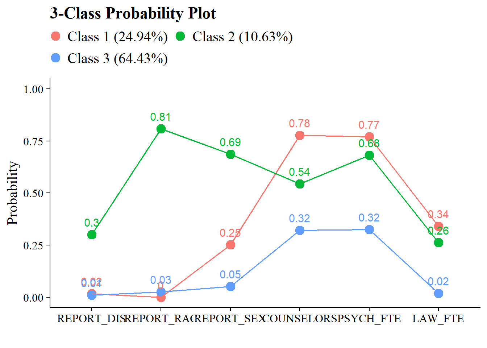

# Item Probability Plots

------------------------------------------------------------------------

Example: Bullying in Schools

------------------------------------------------------------------------

To demonstrate mixture modeling in the training program and online resource components of the IES grant we utilize the *Civil Rights Data Collection (CRDC)*[@usdoe2014] data repository.
The CRDC is a federally mandated school-level data collection effort that occurs every other year.
This public data is currently available for selected latent class indicators across 4 years (2011, 2013, 2015, 2017) and all US states.
In this example, we use the Arizona state sample.
We utilize six focal indicators which constitute the latent class model in our example; three variables which report on harassment/bullying in schools based on disability, race, or sex, and three variables on full-time equivalent school staff hires (counselor, psychologist, law enforcement).
This data source also includes covariates on a variety of subjects and distal outcomes reported in 2018 such as math/reading assessments and graduation rates.

------------------------------------------------------------------------

Load packages


``` r
library(tidyverse)
library(haven)
library(glue)
library(MplusAutomation)
library(here)
library(janitor)
library(gt)
library(cowplot)
library(DiagrammeR) 
```

## Variable Description


```{=html}
<div id="xxagkyyhtw" style="padding-left:0px;padding-right:0px;padding-top:10px;padding-bottom:10px;overflow-x:auto;overflow-y:auto;width:auto;height:auto;">
<style>#xxagkyyhtw table {
  font-family: system-ui, 'Segoe UI', Roboto, Helvetica, Arial, sans-serif, 'Apple Color Emoji', 'Segoe UI Emoji', 'Segoe UI Symbol', 'Noto Color Emoji';
  -webkit-font-smoothing: antialiased;
  -moz-osx-font-smoothing: grayscale;
}

#xxagkyyhtw thead, #xxagkyyhtw tbody, #xxagkyyhtw tfoot, #xxagkyyhtw tr, #xxagkyyhtw td, #xxagkyyhtw th {
  border-style: none;
}

#xxagkyyhtw p {
  margin: 0;
  padding: 0;
}

#xxagkyyhtw .gt_table {
  display: table;
  border-collapse: collapse;
  line-height: normal;
  margin-left: auto;
  margin-right: auto;
  color: #333333;
  font-size: 16px;
  font-weight: normal;
  font-style: normal;
  background-color: #FFFFFF;
  width: 75%;
  border-top-style: solid;
  border-top-width: 2px;
  border-top-color: #A8A8A8;
  border-right-style: none;
  border-right-width: 2px;
  border-right-color: #D3D3D3;
  border-bottom-style: solid;
  border-bottom-width: 2px;
  border-bottom-color: #A8A8A8;
  border-left-style: none;
  border-left-width: 2px;
  border-left-color: #D3D3D3;
}

#xxagkyyhtw .gt_caption {
  padding-top: 4px;
  padding-bottom: 4px;
}

#xxagkyyhtw .gt_title {
  color: #333333;
  font-size: 125%;
  font-weight: initial;
  padding-top: 4px;
  padding-bottom: 4px;
  padding-left: 5px;
  padding-right: 5px;
  border-bottom-color: #FFFFFF;
  border-bottom-width: 0;
}

#xxagkyyhtw .gt_subtitle {
  color: #333333;
  font-size: 85%;
  font-weight: initial;
  padding-top: 3px;
  padding-bottom: 5px;
  padding-left: 5px;
  padding-right: 5px;
  border-top-color: #FFFFFF;
  border-top-width: 0;
}

#xxagkyyhtw .gt_heading {
  background-color: #FFFFFF;
  text-align: center;
  border-bottom-color: #FFFFFF;
  border-left-style: none;
  border-left-width: 1px;
  border-left-color: #D3D3D3;
  border-right-style: none;
  border-right-width: 1px;
  border-right-color: #D3D3D3;
}

#xxagkyyhtw .gt_bottom_border {
  border-bottom-style: solid;
  border-bottom-width: 2px;
  border-bottom-color: #D3D3D3;
}

#xxagkyyhtw .gt_col_headings {
  border-top-style: solid;
  border-top-width: 2px;
  border-top-color: #D3D3D3;
  border-bottom-style: solid;
  border-bottom-width: 2px;
  border-bottom-color: #D3D3D3;
  border-left-style: none;
  border-left-width: 1px;
  border-left-color: #D3D3D3;
  border-right-style: none;
  border-right-width: 1px;
  border-right-color: #D3D3D3;
}

#xxagkyyhtw .gt_col_heading {
  color: #333333;
  background-color: #FFFFFF;
  font-size: 100%;
  font-weight: normal;
  text-transform: inherit;
  border-left-style: none;
  border-left-width: 1px;
  border-left-color: #D3D3D3;
  border-right-style: none;
  border-right-width: 1px;
  border-right-color: #D3D3D3;
  vertical-align: bottom;
  padding-top: 5px;
  padding-bottom: 6px;
  padding-left: 5px;
  padding-right: 5px;
  overflow-x: hidden;
}

#xxagkyyhtw .gt_column_spanner_outer {
  color: #333333;
  background-color: #FFFFFF;
  font-size: 100%;
  font-weight: normal;
  text-transform: inherit;
  padding-top: 0;
  padding-bottom: 0;
  padding-left: 4px;
  padding-right: 4px;
}

#xxagkyyhtw .gt_column_spanner_outer:first-child {
  padding-left: 0;
}

#xxagkyyhtw .gt_column_spanner_outer:last-child {
  padding-right: 0;
}

#xxagkyyhtw .gt_column_spanner {
  border-bottom-style: solid;
  border-bottom-width: 2px;
  border-bottom-color: #D3D3D3;
  vertical-align: bottom;
  padding-top: 5px;
  padding-bottom: 5px;
  overflow-x: hidden;
  display: inline-block;
  width: 100%;
}

#xxagkyyhtw .gt_spanner_row {
  border-bottom-style: hidden;
}

#xxagkyyhtw .gt_group_heading {
  padding-top: 8px;
  padding-bottom: 8px;
  padding-left: 5px;
  padding-right: 5px;
  color: #333333;
  background-color: #FFFFFF;
  font-size: 100%;
  font-weight: initial;
  text-transform: inherit;
  border-top-style: solid;
  border-top-width: 2px;
  border-top-color: #D3D3D3;
  border-bottom-style: solid;
  border-bottom-width: 2px;
  border-bottom-color: #D3D3D3;
  border-left-style: none;
  border-left-width: 1px;
  border-left-color: #D3D3D3;
  border-right-style: none;
  border-right-width: 1px;
  border-right-color: #D3D3D3;
  vertical-align: middle;
  text-align: left;
}

#xxagkyyhtw .gt_empty_group_heading {
  padding: 0.5px;
  color: #333333;
  background-color: #FFFFFF;
  font-size: 100%;
  font-weight: initial;
  border-top-style: solid;
  border-top-width: 2px;
  border-top-color: #D3D3D3;
  border-bottom-style: solid;
  border-bottom-width: 2px;
  border-bottom-color: #D3D3D3;
  vertical-align: middle;
}

#xxagkyyhtw .gt_from_md > :first-child {
  margin-top: 0;
}

#xxagkyyhtw .gt_from_md > :last-child {
  margin-bottom: 0;
}

#xxagkyyhtw .gt_row {
  padding-top: 8px;
  padding-bottom: 8px;
  padding-left: 5px;
  padding-right: 5px;
  margin: 10px;
  border-top-style: solid;
  border-top-width: 1px;
  border-top-color: #D3D3D3;
  border-left-style: none;
  border-left-width: 1px;
  border-left-color: #D3D3D3;
  border-right-style: none;
  border-right-width: 1px;
  border-right-color: #D3D3D3;
  vertical-align: middle;
  overflow-x: hidden;
}

#xxagkyyhtw .gt_stub {
  color: #333333;
  background-color: #FFFFFF;
  font-size: 100%;
  font-weight: initial;
  text-transform: inherit;
  border-right-style: solid;
  border-right-width: 2px;
  border-right-color: #D3D3D3;
  padding-left: 5px;
  padding-right: 5px;
}

#xxagkyyhtw .gt_stub_row_group {
  color: #333333;
  background-color: #FFFFFF;
  font-size: 100%;
  font-weight: initial;
  text-transform: inherit;
  border-right-style: solid;
  border-right-width: 2px;
  border-right-color: #D3D3D3;
  padding-left: 5px;
  padding-right: 5px;
  vertical-align: top;
}

#xxagkyyhtw .gt_row_group_first td {
  border-top-width: 2px;
}

#xxagkyyhtw .gt_row_group_first th {
  border-top-width: 2px;
}

#xxagkyyhtw .gt_summary_row {
  color: #333333;
  background-color: #FFFFFF;
  text-transform: inherit;
  padding-top: 8px;
  padding-bottom: 8px;
  padding-left: 5px;
  padding-right: 5px;
}

#xxagkyyhtw .gt_first_summary_row {
  border-top-style: solid;
  border-top-color: #D3D3D3;
}

#xxagkyyhtw .gt_first_summary_row.thick {
  border-top-width: 2px;
}

#xxagkyyhtw .gt_last_summary_row {
  padding-top: 8px;
  padding-bottom: 8px;
  padding-left: 5px;
  padding-right: 5px;
  border-bottom-style: solid;
  border-bottom-width: 2px;
  border-bottom-color: #D3D3D3;
}

#xxagkyyhtw .gt_grand_summary_row {
  color: #333333;
  background-color: #FFFFFF;
  text-transform: inherit;
  padding-top: 8px;
  padding-bottom: 8px;
  padding-left: 5px;
  padding-right: 5px;
}

#xxagkyyhtw .gt_first_grand_summary_row {
  padding-top: 8px;
  padding-bottom: 8px;
  padding-left: 5px;
  padding-right: 5px;
  border-top-style: double;
  border-top-width: 6px;
  border-top-color: #D3D3D3;
}

#xxagkyyhtw .gt_last_grand_summary_row_top {
  padding-top: 8px;
  padding-bottom: 8px;
  padding-left: 5px;
  padding-right: 5px;
  border-bottom-style: double;
  border-bottom-width: 6px;
  border-bottom-color: #D3D3D3;
}

#xxagkyyhtw .gt_striped {
  background-color: rgba(128, 128, 128, 0.05);
}

#xxagkyyhtw .gt_table_body {
  border-top-style: solid;
  border-top-width: 2px;
  border-top-color: #D3D3D3;
  border-bottom-style: solid;
  border-bottom-width: 2px;
  border-bottom-color: #D3D3D3;
}

#xxagkyyhtw .gt_footnotes {
  color: #333333;
  background-color: #FFFFFF;
  border-bottom-style: none;
  border-bottom-width: 2px;
  border-bottom-color: #D3D3D3;
  border-left-style: none;
  border-left-width: 2px;
  border-left-color: #D3D3D3;
  border-right-style: none;
  border-right-width: 2px;
  border-right-color: #D3D3D3;
}

#xxagkyyhtw .gt_footnote {
  margin: 0px;
  font-size: 90%;
  padding-top: 4px;
  padding-bottom: 4px;
  padding-left: 5px;
  padding-right: 5px;
}

#xxagkyyhtw .gt_sourcenotes {
  color: #333333;
  background-color: #FFFFFF;
  border-bottom-style: none;
  border-bottom-width: 2px;
  border-bottom-color: #D3D3D3;
  border-left-style: none;
  border-left-width: 2px;
  border-left-color: #D3D3D3;
  border-right-style: none;
  border-right-width: 2px;
  border-right-color: #D3D3D3;
}

#xxagkyyhtw .gt_sourcenote {
  font-size: 90%;
  padding-top: 4px;
  padding-bottom: 4px;
  padding-left: 5px;
  padding-right: 5px;
}

#xxagkyyhtw .gt_left {
  text-align: left;
}

#xxagkyyhtw .gt_center {
  text-align: center;
}

#xxagkyyhtw .gt_right {
  text-align: right;
  font-variant-numeric: tabular-nums;
}

#xxagkyyhtw .gt_font_normal {
  font-weight: normal;
}

#xxagkyyhtw .gt_font_bold {
  font-weight: bold;
}

#xxagkyyhtw .gt_font_italic {
  font-style: italic;
}

#xxagkyyhtw .gt_super {
  font-size: 65%;
}

#xxagkyyhtw .gt_footnote_marks {
  font-size: 75%;
  vertical-align: 0.4em;
  position: initial;
}

#xxagkyyhtw .gt_asterisk {
  font-size: 100%;
  vertical-align: 0;
}

#xxagkyyhtw .gt_indent_1 {
  text-indent: 5px;
}

#xxagkyyhtw .gt_indent_2 {
  text-indent: 10px;
}

#xxagkyyhtw .gt_indent_3 {
  text-indent: 15px;
}

#xxagkyyhtw .gt_indent_4 {
  text-indent: 20px;
}

#xxagkyyhtw .gt_indent_5 {
  text-indent: 25px;
}

#xxagkyyhtw .katex-display {
  display: inline-flex !important;
  margin-bottom: 0.75em !important;
}

#xxagkyyhtw div.Reactable > div.rt-table > div.rt-thead > div.rt-tr.rt-tr-group-header > div.rt-th-group:after {
  height: 0px !important;
}
</style>
<table class="gt_table" data-quarto-disable-processing="false" data-quarto-bootstrap="false">
  <thead>
    <tr class="gt_heading">
      <td colspan="3" class="gt_heading gt_title gt_font_normal gt_bottom_border" style>LCA indicators<span class="gt_footnote_marks" style="white-space:nowrap;font-style:italic;font-weight:normal;line-height:0;"><sup>1</sup></span></td>
    </tr>
    
    <tr class="gt_col_headings">
      <th class="gt_col_heading gt_columns_bottom_border gt_left" rowspan="1" colspan="1" scope="col" id="Name">Name</th>
      <th class="gt_col_heading gt_columns_bottom_border gt_left" rowspan="1" colspan="1" scope="col" id="Label">Label</th>
      <th class="gt_col_heading gt_columns_bottom_border gt_left" rowspan="1" colspan="1" scope="col" id="Values">Values</th>
    </tr>
  </thead>
  <tbody class="gt_table_body">
    <tr><td headers="Name" class="gt_row gt_left">leaid</td>
<td headers="Label" class="gt_row gt_left">District Identification Code</td>
<td headers="Values" class="gt_row gt_left"></td></tr>
    <tr><td headers="Name" class="gt_row gt_left">ncessch</td>
<td headers="Label" class="gt_row gt_left">School Identification Code</td>
<td headers="Values" class="gt_row gt_left"></td></tr>
    <tr><td headers="Name" class="gt_row gt_left">report_dis</td>
<td headers="Label" class="gt_row gt_left">Number of students harassed or bullied on the basis of disability</td>
<td headers="Values" class="gt_row gt_left">0 = No reported incidents, 1 = At least one reported incident</td></tr>
    <tr><td headers="Name" class="gt_row gt_left">report_race</td>
<td headers="Label" class="gt_row gt_left">Number of students harassed or bullied on the basis of race, color, or national origin</td>
<td headers="Values" class="gt_row gt_left">0 = No reported incidents, 1 = At least one reported incident</td></tr>
    <tr><td headers="Name" class="gt_row gt_left">report_sex</td>
<td headers="Label" class="gt_row gt_left">Number of students harassed or bullied on the basis of sex</td>
<td headers="Values" class="gt_row gt_left">0 = No reported incidents, 1 = At least one reported incident</td></tr>
    <tr><td headers="Name" class="gt_row gt_left">counselors_fte</td>
<td headers="Label" class="gt_row gt_left">Number of full time equivalent counselors hired as school staff</td>
<td headers="Values" class="gt_row gt_left">0 = No staff present, 1 = At least one staff present</td></tr>
    <tr><td headers="Name" class="gt_row gt_left">psych_fte</td>
<td headers="Label" class="gt_row gt_left">Number of full time equivalent psychologists hired as school staff</td>
<td headers="Values" class="gt_row gt_left">0 = No staff present, 1 = At least one staff present</td></tr>
    <tr><td headers="Name" class="gt_row gt_left">law_fte</td>
<td headers="Label" class="gt_row gt_left">Number of full time equivalent law enforcement officers hired as school staff</td>
<td headers="Values" class="gt_row gt_left">0 = No staff present, 1 = At least one staff present</td></tr>
  </tbody>
  
  <tfoot class="gt_footnotes">
    <tr>
      <td class="gt_footnote" colspan="3"><span class="gt_footnote_marks" style="white-space:nowrap;font-style:italic;font-weight:normal;line-height:0;"><sup>1</sup></span> Civil Rights Data Collection (CRDC)</td>
    </tr>
  </tfoot>
</table>
</div>
```


------------------------------------------------------------------------

**Variables have been transformed to be dichotomous indicators using the following coding strategy**

Harassment and bullying count variables are recoded `1` if the school reported at least one incident of harassment (`0` indicates no reported incidents).
On the original scale reported by the CDRC staff variables for full time equivalent employees (FTE) are represented as `1` and part time employees are represented by values between `1` and `0`.
Schools with greater than one staff of the designated type are represented by values greater than 1.
All values greater than zero were recorded as `1s` (e.g., `.5`, `1`,`3`) indicating that the school has a staff present on campus at least part time.
Schools with no staff of the designated type are indicated as `0` for the dichotomous variable.

------------------------------------------------------------------------


```{=html}
<div class="grViz html-widget html-fill-item" id="htmlwidget-6ffe9934ee9c64a33f68" style="width:672px;height:480px;"></div>
<script type="application/json" data-for="htmlwidget-6ffe9934ee9c64a33f68">{"x":{"diagram":" digraph cfa_model {\n\n# The `graph` statement - No editing needed\n\n    graph [layout = dot, overlap = true]\n \n# Two `node` statements\n \n# One for measured variables (box) \n\n    node [shape=box]\n    report_dis report_race report_sex counselors_fte psych_fte law_fte;\n \n# One for latent variables (circle) \n \n    node [shape=circle]\n    bully [label=<Bullying <br/>C<sub>k<\/sub>>];\n    \n# `edge` statements\n \n    edge [minlen = 2]\n    bully -> {report_dis report_race report_sex counselors_fte psych_fte law_fte}\n \n }","config":{"engine":"dot","options":null}},"evals":[],"jsHooks":[]}</script>
```


------------------------------------------------------------------------

## Prepare Data


``` r
df_bully <- read_csv(here("data", "crdc_lca_data.csv")) %>% 
  clean_names() %>% 
  dplyr::select(report_dis, report_race, report_sex, counselors_fte, psych_fte, law_fte) 
```

------------------------------------------------------------------------

## Descriptive Statistics


``` r
dframe <- df_bully %>%
  pivot_longer(
    c(report_dis, report_race, report_sex, counselors_fte, psych_fte, law_fte),
    names_to = "Variable"
  ) %>%
  group_by(Variable) %>%
  summarise(
    Count = sum(value == 1, na.rm = TRUE),
    Total = n(),
    .groups = "drop"
  ) %>%
  mutate(`Proportion Endorsed` = round(Count / Total, 3)) %>%
  select(Variable, `Proportion Endorsed`, Count)

gt(dframe) %>%
  tab_header(
    title = md("**LCA Indicator Endorsement**"),
    subtitle = md("&nbsp;")
  ) %>%
  tab_options(
    column_labels.font.weight = "bold",
    row_group.font.weight = "bold"
  )
```


```{=html}
<div id="pzuoediaze" style="padding-left:0px;padding-right:0px;padding-top:10px;padding-bottom:10px;overflow-x:auto;overflow-y:auto;width:auto;height:auto;">
<style>#pzuoediaze table {
  font-family: system-ui, 'Segoe UI', Roboto, Helvetica, Arial, sans-serif, 'Apple Color Emoji', 'Segoe UI Emoji', 'Segoe UI Symbol', 'Noto Color Emoji';
  -webkit-font-smoothing: antialiased;
  -moz-osx-font-smoothing: grayscale;
}

#pzuoediaze thead, #pzuoediaze tbody, #pzuoediaze tfoot, #pzuoediaze tr, #pzuoediaze td, #pzuoediaze th {
  border-style: none;
}

#pzuoediaze p {
  margin: 0;
  padding: 0;
}

#pzuoediaze .gt_table {
  display: table;
  border-collapse: collapse;
  line-height: normal;
  margin-left: auto;
  margin-right: auto;
  color: #333333;
  font-size: 16px;
  font-weight: normal;
  font-style: normal;
  background-color: #FFFFFF;
  width: auto;
  border-top-style: solid;
  border-top-width: 2px;
  border-top-color: #A8A8A8;
  border-right-style: none;
  border-right-width: 2px;
  border-right-color: #D3D3D3;
  border-bottom-style: solid;
  border-bottom-width: 2px;
  border-bottom-color: #A8A8A8;
  border-left-style: none;
  border-left-width: 2px;
  border-left-color: #D3D3D3;
}

#pzuoediaze .gt_caption {
  padding-top: 4px;
  padding-bottom: 4px;
}

#pzuoediaze .gt_title {
  color: #333333;
  font-size: 125%;
  font-weight: initial;
  padding-top: 4px;
  padding-bottom: 4px;
  padding-left: 5px;
  padding-right: 5px;
  border-bottom-color: #FFFFFF;
  border-bottom-width: 0;
}

#pzuoediaze .gt_subtitle {
  color: #333333;
  font-size: 85%;
  font-weight: initial;
  padding-top: 3px;
  padding-bottom: 5px;
  padding-left: 5px;
  padding-right: 5px;
  border-top-color: #FFFFFF;
  border-top-width: 0;
}

#pzuoediaze .gt_heading {
  background-color: #FFFFFF;
  text-align: center;
  border-bottom-color: #FFFFFF;
  border-left-style: none;
  border-left-width: 1px;
  border-left-color: #D3D3D3;
  border-right-style: none;
  border-right-width: 1px;
  border-right-color: #D3D3D3;
}

#pzuoediaze .gt_bottom_border {
  border-bottom-style: solid;
  border-bottom-width: 2px;
  border-bottom-color: #D3D3D3;
}

#pzuoediaze .gt_col_headings {
  border-top-style: solid;
  border-top-width: 2px;
  border-top-color: #D3D3D3;
  border-bottom-style: solid;
  border-bottom-width: 2px;
  border-bottom-color: #D3D3D3;
  border-left-style: none;
  border-left-width: 1px;
  border-left-color: #D3D3D3;
  border-right-style: none;
  border-right-width: 1px;
  border-right-color: #D3D3D3;
}

#pzuoediaze .gt_col_heading {
  color: #333333;
  background-color: #FFFFFF;
  font-size: 100%;
  font-weight: bold;
  text-transform: inherit;
  border-left-style: none;
  border-left-width: 1px;
  border-left-color: #D3D3D3;
  border-right-style: none;
  border-right-width: 1px;
  border-right-color: #D3D3D3;
  vertical-align: bottom;
  padding-top: 5px;
  padding-bottom: 6px;
  padding-left: 5px;
  padding-right: 5px;
  overflow-x: hidden;
}

#pzuoediaze .gt_column_spanner_outer {
  color: #333333;
  background-color: #FFFFFF;
  font-size: 100%;
  font-weight: bold;
  text-transform: inherit;
  padding-top: 0;
  padding-bottom: 0;
  padding-left: 4px;
  padding-right: 4px;
}

#pzuoediaze .gt_column_spanner_outer:first-child {
  padding-left: 0;
}

#pzuoediaze .gt_column_spanner_outer:last-child {
  padding-right: 0;
}

#pzuoediaze .gt_column_spanner {
  border-bottom-style: solid;
  border-bottom-width: 2px;
  border-bottom-color: #D3D3D3;
  vertical-align: bottom;
  padding-top: 5px;
  padding-bottom: 5px;
  overflow-x: hidden;
  display: inline-block;
  width: 100%;
}

#pzuoediaze .gt_spanner_row {
  border-bottom-style: hidden;
}

#pzuoediaze .gt_group_heading {
  padding-top: 8px;
  padding-bottom: 8px;
  padding-left: 5px;
  padding-right: 5px;
  color: #333333;
  background-color: #FFFFFF;
  font-size: 100%;
  font-weight: bold;
  text-transform: inherit;
  border-top-style: solid;
  border-top-width: 2px;
  border-top-color: #D3D3D3;
  border-bottom-style: solid;
  border-bottom-width: 2px;
  border-bottom-color: #D3D3D3;
  border-left-style: none;
  border-left-width: 1px;
  border-left-color: #D3D3D3;
  border-right-style: none;
  border-right-width: 1px;
  border-right-color: #D3D3D3;
  vertical-align: middle;
  text-align: left;
}

#pzuoediaze .gt_empty_group_heading {
  padding: 0.5px;
  color: #333333;
  background-color: #FFFFFF;
  font-size: 100%;
  font-weight: bold;
  border-top-style: solid;
  border-top-width: 2px;
  border-top-color: #D3D3D3;
  border-bottom-style: solid;
  border-bottom-width: 2px;
  border-bottom-color: #D3D3D3;
  vertical-align: middle;
}

#pzuoediaze .gt_from_md > :first-child {
  margin-top: 0;
}

#pzuoediaze .gt_from_md > :last-child {
  margin-bottom: 0;
}

#pzuoediaze .gt_row {
  padding-top: 8px;
  padding-bottom: 8px;
  padding-left: 5px;
  padding-right: 5px;
  margin: 10px;
  border-top-style: solid;
  border-top-width: 1px;
  border-top-color: #D3D3D3;
  border-left-style: none;
  border-left-width: 1px;
  border-left-color: #D3D3D3;
  border-right-style: none;
  border-right-width: 1px;
  border-right-color: #D3D3D3;
  vertical-align: middle;
  overflow-x: hidden;
}

#pzuoediaze .gt_stub {
  color: #333333;
  background-color: #FFFFFF;
  font-size: 100%;
  font-weight: initial;
  text-transform: inherit;
  border-right-style: solid;
  border-right-width: 2px;
  border-right-color: #D3D3D3;
  padding-left: 5px;
  padding-right: 5px;
}

#pzuoediaze .gt_stub_row_group {
  color: #333333;
  background-color: #FFFFFF;
  font-size: 100%;
  font-weight: initial;
  text-transform: inherit;
  border-right-style: solid;
  border-right-width: 2px;
  border-right-color: #D3D3D3;
  padding-left: 5px;
  padding-right: 5px;
  vertical-align: top;
}

#pzuoediaze .gt_row_group_first td {
  border-top-width: 2px;
}

#pzuoediaze .gt_row_group_first th {
  border-top-width: 2px;
}

#pzuoediaze .gt_summary_row {
  color: #333333;
  background-color: #FFFFFF;
  text-transform: inherit;
  padding-top: 8px;
  padding-bottom: 8px;
  padding-left: 5px;
  padding-right: 5px;
}

#pzuoediaze .gt_first_summary_row {
  border-top-style: solid;
  border-top-color: #D3D3D3;
}

#pzuoediaze .gt_first_summary_row.thick {
  border-top-width: 2px;
}

#pzuoediaze .gt_last_summary_row {
  padding-top: 8px;
  padding-bottom: 8px;
  padding-left: 5px;
  padding-right: 5px;
  border-bottom-style: solid;
  border-bottom-width: 2px;
  border-bottom-color: #D3D3D3;
}

#pzuoediaze .gt_grand_summary_row {
  color: #333333;
  background-color: #FFFFFF;
  text-transform: inherit;
  padding-top: 8px;
  padding-bottom: 8px;
  padding-left: 5px;
  padding-right: 5px;
}

#pzuoediaze .gt_first_grand_summary_row {
  padding-top: 8px;
  padding-bottom: 8px;
  padding-left: 5px;
  padding-right: 5px;
  border-top-style: double;
  border-top-width: 6px;
  border-top-color: #D3D3D3;
}

#pzuoediaze .gt_last_grand_summary_row_top {
  padding-top: 8px;
  padding-bottom: 8px;
  padding-left: 5px;
  padding-right: 5px;
  border-bottom-style: double;
  border-bottom-width: 6px;
  border-bottom-color: #D3D3D3;
}

#pzuoediaze .gt_striped {
  background-color: rgba(128, 128, 128, 0.05);
}

#pzuoediaze .gt_table_body {
  border-top-style: solid;
  border-top-width: 2px;
  border-top-color: #D3D3D3;
  border-bottom-style: solid;
  border-bottom-width: 2px;
  border-bottom-color: #D3D3D3;
}

#pzuoediaze .gt_footnotes {
  color: #333333;
  background-color: #FFFFFF;
  border-bottom-style: none;
  border-bottom-width: 2px;
  border-bottom-color: #D3D3D3;
  border-left-style: none;
  border-left-width: 2px;
  border-left-color: #D3D3D3;
  border-right-style: none;
  border-right-width: 2px;
  border-right-color: #D3D3D3;
}

#pzuoediaze .gt_footnote {
  margin: 0px;
  font-size: 90%;
  padding-top: 4px;
  padding-bottom: 4px;
  padding-left: 5px;
  padding-right: 5px;
}

#pzuoediaze .gt_sourcenotes {
  color: #333333;
  background-color: #FFFFFF;
  border-bottom-style: none;
  border-bottom-width: 2px;
  border-bottom-color: #D3D3D3;
  border-left-style: none;
  border-left-width: 2px;
  border-left-color: #D3D3D3;
  border-right-style: none;
  border-right-width: 2px;
  border-right-color: #D3D3D3;
}

#pzuoediaze .gt_sourcenote {
  font-size: 90%;
  padding-top: 4px;
  padding-bottom: 4px;
  padding-left: 5px;
  padding-right: 5px;
}

#pzuoediaze .gt_left {
  text-align: left;
}

#pzuoediaze .gt_center {
  text-align: center;
}

#pzuoediaze .gt_right {
  text-align: right;
  font-variant-numeric: tabular-nums;
}

#pzuoediaze .gt_font_normal {
  font-weight: normal;
}

#pzuoediaze .gt_font_bold {
  font-weight: bold;
}

#pzuoediaze .gt_font_italic {
  font-style: italic;
}

#pzuoediaze .gt_super {
  font-size: 65%;
}

#pzuoediaze .gt_footnote_marks {
  font-size: 75%;
  vertical-align: 0.4em;
  position: initial;
}

#pzuoediaze .gt_asterisk {
  font-size: 100%;
  vertical-align: 0;
}

#pzuoediaze .gt_indent_1 {
  text-indent: 5px;
}

#pzuoediaze .gt_indent_2 {
  text-indent: 10px;
}

#pzuoediaze .gt_indent_3 {
  text-indent: 15px;
}

#pzuoediaze .gt_indent_4 {
  text-indent: 20px;
}

#pzuoediaze .gt_indent_5 {
  text-indent: 25px;
}

#pzuoediaze .katex-display {
  display: inline-flex !important;
  margin-bottom: 0.75em !important;
}

#pzuoediaze div.Reactable > div.rt-table > div.rt-thead > div.rt-tr.rt-tr-group-header > div.rt-th-group:after {
  height: 0px !important;
}
</style>
<table class="gt_table" data-quarto-disable-processing="false" data-quarto-bootstrap="false">
  <thead>
    <tr class="gt_heading">
      <td colspan="3" class="gt_heading gt_title gt_font_normal" style><span class='gt_from_md'><strong>LCA Indicator Endorsement</strong></span></td>
    </tr>
    <tr class="gt_heading">
      <td colspan="3" class="gt_heading gt_subtitle gt_font_normal gt_bottom_border" style><span class='gt_from_md'> </span></td>
    </tr>
    <tr class="gt_col_headings">
      <th class="gt_col_heading gt_columns_bottom_border gt_left" rowspan="1" colspan="1" scope="col" id="Variable">Variable</th>
      <th class="gt_col_heading gt_columns_bottom_border gt_right" rowspan="1" colspan="1" scope="col" id="Proportion-Endorsed">Proportion Endorsed</th>
      <th class="gt_col_heading gt_columns_bottom_border gt_right" rowspan="1" colspan="1" scope="col" id="Count">Count</th>
    </tr>
  </thead>
  <tbody class="gt_table_body">
    <tr><td headers="Variable" class="gt_row gt_left">counselors_fte</td>
<td headers="Proportion Endorsed" class="gt_row gt_right">0.453</td>
<td headers="Count" class="gt_row gt_right">919</td></tr>
    <tr><td headers="Variable" class="gt_row gt_left">law_fte</td>
<td headers="Proportion Endorsed" class="gt_row gt_right">0.124</td>
<td headers="Count" class="gt_row gt_right">251</td></tr>
    <tr><td headers="Variable" class="gt_row gt_left">psych_fte</td>
<td headers="Proportion Endorsed" class="gt_row gt_right">0.467</td>
<td headers="Count" class="gt_row gt_right">947</td></tr>
    <tr><td headers="Variable" class="gt_row gt_left">report_dis</td>
<td headers="Proportion Endorsed" class="gt_row gt_right">0.042</td>
<td headers="Count" class="gt_row gt_right">85</td></tr>
    <tr><td headers="Variable" class="gt_row gt_left">report_race</td>
<td headers="Proportion Endorsed" class="gt_row gt_right">0.102</td>
<td headers="Count" class="gt_row gt_right">206</td></tr>
    <tr><td headers="Variable" class="gt_row gt_left">report_sex</td>
<td headers="Proportion Endorsed" class="gt_row gt_right">0.168</td>
<td headers="Count" class="gt_row gt_right">340</td></tr>
  </tbody>
  
  
</table>
</div>
```


Save as image


``` r
gtsave(prop_table, here("figures", "prop_table.png"))
```

------------------------------------------------------------------------

## 3-Class Probability Plot

Continuing the example from the bookdown, use the `plot_lca` function provided in the folder to plot the item probability plot. This function requires one argument:
- `model_name`: The name of the Mplus `readModels` object (e.g., `output_enum$c3_bully.out`)


``` r
source(here("functions", "plot_lca.R"))

# Extract outputs from the enumeration folder
output_enum <- readModels(here("enum"), filefilter = "bully", quiet = TRUE)

plot_lca(model_name = output_enum$c3_bully.out)
```



------------------------------------------------------------------------

Save figure:


``` r
ggsave(here("figures", "C3_bully_LCA_Plot.png"), dpi="retina", height=5, width=7, units="in")
```

------------------------------------------------------------------------


<div style="text-align: center;"></div>
