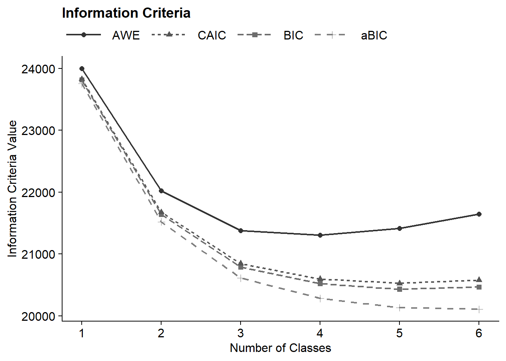
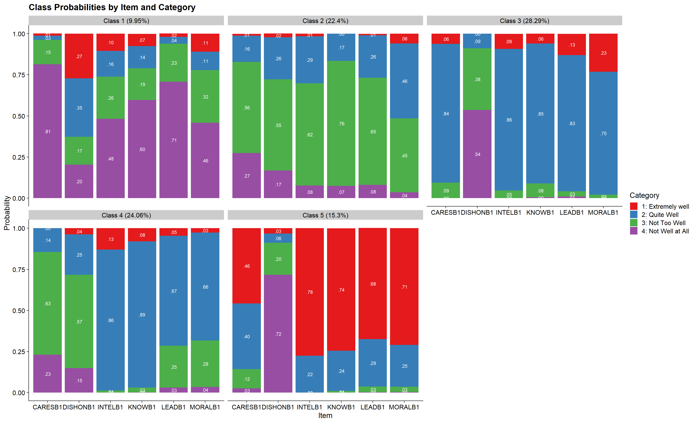
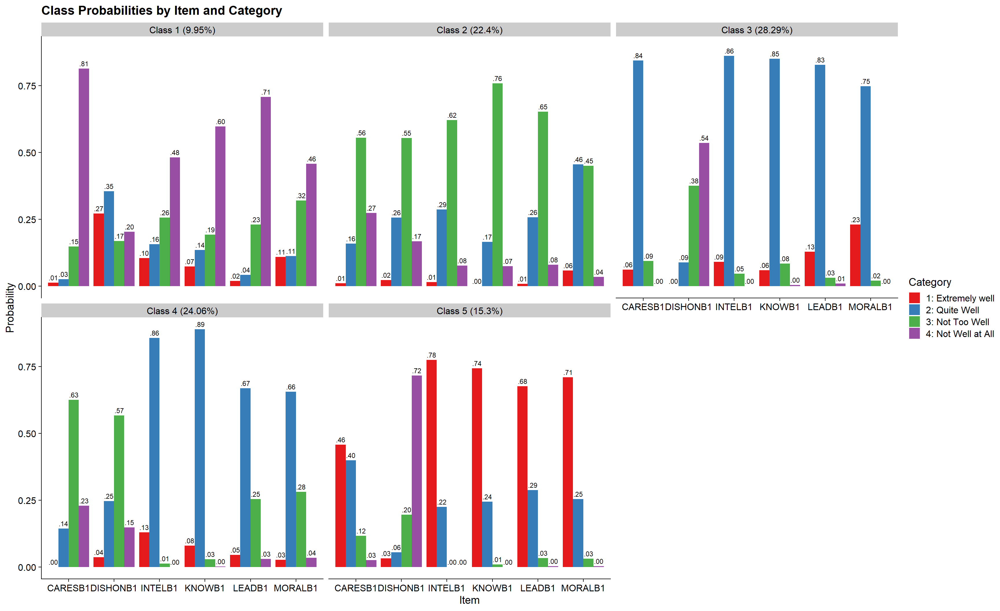
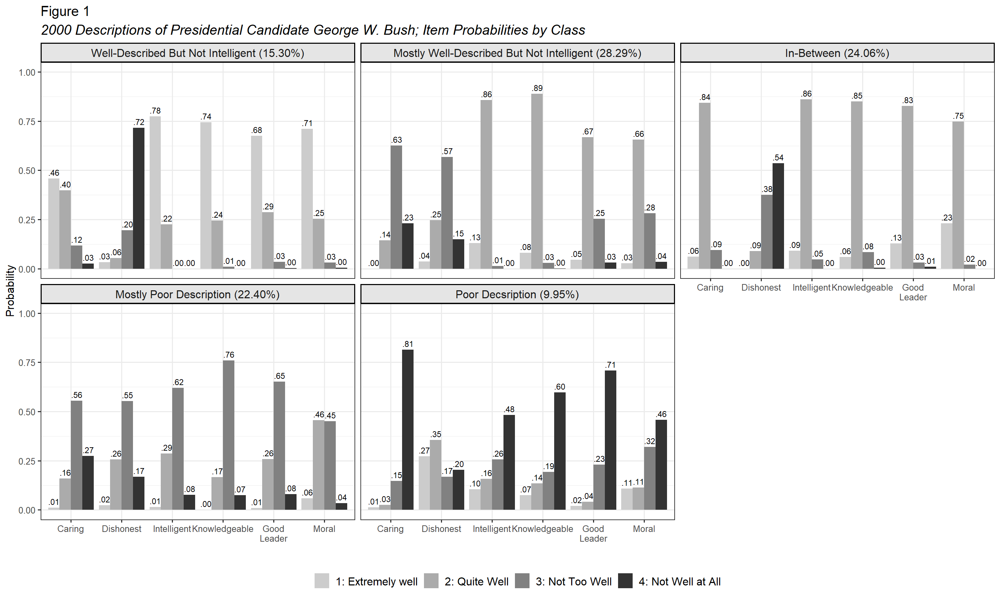
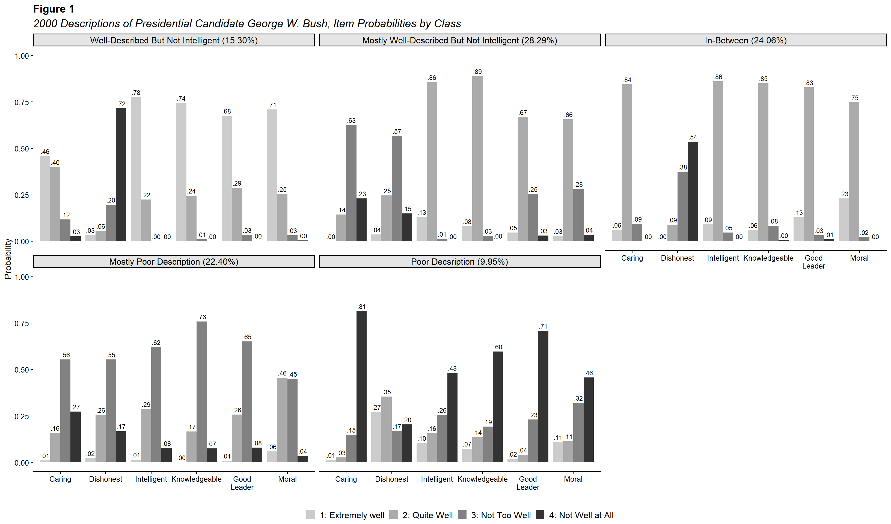

# Polytomous LCA 

Polytomous LCA deals with variables that have more than two categories, such as survey questions with responses like `never`, `sometimes`, and `always`. The workflow of a polytomous LCA model is similar to that of an LCA model with binary indicators. However, polytomous LCA captures more complex response patterns, which can make interpretation a bit trickier. The following code demonstrates an example, along with a visualization of the model.


------------------------------------------------------------------------

## Example: Elections

"Two sets of six questions with four responses each, asking respondents’ opinions of how well various traits describe presidential candidates Al Gore and George W. Bush. Also potential covariates vote choice, age, education, gender, and party ID. Source: The National Election Studies (2000)." (poLCA, 2016) [See documentation here](https://cran.r-project.org/web/packages/poLCA/poLCA.pdf)

Two sets of six questions with four responses each, asking respondents’ opinions of how well various traits describe presidential candidates Al Gore and George W. Bush. In the election data set, respondents to the 2000 American National Election Study public opinion poll were asked to evaluate how well a series of traits—moral, caring, knowledgeable, good leader, dishonest, and intelligent—described presidential candidates Al Gore and George W. Bush. Each question had four possible choices: (1) extremely well; (2) quite well; (3) not too well; and (4) not well at all.

------------------------------------------------------------------------

Load packages


``` r

library(poLCA)
library(tidyverse)
library(janitor)
library(gt)
library(MplusAutomation)
library(here)
library(glue)
```

------------------------------------------------------------------------

## Prepare Data


``` r
data(election)

# Detaching packages that mask the dpylr functions 
detach(package:poLCA, unload = TRUE)
detach(package:MASS, unload = TRUE)

df_election <-  election %>% 
  clean_names() %>% 
  select(moralb:intelb) %>% 
  mutate(across(everything(), 
                ~ as.factor(as.numeric(gsub("\\D", "", .))), 
                .names = "{.col}1")) 

# Quick summary
summary(df_election)
#>                moralb                  caresb   
#>  1 Extremely well :340   1 Extremely well :155  
#>  2 Quite well     :841   2 Quite well     :625  
#>  3 Not too well   :330   3 Not too well   :562  
#>  4 Not well at all: 98   4 Not well at all:342  
#>  NA's             :176   NA's             :101  
#>                knowb                   leadb    
#>  1 Extremely well :274   1 Extremely well :266  
#>  2 Quite well     :933   2 Quite well     :842  
#>  3 Not too well   :379   3 Not too well   :407  
#>  4 Not well at all:133   4 Not well at all:166  
#>  NA's             : 66   NA's             :104  
#>               dishonb                  intelb    moralb1   
#>  1 Extremely well : 70   1 Extremely well :329   1   :340  
#>  2 Quite well     :288   2 Quite well     :967   2   :841  
#>  3 Not too well   :653   3 Not too well   :306   3   :330  
#>  4 Not well at all:574   4 Not well at all:110   4   : 98  
#>  NA's             :200   NA's             : 73   NA's:176  
#>  caresb1     knowb1     leadb1    dishonb1   intelb1   
#>  1   :155   1   :274   1   :266   1   : 70   1   :329  
#>  2   :625   2   :933   2   :842   2   :288   2   :967  
#>  3   :562   3   :379   3   :407   3   :653   3   :306  
#>  4   :342   4   :133   4   :166   4   :574   4   :110  
#>  NA's:101   NA's: 66   NA's:104   NA's:200   NA's: 73
```

------------------------------------------------------------------------

## Descriptive Statistics


``` r
ds <- df_election %>% 
  pivot_longer(moralb1:intelb1, names_to = "variable") %>% 
  count(variable, value) %>%  # Count occurrences of each value for each variable
  group_by(variable) %>%
  mutate(prop = n / sum(n)) %>% 
  arrange(desc(variable))

# Create the table
prop_table <- ds %>% 
  gt() %>% 
  tab_header(title = md("**Descriptive Summary**")) %>%
  cols_label(
    variable = "Variable",
    n = md("*N*"),
    prop = md("Proportion")
  ) %>%
  fmt_number(c("n", "prop"), decimals = 2) %>%  # Format both n and prop columns
  cols_align(
    align = "center",
    columns = c(prop, n)
  ) 

# View the table
prop_table
```


```{=html}
<div id="woydiywvgu" style="padding-left:0px;padding-right:0px;padding-top:10px;padding-bottom:10px;overflow-x:auto;overflow-y:auto;width:auto;height:auto;">
<style>#woydiywvgu table {
  font-family: system-ui, 'Segoe UI', Roboto, Helvetica, Arial, sans-serif, 'Apple Color Emoji', 'Segoe UI Emoji', 'Segoe UI Symbol', 'Noto Color Emoji';
  -webkit-font-smoothing: antialiased;
  -moz-osx-font-smoothing: grayscale;
}

#woydiywvgu thead, #woydiywvgu tbody, #woydiywvgu tfoot, #woydiywvgu tr, #woydiywvgu td, #woydiywvgu th {
  border-style: none;
}

#woydiywvgu p {
  margin: 0;
  padding: 0;
}

#woydiywvgu .gt_table {
  display: table;
  border-collapse: collapse;
  line-height: normal;
  margin-left: auto;
  margin-right: auto;
  color: #333333;
  font-size: 16px;
  font-weight: normal;
  font-style: normal;
  background-color: #FFFFFF;
  width: auto;
  border-top-style: solid;
  border-top-width: 2px;
  border-top-color: #A8A8A8;
  border-right-style: none;
  border-right-width: 2px;
  border-right-color: #D3D3D3;
  border-bottom-style: solid;
  border-bottom-width: 2px;
  border-bottom-color: #A8A8A8;
  border-left-style: none;
  border-left-width: 2px;
  border-left-color: #D3D3D3;
}

#woydiywvgu .gt_caption {
  padding-top: 4px;
  padding-bottom: 4px;
}

#woydiywvgu .gt_title {
  color: #333333;
  font-size: 125%;
  font-weight: initial;
  padding-top: 4px;
  padding-bottom: 4px;
  padding-left: 5px;
  padding-right: 5px;
  border-bottom-color: #FFFFFF;
  border-bottom-width: 0;
}

#woydiywvgu .gt_subtitle {
  color: #333333;
  font-size: 85%;
  font-weight: initial;
  padding-top: 3px;
  padding-bottom: 5px;
  padding-left: 5px;
  padding-right: 5px;
  border-top-color: #FFFFFF;
  border-top-width: 0;
}

#woydiywvgu .gt_heading {
  background-color: #FFFFFF;
  text-align: center;
  border-bottom-color: #FFFFFF;
  border-left-style: none;
  border-left-width: 1px;
  border-left-color: #D3D3D3;
  border-right-style: none;
  border-right-width: 1px;
  border-right-color: #D3D3D3;
}

#woydiywvgu .gt_bottom_border {
  border-bottom-style: solid;
  border-bottom-width: 2px;
  border-bottom-color: #D3D3D3;
}

#woydiywvgu .gt_col_headings {
  border-top-style: solid;
  border-top-width: 2px;
  border-top-color: #D3D3D3;
  border-bottom-style: solid;
  border-bottom-width: 2px;
  border-bottom-color: #D3D3D3;
  border-left-style: none;
  border-left-width: 1px;
  border-left-color: #D3D3D3;
  border-right-style: none;
  border-right-width: 1px;
  border-right-color: #D3D3D3;
}

#woydiywvgu .gt_col_heading {
  color: #333333;
  background-color: #FFFFFF;
  font-size: 100%;
  font-weight: normal;
  text-transform: inherit;
  border-left-style: none;
  border-left-width: 1px;
  border-left-color: #D3D3D3;
  border-right-style: none;
  border-right-width: 1px;
  border-right-color: #D3D3D3;
  vertical-align: bottom;
  padding-top: 5px;
  padding-bottom: 6px;
  padding-left: 5px;
  padding-right: 5px;
  overflow-x: hidden;
}

#woydiywvgu .gt_column_spanner_outer {
  color: #333333;
  background-color: #FFFFFF;
  font-size: 100%;
  font-weight: normal;
  text-transform: inherit;
  padding-top: 0;
  padding-bottom: 0;
  padding-left: 4px;
  padding-right: 4px;
}

#woydiywvgu .gt_column_spanner_outer:first-child {
  padding-left: 0;
}

#woydiywvgu .gt_column_spanner_outer:last-child {
  padding-right: 0;
}

#woydiywvgu .gt_column_spanner {
  border-bottom-style: solid;
  border-bottom-width: 2px;
  border-bottom-color: #D3D3D3;
  vertical-align: bottom;
  padding-top: 5px;
  padding-bottom: 5px;
  overflow-x: hidden;
  display: inline-block;
  width: 100%;
}

#woydiywvgu .gt_spanner_row {
  border-bottom-style: hidden;
}

#woydiywvgu .gt_group_heading {
  padding-top: 8px;
  padding-bottom: 8px;
  padding-left: 5px;
  padding-right: 5px;
  color: #333333;
  background-color: #FFFFFF;
  font-size: 100%;
  font-weight: initial;
  text-transform: inherit;
  border-top-style: solid;
  border-top-width: 2px;
  border-top-color: #D3D3D3;
  border-bottom-style: solid;
  border-bottom-width: 2px;
  border-bottom-color: #D3D3D3;
  border-left-style: none;
  border-left-width: 1px;
  border-left-color: #D3D3D3;
  border-right-style: none;
  border-right-width: 1px;
  border-right-color: #D3D3D3;
  vertical-align: middle;
  text-align: left;
}

#woydiywvgu .gt_empty_group_heading {
  padding: 0.5px;
  color: #333333;
  background-color: #FFFFFF;
  font-size: 100%;
  font-weight: initial;
  border-top-style: solid;
  border-top-width: 2px;
  border-top-color: #D3D3D3;
  border-bottom-style: solid;
  border-bottom-width: 2px;
  border-bottom-color: #D3D3D3;
  vertical-align: middle;
}

#woydiywvgu .gt_from_md > :first-child {
  margin-top: 0;
}

#woydiywvgu .gt_from_md > :last-child {
  margin-bottom: 0;
}

#woydiywvgu .gt_row {
  padding-top: 8px;
  padding-bottom: 8px;
  padding-left: 5px;
  padding-right: 5px;
  margin: 10px;
  border-top-style: solid;
  border-top-width: 1px;
  border-top-color: #D3D3D3;
  border-left-style: none;
  border-left-width: 1px;
  border-left-color: #D3D3D3;
  border-right-style: none;
  border-right-width: 1px;
  border-right-color: #D3D3D3;
  vertical-align: middle;
  overflow-x: hidden;
}

#woydiywvgu .gt_stub {
  color: #333333;
  background-color: #FFFFFF;
  font-size: 100%;
  font-weight: initial;
  text-transform: inherit;
  border-right-style: solid;
  border-right-width: 2px;
  border-right-color: #D3D3D3;
  padding-left: 5px;
  padding-right: 5px;
}

#woydiywvgu .gt_stub_row_group {
  color: #333333;
  background-color: #FFFFFF;
  font-size: 100%;
  font-weight: initial;
  text-transform: inherit;
  border-right-style: solid;
  border-right-width: 2px;
  border-right-color: #D3D3D3;
  padding-left: 5px;
  padding-right: 5px;
  vertical-align: top;
}

#woydiywvgu .gt_row_group_first td {
  border-top-width: 2px;
}

#woydiywvgu .gt_row_group_first th {
  border-top-width: 2px;
}

#woydiywvgu .gt_summary_row {
  color: #333333;
  background-color: #FFFFFF;
  text-transform: inherit;
  padding-top: 8px;
  padding-bottom: 8px;
  padding-left: 5px;
  padding-right: 5px;
}

#woydiywvgu .gt_first_summary_row {
  border-top-style: solid;
  border-top-color: #D3D3D3;
}

#woydiywvgu .gt_first_summary_row.thick {
  border-top-width: 2px;
}

#woydiywvgu .gt_last_summary_row {
  padding-top: 8px;
  padding-bottom: 8px;
  padding-left: 5px;
  padding-right: 5px;
  border-bottom-style: solid;
  border-bottom-width: 2px;
  border-bottom-color: #D3D3D3;
}

#woydiywvgu .gt_grand_summary_row {
  color: #333333;
  background-color: #FFFFFF;
  text-transform: inherit;
  padding-top: 8px;
  padding-bottom: 8px;
  padding-left: 5px;
  padding-right: 5px;
}

#woydiywvgu .gt_first_grand_summary_row {
  padding-top: 8px;
  padding-bottom: 8px;
  padding-left: 5px;
  padding-right: 5px;
  border-top-style: double;
  border-top-width: 6px;
  border-top-color: #D3D3D3;
}

#woydiywvgu .gt_last_grand_summary_row_top {
  padding-top: 8px;
  padding-bottom: 8px;
  padding-left: 5px;
  padding-right: 5px;
  border-bottom-style: double;
  border-bottom-width: 6px;
  border-bottom-color: #D3D3D3;
}

#woydiywvgu .gt_striped {
  background-color: rgba(128, 128, 128, 0.05);
}

#woydiywvgu .gt_table_body {
  border-top-style: solid;
  border-top-width: 2px;
  border-top-color: #D3D3D3;
  border-bottom-style: solid;
  border-bottom-width: 2px;
  border-bottom-color: #D3D3D3;
}

#woydiywvgu .gt_footnotes {
  color: #333333;
  background-color: #FFFFFF;
  border-bottom-style: none;
  border-bottom-width: 2px;
  border-bottom-color: #D3D3D3;
  border-left-style: none;
  border-left-width: 2px;
  border-left-color: #D3D3D3;
  border-right-style: none;
  border-right-width: 2px;
  border-right-color: #D3D3D3;
}

#woydiywvgu .gt_footnote {
  margin: 0px;
  font-size: 90%;
  padding-top: 4px;
  padding-bottom: 4px;
  padding-left: 5px;
  padding-right: 5px;
}

#woydiywvgu .gt_sourcenotes {
  color: #333333;
  background-color: #FFFFFF;
  border-bottom-style: none;
  border-bottom-width: 2px;
  border-bottom-color: #D3D3D3;
  border-left-style: none;
  border-left-width: 2px;
  border-left-color: #D3D3D3;
  border-right-style: none;
  border-right-width: 2px;
  border-right-color: #D3D3D3;
}

#woydiywvgu .gt_sourcenote {
  font-size: 90%;
  padding-top: 4px;
  padding-bottom: 4px;
  padding-left: 5px;
  padding-right: 5px;
}

#woydiywvgu .gt_left {
  text-align: left;
}

#woydiywvgu .gt_center {
  text-align: center;
}

#woydiywvgu .gt_right {
  text-align: right;
  font-variant-numeric: tabular-nums;
}

#woydiywvgu .gt_font_normal {
  font-weight: normal;
}

#woydiywvgu .gt_font_bold {
  font-weight: bold;
}

#woydiywvgu .gt_font_italic {
  font-style: italic;
}

#woydiywvgu .gt_super {
  font-size: 65%;
}

#woydiywvgu .gt_footnote_marks {
  font-size: 75%;
  vertical-align: 0.4em;
  position: initial;
}

#woydiywvgu .gt_asterisk {
  font-size: 100%;
  vertical-align: 0;
}

#woydiywvgu .gt_indent_1 {
  text-indent: 5px;
}

#woydiywvgu .gt_indent_2 {
  text-indent: 10px;
}

#woydiywvgu .gt_indent_3 {
  text-indent: 15px;
}

#woydiywvgu .gt_indent_4 {
  text-indent: 20px;
}

#woydiywvgu .gt_indent_5 {
  text-indent: 25px;
}

#woydiywvgu .katex-display {
  display: inline-flex !important;
  margin-bottom: 0.75em !important;
}

#woydiywvgu div.Reactable > div.rt-table > div.rt-thead > div.rt-tr.rt-tr-group-header > div.rt-th-group:after {
  height: 0px !important;
}
</style>
<table class="gt_table" data-quarto-disable-processing="false" data-quarto-bootstrap="false">
  <thead>
    <tr class="gt_heading">
      <td colspan="3" class="gt_heading gt_title gt_font_normal gt_bottom_border" style><span class='gt_from_md'><strong>Descriptive Summary</strong></span></td>
    </tr>
    
    <tr class="gt_col_headings">
      <th class="gt_col_heading gt_columns_bottom_border gt_center" rowspan="1" colspan="1" scope="col" id="value">value</th>
      <th class="gt_col_heading gt_columns_bottom_border gt_center" rowspan="1" colspan="1" scope="col" id="n"><span class='gt_from_md'><em>N</em></span></th>
      <th class="gt_col_heading gt_columns_bottom_border gt_center" rowspan="1" colspan="1" scope="col" id="prop"><span class='gt_from_md'>Proportion</span></th>
    </tr>
  </thead>
  <tbody class="gt_table_body">
    <tr class="gt_group_heading_row">
      <th colspan="3" class="gt_group_heading" scope="colgroup" id="moralb1">moralb1</th>
    </tr>
    <tr class="gt_row_group_first"><td headers="moralb1  value" class="gt_row gt_center">1</td>
<td headers="moralb1  n" class="gt_row gt_center">340.00</td>
<td headers="moralb1  prop" class="gt_row gt_center">0.19</td></tr>
    <tr><td headers="moralb1  value" class="gt_row gt_center">2</td>
<td headers="moralb1  n" class="gt_row gt_center">841.00</td>
<td headers="moralb1  prop" class="gt_row gt_center">0.47</td></tr>
    <tr><td headers="moralb1  value" class="gt_row gt_center">3</td>
<td headers="moralb1  n" class="gt_row gt_center">330.00</td>
<td headers="moralb1  prop" class="gt_row gt_center">0.18</td></tr>
    <tr><td headers="moralb1  value" class="gt_row gt_center">4</td>
<td headers="moralb1  n" class="gt_row gt_center">98.00</td>
<td headers="moralb1  prop" class="gt_row gt_center">0.05</td></tr>
    <tr><td headers="moralb1  value" class="gt_row gt_center">NA</td>
<td headers="moralb1  n" class="gt_row gt_center">176.00</td>
<td headers="moralb1  prop" class="gt_row gt_center">0.10</td></tr>
    <tr class="gt_group_heading_row">
      <th colspan="3" class="gt_group_heading" scope="colgroup" id="leadb1">leadb1</th>
    </tr>
    <tr class="gt_row_group_first"><td headers="leadb1  value" class="gt_row gt_center">1</td>
<td headers="leadb1  n" class="gt_row gt_center">266.00</td>
<td headers="leadb1  prop" class="gt_row gt_center">0.15</td></tr>
    <tr><td headers="leadb1  value" class="gt_row gt_center">2</td>
<td headers="leadb1  n" class="gt_row gt_center">842.00</td>
<td headers="leadb1  prop" class="gt_row gt_center">0.47</td></tr>
    <tr><td headers="leadb1  value" class="gt_row gt_center">3</td>
<td headers="leadb1  n" class="gt_row gt_center">407.00</td>
<td headers="leadb1  prop" class="gt_row gt_center">0.23</td></tr>
    <tr><td headers="leadb1  value" class="gt_row gt_center">4</td>
<td headers="leadb1  n" class="gt_row gt_center">166.00</td>
<td headers="leadb1  prop" class="gt_row gt_center">0.09</td></tr>
    <tr><td headers="leadb1  value" class="gt_row gt_center">NA</td>
<td headers="leadb1  n" class="gt_row gt_center">104.00</td>
<td headers="leadb1  prop" class="gt_row gt_center">0.06</td></tr>
    <tr class="gt_group_heading_row">
      <th colspan="3" class="gt_group_heading" scope="colgroup" id="knowb1">knowb1</th>
    </tr>
    <tr class="gt_row_group_first"><td headers="knowb1  value" class="gt_row gt_center">1</td>
<td headers="knowb1  n" class="gt_row gt_center">274.00</td>
<td headers="knowb1  prop" class="gt_row gt_center">0.15</td></tr>
    <tr><td headers="knowb1  value" class="gt_row gt_center">2</td>
<td headers="knowb1  n" class="gt_row gt_center">933.00</td>
<td headers="knowb1  prop" class="gt_row gt_center">0.52</td></tr>
    <tr><td headers="knowb1  value" class="gt_row gt_center">3</td>
<td headers="knowb1  n" class="gt_row gt_center">379.00</td>
<td headers="knowb1  prop" class="gt_row gt_center">0.21</td></tr>
    <tr><td headers="knowb1  value" class="gt_row gt_center">4</td>
<td headers="knowb1  n" class="gt_row gt_center">133.00</td>
<td headers="knowb1  prop" class="gt_row gt_center">0.07</td></tr>
    <tr><td headers="knowb1  value" class="gt_row gt_center">NA</td>
<td headers="knowb1  n" class="gt_row gt_center">66.00</td>
<td headers="knowb1  prop" class="gt_row gt_center">0.04</td></tr>
    <tr class="gt_group_heading_row">
      <th colspan="3" class="gt_group_heading" scope="colgroup" id="intelb1">intelb1</th>
    </tr>
    <tr class="gt_row_group_first"><td headers="intelb1  value" class="gt_row gt_center">1</td>
<td headers="intelb1  n" class="gt_row gt_center">329.00</td>
<td headers="intelb1  prop" class="gt_row gt_center">0.18</td></tr>
    <tr><td headers="intelb1  value" class="gt_row gt_center">2</td>
<td headers="intelb1  n" class="gt_row gt_center">967.00</td>
<td headers="intelb1  prop" class="gt_row gt_center">0.54</td></tr>
    <tr><td headers="intelb1  value" class="gt_row gt_center">3</td>
<td headers="intelb1  n" class="gt_row gt_center">306.00</td>
<td headers="intelb1  prop" class="gt_row gt_center">0.17</td></tr>
    <tr><td headers="intelb1  value" class="gt_row gt_center">4</td>
<td headers="intelb1  n" class="gt_row gt_center">110.00</td>
<td headers="intelb1  prop" class="gt_row gt_center">0.06</td></tr>
    <tr><td headers="intelb1  value" class="gt_row gt_center">NA</td>
<td headers="intelb1  n" class="gt_row gt_center">73.00</td>
<td headers="intelb1  prop" class="gt_row gt_center">0.04</td></tr>
    <tr class="gt_group_heading_row">
      <th colspan="3" class="gt_group_heading" scope="colgroup" id="dishonb1">dishonb1</th>
    </tr>
    <tr class="gt_row_group_first"><td headers="dishonb1  value" class="gt_row gt_center">1</td>
<td headers="dishonb1  n" class="gt_row gt_center">70.00</td>
<td headers="dishonb1  prop" class="gt_row gt_center">0.04</td></tr>
    <tr><td headers="dishonb1  value" class="gt_row gt_center">2</td>
<td headers="dishonb1  n" class="gt_row gt_center">288.00</td>
<td headers="dishonb1  prop" class="gt_row gt_center">0.16</td></tr>
    <tr><td headers="dishonb1  value" class="gt_row gt_center">3</td>
<td headers="dishonb1  n" class="gt_row gt_center">653.00</td>
<td headers="dishonb1  prop" class="gt_row gt_center">0.37</td></tr>
    <tr><td headers="dishonb1  value" class="gt_row gt_center">4</td>
<td headers="dishonb1  n" class="gt_row gt_center">574.00</td>
<td headers="dishonb1  prop" class="gt_row gt_center">0.32</td></tr>
    <tr><td headers="dishonb1  value" class="gt_row gt_center">NA</td>
<td headers="dishonb1  n" class="gt_row gt_center">200.00</td>
<td headers="dishonb1  prop" class="gt_row gt_center">0.11</td></tr>
    <tr class="gt_group_heading_row">
      <th colspan="3" class="gt_group_heading" scope="colgroup" id="caresb1">caresb1</th>
    </tr>
    <tr class="gt_row_group_first"><td headers="caresb1  value" class="gt_row gt_center">1</td>
<td headers="caresb1  n" class="gt_row gt_center">155.00</td>
<td headers="caresb1  prop" class="gt_row gt_center">0.09</td></tr>
    <tr><td headers="caresb1  value" class="gt_row gt_center">2</td>
<td headers="caresb1  n" class="gt_row gt_center">625.00</td>
<td headers="caresb1  prop" class="gt_row gt_center">0.35</td></tr>
    <tr><td headers="caresb1  value" class="gt_row gt_center">3</td>
<td headers="caresb1  n" class="gt_row gt_center">562.00</td>
<td headers="caresb1  prop" class="gt_row gt_center">0.31</td></tr>
    <tr><td headers="caresb1  value" class="gt_row gt_center">4</td>
<td headers="caresb1  n" class="gt_row gt_center">342.00</td>
<td headers="caresb1  prop" class="gt_row gt_center">0.19</td></tr>
    <tr><td headers="caresb1  value" class="gt_row gt_center">NA</td>
<td headers="caresb1  n" class="gt_row gt_center">101.00</td>
<td headers="caresb1  prop" class="gt_row gt_center">0.06</td></tr>
  </tbody>
  
  
</table>
</div>
```


``` r

# Save as a Word doc
#gtsave(prop_table, here("figures", "prop_table.docx"))
```


------------------------------------------------------------------------

## Enumeration 

This code uses the `mplusObject` function in the `MplusAutomation` package. 


``` r

lca_enumeration  <- lapply(1:6, function(k) {
  lca_enum  <- mplusObject(
      
    TITLE = glue("{k}-Class"), 
  
    VARIABLE = glue(
    "categorical = moralb1-intelb1; 
     usevar = moralb1-intelb1;
     classes = c({k}); "),
  
  ANALYSIS = 
   "estimator = mlr; 
    type = mixture;
    starts = 500 100; 
    processors = 10;",
  
  OUTPUT = "sampstat residual tech11 tech14 svalues;",

  
  usevariables = colnames(df_election),
  rdata = df_election)

lca_enum_fit <- mplusModeler(lca_enum, 
                            dataout=glue(here("poLCA", "election.dat")),
                            modelout=glue(here("poLCA", "c{k}_election.inp")) ,
                            check=TRUE, run = TRUE, hashfilename = FALSE)
})

```
 
------------------------------------------------------------------------

### Table of Fit 


``` r
source(here("functions","enum_table.R"))

output_election <- readModels(here("poLCA"), filefilter = "election", quiet = TRUE)

# To see rows:
#seeRows(output_election)

# Arguments for `enum_table`
# 1. readModels objects
# 2-5. Rows of successfully estimated models 
fit_table <- enum_table(output_election, 1:6)
fit_table
```


```{=html}
<div id="xodmzoghuq" style="padding-left:0px;padding-right:0px;padding-top:10px;padding-bottom:10px;overflow-x:auto;overflow-y:auto;width:auto;height:auto;">
<style>#xodmzoghuq table {
  font-family: system-ui, 'Segoe UI', Roboto, Helvetica, Arial, sans-serif, 'Apple Color Emoji', 'Segoe UI Emoji', 'Segoe UI Symbol', 'Noto Color Emoji';
  -webkit-font-smoothing: antialiased;
  -moz-osx-font-smoothing: grayscale;
}

#xodmzoghuq thead, #xodmzoghuq tbody, #xodmzoghuq tfoot, #xodmzoghuq tr, #xodmzoghuq td, #xodmzoghuq th {
  border-style: none;
}

#xodmzoghuq p {
  margin: 0;
  padding: 0;
}

#xodmzoghuq .gt_table {
  display: table;
  border-collapse: collapse;
  line-height: normal;
  margin-left: auto;
  margin-right: auto;
  color: #333333;
  font-size: 16px;
  font-weight: normal;
  font-style: normal;
  background-color: #FFFFFF;
  width: auto;
  border-top-style: solid;
  border-top-width: 2px;
  border-top-color: #A8A8A8;
  border-right-style: none;
  border-right-width: 2px;
  border-right-color: #D3D3D3;
  border-bottom-style: solid;
  border-bottom-width: 2px;
  border-bottom-color: #A8A8A8;
  border-left-style: none;
  border-left-width: 2px;
  border-left-color: #D3D3D3;
}

#xodmzoghuq .gt_caption {
  padding-top: 4px;
  padding-bottom: 4px;
}

#xodmzoghuq .gt_title {
  color: #333333;
  font-size: 125%;
  font-weight: initial;
  padding-top: 4px;
  padding-bottom: 4px;
  padding-left: 5px;
  padding-right: 5px;
  border-bottom-color: #FFFFFF;
  border-bottom-width: 0;
}

#xodmzoghuq .gt_subtitle {
  color: #333333;
  font-size: 85%;
  font-weight: initial;
  padding-top: 3px;
  padding-bottom: 5px;
  padding-left: 5px;
  padding-right: 5px;
  border-top-color: #FFFFFF;
  border-top-width: 0;
}

#xodmzoghuq .gt_heading {
  background-color: #FFFFFF;
  text-align: center;
  border-bottom-color: #FFFFFF;
  border-left-style: none;
  border-left-width: 1px;
  border-left-color: #D3D3D3;
  border-right-style: none;
  border-right-width: 1px;
  border-right-color: #D3D3D3;
}

#xodmzoghuq .gt_bottom_border {
  border-bottom-style: solid;
  border-bottom-width: 2px;
  border-bottom-color: #D3D3D3;
}

#xodmzoghuq .gt_col_headings {
  border-top-style: solid;
  border-top-width: 2px;
  border-top-color: #D3D3D3;
  border-bottom-style: solid;
  border-bottom-width: 2px;
  border-bottom-color: #D3D3D3;
  border-left-style: none;
  border-left-width: 1px;
  border-left-color: #D3D3D3;
  border-right-style: none;
  border-right-width: 1px;
  border-right-color: #D3D3D3;
}

#xodmzoghuq .gt_col_heading {
  color: #333333;
  background-color: #FFFFFF;
  font-size: 100%;
  font-weight: bold;
  text-transform: inherit;
  border-left-style: none;
  border-left-width: 1px;
  border-left-color: #D3D3D3;
  border-right-style: none;
  border-right-width: 1px;
  border-right-color: #D3D3D3;
  vertical-align: bottom;
  padding-top: 5px;
  padding-bottom: 6px;
  padding-left: 5px;
  padding-right: 5px;
  overflow-x: hidden;
}

#xodmzoghuq .gt_column_spanner_outer {
  color: #333333;
  background-color: #FFFFFF;
  font-size: 100%;
  font-weight: bold;
  text-transform: inherit;
  padding-top: 0;
  padding-bottom: 0;
  padding-left: 4px;
  padding-right: 4px;
}

#xodmzoghuq .gt_column_spanner_outer:first-child {
  padding-left: 0;
}

#xodmzoghuq .gt_column_spanner_outer:last-child {
  padding-right: 0;
}

#xodmzoghuq .gt_column_spanner {
  border-bottom-style: solid;
  border-bottom-width: 2px;
  border-bottom-color: #D3D3D3;
  vertical-align: bottom;
  padding-top: 5px;
  padding-bottom: 5px;
  overflow-x: hidden;
  display: inline-block;
  width: 100%;
}

#xodmzoghuq .gt_spanner_row {
  border-bottom-style: hidden;
}

#xodmzoghuq .gt_group_heading {
  padding-top: 8px;
  padding-bottom: 8px;
  padding-left: 5px;
  padding-right: 5px;
  color: #333333;
  background-color: #FFFFFF;
  font-size: 100%;
  font-weight: initial;
  text-transform: inherit;
  border-top-style: solid;
  border-top-width: 2px;
  border-top-color: #D3D3D3;
  border-bottom-style: solid;
  border-bottom-width: 2px;
  border-bottom-color: #D3D3D3;
  border-left-style: none;
  border-left-width: 1px;
  border-left-color: #D3D3D3;
  border-right-style: none;
  border-right-width: 1px;
  border-right-color: #D3D3D3;
  vertical-align: middle;
  text-align: left;
}

#xodmzoghuq .gt_empty_group_heading {
  padding: 0.5px;
  color: #333333;
  background-color: #FFFFFF;
  font-size: 100%;
  font-weight: initial;
  border-top-style: solid;
  border-top-width: 2px;
  border-top-color: #D3D3D3;
  border-bottom-style: solid;
  border-bottom-width: 2px;
  border-bottom-color: #D3D3D3;
  vertical-align: middle;
}

#xodmzoghuq .gt_from_md > :first-child {
  margin-top: 0;
}

#xodmzoghuq .gt_from_md > :last-child {
  margin-bottom: 0;
}

#xodmzoghuq .gt_row {
  padding-top: 8px;
  padding-bottom: 8px;
  padding-left: 5px;
  padding-right: 5px;
  margin: 10px;
  border-top-style: solid;
  border-top-width: 1px;
  border-top-color: #D3D3D3;
  border-left-style: none;
  border-left-width: 1px;
  border-left-color: #D3D3D3;
  border-right-style: none;
  border-right-width: 1px;
  border-right-color: #D3D3D3;
  vertical-align: middle;
  overflow-x: hidden;
}

#xodmzoghuq .gt_stub {
  color: #333333;
  background-color: #FFFFFF;
  font-size: 100%;
  font-weight: initial;
  text-transform: inherit;
  border-right-style: solid;
  border-right-width: 2px;
  border-right-color: #D3D3D3;
  padding-left: 5px;
  padding-right: 5px;
}

#xodmzoghuq .gt_stub_row_group {
  color: #333333;
  background-color: #FFFFFF;
  font-size: 100%;
  font-weight: initial;
  text-transform: inherit;
  border-right-style: solid;
  border-right-width: 2px;
  border-right-color: #D3D3D3;
  padding-left: 5px;
  padding-right: 5px;
  vertical-align: top;
}

#xodmzoghuq .gt_row_group_first td {
  border-top-width: 2px;
}

#xodmzoghuq .gt_row_group_first th {
  border-top-width: 2px;
}

#xodmzoghuq .gt_summary_row {
  color: #333333;
  background-color: #FFFFFF;
  text-transform: inherit;
  padding-top: 8px;
  padding-bottom: 8px;
  padding-left: 5px;
  padding-right: 5px;
}

#xodmzoghuq .gt_first_summary_row {
  border-top-style: solid;
  border-top-color: #D3D3D3;
}

#xodmzoghuq .gt_first_summary_row.thick {
  border-top-width: 2px;
}

#xodmzoghuq .gt_last_summary_row {
  padding-top: 8px;
  padding-bottom: 8px;
  padding-left: 5px;
  padding-right: 5px;
  border-bottom-style: solid;
  border-bottom-width: 2px;
  border-bottom-color: #D3D3D3;
}

#xodmzoghuq .gt_grand_summary_row {
  color: #333333;
  background-color: #FFFFFF;
  text-transform: inherit;
  padding-top: 8px;
  padding-bottom: 8px;
  padding-left: 5px;
  padding-right: 5px;
}

#xodmzoghuq .gt_first_grand_summary_row {
  padding-top: 8px;
  padding-bottom: 8px;
  padding-left: 5px;
  padding-right: 5px;
  border-top-style: double;
  border-top-width: 6px;
  border-top-color: #D3D3D3;
}

#xodmzoghuq .gt_last_grand_summary_row_top {
  padding-top: 8px;
  padding-bottom: 8px;
  padding-left: 5px;
  padding-right: 5px;
  border-bottom-style: double;
  border-bottom-width: 6px;
  border-bottom-color: #D3D3D3;
}

#xodmzoghuq .gt_striped {
  background-color: rgba(128, 128, 128, 0.05);
}

#xodmzoghuq .gt_table_body {
  border-top-style: solid;
  border-top-width: 2px;
  border-top-color: #D3D3D3;
  border-bottom-style: solid;
  border-bottom-width: 2px;
  border-bottom-color: #D3D3D3;
}

#xodmzoghuq .gt_footnotes {
  color: #333333;
  background-color: #FFFFFF;
  border-bottom-style: none;
  border-bottom-width: 2px;
  border-bottom-color: #D3D3D3;
  border-left-style: none;
  border-left-width: 2px;
  border-left-color: #D3D3D3;
  border-right-style: none;
  border-right-width: 2px;
  border-right-color: #D3D3D3;
}

#xodmzoghuq .gt_footnote {
  margin: 0px;
  font-size: 90%;
  padding-top: 4px;
  padding-bottom: 4px;
  padding-left: 5px;
  padding-right: 5px;
}

#xodmzoghuq .gt_sourcenotes {
  color: #333333;
  background-color: #FFFFFF;
  border-bottom-style: none;
  border-bottom-width: 2px;
  border-bottom-color: #D3D3D3;
  border-left-style: none;
  border-left-width: 2px;
  border-left-color: #D3D3D3;
  border-right-style: none;
  border-right-width: 2px;
  border-right-color: #D3D3D3;
}

#xodmzoghuq .gt_sourcenote {
  font-size: 90%;
  padding-top: 4px;
  padding-bottom: 4px;
  padding-left: 5px;
  padding-right: 5px;
}

#xodmzoghuq .gt_left {
  text-align: left;
}

#xodmzoghuq .gt_center {
  text-align: center;
}

#xodmzoghuq .gt_right {
  text-align: right;
  font-variant-numeric: tabular-nums;
}

#xodmzoghuq .gt_font_normal {
  font-weight: normal;
}

#xodmzoghuq .gt_font_bold {
  font-weight: bold;
}

#xodmzoghuq .gt_font_italic {
  font-style: italic;
}

#xodmzoghuq .gt_super {
  font-size: 65%;
}

#xodmzoghuq .gt_footnote_marks {
  font-size: 75%;
  vertical-align: 0.4em;
  position: initial;
}

#xodmzoghuq .gt_asterisk {
  font-size: 100%;
  vertical-align: 0;
}

#xodmzoghuq .gt_indent_1 {
  text-indent: 5px;
}

#xodmzoghuq .gt_indent_2 {
  text-indent: 10px;
}

#xodmzoghuq .gt_indent_3 {
  text-indent: 15px;
}

#xodmzoghuq .gt_indent_4 {
  text-indent: 20px;
}

#xodmzoghuq .gt_indent_5 {
  text-indent: 25px;
}

#xodmzoghuq .katex-display {
  display: inline-flex !important;
  margin-bottom: 0.75em !important;
}

#xodmzoghuq div.Reactable > div.rt-table > div.rt-thead > div.rt-tr.rt-tr-group-header > div.rt-th-group:after {
  height: 0px !important;
}
</style>
<table class="gt_table" data-quarto-disable-processing="false" data-quarto-bootstrap="false">
  <thead>
    <tr class="gt_heading">
      <td colspan="11" class="gt_heading gt_title gt_font_normal gt_bottom_border" style><span class='gt_from_md'><strong>Model Fit Summary Table</strong></span><span class="gt_footnote_marks" style="white-space:nowrap;font-style:italic;font-weight:normal;line-height:0;"><sup>1</sup></span></td>
    </tr>
    
    <tr class="gt_col_headings">
      <th class="gt_col_heading gt_columns_bottom_border gt_left" rowspan="1" colspan="1" scope="col" id="Title">Classes</th>
      <th class="gt_col_heading gt_columns_bottom_border gt_right" rowspan="1" colspan="1" scope="col" id="Parameters"><span class='gt_from_md'>Par</span></th>
      <th class="gt_col_heading gt_columns_bottom_border gt_right" rowspan="1" colspan="1" scope="col" id="LL"><span class='gt_from_md'><em>LL</em></span></th>
      <th class="gt_col_heading gt_columns_bottom_border gt_right" rowspan="1" colspan="1" scope="col" id="BIC">BIC</th>
      <th class="gt_col_heading gt_columns_bottom_border gt_right" rowspan="1" colspan="1" scope="col" id="aBIC">aBIC</th>
      <th class="gt_col_heading gt_columns_bottom_border gt_right" rowspan="1" colspan="1" scope="col" id="CAIC">CAIC</th>
      <th class="gt_col_heading gt_columns_bottom_border gt_right" rowspan="1" colspan="1" scope="col" id="AWE">AWE</th>
      <th class="gt_col_heading gt_columns_bottom_border gt_right" rowspan="1" colspan="1" scope="col" id="BLRT_PValue">BLRT</th>
      <th class="gt_col_heading gt_columns_bottom_border gt_right" rowspan="1" colspan="1" scope="col" id="T11_VLMR_PValue">VLMR</th>
      <th class="gt_col_heading gt_columns_bottom_border gt_right" rowspan="1" colspan="1" scope="col" id="BF"><span class='gt_from_md'>BF</span></th>
      <th class="gt_col_heading gt_columns_bottom_border gt_right" rowspan="1" colspan="1" scope="col" id="cmPk"><span class='gt_from_md'><em>cmPk</em></span></th>
    </tr>
  </thead>
  <tbody class="gt_table_body">
    <tr><td headers="Title" class="gt_row gt_left">1-Class</td>
<td headers="Parameters" class="gt_row gt_right">18</td>
<td headers="LL" class="gt_row gt_right">−11,838.63</td>
<td headers="BIC" class="gt_row gt_right">23,811.84</td>
<td headers="aBIC" class="gt_row gt_right">23,754.66</td>
<td headers="CAIC" class="gt_row gt_right">23,829.84</td>
<td headers="AWE" class="gt_row gt_right">24,000.42</td>
<td headers="BLRT_PValue" class="gt_row gt_right">–</td>
<td headers="T11_VLMR_PValue" class="gt_row gt_right">–</td>
<td headers="BF" class="gt_row gt_right">0.0</td>
<td headers="cmPk" class="gt_row gt_right"><.001</td></tr>
    <tr><td headers="Title" class="gt_row gt_left">2-Class</td>
<td headers="Parameters" class="gt_row gt_right">37</td>
<td headers="LL" class="gt_row gt_right">−10,680.33</td>
<td headers="BIC" class="gt_row gt_right">21,637.30</td>
<td headers="aBIC" class="gt_row gt_right">21,519.75</td>
<td headers="CAIC" class="gt_row gt_right">21,674.30</td>
<td headers="AWE" class="gt_row gt_right">22,024.92</td>
<td headers="BLRT_PValue" class="gt_row gt_right"><.001</td>
<td headers="T11_VLMR_PValue" class="gt_row gt_right"><.001</td>
<td headers="BF" class="gt_row gt_right">0.0</td>
<td headers="cmPk" class="gt_row gt_right"><.001</td></tr>
    <tr><td headers="Title" class="gt_row gt_left">3-Class</td>
<td headers="Parameters" class="gt_row gt_right">56</td>
<td headers="LL" class="gt_row gt_right">−10,184.89</td>
<td headers="BIC" class="gt_row gt_right">20,788.46</td>
<td headers="aBIC" class="gt_row gt_right">20,610.55</td>
<td headers="CAIC" class="gt_row gt_right">20,844.46</td>
<td headers="AWE" class="gt_row gt_right">21,375.14</td>
<td headers="BLRT_PValue" class="gt_row gt_right"><.001</td>
<td headers="T11_VLMR_PValue" class="gt_row gt_right"><.001</td>
<td headers="BF" class="gt_row gt_right">0.0</td>
<td headers="cmPk" class="gt_row gt_right"><.001</td></tr>
    <tr><td headers="Title" class="gt_row gt_left">4-Class</td>
<td headers="Parameters" class="gt_row gt_right">75</td>
<td headers="LL" class="gt_row gt_right">−9,979.58</td>
<td headers="BIC" class="gt_row gt_right">20,519.89</td>
<td headers="aBIC" class="gt_row gt_right">20,281.62</td>
<td headers="CAIC" class="gt_row gt_right">20,594.89</td>
<td headers="AWE" class="gt_row gt_right" style="font-weight: bold;">21,305.63</td>
<td headers="BLRT_PValue" class="gt_row gt_right"><.001</td>
<td headers="T11_VLMR_PValue" class="gt_row gt_right"><.001</td>
<td headers="BF" class="gt_row gt_right">0.0</td>
<td headers="cmPk" class="gt_row gt_right"><.001</td></tr>
    <tr><td headers="Title" class="gt_row gt_left">5-Class</td>
<td headers="Parameters" class="gt_row gt_right">94</td>
<td headers="LL" class="gt_row gt_right">−9,863.42</td>
<td headers="BIC" class="gt_row gt_right" style="font-weight: bold;">20,429.62</td>
<td headers="aBIC" class="gt_row gt_right">20,130.99</td>
<td headers="CAIC" class="gt_row gt_right" style="font-weight: bold;">20,523.62</td>
<td headers="AWE" class="gt_row gt_right">21,414.41</td>
<td headers="BLRT_PValue" class="gt_row gt_right"><.001</td>
<td headers="T11_VLMR_PValue" class="gt_row gt_right" style="font-weight: bold;"><.001</td>
<td headers="BF" class="gt_row gt_right" style="font-weight: bold;">>100</td>
<td headers="cmPk" class="gt_row gt_right" style="font-weight: bold;">1.000</td></tr>
    <tr><td headers="Title" class="gt_row gt_left">6-Class</td>
<td headers="Parameters" class="gt_row gt_right">113</td>
<td headers="LL" class="gt_row gt_right">−9,809.63</td>
<td headers="BIC" class="gt_row gt_right">20,464.09</td>
<td headers="aBIC" class="gt_row gt_right" style="font-weight: bold;">20,105.10</td>
<td headers="CAIC" class="gt_row gt_right">20,577.09</td>
<td headers="AWE" class="gt_row gt_right">21,647.93</td>
<td headers="BLRT_PValue" class="gt_row gt_right"><.001</td>
<td headers="T11_VLMR_PValue" class="gt_row gt_right">0.629</td>
<td headers="BF" class="gt_row gt_right">–</td>
<td headers="cmPk" class="gt_row gt_right"><.001</td></tr>
  </tbody>
  
  <tfoot class="gt_footnotes">
    <tr>
      <td class="gt_footnote" colspan="11"><span class="gt_footnote_marks" style="white-space:nowrap;font-style:italic;font-weight:normal;line-height:0;"><sup>1</sup></span> <span class='gt_from_md'><em>Note.</em> Par = Parameters; <em>LL</em> = model log likelihood;
BIC = Bayesian information criterion;
aBIC = sample size adjusted BIC; CAIC = consistent Akaike information criterion;
AWE = approximate weight of evidence criterion;
BLRT = bootstrapped likelihood ratio test p-value;
cmPk = approximate correct model probability.</span></td>
    </tr>
  </tfoot>
</table>
</div>
```


------------------------------------------------------------------------

Save table: 


``` r
gtsave(fit_table, here("figures", "fit_table.png"))
```

------------------------------------------------------------------------

### Information Criteria Plot


``` r
ic_plot(output_election)
```



------------------------------------------------------------------------

Save figure:


``` r
ggsave(here("figures", "info_criteria.png"), dpi="retina", bg = "white", height=5, width=7, units="in")
```

------------------------------------------------------------------------

### 4-Class Probability Plot 

The functions `poLCA_stacked` and `poLCA_grouped` create visualizations of class probabilities for LCA with polytomous indicators. Each function takes the following arguments:

- **`model_name`**: The LCA model read into R using the `readModels` function from the `MplusAutomation` package.
- **`category_labels`**: A character vector of category labels for the response options (e.g., survey answers). 

Note: Double check that the labels are in the correct order!


``` r
source(here("functions","poLCA_plot.R"))

poLCA_stacked(output_election$c5_election.out, category_labels = c("1" = "1: Extremely well", 
                                                                   "2" = "2: Quite Well", 
                                                                   "3" = "3: Not Too Well", 
                                                                   "4" = "4: Not Well at All"))
```




Alternative plot


``` r
poLCA_grouped(output_election$c5_election.out, category_labels = c("1" = "1: Extremely well", 
                                                                   "2" = "2: Quite Well", 
                                                                   "3" = "3: Not Too Well", 
                                                                   "4" = "4: Not Well at All"))
```



------------------------------------------------------------------------

### APA-formatted Plot


``` r
# Model 
model <- output_election$c5_election.out


# Title
title <- "2000 Descriptions of Presidential Candidate George W. Bush; Item Probabilities by Class"

# Item names
item_labels <- c("CARESB1" = "Caring",
                 "DISHONB1" = "Dishonest",
                 "INTELB1" = "Intelligent",
                 "KNOWB1" = "Knowledgeable",
                 "LEADB1" = "Good Leader",
                 "MORALB1" = "Moral")

# Item Category
category_labels <- c("1" = "1: Extremely well", 
                     "2" = "2: Quite Well", 
                     "3" = "3: Not Too Well", 
                     "4" = "4: Not Well at All")

# Class labels
class_labels <- c("1" = "Poor Decsription (9.95%)",
                  "2" = "Mostly Poor Description (22.40%)",
                  "3" = "In-Between (24.06%)",
                  "4" = "Mostly Well-Described But Not Intelligent (28.29%)",
                  "5" = "Well-Described But Not Intelligent (15.30%)")


#### END EDIT ####
```

#### Extract data needed for plotting


``` r
# Extract data needed for plotting 
plot_data <- data.frame(model$parameters$probability.scale) %>%
  dplyr::select(est, LatentClass, param, category) %>%
  mutate(
    items = factor(param, labels = item_labels),
    class = factor(LatentClass, labels = class_labels),
    cat = factor(category, labels = category_labels)
  ) %>% 
  mutate(class = factor(class, levels = rev(levels(factor(class))))) 
```

------------------------------------------------------------------------

#### Final grouped bar plot


``` r

## Plot data
plot_data %>%
  ggplot(aes(
    x = items,
    y = est,
    fill = cat,
    group = cat
  )) +
  geom_bar(stat = "identity", position = "dodge") +
  geom_text(aes(label = sub("^0\\.", ".", sprintf("%.2f", est))), 
            position = position_dodge(width = 0.9), 
            vjust = -0.5, size = 3) +
  facet_wrap(~ class) + 
  ylim(0, 1) +
  scale_x_discrete(
    "",
    labels = function(x)
      str_wrap(x, width = 10)
  ) +
  labs(title = "Figure 1",
       subtitle = title,
       y = "Probability") +
  theme_bw(12) +
  scale_fill_grey(start = 0.8, end = 0.2) + # Gives different shades
  theme(
    text = element_text(family = "sans", size = 12),
    legend.text = element_text(family = "sans", size = 12, color = "black"),
    legend.title = element_blank(),
    legend.position = "bottom",
    legend.justification = "center", 
    axis.text.x = element_text(vjust = 1),
    plot.subtitle = element_text(face = "italic", size = 15),
    plot.title = element_text(size = 15),
    strip.background = element_rect(fill = "grey90", color = "black", size = 1),
    strip.text = element_text(size = 12)
  ) 
```



------------------------------------------------------------------------

Save figure:


``` r
ggsave(here("figures", "APA_plot1.png"), dpi="retina", bg = "white", height=9, width=15, units="in")
```

------------------------------------------------------------------------

#### Alternative


``` r
## Plot data
plot_data %>%
  ggplot(aes(
    x = items,
    y = est,
    fill = cat,
    group = cat
  )) +
  geom_bar(stat = "identity", position = "dodge") +
  geom_text(aes(label = sub("^0\\.", ".", sprintf("%.2f", est))), 
            position = position_dodge(width = 0.9), 
            vjust = -0.5, size = 3) +
  facet_wrap(~ class) + 
  ylim(0, 1) +
  scale_x_discrete(
    "",
    labels = function(x)
      str_wrap(x, width = 10)
  ) +
  labs(title = "Figure 1",
       subtitle = title,
       y = "Probability") +
  theme_cowplot(12) +
  scale_fill_grey(start = 0.8, end = 0.2) + # Gives different shades
  theme(
    text = element_text(family = "sans", size = 12),
    legend.text = element_text(family = "sans", size = 12, color = "black"),
    legend.title = element_blank(),
    legend.position = "bottom",
    legend.justification = "center", 
    axis.text.x = element_text(vjust = 1),
    plot.subtitle = element_text(face = "italic", size = 15),
    plot.title = element_text(size = 15),
    strip.background = element_rect(fill = "grey90", color = "black", size = 1),
    strip.text = element_text(size = 12)
  )
```



------------------------------------------------------------------------

Save figure:


``` r
ggsave(here("figures", "APA_plot2.png"), dpi="retina", bg = "white", height=10, width=17, units="in")
```

<div style="text-align: center;"></div>
