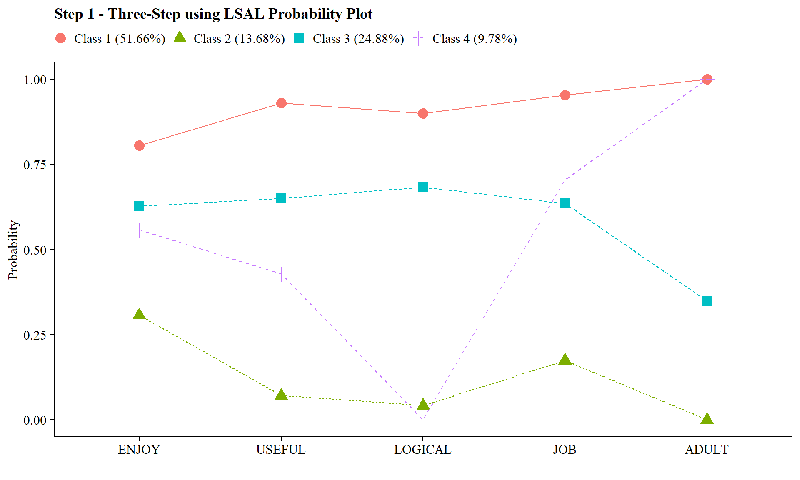
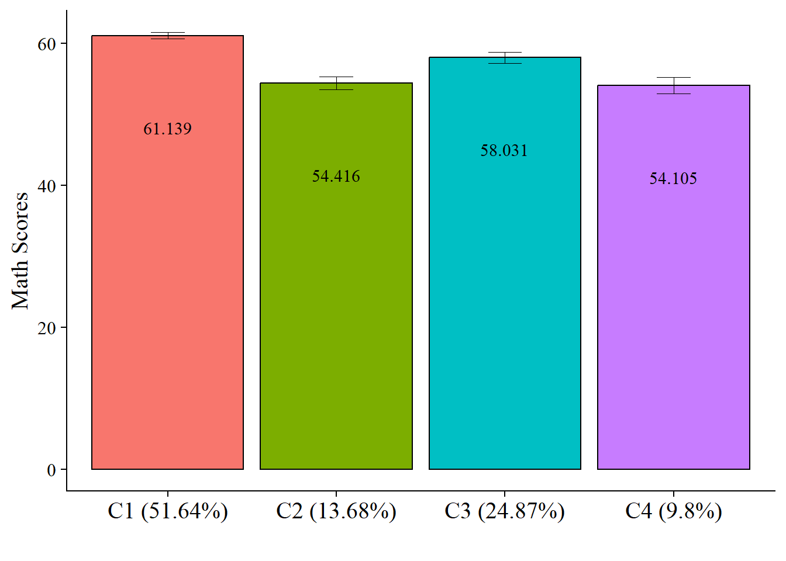

# Including Auxiliary Variables

------------------------------------------------------------------------

*Example: PISA Student Data*

**Data source:**

1.  The first example utilizes a dataset on undergraduate *Cheating* available from the `poLCA` package (Dayton, 1998): [See documentation here](https://cran.r-project.org/web/packages/poLCA/poLCA.pdf)

2.  The second examples utilizes the public-use dataset, *The Longitudinal Survey of American Youth* (**LSAY**): [See documentation here](https://www.lsay.org/)

------------------------------------------------------------------------

## Load packages


``` r
library(MplusAutomation)
library(tidyverse) #collection of R packages designed for data science
library(here) #helps with filepaths
library(janitor) #clean_names
library(gt) # create tables
library(cowplot) # a ggplot theme
library(DiagrammeR) # create path diagrams
library(glue) # allows us to paste expressions into R code
library(data.table) # used for `melt()` function  
library(poLCA)
library(reshape2)
```

------------------------------------------------------------------------

## Automated Three-Step

**Note**: Prior to adding covariates or distals enumeration must be conducted.
See Lab 6 for examples of enumeration with MplusAutomation.

------------------------------------------------------------------------

*Application: Undergraduate Cheating behavior*


"Dichotomous self-report responses by 319 undergraduates to four questions about cheating behavior" (poLCA, 2016).

------------------------------------------------------------------------

Prepare data


``` r

data(cheating)

cheating <- cheating %>% clean_names() 

df_cheat <-  cheating %>%                                  
  dplyr::select(1:4) %>%                                  
  mutate_all(funs(.-1)) %>%                                
  mutate(gpa = cheating$gpa)

# Detaching packages that mask the dpylr functions 
detach(package:poLCA, unload = TRUE)
detach(package:MASS, unload = TRUE)
```

------------------------------------------------------------------------

### DU3STEP

------------------------------------------------------------------------


```{=html}
<div class="grViz html-widget html-fill-item" id="htmlwidget-bf9fe27f06f3ef081fc2" style="width:672px;height:480px;"></div>
<script type="application/json" data-for="htmlwidget-bf9fe27f06f3ef081fc2">{"x":{"diagram":" digraph cfa_model {\n\n# The `graph` statement - No editing needed\n\n    graph [layout = dot, overlap = true]\n \n# Two `node` statements\n \n# One for measured variables (box) \n\n    node [shape=box]\n    GPA LieExam LiePaper Fraud CopyExam;\n \n# One for latent variables (circle) \n \n    node [shape=circle]\n    bully [label=<Cheating <br/>Behavior <br/>C<sub>k=2<\/sub>>];\n    \n# `edge` statements\n \n    edge [minlen = 2]\n    bully -> {LieExam LiePaper Fraud CopyExam}\n    bully -> GPA [minlen = 4];\n    \n {rank = same; bully; GPA}\n \n }","config":{"engine":"dot","options":null}},"evals":[],"jsHooks":[]}</script>
```


**DU3STEP** incorporates distal outcome variables (assumed to have unequal means and variances) with mixture models.

------------------------------------------------------------------------

#### Run the **DU3step** model with `gpa` as distal outcome


``` r

m_stepdu  <- mplusObject(
  TITLE = "DU3STEP - GPA as Distal", 
  VARIABLE = 
   "categorical = lieexam-copyexam; 
    usevar = lieexam-copyexam;
    auxiliary = gpa (du3step);
    classes = c(2);",
  
  ANALYSIS = 
   "estimator = mlr; 
    type = mixture;
    starts = 500 100; 
    processors = 10;",
  
  OUTPUT = "sampstat patterns tech11 tech14;",
  
  PLOT = 
    "type = plot3; 
     series = lieexam-copyexam(*);",
  
  usevariables = colnames(df_cheat),
  rdata = df_cheat)

m_stepdu_fit <- mplusModeler(m_stepdu, 
                            dataout=here("three_step", "auto_3step", "du3step.dat"),
                            modelout=here("three_step", "auto_3step", "c2_du3step.inp") ,
                            check=TRUE, run = TRUE, hashfilename = FALSE)

```

------------------------------------------------------------------------

#### Plot Distal Outcome 


``` r
modelParams <- readModels(here("three_step", "auto_3step", "c2_du3step.out"))

# Extract class size 
c_size <- as.data.frame(modelParams[["class_counts"]][["modelEstimated"]][["proportion"]]) %>% 
  rename("cs" = 1) %>% 
  mutate(cs = round(cs*100, 2))

c_size_val <- paste0("C", 1:nrow(c_size), glue(" ({c_size[1:nrow(c_size),]}%)"))


# Extract information as data frame
estimates <- as.data.frame(modelParams[["lcCondMeans"]][["overall"]]) %>%
  reshape2::melt(id.vars = "var") %>%
  mutate(variable = as.character(variable),
         LatentClass = case_when(
           endsWith(variable, "1") ~ c_size_val[1],
           endsWith(variable, "2") ~ c_size_val[2])) %>% #Add to this based on the number of classes you have
  head(-3) %>% 
  pivot_wider(names_from = variable, values_from = value) %>% 
  unite("mean", contains("m"), na.rm = TRUE) %>% 
  unite("se", contains("se"), na.rm = TRUE) %>% 
  mutate(across(c(mean, se), as.numeric))

# Add labels (NOTE: You must change the labels to match the significance testing!!) 
value_labels <- paste0(estimates$mean, c(" a"," b"))

# Plot bar graphs
estimates %>%
  ggplot(aes(fill = LatentClass, y = mean, x = LatentClass)) +
  geom_bar(position = "dodge", stat = "identity", color = "black") +
  geom_errorbar(aes(ymin=mean-se, ymax=mean+se),
                size=.3,    
                width=.2,
                position=position_dodge(.9)) +
  geom_text(aes(y = mean, label = value_labels), 
            family = "serif", size = 4,
            position=position_dodge(.9),
            vjust = 8) +
  #scale_fill_grey(start = .5, end = .7) +
  labs(y="GPA", x="") +
  theme_cowplot() +
  theme(text = element_text(family = "serif", size = 12),
        axis.text.x = element_text(size=12),
        legend.position="none") +
  coord_cartesian(expand = FALSE, 
                  ylim=c(0,max(estimates$mean*1.5))) # Change ylim based on distal outcome rang
```


``` r


# Save plot
ggsave(here("figures","Du3STEP_plot.jpeg"),                
       dpi=300, width=10, height = 7, units="in")  
```

------------------------------------------------------------------------

### R3STEP

------------------------------------------------------------------------


```{=html}
<div class="grViz html-widget html-fill-item" id="htmlwidget-352e8f73e23b44560e93" style="width:672px;height:480px;"></div>
<script type="application/json" data-for="htmlwidget-352e8f73e23b44560e93">{"x":{"diagram":" digraph cfa_model {\n\n# The `graph` statement - No editing needed\n\n    graph [layout = dot, overlap = true]\n \n# Two `node` statements\n \n# One for measured variables (box) \n\n    node [shape=box]\n    GPA LieExam LiePaper Fraud CopyExam;\n \n# One for latent variables (circle) \n \n    node [shape=circle]\n    bully [label=<Cheating <br/>Behavior <br/>C<sub>k=2<\/sub>>];\n    \n# `edge` statements\n \n    edge [minlen = 2]\n    bully -> {LieExam LiePaper Fraud CopyExam}\n    GPA -> bully [minlen = 4];\n    \n {rank = same; bully; GPA}\n \n }","config":{"engine":"dot","options":null}},"evals":[],"jsHooks":[]}</script>
```


**R3STEP** incorporates latent class predictors with mixture models.

------------------------------------------------------------------------

#### Run the **R3STEP** model with `gpa` as the latent class predictor


``` r

m_stepr  <- mplusObject(
  TITLE = "R3STEP - GPA as Predictor", 
  VARIABLE = 
   "categorical = lieexam-copyexam; 
    usevar = lieexam-copyexam;
    auxiliary = gpa (R3STEP);
    classes = c(2);",
  
  ANALYSIS = 
   "estimator = mlr; 
    type = mixture;
    starts = 500 100; 
    processors = 10;",
  
  OUTPUT = "sampstat patterns tech11 tech14;",
  
  PLOT = 
    "type = plot3; 
     series = lieexam-copyexam(*);",
  
  usevariables = colnames(df_cheat),
  rdata = df_cheat)

m_stepr_fit <- mplusModeler(m_stepr, 
                            dataout=here("three_step", "auto_3step", "r3step.dat"),
                            modelout=here("three_step", "auto_3step", "c2_r3step.inp") ,
                            check=TRUE, run = TRUE, hashfilename = FALSE)

```

------------------------------------------------------------------------

#### Regression slopes and odds ratios 


```
TESTS OF CATEGORICAL LATENT VARIABLE MULTINOMIAL LOGISTIC REGRESSIONS USING
THE 3-STEP PROCEDURE

   WARNING:  LISTWISE DELETION IS APPLIED TO THE AUXILIARY VARIABLES IN THE
   ANALYSIS.  TO AVOID LISTWISE DELETION, DATA IMPUTATION CAN BE USED
   FOR THE AUXILIARY VARIABLES FOLLOWED BY ANALYSIS WITH TYPE=IMPUTATION.
   NUMBER OF DELETED OBSERVATIONS:  4
   NUMBER OF OBSERVATIONS USED:  315

                                                    Two-Tailed
                    Estimate       S.E.  Est./S.E.    P-Value

 C#1        ON
    GPA               -0.698      0.255     -2.739      0.006

 Intercepts
    C#1               -0.241      0.460     -0.523      0.601

Parameterization using Reference Class 1

 C#2        ON
    GPA                0.698      0.255      2.739      0.006

 Intercepts
    C#2                0.241      0.460      0.523      0.601


ODDS RATIOS FOR TESTS OF CATEGORICAL LATENT VARIABLE MULTINOMIAL LOGISTIC REGRESSIONS
USING THE 3-STEP PROCEDURE

                                                95% C.I.
                    Estimate       S.E. Lower 2.5% Upper 2.5%

 C#1        ON
    GPA                0.498      0.127      0.302      0.820


Parameterization using Reference Class 1

 C#2        ON
    GPA                2.009      0.512      1.220      3.310
```


------------------------------------------------------------------------

## Manual Three-step


```{=html}
<div class="grViz html-widget html-fill-item" id="htmlwidget-d947f5ec4a901d7c0aa3" style="width:672px;height:480px;"></div>
<script type="application/json" data-for="htmlwidget-d947f5ec4a901d7c0aa3">{"x":{"diagram":" digraph lca_model {\n\n# The `graph` statement - No editing needed\n\n    graph [layout = dot, overlap = true]\n \n# Two `node` statements\n \n# One for measured variables (box) \n\n    node [shape=box]\n    Enjoy Useful Logical Job Adult Female MathScore;\n \n# One for latent variables (circle) \n \n    node [shape=circle]\n    science [label=<Science <br/>Attitudes <br/>C<sub>k=4<\/sub>>];\n    \n# `edge` statements\n \n    edge [minlen = 2]\n    science -> {Enjoy Useful Logical Job Adult}\n    science -> MathScore [minlen = 4];\n    Female -> science [minlen = 4];\n    Female -> MathScore [minlen = 4];\n    \n {rank = same; science; Female; MathScore}\n \n }","config":{"engine":"dot","options":null}},"evals":[],"jsHooks":[]}</script>
```


Integrate covariates and distals with a mixture model

------------------------------------------------------------------------

Application: Longitudinal Study of American Youth, **Science Attitudes**


```{=html}
<div id="wdqakuuauq" style="padding-left:0px;padding-right:0px;padding-top:10px;padding-bottom:10px;overflow-x:auto;overflow-y:auto;width:auto;height:auto;">
<style>#wdqakuuauq table {
  font-family: system-ui, 'Segoe UI', Roboto, Helvetica, Arial, sans-serif, 'Apple Color Emoji', 'Segoe UI Emoji', 'Segoe UI Symbol', 'Noto Color Emoji';
  -webkit-font-smoothing: antialiased;
  -moz-osx-font-smoothing: grayscale;
}

#wdqakuuauq thead, #wdqakuuauq tbody, #wdqakuuauq tfoot, #wdqakuuauq tr, #wdqakuuauq td, #wdqakuuauq th {
  border-style: none;
}

#wdqakuuauq p {
  margin: 0;
  padding: 0;
}

#wdqakuuauq .gt_table {
  display: table;
  border-collapse: collapse;
  line-height: normal;
  margin-left: auto;
  margin-right: auto;
  color: #333333;
  font-size: 16px;
  font-weight: normal;
  font-style: normal;
  background-color: #FFFFFF;
  width: auto;
  border-top-style: solid;
  border-top-width: 2px;
  border-top-color: #A8A8A8;
  border-right-style: none;
  border-right-width: 2px;
  border-right-color: #D3D3D3;
  border-bottom-style: solid;
  border-bottom-width: 2px;
  border-bottom-color: #A8A8A8;
  border-left-style: none;
  border-left-width: 2px;
  border-left-color: #D3D3D3;
}

#wdqakuuauq .gt_caption {
  padding-top: 4px;
  padding-bottom: 4px;
}

#wdqakuuauq .gt_title {
  color: #333333;
  font-size: 125%;
  font-weight: initial;
  padding-top: 4px;
  padding-bottom: 4px;
  padding-left: 5px;
  padding-right: 5px;
  border-bottom-color: #FFFFFF;
  border-bottom-width: 0;
}

#wdqakuuauq .gt_subtitle {
  color: #333333;
  font-size: 85%;
  font-weight: initial;
  padding-top: 3px;
  padding-bottom: 5px;
  padding-left: 5px;
  padding-right: 5px;
  border-top-color: #FFFFFF;
  border-top-width: 0;
}

#wdqakuuauq .gt_heading {
  background-color: #FFFFFF;
  text-align: center;
  border-bottom-color: #FFFFFF;
  border-left-style: none;
  border-left-width: 1px;
  border-left-color: #D3D3D3;
  border-right-style: none;
  border-right-width: 1px;
  border-right-color: #D3D3D3;
}

#wdqakuuauq .gt_bottom_border {
  border-bottom-style: solid;
  border-bottom-width: 2px;
  border-bottom-color: #D3D3D3;
}

#wdqakuuauq .gt_col_headings {
  border-top-style: solid;
  border-top-width: 2px;
  border-top-color: #D3D3D3;
  border-bottom-style: solid;
  border-bottom-width: 2px;
  border-bottom-color: #D3D3D3;
  border-left-style: none;
  border-left-width: 1px;
  border-left-color: #D3D3D3;
  border-right-style: none;
  border-right-width: 1px;
  border-right-color: #D3D3D3;
}

#wdqakuuauq .gt_col_heading {
  color: #333333;
  background-color: #FFFFFF;
  font-size: 100%;
  font-weight: bold;
  text-transform: inherit;
  border-left-style: none;
  border-left-width: 1px;
  border-left-color: #D3D3D3;
  border-right-style: none;
  border-right-width: 1px;
  border-right-color: #D3D3D3;
  vertical-align: bottom;
  padding-top: 5px;
  padding-bottom: 6px;
  padding-left: 5px;
  padding-right: 5px;
  overflow-x: hidden;
}

#wdqakuuauq .gt_column_spanner_outer {
  color: #333333;
  background-color: #FFFFFF;
  font-size: 100%;
  font-weight: bold;
  text-transform: inherit;
  padding-top: 0;
  padding-bottom: 0;
  padding-left: 4px;
  padding-right: 4px;
}

#wdqakuuauq .gt_column_spanner_outer:first-child {
  padding-left: 0;
}

#wdqakuuauq .gt_column_spanner_outer:last-child {
  padding-right: 0;
}

#wdqakuuauq .gt_column_spanner {
  border-bottom-style: solid;
  border-bottom-width: 2px;
  border-bottom-color: #D3D3D3;
  vertical-align: bottom;
  padding-top: 5px;
  padding-bottom: 5px;
  overflow-x: hidden;
  display: inline-block;
  width: 100%;
}

#wdqakuuauq .gt_spanner_row {
  border-bottom-style: hidden;
}

#wdqakuuauq .gt_group_heading {
  padding-top: 8px;
  padding-bottom: 8px;
  padding-left: 5px;
  padding-right: 5px;
  color: #333333;
  background-color: #FFFFFF;
  font-size: 100%;
  font-weight: bold;
  text-transform: inherit;
  border-top-style: solid;
  border-top-width: 2px;
  border-top-color: #D3D3D3;
  border-bottom-style: solid;
  border-bottom-width: 2px;
  border-bottom-color: #D3D3D3;
  border-left-style: none;
  border-left-width: 1px;
  border-left-color: #D3D3D3;
  border-right-style: none;
  border-right-width: 1px;
  border-right-color: #D3D3D3;
  vertical-align: middle;
  text-align: left;
}

#wdqakuuauq .gt_empty_group_heading {
  padding: 0.5px;
  color: #333333;
  background-color: #FFFFFF;
  font-size: 100%;
  font-weight: bold;
  border-top-style: solid;
  border-top-width: 2px;
  border-top-color: #D3D3D3;
  border-bottom-style: solid;
  border-bottom-width: 2px;
  border-bottom-color: #D3D3D3;
  vertical-align: middle;
}

#wdqakuuauq .gt_from_md > :first-child {
  margin-top: 0;
}

#wdqakuuauq .gt_from_md > :last-child {
  margin-bottom: 0;
}

#wdqakuuauq .gt_row {
  padding-top: 8px;
  padding-bottom: 8px;
  padding-left: 5px;
  padding-right: 5px;
  margin: 10px;
  border-top-style: solid;
  border-top-width: 1px;
  border-top-color: #D3D3D3;
  border-left-style: none;
  border-left-width: 1px;
  border-left-color: #D3D3D3;
  border-right-style: none;
  border-right-width: 1px;
  border-right-color: #D3D3D3;
  vertical-align: middle;
  overflow-x: hidden;
}

#wdqakuuauq .gt_stub {
  color: #333333;
  background-color: #FFFFFF;
  font-size: 100%;
  font-weight: initial;
  text-transform: inherit;
  border-right-style: solid;
  border-right-width: 2px;
  border-right-color: #D3D3D3;
  padding-left: 5px;
  padding-right: 5px;
}

#wdqakuuauq .gt_stub_row_group {
  color: #333333;
  background-color: #FFFFFF;
  font-size: 100%;
  font-weight: initial;
  text-transform: inherit;
  border-right-style: solid;
  border-right-width: 2px;
  border-right-color: #D3D3D3;
  padding-left: 5px;
  padding-right: 5px;
  vertical-align: top;
}

#wdqakuuauq .gt_row_group_first td {
  border-top-width: 2px;
}

#wdqakuuauq .gt_row_group_first th {
  border-top-width: 2px;
}

#wdqakuuauq .gt_summary_row {
  color: #333333;
  background-color: #FFFFFF;
  text-transform: inherit;
  padding-top: 8px;
  padding-bottom: 8px;
  padding-left: 5px;
  padding-right: 5px;
}

#wdqakuuauq .gt_first_summary_row {
  border-top-style: solid;
  border-top-color: #D3D3D3;
}

#wdqakuuauq .gt_first_summary_row.thick {
  border-top-width: 2px;
}

#wdqakuuauq .gt_last_summary_row {
  padding-top: 8px;
  padding-bottom: 8px;
  padding-left: 5px;
  padding-right: 5px;
  border-bottom-style: solid;
  border-bottom-width: 2px;
  border-bottom-color: #D3D3D3;
}

#wdqakuuauq .gt_grand_summary_row {
  color: #333333;
  background-color: #FFFFFF;
  text-transform: inherit;
  padding-top: 8px;
  padding-bottom: 8px;
  padding-left: 5px;
  padding-right: 5px;
}

#wdqakuuauq .gt_first_grand_summary_row {
  padding-top: 8px;
  padding-bottom: 8px;
  padding-left: 5px;
  padding-right: 5px;
  border-top-style: double;
  border-top-width: 6px;
  border-top-color: #D3D3D3;
}

#wdqakuuauq .gt_last_grand_summary_row_top {
  padding-top: 8px;
  padding-bottom: 8px;
  padding-left: 5px;
  padding-right: 5px;
  border-bottom-style: double;
  border-bottom-width: 6px;
  border-bottom-color: #D3D3D3;
}

#wdqakuuauq .gt_striped {
  background-color: rgba(128, 128, 128, 0.05);
}

#wdqakuuauq .gt_table_body {
  border-top-style: solid;
  border-top-width: 2px;
  border-top-color: #D3D3D3;
  border-bottom-style: solid;
  border-bottom-width: 2px;
  border-bottom-color: #D3D3D3;
}

#wdqakuuauq .gt_footnotes {
  color: #333333;
  background-color: #FFFFFF;
  border-bottom-style: none;
  border-bottom-width: 2px;
  border-bottom-color: #D3D3D3;
  border-left-style: none;
  border-left-width: 2px;
  border-left-color: #D3D3D3;
  border-right-style: none;
  border-right-width: 2px;
  border-right-color: #D3D3D3;
}

#wdqakuuauq .gt_footnote {
  margin: 0px;
  font-size: 90%;
  padding-top: 4px;
  padding-bottom: 4px;
  padding-left: 5px;
  padding-right: 5px;
}

#wdqakuuauq .gt_sourcenotes {
  color: #333333;
  background-color: #FFFFFF;
  border-bottom-style: none;
  border-bottom-width: 2px;
  border-bottom-color: #D3D3D3;
  border-left-style: none;
  border-left-width: 2px;
  border-left-color: #D3D3D3;
  border-right-style: none;
  border-right-width: 2px;
  border-right-color: #D3D3D3;
}

#wdqakuuauq .gt_sourcenote {
  font-size: 90%;
  padding-top: 4px;
  padding-bottom: 4px;
  padding-left: 5px;
  padding-right: 5px;
}

#wdqakuuauq .gt_left {
  text-align: left;
}

#wdqakuuauq .gt_center {
  text-align: center;
}

#wdqakuuauq .gt_right {
  text-align: right;
  font-variant-numeric: tabular-nums;
}

#wdqakuuauq .gt_font_normal {
  font-weight: normal;
}

#wdqakuuauq .gt_font_bold {
  font-weight: bold;
}

#wdqakuuauq .gt_font_italic {
  font-style: italic;
}

#wdqakuuauq .gt_super {
  font-size: 65%;
}

#wdqakuuauq .gt_footnote_marks {
  font-size: 75%;
  vertical-align: 0.4em;
  position: initial;
}

#wdqakuuauq .gt_asterisk {
  font-size: 100%;
  vertical-align: 0;
}

#wdqakuuauq .gt_indent_1 {
  text-indent: 5px;
}

#wdqakuuauq .gt_indent_2 {
  text-indent: 10px;
}

#wdqakuuauq .gt_indent_3 {
  text-indent: 15px;
}

#wdqakuuauq .gt_indent_4 {
  text-indent: 20px;
}

#wdqakuuauq .gt_indent_5 {
  text-indent: 25px;
}

#wdqakuuauq .katex-display {
  display: inline-flex !important;
  margin-bottom: 0.75em !important;
}

#wdqakuuauq div.Reactable > div.rt-table > div.rt-thead > div.rt-tr.rt-tr-group-header > div.rt-th-group:after {
  height: 0px !important;
}
</style>
<table class="gt_table" data-quarto-disable-processing="false" data-quarto-bootstrap="false">
  <thead>
    <tr class="gt_heading">
      <td colspan="2" class="gt_heading gt_title gt_font_normal" style><span class='gt_from_md'><strong>LCA Indicators &amp; Auxiliary Variables: Math Attitudes Example</strong></span></td>
    </tr>
    <tr class="gt_heading">
      <td colspan="2" class="gt_heading gt_subtitle gt_font_normal gt_bottom_border" style><span class='gt_from_md'> </span></td>
    </tr>
    <tr class="gt_col_headings">
      <th class="gt_col_heading gt_columns_bottom_border gt_left" rowspan="1" colspan="1" scope="col" id="Name">Name</th>
      <th class="gt_col_heading gt_columns_bottom_border gt_left" rowspan="1" colspan="1" scope="col" id="a-Variable-Description"> Variable Description</th>
    </tr>
  </thead>
  <tbody class="gt_table_body">
    <tr class="gt_group_heading_row">
      <th colspan="2" class="gt_empty_group_heading" scope="colgroup"></th>
    </tr>
    <tr class="gt_row_group_first"><td headers="  Name" class="gt_row gt_left">enjoy</td>
<td headers="   Variable Description" class="gt_row gt_left">I enjoy math.</td></tr>
    <tr><td headers="  Name" class="gt_row gt_left">useful</td>
<td headers="   Variable Description" class="gt_row gt_left">Math is useful in everyday problems.</td></tr>
    <tr><td headers="  Name" class="gt_row gt_left">logical</td>
<td headers="   Variable Description" class="gt_row gt_left">Math helps a person think logically.</td></tr>
    <tr><td headers="  Name" class="gt_row gt_left">job</td>
<td headers="   Variable Description" class="gt_row gt_left">It is important to know math to get a good job.</td></tr>
    <tr><td headers="  Name" class="gt_row gt_left">adult</td>
<td headers="   Variable Description" class="gt_row gt_left">I will use math in many ways as an adult.</td></tr>
    <tr class="gt_group_heading_row">
      <th colspan="2" class="gt_group_heading" scope="colgroup" id="Auxiliary Variables">Auxiliary Variables</th>
    </tr>
    <tr class="gt_row_group_first"><td headers="Auxiliary Variables  Name" class="gt_row gt_left">female</td>
<td headers="Auxiliary Variables   Variable Description" class="gt_row gt_left">Self-reported student gender (0=Male, 1=Female).</td></tr>
    <tr><td headers="Auxiliary Variables  Name" class="gt_row gt_left">math_irt</td>
<td headers="Auxiliary Variables   Variable Description" class="gt_row gt_left">Standardized IRT math test score - 12th grade.</td></tr>
  </tbody>
  
  
</table>
</div>
```


------------------------------------------------------------------------

The data can be found in the `data` folder and is called `lsay_subset.csv`.


``` r
lsay_data <- read_csv(here("three_step","data","lsay_subset.csv")) %>% 
  clean_names() %>%   # make variable names lowercase
  mutate(female = recode(gender, `1` = 0, `2` = 1)) # relabel values from 1,2 to 0,1

```

------------------------------------------------------------------------

### ML Method

------------------------------------------------------------------------

#### Step 1 - Class Enumeration w/ Auxiliary Specification

------------------------------------------------------------------------

This step is done after class enumeration (or after you have selected the best latent class model). In this example, the four class model was the best. Now, I am re-estimating the four-class model using `optseed` for efficiency. The difference here is the `SAVEDATA` command, where I can save the posterior probabilities and the modal class assignment for steps two and three. 


``` r

step1  <- mplusObject(
  TITLE = "Step 1 - Three-Step using LSAL", 
  VARIABLE = 
  "categorical = enjoy useful logical job adult; 
   usevar = enjoy useful logical job adult;
    
   classes = c(4); 
    
   auxiliary =   ! list all potential covariates and distals here
   female        ! covariate
   math_irt;      ! distal math test score in 12th grade ",
  
  ANALYSIS = 
   "estimator = mlr; 
    type = mixture;
    starts = 0;
    optseed = 568405;",
  
  SAVEDATA = 
   "File=3step_savedata.dat;
    Save=cprob;",
  
  OUTPUT = "residual tech11 tech14",
  
  PLOT = 
    "type = plot3; 
    series = enjoy-adult(*);",
  
  usevariables = colnames(lsay_data),
  rdata = lsay_data)

step1_fit <- mplusModeler(step1,
                            dataout=here("three_step", "manual_3step", "Step1.dat"),
                            modelout=here("three_step", "manual_3step", "one.inp") ,
                            check=TRUE, run = TRUE, hashfilename = FALSE)
```

------------------------------------------------------------------------


``` r
source("plot_lca.txt")
output_lsay <- readModels(here("three_step", "manual_3step","one.out"))

plot_lca(model_name = output_lsay)
```



------------------------------------------------------------------------

#### Step 2 - Determine Measurement Error

------------------------------------------------------------------------

Extract logits for the classification probabilities for the most likely latent class


``` r
logit_cprobs <- as.data.frame(output_lsay[["class_counts"]]
                                       [["logitProbs.mostLikely"]])
```

Extract saved dataset which is part of the mplusObject "step1_fit"


``` r
savedata <- as.data.frame(output_lsay[["savedata"]])
```

Rename the column in savedata named "C" and change to "N"


``` r
colnames(savedata)[colnames(savedata)=="C"] <- "N"
```


------------------------------------------------------------------------

#### Step 3 - Add Auxiliary Variables

------------------------------------------------------------------------

Model with 1 covariate and 1 distal outcome


``` r
step3  <- mplusObject(
  TITLE = "Step3 - 3step LSAY", 
  
  VARIABLE = 
 "nominal=N;
  usevar = n;
  
  classes = c(4);
  
  usevar = female math_irt;" ,
  
  ANALYSIS = 
 "estimator = mlr; 
  type = mixture; 
  starts = 0;",
 
  DEFINE = 
   "center female (grandmean);",
  
  MODEL =
  glue(
 " %OVERALL%
 
  math_irt on female; ! covariate as a predictor of the distal outcome
  C on female;        ! covariate as predictor of C

     %C#1%
  [n#1@{logit_cprobs[1,1]}]; ! MUST EDIT if you do not have a 4-class model. 
  [n#2@{logit_cprobs[1,2]}];
  [n#3@{logit_cprobs[1,3]}];
  
  [math_irt](m1);    ! conditional distal mean 
  math_irt;          ! conditional distal variance (freely estimated)

  %C#2%
  [n#1@{logit_cprobs[2,1]}];
  [n#2@{logit_cprobs[2,2]}];
  [n#3@{logit_cprobs[2,3]}];
  
  [math_irt](m2);
  math_irt;
  
  %C#3%
  [n#1@{logit_cprobs[3,1]}];
  [n#2@{logit_cprobs[3,2]}];
  [n#3@{logit_cprobs[3,3]}];
  
  [math_irt](m3);
  math_irt;

  %C#4%
  [n#1@{logit_cprobs[4,1]}];
  [n#2@{logit_cprobs[4,2]}];
  [n#3@{logit_cprobs[4,3]}];
  
  [math_irt](m4);
  math_irt; "),
  
  MODELCONSTRAINT = 
   "New (diff12 diff13 diff23 
    diff14 diff24 diff34);
  
    diff12 = m1-m2;  ! test pairwise distal mean differences
    diff13 = m1-m3;
    diff23 = m2-m3;
    diff14 = m1-m4;
    diff24 = m2-m4;
    diff34 = m3-m4;",
  
  MODELTEST = "     ! omnibus test of distal means 
    m1=m2;
    m2=m3;
    m3=m4;",
 
  usevariables = colnames(savedata), 
  rdata = savedata)

step3_fit <- mplusModeler(step3,
               dataout=here("three_step", "manual_3step", "Step3.dat"), 
               modelout=here("three_step", "manual_3step", "three.inp"), 
               check=TRUE, run = TRUE, hashfilename = FALSE)
```

------------------------------------------------------------------------

##### Wald Test Table


``` r
modelParams <- readModels(here("three_step", "manual_3step", "three.out"))

# Extract information as data frame
wald <- as.data.frame(modelParams[["summaries"]]) %>%
  dplyr::select(WaldChiSq_Value:WaldChiSq_PValue) %>% 
  mutate(WaldChiSq_DF = paste0("(", WaldChiSq_DF, ")")) %>% 
  unite(wald_test, WaldChiSq_Value, WaldChiSq_DF, sep = " ") %>% 
  rename(pval = WaldChiSq_PValue) %>% 
  mutate(pval = ifelse(pval<0.001, paste0("<.001*"),
                       ifelse(pval<0.05, paste0(scales::number(pval, accuracy = .001), "*"),
                              scales::number(pval, accuracy = .001))))

# Create table

wald_table <- wald %>% 
  gt() %>%
    tab_header(
    title = "Wald Test of Paramter Constraints (Math)") %>%
    cols_label(
      wald_test = md("Wald Test (*df*)"),
      pval = md("*p*-value")) %>% 
  cols_align(align = "center") %>% 
  opt_align_table_header(align = "left") %>% 
  gt::tab_options(table.font.names = "serif")

wald_table
```


```{=html}
<div id="lhwaqyjayi" style="padding-left:0px;padding-right:0px;padding-top:10px;padding-bottom:10px;overflow-x:auto;overflow-y:auto;width:auto;height:auto;">
<style>#lhwaqyjayi table {
  font-family: serif;
  -webkit-font-smoothing: antialiased;
  -moz-osx-font-smoothing: grayscale;
}

#lhwaqyjayi thead, #lhwaqyjayi tbody, #lhwaqyjayi tfoot, #lhwaqyjayi tr, #lhwaqyjayi td, #lhwaqyjayi th {
  border-style: none;
}

#lhwaqyjayi p {
  margin: 0;
  padding: 0;
}

#lhwaqyjayi .gt_table {
  display: table;
  border-collapse: collapse;
  line-height: normal;
  margin-left: auto;
  margin-right: auto;
  color: #333333;
  font-size: 16px;
  font-weight: normal;
  font-style: normal;
  background-color: #FFFFFF;
  width: auto;
  border-top-style: solid;
  border-top-width: 2px;
  border-top-color: #A8A8A8;
  border-right-style: none;
  border-right-width: 2px;
  border-right-color: #D3D3D3;
  border-bottom-style: solid;
  border-bottom-width: 2px;
  border-bottom-color: #A8A8A8;
  border-left-style: none;
  border-left-width: 2px;
  border-left-color: #D3D3D3;
}

#lhwaqyjayi .gt_caption {
  padding-top: 4px;
  padding-bottom: 4px;
}

#lhwaqyjayi .gt_title {
  color: #333333;
  font-size: 125%;
  font-weight: initial;
  padding-top: 4px;
  padding-bottom: 4px;
  padding-left: 5px;
  padding-right: 5px;
  border-bottom-color: #FFFFFF;
  border-bottom-width: 0;
}

#lhwaqyjayi .gt_subtitle {
  color: #333333;
  font-size: 85%;
  font-weight: initial;
  padding-top: 3px;
  padding-bottom: 5px;
  padding-left: 5px;
  padding-right: 5px;
  border-top-color: #FFFFFF;
  border-top-width: 0;
}

#lhwaqyjayi .gt_heading {
  background-color: #FFFFFF;
  text-align: left;
  border-bottom-color: #FFFFFF;
  border-left-style: none;
  border-left-width: 1px;
  border-left-color: #D3D3D3;
  border-right-style: none;
  border-right-width: 1px;
  border-right-color: #D3D3D3;
}

#lhwaqyjayi .gt_bottom_border {
  border-bottom-style: solid;
  border-bottom-width: 2px;
  border-bottom-color: #D3D3D3;
}

#lhwaqyjayi .gt_col_headings {
  border-top-style: solid;
  border-top-width: 2px;
  border-top-color: #D3D3D3;
  border-bottom-style: solid;
  border-bottom-width: 2px;
  border-bottom-color: #D3D3D3;
  border-left-style: none;
  border-left-width: 1px;
  border-left-color: #D3D3D3;
  border-right-style: none;
  border-right-width: 1px;
  border-right-color: #D3D3D3;
}

#lhwaqyjayi .gt_col_heading {
  color: #333333;
  background-color: #FFFFFF;
  font-size: 100%;
  font-weight: normal;
  text-transform: inherit;
  border-left-style: none;
  border-left-width: 1px;
  border-left-color: #D3D3D3;
  border-right-style: none;
  border-right-width: 1px;
  border-right-color: #D3D3D3;
  vertical-align: bottom;
  padding-top: 5px;
  padding-bottom: 6px;
  padding-left: 5px;
  padding-right: 5px;
  overflow-x: hidden;
}

#lhwaqyjayi .gt_column_spanner_outer {
  color: #333333;
  background-color: #FFFFFF;
  font-size: 100%;
  font-weight: normal;
  text-transform: inherit;
  padding-top: 0;
  padding-bottom: 0;
  padding-left: 4px;
  padding-right: 4px;
}

#lhwaqyjayi .gt_column_spanner_outer:first-child {
  padding-left: 0;
}

#lhwaqyjayi .gt_column_spanner_outer:last-child {
  padding-right: 0;
}

#lhwaqyjayi .gt_column_spanner {
  border-bottom-style: solid;
  border-bottom-width: 2px;
  border-bottom-color: #D3D3D3;
  vertical-align: bottom;
  padding-top: 5px;
  padding-bottom: 5px;
  overflow-x: hidden;
  display: inline-block;
  width: 100%;
}

#lhwaqyjayi .gt_spanner_row {
  border-bottom-style: hidden;
}

#lhwaqyjayi .gt_group_heading {
  padding-top: 8px;
  padding-bottom: 8px;
  padding-left: 5px;
  padding-right: 5px;
  color: #333333;
  background-color: #FFFFFF;
  font-size: 100%;
  font-weight: initial;
  text-transform: inherit;
  border-top-style: solid;
  border-top-width: 2px;
  border-top-color: #D3D3D3;
  border-bottom-style: solid;
  border-bottom-width: 2px;
  border-bottom-color: #D3D3D3;
  border-left-style: none;
  border-left-width: 1px;
  border-left-color: #D3D3D3;
  border-right-style: none;
  border-right-width: 1px;
  border-right-color: #D3D3D3;
  vertical-align: middle;
  text-align: left;
}

#lhwaqyjayi .gt_empty_group_heading {
  padding: 0.5px;
  color: #333333;
  background-color: #FFFFFF;
  font-size: 100%;
  font-weight: initial;
  border-top-style: solid;
  border-top-width: 2px;
  border-top-color: #D3D3D3;
  border-bottom-style: solid;
  border-bottom-width: 2px;
  border-bottom-color: #D3D3D3;
  vertical-align: middle;
}

#lhwaqyjayi .gt_from_md > :first-child {
  margin-top: 0;
}

#lhwaqyjayi .gt_from_md > :last-child {
  margin-bottom: 0;
}

#lhwaqyjayi .gt_row {
  padding-top: 8px;
  padding-bottom: 8px;
  padding-left: 5px;
  padding-right: 5px;
  margin: 10px;
  border-top-style: solid;
  border-top-width: 1px;
  border-top-color: #D3D3D3;
  border-left-style: none;
  border-left-width: 1px;
  border-left-color: #D3D3D3;
  border-right-style: none;
  border-right-width: 1px;
  border-right-color: #D3D3D3;
  vertical-align: middle;
  overflow-x: hidden;
}

#lhwaqyjayi .gt_stub {
  color: #333333;
  background-color: #FFFFFF;
  font-size: 100%;
  font-weight: initial;
  text-transform: inherit;
  border-right-style: solid;
  border-right-width: 2px;
  border-right-color: #D3D3D3;
  padding-left: 5px;
  padding-right: 5px;
}

#lhwaqyjayi .gt_stub_row_group {
  color: #333333;
  background-color: #FFFFFF;
  font-size: 100%;
  font-weight: initial;
  text-transform: inherit;
  border-right-style: solid;
  border-right-width: 2px;
  border-right-color: #D3D3D3;
  padding-left: 5px;
  padding-right: 5px;
  vertical-align: top;
}

#lhwaqyjayi .gt_row_group_first td {
  border-top-width: 2px;
}

#lhwaqyjayi .gt_row_group_first th {
  border-top-width: 2px;
}

#lhwaqyjayi .gt_summary_row {
  color: #333333;
  background-color: #FFFFFF;
  text-transform: inherit;
  padding-top: 8px;
  padding-bottom: 8px;
  padding-left: 5px;
  padding-right: 5px;
}

#lhwaqyjayi .gt_first_summary_row {
  border-top-style: solid;
  border-top-color: #D3D3D3;
}

#lhwaqyjayi .gt_first_summary_row.thick {
  border-top-width: 2px;
}

#lhwaqyjayi .gt_last_summary_row {
  padding-top: 8px;
  padding-bottom: 8px;
  padding-left: 5px;
  padding-right: 5px;
  border-bottom-style: solid;
  border-bottom-width: 2px;
  border-bottom-color: #D3D3D3;
}

#lhwaqyjayi .gt_grand_summary_row {
  color: #333333;
  background-color: #FFFFFF;
  text-transform: inherit;
  padding-top: 8px;
  padding-bottom: 8px;
  padding-left: 5px;
  padding-right: 5px;
}

#lhwaqyjayi .gt_first_grand_summary_row {
  padding-top: 8px;
  padding-bottom: 8px;
  padding-left: 5px;
  padding-right: 5px;
  border-top-style: double;
  border-top-width: 6px;
  border-top-color: #D3D3D3;
}

#lhwaqyjayi .gt_last_grand_summary_row_top {
  padding-top: 8px;
  padding-bottom: 8px;
  padding-left: 5px;
  padding-right: 5px;
  border-bottom-style: double;
  border-bottom-width: 6px;
  border-bottom-color: #D3D3D3;
}

#lhwaqyjayi .gt_striped {
  background-color: rgba(128, 128, 128, 0.05);
}

#lhwaqyjayi .gt_table_body {
  border-top-style: solid;
  border-top-width: 2px;
  border-top-color: #D3D3D3;
  border-bottom-style: solid;
  border-bottom-width: 2px;
  border-bottom-color: #D3D3D3;
}

#lhwaqyjayi .gt_footnotes {
  color: #333333;
  background-color: #FFFFFF;
  border-bottom-style: none;
  border-bottom-width: 2px;
  border-bottom-color: #D3D3D3;
  border-left-style: none;
  border-left-width: 2px;
  border-left-color: #D3D3D3;
  border-right-style: none;
  border-right-width: 2px;
  border-right-color: #D3D3D3;
}

#lhwaqyjayi .gt_footnote {
  margin: 0px;
  font-size: 90%;
  padding-top: 4px;
  padding-bottom: 4px;
  padding-left: 5px;
  padding-right: 5px;
}

#lhwaqyjayi .gt_sourcenotes {
  color: #333333;
  background-color: #FFFFFF;
  border-bottom-style: none;
  border-bottom-width: 2px;
  border-bottom-color: #D3D3D3;
  border-left-style: none;
  border-left-width: 2px;
  border-left-color: #D3D3D3;
  border-right-style: none;
  border-right-width: 2px;
  border-right-color: #D3D3D3;
}

#lhwaqyjayi .gt_sourcenote {
  font-size: 90%;
  padding-top: 4px;
  padding-bottom: 4px;
  padding-left: 5px;
  padding-right: 5px;
}

#lhwaqyjayi .gt_left {
  text-align: left;
}

#lhwaqyjayi .gt_center {
  text-align: center;
}

#lhwaqyjayi .gt_right {
  text-align: right;
  font-variant-numeric: tabular-nums;
}

#lhwaqyjayi .gt_font_normal {
  font-weight: normal;
}

#lhwaqyjayi .gt_font_bold {
  font-weight: bold;
}

#lhwaqyjayi .gt_font_italic {
  font-style: italic;
}

#lhwaqyjayi .gt_super {
  font-size: 65%;
}

#lhwaqyjayi .gt_footnote_marks {
  font-size: 75%;
  vertical-align: 0.4em;
  position: initial;
}

#lhwaqyjayi .gt_asterisk {
  font-size: 100%;
  vertical-align: 0;
}

#lhwaqyjayi .gt_indent_1 {
  text-indent: 5px;
}

#lhwaqyjayi .gt_indent_2 {
  text-indent: 10px;
}

#lhwaqyjayi .gt_indent_3 {
  text-indent: 15px;
}

#lhwaqyjayi .gt_indent_4 {
  text-indent: 20px;
}

#lhwaqyjayi .gt_indent_5 {
  text-indent: 25px;
}

#lhwaqyjayi .katex-display {
  display: inline-flex !important;
  margin-bottom: 0.75em !important;
}

#lhwaqyjayi div.Reactable > div.rt-table > div.rt-thead > div.rt-tr.rt-tr-group-header > div.rt-th-group:after {
  height: 0px !important;
}
</style>
<table class="gt_table" data-quarto-disable-processing="false" data-quarto-bootstrap="false">
  <thead>
    <tr class="gt_heading">
      <td colspan="2" class="gt_heading gt_title gt_font_normal gt_bottom_border" style>Wald Test of Paramter Constraints (Math)</td>
    </tr>
    
    <tr class="gt_col_headings">
      <th class="gt_col_heading gt_columns_bottom_border gt_center" rowspan="1" colspan="1" scope="col" id="wald_test"><span class='gt_from_md'>Wald Test (<em>df</em>)</span></th>
      <th class="gt_col_heading gt_columns_bottom_border gt_center" rowspan="1" colspan="1" scope="col" id="pval"><span class='gt_from_md'><em>p</em>-value</span></th>
    </tr>
  </thead>
  <tbody class="gt_table_body">
    <tr><td headers="wald_test" class="gt_row gt_center">69.134 (3)</td>
<td headers="pval" class="gt_row gt_center">&lt;.001*</td></tr>
  </tbody>
  
  
</table>
</div>
```


Save figure


``` r
gtsave(wald_table, here("figures","wald_table.docx"))
```


------------------------------------------------------------------------

##### Table of Distal Outcome Differences


``` r
# Extract information as data frame
diff <- as.data.frame(modelParams[["parameters"]][["unstandardized"]]) %>%
  filter(grepl("DIFF", param)) %>% 
  dplyr::select(param:pval) %>% 
  mutate(se = paste0("(", format(round(se,2), nsmall =2), ")")) %>% 
  unite(estimate, est, se, sep = " ") %>% 
  mutate(param = str_remove(param, "DIFF"),
         param = as.numeric(param)) %>% 
  separate(param, into = paste0("Group", 1:2), sep = 1) %>% 
  mutate(class = paste0("Class ", Group1, " vs ", Group2)) %>% 
  select(class, estimate, pval) %>% 
  mutate(pval = ifelse(pval<0.001, paste0("<.001*"),
                       ifelse(pval<0.05, paste0(scales::number(pval, accuracy = .001), "*"),
                              scales::number(pval, accuracy = .001))))

# Create table

diff %>% 
  gt() %>%
    tab_header(
    title = "Distal Outcome Differences") %>%
    cols_label(
      class = "Class",
      estimate = md("Mean (*se*)"),
      pval = md("*p*-value")) %>% 
    sub_missing(1:3,
              missing_text = "") %>%
  cols_align(align = "center") %>% 
  opt_align_table_header(align = "left") %>% 
  gt::tab_options(table.font.names = "serif")
```


```{=html}
<div id="cxsuyhqdkx" style="padding-left:0px;padding-right:0px;padding-top:10px;padding-bottom:10px;overflow-x:auto;overflow-y:auto;width:auto;height:auto;">
<style>#cxsuyhqdkx table {
  font-family: serif;
  -webkit-font-smoothing: antialiased;
  -moz-osx-font-smoothing: grayscale;
}

#cxsuyhqdkx thead, #cxsuyhqdkx tbody, #cxsuyhqdkx tfoot, #cxsuyhqdkx tr, #cxsuyhqdkx td, #cxsuyhqdkx th {
  border-style: none;
}

#cxsuyhqdkx p {
  margin: 0;
  padding: 0;
}

#cxsuyhqdkx .gt_table {
  display: table;
  border-collapse: collapse;
  line-height: normal;
  margin-left: auto;
  margin-right: auto;
  color: #333333;
  font-size: 16px;
  font-weight: normal;
  font-style: normal;
  background-color: #FFFFFF;
  width: auto;
  border-top-style: solid;
  border-top-width: 2px;
  border-top-color: #A8A8A8;
  border-right-style: none;
  border-right-width: 2px;
  border-right-color: #D3D3D3;
  border-bottom-style: solid;
  border-bottom-width: 2px;
  border-bottom-color: #A8A8A8;
  border-left-style: none;
  border-left-width: 2px;
  border-left-color: #D3D3D3;
}

#cxsuyhqdkx .gt_caption {
  padding-top: 4px;
  padding-bottom: 4px;
}

#cxsuyhqdkx .gt_title {
  color: #333333;
  font-size: 125%;
  font-weight: initial;
  padding-top: 4px;
  padding-bottom: 4px;
  padding-left: 5px;
  padding-right: 5px;
  border-bottom-color: #FFFFFF;
  border-bottom-width: 0;
}

#cxsuyhqdkx .gt_subtitle {
  color: #333333;
  font-size: 85%;
  font-weight: initial;
  padding-top: 3px;
  padding-bottom: 5px;
  padding-left: 5px;
  padding-right: 5px;
  border-top-color: #FFFFFF;
  border-top-width: 0;
}

#cxsuyhqdkx .gt_heading {
  background-color: #FFFFFF;
  text-align: left;
  border-bottom-color: #FFFFFF;
  border-left-style: none;
  border-left-width: 1px;
  border-left-color: #D3D3D3;
  border-right-style: none;
  border-right-width: 1px;
  border-right-color: #D3D3D3;
}

#cxsuyhqdkx .gt_bottom_border {
  border-bottom-style: solid;
  border-bottom-width: 2px;
  border-bottom-color: #D3D3D3;
}

#cxsuyhqdkx .gt_col_headings {
  border-top-style: solid;
  border-top-width: 2px;
  border-top-color: #D3D3D3;
  border-bottom-style: solid;
  border-bottom-width: 2px;
  border-bottom-color: #D3D3D3;
  border-left-style: none;
  border-left-width: 1px;
  border-left-color: #D3D3D3;
  border-right-style: none;
  border-right-width: 1px;
  border-right-color: #D3D3D3;
}

#cxsuyhqdkx .gt_col_heading {
  color: #333333;
  background-color: #FFFFFF;
  font-size: 100%;
  font-weight: normal;
  text-transform: inherit;
  border-left-style: none;
  border-left-width: 1px;
  border-left-color: #D3D3D3;
  border-right-style: none;
  border-right-width: 1px;
  border-right-color: #D3D3D3;
  vertical-align: bottom;
  padding-top: 5px;
  padding-bottom: 6px;
  padding-left: 5px;
  padding-right: 5px;
  overflow-x: hidden;
}

#cxsuyhqdkx .gt_column_spanner_outer {
  color: #333333;
  background-color: #FFFFFF;
  font-size: 100%;
  font-weight: normal;
  text-transform: inherit;
  padding-top: 0;
  padding-bottom: 0;
  padding-left: 4px;
  padding-right: 4px;
}

#cxsuyhqdkx .gt_column_spanner_outer:first-child {
  padding-left: 0;
}

#cxsuyhqdkx .gt_column_spanner_outer:last-child {
  padding-right: 0;
}

#cxsuyhqdkx .gt_column_spanner {
  border-bottom-style: solid;
  border-bottom-width: 2px;
  border-bottom-color: #D3D3D3;
  vertical-align: bottom;
  padding-top: 5px;
  padding-bottom: 5px;
  overflow-x: hidden;
  display: inline-block;
  width: 100%;
}

#cxsuyhqdkx .gt_spanner_row {
  border-bottom-style: hidden;
}

#cxsuyhqdkx .gt_group_heading {
  padding-top: 8px;
  padding-bottom: 8px;
  padding-left: 5px;
  padding-right: 5px;
  color: #333333;
  background-color: #FFFFFF;
  font-size: 100%;
  font-weight: initial;
  text-transform: inherit;
  border-top-style: solid;
  border-top-width: 2px;
  border-top-color: #D3D3D3;
  border-bottom-style: solid;
  border-bottom-width: 2px;
  border-bottom-color: #D3D3D3;
  border-left-style: none;
  border-left-width: 1px;
  border-left-color: #D3D3D3;
  border-right-style: none;
  border-right-width: 1px;
  border-right-color: #D3D3D3;
  vertical-align: middle;
  text-align: left;
}

#cxsuyhqdkx .gt_empty_group_heading {
  padding: 0.5px;
  color: #333333;
  background-color: #FFFFFF;
  font-size: 100%;
  font-weight: initial;
  border-top-style: solid;
  border-top-width: 2px;
  border-top-color: #D3D3D3;
  border-bottom-style: solid;
  border-bottom-width: 2px;
  border-bottom-color: #D3D3D3;
  vertical-align: middle;
}

#cxsuyhqdkx .gt_from_md > :first-child {
  margin-top: 0;
}

#cxsuyhqdkx .gt_from_md > :last-child {
  margin-bottom: 0;
}

#cxsuyhqdkx .gt_row {
  padding-top: 8px;
  padding-bottom: 8px;
  padding-left: 5px;
  padding-right: 5px;
  margin: 10px;
  border-top-style: solid;
  border-top-width: 1px;
  border-top-color: #D3D3D3;
  border-left-style: none;
  border-left-width: 1px;
  border-left-color: #D3D3D3;
  border-right-style: none;
  border-right-width: 1px;
  border-right-color: #D3D3D3;
  vertical-align: middle;
  overflow-x: hidden;
}

#cxsuyhqdkx .gt_stub {
  color: #333333;
  background-color: #FFFFFF;
  font-size: 100%;
  font-weight: initial;
  text-transform: inherit;
  border-right-style: solid;
  border-right-width: 2px;
  border-right-color: #D3D3D3;
  padding-left: 5px;
  padding-right: 5px;
}

#cxsuyhqdkx .gt_stub_row_group {
  color: #333333;
  background-color: #FFFFFF;
  font-size: 100%;
  font-weight: initial;
  text-transform: inherit;
  border-right-style: solid;
  border-right-width: 2px;
  border-right-color: #D3D3D3;
  padding-left: 5px;
  padding-right: 5px;
  vertical-align: top;
}

#cxsuyhqdkx .gt_row_group_first td {
  border-top-width: 2px;
}

#cxsuyhqdkx .gt_row_group_first th {
  border-top-width: 2px;
}

#cxsuyhqdkx .gt_summary_row {
  color: #333333;
  background-color: #FFFFFF;
  text-transform: inherit;
  padding-top: 8px;
  padding-bottom: 8px;
  padding-left: 5px;
  padding-right: 5px;
}

#cxsuyhqdkx .gt_first_summary_row {
  border-top-style: solid;
  border-top-color: #D3D3D3;
}

#cxsuyhqdkx .gt_first_summary_row.thick {
  border-top-width: 2px;
}

#cxsuyhqdkx .gt_last_summary_row {
  padding-top: 8px;
  padding-bottom: 8px;
  padding-left: 5px;
  padding-right: 5px;
  border-bottom-style: solid;
  border-bottom-width: 2px;
  border-bottom-color: #D3D3D3;
}

#cxsuyhqdkx .gt_grand_summary_row {
  color: #333333;
  background-color: #FFFFFF;
  text-transform: inherit;
  padding-top: 8px;
  padding-bottom: 8px;
  padding-left: 5px;
  padding-right: 5px;
}

#cxsuyhqdkx .gt_first_grand_summary_row {
  padding-top: 8px;
  padding-bottom: 8px;
  padding-left: 5px;
  padding-right: 5px;
  border-top-style: double;
  border-top-width: 6px;
  border-top-color: #D3D3D3;
}

#cxsuyhqdkx .gt_last_grand_summary_row_top {
  padding-top: 8px;
  padding-bottom: 8px;
  padding-left: 5px;
  padding-right: 5px;
  border-bottom-style: double;
  border-bottom-width: 6px;
  border-bottom-color: #D3D3D3;
}

#cxsuyhqdkx .gt_striped {
  background-color: rgba(128, 128, 128, 0.05);
}

#cxsuyhqdkx .gt_table_body {
  border-top-style: solid;
  border-top-width: 2px;
  border-top-color: #D3D3D3;
  border-bottom-style: solid;
  border-bottom-width: 2px;
  border-bottom-color: #D3D3D3;
}

#cxsuyhqdkx .gt_footnotes {
  color: #333333;
  background-color: #FFFFFF;
  border-bottom-style: none;
  border-bottom-width: 2px;
  border-bottom-color: #D3D3D3;
  border-left-style: none;
  border-left-width: 2px;
  border-left-color: #D3D3D3;
  border-right-style: none;
  border-right-width: 2px;
  border-right-color: #D3D3D3;
}

#cxsuyhqdkx .gt_footnote {
  margin: 0px;
  font-size: 90%;
  padding-top: 4px;
  padding-bottom: 4px;
  padding-left: 5px;
  padding-right: 5px;
}

#cxsuyhqdkx .gt_sourcenotes {
  color: #333333;
  background-color: #FFFFFF;
  border-bottom-style: none;
  border-bottom-width: 2px;
  border-bottom-color: #D3D3D3;
  border-left-style: none;
  border-left-width: 2px;
  border-left-color: #D3D3D3;
  border-right-style: none;
  border-right-width: 2px;
  border-right-color: #D3D3D3;
}

#cxsuyhqdkx .gt_sourcenote {
  font-size: 90%;
  padding-top: 4px;
  padding-bottom: 4px;
  padding-left: 5px;
  padding-right: 5px;
}

#cxsuyhqdkx .gt_left {
  text-align: left;
}

#cxsuyhqdkx .gt_center {
  text-align: center;
}

#cxsuyhqdkx .gt_right {
  text-align: right;
  font-variant-numeric: tabular-nums;
}

#cxsuyhqdkx .gt_font_normal {
  font-weight: normal;
}

#cxsuyhqdkx .gt_font_bold {
  font-weight: bold;
}

#cxsuyhqdkx .gt_font_italic {
  font-style: italic;
}

#cxsuyhqdkx .gt_super {
  font-size: 65%;
}

#cxsuyhqdkx .gt_footnote_marks {
  font-size: 75%;
  vertical-align: 0.4em;
  position: initial;
}

#cxsuyhqdkx .gt_asterisk {
  font-size: 100%;
  vertical-align: 0;
}

#cxsuyhqdkx .gt_indent_1 {
  text-indent: 5px;
}

#cxsuyhqdkx .gt_indent_2 {
  text-indent: 10px;
}

#cxsuyhqdkx .gt_indent_3 {
  text-indent: 15px;
}

#cxsuyhqdkx .gt_indent_4 {
  text-indent: 20px;
}

#cxsuyhqdkx .gt_indent_5 {
  text-indent: 25px;
}

#cxsuyhqdkx .katex-display {
  display: inline-flex !important;
  margin-bottom: 0.75em !important;
}

#cxsuyhqdkx div.Reactable > div.rt-table > div.rt-thead > div.rt-tr.rt-tr-group-header > div.rt-th-group:after {
  height: 0px !important;
}
</style>
<table class="gt_table" data-quarto-disable-processing="false" data-quarto-bootstrap="false">
  <thead>
    <tr class="gt_heading">
      <td colspan="3" class="gt_heading gt_title gt_font_normal gt_bottom_border" style>Distal Outcome Differences</td>
    </tr>
    
    <tr class="gt_col_headings">
      <th class="gt_col_heading gt_columns_bottom_border gt_center" rowspan="1" colspan="1" scope="col" id="class">Class</th>
      <th class="gt_col_heading gt_columns_bottom_border gt_center" rowspan="1" colspan="1" scope="col" id="estimate"><span class='gt_from_md'>Mean (<em>se</em>)</span></th>
      <th class="gt_col_heading gt_columns_bottom_border gt_center" rowspan="1" colspan="1" scope="col" id="pval"><span class='gt_from_md'><em>p</em>-value</span></th>
    </tr>
  </thead>
  <tbody class="gt_table_body">
    <tr><td headers="class" class="gt_row gt_center">Class 1 vs 2</td>
<td headers="estimate" class="gt_row gt_center">6.723 (0.98)</td>
<td headers="pval" class="gt_row gt_center">&lt;.001*</td></tr>
    <tr><td headers="class" class="gt_row gt_center">Class 1 vs 3</td>
<td headers="estimate" class="gt_row gt_center">3.108 (0.95)</td>
<td headers="pval" class="gt_row gt_center">0.001*</td></tr>
    <tr><td headers="class" class="gt_row gt_center">Class 2 vs 3</td>
<td headers="estimate" class="gt_row gt_center">-3.615 (1.32)</td>
<td headers="pval" class="gt_row gt_center">0.006*</td></tr>
    <tr><td headers="class" class="gt_row gt_center">Class 1 vs 4</td>
<td headers="estimate" class="gt_row gt_center">7.034 (1.29)</td>
<td headers="pval" class="gt_row gt_center">&lt;.001*</td></tr>
    <tr><td headers="class" class="gt_row gt_center">Class 2 vs 4</td>
<td headers="estimate" class="gt_row gt_center">0.311 (1.45)</td>
<td headers="pval" class="gt_row gt_center">0.830</td></tr>
    <tr><td headers="class" class="gt_row gt_center">Class 3 vs 4</td>
<td headers="estimate" class="gt_row gt_center">3.926 (1.49)</td>
<td headers="pval" class="gt_row gt_center">0.008*</td></tr>
  </tbody>
  
  
</table>
</div>
```


------------------------------------------------------------------------

##### Plot Distal Outcome


``` r
# Extract class size 
c_size <- as.data.frame(modelParams[["class_counts"]][["modelEstimated"]][["proportion"]]) %>% 
  rename("cs" = 1) %>% 
  mutate(cs = round(cs*100, 2))

c_size_val <- paste0("C", 1:nrow(c_size), glue(" ({c_size[1:nrow(c_size),]}%)"))


# Extract information as data frame
estimates <- as.data.frame(modelParams[["parameters"]][["unstandardized"]]) %>%
  filter(paramHeader == "Intercepts") %>%
  dplyr::select(param, est, se) %>% 
  filter(param == "MATH_IRT") %>% 
  mutate(across(c(est, se), as.numeric)) %>% 
  mutate(LatentClass = c_size_val)

# Add labels (NOTE: You must change the labels to match the significance testing!!) 
#value_labels <- paste0(estimates$est, c("a"," bc"," abd"," cd"))

estimates$LatentClass <- fct_inorder(estimates$LatentClass)

# Plot bar graphs
estimates %>%
  ggplot(aes(x=LatentClass, y = est, fill = LatentClass)) +
  geom_col(position = "dodge", stat = "identity", color = "black") +
  geom_errorbar(aes(ymin=est-se, ymax=est+se),
                size=.3,    # Thinner lines
                width=.2,
                position=position_dodge(.9)) +
  geom_text(aes(label = est), 
            family = "serif", size = 4,
            position=position_dodge(.9),
            vjust = 8) +  
 # scale_fill_grey(start = .4, end = .7) + # Remove for colorful bars
  labs(y="Math Scores", x="") +
  theme_cowplot() +
  theme(text = element_text(family = "serif", size = 15),
        axis.text.x = element_text(size=15),
        legend.position="none")
```



``` r

# Save plot
ggsave(here("figures","ManualDistal_Plot.jpeg"),              
       dpi=300, width=10, height = 7, units="in") 
```

------------------------------------------------------------------------
 
##### D on X

Is there a relation between the distal outcome (Math IRT Scores) and the covariate (Gender)?


``` r
# Extract information as data frame
cov <- as.data.frame(modelParams[["parameters"]][["unstandardized"]]) %>%
  filter(param == "FEMALE") %>% 
  mutate(param = str_replace(param, "FEMALE", "Gender"))%>% 
  mutate(LatentClass = sub("^","Class ", LatentClass)) %>%  
  dplyr::select(!paramHeader) %>% 
  mutate(se = paste0("(", format(round(se,2), nsmall =2), ")")) %>% 
    unite(estimate, est, se, sep = " ") %>% 
  select(param, estimate, pval) %>% 
  distinct(param, .keep_all=TRUE) %>% 
  mutate(pval = ifelse(pval<0.001, paste0("<.001*"),
                       ifelse(pval<0.05, paste0(scales::number(pval, accuracy = .001), "*"),
                              scales::number(pval, accuracy = .001))))


# Create table

cov %>% 
  gt(groupname_col = "LatentClass", rowname_col = "param") %>%
  tab_header(
    title = "Gender Predicting Math Scores") %>%
  cols_label(
    estimate = md("Estimate (*se*)"),
    pval = md("*p*-value")) %>% 
  sub_missing(1:3,
              missing_text = "") %>%
  sub_values(values = c("999.000"), replacement = "-") %>% 
  cols_align(align = "center") %>% 
  opt_align_table_header(align = "left") %>% 
  gt::tab_options(table.font.names = "serif")
```


```{=html}
<div id="qfhpflcfwg" style="padding-left:0px;padding-right:0px;padding-top:10px;padding-bottom:10px;overflow-x:auto;overflow-y:auto;width:auto;height:auto;">
<style>#qfhpflcfwg table {
  font-family: serif;
  -webkit-font-smoothing: antialiased;
  -moz-osx-font-smoothing: grayscale;
}

#qfhpflcfwg thead, #qfhpflcfwg tbody, #qfhpflcfwg tfoot, #qfhpflcfwg tr, #qfhpflcfwg td, #qfhpflcfwg th {
  border-style: none;
}

#qfhpflcfwg p {
  margin: 0;
  padding: 0;
}

#qfhpflcfwg .gt_table {
  display: table;
  border-collapse: collapse;
  line-height: normal;
  margin-left: auto;
  margin-right: auto;
  color: #333333;
  font-size: 16px;
  font-weight: normal;
  font-style: normal;
  background-color: #FFFFFF;
  width: auto;
  border-top-style: solid;
  border-top-width: 2px;
  border-top-color: #A8A8A8;
  border-right-style: none;
  border-right-width: 2px;
  border-right-color: #D3D3D3;
  border-bottom-style: solid;
  border-bottom-width: 2px;
  border-bottom-color: #A8A8A8;
  border-left-style: none;
  border-left-width: 2px;
  border-left-color: #D3D3D3;
}

#qfhpflcfwg .gt_caption {
  padding-top: 4px;
  padding-bottom: 4px;
}

#qfhpflcfwg .gt_title {
  color: #333333;
  font-size: 125%;
  font-weight: initial;
  padding-top: 4px;
  padding-bottom: 4px;
  padding-left: 5px;
  padding-right: 5px;
  border-bottom-color: #FFFFFF;
  border-bottom-width: 0;
}

#qfhpflcfwg .gt_subtitle {
  color: #333333;
  font-size: 85%;
  font-weight: initial;
  padding-top: 3px;
  padding-bottom: 5px;
  padding-left: 5px;
  padding-right: 5px;
  border-top-color: #FFFFFF;
  border-top-width: 0;
}

#qfhpflcfwg .gt_heading {
  background-color: #FFFFFF;
  text-align: left;
  border-bottom-color: #FFFFFF;
  border-left-style: none;
  border-left-width: 1px;
  border-left-color: #D3D3D3;
  border-right-style: none;
  border-right-width: 1px;
  border-right-color: #D3D3D3;
}

#qfhpflcfwg .gt_bottom_border {
  border-bottom-style: solid;
  border-bottom-width: 2px;
  border-bottom-color: #D3D3D3;
}

#qfhpflcfwg .gt_col_headings {
  border-top-style: solid;
  border-top-width: 2px;
  border-top-color: #D3D3D3;
  border-bottom-style: solid;
  border-bottom-width: 2px;
  border-bottom-color: #D3D3D3;
  border-left-style: none;
  border-left-width: 1px;
  border-left-color: #D3D3D3;
  border-right-style: none;
  border-right-width: 1px;
  border-right-color: #D3D3D3;
}

#qfhpflcfwg .gt_col_heading {
  color: #333333;
  background-color: #FFFFFF;
  font-size: 100%;
  font-weight: normal;
  text-transform: inherit;
  border-left-style: none;
  border-left-width: 1px;
  border-left-color: #D3D3D3;
  border-right-style: none;
  border-right-width: 1px;
  border-right-color: #D3D3D3;
  vertical-align: bottom;
  padding-top: 5px;
  padding-bottom: 6px;
  padding-left: 5px;
  padding-right: 5px;
  overflow-x: hidden;
}

#qfhpflcfwg .gt_column_spanner_outer {
  color: #333333;
  background-color: #FFFFFF;
  font-size: 100%;
  font-weight: normal;
  text-transform: inherit;
  padding-top: 0;
  padding-bottom: 0;
  padding-left: 4px;
  padding-right: 4px;
}

#qfhpflcfwg .gt_column_spanner_outer:first-child {
  padding-left: 0;
}

#qfhpflcfwg .gt_column_spanner_outer:last-child {
  padding-right: 0;
}

#qfhpflcfwg .gt_column_spanner {
  border-bottom-style: solid;
  border-bottom-width: 2px;
  border-bottom-color: #D3D3D3;
  vertical-align: bottom;
  padding-top: 5px;
  padding-bottom: 5px;
  overflow-x: hidden;
  display: inline-block;
  width: 100%;
}

#qfhpflcfwg .gt_spanner_row {
  border-bottom-style: hidden;
}

#qfhpflcfwg .gt_group_heading {
  padding-top: 8px;
  padding-bottom: 8px;
  padding-left: 5px;
  padding-right: 5px;
  color: #333333;
  background-color: #FFFFFF;
  font-size: 100%;
  font-weight: initial;
  text-transform: inherit;
  border-top-style: solid;
  border-top-width: 2px;
  border-top-color: #D3D3D3;
  border-bottom-style: solid;
  border-bottom-width: 2px;
  border-bottom-color: #D3D3D3;
  border-left-style: none;
  border-left-width: 1px;
  border-left-color: #D3D3D3;
  border-right-style: none;
  border-right-width: 1px;
  border-right-color: #D3D3D3;
  vertical-align: middle;
  text-align: left;
}

#qfhpflcfwg .gt_empty_group_heading {
  padding: 0.5px;
  color: #333333;
  background-color: #FFFFFF;
  font-size: 100%;
  font-weight: initial;
  border-top-style: solid;
  border-top-width: 2px;
  border-top-color: #D3D3D3;
  border-bottom-style: solid;
  border-bottom-width: 2px;
  border-bottom-color: #D3D3D3;
  vertical-align: middle;
}

#qfhpflcfwg .gt_from_md > :first-child {
  margin-top: 0;
}

#qfhpflcfwg .gt_from_md > :last-child {
  margin-bottom: 0;
}

#qfhpflcfwg .gt_row {
  padding-top: 8px;
  padding-bottom: 8px;
  padding-left: 5px;
  padding-right: 5px;
  margin: 10px;
  border-top-style: solid;
  border-top-width: 1px;
  border-top-color: #D3D3D3;
  border-left-style: none;
  border-left-width: 1px;
  border-left-color: #D3D3D3;
  border-right-style: none;
  border-right-width: 1px;
  border-right-color: #D3D3D3;
  vertical-align: middle;
  overflow-x: hidden;
}

#qfhpflcfwg .gt_stub {
  color: #333333;
  background-color: #FFFFFF;
  font-size: 100%;
  font-weight: initial;
  text-transform: inherit;
  border-right-style: solid;
  border-right-width: 2px;
  border-right-color: #D3D3D3;
  padding-left: 5px;
  padding-right: 5px;
}

#qfhpflcfwg .gt_stub_row_group {
  color: #333333;
  background-color: #FFFFFF;
  font-size: 100%;
  font-weight: initial;
  text-transform: inherit;
  border-right-style: solid;
  border-right-width: 2px;
  border-right-color: #D3D3D3;
  padding-left: 5px;
  padding-right: 5px;
  vertical-align: top;
}

#qfhpflcfwg .gt_row_group_first td {
  border-top-width: 2px;
}

#qfhpflcfwg .gt_row_group_first th {
  border-top-width: 2px;
}

#qfhpflcfwg .gt_summary_row {
  color: #333333;
  background-color: #FFFFFF;
  text-transform: inherit;
  padding-top: 8px;
  padding-bottom: 8px;
  padding-left: 5px;
  padding-right: 5px;
}

#qfhpflcfwg .gt_first_summary_row {
  border-top-style: solid;
  border-top-color: #D3D3D3;
}

#qfhpflcfwg .gt_first_summary_row.thick {
  border-top-width: 2px;
}

#qfhpflcfwg .gt_last_summary_row {
  padding-top: 8px;
  padding-bottom: 8px;
  padding-left: 5px;
  padding-right: 5px;
  border-bottom-style: solid;
  border-bottom-width: 2px;
  border-bottom-color: #D3D3D3;
}

#qfhpflcfwg .gt_grand_summary_row {
  color: #333333;
  background-color: #FFFFFF;
  text-transform: inherit;
  padding-top: 8px;
  padding-bottom: 8px;
  padding-left: 5px;
  padding-right: 5px;
}

#qfhpflcfwg .gt_first_grand_summary_row {
  padding-top: 8px;
  padding-bottom: 8px;
  padding-left: 5px;
  padding-right: 5px;
  border-top-style: double;
  border-top-width: 6px;
  border-top-color: #D3D3D3;
}

#qfhpflcfwg .gt_last_grand_summary_row_top {
  padding-top: 8px;
  padding-bottom: 8px;
  padding-left: 5px;
  padding-right: 5px;
  border-bottom-style: double;
  border-bottom-width: 6px;
  border-bottom-color: #D3D3D3;
}

#qfhpflcfwg .gt_striped {
  background-color: rgba(128, 128, 128, 0.05);
}

#qfhpflcfwg .gt_table_body {
  border-top-style: solid;
  border-top-width: 2px;
  border-top-color: #D3D3D3;
  border-bottom-style: solid;
  border-bottom-width: 2px;
  border-bottom-color: #D3D3D3;
}

#qfhpflcfwg .gt_footnotes {
  color: #333333;
  background-color: #FFFFFF;
  border-bottom-style: none;
  border-bottom-width: 2px;
  border-bottom-color: #D3D3D3;
  border-left-style: none;
  border-left-width: 2px;
  border-left-color: #D3D3D3;
  border-right-style: none;
  border-right-width: 2px;
  border-right-color: #D3D3D3;
}

#qfhpflcfwg .gt_footnote {
  margin: 0px;
  font-size: 90%;
  padding-top: 4px;
  padding-bottom: 4px;
  padding-left: 5px;
  padding-right: 5px;
}

#qfhpflcfwg .gt_sourcenotes {
  color: #333333;
  background-color: #FFFFFF;
  border-bottom-style: none;
  border-bottom-width: 2px;
  border-bottom-color: #D3D3D3;
  border-left-style: none;
  border-left-width: 2px;
  border-left-color: #D3D3D3;
  border-right-style: none;
  border-right-width: 2px;
  border-right-color: #D3D3D3;
}

#qfhpflcfwg .gt_sourcenote {
  font-size: 90%;
  padding-top: 4px;
  padding-bottom: 4px;
  padding-left: 5px;
  padding-right: 5px;
}

#qfhpflcfwg .gt_left {
  text-align: left;
}

#qfhpflcfwg .gt_center {
  text-align: center;
}

#qfhpflcfwg .gt_right {
  text-align: right;
  font-variant-numeric: tabular-nums;
}

#qfhpflcfwg .gt_font_normal {
  font-weight: normal;
}

#qfhpflcfwg .gt_font_bold {
  font-weight: bold;
}

#qfhpflcfwg .gt_font_italic {
  font-style: italic;
}

#qfhpflcfwg .gt_super {
  font-size: 65%;
}

#qfhpflcfwg .gt_footnote_marks {
  font-size: 75%;
  vertical-align: 0.4em;
  position: initial;
}

#qfhpflcfwg .gt_asterisk {
  font-size: 100%;
  vertical-align: 0;
}

#qfhpflcfwg .gt_indent_1 {
  text-indent: 5px;
}

#qfhpflcfwg .gt_indent_2 {
  text-indent: 10px;
}

#qfhpflcfwg .gt_indent_3 {
  text-indent: 15px;
}

#qfhpflcfwg .gt_indent_4 {
  text-indent: 20px;
}

#qfhpflcfwg .gt_indent_5 {
  text-indent: 25px;
}

#qfhpflcfwg .katex-display {
  display: inline-flex !important;
  margin-bottom: 0.75em !important;
}

#qfhpflcfwg div.Reactable > div.rt-table > div.rt-thead > div.rt-tr.rt-tr-group-header > div.rt-th-group:after {
  height: 0px !important;
}
</style>
<table class="gt_table" data-quarto-disable-processing="false" data-quarto-bootstrap="false">
  <thead>
    <tr class="gt_heading">
      <td colspan="3" class="gt_heading gt_title gt_font_normal gt_bottom_border" style>Gender Predicting Math Scores</td>
    </tr>
    
    <tr class="gt_col_headings">
      <th class="gt_col_heading gt_columns_bottom_border gt_left" rowspan="1" colspan="1" scope="col" id="a::stub"></th>
      <th class="gt_col_heading gt_columns_bottom_border gt_center" rowspan="1" colspan="1" scope="col" id="estimate"><span class='gt_from_md'>Estimate (<em>se</em>)</span></th>
      <th class="gt_col_heading gt_columns_bottom_border gt_center" rowspan="1" colspan="1" scope="col" id="pval"><span class='gt_from_md'><em>p</em>-value</span></th>
    </tr>
  </thead>
  <tbody class="gt_table_body">
    <tr><th id="stub_1_1" scope="row" class="gt_row gt_center gt_stub">Gender</th>
<td headers="stub_1_1 estimate" class="gt_row gt_center">-1.108 (0.55)</td>
<td headers="stub_1_1 pval" class="gt_row gt_center">0.045*</td></tr>
  </tbody>
  
  
</table>
</div>
```


<div style="text-align: center;"></div>
