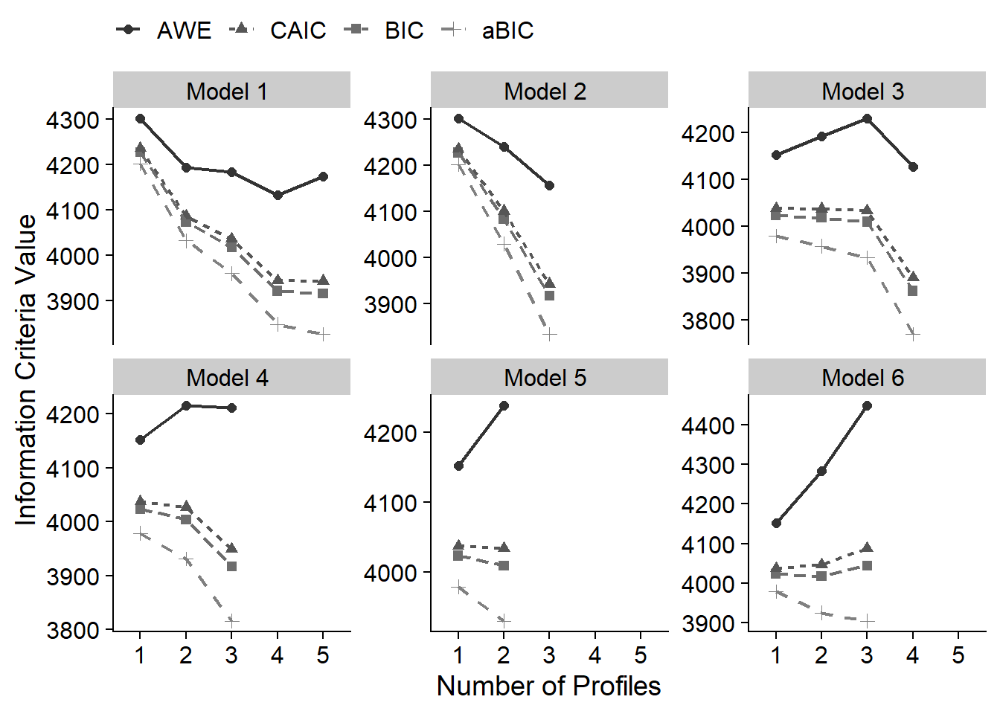
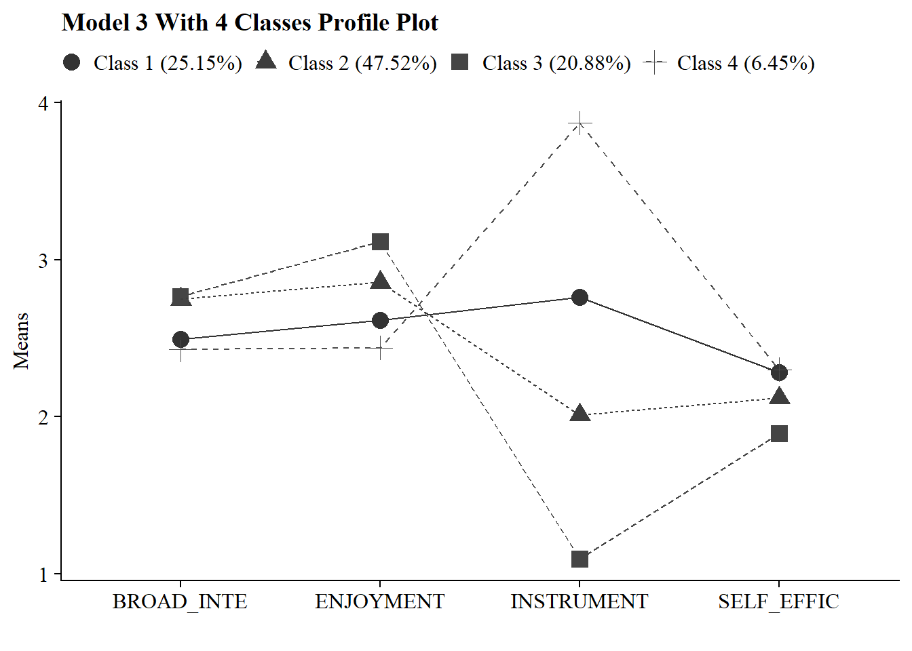

# (PART) Latent Profile Analysis {-}

# Enumeration

------------------------------------------------------------------------

*Example: PISA Student Data*

1.  The first example closely follows the vignette used to demonstrate the [tidyLPA](https://data-edu.github.io/tidyLPA/articles/Introduction_to_tidyLPA.html) package (Rosenberg, 2019).

-   This model utilizes the `PISA` data collected in the U.S. in 2015. To learn more about this data [see here](http://www.oecd.org/pisa/data/).
-   To access the 2015 US `PISA` data & documentation in R use the following code:

Variables:

`broad_interest`

:   composite measure of students' self reported broad interest

`enjoyment`

:   composite measure of students' self reported enjoyment

`instrumental_mot`

:   composite measure of students' self reported instrumental motivation

`self_efficacy`

:   composite measure of students' self reported self efficacy


``` r
#devtools::install_github("jrosen48/pisaUSA15")
#library(pisaUSA15)
```

------------------------------------------------------------------------

## Latent Profile Models

Latent Profile Analysis (LPA) is a statistical modeling approach for estimating distinct profiles of variables.
In the social sciences and in educational research, these profiles could represent, for example, how different youth experience dimensions of being engaged (i.e., cognitively, behaviorally, and affectively) at the same time.
Note that LPA works best with continuous variables (and, in some cases, ordinal variables), but is not appropriate for dichotomous (binary) variables.

Many analysts have carried out LPA using a latent variable modeling approach.
From this approach, different parameters - means, variances, and covariances - are freely estimated across profiles, fixed to be the same across profiles, or constrained to be zero.
The MPlus software is commonly used to estimate these models (see [here](https://www.statmodel.com/examples/mixture.shtml)) using the expectation-maximization (EM) algorithm to obtain the maximum likelihood estimates for the parameters.

Different *models* (or how or whether parameters are estimated) can be specified and estimated.
While MPlus is widely-used (and powerful), it is costly, closed-source, and can be difficult to use, particularly with respect to interpreting or using the output of specified models as part of a reproducible workflow.

------------------------------------------------------------------------

## Terminology for specifying variance-covariance matrix

The code used to estimate LPA models in this walkthrough is from the `tidyLPA` package.
`TidyLPA`([source](https://data-edu.github.io/tidyLPA/articles/Introduction_to_tidyLPA.html)) is an R package designed to estimate latent profile models using a tidy framework.
It can interface with Mplus via the MplusAutomation package, enabling the estimation of latent profile models with different variance-covariance structures.

-   `model 1` Profile-invariant / Diagonal: Equal variances, and covariances fixed to 0
-   `model 2` Profile-varying / Diagonal: Free variances and covariances fixed to 0
-   `model 3` Profile-invariant / Non-Diagonal: Equal variances and equal covariances
    -   Note: an alternative to Model 3 is freely estimating the covariances
-   `model 4` Free variances, and equal covariances
-   `model 5` Equal variances, and free covariances
-   `model 6` Profile Varying / Non-Diagonal: Free variances and free covariances

### Model 1

*Profile-invariant/diagonal:*

-   *Equal Variances*: Variances are fixed to equality across the profiles (i.e., variances are constrained to be equal for each profile).

-   *Covariances fixed to zero* (i.e., the off-diagonal cells of the matrix are zero).

The most parsimonious model and the most restricted.

$$
\begin{pmatrix}
\sigma^2_1 & 0 & 0 \\
0 & \sigma^2_2 & 0 \\
0 & 0 & \sigma^2_3 \\
\end{pmatrix}
$$

### Model 2

*Profile-varying/diagonal:*

-   *Free variances*: Variances parameters are freely estimated across the profiles (i.e., variances vary by profile).

-   *Covariances* *fixed to zero* (i.e., the off-diagonal cells of the matrix are zero).

This model is more flexible and less parsimonious than model 1.

$$
\begin{pmatrix}
\sigma^2_{1p} & 0 & 0 \\
0 & \sigma^2_{2p} & 0 \\
0 & 0 & \sigma^2_{3p} \\
\end{pmatrix}
$$

### Model 3

*Profile-invariant/ non-diagonal or unrestricted:*

-   *Equal variances:* Variances are fixed to equality across profile.
    (i.e., variances are constrained to be same for each profile).

-   *Equal Covariances*: The covariances are now estimated and constrained to be equal.

    -   An alternative to Model 3 is freely estimating the covariances (Model 5 here).

$$
\begin{pmatrix}
\sigma^2_1 & \sigma_{12} & \sigma_{13} \\
\sigma_{12} & \sigma^2_2 & \sigma_{23} \\
\sigma_{13} & \sigma_{23} & \sigma^2_3 \\
\end{pmatrix}
$$

### Model 4 

Varying means, varying variances, and equal covariances:

-   *Free variances*: Variances parameters are freely estimated across profiles (i.e., variances vary by profile).

-   *Equal Covariances*: Covariances are constrained to be equal.

This model is also considered to be an extension of Model 3.

$$
\begin{pmatrix}
\sigma^2_{1p} & \sigma_{12} & \sigma_{13} \\
\sigma_{12} & \sigma^2_{2p} & \sigma_{23} \\
\sigma_{13} & \sigma_{23} & \sigma^2_{3p} \\
\end{pmatrix}
$$

### Model 5

Varying means, equal variances, and varying covariances:

-   *Equal variances:* Variances are fixed to equality across the profiles.
    (i.e., variances are constrained to be same for each profile).

-   *Free Covariances*: Covariances are now freely estimated across the profiles.

This model is also considered to be an extension of Model 3.

$$
\begin{pmatrix}
\sigma^2_{1} & \sigma_{12p} & \sigma_{13p} \\
\sigma_{12p} & \sigma^2_{2} & \sigma_{23p} \\
\sigma_{13p} & \sigma_{23p} & \sigma^2_{3} \\
\end{pmatrix}
$$

### Model 6

*Profile-varying / Non-diagonal*:

-   *Free variances*: Variances parameters are freely estimated across profiles (i.e., variances vary by profile).

-   *Free Covariances*: Covariances are now freely estimated across the profiles.

This is the most complex and unrestricted model.
It is also the least parsimonious

*Note*: The unrestricted model is also sometimes known as Model 4.

$$
\begin{pmatrix}
\sigma^2_{1p} & \sigma_{12p} & \sigma_{13p} \\
\sigma_{12p} & \sigma^2_{2p} & \sigma_{23p} \\
\sigma_{13p} & \sigma_{23p} & \sigma^2_{3p} \\
\end{pmatrix}
$$

------------------------------------------------------------------------

## Load packages


``` r
library(naniar)
library(tidyverse)
library(haven)
library(glue)
library(MplusAutomation)
library(here)
library(janitor)
library(gt)
library(tidyLPA)
library(pisaUSA15)
library(cowplot)
library(filesstrings)
library(patchwork)
library(RcppAlgos)
```

------------------------------------------------------------------------

## Prepare Data


``` r

pisa <- pisaUSA15[1:500,] %>%
  dplyr::select(broad_interest, enjoyment, instrumental_mot, self_efficacy)

```

------------------------------------------------------------------------

## Descriptive Statistics


Quick Summary


``` r
summary(pisa)
#>  broad_interest    enjoyment    instrumental_mot
#>  Min.   :1.000   Min.   :1.00   Min.   :1.000   
#>  1st Qu.:2.200   1st Qu.:2.40   1st Qu.:1.750   
#>  Median :2.800   Median :3.00   Median :2.000   
#>  Mean   :2.666   Mean   :2.82   Mean   :2.129   
#>  3rd Qu.:3.200   3rd Qu.:3.00   3rd Qu.:2.500   
#>  Max.   :5.000   Max.   :4.00   Max.   :4.000   
#>  NA's   :23      NA's   :14     NA's   :21      
#>  self_efficacy  
#>  Min.   :1.000  
#>  1st Qu.:1.750  
#>  Median :2.000  
#>  Mean   :2.125  
#>  3rd Qu.:2.500  
#>  Max.   :4.000  
#>  NA's   :23
```


Mean Table


``` r
ds <- pisa %>% 
  pivot_longer(broad_interest:self_efficacy, names_to = "variable") %>% 
  group_by(variable) %>% 
  summarise(mean = mean(value, na.rm = TRUE),
            sd = sd(value, na.rm = TRUE)) 

ds %>% 
  gt () %>% 
  tab_header(title = md("**Descriptive Summary**")) %>%
  cols_label(
    variable = "Variable",
    mean = md("M"),
    sd = md("SD")
  ) %>%
  fmt_number(c(2:3),
             decimals = 2) %>% 
  cols_align(
    align = "center",
    columns = mean
  ) 
```


```{=html}
<div id="evmnzvzemn" style="padding-left:0px;padding-right:0px;padding-top:10px;padding-bottom:10px;overflow-x:auto;overflow-y:auto;width:auto;height:auto;">
<style>#evmnzvzemn table {
  font-family: system-ui, 'Segoe UI', Roboto, Helvetica, Arial, sans-serif, 'Apple Color Emoji', 'Segoe UI Emoji', 'Segoe UI Symbol', 'Noto Color Emoji';
  -webkit-font-smoothing: antialiased;
  -moz-osx-font-smoothing: grayscale;
}

#evmnzvzemn thead, #evmnzvzemn tbody, #evmnzvzemn tfoot, #evmnzvzemn tr, #evmnzvzemn td, #evmnzvzemn th {
  border-style: none;
}

#evmnzvzemn p {
  margin: 0;
  padding: 0;
}

#evmnzvzemn .gt_table {
  display: table;
  border-collapse: collapse;
  line-height: normal;
  margin-left: auto;
  margin-right: auto;
  color: #333333;
  font-size: 16px;
  font-weight: normal;
  font-style: normal;
  background-color: #FFFFFF;
  width: auto;
  border-top-style: solid;
  border-top-width: 2px;
  border-top-color: #A8A8A8;
  border-right-style: none;
  border-right-width: 2px;
  border-right-color: #D3D3D3;
  border-bottom-style: solid;
  border-bottom-width: 2px;
  border-bottom-color: #A8A8A8;
  border-left-style: none;
  border-left-width: 2px;
  border-left-color: #D3D3D3;
}

#evmnzvzemn .gt_caption {
  padding-top: 4px;
  padding-bottom: 4px;
}

#evmnzvzemn .gt_title {
  color: #333333;
  font-size: 125%;
  font-weight: initial;
  padding-top: 4px;
  padding-bottom: 4px;
  padding-left: 5px;
  padding-right: 5px;
  border-bottom-color: #FFFFFF;
  border-bottom-width: 0;
}

#evmnzvzemn .gt_subtitle {
  color: #333333;
  font-size: 85%;
  font-weight: initial;
  padding-top: 3px;
  padding-bottom: 5px;
  padding-left: 5px;
  padding-right: 5px;
  border-top-color: #FFFFFF;
  border-top-width: 0;
}

#evmnzvzemn .gt_heading {
  background-color: #FFFFFF;
  text-align: center;
  border-bottom-color: #FFFFFF;
  border-left-style: none;
  border-left-width: 1px;
  border-left-color: #D3D3D3;
  border-right-style: none;
  border-right-width: 1px;
  border-right-color: #D3D3D3;
}

#evmnzvzemn .gt_bottom_border {
  border-bottom-style: solid;
  border-bottom-width: 2px;
  border-bottom-color: #D3D3D3;
}

#evmnzvzemn .gt_col_headings {
  border-top-style: solid;
  border-top-width: 2px;
  border-top-color: #D3D3D3;
  border-bottom-style: solid;
  border-bottom-width: 2px;
  border-bottom-color: #D3D3D3;
  border-left-style: none;
  border-left-width: 1px;
  border-left-color: #D3D3D3;
  border-right-style: none;
  border-right-width: 1px;
  border-right-color: #D3D3D3;
}

#evmnzvzemn .gt_col_heading {
  color: #333333;
  background-color: #FFFFFF;
  font-size: 100%;
  font-weight: normal;
  text-transform: inherit;
  border-left-style: none;
  border-left-width: 1px;
  border-left-color: #D3D3D3;
  border-right-style: none;
  border-right-width: 1px;
  border-right-color: #D3D3D3;
  vertical-align: bottom;
  padding-top: 5px;
  padding-bottom: 6px;
  padding-left: 5px;
  padding-right: 5px;
  overflow-x: hidden;
}

#evmnzvzemn .gt_column_spanner_outer {
  color: #333333;
  background-color: #FFFFFF;
  font-size: 100%;
  font-weight: normal;
  text-transform: inherit;
  padding-top: 0;
  padding-bottom: 0;
  padding-left: 4px;
  padding-right: 4px;
}

#evmnzvzemn .gt_column_spanner_outer:first-child {
  padding-left: 0;
}

#evmnzvzemn .gt_column_spanner_outer:last-child {
  padding-right: 0;
}

#evmnzvzemn .gt_column_spanner {
  border-bottom-style: solid;
  border-bottom-width: 2px;
  border-bottom-color: #D3D3D3;
  vertical-align: bottom;
  padding-top: 5px;
  padding-bottom: 5px;
  overflow-x: hidden;
  display: inline-block;
  width: 100%;
}

#evmnzvzemn .gt_spanner_row {
  border-bottom-style: hidden;
}

#evmnzvzemn .gt_group_heading {
  padding-top: 8px;
  padding-bottom: 8px;
  padding-left: 5px;
  padding-right: 5px;
  color: #333333;
  background-color: #FFFFFF;
  font-size: 100%;
  font-weight: initial;
  text-transform: inherit;
  border-top-style: solid;
  border-top-width: 2px;
  border-top-color: #D3D3D3;
  border-bottom-style: solid;
  border-bottom-width: 2px;
  border-bottom-color: #D3D3D3;
  border-left-style: none;
  border-left-width: 1px;
  border-left-color: #D3D3D3;
  border-right-style: none;
  border-right-width: 1px;
  border-right-color: #D3D3D3;
  vertical-align: middle;
  text-align: left;
}

#evmnzvzemn .gt_empty_group_heading {
  padding: 0.5px;
  color: #333333;
  background-color: #FFFFFF;
  font-size: 100%;
  font-weight: initial;
  border-top-style: solid;
  border-top-width: 2px;
  border-top-color: #D3D3D3;
  border-bottom-style: solid;
  border-bottom-width: 2px;
  border-bottom-color: #D3D3D3;
  vertical-align: middle;
}

#evmnzvzemn .gt_from_md > :first-child {
  margin-top: 0;
}

#evmnzvzemn .gt_from_md > :last-child {
  margin-bottom: 0;
}

#evmnzvzemn .gt_row {
  padding-top: 8px;
  padding-bottom: 8px;
  padding-left: 5px;
  padding-right: 5px;
  margin: 10px;
  border-top-style: solid;
  border-top-width: 1px;
  border-top-color: #D3D3D3;
  border-left-style: none;
  border-left-width: 1px;
  border-left-color: #D3D3D3;
  border-right-style: none;
  border-right-width: 1px;
  border-right-color: #D3D3D3;
  vertical-align: middle;
  overflow-x: hidden;
}

#evmnzvzemn .gt_stub {
  color: #333333;
  background-color: #FFFFFF;
  font-size: 100%;
  font-weight: initial;
  text-transform: inherit;
  border-right-style: solid;
  border-right-width: 2px;
  border-right-color: #D3D3D3;
  padding-left: 5px;
  padding-right: 5px;
}

#evmnzvzemn .gt_stub_row_group {
  color: #333333;
  background-color: #FFFFFF;
  font-size: 100%;
  font-weight: initial;
  text-transform: inherit;
  border-right-style: solid;
  border-right-width: 2px;
  border-right-color: #D3D3D3;
  padding-left: 5px;
  padding-right: 5px;
  vertical-align: top;
}

#evmnzvzemn .gt_row_group_first td {
  border-top-width: 2px;
}

#evmnzvzemn .gt_row_group_first th {
  border-top-width: 2px;
}

#evmnzvzemn .gt_summary_row {
  color: #333333;
  background-color: #FFFFFF;
  text-transform: inherit;
  padding-top: 8px;
  padding-bottom: 8px;
  padding-left: 5px;
  padding-right: 5px;
}

#evmnzvzemn .gt_first_summary_row {
  border-top-style: solid;
  border-top-color: #D3D3D3;
}

#evmnzvzemn .gt_first_summary_row.thick {
  border-top-width: 2px;
}

#evmnzvzemn .gt_last_summary_row {
  padding-top: 8px;
  padding-bottom: 8px;
  padding-left: 5px;
  padding-right: 5px;
  border-bottom-style: solid;
  border-bottom-width: 2px;
  border-bottom-color: #D3D3D3;
}

#evmnzvzemn .gt_grand_summary_row {
  color: #333333;
  background-color: #FFFFFF;
  text-transform: inherit;
  padding-top: 8px;
  padding-bottom: 8px;
  padding-left: 5px;
  padding-right: 5px;
}

#evmnzvzemn .gt_first_grand_summary_row {
  padding-top: 8px;
  padding-bottom: 8px;
  padding-left: 5px;
  padding-right: 5px;
  border-top-style: double;
  border-top-width: 6px;
  border-top-color: #D3D3D3;
}

#evmnzvzemn .gt_last_grand_summary_row_top {
  padding-top: 8px;
  padding-bottom: 8px;
  padding-left: 5px;
  padding-right: 5px;
  border-bottom-style: double;
  border-bottom-width: 6px;
  border-bottom-color: #D3D3D3;
}

#evmnzvzemn .gt_striped {
  background-color: rgba(128, 128, 128, 0.05);
}

#evmnzvzemn .gt_table_body {
  border-top-style: solid;
  border-top-width: 2px;
  border-top-color: #D3D3D3;
  border-bottom-style: solid;
  border-bottom-width: 2px;
  border-bottom-color: #D3D3D3;
}

#evmnzvzemn .gt_footnotes {
  color: #333333;
  background-color: #FFFFFF;
  border-bottom-style: none;
  border-bottom-width: 2px;
  border-bottom-color: #D3D3D3;
  border-left-style: none;
  border-left-width: 2px;
  border-left-color: #D3D3D3;
  border-right-style: none;
  border-right-width: 2px;
  border-right-color: #D3D3D3;
}

#evmnzvzemn .gt_footnote {
  margin: 0px;
  font-size: 90%;
  padding-top: 4px;
  padding-bottom: 4px;
  padding-left: 5px;
  padding-right: 5px;
}

#evmnzvzemn .gt_sourcenotes {
  color: #333333;
  background-color: #FFFFFF;
  border-bottom-style: none;
  border-bottom-width: 2px;
  border-bottom-color: #D3D3D3;
  border-left-style: none;
  border-left-width: 2px;
  border-left-color: #D3D3D3;
  border-right-style: none;
  border-right-width: 2px;
  border-right-color: #D3D3D3;
}

#evmnzvzemn .gt_sourcenote {
  font-size: 90%;
  padding-top: 4px;
  padding-bottom: 4px;
  padding-left: 5px;
  padding-right: 5px;
}

#evmnzvzemn .gt_left {
  text-align: left;
}

#evmnzvzemn .gt_center {
  text-align: center;
}

#evmnzvzemn .gt_right {
  text-align: right;
  font-variant-numeric: tabular-nums;
}

#evmnzvzemn .gt_font_normal {
  font-weight: normal;
}

#evmnzvzemn .gt_font_bold {
  font-weight: bold;
}

#evmnzvzemn .gt_font_italic {
  font-style: italic;
}

#evmnzvzemn .gt_super {
  font-size: 65%;
}

#evmnzvzemn .gt_footnote_marks {
  font-size: 75%;
  vertical-align: 0.4em;
  position: initial;
}

#evmnzvzemn .gt_asterisk {
  font-size: 100%;
  vertical-align: 0;
}

#evmnzvzemn .gt_indent_1 {
  text-indent: 5px;
}

#evmnzvzemn .gt_indent_2 {
  text-indent: 10px;
}

#evmnzvzemn .gt_indent_3 {
  text-indent: 15px;
}

#evmnzvzemn .gt_indent_4 {
  text-indent: 20px;
}

#evmnzvzemn .gt_indent_5 {
  text-indent: 25px;
}

#evmnzvzemn .katex-display {
  display: inline-flex !important;
  margin-bottom: 0.75em !important;
}

#evmnzvzemn div.Reactable > div.rt-table > div.rt-thead > div.rt-tr.rt-tr-group-header > div.rt-th-group:after {
  height: 0px !important;
}
</style>
<table class="gt_table" data-quarto-disable-processing="false" data-quarto-bootstrap="false">
  <thead>
    <tr class="gt_heading">
      <td colspan="3" class="gt_heading gt_title gt_font_normal gt_bottom_border" style><span class='gt_from_md'><strong>Descriptive Summary</strong></span></td>
    </tr>
    
    <tr class="gt_col_headings">
      <th class="gt_col_heading gt_columns_bottom_border gt_left" rowspan="1" colspan="1" scope="col" id="variable">Variable</th>
      <th class="gt_col_heading gt_columns_bottom_border gt_center" rowspan="1" colspan="1" scope="col" id="mean"><span class='gt_from_md'>M</span></th>
      <th class="gt_col_heading gt_columns_bottom_border gt_right" rowspan="1" colspan="1" scope="col" id="sd"><span class='gt_from_md'>SD</span></th>
    </tr>
  </thead>
  <tbody class="gt_table_body">
    <tr><td headers="variable" class="gt_row gt_left">broad_interest</td>
<td headers="mean" class="gt_row gt_center">2.67</td>
<td headers="sd" class="gt_row gt_right">0.77</td></tr>
    <tr><td headers="variable" class="gt_row gt_left">enjoyment</td>
<td headers="mean" class="gt_row gt_center">2.82</td>
<td headers="sd" class="gt_row gt_right">0.72</td></tr>
    <tr><td headers="variable" class="gt_row gt_left">instrumental_mot</td>
<td headers="mean" class="gt_row gt_center">2.13</td>
<td headers="sd" class="gt_row gt_right">0.75</td></tr>
    <tr><td headers="variable" class="gt_row gt_left">self_efficacy</td>
<td headers="mean" class="gt_row gt_center">2.12</td>
<td headers="sd" class="gt_row gt_right">0.64</td></tr>
  </tbody>
  
  
</table>
</div>
```


Histograms


``` r
data_long <- pisa %>%
  pivot_longer(broad_interest:self_efficacy, names_to = "variable")

ggplot(data_long, aes(x = value)) +
  geom_histogram(binwidth = .3, fill = "#69b3a2", color = "black") +
  facet_wrap(~ variable, scales = "free_x") +
  labs(title = "Histograms of Variables", x = "Value", y = "Frequency") +
  theme_cowplot()
```


------------------------------------------------------------------------

## Enumeration

------------------------------------------------------------------------

### `tidyLPA`

------------------------------------------------------------------------

Enumerate using `estimate_profiles()`:

-   Estimate models with profiles $K = 1:5$
-   Model has 4 continuous indicators
-   Default variance-covariance specifications (model 1)
-   Change `variances` and `covariances` to indicate the model you want to specify, in this example, we are estimating all six models.


``` r

# Run LPA models 
lpa_fit <- pisa %>% 
    estimate_profiles(1:5,
                      package = "MplusAutomation",
                      ANALYSIS = "starts = 500 100;",
                      OUTPUT = "sampstat residual tech11 tech14",
                      variances = c("equal", "varying", "equal", "varying", "equal", "varying"),
                      covariances = c("zero", "zero", "equal", "equal", "varying", "varying"),
                      keepfiles = TRUE)

# Compare fit statistics
get_fit(lpa_fit)


# Move files to folder 
files <- list.files(here(), pattern = "^model")
move_files(files, here("lpa", "tidyLPA"), overwrite = TRUE)
```


------------------------------------------------------------------------

### `Mplus`

------------------------------------------------------------------------

Alternative method to `estimate_profiles()`: Run enumeration using `mplusObject` method

You can change the model specification for LPA using the syntax provided in lecture.

#### Model 1

When estimating LPA in Mplus, the default variance/covariance specification is the most restricted model (Model 1).
So we don't have to specify anything here.


``` r

lpa_k14  <- lapply(1:5, function(k) {
  lpa_enum  <- mplusObject(
      
    TITLE = glue("Profile {k}"), 
  
    VARIABLE = glue(
    "usevar = broad_interest-self_efficacy;
     classes = c({k}); "),
  
  ANALYSIS = 
   "estimator = mlr; 
    type = mixture;
    starts = 500 100;",
  
  OUTPUT = "sampstat svalues residual tech11 tech14;",
  
  usevariables = colnames(pisa),
  rdata = pisa)

lpa_enum_fit <- mplusModeler(lpa_enum, 
                dataout=glue(here("lpa", "enum_lpa", "lpa_pisa")),
                modelout=glue(here("lpa", "enum_lpa", "c{k}_lpa_m1.inp")) ,
                check=TRUE, run = TRUE, hashfilename = FALSE)
})
```

#### Model 2

Here, an addition loop adds the variance/covariance specifications for each class-specific statement.
For the profile-varying/diagonal specification, you must specify the variances to be freely estimated:

`broad_interest-self_efficacy;`


``` r
lpa_m2_k14  <- lapply(1:5, function(k){ 
  
  # This MODEL section changes the model specification
  MODEL <- paste(sapply(1:k, function(i) {
    glue("
    %c#{i}%
    broad_interest-self_efficacy;      ! variances are freely estimated
    ")
  }), collapse = "\n")
  
  lpa_enum_m2  <- mplusObject(
    TITLE = glue("Profile {k} - Model 2"),
    
    VARIABLE = glue(
      "usevar = broad_interest-self_efficacy;
     classes = c({k});"),
    
    ANALYSIS = 
      "estimator = mlr; 
    type = mixture;
    starts = 500 100;",
    
    MODEL = MODEL,
    
    
    OUTPUT = "sampstat svalues residual tech11 tech14;",
    
    usevariables = colnames(pisa),
    rdata = pisa)
  
  lpa_m2_fit <- mplusModeler(lpa_enum_m2,
                             dataout = here("lpa", "enum_lpa", "lpa_pisa"),
                             modelout = glue(here("lpa", "enum_lpa","c{k}_lpa_m2.inp")),
                             check = TRUE, run = TRUE, hashfilename = FALSE)
})
```

For reference, here is the Mplus syntax for different specifications:

**Fixed covariance to zero (DEFAULT)**:

`broad_interest WITH enjoyment@0;`

**Free covariance**:

`broad_interest WITH enjoyment;`

**Equal covariances**:

`%c#1%`

`broad_interest WITH enjoyment (1);`

`%c#2%`

`broad_interest WITH enjoyment (1);`

**Equal variance (DEFAULT)**:

`%c#1%`

`broad_interest (1);`

`%c#2%`

`broad_interest (1);`

**Free variance**:

`mth_scor-bio_scor;`

You can also open the `tidyLPA` .inp files to see the specifications.


------------------------------------------------------------------------

## Table of Fit

Evaluate each model specification separately using fit indices.

After examining the outputs (and increasing the random starts where necessary), there are a few models excluded from analysis:

Model 2:

-   Profile 4

-   Profile 5

Model 3:

-   Profile 5

Model 4:

-   Profile 4

-   Profile 5

Model 5:

-   Profile 3

-   Profile 4

-   Profile 5

Model 6:

-   Profile 4

-   Profile 5


``` r
source(here("functions","enum_table_lpa.R"))

# Read in model
output_enum <- readModels(here("lpa", "tidyLPA"), quiet = TRUE)

# Preview with numbered rows
enum_fit(output_enum)
#> # A tibble: 29 × 12
#>      row Title     Parameters     LL   BIC  aBIC  CAIC   AWE
#>    <int> <chr>          <dbl>  <dbl> <dbl> <dbl> <dbl> <dbl>
#>  1     1 Model 1 …          8 -2089. 4227. 4201. 4235. 4300.
#>  2     2 Model 1 …         13 -1997. 4074. 4032. 4087. 4193.
#>  3     3 Model 1 …         18 -1953. 4017. 3960. 4035. 4183.
#>  4     4 Model 1 …         23 -1889. 3921. 3848. 3944. 4133.
#>  5     5 Model 1 …         28 -1871. 3915. 3826. 3943. 4172.
#>  6     6 Model 2 …          8 -2089. 4227. 4201. 4235. 4300.
#>  7     7 Model 2 …         17 -1989. 4083. 4029. 4100. 4239.
#>  8     8 Model 2 …         26 -1878. 3917. 3834. 3943. 4156.
#>  9     9 Model 2 …         35 -1851. 3919. 3808. 3954. 4241.
#> 10    10 Model 2 …         44 -1825. 3923. 3783. 3967. 4327.
#> # ℹ 19 more rows
#> # ℹ 4 more variables: BLRT_PValue <dbl>,
#> #   T11_VLMR_PValue <dbl>, BF <dbl>, cmPk <dbl>


select_models <-LatexSummaryTable(output_enum,                                 
                keepCols=c("Title", "Parameters", "LL", "BIC", "aBIC",
                           "BLRT_PValue", "T11_VLMR_PValue","Observations")) %>% 
  slice( # Remove the models that we don't want to consider!!!! Because we looked at every single output, we know which models did not converge, thus we exclude them.
    # Model 2
    -9, -10, 
    # Model 3
    -15,
    # Model 4
    -19, -20,
    # Model 5
    -23, -24, -25,
    # Model 6
    -29, -30
  )

# Check to make sure that the rows of the models we don't want are removed
#View(select_models)

enum_table(select_models, 1:5, 6:8, 9:12, 13:15, 16:17, 18:20)
```


```{=html}
<div id="cjihxzrtyq" style="padding-left:0px;padding-right:0px;padding-top:10px;padding-bottom:10px;overflow-x:auto;overflow-y:auto;width:auto;height:auto;">
<style>#cjihxzrtyq table {
  font-family: system-ui, 'Segoe UI', Roboto, Helvetica, Arial, sans-serif, 'Apple Color Emoji', 'Segoe UI Emoji', 'Segoe UI Symbol', 'Noto Color Emoji';
  -webkit-font-smoothing: antialiased;
  -moz-osx-font-smoothing: grayscale;
}

#cjihxzrtyq thead, #cjihxzrtyq tbody, #cjihxzrtyq tfoot, #cjihxzrtyq tr, #cjihxzrtyq td, #cjihxzrtyq th {
  border-style: none;
}

#cjihxzrtyq p {
  margin: 0;
  padding: 0;
}

#cjihxzrtyq .gt_table {
  display: table;
  border-collapse: collapse;
  line-height: normal;
  margin-left: auto;
  margin-right: auto;
  color: #333333;
  font-size: 16px;
  font-weight: normal;
  font-style: normal;
  background-color: #FFFFFF;
  width: auto;
  border-top-style: solid;
  border-top-width: 2px;
  border-top-color: #A8A8A8;
  border-right-style: none;
  border-right-width: 2px;
  border-right-color: #D3D3D3;
  border-bottom-style: solid;
  border-bottom-width: 2px;
  border-bottom-color: #A8A8A8;
  border-left-style: none;
  border-left-width: 2px;
  border-left-color: #D3D3D3;
}

#cjihxzrtyq .gt_caption {
  padding-top: 4px;
  padding-bottom: 4px;
}

#cjihxzrtyq .gt_title {
  color: #333333;
  font-size: 125%;
  font-weight: initial;
  padding-top: 4px;
  padding-bottom: 4px;
  padding-left: 5px;
  padding-right: 5px;
  border-bottom-color: #FFFFFF;
  border-bottom-width: 0;
}

#cjihxzrtyq .gt_subtitle {
  color: #333333;
  font-size: 85%;
  font-weight: initial;
  padding-top: 3px;
  padding-bottom: 5px;
  padding-left: 5px;
  padding-right: 5px;
  border-top-color: #FFFFFF;
  border-top-width: 0;
}

#cjihxzrtyq .gt_heading {
  background-color: #FFFFFF;
  text-align: center;
  border-bottom-color: #FFFFFF;
  border-left-style: none;
  border-left-width: 1px;
  border-left-color: #D3D3D3;
  border-right-style: none;
  border-right-width: 1px;
  border-right-color: #D3D3D3;
}

#cjihxzrtyq .gt_bottom_border {
  border-bottom-style: solid;
  border-bottom-width: 2px;
  border-bottom-color: #D3D3D3;
}

#cjihxzrtyq .gt_col_headings {
  border-top-style: solid;
  border-top-width: 2px;
  border-top-color: #D3D3D3;
  border-bottom-style: solid;
  border-bottom-width: 2px;
  border-bottom-color: #D3D3D3;
  border-left-style: none;
  border-left-width: 1px;
  border-left-color: #D3D3D3;
  border-right-style: none;
  border-right-width: 1px;
  border-right-color: #D3D3D3;
}

#cjihxzrtyq .gt_col_heading {
  color: #333333;
  background-color: #FFFFFF;
  font-size: 100%;
  font-weight: bold;
  text-transform: inherit;
  border-left-style: none;
  border-left-width: 1px;
  border-left-color: #D3D3D3;
  border-right-style: none;
  border-right-width: 1px;
  border-right-color: #D3D3D3;
  vertical-align: bottom;
  padding-top: 5px;
  padding-bottom: 6px;
  padding-left: 5px;
  padding-right: 5px;
  overflow-x: hidden;
}

#cjihxzrtyq .gt_column_spanner_outer {
  color: #333333;
  background-color: #FFFFFF;
  font-size: 100%;
  font-weight: bold;
  text-transform: inherit;
  padding-top: 0;
  padding-bottom: 0;
  padding-left: 4px;
  padding-right: 4px;
}

#cjihxzrtyq .gt_column_spanner_outer:first-child {
  padding-left: 0;
}

#cjihxzrtyq .gt_column_spanner_outer:last-child {
  padding-right: 0;
}

#cjihxzrtyq .gt_column_spanner {
  border-bottom-style: solid;
  border-bottom-width: 2px;
  border-bottom-color: #D3D3D3;
  vertical-align: bottom;
  padding-top: 5px;
  padding-bottom: 5px;
  overflow-x: hidden;
  display: inline-block;
  width: 100%;
}

#cjihxzrtyq .gt_spanner_row {
  border-bottom-style: hidden;
}

#cjihxzrtyq .gt_group_heading {
  padding-top: 8px;
  padding-bottom: 8px;
  padding-left: 5px;
  padding-right: 5px;
  color: #333333;
  background-color: #FFFFFF;
  font-size: 100%;
  font-weight: initial;
  text-transform: inherit;
  border-top-style: solid;
  border-top-width: 2px;
  border-top-color: #D3D3D3;
  border-bottom-style: solid;
  border-bottom-width: 2px;
  border-bottom-color: #D3D3D3;
  border-left-style: none;
  border-left-width: 1px;
  border-left-color: #D3D3D3;
  border-right-style: none;
  border-right-width: 1px;
  border-right-color: #D3D3D3;
  vertical-align: middle;
  text-align: left;
}

#cjihxzrtyq .gt_empty_group_heading {
  padding: 0.5px;
  color: #333333;
  background-color: #FFFFFF;
  font-size: 100%;
  font-weight: initial;
  border-top-style: solid;
  border-top-width: 2px;
  border-top-color: #D3D3D3;
  border-bottom-style: solid;
  border-bottom-width: 2px;
  border-bottom-color: #D3D3D3;
  vertical-align: middle;
}

#cjihxzrtyq .gt_from_md > :first-child {
  margin-top: 0;
}

#cjihxzrtyq .gt_from_md > :last-child {
  margin-bottom: 0;
}

#cjihxzrtyq .gt_row {
  padding-top: 8px;
  padding-bottom: 8px;
  padding-left: 5px;
  padding-right: 5px;
  margin: 10px;
  border-top-style: solid;
  border-top-width: 1px;
  border-top-color: #D3D3D3;
  border-left-style: none;
  border-left-width: 1px;
  border-left-color: #D3D3D3;
  border-right-style: none;
  border-right-width: 1px;
  border-right-color: #D3D3D3;
  vertical-align: middle;
  overflow-x: hidden;
}

#cjihxzrtyq .gt_stub {
  color: #333333;
  background-color: #FFFFFF;
  font-size: 100%;
  font-weight: initial;
  text-transform: inherit;
  border-right-style: solid;
  border-right-width: 2px;
  border-right-color: #D3D3D3;
  padding-left: 5px;
  padding-right: 5px;
}

#cjihxzrtyq .gt_stub_row_group {
  color: #333333;
  background-color: #FFFFFF;
  font-size: 100%;
  font-weight: initial;
  text-transform: inherit;
  border-right-style: solid;
  border-right-width: 2px;
  border-right-color: #D3D3D3;
  padding-left: 5px;
  padding-right: 5px;
  vertical-align: top;
}

#cjihxzrtyq .gt_row_group_first td {
  border-top-width: 2px;
}

#cjihxzrtyq .gt_row_group_first th {
  border-top-width: 2px;
}

#cjihxzrtyq .gt_summary_row {
  color: #333333;
  background-color: #FFFFFF;
  text-transform: inherit;
  padding-top: 8px;
  padding-bottom: 8px;
  padding-left: 5px;
  padding-right: 5px;
}

#cjihxzrtyq .gt_first_summary_row {
  border-top-style: solid;
  border-top-color: #D3D3D3;
}

#cjihxzrtyq .gt_first_summary_row.thick {
  border-top-width: 2px;
}

#cjihxzrtyq .gt_last_summary_row {
  padding-top: 8px;
  padding-bottom: 8px;
  padding-left: 5px;
  padding-right: 5px;
  border-bottom-style: solid;
  border-bottom-width: 2px;
  border-bottom-color: #D3D3D3;
}

#cjihxzrtyq .gt_grand_summary_row {
  color: #333333;
  background-color: #FFFFFF;
  text-transform: inherit;
  padding-top: 8px;
  padding-bottom: 8px;
  padding-left: 5px;
  padding-right: 5px;
}

#cjihxzrtyq .gt_first_grand_summary_row {
  padding-top: 8px;
  padding-bottom: 8px;
  padding-left: 5px;
  padding-right: 5px;
  border-top-style: double;
  border-top-width: 6px;
  border-top-color: #D3D3D3;
}

#cjihxzrtyq .gt_last_grand_summary_row_top {
  padding-top: 8px;
  padding-bottom: 8px;
  padding-left: 5px;
  padding-right: 5px;
  border-bottom-style: double;
  border-bottom-width: 6px;
  border-bottom-color: #D3D3D3;
}

#cjihxzrtyq .gt_striped {
  background-color: rgba(128, 128, 128, 0.05);
}

#cjihxzrtyq .gt_table_body {
  border-top-style: solid;
  border-top-width: 2px;
  border-top-color: #D3D3D3;
  border-bottom-style: solid;
  border-bottom-width: 2px;
  border-bottom-color: #D3D3D3;
}

#cjihxzrtyq .gt_footnotes {
  color: #333333;
  background-color: #FFFFFF;
  border-bottom-style: none;
  border-bottom-width: 2px;
  border-bottom-color: #D3D3D3;
  border-left-style: none;
  border-left-width: 2px;
  border-left-color: #D3D3D3;
  border-right-style: none;
  border-right-width: 2px;
  border-right-color: #D3D3D3;
}

#cjihxzrtyq .gt_footnote {
  margin: 0px;
  font-size: 90%;
  padding-top: 4px;
  padding-bottom: 4px;
  padding-left: 5px;
  padding-right: 5px;
}

#cjihxzrtyq .gt_sourcenotes {
  color: #333333;
  background-color: #FFFFFF;
  border-bottom-style: none;
  border-bottom-width: 2px;
  border-bottom-color: #D3D3D3;
  border-left-style: none;
  border-left-width: 2px;
  border-left-color: #D3D3D3;
  border-right-style: none;
  border-right-width: 2px;
  border-right-color: #D3D3D3;
}

#cjihxzrtyq .gt_sourcenote {
  font-size: 90%;
  padding-top: 4px;
  padding-bottom: 4px;
  padding-left: 5px;
  padding-right: 5px;
}

#cjihxzrtyq .gt_left {
  text-align: left;
}

#cjihxzrtyq .gt_center {
  text-align: center;
}

#cjihxzrtyq .gt_right {
  text-align: right;
  font-variant-numeric: tabular-nums;
}

#cjihxzrtyq .gt_font_normal {
  font-weight: normal;
}

#cjihxzrtyq .gt_font_bold {
  font-weight: bold;
}

#cjihxzrtyq .gt_font_italic {
  font-style: italic;
}

#cjihxzrtyq .gt_super {
  font-size: 65%;
}

#cjihxzrtyq .gt_footnote_marks {
  font-size: 75%;
  vertical-align: 0.4em;
  position: initial;
}

#cjihxzrtyq .gt_asterisk {
  font-size: 100%;
  vertical-align: 0;
}

#cjihxzrtyq .gt_indent_1 {
  text-indent: 5px;
}

#cjihxzrtyq .gt_indent_2 {
  text-indent: 10px;
}

#cjihxzrtyq .gt_indent_3 {
  text-indent: 15px;
}

#cjihxzrtyq .gt_indent_4 {
  text-indent: 20px;
}

#cjihxzrtyq .gt_indent_5 {
  text-indent: 25px;
}

#cjihxzrtyq .katex-display {
  display: inline-flex !important;
  margin-bottom: 0.75em !important;
}

#cjihxzrtyq div.Reactable > div.rt-table > div.rt-thead > div.rt-tr.rt-tr-group-header > div.rt-th-group:after {
  height: 0px !important;
}
</style>
<table class="gt_table" data-quarto-disable-processing="false" data-quarto-bootstrap="false">
  <thead>
    <tr class="gt_heading">
      <td colspan="11" class="gt_heading gt_title gt_font_normal gt_bottom_border" style><span class='gt_from_md'><strong>Model Fit Summary Table</strong></span><span class="gt_footnote_marks" style="white-space:nowrap;font-style:italic;font-weight:normal;line-height:0;"><sup>1</sup></span></td>
    </tr>
    
    <tr class="gt_col_headings">
      <th class="gt_col_heading gt_columns_bottom_border gt_left" rowspan="1" colspan="1" scope="col" id="Title">Classes</th>
      <th class="gt_col_heading gt_columns_bottom_border gt_right" rowspan="1" colspan="1" scope="col" id="Parameters"><span class='gt_from_md'>Par</span></th>
      <th class="gt_col_heading gt_columns_bottom_border gt_right" rowspan="1" colspan="1" scope="col" id="LL"><span class='gt_from_md'><em>LL</em></span></th>
      <th class="gt_col_heading gt_columns_bottom_border gt_right" rowspan="1" colspan="1" scope="col" id="BIC">BIC</th>
      <th class="gt_col_heading gt_columns_bottom_border gt_right" rowspan="1" colspan="1" scope="col" id="aBIC">aBIC</th>
      <th class="gt_col_heading gt_columns_bottom_border gt_right" rowspan="1" colspan="1" scope="col" id="CAIC">CAIC</th>
      <th class="gt_col_heading gt_columns_bottom_border gt_right" rowspan="1" colspan="1" scope="col" id="AWE">AWE</th>
      <th class="gt_col_heading gt_columns_bottom_border gt_right" rowspan="1" colspan="1" scope="col" id="BLRT_PValue">BLRT</th>
      <th class="gt_col_heading gt_columns_bottom_border gt_right" rowspan="1" colspan="1" scope="col" id="T11_VLMR_PValue">VLMR</th>
      <th class="gt_col_heading gt_columns_bottom_border gt_right" rowspan="1" colspan="1" scope="col" id="BF"><span class='gt_from_md'>BF</span></th>
      <th class="gt_col_heading gt_columns_bottom_border gt_right" rowspan="1" colspan="1" scope="col" id="cmPk"><span class='gt_from_md'><em>cmPk</em></span></th>
    </tr>
  </thead>
  <tbody class="gt_table_body">
    <tr class="gt_group_heading_row">
      <th colspan="11" class="gt_group_heading" scope="colgroup" id="Model 1">Model 1</th>
    </tr>
    <tr class="gt_row_group_first"><td headers="Model 1  Title" class="gt_row gt_left">Model 1 With 1 Classes</td>
<td headers="Model 1  Parameters" class="gt_row gt_right">8</td>
<td headers="Model 1  LL" class="gt_row gt_right">−2,088.66</td>
<td headers="Model 1  BIC" class="gt_row gt_right">4,226.84</td>
<td headers="Model 1  aBIC" class="gt_row gt_right">4,201.45</td>
<td headers="Model 1  CAIC" class="gt_row gt_right">4,234.84</td>
<td headers="Model 1  AWE" class="gt_row gt_right">4,300.36</td>
<td headers="Model 1  BLRT_PValue" class="gt_row gt_right">–</td>
<td headers="Model 1  T11_VLMR_PValue" class="gt_row gt_right">–</td>
<td headers="Model 1  BF" class="gt_row gt_right">0.0</td>
<td headers="Model 1  cmPk" class="gt_row gt_right"><.001</td></tr>
    <tr><td headers="Model 1  Title" class="gt_row gt_left">Model 1 With 2 Classes</td>
<td headers="Model 1  Parameters" class="gt_row gt_right">13</td>
<td headers="Model 1  LL" class="gt_row gt_right">−1,996.51</td>
<td headers="Model 1  BIC" class="gt_row gt_right">4,073.50</td>
<td headers="Model 1  aBIC" class="gt_row gt_right">4,032.24</td>
<td headers="Model 1  CAIC" class="gt_row gt_right">4,086.50</td>
<td headers="Model 1  AWE" class="gt_row gt_right">4,192.97</td>
<td headers="Model 1  BLRT_PValue" class="gt_row gt_right"><.001</td>
<td headers="Model 1  T11_VLMR_PValue" class="gt_row gt_right"><.001</td>
<td headers="Model 1  BF" class="gt_row gt_right">0.0</td>
<td headers="Model 1  cmPk" class="gt_row gt_right"><.001</td></tr>
    <tr><td headers="Model 1  Title" class="gt_row gt_left">Model 1 With 3 Classes</td>
<td headers="Model 1  Parameters" class="gt_row gt_right">18</td>
<td headers="Model 1  LL" class="gt_row gt_right">−1,952.98</td>
<td headers="Model 1  BIC" class="gt_row gt_right">4,017.38</td>
<td headers="Model 1  aBIC" class="gt_row gt_right">3,960.25</td>
<td headers="Model 1  CAIC" class="gt_row gt_right">4,035.38</td>
<td headers="Model 1  AWE" class="gt_row gt_right">4,182.81</td>
<td headers="Model 1  BLRT_PValue" class="gt_row gt_right"><.001</td>
<td headers="Model 1  T11_VLMR_PValue" class="gt_row gt_right">0.009</td>
<td headers="Model 1  BF" class="gt_row gt_right">0.0</td>
<td headers="Model 1  cmPk" class="gt_row gt_right"><.001</td></tr>
    <tr><td headers="Model 1  Title" class="gt_row gt_left">Model 1 With 4 Classes</td>
<td headers="Model 1  Parameters" class="gt_row gt_right">23</td>
<td headers="Model 1  LL" class="gt_row gt_right">−1,889.43</td>
<td headers="Model 1  BIC" class="gt_row gt_right">3,921.23</td>
<td headers="Model 1  aBIC" class="gt_row gt_right">3,848.23</td>
<td headers="Model 1  CAIC" class="gt_row gt_right">3,944.23</td>
<td headers="Model 1  AWE" class="gt_row gt_right" style="font-weight: bold;">4,132.61</td>
<td headers="Model 1  BLRT_PValue" class="gt_row gt_right"><.001</td>
<td headers="Model 1  T11_VLMR_PValue" class="gt_row gt_right"><.001</td>
<td headers="Model 1  BF" class="gt_row gt_right">0.0</td>
<td headers="Model 1  cmPk" class="gt_row gt_right">0.046</td></tr>
    <tr><td headers="Model 1  Title" class="gt_row gt_left">Model 1 With 5 Classes</td>
<td headers="Model 1  Parameters" class="gt_row gt_right">28</td>
<td headers="Model 1  LL" class="gt_row gt_right">−1,870.91</td>
<td headers="Model 1  BIC" class="gt_row gt_right" style="font-weight: bold;">3,915.16</td>
<td headers="Model 1  aBIC" class="gt_row gt_right" style="font-weight: bold;">3,826.28</td>
<td headers="Model 1  CAIC" class="gt_row gt_right" style="font-weight: bold;">3,943.15</td>
<td headers="Model 1  AWE" class="gt_row gt_right">4,172.48</td>
<td headers="Model 1  BLRT_PValue" class="gt_row gt_right"><.001</td>
<td headers="Model 1  T11_VLMR_PValue" class="gt_row gt_right">0.018</td>
<td headers="Model 1  BF" class="gt_row gt_right">–</td>
<td headers="Model 1  cmPk" class="gt_row gt_right" style="font-weight: bold;">0.954</td></tr>
    <tr class="gt_group_heading_row">
      <th colspan="11" class="gt_group_heading" scope="colgroup" id="Model 2">Model 2</th>
    </tr>
    <tr class="gt_row_group_first"><td headers="Model 2  Title" class="gt_row gt_left">Model 2 With 1 Classes</td>
<td headers="Model 2  Parameters" class="gt_row gt_right">8</td>
<td headers="Model 2  LL" class="gt_row gt_right">−2,088.66</td>
<td headers="Model 2  BIC" class="gt_row gt_right">4,226.84</td>
<td headers="Model 2  aBIC" class="gt_row gt_right">4,201.45</td>
<td headers="Model 2  CAIC" class="gt_row gt_right">4,234.84</td>
<td headers="Model 2  AWE" class="gt_row gt_right">4,300.36</td>
<td headers="Model 2  BLRT_PValue" class="gt_row gt_right">–</td>
<td headers="Model 2  T11_VLMR_PValue" class="gt_row gt_right">–</td>
<td headers="Model 2  BF" class="gt_row gt_right">0.0</td>
<td headers="Model 2  cmPk" class="gt_row gt_right"><.001</td></tr>
    <tr><td headers="Model 2  Title" class="gt_row gt_left">Model 2 With 2 Classes</td>
<td headers="Model 2  Parameters" class="gt_row gt_right">17</td>
<td headers="Model 2  LL" class="gt_row gt_right">−1,988.99</td>
<td headers="Model 2  BIC" class="gt_row gt_right">4,083.22</td>
<td headers="Model 2  aBIC" class="gt_row gt_right">4,029.26</td>
<td headers="Model 2  CAIC" class="gt_row gt_right">4,100.22</td>
<td headers="Model 2  AWE" class="gt_row gt_right">4,239.45</td>
<td headers="Model 2  BLRT_PValue" class="gt_row gt_right"><.001</td>
<td headers="Model 2  T11_VLMR_PValue" class="gt_row gt_right"><.001</td>
<td headers="Model 2  BF" class="gt_row gt_right">0.0</td>
<td headers="Model 2  cmPk" class="gt_row gt_right"><.001</td></tr>
    <tr><td headers="Model 2  Title" class="gt_row gt_left">Model 2 With 3 Classes</td>
<td headers="Model 2  Parameters" class="gt_row gt_right">26</td>
<td headers="Model 2  LL" class="gt_row gt_right">−1,877.96</td>
<td headers="Model 2  BIC" class="gt_row gt_right" style="font-weight: bold;">3,916.88</td>
<td headers="Model 2  aBIC" class="gt_row gt_right" style="font-weight: bold;">3,834.35</td>
<td headers="Model 2  CAIC" class="gt_row gt_right" style="font-weight: bold;">3,942.88</td>
<td headers="Model 2  AWE" class="gt_row gt_right" style="font-weight: bold;">4,155.83</td>
<td headers="Model 2  BLRT_PValue" class="gt_row gt_right"><.001</td>
<td headers="Model 2  T11_VLMR_PValue" class="gt_row gt_right"><.001</td>
<td headers="Model 2  BF" class="gt_row gt_right">–</td>
<td headers="Model 2  cmPk" class="gt_row gt_right" style="font-weight: bold;">1.000</td></tr>
    <tr class="gt_group_heading_row">
      <th colspan="11" class="gt_group_heading" scope="colgroup" id="Model 3">Model 3</th>
    </tr>
    <tr class="gt_row_group_first"><td headers="Model 3  Title" class="gt_row gt_left">Model 3 With 1 Classes</td>
<td headers="Model 3  Parameters" class="gt_row gt_right">14</td>
<td headers="Model 3  LL" class="gt_row gt_right">−1,968.35</td>
<td headers="Model 3  BIC" class="gt_row gt_right">4,023.36</td>
<td headers="Model 3  aBIC" class="gt_row gt_right">3,978.93</td>
<td headers="Model 3  CAIC" class="gt_row gt_right" style="font-weight: bold;">4,037.36</td>
<td headers="Model 3  AWE" class="gt_row gt_right" style="font-weight: bold;">4,152.02</td>
<td headers="Model 3  BLRT_PValue" class="gt_row gt_right">–</td>
<td headers="Model 3  T11_VLMR_PValue" class="gt_row gt_right">–</td>
<td headers="Model 3  BF" class="gt_row gt_right">0.1</td>
<td headers="Model 3  cmPk" class="gt_row gt_right"><.001</td></tr>
    <tr><td headers="Model 3  Title" class="gt_row gt_left">Model 3 With 2 Classes</td>
<td headers="Model 3  Parameters" class="gt_row gt_right">19</td>
<td headers="Model 3  LL" class="gt_row gt_right">−1,950.11</td>
<td headers="Model 3  BIC" class="gt_row gt_right">4,017.84</td>
<td headers="Model 3  aBIC" class="gt_row gt_right">3,957.53</td>
<td headers="Model 3  CAIC" class="gt_row gt_right">4,036.84</td>
<td headers="Model 3  AWE" class="gt_row gt_right">4,192.45</td>
<td headers="Model 3  BLRT_PValue" class="gt_row gt_right"><.001</td>
<td headers="Model 3  T11_VLMR_PValue" class="gt_row gt_right" style="font-weight: bold;">0.002</td>
<td headers="Model 3  BF" class="gt_row gt_right">0.0</td>
<td headers="Model 3  cmPk" class="gt_row gt_right"><.001</td></tr>
    <tr><td headers="Model 3  Title" class="gt_row gt_left">Model 3 With 3 Classes</td>
<td headers="Model 3  Parameters" class="gt_row gt_right">24</td>
<td headers="Model 3  LL" class="gt_row gt_right">−1,930.36</td>
<td headers="Model 3  BIC" class="gt_row gt_right">4,009.29</td>
<td headers="Model 3  aBIC" class="gt_row gt_right">3,933.12</td>
<td headers="Model 3  CAIC" class="gt_row gt_right">4,033.29</td>
<td headers="Model 3  AWE" class="gt_row gt_right">4,229.86</td>
<td headers="Model 3  BLRT_PValue" class="gt_row gt_right"><.001</td>
<td headers="Model 3  T11_VLMR_PValue" class="gt_row gt_right">0.171</td>
<td headers="Model 3  BF" class="gt_row gt_right">0.0</td>
<td headers="Model 3  cmPk" class="gt_row gt_right"><.001</td></tr>
    <tr><td headers="Model 3  Title" class="gt_row gt_left">Model 3 With 4 Classes</td>
<td headers="Model 3  Parameters" class="gt_row gt_right">29</td>
<td headers="Model 3  LL" class="gt_row gt_right">−1,840.85</td>
<td headers="Model 3  BIC" class="gt_row gt_right" style="font-weight: bold;">3,861.23</td>
<td headers="Model 3  aBIC" class="gt_row gt_right" style="font-weight: bold;">3,769.18</td>
<td headers="Model 3  CAIC" class="gt_row gt_right" style="font-weight: bold;">3,890.23</td>
<td headers="Model 3  AWE" class="gt_row gt_right" style="font-weight: bold;">4,127.75</td>
<td headers="Model 3  BLRT_PValue" class="gt_row gt_right"><.001</td>
<td headers="Model 3  T11_VLMR_PValue" class="gt_row gt_right"><.001</td>
<td headers="Model 3  BF" class="gt_row gt_right">–</td>
<td headers="Model 3  cmPk" class="gt_row gt_right" style="font-weight: bold;">1.000</td></tr>
    <tr class="gt_group_heading_row">
      <th colspan="11" class="gt_group_heading" scope="colgroup" id="Model 4">Model 4</th>
    </tr>
    <tr class="gt_row_group_first"><td headers="Model 4  Title" class="gt_row gt_left">Model 4 With 1 Classes</td>
<td headers="Model 4  Parameters" class="gt_row gt_right">14</td>
<td headers="Model 4  LL" class="gt_row gt_right">−1,968.35</td>
<td headers="Model 4  BIC" class="gt_row gt_right">4,023.36</td>
<td headers="Model 4  aBIC" class="gt_row gt_right">3,978.93</td>
<td headers="Model 4  CAIC" class="gt_row gt_right" style="font-weight: bold;">4,037.36</td>
<td headers="Model 4  AWE" class="gt_row gt_right" style="font-weight: bold;">4,152.02</td>
<td headers="Model 4  BLRT_PValue" class="gt_row gt_right">–</td>
<td headers="Model 4  T11_VLMR_PValue" class="gt_row gt_right">–</td>
<td headers="Model 4  BF" class="gt_row gt_right">0.0</td>
<td headers="Model 4  cmPk" class="gt_row gt_right"><.001</td></tr>
    <tr><td headers="Model 4  Title" class="gt_row gt_left">Model 4 With 2 Classes</td>
<td headers="Model 4  Parameters" class="gt_row gt_right">23</td>
<td headers="Model 4  LL" class="gt_row gt_right">−1,930.96</td>
<td headers="Model 4  BIC" class="gt_row gt_right">4,004.30</td>
<td headers="Model 4  aBIC" class="gt_row gt_right">3,931.30</td>
<td headers="Model 4  CAIC" class="gt_row gt_right">4,027.30</td>
<td headers="Model 4  AWE" class="gt_row gt_right">4,215.67</td>
<td headers="Model 4  BLRT_PValue" class="gt_row gt_right"><.001</td>
<td headers="Model 4  T11_VLMR_PValue" class="gt_row gt_right"><.001</td>
<td headers="Model 4  BF" class="gt_row gt_right">0.0</td>
<td headers="Model 4  cmPk" class="gt_row gt_right"><.001</td></tr>
    <tr><td headers="Model 4  Title" class="gt_row gt_left">Model 4 With 3 Classes</td>
<td headers="Model 4  Parameters" class="gt_row gt_right">32</td>
<td headers="Model 4  LL" class="gt_row gt_right">−1,859.47</td>
<td headers="Model 4  BIC" class="gt_row gt_right" style="font-weight: bold;">3,917.02</td>
<td headers="Model 4  aBIC" class="gt_row gt_right" style="font-weight: bold;">3,815.45</td>
<td headers="Model 4  CAIC" class="gt_row gt_right" style="font-weight: bold;">3,949.02</td>
<td headers="Model 4  AWE" class="gt_row gt_right">4,211.11</td>
<td headers="Model 4  BLRT_PValue" class="gt_row gt_right"><.001</td>
<td headers="Model 4  T11_VLMR_PValue" class="gt_row gt_right">0.033</td>
<td headers="Model 4  BF" class="gt_row gt_right">–</td>
<td headers="Model 4  cmPk" class="gt_row gt_right" style="font-weight: bold;">1.000</td></tr>
    <tr class="gt_group_heading_row">
      <th colspan="11" class="gt_group_heading" scope="colgroup" id="Model 5">Model 5</th>
    </tr>
    <tr class="gt_row_group_first"><td headers="Model 5  Title" class="gt_row gt_left">Model 5 With 1 Classes</td>
<td headers="Model 5  Parameters" class="gt_row gt_right">14</td>
<td headers="Model 5  LL" class="gt_row gt_right">−1,968.35</td>
<td headers="Model 5  BIC" class="gt_row gt_right">4,023.36</td>
<td headers="Model 5  aBIC" class="gt_row gt_right">3,978.93</td>
<td headers="Model 5  CAIC" class="gt_row gt_right" style="font-weight: bold;">4,037.36</td>
<td headers="Model 5  AWE" class="gt_row gt_right" style="font-weight: bold;">4,152.02</td>
<td headers="Model 5  BLRT_PValue" class="gt_row gt_right">–</td>
<td headers="Model 5  T11_VLMR_PValue" class="gt_row gt_right">–</td>
<td headers="Model 5  BF" class="gt_row gt_right">0.0</td>
<td headers="Model 5  cmPk" class="gt_row gt_right"><.001</td></tr>
    <tr><td headers="Model 5  Title" class="gt_row gt_left">Model 5 With 2 Classes</td>
<td headers="Model 5  Parameters" class="gt_row gt_right">25</td>
<td headers="Model 5  LL" class="gt_row gt_right">−1,927.10</td>
<td headers="Model 5  BIC" class="gt_row gt_right" style="font-weight: bold;">4,008.95</td>
<td headers="Model 5  aBIC" class="gt_row gt_right" style="font-weight: bold;">3,929.60</td>
<td headers="Model 5  CAIC" class="gt_row gt_right" style="font-weight: bold;">4,033.95</td>
<td headers="Model 5  AWE" class="gt_row gt_right">4,238.71</td>
<td headers="Model 5  BLRT_PValue" class="gt_row gt_right"><.001</td>
<td headers="Model 5  T11_VLMR_PValue" class="gt_row gt_right"><.001</td>
<td headers="Model 5  BF" class="gt_row gt_right">–</td>
<td headers="Model 5  cmPk" class="gt_row gt_right" style="font-weight: bold;">0.999</td></tr>
    <tr class="gt_group_heading_row">
      <th colspan="11" class="gt_group_heading" scope="colgroup" id="Model 6">Model 6</th>
    </tr>
    <tr class="gt_row_group_first"><td headers="Model 6  Title" class="gt_row gt_left">Model 6 With 1 Classes</td>
<td headers="Model 6  Parameters" class="gt_row gt_right">14</td>
<td headers="Model 6  LL" class="gt_row gt_right">−1,968.35</td>
<td headers="Model 6  BIC" class="gt_row gt_right">4,023.36</td>
<td headers="Model 6  aBIC" class="gt_row gt_right">3,978.93</td>
<td headers="Model 6  CAIC" class="gt_row gt_right" style="font-weight: bold;">4,037.36</td>
<td headers="Model 6  AWE" class="gt_row gt_right" style="font-weight: bold;">4,152.02</td>
<td headers="Model 6  BLRT_PValue" class="gt_row gt_right">–</td>
<td headers="Model 6  T11_VLMR_PValue" class="gt_row gt_right">–</td>
<td headers="Model 6  BF" class="gt_row gt_right">0.0</td>
<td headers="Model 6  cmPk" class="gt_row gt_right">0.044</td></tr>
    <tr><td headers="Model 6  Title" class="gt_row gt_left">Model 6 With 2 Classes</td>
<td headers="Model 6  Parameters" class="gt_row gt_right">29</td>
<td headers="Model 6  LL" class="gt_row gt_right">−1,918.84</td>
<td headers="Model 6  BIC" class="gt_row gt_right" style="font-weight: bold;">4,017.19</td>
<td headers="Model 6  aBIC" class="gt_row gt_right">3,925.15</td>
<td headers="Model 6  CAIC" class="gt_row gt_right">4,046.19</td>
<td headers="Model 6  AWE" class="gt_row gt_right">4,283.71</td>
<td headers="Model 6  BLRT_PValue" class="gt_row gt_right"><.001</td>
<td headers="Model 6  T11_VLMR_PValue" class="gt_row gt_right">0.004</td>
<td headers="Model 6  BF" class="gt_row gt_right" style="font-weight: bold;">>100</td>
<td headers="Model 6  cmPk" class="gt_row gt_right" style="font-weight: bold;">0.956</td></tr>
    <tr><td headers="Model 6  Title" class="gt_row gt_left">Model 6 With 3 Classes</td>
<td headers="Model 6  Parameters" class="gt_row gt_right">44</td>
<td headers="Model 6  LL" class="gt_row gt_right">−1,885.73</td>
<td headers="Model 6  BIC" class="gt_row gt_right">4,043.84</td>
<td headers="Model 6  aBIC" class="gt_row gt_right" style="font-weight: bold;">3,904.18</td>
<td headers="Model 6  CAIC" class="gt_row gt_right">4,087.83</td>
<td headers="Model 6  AWE" class="gt_row gt_right">4,448.21</td>
<td headers="Model 6  BLRT_PValue" class="gt_row gt_right"><.001</td>
<td headers="Model 6  T11_VLMR_PValue" class="gt_row gt_right">0.009</td>
<td headers="Model 6  BF" class="gt_row gt_right">–</td>
<td headers="Model 6  cmPk" class="gt_row gt_right"><.001</td></tr>
  </tbody>
  
  <tfoot class="gt_footnotes">
    <tr>
      <td class="gt_footnote" colspan="11"><span class="gt_footnote_marks" style="white-space:nowrap;font-style:italic;font-weight:normal;line-height:0;"><sup>1</sup></span> <span class='gt_from_md'><em>Note.</em> Par = Parameters; <em>LL</em> = model log likelihood;
BIC = Bayesian information criterion;
aBIC = sample size adjusted BIC; CAIC = consistent Akaike information criterion;
AWE = approximate weight of evidence criterion;
BLRT = bootstrapped likelihood ratio test p-value;
cmPk = approximate correct model probability.</span></td>
    </tr>
  </tfoot>
</table>
</div>
```


------------------------------------------------------------------------

## Information Criteria Plot

Look for "elbow" to help with profile selection


``` r
source(here("functions","ic_plot_lpa.R"))
ic_plot(select_models)
```



Based on fit indices, I am choosing the following candidate models:

1.  Model 1: 2 Profile
2.  Model 2: 3 Profile
3.  Model 3: 4 Profile
4.  Model 4: 3 Profile
5.  Model 5: 2 Profile
6.  Model 6: 2 Profile

------------------------------------------------------------------------

## Compare models

### Correct Model Probability (cmpK) recalculation

Take the candidate models and recalculate the approximate correct model probabilities (Masyn, 2013)


``` r
# CmpK recalculation:
enum_fit1 <- enum_fit(output_enum)

stage2_cmpk <- enum_fit1 %>% 
  slice(2, 8, 14, 18, 22, 27) %>% 
  mutate(SIC = -.5 * BIC,
         expSIC = exp(SIC - max(SIC)),
         cmPk = expSIC / sum(expSIC),
         BF = exp(SIC - lead(SIC))) %>% 
  select(Title, Parameters, BIC:AWE, cmPk, BF)

 
# Format Fit Table
stage2_cmpk %>%
  gt() %>% 
  tab_options(column_labels.font.weight = "bold") %>%
  fmt_number(
    7,
    decimals = 2,
    drop_trailing_zeros = TRUE,
    suffixing = TRUE
  ) %>%
  fmt_number(c(3:6),
             decimals = 2) %>% 
    fmt_number(8,decimals = 2,
             drop_trailing_zeros=TRUE,
             suffixing = TRUE) %>% 
  fmt(8, fns = function(x) 
    ifelse(x>100, ">100",
           scales::number(x, accuracy = .1))) %>% 
  tab_style(
    style = list(
      cell_text(weight = "bold")
      ),
    locations = list(cells_body(
     columns = BIC,
     row = BIC == min(BIC[1:nrow(stage2_cmpk)]) 
    ),
    cells_body(
     columns = aBIC,
     row = aBIC == min(aBIC[1:nrow(stage2_cmpk)])
    ),
    cells_body(
     columns = CAIC,
     row = CAIC == min(CAIC[1:nrow(stage2_cmpk)])
    ),
    cells_body(
     columns = AWE,
     row = AWE == min(AWE[1:nrow(stage2_cmpk)])
    ),
    cells_body(
     columns = cmPk,
     row =  cmPk == max(cmPk[1:nrow(stage2_cmpk)])
     ),
    cells_body(
     columns = BF, 
     row =  BF > 10)
  )
)
```


```{=html}
<div id="cmwreveqqq" style="padding-left:0px;padding-right:0px;padding-top:10px;padding-bottom:10px;overflow-x:auto;overflow-y:auto;width:auto;height:auto;">
<style>#cmwreveqqq table {
  font-family: system-ui, 'Segoe UI', Roboto, Helvetica, Arial, sans-serif, 'Apple Color Emoji', 'Segoe UI Emoji', 'Segoe UI Symbol', 'Noto Color Emoji';
  -webkit-font-smoothing: antialiased;
  -moz-osx-font-smoothing: grayscale;
}

#cmwreveqqq thead, #cmwreveqqq tbody, #cmwreveqqq tfoot, #cmwreveqqq tr, #cmwreveqqq td, #cmwreveqqq th {
  border-style: none;
}

#cmwreveqqq p {
  margin: 0;
  padding: 0;
}

#cmwreveqqq .gt_table {
  display: table;
  border-collapse: collapse;
  line-height: normal;
  margin-left: auto;
  margin-right: auto;
  color: #333333;
  font-size: 16px;
  font-weight: normal;
  font-style: normal;
  background-color: #FFFFFF;
  width: auto;
  border-top-style: solid;
  border-top-width: 2px;
  border-top-color: #A8A8A8;
  border-right-style: none;
  border-right-width: 2px;
  border-right-color: #D3D3D3;
  border-bottom-style: solid;
  border-bottom-width: 2px;
  border-bottom-color: #A8A8A8;
  border-left-style: none;
  border-left-width: 2px;
  border-left-color: #D3D3D3;
}

#cmwreveqqq .gt_caption {
  padding-top: 4px;
  padding-bottom: 4px;
}

#cmwreveqqq .gt_title {
  color: #333333;
  font-size: 125%;
  font-weight: initial;
  padding-top: 4px;
  padding-bottom: 4px;
  padding-left: 5px;
  padding-right: 5px;
  border-bottom-color: #FFFFFF;
  border-bottom-width: 0;
}

#cmwreveqqq .gt_subtitle {
  color: #333333;
  font-size: 85%;
  font-weight: initial;
  padding-top: 3px;
  padding-bottom: 5px;
  padding-left: 5px;
  padding-right: 5px;
  border-top-color: #FFFFFF;
  border-top-width: 0;
}

#cmwreveqqq .gt_heading {
  background-color: #FFFFFF;
  text-align: center;
  border-bottom-color: #FFFFFF;
  border-left-style: none;
  border-left-width: 1px;
  border-left-color: #D3D3D3;
  border-right-style: none;
  border-right-width: 1px;
  border-right-color: #D3D3D3;
}

#cmwreveqqq .gt_bottom_border {
  border-bottom-style: solid;
  border-bottom-width: 2px;
  border-bottom-color: #D3D3D3;
}

#cmwreveqqq .gt_col_headings {
  border-top-style: solid;
  border-top-width: 2px;
  border-top-color: #D3D3D3;
  border-bottom-style: solid;
  border-bottom-width: 2px;
  border-bottom-color: #D3D3D3;
  border-left-style: none;
  border-left-width: 1px;
  border-left-color: #D3D3D3;
  border-right-style: none;
  border-right-width: 1px;
  border-right-color: #D3D3D3;
}

#cmwreveqqq .gt_col_heading {
  color: #333333;
  background-color: #FFFFFF;
  font-size: 100%;
  font-weight: bold;
  text-transform: inherit;
  border-left-style: none;
  border-left-width: 1px;
  border-left-color: #D3D3D3;
  border-right-style: none;
  border-right-width: 1px;
  border-right-color: #D3D3D3;
  vertical-align: bottom;
  padding-top: 5px;
  padding-bottom: 6px;
  padding-left: 5px;
  padding-right: 5px;
  overflow-x: hidden;
}

#cmwreveqqq .gt_column_spanner_outer {
  color: #333333;
  background-color: #FFFFFF;
  font-size: 100%;
  font-weight: bold;
  text-transform: inherit;
  padding-top: 0;
  padding-bottom: 0;
  padding-left: 4px;
  padding-right: 4px;
}

#cmwreveqqq .gt_column_spanner_outer:first-child {
  padding-left: 0;
}

#cmwreveqqq .gt_column_spanner_outer:last-child {
  padding-right: 0;
}

#cmwreveqqq .gt_column_spanner {
  border-bottom-style: solid;
  border-bottom-width: 2px;
  border-bottom-color: #D3D3D3;
  vertical-align: bottom;
  padding-top: 5px;
  padding-bottom: 5px;
  overflow-x: hidden;
  display: inline-block;
  width: 100%;
}

#cmwreveqqq .gt_spanner_row {
  border-bottom-style: hidden;
}

#cmwreveqqq .gt_group_heading {
  padding-top: 8px;
  padding-bottom: 8px;
  padding-left: 5px;
  padding-right: 5px;
  color: #333333;
  background-color: #FFFFFF;
  font-size: 100%;
  font-weight: initial;
  text-transform: inherit;
  border-top-style: solid;
  border-top-width: 2px;
  border-top-color: #D3D3D3;
  border-bottom-style: solid;
  border-bottom-width: 2px;
  border-bottom-color: #D3D3D3;
  border-left-style: none;
  border-left-width: 1px;
  border-left-color: #D3D3D3;
  border-right-style: none;
  border-right-width: 1px;
  border-right-color: #D3D3D3;
  vertical-align: middle;
  text-align: left;
}

#cmwreveqqq .gt_empty_group_heading {
  padding: 0.5px;
  color: #333333;
  background-color: #FFFFFF;
  font-size: 100%;
  font-weight: initial;
  border-top-style: solid;
  border-top-width: 2px;
  border-top-color: #D3D3D3;
  border-bottom-style: solid;
  border-bottom-width: 2px;
  border-bottom-color: #D3D3D3;
  vertical-align: middle;
}

#cmwreveqqq .gt_from_md > :first-child {
  margin-top: 0;
}

#cmwreveqqq .gt_from_md > :last-child {
  margin-bottom: 0;
}

#cmwreveqqq .gt_row {
  padding-top: 8px;
  padding-bottom: 8px;
  padding-left: 5px;
  padding-right: 5px;
  margin: 10px;
  border-top-style: solid;
  border-top-width: 1px;
  border-top-color: #D3D3D3;
  border-left-style: none;
  border-left-width: 1px;
  border-left-color: #D3D3D3;
  border-right-style: none;
  border-right-width: 1px;
  border-right-color: #D3D3D3;
  vertical-align: middle;
  overflow-x: hidden;
}

#cmwreveqqq .gt_stub {
  color: #333333;
  background-color: #FFFFFF;
  font-size: 100%;
  font-weight: initial;
  text-transform: inherit;
  border-right-style: solid;
  border-right-width: 2px;
  border-right-color: #D3D3D3;
  padding-left: 5px;
  padding-right: 5px;
}

#cmwreveqqq .gt_stub_row_group {
  color: #333333;
  background-color: #FFFFFF;
  font-size: 100%;
  font-weight: initial;
  text-transform: inherit;
  border-right-style: solid;
  border-right-width: 2px;
  border-right-color: #D3D3D3;
  padding-left: 5px;
  padding-right: 5px;
  vertical-align: top;
}

#cmwreveqqq .gt_row_group_first td {
  border-top-width: 2px;
}

#cmwreveqqq .gt_row_group_first th {
  border-top-width: 2px;
}

#cmwreveqqq .gt_summary_row {
  color: #333333;
  background-color: #FFFFFF;
  text-transform: inherit;
  padding-top: 8px;
  padding-bottom: 8px;
  padding-left: 5px;
  padding-right: 5px;
}

#cmwreveqqq .gt_first_summary_row {
  border-top-style: solid;
  border-top-color: #D3D3D3;
}

#cmwreveqqq .gt_first_summary_row.thick {
  border-top-width: 2px;
}

#cmwreveqqq .gt_last_summary_row {
  padding-top: 8px;
  padding-bottom: 8px;
  padding-left: 5px;
  padding-right: 5px;
  border-bottom-style: solid;
  border-bottom-width: 2px;
  border-bottom-color: #D3D3D3;
}

#cmwreveqqq .gt_grand_summary_row {
  color: #333333;
  background-color: #FFFFFF;
  text-transform: inherit;
  padding-top: 8px;
  padding-bottom: 8px;
  padding-left: 5px;
  padding-right: 5px;
}

#cmwreveqqq .gt_first_grand_summary_row {
  padding-top: 8px;
  padding-bottom: 8px;
  padding-left: 5px;
  padding-right: 5px;
  border-top-style: double;
  border-top-width: 6px;
  border-top-color: #D3D3D3;
}

#cmwreveqqq .gt_last_grand_summary_row_top {
  padding-top: 8px;
  padding-bottom: 8px;
  padding-left: 5px;
  padding-right: 5px;
  border-bottom-style: double;
  border-bottom-width: 6px;
  border-bottom-color: #D3D3D3;
}

#cmwreveqqq .gt_striped {
  background-color: rgba(128, 128, 128, 0.05);
}

#cmwreveqqq .gt_table_body {
  border-top-style: solid;
  border-top-width: 2px;
  border-top-color: #D3D3D3;
  border-bottom-style: solid;
  border-bottom-width: 2px;
  border-bottom-color: #D3D3D3;
}

#cmwreveqqq .gt_footnotes {
  color: #333333;
  background-color: #FFFFFF;
  border-bottom-style: none;
  border-bottom-width: 2px;
  border-bottom-color: #D3D3D3;
  border-left-style: none;
  border-left-width: 2px;
  border-left-color: #D3D3D3;
  border-right-style: none;
  border-right-width: 2px;
  border-right-color: #D3D3D3;
}

#cmwreveqqq .gt_footnote {
  margin: 0px;
  font-size: 90%;
  padding-top: 4px;
  padding-bottom: 4px;
  padding-left: 5px;
  padding-right: 5px;
}

#cmwreveqqq .gt_sourcenotes {
  color: #333333;
  background-color: #FFFFFF;
  border-bottom-style: none;
  border-bottom-width: 2px;
  border-bottom-color: #D3D3D3;
  border-left-style: none;
  border-left-width: 2px;
  border-left-color: #D3D3D3;
  border-right-style: none;
  border-right-width: 2px;
  border-right-color: #D3D3D3;
}

#cmwreveqqq .gt_sourcenote {
  font-size: 90%;
  padding-top: 4px;
  padding-bottom: 4px;
  padding-left: 5px;
  padding-right: 5px;
}

#cmwreveqqq .gt_left {
  text-align: left;
}

#cmwreveqqq .gt_center {
  text-align: center;
}

#cmwreveqqq .gt_right {
  text-align: right;
  font-variant-numeric: tabular-nums;
}

#cmwreveqqq .gt_font_normal {
  font-weight: normal;
}

#cmwreveqqq .gt_font_bold {
  font-weight: bold;
}

#cmwreveqqq .gt_font_italic {
  font-style: italic;
}

#cmwreveqqq .gt_super {
  font-size: 65%;
}

#cmwreveqqq .gt_footnote_marks {
  font-size: 75%;
  vertical-align: 0.4em;
  position: initial;
}

#cmwreveqqq .gt_asterisk {
  font-size: 100%;
  vertical-align: 0;
}

#cmwreveqqq .gt_indent_1 {
  text-indent: 5px;
}

#cmwreveqqq .gt_indent_2 {
  text-indent: 10px;
}

#cmwreveqqq .gt_indent_3 {
  text-indent: 15px;
}

#cmwreveqqq .gt_indent_4 {
  text-indent: 20px;
}

#cmwreveqqq .gt_indent_5 {
  text-indent: 25px;
}

#cmwreveqqq .katex-display {
  display: inline-flex !important;
  margin-bottom: 0.75em !important;
}

#cmwreveqqq div.Reactable > div.rt-table > div.rt-thead > div.rt-tr.rt-tr-group-header > div.rt-th-group:after {
  height: 0px !important;
}
</style>
<table class="gt_table" data-quarto-disable-processing="false" data-quarto-bootstrap="false">
  <thead>
    <tr class="gt_col_headings">
      <th class="gt_col_heading gt_columns_bottom_border gt_left" rowspan="1" colspan="1" scope="col" id="Title">Title</th>
      <th class="gt_col_heading gt_columns_bottom_border gt_right" rowspan="1" colspan="1" scope="col" id="Parameters">Parameters</th>
      <th class="gt_col_heading gt_columns_bottom_border gt_right" rowspan="1" colspan="1" scope="col" id="BIC">BIC</th>
      <th class="gt_col_heading gt_columns_bottom_border gt_right" rowspan="1" colspan="1" scope="col" id="aBIC">aBIC</th>
      <th class="gt_col_heading gt_columns_bottom_border gt_right" rowspan="1" colspan="1" scope="col" id="CAIC">CAIC</th>
      <th class="gt_col_heading gt_columns_bottom_border gt_right" rowspan="1" colspan="1" scope="col" id="AWE">AWE</th>
      <th class="gt_col_heading gt_columns_bottom_border gt_right" rowspan="1" colspan="1" scope="col" id="cmPk">cmPk</th>
      <th class="gt_col_heading gt_columns_bottom_border gt_right" rowspan="1" colspan="1" scope="col" id="BF">BF</th>
    </tr>
  </thead>
  <tbody class="gt_table_body">
    <tr><td headers="Title" class="gt_row gt_left">Model 1 With 2 Classes</td>
<td headers="Parameters" class="gt_row gt_right">13</td>
<td headers="BIC" class="gt_row gt_right">4,073.50</td>
<td headers="aBIC" class="gt_row gt_right">4,032.24</td>
<td headers="CAIC" class="gt_row gt_right">4,086.50</td>
<td headers="AWE" class="gt_row gt_right">4,192.97</td>
<td headers="cmPk" class="gt_row gt_right">0</td>
<td headers="BF" class="gt_row gt_right">0.0</td></tr>
    <tr><td headers="Title" class="gt_row gt_left">Model 2 With 3 Classes</td>
<td headers="Parameters" class="gt_row gt_right">26</td>
<td headers="BIC" class="gt_row gt_right">3,916.88</td>
<td headers="aBIC" class="gt_row gt_right">3,834.35</td>
<td headers="CAIC" class="gt_row gt_right">3,942.88</td>
<td headers="AWE" class="gt_row gt_right">4,155.83</td>
<td headers="cmPk" class="gt_row gt_right">0</td>
<td headers="BF" class="gt_row gt_right">0.0</td></tr>
    <tr><td headers="Title" class="gt_row gt_left">Model 3 With 4 Classes</td>
<td headers="Parameters" class="gt_row gt_right">29</td>
<td headers="BIC" class="gt_row gt_right" style="font-weight: bold;">3,861.23</td>
<td headers="aBIC" class="gt_row gt_right" style="font-weight: bold;">3,769.18</td>
<td headers="CAIC" class="gt_row gt_right" style="font-weight: bold;">3,890.23</td>
<td headers="AWE" class="gt_row gt_right" style="font-weight: bold;">4,127.75</td>
<td headers="cmPk" class="gt_row gt_right" style="font-weight: bold;">1</td>
<td headers="BF" class="gt_row gt_right" style="font-weight: bold;">>100</td></tr>
    <tr><td headers="Title" class="gt_row gt_left">Model 4 With 3 Classes</td>
<td headers="Parameters" class="gt_row gt_right">32</td>
<td headers="BIC" class="gt_row gt_right">3,917.02</td>
<td headers="aBIC" class="gt_row gt_right">3,815.45</td>
<td headers="CAIC" class="gt_row gt_right">3,949.02</td>
<td headers="AWE" class="gt_row gt_right">4,211.11</td>
<td headers="cmPk" class="gt_row gt_right">0</td>
<td headers="BF" class="gt_row gt_right" style="font-weight: bold;">>100</td></tr>
    <tr><td headers="Title" class="gt_row gt_left">Model 5 With 2 Classes</td>
<td headers="Parameters" class="gt_row gt_right">25</td>
<td headers="BIC" class="gt_row gt_right">4,008.95</td>
<td headers="aBIC" class="gt_row gt_right">3,929.60</td>
<td headers="CAIC" class="gt_row gt_right">4,033.95</td>
<td headers="AWE" class="gt_row gt_right">4,238.71</td>
<td headers="cmPk" class="gt_row gt_right">0</td>
<td headers="BF" class="gt_row gt_right" style="font-weight: bold;">61.7</td></tr>
    <tr><td headers="Title" class="gt_row gt_left">Model 6 With 2 Classes</td>
<td headers="Parameters" class="gt_row gt_right">29</td>
<td headers="BIC" class="gt_row gt_right">4,017.19</td>
<td headers="aBIC" class="gt_row gt_right">3,925.15</td>
<td headers="CAIC" class="gt_row gt_right">4,046.19</td>
<td headers="AWE" class="gt_row gt_right">4,283.71</td>
<td headers="cmPk" class="gt_row gt_right">0</td>
<td headers="BF" class="gt_row gt_right">NA</td></tr>
  </tbody>
  
  
</table>
</div>
```


### Compare loglikelihood

You can also compare models using nested model testing directly with MplusAutomation.
Note that you can only compare across models but the profiles must stay the same.


``` r
# MplusAutomation Method using `compareModels` 

compareModels(output_enum[["model_2_class_3.out"]],
  output_enum[["model_4_class_3.out"]], diffTest = TRUE)
#> 
#> ==============
#> 
#> Mplus model comparison
#> ----------------------
#> 
#> ------
#> Model 1:  C:\Users\dnajiarch\Box\lca-bookdown\lpa\tidyLPA/model_2_class_3.out 
#> Model 2:  C:\Users\dnajiarch\Box\lca-bookdown\lpa\tidyLPA/model_4_class_3.out 
#> ------
#> 
#> Model Summary Comparison
#> ------------------------
#> 
#>              m1                     m2                    
#> Title        model 2 with 3 classes model 4 with 3 classes
#> Observations 488                    488                   
#> Estimator    MLR                    MLR                   
#> Parameters   26                     32                    
#> LL           -1877.965              -1859.466             
#> AIC          3807.929               3782.932              
#> BIC          3916.877               3917.022              
#> 
#>   MLR Chi-Square Difference Test for Nested Models Based on Loglikelihood
#>   -----------------------------------------------------------------------
#> 
#>   Difference Test Scaling Correction:  1.177167 
#>   Chi-square difference:  31.4297 
#>   Diff degrees of freedom:  6 
#>   P-value:  0 
#> 
#>   Note: The chi-square difference test assumes that these models are nested.
#>   It is up to you to verify this assumption.
#> 
#>   MLR Chi-Square Difference test for nested models
#>   --------------------------------------------
#> 
#>   Difference Test Scaling Correction:  
#>   Chi-square difference:  
#>   Diff degrees of freedom:  
#>   P-value:  
#> 
#> Note: The chi-square difference test assumes that these models are nested.
#>   It is up to you to verify this assumption.
#> 
#> =========
#> 
#> Model parameter comparison
#> --------------------------
#>   Parameters present in both models
#> =========
#> 
#>   Approximately equal in both models (param. est. diff <= 1e-04)
#>   ----------------------------------------------
#>  paramHeader     param LatentClass m1_est m2_est . m1_se
#>        Means ENJOYMENT           1  2.968  2.968 | 0.012
#>  m2_se . m1_est_se m2_est_se . m1_pval m2_pval
#>  0.021 |   238.242   143.432 |       0       0
#> 
#> 
#>   Parameter estimates that differ between models (param. est. diff > 1e-04)
#>   ----------------------------------------------
#>    paramHeader      param                  LatentClass
#>  BROAD_IN.WITH  ENJOYMENT                            1
#>  BROAD_IN.WITH  ENJOYMENT                            2
#>  BROAD_IN.WITH  ENJOYMENT                            3
#>  BROAD_IN.WITH INSTRUMENT                            1
#>  BROAD_IN.WITH INSTRUMENT                            2
#>  BROAD_IN.WITH INSTRUMENT                            3
#>  BROAD_IN.WITH SELF_EFFIC                            1
#>  BROAD_IN.WITH SELF_EFFIC                            2
#>  BROAD_IN.WITH SELF_EFFIC                            3
#>  ENJOYMEN.WITH INSTRUMENT                            1
#>  ENJOYMEN.WITH INSTRUMENT                            2
#>  ENJOYMEN.WITH INSTRUMENT                            3
#>  ENJOYMEN.WITH SELF_EFFIC                            1
#>  ENJOYMEN.WITH SELF_EFFIC                            2
#>  ENJOYMEN.WITH SELF_EFFIC                            3
#>  INSTRUME.WITH SELF_EFFIC                            1
#>  INSTRUME.WITH SELF_EFFIC                            2
#>  INSTRUME.WITH SELF_EFFIC                            3
#>          Means BROAD_INTE                            1
#>          Means BROAD_INTE                            2
#>          Means BROAD_INTE                            3
#>          Means       C1#1 Categorical.Latent.Variables
#>          Means       C1#2 Categorical.Latent.Variables
#>          Means  ENJOYMENT                            2
#>          Means  ENJOYMENT                            3
#>          Means INSTRUMENT                            1
#>          Means INSTRUMENT                            2
#>          Means INSTRUMENT                            3
#>          Means SELF_EFFIC                            1
#>          Means SELF_EFFIC                            2
#>          Means SELF_EFFIC                            3
#>      Variances BROAD_INTE                            1
#>      Variances BROAD_INTE                            2
#>      Variances BROAD_INTE                            3
#>      Variances  ENJOYMENT                            1
#>      Variances  ENJOYMENT                            2
#>      Variances  ENJOYMENT                            3
#>      Variances INSTRUMENT                            1
#>      Variances INSTRUMENT                            2
#>      Variances INSTRUMENT                            3
#>      Variances SELF_EFFIC                            1
#>      Variances SELF_EFFIC                            2
#>      Variances SELF_EFFIC                            3
#>  m1_est m2_est . m1_se m2_se . m1_est_se m2_est_se .
#>   0.000  0.010 | 0.000 0.008 |   999.000     1.300 |
#>   0.000  0.010 | 0.000 0.008 |   999.000     1.300 |
#>   0.000  0.010 | 0.000 0.008 |   999.000     1.300 |
#>   0.000 -0.013 | 0.000 0.024 |   999.000    -0.530 |
#>   0.000 -0.013 | 0.000 0.024 |   999.000    -0.530 |
#>   0.000 -0.013 | 0.000 0.024 |   999.000    -0.530 |
#>   0.000 -0.029 | 0.000 0.023 |   999.000    -1.290 |
#>   0.000 -0.029 | 0.000 0.023 |   999.000    -1.290 |
#>   0.000 -0.029 | 0.000 0.023 |   999.000    -1.290 |
#>   0.000 -0.034 | 0.000 0.015 |   999.000    -2.252 |
#>   0.000 -0.034 | 0.000 0.015 |   999.000    -2.252 |
#>   0.000 -0.034 | 0.000 0.015 |   999.000    -2.252 |
#>   0.000 -0.029 | 0.000 0.008 |   999.000    -3.702 |
#>   0.000 -0.029 | 0.000 0.008 |   999.000    -3.702 |
#>   0.000 -0.029 | 0.000 0.008 |   999.000    -3.702 |
#>   0.000  0.056 | 0.000 0.020 |   999.000     2.777 |
#>   0.000  0.056 | 0.000 0.020 |   999.000     2.777 |
#>   0.000  0.056 | 0.000 0.020 |   999.000     2.777 |
#>   2.912  2.926 | 0.049 0.060 |    59.366    49.094 |
#>   3.205  3.264 | 0.086 0.126 |    37.165    25.960 |
#>   2.257  2.159 | 0.082 0.114 |    27.478    18.918 |
#>  -0.285  0.143 | 0.188 0.341 |    -1.517     0.418 |
#>  -0.891 -1.085 | 0.183 0.271 |    -4.877    -4.013 |
#>   3.808  3.948 | 0.048 0.016 |    80.133   251.321 |
#>   2.305  2.271 | 0.072 0.149 |    32.038    15.214 |
#>   2.042  1.991 | 0.082 0.051 |    24.923    39.148 |
#>   1.735  1.801 | 0.092 0.110 |    18.769    16.401 |
#>   2.357  2.400 | 0.068 0.093 |    34.505    25.743 |
#>   2.072  2.086 | 0.057 0.044 |    36.269    47.523 |
#>   1.724  1.758 | 0.067 0.076 |    25.718    23.035 |
#>   2.330  2.294 | 0.049 0.074 |    47.308    30.997 |
#>   0.262  0.279 | 0.056 0.053 |     4.671     5.292 |
#>   0.405  0.384 | 0.104 0.222 |     3.887     1.729 |
#>   0.594  0.578 | 0.083 0.099 |     7.189     5.844 |
#>   0.010  0.051 | 0.003 0.019 |     3.283     2.630 |
#>   0.060  0.011 | 0.016 0.004 |     3.701     3.089 |
#>   0.397  0.448 | 0.044 0.070 |     9.011     6.373 |
#>   0.358  0.312 | 0.119 0.061 |     3.008     5.143 |
#>   0.636  0.797 | 0.134 0.178 |     4.738     4.479 |
#>   0.560  0.654 | 0.069 0.069 |     8.137     9.507 |
#>   0.298  0.328 | 0.038 0.032 |     7.771    10.250 |
#>   0.309  0.377 | 0.048 0.067 |     6.484     5.626 |
#>   0.435  0.449 | 0.045 0.054 |     9.689     8.370 |
#>  m1_pval m2_pval
#>  999.000   0.194
#>  999.000   0.194
#>  999.000   0.194
#>  999.000   0.596
#>  999.000   0.596
#>  999.000   0.596
#>  999.000   0.197
#>  999.000   0.197
#>  999.000   0.197
#>  999.000   0.024
#>  999.000   0.024
#>  999.000   0.024
#>  999.000   0.000
#>  999.000   0.000
#>  999.000   0.000
#>  999.000   0.005
#>  999.000   0.005
#>  999.000   0.005
#>    0.000   0.000
#>    0.000   0.000
#>    0.000   0.000
#>    0.129   0.676
#>    0.000   0.000
#>    0.000   0.000
#>    0.000   0.000
#>    0.000   0.000
#>    0.000   0.000
#>    0.000   0.000
#>    0.000   0.000
#>    0.000   0.000
#>    0.000   0.000
#>    0.000   0.000
#>    0.000   0.084
#>    0.000   0.000
#>    0.001   0.009
#>    0.000   0.002
#>    0.000   0.000
#>    0.003   0.000
#>    0.000   0.000
#>    0.000   0.000
#>    0.000   0.000
#>    0.000   0.000
#>    0.000   0.000
#> 
#> 
#>   P-values that differ between models (p-value diff > 1e-04)
#>   -----------------------------------
#>    paramHeader      param                  LatentClass
#>  BROAD_IN.WITH  ENJOYMENT                            1
#>  BROAD_IN.WITH  ENJOYMENT                            2
#>  BROAD_IN.WITH  ENJOYMENT                            3
#>  BROAD_IN.WITH INSTRUMENT                            1
#>  BROAD_IN.WITH INSTRUMENT                            2
#>  BROAD_IN.WITH INSTRUMENT                            3
#>  BROAD_IN.WITH SELF_EFFIC                            1
#>  BROAD_IN.WITH SELF_EFFIC                            2
#>  BROAD_IN.WITH SELF_EFFIC                            3
#>  ENJOYMEN.WITH INSTRUMENT                            1
#>  ENJOYMEN.WITH INSTRUMENT                            2
#>  ENJOYMEN.WITH INSTRUMENT                            3
#>  ENJOYMEN.WITH SELF_EFFIC                            1
#>  ENJOYMEN.WITH SELF_EFFIC                            2
#>  ENJOYMEN.WITH SELF_EFFIC                            3
#>  INSTRUME.WITH SELF_EFFIC                            1
#>  INSTRUME.WITH SELF_EFFIC                            2
#>  INSTRUME.WITH SELF_EFFIC                            3
#>          Means       C1#1 Categorical.Latent.Variables
#>      Variances BROAD_INTE                            2
#>      Variances  ENJOYMENT                            1
#>      Variances  ENJOYMENT                            2
#>      Variances INSTRUMENT                            1
#>  m1_est m2_est . m1_se m2_se . m1_est_se m2_est_se .
#>   0.000  0.010 | 0.000 0.008 |   999.000     1.300 |
#>   0.000  0.010 | 0.000 0.008 |   999.000     1.300 |
#>   0.000  0.010 | 0.000 0.008 |   999.000     1.300 |
#>   0.000 -0.013 | 0.000 0.024 |   999.000    -0.530 |
#>   0.000 -0.013 | 0.000 0.024 |   999.000    -0.530 |
#>   0.000 -0.013 | 0.000 0.024 |   999.000    -0.530 |
#>   0.000 -0.029 | 0.000 0.023 |   999.000    -1.290 |
#>   0.000 -0.029 | 0.000 0.023 |   999.000    -1.290 |
#>   0.000 -0.029 | 0.000 0.023 |   999.000    -1.290 |
#>   0.000 -0.034 | 0.000 0.015 |   999.000    -2.252 |
#>   0.000 -0.034 | 0.000 0.015 |   999.000    -2.252 |
#>   0.000 -0.034 | 0.000 0.015 |   999.000    -2.252 |
#>   0.000 -0.029 | 0.000 0.008 |   999.000    -3.702 |
#>   0.000 -0.029 | 0.000 0.008 |   999.000    -3.702 |
#>   0.000 -0.029 | 0.000 0.008 |   999.000    -3.702 |
#>   0.000  0.056 | 0.000 0.020 |   999.000     2.777 |
#>   0.000  0.056 | 0.000 0.020 |   999.000     2.777 |
#>   0.000  0.056 | 0.000 0.020 |   999.000     2.777 |
#>  -0.285  0.143 | 0.188 0.341 |    -1.517     0.418 |
#>   0.405  0.384 | 0.104 0.222 |     3.887     1.729 |
#>   0.010  0.051 | 0.003 0.019 |     3.283     2.630 |
#>   0.060  0.011 | 0.016 0.004 |     3.701     3.089 |
#>   0.358  0.312 | 0.119 0.061 |     3.008     5.143 |
#>  m1_pval m2_pval
#>  999.000   0.194
#>  999.000   0.194
#>  999.000   0.194
#>  999.000   0.596
#>  999.000   0.596
#>  999.000   0.596
#>  999.000   0.197
#>  999.000   0.197
#>  999.000   0.197
#>  999.000   0.024
#>  999.000   0.024
#>  999.000   0.024
#>  999.000   0.000
#>  999.000   0.000
#>  999.000   0.000
#>  999.000   0.005
#>  999.000   0.005
#>  999.000   0.005
#>    0.129   0.676
#>    0.000   0.084
#>    0.001   0.009
#>    0.000   0.002
#>    0.003   0.000
#> 
#> 
#>   Parameters unique to model 1: 0
#>   -----------------------------
#> 
#>   None
#> 
#> 
#>   Parameters unique to model 2: 0
#>   -----------------------------
#> 
#>  None
#> 
#> 
#> ==============
```

Here, Model 1 (restricted, fewer parameters) is nested in Model 2.
The chi-square difference test, assuming nested models, shows a significant improvement in fit for Model 2 over Model 1, despite the added parameters.

------------------------------------------------------------------------

### Plot comparison

We can also plot the comparisons and look at the error bars.

NOTE: The `plotMixtures()` function is used for plotting LPA models only (i.e., means & variances)


``` r
a <- plotMixtures(output_enum$model_2_class_3.out,
  ci = 0.95, bw = FALSE) 

b <- plotMixtures(output_enum$model_4_class_3.out,
  ci = 0.95, bw = FALSE) 

a + labs(title = "Model 2") +
    theme(plot.title = element_text(size = 12)) +
b + labs(title = "Model 4") +
    theme(plot.title = element_text(size = 12))
```


------------------------------------------------------------------------

## Visualization

### Latent Profile Plot


``` r
source(here("functions", "plot_lpa.R"))

plot_lpa(model_name = output_enum$model_3_class_4.out)
```



Save figure


``` r
ggsave(here("figures", "model3_profile4.png"), dpi = "retina", bg = "white", height=5, width=8, units="in")
```

------------------------------------------------------------------------

### Plots Means and Variances


``` r
plotMixtures(output_enum$model_3_class_4.out, ci = 0.95, bw = FALSE) + 
  labs(title = "Model 3: Equal Variances, Equal Covariances")
```


------------------------------------------------------------------------

## Model Evaluation

### Classifications Diagnostics Table

Use Mplus to calculate k-class confidence intervals (Note: Change the syntax to make your chosen \*k\*-class model):


``` r
classification  <- mplusObject(
  
  TITLE = "LPA - Calculated k-Class 95% CI",
  
  VARIABLE = 
  "usevar =  broad_interest-self_efficacy;
   classes = c1(4);",
  
  ANALYSIS = 
   "estimator = ml; 
    type = mixture;    
    starts = 0; 
    processors = 10;
    optseed = 468036; ! This seed is taken from chosen model output
    bootstrap = 1000;",
  
  MODEL =
    " 
    ! This is copied and pasted from the chosen model input
  %c1#1%
  broad_interest (vbroad_interest);
  enjoyment (venjoyment);
  instrumental_mot (vinstrumental_mot);
  self_efficacy (vself_efficacy);

  broad_interest WITH enjoyment (broad_interestWenjoyment);
  broad_interest WITH instrumental_mot (broad_interestWinstrumental_mot);
  broad_interest WITH self_efficacy (broad_interestWself_efficacy);
  enjoyment WITH instrumental_mot (enjoymentWinstrumental_mot);
  enjoyment WITH self_efficacy (enjoymentWself_efficacy);
  instrumental_mot WITH self_efficacy (instrumental_motWself_efficacy);

  %c1#2%
  broad_interest (vbroad_interest);
  enjoyment (venjoyment);
  instrumental_mot (vinstrumental_mot);
  self_efficacy (vself_efficacy);

  broad_interest WITH enjoyment (broad_interestWenjoyment);
  broad_interest WITH instrumental_mot (broad_interestWinstrumental_mot);
  broad_interest WITH self_efficacy (broad_interestWself_efficacy);
  enjoyment WITH instrumental_mot (enjoymentWinstrumental_mot);
  enjoyment WITH self_efficacy (enjoymentWself_efficacy);
  instrumental_mot WITH self_efficacy (instrumental_motWself_efficacy);

  %c1#3%
  broad_interest (vbroad_interest);
  enjoyment (venjoyment);
  instrumental_mot (vinstrumental_mot);
  self_efficacy (vself_efficacy);

  broad_interest WITH enjoyment (broad_interestWenjoyment);
  broad_interest WITH instrumental_mot (broad_interestWinstrumental_mot);
  broad_interest WITH self_efficacy (broad_interestWself_efficacy);
  enjoyment WITH instrumental_mot (enjoymentWinstrumental_mot);
  enjoyment WITH self_efficacy (enjoymentWself_efficacy);
  instrumental_mot WITH self_efficacy (instrumental_motWself_efficacy);

  %c1#4%
  broad_interest (vbroad_interest);
  enjoyment (venjoyment);
  instrumental_mot (vinstrumental_mot);
  self_efficacy (vself_efficacy);

  broad_interest WITH enjoyment (broad_interestWenjoyment);
  broad_interest WITH instrumental_mot (broad_interestWinstrumental_mot);
  broad_interest WITH self_efficacy (broad_interestWself_efficacy);
  enjoyment WITH instrumental_mot (enjoymentWinstrumental_mot);
  enjoyment WITH self_efficacy (enjoymentWself_efficacy);
  instrumental_mot WITH self_efficacy (instrumental_motWself_efficacy);
  
  
  !CHANGE THIS SECTION TO YOUR CHOSEN k-CLASS MODEL
    
  %OVERALL%
  [C1#1](c1);
  [C1#2](c2);
  [C1#3](c3);

  Model Constraint:
  New(p1 p2 p3 p4);
  
  p1 = exp(c1)/(1+exp(c1)+exp(c2)+exp(c3));
  p2 = exp(c2)/(1+exp(c1)+exp(c2)+exp(c3));
  p3 = exp(c3)/(1+exp(c1)+exp(c2)+exp(c3));  
  p4 = 1/(1+exp(c1)+exp(c2)+exp(c3));",

  
  OUTPUT = "cinterval(bcbootstrap)",
  
  usevariables = colnames(pisa),
  rdata = pisa)

classification_fit <- mplusModeler(classification,
                dataout=here("lpa", "mplus", "class.dat"),
                modelout=here("lpa", "mplus", "class.inp") ,
                check=TRUE, run = TRUE, hashfilename = FALSE)
```

Create table


``` r
source(here("functions", "diagnostics_table.R"))

class_output <- readModels(here("mplus", "class.out"))

diagnostics_table(class_output)
```


```{=html}
<div id="qghrtcwguw" style="padding-left:0px;padding-right:0px;padding-top:10px;padding-bottom:10px;overflow-x:auto;overflow-y:auto;width:auto;height:auto;">
<style>#qghrtcwguw table {
  font-family: 'Times New Roman';
  -webkit-font-smoothing: antialiased;
  -moz-osx-font-smoothing: grayscale;
}

#qghrtcwguw thead, #qghrtcwguw tbody, #qghrtcwguw tfoot, #qghrtcwguw tr, #qghrtcwguw td, #qghrtcwguw th {
  border-style: none;
}

#qghrtcwguw p {
  margin: 0;
  padding: 0;
}

#qghrtcwguw .gt_table {
  display: table;
  border-collapse: collapse;
  line-height: normal;
  margin-left: auto;
  margin-right: auto;
  color: #333333;
  font-size: 16px;
  font-weight: normal;
  font-style: normal;
  background-color: #FFFFFF;
  width: auto;
  border-top-style: solid;
  border-top-width: 2px;
  border-top-color: #A8A8A8;
  border-right-style: none;
  border-right-width: 2px;
  border-right-color: #D3D3D3;
  border-bottom-style: solid;
  border-bottom-width: 2px;
  border-bottom-color: #A8A8A8;
  border-left-style: none;
  border-left-width: 2px;
  border-left-color: #D3D3D3;
}

#qghrtcwguw .gt_caption {
  padding-top: 4px;
  padding-bottom: 4px;
}

#qghrtcwguw .gt_title {
  color: #333333;
  font-size: 125%;
  font-weight: initial;
  padding-top: 4px;
  padding-bottom: 4px;
  padding-left: 5px;
  padding-right: 5px;
  border-bottom-color: #FFFFFF;
  border-bottom-width: 0;
}

#qghrtcwguw .gt_subtitle {
  color: #333333;
  font-size: 85%;
  font-weight: initial;
  padding-top: 3px;
  padding-bottom: 5px;
  padding-left: 5px;
  padding-right: 5px;
  border-top-color: #FFFFFF;
  border-top-width: 0;
}

#qghrtcwguw .gt_heading {
  background-color: #FFFFFF;
  text-align: left;
  border-bottom-color: #FFFFFF;
  border-left-style: none;
  border-left-width: 1px;
  border-left-color: #D3D3D3;
  border-right-style: none;
  border-right-width: 1px;
  border-right-color: #D3D3D3;
}

#qghrtcwguw .gt_bottom_border {
  border-bottom-style: solid;
  border-bottom-width: 2px;
  border-bottom-color: #D3D3D3;
}

#qghrtcwguw .gt_col_headings {
  border-top-style: solid;
  border-top-width: 2px;
  border-top-color: #D3D3D3;
  border-bottom-style: solid;
  border-bottom-width: 2px;
  border-bottom-color: #D3D3D3;
  border-left-style: none;
  border-left-width: 1px;
  border-left-color: #D3D3D3;
  border-right-style: none;
  border-right-width: 1px;
  border-right-color: #D3D3D3;
}

#qghrtcwguw .gt_col_heading {
  color: #333333;
  background-color: #FFFFFF;
  font-size: 100%;
  font-weight: normal;
  text-transform: inherit;
  border-left-style: none;
  border-left-width: 1px;
  border-left-color: #D3D3D3;
  border-right-style: none;
  border-right-width: 1px;
  border-right-color: #D3D3D3;
  vertical-align: bottom;
  padding-top: 5px;
  padding-bottom: 6px;
  padding-left: 5px;
  padding-right: 5px;
  overflow-x: hidden;
}

#qghrtcwguw .gt_column_spanner_outer {
  color: #333333;
  background-color: #FFFFFF;
  font-size: 100%;
  font-weight: normal;
  text-transform: inherit;
  padding-top: 0;
  padding-bottom: 0;
  padding-left: 4px;
  padding-right: 4px;
}

#qghrtcwguw .gt_column_spanner_outer:first-child {
  padding-left: 0;
}

#qghrtcwguw .gt_column_spanner_outer:last-child {
  padding-right: 0;
}

#qghrtcwguw .gt_column_spanner {
  border-bottom-style: solid;
  border-bottom-width: 2px;
  border-bottom-color: #D3D3D3;
  vertical-align: bottom;
  padding-top: 5px;
  padding-bottom: 5px;
  overflow-x: hidden;
  display: inline-block;
  width: 100%;
}

#qghrtcwguw .gt_spanner_row {
  border-bottom-style: hidden;
}

#qghrtcwguw .gt_group_heading {
  padding-top: 8px;
  padding-bottom: 8px;
  padding-left: 5px;
  padding-right: 5px;
  color: #333333;
  background-color: #FFFFFF;
  font-size: 100%;
  font-weight: initial;
  text-transform: inherit;
  border-top-style: solid;
  border-top-width: 2px;
  border-top-color: #D3D3D3;
  border-bottom-style: solid;
  border-bottom-width: 2px;
  border-bottom-color: #D3D3D3;
  border-left-style: none;
  border-left-width: 1px;
  border-left-color: #D3D3D3;
  border-right-style: none;
  border-right-width: 1px;
  border-right-color: #D3D3D3;
  vertical-align: middle;
  text-align: left;
}

#qghrtcwguw .gt_empty_group_heading {
  padding: 0.5px;
  color: #333333;
  background-color: #FFFFFF;
  font-size: 100%;
  font-weight: initial;
  border-top-style: solid;
  border-top-width: 2px;
  border-top-color: #D3D3D3;
  border-bottom-style: solid;
  border-bottom-width: 2px;
  border-bottom-color: #D3D3D3;
  vertical-align: middle;
}

#qghrtcwguw .gt_from_md > :first-child {
  margin-top: 0;
}

#qghrtcwguw .gt_from_md > :last-child {
  margin-bottom: 0;
}

#qghrtcwguw .gt_row {
  padding-top: 8px;
  padding-bottom: 8px;
  padding-left: 5px;
  padding-right: 5px;
  margin: 10px;
  border-top-style: solid;
  border-top-width: 1px;
  border-top-color: #D3D3D3;
  border-left-style: none;
  border-left-width: 1px;
  border-left-color: #D3D3D3;
  border-right-style: none;
  border-right-width: 1px;
  border-right-color: #D3D3D3;
  vertical-align: middle;
  overflow-x: hidden;
}

#qghrtcwguw .gt_stub {
  color: #333333;
  background-color: #FFFFFF;
  font-size: 100%;
  font-weight: initial;
  text-transform: inherit;
  border-right-style: solid;
  border-right-width: 2px;
  border-right-color: #D3D3D3;
  padding-left: 5px;
  padding-right: 5px;
}

#qghrtcwguw .gt_stub_row_group {
  color: #333333;
  background-color: #FFFFFF;
  font-size: 100%;
  font-weight: initial;
  text-transform: inherit;
  border-right-style: solid;
  border-right-width: 2px;
  border-right-color: #D3D3D3;
  padding-left: 5px;
  padding-right: 5px;
  vertical-align: top;
}

#qghrtcwguw .gt_row_group_first td {
  border-top-width: 2px;
}

#qghrtcwguw .gt_row_group_first th {
  border-top-width: 2px;
}

#qghrtcwguw .gt_summary_row {
  color: #333333;
  background-color: #FFFFFF;
  text-transform: inherit;
  padding-top: 8px;
  padding-bottom: 8px;
  padding-left: 5px;
  padding-right: 5px;
}

#qghrtcwguw .gt_first_summary_row {
  border-top-style: solid;
  border-top-color: #D3D3D3;
}

#qghrtcwguw .gt_first_summary_row.thick {
  border-top-width: 2px;
}

#qghrtcwguw .gt_last_summary_row {
  padding-top: 8px;
  padding-bottom: 8px;
  padding-left: 5px;
  padding-right: 5px;
  border-bottom-style: solid;
  border-bottom-width: 2px;
  border-bottom-color: #D3D3D3;
}

#qghrtcwguw .gt_grand_summary_row {
  color: #333333;
  background-color: #FFFFFF;
  text-transform: inherit;
  padding-top: 8px;
  padding-bottom: 8px;
  padding-left: 5px;
  padding-right: 5px;
}

#qghrtcwguw .gt_first_grand_summary_row {
  padding-top: 8px;
  padding-bottom: 8px;
  padding-left: 5px;
  padding-right: 5px;
  border-top-style: double;
  border-top-width: 6px;
  border-top-color: #D3D3D3;
}

#qghrtcwguw .gt_last_grand_summary_row_top {
  padding-top: 8px;
  padding-bottom: 8px;
  padding-left: 5px;
  padding-right: 5px;
  border-bottom-style: double;
  border-bottom-width: 6px;
  border-bottom-color: #D3D3D3;
}

#qghrtcwguw .gt_striped {
  background-color: rgba(128, 128, 128, 0.05);
}

#qghrtcwguw .gt_table_body {
  border-top-style: solid;
  border-top-width: 2px;
  border-top-color: #D3D3D3;
  border-bottom-style: solid;
  border-bottom-width: 2px;
  border-bottom-color: #D3D3D3;
}

#qghrtcwguw .gt_footnotes {
  color: #333333;
  background-color: #FFFFFF;
  border-bottom-style: none;
  border-bottom-width: 2px;
  border-bottom-color: #D3D3D3;
  border-left-style: none;
  border-left-width: 2px;
  border-left-color: #D3D3D3;
  border-right-style: none;
  border-right-width: 2px;
  border-right-color: #D3D3D3;
}

#qghrtcwguw .gt_footnote {
  margin: 0px;
  font-size: 90%;
  padding-top: 4px;
  padding-bottom: 4px;
  padding-left: 5px;
  padding-right: 5px;
}

#qghrtcwguw .gt_sourcenotes {
  color: #333333;
  background-color: #FFFFFF;
  border-bottom-style: none;
  border-bottom-width: 2px;
  border-bottom-color: #D3D3D3;
  border-left-style: none;
  border-left-width: 2px;
  border-left-color: #D3D3D3;
  border-right-style: none;
  border-right-width: 2px;
  border-right-color: #D3D3D3;
}

#qghrtcwguw .gt_sourcenote {
  font-size: 90%;
  padding-top: 4px;
  padding-bottom: 4px;
  padding-left: 5px;
  padding-right: 5px;
}

#qghrtcwguw .gt_left {
  text-align: left;
}

#qghrtcwguw .gt_center {
  text-align: center;
}

#qghrtcwguw .gt_right {
  text-align: right;
  font-variant-numeric: tabular-nums;
}

#qghrtcwguw .gt_font_normal {
  font-weight: normal;
}

#qghrtcwguw .gt_font_bold {
  font-weight: bold;
}

#qghrtcwguw .gt_font_italic {
  font-style: italic;
}

#qghrtcwguw .gt_super {
  font-size: 65%;
}

#qghrtcwguw .gt_footnote_marks {
  font-size: 75%;
  vertical-align: 0.4em;
  position: initial;
}

#qghrtcwguw .gt_asterisk {
  font-size: 100%;
  vertical-align: 0;
}

#qghrtcwguw .gt_indent_1 {
  text-indent: 5px;
}

#qghrtcwguw .gt_indent_2 {
  text-indent: 10px;
}

#qghrtcwguw .gt_indent_3 {
  text-indent: 15px;
}

#qghrtcwguw .gt_indent_4 {
  text-indent: 20px;
}

#qghrtcwguw .gt_indent_5 {
  text-indent: 25px;
}

#qghrtcwguw .katex-display {
  display: inline-flex !important;
  margin-bottom: 0.75em !important;
}

#qghrtcwguw div.Reactable > div.rt-table > div.rt-thead > div.rt-tr.rt-tr-group-header > div.rt-th-group:after {
  height: 0px !important;
}
</style>
<table class="gt_table" data-quarto-disable-processing="false" data-quarto-bootstrap="false">
  <thead>
    <tr class="gt_heading">
      <td colspan="6" class="gt_heading gt_title gt_font_normal gt_bottom_border" style>Model Classification Diagnostics</td>
    </tr>
    
    <tr class="gt_col_headings">
      <th class="gt_col_heading gt_columns_bottom_border gt_center" rowspan="1" colspan="1" scope="col" id="model"><span class='gt_from_md'><em>k</em>-Class</span></th>
      <th class="gt_col_heading gt_columns_bottom_border gt_center" rowspan="1" colspan="1" scope="col" id="kclass"><span class='gt_from_md'><em>k</em>-Class Proportions</span></th>
      <th class="gt_col_heading gt_columns_bottom_border gt_center" rowspan="1" colspan="1" scope="col" id="CI">95% CI</th>
      <th class="gt_col_heading gt_columns_bottom_border gt_center" rowspan="1" colspan="1" scope="col" id="mcaPk"><span class='gt_from_md'><em>mcaPk</em></span></th>
      <th class="gt_col_heading gt_columns_bottom_border gt_center" rowspan="1" colspan="1" scope="col" id="avePPk"><span class='gt_from_md'><em>AvePPk</em></span></th>
      <th class="gt_col_heading gt_columns_bottom_border gt_center" rowspan="1" colspan="1" scope="col" id="OCCk"><span class='gt_from_md'><em>OCCk</em></span></th>
    </tr>
  </thead>
  <tbody class="gt_table_body">
    <tr><td headers="model" class="gt_row gt_center">Class 1</td>
<td headers="kclass" class="gt_row gt_center">0.249</td>
<td headers="CI" class="gt_row gt_center">[0.166, 0.329]</td>
<td headers="mcaPk" class="gt_row gt_center">0.282</td>
<td headers="avePPk" class="gt_row gt_center">0.675</td>
<td headers="OCCk" class="gt_row gt_center">6.264</td></tr>
    <tr><td headers="model" class="gt_row gt_center">Class 2</td>
<td headers="kclass" class="gt_row gt_center">0.106</td>
<td headers="CI" class="gt_row gt_center">[0.083, 0.136]</td>
<td headers="mcaPk" class="gt_row gt_center">0.095</td>
<td headers="avePPk" class="gt_row gt_center">0.904</td>
<td headers="OCCk" class="gt_row gt_center">79.420</td></tr>
    <tr><td headers="model" class="gt_row gt_center">Class 3</td>
<td headers="kclass" class="gt_row gt_center">0.644</td>
<td headers="CI" class="gt_row gt_center">[0.561, 0.731]</td>
<td headers="mcaPk" class="gt_row gt_center">0.623</td>
<td headers="avePPk" class="gt_row gt_center">0.893</td>
<td headers="OCCk" class="gt_row gt_center">4.614</td></tr>
  </tbody>
  
  
</table>
</div>
```


-----------------------------------------------

### Profile Homogeneity

Profile homogeneity is the model-estimated within-profile variances for each indicator m across the k-profiles and comparing them to the total overall sample variance:

$$ \frac{\theta_{mk}}{\theta_{m}} $$


``` r
# Change this to look at your chosen LPA model

chosen_model <- output_enum$model_3_class_4.out


# Extract overall and profile-specifc variances
overall_variances <- data.frame(chosen_model$sampstat$univariate.sample.statistics) %>% 
  select(Variance) %>% 
  rownames_to_column(var = "item") %>% 
  clean_names() %>% 
  mutate(item = str_sub(item, 1, 8))

profile_variances <- data.frame(chosen_model$parameters$unstandardized) %>% 
  filter(paramHeader == "Variances") %>% 
  select(param, est, LatentClass) %>% 
  rename(item = param,
         variance = est,
         k = LatentClass) %>% 
  mutate(k = paste0("Profile ", k)) %>% 
  mutate(item = str_sub(item, 1, 8))

  
# Evaluate the ratio
homogeneity <- profile_variances %>%
  left_join(overall_variances, by = "item") %>%
  mutate(homogeneity_ratio = round((variance.x / variance.y),2))

# Create a gt table
homogeneity %>%
  select(homogeneity_ratio, k, item) %>% 
  pivot_wider(
    names_from = k, 
    values_from = homogeneity_ratio
  ) %>%
  gt() %>%
  cols_label(
    item = "Item"
  ) %>%
  fmt_number(
    columns = everything(),
    decimals = 3
  ) %>%
  tab_header(
    title = "Profile Homogeneity Table"
  ) %>%
  tab_style(
    style = cell_text(weight = "bold"),
    locations = cells_column_labels()
  )
```


```{=html}
<div id="vimmseebho" style="padding-left:0px;padding-right:0px;padding-top:10px;padding-bottom:10px;overflow-x:auto;overflow-y:auto;width:auto;height:auto;">
<style>#vimmseebho table {
  font-family: system-ui, 'Segoe UI', Roboto, Helvetica, Arial, sans-serif, 'Apple Color Emoji', 'Segoe UI Emoji', 'Segoe UI Symbol', 'Noto Color Emoji';
  -webkit-font-smoothing: antialiased;
  -moz-osx-font-smoothing: grayscale;
}

#vimmseebho thead, #vimmseebho tbody, #vimmseebho tfoot, #vimmseebho tr, #vimmseebho td, #vimmseebho th {
  border-style: none;
}

#vimmseebho p {
  margin: 0;
  padding: 0;
}

#vimmseebho .gt_table {
  display: table;
  border-collapse: collapse;
  line-height: normal;
  margin-left: auto;
  margin-right: auto;
  color: #333333;
  font-size: 16px;
  font-weight: normal;
  font-style: normal;
  background-color: #FFFFFF;
  width: auto;
  border-top-style: solid;
  border-top-width: 2px;
  border-top-color: #A8A8A8;
  border-right-style: none;
  border-right-width: 2px;
  border-right-color: #D3D3D3;
  border-bottom-style: solid;
  border-bottom-width: 2px;
  border-bottom-color: #A8A8A8;
  border-left-style: none;
  border-left-width: 2px;
  border-left-color: #D3D3D3;
}

#vimmseebho .gt_caption {
  padding-top: 4px;
  padding-bottom: 4px;
}

#vimmseebho .gt_title {
  color: #333333;
  font-size: 125%;
  font-weight: initial;
  padding-top: 4px;
  padding-bottom: 4px;
  padding-left: 5px;
  padding-right: 5px;
  border-bottom-color: #FFFFFF;
  border-bottom-width: 0;
}

#vimmseebho .gt_subtitle {
  color: #333333;
  font-size: 85%;
  font-weight: initial;
  padding-top: 3px;
  padding-bottom: 5px;
  padding-left: 5px;
  padding-right: 5px;
  border-top-color: #FFFFFF;
  border-top-width: 0;
}

#vimmseebho .gt_heading {
  background-color: #FFFFFF;
  text-align: center;
  border-bottom-color: #FFFFFF;
  border-left-style: none;
  border-left-width: 1px;
  border-left-color: #D3D3D3;
  border-right-style: none;
  border-right-width: 1px;
  border-right-color: #D3D3D3;
}

#vimmseebho .gt_bottom_border {
  border-bottom-style: solid;
  border-bottom-width: 2px;
  border-bottom-color: #D3D3D3;
}

#vimmseebho .gt_col_headings {
  border-top-style: solid;
  border-top-width: 2px;
  border-top-color: #D3D3D3;
  border-bottom-style: solid;
  border-bottom-width: 2px;
  border-bottom-color: #D3D3D3;
  border-left-style: none;
  border-left-width: 1px;
  border-left-color: #D3D3D3;
  border-right-style: none;
  border-right-width: 1px;
  border-right-color: #D3D3D3;
}

#vimmseebho .gt_col_heading {
  color: #333333;
  background-color: #FFFFFF;
  font-size: 100%;
  font-weight: normal;
  text-transform: inherit;
  border-left-style: none;
  border-left-width: 1px;
  border-left-color: #D3D3D3;
  border-right-style: none;
  border-right-width: 1px;
  border-right-color: #D3D3D3;
  vertical-align: bottom;
  padding-top: 5px;
  padding-bottom: 6px;
  padding-left: 5px;
  padding-right: 5px;
  overflow-x: hidden;
}

#vimmseebho .gt_column_spanner_outer {
  color: #333333;
  background-color: #FFFFFF;
  font-size: 100%;
  font-weight: normal;
  text-transform: inherit;
  padding-top: 0;
  padding-bottom: 0;
  padding-left: 4px;
  padding-right: 4px;
}

#vimmseebho .gt_column_spanner_outer:first-child {
  padding-left: 0;
}

#vimmseebho .gt_column_spanner_outer:last-child {
  padding-right: 0;
}

#vimmseebho .gt_column_spanner {
  border-bottom-style: solid;
  border-bottom-width: 2px;
  border-bottom-color: #D3D3D3;
  vertical-align: bottom;
  padding-top: 5px;
  padding-bottom: 5px;
  overflow-x: hidden;
  display: inline-block;
  width: 100%;
}

#vimmseebho .gt_spanner_row {
  border-bottom-style: hidden;
}

#vimmseebho .gt_group_heading {
  padding-top: 8px;
  padding-bottom: 8px;
  padding-left: 5px;
  padding-right: 5px;
  color: #333333;
  background-color: #FFFFFF;
  font-size: 100%;
  font-weight: initial;
  text-transform: inherit;
  border-top-style: solid;
  border-top-width: 2px;
  border-top-color: #D3D3D3;
  border-bottom-style: solid;
  border-bottom-width: 2px;
  border-bottom-color: #D3D3D3;
  border-left-style: none;
  border-left-width: 1px;
  border-left-color: #D3D3D3;
  border-right-style: none;
  border-right-width: 1px;
  border-right-color: #D3D3D3;
  vertical-align: middle;
  text-align: left;
}

#vimmseebho .gt_empty_group_heading {
  padding: 0.5px;
  color: #333333;
  background-color: #FFFFFF;
  font-size: 100%;
  font-weight: initial;
  border-top-style: solid;
  border-top-width: 2px;
  border-top-color: #D3D3D3;
  border-bottom-style: solid;
  border-bottom-width: 2px;
  border-bottom-color: #D3D3D3;
  vertical-align: middle;
}

#vimmseebho .gt_from_md > :first-child {
  margin-top: 0;
}

#vimmseebho .gt_from_md > :last-child {
  margin-bottom: 0;
}

#vimmseebho .gt_row {
  padding-top: 8px;
  padding-bottom: 8px;
  padding-left: 5px;
  padding-right: 5px;
  margin: 10px;
  border-top-style: solid;
  border-top-width: 1px;
  border-top-color: #D3D3D3;
  border-left-style: none;
  border-left-width: 1px;
  border-left-color: #D3D3D3;
  border-right-style: none;
  border-right-width: 1px;
  border-right-color: #D3D3D3;
  vertical-align: middle;
  overflow-x: hidden;
}

#vimmseebho .gt_stub {
  color: #333333;
  background-color: #FFFFFF;
  font-size: 100%;
  font-weight: initial;
  text-transform: inherit;
  border-right-style: solid;
  border-right-width: 2px;
  border-right-color: #D3D3D3;
  padding-left: 5px;
  padding-right: 5px;
}

#vimmseebho .gt_stub_row_group {
  color: #333333;
  background-color: #FFFFFF;
  font-size: 100%;
  font-weight: initial;
  text-transform: inherit;
  border-right-style: solid;
  border-right-width: 2px;
  border-right-color: #D3D3D3;
  padding-left: 5px;
  padding-right: 5px;
  vertical-align: top;
}

#vimmseebho .gt_row_group_first td {
  border-top-width: 2px;
}

#vimmseebho .gt_row_group_first th {
  border-top-width: 2px;
}

#vimmseebho .gt_summary_row {
  color: #333333;
  background-color: #FFFFFF;
  text-transform: inherit;
  padding-top: 8px;
  padding-bottom: 8px;
  padding-left: 5px;
  padding-right: 5px;
}

#vimmseebho .gt_first_summary_row {
  border-top-style: solid;
  border-top-color: #D3D3D3;
}

#vimmseebho .gt_first_summary_row.thick {
  border-top-width: 2px;
}

#vimmseebho .gt_last_summary_row {
  padding-top: 8px;
  padding-bottom: 8px;
  padding-left: 5px;
  padding-right: 5px;
  border-bottom-style: solid;
  border-bottom-width: 2px;
  border-bottom-color: #D3D3D3;
}

#vimmseebho .gt_grand_summary_row {
  color: #333333;
  background-color: #FFFFFF;
  text-transform: inherit;
  padding-top: 8px;
  padding-bottom: 8px;
  padding-left: 5px;
  padding-right: 5px;
}

#vimmseebho .gt_first_grand_summary_row {
  padding-top: 8px;
  padding-bottom: 8px;
  padding-left: 5px;
  padding-right: 5px;
  border-top-style: double;
  border-top-width: 6px;
  border-top-color: #D3D3D3;
}

#vimmseebho .gt_last_grand_summary_row_top {
  padding-top: 8px;
  padding-bottom: 8px;
  padding-left: 5px;
  padding-right: 5px;
  border-bottom-style: double;
  border-bottom-width: 6px;
  border-bottom-color: #D3D3D3;
}

#vimmseebho .gt_striped {
  background-color: rgba(128, 128, 128, 0.05);
}

#vimmseebho .gt_table_body {
  border-top-style: solid;
  border-top-width: 2px;
  border-top-color: #D3D3D3;
  border-bottom-style: solid;
  border-bottom-width: 2px;
  border-bottom-color: #D3D3D3;
}

#vimmseebho .gt_footnotes {
  color: #333333;
  background-color: #FFFFFF;
  border-bottom-style: none;
  border-bottom-width: 2px;
  border-bottom-color: #D3D3D3;
  border-left-style: none;
  border-left-width: 2px;
  border-left-color: #D3D3D3;
  border-right-style: none;
  border-right-width: 2px;
  border-right-color: #D3D3D3;
}

#vimmseebho .gt_footnote {
  margin: 0px;
  font-size: 90%;
  padding-top: 4px;
  padding-bottom: 4px;
  padding-left: 5px;
  padding-right: 5px;
}

#vimmseebho .gt_sourcenotes {
  color: #333333;
  background-color: #FFFFFF;
  border-bottom-style: none;
  border-bottom-width: 2px;
  border-bottom-color: #D3D3D3;
  border-left-style: none;
  border-left-width: 2px;
  border-left-color: #D3D3D3;
  border-right-style: none;
  border-right-width: 2px;
  border-right-color: #D3D3D3;
}

#vimmseebho .gt_sourcenote {
  font-size: 90%;
  padding-top: 4px;
  padding-bottom: 4px;
  padding-left: 5px;
  padding-right: 5px;
}

#vimmseebho .gt_left {
  text-align: left;
}

#vimmseebho .gt_center {
  text-align: center;
}

#vimmseebho .gt_right {
  text-align: right;
  font-variant-numeric: tabular-nums;
}

#vimmseebho .gt_font_normal {
  font-weight: normal;
}

#vimmseebho .gt_font_bold {
  font-weight: bold;
}

#vimmseebho .gt_font_italic {
  font-style: italic;
}

#vimmseebho .gt_super {
  font-size: 65%;
}

#vimmseebho .gt_footnote_marks {
  font-size: 75%;
  vertical-align: 0.4em;
  position: initial;
}

#vimmseebho .gt_asterisk {
  font-size: 100%;
  vertical-align: 0;
}

#vimmseebho .gt_indent_1 {
  text-indent: 5px;
}

#vimmseebho .gt_indent_2 {
  text-indent: 10px;
}

#vimmseebho .gt_indent_3 {
  text-indent: 15px;
}

#vimmseebho .gt_indent_4 {
  text-indent: 20px;
}

#vimmseebho .gt_indent_5 {
  text-indent: 25px;
}

#vimmseebho .katex-display {
  display: inline-flex !important;
  margin-bottom: 0.75em !important;
}

#vimmseebho div.Reactable > div.rt-table > div.rt-thead > div.rt-tr.rt-tr-group-header > div.rt-th-group:after {
  height: 0px !important;
}
</style>
<table class="gt_table" data-quarto-disable-processing="false" data-quarto-bootstrap="false">
  <thead>
    <tr class="gt_heading">
      <td colspan="5" class="gt_heading gt_title gt_font_normal gt_bottom_border" style>Profile Homogeneity Table</td>
    </tr>
    
    <tr class="gt_col_headings">
      <th class="gt_col_heading gt_columns_bottom_border gt_left" rowspan="1" colspan="1" style="font-weight: bold;" scope="col" id="item">Item</th>
      <th class="gt_col_heading gt_columns_bottom_border gt_right" rowspan="1" colspan="1" style="font-weight: bold;" scope="col" id="Profile-1">Profile 1</th>
      <th class="gt_col_heading gt_columns_bottom_border gt_right" rowspan="1" colspan="1" style="font-weight: bold;" scope="col" id="Profile-2">Profile 2</th>
      <th class="gt_col_heading gt_columns_bottom_border gt_right" rowspan="1" colspan="1" style="font-weight: bold;" scope="col" id="Profile-3">Profile 3</th>
      <th class="gt_col_heading gt_columns_bottom_border gt_right" rowspan="1" colspan="1" style="font-weight: bold;" scope="col" id="Profile-4">Profile 4</th>
    </tr>
  </thead>
  <tbody class="gt_table_body">
    <tr><td headers="item" class="gt_row gt_left">BROAD_IN</td>
<td headers="Profile 1" class="gt_row gt_right">0.970</td>
<td headers="Profile 2" class="gt_row gt_right">0.970</td>
<td headers="Profile 3" class="gt_row gt_right">0.970</td>
<td headers="Profile 4" class="gt_row gt_right">0.970</td></tr>
    <tr><td headers="item" class="gt_row gt_left">ENJOYMEN</td>
<td headers="Profile 1" class="gt_row gt_right">0.930</td>
<td headers="Profile 2" class="gt_row gt_right">0.930</td>
<td headers="Profile 3" class="gt_row gt_right">0.930</td>
<td headers="Profile 4" class="gt_row gt_right">0.930</td></tr>
    <tr><td headers="item" class="gt_row gt_left">INSTRUME</td>
<td headers="Profile 1" class="gt_row gt_right">0.060</td>
<td headers="Profile 2" class="gt_row gt_right">0.060</td>
<td headers="Profile 3" class="gt_row gt_right">0.060</td>
<td headers="Profile 4" class="gt_row gt_right">0.060</td></tr>
    <tr><td headers="item" class="gt_row gt_left">SELF_EFF</td>
<td headers="Profile 1" class="gt_row gt_right">0.950</td>
<td headers="Profile 2" class="gt_row gt_right">0.950</td>
<td headers="Profile 3" class="gt_row gt_right">0.950</td>
<td headers="Profile 4" class="gt_row gt_right">0.950</td></tr>
  </tbody>
  
  
</table>
</div>
```


------------------------------------------------------------------------

### Profile Separation

You can evaluate the degree of profile separation is by assessing the actual distance between the profile-specific means.
To quantify profile separation between Profile j and Profile k with respect to a particular item m, compute a standard mean difference:

$$\hat{d}_{mjk}= \frac{{\hat{\alpha_{mj}}-\hat{\alpha_{mk}}}}{\sigma_{mjk}}$$ Pooled variance:

$$\hat{\sigma}_{mj k} = \sqrt{\frac{(\hat{\pi}_j)(n)(\hat{\theta}_{mj}) + (\hat{\pi}_k)(n)(\hat{\theta}_{mk})}{(\hat{\pi}_j + \hat{\pi}_k) n}}$$


``` r
# Change this to look at your chosen LPA model
chosen_model <- output_enum$model_3_class_4.out


# Profile-specific means
profile_means <- data.frame(chosen_model$parameters$unstandardized) %>% 
  filter(paramHeader == "Means") %>%
  filter(!str_detect(param, "#")) %>% 
  select(param, est, LatentClass) %>% 
  rename(item = param,
         means = est,
         k = LatentClass) %>% 
  mutate(k = paste0("Profile ", k)) %>% 
  mutate(item = str_sub(item, 1, 8))

# Relative profile sizes
profile_sizes <- data.frame(chosen_model$class_counts$modelEstimated) %>% 
  rename(size = proportion,
         k = class) %>% 
  mutate(k = paste0("Profile ", k)) %>% 
  select(-count)

# Sample size
n <- chosen_model$summaries$Observations

# Profile-specific variance
profile_variances <- data.frame(chosen_model$parameters$unstandardized) %>% 
  filter(paramHeader == "Variances") %>% 
  select(param, est, LatentClass) %>% 
  rename(item = param,
         variance = est,
         k = LatentClass) %>% 
  mutate(k = paste0("Profile ", k)) %>% 
  mutate(item = str_sub(item, 1, 8))

# Combine profile variances with profile sizes
variance_with_sizes <- profile_variances %>%
  left_join(profile_sizes, by = "k")

# Create the combinations
profile_combinations <- data.frame(comboGrid(k1 = unique(profile_sizes$k), k2 = unique(profile_sizes$k))) %>%
  filter(k1 != k2) %>%  
  arrange(k1, k2)

# Calculate pooled variance for each item across the profiles
combined_results <- profile_combinations %>%
  rowwise() %>%
  do({
    pair <- .
    k1 <- pair$k1
    k2 <- pair$k2
    
    # Filter for the two profiles (variance)
    data_k1_var <- variance_with_sizes %>% filter(k == k1)
    data_k2_var <- variance_with_sizes %>% filter(k == k2)
    
    # Filter for the two profiles (means)
    data_k1_mean <- profile_means %>% filter(k == k1)
    data_k2_mean <- profile_means %>% filter(k == k2)
    
    # Combine variance data for the two profiles
    variance_data <- data_k1_var %>%
      inner_join(data_k2_var, by = "item", suffix = c("_k1", "_k2")) %>%
      mutate(
        pooled_variance = sqrt(
          ((size_k1 * n * variance_k1) + (size_k2 * n * variance_k2)) / ((size_k1 + size_k2) * n)
        ),
        comparison = paste(k1, "vs", k2)
      ) %>%
      select(item, pooled_variance, comparison)
    
    # Combine mean data for the two profilees
    mean_data <- data_k1_mean %>%
      inner_join(data_k2_mean, by = "item", suffix = c("_k1", "_k2")) %>%
      mutate(
        mean_diff = means_k1 - means_k2,
        comparison = paste(k1, "vs", k2)
      ) %>%
      select(item, mean_diff, comparison)
    
    # Combine both variance and mean differences data
    combined_data <- variance_data %>%
      left_join(mean_data, by = c("item", "comparison")) %>% 
      mutate(
         mean_diff_by_pooled_variance = mean_diff / pooled_variance
      )
    
    combined_data
  }) %>%
  bind_rows()

# Create a gt table
combined_results %>%
  select(mean_diff_by_pooled_variance, comparison ,item) %>% 
  pivot_wider(
    names_from = comparison, 
    values_from = mean_diff_by_pooled_variance
  ) %>%
  gt() %>%
  cols_label(
    item = "Item"
  ) %>%
  fmt_number(
    columns = everything(),
    decimals = 3
  ) %>%
  tab_header(
    title = "Profile Separation Table"
  ) %>%
  tab_style(
    style = cell_text(weight = "bold"),
    locations = cells_column_labels()
  )
```


```{=html}
<div id="bnarjseyoy" style="padding-left:0px;padding-right:0px;padding-top:10px;padding-bottom:10px;overflow-x:auto;overflow-y:auto;width:auto;height:auto;">
<style>#bnarjseyoy table {
  font-family: system-ui, 'Segoe UI', Roboto, Helvetica, Arial, sans-serif, 'Apple Color Emoji', 'Segoe UI Emoji', 'Segoe UI Symbol', 'Noto Color Emoji';
  -webkit-font-smoothing: antialiased;
  -moz-osx-font-smoothing: grayscale;
}

#bnarjseyoy thead, #bnarjseyoy tbody, #bnarjseyoy tfoot, #bnarjseyoy tr, #bnarjseyoy td, #bnarjseyoy th {
  border-style: none;
}

#bnarjseyoy p {
  margin: 0;
  padding: 0;
}

#bnarjseyoy .gt_table {
  display: table;
  border-collapse: collapse;
  line-height: normal;
  margin-left: auto;
  margin-right: auto;
  color: #333333;
  font-size: 16px;
  font-weight: normal;
  font-style: normal;
  background-color: #FFFFFF;
  width: auto;
  border-top-style: solid;
  border-top-width: 2px;
  border-top-color: #A8A8A8;
  border-right-style: none;
  border-right-width: 2px;
  border-right-color: #D3D3D3;
  border-bottom-style: solid;
  border-bottom-width: 2px;
  border-bottom-color: #A8A8A8;
  border-left-style: none;
  border-left-width: 2px;
  border-left-color: #D3D3D3;
}

#bnarjseyoy .gt_caption {
  padding-top: 4px;
  padding-bottom: 4px;
}

#bnarjseyoy .gt_title {
  color: #333333;
  font-size: 125%;
  font-weight: initial;
  padding-top: 4px;
  padding-bottom: 4px;
  padding-left: 5px;
  padding-right: 5px;
  border-bottom-color: #FFFFFF;
  border-bottom-width: 0;
}

#bnarjseyoy .gt_subtitle {
  color: #333333;
  font-size: 85%;
  font-weight: initial;
  padding-top: 3px;
  padding-bottom: 5px;
  padding-left: 5px;
  padding-right: 5px;
  border-top-color: #FFFFFF;
  border-top-width: 0;
}

#bnarjseyoy .gt_heading {
  background-color: #FFFFFF;
  text-align: center;
  border-bottom-color: #FFFFFF;
  border-left-style: none;
  border-left-width: 1px;
  border-left-color: #D3D3D3;
  border-right-style: none;
  border-right-width: 1px;
  border-right-color: #D3D3D3;
}

#bnarjseyoy .gt_bottom_border {
  border-bottom-style: solid;
  border-bottom-width: 2px;
  border-bottom-color: #D3D3D3;
}

#bnarjseyoy .gt_col_headings {
  border-top-style: solid;
  border-top-width: 2px;
  border-top-color: #D3D3D3;
  border-bottom-style: solid;
  border-bottom-width: 2px;
  border-bottom-color: #D3D3D3;
  border-left-style: none;
  border-left-width: 1px;
  border-left-color: #D3D3D3;
  border-right-style: none;
  border-right-width: 1px;
  border-right-color: #D3D3D3;
}

#bnarjseyoy .gt_col_heading {
  color: #333333;
  background-color: #FFFFFF;
  font-size: 100%;
  font-weight: normal;
  text-transform: inherit;
  border-left-style: none;
  border-left-width: 1px;
  border-left-color: #D3D3D3;
  border-right-style: none;
  border-right-width: 1px;
  border-right-color: #D3D3D3;
  vertical-align: bottom;
  padding-top: 5px;
  padding-bottom: 6px;
  padding-left: 5px;
  padding-right: 5px;
  overflow-x: hidden;
}

#bnarjseyoy .gt_column_spanner_outer {
  color: #333333;
  background-color: #FFFFFF;
  font-size: 100%;
  font-weight: normal;
  text-transform: inherit;
  padding-top: 0;
  padding-bottom: 0;
  padding-left: 4px;
  padding-right: 4px;
}

#bnarjseyoy .gt_column_spanner_outer:first-child {
  padding-left: 0;
}

#bnarjseyoy .gt_column_spanner_outer:last-child {
  padding-right: 0;
}

#bnarjseyoy .gt_column_spanner {
  border-bottom-style: solid;
  border-bottom-width: 2px;
  border-bottom-color: #D3D3D3;
  vertical-align: bottom;
  padding-top: 5px;
  padding-bottom: 5px;
  overflow-x: hidden;
  display: inline-block;
  width: 100%;
}

#bnarjseyoy .gt_spanner_row {
  border-bottom-style: hidden;
}

#bnarjseyoy .gt_group_heading {
  padding-top: 8px;
  padding-bottom: 8px;
  padding-left: 5px;
  padding-right: 5px;
  color: #333333;
  background-color: #FFFFFF;
  font-size: 100%;
  font-weight: initial;
  text-transform: inherit;
  border-top-style: solid;
  border-top-width: 2px;
  border-top-color: #D3D3D3;
  border-bottom-style: solid;
  border-bottom-width: 2px;
  border-bottom-color: #D3D3D3;
  border-left-style: none;
  border-left-width: 1px;
  border-left-color: #D3D3D3;
  border-right-style: none;
  border-right-width: 1px;
  border-right-color: #D3D3D3;
  vertical-align: middle;
  text-align: left;
}

#bnarjseyoy .gt_empty_group_heading {
  padding: 0.5px;
  color: #333333;
  background-color: #FFFFFF;
  font-size: 100%;
  font-weight: initial;
  border-top-style: solid;
  border-top-width: 2px;
  border-top-color: #D3D3D3;
  border-bottom-style: solid;
  border-bottom-width: 2px;
  border-bottom-color: #D3D3D3;
  vertical-align: middle;
}

#bnarjseyoy .gt_from_md > :first-child {
  margin-top: 0;
}

#bnarjseyoy .gt_from_md > :last-child {
  margin-bottom: 0;
}

#bnarjseyoy .gt_row {
  padding-top: 8px;
  padding-bottom: 8px;
  padding-left: 5px;
  padding-right: 5px;
  margin: 10px;
  border-top-style: solid;
  border-top-width: 1px;
  border-top-color: #D3D3D3;
  border-left-style: none;
  border-left-width: 1px;
  border-left-color: #D3D3D3;
  border-right-style: none;
  border-right-width: 1px;
  border-right-color: #D3D3D3;
  vertical-align: middle;
  overflow-x: hidden;
}

#bnarjseyoy .gt_stub {
  color: #333333;
  background-color: #FFFFFF;
  font-size: 100%;
  font-weight: initial;
  text-transform: inherit;
  border-right-style: solid;
  border-right-width: 2px;
  border-right-color: #D3D3D3;
  padding-left: 5px;
  padding-right: 5px;
}

#bnarjseyoy .gt_stub_row_group {
  color: #333333;
  background-color: #FFFFFF;
  font-size: 100%;
  font-weight: initial;
  text-transform: inherit;
  border-right-style: solid;
  border-right-width: 2px;
  border-right-color: #D3D3D3;
  padding-left: 5px;
  padding-right: 5px;
  vertical-align: top;
}

#bnarjseyoy .gt_row_group_first td {
  border-top-width: 2px;
}

#bnarjseyoy .gt_row_group_first th {
  border-top-width: 2px;
}

#bnarjseyoy .gt_summary_row {
  color: #333333;
  background-color: #FFFFFF;
  text-transform: inherit;
  padding-top: 8px;
  padding-bottom: 8px;
  padding-left: 5px;
  padding-right: 5px;
}

#bnarjseyoy .gt_first_summary_row {
  border-top-style: solid;
  border-top-color: #D3D3D3;
}

#bnarjseyoy .gt_first_summary_row.thick {
  border-top-width: 2px;
}

#bnarjseyoy .gt_last_summary_row {
  padding-top: 8px;
  padding-bottom: 8px;
  padding-left: 5px;
  padding-right: 5px;
  border-bottom-style: solid;
  border-bottom-width: 2px;
  border-bottom-color: #D3D3D3;
}

#bnarjseyoy .gt_grand_summary_row {
  color: #333333;
  background-color: #FFFFFF;
  text-transform: inherit;
  padding-top: 8px;
  padding-bottom: 8px;
  padding-left: 5px;
  padding-right: 5px;
}

#bnarjseyoy .gt_first_grand_summary_row {
  padding-top: 8px;
  padding-bottom: 8px;
  padding-left: 5px;
  padding-right: 5px;
  border-top-style: double;
  border-top-width: 6px;
  border-top-color: #D3D3D3;
}

#bnarjseyoy .gt_last_grand_summary_row_top {
  padding-top: 8px;
  padding-bottom: 8px;
  padding-left: 5px;
  padding-right: 5px;
  border-bottom-style: double;
  border-bottom-width: 6px;
  border-bottom-color: #D3D3D3;
}

#bnarjseyoy .gt_striped {
  background-color: rgba(128, 128, 128, 0.05);
}

#bnarjseyoy .gt_table_body {
  border-top-style: solid;
  border-top-width: 2px;
  border-top-color: #D3D3D3;
  border-bottom-style: solid;
  border-bottom-width: 2px;
  border-bottom-color: #D3D3D3;
}

#bnarjseyoy .gt_footnotes {
  color: #333333;
  background-color: #FFFFFF;
  border-bottom-style: none;
  border-bottom-width: 2px;
  border-bottom-color: #D3D3D3;
  border-left-style: none;
  border-left-width: 2px;
  border-left-color: #D3D3D3;
  border-right-style: none;
  border-right-width: 2px;
  border-right-color: #D3D3D3;
}

#bnarjseyoy .gt_footnote {
  margin: 0px;
  font-size: 90%;
  padding-top: 4px;
  padding-bottom: 4px;
  padding-left: 5px;
  padding-right: 5px;
}

#bnarjseyoy .gt_sourcenotes {
  color: #333333;
  background-color: #FFFFFF;
  border-bottom-style: none;
  border-bottom-width: 2px;
  border-bottom-color: #D3D3D3;
  border-left-style: none;
  border-left-width: 2px;
  border-left-color: #D3D3D3;
  border-right-style: none;
  border-right-width: 2px;
  border-right-color: #D3D3D3;
}

#bnarjseyoy .gt_sourcenote {
  font-size: 90%;
  padding-top: 4px;
  padding-bottom: 4px;
  padding-left: 5px;
  padding-right: 5px;
}

#bnarjseyoy .gt_left {
  text-align: left;
}

#bnarjseyoy .gt_center {
  text-align: center;
}

#bnarjseyoy .gt_right {
  text-align: right;
  font-variant-numeric: tabular-nums;
}

#bnarjseyoy .gt_font_normal {
  font-weight: normal;
}

#bnarjseyoy .gt_font_bold {
  font-weight: bold;
}

#bnarjseyoy .gt_font_italic {
  font-style: italic;
}

#bnarjseyoy .gt_super {
  font-size: 65%;
}

#bnarjseyoy .gt_footnote_marks {
  font-size: 75%;
  vertical-align: 0.4em;
  position: initial;
}

#bnarjseyoy .gt_asterisk {
  font-size: 100%;
  vertical-align: 0;
}

#bnarjseyoy .gt_indent_1 {
  text-indent: 5px;
}

#bnarjseyoy .gt_indent_2 {
  text-indent: 10px;
}

#bnarjseyoy .gt_indent_3 {
  text-indent: 15px;
}

#bnarjseyoy .gt_indent_4 {
  text-indent: 20px;
}

#bnarjseyoy .gt_indent_5 {
  text-indent: 25px;
}

#bnarjseyoy .katex-display {
  display: inline-flex !important;
  margin-bottom: 0.75em !important;
}

#bnarjseyoy div.Reactable > div.rt-table > div.rt-thead > div.rt-tr.rt-tr-group-header > div.rt-th-group:after {
  height: 0px !important;
}
</style>
<table class="gt_table" data-quarto-disable-processing="false" data-quarto-bootstrap="false">
  <thead>
    <tr class="gt_heading">
      <td colspan="7" class="gt_heading gt_title gt_font_normal gt_bottom_border" style>Profile Separation Table</td>
    </tr>
    
    <tr class="gt_col_headings">
      <th class="gt_col_heading gt_columns_bottom_border gt_left" rowspan="1" colspan="1" style="font-weight: bold;" scope="col" id="item">Item</th>
      <th class="gt_col_heading gt_columns_bottom_border gt_right" rowspan="1" colspan="1" style="font-weight: bold;" scope="col" id="Profile-1-vs-Profile-2">Profile 1 vs Profile 2</th>
      <th class="gt_col_heading gt_columns_bottom_border gt_right" rowspan="1" colspan="1" style="font-weight: bold;" scope="col" id="Profile-1-vs-Profile-3">Profile 1 vs Profile 3</th>
      <th class="gt_col_heading gt_columns_bottom_border gt_right" rowspan="1" colspan="1" style="font-weight: bold;" scope="col" id="Profile-1-vs-Profile-4">Profile 1 vs Profile 4</th>
      <th class="gt_col_heading gt_columns_bottom_border gt_right" rowspan="1" colspan="1" style="font-weight: bold;" scope="col" id="Profile-2-vs-Profile-3">Profile 2 vs Profile 3</th>
      <th class="gt_col_heading gt_columns_bottom_border gt_right" rowspan="1" colspan="1" style="font-weight: bold;" scope="col" id="Profile-2-vs-Profile-4">Profile 2 vs Profile 4</th>
      <th class="gt_col_heading gt_columns_bottom_border gt_right" rowspan="1" colspan="1" style="font-weight: bold;" scope="col" id="Profile-3-vs-Profile-4">Profile 3 vs Profile 4</th>
    </tr>
  </thead>
  <tbody class="gt_table_body">
    <tr><td headers="item" class="gt_row gt_left">BROAD_IN</td>
<td headers="Profile 1 vs Profile 2" class="gt_row gt_right">−0.334</td>
<td headers="Profile 1 vs Profile 3" class="gt_row gt_right">−0.357</td>
<td headers="Profile 1 vs Profile 4" class="gt_row gt_right">0.084</td>
<td headers="Profile 2 vs Profile 3" class="gt_row gt_right">−0.024</td>
<td headers="Profile 2 vs Profile 4" class="gt_row gt_right">0.418</td>
<td headers="Profile 3 vs Profile 4" class="gt_row gt_right">0.442</td></tr>
    <tr><td headers="item" class="gt_row gt_left">ENJOYMEN</td>
<td headers="Profile 1 vs Profile 2" class="gt_row gt_right">−0.346</td>
<td headers="Profile 1 vs Profile 3" class="gt_row gt_right">−0.722</td>
<td headers="Profile 1 vs Profile 4" class="gt_row gt_right">0.255</td>
<td headers="Profile 2 vs Profile 3" class="gt_row gt_right">−0.375</td>
<td headers="Profile 2 vs Profile 4" class="gt_row gt_right">0.602</td>
<td headers="Profile 3 vs Profile 4" class="gt_row gt_right">0.977</td></tr>
    <tr><td headers="item" class="gt_row gt_left">INSTRUME</td>
<td headers="Profile 1 vs Profile 2" class="gt_row gt_right">4.004</td>
<td headers="Profile 1 vs Profile 3" class="gt_row gt_right">8.900</td>
<td headers="Profile 1 vs Profile 4" class="gt_row gt_right">−5.923</td>
<td headers="Profile 2 vs Profile 3" class="gt_row gt_right">4.896</td>
<td headers="Profile 2 vs Profile 4" class="gt_row gt_right">−9.926</td>
<td headers="Profile 3 vs Profile 4" class="gt_row gt_right">−14.822</td></tr>
    <tr><td headers="item" class="gt_row gt_left">SELF_EFF</td>
<td headers="Profile 1 vs Profile 2" class="gt_row gt_right">0.261</td>
<td headers="Profile 1 vs Profile 3" class="gt_row gt_right">0.621</td>
<td headers="Profile 1 vs Profile 4" class="gt_row gt_right">−0.027</td>
<td headers="Profile 2 vs Profile 3" class="gt_row gt_right">0.360</td>
<td headers="Profile 2 vs Profile 4" class="gt_row gt_right">−0.288</td>
<td headers="Profile 3 vs Profile 4" class="gt_row gt_right">−0.648</td></tr>
  </tbody>
  
  
</table>
</div>
```


<div style="text-align: center;"></div>
