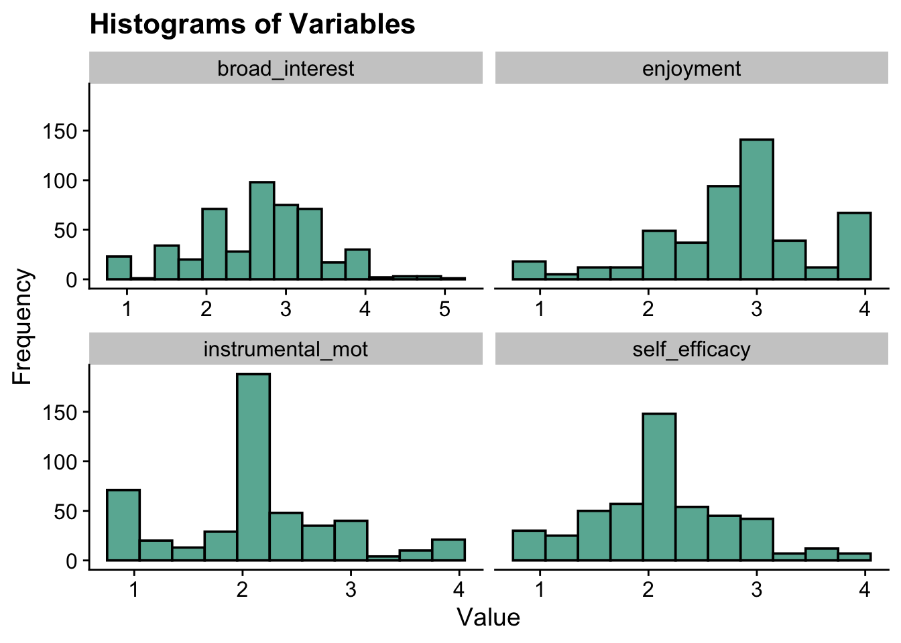
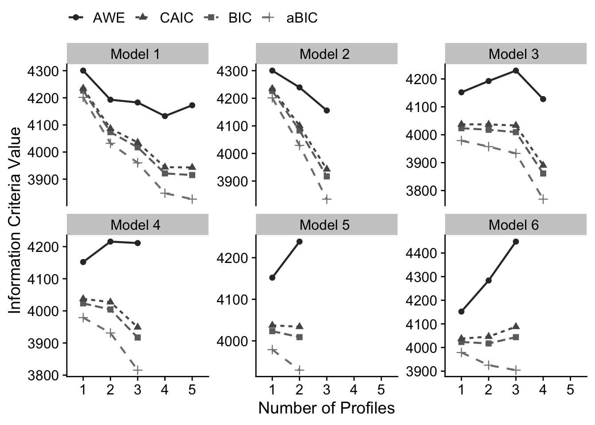

# (PART) Latent Profile Analysis {-}

# Enumeration {#lpa-enum}

------------------------------------------------------------------------

*Example: PISA Student Data*

1.  The first example closely follows the vignette used to demonstrate the [tidyLPA](https://data-edu.github.io/tidyLPA/articles/Introduction_to_tidyLPA.html) package (Rosenberg, 2019).

-   This model utilizes the `PISA` data collected in the U.S. in 2015. To learn more about this data [see here](http://www.oecd.org/pisa/data/).
-   To access the 2015 US `PISA` data & documentation in R use the following code:

Variables:

`broad_interest`

:   composite measure of students' self reported broad interest

`enjoyment`

:   composite measure of students' self reported enjoyment

`instrumental_mot`

:   composite measure of students' self reported instrumental motivation

`self_efficacy`

:   composite measure of students' self reported self efficacy


``` r
#devtools::install_github("jrosen48/pisaUSA15")
#library(pisaUSA15)
```

------------------------------------------------------------------------

## Latent Profile Models

Latent Profile Analysis (LPA) is a statistical modeling approach for estimating distinct profiles of variables and uses continuous - rather than
categorical - indicators. Unlike latent class analysis, which uses categorical indicators, LPA models the means, variances, and covariances of continuous indicators within each latent profile.

------------------------------------------------------------------------

## Terminology for specifying variance-covariance matrix

The code used to estimate LPA models in this walkthrough is from the `tidyLPA` package.
`TidyLPA`([source](https://data-edu.github.io/tidyLPA/articles/Introduction_to_tidyLPA.html)) is an R package designed to estimate latent profile models using a tidy framework.
It can interface with Mplus via the MplusAutomation package, enabling the estimation of latent profile models with different variance-covariance structures.

-   `model 1` Profile-invariant / Diagonal: Equal variances, and covariances fixed to 0
-   `model 2` Profile-varying / Diagonal: Free variances and covariances fixed to 0
-   `model 3` Profile-invariant / Non-Diagonal: Equal variances and equal covariances
    -   Note: an alternative to Model 3 is freely estimating the covariances
-   `model 4` Free variances, and equal covariances
-   `model 5` Equal variances, and free covariances
-   `model 6` Profile Varying / Non-Diagonal: Free variances and free covariances

### Model 1

*Profile-invariant/diagonal:*

-   *Equal Variances*: Variances are fixed to equality across the profiles (i.e., variances are constrained to be equal for each profile).

-   *Covariances fixed to zero* (i.e., the off-diagonal cells of the matrix are zero).

The most parsimonious model and the most restricted.

$$
\begin{pmatrix}
\sigma^2_1 & 0 & 0 \\
0 & \sigma^2_2 & 0 \\
0 & 0 & \sigma^2_3 \\
\end{pmatrix}
$$

### Model 2

*Profile-varying/diagonal:*

-   *Free variances*: Variances parameters are freely estimated across the profiles (i.e., variances vary by profile).

-   *Covariances* *fixed to zero* (i.e., the off-diagonal cells of the matrix are zero).

This model is more flexible and less parsimonious than model 1.

$$
\begin{pmatrix}
\sigma^2_{1p} & 0 & 0 \\
0 & \sigma^2_{2p} & 0 \\
0 & 0 & \sigma^2_{3p} \\
\end{pmatrix}
$$

### Model 3

*Profile-invariant/ non-diagonal or unrestricted:*

-   *Equal variances:* Variances are fixed to equality across profile.
    (i.e., variances are constrained to be same for each profile).

-   *Equal Covariances*: The covariances are now estimated and constrained to be equal.

    -   An alternative to Model 3 is freely estimating the covariances (Model 5 here).

$$
\begin{pmatrix}
\sigma^2_1 & \sigma_{12} & \sigma_{13} \\
\sigma_{12} & \sigma^2_2 & \sigma_{23} \\
\sigma_{13} & \sigma_{23} & \sigma^2_3 \\
\end{pmatrix}
$$

### Model 4 

Varying means, varying variances, and equal covariances:

-   *Free variances*: Variances parameters are freely estimated across profiles (i.e., variances vary by profile).

-   *Equal Covariances*: Covariances are constrained to be equal.

This model is also considered to be an extension of Model 3.

$$
\begin{pmatrix}
\sigma^2_{1p} & \sigma_{12} & \sigma_{13} \\
\sigma_{12} & \sigma^2_{2p} & \sigma_{23} \\
\sigma_{13} & \sigma_{23} & \sigma^2_{3p} \\
\end{pmatrix}
$$

### Model 5

Varying means, equal variances, and varying covariances:

-   *Equal variances:* Variances are fixed to equality across the profiles.
    (i.e., variances are constrained to be same for each profile).

-   *Free Covariances*: Covariances are now freely estimated across the profiles.

This model is also considered to be an extension of Model 3.

$$
\begin{pmatrix}
\sigma^2_{1} & \sigma_{12p} & \sigma_{13p} \\
\sigma_{12p} & \sigma^2_{2} & \sigma_{23p} \\
\sigma_{13p} & \sigma_{23p} & \sigma^2_{3} \\
\end{pmatrix}
$$

### Model 6

*Profile-varying / Non-diagonal*:

-   *Free variances*: Variances parameters are freely estimated across profiles (i.e., variances vary by profile).

-   *Free Covariances*: Covariances are now freely estimated across the profiles.

This is the most complex and unrestricted model.
It is also the least parsimonious

*Note*: The unrestricted model is also sometimes known as Model 4.

$$
\begin{pmatrix}
\sigma^2_{1p} & \sigma_{12p} & \sigma_{13p} \\
\sigma_{12p} & \sigma^2_{2p} & \sigma_{23p} \\
\sigma_{13p} & \sigma_{23p} & \sigma^2_{3p} \\
\end{pmatrix}
$$

------------------------------------------------------------------------

## Load packages


``` r
library(naniar)
library(tidyverse)
library(haven)
library(glue)
library(MplusAutomation)
library(here)
library(janitor)
library(gt)
library(tidyLPA)
library(pisaUSA15)
library(cowplot)
library(filesstrings)
library(patchwork)
library(RcppAlgos)
```

------------------------------------------------------------------------

## Prepare Data


``` r

pisa <- pisaUSA15[1:500,] %>%
  dplyr::select(broad_interest, enjoyment, instrumental_mot, self_efficacy)

```

------------------------------------------------------------------------

## Descriptive Statistics

Quick Summary


``` r
summary(pisa)
#>  broad_interest    enjoyment    instrumental_mot
#>  Min.   :1.000   Min.   :1.00   Min.   :1.000   
#>  1st Qu.:2.200   1st Qu.:2.40   1st Qu.:1.750   
#>  Median :2.800   Median :3.00   Median :2.000   
#>  Mean   :2.666   Mean   :2.82   Mean   :2.129   
#>  3rd Qu.:3.200   3rd Qu.:3.00   3rd Qu.:2.500   
#>  Max.   :5.000   Max.   :4.00   Max.   :4.000   
#>  NAs    :23      NAs    :14     NAs    :21      
#>  self_efficacy  
#>  Min.   :1.000  
#>  1st Qu.:1.750  
#>  Median :2.000  
#>  Mean   :2.125  
#>  3rd Qu.:2.500  
#>  Max.   :4.000  
#>  NAs    :23
```


Mean Table


``` r
ds <- pisa %>% 
  pivot_longer(broad_interest:self_efficacy, names_to = "variable") %>% 
  group_by(variable) %>% 
  summarise(mean = mean(value, na.rm = TRUE),
            sd = sd(value, na.rm = TRUE)) 

ds %>% 
  gt () %>% 
  tab_header(title = md("**Descriptive Summary**")) %>%
  cols_label(
    variable = "Variable",
    mean = md("M"),
    sd = md("SD")
  ) %>%
  fmt_number(c(2:3),
             decimals = 2) %>% 
  cols_align(
    align = "center",
    columns = mean
  ) 
```


```{=html}
<div id="zbpyrgcmbj" style="padding-left:0px;padding-right:0px;padding-top:10px;padding-bottom:10px;overflow-x:auto;overflow-y:auto;width:auto;height:auto;">
<style>#zbpyrgcmbj table {
  font-family: system-ui, 'Segoe UI', Roboto, Helvetica, Arial, sans-serif, 'Apple Color Emoji', 'Segoe UI Emoji', 'Segoe UI Symbol', 'Noto Color Emoji';
  -webkit-font-smoothing: antialiased;
  -moz-osx-font-smoothing: grayscale;
}

#zbpyrgcmbj thead, #zbpyrgcmbj tbody, #zbpyrgcmbj tfoot, #zbpyrgcmbj tr, #zbpyrgcmbj td, #zbpyrgcmbj th {
  border-style: none;
}

#zbpyrgcmbj p {
  margin: 0;
  padding: 0;
}

#zbpyrgcmbj .gt_table {
  display: table;
  border-collapse: collapse;
  line-height: normal;
  margin-left: auto;
  margin-right: auto;
  color: #333333;
  font-size: 16px;
  font-weight: normal;
  font-style: normal;
  background-color: #FFFFFF;
  width: auto;
  border-top-style: solid;
  border-top-width: 2px;
  border-top-color: #A8A8A8;
  border-right-style: none;
  border-right-width: 2px;
  border-right-color: #D3D3D3;
  border-bottom-style: solid;
  border-bottom-width: 2px;
  border-bottom-color: #A8A8A8;
  border-left-style: none;
  border-left-width: 2px;
  border-left-color: #D3D3D3;
}

#zbpyrgcmbj .gt_caption {
  padding-top: 4px;
  padding-bottom: 4px;
}

#zbpyrgcmbj .gt_title {
  color: #333333;
  font-size: 125%;
  font-weight: initial;
  padding-top: 4px;
  padding-bottom: 4px;
  padding-left: 5px;
  padding-right: 5px;
  border-bottom-color: #FFFFFF;
  border-bottom-width: 0;
}

#zbpyrgcmbj .gt_subtitle {
  color: #333333;
  font-size: 85%;
  font-weight: initial;
  padding-top: 3px;
  padding-bottom: 5px;
  padding-left: 5px;
  padding-right: 5px;
  border-top-color: #FFFFFF;
  border-top-width: 0;
}

#zbpyrgcmbj .gt_heading {
  background-color: #FFFFFF;
  text-align: center;
  border-bottom-color: #FFFFFF;
  border-left-style: none;
  border-left-width: 1px;
  border-left-color: #D3D3D3;
  border-right-style: none;
  border-right-width: 1px;
  border-right-color: #D3D3D3;
}

#zbpyrgcmbj .gt_bottom_border {
  border-bottom-style: solid;
  border-bottom-width: 2px;
  border-bottom-color: #D3D3D3;
}

#zbpyrgcmbj .gt_col_headings {
  border-top-style: solid;
  border-top-width: 2px;
  border-top-color: #D3D3D3;
  border-bottom-style: solid;
  border-bottom-width: 2px;
  border-bottom-color: #D3D3D3;
  border-left-style: none;
  border-left-width: 1px;
  border-left-color: #D3D3D3;
  border-right-style: none;
  border-right-width: 1px;
  border-right-color: #D3D3D3;
}

#zbpyrgcmbj .gt_col_heading {
  color: #333333;
  background-color: #FFFFFF;
  font-size: 100%;
  font-weight: normal;
  text-transform: inherit;
  border-left-style: none;
  border-left-width: 1px;
  border-left-color: #D3D3D3;
  border-right-style: none;
  border-right-width: 1px;
  border-right-color: #D3D3D3;
  vertical-align: bottom;
  padding-top: 5px;
  padding-bottom: 6px;
  padding-left: 5px;
  padding-right: 5px;
  overflow-x: hidden;
}

#zbpyrgcmbj .gt_column_spanner_outer {
  color: #333333;
  background-color: #FFFFFF;
  font-size: 100%;
  font-weight: normal;
  text-transform: inherit;
  padding-top: 0;
  padding-bottom: 0;
  padding-left: 4px;
  padding-right: 4px;
}

#zbpyrgcmbj .gt_column_spanner_outer:first-child {
  padding-left: 0;
}

#zbpyrgcmbj .gt_column_spanner_outer:last-child {
  padding-right: 0;
}

#zbpyrgcmbj .gt_column_spanner {
  border-bottom-style: solid;
  border-bottom-width: 2px;
  border-bottom-color: #D3D3D3;
  vertical-align: bottom;
  padding-top: 5px;
  padding-bottom: 5px;
  overflow-x: hidden;
  display: inline-block;
  width: 100%;
}

#zbpyrgcmbj .gt_spanner_row {
  border-bottom-style: hidden;
}

#zbpyrgcmbj .gt_group_heading {
  padding-top: 8px;
  padding-bottom: 8px;
  padding-left: 5px;
  padding-right: 5px;
  color: #333333;
  background-color: #FFFFFF;
  font-size: 100%;
  font-weight: initial;
  text-transform: inherit;
  border-top-style: solid;
  border-top-width: 2px;
  border-top-color: #D3D3D3;
  border-bottom-style: solid;
  border-bottom-width: 2px;
  border-bottom-color: #D3D3D3;
  border-left-style: none;
  border-left-width: 1px;
  border-left-color: #D3D3D3;
  border-right-style: none;
  border-right-width: 1px;
  border-right-color: #D3D3D3;
  vertical-align: middle;
  text-align: left;
}

#zbpyrgcmbj .gt_empty_group_heading {
  padding: 0.5px;
  color: #333333;
  background-color: #FFFFFF;
  font-size: 100%;
  font-weight: initial;
  border-top-style: solid;
  border-top-width: 2px;
  border-top-color: #D3D3D3;
  border-bottom-style: solid;
  border-bottom-width: 2px;
  border-bottom-color: #D3D3D3;
  vertical-align: middle;
}

#zbpyrgcmbj .gt_from_md > :first-child {
  margin-top: 0;
}

#zbpyrgcmbj .gt_from_md > :last-child {
  margin-bottom: 0;
}

#zbpyrgcmbj .gt_row {
  padding-top: 8px;
  padding-bottom: 8px;
  padding-left: 5px;
  padding-right: 5px;
  margin: 10px;
  border-top-style: solid;
  border-top-width: 1px;
  border-top-color: #D3D3D3;
  border-left-style: none;
  border-left-width: 1px;
  border-left-color: #D3D3D3;
  border-right-style: none;
  border-right-width: 1px;
  border-right-color: #D3D3D3;
  vertical-align: middle;
  overflow-x: hidden;
}

#zbpyrgcmbj .gt_stub {
  color: #333333;
  background-color: #FFFFFF;
  font-size: 100%;
  font-weight: initial;
  text-transform: inherit;
  border-right-style: solid;
  border-right-width: 2px;
  border-right-color: #D3D3D3;
  padding-left: 5px;
  padding-right: 5px;
}

#zbpyrgcmbj .gt_stub_row_group {
  color: #333333;
  background-color: #FFFFFF;
  font-size: 100%;
  font-weight: initial;
  text-transform: inherit;
  border-right-style: solid;
  border-right-width: 2px;
  border-right-color: #D3D3D3;
  padding-left: 5px;
  padding-right: 5px;
  vertical-align: top;
}

#zbpyrgcmbj .gt_row_group_first td {
  border-top-width: 2px;
}

#zbpyrgcmbj .gt_row_group_first th {
  border-top-width: 2px;
}

#zbpyrgcmbj .gt_summary_row {
  color: #333333;
  background-color: #FFFFFF;
  text-transform: inherit;
  padding-top: 8px;
  padding-bottom: 8px;
  padding-left: 5px;
  padding-right: 5px;
}

#zbpyrgcmbj .gt_first_summary_row {
  border-top-style: solid;
  border-top-color: #D3D3D3;
}

#zbpyrgcmbj .gt_first_summary_row.thick {
  border-top-width: 2px;
}

#zbpyrgcmbj .gt_last_summary_row {
  padding-top: 8px;
  padding-bottom: 8px;
  padding-left: 5px;
  padding-right: 5px;
  border-bottom-style: solid;
  border-bottom-width: 2px;
  border-bottom-color: #D3D3D3;
}

#zbpyrgcmbj .gt_grand_summary_row {
  color: #333333;
  background-color: #FFFFFF;
  text-transform: inherit;
  padding-top: 8px;
  padding-bottom: 8px;
  padding-left: 5px;
  padding-right: 5px;
}

#zbpyrgcmbj .gt_first_grand_summary_row {
  padding-top: 8px;
  padding-bottom: 8px;
  padding-left: 5px;
  padding-right: 5px;
  border-top-style: double;
  border-top-width: 6px;
  border-top-color: #D3D3D3;
}

#zbpyrgcmbj .gt_last_grand_summary_row_top {
  padding-top: 8px;
  padding-bottom: 8px;
  padding-left: 5px;
  padding-right: 5px;
  border-bottom-style: double;
  border-bottom-width: 6px;
  border-bottom-color: #D3D3D3;
}

#zbpyrgcmbj .gt_striped {
  background-color: rgba(128, 128, 128, 0.05);
}

#zbpyrgcmbj .gt_table_body {
  border-top-style: solid;
  border-top-width: 2px;
  border-top-color: #D3D3D3;
  border-bottom-style: solid;
  border-bottom-width: 2px;
  border-bottom-color: #D3D3D3;
}

#zbpyrgcmbj .gt_footnotes {
  color: #333333;
  background-color: #FFFFFF;
  border-bottom-style: none;
  border-bottom-width: 2px;
  border-bottom-color: #D3D3D3;
  border-left-style: none;
  border-left-width: 2px;
  border-left-color: #D3D3D3;
  border-right-style: none;
  border-right-width: 2px;
  border-right-color: #D3D3D3;
}

#zbpyrgcmbj .gt_footnote {
  margin: 0px;
  font-size: 90%;
  padding-top: 4px;
  padding-bottom: 4px;
  padding-left: 5px;
  padding-right: 5px;
}

#zbpyrgcmbj .gt_sourcenotes {
  color: #333333;
  background-color: #FFFFFF;
  border-bottom-style: none;
  border-bottom-width: 2px;
  border-bottom-color: #D3D3D3;
  border-left-style: none;
  border-left-width: 2px;
  border-left-color: #D3D3D3;
  border-right-style: none;
  border-right-width: 2px;
  border-right-color: #D3D3D3;
}

#zbpyrgcmbj .gt_sourcenote {
  font-size: 90%;
  padding-top: 4px;
  padding-bottom: 4px;
  padding-left: 5px;
  padding-right: 5px;
}

#zbpyrgcmbj .gt_left {
  text-align: left;
}

#zbpyrgcmbj .gt_center {
  text-align: center;
}

#zbpyrgcmbj .gt_right {
  text-align: right;
  font-variant-numeric: tabular-nums;
}

#zbpyrgcmbj .gt_font_normal {
  font-weight: normal;
}

#zbpyrgcmbj .gt_font_bold {
  font-weight: bold;
}

#zbpyrgcmbj .gt_font_italic {
  font-style: italic;
}

#zbpyrgcmbj .gt_super {
  font-size: 65%;
}

#zbpyrgcmbj .gt_footnote_marks {
  font-size: 75%;
  vertical-align: 0.4em;
  position: initial;
}

#zbpyrgcmbj .gt_asterisk {
  font-size: 100%;
  vertical-align: 0;
}

#zbpyrgcmbj .gt_indent_1 {
  text-indent: 5px;
}

#zbpyrgcmbj .gt_indent_2 {
  text-indent: 10px;
}

#zbpyrgcmbj .gt_indent_3 {
  text-indent: 15px;
}

#zbpyrgcmbj .gt_indent_4 {
  text-indent: 20px;
}

#zbpyrgcmbj .gt_indent_5 {
  text-indent: 25px;
}

#zbpyrgcmbj .katex-display {
  display: inline-flex !important;
  margin-bottom: 0.75em !important;
}

#zbpyrgcmbj div.Reactable > div.rt-table > div.rt-thead > div.rt-tr.rt-tr-group-header > div.rt-th-group:after {
  height: 0px !important;
}
</style>
<table class="gt_table" data-quarto-disable-processing="false" data-quarto-bootstrap="false">
  <thead>
    <tr class="gt_heading">
      <td colspan="3" class="gt_heading gt_title gt_font_normal gt_bottom_border" style><span class='gt_from_md'><strong>Descriptive Summary</strong></span></td>
    </tr>
    
    <tr class="gt_col_headings">
      <th class="gt_col_heading gt_columns_bottom_border gt_left" rowspan="1" colspan="1" scope="col" id="variable">Variable</th>
      <th class="gt_col_heading gt_columns_bottom_border gt_center" rowspan="1" colspan="1" scope="col" id="mean"><span class='gt_from_md'>M</span></th>
      <th class="gt_col_heading gt_columns_bottom_border gt_right" rowspan="1" colspan="1" scope="col" id="sd"><span class='gt_from_md'>SD</span></th>
    </tr>
  </thead>
  <tbody class="gt_table_body">
    <tr><td headers="variable" class="gt_row gt_left">broad_interest</td>
<td headers="mean" class="gt_row gt_center">2.67</td>
<td headers="sd" class="gt_row gt_right">0.77</td></tr>
    <tr><td headers="variable" class="gt_row gt_left">enjoyment</td>
<td headers="mean" class="gt_row gt_center">2.82</td>
<td headers="sd" class="gt_row gt_right">0.72</td></tr>
    <tr><td headers="variable" class="gt_row gt_left">instrumental_mot</td>
<td headers="mean" class="gt_row gt_center">2.13</td>
<td headers="sd" class="gt_row gt_right">0.75</td></tr>
    <tr><td headers="variable" class="gt_row gt_left">self_efficacy</td>
<td headers="mean" class="gt_row gt_center">2.12</td>
<td headers="sd" class="gt_row gt_right">0.64</td></tr>
  </tbody>
  
</table>
</div>
```


Histograms


``` r
data_long <- pisa %>%
  pivot_longer(broad_interest:self_efficacy, names_to = "variable")

ggplot(data_long, aes(x = value)) +
  geom_histogram(binwidth = .3, fill = "#69b3a2", color = "black") +
  facet_wrap(~ variable, scales = "free_x") +
  labs(title = "Histograms of Variables", x = "Value", y = "Frequency") +
  theme_cowplot()
```




------------------------------------------------------------------------

## Enumeration

------------------------------------------------------------------------

### `tidyLPA`

------------------------------------------------------------------------

Enumerate using `estimate_profiles()`:

-   Estimate models with profiles $K = 1:5$
-   Model has 4 continuous indicators
-   Default variance-covariance specifications (model 1)
-   Change `variances` and `covariances` to indicate the model you want to specify, in this example, we are estimating all six models.


``` r

# Run LPA models 
lpa_fit <- pisa %>% 
    estimate_profiles(1:5,
                      package = "MplusAutomation",
                      ANALYSIS = "starts = 500 100;",
                      OUTPUT = "sampstat residual tech11 tech14",
                      variances = c("equal", "varying", "equal", "varying", "equal", "varying"),
                      covariances = c("zero", "zero", "equal", "equal", "varying", "varying"),
                      keepfiles = TRUE)

# Compare fit statistics
get_fit(lpa_fit)


# Move files to folder 
files <- list.files(here(), pattern = "^model")
move_files(files, here("lpa", "tidyLPA"), overwrite = TRUE)
```


------------------------------------------------------------------------

### `Mplus`

------------------------------------------------------------------------

Alternative method to `estimate_profiles()`: Run enumeration using `mplusObject` method

You can change the model specification for LPA using the syntax provided in lecture.

#### Model 1

When estimating LPA in Mplus, the default variance/covariance specification is the most restricted model (Model 1).
So we don't have to specify anything here.


``` r

lpa_k14  <- lapply(1:5, function(k) {
  lpa_enum  <- mplusObject(
      
    TITLE = glue("Profile {k}"), 
  
    VARIABLE = glue(
    "usevar = broad_interest-self_efficacy;
     classes = c({k}); "),
  
  ANALYSIS = 
   "estimator = mlr; 
    type = mixture;
    starts = 500 100;",
  
  OUTPUT = "sampstat svalues residual tech11 tech14;",
  
  usevariables = colnames(pisa),
  rdata = pisa)

lpa_enum_fit <- mplusModeler(lpa_enum, 
                dataout=glue(here("lpa", "enum_lpa", "lpa_pisa")),
                modelout=glue(here("lpa", "enum_lpa", "c{k}_lpa_m1.inp")) ,
                check=TRUE, run = TRUE, hashfilename = FALSE)
})
```

#### Model 2

Here, an addition loop adds the variance/covariance specifications for each class-specific statement.
For the profile-varying/diagonal specification, you must specify the variances to be freely estimated:

`broad_interest-self_efficacy;`


``` r
lpa_m2_k14  <- lapply(1:5, function(k){ 
  
  # This MODEL section changes the model specification
  MODEL <- paste(sapply(1:k, function(i) {
    glue("
    %c#{i}%
    broad_interest-self_efficacy;      ! variances are freely estimated
    ")
  }), collapse = "\n")
  
  lpa_enum_m2  <- mplusObject(
    TITLE = glue("Profile {k} - Model 2"),
    
    VARIABLE = glue(
      "usevar = broad_interest-self_efficacy;
     classes = c({k});"),
    
    ANALYSIS = 
      "estimator = mlr; 
    type = mixture;
    starts = 500 100;",
    
    MODEL = MODEL,
    
    
    OUTPUT = "sampstat svalues residual tech11 tech14;",
    
    usevariables = colnames(pisa),
    rdata = pisa)
  
  lpa_m2_fit <- mplusModeler(lpa_enum_m2,
                             dataout = here("lpa", "enum_lpa", "lpa_pisa"),
                             modelout = glue(here("lpa", "enum_lpa","c{k}_lpa_m2.inp")),
                             check = TRUE, run = TRUE, hashfilename = FALSE)
})
```

For reference, here is the Mplus syntax for different specifications:

**Fixed covariance to zero (DEFAULT)**:

`broad_interest WITH enjoyment@0;`

**Free covariance**:

`broad_interest WITH enjoyment;`

**Equal covariances**:

`%c#1%`

`broad_interest WITH enjoyment (1);`

`%c#2%`

`broad_interest WITH enjoyment (1);`

**Equal variance (DEFAULT)**:

`%c#1%`

`broad_interest (1);`

`%c#2%`

`broad_interest (1);`

**Free variance**:

`mth_scor-bio_scor;`

You can also open the `tidyLPA` .inp files to see the specifications.


**IMPORTANT**: Before moving forward, make sure to open each output document to ensure models were estimated normally. 

------------------------------------------------------------------------

## Examine and extract Mplus files

Code by Delwin Carter (2025)

Check all Models for:

1. Warnings  
2. Errors  
3. Convergence and Loglikelihood Replication Information


``` r
source(here("functions", "extract_mplus_info.R"))

# Define the directory where all of the .out files are located.
output_dir <- here("enum")

# Get all .out files
output_files <- list.files(output_dir, pattern = "\\.out$", full.names = TRUE)

# Process all .out files into one dataframe
final_data <- map_dfr(output_files, extract_mplus_info_extended)

# Extract Sample_Size from final_data
sample_size <- unique(final_data$Sample_Size)

```

### Examine Mplus Warnings

Here are some of the warnings for the enumeration models for each output file corresponding to class solution.


``` r
source(here("functions", "extract_warnings.R"))

warnings_table <- extract_warnings(final_data)
warnings_table
```


```{=html}
<div id="iaygokjams" style="padding-left:0px;padding-right:0px;padding-top:10px;padding-bottom:10px;overflow-x:auto;overflow-y:auto;width:auto;height:auto;">
<style>#iaygokjams table {
  font-family: system-ui, 'Segoe UI', Roboto, Helvetica, Arial, sans-serif, 'Apple Color Emoji', 'Segoe UI Emoji', 'Segoe UI Symbol', 'Noto Color Emoji';
  -webkit-font-smoothing: antialiased;
  -moz-osx-font-smoothing: grayscale;
}

#iaygokjams thead, #iaygokjams tbody, #iaygokjams tfoot, #iaygokjams tr, #iaygokjams td, #iaygokjams th {
  border-style: none;
}

#iaygokjams p {
  margin: 0;
  padding: 0;
}

#iaygokjams .gt_table {
  display: table;
  border-collapse: collapse;
  line-height: normal;
  margin-left: auto;
  margin-right: auto;
  color: #333333;
  font-size: 16px;
  font-weight: normal;
  font-style: normal;
  background-color: #FFFFFF;
  width: 100%;
  border-top-style: solid;
  border-top-width: 2px;
  border-top-color: #A8A8A8;
  border-right-style: none;
  border-right-width: 2px;
  border-right-color: #D3D3D3;
  border-bottom-style: solid;
  border-bottom-width: 2px;
  border-bottom-color: #A8A8A8;
  border-left-style: none;
  border-left-width: 2px;
  border-left-color: #D3D3D3;
}

#iaygokjams .gt_caption {
  padding-top: 4px;
  padding-bottom: 4px;
}

#iaygokjams .gt_title {
  color: #333333;
  font-size: 125%;
  font-weight: initial;
  padding-top: 4px;
  padding-bottom: 4px;
  padding-left: 5px;
  padding-right: 5px;
  border-bottom-color: #FFFFFF;
  border-bottom-width: 0;
}

#iaygokjams .gt_subtitle {
  color: #333333;
  font-size: 85%;
  font-weight: initial;
  padding-top: 3px;
  padding-bottom: 5px;
  padding-left: 5px;
  padding-right: 5px;
  border-top-color: #FFFFFF;
  border-top-width: 0;
}

#iaygokjams .gt_heading {
  background-color: #FFFFFF;
  text-align: center;
  border-bottom-color: #FFFFFF;
  border-left-style: none;
  border-left-width: 1px;
  border-left-color: #D3D3D3;
  border-right-style: none;
  border-right-width: 1px;
  border-right-color: #D3D3D3;
}

#iaygokjams .gt_bottom_border {
  border-bottom-style: solid;
  border-bottom-width: 2px;
  border-bottom-color: #D3D3D3;
}

#iaygokjams .gt_col_headings {
  border-top-style: solid;
  border-top-width: 2px;
  border-top-color: #D3D3D3;
  border-bottom-style: solid;
  border-bottom-width: 2px;
  border-bottom-color: #D3D3D3;
  border-left-style: none;
  border-left-width: 1px;
  border-left-color: #D3D3D3;
  border-right-style: none;
  border-right-width: 1px;
  border-right-color: #D3D3D3;
}

#iaygokjams .gt_col_heading {
  color: #333333;
  background-color: #FFFFFF;
  font-size: 100%;
  font-weight: normal;
  text-transform: inherit;
  border-left-style: none;
  border-left-width: 1px;
  border-left-color: #D3D3D3;
  border-right-style: none;
  border-right-width: 1px;
  border-right-color: #D3D3D3;
  vertical-align: bottom;
  padding-top: 5px;
  padding-bottom: 6px;
  padding-left: 5px;
  padding-right: 5px;
  overflow-x: hidden;
}

#iaygokjams .gt_column_spanner_outer {
  color: #333333;
  background-color: #FFFFFF;
  font-size: 100%;
  font-weight: normal;
  text-transform: inherit;
  padding-top: 0;
  padding-bottom: 0;
  padding-left: 4px;
  padding-right: 4px;
}

#iaygokjams .gt_column_spanner_outer:first-child {
  padding-left: 0;
}

#iaygokjams .gt_column_spanner_outer:last-child {
  padding-right: 0;
}

#iaygokjams .gt_column_spanner {
  border-bottom-style: solid;
  border-bottom-width: 2px;
  border-bottom-color: #D3D3D3;
  vertical-align: bottom;
  padding-top: 5px;
  padding-bottom: 5px;
  overflow-x: hidden;
  display: inline-block;
  width: 100%;
}

#iaygokjams .gt_spanner_row {
  border-bottom-style: hidden;
}

#iaygokjams .gt_group_heading {
  padding-top: 8px;
  padding-bottom: 8px;
  padding-left: 5px;
  padding-right: 5px;
  color: #333333;
  background-color: #FFFFFF;
  font-size: 100%;
  font-weight: initial;
  text-transform: inherit;
  border-top-style: solid;
  border-top-width: 2px;
  border-top-color: #D3D3D3;
  border-bottom-style: solid;
  border-bottom-width: 2px;
  border-bottom-color: #D3D3D3;
  border-left-style: none;
  border-left-width: 1px;
  border-left-color: #D3D3D3;
  border-right-style: none;
  border-right-width: 1px;
  border-right-color: #D3D3D3;
  vertical-align: middle;
  text-align: left;
}

#iaygokjams .gt_empty_group_heading {
  padding: 0.5px;
  color: #333333;
  background-color: #FFFFFF;
  font-size: 100%;
  font-weight: initial;
  border-top-style: solid;
  border-top-width: 2px;
  border-top-color: #D3D3D3;
  border-bottom-style: solid;
  border-bottom-width: 2px;
  border-bottom-color: #D3D3D3;
  vertical-align: middle;
}

#iaygokjams .gt_from_md > :first-child {
  margin-top: 0;
}

#iaygokjams .gt_from_md > :last-child {
  margin-bottom: 0;
}

#iaygokjams .gt_row {
  padding-top: 8px;
  padding-bottom: 8px;
  padding-left: 5px;
  padding-right: 5px;
  margin: 10px;
  border-top-style: solid;
  border-top-width: 1px;
  border-top-color: #D3D3D3;
  border-left-style: none;
  border-left-width: 1px;
  border-left-color: #D3D3D3;
  border-right-style: none;
  border-right-width: 1px;
  border-right-color: #D3D3D3;
  vertical-align: middle;
  overflow-x: hidden;
}

#iaygokjams .gt_stub {
  color: #333333;
  background-color: #FFFFFF;
  font-size: 100%;
  font-weight: initial;
  text-transform: inherit;
  border-right-style: solid;
  border-right-width: 2px;
  border-right-color: #D3D3D3;
  padding-left: 5px;
  padding-right: 5px;
}

#iaygokjams .gt_stub_row_group {
  color: #333333;
  background-color: #FFFFFF;
  font-size: 100%;
  font-weight: initial;
  text-transform: inherit;
  border-right-style: solid;
  border-right-width: 2px;
  border-right-color: #D3D3D3;
  padding-left: 5px;
  padding-right: 5px;
  vertical-align: top;
}

#iaygokjams .gt_row_group_first td {
  border-top-width: 2px;
}

#iaygokjams .gt_row_group_first th {
  border-top-width: 2px;
}

#iaygokjams .gt_summary_row {
  color: #333333;
  background-color: #FFFFFF;
  text-transform: inherit;
  padding-top: 8px;
  padding-bottom: 8px;
  padding-left: 5px;
  padding-right: 5px;
}

#iaygokjams .gt_first_summary_row {
  border-top-style: solid;
  border-top-color: #D3D3D3;
}

#iaygokjams .gt_first_summary_row.thick {
  border-top-width: 2px;
}

#iaygokjams .gt_last_summary_row {
  padding-top: 8px;
  padding-bottom: 8px;
  padding-left: 5px;
  padding-right: 5px;
  border-bottom-style: solid;
  border-bottom-width: 2px;
  border-bottom-color: #D3D3D3;
}

#iaygokjams .gt_grand_summary_row {
  color: #333333;
  background-color: #FFFFFF;
  text-transform: inherit;
  padding-top: 8px;
  padding-bottom: 8px;
  padding-left: 5px;
  padding-right: 5px;
}

#iaygokjams .gt_first_grand_summary_row {
  padding-top: 8px;
  padding-bottom: 8px;
  padding-left: 5px;
  padding-right: 5px;
  border-top-style: double;
  border-top-width: 6px;
  border-top-color: #D3D3D3;
}

#iaygokjams .gt_last_grand_summary_row_top {
  padding-top: 8px;
  padding-bottom: 8px;
  padding-left: 5px;
  padding-right: 5px;
  border-bottom-style: double;
  border-bottom-width: 6px;
  border-bottom-color: #D3D3D3;
}

#iaygokjams .gt_striped {
  background-color: rgba(128, 128, 128, 0.05);
}

#iaygokjams .gt_table_body {
  border-top-style: solid;
  border-top-width: 2px;
  border-top-color: #D3D3D3;
  border-bottom-style: solid;
  border-bottom-width: 2px;
  border-bottom-color: #D3D3D3;
}

#iaygokjams .gt_footnotes {
  color: #333333;
  background-color: #FFFFFF;
  border-bottom-style: none;
  border-bottom-width: 2px;
  border-bottom-color: #D3D3D3;
  border-left-style: none;
  border-left-width: 2px;
  border-left-color: #D3D3D3;
  border-right-style: none;
  border-right-width: 2px;
  border-right-color: #D3D3D3;
}

#iaygokjams .gt_footnote {
  margin: 0px;
  font-size: 90%;
  padding-top: 4px;
  padding-bottom: 4px;
  padding-left: 5px;
  padding-right: 5px;
}

#iaygokjams .gt_sourcenotes {
  color: #333333;
  background-color: #FFFFFF;
  border-bottom-style: none;
  border-bottom-width: 2px;
  border-bottom-color: #D3D3D3;
  border-left-style: none;
  border-left-width: 2px;
  border-left-color: #D3D3D3;
  border-right-style: none;
  border-right-width: 2px;
  border-right-color: #D3D3D3;
}

#iaygokjams .gt_sourcenote {
  font-size: 90%;
  padding-top: 4px;
  padding-bottom: 4px;
  padding-left: 5px;
  padding-right: 5px;
}

#iaygokjams .gt_left {
  text-align: left;
}

#iaygokjams .gt_center {
  text-align: center;
}

#iaygokjams .gt_right {
  text-align: right;
  font-variant-numeric: tabular-nums;
}

#iaygokjams .gt_font_normal {
  font-weight: normal;
}

#iaygokjams .gt_font_bold {
  font-weight: bold;
}

#iaygokjams .gt_font_italic {
  font-style: italic;
}

#iaygokjams .gt_super {
  font-size: 65%;
}

#iaygokjams .gt_footnote_marks {
  font-size: 75%;
  vertical-align: 0.4em;
  position: initial;
}

#iaygokjams .gt_asterisk {
  font-size: 100%;
  vertical-align: 0;
}

#iaygokjams .gt_indent_1 {
  text-indent: 5px;
}

#iaygokjams .gt_indent_2 {
  text-indent: 10px;
}

#iaygokjams .gt_indent_3 {
  text-indent: 15px;
}

#iaygokjams .gt_indent_4 {
  text-indent: 20px;
}

#iaygokjams .gt_indent_5 {
  text-indent: 25px;
}

#iaygokjams .katex-display {
  display: inline-flex !important;
  margin-bottom: 0.75em !important;
}

#iaygokjams div.Reactable > div.rt-table > div.rt-thead > div.rt-tr.rt-tr-group-header > div.rt-th-group:after {
  height: 0px !important;
}
</style>
<table class="gt_table" style="table-layout:fixed;width:100%;" data-quarto-disable-processing="false" data-quarto-bootstrap="false">
  <colgroup>
    <col style="width:150px;"/>
    <col style="width:150px;"/>
    <col style="width:400px;"/>
  </colgroup>
  <thead>
    <tr class="gt_heading">
      <td colspan="3" class="gt_heading gt_title gt_font_normal gt_bottom_border" style><span class='gt_from_md'><strong>Model Warnings</strong></span></td>
    </tr>
    
    <tr class="gt_col_headings">
      <th class="gt_col_heading gt_columns_bottom_border gt_left" rowspan="1" colspan="1" scope="col" id="File_Name">Output File</th>
      <th class="gt_col_heading gt_columns_bottom_border gt_left" rowspan="1" colspan="1" scope="col" id="Warning_Summary"># of Warnings</th>
      <th class="gt_col_heading gt_columns_bottom_border gt_left" rowspan="1" colspan="1" scope="col" id="Warnings">Warning Message(s)</th>
    </tr>
  </thead>
  <tbody class="gt_table_body">
    <tr><td headers="File_Name" class="gt_row gt_left">c1_bully.out</td>
<td headers="Warning_Summary" class="gt_row gt_left">There are 5 warnings in the output file.</td>
<td headers="Warnings" class="gt_row gt_left"><div style='white-space: normal; word-wrap: break-word;'>*** WARNING in VARIABLE command   Note that only the first 8 characters of variable names are used in the output.   Shorten variable names to avoid any confusion.</div></td></tr>
    <tr><td headers="File_Name" class="gt_row gt_left"></td>
<td headers="Warning_Summary" class="gt_row gt_left"></td>
<td headers="Warnings" class="gt_row gt_left"><div style='white-space: normal; word-wrap: break-word;'>*** WARNING in PLOT command   Note that only the first 8 characters of variable names are used in plots.   If variable names are not unique within the first 8 characters, problems   may occur.</div></td></tr>
    <tr><td headers="File_Name" class="gt_row gt_left"></td>
<td headers="Warning_Summary" class="gt_row gt_left"></td>
<td headers="Warnings" class="gt_row gt_left"><div style='white-space: normal; word-wrap: break-word;'>*** WARNING in OUTPUT command   SAMPSTAT option is not available when all outcomes are censored, ordered   categorical, unordered categorical (nominal), count or continuous-time   survival variables.  Request for SAMPSTAT is ignored.</div></td></tr>
    <tr><td headers="File_Name" class="gt_row gt_left"></td>
<td headers="Warning_Summary" class="gt_row gt_left"></td>
<td headers="Warnings" class="gt_row gt_left"><div style='white-space: normal; word-wrap: break-word;'>*** WARNING in OUTPUT command   TECH11 option is not available for TYPE=MIXTURE with only one class.   Request for TECH11 is ignored.</div></td></tr>
    <tr><td headers="File_Name" class="gt_row gt_left"></td>
<td headers="Warning_Summary" class="gt_row gt_left"></td>
<td headers="Warnings" class="gt_row gt_left"><div style='white-space: normal; word-wrap: break-word;'>*** WARNING in OUTPUT command   TECH14 option is not available for TYPE=MIXTURE with only one class.   Request for TECH14 is ignored.    </div></td></tr>
    <tr><td headers="File_Name" class="gt_row gt_left">c2_bully.out</td>
<td headers="Warning_Summary" class="gt_row gt_left">There are 3 warnings in the output file.</td>
<td headers="Warnings" class="gt_row gt_left"><div style='white-space: normal; word-wrap: break-word;'>*** WARNING in VARIABLE command   Note that only the first 8 characters of variable names are used in the output.   Shorten variable names to avoid any confusion.</div></td></tr>
    <tr><td headers="File_Name" class="gt_row gt_left"></td>
<td headers="Warning_Summary" class="gt_row gt_left"></td>
<td headers="Warnings" class="gt_row gt_left"><div style='white-space: normal; word-wrap: break-word;'>*** WARNING in PLOT command   Note that only the first 8 characters of variable names are used in plots.   If variable names are not unique within the first 8 characters, problems   may occur.</div></td></tr>
    <tr><td headers="File_Name" class="gt_row gt_left"></td>
<td headers="Warning_Summary" class="gt_row gt_left"></td>
<td headers="Warnings" class="gt_row gt_left"><div style='white-space: normal; word-wrap: break-word;'>*** WARNING in OUTPUT command   SAMPSTAT option is not available when all outcomes are censored, ordered   categorical, unordered categorical (nominal), count or continuous-time   survival variables.  Request for SAMPSTAT is ignored.    </div></td></tr>
    <tr><td headers="File_Name" class="gt_row gt_left">c3_bully.out</td>
<td headers="Warning_Summary" class="gt_row gt_left">There are 3 warnings in the output file.</td>
<td headers="Warnings" class="gt_row gt_left"><div style='white-space: normal; word-wrap: break-word;'>*** WARNING in VARIABLE command   Note that only the first 8 characters of variable names are used in the output.   Shorten variable names to avoid any confusion.</div></td></tr>
    <tr><td headers="File_Name" class="gt_row gt_left"></td>
<td headers="Warning_Summary" class="gt_row gt_left"></td>
<td headers="Warnings" class="gt_row gt_left"><div style='white-space: normal; word-wrap: break-word;'>*** WARNING in PLOT command   Note that only the first 8 characters of variable names are used in plots.   If variable names are not unique within the first 8 characters, problems   may occur.</div></td></tr>
    <tr><td headers="File_Name" class="gt_row gt_left"></td>
<td headers="Warning_Summary" class="gt_row gt_left"></td>
<td headers="Warnings" class="gt_row gt_left"><div style='white-space: normal; word-wrap: break-word;'>*** WARNING in OUTPUT command   SAMPSTAT option is not available when all outcomes are censored, ordered   categorical, unordered categorical (nominal), count or continuous-time   survival variables.  Request for SAMPSTAT is ignored.    </div></td></tr>
    <tr><td headers="File_Name" class="gt_row gt_left">c4_bully.out</td>
<td headers="Warning_Summary" class="gt_row gt_left">There are 3 warnings in the output file.</td>
<td headers="Warnings" class="gt_row gt_left"><div style='white-space: normal; word-wrap: break-word;'>*** WARNING in VARIABLE command   Note that only the first 8 characters of variable names are used in the output.   Shorten variable names to avoid any confusion.</div></td></tr>
    <tr><td headers="File_Name" class="gt_row gt_left"></td>
<td headers="Warning_Summary" class="gt_row gt_left"></td>
<td headers="Warnings" class="gt_row gt_left"><div style='white-space: normal; word-wrap: break-word;'>*** WARNING in PLOT command   Note that only the first 8 characters of variable names are used in plots.   If variable names are not unique within the first 8 characters, problems   may occur.</div></td></tr>
    <tr><td headers="File_Name" class="gt_row gt_left"></td>
<td headers="Warning_Summary" class="gt_row gt_left"></td>
<td headers="Warnings" class="gt_row gt_left"><div style='white-space: normal; word-wrap: break-word;'>*** WARNING in OUTPUT command   SAMPSTAT option is not available when all outcomes are censored, ordered   categorical, unordered categorical (nominal), count or continuous-time   survival variables.  Request for SAMPSTAT is ignored.    </div></td></tr>
    <tr><td headers="File_Name" class="gt_row gt_left">c5_bully.out</td>
<td headers="Warning_Summary" class="gt_row gt_left">There are 3 warnings in the output file.</td>
<td headers="Warnings" class="gt_row gt_left"><div style='white-space: normal; word-wrap: break-word;'>*** WARNING in VARIABLE command   Note that only the first 8 characters of variable names are used in the output.   Shorten variable names to avoid any confusion.</div></td></tr>
    <tr><td headers="File_Name" class="gt_row gt_left"></td>
<td headers="Warning_Summary" class="gt_row gt_left"></td>
<td headers="Warnings" class="gt_row gt_left"><div style='white-space: normal; word-wrap: break-word;'>*** WARNING in PLOT command   Note that only the first 8 characters of variable names are used in plots.   If variable names are not unique within the first 8 characters, problems   may occur.</div></td></tr>
    <tr><td headers="File_Name" class="gt_row gt_left"></td>
<td headers="Warning_Summary" class="gt_row gt_left"></td>
<td headers="Warnings" class="gt_row gt_left"><div style='white-space: normal; word-wrap: break-word;'>*** WARNING in OUTPUT command   SAMPSTAT option is not available when all outcomes are censored, ordered   categorical, unordered categorical (nominal), count or continuous-time   survival variables.  Request for SAMPSTAT is ignored.    </div></td></tr>
    <tr><td headers="File_Name" class="gt_row gt_left">c6_bully.out</td>
<td headers="Warning_Summary" class="gt_row gt_left">There are 3 warnings in the output file.</td>
<td headers="Warnings" class="gt_row gt_left"><div style='white-space: normal; word-wrap: break-word;'>*** WARNING in VARIABLE command   Note that only the first 8 characters of variable names are used in the output.   Shorten variable names to avoid any confusion.</div></td></tr>
    <tr><td headers="File_Name" class="gt_row gt_left"></td>
<td headers="Warning_Summary" class="gt_row gt_left"></td>
<td headers="Warnings" class="gt_row gt_left"><div style='white-space: normal; word-wrap: break-word;'>*** WARNING in PLOT command   Note that only the first 8 characters of variable names are used in plots.   If variable names are not unique within the first 8 characters, problems   may occur.</div></td></tr>
    <tr><td headers="File_Name" class="gt_row gt_left"></td>
<td headers="Warning_Summary" class="gt_row gt_left"></td>
<td headers="Warnings" class="gt_row gt_left"><div style='white-space: normal; word-wrap: break-word;'>*** WARNING in OUTPUT command   SAMPSTAT option is not available when all outcomes are censored, ordered   categorical, unordered categorical (nominal), count or continuous-time   survival variables.  Request for SAMPSTAT is ignored.    </div></td></tr>
  </tbody>
  
</table>
</div>
```


``` r

# Save the warnings table
#gtsave(warnings_table, here("figures", "warnings_table.png"))
```

### Examine Mplus Errors

Here are the errors for the enumeration models for each output file corresponding to class solution.


``` r
source(here("functions", "error_visualization.R"))

# Process errors
error_table_data <- process_error_data(final_data)
error_table_data
```


```{=html}
<div id="wjoehvtpqx" style="padding-left:0px;padding-right:0px;padding-top:10px;padding-bottom:10px;overflow-x:auto;overflow-y:auto;width:auto;height:auto;">
<style>#wjoehvtpqx table {
  font-family: system-ui, 'Segoe UI', Roboto, Helvetica, Arial, sans-serif, 'Apple Color Emoji', 'Segoe UI Emoji', 'Segoe UI Symbol', 'Noto Color Emoji';
  -webkit-font-smoothing: antialiased;
  -moz-osx-font-smoothing: grayscale;
}

#wjoehvtpqx thead, #wjoehvtpqx tbody, #wjoehvtpqx tfoot, #wjoehvtpqx tr, #wjoehvtpqx td, #wjoehvtpqx th {
  border-style: none;
}

#wjoehvtpqx p {
  margin: 0;
  padding: 0;
}

#wjoehvtpqx .gt_table {
  display: table;
  border-collapse: collapse;
  line-height: normal;
  margin-left: auto;
  margin-right: auto;
  color: #333333;
  font-size: 16px;
  font-weight: normal;
  font-style: normal;
  background-color: #FFFFFF;
  width: 600px;
  border-top-style: solid;
  border-top-width: 2px;
  border-top-color: #A8A8A8;
  border-right-style: none;
  border-right-width: 2px;
  border-right-color: #D3D3D3;
  border-bottom-style: solid;
  border-bottom-width: 2px;
  border-bottom-color: #A8A8A8;
  border-left-style: none;
  border-left-width: 2px;
  border-left-color: #D3D3D3;
}

#wjoehvtpqx .gt_caption {
  padding-top: 4px;
  padding-bottom: 4px;
}

#wjoehvtpqx .gt_title {
  color: #333333;
  font-size: 125%;
  font-weight: initial;
  padding-top: 4px;
  padding-bottom: 4px;
  padding-left: 5px;
  padding-right: 5px;
  border-bottom-color: #FFFFFF;
  border-bottom-width: 0;
}

#wjoehvtpqx .gt_subtitle {
  color: #333333;
  font-size: 85%;
  font-weight: initial;
  padding-top: 3px;
  padding-bottom: 5px;
  padding-left: 5px;
  padding-right: 5px;
  border-top-color: #FFFFFF;
  border-top-width: 0;
}

#wjoehvtpqx .gt_heading {
  background-color: #FFFFFF;
  text-align: center;
  border-bottom-color: #FFFFFF;
  border-left-style: none;
  border-left-width: 1px;
  border-left-color: #D3D3D3;
  border-right-style: none;
  border-right-width: 1px;
  border-right-color: #D3D3D3;
}

#wjoehvtpqx .gt_bottom_border {
  border-bottom-style: solid;
  border-bottom-width: 2px;
  border-bottom-color: #D3D3D3;
}

#wjoehvtpqx .gt_col_headings {
  border-top-style: solid;
  border-top-width: 2px;
  border-top-color: #D3D3D3;
  border-bottom-style: solid;
  border-bottom-width: 2px;
  border-bottom-color: #D3D3D3;
  border-left-style: none;
  border-left-width: 1px;
  border-left-color: #D3D3D3;
  border-right-style: none;
  border-right-width: 1px;
  border-right-color: #D3D3D3;
}

#wjoehvtpqx .gt_col_heading {
  color: #333333;
  background-color: #FFFFFF;
  font-size: 100%;
  font-weight: normal;
  text-transform: inherit;
  border-left-style: none;
  border-left-width: 1px;
  border-left-color: #D3D3D3;
  border-right-style: none;
  border-right-width: 1px;
  border-right-color: #D3D3D3;
  vertical-align: bottom;
  padding-top: 5px;
  padding-bottom: 6px;
  padding-left: 5px;
  padding-right: 5px;
  overflow-x: hidden;
}

#wjoehvtpqx .gt_column_spanner_outer {
  color: #333333;
  background-color: #FFFFFF;
  font-size: 100%;
  font-weight: normal;
  text-transform: inherit;
  padding-top: 0;
  padding-bottom: 0;
  padding-left: 4px;
  padding-right: 4px;
}

#wjoehvtpqx .gt_column_spanner_outer:first-child {
  padding-left: 0;
}

#wjoehvtpqx .gt_column_spanner_outer:last-child {
  padding-right: 0;
}

#wjoehvtpqx .gt_column_spanner {
  border-bottom-style: solid;
  border-bottom-width: 2px;
  border-bottom-color: #D3D3D3;
  vertical-align: bottom;
  padding-top: 5px;
  padding-bottom: 5px;
  overflow-x: hidden;
  display: inline-block;
  width: 100%;
}

#wjoehvtpqx .gt_spanner_row {
  border-bottom-style: hidden;
}

#wjoehvtpqx .gt_group_heading {
  padding-top: 8px;
  padding-bottom: 8px;
  padding-left: 5px;
  padding-right: 5px;
  color: #333333;
  background-color: #FFFFFF;
  font-size: 100%;
  font-weight: initial;
  text-transform: inherit;
  border-top-style: solid;
  border-top-width: 2px;
  border-top-color: #D3D3D3;
  border-bottom-style: solid;
  border-bottom-width: 2px;
  border-bottom-color: #D3D3D3;
  border-left-style: none;
  border-left-width: 1px;
  border-left-color: #D3D3D3;
  border-right-style: none;
  border-right-width: 1px;
  border-right-color: #D3D3D3;
  vertical-align: middle;
  text-align: left;
}

#wjoehvtpqx .gt_empty_group_heading {
  padding: 0.5px;
  color: #333333;
  background-color: #FFFFFF;
  font-size: 100%;
  font-weight: initial;
  border-top-style: solid;
  border-top-width: 2px;
  border-top-color: #D3D3D3;
  border-bottom-style: solid;
  border-bottom-width: 2px;
  border-bottom-color: #D3D3D3;
  vertical-align: middle;
}

#wjoehvtpqx .gt_from_md > :first-child {
  margin-top: 0;
}

#wjoehvtpqx .gt_from_md > :last-child {
  margin-bottom: 0;
}

#wjoehvtpqx .gt_row {
  padding-top: 8px;
  padding-bottom: 8px;
  padding-left: 5px;
  padding-right: 5px;
  margin: 10px;
  border-top-style: solid;
  border-top-width: 1px;
  border-top-color: #D3D3D3;
  border-left-style: none;
  border-left-width: 1px;
  border-left-color: #D3D3D3;
  border-right-style: none;
  border-right-width: 1px;
  border-right-color: #D3D3D3;
  vertical-align: middle;
  overflow-x: hidden;
}

#wjoehvtpqx .gt_stub {
  color: #333333;
  background-color: #FFFFFF;
  font-size: 100%;
  font-weight: initial;
  text-transform: inherit;
  border-right-style: solid;
  border-right-width: 2px;
  border-right-color: #D3D3D3;
  padding-left: 5px;
  padding-right: 5px;
}

#wjoehvtpqx .gt_stub_row_group {
  color: #333333;
  background-color: #FFFFFF;
  font-size: 100%;
  font-weight: initial;
  text-transform: inherit;
  border-right-style: solid;
  border-right-width: 2px;
  border-right-color: #D3D3D3;
  padding-left: 5px;
  padding-right: 5px;
  vertical-align: top;
}

#wjoehvtpqx .gt_row_group_first td {
  border-top-width: 2px;
}

#wjoehvtpqx .gt_row_group_first th {
  border-top-width: 2px;
}

#wjoehvtpqx .gt_summary_row {
  color: #333333;
  background-color: #FFFFFF;
  text-transform: inherit;
  padding-top: 8px;
  padding-bottom: 8px;
  padding-left: 5px;
  padding-right: 5px;
}

#wjoehvtpqx .gt_first_summary_row {
  border-top-style: solid;
  border-top-color: #D3D3D3;
}

#wjoehvtpqx .gt_first_summary_row.thick {
  border-top-width: 2px;
}

#wjoehvtpqx .gt_last_summary_row {
  padding-top: 8px;
  padding-bottom: 8px;
  padding-left: 5px;
  padding-right: 5px;
  border-bottom-style: solid;
  border-bottom-width: 2px;
  border-bottom-color: #D3D3D3;
}

#wjoehvtpqx .gt_grand_summary_row {
  color: #333333;
  background-color: #FFFFFF;
  text-transform: inherit;
  padding-top: 8px;
  padding-bottom: 8px;
  padding-left: 5px;
  padding-right: 5px;
}

#wjoehvtpqx .gt_first_grand_summary_row {
  padding-top: 8px;
  padding-bottom: 8px;
  padding-left: 5px;
  padding-right: 5px;
  border-top-style: double;
  border-top-width: 6px;
  border-top-color: #D3D3D3;
}

#wjoehvtpqx .gt_last_grand_summary_row_top {
  padding-top: 8px;
  padding-bottom: 8px;
  padding-left: 5px;
  padding-right: 5px;
  border-bottom-style: double;
  border-bottom-width: 6px;
  border-bottom-color: #D3D3D3;
}

#wjoehvtpqx .gt_striped {
  background-color: rgba(128, 128, 128, 0.05);
}

#wjoehvtpqx .gt_table_body {
  border-top-style: solid;
  border-top-width: 2px;
  border-top-color: #D3D3D3;
  border-bottom-style: solid;
  border-bottom-width: 2px;
  border-bottom-color: #D3D3D3;
}

#wjoehvtpqx .gt_footnotes {
  color: #333333;
  background-color: #FFFFFF;
  border-bottom-style: none;
  border-bottom-width: 2px;
  border-bottom-color: #D3D3D3;
  border-left-style: none;
  border-left-width: 2px;
  border-left-color: #D3D3D3;
  border-right-style: none;
  border-right-width: 2px;
  border-right-color: #D3D3D3;
}

#wjoehvtpqx .gt_footnote {
  margin: 0px;
  font-size: 90%;
  padding-top: 4px;
  padding-bottom: 4px;
  padding-left: 5px;
  padding-right: 5px;
}

#wjoehvtpqx .gt_sourcenotes {
  color: #333333;
  background-color: #FFFFFF;
  border-bottom-style: none;
  border-bottom-width: 2px;
  border-bottom-color: #D3D3D3;
  border-left-style: none;
  border-left-width: 2px;
  border-left-color: #D3D3D3;
  border-right-style: none;
  border-right-width: 2px;
  border-right-color: #D3D3D3;
}

#wjoehvtpqx .gt_sourcenote {
  font-size: 90%;
  padding-top: 4px;
  padding-bottom: 4px;
  padding-left: 5px;
  padding-right: 5px;
}

#wjoehvtpqx .gt_left {
  text-align: left;
}

#wjoehvtpqx .gt_center {
  text-align: center;
}

#wjoehvtpqx .gt_right {
  text-align: right;
  font-variant-numeric: tabular-nums;
}

#wjoehvtpqx .gt_font_normal {
  font-weight: normal;
}

#wjoehvtpqx .gt_font_bold {
  font-weight: bold;
}

#wjoehvtpqx .gt_font_italic {
  font-style: italic;
}

#wjoehvtpqx .gt_super {
  font-size: 65%;
}

#wjoehvtpqx .gt_footnote_marks {
  font-size: 75%;
  vertical-align: 0.4em;
  position: initial;
}

#wjoehvtpqx .gt_asterisk {
  font-size: 100%;
  vertical-align: 0;
}

#wjoehvtpqx .gt_indent_1 {
  text-indent: 5px;
}

#wjoehvtpqx .gt_indent_2 {
  text-indent: 10px;
}

#wjoehvtpqx .gt_indent_3 {
  text-indent: 15px;
}

#wjoehvtpqx .gt_indent_4 {
  text-indent: 20px;
}

#wjoehvtpqx .gt_indent_5 {
  text-indent: 25px;
}

#wjoehvtpqx .katex-display {
  display: inline-flex !important;
  margin-bottom: 0.75em !important;
}

#wjoehvtpqx div.Reactable > div.rt-table > div.rt-thead > div.rt-tr.rt-tr-group-header > div.rt-th-group:after {
  height: 0px !important;
}
</style>
<table class="gt_table" style="table-layout:fixed;width:600px;" data-quarto-disable-processing="false" data-quarto-bootstrap="false">
  <colgroup>
    <col style="width:150px;"/>
    <col style="width:100px;"/>
    <col style="width:400px;"/>
  </colgroup>
  <thead>
    <tr class="gt_heading">
      <td colspan="3" class="gt_heading gt_title gt_font_normal gt_bottom_border" style><span class='gt_from_md'><strong>Model Estimation Errors</strong></span></td>
    </tr>
    
    <tr class="gt_col_headings">
      <th class="gt_col_heading gt_columns_bottom_border gt_left" rowspan="1" colspan="1" scope="col" id="File_Name">Output File</th>
      <th class="gt_col_heading gt_columns_bottom_border gt_left" rowspan="1" colspan="1" scope="col" id="Class_Model">Model Type</th>
      <th class="gt_col_heading gt_columns_bottom_border gt_left" rowspan="1" colspan="1" scope="col" id="Error_Message">Error Message</th>
    </tr>
  </thead>
  <tbody class="gt_table_body">
    <tr><td headers="File_Name" class="gt_row gt_left">c2_bully.out</td>
<td headers="Class_Model" class="gt_row gt_left">2-Class</td>
<td headers="Error_Message" class="gt_row gt_left">THE BEST LOGLIKELIHOOD VALUE HAS BEEN REPLICATED.  RERUN WITH AT LEAST TWICE THE RANDOM STARTS TO CHECK THAT THE BEST LOGLIKELIHOOD IS STILL OBTAINED AND REPLICATED.  </td></tr>
    <tr><td headers="File_Name" class="gt_row gt_left">c3_bully.out</td>
<td headers="Class_Model" class="gt_row gt_left">3-Class</td>
<td headers="Error_Message" class="gt_row gt_left">THE BEST LOGLIKELIHOOD VALUE HAS BEEN REPLICATED.  RERUN WITH AT LEAST TWICE THE RANDOM STARTS TO CHECK THAT THE BEST LOGLIKELIHOOD IS STILL OBTAINED AND REPLICATED.       IN THE OPTIMIZATION, ONE OR MORE LOGIT THRESHOLDS APPROACHED EXTREME VALUES      OF -15.000 AND 15.000 AND WERE FIXED TO STABILIZE MODEL ESTIMATION.  THESE      VALUES IMPLY PROBABILITIES OF 0 AND 1.  IN THE MODEL RESULTS SECTION, THESE      PARAMETERS HAVE 0 STANDARD ERRORS AND 999 IN THE Z-SCORE AND P-VALUE COLUMNS.    </td></tr>
    <tr><td headers="File_Name" class="gt_row gt_left">c4_bully.out</td>
<td headers="Class_Model" class="gt_row gt_left">4-Class</td>
<td headers="Error_Message" class="gt_row gt_left">THE BEST LOGLIKELIHOOD VALUE HAS BEEN REPLICATED.  RERUN WITH AT LEAST TWICE THE RANDOM STARTS TO CHECK THAT THE BEST LOGLIKELIHOOD IS STILL OBTAINED AND REPLICATED.       IN THE OPTIMIZATION, ONE OR MORE LOGIT THRESHOLDS APPROACHED EXTREME VALUES      OF -15.000 AND 15.000 AND WERE FIXED TO STABILIZE MODEL ESTIMATION.  THESE      VALUES IMPLY PROBABILITIES OF 0 AND 1.  IN THE MODEL RESULTS SECTION, THESE      PARAMETERS HAVE 0 STANDARD ERRORS AND 999 IN THE Z-SCORE AND P-VALUE COLUMNS.    </td></tr>
    <tr><td headers="File_Name" class="gt_row gt_left">c5_bully.out</td>
<td headers="Class_Model" class="gt_row gt_left">5-Class</td>
<td headers="Error_Message" class="gt_row gt_left">THE BEST LOGLIKELIHOOD VALUE HAS BEEN REPLICATED.  RERUN WITH AT LEAST TWICE THE RANDOM STARTS TO CHECK THAT THE BEST LOGLIKELIHOOD IS STILL OBTAINED AND REPLICATED.       IN THE OPTIMIZATION, ONE OR MORE LOGIT THRESHOLDS APPROACHED EXTREME VALUES      OF -15.000 AND 15.000 AND WERE FIXED TO STABILIZE MODEL ESTIMATION.  THESE      VALUES IMPLY PROBABILITIES OF 0 AND 1.  IN THE MODEL RESULTS SECTION, THESE      PARAMETERS HAVE 0 STANDARD ERRORS AND 999 IN THE Z-SCORE AND P-VALUE COLUMNS.    </td></tr>
    <tr><td headers="File_Name" class="gt_row gt_left">c6_bully.out</td>
<td headers="Class_Model" class="gt_row gt_left">6-Class</td>
<td headers="Error_Message" class="gt_row gt_left">THE BEST LOGLIKELIHOOD VALUE HAS BEEN REPLICATED.  RERUN WITH AT LEAST TWICE THE RANDOM STARTS TO CHECK THAT THE BEST LOGLIKELIHOOD IS STILL OBTAINED AND REPLICATED.       IN THE OPTIMIZATION, ONE OR MORE LOGIT THRESHOLDS APPROACHED EXTREME VALUES      OF -15.000 AND 15.000 AND WERE FIXED TO STABILIZE MODEL ESTIMATION.  THESE      VALUES IMPLY PROBABILITIES OF 0 AND 1.  IN THE MODEL RESULTS SECTION, THESE      PARAMETERS HAVE 0 STANDARD ERRORS AND 999 IN THE Z-SCORE AND P-VALUE COLUMNS.    </td></tr>
  </tbody>
  
</table>
</div>
```


``` r

# Save the errors table
#gtsave(error_table, here("figures", "error_table.png"))
```

### Examine Convergence and Loglikelihood Replications


This table examines the convergence of each model based on loglikelihood replications.


``` r
source(here("functions", "summary_table.R"))

# Print Table with Superheader & Heatmap
summary_table <- create_flextable(final_data, sample_size)
summary_table
```


```{=html}
<div class="tabwid"><style>.cl-647d7444{}.cl-6478fdf6{font-family:'Arial';font-size:11pt;font-weight:normal;font-style:italic;text-decoration:none;color:rgba(0, 0, 0, 1.00);background-color:transparent;}.cl-6478fe00{font-family:'Arial';font-size:11pt;font-weight:normal;font-style:normal;text-decoration:none;color:rgba(0, 0, 0, 1.00);background-color:transparent;}.cl-6478fe0a{font-family:'Arial';font-size:11pt;font-weight:normal;font-style:normal;text-decoration:none;color:rgba(255, 255, 255, 1.00);background-color:transparent;}.cl-647ae328{margin:0;text-align:left;border-bottom: 0 solid rgba(0, 0, 0, 1.00);border-top: 0 solid rgba(0, 0, 0, 1.00);border-left: 0 solid rgba(0, 0, 0, 1.00);border-right: 0 solid rgba(0, 0, 0, 1.00);padding-bottom:5pt;padding-top:5pt;padding-left:5pt;padding-right:5pt;line-height: 1;background-color:transparent;}.cl-647ae332{margin:0;text-align:center;border-bottom: 0 solid rgba(0, 0, 0, 1.00);border-top: 0 solid rgba(0, 0, 0, 1.00);border-left: 0 solid rgba(0, 0, 0, 1.00);border-right: 0 solid rgba(0, 0, 0, 1.00);padding-bottom:5pt;padding-top:5pt;padding-left:5pt;padding-right:5pt;line-height: 1;background-color:transparent;}.cl-647ae333{margin:0;text-align:center;border-bottom: 0 solid rgba(0, 0, 0, 1.00);border-top: 0 solid rgba(0, 0, 0, 1.00);border-left: 0 solid rgba(0, 0, 0, 1.00);border-right: 0 solid rgba(0, 0, 0, 1.00);padding-bottom:5pt;padding-top:5pt;padding-left:5pt;padding-right:5pt;line-height: 1;background-color:transparent;}.cl-647afa98{width:0.7in;background-color:rgba(240, 240, 240, 1.00);vertical-align: bottom;border-bottom: 0 solid rgba(255, 255, 255, 0.00);border-top: 1.5pt solid rgba(102, 102, 102, 1.00);border-left: 0 solid rgba(0, 0, 0, 1.00);border-right: 0 solid rgba(0, 0, 0, 1.00);margin-bottom:0;margin-top:0;margin-left:0;margin-right:0;}.cl-647afa99{width:0.8in;background-color:rgba(240, 240, 240, 1.00);vertical-align: bottom;border-bottom: 0 solid rgba(255, 255, 255, 0.00);border-top: 1.5pt solid rgba(102, 102, 102, 1.00);border-left: 0 solid rgba(0, 0, 0, 1.00);border-right: 0 solid rgba(0, 0, 0, 1.00);margin-bottom:0;margin-top:0;margin-left:0;margin-right:0;}.cl-647afa9a{width:0.4in;background-color:rgba(240, 240, 240, 1.00);vertical-align: bottom;border-bottom: 0 solid rgba(255, 255, 255, 0.00);border-top: 1.5pt solid rgba(102, 102, 102, 1.00);border-left: 0 solid rgba(0, 0, 0, 1.00);border-right: 0 solid rgba(0, 0, 0, 1.00);margin-bottom:0;margin-top:0;margin-left:0;margin-right:0;}.cl-647afaa2{width:0.5in;background-color:rgba(240, 240, 240, 1.00);vertical-align: bottom;border-bottom: 0 solid rgba(255, 255, 255, 0.00);border-top: 1.5pt solid rgba(102, 102, 102, 1.00);border-left: 0 solid rgba(0, 0, 0, 1.00);border-right: 0 solid rgba(0, 0, 0, 1.00);margin-bottom:0;margin-top:0;margin-left:0;margin-right:0;}.cl-647afaa3{width:0.7in;background-color:transparent;vertical-align: bottom;border-bottom: 1.5pt solid rgba(102, 102, 102, 1.00);border-top: 0 solid rgba(255, 255, 255, 0.00);border-left: 0 solid rgba(0, 0, 0, 1.00);border-right: 0 solid rgba(0, 0, 0, 1.00);margin-bottom:0;margin-top:0;margin-left:0;margin-right:0;}.cl-647afaa4{width:0.8in;background-color:transparent;vertical-align: bottom;border-bottom: 1.5pt solid rgba(102, 102, 102, 1.00);border-top: 0 solid rgba(255, 255, 255, 0.00);border-left: 0 solid rgba(0, 0, 0, 1.00);border-right: 0 solid rgba(0, 0, 0, 1.00);margin-bottom:0;margin-top:0;margin-left:0;margin-right:0;}.cl-647afaac{width:0.4in;background-color:transparent;vertical-align: bottom;border-bottom: 1.5pt solid rgba(102, 102, 102, 1.00);border-top: 0 solid rgba(255, 255, 255, 0.00);border-left: 0 solid rgba(0, 0, 0, 1.00);border-right: 0 solid rgba(0, 0, 0, 1.00);margin-bottom:0;margin-top:0;margin-left:0;margin-right:0;}.cl-647afab6{width:0.5in;background-color:transparent;vertical-align: bottom;border-bottom: 1.5pt solid rgba(102, 102, 102, 1.00);border-top: 0 solid rgba(255, 255, 255, 0.00);border-left: 0 solid rgba(0, 0, 0, 1.00);border-right: 0 solid rgba(0, 0, 0, 1.00);margin-bottom:0;margin-top:0;margin-left:0;margin-right:0;}.cl-647afab7{width:0.7in;background-color:rgba(240, 240, 240, 1.00);vertical-align: middle;border-bottom: 0 solid rgba(0, 0, 0, 1.00);border-top: 0 solid rgba(0, 0, 0, 1.00);border-left: 0 solid rgba(0, 0, 0, 1.00);border-right: 0 solid rgba(0, 0, 0, 1.00);margin-bottom:0;margin-top:0;margin-left:0;margin-right:0;}.cl-647afab8{width:0.8in;background-color:rgba(240, 240, 240, 1.00);vertical-align: middle;border-bottom: 0 solid rgba(0, 0, 0, 1.00);border-top: 0 solid rgba(0, 0, 0, 1.00);border-left: 0 solid rgba(0, 0, 0, 1.00);border-right: 0 solid rgba(0, 0, 0, 1.00);margin-bottom:0;margin-top:0;margin-left:0;margin-right:0;}.cl-647afac0{width:0.4in;background-color:rgba(240, 240, 240, 1.00);vertical-align: middle;border-bottom: 0 solid rgba(0, 0, 0, 1.00);border-top: 0 solid rgba(0, 0, 0, 1.00);border-left: 0 solid rgba(0, 0, 0, 1.00);border-right: 0 solid rgba(0, 0, 0, 1.00);margin-bottom:0;margin-top:0;margin-left:0;margin-right:0;}.cl-647afac1{width:0.5in;background-color:rgba(240, 240, 240, 1.00);vertical-align: middle;border-bottom: 0 solid rgba(0, 0, 0, 1.00);border-top: 0 solid rgba(0, 0, 0, 1.00);border-left: 0 solid rgba(0, 0, 0, 1.00);border-right: 0 solid rgba(0, 0, 0, 1.00);margin-bottom:0;margin-top:0;margin-left:0;margin-right:0;}.cl-647afac2{width:0.7in;background-color:transparent;vertical-align: middle;border-bottom: 0 solid rgba(0, 0, 0, 1.00);border-top: 0 solid rgba(0, 0, 0, 1.00);border-left: 0 solid rgba(0, 0, 0, 1.00);border-right: 0 solid rgba(0, 0, 0, 1.00);margin-bottom:0;margin-top:0;margin-left:0;margin-right:0;}.cl-647afaca{width:0.8in;background-color:transparent;vertical-align: middle;border-bottom: 0 solid rgba(0, 0, 0, 1.00);border-top: 0 solid rgba(0, 0, 0, 1.00);border-left: 0 solid rgba(0, 0, 0, 1.00);border-right: 0 solid rgba(0, 0, 0, 1.00);margin-bottom:0;margin-top:0;margin-left:0;margin-right:0;}.cl-647afacb{width:0.4in;background-color:transparent;vertical-align: middle;border-bottom: 0 solid rgba(0, 0, 0, 1.00);border-top: 0 solid rgba(0, 0, 0, 1.00);border-left: 0 solid rgba(0, 0, 0, 1.00);border-right: 0 solid rgba(0, 0, 0, 1.00);margin-bottom:0;margin-top:0;margin-left:0;margin-right:0;}.cl-647afad4{width:0.5in;background-color:transparent;vertical-align: middle;border-bottom: 0 solid rgba(0, 0, 0, 1.00);border-top: 0 solid rgba(0, 0, 0, 1.00);border-left: 0 solid rgba(0, 0, 0, 1.00);border-right: 0 solid rgba(0, 0, 0, 1.00);margin-bottom:0;margin-top:0;margin-left:0;margin-right:0;}.cl-647afade{width:0.5in;background-color:rgba(249, 202, 189, 1.00);vertical-align: middle;border-bottom: 0 solid rgba(0, 0, 0, 1.00);border-top: 0 solid rgba(0, 0, 0, 1.00);border-left: 0 solid rgba(0, 0, 0, 1.00);border-right: 0 solid rgba(0, 0, 0, 1.00);margin-bottom:0;margin-top:0;margin-left:0;margin-right:0;}.cl-647afadf{width:0.5in;background-color:rgba(255, 255, 255, 1.00);vertical-align: middle;border-bottom: 0 solid rgba(0, 0, 0, 1.00);border-top: 0 solid rgba(0, 0, 0, 1.00);border-left: 0 solid rgba(0, 0, 0, 1.00);border-right: 0 solid rgba(0, 0, 0, 1.00);margin-bottom:0;margin-top:0;margin-left:0;margin-right:0;}.cl-647afae0{width:0.5in;background-color:rgba(252, 221, 212, 1.00);vertical-align: middle;border-bottom: 0 solid rgba(0, 0, 0, 1.00);border-top: 0 solid rgba(0, 0, 0, 1.00);border-left: 0 solid rgba(0, 0, 0, 1.00);border-right: 0 solid rgba(0, 0, 0, 1.00);margin-bottom:0;margin-top:0;margin-left:0;margin-right:0;}.cl-647afae1{width:0.5in;background-color:rgba(235, 121, 92, 1.00);vertical-align: middle;border-bottom: 0 solid rgba(0, 0, 0, 1.00);border-top: 0 solid rgba(0, 0, 0, 1.00);border-left: 0 solid rgba(0, 0, 0, 1.00);border-right: 0 solid rgba(0, 0, 0, 1.00);margin-bottom:0;margin-top:0;margin-left:0;margin-right:0;}.cl-647afae8{width:0.5in;background-color:rgba(234, 113, 82, 1.00);vertical-align: middle;border-bottom: 0 solid rgba(0, 0, 0, 1.00);border-top: 0 solid rgba(0, 0, 0, 1.00);border-left: 0 solid rgba(0, 0, 0, 1.00);border-right: 0 solid rgba(0, 0, 0, 1.00);margin-bottom:0;margin-top:0;margin-left:0;margin-right:0;}.cl-647afae9{width:0.5in;background-color:rgba(228, 81, 43, 1.00);vertical-align: middle;border-bottom: 0 solid rgba(0, 0, 0, 1.00);border-top: 0 solid rgba(0, 0, 0, 1.00);border-left: 0 solid rgba(0, 0, 0, 1.00);border-right: 0 solid rgba(0, 0, 0, 1.00);margin-bottom:0;margin-top:0;margin-left:0;margin-right:0;}.cl-647afaf2{width:0.5in;background-color:rgba(228, 77, 38, 1.00);vertical-align: middle;border-bottom: 0 solid rgba(0, 0, 0, 1.00);border-top: 0 solid rgba(0, 0, 0, 1.00);border-left: 0 solid rgba(0, 0, 0, 1.00);border-right: 0 solid rgba(0, 0, 0, 1.00);margin-bottom:0;margin-top:0;margin-left:0;margin-right:0;}.cl-647afaf3{width:0.7in;background-color:transparent;vertical-align: middle;border-bottom: 1.5pt solid rgba(102, 102, 102, 1.00);border-top: 0 solid rgba(0, 0, 0, 1.00);border-left: 0 solid rgba(0, 0, 0, 1.00);border-right: 0 solid rgba(0, 0, 0, 1.00);margin-bottom:0;margin-top:0;margin-left:0;margin-right:0;}.cl-647afaf4{width:0.8in;background-color:transparent;vertical-align: middle;border-bottom: 1.5pt solid rgba(102, 102, 102, 1.00);border-top: 0 solid rgba(0, 0, 0, 1.00);border-left: 0 solid rgba(0, 0, 0, 1.00);border-right: 0 solid rgba(0, 0, 0, 1.00);margin-bottom:0;margin-top:0;margin-left:0;margin-right:0;}.cl-647afafc{width:0.4in;background-color:transparent;vertical-align: middle;border-bottom: 1.5pt solid rgba(102, 102, 102, 1.00);border-top: 0 solid rgba(0, 0, 0, 1.00);border-left: 0 solid rgba(0, 0, 0, 1.00);border-right: 0 solid rgba(0, 0, 0, 1.00);margin-bottom:0;margin-top:0;margin-left:0;margin-right:0;}.cl-647afafd{width:0.5in;background-color:transparent;vertical-align: middle;border-bottom: 1.5pt solid rgba(102, 102, 102, 1.00);border-top: 0 solid rgba(0, 0, 0, 1.00);border-left: 0 solid rgba(0, 0, 0, 1.00);border-right: 0 solid rgba(0, 0, 0, 1.00);margin-bottom:0;margin-top:0;margin-left:0;margin-right:0;}.cl-647afafe{width:0.5in;background-color:rgba(228, 77, 38, 1.00);vertical-align: middle;border-bottom: 1.5pt solid rgba(102, 102, 102, 1.00);border-top: 0 solid rgba(0, 0, 0, 1.00);border-left: 0 solid rgba(0, 0, 0, 1.00);border-right: 0 solid rgba(0, 0, 0, 1.00);margin-bottom:0;margin-top:0;margin-left:0;margin-right:0;}.cl-647afb06{width:0.5in;background-color:rgba(228, 78, 39, 1.00);vertical-align: middle;border-bottom: 1.5pt solid rgba(102, 102, 102, 1.00);border-top: 0 solid rgba(0, 0, 0, 1.00);border-left: 0 solid rgba(0, 0, 0, 1.00);border-right: 0 solid rgba(0, 0, 0, 1.00);margin-bottom:0;margin-top:0;margin-left:0;margin-right:0;}</style><table data-quarto-disable-processing='true' class='cl-647d7444'><thead><tr style="overflow-wrap:break-word;"><th  colspan="3"class="cl-647afa98"><p class="cl-647ae328"><span class="cl-6478fdf6">N</span><span class="cl-6478fe00"> = </span><span class="cl-6478fe00">2027</span></p></th><th  colspan="2"class="cl-647afaa2"><p class="cl-647ae332"><span class="cl-6478fe00">Random Starts</span></p></th><th  colspan="2"class="cl-647afaa2"><p class="cl-647ae332"><span class="cl-6478fe00">Final starting value sets converging</span></p></th><th  colspan="2"class="cl-647afaa2"><p class="cl-647ae332"><span class="cl-6478fe00">LL Replication</span></p></th><th  colspan="2"class="cl-647afaa2"><p class="cl-647ae332"><span class="cl-6478fe00">Smallest Class</span></p></th></tr><tr style="overflow-wrap:break-word;"><th class="cl-647afaa3"><p class="cl-647ae328"><span class="cl-6478fe00">Model</span></p></th><th class="cl-647afaa4"><p class="cl-647ae332"><span class="cl-6478fe00">Best LL</span></p></th><th class="cl-647afaac"><p class="cl-647ae332"><span class="cl-6478fe00">npar</span></p></th><th class="cl-647afab6"><p class="cl-647ae332"><span class="cl-6478fe00">Initial</span></p></th><th class="cl-647afab6"><p class="cl-647ae332"><span class="cl-6478fe00">Final</span></p></th><th class="cl-647afab6"><p class="cl-647ae332"><span class="cl-6478fdf6">f</span></p></th><th class="cl-647afab6"><p class="cl-647ae332"><span class="cl-6478fe00">%</span></p></th><th class="cl-647afab6"><p class="cl-647ae332"><span class="cl-6478fdf6">f</span></p></th><th class="cl-647afab6"><p class="cl-647ae332"><span class="cl-6478fe00">%</span></p></th><th class="cl-647afab6"><p class="cl-647ae332"><span class="cl-6478fdf6">f</span></p></th><th class="cl-647afab6"><p class="cl-647ae332"><span class="cl-6478fe00">%</span></p></th></tr></thead><tbody><tr style="overflow-wrap:break-word;"><td class="cl-647afab7"><p class="cl-647ae333"><span class="cl-6478fe00">1-Class</span></p></td><td class="cl-647afab8"><p class="cl-647ae333"><span class="cl-6478fe00">-5,443.409</span></p></td><td class="cl-647afac0"><p class="cl-647ae333"><span class="cl-6478fe00">6</span></p></td><td class="cl-647afac1"><p class="cl-647ae333"><span class="cl-6478fe00">500</span></p></td><td class="cl-647afac1"><p class="cl-647ae333"><span class="cl-6478fe00">100</span></p></td><td class="cl-647afac1"><p class="cl-647ae333"><span class="cl-6478fe00">100</span></p></td><td class="cl-647afac1"><p class="cl-647ae333"><span class="cl-6478fe00">100%</span></p></td><td class="cl-647afac1"><p class="cl-647ae333"><span class="cl-6478fe00">100</span></p></td><td class="cl-647afac1"><p class="cl-647ae333"><span class="cl-6478fe00">100.0%</span></p></td><td class="cl-647afac1"><p class="cl-647ae333"><span class="cl-6478fe00">2,027</span></p></td><td class="cl-647afac1"><p class="cl-647ae333"><span class="cl-6478fe00">100.0%</span></p></td></tr><tr style="overflow-wrap:break-word;"><td class="cl-647afac2"><p class="cl-647ae333"><span class="cl-6478fe00">2-Class</span></p></td><td class="cl-647afaca"><p class="cl-647ae333"><span class="cl-6478fe00">-5,194.136</span></p></td><td class="cl-647afacb"><p class="cl-647ae333"><span class="cl-6478fe00">13</span></p></td><td class="cl-647afad4"><p class="cl-647ae333"><span class="cl-6478fe00">500</span></p></td><td class="cl-647afad4"><p class="cl-647ae333"><span class="cl-6478fe00">100</span></p></td><td class="cl-647afad4"><p class="cl-647ae333"><span class="cl-6478fe00">86</span></p></td><td class="cl-647afade"><p class="cl-647ae333"><span class="cl-6478fe00">86%</span></p></td><td class="cl-647afad4"><p class="cl-647ae333"><span class="cl-6478fe00">86</span></p></td><td class="cl-647afadf"><p class="cl-647ae333"><span class="cl-6478fe00">100.0%</span></p></td><td class="cl-647afad4"><p class="cl-647ae333"><span class="cl-6478fe00">444</span></p></td><td class="cl-647afad4"><p class="cl-647ae333"><span class="cl-6478fe00">21.9%</span></p></td></tr><tr style="overflow-wrap:break-word;"><td class="cl-647afab7"><p class="cl-647ae333"><span class="cl-6478fe00">3-Class</span></p></td><td class="cl-647afab8"><p class="cl-647ae333"><span class="cl-6478fe00">-5,122.478</span></p></td><td class="cl-647afac0"><p class="cl-647ae333"><span class="cl-6478fe00">20</span></p></td><td class="cl-647afac1"><p class="cl-647ae333"><span class="cl-6478fe00">500</span></p></td><td class="cl-647afac1"><p class="cl-647ae333"><span class="cl-6478fe00">100</span></p></td><td class="cl-647afac1"><p class="cl-647ae333"><span class="cl-6478fe00">94</span></p></td><td class="cl-647afae0"><p class="cl-647ae333"><span class="cl-6478fe00">94%</span></p></td><td class="cl-647afac1"><p class="cl-647ae333"><span class="cl-6478fe00">94</span></p></td><td class="cl-647afac1"><p class="cl-647ae333"><span class="cl-6478fe00">100.0%</span></p></td><td class="cl-647afac1"><p class="cl-647ae333"><span class="cl-6478fe00">216</span></p></td><td class="cl-647afac1"><p class="cl-647ae333"><span class="cl-6478fe00">10.6%</span></p></td></tr><tr style="overflow-wrap:break-word;"><td class="cl-647afac2"><p class="cl-647ae333"><span class="cl-6478fe00">4-Class</span></p></td><td class="cl-647afaca"><p class="cl-647ae333"><span class="cl-6478fe00">-5,111.757</span></p></td><td class="cl-647afacb"><p class="cl-647ae333"><span class="cl-6478fe00">27</span></p></td><td class="cl-647afad4"><p class="cl-647ae333"><span class="cl-6478fe00">500</span></p></td><td class="cl-647afad4"><p class="cl-647ae333"><span class="cl-6478fe00">100</span></p></td><td class="cl-647afad4"><p class="cl-647ae333"><span class="cl-6478fe00">54</span></p></td><td class="cl-647afae1"><p class="cl-647ae333"><span class="cl-6478fe0a">54%</span></p></td><td class="cl-647afad4"><p class="cl-647ae333"><span class="cl-6478fe00">19</span></p></td><td class="cl-647afae8"><p class="cl-647ae333"><span class="cl-6478fe00">35.2%</span></p></td><td class="cl-647afad4"><p class="cl-647ae333"><span class="cl-6478fe00">212</span></p></td><td class="cl-647afad4"><p class="cl-647ae333"><span class="cl-6478fe00">10.5%</span></p></td></tr><tr style="overflow-wrap:break-word;"><td class="cl-647afab7"><p class="cl-647ae333"><span class="cl-6478fe00">5-Class</span></p></td><td class="cl-647afab8"><p class="cl-647ae333"><span class="cl-6478fe00">-5,105.589</span></p></td><td class="cl-647afac0"><p class="cl-647ae333"><span class="cl-6478fe00">34</span></p></td><td class="cl-647afac1"><p class="cl-647ae333"><span class="cl-6478fe00">500</span></p></td><td class="cl-647afac1"><p class="cl-647ae333"><span class="cl-6478fe00">100</span></p></td><td class="cl-647afac1"><p class="cl-647ae333"><span class="cl-6478fe00">38</span></p></td><td class="cl-647afae9"><p class="cl-647ae333"><span class="cl-6478fe0a">38%</span></p></td><td class="cl-647afac1"><p class="cl-647ae333"><span class="cl-6478fe00">6</span></p></td><td class="cl-647afaf2"><p class="cl-647ae333"><span class="cl-6478fe0a">15.8%</span></p></td><td class="cl-647afac1"><p class="cl-647ae333"><span class="cl-6478fe00">43</span></p></td><td class="cl-647afac1"><p class="cl-647ae333"><span class="cl-6478fe00">2.1%</span></p></td></tr><tr style="overflow-wrap:break-word;"><td class="cl-647afaf3"><p class="cl-647ae333"><span class="cl-6478fe00">6-Class</span></p></td><td class="cl-647afaf4"><p class="cl-647ae333"><span class="cl-6478fe00">-5,099.881</span></p></td><td class="cl-647afafc"><p class="cl-647ae333"><span class="cl-6478fe00">41</span></p></td><td class="cl-647afafd"><p class="cl-647ae333"><span class="cl-6478fe00">500</span></p></td><td class="cl-647afafd"><p class="cl-647ae333"><span class="cl-6478fe00">100</span></p></td><td class="cl-647afafd"><p class="cl-647ae333"><span class="cl-6478fe00">36</span></p></td><td class="cl-647afafe"><p class="cl-647ae333"><span class="cl-6478fe0a">36%</span></p></td><td class="cl-647afafd"><p class="cl-647ae333"><span class="cl-6478fe00">6</span></p></td><td class="cl-647afb06"><p class="cl-647ae333"><span class="cl-6478fe0a">16.7%</span></p></td><td class="cl-647afafd"><p class="cl-647ae333"><span class="cl-6478fe00">36</span></p></td><td class="cl-647afafd"><p class="cl-647ae333"><span class="cl-6478fe00">1.8%</span></p></td></tr></tbody></table></div>
```


``` r

# Save the flextable as a PNG image
#invisible(save_as_image(summary_table, path = here("figures", "housekeeping.png")))
```


### Check for Loglikelihood Replication

Visualize and examine loglikelihood replication values for each ouput file individually


``` r
# Load the function for separate plots
source(here("functions", "ll_replication_plots.R"))

# Generate individual log-likelihood replication tables
ll_replication_tables <- generate_ll_replication_plots(final_data)
ll_replication_tables
```

$c1_bully.out
<div id="gaupbybrrh" style="padding-left:0px;padding-right:0px;padding-top:10px;padding-bottom:10px;overflow-x:auto;overflow-y:auto;width:auto;height:auto;">
  <style>#gaupbybrrh table {
  font-family: system-ui, 'Segoe UI', Roboto, Helvetica, Arial, sans-serif, 'Apple Color Emoji', 'Segoe UI Emoji', 'Segoe UI Symbol', 'Noto Color Emoji';
  -webkit-font-smoothing: antialiased;
  -moz-osx-font-smoothing: grayscale;
}

#gaupbybrrh thead, #gaupbybrrh tbody, #gaupbybrrh tfoot, #gaupbybrrh tr, #gaupbybrrh td, #gaupbybrrh th {
  border-style: none;
}

#gaupbybrrh p {
  margin: 0;
  padding: 0;
}

#gaupbybrrh .gt_table {
  display: table;
  border-collapse: collapse;
  line-height: normal;
  margin-left: auto;
  margin-right: auto;
  color: #333333;
  font-size: 12px;
  font-weight: normal;
  font-style: normal;
  background-color: #FFFFFF;
  width: auto;
  border-top-style: solid;
  border-top-width: 2px;
  border-top-color: #A8A8A8;
  border-right-style: none;
  border-right-width: 2px;
  border-right-color: #D3D3D3;
  border-bottom-style: solid;
  border-bottom-width: 2px;
  border-bottom-color: #A8A8A8;
  border-left-style: none;
  border-left-width: 2px;
  border-left-color: #D3D3D3;
}

#gaupbybrrh .gt_caption {
  padding-top: 4px;
  padding-bottom: 4px;
}

#gaupbybrrh .gt_title {
  color: #333333;
  font-size: 125%;
  font-weight: initial;
  padding-top: 4px;
  padding-bottom: 4px;
  padding-left: 5px;
  padding-right: 5px;
  border-bottom-color: #FFFFFF;
  border-bottom-width: 0;
}

#gaupbybrrh .gt_subtitle {
  color: #333333;
  font-size: 85%;
  font-weight: initial;
  padding-top: 3px;
  padding-bottom: 5px;
  padding-left: 5px;
  padding-right: 5px;
  border-top-color: #FFFFFF;
  border-top-width: 0;
}

#gaupbybrrh .gt_heading {
  background-color: #FFFFFF;
  text-align: center;
  border-bottom-color: #FFFFFF;
  border-left-style: none;
  border-left-width: 1px;
  border-left-color: #D3D3D3;
  border-right-style: none;
  border-right-width: 1px;
  border-right-color: #D3D3D3;
}

#gaupbybrrh .gt_bottom_border {
  border-bottom-style: solid;
  border-bottom-width: 2px;
  border-bottom-color: #D3D3D3;
}

#gaupbybrrh .gt_col_headings {
  border-top-style: solid;
  border-top-width: 2px;
  border-top-color: #D3D3D3;
  border-bottom-style: solid;
  border-bottom-width: 2px;
  border-bottom-color: #D3D3D3;
  border-left-style: none;
  border-left-width: 1px;
  border-left-color: #D3D3D3;
  border-right-style: none;
  border-right-width: 1px;
  border-right-color: #D3D3D3;
}

#gaupbybrrh .gt_col_heading {
  color: #333333;
  background-color: #FFFFFF;
  font-size: 100%;
  font-weight: normal;
  text-transform: inherit;
  border-left-style: none;
  border-left-width: 1px;
  border-left-color: #D3D3D3;
  border-right-style: none;
  border-right-width: 1px;
  border-right-color: #D3D3D3;
  vertical-align: bottom;
  padding-top: 5px;
  padding-bottom: 6px;
  padding-left: 5px;
  padding-right: 5px;
  overflow-x: hidden;
}

#gaupbybrrh .gt_column_spanner_outer {
  color: #333333;
  background-color: #FFFFFF;
  font-size: 100%;
  font-weight: normal;
  text-transform: inherit;
  padding-top: 0;
  padding-bottom: 0;
  padding-left: 4px;
  padding-right: 4px;
}

#gaupbybrrh .gt_column_spanner_outer:first-child {
  padding-left: 0;
}

#gaupbybrrh .gt_column_spanner_outer:last-child {
  padding-right: 0;
}

#gaupbybrrh .gt_column_spanner {
  border-bottom-style: solid;
  border-bottom-width: 2px;
  border-bottom-color: #D3D3D3;
  vertical-align: bottom;
  padding-top: 5px;
  padding-bottom: 5px;
  overflow-x: hidden;
  display: inline-block;
  width: 100%;
}

#gaupbybrrh .gt_spanner_row {
  border-bottom-style: hidden;
}

#gaupbybrrh .gt_group_heading {
  padding-top: 8px;
  padding-bottom: 8px;
  padding-left: 5px;
  padding-right: 5px;
  color: #333333;
  background-color: #FFFFFF;
  font-size: 100%;
  font-weight: initial;
  text-transform: inherit;
  border-top-style: solid;
  border-top-width: 2px;
  border-top-color: #D3D3D3;
  border-bottom-style: solid;
  border-bottom-width: 2px;
  border-bottom-color: #D3D3D3;
  border-left-style: none;
  border-left-width: 1px;
  border-left-color: #D3D3D3;
  border-right-style: none;
  border-right-width: 1px;
  border-right-color: #D3D3D3;
  vertical-align: middle;
  text-align: left;
}

#gaupbybrrh .gt_empty_group_heading {
  padding: 0.5px;
  color: #333333;
  background-color: #FFFFFF;
  font-size: 100%;
  font-weight: initial;
  border-top-style: solid;
  border-top-width: 2px;
  border-top-color: #D3D3D3;
  border-bottom-style: solid;
  border-bottom-width: 2px;
  border-bottom-color: #D3D3D3;
  vertical-align: middle;
}

#gaupbybrrh .gt_from_md > :first-child {
  margin-top: 0;
}

#gaupbybrrh .gt_from_md > :last-child {
  margin-bottom: 0;
}

#gaupbybrrh .gt_row {
  padding-top: 2px;
  padding-bottom: 2px;
  padding-left: 5px;
  padding-right: 5px;
  margin: 10px;
  border-top-style: none;
  border-top-width: 1px;
  border-top-color: #D3D3D3;
  border-left-style: none;
  border-left-width: 1px;
  border-left-color: #D3D3D3;
  border-right-style: none;
  border-right-width: 1px;
  border-right-color: #D3D3D3;
  vertical-align: middle;
  overflow-x: hidden;
}

#gaupbybrrh .gt_stub {
  color: #333333;
  background-color: #FFFFFF;
  font-size: 100%;
  font-weight: initial;
  text-transform: inherit;
  border-right-style: solid;
  border-right-width: 2px;
  border-right-color: #D3D3D3;
  padding-left: 5px;
  padding-right: 5px;
}

#gaupbybrrh .gt_stub_row_group {
  color: #333333;
  background-color: #FFFFFF;
  font-size: 100%;
  font-weight: initial;
  text-transform: inherit;
  border-right-style: solid;
  border-right-width: 2px;
  border-right-color: #D3D3D3;
  padding-left: 5px;
  padding-right: 5px;
  vertical-align: top;
}

#gaupbybrrh .gt_row_group_first td {
  border-top-width: 2px;
}

#gaupbybrrh .gt_row_group_first th {
  border-top-width: 2px;
}

#gaupbybrrh .gt_summary_row {
  color: #333333;
  background-color: #FFFFFF;
  text-transform: inherit;
  padding-top: 8px;
  padding-bottom: 8px;
  padding-left: 5px;
  padding-right: 5px;
}

#gaupbybrrh .gt_first_summary_row {
  border-top-style: solid;
  border-top-color: #D3D3D3;
}

#gaupbybrrh .gt_first_summary_row.thick {
  border-top-width: 2px;
}

#gaupbybrrh .gt_last_summary_row {
  padding-top: 8px;
  padding-bottom: 8px;
  padding-left: 5px;
  padding-right: 5px;
  border-bottom-style: solid;
  border-bottom-width: 2px;
  border-bottom-color: #D3D3D3;
}

#gaupbybrrh .gt_grand_summary_row {
  color: #333333;
  background-color: #FFFFFF;
  text-transform: inherit;
  padding-top: 8px;
  padding-bottom: 8px;
  padding-left: 5px;
  padding-right: 5px;
}

#gaupbybrrh .gt_first_grand_summary_row {
  padding-top: 8px;
  padding-bottom: 8px;
  padding-left: 5px;
  padding-right: 5px;
  border-top-style: double;
  border-top-width: 6px;
  border-top-color: #D3D3D3;
}

#gaupbybrrh .gt_last_grand_summary_row_top {
  padding-top: 8px;
  padding-bottom: 8px;
  padding-left: 5px;
  padding-right: 5px;
  border-bottom-style: double;
  border-bottom-width: 6px;
  border-bottom-color: #D3D3D3;
}

#gaupbybrrh .gt_striped {
  background-color: rgba(128, 128, 128, 0.05);
}

#gaupbybrrh .gt_table_body {
  border-top-style: solid;
  border-top-width: 2px;
  border-top-color: #D3D3D3;
  border-bottom-style: solid;
  border-bottom-width: 2px;
  border-bottom-color: #D3D3D3;
}

#gaupbybrrh .gt_footnotes {
  color: #333333;
  background-color: #FFFFFF;
  border-bottom-style: none;
  border-bottom-width: 2px;
  border-bottom-color: #D3D3D3;
  border-left-style: none;
  border-left-width: 2px;
  border-left-color: #D3D3D3;
  border-right-style: none;
  border-right-width: 2px;
  border-right-color: #D3D3D3;
}

#gaupbybrrh .gt_footnote {
  margin: 0px;
  font-size: 90%;
  padding-top: 4px;
  padding-bottom: 4px;
  padding-left: 5px;
  padding-right: 5px;
}

#gaupbybrrh .gt_sourcenotes {
  color: #333333;
  background-color: #FFFFFF;
  border-bottom-style: none;
  border-bottom-width: 2px;
  border-bottom-color: #D3D3D3;
  border-left-style: none;
  border-left-width: 2px;
  border-left-color: #D3D3D3;
  border-right-style: none;
  border-right-width: 2px;
  border-right-color: #D3D3D3;
}

#gaupbybrrh .gt_sourcenote {
  font-size: 90%;
  padding-top: 4px;
  padding-bottom: 4px;
  padding-left: 5px;
  padding-right: 5px;
}

#gaupbybrrh .gt_left {
  text-align: left;
}

#gaupbybrrh .gt_center {
  text-align: center;
}

#gaupbybrrh .gt_right {
  text-align: right;
  font-variant-numeric: tabular-nums;
}

#gaupbybrrh .gt_font_normal {
  font-weight: normal;
}

#gaupbybrrh .gt_font_bold {
  font-weight: bold;
}

#gaupbybrrh .gt_font_italic {
  font-style: italic;
}

#gaupbybrrh .gt_super {
  font-size: 65%;
}

#gaupbybrrh .gt_footnote_marks {
  font-size: 75%;
  vertical-align: 0.4em;
  position: initial;
}

#gaupbybrrh .gt_asterisk {
  font-size: 100%;
  vertical-align: 0;
}

#gaupbybrrh .gt_indent_1 {
  text-indent: 5px;
}

#gaupbybrrh .gt_indent_2 {
  text-indent: 10px;
}

#gaupbybrrh .gt_indent_3 {
  text-indent: 15px;
}

#gaupbybrrh .gt_indent_4 {
  text-indent: 20px;
}

#gaupbybrrh .gt_indent_5 {
  text-indent: 25px;
}

#gaupbybrrh .katex-display {
  display: inline-flex !important;
  margin-bottom: 0.75em !important;
}

#gaupbybrrh div.Reactable > div.rt-table > div.rt-thead > div.rt-tr.rt-tr-group-header > div.rt-th-group:after {
  height: 0px !important;
}
</style>
  <table class="gt_table" data-quarto-disable-processing="false" data-quarto-bootstrap="false">
  <thead>
    <tr class="gt_heading">
      <td colspan="3" class="gt_heading gt_title gt_font_normal" style>Log Likelihood Replications: 1-Class</td>
    </tr>
    <tr class="gt_heading">
      <td colspan="3" class="gt_heading gt_subtitle gt_font_normal gt_bottom_border" style>Source File: c1_bully.out</td>
    </tr>
    <tr class="gt_col_headings">
      <th class="gt_col_heading gt_columns_bottom_border gt_center" rowspan="1" colspan="1" scope="col" id="LogLikelihood">Log Likelihood</th>
      <th class="gt_col_heading gt_columns_bottom_border gt_center" rowspan="1" colspan="1" scope="col" id="Count">Replication Count</th>
      <th class="gt_col_heading gt_columns_bottom_border gt_center" rowspan="1" colspan="1" scope="col" id="Percentage">% of Valid Replications</th>
    </tr>
  </thead>
  <tbody class="gt_table_body">
    <tr><td headers="LogLikelihood" class="gt_row gt_center" style="border-bottom-width: 1px; border-bottom-style: solid; border-bottom-color: #000000;">−5,443.409</td>
<td headers="Count" class="gt_row gt_center" style="border-bottom-width: 1px; border-bottom-style: solid; border-bottom-color: #000000;">100.000</td>
<td headers="Percentage" class="gt_row gt_center" style="border-bottom-width: 1px; border-bottom-style: solid; border-bottom-color: #000000;">100.00%</td></tr>
  </tbody>
  
</table>
</div>

$c2_bully.out
<div id="rbxzkopwzq" style="padding-left:0px;padding-right:0px;padding-top:10px;padding-bottom:10px;overflow-x:auto;overflow-y:auto;width:auto;height:auto;">
  <style>#rbxzkopwzq table {
  font-family: system-ui, 'Segoe UI', Roboto, Helvetica, Arial, sans-serif, 'Apple Color Emoji', 'Segoe UI Emoji', 'Segoe UI Symbol', 'Noto Color Emoji';
  -webkit-font-smoothing: antialiased;
  -moz-osx-font-smoothing: grayscale;
}

#rbxzkopwzq thead, #rbxzkopwzq tbody, #rbxzkopwzq tfoot, #rbxzkopwzq tr, #rbxzkopwzq td, #rbxzkopwzq th {
  border-style: none;
}

#rbxzkopwzq p {
  margin: 0;
  padding: 0;
}

#rbxzkopwzq .gt_table {
  display: table;
  border-collapse: collapse;
  line-height: normal;
  margin-left: auto;
  margin-right: auto;
  color: #333333;
  font-size: 12px;
  font-weight: normal;
  font-style: normal;
  background-color: #FFFFFF;
  width: auto;
  border-top-style: solid;
  border-top-width: 2px;
  border-top-color: #A8A8A8;
  border-right-style: none;
  border-right-width: 2px;
  border-right-color: #D3D3D3;
  border-bottom-style: solid;
  border-bottom-width: 2px;
  border-bottom-color: #A8A8A8;
  border-left-style: none;
  border-left-width: 2px;
  border-left-color: #D3D3D3;
}

#rbxzkopwzq .gt_caption {
  padding-top: 4px;
  padding-bottom: 4px;
}

#rbxzkopwzq .gt_title {
  color: #333333;
  font-size: 125%;
  font-weight: initial;
  padding-top: 4px;
  padding-bottom: 4px;
  padding-left: 5px;
  padding-right: 5px;
  border-bottom-color: #FFFFFF;
  border-bottom-width: 0;
}

#rbxzkopwzq .gt_subtitle {
  color: #333333;
  font-size: 85%;
  font-weight: initial;
  padding-top: 3px;
  padding-bottom: 5px;
  padding-left: 5px;
  padding-right: 5px;
  border-top-color: #FFFFFF;
  border-top-width: 0;
}

#rbxzkopwzq .gt_heading {
  background-color: #FFFFFF;
  text-align: center;
  border-bottom-color: #FFFFFF;
  border-left-style: none;
  border-left-width: 1px;
  border-left-color: #D3D3D3;
  border-right-style: none;
  border-right-width: 1px;
  border-right-color: #D3D3D3;
}

#rbxzkopwzq .gt_bottom_border {
  border-bottom-style: solid;
  border-bottom-width: 2px;
  border-bottom-color: #D3D3D3;
}

#rbxzkopwzq .gt_col_headings {
  border-top-style: solid;
  border-top-width: 2px;
  border-top-color: #D3D3D3;
  border-bottom-style: solid;
  border-bottom-width: 2px;
  border-bottom-color: #D3D3D3;
  border-left-style: none;
  border-left-width: 1px;
  border-left-color: #D3D3D3;
  border-right-style: none;
  border-right-width: 1px;
  border-right-color: #D3D3D3;
}

#rbxzkopwzq .gt_col_heading {
  color: #333333;
  background-color: #FFFFFF;
  font-size: 100%;
  font-weight: normal;
  text-transform: inherit;
  border-left-style: none;
  border-left-width: 1px;
  border-left-color: #D3D3D3;
  border-right-style: none;
  border-right-width: 1px;
  border-right-color: #D3D3D3;
  vertical-align: bottom;
  padding-top: 5px;
  padding-bottom: 6px;
  padding-left: 5px;
  padding-right: 5px;
  overflow-x: hidden;
}

#rbxzkopwzq .gt_column_spanner_outer {
  color: #333333;
  background-color: #FFFFFF;
  font-size: 100%;
  font-weight: normal;
  text-transform: inherit;
  padding-top: 0;
  padding-bottom: 0;
  padding-left: 4px;
  padding-right: 4px;
}

#rbxzkopwzq .gt_column_spanner_outer:first-child {
  padding-left: 0;
}

#rbxzkopwzq .gt_column_spanner_outer:last-child {
  padding-right: 0;
}

#rbxzkopwzq .gt_column_spanner {
  border-bottom-style: solid;
  border-bottom-width: 2px;
  border-bottom-color: #D3D3D3;
  vertical-align: bottom;
  padding-top: 5px;
  padding-bottom: 5px;
  overflow-x: hidden;
  display: inline-block;
  width: 100%;
}

#rbxzkopwzq .gt_spanner_row {
  border-bottom-style: hidden;
}

#rbxzkopwzq .gt_group_heading {
  padding-top: 8px;
  padding-bottom: 8px;
  padding-left: 5px;
  padding-right: 5px;
  color: #333333;
  background-color: #FFFFFF;
  font-size: 100%;
  font-weight: initial;
  text-transform: inherit;
  border-top-style: solid;
  border-top-width: 2px;
  border-top-color: #D3D3D3;
  border-bottom-style: solid;
  border-bottom-width: 2px;
  border-bottom-color: #D3D3D3;
  border-left-style: none;
  border-left-width: 1px;
  border-left-color: #D3D3D3;
  border-right-style: none;
  border-right-width: 1px;
  border-right-color: #D3D3D3;
  vertical-align: middle;
  text-align: left;
}

#rbxzkopwzq .gt_empty_group_heading {
  padding: 0.5px;
  color: #333333;
  background-color: #FFFFFF;
  font-size: 100%;
  font-weight: initial;
  border-top-style: solid;
  border-top-width: 2px;
  border-top-color: #D3D3D3;
  border-bottom-style: solid;
  border-bottom-width: 2px;
  border-bottom-color: #D3D3D3;
  vertical-align: middle;
}

#rbxzkopwzq .gt_from_md > :first-child {
  margin-top: 0;
}

#rbxzkopwzq .gt_from_md > :last-child {
  margin-bottom: 0;
}

#rbxzkopwzq .gt_row {
  padding-top: 2px;
  padding-bottom: 2px;
  padding-left: 5px;
  padding-right: 5px;
  margin: 10px;
  border-top-style: none;
  border-top-width: 1px;
  border-top-color: #D3D3D3;
  border-left-style: none;
  border-left-width: 1px;
  border-left-color: #D3D3D3;
  border-right-style: none;
  border-right-width: 1px;
  border-right-color: #D3D3D3;
  vertical-align: middle;
  overflow-x: hidden;
}

#rbxzkopwzq .gt_stub {
  color: #333333;
  background-color: #FFFFFF;
  font-size: 100%;
  font-weight: initial;
  text-transform: inherit;
  border-right-style: solid;
  border-right-width: 2px;
  border-right-color: #D3D3D3;
  padding-left: 5px;
  padding-right: 5px;
}

#rbxzkopwzq .gt_stub_row_group {
  color: #333333;
  background-color: #FFFFFF;
  font-size: 100%;
  font-weight: initial;
  text-transform: inherit;
  border-right-style: solid;
  border-right-width: 2px;
  border-right-color: #D3D3D3;
  padding-left: 5px;
  padding-right: 5px;
  vertical-align: top;
}

#rbxzkopwzq .gt_row_group_first td {
  border-top-width: 2px;
}

#rbxzkopwzq .gt_row_group_first th {
  border-top-width: 2px;
}

#rbxzkopwzq .gt_summary_row {
  color: #333333;
  background-color: #FFFFFF;
  text-transform: inherit;
  padding-top: 8px;
  padding-bottom: 8px;
  padding-left: 5px;
  padding-right: 5px;
}

#rbxzkopwzq .gt_first_summary_row {
  border-top-style: solid;
  border-top-color: #D3D3D3;
}

#rbxzkopwzq .gt_first_summary_row.thick {
  border-top-width: 2px;
}

#rbxzkopwzq .gt_last_summary_row {
  padding-top: 8px;
  padding-bottom: 8px;
  padding-left: 5px;
  padding-right: 5px;
  border-bottom-style: solid;
  border-bottom-width: 2px;
  border-bottom-color: #D3D3D3;
}

#rbxzkopwzq .gt_grand_summary_row {
  color: #333333;
  background-color: #FFFFFF;
  text-transform: inherit;
  padding-top: 8px;
  padding-bottom: 8px;
  padding-left: 5px;
  padding-right: 5px;
}

#rbxzkopwzq .gt_first_grand_summary_row {
  padding-top: 8px;
  padding-bottom: 8px;
  padding-left: 5px;
  padding-right: 5px;
  border-top-style: double;
  border-top-width: 6px;
  border-top-color: #D3D3D3;
}

#rbxzkopwzq .gt_last_grand_summary_row_top {
  padding-top: 8px;
  padding-bottom: 8px;
  padding-left: 5px;
  padding-right: 5px;
  border-bottom-style: double;
  border-bottom-width: 6px;
  border-bottom-color: #D3D3D3;
}

#rbxzkopwzq .gt_striped {
  background-color: rgba(128, 128, 128, 0.05);
}

#rbxzkopwzq .gt_table_body {
  border-top-style: solid;
  border-top-width: 2px;
  border-top-color: #D3D3D3;
  border-bottom-style: solid;
  border-bottom-width: 2px;
  border-bottom-color: #D3D3D3;
}

#rbxzkopwzq .gt_footnotes {
  color: #333333;
  background-color: #FFFFFF;
  border-bottom-style: none;
  border-bottom-width: 2px;
  border-bottom-color: #D3D3D3;
  border-left-style: none;
  border-left-width: 2px;
  border-left-color: #D3D3D3;
  border-right-style: none;
  border-right-width: 2px;
  border-right-color: #D3D3D3;
}

#rbxzkopwzq .gt_footnote {
  margin: 0px;
  font-size: 90%;
  padding-top: 4px;
  padding-bottom: 4px;
  padding-left: 5px;
  padding-right: 5px;
}

#rbxzkopwzq .gt_sourcenotes {
  color: #333333;
  background-color: #FFFFFF;
  border-bottom-style: none;
  border-bottom-width: 2px;
  border-bottom-color: #D3D3D3;
  border-left-style: none;
  border-left-width: 2px;
  border-left-color: #D3D3D3;
  border-right-style: none;
  border-right-width: 2px;
  border-right-color: #D3D3D3;
}

#rbxzkopwzq .gt_sourcenote {
  font-size: 90%;
  padding-top: 4px;
  padding-bottom: 4px;
  padding-left: 5px;
  padding-right: 5px;
}

#rbxzkopwzq .gt_left {
  text-align: left;
}

#rbxzkopwzq .gt_center {
  text-align: center;
}

#rbxzkopwzq .gt_right {
  text-align: right;
  font-variant-numeric: tabular-nums;
}

#rbxzkopwzq .gt_font_normal {
  font-weight: normal;
}

#rbxzkopwzq .gt_font_bold {
  font-weight: bold;
}

#rbxzkopwzq .gt_font_italic {
  font-style: italic;
}

#rbxzkopwzq .gt_super {
  font-size: 65%;
}

#rbxzkopwzq .gt_footnote_marks {
  font-size: 75%;
  vertical-align: 0.4em;
  position: initial;
}

#rbxzkopwzq .gt_asterisk {
  font-size: 100%;
  vertical-align: 0;
}

#rbxzkopwzq .gt_indent_1 {
  text-indent: 5px;
}

#rbxzkopwzq .gt_indent_2 {
  text-indent: 10px;
}

#rbxzkopwzq .gt_indent_3 {
  text-indent: 15px;
}

#rbxzkopwzq .gt_indent_4 {
  text-indent: 20px;
}

#rbxzkopwzq .gt_indent_5 {
  text-indent: 25px;
}

#rbxzkopwzq .katex-display {
  display: inline-flex !important;
  margin-bottom: 0.75em !important;
}

#rbxzkopwzq div.Reactable > div.rt-table > div.rt-thead > div.rt-tr.rt-tr-group-header > div.rt-th-group:after {
  height: 0px !important;
}
</style>
  <table class="gt_table" data-quarto-disable-processing="false" data-quarto-bootstrap="false">
  <thead>
    <tr class="gt_heading">
      <td colspan="3" class="gt_heading gt_title gt_font_normal" style>Log Likelihood Replications: 2-Class</td>
    </tr>
    <tr class="gt_heading">
      <td colspan="3" class="gt_heading gt_subtitle gt_font_normal gt_bottom_border" style>Source File: c2_bully.out</td>
    </tr>
    <tr class="gt_col_headings">
      <th class="gt_col_heading gt_columns_bottom_border gt_center" rowspan="1" colspan="1" scope="col" id="LogLikelihood">Log Likelihood</th>
      <th class="gt_col_heading gt_columns_bottom_border gt_center" rowspan="1" colspan="1" scope="col" id="Count">Replication Count</th>
      <th class="gt_col_heading gt_columns_bottom_border gt_center" rowspan="1" colspan="1" scope="col" id="Percentage">% of Valid Replications</th>
    </tr>
  </thead>
  <tbody class="gt_table_body">
    <tr><td headers="LogLikelihood" class="gt_row gt_center" style="border-bottom-width: 1px; border-bottom-style: solid; border-bottom-color: #000000;">−5,194.136</td>
<td headers="Count" class="gt_row gt_center" style="border-bottom-width: 1px; border-bottom-style: solid; border-bottom-color: #000000;">86.000</td>
<td headers="Percentage" class="gt_row gt_center" style="border-bottom-width: 1px; border-bottom-style: solid; border-bottom-color: #000000;">100.00%</td></tr>
  </tbody>
  
</table>
</div>

$c3_bully.out
<div id="sxphykajkw" style="padding-left:0px;padding-right:0px;padding-top:10px;padding-bottom:10px;overflow-x:auto;overflow-y:auto;width:auto;height:auto;">
  <style>#sxphykajkw table {
  font-family: system-ui, 'Segoe UI', Roboto, Helvetica, Arial, sans-serif, 'Apple Color Emoji', 'Segoe UI Emoji', 'Segoe UI Symbol', 'Noto Color Emoji';
  -webkit-font-smoothing: antialiased;
  -moz-osx-font-smoothing: grayscale;
}

#sxphykajkw thead, #sxphykajkw tbody, #sxphykajkw tfoot, #sxphykajkw tr, #sxphykajkw td, #sxphykajkw th {
  border-style: none;
}

#sxphykajkw p {
  margin: 0;
  padding: 0;
}

#sxphykajkw .gt_table {
  display: table;
  border-collapse: collapse;
  line-height: normal;
  margin-left: auto;
  margin-right: auto;
  color: #333333;
  font-size: 12px;
  font-weight: normal;
  font-style: normal;
  background-color: #FFFFFF;
  width: auto;
  border-top-style: solid;
  border-top-width: 2px;
  border-top-color: #A8A8A8;
  border-right-style: none;
  border-right-width: 2px;
  border-right-color: #D3D3D3;
  border-bottom-style: solid;
  border-bottom-width: 2px;
  border-bottom-color: #A8A8A8;
  border-left-style: none;
  border-left-width: 2px;
  border-left-color: #D3D3D3;
}

#sxphykajkw .gt_caption {
  padding-top: 4px;
  padding-bottom: 4px;
}

#sxphykajkw .gt_title {
  color: #333333;
  font-size: 125%;
  font-weight: initial;
  padding-top: 4px;
  padding-bottom: 4px;
  padding-left: 5px;
  padding-right: 5px;
  border-bottom-color: #FFFFFF;
  border-bottom-width: 0;
}

#sxphykajkw .gt_subtitle {
  color: #333333;
  font-size: 85%;
  font-weight: initial;
  padding-top: 3px;
  padding-bottom: 5px;
  padding-left: 5px;
  padding-right: 5px;
  border-top-color: #FFFFFF;
  border-top-width: 0;
}

#sxphykajkw .gt_heading {
  background-color: #FFFFFF;
  text-align: center;
  border-bottom-color: #FFFFFF;
  border-left-style: none;
  border-left-width: 1px;
  border-left-color: #D3D3D3;
  border-right-style: none;
  border-right-width: 1px;
  border-right-color: #D3D3D3;
}

#sxphykajkw .gt_bottom_border {
  border-bottom-style: solid;
  border-bottom-width: 2px;
  border-bottom-color: #D3D3D3;
}

#sxphykajkw .gt_col_headings {
  border-top-style: solid;
  border-top-width: 2px;
  border-top-color: #D3D3D3;
  border-bottom-style: solid;
  border-bottom-width: 2px;
  border-bottom-color: #D3D3D3;
  border-left-style: none;
  border-left-width: 1px;
  border-left-color: #D3D3D3;
  border-right-style: none;
  border-right-width: 1px;
  border-right-color: #D3D3D3;
}

#sxphykajkw .gt_col_heading {
  color: #333333;
  background-color: #FFFFFF;
  font-size: 100%;
  font-weight: normal;
  text-transform: inherit;
  border-left-style: none;
  border-left-width: 1px;
  border-left-color: #D3D3D3;
  border-right-style: none;
  border-right-width: 1px;
  border-right-color: #D3D3D3;
  vertical-align: bottom;
  padding-top: 5px;
  padding-bottom: 6px;
  padding-left: 5px;
  padding-right: 5px;
  overflow-x: hidden;
}

#sxphykajkw .gt_column_spanner_outer {
  color: #333333;
  background-color: #FFFFFF;
  font-size: 100%;
  font-weight: normal;
  text-transform: inherit;
  padding-top: 0;
  padding-bottom: 0;
  padding-left: 4px;
  padding-right: 4px;
}

#sxphykajkw .gt_column_spanner_outer:first-child {
  padding-left: 0;
}

#sxphykajkw .gt_column_spanner_outer:last-child {
  padding-right: 0;
}

#sxphykajkw .gt_column_spanner {
  border-bottom-style: solid;
  border-bottom-width: 2px;
  border-bottom-color: #D3D3D3;
  vertical-align: bottom;
  padding-top: 5px;
  padding-bottom: 5px;
  overflow-x: hidden;
  display: inline-block;
  width: 100%;
}

#sxphykajkw .gt_spanner_row {
  border-bottom-style: hidden;
}

#sxphykajkw .gt_group_heading {
  padding-top: 8px;
  padding-bottom: 8px;
  padding-left: 5px;
  padding-right: 5px;
  color: #333333;
  background-color: #FFFFFF;
  font-size: 100%;
  font-weight: initial;
  text-transform: inherit;
  border-top-style: solid;
  border-top-width: 2px;
  border-top-color: #D3D3D3;
  border-bottom-style: solid;
  border-bottom-width: 2px;
  border-bottom-color: #D3D3D3;
  border-left-style: none;
  border-left-width: 1px;
  border-left-color: #D3D3D3;
  border-right-style: none;
  border-right-width: 1px;
  border-right-color: #D3D3D3;
  vertical-align: middle;
  text-align: left;
}

#sxphykajkw .gt_empty_group_heading {
  padding: 0.5px;
  color: #333333;
  background-color: #FFFFFF;
  font-size: 100%;
  font-weight: initial;
  border-top-style: solid;
  border-top-width: 2px;
  border-top-color: #D3D3D3;
  border-bottom-style: solid;
  border-bottom-width: 2px;
  border-bottom-color: #D3D3D3;
  vertical-align: middle;
}

#sxphykajkw .gt_from_md > :first-child {
  margin-top: 0;
}

#sxphykajkw .gt_from_md > :last-child {
  margin-bottom: 0;
}

#sxphykajkw .gt_row {
  padding-top: 2px;
  padding-bottom: 2px;
  padding-left: 5px;
  padding-right: 5px;
  margin: 10px;
  border-top-style: none;
  border-top-width: 1px;
  border-top-color: #D3D3D3;
  border-left-style: none;
  border-left-width: 1px;
  border-left-color: #D3D3D3;
  border-right-style: none;
  border-right-width: 1px;
  border-right-color: #D3D3D3;
  vertical-align: middle;
  overflow-x: hidden;
}

#sxphykajkw .gt_stub {
  color: #333333;
  background-color: #FFFFFF;
  font-size: 100%;
  font-weight: initial;
  text-transform: inherit;
  border-right-style: solid;
  border-right-width: 2px;
  border-right-color: #D3D3D3;
  padding-left: 5px;
  padding-right: 5px;
}

#sxphykajkw .gt_stub_row_group {
  color: #333333;
  background-color: #FFFFFF;
  font-size: 100%;
  font-weight: initial;
  text-transform: inherit;
  border-right-style: solid;
  border-right-width: 2px;
  border-right-color: #D3D3D3;
  padding-left: 5px;
  padding-right: 5px;
  vertical-align: top;
}

#sxphykajkw .gt_row_group_first td {
  border-top-width: 2px;
}

#sxphykajkw .gt_row_group_first th {
  border-top-width: 2px;
}

#sxphykajkw .gt_summary_row {
  color: #333333;
  background-color: #FFFFFF;
  text-transform: inherit;
  padding-top: 8px;
  padding-bottom: 8px;
  padding-left: 5px;
  padding-right: 5px;
}

#sxphykajkw .gt_first_summary_row {
  border-top-style: solid;
  border-top-color: #D3D3D3;
}

#sxphykajkw .gt_first_summary_row.thick {
  border-top-width: 2px;
}

#sxphykajkw .gt_last_summary_row {
  padding-top: 8px;
  padding-bottom: 8px;
  padding-left: 5px;
  padding-right: 5px;
  border-bottom-style: solid;
  border-bottom-width: 2px;
  border-bottom-color: #D3D3D3;
}

#sxphykajkw .gt_grand_summary_row {
  color: #333333;
  background-color: #FFFFFF;
  text-transform: inherit;
  padding-top: 8px;
  padding-bottom: 8px;
  padding-left: 5px;
  padding-right: 5px;
}

#sxphykajkw .gt_first_grand_summary_row {
  padding-top: 8px;
  padding-bottom: 8px;
  padding-left: 5px;
  padding-right: 5px;
  border-top-style: double;
  border-top-width: 6px;
  border-top-color: #D3D3D3;
}

#sxphykajkw .gt_last_grand_summary_row_top {
  padding-top: 8px;
  padding-bottom: 8px;
  padding-left: 5px;
  padding-right: 5px;
  border-bottom-style: double;
  border-bottom-width: 6px;
  border-bottom-color: #D3D3D3;
}

#sxphykajkw .gt_striped {
  background-color: rgba(128, 128, 128, 0.05);
}

#sxphykajkw .gt_table_body {
  border-top-style: solid;
  border-top-width: 2px;
  border-top-color: #D3D3D3;
  border-bottom-style: solid;
  border-bottom-width: 2px;
  border-bottom-color: #D3D3D3;
}

#sxphykajkw .gt_footnotes {
  color: #333333;
  background-color: #FFFFFF;
  border-bottom-style: none;
  border-bottom-width: 2px;
  border-bottom-color: #D3D3D3;
  border-left-style: none;
  border-left-width: 2px;
  border-left-color: #D3D3D3;
  border-right-style: none;
  border-right-width: 2px;
  border-right-color: #D3D3D3;
}

#sxphykajkw .gt_footnote {
  margin: 0px;
  font-size: 90%;
  padding-top: 4px;
  padding-bottom: 4px;
  padding-left: 5px;
  padding-right: 5px;
}

#sxphykajkw .gt_sourcenotes {
  color: #333333;
  background-color: #FFFFFF;
  border-bottom-style: none;
  border-bottom-width: 2px;
  border-bottom-color: #D3D3D3;
  border-left-style: none;
  border-left-width: 2px;
  border-left-color: #D3D3D3;
  border-right-style: none;
  border-right-width: 2px;
  border-right-color: #D3D3D3;
}

#sxphykajkw .gt_sourcenote {
  font-size: 90%;
  padding-top: 4px;
  padding-bottom: 4px;
  padding-left: 5px;
  padding-right: 5px;
}

#sxphykajkw .gt_left {
  text-align: left;
}

#sxphykajkw .gt_center {
  text-align: center;
}

#sxphykajkw .gt_right {
  text-align: right;
  font-variant-numeric: tabular-nums;
}

#sxphykajkw .gt_font_normal {
  font-weight: normal;
}

#sxphykajkw .gt_font_bold {
  font-weight: bold;
}

#sxphykajkw .gt_font_italic {
  font-style: italic;
}

#sxphykajkw .gt_super {
  font-size: 65%;
}

#sxphykajkw .gt_footnote_marks {
  font-size: 75%;
  vertical-align: 0.4em;
  position: initial;
}

#sxphykajkw .gt_asterisk {
  font-size: 100%;
  vertical-align: 0;
}

#sxphykajkw .gt_indent_1 {
  text-indent: 5px;
}

#sxphykajkw .gt_indent_2 {
  text-indent: 10px;
}

#sxphykajkw .gt_indent_3 {
  text-indent: 15px;
}

#sxphykajkw .gt_indent_4 {
  text-indent: 20px;
}

#sxphykajkw .gt_indent_5 {
  text-indent: 25px;
}

#sxphykajkw .katex-display {
  display: inline-flex !important;
  margin-bottom: 0.75em !important;
}

#sxphykajkw div.Reactable > div.rt-table > div.rt-thead > div.rt-tr.rt-tr-group-header > div.rt-th-group:after {
  height: 0px !important;
}
</style>
  <table class="gt_table" data-quarto-disable-processing="false" data-quarto-bootstrap="false">
  <thead>
    <tr class="gt_heading">
      <td colspan="3" class="gt_heading gt_title gt_font_normal" style>Log Likelihood Replications: 3-Class</td>
    </tr>
    <tr class="gt_heading">
      <td colspan="3" class="gt_heading gt_subtitle gt_font_normal gt_bottom_border" style>Source File: c3_bully.out</td>
    </tr>
    <tr class="gt_col_headings">
      <th class="gt_col_heading gt_columns_bottom_border gt_center" rowspan="1" colspan="1" scope="col" id="LogLikelihood">Log Likelihood</th>
      <th class="gt_col_heading gt_columns_bottom_border gt_center" rowspan="1" colspan="1" scope="col" id="Count">Replication Count</th>
      <th class="gt_col_heading gt_columns_bottom_border gt_center" rowspan="1" colspan="1" scope="col" id="Percentage">% of Valid Replications</th>
    </tr>
  </thead>
  <tbody class="gt_table_body">
    <tr><td headers="LogLikelihood" class="gt_row gt_center" style="border-bottom-width: 1px; border-bottom-style: solid; border-bottom-color: #000000;">−5,122.478</td>
<td headers="Count" class="gt_row gt_center" style="border-bottom-width: 1px; border-bottom-style: solid; border-bottom-color: #000000;">94.000</td>
<td headers="Percentage" class="gt_row gt_center" style="border-bottom-width: 1px; border-bottom-style: solid; border-bottom-color: #000000;">100.00%</td></tr>
  </tbody>
  
</table>
</div>

$c4_bully.out
<div id="hijvwimzmu" style="padding-left:0px;padding-right:0px;padding-top:10px;padding-bottom:10px;overflow-x:auto;overflow-y:auto;width:auto;height:auto;">
  <style>#hijvwimzmu table {
  font-family: system-ui, 'Segoe UI', Roboto, Helvetica, Arial, sans-serif, 'Apple Color Emoji', 'Segoe UI Emoji', 'Segoe UI Symbol', 'Noto Color Emoji';
  -webkit-font-smoothing: antialiased;
  -moz-osx-font-smoothing: grayscale;
}

#hijvwimzmu thead, #hijvwimzmu tbody, #hijvwimzmu tfoot, #hijvwimzmu tr, #hijvwimzmu td, #hijvwimzmu th {
  border-style: none;
}

#hijvwimzmu p {
  margin: 0;
  padding: 0;
}

#hijvwimzmu .gt_table {
  display: table;
  border-collapse: collapse;
  line-height: normal;
  margin-left: auto;
  margin-right: auto;
  color: #333333;
  font-size: 12px;
  font-weight: normal;
  font-style: normal;
  background-color: #FFFFFF;
  width: auto;
  border-top-style: solid;
  border-top-width: 2px;
  border-top-color: #A8A8A8;
  border-right-style: none;
  border-right-width: 2px;
  border-right-color: #D3D3D3;
  border-bottom-style: solid;
  border-bottom-width: 2px;
  border-bottom-color: #A8A8A8;
  border-left-style: none;
  border-left-width: 2px;
  border-left-color: #D3D3D3;
}

#hijvwimzmu .gt_caption {
  padding-top: 4px;
  padding-bottom: 4px;
}

#hijvwimzmu .gt_title {
  color: #333333;
  font-size: 125%;
  font-weight: initial;
  padding-top: 4px;
  padding-bottom: 4px;
  padding-left: 5px;
  padding-right: 5px;
  border-bottom-color: #FFFFFF;
  border-bottom-width: 0;
}

#hijvwimzmu .gt_subtitle {
  color: #333333;
  font-size: 85%;
  font-weight: initial;
  padding-top: 3px;
  padding-bottom: 5px;
  padding-left: 5px;
  padding-right: 5px;
  border-top-color: #FFFFFF;
  border-top-width: 0;
}

#hijvwimzmu .gt_heading {
  background-color: #FFFFFF;
  text-align: center;
  border-bottom-color: #FFFFFF;
  border-left-style: none;
  border-left-width: 1px;
  border-left-color: #D3D3D3;
  border-right-style: none;
  border-right-width: 1px;
  border-right-color: #D3D3D3;
}

#hijvwimzmu .gt_bottom_border {
  border-bottom-style: solid;
  border-bottom-width: 2px;
  border-bottom-color: #D3D3D3;
}

#hijvwimzmu .gt_col_headings {
  border-top-style: solid;
  border-top-width: 2px;
  border-top-color: #D3D3D3;
  border-bottom-style: solid;
  border-bottom-width: 2px;
  border-bottom-color: #D3D3D3;
  border-left-style: none;
  border-left-width: 1px;
  border-left-color: #D3D3D3;
  border-right-style: none;
  border-right-width: 1px;
  border-right-color: #D3D3D3;
}

#hijvwimzmu .gt_col_heading {
  color: #333333;
  background-color: #FFFFFF;
  font-size: 100%;
  font-weight: normal;
  text-transform: inherit;
  border-left-style: none;
  border-left-width: 1px;
  border-left-color: #D3D3D3;
  border-right-style: none;
  border-right-width: 1px;
  border-right-color: #D3D3D3;
  vertical-align: bottom;
  padding-top: 5px;
  padding-bottom: 6px;
  padding-left: 5px;
  padding-right: 5px;
  overflow-x: hidden;
}

#hijvwimzmu .gt_column_spanner_outer {
  color: #333333;
  background-color: #FFFFFF;
  font-size: 100%;
  font-weight: normal;
  text-transform: inherit;
  padding-top: 0;
  padding-bottom: 0;
  padding-left: 4px;
  padding-right: 4px;
}

#hijvwimzmu .gt_column_spanner_outer:first-child {
  padding-left: 0;
}

#hijvwimzmu .gt_column_spanner_outer:last-child {
  padding-right: 0;
}

#hijvwimzmu .gt_column_spanner {
  border-bottom-style: solid;
  border-bottom-width: 2px;
  border-bottom-color: #D3D3D3;
  vertical-align: bottom;
  padding-top: 5px;
  padding-bottom: 5px;
  overflow-x: hidden;
  display: inline-block;
  width: 100%;
}

#hijvwimzmu .gt_spanner_row {
  border-bottom-style: hidden;
}

#hijvwimzmu .gt_group_heading {
  padding-top: 8px;
  padding-bottom: 8px;
  padding-left: 5px;
  padding-right: 5px;
  color: #333333;
  background-color: #FFFFFF;
  font-size: 100%;
  font-weight: initial;
  text-transform: inherit;
  border-top-style: solid;
  border-top-width: 2px;
  border-top-color: #D3D3D3;
  border-bottom-style: solid;
  border-bottom-width: 2px;
  border-bottom-color: #D3D3D3;
  border-left-style: none;
  border-left-width: 1px;
  border-left-color: #D3D3D3;
  border-right-style: none;
  border-right-width: 1px;
  border-right-color: #D3D3D3;
  vertical-align: middle;
  text-align: left;
}

#hijvwimzmu .gt_empty_group_heading {
  padding: 0.5px;
  color: #333333;
  background-color: #FFFFFF;
  font-size: 100%;
  font-weight: initial;
  border-top-style: solid;
  border-top-width: 2px;
  border-top-color: #D3D3D3;
  border-bottom-style: solid;
  border-bottom-width: 2px;
  border-bottom-color: #D3D3D3;
  vertical-align: middle;
}

#hijvwimzmu .gt_from_md > :first-child {
  margin-top: 0;
}

#hijvwimzmu .gt_from_md > :last-child {
  margin-bottom: 0;
}

#hijvwimzmu .gt_row {
  padding-top: 2px;
  padding-bottom: 2px;
  padding-left: 5px;
  padding-right: 5px;
  margin: 10px;
  border-top-style: none;
  border-top-width: 1px;
  border-top-color: #D3D3D3;
  border-left-style: none;
  border-left-width: 1px;
  border-left-color: #D3D3D3;
  border-right-style: none;
  border-right-width: 1px;
  border-right-color: #D3D3D3;
  vertical-align: middle;
  overflow-x: hidden;
}

#hijvwimzmu .gt_stub {
  color: #333333;
  background-color: #FFFFFF;
  font-size: 100%;
  font-weight: initial;
  text-transform: inherit;
  border-right-style: solid;
  border-right-width: 2px;
  border-right-color: #D3D3D3;
  padding-left: 5px;
  padding-right: 5px;
}

#hijvwimzmu .gt_stub_row_group {
  color: #333333;
  background-color: #FFFFFF;
  font-size: 100%;
  font-weight: initial;
  text-transform: inherit;
  border-right-style: solid;
  border-right-width: 2px;
  border-right-color: #D3D3D3;
  padding-left: 5px;
  padding-right: 5px;
  vertical-align: top;
}

#hijvwimzmu .gt_row_group_first td {
  border-top-width: 2px;
}

#hijvwimzmu .gt_row_group_first th {
  border-top-width: 2px;
}

#hijvwimzmu .gt_summary_row {
  color: #333333;
  background-color: #FFFFFF;
  text-transform: inherit;
  padding-top: 8px;
  padding-bottom: 8px;
  padding-left: 5px;
  padding-right: 5px;
}

#hijvwimzmu .gt_first_summary_row {
  border-top-style: solid;
  border-top-color: #D3D3D3;
}

#hijvwimzmu .gt_first_summary_row.thick {
  border-top-width: 2px;
}

#hijvwimzmu .gt_last_summary_row {
  padding-top: 8px;
  padding-bottom: 8px;
  padding-left: 5px;
  padding-right: 5px;
  border-bottom-style: solid;
  border-bottom-width: 2px;
  border-bottom-color: #D3D3D3;
}

#hijvwimzmu .gt_grand_summary_row {
  color: #333333;
  background-color: #FFFFFF;
  text-transform: inherit;
  padding-top: 8px;
  padding-bottom: 8px;
  padding-left: 5px;
  padding-right: 5px;
}

#hijvwimzmu .gt_first_grand_summary_row {
  padding-top: 8px;
  padding-bottom: 8px;
  padding-left: 5px;
  padding-right: 5px;
  border-top-style: double;
  border-top-width: 6px;
  border-top-color: #D3D3D3;
}

#hijvwimzmu .gt_last_grand_summary_row_top {
  padding-top: 8px;
  padding-bottom: 8px;
  padding-left: 5px;
  padding-right: 5px;
  border-bottom-style: double;
  border-bottom-width: 6px;
  border-bottom-color: #D3D3D3;
}

#hijvwimzmu .gt_striped {
  background-color: rgba(128, 128, 128, 0.05);
}

#hijvwimzmu .gt_table_body {
  border-top-style: solid;
  border-top-width: 2px;
  border-top-color: #D3D3D3;
  border-bottom-style: solid;
  border-bottom-width: 2px;
  border-bottom-color: #D3D3D3;
}

#hijvwimzmu .gt_footnotes {
  color: #333333;
  background-color: #FFFFFF;
  border-bottom-style: none;
  border-bottom-width: 2px;
  border-bottom-color: #D3D3D3;
  border-left-style: none;
  border-left-width: 2px;
  border-left-color: #D3D3D3;
  border-right-style: none;
  border-right-width: 2px;
  border-right-color: #D3D3D3;
}

#hijvwimzmu .gt_footnote {
  margin: 0px;
  font-size: 90%;
  padding-top: 4px;
  padding-bottom: 4px;
  padding-left: 5px;
  padding-right: 5px;
}

#hijvwimzmu .gt_sourcenotes {
  color: #333333;
  background-color: #FFFFFF;
  border-bottom-style: none;
  border-bottom-width: 2px;
  border-bottom-color: #D3D3D3;
  border-left-style: none;
  border-left-width: 2px;
  border-left-color: #D3D3D3;
  border-right-style: none;
  border-right-width: 2px;
  border-right-color: #D3D3D3;
}

#hijvwimzmu .gt_sourcenote {
  font-size: 90%;
  padding-top: 4px;
  padding-bottom: 4px;
  padding-left: 5px;
  padding-right: 5px;
}

#hijvwimzmu .gt_left {
  text-align: left;
}

#hijvwimzmu .gt_center {
  text-align: center;
}

#hijvwimzmu .gt_right {
  text-align: right;
  font-variant-numeric: tabular-nums;
}

#hijvwimzmu .gt_font_normal {
  font-weight: normal;
}

#hijvwimzmu .gt_font_bold {
  font-weight: bold;
}

#hijvwimzmu .gt_font_italic {
  font-style: italic;
}

#hijvwimzmu .gt_super {
  font-size: 65%;
}

#hijvwimzmu .gt_footnote_marks {
  font-size: 75%;
  vertical-align: 0.4em;
  position: initial;
}

#hijvwimzmu .gt_asterisk {
  font-size: 100%;
  vertical-align: 0;
}

#hijvwimzmu .gt_indent_1 {
  text-indent: 5px;
}

#hijvwimzmu .gt_indent_2 {
  text-indent: 10px;
}

#hijvwimzmu .gt_indent_3 {
  text-indent: 15px;
}

#hijvwimzmu .gt_indent_4 {
  text-indent: 20px;
}

#hijvwimzmu .gt_indent_5 {
  text-indent: 25px;
}

#hijvwimzmu .katex-display {
  display: inline-flex !important;
  margin-bottom: 0.75em !important;
}

#hijvwimzmu div.Reactable > div.rt-table > div.rt-thead > div.rt-tr.rt-tr-group-header > div.rt-th-group:after {
  height: 0px !important;
}
</style>
  <table class="gt_table" data-quarto-disable-processing="false" data-quarto-bootstrap="false">
  <thead>
    <tr class="gt_heading">
      <td colspan="3" class="gt_heading gt_title gt_font_normal" style>Log Likelihood Replications: 4-Class</td>
    </tr>
    <tr class="gt_heading">
      <td colspan="3" class="gt_heading gt_subtitle gt_font_normal gt_bottom_border" style>Source File: c4_bully.out</td>
    </tr>
    <tr class="gt_col_headings">
      <th class="gt_col_heading gt_columns_bottom_border gt_center" rowspan="1" colspan="1" scope="col" id="LogLikelihood">Log Likelihood</th>
      <th class="gt_col_heading gt_columns_bottom_border gt_center" rowspan="1" colspan="1" scope="col" id="Count">Replication Count</th>
      <th class="gt_col_heading gt_columns_bottom_border gt_center" rowspan="1" colspan="1" scope="col" id="Percentage">% of Valid Replications</th>
    </tr>
  </thead>
  <tbody class="gt_table_body">
    <tr><td headers="LogLikelihood" class="gt_row gt_center">−5,111.757</td>
<td headers="Count" class="gt_row gt_center">19.000</td>
<td headers="Percentage" class="gt_row gt_center">35.19%</td></tr>
    <tr><td headers="LogLikelihood" class="gt_row gt_center">−5,111.759</td>
<td headers="Count" class="gt_row gt_center">4.000</td>
<td headers="Percentage" class="gt_row gt_center">7.41%</td></tr>
    <tr><td headers="LogLikelihood" class="gt_row gt_center">−5,112.253</td>
<td headers="Count" class="gt_row gt_center">5.000</td>
<td headers="Percentage" class="gt_row gt_center">9.26%</td></tr>
    <tr><td headers="LogLikelihood" class="gt_row gt_center">−5,113.910</td>
<td headers="Count" class="gt_row gt_center">1.000</td>
<td headers="Percentage" class="gt_row gt_center">1.85%</td></tr>
    <tr><td headers="LogLikelihood" class="gt_row gt_center">−5,115.532</td>
<td headers="Count" class="gt_row gt_center">17.000</td>
<td headers="Percentage" class="gt_row gt_center">31.48%</td></tr>
    <tr><td headers="LogLikelihood" class="gt_row gt_center">−5,115.538</td>
<td headers="Count" class="gt_row gt_center">1.000</td>
<td headers="Percentage" class="gt_row gt_center">1.85%</td></tr>
    <tr><td headers="LogLikelihood" class="gt_row gt_center">−5,116.981</td>
<td headers="Count" class="gt_row gt_center">3.000</td>
<td headers="Percentage" class="gt_row gt_center">5.56%</td></tr>
    <tr><td headers="LogLikelihood" class="gt_row gt_center">−5,117.829</td>
<td headers="Count" class="gt_row gt_center">2.000</td>
<td headers="Percentage" class="gt_row gt_center">3.70%</td></tr>
    <tr><td headers="LogLikelihood" class="gt_row gt_center" style="border-bottom-width: 1px; border-bottom-style: solid; border-bottom-color: #000000;">−5,117.837</td>
<td headers="Count" class="gt_row gt_center" style="border-bottom-width: 1px; border-bottom-style: solid; border-bottom-color: #000000;">2.000</td>
<td headers="Percentage" class="gt_row gt_center" style="border-bottom-width: 1px; border-bottom-style: solid; border-bottom-color: #000000;">3.70%</td></tr>
  </tbody>
  
</table>
</div>

$c5_bully.out
<div id="kukfplwjte" style="padding-left:0px;padding-right:0px;padding-top:10px;padding-bottom:10px;overflow-x:auto;overflow-y:auto;width:auto;height:auto;">
  <style>#kukfplwjte table {
  font-family: system-ui, 'Segoe UI', Roboto, Helvetica, Arial, sans-serif, 'Apple Color Emoji', 'Segoe UI Emoji', 'Segoe UI Symbol', 'Noto Color Emoji';
  -webkit-font-smoothing: antialiased;
  -moz-osx-font-smoothing: grayscale;
}

#kukfplwjte thead, #kukfplwjte tbody, #kukfplwjte tfoot, #kukfplwjte tr, #kukfplwjte td, #kukfplwjte th {
  border-style: none;
}

#kukfplwjte p {
  margin: 0;
  padding: 0;
}

#kukfplwjte .gt_table {
  display: table;
  border-collapse: collapse;
  line-height: normal;
  margin-left: auto;
  margin-right: auto;
  color: #333333;
  font-size: 12px;
  font-weight: normal;
  font-style: normal;
  background-color: #FFFFFF;
  width: auto;
  border-top-style: solid;
  border-top-width: 2px;
  border-top-color: #A8A8A8;
  border-right-style: none;
  border-right-width: 2px;
  border-right-color: #D3D3D3;
  border-bottom-style: solid;
  border-bottom-width: 2px;
  border-bottom-color: #A8A8A8;
  border-left-style: none;
  border-left-width: 2px;
  border-left-color: #D3D3D3;
}

#kukfplwjte .gt_caption {
  padding-top: 4px;
  padding-bottom: 4px;
}

#kukfplwjte .gt_title {
  color: #333333;
  font-size: 125%;
  font-weight: initial;
  padding-top: 4px;
  padding-bottom: 4px;
  padding-left: 5px;
  padding-right: 5px;
  border-bottom-color: #FFFFFF;
  border-bottom-width: 0;
}

#kukfplwjte .gt_subtitle {
  color: #333333;
  font-size: 85%;
  font-weight: initial;
  padding-top: 3px;
  padding-bottom: 5px;
  padding-left: 5px;
  padding-right: 5px;
  border-top-color: #FFFFFF;
  border-top-width: 0;
}

#kukfplwjte .gt_heading {
  background-color: #FFFFFF;
  text-align: center;
  border-bottom-color: #FFFFFF;
  border-left-style: none;
  border-left-width: 1px;
  border-left-color: #D3D3D3;
  border-right-style: none;
  border-right-width: 1px;
  border-right-color: #D3D3D3;
}

#kukfplwjte .gt_bottom_border {
  border-bottom-style: solid;
  border-bottom-width: 2px;
  border-bottom-color: #D3D3D3;
}

#kukfplwjte .gt_col_headings {
  border-top-style: solid;
  border-top-width: 2px;
  border-top-color: #D3D3D3;
  border-bottom-style: solid;
  border-bottom-width: 2px;
  border-bottom-color: #D3D3D3;
  border-left-style: none;
  border-left-width: 1px;
  border-left-color: #D3D3D3;
  border-right-style: none;
  border-right-width: 1px;
  border-right-color: #D3D3D3;
}

#kukfplwjte .gt_col_heading {
  color: #333333;
  background-color: #FFFFFF;
  font-size: 100%;
  font-weight: normal;
  text-transform: inherit;
  border-left-style: none;
  border-left-width: 1px;
  border-left-color: #D3D3D3;
  border-right-style: none;
  border-right-width: 1px;
  border-right-color: #D3D3D3;
  vertical-align: bottom;
  padding-top: 5px;
  padding-bottom: 6px;
  padding-left: 5px;
  padding-right: 5px;
  overflow-x: hidden;
}

#kukfplwjte .gt_column_spanner_outer {
  color: #333333;
  background-color: #FFFFFF;
  font-size: 100%;
  font-weight: normal;
  text-transform: inherit;
  padding-top: 0;
  padding-bottom: 0;
  padding-left: 4px;
  padding-right: 4px;
}

#kukfplwjte .gt_column_spanner_outer:first-child {
  padding-left: 0;
}

#kukfplwjte .gt_column_spanner_outer:last-child {
  padding-right: 0;
}

#kukfplwjte .gt_column_spanner {
  border-bottom-style: solid;
  border-bottom-width: 2px;
  border-bottom-color: #D3D3D3;
  vertical-align: bottom;
  padding-top: 5px;
  padding-bottom: 5px;
  overflow-x: hidden;
  display: inline-block;
  width: 100%;
}

#kukfplwjte .gt_spanner_row {
  border-bottom-style: hidden;
}

#kukfplwjte .gt_group_heading {
  padding-top: 8px;
  padding-bottom: 8px;
  padding-left: 5px;
  padding-right: 5px;
  color: #333333;
  background-color: #FFFFFF;
  font-size: 100%;
  font-weight: initial;
  text-transform: inherit;
  border-top-style: solid;
  border-top-width: 2px;
  border-top-color: #D3D3D3;
  border-bottom-style: solid;
  border-bottom-width: 2px;
  border-bottom-color: #D3D3D3;
  border-left-style: none;
  border-left-width: 1px;
  border-left-color: #D3D3D3;
  border-right-style: none;
  border-right-width: 1px;
  border-right-color: #D3D3D3;
  vertical-align: middle;
  text-align: left;
}

#kukfplwjte .gt_empty_group_heading {
  padding: 0.5px;
  color: #333333;
  background-color: #FFFFFF;
  font-size: 100%;
  font-weight: initial;
  border-top-style: solid;
  border-top-width: 2px;
  border-top-color: #D3D3D3;
  border-bottom-style: solid;
  border-bottom-width: 2px;
  border-bottom-color: #D3D3D3;
  vertical-align: middle;
}

#kukfplwjte .gt_from_md > :first-child {
  margin-top: 0;
}

#kukfplwjte .gt_from_md > :last-child {
  margin-bottom: 0;
}

#kukfplwjte .gt_row {
  padding-top: 2px;
  padding-bottom: 2px;
  padding-left: 5px;
  padding-right: 5px;
  margin: 10px;
  border-top-style: none;
  border-top-width: 1px;
  border-top-color: #D3D3D3;
  border-left-style: none;
  border-left-width: 1px;
  border-left-color: #D3D3D3;
  border-right-style: none;
  border-right-width: 1px;
  border-right-color: #D3D3D3;
  vertical-align: middle;
  overflow-x: hidden;
}

#kukfplwjte .gt_stub {
  color: #333333;
  background-color: #FFFFFF;
  font-size: 100%;
  font-weight: initial;
  text-transform: inherit;
  border-right-style: solid;
  border-right-width: 2px;
  border-right-color: #D3D3D3;
  padding-left: 5px;
  padding-right: 5px;
}

#kukfplwjte .gt_stub_row_group {
  color: #333333;
  background-color: #FFFFFF;
  font-size: 100%;
  font-weight: initial;
  text-transform: inherit;
  border-right-style: solid;
  border-right-width: 2px;
  border-right-color: #D3D3D3;
  padding-left: 5px;
  padding-right: 5px;
  vertical-align: top;
}

#kukfplwjte .gt_row_group_first td {
  border-top-width: 2px;
}

#kukfplwjte .gt_row_group_first th {
  border-top-width: 2px;
}

#kukfplwjte .gt_summary_row {
  color: #333333;
  background-color: #FFFFFF;
  text-transform: inherit;
  padding-top: 8px;
  padding-bottom: 8px;
  padding-left: 5px;
  padding-right: 5px;
}

#kukfplwjte .gt_first_summary_row {
  border-top-style: solid;
  border-top-color: #D3D3D3;
}

#kukfplwjte .gt_first_summary_row.thick {
  border-top-width: 2px;
}

#kukfplwjte .gt_last_summary_row {
  padding-top: 8px;
  padding-bottom: 8px;
  padding-left: 5px;
  padding-right: 5px;
  border-bottom-style: solid;
  border-bottom-width: 2px;
  border-bottom-color: #D3D3D3;
}

#kukfplwjte .gt_grand_summary_row {
  color: #333333;
  background-color: #FFFFFF;
  text-transform: inherit;
  padding-top: 8px;
  padding-bottom: 8px;
  padding-left: 5px;
  padding-right: 5px;
}

#kukfplwjte .gt_first_grand_summary_row {
  padding-top: 8px;
  padding-bottom: 8px;
  padding-left: 5px;
  padding-right: 5px;
  border-top-style: double;
  border-top-width: 6px;
  border-top-color: #D3D3D3;
}

#kukfplwjte .gt_last_grand_summary_row_top {
  padding-top: 8px;
  padding-bottom: 8px;
  padding-left: 5px;
  padding-right: 5px;
  border-bottom-style: double;
  border-bottom-width: 6px;
  border-bottom-color: #D3D3D3;
}

#kukfplwjte .gt_striped {
  background-color: rgba(128, 128, 128, 0.05);
}

#kukfplwjte .gt_table_body {
  border-top-style: solid;
  border-top-width: 2px;
  border-top-color: #D3D3D3;
  border-bottom-style: solid;
  border-bottom-width: 2px;
  border-bottom-color: #D3D3D3;
}

#kukfplwjte .gt_footnotes {
  color: #333333;
  background-color: #FFFFFF;
  border-bottom-style: none;
  border-bottom-width: 2px;
  border-bottom-color: #D3D3D3;
  border-left-style: none;
  border-left-width: 2px;
  border-left-color: #D3D3D3;
  border-right-style: none;
  border-right-width: 2px;
  border-right-color: #D3D3D3;
}

#kukfplwjte .gt_footnote {
  margin: 0px;
  font-size: 90%;
  padding-top: 4px;
  padding-bottom: 4px;
  padding-left: 5px;
  padding-right: 5px;
}

#kukfplwjte .gt_sourcenotes {
  color: #333333;
  background-color: #FFFFFF;
  border-bottom-style: none;
  border-bottom-width: 2px;
  border-bottom-color: #D3D3D3;
  border-left-style: none;
  border-left-width: 2px;
  border-left-color: #D3D3D3;
  border-right-style: none;
  border-right-width: 2px;
  border-right-color: #D3D3D3;
}

#kukfplwjte .gt_sourcenote {
  font-size: 90%;
  padding-top: 4px;
  padding-bottom: 4px;
  padding-left: 5px;
  padding-right: 5px;
}

#kukfplwjte .gt_left {
  text-align: left;
}

#kukfplwjte .gt_center {
  text-align: center;
}

#kukfplwjte .gt_right {
  text-align: right;
  font-variant-numeric: tabular-nums;
}

#kukfplwjte .gt_font_normal {
  font-weight: normal;
}

#kukfplwjte .gt_font_bold {
  font-weight: bold;
}

#kukfplwjte .gt_font_italic {
  font-style: italic;
}

#kukfplwjte .gt_super {
  font-size: 65%;
}

#kukfplwjte .gt_footnote_marks {
  font-size: 75%;
  vertical-align: 0.4em;
  position: initial;
}

#kukfplwjte .gt_asterisk {
  font-size: 100%;
  vertical-align: 0;
}

#kukfplwjte .gt_indent_1 {
  text-indent: 5px;
}

#kukfplwjte .gt_indent_2 {
  text-indent: 10px;
}

#kukfplwjte .gt_indent_3 {
  text-indent: 15px;
}

#kukfplwjte .gt_indent_4 {
  text-indent: 20px;
}

#kukfplwjte .gt_indent_5 {
  text-indent: 25px;
}

#kukfplwjte .katex-display {
  display: inline-flex !important;
  margin-bottom: 0.75em !important;
}

#kukfplwjte div.Reactable > div.rt-table > div.rt-thead > div.rt-tr.rt-tr-group-header > div.rt-th-group:after {
  height: 0px !important;
}
</style>
  <table class="gt_table" data-quarto-disable-processing="false" data-quarto-bootstrap="false">
  <thead>
    <tr class="gt_heading">
      <td colspan="3" class="gt_heading gt_title gt_font_normal" style>Log Likelihood Replications: 5-Class</td>
    </tr>
    <tr class="gt_heading">
      <td colspan="3" class="gt_heading gt_subtitle gt_font_normal gt_bottom_border" style>Source File: c5_bully.out</td>
    </tr>
    <tr class="gt_col_headings">
      <th class="gt_col_heading gt_columns_bottom_border gt_center" rowspan="1" colspan="1" scope="col" id="LogLikelihood">Log Likelihood</th>
      <th class="gt_col_heading gt_columns_bottom_border gt_center" rowspan="1" colspan="1" scope="col" id="Count">Replication Count</th>
      <th class="gt_col_heading gt_columns_bottom_border gt_center" rowspan="1" colspan="1" scope="col" id="Percentage">% of Valid Replications</th>
    </tr>
  </thead>
  <tbody class="gt_table_body">
    <tr><td headers="LogLikelihood" class="gt_row gt_center">−5,105.589</td>
<td headers="Count" class="gt_row gt_center">6.000</td>
<td headers="Percentage" class="gt_row gt_center">15.79%</td></tr>
    <tr><td headers="LogLikelihood" class="gt_row gt_center">−5,105.661</td>
<td headers="Count" class="gt_row gt_center">1.000</td>
<td headers="Percentage" class="gt_row gt_center">2.63%</td></tr>
    <tr><td headers="LogLikelihood" class="gt_row gt_center">−5,105.791</td>
<td headers="Count" class="gt_row gt_center">3.000</td>
<td headers="Percentage" class="gt_row gt_center">7.89%</td></tr>
    <tr><td headers="LogLikelihood" class="gt_row gt_center">−5,105.799</td>
<td headers="Count" class="gt_row gt_center">3.000</td>
<td headers="Percentage" class="gt_row gt_center">7.89%</td></tr>
    <tr><td headers="LogLikelihood" class="gt_row gt_center">−5,106.628</td>
<td headers="Count" class="gt_row gt_center">1.000</td>
<td headers="Percentage" class="gt_row gt_center">2.63%</td></tr>
    <tr><td headers="LogLikelihood" class="gt_row gt_center">−5,106.748</td>
<td headers="Count" class="gt_row gt_center">1.000</td>
<td headers="Percentage" class="gt_row gt_center">2.63%</td></tr>
    <tr><td headers="LogLikelihood" class="gt_row gt_center">−5,106.864</td>
<td headers="Count" class="gt_row gt_center">1.000</td>
<td headers="Percentage" class="gt_row gt_center">2.63%</td></tr>
    <tr><td headers="LogLikelihood" class="gt_row gt_center">−5,106.975</td>
<td headers="Count" class="gt_row gt_center">1.000</td>
<td headers="Percentage" class="gt_row gt_center">2.63%</td></tr>
    <tr><td headers="LogLikelihood" class="gt_row gt_center">−5,106.983</td>
<td headers="Count" class="gt_row gt_center">1.000</td>
<td headers="Percentage" class="gt_row gt_center">2.63%</td></tr>
    <tr><td headers="LogLikelihood" class="gt_row gt_center">−5,107.172</td>
<td headers="Count" class="gt_row gt_center">4.000</td>
<td headers="Percentage" class="gt_row gt_center">10.53%</td></tr>
    <tr><td headers="LogLikelihood" class="gt_row gt_center">−5,107.449</td>
<td headers="Count" class="gt_row gt_center">1.000</td>
<td headers="Percentage" class="gt_row gt_center">2.63%</td></tr>
    <tr><td headers="LogLikelihood" class="gt_row gt_center">−5,107.450</td>
<td headers="Count" class="gt_row gt_center">2.000</td>
<td headers="Percentage" class="gt_row gt_center">5.26%</td></tr>
    <tr><td headers="LogLikelihood" class="gt_row gt_center">−5,107.458</td>
<td headers="Count" class="gt_row gt_center">1.000</td>
<td headers="Percentage" class="gt_row gt_center">2.63%</td></tr>
    <tr><td headers="LogLikelihood" class="gt_row gt_center">−5,107.728</td>
<td headers="Count" class="gt_row gt_center">1.000</td>
<td headers="Percentage" class="gt_row gt_center">2.63%</td></tr>
    <tr><td headers="LogLikelihood" class="gt_row gt_center">−5,107.958</td>
<td headers="Count" class="gt_row gt_center">1.000</td>
<td headers="Percentage" class="gt_row gt_center">2.63%</td></tr>
    <tr><td headers="LogLikelihood" class="gt_row gt_center">−5,108.003</td>
<td headers="Count" class="gt_row gt_center">1.000</td>
<td headers="Percentage" class="gt_row gt_center">2.63%</td></tr>
    <tr><td headers="LogLikelihood" class="gt_row gt_center">−5,108.058</td>
<td headers="Count" class="gt_row gt_center">1.000</td>
<td headers="Percentage" class="gt_row gt_center">2.63%</td></tr>
    <tr><td headers="LogLikelihood" class="gt_row gt_center">−5,108.860</td>
<td headers="Count" class="gt_row gt_center">3.000</td>
<td headers="Percentage" class="gt_row gt_center">7.89%</td></tr>
    <tr><td headers="LogLikelihood" class="gt_row gt_center">−5,109.002</td>
<td headers="Count" class="gt_row gt_center">1.000</td>
<td headers="Percentage" class="gt_row gt_center">2.63%</td></tr>
    <tr><td headers="LogLikelihood" class="gt_row gt_center">−5,110.373</td>
<td headers="Count" class="gt_row gt_center">1.000</td>
<td headers="Percentage" class="gt_row gt_center">2.63%</td></tr>
    <tr><td headers="LogLikelihood" class="gt_row gt_center">−5,110.474</td>
<td headers="Count" class="gt_row gt_center">1.000</td>
<td headers="Percentage" class="gt_row gt_center">2.63%</td></tr>
    <tr><td headers="LogLikelihood" class="gt_row gt_center">−5,111.532</td>
<td headers="Count" class="gt_row gt_center">1.000</td>
<td headers="Percentage" class="gt_row gt_center">2.63%</td></tr>
    <tr><td headers="LogLikelihood" class="gt_row gt_center" style="border-bottom-width: 1px; border-bottom-style: solid; border-bottom-color: #000000;">−5,112.695</td>
<td headers="Count" class="gt_row gt_center" style="border-bottom-width: 1px; border-bottom-style: solid; border-bottom-color: #000000;">1.000</td>
<td headers="Percentage" class="gt_row gt_center" style="border-bottom-width: 1px; border-bottom-style: solid; border-bottom-color: #000000;">2.63%</td></tr>
  </tbody>
  
</table>
</div>

$c6_bully.out
<div id="okllwbnhuz" style="padding-left:0px;padding-right:0px;padding-top:10px;padding-bottom:10px;overflow-x:auto;overflow-y:auto;width:auto;height:auto;">
  <style>#okllwbnhuz table {
  font-family: system-ui, 'Segoe UI', Roboto, Helvetica, Arial, sans-serif, 'Apple Color Emoji', 'Segoe UI Emoji', 'Segoe UI Symbol', 'Noto Color Emoji';
  -webkit-font-smoothing: antialiased;
  -moz-osx-font-smoothing: grayscale;
}

#okllwbnhuz thead, #okllwbnhuz tbody, #okllwbnhuz tfoot, #okllwbnhuz tr, #okllwbnhuz td, #okllwbnhuz th {
  border-style: none;
}

#okllwbnhuz p {
  margin: 0;
  padding: 0;
}

#okllwbnhuz .gt_table {
  display: table;
  border-collapse: collapse;
  line-height: normal;
  margin-left: auto;
  margin-right: auto;
  color: #333333;
  font-size: 12px;
  font-weight: normal;
  font-style: normal;
  background-color: #FFFFFF;
  width: auto;
  border-top-style: solid;
  border-top-width: 2px;
  border-top-color: #A8A8A8;
  border-right-style: none;
  border-right-width: 2px;
  border-right-color: #D3D3D3;
  border-bottom-style: solid;
  border-bottom-width: 2px;
  border-bottom-color: #A8A8A8;
  border-left-style: none;
  border-left-width: 2px;
  border-left-color: #D3D3D3;
}

#okllwbnhuz .gt_caption {
  padding-top: 4px;
  padding-bottom: 4px;
}

#okllwbnhuz .gt_title {
  color: #333333;
  font-size: 125%;
  font-weight: initial;
  padding-top: 4px;
  padding-bottom: 4px;
  padding-left: 5px;
  padding-right: 5px;
  border-bottom-color: #FFFFFF;
  border-bottom-width: 0;
}

#okllwbnhuz .gt_subtitle {
  color: #333333;
  font-size: 85%;
  font-weight: initial;
  padding-top: 3px;
  padding-bottom: 5px;
  padding-left: 5px;
  padding-right: 5px;
  border-top-color: #FFFFFF;
  border-top-width: 0;
}

#okllwbnhuz .gt_heading {
  background-color: #FFFFFF;
  text-align: center;
  border-bottom-color: #FFFFFF;
  border-left-style: none;
  border-left-width: 1px;
  border-left-color: #D3D3D3;
  border-right-style: none;
  border-right-width: 1px;
  border-right-color: #D3D3D3;
}

#okllwbnhuz .gt_bottom_border {
  border-bottom-style: solid;
  border-bottom-width: 2px;
  border-bottom-color: #D3D3D3;
}

#okllwbnhuz .gt_col_headings {
  border-top-style: solid;
  border-top-width: 2px;
  border-top-color: #D3D3D3;
  border-bottom-style: solid;
  border-bottom-width: 2px;
  border-bottom-color: #D3D3D3;
  border-left-style: none;
  border-left-width: 1px;
  border-left-color: #D3D3D3;
  border-right-style: none;
  border-right-width: 1px;
  border-right-color: #D3D3D3;
}

#okllwbnhuz .gt_col_heading {
  color: #333333;
  background-color: #FFFFFF;
  font-size: 100%;
  font-weight: normal;
  text-transform: inherit;
  border-left-style: none;
  border-left-width: 1px;
  border-left-color: #D3D3D3;
  border-right-style: none;
  border-right-width: 1px;
  border-right-color: #D3D3D3;
  vertical-align: bottom;
  padding-top: 5px;
  padding-bottom: 6px;
  padding-left: 5px;
  padding-right: 5px;
  overflow-x: hidden;
}

#okllwbnhuz .gt_column_spanner_outer {
  color: #333333;
  background-color: #FFFFFF;
  font-size: 100%;
  font-weight: normal;
  text-transform: inherit;
  padding-top: 0;
  padding-bottom: 0;
  padding-left: 4px;
  padding-right: 4px;
}

#okllwbnhuz .gt_column_spanner_outer:first-child {
  padding-left: 0;
}

#okllwbnhuz .gt_column_spanner_outer:last-child {
  padding-right: 0;
}

#okllwbnhuz .gt_column_spanner {
  border-bottom-style: solid;
  border-bottom-width: 2px;
  border-bottom-color: #D3D3D3;
  vertical-align: bottom;
  padding-top: 5px;
  padding-bottom: 5px;
  overflow-x: hidden;
  display: inline-block;
  width: 100%;
}

#okllwbnhuz .gt_spanner_row {
  border-bottom-style: hidden;
}

#okllwbnhuz .gt_group_heading {
  padding-top: 8px;
  padding-bottom: 8px;
  padding-left: 5px;
  padding-right: 5px;
  color: #333333;
  background-color: #FFFFFF;
  font-size: 100%;
  font-weight: initial;
  text-transform: inherit;
  border-top-style: solid;
  border-top-width: 2px;
  border-top-color: #D3D3D3;
  border-bottom-style: solid;
  border-bottom-width: 2px;
  border-bottom-color: #D3D3D3;
  border-left-style: none;
  border-left-width: 1px;
  border-left-color: #D3D3D3;
  border-right-style: none;
  border-right-width: 1px;
  border-right-color: #D3D3D3;
  vertical-align: middle;
  text-align: left;
}

#okllwbnhuz .gt_empty_group_heading {
  padding: 0.5px;
  color: #333333;
  background-color: #FFFFFF;
  font-size: 100%;
  font-weight: initial;
  border-top-style: solid;
  border-top-width: 2px;
  border-top-color: #D3D3D3;
  border-bottom-style: solid;
  border-bottom-width: 2px;
  border-bottom-color: #D3D3D3;
  vertical-align: middle;
}

#okllwbnhuz .gt_from_md > :first-child {
  margin-top: 0;
}

#okllwbnhuz .gt_from_md > :last-child {
  margin-bottom: 0;
}

#okllwbnhuz .gt_row {
  padding-top: 2px;
  padding-bottom: 2px;
  padding-left: 5px;
  padding-right: 5px;
  margin: 10px;
  border-top-style: none;
  border-top-width: 1px;
  border-top-color: #D3D3D3;
  border-left-style: none;
  border-left-width: 1px;
  border-left-color: #D3D3D3;
  border-right-style: none;
  border-right-width: 1px;
  border-right-color: #D3D3D3;
  vertical-align: middle;
  overflow-x: hidden;
}

#okllwbnhuz .gt_stub {
  color: #333333;
  background-color: #FFFFFF;
  font-size: 100%;
  font-weight: initial;
  text-transform: inherit;
  border-right-style: solid;
  border-right-width: 2px;
  border-right-color: #D3D3D3;
  padding-left: 5px;
  padding-right: 5px;
}

#okllwbnhuz .gt_stub_row_group {
  color: #333333;
  background-color: #FFFFFF;
  font-size: 100%;
  font-weight: initial;
  text-transform: inherit;
  border-right-style: solid;
  border-right-width: 2px;
  border-right-color: #D3D3D3;
  padding-left: 5px;
  padding-right: 5px;
  vertical-align: top;
}

#okllwbnhuz .gt_row_group_first td {
  border-top-width: 2px;
}

#okllwbnhuz .gt_row_group_first th {
  border-top-width: 2px;
}

#okllwbnhuz .gt_summary_row {
  color: #333333;
  background-color: #FFFFFF;
  text-transform: inherit;
  padding-top: 8px;
  padding-bottom: 8px;
  padding-left: 5px;
  padding-right: 5px;
}

#okllwbnhuz .gt_first_summary_row {
  border-top-style: solid;
  border-top-color: #D3D3D3;
}

#okllwbnhuz .gt_first_summary_row.thick {
  border-top-width: 2px;
}

#okllwbnhuz .gt_last_summary_row {
  padding-top: 8px;
  padding-bottom: 8px;
  padding-left: 5px;
  padding-right: 5px;
  border-bottom-style: solid;
  border-bottom-width: 2px;
  border-bottom-color: #D3D3D3;
}

#okllwbnhuz .gt_grand_summary_row {
  color: #333333;
  background-color: #FFFFFF;
  text-transform: inherit;
  padding-top: 8px;
  padding-bottom: 8px;
  padding-left: 5px;
  padding-right: 5px;
}

#okllwbnhuz .gt_first_grand_summary_row {
  padding-top: 8px;
  padding-bottom: 8px;
  padding-left: 5px;
  padding-right: 5px;
  border-top-style: double;
  border-top-width: 6px;
  border-top-color: #D3D3D3;
}

#okllwbnhuz .gt_last_grand_summary_row_top {
  padding-top: 8px;
  padding-bottom: 8px;
  padding-left: 5px;
  padding-right: 5px;
  border-bottom-style: double;
  border-bottom-width: 6px;
  border-bottom-color: #D3D3D3;
}

#okllwbnhuz .gt_striped {
  background-color: rgba(128, 128, 128, 0.05);
}

#okllwbnhuz .gt_table_body {
  border-top-style: solid;
  border-top-width: 2px;
  border-top-color: #D3D3D3;
  border-bottom-style: solid;
  border-bottom-width: 2px;
  border-bottom-color: #D3D3D3;
}

#okllwbnhuz .gt_footnotes {
  color: #333333;
  background-color: #FFFFFF;
  border-bottom-style: none;
  border-bottom-width: 2px;
  border-bottom-color: #D3D3D3;
  border-left-style: none;
  border-left-width: 2px;
  border-left-color: #D3D3D3;
  border-right-style: none;
  border-right-width: 2px;
  border-right-color: #D3D3D3;
}

#okllwbnhuz .gt_footnote {
  margin: 0px;
  font-size: 90%;
  padding-top: 4px;
  padding-bottom: 4px;
  padding-left: 5px;
  padding-right: 5px;
}

#okllwbnhuz .gt_sourcenotes {
  color: #333333;
  background-color: #FFFFFF;
  border-bottom-style: none;
  border-bottom-width: 2px;
  border-bottom-color: #D3D3D3;
  border-left-style: none;
  border-left-width: 2px;
  border-left-color: #D3D3D3;
  border-right-style: none;
  border-right-width: 2px;
  border-right-color: #D3D3D3;
}

#okllwbnhuz .gt_sourcenote {
  font-size: 90%;
  padding-top: 4px;
  padding-bottom: 4px;
  padding-left: 5px;
  padding-right: 5px;
}

#okllwbnhuz .gt_left {
  text-align: left;
}

#okllwbnhuz .gt_center {
  text-align: center;
}

#okllwbnhuz .gt_right {
  text-align: right;
  font-variant-numeric: tabular-nums;
}

#okllwbnhuz .gt_font_normal {
  font-weight: normal;
}

#okllwbnhuz .gt_font_bold {
  font-weight: bold;
}

#okllwbnhuz .gt_font_italic {
  font-style: italic;
}

#okllwbnhuz .gt_super {
  font-size: 65%;
}

#okllwbnhuz .gt_footnote_marks {
  font-size: 75%;
  vertical-align: 0.4em;
  position: initial;
}

#okllwbnhuz .gt_asterisk {
  font-size: 100%;
  vertical-align: 0;
}

#okllwbnhuz .gt_indent_1 {
  text-indent: 5px;
}

#okllwbnhuz .gt_indent_2 {
  text-indent: 10px;
}

#okllwbnhuz .gt_indent_3 {
  text-indent: 15px;
}

#okllwbnhuz .gt_indent_4 {
  text-indent: 20px;
}

#okllwbnhuz .gt_indent_5 {
  text-indent: 25px;
}

#okllwbnhuz .katex-display {
  display: inline-flex !important;
  margin-bottom: 0.75em !important;
}

#okllwbnhuz div.Reactable > div.rt-table > div.rt-thead > div.rt-tr.rt-tr-group-header > div.rt-th-group:after {
  height: 0px !important;
}
</style>
  <table class="gt_table" data-quarto-disable-processing="false" data-quarto-bootstrap="false">
  <thead>
    <tr class="gt_heading">
      <td colspan="3" class="gt_heading gt_title gt_font_normal" style>Log Likelihood Replications: 6-Class</td>
    </tr>
    <tr class="gt_heading">
      <td colspan="3" class="gt_heading gt_subtitle gt_font_normal gt_bottom_border" style>Source File: c6_bully.out</td>
    </tr>
    <tr class="gt_col_headings">
      <th class="gt_col_heading gt_columns_bottom_border gt_center" rowspan="1" colspan="1" scope="col" id="LogLikelihood">Log Likelihood</th>
      <th class="gt_col_heading gt_columns_bottom_border gt_center" rowspan="1" colspan="1" scope="col" id="Count">Replication Count</th>
      <th class="gt_col_heading gt_columns_bottom_border gt_center" rowspan="1" colspan="1" scope="col" id="Percentage">% of Valid Replications</th>
    </tr>
  </thead>
  <tbody class="gt_table_body">
    <tr><td headers="LogLikelihood" class="gt_row gt_center">−5,099.881</td>
<td headers="Count" class="gt_row gt_center">6.000</td>
<td headers="Percentage" class="gt_row gt_center">16.67%</td></tr>
    <tr><td headers="LogLikelihood" class="gt_row gt_center">−5,100.272</td>
<td headers="Count" class="gt_row gt_center">1.000</td>
<td headers="Percentage" class="gt_row gt_center">2.78%</td></tr>
    <tr><td headers="LogLikelihood" class="gt_row gt_center">−5,100.780</td>
<td headers="Count" class="gt_row gt_center">1.000</td>
<td headers="Percentage" class="gt_row gt_center">2.78%</td></tr>
    <tr><td headers="LogLikelihood" class="gt_row gt_center">−5,100.874</td>
<td headers="Count" class="gt_row gt_center">1.000</td>
<td headers="Percentage" class="gt_row gt_center">2.78%</td></tr>
    <tr><td headers="LogLikelihood" class="gt_row gt_center">−5,100.928</td>
<td headers="Count" class="gt_row gt_center">2.000</td>
<td headers="Percentage" class="gt_row gt_center">5.56%</td></tr>
    <tr><td headers="LogLikelihood" class="gt_row gt_center">−5,101.017</td>
<td headers="Count" class="gt_row gt_center">1.000</td>
<td headers="Percentage" class="gt_row gt_center">2.78%</td></tr>
    <tr><td headers="LogLikelihood" class="gt_row gt_center">−5,101.071</td>
<td headers="Count" class="gt_row gt_center">3.000</td>
<td headers="Percentage" class="gt_row gt_center">8.33%</td></tr>
    <tr><td headers="LogLikelihood" class="gt_row gt_center">−5,101.089</td>
<td headers="Count" class="gt_row gt_center">1.000</td>
<td headers="Percentage" class="gt_row gt_center">2.78%</td></tr>
    <tr><td headers="LogLikelihood" class="gt_row gt_center">−5,101.332</td>
<td headers="Count" class="gt_row gt_center">1.000</td>
<td headers="Percentage" class="gt_row gt_center">2.78%</td></tr>
    <tr><td headers="LogLikelihood" class="gt_row gt_center">−5,101.448</td>
<td headers="Count" class="gt_row gt_center">1.000</td>
<td headers="Percentage" class="gt_row gt_center">2.78%</td></tr>
    <tr><td headers="LogLikelihood" class="gt_row gt_center">−5,101.494</td>
<td headers="Count" class="gt_row gt_center">1.000</td>
<td headers="Percentage" class="gt_row gt_center">2.78%</td></tr>
    <tr><td headers="LogLikelihood" class="gt_row gt_center">−5,101.502</td>
<td headers="Count" class="gt_row gt_center">2.000</td>
<td headers="Percentage" class="gt_row gt_center">5.56%</td></tr>
    <tr><td headers="LogLikelihood" class="gt_row gt_center">−5,101.512</td>
<td headers="Count" class="gt_row gt_center">1.000</td>
<td headers="Percentage" class="gt_row gt_center">2.78%</td></tr>
    <tr><td headers="LogLikelihood" class="gt_row gt_center">−5,101.579</td>
<td headers="Count" class="gt_row gt_center">2.000</td>
<td headers="Percentage" class="gt_row gt_center">5.56%</td></tr>
    <tr><td headers="LogLikelihood" class="gt_row gt_center">−5,101.859</td>
<td headers="Count" class="gt_row gt_center">1.000</td>
<td headers="Percentage" class="gt_row gt_center">2.78%</td></tr>
    <tr><td headers="LogLikelihood" class="gt_row gt_center">−5,101.923</td>
<td headers="Count" class="gt_row gt_center">1.000</td>
<td headers="Percentage" class="gt_row gt_center">2.78%</td></tr>
    <tr><td headers="LogLikelihood" class="gt_row gt_center">−5,101.964</td>
<td headers="Count" class="gt_row gt_center">1.000</td>
<td headers="Percentage" class="gt_row gt_center">2.78%</td></tr>
    <tr><td headers="LogLikelihood" class="gt_row gt_center">−5,102.075</td>
<td headers="Count" class="gt_row gt_center">1.000</td>
<td headers="Percentage" class="gt_row gt_center">2.78%</td></tr>
    <tr><td headers="LogLikelihood" class="gt_row gt_center">−5,102.275</td>
<td headers="Count" class="gt_row gt_center">1.000</td>
<td headers="Percentage" class="gt_row gt_center">2.78%</td></tr>
    <tr><td headers="LogLikelihood" class="gt_row gt_center">−5,102.613</td>
<td headers="Count" class="gt_row gt_center">1.000</td>
<td headers="Percentage" class="gt_row gt_center">2.78%</td></tr>
    <tr><td headers="LogLikelihood" class="gt_row gt_center">−5,102.616</td>
<td headers="Count" class="gt_row gt_center">1.000</td>
<td headers="Percentage" class="gt_row gt_center">2.78%</td></tr>
    <tr><td headers="LogLikelihood" class="gt_row gt_center">−5,103.084</td>
<td headers="Count" class="gt_row gt_center">1.000</td>
<td headers="Percentage" class="gt_row gt_center">2.78%</td></tr>
    <tr><td headers="LogLikelihood" class="gt_row gt_center">−5,104.611</td>
<td headers="Count" class="gt_row gt_center">1.000</td>
<td headers="Percentage" class="gt_row gt_center">2.78%</td></tr>
    <tr><td headers="LogLikelihood" class="gt_row gt_center">−5,106.123</td>
<td headers="Count" class="gt_row gt_center">1.000</td>
<td headers="Percentage" class="gt_row gt_center">2.78%</td></tr>
    <tr><td headers="LogLikelihood" class="gt_row gt_center">−5,106.486</td>
<td headers="Count" class="gt_row gt_center">1.000</td>
<td headers="Percentage" class="gt_row gt_center">2.78%</td></tr>
    <tr><td headers="LogLikelihood" class="gt_row gt_center" style="border-bottom-width: 1px; border-bottom-style: solid; border-bottom-color: #000000;">−5,107.624</td>
<td headers="Count" class="gt_row gt_center" style="border-bottom-width: 1px; border-bottom-style: solid; border-bottom-color: #000000;">1.000</td>
<td headers="Percentage" class="gt_row gt_center" style="border-bottom-width: 1px; border-bottom-style: solid; border-bottom-color: #000000;">2.78%</td></tr>
  </tbody>
  
</table>
</div>


Optionally, visualize and examine loglikelihood replication for each output file together.


``` r
ll_replication_table_all <- source(here("functions", "ll_replication_processing.R"), local = TRUE)$value
ll_replication_table_all
```


```{=html}
<div class="tabwid"><style>.cl-64c68c42{}.cl-64c0faa2{font-family:'Arial';font-size:11pt;font-weight:normal;font-style:normal;text-decoration:none;color:rgba(0, 0, 0, 1.00);background-color:transparent;}.cl-64c0faa3{font-family:'Arial';font-size:11pt;font-weight:normal;font-style:italic;text-decoration:none;color:rgba(0, 0, 0, 1.00);background-color:transparent;}.cl-64c0faac{font-family:'Arial';font-size:10pt;font-weight:normal;font-style:normal;text-decoration:none;color:rgba(0, 0, 0, 1.00);background-color:transparent;}.cl-64c2f208{margin:0;text-align:center;border-bottom: 0 solid rgba(0, 0, 0, 1.00);border-top: 0 solid rgba(0, 0, 0, 1.00);border-left: 0 solid rgba(0, 0, 0, 1.00);border-right: 0 solid rgba(0, 0, 0, 1.00);padding-bottom:3pt;padding-top:3pt;padding-left:3pt;padding-right:3pt;line-height: 1;background-color:transparent;}.cl-64c2f212{margin:0;text-align:center;border-bottom: 0 solid rgba(0, 0, 0, 1.00);border-top: 0 solid rgba(0, 0, 0, 1.00);border-left: 0 solid rgba(0, 0, 0, 1.00);border-right: 0 solid rgba(0, 0, 0, 1.00);padding-bottom:3pt;padding-top:3pt;padding-left:3pt;padding-right:3pt;line-height: 1;background-color:transparent;}.cl-64c309aa{width:0.7in;background-color:transparent;vertical-align: middle;border-bottom: 1pt solid rgba(255, 255, 255, 0.00);border-top: 1.5pt solid rgba(102, 102, 102, 1.00);border-left: 0 solid rgba(0, 0, 0, 1.00);border-right: 0 solid rgba(0, 0, 0, 1.00);margin-bottom:0;margin-top:0;margin-left:0;margin-right:0;}.cl-64c309ab{width:0.3in;background-color:transparent;vertical-align: middle;border-bottom: 1pt solid rgba(255, 255, 255, 0.00);border-top: 1.5pt solid rgba(102, 102, 102, 1.00);border-left: 0 solid rgba(0, 0, 0, 1.00);border-right: 0 solid rgba(0, 0, 0, 1.00);margin-bottom:0;margin-top:0;margin-left:0;margin-right:0;}.cl-64c309b4{width:0.7in;background-color:transparent;vertical-align: middle;border-bottom: 1.5pt solid rgba(102, 102, 102, 1.00);border-top: 1pt solid rgba(255, 255, 255, 0.00);border-left: 0 solid rgba(0, 0, 0, 1.00);border-right: 0 solid rgba(0, 0, 0, 1.00);margin-bottom:0;margin-top:0;margin-left:0;margin-right:0;}.cl-64c309b5{width:0.3in;background-color:transparent;vertical-align: middle;border-bottom: 1.5pt solid rgba(102, 102, 102, 1.00);border-top: 1pt solid rgba(255, 255, 255, 0.00);border-left: 0 solid rgba(0, 0, 0, 1.00);border-right: 0 solid rgba(0, 0, 0, 1.00);margin-bottom:0;margin-top:0;margin-left:0;margin-right:0;}.cl-64c309be{width:0.7in;background-color:transparent;vertical-align: middle;border-bottom: 0 solid rgba(0, 0, 0, 1.00);border-top: 0 solid rgba(0, 0, 0, 1.00);border-left: 0 solid rgba(0, 0, 0, 1.00);border-right: 0 solid rgba(0, 0, 0, 1.00);margin-bottom:0;margin-top:0;margin-left:0;margin-right:0;}.cl-64c309c8{width:0.3in;background-color:transparent;vertical-align: middle;border-bottom: 0 solid rgba(0, 0, 0, 1.00);border-top: 0 solid rgba(0, 0, 0, 1.00);border-left: 0 solid rgba(0, 0, 0, 1.00);border-right: 0 solid rgba(0, 0, 0, 1.00);margin-bottom:0;margin-top:0;margin-left:0;margin-right:0;}.cl-64c309c9{width:0.7in;background-color:transparent;vertical-align: middle;border-bottom: 1.5pt solid rgba(102, 102, 102, 1.00);border-top: 0 solid rgba(0, 0, 0, 1.00);border-left: 0 solid rgba(0, 0, 0, 1.00);border-right: 0 solid rgba(0, 0, 0, 1.00);margin-bottom:0;margin-top:0;margin-left:0;margin-right:0;}.cl-64c309ca{width:0.3in;background-color:transparent;vertical-align: middle;border-bottom: 1.5pt solid rgba(102, 102, 102, 1.00);border-top: 0 solid rgba(0, 0, 0, 1.00);border-left: 0 solid rgba(0, 0, 0, 1.00);border-right: 0 solid rgba(0, 0, 0, 1.00);margin-bottom:0;margin-top:0;margin-left:0;margin-right:0;}</style><table data-quarto-disable-processing='true' class='cl-64c68c42'><thead><tr style="overflow-wrap:break-word;"><th  colspan="3"class="cl-64c309aa"><p class="cl-64c2f208"><span class="cl-64c0faa2">1-Class</span></p></th><th  colspan="3"class="cl-64c309aa"><p class="cl-64c2f208"><span class="cl-64c0faa2">2-Class</span></p></th><th  colspan="3"class="cl-64c309aa"><p class="cl-64c2f208"><span class="cl-64c0faa2">3-Class</span></p></th><th  colspan="3"class="cl-64c309aa"><p class="cl-64c2f208"><span class="cl-64c0faa2">4-Class</span></p></th><th  colspan="3"class="cl-64c309aa"><p class="cl-64c2f208"><span class="cl-64c0faa2">5-Class</span></p></th><th  colspan="3"class="cl-64c309aa"><p class="cl-64c2f208"><span class="cl-64c0faa2">6-Class</span></p></th></tr><tr style="overflow-wrap:break-word;"><th class="cl-64c309b4"><p class="cl-64c2f208"><span class="cl-64c0faa3">LL</span></p></th><th class="cl-64c309b5"><p class="cl-64c2f208"><span class="cl-64c0faa3">N</span></p></th><th class="cl-64c309b5"><p class="cl-64c2f208"><span class="cl-64c0faa3">%</span></p></th><th class="cl-64c309b4"><p class="cl-64c2f208"><span class="cl-64c0faa3">LL</span></p></th><th class="cl-64c309b5"><p class="cl-64c2f208"><span class="cl-64c0faa3">N</span></p></th><th class="cl-64c309b5"><p class="cl-64c2f208"><span class="cl-64c0faa3">%</span></p></th><th class="cl-64c309b4"><p class="cl-64c2f208"><span class="cl-64c0faa3">LL</span></p></th><th class="cl-64c309b5"><p class="cl-64c2f208"><span class="cl-64c0faa3">N</span></p></th><th class="cl-64c309b5"><p class="cl-64c2f208"><span class="cl-64c0faa3">%</span></p></th><th class="cl-64c309b4"><p class="cl-64c2f208"><span class="cl-64c0faa3">LL</span></p></th><th class="cl-64c309b5"><p class="cl-64c2f208"><span class="cl-64c0faa3">N</span></p></th><th class="cl-64c309b5"><p class="cl-64c2f208"><span class="cl-64c0faa3">%</span></p></th><th class="cl-64c309b4"><p class="cl-64c2f208"><span class="cl-64c0faa3">LL</span></p></th><th class="cl-64c309b5"><p class="cl-64c2f208"><span class="cl-64c0faa3">N</span></p></th><th class="cl-64c309b5"><p class="cl-64c2f208"><span class="cl-64c0faa3">%</span></p></th><th class="cl-64c309b4"><p class="cl-64c2f208"><span class="cl-64c0faa3">LL</span></p></th><th class="cl-64c309b5"><p class="cl-64c2f208"><span class="cl-64c0faa3">N</span></p></th><th class="cl-64c309b5"><p class="cl-64c2f208"><span class="cl-64c0faa3">%</span></p></th></tr></thead><tbody><tr style="overflow-wrap:break-word;"><td class="cl-64c309be"><p class="cl-64c2f212"><span class="cl-64c0faac">-5443.409</span></p></td><td class="cl-64c309c8"><p class="cl-64c2f212"><span class="cl-64c0faac">100</span></p></td><td class="cl-64c309c8"><p class="cl-64c2f212"><span class="cl-64c0faac">100</span></p></td><td class="cl-64c309be"><p class="cl-64c2f212"><span class="cl-64c0faac">-5194.136</span></p></td><td class="cl-64c309c8"><p class="cl-64c2f212"><span class="cl-64c0faac">86</span></p></td><td class="cl-64c309c8"><p class="cl-64c2f212"><span class="cl-64c0faac">100</span></p></td><td class="cl-64c309be"><p class="cl-64c2f212"><span class="cl-64c0faac">-5122.478</span></p></td><td class="cl-64c309c8"><p class="cl-64c2f212"><span class="cl-64c0faac">94</span></p></td><td class="cl-64c309c8"><p class="cl-64c2f212"><span class="cl-64c0faac">100</span></p></td><td class="cl-64c309be"><p class="cl-64c2f212"><span class="cl-64c0faac">-5111.757</span></p></td><td class="cl-64c309c8"><p class="cl-64c2f212"><span class="cl-64c0faac">19</span></p></td><td class="cl-64c309c8"><p class="cl-64c2f212"><span class="cl-64c0faac">35.2</span></p></td><td class="cl-64c309be"><p class="cl-64c2f212"><span class="cl-64c0faac">-5105.589</span></p></td><td class="cl-64c309c8"><p class="cl-64c2f212"><span class="cl-64c0faac">6</span></p></td><td class="cl-64c309c8"><p class="cl-64c2f212"><span class="cl-64c0faac">15.8</span></p></td><td class="cl-64c309be"><p class="cl-64c2f212"><span class="cl-64c0faac">-5,099.881</span></p></td><td class="cl-64c309c8"><p class="cl-64c2f212"><span class="cl-64c0faac">6</span></p></td><td class="cl-64c309c8"><p class="cl-64c2f212"><span class="cl-64c0faac">16.7</span></p></td></tr><tr style="overflow-wrap:break-word;"><td class="cl-64c309be"><p class="cl-64c2f212"><span class="cl-64c0faac">—</span></p></td><td class="cl-64c309c8"><p class="cl-64c2f212"><span class="cl-64c0faac">—</span></p></td><td class="cl-64c309c8"><p class="cl-64c2f212"><span class="cl-64c0faac">—</span></p></td><td class="cl-64c309be"><p class="cl-64c2f212"><span class="cl-64c0faac">—</span></p></td><td class="cl-64c309c8"><p class="cl-64c2f212"><span class="cl-64c0faac">—</span></p></td><td class="cl-64c309c8"><p class="cl-64c2f212"><span class="cl-64c0faac">—</span></p></td><td class="cl-64c309be"><p class="cl-64c2f212"><span class="cl-64c0faac">—</span></p></td><td class="cl-64c309c8"><p class="cl-64c2f212"><span class="cl-64c0faac">—</span></p></td><td class="cl-64c309c8"><p class="cl-64c2f212"><span class="cl-64c0faac">—</span></p></td><td class="cl-64c309be"><p class="cl-64c2f212"><span class="cl-64c0faac">-5111.759</span></p></td><td class="cl-64c309c8"><p class="cl-64c2f212"><span class="cl-64c0faac">4</span></p></td><td class="cl-64c309c8"><p class="cl-64c2f212"><span class="cl-64c0faac">7.4</span></p></td><td class="cl-64c309be"><p class="cl-64c2f212"><span class="cl-64c0faac">-5105.661</span></p></td><td class="cl-64c309c8"><p class="cl-64c2f212"><span class="cl-64c0faac">1</span></p></td><td class="cl-64c309c8"><p class="cl-64c2f212"><span class="cl-64c0faac">2.6</span></p></td><td class="cl-64c309be"><p class="cl-64c2f212"><span class="cl-64c0faac">-5,100.272</span></p></td><td class="cl-64c309c8"><p class="cl-64c2f212"><span class="cl-64c0faac">1</span></p></td><td class="cl-64c309c8"><p class="cl-64c2f212"><span class="cl-64c0faac">2.8</span></p></td></tr><tr style="overflow-wrap:break-word;"><td class="cl-64c309be"><p class="cl-64c2f212"><span class="cl-64c0faac">—</span></p></td><td class="cl-64c309c8"><p class="cl-64c2f212"><span class="cl-64c0faac">—</span></p></td><td class="cl-64c309c8"><p class="cl-64c2f212"><span class="cl-64c0faac">—</span></p></td><td class="cl-64c309be"><p class="cl-64c2f212"><span class="cl-64c0faac">—</span></p></td><td class="cl-64c309c8"><p class="cl-64c2f212"><span class="cl-64c0faac">—</span></p></td><td class="cl-64c309c8"><p class="cl-64c2f212"><span class="cl-64c0faac">—</span></p></td><td class="cl-64c309be"><p class="cl-64c2f212"><span class="cl-64c0faac">—</span></p></td><td class="cl-64c309c8"><p class="cl-64c2f212"><span class="cl-64c0faac">—</span></p></td><td class="cl-64c309c8"><p class="cl-64c2f212"><span class="cl-64c0faac">—</span></p></td><td class="cl-64c309be"><p class="cl-64c2f212"><span class="cl-64c0faac">-5112.253</span></p></td><td class="cl-64c309c8"><p class="cl-64c2f212"><span class="cl-64c0faac">5</span></p></td><td class="cl-64c309c8"><p class="cl-64c2f212"><span class="cl-64c0faac">9.3</span></p></td><td class="cl-64c309be"><p class="cl-64c2f212"><span class="cl-64c0faac">-5105.791</span></p></td><td class="cl-64c309c8"><p class="cl-64c2f212"><span class="cl-64c0faac">3</span></p></td><td class="cl-64c309c8"><p class="cl-64c2f212"><span class="cl-64c0faac">7.9</span></p></td><td class="cl-64c309be"><p class="cl-64c2f212"><span class="cl-64c0faac">-5,100.780</span></p></td><td class="cl-64c309c8"><p class="cl-64c2f212"><span class="cl-64c0faac">1</span></p></td><td class="cl-64c309c8"><p class="cl-64c2f212"><span class="cl-64c0faac">2.8</span></p></td></tr><tr style="overflow-wrap:break-word;"><td class="cl-64c309be"><p class="cl-64c2f212"><span class="cl-64c0faac">—</span></p></td><td class="cl-64c309c8"><p class="cl-64c2f212"><span class="cl-64c0faac">—</span></p></td><td class="cl-64c309c8"><p class="cl-64c2f212"><span class="cl-64c0faac">—</span></p></td><td class="cl-64c309be"><p class="cl-64c2f212"><span class="cl-64c0faac">—</span></p></td><td class="cl-64c309c8"><p class="cl-64c2f212"><span class="cl-64c0faac">—</span></p></td><td class="cl-64c309c8"><p class="cl-64c2f212"><span class="cl-64c0faac">—</span></p></td><td class="cl-64c309be"><p class="cl-64c2f212"><span class="cl-64c0faac">—</span></p></td><td class="cl-64c309c8"><p class="cl-64c2f212"><span class="cl-64c0faac">—</span></p></td><td class="cl-64c309c8"><p class="cl-64c2f212"><span class="cl-64c0faac">—</span></p></td><td class="cl-64c309be"><p class="cl-64c2f212"><span class="cl-64c0faac">-5113.91</span></p></td><td class="cl-64c309c8"><p class="cl-64c2f212"><span class="cl-64c0faac">1</span></p></td><td class="cl-64c309c8"><p class="cl-64c2f212"><span class="cl-64c0faac">1.9</span></p></td><td class="cl-64c309be"><p class="cl-64c2f212"><span class="cl-64c0faac">-5105.799</span></p></td><td class="cl-64c309c8"><p class="cl-64c2f212"><span class="cl-64c0faac">3</span></p></td><td class="cl-64c309c8"><p class="cl-64c2f212"><span class="cl-64c0faac">7.9</span></p></td><td class="cl-64c309be"><p class="cl-64c2f212"><span class="cl-64c0faac">-5,100.874</span></p></td><td class="cl-64c309c8"><p class="cl-64c2f212"><span class="cl-64c0faac">1</span></p></td><td class="cl-64c309c8"><p class="cl-64c2f212"><span class="cl-64c0faac">2.8</span></p></td></tr><tr style="overflow-wrap:break-word;"><td class="cl-64c309be"><p class="cl-64c2f212"><span class="cl-64c0faac">—</span></p></td><td class="cl-64c309c8"><p class="cl-64c2f212"><span class="cl-64c0faac">—</span></p></td><td class="cl-64c309c8"><p class="cl-64c2f212"><span class="cl-64c0faac">—</span></p></td><td class="cl-64c309be"><p class="cl-64c2f212"><span class="cl-64c0faac">—</span></p></td><td class="cl-64c309c8"><p class="cl-64c2f212"><span class="cl-64c0faac">—</span></p></td><td class="cl-64c309c8"><p class="cl-64c2f212"><span class="cl-64c0faac">—</span></p></td><td class="cl-64c309be"><p class="cl-64c2f212"><span class="cl-64c0faac">—</span></p></td><td class="cl-64c309c8"><p class="cl-64c2f212"><span class="cl-64c0faac">—</span></p></td><td class="cl-64c309c8"><p class="cl-64c2f212"><span class="cl-64c0faac">—</span></p></td><td class="cl-64c309be"><p class="cl-64c2f212"><span class="cl-64c0faac">-5115.532</span></p></td><td class="cl-64c309c8"><p class="cl-64c2f212"><span class="cl-64c0faac">17</span></p></td><td class="cl-64c309c8"><p class="cl-64c2f212"><span class="cl-64c0faac">31.5</span></p></td><td class="cl-64c309be"><p class="cl-64c2f212"><span class="cl-64c0faac">-5106.628</span></p></td><td class="cl-64c309c8"><p class="cl-64c2f212"><span class="cl-64c0faac">1</span></p></td><td class="cl-64c309c8"><p class="cl-64c2f212"><span class="cl-64c0faac">2.6</span></p></td><td class="cl-64c309be"><p class="cl-64c2f212"><span class="cl-64c0faac">-5,100.928</span></p></td><td class="cl-64c309c8"><p class="cl-64c2f212"><span class="cl-64c0faac">2</span></p></td><td class="cl-64c309c8"><p class="cl-64c2f212"><span class="cl-64c0faac">5.6</span></p></td></tr><tr style="overflow-wrap:break-word;"><td class="cl-64c309be"><p class="cl-64c2f212"><span class="cl-64c0faac">—</span></p></td><td class="cl-64c309c8"><p class="cl-64c2f212"><span class="cl-64c0faac">—</span></p></td><td class="cl-64c309c8"><p class="cl-64c2f212"><span class="cl-64c0faac">—</span></p></td><td class="cl-64c309be"><p class="cl-64c2f212"><span class="cl-64c0faac">—</span></p></td><td class="cl-64c309c8"><p class="cl-64c2f212"><span class="cl-64c0faac">—</span></p></td><td class="cl-64c309c8"><p class="cl-64c2f212"><span class="cl-64c0faac">—</span></p></td><td class="cl-64c309be"><p class="cl-64c2f212"><span class="cl-64c0faac">—</span></p></td><td class="cl-64c309c8"><p class="cl-64c2f212"><span class="cl-64c0faac">—</span></p></td><td class="cl-64c309c8"><p class="cl-64c2f212"><span class="cl-64c0faac">—</span></p></td><td class="cl-64c309be"><p class="cl-64c2f212"><span class="cl-64c0faac">-5115.538</span></p></td><td class="cl-64c309c8"><p class="cl-64c2f212"><span class="cl-64c0faac">1</span></p></td><td class="cl-64c309c8"><p class="cl-64c2f212"><span class="cl-64c0faac">1.9</span></p></td><td class="cl-64c309be"><p class="cl-64c2f212"><span class="cl-64c0faac">-5106.748</span></p></td><td class="cl-64c309c8"><p class="cl-64c2f212"><span class="cl-64c0faac">1</span></p></td><td class="cl-64c309c8"><p class="cl-64c2f212"><span class="cl-64c0faac">2.6</span></p></td><td class="cl-64c309be"><p class="cl-64c2f212"><span class="cl-64c0faac">-5,101.017</span></p></td><td class="cl-64c309c8"><p class="cl-64c2f212"><span class="cl-64c0faac">1</span></p></td><td class="cl-64c309c8"><p class="cl-64c2f212"><span class="cl-64c0faac">2.8</span></p></td></tr><tr style="overflow-wrap:break-word;"><td class="cl-64c309be"><p class="cl-64c2f212"><span class="cl-64c0faac">—</span></p></td><td class="cl-64c309c8"><p class="cl-64c2f212"><span class="cl-64c0faac">—</span></p></td><td class="cl-64c309c8"><p class="cl-64c2f212"><span class="cl-64c0faac">—</span></p></td><td class="cl-64c309be"><p class="cl-64c2f212"><span class="cl-64c0faac">—</span></p></td><td class="cl-64c309c8"><p class="cl-64c2f212"><span class="cl-64c0faac">—</span></p></td><td class="cl-64c309c8"><p class="cl-64c2f212"><span class="cl-64c0faac">—</span></p></td><td class="cl-64c309be"><p class="cl-64c2f212"><span class="cl-64c0faac">—</span></p></td><td class="cl-64c309c8"><p class="cl-64c2f212"><span class="cl-64c0faac">—</span></p></td><td class="cl-64c309c8"><p class="cl-64c2f212"><span class="cl-64c0faac">—</span></p></td><td class="cl-64c309be"><p class="cl-64c2f212"><span class="cl-64c0faac">-5116.981</span></p></td><td class="cl-64c309c8"><p class="cl-64c2f212"><span class="cl-64c0faac">3</span></p></td><td class="cl-64c309c8"><p class="cl-64c2f212"><span class="cl-64c0faac">5.6</span></p></td><td class="cl-64c309be"><p class="cl-64c2f212"><span class="cl-64c0faac">-5106.864</span></p></td><td class="cl-64c309c8"><p class="cl-64c2f212"><span class="cl-64c0faac">1</span></p></td><td class="cl-64c309c8"><p class="cl-64c2f212"><span class="cl-64c0faac">2.6</span></p></td><td class="cl-64c309be"><p class="cl-64c2f212"><span class="cl-64c0faac">-5,101.071</span></p></td><td class="cl-64c309c8"><p class="cl-64c2f212"><span class="cl-64c0faac">3</span></p></td><td class="cl-64c309c8"><p class="cl-64c2f212"><span class="cl-64c0faac">8.3</span></p></td></tr><tr style="overflow-wrap:break-word;"><td class="cl-64c309be"><p class="cl-64c2f212"><span class="cl-64c0faac">—</span></p></td><td class="cl-64c309c8"><p class="cl-64c2f212"><span class="cl-64c0faac">—</span></p></td><td class="cl-64c309c8"><p class="cl-64c2f212"><span class="cl-64c0faac">—</span></p></td><td class="cl-64c309be"><p class="cl-64c2f212"><span class="cl-64c0faac">—</span></p></td><td class="cl-64c309c8"><p class="cl-64c2f212"><span class="cl-64c0faac">—</span></p></td><td class="cl-64c309c8"><p class="cl-64c2f212"><span class="cl-64c0faac">—</span></p></td><td class="cl-64c309be"><p class="cl-64c2f212"><span class="cl-64c0faac">—</span></p></td><td class="cl-64c309c8"><p class="cl-64c2f212"><span class="cl-64c0faac">—</span></p></td><td class="cl-64c309c8"><p class="cl-64c2f212"><span class="cl-64c0faac">—</span></p></td><td class="cl-64c309be"><p class="cl-64c2f212"><span class="cl-64c0faac">-5117.829</span></p></td><td class="cl-64c309c8"><p class="cl-64c2f212"><span class="cl-64c0faac">2</span></p></td><td class="cl-64c309c8"><p class="cl-64c2f212"><span class="cl-64c0faac">3.7</span></p></td><td class="cl-64c309be"><p class="cl-64c2f212"><span class="cl-64c0faac">-5106.975</span></p></td><td class="cl-64c309c8"><p class="cl-64c2f212"><span class="cl-64c0faac">1</span></p></td><td class="cl-64c309c8"><p class="cl-64c2f212"><span class="cl-64c0faac">2.6</span></p></td><td class="cl-64c309be"><p class="cl-64c2f212"><span class="cl-64c0faac">-5,101.089</span></p></td><td class="cl-64c309c8"><p class="cl-64c2f212"><span class="cl-64c0faac">1</span></p></td><td class="cl-64c309c8"><p class="cl-64c2f212"><span class="cl-64c0faac">2.8</span></p></td></tr><tr style="overflow-wrap:break-word;"><td class="cl-64c309be"><p class="cl-64c2f212"><span class="cl-64c0faac">—</span></p></td><td class="cl-64c309c8"><p class="cl-64c2f212"><span class="cl-64c0faac">—</span></p></td><td class="cl-64c309c8"><p class="cl-64c2f212"><span class="cl-64c0faac">—</span></p></td><td class="cl-64c309be"><p class="cl-64c2f212"><span class="cl-64c0faac">—</span></p></td><td class="cl-64c309c8"><p class="cl-64c2f212"><span class="cl-64c0faac">—</span></p></td><td class="cl-64c309c8"><p class="cl-64c2f212"><span class="cl-64c0faac">—</span></p></td><td class="cl-64c309be"><p class="cl-64c2f212"><span class="cl-64c0faac">—</span></p></td><td class="cl-64c309c8"><p class="cl-64c2f212"><span class="cl-64c0faac">—</span></p></td><td class="cl-64c309c8"><p class="cl-64c2f212"><span class="cl-64c0faac">—</span></p></td><td class="cl-64c309be"><p class="cl-64c2f212"><span class="cl-64c0faac">-5117.837</span></p></td><td class="cl-64c309c8"><p class="cl-64c2f212"><span class="cl-64c0faac">2</span></p></td><td class="cl-64c309c8"><p class="cl-64c2f212"><span class="cl-64c0faac">3.7</span></p></td><td class="cl-64c309be"><p class="cl-64c2f212"><span class="cl-64c0faac">-5106.983</span></p></td><td class="cl-64c309c8"><p class="cl-64c2f212"><span class="cl-64c0faac">1</span></p></td><td class="cl-64c309c8"><p class="cl-64c2f212"><span class="cl-64c0faac">2.6</span></p></td><td class="cl-64c309be"><p class="cl-64c2f212"><span class="cl-64c0faac">-5,101.332</span></p></td><td class="cl-64c309c8"><p class="cl-64c2f212"><span class="cl-64c0faac">1</span></p></td><td class="cl-64c309c8"><p class="cl-64c2f212"><span class="cl-64c0faac">2.8</span></p></td></tr><tr style="overflow-wrap:break-word;"><td class="cl-64c309be"><p class="cl-64c2f212"><span class="cl-64c0faac">—</span></p></td><td class="cl-64c309c8"><p class="cl-64c2f212"><span class="cl-64c0faac">—</span></p></td><td class="cl-64c309c8"><p class="cl-64c2f212"><span class="cl-64c0faac">—</span></p></td><td class="cl-64c309be"><p class="cl-64c2f212"><span class="cl-64c0faac">—</span></p></td><td class="cl-64c309c8"><p class="cl-64c2f212"><span class="cl-64c0faac">—</span></p></td><td class="cl-64c309c8"><p class="cl-64c2f212"><span class="cl-64c0faac">—</span></p></td><td class="cl-64c309be"><p class="cl-64c2f212"><span class="cl-64c0faac">—</span></p></td><td class="cl-64c309c8"><p class="cl-64c2f212"><span class="cl-64c0faac">—</span></p></td><td class="cl-64c309c8"><p class="cl-64c2f212"><span class="cl-64c0faac">—</span></p></td><td class="cl-64c309be"><p class="cl-64c2f212"><span class="cl-64c0faac">—</span></p></td><td class="cl-64c309c8"><p class="cl-64c2f212"><span class="cl-64c0faac">—</span></p></td><td class="cl-64c309c8"><p class="cl-64c2f212"><span class="cl-64c0faac">—</span></p></td><td class="cl-64c309be"><p class="cl-64c2f212"><span class="cl-64c0faac">-5107.172</span></p></td><td class="cl-64c309c8"><p class="cl-64c2f212"><span class="cl-64c0faac">4</span></p></td><td class="cl-64c309c8"><p class="cl-64c2f212"><span class="cl-64c0faac">10.5</span></p></td><td class="cl-64c309be"><p class="cl-64c2f212"><span class="cl-64c0faac">-5,101.448</span></p></td><td class="cl-64c309c8"><p class="cl-64c2f212"><span class="cl-64c0faac">1</span></p></td><td class="cl-64c309c8"><p class="cl-64c2f212"><span class="cl-64c0faac">2.8</span></p></td></tr><tr style="overflow-wrap:break-word;"><td class="cl-64c309be"><p class="cl-64c2f212"><span class="cl-64c0faac">—</span></p></td><td class="cl-64c309c8"><p class="cl-64c2f212"><span class="cl-64c0faac">—</span></p></td><td class="cl-64c309c8"><p class="cl-64c2f212"><span class="cl-64c0faac">—</span></p></td><td class="cl-64c309be"><p class="cl-64c2f212"><span class="cl-64c0faac">—</span></p></td><td class="cl-64c309c8"><p class="cl-64c2f212"><span class="cl-64c0faac">—</span></p></td><td class="cl-64c309c8"><p class="cl-64c2f212"><span class="cl-64c0faac">—</span></p></td><td class="cl-64c309be"><p class="cl-64c2f212"><span class="cl-64c0faac">—</span></p></td><td class="cl-64c309c8"><p class="cl-64c2f212"><span class="cl-64c0faac">—</span></p></td><td class="cl-64c309c8"><p class="cl-64c2f212"><span class="cl-64c0faac">—</span></p></td><td class="cl-64c309be"><p class="cl-64c2f212"><span class="cl-64c0faac">—</span></p></td><td class="cl-64c309c8"><p class="cl-64c2f212"><span class="cl-64c0faac">—</span></p></td><td class="cl-64c309c8"><p class="cl-64c2f212"><span class="cl-64c0faac">—</span></p></td><td class="cl-64c309be"><p class="cl-64c2f212"><span class="cl-64c0faac">-5107.449</span></p></td><td class="cl-64c309c8"><p class="cl-64c2f212"><span class="cl-64c0faac">1</span></p></td><td class="cl-64c309c8"><p class="cl-64c2f212"><span class="cl-64c0faac">2.6</span></p></td><td class="cl-64c309be"><p class="cl-64c2f212"><span class="cl-64c0faac">-5,101.494</span></p></td><td class="cl-64c309c8"><p class="cl-64c2f212"><span class="cl-64c0faac">1</span></p></td><td class="cl-64c309c8"><p class="cl-64c2f212"><span class="cl-64c0faac">2.8</span></p></td></tr><tr style="overflow-wrap:break-word;"><td class="cl-64c309be"><p class="cl-64c2f212"><span class="cl-64c0faac">—</span></p></td><td class="cl-64c309c8"><p class="cl-64c2f212"><span class="cl-64c0faac">—</span></p></td><td class="cl-64c309c8"><p class="cl-64c2f212"><span class="cl-64c0faac">—</span></p></td><td class="cl-64c309be"><p class="cl-64c2f212"><span class="cl-64c0faac">—</span></p></td><td class="cl-64c309c8"><p class="cl-64c2f212"><span class="cl-64c0faac">—</span></p></td><td class="cl-64c309c8"><p class="cl-64c2f212"><span class="cl-64c0faac">—</span></p></td><td class="cl-64c309be"><p class="cl-64c2f212"><span class="cl-64c0faac">—</span></p></td><td class="cl-64c309c8"><p class="cl-64c2f212"><span class="cl-64c0faac">—</span></p></td><td class="cl-64c309c8"><p class="cl-64c2f212"><span class="cl-64c0faac">—</span></p></td><td class="cl-64c309be"><p class="cl-64c2f212"><span class="cl-64c0faac">—</span></p></td><td class="cl-64c309c8"><p class="cl-64c2f212"><span class="cl-64c0faac">—</span></p></td><td class="cl-64c309c8"><p class="cl-64c2f212"><span class="cl-64c0faac">—</span></p></td><td class="cl-64c309be"><p class="cl-64c2f212"><span class="cl-64c0faac">-5107.45</span></p></td><td class="cl-64c309c8"><p class="cl-64c2f212"><span class="cl-64c0faac">2</span></p></td><td class="cl-64c309c8"><p class="cl-64c2f212"><span class="cl-64c0faac">5.3</span></p></td><td class="cl-64c309be"><p class="cl-64c2f212"><span class="cl-64c0faac">-5,101.502</span></p></td><td class="cl-64c309c8"><p class="cl-64c2f212"><span class="cl-64c0faac">2</span></p></td><td class="cl-64c309c8"><p class="cl-64c2f212"><span class="cl-64c0faac">5.6</span></p></td></tr><tr style="overflow-wrap:break-word;"><td class="cl-64c309be"><p class="cl-64c2f212"><span class="cl-64c0faac">—</span></p></td><td class="cl-64c309c8"><p class="cl-64c2f212"><span class="cl-64c0faac">—</span></p></td><td class="cl-64c309c8"><p class="cl-64c2f212"><span class="cl-64c0faac">—</span></p></td><td class="cl-64c309be"><p class="cl-64c2f212"><span class="cl-64c0faac">—</span></p></td><td class="cl-64c309c8"><p class="cl-64c2f212"><span class="cl-64c0faac">—</span></p></td><td class="cl-64c309c8"><p class="cl-64c2f212"><span class="cl-64c0faac">—</span></p></td><td class="cl-64c309be"><p class="cl-64c2f212"><span class="cl-64c0faac">—</span></p></td><td class="cl-64c309c8"><p class="cl-64c2f212"><span class="cl-64c0faac">—</span></p></td><td class="cl-64c309c8"><p class="cl-64c2f212"><span class="cl-64c0faac">—</span></p></td><td class="cl-64c309be"><p class="cl-64c2f212"><span class="cl-64c0faac">—</span></p></td><td class="cl-64c309c8"><p class="cl-64c2f212"><span class="cl-64c0faac">—</span></p></td><td class="cl-64c309c8"><p class="cl-64c2f212"><span class="cl-64c0faac">—</span></p></td><td class="cl-64c309be"><p class="cl-64c2f212"><span class="cl-64c0faac">-5107.458</span></p></td><td class="cl-64c309c8"><p class="cl-64c2f212"><span class="cl-64c0faac">1</span></p></td><td class="cl-64c309c8"><p class="cl-64c2f212"><span class="cl-64c0faac">2.6</span></p></td><td class="cl-64c309be"><p class="cl-64c2f212"><span class="cl-64c0faac">-5,101.512</span></p></td><td class="cl-64c309c8"><p class="cl-64c2f212"><span class="cl-64c0faac">1</span></p></td><td class="cl-64c309c8"><p class="cl-64c2f212"><span class="cl-64c0faac">2.8</span></p></td></tr><tr style="overflow-wrap:break-word;"><td class="cl-64c309be"><p class="cl-64c2f212"><span class="cl-64c0faac">—</span></p></td><td class="cl-64c309c8"><p class="cl-64c2f212"><span class="cl-64c0faac">—</span></p></td><td class="cl-64c309c8"><p class="cl-64c2f212"><span class="cl-64c0faac">—</span></p></td><td class="cl-64c309be"><p class="cl-64c2f212"><span class="cl-64c0faac">—</span></p></td><td class="cl-64c309c8"><p class="cl-64c2f212"><span class="cl-64c0faac">—</span></p></td><td class="cl-64c309c8"><p class="cl-64c2f212"><span class="cl-64c0faac">—</span></p></td><td class="cl-64c309be"><p class="cl-64c2f212"><span class="cl-64c0faac">—</span></p></td><td class="cl-64c309c8"><p class="cl-64c2f212"><span class="cl-64c0faac">—</span></p></td><td class="cl-64c309c8"><p class="cl-64c2f212"><span class="cl-64c0faac">—</span></p></td><td class="cl-64c309be"><p class="cl-64c2f212"><span class="cl-64c0faac">—</span></p></td><td class="cl-64c309c8"><p class="cl-64c2f212"><span class="cl-64c0faac">—</span></p></td><td class="cl-64c309c8"><p class="cl-64c2f212"><span class="cl-64c0faac">—</span></p></td><td class="cl-64c309be"><p class="cl-64c2f212"><span class="cl-64c0faac">-5107.728</span></p></td><td class="cl-64c309c8"><p class="cl-64c2f212"><span class="cl-64c0faac">1</span></p></td><td class="cl-64c309c8"><p class="cl-64c2f212"><span class="cl-64c0faac">2.6</span></p></td><td class="cl-64c309be"><p class="cl-64c2f212"><span class="cl-64c0faac">-5,101.579</span></p></td><td class="cl-64c309c8"><p class="cl-64c2f212"><span class="cl-64c0faac">2</span></p></td><td class="cl-64c309c8"><p class="cl-64c2f212"><span class="cl-64c0faac">5.6</span></p></td></tr><tr style="overflow-wrap:break-word;"><td class="cl-64c309be"><p class="cl-64c2f212"><span class="cl-64c0faac">—</span></p></td><td class="cl-64c309c8"><p class="cl-64c2f212"><span class="cl-64c0faac">—</span></p></td><td class="cl-64c309c8"><p class="cl-64c2f212"><span class="cl-64c0faac">—</span></p></td><td class="cl-64c309be"><p class="cl-64c2f212"><span class="cl-64c0faac">—</span></p></td><td class="cl-64c309c8"><p class="cl-64c2f212"><span class="cl-64c0faac">—</span></p></td><td class="cl-64c309c8"><p class="cl-64c2f212"><span class="cl-64c0faac">—</span></p></td><td class="cl-64c309be"><p class="cl-64c2f212"><span class="cl-64c0faac">—</span></p></td><td class="cl-64c309c8"><p class="cl-64c2f212"><span class="cl-64c0faac">—</span></p></td><td class="cl-64c309c8"><p class="cl-64c2f212"><span class="cl-64c0faac">—</span></p></td><td class="cl-64c309be"><p class="cl-64c2f212"><span class="cl-64c0faac">—</span></p></td><td class="cl-64c309c8"><p class="cl-64c2f212"><span class="cl-64c0faac">—</span></p></td><td class="cl-64c309c8"><p class="cl-64c2f212"><span class="cl-64c0faac">—</span></p></td><td class="cl-64c309be"><p class="cl-64c2f212"><span class="cl-64c0faac">-5107.958</span></p></td><td class="cl-64c309c8"><p class="cl-64c2f212"><span class="cl-64c0faac">1</span></p></td><td class="cl-64c309c8"><p class="cl-64c2f212"><span class="cl-64c0faac">2.6</span></p></td><td class="cl-64c309be"><p class="cl-64c2f212"><span class="cl-64c0faac">-5,101.859</span></p></td><td class="cl-64c309c8"><p class="cl-64c2f212"><span class="cl-64c0faac">1</span></p></td><td class="cl-64c309c8"><p class="cl-64c2f212"><span class="cl-64c0faac">2.8</span></p></td></tr><tr style="overflow-wrap:break-word;"><td class="cl-64c309be"><p class="cl-64c2f212"><span class="cl-64c0faac">—</span></p></td><td class="cl-64c309c8"><p class="cl-64c2f212"><span class="cl-64c0faac">—</span></p></td><td class="cl-64c309c8"><p class="cl-64c2f212"><span class="cl-64c0faac">—</span></p></td><td class="cl-64c309be"><p class="cl-64c2f212"><span class="cl-64c0faac">—</span></p></td><td class="cl-64c309c8"><p class="cl-64c2f212"><span class="cl-64c0faac">—</span></p></td><td class="cl-64c309c8"><p class="cl-64c2f212"><span class="cl-64c0faac">—</span></p></td><td class="cl-64c309be"><p class="cl-64c2f212"><span class="cl-64c0faac">—</span></p></td><td class="cl-64c309c8"><p class="cl-64c2f212"><span class="cl-64c0faac">—</span></p></td><td class="cl-64c309c8"><p class="cl-64c2f212"><span class="cl-64c0faac">—</span></p></td><td class="cl-64c309be"><p class="cl-64c2f212"><span class="cl-64c0faac">—</span></p></td><td class="cl-64c309c8"><p class="cl-64c2f212"><span class="cl-64c0faac">—</span></p></td><td class="cl-64c309c8"><p class="cl-64c2f212"><span class="cl-64c0faac">—</span></p></td><td class="cl-64c309be"><p class="cl-64c2f212"><span class="cl-64c0faac">-5108.003</span></p></td><td class="cl-64c309c8"><p class="cl-64c2f212"><span class="cl-64c0faac">1</span></p></td><td class="cl-64c309c8"><p class="cl-64c2f212"><span class="cl-64c0faac">2.6</span></p></td><td class="cl-64c309be"><p class="cl-64c2f212"><span class="cl-64c0faac">-5,101.923</span></p></td><td class="cl-64c309c8"><p class="cl-64c2f212"><span class="cl-64c0faac">1</span></p></td><td class="cl-64c309c8"><p class="cl-64c2f212"><span class="cl-64c0faac">2.8</span></p></td></tr><tr style="overflow-wrap:break-word;"><td class="cl-64c309be"><p class="cl-64c2f212"><span class="cl-64c0faac">—</span></p></td><td class="cl-64c309c8"><p class="cl-64c2f212"><span class="cl-64c0faac">—</span></p></td><td class="cl-64c309c8"><p class="cl-64c2f212"><span class="cl-64c0faac">—</span></p></td><td class="cl-64c309be"><p class="cl-64c2f212"><span class="cl-64c0faac">—</span></p></td><td class="cl-64c309c8"><p class="cl-64c2f212"><span class="cl-64c0faac">—</span></p></td><td class="cl-64c309c8"><p class="cl-64c2f212"><span class="cl-64c0faac">—</span></p></td><td class="cl-64c309be"><p class="cl-64c2f212"><span class="cl-64c0faac">—</span></p></td><td class="cl-64c309c8"><p class="cl-64c2f212"><span class="cl-64c0faac">—</span></p></td><td class="cl-64c309c8"><p class="cl-64c2f212"><span class="cl-64c0faac">—</span></p></td><td class="cl-64c309be"><p class="cl-64c2f212"><span class="cl-64c0faac">—</span></p></td><td class="cl-64c309c8"><p class="cl-64c2f212"><span class="cl-64c0faac">—</span></p></td><td class="cl-64c309c8"><p class="cl-64c2f212"><span class="cl-64c0faac">—</span></p></td><td class="cl-64c309be"><p class="cl-64c2f212"><span class="cl-64c0faac">-5108.058</span></p></td><td class="cl-64c309c8"><p class="cl-64c2f212"><span class="cl-64c0faac">1</span></p></td><td class="cl-64c309c8"><p class="cl-64c2f212"><span class="cl-64c0faac">2.6</span></p></td><td class="cl-64c309be"><p class="cl-64c2f212"><span class="cl-64c0faac">-5,101.964</span></p></td><td class="cl-64c309c8"><p class="cl-64c2f212"><span class="cl-64c0faac">1</span></p></td><td class="cl-64c309c8"><p class="cl-64c2f212"><span class="cl-64c0faac">2.8</span></p></td></tr><tr style="overflow-wrap:break-word;"><td class="cl-64c309be"><p class="cl-64c2f212"><span class="cl-64c0faac">—</span></p></td><td class="cl-64c309c8"><p class="cl-64c2f212"><span class="cl-64c0faac">—</span></p></td><td class="cl-64c309c8"><p class="cl-64c2f212"><span class="cl-64c0faac">—</span></p></td><td class="cl-64c309be"><p class="cl-64c2f212"><span class="cl-64c0faac">—</span></p></td><td class="cl-64c309c8"><p class="cl-64c2f212"><span class="cl-64c0faac">—</span></p></td><td class="cl-64c309c8"><p class="cl-64c2f212"><span class="cl-64c0faac">—</span></p></td><td class="cl-64c309be"><p class="cl-64c2f212"><span class="cl-64c0faac">—</span></p></td><td class="cl-64c309c8"><p class="cl-64c2f212"><span class="cl-64c0faac">—</span></p></td><td class="cl-64c309c8"><p class="cl-64c2f212"><span class="cl-64c0faac">—</span></p></td><td class="cl-64c309be"><p class="cl-64c2f212"><span class="cl-64c0faac">—</span></p></td><td class="cl-64c309c8"><p class="cl-64c2f212"><span class="cl-64c0faac">—</span></p></td><td class="cl-64c309c8"><p class="cl-64c2f212"><span class="cl-64c0faac">—</span></p></td><td class="cl-64c309be"><p class="cl-64c2f212"><span class="cl-64c0faac">-5108.86</span></p></td><td class="cl-64c309c8"><p class="cl-64c2f212"><span class="cl-64c0faac">3</span></p></td><td class="cl-64c309c8"><p class="cl-64c2f212"><span class="cl-64c0faac">7.9</span></p></td><td class="cl-64c309be"><p class="cl-64c2f212"><span class="cl-64c0faac">-5,102.075</span></p></td><td class="cl-64c309c8"><p class="cl-64c2f212"><span class="cl-64c0faac">1</span></p></td><td class="cl-64c309c8"><p class="cl-64c2f212"><span class="cl-64c0faac">2.8</span></p></td></tr><tr style="overflow-wrap:break-word;"><td class="cl-64c309be"><p class="cl-64c2f212"><span class="cl-64c0faac">—</span></p></td><td class="cl-64c309c8"><p class="cl-64c2f212"><span class="cl-64c0faac">—</span></p></td><td class="cl-64c309c8"><p class="cl-64c2f212"><span class="cl-64c0faac">—</span></p></td><td class="cl-64c309be"><p class="cl-64c2f212"><span class="cl-64c0faac">—</span></p></td><td class="cl-64c309c8"><p class="cl-64c2f212"><span class="cl-64c0faac">—</span></p></td><td class="cl-64c309c8"><p class="cl-64c2f212"><span class="cl-64c0faac">—</span></p></td><td class="cl-64c309be"><p class="cl-64c2f212"><span class="cl-64c0faac">—</span></p></td><td class="cl-64c309c8"><p class="cl-64c2f212"><span class="cl-64c0faac">—</span></p></td><td class="cl-64c309c8"><p class="cl-64c2f212"><span class="cl-64c0faac">—</span></p></td><td class="cl-64c309be"><p class="cl-64c2f212"><span class="cl-64c0faac">—</span></p></td><td class="cl-64c309c8"><p class="cl-64c2f212"><span class="cl-64c0faac">—</span></p></td><td class="cl-64c309c8"><p class="cl-64c2f212"><span class="cl-64c0faac">—</span></p></td><td class="cl-64c309be"><p class="cl-64c2f212"><span class="cl-64c0faac">-5109.002</span></p></td><td class="cl-64c309c8"><p class="cl-64c2f212"><span class="cl-64c0faac">1</span></p></td><td class="cl-64c309c8"><p class="cl-64c2f212"><span class="cl-64c0faac">2.6</span></p></td><td class="cl-64c309be"><p class="cl-64c2f212"><span class="cl-64c0faac">-5,102.275</span></p></td><td class="cl-64c309c8"><p class="cl-64c2f212"><span class="cl-64c0faac">1</span></p></td><td class="cl-64c309c8"><p class="cl-64c2f212"><span class="cl-64c0faac">2.8</span></p></td></tr><tr style="overflow-wrap:break-word;"><td class="cl-64c309be"><p class="cl-64c2f212"><span class="cl-64c0faac">—</span></p></td><td class="cl-64c309c8"><p class="cl-64c2f212"><span class="cl-64c0faac">—</span></p></td><td class="cl-64c309c8"><p class="cl-64c2f212"><span class="cl-64c0faac">—</span></p></td><td class="cl-64c309be"><p class="cl-64c2f212"><span class="cl-64c0faac">—</span></p></td><td class="cl-64c309c8"><p class="cl-64c2f212"><span class="cl-64c0faac">—</span></p></td><td class="cl-64c309c8"><p class="cl-64c2f212"><span class="cl-64c0faac">—</span></p></td><td class="cl-64c309be"><p class="cl-64c2f212"><span class="cl-64c0faac">—</span></p></td><td class="cl-64c309c8"><p class="cl-64c2f212"><span class="cl-64c0faac">—</span></p></td><td class="cl-64c309c8"><p class="cl-64c2f212"><span class="cl-64c0faac">—</span></p></td><td class="cl-64c309be"><p class="cl-64c2f212"><span class="cl-64c0faac">—</span></p></td><td class="cl-64c309c8"><p class="cl-64c2f212"><span class="cl-64c0faac">—</span></p></td><td class="cl-64c309c8"><p class="cl-64c2f212"><span class="cl-64c0faac">—</span></p></td><td class="cl-64c309be"><p class="cl-64c2f212"><span class="cl-64c0faac">-5110.373</span></p></td><td class="cl-64c309c8"><p class="cl-64c2f212"><span class="cl-64c0faac">1</span></p></td><td class="cl-64c309c8"><p class="cl-64c2f212"><span class="cl-64c0faac">2.6</span></p></td><td class="cl-64c309be"><p class="cl-64c2f212"><span class="cl-64c0faac">-5,102.613</span></p></td><td class="cl-64c309c8"><p class="cl-64c2f212"><span class="cl-64c0faac">1</span></p></td><td class="cl-64c309c8"><p class="cl-64c2f212"><span class="cl-64c0faac">2.8</span></p></td></tr><tr style="overflow-wrap:break-word;"><td class="cl-64c309be"><p class="cl-64c2f212"><span class="cl-64c0faac">—</span></p></td><td class="cl-64c309c8"><p class="cl-64c2f212"><span class="cl-64c0faac">—</span></p></td><td class="cl-64c309c8"><p class="cl-64c2f212"><span class="cl-64c0faac">—</span></p></td><td class="cl-64c309be"><p class="cl-64c2f212"><span class="cl-64c0faac">—</span></p></td><td class="cl-64c309c8"><p class="cl-64c2f212"><span class="cl-64c0faac">—</span></p></td><td class="cl-64c309c8"><p class="cl-64c2f212"><span class="cl-64c0faac">—</span></p></td><td class="cl-64c309be"><p class="cl-64c2f212"><span class="cl-64c0faac">—</span></p></td><td class="cl-64c309c8"><p class="cl-64c2f212"><span class="cl-64c0faac">—</span></p></td><td class="cl-64c309c8"><p class="cl-64c2f212"><span class="cl-64c0faac">—</span></p></td><td class="cl-64c309be"><p class="cl-64c2f212"><span class="cl-64c0faac">—</span></p></td><td class="cl-64c309c8"><p class="cl-64c2f212"><span class="cl-64c0faac">—</span></p></td><td class="cl-64c309c8"><p class="cl-64c2f212"><span class="cl-64c0faac">—</span></p></td><td class="cl-64c309be"><p class="cl-64c2f212"><span class="cl-64c0faac">-5110.474</span></p></td><td class="cl-64c309c8"><p class="cl-64c2f212"><span class="cl-64c0faac">1</span></p></td><td class="cl-64c309c8"><p class="cl-64c2f212"><span class="cl-64c0faac">2.6</span></p></td><td class="cl-64c309be"><p class="cl-64c2f212"><span class="cl-64c0faac">-5,102.616</span></p></td><td class="cl-64c309c8"><p class="cl-64c2f212"><span class="cl-64c0faac">1</span></p></td><td class="cl-64c309c8"><p class="cl-64c2f212"><span class="cl-64c0faac">2.8</span></p></td></tr><tr style="overflow-wrap:break-word;"><td class="cl-64c309be"><p class="cl-64c2f212"><span class="cl-64c0faac">—</span></p></td><td class="cl-64c309c8"><p class="cl-64c2f212"><span class="cl-64c0faac">—</span></p></td><td class="cl-64c309c8"><p class="cl-64c2f212"><span class="cl-64c0faac">—</span></p></td><td class="cl-64c309be"><p class="cl-64c2f212"><span class="cl-64c0faac">—</span></p></td><td class="cl-64c309c8"><p class="cl-64c2f212"><span class="cl-64c0faac">—</span></p></td><td class="cl-64c309c8"><p class="cl-64c2f212"><span class="cl-64c0faac">—</span></p></td><td class="cl-64c309be"><p class="cl-64c2f212"><span class="cl-64c0faac">—</span></p></td><td class="cl-64c309c8"><p class="cl-64c2f212"><span class="cl-64c0faac">—</span></p></td><td class="cl-64c309c8"><p class="cl-64c2f212"><span class="cl-64c0faac">—</span></p></td><td class="cl-64c309be"><p class="cl-64c2f212"><span class="cl-64c0faac">—</span></p></td><td class="cl-64c309c8"><p class="cl-64c2f212"><span class="cl-64c0faac">—</span></p></td><td class="cl-64c309c8"><p class="cl-64c2f212"><span class="cl-64c0faac">—</span></p></td><td class="cl-64c309be"><p class="cl-64c2f212"><span class="cl-64c0faac">-5111.532</span></p></td><td class="cl-64c309c8"><p class="cl-64c2f212"><span class="cl-64c0faac">1</span></p></td><td class="cl-64c309c8"><p class="cl-64c2f212"><span class="cl-64c0faac">2.6</span></p></td><td class="cl-64c309be"><p class="cl-64c2f212"><span class="cl-64c0faac">-5,103.084</span></p></td><td class="cl-64c309c8"><p class="cl-64c2f212"><span class="cl-64c0faac">1</span></p></td><td class="cl-64c309c8"><p class="cl-64c2f212"><span class="cl-64c0faac">2.8</span></p></td></tr><tr style="overflow-wrap:break-word;"><td class="cl-64c309be"><p class="cl-64c2f212"><span class="cl-64c0faac">—</span></p></td><td class="cl-64c309c8"><p class="cl-64c2f212"><span class="cl-64c0faac">—</span></p></td><td class="cl-64c309c8"><p class="cl-64c2f212"><span class="cl-64c0faac">—</span></p></td><td class="cl-64c309be"><p class="cl-64c2f212"><span class="cl-64c0faac">—</span></p></td><td class="cl-64c309c8"><p class="cl-64c2f212"><span class="cl-64c0faac">—</span></p></td><td class="cl-64c309c8"><p class="cl-64c2f212"><span class="cl-64c0faac">—</span></p></td><td class="cl-64c309be"><p class="cl-64c2f212"><span class="cl-64c0faac">—</span></p></td><td class="cl-64c309c8"><p class="cl-64c2f212"><span class="cl-64c0faac">—</span></p></td><td class="cl-64c309c8"><p class="cl-64c2f212"><span class="cl-64c0faac">—</span></p></td><td class="cl-64c309be"><p class="cl-64c2f212"><span class="cl-64c0faac">—</span></p></td><td class="cl-64c309c8"><p class="cl-64c2f212"><span class="cl-64c0faac">—</span></p></td><td class="cl-64c309c8"><p class="cl-64c2f212"><span class="cl-64c0faac">—</span></p></td><td class="cl-64c309be"><p class="cl-64c2f212"><span class="cl-64c0faac">-5112.695</span></p></td><td class="cl-64c309c8"><p class="cl-64c2f212"><span class="cl-64c0faac">1</span></p></td><td class="cl-64c309c8"><p class="cl-64c2f212"><span class="cl-64c0faac">2.6</span></p></td><td class="cl-64c309be"><p class="cl-64c2f212"><span class="cl-64c0faac">-5,104.611</span></p></td><td class="cl-64c309c8"><p class="cl-64c2f212"><span class="cl-64c0faac">1</span></p></td><td class="cl-64c309c8"><p class="cl-64c2f212"><span class="cl-64c0faac">2.8</span></p></td></tr><tr style="overflow-wrap:break-word;"><td class="cl-64c309be"><p class="cl-64c2f212"><span class="cl-64c0faac">—</span></p></td><td class="cl-64c309c8"><p class="cl-64c2f212"><span class="cl-64c0faac">—</span></p></td><td class="cl-64c309c8"><p class="cl-64c2f212"><span class="cl-64c0faac">—</span></p></td><td class="cl-64c309be"><p class="cl-64c2f212"><span class="cl-64c0faac">—</span></p></td><td class="cl-64c309c8"><p class="cl-64c2f212"><span class="cl-64c0faac">—</span></p></td><td class="cl-64c309c8"><p class="cl-64c2f212"><span class="cl-64c0faac">—</span></p></td><td class="cl-64c309be"><p class="cl-64c2f212"><span class="cl-64c0faac">—</span></p></td><td class="cl-64c309c8"><p class="cl-64c2f212"><span class="cl-64c0faac">—</span></p></td><td class="cl-64c309c8"><p class="cl-64c2f212"><span class="cl-64c0faac">—</span></p></td><td class="cl-64c309be"><p class="cl-64c2f212"><span class="cl-64c0faac">—</span></p></td><td class="cl-64c309c8"><p class="cl-64c2f212"><span class="cl-64c0faac">—</span></p></td><td class="cl-64c309c8"><p class="cl-64c2f212"><span class="cl-64c0faac">—</span></p></td><td class="cl-64c309be"><p class="cl-64c2f212"><span class="cl-64c0faac">—</span></p></td><td class="cl-64c309c8"><p class="cl-64c2f212"><span class="cl-64c0faac">—</span></p></td><td class="cl-64c309c8"><p class="cl-64c2f212"><span class="cl-64c0faac">—</span></p></td><td class="cl-64c309be"><p class="cl-64c2f212"><span class="cl-64c0faac">-5,106.123</span></p></td><td class="cl-64c309c8"><p class="cl-64c2f212"><span class="cl-64c0faac">1</span></p></td><td class="cl-64c309c8"><p class="cl-64c2f212"><span class="cl-64c0faac">2.8</span></p></td></tr><tr style="overflow-wrap:break-word;"><td class="cl-64c309be"><p class="cl-64c2f212"><span class="cl-64c0faac">—</span></p></td><td class="cl-64c309c8"><p class="cl-64c2f212"><span class="cl-64c0faac">—</span></p></td><td class="cl-64c309c8"><p class="cl-64c2f212"><span class="cl-64c0faac">—</span></p></td><td class="cl-64c309be"><p class="cl-64c2f212"><span class="cl-64c0faac">—</span></p></td><td class="cl-64c309c8"><p class="cl-64c2f212"><span class="cl-64c0faac">—</span></p></td><td class="cl-64c309c8"><p class="cl-64c2f212"><span class="cl-64c0faac">—</span></p></td><td class="cl-64c309be"><p class="cl-64c2f212"><span class="cl-64c0faac">—</span></p></td><td class="cl-64c309c8"><p class="cl-64c2f212"><span class="cl-64c0faac">—</span></p></td><td class="cl-64c309c8"><p class="cl-64c2f212"><span class="cl-64c0faac">—</span></p></td><td class="cl-64c309be"><p class="cl-64c2f212"><span class="cl-64c0faac">—</span></p></td><td class="cl-64c309c8"><p class="cl-64c2f212"><span class="cl-64c0faac">—</span></p></td><td class="cl-64c309c8"><p class="cl-64c2f212"><span class="cl-64c0faac">—</span></p></td><td class="cl-64c309be"><p class="cl-64c2f212"><span class="cl-64c0faac">—</span></p></td><td class="cl-64c309c8"><p class="cl-64c2f212"><span class="cl-64c0faac">—</span></p></td><td class="cl-64c309c8"><p class="cl-64c2f212"><span class="cl-64c0faac">—</span></p></td><td class="cl-64c309be"><p class="cl-64c2f212"><span class="cl-64c0faac">-5,106.486</span></p></td><td class="cl-64c309c8"><p class="cl-64c2f212"><span class="cl-64c0faac">1</span></p></td><td class="cl-64c309c8"><p class="cl-64c2f212"><span class="cl-64c0faac">2.8</span></p></td></tr><tr style="overflow-wrap:break-word;"><td class="cl-64c309c9"><p class="cl-64c2f212"><span class="cl-64c0faac">—</span></p></td><td class="cl-64c309ca"><p class="cl-64c2f212"><span class="cl-64c0faac">—</span></p></td><td class="cl-64c309ca"><p class="cl-64c2f212"><span class="cl-64c0faac">—</span></p></td><td class="cl-64c309c9"><p class="cl-64c2f212"><span class="cl-64c0faac">—</span></p></td><td class="cl-64c309ca"><p class="cl-64c2f212"><span class="cl-64c0faac">—</span></p></td><td class="cl-64c309ca"><p class="cl-64c2f212"><span class="cl-64c0faac">—</span></p></td><td class="cl-64c309c9"><p class="cl-64c2f212"><span class="cl-64c0faac">—</span></p></td><td class="cl-64c309ca"><p class="cl-64c2f212"><span class="cl-64c0faac">—</span></p></td><td class="cl-64c309ca"><p class="cl-64c2f212"><span class="cl-64c0faac">—</span></p></td><td class="cl-64c309c9"><p class="cl-64c2f212"><span class="cl-64c0faac">—</span></p></td><td class="cl-64c309ca"><p class="cl-64c2f212"><span class="cl-64c0faac">—</span></p></td><td class="cl-64c309ca"><p class="cl-64c2f212"><span class="cl-64c0faac">—</span></p></td><td class="cl-64c309c9"><p class="cl-64c2f212"><span class="cl-64c0faac">—</span></p></td><td class="cl-64c309ca"><p class="cl-64c2f212"><span class="cl-64c0faac">—</span></p></td><td class="cl-64c309ca"><p class="cl-64c2f212"><span class="cl-64c0faac">—</span></p></td><td class="cl-64c309c9"><p class="cl-64c2f212"><span class="cl-64c0faac">-5,107.624</span></p></td><td class="cl-64c309ca"><p class="cl-64c2f212"><span class="cl-64c0faac">1</span></p></td><td class="cl-64c309ca"><p class="cl-64c2f212"><span class="cl-64c0faac">2.8</span></p></td></tr></tbody></table></div>
```


{style=" width="500"}

------------------------------------------------------------------------

## Table of Fit

Evaluate each model specification separately using fit indices.

After examining the outputs (and increasing the random starts where necessary), there are a few models excluded from analysis:

Model 2:

-   Profile 4

-   Profile 5

Model 3:

-   Profile 5

Model 4:

-   Profile 4

-   Profile 5

Model 5:

-   Profile 3

-   Profile 4

-   Profile 5

Model 6:

-   Profile 4

-   Profile 5


``` r
source(here("functions","enum_table_lpa.R"))

# Read in model
output_enum <- readModels(here("lpa", "tidyLPA"), quiet = TRUE)

# Preview with numbered rows
enum_fit(output_enum)
#> # A tibble: 29 × 12
#>      row Title     Parameters     LL   BIC  aBIC  CAIC   AWE
#>    <int> <chr>          <dbl>  <dbl> <dbl> <dbl> <dbl> <dbl>
#>  1     1 Model 1 …          8 -2089. 4227. 4201. 4235. 4300.
#>  2     2 Model 1 …         13 -1997. 4074. 4032. 4087. 4193.
#>  3     3 Model 1 …         18 -1953. 4017. 3960. 4035. 4183.
#>  4     4 Model 1 …         23 -1889. 3921. 3848. 3944. 4133.
#>  5     5 Model 1 …         28 -1871. 3915. 3826. 3943. 4172.
#>  6     6 Model 2 …          8 -2089. 4227. 4201. 4235. 4300.
#>  7     7 Model 2 …         17 -1989. 4083. 4029. 4100. 4239.
#>  8     8 Model 2 …         26 -1878. 3917. 3834. 3943. 4156.
#>  9     9 Model 2 …         35 -1851. 3919. 3808. 3954. 4241.
#> 10    10 Model 2 …         44 -1825. 3923. 3783. 3967. 4327.
#> # ℹ 19 more rows
#> # ℹ 4 more variables: BLRT_PValue <dbl>,
#> #   T11_VLMR_PValue <dbl>, BF <dbl>, cmPk <dbl>


select_models <-LatexSummaryTable(output_enum,                                 
                keepCols=c("Title", "Parameters", "LL", "BIC", "aBIC",
                           "BLRT_PValue", "T11_VLMR_PValue","Observations")) %>% 
  slice( # Remove the models that we don't want to consider!!!! Because we looked at every single output, we know which models did not converge, thus we exclude them.
    # Model 2
    -9, -10, 
    # Model 3
    -15,
    # Model 4
    -19, -20,
    # Model 5
    -23, -24, -25,
    # Model 6
    -29, -30
  )

# Check to make sure that the rows of the models we don't want are removed
#View(select_models)

enum_table(select_models, 1:5, 6:8, 9:12, 13:15, 16:17, 18:20)
```


```{=html}
<div id="sypsekzsns" style="padding-left:0px;padding-right:0px;padding-top:10px;padding-bottom:10px;overflow-x:auto;overflow-y:auto;width:auto;height:auto;">
<style>#sypsekzsns table {
  font-family: system-ui, 'Segoe UI', Roboto, Helvetica, Arial, sans-serif, 'Apple Color Emoji', 'Segoe UI Emoji', 'Segoe UI Symbol', 'Noto Color Emoji';
  -webkit-font-smoothing: antialiased;
  -moz-osx-font-smoothing: grayscale;
}

#sypsekzsns thead, #sypsekzsns tbody, #sypsekzsns tfoot, #sypsekzsns tr, #sypsekzsns td, #sypsekzsns th {
  border-style: none;
}

#sypsekzsns p {
  margin: 0;
  padding: 0;
}

#sypsekzsns .gt_table {
  display: table;
  border-collapse: collapse;
  line-height: normal;
  margin-left: auto;
  margin-right: auto;
  color: #333333;
  font-size: 16px;
  font-weight: normal;
  font-style: normal;
  background-color: #FFFFFF;
  width: auto;
  border-top-style: solid;
  border-top-width: 2px;
  border-top-color: #A8A8A8;
  border-right-style: none;
  border-right-width: 2px;
  border-right-color: #D3D3D3;
  border-bottom-style: solid;
  border-bottom-width: 2px;
  border-bottom-color: #A8A8A8;
  border-left-style: none;
  border-left-width: 2px;
  border-left-color: #D3D3D3;
}

#sypsekzsns .gt_caption {
  padding-top: 4px;
  padding-bottom: 4px;
}

#sypsekzsns .gt_title {
  color: #333333;
  font-size: 125%;
  font-weight: initial;
  padding-top: 4px;
  padding-bottom: 4px;
  padding-left: 5px;
  padding-right: 5px;
  border-bottom-color: #FFFFFF;
  border-bottom-width: 0;
}

#sypsekzsns .gt_subtitle {
  color: #333333;
  font-size: 85%;
  font-weight: initial;
  padding-top: 3px;
  padding-bottom: 5px;
  padding-left: 5px;
  padding-right: 5px;
  border-top-color: #FFFFFF;
  border-top-width: 0;
}

#sypsekzsns .gt_heading {
  background-color: #FFFFFF;
  text-align: center;
  border-bottom-color: #FFFFFF;
  border-left-style: none;
  border-left-width: 1px;
  border-left-color: #D3D3D3;
  border-right-style: none;
  border-right-width: 1px;
  border-right-color: #D3D3D3;
}

#sypsekzsns .gt_bottom_border {
  border-bottom-style: solid;
  border-bottom-width: 2px;
  border-bottom-color: #D3D3D3;
}

#sypsekzsns .gt_col_headings {
  border-top-style: solid;
  border-top-width: 2px;
  border-top-color: #D3D3D3;
  border-bottom-style: solid;
  border-bottom-width: 2px;
  border-bottom-color: #D3D3D3;
  border-left-style: none;
  border-left-width: 1px;
  border-left-color: #D3D3D3;
  border-right-style: none;
  border-right-width: 1px;
  border-right-color: #D3D3D3;
}

#sypsekzsns .gt_col_heading {
  color: #333333;
  background-color: #FFFFFF;
  font-size: 100%;
  font-weight: bold;
  text-transform: inherit;
  border-left-style: none;
  border-left-width: 1px;
  border-left-color: #D3D3D3;
  border-right-style: none;
  border-right-width: 1px;
  border-right-color: #D3D3D3;
  vertical-align: bottom;
  padding-top: 5px;
  padding-bottom: 6px;
  padding-left: 5px;
  padding-right: 5px;
  overflow-x: hidden;
}

#sypsekzsns .gt_column_spanner_outer {
  color: #333333;
  background-color: #FFFFFF;
  font-size: 100%;
  font-weight: bold;
  text-transform: inherit;
  padding-top: 0;
  padding-bottom: 0;
  padding-left: 4px;
  padding-right: 4px;
}

#sypsekzsns .gt_column_spanner_outer:first-child {
  padding-left: 0;
}

#sypsekzsns .gt_column_spanner_outer:last-child {
  padding-right: 0;
}

#sypsekzsns .gt_column_spanner {
  border-bottom-style: solid;
  border-bottom-width: 2px;
  border-bottom-color: #D3D3D3;
  vertical-align: bottom;
  padding-top: 5px;
  padding-bottom: 5px;
  overflow-x: hidden;
  display: inline-block;
  width: 100%;
}

#sypsekzsns .gt_spanner_row {
  border-bottom-style: hidden;
}

#sypsekzsns .gt_group_heading {
  padding-top: 8px;
  padding-bottom: 8px;
  padding-left: 5px;
  padding-right: 5px;
  color: #333333;
  background-color: #FFFFFF;
  font-size: 100%;
  font-weight: initial;
  text-transform: inherit;
  border-top-style: solid;
  border-top-width: 2px;
  border-top-color: #D3D3D3;
  border-bottom-style: solid;
  border-bottom-width: 2px;
  border-bottom-color: #D3D3D3;
  border-left-style: none;
  border-left-width: 1px;
  border-left-color: #D3D3D3;
  border-right-style: none;
  border-right-width: 1px;
  border-right-color: #D3D3D3;
  vertical-align: middle;
  text-align: left;
}

#sypsekzsns .gt_empty_group_heading {
  padding: 0.5px;
  color: #333333;
  background-color: #FFFFFF;
  font-size: 100%;
  font-weight: initial;
  border-top-style: solid;
  border-top-width: 2px;
  border-top-color: #D3D3D3;
  border-bottom-style: solid;
  border-bottom-width: 2px;
  border-bottom-color: #D3D3D3;
  vertical-align: middle;
}

#sypsekzsns .gt_from_md > :first-child {
  margin-top: 0;
}

#sypsekzsns .gt_from_md > :last-child {
  margin-bottom: 0;
}

#sypsekzsns .gt_row {
  padding-top: 8px;
  padding-bottom: 8px;
  padding-left: 5px;
  padding-right: 5px;
  margin: 10px;
  border-top-style: solid;
  border-top-width: 1px;
  border-top-color: #D3D3D3;
  border-left-style: none;
  border-left-width: 1px;
  border-left-color: #D3D3D3;
  border-right-style: none;
  border-right-width: 1px;
  border-right-color: #D3D3D3;
  vertical-align: middle;
  overflow-x: hidden;
}

#sypsekzsns .gt_stub {
  color: #333333;
  background-color: #FFFFFF;
  font-size: 100%;
  font-weight: initial;
  text-transform: inherit;
  border-right-style: solid;
  border-right-width: 2px;
  border-right-color: #D3D3D3;
  padding-left: 5px;
  padding-right: 5px;
}

#sypsekzsns .gt_stub_row_group {
  color: #333333;
  background-color: #FFFFFF;
  font-size: 100%;
  font-weight: initial;
  text-transform: inherit;
  border-right-style: solid;
  border-right-width: 2px;
  border-right-color: #D3D3D3;
  padding-left: 5px;
  padding-right: 5px;
  vertical-align: top;
}

#sypsekzsns .gt_row_group_first td {
  border-top-width: 2px;
}

#sypsekzsns .gt_row_group_first th {
  border-top-width: 2px;
}

#sypsekzsns .gt_summary_row {
  color: #333333;
  background-color: #FFFFFF;
  text-transform: inherit;
  padding-top: 8px;
  padding-bottom: 8px;
  padding-left: 5px;
  padding-right: 5px;
}

#sypsekzsns .gt_first_summary_row {
  border-top-style: solid;
  border-top-color: #D3D3D3;
}

#sypsekzsns .gt_first_summary_row.thick {
  border-top-width: 2px;
}

#sypsekzsns .gt_last_summary_row {
  padding-top: 8px;
  padding-bottom: 8px;
  padding-left: 5px;
  padding-right: 5px;
  border-bottom-style: solid;
  border-bottom-width: 2px;
  border-bottom-color: #D3D3D3;
}

#sypsekzsns .gt_grand_summary_row {
  color: #333333;
  background-color: #FFFFFF;
  text-transform: inherit;
  padding-top: 8px;
  padding-bottom: 8px;
  padding-left: 5px;
  padding-right: 5px;
}

#sypsekzsns .gt_first_grand_summary_row {
  padding-top: 8px;
  padding-bottom: 8px;
  padding-left: 5px;
  padding-right: 5px;
  border-top-style: double;
  border-top-width: 6px;
  border-top-color: #D3D3D3;
}

#sypsekzsns .gt_last_grand_summary_row_top {
  padding-top: 8px;
  padding-bottom: 8px;
  padding-left: 5px;
  padding-right: 5px;
  border-bottom-style: double;
  border-bottom-width: 6px;
  border-bottom-color: #D3D3D3;
}

#sypsekzsns .gt_striped {
  background-color: rgba(128, 128, 128, 0.05);
}

#sypsekzsns .gt_table_body {
  border-top-style: solid;
  border-top-width: 2px;
  border-top-color: #D3D3D3;
  border-bottom-style: solid;
  border-bottom-width: 2px;
  border-bottom-color: #D3D3D3;
}

#sypsekzsns .gt_footnotes {
  color: #333333;
  background-color: #FFFFFF;
  border-bottom-style: none;
  border-bottom-width: 2px;
  border-bottom-color: #D3D3D3;
  border-left-style: none;
  border-left-width: 2px;
  border-left-color: #D3D3D3;
  border-right-style: none;
  border-right-width: 2px;
  border-right-color: #D3D3D3;
}

#sypsekzsns .gt_footnote {
  margin: 0px;
  font-size: 90%;
  padding-top: 4px;
  padding-bottom: 4px;
  padding-left: 5px;
  padding-right: 5px;
}

#sypsekzsns .gt_sourcenotes {
  color: #333333;
  background-color: #FFFFFF;
  border-bottom-style: none;
  border-bottom-width: 2px;
  border-bottom-color: #D3D3D3;
  border-left-style: none;
  border-left-width: 2px;
  border-left-color: #D3D3D3;
  border-right-style: none;
  border-right-width: 2px;
  border-right-color: #D3D3D3;
}

#sypsekzsns .gt_sourcenote {
  font-size: 90%;
  padding-top: 4px;
  padding-bottom: 4px;
  padding-left: 5px;
  padding-right: 5px;
}

#sypsekzsns .gt_left {
  text-align: left;
}

#sypsekzsns .gt_center {
  text-align: center;
}

#sypsekzsns .gt_right {
  text-align: right;
  font-variant-numeric: tabular-nums;
}

#sypsekzsns .gt_font_normal {
  font-weight: normal;
}

#sypsekzsns .gt_font_bold {
  font-weight: bold;
}

#sypsekzsns .gt_font_italic {
  font-style: italic;
}

#sypsekzsns .gt_super {
  font-size: 65%;
}

#sypsekzsns .gt_footnote_marks {
  font-size: 75%;
  vertical-align: 0.4em;
  position: initial;
}

#sypsekzsns .gt_asterisk {
  font-size: 100%;
  vertical-align: 0;
}

#sypsekzsns .gt_indent_1 {
  text-indent: 5px;
}

#sypsekzsns .gt_indent_2 {
  text-indent: 10px;
}

#sypsekzsns .gt_indent_3 {
  text-indent: 15px;
}

#sypsekzsns .gt_indent_4 {
  text-indent: 20px;
}

#sypsekzsns .gt_indent_5 {
  text-indent: 25px;
}

#sypsekzsns .katex-display {
  display: inline-flex !important;
  margin-bottom: 0.75em !important;
}

#sypsekzsns div.Reactable > div.rt-table > div.rt-thead > div.rt-tr.rt-tr-group-header > div.rt-th-group:after {
  height: 0px !important;
}
</style>
<table class="gt_table" data-quarto-disable-processing="false" data-quarto-bootstrap="false">
  <thead>
    <tr class="gt_heading">
      <td colspan="11" class="gt_heading gt_title gt_font_normal gt_bottom_border" style><span class='gt_from_md'><strong>Model Fit Summary Table</strong></span><span class="gt_footnote_marks" style="white-space:nowrap;font-style:italic;font-weight:normal;line-height:0;"><sup>1</sup></span></td>
    </tr>
    
    <tr class="gt_col_headings">
      <th class="gt_col_heading gt_columns_bottom_border gt_left" rowspan="1" colspan="1" scope="col" id="Title">Classes</th>
      <th class="gt_col_heading gt_columns_bottom_border gt_right" rowspan="1" colspan="1" scope="col" id="Parameters"><span class='gt_from_md'>Par</span></th>
      <th class="gt_col_heading gt_columns_bottom_border gt_right" rowspan="1" colspan="1" scope="col" id="LL"><span class='gt_from_md'><em>LL</em></span></th>
      <th class="gt_col_heading gt_columns_bottom_border gt_right" rowspan="1" colspan="1" scope="col" id="BIC">BIC</th>
      <th class="gt_col_heading gt_columns_bottom_border gt_right" rowspan="1" colspan="1" scope="col" id="aBIC">aBIC</th>
      <th class="gt_col_heading gt_columns_bottom_border gt_right" rowspan="1" colspan="1" scope="col" id="CAIC">CAIC</th>
      <th class="gt_col_heading gt_columns_bottom_border gt_right" rowspan="1" colspan="1" scope="col" id="AWE">AWE</th>
      <th class="gt_col_heading gt_columns_bottom_border gt_right" rowspan="1" colspan="1" scope="col" id="BLRT_PValue">BLRT</th>
      <th class="gt_col_heading gt_columns_bottom_border gt_right" rowspan="1" colspan="1" scope="col" id="T11_VLMR_PValue">VLMR</th>
      <th class="gt_col_heading gt_columns_bottom_border gt_right" rowspan="1" colspan="1" scope="col" id="BF"><span class='gt_from_md'>BF</span></th>
      <th class="gt_col_heading gt_columns_bottom_border gt_right" rowspan="1" colspan="1" scope="col" id="cmPk"><span class='gt_from_md'><em>cmPk</em></span></th>
    </tr>
  </thead>
  <tbody class="gt_table_body">
    <tr class="gt_group_heading_row">
      <th colspan="11" class="gt_group_heading" scope="colgroup" id="Model 1">Model 1</th>
    </tr>
    <tr class="gt_row_group_first"><td headers="Model 1  Title" class="gt_row gt_left">Model 1 With 1 Classes</td>
<td headers="Model 1  Parameters" class="gt_row gt_right">8</td>
<td headers="Model 1  LL" class="gt_row gt_right">−2,088.66</td>
<td headers="Model 1  BIC" class="gt_row gt_right">4,226.84</td>
<td headers="Model 1  aBIC" class="gt_row gt_right">4,201.45</td>
<td headers="Model 1  CAIC" class="gt_row gt_right">4,234.84</td>
<td headers="Model 1  AWE" class="gt_row gt_right">4,300.36</td>
<td headers="Model 1  BLRT_PValue" class="gt_row gt_right">–</td>
<td headers="Model 1  T11_VLMR_PValue" class="gt_row gt_right">–</td>
<td headers="Model 1  BF" class="gt_row gt_right">0.0</td>
<td headers="Model 1  cmPk" class="gt_row gt_right"><.001</td></tr>
    <tr><td headers="Model 1  Title" class="gt_row gt_left">Model 1 With 2 Classes</td>
<td headers="Model 1  Parameters" class="gt_row gt_right">13</td>
<td headers="Model 1  LL" class="gt_row gt_right">−1,996.51</td>
<td headers="Model 1  BIC" class="gt_row gt_right">4,073.50</td>
<td headers="Model 1  aBIC" class="gt_row gt_right">4,032.24</td>
<td headers="Model 1  CAIC" class="gt_row gt_right">4,086.50</td>
<td headers="Model 1  AWE" class="gt_row gt_right">4,192.97</td>
<td headers="Model 1  BLRT_PValue" class="gt_row gt_right"><.001</td>
<td headers="Model 1  T11_VLMR_PValue" class="gt_row gt_right"><.001</td>
<td headers="Model 1  BF" class="gt_row gt_right">0.0</td>
<td headers="Model 1  cmPk" class="gt_row gt_right"><.001</td></tr>
    <tr><td headers="Model 1  Title" class="gt_row gt_left">Model 1 With 3 Classes</td>
<td headers="Model 1  Parameters" class="gt_row gt_right">18</td>
<td headers="Model 1  LL" class="gt_row gt_right">−1,952.98</td>
<td headers="Model 1  BIC" class="gt_row gt_right">4,017.38</td>
<td headers="Model 1  aBIC" class="gt_row gt_right">3,960.25</td>
<td headers="Model 1  CAIC" class="gt_row gt_right">4,035.38</td>
<td headers="Model 1  AWE" class="gt_row gt_right">4,182.81</td>
<td headers="Model 1  BLRT_PValue" class="gt_row gt_right"><.001</td>
<td headers="Model 1  T11_VLMR_PValue" class="gt_row gt_right">0.009</td>
<td headers="Model 1  BF" class="gt_row gt_right">0.0</td>
<td headers="Model 1  cmPk" class="gt_row gt_right"><.001</td></tr>
    <tr><td headers="Model 1  Title" class="gt_row gt_left">Model 1 With 4 Classes</td>
<td headers="Model 1  Parameters" class="gt_row gt_right">23</td>
<td headers="Model 1  LL" class="gt_row gt_right">−1,889.43</td>
<td headers="Model 1  BIC" class="gt_row gt_right">3,921.23</td>
<td headers="Model 1  aBIC" class="gt_row gt_right">3,848.23</td>
<td headers="Model 1  CAIC" class="gt_row gt_right">3,944.23</td>
<td headers="Model 1  AWE" class="gt_row gt_right" style="font-weight: bold;">4,132.61</td>
<td headers="Model 1  BLRT_PValue" class="gt_row gt_right"><.001</td>
<td headers="Model 1  T11_VLMR_PValue" class="gt_row gt_right"><.001</td>
<td headers="Model 1  BF" class="gt_row gt_right">0.0</td>
<td headers="Model 1  cmPk" class="gt_row gt_right">0.046</td></tr>
    <tr><td headers="Model 1  Title" class="gt_row gt_left">Model 1 With 5 Classes</td>
<td headers="Model 1  Parameters" class="gt_row gt_right">28</td>
<td headers="Model 1  LL" class="gt_row gt_right">−1,870.91</td>
<td headers="Model 1  BIC" class="gt_row gt_right" style="font-weight: bold;">3,915.16</td>
<td headers="Model 1  aBIC" class="gt_row gt_right" style="font-weight: bold;">3,826.28</td>
<td headers="Model 1  CAIC" class="gt_row gt_right" style="font-weight: bold;">3,943.15</td>
<td headers="Model 1  AWE" class="gt_row gt_right">4,172.48</td>
<td headers="Model 1  BLRT_PValue" class="gt_row gt_right"><.001</td>
<td headers="Model 1  T11_VLMR_PValue" class="gt_row gt_right">0.018</td>
<td headers="Model 1  BF" class="gt_row gt_right">–</td>
<td headers="Model 1  cmPk" class="gt_row gt_right" style="font-weight: bold;">0.954</td></tr>
    <tr class="gt_group_heading_row">
      <th colspan="11" class="gt_group_heading" scope="colgroup" id="Model 2">Model 2</th>
    </tr>
    <tr class="gt_row_group_first"><td headers="Model 2  Title" class="gt_row gt_left">Model 2 With 1 Classes</td>
<td headers="Model 2  Parameters" class="gt_row gt_right">8</td>
<td headers="Model 2  LL" class="gt_row gt_right">−2,088.66</td>
<td headers="Model 2  BIC" class="gt_row gt_right">4,226.84</td>
<td headers="Model 2  aBIC" class="gt_row gt_right">4,201.45</td>
<td headers="Model 2  CAIC" class="gt_row gt_right">4,234.84</td>
<td headers="Model 2  AWE" class="gt_row gt_right">4,300.36</td>
<td headers="Model 2  BLRT_PValue" class="gt_row gt_right">–</td>
<td headers="Model 2  T11_VLMR_PValue" class="gt_row gt_right">–</td>
<td headers="Model 2  BF" class="gt_row gt_right">0.0</td>
<td headers="Model 2  cmPk" class="gt_row gt_right"><.001</td></tr>
    <tr><td headers="Model 2  Title" class="gt_row gt_left">Model 2 With 2 Classes</td>
<td headers="Model 2  Parameters" class="gt_row gt_right">17</td>
<td headers="Model 2  LL" class="gt_row gt_right">−1,988.99</td>
<td headers="Model 2  BIC" class="gt_row gt_right">4,083.22</td>
<td headers="Model 2  aBIC" class="gt_row gt_right">4,029.26</td>
<td headers="Model 2  CAIC" class="gt_row gt_right">4,100.22</td>
<td headers="Model 2  AWE" class="gt_row gt_right">4,239.45</td>
<td headers="Model 2  BLRT_PValue" class="gt_row gt_right"><.001</td>
<td headers="Model 2  T11_VLMR_PValue" class="gt_row gt_right"><.001</td>
<td headers="Model 2  BF" class="gt_row gt_right">0.0</td>
<td headers="Model 2  cmPk" class="gt_row gt_right"><.001</td></tr>
    <tr><td headers="Model 2  Title" class="gt_row gt_left">Model 2 With 3 Classes</td>
<td headers="Model 2  Parameters" class="gt_row gt_right">26</td>
<td headers="Model 2  LL" class="gt_row gt_right">−1,877.96</td>
<td headers="Model 2  BIC" class="gt_row gt_right" style="font-weight: bold;">3,916.88</td>
<td headers="Model 2  aBIC" class="gt_row gt_right" style="font-weight: bold;">3,834.35</td>
<td headers="Model 2  CAIC" class="gt_row gt_right" style="font-weight: bold;">3,942.88</td>
<td headers="Model 2  AWE" class="gt_row gt_right" style="font-weight: bold;">4,155.83</td>
<td headers="Model 2  BLRT_PValue" class="gt_row gt_right"><.001</td>
<td headers="Model 2  T11_VLMR_PValue" class="gt_row gt_right"><.001</td>
<td headers="Model 2  BF" class="gt_row gt_right">–</td>
<td headers="Model 2  cmPk" class="gt_row gt_right" style="font-weight: bold;">1.000</td></tr>
    <tr class="gt_group_heading_row">
      <th colspan="11" class="gt_group_heading" scope="colgroup" id="Model 3">Model 3</th>
    </tr>
    <tr class="gt_row_group_first"><td headers="Model 3  Title" class="gt_row gt_left">Model 3 With 1 Classes</td>
<td headers="Model 3  Parameters" class="gt_row gt_right">14</td>
<td headers="Model 3  LL" class="gt_row gt_right">−1,968.35</td>
<td headers="Model 3  BIC" class="gt_row gt_right">4,023.36</td>
<td headers="Model 3  aBIC" class="gt_row gt_right">3,978.93</td>
<td headers="Model 3  CAIC" class="gt_row gt_right" style="font-weight: bold;">4,037.36</td>
<td headers="Model 3  AWE" class="gt_row gt_right" style="font-weight: bold;">4,152.02</td>
<td headers="Model 3  BLRT_PValue" class="gt_row gt_right">–</td>
<td headers="Model 3  T11_VLMR_PValue" class="gt_row gt_right">–</td>
<td headers="Model 3  BF" class="gt_row gt_right">0.1</td>
<td headers="Model 3  cmPk" class="gt_row gt_right"><.001</td></tr>
    <tr><td headers="Model 3  Title" class="gt_row gt_left">Model 3 With 2 Classes</td>
<td headers="Model 3  Parameters" class="gt_row gt_right">19</td>
<td headers="Model 3  LL" class="gt_row gt_right">−1,950.11</td>
<td headers="Model 3  BIC" class="gt_row gt_right">4,017.84</td>
<td headers="Model 3  aBIC" class="gt_row gt_right">3,957.53</td>
<td headers="Model 3  CAIC" class="gt_row gt_right">4,036.84</td>
<td headers="Model 3  AWE" class="gt_row gt_right">4,192.45</td>
<td headers="Model 3  BLRT_PValue" class="gt_row gt_right"><.001</td>
<td headers="Model 3  T11_VLMR_PValue" class="gt_row gt_right" style="font-weight: bold;">0.002</td>
<td headers="Model 3  BF" class="gt_row gt_right">0.0</td>
<td headers="Model 3  cmPk" class="gt_row gt_right"><.001</td></tr>
    <tr><td headers="Model 3  Title" class="gt_row gt_left">Model 3 With 3 Classes</td>
<td headers="Model 3  Parameters" class="gt_row gt_right">24</td>
<td headers="Model 3  LL" class="gt_row gt_right">−1,930.36</td>
<td headers="Model 3  BIC" class="gt_row gt_right">4,009.29</td>
<td headers="Model 3  aBIC" class="gt_row gt_right">3,933.12</td>
<td headers="Model 3  CAIC" class="gt_row gt_right">4,033.29</td>
<td headers="Model 3  AWE" class="gt_row gt_right">4,229.86</td>
<td headers="Model 3  BLRT_PValue" class="gt_row gt_right"><.001</td>
<td headers="Model 3  T11_VLMR_PValue" class="gt_row gt_right">0.171</td>
<td headers="Model 3  BF" class="gt_row gt_right">0.0</td>
<td headers="Model 3  cmPk" class="gt_row gt_right"><.001</td></tr>
    <tr><td headers="Model 3  Title" class="gt_row gt_left">Model 3 With 4 Classes</td>
<td headers="Model 3  Parameters" class="gt_row gt_right">29</td>
<td headers="Model 3  LL" class="gt_row gt_right">−1,840.85</td>
<td headers="Model 3  BIC" class="gt_row gt_right" style="font-weight: bold;">3,861.23</td>
<td headers="Model 3  aBIC" class="gt_row gt_right" style="font-weight: bold;">3,769.18</td>
<td headers="Model 3  CAIC" class="gt_row gt_right" style="font-weight: bold;">3,890.23</td>
<td headers="Model 3  AWE" class="gt_row gt_right" style="font-weight: bold;">4,127.75</td>
<td headers="Model 3  BLRT_PValue" class="gt_row gt_right"><.001</td>
<td headers="Model 3  T11_VLMR_PValue" class="gt_row gt_right"><.001</td>
<td headers="Model 3  BF" class="gt_row gt_right">–</td>
<td headers="Model 3  cmPk" class="gt_row gt_right" style="font-weight: bold;">1.000</td></tr>
    <tr class="gt_group_heading_row">
      <th colspan="11" class="gt_group_heading" scope="colgroup" id="Model 4">Model 4</th>
    </tr>
    <tr class="gt_row_group_first"><td headers="Model 4  Title" class="gt_row gt_left">Model 4 With 1 Classes</td>
<td headers="Model 4  Parameters" class="gt_row gt_right">14</td>
<td headers="Model 4  LL" class="gt_row gt_right">−1,968.35</td>
<td headers="Model 4  BIC" class="gt_row gt_right">4,023.36</td>
<td headers="Model 4  aBIC" class="gt_row gt_right">3,978.93</td>
<td headers="Model 4  CAIC" class="gt_row gt_right" style="font-weight: bold;">4,037.36</td>
<td headers="Model 4  AWE" class="gt_row gt_right" style="font-weight: bold;">4,152.02</td>
<td headers="Model 4  BLRT_PValue" class="gt_row gt_right">–</td>
<td headers="Model 4  T11_VLMR_PValue" class="gt_row gt_right">–</td>
<td headers="Model 4  BF" class="gt_row gt_right">0.0</td>
<td headers="Model 4  cmPk" class="gt_row gt_right"><.001</td></tr>
    <tr><td headers="Model 4  Title" class="gt_row gt_left">Model 4 With 2 Classes</td>
<td headers="Model 4  Parameters" class="gt_row gt_right">23</td>
<td headers="Model 4  LL" class="gt_row gt_right">−1,930.96</td>
<td headers="Model 4  BIC" class="gt_row gt_right">4,004.30</td>
<td headers="Model 4  aBIC" class="gt_row gt_right">3,931.30</td>
<td headers="Model 4  CAIC" class="gt_row gt_right">4,027.30</td>
<td headers="Model 4  AWE" class="gt_row gt_right">4,215.67</td>
<td headers="Model 4  BLRT_PValue" class="gt_row gt_right"><.001</td>
<td headers="Model 4  T11_VLMR_PValue" class="gt_row gt_right"><.001</td>
<td headers="Model 4  BF" class="gt_row gt_right">0.0</td>
<td headers="Model 4  cmPk" class="gt_row gt_right"><.001</td></tr>
    <tr><td headers="Model 4  Title" class="gt_row gt_left">Model 4 With 3 Classes</td>
<td headers="Model 4  Parameters" class="gt_row gt_right">32</td>
<td headers="Model 4  LL" class="gt_row gt_right">−1,859.47</td>
<td headers="Model 4  BIC" class="gt_row gt_right" style="font-weight: bold;">3,917.02</td>
<td headers="Model 4  aBIC" class="gt_row gt_right" style="font-weight: bold;">3,815.45</td>
<td headers="Model 4  CAIC" class="gt_row gt_right" style="font-weight: bold;">3,949.02</td>
<td headers="Model 4  AWE" class="gt_row gt_right">4,211.11</td>
<td headers="Model 4  BLRT_PValue" class="gt_row gt_right"><.001</td>
<td headers="Model 4  T11_VLMR_PValue" class="gt_row gt_right">0.033</td>
<td headers="Model 4  BF" class="gt_row gt_right">–</td>
<td headers="Model 4  cmPk" class="gt_row gt_right" style="font-weight: bold;">1.000</td></tr>
    <tr class="gt_group_heading_row">
      <th colspan="11" class="gt_group_heading" scope="colgroup" id="Model 5">Model 5</th>
    </tr>
    <tr class="gt_row_group_first"><td headers="Model 5  Title" class="gt_row gt_left">Model 5 With 1 Classes</td>
<td headers="Model 5  Parameters" class="gt_row gt_right">14</td>
<td headers="Model 5  LL" class="gt_row gt_right">−1,968.35</td>
<td headers="Model 5  BIC" class="gt_row gt_right">4,023.36</td>
<td headers="Model 5  aBIC" class="gt_row gt_right">3,978.93</td>
<td headers="Model 5  CAIC" class="gt_row gt_right" style="font-weight: bold;">4,037.36</td>
<td headers="Model 5  AWE" class="gt_row gt_right" style="font-weight: bold;">4,152.02</td>
<td headers="Model 5  BLRT_PValue" class="gt_row gt_right">–</td>
<td headers="Model 5  T11_VLMR_PValue" class="gt_row gt_right">–</td>
<td headers="Model 5  BF" class="gt_row gt_right">0.0</td>
<td headers="Model 5  cmPk" class="gt_row gt_right"><.001</td></tr>
    <tr><td headers="Model 5  Title" class="gt_row gt_left">Model 5 With 2 Classes</td>
<td headers="Model 5  Parameters" class="gt_row gt_right">25</td>
<td headers="Model 5  LL" class="gt_row gt_right">−1,927.10</td>
<td headers="Model 5  BIC" class="gt_row gt_right" style="font-weight: bold;">4,008.95</td>
<td headers="Model 5  aBIC" class="gt_row gt_right" style="font-weight: bold;">3,929.60</td>
<td headers="Model 5  CAIC" class="gt_row gt_right" style="font-weight: bold;">4,033.95</td>
<td headers="Model 5  AWE" class="gt_row gt_right">4,238.71</td>
<td headers="Model 5  BLRT_PValue" class="gt_row gt_right"><.001</td>
<td headers="Model 5  T11_VLMR_PValue" class="gt_row gt_right"><.001</td>
<td headers="Model 5  BF" class="gt_row gt_right">–</td>
<td headers="Model 5  cmPk" class="gt_row gt_right" style="font-weight: bold;">0.999</td></tr>
    <tr class="gt_group_heading_row">
      <th colspan="11" class="gt_group_heading" scope="colgroup" id="Model 6">Model 6</th>
    </tr>
    <tr class="gt_row_group_first"><td headers="Model 6  Title" class="gt_row gt_left">Model 6 With 1 Classes</td>
<td headers="Model 6  Parameters" class="gt_row gt_right">14</td>
<td headers="Model 6  LL" class="gt_row gt_right">−1,968.35</td>
<td headers="Model 6  BIC" class="gt_row gt_right">4,023.36</td>
<td headers="Model 6  aBIC" class="gt_row gt_right">3,978.93</td>
<td headers="Model 6  CAIC" class="gt_row gt_right" style="font-weight: bold;">4,037.36</td>
<td headers="Model 6  AWE" class="gt_row gt_right" style="font-weight: bold;">4,152.02</td>
<td headers="Model 6  BLRT_PValue" class="gt_row gt_right">–</td>
<td headers="Model 6  T11_VLMR_PValue" class="gt_row gt_right">–</td>
<td headers="Model 6  BF" class="gt_row gt_right">0.0</td>
<td headers="Model 6  cmPk" class="gt_row gt_right">0.044</td></tr>
    <tr><td headers="Model 6  Title" class="gt_row gt_left">Model 6 With 2 Classes</td>
<td headers="Model 6  Parameters" class="gt_row gt_right">29</td>
<td headers="Model 6  LL" class="gt_row gt_right">−1,918.84</td>
<td headers="Model 6  BIC" class="gt_row gt_right" style="font-weight: bold;">4,017.19</td>
<td headers="Model 6  aBIC" class="gt_row gt_right">3,925.15</td>
<td headers="Model 6  CAIC" class="gt_row gt_right">4,046.19</td>
<td headers="Model 6  AWE" class="gt_row gt_right">4,283.71</td>
<td headers="Model 6  BLRT_PValue" class="gt_row gt_right"><.001</td>
<td headers="Model 6  T11_VLMR_PValue" class="gt_row gt_right">0.004</td>
<td headers="Model 6  BF" class="gt_row gt_right" style="font-weight: bold;">>100</td>
<td headers="Model 6  cmPk" class="gt_row gt_right" style="font-weight: bold;">0.956</td></tr>
    <tr><td headers="Model 6  Title" class="gt_row gt_left">Model 6 With 3 Classes</td>
<td headers="Model 6  Parameters" class="gt_row gt_right">44</td>
<td headers="Model 6  LL" class="gt_row gt_right">−1,885.73</td>
<td headers="Model 6  BIC" class="gt_row gt_right">4,043.84</td>
<td headers="Model 6  aBIC" class="gt_row gt_right" style="font-weight: bold;">3,904.18</td>
<td headers="Model 6  CAIC" class="gt_row gt_right">4,087.83</td>
<td headers="Model 6  AWE" class="gt_row gt_right">4,448.21</td>
<td headers="Model 6  BLRT_PValue" class="gt_row gt_right"><.001</td>
<td headers="Model 6  T11_VLMR_PValue" class="gt_row gt_right">0.009</td>
<td headers="Model 6  BF" class="gt_row gt_right">–</td>
<td headers="Model 6  cmPk" class="gt_row gt_right"><.001</td></tr>
  </tbody>
  <tfoot>
    <tr class="gt_footnotes">
      <td class="gt_footnote" colspan="11"><span class="gt_footnote_marks" style="white-space:nowrap;font-style:italic;font-weight:normal;line-height:0;"><sup>1</sup></span> <span class='gt_from_md'><em>Note.</em> Par = Parameters; <em>LL</em> = model log likelihood;
BIC = Bayesian information criterion;
aBIC = sample size adjusted BIC; CAIC = consistent Akaike information criterion;
AWE = approximate weight of evidence criterion;
BLRT = bootstrapped likelihood ratio test p-value;
cmPk = approximate correct model probability.</span></td>
    </tr>
  </tfoot>
</table>
</div>
```


------------------------------------------------------------------------

## Information Criteria Plot

Look for "elbow" to help with profile selection


``` r
source(here("functions","ic_plot_lpa.R"))
ic_plot(select_models)
```



Based on fit indices, I am choosing the following candidate models:

1.  Model 1: 2 Profile
2.  Model 2: 3 Profile
3.  Model 3: 4 Profile
4.  Model 4: 3 Profile
5.  Model 5: 2 Profile
6.  Model 6: 2 Profile

------------------------------------------------------------------------

## Compare models

### Correct Model Probability (cmpK) recalculation

Take the candidate models and recalculate the approximate correct model probabilities (Masyn, 2013)


``` r
# CmpK recalculation:
enum_fit1 <- enum_fit(output_enum)

stage2_cmpk <- enum_fit1 %>% 
  slice(2, 8, 14, 18, 22, 27) %>% 
  mutate(SIC = -.5 * BIC,
         expSIC = exp(SIC - max(SIC)),
         cmPk = expSIC / sum(expSIC),
         BF = exp(SIC - lead(SIC))) %>% 
  select(Title, Parameters, BIC:AWE, cmPk, BF)

 
# Format Fit Table
stage2_cmpk %>%
  gt() %>% 
  tab_options(column_labels.font.weight = "bold") %>%
  fmt_number(
    7,
    decimals = 2,
    drop_trailing_zeros = TRUE,
    suffixing = TRUE
  ) %>%
  fmt_number(c(3:6),
             decimals = 2) %>% 
    fmt_number(8,decimals = 2,
             drop_trailing_zeros=TRUE,
             suffixing = TRUE) %>% 
  fmt(8, fns = function(x) 
    ifelse(x>100, ">100",
           scales::number(x, accuracy = .1))) %>% 
  tab_style(
    style = list(
      cell_text(weight = "bold")
      ),
    locations = list(cells_body(
     columns = BIC,
     row = BIC == min(BIC[1:nrow(stage2_cmpk)]) 
    ),
    cells_body(
     columns = aBIC,
     row = aBIC == min(aBIC[1:nrow(stage2_cmpk)])
    ),
    cells_body(
     columns = CAIC,
     row = CAIC == min(CAIC[1:nrow(stage2_cmpk)])
    ),
    cells_body(
     columns = AWE,
     row = AWE == min(AWE[1:nrow(stage2_cmpk)])
    ),
    cells_body(
     columns = cmPk,
     row =  cmPk == max(cmPk[1:nrow(stage2_cmpk)])
     ),
    cells_body(
     columns = BF, 
     row =  BF > 10)
  )
)
```


```{=html}
<div id="tjmjnvkqgl" style="padding-left:0px;padding-right:0px;padding-top:10px;padding-bottom:10px;overflow-x:auto;overflow-y:auto;width:auto;height:auto;">
<style>#tjmjnvkqgl table {
  font-family: system-ui, 'Segoe UI', Roboto, Helvetica, Arial, sans-serif, 'Apple Color Emoji', 'Segoe UI Emoji', 'Segoe UI Symbol', 'Noto Color Emoji';
  -webkit-font-smoothing: antialiased;
  -moz-osx-font-smoothing: grayscale;
}

#tjmjnvkqgl thead, #tjmjnvkqgl tbody, #tjmjnvkqgl tfoot, #tjmjnvkqgl tr, #tjmjnvkqgl td, #tjmjnvkqgl th {
  border-style: none;
}

#tjmjnvkqgl p {
  margin: 0;
  padding: 0;
}

#tjmjnvkqgl .gt_table {
  display: table;
  border-collapse: collapse;
  line-height: normal;
  margin-left: auto;
  margin-right: auto;
  color: #333333;
  font-size: 16px;
  font-weight: normal;
  font-style: normal;
  background-color: #FFFFFF;
  width: auto;
  border-top-style: solid;
  border-top-width: 2px;
  border-top-color: #A8A8A8;
  border-right-style: none;
  border-right-width: 2px;
  border-right-color: #D3D3D3;
  border-bottom-style: solid;
  border-bottom-width: 2px;
  border-bottom-color: #A8A8A8;
  border-left-style: none;
  border-left-width: 2px;
  border-left-color: #D3D3D3;
}

#tjmjnvkqgl .gt_caption {
  padding-top: 4px;
  padding-bottom: 4px;
}

#tjmjnvkqgl .gt_title {
  color: #333333;
  font-size: 125%;
  font-weight: initial;
  padding-top: 4px;
  padding-bottom: 4px;
  padding-left: 5px;
  padding-right: 5px;
  border-bottom-color: #FFFFFF;
  border-bottom-width: 0;
}

#tjmjnvkqgl .gt_subtitle {
  color: #333333;
  font-size: 85%;
  font-weight: initial;
  padding-top: 3px;
  padding-bottom: 5px;
  padding-left: 5px;
  padding-right: 5px;
  border-top-color: #FFFFFF;
  border-top-width: 0;
}

#tjmjnvkqgl .gt_heading {
  background-color: #FFFFFF;
  text-align: center;
  border-bottom-color: #FFFFFF;
  border-left-style: none;
  border-left-width: 1px;
  border-left-color: #D3D3D3;
  border-right-style: none;
  border-right-width: 1px;
  border-right-color: #D3D3D3;
}

#tjmjnvkqgl .gt_bottom_border {
  border-bottom-style: solid;
  border-bottom-width: 2px;
  border-bottom-color: #D3D3D3;
}

#tjmjnvkqgl .gt_col_headings {
  border-top-style: solid;
  border-top-width: 2px;
  border-top-color: #D3D3D3;
  border-bottom-style: solid;
  border-bottom-width: 2px;
  border-bottom-color: #D3D3D3;
  border-left-style: none;
  border-left-width: 1px;
  border-left-color: #D3D3D3;
  border-right-style: none;
  border-right-width: 1px;
  border-right-color: #D3D3D3;
}

#tjmjnvkqgl .gt_col_heading {
  color: #333333;
  background-color: #FFFFFF;
  font-size: 100%;
  font-weight: bold;
  text-transform: inherit;
  border-left-style: none;
  border-left-width: 1px;
  border-left-color: #D3D3D3;
  border-right-style: none;
  border-right-width: 1px;
  border-right-color: #D3D3D3;
  vertical-align: bottom;
  padding-top: 5px;
  padding-bottom: 6px;
  padding-left: 5px;
  padding-right: 5px;
  overflow-x: hidden;
}

#tjmjnvkqgl .gt_column_spanner_outer {
  color: #333333;
  background-color: #FFFFFF;
  font-size: 100%;
  font-weight: bold;
  text-transform: inherit;
  padding-top: 0;
  padding-bottom: 0;
  padding-left: 4px;
  padding-right: 4px;
}

#tjmjnvkqgl .gt_column_spanner_outer:first-child {
  padding-left: 0;
}

#tjmjnvkqgl .gt_column_spanner_outer:last-child {
  padding-right: 0;
}

#tjmjnvkqgl .gt_column_spanner {
  border-bottom-style: solid;
  border-bottom-width: 2px;
  border-bottom-color: #D3D3D3;
  vertical-align: bottom;
  padding-top: 5px;
  padding-bottom: 5px;
  overflow-x: hidden;
  display: inline-block;
  width: 100%;
}

#tjmjnvkqgl .gt_spanner_row {
  border-bottom-style: hidden;
}

#tjmjnvkqgl .gt_group_heading {
  padding-top: 8px;
  padding-bottom: 8px;
  padding-left: 5px;
  padding-right: 5px;
  color: #333333;
  background-color: #FFFFFF;
  font-size: 100%;
  font-weight: initial;
  text-transform: inherit;
  border-top-style: solid;
  border-top-width: 2px;
  border-top-color: #D3D3D3;
  border-bottom-style: solid;
  border-bottom-width: 2px;
  border-bottom-color: #D3D3D3;
  border-left-style: none;
  border-left-width: 1px;
  border-left-color: #D3D3D3;
  border-right-style: none;
  border-right-width: 1px;
  border-right-color: #D3D3D3;
  vertical-align: middle;
  text-align: left;
}

#tjmjnvkqgl .gt_empty_group_heading {
  padding: 0.5px;
  color: #333333;
  background-color: #FFFFFF;
  font-size: 100%;
  font-weight: initial;
  border-top-style: solid;
  border-top-width: 2px;
  border-top-color: #D3D3D3;
  border-bottom-style: solid;
  border-bottom-width: 2px;
  border-bottom-color: #D3D3D3;
  vertical-align: middle;
}

#tjmjnvkqgl .gt_from_md > :first-child {
  margin-top: 0;
}

#tjmjnvkqgl .gt_from_md > :last-child {
  margin-bottom: 0;
}

#tjmjnvkqgl .gt_row {
  padding-top: 8px;
  padding-bottom: 8px;
  padding-left: 5px;
  padding-right: 5px;
  margin: 10px;
  border-top-style: solid;
  border-top-width: 1px;
  border-top-color: #D3D3D3;
  border-left-style: none;
  border-left-width: 1px;
  border-left-color: #D3D3D3;
  border-right-style: none;
  border-right-width: 1px;
  border-right-color: #D3D3D3;
  vertical-align: middle;
  overflow-x: hidden;
}

#tjmjnvkqgl .gt_stub {
  color: #333333;
  background-color: #FFFFFF;
  font-size: 100%;
  font-weight: initial;
  text-transform: inherit;
  border-right-style: solid;
  border-right-width: 2px;
  border-right-color: #D3D3D3;
  padding-left: 5px;
  padding-right: 5px;
}

#tjmjnvkqgl .gt_stub_row_group {
  color: #333333;
  background-color: #FFFFFF;
  font-size: 100%;
  font-weight: initial;
  text-transform: inherit;
  border-right-style: solid;
  border-right-width: 2px;
  border-right-color: #D3D3D3;
  padding-left: 5px;
  padding-right: 5px;
  vertical-align: top;
}

#tjmjnvkqgl .gt_row_group_first td {
  border-top-width: 2px;
}

#tjmjnvkqgl .gt_row_group_first th {
  border-top-width: 2px;
}

#tjmjnvkqgl .gt_summary_row {
  color: #333333;
  background-color: #FFFFFF;
  text-transform: inherit;
  padding-top: 8px;
  padding-bottom: 8px;
  padding-left: 5px;
  padding-right: 5px;
}

#tjmjnvkqgl .gt_first_summary_row {
  border-top-style: solid;
  border-top-color: #D3D3D3;
}

#tjmjnvkqgl .gt_first_summary_row.thick {
  border-top-width: 2px;
}

#tjmjnvkqgl .gt_last_summary_row {
  padding-top: 8px;
  padding-bottom: 8px;
  padding-left: 5px;
  padding-right: 5px;
  border-bottom-style: solid;
  border-bottom-width: 2px;
  border-bottom-color: #D3D3D3;
}

#tjmjnvkqgl .gt_grand_summary_row {
  color: #333333;
  background-color: #FFFFFF;
  text-transform: inherit;
  padding-top: 8px;
  padding-bottom: 8px;
  padding-left: 5px;
  padding-right: 5px;
}

#tjmjnvkqgl .gt_first_grand_summary_row {
  padding-top: 8px;
  padding-bottom: 8px;
  padding-left: 5px;
  padding-right: 5px;
  border-top-style: double;
  border-top-width: 6px;
  border-top-color: #D3D3D3;
}

#tjmjnvkqgl .gt_last_grand_summary_row_top {
  padding-top: 8px;
  padding-bottom: 8px;
  padding-left: 5px;
  padding-right: 5px;
  border-bottom-style: double;
  border-bottom-width: 6px;
  border-bottom-color: #D3D3D3;
}

#tjmjnvkqgl .gt_striped {
  background-color: rgba(128, 128, 128, 0.05);
}

#tjmjnvkqgl .gt_table_body {
  border-top-style: solid;
  border-top-width: 2px;
  border-top-color: #D3D3D3;
  border-bottom-style: solid;
  border-bottom-width: 2px;
  border-bottom-color: #D3D3D3;
}

#tjmjnvkqgl .gt_footnotes {
  color: #333333;
  background-color: #FFFFFF;
  border-bottom-style: none;
  border-bottom-width: 2px;
  border-bottom-color: #D3D3D3;
  border-left-style: none;
  border-left-width: 2px;
  border-left-color: #D3D3D3;
  border-right-style: none;
  border-right-width: 2px;
  border-right-color: #D3D3D3;
}

#tjmjnvkqgl .gt_footnote {
  margin: 0px;
  font-size: 90%;
  padding-top: 4px;
  padding-bottom: 4px;
  padding-left: 5px;
  padding-right: 5px;
}

#tjmjnvkqgl .gt_sourcenotes {
  color: #333333;
  background-color: #FFFFFF;
  border-bottom-style: none;
  border-bottom-width: 2px;
  border-bottom-color: #D3D3D3;
  border-left-style: none;
  border-left-width: 2px;
  border-left-color: #D3D3D3;
  border-right-style: none;
  border-right-width: 2px;
  border-right-color: #D3D3D3;
}

#tjmjnvkqgl .gt_sourcenote {
  font-size: 90%;
  padding-top: 4px;
  padding-bottom: 4px;
  padding-left: 5px;
  padding-right: 5px;
}

#tjmjnvkqgl .gt_left {
  text-align: left;
}

#tjmjnvkqgl .gt_center {
  text-align: center;
}

#tjmjnvkqgl .gt_right {
  text-align: right;
  font-variant-numeric: tabular-nums;
}

#tjmjnvkqgl .gt_font_normal {
  font-weight: normal;
}

#tjmjnvkqgl .gt_font_bold {
  font-weight: bold;
}

#tjmjnvkqgl .gt_font_italic {
  font-style: italic;
}

#tjmjnvkqgl .gt_super {
  font-size: 65%;
}

#tjmjnvkqgl .gt_footnote_marks {
  font-size: 75%;
  vertical-align: 0.4em;
  position: initial;
}

#tjmjnvkqgl .gt_asterisk {
  font-size: 100%;
  vertical-align: 0;
}

#tjmjnvkqgl .gt_indent_1 {
  text-indent: 5px;
}

#tjmjnvkqgl .gt_indent_2 {
  text-indent: 10px;
}

#tjmjnvkqgl .gt_indent_3 {
  text-indent: 15px;
}

#tjmjnvkqgl .gt_indent_4 {
  text-indent: 20px;
}

#tjmjnvkqgl .gt_indent_5 {
  text-indent: 25px;
}

#tjmjnvkqgl .katex-display {
  display: inline-flex !important;
  margin-bottom: 0.75em !important;
}

#tjmjnvkqgl div.Reactable > div.rt-table > div.rt-thead > div.rt-tr.rt-tr-group-header > div.rt-th-group:after {
  height: 0px !important;
}
</style>
<table class="gt_table" data-quarto-disable-processing="false" data-quarto-bootstrap="false">
  <thead>
    <tr class="gt_col_headings">
      <th class="gt_col_heading gt_columns_bottom_border gt_left" rowspan="1" colspan="1" scope="col" id="Title">Title</th>
      <th class="gt_col_heading gt_columns_bottom_border gt_right" rowspan="1" colspan="1" scope="col" id="Parameters">Parameters</th>
      <th class="gt_col_heading gt_columns_bottom_border gt_right" rowspan="1" colspan="1" scope="col" id="BIC">BIC</th>
      <th class="gt_col_heading gt_columns_bottom_border gt_right" rowspan="1" colspan="1" scope="col" id="aBIC">aBIC</th>
      <th class="gt_col_heading gt_columns_bottom_border gt_right" rowspan="1" colspan="1" scope="col" id="CAIC">CAIC</th>
      <th class="gt_col_heading gt_columns_bottom_border gt_right" rowspan="1" colspan="1" scope="col" id="AWE">AWE</th>
      <th class="gt_col_heading gt_columns_bottom_border gt_right" rowspan="1" colspan="1" scope="col" id="cmPk">cmPk</th>
      <th class="gt_col_heading gt_columns_bottom_border gt_right" rowspan="1" colspan="1" scope="col" id="BF">BF</th>
    </tr>
  </thead>
  <tbody class="gt_table_body">
    <tr><td headers="Title" class="gt_row gt_left">Model 1 With 2 Classes</td>
<td headers="Parameters" class="gt_row gt_right">13</td>
<td headers="BIC" class="gt_row gt_right">4,073.50</td>
<td headers="aBIC" class="gt_row gt_right">4,032.24</td>
<td headers="CAIC" class="gt_row gt_right">4,086.50</td>
<td headers="AWE" class="gt_row gt_right">4,192.97</td>
<td headers="cmPk" class="gt_row gt_right">0</td>
<td headers="BF" class="gt_row gt_right">0.0</td></tr>
    <tr><td headers="Title" class="gt_row gt_left">Model 2 With 3 Classes</td>
<td headers="Parameters" class="gt_row gt_right">26</td>
<td headers="BIC" class="gt_row gt_right">3,916.88</td>
<td headers="aBIC" class="gt_row gt_right">3,834.35</td>
<td headers="CAIC" class="gt_row gt_right">3,942.88</td>
<td headers="AWE" class="gt_row gt_right">4,155.83</td>
<td headers="cmPk" class="gt_row gt_right">0</td>
<td headers="BF" class="gt_row gt_right">0.0</td></tr>
    <tr><td headers="Title" class="gt_row gt_left">Model 3 With 4 Classes</td>
<td headers="Parameters" class="gt_row gt_right">29</td>
<td headers="BIC" class="gt_row gt_right" style="font-weight: bold;">3,861.23</td>
<td headers="aBIC" class="gt_row gt_right" style="font-weight: bold;">3,769.18</td>
<td headers="CAIC" class="gt_row gt_right" style="font-weight: bold;">3,890.23</td>
<td headers="AWE" class="gt_row gt_right" style="font-weight: bold;">4,127.75</td>
<td headers="cmPk" class="gt_row gt_right" style="font-weight: bold;">1</td>
<td headers="BF" class="gt_row gt_right" style="font-weight: bold;">>100</td></tr>
    <tr><td headers="Title" class="gt_row gt_left">Model 4 With 3 Classes</td>
<td headers="Parameters" class="gt_row gt_right">32</td>
<td headers="BIC" class="gt_row gt_right">3,917.02</td>
<td headers="aBIC" class="gt_row gt_right">3,815.45</td>
<td headers="CAIC" class="gt_row gt_right">3,949.02</td>
<td headers="AWE" class="gt_row gt_right">4,211.11</td>
<td headers="cmPk" class="gt_row gt_right">0</td>
<td headers="BF" class="gt_row gt_right" style="font-weight: bold;">>100</td></tr>
    <tr><td headers="Title" class="gt_row gt_left">Model 5 With 2 Classes</td>
<td headers="Parameters" class="gt_row gt_right">25</td>
<td headers="BIC" class="gt_row gt_right">4,008.95</td>
<td headers="aBIC" class="gt_row gt_right">3,929.60</td>
<td headers="CAIC" class="gt_row gt_right">4,033.95</td>
<td headers="AWE" class="gt_row gt_right">4,238.71</td>
<td headers="cmPk" class="gt_row gt_right">0</td>
<td headers="BF" class="gt_row gt_right" style="font-weight: bold;">61.7</td></tr>
    <tr><td headers="Title" class="gt_row gt_left">Model 6 With 2 Classes</td>
<td headers="Parameters" class="gt_row gt_right">29</td>
<td headers="BIC" class="gt_row gt_right">4,017.19</td>
<td headers="aBIC" class="gt_row gt_right">3,925.15</td>
<td headers="CAIC" class="gt_row gt_right">4,046.19</td>
<td headers="AWE" class="gt_row gt_right">4,283.71</td>
<td headers="cmPk" class="gt_row gt_right">0</td>
<td headers="BF" class="gt_row gt_right">NA</td></tr>
  </tbody>
  
</table>
</div>
```


### Compare loglikelihood

You can also compare models using nested model testing directly with MplusAutomation.
Note that you can only compare across models but the profiles must stay the same.


``` r
# MplusAutomation Method using `compareModels` 

compareModels(output_enum[["model_2_class_3.out"]],
  output_enum[["model_4_class_3.out"]], diffTest = TRUE)
#> 
#> ==============
#> 
#> Mplus model comparison
#> ----------------------
#> 
#> ------
#> Model 1:  /Users/traviscandieas/Library/CloudStorage/Box-Box/lca-bookdown/lpa/tidyLPA/model_2_class_3.out 
#> Model 2:  /Users/traviscandieas/Library/CloudStorage/Box-Box/lca-bookdown/lpa/tidyLPA/model_4_class_3.out 
#> ------
#> 
#> Model Summary Comparison
#> ------------------------
#> 
#>              m1                     m2                    
#> Title        model 2 with 3 classes model 4 with 3 classes
#> Observations 488                    488                   
#> Estimator    MLR                    MLR                   
#> Parameters   26                     32                    
#> LL           -1877.965              -1859.466             
#> AIC          3807.929               3782.932              
#> BIC          3916.877               3917.022              
#> 
#>   MLR Chi-Square Difference Test for Nested Models Based on Loglikelihood
#>   -----------------------------------------------------------------------
#> 
#>   Difference Test Scaling Correction:  1.177167 
#>   Chi-square difference:  31.4297 
#>   Diff degrees of freedom:  6 
#>   P-value:  0 
#> 
#>   Note: The chi-square difference test assumes that these models are nested.
#>   It is up to you to verify this assumption.
#> 
#>   MLR Chi-Square Difference test for nested models
#>   --------------------------------------------
#> 
#>   Difference Test Scaling Correction:  
#>   Chi-square difference:  
#>   Diff degrees of freedom:  
#>   P-value:  
#> 
#> Note: The chi-square difference test assumes that these models are nested.
#>   It is up to you to verify this assumption.
#> 
#> =========
#> 
#> Model parameter comparison
#> --------------------------
#>   Parameters present in both models
#> =========
#> 
#>   Approximately equal in both models (param. est. diff <= 1e-04)
#>   ----------------------------------------------
#>  paramHeader     param LatentClass m1_est m2_est . m1_se
#>        Means ENJOYMENT           1  2.968  2.968 | 0.012
#>  m2_se . m1_est_se m2_est_se . m1_pval m2_pval
#>  0.021 |   238.242   143.432 |       0       0
#> 
#> 
#>   Parameter estimates that differ between models (param. est. diff > 1e-04)
#>   ----------------------------------------------
#>    paramHeader      param                  LatentClass
#>  BROAD_IN.WITH  ENJOYMENT                            1
#>  BROAD_IN.WITH  ENJOYMENT                            2
#>  BROAD_IN.WITH  ENJOYMENT                            3
#>  BROAD_IN.WITH INSTRUMENT                            1
#>  BROAD_IN.WITH INSTRUMENT                            2
#>  BROAD_IN.WITH INSTRUMENT                            3
#>  BROAD_IN.WITH SELF_EFFIC                            1
#>  BROAD_IN.WITH SELF_EFFIC                            2
#>  BROAD_IN.WITH SELF_EFFIC                            3
#>  ENJOYMEN.WITH INSTRUMENT                            1
#>  ENJOYMEN.WITH INSTRUMENT                            2
#>  ENJOYMEN.WITH INSTRUMENT                            3
#>  ENJOYMEN.WITH SELF_EFFIC                            1
#>  ENJOYMEN.WITH SELF_EFFIC                            2
#>  ENJOYMEN.WITH SELF_EFFIC                            3
#>  INSTRUME.WITH SELF_EFFIC                            1
#>  INSTRUME.WITH SELF_EFFIC                            2
#>  INSTRUME.WITH SELF_EFFIC                            3
#>          Means BROAD_INTE                            1
#>          Means BROAD_INTE                            2
#>          Means BROAD_INTE                            3
#>          Means       C1#1 Categorical.Latent.Variables
#>          Means       C1#2 Categorical.Latent.Variables
#>          Means  ENJOYMENT                            2
#>          Means  ENJOYMENT                            3
#>          Means INSTRUMENT                            1
#>          Means INSTRUMENT                            2
#>          Means INSTRUMENT                            3
#>          Means SELF_EFFIC                            1
#>          Means SELF_EFFIC                            2
#>          Means SELF_EFFIC                            3
#>      Variances BROAD_INTE                            1
#>      Variances BROAD_INTE                            2
#>      Variances BROAD_INTE                            3
#>      Variances  ENJOYMENT                            1
#>      Variances  ENJOYMENT                            2
#>      Variances  ENJOYMENT                            3
#>      Variances INSTRUMENT                            1
#>      Variances INSTRUMENT                            2
#>      Variances INSTRUMENT                            3
#>      Variances SELF_EFFIC                            1
#>      Variances SELF_EFFIC                            2
#>      Variances SELF_EFFIC                            3
#>  m1_est m2_est . m1_se m2_se . m1_est_se m2_est_se .
#>   0.000  0.010 | 0.000 0.008 |   999.000     1.300 |
#>   0.000  0.010 | 0.000 0.008 |   999.000     1.300 |
#>   0.000  0.010 | 0.000 0.008 |   999.000     1.300 |
#>   0.000 -0.013 | 0.000 0.024 |   999.000    -0.530 |
#>   0.000 -0.013 | 0.000 0.024 |   999.000    -0.530 |
#>   0.000 -0.013 | 0.000 0.024 |   999.000    -0.530 |
#>   0.000 -0.029 | 0.000 0.023 |   999.000    -1.290 |
#>   0.000 -0.029 | 0.000 0.023 |   999.000    -1.290 |
#>   0.000 -0.029 | 0.000 0.023 |   999.000    -1.290 |
#>   0.000 -0.034 | 0.000 0.015 |   999.000    -2.252 |
#>   0.000 -0.034 | 0.000 0.015 |   999.000    -2.252 |
#>   0.000 -0.034 | 0.000 0.015 |   999.000    -2.252 |
#>   0.000 -0.029 | 0.000 0.008 |   999.000    -3.702 |
#>   0.000 -0.029 | 0.000 0.008 |   999.000    -3.702 |
#>   0.000 -0.029 | 0.000 0.008 |   999.000    -3.702 |
#>   0.000  0.056 | 0.000 0.020 |   999.000     2.777 |
#>   0.000  0.056 | 0.000 0.020 |   999.000     2.777 |
#>   0.000  0.056 | 0.000 0.020 |   999.000     2.777 |
#>   2.912  2.926 | 0.049 0.060 |    59.366    49.094 |
#>   3.205  3.264 | 0.086 0.126 |    37.165    25.960 |
#>   2.257  2.159 | 0.082 0.114 |    27.478    18.918 |
#>  -0.285  0.143 | 0.188 0.341 |    -1.517     0.418 |
#>  -0.891 -1.085 | 0.183 0.271 |    -4.877    -4.013 |
#>   3.808  3.948 | 0.048 0.016 |    80.133   251.321 |
#>   2.305  2.271 | 0.072 0.149 |    32.038    15.214 |
#>   2.042  1.991 | 0.082 0.051 |    24.923    39.148 |
#>   1.735  1.801 | 0.092 0.110 |    18.769    16.401 |
#>   2.357  2.400 | 0.068 0.093 |    34.505    25.743 |
#>   2.072  2.086 | 0.057 0.044 |    36.269    47.523 |
#>   1.724  1.758 | 0.067 0.076 |    25.718    23.035 |
#>   2.330  2.294 | 0.049 0.074 |    47.308    30.997 |
#>   0.262  0.279 | 0.056 0.053 |     4.671     5.292 |
#>   0.405  0.384 | 0.104 0.222 |     3.887     1.729 |
#>   0.594  0.578 | 0.083 0.099 |     7.189     5.844 |
#>   0.010  0.051 | 0.003 0.019 |     3.283     2.630 |
#>   0.060  0.011 | 0.016 0.004 |     3.701     3.089 |
#>   0.397  0.448 | 0.044 0.070 |     9.011     6.373 |
#>   0.358  0.312 | 0.119 0.061 |     3.008     5.143 |
#>   0.636  0.797 | 0.134 0.178 |     4.738     4.479 |
#>   0.560  0.654 | 0.069 0.069 |     8.137     9.507 |
#>   0.298  0.328 | 0.038 0.032 |     7.771    10.250 |
#>   0.309  0.377 | 0.048 0.067 |     6.484     5.626 |
#>   0.435  0.449 | 0.045 0.054 |     9.689     8.370 |
#>  m1_pval m2_pval
#>  999.000   0.194
#>  999.000   0.194
#>  999.000   0.194
#>  999.000   0.596
#>  999.000   0.596
#>  999.000   0.596
#>  999.000   0.197
#>  999.000   0.197
#>  999.000   0.197
#>  999.000   0.024
#>  999.000   0.024
#>  999.000   0.024
#>  999.000   0.000
#>  999.000   0.000
#>  999.000   0.000
#>  999.000   0.005
#>  999.000   0.005
#>  999.000   0.005
#>    0.000   0.000
#>    0.000   0.000
#>    0.000   0.000
#>    0.129   0.676
#>    0.000   0.000
#>    0.000   0.000
#>    0.000   0.000
#>    0.000   0.000
#>    0.000   0.000
#>    0.000   0.000
#>    0.000   0.000
#>    0.000   0.000
#>    0.000   0.000
#>    0.000   0.000
#>    0.000   0.084
#>    0.000   0.000
#>    0.001   0.009
#>    0.000   0.002
#>    0.000   0.000
#>    0.003   0.000
#>    0.000   0.000
#>    0.000   0.000
#>    0.000   0.000
#>    0.000   0.000
#>    0.000   0.000
#> 
#> 
#>   P-values that differ between models (p-value diff > 1e-04)
#>   -----------------------------------
#>    paramHeader      param                  LatentClass
#>  BROAD_IN.WITH  ENJOYMENT                            1
#>  BROAD_IN.WITH  ENJOYMENT                            2
#>  BROAD_IN.WITH  ENJOYMENT                            3
#>  BROAD_IN.WITH INSTRUMENT                            1
#>  BROAD_IN.WITH INSTRUMENT                            2
#>  BROAD_IN.WITH INSTRUMENT                            3
#>  BROAD_IN.WITH SELF_EFFIC                            1
#>  BROAD_IN.WITH SELF_EFFIC                            2
#>  BROAD_IN.WITH SELF_EFFIC                            3
#>  ENJOYMEN.WITH INSTRUMENT                            1
#>  ENJOYMEN.WITH INSTRUMENT                            2
#>  ENJOYMEN.WITH INSTRUMENT                            3
#>  ENJOYMEN.WITH SELF_EFFIC                            1
#>  ENJOYMEN.WITH SELF_EFFIC                            2
#>  ENJOYMEN.WITH SELF_EFFIC                            3
#>  INSTRUME.WITH SELF_EFFIC                            1
#>  INSTRUME.WITH SELF_EFFIC                            2
#>  INSTRUME.WITH SELF_EFFIC                            3
#>          Means       C1#1 Categorical.Latent.Variables
#>      Variances BROAD_INTE                            2
#>      Variances  ENJOYMENT                            1
#>      Variances  ENJOYMENT                            2
#>      Variances INSTRUMENT                            1
#>  m1_est m2_est . m1_se m2_se . m1_est_se m2_est_se .
#>   0.000  0.010 | 0.000 0.008 |   999.000     1.300 |
#>   0.000  0.010 | 0.000 0.008 |   999.000     1.300 |
#>   0.000  0.010 | 0.000 0.008 |   999.000     1.300 |
#>   0.000 -0.013 | 0.000 0.024 |   999.000    -0.530 |
#>   0.000 -0.013 | 0.000 0.024 |   999.000    -0.530 |
#>   0.000 -0.013 | 0.000 0.024 |   999.000    -0.530 |
#>   0.000 -0.029 | 0.000 0.023 |   999.000    -1.290 |
#>   0.000 -0.029 | 0.000 0.023 |   999.000    -1.290 |
#>   0.000 -0.029 | 0.000 0.023 |   999.000    -1.290 |
#>   0.000 -0.034 | 0.000 0.015 |   999.000    -2.252 |
#>   0.000 -0.034 | 0.000 0.015 |   999.000    -2.252 |
#>   0.000 -0.034 | 0.000 0.015 |   999.000    -2.252 |
#>   0.000 -0.029 | 0.000 0.008 |   999.000    -3.702 |
#>   0.000 -0.029 | 0.000 0.008 |   999.000    -3.702 |
#>   0.000 -0.029 | 0.000 0.008 |   999.000    -3.702 |
#>   0.000  0.056 | 0.000 0.020 |   999.000     2.777 |
#>   0.000  0.056 | 0.000 0.020 |   999.000     2.777 |
#>   0.000  0.056 | 0.000 0.020 |   999.000     2.777 |
#>  -0.285  0.143 | 0.188 0.341 |    -1.517     0.418 |
#>   0.405  0.384 | 0.104 0.222 |     3.887     1.729 |
#>   0.010  0.051 | 0.003 0.019 |     3.283     2.630 |
#>   0.060  0.011 | 0.016 0.004 |     3.701     3.089 |
#>   0.358  0.312 | 0.119 0.061 |     3.008     5.143 |
#>  m1_pval m2_pval
#>  999.000   0.194
#>  999.000   0.194
#>  999.000   0.194
#>  999.000   0.596
#>  999.000   0.596
#>  999.000   0.596
#>  999.000   0.197
#>  999.000   0.197
#>  999.000   0.197
#>  999.000   0.024
#>  999.000   0.024
#>  999.000   0.024
#>  999.000   0.000
#>  999.000   0.000
#>  999.000   0.000
#>  999.000   0.005
#>  999.000   0.005
#>  999.000   0.005
#>    0.129   0.676
#>    0.000   0.084
#>    0.001   0.009
#>    0.000   0.002
#>    0.003   0.000
#> 
#> 
#>   Parameters unique to model 1: 0
#>   -----------------------------
#> 
#>   None
#> 
#> 
#>   Parameters unique to model 2: 0
#>   -----------------------------
#> 
#>  None
#> 
#> 
#> ==============
```

Here, Model 1 (restricted, fewer parameters) is nested in Model 2.
The chi-square difference test, assuming nested models, shows a significant improvement in fit for Model 2 over Model 1, despite the added parameters.

-----------------------------------------------------------------------


<div style="text-align: center;"></div>
