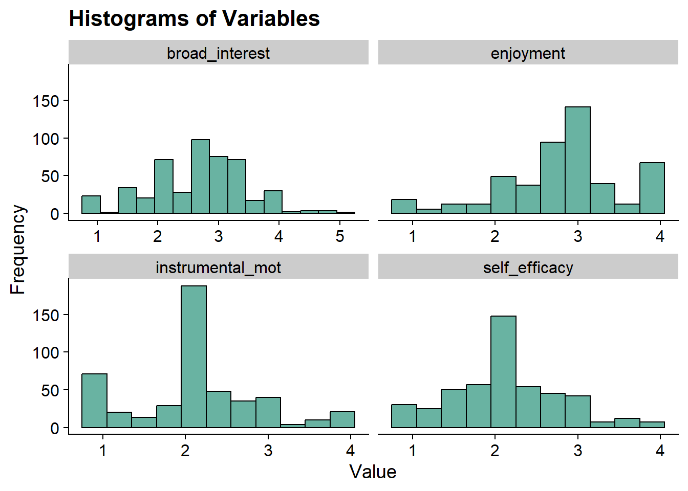

# Item Mean Plots

------------------------------------------------------------------------

*Example: PISA Student Data*

1.  The first example closely follows the vignette used to demonstrate the [tidyLPA](https://data-edu.github.io/tidyLPA/articles/Introduction_to_tidyLPA.html) package (Rosenberg, 2019).

-   This model utilizes the `PISA` data collected in the U.S. in 2015. To learn more about this data [see here](http://www.oecd.org/pisa/data/).
-   To access the 2015 US `PISA` data & documentation in R use the following code:

Variables:

`broad_interest`

:   composite measure of students' self reported broad interest

`enjoyment`

:   composite measure of students' self reported enjoyment

`instrumental_mot`

:   composite measure of students' self reported instrumental motivation

`self_efficacy`

:   composite measure of students' self reported self efficacy


``` r
#devtools::install_github("jrosen48/pisaUSA15")
#library(pisaUSA15)
```

------------------------------------------------------------------------

## Load packages


``` r
library(naniar)
library(tidyverse)
library(haven)
library(glue)
library(MplusAutomation)
library(here)
library(janitor)
library(gt)
library(tidyLPA)
library(pisaUSA15)
library(cowplot)
library(filesstrings)
library(patchwork)
library(RcppAlgos)
```

------------------------------------------------------------------------

## Prepare Data


``` r

pisa <- pisaUSA15[1:500,] %>%
  dplyr::select(broad_interest, enjoyment, instrumental_mot, self_efficacy)

```

------------------------------------------------------------------------

## Descriptive Statistics

Quick Summary


``` r
summary(pisa)
#>  broad_interest    enjoyment    instrumental_mot
#>  Min.   :1.000   Min.   :1.00   Min.   :1.000   
#>  1st Qu.:2.200   1st Qu.:2.40   1st Qu.:1.750   
#>  Median :2.800   Median :3.00   Median :2.000   
#>  Mean   :2.666   Mean   :2.82   Mean   :2.129   
#>  3rd Qu.:3.200   3rd Qu.:3.00   3rd Qu.:2.500   
#>  Max.   :5.000   Max.   :4.00   Max.   :4.000   
#>  NA's   :23      NA's   :14     NA's   :21      
#>  self_efficacy  
#>  Min.   :1.000  
#>  1st Qu.:1.750  
#>  Median :2.000  
#>  Mean   :2.125  
#>  3rd Qu.:2.500  
#>  Max.   :4.000  
#>  NA's   :23
```


Mean Table


``` r
ds <- pisa %>% 
  pivot_longer(broad_interest:self_efficacy, names_to = "variable") %>% 
  group_by(variable) %>% 
  summarise(mean = mean(value, na.rm = TRUE),
            sd = sd(value, na.rm = TRUE)) 

ds %>% 
  gt () %>% 
  tab_header(title = md("**Descriptive Summary**")) %>%
  cols_label(
    variable = "Variable",
    mean = md("M"),
    sd = md("SD")
  ) %>%
  fmt_number(c(2:3),
             decimals = 2) %>% 
  cols_align(
    align = "center",
    columns = mean
  ) 
```


```{=html}
<div id="cfndrbdhzb" style="padding-left:0px;padding-right:0px;padding-top:10px;padding-bottom:10px;overflow-x:auto;overflow-y:auto;width:auto;height:auto;">
<style>#cfndrbdhzb table {
  font-family: system-ui, 'Segoe UI', Roboto, Helvetica, Arial, sans-serif, 'Apple Color Emoji', 'Segoe UI Emoji', 'Segoe UI Symbol', 'Noto Color Emoji';
  -webkit-font-smoothing: antialiased;
  -moz-osx-font-smoothing: grayscale;
}

#cfndrbdhzb thead, #cfndrbdhzb tbody, #cfndrbdhzb tfoot, #cfndrbdhzb tr, #cfndrbdhzb td, #cfndrbdhzb th {
  border-style: none;
}

#cfndrbdhzb p {
  margin: 0;
  padding: 0;
}

#cfndrbdhzb .gt_table {
  display: table;
  border-collapse: collapse;
  line-height: normal;
  margin-left: auto;
  margin-right: auto;
  color: #333333;
  font-size: 16px;
  font-weight: normal;
  font-style: normal;
  background-color: #FFFFFF;
  width: auto;
  border-top-style: solid;
  border-top-width: 2px;
  border-top-color: #A8A8A8;
  border-right-style: none;
  border-right-width: 2px;
  border-right-color: #D3D3D3;
  border-bottom-style: solid;
  border-bottom-width: 2px;
  border-bottom-color: #A8A8A8;
  border-left-style: none;
  border-left-width: 2px;
  border-left-color: #D3D3D3;
}

#cfndrbdhzb .gt_caption {
  padding-top: 4px;
  padding-bottom: 4px;
}

#cfndrbdhzb .gt_title {
  color: #333333;
  font-size: 125%;
  font-weight: initial;
  padding-top: 4px;
  padding-bottom: 4px;
  padding-left: 5px;
  padding-right: 5px;
  border-bottom-color: #FFFFFF;
  border-bottom-width: 0;
}

#cfndrbdhzb .gt_subtitle {
  color: #333333;
  font-size: 85%;
  font-weight: initial;
  padding-top: 3px;
  padding-bottom: 5px;
  padding-left: 5px;
  padding-right: 5px;
  border-top-color: #FFFFFF;
  border-top-width: 0;
}

#cfndrbdhzb .gt_heading {
  background-color: #FFFFFF;
  text-align: center;
  border-bottom-color: #FFFFFF;
  border-left-style: none;
  border-left-width: 1px;
  border-left-color: #D3D3D3;
  border-right-style: none;
  border-right-width: 1px;
  border-right-color: #D3D3D3;
}

#cfndrbdhzb .gt_bottom_border {
  border-bottom-style: solid;
  border-bottom-width: 2px;
  border-bottom-color: #D3D3D3;
}

#cfndrbdhzb .gt_col_headings {
  border-top-style: solid;
  border-top-width: 2px;
  border-top-color: #D3D3D3;
  border-bottom-style: solid;
  border-bottom-width: 2px;
  border-bottom-color: #D3D3D3;
  border-left-style: none;
  border-left-width: 1px;
  border-left-color: #D3D3D3;
  border-right-style: none;
  border-right-width: 1px;
  border-right-color: #D3D3D3;
}

#cfndrbdhzb .gt_col_heading {
  color: #333333;
  background-color: #FFFFFF;
  font-size: 100%;
  font-weight: normal;
  text-transform: inherit;
  border-left-style: none;
  border-left-width: 1px;
  border-left-color: #D3D3D3;
  border-right-style: none;
  border-right-width: 1px;
  border-right-color: #D3D3D3;
  vertical-align: bottom;
  padding-top: 5px;
  padding-bottom: 6px;
  padding-left: 5px;
  padding-right: 5px;
  overflow-x: hidden;
}

#cfndrbdhzb .gt_column_spanner_outer {
  color: #333333;
  background-color: #FFFFFF;
  font-size: 100%;
  font-weight: normal;
  text-transform: inherit;
  padding-top: 0;
  padding-bottom: 0;
  padding-left: 4px;
  padding-right: 4px;
}

#cfndrbdhzb .gt_column_spanner_outer:first-child {
  padding-left: 0;
}

#cfndrbdhzb .gt_column_spanner_outer:last-child {
  padding-right: 0;
}

#cfndrbdhzb .gt_column_spanner {
  border-bottom-style: solid;
  border-bottom-width: 2px;
  border-bottom-color: #D3D3D3;
  vertical-align: bottom;
  padding-top: 5px;
  padding-bottom: 5px;
  overflow-x: hidden;
  display: inline-block;
  width: 100%;
}

#cfndrbdhzb .gt_spanner_row {
  border-bottom-style: hidden;
}

#cfndrbdhzb .gt_group_heading {
  padding-top: 8px;
  padding-bottom: 8px;
  padding-left: 5px;
  padding-right: 5px;
  color: #333333;
  background-color: #FFFFFF;
  font-size: 100%;
  font-weight: initial;
  text-transform: inherit;
  border-top-style: solid;
  border-top-width: 2px;
  border-top-color: #D3D3D3;
  border-bottom-style: solid;
  border-bottom-width: 2px;
  border-bottom-color: #D3D3D3;
  border-left-style: none;
  border-left-width: 1px;
  border-left-color: #D3D3D3;
  border-right-style: none;
  border-right-width: 1px;
  border-right-color: #D3D3D3;
  vertical-align: middle;
  text-align: left;
}

#cfndrbdhzb .gt_empty_group_heading {
  padding: 0.5px;
  color: #333333;
  background-color: #FFFFFF;
  font-size: 100%;
  font-weight: initial;
  border-top-style: solid;
  border-top-width: 2px;
  border-top-color: #D3D3D3;
  border-bottom-style: solid;
  border-bottom-width: 2px;
  border-bottom-color: #D3D3D3;
  vertical-align: middle;
}

#cfndrbdhzb .gt_from_md > :first-child {
  margin-top: 0;
}

#cfndrbdhzb .gt_from_md > :last-child {
  margin-bottom: 0;
}

#cfndrbdhzb .gt_row {
  padding-top: 8px;
  padding-bottom: 8px;
  padding-left: 5px;
  padding-right: 5px;
  margin: 10px;
  border-top-style: solid;
  border-top-width: 1px;
  border-top-color: #D3D3D3;
  border-left-style: none;
  border-left-width: 1px;
  border-left-color: #D3D3D3;
  border-right-style: none;
  border-right-width: 1px;
  border-right-color: #D3D3D3;
  vertical-align: middle;
  overflow-x: hidden;
}

#cfndrbdhzb .gt_stub {
  color: #333333;
  background-color: #FFFFFF;
  font-size: 100%;
  font-weight: initial;
  text-transform: inherit;
  border-right-style: solid;
  border-right-width: 2px;
  border-right-color: #D3D3D3;
  padding-left: 5px;
  padding-right: 5px;
}

#cfndrbdhzb .gt_stub_row_group {
  color: #333333;
  background-color: #FFFFFF;
  font-size: 100%;
  font-weight: initial;
  text-transform: inherit;
  border-right-style: solid;
  border-right-width: 2px;
  border-right-color: #D3D3D3;
  padding-left: 5px;
  padding-right: 5px;
  vertical-align: top;
}

#cfndrbdhzb .gt_row_group_first td {
  border-top-width: 2px;
}

#cfndrbdhzb .gt_row_group_first th {
  border-top-width: 2px;
}

#cfndrbdhzb .gt_summary_row {
  color: #333333;
  background-color: #FFFFFF;
  text-transform: inherit;
  padding-top: 8px;
  padding-bottom: 8px;
  padding-left: 5px;
  padding-right: 5px;
}

#cfndrbdhzb .gt_first_summary_row {
  border-top-style: solid;
  border-top-color: #D3D3D3;
}

#cfndrbdhzb .gt_first_summary_row.thick {
  border-top-width: 2px;
}

#cfndrbdhzb .gt_last_summary_row {
  padding-top: 8px;
  padding-bottom: 8px;
  padding-left: 5px;
  padding-right: 5px;
  border-bottom-style: solid;
  border-bottom-width: 2px;
  border-bottom-color: #D3D3D3;
}

#cfndrbdhzb .gt_grand_summary_row {
  color: #333333;
  background-color: #FFFFFF;
  text-transform: inherit;
  padding-top: 8px;
  padding-bottom: 8px;
  padding-left: 5px;
  padding-right: 5px;
}

#cfndrbdhzb .gt_first_grand_summary_row {
  padding-top: 8px;
  padding-bottom: 8px;
  padding-left: 5px;
  padding-right: 5px;
  border-top-style: double;
  border-top-width: 6px;
  border-top-color: #D3D3D3;
}

#cfndrbdhzb .gt_last_grand_summary_row_top {
  padding-top: 8px;
  padding-bottom: 8px;
  padding-left: 5px;
  padding-right: 5px;
  border-bottom-style: double;
  border-bottom-width: 6px;
  border-bottom-color: #D3D3D3;
}

#cfndrbdhzb .gt_striped {
  background-color: rgba(128, 128, 128, 0.05);
}

#cfndrbdhzb .gt_table_body {
  border-top-style: solid;
  border-top-width: 2px;
  border-top-color: #D3D3D3;
  border-bottom-style: solid;
  border-bottom-width: 2px;
  border-bottom-color: #D3D3D3;
}

#cfndrbdhzb .gt_footnotes {
  color: #333333;
  background-color: #FFFFFF;
  border-bottom-style: none;
  border-bottom-width: 2px;
  border-bottom-color: #D3D3D3;
  border-left-style: none;
  border-left-width: 2px;
  border-left-color: #D3D3D3;
  border-right-style: none;
  border-right-width: 2px;
  border-right-color: #D3D3D3;
}

#cfndrbdhzb .gt_footnote {
  margin: 0px;
  font-size: 90%;
  padding-top: 4px;
  padding-bottom: 4px;
  padding-left: 5px;
  padding-right: 5px;
}

#cfndrbdhzb .gt_sourcenotes {
  color: #333333;
  background-color: #FFFFFF;
  border-bottom-style: none;
  border-bottom-width: 2px;
  border-bottom-color: #D3D3D3;
  border-left-style: none;
  border-left-width: 2px;
  border-left-color: #D3D3D3;
  border-right-style: none;
  border-right-width: 2px;
  border-right-color: #D3D3D3;
}

#cfndrbdhzb .gt_sourcenote {
  font-size: 90%;
  padding-top: 4px;
  padding-bottom: 4px;
  padding-left: 5px;
  padding-right: 5px;
}

#cfndrbdhzb .gt_left {
  text-align: left;
}

#cfndrbdhzb .gt_center {
  text-align: center;
}

#cfndrbdhzb .gt_right {
  text-align: right;
  font-variant-numeric: tabular-nums;
}

#cfndrbdhzb .gt_font_normal {
  font-weight: normal;
}

#cfndrbdhzb .gt_font_bold {
  font-weight: bold;
}

#cfndrbdhzb .gt_font_italic {
  font-style: italic;
}

#cfndrbdhzb .gt_super {
  font-size: 65%;
}

#cfndrbdhzb .gt_footnote_marks {
  font-size: 75%;
  vertical-align: 0.4em;
  position: initial;
}

#cfndrbdhzb .gt_asterisk {
  font-size: 100%;
  vertical-align: 0;
}

#cfndrbdhzb .gt_indent_1 {
  text-indent: 5px;
}

#cfndrbdhzb .gt_indent_2 {
  text-indent: 10px;
}

#cfndrbdhzb .gt_indent_3 {
  text-indent: 15px;
}

#cfndrbdhzb .gt_indent_4 {
  text-indent: 20px;
}

#cfndrbdhzb .gt_indent_5 {
  text-indent: 25px;
}

#cfndrbdhzb .katex-display {
  display: inline-flex !important;
  margin-bottom: 0.75em !important;
}

#cfndrbdhzb div.Reactable > div.rt-table > div.rt-thead > div.rt-tr.rt-tr-group-header > div.rt-th-group:after {
  height: 0px !important;
}
</style>
<table class="gt_table" data-quarto-disable-processing="false" data-quarto-bootstrap="false">
  <thead>
    <tr class="gt_heading">
      <td colspan="3" class="gt_heading gt_title gt_font_normal gt_bottom_border" style><span class='gt_from_md'><strong>Descriptive Summary</strong></span></td>
    </tr>
    
    <tr class="gt_col_headings">
      <th class="gt_col_heading gt_columns_bottom_border gt_left" rowspan="1" colspan="1" scope="col" id="variable">Variable</th>
      <th class="gt_col_heading gt_columns_bottom_border gt_center" rowspan="1" colspan="1" scope="col" id="mean"><span class='gt_from_md'>M</span></th>
      <th class="gt_col_heading gt_columns_bottom_border gt_right" rowspan="1" colspan="1" scope="col" id="sd"><span class='gt_from_md'>SD</span></th>
    </tr>
  </thead>
  <tbody class="gt_table_body">
    <tr><td headers="variable" class="gt_row gt_left">broad_interest</td>
<td headers="mean" class="gt_row gt_center">2.67</td>
<td headers="sd" class="gt_row gt_right">0.77</td></tr>
    <tr><td headers="variable" class="gt_row gt_left">enjoyment</td>
<td headers="mean" class="gt_row gt_center">2.82</td>
<td headers="sd" class="gt_row gt_right">0.72</td></tr>
    <tr><td headers="variable" class="gt_row gt_left">instrumental_mot</td>
<td headers="mean" class="gt_row gt_center">2.13</td>
<td headers="sd" class="gt_row gt_right">0.75</td></tr>
    <tr><td headers="variable" class="gt_row gt_left">self_efficacy</td>
<td headers="mean" class="gt_row gt_center">2.12</td>
<td headers="sd" class="gt_row gt_right">0.64</td></tr>
  </tbody>
  
  
</table>
</div>
```


Histograms


``` r
data_long <- pisa %>%
  pivot_longer(broad_interest:self_efficacy, names_to = "variable")

ggplot(data_long, aes(x = value)) +
  geom_histogram(binwidth = .3, fill = "#69b3a2", color = "black") +
  facet_wrap(~ variable, scales = "free_x") +
  labs(title = "Histograms of Variables", x = "Value", y = "Frequency") +
  theme_cowplot()
```



------------------------------------------------------------------------

## Visualization

### Latent Profile Plot


``` r
source(here("functions", "plot_lpa.R"))

# Read in models
output_enum <- readModels(here("lpa", "tidyLPA"), quiet = TRUE)

plot_lpa(model_name = output_enum$model_3_class_4.out)
```


Save figure


``` r
ggsave(here("figures", "model3_profile4.png"), dpi = "retina", bg = "white", height=5, width=8, units="in")
```

------------------------------------------------------------------------

### Plots Means and Variances


``` r
plotMixtures(output_enum$model_3_class_4.out, ci = 0.95, bw = FALSE) + 
  labs(title = "Model 3: Equal Variances, Equal Covariances")
```


------------------------------------------------------------------------

### Plot comparison

We can also plot the comparisons and look at the error bars.

NOTE: The `plotMixtures()` function is used for plotting LPA models only (i.e., means & variances)


``` r
a <- plotMixtures(output_enum$model_2_class_3.out,
  ci = 0.95, bw = FALSE) 

b <- plotMixtures(output_enum$model_4_class_3.out,
  ci = 0.95, bw = FALSE) 

a + labs(title = "Model 2") +
    theme(plot.title = element_text(size = 12)) +
b + labs(title = "Model 4") +
    theme(plot.title = element_text(size = 12))
```


------------------------------------------------------------------------

<div style="text-align: center;"></div>
