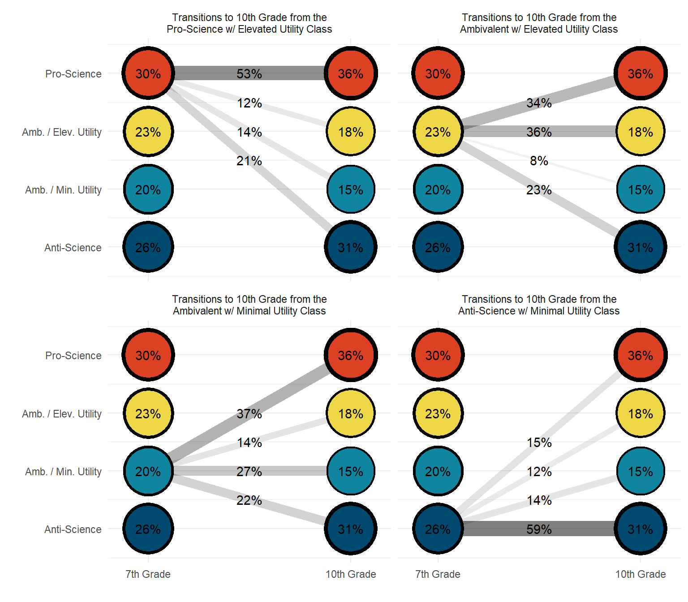

# Latent Transition Analysis

--------------------------------------------------------------------------------------

**Data Source**: The data used to illustrate these analyses include elementary school student *Science Attitude* survey items collected during 7th and 10th grades from the **Longitudinal Study of American Youth** (LSAY; Miller, 2015).

--------------------------------------------------------------------------------------

To install package {`rhdf5`} 


``` r
if (!requireNamespace("BiocManager", quietly = TRUE)) 
  install.packages("BiocManager")

#BiocManager::install("rhdf5")
```

*Load packages*


``` r
library(MplusAutomation)
library(rhdf5)
library(tidyverse)       
library(here)            
library(glue)            
library(janitor)            
library(gt) 
library(reshape2)
library(cowplot)
library(ggrepel)
library(haven)
library(modelsummary)
library(corrplot)
library(DiagrammeR)
library(filesstrings)
library(PNWColors)
```

--------------------------------------------------------------------------------------

Read in LSAY data file, `lsay_new.csv`.


``` r

lsay_data <- read_csv(here("data","lsay_lta.csv"), na = c("9999")) %>% 
    mutate(across(everything(), as.numeric))
```

--------------------------------------------------------------------------------------


```{=html}
<div class="grViz html-widget html-fill-item" id="htmlwidget-f5e5f655b099f71c3778" style="width:672px;height:480px;"></div>
<script type="application/json" data-for="htmlwidget-f5e5f655b099f71c3778">{"x":{"diagram":" digraph model {\n\n    graph [layout = dot, overlap = true]\n\n    node [shape=box]\n    ab39m ab39t ab39u ab39w ab39x \n    ga33a ga33h ga33i ga33k ga33l;\n \n \n    node [shape=circle, fixedsize = true, width = 1.5, height = 0.5]\n    T1 [label = \"7th Grade \nScience Attitudes\n(T1)\"]\n    T2 [label = \"10th Grade \nScience Attitudes\n(T2)\"]\n    \n    edge []\n    T1 -> {ab39m ab39t ab39u ab39w ab39x}\n    T2 -> {ga33a ga33h ga33i ga33k ga33l}\n    T1 -> T2\n    {rank = same; T1; T2;}\n }","config":{"engine":"dot","options":null}},"evals":[],"jsHooks":[]}</script>
```


--------------------------------------------------------------------------------------

## Descriptive Statistics

--------------------------------------------------------------------------------------

### Data Summary


``` r
data <- lsay_data

select_data <- data %>% 
 select(female, minority, ab39m:ga33l)

f <- All(select_data) ~ Mean + SD + Min + Median + Max + Histogram
datasummary(f, data, output="markdown")
```


```{=html}
<!-- preamble start -->

    <script>

      function styleCell_7b50ru1cslt0yjsh46ob(i, j, css_id) {
          var table = document.getElementById("tinytable_7b50ru1cslt0yjsh46ob");
          var cell = table.rows[i]?.cells[j];  // Safe navigation to avoid errors
          if (cell) {
              console.log(`Styling cell at (${i}, ${j}) with class ${css_id}`);
              cell.classList.add(css_id);
          } else {
              console.warn(`Cell at (${i}, ${j}) not found.`);
          }
      }
      function insertSpanRow(i, colspan, content) {
        var table = document.getElementById('tinytable_7b50ru1cslt0yjsh46ob');
        var newRow = table.insertRow(i);
        var newCell = newRow.insertCell(0);
        newCell.setAttribute("colspan", colspan);
        // newCell.innerText = content;
        // this may be unsafe, but innerText does not interpret <br>
        newCell.innerHTML = content;
      }
      function spanCell_7b50ru1cslt0yjsh46ob(i, j, rowspan, colspan) {
        var table = document.getElementById("tinytable_7b50ru1cslt0yjsh46ob");
        const targetRow = table.rows[i];
        const targetCell = targetRow.cells[j];
        for (let r = 0; r < rowspan; r++) {
          // Only start deleting cells to the right for the first row (r == 0)
          if (r === 0) {
            // Delete cells to the right of the target cell in the first row
            for (let c = colspan - 1; c > 0; c--) {
              if (table.rows[i + r].cells[j + c]) {
                table.rows[i + r].deleteCell(j + c);
              }
            }
          }
          // For rows below the first, delete starting from the target column
          if (r > 0) {
            for (let c = colspan - 1; c >= 0; c--) {
              if (table.rows[i + r] && table.rows[i + r].cells[j]) {
                table.rows[i + r].deleteCell(j);
              }
            }
          }
        }
        // Set rowspan and colspan of the target cell
        targetCell.rowSpan = rowspan;
        targetCell.colSpan = colspan;
      }
      // tinytable span after
      window.addEventListener('load', function () {
          var cellsToStyle = [
            // tinytable style arrays after
          { positions: [ { i: 12, j: 1 }, { i: 12, j: 2 }, { i: 12, j: 3 }, { i: 12, j: 4 }, { i: 12, j: 5 }, { i: 12, j: 6 },  ], css_id: 'tinytable_css_3ksy8rsf1ef58i72fjrj',}, 
          { positions: [ { i: 2, j: 1 }, { i: 3, j: 1 }, { i: 4, j: 1 }, { i: 1, j: 1 }, { i: 6, j: 1 }, { i: 7, j: 1 }, { i: 8, j: 1 }, { i: 5, j: 1 }, { i: 10, j: 1 }, { i: 11, j: 1 }, { i: 3, j: 2 }, { i: 9, j: 1 }, { i: 1, j: 2 }, { i: 2, j: 2 }, { i: 7, j: 2 }, { i: 4, j: 2 }, { i: 5, j: 2 }, { i: 6, j: 2 }, { i: 11, j: 2 }, { i: 8, j: 2 }, { i: 9, j: 2 }, { i: 10, j: 2 }, { i: 2, j: 3 }, { i: 3, j: 3 }, { i: 4, j: 3 }, { i: 1, j: 3 }, { i: 6, j: 3 }, { i: 7, j: 3 }, { i: 8, j: 3 }, { i: 5, j: 3 }, { i: 10, j: 3 }, { i: 11, j: 3 }, { i: 3, j: 4 }, { i: 9, j: 3 }, { i: 1, j: 4 }, { i: 2, j: 4 }, { i: 7, j: 4 }, { i: 4, j: 4 }, { i: 5, j: 4 }, { i: 6, j: 4 }, { i: 11, j: 4 }, { i: 8, j: 4 }, { i: 9, j: 4 }, { i: 10, j: 4 }, { i: 2, j: 5 }, { i: 3, j: 5 }, { i: 4, j: 5 }, { i: 1, j: 5 }, { i: 6, j: 5 }, { i: 7, j: 5 }, { i: 8, j: 5 }, { i: 5, j: 5 }, { i: 10, j: 5 }, { i: 11, j: 5 }, { i: 3, j: 6 }, { i: 9, j: 5 }, { i: 1, j: 6 }, { i: 2, j: 6 }, { i: 7, j: 6 }, { i: 4, j: 6 }, { i: 5, j: 6 }, { i: 6, j: 6 }, { i: 11, j: 6 }, { i: 8, j: 6 }, { i: 9, j: 6 }, { i: 10, j: 6 },  ], css_id: 'tinytable_css_h9hjeiasbms0923mft1z',}, 
          { positions: [ { i: 0, j: 1 }, { i: 0, j: 2 }, { i: 0, j: 3 }, { i: 0, j: 4 }, { i: 0, j: 5 }, { i: 0, j: 6 },  ], css_id: 'tinytable_css_u19hlceylyfx6chm1z5t',}, 
          { positions: [ { i: 12, j: 0 },  ], css_id: 'tinytable_css_lfnb77xeclecsjvpkbdi',}, 
          { positions: [ { i: 1, j: 0 }, { i: 2, j: 0 }, { i: 3, j: 0 }, { i: 4, j: 0 }, { i: 5, j: 0 }, { i: 6, j: 0 }, { i: 7, j: 0 }, { i: 8, j: 0 }, { i: 9, j: 0 }, { i: 10, j: 0 }, { i: 11, j: 0 },  ], css_id: 'tinytable_css_9uhxzce0w78hywh53l90',}, 
          { positions: [ { i: 0, j: 0 },  ], css_id: 'tinytable_css_djfoy9iz9m8avr98ez7x',}, 
          ];

          // Loop over the arrays to style the cells
          cellsToStyle.forEach(function (group) {
              group.positions.forEach(function (cell) {
                  styleCell_7b50ru1cslt0yjsh46ob(cell.i, cell.j, group.css_id);
              });
          });
      });
    </script>

    <style>
      /* tinytable css entries after */
      .table td.tinytable_css_3ksy8rsf1ef58i72fjrj, .table th.tinytable_css_3ksy8rsf1ef58i72fjrj { text-align: right; border-bottom: solid #d3d8dc 0.1em; }
      .table td.tinytable_css_h9hjeiasbms0923mft1z, .table th.tinytable_css_h9hjeiasbms0923mft1z { text-align: right; }
      .table td.tinytable_css_u19hlceylyfx6chm1z5t, .table th.tinytable_css_u19hlceylyfx6chm1z5t { text-align: right; border-top: solid #d3d8dc 0.1em; border-bottom: solid #d3d8dc 0.05em; }
      .table td.tinytable_css_lfnb77xeclecsjvpkbdi, .table th.tinytable_css_lfnb77xeclecsjvpkbdi { text-align: left; border-bottom: solid #d3d8dc 0.1em; }
      .table td.tinytable_css_9uhxzce0w78hywh53l90, .table th.tinytable_css_9uhxzce0w78hywh53l90 { text-align: left; }
      .table td.tinytable_css_djfoy9iz9m8avr98ez7x, .table th.tinytable_css_djfoy9iz9m8avr98ez7x { text-align: left; border-top: solid #d3d8dc 0.1em; border-bottom: solid #d3d8dc 0.05em; }
    </style>
    <div class="container">
      <table class="table table-borderless" id="tinytable_7b50ru1cslt0yjsh46ob" style="width: auto; margin-left: auto; margin-right: auto;" data-quarto-disable-processing='true'>
        <thead>
        
              <tr>
                <th scope="col"> </th>
                <th scope="col">Mean</th>
                <th scope="col">SD</th>
                <th scope="col">Min</th>
                <th scope="col">Median</th>
                <th scope="col">Max</th>
                <th scope="col">Histogram</th>
              </tr>
        </thead>
        
        <tbody>
                <tr>
                  <td>female</td>
                  <td>0.48</td>
                  <td>0.50</td>
                  <td>0.00</td>
                  <td>0.00</td>
                  <td>1.00</td>
                  <td>▇▆</td>
                </tr>
                <tr>
                  <td>minority</td>
                  <td>0.23</td>
                  <td>0.42</td>
                  <td>0.00</td>
                  <td>0.00</td>
                  <td>1.00</td>
                  <td>▇▂</td>
                </tr>
                <tr>
                  <td>ab39m</td>
                  <td>0.61</td>
                  <td>0.49</td>
                  <td>0.00</td>
                  <td>1.00</td>
                  <td>1.00</td>
                  <td>▄▇</td>
                </tr>
                <tr>
                  <td>ab39t</td>
                  <td>0.40</td>
                  <td>0.49</td>
                  <td>0.00</td>
                  <td>0.00</td>
                  <td>1.00</td>
                  <td>▇▅</td>
                </tr>
                <tr>
                  <td>ab39u</td>
                  <td>0.49</td>
                  <td>0.50</td>
                  <td>0.00</td>
                  <td>0.00</td>
                  <td>1.00</td>
                  <td>▇▇</td>
                </tr>
                <tr>
                  <td>ab39w</td>
                  <td>0.40</td>
                  <td>0.49</td>
                  <td>0.00</td>
                  <td>0.00</td>
                  <td>1.00</td>
                  <td>▇▅</td>
                </tr>
                <tr>
                  <td>ab39x</td>
                  <td>0.46</td>
                  <td>0.50</td>
                  <td>0.00</td>
                  <td>0.00</td>
                  <td>1.00</td>
                  <td>▇▆</td>
                </tr>
                <tr>
                  <td>ga33a</td>
                  <td>0.58</td>
                  <td>0.49</td>
                  <td>0.00</td>
                  <td>1.00</td>
                  <td>1.00</td>
                  <td>▅▇</td>
                </tr>
                <tr>
                  <td>ga33h</td>
                  <td>0.43</td>
                  <td>0.49</td>
                  <td>0.00</td>
                  <td>0.00</td>
                  <td>1.00</td>
                  <td>▇▅</td>
                </tr>
                <tr>
                  <td>ga33i</td>
                  <td>0.51</td>
                  <td>0.50</td>
                  <td>0.00</td>
                  <td>1.00</td>
                  <td>1.00</td>
                  <td>▇▇</td>
                </tr>
                <tr>
                  <td>ga33k</td>
                  <td>0.42</td>
                  <td>0.49</td>
                  <td>0.00</td>
                  <td>0.00</td>
                  <td>1.00</td>
                  <td>▇▅</td>
                </tr>
                <tr>
                  <td>ga33l</td>
                  <td>0.42</td>
                  <td>0.49</td>
                  <td>0.00</td>
                  <td>0.00</td>
                  <td>1.00</td>
                  <td>▇▅</td>
                </tr>
        </tbody>
      </table>
    </div>
<!-- hack to avoid NA insertion in last line -->
```


--------------------------------------------------------------------------------------

### Correlation Table


``` r
select_data %>% 
  datasummary_correlation(output = "markdown")
```


```{=html}
<!-- preamble start -->

    <script>

      function styleCell_0qjztl1swyua3jsbstzw(i, j, css_id) {
          var table = document.getElementById("tinytable_0qjztl1swyua3jsbstzw");
          var cell = table.rows[i]?.cells[j];  // Safe navigation to avoid errors
          if (cell) {
              console.log(`Styling cell at (${i}, ${j}) with class ${css_id}`);
              cell.classList.add(css_id);
          } else {
              console.warn(`Cell at (${i}, ${j}) not found.`);
          }
      }
      function insertSpanRow(i, colspan, content) {
        var table = document.getElementById('tinytable_0qjztl1swyua3jsbstzw');
        var newRow = table.insertRow(i);
        var newCell = newRow.insertCell(0);
        newCell.setAttribute("colspan", colspan);
        // newCell.innerText = content;
        // this may be unsafe, but innerText does not interpret <br>
        newCell.innerHTML = content;
      }
      function spanCell_0qjztl1swyua3jsbstzw(i, j, rowspan, colspan) {
        var table = document.getElementById("tinytable_0qjztl1swyua3jsbstzw");
        const targetRow = table.rows[i];
        const targetCell = targetRow.cells[j];
        for (let r = 0; r < rowspan; r++) {
          // Only start deleting cells to the right for the first row (r == 0)
          if (r === 0) {
            // Delete cells to the right of the target cell in the first row
            for (let c = colspan - 1; c > 0; c--) {
              if (table.rows[i + r].cells[j + c]) {
                table.rows[i + r].deleteCell(j + c);
              }
            }
          }
          // For rows below the first, delete starting from the target column
          if (r > 0) {
            for (let c = colspan - 1; c >= 0; c--) {
              if (table.rows[i + r] && table.rows[i + r].cells[j]) {
                table.rows[i + r].deleteCell(j);
              }
            }
          }
        }
        // Set rowspan and colspan of the target cell
        targetCell.rowSpan = rowspan;
        targetCell.colSpan = colspan;
      }
      // tinytable span after
      window.addEventListener('load', function () {
          var cellsToStyle = [
            // tinytable style arrays after
          { positions: [ { i: 12, j: 9 }, { i: 12, j: 6 }, { i: 12, j: 3 }, { i: 12, j: 4 }, { i: 12, j: 1 }, { i: 12, j: 10 }, { i: 12, j: 7 }, { i: 12, j: 8 }, { i: 12, j: 5 }, { i: 12, j: 2 }, { i: 12, j: 11 }, { i: 12, j: 12 },  ], css_id: 'tinytable_css_tw2y1xh0rfcsaas0mj41',}, 
          { positions: [ { i: 4, j: 1 }, { i: 1, j: 1 }, { i: 2, j: 1 }, { i: 3, j: 1 }, { i: 8, j: 1 }, { i: 5, j: 1 }, { i: 6, j: 1 }, { i: 7, j: 1 }, { i: 3, j: 2 }, { i: 9, j: 1 }, { i: 1, j: 2 }, { i: 2, j: 2 }, { i: 7, j: 2 }, { i: 4, j: 2 }, { i: 5, j: 2 }, { i: 6, j: 2 }, { i: 2, j: 3 }, { i: 8, j: 2 }, { i: 9, j: 2 }, { i: 1, j: 3 }, { i: 6, j: 3 }, { i: 3, j: 3 }, { i: 4, j: 3 }, { i: 5, j: 3 }, { i: 10, j: 3 }, { i: 7, j: 3 }, { i: 8, j: 3 }, { i: 9, j: 3 }, { i: 1, j: 4 }, { i: 2, j: 4 }, { i: 3, j: 4 }, { i: 4, j: 4 }, { i: 5, j: 4 }, { i: 6, j: 4 }, { i: 7, j: 4 }, { i: 8, j: 4 }, { i: 9, j: 4 }, { i: 10, j: 4 }, { i: 10, j: 1 }, { i: 11, j: 1 }, { i: 1, j: 8 }, { i: 1, j: 5 }, { i: 2, j: 5 }, { i: 3, j: 5 }, { i: 4, j: 5 }, { i: 5, j: 5 }, { i: 6, j: 5 }, { i: 7, j: 5 }, { i: 8, j: 5 }, { i: 9, j: 5 }, { i: 10, j: 5 }, { i: 10, j: 2 }, { i: 11, j: 2 }, { i: 1, j: 9 }, { i: 1, j: 6 }, { i: 2, j: 6 }, { i: 3, j: 6 }, { i: 4, j: 6 }, { i: 5, j: 6 }, { i: 6, j: 6 }, { i: 7, j: 6 }, { i: 8, j: 6 }, { i: 9, j: 6 }, { i: 10, j: 6 }, { i: 11, j: 6 }, { i: 11, j: 3 }, { i: 1, j: 10 }, { i: 1, j: 7 }, { i: 2, j: 7 }, { i: 3, j: 7 }, { i: 4, j: 7 }, { i: 5, j: 7 }, { i: 6, j: 7 }, { i: 7, j: 7 }, { i: 8, j: 7 }, { i: 9, j: 7 }, { i: 10, j: 7 }, { i: 11, j: 7 }, { i: 11, j: 4 }, { i: 1, j: 11 }, { i: 2, j: 11 }, { i: 2, j: 8 }, { i: 3, j: 8 }, { i: 4, j: 8 }, { i: 5, j: 8 }, { i: 6, j: 8 }, { i: 7, j: 8 }, { i: 8, j: 8 }, { i: 9, j: 8 }, { i: 10, j: 8 }, { i: 11, j: 8 }, { i: 11, j: 5 }, { i: 1, j: 12 }, { i: 2, j: 12 }, { i: 2, j: 9 }, { i: 3, j: 9 }, { i: 4, j: 9 }, { i: 5, j: 9 }, { i: 6, j: 9 }, { i: 7, j: 9 }, { i: 8, j: 9 }, { i: 9, j: 9 }, { i: 10, j: 9 }, { i: 11, j: 9 }, { i: 3, j: 10 }, { i: 4, j: 10 }, { i: 5, j: 10 }, { i: 2, j: 10 }, { i: 7, j: 10 }, { i: 8, j: 10 }, { i: 9, j: 10 }, { i: 6, j: 10 }, { i: 11, j: 10 }, { i: 3, j: 11 }, { i: 4, j: 11 }, { i: 10, j: 10 }, { i: 6, j: 11 }, { i: 7, j: 11 }, { i: 8, j: 11 }, { i: 5, j: 11 }, { i: 10, j: 11 }, { i: 11, j: 11 }, { i: 3, j: 12 }, { i: 9, j: 11 }, { i: 5, j: 12 }, { i: 6, j: 12 }, { i: 7, j: 12 }, { i: 4, j: 12 }, { i: 9, j: 12 }, { i: 10, j: 12 }, { i: 11, j: 12 }, { i: 8, j: 12 },  ], css_id: 'tinytable_css_l4kqo1f6zsp82lt1y7b6',}, 
          { positions: [ { i: 0, j: 1 }, { i: 0, j: 2 }, { i: 0, j: 11 }, { i: 0, j: 8 }, { i: 0, j: 5 }, { i: 0, j: 6 }, { i: 0, j: 3 }, { i: 0, j: 12 }, { i: 0, j: 9 }, { i: 0, j: 10 }, { i: 0, j: 7 }, { i: 0, j: 4 },  ], css_id: 'tinytable_css_e94cd5mhfhehltgpzdsw',}, 
          { positions: [ { i: 12, j: 0 },  ], css_id: 'tinytable_css_dw6od2v43gij1s40fesr',}, 
          { positions: [ { i: 1, j: 0 }, { i: 2, j: 0 }, { i: 3, j: 0 }, { i: 4, j: 0 }, { i: 5, j: 0 }, { i: 6, j: 0 }, { i: 7, j: 0 }, { i: 8, j: 0 }, { i: 9, j: 0 }, { i: 10, j: 0 }, { i: 11, j: 0 },  ], css_id: 'tinytable_css_x0icjdwyfbtckh84og10',}, 
          { positions: [ { i: 0, j: 0 },  ], css_id: 'tinytable_css_9a18x3ayers460b91085',}, 
          ];

          // Loop over the arrays to style the cells
          cellsToStyle.forEach(function (group) {
              group.positions.forEach(function (cell) {
                  styleCell_0qjztl1swyua3jsbstzw(cell.i, cell.j, group.css_id);
              });
          });
      });
    </script>

    <style>
      /* tinytable css entries after */
      .table td.tinytable_css_tw2y1xh0rfcsaas0mj41, .table th.tinytable_css_tw2y1xh0rfcsaas0mj41 { text-align: right; border-bottom: solid #d3d8dc 0.1em; }
      .table td.tinytable_css_l4kqo1f6zsp82lt1y7b6, .table th.tinytable_css_l4kqo1f6zsp82lt1y7b6 { text-align: right; }
      .table td.tinytable_css_e94cd5mhfhehltgpzdsw, .table th.tinytable_css_e94cd5mhfhehltgpzdsw { text-align: right; border-top: solid #d3d8dc 0.1em; border-bottom: solid #d3d8dc 0.05em; }
      .table td.tinytable_css_dw6od2v43gij1s40fesr, .table th.tinytable_css_dw6od2v43gij1s40fesr { text-align: left; border-bottom: solid #d3d8dc 0.1em; }
      .table td.tinytable_css_x0icjdwyfbtckh84og10, .table th.tinytable_css_x0icjdwyfbtckh84og10 { text-align: left; }
      .table td.tinytable_css_9a18x3ayers460b91085, .table th.tinytable_css_9a18x3ayers460b91085 { text-align: left; border-top: solid #d3d8dc 0.1em; border-bottom: solid #d3d8dc 0.05em; }
    </style>
    <div class="container">
      <table class="table table-borderless" id="tinytable_0qjztl1swyua3jsbstzw" style="width: auto; margin-left: auto; margin-right: auto;" data-quarto-disable-processing='true'>
        <thead>
        
              <tr>
                <th scope="col"> </th>
                <th scope="col">female</th>
                <th scope="col">minority</th>
                <th scope="col">ab39m</th>
                <th scope="col">ab39t</th>
                <th scope="col">ab39u</th>
                <th scope="col">ab39w</th>
                <th scope="col">ab39x</th>
                <th scope="col">ga33a</th>
                <th scope="col">ga33h</th>
                <th scope="col">ga33i</th>
                <th scope="col">ga33k</th>
                <th scope="col">ga33l</th>
              </tr>
        </thead>
        
        <tbody>
                <tr>
                  <td>female</td>
                  <td>1</td>
                  <td>.</td>
                  <td>.</td>
                  <td>.</td>
                  <td>.</td>
                  <td>.</td>
                  <td>.</td>
                  <td>.</td>
                  <td>.</td>
                  <td>.</td>
                  <td>.</td>
                  <td>.</td>
                </tr>
                <tr>
                  <td>minority</td>
                  <td>-.01</td>
                  <td>1</td>
                  <td>.</td>
                  <td>.</td>
                  <td>.</td>
                  <td>.</td>
                  <td>.</td>
                  <td>.</td>
                  <td>.</td>
                  <td>.</td>
                  <td>.</td>
                  <td>.</td>
                </tr>
                <tr>
                  <td>ab39m</td>
                  <td>-.06</td>
                  <td>-.01</td>
                  <td>1</td>
                  <td>.</td>
                  <td>.</td>
                  <td>.</td>
                  <td>.</td>
                  <td>.</td>
                  <td>.</td>
                  <td>.</td>
                  <td>.</td>
                  <td>.</td>
                </tr>
                <tr>
                  <td>ab39t</td>
                  <td>-.09</td>
                  <td>.05</td>
                  <td>.30</td>
                  <td>1</td>
                  <td>.</td>
                  <td>.</td>
                  <td>.</td>
                  <td>.</td>
                  <td>.</td>
                  <td>.</td>
                  <td>.</td>
                  <td>.</td>
                </tr>
                <tr>
                  <td>ab39u</td>
                  <td>-.11</td>
                  <td>.03</td>
                  <td>.30</td>
                  <td>.48</td>
                  <td>1</td>
                  <td>.</td>
                  <td>.</td>
                  <td>.</td>
                  <td>.</td>
                  <td>.</td>
                  <td>.</td>
                  <td>.</td>
                </tr>
                <tr>
                  <td>ab39w</td>
                  <td>-.11</td>
                  <td>.06</td>
                  <td>.27</td>
                  <td>.46</td>
                  <td>.40</td>
                  <td>1</td>
                  <td>.</td>
                  <td>.</td>
                  <td>.</td>
                  <td>.</td>
                  <td>.</td>
                  <td>.</td>
                </tr>
                <tr>
                  <td>ab39x</td>
                  <td>-.11</td>
                  <td>.05</td>
                  <td>.33</td>
                  <td>.45</td>
                  <td>.41</td>
                  <td>.52</td>
                  <td>1</td>
                  <td>.</td>
                  <td>.</td>
                  <td>.</td>
                  <td>.</td>
                  <td>.</td>
                </tr>
                <tr>
                  <td>ga33a</td>
                  <td>-.05</td>
                  <td>.04</td>
                  <td>.19</td>
                  <td>.11</td>
                  <td>.13</td>
                  <td>.13</td>
                  <td>.15</td>
                  <td>1</td>
                  <td>.</td>
                  <td>.</td>
                  <td>.</td>
                  <td>.</td>
                </tr>
                <tr>
                  <td>ga33h</td>
                  <td>-.06</td>
                  <td>.04</td>
                  <td>.10</td>
                  <td>.15</td>
                  <td>.16</td>
                  <td>.16</td>
                  <td>.20</td>
                  <td>.40</td>
                  <td>1</td>
                  <td>.</td>
                  <td>.</td>
                  <td>.</td>
                </tr>
                <tr>
                  <td>ga33i</td>
                  <td>-.04</td>
                  <td>.02</td>
                  <td>.15</td>
                  <td>.13</td>
                  <td>.18</td>
                  <td>.15</td>
                  <td>.16</td>
                  <td>.40</td>
                  <td>.57</td>
                  <td>1</td>
                  <td>.</td>
                  <td>.</td>
                </tr>
                <tr>
                  <td>ga33k</td>
                  <td>-.07</td>
                  <td>.04</td>
                  <td>.13</td>
                  <td>.15</td>
                  <td>.15</td>
                  <td>.20</td>
                  <td>.18</td>
                  <td>.39</td>
                  <td>.54</td>
                  <td>.48</td>
                  <td>1</td>
                  <td>.</td>
                </tr>
                <tr>
                  <td>ga33l</td>
                  <td>-.04</td>
                  <td>.05</td>
                  <td>.15</td>
                  <td>.15</td>
                  <td>.14</td>
                  <td>.18</td>
                  <td>.23</td>
                  <td>.44</td>
                  <td>.56</td>
                  <td>.49</td>
                  <td>.62</td>
                  <td>1</td>
                </tr>
        </tbody>
      </table>
    </div>
<!-- hack to avoid NA insertion in last line -->
```


--------------------------------------------------------------------------------------

### Correlation Plot


``` r
f_cor <- data %>% 
 select(female, minority, ab39m:ga33l) %>% 
  cor(use = "pairwise.complete.obs")

corrplot(f_cor, 
         method = "circle",
         type = "upper", 
         tl.col="black", 
         tl.srt=45)
```


--------------------------------------------------------------------------------------

# Enumeration

--------------------------------------------------------------------------------------

## Enumerate Time Point 1 (7th grade)


``` r
# NOTE CHANGE: '1:6' indicates the number of k-class models to estimate
# User can change this number to fit research context
# In this example, the code loops or iterates over values 1 through 6 ( '{k}' )
#
t1_enum_k_16  <- lapply(1:6, function(k) { 
  enum_t1  <- mplusObject(                 
    
# The 'glue' function inserts R code within a string or "quoted green text" using the syntax {---}
#
    TITLE = glue("Class-{k}_Time1"), 
  
    VARIABLE = glue( 
    "!!! NOTE CHANGE: List of the five 7th grade science attitude indicators !!!
     categorical = ab39m-ab39x; 
          usevar = ab39m-ab39x;
     
     classes = c({k});"),
  
  ANALYSIS = 
   "estimator = mlr; 
    type = mixture;
    !!! NOTE CHANGE: The intial and final start values. Reduce to speed up estimation time. !!!
    starts = 500 100;           
    processors=10;",
  
  OUTPUT = "sampstat residual tech11 tech14;",
  
  PLOT = 
    "type = plot3; 
    series = ab39m-ab39x(*);",
  
  usevariables = colnames(lsay_data),
  rdata = lsay_data)

# NOTE CHANGE: Fix to match appropriate sub-folder name
# See after `here` function (e.g., "enum_LCA_time1")
enum_t1_fit <- mplusModeler(enum_t1,
                 dataout=here("lta","enum_t1","t1.dat"), 
                 modelout=glue(here("lta","enum_t1","c{k}_lca_enum_time1.inp")),
                 check=TRUE, run = TRUE, hashfilename = FALSE)
})
```

**NEXT STEP** Check the output (`.out`) files to check for convergence warnings or syntax errors.

--------------------------------------------------------------------------------------

## Enumerate Time Point 2 (10th grade)


``` r

t2_enum_k_16  <- lapply(1:6, function(k) { 
  enum_t2  <- mplusObject(                 
      
    TITLE = glue("Class-{k}_Time2"), 
  
    VARIABLE = 
  glue( 
    "!!! NOTE CHANGE: List of the five 10th grade science attitude indicators !!!
     categorical = ga33a-ga33l; 
          usevar = ga33a-ga33l;
    
     classes = c({k});"),
  
  ANALYSIS = 
   "estimator = mlr; 
    type = mixture;
    starts = 500 100;
    processors=10;",
  
  OUTPUT = "sampstat residual tech11 tech14;",
  
  PLOT = 
    "type = plot3; 
    series = ga33a-ga33l(*);",
  
  usevariables = colnames(lsay_data),
  rdata = lsay_data)

enum_t2_fit <- mplusModeler(enum_t2, 
                 dataout=here("lta","enum_t2","t2.dat"),
                 modelout=glue(here("lta","enum_t2","c{k}_lca_enum_time2.inp")),
                 check=TRUE, run = TRUE, hashfilename = FALSE)
})

```

--------------------------------------------------------------------------------------

# Create Model Fit Summary Table

--------------------------------------------------------------------------------------

Read all models for enumeration table


``` r
output_enum_t1 <- readModels(here("lta","enum_t1"), quiet = TRUE)
output_enum_t2 <- readModels(here("lta","enum_t2"), quiet = TRUE)
```

Extract model fit data


``` r

enum_extract1 <- LatexSummaryTable(output_enum_t1,                                 
                keepCols=c("Title", "Parameters", "LL", "BIC", "aBIC",
                           "BLRT_PValue", "T11_VLMR_PValue","Observations"))   

enum_extract2 <- LatexSummaryTable(output_enum_t2,                                 
                keepCols=c("Title", "Parameters", "LL", "BIC", "aBIC",
                           "BLRT_PValue", "T11_VLMR_PValue","Observations")) 
```

## Calculate Indices Derived from the Log Likelihood (LL)


``` r
                           
allFit1 <- enum_extract1 %>% 
  mutate(aBIC = -2*LL+Parameters*log((Observations+2)/24)) %>% 
  mutate(CAIC = -2*LL+Parameters*(log(Observations)+1)) %>% 
  mutate(AWE = -2*LL+2*Parameters*(log(Observations)+1.5)) %>%
  mutate(SIC = -.5*BIC) %>% 
  mutate(expSIC = exp(SIC - max(SIC))) %>% 
  mutate(BF = exp(SIC-lead(SIC))) %>% 
  mutate(cmPk = expSIC/sum(expSIC)) %>% 
  select(1:5,9:10,6:7,13,14) %>% 
  arrange(Parameters)

allFit2 <- enum_extract2 %>% 
  mutate(aBIC = -2*LL+Parameters*log((Observations+2)/24)) %>% 
  mutate(CAIC = -2*LL+Parameters*(log(Observations)+1)) %>% 
  mutate(AWE = -2*LL+2*Parameters*(log(Observations)+1.5)) %>%
  mutate(SIC = -.5*BIC) %>% 
  mutate(expSIC = exp(SIC - max(SIC))) %>% 
  mutate(BF = exp(SIC-lead(SIC))) %>% 
  mutate(cmPk = expSIC/sum(expSIC)) %>% 
  select(1:5,9:10,6:7,13,14) %>% 
  arrange(Parameters)

allFit <- full_join(allFit1,allFit2)

```

--------------------------------------------------------------------------------------

## Format Fit Table


``` r
rows_m1 <- 1:6
rows_m2 <- 7:12


allFit %>% 
  mutate(Title = str_remove(Title, "_Time*")) %>% 
  gt() %>%
  tab_header(
    title = md("**Model Fit Summary Table**")) %>% 
  cols_label(
    Title = "Classes",
    Parameters = md("Par"),
    LL = md("*LL*"),
    T11_VLMR_PValue = "VLMR",
    BLRT_PValue = "BLRT",
    BF = md("BF"),
    cmPk = md("*cmP_k*")) %>%
  tab_footnote(
    footnote = md(
    "*Note.* Par = Parameters; *LL* = model log likelihood;
      BIC = Bayesian information criterion;
      aBIC = sample size adjusted BIC; CAIC = consistent Akaike information criterion;
      AWE = approximate weight of evidence criterion;
      BLRT = bootstrapped likelihood ratio test p-value;
      VLMR = Vuong-Lo-Mendell-Rubin adjusted likelihood ratio test p-value;
      cmPk = approximate correct model probability."), 
    locations = cells_title()) %>% 
  tab_options(column_labels.font.weight = "bold") %>% 
  fmt_number(10,decimals = 2,
             drop_trailing_zeros=TRUE,
             suffixing = TRUE) %>% 
  fmt_number(c(3:9,11), 
             decimals = 2) %>% 
  fmt_missing(1:11,
              missing_text = "--") %>% 
  fmt(c(8:9,11),
    fns = function(x) 
    ifelse(x<0.001, "<.001",
           scales::number(x, accuracy = 0.01))) %>%
  fmt(10, fns = function(x) 
    ifelse(x>100, ">100",
           scales::number(x, accuracy = .1))) %>%
  tab_row_group(
    group = "Time-1",
    rows = 1:6) %>%
  tab_row_group(
    group = "Time-2",
    rows = 7:12) %>% 
  row_group_order(
      groups = c("Time-1","Time-2")
      ) %>% 
   tab_style(
    style = list(
      cell_text(weight = "bold")
      ),
    locations = list(cells_body(
     columns = BIC,
     row = BIC == min(BIC[rows_m1]) # Model 1
    ),
    cells_body(
     columns = aBIC,
     row = aBIC == min(aBIC[rows_m1])
    ),
    cells_body(
     columns = CAIC,
     row = CAIC == min(CAIC[rows_m1])
    ),
    cells_body(
     columns = AWE,
     row = AWE == min(AWE[rows_m1])
    ),
    cells_body(
     columns = cmPk,
     row =  cmPk == max(cmPk[rows_m1])
     ),   
    cells_body(
     columns = BIC,
     row = BIC == min(BIC[rows_m2]) # Model 2
    ),
    cells_body(
     columns = aBIC,
     row = aBIC == min(aBIC[rows_m2])
    ),
    cells_body(
     columns = CAIC,
     row = CAIC == min(CAIC[rows_m2])
    ),
    cells_body(
     columns = AWE,
     row = AWE == min(AWE[rows_m2])
    ),
    cells_body(
     columns = cmPk,
     row =  cmPk == max(cmPk[rows_m2])
     ),  
    cells_body(
     columns = BF, 
     row =  BF > 10),
    cells_body(
     columns =  BLRT_PValue,
     row =  ifelse(BLRT_PValue < .05 & lead(BLRT_PValue) > .05, BLRT_PValue < .05, NA)),
    cells_body(
     columns =  T11_VLMR_PValue,
     row =  ifelse(T11_VLMR_PValue < .05 & lead(T11_VLMR_PValue) > .05, T11_VLMR_PValue < .05, NA))
  )
)
```


```{=html}
<div id="agvzgsyjfj" style="padding-left:0px;padding-right:0px;padding-top:10px;padding-bottom:10px;overflow-x:auto;overflow-y:auto;width:auto;height:auto;">
<style>#agvzgsyjfj table {
  font-family: system-ui, 'Segoe UI', Roboto, Helvetica, Arial, sans-serif, 'Apple Color Emoji', 'Segoe UI Emoji', 'Segoe UI Symbol', 'Noto Color Emoji';
  -webkit-font-smoothing: antialiased;
  -moz-osx-font-smoothing: grayscale;
}

#agvzgsyjfj thead, #agvzgsyjfj tbody, #agvzgsyjfj tfoot, #agvzgsyjfj tr, #agvzgsyjfj td, #agvzgsyjfj th {
  border-style: none;
}

#agvzgsyjfj p {
  margin: 0;
  padding: 0;
}

#agvzgsyjfj .gt_table {
  display: table;
  border-collapse: collapse;
  line-height: normal;
  margin-left: auto;
  margin-right: auto;
  color: #333333;
  font-size: 16px;
  font-weight: normal;
  font-style: normal;
  background-color: #FFFFFF;
  width: auto;
  border-top-style: solid;
  border-top-width: 2px;
  border-top-color: #A8A8A8;
  border-right-style: none;
  border-right-width: 2px;
  border-right-color: #D3D3D3;
  border-bottom-style: solid;
  border-bottom-width: 2px;
  border-bottom-color: #A8A8A8;
  border-left-style: none;
  border-left-width: 2px;
  border-left-color: #D3D3D3;
}

#agvzgsyjfj .gt_caption {
  padding-top: 4px;
  padding-bottom: 4px;
}

#agvzgsyjfj .gt_title {
  color: #333333;
  font-size: 125%;
  font-weight: initial;
  padding-top: 4px;
  padding-bottom: 4px;
  padding-left: 5px;
  padding-right: 5px;
  border-bottom-color: #FFFFFF;
  border-bottom-width: 0;
}

#agvzgsyjfj .gt_subtitle {
  color: #333333;
  font-size: 85%;
  font-weight: initial;
  padding-top: 3px;
  padding-bottom: 5px;
  padding-left: 5px;
  padding-right: 5px;
  border-top-color: #FFFFFF;
  border-top-width: 0;
}

#agvzgsyjfj .gt_heading {
  background-color: #FFFFFF;
  text-align: center;
  border-bottom-color: #FFFFFF;
  border-left-style: none;
  border-left-width: 1px;
  border-left-color: #D3D3D3;
  border-right-style: none;
  border-right-width: 1px;
  border-right-color: #D3D3D3;
}

#agvzgsyjfj .gt_bottom_border {
  border-bottom-style: solid;
  border-bottom-width: 2px;
  border-bottom-color: #D3D3D3;
}

#agvzgsyjfj .gt_col_headings {
  border-top-style: solid;
  border-top-width: 2px;
  border-top-color: #D3D3D3;
  border-bottom-style: solid;
  border-bottom-width: 2px;
  border-bottom-color: #D3D3D3;
  border-left-style: none;
  border-left-width: 1px;
  border-left-color: #D3D3D3;
  border-right-style: none;
  border-right-width: 1px;
  border-right-color: #D3D3D3;
}

#agvzgsyjfj .gt_col_heading {
  color: #333333;
  background-color: #FFFFFF;
  font-size: 100%;
  font-weight: bold;
  text-transform: inherit;
  border-left-style: none;
  border-left-width: 1px;
  border-left-color: #D3D3D3;
  border-right-style: none;
  border-right-width: 1px;
  border-right-color: #D3D3D3;
  vertical-align: bottom;
  padding-top: 5px;
  padding-bottom: 6px;
  padding-left: 5px;
  padding-right: 5px;
  overflow-x: hidden;
}

#agvzgsyjfj .gt_column_spanner_outer {
  color: #333333;
  background-color: #FFFFFF;
  font-size: 100%;
  font-weight: bold;
  text-transform: inherit;
  padding-top: 0;
  padding-bottom: 0;
  padding-left: 4px;
  padding-right: 4px;
}

#agvzgsyjfj .gt_column_spanner_outer:first-child {
  padding-left: 0;
}

#agvzgsyjfj .gt_column_spanner_outer:last-child {
  padding-right: 0;
}

#agvzgsyjfj .gt_column_spanner {
  border-bottom-style: solid;
  border-bottom-width: 2px;
  border-bottom-color: #D3D3D3;
  vertical-align: bottom;
  padding-top: 5px;
  padding-bottom: 5px;
  overflow-x: hidden;
  display: inline-block;
  width: 100%;
}

#agvzgsyjfj .gt_spanner_row {
  border-bottom-style: hidden;
}

#agvzgsyjfj .gt_group_heading {
  padding-top: 8px;
  padding-bottom: 8px;
  padding-left: 5px;
  padding-right: 5px;
  color: #333333;
  background-color: #FFFFFF;
  font-size: 100%;
  font-weight: initial;
  text-transform: inherit;
  border-top-style: solid;
  border-top-width: 2px;
  border-top-color: #D3D3D3;
  border-bottom-style: solid;
  border-bottom-width: 2px;
  border-bottom-color: #D3D3D3;
  border-left-style: none;
  border-left-width: 1px;
  border-left-color: #D3D3D3;
  border-right-style: none;
  border-right-width: 1px;
  border-right-color: #D3D3D3;
  vertical-align: middle;
  text-align: left;
}

#agvzgsyjfj .gt_empty_group_heading {
  padding: 0.5px;
  color: #333333;
  background-color: #FFFFFF;
  font-size: 100%;
  font-weight: initial;
  border-top-style: solid;
  border-top-width: 2px;
  border-top-color: #D3D3D3;
  border-bottom-style: solid;
  border-bottom-width: 2px;
  border-bottom-color: #D3D3D3;
  vertical-align: middle;
}

#agvzgsyjfj .gt_from_md > :first-child {
  margin-top: 0;
}

#agvzgsyjfj .gt_from_md > :last-child {
  margin-bottom: 0;
}

#agvzgsyjfj .gt_row {
  padding-top: 8px;
  padding-bottom: 8px;
  padding-left: 5px;
  padding-right: 5px;
  margin: 10px;
  border-top-style: solid;
  border-top-width: 1px;
  border-top-color: #D3D3D3;
  border-left-style: none;
  border-left-width: 1px;
  border-left-color: #D3D3D3;
  border-right-style: none;
  border-right-width: 1px;
  border-right-color: #D3D3D3;
  vertical-align: middle;
  overflow-x: hidden;
}

#agvzgsyjfj .gt_stub {
  color: #333333;
  background-color: #FFFFFF;
  font-size: 100%;
  font-weight: initial;
  text-transform: inherit;
  border-right-style: solid;
  border-right-width: 2px;
  border-right-color: #D3D3D3;
  padding-left: 5px;
  padding-right: 5px;
}

#agvzgsyjfj .gt_stub_row_group {
  color: #333333;
  background-color: #FFFFFF;
  font-size: 100%;
  font-weight: initial;
  text-transform: inherit;
  border-right-style: solid;
  border-right-width: 2px;
  border-right-color: #D3D3D3;
  padding-left: 5px;
  padding-right: 5px;
  vertical-align: top;
}

#agvzgsyjfj .gt_row_group_first td {
  border-top-width: 2px;
}

#agvzgsyjfj .gt_row_group_first th {
  border-top-width: 2px;
}

#agvzgsyjfj .gt_summary_row {
  color: #333333;
  background-color: #FFFFFF;
  text-transform: inherit;
  padding-top: 8px;
  padding-bottom: 8px;
  padding-left: 5px;
  padding-right: 5px;
}

#agvzgsyjfj .gt_first_summary_row {
  border-top-style: solid;
  border-top-color: #D3D3D3;
}

#agvzgsyjfj .gt_first_summary_row.thick {
  border-top-width: 2px;
}

#agvzgsyjfj .gt_last_summary_row {
  padding-top: 8px;
  padding-bottom: 8px;
  padding-left: 5px;
  padding-right: 5px;
  border-bottom-style: solid;
  border-bottom-width: 2px;
  border-bottom-color: #D3D3D3;
}

#agvzgsyjfj .gt_grand_summary_row {
  color: #333333;
  background-color: #FFFFFF;
  text-transform: inherit;
  padding-top: 8px;
  padding-bottom: 8px;
  padding-left: 5px;
  padding-right: 5px;
}

#agvzgsyjfj .gt_first_grand_summary_row {
  padding-top: 8px;
  padding-bottom: 8px;
  padding-left: 5px;
  padding-right: 5px;
  border-top-style: double;
  border-top-width: 6px;
  border-top-color: #D3D3D3;
}

#agvzgsyjfj .gt_last_grand_summary_row_top {
  padding-top: 8px;
  padding-bottom: 8px;
  padding-left: 5px;
  padding-right: 5px;
  border-bottom-style: double;
  border-bottom-width: 6px;
  border-bottom-color: #D3D3D3;
}

#agvzgsyjfj .gt_striped {
  background-color: rgba(128, 128, 128, 0.05);
}

#agvzgsyjfj .gt_table_body {
  border-top-style: solid;
  border-top-width: 2px;
  border-top-color: #D3D3D3;
  border-bottom-style: solid;
  border-bottom-width: 2px;
  border-bottom-color: #D3D3D3;
}

#agvzgsyjfj .gt_footnotes {
  color: #333333;
  background-color: #FFFFFF;
  border-bottom-style: none;
  border-bottom-width: 2px;
  border-bottom-color: #D3D3D3;
  border-left-style: none;
  border-left-width: 2px;
  border-left-color: #D3D3D3;
  border-right-style: none;
  border-right-width: 2px;
  border-right-color: #D3D3D3;
}

#agvzgsyjfj .gt_footnote {
  margin: 0px;
  font-size: 90%;
  padding-top: 4px;
  padding-bottom: 4px;
  padding-left: 5px;
  padding-right: 5px;
}

#agvzgsyjfj .gt_sourcenotes {
  color: #333333;
  background-color: #FFFFFF;
  border-bottom-style: none;
  border-bottom-width: 2px;
  border-bottom-color: #D3D3D3;
  border-left-style: none;
  border-left-width: 2px;
  border-left-color: #D3D3D3;
  border-right-style: none;
  border-right-width: 2px;
  border-right-color: #D3D3D3;
}

#agvzgsyjfj .gt_sourcenote {
  font-size: 90%;
  padding-top: 4px;
  padding-bottom: 4px;
  padding-left: 5px;
  padding-right: 5px;
}

#agvzgsyjfj .gt_left {
  text-align: left;
}

#agvzgsyjfj .gt_center {
  text-align: center;
}

#agvzgsyjfj .gt_right {
  text-align: right;
  font-variant-numeric: tabular-nums;
}

#agvzgsyjfj .gt_font_normal {
  font-weight: normal;
}

#agvzgsyjfj .gt_font_bold {
  font-weight: bold;
}

#agvzgsyjfj .gt_font_italic {
  font-style: italic;
}

#agvzgsyjfj .gt_super {
  font-size: 65%;
}

#agvzgsyjfj .gt_footnote_marks {
  font-size: 75%;
  vertical-align: 0.4em;
  position: initial;
}

#agvzgsyjfj .gt_asterisk {
  font-size: 100%;
  vertical-align: 0;
}

#agvzgsyjfj .gt_indent_1 {
  text-indent: 5px;
}

#agvzgsyjfj .gt_indent_2 {
  text-indent: 10px;
}

#agvzgsyjfj .gt_indent_3 {
  text-indent: 15px;
}

#agvzgsyjfj .gt_indent_4 {
  text-indent: 20px;
}

#agvzgsyjfj .gt_indent_5 {
  text-indent: 25px;
}

#agvzgsyjfj .katex-display {
  display: inline-flex !important;
  margin-bottom: 0.75em !important;
}

#agvzgsyjfj div.Reactable > div.rt-table > div.rt-thead > div.rt-tr.rt-tr-group-header > div.rt-th-group:after {
  height: 0px !important;
}
</style>
<table class="gt_table" data-quarto-disable-processing="false" data-quarto-bootstrap="false">
  <thead>
    <tr class="gt_heading">
      <td colspan="11" class="gt_heading gt_title gt_font_normal gt_bottom_border" style><span class='gt_from_md'><strong>Model Fit Summary Table</strong></span><span class="gt_footnote_marks" style="white-space:nowrap;font-style:italic;font-weight:normal;line-height:0;"><sup>1</sup></span></td>
    </tr>
    
    <tr class="gt_col_headings">
      <th class="gt_col_heading gt_columns_bottom_border gt_left" rowspan="1" colspan="1" scope="col" id="Title">Classes</th>
      <th class="gt_col_heading gt_columns_bottom_border gt_right" rowspan="1" colspan="1" scope="col" id="Parameters"><span class='gt_from_md'>Par</span></th>
      <th class="gt_col_heading gt_columns_bottom_border gt_right" rowspan="1" colspan="1" scope="col" id="LL"><span class='gt_from_md'><em>LL</em></span></th>
      <th class="gt_col_heading gt_columns_bottom_border gt_right" rowspan="1" colspan="1" scope="col" id="BIC">BIC</th>
      <th class="gt_col_heading gt_columns_bottom_border gt_right" rowspan="1" colspan="1" scope="col" id="aBIC">aBIC</th>
      <th class="gt_col_heading gt_columns_bottom_border gt_right" rowspan="1" colspan="1" scope="col" id="CAIC">CAIC</th>
      <th class="gt_col_heading gt_columns_bottom_border gt_right" rowspan="1" colspan="1" scope="col" id="AWE">AWE</th>
      <th class="gt_col_heading gt_columns_bottom_border gt_right" rowspan="1" colspan="1" scope="col" id="BLRT_PValue">BLRT</th>
      <th class="gt_col_heading gt_columns_bottom_border gt_right" rowspan="1" colspan="1" scope="col" id="T11_VLMR_PValue">VLMR</th>
      <th class="gt_col_heading gt_columns_bottom_border gt_right" rowspan="1" colspan="1" scope="col" id="BF"><span class='gt_from_md'>BF</span></th>
      <th class="gt_col_heading gt_columns_bottom_border gt_right" rowspan="1" colspan="1" scope="col" id="cmPk"><span class='gt_from_md'><em>cmP_k</em></span></th>
    </tr>
  </thead>
  <tbody class="gt_table_body">
    <tr class="gt_group_heading_row">
      <th colspan="11" class="gt_group_heading" scope="colgroup" id="Time-1">Time-1</th>
    </tr>
    <tr class="gt_row_group_first"><td headers="Time-1  Title" class="gt_row gt_left">Class-11</td>
<td headers="Time-1  Parameters" class="gt_row gt_right">5</td>
<td headers="Time-1  LL" class="gt_row gt_right">−10,250.60</td>
<td headers="Time-1  BIC" class="gt_row gt_right">20,541.34</td>
<td headers="Time-1  aBIC" class="gt_row gt_right">20,525.45</td>
<td headers="Time-1  CAIC" class="gt_row gt_right">20,546.34</td>
<td headers="Time-1  AWE" class="gt_row gt_right">20,596.47</td>
<td headers="Time-1  BLRT_PValue" class="gt_row gt_right">–</td>
<td headers="Time-1  T11_VLMR_PValue" class="gt_row gt_right">–</td>
<td headers="Time-1  BF" class="gt_row gt_right">0.0</td>
<td headers="Time-1  cmPk" class="gt_row gt_right"><.001</td></tr>
    <tr><td headers="Time-1  Title" class="gt_row gt_left">Class-21</td>
<td headers="Time-1  Parameters" class="gt_row gt_right">11</td>
<td headers="Time-1  LL" class="gt_row gt_right">−8,785.32</td>
<td headers="Time-1  BIC" class="gt_row gt_right">17,658.92</td>
<td headers="Time-1  aBIC" class="gt_row gt_right">17,623.97</td>
<td headers="Time-1  CAIC" class="gt_row gt_right">17,669.93</td>
<td headers="Time-1  AWE" class="gt_row gt_right">17,780.22</td>
<td headers="Time-1  BLRT_PValue" class="gt_row gt_right"><.001</td>
<td headers="Time-1  T11_VLMR_PValue" class="gt_row gt_right"><.001</td>
<td headers="Time-1  BF" class="gt_row gt_right">0.0</td>
<td headers="Time-1  cmPk" class="gt_row gt_right"><.001</td></tr>
    <tr><td headers="Time-1  Title" class="gt_row gt_left">Class-31</td>
<td headers="Time-1  Parameters" class="gt_row gt_right">17</td>
<td headers="Time-1  LL" class="gt_row gt_right">−8,693.57</td>
<td headers="Time-1  BIC" class="gt_row gt_right">17,523.59</td>
<td headers="Time-1  aBIC" class="gt_row gt_right">17,469.57</td>
<td headers="Time-1  CAIC" class="gt_row gt_right">17,540.59</td>
<td headers="Time-1  AWE" class="gt_row gt_right" style="font-weight: bold;">17,711.04</td>
<td headers="Time-1  BLRT_PValue" class="gt_row gt_right"><.001</td>
<td headers="Time-1  T11_VLMR_PValue" class="gt_row gt_right"><.001</td>
<td headers="Time-1  BF" class="gt_row gt_right">0.0</td>
<td headers="Time-1  cmPk" class="gt_row gt_right">0.00</td></tr>
    <tr><td headers="Time-1  Title" class="gt_row gt_left">Class-41</td>
<td headers="Time-1  Parameters" class="gt_row gt_right">23</td>
<td headers="Time-1  LL" class="gt_row gt_right">−8,664.09</td>
<td headers="Time-1  BIC" class="gt_row gt_right" style="font-weight: bold;">17,512.79</td>
<td headers="Time-1  aBIC" class="gt_row gt_right" style="font-weight: bold;">17,439.71</td>
<td headers="Time-1  CAIC" class="gt_row gt_right" style="font-weight: bold;">17,535.79</td>
<td headers="Time-1  AWE" class="gt_row gt_right">17,766.40</td>
<td headers="Time-1  BLRT_PValue" class="gt_row gt_right" style="font-weight: bold;"><.001</td>
<td headers="Time-1  T11_VLMR_PValue" class="gt_row gt_right" style="font-weight: bold;"><.001</td>
<td headers="Time-1  BF" class="gt_row gt_right" style="font-weight: bold;">>100</td>
<td headers="Time-1  cmPk" class="gt_row gt_right" style="font-weight: bold;">1.00</td></tr>
    <tr><td headers="Time-1  Title" class="gt_row gt_left">Class-51</td>
<td headers="Time-1  Parameters" class="gt_row gt_right">29</td>
<td headers="Time-1  LL" class="gt_row gt_right">−8,662.39</td>
<td headers="Time-1  BIC" class="gt_row gt_right">17,557.54</td>
<td headers="Time-1  aBIC" class="gt_row gt_right">17,465.40</td>
<td headers="Time-1  CAIC" class="gt_row gt_right">17,586.54</td>
<td headers="Time-1  AWE" class="gt_row gt_right">17,877.31</td>
<td headers="Time-1  BLRT_PValue" class="gt_row gt_right">1.00</td>
<td headers="Time-1  T11_VLMR_PValue" class="gt_row gt_right">0.66</td>
<td headers="Time-1  BF" class="gt_row gt_right" style="font-weight: bold;">>100</td>
<td headers="Time-1  cmPk" class="gt_row gt_right"><.001</td></tr>
    <tr><td headers="Time-1  Title" class="gt_row gt_left">Class-61</td>
<td headers="Time-1  Parameters" class="gt_row gt_right">35</td>
<td headers="Time-1  LL" class="gt_row gt_right">−8,661.54</td>
<td headers="Time-1  BIC" class="gt_row gt_right">17,604.01</td>
<td headers="Time-1  aBIC" class="gt_row gt_right">17,492.80</td>
<td headers="Time-1  CAIC" class="gt_row gt_right">17,639.01</td>
<td headers="Time-1  AWE" class="gt_row gt_right">17,989.94</td>
<td headers="Time-1  BLRT_PValue" class="gt_row gt_right">0.67</td>
<td headers="Time-1  T11_VLMR_PValue" class="gt_row gt_right">0.93</td>
<td headers="Time-1  BF" class="gt_row gt_right">–</td>
<td headers="Time-1  cmPk" class="gt_row gt_right"><.001</td></tr>
    <tr class="gt_group_heading_row">
      <th colspan="11" class="gt_group_heading" scope="colgroup" id="Time-2">Time-2</th>
    </tr>
    <tr class="gt_row_group_first"><td headers="Time-2  Title" class="gt_row gt_left">Class-12</td>
<td headers="Time-2  Parameters" class="gt_row gt_right">5</td>
<td headers="Time-2  LL" class="gt_row gt_right">−7,658.79</td>
<td headers="Time-2  BIC" class="gt_row gt_right">15,356.19</td>
<td headers="Time-2  aBIC" class="gt_row gt_right">15,340.30</td>
<td headers="Time-2  CAIC" class="gt_row gt_right">15,361.19</td>
<td headers="Time-2  AWE" class="gt_row gt_right">15,409.80</td>
<td headers="Time-2  BLRT_PValue" class="gt_row gt_right">–</td>
<td headers="Time-2  T11_VLMR_PValue" class="gt_row gt_right">–</td>
<td headers="Time-2  BF" class="gt_row gt_right">0.0</td>
<td headers="Time-2  cmPk" class="gt_row gt_right"><.001</td></tr>
    <tr><td headers="Time-2  Title" class="gt_row gt_left">Class-22</td>
<td headers="Time-2  Parameters" class="gt_row gt_right">11</td>
<td headers="Time-2  LL" class="gt_row gt_right">−6,073.81</td>
<td headers="Time-2  BIC" class="gt_row gt_right">12,232.56</td>
<td headers="Time-2  aBIC" class="gt_row gt_right">12,197.61</td>
<td headers="Time-2  CAIC" class="gt_row gt_right">12,243.56</td>
<td headers="Time-2  AWE" class="gt_row gt_right">12,350.50</td>
<td headers="Time-2  BLRT_PValue" class="gt_row gt_right"><.001</td>
<td headers="Time-2  T11_VLMR_PValue" class="gt_row gt_right"><.001</td>
<td headers="Time-2  BF" class="gt_row gt_right">0.0</td>
<td headers="Time-2  cmPk" class="gt_row gt_right"><.001</td></tr>
    <tr><td headers="Time-2  Title" class="gt_row gt_left">Class-32</td>
<td headers="Time-2  Parameters" class="gt_row gt_right">17</td>
<td headers="Time-2  LL" class="gt_row gt_right">−5,988.36</td>
<td headers="Time-2  BIC" class="gt_row gt_right">12,107.99</td>
<td headers="Time-2  aBIC" class="gt_row gt_right">12,053.98</td>
<td headers="Time-2  CAIC" class="gt_row gt_right" style="font-weight: bold;">12,124.99</td>
<td headers="Time-2  AWE" class="gt_row gt_right" style="font-weight: bold;">12,290.27</td>
<td headers="Time-2  BLRT_PValue" class="gt_row gt_right"><.001</td>
<td headers="Time-2  T11_VLMR_PValue" class="gt_row gt_right"><.001</td>
<td headers="Time-2  BF" class="gt_row gt_right">0.5</td>
<td headers="Time-2  cmPk" class="gt_row gt_right">0.32</td></tr>
    <tr><td headers="Time-2  Title" class="gt_row gt_left">Class-42</td>
<td headers="Time-2  Parameters" class="gt_row gt_right">23</td>
<td headers="Time-2  LL" class="gt_row gt_right">−5,964.45</td>
<td headers="Time-2  BIC" class="gt_row gt_right" style="font-weight: bold;">12,106.50</td>
<td headers="Time-2  aBIC" class="gt_row gt_right" style="font-weight: bold;">12,033.43</td>
<td headers="Time-2  CAIC" class="gt_row gt_right">12,129.51</td>
<td headers="Time-2  AWE" class="gt_row gt_right">12,353.12</td>
<td headers="Time-2  BLRT_PValue" class="gt_row gt_right" style="font-weight: bold;"><.001</td>
<td headers="Time-2  T11_VLMR_PValue" class="gt_row gt_right" style="font-weight: bold;">0.00</td>
<td headers="Time-2  BF" class="gt_row gt_right" style="font-weight: bold;">>100</td>
<td headers="Time-2  cmPk" class="gt_row gt_right" style="font-weight: bold;">0.68</td></tr>
    <tr><td headers="Time-2  Title" class="gt_row gt_left">Class-52</td>
<td headers="Time-2  Parameters" class="gt_row gt_right">29</td>
<td headers="Time-2  LL" class="gt_row gt_right">−5,961.68</td>
<td headers="Time-2  BIC" class="gt_row gt_right">12,147.30</td>
<td headers="Time-2  aBIC" class="gt_row gt_right">12,055.16</td>
<td headers="Time-2  CAIC" class="gt_row gt_right">12,176.30</td>
<td headers="Time-2  AWE" class="gt_row gt_right">12,458.25</td>
<td headers="Time-2  BLRT_PValue" class="gt_row gt_right">0.67</td>
<td headers="Time-2  T11_VLMR_PValue" class="gt_row gt_right">0.36</td>
<td headers="Time-2  BF" class="gt_row gt_right" style="font-weight: bold;">>100</td>
<td headers="Time-2  cmPk" class="gt_row gt_right"><.001</td></tr>
    <tr><td headers="Time-2  Title" class="gt_row gt_left">Class-62</td>
<td headers="Time-2  Parameters" class="gt_row gt_right">35</td>
<td headers="Time-2  LL" class="gt_row gt_right">−5,961.26</td>
<td headers="Time-2  BIC" class="gt_row gt_right">12,192.79</td>
<td headers="Time-2  aBIC" class="gt_row gt_right">12,081.59</td>
<td headers="Time-2  CAIC" class="gt_row gt_right">12,227.79</td>
<td headers="Time-2  AWE" class="gt_row gt_right">12,568.07</td>
<td headers="Time-2  BLRT_PValue" class="gt_row gt_right">1.00</td>
<td headers="Time-2  T11_VLMR_PValue" class="gt_row gt_right">0.57</td>
<td headers="Time-2  BF" class="gt_row gt_right">–</td>
<td headers="Time-2  cmPk" class="gt_row gt_right"><.001</td></tr>
  </tbody>
  
  <tfoot class="gt_footnotes">
    <tr>
      <td class="gt_footnote" colspan="11"><span class="gt_footnote_marks" style="white-space:nowrap;font-style:italic;font-weight:normal;line-height:0;"><sup>1</sup></span> <span class='gt_from_md'><em>Note.</em> Par = Parameters; <em>LL</em> = model log likelihood;
BIC = Bayesian information criterion;
aBIC = sample size adjusted BIC; CAIC = consistent Akaike information criterion;
AWE = approximate weight of evidence criterion;
BLRT = bootstrapped likelihood ratio test p-value;
VLMR = Vuong-Lo-Mendell-Rubin adjusted likelihood ratio test p-value;
cmPk = approximate correct model probability.</span></td>
    </tr>
  </tfoot>
</table>
</div>
```


--------------------------------------------------------------------------------------

## Compare Time 1 & Time 2 LCA Plots

--------------------------------------------------------------------------------------

Read models for plotting (4-class models)


``` r
model_t1_c4 <- output_enum_t1$c4_lca_enum_time1.out
model_t2_c4 <- output_enum_t2$c4_lca_enum_time2.out
```

### Create a function `plot_lca_function` that requires 5 arguments:

-   `model_name`: name of Mplus model object (e.g., `model_t1_c4`)
-   `item_num`: the number of items in LCA measurement model (e.g., `5`)
-   `class_num`: the number of classes (*k*) in LCA model (e.g., `4`)
-   `item_labels`: the item labels for x-axis (e.g., `c("Enjoy","Useful","Logical","Job","Adult")`)
-   `plot_title`: include the title of the plot here (e.g., `"Time 1 LCA Conditional Item Probability Plot"`)


``` r

plot_lca_function <- function(model_name,item_num,class_num,item_labels,plot_title){

mplus_model <- as.data.frame(model_name$gh5$means_and_variances_data$estimated_probs$values)
plot_t1 <- mplus_model[seq(2, 2*item_num, 2),]

c_size <- as.data.frame(model_name$class_counts$modelEstimated$proportion)
colnames(c_size) <- paste0("cs")
c_size <- c_size %>% mutate(cs = round(cs*100, 2))
colnames(plot_t1) <- paste0("C", 1:class_num, glue(" ({c_size[1:class_num,]}%)"))

plot_t1 <- cbind(Var = paste0("U", 1:item_num), plot_t1)
plot_t1$Var <- factor(plot_t1$Var,
               labels = item_labels)
plot_t1$Var <- fct_inorder(plot_t1$Var)
pd_long_t1 <- melt(plot_t1, id.vars = "Var") 

p <- pd_long_t1 %>%
  ggplot(aes(x = as.integer(Var), y = value,
  shape = variable, colour = variable, lty = variable)) +
  geom_point(size = 4) + geom_line() + 
  scale_x_continuous("", breaks = 1:5, labels = plot_t1$Var) + 
  scale_colour_grey() + 
  labs(title = plot_title, y = "Probability") +
  theme_cowplot() +
  theme(legend.title = element_blank(), 
        legend.position = "top")

p
return(p)
}

```

### Time 1 LCA - Conditional Item Probability Plot


``` r

plot_lca_function(
  model_name = model_t1_c4, 
  item_num = 5,
  class_num = 4,
  item_labels = c("Enjoy","Useful","Logical","Job","Adult"),
  plot_title = "Time 1 LCA Conditional Item Probability Plot"
  )
```


``` r
ggsave(here("figures", "t1_c4_lca_plot.png"), dpi=300, height=5, width=7, units="in")
```

### Time 2 LCA - Conditional Item Probability Plot


``` r
plot_lca_function(
  model_name = model_t2_c4,
  item_num = 5,         
  class_num = 4,
  item_labels = c("Enjoy","Useful","Logical","Job","Adult"),
  plot_title = "Time 2 LCA Conditional Item Probability Plot"
  )
```


``` r
ggsave(here("figures", "t2_c4_lca_plot.png"), dpi=300, height=5, width=7, units="in")
```

--------------------------------------------------------------------------------------

# Estimate Latent Transition Analysis (LTA) Model

--------------------------------------------------------------------------------------

## Estimate Invariant LTA Model


``` r

lta_inv <- mplusObject(
  
  TITLE = 
    "Invariant LTA", 
  
  VARIABLE = 
     "usev = ab39m ab39t ab39u ab39w ab39x  ! 7th grade indicators
             ga33a ga33h ga33i ga33k ga33l; ! 10th grade indicators
      
      categorical = ab39m-ab39x ga33a-ga33l;

      classes = c1(4) c2(4);",
    
  ANALYSIS = 
     "estimator = mlr;
      type = mixture;
      starts = 500 100;
      processors=10;",

  MODEL = 
     "%overall%
      c2 on c1;

      MODEL c1: 
      %c1#1%
      [AB39M$1-AB39X$1] (1-5);  !!! labels that are repeated will constrain parameters to equality !!!
      %c1#2%
      [AB39M$1-AB39X$1] (6-10);
      %c1#3%
      [AB39M$1-AB39X$1] (11-15);
      %c1#4%
      [AB39M$1-AB39X$1] (16-20);

      MODEL c2:
      %c2#1%
      [GA33A$1-GA33L$1] (1-5);
      %c2#2%
      [GA33A$1-GA33L$1] (6-10);
      %c2#3%
      [GA33A$1-GA33L$1] (11-15);
      %c2#4%
      [GA33A$1-GA33L$1] (16-20);",
   
  SAVEDATA = 
   "file = LTA_Inv_CPROBS.dat;
    save = cprob;
    missflag = 9999;",

  OUTPUT = "tech1 tech15 svalues;",
  
  usevariables = colnames(lsay_data),
  rdata = lsay_data)

lta_inv_fit <- mplusModeler(lta_inv,
                 dataout=here("lta","lta_model","lta.dat"),
                 modelout=here("lta","lta_model","4-class-invariant.inp"),
                 check=TRUE, run = TRUE, hashfilename = FALSE)
```

--------------------------------------------------------------------------------------

## Estimate Non-Invariant Estimated LTA Model


``` r

lta_non_inv <- mplusObject(
  
  TITLE = 
    "Non-Invariant LTA", 
  
  VARIABLE = 
     "usev = ab39m ab39t ab39u ab39w ab39x  ! 7th grade indicators
             ga33a ga33h ga33i ga33k ga33l; ! 10th grade indicators
      
      categorical = ab39m-ab39x ga33a-ga33l;

      classes = c1(4) c2(4);",
    
  ANALYSIS = 
     "estimator = mlr;
      type = mixture;
      starts = 500 100;
      processors=10;",

  MODEL = 
     "%overall%
      c2 on c1; !!! estimate all multinomial logistic regressions !!!
      
      !!! The above syntax can also be written as: !!!
               ! c2#1 on c1#1 c1#2 c1#3; !  
               ! c2#2 on c1#1 c1#2 c1#3; !
               ! c2#3 on c1#1 c1#2 c1#3; !

      MODEL c1: !!! the following syntax will allow item thresholds to be estimated for each class (e.g. noninvariance) !!!
      
      %c1#1%
      [AB39M$1-AB39X$1]; 
      %c1#2%
      [AB39M$1-AB39X$1];
      %c1#3%
      [AB39M$1-AB39X$1];
      %c1#4%
      [AB39M$1-AB39X$1];

      MODEL c2:
      %c2#1%
      [GA33A$1-GA33L$1];
      %c2#2%
      [GA33A$1-GA33L$1];
      %c2#3%
      [GA33A$1-GA33L$1];
      %c2#4%
      [GA33A$1-GA33L$1];",

  OUTPUT = "tech1 tech15 svalues;",
  
  usevariables = colnames(lsay_data),
  rdata = lsay_data)

lta_non_inv_fit <- mplusModeler(lta_non_inv,
                     dataout=here("lta","lta_model","lta.dat"),
                     modelout=here("lta","lta_model","4-class-non-invariant.inp"),
                     check=TRUE, run = TRUE, hashfilename = FALSE)
```

------------------------------------------------------------------------


## Conduct Sattorra-Bentler adjusted Log Likelihood Ratio Difference Testing

-   non-invariant (comparison): This model has **more** parameters.

-   invariant (nested): This model has **less** parameters.


``` r

# *0 = null or nested model & *1 = comparison  or parent model

lta_models <- readModels(here("lta","lta_model"), quiet = TRUE)

# Log Likelihood Values
L0 <- lta_models[["X4.class.invariant.out"]][["summaries"]][["LL"]]
L1 <- lta_models[["X4.class.non.invariant.out"]][["summaries"]][["LL"]] 

# LRT equation
lr <- -2*(L0-L1) 

# Parameters
p0 <- lta_models[["X4.class.invariant.out"]][["summaries"]][["Parameters"]] 
p1 <- lta_models[["X4.class.non.invariant.out"]][["summaries"]][["Parameters"]]

# Scaling Correction Factors
c0 <- lta_models[["X4.class.invariant.out"]][["summaries"]][["LLCorrectionFactor"]]
c1 <- lta_models[["X4.class.non.invariant.out"]][["summaries"]][["LLCorrectionFactor"]]

# Difference Test Scaling correction
cd <- ((p0*c0)-(p1*c1))/(p0-p1)

# Chi-square difference test(TRd)
TRd <- (lr)/(cd)

# Degrees of freedom
df <- abs(p0 - p1)


# Significance test
(p_diff <- pchisq(TRd, df, lower.tail=FALSE))
#> [1] 0.6245173
```

**RESULT**: The Log Likelihood $\chi^2$ difference test comparing the invariant and non-invariant LTA models was, $\chi^2 (20) = 21.542, p = .624$.

[Reference](https://stats.idre.ucla.edu/mplus/faq/how-can-i-compute-a-chi-square-test-for-nested-models-with-the-mlr-or-mlm-estimators/)
    

--------------------------------------------------------------------------------------

Read invariance model and extract parameters (intercepts and multinomial regression coefficients)


``` r

lta_inv1 <- readModels(here("lta","lta_model","4-Class-Invariant.out" ), quiet = TRUE)

par <- as_tibble(lta_inv1[["parameters"]][["unstandardized"]]) %>% 
  select(1:3) %>% 
  filter(grepl('ON|Means', paramHeader)) %>% 
  mutate(est = as.numeric(est))
```

Manual method to calculate transition probabilities:

Although possible to extract transition probabilities directly from the output the following code illustrates how the parameters are used to calculate each transition. This is useful for conducting advanced LTA model specifications such as making specific constraints within or between transition matrices, or testing the equivalence of specific transition probabilities.


``` r
# Name each parameter individually to make the subsequent calculations more readable
a1 <- unlist(par[13,3]); a2 <- unlist(par[14,3]); a3 <- unlist(par[15,3]); b11 <- unlist(par[1,3]);
b21 <- unlist(par[4,3]); b31 <- unlist(par[7,3]); b12 <- unlist(par[2,3]); b22 <- unlist(par[5,3]);
b32 <- unlist(par[8,3]); b13 <- unlist(par[3,3]); b23 <- unlist(par[6,3]); b33 <- unlist(par[9,3])

# Calculate transition probabilities from the logit parameters
t11 <- exp(a1+b11)/(exp(a1+b11)+exp(a2+b21)+exp(a3+b31)+exp(0))
t12 <- exp(a2+b21)/(exp(a1+b11)+exp(a2+b21)+exp(a3+b31)+exp(0))
t13 <- exp(a3+b31)/(exp(a1+b11)+exp(a2+b21)+exp(a3+b31)+exp(0))
t14 <- 1 - (t11 + t12 + t13)

t21 <- exp(a1+b12)/(exp(a1+b12)+exp(a2+b22)+exp(a3+b32)+exp(0))
t22 <- exp(a2+b22)/(exp(a1+b12)+exp(a2+b22)+exp(a3+b32)+exp(0))
t23 <- exp(a3+b32)/(exp(a1+b12)+exp(a2+b22)+exp(a3+b32)+exp(0))
t24 <- 1 - (t21 + t22 + t23)

t31 <- exp(a1+b13)/(exp(a1+b13)+exp(a2+b23)+exp(a3+b33)+exp(0))
t32 <- exp(a2+b23)/(exp(a1+b13)+exp(a2+b23)+exp(a3+b33)+exp(0))
t33 <- exp(a3+b33)/(exp(a1+b13)+exp(a2+b23)+exp(a3+b33)+exp(0))
t34 <- 1 - (t31 + t32 + t33)

t41 <- exp(a1)/(exp(a1)+exp(a2)+exp(a3)+exp(0))
t42 <- exp(a2)/(exp(a1)+exp(a2)+exp(a3)+exp(0))
t43 <- exp(a3)/(exp(a1)+exp(a2)+exp(a3)+exp(0))
t44 <- 1 - (t41 + t42 + t43)

```

## Create Transition Table


``` r

t_matrix <- tibble(
  "Time1" = c("C1=Anti-Science","C1=Amb. w/ Elevated","C1=Amb. w/ Minimal","C1=Pro-Science"),
  "C2=Anti-Science" = c(t11,t21,t31,t41),
  "C2=Amb. w/ Elevated" = c(t12,t22,t32,t42),
  "C2=Amb. w/ Minimal" = c(t13,t23,t33,t43),
  "C2=Pro-Science" = c(t14,t24,t34,t44))

t_matrix %>% 
  gt(rowname_col = "Time1") %>%
  tab_stubhead(label = "7th grade") %>% 
  tab_header(
    title = md("**Student transitions from 7th grade (rows) to 10th grade (columns)**"),
    subtitle = md("&nbsp;")) %>% 
  fmt_number(2:5,decimals = 2) %>% 
  tab_spanner(label = "10th grade",columns = 2:5) %>% 
  tab_footnote(
    footnote = md(
    "*Note.* Transition matrix values are the identical to Table 5, however Table 5 
    has the values rearranged by class for interpretation purposes. Classes may be arranged
    directly through Mplus syntax using start values."), 
    locations = cells_title())
```


```{=html}
<div id="dfvasvllbn" style="padding-left:0px;padding-right:0px;padding-top:10px;padding-bottom:10px;overflow-x:auto;overflow-y:auto;width:auto;height:auto;">
<style>#dfvasvllbn table {
  font-family: system-ui, 'Segoe UI', Roboto, Helvetica, Arial, sans-serif, 'Apple Color Emoji', 'Segoe UI Emoji', 'Segoe UI Symbol', 'Noto Color Emoji';
  -webkit-font-smoothing: antialiased;
  -moz-osx-font-smoothing: grayscale;
}

#dfvasvllbn thead, #dfvasvllbn tbody, #dfvasvllbn tfoot, #dfvasvllbn tr, #dfvasvllbn td, #dfvasvllbn th {
  border-style: none;
}

#dfvasvllbn p {
  margin: 0;
  padding: 0;
}

#dfvasvllbn .gt_table {
  display: table;
  border-collapse: collapse;
  line-height: normal;
  margin-left: auto;
  margin-right: auto;
  color: #333333;
  font-size: 16px;
  font-weight: normal;
  font-style: normal;
  background-color: #FFFFFF;
  width: auto;
  border-top-style: solid;
  border-top-width: 2px;
  border-top-color: #A8A8A8;
  border-right-style: none;
  border-right-width: 2px;
  border-right-color: #D3D3D3;
  border-bottom-style: solid;
  border-bottom-width: 2px;
  border-bottom-color: #A8A8A8;
  border-left-style: none;
  border-left-width: 2px;
  border-left-color: #D3D3D3;
}

#dfvasvllbn .gt_caption {
  padding-top: 4px;
  padding-bottom: 4px;
}

#dfvasvllbn .gt_title {
  color: #333333;
  font-size: 125%;
  font-weight: initial;
  padding-top: 4px;
  padding-bottom: 4px;
  padding-left: 5px;
  padding-right: 5px;
  border-bottom-color: #FFFFFF;
  border-bottom-width: 0;
}

#dfvasvllbn .gt_subtitle {
  color: #333333;
  font-size: 85%;
  font-weight: initial;
  padding-top: 3px;
  padding-bottom: 5px;
  padding-left: 5px;
  padding-right: 5px;
  border-top-color: #FFFFFF;
  border-top-width: 0;
}

#dfvasvllbn .gt_heading {
  background-color: #FFFFFF;
  text-align: center;
  border-bottom-color: #FFFFFF;
  border-left-style: none;
  border-left-width: 1px;
  border-left-color: #D3D3D3;
  border-right-style: none;
  border-right-width: 1px;
  border-right-color: #D3D3D3;
}

#dfvasvllbn .gt_bottom_border {
  border-bottom-style: solid;
  border-bottom-width: 2px;
  border-bottom-color: #D3D3D3;
}

#dfvasvllbn .gt_col_headings {
  border-top-style: solid;
  border-top-width: 2px;
  border-top-color: #D3D3D3;
  border-bottom-style: solid;
  border-bottom-width: 2px;
  border-bottom-color: #D3D3D3;
  border-left-style: none;
  border-left-width: 1px;
  border-left-color: #D3D3D3;
  border-right-style: none;
  border-right-width: 1px;
  border-right-color: #D3D3D3;
}

#dfvasvllbn .gt_col_heading {
  color: #333333;
  background-color: #FFFFFF;
  font-size: 100%;
  font-weight: normal;
  text-transform: inherit;
  border-left-style: none;
  border-left-width: 1px;
  border-left-color: #D3D3D3;
  border-right-style: none;
  border-right-width: 1px;
  border-right-color: #D3D3D3;
  vertical-align: bottom;
  padding-top: 5px;
  padding-bottom: 6px;
  padding-left: 5px;
  padding-right: 5px;
  overflow-x: hidden;
}

#dfvasvllbn .gt_column_spanner_outer {
  color: #333333;
  background-color: #FFFFFF;
  font-size: 100%;
  font-weight: normal;
  text-transform: inherit;
  padding-top: 0;
  padding-bottom: 0;
  padding-left: 4px;
  padding-right: 4px;
}

#dfvasvllbn .gt_column_spanner_outer:first-child {
  padding-left: 0;
}

#dfvasvllbn .gt_column_spanner_outer:last-child {
  padding-right: 0;
}

#dfvasvllbn .gt_column_spanner {
  border-bottom-style: solid;
  border-bottom-width: 2px;
  border-bottom-color: #D3D3D3;
  vertical-align: bottom;
  padding-top: 5px;
  padding-bottom: 5px;
  overflow-x: hidden;
  display: inline-block;
  width: 100%;
}

#dfvasvllbn .gt_spanner_row {
  border-bottom-style: hidden;
}

#dfvasvllbn .gt_group_heading {
  padding-top: 8px;
  padding-bottom: 8px;
  padding-left: 5px;
  padding-right: 5px;
  color: #333333;
  background-color: #FFFFFF;
  font-size: 100%;
  font-weight: initial;
  text-transform: inherit;
  border-top-style: solid;
  border-top-width: 2px;
  border-top-color: #D3D3D3;
  border-bottom-style: solid;
  border-bottom-width: 2px;
  border-bottom-color: #D3D3D3;
  border-left-style: none;
  border-left-width: 1px;
  border-left-color: #D3D3D3;
  border-right-style: none;
  border-right-width: 1px;
  border-right-color: #D3D3D3;
  vertical-align: middle;
  text-align: left;
}

#dfvasvllbn .gt_empty_group_heading {
  padding: 0.5px;
  color: #333333;
  background-color: #FFFFFF;
  font-size: 100%;
  font-weight: initial;
  border-top-style: solid;
  border-top-width: 2px;
  border-top-color: #D3D3D3;
  border-bottom-style: solid;
  border-bottom-width: 2px;
  border-bottom-color: #D3D3D3;
  vertical-align: middle;
}

#dfvasvllbn .gt_from_md > :first-child {
  margin-top: 0;
}

#dfvasvllbn .gt_from_md > :last-child {
  margin-bottom: 0;
}

#dfvasvllbn .gt_row {
  padding-top: 8px;
  padding-bottom: 8px;
  padding-left: 5px;
  padding-right: 5px;
  margin: 10px;
  border-top-style: solid;
  border-top-width: 1px;
  border-top-color: #D3D3D3;
  border-left-style: none;
  border-left-width: 1px;
  border-left-color: #D3D3D3;
  border-right-style: none;
  border-right-width: 1px;
  border-right-color: #D3D3D3;
  vertical-align: middle;
  overflow-x: hidden;
}

#dfvasvllbn .gt_stub {
  color: #333333;
  background-color: #FFFFFF;
  font-size: 100%;
  font-weight: initial;
  text-transform: inherit;
  border-right-style: solid;
  border-right-width: 2px;
  border-right-color: #D3D3D3;
  padding-left: 5px;
  padding-right: 5px;
}

#dfvasvllbn .gt_stub_row_group {
  color: #333333;
  background-color: #FFFFFF;
  font-size: 100%;
  font-weight: initial;
  text-transform: inherit;
  border-right-style: solid;
  border-right-width: 2px;
  border-right-color: #D3D3D3;
  padding-left: 5px;
  padding-right: 5px;
  vertical-align: top;
}

#dfvasvllbn .gt_row_group_first td {
  border-top-width: 2px;
}

#dfvasvllbn .gt_row_group_first th {
  border-top-width: 2px;
}

#dfvasvllbn .gt_summary_row {
  color: #333333;
  background-color: #FFFFFF;
  text-transform: inherit;
  padding-top: 8px;
  padding-bottom: 8px;
  padding-left: 5px;
  padding-right: 5px;
}

#dfvasvllbn .gt_first_summary_row {
  border-top-style: solid;
  border-top-color: #D3D3D3;
}

#dfvasvllbn .gt_first_summary_row.thick {
  border-top-width: 2px;
}

#dfvasvllbn .gt_last_summary_row {
  padding-top: 8px;
  padding-bottom: 8px;
  padding-left: 5px;
  padding-right: 5px;
  border-bottom-style: solid;
  border-bottom-width: 2px;
  border-bottom-color: #D3D3D3;
}

#dfvasvllbn .gt_grand_summary_row {
  color: #333333;
  background-color: #FFFFFF;
  text-transform: inherit;
  padding-top: 8px;
  padding-bottom: 8px;
  padding-left: 5px;
  padding-right: 5px;
}

#dfvasvllbn .gt_first_grand_summary_row {
  padding-top: 8px;
  padding-bottom: 8px;
  padding-left: 5px;
  padding-right: 5px;
  border-top-style: double;
  border-top-width: 6px;
  border-top-color: #D3D3D3;
}

#dfvasvllbn .gt_last_grand_summary_row_top {
  padding-top: 8px;
  padding-bottom: 8px;
  padding-left: 5px;
  padding-right: 5px;
  border-bottom-style: double;
  border-bottom-width: 6px;
  border-bottom-color: #D3D3D3;
}

#dfvasvllbn .gt_striped {
  background-color: rgba(128, 128, 128, 0.05);
}

#dfvasvllbn .gt_table_body {
  border-top-style: solid;
  border-top-width: 2px;
  border-top-color: #D3D3D3;
  border-bottom-style: solid;
  border-bottom-width: 2px;
  border-bottom-color: #D3D3D3;
}

#dfvasvllbn .gt_footnotes {
  color: #333333;
  background-color: #FFFFFF;
  border-bottom-style: none;
  border-bottom-width: 2px;
  border-bottom-color: #D3D3D3;
  border-left-style: none;
  border-left-width: 2px;
  border-left-color: #D3D3D3;
  border-right-style: none;
  border-right-width: 2px;
  border-right-color: #D3D3D3;
}

#dfvasvllbn .gt_footnote {
  margin: 0px;
  font-size: 90%;
  padding-top: 4px;
  padding-bottom: 4px;
  padding-left: 5px;
  padding-right: 5px;
}

#dfvasvllbn .gt_sourcenotes {
  color: #333333;
  background-color: #FFFFFF;
  border-bottom-style: none;
  border-bottom-width: 2px;
  border-bottom-color: #D3D3D3;
  border-left-style: none;
  border-left-width: 2px;
  border-left-color: #D3D3D3;
  border-right-style: none;
  border-right-width: 2px;
  border-right-color: #D3D3D3;
}

#dfvasvllbn .gt_sourcenote {
  font-size: 90%;
  padding-top: 4px;
  padding-bottom: 4px;
  padding-left: 5px;
  padding-right: 5px;
}

#dfvasvllbn .gt_left {
  text-align: left;
}

#dfvasvllbn .gt_center {
  text-align: center;
}

#dfvasvllbn .gt_right {
  text-align: right;
  font-variant-numeric: tabular-nums;
}

#dfvasvllbn .gt_font_normal {
  font-weight: normal;
}

#dfvasvllbn .gt_font_bold {
  font-weight: bold;
}

#dfvasvllbn .gt_font_italic {
  font-style: italic;
}

#dfvasvllbn .gt_super {
  font-size: 65%;
}

#dfvasvllbn .gt_footnote_marks {
  font-size: 75%;
  vertical-align: 0.4em;
  position: initial;
}

#dfvasvllbn .gt_asterisk {
  font-size: 100%;
  vertical-align: 0;
}

#dfvasvllbn .gt_indent_1 {
  text-indent: 5px;
}

#dfvasvllbn .gt_indent_2 {
  text-indent: 10px;
}

#dfvasvllbn .gt_indent_3 {
  text-indent: 15px;
}

#dfvasvllbn .gt_indent_4 {
  text-indent: 20px;
}

#dfvasvllbn .gt_indent_5 {
  text-indent: 25px;
}

#dfvasvllbn .katex-display {
  display: inline-flex !important;
  margin-bottom: 0.75em !important;
}

#dfvasvllbn div.Reactable > div.rt-table > div.rt-thead > div.rt-tr.rt-tr-group-header > div.rt-th-group:after {
  height: 0px !important;
}
</style>
<table class="gt_table" data-quarto-disable-processing="false" data-quarto-bootstrap="false">
  <thead>
    <tr class="gt_heading">
      <td colspan="5" class="gt_heading gt_title gt_font_normal" style><span class='gt_from_md'><strong>Student transitions from 7th grade (rows) to 10th grade (columns)</strong></span><span class="gt_footnote_marks" style="white-space:nowrap;font-style:italic;font-weight:normal;line-height:0;"><sup>1</sup></span></td>
    </tr>
    <tr class="gt_heading">
      <td colspan="5" class="gt_heading gt_subtitle gt_font_normal gt_bottom_border" style><span class='gt_from_md'> </span><span class="gt_footnote_marks" style="white-space:nowrap;font-style:italic;font-weight:normal;line-height:0;"><sup>1</sup></span></td>
    </tr>
    <tr class="gt_col_headings gt_spanner_row">
      <th class="gt_col_heading gt_columns_bottom_border gt_left" rowspan="2" colspan="1" scope="col" id="a::stub">7th grade</th>
      <th class="gt_center gt_columns_top_border gt_column_spanner_outer" rowspan="1" colspan="4" scope="colgroup" id="10th grade">
        <div class="gt_column_spanner">10th grade</div>
      </th>
    </tr>
    <tr class="gt_col_headings">
      <th class="gt_col_heading gt_columns_bottom_border gt_right" rowspan="1" colspan="1" scope="col" id="C2=Anti-Science">C2=Anti-Science</th>
      <th class="gt_col_heading gt_columns_bottom_border gt_right" rowspan="1" colspan="1" scope="col" id="C2=Amb.-w/-Elevated">C2=Amb. w/ Elevated</th>
      <th class="gt_col_heading gt_columns_bottom_border gt_right" rowspan="1" colspan="1" scope="col" id="C2=Amb.-w/-Minimal">C2=Amb. w/ Minimal</th>
      <th class="gt_col_heading gt_columns_bottom_border gt_right" rowspan="1" colspan="1" scope="col" id="C2=Pro-Science">C2=Pro-Science</th>
    </tr>
  </thead>
  <tbody class="gt_table_body">
    <tr><th id="stub_1_1" scope="row" class="gt_row gt_left gt_stub">C1=Anti-Science</th>
<td headers="stub_1_1 C2=Anti-Science" class="gt_row gt_right">0.27</td>
<td headers="stub_1_1 C2=Amb. w/ Elevated" class="gt_row gt_right">0.27</td>
<td headers="stub_1_1 C2=Amb. w/ Minimal" class="gt_row gt_right">0.32</td>
<td headers="stub_1_1 C2=Pro-Science" class="gt_row gt_right">0.15</td></tr>
    <tr><th id="stub_1_2" scope="row" class="gt_row gt_left gt_stub">C1=Amb. w/ Elevated</th>
<td headers="stub_1_2 C2=Anti-Science" class="gt_row gt_right">0.09</td>
<td headers="stub_1_2 C2=Amb. w/ Elevated" class="gt_row gt_right">0.56</td>
<td headers="stub_1_2 C2=Amb. w/ Minimal" class="gt_row gt_right">0.19</td>
<td headers="stub_1_2 C2=Pro-Science" class="gt_row gt_right">0.16</td></tr>
    <tr><th id="stub_1_3" scope="row" class="gt_row gt_left gt_stub">C1=Amb. w/ Minimal</th>
<td headers="stub_1_3 C2=Anti-Science" class="gt_row gt_right">0.15</td>
<td headers="stub_1_3 C2=Amb. w/ Elevated" class="gt_row gt_right">0.21</td>
<td headers="stub_1_3 C2=Amb. w/ Minimal" class="gt_row gt_right">0.52</td>
<td headers="stub_1_3 C2=Pro-Science" class="gt_row gt_right">0.12</td></tr>
    <tr><th id="stub_1_4" scope="row" class="gt_row gt_left gt_stub">C1=Pro-Science</th>
<td headers="stub_1_4 C2=Anti-Science" class="gt_row gt_right">0.08</td>
<td headers="stub_1_4 C2=Amb. w/ Elevated" class="gt_row gt_right">0.35</td>
<td headers="stub_1_4 C2=Amb. w/ Minimal" class="gt_row gt_right">0.27</td>
<td headers="stub_1_4 C2=Pro-Science" class="gt_row gt_right">0.30</td></tr>
  </tbody>
  
  <tfoot class="gt_footnotes">
    <tr>
      <td class="gt_footnote" colspan="5"><span class="gt_footnote_marks" style="white-space:nowrap;font-style:italic;font-weight:normal;line-height:0;"><sup>1</sup></span> <span class='gt_from_md'><em>Note.</em> Transition matrix values are the identical to Table 5, however Table 5
has the values rearranged by class for interpretation purposes. Classes may be arranged
directly through Mplus syntax using start values.</span></td>
    </tr>
  </tfoot>
</table>
</div>
```


--------------------------------------------------------------------------------------

# Adding Covariates

We use the ML three-step method to estimate LTA models with predictors and distal outcomes). Estimate the unconditional model for each latent variable with the predictors included in the `auxiliary` option for at least one of the models. 

Covariates 

- `sci_issues7`: Interest in science issues (1 = Not at all interested, 2 = Moderately Interested, 3 = Very interested)      
- `sci_irt7`: 7th Grade Science IRT Score (Continuous)    
- `female`: Gender (0 = Male, 1 = Female)

--------------------------------------------------------------------------------------

## Step 1 - Estimate Unconditional Model w/ Auxiliary Specification

*7th Grade*


``` r

step1  <- mplusObject(
  TITLE = "Step 1 - T1", 
  VARIABLE = 
  "usevar = ab39m ab39t ab39u ab39w ab39x;
  categorical = ab39m ab39t ab39u ab39w ab39x;
    
   classes = c(4); 
    
   auxiliary = sci_issues7 sci_irt7 female;
  
   idvariable = casenum;",
  
  ANALYSIS = 
   "estimator = mlr; 
    type = mixture;
    starts = 0;
    optseed = 534483;",
  
  SAVEDATA = 
   "File=3step_t1.dat;
    Save=cprob;",
  
  OUTPUT = "residual tech11 tech14 svalues",
  
  PLOT = 
    "type = plot3; 
    series = ab39m-ab39x(*);",
  
  usevariables = colnames(lsay_data),
  rdata = lsay_data)

step1_fit <- mplusModeler(step1,
                            dataout=here("lta","cov_model","t1.dat"),
                            modelout=here("lta","cov_model","one_T1.inp") ,
                            check=TRUE, run = TRUE, hashfilename = FALSE)
```

------------------------------------------------------------------------

*10th Grade*


``` r

step1  <- mplusObject(
  TITLE = "Step 1 - T1", 
  VARIABLE = 
  "usevar =  ga33a ga33h ga33i ga33k ga33l;
  categorical =  ga33a ga33h ga33i ga33k ga33l;
    
   classes = c(4); 
    
   !auxiliary = sci_issues7 sci_irt7 female;
  
   idvariable = casenum;",
  
  ANALYSIS = 
   "estimator = mlr; 
    type = mixture;
    starts = 0;
    optseed = 392418;",
  
  SAVEDATA = 
   "File=3step_t2.dat;
    Save=cprob;",
  
  OUTPUT = "residual tech11 tech14 svalues",

  PLOT = 
    "type = plot3; 
    series = ga33a-ga33l(*);",
  
  usevariables = colnames(lsay_data),
  rdata = lsay_data)

step1_fit <- mplusModeler(step1,
                            dataout=here("lta","cov_model","t2.dat"),
                            modelout=here("lta","cov_model","one_T2.inp") ,
                            check=TRUE, run = TRUE, hashfilename = FALSE)
```


------------------------------------------------------------------------

Plot Time 1


``` r

output_T1 <- readModels(here("lta","cov_model","one_T1.out"))

plot_lca_function(
  model_name = output_T1, 
  item_num = 5,
  class_num = 4,
  item_labels = c("Enjoy","Useful","Logical","Job","Adult"),
  plot_title = "Time 1 LCA Conditional Item Probability Plot"
  )
```


Plot Time 2


``` r

output_T2 <- readModels(here("lta","cov_model","one_T2.out"))

plot_lca_function(
  model_name = output_T2, 
  item_num = 5,
  class_num = 4,
  item_labels = c("Enjoy","Useful","Logical","Job","Adult"),
  plot_title = "Time 2 LCA Conditional Item Probability Plot"
  )
```


------------------------------------------------------------------------

## Step 2 - Determine Measurement Error

Extract logits for the classification probabilities for the most likely latent class:


``` r

logit_cprobs_T1 <- as.data.frame(output_T1[["class_counts"]]
                                       [["logitProbs.mostLikely"]])

logit_cprobs_T2 <- as.data.frame(output_T2[["class_counts"]]
                                       [["logitProbs.mostLikely"]])
```

Extract saved dataset:


``` r

savedata_T1 <- as.data.frame(output_T1[["savedata"]])
savedata_T2 <- as.data.frame(output_T2[["savedata"]])

```

Rename the column in savedata named "C" and change to "N"


``` r

colnames(savedata_T1)[colnames(savedata_T1)=="C"] <- "N_T1"
colnames(savedata_T2)[colnames(savedata_T2)=="C"] <- "N_T2"

savedata <- savedata_T1 %>% 
  full_join(savedata_T2, by = "CASENUM")
```

------------------------------------------------------------------------

## Step 3 - Add Auxiliary Variables


``` r
step3  <- mplusObject(
  TITLE = "ML Three Step LTA Model", 
  
  VARIABLE = 
 "nominal=N_T1 N_T2;
  usevar = N_T1 N_T2 SCI_IRT7 FEMALE;
  classes = c1(4) c2(4);" ,
  
  ANALYSIS = 
 "estimator = mlr; 
  type = mixture; 
  starts = 0;",
 
  MODEL =
  glue(
 " %OVERALL%
      
   c2 on c1; 
   c1 c2 on  SCI_IRT7 FEMALE;

  MODEL c1:
  
  %c1#1%
  [N_T1#1@{logit_cprobs_T1[1,1]}];
  [N_T1#2@{logit_cprobs_T1[1,2]}];
  [N_T1#3@{logit_cprobs_T1[1,3]}];

  %c1#2%
  [N_T1#1@{logit_cprobs_T1[2,1]}];
  [N_T1#2@{logit_cprobs_T1[2,2]}];
  [N_T1#3@{logit_cprobs_T1[2,3]}];
  
  %c1#3%
  [N_T1#1@{logit_cprobs_T1[3,1]}]; 
  [N_T1#2@{logit_cprobs_T1[3,2]}];
  [N_T1#3@{logit_cprobs_T1[3,3]}];
  
  %c1#4%
  [N_T1#1@{logit_cprobs_T1[4,1]}]; 
  [N_T1#2@{logit_cprobs_T1[4,2]}];
  [N_T1#3@{logit_cprobs_T1[4,3]}];

 
  MODEL c2:
  
  %c2#1%
  [N_T2#1@{logit_cprobs_T2[1,1]}]; 
  [N_T2#2@{logit_cprobs_T2[1,2]}];
  [N_T2#3@{logit_cprobs_T2[1,3]}];

  %c2#2%
  [N_T2#1@{logit_cprobs_T2[2,1]}];
  [N_T2#2@{logit_cprobs_T2[2,2]}];
  [N_T2#3@{logit_cprobs_T2[2,3]}];

  
  %c2#3%
  [N_T2#1@{logit_cprobs_T2[3,1]}];
  [N_T2#2@{logit_cprobs_T2[3,2]}];
  [N_T2#3@{logit_cprobs_T2[3,3]}];
 
   %c2#4%
  [N_T2#1@{logit_cprobs_T2[4,1]}];
  [N_T2#2@{logit_cprobs_T2[4,2]}];
  [N_T2#3@{logit_cprobs_T2[4,3]}];"),
 
 
  OUTPUT = "tech15;",
  
  usevariables = colnames(savedata), 
  rdata = savedata)

step3_fit <- mplusModeler(step3,
               dataout=here("lta","cov_model","three.dat"), 
               modelout=here("lta","cov_model","three.inp"), 
               check=TRUE, run = TRUE, hashfilename = FALSE)
```


------------------------------------------------------------------------

### LTA Transition Plot

This code is adapted from the source code for the `plotLTA` function found in the [\textcolor{blue}{MplusAutomation package}](https://github.com/michaelhallquist/MplusAutomation/blob/995d1ecfae3656524153456ce647f86fe8c1cf1e/R/mixtures.R)

**NOTE:** The function found in `plot_transitions_function.R` is specific to a model with 2 time-points and 4-classes & must be updated to accommodate other models. 


``` r
source(here("functions","plot_transitions_function.R"))

lta_model <- readModels(here("lta","cov_model","three.out"))

plot_transitions_function(
  model_name = lta_model,
  color_pallete = pnw_palette("Bay", n=4, type = "discrete"),
  facet_labels =c(
    `1` = "Transitions to 10th Grade from the Pro-Science w/ Elevated Utility Class",
    `2` = "Transitions to 10th Grade from the Ambivalent w/ Elevated Utility Class",
    `3` = "Transitions to 10th Grade from the Ambivalent w/ Minimal Utility Class",
    `4` = "Transitions to 10th Grade from the Anti-Science w/ Minimal Utility Class"),
  timepoint_labels = c('1' = "7th Grade", '2' = "10th Grade"),
  class_labels = c(
    "Pro-Science",
    "Amb. / Elev. Utility",
    "Amb. / Min. Utility",
    "Anti-Science")
  )
```



Table:


``` r
lta_prob <- as.data.frame(lta_model$class_counts$transitionProbs$probability)


t_matrix <- tibble(
  "7th Grade" = c("Pro-Science","Amb. / Elev. Utility","Amb. / Min. Utility","Anti-Science"),
  "Pro-Science" = c(lta_prob[1,1],lta_prob[2,1],lta_prob[3,1],lta_prob[4,1]),
  "Amb. / Elev. Utility" = c(lta_prob[5,1],lta_prob[6,1],lta_prob[7,1],lta_prob[8,1]),
  "Amb. / Min. Utility" = c(lta_prob[9,1],lta_prob[10,1],lta_prob[11,1],lta_prob[12,1]),
  "Anti-Science" = c(lta_prob[13,1],lta_prob[14,1],lta_prob[15,1],lta_prob[16,1]))

t_matrix %>% 
  gt(rowname_col = "7th Grade") %>%
  tab_stubhead(label = "7th Grade") %>% 
  tab_header(
    title = md("**Transition Probabilities**")) %>% 
  fmt_number(2:5,decimals = 2) %>% 
  tab_spanner(label = "10th Grade",columns = 2:5)#%>% 
```


```{=html}
<div id="vhyxrypfyc" style="padding-left:0px;padding-right:0px;padding-top:10px;padding-bottom:10px;overflow-x:auto;overflow-y:auto;width:auto;height:auto;">
<style>#vhyxrypfyc table {
  font-family: system-ui, 'Segoe UI', Roboto, Helvetica, Arial, sans-serif, 'Apple Color Emoji', 'Segoe UI Emoji', 'Segoe UI Symbol', 'Noto Color Emoji';
  -webkit-font-smoothing: antialiased;
  -moz-osx-font-smoothing: grayscale;
}

#vhyxrypfyc thead, #vhyxrypfyc tbody, #vhyxrypfyc tfoot, #vhyxrypfyc tr, #vhyxrypfyc td, #vhyxrypfyc th {
  border-style: none;
}

#vhyxrypfyc p {
  margin: 0;
  padding: 0;
}

#vhyxrypfyc .gt_table {
  display: table;
  border-collapse: collapse;
  line-height: normal;
  margin-left: auto;
  margin-right: auto;
  color: #333333;
  font-size: 16px;
  font-weight: normal;
  font-style: normal;
  background-color: #FFFFFF;
  width: auto;
  border-top-style: solid;
  border-top-width: 2px;
  border-top-color: #A8A8A8;
  border-right-style: none;
  border-right-width: 2px;
  border-right-color: #D3D3D3;
  border-bottom-style: solid;
  border-bottom-width: 2px;
  border-bottom-color: #A8A8A8;
  border-left-style: none;
  border-left-width: 2px;
  border-left-color: #D3D3D3;
}

#vhyxrypfyc .gt_caption {
  padding-top: 4px;
  padding-bottom: 4px;
}

#vhyxrypfyc .gt_title {
  color: #333333;
  font-size: 125%;
  font-weight: initial;
  padding-top: 4px;
  padding-bottom: 4px;
  padding-left: 5px;
  padding-right: 5px;
  border-bottom-color: #FFFFFF;
  border-bottom-width: 0;
}

#vhyxrypfyc .gt_subtitle {
  color: #333333;
  font-size: 85%;
  font-weight: initial;
  padding-top: 3px;
  padding-bottom: 5px;
  padding-left: 5px;
  padding-right: 5px;
  border-top-color: #FFFFFF;
  border-top-width: 0;
}

#vhyxrypfyc .gt_heading {
  background-color: #FFFFFF;
  text-align: center;
  border-bottom-color: #FFFFFF;
  border-left-style: none;
  border-left-width: 1px;
  border-left-color: #D3D3D3;
  border-right-style: none;
  border-right-width: 1px;
  border-right-color: #D3D3D3;
}

#vhyxrypfyc .gt_bottom_border {
  border-bottom-style: solid;
  border-bottom-width: 2px;
  border-bottom-color: #D3D3D3;
}

#vhyxrypfyc .gt_col_headings {
  border-top-style: solid;
  border-top-width: 2px;
  border-top-color: #D3D3D3;
  border-bottom-style: solid;
  border-bottom-width: 2px;
  border-bottom-color: #D3D3D3;
  border-left-style: none;
  border-left-width: 1px;
  border-left-color: #D3D3D3;
  border-right-style: none;
  border-right-width: 1px;
  border-right-color: #D3D3D3;
}

#vhyxrypfyc .gt_col_heading {
  color: #333333;
  background-color: #FFFFFF;
  font-size: 100%;
  font-weight: normal;
  text-transform: inherit;
  border-left-style: none;
  border-left-width: 1px;
  border-left-color: #D3D3D3;
  border-right-style: none;
  border-right-width: 1px;
  border-right-color: #D3D3D3;
  vertical-align: bottom;
  padding-top: 5px;
  padding-bottom: 6px;
  padding-left: 5px;
  padding-right: 5px;
  overflow-x: hidden;
}

#vhyxrypfyc .gt_column_spanner_outer {
  color: #333333;
  background-color: #FFFFFF;
  font-size: 100%;
  font-weight: normal;
  text-transform: inherit;
  padding-top: 0;
  padding-bottom: 0;
  padding-left: 4px;
  padding-right: 4px;
}

#vhyxrypfyc .gt_column_spanner_outer:first-child {
  padding-left: 0;
}

#vhyxrypfyc .gt_column_spanner_outer:last-child {
  padding-right: 0;
}

#vhyxrypfyc .gt_column_spanner {
  border-bottom-style: solid;
  border-bottom-width: 2px;
  border-bottom-color: #D3D3D3;
  vertical-align: bottom;
  padding-top: 5px;
  padding-bottom: 5px;
  overflow-x: hidden;
  display: inline-block;
  width: 100%;
}

#vhyxrypfyc .gt_spanner_row {
  border-bottom-style: hidden;
}

#vhyxrypfyc .gt_group_heading {
  padding-top: 8px;
  padding-bottom: 8px;
  padding-left: 5px;
  padding-right: 5px;
  color: #333333;
  background-color: #FFFFFF;
  font-size: 100%;
  font-weight: initial;
  text-transform: inherit;
  border-top-style: solid;
  border-top-width: 2px;
  border-top-color: #D3D3D3;
  border-bottom-style: solid;
  border-bottom-width: 2px;
  border-bottom-color: #D3D3D3;
  border-left-style: none;
  border-left-width: 1px;
  border-left-color: #D3D3D3;
  border-right-style: none;
  border-right-width: 1px;
  border-right-color: #D3D3D3;
  vertical-align: middle;
  text-align: left;
}

#vhyxrypfyc .gt_empty_group_heading {
  padding: 0.5px;
  color: #333333;
  background-color: #FFFFFF;
  font-size: 100%;
  font-weight: initial;
  border-top-style: solid;
  border-top-width: 2px;
  border-top-color: #D3D3D3;
  border-bottom-style: solid;
  border-bottom-width: 2px;
  border-bottom-color: #D3D3D3;
  vertical-align: middle;
}

#vhyxrypfyc .gt_from_md > :first-child {
  margin-top: 0;
}

#vhyxrypfyc .gt_from_md > :last-child {
  margin-bottom: 0;
}

#vhyxrypfyc .gt_row {
  padding-top: 8px;
  padding-bottom: 8px;
  padding-left: 5px;
  padding-right: 5px;
  margin: 10px;
  border-top-style: solid;
  border-top-width: 1px;
  border-top-color: #D3D3D3;
  border-left-style: none;
  border-left-width: 1px;
  border-left-color: #D3D3D3;
  border-right-style: none;
  border-right-width: 1px;
  border-right-color: #D3D3D3;
  vertical-align: middle;
  overflow-x: hidden;
}

#vhyxrypfyc .gt_stub {
  color: #333333;
  background-color: #FFFFFF;
  font-size: 100%;
  font-weight: initial;
  text-transform: inherit;
  border-right-style: solid;
  border-right-width: 2px;
  border-right-color: #D3D3D3;
  padding-left: 5px;
  padding-right: 5px;
}

#vhyxrypfyc .gt_stub_row_group {
  color: #333333;
  background-color: #FFFFFF;
  font-size: 100%;
  font-weight: initial;
  text-transform: inherit;
  border-right-style: solid;
  border-right-width: 2px;
  border-right-color: #D3D3D3;
  padding-left: 5px;
  padding-right: 5px;
  vertical-align: top;
}

#vhyxrypfyc .gt_row_group_first td {
  border-top-width: 2px;
}

#vhyxrypfyc .gt_row_group_first th {
  border-top-width: 2px;
}

#vhyxrypfyc .gt_summary_row {
  color: #333333;
  background-color: #FFFFFF;
  text-transform: inherit;
  padding-top: 8px;
  padding-bottom: 8px;
  padding-left: 5px;
  padding-right: 5px;
}

#vhyxrypfyc .gt_first_summary_row {
  border-top-style: solid;
  border-top-color: #D3D3D3;
}

#vhyxrypfyc .gt_first_summary_row.thick {
  border-top-width: 2px;
}

#vhyxrypfyc .gt_last_summary_row {
  padding-top: 8px;
  padding-bottom: 8px;
  padding-left: 5px;
  padding-right: 5px;
  border-bottom-style: solid;
  border-bottom-width: 2px;
  border-bottom-color: #D3D3D3;
}

#vhyxrypfyc .gt_grand_summary_row {
  color: #333333;
  background-color: #FFFFFF;
  text-transform: inherit;
  padding-top: 8px;
  padding-bottom: 8px;
  padding-left: 5px;
  padding-right: 5px;
}

#vhyxrypfyc .gt_first_grand_summary_row {
  padding-top: 8px;
  padding-bottom: 8px;
  padding-left: 5px;
  padding-right: 5px;
  border-top-style: double;
  border-top-width: 6px;
  border-top-color: #D3D3D3;
}

#vhyxrypfyc .gt_last_grand_summary_row_top {
  padding-top: 8px;
  padding-bottom: 8px;
  padding-left: 5px;
  padding-right: 5px;
  border-bottom-style: double;
  border-bottom-width: 6px;
  border-bottom-color: #D3D3D3;
}

#vhyxrypfyc .gt_striped {
  background-color: rgba(128, 128, 128, 0.05);
}

#vhyxrypfyc .gt_table_body {
  border-top-style: solid;
  border-top-width: 2px;
  border-top-color: #D3D3D3;
  border-bottom-style: solid;
  border-bottom-width: 2px;
  border-bottom-color: #D3D3D3;
}

#vhyxrypfyc .gt_footnotes {
  color: #333333;
  background-color: #FFFFFF;
  border-bottom-style: none;
  border-bottom-width: 2px;
  border-bottom-color: #D3D3D3;
  border-left-style: none;
  border-left-width: 2px;
  border-left-color: #D3D3D3;
  border-right-style: none;
  border-right-width: 2px;
  border-right-color: #D3D3D3;
}

#vhyxrypfyc .gt_footnote {
  margin: 0px;
  font-size: 90%;
  padding-top: 4px;
  padding-bottom: 4px;
  padding-left: 5px;
  padding-right: 5px;
}

#vhyxrypfyc .gt_sourcenotes {
  color: #333333;
  background-color: #FFFFFF;
  border-bottom-style: none;
  border-bottom-width: 2px;
  border-bottom-color: #D3D3D3;
  border-left-style: none;
  border-left-width: 2px;
  border-left-color: #D3D3D3;
  border-right-style: none;
  border-right-width: 2px;
  border-right-color: #D3D3D3;
}

#vhyxrypfyc .gt_sourcenote {
  font-size: 90%;
  padding-top: 4px;
  padding-bottom: 4px;
  padding-left: 5px;
  padding-right: 5px;
}

#vhyxrypfyc .gt_left {
  text-align: left;
}

#vhyxrypfyc .gt_center {
  text-align: center;
}

#vhyxrypfyc .gt_right {
  text-align: right;
  font-variant-numeric: tabular-nums;
}

#vhyxrypfyc .gt_font_normal {
  font-weight: normal;
}

#vhyxrypfyc .gt_font_bold {
  font-weight: bold;
}

#vhyxrypfyc .gt_font_italic {
  font-style: italic;
}

#vhyxrypfyc .gt_super {
  font-size: 65%;
}

#vhyxrypfyc .gt_footnote_marks {
  font-size: 75%;
  vertical-align: 0.4em;
  position: initial;
}

#vhyxrypfyc .gt_asterisk {
  font-size: 100%;
  vertical-align: 0;
}

#vhyxrypfyc .gt_indent_1 {
  text-indent: 5px;
}

#vhyxrypfyc .gt_indent_2 {
  text-indent: 10px;
}

#vhyxrypfyc .gt_indent_3 {
  text-indent: 15px;
}

#vhyxrypfyc .gt_indent_4 {
  text-indent: 20px;
}

#vhyxrypfyc .gt_indent_5 {
  text-indent: 25px;
}

#vhyxrypfyc .katex-display {
  display: inline-flex !important;
  margin-bottom: 0.75em !important;
}

#vhyxrypfyc div.Reactable > div.rt-table > div.rt-thead > div.rt-tr.rt-tr-group-header > div.rt-th-group:after {
  height: 0px !important;
}
</style>
<table class="gt_table" data-quarto-disable-processing="false" data-quarto-bootstrap="false">
  <thead>
    <tr class="gt_heading">
      <td colspan="5" class="gt_heading gt_title gt_font_normal gt_bottom_border" style><span class='gt_from_md'><strong>Transition Probabilities</strong></span></td>
    </tr>
    
    <tr class="gt_col_headings gt_spanner_row">
      <th class="gt_col_heading gt_columns_bottom_border gt_left" rowspan="2" colspan="1" scope="col" id="a::stub">7th Grade</th>
      <th class="gt_center gt_columns_top_border gt_column_spanner_outer" rowspan="1" colspan="4" scope="colgroup" id="10th Grade">
        <div class="gt_column_spanner">10th Grade</div>
      </th>
    </tr>
    <tr class="gt_col_headings">
      <th class="gt_col_heading gt_columns_bottom_border gt_right" rowspan="1" colspan="1" scope="col" id="Pro-Science">Pro-Science</th>
      <th class="gt_col_heading gt_columns_bottom_border gt_right" rowspan="1" colspan="1" scope="col" id="Amb.-/-Elev.-Utility">Amb. / Elev. Utility</th>
      <th class="gt_col_heading gt_columns_bottom_border gt_right" rowspan="1" colspan="1" scope="col" id="Amb.-/-Min.-Utility">Amb. / Min. Utility</th>
      <th class="gt_col_heading gt_columns_bottom_border gt_right" rowspan="1" colspan="1" scope="col" id="Anti-Science">Anti-Science</th>
    </tr>
  </thead>
  <tbody class="gt_table_body">
    <tr><th id="stub_1_1" scope="row" class="gt_row gt_left gt_stub">Pro-Science</th>
<td headers="stub_1_1 Pro-Science" class="gt_row gt_right">0.53</td>
<td headers="stub_1_1 Amb. / Elev. Utility" class="gt_row gt_right">0.12</td>
<td headers="stub_1_1 Amb. / Min. Utility" class="gt_row gt_right">0.14</td>
<td headers="stub_1_1 Anti-Science" class="gt_row gt_right">0.21</td></tr>
    <tr><th id="stub_1_2" scope="row" class="gt_row gt_left gt_stub">Amb. / Elev. Utility</th>
<td headers="stub_1_2 Pro-Science" class="gt_row gt_right">0.34</td>
<td headers="stub_1_2 Amb. / Elev. Utility" class="gt_row gt_right">0.35</td>
<td headers="stub_1_2 Amb. / Min. Utility" class="gt_row gt_right">0.08</td>
<td headers="stub_1_2 Anti-Science" class="gt_row gt_right">0.23</td></tr>
    <tr><th id="stub_1_3" scope="row" class="gt_row gt_left gt_stub">Amb. / Min. Utility</th>
<td headers="stub_1_3 Pro-Science" class="gt_row gt_right">0.37</td>
<td headers="stub_1_3 Amb. / Elev. Utility" class="gt_row gt_right">0.14</td>
<td headers="stub_1_3 Amb. / Min. Utility" class="gt_row gt_right">0.27</td>
<td headers="stub_1_3 Anti-Science" class="gt_row gt_right">0.22</td></tr>
    <tr><th id="stub_1_4" scope="row" class="gt_row gt_left gt_stub">Anti-Science</th>
<td headers="stub_1_4 Pro-Science" class="gt_row gt_right">0.15</td>
<td headers="stub_1_4 Amb. / Elev. Utility" class="gt_row gt_right">0.12</td>
<td headers="stub_1_4 Amb. / Min. Utility" class="gt_row gt_right">0.14</td>
<td headers="stub_1_4 Anti-Science" class="gt_row gt_right">0.59</td></tr>
  </tbody>
  
  
</table>
</div>
```


``` r
  #gtsave("matrix.docx")

```

------------------------------------------------------------------------

### Covariate Table


``` r
# REFERENCE CLASS 4
cov <- as.data.frame(lta_model[["parameters"]][["unstandardized"]]) %>%
  filter(param %in% c("SCI_IRT7", "FEMALE")) %>% 
  mutate(param = case_when(
            param == "SCI_IRT7" ~ "Science IRT Score",
            param == "FEMALE" ~ "Gender"),
    se = paste0("(", format(round(se,2), nsmall =2), ")")) %>% 
  separate(paramHeader, into = c("Time", "Class"), sep = "#") %>% 
  mutate(Class = case_when(
            Class == "1.ON" ~ "Pro-Science",
            Class == "2.ON" ~ "Amb. / Elev. Utility",
            Class == "3.ON" ~ "Amb. / Min. Utility"),
         Time = case_when(
            Time == "C1" ~ "7th Grade (T1)",
            Time == "C2" ~ "10th Grade (T2)",
         )
         ) %>% 
  unite(estimate, est, se, sep = " ") %>% 
  select(Time:pval, -est_se) %>% 
  mutate(pval = ifelse(pval<0.001, paste0("<.001*"),
                       ifelse(pval<0.05, paste0(scales::number(pval, accuracy = .001), "*"),
                              scales::number(pval, accuracy = .001))))


# Create table

cov_m1 <- cov %>% 
  group_by(param, Class) %>% 
  gt() %>% 
  tab_header(
    title = "Relations Between the Covariates and Latent Class") %>%
  tab_footnote(
    footnote = md(
      "Reference Group: Anti-Science"
    ),
locations = cells_title()
  ) %>% 
  cols_label(
    param = md("Covariate"),
    estimate = md("Estimate (*se*)"),
    pval = md("*p*-value")) %>% 
  sub_missing(1:3,
              missing_text = "") %>%
  sub_values(values = c(999.000), replacement = "-") %>% 
  cols_align(align = "center") %>% 
  opt_align_table_header(align = "left") %>% 
  gt::tab_options(table.font.names = "serif") 

cov_m1
```


```{=html}
<div id="vqhxsmadkb" style="padding-left:0px;padding-right:0px;padding-top:10px;padding-bottom:10px;overflow-x:auto;overflow-y:auto;width:auto;height:auto;">
<style>#vqhxsmadkb table {
  font-family: serif;
  -webkit-font-smoothing: antialiased;
  -moz-osx-font-smoothing: grayscale;
}

#vqhxsmadkb thead, #vqhxsmadkb tbody, #vqhxsmadkb tfoot, #vqhxsmadkb tr, #vqhxsmadkb td, #vqhxsmadkb th {
  border-style: none;
}

#vqhxsmadkb p {
  margin: 0;
  padding: 0;
}

#vqhxsmadkb .gt_table {
  display: table;
  border-collapse: collapse;
  line-height: normal;
  margin-left: auto;
  margin-right: auto;
  color: #333333;
  font-size: 16px;
  font-weight: normal;
  font-style: normal;
  background-color: #FFFFFF;
  width: auto;
  border-top-style: solid;
  border-top-width: 2px;
  border-top-color: #A8A8A8;
  border-right-style: none;
  border-right-width: 2px;
  border-right-color: #D3D3D3;
  border-bottom-style: solid;
  border-bottom-width: 2px;
  border-bottom-color: #A8A8A8;
  border-left-style: none;
  border-left-width: 2px;
  border-left-color: #D3D3D3;
}

#vqhxsmadkb .gt_caption {
  padding-top: 4px;
  padding-bottom: 4px;
}

#vqhxsmadkb .gt_title {
  color: #333333;
  font-size: 125%;
  font-weight: initial;
  padding-top: 4px;
  padding-bottom: 4px;
  padding-left: 5px;
  padding-right: 5px;
  border-bottom-color: #FFFFFF;
  border-bottom-width: 0;
}

#vqhxsmadkb .gt_subtitle {
  color: #333333;
  font-size: 85%;
  font-weight: initial;
  padding-top: 3px;
  padding-bottom: 5px;
  padding-left: 5px;
  padding-right: 5px;
  border-top-color: #FFFFFF;
  border-top-width: 0;
}

#vqhxsmadkb .gt_heading {
  background-color: #FFFFFF;
  text-align: left;
  border-bottom-color: #FFFFFF;
  border-left-style: none;
  border-left-width: 1px;
  border-left-color: #D3D3D3;
  border-right-style: none;
  border-right-width: 1px;
  border-right-color: #D3D3D3;
}

#vqhxsmadkb .gt_bottom_border {
  border-bottom-style: solid;
  border-bottom-width: 2px;
  border-bottom-color: #D3D3D3;
}

#vqhxsmadkb .gt_col_headings {
  border-top-style: solid;
  border-top-width: 2px;
  border-top-color: #D3D3D3;
  border-bottom-style: solid;
  border-bottom-width: 2px;
  border-bottom-color: #D3D3D3;
  border-left-style: none;
  border-left-width: 1px;
  border-left-color: #D3D3D3;
  border-right-style: none;
  border-right-width: 1px;
  border-right-color: #D3D3D3;
}

#vqhxsmadkb .gt_col_heading {
  color: #333333;
  background-color: #FFFFFF;
  font-size: 100%;
  font-weight: normal;
  text-transform: inherit;
  border-left-style: none;
  border-left-width: 1px;
  border-left-color: #D3D3D3;
  border-right-style: none;
  border-right-width: 1px;
  border-right-color: #D3D3D3;
  vertical-align: bottom;
  padding-top: 5px;
  padding-bottom: 6px;
  padding-left: 5px;
  padding-right: 5px;
  overflow-x: hidden;
}

#vqhxsmadkb .gt_column_spanner_outer {
  color: #333333;
  background-color: #FFFFFF;
  font-size: 100%;
  font-weight: normal;
  text-transform: inherit;
  padding-top: 0;
  padding-bottom: 0;
  padding-left: 4px;
  padding-right: 4px;
}

#vqhxsmadkb .gt_column_spanner_outer:first-child {
  padding-left: 0;
}

#vqhxsmadkb .gt_column_spanner_outer:last-child {
  padding-right: 0;
}

#vqhxsmadkb .gt_column_spanner {
  border-bottom-style: solid;
  border-bottom-width: 2px;
  border-bottom-color: #D3D3D3;
  vertical-align: bottom;
  padding-top: 5px;
  padding-bottom: 5px;
  overflow-x: hidden;
  display: inline-block;
  width: 100%;
}

#vqhxsmadkb .gt_spanner_row {
  border-bottom-style: hidden;
}

#vqhxsmadkb .gt_group_heading {
  padding-top: 8px;
  padding-bottom: 8px;
  padding-left: 5px;
  padding-right: 5px;
  color: #333333;
  background-color: #FFFFFF;
  font-size: 100%;
  font-weight: initial;
  text-transform: inherit;
  border-top-style: solid;
  border-top-width: 2px;
  border-top-color: #D3D3D3;
  border-bottom-style: solid;
  border-bottom-width: 2px;
  border-bottom-color: #D3D3D3;
  border-left-style: none;
  border-left-width: 1px;
  border-left-color: #D3D3D3;
  border-right-style: none;
  border-right-width: 1px;
  border-right-color: #D3D3D3;
  vertical-align: middle;
  text-align: left;
}

#vqhxsmadkb .gt_empty_group_heading {
  padding: 0.5px;
  color: #333333;
  background-color: #FFFFFF;
  font-size: 100%;
  font-weight: initial;
  border-top-style: solid;
  border-top-width: 2px;
  border-top-color: #D3D3D3;
  border-bottom-style: solid;
  border-bottom-width: 2px;
  border-bottom-color: #D3D3D3;
  vertical-align: middle;
}

#vqhxsmadkb .gt_from_md > :first-child {
  margin-top: 0;
}

#vqhxsmadkb .gt_from_md > :last-child {
  margin-bottom: 0;
}

#vqhxsmadkb .gt_row {
  padding-top: 8px;
  padding-bottom: 8px;
  padding-left: 5px;
  padding-right: 5px;
  margin: 10px;
  border-top-style: solid;
  border-top-width: 1px;
  border-top-color: #D3D3D3;
  border-left-style: none;
  border-left-width: 1px;
  border-left-color: #D3D3D3;
  border-right-style: none;
  border-right-width: 1px;
  border-right-color: #D3D3D3;
  vertical-align: middle;
  overflow-x: hidden;
}

#vqhxsmadkb .gt_stub {
  color: #333333;
  background-color: #FFFFFF;
  font-size: 100%;
  font-weight: initial;
  text-transform: inherit;
  border-right-style: solid;
  border-right-width: 2px;
  border-right-color: #D3D3D3;
  padding-left: 5px;
  padding-right: 5px;
}

#vqhxsmadkb .gt_stub_row_group {
  color: #333333;
  background-color: #FFFFFF;
  font-size: 100%;
  font-weight: initial;
  text-transform: inherit;
  border-right-style: solid;
  border-right-width: 2px;
  border-right-color: #D3D3D3;
  padding-left: 5px;
  padding-right: 5px;
  vertical-align: top;
}

#vqhxsmadkb .gt_row_group_first td {
  border-top-width: 2px;
}

#vqhxsmadkb .gt_row_group_first th {
  border-top-width: 2px;
}

#vqhxsmadkb .gt_summary_row {
  color: #333333;
  background-color: #FFFFFF;
  text-transform: inherit;
  padding-top: 8px;
  padding-bottom: 8px;
  padding-left: 5px;
  padding-right: 5px;
}

#vqhxsmadkb .gt_first_summary_row {
  border-top-style: solid;
  border-top-color: #D3D3D3;
}

#vqhxsmadkb .gt_first_summary_row.thick {
  border-top-width: 2px;
}

#vqhxsmadkb .gt_last_summary_row {
  padding-top: 8px;
  padding-bottom: 8px;
  padding-left: 5px;
  padding-right: 5px;
  border-bottom-style: solid;
  border-bottom-width: 2px;
  border-bottom-color: #D3D3D3;
}

#vqhxsmadkb .gt_grand_summary_row {
  color: #333333;
  background-color: #FFFFFF;
  text-transform: inherit;
  padding-top: 8px;
  padding-bottom: 8px;
  padding-left: 5px;
  padding-right: 5px;
}

#vqhxsmadkb .gt_first_grand_summary_row {
  padding-top: 8px;
  padding-bottom: 8px;
  padding-left: 5px;
  padding-right: 5px;
  border-top-style: double;
  border-top-width: 6px;
  border-top-color: #D3D3D3;
}

#vqhxsmadkb .gt_last_grand_summary_row_top {
  padding-top: 8px;
  padding-bottom: 8px;
  padding-left: 5px;
  padding-right: 5px;
  border-bottom-style: double;
  border-bottom-width: 6px;
  border-bottom-color: #D3D3D3;
}

#vqhxsmadkb .gt_striped {
  background-color: rgba(128, 128, 128, 0.05);
}

#vqhxsmadkb .gt_table_body {
  border-top-style: solid;
  border-top-width: 2px;
  border-top-color: #D3D3D3;
  border-bottom-style: solid;
  border-bottom-width: 2px;
  border-bottom-color: #D3D3D3;
}

#vqhxsmadkb .gt_footnotes {
  color: #333333;
  background-color: #FFFFFF;
  border-bottom-style: none;
  border-bottom-width: 2px;
  border-bottom-color: #D3D3D3;
  border-left-style: none;
  border-left-width: 2px;
  border-left-color: #D3D3D3;
  border-right-style: none;
  border-right-width: 2px;
  border-right-color: #D3D3D3;
}

#vqhxsmadkb .gt_footnote {
  margin: 0px;
  font-size: 90%;
  padding-top: 4px;
  padding-bottom: 4px;
  padding-left: 5px;
  padding-right: 5px;
}

#vqhxsmadkb .gt_sourcenotes {
  color: #333333;
  background-color: #FFFFFF;
  border-bottom-style: none;
  border-bottom-width: 2px;
  border-bottom-color: #D3D3D3;
  border-left-style: none;
  border-left-width: 2px;
  border-left-color: #D3D3D3;
  border-right-style: none;
  border-right-width: 2px;
  border-right-color: #D3D3D3;
}

#vqhxsmadkb .gt_sourcenote {
  font-size: 90%;
  padding-top: 4px;
  padding-bottom: 4px;
  padding-left: 5px;
  padding-right: 5px;
}

#vqhxsmadkb .gt_left {
  text-align: left;
}

#vqhxsmadkb .gt_center {
  text-align: center;
}

#vqhxsmadkb .gt_right {
  text-align: right;
  font-variant-numeric: tabular-nums;
}

#vqhxsmadkb .gt_font_normal {
  font-weight: normal;
}

#vqhxsmadkb .gt_font_bold {
  font-weight: bold;
}

#vqhxsmadkb .gt_font_italic {
  font-style: italic;
}

#vqhxsmadkb .gt_super {
  font-size: 65%;
}

#vqhxsmadkb .gt_footnote_marks {
  font-size: 75%;
  vertical-align: 0.4em;
  position: initial;
}

#vqhxsmadkb .gt_asterisk {
  font-size: 100%;
  vertical-align: 0;
}

#vqhxsmadkb .gt_indent_1 {
  text-indent: 5px;
}

#vqhxsmadkb .gt_indent_2 {
  text-indent: 10px;
}

#vqhxsmadkb .gt_indent_3 {
  text-indent: 15px;
}

#vqhxsmadkb .gt_indent_4 {
  text-indent: 20px;
}

#vqhxsmadkb .gt_indent_5 {
  text-indent: 25px;
}

#vqhxsmadkb .katex-display {
  display: inline-flex !important;
  margin-bottom: 0.75em !important;
}

#vqhxsmadkb div.Reactable > div.rt-table > div.rt-thead > div.rt-tr.rt-tr-group-header > div.rt-th-group:after {
  height: 0px !important;
}
</style>
<table class="gt_table" data-quarto-disable-processing="false" data-quarto-bootstrap="false">
  <thead>
    <tr class="gt_heading">
      <td colspan="3" class="gt_heading gt_title gt_font_normal gt_bottom_border" style>Relations Between the Covariates and Latent Class<span class="gt_footnote_marks" style="white-space:nowrap;font-style:italic;font-weight:normal;line-height:0;"><sup>1</sup></span></td>
    </tr>
    
    <tr class="gt_col_headings">
      <th class="gt_col_heading gt_columns_bottom_border gt_center" rowspan="1" colspan="1" scope="col" id="Time">Time</th>
      <th class="gt_col_heading gt_columns_bottom_border gt_center" rowspan="1" colspan="1" scope="col" id="estimate"><span class='gt_from_md'>Estimate (<em>se</em>)</span></th>
      <th class="gt_col_heading gt_columns_bottom_border gt_center" rowspan="1" colspan="1" scope="col" id="pval"><span class='gt_from_md'><em>p</em>-value</span></th>
    </tr>
  </thead>
  <tbody class="gt_table_body">
    <tr class="gt_group_heading_row">
      <th colspan="3" class="gt_group_heading" scope="colgroup" id="Science IRT Score - Pro-Science">Science IRT Score - Pro-Science</th>
    </tr>
    <tr class="gt_row_group_first"><td headers="Science IRT Score - Pro-Science  Time" class="gt_row gt_center">7th Grade (T1)</td>
<td headers="Science IRT Score - Pro-Science  estimate" class="gt_row gt_center">0.05 (0.01)</td>
<td headers="Science IRT Score - Pro-Science  pval" class="gt_row gt_center">&lt;.001*</td></tr>
    <tr><td headers="Science IRT Score - Pro-Science  Time" class="gt_row gt_center">10th Grade (T2)</td>
<td headers="Science IRT Score - Pro-Science  estimate" class="gt_row gt_center">0.056 (0.01)</td>
<td headers="Science IRT Score - Pro-Science  pval" class="gt_row gt_center">&lt;.001*</td></tr>
    <tr class="gt_group_heading_row">
      <th colspan="3" class="gt_group_heading" scope="colgroup" id="Gender - Pro-Science">Gender - Pro-Science</th>
    </tr>
    <tr class="gt_row_group_first"><td headers="Gender - Pro-Science  Time" class="gt_row gt_center">7th Grade (T1)</td>
<td headers="Gender - Pro-Science  estimate" class="gt_row gt_center">-1.001 (0.23)</td>
<td headers="Gender - Pro-Science  pval" class="gt_row gt_center">&lt;.001*</td></tr>
    <tr><td headers="Gender - Pro-Science  Time" class="gt_row gt_center">10th Grade (T2)</td>
<td headers="Gender - Pro-Science  estimate" class="gt_row gt_center">0.011 (0.22)</td>
<td headers="Gender - Pro-Science  pval" class="gt_row gt_center">0.962</td></tr>
    <tr class="gt_group_heading_row">
      <th colspan="3" class="gt_group_heading" scope="colgroup" id="Science IRT Score - Amb. / Elev. Utility">Science IRT Score - Amb. / Elev. Utility</th>
    </tr>
    <tr class="gt_row_group_first"><td headers="Science IRT Score - Amb. / Elev. Utility  Time" class="gt_row gt_center">7th Grade (T1)</td>
<td headers="Science IRT Score - Amb. / Elev. Utility  estimate" class="gt_row gt_center">-0.012 (0.01)</td>
<td headers="Science IRT Score - Amb. / Elev. Utility  pval" class="gt_row gt_center">0.351</td></tr>
    <tr><td headers="Science IRT Score - Amb. / Elev. Utility  Time" class="gt_row gt_center">10th Grade (T2)</td>
<td headers="Science IRT Score - Amb. / Elev. Utility  estimate" class="gt_row gt_center">0.049 (0.02)</td>
<td headers="Science IRT Score - Amb. / Elev. Utility  pval" class="gt_row gt_center">0.002*</td></tr>
    <tr class="gt_group_heading_row">
      <th colspan="3" class="gt_group_heading" scope="colgroup" id="Gender - Amb. / Elev. Utility">Gender - Amb. / Elev. Utility</th>
    </tr>
    <tr class="gt_row_group_first"><td headers="Gender - Amb. / Elev. Utility  Time" class="gt_row gt_center">7th Grade (T1)</td>
<td headers="Gender - Amb. / Elev. Utility  estimate" class="gt_row gt_center">-0.515 (0.28)</td>
<td headers="Gender - Amb. / Elev. Utility  pval" class="gt_row gt_center">0.071</td></tr>
    <tr><td headers="Gender - Amb. / Elev. Utility  Time" class="gt_row gt_center">10th Grade (T2)</td>
<td headers="Gender - Amb. / Elev. Utility  estimate" class="gt_row gt_center">-0.111 (0.33)</td>
<td headers="Gender - Amb. / Elev. Utility  pval" class="gt_row gt_center">0.737</td></tr>
    <tr class="gt_group_heading_row">
      <th colspan="3" class="gt_group_heading" scope="colgroup" id="Science IRT Score - Amb. / Min. Utility">Science IRT Score - Amb. / Min. Utility</th>
    </tr>
    <tr class="gt_row_group_first"><td headers="Science IRT Score - Amb. / Min. Utility  Time" class="gt_row gt_center">7th Grade (T1)</td>
<td headers="Science IRT Score - Amb. / Min. Utility  estimate" class="gt_row gt_center">0.021 (0.01)</td>
<td headers="Science IRT Score - Amb. / Min. Utility  pval" class="gt_row gt_center">0.093</td></tr>
    <tr><td headers="Science IRT Score - Amb. / Min. Utility  Time" class="gt_row gt_center">10th Grade (T2)</td>
<td headers="Science IRT Score - Amb. / Min. Utility  estimate" class="gt_row gt_center">0.022 (0.02)</td>
<td headers="Science IRT Score - Amb. / Min. Utility  pval" class="gt_row gt_center">0.202</td></tr>
    <tr class="gt_group_heading_row">
      <th colspan="3" class="gt_group_heading" scope="colgroup" id="Gender - Amb. / Min. Utility">Gender - Amb. / Min. Utility</th>
    </tr>
    <tr class="gt_row_group_first"><td headers="Gender - Amb. / Min. Utility  Time" class="gt_row gt_center">7th Grade (T1)</td>
<td headers="Gender - Amb. / Min. Utility  estimate" class="gt_row gt_center">-0.761 (0.26)</td>
<td headers="Gender - Amb. / Min. Utility  pval" class="gt_row gt_center">0.003*</td></tr>
    <tr><td headers="Gender - Amb. / Min. Utility  Time" class="gt_row gt_center">10th Grade (T2)</td>
<td headers="Gender - Amb. / Min. Utility  estimate" class="gt_row gt_center">0.075 (0.32)</td>
<td headers="Gender - Amb. / Min. Utility  pval" class="gt_row gt_center">0.815</td></tr>
  </tbody>
  
  <tfoot class="gt_footnotes">
    <tr>
      <td class="gt_footnote" colspan="3"><span class="gt_footnote_marks" style="white-space:nowrap;font-style:italic;font-weight:normal;line-height:0;"><sup>1</sup></span> <span class='gt_from_md'>Reference Group: Anti-Science</span></td>
    </tr>
  </tfoot>
</table>
</div>
```


------------------------------------------------------------------------

### Manually calculate transition probabilities by covariate


``` r
step3  <- mplusObject(
  TITLE = "LTA (invariant)", 
  
  VARIABLE = 
 "usevar = ab39m ab39t ab39u ab39w ab39x  ! 7th grade indicators
               ga33a ga33h ga33i ga33k ga33l FEMALE;
  categorical = ab39m-ab39x ga33a-ga33l;
  classes = c1(4) c2(4);" ,
  
  ANALYSIS = 
 "estimator = mlr; 
  type = mixture; 
  starts = 500 100;
 processors = 10;",
 
  MODEL =
  "%overall%

    c2 c1 on FEMALE;

      c2#1 on c1#1 (b11);
      c2#2 on c1#1 (b21);
      c2#3 on c1#1 (b31);
    
      c2#1 on c1#2 (b12);
      c2#2 on c1#2 (b22);
      c2#3 on c1#2 (b32);    

      c2#1 on c1#3 (b13);
      c2#2 on c1#3 (b23);
      c2#3 on c1#3 (b33);

      [c2#1] (a1);
      [c2#2] (a2);
      [c2#3] (a3);

     c2#1 ON female (b212);
     c2#2 ON female (b222);
     c2#3 ON female (b232);
     c1#1 ON female (b112);
     c1#2 ON female (b122);
     c1#3 ON female (b132);

      MODEL c1: 
      %c1#1%
      [AB39M$1-AB39X$1] (1-5);  !!! labels that are repeated will constrain parameters to equality !!!
      %c1#2%
      [AB39M$1-AB39X$1] (6-10);
      %c1#3%
      [AB39M$1-AB39X$1] (11-15);
      %c1#4%
      [AB39M$1-AB39X$1] (16-20);

      MODEL c2:
      %c2#1%
      [GA33A$1-GA33L$1] (1-5);
      %c2#2%
      [GA33A$1-GA33L$1] (6-10);
      %c2#3%
      [GA33A$1-GA33L$1] (11-15);
      %c2#4%
      [GA33A$1-GA33L$1] (16-20);",
 
 
  OUTPUT = "tech1 tech15 svalues;",
 
  MODELCONSTRAINT = "  ! Compute joint and marginal probabilities:
        New(
        t11 t12 t13 t14
        t21 t22 t23 t24
        t31 t32 t33 t34
        t41 t42 t43 t44

        t11B t12B t13B t14B
        t21B t22B t23B t24B
        t31B t32B t33B t34B
        t41B t42B t43B t44B
        
        diff_11_22 x
        
       );

        t11 = exp(a1 +b11)/(exp(a1+b11)+exp(a2+b21)+exp(a3+b31)+exp(0));
        t12 = exp(a2 +b21)/(exp(a1+b11)+exp(a2+b21)+exp(a3+b31)+exp(0));
        t13 = exp(a3 +b31)/(exp(a1+b11)+exp(a2+b21)+exp(a3+b31)+exp(0));
        t14 = 1 - (t11+t12+t13);

        t21 = exp(a1 +b12)/(exp(a1+b12)+exp(a2+b22)+exp(a3+b32)+exp(0));
        t22 = exp(a2 +b22)/(exp(a1+b12)+exp(a2+b22)+exp(a3+b32)+exp(0));
        t23 = exp(a3 +b32)/(exp(a1+b12)+exp(a2+b22)+exp(a3+b32)+exp(0));
        t24 = 1 - (t21+t22+t23);

        t31 = exp(a1 +b13)/(exp(a1+b13)+exp(a2+b23)+exp(a3+b33)+exp(0));
        t32 = exp(a2 +b23)/(exp(a1+b13)+exp(a2+b23)+exp(a3+b33)+exp(0));
        t33 = exp(a3 +b33)/(exp(a1+b13)+exp(a2+b23)+exp(a3+b33)+exp(0));
        t34 = 1 - (t31+t32+t33);

        t41 = exp(a1)/(exp(a1)+exp(a2)+exp(a3)+exp(0));
        t42 = exp(a2)/(exp(a1)+exp(a2)+exp(a3)+exp(0));
        t43 = exp(a3)/(exp(a1)+exp(a2)+exp(a3)+exp(0));
        t44 = 1 - (t41+t42+t43);
        
        
     !c1#3 ON female (b132);

 x= 1  ; ! x=1 is female, x=0 males

t11B = exp(a1 +b11+b212*x)/(exp(a1+b11+b212*x)+exp(a2+b21+b222*x)+exp(a3+b31+b232*x)
+exp(0));
t12B = exp(a2 +b21+b222*x)/(exp(a1+b11+b212*x)+exp(a2+b21+b222*x)+exp(a3+b31+b232*x)
+exp(0));
t13B = exp(a3 +b31+b232*x)/(exp(a1+b11+b212*x)+exp(a2+b21+b222*x)+exp(a3+b31+b232*x)
+exp(0));
t14B = 1 - (t11B+t12B+t13B);

t21B = exp(a1 +b12+b212*x)/(exp(a1+b12+b212*x)+exp(a2+b22+b222*x)+exp(a3+b32+b232*x)
+exp(0));
t22B = exp(a2 +b22+b222*x)/(exp(a1+b12+b212*x)+exp(a2+b22+b222*x)+exp(a3+b32+b232*x)
+exp(0));
t23B = exp(a3 +b32+b232*x)/(exp(a1+b12+b212*x)+exp(a2+b22+b222*x)+exp(a3+b32+b232*x)
+exp(0));
t24B = 1 - (t21B+t22B+t23B);

t31B = exp(a1 +b13+b212*x)/(exp(a1+b13+b212*x)+exp(a2+b23+b222*x)+exp(a3+b33+b232*x)
+exp(0));
t32B = exp(a2 +b23+b222*x)/(exp(a1+b13+b212*x)+exp(a2+b23+b222*x)+exp(a3+b33+b232*x)
+exp(0));
t33B = exp(a3 +b33+b232*x)/(exp(a1+b13+b212*x)+exp(a2+b23+b222*x)+exp(a3+b33+b232*x)
+exp(0));
t34B = 1 - (t31B+t32B+t33B);

t41B = exp(a1+b212*x)/(exp(a1+b212*x)+exp(a2+b222*x)+exp(a3+b232*x)+exp(0));
t42B = exp(a2+b222*x)/(exp(a1+b212*x)+exp(a2+b222*x)+exp(a3+b232*x)+exp(0));
t43B = exp(a3+b232*x)/(exp(a1+b212*x)+exp(a2+b222*x)+exp(a3+b232*x)+exp(0));
t44B = 1 - (t41B+t42B+t43B);

        diff_11_22= t11-t11B;",
  
  usevariables = colnames(savedata), 
  rdata = savedata)

step3_fit <- mplusModeler(step3,
               dataout=here("lta","cov_model","calc_tran.dat"), 
               modelout=here("lta","cov_model","calc_tran.inp"), 
               check=TRUE, run = TRUE, hashfilename = FALSE)
```


Read invariance model and extract parameters (intercepts and multinomial regression coefficients)


``` r

lta_inv1 <- readModels(here("lta","cov_model","calc_tran.out" ), quiet = TRUE)

par <- as_tibble(lta_inv1[["parameters"]][["unstandardized"]]) %>% 
  select(1:3) %>% 
  filter(grepl('ON|Means|Intercept', paramHeader)) %>% 
  mutate(est = as.numeric(est),
         label = c("b11", "b12", "b13", "b21", "b22", "b23", "b31", "b32", "b33", "b212", "b222", "b232", "b112", "b122", "b132", "a11", "a21", "a31", "a12", "a22", "a32"))
```


Manual method to calculate transition probabilities by covariate:


``` r
# Name each parameter individually to make the subsequent calculations more readable
a1 <- unlist(par[19,3]); 
a2 <- unlist(par[20,3]); 
a3 <- unlist(par[21,3]);

b11 <- unlist(par[1,3]);
b21 <- unlist(par[4,3]); 
b31 <- unlist(par[7,3]); 

b12 <- unlist(par[2,3]); 
b22 <- unlist(par[5,3]);
b32 <- unlist(par[8,3]); 

b13 <- unlist(par[3,3]); 
b23 <- unlist(par[6,3]); 
b33 <- unlist(par[9,3]);

b212 <- unlist(par[10,3]);
b222 <- unlist(par[11,3]);
b232 <- unlist(par[12,3]);

b112 <- unlist(par[13,3]);
b122 <- unlist(par[14,3]);
b132 <- unlist(par[15,3]);

x <- 0 # x=1 is female, x=0 males

# Calculate transition probabilities from the logit parameters
t11B <- exp(a1 + b11 + b212*x) / (exp(a1 + b11 + b212*x) + exp(a2 + b21 + b222*x) + exp(a3 + b31 + b232*x) + exp(0))
t12B <- exp(a2 + b21 + b222*x) / (exp(a1 + b11 + b212*x) + exp(a2 + b21 + b222*x) + exp(a3 + b31 + b232*x) + exp(0))
t13B <- exp(a3 + b31 + b232*x) / (exp(a1 + b11 + b212*x) + exp(a2 + b21 + b222*x) + exp(a3 + b31 + b232*x) + exp(0))
t14B <- 1 - (t11 + t12 + t13)

t21B <- exp(a1 + b12 + b212*x) / (exp(a1 + b12 + b212*x) + exp(a2 + b22 + b222*x) + exp(a3 + b32 + b232*x) + exp(0))
t22B <- exp(a2 + b22 + b222*x) / (exp(a1 + b12 + b212*x) + exp(a2 + b22 + b222*x) + exp(a3 + b32 + b232*x) + exp(0))
t23B <- exp(a3 + b32 + b232*x) / (exp(a1 + b12 + b212*x) + exp(a2 + b22 + b222*x) + exp(a3 + b32 + b232*x) + exp(0))
t24B <- 1 - (t21 + t22 + t23)

t31B <- exp(a1 + b13 + b212*x) / (exp(a1 + b13 + b212*x) + exp(a2 + b23 + b222*x) + exp(a3 + b33 + b232*x) + exp(0))
t32B <- exp(a2 + b23 + b222*x) / (exp(a1 + b13 + b212*x) + exp(a2 + b23 + b222*x) + exp(a3 + b33 + b232*x) + exp(0))
t33B <- exp(a3 + b33 + b232*x) / (exp(a1 + b13 + b212*x) + exp(a2 + b23 + b222*x) + exp(a3 + b33 + b232*x) + exp(0))
t34B <- 1 - (t31 + t32 + t33)

t41B <- exp(a1 + b212*x) / (exp(a1 + b212*x) + exp(a2 + b222*x) + exp(a3 + b232*x) + exp(0))
t42B <- exp(a2 + b222*x) / (exp(a1 + b212*x) + exp(a2 + b222*x) + exp(a3 + b232*x) + exp(0))
t43B <- exp(a3 + b232*x) / (exp(a1 + b212*x) + exp(a2 + b222*x) + exp(a3 + b232*x) + exp(0))
t44B <- 1 - (t41 + t42 + t43)

x <- 1 # x=1 is female, x=0 males

# Calculate transition probabilities from the logit parameters
t11 <- exp(a1 + b11 + b212*x) / (exp(a1 + b11 + b212*x) + exp(a2 + b21 + b222*x) + exp(a3 + b31 + b232*x) + exp(0))
t12 <- exp(a2 + b21 + b222*x) / (exp(a1 + b11 + b212*x) + exp(a2 + b21 + b222*x) + exp(a3 + b31 + b232*x) + exp(0))
t13 <- exp(a3 + b31 + b232*x) / (exp(a1 + b11 + b212*x) + exp(a2 + b21 + b222*x) + exp(a3 + b31 + b232*x) + exp(0))
t14 <- 1 - (t11 + t12 + t13)

t21 <- exp(a1 + b12 + b212*x) / (exp(a1 + b12 + b212*x) + exp(a2 + b22 + b222*x) + exp(a3 + b32 + b232*x) + exp(0))
t22 <- exp(a2 + b22 + b222*x) / (exp(a1 + b12 + b212*x) + exp(a2 + b22 + b222*x) + exp(a3 + b32 + b232*x) + exp(0))
t23 <- exp(a3 + b32 + b232*x) / (exp(a1 + b12 + b212*x) + exp(a2 + b22 + b222*x) + exp(a3 + b32 + b232*x) + exp(0))
t24 <- 1 - (t21 + t22 + t23)

t31 <- exp(a1 + b13 + b212*x) / (exp(a1 + b13 + b212*x) + exp(a2 + b23 + b222*x) + exp(a3 + b33 + b232*x) + exp(0))
t32 <- exp(a2 + b23 + b222*x) / (exp(a1 + b13 + b212*x) + exp(a2 + b23 + b222*x) + exp(a3 + b33 + b232*x) + exp(0))
t33 <- exp(a3 + b33 + b232*x) / (exp(a1 + b13 + b212*x) + exp(a2 + b23 + b222*x) + exp(a3 + b33 + b232*x) + exp(0))
t34 <- 1 - (t31 + t32 + t33)

t41 <- exp(a1 + b212*x) / (exp(a1 + b212*x) + exp(a2 + b222*x) + exp(a3 + b232*x) + exp(0))
t42 <- exp(a2 + b222*x) / (exp(a1 + b212*x) + exp(a2 + b222*x) + exp(a3 + b232*x) + exp(0))
t43 <- exp(a3 + b232*x) / (exp(a1 + b212*x) + exp(a2 + b222*x) + exp(a3 + b232*x) + exp(0))
t44 <- 1 - (t41 + t42 + t43)

```

Create table

## Create Transition Table


``` r

t_matrix <- tibble(
  "Time1" = c("C1=Anti-Science","C1=Amb. w/ Elevated","C1=Amb. w/ Minimal","C1=Pro-Science"),
  "C2=Anti-Science" = c(t11,t21,t31,t41),
  "C2=Amb. w/ Elevated" = c(t12,t22,t32,t42),
  "C2=Amb. w/ Minimal" = c(t13,t23,t33,t43),
  "C2=Pro-Science" = c(t14,t24,t34,t44))

t_matrix %>% 
  gt(rowname_col = "Time1") %>%
  tab_stubhead(label = "7th grade") %>% 
  tab_header(
    title = md("**FEMALES: Student transitions from 7th grade (rows) to 10th grade (columns)**"),
    subtitle = md("&nbsp;")) %>% 
  fmt_number(2:5,decimals = 3) %>% 
  tab_spanner(label = "10th grade",columns = 2:5) %>% 
  tab_footnote(
    footnote = md(
    "*Note.* Transition matrix values are the identical to Table 5, however Table 5 
    has the values rearranged by class for interpretation purposes. Classes may be arranged
    directly through Mplus syntax using start values."), 
    locations = cells_title())
```


```{=html}
<div id="uyeqerlgcw" style="padding-left:0px;padding-right:0px;padding-top:10px;padding-bottom:10px;overflow-x:auto;overflow-y:auto;width:auto;height:auto;">
<style>#uyeqerlgcw table {
  font-family: system-ui, 'Segoe UI', Roboto, Helvetica, Arial, sans-serif, 'Apple Color Emoji', 'Segoe UI Emoji', 'Segoe UI Symbol', 'Noto Color Emoji';
  -webkit-font-smoothing: antialiased;
  -moz-osx-font-smoothing: grayscale;
}

#uyeqerlgcw thead, #uyeqerlgcw tbody, #uyeqerlgcw tfoot, #uyeqerlgcw tr, #uyeqerlgcw td, #uyeqerlgcw th {
  border-style: none;
}

#uyeqerlgcw p {
  margin: 0;
  padding: 0;
}

#uyeqerlgcw .gt_table {
  display: table;
  border-collapse: collapse;
  line-height: normal;
  margin-left: auto;
  margin-right: auto;
  color: #333333;
  font-size: 16px;
  font-weight: normal;
  font-style: normal;
  background-color: #FFFFFF;
  width: auto;
  border-top-style: solid;
  border-top-width: 2px;
  border-top-color: #A8A8A8;
  border-right-style: none;
  border-right-width: 2px;
  border-right-color: #D3D3D3;
  border-bottom-style: solid;
  border-bottom-width: 2px;
  border-bottom-color: #A8A8A8;
  border-left-style: none;
  border-left-width: 2px;
  border-left-color: #D3D3D3;
}

#uyeqerlgcw .gt_caption {
  padding-top: 4px;
  padding-bottom: 4px;
}

#uyeqerlgcw .gt_title {
  color: #333333;
  font-size: 125%;
  font-weight: initial;
  padding-top: 4px;
  padding-bottom: 4px;
  padding-left: 5px;
  padding-right: 5px;
  border-bottom-color: #FFFFFF;
  border-bottom-width: 0;
}

#uyeqerlgcw .gt_subtitle {
  color: #333333;
  font-size: 85%;
  font-weight: initial;
  padding-top: 3px;
  padding-bottom: 5px;
  padding-left: 5px;
  padding-right: 5px;
  border-top-color: #FFFFFF;
  border-top-width: 0;
}

#uyeqerlgcw .gt_heading {
  background-color: #FFFFFF;
  text-align: center;
  border-bottom-color: #FFFFFF;
  border-left-style: none;
  border-left-width: 1px;
  border-left-color: #D3D3D3;
  border-right-style: none;
  border-right-width: 1px;
  border-right-color: #D3D3D3;
}

#uyeqerlgcw .gt_bottom_border {
  border-bottom-style: solid;
  border-bottom-width: 2px;
  border-bottom-color: #D3D3D3;
}

#uyeqerlgcw .gt_col_headings {
  border-top-style: solid;
  border-top-width: 2px;
  border-top-color: #D3D3D3;
  border-bottom-style: solid;
  border-bottom-width: 2px;
  border-bottom-color: #D3D3D3;
  border-left-style: none;
  border-left-width: 1px;
  border-left-color: #D3D3D3;
  border-right-style: none;
  border-right-width: 1px;
  border-right-color: #D3D3D3;
}

#uyeqerlgcw .gt_col_heading {
  color: #333333;
  background-color: #FFFFFF;
  font-size: 100%;
  font-weight: normal;
  text-transform: inherit;
  border-left-style: none;
  border-left-width: 1px;
  border-left-color: #D3D3D3;
  border-right-style: none;
  border-right-width: 1px;
  border-right-color: #D3D3D3;
  vertical-align: bottom;
  padding-top: 5px;
  padding-bottom: 6px;
  padding-left: 5px;
  padding-right: 5px;
  overflow-x: hidden;
}

#uyeqerlgcw .gt_column_spanner_outer {
  color: #333333;
  background-color: #FFFFFF;
  font-size: 100%;
  font-weight: normal;
  text-transform: inherit;
  padding-top: 0;
  padding-bottom: 0;
  padding-left: 4px;
  padding-right: 4px;
}

#uyeqerlgcw .gt_column_spanner_outer:first-child {
  padding-left: 0;
}

#uyeqerlgcw .gt_column_spanner_outer:last-child {
  padding-right: 0;
}

#uyeqerlgcw .gt_column_spanner {
  border-bottom-style: solid;
  border-bottom-width: 2px;
  border-bottom-color: #D3D3D3;
  vertical-align: bottom;
  padding-top: 5px;
  padding-bottom: 5px;
  overflow-x: hidden;
  display: inline-block;
  width: 100%;
}

#uyeqerlgcw .gt_spanner_row {
  border-bottom-style: hidden;
}

#uyeqerlgcw .gt_group_heading {
  padding-top: 8px;
  padding-bottom: 8px;
  padding-left: 5px;
  padding-right: 5px;
  color: #333333;
  background-color: #FFFFFF;
  font-size: 100%;
  font-weight: initial;
  text-transform: inherit;
  border-top-style: solid;
  border-top-width: 2px;
  border-top-color: #D3D3D3;
  border-bottom-style: solid;
  border-bottom-width: 2px;
  border-bottom-color: #D3D3D3;
  border-left-style: none;
  border-left-width: 1px;
  border-left-color: #D3D3D3;
  border-right-style: none;
  border-right-width: 1px;
  border-right-color: #D3D3D3;
  vertical-align: middle;
  text-align: left;
}

#uyeqerlgcw .gt_empty_group_heading {
  padding: 0.5px;
  color: #333333;
  background-color: #FFFFFF;
  font-size: 100%;
  font-weight: initial;
  border-top-style: solid;
  border-top-width: 2px;
  border-top-color: #D3D3D3;
  border-bottom-style: solid;
  border-bottom-width: 2px;
  border-bottom-color: #D3D3D3;
  vertical-align: middle;
}

#uyeqerlgcw .gt_from_md > :first-child {
  margin-top: 0;
}

#uyeqerlgcw .gt_from_md > :last-child {
  margin-bottom: 0;
}

#uyeqerlgcw .gt_row {
  padding-top: 8px;
  padding-bottom: 8px;
  padding-left: 5px;
  padding-right: 5px;
  margin: 10px;
  border-top-style: solid;
  border-top-width: 1px;
  border-top-color: #D3D3D3;
  border-left-style: none;
  border-left-width: 1px;
  border-left-color: #D3D3D3;
  border-right-style: none;
  border-right-width: 1px;
  border-right-color: #D3D3D3;
  vertical-align: middle;
  overflow-x: hidden;
}

#uyeqerlgcw .gt_stub {
  color: #333333;
  background-color: #FFFFFF;
  font-size: 100%;
  font-weight: initial;
  text-transform: inherit;
  border-right-style: solid;
  border-right-width: 2px;
  border-right-color: #D3D3D3;
  padding-left: 5px;
  padding-right: 5px;
}

#uyeqerlgcw .gt_stub_row_group {
  color: #333333;
  background-color: #FFFFFF;
  font-size: 100%;
  font-weight: initial;
  text-transform: inherit;
  border-right-style: solid;
  border-right-width: 2px;
  border-right-color: #D3D3D3;
  padding-left: 5px;
  padding-right: 5px;
  vertical-align: top;
}

#uyeqerlgcw .gt_row_group_first td {
  border-top-width: 2px;
}

#uyeqerlgcw .gt_row_group_first th {
  border-top-width: 2px;
}

#uyeqerlgcw .gt_summary_row {
  color: #333333;
  background-color: #FFFFFF;
  text-transform: inherit;
  padding-top: 8px;
  padding-bottom: 8px;
  padding-left: 5px;
  padding-right: 5px;
}

#uyeqerlgcw .gt_first_summary_row {
  border-top-style: solid;
  border-top-color: #D3D3D3;
}

#uyeqerlgcw .gt_first_summary_row.thick {
  border-top-width: 2px;
}

#uyeqerlgcw .gt_last_summary_row {
  padding-top: 8px;
  padding-bottom: 8px;
  padding-left: 5px;
  padding-right: 5px;
  border-bottom-style: solid;
  border-bottom-width: 2px;
  border-bottom-color: #D3D3D3;
}

#uyeqerlgcw .gt_grand_summary_row {
  color: #333333;
  background-color: #FFFFFF;
  text-transform: inherit;
  padding-top: 8px;
  padding-bottom: 8px;
  padding-left: 5px;
  padding-right: 5px;
}

#uyeqerlgcw .gt_first_grand_summary_row {
  padding-top: 8px;
  padding-bottom: 8px;
  padding-left: 5px;
  padding-right: 5px;
  border-top-style: double;
  border-top-width: 6px;
  border-top-color: #D3D3D3;
}

#uyeqerlgcw .gt_last_grand_summary_row_top {
  padding-top: 8px;
  padding-bottom: 8px;
  padding-left: 5px;
  padding-right: 5px;
  border-bottom-style: double;
  border-bottom-width: 6px;
  border-bottom-color: #D3D3D3;
}

#uyeqerlgcw .gt_striped {
  background-color: rgba(128, 128, 128, 0.05);
}

#uyeqerlgcw .gt_table_body {
  border-top-style: solid;
  border-top-width: 2px;
  border-top-color: #D3D3D3;
  border-bottom-style: solid;
  border-bottom-width: 2px;
  border-bottom-color: #D3D3D3;
}

#uyeqerlgcw .gt_footnotes {
  color: #333333;
  background-color: #FFFFFF;
  border-bottom-style: none;
  border-bottom-width: 2px;
  border-bottom-color: #D3D3D3;
  border-left-style: none;
  border-left-width: 2px;
  border-left-color: #D3D3D3;
  border-right-style: none;
  border-right-width: 2px;
  border-right-color: #D3D3D3;
}

#uyeqerlgcw .gt_footnote {
  margin: 0px;
  font-size: 90%;
  padding-top: 4px;
  padding-bottom: 4px;
  padding-left: 5px;
  padding-right: 5px;
}

#uyeqerlgcw .gt_sourcenotes {
  color: #333333;
  background-color: #FFFFFF;
  border-bottom-style: none;
  border-bottom-width: 2px;
  border-bottom-color: #D3D3D3;
  border-left-style: none;
  border-left-width: 2px;
  border-left-color: #D3D3D3;
  border-right-style: none;
  border-right-width: 2px;
  border-right-color: #D3D3D3;
}

#uyeqerlgcw .gt_sourcenote {
  font-size: 90%;
  padding-top: 4px;
  padding-bottom: 4px;
  padding-left: 5px;
  padding-right: 5px;
}

#uyeqerlgcw .gt_left {
  text-align: left;
}

#uyeqerlgcw .gt_center {
  text-align: center;
}

#uyeqerlgcw .gt_right {
  text-align: right;
  font-variant-numeric: tabular-nums;
}

#uyeqerlgcw .gt_font_normal {
  font-weight: normal;
}

#uyeqerlgcw .gt_font_bold {
  font-weight: bold;
}

#uyeqerlgcw .gt_font_italic {
  font-style: italic;
}

#uyeqerlgcw .gt_super {
  font-size: 65%;
}

#uyeqerlgcw .gt_footnote_marks {
  font-size: 75%;
  vertical-align: 0.4em;
  position: initial;
}

#uyeqerlgcw .gt_asterisk {
  font-size: 100%;
  vertical-align: 0;
}

#uyeqerlgcw .gt_indent_1 {
  text-indent: 5px;
}

#uyeqerlgcw .gt_indent_2 {
  text-indent: 10px;
}

#uyeqerlgcw .gt_indent_3 {
  text-indent: 15px;
}

#uyeqerlgcw .gt_indent_4 {
  text-indent: 20px;
}

#uyeqerlgcw .gt_indent_5 {
  text-indent: 25px;
}

#uyeqerlgcw .katex-display {
  display: inline-flex !important;
  margin-bottom: 0.75em !important;
}

#uyeqerlgcw div.Reactable > div.rt-table > div.rt-thead > div.rt-tr.rt-tr-group-header > div.rt-th-group:after {
  height: 0px !important;
}
</style>
<table class="gt_table" data-quarto-disable-processing="false" data-quarto-bootstrap="false">
  <thead>
    <tr class="gt_heading">
      <td colspan="5" class="gt_heading gt_title gt_font_normal" style><span class='gt_from_md'><strong>FEMALES: Student transitions from 7th grade (rows) to 10th grade (columns)</strong></span><span class="gt_footnote_marks" style="white-space:nowrap;font-style:italic;font-weight:normal;line-height:0;"><sup>1</sup></span></td>
    </tr>
    <tr class="gt_heading">
      <td colspan="5" class="gt_heading gt_subtitle gt_font_normal gt_bottom_border" style><span class='gt_from_md'> </span><span class="gt_footnote_marks" style="white-space:nowrap;font-style:italic;font-weight:normal;line-height:0;"><sup>1</sup></span></td>
    </tr>
    <tr class="gt_col_headings gt_spanner_row">
      <th class="gt_col_heading gt_columns_bottom_border gt_left" rowspan="2" colspan="1" scope="col" id="a::stub">7th grade</th>
      <th class="gt_center gt_columns_top_border gt_column_spanner_outer" rowspan="1" colspan="4" scope="colgroup" id="10th grade">
        <div class="gt_column_spanner">10th grade</div>
      </th>
    </tr>
    <tr class="gt_col_headings">
      <th class="gt_col_heading gt_columns_bottom_border gt_right" rowspan="1" colspan="1" scope="col" id="C2=Anti-Science">C2=Anti-Science</th>
      <th class="gt_col_heading gt_columns_bottom_border gt_right" rowspan="1" colspan="1" scope="col" id="C2=Amb.-w/-Elevated">C2=Amb. w/ Elevated</th>
      <th class="gt_col_heading gt_columns_bottom_border gt_right" rowspan="1" colspan="1" scope="col" id="C2=Amb.-w/-Minimal">C2=Amb. w/ Minimal</th>
      <th class="gt_col_heading gt_columns_bottom_border gt_right" rowspan="1" colspan="1" scope="col" id="C2=Pro-Science">C2=Pro-Science</th>
    </tr>
  </thead>
  <tbody class="gt_table_body">
    <tr><th id="stub_1_1" scope="row" class="gt_row gt_left gt_stub">C1=Anti-Science</th>
<td headers="stub_1_1 C2=Anti-Science" class="gt_row gt_right">0.302</td>
<td headers="stub_1_1 C2=Amb. w/ Elevated" class="gt_row gt_right">0.261</td>
<td headers="stub_1_1 C2=Amb. w/ Minimal" class="gt_row gt_right">0.097</td>
<td headers="stub_1_1 C2=Pro-Science" class="gt_row gt_right">0.341</td></tr>
    <tr><th id="stub_1_2" scope="row" class="gt_row gt_left gt_stub">C1=Amb. w/ Elevated</th>
<td headers="stub_1_2 C2=Anti-Science" class="gt_row gt_right">0.129</td>
<td headers="stub_1_2 C2=Amb. w/ Elevated" class="gt_row gt_right">0.510</td>
<td headers="stub_1_2 C2=Amb. w/ Minimal" class="gt_row gt_right">0.152</td>
<td headers="stub_1_2 C2=Pro-Science" class="gt_row gt_right">0.209</td></tr>
    <tr><th id="stub_1_3" scope="row" class="gt_row gt_left gt_stub">C1=Amb. w/ Minimal</th>
<td headers="stub_1_3 C2=Anti-Science" class="gt_row gt_right">0.164</td>
<td headers="stub_1_3 C2=Amb. w/ Elevated" class="gt_row gt_right">0.308</td>
<td headers="stub_1_3 C2=Amb. w/ Minimal" class="gt_row gt_right">0.273</td>
<td headers="stub_1_3 C2=Pro-Science" class="gt_row gt_right">0.255</td></tr>
    <tr><th id="stub_1_4" scope="row" class="gt_row gt_left gt_stub">C1=Pro-Science</th>
<td headers="stub_1_4 C2=Anti-Science" class="gt_row gt_right">0.177</td>
<td headers="stub_1_4 C2=Amb. w/ Elevated" class="gt_row gt_right">0.187</td>
<td headers="stub_1_4 C2=Amb. w/ Minimal" class="gt_row gt_right">0.094</td>
<td headers="stub_1_4 C2=Pro-Science" class="gt_row gt_right">0.542</td></tr>
  </tbody>
  
  <tfoot class="gt_footnotes">
    <tr>
      <td class="gt_footnote" colspan="5"><span class="gt_footnote_marks" style="white-space:nowrap;font-style:italic;font-weight:normal;line-height:0;"><sup>1</sup></span> <span class='gt_from_md'><em>Note.</em> Transition matrix values are the identical to Table 5, however Table 5
has the values rearranged by class for interpretation purposes. Classes may be arranged
directly through Mplus syntax using start values.</span></td>
    </tr>
  </tfoot>
</table>
</div>
```


``` r


t_matrix <- tibble(
  "Time1" = c("C1=Anti-Science","C1=Amb. w/ Elevated","C1=Amb. w/ Minimal","C1=Pro-Science"),
  "C2=Anti-Science" = c(t11B,t21B,t31B,t41B),
  "C2=Amb. w/ Elevated" = c(t12B,t22B,t32B,t42B),
  "C2=Amb. w/ Minimal" = c(t13B,t23B,t33B,t43B),
  "C2=Pro-Science" = c(t14B,t24B,t34B,t44B))

t_matrix %>% 
  gt(rowname_col = "Time1") %>%
  tab_stubhead(label = "7th grade") %>% 
  tab_header(
    title = md("**MALES: Student transitions from 7th grade (rows) to 10th grade (columns)**"),
    subtitle = md("&nbsp;")) %>% 
  fmt_number(2:5,decimals = 3) %>% 
  tab_spanner(label = "10th grade",columns = 2:5) %>% 
  tab_footnote(
    footnote = md(
    "*Note.* Transition matrix values are the identical to Table 5, however Table 5 
    has the values rearranged by class for interpretation purposes. Classes may be arranged
    directly through Mplus syntax using start values."), 
    locations = cells_title())
```


```{=html}
<div id="vetlatanul" style="padding-left:0px;padding-right:0px;padding-top:10px;padding-bottom:10px;overflow-x:auto;overflow-y:auto;width:auto;height:auto;">
<style>#vetlatanul table {
  font-family: system-ui, 'Segoe UI', Roboto, Helvetica, Arial, sans-serif, 'Apple Color Emoji', 'Segoe UI Emoji', 'Segoe UI Symbol', 'Noto Color Emoji';
  -webkit-font-smoothing: antialiased;
  -moz-osx-font-smoothing: grayscale;
}

#vetlatanul thead, #vetlatanul tbody, #vetlatanul tfoot, #vetlatanul tr, #vetlatanul td, #vetlatanul th {
  border-style: none;
}

#vetlatanul p {
  margin: 0;
  padding: 0;
}

#vetlatanul .gt_table {
  display: table;
  border-collapse: collapse;
  line-height: normal;
  margin-left: auto;
  margin-right: auto;
  color: #333333;
  font-size: 16px;
  font-weight: normal;
  font-style: normal;
  background-color: #FFFFFF;
  width: auto;
  border-top-style: solid;
  border-top-width: 2px;
  border-top-color: #A8A8A8;
  border-right-style: none;
  border-right-width: 2px;
  border-right-color: #D3D3D3;
  border-bottom-style: solid;
  border-bottom-width: 2px;
  border-bottom-color: #A8A8A8;
  border-left-style: none;
  border-left-width: 2px;
  border-left-color: #D3D3D3;
}

#vetlatanul .gt_caption {
  padding-top: 4px;
  padding-bottom: 4px;
}

#vetlatanul .gt_title {
  color: #333333;
  font-size: 125%;
  font-weight: initial;
  padding-top: 4px;
  padding-bottom: 4px;
  padding-left: 5px;
  padding-right: 5px;
  border-bottom-color: #FFFFFF;
  border-bottom-width: 0;
}

#vetlatanul .gt_subtitle {
  color: #333333;
  font-size: 85%;
  font-weight: initial;
  padding-top: 3px;
  padding-bottom: 5px;
  padding-left: 5px;
  padding-right: 5px;
  border-top-color: #FFFFFF;
  border-top-width: 0;
}

#vetlatanul .gt_heading {
  background-color: #FFFFFF;
  text-align: center;
  border-bottom-color: #FFFFFF;
  border-left-style: none;
  border-left-width: 1px;
  border-left-color: #D3D3D3;
  border-right-style: none;
  border-right-width: 1px;
  border-right-color: #D3D3D3;
}

#vetlatanul .gt_bottom_border {
  border-bottom-style: solid;
  border-bottom-width: 2px;
  border-bottom-color: #D3D3D3;
}

#vetlatanul .gt_col_headings {
  border-top-style: solid;
  border-top-width: 2px;
  border-top-color: #D3D3D3;
  border-bottom-style: solid;
  border-bottom-width: 2px;
  border-bottom-color: #D3D3D3;
  border-left-style: none;
  border-left-width: 1px;
  border-left-color: #D3D3D3;
  border-right-style: none;
  border-right-width: 1px;
  border-right-color: #D3D3D3;
}

#vetlatanul .gt_col_heading {
  color: #333333;
  background-color: #FFFFFF;
  font-size: 100%;
  font-weight: normal;
  text-transform: inherit;
  border-left-style: none;
  border-left-width: 1px;
  border-left-color: #D3D3D3;
  border-right-style: none;
  border-right-width: 1px;
  border-right-color: #D3D3D3;
  vertical-align: bottom;
  padding-top: 5px;
  padding-bottom: 6px;
  padding-left: 5px;
  padding-right: 5px;
  overflow-x: hidden;
}

#vetlatanul .gt_column_spanner_outer {
  color: #333333;
  background-color: #FFFFFF;
  font-size: 100%;
  font-weight: normal;
  text-transform: inherit;
  padding-top: 0;
  padding-bottom: 0;
  padding-left: 4px;
  padding-right: 4px;
}

#vetlatanul .gt_column_spanner_outer:first-child {
  padding-left: 0;
}

#vetlatanul .gt_column_spanner_outer:last-child {
  padding-right: 0;
}

#vetlatanul .gt_column_spanner {
  border-bottom-style: solid;
  border-bottom-width: 2px;
  border-bottom-color: #D3D3D3;
  vertical-align: bottom;
  padding-top: 5px;
  padding-bottom: 5px;
  overflow-x: hidden;
  display: inline-block;
  width: 100%;
}

#vetlatanul .gt_spanner_row {
  border-bottom-style: hidden;
}

#vetlatanul .gt_group_heading {
  padding-top: 8px;
  padding-bottom: 8px;
  padding-left: 5px;
  padding-right: 5px;
  color: #333333;
  background-color: #FFFFFF;
  font-size: 100%;
  font-weight: initial;
  text-transform: inherit;
  border-top-style: solid;
  border-top-width: 2px;
  border-top-color: #D3D3D3;
  border-bottom-style: solid;
  border-bottom-width: 2px;
  border-bottom-color: #D3D3D3;
  border-left-style: none;
  border-left-width: 1px;
  border-left-color: #D3D3D3;
  border-right-style: none;
  border-right-width: 1px;
  border-right-color: #D3D3D3;
  vertical-align: middle;
  text-align: left;
}

#vetlatanul .gt_empty_group_heading {
  padding: 0.5px;
  color: #333333;
  background-color: #FFFFFF;
  font-size: 100%;
  font-weight: initial;
  border-top-style: solid;
  border-top-width: 2px;
  border-top-color: #D3D3D3;
  border-bottom-style: solid;
  border-bottom-width: 2px;
  border-bottom-color: #D3D3D3;
  vertical-align: middle;
}

#vetlatanul .gt_from_md > :first-child {
  margin-top: 0;
}

#vetlatanul .gt_from_md > :last-child {
  margin-bottom: 0;
}

#vetlatanul .gt_row {
  padding-top: 8px;
  padding-bottom: 8px;
  padding-left: 5px;
  padding-right: 5px;
  margin: 10px;
  border-top-style: solid;
  border-top-width: 1px;
  border-top-color: #D3D3D3;
  border-left-style: none;
  border-left-width: 1px;
  border-left-color: #D3D3D3;
  border-right-style: none;
  border-right-width: 1px;
  border-right-color: #D3D3D3;
  vertical-align: middle;
  overflow-x: hidden;
}

#vetlatanul .gt_stub {
  color: #333333;
  background-color: #FFFFFF;
  font-size: 100%;
  font-weight: initial;
  text-transform: inherit;
  border-right-style: solid;
  border-right-width: 2px;
  border-right-color: #D3D3D3;
  padding-left: 5px;
  padding-right: 5px;
}

#vetlatanul .gt_stub_row_group {
  color: #333333;
  background-color: #FFFFFF;
  font-size: 100%;
  font-weight: initial;
  text-transform: inherit;
  border-right-style: solid;
  border-right-width: 2px;
  border-right-color: #D3D3D3;
  padding-left: 5px;
  padding-right: 5px;
  vertical-align: top;
}

#vetlatanul .gt_row_group_first td {
  border-top-width: 2px;
}

#vetlatanul .gt_row_group_first th {
  border-top-width: 2px;
}

#vetlatanul .gt_summary_row {
  color: #333333;
  background-color: #FFFFFF;
  text-transform: inherit;
  padding-top: 8px;
  padding-bottom: 8px;
  padding-left: 5px;
  padding-right: 5px;
}

#vetlatanul .gt_first_summary_row {
  border-top-style: solid;
  border-top-color: #D3D3D3;
}

#vetlatanul .gt_first_summary_row.thick {
  border-top-width: 2px;
}

#vetlatanul .gt_last_summary_row {
  padding-top: 8px;
  padding-bottom: 8px;
  padding-left: 5px;
  padding-right: 5px;
  border-bottom-style: solid;
  border-bottom-width: 2px;
  border-bottom-color: #D3D3D3;
}

#vetlatanul .gt_grand_summary_row {
  color: #333333;
  background-color: #FFFFFF;
  text-transform: inherit;
  padding-top: 8px;
  padding-bottom: 8px;
  padding-left: 5px;
  padding-right: 5px;
}

#vetlatanul .gt_first_grand_summary_row {
  padding-top: 8px;
  padding-bottom: 8px;
  padding-left: 5px;
  padding-right: 5px;
  border-top-style: double;
  border-top-width: 6px;
  border-top-color: #D3D3D3;
}

#vetlatanul .gt_last_grand_summary_row_top {
  padding-top: 8px;
  padding-bottom: 8px;
  padding-left: 5px;
  padding-right: 5px;
  border-bottom-style: double;
  border-bottom-width: 6px;
  border-bottom-color: #D3D3D3;
}

#vetlatanul .gt_striped {
  background-color: rgba(128, 128, 128, 0.05);
}

#vetlatanul .gt_table_body {
  border-top-style: solid;
  border-top-width: 2px;
  border-top-color: #D3D3D3;
  border-bottom-style: solid;
  border-bottom-width: 2px;
  border-bottom-color: #D3D3D3;
}

#vetlatanul .gt_footnotes {
  color: #333333;
  background-color: #FFFFFF;
  border-bottom-style: none;
  border-bottom-width: 2px;
  border-bottom-color: #D3D3D3;
  border-left-style: none;
  border-left-width: 2px;
  border-left-color: #D3D3D3;
  border-right-style: none;
  border-right-width: 2px;
  border-right-color: #D3D3D3;
}

#vetlatanul .gt_footnote {
  margin: 0px;
  font-size: 90%;
  padding-top: 4px;
  padding-bottom: 4px;
  padding-left: 5px;
  padding-right: 5px;
}

#vetlatanul .gt_sourcenotes {
  color: #333333;
  background-color: #FFFFFF;
  border-bottom-style: none;
  border-bottom-width: 2px;
  border-bottom-color: #D3D3D3;
  border-left-style: none;
  border-left-width: 2px;
  border-left-color: #D3D3D3;
  border-right-style: none;
  border-right-width: 2px;
  border-right-color: #D3D3D3;
}

#vetlatanul .gt_sourcenote {
  font-size: 90%;
  padding-top: 4px;
  padding-bottom: 4px;
  padding-left: 5px;
  padding-right: 5px;
}

#vetlatanul .gt_left {
  text-align: left;
}

#vetlatanul .gt_center {
  text-align: center;
}

#vetlatanul .gt_right {
  text-align: right;
  font-variant-numeric: tabular-nums;
}

#vetlatanul .gt_font_normal {
  font-weight: normal;
}

#vetlatanul .gt_font_bold {
  font-weight: bold;
}

#vetlatanul .gt_font_italic {
  font-style: italic;
}

#vetlatanul .gt_super {
  font-size: 65%;
}

#vetlatanul .gt_footnote_marks {
  font-size: 75%;
  vertical-align: 0.4em;
  position: initial;
}

#vetlatanul .gt_asterisk {
  font-size: 100%;
  vertical-align: 0;
}

#vetlatanul .gt_indent_1 {
  text-indent: 5px;
}

#vetlatanul .gt_indent_2 {
  text-indent: 10px;
}

#vetlatanul .gt_indent_3 {
  text-indent: 15px;
}

#vetlatanul .gt_indent_4 {
  text-indent: 20px;
}

#vetlatanul .gt_indent_5 {
  text-indent: 25px;
}

#vetlatanul .katex-display {
  display: inline-flex !important;
  margin-bottom: 0.75em !important;
}

#vetlatanul div.Reactable > div.rt-table > div.rt-thead > div.rt-tr.rt-tr-group-header > div.rt-th-group:after {
  height: 0px !important;
}
</style>
<table class="gt_table" data-quarto-disable-processing="false" data-quarto-bootstrap="false">
  <thead>
    <tr class="gt_heading">
      <td colspan="5" class="gt_heading gt_title gt_font_normal" style><span class='gt_from_md'><strong>MALES: Student transitions from 7th grade (rows) to 10th grade (columns)</strong></span><span class="gt_footnote_marks" style="white-space:nowrap;font-style:italic;font-weight:normal;line-height:0;"><sup>1</sup></span></td>
    </tr>
    <tr class="gt_heading">
      <td colspan="5" class="gt_heading gt_subtitle gt_font_normal gt_bottom_border" style><span class='gt_from_md'> </span><span class="gt_footnote_marks" style="white-space:nowrap;font-style:italic;font-weight:normal;line-height:0;"><sup>1</sup></span></td>
    </tr>
    <tr class="gt_col_headings gt_spanner_row">
      <th class="gt_col_heading gt_columns_bottom_border gt_left" rowspan="2" colspan="1" scope="col" id="a::stub">7th grade</th>
      <th class="gt_center gt_columns_top_border gt_column_spanner_outer" rowspan="1" colspan="4" scope="colgroup" id="10th grade">
        <div class="gt_column_spanner">10th grade</div>
      </th>
    </tr>
    <tr class="gt_col_headings">
      <th class="gt_col_heading gt_columns_bottom_border gt_right" rowspan="1" colspan="1" scope="col" id="C2=Anti-Science">C2=Anti-Science</th>
      <th class="gt_col_heading gt_columns_bottom_border gt_right" rowspan="1" colspan="1" scope="col" id="C2=Amb.-w/-Elevated">C2=Amb. w/ Elevated</th>
      <th class="gt_col_heading gt_columns_bottom_border gt_right" rowspan="1" colspan="1" scope="col" id="C2=Amb.-w/-Minimal">C2=Amb. w/ Minimal</th>
      <th class="gt_col_heading gt_columns_bottom_border gt_right" rowspan="1" colspan="1" scope="col" id="C2=Pro-Science">C2=Pro-Science</th>
    </tr>
  </thead>
  <tbody class="gt_table_body">
    <tr><th id="stub_1_1" scope="row" class="gt_row gt_left gt_stub">C1=Anti-Science</th>
<td headers="stub_1_1 C2=Anti-Science" class="gt_row gt_right">0.306</td>
<td headers="stub_1_1 C2=Amb. w/ Elevated" class="gt_row gt_right">0.273</td>
<td headers="stub_1_1 C2=Amb. w/ Minimal" class="gt_row gt_right">0.085</td>
<td headers="stub_1_1 C2=Pro-Science" class="gt_row gt_right">0.148</td></tr>
    <tr><th id="stub_1_2" scope="row" class="gt_row gt_left gt_stub">C1=Amb. w/ Elevated</th>
<td headers="stub_1_2 C2=Anti-Science" class="gt_row gt_right">0.131</td>
<td headers="stub_1_2 C2=Amb. w/ Elevated" class="gt_row gt_right">0.532</td>
<td headers="stub_1_2 C2=Amb. w/ Minimal" class="gt_row gt_right">0.133</td>
<td headers="stub_1_2 C2=Pro-Science" class="gt_row gt_right">0.156</td></tr>
    <tr><th id="stub_1_3" scope="row" class="gt_row gt_left gt_stub">C1=Amb. w/ Minimal</th>
<td headers="stub_1_3 C2=Anti-Science" class="gt_row gt_right">0.170</td>
<td headers="stub_1_3 C2=Amb. w/ Elevated" class="gt_row gt_right">0.329</td>
<td headers="stub_1_3 C2=Amb. w/ Minimal" class="gt_row gt_right">0.245</td>
<td headers="stub_1_3 C2=Pro-Science" class="gt_row gt_right">0.116</td></tr>
    <tr><th id="stub_1_4" scope="row" class="gt_row gt_left gt_stub">C1=Pro-Science</th>
<td headers="stub_1_4 C2=Anti-Science" class="gt_row gt_right">0.181</td>
<td headers="stub_1_4 C2=Amb. w/ Elevated" class="gt_row gt_right">0.198</td>
<td headers="stub_1_4 C2=Amb. w/ Minimal" class="gt_row gt_right">0.083</td>
<td headers="stub_1_4 C2=Pro-Science" class="gt_row gt_right">0.301</td></tr>
  </tbody>
  
  <tfoot class="gt_footnotes">
    <tr>
      <td class="gt_footnote" colspan="5"><span class="gt_footnote_marks" style="white-space:nowrap;font-style:italic;font-weight:normal;line-height:0;"><sup>1</sup></span> <span class='gt_from_md'><em>Note.</em> Transition matrix values are the identical to Table 5, however Table 5
has the values rearranged by class for interpretation purposes. Classes may be arranged
directly through Mplus syntax using start values.</span></td>
    </tr>
  </tfoot>
</table>
</div>
```


--------------------------------------------------------------------------------------

# References

Hallquist, Michael N., and Joshua F. Wiley. 2018. "MplusAutomation: An R Package for FacilitatingLarge-Scale Latent Variable Analyses in Mplus." Structural Equation Modeling, 1--18. <https://doi.org/10.1080/10705511.2017.1402334>.

Miller, Jon D. Longitudinal Study of American Youth (LSAY), Seventh Grade Data, 1987-1988; 2015-2016. Ann Arbor, MI: Inter-university Consortium for Political and Social Research [distributor], 2019-04-23. <https://doi.org/10.3886/ICPSR37287.v1>

Müller, Kirill. 2017.Here: A Simpler Way to Find Your Files. <https://CRAN.R-project.org/package=here>.

Muthén, B., & Asparouhov, T. (2020). Latent transition analysis with random intercepts (RI-LTA). Psychological Methods. Advance online publication. <https://doi.org/10.1037/met0000370>

Muthén L.K., & Muthen B.O. (1998-2017) Mplus User's Guide. Eight Edition. Los Angelos, CA: Muthen & Muthen.

R Core Team. 2019.R: A Language and Environment for Statistical Computing. Vienna, Austria: R Foundation for Statistical Computing. <https://www.R-project.org/>.

Wickham H, Averick M, Bryan J, Chang W, McGowan LD, François R, Grolemund G, Hayes A, Henry L, Hester J, Kuhn M, Pedersen TL, Miller E, Bache SM, Müller K, Ooms J, Robinson D, Seidel DP, Spinu V, Takahashi K, Vaughan D, Wilke C, Woo K, Yutani H (2019). "Welcome to the tidyverse." Journal of Open Source Software, 4(43), 1686. doi: 10.21105/joss.01686.


<div style="text-align: center;"></div>
