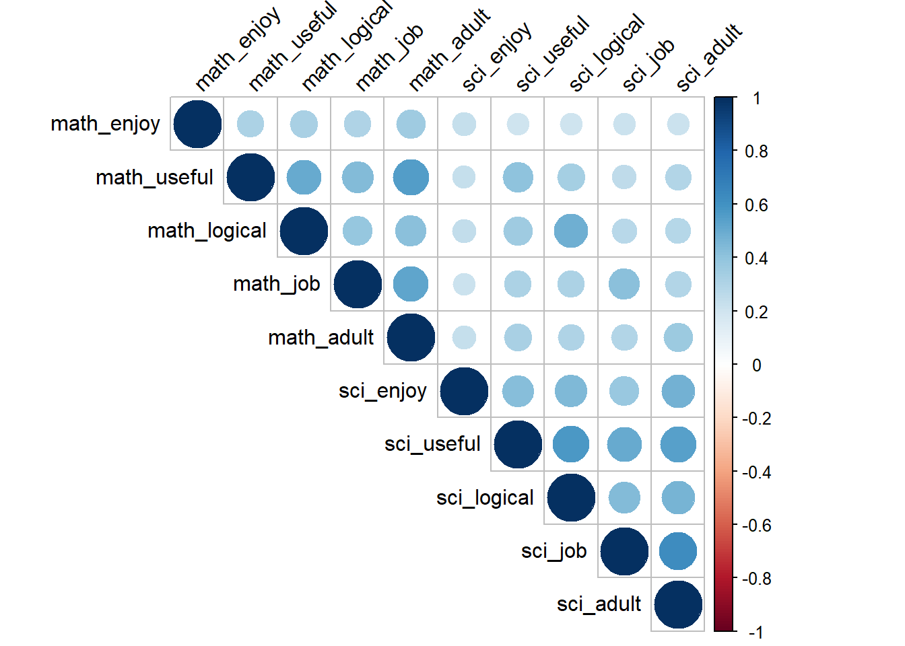
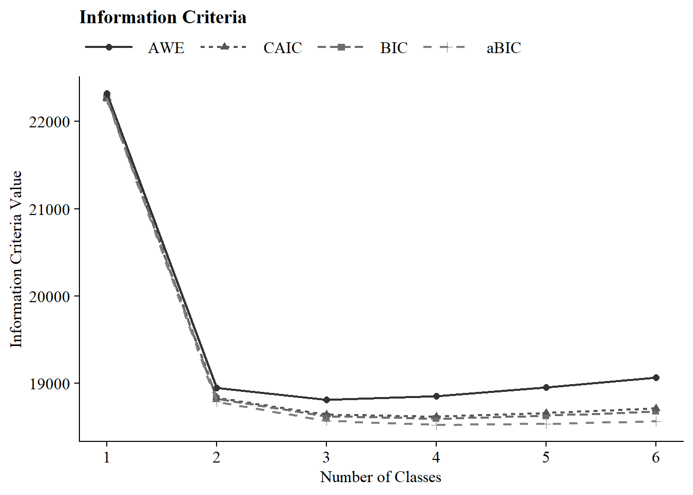
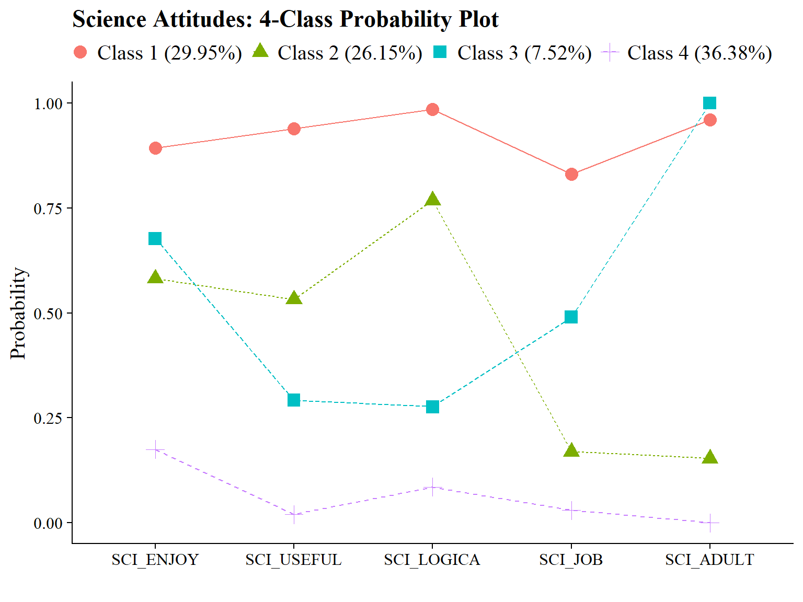
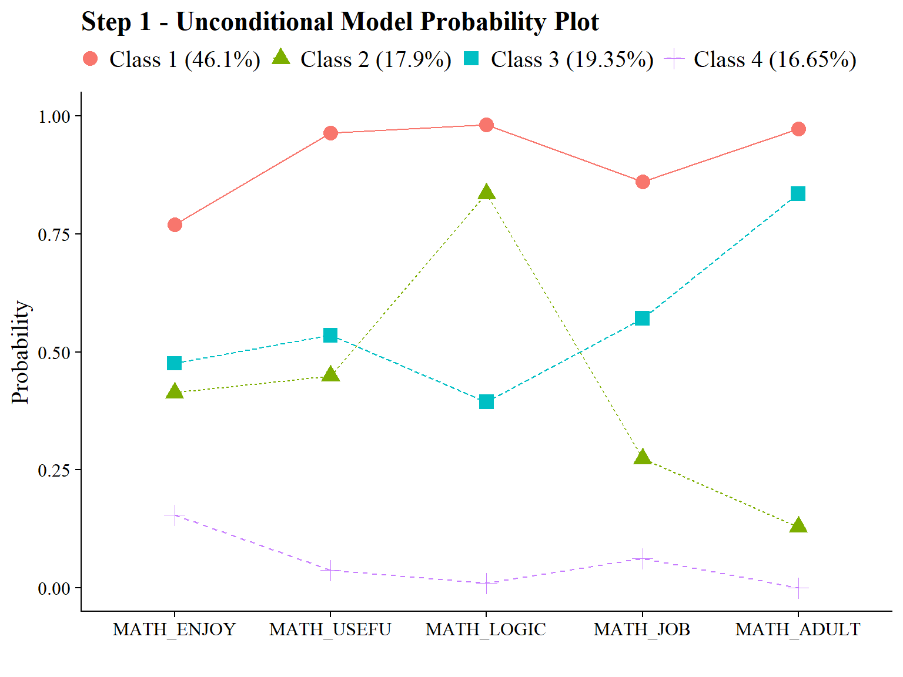
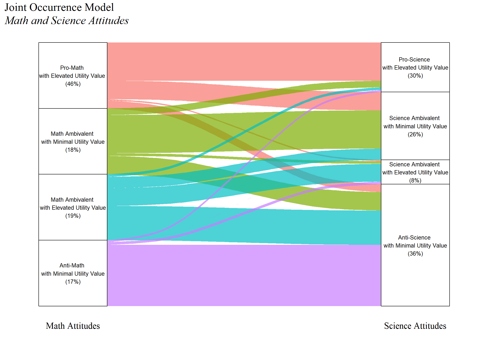
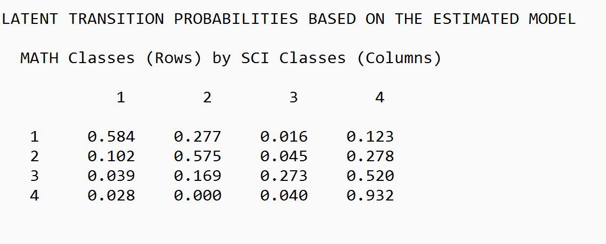

# Joint Occurrence

------------------------------------------------------------------------

*Example: Longitudinal Study of American Youth*

**Data source:** : [See documentation here](https://www.lsay.org/)

------------------------------------------------------------------------

## Load Packages


``` r
library(MplusAutomation)
library(tidyverse)
library(here)
library(glue)
library(gt)
library(cowplot)
library(kableExtra)
library(psych)
library(float)
library(janitor)
library(ggalluvial)
library(DiagrammeR)
library(modelsummary)
library(corrplot)
library(ggrepel)
```

------------------------------------------------------------------------

## Path Diagram


``` r
grViz("
digraph model {
    graph [layout=dot, overlap=true]

    node [shape=box]
    math_enjoy    [label=\"Math: Enjoy\"]    
    math_useful    [label=\"Math: Useful\"]
    math_logical   [label=\"Math: Logical\"]
    math_job       [label=\"Math: Job\"]
    math_adult     [label=\"Math: Adult\"]
    science_enjoy [label=\"Science: Enjoy\"]
    science_useful [label=\"Science: Useful\"]
    science_logical[label=\"Science: Logical\"]
    science_job    [label=\"Science: Job\"]
    science_adult  [label=\"Science: Adult\"]

    node [shape=circle]
    C_math [label=<C<SUB>Math</SUB>>];
    C_sci [label=<C<SUB>Science</SUB>>];

    edge []
    C_math -> {math_enjoy math_useful math_logical math_job math_adult}
    C_sci -> {science_enjoy science_useful science_logical science_job science_adult}
    C_math -> C_sci

    {rank = same; C_math; C_sci;}
}
")
```


```{=html}
<div class="grViz html-widget html-fill-item" id="htmlwidget-739862164828a5448790" style="width:672px;height:480px;"></div>
<script type="application/json" data-for="htmlwidget-739862164828a5448790">{"x":{"diagram":"\ndigraph model {\n    graph [layout=dot, overlap=true]\n\n    node [shape=box]\n    math_enjoy    [label=\"Math: Enjoy\"]    \n    math_useful    [label=\"Math: Useful\"]\n    math_logical   [label=\"Math: Logical\"]\n    math_job       [label=\"Math: Job\"]\n    math_adult     [label=\"Math: Adult\"]\n    science_enjoy [label=\"Science: Enjoy\"]\n    science_useful [label=\"Science: Useful\"]\n    science_logical[label=\"Science: Logical\"]\n    science_job    [label=\"Science: Job\"]\n    science_adult  [label=\"Science: Adult\"]\n\n    node [shape=circle]\n    C_math [label=<C<SUB>Math<\/SUB>>];\n    C_sci [label=<C<SUB>Science<\/SUB>>];\n\n    edge []\n    C_math -> {math_enjoy math_useful math_logical math_job math_adult}\n    C_sci -> {science_enjoy science_useful science_logical science_job science_adult}\n    C_math -> C_sci\n\n    {rank = same; C_math; C_sci;}\n}\n","config":{"engine":"dot","options":null}},"evals":[],"jsHooks":[]}</script>
```


------------------------------------------------------------------------


```{=html}
<div id="orpycuwmru" style="padding-left:0px;padding-right:0px;padding-top:10px;padding-bottom:10px;overflow-x:auto;overflow-y:auto;width:auto;height:auto;">
<style>#orpycuwmru table {
  font-family: system-ui, 'Segoe UI', Roboto, Helvetica, Arial, sans-serif, 'Apple Color Emoji', 'Segoe UI Emoji', 'Segoe UI Symbol', 'Noto Color Emoji';
  -webkit-font-smoothing: antialiased;
  -moz-osx-font-smoothing: grayscale;
}

#orpycuwmru thead, #orpycuwmru tbody, #orpycuwmru tfoot, #orpycuwmru tr, #orpycuwmru td, #orpycuwmru th {
  border-style: none;
}

#orpycuwmru p {
  margin: 0;
  padding: 0;
}

#orpycuwmru .gt_table {
  display: table;
  border-collapse: collapse;
  line-height: normal;
  margin-left: auto;
  margin-right: auto;
  color: #333333;
  font-size: 16px;
  font-weight: normal;
  font-style: normal;
  background-color: #FFFFFF;
  width: auto;
  border-top-style: solid;
  border-top-width: 2px;
  border-top-color: #A8A8A8;
  border-right-style: none;
  border-right-width: 2px;
  border-right-color: #D3D3D3;
  border-bottom-style: solid;
  border-bottom-width: 2px;
  border-bottom-color: #A8A8A8;
  border-left-style: none;
  border-left-width: 2px;
  border-left-color: #D3D3D3;
}

#orpycuwmru .gt_caption {
  padding-top: 4px;
  padding-bottom: 4px;
}

#orpycuwmru .gt_title {
  color: #333333;
  font-size: 125%;
  font-weight: initial;
  padding-top: 4px;
  padding-bottom: 4px;
  padding-left: 5px;
  padding-right: 5px;
  border-bottom-color: #FFFFFF;
  border-bottom-width: 0;
}

#orpycuwmru .gt_subtitle {
  color: #333333;
  font-size: 85%;
  font-weight: initial;
  padding-top: 3px;
  padding-bottom: 5px;
  padding-left: 5px;
  padding-right: 5px;
  border-top-color: #FFFFFF;
  border-top-width: 0;
}

#orpycuwmru .gt_heading {
  background-color: #FFFFFF;
  text-align: center;
  border-bottom-color: #FFFFFF;
  border-left-style: none;
  border-left-width: 1px;
  border-left-color: #D3D3D3;
  border-right-style: none;
  border-right-width: 1px;
  border-right-color: #D3D3D3;
}

#orpycuwmru .gt_bottom_border {
  border-bottom-style: solid;
  border-bottom-width: 2px;
  border-bottom-color: #D3D3D3;
}

#orpycuwmru .gt_col_headings {
  border-top-style: solid;
  border-top-width: 2px;
  border-top-color: #D3D3D3;
  border-bottom-style: solid;
  border-bottom-width: 2px;
  border-bottom-color: #D3D3D3;
  border-left-style: none;
  border-left-width: 1px;
  border-left-color: #D3D3D3;
  border-right-style: none;
  border-right-width: 1px;
  border-right-color: #D3D3D3;
}

#orpycuwmru .gt_col_heading {
  color: #333333;
  background-color: #FFFFFF;
  font-size: 100%;
  font-weight: bold;
  text-transform: inherit;
  border-left-style: none;
  border-left-width: 1px;
  border-left-color: #D3D3D3;
  border-right-style: none;
  border-right-width: 1px;
  border-right-color: #D3D3D3;
  vertical-align: bottom;
  padding-top: 5px;
  padding-bottom: 6px;
  padding-left: 5px;
  padding-right: 5px;
  overflow-x: hidden;
}

#orpycuwmru .gt_column_spanner_outer {
  color: #333333;
  background-color: #FFFFFF;
  font-size: 100%;
  font-weight: bold;
  text-transform: inherit;
  padding-top: 0;
  padding-bottom: 0;
  padding-left: 4px;
  padding-right: 4px;
}

#orpycuwmru .gt_column_spanner_outer:first-child {
  padding-left: 0;
}

#orpycuwmru .gt_column_spanner_outer:last-child {
  padding-right: 0;
}

#orpycuwmru .gt_column_spanner {
  border-bottom-style: solid;
  border-bottom-width: 2px;
  border-bottom-color: #D3D3D3;
  vertical-align: bottom;
  padding-top: 5px;
  padding-bottom: 5px;
  overflow-x: hidden;
  display: inline-block;
  width: 100%;
}

#orpycuwmru .gt_spanner_row {
  border-bottom-style: hidden;
}

#orpycuwmru .gt_group_heading {
  padding-top: 8px;
  padding-bottom: 8px;
  padding-left: 5px;
  padding-right: 5px;
  color: #333333;
  background-color: #FFFFFF;
  font-size: 100%;
  font-weight: bold;
  text-transform: inherit;
  border-top-style: solid;
  border-top-width: 2px;
  border-top-color: #D3D3D3;
  border-bottom-style: solid;
  border-bottom-width: 2px;
  border-bottom-color: #D3D3D3;
  border-left-style: none;
  border-left-width: 1px;
  border-left-color: #D3D3D3;
  border-right-style: none;
  border-right-width: 1px;
  border-right-color: #D3D3D3;
  vertical-align: middle;
  text-align: left;
}

#orpycuwmru .gt_empty_group_heading {
  padding: 0.5px;
  color: #333333;
  background-color: #FFFFFF;
  font-size: 100%;
  font-weight: bold;
  border-top-style: solid;
  border-top-width: 2px;
  border-top-color: #D3D3D3;
  border-bottom-style: solid;
  border-bottom-width: 2px;
  border-bottom-color: #D3D3D3;
  vertical-align: middle;
}

#orpycuwmru .gt_from_md > :first-child {
  margin-top: 0;
}

#orpycuwmru .gt_from_md > :last-child {
  margin-bottom: 0;
}

#orpycuwmru .gt_row {
  padding-top: 8px;
  padding-bottom: 8px;
  padding-left: 5px;
  padding-right: 5px;
  margin: 10px;
  border-top-style: solid;
  border-top-width: 1px;
  border-top-color: #D3D3D3;
  border-left-style: none;
  border-left-width: 1px;
  border-left-color: #D3D3D3;
  border-right-style: none;
  border-right-width: 1px;
  border-right-color: #D3D3D3;
  vertical-align: middle;
  overflow-x: hidden;
}

#orpycuwmru .gt_stub {
  color: #333333;
  background-color: #FFFFFF;
  font-size: 100%;
  font-weight: initial;
  text-transform: inherit;
  border-right-style: solid;
  border-right-width: 2px;
  border-right-color: #D3D3D3;
  padding-left: 5px;
  padding-right: 5px;
}

#orpycuwmru .gt_stub_row_group {
  color: #333333;
  background-color: #FFFFFF;
  font-size: 100%;
  font-weight: initial;
  text-transform: inherit;
  border-right-style: solid;
  border-right-width: 2px;
  border-right-color: #D3D3D3;
  padding-left: 5px;
  padding-right: 5px;
  vertical-align: top;
}

#orpycuwmru .gt_row_group_first td {
  border-top-width: 2px;
}

#orpycuwmru .gt_row_group_first th {
  border-top-width: 2px;
}

#orpycuwmru .gt_summary_row {
  color: #333333;
  background-color: #FFFFFF;
  text-transform: inherit;
  padding-top: 8px;
  padding-bottom: 8px;
  padding-left: 5px;
  padding-right: 5px;
}

#orpycuwmru .gt_first_summary_row {
  border-top-style: solid;
  border-top-color: #D3D3D3;
}

#orpycuwmru .gt_first_summary_row.thick {
  border-top-width: 2px;
}

#orpycuwmru .gt_last_summary_row {
  padding-top: 8px;
  padding-bottom: 8px;
  padding-left: 5px;
  padding-right: 5px;
  border-bottom-style: solid;
  border-bottom-width: 2px;
  border-bottom-color: #D3D3D3;
}

#orpycuwmru .gt_grand_summary_row {
  color: #333333;
  background-color: #FFFFFF;
  text-transform: inherit;
  padding-top: 8px;
  padding-bottom: 8px;
  padding-left: 5px;
  padding-right: 5px;
}

#orpycuwmru .gt_first_grand_summary_row {
  padding-top: 8px;
  padding-bottom: 8px;
  padding-left: 5px;
  padding-right: 5px;
  border-top-style: double;
  border-top-width: 6px;
  border-top-color: #D3D3D3;
}

#orpycuwmru .gt_last_grand_summary_row_top {
  padding-top: 8px;
  padding-bottom: 8px;
  padding-left: 5px;
  padding-right: 5px;
  border-bottom-style: double;
  border-bottom-width: 6px;
  border-bottom-color: #D3D3D3;
}

#orpycuwmru .gt_striped {
  background-color: rgba(128, 128, 128, 0.05);
}

#orpycuwmru .gt_table_body {
  border-top-style: solid;
  border-top-width: 2px;
  border-top-color: #D3D3D3;
  border-bottom-style: solid;
  border-bottom-width: 2px;
  border-bottom-color: #D3D3D3;
}

#orpycuwmru .gt_footnotes {
  color: #333333;
  background-color: #FFFFFF;
  border-bottom-style: none;
  border-bottom-width: 2px;
  border-bottom-color: #D3D3D3;
  border-left-style: none;
  border-left-width: 2px;
  border-left-color: #D3D3D3;
  border-right-style: none;
  border-right-width: 2px;
  border-right-color: #D3D3D3;
}

#orpycuwmru .gt_footnote {
  margin: 0px;
  font-size: 90%;
  padding-top: 4px;
  padding-bottom: 4px;
  padding-left: 5px;
  padding-right: 5px;
}

#orpycuwmru .gt_sourcenotes {
  color: #333333;
  background-color: #FFFFFF;
  border-bottom-style: none;
  border-bottom-width: 2px;
  border-bottom-color: #D3D3D3;
  border-left-style: none;
  border-left-width: 2px;
  border-left-color: #D3D3D3;
  border-right-style: none;
  border-right-width: 2px;
  border-right-color: #D3D3D3;
}

#orpycuwmru .gt_sourcenote {
  font-size: 90%;
  padding-top: 4px;
  padding-bottom: 4px;
  padding-left: 5px;
  padding-right: 5px;
}

#orpycuwmru .gt_left {
  text-align: left;
}

#orpycuwmru .gt_center {
  text-align: center;
}

#orpycuwmru .gt_right {
  text-align: right;
  font-variant-numeric: tabular-nums;
}

#orpycuwmru .gt_font_normal {
  font-weight: normal;
}

#orpycuwmru .gt_font_bold {
  font-weight: bold;
}

#orpycuwmru .gt_font_italic {
  font-style: italic;
}

#orpycuwmru .gt_super {
  font-size: 65%;
}

#orpycuwmru .gt_footnote_marks {
  font-size: 75%;
  vertical-align: 0.4em;
  position: initial;
}

#orpycuwmru .gt_asterisk {
  font-size: 100%;
  vertical-align: 0;
}

#orpycuwmru .gt_indent_1 {
  text-indent: 5px;
}

#orpycuwmru .gt_indent_2 {
  text-indent: 10px;
}

#orpycuwmru .gt_indent_3 {
  text-indent: 15px;
}

#orpycuwmru .gt_indent_4 {
  text-indent: 20px;
}

#orpycuwmru .gt_indent_5 {
  text-indent: 25px;
}

#orpycuwmru .katex-display {
  display: inline-flex !important;
  margin-bottom: 0.75em !important;
}

#orpycuwmru div.Reactable > div.rt-table > div.rt-thead > div.rt-tr.rt-tr-group-header > div.rt-th-group:after {
  height: 0px !important;
}
</style>
<table class="gt_table" data-quarto-disable-processing="false" data-quarto-bootstrap="false">
  <thead>
    <tr class="gt_heading">
      <td colspan="2" class="gt_heading gt_title gt_font_normal" style><span class='gt_from_md'><strong>LCA Indicators: Math and Science</strong></span></td>
    </tr>
    <tr class="gt_heading">
      <td colspan="2" class="gt_heading gt_subtitle gt_font_normal gt_bottom_border" style><span class='gt_from_md'> </span></td>
    </tr>
    <tr class="gt_col_headings">
      <th class="gt_col_heading gt_columns_bottom_border gt_left" rowspan="1" colspan="1" scope="col" id="Name">Name</th>
      <th class="gt_col_heading gt_columns_bottom_border gt_left" rowspan="1" colspan="1" scope="col" id="Description">Description</th>
    </tr>
  </thead>
  <tbody class="gt_table_body">
    <tr class="gt_group_heading_row">
      <th colspan="2" class="gt_group_heading" scope="colgroup" id="Math">Math</th>
    </tr>
    <tr class="gt_row_group_first"><td headers="Math  Name" class="gt_row gt_left">KA46A</td>
<td headers="Math  Description" class="gt_row gt_left">I Enjoy Math</td></tr>
    <tr><td headers="Math  Name" class="gt_row gt_left">KA46H</td>
<td headers="Math  Description" class="gt_row gt_left">Math is Useful in Everyday Problems</td></tr>
    <tr><td headers="Math  Name" class="gt_row gt_left">KA46I</td>
<td headers="Math  Description" class="gt_row gt_left">Math Helps Logical Thinking</td></tr>
    <tr><td headers="Math  Name" class="gt_row gt_left">KA46K</td>
<td headers="Math  Description" class="gt_row gt_left">Need Math for a Good Job</td></tr>
    <tr><td headers="Math  Name" class="gt_row gt_left">KA46L</td>
<td headers="Math  Description" class="gt_row gt_left">Will Use Math Often as an Adult</td></tr>
    <tr class="gt_group_heading_row">
      <th colspan="2" class="gt_group_heading" scope="colgroup" id="Science">Science</th>
    </tr>
    <tr class="gt_row_group_first"><td headers="Science  Name" class="gt_row gt_left">KA47A</td>
<td headers="Science  Description" class="gt_row gt_left">I Enjoy Science</td></tr>
    <tr><td headers="Science  Name" class="gt_row gt_left">KA47H</td>
<td headers="Science  Description" class="gt_row gt_left">Science is Useful in Everyday Problems</td></tr>
    <tr><td headers="Science  Name" class="gt_row gt_left">KA47I</td>
<td headers="Science  Description" class="gt_row gt_left">Science Helps Logical Thinking</td></tr>
    <tr><td headers="Science  Name" class="gt_row gt_left">KA47K</td>
<td headers="Science  Description" class="gt_row gt_left">Need Science for a Good Job</td></tr>
    <tr><td headers="Science  Name" class="gt_row gt_left">KA47L</td>
<td headers="Science  Description" class="gt_row gt_left">Will Use Science Often as an Adult</td></tr>
  </tbody>
  
  
</table>
</div>
```


------------------------------------------------------------------------

Read in LSAY dataset


``` r
data <- read_csv(here("data", "lsay_joint_occurrence.csv")) %>% 
  rename(
    math_enjoy   = KA46A, # Renaming the variables
    math_useful  = KA46H,
    math_logical = KA46I,
    math_job     = KA46K,
    math_adult   = KA46L,
    sci_enjoy   = KA47A,
    sci_useful  = KA47H,
    sci_logical = KA47I,
    sci_job     = KA47K,
    sci_adult   = KA47L
  ) %>% 
  clean_names() %>% # Making variables lower-case
  mutate(across(
    .cols = math_enjoy:sci_adult, # Dichtomizing the variables
    .fns = ~ case_when(
      . %in% c(1, 2) ~ 1,
      . %in% c(3, 4, 5) ~ 0,
      TRUE ~ NA_real_
    )
  ))
```

------------------------------------------------------------------------

## Descriptive Statistics

### Descriptive Statistics using R:

Quick view of all the relevant variables:


``` r
data %>%
  select(
    math_enjoy, math_useful, math_logical, math_job, math_adult,
    sci_enjoy, sci_useful, sci_logical, sci_job, sci_adult
  ) %>%
  psych::describe()
```

Proportion of indicators using R:


``` r
# Set up data to find proportions of binary indicators
ds <- data %>% 
  pivot_longer(c(math_enjoy:sci_adult), names_to = "Variable") 

# Create table of variables and counts
tab <- table(ds$Variable, ds$value)

# Find proportions and round to 3 decimal places
prop <- prop.table(tab, margin = 1) %>% 
  round(3)

# Combine everything to one table 
dframe <- data.frame(Variables=rownames(tab), Proportion=prop[,2], Count=tab[,2])
#remove row names
row.names(dframe) <- NULL

# Create table
gt(dframe) %>% 
tab_header(title = md("**LCA Indicator Proportions**"), subtitle = md("&nbsp;")) %>%
tab_options(column_labels.font.weight = "bold", row_group.font.weight = "bold") %>% 
tab_row_group(group = "Math", rows = 1:5) %>% 
tab_row_group(group = "Science", rows = 6:10) %>%
row_group_order(groups = c("Math","Science")) %>% 
tab_options(column_labels.font.weight = "bold", row_group.font.weight = "bold") 
```


```{=html}
<div id="jpkdwbahsn" style="padding-left:0px;padding-right:0px;padding-top:10px;padding-bottom:10px;overflow-x:auto;overflow-y:auto;width:auto;height:auto;">
<style>#jpkdwbahsn table {
  font-family: system-ui, 'Segoe UI', Roboto, Helvetica, Arial, sans-serif, 'Apple Color Emoji', 'Segoe UI Emoji', 'Segoe UI Symbol', 'Noto Color Emoji';
  -webkit-font-smoothing: antialiased;
  -moz-osx-font-smoothing: grayscale;
}

#jpkdwbahsn thead, #jpkdwbahsn tbody, #jpkdwbahsn tfoot, #jpkdwbahsn tr, #jpkdwbahsn td, #jpkdwbahsn th {
  border-style: none;
}

#jpkdwbahsn p {
  margin: 0;
  padding: 0;
}

#jpkdwbahsn .gt_table {
  display: table;
  border-collapse: collapse;
  line-height: normal;
  margin-left: auto;
  margin-right: auto;
  color: #333333;
  font-size: 16px;
  font-weight: normal;
  font-style: normal;
  background-color: #FFFFFF;
  width: auto;
  border-top-style: solid;
  border-top-width: 2px;
  border-top-color: #A8A8A8;
  border-right-style: none;
  border-right-width: 2px;
  border-right-color: #D3D3D3;
  border-bottom-style: solid;
  border-bottom-width: 2px;
  border-bottom-color: #A8A8A8;
  border-left-style: none;
  border-left-width: 2px;
  border-left-color: #D3D3D3;
}

#jpkdwbahsn .gt_caption {
  padding-top: 4px;
  padding-bottom: 4px;
}

#jpkdwbahsn .gt_title {
  color: #333333;
  font-size: 125%;
  font-weight: initial;
  padding-top: 4px;
  padding-bottom: 4px;
  padding-left: 5px;
  padding-right: 5px;
  border-bottom-color: #FFFFFF;
  border-bottom-width: 0;
}

#jpkdwbahsn .gt_subtitle {
  color: #333333;
  font-size: 85%;
  font-weight: initial;
  padding-top: 3px;
  padding-bottom: 5px;
  padding-left: 5px;
  padding-right: 5px;
  border-top-color: #FFFFFF;
  border-top-width: 0;
}

#jpkdwbahsn .gt_heading {
  background-color: #FFFFFF;
  text-align: center;
  border-bottom-color: #FFFFFF;
  border-left-style: none;
  border-left-width: 1px;
  border-left-color: #D3D3D3;
  border-right-style: none;
  border-right-width: 1px;
  border-right-color: #D3D3D3;
}

#jpkdwbahsn .gt_bottom_border {
  border-bottom-style: solid;
  border-bottom-width: 2px;
  border-bottom-color: #D3D3D3;
}

#jpkdwbahsn .gt_col_headings {
  border-top-style: solid;
  border-top-width: 2px;
  border-top-color: #D3D3D3;
  border-bottom-style: solid;
  border-bottom-width: 2px;
  border-bottom-color: #D3D3D3;
  border-left-style: none;
  border-left-width: 1px;
  border-left-color: #D3D3D3;
  border-right-style: none;
  border-right-width: 1px;
  border-right-color: #D3D3D3;
}

#jpkdwbahsn .gt_col_heading {
  color: #333333;
  background-color: #FFFFFF;
  font-size: 100%;
  font-weight: bold;
  text-transform: inherit;
  border-left-style: none;
  border-left-width: 1px;
  border-left-color: #D3D3D3;
  border-right-style: none;
  border-right-width: 1px;
  border-right-color: #D3D3D3;
  vertical-align: bottom;
  padding-top: 5px;
  padding-bottom: 6px;
  padding-left: 5px;
  padding-right: 5px;
  overflow-x: hidden;
}

#jpkdwbahsn .gt_column_spanner_outer {
  color: #333333;
  background-color: #FFFFFF;
  font-size: 100%;
  font-weight: bold;
  text-transform: inherit;
  padding-top: 0;
  padding-bottom: 0;
  padding-left: 4px;
  padding-right: 4px;
}

#jpkdwbahsn .gt_column_spanner_outer:first-child {
  padding-left: 0;
}

#jpkdwbahsn .gt_column_spanner_outer:last-child {
  padding-right: 0;
}

#jpkdwbahsn .gt_column_spanner {
  border-bottom-style: solid;
  border-bottom-width: 2px;
  border-bottom-color: #D3D3D3;
  vertical-align: bottom;
  padding-top: 5px;
  padding-bottom: 5px;
  overflow-x: hidden;
  display: inline-block;
  width: 100%;
}

#jpkdwbahsn .gt_spanner_row {
  border-bottom-style: hidden;
}

#jpkdwbahsn .gt_group_heading {
  padding-top: 8px;
  padding-bottom: 8px;
  padding-left: 5px;
  padding-right: 5px;
  color: #333333;
  background-color: #FFFFFF;
  font-size: 100%;
  font-weight: bold;
  text-transform: inherit;
  border-top-style: solid;
  border-top-width: 2px;
  border-top-color: #D3D3D3;
  border-bottom-style: solid;
  border-bottom-width: 2px;
  border-bottom-color: #D3D3D3;
  border-left-style: none;
  border-left-width: 1px;
  border-left-color: #D3D3D3;
  border-right-style: none;
  border-right-width: 1px;
  border-right-color: #D3D3D3;
  vertical-align: middle;
  text-align: left;
}

#jpkdwbahsn .gt_empty_group_heading {
  padding: 0.5px;
  color: #333333;
  background-color: #FFFFFF;
  font-size: 100%;
  font-weight: bold;
  border-top-style: solid;
  border-top-width: 2px;
  border-top-color: #D3D3D3;
  border-bottom-style: solid;
  border-bottom-width: 2px;
  border-bottom-color: #D3D3D3;
  vertical-align: middle;
}

#jpkdwbahsn .gt_from_md > :first-child {
  margin-top: 0;
}

#jpkdwbahsn .gt_from_md > :last-child {
  margin-bottom: 0;
}

#jpkdwbahsn .gt_row {
  padding-top: 8px;
  padding-bottom: 8px;
  padding-left: 5px;
  padding-right: 5px;
  margin: 10px;
  border-top-style: solid;
  border-top-width: 1px;
  border-top-color: #D3D3D3;
  border-left-style: none;
  border-left-width: 1px;
  border-left-color: #D3D3D3;
  border-right-style: none;
  border-right-width: 1px;
  border-right-color: #D3D3D3;
  vertical-align: middle;
  overflow-x: hidden;
}

#jpkdwbahsn .gt_stub {
  color: #333333;
  background-color: #FFFFFF;
  font-size: 100%;
  font-weight: initial;
  text-transform: inherit;
  border-right-style: solid;
  border-right-width: 2px;
  border-right-color: #D3D3D3;
  padding-left: 5px;
  padding-right: 5px;
}

#jpkdwbahsn .gt_stub_row_group {
  color: #333333;
  background-color: #FFFFFF;
  font-size: 100%;
  font-weight: initial;
  text-transform: inherit;
  border-right-style: solid;
  border-right-width: 2px;
  border-right-color: #D3D3D3;
  padding-left: 5px;
  padding-right: 5px;
  vertical-align: top;
}

#jpkdwbahsn .gt_row_group_first td {
  border-top-width: 2px;
}

#jpkdwbahsn .gt_row_group_first th {
  border-top-width: 2px;
}

#jpkdwbahsn .gt_summary_row {
  color: #333333;
  background-color: #FFFFFF;
  text-transform: inherit;
  padding-top: 8px;
  padding-bottom: 8px;
  padding-left: 5px;
  padding-right: 5px;
}

#jpkdwbahsn .gt_first_summary_row {
  border-top-style: solid;
  border-top-color: #D3D3D3;
}

#jpkdwbahsn .gt_first_summary_row.thick {
  border-top-width: 2px;
}

#jpkdwbahsn .gt_last_summary_row {
  padding-top: 8px;
  padding-bottom: 8px;
  padding-left: 5px;
  padding-right: 5px;
  border-bottom-style: solid;
  border-bottom-width: 2px;
  border-bottom-color: #D3D3D3;
}

#jpkdwbahsn .gt_grand_summary_row {
  color: #333333;
  background-color: #FFFFFF;
  text-transform: inherit;
  padding-top: 8px;
  padding-bottom: 8px;
  padding-left: 5px;
  padding-right: 5px;
}

#jpkdwbahsn .gt_first_grand_summary_row {
  padding-top: 8px;
  padding-bottom: 8px;
  padding-left: 5px;
  padding-right: 5px;
  border-top-style: double;
  border-top-width: 6px;
  border-top-color: #D3D3D3;
}

#jpkdwbahsn .gt_last_grand_summary_row_top {
  padding-top: 8px;
  padding-bottom: 8px;
  padding-left: 5px;
  padding-right: 5px;
  border-bottom-style: double;
  border-bottom-width: 6px;
  border-bottom-color: #D3D3D3;
}

#jpkdwbahsn .gt_striped {
  background-color: rgba(128, 128, 128, 0.05);
}

#jpkdwbahsn .gt_table_body {
  border-top-style: solid;
  border-top-width: 2px;
  border-top-color: #D3D3D3;
  border-bottom-style: solid;
  border-bottom-width: 2px;
  border-bottom-color: #D3D3D3;
}

#jpkdwbahsn .gt_footnotes {
  color: #333333;
  background-color: #FFFFFF;
  border-bottom-style: none;
  border-bottom-width: 2px;
  border-bottom-color: #D3D3D3;
  border-left-style: none;
  border-left-width: 2px;
  border-left-color: #D3D3D3;
  border-right-style: none;
  border-right-width: 2px;
  border-right-color: #D3D3D3;
}

#jpkdwbahsn .gt_footnote {
  margin: 0px;
  font-size: 90%;
  padding-top: 4px;
  padding-bottom: 4px;
  padding-left: 5px;
  padding-right: 5px;
}

#jpkdwbahsn .gt_sourcenotes {
  color: #333333;
  background-color: #FFFFFF;
  border-bottom-style: none;
  border-bottom-width: 2px;
  border-bottom-color: #D3D3D3;
  border-left-style: none;
  border-left-width: 2px;
  border-left-color: #D3D3D3;
  border-right-style: none;
  border-right-width: 2px;
  border-right-color: #D3D3D3;
}

#jpkdwbahsn .gt_sourcenote {
  font-size: 90%;
  padding-top: 4px;
  padding-bottom: 4px;
  padding-left: 5px;
  padding-right: 5px;
}

#jpkdwbahsn .gt_left {
  text-align: left;
}

#jpkdwbahsn .gt_center {
  text-align: center;
}

#jpkdwbahsn .gt_right {
  text-align: right;
  font-variant-numeric: tabular-nums;
}

#jpkdwbahsn .gt_font_normal {
  font-weight: normal;
}

#jpkdwbahsn .gt_font_bold {
  font-weight: bold;
}

#jpkdwbahsn .gt_font_italic {
  font-style: italic;
}

#jpkdwbahsn .gt_super {
  font-size: 65%;
}

#jpkdwbahsn .gt_footnote_marks {
  font-size: 75%;
  vertical-align: 0.4em;
  position: initial;
}

#jpkdwbahsn .gt_asterisk {
  font-size: 100%;
  vertical-align: 0;
}

#jpkdwbahsn .gt_indent_1 {
  text-indent: 5px;
}

#jpkdwbahsn .gt_indent_2 {
  text-indent: 10px;
}

#jpkdwbahsn .gt_indent_3 {
  text-indent: 15px;
}

#jpkdwbahsn .gt_indent_4 {
  text-indent: 20px;
}

#jpkdwbahsn .gt_indent_5 {
  text-indent: 25px;
}

#jpkdwbahsn .katex-display {
  display: inline-flex !important;
  margin-bottom: 0.75em !important;
}

#jpkdwbahsn div.Reactable > div.rt-table > div.rt-thead > div.rt-tr.rt-tr-group-header > div.rt-th-group:after {
  height: 0px !important;
}
</style>
<table class="gt_table" data-quarto-disable-processing="false" data-quarto-bootstrap="false">
  <thead>
    <tr class="gt_heading">
      <td colspan="3" class="gt_heading gt_title gt_font_normal" style><span class='gt_from_md'><strong>LCA Indicator Proportions</strong></span></td>
    </tr>
    <tr class="gt_heading">
      <td colspan="3" class="gt_heading gt_subtitle gt_font_normal gt_bottom_border" style><span class='gt_from_md'> </span></td>
    </tr>
    <tr class="gt_col_headings">
      <th class="gt_col_heading gt_columns_bottom_border gt_left" rowspan="1" colspan="1" scope="col" id="Variables">Variables</th>
      <th class="gt_col_heading gt_columns_bottom_border gt_right" rowspan="1" colspan="1" scope="col" id="Proportion">Proportion</th>
      <th class="gt_col_heading gt_columns_bottom_border gt_right" rowspan="1" colspan="1" scope="col" id="Count">Count</th>
    </tr>
  </thead>
  <tbody class="gt_table_body">
    <tr class="gt_group_heading_row">
      <th colspan="3" class="gt_group_heading" scope="colgroup" id="Math">Math</th>
    </tr>
    <tr class="gt_row_group_first"><td headers="Math  Variables" class="gt_row gt_left">math_adult</td>
<td headers="Math  Proportion" class="gt_row gt_right">0.634</td>
<td headers="Math  Count" class="gt_row gt_right">2121</td></tr>
    <tr><td headers="Math  Variables" class="gt_row gt_left">math_enjoy</td>
<td headers="Math  Proportion" class="gt_row gt_right">0.547</td>
<td headers="Math  Count" class="gt_row gt_right">1847</td></tr>
    <tr><td headers="Math  Variables" class="gt_row gt_left">math_job</td>
<td headers="Math  Proportion" class="gt_row gt_right">0.567</td>
<td headers="Math  Count" class="gt_row gt_right">1891</td></tr>
    <tr><td headers="Math  Variables" class="gt_row gt_left">math_logical</td>
<td headers="Math  Proportion" class="gt_row gt_right">0.680</td>
<td headers="Math  Count" class="gt_row gt_right">2279</td></tr>
    <tr><td headers="Math  Variables" class="gt_row gt_left">math_useful</td>
<td headers="Math  Proportion" class="gt_row gt_right">0.635</td>
<td headers="Math  Count" class="gt_row gt_right">2131</td></tr>
    <tr class="gt_group_heading_row">
      <th colspan="3" class="gt_group_heading" scope="colgroup" id="Science">Science</th>
    </tr>
    <tr class="gt_row_group_first"><td headers="Science  Variables" class="gt_row gt_left">sci_adult</td>
<td headers="Science  Proportion" class="gt_row gt_right">0.403</td>
<td headers="Science  Count" class="gt_row gt_right">1352</td></tr>
    <tr><td headers="Science  Variables" class="gt_row gt_left">sci_enjoy</td>
<td headers="Science  Proportion" class="gt_row gt_right">0.534</td>
<td headers="Science  Count" class="gt_row gt_right">1793</td></tr>
    <tr><td headers="Science  Variables" class="gt_row gt_left">sci_job</td>
<td headers="Science  Proportion" class="gt_row gt_right">0.341</td>
<td headers="Science  Count" class="gt_row gt_right">1139</td></tr>
    <tr><td headers="Science  Variables" class="gt_row gt_left">sci_logical</td>
<td headers="Science  Proportion" class="gt_row gt_right">0.548</td>
<td headers="Science  Count" class="gt_row gt_right">1825</td></tr>
    <tr><td headers="Science  Variables" class="gt_row gt_left">sci_useful</td>
<td headers="Science  Proportion" class="gt_row gt_right">0.450</td>
<td headers="Science  Count" class="gt_row gt_right">1502</td></tr>
  </tbody>
  
  
</table>
</div>
```


Data summary:


``` r
select_data <- data %>% 
 select(math_enjoy:sci_adult)

f <- All(select_data) ~ Mean + SD + Min + Median + Max + Histogram
datasummary(f, data, output="markdown")
```


```{=html}
<!-- preamble start -->

    <script>

      function styleCell_8iq9c46ilumz6944artz(i, j, css_id) {
          var table = document.getElementById("tinytable_8iq9c46ilumz6944artz");
          var cell = table.rows[i]?.cells[j];  // Safe navigation to avoid errors
          if (cell) {
              console.log(`Styling cell at (${i}, ${j}) with class ${css_id}`);
              cell.classList.add(css_id);
          } else {
              console.warn(`Cell at (${i}, ${j}) not found.`);
          }
      }
      function insertSpanRow(i, colspan, content) {
        var table = document.getElementById('tinytable_8iq9c46ilumz6944artz');
        var newRow = table.insertRow(i);
        var newCell = newRow.insertCell(0);
        newCell.setAttribute("colspan", colspan);
        // newCell.innerText = content;
        // this may be unsafe, but innerText does not interpret <br>
        newCell.innerHTML = content;
      }
      function spanCell_8iq9c46ilumz6944artz(i, j, rowspan, colspan) {
        var table = document.getElementById("tinytable_8iq9c46ilumz6944artz");
        const targetRow = table.rows[i];
        const targetCell = targetRow.cells[j];
        for (let r = 0; r < rowspan; r++) {
          // Only start deleting cells to the right for the first row (r == 0)
          if (r === 0) {
            // Delete cells to the right of the target cell in the first row
            for (let c = colspan - 1; c > 0; c--) {
              if (table.rows[i + r].cells[j + c]) {
                table.rows[i + r].deleteCell(j + c);
              }
            }
          }
          // For rows below the first, delete starting from the target column
          if (r > 0) {
            for (let c = colspan - 1; c >= 0; c--) {
              if (table.rows[i + r] && table.rows[i + r].cells[j]) {
                table.rows[i + r].deleteCell(j);
              }
            }
          }
        }
        // Set rowspan and colspan of the target cell
        targetCell.rowSpan = rowspan;
        targetCell.colSpan = colspan;
      }
      // tinytable span after
      window.addEventListener('load', function () {
          var cellsToStyle = [
            // tinytable style arrays after
          { positions: [ { i: 10, j: 5 }, { i: 10, j: 3 }, { i: 10, j: 4 }, { i: 10, j: 1 }, { i: 10, j: 2 }, { i: 10, j: 6 },  ], css_id: 'tinytable_css_5yrmpi7v1i3bb3603i48',}, 
          { positions: [ { i: 2, j: 1 }, { i: 4, j: 1 }, { i: 6, j: 1 }, { i: 8, j: 1 }, { i: 1, j: 1 }, { i: 1, j: 3 }, { i: 1, j: 2 }, { i: 2, j: 2 }, { i: 3, j: 2 }, { i: 4, j: 2 }, { i: 3, j: 1 }, { i: 6, j: 2 }, { i: 5, j: 1 }, { i: 8, j: 2 }, { i: 7, j: 1 }, { i: 1, j: 4 }, { i: 9, j: 1 }, { i: 3, j: 4 }, { i: 2, j: 3 }, { i: 3, j: 3 }, { i: 4, j: 3 }, { i: 5, j: 3 }, { i: 6, j: 3 }, { i: 5, j: 2 }, { i: 8, j: 3 }, { i: 7, j: 2 }, { i: 1, j: 5 }, { i: 9, j: 2 }, { i: 3, j: 5 }, { i: 2, j: 4 }, { i: 5, j: 5 }, { i: 4, j: 4 }, { i: 5, j: 4 }, { i: 6, j: 4 }, { i: 7, j: 4 }, { i: 8, j: 4 }, { i: 7, j: 3 }, { i: 1, j: 6 }, { i: 9, j: 3 }, { i: 3, j: 6 }, { i: 2, j: 5 }, { i: 5, j: 6 }, { i: 4, j: 5 }, { i: 7, j: 6 }, { i: 6, j: 5 }, { i: 7, j: 5 }, { i: 8, j: 5 }, { i: 9, j: 5 }, { i: 9, j: 4 }, { i: 9, j: 6 }, { i: 2, j: 6 }, { i: 4, j: 6 }, { i: 6, j: 6 }, { i: 8, j: 6 },  ], css_id: 'tinytable_css_bxfu5gfe1jdjxdabnrob',}, 
          { positions: [ { i: 0, j: 1 }, { i: 0, j: 5 }, { i: 0, j: 6 }, { i: 0, j: 3 }, { i: 0, j: 4 }, { i: 0, j: 2 },  ], css_id: 'tinytable_css_2tseybbpjdvxpndbv80e',}, 
          { positions: [ { i: 10, j: 0 },  ], css_id: 'tinytable_css_s03tts1cvn777n3x0txe',}, 
          { positions: [ { i: 1, j: 0 }, { i: 2, j: 0 }, { i: 3, j: 0 }, { i: 4, j: 0 }, { i: 5, j: 0 }, { i: 6, j: 0 }, { i: 7, j: 0 }, { i: 8, j: 0 }, { i: 9, j: 0 },  ], css_id: 'tinytable_css_ohakbuwlevqwqnv5npfc',}, 
          { positions: [ { i: 0, j: 0 },  ], css_id: 'tinytable_css_e0elqwebqylt4e9dpe5e',}, 
          ];

          // Loop over the arrays to style the cells
          cellsToStyle.forEach(function (group) {
              group.positions.forEach(function (cell) {
                  styleCell_8iq9c46ilumz6944artz(cell.i, cell.j, group.css_id);
              });
          });
      });
    </script>

    <style>
      /* tinytable css entries after */
      .table td.tinytable_css_5yrmpi7v1i3bb3603i48, .table th.tinytable_css_5yrmpi7v1i3bb3603i48 { text-align: right; border-bottom: solid #d3d8dc 0.1em; }
      .table td.tinytable_css_bxfu5gfe1jdjxdabnrob, .table th.tinytable_css_bxfu5gfe1jdjxdabnrob { text-align: right; }
      .table td.tinytable_css_2tseybbpjdvxpndbv80e, .table th.tinytable_css_2tseybbpjdvxpndbv80e { text-align: right; border-top: solid #d3d8dc 0.1em; border-bottom: solid #d3d8dc 0.05em; }
      .table td.tinytable_css_s03tts1cvn777n3x0txe, .table th.tinytable_css_s03tts1cvn777n3x0txe { text-align: left; border-bottom: solid #d3d8dc 0.1em; }
      .table td.tinytable_css_ohakbuwlevqwqnv5npfc, .table th.tinytable_css_ohakbuwlevqwqnv5npfc { text-align: left; }
      .table td.tinytable_css_e0elqwebqylt4e9dpe5e, .table th.tinytable_css_e0elqwebqylt4e9dpe5e { text-align: left; border-top: solid #d3d8dc 0.1em; border-bottom: solid #d3d8dc 0.05em; }
    </style>
    <div class="container">
      <table class="table table-borderless" id="tinytable_8iq9c46ilumz6944artz" style="width: auto; margin-left: auto; margin-right: auto;" data-quarto-disable-processing='true'>
        <thead>
        
              <tr>
                <th scope="col"> </th>
                <th scope="col">Mean</th>
                <th scope="col">SD</th>
                <th scope="col">Min</th>
                <th scope="col">Median</th>
                <th scope="col">Max</th>
                <th scope="col">Histogram</th>
              </tr>
        </thead>
        
        <tbody>
                <tr>
                  <td>math_enjoy</td>
                  <td>0.55</td>
                  <td>0.50</td>
                  <td>0.00</td>
                  <td>1.00</td>
                  <td>1.00</td>
                  <td>▆▇</td>
                </tr>
                <tr>
                  <td>math_useful</td>
                  <td>0.63</td>
                  <td>0.48</td>
                  <td>0.00</td>
                  <td>1.00</td>
                  <td>1.00</td>
                  <td>▄▇</td>
                </tr>
                <tr>
                  <td>math_logical</td>
                  <td>0.68</td>
                  <td>0.47</td>
                  <td>0.00</td>
                  <td>1.00</td>
                  <td>1.00</td>
                  <td>▃▇</td>
                </tr>
                <tr>
                  <td>math_job</td>
                  <td>0.57</td>
                  <td>0.50</td>
                  <td>0.00</td>
                  <td>1.00</td>
                  <td>1.00</td>
                  <td>▅▇</td>
                </tr>
                <tr>
                  <td>math_adult</td>
                  <td>0.63</td>
                  <td>0.48</td>
                  <td>0.00</td>
                  <td>1.00</td>
                  <td>1.00</td>
                  <td>▄▇</td>
                </tr>
                <tr>
                  <td>sci_enjoy</td>
                  <td>0.53</td>
                  <td>0.50</td>
                  <td>0.00</td>
                  <td>1.00</td>
                  <td>1.00</td>
                  <td>▆▇</td>
                </tr>
                <tr>
                  <td>sci_useful</td>
                  <td>0.45</td>
                  <td>0.50</td>
                  <td>0.00</td>
                  <td>0.00</td>
                  <td>1.00</td>
                  <td>▇▆</td>
                </tr>
                <tr>
                  <td>sci_logical</td>
                  <td>0.55</td>
                  <td>0.50</td>
                  <td>0.00</td>
                  <td>1.00</td>
                  <td>1.00</td>
                  <td>▆▇</td>
                </tr>
                <tr>
                  <td>sci_job</td>
                  <td>0.34</td>
                  <td>0.47</td>
                  <td>0.00</td>
                  <td>0.00</td>
                  <td>1.00</td>
                  <td>▇▄</td>
                </tr>
                <tr>
                  <td>sci_adult</td>
                  <td>0.40</td>
                  <td>0.49</td>
                  <td>0.00</td>
                  <td>0.00</td>
                  <td>1.00</td>
                  <td>▇▅</td>
                </tr>
        </tbody>
      </table>
    </div>
<!-- hack to avoid NA insertion in last line -->
```


Correlation table:


``` r
select_data %>% 
  datasummary_correlation(output = "markdown")
```


```{=html}
<!-- preamble start -->

    <script>

      function styleCell_vnnv3pfse9brsoq9k7b4(i, j, css_id) {
          var table = document.getElementById("tinytable_vnnv3pfse9brsoq9k7b4");
          var cell = table.rows[i]?.cells[j];  // Safe navigation to avoid errors
          if (cell) {
              console.log(`Styling cell at (${i}, ${j}) with class ${css_id}`);
              cell.classList.add(css_id);
          } else {
              console.warn(`Cell at (${i}, ${j}) not found.`);
          }
      }
      function insertSpanRow(i, colspan, content) {
        var table = document.getElementById('tinytable_vnnv3pfse9brsoq9k7b4');
        var newRow = table.insertRow(i);
        var newCell = newRow.insertCell(0);
        newCell.setAttribute("colspan", colspan);
        // newCell.innerText = content;
        // this may be unsafe, but innerText does not interpret <br>
        newCell.innerHTML = content;
      }
      function spanCell_vnnv3pfse9brsoq9k7b4(i, j, rowspan, colspan) {
        var table = document.getElementById("tinytable_vnnv3pfse9brsoq9k7b4");
        const targetRow = table.rows[i];
        const targetCell = targetRow.cells[j];
        for (let r = 0; r < rowspan; r++) {
          // Only start deleting cells to the right for the first row (r == 0)
          if (r === 0) {
            // Delete cells to the right of the target cell in the first row
            for (let c = colspan - 1; c > 0; c--) {
              if (table.rows[i + r].cells[j + c]) {
                table.rows[i + r].deleteCell(j + c);
              }
            }
          }
          // For rows below the first, delete starting from the target column
          if (r > 0) {
            for (let c = colspan - 1; c >= 0; c--) {
              if (table.rows[i + r] && table.rows[i + r].cells[j]) {
                table.rows[i + r].deleteCell(j);
              }
            }
          }
        }
        // Set rowspan and colspan of the target cell
        targetCell.rowSpan = rowspan;
        targetCell.colSpan = colspan;
      }
      // tinytable span after
      window.addEventListener('load', function () {
          var cellsToStyle = [
            // tinytable style arrays after
          { positions: [ { i: 10, j: 3 }, { i: 10, j: 2 }, { i: 10, j: 9 }, { i: 10, j: 1 }, { i: 10, j: 4 }, { i: 10, j: 6 }, { i: 10, j: 7 }, { i: 10, j: 5 }, { i: 10, j: 8 }, { i: 10, j: 10 },  ], css_id: 'tinytable_css_ltj5puryl4fzqk7n2hio',}, 
          { positions: [ { i: 1, j: 1 }, { i: 6, j: 5 }, { i: 3, j: 1 }, { i: 5, j: 1 }, { i: 3, j: 2 }, { i: 2, j: 1 }, { i: 1, j: 2 }, { i: 6, j: 2 }, { i: 7, j: 2 }, { i: 6, j: 1 }, { i: 5, j: 2 }, { i: 6, j: 6 }, { i: 9, j: 1 }, { i: 1, j: 3 }, { i: 7, j: 1 }, { i: 3, j: 3 }, { i: 2, j: 2 }, { i: 5, j: 3 }, { i: 6, j: 3 }, { i: 7, j: 3 }, { i: 8, j: 3 }, { i: 9, j: 3 }, { i: 6, j: 7 }, { i: 9, j: 2 }, { i: 1, j: 4 }, { i: 2, j: 4 }, { i: 3, j: 4 }, { i: 2, j: 3 }, { i: 5, j: 4 }, { i: 6, j: 4 }, { i: 7, j: 4 }, { i: 8, j: 4 }, { i: 9, j: 4 }, { i: 6, j: 8 }, { i: 4, j: 1 }, { i: 1, j: 5 }, { i: 2, j: 5 }, { i: 3, j: 5 }, { i: 8, j: 1 }, { i: 5, j: 5 }, { i: 2, j: 9 }, { i: 7, j: 5 }, { i: 8, j: 5 }, { i: 9, j: 5 }, { i: 6, j: 9 }, { i: 4, j: 2 }, { i: 1, j: 6 }, { i: 2, j: 6 }, { i: 3, j: 6 }, { i: 8, j: 2 }, { i: 5, j: 6 }, { i: 2, j: 10 }, { i: 7, j: 6 }, { i: 8, j: 6 }, { i: 9, j: 6 }, { i: 6, j: 10 }, { i: 4, j: 3 }, { i: 1, j: 7 }, { i: 2, j: 7 }, { i: 3, j: 7 }, { i: 4, j: 7 }, { i: 5, j: 7 }, { i: 8, j: 8 }, { i: 7, j: 7 }, { i: 8, j: 7 }, { i: 9, j: 7 }, { i: 1, j: 9 }, { i: 4, j: 4 }, { i: 1, j: 8 }, { i: 2, j: 8 }, { i: 3, j: 8 }, { i: 4, j: 8 }, { i: 5, j: 8 }, { i: 8, j: 9 }, { i: 7, j: 8 }, { i: 3, j: 10 }, { i: 9, j: 8 }, { i: 1, j: 10 }, { i: 4, j: 5 }, { i: 5, j: 9 }, { i: 4, j: 10 }, { i: 3, j: 9 }, { i: 4, j: 9 }, { i: 9, j: 9 }, { i: 8, j: 10 }, { i: 7, j: 9 }, { i: 5, j: 10 }, { i: 7, j: 10 }, { i: 4, j: 6 }, { i: 9, j: 10 },  ], css_id: 'tinytable_css_hrzm871anxolqedwlodl',}, 
          { positions: [ { i: 0, j: 1 }, { i: 0, j: 3 }, { i: 0, j: 6 }, { i: 0, j: 4 }, { i: 0, j: 5 }, { i: 0, j: 7 }, { i: 0, j: 10 }, { i: 0, j: 2 }, { i: 0, j: 9 }, { i: 0, j: 8 },  ], css_id: 'tinytable_css_61fwdb0tynatjhwt2fb7',}, 
          { positions: [ { i: 10, j: 0 },  ], css_id: 'tinytable_css_btygmm811ii21rh0hw31',}, 
          { positions: [ { i: 1, j: 0 }, { i: 2, j: 0 }, { i: 3, j: 0 }, { i: 4, j: 0 }, { i: 5, j: 0 }, { i: 6, j: 0 }, { i: 7, j: 0 }, { i: 8, j: 0 }, { i: 9, j: 0 },  ], css_id: 'tinytable_css_tkef77azxpq8uy2uccps',}, 
          { positions: [ { i: 0, j: 0 },  ], css_id: 'tinytable_css_h882jdc75bldcj1kslm7',}, 
          ];

          // Loop over the arrays to style the cells
          cellsToStyle.forEach(function (group) {
              group.positions.forEach(function (cell) {
                  styleCell_vnnv3pfse9brsoq9k7b4(cell.i, cell.j, group.css_id);
              });
          });
      });
    </script>

    <style>
      /* tinytable css entries after */
      .table td.tinytable_css_ltj5puryl4fzqk7n2hio, .table th.tinytable_css_ltj5puryl4fzqk7n2hio { text-align: right; border-bottom: solid #d3d8dc 0.1em; }
      .table td.tinytable_css_hrzm871anxolqedwlodl, .table th.tinytable_css_hrzm871anxolqedwlodl { text-align: right; }
      .table td.tinytable_css_61fwdb0tynatjhwt2fb7, .table th.tinytable_css_61fwdb0tynatjhwt2fb7 { text-align: right; border-top: solid #d3d8dc 0.1em; border-bottom: solid #d3d8dc 0.05em; }
      .table td.tinytable_css_btygmm811ii21rh0hw31, .table th.tinytable_css_btygmm811ii21rh0hw31 { text-align: left; border-bottom: solid #d3d8dc 0.1em; }
      .table td.tinytable_css_tkef77azxpq8uy2uccps, .table th.tinytable_css_tkef77azxpq8uy2uccps { text-align: left; }
      .table td.tinytable_css_h882jdc75bldcj1kslm7, .table th.tinytable_css_h882jdc75bldcj1kslm7 { text-align: left; border-top: solid #d3d8dc 0.1em; border-bottom: solid #d3d8dc 0.05em; }
    </style>
    <div class="container">
      <table class="table table-borderless" id="tinytable_vnnv3pfse9brsoq9k7b4" style="width: auto; margin-left: auto; margin-right: auto;" data-quarto-disable-processing='true'>
        <thead>
        
              <tr>
                <th scope="col"> </th>
                <th scope="col">math_enjoy</th>
                <th scope="col">math_useful</th>
                <th scope="col">math_logical</th>
                <th scope="col">math_job</th>
                <th scope="col">math_adult</th>
                <th scope="col">sci_enjoy</th>
                <th scope="col">sci_useful</th>
                <th scope="col">sci_logical</th>
                <th scope="col">sci_job</th>
                <th scope="col">sci_adult</th>
              </tr>
        </thead>
        
        <tbody>
                <tr>
                  <td>math_enjoy</td>
                  <td>1</td>
                  <td>.</td>
                  <td>.</td>
                  <td>.</td>
                  <td>.</td>
                  <td>.</td>
                  <td>.</td>
                  <td>.</td>
                  <td>.</td>
                  <td>.</td>
                </tr>
                <tr>
                  <td>math_useful</td>
                  <td>.31</td>
                  <td>1</td>
                  <td>.</td>
                  <td>.</td>
                  <td>.</td>
                  <td>.</td>
                  <td>.</td>
                  <td>.</td>
                  <td>.</td>
                  <td>.</td>
                </tr>
                <tr>
                  <td>math_logical</td>
                  <td>.32</td>
                  <td>.51</td>
                  <td>1</td>
                  <td>.</td>
                  <td>.</td>
                  <td>.</td>
                  <td>.</td>
                  <td>.</td>
                  <td>.</td>
                  <td>.</td>
                </tr>
                <tr>
                  <td>math_job</td>
                  <td>.31</td>
                  <td>.43</td>
                  <td>.38</td>
                  <td>1</td>
                  <td>.</td>
                  <td>.</td>
                  <td>.</td>
                  <td>.</td>
                  <td>.</td>
                  <td>.</td>
                </tr>
                <tr>
                  <td>math_adult</td>
                  <td>.36</td>
                  <td>.55</td>
                  <td>.41</td>
                  <td>.53</td>
                  <td>1</td>
                  <td>.</td>
                  <td>.</td>
                  <td>.</td>
                  <td>.</td>
                  <td>.</td>
                </tr>
                <tr>
                  <td>sci_enjoy</td>
                  <td>.23</td>
                  <td>.23</td>
                  <td>.25</td>
                  <td>.22</td>
                  <td>.24</td>
                  <td>1</td>
                  <td>.</td>
                  <td>.</td>
                  <td>.</td>
                  <td>.</td>
                </tr>
                <tr>
                  <td>sci_useful</td>
                  <td>.21</td>
                  <td>.41</td>
                  <td>.36</td>
                  <td>.31</td>
                  <td>.33</td>
                  <td>.43</td>
                  <td>1</td>
                  <td>.</td>
                  <td>.</td>
                  <td>.</td>
                </tr>
                <tr>
                  <td>sci_logical</td>
                  <td>.21</td>
                  <td>.33</td>
                  <td>.48</td>
                  <td>.32</td>
                  <td>.30</td>
                  <td>.45</td>
                  <td>.58</td>
                  <td>1</td>
                  <td>.</td>
                  <td>.</td>
                </tr>
                <tr>
                  <td>sci_job</td>
                  <td>.22</td>
                  <td>.26</td>
                  <td>.27</td>
                  <td>.42</td>
                  <td>.29</td>
                  <td>.37</td>
                  <td>.50</td>
                  <td>.43</td>
                  <td>1</td>
                  <td>.</td>
                </tr>
                <tr>
                  <td>sci_adult</td>
                  <td>.22</td>
                  <td>.30</td>
                  <td>.28</td>
                  <td>.29</td>
                  <td>.37</td>
                  <td>.48</td>
                  <td>.54</td>
                  <td>.47</td>
                  <td>.62</td>
                  <td>1</td>
                </tr>
        </tbody>
      </table>
    </div>
<!-- hack to avoid NA insertion in last line -->
```


Correlation plot:


``` r
f_cor <- data %>% 
 select(math_enjoy:sci_adult) %>% 
  cor(use = "pairwise.complete.obs")

corrplot(f_cor, 
         method = "circle",
         type = "upper", 
         tl.col="black", 
         tl.srt=45)
```



### Descriptive Statistics using `MplusAutomation`:


``` r
basic_mplus  <- mplusObject(
  TITLE = "Descriptive Statistics;",
  
  VARIABLE =
    "usevar = math_enjoy-sci_adult;
    categorical = math_enjoy-sci_adult;",

  ANALYSIS = "TYPE=basic;",
  
  OUTPUT = "sampstat;",  
  
  usevariables = colnames(data),
  rdata = data)

basic_mplus_fit <- mplusModeler(basic_mplus, 
                            dataout = here("joint_occurrence", "data.dat"),
                            modelout = here("joint_occurrence","basic.inp"),
                            check = TRUE, run = TRUE, hashfilename = FALSE)
```

View output (which is goes more into detail) or a see a brief view of descriptive statistics using `get_sampstat()`:


``` r
# Using MplusAutomation
MplusAutomation::get_sampstat(basic_mplus_fit)

# Using base R
summary(data)
```

------------------------------------------------------------------------

## Enumeration (Math Only)

This code uses the `mplusObject` function in the `MplusAutomation` package and saves all model runs in the `mplus_enum` folder.


``` r

lca_enum_6  <- lapply(1:6, function(k) {
  lca_enum  <- mplusObject(
    
    TITLE = glue("Math Attitudes: {k}-Class"), 
    
    VARIABLE = glue(
      "categorical = math_enjoy, math_useful, math_logical, math_job, math_adult; 
     usevar = math_enjoy, math_useful, math_logical, math_job, math_adult;
     classes = c({k});"),
    
    ANALYSIS = 
      "estimator = mlr; 
    type = mixture;
    processors = 12;
    starts = 500 100;",
    
    OUTPUT = "sampstat residual tech11 tech14;",

    usevariables = colnames(data),
    rdata = data)
  
  lca_enum_fit <- mplusModeler(lca_enum, 
                               dataout=glue(here("joint_occurrence","enum_math", "data.dat")),
                               modelout=glue(here("joint_occurrence","enum_math", "c{k}_math.inp")) ,
                               check=TRUE, run = TRUE, hashfilename = FALSE)
})

```

**IMPORTANT**: Before moving forward, make sure to examine each output document to ensure models were estimated normally. In this example, the last model (6-class models) did not produce reliable output and was excluded. 


------------------------------------------------------------------------

## Enumeration (Science Only)

This code uses the `mplusObject` function in the `MplusAutomation` package and saves all model runs in the `mplus_enum` folder.


``` r

lca_enum_6  <- lapply(1:6, function(k) {
  lca_enum  <- mplusObject(
    
    TITLE = glue("Science Attitudes: {k}-Class"), 
    
    VARIABLE = glue(
      "categorical = sci_enjoy, sci_useful, sci_logical, sci_job, sci_adult; 
     usevar = sci_enjoy, sci_useful, sci_logical, sci_job, sci_adult;
     classes = c({k});"),
    
    ANALYSIS = 
      "estimator = mlr; 
    type = mixture;
    processors = 12;
    starts = 500 100;",
    
    OUTPUT = "sampstat residual tech11 tech14;",

    usevariables = colnames(data),
    rdata = data)
  
  lca_enum_fit <- mplusModeler(lca_enum, 
                               dataout=glue(here("joint_occurrence","enum_sci", "data.dat")),
                               modelout=glue(here("joint_occurrence","enum_sci", "c{k}_sci.inp")) ,
                               check=TRUE, run = TRUE, hashfilename = FALSE)
})

```

**IMPORTANT**: Before moving forward, make sure to examine each output document to ensure models were estimated normally. In this example, the last model (6-class models) did not produce reliable output and was excluded. 

------------------------------------------------------------------------

#### Fit Table


``` r
source(here("functions", "enum_table_jo.R"))

# Read model outputs
output_enum_c1 <- readModels(here("joint_occurrence", "enum_math"), quiet = TRUE)
output_enum_c2 <- readModels(here("joint_occurrence", "enum_sci"), quiet = TRUE)

# Define rows for row groups (assuming 6 models per time)
rows_m1 <- 1:6
rows_m2 <- 7:12

fit_table_jo <- fit_table_jo(output_enum_c1, output_enum_c2, rows_m1, rows_m2)
fit_table_jo
```


```{=html}
<div id="osjjlgmxob" style="padding-left:0px;padding-right:0px;padding-top:10px;padding-bottom:10px;overflow-x:auto;overflow-y:auto;width:auto;height:auto;">
<style>#osjjlgmxob table {
  font-family: system-ui, 'Segoe UI', Roboto, Helvetica, Arial, sans-serif, 'Apple Color Emoji', 'Segoe UI Emoji', 'Segoe UI Symbol', 'Noto Color Emoji';
  -webkit-font-smoothing: antialiased;
  -moz-osx-font-smoothing: grayscale;
}

#osjjlgmxob thead, #osjjlgmxob tbody, #osjjlgmxob tfoot, #osjjlgmxob tr, #osjjlgmxob td, #osjjlgmxob th {
  border-style: none;
}

#osjjlgmxob p {
  margin: 0;
  padding: 0;
}

#osjjlgmxob .gt_table {
  display: table;
  border-collapse: collapse;
  line-height: normal;
  margin-left: auto;
  margin-right: auto;
  color: #333333;
  font-size: 16px;
  font-weight: normal;
  font-style: normal;
  background-color: #FFFFFF;
  width: auto;
  border-top-style: solid;
  border-top-width: 2px;
  border-top-color: #A8A8A8;
  border-right-style: none;
  border-right-width: 2px;
  border-right-color: #D3D3D3;
  border-bottom-style: solid;
  border-bottom-width: 2px;
  border-bottom-color: #A8A8A8;
  border-left-style: none;
  border-left-width: 2px;
  border-left-color: #D3D3D3;
}

#osjjlgmxob .gt_caption {
  padding-top: 4px;
  padding-bottom: 4px;
}

#osjjlgmxob .gt_title {
  color: #333333;
  font-size: 125%;
  font-weight: initial;
  padding-top: 4px;
  padding-bottom: 4px;
  padding-left: 5px;
  padding-right: 5px;
  border-bottom-color: #FFFFFF;
  border-bottom-width: 0;
}

#osjjlgmxob .gt_subtitle {
  color: #333333;
  font-size: 85%;
  font-weight: initial;
  padding-top: 3px;
  padding-bottom: 5px;
  padding-left: 5px;
  padding-right: 5px;
  border-top-color: #FFFFFF;
  border-top-width: 0;
}

#osjjlgmxob .gt_heading {
  background-color: #FFFFFF;
  text-align: center;
  border-bottom-color: #FFFFFF;
  border-left-style: none;
  border-left-width: 1px;
  border-left-color: #D3D3D3;
  border-right-style: none;
  border-right-width: 1px;
  border-right-color: #D3D3D3;
}

#osjjlgmxob .gt_bottom_border {
  border-bottom-style: solid;
  border-bottom-width: 2px;
  border-bottom-color: #D3D3D3;
}

#osjjlgmxob .gt_col_headings {
  border-top-style: solid;
  border-top-width: 2px;
  border-top-color: #D3D3D3;
  border-bottom-style: solid;
  border-bottom-width: 2px;
  border-bottom-color: #D3D3D3;
  border-left-style: none;
  border-left-width: 1px;
  border-left-color: #D3D3D3;
  border-right-style: none;
  border-right-width: 1px;
  border-right-color: #D3D3D3;
}

#osjjlgmxob .gt_col_heading {
  color: #333333;
  background-color: #FFFFFF;
  font-size: 100%;
  font-weight: bold;
  text-transform: inherit;
  border-left-style: none;
  border-left-width: 1px;
  border-left-color: #D3D3D3;
  border-right-style: none;
  border-right-width: 1px;
  border-right-color: #D3D3D3;
  vertical-align: bottom;
  padding-top: 5px;
  padding-bottom: 6px;
  padding-left: 5px;
  padding-right: 5px;
  overflow-x: hidden;
}

#osjjlgmxob .gt_column_spanner_outer {
  color: #333333;
  background-color: #FFFFFF;
  font-size: 100%;
  font-weight: bold;
  text-transform: inherit;
  padding-top: 0;
  padding-bottom: 0;
  padding-left: 4px;
  padding-right: 4px;
}

#osjjlgmxob .gt_column_spanner_outer:first-child {
  padding-left: 0;
}

#osjjlgmxob .gt_column_spanner_outer:last-child {
  padding-right: 0;
}

#osjjlgmxob .gt_column_spanner {
  border-bottom-style: solid;
  border-bottom-width: 2px;
  border-bottom-color: #D3D3D3;
  vertical-align: bottom;
  padding-top: 5px;
  padding-bottom: 5px;
  overflow-x: hidden;
  display: inline-block;
  width: 100%;
}

#osjjlgmxob .gt_spanner_row {
  border-bottom-style: hidden;
}

#osjjlgmxob .gt_group_heading {
  padding-top: 8px;
  padding-bottom: 8px;
  padding-left: 5px;
  padding-right: 5px;
  color: #333333;
  background-color: #FFFFFF;
  font-size: 100%;
  font-weight: initial;
  text-transform: inherit;
  border-top-style: solid;
  border-top-width: 2px;
  border-top-color: #D3D3D3;
  border-bottom-style: solid;
  border-bottom-width: 2px;
  border-bottom-color: #D3D3D3;
  border-left-style: none;
  border-left-width: 1px;
  border-left-color: #D3D3D3;
  border-right-style: none;
  border-right-width: 1px;
  border-right-color: #D3D3D3;
  vertical-align: middle;
  text-align: left;
}

#osjjlgmxob .gt_empty_group_heading {
  padding: 0.5px;
  color: #333333;
  background-color: #FFFFFF;
  font-size: 100%;
  font-weight: initial;
  border-top-style: solid;
  border-top-width: 2px;
  border-top-color: #D3D3D3;
  border-bottom-style: solid;
  border-bottom-width: 2px;
  border-bottom-color: #D3D3D3;
  vertical-align: middle;
}

#osjjlgmxob .gt_from_md > :first-child {
  margin-top: 0;
}

#osjjlgmxob .gt_from_md > :last-child {
  margin-bottom: 0;
}

#osjjlgmxob .gt_row {
  padding-top: 8px;
  padding-bottom: 8px;
  padding-left: 5px;
  padding-right: 5px;
  margin: 10px;
  border-top-style: solid;
  border-top-width: 1px;
  border-top-color: #D3D3D3;
  border-left-style: none;
  border-left-width: 1px;
  border-left-color: #D3D3D3;
  border-right-style: none;
  border-right-width: 1px;
  border-right-color: #D3D3D3;
  vertical-align: middle;
  overflow-x: hidden;
}

#osjjlgmxob .gt_stub {
  color: #333333;
  background-color: #FFFFFF;
  font-size: 100%;
  font-weight: initial;
  text-transform: inherit;
  border-right-style: solid;
  border-right-width: 2px;
  border-right-color: #D3D3D3;
  padding-left: 5px;
  padding-right: 5px;
}

#osjjlgmxob .gt_stub_row_group {
  color: #333333;
  background-color: #FFFFFF;
  font-size: 100%;
  font-weight: initial;
  text-transform: inherit;
  border-right-style: solid;
  border-right-width: 2px;
  border-right-color: #D3D3D3;
  padding-left: 5px;
  padding-right: 5px;
  vertical-align: top;
}

#osjjlgmxob .gt_row_group_first td {
  border-top-width: 2px;
}

#osjjlgmxob .gt_row_group_first th {
  border-top-width: 2px;
}

#osjjlgmxob .gt_summary_row {
  color: #333333;
  background-color: #FFFFFF;
  text-transform: inherit;
  padding-top: 8px;
  padding-bottom: 8px;
  padding-left: 5px;
  padding-right: 5px;
}

#osjjlgmxob .gt_first_summary_row {
  border-top-style: solid;
  border-top-color: #D3D3D3;
}

#osjjlgmxob .gt_first_summary_row.thick {
  border-top-width: 2px;
}

#osjjlgmxob .gt_last_summary_row {
  padding-top: 8px;
  padding-bottom: 8px;
  padding-left: 5px;
  padding-right: 5px;
  border-bottom-style: solid;
  border-bottom-width: 2px;
  border-bottom-color: #D3D3D3;
}

#osjjlgmxob .gt_grand_summary_row {
  color: #333333;
  background-color: #FFFFFF;
  text-transform: inherit;
  padding-top: 8px;
  padding-bottom: 8px;
  padding-left: 5px;
  padding-right: 5px;
}

#osjjlgmxob .gt_first_grand_summary_row {
  padding-top: 8px;
  padding-bottom: 8px;
  padding-left: 5px;
  padding-right: 5px;
  border-top-style: double;
  border-top-width: 6px;
  border-top-color: #D3D3D3;
}

#osjjlgmxob .gt_last_grand_summary_row_top {
  padding-top: 8px;
  padding-bottom: 8px;
  padding-left: 5px;
  padding-right: 5px;
  border-bottom-style: double;
  border-bottom-width: 6px;
  border-bottom-color: #D3D3D3;
}

#osjjlgmxob .gt_striped {
  background-color: rgba(128, 128, 128, 0.05);
}

#osjjlgmxob .gt_table_body {
  border-top-style: solid;
  border-top-width: 2px;
  border-top-color: #D3D3D3;
  border-bottom-style: solid;
  border-bottom-width: 2px;
  border-bottom-color: #D3D3D3;
}

#osjjlgmxob .gt_footnotes {
  color: #333333;
  background-color: #FFFFFF;
  border-bottom-style: none;
  border-bottom-width: 2px;
  border-bottom-color: #D3D3D3;
  border-left-style: none;
  border-left-width: 2px;
  border-left-color: #D3D3D3;
  border-right-style: none;
  border-right-width: 2px;
  border-right-color: #D3D3D3;
}

#osjjlgmxob .gt_footnote {
  margin: 0px;
  font-size: 90%;
  padding-top: 4px;
  padding-bottom: 4px;
  padding-left: 5px;
  padding-right: 5px;
}

#osjjlgmxob .gt_sourcenotes {
  color: #333333;
  background-color: #FFFFFF;
  border-bottom-style: none;
  border-bottom-width: 2px;
  border-bottom-color: #D3D3D3;
  border-left-style: none;
  border-left-width: 2px;
  border-left-color: #D3D3D3;
  border-right-style: none;
  border-right-width: 2px;
  border-right-color: #D3D3D3;
}

#osjjlgmxob .gt_sourcenote {
  font-size: 90%;
  padding-top: 4px;
  padding-bottom: 4px;
  padding-left: 5px;
  padding-right: 5px;
}

#osjjlgmxob .gt_left {
  text-align: left;
}

#osjjlgmxob .gt_center {
  text-align: center;
}

#osjjlgmxob .gt_right {
  text-align: right;
  font-variant-numeric: tabular-nums;
}

#osjjlgmxob .gt_font_normal {
  font-weight: normal;
}

#osjjlgmxob .gt_font_bold {
  font-weight: bold;
}

#osjjlgmxob .gt_font_italic {
  font-style: italic;
}

#osjjlgmxob .gt_super {
  font-size: 65%;
}

#osjjlgmxob .gt_footnote_marks {
  font-size: 75%;
  vertical-align: 0.4em;
  position: initial;
}

#osjjlgmxob .gt_asterisk {
  font-size: 100%;
  vertical-align: 0;
}

#osjjlgmxob .gt_indent_1 {
  text-indent: 5px;
}

#osjjlgmxob .gt_indent_2 {
  text-indent: 10px;
}

#osjjlgmxob .gt_indent_3 {
  text-indent: 15px;
}

#osjjlgmxob .gt_indent_4 {
  text-indent: 20px;
}

#osjjlgmxob .gt_indent_5 {
  text-indent: 25px;
}

#osjjlgmxob .katex-display {
  display: inline-flex !important;
  margin-bottom: 0.75em !important;
}

#osjjlgmxob div.Reactable > div.rt-table > div.rt-thead > div.rt-tr.rt-tr-group-header > div.rt-th-group:after {
  height: 0px !important;
}
</style>
<table class="gt_table" data-quarto-disable-processing="false" data-quarto-bootstrap="false">
  <thead>
    <tr class="gt_heading">
      <td colspan="11" class="gt_heading gt_title gt_font_normal gt_bottom_border" style><span class='gt_from_md'><strong>Model Fit Summary Table</strong></span><span class="gt_footnote_marks" style="white-space:nowrap;font-style:italic;font-weight:normal;line-height:0;"><sup>1</sup></span></td>
    </tr>
    
    <tr class="gt_col_headings">
      <th class="gt_col_heading gt_columns_bottom_border gt_left" rowspan="1" colspan="1" scope="col" id="Title">Classes</th>
      <th class="gt_col_heading gt_columns_bottom_border gt_right" rowspan="1" colspan="1" scope="col" id="Parameters"><span class='gt_from_md'>Par</span></th>
      <th class="gt_col_heading gt_columns_bottom_border gt_right" rowspan="1" colspan="1" scope="col" id="LL"><span class='gt_from_md'><em>LL</em></span></th>
      <th class="gt_col_heading gt_columns_bottom_border gt_right" rowspan="1" colspan="1" scope="col" id="BIC">BIC</th>
      <th class="gt_col_heading gt_columns_bottom_border gt_right" rowspan="1" colspan="1" scope="col" id="aBIC">aBIC</th>
      <th class="gt_col_heading gt_columns_bottom_border gt_right" rowspan="1" colspan="1" scope="col" id="CAIC">CAIC</th>
      <th class="gt_col_heading gt_columns_bottom_border gt_right" rowspan="1" colspan="1" scope="col" id="AWE">AWE</th>
      <th class="gt_col_heading gt_columns_bottom_border gt_right" rowspan="1" colspan="1" scope="col" id="BLRT_PValue">BLRT</th>
      <th class="gt_col_heading gt_columns_bottom_border gt_right" rowspan="1" colspan="1" scope="col" id="T11_VLMR_PValue">VLMR</th>
      <th class="gt_col_heading gt_columns_bottom_border gt_right" rowspan="1" colspan="1" scope="col" id="BF"><span class='gt_from_md'>BF</span></th>
      <th class="gt_col_heading gt_columns_bottom_border gt_right" rowspan="1" colspan="1" scope="col" id="cmPk"><span class='gt_from_md'><em>cmP_k</em></span></th>
    </tr>
  </thead>
  <tbody class="gt_table_body">
    <tr class="gt_group_heading_row">
      <th colspan="11" class="gt_group_heading" scope="colgroup" id="LCA 1">LCA 1</th>
    </tr>
    <tr class="gt_row_group_first"><td headers="LCA 1  Title" class="gt_row gt_left">Math Attitudes: 1-Class</td>
<td headers="LCA 1  Parameters" class="gt_row gt_right">5</td>
<td headers="LCA 1  LL" class="gt_row gt_right">−11,112.23</td>
<td headers="LCA 1  BIC" class="gt_row gt_right">22,265.10</td>
<td headers="LCA 1  aBIC" class="gt_row gt_right">22,249.22</td>
<td headers="LCA 1  CAIC" class="gt_row gt_right">22,270.10</td>
<td headers="LCA 1  AWE" class="gt_row gt_right">22,320.74</td>
<td headers="LCA 1  BLRT_PValue" class="gt_row gt_right">–</td>
<td headers="LCA 1  T11_VLMR_PValue" class="gt_row gt_right">–</td>
<td headers="LCA 1  BF" class="gt_row gt_right">0.0</td>
<td headers="LCA 1  cmPk" class="gt_row gt_right"><.001</td></tr>
    <tr><td headers="LCA 1  Title" class="gt_row gt_left">Math Attitudes: 2-Class</td>
<td headers="LCA 1  Parameters" class="gt_row gt_right">11</td>
<td headers="LCA 1  LL" class="gt_row gt_right">−9,368.02</td>
<td headers="LCA 1  BIC" class="gt_row gt_right">18,825.46</td>
<td headers="LCA 1  aBIC" class="gt_row gt_right">18,790.50</td>
<td headers="LCA 1  CAIC" class="gt_row gt_right">18,836.45</td>
<td headers="LCA 1  AWE" class="gt_row gt_right">18,947.86</td>
<td headers="LCA 1  BLRT_PValue" class="gt_row gt_right"><.001</td>
<td headers="LCA 1  T11_VLMR_PValue" class="gt_row gt_right"><.001</td>
<td headers="LCA 1  BF" class="gt_row gt_right">0.0</td>
<td headers="LCA 1  cmPk" class="gt_row gt_right"><.001</td></tr>
    <tr><td headers="LCA 1  Title" class="gt_row gt_left">Math Attitudes: 3-Class</td>
<td headers="LCA 1  Parameters" class="gt_row gt_right">17</td>
<td headers="LCA 1  LL" class="gt_row gt_right">−9,243.39</td>
<td headers="LCA 1  BIC" class="gt_row gt_right">18,624.95</td>
<td headers="LCA 1  aBIC" class="gt_row gt_right">18,570.93</td>
<td headers="LCA 1  CAIC" class="gt_row gt_right">18,641.95</td>
<td headers="LCA 1  AWE" class="gt_row gt_right" style="font-weight: bold;">18,814.12</td>
<td headers="LCA 1  BLRT_PValue" class="gt_row gt_right"><.001</td>
<td headers="LCA 1  T11_VLMR_PValue" class="gt_row gt_right" style="font-weight: bold;"><.001</td>
<td headers="LCA 1  BF" class="gt_row gt_right">0.0</td>
<td headers="LCA 1  cmPk" class="gt_row gt_right"><.001</td></tr>
    <tr><td headers="LCA 1  Title" class="gt_row gt_left">Math Attitudes: 4-Class</td>
<td headers="LCA 1  Parameters" class="gt_row gt_right">23</td>
<td headers="LCA 1  LL" class="gt_row gt_right">−9,204.49</td>
<td headers="LCA 1  BIC" class="gt_row gt_right" style="font-weight: bold;">18,595.93</td>
<td headers="LCA 1  aBIC" class="gt_row gt_right" style="font-weight: bold;">18,522.84</td>
<td headers="LCA 1  CAIC" class="gt_row gt_right" style="font-weight: bold;">18,618.93</td>
<td headers="LCA 1  AWE" class="gt_row gt_right">18,851.86</td>
<td headers="LCA 1  BLRT_PValue" class="gt_row gt_right"><.001</td>
<td headers="LCA 1  T11_VLMR_PValue" class="gt_row gt_right">0.10</td>
<td headers="LCA 1  BF" class="gt_row gt_right" style="font-weight: bold;">>100</td>
<td headers="LCA 1  cmPk" class="gt_row gt_right" style="font-weight: bold;">1.00</td></tr>
    <tr><td headers="LCA 1  Title" class="gt_row gt_left">Math Attitudes: 5-Class</td>
<td headers="LCA 1  Parameters" class="gt_row gt_right">29</td>
<td headers="LCA 1  LL" class="gt_row gt_right">−9,197.51</td>
<td headers="LCA 1  BIC" class="gt_row gt_right">18,630.72</td>
<td headers="LCA 1  aBIC" class="gt_row gt_right">18,538.57</td>
<td headers="LCA 1  CAIC" class="gt_row gt_right">18,659.72</td>
<td headers="LCA 1  AWE" class="gt_row gt_right">18,953.42</td>
<td headers="LCA 1  BLRT_PValue" class="gt_row gt_right" style="font-weight: bold;">0.04</td>
<td headers="LCA 1  T11_VLMR_PValue" class="gt_row gt_right" style="font-weight: bold;">0.00</td>
<td headers="LCA 1  BF" class="gt_row gt_right" style="font-weight: bold;">>100</td>
<td headers="LCA 1  cmPk" class="gt_row gt_right"><.001</td></tr>
    <tr><td headers="LCA 1  Title" class="gt_row gt_left">Math Attitudes: 6-Class</td>
<td headers="LCA 1  Parameters" class="gt_row gt_right">35</td>
<td headers="LCA 1  LL" class="gt_row gt_right">−9,197.04</td>
<td headers="LCA 1  BIC" class="gt_row gt_right">18,678.55</td>
<td headers="LCA 1  aBIC" class="gt_row gt_right">18,567.34</td>
<td headers="LCA 1  CAIC" class="gt_row gt_right">18,713.55</td>
<td headers="LCA 1  AWE" class="gt_row gt_right">19,068.02</td>
<td headers="LCA 1  BLRT_PValue" class="gt_row gt_right">1.00</td>
<td headers="LCA 1  T11_VLMR_PValue" class="gt_row gt_right">0.48</td>
<td headers="LCA 1  BF" class="gt_row gt_right">–</td>
<td headers="LCA 1  cmPk" class="gt_row gt_right"><.001</td></tr>
    <tr class="gt_group_heading_row">
      <th colspan="11" class="gt_group_heading" scope="colgroup" id="LCA 2">LCA 2</th>
    </tr>
    <tr class="gt_row_group_first"><td headers="LCA 2  Title" class="gt_row gt_left">Science Attitudes: 1-Class</td>
<td headers="LCA 2  Parameters" class="gt_row gt_right">5</td>
<td headers="LCA 2  LL" class="gt_row gt_right">−11,315.87</td>
<td headers="LCA 2  BIC" class="gt_row gt_right">22,672.34</td>
<td headers="LCA 2  aBIC" class="gt_row gt_right">22,656.45</td>
<td headers="LCA 2  CAIC" class="gt_row gt_right">22,677.34</td>
<td headers="LCA 2  AWE" class="gt_row gt_right">22,727.94</td>
<td headers="LCA 2  BLRT_PValue" class="gt_row gt_right">–</td>
<td headers="LCA 2  T11_VLMR_PValue" class="gt_row gt_right">–</td>
<td headers="LCA 2  BF" class="gt_row gt_right">0.0</td>
<td headers="LCA 2  cmPk" class="gt_row gt_right"><.001</td></tr>
    <tr><td headers="LCA 2  Title" class="gt_row gt_left">Science Attitudes: 2-Class</td>
<td headers="LCA 2  Parameters" class="gt_row gt_right">11</td>
<td headers="LCA 2  LL" class="gt_row gt_right">−9,009.08</td>
<td headers="LCA 2  BIC" class="gt_row gt_right">18,107.48</td>
<td headers="LCA 2  aBIC" class="gt_row gt_right">18,072.53</td>
<td headers="LCA 2  CAIC" class="gt_row gt_right">18,118.48</td>
<td headers="LCA 2  AWE" class="gt_row gt_right">18,229.81</td>
<td headers="LCA 2  BLRT_PValue" class="gt_row gt_right"><.001</td>
<td headers="LCA 2  T11_VLMR_PValue" class="gt_row gt_right"><.001</td>
<td headers="LCA 2  BF" class="gt_row gt_right">0.0</td>
<td headers="LCA 2  cmPk" class="gt_row gt_right"><.001</td></tr>
    <tr><td headers="LCA 2  Title" class="gt_row gt_left">Science Attitudes: 3-Class</td>
<td headers="LCA 2  Parameters" class="gt_row gt_right">17</td>
<td headers="LCA 2  LL" class="gt_row gt_right">−8,814.56</td>
<td headers="LCA 2  BIC" class="gt_row gt_right">17,767.18</td>
<td headers="LCA 2  aBIC" class="gt_row gt_right">17,713.17</td>
<td headers="LCA 2  CAIC" class="gt_row gt_right">17,784.18</td>
<td headers="LCA 2  AWE" class="gt_row gt_right">17,956.24</td>
<td headers="LCA 2  BLRT_PValue" class="gt_row gt_right"><.001</td>
<td headers="LCA 2  T11_VLMR_PValue" class="gt_row gt_right"><.001</td>
<td headers="LCA 2  BF" class="gt_row gt_right">0.0</td>
<td headers="LCA 2  cmPk" class="gt_row gt_right"><.001</td></tr>
    <tr><td headers="LCA 2  Title" class="gt_row gt_left">Science Attitudes: 4-Class</td>
<td headers="LCA 2  Parameters" class="gt_row gt_right">23</td>
<td headers="LCA 2  LL" class="gt_row gt_right">−8,742.24</td>
<td headers="LCA 2  BIC" class="gt_row gt_right" style="font-weight: bold;">17,671.26</td>
<td headers="LCA 2  aBIC" class="gt_row gt_right" style="font-weight: bold;">17,598.17</td>
<td headers="LCA 2  CAIC" class="gt_row gt_right" style="font-weight: bold;">17,694.26</td>
<td headers="LCA 2  AWE" class="gt_row gt_right" style="font-weight: bold;">17,927.04</td>
<td headers="LCA 2  BLRT_PValue" class="gt_row gt_right"><.001</td>
<td headers="LCA 2  T11_VLMR_PValue" class="gt_row gt_right"><.001</td>
<td headers="LCA 2  BF" class="gt_row gt_right" style="font-weight: bold;">>100</td>
<td headers="LCA 2  cmPk" class="gt_row gt_right" style="font-weight: bold;">1.00</td></tr>
    <tr><td headers="LCA 2  Title" class="gt_row gt_left">Science Attitudes: 5-Class</td>
<td headers="LCA 2  Parameters" class="gt_row gt_right">29</td>
<td headers="LCA 2  LL" class="gt_row gt_right">−8,734.82</td>
<td headers="LCA 2  BIC" class="gt_row gt_right">17,705.15</td>
<td headers="LCA 2  aBIC" class="gt_row gt_right">17,613.01</td>
<td headers="LCA 2  CAIC" class="gt_row gt_right">17,734.15</td>
<td headers="LCA 2  AWE" class="gt_row gt_right">18,027.66</td>
<td headers="LCA 2  BLRT_PValue" class="gt_row gt_right" style="font-weight: bold;"><.001</td>
<td headers="LCA 2  T11_VLMR_PValue" class="gt_row gt_right" style="font-weight: bold;">0.01</td>
<td headers="LCA 2  BF" class="gt_row gt_right" style="font-weight: bold;">>100</td>
<td headers="LCA 2  cmPk" class="gt_row gt_right"><.001</td></tr>
    <tr><td headers="LCA 2  Title" class="gt_row gt_left">Science Attitudes: 6-Class</td>
<td headers="LCA 2  Parameters" class="gt_row gt_right">35</td>
<td headers="LCA 2  LL" class="gt_row gt_right">−8,732.97</td>
<td headers="LCA 2  BIC" class="gt_row gt_right">17,750.16</td>
<td headers="LCA 2  aBIC" class="gt_row gt_right">17,638.95</td>
<td headers="LCA 2  CAIC" class="gt_row gt_right">17,785.17</td>
<td headers="LCA 2  AWE" class="gt_row gt_right">18,139.40</td>
<td headers="LCA 2  BLRT_PValue" class="gt_row gt_right">1.00</td>
<td headers="LCA 2  T11_VLMR_PValue" class="gt_row gt_right">0.48</td>
<td headers="LCA 2  BF" class="gt_row gt_right">–</td>
<td headers="LCA 2  cmPk" class="gt_row gt_right"><.001</td></tr>
  </tbody>
  
  <tfoot class="gt_footnotes">
    <tr>
      <td class="gt_footnote" colspan="11"><span class="gt_footnote_marks" style="white-space:nowrap;font-style:italic;font-weight:normal;line-height:0;"><sup>1</sup></span> <span class='gt_from_md'><em>Note.</em> Par = Parameters; <em>LL</em> = model log likelihood;
BIC = Bayesian information criterion;
aBIC = sample size adjusted BIC; CAIC = consistent Akaike information criterion;
AWE = approximate weight of evidence criterion;
BLRT = bootstrapped likelihood ratio test p-value;
VLMR = Vuong-Lo-Mendell-Rubin adjusted likelihood ratio test p-value;
cmPk = approximate correct model probability.</span></td>
    </tr>
  </tfoot>
</table>
</div>
```


------------------------------------------------------------------------

Save table:


``` r
gtsave(fit_table_jo, here("figures", "fit_table_jo.png"))
```

------------------------------------------------------------------------

### Information Criteria Plot


``` r
source(here("functions", "ic_plot_lca.R"))
ic_plot(output_enum_c1)
```



``` r
#ggsave(here("figures", "info_criteria_jo1.png"),  dpi = "retina", bg = "white", height=5, width=7, units="in")
ic_plot(output_enum_c2)
```


``` r
#ggsave(here("figures", "info_criteria_jo2.png"),  dpi = "retina", bg = "white", height=5, width=7, units="in")
```


------------------------------------------------------------------------

### 4-Class Probability Plot

Use the `plot_lca` function provided in the folder to plot the item probability plot. This function requires one argument:
- `model_name`: The name of the Mplus `readModels` object (e.g., `output_enum_c1$c4_math.out`)


``` r
source(here("functions","plot_lca.R"))

plot_lca(model_name = output_enum_c1$c4_math.out)
```


``` r
#ggsave(here("figures", "probability_plot_jo1.png"), dpi = "retina", bg = "white", height=5, width=7, units="in")
plot_lca(model_name = output_enum_c2$c4_sci.out)
```



``` r
#ggsave(here("figures", "probability_plot_jo2.png"), dpi = "retina", bg = "white", height=5, width=7, units="in")
```

------------------------------------------------------------------------

## Estimate Joint Occurrence LCA

------------------------------------------------------------------------

### Step 1 - Estimate Unconditional Model

*Math Attitudes*

Here, I included the ID variable (`casenum`) so I can later join the two datasets we get from step 2.


``` r

step1  <- mplusObject(
  TITLE = "Step 1 - Unconditional Model", 
  VARIABLE = "categorical = math_enjoy, math_useful, math_logical, math_job, math_adult;
  usevar =  math_enjoy, math_useful, math_logical, math_job, math_adult;
  idvariable = casenum; 
  classes = c(4);",
  
  ANALYSIS = 
   "estimator = mlr; 
    type = mixture;
    starts = 0;
    OPTSEED = 830570;",
  
  SAVEDATA = 
   "File=savedata_math.dat;
    Save=cprob;",
  
  OUTPUT = "sampstat residual tech11 tech14 svalues(4 1 2 3)",  # I used `svalues` to rearrange the class labels
  
  usevariables = colnames(data),
  rdata = data)

step1_fit <- mplusModeler(step1,
                            dataout=here("joint_occurrence", "jo_model", "data.dat"),
                            modelout=here("joint_occurrence", "jo_model",  "one_math.inp") ,
                            check=TRUE, run = TRUE, hashfilename = FALSE)
```


*Note*: Since the emerging classes are similar between math and science, I rearranged the classes so that they match using `svaues` option in the OUTPUT command. For example, Class 1 of Science LCA and Class 4 of Math LCA are both the "High" class. So I changed the Math class from Class 4 to Class 1. 
 Evaluate output and compare the class counts and proportions for the latent classes. Using the OPTSEED function ensures replication of the best loglikelihood value run. 

------------------------------------------------------------------------

*Science Attitudes*


``` r

step1  <- mplusObject(
  TITLE = "Step 1 - Unconditional Model", 
  VARIABLE = "categorical = sci_enjoy, sci_useful, sci_logical, sci_job, sci_adult;
  usevar =  sci_enjoy, sci_useful, sci_logical, sci_job, sci_adult;
  idvariable = casenum;
  classes = c(4);",
  
  ANALYSIS = 
   "estimator = mlr; 
    type = mixture;
    starts = 0;
    OPTSEED = 761633;",
  
  SAVEDATA = 
   "File=savedata_sci.dat;
    Save=cprob;",
  
  OUTPUT = "sampstat residual tech11 tech1;",
  
  usevariables = colnames(data),
  rdata = data)

step1_fit <- mplusModeler(step1,
                            dataout=here("joint_occurrence", "jo_model", "data.dat"),
                            modelout=here("joint_occurrence", "jo_model",  "one_sci.inp") ,
                            check=TRUE, run = TRUE, hashfilename = FALSE)
```

 
------------------------------------------------------------------------

Confirm that plots look as expected (i.e., identical to enumeration model)


``` r
source(here("functions","plot_lca.R"))

output_math <- readModels(here("joint_occurrence","jo_model","one_math.out"))
output_sci <- readModels(here("joint_occurrence","jo_model","one_sci.out"))

plot_lca(model_name = output_math)
```



``` r
plot_lca(model_name = output_sci)
```


------------------------------------------------------------------------

### Step 2 - Determine Measurement Error

------------------------------------------------------------------------


Extract logits for the classification probabilities for the most likely latent class:


``` r

logit_cprobs_math <- as.data.frame(output_math[["class_counts"]]
                                       [["logitProbs.mostLikely"]])

logit_cprobs_sci <- as.data.frame(output_sci[["class_counts"]]
                                       [["logitProbs.mostLikely"]])
```

Extract saved dataset:


``` r

savedata_math <- as.data.frame(output_math[["savedata"]])
savedata_sci <- as.data.frame(output_sci[["savedata"]])

```

Rename the column in savedata named "C" and change to "N"


``` r

colnames(savedata_math)[colnames(savedata_math)=="C"] <- "N_math"
colnames(savedata_sci)[colnames(savedata_sci)=="C"] <- "N_sci"

savedata <- savedata_math %>% 
  full_join(savedata_sci, by = "CASENUM")
```

------------------------------------------------------------------------

### Step 3 - Add Auxiliary Variables

------------------------------------------------------------------------

Build the joint occurrence model:


``` r
step3_jo  <- mplusObject(
  TITLE = "Joint Occurrence LCA", 
  
  VARIABLE = 
 "nominal=N_math N_sci;
  usevar = N_math N_sci;
  classes = math(4) sci(4);" ,
  
  ANALYSIS = 
 "estimator = mlr; 
  type = mixture; 
  starts = 0;",
 
  MODEL =
  glue(
 " %OVERALL%
      
   sci on math; 

  MODEL math:
  
  %math#1%
  [N_math#1@{logit_cprobs_math[1,1]}];
  [N_math#2@{logit_cprobs_math[1,2]}];
  [N_math#3@{logit_cprobs_math[1,3]}];


  %math#2%
  [N_math#1@{logit_cprobs_math[2,1]}];
  [N_math#2@{logit_cprobs_math[2,2]}];
  [N_math#3@{logit_cprobs_math[2,3]}];
  
  %math#3%
  [N_math#1@{logit_cprobs_math[3,1]}]; 
  [N_math#2@{logit_cprobs_math[3,2]}];
  [N_math#3@{logit_cprobs_math[3,3]}];
  
  %math#4%
  [N_math#1@{logit_cprobs_math[4,1]}]; 
  [N_math#2@{logit_cprobs_math[4,2]}];
  [N_math#3@{logit_cprobs_math[4,3]}];  

 
  MODEL sci:
  
  %sci#1%
  [N_sci#1@{logit_cprobs_sci[1,1]}]; 
  [N_sci#2@{logit_cprobs_sci[1,2]}];
  [N_sci#3@{logit_cprobs_sci[1,3]}];  

  %sci#2%
  [N_sci#1@{logit_cprobs_sci[2,1]}];
  [N_sci#2@{logit_cprobs_sci[2,2]}];
  [N_sci#3@{logit_cprobs_sci[2,3]}];
  
  %sci#3%
  [N_sci#1@{logit_cprobs_sci[3,1]}];
  [N_sci#2@{logit_cprobs_sci[3,2]}];
  [N_sci#3@{logit_cprobs_sci[3,3]}];
 
  %sci#4%
  [N_sci#1@{logit_cprobs_sci[4,1]}];
  [N_sci#2@{logit_cprobs_sci[4,2]}];
  [N_sci#3@{logit_cprobs_sci[4,3]}];"),
 
  usevariables = colnames(savedata), 
  rdata = savedata)

step3_jo_fit <- mplusModeler(step3_jo,
               dataout=here("joint_occurrence","jo_model","three.dat"), 
               modelout=here("joint_occurrence","jo_model","three.inp"), 
               check=TRUE, run = TRUE, hashfilename = FALSE)
```

------------------------------------------------------------------------

#### Joint Distribution

Plot:


``` r
jo_output <- readModels(here("joint_occurrence","jo_model","three.out"))

plot_lca(model_name = output_math)
```


``` r
plot_lca(model_name = output_sci)
```


``` r

source(here("functions", "plot_patterns.R"))

title <- "Joint Occurrence Model Patterns"
subtitle <- "Math & Science Attitudes"

plot_patterns(
  model_name = jo_output,
  facet_labels =c(              # These are the Math labels
    `1` = "Pro-Math with Elevated Utility Value",
    `2` = "Math Ambivalent with Minimal Utility Value",
    `3` = "Math Ambivalent with Elevated Utility Value",
    `4` = "Anti-Math with Minimal Utility Value"),
  lca_labels = c('1' = "Math Attitudes", '2' = "Science Attitudes"), 
  class_labels = c(             # These are the Science labels
    "Pro-Science with Elevated Utility Value",
    "Science Ambivalent with Minimal Utility Value",
    "Science Ambivalent with Elevated Utility Value",
    "Anti-Science with Minimal Utility Value"
    ), 
  title,
  subtitle
  )
```


``` r


#ggsave(here("figures","interdependencies_plot.png"), dpi=500,bg = "white", height=7, width=12, units="in")
```

Alternative plot:


``` r

jo_output <- readModels(here("joint_occurrence","jo_model","three.out"))
jo_prob <- as.data.frame(jo_output$class_counts$transitionProbs$probability)

c1_labels <- c("Pro-Math \nwith Elevated Utility Value \n(46%)", 
               "Math Ambivalent \nwith Minimal Utility Value\n(18%)", 
               "Math Ambivalent \nwith Elevated Utility Value\n(19%)",
               "Anti-Math \nwith Minimal Utility Value\n(17%)")
c2_labels <- c("Pro-Science \nwith Elevated Utility Value\n(30%)",
               "Science Ambivalent \nwith Minimal Utility Value\n(26%)",
               "Science Ambivalent \nwith Elevated Utility Value\n(8%)",
               "Anti-Science \nwith Minimal Utility Value\n(36%)")


# T1 → T2
c1_c2 <- expand.grid(C1 = c1_labels, C2 = c2_labels) %>%
  mutate(P12 = jo_prob[1:nrow(jo_prob), 1]) %>% 
  mutate(P12 = round(P12, 2))


# Plot for T1 -> T2
 ggplot(c1_c2, aes(axis1 = C1, axis2 = C2, y = P12)) +
  geom_alluvium(aes(fill = C1), width = 0.2, alpha = 0.7) +
  # Make the stratum rectangles white instead of gray:
  geom_stratum(width = 0.2, color = "black") +
  geom_text(
    stat = "stratum", 
    aes(label = after_stat(stratum)), 
    size = 3.5
  ) +
  # Label the flows themselves with the probability
 # geom_text(aes(label = P12),
#            stat = "flow", nudge_x = .2, size = 5) +
  scale_x_discrete(limits = c("Math Attitudes", "Science Attitudes"), expand = c(.1, .1)) +
  labs(subtitle = "Math and Science Attitudes", title = "Joint Occurrence Model", x = "") +
  theme_minimal() +
  theme(
    text = element_text(family = "serif", size = 20),
    legend.position = "none",
    axis.text.x = element_text(color = "black"),
    axis.title.y = element_blank(),  
    axis.text.y  = element_blank(), 
    axis.ticks.y = element_blank(),
    panel.grid.major = element_blank(), 
    panel.grid.minor = element_blank(),  
    plot.subtitle = element_text(face = "italic", size = 20),
    plot.title = element_text(size = 20)
    )
```



``` r
#ggsave(here("figures", "jo_sankey.jpg"), width=8, height = 5.5, dpi="retina", bg = "white",  units="in")
```


Table:


``` r
# Extract Probabilities
jo_prob_matrix <- as.matrix(jo_output$class_counts$transitionProbs$probability)


# Label Classes
c1_labels <- c("Pro-Math \nwith Elevated Utility Value \n(46%)", 
               "Math Ambivalent \nwith Minimal Utility Value\n(18%)", 
               "Math Ambivalent \nwith Elevated Utility Value\n(19%)",
               "Anti-Math \nwith Minimal Utility Value\n(17%)")
c2_labels <- c("Pro-Science \nwith Elevated Utility Value\n(30%)",
               "Science Ambivalent \nwith Minimal Utility Value\n(26%)",
               "Science Ambivalent \nwith Elevated Utility Value\n(8%)",
               "Anti-Science \nwith Minimal Utility Value\n(36%)")

# Number of Classes for each LCA
C1 <- length(c1_labels)  
C2 <- length(c2_labels)  

# Format Probability Table
jo_df <- matrix(jo_prob_matrix, nrow = C1, ncol = C2, byrow = FALSE)
rownames(jo_df) <- c1_labels
colnames(jo_df) <- c2_labels
t_matrix <- as.data.frame(jo_df) %>%
  rownames_to_column(var = "Math Attitudes")

# Create Probability Table
t_matrix %>% 
  gt(rowname_col = "Math Attitudes") %>%
  tab_stubhead(label = "Math Attitudes") %>% 
  tab_header(
    title = md("**Joint Distribution Matrix**"),
    subtitle = md("**Distribution Math Attitude Classes (Rows) conditioned on Science Attitude Classes (Columns)**")) %>% 
  fmt_number(2:4,decimals = 3) %>% 
  tab_spanner(label = "Science Attitudes",columns = 2:(C2+1))#%>% 
```


```{=html}
<div id="tjmsyegojj" style="padding-left:0px;padding-right:0px;padding-top:10px;padding-bottom:10px;overflow-x:auto;overflow-y:auto;width:auto;height:auto;">
<style>#tjmsyegojj table {
  font-family: system-ui, 'Segoe UI', Roboto, Helvetica, Arial, sans-serif, 'Apple Color Emoji', 'Segoe UI Emoji', 'Segoe UI Symbol', 'Noto Color Emoji';
  -webkit-font-smoothing: antialiased;
  -moz-osx-font-smoothing: grayscale;
}

#tjmsyegojj thead, #tjmsyegojj tbody, #tjmsyegojj tfoot, #tjmsyegojj tr, #tjmsyegojj td, #tjmsyegojj th {
  border-style: none;
}

#tjmsyegojj p {
  margin: 0;
  padding: 0;
}

#tjmsyegojj .gt_table {
  display: table;
  border-collapse: collapse;
  line-height: normal;
  margin-left: auto;
  margin-right: auto;
  color: #333333;
  font-size: 16px;
  font-weight: normal;
  font-style: normal;
  background-color: #FFFFFF;
  width: auto;
  border-top-style: solid;
  border-top-width: 2px;
  border-top-color: #A8A8A8;
  border-right-style: none;
  border-right-width: 2px;
  border-right-color: #D3D3D3;
  border-bottom-style: solid;
  border-bottom-width: 2px;
  border-bottom-color: #A8A8A8;
  border-left-style: none;
  border-left-width: 2px;
  border-left-color: #D3D3D3;
}

#tjmsyegojj .gt_caption {
  padding-top: 4px;
  padding-bottom: 4px;
}

#tjmsyegojj .gt_title {
  color: #333333;
  font-size: 125%;
  font-weight: initial;
  padding-top: 4px;
  padding-bottom: 4px;
  padding-left: 5px;
  padding-right: 5px;
  border-bottom-color: #FFFFFF;
  border-bottom-width: 0;
}

#tjmsyegojj .gt_subtitle {
  color: #333333;
  font-size: 85%;
  font-weight: initial;
  padding-top: 3px;
  padding-bottom: 5px;
  padding-left: 5px;
  padding-right: 5px;
  border-top-color: #FFFFFF;
  border-top-width: 0;
}

#tjmsyegojj .gt_heading {
  background-color: #FFFFFF;
  text-align: center;
  border-bottom-color: #FFFFFF;
  border-left-style: none;
  border-left-width: 1px;
  border-left-color: #D3D3D3;
  border-right-style: none;
  border-right-width: 1px;
  border-right-color: #D3D3D3;
}

#tjmsyegojj .gt_bottom_border {
  border-bottom-style: solid;
  border-bottom-width: 2px;
  border-bottom-color: #D3D3D3;
}

#tjmsyegojj .gt_col_headings {
  border-top-style: solid;
  border-top-width: 2px;
  border-top-color: #D3D3D3;
  border-bottom-style: solid;
  border-bottom-width: 2px;
  border-bottom-color: #D3D3D3;
  border-left-style: none;
  border-left-width: 1px;
  border-left-color: #D3D3D3;
  border-right-style: none;
  border-right-width: 1px;
  border-right-color: #D3D3D3;
}

#tjmsyegojj .gt_col_heading {
  color: #333333;
  background-color: #FFFFFF;
  font-size: 100%;
  font-weight: normal;
  text-transform: inherit;
  border-left-style: none;
  border-left-width: 1px;
  border-left-color: #D3D3D3;
  border-right-style: none;
  border-right-width: 1px;
  border-right-color: #D3D3D3;
  vertical-align: bottom;
  padding-top: 5px;
  padding-bottom: 6px;
  padding-left: 5px;
  padding-right: 5px;
  overflow-x: hidden;
}

#tjmsyegojj .gt_column_spanner_outer {
  color: #333333;
  background-color: #FFFFFF;
  font-size: 100%;
  font-weight: normal;
  text-transform: inherit;
  padding-top: 0;
  padding-bottom: 0;
  padding-left: 4px;
  padding-right: 4px;
}

#tjmsyegojj .gt_column_spanner_outer:first-child {
  padding-left: 0;
}

#tjmsyegojj .gt_column_spanner_outer:last-child {
  padding-right: 0;
}

#tjmsyegojj .gt_column_spanner {
  border-bottom-style: solid;
  border-bottom-width: 2px;
  border-bottom-color: #D3D3D3;
  vertical-align: bottom;
  padding-top: 5px;
  padding-bottom: 5px;
  overflow-x: hidden;
  display: inline-block;
  width: 100%;
}

#tjmsyegojj .gt_spanner_row {
  border-bottom-style: hidden;
}

#tjmsyegojj .gt_group_heading {
  padding-top: 8px;
  padding-bottom: 8px;
  padding-left: 5px;
  padding-right: 5px;
  color: #333333;
  background-color: #FFFFFF;
  font-size: 100%;
  font-weight: initial;
  text-transform: inherit;
  border-top-style: solid;
  border-top-width: 2px;
  border-top-color: #D3D3D3;
  border-bottom-style: solid;
  border-bottom-width: 2px;
  border-bottom-color: #D3D3D3;
  border-left-style: none;
  border-left-width: 1px;
  border-left-color: #D3D3D3;
  border-right-style: none;
  border-right-width: 1px;
  border-right-color: #D3D3D3;
  vertical-align: middle;
  text-align: left;
}

#tjmsyegojj .gt_empty_group_heading {
  padding: 0.5px;
  color: #333333;
  background-color: #FFFFFF;
  font-size: 100%;
  font-weight: initial;
  border-top-style: solid;
  border-top-width: 2px;
  border-top-color: #D3D3D3;
  border-bottom-style: solid;
  border-bottom-width: 2px;
  border-bottom-color: #D3D3D3;
  vertical-align: middle;
}

#tjmsyegojj .gt_from_md > :first-child {
  margin-top: 0;
}

#tjmsyegojj .gt_from_md > :last-child {
  margin-bottom: 0;
}

#tjmsyegojj .gt_row {
  padding-top: 8px;
  padding-bottom: 8px;
  padding-left: 5px;
  padding-right: 5px;
  margin: 10px;
  border-top-style: solid;
  border-top-width: 1px;
  border-top-color: #D3D3D3;
  border-left-style: none;
  border-left-width: 1px;
  border-left-color: #D3D3D3;
  border-right-style: none;
  border-right-width: 1px;
  border-right-color: #D3D3D3;
  vertical-align: middle;
  overflow-x: hidden;
}

#tjmsyegojj .gt_stub {
  color: #333333;
  background-color: #FFFFFF;
  font-size: 100%;
  font-weight: initial;
  text-transform: inherit;
  border-right-style: solid;
  border-right-width: 2px;
  border-right-color: #D3D3D3;
  padding-left: 5px;
  padding-right: 5px;
}

#tjmsyegojj .gt_stub_row_group {
  color: #333333;
  background-color: #FFFFFF;
  font-size: 100%;
  font-weight: initial;
  text-transform: inherit;
  border-right-style: solid;
  border-right-width: 2px;
  border-right-color: #D3D3D3;
  padding-left: 5px;
  padding-right: 5px;
  vertical-align: top;
}

#tjmsyegojj .gt_row_group_first td {
  border-top-width: 2px;
}

#tjmsyegojj .gt_row_group_first th {
  border-top-width: 2px;
}

#tjmsyegojj .gt_summary_row {
  color: #333333;
  background-color: #FFFFFF;
  text-transform: inherit;
  padding-top: 8px;
  padding-bottom: 8px;
  padding-left: 5px;
  padding-right: 5px;
}

#tjmsyegojj .gt_first_summary_row {
  border-top-style: solid;
  border-top-color: #D3D3D3;
}

#tjmsyegojj .gt_first_summary_row.thick {
  border-top-width: 2px;
}

#tjmsyegojj .gt_last_summary_row {
  padding-top: 8px;
  padding-bottom: 8px;
  padding-left: 5px;
  padding-right: 5px;
  border-bottom-style: solid;
  border-bottom-width: 2px;
  border-bottom-color: #D3D3D3;
}

#tjmsyegojj .gt_grand_summary_row {
  color: #333333;
  background-color: #FFFFFF;
  text-transform: inherit;
  padding-top: 8px;
  padding-bottom: 8px;
  padding-left: 5px;
  padding-right: 5px;
}

#tjmsyegojj .gt_first_grand_summary_row {
  padding-top: 8px;
  padding-bottom: 8px;
  padding-left: 5px;
  padding-right: 5px;
  border-top-style: double;
  border-top-width: 6px;
  border-top-color: #D3D3D3;
}

#tjmsyegojj .gt_last_grand_summary_row_top {
  padding-top: 8px;
  padding-bottom: 8px;
  padding-left: 5px;
  padding-right: 5px;
  border-bottom-style: double;
  border-bottom-width: 6px;
  border-bottom-color: #D3D3D3;
}

#tjmsyegojj .gt_striped {
  background-color: rgba(128, 128, 128, 0.05);
}

#tjmsyegojj .gt_table_body {
  border-top-style: solid;
  border-top-width: 2px;
  border-top-color: #D3D3D3;
  border-bottom-style: solid;
  border-bottom-width: 2px;
  border-bottom-color: #D3D3D3;
}

#tjmsyegojj .gt_footnotes {
  color: #333333;
  background-color: #FFFFFF;
  border-bottom-style: none;
  border-bottom-width: 2px;
  border-bottom-color: #D3D3D3;
  border-left-style: none;
  border-left-width: 2px;
  border-left-color: #D3D3D3;
  border-right-style: none;
  border-right-width: 2px;
  border-right-color: #D3D3D3;
}

#tjmsyegojj .gt_footnote {
  margin: 0px;
  font-size: 90%;
  padding-top: 4px;
  padding-bottom: 4px;
  padding-left: 5px;
  padding-right: 5px;
}

#tjmsyegojj .gt_sourcenotes {
  color: #333333;
  background-color: #FFFFFF;
  border-bottom-style: none;
  border-bottom-width: 2px;
  border-bottom-color: #D3D3D3;
  border-left-style: none;
  border-left-width: 2px;
  border-left-color: #D3D3D3;
  border-right-style: none;
  border-right-width: 2px;
  border-right-color: #D3D3D3;
}

#tjmsyegojj .gt_sourcenote {
  font-size: 90%;
  padding-top: 4px;
  padding-bottom: 4px;
  padding-left: 5px;
  padding-right: 5px;
}

#tjmsyegojj .gt_left {
  text-align: left;
}

#tjmsyegojj .gt_center {
  text-align: center;
}

#tjmsyegojj .gt_right {
  text-align: right;
  font-variant-numeric: tabular-nums;
}

#tjmsyegojj .gt_font_normal {
  font-weight: normal;
}

#tjmsyegojj .gt_font_bold {
  font-weight: bold;
}

#tjmsyegojj .gt_font_italic {
  font-style: italic;
}

#tjmsyegojj .gt_super {
  font-size: 65%;
}

#tjmsyegojj .gt_footnote_marks {
  font-size: 75%;
  vertical-align: 0.4em;
  position: initial;
}

#tjmsyegojj .gt_asterisk {
  font-size: 100%;
  vertical-align: 0;
}

#tjmsyegojj .gt_indent_1 {
  text-indent: 5px;
}

#tjmsyegojj .gt_indent_2 {
  text-indent: 10px;
}

#tjmsyegojj .gt_indent_3 {
  text-indent: 15px;
}

#tjmsyegojj .gt_indent_4 {
  text-indent: 20px;
}

#tjmsyegojj .gt_indent_5 {
  text-indent: 25px;
}

#tjmsyegojj .katex-display {
  display: inline-flex !important;
  margin-bottom: 0.75em !important;
}

#tjmsyegojj div.Reactable > div.rt-table > div.rt-thead > div.rt-tr.rt-tr-group-header > div.rt-th-group:after {
  height: 0px !important;
}
</style>
<table class="gt_table" data-quarto-disable-processing="false" data-quarto-bootstrap="false">
  <thead>
    <tr class="gt_heading">
      <td colspan="5" class="gt_heading gt_title gt_font_normal" style><span class='gt_from_md'><strong>Joint Distribution Matrix</strong></span></td>
    </tr>
    <tr class="gt_heading">
      <td colspan="5" class="gt_heading gt_subtitle gt_font_normal gt_bottom_border" style><span class='gt_from_md'><strong>Distribution Math Attitude Classes (Rows) conditioned on Science Attitude Classes (Columns)</strong></span></td>
    </tr>
    <tr class="gt_col_headings gt_spanner_row">
      <th class="gt_col_heading gt_columns_bottom_border gt_left" rowspan="2" colspan="1" scope="col" id="a::stub">Math Attitudes</th>
      <th class="gt_center gt_columns_top_border gt_column_spanner_outer" rowspan="1" colspan="4" scope="colgroup" id="Science Attitudes">
        <div class="gt_column_spanner">Science Attitudes</div>
      </th>
    </tr>
    <tr class="gt_col_headings">
      <th class="gt_col_heading gt_columns_bottom_border gt_right" rowspan="1" colspan="1" scope="col" id="Pro-Science-with-Elevated-Utility-Value-(30%)">Pro-Science 
with Elevated Utility Value
(30%)</th>
      <th class="gt_col_heading gt_columns_bottom_border gt_right" rowspan="1" colspan="1" scope="col" id="Science-Ambivalent-with-Minimal-Utility-Value-(26%)">Science Ambivalent 
with Minimal Utility Value
(26%)</th>
      <th class="gt_col_heading gt_columns_bottom_border gt_right" rowspan="1" colspan="1" scope="col" id="Science-Ambivalent-with-Elevated-Utility-Value-(8%)">Science Ambivalent 
with Elevated Utility Value
(8%)</th>
      <th class="gt_col_heading gt_columns_bottom_border gt_right" rowspan="1" colspan="1" scope="col" id="Anti-Science-with-Minimal-Utility-Value-(36%)">Anti-Science 
with Minimal Utility Value
(36%)</th>
    </tr>
  </thead>
  <tbody class="gt_table_body">
    <tr><th id="stub_1_1" scope="row" class="gt_row gt_left gt_stub">Pro-Math 
with Elevated Utility Value 
(46%)</th>
<td headers="stub_1_1 Pro-Science 
with Elevated Utility Value
(30%)" class="gt_row gt_right">0.584</td>
<td headers="stub_1_1 Science Ambivalent 
with Minimal Utility Value
(26%)" class="gt_row gt_right">0.277</td>
<td headers="stub_1_1 Science Ambivalent 
with Elevated Utility Value
(8%)" class="gt_row gt_right">0.016</td>
<td headers="stub_1_1 Anti-Science 
with Minimal Utility Value
(36%)" class="gt_row gt_right">0.123</td></tr>
    <tr><th id="stub_1_2" scope="row" class="gt_row gt_left gt_stub">Math Ambivalent 
with Minimal Utility Value
(18%)</th>
<td headers="stub_1_2 Pro-Science 
with Elevated Utility Value
(30%)" class="gt_row gt_right">0.102</td>
<td headers="stub_1_2 Science Ambivalent 
with Minimal Utility Value
(26%)" class="gt_row gt_right">0.575</td>
<td headers="stub_1_2 Science Ambivalent 
with Elevated Utility Value
(8%)" class="gt_row gt_right">0.045</td>
<td headers="stub_1_2 Anti-Science 
with Minimal Utility Value
(36%)" class="gt_row gt_right">0.278</td></tr>
    <tr><th id="stub_1_3" scope="row" class="gt_row gt_left gt_stub">Math Ambivalent 
with Elevated Utility Value
(19%)</th>
<td headers="stub_1_3 Pro-Science 
with Elevated Utility Value
(30%)" class="gt_row gt_right">0.039</td>
<td headers="stub_1_3 Science Ambivalent 
with Minimal Utility Value
(26%)" class="gt_row gt_right">0.169</td>
<td headers="stub_1_3 Science Ambivalent 
with Elevated Utility Value
(8%)" class="gt_row gt_right">0.273</td>
<td headers="stub_1_3 Anti-Science 
with Minimal Utility Value
(36%)" class="gt_row gt_right">0.520</td></tr>
    <tr><th id="stub_1_4" scope="row" class="gt_row gt_left gt_stub">Anti-Math 
with Minimal Utility Value
(17%)</th>
<td headers="stub_1_4 Pro-Science 
with Elevated Utility Value
(30%)" class="gt_row gt_right">0.028</td>
<td headers="stub_1_4 Science Ambivalent 
with Minimal Utility Value
(26%)" class="gt_row gt_right">0.000</td>
<td headers="stub_1_4 Science Ambivalent 
with Elevated Utility Value
(8%)" class="gt_row gt_right">0.040</td>
<td headers="stub_1_4 Anti-Science 
with Minimal Utility Value
(36%)" class="gt_row gt_right">0.932</td></tr>
  </tbody>
  
  
</table>
</div>
```


``` r
  #gtsave("matrix.docx")
```

Always check the output to make sure the table is correct!





<div style="text-align: center;"></div>
