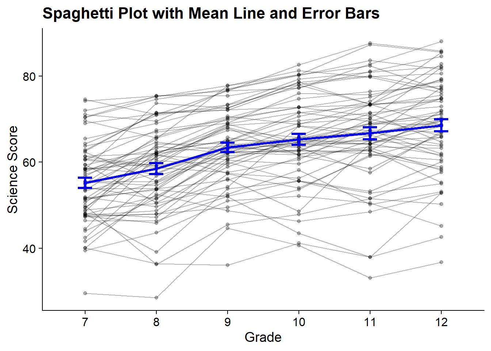

# Growth Mixture Models

------------------------------------------------------------------------

*Example: Longitudinal Study of American Youth*

**Data source:** : This example looks at science IRT scores over time (Grades 7-12). [See documentation here](https://www.lsay.org/). Covariates include gender and interest in science issues in 7th grade.

------------------------------------------------------------------------

## Load Packages


``` r
library(tidyverse)
library(MplusAutomation)
library(here)
library(DiagrammeR)
library(glue)
library(cowplot)
library(gt)
library(Hmisc)
```

------------------------------------------------------------------------

## Path Diagram


```{=html}
<div class="grViz html-widget html-fill-item" id="htmlwidget-1f7fb48977261761d76a" style="width:672px;height:480px;"></div>
<script type="application/json" data-for="htmlwidget-1f7fb48977261761d76a">{"x":{"diagram":" digraph gmm_model {\n\n# The `graph` statement - No editing needed\n\n    graph [layout = dot, overlap = true]\n \n# Two `node` statements\n \n# One for measured variables (box) \n\n    node [shape=box]\n    sci7 sci8 sci9 sci10 sci11 sci12;\n \n# Three for latent variables (circle) \n \n    node [shape=circle, width=1.2, height=1.2, fixedsize=true]\n    sci [label=<Science <br/>C<sub>k<\/sub>>];\n    int [label=Intercept];\n    slope [label=Slope];    \n\n# `edge` statements\n \n    edge [minlen = 2]\n    sci -> int\n    sci -> slope\n    int -> {sci7 sci8 sci9 sci10 sci11 sci12}[headport = n]\n    slope -> {sci7 sci8 sci9 sci10 sci11 sci12} [headport = n]\n \n }","config":{"engine":"dot","options":null}},"evals":[],"jsHooks":[]}</script>
```


------------------------------------------------------------------------

Read in LSAY dataset


``` r
lsay_sci <- read_csv(here("data","lsay_sci_gmm.csv")) %>% 
  rename(
    id = CASENUM,
    female = GENDER,
    interest7 = AB34D,
    sci7 = ASCIIRT,
    sci8 = CSCIIRT,
    sci9 = ESCIIRT, 
    sci10 = GSCIIRT,
    sci11 = ISCIIRT,
    sci12 = KSCIIRT
  ) %>% 
  mutate(female = ifelse(female == 1, 1, 0))
```

------------------------------------------------------------------------

### Descriptive Statistics


``` r
lsay_sci %>% 
  select(-id) %>% 
  psych::describe()
#>           vars    n  mean    sd median trimmed   mad   min
#> female       1 5945  0.49  0.50   0.00    0.49  0.00  0.00
#> interest7    2 2992  1.80  0.76   2.00    1.76  1.48  1.00
#> sci7         3 3071 50.41 10.20  50.04   50.18 11.33 26.14
#> sci8         4 2527 54.05 11.16  54.64   54.25 12.11 22.82
#> sci9         5 2326 58.69 11.24  60.40   59.15 11.05 27.36
#> sci10        6 4690 60.32 11.02  60.84   60.50 11.72 26.97
#> sci11        7 3592 64.10 11.21  64.75   64.51 11.10 24.44
#> sci12        8 2826 65.85 11.65  66.25   66.28 11.14 26.38
#>             max range  skew kurtosis   se
#> female     1.00  1.00  0.04    -2.00 0.01
#> interest7  3.00  2.00  0.34    -1.20 0.01
#> sci7      88.03 61.89  0.20    -0.46 0.18
#> sci8      83.94 61.12 -0.17    -0.65 0.22
#> sci9      91.21 63.85 -0.35    -0.40 0.23
#> sci10     91.33 64.36 -0.14    -0.43 0.16
#> sci11     93.13 68.69 -0.34    -0.17 0.19
#> sci12     95.56 69.18 -0.35     0.02 0.22
```

------------------------------------------------------------------------

#### Correlation Table


``` r
cor_data <- lsay_sci %>% 
  select(-id)

rcorr(as.matrix(cor_data)) 
#>           female interest7  sci7  sci8  sci9 sci10 sci11
#> female      1.00     -0.15 -0.07 -0.01 -0.05 -0.09 -0.11
#> interest7  -0.15      1.00  0.24  0.24  0.25  0.26  0.22
#> sci7       -0.07      0.24  1.00  0.81  0.76  0.75  0.74
#> sci8       -0.01      0.24  0.81  1.00  0.85  0.81  0.81
#> sci9       -0.05      0.25  0.76  0.85  1.00  0.88  0.86
#> sci10      -0.09      0.26  0.75  0.81  0.88  1.00  0.88
#> sci11      -0.11      0.22  0.74  0.81  0.86  0.88  1.00
#> sci12      -0.14      0.26  0.74  0.76  0.82  0.83  0.90
#>           sci12
#> female    -0.14
#> interest7  0.26
#> sci7       0.74
#> sci8       0.76
#> sci9       0.82
#> sci10      0.83
#> sci11      0.90
#> sci12      1.00
#> 
#> n
#>           female interest7 sci7 sci8 sci9 sci10 sci11 sci12
#> female      5945      2992 3071 2527 2326  4690  3592  2826
#> interest7   2992      2992 2951 2431 2236  1907  1531  1103
#> sci7        3071      2951 3071 2494 2297  1958  1573  1134
#> sci8        2527      2431 2494 2527 2067  1745  1436  1051
#> sci9        2326      2236 2297 2067 2326  1792  1432  1043
#> sci10       4690      1907 1958 1745 1792  4690  3323  2621
#> sci11       3592      1531 1573 1436 1432  3323  3592  2433
#> sci12       2826      1103 1134 1051 1043  2621  2433  2826
#> 
#> P
#>           female interest7 sci7   sci8   sci9   sci10 
#> female           0.0000    0.0003 0.6275 0.0264 0.0000
#> interest7 0.0000           0.0000 0.0000 0.0000 0.0000
#> sci7      0.0003 0.0000           0.0000 0.0000 0.0000
#> sci8      0.6275 0.0000    0.0000        0.0000 0.0000
#> sci9      0.0264 0.0000    0.0000 0.0000        0.0000
#> sci10     0.0000 0.0000    0.0000 0.0000 0.0000       
#> sci11     0.0000 0.0000    0.0000 0.0000 0.0000 0.0000
#> sci12     0.0000 0.0000    0.0000 0.0000 0.0000 0.0000
#>           sci11  sci12 
#> female    0.0000 0.0000
#> interest7 0.0000 0.0000
#> sci7      0.0000 0.0000
#> sci8      0.0000 0.0000
#> sci9      0.0000 0.0000
#> sci10     0.0000 0.0000
#> sci11            0.0000
#> sci12     0.0000
```

------------------------------------------------------------------------

#### Spaghetti Plot


``` r
plot_data <- lsay_sci[1:500,] %>%
  drop_na() %>% 
  pivot_longer(cols = starts_with("sci"),  
               names_to = "grade",          
               values_to = "value") %>% 
  mutate(grade = factor(grade, 
                        levels = c("sci7", "sci8", "sci9", "sci10", "sci11", "sci12"), 
                        labels = c(7,8,9,10,11,12)))

mean_sci <- plot_data %>%
  drop_na() %>% 
  group_by(grade) %>%
  summarise(mean_response = mean(value),
            se_response = sd(value) / sqrt(n()))

ggplot() +                                                                   
  geom_point(data = plot_data, aes(x = grade, y = value, group = id), alpha = .3) +     
  geom_line(data = plot_data, aes(x = grade, y = value, group = id), alpha = .3) +      
  geom_point(data=mean_sci, aes(x=grade, y = mean_response), color = "Blue", size = 1.2) +               
  geom_line(data=mean_sci, aes(x=grade, y = mean_response, group = 1), color = "blue", size = 1.2) + 
  geom_errorbar(data = mean_sci, aes(x = grade, ymin = mean_response - se_response, 
                                      ymax = mean_response + se_response),
                width = 0.2, size = 1.2, color = "blue") +  
  labs(title = "Spaghetti Plot with Mean Line and Error Bars",
       x="Grade", 
       y="Science Score") +                                                           
  theme_cowplot()                                                                              
```



------------------------------------------------------------------------

### Unconditional Growth Mixture Model 

This MplusAutomation code loops through the class-specific statements to include freeing variances and covariances.


``` r
gmm_6 <- lapply(1:6, function(k){ 
  
  # This MODEL section changes the model specification
  MODEL <- paste(sapply(1:k, function(i) {
    glue("
    %c#{i}%
    s WITH I;      ! covariances are freely estimated
    sci7-sci12;    ! variances are freely estimated
    ")
  }), collapse = "\n")
  
  gmm_enum  <- mplusObject(
    TITLE = glue("GMM {k}-Class"), 
    
    VARIABLE = glue(
    "usevar = sci7-sci12; 
     classes = c({k}); "),
    
  ANALYSIS = 
   "estimator = mlr; 
    type = mixture;
    starts = 200 100; 
    processors = 12;",
    
    MODEL = glue("%OVERALL%
       i s | sci7@0 sci8@1 sci9@2 sci10@3 sci11@4 sci12@5;
       
       {MODEL}"), # The `MODEL` object is placed here.
    
    OUTPUT = "tech1 tech11 tech14 sampstat standardized svalues;",
    
  SAVEDATA = 
    glue("FILE IS savedata_c{k}.dat;
     SAVE = cprobabilities;"),
  
  PLOT = "type=plot3;
          series = sci7-sci12(*)",
  
  usevariables = colnames(lsay_sci),
  rdata = lsay_sci)

gmm_enum_fit <- mplusModeler(gmm_enum, 
                            dataout=glue(here("gmm", "gmm_enum", "gmm_lsay.dat")),
                            modelout=glue(here("gmm", "gmm_enum", "c{k}_gmm_lsay.inp")) ,
                            check=TRUE, run = TRUE, hashfilename = FALSE)
})

```

------------------------------------------------------------------------

#### Table of Fit 

First, extract data:


``` r

output_gmm <- readModels(here("gmm","gmm_enum"), filefilter = "gmm", quiet = TRUE)

# Extract fit indices
enum_extract <- LatexSummaryTable(
  output_gmm,
  keepCols = c(
    "Title",
    "Parameters",
    "LL",
    "BIC",
    "aBIC",
    "BLRT_PValue",
    "T11_VLMR_PValue",
    "Observations"
  ),
  sortBy = "Title"
)

# Extract lowest class size
min_sizes <- map_df(names(output_gmm), ~ {
  model <- output_gmm[[.x]]
  min_size <- min(model$class_counts$modelEstimated$proportion) * 100
  tibble(Model = .x, min_cs = round(min_size, 2))
})

# Combine dataframe
combined <- cbind(enum_extract, min_sizes)

# Calculate additional fit indices
allFit <- combined %>%
  mutate(CAIC = -2 * LL + Parameters * (log(Observations) + 1)) %>%
  mutate(AWE = -2 * LL + 2 * Parameters * (log(Observations) + 1.5)) %>%
  mutate(SIC = -.5 * BIC) %>%
  mutate(expSIC = exp(SIC - max(SIC))) %>%
  mutate(BF = exp(SIC - lead(SIC))) %>%
  mutate(cmPk = expSIC / sum(expSIC)) %>%
  dplyr::select(Title, Parameters, min_cs, LL, BIC, aBIC, CAIC, AWE, BLRT_PValue, T11_VLMR_PValue, BF, cmPk) %>%
  arrange(Parameters)
```


Then, create table:


``` r
fit_table1 <- allFit %>%
  gt() %>%
  tab_header(title = md("**Model Fit Summary Table**")) %>%
  cols_label(
    Title = "Classes",
    Parameters = md("Par"),
    min_cs = md("Min. Class Size"),
    LL = md("*LL*"),
    T11_VLMR_PValue = "VLMR",
    BLRT_PValue = "BLRT",
    BF = md("BF"),
    cmPk = md("*cmPk*")
  ) %>%
  tab_footnote(
    footnote = md(
      "*Note.* Par = Parameters; *LL* = model log likelihood;
BIC = Bayesian information criterion;
aBIC = sample size adjusted BIC; CAIC = consistent Akaike information criterion;
AWE = approximate weight of evidence criterion;
BLRT = bootstrapped likelihood ratio test p-value;
VLMR = Vuong-Lo-Mendell-Rubin adjusted likelihood ratio test p-value;
*cmPk* = approximate correct model probability."
    ),
locations = cells_title()
  ) %>%
  tab_options(column_labels.font.weight = "bold") %>%
  fmt_number(c(3:8),
             decimals = 2) %>%
  fmt_missing(1:12,
              missing_text = "--") %>%
  fmt(
    c(9:10, 12),
    fns = function(x)
      ifelse(x < 0.001, "<.001",
             scales::number(x, accuracy = .01))
  ) %>%
  fmt(
    11,
    fns = function (x)
      ifelse(x > 100, ">100",
             scales::number(x, accuracy = .01))
  ) %>%  
  tab_style(
    style = list(
      cell_text(weight = "bold")
      ),
    locations = list(cells_body(
     columns = BIC,
     row = BIC == min(BIC[c(1:6)]) # Change this to the number of classes you estimated
    ),
    cells_body(
     columns = aBIC,
     row = aBIC == min(aBIC[1:6])
    ),
    cells_body(
     columns = CAIC,
     row = CAIC == min(CAIC[1:6])
    ),
    cells_body(
     columns = AWE,
     row = AWE == min(AWE[1:6])
    ),
    cells_body(
     columns = cmPk,
     row =  cmPk == max(cmPk[1:6])
     ),    
    cells_body(
     columns = BF,
     row =  BF > 10),
    cells_body( 
     columns =  T11_VLMR_PValue,
     row =  ifelse(T11_VLMR_PValue < .001 & lead(T11_VLMR_PValue) > .05, T11_VLMR_PValue < .001, NA)),
    cells_body(
     columns =  BLRT_PValue,
     row =  ifelse(BLRT_PValue < .001 & lead(BLRT_PValue) > .05, BLRT_PValue < .001, NA))
  )
)

fit_table1
```


```{=html}
<div id="vkeommaizf" style="padding-left:0px;padding-right:0px;padding-top:10px;padding-bottom:10px;overflow-x:auto;overflow-y:auto;width:auto;height:auto;">
<style>#vkeommaizf table {
  font-family: system-ui, 'Segoe UI', Roboto, Helvetica, Arial, sans-serif, 'Apple Color Emoji', 'Segoe UI Emoji', 'Segoe UI Symbol', 'Noto Color Emoji';
  -webkit-font-smoothing: antialiased;
  -moz-osx-font-smoothing: grayscale;
}

#vkeommaizf thead, #vkeommaizf tbody, #vkeommaizf tfoot, #vkeommaizf tr, #vkeommaizf td, #vkeommaizf th {
  border-style: none;
}

#vkeommaizf p {
  margin: 0;
  padding: 0;
}

#vkeommaizf .gt_table {
  display: table;
  border-collapse: collapse;
  line-height: normal;
  margin-left: auto;
  margin-right: auto;
  color: #333333;
  font-size: 16px;
  font-weight: normal;
  font-style: normal;
  background-color: #FFFFFF;
  width: auto;
  border-top-style: solid;
  border-top-width: 2px;
  border-top-color: #A8A8A8;
  border-right-style: none;
  border-right-width: 2px;
  border-right-color: #D3D3D3;
  border-bottom-style: solid;
  border-bottom-width: 2px;
  border-bottom-color: #A8A8A8;
  border-left-style: none;
  border-left-width: 2px;
  border-left-color: #D3D3D3;
}

#vkeommaizf .gt_caption {
  padding-top: 4px;
  padding-bottom: 4px;
}

#vkeommaizf .gt_title {
  color: #333333;
  font-size: 125%;
  font-weight: initial;
  padding-top: 4px;
  padding-bottom: 4px;
  padding-left: 5px;
  padding-right: 5px;
  border-bottom-color: #FFFFFF;
  border-bottom-width: 0;
}

#vkeommaizf .gt_subtitle {
  color: #333333;
  font-size: 85%;
  font-weight: initial;
  padding-top: 3px;
  padding-bottom: 5px;
  padding-left: 5px;
  padding-right: 5px;
  border-top-color: #FFFFFF;
  border-top-width: 0;
}

#vkeommaizf .gt_heading {
  background-color: #FFFFFF;
  text-align: center;
  border-bottom-color: #FFFFFF;
  border-left-style: none;
  border-left-width: 1px;
  border-left-color: #D3D3D3;
  border-right-style: none;
  border-right-width: 1px;
  border-right-color: #D3D3D3;
}

#vkeommaizf .gt_bottom_border {
  border-bottom-style: solid;
  border-bottom-width: 2px;
  border-bottom-color: #D3D3D3;
}

#vkeommaizf .gt_col_headings {
  border-top-style: solid;
  border-top-width: 2px;
  border-top-color: #D3D3D3;
  border-bottom-style: solid;
  border-bottom-width: 2px;
  border-bottom-color: #D3D3D3;
  border-left-style: none;
  border-left-width: 1px;
  border-left-color: #D3D3D3;
  border-right-style: none;
  border-right-width: 1px;
  border-right-color: #D3D3D3;
}

#vkeommaizf .gt_col_heading {
  color: #333333;
  background-color: #FFFFFF;
  font-size: 100%;
  font-weight: bold;
  text-transform: inherit;
  border-left-style: none;
  border-left-width: 1px;
  border-left-color: #D3D3D3;
  border-right-style: none;
  border-right-width: 1px;
  border-right-color: #D3D3D3;
  vertical-align: bottom;
  padding-top: 5px;
  padding-bottom: 6px;
  padding-left: 5px;
  padding-right: 5px;
  overflow-x: hidden;
}

#vkeommaizf .gt_column_spanner_outer {
  color: #333333;
  background-color: #FFFFFF;
  font-size: 100%;
  font-weight: bold;
  text-transform: inherit;
  padding-top: 0;
  padding-bottom: 0;
  padding-left: 4px;
  padding-right: 4px;
}

#vkeommaizf .gt_column_spanner_outer:first-child {
  padding-left: 0;
}

#vkeommaizf .gt_column_spanner_outer:last-child {
  padding-right: 0;
}

#vkeommaizf .gt_column_spanner {
  border-bottom-style: solid;
  border-bottom-width: 2px;
  border-bottom-color: #D3D3D3;
  vertical-align: bottom;
  padding-top: 5px;
  padding-bottom: 5px;
  overflow-x: hidden;
  display: inline-block;
  width: 100%;
}

#vkeommaizf .gt_spanner_row {
  border-bottom-style: hidden;
}

#vkeommaizf .gt_group_heading {
  padding-top: 8px;
  padding-bottom: 8px;
  padding-left: 5px;
  padding-right: 5px;
  color: #333333;
  background-color: #FFFFFF;
  font-size: 100%;
  font-weight: initial;
  text-transform: inherit;
  border-top-style: solid;
  border-top-width: 2px;
  border-top-color: #D3D3D3;
  border-bottom-style: solid;
  border-bottom-width: 2px;
  border-bottom-color: #D3D3D3;
  border-left-style: none;
  border-left-width: 1px;
  border-left-color: #D3D3D3;
  border-right-style: none;
  border-right-width: 1px;
  border-right-color: #D3D3D3;
  vertical-align: middle;
  text-align: left;
}

#vkeommaizf .gt_empty_group_heading {
  padding: 0.5px;
  color: #333333;
  background-color: #FFFFFF;
  font-size: 100%;
  font-weight: initial;
  border-top-style: solid;
  border-top-width: 2px;
  border-top-color: #D3D3D3;
  border-bottom-style: solid;
  border-bottom-width: 2px;
  border-bottom-color: #D3D3D3;
  vertical-align: middle;
}

#vkeommaizf .gt_from_md > :first-child {
  margin-top: 0;
}

#vkeommaizf .gt_from_md > :last-child {
  margin-bottom: 0;
}

#vkeommaizf .gt_row {
  padding-top: 8px;
  padding-bottom: 8px;
  padding-left: 5px;
  padding-right: 5px;
  margin: 10px;
  border-top-style: solid;
  border-top-width: 1px;
  border-top-color: #D3D3D3;
  border-left-style: none;
  border-left-width: 1px;
  border-left-color: #D3D3D3;
  border-right-style: none;
  border-right-width: 1px;
  border-right-color: #D3D3D3;
  vertical-align: middle;
  overflow-x: hidden;
}

#vkeommaizf .gt_stub {
  color: #333333;
  background-color: #FFFFFF;
  font-size: 100%;
  font-weight: initial;
  text-transform: inherit;
  border-right-style: solid;
  border-right-width: 2px;
  border-right-color: #D3D3D3;
  padding-left: 5px;
  padding-right: 5px;
}

#vkeommaizf .gt_stub_row_group {
  color: #333333;
  background-color: #FFFFFF;
  font-size: 100%;
  font-weight: initial;
  text-transform: inherit;
  border-right-style: solid;
  border-right-width: 2px;
  border-right-color: #D3D3D3;
  padding-left: 5px;
  padding-right: 5px;
  vertical-align: top;
}

#vkeommaizf .gt_row_group_first td {
  border-top-width: 2px;
}

#vkeommaizf .gt_row_group_first th {
  border-top-width: 2px;
}

#vkeommaizf .gt_summary_row {
  color: #333333;
  background-color: #FFFFFF;
  text-transform: inherit;
  padding-top: 8px;
  padding-bottom: 8px;
  padding-left: 5px;
  padding-right: 5px;
}

#vkeommaizf .gt_first_summary_row {
  border-top-style: solid;
  border-top-color: #D3D3D3;
}

#vkeommaizf .gt_first_summary_row.thick {
  border-top-width: 2px;
}

#vkeommaizf .gt_last_summary_row {
  padding-top: 8px;
  padding-bottom: 8px;
  padding-left: 5px;
  padding-right: 5px;
  border-bottom-style: solid;
  border-bottom-width: 2px;
  border-bottom-color: #D3D3D3;
}

#vkeommaizf .gt_grand_summary_row {
  color: #333333;
  background-color: #FFFFFF;
  text-transform: inherit;
  padding-top: 8px;
  padding-bottom: 8px;
  padding-left: 5px;
  padding-right: 5px;
}

#vkeommaizf .gt_first_grand_summary_row {
  padding-top: 8px;
  padding-bottom: 8px;
  padding-left: 5px;
  padding-right: 5px;
  border-top-style: double;
  border-top-width: 6px;
  border-top-color: #D3D3D3;
}

#vkeommaizf .gt_last_grand_summary_row_top {
  padding-top: 8px;
  padding-bottom: 8px;
  padding-left: 5px;
  padding-right: 5px;
  border-bottom-style: double;
  border-bottom-width: 6px;
  border-bottom-color: #D3D3D3;
}

#vkeommaizf .gt_striped {
  background-color: rgba(128, 128, 128, 0.05);
}

#vkeommaizf .gt_table_body {
  border-top-style: solid;
  border-top-width: 2px;
  border-top-color: #D3D3D3;
  border-bottom-style: solid;
  border-bottom-width: 2px;
  border-bottom-color: #D3D3D3;
}

#vkeommaizf .gt_footnotes {
  color: #333333;
  background-color: #FFFFFF;
  border-bottom-style: none;
  border-bottom-width: 2px;
  border-bottom-color: #D3D3D3;
  border-left-style: none;
  border-left-width: 2px;
  border-left-color: #D3D3D3;
  border-right-style: none;
  border-right-width: 2px;
  border-right-color: #D3D3D3;
}

#vkeommaizf .gt_footnote {
  margin: 0px;
  font-size: 90%;
  padding-top: 4px;
  padding-bottom: 4px;
  padding-left: 5px;
  padding-right: 5px;
}

#vkeommaizf .gt_sourcenotes {
  color: #333333;
  background-color: #FFFFFF;
  border-bottom-style: none;
  border-bottom-width: 2px;
  border-bottom-color: #D3D3D3;
  border-left-style: none;
  border-left-width: 2px;
  border-left-color: #D3D3D3;
  border-right-style: none;
  border-right-width: 2px;
  border-right-color: #D3D3D3;
}

#vkeommaizf .gt_sourcenote {
  font-size: 90%;
  padding-top: 4px;
  padding-bottom: 4px;
  padding-left: 5px;
  padding-right: 5px;
}

#vkeommaizf .gt_left {
  text-align: left;
}

#vkeommaizf .gt_center {
  text-align: center;
}

#vkeommaizf .gt_right {
  text-align: right;
  font-variant-numeric: tabular-nums;
}

#vkeommaizf .gt_font_normal {
  font-weight: normal;
}

#vkeommaizf .gt_font_bold {
  font-weight: bold;
}

#vkeommaizf .gt_font_italic {
  font-style: italic;
}

#vkeommaizf .gt_super {
  font-size: 65%;
}

#vkeommaizf .gt_footnote_marks {
  font-size: 75%;
  vertical-align: 0.4em;
  position: initial;
}

#vkeommaizf .gt_asterisk {
  font-size: 100%;
  vertical-align: 0;
}

#vkeommaizf .gt_indent_1 {
  text-indent: 5px;
}

#vkeommaizf .gt_indent_2 {
  text-indent: 10px;
}

#vkeommaizf .gt_indent_3 {
  text-indent: 15px;
}

#vkeommaizf .gt_indent_4 {
  text-indent: 20px;
}

#vkeommaizf .gt_indent_5 {
  text-indent: 25px;
}

#vkeommaizf .katex-display {
  display: inline-flex !important;
  margin-bottom: 0.75em !important;
}

#vkeommaizf div.Reactable > div.rt-table > div.rt-thead > div.rt-tr.rt-tr-group-header > div.rt-th-group:after {
  height: 0px !important;
}
</style>
<table class="gt_table" data-quarto-disable-processing="false" data-quarto-bootstrap="false">
  <thead>
    <tr class="gt_heading">
      <td colspan="12" class="gt_heading gt_title gt_font_normal gt_bottom_border" style><span class='gt_from_md'><strong>Model Fit Summary Table</strong></span><span class="gt_footnote_marks" style="white-space:nowrap;font-style:italic;font-weight:normal;line-height:0;"><sup>1</sup></span></td>
    </tr>
    
    <tr class="gt_col_headings">
      <th class="gt_col_heading gt_columns_bottom_border gt_left" rowspan="1" colspan="1" scope="col" id="Title">Classes</th>
      <th class="gt_col_heading gt_columns_bottom_border gt_right" rowspan="1" colspan="1" scope="col" id="Parameters"><span class='gt_from_md'>Par</span></th>
      <th class="gt_col_heading gt_columns_bottom_border gt_right" rowspan="1" colspan="1" scope="col" id="min_cs"><span class='gt_from_md'>Min. Class Size</span></th>
      <th class="gt_col_heading gt_columns_bottom_border gt_right" rowspan="1" colspan="1" scope="col" id="LL"><span class='gt_from_md'><em>LL</em></span></th>
      <th class="gt_col_heading gt_columns_bottom_border gt_right" rowspan="1" colspan="1" scope="col" id="BIC">BIC</th>
      <th class="gt_col_heading gt_columns_bottom_border gt_right" rowspan="1" colspan="1" scope="col" id="aBIC">aBIC</th>
      <th class="gt_col_heading gt_columns_bottom_border gt_right" rowspan="1" colspan="1" scope="col" id="CAIC">CAIC</th>
      <th class="gt_col_heading gt_columns_bottom_border gt_right" rowspan="1" colspan="1" scope="col" id="AWE">AWE</th>
      <th class="gt_col_heading gt_columns_bottom_border gt_right" rowspan="1" colspan="1" scope="col" id="BLRT_PValue">BLRT</th>
      <th class="gt_col_heading gt_columns_bottom_border gt_right" rowspan="1" colspan="1" scope="col" id="T11_VLMR_PValue">VLMR</th>
      <th class="gt_col_heading gt_columns_bottom_border gt_right" rowspan="1" colspan="1" scope="col" id="BF"><span class='gt_from_md'>BF</span></th>
      <th class="gt_col_heading gt_columns_bottom_border gt_right" rowspan="1" colspan="1" scope="col" id="cmPk"><span class='gt_from_md'><em>cmPk</em></span></th>
    </tr>
  </thead>
  <tbody class="gt_table_body">
    <tr><td headers="Title" class="gt_row gt_left">GMM 1-Class</td>
<td headers="Parameters" class="gt_row gt_right">11</td>
<td headers="min_cs" class="gt_row gt_right">100.00</td>
<td headers="LL" class="gt_row gt_right">−63,865.66</td>
<td headers="BIC" class="gt_row gt_right">127,826.77</td>
<td headers="aBIC" class="gt_row gt_right">127,791.82</td>
<td headers="CAIC" class="gt_row gt_right">127,837.77</td>
<td headers="AWE" class="gt_row gt_right">127,955.22</td>
<td headers="BLRT_PValue" class="gt_row gt_right">–</td>
<td headers="T11_VLMR_PValue" class="gt_row gt_right">–</td>
<td headers="BF" class="gt_row gt_right">0.00</td>
<td headers="cmPk" class="gt_row gt_right"><.001</td></tr>
    <tr><td headers="Title" class="gt_row gt_left">GMM 2-Class</td>
<td headers="Parameters" class="gt_row gt_right">21</td>
<td headers="min_cs" class="gt_row gt_right">40.34</td>
<td headers="LL" class="gt_row gt_right">−63,370.06</td>
<td headers="BIC" class="gt_row gt_right">126,922.33</td>
<td headers="aBIC" class="gt_row gt_right">126,855.60</td>
<td headers="CAIC" class="gt_row gt_right">126,943.33</td>
<td headers="AWE" class="gt_row gt_right">127,167.54</td>
<td headers="BLRT_PValue" class="gt_row gt_right"><.001</td>
<td headers="T11_VLMR_PValue" class="gt_row gt_right"><.001</td>
<td headers="BF" class="gt_row gt_right">0.00</td>
<td headers="cmPk" class="gt_row gt_right"><.001</td></tr>
    <tr><td headers="Title" class="gt_row gt_left">GMM 3-Class</td>
<td headers="Parameters" class="gt_row gt_right">31</td>
<td headers="min_cs" class="gt_row gt_right">28.75</td>
<td headers="LL" class="gt_row gt_right">−63,254.48</td>
<td headers="BIC" class="gt_row gt_right">126,777.95</td>
<td headers="aBIC" class="gt_row gt_right">126,679.44</td>
<td headers="CAIC" class="gt_row gt_right">126,808.95</td>
<td headers="AWE" class="gt_row gt_right" style="font-weight: bold;">127,139.93</td>
<td headers="BLRT_PValue" class="gt_row gt_right"><.001</td>
<td headers="T11_VLMR_PValue" class="gt_row gt_right">0.01</td>
<td headers="BF" class="gt_row gt_right">0.00</td>
<td headers="cmPk" class="gt_row gt_right"><.001</td></tr>
    <tr><td headers="Title" class="gt_row gt_left">GMM 4-Class</td>
<td headers="Parameters" class="gt_row gt_right">41</td>
<td headers="min_cs" class="gt_row gt_right">1.93</td>
<td headers="LL" class="gt_row gt_right">−63,192.38</td>
<td headers="BIC" class="gt_row gt_right" style="font-weight: bold;">126,740.50</td>
<td headers="aBIC" class="gt_row gt_right">126,610.22</td>
<td headers="CAIC" class="gt_row gt_right" style="font-weight: bold;">126,781.50</td>
<td headers="AWE" class="gt_row gt_right">127,219.26</td>
<td headers="BLRT_PValue" class="gt_row gt_right"><.001</td>
<td headers="T11_VLMR_PValue" class="gt_row gt_right">0.01</td>
<td headers="BF" class="gt_row gt_right" style="font-weight: bold;">17.80</td>
<td headers="cmPk" class="gt_row gt_right" style="font-weight: bold;">0.95</td></tr>
    <tr><td headers="Title" class="gt_row gt_left">GMM 5-Class</td>
<td headers="Parameters" class="gt_row gt_right">51</td>
<td headers="min_cs" class="gt_row gt_right">4.30</td>
<td headers="LL" class="gt_row gt_right">−63,151.87</td>
<td headers="BIC" class="gt_row gt_right">126,746.26</td>
<td headers="aBIC" class="gt_row gt_right">126,584.20</td>
<td headers="CAIC" class="gt_row gt_right">126,797.26</td>
<td headers="AWE" class="gt_row gt_right">127,341.78</td>
<td headers="BLRT_PValue" class="gt_row gt_right"><.001</td>
<td headers="T11_VLMR_PValue" class="gt_row gt_right">0.00</td>
<td headers="BF" class="gt_row gt_right" style="font-weight: bold;">>100</td>
<td headers="cmPk" class="gt_row gt_right">0.05</td></tr>
    <tr><td headers="Title" class="gt_row gt_left">GMM 6-Class</td>
<td headers="Parameters" class="gt_row gt_right">61</td>
<td headers="min_cs" class="gt_row gt_right">3.89</td>
<td headers="LL" class="gt_row gt_right">−63,117.02</td>
<td headers="BIC" class="gt_row gt_right">126,763.32</td>
<td headers="aBIC" class="gt_row gt_right" style="font-weight: bold;">126,569.49</td>
<td headers="CAIC" class="gt_row gt_right">126,824.32</td>
<td headers="AWE" class="gt_row gt_right">127,475.62</td>
<td headers="BLRT_PValue" class="gt_row gt_right"><.001</td>
<td headers="T11_VLMR_PValue" class="gt_row gt_right">0.04</td>
<td headers="BF" class="gt_row gt_right">–</td>
<td headers="cmPk" class="gt_row gt_right"><.001</td></tr>
  </tbody>
  
  <tfoot class="gt_footnotes">
    <tr>
      <td class="gt_footnote" colspan="12"><span class="gt_footnote_marks" style="white-space:nowrap;font-style:italic;font-weight:normal;line-height:0;"><sup>1</sup></span> <span class='gt_from_md'><em>Note.</em> Par = Parameters; <em>LL</em> = model log likelihood;
BIC = Bayesian information criterion;
aBIC = sample size adjusted BIC; CAIC = consistent Akaike information criterion;
AWE = approximate weight of evidence criterion;
BLRT = bootstrapped likelihood ratio test p-value;
VLMR = Vuong-Lo-Mendell-Rubin adjusted likelihood ratio test p-value;
<em>cmPk</em> = approximate correct model probability.</span></td>
    </tr>
  </tfoot>
</table>
</div>
```


------------------------------------------------------------------------

#### Information Criteria Plot


``` r
allFit %>%
  dplyr::select(LL:AWE) %>%
  rowid_to_column() %>%
  pivot_longer(`BIC`:`AWE`,
               names_to = "Index",
               values_to = "ic_value") %>%
  mutate(Index = factor(Index,
                        levels = c ("AWE", "CAIC", "BIC", "aBIC"))) %>%
  ggplot(aes(
    x = rowid,
    y = ic_value,
    color = Index,
    shape = Index,
    group = Index,
    lty = Index
  )) +
  geom_point(size = 2.0) + geom_line(size = .8) +
  scale_x_continuous(breaks = 1:nrow(allFit)) +
  scale_colour_grey(end = .5) +
  theme_cowplot() +
  labs(x = "Number of Classes", y = "Information Criteria Value", title = "Information Criteria") +
  theme(
    text = element_text(family = "Times", size = 12),
    legend.text = element_text(family="Times", size=12),
    legend.key.width = unit(3, "line"),
    legend.title = element_blank(),
    legend.position = "top"  
  )
```


------------------------------------------------------------------------

#### Plot GMM


``` r
plotGrowthMixtures(output_gmm, estimated = TRUE, rawdata = TRUE, 
                   time_scale = c(1, 2, 3, 4, 5, 6), alpha_range = c(0, 0.01))
```


------------------------------------------------------------------------

### Covariates Growth Mixture Model 

Two covariates were used in the GMM analysis and were related to the latent class variable: gender and interest in science issues in 7th grade.


``` r

step1  <- mplusObject(
  TITLE = "GMM with Covariates", 
  VARIABLE = 
  "usevar = sci7-sci12
  female interest7;
    
   classes = c(4);",
  
  ANALYSIS = 
   "estimator = mlr; 
    type = mixture;
    starts = 200 100; 
    processors = 12;",
  
  MODEL = 
    "%OVERALL%
    
    i s on female interest7;
    
    i s | sci7@0 sci8@1 sci9@2 sci10@3 sci11@4 sci12@5;
    
    %c#1%
    s WITH I;      ! covariances are freely estimated
    sci7-sci12;    ! variances are freely estimated
    i s on female interest7;
    
    %c#2%
    s WITH I;     
    sci7-sci12;   
    i s on female interest7;
    
    %c#3%
    s WITH I;     
    sci7-sci12;    
    i s on female interest7;
    
    %c#4%
    s WITH I;     
    sci7-sci12;   
    i s on female interest7;",
  
  OUTPUT = "tech1 tech11 tech14 sampstat standardized svalues;",
    
  SAVEDATA = 
    glue("FILE IS savedata_c4.dat;
     SAVE = cprobabilities;"),
  
  PLOT = "type=plot3;
          series = sci7-sci12(*)",
  
  usevariables = colnames(lsay_sci),
  rdata = lsay_sci)

step1_fit <- mplusModeler(step1,
                            dataout=here("gmm", "gmm_cov", "gmm_cov.dat"),
                            modelout=here("gmm", "gmm_cov", "gmm_cov.inp") ,
                            check=TRUE, run = TRUE, hashfilename = FALSE)
```

#### Plot GMM


``` r
gmm_cov <- readModels(here("gmm", "gmm_cov", "gmm_cov.out"))

plotGrowthMixtures(gmm_cov, estimated = TRUE, rawdata = TRUE, 
                   time_scale = c(1, 2, 3, 4, 5, 6), alpha_range = c(0, 0.01), bw = TRUE)
```


<div style="text-align: center;"></div>
