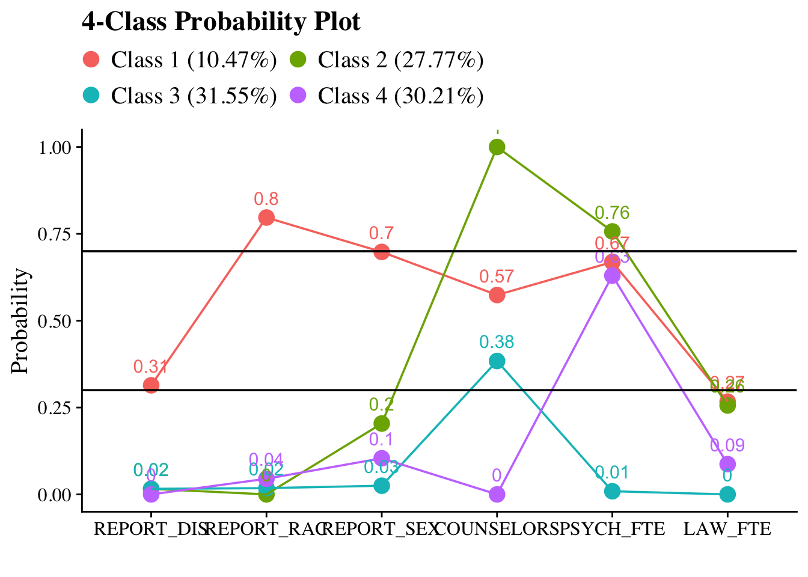
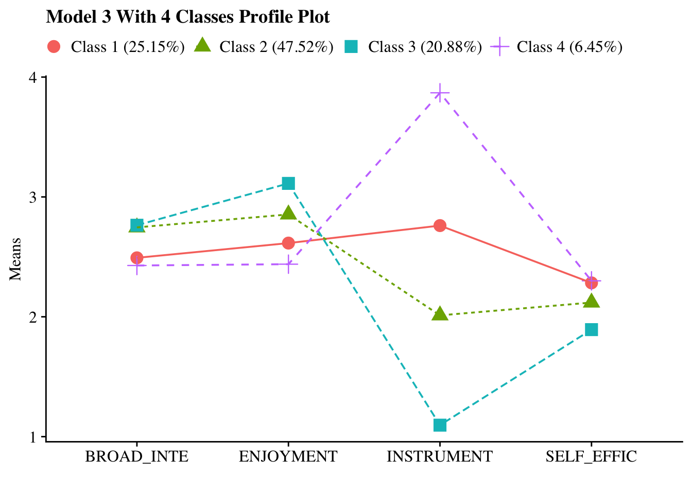

# Class Homogeneity

------------------------------------------------------------------------

## Load packages


``` r
library(naniar)
library(tidyverse)
library(haven)
library(glue)
library(MplusAutomation)
library(here)
library(janitor)
library(gt)
library(tidyLPA)
library(pisaUSA15)
library(cowplot)
library(filesstrings)
library(patchwork)
library(RcppAlgos)
```

------------------------------------------------------------------------

## LCA

Continuing the LCA example (\@ref(lca-enum)) in this bookdown, use R to evaluate the LCA class homogeneity.

------------------------------------------------------------------------

We want a high degree of homogeneity (small variance) within each class (i.e., people in each class are not identical but are more similar to each other than to people in different classes).

Class-specific response probabilities above .70 or below .30 indicate high homogeneity in that particular class for that specific item. For a binary variable, $X$, $Var(X) = p(1-p)$. The largest variance possible for a binary variable is when $p = .5$, the smallest variance (0) is when $p = 0$ or $p = 1$.

The easiest way is to visualize the item probability plot:


``` r
source(here("functions", "plot_lca.R"))

# Read in model
output_enum <- readModels(here("enum"), filefilter = "bully", quiet = TRUE)

# Change this to look at your chosen LCA model
chosen_model <- output_enum$c4_bully.out

# Add lines
plot_lca(chosen_model) + geom_hline(yintercept = c(0.7, 0.3))
```



Or create a table:


``` r
# Read in model
output_enum <- readModels(here("enum"), filefilter = "bully", quiet = TRUE)

# Change this to look at your chosen LCA model
chosen_model <- output_enum$c4_bully.out

# Extract table of probabilities
probabilities <- data.frame(chosen_model$parameters$probability.scale) %>%
  mutate(LatentClass = sub("^", "Class ", LatentClass)) %>%
  filter(category == 2) %>%
  dplyr::select(est, LatentClass, param) %>%
  pivot_wider(names_from = LatentClass, values_from = est) %>%
  relocate(param, .after = last_col()) %>%
  rename(Items = param)

# Bold above .7 and below .3
bold_condition <- function(x) {
  ifelse(x > 0.7 | x < 0.3, paste0("**", sprintf("%.3f", x), "**"),
         sprintf("%.3f", x))
}

# Apply the bold formatting condition to the table
homogeneity <- probabilities %>%
  mutate(across(where(is.numeric), ~ sapply(., bold_condition))) %>% 
  relocate(Items, .before = 1)


# Display the formatted table and percentage
homogeneity %>%
  gt()  %>%
  cols_label(
    Items = "Item"
  ) %>%
  fmt_number(
    columns = everything(),
    decimals = 3
  ) %>%
  tab_header(
    title = "Class Homogeneity Table"
  ) %>%
  fmt_markdown(columns = everything()) %>% 
  tab_footnote(
    footnote = "Cells in bold indicate probabilities > 0.7 or < 0.3"
  )
```


```{=html}
<div id="nffzyuxvnm" style="padding-left:0px;padding-right:0px;padding-top:10px;padding-bottom:10px;overflow-x:auto;overflow-y:auto;width:auto;height:auto;">
<style>#nffzyuxvnm table {
  font-family: system-ui, 'Segoe UI', Roboto, Helvetica, Arial, sans-serif, 'Apple Color Emoji', 'Segoe UI Emoji', 'Segoe UI Symbol', 'Noto Color Emoji';
  -webkit-font-smoothing: antialiased;
  -moz-osx-font-smoothing: grayscale;
}

#nffzyuxvnm thead, #nffzyuxvnm tbody, #nffzyuxvnm tfoot, #nffzyuxvnm tr, #nffzyuxvnm td, #nffzyuxvnm th {
  border-style: none;
}

#nffzyuxvnm p {
  margin: 0;
  padding: 0;
}

#nffzyuxvnm .gt_table {
  display: table;
  border-collapse: collapse;
  line-height: normal;
  margin-left: auto;
  margin-right: auto;
  color: #333333;
  font-size: 16px;
  font-weight: normal;
  font-style: normal;
  background-color: #FFFFFF;
  width: auto;
  border-top-style: solid;
  border-top-width: 2px;
  border-top-color: #A8A8A8;
  border-right-style: none;
  border-right-width: 2px;
  border-right-color: #D3D3D3;
  border-bottom-style: solid;
  border-bottom-width: 2px;
  border-bottom-color: #A8A8A8;
  border-left-style: none;
  border-left-width: 2px;
  border-left-color: #D3D3D3;
}

#nffzyuxvnm .gt_caption {
  padding-top: 4px;
  padding-bottom: 4px;
}

#nffzyuxvnm .gt_title {
  color: #333333;
  font-size: 125%;
  font-weight: initial;
  padding-top: 4px;
  padding-bottom: 4px;
  padding-left: 5px;
  padding-right: 5px;
  border-bottom-color: #FFFFFF;
  border-bottom-width: 0;
}

#nffzyuxvnm .gt_subtitle {
  color: #333333;
  font-size: 85%;
  font-weight: initial;
  padding-top: 3px;
  padding-bottom: 5px;
  padding-left: 5px;
  padding-right: 5px;
  border-top-color: #FFFFFF;
  border-top-width: 0;
}

#nffzyuxvnm .gt_heading {
  background-color: #FFFFFF;
  text-align: center;
  border-bottom-color: #FFFFFF;
  border-left-style: none;
  border-left-width: 1px;
  border-left-color: #D3D3D3;
  border-right-style: none;
  border-right-width: 1px;
  border-right-color: #D3D3D3;
}

#nffzyuxvnm .gt_bottom_border {
  border-bottom-style: solid;
  border-bottom-width: 2px;
  border-bottom-color: #D3D3D3;
}

#nffzyuxvnm .gt_col_headings {
  border-top-style: solid;
  border-top-width: 2px;
  border-top-color: #D3D3D3;
  border-bottom-style: solid;
  border-bottom-width: 2px;
  border-bottom-color: #D3D3D3;
  border-left-style: none;
  border-left-width: 1px;
  border-left-color: #D3D3D3;
  border-right-style: none;
  border-right-width: 1px;
  border-right-color: #D3D3D3;
}

#nffzyuxvnm .gt_col_heading {
  color: #333333;
  background-color: #FFFFFF;
  font-size: 100%;
  font-weight: normal;
  text-transform: inherit;
  border-left-style: none;
  border-left-width: 1px;
  border-left-color: #D3D3D3;
  border-right-style: none;
  border-right-width: 1px;
  border-right-color: #D3D3D3;
  vertical-align: bottom;
  padding-top: 5px;
  padding-bottom: 6px;
  padding-left: 5px;
  padding-right: 5px;
  overflow-x: hidden;
}

#nffzyuxvnm .gt_column_spanner_outer {
  color: #333333;
  background-color: #FFFFFF;
  font-size: 100%;
  font-weight: normal;
  text-transform: inherit;
  padding-top: 0;
  padding-bottom: 0;
  padding-left: 4px;
  padding-right: 4px;
}

#nffzyuxvnm .gt_column_spanner_outer:first-child {
  padding-left: 0;
}

#nffzyuxvnm .gt_column_spanner_outer:last-child {
  padding-right: 0;
}

#nffzyuxvnm .gt_column_spanner {
  border-bottom-style: solid;
  border-bottom-width: 2px;
  border-bottom-color: #D3D3D3;
  vertical-align: bottom;
  padding-top: 5px;
  padding-bottom: 5px;
  overflow-x: hidden;
  display: inline-block;
  width: 100%;
}

#nffzyuxvnm .gt_spanner_row {
  border-bottom-style: hidden;
}

#nffzyuxvnm .gt_group_heading {
  padding-top: 8px;
  padding-bottom: 8px;
  padding-left: 5px;
  padding-right: 5px;
  color: #333333;
  background-color: #FFFFFF;
  font-size: 100%;
  font-weight: initial;
  text-transform: inherit;
  border-top-style: solid;
  border-top-width: 2px;
  border-top-color: #D3D3D3;
  border-bottom-style: solid;
  border-bottom-width: 2px;
  border-bottom-color: #D3D3D3;
  border-left-style: none;
  border-left-width: 1px;
  border-left-color: #D3D3D3;
  border-right-style: none;
  border-right-width: 1px;
  border-right-color: #D3D3D3;
  vertical-align: middle;
  text-align: left;
}

#nffzyuxvnm .gt_empty_group_heading {
  padding: 0.5px;
  color: #333333;
  background-color: #FFFFFF;
  font-size: 100%;
  font-weight: initial;
  border-top-style: solid;
  border-top-width: 2px;
  border-top-color: #D3D3D3;
  border-bottom-style: solid;
  border-bottom-width: 2px;
  border-bottom-color: #D3D3D3;
  vertical-align: middle;
}

#nffzyuxvnm .gt_from_md > :first-child {
  margin-top: 0;
}

#nffzyuxvnm .gt_from_md > :last-child {
  margin-bottom: 0;
}

#nffzyuxvnm .gt_row {
  padding-top: 8px;
  padding-bottom: 8px;
  padding-left: 5px;
  padding-right: 5px;
  margin: 10px;
  border-top-style: solid;
  border-top-width: 1px;
  border-top-color: #D3D3D3;
  border-left-style: none;
  border-left-width: 1px;
  border-left-color: #D3D3D3;
  border-right-style: none;
  border-right-width: 1px;
  border-right-color: #D3D3D3;
  vertical-align: middle;
  overflow-x: hidden;
}

#nffzyuxvnm .gt_stub {
  color: #333333;
  background-color: #FFFFFF;
  font-size: 100%;
  font-weight: initial;
  text-transform: inherit;
  border-right-style: solid;
  border-right-width: 2px;
  border-right-color: #D3D3D3;
  padding-left: 5px;
  padding-right: 5px;
}

#nffzyuxvnm .gt_stub_row_group {
  color: #333333;
  background-color: #FFFFFF;
  font-size: 100%;
  font-weight: initial;
  text-transform: inherit;
  border-right-style: solid;
  border-right-width: 2px;
  border-right-color: #D3D3D3;
  padding-left: 5px;
  padding-right: 5px;
  vertical-align: top;
}

#nffzyuxvnm .gt_row_group_first td {
  border-top-width: 2px;
}

#nffzyuxvnm .gt_row_group_first th {
  border-top-width: 2px;
}

#nffzyuxvnm .gt_summary_row {
  color: #333333;
  background-color: #FFFFFF;
  text-transform: inherit;
  padding-top: 8px;
  padding-bottom: 8px;
  padding-left: 5px;
  padding-right: 5px;
}

#nffzyuxvnm .gt_first_summary_row {
  border-top-style: solid;
  border-top-color: #D3D3D3;
}

#nffzyuxvnm .gt_first_summary_row.thick {
  border-top-width: 2px;
}

#nffzyuxvnm .gt_last_summary_row {
  padding-top: 8px;
  padding-bottom: 8px;
  padding-left: 5px;
  padding-right: 5px;
  border-bottom-style: solid;
  border-bottom-width: 2px;
  border-bottom-color: #D3D3D3;
}

#nffzyuxvnm .gt_grand_summary_row {
  color: #333333;
  background-color: #FFFFFF;
  text-transform: inherit;
  padding-top: 8px;
  padding-bottom: 8px;
  padding-left: 5px;
  padding-right: 5px;
}

#nffzyuxvnm .gt_first_grand_summary_row {
  padding-top: 8px;
  padding-bottom: 8px;
  padding-left: 5px;
  padding-right: 5px;
  border-top-style: double;
  border-top-width: 6px;
  border-top-color: #D3D3D3;
}

#nffzyuxvnm .gt_last_grand_summary_row_top {
  padding-top: 8px;
  padding-bottom: 8px;
  padding-left: 5px;
  padding-right: 5px;
  border-bottom-style: double;
  border-bottom-width: 6px;
  border-bottom-color: #D3D3D3;
}

#nffzyuxvnm .gt_striped {
  background-color: rgba(128, 128, 128, 0.05);
}

#nffzyuxvnm .gt_table_body {
  border-top-style: solid;
  border-top-width: 2px;
  border-top-color: #D3D3D3;
  border-bottom-style: solid;
  border-bottom-width: 2px;
  border-bottom-color: #D3D3D3;
}

#nffzyuxvnm .gt_footnotes {
  color: #333333;
  background-color: #FFFFFF;
  border-bottom-style: none;
  border-bottom-width: 2px;
  border-bottom-color: #D3D3D3;
  border-left-style: none;
  border-left-width: 2px;
  border-left-color: #D3D3D3;
  border-right-style: none;
  border-right-width: 2px;
  border-right-color: #D3D3D3;
}

#nffzyuxvnm .gt_footnote {
  margin: 0px;
  font-size: 90%;
  padding-top: 4px;
  padding-bottom: 4px;
  padding-left: 5px;
  padding-right: 5px;
}

#nffzyuxvnm .gt_sourcenotes {
  color: #333333;
  background-color: #FFFFFF;
  border-bottom-style: none;
  border-bottom-width: 2px;
  border-bottom-color: #D3D3D3;
  border-left-style: none;
  border-left-width: 2px;
  border-left-color: #D3D3D3;
  border-right-style: none;
  border-right-width: 2px;
  border-right-color: #D3D3D3;
}

#nffzyuxvnm .gt_sourcenote {
  font-size: 90%;
  padding-top: 4px;
  padding-bottom: 4px;
  padding-left: 5px;
  padding-right: 5px;
}

#nffzyuxvnm .gt_left {
  text-align: left;
}

#nffzyuxvnm .gt_center {
  text-align: center;
}

#nffzyuxvnm .gt_right {
  text-align: right;
  font-variant-numeric: tabular-nums;
}

#nffzyuxvnm .gt_font_normal {
  font-weight: normal;
}

#nffzyuxvnm .gt_font_bold {
  font-weight: bold;
}

#nffzyuxvnm .gt_font_italic {
  font-style: italic;
}

#nffzyuxvnm .gt_super {
  font-size: 65%;
}

#nffzyuxvnm .gt_footnote_marks {
  font-size: 75%;
  vertical-align: 0.4em;
  position: initial;
}

#nffzyuxvnm .gt_asterisk {
  font-size: 100%;
  vertical-align: 0;
}

#nffzyuxvnm .gt_indent_1 {
  text-indent: 5px;
}

#nffzyuxvnm .gt_indent_2 {
  text-indent: 10px;
}

#nffzyuxvnm .gt_indent_3 {
  text-indent: 15px;
}

#nffzyuxvnm .gt_indent_4 {
  text-indent: 20px;
}

#nffzyuxvnm .gt_indent_5 {
  text-indent: 25px;
}

#nffzyuxvnm .katex-display {
  display: inline-flex !important;
  margin-bottom: 0.75em !important;
}

#nffzyuxvnm div.Reactable > div.rt-table > div.rt-thead > div.rt-tr.rt-tr-group-header > div.rt-th-group:after {
  height: 0px !important;
}
</style>
<table class="gt_table" data-quarto-disable-processing="false" data-quarto-bootstrap="false">
  <thead>
    <tr class="gt_heading">
      <td colspan="5" class="gt_heading gt_title gt_font_normal gt_bottom_border" style>Class Homogeneity Table</td>
    </tr>
    
    <tr class="gt_col_headings">
      <th class="gt_col_heading gt_columns_bottom_border gt_left" rowspan="1" colspan="1" scope="col" id="Items">Item</th>
      <th class="gt_col_heading gt_columns_bottom_border gt_right" rowspan="1" colspan="1" scope="col" id="Class-1">Class 1</th>
      <th class="gt_col_heading gt_columns_bottom_border gt_right" rowspan="1" colspan="1" scope="col" id="Class-2">Class 2</th>
      <th class="gt_col_heading gt_columns_bottom_border gt_right" rowspan="1" colspan="1" scope="col" id="Class-3">Class 3</th>
      <th class="gt_col_heading gt_columns_bottom_border gt_right" rowspan="1" colspan="1" scope="col" id="Class-4">Class 4</th>
    </tr>
  </thead>
  <tbody class="gt_table_body">
    <tr><td headers="Items" class="gt_row gt_left"><span class='gt_from_md'>REPORT_DIS</span></td>
<td headers="Class 1" class="gt_row gt_right"><span class='gt_from_md'>0.314</span></td>
<td headers="Class 2" class="gt_row gt_right"><span class='gt_from_md'>0.016</span></td>
<td headers="Class 3" class="gt_row gt_right"><span class='gt_from_md'>0.016</span></td>
<td headers="Class 4" class="gt_row gt_right"><span class='gt_from_md'>0.000</span></td></tr>
    <tr><td headers="Items" class="gt_row gt_left"><span class='gt_from_md'>REPORT_RAC</span></td>
<td headers="Class 1" class="gt_row gt_right"><span class='gt_from_md'>0.797</span></td>
<td headers="Class 2" class="gt_row gt_right"><span class='gt_from_md'>0</span></td>
<td headers="Class 3" class="gt_row gt_right"><span class='gt_from_md'>0.018</span></td>
<td headers="Class 4" class="gt_row gt_right"><span class='gt_from_md'>0.045</span></td></tr>
    <tr><td headers="Items" class="gt_row gt_left"><span class='gt_from_md'>REPORT_SEX</span></td>
<td headers="Class 1" class="gt_row gt_right"><span class='gt_from_md'>0.698</span></td>
<td headers="Class 2" class="gt_row gt_right"><span class='gt_from_md'>0.204</span></td>
<td headers="Class 3" class="gt_row gt_right"><span class='gt_from_md'>0.025</span></td>
<td headers="Class 4" class="gt_row gt_right"><span class='gt_from_md'>0.104</span></td></tr>
    <tr><td headers="Items" class="gt_row gt_left"><span class='gt_from_md'>COUNSELORS</span></td>
<td headers="Class 1" class="gt_row gt_right"><span class='gt_from_md'>0.574</span></td>
<td headers="Class 2" class="gt_row gt_right"><span class='gt_from_md'>1</span></td>
<td headers="Class 3" class="gt_row gt_right"><span class='gt_from_md'>0.384</span></td>
<td headers="Class 4" class="gt_row gt_right"><span class='gt_from_md'>0.000</span></td></tr>
    <tr><td headers="Items" class="gt_row gt_left"><span class='gt_from_md'>PSYCH_FTE</span></td>
<td headers="Class 1" class="gt_row gt_right"><span class='gt_from_md'>0.669</span></td>
<td headers="Class 2" class="gt_row gt_right"><span class='gt_from_md'>0.757</span></td>
<td headers="Class 3" class="gt_row gt_right"><span class='gt_from_md'>0.009</span></td>
<td headers="Class 4" class="gt_row gt_right"><span class='gt_from_md'>0.630</span></td></tr>
    <tr><td headers="Items" class="gt_row gt_left"><span class='gt_from_md'>LAW_FTE</span></td>
<td headers="Class 1" class="gt_row gt_right"><span class='gt_from_md'>0.267</span></td>
<td headers="Class 2" class="gt_row gt_right"><span class='gt_from_md'>0.256</span></td>
<td headers="Class 3" class="gt_row gt_right"><span class='gt_from_md'>0</span></td>
<td headers="Class 4" class="gt_row gt_right"><span class='gt_from_md'>0.087</span></td></tr>
  </tbody>
  <tfoot>
    <tr class="gt_footnotes">
      <td class="gt_footnote" colspan="5"> Cells in bold indicate probabilities &gt; 0.7 or &lt; 0.3</td>
    </tr>
  </tfoot>
</table>
</div>
```


------------------------------------------------------------------------

## LPA

Continuing the LPA example (\@ref(lpa-enum)) in this bookdown, use R to evaluate the LPA profile homogeneity.

------------------------------------------------------------------------

Profile homogeneity is the model-estimated within-profile variances for each indicator m across the *k*-profiles and comparing them to the total overall sample variance:

$$ \frac{\theta_{mk}}{\theta_{m}} $$

Where $\theta{mk}$ is the item variance for item $m$, class $k$ and $\theta{m}$ is the item variance for item $m$ not conditioned on class.

Individuals belonging to the same class are more similar to other members of that class than they are compared to members of other classes. Individuals belonging to the same class are closer to the class mean than they are to the overall population mean. Within-class variance for each indicator is smaller than overall population variance, therefore:

-   Values \> .90 corresponds to a high degree of homogeneity

-   Values \< .60 corresponds to a low degree of homogeneity

To calculate the values in a table:


``` r
# Read in model
output_enum <- readModels(here("lpa", "tidyLPA"), quiet = TRUE)

# Change this to look at your chosen LPA model
chosen_model <- output_enum$model_3_class_4.out

# Extract overall and profile-specific variances
overall_variances <- data.frame(chosen_model$sampstat$univariate.sample.statistics) %>% 
  dplyr::select(Variance) %>% 
  rownames_to_column(var = "item") %>% 
  clean_names() %>% 
  mutate(item = str_sub(item, 1, 8))

profile_variances <- data.frame(chosen_model$parameters$unstandardized) %>% 
  filter(paramHeader == "Variances") %>% 
  dplyr::select(param, est, LatentClass) %>% 
  rename(item = param,
         variance = est,
         k = LatentClass) %>% 
  mutate(k = paste0("Profile ", k)) %>% 
  mutate(item = str_sub(item, 1, 8))


# Bold above 0.90 and italicize below 0.60
format_condition <- function(x) {
  ifelse(x > 0.9,
         paste0("**", sprintf("%.3f", x), "**"),   # bold
         ifelse(x < 0.6,
                paste0("*", sprintf("%.3f", x), "*"),  # italic
                sprintf("%.3f", x)))  # normal
}

# Evaluate the ratio
homogeneity <- profile_variances %>%
  left_join(overall_variances, by = "item") %>%
  mutate(homogeneity_ratio = round((variance.x / variance.y),2)) %>% 
  mutate(across(where(is.numeric), ~ as.character(sapply(., format_condition))))

# Create a gt table
homogeneity %>%
  dplyr::select(homogeneity_ratio, k, item) %>% 
  pivot_wider(
    names_from = k, 
    values_from = homogeneity_ratio
  ) %>%
  gt() %>%
  cols_label(
    item = "Item"
  ) %>%
  fmt_number(
    columns = everything(),
    decimals = 3
  ) %>%
  tab_header(
    title = "Profile Homogeneity Table"
  ) %>%
  tab_footnote(
    footnote = "Cells in bold indicate proportions > 0.90 and cells in italics indicate proportions < 0.60. 
    Note: In this example, the class variances are set to be equal.") %>% 
  fmt_markdown(columns = everything())
```


```{=html}
<div id="rcncayfsba" style="padding-left:0px;padding-right:0px;padding-top:10px;padding-bottom:10px;overflow-x:auto;overflow-y:auto;width:auto;height:auto;">
<style>#rcncayfsba table {
  font-family: system-ui, 'Segoe UI', Roboto, Helvetica, Arial, sans-serif, 'Apple Color Emoji', 'Segoe UI Emoji', 'Segoe UI Symbol', 'Noto Color Emoji';
  -webkit-font-smoothing: antialiased;
  -moz-osx-font-smoothing: grayscale;
}

#rcncayfsba thead, #rcncayfsba tbody, #rcncayfsba tfoot, #rcncayfsba tr, #rcncayfsba td, #rcncayfsba th {
  border-style: none;
}

#rcncayfsba p {
  margin: 0;
  padding: 0;
}

#rcncayfsba .gt_table {
  display: table;
  border-collapse: collapse;
  line-height: normal;
  margin-left: auto;
  margin-right: auto;
  color: #333333;
  font-size: 16px;
  font-weight: normal;
  font-style: normal;
  background-color: #FFFFFF;
  width: auto;
  border-top-style: solid;
  border-top-width: 2px;
  border-top-color: #A8A8A8;
  border-right-style: none;
  border-right-width: 2px;
  border-right-color: #D3D3D3;
  border-bottom-style: solid;
  border-bottom-width: 2px;
  border-bottom-color: #A8A8A8;
  border-left-style: none;
  border-left-width: 2px;
  border-left-color: #D3D3D3;
}

#rcncayfsba .gt_caption {
  padding-top: 4px;
  padding-bottom: 4px;
}

#rcncayfsba .gt_title {
  color: #333333;
  font-size: 125%;
  font-weight: initial;
  padding-top: 4px;
  padding-bottom: 4px;
  padding-left: 5px;
  padding-right: 5px;
  border-bottom-color: #FFFFFF;
  border-bottom-width: 0;
}

#rcncayfsba .gt_subtitle {
  color: #333333;
  font-size: 85%;
  font-weight: initial;
  padding-top: 3px;
  padding-bottom: 5px;
  padding-left: 5px;
  padding-right: 5px;
  border-top-color: #FFFFFF;
  border-top-width: 0;
}

#rcncayfsba .gt_heading {
  background-color: #FFFFFF;
  text-align: center;
  border-bottom-color: #FFFFFF;
  border-left-style: none;
  border-left-width: 1px;
  border-left-color: #D3D3D3;
  border-right-style: none;
  border-right-width: 1px;
  border-right-color: #D3D3D3;
}

#rcncayfsba .gt_bottom_border {
  border-bottom-style: solid;
  border-bottom-width: 2px;
  border-bottom-color: #D3D3D3;
}

#rcncayfsba .gt_col_headings {
  border-top-style: solid;
  border-top-width: 2px;
  border-top-color: #D3D3D3;
  border-bottom-style: solid;
  border-bottom-width: 2px;
  border-bottom-color: #D3D3D3;
  border-left-style: none;
  border-left-width: 1px;
  border-left-color: #D3D3D3;
  border-right-style: none;
  border-right-width: 1px;
  border-right-color: #D3D3D3;
}

#rcncayfsba .gt_col_heading {
  color: #333333;
  background-color: #FFFFFF;
  font-size: 100%;
  font-weight: normal;
  text-transform: inherit;
  border-left-style: none;
  border-left-width: 1px;
  border-left-color: #D3D3D3;
  border-right-style: none;
  border-right-width: 1px;
  border-right-color: #D3D3D3;
  vertical-align: bottom;
  padding-top: 5px;
  padding-bottom: 6px;
  padding-left: 5px;
  padding-right: 5px;
  overflow-x: hidden;
}

#rcncayfsba .gt_column_spanner_outer {
  color: #333333;
  background-color: #FFFFFF;
  font-size: 100%;
  font-weight: normal;
  text-transform: inherit;
  padding-top: 0;
  padding-bottom: 0;
  padding-left: 4px;
  padding-right: 4px;
}

#rcncayfsba .gt_column_spanner_outer:first-child {
  padding-left: 0;
}

#rcncayfsba .gt_column_spanner_outer:last-child {
  padding-right: 0;
}

#rcncayfsba .gt_column_spanner {
  border-bottom-style: solid;
  border-bottom-width: 2px;
  border-bottom-color: #D3D3D3;
  vertical-align: bottom;
  padding-top: 5px;
  padding-bottom: 5px;
  overflow-x: hidden;
  display: inline-block;
  width: 100%;
}

#rcncayfsba .gt_spanner_row {
  border-bottom-style: hidden;
}

#rcncayfsba .gt_group_heading {
  padding-top: 8px;
  padding-bottom: 8px;
  padding-left: 5px;
  padding-right: 5px;
  color: #333333;
  background-color: #FFFFFF;
  font-size: 100%;
  font-weight: initial;
  text-transform: inherit;
  border-top-style: solid;
  border-top-width: 2px;
  border-top-color: #D3D3D3;
  border-bottom-style: solid;
  border-bottom-width: 2px;
  border-bottom-color: #D3D3D3;
  border-left-style: none;
  border-left-width: 1px;
  border-left-color: #D3D3D3;
  border-right-style: none;
  border-right-width: 1px;
  border-right-color: #D3D3D3;
  vertical-align: middle;
  text-align: left;
}

#rcncayfsba .gt_empty_group_heading {
  padding: 0.5px;
  color: #333333;
  background-color: #FFFFFF;
  font-size: 100%;
  font-weight: initial;
  border-top-style: solid;
  border-top-width: 2px;
  border-top-color: #D3D3D3;
  border-bottom-style: solid;
  border-bottom-width: 2px;
  border-bottom-color: #D3D3D3;
  vertical-align: middle;
}

#rcncayfsba .gt_from_md > :first-child {
  margin-top: 0;
}

#rcncayfsba .gt_from_md > :last-child {
  margin-bottom: 0;
}

#rcncayfsba .gt_row {
  padding-top: 8px;
  padding-bottom: 8px;
  padding-left: 5px;
  padding-right: 5px;
  margin: 10px;
  border-top-style: solid;
  border-top-width: 1px;
  border-top-color: #D3D3D3;
  border-left-style: none;
  border-left-width: 1px;
  border-left-color: #D3D3D3;
  border-right-style: none;
  border-right-width: 1px;
  border-right-color: #D3D3D3;
  vertical-align: middle;
  overflow-x: hidden;
}

#rcncayfsba .gt_stub {
  color: #333333;
  background-color: #FFFFFF;
  font-size: 100%;
  font-weight: initial;
  text-transform: inherit;
  border-right-style: solid;
  border-right-width: 2px;
  border-right-color: #D3D3D3;
  padding-left: 5px;
  padding-right: 5px;
}

#rcncayfsba .gt_stub_row_group {
  color: #333333;
  background-color: #FFFFFF;
  font-size: 100%;
  font-weight: initial;
  text-transform: inherit;
  border-right-style: solid;
  border-right-width: 2px;
  border-right-color: #D3D3D3;
  padding-left: 5px;
  padding-right: 5px;
  vertical-align: top;
}

#rcncayfsba .gt_row_group_first td {
  border-top-width: 2px;
}

#rcncayfsba .gt_row_group_first th {
  border-top-width: 2px;
}

#rcncayfsba .gt_summary_row {
  color: #333333;
  background-color: #FFFFFF;
  text-transform: inherit;
  padding-top: 8px;
  padding-bottom: 8px;
  padding-left: 5px;
  padding-right: 5px;
}

#rcncayfsba .gt_first_summary_row {
  border-top-style: solid;
  border-top-color: #D3D3D3;
}

#rcncayfsba .gt_first_summary_row.thick {
  border-top-width: 2px;
}

#rcncayfsba .gt_last_summary_row {
  padding-top: 8px;
  padding-bottom: 8px;
  padding-left: 5px;
  padding-right: 5px;
  border-bottom-style: solid;
  border-bottom-width: 2px;
  border-bottom-color: #D3D3D3;
}

#rcncayfsba .gt_grand_summary_row {
  color: #333333;
  background-color: #FFFFFF;
  text-transform: inherit;
  padding-top: 8px;
  padding-bottom: 8px;
  padding-left: 5px;
  padding-right: 5px;
}

#rcncayfsba .gt_first_grand_summary_row {
  padding-top: 8px;
  padding-bottom: 8px;
  padding-left: 5px;
  padding-right: 5px;
  border-top-style: double;
  border-top-width: 6px;
  border-top-color: #D3D3D3;
}

#rcncayfsba .gt_last_grand_summary_row_top {
  padding-top: 8px;
  padding-bottom: 8px;
  padding-left: 5px;
  padding-right: 5px;
  border-bottom-style: double;
  border-bottom-width: 6px;
  border-bottom-color: #D3D3D3;
}

#rcncayfsba .gt_striped {
  background-color: rgba(128, 128, 128, 0.05);
}

#rcncayfsba .gt_table_body {
  border-top-style: solid;
  border-top-width: 2px;
  border-top-color: #D3D3D3;
  border-bottom-style: solid;
  border-bottom-width: 2px;
  border-bottom-color: #D3D3D3;
}

#rcncayfsba .gt_footnotes {
  color: #333333;
  background-color: #FFFFFF;
  border-bottom-style: none;
  border-bottom-width: 2px;
  border-bottom-color: #D3D3D3;
  border-left-style: none;
  border-left-width: 2px;
  border-left-color: #D3D3D3;
  border-right-style: none;
  border-right-width: 2px;
  border-right-color: #D3D3D3;
}

#rcncayfsba .gt_footnote {
  margin: 0px;
  font-size: 90%;
  padding-top: 4px;
  padding-bottom: 4px;
  padding-left: 5px;
  padding-right: 5px;
}

#rcncayfsba .gt_sourcenotes {
  color: #333333;
  background-color: #FFFFFF;
  border-bottom-style: none;
  border-bottom-width: 2px;
  border-bottom-color: #D3D3D3;
  border-left-style: none;
  border-left-width: 2px;
  border-left-color: #D3D3D3;
  border-right-style: none;
  border-right-width: 2px;
  border-right-color: #D3D3D3;
}

#rcncayfsba .gt_sourcenote {
  font-size: 90%;
  padding-top: 4px;
  padding-bottom: 4px;
  padding-left: 5px;
  padding-right: 5px;
}

#rcncayfsba .gt_left {
  text-align: left;
}

#rcncayfsba .gt_center {
  text-align: center;
}

#rcncayfsba .gt_right {
  text-align: right;
  font-variant-numeric: tabular-nums;
}

#rcncayfsba .gt_font_normal {
  font-weight: normal;
}

#rcncayfsba .gt_font_bold {
  font-weight: bold;
}

#rcncayfsba .gt_font_italic {
  font-style: italic;
}

#rcncayfsba .gt_super {
  font-size: 65%;
}

#rcncayfsba .gt_footnote_marks {
  font-size: 75%;
  vertical-align: 0.4em;
  position: initial;
}

#rcncayfsba .gt_asterisk {
  font-size: 100%;
  vertical-align: 0;
}

#rcncayfsba .gt_indent_1 {
  text-indent: 5px;
}

#rcncayfsba .gt_indent_2 {
  text-indent: 10px;
}

#rcncayfsba .gt_indent_3 {
  text-indent: 15px;
}

#rcncayfsba .gt_indent_4 {
  text-indent: 20px;
}

#rcncayfsba .gt_indent_5 {
  text-indent: 25px;
}

#rcncayfsba .katex-display {
  display: inline-flex !important;
  margin-bottom: 0.75em !important;
}

#rcncayfsba div.Reactable > div.rt-table > div.rt-thead > div.rt-tr.rt-tr-group-header > div.rt-th-group:after {
  height: 0px !important;
}
</style>
<table class="gt_table" data-quarto-disable-processing="false" data-quarto-bootstrap="false">
  <thead>
    <tr class="gt_heading">
      <td colspan="5" class="gt_heading gt_title gt_font_normal gt_bottom_border" style>Profile Homogeneity Table</td>
    </tr>
    
    <tr class="gt_col_headings">
      <th class="gt_col_heading gt_columns_bottom_border gt_left" rowspan="1" colspan="1" scope="col" id="item">Item</th>
      <th class="gt_col_heading gt_columns_bottom_border gt_right" rowspan="1" colspan="1" scope="col" id="Profile-1">Profile 1</th>
      <th class="gt_col_heading gt_columns_bottom_border gt_right" rowspan="1" colspan="1" scope="col" id="Profile-2">Profile 2</th>
      <th class="gt_col_heading gt_columns_bottom_border gt_right" rowspan="1" colspan="1" scope="col" id="Profile-3">Profile 3</th>
      <th class="gt_col_heading gt_columns_bottom_border gt_right" rowspan="1" colspan="1" scope="col" id="Profile-4">Profile 4</th>
    </tr>
  </thead>
  <tbody class="gt_table_body">
    <tr><td headers="item" class="gt_row gt_left"><span class='gt_from_md'>BROAD_IN</span></td>
<td headers="Profile 1" class="gt_row gt_right"><span class='gt_from_md'><strong>0.970</strong></span></td>
<td headers="Profile 2" class="gt_row gt_right"><span class='gt_from_md'><strong>0.970</strong></span></td>
<td headers="Profile 3" class="gt_row gt_right"><span class='gt_from_md'><strong>0.970</strong></span></td>
<td headers="Profile 4" class="gt_row gt_right"><span class='gt_from_md'><strong>0.970</strong></span></td></tr>
    <tr><td headers="item" class="gt_row gt_left"><span class='gt_from_md'>ENJOYMEN</span></td>
<td headers="Profile 1" class="gt_row gt_right"><span class='gt_from_md'><strong>0.930</strong></span></td>
<td headers="Profile 2" class="gt_row gt_right"><span class='gt_from_md'><strong>0.930</strong></span></td>
<td headers="Profile 3" class="gt_row gt_right"><span class='gt_from_md'><strong>0.930</strong></span></td>
<td headers="Profile 4" class="gt_row gt_right"><span class='gt_from_md'><strong>0.930</strong></span></td></tr>
    <tr><td headers="item" class="gt_row gt_left"><span class='gt_from_md'>INSTRUME</span></td>
<td headers="Profile 1" class="gt_row gt_right"><span class='gt_from_md'><em>0.060</em></span></td>
<td headers="Profile 2" class="gt_row gt_right"><span class='gt_from_md'><em>0.060</em></span></td>
<td headers="Profile 3" class="gt_row gt_right"><span class='gt_from_md'><em>0.060</em></span></td>
<td headers="Profile 4" class="gt_row gt_right"><span class='gt_from_md'><em>0.060</em></span></td></tr>
    <tr><td headers="item" class="gt_row gt_left"><span class='gt_from_md'>SELF_EFF</span></td>
<td headers="Profile 1" class="gt_row gt_right"><span class='gt_from_md'><strong>0.950</strong></span></td>
<td headers="Profile 2" class="gt_row gt_right"><span class='gt_from_md'><strong>0.950</strong></span></td>
<td headers="Profile 3" class="gt_row gt_right"><span class='gt_from_md'><strong>0.950</strong></span></td>
<td headers="Profile 4" class="gt_row gt_right"><span class='gt_from_md'><strong>0.950</strong></span></td></tr>
  </tbody>
  <tfoot>
    <tr class="gt_footnotes">
      <td class="gt_footnote" colspan="5"> Cells in bold indicate proportions &gt; 0.90 and cells in italics indicate proportions &lt; 0.60. 
    Note: In this example, the class variances are set to be equal.</td>
    </tr>
  </tfoot>
</table>
</div>
```


You can also visualize the plot:


``` r
source(here("functions", "plot_lpa.R"))

output_enum <- readModels(here("lpa", "tidyLPA"), quiet = TRUE)

plot_lpa(model_name = output_enum$model_3_class_4.out)
```



::: {style="text-align: center;"}

:::
