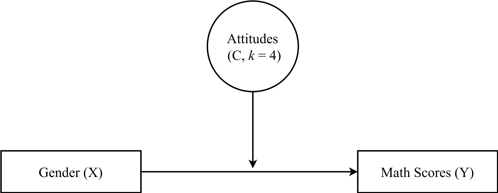
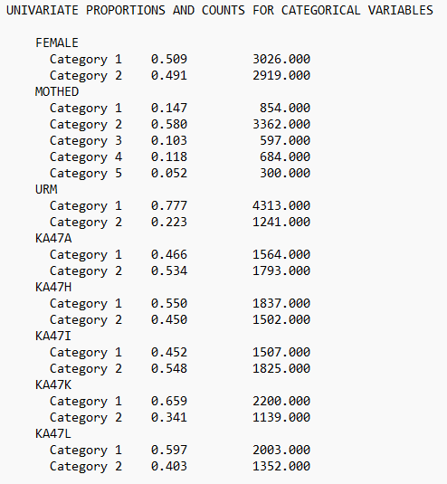
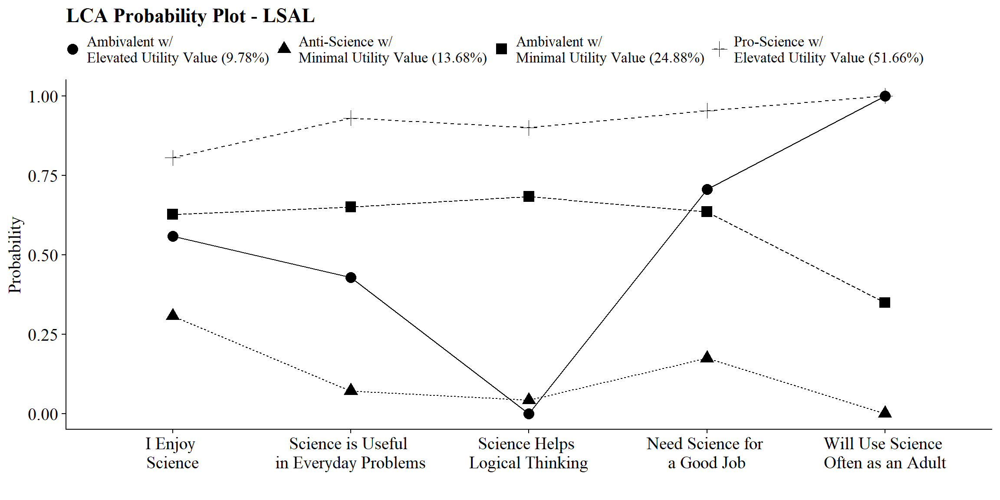
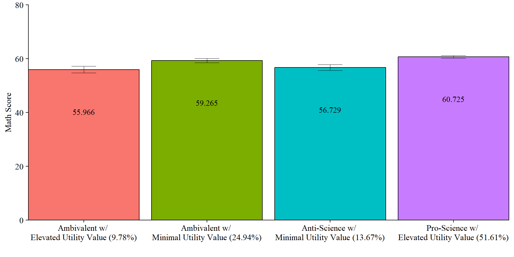

# (PART) Extensions of Latent Class Models {-}

# Moderation

------------------------------------------------------------------------

*Example: Longitudinal Study of American Youth*

**Data source:** : [See documentation here](https://www.lsay.org/)

------------------------------------------------------------------------

## Load Packages


``` r
library(MplusAutomation)
library(tidyverse)
library(here)
library(glue)
library(gt)
library(cowplot)
library(kableExtra)
library(psych)
library(float)
library(janitor)
```

------------------------------------------------------------------------

## Moderation Path Diagram



------------------------------------------------------------------------


```{=html}
<div id="jxzesyfter" style="padding-left:0px;padding-right:0px;padding-top:10px;padding-bottom:10px;overflow-x:auto;overflow-y:auto;width:auto;height:auto;">
<style>#jxzesyfter table {
  font-family: system-ui, 'Segoe UI', Roboto, Helvetica, Arial, sans-serif, 'Apple Color Emoji', 'Segoe UI Emoji', 'Segoe UI Symbol', 'Noto Color Emoji';
  -webkit-font-smoothing: antialiased;
  -moz-osx-font-smoothing: grayscale;
}

#jxzesyfter thead, #jxzesyfter tbody, #jxzesyfter tfoot, #jxzesyfter tr, #jxzesyfter td, #jxzesyfter th {
  border-style: none;
}

#jxzesyfter p {
  margin: 0;
  padding: 0;
}

#jxzesyfter .gt_table {
  display: table;
  border-collapse: collapse;
  line-height: normal;
  margin-left: auto;
  margin-right: auto;
  color: #333333;
  font-size: 16px;
  font-weight: normal;
  font-style: normal;
  background-color: #FFFFFF;
  width: auto;
  border-top-style: solid;
  border-top-width: 2px;
  border-top-color: #A8A8A8;
  border-right-style: none;
  border-right-width: 2px;
  border-right-color: #D3D3D3;
  border-bottom-style: solid;
  border-bottom-width: 2px;
  border-bottom-color: #A8A8A8;
  border-left-style: none;
  border-left-width: 2px;
  border-left-color: #D3D3D3;
}

#jxzesyfter .gt_caption {
  padding-top: 4px;
  padding-bottom: 4px;
}

#jxzesyfter .gt_title {
  color: #333333;
  font-size: 125%;
  font-weight: initial;
  padding-top: 4px;
  padding-bottom: 4px;
  padding-left: 5px;
  padding-right: 5px;
  border-bottom-color: #FFFFFF;
  border-bottom-width: 0;
}

#jxzesyfter .gt_subtitle {
  color: #333333;
  font-size: 85%;
  font-weight: initial;
  padding-top: 3px;
  padding-bottom: 5px;
  padding-left: 5px;
  padding-right: 5px;
  border-top-color: #FFFFFF;
  border-top-width: 0;
}

#jxzesyfter .gt_heading {
  background-color: #FFFFFF;
  text-align: center;
  border-bottom-color: #FFFFFF;
  border-left-style: none;
  border-left-width: 1px;
  border-left-color: #D3D3D3;
  border-right-style: none;
  border-right-width: 1px;
  border-right-color: #D3D3D3;
}

#jxzesyfter .gt_bottom_border {
  border-bottom-style: solid;
  border-bottom-width: 2px;
  border-bottom-color: #D3D3D3;
}

#jxzesyfter .gt_col_headings {
  border-top-style: solid;
  border-top-width: 2px;
  border-top-color: #D3D3D3;
  border-bottom-style: solid;
  border-bottom-width: 2px;
  border-bottom-color: #D3D3D3;
  border-left-style: none;
  border-left-width: 1px;
  border-left-color: #D3D3D3;
  border-right-style: none;
  border-right-width: 1px;
  border-right-color: #D3D3D3;
}

#jxzesyfter .gt_col_heading {
  color: #333333;
  background-color: #FFFFFF;
  font-size: 100%;
  font-weight: bold;
  text-transform: inherit;
  border-left-style: none;
  border-left-width: 1px;
  border-left-color: #D3D3D3;
  border-right-style: none;
  border-right-width: 1px;
  border-right-color: #D3D3D3;
  vertical-align: bottom;
  padding-top: 5px;
  padding-bottom: 6px;
  padding-left: 5px;
  padding-right: 5px;
  overflow-x: hidden;
}

#jxzesyfter .gt_column_spanner_outer {
  color: #333333;
  background-color: #FFFFFF;
  font-size: 100%;
  font-weight: bold;
  text-transform: inherit;
  padding-top: 0;
  padding-bottom: 0;
  padding-left: 4px;
  padding-right: 4px;
}

#jxzesyfter .gt_column_spanner_outer:first-child {
  padding-left: 0;
}

#jxzesyfter .gt_column_spanner_outer:last-child {
  padding-right: 0;
}

#jxzesyfter .gt_column_spanner {
  border-bottom-style: solid;
  border-bottom-width: 2px;
  border-bottom-color: #D3D3D3;
  vertical-align: bottom;
  padding-top: 5px;
  padding-bottom: 5px;
  overflow-x: hidden;
  display: inline-block;
  width: 100%;
}

#jxzesyfter .gt_spanner_row {
  border-bottom-style: hidden;
}

#jxzesyfter .gt_group_heading {
  padding-top: 8px;
  padding-bottom: 8px;
  padding-left: 5px;
  padding-right: 5px;
  color: #333333;
  background-color: #FFFFFF;
  font-size: 100%;
  font-weight: bold;
  text-transform: inherit;
  border-top-style: solid;
  border-top-width: 2px;
  border-top-color: #D3D3D3;
  border-bottom-style: solid;
  border-bottom-width: 2px;
  border-bottom-color: #D3D3D3;
  border-left-style: none;
  border-left-width: 1px;
  border-left-color: #D3D3D3;
  border-right-style: none;
  border-right-width: 1px;
  border-right-color: #D3D3D3;
  vertical-align: middle;
  text-align: left;
}

#jxzesyfter .gt_empty_group_heading {
  padding: 0.5px;
  color: #333333;
  background-color: #FFFFFF;
  font-size: 100%;
  font-weight: bold;
  border-top-style: solid;
  border-top-width: 2px;
  border-top-color: #D3D3D3;
  border-bottom-style: solid;
  border-bottom-width: 2px;
  border-bottom-color: #D3D3D3;
  vertical-align: middle;
}

#jxzesyfter .gt_from_md > :first-child {
  margin-top: 0;
}

#jxzesyfter .gt_from_md > :last-child {
  margin-bottom: 0;
}

#jxzesyfter .gt_row {
  padding-top: 8px;
  padding-bottom: 8px;
  padding-left: 5px;
  padding-right: 5px;
  margin: 10px;
  border-top-style: solid;
  border-top-width: 1px;
  border-top-color: #D3D3D3;
  border-left-style: none;
  border-left-width: 1px;
  border-left-color: #D3D3D3;
  border-right-style: none;
  border-right-width: 1px;
  border-right-color: #D3D3D3;
  vertical-align: middle;
  overflow-x: hidden;
}

#jxzesyfter .gt_stub {
  color: #333333;
  background-color: #FFFFFF;
  font-size: 100%;
  font-weight: initial;
  text-transform: inherit;
  border-right-style: solid;
  border-right-width: 2px;
  border-right-color: #D3D3D3;
  padding-left: 5px;
  padding-right: 5px;
}

#jxzesyfter .gt_stub_row_group {
  color: #333333;
  background-color: #FFFFFF;
  font-size: 100%;
  font-weight: initial;
  text-transform: inherit;
  border-right-style: solid;
  border-right-width: 2px;
  border-right-color: #D3D3D3;
  padding-left: 5px;
  padding-right: 5px;
  vertical-align: top;
}

#jxzesyfter .gt_row_group_first td {
  border-top-width: 2px;
}

#jxzesyfter .gt_row_group_first th {
  border-top-width: 2px;
}

#jxzesyfter .gt_summary_row {
  color: #333333;
  background-color: #FFFFFF;
  text-transform: inherit;
  padding-top: 8px;
  padding-bottom: 8px;
  padding-left: 5px;
  padding-right: 5px;
}

#jxzesyfter .gt_first_summary_row {
  border-top-style: solid;
  border-top-color: #D3D3D3;
}

#jxzesyfter .gt_first_summary_row.thick {
  border-top-width: 2px;
}

#jxzesyfter .gt_last_summary_row {
  padding-top: 8px;
  padding-bottom: 8px;
  padding-left: 5px;
  padding-right: 5px;
  border-bottom-style: solid;
  border-bottom-width: 2px;
  border-bottom-color: #D3D3D3;
}

#jxzesyfter .gt_grand_summary_row {
  color: #333333;
  background-color: #FFFFFF;
  text-transform: inherit;
  padding-top: 8px;
  padding-bottom: 8px;
  padding-left: 5px;
  padding-right: 5px;
}

#jxzesyfter .gt_first_grand_summary_row {
  padding-top: 8px;
  padding-bottom: 8px;
  padding-left: 5px;
  padding-right: 5px;
  border-top-style: double;
  border-top-width: 6px;
  border-top-color: #D3D3D3;
}

#jxzesyfter .gt_last_grand_summary_row_top {
  padding-top: 8px;
  padding-bottom: 8px;
  padding-left: 5px;
  padding-right: 5px;
  border-bottom-style: double;
  border-bottom-width: 6px;
  border-bottom-color: #D3D3D3;
}

#jxzesyfter .gt_striped {
  background-color: rgba(128, 128, 128, 0.05);
}

#jxzesyfter .gt_table_body {
  border-top-style: solid;
  border-top-width: 2px;
  border-top-color: #D3D3D3;
  border-bottom-style: solid;
  border-bottom-width: 2px;
  border-bottom-color: #D3D3D3;
}

#jxzesyfter .gt_footnotes {
  color: #333333;
  background-color: #FFFFFF;
  border-bottom-style: none;
  border-bottom-width: 2px;
  border-bottom-color: #D3D3D3;
  border-left-style: none;
  border-left-width: 2px;
  border-left-color: #D3D3D3;
  border-right-style: none;
  border-right-width: 2px;
  border-right-color: #D3D3D3;
}

#jxzesyfter .gt_footnote {
  margin: 0px;
  font-size: 90%;
  padding-top: 4px;
  padding-bottom: 4px;
  padding-left: 5px;
  padding-right: 5px;
}

#jxzesyfter .gt_sourcenotes {
  color: #333333;
  background-color: #FFFFFF;
  border-bottom-style: none;
  border-bottom-width: 2px;
  border-bottom-color: #D3D3D3;
  border-left-style: none;
  border-left-width: 2px;
  border-left-color: #D3D3D3;
  border-right-style: none;
  border-right-width: 2px;
  border-right-color: #D3D3D3;
}

#jxzesyfter .gt_sourcenote {
  font-size: 90%;
  padding-top: 4px;
  padding-bottom: 4px;
  padding-left: 5px;
  padding-right: 5px;
}

#jxzesyfter .gt_left {
  text-align: left;
}

#jxzesyfter .gt_center {
  text-align: center;
}

#jxzesyfter .gt_right {
  text-align: right;
  font-variant-numeric: tabular-nums;
}

#jxzesyfter .gt_font_normal {
  font-weight: normal;
}

#jxzesyfter .gt_font_bold {
  font-weight: bold;
}

#jxzesyfter .gt_font_italic {
  font-style: italic;
}

#jxzesyfter .gt_super {
  font-size: 65%;
}

#jxzesyfter .gt_footnote_marks {
  font-size: 75%;
  vertical-align: 0.4em;
  position: initial;
}

#jxzesyfter .gt_asterisk {
  font-size: 100%;
  vertical-align: 0;
}

#jxzesyfter .gt_indent_1 {
  text-indent: 5px;
}

#jxzesyfter .gt_indent_2 {
  text-indent: 10px;
}

#jxzesyfter .gt_indent_3 {
  text-indent: 15px;
}

#jxzesyfter .gt_indent_4 {
  text-indent: 20px;
}

#jxzesyfter .gt_indent_5 {
  text-indent: 25px;
}

#jxzesyfter .katex-display {
  display: inline-flex !important;
  margin-bottom: 0.75em !important;
}

#jxzesyfter div.Reactable > div.rt-table > div.rt-thead > div.rt-tr.rt-tr-group-header > div.rt-th-group:after {
  height: 0px !important;
}
</style>
<table class="gt_table" data-quarto-disable-processing="false" data-quarto-bootstrap="false">
  <thead>
    <tr class="gt_heading">
      <td colspan="2" class="gt_heading gt_title gt_font_normal" style><span class='gt_from_md'><strong>LCA Indicators &amp; Auxiliary Variables: Math Attitudes Example</strong></span></td>
    </tr>
    <tr class="gt_heading">
      <td colspan="2" class="gt_heading gt_subtitle gt_font_normal gt_bottom_border" style><span class='gt_from_md'> </span></td>
    </tr>
    <tr class="gt_col_headings">
      <th class="gt_col_heading gt_columns_bottom_border gt_left" rowspan="1" colspan="1" scope="col" id="Name">Name</th>
      <th class="gt_col_heading gt_columns_bottom_border gt_left" rowspan="1" colspan="1" scope="col" id="a-Variable-Description"> Variable Description</th>
    </tr>
  </thead>
  <tbody class="gt_table_body">
    <tr class="gt_group_heading_row">
      <th colspan="2" class="gt_empty_group_heading" scope="colgroup"></th>
    </tr>
    <tr class="gt_row_group_first"><td headers="  Name" class="gt_row gt_left">enjoy</td>
<td headers="   Variable Description" class="gt_row gt_left">I enjoy math.</td></tr>
    <tr><td headers="  Name" class="gt_row gt_left">useful</td>
<td headers="   Variable Description" class="gt_row gt_left">Math is useful in everyday problems.</td></tr>
    <tr><td headers="  Name" class="gt_row gt_left">logical</td>
<td headers="   Variable Description" class="gt_row gt_left">Math helps a person think logically.</td></tr>
    <tr><td headers="  Name" class="gt_row gt_left">job</td>
<td headers="   Variable Description" class="gt_row gt_left">It is important to know math to get a good job.</td></tr>
    <tr><td headers="  Name" class="gt_row gt_left">adult</td>
<td headers="   Variable Description" class="gt_row gt_left">I will use math in many ways as an adult.</td></tr>
    <tr class="gt_group_heading_row">
      <th colspan="2" class="gt_group_heading" scope="colgroup" id="Auxiliary Variables">Auxiliary Variables</th>
    </tr>
    <tr class="gt_row_group_first"><td headers="Auxiliary Variables  Name" class="gt_row gt_left">female</td>
<td headers="Auxiliary Variables   Variable Description" class="gt_row gt_left">Self-reported student gender (0=Male, 1=Female).</td></tr>
    <tr><td headers="Auxiliary Variables  Name" class="gt_row gt_left">math_irt</td>
<td headers="Auxiliary Variables   Variable Description" class="gt_row gt_left">Standardized IRT math test score - 12th grade.</td></tr>
  </tbody>
  
  
</table>
</div>
```


------------------------------------------------------------------------

Read in LSAY dataset


``` r
data <- read_csv(here("data","lsay_subset.csv")) %>% 
  clean_names() %>%   # make variable names lowercase
  mutate(female = recode(gender, `1` = 0, `2` = 1)) # relabel values from 1,2 to 0,1

```

------------------------------------------------------------------------

## Descriptive Statistics

### Descriptive Statistics using R:

Quick view of all the relevant variables:


``` r
data %>% 
  select(enjoy, useful, logical, job, adult, female, math_irt) %>% 
  describe()
```

Proportion of indicators using R:


``` r
# Set up data to find proportions of binary indicators
ds <- data %>% 
  pivot_longer(c(enjoy, useful, logical, job, adult), names_to = "Variable") 

# Create table of variables and counts
tab <- table(ds$Variable, ds$value)

# Find proportions and round to 3 decimal places
prop <- prop.table(tab, margin = 1) %>% 
  round(3)

# Combine everything to one table 
dframe <- data.frame(Variables=rownames(tab), Proportion=prop[,2], Count=tab[,2])
#remove row names
row.names(dframe) <- NULL
```


``` r
gt(dframe) %>% 
tab_header(title = md("**LCA Indicator Proportions**"), subtitle = md("&nbsp;")) %>%
tab_options(column_labels.font.weight = "bold", row_group.font.weight = "bold") 
```


```{=html}
<div id="rojpmjuwrp" style="padding-left:0px;padding-right:0px;padding-top:10px;padding-bottom:10px;overflow-x:auto;overflow-y:auto;width:auto;height:auto;">
<style>#rojpmjuwrp table {
  font-family: system-ui, 'Segoe UI', Roboto, Helvetica, Arial, sans-serif, 'Apple Color Emoji', 'Segoe UI Emoji', 'Segoe UI Symbol', 'Noto Color Emoji';
  -webkit-font-smoothing: antialiased;
  -moz-osx-font-smoothing: grayscale;
}

#rojpmjuwrp thead, #rojpmjuwrp tbody, #rojpmjuwrp tfoot, #rojpmjuwrp tr, #rojpmjuwrp td, #rojpmjuwrp th {
  border-style: none;
}

#rojpmjuwrp p {
  margin: 0;
  padding: 0;
}

#rojpmjuwrp .gt_table {
  display: table;
  border-collapse: collapse;
  line-height: normal;
  margin-left: auto;
  margin-right: auto;
  color: #333333;
  font-size: 16px;
  font-weight: normal;
  font-style: normal;
  background-color: #FFFFFF;
  width: auto;
  border-top-style: solid;
  border-top-width: 2px;
  border-top-color: #A8A8A8;
  border-right-style: none;
  border-right-width: 2px;
  border-right-color: #D3D3D3;
  border-bottom-style: solid;
  border-bottom-width: 2px;
  border-bottom-color: #A8A8A8;
  border-left-style: none;
  border-left-width: 2px;
  border-left-color: #D3D3D3;
}

#rojpmjuwrp .gt_caption {
  padding-top: 4px;
  padding-bottom: 4px;
}

#rojpmjuwrp .gt_title {
  color: #333333;
  font-size: 125%;
  font-weight: initial;
  padding-top: 4px;
  padding-bottom: 4px;
  padding-left: 5px;
  padding-right: 5px;
  border-bottom-color: #FFFFFF;
  border-bottom-width: 0;
}

#rojpmjuwrp .gt_subtitle {
  color: #333333;
  font-size: 85%;
  font-weight: initial;
  padding-top: 3px;
  padding-bottom: 5px;
  padding-left: 5px;
  padding-right: 5px;
  border-top-color: #FFFFFF;
  border-top-width: 0;
}

#rojpmjuwrp .gt_heading {
  background-color: #FFFFFF;
  text-align: center;
  border-bottom-color: #FFFFFF;
  border-left-style: none;
  border-left-width: 1px;
  border-left-color: #D3D3D3;
  border-right-style: none;
  border-right-width: 1px;
  border-right-color: #D3D3D3;
}

#rojpmjuwrp .gt_bottom_border {
  border-bottom-style: solid;
  border-bottom-width: 2px;
  border-bottom-color: #D3D3D3;
}

#rojpmjuwrp .gt_col_headings {
  border-top-style: solid;
  border-top-width: 2px;
  border-top-color: #D3D3D3;
  border-bottom-style: solid;
  border-bottom-width: 2px;
  border-bottom-color: #D3D3D3;
  border-left-style: none;
  border-left-width: 1px;
  border-left-color: #D3D3D3;
  border-right-style: none;
  border-right-width: 1px;
  border-right-color: #D3D3D3;
}

#rojpmjuwrp .gt_col_heading {
  color: #333333;
  background-color: #FFFFFF;
  font-size: 100%;
  font-weight: bold;
  text-transform: inherit;
  border-left-style: none;
  border-left-width: 1px;
  border-left-color: #D3D3D3;
  border-right-style: none;
  border-right-width: 1px;
  border-right-color: #D3D3D3;
  vertical-align: bottom;
  padding-top: 5px;
  padding-bottom: 6px;
  padding-left: 5px;
  padding-right: 5px;
  overflow-x: hidden;
}

#rojpmjuwrp .gt_column_spanner_outer {
  color: #333333;
  background-color: #FFFFFF;
  font-size: 100%;
  font-weight: bold;
  text-transform: inherit;
  padding-top: 0;
  padding-bottom: 0;
  padding-left: 4px;
  padding-right: 4px;
}

#rojpmjuwrp .gt_column_spanner_outer:first-child {
  padding-left: 0;
}

#rojpmjuwrp .gt_column_spanner_outer:last-child {
  padding-right: 0;
}

#rojpmjuwrp .gt_column_spanner {
  border-bottom-style: solid;
  border-bottom-width: 2px;
  border-bottom-color: #D3D3D3;
  vertical-align: bottom;
  padding-top: 5px;
  padding-bottom: 5px;
  overflow-x: hidden;
  display: inline-block;
  width: 100%;
}

#rojpmjuwrp .gt_spanner_row {
  border-bottom-style: hidden;
}

#rojpmjuwrp .gt_group_heading {
  padding-top: 8px;
  padding-bottom: 8px;
  padding-left: 5px;
  padding-right: 5px;
  color: #333333;
  background-color: #FFFFFF;
  font-size: 100%;
  font-weight: bold;
  text-transform: inherit;
  border-top-style: solid;
  border-top-width: 2px;
  border-top-color: #D3D3D3;
  border-bottom-style: solid;
  border-bottom-width: 2px;
  border-bottom-color: #D3D3D3;
  border-left-style: none;
  border-left-width: 1px;
  border-left-color: #D3D3D3;
  border-right-style: none;
  border-right-width: 1px;
  border-right-color: #D3D3D3;
  vertical-align: middle;
  text-align: left;
}

#rojpmjuwrp .gt_empty_group_heading {
  padding: 0.5px;
  color: #333333;
  background-color: #FFFFFF;
  font-size: 100%;
  font-weight: bold;
  border-top-style: solid;
  border-top-width: 2px;
  border-top-color: #D3D3D3;
  border-bottom-style: solid;
  border-bottom-width: 2px;
  border-bottom-color: #D3D3D3;
  vertical-align: middle;
}

#rojpmjuwrp .gt_from_md > :first-child {
  margin-top: 0;
}

#rojpmjuwrp .gt_from_md > :last-child {
  margin-bottom: 0;
}

#rojpmjuwrp .gt_row {
  padding-top: 8px;
  padding-bottom: 8px;
  padding-left: 5px;
  padding-right: 5px;
  margin: 10px;
  border-top-style: solid;
  border-top-width: 1px;
  border-top-color: #D3D3D3;
  border-left-style: none;
  border-left-width: 1px;
  border-left-color: #D3D3D3;
  border-right-style: none;
  border-right-width: 1px;
  border-right-color: #D3D3D3;
  vertical-align: middle;
  overflow-x: hidden;
}

#rojpmjuwrp .gt_stub {
  color: #333333;
  background-color: #FFFFFF;
  font-size: 100%;
  font-weight: initial;
  text-transform: inherit;
  border-right-style: solid;
  border-right-width: 2px;
  border-right-color: #D3D3D3;
  padding-left: 5px;
  padding-right: 5px;
}

#rojpmjuwrp .gt_stub_row_group {
  color: #333333;
  background-color: #FFFFFF;
  font-size: 100%;
  font-weight: initial;
  text-transform: inherit;
  border-right-style: solid;
  border-right-width: 2px;
  border-right-color: #D3D3D3;
  padding-left: 5px;
  padding-right: 5px;
  vertical-align: top;
}

#rojpmjuwrp .gt_row_group_first td {
  border-top-width: 2px;
}

#rojpmjuwrp .gt_row_group_first th {
  border-top-width: 2px;
}

#rojpmjuwrp .gt_summary_row {
  color: #333333;
  background-color: #FFFFFF;
  text-transform: inherit;
  padding-top: 8px;
  padding-bottom: 8px;
  padding-left: 5px;
  padding-right: 5px;
}

#rojpmjuwrp .gt_first_summary_row {
  border-top-style: solid;
  border-top-color: #D3D3D3;
}

#rojpmjuwrp .gt_first_summary_row.thick {
  border-top-width: 2px;
}

#rojpmjuwrp .gt_last_summary_row {
  padding-top: 8px;
  padding-bottom: 8px;
  padding-left: 5px;
  padding-right: 5px;
  border-bottom-style: solid;
  border-bottom-width: 2px;
  border-bottom-color: #D3D3D3;
}

#rojpmjuwrp .gt_grand_summary_row {
  color: #333333;
  background-color: #FFFFFF;
  text-transform: inherit;
  padding-top: 8px;
  padding-bottom: 8px;
  padding-left: 5px;
  padding-right: 5px;
}

#rojpmjuwrp .gt_first_grand_summary_row {
  padding-top: 8px;
  padding-bottom: 8px;
  padding-left: 5px;
  padding-right: 5px;
  border-top-style: double;
  border-top-width: 6px;
  border-top-color: #D3D3D3;
}

#rojpmjuwrp .gt_last_grand_summary_row_top {
  padding-top: 8px;
  padding-bottom: 8px;
  padding-left: 5px;
  padding-right: 5px;
  border-bottom-style: double;
  border-bottom-width: 6px;
  border-bottom-color: #D3D3D3;
}

#rojpmjuwrp .gt_striped {
  background-color: rgba(128, 128, 128, 0.05);
}

#rojpmjuwrp .gt_table_body {
  border-top-style: solid;
  border-top-width: 2px;
  border-top-color: #D3D3D3;
  border-bottom-style: solid;
  border-bottom-width: 2px;
  border-bottom-color: #D3D3D3;
}

#rojpmjuwrp .gt_footnotes {
  color: #333333;
  background-color: #FFFFFF;
  border-bottom-style: none;
  border-bottom-width: 2px;
  border-bottom-color: #D3D3D3;
  border-left-style: none;
  border-left-width: 2px;
  border-left-color: #D3D3D3;
  border-right-style: none;
  border-right-width: 2px;
  border-right-color: #D3D3D3;
}

#rojpmjuwrp .gt_footnote {
  margin: 0px;
  font-size: 90%;
  padding-top: 4px;
  padding-bottom: 4px;
  padding-left: 5px;
  padding-right: 5px;
}

#rojpmjuwrp .gt_sourcenotes {
  color: #333333;
  background-color: #FFFFFF;
  border-bottom-style: none;
  border-bottom-width: 2px;
  border-bottom-color: #D3D3D3;
  border-left-style: none;
  border-left-width: 2px;
  border-left-color: #D3D3D3;
  border-right-style: none;
  border-right-width: 2px;
  border-right-color: #D3D3D3;
}

#rojpmjuwrp .gt_sourcenote {
  font-size: 90%;
  padding-top: 4px;
  padding-bottom: 4px;
  padding-left: 5px;
  padding-right: 5px;
}

#rojpmjuwrp .gt_left {
  text-align: left;
}

#rojpmjuwrp .gt_center {
  text-align: center;
}

#rojpmjuwrp .gt_right {
  text-align: right;
  font-variant-numeric: tabular-nums;
}

#rojpmjuwrp .gt_font_normal {
  font-weight: normal;
}

#rojpmjuwrp .gt_font_bold {
  font-weight: bold;
}

#rojpmjuwrp .gt_font_italic {
  font-style: italic;
}

#rojpmjuwrp .gt_super {
  font-size: 65%;
}

#rojpmjuwrp .gt_footnote_marks {
  font-size: 75%;
  vertical-align: 0.4em;
  position: initial;
}

#rojpmjuwrp .gt_asterisk {
  font-size: 100%;
  vertical-align: 0;
}

#rojpmjuwrp .gt_indent_1 {
  text-indent: 5px;
}

#rojpmjuwrp .gt_indent_2 {
  text-indent: 10px;
}

#rojpmjuwrp .gt_indent_3 {
  text-indent: 15px;
}

#rojpmjuwrp .gt_indent_4 {
  text-indent: 20px;
}

#rojpmjuwrp .gt_indent_5 {
  text-indent: 25px;
}

#rojpmjuwrp .katex-display {
  display: inline-flex !important;
  margin-bottom: 0.75em !important;
}

#rojpmjuwrp div.Reactable > div.rt-table > div.rt-thead > div.rt-tr.rt-tr-group-header > div.rt-th-group:after {
  height: 0px !important;
}
</style>
<table class="gt_table" data-quarto-disable-processing="false" data-quarto-bootstrap="false">
  <thead>
    <tr class="gt_heading">
      <td colspan="3" class="gt_heading gt_title gt_font_normal" style><span class='gt_from_md'><strong>LCA Indicator Proportions</strong></span></td>
    </tr>
    <tr class="gt_heading">
      <td colspan="3" class="gt_heading gt_subtitle gt_font_normal gt_bottom_border" style><span class='gt_from_md'> </span></td>
    </tr>
    <tr class="gt_col_headings">
      <th class="gt_col_heading gt_columns_bottom_border gt_left" rowspan="1" colspan="1" scope="col" id="Variables">Variables</th>
      <th class="gt_col_heading gt_columns_bottom_border gt_right" rowspan="1" colspan="1" scope="col" id="Proportion">Proportion</th>
      <th class="gt_col_heading gt_columns_bottom_border gt_right" rowspan="1" colspan="1" scope="col" id="Count">Count</th>
    </tr>
  </thead>
  <tbody class="gt_table_body">
    <tr><td headers="Variables" class="gt_row gt_left">adult</td>
<td headers="Proportion" class="gt_row gt_right">0.702</td>
<td headers="Count" class="gt_row gt_right">1858</td></tr>
    <tr><td headers="Variables" class="gt_row gt_left">enjoy</td>
<td headers="Proportion" class="gt_row gt_right">0.669</td>
<td headers="Count" class="gt_row gt_right">1784</td></tr>
    <tr><td headers="Variables" class="gt_row gt_left">job</td>
<td headers="Proportion" class="gt_row gt_right">0.743</td>
<td headers="Count" class="gt_row gt_right">1947</td></tr>
    <tr><td headers="Variables" class="gt_row gt_left">logical</td>
<td headers="Proportion" class="gt_row gt_right">0.640</td>
<td headers="Count" class="gt_row gt_right">1686</td></tr>
    <tr><td headers="Variables" class="gt_row gt_left">useful</td>
<td headers="Proportion" class="gt_row gt_right">0.695</td>
<td headers="Count" class="gt_row gt_right">1835</td></tr>
  </tbody>
  
  
</table>
</div>
```


### Descriptive Statistics using `MplusAutomation`:


``` r
basic_mplus  <- mplusObject(
  TITLE = "LSAL Descriptive Statistics;",
  
  VARIABLE =
    "usevar = enjoy, useful, logical, job, adult, female, math_irt;
    categorical = enjoy, useful, logical, job, adult, female;",

  ANALYSIS = "TYPE=basic;",
  
  OUTPUT = "sampstat;",  
  
  usevariables = colnames(data),
  rdata = data)

basic_mplus_fit <- mplusModeler(basic_mplus, 
                            dataout = here("moderation", "LSAL_data.dat"),
                            modelout = here("moderation","basic.inp"),
                            check = TRUE, run = TRUE, hashfilename = FALSE)
```


View the `.out` file:




Or, view of descriptive statistics using `get_sampstat()`:


``` r
# Using MplusAutomation
MplusAutomation::get_sampstat(basic_mplus_fit)

# Using base R
summary(data)
```

------------------------------------------------------------------------

## Enumeration

This code uses the `mplusObject` function in the `MplusAutomation` package and saves all model runs in the `mplus_enum` folder.


``` r

lca_enum_6  <- lapply(1:6, function(k) {
  lca_enum  <- mplusObject(
    
    TITLE = glue("{k}-Class"), 
    
    VARIABLE = glue(
      "categorical = enjoy, useful, logical, job, adult; 
     usevar = enjoy, useful, logical, job, adult;
     classes = c({k});"),
    
    ANALYSIS = 
      "estimator = mlr; 
    type = mixture;
    processors = 12;
    starts = 500 100;",
    
    OUTPUT = "sampstat residual tech11 tech14;",

    usevariables = colnames(data),
    rdata = data)
  
  lca_enum_fit <- mplusModeler(lca_enum, 
                               dataout=glue(here("moderation","enum", "LSAY_data.dat")),
                               modelout=glue(here("moderation","enum", "c{k}_lsal.inp")) ,
                               check=TRUE, run = TRUE, hashfilename = FALSE)
})

```

**IMPORTANT**: Before moving forward, make sure to examine each output document to ensure models were estimated normally. In this example, the last model (6-class models) did not produce reliable output and was excluded. 

------------------------------------------------------------------------

### Table of Fit

First, extract data:


``` r
source(here("functions", "extract_mplus_info.R"))

# Define the directory where all of the .out files are located.
output_dir <- here("moderation","enum")

# Get all .out files
output_files <- list.files(output_dir, pattern = "\\.out$", full.names = TRUE)

# Process all .out files into one dataframe
final_data <- map_dfr(output_files, extract_mplus_info_extended)

# Extract Sample_Size from final_data
sample_size <- unique(final_data$Sample_Size)
```

#### Examine Mplus Warnings


``` r
source(here("functions", "extract_warnings.R"))

warnings_table <- extract_warnings(final_data)
warnings_table
```


```{=html}
<div id="ulhlnmahwd" style="padding-left:0px;padding-right:0px;padding-top:10px;padding-bottom:10px;overflow-x:auto;overflow-y:auto;width:auto;height:auto;">
<style>#ulhlnmahwd table {
  font-family: system-ui, 'Segoe UI', Roboto, Helvetica, Arial, sans-serif, 'Apple Color Emoji', 'Segoe UI Emoji', 'Segoe UI Symbol', 'Noto Color Emoji';
  -webkit-font-smoothing: antialiased;
  -moz-osx-font-smoothing: grayscale;
}

#ulhlnmahwd thead, #ulhlnmahwd tbody, #ulhlnmahwd tfoot, #ulhlnmahwd tr, #ulhlnmahwd td, #ulhlnmahwd th {
  border-style: none;
}

#ulhlnmahwd p {
  margin: 0;
  padding: 0;
}

#ulhlnmahwd .gt_table {
  display: table;
  border-collapse: collapse;
  line-height: normal;
  margin-left: auto;
  margin-right: auto;
  color: #333333;
  font-size: 16px;
  font-weight: normal;
  font-style: normal;
  background-color: #FFFFFF;
  width: 100%;
  border-top-style: solid;
  border-top-width: 2px;
  border-top-color: #A8A8A8;
  border-right-style: none;
  border-right-width: 2px;
  border-right-color: #D3D3D3;
  border-bottom-style: solid;
  border-bottom-width: 2px;
  border-bottom-color: #A8A8A8;
  border-left-style: none;
  border-left-width: 2px;
  border-left-color: #D3D3D3;
}

#ulhlnmahwd .gt_caption {
  padding-top: 4px;
  padding-bottom: 4px;
}

#ulhlnmahwd .gt_title {
  color: #333333;
  font-size: 125%;
  font-weight: initial;
  padding-top: 4px;
  padding-bottom: 4px;
  padding-left: 5px;
  padding-right: 5px;
  border-bottom-color: #FFFFFF;
  border-bottom-width: 0;
}

#ulhlnmahwd .gt_subtitle {
  color: #333333;
  font-size: 85%;
  font-weight: initial;
  padding-top: 3px;
  padding-bottom: 5px;
  padding-left: 5px;
  padding-right: 5px;
  border-top-color: #FFFFFF;
  border-top-width: 0;
}

#ulhlnmahwd .gt_heading {
  background-color: #FFFFFF;
  text-align: center;
  border-bottom-color: #FFFFFF;
  border-left-style: none;
  border-left-width: 1px;
  border-left-color: #D3D3D3;
  border-right-style: none;
  border-right-width: 1px;
  border-right-color: #D3D3D3;
}

#ulhlnmahwd .gt_bottom_border {
  border-bottom-style: solid;
  border-bottom-width: 2px;
  border-bottom-color: #D3D3D3;
}

#ulhlnmahwd .gt_col_headings {
  border-top-style: solid;
  border-top-width: 2px;
  border-top-color: #D3D3D3;
  border-bottom-style: solid;
  border-bottom-width: 2px;
  border-bottom-color: #D3D3D3;
  border-left-style: none;
  border-left-width: 1px;
  border-left-color: #D3D3D3;
  border-right-style: none;
  border-right-width: 1px;
  border-right-color: #D3D3D3;
}

#ulhlnmahwd .gt_col_heading {
  color: #333333;
  background-color: #FFFFFF;
  font-size: 100%;
  font-weight: normal;
  text-transform: inherit;
  border-left-style: none;
  border-left-width: 1px;
  border-left-color: #D3D3D3;
  border-right-style: none;
  border-right-width: 1px;
  border-right-color: #D3D3D3;
  vertical-align: bottom;
  padding-top: 5px;
  padding-bottom: 6px;
  padding-left: 5px;
  padding-right: 5px;
  overflow-x: hidden;
}

#ulhlnmahwd .gt_column_spanner_outer {
  color: #333333;
  background-color: #FFFFFF;
  font-size: 100%;
  font-weight: normal;
  text-transform: inherit;
  padding-top: 0;
  padding-bottom: 0;
  padding-left: 4px;
  padding-right: 4px;
}

#ulhlnmahwd .gt_column_spanner_outer:first-child {
  padding-left: 0;
}

#ulhlnmahwd .gt_column_spanner_outer:last-child {
  padding-right: 0;
}

#ulhlnmahwd .gt_column_spanner {
  border-bottom-style: solid;
  border-bottom-width: 2px;
  border-bottom-color: #D3D3D3;
  vertical-align: bottom;
  padding-top: 5px;
  padding-bottom: 5px;
  overflow-x: hidden;
  display: inline-block;
  width: 100%;
}

#ulhlnmahwd .gt_spanner_row {
  border-bottom-style: hidden;
}

#ulhlnmahwd .gt_group_heading {
  padding-top: 8px;
  padding-bottom: 8px;
  padding-left: 5px;
  padding-right: 5px;
  color: #333333;
  background-color: #FFFFFF;
  font-size: 100%;
  font-weight: initial;
  text-transform: inherit;
  border-top-style: solid;
  border-top-width: 2px;
  border-top-color: #D3D3D3;
  border-bottom-style: solid;
  border-bottom-width: 2px;
  border-bottom-color: #D3D3D3;
  border-left-style: none;
  border-left-width: 1px;
  border-left-color: #D3D3D3;
  border-right-style: none;
  border-right-width: 1px;
  border-right-color: #D3D3D3;
  vertical-align: middle;
  text-align: left;
}

#ulhlnmahwd .gt_empty_group_heading {
  padding: 0.5px;
  color: #333333;
  background-color: #FFFFFF;
  font-size: 100%;
  font-weight: initial;
  border-top-style: solid;
  border-top-width: 2px;
  border-top-color: #D3D3D3;
  border-bottom-style: solid;
  border-bottom-width: 2px;
  border-bottom-color: #D3D3D3;
  vertical-align: middle;
}

#ulhlnmahwd .gt_from_md > :first-child {
  margin-top: 0;
}

#ulhlnmahwd .gt_from_md > :last-child {
  margin-bottom: 0;
}

#ulhlnmahwd .gt_row {
  padding-top: 8px;
  padding-bottom: 8px;
  padding-left: 5px;
  padding-right: 5px;
  margin: 10px;
  border-top-style: solid;
  border-top-width: 1px;
  border-top-color: #D3D3D3;
  border-left-style: none;
  border-left-width: 1px;
  border-left-color: #D3D3D3;
  border-right-style: none;
  border-right-width: 1px;
  border-right-color: #D3D3D3;
  vertical-align: middle;
  overflow-x: hidden;
}

#ulhlnmahwd .gt_stub {
  color: #333333;
  background-color: #FFFFFF;
  font-size: 100%;
  font-weight: initial;
  text-transform: inherit;
  border-right-style: solid;
  border-right-width: 2px;
  border-right-color: #D3D3D3;
  padding-left: 5px;
  padding-right: 5px;
}

#ulhlnmahwd .gt_stub_row_group {
  color: #333333;
  background-color: #FFFFFF;
  font-size: 100%;
  font-weight: initial;
  text-transform: inherit;
  border-right-style: solid;
  border-right-width: 2px;
  border-right-color: #D3D3D3;
  padding-left: 5px;
  padding-right: 5px;
  vertical-align: top;
}

#ulhlnmahwd .gt_row_group_first td {
  border-top-width: 2px;
}

#ulhlnmahwd .gt_row_group_first th {
  border-top-width: 2px;
}

#ulhlnmahwd .gt_summary_row {
  color: #333333;
  background-color: #FFFFFF;
  text-transform: inherit;
  padding-top: 8px;
  padding-bottom: 8px;
  padding-left: 5px;
  padding-right: 5px;
}

#ulhlnmahwd .gt_first_summary_row {
  border-top-style: solid;
  border-top-color: #D3D3D3;
}

#ulhlnmahwd .gt_first_summary_row.thick {
  border-top-width: 2px;
}

#ulhlnmahwd .gt_last_summary_row {
  padding-top: 8px;
  padding-bottom: 8px;
  padding-left: 5px;
  padding-right: 5px;
  border-bottom-style: solid;
  border-bottom-width: 2px;
  border-bottom-color: #D3D3D3;
}

#ulhlnmahwd .gt_grand_summary_row {
  color: #333333;
  background-color: #FFFFFF;
  text-transform: inherit;
  padding-top: 8px;
  padding-bottom: 8px;
  padding-left: 5px;
  padding-right: 5px;
}

#ulhlnmahwd .gt_first_grand_summary_row {
  padding-top: 8px;
  padding-bottom: 8px;
  padding-left: 5px;
  padding-right: 5px;
  border-top-style: double;
  border-top-width: 6px;
  border-top-color: #D3D3D3;
}

#ulhlnmahwd .gt_last_grand_summary_row_top {
  padding-top: 8px;
  padding-bottom: 8px;
  padding-left: 5px;
  padding-right: 5px;
  border-bottom-style: double;
  border-bottom-width: 6px;
  border-bottom-color: #D3D3D3;
}

#ulhlnmahwd .gt_striped {
  background-color: rgba(128, 128, 128, 0.05);
}

#ulhlnmahwd .gt_table_body {
  border-top-style: solid;
  border-top-width: 2px;
  border-top-color: #D3D3D3;
  border-bottom-style: solid;
  border-bottom-width: 2px;
  border-bottom-color: #D3D3D3;
}

#ulhlnmahwd .gt_footnotes {
  color: #333333;
  background-color: #FFFFFF;
  border-bottom-style: none;
  border-bottom-width: 2px;
  border-bottom-color: #D3D3D3;
  border-left-style: none;
  border-left-width: 2px;
  border-left-color: #D3D3D3;
  border-right-style: none;
  border-right-width: 2px;
  border-right-color: #D3D3D3;
}

#ulhlnmahwd .gt_footnote {
  margin: 0px;
  font-size: 90%;
  padding-top: 4px;
  padding-bottom: 4px;
  padding-left: 5px;
  padding-right: 5px;
}

#ulhlnmahwd .gt_sourcenotes {
  color: #333333;
  background-color: #FFFFFF;
  border-bottom-style: none;
  border-bottom-width: 2px;
  border-bottom-color: #D3D3D3;
  border-left-style: none;
  border-left-width: 2px;
  border-left-color: #D3D3D3;
  border-right-style: none;
  border-right-width: 2px;
  border-right-color: #D3D3D3;
}

#ulhlnmahwd .gt_sourcenote {
  font-size: 90%;
  padding-top: 4px;
  padding-bottom: 4px;
  padding-left: 5px;
  padding-right: 5px;
}

#ulhlnmahwd .gt_left {
  text-align: left;
}

#ulhlnmahwd .gt_center {
  text-align: center;
}

#ulhlnmahwd .gt_right {
  text-align: right;
  font-variant-numeric: tabular-nums;
}

#ulhlnmahwd .gt_font_normal {
  font-weight: normal;
}

#ulhlnmahwd .gt_font_bold {
  font-weight: bold;
}

#ulhlnmahwd .gt_font_italic {
  font-style: italic;
}

#ulhlnmahwd .gt_super {
  font-size: 65%;
}

#ulhlnmahwd .gt_footnote_marks {
  font-size: 75%;
  vertical-align: 0.4em;
  position: initial;
}

#ulhlnmahwd .gt_asterisk {
  font-size: 100%;
  vertical-align: 0;
}

#ulhlnmahwd .gt_indent_1 {
  text-indent: 5px;
}

#ulhlnmahwd .gt_indent_2 {
  text-indent: 10px;
}

#ulhlnmahwd .gt_indent_3 {
  text-indent: 15px;
}

#ulhlnmahwd .gt_indent_4 {
  text-indent: 20px;
}

#ulhlnmahwd .gt_indent_5 {
  text-indent: 25px;
}

#ulhlnmahwd .katex-display {
  display: inline-flex !important;
  margin-bottom: 0.75em !important;
}

#ulhlnmahwd div.Reactable > div.rt-table > div.rt-thead > div.rt-tr.rt-tr-group-header > div.rt-th-group:after {
  height: 0px !important;
}
</style>
<table class="gt_table" style="table-layout:fixed;width:100%;" data-quarto-disable-processing="false" data-quarto-bootstrap="false">
  <colgroup>
    <col style="width:150px;"/>
    <col style="width:150px;"/>
    <col style="width:400px;"/>
  </colgroup>
  <thead>
    <tr class="gt_heading">
      <td colspan="3" class="gt_heading gt_title gt_font_normal gt_bottom_border" style><span class='gt_from_md'><strong>Model Warnings</strong></span></td>
    </tr>
    
    <tr class="gt_col_headings">
      <th class="gt_col_heading gt_columns_bottom_border gt_left" rowspan="1" colspan="1" scope="col" id="File_Name">Output File</th>
      <th class="gt_col_heading gt_columns_bottom_border gt_left" rowspan="1" colspan="1" scope="col" id="Warning_Summary"># of Warnings</th>
      <th class="gt_col_heading gt_columns_bottom_border gt_left" rowspan="1" colspan="1" scope="col" id="Warnings">Warning Message(s)</th>
    </tr>
  </thead>
  <tbody class="gt_table_body">
    <tr><td headers="File_Name" class="gt_row gt_left">c1_lsal.out</td>
<td headers="Warning_Summary" class="gt_row gt_left">There are 4 warnings in the output file.</td>
<td headers="Warnings" class="gt_row gt_left"><div style='white-space: normal; word-wrap: break-word;'>*** WARNING in OUTPUT command   SAMPSTAT option is not available when all outcomes are censored, ordered   categorical, unordered categorical (nominal), count or continuous-time   survival variables.  Request for SAMPSTAT is ignored.</div></td></tr>
    <tr><td headers="File_Name" class="gt_row gt_left"></td>
<td headers="Warning_Summary" class="gt_row gt_left"></td>
<td headers="Warnings" class="gt_row gt_left"><div style='white-space: normal; word-wrap: break-word;'>*** WARNING in OUTPUT command   TECH11 option is not available for TYPE=MIXTURE with only one class.   Request for TECH11 is ignored.</div></td></tr>
    <tr><td headers="File_Name" class="gt_row gt_left"></td>
<td headers="Warning_Summary" class="gt_row gt_left"></td>
<td headers="Warnings" class="gt_row gt_left"><div style='white-space: normal; word-wrap: break-word;'>*** WARNING in OUTPUT command   TECH14 option is not available for TYPE=MIXTURE with only one class.   Request for TECH14 is ignored.</div></td></tr>
    <tr><td headers="File_Name" class="gt_row gt_left"></td>
<td headers="Warning_Summary" class="gt_row gt_left"></td>
<td headers="Warnings" class="gt_row gt_left"><div style='white-space: normal; word-wrap: break-word;'>*** WARNING   Data set contains cases with missing on all variables.   These cases were not included in the analysis.   Number of cases with missing on all variables:  441    </div></td></tr>
    <tr><td headers="File_Name" class="gt_row gt_left">c2_lsal.out</td>
<td headers="Warning_Summary" class="gt_row gt_left">There are 2 warnings in the output file.</td>
<td headers="Warnings" class="gt_row gt_left"><div style='white-space: normal; word-wrap: break-word;'>*** WARNING in OUTPUT command   SAMPSTAT option is not available when all outcomes are censored, ordered   categorical, unordered categorical (nominal), count or continuous-time   survival variables.  Request for SAMPSTAT is ignored.</div></td></tr>
    <tr><td headers="File_Name" class="gt_row gt_left"></td>
<td headers="Warning_Summary" class="gt_row gt_left"></td>
<td headers="Warnings" class="gt_row gt_left"><div style='white-space: normal; word-wrap: break-word;'>*** WARNING   Data set contains cases with missing on all variables.   These cases were not included in the analysis.   Number of cases with missing on all variables:  441    </div></td></tr>
    <tr><td headers="File_Name" class="gt_row gt_left">c3_lsal.out</td>
<td headers="Warning_Summary" class="gt_row gt_left">There are 2 warnings in the output file.</td>
<td headers="Warnings" class="gt_row gt_left"><div style='white-space: normal; word-wrap: break-word;'>*** WARNING in OUTPUT command   SAMPSTAT option is not available when all outcomes are censored, ordered   categorical, unordered categorical (nominal), count or continuous-time   survival variables.  Request for SAMPSTAT is ignored.</div></td></tr>
    <tr><td headers="File_Name" class="gt_row gt_left"></td>
<td headers="Warning_Summary" class="gt_row gt_left"></td>
<td headers="Warnings" class="gt_row gt_left"><div style='white-space: normal; word-wrap: break-word;'>*** WARNING   Data set contains cases with missing on all variables.   These cases were not included in the analysis.   Number of cases with missing on all variables:  441    </div></td></tr>
    <tr><td headers="File_Name" class="gt_row gt_left">c4_lsal.out</td>
<td headers="Warning_Summary" class="gt_row gt_left">There are 2 warnings in the output file.</td>
<td headers="Warnings" class="gt_row gt_left"><div style='white-space: normal; word-wrap: break-word;'>*** WARNING in OUTPUT command   SAMPSTAT option is not available when all outcomes are censored, ordered   categorical, unordered categorical (nominal), count or continuous-time   survival variables.  Request for SAMPSTAT is ignored.</div></td></tr>
    <tr><td headers="File_Name" class="gt_row gt_left"></td>
<td headers="Warning_Summary" class="gt_row gt_left"></td>
<td headers="Warnings" class="gt_row gt_left"><div style='white-space: normal; word-wrap: break-word;'>*** WARNING   Data set contains cases with missing on all variables.   These cases were not included in the analysis.   Number of cases with missing on all variables:  441    </div></td></tr>
    <tr><td headers="File_Name" class="gt_row gt_left">c5_lsal.out</td>
<td headers="Warning_Summary" class="gt_row gt_left">There are 2 warnings in the output file.</td>
<td headers="Warnings" class="gt_row gt_left"><div style='white-space: normal; word-wrap: break-word;'>*** WARNING in OUTPUT command   SAMPSTAT option is not available when all outcomes are censored, ordered   categorical, unordered categorical (nominal), count or continuous-time   survival variables.  Request for SAMPSTAT is ignored.</div></td></tr>
    <tr><td headers="File_Name" class="gt_row gt_left"></td>
<td headers="Warning_Summary" class="gt_row gt_left"></td>
<td headers="Warnings" class="gt_row gt_left"><div style='white-space: normal; word-wrap: break-word;'>*** WARNING   Data set contains cases with missing on all variables.   These cases were not included in the analysis.   Number of cases with missing on all variables:  441    </div></td></tr>
    <tr><td headers="File_Name" class="gt_row gt_left">c6_lsal.out</td>
<td headers="Warning_Summary" class="gt_row gt_left">There are 2 warnings in the output file.</td>
<td headers="Warnings" class="gt_row gt_left"><div style='white-space: normal; word-wrap: break-word;'>*** WARNING in OUTPUT command   SAMPSTAT option is not available when all outcomes are censored, ordered   categorical, unordered categorical (nominal), count or continuous-time   survival variables.  Request for SAMPSTAT is ignored.</div></td></tr>
    <tr><td headers="File_Name" class="gt_row gt_left"></td>
<td headers="Warning_Summary" class="gt_row gt_left"></td>
<td headers="Warnings" class="gt_row gt_left"><div style='white-space: normal; word-wrap: break-word;'>*** WARNING   Data set contains cases with missing on all variables.   These cases were not included in the analysis.   Number of cases with missing on all variables:  441    </div></td></tr>
  </tbody>
  
  
</table>
</div>
```


``` r

# Save the warnings table
#gtsave(warnings_table, here("figures", "warnings_table.png"))
```

#### Examine Mplus Errors


``` r
source(here("functions", "error_visualization.R"))

# Process errors
error_table_data <- process_error_data(final_data)
error_table_data
```


```{=html}
<div id="xtzaluxdrz" style="padding-left:0px;padding-right:0px;padding-top:10px;padding-bottom:10px;overflow-x:auto;overflow-y:auto;width:auto;height:auto;">
<style>#xtzaluxdrz table {
  font-family: system-ui, 'Segoe UI', Roboto, Helvetica, Arial, sans-serif, 'Apple Color Emoji', 'Segoe UI Emoji', 'Segoe UI Symbol', 'Noto Color Emoji';
  -webkit-font-smoothing: antialiased;
  -moz-osx-font-smoothing: grayscale;
}

#xtzaluxdrz thead, #xtzaluxdrz tbody, #xtzaluxdrz tfoot, #xtzaluxdrz tr, #xtzaluxdrz td, #xtzaluxdrz th {
  border-style: none;
}

#xtzaluxdrz p {
  margin: 0;
  padding: 0;
}

#xtzaluxdrz .gt_table {
  display: table;
  border-collapse: collapse;
  line-height: normal;
  margin-left: auto;
  margin-right: auto;
  color: #333333;
  font-size: 16px;
  font-weight: normal;
  font-style: normal;
  background-color: #FFFFFF;
  width: 600px;
  border-top-style: solid;
  border-top-width: 2px;
  border-top-color: #A8A8A8;
  border-right-style: none;
  border-right-width: 2px;
  border-right-color: #D3D3D3;
  border-bottom-style: solid;
  border-bottom-width: 2px;
  border-bottom-color: #A8A8A8;
  border-left-style: none;
  border-left-width: 2px;
  border-left-color: #D3D3D3;
}

#xtzaluxdrz .gt_caption {
  padding-top: 4px;
  padding-bottom: 4px;
}

#xtzaluxdrz .gt_title {
  color: #333333;
  font-size: 125%;
  font-weight: initial;
  padding-top: 4px;
  padding-bottom: 4px;
  padding-left: 5px;
  padding-right: 5px;
  border-bottom-color: #FFFFFF;
  border-bottom-width: 0;
}

#xtzaluxdrz .gt_subtitle {
  color: #333333;
  font-size: 85%;
  font-weight: initial;
  padding-top: 3px;
  padding-bottom: 5px;
  padding-left: 5px;
  padding-right: 5px;
  border-top-color: #FFFFFF;
  border-top-width: 0;
}

#xtzaluxdrz .gt_heading {
  background-color: #FFFFFF;
  text-align: center;
  border-bottom-color: #FFFFFF;
  border-left-style: none;
  border-left-width: 1px;
  border-left-color: #D3D3D3;
  border-right-style: none;
  border-right-width: 1px;
  border-right-color: #D3D3D3;
}

#xtzaluxdrz .gt_bottom_border {
  border-bottom-style: solid;
  border-bottom-width: 2px;
  border-bottom-color: #D3D3D3;
}

#xtzaluxdrz .gt_col_headings {
  border-top-style: solid;
  border-top-width: 2px;
  border-top-color: #D3D3D3;
  border-bottom-style: solid;
  border-bottom-width: 2px;
  border-bottom-color: #D3D3D3;
  border-left-style: none;
  border-left-width: 1px;
  border-left-color: #D3D3D3;
  border-right-style: none;
  border-right-width: 1px;
  border-right-color: #D3D3D3;
}

#xtzaluxdrz .gt_col_heading {
  color: #333333;
  background-color: #FFFFFF;
  font-size: 100%;
  font-weight: normal;
  text-transform: inherit;
  border-left-style: none;
  border-left-width: 1px;
  border-left-color: #D3D3D3;
  border-right-style: none;
  border-right-width: 1px;
  border-right-color: #D3D3D3;
  vertical-align: bottom;
  padding-top: 5px;
  padding-bottom: 6px;
  padding-left: 5px;
  padding-right: 5px;
  overflow-x: hidden;
}

#xtzaluxdrz .gt_column_spanner_outer {
  color: #333333;
  background-color: #FFFFFF;
  font-size: 100%;
  font-weight: normal;
  text-transform: inherit;
  padding-top: 0;
  padding-bottom: 0;
  padding-left: 4px;
  padding-right: 4px;
}

#xtzaluxdrz .gt_column_spanner_outer:first-child {
  padding-left: 0;
}

#xtzaluxdrz .gt_column_spanner_outer:last-child {
  padding-right: 0;
}

#xtzaluxdrz .gt_column_spanner {
  border-bottom-style: solid;
  border-bottom-width: 2px;
  border-bottom-color: #D3D3D3;
  vertical-align: bottom;
  padding-top: 5px;
  padding-bottom: 5px;
  overflow-x: hidden;
  display: inline-block;
  width: 100%;
}

#xtzaluxdrz .gt_spanner_row {
  border-bottom-style: hidden;
}

#xtzaluxdrz .gt_group_heading {
  padding-top: 8px;
  padding-bottom: 8px;
  padding-left: 5px;
  padding-right: 5px;
  color: #333333;
  background-color: #FFFFFF;
  font-size: 100%;
  font-weight: initial;
  text-transform: inherit;
  border-top-style: solid;
  border-top-width: 2px;
  border-top-color: #D3D3D3;
  border-bottom-style: solid;
  border-bottom-width: 2px;
  border-bottom-color: #D3D3D3;
  border-left-style: none;
  border-left-width: 1px;
  border-left-color: #D3D3D3;
  border-right-style: none;
  border-right-width: 1px;
  border-right-color: #D3D3D3;
  vertical-align: middle;
  text-align: left;
}

#xtzaluxdrz .gt_empty_group_heading {
  padding: 0.5px;
  color: #333333;
  background-color: #FFFFFF;
  font-size: 100%;
  font-weight: initial;
  border-top-style: solid;
  border-top-width: 2px;
  border-top-color: #D3D3D3;
  border-bottom-style: solid;
  border-bottom-width: 2px;
  border-bottom-color: #D3D3D3;
  vertical-align: middle;
}

#xtzaluxdrz .gt_from_md > :first-child {
  margin-top: 0;
}

#xtzaluxdrz .gt_from_md > :last-child {
  margin-bottom: 0;
}

#xtzaluxdrz .gt_row {
  padding-top: 8px;
  padding-bottom: 8px;
  padding-left: 5px;
  padding-right: 5px;
  margin: 10px;
  border-top-style: solid;
  border-top-width: 1px;
  border-top-color: #D3D3D3;
  border-left-style: none;
  border-left-width: 1px;
  border-left-color: #D3D3D3;
  border-right-style: none;
  border-right-width: 1px;
  border-right-color: #D3D3D3;
  vertical-align: middle;
  overflow-x: hidden;
}

#xtzaluxdrz .gt_stub {
  color: #333333;
  background-color: #FFFFFF;
  font-size: 100%;
  font-weight: initial;
  text-transform: inherit;
  border-right-style: solid;
  border-right-width: 2px;
  border-right-color: #D3D3D3;
  padding-left: 5px;
  padding-right: 5px;
}

#xtzaluxdrz .gt_stub_row_group {
  color: #333333;
  background-color: #FFFFFF;
  font-size: 100%;
  font-weight: initial;
  text-transform: inherit;
  border-right-style: solid;
  border-right-width: 2px;
  border-right-color: #D3D3D3;
  padding-left: 5px;
  padding-right: 5px;
  vertical-align: top;
}

#xtzaluxdrz .gt_row_group_first td {
  border-top-width: 2px;
}

#xtzaluxdrz .gt_row_group_first th {
  border-top-width: 2px;
}

#xtzaluxdrz .gt_summary_row {
  color: #333333;
  background-color: #FFFFFF;
  text-transform: inherit;
  padding-top: 8px;
  padding-bottom: 8px;
  padding-left: 5px;
  padding-right: 5px;
}

#xtzaluxdrz .gt_first_summary_row {
  border-top-style: solid;
  border-top-color: #D3D3D3;
}

#xtzaluxdrz .gt_first_summary_row.thick {
  border-top-width: 2px;
}

#xtzaluxdrz .gt_last_summary_row {
  padding-top: 8px;
  padding-bottom: 8px;
  padding-left: 5px;
  padding-right: 5px;
  border-bottom-style: solid;
  border-bottom-width: 2px;
  border-bottom-color: #D3D3D3;
}

#xtzaluxdrz .gt_grand_summary_row {
  color: #333333;
  background-color: #FFFFFF;
  text-transform: inherit;
  padding-top: 8px;
  padding-bottom: 8px;
  padding-left: 5px;
  padding-right: 5px;
}

#xtzaluxdrz .gt_first_grand_summary_row {
  padding-top: 8px;
  padding-bottom: 8px;
  padding-left: 5px;
  padding-right: 5px;
  border-top-style: double;
  border-top-width: 6px;
  border-top-color: #D3D3D3;
}

#xtzaluxdrz .gt_last_grand_summary_row_top {
  padding-top: 8px;
  padding-bottom: 8px;
  padding-left: 5px;
  padding-right: 5px;
  border-bottom-style: double;
  border-bottom-width: 6px;
  border-bottom-color: #D3D3D3;
}

#xtzaluxdrz .gt_striped {
  background-color: rgba(128, 128, 128, 0.05);
}

#xtzaluxdrz .gt_table_body {
  border-top-style: solid;
  border-top-width: 2px;
  border-top-color: #D3D3D3;
  border-bottom-style: solid;
  border-bottom-width: 2px;
  border-bottom-color: #D3D3D3;
}

#xtzaluxdrz .gt_footnotes {
  color: #333333;
  background-color: #FFFFFF;
  border-bottom-style: none;
  border-bottom-width: 2px;
  border-bottom-color: #D3D3D3;
  border-left-style: none;
  border-left-width: 2px;
  border-left-color: #D3D3D3;
  border-right-style: none;
  border-right-width: 2px;
  border-right-color: #D3D3D3;
}

#xtzaluxdrz .gt_footnote {
  margin: 0px;
  font-size: 90%;
  padding-top: 4px;
  padding-bottom: 4px;
  padding-left: 5px;
  padding-right: 5px;
}

#xtzaluxdrz .gt_sourcenotes {
  color: #333333;
  background-color: #FFFFFF;
  border-bottom-style: none;
  border-bottom-width: 2px;
  border-bottom-color: #D3D3D3;
  border-left-style: none;
  border-left-width: 2px;
  border-left-color: #D3D3D3;
  border-right-style: none;
  border-right-width: 2px;
  border-right-color: #D3D3D3;
}

#xtzaluxdrz .gt_sourcenote {
  font-size: 90%;
  padding-top: 4px;
  padding-bottom: 4px;
  padding-left: 5px;
  padding-right: 5px;
}

#xtzaluxdrz .gt_left {
  text-align: left;
}

#xtzaluxdrz .gt_center {
  text-align: center;
}

#xtzaluxdrz .gt_right {
  text-align: right;
  font-variant-numeric: tabular-nums;
}

#xtzaluxdrz .gt_font_normal {
  font-weight: normal;
}

#xtzaluxdrz .gt_font_bold {
  font-weight: bold;
}

#xtzaluxdrz .gt_font_italic {
  font-style: italic;
}

#xtzaluxdrz .gt_super {
  font-size: 65%;
}

#xtzaluxdrz .gt_footnote_marks {
  font-size: 75%;
  vertical-align: 0.4em;
  position: initial;
}

#xtzaluxdrz .gt_asterisk {
  font-size: 100%;
  vertical-align: 0;
}

#xtzaluxdrz .gt_indent_1 {
  text-indent: 5px;
}

#xtzaluxdrz .gt_indent_2 {
  text-indent: 10px;
}

#xtzaluxdrz .gt_indent_3 {
  text-indent: 15px;
}

#xtzaluxdrz .gt_indent_4 {
  text-indent: 20px;
}

#xtzaluxdrz .gt_indent_5 {
  text-indent: 25px;
}

#xtzaluxdrz .katex-display {
  display: inline-flex !important;
  margin-bottom: 0.75em !important;
}

#xtzaluxdrz div.Reactable > div.rt-table > div.rt-thead > div.rt-tr.rt-tr-group-header > div.rt-th-group:after {
  height: 0px !important;
}
</style>
<table class="gt_table" style="table-layout:fixed;width:600px;" data-quarto-disable-processing="false" data-quarto-bootstrap="false">
  <colgroup>
    <col style="width:150px;"/>
    <col style="width:100px;"/>
    <col style="width:400px;"/>
  </colgroup>
  <thead>
    <tr class="gt_heading">
      <td colspan="3" class="gt_heading gt_title gt_font_normal gt_bottom_border" style><span class='gt_from_md'><strong>Model Estimation Errors</strong></span></td>
    </tr>
    
    <tr class="gt_col_headings">
      <th class="gt_col_heading gt_columns_bottom_border gt_left" rowspan="1" colspan="1" scope="col" id="File_Name">Output File</th>
      <th class="gt_col_heading gt_columns_bottom_border gt_left" rowspan="1" colspan="1" scope="col" id="Class_Model">Model Type</th>
      <th class="gt_col_heading gt_columns_bottom_border gt_left" rowspan="1" colspan="1" scope="col" id="Error_Message">Error Message</th>
    </tr>
  </thead>
  <tbody class="gt_table_body">
    <tr><td headers="File_Name" class="gt_row gt_left">c2_lsal.out</td>
<td headers="Class_Model" class="gt_row gt_left">2-Class</td>
<td headers="Error_Message" class="gt_row gt_left">THE BEST LOGLIKELIHOOD VALUE HAS BEEN REPLICATED.  RERUN WITH AT LEAST TWICE THE RANDOM STARTS TO CHECK THAT THE BEST LOGLIKELIHOOD IS STILL OBTAINED AND REPLICATED.  </td></tr>
    <tr><td headers="File_Name" class="gt_row gt_left">c3_lsal.out</td>
<td headers="Class_Model" class="gt_row gt_left">3-Class</td>
<td headers="Error_Message" class="gt_row gt_left">THE BEST LOGLIKELIHOOD VALUE HAS BEEN REPLICATED.  RERUN WITH AT LEAST TWICE THE RANDOM STARTS TO CHECK THAT THE BEST LOGLIKELIHOOD IS STILL OBTAINED AND REPLICATED.  </td></tr>
    <tr><td headers="File_Name" class="gt_row gt_left">c4_lsal.out</td>
<td headers="Class_Model" class="gt_row gt_left">4-Class</td>
<td headers="Error_Message" class="gt_row gt_left">THE BEST LOGLIKELIHOOD VALUE HAS BEEN REPLICATED.  RERUN WITH AT LEAST TWICE THE RANDOM STARTS TO CHECK THAT THE BEST LOGLIKELIHOOD IS STILL OBTAINED AND REPLICATED.       IN THE OPTIMIZATION, ONE OR MORE LOGIT THRESHOLDS APPROACHED EXTREME VALUES      OF -15.000 AND 15.000 AND WERE FIXED TO STABILIZE MODEL ESTIMATION.  THESE      VALUES IMPLY PROBABILITIES OF 0 AND 1.  IN THE MODEL RESULTS SECTION, THESE      PARAMETERS HAVE 0 STANDARD ERRORS AND 999 IN THE Z-SCORE AND P-VALUE COLUMNS.    </td></tr>
    <tr><td headers="File_Name" class="gt_row gt_left">c5_lsal.out</td>
<td headers="Class_Model" class="gt_row gt_left">5-Class</td>
<td headers="Error_Message" class="gt_row gt_left">THE BEST LOGLIKELIHOOD VALUE HAS BEEN REPLICATED.  RERUN WITH AT LEAST TWICE THE RANDOM STARTS TO CHECK THAT THE BEST LOGLIKELIHOOD IS STILL OBTAINED AND REPLICATED.       IN THE OPTIMIZATION, ONE OR MORE LOGIT THRESHOLDS APPROACHED EXTREME VALUES      OF -15.000 AND 15.000 AND WERE FIXED TO STABILIZE MODEL ESTIMATION.  THESE      VALUES IMPLY PROBABILITIES OF 0 AND 1.  IN THE MODEL RESULTS SECTION, THESE      PARAMETERS HAVE 0 STANDARD ERRORS AND 999 IN THE Z-SCORE AND P-VALUE COLUMNS.       THE STANDARD ERRORS OF THE MODEL PARAMETER ESTIMATES MAY NOT BE      TRUSTWORTHY FOR SOME PARAMETERS DUE TO A NON-POSITIVE DEFINITE      FIRST-ORDER DERIVATIVE PRODUCT MATRIX.  THIS MAY BE DUE TO THE STARTING      VALUES BUT MAY ALSO BE AN INDICATION OF MODEL NONIDENTIFICATION.  THE      CONDITION NUMBER IS       0.200D-13.  PROBLEM INVOLVING THE FOLLOWING PARAMETER:      Parameter 6, %C#2%: [ ENJOY$1 ]    </td></tr>
    <tr><td headers="File_Name" class="gt_row gt_left">c6_lsal.out</td>
<td headers="Class_Model" class="gt_row gt_left">6-Class</td>
<td headers="Error_Message" class="gt_row gt_left">THE BEST LOGLIKELIHOOD VALUE HAS BEEN REPLICATED.  RERUN WITH AT LEAST TWICE THE RANDOM STARTS TO CHECK THAT THE BEST LOGLIKELIHOOD IS STILL OBTAINED AND REPLICATED.       IN THE OPTIMIZATION, ONE OR MORE LOGIT THRESHOLDS APPROACHED EXTREME VALUES      OF -15.000 AND 15.000 AND WERE FIXED TO STABILIZE MODEL ESTIMATION.  THESE      VALUES IMPLY PROBABILITIES OF 0 AND 1.  IN THE MODEL RESULTS SECTION, THESE      PARAMETERS HAVE 0 STANDARD ERRORS AND 999 IN THE Z-SCORE AND P-VALUE COLUMNS.    </td></tr>
  </tbody>
  
  
</table>
</div>
```


``` r

# Save the errors table
#gtsave(error_table, here("figures", "error_table.png"))
```

#### Examine Convergence and Loglikelihood Replications


``` r
source(here("functions", "summary_table.R"))

# Print Table with Superheader & Heatmap
summary_table <- create_flextable(final_data, sample_size)
summary_table
```


```{=html}
<div class="tabwid"><style>.cl-75f62ad4{}.cl-75ed2b78{font-family:'Avenir Next';font-size:11pt;font-weight:normal;font-style:italic;text-decoration:none;color:rgba(0, 0, 0, 1.00);background-color:transparent;}.cl-75ed2b8c{font-family:'Avenir Next';font-size:11pt;font-weight:normal;font-style:normal;text-decoration:none;color:rgba(0, 0, 0, 1.00);background-color:transparent;}.cl-75ed2b8d{font-family:'Avenir Next';font-size:11pt;font-weight:normal;font-style:normal;text-decoration:none;color:rgba(255, 255, 255, 1.00);background-color:transparent;}.cl-75f0ea88{margin:0;text-align:left;border-bottom: 0 solid rgba(0, 0, 0, 1.00);border-top: 0 solid rgba(0, 0, 0, 1.00);border-left: 0 solid rgba(0, 0, 0, 1.00);border-right: 0 solid rgba(0, 0, 0, 1.00);padding-bottom:5pt;padding-top:5pt;padding-left:5pt;padding-right:5pt;line-height: 1;background-color:transparent;}.cl-75f0ea92{margin:0;text-align:center;border-bottom: 0 solid rgba(0, 0, 0, 1.00);border-top: 0 solid rgba(0, 0, 0, 1.00);border-left: 0 solid rgba(0, 0, 0, 1.00);border-right: 0 solid rgba(0, 0, 0, 1.00);padding-bottom:5pt;padding-top:5pt;padding-left:5pt;padding-right:5pt;line-height: 1;background-color:transparent;}.cl-75f0ea9c{margin:0;text-align:center;border-bottom: 0 solid rgba(0, 0, 0, 1.00);border-top: 0 solid rgba(0, 0, 0, 1.00);border-left: 0 solid rgba(0, 0, 0, 1.00);border-right: 0 solid rgba(0, 0, 0, 1.00);padding-bottom:5pt;padding-top:5pt;padding-left:5pt;padding-right:5pt;line-height: 1;background-color:transparent;}.cl-75f11008{width:0.7in;background-color:rgba(240, 240, 240, 1.00);vertical-align: bottom;border-bottom: 0 solid rgba(255, 255, 255, 0.00);border-top: 1.5pt solid rgba(102, 102, 102, 1.00);border-left: 0 solid rgba(0, 0, 0, 1.00);border-right: 0 solid rgba(0, 0, 0, 1.00);margin-bottom:0;margin-top:0;margin-left:0;margin-right:0;}.cl-75f11012{width:0.8in;background-color:rgba(240, 240, 240, 1.00);vertical-align: bottom;border-bottom: 0 solid rgba(255, 255, 255, 0.00);border-top: 1.5pt solid rgba(102, 102, 102, 1.00);border-left: 0 solid rgba(0, 0, 0, 1.00);border-right: 0 solid rgba(0, 0, 0, 1.00);margin-bottom:0;margin-top:0;margin-left:0;margin-right:0;}.cl-75f1101c{width:0.4in;background-color:rgba(240, 240, 240, 1.00);vertical-align: bottom;border-bottom: 0 solid rgba(255, 255, 255, 0.00);border-top: 1.5pt solid rgba(102, 102, 102, 1.00);border-left: 0 solid rgba(0, 0, 0, 1.00);border-right: 0 solid rgba(0, 0, 0, 1.00);margin-bottom:0;margin-top:0;margin-left:0;margin-right:0;}.cl-75f1101d{width:0.5in;background-color:rgba(240, 240, 240, 1.00);vertical-align: bottom;border-bottom: 0 solid rgba(255, 255, 255, 0.00);border-top: 1.5pt solid rgba(102, 102, 102, 1.00);border-left: 0 solid rgba(0, 0, 0, 1.00);border-right: 0 solid rgba(0, 0, 0, 1.00);margin-bottom:0;margin-top:0;margin-left:0;margin-right:0;}.cl-75f11026{width:0.7in;background-color:transparent;vertical-align: bottom;border-bottom: 1.5pt solid rgba(102, 102, 102, 1.00);border-top: 0 solid rgba(255, 255, 255, 0.00);border-left: 0 solid rgba(0, 0, 0, 1.00);border-right: 0 solid rgba(0, 0, 0, 1.00);margin-bottom:0;margin-top:0;margin-left:0;margin-right:0;}.cl-75f11027{width:0.8in;background-color:transparent;vertical-align: bottom;border-bottom: 1.5pt solid rgba(102, 102, 102, 1.00);border-top: 0 solid rgba(255, 255, 255, 0.00);border-left: 0 solid rgba(0, 0, 0, 1.00);border-right: 0 solid rgba(0, 0, 0, 1.00);margin-bottom:0;margin-top:0;margin-left:0;margin-right:0;}.cl-75f11028{width:0.4in;background-color:transparent;vertical-align: bottom;border-bottom: 1.5pt solid rgba(102, 102, 102, 1.00);border-top: 0 solid rgba(255, 255, 255, 0.00);border-left: 0 solid rgba(0, 0, 0, 1.00);border-right: 0 solid rgba(0, 0, 0, 1.00);margin-bottom:0;margin-top:0;margin-left:0;margin-right:0;}.cl-75f11030{width:0.5in;background-color:transparent;vertical-align: bottom;border-bottom: 1.5pt solid rgba(102, 102, 102, 1.00);border-top: 0 solid rgba(255, 255, 255, 0.00);border-left: 0 solid rgba(0, 0, 0, 1.00);border-right: 0 solid rgba(0, 0, 0, 1.00);margin-bottom:0;margin-top:0;margin-left:0;margin-right:0;}.cl-75f11031{width:0.7in;background-color:rgba(240, 240, 240, 1.00);vertical-align: middle;border-bottom: 0 solid rgba(0, 0, 0, 1.00);border-top: 0 solid rgba(0, 0, 0, 1.00);border-left: 0 solid rgba(0, 0, 0, 1.00);border-right: 0 solid rgba(0, 0, 0, 1.00);margin-bottom:0;margin-top:0;margin-left:0;margin-right:0;}.cl-75f1103a{width:0.8in;background-color:rgba(240, 240, 240, 1.00);vertical-align: middle;border-bottom: 0 solid rgba(0, 0, 0, 1.00);border-top: 0 solid rgba(0, 0, 0, 1.00);border-left: 0 solid rgba(0, 0, 0, 1.00);border-right: 0 solid rgba(0, 0, 0, 1.00);margin-bottom:0;margin-top:0;margin-left:0;margin-right:0;}.cl-75f1103b{width:0.4in;background-color:rgba(240, 240, 240, 1.00);vertical-align: middle;border-bottom: 0 solid rgba(0, 0, 0, 1.00);border-top: 0 solid rgba(0, 0, 0, 1.00);border-left: 0 solid rgba(0, 0, 0, 1.00);border-right: 0 solid rgba(0, 0, 0, 1.00);margin-bottom:0;margin-top:0;margin-left:0;margin-right:0;}.cl-75f11044{width:0.5in;background-color:rgba(240, 240, 240, 1.00);vertical-align: middle;border-bottom: 0 solid rgba(0, 0, 0, 1.00);border-top: 0 solid rgba(0, 0, 0, 1.00);border-left: 0 solid rgba(0, 0, 0, 1.00);border-right: 0 solid rgba(0, 0, 0, 1.00);margin-bottom:0;margin-top:0;margin-left:0;margin-right:0;}.cl-75f11045{width:0.7in;background-color:transparent;vertical-align: middle;border-bottom: 0 solid rgba(0, 0, 0, 1.00);border-top: 0 solid rgba(0, 0, 0, 1.00);border-left: 0 solid rgba(0, 0, 0, 1.00);border-right: 0 solid rgba(0, 0, 0, 1.00);margin-bottom:0;margin-top:0;margin-left:0;margin-right:0;}.cl-75f11046{width:0.8in;background-color:transparent;vertical-align: middle;border-bottom: 0 solid rgba(0, 0, 0, 1.00);border-top: 0 solid rgba(0, 0, 0, 1.00);border-left: 0 solid rgba(0, 0, 0, 1.00);border-right: 0 solid rgba(0, 0, 0, 1.00);margin-bottom:0;margin-top:0;margin-left:0;margin-right:0;}.cl-75f1104e{width:0.4in;background-color:transparent;vertical-align: middle;border-bottom: 0 solid rgba(0, 0, 0, 1.00);border-top: 0 solid rgba(0, 0, 0, 1.00);border-left: 0 solid rgba(0, 0, 0, 1.00);border-right: 0 solid rgba(0, 0, 0, 1.00);margin-bottom:0;margin-top:0;margin-left:0;margin-right:0;}.cl-75f11058{width:0.5in;background-color:transparent;vertical-align: middle;border-bottom: 0 solid rgba(0, 0, 0, 1.00);border-top: 0 solid rgba(0, 0, 0, 1.00);border-left: 0 solid rgba(0, 0, 0, 1.00);border-right: 0 solid rgba(0, 0, 0, 1.00);margin-bottom:0;margin-top:0;margin-left:0;margin-right:0;}.cl-75f11059{width:0.5in;background-color:rgba(255, 236, 230, 1.00);vertical-align: middle;border-bottom: 0 solid rgba(0, 0, 0, 1.00);border-top: 0 solid rgba(0, 0, 0, 1.00);border-left: 0 solid rgba(0, 0, 0, 1.00);border-right: 0 solid rgba(0, 0, 0, 1.00);margin-bottom:0;margin-top:0;margin-left:0;margin-right:0;}.cl-75f11062{width:0.5in;background-color:rgba(255, 255, 255, 1.00);vertical-align: middle;border-bottom: 0 solid rgba(0, 0, 0, 1.00);border-top: 0 solid rgba(0, 0, 0, 1.00);border-left: 0 solid rgba(0, 0, 0, 1.00);border-right: 0 solid rgba(0, 0, 0, 1.00);margin-bottom:0;margin-top:0;margin-left:0;margin-right:0;}.cl-75f11063{width:0.5in;background-color:rgba(241, 158, 136, 1.00);vertical-align: middle;border-bottom: 0 solid rgba(0, 0, 0, 1.00);border-top: 0 solid rgba(0, 0, 0, 1.00);border-left: 0 solid rgba(0, 0, 0, 1.00);border-right: 0 solid rgba(0, 0, 0, 1.00);margin-bottom:0;margin-top:0;margin-left:0;margin-right:0;}.cl-75f1106c{width:0.5in;background-color:rgba(253, 224, 216, 1.00);vertical-align: middle;border-bottom: 0 solid rgba(0, 0, 0, 1.00);border-top: 0 solid rgba(0, 0, 0, 1.00);border-left: 0 solid rgba(0, 0, 0, 1.00);border-right: 0 solid rgba(0, 0, 0, 1.00);margin-bottom:0;margin-top:0;margin-left:0;margin-right:0;}.cl-75f1106d{width:0.5in;background-color:rgba(228, 78, 39, 1.00);vertical-align: middle;border-bottom: 0 solid rgba(0, 0, 0, 1.00);border-top: 0 solid rgba(0, 0, 0, 1.00);border-left: 0 solid rgba(0, 0, 0, 1.00);border-right: 0 solid rgba(0, 0, 0, 1.00);margin-bottom:0;margin-top:0;margin-left:0;margin-right:0;}.cl-75f1106e{width:0.5in;background-color:rgba(250, 208, 197, 1.00);vertical-align: middle;border-bottom: 0 solid rgba(0, 0, 0, 1.00);border-top: 0 solid rgba(0, 0, 0, 1.00);border-left: 0 solid rgba(0, 0, 0, 1.00);border-right: 0 solid rgba(0, 0, 0, 1.00);margin-bottom:0;margin-top:0;margin-left:0;margin-right:0;}.cl-75f1106f{width:0.5in;background-color:rgba(228, 77, 38, 1.00);vertical-align: middle;border-bottom: 0 solid rgba(0, 0, 0, 1.00);border-top: 0 solid rgba(0, 0, 0, 1.00);border-left: 0 solid rgba(0, 0, 0, 1.00);border-right: 0 solid rgba(0, 0, 0, 1.00);margin-bottom:0;margin-top:0;margin-left:0;margin-right:0;}.cl-75f11076{width:0.7in;background-color:transparent;vertical-align: middle;border-bottom: 1.5pt solid rgba(102, 102, 102, 1.00);border-top: 0 solid rgba(0, 0, 0, 1.00);border-left: 0 solid rgba(0, 0, 0, 1.00);border-right: 0 solid rgba(0, 0, 0, 1.00);margin-bottom:0;margin-top:0;margin-left:0;margin-right:0;}.cl-75f11077{width:0.8in;background-color:transparent;vertical-align: middle;border-bottom: 1.5pt solid rgba(102, 102, 102, 1.00);border-top: 0 solid rgba(0, 0, 0, 1.00);border-left: 0 solid rgba(0, 0, 0, 1.00);border-right: 0 solid rgba(0, 0, 0, 1.00);margin-bottom:0;margin-top:0;margin-left:0;margin-right:0;}.cl-75f11078{width:0.4in;background-color:transparent;vertical-align: middle;border-bottom: 1.5pt solid rgba(102, 102, 102, 1.00);border-top: 0 solid rgba(0, 0, 0, 1.00);border-left: 0 solid rgba(0, 0, 0, 1.00);border-right: 0 solid rgba(0, 0, 0, 1.00);margin-bottom:0;margin-top:0;margin-left:0;margin-right:0;}.cl-75f11079{width:0.5in;background-color:transparent;vertical-align: middle;border-bottom: 1.5pt solid rgba(102, 102, 102, 1.00);border-top: 0 solid rgba(0, 0, 0, 1.00);border-left: 0 solid rgba(0, 0, 0, 1.00);border-right: 0 solid rgba(0, 0, 0, 1.00);margin-bottom:0;margin-top:0;margin-left:0;margin-right:0;}.cl-75f11080{width:0.5in;background-color:rgba(230, 93, 57, 1.00);vertical-align: middle;border-bottom: 1.5pt solid rgba(102, 102, 102, 1.00);border-top: 0 solid rgba(0, 0, 0, 1.00);border-left: 0 solid rgba(0, 0, 0, 1.00);border-right: 0 solid rgba(0, 0, 0, 1.00);margin-bottom:0;margin-top:0;margin-left:0;margin-right:0;}.cl-75f11081{width:0.5in;background-color:rgba(229, 85, 47, 1.00);vertical-align: middle;border-bottom: 1.5pt solid rgba(102, 102, 102, 1.00);border-top: 0 solid rgba(0, 0, 0, 1.00);border-left: 0 solid rgba(0, 0, 0, 1.00);border-right: 0 solid rgba(0, 0, 0, 1.00);margin-bottom:0;margin-top:0;margin-left:0;margin-right:0;}</style><table data-quarto-disable-processing='true' class='cl-75f62ad4'><thead><tr style="overflow-wrap:break-word;"><th  colspan="3"class="cl-75f11008"><p class="cl-75f0ea88"><span class="cl-75ed2b78">N</span><span class="cl-75ed2b8c"> = </span><span class="cl-75ed2b8c">2675</span></p></th><th  colspan="2"class="cl-75f1101d"><p class="cl-75f0ea92"><span class="cl-75ed2b8c">Random Starts</span></p></th><th  colspan="2"class="cl-75f1101d"><p class="cl-75f0ea92"><span class="cl-75ed2b8c">Final starting value sets converging</span></p></th><th  colspan="2"class="cl-75f1101d"><p class="cl-75f0ea92"><span class="cl-75ed2b8c">LL Replication</span></p></th><th  colspan="2"class="cl-75f1101d"><p class="cl-75f0ea92"><span class="cl-75ed2b8c">Smallest Class</span></p></th></tr><tr style="overflow-wrap:break-word;"><th class="cl-75f11026"><p class="cl-75f0ea88"><span class="cl-75ed2b8c">Model</span></p></th><th class="cl-75f11027"><p class="cl-75f0ea92"><span class="cl-75ed2b8c">Best LL</span></p></th><th class="cl-75f11028"><p class="cl-75f0ea92"><span class="cl-75ed2b8c">npar</span></p></th><th class="cl-75f11030"><p class="cl-75f0ea92"><span class="cl-75ed2b8c">Initial</span></p></th><th class="cl-75f11030"><p class="cl-75f0ea92"><span class="cl-75ed2b8c">Final</span></p></th><th class="cl-75f11030"><p class="cl-75f0ea92"><span class="cl-75ed2b78">f</span></p></th><th class="cl-75f11030"><p class="cl-75f0ea92"><span class="cl-75ed2b8c">%</span></p></th><th class="cl-75f11030"><p class="cl-75f0ea92"><span class="cl-75ed2b78">f</span></p></th><th class="cl-75f11030"><p class="cl-75f0ea92"><span class="cl-75ed2b8c">%</span></p></th><th class="cl-75f11030"><p class="cl-75f0ea92"><span class="cl-75ed2b78">f</span></p></th><th class="cl-75f11030"><p class="cl-75f0ea92"><span class="cl-75ed2b8c">%</span></p></th></tr></thead><tbody><tr style="overflow-wrap:break-word;"><td class="cl-75f11031"><p class="cl-75f0ea9c"><span class="cl-75ed2b8c">1-Class</span></p></td><td class="cl-75f1103a"><p class="cl-75f0ea9c"><span class="cl-75ed2b8c">-8,150.351</span></p></td><td class="cl-75f1103b"><p class="cl-75f0ea9c"><span class="cl-75ed2b8c">5</span></p></td><td class="cl-75f11044"><p class="cl-75f0ea9c"><span class="cl-75ed2b8c">500</span></p></td><td class="cl-75f11044"><p class="cl-75f0ea9c"><span class="cl-75ed2b8c">100</span></p></td><td class="cl-75f11044"><p class="cl-75f0ea9c"><span class="cl-75ed2b8c">100</span></p></td><td class="cl-75f11044"><p class="cl-75f0ea9c"><span class="cl-75ed2b8c">100%</span></p></td><td class="cl-75f11044"><p class="cl-75f0ea9c"><span class="cl-75ed2b8c">100</span></p></td><td class="cl-75f11044"><p class="cl-75f0ea9c"><span class="cl-75ed2b8c">100.0%</span></p></td><td class="cl-75f11044"><p class="cl-75f0ea9c"><span class="cl-75ed2b8c">2,675</span></p></td><td class="cl-75f11044"><p class="cl-75f0ea9c"><span class="cl-75ed2b8c">100.0%</span></p></td></tr><tr style="overflow-wrap:break-word;"><td class="cl-75f11045"><p class="cl-75f0ea9c"><span class="cl-75ed2b8c">2-Class</span></p></td><td class="cl-75f11046"><p class="cl-75f0ea9c"><span class="cl-75ed2b8c">-7,191.878</span></p></td><td class="cl-75f1104e"><p class="cl-75f0ea9c"><span class="cl-75ed2b8c">11</span></p></td><td class="cl-75f11058"><p class="cl-75f0ea9c"><span class="cl-75ed2b8c">500</span></p></td><td class="cl-75f11058"><p class="cl-75f0ea9c"><span class="cl-75ed2b8c">100</span></p></td><td class="cl-75f11058"><p class="cl-75f0ea9c"><span class="cl-75ed2b8c">100</span></p></td><td class="cl-75f11059"><p class="cl-75f0ea9c"><span class="cl-75ed2b8c">100%</span></p></td><td class="cl-75f11058"><p class="cl-75f0ea9c"><span class="cl-75ed2b8c">100</span></p></td><td class="cl-75f11062"><p class="cl-75f0ea9c"><span class="cl-75ed2b8c">100.0%</span></p></td><td class="cl-75f11058"><p class="cl-75f0ea9c"><span class="cl-75ed2b8c">803</span></p></td><td class="cl-75f11058"><p class="cl-75f0ea9c"><span class="cl-75ed2b8c">30.0%</span></p></td></tr><tr style="overflow-wrap:break-word;"><td class="cl-75f11031"><p class="cl-75f0ea9c"><span class="cl-75ed2b8c">3-Class</span></p></td><td class="cl-75f1103a"><p class="cl-75f0ea9c"><span class="cl-75ed2b8c">-7,124.921</span></p></td><td class="cl-75f1103b"><p class="cl-75f0ea9c"><span class="cl-75ed2b8c">17</span></p></td><td class="cl-75f11044"><p class="cl-75f0ea9c"><span class="cl-75ed2b8c">500</span></p></td><td class="cl-75f11044"><p class="cl-75f0ea9c"><span class="cl-75ed2b8c">100</span></p></td><td class="cl-75f11044"><p class="cl-75f0ea9c"><span class="cl-75ed2b8c">68</span></p></td><td class="cl-75f11063"><p class="cl-75f0ea9c"><span class="cl-75ed2b8c">68%</span></p></td><td class="cl-75f11044"><p class="cl-75f0ea9c"><span class="cl-75ed2b8c">64</span></p></td><td class="cl-75f1106c"><p class="cl-75f0ea9c"><span class="cl-75ed2b8c">94.1%</span></p></td><td class="cl-75f11044"><p class="cl-75f0ea9c"><span class="cl-75ed2b8c">372</span></p></td><td class="cl-75f11044"><p class="cl-75f0ea9c"><span class="cl-75ed2b8c">13.9%</span></p></td></tr><tr style="overflow-wrap:break-word;"><td class="cl-75f11045"><p class="cl-75f0ea9c"><span class="cl-75ed2b8c">4-Class</span></p></td><td class="cl-75f11046"><p class="cl-75f0ea9c"><span class="cl-75ed2b8c">-7,095.123</span></p></td><td class="cl-75f1104e"><p class="cl-75f0ea9c"><span class="cl-75ed2b8c">23</span></p></td><td class="cl-75f11058"><p class="cl-75f0ea9c"><span class="cl-75ed2b8c">500</span></p></td><td class="cl-75f11058"><p class="cl-75f0ea9c"><span class="cl-75ed2b8c">100</span></p></td><td class="cl-75f11058"><p class="cl-75f0ea9c"><span class="cl-75ed2b8c">35</span></p></td><td class="cl-75f1106d"><p class="cl-75f0ea9c"><span class="cl-75ed2b8d">35%</span></p></td><td class="cl-75f11058"><p class="cl-75f0ea9c"><span class="cl-75ed2b8c">30</span></p></td><td class="cl-75f1106e"><p class="cl-75f0ea9c"><span class="cl-75ed2b8c">85.7%</span></p></td><td class="cl-75f11058"><p class="cl-75f0ea9c"><span class="cl-75ed2b8c">262</span></p></td><td class="cl-75f11058"><p class="cl-75f0ea9c"><span class="cl-75ed2b8c">9.8%</span></p></td></tr><tr style="overflow-wrap:break-word;"><td class="cl-75f11031"><p class="cl-75f0ea9c"><span class="cl-75ed2b8c">5-Class</span></p></td><td class="cl-75f1103a"><p class="cl-75f0ea9c"><span class="cl-75ed2b8c">-7,091.946</span></p></td><td class="cl-75f1103b"><p class="cl-75f0ea9c"><span class="cl-75ed2b8c">29</span></p></td><td class="cl-75f11044"><p class="cl-75f0ea9c"><span class="cl-75ed2b8c">500</span></p></td><td class="cl-75f11044"><p class="cl-75f0ea9c"><span class="cl-75ed2b8c">100</span></p></td><td class="cl-75f11044"><p class="cl-75f0ea9c"><span class="cl-75ed2b8c">34</span></p></td><td class="cl-75f1106f"><p class="cl-75f0ea9c"><span class="cl-75ed2b8d">34%</span></p></td><td class="cl-75f11044"><p class="cl-75f0ea9c"><span class="cl-75ed2b8c">6</span></p></td><td class="cl-75f1106f"><p class="cl-75f0ea9c"><span class="cl-75ed2b8d">17.6%</span></p></td><td class="cl-75f11044"><p class="cl-75f0ea9c"><span class="cl-75ed2b8c">306</span></p></td><td class="cl-75f11044"><p class="cl-75f0ea9c"><span class="cl-75ed2b8c">11.4%</span></p></td></tr><tr style="overflow-wrap:break-word;"><td class="cl-75f11076"><p class="cl-75f0ea9c"><span class="cl-75ed2b8c">6-Class</span></p></td><td class="cl-75f11077"><p class="cl-75f0ea9c"><span class="cl-75ed2b8c">-7,090.886</span></p></td><td class="cl-75f11078"><p class="cl-75f0ea9c"><span class="cl-75ed2b8c">35</span></p></td><td class="cl-75f11079"><p class="cl-75f0ea9c"><span class="cl-75ed2b8c">500</span></p></td><td class="cl-75f11079"><p class="cl-75f0ea9c"><span class="cl-75ed2b8c">100</span></p></td><td class="cl-75f11079"><p class="cl-75f0ea9c"><span class="cl-75ed2b8c">41</span></p></td><td class="cl-75f11080"><p class="cl-75f0ea9c"><span class="cl-75ed2b8d">41%</span></p></td><td class="cl-75f11079"><p class="cl-75f0ea9c"><span class="cl-75ed2b8c">9</span></p></td><td class="cl-75f11081"><p class="cl-75f0ea9c"><span class="cl-75ed2b8d">22.0%</span></p></td><td class="cl-75f11079"><p class="cl-75f0ea9c"><span class="cl-75ed2b8c">138</span></p></td><td class="cl-75f11079"><p class="cl-75f0ea9c"><span class="cl-75ed2b8c">5.2%</span></p></td></tr></tbody></table></div>
```


``` r

# Save the flextable as a PNG image
#invisible(save_as_image(summary_table, path = here("figures", "housekeeping.png")))
```

------------------------------------------------------------------------

#### Final Fit Table

First, extract data:


``` r
source(here("functions", "enum_table_lca.R"))

output_enum <- readModels(here("moderation", "enum"), quiet = TRUE)

fit_table <- fit_table_lca(output_enum, final_data)
fit_table
```


```{=html}
<div id="imqvezyrcw" style="padding-left:0px;padding-right:0px;padding-top:10px;padding-bottom:10px;overflow-x:auto;overflow-y:auto;width:auto;height:auto;">
<style>#imqvezyrcw table {
  font-family: system-ui, 'Segoe UI', Roboto, Helvetica, Arial, sans-serif, 'Apple Color Emoji', 'Segoe UI Emoji', 'Segoe UI Symbol', 'Noto Color Emoji';
  -webkit-font-smoothing: antialiased;
  -moz-osx-font-smoothing: grayscale;
}

#imqvezyrcw thead, #imqvezyrcw tbody, #imqvezyrcw tfoot, #imqvezyrcw tr, #imqvezyrcw td, #imqvezyrcw th {
  border-style: none;
}

#imqvezyrcw p {
  margin: 0;
  padding: 0;
}

#imqvezyrcw .gt_table {
  display: table;
  border-collapse: collapse;
  line-height: normal;
  margin-left: auto;
  margin-right: auto;
  color: #333333;
  font-size: 16px;
  font-weight: normal;
  font-style: normal;
  background-color: #FFFFFF;
  width: auto;
  border-top-style: solid;
  border-top-width: 2px;
  border-top-color: #A8A8A8;
  border-right-style: none;
  border-right-width: 2px;
  border-right-color: #D3D3D3;
  border-bottom-style: solid;
  border-bottom-width: 2px;
  border-bottom-color: #A8A8A8;
  border-left-style: none;
  border-left-width: 2px;
  border-left-color: #D3D3D3;
}

#imqvezyrcw .gt_caption {
  padding-top: 4px;
  padding-bottom: 4px;
}

#imqvezyrcw .gt_title {
  color: #333333;
  font-size: 125%;
  font-weight: initial;
  padding-top: 4px;
  padding-bottom: 4px;
  padding-left: 5px;
  padding-right: 5px;
  border-bottom-color: #FFFFFF;
  border-bottom-width: 0;
}

#imqvezyrcw .gt_subtitle {
  color: #333333;
  font-size: 85%;
  font-weight: initial;
  padding-top: 3px;
  padding-bottom: 5px;
  padding-left: 5px;
  padding-right: 5px;
  border-top-color: #FFFFFF;
  border-top-width: 0;
}

#imqvezyrcw .gt_heading {
  background-color: #FFFFFF;
  text-align: center;
  border-bottom-color: #FFFFFF;
  border-left-style: none;
  border-left-width: 1px;
  border-left-color: #D3D3D3;
  border-right-style: none;
  border-right-width: 1px;
  border-right-color: #D3D3D3;
}

#imqvezyrcw .gt_bottom_border {
  border-bottom-style: solid;
  border-bottom-width: 2px;
  border-bottom-color: #D3D3D3;
}

#imqvezyrcw .gt_col_headings {
  border-top-style: solid;
  border-top-width: 2px;
  border-top-color: #D3D3D3;
  border-bottom-style: solid;
  border-bottom-width: 2px;
  border-bottom-color: #D3D3D3;
  border-left-style: none;
  border-left-width: 1px;
  border-left-color: #D3D3D3;
  border-right-style: none;
  border-right-width: 1px;
  border-right-color: #D3D3D3;
}

#imqvezyrcw .gt_col_heading {
  color: #333333;
  background-color: #FFFFFF;
  font-size: 100%;
  font-weight: bold;
  text-transform: inherit;
  border-left-style: none;
  border-left-width: 1px;
  border-left-color: #D3D3D3;
  border-right-style: none;
  border-right-width: 1px;
  border-right-color: #D3D3D3;
  vertical-align: bottom;
  padding-top: 5px;
  padding-bottom: 6px;
  padding-left: 5px;
  padding-right: 5px;
  overflow-x: hidden;
}

#imqvezyrcw .gt_column_spanner_outer {
  color: #333333;
  background-color: #FFFFFF;
  font-size: 100%;
  font-weight: bold;
  text-transform: inherit;
  padding-top: 0;
  padding-bottom: 0;
  padding-left: 4px;
  padding-right: 4px;
}

#imqvezyrcw .gt_column_spanner_outer:first-child {
  padding-left: 0;
}

#imqvezyrcw .gt_column_spanner_outer:last-child {
  padding-right: 0;
}

#imqvezyrcw .gt_column_spanner {
  border-bottom-style: solid;
  border-bottom-width: 2px;
  border-bottom-color: #D3D3D3;
  vertical-align: bottom;
  padding-top: 5px;
  padding-bottom: 5px;
  overflow-x: hidden;
  display: inline-block;
  width: 100%;
}

#imqvezyrcw .gt_spanner_row {
  border-bottom-style: hidden;
}

#imqvezyrcw .gt_group_heading {
  padding-top: 8px;
  padding-bottom: 8px;
  padding-left: 5px;
  padding-right: 5px;
  color: #333333;
  background-color: #FFFFFF;
  font-size: 100%;
  font-weight: initial;
  text-transform: inherit;
  border-top-style: solid;
  border-top-width: 2px;
  border-top-color: #D3D3D3;
  border-bottom-style: solid;
  border-bottom-width: 2px;
  border-bottom-color: #D3D3D3;
  border-left-style: none;
  border-left-width: 1px;
  border-left-color: #D3D3D3;
  border-right-style: none;
  border-right-width: 1px;
  border-right-color: #D3D3D3;
  vertical-align: middle;
  text-align: left;
}

#imqvezyrcw .gt_empty_group_heading {
  padding: 0.5px;
  color: #333333;
  background-color: #FFFFFF;
  font-size: 100%;
  font-weight: initial;
  border-top-style: solid;
  border-top-width: 2px;
  border-top-color: #D3D3D3;
  border-bottom-style: solid;
  border-bottom-width: 2px;
  border-bottom-color: #D3D3D3;
  vertical-align: middle;
}

#imqvezyrcw .gt_from_md > :first-child {
  margin-top: 0;
}

#imqvezyrcw .gt_from_md > :last-child {
  margin-bottom: 0;
}

#imqvezyrcw .gt_row {
  padding-top: 8px;
  padding-bottom: 8px;
  padding-left: 5px;
  padding-right: 5px;
  margin: 10px;
  border-top-style: solid;
  border-top-width: 1px;
  border-top-color: #D3D3D3;
  border-left-style: none;
  border-left-width: 1px;
  border-left-color: #D3D3D3;
  border-right-style: none;
  border-right-width: 1px;
  border-right-color: #D3D3D3;
  vertical-align: middle;
  overflow-x: hidden;
}

#imqvezyrcw .gt_stub {
  color: #333333;
  background-color: #FFFFFF;
  font-size: 100%;
  font-weight: initial;
  text-transform: inherit;
  border-right-style: solid;
  border-right-width: 2px;
  border-right-color: #D3D3D3;
  padding-left: 5px;
  padding-right: 5px;
}

#imqvezyrcw .gt_stub_row_group {
  color: #333333;
  background-color: #FFFFFF;
  font-size: 100%;
  font-weight: initial;
  text-transform: inherit;
  border-right-style: solid;
  border-right-width: 2px;
  border-right-color: #D3D3D3;
  padding-left: 5px;
  padding-right: 5px;
  vertical-align: top;
}

#imqvezyrcw .gt_row_group_first td {
  border-top-width: 2px;
}

#imqvezyrcw .gt_row_group_first th {
  border-top-width: 2px;
}

#imqvezyrcw .gt_summary_row {
  color: #333333;
  background-color: #FFFFFF;
  text-transform: inherit;
  padding-top: 8px;
  padding-bottom: 8px;
  padding-left: 5px;
  padding-right: 5px;
}

#imqvezyrcw .gt_first_summary_row {
  border-top-style: solid;
  border-top-color: #D3D3D3;
}

#imqvezyrcw .gt_first_summary_row.thick {
  border-top-width: 2px;
}

#imqvezyrcw .gt_last_summary_row {
  padding-top: 8px;
  padding-bottom: 8px;
  padding-left: 5px;
  padding-right: 5px;
  border-bottom-style: solid;
  border-bottom-width: 2px;
  border-bottom-color: #D3D3D3;
}

#imqvezyrcw .gt_grand_summary_row {
  color: #333333;
  background-color: #FFFFFF;
  text-transform: inherit;
  padding-top: 8px;
  padding-bottom: 8px;
  padding-left: 5px;
  padding-right: 5px;
}

#imqvezyrcw .gt_first_grand_summary_row {
  padding-top: 8px;
  padding-bottom: 8px;
  padding-left: 5px;
  padding-right: 5px;
  border-top-style: double;
  border-top-width: 6px;
  border-top-color: #D3D3D3;
}

#imqvezyrcw .gt_last_grand_summary_row_top {
  padding-top: 8px;
  padding-bottom: 8px;
  padding-left: 5px;
  padding-right: 5px;
  border-bottom-style: double;
  border-bottom-width: 6px;
  border-bottom-color: #D3D3D3;
}

#imqvezyrcw .gt_striped {
  background-color: rgba(128, 128, 128, 0.05);
}

#imqvezyrcw .gt_table_body {
  border-top-style: solid;
  border-top-width: 2px;
  border-top-color: #D3D3D3;
  border-bottom-style: solid;
  border-bottom-width: 2px;
  border-bottom-color: #D3D3D3;
}

#imqvezyrcw .gt_footnotes {
  color: #333333;
  background-color: #FFFFFF;
  border-bottom-style: none;
  border-bottom-width: 2px;
  border-bottom-color: #D3D3D3;
  border-left-style: none;
  border-left-width: 2px;
  border-left-color: #D3D3D3;
  border-right-style: none;
  border-right-width: 2px;
  border-right-color: #D3D3D3;
}

#imqvezyrcw .gt_footnote {
  margin: 0px;
  font-size: 90%;
  padding-top: 4px;
  padding-bottom: 4px;
  padding-left: 5px;
  padding-right: 5px;
}

#imqvezyrcw .gt_sourcenotes {
  color: #333333;
  background-color: #FFFFFF;
  border-bottom-style: none;
  border-bottom-width: 2px;
  border-bottom-color: #D3D3D3;
  border-left-style: none;
  border-left-width: 2px;
  border-left-color: #D3D3D3;
  border-right-style: none;
  border-right-width: 2px;
  border-right-color: #D3D3D3;
}

#imqvezyrcw .gt_sourcenote {
  font-size: 90%;
  padding-top: 4px;
  padding-bottom: 4px;
  padding-left: 5px;
  padding-right: 5px;
}

#imqvezyrcw .gt_left {
  text-align: left;
}

#imqvezyrcw .gt_center {
  text-align: center;
}

#imqvezyrcw .gt_right {
  text-align: right;
  font-variant-numeric: tabular-nums;
}

#imqvezyrcw .gt_font_normal {
  font-weight: normal;
}

#imqvezyrcw .gt_font_bold {
  font-weight: bold;
}

#imqvezyrcw .gt_font_italic {
  font-style: italic;
}

#imqvezyrcw .gt_super {
  font-size: 65%;
}

#imqvezyrcw .gt_footnote_marks {
  font-size: 75%;
  vertical-align: 0.4em;
  position: initial;
}

#imqvezyrcw .gt_asterisk {
  font-size: 100%;
  vertical-align: 0;
}

#imqvezyrcw .gt_indent_1 {
  text-indent: 5px;
}

#imqvezyrcw .gt_indent_2 {
  text-indent: 10px;
}

#imqvezyrcw .gt_indent_3 {
  text-indent: 15px;
}

#imqvezyrcw .gt_indent_4 {
  text-indent: 20px;
}

#imqvezyrcw .gt_indent_5 {
  text-indent: 25px;
}

#imqvezyrcw .katex-display {
  display: inline-flex !important;
  margin-bottom: 0.75em !important;
}

#imqvezyrcw div.Reactable > div.rt-table > div.rt-thead > div.rt-tr.rt-tr-group-header > div.rt-th-group:after {
  height: 0px !important;
}
</style>
<table class="gt_table" data-quarto-disable-processing="false" data-quarto-bootstrap="false">
  <thead>
    <tr class="gt_heading">
      <td colspan="12" class="gt_heading gt_title gt_font_normal gt_bottom_border" style><span class='gt_from_md'><strong>Model Fit Summary Table</strong></span><span class="gt_footnote_marks" style="white-space:nowrap;font-style:italic;font-weight:normal;line-height:0;"><sup>1</sup></span></td>
    </tr>
    
    <tr class="gt_col_headings gt_spanner_row">
      <th class="gt_col_heading gt_columns_bottom_border gt_center" rowspan="2" colspan="1" scope="col" id="Title">Classes</th>
      <th class="gt_col_heading gt_columns_bottom_border gt_center" rowspan="2" colspan="1" scope="col" id="Parameters"><span class='gt_from_md'>Par</span></th>
      <th class="gt_col_heading gt_columns_bottom_border gt_center" rowspan="2" colspan="1" scope="col" id="LL"><span class='gt_from_md'><em>LL</em></span></th>
      <th class="gt_col_heading gt_columns_bottom_border gt_center" rowspan="2" colspan="1" scope="col" id="Perc_Convergence">% Converged</th>
      <th class="gt_col_heading gt_columns_bottom_border gt_center" rowspan="2" colspan="1" scope="col" id="Replicated_LL_Perc">% Replicated</th>
      <th class="gt_center gt_columns_top_border gt_column_spanner_outer" rowspan="1" colspan="4" scope="colgroup" id="Model Fit Indices">
        <div class="gt_column_spanner">Model Fit Indices</div>
      </th>
      <th class="gt_center gt_columns_top_border gt_column_spanner_outer" rowspan="1" colspan="2" scope="colgroup" id="LRTs">
        <div class="gt_column_spanner">LRTs</div>
      </th>
      <th class="gt_center gt_columns_top_border gt_column_spanner_outer" rowspan="1" colspan="1" scope="col" id="Smallest Class">
        <div class="gt_column_spanner"><span class='gt_from_md'>Smallest Class</span></div>
      </th>
    </tr>
    <tr class="gt_col_headings">
      <th class="gt_col_heading gt_columns_bottom_border gt_center" rowspan="1" colspan="1" scope="col" id="BIC">BIC</th>
      <th class="gt_col_heading gt_columns_bottom_border gt_center" rowspan="1" colspan="1" scope="col" id="aBIC">aBIC</th>
      <th class="gt_col_heading gt_columns_bottom_border gt_center" rowspan="1" colspan="1" scope="col" id="CAIC">CAIC</th>
      <th class="gt_col_heading gt_columns_bottom_border gt_center" rowspan="1" colspan="1" scope="col" id="AWE">AWE</th>
      <th class="gt_col_heading gt_columns_bottom_border gt_center" rowspan="1" colspan="1" scope="col" id="T11_VLMR_PValue">VLMR</th>
      <th class="gt_col_heading gt_columns_bottom_border gt_center" rowspan="1" colspan="1" scope="col" id="BLRT_PValue">BLRT</th>
      <th class="gt_col_heading gt_columns_bottom_border gt_center" rowspan="1" colspan="1" scope="col" id="Smallest_Class_Combined">n (%)</th>
    </tr>
  </thead>
  <tbody class="gt_table_body">
    <tr><td headers="Title" class="gt_row gt_center">1-Class</td>
<td headers="Parameters" class="gt_row gt_center">5</td>
<td headers="LL" class="gt_row gt_center">−8,150.35</td>
<td headers="Perc_Convergence" class="gt_row gt_center">100%</td>
<td headers="Replicated_LL_Perc" class="gt_row gt_center">100%</td>
<td headers="BIC" class="gt_row gt_center">16,340.16</td>
<td headers="aBIC" class="gt_row gt_center">16,324.27</td>
<td headers="CAIC" class="gt_row gt_center">16,345.16</td>
<td headers="AWE" class="gt_row gt_center">16,394.62</td>
<td headers="T11_VLMR_PValue" class="gt_row gt_center">–</td>
<td headers="BLRT_PValue" class="gt_row gt_center">–</td>
<td headers="Smallest_Class_Combined" class="gt_row gt_center">2675 (100%)</td></tr>
    <tr><td headers="Title" class="gt_row gt_center">2-Class</td>
<td headers="Parameters" class="gt_row gt_center">11</td>
<td headers="LL" class="gt_row gt_center">−7,191.88</td>
<td headers="Perc_Convergence" class="gt_row gt_center">100%</td>
<td headers="Replicated_LL_Perc" class="gt_row gt_center">100%</td>
<td headers="BIC" class="gt_row gt_center">14,470.57</td>
<td headers="aBIC" class="gt_row gt_center">14,435.61</td>
<td headers="CAIC" class="gt_row gt_center">14,481.56</td>
<td headers="AWE" class="gt_row gt_center">14,590.37</td>
<td headers="T11_VLMR_PValue" class="gt_row gt_center"><.001</td>
<td headers="BLRT_PValue" class="gt_row gt_center"><.001</td>
<td headers="Smallest_Class_Combined" class="gt_row gt_center">803 (30%)</td></tr>
    <tr><td headers="Title" class="gt_row gt_center">3-Class</td>
<td headers="Parameters" class="gt_row gt_center">17</td>
<td headers="LL" class="gt_row gt_center">−7,124.92</td>
<td headers="Perc_Convergence" class="gt_row gt_center">68%</td>
<td headers="Replicated_LL_Perc" class="gt_row gt_center">94%</td>
<td headers="BIC" class="gt_row gt_center">14,384.00</td>
<td headers="aBIC" class="gt_row gt_center">14,329.99</td>
<td headers="CAIC" class="gt_row gt_center">14,401.00</td>
<td headers="AWE" class="gt_row gt_center" style="font-weight: bold;">14,569.16</td>
<td headers="T11_VLMR_PValue" class="gt_row gt_center"><.001</td>
<td headers="BLRT_PValue" class="gt_row gt_center"><.001</td>
<td headers="Smallest_Class_Combined" class="gt_row gt_center">372 (13.9%)</td></tr>
    <tr><td headers="Title" class="gt_row gt_center">4-Class</td>
<td headers="Parameters" class="gt_row gt_center">23</td>
<td headers="LL" class="gt_row gt_center">−7,095.12</td>
<td headers="Perc_Convergence" class="gt_row gt_center">35%</td>
<td headers="Replicated_LL_Perc" class="gt_row gt_center">86%</td>
<td headers="BIC" class="gt_row gt_center" style="font-weight: bold;">14,371.76</td>
<td headers="aBIC" class="gt_row gt_center" style="font-weight: bold;">14,298.68</td>
<td headers="CAIC" class="gt_row gt_center" style="font-weight: bold;">14,394.76</td>
<td headers="AWE" class="gt_row gt_center">14,622.26</td>
<td headers="T11_VLMR_PValue" class="gt_row gt_center" style="font-weight: bold;"><.001</td>
<td headers="BLRT_PValue" class="gt_row gt_center" style="font-weight: bold;"><.001</td>
<td headers="Smallest_Class_Combined" class="gt_row gt_center">262 (9.8%)</td></tr>
    <tr><td headers="Title" class="gt_row gt_center">5-Class</td>
<td headers="Parameters" class="gt_row gt_center">29</td>
<td headers="LL" class="gt_row gt_center">−7,091.95</td>
<td headers="Perc_Convergence" class="gt_row gt_center">34%</td>
<td headers="Replicated_LL_Perc" class="gt_row gt_center">18%</td>
<td headers="BIC" class="gt_row gt_center">14,412.75</td>
<td headers="aBIC" class="gt_row gt_center">14,320.61</td>
<td headers="CAIC" class="gt_row gt_center">14,441.75</td>
<td headers="AWE" class="gt_row gt_center">14,728.61</td>
<td headers="T11_VLMR_PValue" class="gt_row gt_center">0.43</td>
<td headers="BLRT_PValue" class="gt_row gt_center">0.67</td>
<td headers="Smallest_Class_Combined" class="gt_row gt_center">306 (11.4%)</td></tr>
    <tr><td headers="Title" class="gt_row gt_center">6-Class</td>
<td headers="Parameters" class="gt_row gt_center">35</td>
<td headers="LL" class="gt_row gt_center">−7,090.89</td>
<td headers="Perc_Convergence" class="gt_row gt_center">41%</td>
<td headers="Replicated_LL_Perc" class="gt_row gt_center">22%</td>
<td headers="BIC" class="gt_row gt_center">14,457.98</td>
<td headers="aBIC" class="gt_row gt_center">14,346.78</td>
<td headers="CAIC" class="gt_row gt_center">14,492.98</td>
<td headers="AWE" class="gt_row gt_center">14,839.19</td>
<td headers="T11_VLMR_PValue" class="gt_row gt_center">0.52</td>
<td headers="BLRT_PValue" class="gt_row gt_center">1.00</td>
<td headers="Smallest_Class_Combined" class="gt_row gt_center">138 (5.2%)</td></tr>
  </tbody>
  
  <tfoot class="gt_footnotes">
    <tr>
      <td class="gt_footnote" colspan="12"><span class="gt_footnote_marks" style="white-space:nowrap;font-style:italic;font-weight:normal;line-height:0;"><sup>1</sup></span> <span class='gt_from_md'><em>Note.</em> Par = Parameters; <em>LL</em> = model log likelihood;
BIC = Bayesian information criterion;
aBIC = sample size adjusted BIC; CAIC = consistent Akaike information criterion;
AWE = approximate weight of evidence criterion;
BLRT = bootstrapped likelihood ratio test p-value;
VLMR = Vuong-Lo-Mendell-Rubin adjusted likelihood ratio test p-value;
<em>cmPk</em> = approximate correct model probability.</span></td>
    </tr>
  </tfoot>
</table>
</div>
```


------------------------------------------------------------------------

Save table:


``` r
gtsave(fit_table, here("figures", "fit_table_lca.png"))
```

------------------------------------------------------------------------

### Information Criteria Plot


``` r
source(here("functions", "ic_plot_lca.R"))
ic_plot(output_enum)
```


------------------------------------------------------------------------

Save figure:


``` r
ggsave(here("figures", "info_criteria_moderation.png"),  dpi = "retina", bg = "white", height=5, width=7, units="in")
```

------------------------------------------------------------------------

### Compare Class Solutions

Compare probability plots for $K = 1:5$ class solutions


``` r
model_results <- data.frame()

for (i in 1:length(output_enum)) {
  temp <- output_enum[[i]]$parameters$probability.scale %>%
    mutate(model = paste0(i, "-Class Model"))
  
  model_results <- rbind(model_results, temp)
}

compare_plot <-
  model_results %>%
  filter(category == 2) %>%
  dplyr::select(est, model, LatentClass, param) %>%
  filter(model != "6-Class Model") #Remove from plot

compare_plot$param <- fct_inorder(compare_plot$param)

ggplot(
  compare_plot,
  aes(
    x = param,
    y = est,
    color = LatentClass,
    shape = LatentClass,
    group = LatentClass,
    lty = LatentClass
  )
) +
  geom_point() +
  geom_line() +
  scale_colour_viridis_d() +
  facet_wrap(~ model, ncol = 2) +
  labs(title = "Math Attitude Items", x = " ", y = "Probability") +
  theme_minimal() +
  theme(panel.grid.major.y = element_blank(),
        axis.text.x = element_text(angle = -45, hjust = -.1))                            
```


------------------------------------------------------------------------

Save figure:


``` r
ggsave(here("figures", "compare_kclass_plot_mod.png"), dpi = "retina", bg = "white", height=5, width=7, units="in")
```

------------------------------------------------------------------------

### 4-Class Probability Plot

Use the `plot_lca` function provided in the folder to plot the item probability plot. This function requires one argument:
- `model_name`: The name of the Mplus `readModels` object (e.g., `output_lsal$c4_lsal.out`)


``` r
source(here("functions","plot_lca.R"))

plot_lca(model_name = output_enum$c4_lsal.out)
```


------------------------------------------------------------------------

Save figure:


``` r
ggsave(here("figures", "probability_plot_mod.png"), dpi = "retina", bg = "white", height=5, width=7, units="in")
```

------------------------------------------------------------------------

## LCA Moderation - ML Three-Step

------------------------------------------------------------------------

### Step 1 - Estimate Unconditional Model w/ Auxiliary Specification

------------------------------------------------------------------------


``` r

step1  <- mplusObject(
  TITLE = "Step 1 - Unconditional Model w/ Auxiliary Specification", 
  VARIABLE = "categorical = enjoy, useful, logical, job, adult;
  usevar =  enjoy, useful, logical, job, adult;
  classes = c(4);
  AUXILIARY = female math_irt;",
  
  ANALYSIS = 
   "estimator = mlr; 
    type = mixture;
    starts = 0;
    OPTSEED = 813779;",
  
  SAVEDATA = 
   "File=savedata.dat;
    Save=cprob;
    format=free;",
  
  OUTPUT = "sampstat residual tech11 tech14",
  
  usevariables = colnames(data),
  rdata = data)

step1_fit <- mplusModeler(step1,
                            dataout=here("moderation", "three_step", "new.dat"),
                            modelout=here("moderation", "three_step", "one.inp") ,
                            check=TRUE, run = TRUE, hashfilename = FALSE)
```

*Note*: Ensure that the classes did not shift during this step (i.g., Class 1 in the enumeration run is now Class 4). Evaluate output and compare the class counts and proportions for the latent classes. Using the OPTSEED function ensures replication of the best loglikelihood value run.  

------------------------------------------------------------------------

After selecting the latent class model, add class labels to item probability plot using the `plot_lca_labels` function.  This function requires three arguments:

  - `model_name`: The Mplus `readModels` object (e.g., `output_lsal$c4_lsal.out`)
  - `item_labels`: The item labels for x-axis (e.g.,c("Enjoy","Useful","Logical","Job","Adult"))
  - `class_labels`: The class labels (e.g., c("Pro-Science w/ Elevated Utility Value", "Ambivalent w/ Minimal Utility Value", "Ambivalent w/ Elevated Utility Value", "Anti-Science w/ Minimal Utility Value"))

Note: Use `\n` to add a return if the label is lengthy. 


``` r
source(here("functions","plot_lca_labels.R"))

# Read in output from step 1.
output_one <- readModels(here("moderation","three_step","one.out"))

# Plot Title
title <- "LCA Probability Plot - LSAL"

#Identify item and class labels (Make sure they are in the order presented in the plot above)
item_labels <-  c(
  "I Enjoy \nScience",
  "Science is Useful \nin Everyday Problems",
  "Science Helps \nLogical Thinking",
  "Need Science for \na Good Job",
  "Will Use Science \nOften as an Adult"
)

class_labels <- c(

  "Ambivalent w/ \nElevated Utility Value",
  "Anti-Science w/ \nMinimal Utility Value",
  "Ambivalent w/ \nMinimal Utility Value",
  "Pro-Science w/ \nElevated Utility Value"
)

# Plot LCA plot
plot_lca_labels(model_name = output_one, item_labels, class_labels, title)
```



``` r

# Save
ggsave(here("figures", "final_probability_plot_mod.png"), dpi = "retina", bg = "white", height=7, width=10, units="in")
```

------------------------------------------------------------------------

### Step 2 - Determine Measurement Error

------------------------------------------------------------------------

Extract logits for the classification probabilities for the most likely latent class:


``` r
logit_cprobs <- as.data.frame(output_one[["class_counts"]]
                                       [["logitProbs.mostLikely"]])
```

Extract saved dataset from step one:


``` r
savedata <- as.data.frame(output_one[["savedata"]])
```

Rename the column in savedata named "C" and change to "N":


``` r
colnames(savedata)[colnames(savedata)=="C"] <- "N"
```


------------------------------------------------------------------------

### Step 3 - Add Auxiliary Variables

------------------------------------------------------------------------

Build the moderation model:


``` r
step3mod  <- mplusObject(
  TITLE = "LCA Moderation", 
  
  VARIABLE = 
 "nominal=N;
  usevar = n;

  classes = c(4);
  
  usevar = female math_irt;" ,
  
  ANALYSIS = 
 "estimator = mlr; 
  type = mixture; 
  starts = 0;",
 
  MODEL =
  glue(
 "!DISTAL = math_irt, COVARIATE = female, MODERATOR = C
 
  %OVERALL%
  math_irt on female;
  math_irt;

     %C#1%
  [n#1@{logit_cprobs[1,1]}];
  [n#2@{logit_cprobs[1,2]}];
  [n#3@{logit_cprobs[1,3]}];
  
  math_irt on female(s1);  ! conditional slope (class 1)
  [math_irt](m1);          ! conditional distal mean
  math_irt;                ! conditional distal variance (freely estimated)

  %C#2%
  [n#1@{logit_cprobs[2,1]}];
  [n#2@{logit_cprobs[2,2]}];
  [n#3@{logit_cprobs[2,3]}];
  
  math_irt on female(s2);
  [math_irt](m2);
  math_irt;
  
  %C#3%
  [n#1@{logit_cprobs[3,1]}];
  [n#2@{logit_cprobs[3,2]}];
  [n#3@{logit_cprobs[3,3]}];
  
  math_irt on female(s3);
  [math_irt](m3);
  math_irt;

  %C#4%
  [n#1@{logit_cprobs[4,1]}];
  [n#2@{logit_cprobs[4,2]}];
  [n#3@{logit_cprobs[4,3]}];
  
  math_irt on female(s4);
  [math_irt](m4);
  math_irt; "),
  
  MODELCONSTRAINT = 
   "New (
   diff12 diff13 diff23
   diff14 diff24 diff34
   slope12 slope13 slope23 
    slope14 slope24 slope34);
    
    diff12 = m1-m2;  ! test distal outcome differences
    diff13 = m1-m3;
    diff23 = m2-m3;
    diff14 = m1-m4;
    diff24 = m2-m4;
    diff34 = m3-m4;
  
    slope12 = s1-s2;  ! test pairwise slope differences
    slope13 = s1-s3;
    slope23 = s2-s3;
    slope14 = s1-s4;
    slope24 = s2-s4;
    slope34 = s3-s4;",
  
  MODELTEST = " ! can run only a single Omnibus test per model 
    s1=s2;
    s2=s3;
    s3=s4;",
 
  usevariables = colnames(savedata), 
  rdata = savedata)

step3mod_fit <- mplusModeler(step3mod,
               dataout=here("moderation", "three_step", "mod.dat"), 
               modelout=here("moderation", "three_step", "three.inp"), 
               check=TRUE, run = TRUE, hashfilename = FALSE)
```

------------------------------------------------------------------------

\break

| **Latent Class** | **Label**                               |
|------------------|-----------------------------------------|
| 1                | Ambivalent with Elevated Utility Value  |
| 2                | Anti-Science with Minimal Utility Value |
| 3                | Ambivalent with Minimal Utility Value   |
| 4                | Pro-Science with Elevated Utility Value |


------------------------------------------------------------------------

#### Wald Test Table


``` r
modelParams <- readModels(here("moderation", "three_step", "three.out"))

# Extract information as data frame
wald <- as.data.frame(modelParams[["summaries"]]) %>%
  dplyr::select(WaldChiSq_Value:WaldChiSq_PValue) %>% 
  mutate(WaldChiSq_DF = paste0("(", WaldChiSq_DF, ")")) %>% 
  unite(wald_test, WaldChiSq_Value, WaldChiSq_DF, sep = " ") %>% 
  rename(pval = WaldChiSq_PValue) %>% 
  mutate(pval = ifelse(pval<0.001, paste0(".001*"),
                       ifelse(pval<0.05, paste0(scales::number(pval, accuracy = .001), "*"),
                              scales::number(pval, accuracy = .001))))

# Create table

wald %>% 
  gt() %>%
    tab_header(
    title = "Wald Test of Paramter Constraints (Slope)") %>%
    cols_label(
      wald_test = md("Wald Test (*df*)"),
      pval = md("*p*-value")) %>% 
  cols_align(align = "center") %>% 
  opt_align_table_header(align = "left") %>% 
  gt::tab_options(table.font.names = "serif")
```


```{=html}
<div id="gmedzugflh" style="padding-left:0px;padding-right:0px;padding-top:10px;padding-bottom:10px;overflow-x:auto;overflow-y:auto;width:auto;height:auto;">
<style>#gmedzugflh table {
  font-family: serif;
  -webkit-font-smoothing: antialiased;
  -moz-osx-font-smoothing: grayscale;
}

#gmedzugflh thead, #gmedzugflh tbody, #gmedzugflh tfoot, #gmedzugflh tr, #gmedzugflh td, #gmedzugflh th {
  border-style: none;
}

#gmedzugflh p {
  margin: 0;
  padding: 0;
}

#gmedzugflh .gt_table {
  display: table;
  border-collapse: collapse;
  line-height: normal;
  margin-left: auto;
  margin-right: auto;
  color: #333333;
  font-size: 16px;
  font-weight: normal;
  font-style: normal;
  background-color: #FFFFFF;
  width: auto;
  border-top-style: solid;
  border-top-width: 2px;
  border-top-color: #A8A8A8;
  border-right-style: none;
  border-right-width: 2px;
  border-right-color: #D3D3D3;
  border-bottom-style: solid;
  border-bottom-width: 2px;
  border-bottom-color: #A8A8A8;
  border-left-style: none;
  border-left-width: 2px;
  border-left-color: #D3D3D3;
}

#gmedzugflh .gt_caption {
  padding-top: 4px;
  padding-bottom: 4px;
}

#gmedzugflh .gt_title {
  color: #333333;
  font-size: 125%;
  font-weight: initial;
  padding-top: 4px;
  padding-bottom: 4px;
  padding-left: 5px;
  padding-right: 5px;
  border-bottom-color: #FFFFFF;
  border-bottom-width: 0;
}

#gmedzugflh .gt_subtitle {
  color: #333333;
  font-size: 85%;
  font-weight: initial;
  padding-top: 3px;
  padding-bottom: 5px;
  padding-left: 5px;
  padding-right: 5px;
  border-top-color: #FFFFFF;
  border-top-width: 0;
}

#gmedzugflh .gt_heading {
  background-color: #FFFFFF;
  text-align: left;
  border-bottom-color: #FFFFFF;
  border-left-style: none;
  border-left-width: 1px;
  border-left-color: #D3D3D3;
  border-right-style: none;
  border-right-width: 1px;
  border-right-color: #D3D3D3;
}

#gmedzugflh .gt_bottom_border {
  border-bottom-style: solid;
  border-bottom-width: 2px;
  border-bottom-color: #D3D3D3;
}

#gmedzugflh .gt_col_headings {
  border-top-style: solid;
  border-top-width: 2px;
  border-top-color: #D3D3D3;
  border-bottom-style: solid;
  border-bottom-width: 2px;
  border-bottom-color: #D3D3D3;
  border-left-style: none;
  border-left-width: 1px;
  border-left-color: #D3D3D3;
  border-right-style: none;
  border-right-width: 1px;
  border-right-color: #D3D3D3;
}

#gmedzugflh .gt_col_heading {
  color: #333333;
  background-color: #FFFFFF;
  font-size: 100%;
  font-weight: normal;
  text-transform: inherit;
  border-left-style: none;
  border-left-width: 1px;
  border-left-color: #D3D3D3;
  border-right-style: none;
  border-right-width: 1px;
  border-right-color: #D3D3D3;
  vertical-align: bottom;
  padding-top: 5px;
  padding-bottom: 6px;
  padding-left: 5px;
  padding-right: 5px;
  overflow-x: hidden;
}

#gmedzugflh .gt_column_spanner_outer {
  color: #333333;
  background-color: #FFFFFF;
  font-size: 100%;
  font-weight: normal;
  text-transform: inherit;
  padding-top: 0;
  padding-bottom: 0;
  padding-left: 4px;
  padding-right: 4px;
}

#gmedzugflh .gt_column_spanner_outer:first-child {
  padding-left: 0;
}

#gmedzugflh .gt_column_spanner_outer:last-child {
  padding-right: 0;
}

#gmedzugflh .gt_column_spanner {
  border-bottom-style: solid;
  border-bottom-width: 2px;
  border-bottom-color: #D3D3D3;
  vertical-align: bottom;
  padding-top: 5px;
  padding-bottom: 5px;
  overflow-x: hidden;
  display: inline-block;
  width: 100%;
}

#gmedzugflh .gt_spanner_row {
  border-bottom-style: hidden;
}

#gmedzugflh .gt_group_heading {
  padding-top: 8px;
  padding-bottom: 8px;
  padding-left: 5px;
  padding-right: 5px;
  color: #333333;
  background-color: #FFFFFF;
  font-size: 100%;
  font-weight: initial;
  text-transform: inherit;
  border-top-style: solid;
  border-top-width: 2px;
  border-top-color: #D3D3D3;
  border-bottom-style: solid;
  border-bottom-width: 2px;
  border-bottom-color: #D3D3D3;
  border-left-style: none;
  border-left-width: 1px;
  border-left-color: #D3D3D3;
  border-right-style: none;
  border-right-width: 1px;
  border-right-color: #D3D3D3;
  vertical-align: middle;
  text-align: left;
}

#gmedzugflh .gt_empty_group_heading {
  padding: 0.5px;
  color: #333333;
  background-color: #FFFFFF;
  font-size: 100%;
  font-weight: initial;
  border-top-style: solid;
  border-top-width: 2px;
  border-top-color: #D3D3D3;
  border-bottom-style: solid;
  border-bottom-width: 2px;
  border-bottom-color: #D3D3D3;
  vertical-align: middle;
}

#gmedzugflh .gt_from_md > :first-child {
  margin-top: 0;
}

#gmedzugflh .gt_from_md > :last-child {
  margin-bottom: 0;
}

#gmedzugflh .gt_row {
  padding-top: 8px;
  padding-bottom: 8px;
  padding-left: 5px;
  padding-right: 5px;
  margin: 10px;
  border-top-style: solid;
  border-top-width: 1px;
  border-top-color: #D3D3D3;
  border-left-style: none;
  border-left-width: 1px;
  border-left-color: #D3D3D3;
  border-right-style: none;
  border-right-width: 1px;
  border-right-color: #D3D3D3;
  vertical-align: middle;
  overflow-x: hidden;
}

#gmedzugflh .gt_stub {
  color: #333333;
  background-color: #FFFFFF;
  font-size: 100%;
  font-weight: initial;
  text-transform: inherit;
  border-right-style: solid;
  border-right-width: 2px;
  border-right-color: #D3D3D3;
  padding-left: 5px;
  padding-right: 5px;
}

#gmedzugflh .gt_stub_row_group {
  color: #333333;
  background-color: #FFFFFF;
  font-size: 100%;
  font-weight: initial;
  text-transform: inherit;
  border-right-style: solid;
  border-right-width: 2px;
  border-right-color: #D3D3D3;
  padding-left: 5px;
  padding-right: 5px;
  vertical-align: top;
}

#gmedzugflh .gt_row_group_first td {
  border-top-width: 2px;
}

#gmedzugflh .gt_row_group_first th {
  border-top-width: 2px;
}

#gmedzugflh .gt_summary_row {
  color: #333333;
  background-color: #FFFFFF;
  text-transform: inherit;
  padding-top: 8px;
  padding-bottom: 8px;
  padding-left: 5px;
  padding-right: 5px;
}

#gmedzugflh .gt_first_summary_row {
  border-top-style: solid;
  border-top-color: #D3D3D3;
}

#gmedzugflh .gt_first_summary_row.thick {
  border-top-width: 2px;
}

#gmedzugflh .gt_last_summary_row {
  padding-top: 8px;
  padding-bottom: 8px;
  padding-left: 5px;
  padding-right: 5px;
  border-bottom-style: solid;
  border-bottom-width: 2px;
  border-bottom-color: #D3D3D3;
}

#gmedzugflh .gt_grand_summary_row {
  color: #333333;
  background-color: #FFFFFF;
  text-transform: inherit;
  padding-top: 8px;
  padding-bottom: 8px;
  padding-left: 5px;
  padding-right: 5px;
}

#gmedzugflh .gt_first_grand_summary_row {
  padding-top: 8px;
  padding-bottom: 8px;
  padding-left: 5px;
  padding-right: 5px;
  border-top-style: double;
  border-top-width: 6px;
  border-top-color: #D3D3D3;
}

#gmedzugflh .gt_last_grand_summary_row_top {
  padding-top: 8px;
  padding-bottom: 8px;
  padding-left: 5px;
  padding-right: 5px;
  border-bottom-style: double;
  border-bottom-width: 6px;
  border-bottom-color: #D3D3D3;
}

#gmedzugflh .gt_striped {
  background-color: rgba(128, 128, 128, 0.05);
}

#gmedzugflh .gt_table_body {
  border-top-style: solid;
  border-top-width: 2px;
  border-top-color: #D3D3D3;
  border-bottom-style: solid;
  border-bottom-width: 2px;
  border-bottom-color: #D3D3D3;
}

#gmedzugflh .gt_footnotes {
  color: #333333;
  background-color: #FFFFFF;
  border-bottom-style: none;
  border-bottom-width: 2px;
  border-bottom-color: #D3D3D3;
  border-left-style: none;
  border-left-width: 2px;
  border-left-color: #D3D3D3;
  border-right-style: none;
  border-right-width: 2px;
  border-right-color: #D3D3D3;
}

#gmedzugflh .gt_footnote {
  margin: 0px;
  font-size: 90%;
  padding-top: 4px;
  padding-bottom: 4px;
  padding-left: 5px;
  padding-right: 5px;
}

#gmedzugflh .gt_sourcenotes {
  color: #333333;
  background-color: #FFFFFF;
  border-bottom-style: none;
  border-bottom-width: 2px;
  border-bottom-color: #D3D3D3;
  border-left-style: none;
  border-left-width: 2px;
  border-left-color: #D3D3D3;
  border-right-style: none;
  border-right-width: 2px;
  border-right-color: #D3D3D3;
}

#gmedzugflh .gt_sourcenote {
  font-size: 90%;
  padding-top: 4px;
  padding-bottom: 4px;
  padding-left: 5px;
  padding-right: 5px;
}

#gmedzugflh .gt_left {
  text-align: left;
}

#gmedzugflh .gt_center {
  text-align: center;
}

#gmedzugflh .gt_right {
  text-align: right;
  font-variant-numeric: tabular-nums;
}

#gmedzugflh .gt_font_normal {
  font-weight: normal;
}

#gmedzugflh .gt_font_bold {
  font-weight: bold;
}

#gmedzugflh .gt_font_italic {
  font-style: italic;
}

#gmedzugflh .gt_super {
  font-size: 65%;
}

#gmedzugflh .gt_footnote_marks {
  font-size: 75%;
  vertical-align: 0.4em;
  position: initial;
}

#gmedzugflh .gt_asterisk {
  font-size: 100%;
  vertical-align: 0;
}

#gmedzugflh .gt_indent_1 {
  text-indent: 5px;
}

#gmedzugflh .gt_indent_2 {
  text-indent: 10px;
}

#gmedzugflh .gt_indent_3 {
  text-indent: 15px;
}

#gmedzugflh .gt_indent_4 {
  text-indent: 20px;
}

#gmedzugflh .gt_indent_5 {
  text-indent: 25px;
}

#gmedzugflh .katex-display {
  display: inline-flex !important;
  margin-bottom: 0.75em !important;
}

#gmedzugflh div.Reactable > div.rt-table > div.rt-thead > div.rt-tr.rt-tr-group-header > div.rt-th-group:after {
  height: 0px !important;
}
</style>
<table class="gt_table" data-quarto-disable-processing="false" data-quarto-bootstrap="false">
  <thead>
    <tr class="gt_heading">
      <td colspan="2" class="gt_heading gt_title gt_font_normal gt_bottom_border" style>Wald Test of Paramter Constraints (Slope)</td>
    </tr>
    
    <tr class="gt_col_headings">
      <th class="gt_col_heading gt_columns_bottom_border gt_center" rowspan="1" colspan="1" scope="col" id="wald_test"><span class='gt_from_md'>Wald Test (<em>df</em>)</span></th>
      <th class="gt_col_heading gt_columns_bottom_border gt_center" rowspan="1" colspan="1" scope="col" id="pval"><span class='gt_from_md'><em>p</em>-value</span></th>
    </tr>
  </thead>
  <tbody class="gt_table_body">
    <tr><td headers="wald_test" class="gt_row gt_center">12.613 (3)</td>
<td headers="pval" class="gt_row gt_center">0.006*</td></tr>
  </tbody>
  
  
</table>
</div>
```


------------------------------------------------------------------------

#### Table of Slope and Intercept Values Across Classes


``` r
modelParams <- readModels(here("moderation", "three_step", "three.out"))

# Change these to how the variables are written in Mplus
x <- "FEMALE"
y <- "MATH_IRT"

# Extract information as data frame
values <- as.data.frame(modelParams[["parameters"]][["unstandardized"]]) %>%
  filter(param %in% c(x, y),
         paramHeader != "Residual.Variances") %>% 
  mutate(param = str_replace(param, pattern = x, replacement = "Slope"),
         param = str_replace(param, pattern = y, replacement = "Intercept")) %>% 
  mutate(LatentClass = sub("^","Class ", LatentClass)) %>%  
  dplyr::select(!paramHeader) %>% 
  mutate(se = paste0("(", format(round(se,2), nsmall =2), ")")) %>% 
    unite(estimate, est, se, sep = " ") %>% 
  select(!est_se) %>% 
  mutate(pval = ifelse(pval<0.001, paste0("<.001*"),
                       ifelse(pval<0.05, paste0(scales::number(pval, accuracy = .001), "*"),
                              scales::number(pval, accuracy = .001))))


# Create table

values %>% 
  gt(groupname_col = "LatentClass", rowname_col = "param") %>%
  tab_header(
    title = "Slope and Intercept Values Across Science Attitudes Classes") %>%
  cols_label(
    estimate = md("Estimate (*se*)"),
    pval = md("*p*-value")) %>% 
  sub_values(values = "999.000", replacement = "-") %>% 
  sub_missing(1:3,
              missing_text = "") %>%
  cols_align(align = "center") %>% 
  opt_align_table_header(align = "left") %>% 
  gt::tab_options(table.font.names = "serif")
```


```{=html}
<div id="whsjyzjmkz" style="padding-left:0px;padding-right:0px;padding-top:10px;padding-bottom:10px;overflow-x:auto;overflow-y:auto;width:auto;height:auto;">
<style>#whsjyzjmkz table {
  font-family: serif;
  -webkit-font-smoothing: antialiased;
  -moz-osx-font-smoothing: grayscale;
}

#whsjyzjmkz thead, #whsjyzjmkz tbody, #whsjyzjmkz tfoot, #whsjyzjmkz tr, #whsjyzjmkz td, #whsjyzjmkz th {
  border-style: none;
}

#whsjyzjmkz p {
  margin: 0;
  padding: 0;
}

#whsjyzjmkz .gt_table {
  display: table;
  border-collapse: collapse;
  line-height: normal;
  margin-left: auto;
  margin-right: auto;
  color: #333333;
  font-size: 16px;
  font-weight: normal;
  font-style: normal;
  background-color: #FFFFFF;
  width: auto;
  border-top-style: solid;
  border-top-width: 2px;
  border-top-color: #A8A8A8;
  border-right-style: none;
  border-right-width: 2px;
  border-right-color: #D3D3D3;
  border-bottom-style: solid;
  border-bottom-width: 2px;
  border-bottom-color: #A8A8A8;
  border-left-style: none;
  border-left-width: 2px;
  border-left-color: #D3D3D3;
}

#whsjyzjmkz .gt_caption {
  padding-top: 4px;
  padding-bottom: 4px;
}

#whsjyzjmkz .gt_title {
  color: #333333;
  font-size: 125%;
  font-weight: initial;
  padding-top: 4px;
  padding-bottom: 4px;
  padding-left: 5px;
  padding-right: 5px;
  border-bottom-color: #FFFFFF;
  border-bottom-width: 0;
}

#whsjyzjmkz .gt_subtitle {
  color: #333333;
  font-size: 85%;
  font-weight: initial;
  padding-top: 3px;
  padding-bottom: 5px;
  padding-left: 5px;
  padding-right: 5px;
  border-top-color: #FFFFFF;
  border-top-width: 0;
}

#whsjyzjmkz .gt_heading {
  background-color: #FFFFFF;
  text-align: left;
  border-bottom-color: #FFFFFF;
  border-left-style: none;
  border-left-width: 1px;
  border-left-color: #D3D3D3;
  border-right-style: none;
  border-right-width: 1px;
  border-right-color: #D3D3D3;
}

#whsjyzjmkz .gt_bottom_border {
  border-bottom-style: solid;
  border-bottom-width: 2px;
  border-bottom-color: #D3D3D3;
}

#whsjyzjmkz .gt_col_headings {
  border-top-style: solid;
  border-top-width: 2px;
  border-top-color: #D3D3D3;
  border-bottom-style: solid;
  border-bottom-width: 2px;
  border-bottom-color: #D3D3D3;
  border-left-style: none;
  border-left-width: 1px;
  border-left-color: #D3D3D3;
  border-right-style: none;
  border-right-width: 1px;
  border-right-color: #D3D3D3;
}

#whsjyzjmkz .gt_col_heading {
  color: #333333;
  background-color: #FFFFFF;
  font-size: 100%;
  font-weight: normal;
  text-transform: inherit;
  border-left-style: none;
  border-left-width: 1px;
  border-left-color: #D3D3D3;
  border-right-style: none;
  border-right-width: 1px;
  border-right-color: #D3D3D3;
  vertical-align: bottom;
  padding-top: 5px;
  padding-bottom: 6px;
  padding-left: 5px;
  padding-right: 5px;
  overflow-x: hidden;
}

#whsjyzjmkz .gt_column_spanner_outer {
  color: #333333;
  background-color: #FFFFFF;
  font-size: 100%;
  font-weight: normal;
  text-transform: inherit;
  padding-top: 0;
  padding-bottom: 0;
  padding-left: 4px;
  padding-right: 4px;
}

#whsjyzjmkz .gt_column_spanner_outer:first-child {
  padding-left: 0;
}

#whsjyzjmkz .gt_column_spanner_outer:last-child {
  padding-right: 0;
}

#whsjyzjmkz .gt_column_spanner {
  border-bottom-style: solid;
  border-bottom-width: 2px;
  border-bottom-color: #D3D3D3;
  vertical-align: bottom;
  padding-top: 5px;
  padding-bottom: 5px;
  overflow-x: hidden;
  display: inline-block;
  width: 100%;
}

#whsjyzjmkz .gt_spanner_row {
  border-bottom-style: hidden;
}

#whsjyzjmkz .gt_group_heading {
  padding-top: 8px;
  padding-bottom: 8px;
  padding-left: 5px;
  padding-right: 5px;
  color: #333333;
  background-color: #FFFFFF;
  font-size: 100%;
  font-weight: initial;
  text-transform: inherit;
  border-top-style: solid;
  border-top-width: 2px;
  border-top-color: #D3D3D3;
  border-bottom-style: solid;
  border-bottom-width: 2px;
  border-bottom-color: #D3D3D3;
  border-left-style: none;
  border-left-width: 1px;
  border-left-color: #D3D3D3;
  border-right-style: none;
  border-right-width: 1px;
  border-right-color: #D3D3D3;
  vertical-align: middle;
  text-align: left;
}

#whsjyzjmkz .gt_empty_group_heading {
  padding: 0.5px;
  color: #333333;
  background-color: #FFFFFF;
  font-size: 100%;
  font-weight: initial;
  border-top-style: solid;
  border-top-width: 2px;
  border-top-color: #D3D3D3;
  border-bottom-style: solid;
  border-bottom-width: 2px;
  border-bottom-color: #D3D3D3;
  vertical-align: middle;
}

#whsjyzjmkz .gt_from_md > :first-child {
  margin-top: 0;
}

#whsjyzjmkz .gt_from_md > :last-child {
  margin-bottom: 0;
}

#whsjyzjmkz .gt_row {
  padding-top: 8px;
  padding-bottom: 8px;
  padding-left: 5px;
  padding-right: 5px;
  margin: 10px;
  border-top-style: solid;
  border-top-width: 1px;
  border-top-color: #D3D3D3;
  border-left-style: none;
  border-left-width: 1px;
  border-left-color: #D3D3D3;
  border-right-style: none;
  border-right-width: 1px;
  border-right-color: #D3D3D3;
  vertical-align: middle;
  overflow-x: hidden;
}

#whsjyzjmkz .gt_stub {
  color: #333333;
  background-color: #FFFFFF;
  font-size: 100%;
  font-weight: initial;
  text-transform: inherit;
  border-right-style: solid;
  border-right-width: 2px;
  border-right-color: #D3D3D3;
  padding-left: 5px;
  padding-right: 5px;
}

#whsjyzjmkz .gt_stub_row_group {
  color: #333333;
  background-color: #FFFFFF;
  font-size: 100%;
  font-weight: initial;
  text-transform: inherit;
  border-right-style: solid;
  border-right-width: 2px;
  border-right-color: #D3D3D3;
  padding-left: 5px;
  padding-right: 5px;
  vertical-align: top;
}

#whsjyzjmkz .gt_row_group_first td {
  border-top-width: 2px;
}

#whsjyzjmkz .gt_row_group_first th {
  border-top-width: 2px;
}

#whsjyzjmkz .gt_summary_row {
  color: #333333;
  background-color: #FFFFFF;
  text-transform: inherit;
  padding-top: 8px;
  padding-bottom: 8px;
  padding-left: 5px;
  padding-right: 5px;
}

#whsjyzjmkz .gt_first_summary_row {
  border-top-style: solid;
  border-top-color: #D3D3D3;
}

#whsjyzjmkz .gt_first_summary_row.thick {
  border-top-width: 2px;
}

#whsjyzjmkz .gt_last_summary_row {
  padding-top: 8px;
  padding-bottom: 8px;
  padding-left: 5px;
  padding-right: 5px;
  border-bottom-style: solid;
  border-bottom-width: 2px;
  border-bottom-color: #D3D3D3;
}

#whsjyzjmkz .gt_grand_summary_row {
  color: #333333;
  background-color: #FFFFFF;
  text-transform: inherit;
  padding-top: 8px;
  padding-bottom: 8px;
  padding-left: 5px;
  padding-right: 5px;
}

#whsjyzjmkz .gt_first_grand_summary_row {
  padding-top: 8px;
  padding-bottom: 8px;
  padding-left: 5px;
  padding-right: 5px;
  border-top-style: double;
  border-top-width: 6px;
  border-top-color: #D3D3D3;
}

#whsjyzjmkz .gt_last_grand_summary_row_top {
  padding-top: 8px;
  padding-bottom: 8px;
  padding-left: 5px;
  padding-right: 5px;
  border-bottom-style: double;
  border-bottom-width: 6px;
  border-bottom-color: #D3D3D3;
}

#whsjyzjmkz .gt_striped {
  background-color: rgba(128, 128, 128, 0.05);
}

#whsjyzjmkz .gt_table_body {
  border-top-style: solid;
  border-top-width: 2px;
  border-top-color: #D3D3D3;
  border-bottom-style: solid;
  border-bottom-width: 2px;
  border-bottom-color: #D3D3D3;
}

#whsjyzjmkz .gt_footnotes {
  color: #333333;
  background-color: #FFFFFF;
  border-bottom-style: none;
  border-bottom-width: 2px;
  border-bottom-color: #D3D3D3;
  border-left-style: none;
  border-left-width: 2px;
  border-left-color: #D3D3D3;
  border-right-style: none;
  border-right-width: 2px;
  border-right-color: #D3D3D3;
}

#whsjyzjmkz .gt_footnote {
  margin: 0px;
  font-size: 90%;
  padding-top: 4px;
  padding-bottom: 4px;
  padding-left: 5px;
  padding-right: 5px;
}

#whsjyzjmkz .gt_sourcenotes {
  color: #333333;
  background-color: #FFFFFF;
  border-bottom-style: none;
  border-bottom-width: 2px;
  border-bottom-color: #D3D3D3;
  border-left-style: none;
  border-left-width: 2px;
  border-left-color: #D3D3D3;
  border-right-style: none;
  border-right-width: 2px;
  border-right-color: #D3D3D3;
}

#whsjyzjmkz .gt_sourcenote {
  font-size: 90%;
  padding-top: 4px;
  padding-bottom: 4px;
  padding-left: 5px;
  padding-right: 5px;
}

#whsjyzjmkz .gt_left {
  text-align: left;
}

#whsjyzjmkz .gt_center {
  text-align: center;
}

#whsjyzjmkz .gt_right {
  text-align: right;
  font-variant-numeric: tabular-nums;
}

#whsjyzjmkz .gt_font_normal {
  font-weight: normal;
}

#whsjyzjmkz .gt_font_bold {
  font-weight: bold;
}

#whsjyzjmkz .gt_font_italic {
  font-style: italic;
}

#whsjyzjmkz .gt_super {
  font-size: 65%;
}

#whsjyzjmkz .gt_footnote_marks {
  font-size: 75%;
  vertical-align: 0.4em;
  position: initial;
}

#whsjyzjmkz .gt_asterisk {
  font-size: 100%;
  vertical-align: 0;
}

#whsjyzjmkz .gt_indent_1 {
  text-indent: 5px;
}

#whsjyzjmkz .gt_indent_2 {
  text-indent: 10px;
}

#whsjyzjmkz .gt_indent_3 {
  text-indent: 15px;
}

#whsjyzjmkz .gt_indent_4 {
  text-indent: 20px;
}

#whsjyzjmkz .gt_indent_5 {
  text-indent: 25px;
}

#whsjyzjmkz .katex-display {
  display: inline-flex !important;
  margin-bottom: 0.75em !important;
}

#whsjyzjmkz div.Reactable > div.rt-table > div.rt-thead > div.rt-tr.rt-tr-group-header > div.rt-th-group:after {
  height: 0px !important;
}
</style>
<table class="gt_table" data-quarto-disable-processing="false" data-quarto-bootstrap="false">
  <thead>
    <tr class="gt_heading">
      <td colspan="3" class="gt_heading gt_title gt_font_normal gt_bottom_border" style>Slope and Intercept Values Across Science Attitudes Classes</td>
    </tr>
    
    <tr class="gt_col_headings">
      <th class="gt_col_heading gt_columns_bottom_border gt_left" rowspan="1" colspan="1" scope="col" id="a::stub"></th>
      <th class="gt_col_heading gt_columns_bottom_border gt_center" rowspan="1" colspan="1" scope="col" id="estimate"><span class='gt_from_md'>Estimate (<em>se</em>)</span></th>
      <th class="gt_col_heading gt_columns_bottom_border gt_center" rowspan="1" colspan="1" scope="col" id="pval"><span class='gt_from_md'><em>p</em>-value</span></th>
    </tr>
  </thead>
  <tbody class="gt_table_body">
    <tr class="gt_group_heading_row">
      <th colspan="3" class="gt_group_heading" scope="colgroup" id="Class 1">Class 1</th>
    </tr>
    <tr class="gt_row_group_first"><th id="stub_1_1" scope="row" class="gt_row gt_center gt_stub">Slope</th>
<td headers="Class 1 stub_1_1 estimate" class="gt_row gt_center">-4.452 (2.60)</td>
<td headers="Class 1 stub_1_1 pval" class="gt_row gt_center">0.086</td></tr>
    <tr><th id="stub_1_2" scope="row" class="gt_row gt_center gt_stub">Intercept</th>
<td headers="Class 1 stub_1_2 estimate" class="gt_row gt_center">55.966 (1.29)</td>
<td headers="Class 1 stub_1_2 pval" class="gt_row gt_center">&lt;.001*</td></tr>
    <tr class="gt_group_heading_row">
      <th colspan="3" class="gt_group_heading" scope="colgroup" id="Class 2">Class 2</th>
    </tr>
    <tr class="gt_row_group_first"><th id="stub_1_3" scope="row" class="gt_row gt_center gt_stub">Slope</th>
<td headers="Class 2 stub_1_3 estimate" class="gt_row gt_center">-4.475 (1.85)</td>
<td headers="Class 2 stub_1_3 pval" class="gt_row gt_center">0.015*</td></tr>
    <tr><th id="stub_1_4" scope="row" class="gt_row gt_center gt_stub">Intercept</th>
<td headers="Class 2 stub_1_4 estimate" class="gt_row gt_center">56.729 (1.12)</td>
<td headers="Class 2 stub_1_4 pval" class="gt_row gt_center">&lt;.001*</td></tr>
    <tr class="gt_group_heading_row">
      <th colspan="3" class="gt_group_heading" scope="colgroup" id="Class 3">Class 3</th>
    </tr>
    <tr class="gt_row_group_first"><th id="stub_1_5" scope="row" class="gt_row gt_center gt_stub">Slope</th>
<td headers="Class 3 stub_1_5 estimate" class="gt_row gt_center">-2.678 (1.76)</td>
<td headers="Class 3 stub_1_5 pval" class="gt_row gt_center">0.128</td></tr>
    <tr><th id="stub_1_6" scope="row" class="gt_row gt_center gt_stub">Intercept</th>
<td headers="Class 3 stub_1_6 estimate" class="gt_row gt_center">59.265 (0.80)</td>
<td headers="Class 3 stub_1_6 pval" class="gt_row gt_center">&lt;.001*</td></tr>
    <tr class="gt_group_heading_row">
      <th colspan="3" class="gt_group_heading" scope="colgroup" id="Class 4">Class 4</th>
    </tr>
    <tr class="gt_row_group_first"><th id="stub_1_7" scope="row" class="gt_row gt_center gt_stub">Slope</th>
<td headers="Class 4 stub_1_7 estimate" class="gt_row gt_center">1.097 (0.87)</td>
<td headers="Class 4 stub_1_7 pval" class="gt_row gt_center">0.206</td></tr>
    <tr><th id="stub_1_8" scope="row" class="gt_row gt_center gt_stub">Intercept</th>
<td headers="Class 4 stub_1_8 estimate" class="gt_row gt_center">60.725 (0.51)</td>
<td headers="Class 4 stub_1_8 pval" class="gt_row gt_center">&lt;.001*</td></tr>
  </tbody>
  
  
</table>
</div>
```


------------------------------------------------------------------------

#### Table of Distal Outcome Differences


``` r
modelParams <- readModels(here("moderation", "three_step", "three.out"))

# Extract information as data frame
diff <- as.data.frame(modelParams[["parameters"]][["unstandardized"]]) %>%
  filter(grepl("DIFF", param)) %>% 
  dplyr::select(param:pval) %>% 
  mutate(se = paste0("(", format(round(se,2), nsmall =2), ")")) %>% 
  unite(estimate, est, se, sep = " ") %>% 
  mutate(param = str_remove(param, "DIFF"),
         param = as.numeric(param)) %>% 
  separate(param, into = paste0("Group", 1:2), sep = 1) %>% 
  mutate(class = paste0("Class ", Group1, " vs ", Group2)) %>% 
  select(class, estimate, pval)


# Create table

diff %>% 
  gt() %>%
    tab_header(
    title = "Distal Outcome Differences") %>%
    cols_label(
      class = "Class",
      estimate = md("Mean (*se*)"),
      pval = md("*p*-value")) %>% 
    sub_missing(1:3,
              missing_text = "") %>%
  fmt(3,
    fns = function(x)
      ifelse(x<0.05, paste0(scales::number(x, accuracy = .001), "*"),
             scales::number(x, accuracy = .001))
  ) %>% 
  cols_align(align = "center") %>% 
  opt_align_table_header(align = "left") %>% 
  gt::tab_options(table.font.names = "serif")
```


```{=html}
<div id="aslqqteaxs" style="padding-left:0px;padding-right:0px;padding-top:10px;padding-bottom:10px;overflow-x:auto;overflow-y:auto;width:auto;height:auto;">
<style>#aslqqteaxs table {
  font-family: serif;
  -webkit-font-smoothing: antialiased;
  -moz-osx-font-smoothing: grayscale;
}

#aslqqteaxs thead, #aslqqteaxs tbody, #aslqqteaxs tfoot, #aslqqteaxs tr, #aslqqteaxs td, #aslqqteaxs th {
  border-style: none;
}

#aslqqteaxs p {
  margin: 0;
  padding: 0;
}

#aslqqteaxs .gt_table {
  display: table;
  border-collapse: collapse;
  line-height: normal;
  margin-left: auto;
  margin-right: auto;
  color: #333333;
  font-size: 16px;
  font-weight: normal;
  font-style: normal;
  background-color: #FFFFFF;
  width: auto;
  border-top-style: solid;
  border-top-width: 2px;
  border-top-color: #A8A8A8;
  border-right-style: none;
  border-right-width: 2px;
  border-right-color: #D3D3D3;
  border-bottom-style: solid;
  border-bottom-width: 2px;
  border-bottom-color: #A8A8A8;
  border-left-style: none;
  border-left-width: 2px;
  border-left-color: #D3D3D3;
}

#aslqqteaxs .gt_caption {
  padding-top: 4px;
  padding-bottom: 4px;
}

#aslqqteaxs .gt_title {
  color: #333333;
  font-size: 125%;
  font-weight: initial;
  padding-top: 4px;
  padding-bottom: 4px;
  padding-left: 5px;
  padding-right: 5px;
  border-bottom-color: #FFFFFF;
  border-bottom-width: 0;
}

#aslqqteaxs .gt_subtitle {
  color: #333333;
  font-size: 85%;
  font-weight: initial;
  padding-top: 3px;
  padding-bottom: 5px;
  padding-left: 5px;
  padding-right: 5px;
  border-top-color: #FFFFFF;
  border-top-width: 0;
}

#aslqqteaxs .gt_heading {
  background-color: #FFFFFF;
  text-align: left;
  border-bottom-color: #FFFFFF;
  border-left-style: none;
  border-left-width: 1px;
  border-left-color: #D3D3D3;
  border-right-style: none;
  border-right-width: 1px;
  border-right-color: #D3D3D3;
}

#aslqqteaxs .gt_bottom_border {
  border-bottom-style: solid;
  border-bottom-width: 2px;
  border-bottom-color: #D3D3D3;
}

#aslqqteaxs .gt_col_headings {
  border-top-style: solid;
  border-top-width: 2px;
  border-top-color: #D3D3D3;
  border-bottom-style: solid;
  border-bottom-width: 2px;
  border-bottom-color: #D3D3D3;
  border-left-style: none;
  border-left-width: 1px;
  border-left-color: #D3D3D3;
  border-right-style: none;
  border-right-width: 1px;
  border-right-color: #D3D3D3;
}

#aslqqteaxs .gt_col_heading {
  color: #333333;
  background-color: #FFFFFF;
  font-size: 100%;
  font-weight: normal;
  text-transform: inherit;
  border-left-style: none;
  border-left-width: 1px;
  border-left-color: #D3D3D3;
  border-right-style: none;
  border-right-width: 1px;
  border-right-color: #D3D3D3;
  vertical-align: bottom;
  padding-top: 5px;
  padding-bottom: 6px;
  padding-left: 5px;
  padding-right: 5px;
  overflow-x: hidden;
}

#aslqqteaxs .gt_column_spanner_outer {
  color: #333333;
  background-color: #FFFFFF;
  font-size: 100%;
  font-weight: normal;
  text-transform: inherit;
  padding-top: 0;
  padding-bottom: 0;
  padding-left: 4px;
  padding-right: 4px;
}

#aslqqteaxs .gt_column_spanner_outer:first-child {
  padding-left: 0;
}

#aslqqteaxs .gt_column_spanner_outer:last-child {
  padding-right: 0;
}

#aslqqteaxs .gt_column_spanner {
  border-bottom-style: solid;
  border-bottom-width: 2px;
  border-bottom-color: #D3D3D3;
  vertical-align: bottom;
  padding-top: 5px;
  padding-bottom: 5px;
  overflow-x: hidden;
  display: inline-block;
  width: 100%;
}

#aslqqteaxs .gt_spanner_row {
  border-bottom-style: hidden;
}

#aslqqteaxs .gt_group_heading {
  padding-top: 8px;
  padding-bottom: 8px;
  padding-left: 5px;
  padding-right: 5px;
  color: #333333;
  background-color: #FFFFFF;
  font-size: 100%;
  font-weight: initial;
  text-transform: inherit;
  border-top-style: solid;
  border-top-width: 2px;
  border-top-color: #D3D3D3;
  border-bottom-style: solid;
  border-bottom-width: 2px;
  border-bottom-color: #D3D3D3;
  border-left-style: none;
  border-left-width: 1px;
  border-left-color: #D3D3D3;
  border-right-style: none;
  border-right-width: 1px;
  border-right-color: #D3D3D3;
  vertical-align: middle;
  text-align: left;
}

#aslqqteaxs .gt_empty_group_heading {
  padding: 0.5px;
  color: #333333;
  background-color: #FFFFFF;
  font-size: 100%;
  font-weight: initial;
  border-top-style: solid;
  border-top-width: 2px;
  border-top-color: #D3D3D3;
  border-bottom-style: solid;
  border-bottom-width: 2px;
  border-bottom-color: #D3D3D3;
  vertical-align: middle;
}

#aslqqteaxs .gt_from_md > :first-child {
  margin-top: 0;
}

#aslqqteaxs .gt_from_md > :last-child {
  margin-bottom: 0;
}

#aslqqteaxs .gt_row {
  padding-top: 8px;
  padding-bottom: 8px;
  padding-left: 5px;
  padding-right: 5px;
  margin: 10px;
  border-top-style: solid;
  border-top-width: 1px;
  border-top-color: #D3D3D3;
  border-left-style: none;
  border-left-width: 1px;
  border-left-color: #D3D3D3;
  border-right-style: none;
  border-right-width: 1px;
  border-right-color: #D3D3D3;
  vertical-align: middle;
  overflow-x: hidden;
}

#aslqqteaxs .gt_stub {
  color: #333333;
  background-color: #FFFFFF;
  font-size: 100%;
  font-weight: initial;
  text-transform: inherit;
  border-right-style: solid;
  border-right-width: 2px;
  border-right-color: #D3D3D3;
  padding-left: 5px;
  padding-right: 5px;
}

#aslqqteaxs .gt_stub_row_group {
  color: #333333;
  background-color: #FFFFFF;
  font-size: 100%;
  font-weight: initial;
  text-transform: inherit;
  border-right-style: solid;
  border-right-width: 2px;
  border-right-color: #D3D3D3;
  padding-left: 5px;
  padding-right: 5px;
  vertical-align: top;
}

#aslqqteaxs .gt_row_group_first td {
  border-top-width: 2px;
}

#aslqqteaxs .gt_row_group_first th {
  border-top-width: 2px;
}

#aslqqteaxs .gt_summary_row {
  color: #333333;
  background-color: #FFFFFF;
  text-transform: inherit;
  padding-top: 8px;
  padding-bottom: 8px;
  padding-left: 5px;
  padding-right: 5px;
}

#aslqqteaxs .gt_first_summary_row {
  border-top-style: solid;
  border-top-color: #D3D3D3;
}

#aslqqteaxs .gt_first_summary_row.thick {
  border-top-width: 2px;
}

#aslqqteaxs .gt_last_summary_row {
  padding-top: 8px;
  padding-bottom: 8px;
  padding-left: 5px;
  padding-right: 5px;
  border-bottom-style: solid;
  border-bottom-width: 2px;
  border-bottom-color: #D3D3D3;
}

#aslqqteaxs .gt_grand_summary_row {
  color: #333333;
  background-color: #FFFFFF;
  text-transform: inherit;
  padding-top: 8px;
  padding-bottom: 8px;
  padding-left: 5px;
  padding-right: 5px;
}

#aslqqteaxs .gt_first_grand_summary_row {
  padding-top: 8px;
  padding-bottom: 8px;
  padding-left: 5px;
  padding-right: 5px;
  border-top-style: double;
  border-top-width: 6px;
  border-top-color: #D3D3D3;
}

#aslqqteaxs .gt_last_grand_summary_row_top {
  padding-top: 8px;
  padding-bottom: 8px;
  padding-left: 5px;
  padding-right: 5px;
  border-bottom-style: double;
  border-bottom-width: 6px;
  border-bottom-color: #D3D3D3;
}

#aslqqteaxs .gt_striped {
  background-color: rgba(128, 128, 128, 0.05);
}

#aslqqteaxs .gt_table_body {
  border-top-style: solid;
  border-top-width: 2px;
  border-top-color: #D3D3D3;
  border-bottom-style: solid;
  border-bottom-width: 2px;
  border-bottom-color: #D3D3D3;
}

#aslqqteaxs .gt_footnotes {
  color: #333333;
  background-color: #FFFFFF;
  border-bottom-style: none;
  border-bottom-width: 2px;
  border-bottom-color: #D3D3D3;
  border-left-style: none;
  border-left-width: 2px;
  border-left-color: #D3D3D3;
  border-right-style: none;
  border-right-width: 2px;
  border-right-color: #D3D3D3;
}

#aslqqteaxs .gt_footnote {
  margin: 0px;
  font-size: 90%;
  padding-top: 4px;
  padding-bottom: 4px;
  padding-left: 5px;
  padding-right: 5px;
}

#aslqqteaxs .gt_sourcenotes {
  color: #333333;
  background-color: #FFFFFF;
  border-bottom-style: none;
  border-bottom-width: 2px;
  border-bottom-color: #D3D3D3;
  border-left-style: none;
  border-left-width: 2px;
  border-left-color: #D3D3D3;
  border-right-style: none;
  border-right-width: 2px;
  border-right-color: #D3D3D3;
}

#aslqqteaxs .gt_sourcenote {
  font-size: 90%;
  padding-top: 4px;
  padding-bottom: 4px;
  padding-left: 5px;
  padding-right: 5px;
}

#aslqqteaxs .gt_left {
  text-align: left;
}

#aslqqteaxs .gt_center {
  text-align: center;
}

#aslqqteaxs .gt_right {
  text-align: right;
  font-variant-numeric: tabular-nums;
}

#aslqqteaxs .gt_font_normal {
  font-weight: normal;
}

#aslqqteaxs .gt_font_bold {
  font-weight: bold;
}

#aslqqteaxs .gt_font_italic {
  font-style: italic;
}

#aslqqteaxs .gt_super {
  font-size: 65%;
}

#aslqqteaxs .gt_footnote_marks {
  font-size: 75%;
  vertical-align: 0.4em;
  position: initial;
}

#aslqqteaxs .gt_asterisk {
  font-size: 100%;
  vertical-align: 0;
}

#aslqqteaxs .gt_indent_1 {
  text-indent: 5px;
}

#aslqqteaxs .gt_indent_2 {
  text-indent: 10px;
}

#aslqqteaxs .gt_indent_3 {
  text-indent: 15px;
}

#aslqqteaxs .gt_indent_4 {
  text-indent: 20px;
}

#aslqqteaxs .gt_indent_5 {
  text-indent: 25px;
}

#aslqqteaxs .katex-display {
  display: inline-flex !important;
  margin-bottom: 0.75em !important;
}

#aslqqteaxs div.Reactable > div.rt-table > div.rt-thead > div.rt-tr.rt-tr-group-header > div.rt-th-group:after {
  height: 0px !important;
}
</style>
<table class="gt_table" data-quarto-disable-processing="false" data-quarto-bootstrap="false">
  <thead>
    <tr class="gt_heading">
      <td colspan="3" class="gt_heading gt_title gt_font_normal gt_bottom_border" style>Distal Outcome Differences</td>
    </tr>
    
    <tr class="gt_col_headings">
      <th class="gt_col_heading gt_columns_bottom_border gt_center" rowspan="1" colspan="1" scope="col" id="class">Class</th>
      <th class="gt_col_heading gt_columns_bottom_border gt_center" rowspan="1" colspan="1" scope="col" id="estimate"><span class='gt_from_md'>Mean (<em>se</em>)</span></th>
      <th class="gt_col_heading gt_columns_bottom_border gt_center" rowspan="1" colspan="1" scope="col" id="pval"><span class='gt_from_md'><em>p</em>-value</span></th>
    </tr>
  </thead>
  <tbody class="gt_table_body">
    <tr><td headers="class" class="gt_row gt_center">Class 1 vs 2</td>
<td headers="estimate" class="gt_row gt_center">-0.763 (1.70)</td>
<td headers="pval" class="gt_row gt_center">0.654</td></tr>
    <tr><td headers="class" class="gt_row gt_center">Class 1 vs 3</td>
<td headers="estimate" class="gt_row gt_center">-3.299 (1.57)</td>
<td headers="pval" class="gt_row gt_center">0.035*</td></tr>
    <tr><td headers="class" class="gt_row gt_center">Class 2 vs 3</td>
<td headers="estimate" class="gt_row gt_center">-2.536 (1.45)</td>
<td headers="pval" class="gt_row gt_center">0.081</td></tr>
    <tr><td headers="class" class="gt_row gt_center">Class 1 vs 4</td>
<td headers="estimate" class="gt_row gt_center">-4.759 (1.43)</td>
<td headers="pval" class="gt_row gt_center">0.001*</td></tr>
    <tr><td headers="class" class="gt_row gt_center">Class 2 vs 4</td>
<td headers="estimate" class="gt_row gt_center">-3.996 (1.23)</td>
<td headers="pval" class="gt_row gt_center">0.001*</td></tr>
    <tr><td headers="class" class="gt_row gt_center">Class 3 vs 4</td>
<td headers="estimate" class="gt_row gt_center">-1.46 (1.00)</td>
<td headers="pval" class="gt_row gt_center">0.143</td></tr>
  </tbody>
  
  
</table>
</div>
```


------------------------------------------------------------------------

#### Table of Slope Differences


``` r
modelParams <- readModels(here("moderation", "three_step", "three.out"))

# Extract information as data frame
diff2 <- as.data.frame(modelParams[["parameters"]][["unstandardized"]]) %>%
  filter(grepl("SLOPE", param)) %>% 
  dplyr::select(param:pval) %>% 
  mutate(se = paste0("(", format(round(se,2), nsmall =2), ")")) %>% 
  unite(estimate, est, se, sep = " ") %>% 
  mutate(param = str_remove(param, "SLOPE"),
         param = as.numeric(param)) %>% 
  separate(param, into = paste0("Group", 1:2), sep = 1) %>% 
  mutate(class = paste0("Class ", Group1, " vs ", Group2)) %>% 
  select(class, estimate, pval) %>% 
  mutate(pval = ifelse(pval<0.001, paste0("<.001*"),
                       ifelse(pval<0.05, paste0(scales::number(pval, accuracy = .001), "*"),
                              scales::number(pval, accuracy = .001))))


# Create table

diff2 %>% 
  gt() %>%
    tab_header(
    title = "Slope Differences") %>%
    cols_label(
      class = "Class",
      estimate = md("Mean (*se*)"),
      pval = md("*p*-value")) %>% 
    sub_missing(1:3,
              missing_text = "") %>%
  cols_align(align = "center") %>% 
  opt_align_table_header(align = "left") %>% 
  gt::tab_options(table.font.names = "serif")
```


```{=html}
<div id="lkhfxtewya" style="padding-left:0px;padding-right:0px;padding-top:10px;padding-bottom:10px;overflow-x:auto;overflow-y:auto;width:auto;height:auto;">
<style>#lkhfxtewya table {
  font-family: serif;
  -webkit-font-smoothing: antialiased;
  -moz-osx-font-smoothing: grayscale;
}

#lkhfxtewya thead, #lkhfxtewya tbody, #lkhfxtewya tfoot, #lkhfxtewya tr, #lkhfxtewya td, #lkhfxtewya th {
  border-style: none;
}

#lkhfxtewya p {
  margin: 0;
  padding: 0;
}

#lkhfxtewya .gt_table {
  display: table;
  border-collapse: collapse;
  line-height: normal;
  margin-left: auto;
  margin-right: auto;
  color: #333333;
  font-size: 16px;
  font-weight: normal;
  font-style: normal;
  background-color: #FFFFFF;
  width: auto;
  border-top-style: solid;
  border-top-width: 2px;
  border-top-color: #A8A8A8;
  border-right-style: none;
  border-right-width: 2px;
  border-right-color: #D3D3D3;
  border-bottom-style: solid;
  border-bottom-width: 2px;
  border-bottom-color: #A8A8A8;
  border-left-style: none;
  border-left-width: 2px;
  border-left-color: #D3D3D3;
}

#lkhfxtewya .gt_caption {
  padding-top: 4px;
  padding-bottom: 4px;
}

#lkhfxtewya .gt_title {
  color: #333333;
  font-size: 125%;
  font-weight: initial;
  padding-top: 4px;
  padding-bottom: 4px;
  padding-left: 5px;
  padding-right: 5px;
  border-bottom-color: #FFFFFF;
  border-bottom-width: 0;
}

#lkhfxtewya .gt_subtitle {
  color: #333333;
  font-size: 85%;
  font-weight: initial;
  padding-top: 3px;
  padding-bottom: 5px;
  padding-left: 5px;
  padding-right: 5px;
  border-top-color: #FFFFFF;
  border-top-width: 0;
}

#lkhfxtewya .gt_heading {
  background-color: #FFFFFF;
  text-align: left;
  border-bottom-color: #FFFFFF;
  border-left-style: none;
  border-left-width: 1px;
  border-left-color: #D3D3D3;
  border-right-style: none;
  border-right-width: 1px;
  border-right-color: #D3D3D3;
}

#lkhfxtewya .gt_bottom_border {
  border-bottom-style: solid;
  border-bottom-width: 2px;
  border-bottom-color: #D3D3D3;
}

#lkhfxtewya .gt_col_headings {
  border-top-style: solid;
  border-top-width: 2px;
  border-top-color: #D3D3D3;
  border-bottom-style: solid;
  border-bottom-width: 2px;
  border-bottom-color: #D3D3D3;
  border-left-style: none;
  border-left-width: 1px;
  border-left-color: #D3D3D3;
  border-right-style: none;
  border-right-width: 1px;
  border-right-color: #D3D3D3;
}

#lkhfxtewya .gt_col_heading {
  color: #333333;
  background-color: #FFFFFF;
  font-size: 100%;
  font-weight: normal;
  text-transform: inherit;
  border-left-style: none;
  border-left-width: 1px;
  border-left-color: #D3D3D3;
  border-right-style: none;
  border-right-width: 1px;
  border-right-color: #D3D3D3;
  vertical-align: bottom;
  padding-top: 5px;
  padding-bottom: 6px;
  padding-left: 5px;
  padding-right: 5px;
  overflow-x: hidden;
}

#lkhfxtewya .gt_column_spanner_outer {
  color: #333333;
  background-color: #FFFFFF;
  font-size: 100%;
  font-weight: normal;
  text-transform: inherit;
  padding-top: 0;
  padding-bottom: 0;
  padding-left: 4px;
  padding-right: 4px;
}

#lkhfxtewya .gt_column_spanner_outer:first-child {
  padding-left: 0;
}

#lkhfxtewya .gt_column_spanner_outer:last-child {
  padding-right: 0;
}

#lkhfxtewya .gt_column_spanner {
  border-bottom-style: solid;
  border-bottom-width: 2px;
  border-bottom-color: #D3D3D3;
  vertical-align: bottom;
  padding-top: 5px;
  padding-bottom: 5px;
  overflow-x: hidden;
  display: inline-block;
  width: 100%;
}

#lkhfxtewya .gt_spanner_row {
  border-bottom-style: hidden;
}

#lkhfxtewya .gt_group_heading {
  padding-top: 8px;
  padding-bottom: 8px;
  padding-left: 5px;
  padding-right: 5px;
  color: #333333;
  background-color: #FFFFFF;
  font-size: 100%;
  font-weight: initial;
  text-transform: inherit;
  border-top-style: solid;
  border-top-width: 2px;
  border-top-color: #D3D3D3;
  border-bottom-style: solid;
  border-bottom-width: 2px;
  border-bottom-color: #D3D3D3;
  border-left-style: none;
  border-left-width: 1px;
  border-left-color: #D3D3D3;
  border-right-style: none;
  border-right-width: 1px;
  border-right-color: #D3D3D3;
  vertical-align: middle;
  text-align: left;
}

#lkhfxtewya .gt_empty_group_heading {
  padding: 0.5px;
  color: #333333;
  background-color: #FFFFFF;
  font-size: 100%;
  font-weight: initial;
  border-top-style: solid;
  border-top-width: 2px;
  border-top-color: #D3D3D3;
  border-bottom-style: solid;
  border-bottom-width: 2px;
  border-bottom-color: #D3D3D3;
  vertical-align: middle;
}

#lkhfxtewya .gt_from_md > :first-child {
  margin-top: 0;
}

#lkhfxtewya .gt_from_md > :last-child {
  margin-bottom: 0;
}

#lkhfxtewya .gt_row {
  padding-top: 8px;
  padding-bottom: 8px;
  padding-left: 5px;
  padding-right: 5px;
  margin: 10px;
  border-top-style: solid;
  border-top-width: 1px;
  border-top-color: #D3D3D3;
  border-left-style: none;
  border-left-width: 1px;
  border-left-color: #D3D3D3;
  border-right-style: none;
  border-right-width: 1px;
  border-right-color: #D3D3D3;
  vertical-align: middle;
  overflow-x: hidden;
}

#lkhfxtewya .gt_stub {
  color: #333333;
  background-color: #FFFFFF;
  font-size: 100%;
  font-weight: initial;
  text-transform: inherit;
  border-right-style: solid;
  border-right-width: 2px;
  border-right-color: #D3D3D3;
  padding-left: 5px;
  padding-right: 5px;
}

#lkhfxtewya .gt_stub_row_group {
  color: #333333;
  background-color: #FFFFFF;
  font-size: 100%;
  font-weight: initial;
  text-transform: inherit;
  border-right-style: solid;
  border-right-width: 2px;
  border-right-color: #D3D3D3;
  padding-left: 5px;
  padding-right: 5px;
  vertical-align: top;
}

#lkhfxtewya .gt_row_group_first td {
  border-top-width: 2px;
}

#lkhfxtewya .gt_row_group_first th {
  border-top-width: 2px;
}

#lkhfxtewya .gt_summary_row {
  color: #333333;
  background-color: #FFFFFF;
  text-transform: inherit;
  padding-top: 8px;
  padding-bottom: 8px;
  padding-left: 5px;
  padding-right: 5px;
}

#lkhfxtewya .gt_first_summary_row {
  border-top-style: solid;
  border-top-color: #D3D3D3;
}

#lkhfxtewya .gt_first_summary_row.thick {
  border-top-width: 2px;
}

#lkhfxtewya .gt_last_summary_row {
  padding-top: 8px;
  padding-bottom: 8px;
  padding-left: 5px;
  padding-right: 5px;
  border-bottom-style: solid;
  border-bottom-width: 2px;
  border-bottom-color: #D3D3D3;
}

#lkhfxtewya .gt_grand_summary_row {
  color: #333333;
  background-color: #FFFFFF;
  text-transform: inherit;
  padding-top: 8px;
  padding-bottom: 8px;
  padding-left: 5px;
  padding-right: 5px;
}

#lkhfxtewya .gt_first_grand_summary_row {
  padding-top: 8px;
  padding-bottom: 8px;
  padding-left: 5px;
  padding-right: 5px;
  border-top-style: double;
  border-top-width: 6px;
  border-top-color: #D3D3D3;
}

#lkhfxtewya .gt_last_grand_summary_row_top {
  padding-top: 8px;
  padding-bottom: 8px;
  padding-left: 5px;
  padding-right: 5px;
  border-bottom-style: double;
  border-bottom-width: 6px;
  border-bottom-color: #D3D3D3;
}

#lkhfxtewya .gt_striped {
  background-color: rgba(128, 128, 128, 0.05);
}

#lkhfxtewya .gt_table_body {
  border-top-style: solid;
  border-top-width: 2px;
  border-top-color: #D3D3D3;
  border-bottom-style: solid;
  border-bottom-width: 2px;
  border-bottom-color: #D3D3D3;
}

#lkhfxtewya .gt_footnotes {
  color: #333333;
  background-color: #FFFFFF;
  border-bottom-style: none;
  border-bottom-width: 2px;
  border-bottom-color: #D3D3D3;
  border-left-style: none;
  border-left-width: 2px;
  border-left-color: #D3D3D3;
  border-right-style: none;
  border-right-width: 2px;
  border-right-color: #D3D3D3;
}

#lkhfxtewya .gt_footnote {
  margin: 0px;
  font-size: 90%;
  padding-top: 4px;
  padding-bottom: 4px;
  padding-left: 5px;
  padding-right: 5px;
}

#lkhfxtewya .gt_sourcenotes {
  color: #333333;
  background-color: #FFFFFF;
  border-bottom-style: none;
  border-bottom-width: 2px;
  border-bottom-color: #D3D3D3;
  border-left-style: none;
  border-left-width: 2px;
  border-left-color: #D3D3D3;
  border-right-style: none;
  border-right-width: 2px;
  border-right-color: #D3D3D3;
}

#lkhfxtewya .gt_sourcenote {
  font-size: 90%;
  padding-top: 4px;
  padding-bottom: 4px;
  padding-left: 5px;
  padding-right: 5px;
}

#lkhfxtewya .gt_left {
  text-align: left;
}

#lkhfxtewya .gt_center {
  text-align: center;
}

#lkhfxtewya .gt_right {
  text-align: right;
  font-variant-numeric: tabular-nums;
}

#lkhfxtewya .gt_font_normal {
  font-weight: normal;
}

#lkhfxtewya .gt_font_bold {
  font-weight: bold;
}

#lkhfxtewya .gt_font_italic {
  font-style: italic;
}

#lkhfxtewya .gt_super {
  font-size: 65%;
}

#lkhfxtewya .gt_footnote_marks {
  font-size: 75%;
  vertical-align: 0.4em;
  position: initial;
}

#lkhfxtewya .gt_asterisk {
  font-size: 100%;
  vertical-align: 0;
}

#lkhfxtewya .gt_indent_1 {
  text-indent: 5px;
}

#lkhfxtewya .gt_indent_2 {
  text-indent: 10px;
}

#lkhfxtewya .gt_indent_3 {
  text-indent: 15px;
}

#lkhfxtewya .gt_indent_4 {
  text-indent: 20px;
}

#lkhfxtewya .gt_indent_5 {
  text-indent: 25px;
}

#lkhfxtewya .katex-display {
  display: inline-flex !important;
  margin-bottom: 0.75em !important;
}

#lkhfxtewya div.Reactable > div.rt-table > div.rt-thead > div.rt-tr.rt-tr-group-header > div.rt-th-group:after {
  height: 0px !important;
}
</style>
<table class="gt_table" data-quarto-disable-processing="false" data-quarto-bootstrap="false">
  <thead>
    <tr class="gt_heading">
      <td colspan="3" class="gt_heading gt_title gt_font_normal gt_bottom_border" style>Slope Differences</td>
    </tr>
    
    <tr class="gt_col_headings">
      <th class="gt_col_heading gt_columns_bottom_border gt_center" rowspan="1" colspan="1" scope="col" id="class">Class</th>
      <th class="gt_col_heading gt_columns_bottom_border gt_center" rowspan="1" colspan="1" scope="col" id="estimate"><span class='gt_from_md'>Mean (<em>se</em>)</span></th>
      <th class="gt_col_heading gt_columns_bottom_border gt_center" rowspan="1" colspan="1" scope="col" id="pval"><span class='gt_from_md'><em>p</em>-value</span></th>
    </tr>
  </thead>
  <tbody class="gt_table_body">
    <tr><td headers="class" class="gt_row gt_center">Class 1 vs 2</td>
<td headers="estimate" class="gt_row gt_center">0.023 (3.08)</td>
<td headers="pval" class="gt_row gt_center">0.994</td></tr>
    <tr><td headers="class" class="gt_row gt_center">Class 1 vs 3</td>
<td headers="estimate" class="gt_row gt_center">-1.774 (3.46)</td>
<td headers="pval" class="gt_row gt_center">0.608</td></tr>
    <tr><td headers="class" class="gt_row gt_center">Class 2 vs 3</td>
<td headers="estimate" class="gt_row gt_center">-1.797 (2.92)</td>
<td headers="pval" class="gt_row gt_center">0.538</td></tr>
    <tr><td headers="class" class="gt_row gt_center">Class 1 vs 4</td>
<td headers="estimate" class="gt_row gt_center">-5.549 (2.83)</td>
<td headers="pval" class="gt_row gt_center">0.050</td></tr>
    <tr><td headers="class" class="gt_row gt_center">Class 2 vs 4</td>
<td headers="estimate" class="gt_row gt_center">-5.572 (1.97)</td>
<td headers="pval" class="gt_row gt_center">0.005*</td></tr>
    <tr><td headers="class" class="gt_row gt_center">Class 3 vs 4</td>
<td headers="estimate" class="gt_row gt_center">-3.775 (2.16)</td>
<td headers="pval" class="gt_row gt_center">0.080</td></tr>
  </tbody>
  
  
</table>
</div>
```


------------------------------------------------------------------------

#### Table of Covariates


``` r
modelParams <- readModels(here("moderation", "three_step", "three.out"))

x <- "FEMALE"
rename <- "Gender"

# Extract information as data frame
cov <- as.data.frame(modelParams[["parameters"]][["unstandardized"]]) %>%
  filter(param %in% c(x)) %>% 
  mutate(param = str_replace(param, x, rename)) %>% 
  mutate(LatentClass = sub("^","Class ", LatentClass)) %>%  
  dplyr::select(!paramHeader) %>% 
  mutate(se = paste0("(", format(round(se,2), nsmall =2), ")")) %>% 
    unite(estimate, est, se, sep = " ") %>% 
  select(param, estimate, pval) %>% 
  distinct(param, .keep_all=TRUE)  %>% 
  mutate(pval = ifelse(pval<0.001, paste0("<.001*"),
                       ifelse(pval<0.05, paste0(scales::number(pval, accuracy = .001), "*"),
                              scales::number(pval, accuracy = .001))))


# Create table

cov %>% 
  gt(groupname_col = "LatentClass", rowname_col = "param") %>%
  tab_header(
    title = "Relations Between the Covariates and Distal Outcome") %>%
  cols_label(
    estimate = md("Estimate (*se*)"),
    pval = md("*p*-value")) %>% 
  sub_missing(1:3,
              missing_text = "") %>%
  sub_values(values = c(999.000), replacement = "-") %>% 
  cols_align(align = "center") %>% 
  opt_align_table_header(align = "left") %>% 
  gt::tab_options(table.font.names = "serif")
```


```{=html}
<div id="isfhpibthg" style="padding-left:0px;padding-right:0px;padding-top:10px;padding-bottom:10px;overflow-x:auto;overflow-y:auto;width:auto;height:auto;">
<style>#isfhpibthg table {
  font-family: serif;
  -webkit-font-smoothing: antialiased;
  -moz-osx-font-smoothing: grayscale;
}

#isfhpibthg thead, #isfhpibthg tbody, #isfhpibthg tfoot, #isfhpibthg tr, #isfhpibthg td, #isfhpibthg th {
  border-style: none;
}

#isfhpibthg p {
  margin: 0;
  padding: 0;
}

#isfhpibthg .gt_table {
  display: table;
  border-collapse: collapse;
  line-height: normal;
  margin-left: auto;
  margin-right: auto;
  color: #333333;
  font-size: 16px;
  font-weight: normal;
  font-style: normal;
  background-color: #FFFFFF;
  width: auto;
  border-top-style: solid;
  border-top-width: 2px;
  border-top-color: #A8A8A8;
  border-right-style: none;
  border-right-width: 2px;
  border-right-color: #D3D3D3;
  border-bottom-style: solid;
  border-bottom-width: 2px;
  border-bottom-color: #A8A8A8;
  border-left-style: none;
  border-left-width: 2px;
  border-left-color: #D3D3D3;
}

#isfhpibthg .gt_caption {
  padding-top: 4px;
  padding-bottom: 4px;
}

#isfhpibthg .gt_title {
  color: #333333;
  font-size: 125%;
  font-weight: initial;
  padding-top: 4px;
  padding-bottom: 4px;
  padding-left: 5px;
  padding-right: 5px;
  border-bottom-color: #FFFFFF;
  border-bottom-width: 0;
}

#isfhpibthg .gt_subtitle {
  color: #333333;
  font-size: 85%;
  font-weight: initial;
  padding-top: 3px;
  padding-bottom: 5px;
  padding-left: 5px;
  padding-right: 5px;
  border-top-color: #FFFFFF;
  border-top-width: 0;
}

#isfhpibthg .gt_heading {
  background-color: #FFFFFF;
  text-align: left;
  border-bottom-color: #FFFFFF;
  border-left-style: none;
  border-left-width: 1px;
  border-left-color: #D3D3D3;
  border-right-style: none;
  border-right-width: 1px;
  border-right-color: #D3D3D3;
}

#isfhpibthg .gt_bottom_border {
  border-bottom-style: solid;
  border-bottom-width: 2px;
  border-bottom-color: #D3D3D3;
}

#isfhpibthg .gt_col_headings {
  border-top-style: solid;
  border-top-width: 2px;
  border-top-color: #D3D3D3;
  border-bottom-style: solid;
  border-bottom-width: 2px;
  border-bottom-color: #D3D3D3;
  border-left-style: none;
  border-left-width: 1px;
  border-left-color: #D3D3D3;
  border-right-style: none;
  border-right-width: 1px;
  border-right-color: #D3D3D3;
}

#isfhpibthg .gt_col_heading {
  color: #333333;
  background-color: #FFFFFF;
  font-size: 100%;
  font-weight: normal;
  text-transform: inherit;
  border-left-style: none;
  border-left-width: 1px;
  border-left-color: #D3D3D3;
  border-right-style: none;
  border-right-width: 1px;
  border-right-color: #D3D3D3;
  vertical-align: bottom;
  padding-top: 5px;
  padding-bottom: 6px;
  padding-left: 5px;
  padding-right: 5px;
  overflow-x: hidden;
}

#isfhpibthg .gt_column_spanner_outer {
  color: #333333;
  background-color: #FFFFFF;
  font-size: 100%;
  font-weight: normal;
  text-transform: inherit;
  padding-top: 0;
  padding-bottom: 0;
  padding-left: 4px;
  padding-right: 4px;
}

#isfhpibthg .gt_column_spanner_outer:first-child {
  padding-left: 0;
}

#isfhpibthg .gt_column_spanner_outer:last-child {
  padding-right: 0;
}

#isfhpibthg .gt_column_spanner {
  border-bottom-style: solid;
  border-bottom-width: 2px;
  border-bottom-color: #D3D3D3;
  vertical-align: bottom;
  padding-top: 5px;
  padding-bottom: 5px;
  overflow-x: hidden;
  display: inline-block;
  width: 100%;
}

#isfhpibthg .gt_spanner_row {
  border-bottom-style: hidden;
}

#isfhpibthg .gt_group_heading {
  padding-top: 8px;
  padding-bottom: 8px;
  padding-left: 5px;
  padding-right: 5px;
  color: #333333;
  background-color: #FFFFFF;
  font-size: 100%;
  font-weight: initial;
  text-transform: inherit;
  border-top-style: solid;
  border-top-width: 2px;
  border-top-color: #D3D3D3;
  border-bottom-style: solid;
  border-bottom-width: 2px;
  border-bottom-color: #D3D3D3;
  border-left-style: none;
  border-left-width: 1px;
  border-left-color: #D3D3D3;
  border-right-style: none;
  border-right-width: 1px;
  border-right-color: #D3D3D3;
  vertical-align: middle;
  text-align: left;
}

#isfhpibthg .gt_empty_group_heading {
  padding: 0.5px;
  color: #333333;
  background-color: #FFFFFF;
  font-size: 100%;
  font-weight: initial;
  border-top-style: solid;
  border-top-width: 2px;
  border-top-color: #D3D3D3;
  border-bottom-style: solid;
  border-bottom-width: 2px;
  border-bottom-color: #D3D3D3;
  vertical-align: middle;
}

#isfhpibthg .gt_from_md > :first-child {
  margin-top: 0;
}

#isfhpibthg .gt_from_md > :last-child {
  margin-bottom: 0;
}

#isfhpibthg .gt_row {
  padding-top: 8px;
  padding-bottom: 8px;
  padding-left: 5px;
  padding-right: 5px;
  margin: 10px;
  border-top-style: solid;
  border-top-width: 1px;
  border-top-color: #D3D3D3;
  border-left-style: none;
  border-left-width: 1px;
  border-left-color: #D3D3D3;
  border-right-style: none;
  border-right-width: 1px;
  border-right-color: #D3D3D3;
  vertical-align: middle;
  overflow-x: hidden;
}

#isfhpibthg .gt_stub {
  color: #333333;
  background-color: #FFFFFF;
  font-size: 100%;
  font-weight: initial;
  text-transform: inherit;
  border-right-style: solid;
  border-right-width: 2px;
  border-right-color: #D3D3D3;
  padding-left: 5px;
  padding-right: 5px;
}

#isfhpibthg .gt_stub_row_group {
  color: #333333;
  background-color: #FFFFFF;
  font-size: 100%;
  font-weight: initial;
  text-transform: inherit;
  border-right-style: solid;
  border-right-width: 2px;
  border-right-color: #D3D3D3;
  padding-left: 5px;
  padding-right: 5px;
  vertical-align: top;
}

#isfhpibthg .gt_row_group_first td {
  border-top-width: 2px;
}

#isfhpibthg .gt_row_group_first th {
  border-top-width: 2px;
}

#isfhpibthg .gt_summary_row {
  color: #333333;
  background-color: #FFFFFF;
  text-transform: inherit;
  padding-top: 8px;
  padding-bottom: 8px;
  padding-left: 5px;
  padding-right: 5px;
}

#isfhpibthg .gt_first_summary_row {
  border-top-style: solid;
  border-top-color: #D3D3D3;
}

#isfhpibthg .gt_first_summary_row.thick {
  border-top-width: 2px;
}

#isfhpibthg .gt_last_summary_row {
  padding-top: 8px;
  padding-bottom: 8px;
  padding-left: 5px;
  padding-right: 5px;
  border-bottom-style: solid;
  border-bottom-width: 2px;
  border-bottom-color: #D3D3D3;
}

#isfhpibthg .gt_grand_summary_row {
  color: #333333;
  background-color: #FFFFFF;
  text-transform: inherit;
  padding-top: 8px;
  padding-bottom: 8px;
  padding-left: 5px;
  padding-right: 5px;
}

#isfhpibthg .gt_first_grand_summary_row {
  padding-top: 8px;
  padding-bottom: 8px;
  padding-left: 5px;
  padding-right: 5px;
  border-top-style: double;
  border-top-width: 6px;
  border-top-color: #D3D3D3;
}

#isfhpibthg .gt_last_grand_summary_row_top {
  padding-top: 8px;
  padding-bottom: 8px;
  padding-left: 5px;
  padding-right: 5px;
  border-bottom-style: double;
  border-bottom-width: 6px;
  border-bottom-color: #D3D3D3;
}

#isfhpibthg .gt_striped {
  background-color: rgba(128, 128, 128, 0.05);
}

#isfhpibthg .gt_table_body {
  border-top-style: solid;
  border-top-width: 2px;
  border-top-color: #D3D3D3;
  border-bottom-style: solid;
  border-bottom-width: 2px;
  border-bottom-color: #D3D3D3;
}

#isfhpibthg .gt_footnotes {
  color: #333333;
  background-color: #FFFFFF;
  border-bottom-style: none;
  border-bottom-width: 2px;
  border-bottom-color: #D3D3D3;
  border-left-style: none;
  border-left-width: 2px;
  border-left-color: #D3D3D3;
  border-right-style: none;
  border-right-width: 2px;
  border-right-color: #D3D3D3;
}

#isfhpibthg .gt_footnote {
  margin: 0px;
  font-size: 90%;
  padding-top: 4px;
  padding-bottom: 4px;
  padding-left: 5px;
  padding-right: 5px;
}

#isfhpibthg .gt_sourcenotes {
  color: #333333;
  background-color: #FFFFFF;
  border-bottom-style: none;
  border-bottom-width: 2px;
  border-bottom-color: #D3D3D3;
  border-left-style: none;
  border-left-width: 2px;
  border-left-color: #D3D3D3;
  border-right-style: none;
  border-right-width: 2px;
  border-right-color: #D3D3D3;
}

#isfhpibthg .gt_sourcenote {
  font-size: 90%;
  padding-top: 4px;
  padding-bottom: 4px;
  padding-left: 5px;
  padding-right: 5px;
}

#isfhpibthg .gt_left {
  text-align: left;
}

#isfhpibthg .gt_center {
  text-align: center;
}

#isfhpibthg .gt_right {
  text-align: right;
  font-variant-numeric: tabular-nums;
}

#isfhpibthg .gt_font_normal {
  font-weight: normal;
}

#isfhpibthg .gt_font_bold {
  font-weight: bold;
}

#isfhpibthg .gt_font_italic {
  font-style: italic;
}

#isfhpibthg .gt_super {
  font-size: 65%;
}

#isfhpibthg .gt_footnote_marks {
  font-size: 75%;
  vertical-align: 0.4em;
  position: initial;
}

#isfhpibthg .gt_asterisk {
  font-size: 100%;
  vertical-align: 0;
}

#isfhpibthg .gt_indent_1 {
  text-indent: 5px;
}

#isfhpibthg .gt_indent_2 {
  text-indent: 10px;
}

#isfhpibthg .gt_indent_3 {
  text-indent: 15px;
}

#isfhpibthg .gt_indent_4 {
  text-indent: 20px;
}

#isfhpibthg .gt_indent_5 {
  text-indent: 25px;
}

#isfhpibthg .katex-display {
  display: inline-flex !important;
  margin-bottom: 0.75em !important;
}

#isfhpibthg div.Reactable > div.rt-table > div.rt-thead > div.rt-tr.rt-tr-group-header > div.rt-th-group:after {
  height: 0px !important;
}
</style>
<table class="gt_table" data-quarto-disable-processing="false" data-quarto-bootstrap="false">
  <thead>
    <tr class="gt_heading">
      <td colspan="3" class="gt_heading gt_title gt_font_normal gt_bottom_border" style>Relations Between the Covariates and Distal Outcome</td>
    </tr>
    
    <tr class="gt_col_headings">
      <th class="gt_col_heading gt_columns_bottom_border gt_left" rowspan="1" colspan="1" scope="col" id="a::stub"></th>
      <th class="gt_col_heading gt_columns_bottom_border gt_center" rowspan="1" colspan="1" scope="col" id="estimate"><span class='gt_from_md'>Estimate (<em>se</em>)</span></th>
      <th class="gt_col_heading gt_columns_bottom_border gt_center" rowspan="1" colspan="1" scope="col" id="pval"><span class='gt_from_md'><em>p</em>-value</span></th>
    </tr>
  </thead>
  <tbody class="gt_table_body">
    <tr><th id="stub_1_1" scope="row" class="gt_row gt_center gt_stub">Gender</th>
<td headers="stub_1_1 estimate" class="gt_row gt_center">-4.452 (2.60)</td>
<td headers="stub_1_1 pval" class="gt_row gt_center">0.086</td></tr>
  </tbody>
  
  
</table>
</div>
```


------------------------------------------------------------------------

#### Plot Distal Outcome


``` r
modelParams <- readModels(here("moderation", "three_step", "three.out"))

y <- "MATH_IRT"

# Extract class size 
c_size <- as.data.frame(modelParams[["class_counts"]][["modelEstimated"]][["proportion"]]) %>% 
  rename("cs" = 1) %>% 
  mutate(cs = round(cs*100, 2))

# Keep this code if you want a generic label for the classes
#c_size_val <- paste0("C", 1:nrow(c_size), glue(" ({c_size[1:nrow(c_size),]}%)"))

# Otherwise use this:
c_size_val <- paste0(class_labels, glue(" ({c_size[1:nrow(c_size),]}%)"))


# Extract information as data frame
estimates <- as.data.frame(modelParams[["parameters"]][["unstandardized"]]) %>%
  filter(paramHeader == "Intercepts") %>%
  dplyr::select(param, est, se) %>% 
  filter(param == y) %>% 
  mutate(across(c(est, se), as.numeric)) %>% 
  mutate(LatentClass = c_size_val)

# Plot bar graphs
estimates %>%
  ggplot(aes(x=LatentClass, y = est, fill = LatentClass)) +
  geom_col(position = "dodge", stat = "identity", color = "black") +
  geom_errorbar(aes(ymin=est-se, ymax=est+se),
                size=.3,    # Thinner lines
                width=.2,
                position=position_dodge(.9)) +
  geom_text(aes(label = est), 
            family = "serif", size = 4,
            position=position_dodge(.9),
            vjust = 8) +  
  #scale_fill_grey(start = .4, end = .7) +
  labs(y="Math Score", x="") +
  theme_cowplot() +
  theme(text = element_text(family = "serif", size = 12),
        axis.text.x = element_text(size=12),
        legend.position="none") +
  coord_cartesian(ylim=c(0,80),  # Change ylim based on distal outcome range
                  expand = FALSE) 
```



``` r


# Save plot
ggsave(here("figures","distal_plot_mod.jpeg"), dpi = "retina", bg = "white", width=10, height = 7, units="in") 
```

------------------------------------------------------------------------

### Plot Interaction 

#### Bar plot


``` r
modelParams <- readModels(here("moderation", "three_step", "three.out"))

x <- "FEMALE"

# Extract information as data frame
desc <- as.data.frame(modelParams$sampstat$univariate.sample.statistics) %>% 
  rownames_to_column("Variables")

# Select min amd max values of covariate
xmin <- desc %>% 
  filter(Variables == x) %>% 
  dplyr::select(Minimum) %>% 
  as.numeric()
xmax <- desc %>% 
  filter(Variables == x) %>% 
  dplyr::select(Maximum) %>% 
  as.numeric()

# Add slope and intercept, Min and Max values 
line <- as.data.frame(modelParams$parameters$unstandardized) %>% 
  filter(str_detect(paramHeader, 'ON|Inter')) %>% 
  unite("param", paramHeader:param, remove = TRUE) %>% 
  mutate(param = replace(param,agrep(".ON",param),"slope"),
         param = replace(param,agrep("Inter", param), "intercept"),
         LatentClass = factor(LatentClass, labels = c_size_val)) %>% 
  dplyr::select(param, est, LatentClass) %>% 
  pivot_wider(names_from = param, values_from = est) %>%  
  add_column(x_max = xmax,
         x_min = xmin)


# Add column with y values
data <- line %>% 
  mutate(y_min = (slope*xmin) + intercept,
         y_max = (slope*xmax) + intercept) %>% 
  dplyr::select(-slope, -intercept) %>% 
  pivot_longer(-LatentClass, 
               names_to = c("xvalues", "yvalues"), 
               names_sep="_" ) %>% 
  pivot_wider(names_from = xvalues, values_from = value) %>% 
  dplyr::select(-yvalues) %>% 
  mutate(x = case_when(
           x == 1 ~ "Female", ## Change these names
           x == 0 ~ "Male")) ## Change these names
  
# Plot bar graphs
data %>%
  ggplot(aes(x=factor(x), y = y, fill = LatentClass)) +
  geom_col(position = "dodge", stat = "identity", color = "black") +
  geom_text(aes(label = y), 
            family = "serif", size = 4,
            position=position_dodge(.9),
            vjust = -.5) +  
  #scale_fill_grey(start = .4, end = .7) +
  labs(y="Math Score", x="") +
  theme_cowplot() +
  theme(text = element_text(family = "serif", size = 12),
        axis.text.x = element_text(size=12)) +
  coord_cartesian(ylim=c(0,80),  # Change ylim based on distal outcome range
                  expand = FALSE) 
```


``` r

# Save plot
ggsave(here("figures","interaction_mod.jpeg"), dpi = "retina", bg = "white", width=10, height = 7, units="in") 
```

------------------------------------------------------------------------

#### Line plot

Here we can visualize the slopes. 


``` r

x <- "FEMALE"

# Minimum and Maximum Values
desc <- as.data.frame(modelParams$sampstat$univariate.sample.statistics) %>% 
  rownames_to_column("Variables")


# Select min amd max values of covariate
xmin <- desc %>% 
  filter(Variables == x) %>% 
  dplyr::select(Minimum) %>% 
  as.numeric()
xmax <- desc %>% 
  filter(Variables == x) %>% 
  dplyr::select(Maximum) %>% 
  as.numeric()

# Add slope and intercept, Min and Max values 
line <- as.data.frame(modelParams$parameters$unstandardized) %>% 
  filter(str_detect(paramHeader, 'ON|Inter')) %>% 
  unite("param", paramHeader:param, remove = TRUE) %>% 
  mutate(param = replace(param,agrep(".ON",param),"slope"),
         param = replace(param,agrep("Inter", param), "intercept"),
         LatentClass = factor(LatentClass, labels = c_size_val)) %>% 
  dplyr::select(param, est, LatentClass) %>% 
  pivot_wider(names_from = param, values_from = est) %>%  
  add_column(x_max = xmax,
         x_min = xmin)


# Add column with y values
data <- line %>% 
  mutate(y_min = (slope*xmin) + intercept,
         y_max = (slope*xmax) + intercept) %>% 
  dplyr::select(-slope, -intercept) %>% 
  pivot_longer(-LatentClass, 
               names_to = c("xvalues", "yvalues"), 
               names_sep="_" ) %>% 
  pivot_wider(names_from = xvalues, values_from = value) %>% 
  dplyr::select(-yvalues) %>% 
  mutate(x = case_when(
           x == 1 ~ "Female",
           x == 0 ~ "Male"))
  
# Plot 
data %>%
  ggplot(aes(
    x = factor(x),
    y = y,
    color = LatentClass,
    group = LatentClass,
    lty = LatentClass,
    shape = LatentClass
  )) +
  geom_point(size = 4) +
  geom_line(aes(group = LatentClass), size = 1) +
  labs(x = "",
       y = "Math Score") +
  #scale_colour_grey(start = .3, end = .6) +
  theme_cowplot() +
  theme(
    text = element_text(family = "serif", size = 12),
    axis.text.x = element_text(size = 12),
    legend.text = element_text(family = "serif", size = 10),
    legend.position = "top",
    legend.title = element_blank()
  ) 
```


``` r

# Save
ggsave(here("figures","slope_plot_mod.jpeg"),  dpi = "retina", bg = "white", width=10, height = 7, units="in")   

```

It's also important to report the slope coefficients. Which ones would you assume are significant based on the plots?


<div style="text-align: center;"></div>
