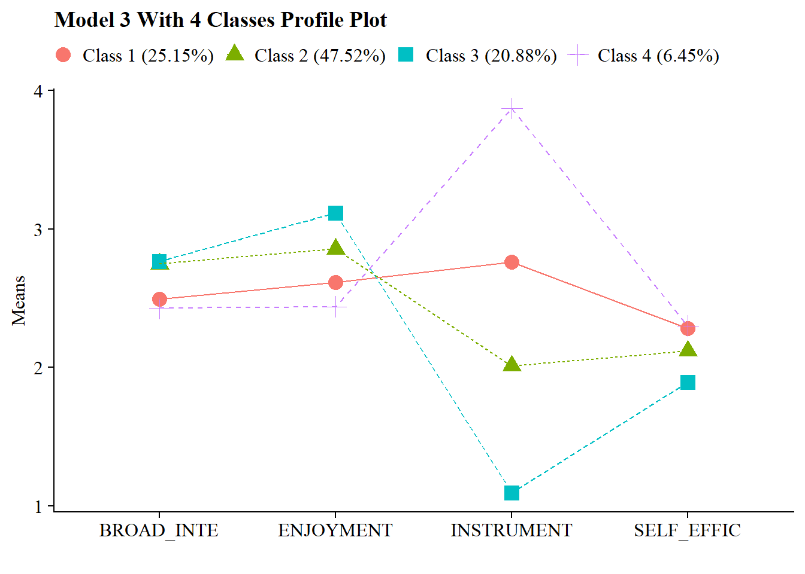

# Class Separation

------------------------------------------------------------------------

## Load Packages


``` r
library(naniar)
library(tidyverse)
library(haven)
library(glue)
library(MplusAutomation)
library(here)
library(janitor)
library(gt)
library(tidyLPA)
library(pisaUSA15)
library(cowplot)
library(filesstrings)
library(patchwork)
library(RcppAlgos)
```

------------------------------------------------------------------------

## LCA

Continuing the LCA example (\@ref(lca-enum)) in this bookdown, use R to evaluate the LCA class separation.

------------------------------------------------------------------------

$$\widehat{OR_{1v2}} = \frac{\frac{P(u_1=1|c_1)}{P(u_1=0|c_1)}}{\frac{P(u_1=1|c_2)}{P(u_1=0|c_2)}} $$

Odds ratios (ORs) of item endorsements between two classes \>5 (corresponding to class-specific endorsement probabilities of \>.7 and \<.3) or \<.2 (corresponding to class-specific endorsement probabilities of \<.3 and \>.7), indicate high separation between those two classes on that specific item. No single binary (0/1) indicator can separate more than two subsets of latent classes, no matter what the total number of classes in the model. We want a high degree of separation (large standardized mean differences) between classes.


``` r
# Read in model
output_enum <- readModels(here("enum"), filefilter = "bully", quiet = TRUE)

# Change this to look at your chosen LCA model
chosen_model <- output_enum$c4_bully.out

# Extract table of probabilities
c_prob <- data.frame(chosen_model$parameters$probability.scale) %>%
  mutate(LatentClass = sub("^", "Class ", LatentClass)) %>%
  filter(category == 2) %>%
  dplyr::select(est, LatentClass, param) %>%
  rename(item = param, prob = est, k = LatentClass) %>%
  mutate(# Adjust probabilities by setting a minimum of 0.01 and a maximum of 0.99
    prob = pmin(pmax(prob, 0.01), 0.99))


# Relative class sizes
class_sizes <- data.frame(chosen_model$class_counts$modelEstimated) %>%
  rename(size = proportion, k = class) %>%
  mutate(k = paste0("Class ", k)) %>%
  dplyr::select(-count)


# Create the combinations of classes
class_combinations <- data.frame(comboGrid(
  k1 = unique(class_sizes$k),
  k2 = unique(class_sizes$k)
)) %>%
  filter(k1 != k2) %>%
  arrange(k1, k2)

# Calculate pairwise comparisons for probabilities (e.g., P(u1=1|c1) / P(u1=0|c1) for each combination)
combined_results <- class_combinations %>%
  rowwise() %>%
  do({
    pair <- .
    k1 <- pair$k1
    k2 <- pair$k2
    
    # Filter for the probabilities (P(u1=1|c1) and P(u1=0|c1))
    data_k1_prob <- c_prob %>% filter(k == k1)
    data_k2_prob <- c_prob %>% filter(k == k2)
    
    # Combine the probability data for the two profiles
    prob_data <- data_k1_prob %>%
      inner_join(data_k2_prob,
                 by = "item",
                 suffix = c("_k1", "_k2")) %>%
      mutate(
        prob_ratio = (prob_k1 / (1 - prob_k1)) / (prob_k2 / (1 - prob_k2)),
        # Division formula
        comparison = paste(k1, "vs", k2)
      ) %>%
      mutate(prob_ratio = round(ifelse(
        is.infinite(prob_ratio) | is.nan(prob_ratio),
        NA,
        prob_ratio
      ), 3)) %>%
      dplyr::select(item, prob_ratio, comparison)
    
    prob_data
  }) %>%
  bind_rows()


# Define a function to apply the Markdown bold formatting
bold_condition <- function(x) {
  # If prob_ratio is > 5 or < 0.2, add **
  ifelse(x > 5 | x < 0.2, paste0("**", sprintf("%.3f", x), "**"),
         sprintf("%.3f", x))
}

# Assuming combined_results is already created as mentioned
formatted_results <- combined_results %>%
  dplyr::select(prob_ratio, comparison, item) %>%
  pivot_wider(names_from = comparison, values_from = prob_ratio) %>%
  mutate(across(where(is.numeric), ~ sapply(., bold_condition)))

# Create a gt table
formatted_results %>%
  gt() %>%
  cols_label(item = "Item") %>%
  fmt_missing(columns = everything(), missing_text = "-") %>%
  tab_header(title = "Class Separation Table") %>%
  fmt_markdown(columns = everything()) %>%
  tab_footnote(footnote = "Cells in bold indicate probabilities > 5 or < 0.2.")
```


```{=html}
<div id="ibdnmerqtk" style="padding-left:0px;padding-right:0px;padding-top:10px;padding-bottom:10px;overflow-x:auto;overflow-y:auto;width:auto;height:auto;">
<style>#ibdnmerqtk table {
  font-family: system-ui, 'Segoe UI', Roboto, Helvetica, Arial, sans-serif, 'Apple Color Emoji', 'Segoe UI Emoji', 'Segoe UI Symbol', 'Noto Color Emoji';
  -webkit-font-smoothing: antialiased;
  -moz-osx-font-smoothing: grayscale;
}

#ibdnmerqtk thead, #ibdnmerqtk tbody, #ibdnmerqtk tfoot, #ibdnmerqtk tr, #ibdnmerqtk td, #ibdnmerqtk th {
  border-style: none;
}

#ibdnmerqtk p {
  margin: 0;
  padding: 0;
}

#ibdnmerqtk .gt_table {
  display: table;
  border-collapse: collapse;
  line-height: normal;
  margin-left: auto;
  margin-right: auto;
  color: #333333;
  font-size: 16px;
  font-weight: normal;
  font-style: normal;
  background-color: #FFFFFF;
  width: auto;
  border-top-style: solid;
  border-top-width: 2px;
  border-top-color: #A8A8A8;
  border-right-style: none;
  border-right-width: 2px;
  border-right-color: #D3D3D3;
  border-bottom-style: solid;
  border-bottom-width: 2px;
  border-bottom-color: #A8A8A8;
  border-left-style: none;
  border-left-width: 2px;
  border-left-color: #D3D3D3;
}

#ibdnmerqtk .gt_caption {
  padding-top: 4px;
  padding-bottom: 4px;
}

#ibdnmerqtk .gt_title {
  color: #333333;
  font-size: 125%;
  font-weight: initial;
  padding-top: 4px;
  padding-bottom: 4px;
  padding-left: 5px;
  padding-right: 5px;
  border-bottom-color: #FFFFFF;
  border-bottom-width: 0;
}

#ibdnmerqtk .gt_subtitle {
  color: #333333;
  font-size: 85%;
  font-weight: initial;
  padding-top: 3px;
  padding-bottom: 5px;
  padding-left: 5px;
  padding-right: 5px;
  border-top-color: #FFFFFF;
  border-top-width: 0;
}

#ibdnmerqtk .gt_heading {
  background-color: #FFFFFF;
  text-align: center;
  border-bottom-color: #FFFFFF;
  border-left-style: none;
  border-left-width: 1px;
  border-left-color: #D3D3D3;
  border-right-style: none;
  border-right-width: 1px;
  border-right-color: #D3D3D3;
}

#ibdnmerqtk .gt_bottom_border {
  border-bottom-style: solid;
  border-bottom-width: 2px;
  border-bottom-color: #D3D3D3;
}

#ibdnmerqtk .gt_col_headings {
  border-top-style: solid;
  border-top-width: 2px;
  border-top-color: #D3D3D3;
  border-bottom-style: solid;
  border-bottom-width: 2px;
  border-bottom-color: #D3D3D3;
  border-left-style: none;
  border-left-width: 1px;
  border-left-color: #D3D3D3;
  border-right-style: none;
  border-right-width: 1px;
  border-right-color: #D3D3D3;
}

#ibdnmerqtk .gt_col_heading {
  color: #333333;
  background-color: #FFFFFF;
  font-size: 100%;
  font-weight: normal;
  text-transform: inherit;
  border-left-style: none;
  border-left-width: 1px;
  border-left-color: #D3D3D3;
  border-right-style: none;
  border-right-width: 1px;
  border-right-color: #D3D3D3;
  vertical-align: bottom;
  padding-top: 5px;
  padding-bottom: 6px;
  padding-left: 5px;
  padding-right: 5px;
  overflow-x: hidden;
}

#ibdnmerqtk .gt_column_spanner_outer {
  color: #333333;
  background-color: #FFFFFF;
  font-size: 100%;
  font-weight: normal;
  text-transform: inherit;
  padding-top: 0;
  padding-bottom: 0;
  padding-left: 4px;
  padding-right: 4px;
}

#ibdnmerqtk .gt_column_spanner_outer:first-child {
  padding-left: 0;
}

#ibdnmerqtk .gt_column_spanner_outer:last-child {
  padding-right: 0;
}

#ibdnmerqtk .gt_column_spanner {
  border-bottom-style: solid;
  border-bottom-width: 2px;
  border-bottom-color: #D3D3D3;
  vertical-align: bottom;
  padding-top: 5px;
  padding-bottom: 5px;
  overflow-x: hidden;
  display: inline-block;
  width: 100%;
}

#ibdnmerqtk .gt_spanner_row {
  border-bottom-style: hidden;
}

#ibdnmerqtk .gt_group_heading {
  padding-top: 8px;
  padding-bottom: 8px;
  padding-left: 5px;
  padding-right: 5px;
  color: #333333;
  background-color: #FFFFFF;
  font-size: 100%;
  font-weight: initial;
  text-transform: inherit;
  border-top-style: solid;
  border-top-width: 2px;
  border-top-color: #D3D3D3;
  border-bottom-style: solid;
  border-bottom-width: 2px;
  border-bottom-color: #D3D3D3;
  border-left-style: none;
  border-left-width: 1px;
  border-left-color: #D3D3D3;
  border-right-style: none;
  border-right-width: 1px;
  border-right-color: #D3D3D3;
  vertical-align: middle;
  text-align: left;
}

#ibdnmerqtk .gt_empty_group_heading {
  padding: 0.5px;
  color: #333333;
  background-color: #FFFFFF;
  font-size: 100%;
  font-weight: initial;
  border-top-style: solid;
  border-top-width: 2px;
  border-top-color: #D3D3D3;
  border-bottom-style: solid;
  border-bottom-width: 2px;
  border-bottom-color: #D3D3D3;
  vertical-align: middle;
}

#ibdnmerqtk .gt_from_md > :first-child {
  margin-top: 0;
}

#ibdnmerqtk .gt_from_md > :last-child {
  margin-bottom: 0;
}

#ibdnmerqtk .gt_row {
  padding-top: 8px;
  padding-bottom: 8px;
  padding-left: 5px;
  padding-right: 5px;
  margin: 10px;
  border-top-style: solid;
  border-top-width: 1px;
  border-top-color: #D3D3D3;
  border-left-style: none;
  border-left-width: 1px;
  border-left-color: #D3D3D3;
  border-right-style: none;
  border-right-width: 1px;
  border-right-color: #D3D3D3;
  vertical-align: middle;
  overflow-x: hidden;
}

#ibdnmerqtk .gt_stub {
  color: #333333;
  background-color: #FFFFFF;
  font-size: 100%;
  font-weight: initial;
  text-transform: inherit;
  border-right-style: solid;
  border-right-width: 2px;
  border-right-color: #D3D3D3;
  padding-left: 5px;
  padding-right: 5px;
}

#ibdnmerqtk .gt_stub_row_group {
  color: #333333;
  background-color: #FFFFFF;
  font-size: 100%;
  font-weight: initial;
  text-transform: inherit;
  border-right-style: solid;
  border-right-width: 2px;
  border-right-color: #D3D3D3;
  padding-left: 5px;
  padding-right: 5px;
  vertical-align: top;
}

#ibdnmerqtk .gt_row_group_first td {
  border-top-width: 2px;
}

#ibdnmerqtk .gt_row_group_first th {
  border-top-width: 2px;
}

#ibdnmerqtk .gt_summary_row {
  color: #333333;
  background-color: #FFFFFF;
  text-transform: inherit;
  padding-top: 8px;
  padding-bottom: 8px;
  padding-left: 5px;
  padding-right: 5px;
}

#ibdnmerqtk .gt_first_summary_row {
  border-top-style: solid;
  border-top-color: #D3D3D3;
}

#ibdnmerqtk .gt_first_summary_row.thick {
  border-top-width: 2px;
}

#ibdnmerqtk .gt_last_summary_row {
  padding-top: 8px;
  padding-bottom: 8px;
  padding-left: 5px;
  padding-right: 5px;
  border-bottom-style: solid;
  border-bottom-width: 2px;
  border-bottom-color: #D3D3D3;
}

#ibdnmerqtk .gt_grand_summary_row {
  color: #333333;
  background-color: #FFFFFF;
  text-transform: inherit;
  padding-top: 8px;
  padding-bottom: 8px;
  padding-left: 5px;
  padding-right: 5px;
}

#ibdnmerqtk .gt_first_grand_summary_row {
  padding-top: 8px;
  padding-bottom: 8px;
  padding-left: 5px;
  padding-right: 5px;
  border-top-style: double;
  border-top-width: 6px;
  border-top-color: #D3D3D3;
}

#ibdnmerqtk .gt_last_grand_summary_row_top {
  padding-top: 8px;
  padding-bottom: 8px;
  padding-left: 5px;
  padding-right: 5px;
  border-bottom-style: double;
  border-bottom-width: 6px;
  border-bottom-color: #D3D3D3;
}

#ibdnmerqtk .gt_striped {
  background-color: rgba(128, 128, 128, 0.05);
}

#ibdnmerqtk .gt_table_body {
  border-top-style: solid;
  border-top-width: 2px;
  border-top-color: #D3D3D3;
  border-bottom-style: solid;
  border-bottom-width: 2px;
  border-bottom-color: #D3D3D3;
}

#ibdnmerqtk .gt_footnotes {
  color: #333333;
  background-color: #FFFFFF;
  border-bottom-style: none;
  border-bottom-width: 2px;
  border-bottom-color: #D3D3D3;
  border-left-style: none;
  border-left-width: 2px;
  border-left-color: #D3D3D3;
  border-right-style: none;
  border-right-width: 2px;
  border-right-color: #D3D3D3;
}

#ibdnmerqtk .gt_footnote {
  margin: 0px;
  font-size: 90%;
  padding-top: 4px;
  padding-bottom: 4px;
  padding-left: 5px;
  padding-right: 5px;
}

#ibdnmerqtk .gt_sourcenotes {
  color: #333333;
  background-color: #FFFFFF;
  border-bottom-style: none;
  border-bottom-width: 2px;
  border-bottom-color: #D3D3D3;
  border-left-style: none;
  border-left-width: 2px;
  border-left-color: #D3D3D3;
  border-right-style: none;
  border-right-width: 2px;
  border-right-color: #D3D3D3;
}

#ibdnmerqtk .gt_sourcenote {
  font-size: 90%;
  padding-top: 4px;
  padding-bottom: 4px;
  padding-left: 5px;
  padding-right: 5px;
}

#ibdnmerqtk .gt_left {
  text-align: left;
}

#ibdnmerqtk .gt_center {
  text-align: center;
}

#ibdnmerqtk .gt_right {
  text-align: right;
  font-variant-numeric: tabular-nums;
}

#ibdnmerqtk .gt_font_normal {
  font-weight: normal;
}

#ibdnmerqtk .gt_font_bold {
  font-weight: bold;
}

#ibdnmerqtk .gt_font_italic {
  font-style: italic;
}

#ibdnmerqtk .gt_super {
  font-size: 65%;
}

#ibdnmerqtk .gt_footnote_marks {
  font-size: 75%;
  vertical-align: 0.4em;
  position: initial;
}

#ibdnmerqtk .gt_asterisk {
  font-size: 100%;
  vertical-align: 0;
}

#ibdnmerqtk .gt_indent_1 {
  text-indent: 5px;
}

#ibdnmerqtk .gt_indent_2 {
  text-indent: 10px;
}

#ibdnmerqtk .gt_indent_3 {
  text-indent: 15px;
}

#ibdnmerqtk .gt_indent_4 {
  text-indent: 20px;
}

#ibdnmerqtk .gt_indent_5 {
  text-indent: 25px;
}

#ibdnmerqtk .katex-display {
  display: inline-flex !important;
  margin-bottom: 0.75em !important;
}

#ibdnmerqtk div.Reactable > div.rt-table > div.rt-thead > div.rt-tr.rt-tr-group-header > div.rt-th-group:after {
  height: 0px !important;
}
</style>
<table class="gt_table" data-quarto-disable-processing="false" data-quarto-bootstrap="false">
  <thead>
    <tr class="gt_heading">
      <td colspan="7" class="gt_heading gt_title gt_font_normal gt_bottom_border" style>Class Separation Table</td>
    </tr>
    
    <tr class="gt_col_headings">
      <th class="gt_col_heading gt_columns_bottom_border gt_left" rowspan="1" colspan="1" scope="col" id="item">Item</th>
      <th class="gt_col_heading gt_columns_bottom_border gt_right" rowspan="1" colspan="1" scope="col" id="Class-1-vs-Class-2">Class 1 vs Class 2</th>
      <th class="gt_col_heading gt_columns_bottom_border gt_right" rowspan="1" colspan="1" scope="col" id="Class-1-vs-Class-3">Class 1 vs Class 3</th>
      <th class="gt_col_heading gt_columns_bottom_border gt_right" rowspan="1" colspan="1" scope="col" id="Class-1-vs-Class-4">Class 1 vs Class 4</th>
      <th class="gt_col_heading gt_columns_bottom_border gt_right" rowspan="1" colspan="1" scope="col" id="Class-2-vs-Class-3">Class 2 vs Class 3</th>
      <th class="gt_col_heading gt_columns_bottom_border gt_right" rowspan="1" colspan="1" scope="col" id="Class-2-vs-Class-4">Class 2 vs Class 4</th>
      <th class="gt_col_heading gt_columns_bottom_border gt_right" rowspan="1" colspan="1" scope="col" id="Class-3-vs-Class-4">Class 3 vs Class 4</th>
    </tr>
  </thead>
  <tbody class="gt_table_body">
    <tr><td headers="item" class="gt_row gt_left"><span class='gt_from_md'>REPORT_DIS</span></td>
<td headers="Class 1 vs Class 2" class="gt_row gt_right"><span class='gt_from_md'><strong>0.022</strong></span></td>
<td headers="Class 1 vs Class 3" class="gt_row gt_right"><span class='gt_from_md'>0.621</span></td>
<td headers="Class 1 vs Class 4" class="gt_row gt_right"><span class='gt_from_md'>0.621</span></td>
<td headers="Class 2 vs Class 3" class="gt_row gt_right"><span class='gt_from_md'><strong>28.150</strong></span></td>
<td headers="Class 2 vs Class 4" class="gt_row gt_right"><span class='gt_from_md'><strong>28.150</strong></span></td>
<td headers="Class 3 vs Class 4" class="gt_row gt_right"><span class='gt_from_md'>1.000</span></td></tr>
    <tr><td headers="item" class="gt_row gt_left"><span class='gt_from_md'>REPORT_RAC</span></td>
<td headers="Class 1 vs Class 2" class="gt_row gt_right"><span class='gt_from_md'><strong>0.012</strong></span></td>
<td headers="Class 1 vs Class 3" class="gt_row gt_right"><span class='gt_from_md'>4.665</span></td>
<td headers="Class 1 vs Class 4" class="gt_row gt_right"><span class='gt_from_md'>2.571</span></td>
<td headers="Class 2 vs Class 3" class="gt_row gt_right"><span class='gt_from_md'><strong>388.685</strong></span></td>
<td headers="Class 2 vs Class 4" class="gt_row gt_right"><span class='gt_from_md'><strong>214.191</strong></span></td>
<td headers="Class 3 vs Class 4" class="gt_row gt_right"><span class='gt_from_md'>0.551</span></td></tr>
    <tr><td headers="item" class="gt_row gt_left"><span class='gt_from_md'>REPORT_SEX</span></td>
<td headers="Class 1 vs Class 2" class="gt_row gt_right"><span class='gt_from_md'><strong>0.050</strong></span></td>
<td headers="Class 1 vs Class 3" class="gt_row gt_right"><span class='gt_from_md'>0.453</span></td>
<td headers="Class 1 vs Class 4" class="gt_row gt_right"><span class='gt_from_md'>4.527</span></td>
<td headers="Class 2 vs Class 3" class="gt_row gt_right"><span class='gt_from_md'><strong>9.018</strong></span></td>
<td headers="Class 2 vs Class 4" class="gt_row gt_right"><span class='gt_from_md'><strong>90.139</strong></span></td>
<td headers="Class 3 vs Class 4" class="gt_row gt_right"><span class='gt_from_md'><strong>9.995</strong></span></td></tr>
    <tr><td headers="item" class="gt_row gt_left"><span class='gt_from_md'>COUNSELORS</span></td>
<td headers="Class 1 vs Class 2" class="gt_row gt_right"><span class='gt_from_md'><strong>0.007</strong></span></td>
<td headers="Class 1 vs Class 3" class="gt_row gt_right"><span class='gt_from_md'><strong>0.000</strong></span></td>
<td headers="Class 1 vs Class 4" class="gt_row gt_right"><span class='gt_from_md'><strong>0.016</strong></span></td>
<td headers="Class 2 vs Class 3" class="gt_row gt_right"><span class='gt_from_md'><strong>0.014</strong></span></td>
<td headers="Class 2 vs Class 4" class="gt_row gt_right"><span class='gt_from_md'>2.161</span></td>
<td headers="Class 3 vs Class 4" class="gt_row gt_right"><span class='gt_from_md'><strong>158.812</strong></span></td></tr>
    <tr><td headers="item" class="gt_row gt_left"><span class='gt_from_md'>PSYCH_FTE</span></td>
<td headers="Class 1 vs Class 2" class="gt_row gt_right"><span class='gt_from_md'>0.842</span></td>
<td headers="Class 1 vs Class 3" class="gt_row gt_right"><span class='gt_from_md'>0.547</span></td>
<td headers="Class 1 vs Class 4" class="gt_row gt_right"><span class='gt_from_md'><strong>168.568</strong></span></td>
<td headers="Class 2 vs Class 3" class="gt_row gt_right"><span class='gt_from_md'>0.649</span></td>
<td headers="Class 2 vs Class 4" class="gt_row gt_right"><span class='gt_from_md'><strong>200.094</strong></span></td>
<td headers="Class 3 vs Class 4" class="gt_row gt_right"><span class='gt_from_md'><strong>308.407</strong></span></td></tr>
    <tr><td headers="item" class="gt_row gt_left"><span class='gt_from_md'>LAW_FTE</span></td>
<td headers="Class 1 vs Class 2" class="gt_row gt_right"><span class='gt_from_md'>0.262</span></td>
<td headers="Class 1 vs Class 3" class="gt_row gt_right"><span class='gt_from_md'>0.277</span></td>
<td headers="Class 1 vs Class 4" class="gt_row gt_right"><span class='gt_from_md'><strong>9.434</strong></span></td>
<td headers="Class 2 vs Class 3" class="gt_row gt_right"><span class='gt_from_md'>1.059</span></td>
<td headers="Class 2 vs Class 4" class="gt_row gt_right"><span class='gt_from_md'><strong>36.061</strong></span></td>
<td headers="Class 3 vs Class 4" class="gt_row gt_right"><span class='gt_from_md'><strong>34.065</strong></span></td></tr>
  </tbody>
  
  <tfoot class="gt_footnotes">
    <tr>
      <td class="gt_footnote" colspan="7"> Cells in bold indicate probabilities &gt; 5 or &lt; 0.2.</td>
    </tr>
  </tfoot>
</table>
</div>
```


## LPA

Continuing the LPA example (\@ref(lpa-enum)) in this bookdown, use R to evaluate the LPA profile separation.

------------------------------------------------------------------------

You can evaluate the degree of profile separation by assessing the actual distance between the profile-specific means. To quantify profile separation between Profile j and Profile k with respect to a particular item m, compute a standard mean difference:

$$\hat{d}_{mjk}= \frac{{\hat{\alpha_{mj}}-\hat{\alpha_{mk}}}}{\sigma_{mjk}}$$ Pooled variance:

$$\hat{\sigma}_{mj k} = \sqrt{\frac{(\hat{\pi}_j)(n)(\hat{\theta}_{mj}) + (\hat{\pi}_k)(n)(\hat{\theta}_{mk})}{(\hat{\pi}_j + \hat{\pi}_k) n}}$$

Well-separated classes have a small degree of overlap of the class-specific indicator distributions; that is, standardized mean difference is large.

-   A mean difference \<.85 corresponds to low separation—more than 50% overlap

-   A mean difference \> 2 corresponds to high separation—less than 20% overlap


``` r
# Read in model
output_enum <- readModels(here("lpa", "tidyLPA"), quiet = TRUE)

# Change this to look at your chosen LPA model
chosen_model <- output_enum$model_3_class_4.out

# Profile-specific means
profile_means <- data.frame(chosen_model$parameters$unstandardized) %>% 
  filter(paramHeader == "Means") %>%
  filter(!str_detect(param, "#")) %>% 
  dplyr::select(param, est, LatentClass) %>% 
  rename(item = param,
         means = est,
         k = LatentClass) %>% 
  mutate(k = paste0("Profile ", k)) %>% 
  mutate(item = str_sub(item, 1, 8))

# Relative profile sizes
profile_sizes <- data.frame(chosen_model$class_counts$modelEstimated) %>% 
  rename(size = proportion,
         k = class) %>% 
  mutate(k = paste0("Profile ", k)) %>% 
  dplyr::select(-count)

# Sample size
n <- chosen_model$summaries$Observations

# Profile-specific variance
profile_variances <- data.frame(chosen_model$parameters$unstandardized) %>% 
  filter(paramHeader == "Variances") %>% 
  dplyr::select(param, est, LatentClass) %>% 
  rename(item = param,
         variance = est,
         k = LatentClass) %>% 
  mutate(k = paste0("Profile ", k)) %>% 
  mutate(item = str_sub(item, 1, 8))

# Combine profile variances with profile sizes
variance_with_sizes <- profile_variances %>%
  left_join(profile_sizes, by = "k")

# Create the combinations
profile_combinations <- data.frame(comboGrid(k1 = unique(profile_sizes$k), k2 = unique(profile_sizes$k))) %>%
  filter(k1 != k2) %>%  
  arrange(k1, k2)

# Calculate pooled variance for each item across the profiles
combined_results <- profile_combinations %>%
  rowwise() %>%
  do({
    pair <- .
    k1 <- pair$k1
    k2 <- pair$k2
    
    # Filter for the two profiles (variance)
    data_k1_var <- variance_with_sizes %>% filter(k == k1)
    data_k2_var <- variance_with_sizes %>% filter(k == k2)
    
    # Filter for the two profiles (means)
    data_k1_mean <- profile_means %>% filter(k == k1)
    data_k2_mean <- profile_means %>% filter(k == k2)
    
    # Combine variance data for the two profiles
    variance_data <- data_k1_var %>%
      inner_join(data_k2_var, by = "item", suffix = c("_k1", "_k2")) %>%
      mutate(
        pooled_variance = sqrt(
          ((size_k1 * n * variance_k1) + (size_k2 * n * variance_k2)) / ((size_k1 + size_k2) * n)
        ),
        comparison = paste(k1, "vs", k2)
      ) %>%
      dplyr::select(item, pooled_variance, comparison)
    
    # Combine mean data for the two profilees
    mean_data <- data_k1_mean %>%
      inner_join(data_k2_mean, by = "item", suffix = c("_k1", "_k2")) %>%
      mutate(
        mean_diff = means_k1 - means_k2,
        comparison = paste(k1, "vs", k2)
      ) %>%
      dplyr::select(item, mean_diff, comparison)
    
    # Combine both variance and mean differences data
    combined_data <- variance_data %>%
      left_join(mean_data, by = c("item", "comparison")) %>% 
      mutate(
         mean_diff_by_pooled_variance = mean_diff / pooled_variance
      )
    
    combined_data
  }) %>%
  bind_rows() %>% 
  mutate(mean_diff_by_pooled_variance = round(mean_diff_by_pooled_variance, 3)) %>% 
  dplyr::select(mean_diff_by_pooled_variance, comparison, item) %>% 
  pivot_wider(
    names_from = comparison, 
    values_from = mean_diff_by_pooled_variance
  )
  

# Create a gt table
gt_table <- combined_results %>%
  gt() %>%
  cols_label(
    item = "Item"
  ) %>%
  tab_header(
    title = "Profile Separation Table"
  ) %>%
  tab_footnote(
    footnote = "Green cells indicate >2; Red cells indicate <0.85."
  )


# Formatting thresholds
high_threshold <- 2
low_threshold <- 0.85


# Apply conditional colors for each numeric cell
num_cols <- gt_table$`_data` %>% dplyr::select(-item) %>% names()  # numeric columns
for(col in num_cols){
  for(i in 1:nrow(combined_results)){
    val <- combined_results[[col]][i]  # numeric value
    color <- if(val > 2) "#66BB6A" else if(val < 0.85) "#E57373" else NA
    if(!is.na(color)){
      gt_table <- gt_table %>%
        tab_style(
          style = cell_fill(color = color),
          locations = cells_body(columns = col, rows = i)
        )
    }
  }
}

# Display table
gt_table
```


```{=html}
<div id="uzdocaopin" style="padding-left:0px;padding-right:0px;padding-top:10px;padding-bottom:10px;overflow-x:auto;overflow-y:auto;width:auto;height:auto;">
<style>#uzdocaopin table {
  font-family: system-ui, 'Segoe UI', Roboto, Helvetica, Arial, sans-serif, 'Apple Color Emoji', 'Segoe UI Emoji', 'Segoe UI Symbol', 'Noto Color Emoji';
  -webkit-font-smoothing: antialiased;
  -moz-osx-font-smoothing: grayscale;
}

#uzdocaopin thead, #uzdocaopin tbody, #uzdocaopin tfoot, #uzdocaopin tr, #uzdocaopin td, #uzdocaopin th {
  border-style: none;
}

#uzdocaopin p {
  margin: 0;
  padding: 0;
}

#uzdocaopin .gt_table {
  display: table;
  border-collapse: collapse;
  line-height: normal;
  margin-left: auto;
  margin-right: auto;
  color: #333333;
  font-size: 16px;
  font-weight: normal;
  font-style: normal;
  background-color: #FFFFFF;
  width: auto;
  border-top-style: solid;
  border-top-width: 2px;
  border-top-color: #A8A8A8;
  border-right-style: none;
  border-right-width: 2px;
  border-right-color: #D3D3D3;
  border-bottom-style: solid;
  border-bottom-width: 2px;
  border-bottom-color: #A8A8A8;
  border-left-style: none;
  border-left-width: 2px;
  border-left-color: #D3D3D3;
}

#uzdocaopin .gt_caption {
  padding-top: 4px;
  padding-bottom: 4px;
}

#uzdocaopin .gt_title {
  color: #333333;
  font-size: 125%;
  font-weight: initial;
  padding-top: 4px;
  padding-bottom: 4px;
  padding-left: 5px;
  padding-right: 5px;
  border-bottom-color: #FFFFFF;
  border-bottom-width: 0;
}

#uzdocaopin .gt_subtitle {
  color: #333333;
  font-size: 85%;
  font-weight: initial;
  padding-top: 3px;
  padding-bottom: 5px;
  padding-left: 5px;
  padding-right: 5px;
  border-top-color: #FFFFFF;
  border-top-width: 0;
}

#uzdocaopin .gt_heading {
  background-color: #FFFFFF;
  text-align: center;
  border-bottom-color: #FFFFFF;
  border-left-style: none;
  border-left-width: 1px;
  border-left-color: #D3D3D3;
  border-right-style: none;
  border-right-width: 1px;
  border-right-color: #D3D3D3;
}

#uzdocaopin .gt_bottom_border {
  border-bottom-style: solid;
  border-bottom-width: 2px;
  border-bottom-color: #D3D3D3;
}

#uzdocaopin .gt_col_headings {
  border-top-style: solid;
  border-top-width: 2px;
  border-top-color: #D3D3D3;
  border-bottom-style: solid;
  border-bottom-width: 2px;
  border-bottom-color: #D3D3D3;
  border-left-style: none;
  border-left-width: 1px;
  border-left-color: #D3D3D3;
  border-right-style: none;
  border-right-width: 1px;
  border-right-color: #D3D3D3;
}

#uzdocaopin .gt_col_heading {
  color: #333333;
  background-color: #FFFFFF;
  font-size: 100%;
  font-weight: normal;
  text-transform: inherit;
  border-left-style: none;
  border-left-width: 1px;
  border-left-color: #D3D3D3;
  border-right-style: none;
  border-right-width: 1px;
  border-right-color: #D3D3D3;
  vertical-align: bottom;
  padding-top: 5px;
  padding-bottom: 6px;
  padding-left: 5px;
  padding-right: 5px;
  overflow-x: hidden;
}

#uzdocaopin .gt_column_spanner_outer {
  color: #333333;
  background-color: #FFFFFF;
  font-size: 100%;
  font-weight: normal;
  text-transform: inherit;
  padding-top: 0;
  padding-bottom: 0;
  padding-left: 4px;
  padding-right: 4px;
}

#uzdocaopin .gt_column_spanner_outer:first-child {
  padding-left: 0;
}

#uzdocaopin .gt_column_spanner_outer:last-child {
  padding-right: 0;
}

#uzdocaopin .gt_column_spanner {
  border-bottom-style: solid;
  border-bottom-width: 2px;
  border-bottom-color: #D3D3D3;
  vertical-align: bottom;
  padding-top: 5px;
  padding-bottom: 5px;
  overflow-x: hidden;
  display: inline-block;
  width: 100%;
}

#uzdocaopin .gt_spanner_row {
  border-bottom-style: hidden;
}

#uzdocaopin .gt_group_heading {
  padding-top: 8px;
  padding-bottom: 8px;
  padding-left: 5px;
  padding-right: 5px;
  color: #333333;
  background-color: #FFFFFF;
  font-size: 100%;
  font-weight: initial;
  text-transform: inherit;
  border-top-style: solid;
  border-top-width: 2px;
  border-top-color: #D3D3D3;
  border-bottom-style: solid;
  border-bottom-width: 2px;
  border-bottom-color: #D3D3D3;
  border-left-style: none;
  border-left-width: 1px;
  border-left-color: #D3D3D3;
  border-right-style: none;
  border-right-width: 1px;
  border-right-color: #D3D3D3;
  vertical-align: middle;
  text-align: left;
}

#uzdocaopin .gt_empty_group_heading {
  padding: 0.5px;
  color: #333333;
  background-color: #FFFFFF;
  font-size: 100%;
  font-weight: initial;
  border-top-style: solid;
  border-top-width: 2px;
  border-top-color: #D3D3D3;
  border-bottom-style: solid;
  border-bottom-width: 2px;
  border-bottom-color: #D3D3D3;
  vertical-align: middle;
}

#uzdocaopin .gt_from_md > :first-child {
  margin-top: 0;
}

#uzdocaopin .gt_from_md > :last-child {
  margin-bottom: 0;
}

#uzdocaopin .gt_row {
  padding-top: 8px;
  padding-bottom: 8px;
  padding-left: 5px;
  padding-right: 5px;
  margin: 10px;
  border-top-style: solid;
  border-top-width: 1px;
  border-top-color: #D3D3D3;
  border-left-style: none;
  border-left-width: 1px;
  border-left-color: #D3D3D3;
  border-right-style: none;
  border-right-width: 1px;
  border-right-color: #D3D3D3;
  vertical-align: middle;
  overflow-x: hidden;
}

#uzdocaopin .gt_stub {
  color: #333333;
  background-color: #FFFFFF;
  font-size: 100%;
  font-weight: initial;
  text-transform: inherit;
  border-right-style: solid;
  border-right-width: 2px;
  border-right-color: #D3D3D3;
  padding-left: 5px;
  padding-right: 5px;
}

#uzdocaopin .gt_stub_row_group {
  color: #333333;
  background-color: #FFFFFF;
  font-size: 100%;
  font-weight: initial;
  text-transform: inherit;
  border-right-style: solid;
  border-right-width: 2px;
  border-right-color: #D3D3D3;
  padding-left: 5px;
  padding-right: 5px;
  vertical-align: top;
}

#uzdocaopin .gt_row_group_first td {
  border-top-width: 2px;
}

#uzdocaopin .gt_row_group_first th {
  border-top-width: 2px;
}

#uzdocaopin .gt_summary_row {
  color: #333333;
  background-color: #FFFFFF;
  text-transform: inherit;
  padding-top: 8px;
  padding-bottom: 8px;
  padding-left: 5px;
  padding-right: 5px;
}

#uzdocaopin .gt_first_summary_row {
  border-top-style: solid;
  border-top-color: #D3D3D3;
}

#uzdocaopin .gt_first_summary_row.thick {
  border-top-width: 2px;
}

#uzdocaopin .gt_last_summary_row {
  padding-top: 8px;
  padding-bottom: 8px;
  padding-left: 5px;
  padding-right: 5px;
  border-bottom-style: solid;
  border-bottom-width: 2px;
  border-bottom-color: #D3D3D3;
}

#uzdocaopin .gt_grand_summary_row {
  color: #333333;
  background-color: #FFFFFF;
  text-transform: inherit;
  padding-top: 8px;
  padding-bottom: 8px;
  padding-left: 5px;
  padding-right: 5px;
}

#uzdocaopin .gt_first_grand_summary_row {
  padding-top: 8px;
  padding-bottom: 8px;
  padding-left: 5px;
  padding-right: 5px;
  border-top-style: double;
  border-top-width: 6px;
  border-top-color: #D3D3D3;
}

#uzdocaopin .gt_last_grand_summary_row_top {
  padding-top: 8px;
  padding-bottom: 8px;
  padding-left: 5px;
  padding-right: 5px;
  border-bottom-style: double;
  border-bottom-width: 6px;
  border-bottom-color: #D3D3D3;
}

#uzdocaopin .gt_striped {
  background-color: rgba(128, 128, 128, 0.05);
}

#uzdocaopin .gt_table_body {
  border-top-style: solid;
  border-top-width: 2px;
  border-top-color: #D3D3D3;
  border-bottom-style: solid;
  border-bottom-width: 2px;
  border-bottom-color: #D3D3D3;
}

#uzdocaopin .gt_footnotes {
  color: #333333;
  background-color: #FFFFFF;
  border-bottom-style: none;
  border-bottom-width: 2px;
  border-bottom-color: #D3D3D3;
  border-left-style: none;
  border-left-width: 2px;
  border-left-color: #D3D3D3;
  border-right-style: none;
  border-right-width: 2px;
  border-right-color: #D3D3D3;
}

#uzdocaopin .gt_footnote {
  margin: 0px;
  font-size: 90%;
  padding-top: 4px;
  padding-bottom: 4px;
  padding-left: 5px;
  padding-right: 5px;
}

#uzdocaopin .gt_sourcenotes {
  color: #333333;
  background-color: #FFFFFF;
  border-bottom-style: none;
  border-bottom-width: 2px;
  border-bottom-color: #D3D3D3;
  border-left-style: none;
  border-left-width: 2px;
  border-left-color: #D3D3D3;
  border-right-style: none;
  border-right-width: 2px;
  border-right-color: #D3D3D3;
}

#uzdocaopin .gt_sourcenote {
  font-size: 90%;
  padding-top: 4px;
  padding-bottom: 4px;
  padding-left: 5px;
  padding-right: 5px;
}

#uzdocaopin .gt_left {
  text-align: left;
}

#uzdocaopin .gt_center {
  text-align: center;
}

#uzdocaopin .gt_right {
  text-align: right;
  font-variant-numeric: tabular-nums;
}

#uzdocaopin .gt_font_normal {
  font-weight: normal;
}

#uzdocaopin .gt_font_bold {
  font-weight: bold;
}

#uzdocaopin .gt_font_italic {
  font-style: italic;
}

#uzdocaopin .gt_super {
  font-size: 65%;
}

#uzdocaopin .gt_footnote_marks {
  font-size: 75%;
  vertical-align: 0.4em;
  position: initial;
}

#uzdocaopin .gt_asterisk {
  font-size: 100%;
  vertical-align: 0;
}

#uzdocaopin .gt_indent_1 {
  text-indent: 5px;
}

#uzdocaopin .gt_indent_2 {
  text-indent: 10px;
}

#uzdocaopin .gt_indent_3 {
  text-indent: 15px;
}

#uzdocaopin .gt_indent_4 {
  text-indent: 20px;
}

#uzdocaopin .gt_indent_5 {
  text-indent: 25px;
}

#uzdocaopin .katex-display {
  display: inline-flex !important;
  margin-bottom: 0.75em !important;
}

#uzdocaopin div.Reactable > div.rt-table > div.rt-thead > div.rt-tr.rt-tr-group-header > div.rt-th-group:after {
  height: 0px !important;
}
</style>
<table class="gt_table" data-quarto-disable-processing="false" data-quarto-bootstrap="false">
  <thead>
    <tr class="gt_heading">
      <td colspan="7" class="gt_heading gt_title gt_font_normal gt_bottom_border" style>Profile Separation Table</td>
    </tr>
    
    <tr class="gt_col_headings">
      <th class="gt_col_heading gt_columns_bottom_border gt_left" rowspan="1" colspan="1" scope="col" id="item">Item</th>
      <th class="gt_col_heading gt_columns_bottom_border gt_right" rowspan="1" colspan="1" scope="col" id="Profile-1-vs-Profile-2">Profile 1 vs Profile 2</th>
      <th class="gt_col_heading gt_columns_bottom_border gt_right" rowspan="1" colspan="1" scope="col" id="Profile-1-vs-Profile-3">Profile 1 vs Profile 3</th>
      <th class="gt_col_heading gt_columns_bottom_border gt_right" rowspan="1" colspan="1" scope="col" id="Profile-1-vs-Profile-4">Profile 1 vs Profile 4</th>
      <th class="gt_col_heading gt_columns_bottom_border gt_right" rowspan="1" colspan="1" scope="col" id="Profile-2-vs-Profile-3">Profile 2 vs Profile 3</th>
      <th class="gt_col_heading gt_columns_bottom_border gt_right" rowspan="1" colspan="1" scope="col" id="Profile-2-vs-Profile-4">Profile 2 vs Profile 4</th>
      <th class="gt_col_heading gt_columns_bottom_border gt_right" rowspan="1" colspan="1" scope="col" id="Profile-3-vs-Profile-4">Profile 3 vs Profile 4</th>
    </tr>
  </thead>
  <tbody class="gt_table_body">
    <tr><td headers="item" class="gt_row gt_left">BROAD_IN</td>
<td headers="Profile 1 vs Profile 2" class="gt_row gt_right" style="background-color: #E57373;">-0.334</td>
<td headers="Profile 1 vs Profile 3" class="gt_row gt_right" style="background-color: #E57373;">-0.357</td>
<td headers="Profile 1 vs Profile 4" class="gt_row gt_right" style="background-color: #E57373;">0.084</td>
<td headers="Profile 2 vs Profile 3" class="gt_row gt_right" style="background-color: #E57373;">-0.024</td>
<td headers="Profile 2 vs Profile 4" class="gt_row gt_right" style="background-color: #E57373;">0.418</td>
<td headers="Profile 3 vs Profile 4" class="gt_row gt_right" style="background-color: #E57373;">0.442</td></tr>
    <tr><td headers="item" class="gt_row gt_left">ENJOYMEN</td>
<td headers="Profile 1 vs Profile 2" class="gt_row gt_right" style="background-color: #E57373;">-0.346</td>
<td headers="Profile 1 vs Profile 3" class="gt_row gt_right" style="background-color: #E57373;">-0.722</td>
<td headers="Profile 1 vs Profile 4" class="gt_row gt_right" style="background-color: #E57373;">0.255</td>
<td headers="Profile 2 vs Profile 3" class="gt_row gt_right" style="background-color: #E57373;">-0.375</td>
<td headers="Profile 2 vs Profile 4" class="gt_row gt_right" style="background-color: #E57373;">0.602</td>
<td headers="Profile 3 vs Profile 4" class="gt_row gt_right">0.977</td></tr>
    <tr><td headers="item" class="gt_row gt_left">INSTRUME</td>
<td headers="Profile 1 vs Profile 2" class="gt_row gt_right" style="background-color: #66BB6A;">4.004</td>
<td headers="Profile 1 vs Profile 3" class="gt_row gt_right" style="background-color: #66BB6A;">8.900</td>
<td headers="Profile 1 vs Profile 4" class="gt_row gt_right" style="background-color: #E57373;">-5.923</td>
<td headers="Profile 2 vs Profile 3" class="gt_row gt_right" style="background-color: #66BB6A;">4.896</td>
<td headers="Profile 2 vs Profile 4" class="gt_row gt_right" style="background-color: #E57373;">-9.926</td>
<td headers="Profile 3 vs Profile 4" class="gt_row gt_right" style="background-color: #E57373;">-14.822</td></tr>
    <tr><td headers="item" class="gt_row gt_left">SELF_EFF</td>
<td headers="Profile 1 vs Profile 2" class="gt_row gt_right" style="background-color: #E57373;">0.261</td>
<td headers="Profile 1 vs Profile 3" class="gt_row gt_right" style="background-color: #E57373;">0.621</td>
<td headers="Profile 1 vs Profile 4" class="gt_row gt_right" style="background-color: #E57373;">-0.027</td>
<td headers="Profile 2 vs Profile 3" class="gt_row gt_right" style="background-color: #E57373;">0.360</td>
<td headers="Profile 2 vs Profile 4" class="gt_row gt_right" style="background-color: #E57373;">-0.288</td>
<td headers="Profile 3 vs Profile 4" class="gt_row gt_right" style="background-color: #E57373;">-0.648</td></tr>
  </tbody>
  
  <tfoot class="gt_footnotes">
    <tr>
      <td class="gt_footnote" colspan="7"> Green cells indicate &gt;2; Red cells indicate &lt;0.85.</td>
    </tr>
  </tfoot>
</table>
</div>
```


You can also visualize the plot:


``` r
source(here("functions", "plot_lpa.R"))

output_enum <- readModels(here("lpa", "tidyLPA"), quiet = TRUE)

plot_lpa(model_name = output_enum$model_3_class_4.out)
```



::: {style="text-align: center;"}

:::
