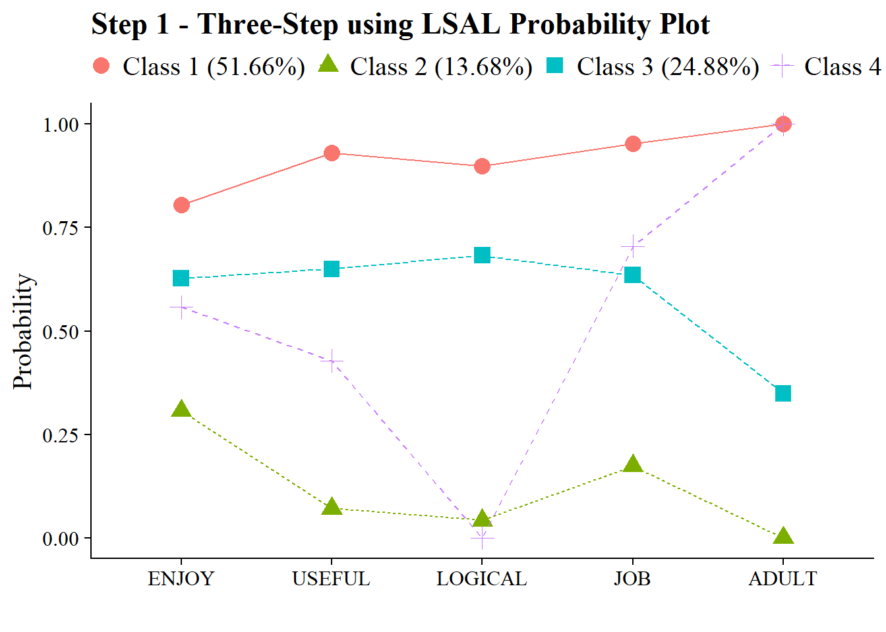

# (PART) Including Auxiliary Variables {-}

# Manual 3-Step Covariate Only

------------------------------------------------------------------------

**Data source:**

1.  The first examples utilizes the public-use dataset, *The Longitudinal Survey of American Youth* (**LSAY**): [See documentation here](https://www.lsay.org/)

2.  The second example utilizes a dataset on undergraduate *Cheating* available from the `poLCA` package (Dayton, 1998): [See documentation here](https://cran.r-project.org/web/packages/poLCA/poLCA.pdf)

------------------------------------------------------------------------

## Load packages


``` r
library(MplusAutomation)
library(tidyverse) #collection of R packages designed for data science
library(here) #helps with filepaths
library(janitor) #clean_names
library(gt) # create tables
library(cowplot) # a ggplot theme
library(DiagrammeR) # create path diagrams
library(glue) # allows us to paste expressions into R code
library(data.table) # used for `melt()` function  
library(poLCA)
library(reshape2)
```

------------------------------------------------------------------------

Our example is Mother's Education as a predictor of latent class membership of Math Attitudes


```{=html}
<div class="grViz html-widget html-fill-item" id="htmlwidget-c21ede31831fa94b84ed" style="width:672px;height:480px;"></div>
<script type="application/json" data-for="htmlwidget-c21ede31831fa94b84ed">{"x":{"diagram":" digraph lca_model {\n\n# The `graph` statement - No editing needed\n\n    graph [layout = dot, overlap = true]\n \n# Two `node` statements\n \n# One for measured variables (box) \n\n    node [shape=box]\n    Enjoy Useful Logical Job Adult MothEd;\n \n# One for latent variables (circle) \n \n    node [shape=circle]\n    math [label=<Math <br/>Attitudes <br/>C<sub>k=4<\/sub>>];\n    \n# `edge` statements\n \n    edge [minlen = 2]\n    math -> {Enjoy Useful Logical Job Adult}\n    MothEd -> math [minlen = 4];\n    \n {rank = same; math; MothEd;}\n \n }","config":{"engine":"dot","options":null}},"evals":[],"jsHooks":[]}</script>
```


------------------------------------------------------------------------

Application: Longitudinal Study of American Youth, **Science Attitudes**


```{=html}
<div id="nyjixfaayu" style="padding-left:0px;padding-right:0px;padding-top:10px;padding-bottom:10px;overflow-x:auto;overflow-y:auto;width:auto;height:auto;">
<style>#nyjixfaayu table {
  font-family: system-ui, 'Segoe UI', Roboto, Helvetica, Arial, sans-serif, 'Apple Color Emoji', 'Segoe UI Emoji', 'Segoe UI Symbol', 'Noto Color Emoji';
  -webkit-font-smoothing: antialiased;
  -moz-osx-font-smoothing: grayscale;
}

#nyjixfaayu thead, #nyjixfaayu tbody, #nyjixfaayu tfoot, #nyjixfaayu tr, #nyjixfaayu td, #nyjixfaayu th {
  border-style: none;
}

#nyjixfaayu p {
  margin: 0;
  padding: 0;
}

#nyjixfaayu .gt_table {
  display: table;
  border-collapse: collapse;
  line-height: normal;
  margin-left: auto;
  margin-right: auto;
  color: #333333;
  font-size: 16px;
  font-weight: normal;
  font-style: normal;
  background-color: #FFFFFF;
  width: auto;
  border-top-style: solid;
  border-top-width: 2px;
  border-top-color: #A8A8A8;
  border-right-style: none;
  border-right-width: 2px;
  border-right-color: #D3D3D3;
  border-bottom-style: solid;
  border-bottom-width: 2px;
  border-bottom-color: #A8A8A8;
  border-left-style: none;
  border-left-width: 2px;
  border-left-color: #D3D3D3;
}

#nyjixfaayu .gt_caption {
  padding-top: 4px;
  padding-bottom: 4px;
}

#nyjixfaayu .gt_title {
  color: #333333;
  font-size: 125%;
  font-weight: initial;
  padding-top: 4px;
  padding-bottom: 4px;
  padding-left: 5px;
  padding-right: 5px;
  border-bottom-color: #FFFFFF;
  border-bottom-width: 0;
}

#nyjixfaayu .gt_subtitle {
  color: #333333;
  font-size: 85%;
  font-weight: initial;
  padding-top: 3px;
  padding-bottom: 5px;
  padding-left: 5px;
  padding-right: 5px;
  border-top-color: #FFFFFF;
  border-top-width: 0;
}

#nyjixfaayu .gt_heading {
  background-color: #FFFFFF;
  text-align: center;
  border-bottom-color: #FFFFFF;
  border-left-style: none;
  border-left-width: 1px;
  border-left-color: #D3D3D3;
  border-right-style: none;
  border-right-width: 1px;
  border-right-color: #D3D3D3;
}

#nyjixfaayu .gt_bottom_border {
  border-bottom-style: solid;
  border-bottom-width: 2px;
  border-bottom-color: #D3D3D3;
}

#nyjixfaayu .gt_col_headings {
  border-top-style: solid;
  border-top-width: 2px;
  border-top-color: #D3D3D3;
  border-bottom-style: solid;
  border-bottom-width: 2px;
  border-bottom-color: #D3D3D3;
  border-left-style: none;
  border-left-width: 1px;
  border-left-color: #D3D3D3;
  border-right-style: none;
  border-right-width: 1px;
  border-right-color: #D3D3D3;
}

#nyjixfaayu .gt_col_heading {
  color: #333333;
  background-color: #FFFFFF;
  font-size: 100%;
  font-weight: bold;
  text-transform: inherit;
  border-left-style: none;
  border-left-width: 1px;
  border-left-color: #D3D3D3;
  border-right-style: none;
  border-right-width: 1px;
  border-right-color: #D3D3D3;
  vertical-align: bottom;
  padding-top: 5px;
  padding-bottom: 6px;
  padding-left: 5px;
  padding-right: 5px;
  overflow-x: hidden;
}

#nyjixfaayu .gt_column_spanner_outer {
  color: #333333;
  background-color: #FFFFFF;
  font-size: 100%;
  font-weight: bold;
  text-transform: inherit;
  padding-top: 0;
  padding-bottom: 0;
  padding-left: 4px;
  padding-right: 4px;
}

#nyjixfaayu .gt_column_spanner_outer:first-child {
  padding-left: 0;
}

#nyjixfaayu .gt_column_spanner_outer:last-child {
  padding-right: 0;
}

#nyjixfaayu .gt_column_spanner {
  border-bottom-style: solid;
  border-bottom-width: 2px;
  border-bottom-color: #D3D3D3;
  vertical-align: bottom;
  padding-top: 5px;
  padding-bottom: 5px;
  overflow-x: hidden;
  display: inline-block;
  width: 100%;
}

#nyjixfaayu .gt_spanner_row {
  border-bottom-style: hidden;
}

#nyjixfaayu .gt_group_heading {
  padding-top: 8px;
  padding-bottom: 8px;
  padding-left: 5px;
  padding-right: 5px;
  color: #333333;
  background-color: #FFFFFF;
  font-size: 100%;
  font-weight: bold;
  text-transform: inherit;
  border-top-style: solid;
  border-top-width: 2px;
  border-top-color: #D3D3D3;
  border-bottom-style: solid;
  border-bottom-width: 2px;
  border-bottom-color: #D3D3D3;
  border-left-style: none;
  border-left-width: 1px;
  border-left-color: #D3D3D3;
  border-right-style: none;
  border-right-width: 1px;
  border-right-color: #D3D3D3;
  vertical-align: middle;
  text-align: left;
}

#nyjixfaayu .gt_empty_group_heading {
  padding: 0.5px;
  color: #333333;
  background-color: #FFFFFF;
  font-size: 100%;
  font-weight: bold;
  border-top-style: solid;
  border-top-width: 2px;
  border-top-color: #D3D3D3;
  border-bottom-style: solid;
  border-bottom-width: 2px;
  border-bottom-color: #D3D3D3;
  vertical-align: middle;
}

#nyjixfaayu .gt_from_md > :first-child {
  margin-top: 0;
}

#nyjixfaayu .gt_from_md > :last-child {
  margin-bottom: 0;
}

#nyjixfaayu .gt_row {
  padding-top: 8px;
  padding-bottom: 8px;
  padding-left: 5px;
  padding-right: 5px;
  margin: 10px;
  border-top-style: solid;
  border-top-width: 1px;
  border-top-color: #D3D3D3;
  border-left-style: none;
  border-left-width: 1px;
  border-left-color: #D3D3D3;
  border-right-style: none;
  border-right-width: 1px;
  border-right-color: #D3D3D3;
  vertical-align: middle;
  overflow-x: hidden;
}

#nyjixfaayu .gt_stub {
  color: #333333;
  background-color: #FFFFFF;
  font-size: 100%;
  font-weight: initial;
  text-transform: inherit;
  border-right-style: solid;
  border-right-width: 2px;
  border-right-color: #D3D3D3;
  padding-left: 5px;
  padding-right: 5px;
}

#nyjixfaayu .gt_stub_row_group {
  color: #333333;
  background-color: #FFFFFF;
  font-size: 100%;
  font-weight: initial;
  text-transform: inherit;
  border-right-style: solid;
  border-right-width: 2px;
  border-right-color: #D3D3D3;
  padding-left: 5px;
  padding-right: 5px;
  vertical-align: top;
}

#nyjixfaayu .gt_row_group_first td {
  border-top-width: 2px;
}

#nyjixfaayu .gt_row_group_first th {
  border-top-width: 2px;
}

#nyjixfaayu .gt_summary_row {
  color: #333333;
  background-color: #FFFFFF;
  text-transform: inherit;
  padding-top: 8px;
  padding-bottom: 8px;
  padding-left: 5px;
  padding-right: 5px;
}

#nyjixfaayu .gt_first_summary_row {
  border-top-style: solid;
  border-top-color: #D3D3D3;
}

#nyjixfaayu .gt_first_summary_row.thick {
  border-top-width: 2px;
}

#nyjixfaayu .gt_last_summary_row {
  padding-top: 8px;
  padding-bottom: 8px;
  padding-left: 5px;
  padding-right: 5px;
  border-bottom-style: solid;
  border-bottom-width: 2px;
  border-bottom-color: #D3D3D3;
}

#nyjixfaayu .gt_grand_summary_row {
  color: #333333;
  background-color: #FFFFFF;
  text-transform: inherit;
  padding-top: 8px;
  padding-bottom: 8px;
  padding-left: 5px;
  padding-right: 5px;
}

#nyjixfaayu .gt_first_grand_summary_row {
  padding-top: 8px;
  padding-bottom: 8px;
  padding-left: 5px;
  padding-right: 5px;
  border-top-style: double;
  border-top-width: 6px;
  border-top-color: #D3D3D3;
}

#nyjixfaayu .gt_last_grand_summary_row_top {
  padding-top: 8px;
  padding-bottom: 8px;
  padding-left: 5px;
  padding-right: 5px;
  border-bottom-style: double;
  border-bottom-width: 6px;
  border-bottom-color: #D3D3D3;
}

#nyjixfaayu .gt_striped {
  background-color: rgba(128, 128, 128, 0.05);
}

#nyjixfaayu .gt_table_body {
  border-top-style: solid;
  border-top-width: 2px;
  border-top-color: #D3D3D3;
  border-bottom-style: solid;
  border-bottom-width: 2px;
  border-bottom-color: #D3D3D3;
}

#nyjixfaayu .gt_footnotes {
  color: #333333;
  background-color: #FFFFFF;
  border-bottom-style: none;
  border-bottom-width: 2px;
  border-bottom-color: #D3D3D3;
  border-left-style: none;
  border-left-width: 2px;
  border-left-color: #D3D3D3;
  border-right-style: none;
  border-right-width: 2px;
  border-right-color: #D3D3D3;
}

#nyjixfaayu .gt_footnote {
  margin: 0px;
  font-size: 90%;
  padding-top: 4px;
  padding-bottom: 4px;
  padding-left: 5px;
  padding-right: 5px;
}

#nyjixfaayu .gt_sourcenotes {
  color: #333333;
  background-color: #FFFFFF;
  border-bottom-style: none;
  border-bottom-width: 2px;
  border-bottom-color: #D3D3D3;
  border-left-style: none;
  border-left-width: 2px;
  border-left-color: #D3D3D3;
  border-right-style: none;
  border-right-width: 2px;
  border-right-color: #D3D3D3;
}

#nyjixfaayu .gt_sourcenote {
  font-size: 90%;
  padding-top: 4px;
  padding-bottom: 4px;
  padding-left: 5px;
  padding-right: 5px;
}

#nyjixfaayu .gt_left {
  text-align: left;
}

#nyjixfaayu .gt_center {
  text-align: center;
}

#nyjixfaayu .gt_right {
  text-align: right;
  font-variant-numeric: tabular-nums;
}

#nyjixfaayu .gt_font_normal {
  font-weight: normal;
}

#nyjixfaayu .gt_font_bold {
  font-weight: bold;
}

#nyjixfaayu .gt_font_italic {
  font-style: italic;
}

#nyjixfaayu .gt_super {
  font-size: 65%;
}

#nyjixfaayu .gt_footnote_marks {
  font-size: 75%;
  vertical-align: 0.4em;
  position: initial;
}

#nyjixfaayu .gt_asterisk {
  font-size: 100%;
  vertical-align: 0;
}

#nyjixfaayu .gt_indent_1 {
  text-indent: 5px;
}

#nyjixfaayu .gt_indent_2 {
  text-indent: 10px;
}

#nyjixfaayu .gt_indent_3 {
  text-indent: 15px;
}

#nyjixfaayu .gt_indent_4 {
  text-indent: 20px;
}

#nyjixfaayu .gt_indent_5 {
  text-indent: 25px;
}

#nyjixfaayu .katex-display {
  display: inline-flex !important;
  margin-bottom: 0.75em !important;
}

#nyjixfaayu div.Reactable > div.rt-table > div.rt-thead > div.rt-tr.rt-tr-group-header > div.rt-th-group:after {
  height: 0px !important;
}
</style>
<table class="gt_table" data-quarto-disable-processing="false" data-quarto-bootstrap="false">
  <thead>
    <tr class="gt_heading">
      <td colspan="2" class="gt_heading gt_title gt_font_normal" style><span class='gt_from_md'><strong>LCA Indicators &amp; Auxiliary Variables: Math Attitudes Example</strong></span></td>
    </tr>
    <tr class="gt_heading">
      <td colspan="2" class="gt_heading gt_subtitle gt_font_normal gt_bottom_border" style><span class='gt_from_md'> </span></td>
    </tr>
    <tr class="gt_col_headings">
      <th class="gt_col_heading gt_columns_bottom_border gt_left" rowspan="1" colspan="1" scope="col" id="Name">Name</th>
      <th class="gt_col_heading gt_columns_bottom_border gt_left" rowspan="1" colspan="1" scope="col" id="a-Variable-Description"> Variable Description</th>
    </tr>
  </thead>
  <tbody class="gt_table_body">
    <tr class="gt_group_heading_row">
      <th colspan="2" class="gt_empty_group_heading" scope="colgroup"></th>
    </tr>
    <tr class="gt_row_group_first"><td headers="  Name" class="gt_row gt_left">enjoy</td>
<td headers="   Variable Description" class="gt_row gt_left">I enjoy math.</td></tr>
    <tr><td headers="  Name" class="gt_row gt_left">useful</td>
<td headers="   Variable Description" class="gt_row gt_left">Math is useful in everyday problems.</td></tr>
    <tr><td headers="  Name" class="gt_row gt_left">logical</td>
<td headers="   Variable Description" class="gt_row gt_left">Math helps a person think logically.</td></tr>
    <tr><td headers="  Name" class="gt_row gt_left">job</td>
<td headers="   Variable Description" class="gt_row gt_left">It is important to know math to get a good job.</td></tr>
    <tr><td headers="  Name" class="gt_row gt_left">adult</td>
<td headers="   Variable Description" class="gt_row gt_left">I will use math in many ways as an adult.</td></tr>
    <tr class="gt_group_heading_row">
      <th colspan="2" class="gt_group_heading" scope="colgroup" id="Auxiliary Variables">Auxiliary Variables</th>
    </tr>
    <tr class="gt_row_group_first"><td headers="Auxiliary Variables  Name" class="gt_row gt_left">mothed</td>
<td headers="Auxiliary Variables   Variable Description" class="gt_row gt_left">Level of education:  (1) less than high school, (2) high school diploma, (3) some college, (4) 4-year college, and (5) an advanced degree.</td></tr>
  </tbody>
  
  
</table>
</div>
```


------------------------------------------------------------------------

The data can be found in the `data` folder and is called `lsay_subset.csv`.


``` r
lsay_data <- read_csv(here("three_step","data","lsay_subset.csv")) %>% 
  clean_names() %>%   # make variable names lowercase
  mutate(female = recode(gender, `1` = 0, `2` = 1)) # relabel values from 1,2 to 0,1
```

------------------------------------------------------------------------

## Descriptive Statistics


``` r
dframe <- lsay_data %>%
  pivot_longer(
    c(enjoy, useful, logical, job, adult),
    names_to = "Variable"
  ) %>%
  group_by(Variable) %>%
  summarise(
    Count = sum(value == 1, na.rm = TRUE),
    Total = n(),
    .groups = "drop"
  ) %>%
  mutate(`Proportion Endorsed` = round(Count / Total, 3)) %>%
  dplyr::select(Variable, `Proportion Endorsed`, Count)

gt(dframe) %>%
  tab_header(
    title = md("**LCA Indicator Endorsement**"),
    subtitle = md("&nbsp;")
  ) %>%
  tab_options(
    column_labels.font.weight = "bold",
    row_group.font.weight = "bold"
  )
```


```{=html}
<div id="sfzsraeoak" style="padding-left:0px;padding-right:0px;padding-top:10px;padding-bottom:10px;overflow-x:auto;overflow-y:auto;width:auto;height:auto;">
<style>#sfzsraeoak table {
  font-family: system-ui, 'Segoe UI', Roboto, Helvetica, Arial, sans-serif, 'Apple Color Emoji', 'Segoe UI Emoji', 'Segoe UI Symbol', 'Noto Color Emoji';
  -webkit-font-smoothing: antialiased;
  -moz-osx-font-smoothing: grayscale;
}

#sfzsraeoak thead, #sfzsraeoak tbody, #sfzsraeoak tfoot, #sfzsraeoak tr, #sfzsraeoak td, #sfzsraeoak th {
  border-style: none;
}

#sfzsraeoak p {
  margin: 0;
  padding: 0;
}

#sfzsraeoak .gt_table {
  display: table;
  border-collapse: collapse;
  line-height: normal;
  margin-left: auto;
  margin-right: auto;
  color: #333333;
  font-size: 16px;
  font-weight: normal;
  font-style: normal;
  background-color: #FFFFFF;
  width: auto;
  border-top-style: solid;
  border-top-width: 2px;
  border-top-color: #A8A8A8;
  border-right-style: none;
  border-right-width: 2px;
  border-right-color: #D3D3D3;
  border-bottom-style: solid;
  border-bottom-width: 2px;
  border-bottom-color: #A8A8A8;
  border-left-style: none;
  border-left-width: 2px;
  border-left-color: #D3D3D3;
}

#sfzsraeoak .gt_caption {
  padding-top: 4px;
  padding-bottom: 4px;
}

#sfzsraeoak .gt_title {
  color: #333333;
  font-size: 125%;
  font-weight: initial;
  padding-top: 4px;
  padding-bottom: 4px;
  padding-left: 5px;
  padding-right: 5px;
  border-bottom-color: #FFFFFF;
  border-bottom-width: 0;
}

#sfzsraeoak .gt_subtitle {
  color: #333333;
  font-size: 85%;
  font-weight: initial;
  padding-top: 3px;
  padding-bottom: 5px;
  padding-left: 5px;
  padding-right: 5px;
  border-top-color: #FFFFFF;
  border-top-width: 0;
}

#sfzsraeoak .gt_heading {
  background-color: #FFFFFF;
  text-align: center;
  border-bottom-color: #FFFFFF;
  border-left-style: none;
  border-left-width: 1px;
  border-left-color: #D3D3D3;
  border-right-style: none;
  border-right-width: 1px;
  border-right-color: #D3D3D3;
}

#sfzsraeoak .gt_bottom_border {
  border-bottom-style: solid;
  border-bottom-width: 2px;
  border-bottom-color: #D3D3D3;
}

#sfzsraeoak .gt_col_headings {
  border-top-style: solid;
  border-top-width: 2px;
  border-top-color: #D3D3D3;
  border-bottom-style: solid;
  border-bottom-width: 2px;
  border-bottom-color: #D3D3D3;
  border-left-style: none;
  border-left-width: 1px;
  border-left-color: #D3D3D3;
  border-right-style: none;
  border-right-width: 1px;
  border-right-color: #D3D3D3;
}

#sfzsraeoak .gt_col_heading {
  color: #333333;
  background-color: #FFFFFF;
  font-size: 100%;
  font-weight: bold;
  text-transform: inherit;
  border-left-style: none;
  border-left-width: 1px;
  border-left-color: #D3D3D3;
  border-right-style: none;
  border-right-width: 1px;
  border-right-color: #D3D3D3;
  vertical-align: bottom;
  padding-top: 5px;
  padding-bottom: 6px;
  padding-left: 5px;
  padding-right: 5px;
  overflow-x: hidden;
}

#sfzsraeoak .gt_column_spanner_outer {
  color: #333333;
  background-color: #FFFFFF;
  font-size: 100%;
  font-weight: bold;
  text-transform: inherit;
  padding-top: 0;
  padding-bottom: 0;
  padding-left: 4px;
  padding-right: 4px;
}

#sfzsraeoak .gt_column_spanner_outer:first-child {
  padding-left: 0;
}

#sfzsraeoak .gt_column_spanner_outer:last-child {
  padding-right: 0;
}

#sfzsraeoak .gt_column_spanner {
  border-bottom-style: solid;
  border-bottom-width: 2px;
  border-bottom-color: #D3D3D3;
  vertical-align: bottom;
  padding-top: 5px;
  padding-bottom: 5px;
  overflow-x: hidden;
  display: inline-block;
  width: 100%;
}

#sfzsraeoak .gt_spanner_row {
  border-bottom-style: hidden;
}

#sfzsraeoak .gt_group_heading {
  padding-top: 8px;
  padding-bottom: 8px;
  padding-left: 5px;
  padding-right: 5px;
  color: #333333;
  background-color: #FFFFFF;
  font-size: 100%;
  font-weight: bold;
  text-transform: inherit;
  border-top-style: solid;
  border-top-width: 2px;
  border-top-color: #D3D3D3;
  border-bottom-style: solid;
  border-bottom-width: 2px;
  border-bottom-color: #D3D3D3;
  border-left-style: none;
  border-left-width: 1px;
  border-left-color: #D3D3D3;
  border-right-style: none;
  border-right-width: 1px;
  border-right-color: #D3D3D3;
  vertical-align: middle;
  text-align: left;
}

#sfzsraeoak .gt_empty_group_heading {
  padding: 0.5px;
  color: #333333;
  background-color: #FFFFFF;
  font-size: 100%;
  font-weight: bold;
  border-top-style: solid;
  border-top-width: 2px;
  border-top-color: #D3D3D3;
  border-bottom-style: solid;
  border-bottom-width: 2px;
  border-bottom-color: #D3D3D3;
  vertical-align: middle;
}

#sfzsraeoak .gt_from_md > :first-child {
  margin-top: 0;
}

#sfzsraeoak .gt_from_md > :last-child {
  margin-bottom: 0;
}

#sfzsraeoak .gt_row {
  padding-top: 8px;
  padding-bottom: 8px;
  padding-left: 5px;
  padding-right: 5px;
  margin: 10px;
  border-top-style: solid;
  border-top-width: 1px;
  border-top-color: #D3D3D3;
  border-left-style: none;
  border-left-width: 1px;
  border-left-color: #D3D3D3;
  border-right-style: none;
  border-right-width: 1px;
  border-right-color: #D3D3D3;
  vertical-align: middle;
  overflow-x: hidden;
}

#sfzsraeoak .gt_stub {
  color: #333333;
  background-color: #FFFFFF;
  font-size: 100%;
  font-weight: initial;
  text-transform: inherit;
  border-right-style: solid;
  border-right-width: 2px;
  border-right-color: #D3D3D3;
  padding-left: 5px;
  padding-right: 5px;
}

#sfzsraeoak .gt_stub_row_group {
  color: #333333;
  background-color: #FFFFFF;
  font-size: 100%;
  font-weight: initial;
  text-transform: inherit;
  border-right-style: solid;
  border-right-width: 2px;
  border-right-color: #D3D3D3;
  padding-left: 5px;
  padding-right: 5px;
  vertical-align: top;
}

#sfzsraeoak .gt_row_group_first td {
  border-top-width: 2px;
}

#sfzsraeoak .gt_row_group_first th {
  border-top-width: 2px;
}

#sfzsraeoak .gt_summary_row {
  color: #333333;
  background-color: #FFFFFF;
  text-transform: inherit;
  padding-top: 8px;
  padding-bottom: 8px;
  padding-left: 5px;
  padding-right: 5px;
}

#sfzsraeoak .gt_first_summary_row {
  border-top-style: solid;
  border-top-color: #D3D3D3;
}

#sfzsraeoak .gt_first_summary_row.thick {
  border-top-width: 2px;
}

#sfzsraeoak .gt_last_summary_row {
  padding-top: 8px;
  padding-bottom: 8px;
  padding-left: 5px;
  padding-right: 5px;
  border-bottom-style: solid;
  border-bottom-width: 2px;
  border-bottom-color: #D3D3D3;
}

#sfzsraeoak .gt_grand_summary_row {
  color: #333333;
  background-color: #FFFFFF;
  text-transform: inherit;
  padding-top: 8px;
  padding-bottom: 8px;
  padding-left: 5px;
  padding-right: 5px;
}

#sfzsraeoak .gt_first_grand_summary_row {
  padding-top: 8px;
  padding-bottom: 8px;
  padding-left: 5px;
  padding-right: 5px;
  border-top-style: double;
  border-top-width: 6px;
  border-top-color: #D3D3D3;
}

#sfzsraeoak .gt_last_grand_summary_row_top {
  padding-top: 8px;
  padding-bottom: 8px;
  padding-left: 5px;
  padding-right: 5px;
  border-bottom-style: double;
  border-bottom-width: 6px;
  border-bottom-color: #D3D3D3;
}

#sfzsraeoak .gt_striped {
  background-color: rgba(128, 128, 128, 0.05);
}

#sfzsraeoak .gt_table_body {
  border-top-style: solid;
  border-top-width: 2px;
  border-top-color: #D3D3D3;
  border-bottom-style: solid;
  border-bottom-width: 2px;
  border-bottom-color: #D3D3D3;
}

#sfzsraeoak .gt_footnotes {
  color: #333333;
  background-color: #FFFFFF;
  border-bottom-style: none;
  border-bottom-width: 2px;
  border-bottom-color: #D3D3D3;
  border-left-style: none;
  border-left-width: 2px;
  border-left-color: #D3D3D3;
  border-right-style: none;
  border-right-width: 2px;
  border-right-color: #D3D3D3;
}

#sfzsraeoak .gt_footnote {
  margin: 0px;
  font-size: 90%;
  padding-top: 4px;
  padding-bottom: 4px;
  padding-left: 5px;
  padding-right: 5px;
}

#sfzsraeoak .gt_sourcenotes {
  color: #333333;
  background-color: #FFFFFF;
  border-bottom-style: none;
  border-bottom-width: 2px;
  border-bottom-color: #D3D3D3;
  border-left-style: none;
  border-left-width: 2px;
  border-left-color: #D3D3D3;
  border-right-style: none;
  border-right-width: 2px;
  border-right-color: #D3D3D3;
}

#sfzsraeoak .gt_sourcenote {
  font-size: 90%;
  padding-top: 4px;
  padding-bottom: 4px;
  padding-left: 5px;
  padding-right: 5px;
}

#sfzsraeoak .gt_left {
  text-align: left;
}

#sfzsraeoak .gt_center {
  text-align: center;
}

#sfzsraeoak .gt_right {
  text-align: right;
  font-variant-numeric: tabular-nums;
}

#sfzsraeoak .gt_font_normal {
  font-weight: normal;
}

#sfzsraeoak .gt_font_bold {
  font-weight: bold;
}

#sfzsraeoak .gt_font_italic {
  font-style: italic;
}

#sfzsraeoak .gt_super {
  font-size: 65%;
}

#sfzsraeoak .gt_footnote_marks {
  font-size: 75%;
  vertical-align: 0.4em;
  position: initial;
}

#sfzsraeoak .gt_asterisk {
  font-size: 100%;
  vertical-align: 0;
}

#sfzsraeoak .gt_indent_1 {
  text-indent: 5px;
}

#sfzsraeoak .gt_indent_2 {
  text-indent: 10px;
}

#sfzsraeoak .gt_indent_3 {
  text-indent: 15px;
}

#sfzsraeoak .gt_indent_4 {
  text-indent: 20px;
}

#sfzsraeoak .gt_indent_5 {
  text-indent: 25px;
}

#sfzsraeoak .katex-display {
  display: inline-flex !important;
  margin-bottom: 0.75em !important;
}

#sfzsraeoak div.Reactable > div.rt-table > div.rt-thead > div.rt-tr.rt-tr-group-header > div.rt-th-group:after {
  height: 0px !important;
}
</style>
<table class="gt_table" data-quarto-disable-processing="false" data-quarto-bootstrap="false">
  <thead>
    <tr class="gt_heading">
      <td colspan="3" class="gt_heading gt_title gt_font_normal" style><span class='gt_from_md'><strong>LCA Indicator Endorsement</strong></span></td>
    </tr>
    <tr class="gt_heading">
      <td colspan="3" class="gt_heading gt_subtitle gt_font_normal gt_bottom_border" style><span class='gt_from_md'> </span></td>
    </tr>
    <tr class="gt_col_headings">
      <th class="gt_col_heading gt_columns_bottom_border gt_left" rowspan="1" colspan="1" scope="col" id="Variable">Variable</th>
      <th class="gt_col_heading gt_columns_bottom_border gt_right" rowspan="1" colspan="1" scope="col" id="Proportion-Endorsed">Proportion Endorsed</th>
      <th class="gt_col_heading gt_columns_bottom_border gt_right" rowspan="1" colspan="1" scope="col" id="Count">Count</th>
    </tr>
  </thead>
  <tbody class="gt_table_body">
    <tr><td headers="Variable" class="gt_row gt_left">adult</td>
<td headers="Proportion Endorsed" class="gt_row gt_right">0.596</td>
<td headers="Count" class="gt_row gt_right">1858</td></tr>
    <tr><td headers="Variable" class="gt_row gt_left">enjoy</td>
<td headers="Proportion Endorsed" class="gt_row gt_right">0.573</td>
<td headers="Count" class="gt_row gt_right">1784</td></tr>
    <tr><td headers="Variable" class="gt_row gt_left">job</td>
<td headers="Proportion Endorsed" class="gt_row gt_right">0.625</td>
<td headers="Count" class="gt_row gt_right">1947</td></tr>
    <tr><td headers="Variable" class="gt_row gt_left">logical</td>
<td headers="Proportion Endorsed" class="gt_row gt_right">0.541</td>
<td headers="Count" class="gt_row gt_right">1686</td></tr>
    <tr><td headers="Variable" class="gt_row gt_left">useful</td>
<td headers="Proportion Endorsed" class="gt_row gt_right">0.589</td>
<td headers="Count" class="gt_row gt_right">1835</td></tr>
  </tbody>
  
  
</table>
</div>
```


Mother's Education


``` r
summary(factor(lsay_data$mothed))
#>    1    2    3    4    5 NA's 
#>  452 1732  304  368  158  102
```

------------------------------------------------------------------------

## Manual ML Three-step

------------------------------------------------------------------------

### Step 1 - Class Enumeration w/ Auxiliary Specification

------------------------------------------------------------------------

This step is done after class enumeration (or after you have selected the best latent class model). In this example, the four class model was the best. Now, we re-estimate the four-class model using `optseed` for efficiency. The difference here is the `SAVEDATA` command, where I can save the posterior probabilities and the modal class assignment that will be used in steps two and three. 


``` r

step1  <- mplusObject(
  TITLE = "Step 1 - Three-Step using LSAL", 
  VARIABLE = 
  "categorical = enjoy useful logical job adult; 
   usevar = enjoy useful logical job adult;
    
   classes = c(4); 
    
   auxiliary =  mothed  ! covariate ",
  
  ANALYSIS = 
   "estimator = mlr; 
    type = mixture;
    starts = 0;
    optseed = 568405;",
  
  SAVEDATA = 
   "File=savedata_cov.dat;
    Save=cprob;",
  
  OUTPUT = "residual tech11 tech14",
  
  PLOT = 
    "type = plot3; 
    series = enjoy-adult(*);",
  
  usevariables = colnames(lsay_data),
  rdata = lsay_data)

step1_fit <- mplusModeler(step1,
                            dataout=here("three_step", "manual_3step", "Step1.dat"),
                            modelout=here("three_step", "manual_3step", "one_cov.inp") ,
                            check=TRUE, run = TRUE, hashfilename = FALSE)
```

------------------------------------------------------------------------


``` r
source(here("functions", "plot_lca.R"))
output_lsay <- readModels(here("three_step", "manual_3step","one_cov.out"))

plot_lca(model_name = output_lsay)
```



------------------------------------------------------------------------

### Step 2 - Determine Measurement Error

------------------------------------------------------------------------

Extract logits for the classification probabilities for the most likely latent class


``` r
logit_cprobs <- as.data.frame(output_lsay[["class_counts"]]
                                       [["logitProbs.mostLikely"]])
```

Extract saved dataset which is part of the mplusObject "step1_fit"


``` r
savedata <- as.data.frame(output_lsay[["savedata"]])
```

Rename the column in savedata named "C" and change to "N"


``` r
colnames(savedata)[colnames(savedata)=="C"] <- "N"
```

------------------------------------------------------------------------

### Step 3 - LCA Auxiliary Variable Model with 1 Covariate

------------------------------------------------------------------------


``` r
step3  <- mplusObject(
  TITLE = "Step3 - 3step LSAY", 
  
  VARIABLE = 
 "nominal=N;
  usevar = n;
  
  classes = c(4);
  
  usevar = mothed;" ,
  
  ANALYSIS = 
 "estimator = mlr; 
  type = mixture; 
  starts = 0;",
 
  DEFINE = 
   "center mothed (grandmean);",
  
  MODEL =
  glue(
 " %OVERALL%
 
  C on mothed;        ! covariate as predictor of C

     %C#1%
  [n#1@{logit_cprobs[1,1]}]; ! MUST EDIT if you do not have a 4-class model. 
  [n#2@{logit_cprobs[1,2]}];
  [n#3@{logit_cprobs[1,3]}];

  %C#2%
  [n#1@{logit_cprobs[2,1]}];
  [n#2@{logit_cprobs[2,2]}];
  [n#3@{logit_cprobs[2,3]}];

  
  %C#3%
  [n#1@{logit_cprobs[3,1]}];
  [n#2@{logit_cprobs[3,2]}];
  [n#3@{logit_cprobs[3,3]}];


  %C#4%
  [n#1@{logit_cprobs[4,1]}];
  [n#2@{logit_cprobs[4,2]}];
  [n#3@{logit_cprobs[4,3]}];"),
  
 
  usevariables = colnames(savedata), 
  rdata = savedata)

step3_fit <- mplusModeler(step3,
               dataout=here("three_step", "manual_3step", "Step3.dat"), 
               modelout=here("three_step", "manual_3step", "three_cov.inp"), 
               check=TRUE, run = TRUE, hashfilename = FALSE)
```


------------------------------------------------------------------------
 
#### Covariates Relations

------------------------------------------------------------------------


``` r
modelParams <- readModels(here("three_step", "manual_3step", "three_cov.out"))

# Extract information as data frame
cov <- as.data.frame(modelParams[["parameters"]][["unstandardized"]]) %>%
   filter(str_detect(paramHeader, "^C#\\d+\\.ON$")) %>% 
#  mutate(param = str_replace(param, "FEMALE", "Gender")) %>% # Change this to your own covariates
  mutate(param = str_replace(param, "MOTHED", "Mother's Education")) %>%
  mutate(est = format(round(est, 3), nsmall = 3),
         se = round(se, 2),
         pval = round(pval, 3)) %>% 
  mutate(latent_class = str_replace(paramHeader, "^C#(\\d+)\\.ON$", "Class \\1")) %>% 
  dplyr::select(param, est, se, pval, latent_class) %>% 
  mutate(se = paste0("(", format(round(se,2), nsmall =2), ")")) %>% 
  unite(logit, est, se, sep = " ") %>% 
  dplyr::select(param, logit, pval, latent_class) %>% 
  mutate(pval = ifelse(pval<0.001, paste0("<.001*"),
                       ifelse(pval<0.05, paste0(scales::number(pval, accuracy = .001), "*"),
                              scales::number(pval, accuracy = .001)))) 

or <- as.data.frame(modelParams[["parameters"]][["odds"]]) %>%
  filter(str_detect(paramHeader, "^C#\\d+\\.ON$")) %>% 
 # mutate(param = str_replace(param, "FEMALE", "Gender")) %>% # Change this to your own covariates
  mutate(param = str_replace(param, "MOTHED", "Mother's Education")) %>%
  mutate(est = format(round(est, 3), nsmall = 3)) %>% 
  mutate(latent_class = str_replace(paramHeader, "^C#(\\d+)\\.ON$", "Class \\1")) %>% 
  mutate(CI = paste0("[", format(round(lower_2.5ci, 3), nsmall = 3), ", ", format(round(upper_2.5ci, 3), nsmall = 3), "]")) %>% 
  dplyr::select(param, est, CI, latent_class) %>% 
  rename(or = est)
  
combined <- or %>% 
  full_join(cov) %>% 
  dplyr::select(param, latent_class, logit, pval, or, CI)


# Create table

combined %>% 
  gt(groupname_col = "latent_class", rowname_col = "param") %>%
  tab_header(
    title = "Covariate Results: Mother's Education on Class") %>%
  cols_label(
    logit = md("Logit (*se*)"),
    or = md("Odds Ratio"),
    CI = md("95% CI"),
    pval = md("*p*-value")) %>% 
  sub_missing(1:3,
              missing_text = "") %>%
  sub_values(values = c("999.000"), replacement = "-") %>% 
  cols_align(align = "center") %>% 
  opt_align_table_header(align = "left") %>% 
  gt::tab_options(table.font.names = "serif") %>%   
  tab_footnote(
    footnote = "Reference Class: 4",
    locations = cells_title(groups = "title")
  )
```


```{=html}
<div id="rmylwbwoad" style="padding-left:0px;padding-right:0px;padding-top:10px;padding-bottom:10px;overflow-x:auto;overflow-y:auto;width:auto;height:auto;">
<style>#rmylwbwoad table {
  font-family: serif;
  -webkit-font-smoothing: antialiased;
  -moz-osx-font-smoothing: grayscale;
}

#rmylwbwoad thead, #rmylwbwoad tbody, #rmylwbwoad tfoot, #rmylwbwoad tr, #rmylwbwoad td, #rmylwbwoad th {
  border-style: none;
}

#rmylwbwoad p {
  margin: 0;
  padding: 0;
}

#rmylwbwoad .gt_table {
  display: table;
  border-collapse: collapse;
  line-height: normal;
  margin-left: auto;
  margin-right: auto;
  color: #333333;
  font-size: 16px;
  font-weight: normal;
  font-style: normal;
  background-color: #FFFFFF;
  width: auto;
  border-top-style: solid;
  border-top-width: 2px;
  border-top-color: #A8A8A8;
  border-right-style: none;
  border-right-width: 2px;
  border-right-color: #D3D3D3;
  border-bottom-style: solid;
  border-bottom-width: 2px;
  border-bottom-color: #A8A8A8;
  border-left-style: none;
  border-left-width: 2px;
  border-left-color: #D3D3D3;
}

#rmylwbwoad .gt_caption {
  padding-top: 4px;
  padding-bottom: 4px;
}

#rmylwbwoad .gt_title {
  color: #333333;
  font-size: 125%;
  font-weight: initial;
  padding-top: 4px;
  padding-bottom: 4px;
  padding-left: 5px;
  padding-right: 5px;
  border-bottom-color: #FFFFFF;
  border-bottom-width: 0;
}

#rmylwbwoad .gt_subtitle {
  color: #333333;
  font-size: 85%;
  font-weight: initial;
  padding-top: 3px;
  padding-bottom: 5px;
  padding-left: 5px;
  padding-right: 5px;
  border-top-color: #FFFFFF;
  border-top-width: 0;
}

#rmylwbwoad .gt_heading {
  background-color: #FFFFFF;
  text-align: left;
  border-bottom-color: #FFFFFF;
  border-left-style: none;
  border-left-width: 1px;
  border-left-color: #D3D3D3;
  border-right-style: none;
  border-right-width: 1px;
  border-right-color: #D3D3D3;
}

#rmylwbwoad .gt_bottom_border {
  border-bottom-style: solid;
  border-bottom-width: 2px;
  border-bottom-color: #D3D3D3;
}

#rmylwbwoad .gt_col_headings {
  border-top-style: solid;
  border-top-width: 2px;
  border-top-color: #D3D3D3;
  border-bottom-style: solid;
  border-bottom-width: 2px;
  border-bottom-color: #D3D3D3;
  border-left-style: none;
  border-left-width: 1px;
  border-left-color: #D3D3D3;
  border-right-style: none;
  border-right-width: 1px;
  border-right-color: #D3D3D3;
}

#rmylwbwoad .gt_col_heading {
  color: #333333;
  background-color: #FFFFFF;
  font-size: 100%;
  font-weight: normal;
  text-transform: inherit;
  border-left-style: none;
  border-left-width: 1px;
  border-left-color: #D3D3D3;
  border-right-style: none;
  border-right-width: 1px;
  border-right-color: #D3D3D3;
  vertical-align: bottom;
  padding-top: 5px;
  padding-bottom: 6px;
  padding-left: 5px;
  padding-right: 5px;
  overflow-x: hidden;
}

#rmylwbwoad .gt_column_spanner_outer {
  color: #333333;
  background-color: #FFFFFF;
  font-size: 100%;
  font-weight: normal;
  text-transform: inherit;
  padding-top: 0;
  padding-bottom: 0;
  padding-left: 4px;
  padding-right: 4px;
}

#rmylwbwoad .gt_column_spanner_outer:first-child {
  padding-left: 0;
}

#rmylwbwoad .gt_column_spanner_outer:last-child {
  padding-right: 0;
}

#rmylwbwoad .gt_column_spanner {
  border-bottom-style: solid;
  border-bottom-width: 2px;
  border-bottom-color: #D3D3D3;
  vertical-align: bottom;
  padding-top: 5px;
  padding-bottom: 5px;
  overflow-x: hidden;
  display: inline-block;
  width: 100%;
}

#rmylwbwoad .gt_spanner_row {
  border-bottom-style: hidden;
}

#rmylwbwoad .gt_group_heading {
  padding-top: 8px;
  padding-bottom: 8px;
  padding-left: 5px;
  padding-right: 5px;
  color: #333333;
  background-color: #FFFFFF;
  font-size: 100%;
  font-weight: initial;
  text-transform: inherit;
  border-top-style: solid;
  border-top-width: 2px;
  border-top-color: #D3D3D3;
  border-bottom-style: solid;
  border-bottom-width: 2px;
  border-bottom-color: #D3D3D3;
  border-left-style: none;
  border-left-width: 1px;
  border-left-color: #D3D3D3;
  border-right-style: none;
  border-right-width: 1px;
  border-right-color: #D3D3D3;
  vertical-align: middle;
  text-align: left;
}

#rmylwbwoad .gt_empty_group_heading {
  padding: 0.5px;
  color: #333333;
  background-color: #FFFFFF;
  font-size: 100%;
  font-weight: initial;
  border-top-style: solid;
  border-top-width: 2px;
  border-top-color: #D3D3D3;
  border-bottom-style: solid;
  border-bottom-width: 2px;
  border-bottom-color: #D3D3D3;
  vertical-align: middle;
}

#rmylwbwoad .gt_from_md > :first-child {
  margin-top: 0;
}

#rmylwbwoad .gt_from_md > :last-child {
  margin-bottom: 0;
}

#rmylwbwoad .gt_row {
  padding-top: 8px;
  padding-bottom: 8px;
  padding-left: 5px;
  padding-right: 5px;
  margin: 10px;
  border-top-style: solid;
  border-top-width: 1px;
  border-top-color: #D3D3D3;
  border-left-style: none;
  border-left-width: 1px;
  border-left-color: #D3D3D3;
  border-right-style: none;
  border-right-width: 1px;
  border-right-color: #D3D3D3;
  vertical-align: middle;
  overflow-x: hidden;
}

#rmylwbwoad .gt_stub {
  color: #333333;
  background-color: #FFFFFF;
  font-size: 100%;
  font-weight: initial;
  text-transform: inherit;
  border-right-style: solid;
  border-right-width: 2px;
  border-right-color: #D3D3D3;
  padding-left: 5px;
  padding-right: 5px;
}

#rmylwbwoad .gt_stub_row_group {
  color: #333333;
  background-color: #FFFFFF;
  font-size: 100%;
  font-weight: initial;
  text-transform: inherit;
  border-right-style: solid;
  border-right-width: 2px;
  border-right-color: #D3D3D3;
  padding-left: 5px;
  padding-right: 5px;
  vertical-align: top;
}

#rmylwbwoad .gt_row_group_first td {
  border-top-width: 2px;
}

#rmylwbwoad .gt_row_group_first th {
  border-top-width: 2px;
}

#rmylwbwoad .gt_summary_row {
  color: #333333;
  background-color: #FFFFFF;
  text-transform: inherit;
  padding-top: 8px;
  padding-bottom: 8px;
  padding-left: 5px;
  padding-right: 5px;
}

#rmylwbwoad .gt_first_summary_row {
  border-top-style: solid;
  border-top-color: #D3D3D3;
}

#rmylwbwoad .gt_first_summary_row.thick {
  border-top-width: 2px;
}

#rmylwbwoad .gt_last_summary_row {
  padding-top: 8px;
  padding-bottom: 8px;
  padding-left: 5px;
  padding-right: 5px;
  border-bottom-style: solid;
  border-bottom-width: 2px;
  border-bottom-color: #D3D3D3;
}

#rmylwbwoad .gt_grand_summary_row {
  color: #333333;
  background-color: #FFFFFF;
  text-transform: inherit;
  padding-top: 8px;
  padding-bottom: 8px;
  padding-left: 5px;
  padding-right: 5px;
}

#rmylwbwoad .gt_first_grand_summary_row {
  padding-top: 8px;
  padding-bottom: 8px;
  padding-left: 5px;
  padding-right: 5px;
  border-top-style: double;
  border-top-width: 6px;
  border-top-color: #D3D3D3;
}

#rmylwbwoad .gt_last_grand_summary_row_top {
  padding-top: 8px;
  padding-bottom: 8px;
  padding-left: 5px;
  padding-right: 5px;
  border-bottom-style: double;
  border-bottom-width: 6px;
  border-bottom-color: #D3D3D3;
}

#rmylwbwoad .gt_striped {
  background-color: rgba(128, 128, 128, 0.05);
}

#rmylwbwoad .gt_table_body {
  border-top-style: solid;
  border-top-width: 2px;
  border-top-color: #D3D3D3;
  border-bottom-style: solid;
  border-bottom-width: 2px;
  border-bottom-color: #D3D3D3;
}

#rmylwbwoad .gt_footnotes {
  color: #333333;
  background-color: #FFFFFF;
  border-bottom-style: none;
  border-bottom-width: 2px;
  border-bottom-color: #D3D3D3;
  border-left-style: none;
  border-left-width: 2px;
  border-left-color: #D3D3D3;
  border-right-style: none;
  border-right-width: 2px;
  border-right-color: #D3D3D3;
}

#rmylwbwoad .gt_footnote {
  margin: 0px;
  font-size: 90%;
  padding-top: 4px;
  padding-bottom: 4px;
  padding-left: 5px;
  padding-right: 5px;
}

#rmylwbwoad .gt_sourcenotes {
  color: #333333;
  background-color: #FFFFFF;
  border-bottom-style: none;
  border-bottom-width: 2px;
  border-bottom-color: #D3D3D3;
  border-left-style: none;
  border-left-width: 2px;
  border-left-color: #D3D3D3;
  border-right-style: none;
  border-right-width: 2px;
  border-right-color: #D3D3D3;
}

#rmylwbwoad .gt_sourcenote {
  font-size: 90%;
  padding-top: 4px;
  padding-bottom: 4px;
  padding-left: 5px;
  padding-right: 5px;
}

#rmylwbwoad .gt_left {
  text-align: left;
}

#rmylwbwoad .gt_center {
  text-align: center;
}

#rmylwbwoad .gt_right {
  text-align: right;
  font-variant-numeric: tabular-nums;
}

#rmylwbwoad .gt_font_normal {
  font-weight: normal;
}

#rmylwbwoad .gt_font_bold {
  font-weight: bold;
}

#rmylwbwoad .gt_font_italic {
  font-style: italic;
}

#rmylwbwoad .gt_super {
  font-size: 65%;
}

#rmylwbwoad .gt_footnote_marks {
  font-size: 75%;
  vertical-align: 0.4em;
  position: initial;
}

#rmylwbwoad .gt_asterisk {
  font-size: 100%;
  vertical-align: 0;
}

#rmylwbwoad .gt_indent_1 {
  text-indent: 5px;
}

#rmylwbwoad .gt_indent_2 {
  text-indent: 10px;
}

#rmylwbwoad .gt_indent_3 {
  text-indent: 15px;
}

#rmylwbwoad .gt_indent_4 {
  text-indent: 20px;
}

#rmylwbwoad .gt_indent_5 {
  text-indent: 25px;
}

#rmylwbwoad .katex-display {
  display: inline-flex !important;
  margin-bottom: 0.75em !important;
}

#rmylwbwoad div.Reactable > div.rt-table > div.rt-thead > div.rt-tr.rt-tr-group-header > div.rt-th-group:after {
  height: 0px !important;
}
</style>
<table class="gt_table" data-quarto-disable-processing="false" data-quarto-bootstrap="false">
  <thead>
    <tr class="gt_heading">
      <td colspan="5" class="gt_heading gt_title gt_font_normal gt_bottom_border" style>Covariate Results: Mother's Education on Class<span class="gt_footnote_marks" style="white-space:nowrap;font-style:italic;font-weight:normal;line-height:0;"><sup>1</sup></span></td>
    </tr>
    
    <tr class="gt_col_headings">
      <th class="gt_col_heading gt_columns_bottom_border gt_left" rowspan="1" colspan="1" scope="col" id="a::stub"></th>
      <th class="gt_col_heading gt_columns_bottom_border gt_center" rowspan="1" colspan="1" scope="col" id="logit"><span class='gt_from_md'>Logit (<em>se</em>)</span></th>
      <th class="gt_col_heading gt_columns_bottom_border gt_center" rowspan="1" colspan="1" scope="col" id="pval"><span class='gt_from_md'><em>p</em>-value</span></th>
      <th class="gt_col_heading gt_columns_bottom_border gt_center" rowspan="1" colspan="1" scope="col" id="or"><span class='gt_from_md'>Odds Ratio</span></th>
      <th class="gt_col_heading gt_columns_bottom_border gt_center" rowspan="1" colspan="1" scope="col" id="CI"><span class='gt_from_md'>95% CI</span></th>
    </tr>
  </thead>
  <tbody class="gt_table_body">
    <tr class="gt_group_heading_row">
      <th colspan="5" class="gt_group_heading" scope="colgroup" id="Class 1">Class 1</th>
    </tr>
    <tr class="gt_row_group_first"><th id="stub_1_1" scope="row" class="gt_row gt_center gt_stub">Mother's Education</th>
<td headers="Class 1 stub_1_1 logit" class="gt_row gt_center">0.269 (0.10)</td>
<td headers="Class 1 stub_1_1 pval" class="gt_row gt_center">0.007*</td>
<td headers="Class 1 stub_1_1 or" class="gt_row gt_center">1.309</td>
<td headers="Class 1 stub_1_1 CI" class="gt_row gt_center">[1.078, 1.589]</td></tr>
    <tr class="gt_group_heading_row">
      <th colspan="5" class="gt_group_heading" scope="colgroup" id="Class 2">Class 2</th>
    </tr>
    <tr class="gt_row_group_first"><th id="stub_1_2" scope="row" class="gt_row gt_center gt_stub">Mother's Education</th>
<td headers="Class 2 stub_1_2 logit" class="gt_row gt_center">0.158 (0.11)</td>
<td headers="Class 2 stub_1_2 pval" class="gt_row gt_center">0.156</td>
<td headers="Class 2 stub_1_2 or" class="gt_row gt_center">1.171</td>
<td headers="Class 2 stub_1_2 CI" class="gt_row gt_center">[0.942, 1.457]</td></tr>
    <tr class="gt_group_heading_row">
      <th colspan="5" class="gt_group_heading" scope="colgroup" id="Class 3">Class 3</th>
    </tr>
    <tr class="gt_row_group_first"><th id="stub_1_3" scope="row" class="gt_row gt_center gt_stub">Mother's Education</th>
<td headers="Class 3 stub_1_3 logit" class="gt_row gt_center">0.237 (0.11)</td>
<td headers="Class 3 stub_1_3 pval" class="gt_row gt_center">0.035*</td>
<td headers="Class 3 stub_1_3 or" class="gt_row gt_center">1.268</td>
<td headers="Class 3 stub_1_3 CI" class="gt_row gt_center">[1.017, 1.580]</td></tr>
  </tbody>
  
  <tfoot class="gt_footnotes">
    <tr>
      <td class="gt_footnote" colspan="5"><span class="gt_footnote_marks" style="white-space:nowrap;font-style:italic;font-weight:normal;line-height:0;"><sup>1</sup></span> Reference Class: 4</td>
    </tr>
  </tfoot>
</table>
</div>
```


------------------------------------------------------------------------

## Automated Three-Step

------------------------------------------------------------------------

*Application: Undergraduate Cheating behavior*


"Dichotomous self-report responses by 319 undergraduates to four questions about cheating behavior" (poLCA, 2016).

------------------------------------------------------------------------

Prepare data


``` r

data(cheating)

cheating <- cheating %>% clean_names() 

df_cheat <-  cheating %>%                                  
  dplyr::select(1:4) %>%                                  
  mutate_all(funs(.-1)) %>%                                
  mutate(gpa = cheating$gpa)

# Detaching packages that mask the dpylr functions 
detach(package:poLCA, unload = TRUE)
detach(package:MASS, unload = TRUE)
```

------------------------------------------------------------------------

### R3STEP

**R3STEP** incorporates latent class predictors with mixture models. However, it is recommended to use the manual three-step.

------------------------------------------------------------------------


```{=html}
<div class="grViz html-widget html-fill-item" id="htmlwidget-720f4dccd64f69b22d19" style="width:672px;height:480px;"></div>
<script type="application/json" data-for="htmlwidget-720f4dccd64f69b22d19">{"x":{"diagram":" digraph cfa_model {\n\n# The `graph` statement - No editing needed\n\n    graph [layout = dot, overlap = true]\n \n# Two `node` statements\n \n# One for measured variables (box) \n\n    node [shape=box]\n    GPA LieExam LiePaper Fraud CopyExam;\n \n# One for latent variables (circle) \n \n    node [shape=circle]\n    bully [label=<Cheating <br/>Behavior <br/>C<sub>k=2<\/sub>>];\n    \n# `edge` statements\n \n    edge [minlen = 2]\n    bully -> {LieExam LiePaper Fraud CopyExam}\n    GPA -> bully [minlen = 4];\n    \n {rank = same; bully; GPA}\n \n }","config":{"engine":"dot","options":null}},"evals":[],"jsHooks":[]}</script>
```


------------------------------------------------------------------------

#### Run the **R3STEP** model with `gpa` as the latent class predictor


``` r

m_stepr  <- mplusObject(
  TITLE = "R3STEP - GPA as Predictor", 
  VARIABLE = 
   "categorical = lieexam-copyexam; 
    usevar = lieexam-copyexam;
    auxiliary = gpa (R3STEP);
    classes = c(2);",
  
  ANALYSIS = 
   "estimator = mlr; 
    type = mixture;
    starts = 500 100; 
    processors = 10;",
  
  OUTPUT = "sampstat patterns tech11 tech14;",
  
  PLOT = 
    "type = plot3; 
     series = lieexam-copyexam(*);",
  
  usevariables = colnames(df_cheat),
  rdata = df_cheat)

m_stepr_fit <- mplusModeler(m_stepr, 
                            dataout=here("three_step", "auto_3step", "r3step.dat"),
                            modelout=here("three_step", "auto_3step", "c2_r3step.inp") ,
                            check=TRUE, run = TRUE, hashfilename = FALSE)

```

------------------------------------------------------------------------

#### Regression slopes and odds ratios 


```
TESTS OF CATEGORICAL LATENT VARIABLE MULTINOMIAL LOGISTIC REGRESSIONS USING
THE 3-STEP PROCEDURE

   WARNING:  LISTWISE DELETION IS APPLIED TO THE AUXILIARY VARIABLES IN THE
   ANALYSIS.  TO AVOID LISTWISE DELETION, DATA IMPUTATION CAN BE USED
   FOR THE AUXILIARY VARIABLES FOLLOWED BY ANALYSIS WITH TYPE=IMPUTATION.
   NUMBER OF DELETED OBSERVATIONS:  4
   NUMBER OF OBSERVATIONS USED:  315

                                                    Two-Tailed
                    Estimate       S.E.  Est./S.E.    P-Value

 C#1        ON
    GPA               -0.698      0.255     -2.739      0.006

 Intercepts
    C#1               -0.241      0.460     -0.523      0.601

Parameterization using Reference Class 1

 C#2        ON
    GPA                0.698      0.255      2.739      0.006

 Intercepts
    C#2                0.241      0.460      0.523      0.601


ODDS RATIOS FOR TESTS OF CATEGORICAL LATENT VARIABLE MULTINOMIAL LOGISTIC REGRESSIONS
USING THE 3-STEP PROCEDURE

                                                95% C.I.
                    Estimate       S.E. Lower 2.5% Upper 2.5%

 C#1        ON
    GPA                0.498      0.127      0.302      0.820


Parameterization using Reference Class 1

 C#2        ON
    GPA                2.009      0.512      1.220      3.310
```


<div style="text-align: center;"></div>
