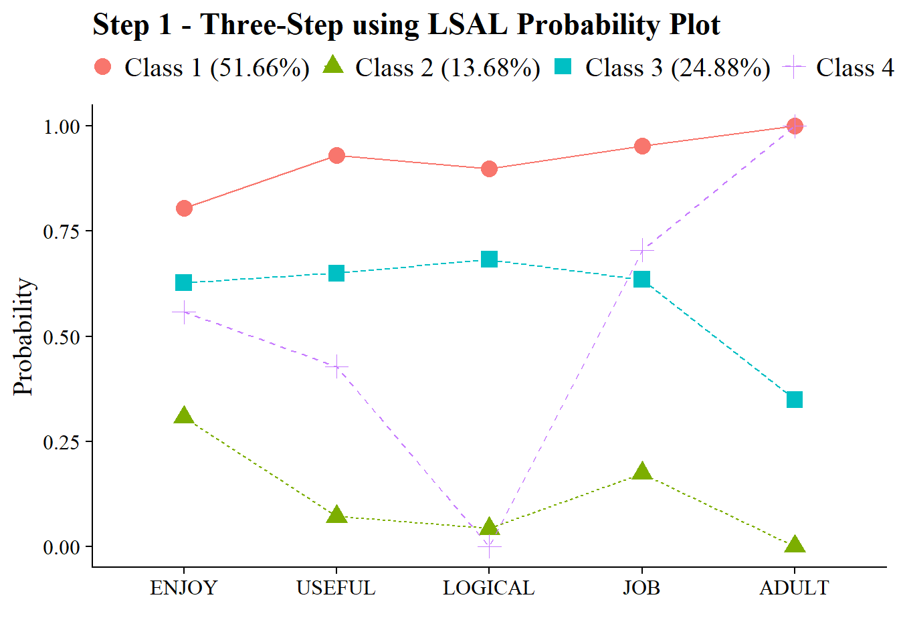

# Two Covariates and a Single Distal Outcome

------------------------------------------------------------------------

**Data source:**

 This example utilizes the public-use dataset, *The Longitudinal Survey of American Youth* (**LSAY**): [See documentation here](https://www.lsay.org/)

------------------------------------------------------------------------

## Load packages


``` r
library(MplusAutomation)
library(tidyverse) #collection of R packages designed for data science
library(here) #helps with filepaths
library(janitor) #clean_names
library(gt) # create tables
library(cowplot) # a ggplot theme
library(DiagrammeR) # create path diagrams
library(glue) # allows us to paste expressions into R code
library(data.table) # used for `melt()` function  
library(poLCA)
library(reshape2)
```

------------------------------------------------------------------------

This example uses Gender and Mother's Education as predictors of latent class membership and Math IRT scores as a distal outcome in a single model. 

```{=html}
<div class="grViz html-widget html-fill-item" id="htmlwidget-c75a44c086e83c075beb" style="width:672px;height:480px;"></div>
<script type="application/json" data-for="htmlwidget-c75a44c086e83c075beb">{"x":{"diagram":" digraph lca_model {\n\n# The `graph` statement - No editing needed\n\n    graph [layout = dot, overlap = true]\n \n# Two `node` statements\n \n# One for measured variables (box) \n\n    node [shape=box]\n    Enjoy Useful Logical Job Adult Female[label = \"Female\nMothEd\"] MathScore;\n \n# One for latent variables (circle) \n \n    node [shape=circle]\n    science [label=<Science <br/>Attitudes <br/>C<sub>k=4<\/sub>>];\n    \n# `edge` statements\n \n    edge [minlen = 2]\n    science -> {Enjoy Useful Logical Job Adult}\n    science -> MathScore [minlen = 4];\n    Female  -> science [minlen = 4];\n    Female  -> MathScore [minlen = 4];\n    \n {rank = same; science; Female; MathScore}\n}\n \n }","config":{"engine":"dot","options":null}},"evals":[],"jsHooks":[]}</script>
```


------------------------------------------------------------------------

Application: Longitudinal Study of American Youth, **Science Attitudes**


```{=html}
<div id="yuzfuwsujj" style="padding-left:0px;padding-right:0px;padding-top:10px;padding-bottom:10px;overflow-x:auto;overflow-y:auto;width:auto;height:auto;">
<style>#yuzfuwsujj table {
  font-family: system-ui, 'Segoe UI', Roboto, Helvetica, Arial, sans-serif, 'Apple Color Emoji', 'Segoe UI Emoji', 'Segoe UI Symbol', 'Noto Color Emoji';
  -webkit-font-smoothing: antialiased;
  -moz-osx-font-smoothing: grayscale;
}

#yuzfuwsujj thead, #yuzfuwsujj tbody, #yuzfuwsujj tfoot, #yuzfuwsujj tr, #yuzfuwsujj td, #yuzfuwsujj th {
  border-style: none;
}

#yuzfuwsujj p {
  margin: 0;
  padding: 0;
}

#yuzfuwsujj .gt_table {
  display: table;
  border-collapse: collapse;
  line-height: normal;
  margin-left: auto;
  margin-right: auto;
  color: #333333;
  font-size: 16px;
  font-weight: normal;
  font-style: normal;
  background-color: #FFFFFF;
  width: auto;
  border-top-style: solid;
  border-top-width: 2px;
  border-top-color: #A8A8A8;
  border-right-style: none;
  border-right-width: 2px;
  border-right-color: #D3D3D3;
  border-bottom-style: solid;
  border-bottom-width: 2px;
  border-bottom-color: #A8A8A8;
  border-left-style: none;
  border-left-width: 2px;
  border-left-color: #D3D3D3;
}

#yuzfuwsujj .gt_caption {
  padding-top: 4px;
  padding-bottom: 4px;
}

#yuzfuwsujj .gt_title {
  color: #333333;
  font-size: 125%;
  font-weight: initial;
  padding-top: 4px;
  padding-bottom: 4px;
  padding-left: 5px;
  padding-right: 5px;
  border-bottom-color: #FFFFFF;
  border-bottom-width: 0;
}

#yuzfuwsujj .gt_subtitle {
  color: #333333;
  font-size: 85%;
  font-weight: initial;
  padding-top: 3px;
  padding-bottom: 5px;
  padding-left: 5px;
  padding-right: 5px;
  border-top-color: #FFFFFF;
  border-top-width: 0;
}

#yuzfuwsujj .gt_heading {
  background-color: #FFFFFF;
  text-align: center;
  border-bottom-color: #FFFFFF;
  border-left-style: none;
  border-left-width: 1px;
  border-left-color: #D3D3D3;
  border-right-style: none;
  border-right-width: 1px;
  border-right-color: #D3D3D3;
}

#yuzfuwsujj .gt_bottom_border {
  border-bottom-style: solid;
  border-bottom-width: 2px;
  border-bottom-color: #D3D3D3;
}

#yuzfuwsujj .gt_col_headings {
  border-top-style: solid;
  border-top-width: 2px;
  border-top-color: #D3D3D3;
  border-bottom-style: solid;
  border-bottom-width: 2px;
  border-bottom-color: #D3D3D3;
  border-left-style: none;
  border-left-width: 1px;
  border-left-color: #D3D3D3;
  border-right-style: none;
  border-right-width: 1px;
  border-right-color: #D3D3D3;
}

#yuzfuwsujj .gt_col_heading {
  color: #333333;
  background-color: #FFFFFF;
  font-size: 100%;
  font-weight: bold;
  text-transform: inherit;
  border-left-style: none;
  border-left-width: 1px;
  border-left-color: #D3D3D3;
  border-right-style: none;
  border-right-width: 1px;
  border-right-color: #D3D3D3;
  vertical-align: bottom;
  padding-top: 5px;
  padding-bottom: 6px;
  padding-left: 5px;
  padding-right: 5px;
  overflow-x: hidden;
}

#yuzfuwsujj .gt_column_spanner_outer {
  color: #333333;
  background-color: #FFFFFF;
  font-size: 100%;
  font-weight: bold;
  text-transform: inherit;
  padding-top: 0;
  padding-bottom: 0;
  padding-left: 4px;
  padding-right: 4px;
}

#yuzfuwsujj .gt_column_spanner_outer:first-child {
  padding-left: 0;
}

#yuzfuwsujj .gt_column_spanner_outer:last-child {
  padding-right: 0;
}

#yuzfuwsujj .gt_column_spanner {
  border-bottom-style: solid;
  border-bottom-width: 2px;
  border-bottom-color: #D3D3D3;
  vertical-align: bottom;
  padding-top: 5px;
  padding-bottom: 5px;
  overflow-x: hidden;
  display: inline-block;
  width: 100%;
}

#yuzfuwsujj .gt_spanner_row {
  border-bottom-style: hidden;
}

#yuzfuwsujj .gt_group_heading {
  padding-top: 8px;
  padding-bottom: 8px;
  padding-left: 5px;
  padding-right: 5px;
  color: #333333;
  background-color: #FFFFFF;
  font-size: 100%;
  font-weight: bold;
  text-transform: inherit;
  border-top-style: solid;
  border-top-width: 2px;
  border-top-color: #D3D3D3;
  border-bottom-style: solid;
  border-bottom-width: 2px;
  border-bottom-color: #D3D3D3;
  border-left-style: none;
  border-left-width: 1px;
  border-left-color: #D3D3D3;
  border-right-style: none;
  border-right-width: 1px;
  border-right-color: #D3D3D3;
  vertical-align: middle;
  text-align: left;
}

#yuzfuwsujj .gt_empty_group_heading {
  padding: 0.5px;
  color: #333333;
  background-color: #FFFFFF;
  font-size: 100%;
  font-weight: bold;
  border-top-style: solid;
  border-top-width: 2px;
  border-top-color: #D3D3D3;
  border-bottom-style: solid;
  border-bottom-width: 2px;
  border-bottom-color: #D3D3D3;
  vertical-align: middle;
}

#yuzfuwsujj .gt_from_md > :first-child {
  margin-top: 0;
}

#yuzfuwsujj .gt_from_md > :last-child {
  margin-bottom: 0;
}

#yuzfuwsujj .gt_row {
  padding-top: 8px;
  padding-bottom: 8px;
  padding-left: 5px;
  padding-right: 5px;
  margin: 10px;
  border-top-style: solid;
  border-top-width: 1px;
  border-top-color: #D3D3D3;
  border-left-style: none;
  border-left-width: 1px;
  border-left-color: #D3D3D3;
  border-right-style: none;
  border-right-width: 1px;
  border-right-color: #D3D3D3;
  vertical-align: middle;
  overflow-x: hidden;
}

#yuzfuwsujj .gt_stub {
  color: #333333;
  background-color: #FFFFFF;
  font-size: 100%;
  font-weight: initial;
  text-transform: inherit;
  border-right-style: solid;
  border-right-width: 2px;
  border-right-color: #D3D3D3;
  padding-left: 5px;
  padding-right: 5px;
}

#yuzfuwsujj .gt_stub_row_group {
  color: #333333;
  background-color: #FFFFFF;
  font-size: 100%;
  font-weight: initial;
  text-transform: inherit;
  border-right-style: solid;
  border-right-width: 2px;
  border-right-color: #D3D3D3;
  padding-left: 5px;
  padding-right: 5px;
  vertical-align: top;
}

#yuzfuwsujj .gt_row_group_first td {
  border-top-width: 2px;
}

#yuzfuwsujj .gt_row_group_first th {
  border-top-width: 2px;
}

#yuzfuwsujj .gt_summary_row {
  color: #333333;
  background-color: #FFFFFF;
  text-transform: inherit;
  padding-top: 8px;
  padding-bottom: 8px;
  padding-left: 5px;
  padding-right: 5px;
}

#yuzfuwsujj .gt_first_summary_row {
  border-top-style: solid;
  border-top-color: #D3D3D3;
}

#yuzfuwsujj .gt_first_summary_row.thick {
  border-top-width: 2px;
}

#yuzfuwsujj .gt_last_summary_row {
  padding-top: 8px;
  padding-bottom: 8px;
  padding-left: 5px;
  padding-right: 5px;
  border-bottom-style: solid;
  border-bottom-width: 2px;
  border-bottom-color: #D3D3D3;
}

#yuzfuwsujj .gt_grand_summary_row {
  color: #333333;
  background-color: #FFFFFF;
  text-transform: inherit;
  padding-top: 8px;
  padding-bottom: 8px;
  padding-left: 5px;
  padding-right: 5px;
}

#yuzfuwsujj .gt_first_grand_summary_row {
  padding-top: 8px;
  padding-bottom: 8px;
  padding-left: 5px;
  padding-right: 5px;
  border-top-style: double;
  border-top-width: 6px;
  border-top-color: #D3D3D3;
}

#yuzfuwsujj .gt_last_grand_summary_row_top {
  padding-top: 8px;
  padding-bottom: 8px;
  padding-left: 5px;
  padding-right: 5px;
  border-bottom-style: double;
  border-bottom-width: 6px;
  border-bottom-color: #D3D3D3;
}

#yuzfuwsujj .gt_striped {
  background-color: rgba(128, 128, 128, 0.05);
}

#yuzfuwsujj .gt_table_body {
  border-top-style: solid;
  border-top-width: 2px;
  border-top-color: #D3D3D3;
  border-bottom-style: solid;
  border-bottom-width: 2px;
  border-bottom-color: #D3D3D3;
}

#yuzfuwsujj .gt_footnotes {
  color: #333333;
  background-color: #FFFFFF;
  border-bottom-style: none;
  border-bottom-width: 2px;
  border-bottom-color: #D3D3D3;
  border-left-style: none;
  border-left-width: 2px;
  border-left-color: #D3D3D3;
  border-right-style: none;
  border-right-width: 2px;
  border-right-color: #D3D3D3;
}

#yuzfuwsujj .gt_footnote {
  margin: 0px;
  font-size: 90%;
  padding-top: 4px;
  padding-bottom: 4px;
  padding-left: 5px;
  padding-right: 5px;
}

#yuzfuwsujj .gt_sourcenotes {
  color: #333333;
  background-color: #FFFFFF;
  border-bottom-style: none;
  border-bottom-width: 2px;
  border-bottom-color: #D3D3D3;
  border-left-style: none;
  border-left-width: 2px;
  border-left-color: #D3D3D3;
  border-right-style: none;
  border-right-width: 2px;
  border-right-color: #D3D3D3;
}

#yuzfuwsujj .gt_sourcenote {
  font-size: 90%;
  padding-top: 4px;
  padding-bottom: 4px;
  padding-left: 5px;
  padding-right: 5px;
}

#yuzfuwsujj .gt_left {
  text-align: left;
}

#yuzfuwsujj .gt_center {
  text-align: center;
}

#yuzfuwsujj .gt_right {
  text-align: right;
  font-variant-numeric: tabular-nums;
}

#yuzfuwsujj .gt_font_normal {
  font-weight: normal;
}

#yuzfuwsujj .gt_font_bold {
  font-weight: bold;
}

#yuzfuwsujj .gt_font_italic {
  font-style: italic;
}

#yuzfuwsujj .gt_super {
  font-size: 65%;
}

#yuzfuwsujj .gt_footnote_marks {
  font-size: 75%;
  vertical-align: 0.4em;
  position: initial;
}

#yuzfuwsujj .gt_asterisk {
  font-size: 100%;
  vertical-align: 0;
}

#yuzfuwsujj .gt_indent_1 {
  text-indent: 5px;
}

#yuzfuwsujj .gt_indent_2 {
  text-indent: 10px;
}

#yuzfuwsujj .gt_indent_3 {
  text-indent: 15px;
}

#yuzfuwsujj .gt_indent_4 {
  text-indent: 20px;
}

#yuzfuwsujj .gt_indent_5 {
  text-indent: 25px;
}

#yuzfuwsujj .katex-display {
  display: inline-flex !important;
  margin-bottom: 0.75em !important;
}

#yuzfuwsujj div.Reactable > div.rt-table > div.rt-thead > div.rt-tr.rt-tr-group-header > div.rt-th-group:after {
  height: 0px !important;
}
</style>
<table class="gt_table" data-quarto-disable-processing="false" data-quarto-bootstrap="false">
  <thead>
    <tr class="gt_heading">
      <td colspan="2" class="gt_heading gt_title gt_font_normal" style><span class='gt_from_md'><strong>LCA Indicators &amp; Auxiliary Variables: Math Attitudes Example</strong></span></td>
    </tr>
    <tr class="gt_heading">
      <td colspan="2" class="gt_heading gt_subtitle gt_font_normal gt_bottom_border" style><span class='gt_from_md'> </span></td>
    </tr>
    <tr class="gt_col_headings">
      <th class="gt_col_heading gt_columns_bottom_border gt_left" rowspan="1" colspan="1" scope="col" id="Name">Name</th>
      <th class="gt_col_heading gt_columns_bottom_border gt_left" rowspan="1" colspan="1" scope="col" id="a-Variable-Description"> Variable Description</th>
    </tr>
  </thead>
  <tbody class="gt_table_body">
    <tr class="gt_group_heading_row">
      <th colspan="2" class="gt_empty_group_heading" scope="colgroup"></th>
    </tr>
    <tr class="gt_row_group_first"><td headers="  Name" class="gt_row gt_left">enjoy</td>
<td headers="   Variable Description" class="gt_row gt_left">I enjoy math.</td></tr>
    <tr><td headers="  Name" class="gt_row gt_left">useful</td>
<td headers="   Variable Description" class="gt_row gt_left">Math is useful in everyday problems.</td></tr>
    <tr><td headers="  Name" class="gt_row gt_left">logical</td>
<td headers="   Variable Description" class="gt_row gt_left">Math helps a person think logically.</td></tr>
    <tr><td headers="  Name" class="gt_row gt_left">job</td>
<td headers="   Variable Description" class="gt_row gt_left">It is important to know math to get a good job.</td></tr>
    <tr><td headers="  Name" class="gt_row gt_left">adult</td>
<td headers="   Variable Description" class="gt_row gt_left">I will use math in many ways as an adult.</td></tr>
    <tr class="gt_group_heading_row">
      <th colspan="2" class="gt_group_heading" scope="colgroup" id="Auxiliary Variables">Auxiliary Variables</th>
    </tr>
    <tr class="gt_row_group_first"><td headers="Auxiliary Variables  Name" class="gt_row gt_left">female</td>
<td headers="Auxiliary Variables   Variable Description" class="gt_row gt_left">Self-reported student gender (0=Male, 1=Female).</td></tr>
    <tr><td headers="Auxiliary Variables  Name" class="gt_row gt_left">math_irt</td>
<td headers="Auxiliary Variables   Variable Description" class="gt_row gt_left">Standardized IRT math test score - 12th grade.</td></tr>
    <tr><td headers="Auxiliary Variables  Name" class="gt_row gt_left">mothed</td>
<td headers="Auxiliary Variables   Variable Description" class="gt_row gt_left">Level of education:  (1) less than high school, (2) high school diploma, (3) some college, (4) 4-year college, and (5) an advanced degree.</td></tr>
  </tbody>
  
  
</table>
</div>
```


------------------------------------------------------------------------

The data can be found in the `data` folder and is called `lsay_subset.csv`.


``` r
lsay_data <- read_csv(here("three_step","data","lsay_subset.csv")) %>% 
  clean_names() %>%   # make variable names lowercase
  mutate(female = recode(gender, `1` = 0, `2` = 1)) # relabel values from 1,2 to 0,1
```

------------------------------------------------------------------------

## Descriptive Statistics


``` r
dframe <- lsay_data %>%
  pivot_longer(
    c(enjoy, useful, logical, job, adult),
    names_to = "Variable"
  ) %>%
  group_by(Variable) %>%
  summarise(
    Count = sum(value == 1, na.rm = TRUE),
    Total = n(),
    .groups = "drop"
  ) %>%
  mutate(`Proportion Endorsed` = round(Count / Total, 3)) %>%
  dplyr::select(Variable, `Proportion Endorsed`, Count)

gt(dframe) %>%
  tab_header(
    title = md("**LCA Indicator Endorsement**"),
    subtitle = md("&nbsp;")
  ) %>%
  tab_options(
    column_labels.font.weight = "bold",
    row_group.font.weight = "bold"
  )
```


```{=html}
<div id="urebqbobmo" style="padding-left:0px;padding-right:0px;padding-top:10px;padding-bottom:10px;overflow-x:auto;overflow-y:auto;width:auto;height:auto;">
<style>#urebqbobmo table {
  font-family: system-ui, 'Segoe UI', Roboto, Helvetica, Arial, sans-serif, 'Apple Color Emoji', 'Segoe UI Emoji', 'Segoe UI Symbol', 'Noto Color Emoji';
  -webkit-font-smoothing: antialiased;
  -moz-osx-font-smoothing: grayscale;
}

#urebqbobmo thead, #urebqbobmo tbody, #urebqbobmo tfoot, #urebqbobmo tr, #urebqbobmo td, #urebqbobmo th {
  border-style: none;
}

#urebqbobmo p {
  margin: 0;
  padding: 0;
}

#urebqbobmo .gt_table {
  display: table;
  border-collapse: collapse;
  line-height: normal;
  margin-left: auto;
  margin-right: auto;
  color: #333333;
  font-size: 16px;
  font-weight: normal;
  font-style: normal;
  background-color: #FFFFFF;
  width: auto;
  border-top-style: solid;
  border-top-width: 2px;
  border-top-color: #A8A8A8;
  border-right-style: none;
  border-right-width: 2px;
  border-right-color: #D3D3D3;
  border-bottom-style: solid;
  border-bottom-width: 2px;
  border-bottom-color: #A8A8A8;
  border-left-style: none;
  border-left-width: 2px;
  border-left-color: #D3D3D3;
}

#urebqbobmo .gt_caption {
  padding-top: 4px;
  padding-bottom: 4px;
}

#urebqbobmo .gt_title {
  color: #333333;
  font-size: 125%;
  font-weight: initial;
  padding-top: 4px;
  padding-bottom: 4px;
  padding-left: 5px;
  padding-right: 5px;
  border-bottom-color: #FFFFFF;
  border-bottom-width: 0;
}

#urebqbobmo .gt_subtitle {
  color: #333333;
  font-size: 85%;
  font-weight: initial;
  padding-top: 3px;
  padding-bottom: 5px;
  padding-left: 5px;
  padding-right: 5px;
  border-top-color: #FFFFFF;
  border-top-width: 0;
}

#urebqbobmo .gt_heading {
  background-color: #FFFFFF;
  text-align: center;
  border-bottom-color: #FFFFFF;
  border-left-style: none;
  border-left-width: 1px;
  border-left-color: #D3D3D3;
  border-right-style: none;
  border-right-width: 1px;
  border-right-color: #D3D3D3;
}

#urebqbobmo .gt_bottom_border {
  border-bottom-style: solid;
  border-bottom-width: 2px;
  border-bottom-color: #D3D3D3;
}

#urebqbobmo .gt_col_headings {
  border-top-style: solid;
  border-top-width: 2px;
  border-top-color: #D3D3D3;
  border-bottom-style: solid;
  border-bottom-width: 2px;
  border-bottom-color: #D3D3D3;
  border-left-style: none;
  border-left-width: 1px;
  border-left-color: #D3D3D3;
  border-right-style: none;
  border-right-width: 1px;
  border-right-color: #D3D3D3;
}

#urebqbobmo .gt_col_heading {
  color: #333333;
  background-color: #FFFFFF;
  font-size: 100%;
  font-weight: bold;
  text-transform: inherit;
  border-left-style: none;
  border-left-width: 1px;
  border-left-color: #D3D3D3;
  border-right-style: none;
  border-right-width: 1px;
  border-right-color: #D3D3D3;
  vertical-align: bottom;
  padding-top: 5px;
  padding-bottom: 6px;
  padding-left: 5px;
  padding-right: 5px;
  overflow-x: hidden;
}

#urebqbobmo .gt_column_spanner_outer {
  color: #333333;
  background-color: #FFFFFF;
  font-size: 100%;
  font-weight: bold;
  text-transform: inherit;
  padding-top: 0;
  padding-bottom: 0;
  padding-left: 4px;
  padding-right: 4px;
}

#urebqbobmo .gt_column_spanner_outer:first-child {
  padding-left: 0;
}

#urebqbobmo .gt_column_spanner_outer:last-child {
  padding-right: 0;
}

#urebqbobmo .gt_column_spanner {
  border-bottom-style: solid;
  border-bottom-width: 2px;
  border-bottom-color: #D3D3D3;
  vertical-align: bottom;
  padding-top: 5px;
  padding-bottom: 5px;
  overflow-x: hidden;
  display: inline-block;
  width: 100%;
}

#urebqbobmo .gt_spanner_row {
  border-bottom-style: hidden;
}

#urebqbobmo .gt_group_heading {
  padding-top: 8px;
  padding-bottom: 8px;
  padding-left: 5px;
  padding-right: 5px;
  color: #333333;
  background-color: #FFFFFF;
  font-size: 100%;
  font-weight: bold;
  text-transform: inherit;
  border-top-style: solid;
  border-top-width: 2px;
  border-top-color: #D3D3D3;
  border-bottom-style: solid;
  border-bottom-width: 2px;
  border-bottom-color: #D3D3D3;
  border-left-style: none;
  border-left-width: 1px;
  border-left-color: #D3D3D3;
  border-right-style: none;
  border-right-width: 1px;
  border-right-color: #D3D3D3;
  vertical-align: middle;
  text-align: left;
}

#urebqbobmo .gt_empty_group_heading {
  padding: 0.5px;
  color: #333333;
  background-color: #FFFFFF;
  font-size: 100%;
  font-weight: bold;
  border-top-style: solid;
  border-top-width: 2px;
  border-top-color: #D3D3D3;
  border-bottom-style: solid;
  border-bottom-width: 2px;
  border-bottom-color: #D3D3D3;
  vertical-align: middle;
}

#urebqbobmo .gt_from_md > :first-child {
  margin-top: 0;
}

#urebqbobmo .gt_from_md > :last-child {
  margin-bottom: 0;
}

#urebqbobmo .gt_row {
  padding-top: 8px;
  padding-bottom: 8px;
  padding-left: 5px;
  padding-right: 5px;
  margin: 10px;
  border-top-style: solid;
  border-top-width: 1px;
  border-top-color: #D3D3D3;
  border-left-style: none;
  border-left-width: 1px;
  border-left-color: #D3D3D3;
  border-right-style: none;
  border-right-width: 1px;
  border-right-color: #D3D3D3;
  vertical-align: middle;
  overflow-x: hidden;
}

#urebqbobmo .gt_stub {
  color: #333333;
  background-color: #FFFFFF;
  font-size: 100%;
  font-weight: initial;
  text-transform: inherit;
  border-right-style: solid;
  border-right-width: 2px;
  border-right-color: #D3D3D3;
  padding-left: 5px;
  padding-right: 5px;
}

#urebqbobmo .gt_stub_row_group {
  color: #333333;
  background-color: #FFFFFF;
  font-size: 100%;
  font-weight: initial;
  text-transform: inherit;
  border-right-style: solid;
  border-right-width: 2px;
  border-right-color: #D3D3D3;
  padding-left: 5px;
  padding-right: 5px;
  vertical-align: top;
}

#urebqbobmo .gt_row_group_first td {
  border-top-width: 2px;
}

#urebqbobmo .gt_row_group_first th {
  border-top-width: 2px;
}

#urebqbobmo .gt_summary_row {
  color: #333333;
  background-color: #FFFFFF;
  text-transform: inherit;
  padding-top: 8px;
  padding-bottom: 8px;
  padding-left: 5px;
  padding-right: 5px;
}

#urebqbobmo .gt_first_summary_row {
  border-top-style: solid;
  border-top-color: #D3D3D3;
}

#urebqbobmo .gt_first_summary_row.thick {
  border-top-width: 2px;
}

#urebqbobmo .gt_last_summary_row {
  padding-top: 8px;
  padding-bottom: 8px;
  padding-left: 5px;
  padding-right: 5px;
  border-bottom-style: solid;
  border-bottom-width: 2px;
  border-bottom-color: #D3D3D3;
}

#urebqbobmo .gt_grand_summary_row {
  color: #333333;
  background-color: #FFFFFF;
  text-transform: inherit;
  padding-top: 8px;
  padding-bottom: 8px;
  padding-left: 5px;
  padding-right: 5px;
}

#urebqbobmo .gt_first_grand_summary_row {
  padding-top: 8px;
  padding-bottom: 8px;
  padding-left: 5px;
  padding-right: 5px;
  border-top-style: double;
  border-top-width: 6px;
  border-top-color: #D3D3D3;
}

#urebqbobmo .gt_last_grand_summary_row_top {
  padding-top: 8px;
  padding-bottom: 8px;
  padding-left: 5px;
  padding-right: 5px;
  border-bottom-style: double;
  border-bottom-width: 6px;
  border-bottom-color: #D3D3D3;
}

#urebqbobmo .gt_striped {
  background-color: rgba(128, 128, 128, 0.05);
}

#urebqbobmo .gt_table_body {
  border-top-style: solid;
  border-top-width: 2px;
  border-top-color: #D3D3D3;
  border-bottom-style: solid;
  border-bottom-width: 2px;
  border-bottom-color: #D3D3D3;
}

#urebqbobmo .gt_footnotes {
  color: #333333;
  background-color: #FFFFFF;
  border-bottom-style: none;
  border-bottom-width: 2px;
  border-bottom-color: #D3D3D3;
  border-left-style: none;
  border-left-width: 2px;
  border-left-color: #D3D3D3;
  border-right-style: none;
  border-right-width: 2px;
  border-right-color: #D3D3D3;
}

#urebqbobmo .gt_footnote {
  margin: 0px;
  font-size: 90%;
  padding-top: 4px;
  padding-bottom: 4px;
  padding-left: 5px;
  padding-right: 5px;
}

#urebqbobmo .gt_sourcenotes {
  color: #333333;
  background-color: #FFFFFF;
  border-bottom-style: none;
  border-bottom-width: 2px;
  border-bottom-color: #D3D3D3;
  border-left-style: none;
  border-left-width: 2px;
  border-left-color: #D3D3D3;
  border-right-style: none;
  border-right-width: 2px;
  border-right-color: #D3D3D3;
}

#urebqbobmo .gt_sourcenote {
  font-size: 90%;
  padding-top: 4px;
  padding-bottom: 4px;
  padding-left: 5px;
  padding-right: 5px;
}

#urebqbobmo .gt_left {
  text-align: left;
}

#urebqbobmo .gt_center {
  text-align: center;
}

#urebqbobmo .gt_right {
  text-align: right;
  font-variant-numeric: tabular-nums;
}

#urebqbobmo .gt_font_normal {
  font-weight: normal;
}

#urebqbobmo .gt_font_bold {
  font-weight: bold;
}

#urebqbobmo .gt_font_italic {
  font-style: italic;
}

#urebqbobmo .gt_super {
  font-size: 65%;
}

#urebqbobmo .gt_footnote_marks {
  font-size: 75%;
  vertical-align: 0.4em;
  position: initial;
}

#urebqbobmo .gt_asterisk {
  font-size: 100%;
  vertical-align: 0;
}

#urebqbobmo .gt_indent_1 {
  text-indent: 5px;
}

#urebqbobmo .gt_indent_2 {
  text-indent: 10px;
}

#urebqbobmo .gt_indent_3 {
  text-indent: 15px;
}

#urebqbobmo .gt_indent_4 {
  text-indent: 20px;
}

#urebqbobmo .gt_indent_5 {
  text-indent: 25px;
}

#urebqbobmo .katex-display {
  display: inline-flex !important;
  margin-bottom: 0.75em !important;
}

#urebqbobmo div.Reactable > div.rt-table > div.rt-thead > div.rt-tr.rt-tr-group-header > div.rt-th-group:after {
  height: 0px !important;
}
</style>
<table class="gt_table" data-quarto-disable-processing="false" data-quarto-bootstrap="false">
  <thead>
    <tr class="gt_heading">
      <td colspan="3" class="gt_heading gt_title gt_font_normal" style><span class='gt_from_md'><strong>LCA Indicator Endorsement</strong></span></td>
    </tr>
    <tr class="gt_heading">
      <td colspan="3" class="gt_heading gt_subtitle gt_font_normal gt_bottom_border" style><span class='gt_from_md'> </span></td>
    </tr>
    <tr class="gt_col_headings">
      <th class="gt_col_heading gt_columns_bottom_border gt_left" rowspan="1" colspan="1" scope="col" id="Variable">Variable</th>
      <th class="gt_col_heading gt_columns_bottom_border gt_right" rowspan="1" colspan="1" scope="col" id="Proportion-Endorsed">Proportion Endorsed</th>
      <th class="gt_col_heading gt_columns_bottom_border gt_right" rowspan="1" colspan="1" scope="col" id="Count">Count</th>
    </tr>
  </thead>
  <tbody class="gt_table_body">
    <tr><td headers="Variable" class="gt_row gt_left">adult</td>
<td headers="Proportion Endorsed" class="gt_row gt_right">0.596</td>
<td headers="Count" class="gt_row gt_right">1858</td></tr>
    <tr><td headers="Variable" class="gt_row gt_left">enjoy</td>
<td headers="Proportion Endorsed" class="gt_row gt_right">0.573</td>
<td headers="Count" class="gt_row gt_right">1784</td></tr>
    <tr><td headers="Variable" class="gt_row gt_left">job</td>
<td headers="Proportion Endorsed" class="gt_row gt_right">0.625</td>
<td headers="Count" class="gt_row gt_right">1947</td></tr>
    <tr><td headers="Variable" class="gt_row gt_left">logical</td>
<td headers="Proportion Endorsed" class="gt_row gt_right">0.541</td>
<td headers="Count" class="gt_row gt_right">1686</td></tr>
    <tr><td headers="Variable" class="gt_row gt_left">useful</td>
<td headers="Proportion Endorsed" class="gt_row gt_right">0.589</td>
<td headers="Count" class="gt_row gt_right">1835</td></tr>
  </tbody>
  
  
</table>
</div>
```


Gender 


``` r
summary(factor(lsay_data$mothed))
#>    1    2    3    4    5 NA's 
#>  452 1732  304  368  158  102
```

Mother's Education 


``` r
summary(factor(lsay_data$female))
#>    0    1 
#> 1490 1626
```

Math IRT Score


``` r
summary(lsay_data$math_irt)
#>    Min. 1st Qu.  Median    Mean 3rd Qu.    Max.    NA's 
#>   26.57   50.00   59.30   58.81   68.21   94.19     875
```

------------------------------------------------------------------------

## Manual ML Three-step

------------------------------------------------------------------------

### Step 1 - Class Enumeration w/ Auxiliary Specification

------------------------------------------------------------------------

This step is done after class enumeration (or after you have selected the best latent class model). In this example, the four class model was the best. Now, we re-estimate the four-class model using `optseed` for efficiency. The difference here is the `SAVEDATA` command, where I can save the posterior probabilities and the modal class assignment that will be used in steps two and three. 


``` r

step1  <- mplusObject(
  TITLE = "Step 1 - Three-Step using LSAL", 
  VARIABLE = 
  "categorical = enjoy useful logical job adult; 
   usevar = enjoy useful logical job adult;
    
   classes = c(4); 
    
   auxiliary =   ! list all potential covariates and distals here
   female  mothed      ! covariate
   math_irt;      ! distal math test score in 12th grade ",
  
  ANALYSIS = 
   "estimator = mlr; 
    type = mixture;
    starts = 0;
    optseed = 568405;",
  
  SAVEDATA = 
   "File=savedata.dat;
    Save=cprob;",
  
  OUTPUT = "residual tech11 tech14",
  
  PLOT = 
    "type = plot3; 
    series = enjoy-adult(*);",
  
  usevariables = colnames(lsay_data),
  rdata = lsay_data)

step1_fit <- mplusModeler(step1,
                            dataout=here("three_step", "manual_3step", "Step1.dat"),
                            modelout=here("three_step", "manual_3step", "one.inp") ,
                            check=TRUE, run = TRUE, hashfilename = FALSE)
```

------------------------------------------------------------------------


``` r
source(here("functions", "plot_lca.R"))
output_lsay <- readModels(here("three_step", "manual_3step","one.out"))

plot_lca(model_name = output_lsay)
```



------------------------------------------------------------------------

### Step 2 - Determine Measurement Error

------------------------------------------------------------------------

Extract logits for the classification probabilities for the most likely latent class


``` r
logit_cprobs <- as.data.frame(output_lsay[["class_counts"]]
                                       [["logitProbs.mostLikely"]])
```

Extract saved dataset which is part of the mplusObject "step1_fit"


``` r
savedata <- as.data.frame(output_lsay[["savedata"]])
```

Rename the column in savedata named "C" and change to "N"


``` r
colnames(savedata)[colnames(savedata)=="C"] <- "N"
```


------------------------------------------------------------------------

### Step 3 - LCA Auxiliary Variable Model with 2 covariates and 1 distal outcome

------------------------------------------------------------------------


Model with 2 covariates (gender and mother's education) and 1 distal outcome (math IRT scores)


``` r
step3  <- mplusObject(
  TITLE = "Step3 - 3step LSAY", 
  
  VARIABLE = 
 "nominal=N;
  usevar = n;
  
  classes = c(4);
  
  usevar = female mothed math_irt;" ,
  
  ANALYSIS = 
 "estimator = mlr; 
  type = mixture; 
  starts = 0;",
 
  DEFINE = 
   "center female mothed (grandmean);",
  
  MODEL =
  glue(
 " %OVERALL%
 
  math_irt on female mothed; ! covariate as a related to the distal outcome
  C on female (f1-f3);
  c on mothed (e1-e3);      ! covariate as predictor of C

     %C#1%
  [n#1@{logit_cprobs[1,1]}]; ! MUST EDIT if you do not have a 4-class model. 
  [n#2@{logit_cprobs[1,2]}];
  [n#3@{logit_cprobs[1,3]}];
  
  [math_irt](m1);    ! conditional distal mean 
  math_irt;          ! conditional distal variance (freely estimated)

  %C#2%
  [n#1@{logit_cprobs[2,1]}];
  [n#2@{logit_cprobs[2,2]}];
  [n#3@{logit_cprobs[2,3]}];
  
  [math_irt](m2);
  math_irt;
  
  %C#3%
  [n#1@{logit_cprobs[3,1]}];
  [n#2@{logit_cprobs[3,2]}];
  [n#3@{logit_cprobs[3,3]}];
  
  [math_irt](m3);
  math_irt;

  %C#4%
  [n#1@{logit_cprobs[4,1]}];
  [n#2@{logit_cprobs[4,2]}];
  [n#3@{logit_cprobs[4,3]}];
  
  [math_irt](m4);
  math_irt; "),
  
  MODELCONSTRAINT = 
   "New (diff12 diff13 diff23 
    diff14 diff24 diff34
    
    d_fem_12 d_fem_13 
    d_fem_23
 
    d_ed_12 d_ed_13 
    d_ed_23 
    );
  
    diff12 = m1-m2;  ! test pairwise distal mean differences
    diff13 = m1-m3;
    diff23 = m2-m3;
    diff14 = m1-m4;
    diff24 = m2-m4;
    diff34 = m3-m4;
 
    d_fem_12 = f1-f2;
    d_fem_13 = f1-f3;
    d_fem_23 = f2-f3; 

    d_ed_12 = e1-e2;
    d_ed_13 = e1-e3;
    d_ed_23 = e2-e3; 

 ",
  
  MODELTEST = "     ! omnibus test of distal means 
  !  m1=m2;
  !  m2=m3;
  !  m3=m4;
 
  ! f1=f2;       ! omnibus test of covariate logits (female)  
  !  f1=f3;
 
    e1=e2;       ! omnibus test of covariate logits (mothers ed)  
    e1=e3;
   ",
 
  usevariables = colnames(savedata), 
  rdata = savedata)

step3_fit <- mplusModeler(step3,
               dataout=here("three_step", "manual_3step", "Step3.dat"), 
               modelout=here("three_step", "manual_3step", "three.inp"), 
               check=TRUE, run = TRUE, hashfilename = FALSE)
```

------------------------------------------------------------------------

#### Wald Test Table

This is testing if there is a relation between the latent class variable and the distal outcome (mathirt)


``` r
modelParams <- readModels(here("three_step", "manual_3step", "three.out"))

# Extract information as data frame
wald <- as.data.frame(modelParams[["summaries"]]) %>%
  dplyr::select(WaldChiSq_Value:WaldChiSq_PValue) %>% 
  mutate(WaldChiSq_DF = paste0("(", WaldChiSq_DF, ")")) %>% 
  unite(wald_test, WaldChiSq_Value, WaldChiSq_DF, sep = " ") %>% 
  rename(pval = WaldChiSq_PValue) %>% 
  mutate(pval = ifelse(pval<0.001, paste0("<.001*"),
                       ifelse(pval<0.05, paste0(scales::number(pval, accuracy = .001), "*"),
                              scales::number(pval, accuracy = .001))))

# Create table

wald_table <- wald %>% 
  gt() %>%
    tab_header(
    title = "Wald Test Distal Means (Math IRT Scores)") %>%
    cols_label(
      wald_test = md("Wald Test (*df*)"), 
      pval = md("*p*-value")) %>% 
  cols_align(align = "center") %>% 
  opt_align_table_header(align = "left") %>% 
  gt::tab_options(table.font.names = "serif")

wald_table
```


```{=html}
<div id="gioibonxuo" style="padding-left:0px;padding-right:0px;padding-top:10px;padding-bottom:10px;overflow-x:auto;overflow-y:auto;width:auto;height:auto;">
<style>#gioibonxuo table {
  font-family: serif;
  -webkit-font-smoothing: antialiased;
  -moz-osx-font-smoothing: grayscale;
}

#gioibonxuo thead, #gioibonxuo tbody, #gioibonxuo tfoot, #gioibonxuo tr, #gioibonxuo td, #gioibonxuo th {
  border-style: none;
}

#gioibonxuo p {
  margin: 0;
  padding: 0;
}

#gioibonxuo .gt_table {
  display: table;
  border-collapse: collapse;
  line-height: normal;
  margin-left: auto;
  margin-right: auto;
  color: #333333;
  font-size: 16px;
  font-weight: normal;
  font-style: normal;
  background-color: #FFFFFF;
  width: auto;
  border-top-style: solid;
  border-top-width: 2px;
  border-top-color: #A8A8A8;
  border-right-style: none;
  border-right-width: 2px;
  border-right-color: #D3D3D3;
  border-bottom-style: solid;
  border-bottom-width: 2px;
  border-bottom-color: #A8A8A8;
  border-left-style: none;
  border-left-width: 2px;
  border-left-color: #D3D3D3;
}

#gioibonxuo .gt_caption {
  padding-top: 4px;
  padding-bottom: 4px;
}

#gioibonxuo .gt_title {
  color: #333333;
  font-size: 125%;
  font-weight: initial;
  padding-top: 4px;
  padding-bottom: 4px;
  padding-left: 5px;
  padding-right: 5px;
  border-bottom-color: #FFFFFF;
  border-bottom-width: 0;
}

#gioibonxuo .gt_subtitle {
  color: #333333;
  font-size: 85%;
  font-weight: initial;
  padding-top: 3px;
  padding-bottom: 5px;
  padding-left: 5px;
  padding-right: 5px;
  border-top-color: #FFFFFF;
  border-top-width: 0;
}

#gioibonxuo .gt_heading {
  background-color: #FFFFFF;
  text-align: left;
  border-bottom-color: #FFFFFF;
  border-left-style: none;
  border-left-width: 1px;
  border-left-color: #D3D3D3;
  border-right-style: none;
  border-right-width: 1px;
  border-right-color: #D3D3D3;
}

#gioibonxuo .gt_bottom_border {
  border-bottom-style: solid;
  border-bottom-width: 2px;
  border-bottom-color: #D3D3D3;
}

#gioibonxuo .gt_col_headings {
  border-top-style: solid;
  border-top-width: 2px;
  border-top-color: #D3D3D3;
  border-bottom-style: solid;
  border-bottom-width: 2px;
  border-bottom-color: #D3D3D3;
  border-left-style: none;
  border-left-width: 1px;
  border-left-color: #D3D3D3;
  border-right-style: none;
  border-right-width: 1px;
  border-right-color: #D3D3D3;
}

#gioibonxuo .gt_col_heading {
  color: #333333;
  background-color: #FFFFFF;
  font-size: 100%;
  font-weight: normal;
  text-transform: inherit;
  border-left-style: none;
  border-left-width: 1px;
  border-left-color: #D3D3D3;
  border-right-style: none;
  border-right-width: 1px;
  border-right-color: #D3D3D3;
  vertical-align: bottom;
  padding-top: 5px;
  padding-bottom: 6px;
  padding-left: 5px;
  padding-right: 5px;
  overflow-x: hidden;
}

#gioibonxuo .gt_column_spanner_outer {
  color: #333333;
  background-color: #FFFFFF;
  font-size: 100%;
  font-weight: normal;
  text-transform: inherit;
  padding-top: 0;
  padding-bottom: 0;
  padding-left: 4px;
  padding-right: 4px;
}

#gioibonxuo .gt_column_spanner_outer:first-child {
  padding-left: 0;
}

#gioibonxuo .gt_column_spanner_outer:last-child {
  padding-right: 0;
}

#gioibonxuo .gt_column_spanner {
  border-bottom-style: solid;
  border-bottom-width: 2px;
  border-bottom-color: #D3D3D3;
  vertical-align: bottom;
  padding-top: 5px;
  padding-bottom: 5px;
  overflow-x: hidden;
  display: inline-block;
  width: 100%;
}

#gioibonxuo .gt_spanner_row {
  border-bottom-style: hidden;
}

#gioibonxuo .gt_group_heading {
  padding-top: 8px;
  padding-bottom: 8px;
  padding-left: 5px;
  padding-right: 5px;
  color: #333333;
  background-color: #FFFFFF;
  font-size: 100%;
  font-weight: initial;
  text-transform: inherit;
  border-top-style: solid;
  border-top-width: 2px;
  border-top-color: #D3D3D3;
  border-bottom-style: solid;
  border-bottom-width: 2px;
  border-bottom-color: #D3D3D3;
  border-left-style: none;
  border-left-width: 1px;
  border-left-color: #D3D3D3;
  border-right-style: none;
  border-right-width: 1px;
  border-right-color: #D3D3D3;
  vertical-align: middle;
  text-align: left;
}

#gioibonxuo .gt_empty_group_heading {
  padding: 0.5px;
  color: #333333;
  background-color: #FFFFFF;
  font-size: 100%;
  font-weight: initial;
  border-top-style: solid;
  border-top-width: 2px;
  border-top-color: #D3D3D3;
  border-bottom-style: solid;
  border-bottom-width: 2px;
  border-bottom-color: #D3D3D3;
  vertical-align: middle;
}

#gioibonxuo .gt_from_md > :first-child {
  margin-top: 0;
}

#gioibonxuo .gt_from_md > :last-child {
  margin-bottom: 0;
}

#gioibonxuo .gt_row {
  padding-top: 8px;
  padding-bottom: 8px;
  padding-left: 5px;
  padding-right: 5px;
  margin: 10px;
  border-top-style: solid;
  border-top-width: 1px;
  border-top-color: #D3D3D3;
  border-left-style: none;
  border-left-width: 1px;
  border-left-color: #D3D3D3;
  border-right-style: none;
  border-right-width: 1px;
  border-right-color: #D3D3D3;
  vertical-align: middle;
  overflow-x: hidden;
}

#gioibonxuo .gt_stub {
  color: #333333;
  background-color: #FFFFFF;
  font-size: 100%;
  font-weight: initial;
  text-transform: inherit;
  border-right-style: solid;
  border-right-width: 2px;
  border-right-color: #D3D3D3;
  padding-left: 5px;
  padding-right: 5px;
}

#gioibonxuo .gt_stub_row_group {
  color: #333333;
  background-color: #FFFFFF;
  font-size: 100%;
  font-weight: initial;
  text-transform: inherit;
  border-right-style: solid;
  border-right-width: 2px;
  border-right-color: #D3D3D3;
  padding-left: 5px;
  padding-right: 5px;
  vertical-align: top;
}

#gioibonxuo .gt_row_group_first td {
  border-top-width: 2px;
}

#gioibonxuo .gt_row_group_first th {
  border-top-width: 2px;
}

#gioibonxuo .gt_summary_row {
  color: #333333;
  background-color: #FFFFFF;
  text-transform: inherit;
  padding-top: 8px;
  padding-bottom: 8px;
  padding-left: 5px;
  padding-right: 5px;
}

#gioibonxuo .gt_first_summary_row {
  border-top-style: solid;
  border-top-color: #D3D3D3;
}

#gioibonxuo .gt_first_summary_row.thick {
  border-top-width: 2px;
}

#gioibonxuo .gt_last_summary_row {
  padding-top: 8px;
  padding-bottom: 8px;
  padding-left: 5px;
  padding-right: 5px;
  border-bottom-style: solid;
  border-bottom-width: 2px;
  border-bottom-color: #D3D3D3;
}

#gioibonxuo .gt_grand_summary_row {
  color: #333333;
  background-color: #FFFFFF;
  text-transform: inherit;
  padding-top: 8px;
  padding-bottom: 8px;
  padding-left: 5px;
  padding-right: 5px;
}

#gioibonxuo .gt_first_grand_summary_row {
  padding-top: 8px;
  padding-bottom: 8px;
  padding-left: 5px;
  padding-right: 5px;
  border-top-style: double;
  border-top-width: 6px;
  border-top-color: #D3D3D3;
}

#gioibonxuo .gt_last_grand_summary_row_top {
  padding-top: 8px;
  padding-bottom: 8px;
  padding-left: 5px;
  padding-right: 5px;
  border-bottom-style: double;
  border-bottom-width: 6px;
  border-bottom-color: #D3D3D3;
}

#gioibonxuo .gt_striped {
  background-color: rgba(128, 128, 128, 0.05);
}

#gioibonxuo .gt_table_body {
  border-top-style: solid;
  border-top-width: 2px;
  border-top-color: #D3D3D3;
  border-bottom-style: solid;
  border-bottom-width: 2px;
  border-bottom-color: #D3D3D3;
}

#gioibonxuo .gt_footnotes {
  color: #333333;
  background-color: #FFFFFF;
  border-bottom-style: none;
  border-bottom-width: 2px;
  border-bottom-color: #D3D3D3;
  border-left-style: none;
  border-left-width: 2px;
  border-left-color: #D3D3D3;
  border-right-style: none;
  border-right-width: 2px;
  border-right-color: #D3D3D3;
}

#gioibonxuo .gt_footnote {
  margin: 0px;
  font-size: 90%;
  padding-top: 4px;
  padding-bottom: 4px;
  padding-left: 5px;
  padding-right: 5px;
}

#gioibonxuo .gt_sourcenotes {
  color: #333333;
  background-color: #FFFFFF;
  border-bottom-style: none;
  border-bottom-width: 2px;
  border-bottom-color: #D3D3D3;
  border-left-style: none;
  border-left-width: 2px;
  border-left-color: #D3D3D3;
  border-right-style: none;
  border-right-width: 2px;
  border-right-color: #D3D3D3;
}

#gioibonxuo .gt_sourcenote {
  font-size: 90%;
  padding-top: 4px;
  padding-bottom: 4px;
  padding-left: 5px;
  padding-right: 5px;
}

#gioibonxuo .gt_left {
  text-align: left;
}

#gioibonxuo .gt_center {
  text-align: center;
}

#gioibonxuo .gt_right {
  text-align: right;
  font-variant-numeric: tabular-nums;
}

#gioibonxuo .gt_font_normal {
  font-weight: normal;
}

#gioibonxuo .gt_font_bold {
  font-weight: bold;
}

#gioibonxuo .gt_font_italic {
  font-style: italic;
}

#gioibonxuo .gt_super {
  font-size: 65%;
}

#gioibonxuo .gt_footnote_marks {
  font-size: 75%;
  vertical-align: 0.4em;
  position: initial;
}

#gioibonxuo .gt_asterisk {
  font-size: 100%;
  vertical-align: 0;
}

#gioibonxuo .gt_indent_1 {
  text-indent: 5px;
}

#gioibonxuo .gt_indent_2 {
  text-indent: 10px;
}

#gioibonxuo .gt_indent_3 {
  text-indent: 15px;
}

#gioibonxuo .gt_indent_4 {
  text-indent: 20px;
}

#gioibonxuo .gt_indent_5 {
  text-indent: 25px;
}

#gioibonxuo .katex-display {
  display: inline-flex !important;
  margin-bottom: 0.75em !important;
}

#gioibonxuo div.Reactable > div.rt-table > div.rt-thead > div.rt-tr.rt-tr-group-header > div.rt-th-group:after {
  height: 0px !important;
}
</style>
<table class="gt_table" data-quarto-disable-processing="false" data-quarto-bootstrap="false">
  <thead>
    <tr class="gt_heading">
      <td colspan="2" class="gt_heading gt_title gt_font_normal gt_bottom_border" style>Wald Test Distal Means (Math IRT Scores)</td>
    </tr>
    
    <tr class="gt_col_headings">
      <th class="gt_col_heading gt_columns_bottom_border gt_center" rowspan="1" colspan="1" scope="col" id="wald_test"><span class='gt_from_md'>Wald Test (<em>df</em>)</span></th>
      <th class="gt_col_heading gt_columns_bottom_border gt_center" rowspan="1" colspan="1" scope="col" id="pval"><span class='gt_from_md'><em>p</em>-value</span></th>
    </tr>
  </thead>
  <tbody class="gt_table_body">
    <tr><td headers="wald_test" class="gt_row gt_center">2.475 (2)</td>
<td headers="pval" class="gt_row gt_center">0.290</td></tr>
  </tbody>
  
  
</table>
</div>
```


Save figure


``` r
gtsave(wald_table, here("figures","wald_table.docx"))
```

------------------------------------------------------------------------

#### Table of Pairwise Distal Outcome Differences


``` r
modelParams <- readModels(here("three_step", "manual_3step", "three.out"))

# Extract information as data frame
diff <- as.data.frame(modelParams[["parameters"]][["unstandardized"]]) %>%
  filter(grepl("DIFF", param)) %>% 
  dplyr::select(param:pval) %>% 
  mutate(se = paste0("(", format(round(se,2), nsmall =2), ")")) %>% 
  unite(estimate, est, se, sep = " ") %>% 
  mutate(param = str_remove(param, "DIFF"),
         param = as.numeric(param)) %>% 
  separate(param, into = paste0("Group", 1:2), sep = 1) %>% 
  mutate(class = paste0("Class ", Group1, " vs ", Group2)) %>% 
  dplyr::select(class, estimate, pval) %>% 
  mutate(pval = ifelse(pval<0.001, paste0("<.001*"),
                       ifelse(pval<0.05, paste0(scales::number(pval, accuracy = .001), "*"),
                              scales::number(pval, accuracy = .001))))

# Create table

diff %>% 
  gt() %>%
    tab_header(
    title = "Distal Outcome Differences") %>%
    cols_label(
      class = "Class",
      estimate = md("Mean (*se*)"),
      pval = md("*p*-value")) %>% 
    sub_missing(1:3,
              missing_text = "") %>%
  cols_align(align = "center") %>% 
  opt_align_table_header(align = "left") %>% 
  gt::tab_options(table.font.names = "serif")
```


```{=html}
<div id="gawobqrleg" style="padding-left:0px;padding-right:0px;padding-top:10px;padding-bottom:10px;overflow-x:auto;overflow-y:auto;width:auto;height:auto;">
<style>#gawobqrleg table {
  font-family: serif;
  -webkit-font-smoothing: antialiased;
  -moz-osx-font-smoothing: grayscale;
}

#gawobqrleg thead, #gawobqrleg tbody, #gawobqrleg tfoot, #gawobqrleg tr, #gawobqrleg td, #gawobqrleg th {
  border-style: none;
}

#gawobqrleg p {
  margin: 0;
  padding: 0;
}

#gawobqrleg .gt_table {
  display: table;
  border-collapse: collapse;
  line-height: normal;
  margin-left: auto;
  margin-right: auto;
  color: #333333;
  font-size: 16px;
  font-weight: normal;
  font-style: normal;
  background-color: #FFFFFF;
  width: auto;
  border-top-style: solid;
  border-top-width: 2px;
  border-top-color: #A8A8A8;
  border-right-style: none;
  border-right-width: 2px;
  border-right-color: #D3D3D3;
  border-bottom-style: solid;
  border-bottom-width: 2px;
  border-bottom-color: #A8A8A8;
  border-left-style: none;
  border-left-width: 2px;
  border-left-color: #D3D3D3;
}

#gawobqrleg .gt_caption {
  padding-top: 4px;
  padding-bottom: 4px;
}

#gawobqrleg .gt_title {
  color: #333333;
  font-size: 125%;
  font-weight: initial;
  padding-top: 4px;
  padding-bottom: 4px;
  padding-left: 5px;
  padding-right: 5px;
  border-bottom-color: #FFFFFF;
  border-bottom-width: 0;
}

#gawobqrleg .gt_subtitle {
  color: #333333;
  font-size: 85%;
  font-weight: initial;
  padding-top: 3px;
  padding-bottom: 5px;
  padding-left: 5px;
  padding-right: 5px;
  border-top-color: #FFFFFF;
  border-top-width: 0;
}

#gawobqrleg .gt_heading {
  background-color: #FFFFFF;
  text-align: left;
  border-bottom-color: #FFFFFF;
  border-left-style: none;
  border-left-width: 1px;
  border-left-color: #D3D3D3;
  border-right-style: none;
  border-right-width: 1px;
  border-right-color: #D3D3D3;
}

#gawobqrleg .gt_bottom_border {
  border-bottom-style: solid;
  border-bottom-width: 2px;
  border-bottom-color: #D3D3D3;
}

#gawobqrleg .gt_col_headings {
  border-top-style: solid;
  border-top-width: 2px;
  border-top-color: #D3D3D3;
  border-bottom-style: solid;
  border-bottom-width: 2px;
  border-bottom-color: #D3D3D3;
  border-left-style: none;
  border-left-width: 1px;
  border-left-color: #D3D3D3;
  border-right-style: none;
  border-right-width: 1px;
  border-right-color: #D3D3D3;
}

#gawobqrleg .gt_col_heading {
  color: #333333;
  background-color: #FFFFFF;
  font-size: 100%;
  font-weight: normal;
  text-transform: inherit;
  border-left-style: none;
  border-left-width: 1px;
  border-left-color: #D3D3D3;
  border-right-style: none;
  border-right-width: 1px;
  border-right-color: #D3D3D3;
  vertical-align: bottom;
  padding-top: 5px;
  padding-bottom: 6px;
  padding-left: 5px;
  padding-right: 5px;
  overflow-x: hidden;
}

#gawobqrleg .gt_column_spanner_outer {
  color: #333333;
  background-color: #FFFFFF;
  font-size: 100%;
  font-weight: normal;
  text-transform: inherit;
  padding-top: 0;
  padding-bottom: 0;
  padding-left: 4px;
  padding-right: 4px;
}

#gawobqrleg .gt_column_spanner_outer:first-child {
  padding-left: 0;
}

#gawobqrleg .gt_column_spanner_outer:last-child {
  padding-right: 0;
}

#gawobqrleg .gt_column_spanner {
  border-bottom-style: solid;
  border-bottom-width: 2px;
  border-bottom-color: #D3D3D3;
  vertical-align: bottom;
  padding-top: 5px;
  padding-bottom: 5px;
  overflow-x: hidden;
  display: inline-block;
  width: 100%;
}

#gawobqrleg .gt_spanner_row {
  border-bottom-style: hidden;
}

#gawobqrleg .gt_group_heading {
  padding-top: 8px;
  padding-bottom: 8px;
  padding-left: 5px;
  padding-right: 5px;
  color: #333333;
  background-color: #FFFFFF;
  font-size: 100%;
  font-weight: initial;
  text-transform: inherit;
  border-top-style: solid;
  border-top-width: 2px;
  border-top-color: #D3D3D3;
  border-bottom-style: solid;
  border-bottom-width: 2px;
  border-bottom-color: #D3D3D3;
  border-left-style: none;
  border-left-width: 1px;
  border-left-color: #D3D3D3;
  border-right-style: none;
  border-right-width: 1px;
  border-right-color: #D3D3D3;
  vertical-align: middle;
  text-align: left;
}

#gawobqrleg .gt_empty_group_heading {
  padding: 0.5px;
  color: #333333;
  background-color: #FFFFFF;
  font-size: 100%;
  font-weight: initial;
  border-top-style: solid;
  border-top-width: 2px;
  border-top-color: #D3D3D3;
  border-bottom-style: solid;
  border-bottom-width: 2px;
  border-bottom-color: #D3D3D3;
  vertical-align: middle;
}

#gawobqrleg .gt_from_md > :first-child {
  margin-top: 0;
}

#gawobqrleg .gt_from_md > :last-child {
  margin-bottom: 0;
}

#gawobqrleg .gt_row {
  padding-top: 8px;
  padding-bottom: 8px;
  padding-left: 5px;
  padding-right: 5px;
  margin: 10px;
  border-top-style: solid;
  border-top-width: 1px;
  border-top-color: #D3D3D3;
  border-left-style: none;
  border-left-width: 1px;
  border-left-color: #D3D3D3;
  border-right-style: none;
  border-right-width: 1px;
  border-right-color: #D3D3D3;
  vertical-align: middle;
  overflow-x: hidden;
}

#gawobqrleg .gt_stub {
  color: #333333;
  background-color: #FFFFFF;
  font-size: 100%;
  font-weight: initial;
  text-transform: inherit;
  border-right-style: solid;
  border-right-width: 2px;
  border-right-color: #D3D3D3;
  padding-left: 5px;
  padding-right: 5px;
}

#gawobqrleg .gt_stub_row_group {
  color: #333333;
  background-color: #FFFFFF;
  font-size: 100%;
  font-weight: initial;
  text-transform: inherit;
  border-right-style: solid;
  border-right-width: 2px;
  border-right-color: #D3D3D3;
  padding-left: 5px;
  padding-right: 5px;
  vertical-align: top;
}

#gawobqrleg .gt_row_group_first td {
  border-top-width: 2px;
}

#gawobqrleg .gt_row_group_first th {
  border-top-width: 2px;
}

#gawobqrleg .gt_summary_row {
  color: #333333;
  background-color: #FFFFFF;
  text-transform: inherit;
  padding-top: 8px;
  padding-bottom: 8px;
  padding-left: 5px;
  padding-right: 5px;
}

#gawobqrleg .gt_first_summary_row {
  border-top-style: solid;
  border-top-color: #D3D3D3;
}

#gawobqrleg .gt_first_summary_row.thick {
  border-top-width: 2px;
}

#gawobqrleg .gt_last_summary_row {
  padding-top: 8px;
  padding-bottom: 8px;
  padding-left: 5px;
  padding-right: 5px;
  border-bottom-style: solid;
  border-bottom-width: 2px;
  border-bottom-color: #D3D3D3;
}

#gawobqrleg .gt_grand_summary_row {
  color: #333333;
  background-color: #FFFFFF;
  text-transform: inherit;
  padding-top: 8px;
  padding-bottom: 8px;
  padding-left: 5px;
  padding-right: 5px;
}

#gawobqrleg .gt_first_grand_summary_row {
  padding-top: 8px;
  padding-bottom: 8px;
  padding-left: 5px;
  padding-right: 5px;
  border-top-style: double;
  border-top-width: 6px;
  border-top-color: #D3D3D3;
}

#gawobqrleg .gt_last_grand_summary_row_top {
  padding-top: 8px;
  padding-bottom: 8px;
  padding-left: 5px;
  padding-right: 5px;
  border-bottom-style: double;
  border-bottom-width: 6px;
  border-bottom-color: #D3D3D3;
}

#gawobqrleg .gt_striped {
  background-color: rgba(128, 128, 128, 0.05);
}

#gawobqrleg .gt_table_body {
  border-top-style: solid;
  border-top-width: 2px;
  border-top-color: #D3D3D3;
  border-bottom-style: solid;
  border-bottom-width: 2px;
  border-bottom-color: #D3D3D3;
}

#gawobqrleg .gt_footnotes {
  color: #333333;
  background-color: #FFFFFF;
  border-bottom-style: none;
  border-bottom-width: 2px;
  border-bottom-color: #D3D3D3;
  border-left-style: none;
  border-left-width: 2px;
  border-left-color: #D3D3D3;
  border-right-style: none;
  border-right-width: 2px;
  border-right-color: #D3D3D3;
}

#gawobqrleg .gt_footnote {
  margin: 0px;
  font-size: 90%;
  padding-top: 4px;
  padding-bottom: 4px;
  padding-left: 5px;
  padding-right: 5px;
}

#gawobqrleg .gt_sourcenotes {
  color: #333333;
  background-color: #FFFFFF;
  border-bottom-style: none;
  border-bottom-width: 2px;
  border-bottom-color: #D3D3D3;
  border-left-style: none;
  border-left-width: 2px;
  border-left-color: #D3D3D3;
  border-right-style: none;
  border-right-width: 2px;
  border-right-color: #D3D3D3;
}

#gawobqrleg .gt_sourcenote {
  font-size: 90%;
  padding-top: 4px;
  padding-bottom: 4px;
  padding-left: 5px;
  padding-right: 5px;
}

#gawobqrleg .gt_left {
  text-align: left;
}

#gawobqrleg .gt_center {
  text-align: center;
}

#gawobqrleg .gt_right {
  text-align: right;
  font-variant-numeric: tabular-nums;
}

#gawobqrleg .gt_font_normal {
  font-weight: normal;
}

#gawobqrleg .gt_font_bold {
  font-weight: bold;
}

#gawobqrleg .gt_font_italic {
  font-style: italic;
}

#gawobqrleg .gt_super {
  font-size: 65%;
}

#gawobqrleg .gt_footnote_marks {
  font-size: 75%;
  vertical-align: 0.4em;
  position: initial;
}

#gawobqrleg .gt_asterisk {
  font-size: 100%;
  vertical-align: 0;
}

#gawobqrleg .gt_indent_1 {
  text-indent: 5px;
}

#gawobqrleg .gt_indent_2 {
  text-indent: 10px;
}

#gawobqrleg .gt_indent_3 {
  text-indent: 15px;
}

#gawobqrleg .gt_indent_4 {
  text-indent: 20px;
}

#gawobqrleg .gt_indent_5 {
  text-indent: 25px;
}

#gawobqrleg .katex-display {
  display: inline-flex !important;
  margin-bottom: 0.75em !important;
}

#gawobqrleg div.Reactable > div.rt-table > div.rt-thead > div.rt-tr.rt-tr-group-header > div.rt-th-group:after {
  height: 0px !important;
}
</style>
<table class="gt_table" data-quarto-disable-processing="false" data-quarto-bootstrap="false">
  <thead>
    <tr class="gt_heading">
      <td colspan="3" class="gt_heading gt_title gt_font_normal gt_bottom_border" style>Distal Outcome Differences</td>
    </tr>
    
    <tr class="gt_col_headings">
      <th class="gt_col_heading gt_columns_bottom_border gt_center" rowspan="1" colspan="1" scope="col" id="class">Class</th>
      <th class="gt_col_heading gt_columns_bottom_border gt_center" rowspan="1" colspan="1" scope="col" id="estimate"><span class='gt_from_md'>Mean (<em>se</em>)</span></th>
      <th class="gt_col_heading gt_columns_bottom_border gt_center" rowspan="1" colspan="1" scope="col" id="pval"><span class='gt_from_md'><em>p</em>-value</span></th>
    </tr>
  </thead>
  <tbody class="gt_table_body">
    <tr><td headers="class" class="gt_row gt_center">Class 1 vs 2</td>
<td headers="estimate" class="gt_row gt_center">6.471 (0.95)</td>
<td headers="pval" class="gt_row gt_center">&lt;.001*</td></tr>
    <tr><td headers="class" class="gt_row gt_center">Class 1 vs 3</td>
<td headers="estimate" class="gt_row gt_center">3.016 (0.96)</td>
<td headers="pval" class="gt_row gt_center">0.002*</td></tr>
    <tr><td headers="class" class="gt_row gt_center">Class 2 vs 3</td>
<td headers="estimate" class="gt_row gt_center">-3.455 (1.31)</td>
<td headers="pval" class="gt_row gt_center">0.008*</td></tr>
    <tr><td headers="class" class="gt_row gt_center">Class 1 vs 4</td>
<td headers="estimate" class="gt_row gt_center">5.982 (1.24)</td>
<td headers="pval" class="gt_row gt_center">&lt;.001*</td></tr>
    <tr><td headers="class" class="gt_row gt_center">Class 2 vs 4</td>
<td headers="estimate" class="gt_row gt_center">-0.489 (1.39)</td>
<td headers="pval" class="gt_row gt_center">0.725</td></tr>
    <tr><td headers="class" class="gt_row gt_center">Class 3 vs 4</td>
<td headers="estimate" class="gt_row gt_center">2.966 (1.46)</td>
<td headers="pval" class="gt_row gt_center">0.042*</td></tr>
  </tbody>
  
  
</table>
</div>
```


------------------------------------------------------------------------

#### Plot Distal Outcome Means


``` r
modelParams <- readModels(here("three_step", "manual_3step", "three.out"))

# Extract class size 
c_size <- as.data.frame(modelParams[["class_counts"]][["modelEstimated"]][["proportion"]]) %>% 
  rename("cs" = 1) %>% 
  mutate(cs = round(cs*100, 2))

c_size_val <- paste0("C", 1:nrow(c_size), glue(" ({c_size[1:nrow(c_size),]}%)"))


# Extract information as data frame
estimates <- as.data.frame(modelParams[["parameters"]][["unstandardized"]]) %>%
  filter(paramHeader == "Intercepts") %>%
  dplyr::select(param, est, se) %>% 
  filter(param == "MATH_IRT") %>% 
  mutate(across(c(est, se), as.numeric)) %>% 
  mutate(LatentClass = c_size_val)

# Add labels (NOTE: You must change the labels to match the significance testing!!) 
#value_labels <- paste0(estimates$est, c("a"," bc"," abd"," cd"))

estimates$LatentClass <- fct_inorder(estimates$LatentClass)

# Plot bar graphs
estimates %>%
  ggplot(aes(x=LatentClass, y = est, fill = LatentClass)) +
  geom_col(position = "dodge", stat = "identity", color = "black") +
  geom_errorbar(aes(ymin=est-se, ymax=est+se),
                size=.3,    # Thinner lines
                width=.2,
                position=position_dodge(.9)) +
  geom_text(aes(label = est), 
            family = "serif", size = 4,
            position=position_dodge(.9),
            vjust = 8) +  
 # scale_fill_grey(start = .4, end = .7) + # Remove for colorful bars
  labs(y="Math Scores", x="") +
  theme_cowplot() +
  theme(text = element_text(family = "serif", size = 15),
        axis.text.x = element_text(size=15),
        legend.position="none")
```


``` r

# Save plot
ggsave(here("figures","ManualDistal_Plot.jpeg"),              
       dpi=300, width=10, height = 7, units="in") 
```

------------------------------------------------------------------------
 
#### Covariates Relations


``` r
modelParams <- readModels(here("three_step", "manual_3step", "three.out"))

# Extract information as data frame
cov <- as.data.frame(modelParams[["parameters"]][["unstandardized"]]) %>%
   filter(str_detect(paramHeader, "^C#\\d+\\.ON$")) %>% 
  mutate(param = str_replace(param, "FEMALE", "Gender")) %>% # Change this to your own covariates
  mutate(param = str_replace(param, "MOTHED", "Mother's Education")) %>%
  mutate(est = format(round(est, 3), nsmall = 3),
         se = round(se, 2),
         pval = round(pval, 3)) %>% 
  mutate(latent_class = str_replace(paramHeader, "^C#(\\d+)\\.ON$", "Class \\1")) %>% 
  dplyr::select(param, est, se, pval, latent_class) %>% 
  mutate(se = paste0("(", format(round(se,2), nsmall =2), ")")) %>% 
  unite(logit, est, se, sep = " ") %>% 
  dplyr::select(param, logit, pval, latent_class) %>% 
  mutate(pval = ifelse(pval<0.001, paste0("<.001*"),
                       ifelse(pval<0.05, paste0(scales::number(pval, accuracy = .001), "*"),
                              scales::number(pval, accuracy = .001)))) 

or <- as.data.frame(modelParams[["parameters"]][["odds"]]) %>%
  filter(str_detect(paramHeader, "^C#\\d+\\.ON$")) %>% 
  mutate(param = str_replace(param, "FEMALE", "Gender")) %>% # Change this to your own covariates
  mutate(param = str_replace(param, "MOTHED", "Mother's Education")) %>%
  mutate(est = format(round(est, 3), nsmall = 3)) %>% 
  mutate(latent_class = str_replace(paramHeader, "^C#(\\d+)\\.ON$", "Class \\1")) %>% 
  mutate(CI = paste0("[", format(round(lower_2.5ci, 3), nsmall = 3), ", ", format(round(upper_2.5ci, 3), nsmall = 3), "]")) %>% 
  dplyr::select(param, est, CI, latent_class) %>% 
  rename(or = est)
  
combined <- or %>% 
  full_join(cov) %>% 
  dplyr::select(param, latent_class, logit, pval, or, CI)


# Create table

combined %>% 
  gt(groupname_col = "latent_class", rowname_col = "param") %>%
  tab_header(
    title = "Predictors of Class Membership") %>%
  cols_label(
    logit = md("Logit (*se*)"),
    or = md("Odds Ratio"),
    CI = md("95% CI"),
    pval = md("*p*-value")) %>% 
  sub_missing(1:3,
              missing_text = "") %>%
  sub_values(values = c("999.000"), replacement = "-") %>% 
  cols_align(align = "center") %>% 
  opt_align_table_header(align = "left") %>% 
  gt::tab_options(table.font.names = "serif") %>%   
  tab_footnote(
    footnote = "Reference Class: 4",
    locations = cells_title(groups = "title")
  )
```


```{=html}
<div id="qdjfmkughg" style="padding-left:0px;padding-right:0px;padding-top:10px;padding-bottom:10px;overflow-x:auto;overflow-y:auto;width:auto;height:auto;">
<style>#qdjfmkughg table {
  font-family: serif;
  -webkit-font-smoothing: antialiased;
  -moz-osx-font-smoothing: grayscale;
}

#qdjfmkughg thead, #qdjfmkughg tbody, #qdjfmkughg tfoot, #qdjfmkughg tr, #qdjfmkughg td, #qdjfmkughg th {
  border-style: none;
}

#qdjfmkughg p {
  margin: 0;
  padding: 0;
}

#qdjfmkughg .gt_table {
  display: table;
  border-collapse: collapse;
  line-height: normal;
  margin-left: auto;
  margin-right: auto;
  color: #333333;
  font-size: 16px;
  font-weight: normal;
  font-style: normal;
  background-color: #FFFFFF;
  width: auto;
  border-top-style: solid;
  border-top-width: 2px;
  border-top-color: #A8A8A8;
  border-right-style: none;
  border-right-width: 2px;
  border-right-color: #D3D3D3;
  border-bottom-style: solid;
  border-bottom-width: 2px;
  border-bottom-color: #A8A8A8;
  border-left-style: none;
  border-left-width: 2px;
  border-left-color: #D3D3D3;
}

#qdjfmkughg .gt_caption {
  padding-top: 4px;
  padding-bottom: 4px;
}

#qdjfmkughg .gt_title {
  color: #333333;
  font-size: 125%;
  font-weight: initial;
  padding-top: 4px;
  padding-bottom: 4px;
  padding-left: 5px;
  padding-right: 5px;
  border-bottom-color: #FFFFFF;
  border-bottom-width: 0;
}

#qdjfmkughg .gt_subtitle {
  color: #333333;
  font-size: 85%;
  font-weight: initial;
  padding-top: 3px;
  padding-bottom: 5px;
  padding-left: 5px;
  padding-right: 5px;
  border-top-color: #FFFFFF;
  border-top-width: 0;
}

#qdjfmkughg .gt_heading {
  background-color: #FFFFFF;
  text-align: left;
  border-bottom-color: #FFFFFF;
  border-left-style: none;
  border-left-width: 1px;
  border-left-color: #D3D3D3;
  border-right-style: none;
  border-right-width: 1px;
  border-right-color: #D3D3D3;
}

#qdjfmkughg .gt_bottom_border {
  border-bottom-style: solid;
  border-bottom-width: 2px;
  border-bottom-color: #D3D3D3;
}

#qdjfmkughg .gt_col_headings {
  border-top-style: solid;
  border-top-width: 2px;
  border-top-color: #D3D3D3;
  border-bottom-style: solid;
  border-bottom-width: 2px;
  border-bottom-color: #D3D3D3;
  border-left-style: none;
  border-left-width: 1px;
  border-left-color: #D3D3D3;
  border-right-style: none;
  border-right-width: 1px;
  border-right-color: #D3D3D3;
}

#qdjfmkughg .gt_col_heading {
  color: #333333;
  background-color: #FFFFFF;
  font-size: 100%;
  font-weight: normal;
  text-transform: inherit;
  border-left-style: none;
  border-left-width: 1px;
  border-left-color: #D3D3D3;
  border-right-style: none;
  border-right-width: 1px;
  border-right-color: #D3D3D3;
  vertical-align: bottom;
  padding-top: 5px;
  padding-bottom: 6px;
  padding-left: 5px;
  padding-right: 5px;
  overflow-x: hidden;
}

#qdjfmkughg .gt_column_spanner_outer {
  color: #333333;
  background-color: #FFFFFF;
  font-size: 100%;
  font-weight: normal;
  text-transform: inherit;
  padding-top: 0;
  padding-bottom: 0;
  padding-left: 4px;
  padding-right: 4px;
}

#qdjfmkughg .gt_column_spanner_outer:first-child {
  padding-left: 0;
}

#qdjfmkughg .gt_column_spanner_outer:last-child {
  padding-right: 0;
}

#qdjfmkughg .gt_column_spanner {
  border-bottom-style: solid;
  border-bottom-width: 2px;
  border-bottom-color: #D3D3D3;
  vertical-align: bottom;
  padding-top: 5px;
  padding-bottom: 5px;
  overflow-x: hidden;
  display: inline-block;
  width: 100%;
}

#qdjfmkughg .gt_spanner_row {
  border-bottom-style: hidden;
}

#qdjfmkughg .gt_group_heading {
  padding-top: 8px;
  padding-bottom: 8px;
  padding-left: 5px;
  padding-right: 5px;
  color: #333333;
  background-color: #FFFFFF;
  font-size: 100%;
  font-weight: initial;
  text-transform: inherit;
  border-top-style: solid;
  border-top-width: 2px;
  border-top-color: #D3D3D3;
  border-bottom-style: solid;
  border-bottom-width: 2px;
  border-bottom-color: #D3D3D3;
  border-left-style: none;
  border-left-width: 1px;
  border-left-color: #D3D3D3;
  border-right-style: none;
  border-right-width: 1px;
  border-right-color: #D3D3D3;
  vertical-align: middle;
  text-align: left;
}

#qdjfmkughg .gt_empty_group_heading {
  padding: 0.5px;
  color: #333333;
  background-color: #FFFFFF;
  font-size: 100%;
  font-weight: initial;
  border-top-style: solid;
  border-top-width: 2px;
  border-top-color: #D3D3D3;
  border-bottom-style: solid;
  border-bottom-width: 2px;
  border-bottom-color: #D3D3D3;
  vertical-align: middle;
}

#qdjfmkughg .gt_from_md > :first-child {
  margin-top: 0;
}

#qdjfmkughg .gt_from_md > :last-child {
  margin-bottom: 0;
}

#qdjfmkughg .gt_row {
  padding-top: 8px;
  padding-bottom: 8px;
  padding-left: 5px;
  padding-right: 5px;
  margin: 10px;
  border-top-style: solid;
  border-top-width: 1px;
  border-top-color: #D3D3D3;
  border-left-style: none;
  border-left-width: 1px;
  border-left-color: #D3D3D3;
  border-right-style: none;
  border-right-width: 1px;
  border-right-color: #D3D3D3;
  vertical-align: middle;
  overflow-x: hidden;
}

#qdjfmkughg .gt_stub {
  color: #333333;
  background-color: #FFFFFF;
  font-size: 100%;
  font-weight: initial;
  text-transform: inherit;
  border-right-style: solid;
  border-right-width: 2px;
  border-right-color: #D3D3D3;
  padding-left: 5px;
  padding-right: 5px;
}

#qdjfmkughg .gt_stub_row_group {
  color: #333333;
  background-color: #FFFFFF;
  font-size: 100%;
  font-weight: initial;
  text-transform: inherit;
  border-right-style: solid;
  border-right-width: 2px;
  border-right-color: #D3D3D3;
  padding-left: 5px;
  padding-right: 5px;
  vertical-align: top;
}

#qdjfmkughg .gt_row_group_first td {
  border-top-width: 2px;
}

#qdjfmkughg .gt_row_group_first th {
  border-top-width: 2px;
}

#qdjfmkughg .gt_summary_row {
  color: #333333;
  background-color: #FFFFFF;
  text-transform: inherit;
  padding-top: 8px;
  padding-bottom: 8px;
  padding-left: 5px;
  padding-right: 5px;
}

#qdjfmkughg .gt_first_summary_row {
  border-top-style: solid;
  border-top-color: #D3D3D3;
}

#qdjfmkughg .gt_first_summary_row.thick {
  border-top-width: 2px;
}

#qdjfmkughg .gt_last_summary_row {
  padding-top: 8px;
  padding-bottom: 8px;
  padding-left: 5px;
  padding-right: 5px;
  border-bottom-style: solid;
  border-bottom-width: 2px;
  border-bottom-color: #D3D3D3;
}

#qdjfmkughg .gt_grand_summary_row {
  color: #333333;
  background-color: #FFFFFF;
  text-transform: inherit;
  padding-top: 8px;
  padding-bottom: 8px;
  padding-left: 5px;
  padding-right: 5px;
}

#qdjfmkughg .gt_first_grand_summary_row {
  padding-top: 8px;
  padding-bottom: 8px;
  padding-left: 5px;
  padding-right: 5px;
  border-top-style: double;
  border-top-width: 6px;
  border-top-color: #D3D3D3;
}

#qdjfmkughg .gt_last_grand_summary_row_top {
  padding-top: 8px;
  padding-bottom: 8px;
  padding-left: 5px;
  padding-right: 5px;
  border-bottom-style: double;
  border-bottom-width: 6px;
  border-bottom-color: #D3D3D3;
}

#qdjfmkughg .gt_striped {
  background-color: rgba(128, 128, 128, 0.05);
}

#qdjfmkughg .gt_table_body {
  border-top-style: solid;
  border-top-width: 2px;
  border-top-color: #D3D3D3;
  border-bottom-style: solid;
  border-bottom-width: 2px;
  border-bottom-color: #D3D3D3;
}

#qdjfmkughg .gt_footnotes {
  color: #333333;
  background-color: #FFFFFF;
  border-bottom-style: none;
  border-bottom-width: 2px;
  border-bottom-color: #D3D3D3;
  border-left-style: none;
  border-left-width: 2px;
  border-left-color: #D3D3D3;
  border-right-style: none;
  border-right-width: 2px;
  border-right-color: #D3D3D3;
}

#qdjfmkughg .gt_footnote {
  margin: 0px;
  font-size: 90%;
  padding-top: 4px;
  padding-bottom: 4px;
  padding-left: 5px;
  padding-right: 5px;
}

#qdjfmkughg .gt_sourcenotes {
  color: #333333;
  background-color: #FFFFFF;
  border-bottom-style: none;
  border-bottom-width: 2px;
  border-bottom-color: #D3D3D3;
  border-left-style: none;
  border-left-width: 2px;
  border-left-color: #D3D3D3;
  border-right-style: none;
  border-right-width: 2px;
  border-right-color: #D3D3D3;
}

#qdjfmkughg .gt_sourcenote {
  font-size: 90%;
  padding-top: 4px;
  padding-bottom: 4px;
  padding-left: 5px;
  padding-right: 5px;
}

#qdjfmkughg .gt_left {
  text-align: left;
}

#qdjfmkughg .gt_center {
  text-align: center;
}

#qdjfmkughg .gt_right {
  text-align: right;
  font-variant-numeric: tabular-nums;
}

#qdjfmkughg .gt_font_normal {
  font-weight: normal;
}

#qdjfmkughg .gt_font_bold {
  font-weight: bold;
}

#qdjfmkughg .gt_font_italic {
  font-style: italic;
}

#qdjfmkughg .gt_super {
  font-size: 65%;
}

#qdjfmkughg .gt_footnote_marks {
  font-size: 75%;
  vertical-align: 0.4em;
  position: initial;
}

#qdjfmkughg .gt_asterisk {
  font-size: 100%;
  vertical-align: 0;
}

#qdjfmkughg .gt_indent_1 {
  text-indent: 5px;
}

#qdjfmkughg .gt_indent_2 {
  text-indent: 10px;
}

#qdjfmkughg .gt_indent_3 {
  text-indent: 15px;
}

#qdjfmkughg .gt_indent_4 {
  text-indent: 20px;
}

#qdjfmkughg .gt_indent_5 {
  text-indent: 25px;
}

#qdjfmkughg .katex-display {
  display: inline-flex !important;
  margin-bottom: 0.75em !important;
}

#qdjfmkughg div.Reactable > div.rt-table > div.rt-thead > div.rt-tr.rt-tr-group-header > div.rt-th-group:after {
  height: 0px !important;
}
</style>
<table class="gt_table" data-quarto-disable-processing="false" data-quarto-bootstrap="false">
  <thead>
    <tr class="gt_heading">
      <td colspan="5" class="gt_heading gt_title gt_font_normal gt_bottom_border" style>Predictors of Class Membership<span class="gt_footnote_marks" style="white-space:nowrap;font-style:italic;font-weight:normal;line-height:0;"><sup>1</sup></span></td>
    </tr>
    
    <tr class="gt_col_headings">
      <th class="gt_col_heading gt_columns_bottom_border gt_left" rowspan="1" colspan="1" scope="col" id="a::stub"></th>
      <th class="gt_col_heading gt_columns_bottom_border gt_center" rowspan="1" colspan="1" scope="col" id="logit"><span class='gt_from_md'>Logit (<em>se</em>)</span></th>
      <th class="gt_col_heading gt_columns_bottom_border gt_center" rowspan="1" colspan="1" scope="col" id="pval"><span class='gt_from_md'><em>p</em>-value</span></th>
      <th class="gt_col_heading gt_columns_bottom_border gt_center" rowspan="1" colspan="1" scope="col" id="or"><span class='gt_from_md'>Odds Ratio</span></th>
      <th class="gt_col_heading gt_columns_bottom_border gt_center" rowspan="1" colspan="1" scope="col" id="CI"><span class='gt_from_md'>95% CI</span></th>
    </tr>
  </thead>
  <tbody class="gt_table_body">
    <tr class="gt_group_heading_row">
      <th colspan="5" class="gt_group_heading" scope="colgroup" id="Class 1">Class 1</th>
    </tr>
    <tr class="gt_row_group_first"><th id="stub_1_1" scope="row" class="gt_row gt_center gt_stub">Gender</th>
<td headers="Class 1 stub_1_1 logit" class="gt_row gt_center">0.164 (0.19)</td>
<td headers="Class 1 stub_1_1 pval" class="gt_row gt_center">0.386</td>
<td headers="Class 1 stub_1_1 or" class="gt_row gt_center">1.178</td>
<td headers="Class 1 stub_1_1 CI" class="gt_row gt_center">[0.813, 1.706]</td></tr>
    <tr><th id="stub_1_2" scope="row" class="gt_row gt_center gt_stub">Mother's Education</th>
<td headers="Class 1 stub_1_2 logit" class="gt_row gt_center">0.264 (0.10)</td>
<td headers="Class 1 stub_1_2 pval" class="gt_row gt_center">0.009*</td>
<td headers="Class 1 stub_1_2 or" class="gt_row gt_center">1.302</td>
<td headers="Class 1 stub_1_2 CI" class="gt_row gt_center">[1.068, 1.589]</td></tr>
    <tr class="gt_group_heading_row">
      <th colspan="5" class="gt_group_heading" scope="colgroup" id="Class 2">Class 2</th>
    </tr>
    <tr class="gt_row_group_first"><th id="stub_1_3" scope="row" class="gt_row gt_center gt_stub">Gender</th>
<td headers="Class 2 stub_1_3 logit" class="gt_row gt_center">0.187 (0.21)</td>
<td headers="Class 2 stub_1_3 pval" class="gt_row gt_center">0.365</td>
<td headers="Class 2 stub_1_3 or" class="gt_row gt_center">1.206</td>
<td headers="Class 2 stub_1_3 CI" class="gt_row gt_center">[0.804, 1.809]</td></tr>
    <tr><th id="stub_1_4" scope="row" class="gt_row gt_center gt_stub">Mother's Education</th>
<td headers="Class 2 stub_1_4 logit" class="gt_row gt_center">0.157 (0.11)</td>
<td headers="Class 2 stub_1_4 pval" class="gt_row gt_center">0.168</td>
<td headers="Class 2 stub_1_4 or" class="gt_row gt_center">1.170</td>
<td headers="Class 2 stub_1_4 CI" class="gt_row gt_center">[0.936, 1.461]</td></tr>
    <tr class="gt_group_heading_row">
      <th colspan="5" class="gt_group_heading" scope="colgroup" id="Class 3">Class 3</th>
    </tr>
    <tr class="gt_row_group_first"><th id="stub_1_5" scope="row" class="gt_row gt_center gt_stub">Gender</th>
<td headers="Class 3 stub_1_5 logit" class="gt_row gt_center">0.137 (0.22)</td>
<td headers="Class 3 stub_1_5 pval" class="gt_row gt_center">0.530</td>
<td headers="Class 3 stub_1_5 or" class="gt_row gt_center">1.147</td>
<td headers="Class 3 stub_1_5 CI" class="gt_row gt_center">[0.748, 1.757]</td></tr>
    <tr><th id="stub_1_6" scope="row" class="gt_row gt_center gt_stub">Mother's Education</th>
<td headers="Class 3 stub_1_6 logit" class="gt_row gt_center">0.228 (0.12)</td>
<td headers="Class 3 stub_1_6 pval" class="gt_row gt_center">0.051</td>
<td headers="Class 3 stub_1_6 or" class="gt_row gt_center">1.256</td>
<td headers="Class 3 stub_1_6 CI" class="gt_row gt_center">[0.999, 1.579]</td></tr>
  </tbody>
  
  <tfoot class="gt_footnotes">
    <tr>
      <td class="gt_footnote" colspan="5"><span class="gt_footnote_marks" style="white-space:nowrap;font-style:italic;font-weight:normal;line-height:0;"><sup>1</sup></span> Reference Class: 4</td>
    </tr>
  </tfoot>
</table>
</div>
```


------------------------------------------------------------------------

#### Distal outcome regressed on the covariate

Is there a relation between the distal outcome (Math IRT Scores) and the covariate (Gender)?


``` r
modelParams <- readModels(here("three_step", "manual_3step", "three.out"))

# Extract information as data frame
donx <- as.data.frame(modelParams[["parameters"]][["unstandardized"]]) %>%
  filter(param %in% c("FEMALE", "MOTHED")) %>% 
  mutate(param = str_replace(param, "FEMALE", "Gender")) %>% 
  mutate(param = str_replace(param, "MOTHED", "Mother's Education")) %>%
  mutate(LatentClass = sub("^","Class ", LatentClass)) %>%  
  dplyr::select(!paramHeader) %>% 
  mutate(se = paste0("(", format(round(se,2), nsmall =2), ")")) %>% 
    unite(estimate, est, se, sep = " ") %>% 
  dplyr::select(param, estimate, pval) %>% 
  distinct(param, .keep_all=TRUE) %>% 
  mutate(pval = ifelse(pval<0.001, paste0("<.001*"),
                       ifelse(pval<0.05, paste0(scales::number(pval, accuracy = .001), "*"),
                              scales::number(pval, accuracy = .001))))


# Create table

donx %>% 
  gt(groupname_col = "LatentClass", rowname_col = "param") %>%
  tab_header(
    title = "Gender Predicting Math Scores") %>%
  cols_label(
    estimate = md("Estimate (*se*)"),
    pval = md("*p*-value")) %>% 
  sub_missing(1:3,
              missing_text = "") %>%
  sub_values(values = c("999.000"), replacement = "-") %>% 
  cols_align(align = "center") %>% 
  opt_align_table_header(align = "left") %>% 
  gt::tab_options(table.font.names = "serif")
```


```{=html}
<div id="suqzbveocr" style="padding-left:0px;padding-right:0px;padding-top:10px;padding-bottom:10px;overflow-x:auto;overflow-y:auto;width:auto;height:auto;">
<style>#suqzbveocr table {
  font-family: serif;
  -webkit-font-smoothing: antialiased;
  -moz-osx-font-smoothing: grayscale;
}

#suqzbveocr thead, #suqzbveocr tbody, #suqzbveocr tfoot, #suqzbveocr tr, #suqzbveocr td, #suqzbveocr th {
  border-style: none;
}

#suqzbveocr p {
  margin: 0;
  padding: 0;
}

#suqzbveocr .gt_table {
  display: table;
  border-collapse: collapse;
  line-height: normal;
  margin-left: auto;
  margin-right: auto;
  color: #333333;
  font-size: 16px;
  font-weight: normal;
  font-style: normal;
  background-color: #FFFFFF;
  width: auto;
  border-top-style: solid;
  border-top-width: 2px;
  border-top-color: #A8A8A8;
  border-right-style: none;
  border-right-width: 2px;
  border-right-color: #D3D3D3;
  border-bottom-style: solid;
  border-bottom-width: 2px;
  border-bottom-color: #A8A8A8;
  border-left-style: none;
  border-left-width: 2px;
  border-left-color: #D3D3D3;
}

#suqzbveocr .gt_caption {
  padding-top: 4px;
  padding-bottom: 4px;
}

#suqzbveocr .gt_title {
  color: #333333;
  font-size: 125%;
  font-weight: initial;
  padding-top: 4px;
  padding-bottom: 4px;
  padding-left: 5px;
  padding-right: 5px;
  border-bottom-color: #FFFFFF;
  border-bottom-width: 0;
}

#suqzbveocr .gt_subtitle {
  color: #333333;
  font-size: 85%;
  font-weight: initial;
  padding-top: 3px;
  padding-bottom: 5px;
  padding-left: 5px;
  padding-right: 5px;
  border-top-color: #FFFFFF;
  border-top-width: 0;
}

#suqzbveocr .gt_heading {
  background-color: #FFFFFF;
  text-align: left;
  border-bottom-color: #FFFFFF;
  border-left-style: none;
  border-left-width: 1px;
  border-left-color: #D3D3D3;
  border-right-style: none;
  border-right-width: 1px;
  border-right-color: #D3D3D3;
}

#suqzbveocr .gt_bottom_border {
  border-bottom-style: solid;
  border-bottom-width: 2px;
  border-bottom-color: #D3D3D3;
}

#suqzbveocr .gt_col_headings {
  border-top-style: solid;
  border-top-width: 2px;
  border-top-color: #D3D3D3;
  border-bottom-style: solid;
  border-bottom-width: 2px;
  border-bottom-color: #D3D3D3;
  border-left-style: none;
  border-left-width: 1px;
  border-left-color: #D3D3D3;
  border-right-style: none;
  border-right-width: 1px;
  border-right-color: #D3D3D3;
}

#suqzbveocr .gt_col_heading {
  color: #333333;
  background-color: #FFFFFF;
  font-size: 100%;
  font-weight: normal;
  text-transform: inherit;
  border-left-style: none;
  border-left-width: 1px;
  border-left-color: #D3D3D3;
  border-right-style: none;
  border-right-width: 1px;
  border-right-color: #D3D3D3;
  vertical-align: bottom;
  padding-top: 5px;
  padding-bottom: 6px;
  padding-left: 5px;
  padding-right: 5px;
  overflow-x: hidden;
}

#suqzbveocr .gt_column_spanner_outer {
  color: #333333;
  background-color: #FFFFFF;
  font-size: 100%;
  font-weight: normal;
  text-transform: inherit;
  padding-top: 0;
  padding-bottom: 0;
  padding-left: 4px;
  padding-right: 4px;
}

#suqzbveocr .gt_column_spanner_outer:first-child {
  padding-left: 0;
}

#suqzbveocr .gt_column_spanner_outer:last-child {
  padding-right: 0;
}

#suqzbveocr .gt_column_spanner {
  border-bottom-style: solid;
  border-bottom-width: 2px;
  border-bottom-color: #D3D3D3;
  vertical-align: bottom;
  padding-top: 5px;
  padding-bottom: 5px;
  overflow-x: hidden;
  display: inline-block;
  width: 100%;
}

#suqzbveocr .gt_spanner_row {
  border-bottom-style: hidden;
}

#suqzbveocr .gt_group_heading {
  padding-top: 8px;
  padding-bottom: 8px;
  padding-left: 5px;
  padding-right: 5px;
  color: #333333;
  background-color: #FFFFFF;
  font-size: 100%;
  font-weight: initial;
  text-transform: inherit;
  border-top-style: solid;
  border-top-width: 2px;
  border-top-color: #D3D3D3;
  border-bottom-style: solid;
  border-bottom-width: 2px;
  border-bottom-color: #D3D3D3;
  border-left-style: none;
  border-left-width: 1px;
  border-left-color: #D3D3D3;
  border-right-style: none;
  border-right-width: 1px;
  border-right-color: #D3D3D3;
  vertical-align: middle;
  text-align: left;
}

#suqzbveocr .gt_empty_group_heading {
  padding: 0.5px;
  color: #333333;
  background-color: #FFFFFF;
  font-size: 100%;
  font-weight: initial;
  border-top-style: solid;
  border-top-width: 2px;
  border-top-color: #D3D3D3;
  border-bottom-style: solid;
  border-bottom-width: 2px;
  border-bottom-color: #D3D3D3;
  vertical-align: middle;
}

#suqzbveocr .gt_from_md > :first-child {
  margin-top: 0;
}

#suqzbveocr .gt_from_md > :last-child {
  margin-bottom: 0;
}

#suqzbveocr .gt_row {
  padding-top: 8px;
  padding-bottom: 8px;
  padding-left: 5px;
  padding-right: 5px;
  margin: 10px;
  border-top-style: solid;
  border-top-width: 1px;
  border-top-color: #D3D3D3;
  border-left-style: none;
  border-left-width: 1px;
  border-left-color: #D3D3D3;
  border-right-style: none;
  border-right-width: 1px;
  border-right-color: #D3D3D3;
  vertical-align: middle;
  overflow-x: hidden;
}

#suqzbveocr .gt_stub {
  color: #333333;
  background-color: #FFFFFF;
  font-size: 100%;
  font-weight: initial;
  text-transform: inherit;
  border-right-style: solid;
  border-right-width: 2px;
  border-right-color: #D3D3D3;
  padding-left: 5px;
  padding-right: 5px;
}

#suqzbveocr .gt_stub_row_group {
  color: #333333;
  background-color: #FFFFFF;
  font-size: 100%;
  font-weight: initial;
  text-transform: inherit;
  border-right-style: solid;
  border-right-width: 2px;
  border-right-color: #D3D3D3;
  padding-left: 5px;
  padding-right: 5px;
  vertical-align: top;
}

#suqzbveocr .gt_row_group_first td {
  border-top-width: 2px;
}

#suqzbveocr .gt_row_group_first th {
  border-top-width: 2px;
}

#suqzbveocr .gt_summary_row {
  color: #333333;
  background-color: #FFFFFF;
  text-transform: inherit;
  padding-top: 8px;
  padding-bottom: 8px;
  padding-left: 5px;
  padding-right: 5px;
}

#suqzbveocr .gt_first_summary_row {
  border-top-style: solid;
  border-top-color: #D3D3D3;
}

#suqzbveocr .gt_first_summary_row.thick {
  border-top-width: 2px;
}

#suqzbveocr .gt_last_summary_row {
  padding-top: 8px;
  padding-bottom: 8px;
  padding-left: 5px;
  padding-right: 5px;
  border-bottom-style: solid;
  border-bottom-width: 2px;
  border-bottom-color: #D3D3D3;
}

#suqzbveocr .gt_grand_summary_row {
  color: #333333;
  background-color: #FFFFFF;
  text-transform: inherit;
  padding-top: 8px;
  padding-bottom: 8px;
  padding-left: 5px;
  padding-right: 5px;
}

#suqzbveocr .gt_first_grand_summary_row {
  padding-top: 8px;
  padding-bottom: 8px;
  padding-left: 5px;
  padding-right: 5px;
  border-top-style: double;
  border-top-width: 6px;
  border-top-color: #D3D3D3;
}

#suqzbveocr .gt_last_grand_summary_row_top {
  padding-top: 8px;
  padding-bottom: 8px;
  padding-left: 5px;
  padding-right: 5px;
  border-bottom-style: double;
  border-bottom-width: 6px;
  border-bottom-color: #D3D3D3;
}

#suqzbveocr .gt_striped {
  background-color: rgba(128, 128, 128, 0.05);
}

#suqzbveocr .gt_table_body {
  border-top-style: solid;
  border-top-width: 2px;
  border-top-color: #D3D3D3;
  border-bottom-style: solid;
  border-bottom-width: 2px;
  border-bottom-color: #D3D3D3;
}

#suqzbveocr .gt_footnotes {
  color: #333333;
  background-color: #FFFFFF;
  border-bottom-style: none;
  border-bottom-width: 2px;
  border-bottom-color: #D3D3D3;
  border-left-style: none;
  border-left-width: 2px;
  border-left-color: #D3D3D3;
  border-right-style: none;
  border-right-width: 2px;
  border-right-color: #D3D3D3;
}

#suqzbveocr .gt_footnote {
  margin: 0px;
  font-size: 90%;
  padding-top: 4px;
  padding-bottom: 4px;
  padding-left: 5px;
  padding-right: 5px;
}

#suqzbveocr .gt_sourcenotes {
  color: #333333;
  background-color: #FFFFFF;
  border-bottom-style: none;
  border-bottom-width: 2px;
  border-bottom-color: #D3D3D3;
  border-left-style: none;
  border-left-width: 2px;
  border-left-color: #D3D3D3;
  border-right-style: none;
  border-right-width: 2px;
  border-right-color: #D3D3D3;
}

#suqzbveocr .gt_sourcenote {
  font-size: 90%;
  padding-top: 4px;
  padding-bottom: 4px;
  padding-left: 5px;
  padding-right: 5px;
}

#suqzbveocr .gt_left {
  text-align: left;
}

#suqzbveocr .gt_center {
  text-align: center;
}

#suqzbveocr .gt_right {
  text-align: right;
  font-variant-numeric: tabular-nums;
}

#suqzbveocr .gt_font_normal {
  font-weight: normal;
}

#suqzbveocr .gt_font_bold {
  font-weight: bold;
}

#suqzbveocr .gt_font_italic {
  font-style: italic;
}

#suqzbveocr .gt_super {
  font-size: 65%;
}

#suqzbveocr .gt_footnote_marks {
  font-size: 75%;
  vertical-align: 0.4em;
  position: initial;
}

#suqzbveocr .gt_asterisk {
  font-size: 100%;
  vertical-align: 0;
}

#suqzbveocr .gt_indent_1 {
  text-indent: 5px;
}

#suqzbveocr .gt_indent_2 {
  text-indent: 10px;
}

#suqzbveocr .gt_indent_3 {
  text-indent: 15px;
}

#suqzbveocr .gt_indent_4 {
  text-indent: 20px;
}

#suqzbveocr .gt_indent_5 {
  text-indent: 25px;
}

#suqzbveocr .katex-display {
  display: inline-flex !important;
  margin-bottom: 0.75em !important;
}

#suqzbveocr div.Reactable > div.rt-table > div.rt-thead > div.rt-tr.rt-tr-group-header > div.rt-th-group:after {
  height: 0px !important;
}
</style>
<table class="gt_table" data-quarto-disable-processing="false" data-quarto-bootstrap="false">
  <thead>
    <tr class="gt_heading">
      <td colspan="3" class="gt_heading gt_title gt_font_normal gt_bottom_border" style>Gender Predicting Math Scores</td>
    </tr>
    
    <tr class="gt_col_headings">
      <th class="gt_col_heading gt_columns_bottom_border gt_left" rowspan="1" colspan="1" scope="col" id="a::stub"></th>
      <th class="gt_col_heading gt_columns_bottom_border gt_center" rowspan="1" colspan="1" scope="col" id="estimate"><span class='gt_from_md'>Estimate (<em>se</em>)</span></th>
      <th class="gt_col_heading gt_columns_bottom_border gt_center" rowspan="1" colspan="1" scope="col" id="pval"><span class='gt_from_md'><em>p</em>-value</span></th>
    </tr>
  </thead>
  <tbody class="gt_table_body">
    <tr><th id="stub_1_1" scope="row" class="gt_row gt_center gt_stub">Gender</th>
<td headers="stub_1_1 estimate" class="gt_row gt_center">-1.527 (0.53)</td>
<td headers="stub_1_1 pval" class="gt_row gt_center">0.004*</td></tr>
    <tr><th id="stub_1_2" scope="row" class="gt_row gt_center gt_stub">Mother's Education</th>
<td headers="stub_1_2 estimate" class="gt_row gt_center">3.589 (0.27)</td>
<td headers="stub_1_2 pval" class="gt_row gt_center">&lt;.001*</td></tr>
  </tbody>
  
  
</table>
</div>
```


<div style="text-align: center;"></div>
