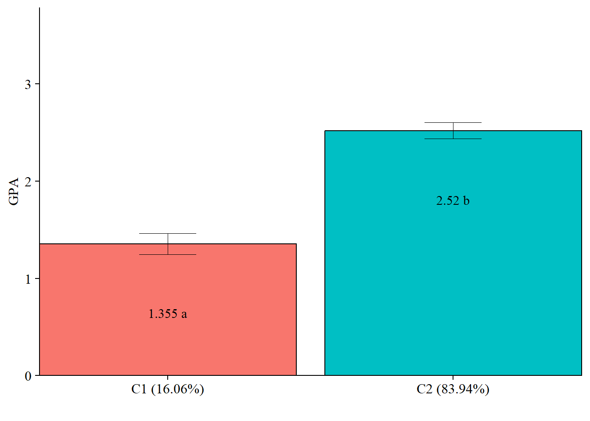

# Automatic 3-Step Distal Only

------------------------------------------------------------------------

**Data source:**

This utilizes a dataset on undergraduate *Cheating* available from the `poLCA` package (Dayton, 1998): [See documentation here](https://cran.r-project.org/web/packages/poLCA/poLCA.pdf)

------------------------------------------------------------------------

## Load packages


``` r
library(MplusAutomation)
library(tidyverse) #collection of R packages designed for data science
library(here) #helps with filepaths
library(janitor) #clean_names
library(gt) # create tables
library(cowplot) # a ggplot theme
library(DiagrammeR) # create path diagrams
library(glue) # allows us to paste expressions into R code
library(data.table) # used for `melt()` function  
library(poLCA)
library(reshape2)
```

------------------------------------------------------------------------

## Automated Three-Step

------------------------------------------------------------------------

*Application: Undergraduate Cheating behavior*


"Dichotomous self-report responses by 319 undergraduates to four questions about cheating behavior" (poLCA, 2016).

------------------------------------------------------------------------

Prepare data


``` r

data(cheating)

cheating <- cheating %>% clean_names() 

df_cheat <-  cheating %>%                                  
  dplyr::select(1:4) %>%                                  
  mutate_all(funs(.-1)) %>%                                
  mutate(gpa = cheating$gpa)

# Detaching packages that mask the dpylr functions 
detach(package:poLCA, unload = TRUE)
detach(package:MASS, unload = TRUE)
```

------------------------------------------------------------------------

### DU3STEP 

**DU3STEP** incorporates distal outcome variables (assumed to have unequal means and variances) with mixture models.

------------------------------------------------------------------------


```{=html}
<div class="grViz html-widget html-fill-item" id="htmlwidget-838823ffbd68c10db51c" style="width:672px;height:480px;"></div>
<script type="application/json" data-for="htmlwidget-838823ffbd68c10db51c">{"x":{"diagram":" digraph cfa_model {\n\n# The `graph` statement - No editing needed\n\n    graph [layout = dot, overlap = true]\n \n# Two `node` statements\n \n# One for measured variables (box) \n\n    node [shape=box]\n    GPA LieExam LiePaper Fraud CopyExam;\n \n# One for latent variables (circle) \n \n    node [shape=circle]\n    bully [label=<Cheating <br/>Behavior <br/>C<sub>k=2<\/sub>>];\n    \n# `edge` statements\n \n    edge [minlen = 2]\n    bully -> {LieExam LiePaper Fraud CopyExam}\n    bully -> GPA [minlen = 4];\n    \n {rank = same; bully; GPA}\n \n }","config":{"engine":"dot","options":null}},"evals":[],"jsHooks":[]}</script>
```


------------------------------------------------------------------------

#### Run the **DU3step** model with `gpa` as distal outcome


``` r

m_stepdu  <- mplusObject(
  TITLE = "DU3STEP - GPA as Distal", 
  VARIABLE = 
   "categorical = lieexam-copyexam; 
    usevar = lieexam-copyexam;
    auxiliary = gpa (du3step);
    classes = c(2);",
  
  ANALYSIS = 
   "estimator = mlr; 
    type = mixture;
    starts = 500 100; 
    processors = 10;",
  
  OUTPUT = "sampstat patterns tech11 tech14;",
  
  PLOT = 
    "type = plot3; 
     series = lieexam-copyexam(*);",
  
  usevariables = colnames(df_cheat),
  rdata = df_cheat)

m_stepdu_fit <- mplusModeler(m_stepdu, 
                            dataout=here("three_step", "auto_3step", "du3step.dat"),
                            modelout=here("three_step", "auto_3step", "c2_du3step.inp") ,
                            check=TRUE, run = TRUE, hashfilename = FALSE)

```

------------------------------------------------------------------------

#### Plot Distal Outcome mean differences


``` r
modelParams <- readModels(here("three_step", "auto_3step", "c2_du3step.out"))

# Extract class size 
c_size <- as.data.frame(modelParams[["class_counts"]][["modelEstimated"]][["proportion"]]) %>% 
  rename("cs" = 1) %>% 
  mutate(cs = round(cs*100, 2))

c_size_val <- paste0("C", 1:nrow(c_size), glue(" ({c_size[1:nrow(c_size),]}%)"))


# Extract information as data frame
estimates <- as.data.frame(modelParams[["lcCondMeans"]][["overall"]]) %>%
  reshape2::melt(id.vars = "var") %>%
  mutate(variable = as.character(variable),
         LatentClass = case_when(
           endsWith(variable, "1") ~ c_size_val[1],
           endsWith(variable, "2") ~ c_size_val[2])) %>% #Add to this based on the number of classes you have
  head(-3) %>% 
  pivot_wider(names_from = variable, values_from = value) %>% 
  unite("mean", contains("m"), na.rm = TRUE) %>% 
  unite("se", contains("se"), na.rm = TRUE) %>% 
  mutate(across(c(mean, se), as.numeric))

# Add labels (NOTE: You must change the labels to match the significance testing!!) 
value_labels <- paste0(estimates$mean, c(" a"," b"))

# Plot bar graphs
estimates %>%
  ggplot(aes(fill = LatentClass, y = mean, x = LatentClass)) +
  geom_bar(position = "dodge", stat = "identity", color = "black") +
  geom_errorbar(aes(ymin=mean-se, ymax=mean+se),
                size=.3,    
                width=.2,
                position=position_dodge(.9)) +
  geom_text(aes(y = mean, label = value_labels), 
            family = "serif", size = 4,
            position=position_dodge(.9),
            vjust = 8) +
  #scale_fill_grey(start = .5, end = .7) +
  labs(y="GPA", x="") +
  theme_cowplot() +
  theme(text = element_text(family = "serif", size = 12),
        axis.text.x = element_text(size=12),
        legend.position="none") +
  coord_cartesian(expand = FALSE, 
                  ylim=c(0,max(estimates$mean*1.5))) # Change ylim based on distal outcome rang
```



``` r


# Save plot
ggsave(here("figures","Du3STEP_plot.jpeg"),                
       dpi=300, width=10, height = 7, units="in")  
```


<div style="text-align: center;"></div>
