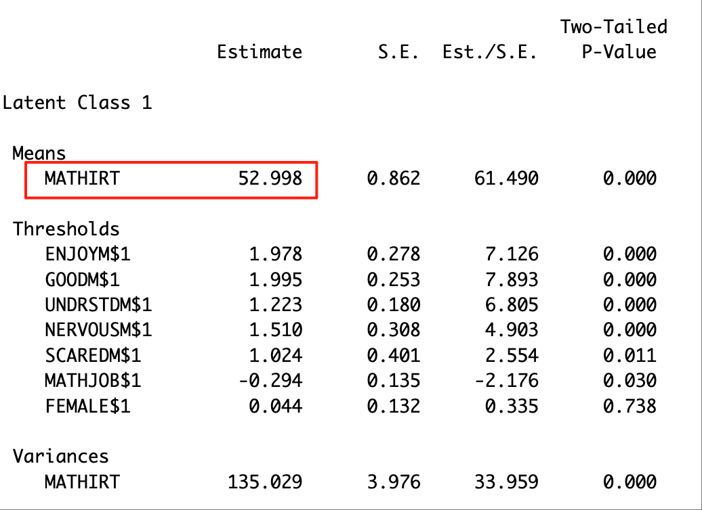
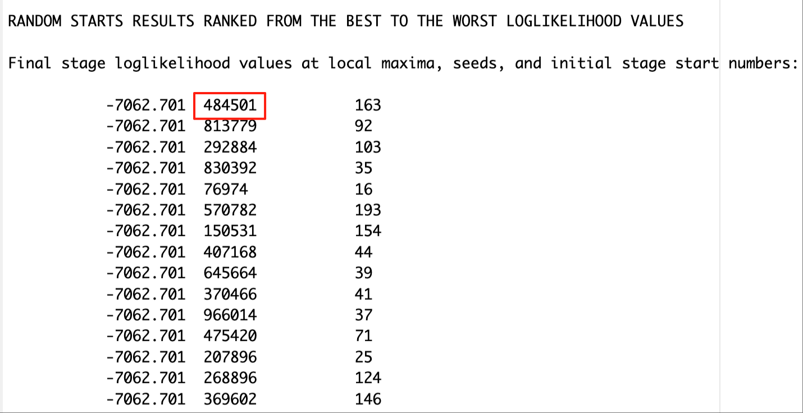
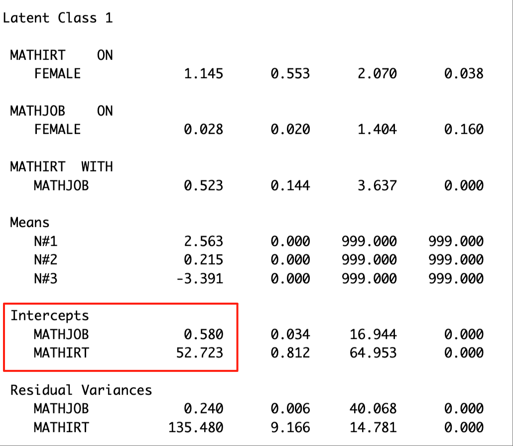
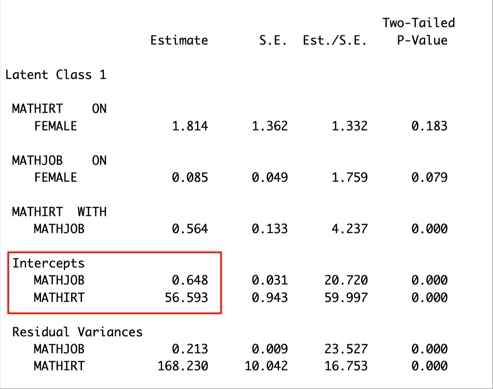
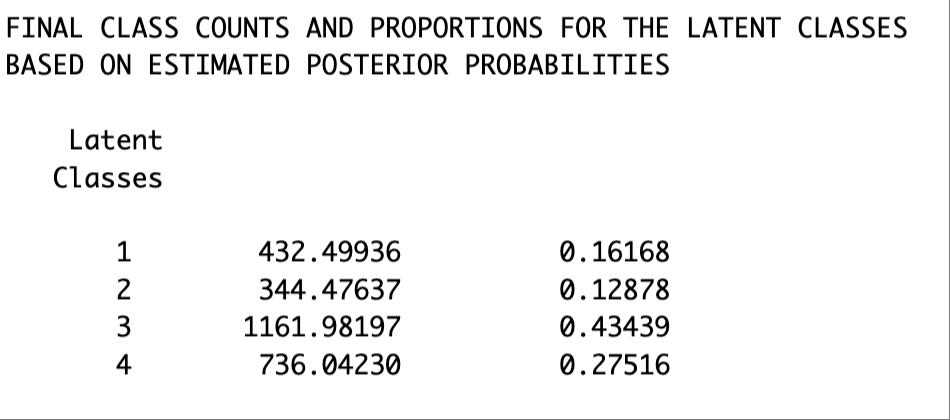
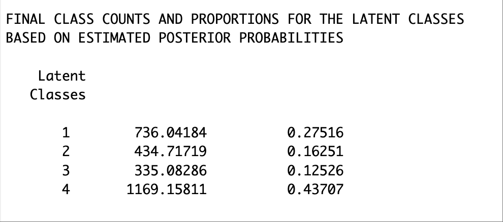

# (PART) Published Manuscripts {.unnumbered}

# Distal Outcomes (Nylund-Gibson, Grimm, & Masyn, 2019)

------------------------------------------------------------------------

This chapter replicates the workflow in Nylund-Gibson et al. (2019).

Citation: [Nylund-Gibson, K., Grimm, R. P., & Masyn, K. E. (2019). Prediction from latent classes: A demonstration of different approaches to include distal outcomes in mixture models. *Structural equation modeling: A multidisciplinary Journal*, *26*(6), 967-985.](https://doi.org/10.1177/01987429211067214)

## Data overview

**Math attitude indicator:**

Five math attitudinal variables were used as the response indicators for the LCA model.

-   *enjoym* - I enjoy math.

-   *goodm* - I am good at math.

-   *udnerstandm* - I usually understand what we are doing in math.

-   nervousm - Doing math often makes me nervous or upset.

-   scaredm - I often get scared when I open my math book and see a page of problems.

**Covariate:**

-   female - gender (female = 1; male = 0)

**Distal outcomes:**

-   mathjob - Math job (1 = student felt that math was useful for a later job; 0 = student did not feel that math was useful for a later job)

-   mathirt - Math IRT score in grade 9 (continuous, higher math scores represent higher math achievement)

------------------------------------------------------------------------

## Load Packages


``` r
library(MplusAutomation)
library(tidyverse)
library(here)
library(glue)
library(gt)
library(cowplot)
library(kableExtra)
library(psych)
library(float)
library(janitor)
library(naniar)
```

------------------------------------------------------------------------

## Data Preparation


``` r
lsay_df <- read_csv(here("distals", "data", "lsay_df.csv"))
```

------------------------------------------------------------------------

## Descriptive Statistics


``` r
psych::describe(lsay_df)
#>          vars    n  mean    sd median trimmed   mad   min
#> enjoym      1 2668  0.67  0.47    1.0    0.71  0.00  0.00
#> goodm       2 2670  0.69  0.46    1.0    0.74  0.00  0.00
#> undrstdm    3 2648  0.76  0.43    1.0    0.83  0.00  0.00
#> nervousm    4 2622  0.59  0.49    1.0    0.61  0.00  0.00
#> scaredm     5 2651  0.69  0.46    1.0    0.73  0.00  0.00
#> mathjob     6 2321  0.69  0.46    1.0    0.74  0.00  0.00
#> mathirt     7 2241 58.81 12.60   59.3   58.93 13.49 26.57
#> female      8 3116  0.48  0.50    0.0    0.47  0.00  0.00
#>            max range  skew kurtosis   se
#> enjoym    1.00  1.00 -0.72    -1.49 0.01
#> goodm     1.00  1.00 -0.84    -1.30 0.01
#> undrstdm  1.00  1.00 -1.24    -0.47 0.01
#> nervousm  1.00  1.00 -0.36    -1.87 0.01
#> scaredm   1.00  1.00 -0.81    -1.35 0.01
#> mathjob   1.00  1.00 -0.81    -1.34 0.01
#> mathirt  94.19 67.62 -0.06    -0.55 0.27
#> female    1.00  1.00  0.09    -1.99 0.01
```


``` r
vis_miss(lsay_df)
```


------------------------------------------------------------------------

## Enumeration - Maysn (2017)


``` r
lca_math  <- lapply(1:6, function(k) {
  lca_math_enum  <- mplusObject(
      
    TITLE = glue("{k}-Class"), 
  
    VARIABLE = glue(
    "categorical = enjoym-scaredm; 
     usevar = enjoym-scaredm;
     classes = c({k}); "),
  
  ANALYSIS = 
   "estimator = mlr; 
    type = mixture;
    starts = 200 100; 
    processors = 10;",
  
  OUTPUT = "sampstat residual tech11 tech14 svalues;",
  
  PLOT = 
    "type = plot3; 
    series = enjoym-scaredm(*);",
  
  usevariables = colnames(lsay_df),
  rdata = lsay_df)

lca_enum_fit <- mplusModeler(lca_math_enum, 
                            dataout=here("distals","enum","enum.dat"),
                            modelout=glue(here("distals","enum","c{k}_enum.inp")),
                            check=TRUE, run = TRUE, hashfilename = FALSE)
})
```

------------------------------------------------------------------------

## Distal-as-indicator approach

The distal-as-indicator approach, also called the 1-step approach because the latent class variable and the distal outcome means are measured in one modeling step (Vermunt, 2010), the distal outcome is part of the measurement model of the latent variable; that is, the distal outcome is treated as an indicator of the latent class variable (Muthén & Shedden, 1999).

For this model, five math attitude variables, the gender covariate, and the two distal outcomes are included as class indicators.


``` r
dasi <- lapply(1:6, function(k) {
  lca_enum  <- mplusObject(
      
    TITLE = glue("{k}-Class"), 
  
    VARIABLE = glue(
    "categorical = enjoym-mathjob female; 
     usevar = enjoym-female;
     classes = c({k});"),
  
  ANALYSIS = 
   "estimator = mlr; 
    type = mixture;
    starts = 200 100; 
    processors = 10;",
  
  OUTPUT = "sampstat residual tech1 tech8 tech10 tech11 tech14 svalues;",
  
  usevariables = colnames(lsay_df),
  rdata = lsay_df)

dasi_enum_fit <- mplusModeler(lca_enum, 
                            dataout=here("distals","enum_dasi","dasi.dat"),
                            modelout=glue(here("distals","enum_dasi","c{k}_dasi.inp")),
                            check=TRUE, run = TRUE, hashfilename = FALSE)
})
```

------------------------------------------------------------------------

### Table of fit


``` r
source(here("functions", "extract_mplus_info.R"))

# Define the directory where all of the .out files are located.
output_dir <- here("distals", "enum_dasi")

# Get all .out files
output_files <- list.files(output_dir, pattern = "\\.out$", full.names = TRUE)

# Process all .out files into one dataframe
final_data <- map_dfr(output_files, extract_mplus_info_extended)

# Extract Sample_Size from final_data
sample_size <- unique(final_data$Sample_Size)

# Read in .out files into `MplusAutomation`
output_dasi <- readModels(here("distals", "enum_dasi"),
                          filefilter = "dasi",
                          quiet = TRUE)

# Extract fit indices
enum_extract <- LatexSummaryTable(
  output_dasi,
  keepCols = c(
    "Title",
    "Parameters",
    "LL",
    "BIC",
    "aBIC",
    "BLRT_PValue",
    "T11_VLMR_PValue",
    "Observations"
  ),
  sortBy = "Title"
)

# Calculate additional fit indices
allFit <- enum_extract %>%
  mutate(CAIC = -2 * LL + Parameters * (log(Observations) + 1)) %>%
  mutate(AWE = -2 * LL + 2 * Parameters * (log(Observations) + 1.5)) %>%
  mutate(SIC = -.5 * BIC) %>%
  mutate(expSIC = exp(SIC - max(SIC))) %>%
  mutate(BF = exp(SIC - lead(SIC))) %>%
  mutate(cmPk = expSIC / sum(expSIC)) %>%
  dplyr::select(1:5, 9:10, 6:7, 13, 14) %>%
  arrange(Parameters)

# Merge columns with LL replications and class size from `final_data`
merged_table <- allFit %>%
  mutate(Title = str_trim(Title)) %>%
  left_join(
    final_data %>%
      dplyr::select(
        Class_Model,
        Perc_Convergence,
        Replicated_LL_Perc,
        Smallest_Class,
        Smallest_Class_Perc
      ),
    by = c("Title" = "Class_Model")
  ) %>%
  mutate(Smallest_Class = coalesce(Smallest_Class, final_data$Smallest_Class[match(Title, final_data$Class_Model)])) %>%
  relocate(Perc_Convergence, Replicated_LL_Perc, .after = LL) %>%
  mutate(Smallest_Class_Combined = paste0(Smallest_Class, "\u00A0(", Smallest_Class_Perc, "%)")) %>%
  dplyr::select(-Smallest_Class, -Smallest_Class_Perc) %>%
  dplyr::select(
    Title,
    Parameters,
    LL,
    Perc_Convergence,
    Replicated_LL_Perc,
    BIC,
    aBIC,
    CAIC,
    AWE,
    T11_VLMR_PValue,
    BLRT_PValue,
    Smallest_Class_Combined,
    BF,
    cmPk
  )
```

Create table:


``` r
fit_table1 <- merged_table %>%
  dplyr::select(
    Title,
    Parameters,
    LL,
    Perc_Convergence,
    Replicated_LL_Perc,
    BIC,
    aBIC,
    CAIC,
    AWE,
    T11_VLMR_PValue,
    BLRT_PValue,
    Smallest_Class_Combined
  ) %>%
  gt() %>%
  tab_header(title = md("**Model Fit Summary Table**")) %>%
  tab_spanner(label = "Model Fit Indices", columns = c(BIC, aBIC, CAIC, AWE)) %>%
  tab_spanner(label = "LRTs",
              columns = c(T11_VLMR_PValue, BLRT_PValue)) %>%
  tab_spanner(
    label = md("Smallest\u00A0Class"),
    columns = c(Smallest_Class_Combined)
  ) %>%  # ✅ Non-Breaking Space
  
  cols_label(
    Title = "Classes",
    Parameters = md("npar"),
    LL = md("*LL*"),
    Perc_Convergence = "% Converged",
    Replicated_LL_Perc = "% Replicated",
    BIC = "BIC",
    aBIC = "aBIC",
    CAIC = "CAIC",
    AWE = "AWE",
    T11_VLMR_PValue = "VLMR",
    BLRT_PValue = "BLRT",
    Smallest_Class_Combined = "n (%)"
  ) %>%
  tab_footnote(
    footnote = md(
      "*Note.* Par = Parameters; *LL* = model log likelihood;
      BIC = Bayesian information criterion;
      aBIC = sample size adjusted BIC; CAIC = consistent Akaike information criterion;
      AWE = approximate weight of evidence criterion;
      BLRT = bootstrapped likelihood ratio test p-value;
      VLMR = Vuong-Lo-Mendell-Rubin adjusted likelihood ratio test p-value;
      *cmPk* = approximate correct model probability;
      Smallest K = Number of cases in the smallest class (n (%));
      LL Replicated = Whether the best log-likelihood was replicated."
    ),
    locations = cells_title()
  ) %>%
  tab_options(column_labels.font.weight = "bold") %>%
  fmt_number(columns = c(3, 6:9), decimals = 2) %>%
  fmt(
    columns = c(T11_VLMR_PValue, BLRT_PValue),
    fns = function(x)
      ifelse(is.na(x), "—", ifelse(
        x < 0.001, "<.001", scales::number(x, accuracy = .01)
      ))
  ) %>%
  fmt_percent(
    columns = c(Perc_Convergence, Replicated_LL_Perc),
    decimals = 0,
    scale_values = FALSE
  ) %>%
  
  cols_align(align = "center", columns = everything()) %>%
  tab_style(
    style = list(cell_text(weight = "bold")),
    locations = list(
      cells_body(columns = BIC, row = BIC == min(BIC)),
      cells_body(columns = aBIC, row = aBIC == min(aBIC)),
      cells_body(columns = CAIC, row = CAIC == min(CAIC)),
      cells_body(columns = AWE, row = AWE == min(AWE)),
      cells_body(
        columns = T11_VLMR_PValue,
        row = ifelse(
          T11_VLMR_PValue < .05 &
            lead(T11_VLMR_PValue) > .05,
          T11_VLMR_PValue < .05,
          NA
        )
      ),
      cells_body(
        columns = BLRT_PValue,
        row = ifelse(BLRT_PValue < .05 &
                       lead(BLRT_PValue) > .05, BLRT_PValue < .05, NA)
      )
    )
  )

fit_table1
```


```{=html}
<div id="eejeghvkzm" style="padding-left:0px;padding-right:0px;padding-top:10px;padding-bottom:10px;overflow-x:auto;overflow-y:auto;width:auto;height:auto;">
<style>#eejeghvkzm table {
  font-family: system-ui, 'Segoe UI', Roboto, Helvetica, Arial, sans-serif, 'Apple Color Emoji', 'Segoe UI Emoji', 'Segoe UI Symbol', 'Noto Color Emoji';
  -webkit-font-smoothing: antialiased;
  -moz-osx-font-smoothing: grayscale;
}

#eejeghvkzm thead, #eejeghvkzm tbody, #eejeghvkzm tfoot, #eejeghvkzm tr, #eejeghvkzm td, #eejeghvkzm th {
  border-style: none;
}

#eejeghvkzm p {
  margin: 0;
  padding: 0;
}

#eejeghvkzm .gt_table {
  display: table;
  border-collapse: collapse;
  line-height: normal;
  margin-left: auto;
  margin-right: auto;
  color: #333333;
  font-size: 16px;
  font-weight: normal;
  font-style: normal;
  background-color: #FFFFFF;
  width: auto;
  border-top-style: solid;
  border-top-width: 2px;
  border-top-color: #A8A8A8;
  border-right-style: none;
  border-right-width: 2px;
  border-right-color: #D3D3D3;
  border-bottom-style: solid;
  border-bottom-width: 2px;
  border-bottom-color: #A8A8A8;
  border-left-style: none;
  border-left-width: 2px;
  border-left-color: #D3D3D3;
}

#eejeghvkzm .gt_caption {
  padding-top: 4px;
  padding-bottom: 4px;
}

#eejeghvkzm .gt_title {
  color: #333333;
  font-size: 125%;
  font-weight: initial;
  padding-top: 4px;
  padding-bottom: 4px;
  padding-left: 5px;
  padding-right: 5px;
  border-bottom-color: #FFFFFF;
  border-bottom-width: 0;
}

#eejeghvkzm .gt_subtitle {
  color: #333333;
  font-size: 85%;
  font-weight: initial;
  padding-top: 3px;
  padding-bottom: 5px;
  padding-left: 5px;
  padding-right: 5px;
  border-top-color: #FFFFFF;
  border-top-width: 0;
}

#eejeghvkzm .gt_heading {
  background-color: #FFFFFF;
  text-align: center;
  border-bottom-color: #FFFFFF;
  border-left-style: none;
  border-left-width: 1px;
  border-left-color: #D3D3D3;
  border-right-style: none;
  border-right-width: 1px;
  border-right-color: #D3D3D3;
}

#eejeghvkzm .gt_bottom_border {
  border-bottom-style: solid;
  border-bottom-width: 2px;
  border-bottom-color: #D3D3D3;
}

#eejeghvkzm .gt_col_headings {
  border-top-style: solid;
  border-top-width: 2px;
  border-top-color: #D3D3D3;
  border-bottom-style: solid;
  border-bottom-width: 2px;
  border-bottom-color: #D3D3D3;
  border-left-style: none;
  border-left-width: 1px;
  border-left-color: #D3D3D3;
  border-right-style: none;
  border-right-width: 1px;
  border-right-color: #D3D3D3;
}

#eejeghvkzm .gt_col_heading {
  color: #333333;
  background-color: #FFFFFF;
  font-size: 100%;
  font-weight: bold;
  text-transform: inherit;
  border-left-style: none;
  border-left-width: 1px;
  border-left-color: #D3D3D3;
  border-right-style: none;
  border-right-width: 1px;
  border-right-color: #D3D3D3;
  vertical-align: bottom;
  padding-top: 5px;
  padding-bottom: 6px;
  padding-left: 5px;
  padding-right: 5px;
  overflow-x: hidden;
}

#eejeghvkzm .gt_column_spanner_outer {
  color: #333333;
  background-color: #FFFFFF;
  font-size: 100%;
  font-weight: bold;
  text-transform: inherit;
  padding-top: 0;
  padding-bottom: 0;
  padding-left: 4px;
  padding-right: 4px;
}

#eejeghvkzm .gt_column_spanner_outer:first-child {
  padding-left: 0;
}

#eejeghvkzm .gt_column_spanner_outer:last-child {
  padding-right: 0;
}

#eejeghvkzm .gt_column_spanner {
  border-bottom-style: solid;
  border-bottom-width: 2px;
  border-bottom-color: #D3D3D3;
  vertical-align: bottom;
  padding-top: 5px;
  padding-bottom: 5px;
  overflow-x: hidden;
  display: inline-block;
  width: 100%;
}

#eejeghvkzm .gt_spanner_row {
  border-bottom-style: hidden;
}

#eejeghvkzm .gt_group_heading {
  padding-top: 8px;
  padding-bottom: 8px;
  padding-left: 5px;
  padding-right: 5px;
  color: #333333;
  background-color: #FFFFFF;
  font-size: 100%;
  font-weight: initial;
  text-transform: inherit;
  border-top-style: solid;
  border-top-width: 2px;
  border-top-color: #D3D3D3;
  border-bottom-style: solid;
  border-bottom-width: 2px;
  border-bottom-color: #D3D3D3;
  border-left-style: none;
  border-left-width: 1px;
  border-left-color: #D3D3D3;
  border-right-style: none;
  border-right-width: 1px;
  border-right-color: #D3D3D3;
  vertical-align: middle;
  text-align: left;
}

#eejeghvkzm .gt_empty_group_heading {
  padding: 0.5px;
  color: #333333;
  background-color: #FFFFFF;
  font-size: 100%;
  font-weight: initial;
  border-top-style: solid;
  border-top-width: 2px;
  border-top-color: #D3D3D3;
  border-bottom-style: solid;
  border-bottom-width: 2px;
  border-bottom-color: #D3D3D3;
  vertical-align: middle;
}

#eejeghvkzm .gt_from_md > :first-child {
  margin-top: 0;
}

#eejeghvkzm .gt_from_md > :last-child {
  margin-bottom: 0;
}

#eejeghvkzm .gt_row {
  padding-top: 8px;
  padding-bottom: 8px;
  padding-left: 5px;
  padding-right: 5px;
  margin: 10px;
  border-top-style: solid;
  border-top-width: 1px;
  border-top-color: #D3D3D3;
  border-left-style: none;
  border-left-width: 1px;
  border-left-color: #D3D3D3;
  border-right-style: none;
  border-right-width: 1px;
  border-right-color: #D3D3D3;
  vertical-align: middle;
  overflow-x: hidden;
}

#eejeghvkzm .gt_stub {
  color: #333333;
  background-color: #FFFFFF;
  font-size: 100%;
  font-weight: initial;
  text-transform: inherit;
  border-right-style: solid;
  border-right-width: 2px;
  border-right-color: #D3D3D3;
  padding-left: 5px;
  padding-right: 5px;
}

#eejeghvkzm .gt_stub_row_group {
  color: #333333;
  background-color: #FFFFFF;
  font-size: 100%;
  font-weight: initial;
  text-transform: inherit;
  border-right-style: solid;
  border-right-width: 2px;
  border-right-color: #D3D3D3;
  padding-left: 5px;
  padding-right: 5px;
  vertical-align: top;
}

#eejeghvkzm .gt_row_group_first td {
  border-top-width: 2px;
}

#eejeghvkzm .gt_row_group_first th {
  border-top-width: 2px;
}

#eejeghvkzm .gt_summary_row {
  color: #333333;
  background-color: #FFFFFF;
  text-transform: inherit;
  padding-top: 8px;
  padding-bottom: 8px;
  padding-left: 5px;
  padding-right: 5px;
}

#eejeghvkzm .gt_first_summary_row {
  border-top-style: solid;
  border-top-color: #D3D3D3;
}

#eejeghvkzm .gt_first_summary_row.thick {
  border-top-width: 2px;
}

#eejeghvkzm .gt_last_summary_row {
  padding-top: 8px;
  padding-bottom: 8px;
  padding-left: 5px;
  padding-right: 5px;
  border-bottom-style: solid;
  border-bottom-width: 2px;
  border-bottom-color: #D3D3D3;
}

#eejeghvkzm .gt_grand_summary_row {
  color: #333333;
  background-color: #FFFFFF;
  text-transform: inherit;
  padding-top: 8px;
  padding-bottom: 8px;
  padding-left: 5px;
  padding-right: 5px;
}

#eejeghvkzm .gt_first_grand_summary_row {
  padding-top: 8px;
  padding-bottom: 8px;
  padding-left: 5px;
  padding-right: 5px;
  border-top-style: double;
  border-top-width: 6px;
  border-top-color: #D3D3D3;
}

#eejeghvkzm .gt_last_grand_summary_row_top {
  padding-top: 8px;
  padding-bottom: 8px;
  padding-left: 5px;
  padding-right: 5px;
  border-bottom-style: double;
  border-bottom-width: 6px;
  border-bottom-color: #D3D3D3;
}

#eejeghvkzm .gt_striped {
  background-color: rgba(128, 128, 128, 0.05);
}

#eejeghvkzm .gt_table_body {
  border-top-style: solid;
  border-top-width: 2px;
  border-top-color: #D3D3D3;
  border-bottom-style: solid;
  border-bottom-width: 2px;
  border-bottom-color: #D3D3D3;
}

#eejeghvkzm .gt_footnotes {
  color: #333333;
  background-color: #FFFFFF;
  border-bottom-style: none;
  border-bottom-width: 2px;
  border-bottom-color: #D3D3D3;
  border-left-style: none;
  border-left-width: 2px;
  border-left-color: #D3D3D3;
  border-right-style: none;
  border-right-width: 2px;
  border-right-color: #D3D3D3;
}

#eejeghvkzm .gt_footnote {
  margin: 0px;
  font-size: 90%;
  padding-top: 4px;
  padding-bottom: 4px;
  padding-left: 5px;
  padding-right: 5px;
}

#eejeghvkzm .gt_sourcenotes {
  color: #333333;
  background-color: #FFFFFF;
  border-bottom-style: none;
  border-bottom-width: 2px;
  border-bottom-color: #D3D3D3;
  border-left-style: none;
  border-left-width: 2px;
  border-left-color: #D3D3D3;
  border-right-style: none;
  border-right-width: 2px;
  border-right-color: #D3D3D3;
}

#eejeghvkzm .gt_sourcenote {
  font-size: 90%;
  padding-top: 4px;
  padding-bottom: 4px;
  padding-left: 5px;
  padding-right: 5px;
}

#eejeghvkzm .gt_left {
  text-align: left;
}

#eejeghvkzm .gt_center {
  text-align: center;
}

#eejeghvkzm .gt_right {
  text-align: right;
  font-variant-numeric: tabular-nums;
}

#eejeghvkzm .gt_font_normal {
  font-weight: normal;
}

#eejeghvkzm .gt_font_bold {
  font-weight: bold;
}

#eejeghvkzm .gt_font_italic {
  font-style: italic;
}

#eejeghvkzm .gt_super {
  font-size: 65%;
}

#eejeghvkzm .gt_footnote_marks {
  font-size: 75%;
  vertical-align: 0.4em;
  position: initial;
}

#eejeghvkzm .gt_asterisk {
  font-size: 100%;
  vertical-align: 0;
}

#eejeghvkzm .gt_indent_1 {
  text-indent: 5px;
}

#eejeghvkzm .gt_indent_2 {
  text-indent: 10px;
}

#eejeghvkzm .gt_indent_3 {
  text-indent: 15px;
}

#eejeghvkzm .gt_indent_4 {
  text-indent: 20px;
}

#eejeghvkzm .gt_indent_5 {
  text-indent: 25px;
}

#eejeghvkzm .katex-display {
  display: inline-flex !important;
  margin-bottom: 0.75em !important;
}

#eejeghvkzm div.Reactable > div.rt-table > div.rt-thead > div.rt-tr.rt-tr-group-header > div.rt-th-group:after {
  height: 0px !important;
}
</style>
<table class="gt_table" data-quarto-disable-processing="false" data-quarto-bootstrap="false">
  <thead>
    <tr class="gt_heading">
      <td colspan="12" class="gt_heading gt_title gt_font_normal gt_bottom_border" style><span class='gt_from_md'><strong>Model Fit Summary Table</strong></span><span class="gt_footnote_marks" style="white-space:nowrap;font-style:italic;font-weight:normal;line-height:0;"><sup>1</sup></span></td>
    </tr>
    
    <tr class="gt_col_headings gt_spanner_row">
      <th class="gt_col_heading gt_columns_bottom_border gt_center" rowspan="2" colspan="1" scope="col" id="Title">Classes</th>
      <th class="gt_col_heading gt_columns_bottom_border gt_center" rowspan="2" colspan="1" scope="col" id="Parameters"><span class='gt_from_md'>npar</span></th>
      <th class="gt_col_heading gt_columns_bottom_border gt_center" rowspan="2" colspan="1" scope="col" id="LL"><span class='gt_from_md'><em>LL</em></span></th>
      <th class="gt_col_heading gt_columns_bottom_border gt_center" rowspan="2" colspan="1" scope="col" id="Perc_Convergence">% Converged</th>
      <th class="gt_col_heading gt_columns_bottom_border gt_center" rowspan="2" colspan="1" scope="col" id="Replicated_LL_Perc">% Replicated</th>
      <th class="gt_center gt_columns_top_border gt_column_spanner_outer" rowspan="1" colspan="4" scope="colgroup" id="Model Fit Indices">
        <div class="gt_column_spanner">Model Fit Indices</div>
      </th>
      <th class="gt_center gt_columns_top_border gt_column_spanner_outer" rowspan="1" colspan="2" scope="colgroup" id="LRTs">
        <div class="gt_column_spanner">LRTs</div>
      </th>
      <th class="gt_center gt_columns_top_border gt_column_spanner_outer" rowspan="1" colspan="1" scope="col" id="Smallest Class">
        <div class="gt_column_spanner"><span class='gt_from_md'>Smallest Class</span></div>
      </th>
    </tr>
    <tr class="gt_col_headings">
      <th class="gt_col_heading gt_columns_bottom_border gt_center" rowspan="1" colspan="1" scope="col" id="BIC">BIC</th>
      <th class="gt_col_heading gt_columns_bottom_border gt_center" rowspan="1" colspan="1" scope="col" id="aBIC">aBIC</th>
      <th class="gt_col_heading gt_columns_bottom_border gt_center" rowspan="1" colspan="1" scope="col" id="CAIC">CAIC</th>
      <th class="gt_col_heading gt_columns_bottom_border gt_center" rowspan="1" colspan="1" scope="col" id="AWE">AWE</th>
      <th class="gt_col_heading gt_columns_bottom_border gt_center" rowspan="1" colspan="1" scope="col" id="T11_VLMR_PValue">VLMR</th>
      <th class="gt_col_heading gt_columns_bottom_border gt_center" rowspan="1" colspan="1" scope="col" id="BLRT_PValue">BLRT</th>
      <th class="gt_col_heading gt_columns_bottom_border gt_center" rowspan="1" colspan="1" scope="col" id="Smallest_Class_Combined">n (%)</th>
    </tr>
  </thead>
  <tbody class="gt_table_body">
    <tr><td headers="Title" class="gt_row gt_center">1-Class</td>
<td headers="Parameters" class="gt_row gt_center">9</td>
<td headers="LL" class="gt_row gt_center">−20,669.36</td>
<td headers="Perc_Convergence" class="gt_row gt_center">100%</td>
<td headers="Replicated_LL_Perc" class="gt_row gt_center">100%</td>
<td headers="BIC" class="gt_row gt_center">41,411.11</td>
<td headers="aBIC" class="gt_row gt_center">41,382.51</td>
<td headers="CAIC" class="gt_row gt_center">41,420.11</td>
<td headers="AWE" class="gt_row gt_center">41,510.51</td>
<td headers="T11_VLMR_PValue" class="gt_row gt_center">—</td>
<td headers="BLRT_PValue" class="gt_row gt_center">—</td>
<td headers="Smallest_Class_Combined" class="gt_row gt_center">3116 (100%)</td></tr>
    <tr><td headers="Title" class="gt_row gt_center">2-Class</td>
<td headers="Parameters" class="gt_row gt_center">18</td>
<td headers="LL" class="gt_row gt_center">−19,655.62</td>
<td headers="Perc_Convergence" class="gt_row gt_center">100%</td>
<td headers="Replicated_LL_Perc" class="gt_row gt_center">100%</td>
<td headers="BIC" class="gt_row gt_center">39,456.04</td>
<td headers="aBIC" class="gt_row gt_center">39,398.85</td>
<td headers="CAIC" class="gt_row gt_center">39,474.04</td>
<td headers="AWE" class="gt_row gt_center">39,654.84</td>
<td headers="T11_VLMR_PValue" class="gt_row gt_center"><.001</td>
<td headers="BLRT_PValue" class="gt_row gt_center"><.001</td>
<td headers="Smallest_Class_Combined" class="gt_row gt_center">1034 (33.2%)</td></tr>
    <tr><td headers="Title" class="gt_row gt_center">3-Class</td>
<td headers="Parameters" class="gt_row gt_center">27</td>
<td headers="LL" class="gt_row gt_center">−19,420.74</td>
<td headers="Perc_Convergence" class="gt_row gt_center">99%</td>
<td headers="Replicated_LL_Perc" class="gt_row gt_center">100%</td>
<td headers="BIC" class="gt_row gt_center">39,058.68</td>
<td headers="aBIC" class="gt_row gt_center">38,972.89</td>
<td headers="CAIC" class="gt_row gt_center">39,085.68</td>
<td headers="AWE" class="gt_row gt_center" style="font-weight: bold;">39,356.88</td>
<td headers="T11_VLMR_PValue" class="gt_row gt_center"><.001</td>
<td headers="BLRT_PValue" class="gt_row gt_center"><.001</td>
<td headers="Smallest_Class_Combined" class="gt_row gt_center">447 (14.4%)</td></tr>
    <tr><td headers="Title" class="gt_row gt_center">4-Class</td>
<td headers="Parameters" class="gt_row gt_center">36</td>
<td headers="LL" class="gt_row gt_center">−19,349.10</td>
<td headers="Perc_Convergence" class="gt_row gt_center">80%</td>
<td headers="Replicated_LL_Perc" class="gt_row gt_center">89%</td>
<td headers="BIC" class="gt_row gt_center" style="font-weight: bold;">38,987.80</td>
<td headers="aBIC" class="gt_row gt_center" style="font-weight: bold;">38,873.41</td>
<td headers="CAIC" class="gt_row gt_center" style="font-weight: bold;">39,023.80</td>
<td headers="AWE" class="gt_row gt_center">39,385.39</td>
<td headers="T11_VLMR_PValue" class="gt_row gt_center" style="font-weight: bold;"><.001</td>
<td headers="BLRT_PValue" class="gt_row gt_center"><.001</td>
<td headers="Smallest_Class_Combined" class="gt_row gt_center">491 (15.7%)</td></tr>
    <tr><td headers="Title" class="gt_row gt_center">5-Class</td>
<td headers="Parameters" class="gt_row gt_center">45</td>
<td headers="LL" class="gt_row gt_center">−19,331.73</td>
<td headers="Perc_Convergence" class="gt_row gt_center">34%</td>
<td headers="Replicated_LL_Perc" class="gt_row gt_center">35%</td>
<td headers="BIC" class="gt_row gt_center">39,025.45</td>
<td headers="aBIC" class="gt_row gt_center">38,882.47</td>
<td headers="CAIC" class="gt_row gt_center">39,070.45</td>
<td headers="AWE" class="gt_row gt_center">39,522.45</td>
<td headers="T11_VLMR_PValue" class="gt_row gt_center">0.29</td>
<td headers="BLRT_PValue" class="gt_row gt_center"><.001</td>
<td headers="Smallest_Class_Combined" class="gt_row gt_center">182 (5.8%)</td></tr>
    <tr><td headers="Title" class="gt_row gt_center">6-Class</td>
<td headers="Parameters" class="gt_row gt_center">54</td>
<td headers="LL" class="gt_row gt_center">−19,313.44</td>
<td headers="Perc_Convergence" class="gt_row gt_center">31%</td>
<td headers="Replicated_LL_Perc" class="gt_row gt_center">42%</td>
<td headers="BIC" class="gt_row gt_center">39,061.27</td>
<td headers="aBIC" class="gt_row gt_center">38,889.69</td>
<td headers="CAIC" class="gt_row gt_center">39,115.27</td>
<td headers="AWE" class="gt_row gt_center">39,657.66</td>
<td headers="T11_VLMR_PValue" class="gt_row gt_center">0.12</td>
<td headers="BLRT_PValue" class="gt_row gt_center"><.001</td>
<td headers="Smallest_Class_Combined" class="gt_row gt_center">258 (8.3%)</td></tr>
  </tbody>
  
  <tfoot class="gt_footnotes">
    <tr>
      <td class="gt_footnote" colspan="12"><span class="gt_footnote_marks" style="white-space:nowrap;font-style:italic;font-weight:normal;line-height:0;"><sup>1</sup></span> <span class='gt_from_md'><em>Note.</em> Par = Parameters; <em>LL</em> = model log likelihood;
BIC = Bayesian information criterion;
aBIC = sample size adjusted BIC; CAIC = consistent Akaike information criterion;
AWE = approximate weight of evidence criterion;
BLRT = bootstrapped likelihood ratio test p-value;
VLMR = Vuong-Lo-Mendell-Rubin adjusted likelihood ratio test p-value;
<em>cmPk</em> = approximate correct model probability;
Smallest K = Number of cases in the smallest class (n (%));
LL Replicated = Whether the best log-likelihood was replicated.</span></td>
    </tr>
  </tfoot>
</table>
</div>
```


------------------------------------------------------------------------

The results from the distal-as-indicator approach suggested a 4-class model as well. Though there were some differences in the emergent latent classes compared to the classes from the unconditional LCA model without distals, the substantive interpretation would largely remain the same with respect to the math attitudinal variables.

The distal mean of the binary outcome variable (in this case, *math job*) can be located in the "RESULTS IN PROBABILITY SCALE" section. The excerpt below presents the distal mean of *math job* for Latent Class 1.

{width="450"}

The distal mean of the continuous outcome variable (in this case, *math IRT score*) can be located in the "MODEL RESULTS" section. The excerpt below shows the distal mean of the *math IRT score* for Latent Class 1.

{width="450"}

------------------------------------------------------------------------

### Conditional Item Probability Plot


``` r
source(here("functions", "plot_lca.R"))

plot_lca(model_name = output_dasi$c4_dasi.out)
```


------------------------------------------------------------------------

## Adding constraints to test the distal means


``` r
dasi_cons  <- mplusObject(
  TITLE = "D as I with constraints", 
  VARIABLE = 
  "categorical = enjoym-mathjob female;
   usevar = enjoym-female;
   classes = c(4);",
  
  ANALYSIS = 
  "estimator = mlr; 
    type = mixture;
    starts = 200 100; 
    processors = 10;",
  
  MODEL =
    " %overall%

      %c#1%
      [mathjob$1] (dj1);
      [mathirt]   (dm1);
      [female$1]  (df1);

      %c#2%
      [mathjob$1] (dj2);
      [mathirt]   (dm2);
      [female$1]  (df2);

      %c#3%
      [mathjob$1] (dj3);
      [mathirt]   (dm3);
      [female$1]  (df3);

      %c#4%
      [mathjob$1] (dj4);
      [mathirt]   (dm4);
      [female$1]  (df4);",
  
  SAVEDATA = 
   "File=3step_savedata.dat;
    Save=cprob;",
  
  OUTPUT = "residual tech11 tech14",
  
  MODELCONSTRAINT = 
  "New (dj1v2 dj1v3 dj1v4 dj2v3 dj2v4 dj3v4
       dm1v2 dm1v3 dm1v4 dm2v3 dm2v4 dm3v4
       df1v2 df1v3 df1v4 df2v3 df2v4 df3v4);

    dj1v2 = dj1-dj2;
    dj1v3 = dj1-dj3;
    dj1v4 = dj1-dj4;
    dj2v3 = dj2-dj3;
    dj2v4 = dj2-dj4;
    dj3v4 = dj3-dj4;

    dm1v2 = dm1-dm2;
    dm1v3 = dm1-dm3;
    dm1v4 = dm1-dm4;
    dm2v3 = dm2-dm3;
    dm2v4 = dm2-dm4;
    dm3v4 = dm3-dm4;

    df1v2 = df1-df2;
    df1v3 = df1-df3;
    df1v4 = df1-df4;
    df2v3 = df2-df3;
    df2v4 = df2-df4;
    df3v4 = df3-df4;",
  
  usevariables = colnames(lsay_df),
  rdata = lsay_df)

dasi_cons_fit <- mplusModeler(dasi_cons,
                            dataout=here("distals","constraints","dasi_constraints.dat"),
                            modelout=here("distals","constraints","dasi_constraints.inp"),
                            check=TRUE, run = TRUE, hashfilename = FALSE)
```

The significance of the newly specified parameters (e.g., DJ1V2, DM1V2) indicates whether there are statistically significant differences between the latent classes. For example, a significant p-value for DM1V2 suggests a meaningful difference in the distal outcome of the math IRT score between Latent Class 1 and Latent Class 2.

------------------------------------------------------------------------

## Manual 3-step

### Step 1 Class Enumeration w/ Auxiliary Specification

The first step involves identifying the best-fitting unconditional model and saving the posterior probabilities and modal class assignment for that model (i.e., savedata: save=cprob;) and specifying any distal outcome variables as auxiliary variables so that they are included in the new data file saved in the savedata command.

This step is done after class enumeration. In this example, the four class model was the best. Therefore, we are re-estimating the four-class model using `optseed` for efficiency. The `optseed` can be found in the "RANDOM STARTS RESULTS RANKED FROM THE BEST TO THE WORST LOGLIKELIHOOD VALUES" section. Any random start value that yields the best log-likelihood can be used as the `optseed`, and they should produce identical parameter estimates.

{width="527"}

In the `SAVEDATA` command, we can save the posterior probabilities and the modal class assignment for steps two and three.


``` r
ml_step1  <- mplusObject(
  TITLE = "Step 1 ", 
  VARIABLE = 
  "categorical = enjoym-scaredm; 
   usevar = enjoym-scaredm;
    
   classes = c(4); 
    
   auxiliary =   ! list all potential covariates and distals here
   female        ! covariate
   mathjob mathirt;      ! distal math test score in 9th grade ",
  
  ANALYSIS = 
   "estimator = mlr; 
    type = mixture;
    starts = 0;
    optseed = 484501;",
  
  SAVEDATA = 
   "File = 3step_savedata.dat;
    Save = cprob;",
  
  OUTPUT = "residual tech11 tech14",
  
  usevariables = colnames(lsay_df),
  rdata = lsay_df)

ml_step1_fit <- mplusModeler(ml_step1,
                            dataout=here("distals","three_step","ML_step1.dat"),
                            modelout=here("distals","three_step","ML_step1.inp") ,
                            check=TRUE, run = TRUE, hashfilename = FALSE)
```

------------------------------------------------------------------------

### Step 2 - Determine Measurement Error


``` r
output_lsay <- readModels(here("distals","three_step","ML_step1.out"))

logit_cprobs <- as.data.frame(output_lsay[["class_counts"]]
                                       [["logitProbs.mostLikely"]])

savedata_lsay <- as.data.frame(output_lsay[["savedata"]])

colnames(savedata_lsay)[colnames(savedata_lsay)=="C"] <- "N"
```

------------------------------------------------------------------------

### Step 3 - Add Auxiliary Variables


``` r
ML_step3  <- mplusObject(
  TITLE = "Step3 ", 
  
  VARIABLE = 
 "nominal = N;
  usevar = n;
  
  classes = c(4);
  
  usevar = female mathjob mathirt;" ,
  
  ANALYSIS = 
 "estimator = mlr; 
  type = mixture; 
  starts = 100 50;
  processors = 4;",
 
  DEFINE = 
   "center female (grandmean);",
  
  MODEL =
  glue(
 " %OVERALL%
 
  mathirt on female; ! covariate as a predictor of the distal outcome
  mathjob on female;
  C on female;        ! covariate as predictor of C

     %C#1%
  [n#1@{logit_cprobs[1,1]}]; ! MUST EDIT if you do not have a 4-class model. 
  [n#2@{logit_cprobs[1,2]}];
  [n#3@{logit_cprobs[1,3]}];
  
  [mathirt](m1);    ! conditional distal mean 
  mathirt;          ! conditional distal variance (freely estimated)
  [mathjob](j1);
  mathjob;

  %C#2%
  [n#1@{logit_cprobs[2,1]}];
  [n#2@{logit_cprobs[2,2]}];
  [n#3@{logit_cprobs[2,3]}];
  
  [mathirt](m2);
  mathirt;
  [mathjob](j2);
  mathjob;
  
  %C#3%
  [n#1@{logit_cprobs[3,1]}];
  [n#2@{logit_cprobs[3,2]}];
  [n#3@{logit_cprobs[3,3]}];
  
  [mathirt](m3);
  mathirt;
  [mathjob](j3);
  mathjob;

  %C#4%
  [n#1@{logit_cprobs[4,1]}];
  [n#2@{logit_cprobs[4,2]}];
  [n#3@{logit_cprobs[4,3]}];
  
  [mathirt](m4);
  mathirt; 
  [mathjob](j4);
  mathjob;  "),
  
  MODELCONSTRAINT = 
   "New (dm1v2 dm1v3 dm2v3 dm1v4 dm2v4 dm3v4 
         dj1v2 dj1v3 dj2v3 dj1v4 dj2v4 dj3v4 
    );
  
    dm1v2 = m1-m2;  ! test pairwise distal mean differences of IRT score
    dm1v3 = m1-m3;
    dm2v3 = m2-m3;
    dm1v4 = m1-m4;
    dm2v4 = m2-m4;
    dm3v4 = m3-m4;
    dj1v2 = j1-j2;  ! test pairwise distal mean differences of math job
    dj1v3 = j1-j3;
    dj2v3 = j2-j3;
    dj1v4 = j1-j4;
    dj2v4 = j2-j4;
    dj3v4 = j3-j4;",
  
  MODELTEST = "     ! omnibus test of distal means 
    m1=m2;
    m2=m3;
    m3=m4;
    j1=j2;
    j2=j3;
    j3=j4;",
 
  usevariables = colnames(savedata_lsay), 
  rdata = savedata_lsay)

step3_fit <- mplusModeler(ML_step3,
               dataout=here("distals","three_step","ML_step3.dat"), 
               modelout=here("distals","three_step","ML_step3.inp"), 
               check=TRUE, run = TRUE, hashfilename = FALSE)
```

The distal means of the outcome variables are located in the 'MODEL RESULTS' section. The excerpt below presents the distal means of *math job* and *math IRT score* for Latent Class 1.

{width="450"}

------------------------------------------------------------------------

## BCH approach

The BCH method is very similar to the three-step approach except that instead of calculating the average classification error in the second step, classification errors for each individual are computed, and the inverse logits of those individual-level error rates are used as weights in the third step rather than using the modal class assignment as imperfect latent class indicator. Advantages with this approach are that it appears to be more resistant to shifts in the latent classes in the third step (which is a problem in the manual 3-step in Mplus) and can often be used irrespective of variances being equal or unequal across latent classes (which can be a problem with the LTB approach).

### Step 1 - Class Enumeration w/ Auxiliary Specification and BCH Weights


``` r
step1_bch  <- mplusObject(
  TITLE = "Step 1 - BCH Method", 
  VARIABLE = 
  "categorical = enjoym-scaredm; 
   usevar = enjoym-scaredm;
    
   classes = c(4); 
    
   auxiliary =   ! list all potential covariates and distals here
   female        ! covariate
   mathjob mathirt;      ! distal math test score in 9th grade ",
  
  ANALYSIS = 
   "estimator = mlr; 
    type = mixture;
    starts = 500 100;",
  
  SAVEDATA = 
   "File=3step_savedata.dat;
    Save=bchweights; ! Here we save the BCH weights
    format = free;",

  OUTPUT = "sampstat residual tech11 tech14",
  
  PLOT = 
    "type = plot3; 
    series = enjoym-scaredm(*);",
  
  usevariables = colnames(lsay_df),
  rdata = lsay_df)

step1_fit_bch <- mplusModeler(step1_bch,
                            dataout=here("distals","three_step","BCH_Step1.dat"),
                            modelout=here("distals","three_step","BCH_Step1.inp") ,
                            check=TRUE, run = TRUE, hashfilename = FALSE)
```

------------------------------------------------------------------------

#### Step 2 - Extract BCH Weights

Extract saved dataset which is part of the mplusObject "step1_fit_bch"


``` r
output_bch <- readModels(here("distals","three_step","BCH_step1.out"))

savedata_bch <- as.data.frame(output_bch[["savedata"]])
```

Rename the column in savedata named "C" and change to "N"


``` r
colnames(savedata_bch)[colnames(savedata_bch)=="C"] <- "N"
```

------------------------------------------------------------------------

#### Step 3 - Add Auxiliary Variables and BCH Weights


``` r
step3_bch  <- mplusObject(
  TITLE = "Step3 - BCH Method", 
  
  VARIABLE = 
 "classes = c(4);
  
  missing are all(9999);
  
  usevar = BCHW1-BCHW4 mathjob mathirt female;
  
  training = BCHW1-BCHW4(bch);" ,
  
  ANALYSIS = 
 "estimator = mlr; 
  type = mixture; 
  starts = 500 200;",
  
  MODEL =
  glue(
 " %OVERALL%
  
  mathirt on female; ! covariate as a predictor of the distal outcome
  mathjob on female;
  C on female;        ! covariate as predictor of C

  %C#1%
     
  [mathirt](m1);    ! conditional distal mean 
  mathirt;          ! conditional distal variance (freely estimated)
  [mathjob](j1);
  mathjob;
  
  mathirt on female (rm1);
  mathjob on female (rj1);

  %C#2%
  
  [mathirt](m2);
  mathirt;
  [mathjob](j2);
  mathjob;
  
  mathirt on female (rm2);
  mathjob on female (rj2);
  
  %C#3%
  
  [mathirt](m3);
  mathirt;
  [mathjob](j3);
  mathjob;
  
  mathirt on female (rm3);
  mathjob on female (rj3);

  %C#4%
  
  [mathirt](m4);
  mathirt; 
  [mathjob](j4);
  mathjob;
 
   mathirt on female (rm4);
   mathjob on female (rj4);"),
  
  MODELCONSTRAINT = 
 
   "New (dm1v2 dm1v3 dm2v3 dm1v4 dm2v4 dm3v4
   dj1v2 dj1v3 dj2v3 dj1v4 dj2v4 dj3v4
    );
  
    dm1v2 = m1-m2;  ! test pairwise distal mean differences of IRT score
    dm1v3 = m1-m3;
    dm2v3 = m2-m3;
    dm1v4 = m1-m4;
    dm2v4 = m2-m4;
    dm3v4 = m3-m4;
    dj1v2 = j1-j2;  ! test pairwise distal mean differences of math job
    dj1v3 = j1-j3;
    dj2v3 = j2-j3;
    dj1v4 = j1-j4;
    dj2v4 = j2-j4;
    dj3v4 = j3-j4;",
  
  MODELTEST = "     ! omnibus test of distal means
    m1=m2;
    m2=m3;
    m3=m4;
    j1=j2;
    j2=j3;
    j3=j4;
 ",
  
  OUTPUT = "Tech1 svalues sampstat",
 
  usevariables = colnames(savedata_bch), 
  rdata = savedata_bch)

step3_fit_bch <- mplusModeler(step3_bch,
               dataout=here("distals","three_step","BCH_Step3.dat"), 
               modelout=here("distals","three_step","BCH_Step3.inp"), 
               check=TRUE, run = TRUE, hashfilename = FALSE)
```

The distal means of the outcome variables are located in the 'MODEL RESULTS' section. The excerpt below presents the distal means of *math job* and *math IRT score* for Latent Class 1.

{width="450"}

Note that the class numbering may not be consistent across different methods. Check the class proportions to make sure that we are comparing the same class across methods. For example, Latent Class 1 in the BCH results matches the Latent Class 4 in the ML 3-step results..

ML-3 step results

{width="430"}

BCH approach results

{width="430"}

------------------------------------------------------------------------

::: {style="text-align: center;"}

:::
