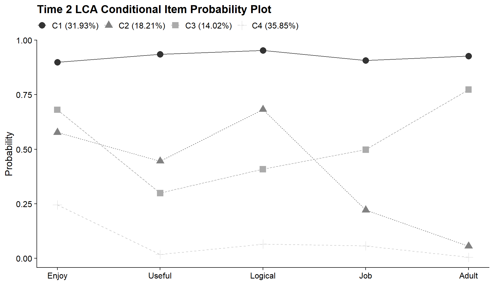

# Adding Covariates

--------------------------------------------------------------------------------------

**Data Source**: The data used to illustrate these analyses include elementary school student *Science Attitude* survey items collected during 7th and 10th grades from the **Longitudinal Study of American Youth** (LSAY; Miller, 2015).

--------------------------------------------------------------------------------------

To install package {`rhdf5`} 


``` r
if (!requireNamespace("BiocManager", quietly = TRUE)) 
  install.packages("BiocManager")

#BiocManager::install("rhdf5")
```

*Load packages*


``` r
library(MplusAutomation)
library(rhdf5)
library(tidyverse)       
library(here)            
library(glue)            
library(janitor)            
library(gt) 
library(reshape2)
library(cowplot)
library(ggrepel)
library(haven)
library(modelsummary)
library(corrplot)
library(DiagrammeR)
library(filesstrings)
library(PNWColors)
```

--------------------------------------------------------------------------------------

Read in LSAY data file, `lsay_new.csv`.


``` r

lsay_data <- read_csv(here("data","lsay_lta.csv"), na = c("9999")) %>% 
    mutate(across(everything(), as.numeric))
```

--------------------------------------------------------------------------------------


```{=html}
<div class="grViz html-widget html-fill-item" id="htmlwidget-731fe9c369e3e9a2495f" style="width:672px;height:480px;"></div>
<script type="application/json" data-for="htmlwidget-731fe9c369e3e9a2495f">{"x":{"diagram":" digraph model {\n\n    graph [layout = dot, overlap = true]\n\n    node [shape=box]\n    ab39m ab39t ab39u ab39w ab39x \n    ga33a ga33h ga33i ga33k ga33l;\n \n \n    node [shape=circle, fixedsize = true, width = 1.5, height = 0.5]\n    T1 [label = \"7th Grade \nScience Attitudes\n(T1)\"]\n    T2 [label = \"10th Grade \nScience Attitudes\n(T2)\"]\n    \n    edge []\n    T1 -> {ab39m ab39t ab39u ab39w ab39x}\n    T2 -> {ga33a ga33h ga33i ga33k ga33l}\n    T1 -> T2\n    {rank = same; T1; T2;}\n }","config":{"engine":"dot","options":null}},"evals":[],"jsHooks":[]}</script>
```


--------------------------------------------------------------------------------------

## Descriptive Statistics

--------------------------------------------------------------------------------------

### Data Summary


``` r
data <- lsay_data

select_data <- data %>% 
 select(female, minority, ab39m:ga33l)

f <- All(select_data) ~ Mean + SD + Min + Median + Max + Histogram
datasummary(f, data, output="markdown")
```


```{=html}
<!-- preamble start -->

    <script>

      function styleCell_waiqzxztdaou7b3zogtm(i, j, css_id) {
          var table = document.getElementById("tinytable_waiqzxztdaou7b3zogtm");
          var cell = table.rows[i]?.cells[j];  // Safe navigation to avoid errors
          if (cell) {
              console.log(`Styling cell at (${i}, ${j}) with class ${css_id}`);
              cell.classList.add(css_id);
          } else {
              console.warn(`Cell at (${i}, ${j}) not found.`);
          }
      }
      function insertSpanRow(i, colspan, content) {
        var table = document.getElementById('tinytable_waiqzxztdaou7b3zogtm');
        var newRow = table.insertRow(i);
        var newCell = newRow.insertCell(0);
        newCell.setAttribute("colspan", colspan);
        // newCell.innerText = content;
        // this may be unsafe, but innerText does not interpret <br>
        newCell.innerHTML = content;
      }
      function spanCell_waiqzxztdaou7b3zogtm(i, j, rowspan, colspan) {
        var table = document.getElementById("tinytable_waiqzxztdaou7b3zogtm");
        const targetRow = table.rows[i];
        const targetCell = targetRow.cells[j];
        for (let r = 0; r < rowspan; r++) {
          // Only start deleting cells to the right for the first row (r == 0)
          if (r === 0) {
            // Delete cells to the right of the target cell in the first row
            for (let c = colspan - 1; c > 0; c--) {
              if (table.rows[i + r].cells[j + c]) {
                table.rows[i + r].deleteCell(j + c);
              }
            }
          }
          // For rows below the first, delete starting from the target column
          if (r > 0) {
            for (let c = colspan - 1; c >= 0; c--) {
              if (table.rows[i + r] && table.rows[i + r].cells[j]) {
                table.rows[i + r].deleteCell(j);
              }
            }
          }
        }
        // Set rowspan and colspan of the target cell
        targetCell.rowSpan = rowspan;
        targetCell.colSpan = colspan;
      }
      // tinytable span after
      window.addEventListener('load', function () {
          var cellsToStyle = [
            // tinytable style arrays after
          { positions: [ { i: 12, j: 1 }, { i: 12, j: 2 }, { i: 12, j: 3 }, { i: 12, j: 4 }, { i: 12, j: 5 }, { i: 12, j: 6 },  ], css_id: 'tinytable_css_li1i2caeldz2lggbcedw',}, 
          { positions: [ { i: 2, j: 1 }, { i: 3, j: 1 }, { i: 4, j: 1 }, { i: 1, j: 1 }, { i: 6, j: 1 }, { i: 7, j: 1 }, { i: 8, j: 1 }, { i: 5, j: 1 }, { i: 10, j: 1 }, { i: 11, j: 1 }, { i: 3, j: 2 }, { i: 9, j: 1 }, { i: 1, j: 2 }, { i: 2, j: 2 }, { i: 7, j: 2 }, { i: 4, j: 2 }, { i: 5, j: 2 }, { i: 6, j: 2 }, { i: 11, j: 2 }, { i: 8, j: 2 }, { i: 9, j: 2 }, { i: 10, j: 2 }, { i: 2, j: 3 }, { i: 3, j: 3 }, { i: 4, j: 3 }, { i: 1, j: 3 }, { i: 6, j: 3 }, { i: 7, j: 3 }, { i: 8, j: 3 }, { i: 5, j: 3 }, { i: 10, j: 3 }, { i: 11, j: 3 }, { i: 3, j: 4 }, { i: 9, j: 3 }, { i: 1, j: 4 }, { i: 2, j: 4 }, { i: 7, j: 4 }, { i: 4, j: 4 }, { i: 5, j: 4 }, { i: 6, j: 4 }, { i: 11, j: 4 }, { i: 8, j: 4 }, { i: 9, j: 4 }, { i: 10, j: 4 }, { i: 2, j: 5 }, { i: 3, j: 5 }, { i: 4, j: 5 }, { i: 1, j: 5 }, { i: 6, j: 5 }, { i: 7, j: 5 }, { i: 8, j: 5 }, { i: 5, j: 5 }, { i: 10, j: 5 }, { i: 11, j: 5 }, { i: 3, j: 6 }, { i: 9, j: 5 }, { i: 1, j: 6 }, { i: 2, j: 6 }, { i: 7, j: 6 }, { i: 4, j: 6 }, { i: 5, j: 6 }, { i: 6, j: 6 }, { i: 11, j: 6 }, { i: 8, j: 6 }, { i: 9, j: 6 }, { i: 10, j: 6 },  ], css_id: 'tinytable_css_ibsqxelys01rvmaz86fn',}, 
          { positions: [ { i: 0, j: 1 }, { i: 0, j: 2 }, { i: 0, j: 3 }, { i: 0, j: 4 }, { i: 0, j: 5 }, { i: 0, j: 6 },  ], css_id: 'tinytable_css_zd9aijtzdju1uk75li1d',}, 
          { positions: [ { i: 12, j: 0 },  ], css_id: 'tinytable_css_iibgllr3o9bolnixsz51',}, 
          { positions: [ { i: 1, j: 0 }, { i: 2, j: 0 }, { i: 3, j: 0 }, { i: 4, j: 0 }, { i: 5, j: 0 }, { i: 6, j: 0 }, { i: 7, j: 0 }, { i: 8, j: 0 }, { i: 9, j: 0 }, { i: 10, j: 0 }, { i: 11, j: 0 },  ], css_id: 'tinytable_css_h8t4z8us8yn7xnk9t2r9',}, 
          { positions: [ { i: 0, j: 0 },  ], css_id: 'tinytable_css_d8f3dbpb031a7c056mjb',}, 
          ];

          // Loop over the arrays to style the cells
          cellsToStyle.forEach(function (group) {
              group.positions.forEach(function (cell) {
                  styleCell_waiqzxztdaou7b3zogtm(cell.i, cell.j, group.css_id);
              });
          });
      });
    </script>

    <style>
      /* tinytable css entries after */
      .table td.tinytable_css_li1i2caeldz2lggbcedw, .table th.tinytable_css_li1i2caeldz2lggbcedw { text-align: right; border-bottom: solid #d3d8dc 0.1em; }
      .table td.tinytable_css_ibsqxelys01rvmaz86fn, .table th.tinytable_css_ibsqxelys01rvmaz86fn { text-align: right; }
      .table td.tinytable_css_zd9aijtzdju1uk75li1d, .table th.tinytable_css_zd9aijtzdju1uk75li1d { text-align: right; border-top: solid #d3d8dc 0.1em; border-bottom: solid #d3d8dc 0.05em; }
      .table td.tinytable_css_iibgllr3o9bolnixsz51, .table th.tinytable_css_iibgllr3o9bolnixsz51 { text-align: left; border-bottom: solid #d3d8dc 0.1em; }
      .table td.tinytable_css_h8t4z8us8yn7xnk9t2r9, .table th.tinytable_css_h8t4z8us8yn7xnk9t2r9 { text-align: left; }
      .table td.tinytable_css_d8f3dbpb031a7c056mjb, .table th.tinytable_css_d8f3dbpb031a7c056mjb { text-align: left; border-top: solid #d3d8dc 0.1em; border-bottom: solid #d3d8dc 0.05em; }
    </style>
    <div class="container">
      <table class="table table-borderless" id="tinytable_waiqzxztdaou7b3zogtm" style="width: auto; margin-left: auto; margin-right: auto;" data-quarto-disable-processing='true'>
        <thead>
        
              <tr>
                <th scope="col"> </th>
                <th scope="col">Mean</th>
                <th scope="col">SD</th>
                <th scope="col">Min</th>
                <th scope="col">Median</th>
                <th scope="col">Max</th>
                <th scope="col">Histogram</th>
              </tr>
        </thead>
        
        <tbody>
                <tr>
                  <td>female</td>
                  <td>0.48</td>
                  <td>0.50</td>
                  <td>0.00</td>
                  <td>0.00</td>
                  <td>1.00</td>
                  <td>▇▆</td>
                </tr>
                <tr>
                  <td>minority</td>
                  <td>0.23</td>
                  <td>0.42</td>
                  <td>0.00</td>
                  <td>0.00</td>
                  <td>1.00</td>
                  <td>▇▂</td>
                </tr>
                <tr>
                  <td>ab39m</td>
                  <td>0.61</td>
                  <td>0.49</td>
                  <td>0.00</td>
                  <td>1.00</td>
                  <td>1.00</td>
                  <td>▄▇</td>
                </tr>
                <tr>
                  <td>ab39t</td>
                  <td>0.40</td>
                  <td>0.49</td>
                  <td>0.00</td>
                  <td>0.00</td>
                  <td>1.00</td>
                  <td>▇▅</td>
                </tr>
                <tr>
                  <td>ab39u</td>
                  <td>0.49</td>
                  <td>0.50</td>
                  <td>0.00</td>
                  <td>0.00</td>
                  <td>1.00</td>
                  <td>▇▇</td>
                </tr>
                <tr>
                  <td>ab39w</td>
                  <td>0.40</td>
                  <td>0.49</td>
                  <td>0.00</td>
                  <td>0.00</td>
                  <td>1.00</td>
                  <td>▇▅</td>
                </tr>
                <tr>
                  <td>ab39x</td>
                  <td>0.46</td>
                  <td>0.50</td>
                  <td>0.00</td>
                  <td>0.00</td>
                  <td>1.00</td>
                  <td>▇▆</td>
                </tr>
                <tr>
                  <td>ga33a</td>
                  <td>0.58</td>
                  <td>0.49</td>
                  <td>0.00</td>
                  <td>1.00</td>
                  <td>1.00</td>
                  <td>▅▇</td>
                </tr>
                <tr>
                  <td>ga33h</td>
                  <td>0.43</td>
                  <td>0.49</td>
                  <td>0.00</td>
                  <td>0.00</td>
                  <td>1.00</td>
                  <td>▇▅</td>
                </tr>
                <tr>
                  <td>ga33i</td>
                  <td>0.51</td>
                  <td>0.50</td>
                  <td>0.00</td>
                  <td>1.00</td>
                  <td>1.00</td>
                  <td>▇▇</td>
                </tr>
                <tr>
                  <td>ga33k</td>
                  <td>0.42</td>
                  <td>0.49</td>
                  <td>0.00</td>
                  <td>0.00</td>
                  <td>1.00</td>
                  <td>▇▅</td>
                </tr>
                <tr>
                  <td>ga33l</td>
                  <td>0.42</td>
                  <td>0.49</td>
                  <td>0.00</td>
                  <td>0.00</td>
                  <td>1.00</td>
                  <td>▇▅</td>
                </tr>
        </tbody>
      </table>
    </div>
<!-- hack to avoid NA insertion in last line -->
```


--------------------------------------------------------------------------------------

## Adding Covariates

Continuing from the previous section \@ref(lta), we use the ML three-step method to estimate LTA models with predictors and distal outcomes). Estimate the unconditional model for each latent variable with the predictors included in the `auxiliary` option for at least one of the models. 

Covariates 

- `sci_issues7`: Interest in science issues (1 = Not at all interested, 2 = Moderately Interested, 3 = Very interested)      
- `sci_irt7`: 7th Grade Science IRT Score (Continuous)    
- `female`: Gender (0 = Male, 1 = Female)

--------------------------------------------------------------------------------------

### Step 1 - Estimate Unconditional Model w/ Auxiliary Specification

*7th Grade*


``` r

step1  <- mplusObject(
  TITLE = "Step 1 - T1", 
  VARIABLE = 
  "usevar = ab39m ab39t ab39u ab39w ab39x;
  categorical = ab39m ab39t ab39u ab39w ab39x;
    
   classes = c(4); 
    
   auxiliary = sci_issues7 sci_irt7 female;
  
   idvariable = casenum;",
  
  ANALYSIS = 
   "estimator = mlr; 
    type = mixture;
    starts = 0;
    optseed = 534483;",
  
  SAVEDATA = 
   "File=3step_t1.dat;
    Save=cprob;",
  
  OUTPUT = "residual tech11 tech14 svalues",
  
  PLOT = 
    "type = plot3; 
    series = ab39m-ab39x(*);",
  
  usevariables = colnames(lsay_data),
  rdata = lsay_data)

step1_fit <- mplusModeler(step1,
                            dataout=here("lta","cov_model","t1.dat"),
                            modelout=here("lta","cov_model","one_T1.inp") ,
                            check=TRUE, run = TRUE, hashfilename = FALSE)
```

------------------------------------------------------------------------

*10th Grade*


``` r

step1  <- mplusObject(
  TITLE = "Step 1 - T1", 
  VARIABLE = 
  "usevar =  ga33a ga33h ga33i ga33k ga33l;
  categorical =  ga33a ga33h ga33i ga33k ga33l;
    
   classes = c(4); 
    
   !auxiliary = sci_issues7 sci_irt7 female;
  
   idvariable = casenum;",
  
  ANALYSIS = 
   "estimator = mlr; 
    type = mixture;
    starts = 0;
    optseed = 392418;",
  
  SAVEDATA = 
   "File=3step_t2.dat;
    Save=cprob;",
  
  OUTPUT = "residual tech11 tech14 svalues",

  PLOT = 
    "type = plot3; 
    series = ga33a-ga33l(*);",
  
  usevariables = colnames(lsay_data),
  rdata = lsay_data)

step1_fit <- mplusModeler(step1,
                            dataout=here("lta","cov_model","t2.dat"),
                            modelout=here("lta","cov_model","one_T2.inp") ,
                            check=TRUE, run = TRUE, hashfilename = FALSE)
```


------------------------------------------------------------------------

`plot_lca_function` requires 5 arguments:

-   `model_name`: name of Mplus model object (e.g., `model_t1_c4`)
-   `item_num`: the number of items in LCA measurement model (e.g., `5`)
-   `class_num`: the number of classes (*k*) in LCA model (e.g., `4`)
-   `item_labels`: the item labels for x-axis (e.g., `c("Enjoy","Useful","Logical","Job","Adult")`)
-   `plot_title`: include the title of the plot here (e.g., `"Time 1 LCA Conditional Item Probability Plot"`)


``` r

plot_lca_function <- function(model_name,item_num,class_num,item_labels,plot_title){

mplus_model <- as.data.frame(model_name$gh5$means_and_variances_data$estimated_probs$values)
plot_t1 <- mplus_model[seq(2, 2*item_num, 2),]

c_size <- as.data.frame(model_name$class_counts$modelEstimated$proportion)
colnames(c_size) <- paste0("cs")
c_size <- c_size %>% mutate(cs = round(cs*100, 2))
colnames(plot_t1) <- paste0("C", 1:class_num, glue(" ({c_size[1:class_num,]}%)"))

plot_t1 <- cbind(Var = paste0("U", 1:item_num), plot_t1)
plot_t1$Var <- factor(plot_t1$Var,
               labels = item_labels)
plot_t1$Var <- fct_inorder(plot_t1$Var)
pd_long_t1 <- melt(plot_t1, id.vars = "Var") 

p <- pd_long_t1 %>%
  ggplot(aes(x = as.integer(Var), y = value,
  shape = variable, colour = variable, lty = variable)) +
  geom_point(size = 4) + geom_line() + 
  scale_x_continuous("", breaks = 1:5, labels = plot_t1$Var) + 
  scale_colour_grey() + 
  labs(title = plot_title, y = "Probability") +
  theme_cowplot() +
  theme(legend.title = element_blank(), 
        legend.position = "top")

p
return(p)
}

```

Plot Time 1


``` r

output_T1 <- readModels(here("lta","cov_model","one_T1.out"))

plot_lca_function(
  model_name = output_T1, 
  item_num = 5,
  class_num = 4,
  item_labels = c("Enjoy","Useful","Logical","Job","Adult"),
  plot_title = "Time 1 LCA Conditional Item Probability Plot"
  )
```


Plot Time 2


``` r

output_T2 <- readModels(here("lta","cov_model","one_T2.out"))

plot_lca_function(
  model_name = output_T2, 
  item_num = 5,
  class_num = 4,
  item_labels = c("Enjoy","Useful","Logical","Job","Adult"),
  plot_title = "Time 2 LCA Conditional Item Probability Plot"
  )
```



------------------------------------------------------------------------

### Step 2 - Determine Measurement Error

Extract logits for the classification probabilities for the most likely latent class:


``` r

logit_cprobs_T1 <- as.data.frame(output_T1[["class_counts"]]
                                       [["logitProbs.mostLikely"]])

logit_cprobs_T2 <- as.data.frame(output_T2[["class_counts"]]
                                       [["logitProbs.mostLikely"]])
```

Extract saved dataset:


``` r

savedata_T1 <- as.data.frame(output_T1[["savedata"]])
savedata_T2 <- as.data.frame(output_T2[["savedata"]])

```

Rename the column in savedata named "C" and change to "N"


``` r

colnames(savedata_T1)[colnames(savedata_T1)=="C"] <- "N_T1"
colnames(savedata_T2)[colnames(savedata_T2)=="C"] <- "N_T2"

savedata <- savedata_T1 %>% 
  full_join(savedata_T2, by = "CASENUM")
```

------------------------------------------------------------------------

### Step 3 - Add Auxiliary Variables


``` r
step3  <- mplusObject(
  TITLE = "ML Three Step LTA Model", 
  
  VARIABLE = 
 "nominal=N_T1 N_T2;
  usevar = N_T1 N_T2 SCI_IRT7 FEMALE;
  classes = c1(4) c2(4);" ,
  
  ANALYSIS = 
 "estimator = mlr; 
  type = mixture; 
  starts = 0;",
 
  MODEL =
  glue(
 " %OVERALL%
      
   c2 on c1; 
   c1 c2 on  SCI_IRT7 FEMALE;

  MODEL c1:
  
  %c1#1%
  [N_T1#1@{logit_cprobs_T1[1,1]}];
  [N_T1#2@{logit_cprobs_T1[1,2]}];
  [N_T1#3@{logit_cprobs_T1[1,3]}];

  %c1#2%
  [N_T1#1@{logit_cprobs_T1[2,1]}];
  [N_T1#2@{logit_cprobs_T1[2,2]}];
  [N_T1#3@{logit_cprobs_T1[2,3]}];
  
  %c1#3%
  [N_T1#1@{logit_cprobs_T1[3,1]}]; 
  [N_T1#2@{logit_cprobs_T1[3,2]}];
  [N_T1#3@{logit_cprobs_T1[3,3]}];
  
  %c1#4%
  [N_T1#1@{logit_cprobs_T1[4,1]}]; 
  [N_T1#2@{logit_cprobs_T1[4,2]}];
  [N_T1#3@{logit_cprobs_T1[4,3]}];

 
  MODEL c2:
  
  %c2#1%
  [N_T2#1@{logit_cprobs_T2[1,1]}]; 
  [N_T2#2@{logit_cprobs_T2[1,2]}];
  [N_T2#3@{logit_cprobs_T2[1,3]}];

  %c2#2%
  [N_T2#1@{logit_cprobs_T2[2,1]}];
  [N_T2#2@{logit_cprobs_T2[2,2]}];
  [N_T2#3@{logit_cprobs_T2[2,3]}];

  
  %c2#3%
  [N_T2#1@{logit_cprobs_T2[3,1]}];
  [N_T2#2@{logit_cprobs_T2[3,2]}];
  [N_T2#3@{logit_cprobs_T2[3,3]}];
 
   %c2#4%
  [N_T2#1@{logit_cprobs_T2[4,1]}];
  [N_T2#2@{logit_cprobs_T2[4,2]}];
  [N_T2#3@{logit_cprobs_T2[4,3]}];"),
 
 
  OUTPUT = "tech15;",
  
  usevariables = colnames(savedata), 
  rdata = savedata)

step3_fit <- mplusModeler(step3,
               dataout=here("lta","cov_model","three.dat"), 
               modelout=here("lta","cov_model","three.inp"), 
               check=TRUE, run = TRUE, hashfilename = FALSE)
```


------------------------------------------------------------------------

#### LTA Transition Plot

This code is adapted from the source code for the `plotLTA` function found in the [\textcolor{blue}{MplusAutomation package}](https://github.com/michaelhallquist/MplusAutomation/blob/995d1ecfae3656524153456ce647f86fe8c1cf1e/R/mixtures.R)

**NOTE:** The function found in `plot_transitions_function.R` is specific to a model with 2 time-points and 4-classes & must be updated to accommodate other models. 


``` r
source(here("functions","plot_transitions_function.R"))

lta_model <- readModels(here("lta","cov_model","three.out"))

plot_transitions_function(
  model_name = lta_model,
  color_pallete = pnw_palette("Bay", n=4, type = "discrete"),
  facet_labels =c(
    `1` = "Transitions to 10th Grade from the Pro-Science w/ Elevated Utility Class",
    `2` = "Transitions to 10th Grade from the Ambivalent w/ Elevated Utility Class",
    `3` = "Transitions to 10th Grade from the Ambivalent w/ Minimal Utility Class",
    `4` = "Transitions to 10th Grade from the Anti-Science w/ Minimal Utility Class"),
  timepoint_labels = c('1' = "7th Grade", '2' = "10th Grade"),
  class_labels = c(
    "Pro-Science",
    "Amb. / Elev. Utility",
    "Amb. / Min. Utility",
    "Anti-Science")
  )
```


Table:


``` r
lta_prob <- as.data.frame(lta_model$class_counts$transitionProbs$probability)


t_matrix <- tibble(
  "7th Grade" = c("Pro-Science","Amb. / Elev. Utility","Amb. / Min. Utility","Anti-Science"),
  "Pro-Science" = c(lta_prob[1,1],lta_prob[2,1],lta_prob[3,1],lta_prob[4,1]),
  "Amb. / Elev. Utility" = c(lta_prob[5,1],lta_prob[6,1],lta_prob[7,1],lta_prob[8,1]),
  "Amb. / Min. Utility" = c(lta_prob[9,1],lta_prob[10,1],lta_prob[11,1],lta_prob[12,1]),
  "Anti-Science" = c(lta_prob[13,1],lta_prob[14,1],lta_prob[15,1],lta_prob[16,1]))

t_matrix %>% 
  gt(rowname_col = "7th Grade") %>%
  tab_stubhead(label = "7th Grade") %>% 
  tab_header(
    title = md("**Transition Probabilities**")) %>% 
  fmt_number(2:5,decimals = 2) %>% 
  tab_spanner(label = "10th Grade",columns = 2:5)#%>% 
```


```{=html}
<div id="xxrdtehqbw" style="padding-left:0px;padding-right:0px;padding-top:10px;padding-bottom:10px;overflow-x:auto;overflow-y:auto;width:auto;height:auto;">
<style>#xxrdtehqbw table {
  font-family: system-ui, 'Segoe UI', Roboto, Helvetica, Arial, sans-serif, 'Apple Color Emoji', 'Segoe UI Emoji', 'Segoe UI Symbol', 'Noto Color Emoji';
  -webkit-font-smoothing: antialiased;
  -moz-osx-font-smoothing: grayscale;
}

#xxrdtehqbw thead, #xxrdtehqbw tbody, #xxrdtehqbw tfoot, #xxrdtehqbw tr, #xxrdtehqbw td, #xxrdtehqbw th {
  border-style: none;
}

#xxrdtehqbw p {
  margin: 0;
  padding: 0;
}

#xxrdtehqbw .gt_table {
  display: table;
  border-collapse: collapse;
  line-height: normal;
  margin-left: auto;
  margin-right: auto;
  color: #333333;
  font-size: 16px;
  font-weight: normal;
  font-style: normal;
  background-color: #FFFFFF;
  width: auto;
  border-top-style: solid;
  border-top-width: 2px;
  border-top-color: #A8A8A8;
  border-right-style: none;
  border-right-width: 2px;
  border-right-color: #D3D3D3;
  border-bottom-style: solid;
  border-bottom-width: 2px;
  border-bottom-color: #A8A8A8;
  border-left-style: none;
  border-left-width: 2px;
  border-left-color: #D3D3D3;
}

#xxrdtehqbw .gt_caption {
  padding-top: 4px;
  padding-bottom: 4px;
}

#xxrdtehqbw .gt_title {
  color: #333333;
  font-size: 125%;
  font-weight: initial;
  padding-top: 4px;
  padding-bottom: 4px;
  padding-left: 5px;
  padding-right: 5px;
  border-bottom-color: #FFFFFF;
  border-bottom-width: 0;
}

#xxrdtehqbw .gt_subtitle {
  color: #333333;
  font-size: 85%;
  font-weight: initial;
  padding-top: 3px;
  padding-bottom: 5px;
  padding-left: 5px;
  padding-right: 5px;
  border-top-color: #FFFFFF;
  border-top-width: 0;
}

#xxrdtehqbw .gt_heading {
  background-color: #FFFFFF;
  text-align: center;
  border-bottom-color: #FFFFFF;
  border-left-style: none;
  border-left-width: 1px;
  border-left-color: #D3D3D3;
  border-right-style: none;
  border-right-width: 1px;
  border-right-color: #D3D3D3;
}

#xxrdtehqbw .gt_bottom_border {
  border-bottom-style: solid;
  border-bottom-width: 2px;
  border-bottom-color: #D3D3D3;
}

#xxrdtehqbw .gt_col_headings {
  border-top-style: solid;
  border-top-width: 2px;
  border-top-color: #D3D3D3;
  border-bottom-style: solid;
  border-bottom-width: 2px;
  border-bottom-color: #D3D3D3;
  border-left-style: none;
  border-left-width: 1px;
  border-left-color: #D3D3D3;
  border-right-style: none;
  border-right-width: 1px;
  border-right-color: #D3D3D3;
}

#xxrdtehqbw .gt_col_heading {
  color: #333333;
  background-color: #FFFFFF;
  font-size: 100%;
  font-weight: normal;
  text-transform: inherit;
  border-left-style: none;
  border-left-width: 1px;
  border-left-color: #D3D3D3;
  border-right-style: none;
  border-right-width: 1px;
  border-right-color: #D3D3D3;
  vertical-align: bottom;
  padding-top: 5px;
  padding-bottom: 6px;
  padding-left: 5px;
  padding-right: 5px;
  overflow-x: hidden;
}

#xxrdtehqbw .gt_column_spanner_outer {
  color: #333333;
  background-color: #FFFFFF;
  font-size: 100%;
  font-weight: normal;
  text-transform: inherit;
  padding-top: 0;
  padding-bottom: 0;
  padding-left: 4px;
  padding-right: 4px;
}

#xxrdtehqbw .gt_column_spanner_outer:first-child {
  padding-left: 0;
}

#xxrdtehqbw .gt_column_spanner_outer:last-child {
  padding-right: 0;
}

#xxrdtehqbw .gt_column_spanner {
  border-bottom-style: solid;
  border-bottom-width: 2px;
  border-bottom-color: #D3D3D3;
  vertical-align: bottom;
  padding-top: 5px;
  padding-bottom: 5px;
  overflow-x: hidden;
  display: inline-block;
  width: 100%;
}

#xxrdtehqbw .gt_spanner_row {
  border-bottom-style: hidden;
}

#xxrdtehqbw .gt_group_heading {
  padding-top: 8px;
  padding-bottom: 8px;
  padding-left: 5px;
  padding-right: 5px;
  color: #333333;
  background-color: #FFFFFF;
  font-size: 100%;
  font-weight: initial;
  text-transform: inherit;
  border-top-style: solid;
  border-top-width: 2px;
  border-top-color: #D3D3D3;
  border-bottom-style: solid;
  border-bottom-width: 2px;
  border-bottom-color: #D3D3D3;
  border-left-style: none;
  border-left-width: 1px;
  border-left-color: #D3D3D3;
  border-right-style: none;
  border-right-width: 1px;
  border-right-color: #D3D3D3;
  vertical-align: middle;
  text-align: left;
}

#xxrdtehqbw .gt_empty_group_heading {
  padding: 0.5px;
  color: #333333;
  background-color: #FFFFFF;
  font-size: 100%;
  font-weight: initial;
  border-top-style: solid;
  border-top-width: 2px;
  border-top-color: #D3D3D3;
  border-bottom-style: solid;
  border-bottom-width: 2px;
  border-bottom-color: #D3D3D3;
  vertical-align: middle;
}

#xxrdtehqbw .gt_from_md > :first-child {
  margin-top: 0;
}

#xxrdtehqbw .gt_from_md > :last-child {
  margin-bottom: 0;
}

#xxrdtehqbw .gt_row {
  padding-top: 8px;
  padding-bottom: 8px;
  padding-left: 5px;
  padding-right: 5px;
  margin: 10px;
  border-top-style: solid;
  border-top-width: 1px;
  border-top-color: #D3D3D3;
  border-left-style: none;
  border-left-width: 1px;
  border-left-color: #D3D3D3;
  border-right-style: none;
  border-right-width: 1px;
  border-right-color: #D3D3D3;
  vertical-align: middle;
  overflow-x: hidden;
}

#xxrdtehqbw .gt_stub {
  color: #333333;
  background-color: #FFFFFF;
  font-size: 100%;
  font-weight: initial;
  text-transform: inherit;
  border-right-style: solid;
  border-right-width: 2px;
  border-right-color: #D3D3D3;
  padding-left: 5px;
  padding-right: 5px;
}

#xxrdtehqbw .gt_stub_row_group {
  color: #333333;
  background-color: #FFFFFF;
  font-size: 100%;
  font-weight: initial;
  text-transform: inherit;
  border-right-style: solid;
  border-right-width: 2px;
  border-right-color: #D3D3D3;
  padding-left: 5px;
  padding-right: 5px;
  vertical-align: top;
}

#xxrdtehqbw .gt_row_group_first td {
  border-top-width: 2px;
}

#xxrdtehqbw .gt_row_group_first th {
  border-top-width: 2px;
}

#xxrdtehqbw .gt_summary_row {
  color: #333333;
  background-color: #FFFFFF;
  text-transform: inherit;
  padding-top: 8px;
  padding-bottom: 8px;
  padding-left: 5px;
  padding-right: 5px;
}

#xxrdtehqbw .gt_first_summary_row {
  border-top-style: solid;
  border-top-color: #D3D3D3;
}

#xxrdtehqbw .gt_first_summary_row.thick {
  border-top-width: 2px;
}

#xxrdtehqbw .gt_last_summary_row {
  padding-top: 8px;
  padding-bottom: 8px;
  padding-left: 5px;
  padding-right: 5px;
  border-bottom-style: solid;
  border-bottom-width: 2px;
  border-bottom-color: #D3D3D3;
}

#xxrdtehqbw .gt_grand_summary_row {
  color: #333333;
  background-color: #FFFFFF;
  text-transform: inherit;
  padding-top: 8px;
  padding-bottom: 8px;
  padding-left: 5px;
  padding-right: 5px;
}

#xxrdtehqbw .gt_first_grand_summary_row {
  padding-top: 8px;
  padding-bottom: 8px;
  padding-left: 5px;
  padding-right: 5px;
  border-top-style: double;
  border-top-width: 6px;
  border-top-color: #D3D3D3;
}

#xxrdtehqbw .gt_last_grand_summary_row_top {
  padding-top: 8px;
  padding-bottom: 8px;
  padding-left: 5px;
  padding-right: 5px;
  border-bottom-style: double;
  border-bottom-width: 6px;
  border-bottom-color: #D3D3D3;
}

#xxrdtehqbw .gt_striped {
  background-color: rgba(128, 128, 128, 0.05);
}

#xxrdtehqbw .gt_table_body {
  border-top-style: solid;
  border-top-width: 2px;
  border-top-color: #D3D3D3;
  border-bottom-style: solid;
  border-bottom-width: 2px;
  border-bottom-color: #D3D3D3;
}

#xxrdtehqbw .gt_footnotes {
  color: #333333;
  background-color: #FFFFFF;
  border-bottom-style: none;
  border-bottom-width: 2px;
  border-bottom-color: #D3D3D3;
  border-left-style: none;
  border-left-width: 2px;
  border-left-color: #D3D3D3;
  border-right-style: none;
  border-right-width: 2px;
  border-right-color: #D3D3D3;
}

#xxrdtehqbw .gt_footnote {
  margin: 0px;
  font-size: 90%;
  padding-top: 4px;
  padding-bottom: 4px;
  padding-left: 5px;
  padding-right: 5px;
}

#xxrdtehqbw .gt_sourcenotes {
  color: #333333;
  background-color: #FFFFFF;
  border-bottom-style: none;
  border-bottom-width: 2px;
  border-bottom-color: #D3D3D3;
  border-left-style: none;
  border-left-width: 2px;
  border-left-color: #D3D3D3;
  border-right-style: none;
  border-right-width: 2px;
  border-right-color: #D3D3D3;
}

#xxrdtehqbw .gt_sourcenote {
  font-size: 90%;
  padding-top: 4px;
  padding-bottom: 4px;
  padding-left: 5px;
  padding-right: 5px;
}

#xxrdtehqbw .gt_left {
  text-align: left;
}

#xxrdtehqbw .gt_center {
  text-align: center;
}

#xxrdtehqbw .gt_right {
  text-align: right;
  font-variant-numeric: tabular-nums;
}

#xxrdtehqbw .gt_font_normal {
  font-weight: normal;
}

#xxrdtehqbw .gt_font_bold {
  font-weight: bold;
}

#xxrdtehqbw .gt_font_italic {
  font-style: italic;
}

#xxrdtehqbw .gt_super {
  font-size: 65%;
}

#xxrdtehqbw .gt_footnote_marks {
  font-size: 75%;
  vertical-align: 0.4em;
  position: initial;
}

#xxrdtehqbw .gt_asterisk {
  font-size: 100%;
  vertical-align: 0;
}

#xxrdtehqbw .gt_indent_1 {
  text-indent: 5px;
}

#xxrdtehqbw .gt_indent_2 {
  text-indent: 10px;
}

#xxrdtehqbw .gt_indent_3 {
  text-indent: 15px;
}

#xxrdtehqbw .gt_indent_4 {
  text-indent: 20px;
}

#xxrdtehqbw .gt_indent_5 {
  text-indent: 25px;
}

#xxrdtehqbw .katex-display {
  display: inline-flex !important;
  margin-bottom: 0.75em !important;
}

#xxrdtehqbw div.Reactable > div.rt-table > div.rt-thead > div.rt-tr.rt-tr-group-header > div.rt-th-group:after {
  height: 0px !important;
}
</style>
<table class="gt_table" data-quarto-disable-processing="false" data-quarto-bootstrap="false">
  <thead>
    <tr class="gt_heading">
      <td colspan="5" class="gt_heading gt_title gt_font_normal gt_bottom_border" style><span class='gt_from_md'><strong>Transition Probabilities</strong></span></td>
    </tr>
    
    <tr class="gt_col_headings gt_spanner_row">
      <th class="gt_col_heading gt_columns_bottom_border gt_left" rowspan="2" colspan="1" scope="col" id="a::stub">7th Grade</th>
      <th class="gt_center gt_columns_top_border gt_column_spanner_outer" rowspan="1" colspan="4" scope="colgroup" id="10th Grade">
        <div class="gt_column_spanner">10th Grade</div>
      </th>
    </tr>
    <tr class="gt_col_headings">
      <th class="gt_col_heading gt_columns_bottom_border gt_right" rowspan="1" colspan="1" scope="col" id="Pro-Science">Pro-Science</th>
      <th class="gt_col_heading gt_columns_bottom_border gt_right" rowspan="1" colspan="1" scope="col" id="Amb.-/-Elev.-Utility">Amb. / Elev. Utility</th>
      <th class="gt_col_heading gt_columns_bottom_border gt_right" rowspan="1" colspan="1" scope="col" id="Amb.-/-Min.-Utility">Amb. / Min. Utility</th>
      <th class="gt_col_heading gt_columns_bottom_border gt_right" rowspan="1" colspan="1" scope="col" id="Anti-Science">Anti-Science</th>
    </tr>
  </thead>
  <tbody class="gt_table_body">
    <tr><th id="stub_1_1" scope="row" class="gt_row gt_left gt_stub">Pro-Science</th>
<td headers="stub_1_1 Pro-Science" class="gt_row gt_right">0.53</td>
<td headers="stub_1_1 Amb. / Elev. Utility" class="gt_row gt_right">0.12</td>
<td headers="stub_1_1 Amb. / Min. Utility" class="gt_row gt_right">0.14</td>
<td headers="stub_1_1 Anti-Science" class="gt_row gt_right">0.21</td></tr>
    <tr><th id="stub_1_2" scope="row" class="gt_row gt_left gt_stub">Amb. / Elev. Utility</th>
<td headers="stub_1_2 Pro-Science" class="gt_row gt_right">0.34</td>
<td headers="stub_1_2 Amb. / Elev. Utility" class="gt_row gt_right">0.35</td>
<td headers="stub_1_2 Amb. / Min. Utility" class="gt_row gt_right">0.08</td>
<td headers="stub_1_2 Anti-Science" class="gt_row gt_right">0.23</td></tr>
    <tr><th id="stub_1_3" scope="row" class="gt_row gt_left gt_stub">Amb. / Min. Utility</th>
<td headers="stub_1_3 Pro-Science" class="gt_row gt_right">0.37</td>
<td headers="stub_1_3 Amb. / Elev. Utility" class="gt_row gt_right">0.14</td>
<td headers="stub_1_3 Amb. / Min. Utility" class="gt_row gt_right">0.27</td>
<td headers="stub_1_3 Anti-Science" class="gt_row gt_right">0.22</td></tr>
    <tr><th id="stub_1_4" scope="row" class="gt_row gt_left gt_stub">Anti-Science</th>
<td headers="stub_1_4 Pro-Science" class="gt_row gt_right">0.15</td>
<td headers="stub_1_4 Amb. / Elev. Utility" class="gt_row gt_right">0.12</td>
<td headers="stub_1_4 Amb. / Min. Utility" class="gt_row gt_right">0.14</td>
<td headers="stub_1_4 Anti-Science" class="gt_row gt_right">0.59</td></tr>
  </tbody>
  
  
</table>
</div>
```


``` r
  #gtsave("matrix.docx")

```

------------------------------------------------------------------------

#### Covariate Table


``` r
# REFERENCE CLASS 4
cov <- as.data.frame(lta_model[["parameters"]][["unstandardized"]]) %>%
  filter(param %in% c("SCI_IRT7", "FEMALE")) %>% 
  mutate(param = case_when(
            param == "SCI_IRT7" ~ "Science IRT Score",
            param == "FEMALE" ~ "Gender"),
    se = paste0("(", format(round(se,2), nsmall =2), ")")) %>% 
  separate(paramHeader, into = c("Time", "Class"), sep = "#") %>% 
  mutate(Class = case_when(
            Class == "1.ON" ~ "Pro-Science",
            Class == "2.ON" ~ "Amb. / Elev. Utility",
            Class == "3.ON" ~ "Amb. / Min. Utility"),
         Time = case_when(
            Time == "C1" ~ "7th Grade (T1)",
            Time == "C2" ~ "10th Grade (T2)",
         )
         ) %>% 
  unite(estimate, est, se, sep = " ") %>% 
  select(Time:pval, -est_se) %>% 
  mutate(pval = ifelse(pval<0.001, paste0("<.001*"),
                       ifelse(pval<0.05, paste0(scales::number(pval, accuracy = .001), "*"),
                              scales::number(pval, accuracy = .001))))


# Create table

cov_m1 <- cov %>% 
  group_by(param, Class) %>% 
  gt() %>% 
  tab_header(
    title = "Relations Between the Covariates and Latent Class") %>%
  tab_footnote(
    footnote = md(
      "Reference Group: Anti-Science"
    ),
locations = cells_title()
  ) %>% 
  cols_label(
    param = md("Covariate"),
    estimate = md("Estimate (*se*)"),
    pval = md("*p*-value")) %>% 
  sub_missing(1:3,
              missing_text = "") %>%
  sub_values(values = c(999.000), replacement = "-") %>% 
  cols_align(align = "center") %>% 
  opt_align_table_header(align = "left") %>% 
  gt::tab_options(table.font.names = "serif") 

cov_m1
```


```{=html}
<div id="jtsrhpvqxk" style="padding-left:0px;padding-right:0px;padding-top:10px;padding-bottom:10px;overflow-x:auto;overflow-y:auto;width:auto;height:auto;">
<style>#jtsrhpvqxk table {
  font-family: serif;
  -webkit-font-smoothing: antialiased;
  -moz-osx-font-smoothing: grayscale;
}

#jtsrhpvqxk thead, #jtsrhpvqxk tbody, #jtsrhpvqxk tfoot, #jtsrhpvqxk tr, #jtsrhpvqxk td, #jtsrhpvqxk th {
  border-style: none;
}

#jtsrhpvqxk p {
  margin: 0;
  padding: 0;
}

#jtsrhpvqxk .gt_table {
  display: table;
  border-collapse: collapse;
  line-height: normal;
  margin-left: auto;
  margin-right: auto;
  color: #333333;
  font-size: 16px;
  font-weight: normal;
  font-style: normal;
  background-color: #FFFFFF;
  width: auto;
  border-top-style: solid;
  border-top-width: 2px;
  border-top-color: #A8A8A8;
  border-right-style: none;
  border-right-width: 2px;
  border-right-color: #D3D3D3;
  border-bottom-style: solid;
  border-bottom-width: 2px;
  border-bottom-color: #A8A8A8;
  border-left-style: none;
  border-left-width: 2px;
  border-left-color: #D3D3D3;
}

#jtsrhpvqxk .gt_caption {
  padding-top: 4px;
  padding-bottom: 4px;
}

#jtsrhpvqxk .gt_title {
  color: #333333;
  font-size: 125%;
  font-weight: initial;
  padding-top: 4px;
  padding-bottom: 4px;
  padding-left: 5px;
  padding-right: 5px;
  border-bottom-color: #FFFFFF;
  border-bottom-width: 0;
}

#jtsrhpvqxk .gt_subtitle {
  color: #333333;
  font-size: 85%;
  font-weight: initial;
  padding-top: 3px;
  padding-bottom: 5px;
  padding-left: 5px;
  padding-right: 5px;
  border-top-color: #FFFFFF;
  border-top-width: 0;
}

#jtsrhpvqxk .gt_heading {
  background-color: #FFFFFF;
  text-align: left;
  border-bottom-color: #FFFFFF;
  border-left-style: none;
  border-left-width: 1px;
  border-left-color: #D3D3D3;
  border-right-style: none;
  border-right-width: 1px;
  border-right-color: #D3D3D3;
}

#jtsrhpvqxk .gt_bottom_border {
  border-bottom-style: solid;
  border-bottom-width: 2px;
  border-bottom-color: #D3D3D3;
}

#jtsrhpvqxk .gt_col_headings {
  border-top-style: solid;
  border-top-width: 2px;
  border-top-color: #D3D3D3;
  border-bottom-style: solid;
  border-bottom-width: 2px;
  border-bottom-color: #D3D3D3;
  border-left-style: none;
  border-left-width: 1px;
  border-left-color: #D3D3D3;
  border-right-style: none;
  border-right-width: 1px;
  border-right-color: #D3D3D3;
}

#jtsrhpvqxk .gt_col_heading {
  color: #333333;
  background-color: #FFFFFF;
  font-size: 100%;
  font-weight: normal;
  text-transform: inherit;
  border-left-style: none;
  border-left-width: 1px;
  border-left-color: #D3D3D3;
  border-right-style: none;
  border-right-width: 1px;
  border-right-color: #D3D3D3;
  vertical-align: bottom;
  padding-top: 5px;
  padding-bottom: 6px;
  padding-left: 5px;
  padding-right: 5px;
  overflow-x: hidden;
}

#jtsrhpvqxk .gt_column_spanner_outer {
  color: #333333;
  background-color: #FFFFFF;
  font-size: 100%;
  font-weight: normal;
  text-transform: inherit;
  padding-top: 0;
  padding-bottom: 0;
  padding-left: 4px;
  padding-right: 4px;
}

#jtsrhpvqxk .gt_column_spanner_outer:first-child {
  padding-left: 0;
}

#jtsrhpvqxk .gt_column_spanner_outer:last-child {
  padding-right: 0;
}

#jtsrhpvqxk .gt_column_spanner {
  border-bottom-style: solid;
  border-bottom-width: 2px;
  border-bottom-color: #D3D3D3;
  vertical-align: bottom;
  padding-top: 5px;
  padding-bottom: 5px;
  overflow-x: hidden;
  display: inline-block;
  width: 100%;
}

#jtsrhpvqxk .gt_spanner_row {
  border-bottom-style: hidden;
}

#jtsrhpvqxk .gt_group_heading {
  padding-top: 8px;
  padding-bottom: 8px;
  padding-left: 5px;
  padding-right: 5px;
  color: #333333;
  background-color: #FFFFFF;
  font-size: 100%;
  font-weight: initial;
  text-transform: inherit;
  border-top-style: solid;
  border-top-width: 2px;
  border-top-color: #D3D3D3;
  border-bottom-style: solid;
  border-bottom-width: 2px;
  border-bottom-color: #D3D3D3;
  border-left-style: none;
  border-left-width: 1px;
  border-left-color: #D3D3D3;
  border-right-style: none;
  border-right-width: 1px;
  border-right-color: #D3D3D3;
  vertical-align: middle;
  text-align: left;
}

#jtsrhpvqxk .gt_empty_group_heading {
  padding: 0.5px;
  color: #333333;
  background-color: #FFFFFF;
  font-size: 100%;
  font-weight: initial;
  border-top-style: solid;
  border-top-width: 2px;
  border-top-color: #D3D3D3;
  border-bottom-style: solid;
  border-bottom-width: 2px;
  border-bottom-color: #D3D3D3;
  vertical-align: middle;
}

#jtsrhpvqxk .gt_from_md > :first-child {
  margin-top: 0;
}

#jtsrhpvqxk .gt_from_md > :last-child {
  margin-bottom: 0;
}

#jtsrhpvqxk .gt_row {
  padding-top: 8px;
  padding-bottom: 8px;
  padding-left: 5px;
  padding-right: 5px;
  margin: 10px;
  border-top-style: solid;
  border-top-width: 1px;
  border-top-color: #D3D3D3;
  border-left-style: none;
  border-left-width: 1px;
  border-left-color: #D3D3D3;
  border-right-style: none;
  border-right-width: 1px;
  border-right-color: #D3D3D3;
  vertical-align: middle;
  overflow-x: hidden;
}

#jtsrhpvqxk .gt_stub {
  color: #333333;
  background-color: #FFFFFF;
  font-size: 100%;
  font-weight: initial;
  text-transform: inherit;
  border-right-style: solid;
  border-right-width: 2px;
  border-right-color: #D3D3D3;
  padding-left: 5px;
  padding-right: 5px;
}

#jtsrhpvqxk .gt_stub_row_group {
  color: #333333;
  background-color: #FFFFFF;
  font-size: 100%;
  font-weight: initial;
  text-transform: inherit;
  border-right-style: solid;
  border-right-width: 2px;
  border-right-color: #D3D3D3;
  padding-left: 5px;
  padding-right: 5px;
  vertical-align: top;
}

#jtsrhpvqxk .gt_row_group_first td {
  border-top-width: 2px;
}

#jtsrhpvqxk .gt_row_group_first th {
  border-top-width: 2px;
}

#jtsrhpvqxk .gt_summary_row {
  color: #333333;
  background-color: #FFFFFF;
  text-transform: inherit;
  padding-top: 8px;
  padding-bottom: 8px;
  padding-left: 5px;
  padding-right: 5px;
}

#jtsrhpvqxk .gt_first_summary_row {
  border-top-style: solid;
  border-top-color: #D3D3D3;
}

#jtsrhpvqxk .gt_first_summary_row.thick {
  border-top-width: 2px;
}

#jtsrhpvqxk .gt_last_summary_row {
  padding-top: 8px;
  padding-bottom: 8px;
  padding-left: 5px;
  padding-right: 5px;
  border-bottom-style: solid;
  border-bottom-width: 2px;
  border-bottom-color: #D3D3D3;
}

#jtsrhpvqxk .gt_grand_summary_row {
  color: #333333;
  background-color: #FFFFFF;
  text-transform: inherit;
  padding-top: 8px;
  padding-bottom: 8px;
  padding-left: 5px;
  padding-right: 5px;
}

#jtsrhpvqxk .gt_first_grand_summary_row {
  padding-top: 8px;
  padding-bottom: 8px;
  padding-left: 5px;
  padding-right: 5px;
  border-top-style: double;
  border-top-width: 6px;
  border-top-color: #D3D3D3;
}

#jtsrhpvqxk .gt_last_grand_summary_row_top {
  padding-top: 8px;
  padding-bottom: 8px;
  padding-left: 5px;
  padding-right: 5px;
  border-bottom-style: double;
  border-bottom-width: 6px;
  border-bottom-color: #D3D3D3;
}

#jtsrhpvqxk .gt_striped {
  background-color: rgba(128, 128, 128, 0.05);
}

#jtsrhpvqxk .gt_table_body {
  border-top-style: solid;
  border-top-width: 2px;
  border-top-color: #D3D3D3;
  border-bottom-style: solid;
  border-bottom-width: 2px;
  border-bottom-color: #D3D3D3;
}

#jtsrhpvqxk .gt_footnotes {
  color: #333333;
  background-color: #FFFFFF;
  border-bottom-style: none;
  border-bottom-width: 2px;
  border-bottom-color: #D3D3D3;
  border-left-style: none;
  border-left-width: 2px;
  border-left-color: #D3D3D3;
  border-right-style: none;
  border-right-width: 2px;
  border-right-color: #D3D3D3;
}

#jtsrhpvqxk .gt_footnote {
  margin: 0px;
  font-size: 90%;
  padding-top: 4px;
  padding-bottom: 4px;
  padding-left: 5px;
  padding-right: 5px;
}

#jtsrhpvqxk .gt_sourcenotes {
  color: #333333;
  background-color: #FFFFFF;
  border-bottom-style: none;
  border-bottom-width: 2px;
  border-bottom-color: #D3D3D3;
  border-left-style: none;
  border-left-width: 2px;
  border-left-color: #D3D3D3;
  border-right-style: none;
  border-right-width: 2px;
  border-right-color: #D3D3D3;
}

#jtsrhpvqxk .gt_sourcenote {
  font-size: 90%;
  padding-top: 4px;
  padding-bottom: 4px;
  padding-left: 5px;
  padding-right: 5px;
}

#jtsrhpvqxk .gt_left {
  text-align: left;
}

#jtsrhpvqxk .gt_center {
  text-align: center;
}

#jtsrhpvqxk .gt_right {
  text-align: right;
  font-variant-numeric: tabular-nums;
}

#jtsrhpvqxk .gt_font_normal {
  font-weight: normal;
}

#jtsrhpvqxk .gt_font_bold {
  font-weight: bold;
}

#jtsrhpvqxk .gt_font_italic {
  font-style: italic;
}

#jtsrhpvqxk .gt_super {
  font-size: 65%;
}

#jtsrhpvqxk .gt_footnote_marks {
  font-size: 75%;
  vertical-align: 0.4em;
  position: initial;
}

#jtsrhpvqxk .gt_asterisk {
  font-size: 100%;
  vertical-align: 0;
}

#jtsrhpvqxk .gt_indent_1 {
  text-indent: 5px;
}

#jtsrhpvqxk .gt_indent_2 {
  text-indent: 10px;
}

#jtsrhpvqxk .gt_indent_3 {
  text-indent: 15px;
}

#jtsrhpvqxk .gt_indent_4 {
  text-indent: 20px;
}

#jtsrhpvqxk .gt_indent_5 {
  text-indent: 25px;
}

#jtsrhpvqxk .katex-display {
  display: inline-flex !important;
  margin-bottom: 0.75em !important;
}

#jtsrhpvqxk div.Reactable > div.rt-table > div.rt-thead > div.rt-tr.rt-tr-group-header > div.rt-th-group:after {
  height: 0px !important;
}
</style>
<table class="gt_table" data-quarto-disable-processing="false" data-quarto-bootstrap="false">
  <thead>
    <tr class="gt_heading">
      <td colspan="3" class="gt_heading gt_title gt_font_normal gt_bottom_border" style>Relations Between the Covariates and Latent Class<span class="gt_footnote_marks" style="white-space:nowrap;font-style:italic;font-weight:normal;line-height:0;"><sup>1</sup></span></td>
    </tr>
    
    <tr class="gt_col_headings">
      <th class="gt_col_heading gt_columns_bottom_border gt_center" rowspan="1" colspan="1" scope="col" id="Time">Time</th>
      <th class="gt_col_heading gt_columns_bottom_border gt_center" rowspan="1" colspan="1" scope="col" id="estimate"><span class='gt_from_md'>Estimate (<em>se</em>)</span></th>
      <th class="gt_col_heading gt_columns_bottom_border gt_center" rowspan="1" colspan="1" scope="col" id="pval"><span class='gt_from_md'><em>p</em>-value</span></th>
    </tr>
  </thead>
  <tbody class="gt_table_body">
    <tr class="gt_group_heading_row">
      <th colspan="3" class="gt_group_heading" scope="colgroup" id="Science IRT Score - Pro-Science">Science IRT Score - Pro-Science</th>
    </tr>
    <tr class="gt_row_group_first"><td headers="Science IRT Score - Pro-Science  Time" class="gt_row gt_center">7th Grade (T1)</td>
<td headers="Science IRT Score - Pro-Science  estimate" class="gt_row gt_center">0.05 (0.01)</td>
<td headers="Science IRT Score - Pro-Science  pval" class="gt_row gt_center">&lt;.001*</td></tr>
    <tr><td headers="Science IRT Score - Pro-Science  Time" class="gt_row gt_center">10th Grade (T2)</td>
<td headers="Science IRT Score - Pro-Science  estimate" class="gt_row gt_center">0.056 (0.01)</td>
<td headers="Science IRT Score - Pro-Science  pval" class="gt_row gt_center">&lt;.001*</td></tr>
    <tr class="gt_group_heading_row">
      <th colspan="3" class="gt_group_heading" scope="colgroup" id="Gender - Pro-Science">Gender - Pro-Science</th>
    </tr>
    <tr class="gt_row_group_first"><td headers="Gender - Pro-Science  Time" class="gt_row gt_center">7th Grade (T1)</td>
<td headers="Gender - Pro-Science  estimate" class="gt_row gt_center">-1.001 (0.23)</td>
<td headers="Gender - Pro-Science  pval" class="gt_row gt_center">&lt;.001*</td></tr>
    <tr><td headers="Gender - Pro-Science  Time" class="gt_row gt_center">10th Grade (T2)</td>
<td headers="Gender - Pro-Science  estimate" class="gt_row gt_center">0.011 (0.22)</td>
<td headers="Gender - Pro-Science  pval" class="gt_row gt_center">0.962</td></tr>
    <tr class="gt_group_heading_row">
      <th colspan="3" class="gt_group_heading" scope="colgroup" id="Science IRT Score - Amb. / Elev. Utility">Science IRT Score - Amb. / Elev. Utility</th>
    </tr>
    <tr class="gt_row_group_first"><td headers="Science IRT Score - Amb. / Elev. Utility  Time" class="gt_row gt_center">7th Grade (T1)</td>
<td headers="Science IRT Score - Amb. / Elev. Utility  estimate" class="gt_row gt_center">-0.012 (0.01)</td>
<td headers="Science IRT Score - Amb. / Elev. Utility  pval" class="gt_row gt_center">0.351</td></tr>
    <tr><td headers="Science IRT Score - Amb. / Elev. Utility  Time" class="gt_row gt_center">10th Grade (T2)</td>
<td headers="Science IRT Score - Amb. / Elev. Utility  estimate" class="gt_row gt_center">0.049 (0.02)</td>
<td headers="Science IRT Score - Amb. / Elev. Utility  pval" class="gt_row gt_center">0.002*</td></tr>
    <tr class="gt_group_heading_row">
      <th colspan="3" class="gt_group_heading" scope="colgroup" id="Gender - Amb. / Elev. Utility">Gender - Amb. / Elev. Utility</th>
    </tr>
    <tr class="gt_row_group_first"><td headers="Gender - Amb. / Elev. Utility  Time" class="gt_row gt_center">7th Grade (T1)</td>
<td headers="Gender - Amb. / Elev. Utility  estimate" class="gt_row gt_center">-0.515 (0.28)</td>
<td headers="Gender - Amb. / Elev. Utility  pval" class="gt_row gt_center">0.071</td></tr>
    <tr><td headers="Gender - Amb. / Elev. Utility  Time" class="gt_row gt_center">10th Grade (T2)</td>
<td headers="Gender - Amb. / Elev. Utility  estimate" class="gt_row gt_center">-0.111 (0.33)</td>
<td headers="Gender - Amb. / Elev. Utility  pval" class="gt_row gt_center">0.737</td></tr>
    <tr class="gt_group_heading_row">
      <th colspan="3" class="gt_group_heading" scope="colgroup" id="Science IRT Score - Amb. / Min. Utility">Science IRT Score - Amb. / Min. Utility</th>
    </tr>
    <tr class="gt_row_group_first"><td headers="Science IRT Score - Amb. / Min. Utility  Time" class="gt_row gt_center">7th Grade (T1)</td>
<td headers="Science IRT Score - Amb. / Min. Utility  estimate" class="gt_row gt_center">0.021 (0.01)</td>
<td headers="Science IRT Score - Amb. / Min. Utility  pval" class="gt_row gt_center">0.093</td></tr>
    <tr><td headers="Science IRT Score - Amb. / Min. Utility  Time" class="gt_row gt_center">10th Grade (T2)</td>
<td headers="Science IRT Score - Amb. / Min. Utility  estimate" class="gt_row gt_center">0.022 (0.02)</td>
<td headers="Science IRT Score - Amb. / Min. Utility  pval" class="gt_row gt_center">0.202</td></tr>
    <tr class="gt_group_heading_row">
      <th colspan="3" class="gt_group_heading" scope="colgroup" id="Gender - Amb. / Min. Utility">Gender - Amb. / Min. Utility</th>
    </tr>
    <tr class="gt_row_group_first"><td headers="Gender - Amb. / Min. Utility  Time" class="gt_row gt_center">7th Grade (T1)</td>
<td headers="Gender - Amb. / Min. Utility  estimate" class="gt_row gt_center">-0.761 (0.26)</td>
<td headers="Gender - Amb. / Min. Utility  pval" class="gt_row gt_center">0.003*</td></tr>
    <tr><td headers="Gender - Amb. / Min. Utility  Time" class="gt_row gt_center">10th Grade (T2)</td>
<td headers="Gender - Amb. / Min. Utility  estimate" class="gt_row gt_center">0.075 (0.32)</td>
<td headers="Gender - Amb. / Min. Utility  pval" class="gt_row gt_center">0.815</td></tr>
  </tbody>
  
  <tfoot class="gt_footnotes">
    <tr>
      <td class="gt_footnote" colspan="3"><span class="gt_footnote_marks" style="white-space:nowrap;font-style:italic;font-weight:normal;line-height:0;"><sup>1</sup></span> <span class='gt_from_md'>Reference Group: Anti-Science</span></td>
    </tr>
  </tfoot>
</table>
</div>
```


------------------------------------------------------------------------

#### Manually calculate transition probabilities by covariate


``` r
step3  <- mplusObject(
  TITLE = "LTA (invariant)", 
  
  VARIABLE = 
 "usevar = ab39m ab39t ab39u ab39w ab39x  ! 7th grade indicators
               ga33a ga33h ga33i ga33k ga33l FEMALE;
  categorical = ab39m-ab39x ga33a-ga33l;
  classes = c1(4) c2(4);" ,
  
  ANALYSIS = 
 "estimator = mlr; 
  type = mixture; 
  starts = 500 100;
 processors = 10;",
 
  MODEL =
  "%overall%

    c2 c1 on FEMALE;

      c2#1 on c1#1 (b11);
      c2#2 on c1#1 (b21);
      c2#3 on c1#1 (b31);
    
      c2#1 on c1#2 (b12);
      c2#2 on c1#2 (b22);
      c2#3 on c1#2 (b32);    

      c2#1 on c1#3 (b13);
      c2#2 on c1#3 (b23);
      c2#3 on c1#3 (b33);

      [c2#1] (a1);
      [c2#2] (a2);
      [c2#3] (a3);

     c2#1 ON female (b212);
     c2#2 ON female (b222);
     c2#3 ON female (b232);
     c1#1 ON female (b112);
     c1#2 ON female (b122);
     c1#3 ON female (b132);

      MODEL c1: 
      %c1#1%
      [AB39M$1-AB39X$1] (1-5);  !!! labels that are repeated will constrain parameters to equality !!!
      %c1#2%
      [AB39M$1-AB39X$1] (6-10);
      %c1#3%
      [AB39M$1-AB39X$1] (11-15);
      %c1#4%
      [AB39M$1-AB39X$1] (16-20);

      MODEL c2:
      %c2#1%
      [GA33A$1-GA33L$1] (1-5);
      %c2#2%
      [GA33A$1-GA33L$1] (6-10);
      %c2#3%
      [GA33A$1-GA33L$1] (11-15);
      %c2#4%
      [GA33A$1-GA33L$1] (16-20);",
 
 
  OUTPUT = "tech1 tech15 svalues;",
 
  MODELCONSTRAINT = "  ! Compute joint and marginal probabilities:
        New(
        t11 t12 t13 t14
        t21 t22 t23 t24
        t31 t32 t33 t34
        t41 t42 t43 t44

        t11B t12B t13B t14B
        t21B t22B t23B t24B
        t31B t32B t33B t34B
        t41B t42B t43B t44B
        
        diff_11_22 x
        
       );

        t11 = exp(a1 +b11)/(exp(a1+b11)+exp(a2+b21)+exp(a3+b31)+exp(0));
        t12 = exp(a2 +b21)/(exp(a1+b11)+exp(a2+b21)+exp(a3+b31)+exp(0));
        t13 = exp(a3 +b31)/(exp(a1+b11)+exp(a2+b21)+exp(a3+b31)+exp(0));
        t14 = 1 - (t11+t12+t13);

        t21 = exp(a1 +b12)/(exp(a1+b12)+exp(a2+b22)+exp(a3+b32)+exp(0));
        t22 = exp(a2 +b22)/(exp(a1+b12)+exp(a2+b22)+exp(a3+b32)+exp(0));
        t23 = exp(a3 +b32)/(exp(a1+b12)+exp(a2+b22)+exp(a3+b32)+exp(0));
        t24 = 1 - (t21+t22+t23);

        t31 = exp(a1 +b13)/(exp(a1+b13)+exp(a2+b23)+exp(a3+b33)+exp(0));
        t32 = exp(a2 +b23)/(exp(a1+b13)+exp(a2+b23)+exp(a3+b33)+exp(0));
        t33 = exp(a3 +b33)/(exp(a1+b13)+exp(a2+b23)+exp(a3+b33)+exp(0));
        t34 = 1 - (t31+t32+t33);

        t41 = exp(a1)/(exp(a1)+exp(a2)+exp(a3)+exp(0));
        t42 = exp(a2)/(exp(a1)+exp(a2)+exp(a3)+exp(0));
        t43 = exp(a3)/(exp(a1)+exp(a2)+exp(a3)+exp(0));
        t44 = 1 - (t41+t42+t43);
        
        
     !c1#3 ON female (b132);

 x= 1  ; ! x=1 is female, x=0 males

t11B = exp(a1 +b11+b212*x)/(exp(a1+b11+b212*x)+exp(a2+b21+b222*x)+exp(a3+b31+b232*x)
+exp(0));
t12B = exp(a2 +b21+b222*x)/(exp(a1+b11+b212*x)+exp(a2+b21+b222*x)+exp(a3+b31+b232*x)
+exp(0));
t13B = exp(a3 +b31+b232*x)/(exp(a1+b11+b212*x)+exp(a2+b21+b222*x)+exp(a3+b31+b232*x)
+exp(0));
t14B = 1 - (t11B+t12B+t13B);

t21B = exp(a1 +b12+b212*x)/(exp(a1+b12+b212*x)+exp(a2+b22+b222*x)+exp(a3+b32+b232*x)
+exp(0));
t22B = exp(a2 +b22+b222*x)/(exp(a1+b12+b212*x)+exp(a2+b22+b222*x)+exp(a3+b32+b232*x)
+exp(0));
t23B = exp(a3 +b32+b232*x)/(exp(a1+b12+b212*x)+exp(a2+b22+b222*x)+exp(a3+b32+b232*x)
+exp(0));
t24B = 1 - (t21B+t22B+t23B);

t31B = exp(a1 +b13+b212*x)/(exp(a1+b13+b212*x)+exp(a2+b23+b222*x)+exp(a3+b33+b232*x)
+exp(0));
t32B = exp(a2 +b23+b222*x)/(exp(a1+b13+b212*x)+exp(a2+b23+b222*x)+exp(a3+b33+b232*x)
+exp(0));
t33B = exp(a3 +b33+b232*x)/(exp(a1+b13+b212*x)+exp(a2+b23+b222*x)+exp(a3+b33+b232*x)
+exp(0));
t34B = 1 - (t31B+t32B+t33B);

t41B = exp(a1+b212*x)/(exp(a1+b212*x)+exp(a2+b222*x)+exp(a3+b232*x)+exp(0));
t42B = exp(a2+b222*x)/(exp(a1+b212*x)+exp(a2+b222*x)+exp(a3+b232*x)+exp(0));
t43B = exp(a3+b232*x)/(exp(a1+b212*x)+exp(a2+b222*x)+exp(a3+b232*x)+exp(0));
t44B = 1 - (t41B+t42B+t43B);

        diff_11_22= t11-t11B;",
  
  usevariables = colnames(savedata), 
  rdata = savedata)

step3_fit <- mplusModeler(step3,
               dataout=here("lta","cov_model","calc_tran.dat"), 
               modelout=here("lta","cov_model","calc_tran.inp"), 
               check=TRUE, run = TRUE, hashfilename = FALSE)
```


Read invariance model and extract parameters (intercepts and multinomial regression coefficients)


``` r

lta_inv1 <- readModels(here("lta","cov_model","calc_tran.out" ), quiet = TRUE)

par <- as_tibble(lta_inv1[["parameters"]][["unstandardized"]]) %>% 
  select(1:3) %>% 
  filter(grepl('ON|Means|Intercept', paramHeader)) %>% 
  mutate(est = as.numeric(est),
         label = c("b11", "b12", "b13", "b21", "b22", "b23", "b31", "b32", "b33", "b212", "b222", "b232", "b112", "b122", "b132", "a11", "a21", "a31", "a12", "a22", "a32"))
```


Manual method to calculate transition probabilities by covariate:


``` r
# Name each parameter individually to make the subsequent calculations more readable
a1 <- unlist(par[19,3]); 
a2 <- unlist(par[20,3]); 
a3 <- unlist(par[21,3]);

b11 <- unlist(par[1,3]);
b21 <- unlist(par[4,3]); 
b31 <- unlist(par[7,3]); 

b12 <- unlist(par[2,3]); 
b22 <- unlist(par[5,3]);
b32 <- unlist(par[8,3]); 

b13 <- unlist(par[3,3]); 
b23 <- unlist(par[6,3]); 
b33 <- unlist(par[9,3]);

b212 <- unlist(par[10,3]);
b222 <- unlist(par[11,3]);
b232 <- unlist(par[12,3]);

b112 <- unlist(par[13,3]);
b122 <- unlist(par[14,3]);
b132 <- unlist(par[15,3]);

x <- 0 # x=1 is female, x=0 males

# Calculate transition probabilities from the logit parameters
t11B <- exp(a1 + b11 + b212*x) / (exp(a1 + b11 + b212*x) + exp(a2 + b21 + b222*x) + exp(a3 + b31 + b232*x) + exp(0))
t12B <- exp(a2 + b21 + b222*x) / (exp(a1 + b11 + b212*x) + exp(a2 + b21 + b222*x) + exp(a3 + b31 + b232*x) + exp(0))
t13B <- exp(a3 + b31 + b232*x) / (exp(a1 + b11 + b212*x) + exp(a2 + b21 + b222*x) + exp(a3 + b31 + b232*x) + exp(0))
t14B <- 1 - (t11B + t12B + t13B)

t21B <- exp(a1 + b12 + b212*x) / (exp(a1 + b12 + b212*x) + exp(a2 + b22 + b222*x) + exp(a3 + b32 + b232*x) + exp(0))
t22B <- exp(a2 + b22 + b222*x) / (exp(a1 + b12 + b212*x) + exp(a2 + b22 + b222*x) + exp(a3 + b32 + b232*x) + exp(0))
t23B <- exp(a3 + b32 + b232*x) / (exp(a1 + b12 + b212*x) + exp(a2 + b22 + b222*x) + exp(a3 + b32 + b232*x) + exp(0))
t24B <- 1 - (t21B + t22B + t23B)

t31B <- exp(a1 + b13 + b212*x) / (exp(a1 + b13 + b212*x) + exp(a2 + b23 + b222*x) + exp(a3 + b33 + b232*x) + exp(0))
t32B <- exp(a2 + b23 + b222*x) / (exp(a1 + b13 + b212*x) + exp(a2 + b23 + b222*x) + exp(a3 + b33 + b232*x) + exp(0))
t33B <- exp(a3 + b33 + b232*x) / (exp(a1 + b13 + b212*x) + exp(a2 + b23 + b222*x) + exp(a3 + b33 + b232*x) + exp(0))
t34B <- 1 - (t31B + t32B + t33B)

t41B <- exp(a1 + b212*x) / (exp(a1 + b212*x) + exp(a2 + b222*x) + exp(a3 + b232*x) + exp(0))
t42B <- exp(a2 + b222*x) / (exp(a1 + b212*x) + exp(a2 + b222*x) + exp(a3 + b232*x) + exp(0))
t43B <- exp(a3 + b232*x) / (exp(a1 + b212*x) + exp(a2 + b222*x) + exp(a3 + b232*x) + exp(0))
t44B <- 1 - (t41B + t42B + t43B)

x <- 1 # x=1 is female, x=0 males

# Calculate transition probabilities from the logit parameters
t11 <- exp(a1 + b11 + b212*x) / (exp(a1 + b11 + b212*x) + exp(a2 + b21 + b222*x) + exp(a3 + b31 + b232*x) + exp(0))
t12 <- exp(a2 + b21 + b222*x) / (exp(a1 + b11 + b212*x) + exp(a2 + b21 + b222*x) + exp(a3 + b31 + b232*x) + exp(0))
t13 <- exp(a3 + b31 + b232*x) / (exp(a1 + b11 + b212*x) + exp(a2 + b21 + b222*x) + exp(a3 + b31 + b232*x) + exp(0))
t14 <- 1 - (t11 + t12 + t13)

t21 <- exp(a1 + b12 + b212*x) / (exp(a1 + b12 + b212*x) + exp(a2 + b22 + b222*x) + exp(a3 + b32 + b232*x) + exp(0))
t22 <- exp(a2 + b22 + b222*x) / (exp(a1 + b12 + b212*x) + exp(a2 + b22 + b222*x) + exp(a3 + b32 + b232*x) + exp(0))
t23 <- exp(a3 + b32 + b232*x) / (exp(a1 + b12 + b212*x) + exp(a2 + b22 + b222*x) + exp(a3 + b32 + b232*x) + exp(0))
t24 <- 1 - (t21 + t22 + t23)

t31 <- exp(a1 + b13 + b212*x) / (exp(a1 + b13 + b212*x) + exp(a2 + b23 + b222*x) + exp(a3 + b33 + b232*x) + exp(0))
t32 <- exp(a2 + b23 + b222*x) / (exp(a1 + b13 + b212*x) + exp(a2 + b23 + b222*x) + exp(a3 + b33 + b232*x) + exp(0))
t33 <- exp(a3 + b33 + b232*x) / (exp(a1 + b13 + b212*x) + exp(a2 + b23 + b222*x) + exp(a3 + b33 + b232*x) + exp(0))
t34 <- 1 - (t31 + t32 + t33)

t41 <- exp(a1 + b212*x) / (exp(a1 + b212*x) + exp(a2 + b222*x) + exp(a3 + b232*x) + exp(0))
t42 <- exp(a2 + b222*x) / (exp(a1 + b212*x) + exp(a2 + b222*x) + exp(a3 + b232*x) + exp(0))
t43 <- exp(a3 + b232*x) / (exp(a1 + b212*x) + exp(a2 + b222*x) + exp(a3 + b232*x) + exp(0))
t44 <- 1 - (t41 + t42 + t43)

```

Create table

### Create Transition Table


``` r

t_matrix <- tibble(
  "Time1" = c("C1=Anti-Science","C1=Amb. w/ Elevated","C1=Amb. w/ Minimal","C1=Pro-Science"),
  "C2=Anti-Science" = c(t11,t21,t31,t41),
  "C2=Amb. w/ Elevated" = c(t12,t22,t32,t42),
  "C2=Amb. w/ Minimal" = c(t13,t23,t33,t43),
  "C2=Pro-Science" = c(t14,t24,t34,t44))

t_matrix %>% 
  gt(rowname_col = "Time1") %>%
  tab_stubhead(label = "7th grade") %>% 
  tab_header(
    title = md("**FEMALES: Student transitions from 7th grade (rows) to 10th grade (columns)**")) %>% 
  fmt_number(2:5,decimals = 3) %>% 
  tab_spanner(label = "10th grade",columns = 2:5) %>% 
  tab_footnote(
    footnote = md(
    "*Note.* Transition matrix values are the identical to Table 5, however Table 5 
    has the values rearranged by class for interpretation purposes. Classes may be arranged
    directly through Mplus syntax using start values."), 
    locations = cells_title())
```


```{=html}
<div id="bhaflgzhkj" style="padding-left:0px;padding-right:0px;padding-top:10px;padding-bottom:10px;overflow-x:auto;overflow-y:auto;width:auto;height:auto;">
<style>#bhaflgzhkj table {
  font-family: system-ui, 'Segoe UI', Roboto, Helvetica, Arial, sans-serif, 'Apple Color Emoji', 'Segoe UI Emoji', 'Segoe UI Symbol', 'Noto Color Emoji';
  -webkit-font-smoothing: antialiased;
  -moz-osx-font-smoothing: grayscale;
}

#bhaflgzhkj thead, #bhaflgzhkj tbody, #bhaflgzhkj tfoot, #bhaflgzhkj tr, #bhaflgzhkj td, #bhaflgzhkj th {
  border-style: none;
}

#bhaflgzhkj p {
  margin: 0;
  padding: 0;
}

#bhaflgzhkj .gt_table {
  display: table;
  border-collapse: collapse;
  line-height: normal;
  margin-left: auto;
  margin-right: auto;
  color: #333333;
  font-size: 16px;
  font-weight: normal;
  font-style: normal;
  background-color: #FFFFFF;
  width: auto;
  border-top-style: solid;
  border-top-width: 2px;
  border-top-color: #A8A8A8;
  border-right-style: none;
  border-right-width: 2px;
  border-right-color: #D3D3D3;
  border-bottom-style: solid;
  border-bottom-width: 2px;
  border-bottom-color: #A8A8A8;
  border-left-style: none;
  border-left-width: 2px;
  border-left-color: #D3D3D3;
}

#bhaflgzhkj .gt_caption {
  padding-top: 4px;
  padding-bottom: 4px;
}

#bhaflgzhkj .gt_title {
  color: #333333;
  font-size: 125%;
  font-weight: initial;
  padding-top: 4px;
  padding-bottom: 4px;
  padding-left: 5px;
  padding-right: 5px;
  border-bottom-color: #FFFFFF;
  border-bottom-width: 0;
}

#bhaflgzhkj .gt_subtitle {
  color: #333333;
  font-size: 85%;
  font-weight: initial;
  padding-top: 3px;
  padding-bottom: 5px;
  padding-left: 5px;
  padding-right: 5px;
  border-top-color: #FFFFFF;
  border-top-width: 0;
}

#bhaflgzhkj .gt_heading {
  background-color: #FFFFFF;
  text-align: center;
  border-bottom-color: #FFFFFF;
  border-left-style: none;
  border-left-width: 1px;
  border-left-color: #D3D3D3;
  border-right-style: none;
  border-right-width: 1px;
  border-right-color: #D3D3D3;
}

#bhaflgzhkj .gt_bottom_border {
  border-bottom-style: solid;
  border-bottom-width: 2px;
  border-bottom-color: #D3D3D3;
}

#bhaflgzhkj .gt_col_headings {
  border-top-style: solid;
  border-top-width: 2px;
  border-top-color: #D3D3D3;
  border-bottom-style: solid;
  border-bottom-width: 2px;
  border-bottom-color: #D3D3D3;
  border-left-style: none;
  border-left-width: 1px;
  border-left-color: #D3D3D3;
  border-right-style: none;
  border-right-width: 1px;
  border-right-color: #D3D3D3;
}

#bhaflgzhkj .gt_col_heading {
  color: #333333;
  background-color: #FFFFFF;
  font-size: 100%;
  font-weight: normal;
  text-transform: inherit;
  border-left-style: none;
  border-left-width: 1px;
  border-left-color: #D3D3D3;
  border-right-style: none;
  border-right-width: 1px;
  border-right-color: #D3D3D3;
  vertical-align: bottom;
  padding-top: 5px;
  padding-bottom: 6px;
  padding-left: 5px;
  padding-right: 5px;
  overflow-x: hidden;
}

#bhaflgzhkj .gt_column_spanner_outer {
  color: #333333;
  background-color: #FFFFFF;
  font-size: 100%;
  font-weight: normal;
  text-transform: inherit;
  padding-top: 0;
  padding-bottom: 0;
  padding-left: 4px;
  padding-right: 4px;
}

#bhaflgzhkj .gt_column_spanner_outer:first-child {
  padding-left: 0;
}

#bhaflgzhkj .gt_column_spanner_outer:last-child {
  padding-right: 0;
}

#bhaflgzhkj .gt_column_spanner {
  border-bottom-style: solid;
  border-bottom-width: 2px;
  border-bottom-color: #D3D3D3;
  vertical-align: bottom;
  padding-top: 5px;
  padding-bottom: 5px;
  overflow-x: hidden;
  display: inline-block;
  width: 100%;
}

#bhaflgzhkj .gt_spanner_row {
  border-bottom-style: hidden;
}

#bhaflgzhkj .gt_group_heading {
  padding-top: 8px;
  padding-bottom: 8px;
  padding-left: 5px;
  padding-right: 5px;
  color: #333333;
  background-color: #FFFFFF;
  font-size: 100%;
  font-weight: initial;
  text-transform: inherit;
  border-top-style: solid;
  border-top-width: 2px;
  border-top-color: #D3D3D3;
  border-bottom-style: solid;
  border-bottom-width: 2px;
  border-bottom-color: #D3D3D3;
  border-left-style: none;
  border-left-width: 1px;
  border-left-color: #D3D3D3;
  border-right-style: none;
  border-right-width: 1px;
  border-right-color: #D3D3D3;
  vertical-align: middle;
  text-align: left;
}

#bhaflgzhkj .gt_empty_group_heading {
  padding: 0.5px;
  color: #333333;
  background-color: #FFFFFF;
  font-size: 100%;
  font-weight: initial;
  border-top-style: solid;
  border-top-width: 2px;
  border-top-color: #D3D3D3;
  border-bottom-style: solid;
  border-bottom-width: 2px;
  border-bottom-color: #D3D3D3;
  vertical-align: middle;
}

#bhaflgzhkj .gt_from_md > :first-child {
  margin-top: 0;
}

#bhaflgzhkj .gt_from_md > :last-child {
  margin-bottom: 0;
}

#bhaflgzhkj .gt_row {
  padding-top: 8px;
  padding-bottom: 8px;
  padding-left: 5px;
  padding-right: 5px;
  margin: 10px;
  border-top-style: solid;
  border-top-width: 1px;
  border-top-color: #D3D3D3;
  border-left-style: none;
  border-left-width: 1px;
  border-left-color: #D3D3D3;
  border-right-style: none;
  border-right-width: 1px;
  border-right-color: #D3D3D3;
  vertical-align: middle;
  overflow-x: hidden;
}

#bhaflgzhkj .gt_stub {
  color: #333333;
  background-color: #FFFFFF;
  font-size: 100%;
  font-weight: initial;
  text-transform: inherit;
  border-right-style: solid;
  border-right-width: 2px;
  border-right-color: #D3D3D3;
  padding-left: 5px;
  padding-right: 5px;
}

#bhaflgzhkj .gt_stub_row_group {
  color: #333333;
  background-color: #FFFFFF;
  font-size: 100%;
  font-weight: initial;
  text-transform: inherit;
  border-right-style: solid;
  border-right-width: 2px;
  border-right-color: #D3D3D3;
  padding-left: 5px;
  padding-right: 5px;
  vertical-align: top;
}

#bhaflgzhkj .gt_row_group_first td {
  border-top-width: 2px;
}

#bhaflgzhkj .gt_row_group_first th {
  border-top-width: 2px;
}

#bhaflgzhkj .gt_summary_row {
  color: #333333;
  background-color: #FFFFFF;
  text-transform: inherit;
  padding-top: 8px;
  padding-bottom: 8px;
  padding-left: 5px;
  padding-right: 5px;
}

#bhaflgzhkj .gt_first_summary_row {
  border-top-style: solid;
  border-top-color: #D3D3D3;
}

#bhaflgzhkj .gt_first_summary_row.thick {
  border-top-width: 2px;
}

#bhaflgzhkj .gt_last_summary_row {
  padding-top: 8px;
  padding-bottom: 8px;
  padding-left: 5px;
  padding-right: 5px;
  border-bottom-style: solid;
  border-bottom-width: 2px;
  border-bottom-color: #D3D3D3;
}

#bhaflgzhkj .gt_grand_summary_row {
  color: #333333;
  background-color: #FFFFFF;
  text-transform: inherit;
  padding-top: 8px;
  padding-bottom: 8px;
  padding-left: 5px;
  padding-right: 5px;
}

#bhaflgzhkj .gt_first_grand_summary_row {
  padding-top: 8px;
  padding-bottom: 8px;
  padding-left: 5px;
  padding-right: 5px;
  border-top-style: double;
  border-top-width: 6px;
  border-top-color: #D3D3D3;
}

#bhaflgzhkj .gt_last_grand_summary_row_top {
  padding-top: 8px;
  padding-bottom: 8px;
  padding-left: 5px;
  padding-right: 5px;
  border-bottom-style: double;
  border-bottom-width: 6px;
  border-bottom-color: #D3D3D3;
}

#bhaflgzhkj .gt_striped {
  background-color: rgba(128, 128, 128, 0.05);
}

#bhaflgzhkj .gt_table_body {
  border-top-style: solid;
  border-top-width: 2px;
  border-top-color: #D3D3D3;
  border-bottom-style: solid;
  border-bottom-width: 2px;
  border-bottom-color: #D3D3D3;
}

#bhaflgzhkj .gt_footnotes {
  color: #333333;
  background-color: #FFFFFF;
  border-bottom-style: none;
  border-bottom-width: 2px;
  border-bottom-color: #D3D3D3;
  border-left-style: none;
  border-left-width: 2px;
  border-left-color: #D3D3D3;
  border-right-style: none;
  border-right-width: 2px;
  border-right-color: #D3D3D3;
}

#bhaflgzhkj .gt_footnote {
  margin: 0px;
  font-size: 90%;
  padding-top: 4px;
  padding-bottom: 4px;
  padding-left: 5px;
  padding-right: 5px;
}

#bhaflgzhkj .gt_sourcenotes {
  color: #333333;
  background-color: #FFFFFF;
  border-bottom-style: none;
  border-bottom-width: 2px;
  border-bottom-color: #D3D3D3;
  border-left-style: none;
  border-left-width: 2px;
  border-left-color: #D3D3D3;
  border-right-style: none;
  border-right-width: 2px;
  border-right-color: #D3D3D3;
}

#bhaflgzhkj .gt_sourcenote {
  font-size: 90%;
  padding-top: 4px;
  padding-bottom: 4px;
  padding-left: 5px;
  padding-right: 5px;
}

#bhaflgzhkj .gt_left {
  text-align: left;
}

#bhaflgzhkj .gt_center {
  text-align: center;
}

#bhaflgzhkj .gt_right {
  text-align: right;
  font-variant-numeric: tabular-nums;
}

#bhaflgzhkj .gt_font_normal {
  font-weight: normal;
}

#bhaflgzhkj .gt_font_bold {
  font-weight: bold;
}

#bhaflgzhkj .gt_font_italic {
  font-style: italic;
}

#bhaflgzhkj .gt_super {
  font-size: 65%;
}

#bhaflgzhkj .gt_footnote_marks {
  font-size: 75%;
  vertical-align: 0.4em;
  position: initial;
}

#bhaflgzhkj .gt_asterisk {
  font-size: 100%;
  vertical-align: 0;
}

#bhaflgzhkj .gt_indent_1 {
  text-indent: 5px;
}

#bhaflgzhkj .gt_indent_2 {
  text-indent: 10px;
}

#bhaflgzhkj .gt_indent_3 {
  text-indent: 15px;
}

#bhaflgzhkj .gt_indent_4 {
  text-indent: 20px;
}

#bhaflgzhkj .gt_indent_5 {
  text-indent: 25px;
}

#bhaflgzhkj .katex-display {
  display: inline-flex !important;
  margin-bottom: 0.75em !important;
}

#bhaflgzhkj div.Reactable > div.rt-table > div.rt-thead > div.rt-tr.rt-tr-group-header > div.rt-th-group:after {
  height: 0px !important;
}
</style>
<table class="gt_table" data-quarto-disable-processing="false" data-quarto-bootstrap="false">
  <thead>
    <tr class="gt_heading">
      <td colspan="5" class="gt_heading gt_title gt_font_normal gt_bottom_border" style><span class='gt_from_md'><strong>FEMALES: Student transitions from 7th grade (rows) to 10th grade (columns)</strong></span><span class="gt_footnote_marks" style="white-space:nowrap;font-style:italic;font-weight:normal;line-height:0;"><sup>1</sup></span></td>
    </tr>
    
    <tr class="gt_col_headings gt_spanner_row">
      <th class="gt_col_heading gt_columns_bottom_border gt_left" rowspan="2" colspan="1" scope="col" id="a::stub">7th grade</th>
      <th class="gt_center gt_columns_top_border gt_column_spanner_outer" rowspan="1" colspan="4" scope="colgroup" id="10th grade">
        <div class="gt_column_spanner">10th grade</div>
      </th>
    </tr>
    <tr class="gt_col_headings">
      <th class="gt_col_heading gt_columns_bottom_border gt_right" rowspan="1" colspan="1" scope="col" id="C2=Anti-Science">C2=Anti-Science</th>
      <th class="gt_col_heading gt_columns_bottom_border gt_right" rowspan="1" colspan="1" scope="col" id="C2=Amb.-w/-Elevated">C2=Amb. w/ Elevated</th>
      <th class="gt_col_heading gt_columns_bottom_border gt_right" rowspan="1" colspan="1" scope="col" id="C2=Amb.-w/-Minimal">C2=Amb. w/ Minimal</th>
      <th class="gt_col_heading gt_columns_bottom_border gt_right" rowspan="1" colspan="1" scope="col" id="C2=Pro-Science">C2=Pro-Science</th>
    </tr>
  </thead>
  <tbody class="gt_table_body">
    <tr><th id="stub_1_1" scope="row" class="gt_row gt_left gt_stub">C1=Anti-Science</th>
<td headers="stub_1_1 C2=Anti-Science" class="gt_row gt_right">0.302</td>
<td headers="stub_1_1 C2=Amb. w/ Elevated" class="gt_row gt_right">0.261</td>
<td headers="stub_1_1 C2=Amb. w/ Minimal" class="gt_row gt_right">0.097</td>
<td headers="stub_1_1 C2=Pro-Science" class="gt_row gt_right">0.341</td></tr>
    <tr><th id="stub_1_2" scope="row" class="gt_row gt_left gt_stub">C1=Amb. w/ Elevated</th>
<td headers="stub_1_2 C2=Anti-Science" class="gt_row gt_right">0.129</td>
<td headers="stub_1_2 C2=Amb. w/ Elevated" class="gt_row gt_right">0.510</td>
<td headers="stub_1_2 C2=Amb. w/ Minimal" class="gt_row gt_right">0.152</td>
<td headers="stub_1_2 C2=Pro-Science" class="gt_row gt_right">0.209</td></tr>
    <tr><th id="stub_1_3" scope="row" class="gt_row gt_left gt_stub">C1=Amb. w/ Minimal</th>
<td headers="stub_1_3 C2=Anti-Science" class="gt_row gt_right">0.164</td>
<td headers="stub_1_3 C2=Amb. w/ Elevated" class="gt_row gt_right">0.308</td>
<td headers="stub_1_3 C2=Amb. w/ Minimal" class="gt_row gt_right">0.273</td>
<td headers="stub_1_3 C2=Pro-Science" class="gt_row gt_right">0.255</td></tr>
    <tr><th id="stub_1_4" scope="row" class="gt_row gt_left gt_stub">C1=Pro-Science</th>
<td headers="stub_1_4 C2=Anti-Science" class="gt_row gt_right">0.177</td>
<td headers="stub_1_4 C2=Amb. w/ Elevated" class="gt_row gt_right">0.187</td>
<td headers="stub_1_4 C2=Amb. w/ Minimal" class="gt_row gt_right">0.094</td>
<td headers="stub_1_4 C2=Pro-Science" class="gt_row gt_right">0.542</td></tr>
  </tbody>
  
  <tfoot class="gt_footnotes">
    <tr>
      <td class="gt_footnote" colspan="5"><span class="gt_footnote_marks" style="white-space:nowrap;font-style:italic;font-weight:normal;line-height:0;"><sup>1</sup></span> <span class='gt_from_md'><em>Note.</em> Transition matrix values are the identical to Table 5, however Table 5
has the values rearranged by class for interpretation purposes. Classes may be arranged
directly through Mplus syntax using start values.</span></td>
    </tr>
  </tfoot>
</table>
</div>
```


``` r


t_matrix <- tibble(
  "Time1" = c("C1=Anti-Science","C1=Amb. w/ Elevated","C1=Amb. w/ Minimal","C1=Pro-Science"),
  "C2=Anti-Science" = c(t11B,t21B,t31B,t41B),
  "C2=Amb. w/ Elevated" = c(t12B,t22B,t32B,t42B),
  "C2=Amb. w/ Minimal" = c(t13B,t23B,t33B,t43B),
  "C2=Pro-Science" = c(t14B,t24B,t34B,t44B))

t_matrix %>% 
  gt(rowname_col = "Time1") %>%
  tab_stubhead(label = "7th grade") %>% 
  tab_header(
    title = md("**MALES: Student transitions from 7th grade (rows) to 10th grade (columns)**")) %>% 
  fmt_number(2:5,decimals = 3) %>% 
  tab_spanner(label = "10th grade",columns = 2:5) %>% 
  tab_footnote(
    footnote = md(
    "*Note.* Transition matrix values are the identical to Table 5, however Table 5 
    has the values rearranged by class for interpretation purposes. Classes may be arranged
    directly through Mplus syntax using start values."), 
    locations = cells_title())
```


```{=html}
<div id="auqtwpekdd" style="padding-left:0px;padding-right:0px;padding-top:10px;padding-bottom:10px;overflow-x:auto;overflow-y:auto;width:auto;height:auto;">
<style>#auqtwpekdd table {
  font-family: system-ui, 'Segoe UI', Roboto, Helvetica, Arial, sans-serif, 'Apple Color Emoji', 'Segoe UI Emoji', 'Segoe UI Symbol', 'Noto Color Emoji';
  -webkit-font-smoothing: antialiased;
  -moz-osx-font-smoothing: grayscale;
}

#auqtwpekdd thead, #auqtwpekdd tbody, #auqtwpekdd tfoot, #auqtwpekdd tr, #auqtwpekdd td, #auqtwpekdd th {
  border-style: none;
}

#auqtwpekdd p {
  margin: 0;
  padding: 0;
}

#auqtwpekdd .gt_table {
  display: table;
  border-collapse: collapse;
  line-height: normal;
  margin-left: auto;
  margin-right: auto;
  color: #333333;
  font-size: 16px;
  font-weight: normal;
  font-style: normal;
  background-color: #FFFFFF;
  width: auto;
  border-top-style: solid;
  border-top-width: 2px;
  border-top-color: #A8A8A8;
  border-right-style: none;
  border-right-width: 2px;
  border-right-color: #D3D3D3;
  border-bottom-style: solid;
  border-bottom-width: 2px;
  border-bottom-color: #A8A8A8;
  border-left-style: none;
  border-left-width: 2px;
  border-left-color: #D3D3D3;
}

#auqtwpekdd .gt_caption {
  padding-top: 4px;
  padding-bottom: 4px;
}

#auqtwpekdd .gt_title {
  color: #333333;
  font-size: 125%;
  font-weight: initial;
  padding-top: 4px;
  padding-bottom: 4px;
  padding-left: 5px;
  padding-right: 5px;
  border-bottom-color: #FFFFFF;
  border-bottom-width: 0;
}

#auqtwpekdd .gt_subtitle {
  color: #333333;
  font-size: 85%;
  font-weight: initial;
  padding-top: 3px;
  padding-bottom: 5px;
  padding-left: 5px;
  padding-right: 5px;
  border-top-color: #FFFFFF;
  border-top-width: 0;
}

#auqtwpekdd .gt_heading {
  background-color: #FFFFFF;
  text-align: center;
  border-bottom-color: #FFFFFF;
  border-left-style: none;
  border-left-width: 1px;
  border-left-color: #D3D3D3;
  border-right-style: none;
  border-right-width: 1px;
  border-right-color: #D3D3D3;
}

#auqtwpekdd .gt_bottom_border {
  border-bottom-style: solid;
  border-bottom-width: 2px;
  border-bottom-color: #D3D3D3;
}

#auqtwpekdd .gt_col_headings {
  border-top-style: solid;
  border-top-width: 2px;
  border-top-color: #D3D3D3;
  border-bottom-style: solid;
  border-bottom-width: 2px;
  border-bottom-color: #D3D3D3;
  border-left-style: none;
  border-left-width: 1px;
  border-left-color: #D3D3D3;
  border-right-style: none;
  border-right-width: 1px;
  border-right-color: #D3D3D3;
}

#auqtwpekdd .gt_col_heading {
  color: #333333;
  background-color: #FFFFFF;
  font-size: 100%;
  font-weight: normal;
  text-transform: inherit;
  border-left-style: none;
  border-left-width: 1px;
  border-left-color: #D3D3D3;
  border-right-style: none;
  border-right-width: 1px;
  border-right-color: #D3D3D3;
  vertical-align: bottom;
  padding-top: 5px;
  padding-bottom: 6px;
  padding-left: 5px;
  padding-right: 5px;
  overflow-x: hidden;
}

#auqtwpekdd .gt_column_spanner_outer {
  color: #333333;
  background-color: #FFFFFF;
  font-size: 100%;
  font-weight: normal;
  text-transform: inherit;
  padding-top: 0;
  padding-bottom: 0;
  padding-left: 4px;
  padding-right: 4px;
}

#auqtwpekdd .gt_column_spanner_outer:first-child {
  padding-left: 0;
}

#auqtwpekdd .gt_column_spanner_outer:last-child {
  padding-right: 0;
}

#auqtwpekdd .gt_column_spanner {
  border-bottom-style: solid;
  border-bottom-width: 2px;
  border-bottom-color: #D3D3D3;
  vertical-align: bottom;
  padding-top: 5px;
  padding-bottom: 5px;
  overflow-x: hidden;
  display: inline-block;
  width: 100%;
}

#auqtwpekdd .gt_spanner_row {
  border-bottom-style: hidden;
}

#auqtwpekdd .gt_group_heading {
  padding-top: 8px;
  padding-bottom: 8px;
  padding-left: 5px;
  padding-right: 5px;
  color: #333333;
  background-color: #FFFFFF;
  font-size: 100%;
  font-weight: initial;
  text-transform: inherit;
  border-top-style: solid;
  border-top-width: 2px;
  border-top-color: #D3D3D3;
  border-bottom-style: solid;
  border-bottom-width: 2px;
  border-bottom-color: #D3D3D3;
  border-left-style: none;
  border-left-width: 1px;
  border-left-color: #D3D3D3;
  border-right-style: none;
  border-right-width: 1px;
  border-right-color: #D3D3D3;
  vertical-align: middle;
  text-align: left;
}

#auqtwpekdd .gt_empty_group_heading {
  padding: 0.5px;
  color: #333333;
  background-color: #FFFFFF;
  font-size: 100%;
  font-weight: initial;
  border-top-style: solid;
  border-top-width: 2px;
  border-top-color: #D3D3D3;
  border-bottom-style: solid;
  border-bottom-width: 2px;
  border-bottom-color: #D3D3D3;
  vertical-align: middle;
}

#auqtwpekdd .gt_from_md > :first-child {
  margin-top: 0;
}

#auqtwpekdd .gt_from_md > :last-child {
  margin-bottom: 0;
}

#auqtwpekdd .gt_row {
  padding-top: 8px;
  padding-bottom: 8px;
  padding-left: 5px;
  padding-right: 5px;
  margin: 10px;
  border-top-style: solid;
  border-top-width: 1px;
  border-top-color: #D3D3D3;
  border-left-style: none;
  border-left-width: 1px;
  border-left-color: #D3D3D3;
  border-right-style: none;
  border-right-width: 1px;
  border-right-color: #D3D3D3;
  vertical-align: middle;
  overflow-x: hidden;
}

#auqtwpekdd .gt_stub {
  color: #333333;
  background-color: #FFFFFF;
  font-size: 100%;
  font-weight: initial;
  text-transform: inherit;
  border-right-style: solid;
  border-right-width: 2px;
  border-right-color: #D3D3D3;
  padding-left: 5px;
  padding-right: 5px;
}

#auqtwpekdd .gt_stub_row_group {
  color: #333333;
  background-color: #FFFFFF;
  font-size: 100%;
  font-weight: initial;
  text-transform: inherit;
  border-right-style: solid;
  border-right-width: 2px;
  border-right-color: #D3D3D3;
  padding-left: 5px;
  padding-right: 5px;
  vertical-align: top;
}

#auqtwpekdd .gt_row_group_first td {
  border-top-width: 2px;
}

#auqtwpekdd .gt_row_group_first th {
  border-top-width: 2px;
}

#auqtwpekdd .gt_summary_row {
  color: #333333;
  background-color: #FFFFFF;
  text-transform: inherit;
  padding-top: 8px;
  padding-bottom: 8px;
  padding-left: 5px;
  padding-right: 5px;
}

#auqtwpekdd .gt_first_summary_row {
  border-top-style: solid;
  border-top-color: #D3D3D3;
}

#auqtwpekdd .gt_first_summary_row.thick {
  border-top-width: 2px;
}

#auqtwpekdd .gt_last_summary_row {
  padding-top: 8px;
  padding-bottom: 8px;
  padding-left: 5px;
  padding-right: 5px;
  border-bottom-style: solid;
  border-bottom-width: 2px;
  border-bottom-color: #D3D3D3;
}

#auqtwpekdd .gt_grand_summary_row {
  color: #333333;
  background-color: #FFFFFF;
  text-transform: inherit;
  padding-top: 8px;
  padding-bottom: 8px;
  padding-left: 5px;
  padding-right: 5px;
}

#auqtwpekdd .gt_first_grand_summary_row {
  padding-top: 8px;
  padding-bottom: 8px;
  padding-left: 5px;
  padding-right: 5px;
  border-top-style: double;
  border-top-width: 6px;
  border-top-color: #D3D3D3;
}

#auqtwpekdd .gt_last_grand_summary_row_top {
  padding-top: 8px;
  padding-bottom: 8px;
  padding-left: 5px;
  padding-right: 5px;
  border-bottom-style: double;
  border-bottom-width: 6px;
  border-bottom-color: #D3D3D3;
}

#auqtwpekdd .gt_striped {
  background-color: rgba(128, 128, 128, 0.05);
}

#auqtwpekdd .gt_table_body {
  border-top-style: solid;
  border-top-width: 2px;
  border-top-color: #D3D3D3;
  border-bottom-style: solid;
  border-bottom-width: 2px;
  border-bottom-color: #D3D3D3;
}

#auqtwpekdd .gt_footnotes {
  color: #333333;
  background-color: #FFFFFF;
  border-bottom-style: none;
  border-bottom-width: 2px;
  border-bottom-color: #D3D3D3;
  border-left-style: none;
  border-left-width: 2px;
  border-left-color: #D3D3D3;
  border-right-style: none;
  border-right-width: 2px;
  border-right-color: #D3D3D3;
}

#auqtwpekdd .gt_footnote {
  margin: 0px;
  font-size: 90%;
  padding-top: 4px;
  padding-bottom: 4px;
  padding-left: 5px;
  padding-right: 5px;
}

#auqtwpekdd .gt_sourcenotes {
  color: #333333;
  background-color: #FFFFFF;
  border-bottom-style: none;
  border-bottom-width: 2px;
  border-bottom-color: #D3D3D3;
  border-left-style: none;
  border-left-width: 2px;
  border-left-color: #D3D3D3;
  border-right-style: none;
  border-right-width: 2px;
  border-right-color: #D3D3D3;
}

#auqtwpekdd .gt_sourcenote {
  font-size: 90%;
  padding-top: 4px;
  padding-bottom: 4px;
  padding-left: 5px;
  padding-right: 5px;
}

#auqtwpekdd .gt_left {
  text-align: left;
}

#auqtwpekdd .gt_center {
  text-align: center;
}

#auqtwpekdd .gt_right {
  text-align: right;
  font-variant-numeric: tabular-nums;
}

#auqtwpekdd .gt_font_normal {
  font-weight: normal;
}

#auqtwpekdd .gt_font_bold {
  font-weight: bold;
}

#auqtwpekdd .gt_font_italic {
  font-style: italic;
}

#auqtwpekdd .gt_super {
  font-size: 65%;
}

#auqtwpekdd .gt_footnote_marks {
  font-size: 75%;
  vertical-align: 0.4em;
  position: initial;
}

#auqtwpekdd .gt_asterisk {
  font-size: 100%;
  vertical-align: 0;
}

#auqtwpekdd .gt_indent_1 {
  text-indent: 5px;
}

#auqtwpekdd .gt_indent_2 {
  text-indent: 10px;
}

#auqtwpekdd .gt_indent_3 {
  text-indent: 15px;
}

#auqtwpekdd .gt_indent_4 {
  text-indent: 20px;
}

#auqtwpekdd .gt_indent_5 {
  text-indent: 25px;
}

#auqtwpekdd .katex-display {
  display: inline-flex !important;
  margin-bottom: 0.75em !important;
}

#auqtwpekdd div.Reactable > div.rt-table > div.rt-thead > div.rt-tr.rt-tr-group-header > div.rt-th-group:after {
  height: 0px !important;
}
</style>
<table class="gt_table" data-quarto-disable-processing="false" data-quarto-bootstrap="false">
  <thead>
    <tr class="gt_heading">
      <td colspan="5" class="gt_heading gt_title gt_font_normal gt_bottom_border" style><span class='gt_from_md'><strong>MALES: Student transitions from 7th grade (rows) to 10th grade (columns)</strong></span><span class="gt_footnote_marks" style="white-space:nowrap;font-style:italic;font-weight:normal;line-height:0;"><sup>1</sup></span></td>
    </tr>
    
    <tr class="gt_col_headings gt_spanner_row">
      <th class="gt_col_heading gt_columns_bottom_border gt_left" rowspan="2" colspan="1" scope="col" id="a::stub">7th grade</th>
      <th class="gt_center gt_columns_top_border gt_column_spanner_outer" rowspan="1" colspan="4" scope="colgroup" id="10th grade">
        <div class="gt_column_spanner">10th grade</div>
      </th>
    </tr>
    <tr class="gt_col_headings">
      <th class="gt_col_heading gt_columns_bottom_border gt_right" rowspan="1" colspan="1" scope="col" id="C2=Anti-Science">C2=Anti-Science</th>
      <th class="gt_col_heading gt_columns_bottom_border gt_right" rowspan="1" colspan="1" scope="col" id="C2=Amb.-w/-Elevated">C2=Amb. w/ Elevated</th>
      <th class="gt_col_heading gt_columns_bottom_border gt_right" rowspan="1" colspan="1" scope="col" id="C2=Amb.-w/-Minimal">C2=Amb. w/ Minimal</th>
      <th class="gt_col_heading gt_columns_bottom_border gt_right" rowspan="1" colspan="1" scope="col" id="C2=Pro-Science">C2=Pro-Science</th>
    </tr>
  </thead>
  <tbody class="gt_table_body">
    <tr><th id="stub_1_1" scope="row" class="gt_row gt_left gt_stub">C1=Anti-Science</th>
<td headers="stub_1_1 C2=Anti-Science" class="gt_row gt_right">0.306</td>
<td headers="stub_1_1 C2=Amb. w/ Elevated" class="gt_row gt_right">0.273</td>
<td headers="stub_1_1 C2=Amb. w/ Minimal" class="gt_row gt_right">0.085</td>
<td headers="stub_1_1 C2=Pro-Science" class="gt_row gt_right">0.336</td></tr>
    <tr><th id="stub_1_2" scope="row" class="gt_row gt_left gt_stub">C1=Amb. w/ Elevated</th>
<td headers="stub_1_2 C2=Anti-Science" class="gt_row gt_right">0.131</td>
<td headers="stub_1_2 C2=Amb. w/ Elevated" class="gt_row gt_right">0.532</td>
<td headers="stub_1_2 C2=Amb. w/ Minimal" class="gt_row gt_right">0.133</td>
<td headers="stub_1_2 C2=Pro-Science" class="gt_row gt_right">0.205</td></tr>
    <tr><th id="stub_1_3" scope="row" class="gt_row gt_left gt_stub">C1=Amb. w/ Minimal</th>
<td headers="stub_1_3 C2=Anti-Science" class="gt_row gt_right">0.170</td>
<td headers="stub_1_3 C2=Amb. w/ Elevated" class="gt_row gt_right">0.329</td>
<td headers="stub_1_3 C2=Amb. w/ Minimal" class="gt_row gt_right">0.245</td>
<td headers="stub_1_3 C2=Pro-Science" class="gt_row gt_right">0.256</td></tr>
    <tr><th id="stub_1_4" scope="row" class="gt_row gt_left gt_stub">C1=Pro-Science</th>
<td headers="stub_1_4 C2=Anti-Science" class="gt_row gt_right">0.181</td>
<td headers="stub_1_4 C2=Amb. w/ Elevated" class="gt_row gt_right">0.198</td>
<td headers="stub_1_4 C2=Amb. w/ Minimal" class="gt_row gt_right">0.083</td>
<td headers="stub_1_4 C2=Pro-Science" class="gt_row gt_right">0.539</td></tr>
  </tbody>
  
  <tfoot class="gt_footnotes">
    <tr>
      <td class="gt_footnote" colspan="5"><span class="gt_footnote_marks" style="white-space:nowrap;font-style:italic;font-weight:normal;line-height:0;"><sup>1</sup></span> <span class='gt_from_md'><em>Note.</em> Transition matrix values are the identical to Table 5, however Table 5
has the values rearranged by class for interpretation purposes. Classes may be arranged
directly through Mplus syntax using start values.</span></td>
    </tr>
  </tfoot>
</table>
</div>
```


<div style="text-align: center;"></div>
