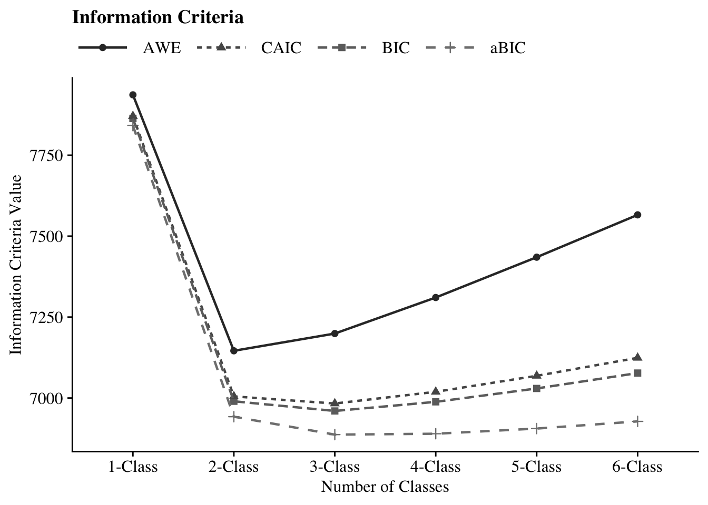
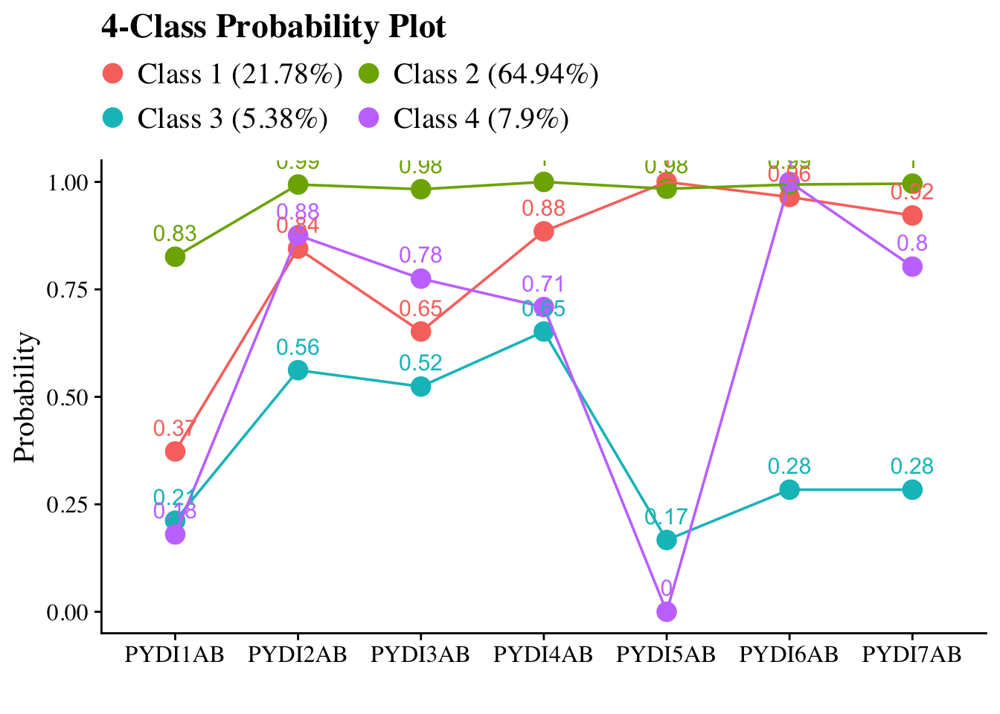
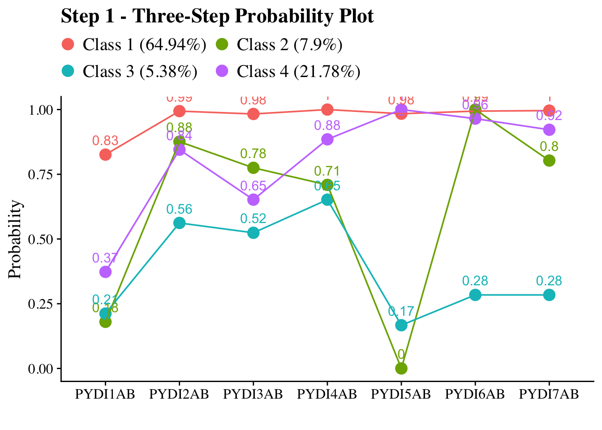

# Ten Frequently Asked Questions (Nylund-Gibson 7 Choi, 2018)

------------------------------------------------------------------------

## Example: Positive Youth Development Inventory Analysis

------------------------------------------------------------------------

- The original paper illustrated the modeling ideas described in this article using seven items (see Table 2) from the Positive Youth Development Inventory (PYDI) Contribution subscale (Arnold, Nott, & Meinhold, 2012) that were administered to 1629 college and university students.
- The PYDI measures behavioral, psychological, and social characteristics that are theorized to indicate positive youth development, and the Contribution Subscale specifically measures the degree to which youth express values and behaviors associated with channeling their positive psychosocial strengths to contribute meaningfully to their local community (Lerner et al., 2005).
- Citation: [Nylund-Gibson, K., & Choi, A. Y. (2018). Ten frequently asked questions about latent class analysis. *Translational Issues in Psychological Science*, *4*(4), 440–461.](https://doi.org/10.1037/tps0000176)

------------------------------------------------------------------------

## Load packages


``` r
library(tidyverse)
library(haven)
library(glue)
library(MplusAutomation)
library(here)
library(janitor)
library(gt)
library(cowplot)
library(DiagrammeR) 
library(webshot2)
library(stringr)
library(dplyr)
library(purrr)
library(readr)
library(flextable)
library(officer)
library(glue)
library(htmltools)
```

------------------------------------------------------------------------

## Variable Description


------------------------------------------------------------------------

- The original research question was to examine whether this construct of positive contribution comprised qualitatively distinct subtypes among college and university students, and to further examine whether such subtypes (if indeed were present) were meaningfully associated with a demographic predictor and a wellbeing-related outcome.


------------------------------------------------------------------------

## Prepare Data


``` r
df_qa <- read_csv(here("10faq", "data", "lca10faq.csv"))
```

------------------------------------------------------------------------

## Descriptive Statistics


``` r
# Set up data to find proportions of binary indicators
ds <- df_qa %>% 
  pivot_longer(c(PYDI1Ab, PYDI2Ab, PYDI3Ab, PYDI4Ab, PYDI5Ab, PYDI6Ab, PYDI7Ab),
               names_to = "variable") 

# Create table of variables and counts, then find proportions and round to 3 decimal places
prop_df <- ds %>%
  count(variable, value) %>%
  group_by(variable) %>%
  mutate(prop = n / sum(n)) %>%
  ungroup() %>%
  mutate(prop = round(prop, 3))


# Make it a gt() table
prop_table <- prop_df %>% 
  gt(groupname_col = "variable", rowname_col = "value") %>%
  tab_stubhead(label = md("*Values*")) %>%
  tab_header(
    md(
      "Variable Proportions"
    )
  ) %>%
  cols_label(
    variable = md("*Variable*"),
    value = md("*Value*"),
    n = md("*N*"),
    prop = md("*Proportion*")
  ) 
  
prop_table
```


```{=html}
<div id="wtmslwczor" style="padding-left:0px;padding-right:0px;padding-top:10px;padding-bottom:10px;overflow-x:auto;overflow-y:auto;width:auto;height:auto;">
<style>#wtmslwczor table {
  font-family: system-ui, 'Segoe UI', Roboto, Helvetica, Arial, sans-serif, 'Apple Color Emoji', 'Segoe UI Emoji', 'Segoe UI Symbol', 'Noto Color Emoji';
  -webkit-font-smoothing: antialiased;
  -moz-osx-font-smoothing: grayscale;
}

#wtmslwczor thead, #wtmslwczor tbody, #wtmslwczor tfoot, #wtmslwczor tr, #wtmslwczor td, #wtmslwczor th {
  border-style: none;
}

#wtmslwczor p {
  margin: 0;
  padding: 0;
}

#wtmslwczor .gt_table {
  display: table;
  border-collapse: collapse;
  line-height: normal;
  margin-left: auto;
  margin-right: auto;
  color: #333333;
  font-size: 16px;
  font-weight: normal;
  font-style: normal;
  background-color: #FFFFFF;
  width: auto;
  border-top-style: solid;
  border-top-width: 2px;
  border-top-color: #A8A8A8;
  border-right-style: none;
  border-right-width: 2px;
  border-right-color: #D3D3D3;
  border-bottom-style: solid;
  border-bottom-width: 2px;
  border-bottom-color: #A8A8A8;
  border-left-style: none;
  border-left-width: 2px;
  border-left-color: #D3D3D3;
}

#wtmslwczor .gt_caption {
  padding-top: 4px;
  padding-bottom: 4px;
}

#wtmslwczor .gt_title {
  color: #333333;
  font-size: 125%;
  font-weight: initial;
  padding-top: 4px;
  padding-bottom: 4px;
  padding-left: 5px;
  padding-right: 5px;
  border-bottom-color: #FFFFFF;
  border-bottom-width: 0;
}

#wtmslwczor .gt_subtitle {
  color: #333333;
  font-size: 85%;
  font-weight: initial;
  padding-top: 3px;
  padding-bottom: 5px;
  padding-left: 5px;
  padding-right: 5px;
  border-top-color: #FFFFFF;
  border-top-width: 0;
}

#wtmslwczor .gt_heading {
  background-color: #FFFFFF;
  text-align: center;
  border-bottom-color: #FFFFFF;
  border-left-style: none;
  border-left-width: 1px;
  border-left-color: #D3D3D3;
  border-right-style: none;
  border-right-width: 1px;
  border-right-color: #D3D3D3;
}

#wtmslwczor .gt_bottom_border {
  border-bottom-style: solid;
  border-bottom-width: 2px;
  border-bottom-color: #D3D3D3;
}

#wtmslwczor .gt_col_headings {
  border-top-style: solid;
  border-top-width: 2px;
  border-top-color: #D3D3D3;
  border-bottom-style: solid;
  border-bottom-width: 2px;
  border-bottom-color: #D3D3D3;
  border-left-style: none;
  border-left-width: 1px;
  border-left-color: #D3D3D3;
  border-right-style: none;
  border-right-width: 1px;
  border-right-color: #D3D3D3;
}

#wtmslwczor .gt_col_heading {
  color: #333333;
  background-color: #FFFFFF;
  font-size: 100%;
  font-weight: normal;
  text-transform: inherit;
  border-left-style: none;
  border-left-width: 1px;
  border-left-color: #D3D3D3;
  border-right-style: none;
  border-right-width: 1px;
  border-right-color: #D3D3D3;
  vertical-align: bottom;
  padding-top: 5px;
  padding-bottom: 6px;
  padding-left: 5px;
  padding-right: 5px;
  overflow-x: hidden;
}

#wtmslwczor .gt_column_spanner_outer {
  color: #333333;
  background-color: #FFFFFF;
  font-size: 100%;
  font-weight: normal;
  text-transform: inherit;
  padding-top: 0;
  padding-bottom: 0;
  padding-left: 4px;
  padding-right: 4px;
}

#wtmslwczor .gt_column_spanner_outer:first-child {
  padding-left: 0;
}

#wtmslwczor .gt_column_spanner_outer:last-child {
  padding-right: 0;
}

#wtmslwczor .gt_column_spanner {
  border-bottom-style: solid;
  border-bottom-width: 2px;
  border-bottom-color: #D3D3D3;
  vertical-align: bottom;
  padding-top: 5px;
  padding-bottom: 5px;
  overflow-x: hidden;
  display: inline-block;
  width: 100%;
}

#wtmslwczor .gt_spanner_row {
  border-bottom-style: hidden;
}

#wtmslwczor .gt_group_heading {
  padding-top: 8px;
  padding-bottom: 8px;
  padding-left: 5px;
  padding-right: 5px;
  color: #333333;
  background-color: #FFFFFF;
  font-size: 100%;
  font-weight: initial;
  text-transform: inherit;
  border-top-style: solid;
  border-top-width: 2px;
  border-top-color: #D3D3D3;
  border-bottom-style: solid;
  border-bottom-width: 2px;
  border-bottom-color: #D3D3D3;
  border-left-style: none;
  border-left-width: 1px;
  border-left-color: #D3D3D3;
  border-right-style: none;
  border-right-width: 1px;
  border-right-color: #D3D3D3;
  vertical-align: middle;
  text-align: left;
}

#wtmslwczor .gt_empty_group_heading {
  padding: 0.5px;
  color: #333333;
  background-color: #FFFFFF;
  font-size: 100%;
  font-weight: initial;
  border-top-style: solid;
  border-top-width: 2px;
  border-top-color: #D3D3D3;
  border-bottom-style: solid;
  border-bottom-width: 2px;
  border-bottom-color: #D3D3D3;
  vertical-align: middle;
}

#wtmslwczor .gt_from_md > :first-child {
  margin-top: 0;
}

#wtmslwczor .gt_from_md > :last-child {
  margin-bottom: 0;
}

#wtmslwczor .gt_row {
  padding-top: 8px;
  padding-bottom: 8px;
  padding-left: 5px;
  padding-right: 5px;
  margin: 10px;
  border-top-style: solid;
  border-top-width: 1px;
  border-top-color: #D3D3D3;
  border-left-style: none;
  border-left-width: 1px;
  border-left-color: #D3D3D3;
  border-right-style: none;
  border-right-width: 1px;
  border-right-color: #D3D3D3;
  vertical-align: middle;
  overflow-x: hidden;
}

#wtmslwczor .gt_stub {
  color: #333333;
  background-color: #FFFFFF;
  font-size: 100%;
  font-weight: initial;
  text-transform: inherit;
  border-right-style: solid;
  border-right-width: 2px;
  border-right-color: #D3D3D3;
  padding-left: 5px;
  padding-right: 5px;
}

#wtmslwczor .gt_stub_row_group {
  color: #333333;
  background-color: #FFFFFF;
  font-size: 100%;
  font-weight: initial;
  text-transform: inherit;
  border-right-style: solid;
  border-right-width: 2px;
  border-right-color: #D3D3D3;
  padding-left: 5px;
  padding-right: 5px;
  vertical-align: top;
}

#wtmslwczor .gt_row_group_first td {
  border-top-width: 2px;
}

#wtmslwczor .gt_row_group_first th {
  border-top-width: 2px;
}

#wtmslwczor .gt_summary_row {
  color: #333333;
  background-color: #FFFFFF;
  text-transform: inherit;
  padding-top: 8px;
  padding-bottom: 8px;
  padding-left: 5px;
  padding-right: 5px;
}

#wtmslwczor .gt_first_summary_row {
  border-top-style: solid;
  border-top-color: #D3D3D3;
}

#wtmslwczor .gt_first_summary_row.thick {
  border-top-width: 2px;
}

#wtmslwczor .gt_last_summary_row {
  padding-top: 8px;
  padding-bottom: 8px;
  padding-left: 5px;
  padding-right: 5px;
  border-bottom-style: solid;
  border-bottom-width: 2px;
  border-bottom-color: #D3D3D3;
}

#wtmslwczor .gt_grand_summary_row {
  color: #333333;
  background-color: #FFFFFF;
  text-transform: inherit;
  padding-top: 8px;
  padding-bottom: 8px;
  padding-left: 5px;
  padding-right: 5px;
}

#wtmslwczor .gt_first_grand_summary_row {
  padding-top: 8px;
  padding-bottom: 8px;
  padding-left: 5px;
  padding-right: 5px;
  border-top-style: double;
  border-top-width: 6px;
  border-top-color: #D3D3D3;
}

#wtmslwczor .gt_last_grand_summary_row_top {
  padding-top: 8px;
  padding-bottom: 8px;
  padding-left: 5px;
  padding-right: 5px;
  border-bottom-style: double;
  border-bottom-width: 6px;
  border-bottom-color: #D3D3D3;
}

#wtmslwczor .gt_striped {
  background-color: rgba(128, 128, 128, 0.05);
}

#wtmslwczor .gt_table_body {
  border-top-style: solid;
  border-top-width: 2px;
  border-top-color: #D3D3D3;
  border-bottom-style: solid;
  border-bottom-width: 2px;
  border-bottom-color: #D3D3D3;
}

#wtmslwczor .gt_footnotes {
  color: #333333;
  background-color: #FFFFFF;
  border-bottom-style: none;
  border-bottom-width: 2px;
  border-bottom-color: #D3D3D3;
  border-left-style: none;
  border-left-width: 2px;
  border-left-color: #D3D3D3;
  border-right-style: none;
  border-right-width: 2px;
  border-right-color: #D3D3D3;
}

#wtmslwczor .gt_footnote {
  margin: 0px;
  font-size: 90%;
  padding-top: 4px;
  padding-bottom: 4px;
  padding-left: 5px;
  padding-right: 5px;
}

#wtmslwczor .gt_sourcenotes {
  color: #333333;
  background-color: #FFFFFF;
  border-bottom-style: none;
  border-bottom-width: 2px;
  border-bottom-color: #D3D3D3;
  border-left-style: none;
  border-left-width: 2px;
  border-left-color: #D3D3D3;
  border-right-style: none;
  border-right-width: 2px;
  border-right-color: #D3D3D3;
}

#wtmslwczor .gt_sourcenote {
  font-size: 90%;
  padding-top: 4px;
  padding-bottom: 4px;
  padding-left: 5px;
  padding-right: 5px;
}

#wtmslwczor .gt_left {
  text-align: left;
}

#wtmslwczor .gt_center {
  text-align: center;
}

#wtmslwczor .gt_right {
  text-align: right;
  font-variant-numeric: tabular-nums;
}

#wtmslwczor .gt_font_normal {
  font-weight: normal;
}

#wtmslwczor .gt_font_bold {
  font-weight: bold;
}

#wtmslwczor .gt_font_italic {
  font-style: italic;
}

#wtmslwczor .gt_super {
  font-size: 65%;
}

#wtmslwczor .gt_footnote_marks {
  font-size: 75%;
  vertical-align: 0.4em;
  position: initial;
}

#wtmslwczor .gt_asterisk {
  font-size: 100%;
  vertical-align: 0;
}

#wtmslwczor .gt_indent_1 {
  text-indent: 5px;
}

#wtmslwczor .gt_indent_2 {
  text-indent: 10px;
}

#wtmslwczor .gt_indent_3 {
  text-indent: 15px;
}

#wtmslwczor .gt_indent_4 {
  text-indent: 20px;
}

#wtmslwczor .gt_indent_5 {
  text-indent: 25px;
}

#wtmslwczor .katex-display {
  display: inline-flex !important;
  margin-bottom: 0.75em !important;
}

#wtmslwczor div.Reactable > div.rt-table > div.rt-thead > div.rt-tr.rt-tr-group-header > div.rt-th-group:after {
  height: 0px !important;
}
</style>
<table class="gt_table" data-quarto-disable-processing="false" data-quarto-bootstrap="false">
  <thead>
    <tr class="gt_heading">
      <td colspan="3" class="gt_heading gt_title gt_font_normal gt_bottom_border" style><span class='gt_from_md'>Variable Proportions</span></td>
    </tr>
    
    <tr class="gt_col_headings">
      <th class="gt_col_heading gt_columns_bottom_border gt_left" rowspan="1" colspan="1" scope="col" id="a::stub"><span class='gt_from_md'><em>Values</em></span></th>
      <th class="gt_col_heading gt_columns_bottom_border gt_right" rowspan="1" colspan="1" scope="col" id="n"><span class='gt_from_md'><em>N</em></span></th>
      <th class="gt_col_heading gt_columns_bottom_border gt_right" rowspan="1" colspan="1" scope="col" id="prop"><span class='gt_from_md'><em>Proportion</em></span></th>
    </tr>
  </thead>
  <tbody class="gt_table_body">
    <tr class="gt_group_heading_row">
      <th colspan="3" class="gt_group_heading" scope="colgroup" id="PYDI1Ab">PYDI1Ab</th>
    </tr>
    <tr class="gt_row_group_first"><th id="stub_1_1" scope="row" class="gt_row gt_right gt_stub">0</th>
<td headers="PYDI1Ab stub_1_1 n" class="gt_row gt_right">581</td>
<td headers="PYDI1Ab stub_1_1 prop" class="gt_row gt_right">0.355</td></tr>
    <tr><th id="stub_1_2" scope="row" class="gt_row gt_right gt_stub">1</th>
<td headers="PYDI1Ab stub_1_2 n" class="gt_row gt_right">1048</td>
<td headers="PYDI1Ab stub_1_2 prop" class="gt_row gt_right">0.640</td></tr>
    <tr><th id="stub_1_3" scope="row" class="gt_row gt_right gt_stub">9999</th>
<td headers="PYDI1Ab stub_1_3 n" class="gt_row gt_right">9</td>
<td headers="PYDI1Ab stub_1_3 prop" class="gt_row gt_right">0.005</td></tr>
    <tr class="gt_group_heading_row">
      <th colspan="3" class="gt_group_heading" scope="colgroup" id="PYDI2Ab">PYDI2Ab</th>
    </tr>
    <tr class="gt_row_group_first"><th id="stub_1_4" scope="row" class="gt_row gt_right gt_stub">0</th>
<td headers="PYDI2Ab stub_1_4 n" class="gt_row gt_right">116</td>
<td headers="PYDI2Ab stub_1_4 prop" class="gt_row gt_right">0.071</td></tr>
    <tr><th id="stub_1_5" scope="row" class="gt_row gt_right gt_stub">1</th>
<td headers="PYDI2Ab stub_1_5 n" class="gt_row gt_right">1513</td>
<td headers="PYDI2Ab stub_1_5 prop" class="gt_row gt_right">0.924</td></tr>
    <tr><th id="stub_1_6" scope="row" class="gt_row gt_right gt_stub">9999</th>
<td headers="PYDI2Ab stub_1_6 n" class="gt_row gt_right">9</td>
<td headers="PYDI2Ab stub_1_6 prop" class="gt_row gt_right">0.005</td></tr>
    <tr class="gt_group_heading_row">
      <th colspan="3" class="gt_group_heading" scope="colgroup" id="PYDI3Ab">PYDI3Ab</th>
    </tr>
    <tr class="gt_row_group_first"><th id="stub_1_7" scope="row" class="gt_row gt_right gt_stub">0</th>
<td headers="PYDI3Ab stub_1_7 n" class="gt_row gt_right">212</td>
<td headers="PYDI3Ab stub_1_7 prop" class="gt_row gt_right">0.129</td></tr>
    <tr><th id="stub_1_8" scope="row" class="gt_row gt_right gt_stub">1</th>
<td headers="PYDI3Ab stub_1_8 n" class="gt_row gt_right">1417</td>
<td headers="PYDI3Ab stub_1_8 prop" class="gt_row gt_right">0.865</td></tr>
    <tr><th id="stub_1_9" scope="row" class="gt_row gt_right gt_stub">9999</th>
<td headers="PYDI3Ab stub_1_9 n" class="gt_row gt_right">9</td>
<td headers="PYDI3Ab stub_1_9 prop" class="gt_row gt_right">0.005</td></tr>
    <tr class="gt_group_heading_row">
      <th colspan="3" class="gt_group_heading" scope="colgroup" id="PYDI4Ab">PYDI4Ab</th>
    </tr>
    <tr class="gt_row_group_first"><th id="stub_1_10" scope="row" class="gt_row gt_right gt_stub">0</th>
<td headers="PYDI4Ab stub_1_10 n" class="gt_row gt_right">109</td>
<td headers="PYDI4Ab stub_1_10 prop" class="gt_row gt_right">0.067</td></tr>
    <tr><th id="stub_1_11" scope="row" class="gt_row gt_right gt_stub">1</th>
<td headers="PYDI4Ab stub_1_11 n" class="gt_row gt_right">1520</td>
<td headers="PYDI4Ab stub_1_11 prop" class="gt_row gt_right">0.928</td></tr>
    <tr><th id="stub_1_12" scope="row" class="gt_row gt_right gt_stub">9999</th>
<td headers="PYDI4Ab stub_1_12 n" class="gt_row gt_right">9</td>
<td headers="PYDI4Ab stub_1_12 prop" class="gt_row gt_right">0.005</td></tr>
    <tr class="gt_group_heading_row">
      <th colspan="3" class="gt_group_heading" scope="colgroup" id="PYDI5Ab">PYDI5Ab</th>
    </tr>
    <tr class="gt_row_group_first"><th id="stub_1_13" scope="row" class="gt_row gt_right gt_stub">0</th>
<td headers="PYDI5Ab stub_1_13 n" class="gt_row gt_right">219</td>
<td headers="PYDI5Ab stub_1_13 prop" class="gt_row gt_right">0.134</td></tr>
    <tr><th id="stub_1_14" scope="row" class="gt_row gt_right gt_stub">1</th>
<td headers="PYDI5Ab stub_1_14 n" class="gt_row gt_right">1410</td>
<td headers="PYDI5Ab stub_1_14 prop" class="gt_row gt_right">0.861</td></tr>
    <tr><th id="stub_1_15" scope="row" class="gt_row gt_right gt_stub">9999</th>
<td headers="PYDI5Ab stub_1_15 n" class="gt_row gt_right">9</td>
<td headers="PYDI5Ab stub_1_15 prop" class="gt_row gt_right">0.005</td></tr>
    <tr class="gt_group_heading_row">
      <th colspan="3" class="gt_group_heading" scope="colgroup" id="PYDI6Ab">PYDI6Ab</th>
    </tr>
    <tr class="gt_row_group_first"><th id="stub_1_16" scope="row" class="gt_row gt_right gt_stub">0</th>
<td headers="PYDI6Ab stub_1_16 n" class="gt_row gt_right">82</td>
<td headers="PYDI6Ab stub_1_16 prop" class="gt_row gt_right">0.050</td></tr>
    <tr><th id="stub_1_17" scope="row" class="gt_row gt_right gt_stub">1</th>
<td headers="PYDI6Ab stub_1_17 n" class="gt_row gt_right">1547</td>
<td headers="PYDI6Ab stub_1_17 prop" class="gt_row gt_right">0.944</td></tr>
    <tr><th id="stub_1_18" scope="row" class="gt_row gt_right gt_stub">9999</th>
<td headers="PYDI6Ab stub_1_18 n" class="gt_row gt_right">9</td>
<td headers="PYDI6Ab stub_1_18 prop" class="gt_row gt_right">0.005</td></tr>
    <tr class="gt_group_heading_row">
      <th colspan="3" class="gt_group_heading" scope="colgroup" id="PYDI7Ab">PYDI7Ab</th>
    </tr>
    <tr class="gt_row_group_first"><th id="stub_1_19" scope="row" class="gt_row gt_right gt_stub">0</th>
<td headers="PYDI7Ab stub_1_19 n" class="gt_row gt_right">120</td>
<td headers="PYDI7Ab stub_1_19 prop" class="gt_row gt_right">0.073</td></tr>
    <tr><th id="stub_1_20" scope="row" class="gt_row gt_right gt_stub">1</th>
<td headers="PYDI7Ab stub_1_20 n" class="gt_row gt_right">1509</td>
<td headers="PYDI7Ab stub_1_20 prop" class="gt_row gt_right">0.921</td></tr>
    <tr><th id="stub_1_21" scope="row" class="gt_row gt_right gt_stub">9999</th>
<td headers="PYDI7Ab stub_1_21 n" class="gt_row gt_right">9</td>
<td headers="PYDI7Ab stub_1_21 prop" class="gt_row gt_right">0.005</td></tr>
  </tbody>
  
</table>
</div>
```


------------------------------------------------------------------------

## Enumeration

This code uses the `mplusObject` function in the `MplusAutomation` package and saves all model runs in the `enum` folder.


``` r
lca_6  <- lapply(1:6, function(k) {
  lca_enum  <- mplusObject(
      
    TITLE = glue("{k}-Class"), 
  
    VARIABLE = glue(
    "categorical = PYDI1Ab PYDI2Ab PYDI3Ab PYDI4Ab PYDI5Ab PYDI6Ab PYDI7Ab; 
     MISSING ARE ALL (9999);
     usevar = PYDI1Ab PYDI2Ab PYDI3Ab PYDI4Ab PYDI5Ab PYDI6Ab PYDI7Ab;
     classes = c({k}); "),
  
  ANALYSIS = 
   "estimator = mlr; 
    type = mixture;
    starts = 500 100; 
    processors = 10;",
  
  OUTPUT = "sampstat residual tech1 tech11 tech14;",
  
  PLOT = 
    "type = plot3; 
    series = PYDI1Ab PYDI2Ab PYDI3Ab PYDI4Ab PYDI5Ab PYDI6Ab PYDI7Ab(*);",
  
  usevariables = colnames(df_qa),
  rdata = df_qa)

lca_enum_fit <- mplusModeler(lca_enum, 
                     dataout=glue(here("10faq", "enum", "lca10faq.dat")),
                     modelout=glue(here("10faq", "enum", "c{k}_lca10faq.inp")),
                     check=TRUE, run = TRUE, hashfilename = FALSE)
})
```

------------------------------------------------------------------------

### Examine and Extract Mplus files

Check all models for:

1. Warnings  
2. Errors  
3. Convergence and Loglikelihood Replication Information


``` r
source(here("functions", "extract_mplus_info.R"))

# Define the directory where all of the .out files are located.
output_dir <- here("10faq", "enum")

# Get all .out files
output_files <- list.files(output_dir, pattern = "\\.out$", full.names = TRUE)

# Process all .out files into one dataframe
final_data <- map_dfr(output_files, extract_mplus_info_extended)

# Extract Sample_Size from final_data
sample_size <- unique(final_data$Sample_Size)
```

#### Examine Mplus Warnings


``` r
source(here("functions", "extract_warnings.R"))

warnings_table <- extract_warnings(final_data)
warnings_table
```


```{=html}
<div id="hehzieohss" style="padding-left:0px;padding-right:0px;padding-top:10px;padding-bottom:10px;overflow-x:auto;overflow-y:auto;width:auto;height:auto;">
<style>#hehzieohss table {
  font-family: system-ui, 'Segoe UI', Roboto, Helvetica, Arial, sans-serif, 'Apple Color Emoji', 'Segoe UI Emoji', 'Segoe UI Symbol', 'Noto Color Emoji';
  -webkit-font-smoothing: antialiased;
  -moz-osx-font-smoothing: grayscale;
}

#hehzieohss thead, #hehzieohss tbody, #hehzieohss tfoot, #hehzieohss tr, #hehzieohss td, #hehzieohss th {
  border-style: none;
}

#hehzieohss p {
  margin: 0;
  padding: 0;
}

#hehzieohss .gt_table {
  display: table;
  border-collapse: collapse;
  line-height: normal;
  margin-left: auto;
  margin-right: auto;
  color: #333333;
  font-size: 16px;
  font-weight: normal;
  font-style: normal;
  background-color: #FFFFFF;
  width: 100%;
  border-top-style: solid;
  border-top-width: 2px;
  border-top-color: #A8A8A8;
  border-right-style: none;
  border-right-width: 2px;
  border-right-color: #D3D3D3;
  border-bottom-style: solid;
  border-bottom-width: 2px;
  border-bottom-color: #A8A8A8;
  border-left-style: none;
  border-left-width: 2px;
  border-left-color: #D3D3D3;
}

#hehzieohss .gt_caption {
  padding-top: 4px;
  padding-bottom: 4px;
}

#hehzieohss .gt_title {
  color: #333333;
  font-size: 125%;
  font-weight: initial;
  padding-top: 4px;
  padding-bottom: 4px;
  padding-left: 5px;
  padding-right: 5px;
  border-bottom-color: #FFFFFF;
  border-bottom-width: 0;
}

#hehzieohss .gt_subtitle {
  color: #333333;
  font-size: 85%;
  font-weight: initial;
  padding-top: 3px;
  padding-bottom: 5px;
  padding-left: 5px;
  padding-right: 5px;
  border-top-color: #FFFFFF;
  border-top-width: 0;
}

#hehzieohss .gt_heading {
  background-color: #FFFFFF;
  text-align: center;
  border-bottom-color: #FFFFFF;
  border-left-style: none;
  border-left-width: 1px;
  border-left-color: #D3D3D3;
  border-right-style: none;
  border-right-width: 1px;
  border-right-color: #D3D3D3;
}

#hehzieohss .gt_bottom_border {
  border-bottom-style: solid;
  border-bottom-width: 2px;
  border-bottom-color: #D3D3D3;
}

#hehzieohss .gt_col_headings {
  border-top-style: solid;
  border-top-width: 2px;
  border-top-color: #D3D3D3;
  border-bottom-style: solid;
  border-bottom-width: 2px;
  border-bottom-color: #D3D3D3;
  border-left-style: none;
  border-left-width: 1px;
  border-left-color: #D3D3D3;
  border-right-style: none;
  border-right-width: 1px;
  border-right-color: #D3D3D3;
}

#hehzieohss .gt_col_heading {
  color: #333333;
  background-color: #FFFFFF;
  font-size: 100%;
  font-weight: normal;
  text-transform: inherit;
  border-left-style: none;
  border-left-width: 1px;
  border-left-color: #D3D3D3;
  border-right-style: none;
  border-right-width: 1px;
  border-right-color: #D3D3D3;
  vertical-align: bottom;
  padding-top: 5px;
  padding-bottom: 6px;
  padding-left: 5px;
  padding-right: 5px;
  overflow-x: hidden;
}

#hehzieohss .gt_column_spanner_outer {
  color: #333333;
  background-color: #FFFFFF;
  font-size: 100%;
  font-weight: normal;
  text-transform: inherit;
  padding-top: 0;
  padding-bottom: 0;
  padding-left: 4px;
  padding-right: 4px;
}

#hehzieohss .gt_column_spanner_outer:first-child {
  padding-left: 0;
}

#hehzieohss .gt_column_spanner_outer:last-child {
  padding-right: 0;
}

#hehzieohss .gt_column_spanner {
  border-bottom-style: solid;
  border-bottom-width: 2px;
  border-bottom-color: #D3D3D3;
  vertical-align: bottom;
  padding-top: 5px;
  padding-bottom: 5px;
  overflow-x: hidden;
  display: inline-block;
  width: 100%;
}

#hehzieohss .gt_spanner_row {
  border-bottom-style: hidden;
}

#hehzieohss .gt_group_heading {
  padding-top: 8px;
  padding-bottom: 8px;
  padding-left: 5px;
  padding-right: 5px;
  color: #333333;
  background-color: #FFFFFF;
  font-size: 100%;
  font-weight: initial;
  text-transform: inherit;
  border-top-style: solid;
  border-top-width: 2px;
  border-top-color: #D3D3D3;
  border-bottom-style: solid;
  border-bottom-width: 2px;
  border-bottom-color: #D3D3D3;
  border-left-style: none;
  border-left-width: 1px;
  border-left-color: #D3D3D3;
  border-right-style: none;
  border-right-width: 1px;
  border-right-color: #D3D3D3;
  vertical-align: middle;
  text-align: left;
}

#hehzieohss .gt_empty_group_heading {
  padding: 0.5px;
  color: #333333;
  background-color: #FFFFFF;
  font-size: 100%;
  font-weight: initial;
  border-top-style: solid;
  border-top-width: 2px;
  border-top-color: #D3D3D3;
  border-bottom-style: solid;
  border-bottom-width: 2px;
  border-bottom-color: #D3D3D3;
  vertical-align: middle;
}

#hehzieohss .gt_from_md > :first-child {
  margin-top: 0;
}

#hehzieohss .gt_from_md > :last-child {
  margin-bottom: 0;
}

#hehzieohss .gt_row {
  padding-top: 8px;
  padding-bottom: 8px;
  padding-left: 5px;
  padding-right: 5px;
  margin: 10px;
  border-top-style: solid;
  border-top-width: 1px;
  border-top-color: #D3D3D3;
  border-left-style: none;
  border-left-width: 1px;
  border-left-color: #D3D3D3;
  border-right-style: none;
  border-right-width: 1px;
  border-right-color: #D3D3D3;
  vertical-align: middle;
  overflow-x: hidden;
}

#hehzieohss .gt_stub {
  color: #333333;
  background-color: #FFFFFF;
  font-size: 100%;
  font-weight: initial;
  text-transform: inherit;
  border-right-style: solid;
  border-right-width: 2px;
  border-right-color: #D3D3D3;
  padding-left: 5px;
  padding-right: 5px;
}

#hehzieohss .gt_stub_row_group {
  color: #333333;
  background-color: #FFFFFF;
  font-size: 100%;
  font-weight: initial;
  text-transform: inherit;
  border-right-style: solid;
  border-right-width: 2px;
  border-right-color: #D3D3D3;
  padding-left: 5px;
  padding-right: 5px;
  vertical-align: top;
}

#hehzieohss .gt_row_group_first td {
  border-top-width: 2px;
}

#hehzieohss .gt_row_group_first th {
  border-top-width: 2px;
}

#hehzieohss .gt_summary_row {
  color: #333333;
  background-color: #FFFFFF;
  text-transform: inherit;
  padding-top: 8px;
  padding-bottom: 8px;
  padding-left: 5px;
  padding-right: 5px;
}

#hehzieohss .gt_first_summary_row {
  border-top-style: solid;
  border-top-color: #D3D3D3;
}

#hehzieohss .gt_first_summary_row.thick {
  border-top-width: 2px;
}

#hehzieohss .gt_last_summary_row {
  padding-top: 8px;
  padding-bottom: 8px;
  padding-left: 5px;
  padding-right: 5px;
  border-bottom-style: solid;
  border-bottom-width: 2px;
  border-bottom-color: #D3D3D3;
}

#hehzieohss .gt_grand_summary_row {
  color: #333333;
  background-color: #FFFFFF;
  text-transform: inherit;
  padding-top: 8px;
  padding-bottom: 8px;
  padding-left: 5px;
  padding-right: 5px;
}

#hehzieohss .gt_first_grand_summary_row {
  padding-top: 8px;
  padding-bottom: 8px;
  padding-left: 5px;
  padding-right: 5px;
  border-top-style: double;
  border-top-width: 6px;
  border-top-color: #D3D3D3;
}

#hehzieohss .gt_last_grand_summary_row_top {
  padding-top: 8px;
  padding-bottom: 8px;
  padding-left: 5px;
  padding-right: 5px;
  border-bottom-style: double;
  border-bottom-width: 6px;
  border-bottom-color: #D3D3D3;
}

#hehzieohss .gt_striped {
  background-color: rgba(128, 128, 128, 0.05);
}

#hehzieohss .gt_table_body {
  border-top-style: solid;
  border-top-width: 2px;
  border-top-color: #D3D3D3;
  border-bottom-style: solid;
  border-bottom-width: 2px;
  border-bottom-color: #D3D3D3;
}

#hehzieohss .gt_footnotes {
  color: #333333;
  background-color: #FFFFFF;
  border-bottom-style: none;
  border-bottom-width: 2px;
  border-bottom-color: #D3D3D3;
  border-left-style: none;
  border-left-width: 2px;
  border-left-color: #D3D3D3;
  border-right-style: none;
  border-right-width: 2px;
  border-right-color: #D3D3D3;
}

#hehzieohss .gt_footnote {
  margin: 0px;
  font-size: 90%;
  padding-top: 4px;
  padding-bottom: 4px;
  padding-left: 5px;
  padding-right: 5px;
}

#hehzieohss .gt_sourcenotes {
  color: #333333;
  background-color: #FFFFFF;
  border-bottom-style: none;
  border-bottom-width: 2px;
  border-bottom-color: #D3D3D3;
  border-left-style: none;
  border-left-width: 2px;
  border-left-color: #D3D3D3;
  border-right-style: none;
  border-right-width: 2px;
  border-right-color: #D3D3D3;
}

#hehzieohss .gt_sourcenote {
  font-size: 90%;
  padding-top: 4px;
  padding-bottom: 4px;
  padding-left: 5px;
  padding-right: 5px;
}

#hehzieohss .gt_left {
  text-align: left;
}

#hehzieohss .gt_center {
  text-align: center;
}

#hehzieohss .gt_right {
  text-align: right;
  font-variant-numeric: tabular-nums;
}

#hehzieohss .gt_font_normal {
  font-weight: normal;
}

#hehzieohss .gt_font_bold {
  font-weight: bold;
}

#hehzieohss .gt_font_italic {
  font-style: italic;
}

#hehzieohss .gt_super {
  font-size: 65%;
}

#hehzieohss .gt_footnote_marks {
  font-size: 75%;
  vertical-align: 0.4em;
  position: initial;
}

#hehzieohss .gt_asterisk {
  font-size: 100%;
  vertical-align: 0;
}

#hehzieohss .gt_indent_1 {
  text-indent: 5px;
}

#hehzieohss .gt_indent_2 {
  text-indent: 10px;
}

#hehzieohss .gt_indent_3 {
  text-indent: 15px;
}

#hehzieohss .gt_indent_4 {
  text-indent: 20px;
}

#hehzieohss .gt_indent_5 {
  text-indent: 25px;
}

#hehzieohss .katex-display {
  display: inline-flex !important;
  margin-bottom: 0.75em !important;
}

#hehzieohss div.Reactable > div.rt-table > div.rt-thead > div.rt-tr.rt-tr-group-header > div.rt-th-group:after {
  height: 0px !important;
}
</style>
<table class="gt_table" style="table-layout:fixed;width:100%;" data-quarto-disable-processing="false" data-quarto-bootstrap="false">
  <colgroup>
    <col style="width:150px;"/>
    <col style="width:150px;"/>
    <col style="width:400px;"/>
  </colgroup>
  <thead>
    <tr class="gt_heading">
      <td colspan="3" class="gt_heading gt_title gt_font_normal gt_bottom_border" style><span class='gt_from_md'><strong>Model Warnings</strong></span></td>
    </tr>
    
    <tr class="gt_col_headings">
      <th class="gt_col_heading gt_columns_bottom_border gt_left" rowspan="1" colspan="1" scope="col" id="File_Name">Output File</th>
      <th class="gt_col_heading gt_columns_bottom_border gt_left" rowspan="1" colspan="1" scope="col" id="Warning_Summary"># of Warnings</th>
      <th class="gt_col_heading gt_columns_bottom_border gt_left" rowspan="1" colspan="1" scope="col" id="Warnings">Warning Message(s)</th>
    </tr>
  </thead>
  <tbody class="gt_table_body">
    <tr><td headers="File_Name" class="gt_row gt_left">c1_lca10faq.out</td>
<td headers="Warning_Summary" class="gt_row gt_left">There are 4 warnings in the output file.</td>
<td headers="Warnings" class="gt_row gt_left"><div style='white-space: normal; word-wrap: break-word;'>*** WARNING in OUTPUT command   SAMPSTAT option is not available when all outcomes are censored, ordered   categorical, unordered categorical (nominal), count or continuous-time   survival variables.  Request for SAMPSTAT is ignored.</div></td></tr>
    <tr><td headers="File_Name" class="gt_row gt_left"></td>
<td headers="Warning_Summary" class="gt_row gt_left"></td>
<td headers="Warnings" class="gt_row gt_left"><div style='white-space: normal; word-wrap: break-word;'>*** WARNING in OUTPUT command   TECH11 option is not available for TYPE=MIXTURE with only one class.   Request for TECH11 is ignored.</div></td></tr>
    <tr><td headers="File_Name" class="gt_row gt_left"></td>
<td headers="Warning_Summary" class="gt_row gt_left"></td>
<td headers="Warnings" class="gt_row gt_left"><div style='white-space: normal; word-wrap: break-word;'>*** WARNING in OUTPUT command   TECH14 option is not available for TYPE=MIXTURE with only one class.   Request for TECH14 is ignored.</div></td></tr>
    <tr><td headers="File_Name" class="gt_row gt_left"></td>
<td headers="Warning_Summary" class="gt_row gt_left"></td>
<td headers="Warnings" class="gt_row gt_left"><div style='white-space: normal; word-wrap: break-word;'>*** WARNING   Data set contains cases with missing on all variables.   These cases were not included in the analysis.   Number of cases with missing on all variables:  9    </div></td></tr>
    <tr><td headers="File_Name" class="gt_row gt_left">c2_lca10faq.out</td>
<td headers="Warning_Summary" class="gt_row gt_left">There are 2 warnings in the output file.</td>
<td headers="Warnings" class="gt_row gt_left"><div style='white-space: normal; word-wrap: break-word;'>*** WARNING in OUTPUT command   SAMPSTAT option is not available when all outcomes are censored, ordered   categorical, unordered categorical (nominal), count or continuous-time   survival variables.  Request for SAMPSTAT is ignored.</div></td></tr>
    <tr><td headers="File_Name" class="gt_row gt_left"></td>
<td headers="Warning_Summary" class="gt_row gt_left"></td>
<td headers="Warnings" class="gt_row gt_left"><div style='white-space: normal; word-wrap: break-word;'>*** WARNING   Data set contains cases with missing on all variables.   These cases were not included in the analysis.   Number of cases with missing on all variables:  9    </div></td></tr>
    <tr><td headers="File_Name" class="gt_row gt_left">c3_lca10faq.out</td>
<td headers="Warning_Summary" class="gt_row gt_left">There are 2 warnings in the output file.</td>
<td headers="Warnings" class="gt_row gt_left"><div style='white-space: normal; word-wrap: break-word;'>*** WARNING in OUTPUT command   SAMPSTAT option is not available when all outcomes are censored, ordered   categorical, unordered categorical (nominal), count or continuous-time   survival variables.  Request for SAMPSTAT is ignored.</div></td></tr>
    <tr><td headers="File_Name" class="gt_row gt_left"></td>
<td headers="Warning_Summary" class="gt_row gt_left"></td>
<td headers="Warnings" class="gt_row gt_left"><div style='white-space: normal; word-wrap: break-word;'>*** WARNING   Data set contains cases with missing on all variables.   These cases were not included in the analysis.   Number of cases with missing on all variables:  9    </div></td></tr>
    <tr><td headers="File_Name" class="gt_row gt_left">c4_lca10faq.out</td>
<td headers="Warning_Summary" class="gt_row gt_left">There are 2 warnings in the output file.</td>
<td headers="Warnings" class="gt_row gt_left"><div style='white-space: normal; word-wrap: break-word;'>*** WARNING in OUTPUT command   SAMPSTAT option is not available when all outcomes are censored, ordered   categorical, unordered categorical (nominal), count or continuous-time   survival variables.  Request for SAMPSTAT is ignored.</div></td></tr>
    <tr><td headers="File_Name" class="gt_row gt_left"></td>
<td headers="Warning_Summary" class="gt_row gt_left"></td>
<td headers="Warnings" class="gt_row gt_left"><div style='white-space: normal; word-wrap: break-word;'>*** WARNING   Data set contains cases with missing on all variables.   These cases were not included in the analysis.   Number of cases with missing on all variables:  9    </div></td></tr>
    <tr><td headers="File_Name" class="gt_row gt_left">c5_lca10faq.out</td>
<td headers="Warning_Summary" class="gt_row gt_left">There are 2 warnings in the output file.</td>
<td headers="Warnings" class="gt_row gt_left"><div style='white-space: normal; word-wrap: break-word;'>*** WARNING in OUTPUT command   SAMPSTAT option is not available when all outcomes are censored, ordered   categorical, unordered categorical (nominal), count or continuous-time   survival variables.  Request for SAMPSTAT is ignored.</div></td></tr>
    <tr><td headers="File_Name" class="gt_row gt_left"></td>
<td headers="Warning_Summary" class="gt_row gt_left"></td>
<td headers="Warnings" class="gt_row gt_left"><div style='white-space: normal; word-wrap: break-word;'>*** WARNING   Data set contains cases with missing on all variables.   These cases were not included in the analysis.   Number of cases with missing on all variables:  9    </div></td></tr>
    <tr><td headers="File_Name" class="gt_row gt_left">c6_lca10faq.out</td>
<td headers="Warning_Summary" class="gt_row gt_left">There are 2 warnings in the output file.</td>
<td headers="Warnings" class="gt_row gt_left"><div style='white-space: normal; word-wrap: break-word;'>*** WARNING in OUTPUT command   SAMPSTAT option is not available when all outcomes are censored, ordered   categorical, unordered categorical (nominal), count or continuous-time   survival variables.  Request for SAMPSTAT is ignored.</div></td></tr>
    <tr><td headers="File_Name" class="gt_row gt_left"></td>
<td headers="Warning_Summary" class="gt_row gt_left"></td>
<td headers="Warnings" class="gt_row gt_left"><div style='white-space: normal; word-wrap: break-word;'>*** WARNING   Data set contains cases with missing on all variables.   These cases were not included in the analysis.   Number of cases with missing on all variables:  9    </div></td></tr>
  </tbody>
  
</table>
</div>
```


#### Examine Mplus Errors


``` r
source(here("functions", "error_visualization.R"))

# Process errors
error_table <- process_error_data(final_data)
error_table
```


```{=html}
<div id="piddljnpbp" style="padding-left:0px;padding-right:0px;padding-top:10px;padding-bottom:10px;overflow-x:auto;overflow-y:auto;width:auto;height:auto;">
<style>#piddljnpbp table {
  font-family: system-ui, 'Segoe UI', Roboto, Helvetica, Arial, sans-serif, 'Apple Color Emoji', 'Segoe UI Emoji', 'Segoe UI Symbol', 'Noto Color Emoji';
  -webkit-font-smoothing: antialiased;
  -moz-osx-font-smoothing: grayscale;
}

#piddljnpbp thead, #piddljnpbp tbody, #piddljnpbp tfoot, #piddljnpbp tr, #piddljnpbp td, #piddljnpbp th {
  border-style: none;
}

#piddljnpbp p {
  margin: 0;
  padding: 0;
}

#piddljnpbp .gt_table {
  display: table;
  border-collapse: collapse;
  line-height: normal;
  margin-left: auto;
  margin-right: auto;
  color: #333333;
  font-size: 16px;
  font-weight: normal;
  font-style: normal;
  background-color: #FFFFFF;
  width: 600px;
  border-top-style: solid;
  border-top-width: 2px;
  border-top-color: #A8A8A8;
  border-right-style: none;
  border-right-width: 2px;
  border-right-color: #D3D3D3;
  border-bottom-style: solid;
  border-bottom-width: 2px;
  border-bottom-color: #A8A8A8;
  border-left-style: none;
  border-left-width: 2px;
  border-left-color: #D3D3D3;
}

#piddljnpbp .gt_caption {
  padding-top: 4px;
  padding-bottom: 4px;
}

#piddljnpbp .gt_title {
  color: #333333;
  font-size: 125%;
  font-weight: initial;
  padding-top: 4px;
  padding-bottom: 4px;
  padding-left: 5px;
  padding-right: 5px;
  border-bottom-color: #FFFFFF;
  border-bottom-width: 0;
}

#piddljnpbp .gt_subtitle {
  color: #333333;
  font-size: 85%;
  font-weight: initial;
  padding-top: 3px;
  padding-bottom: 5px;
  padding-left: 5px;
  padding-right: 5px;
  border-top-color: #FFFFFF;
  border-top-width: 0;
}

#piddljnpbp .gt_heading {
  background-color: #FFFFFF;
  text-align: center;
  border-bottom-color: #FFFFFF;
  border-left-style: none;
  border-left-width: 1px;
  border-left-color: #D3D3D3;
  border-right-style: none;
  border-right-width: 1px;
  border-right-color: #D3D3D3;
}

#piddljnpbp .gt_bottom_border {
  border-bottom-style: solid;
  border-bottom-width: 2px;
  border-bottom-color: #D3D3D3;
}

#piddljnpbp .gt_col_headings {
  border-top-style: solid;
  border-top-width: 2px;
  border-top-color: #D3D3D3;
  border-bottom-style: solid;
  border-bottom-width: 2px;
  border-bottom-color: #D3D3D3;
  border-left-style: none;
  border-left-width: 1px;
  border-left-color: #D3D3D3;
  border-right-style: none;
  border-right-width: 1px;
  border-right-color: #D3D3D3;
}

#piddljnpbp .gt_col_heading {
  color: #333333;
  background-color: #FFFFFF;
  font-size: 100%;
  font-weight: normal;
  text-transform: inherit;
  border-left-style: none;
  border-left-width: 1px;
  border-left-color: #D3D3D3;
  border-right-style: none;
  border-right-width: 1px;
  border-right-color: #D3D3D3;
  vertical-align: bottom;
  padding-top: 5px;
  padding-bottom: 6px;
  padding-left: 5px;
  padding-right: 5px;
  overflow-x: hidden;
}

#piddljnpbp .gt_column_spanner_outer {
  color: #333333;
  background-color: #FFFFFF;
  font-size: 100%;
  font-weight: normal;
  text-transform: inherit;
  padding-top: 0;
  padding-bottom: 0;
  padding-left: 4px;
  padding-right: 4px;
}

#piddljnpbp .gt_column_spanner_outer:first-child {
  padding-left: 0;
}

#piddljnpbp .gt_column_spanner_outer:last-child {
  padding-right: 0;
}

#piddljnpbp .gt_column_spanner {
  border-bottom-style: solid;
  border-bottom-width: 2px;
  border-bottom-color: #D3D3D3;
  vertical-align: bottom;
  padding-top: 5px;
  padding-bottom: 5px;
  overflow-x: hidden;
  display: inline-block;
  width: 100%;
}

#piddljnpbp .gt_spanner_row {
  border-bottom-style: hidden;
}

#piddljnpbp .gt_group_heading {
  padding-top: 8px;
  padding-bottom: 8px;
  padding-left: 5px;
  padding-right: 5px;
  color: #333333;
  background-color: #FFFFFF;
  font-size: 100%;
  font-weight: initial;
  text-transform: inherit;
  border-top-style: solid;
  border-top-width: 2px;
  border-top-color: #D3D3D3;
  border-bottom-style: solid;
  border-bottom-width: 2px;
  border-bottom-color: #D3D3D3;
  border-left-style: none;
  border-left-width: 1px;
  border-left-color: #D3D3D3;
  border-right-style: none;
  border-right-width: 1px;
  border-right-color: #D3D3D3;
  vertical-align: middle;
  text-align: left;
}

#piddljnpbp .gt_empty_group_heading {
  padding: 0.5px;
  color: #333333;
  background-color: #FFFFFF;
  font-size: 100%;
  font-weight: initial;
  border-top-style: solid;
  border-top-width: 2px;
  border-top-color: #D3D3D3;
  border-bottom-style: solid;
  border-bottom-width: 2px;
  border-bottom-color: #D3D3D3;
  vertical-align: middle;
}

#piddljnpbp .gt_from_md > :first-child {
  margin-top: 0;
}

#piddljnpbp .gt_from_md > :last-child {
  margin-bottom: 0;
}

#piddljnpbp .gt_row {
  padding-top: 8px;
  padding-bottom: 8px;
  padding-left: 5px;
  padding-right: 5px;
  margin: 10px;
  border-top-style: solid;
  border-top-width: 1px;
  border-top-color: #D3D3D3;
  border-left-style: none;
  border-left-width: 1px;
  border-left-color: #D3D3D3;
  border-right-style: none;
  border-right-width: 1px;
  border-right-color: #D3D3D3;
  vertical-align: middle;
  overflow-x: hidden;
}

#piddljnpbp .gt_stub {
  color: #333333;
  background-color: #FFFFFF;
  font-size: 100%;
  font-weight: initial;
  text-transform: inherit;
  border-right-style: solid;
  border-right-width: 2px;
  border-right-color: #D3D3D3;
  padding-left: 5px;
  padding-right: 5px;
}

#piddljnpbp .gt_stub_row_group {
  color: #333333;
  background-color: #FFFFFF;
  font-size: 100%;
  font-weight: initial;
  text-transform: inherit;
  border-right-style: solid;
  border-right-width: 2px;
  border-right-color: #D3D3D3;
  padding-left: 5px;
  padding-right: 5px;
  vertical-align: top;
}

#piddljnpbp .gt_row_group_first td {
  border-top-width: 2px;
}

#piddljnpbp .gt_row_group_first th {
  border-top-width: 2px;
}

#piddljnpbp .gt_summary_row {
  color: #333333;
  background-color: #FFFFFF;
  text-transform: inherit;
  padding-top: 8px;
  padding-bottom: 8px;
  padding-left: 5px;
  padding-right: 5px;
}

#piddljnpbp .gt_first_summary_row {
  border-top-style: solid;
  border-top-color: #D3D3D3;
}

#piddljnpbp .gt_first_summary_row.thick {
  border-top-width: 2px;
}

#piddljnpbp .gt_last_summary_row {
  padding-top: 8px;
  padding-bottom: 8px;
  padding-left: 5px;
  padding-right: 5px;
  border-bottom-style: solid;
  border-bottom-width: 2px;
  border-bottom-color: #D3D3D3;
}

#piddljnpbp .gt_grand_summary_row {
  color: #333333;
  background-color: #FFFFFF;
  text-transform: inherit;
  padding-top: 8px;
  padding-bottom: 8px;
  padding-left: 5px;
  padding-right: 5px;
}

#piddljnpbp .gt_first_grand_summary_row {
  padding-top: 8px;
  padding-bottom: 8px;
  padding-left: 5px;
  padding-right: 5px;
  border-top-style: double;
  border-top-width: 6px;
  border-top-color: #D3D3D3;
}

#piddljnpbp .gt_last_grand_summary_row_top {
  padding-top: 8px;
  padding-bottom: 8px;
  padding-left: 5px;
  padding-right: 5px;
  border-bottom-style: double;
  border-bottom-width: 6px;
  border-bottom-color: #D3D3D3;
}

#piddljnpbp .gt_striped {
  background-color: rgba(128, 128, 128, 0.05);
}

#piddljnpbp .gt_table_body {
  border-top-style: solid;
  border-top-width: 2px;
  border-top-color: #D3D3D3;
  border-bottom-style: solid;
  border-bottom-width: 2px;
  border-bottom-color: #D3D3D3;
}

#piddljnpbp .gt_footnotes {
  color: #333333;
  background-color: #FFFFFF;
  border-bottom-style: none;
  border-bottom-width: 2px;
  border-bottom-color: #D3D3D3;
  border-left-style: none;
  border-left-width: 2px;
  border-left-color: #D3D3D3;
  border-right-style: none;
  border-right-width: 2px;
  border-right-color: #D3D3D3;
}

#piddljnpbp .gt_footnote {
  margin: 0px;
  font-size: 90%;
  padding-top: 4px;
  padding-bottom: 4px;
  padding-left: 5px;
  padding-right: 5px;
}

#piddljnpbp .gt_sourcenotes {
  color: #333333;
  background-color: #FFFFFF;
  border-bottom-style: none;
  border-bottom-width: 2px;
  border-bottom-color: #D3D3D3;
  border-left-style: none;
  border-left-width: 2px;
  border-left-color: #D3D3D3;
  border-right-style: none;
  border-right-width: 2px;
  border-right-color: #D3D3D3;
}

#piddljnpbp .gt_sourcenote {
  font-size: 90%;
  padding-top: 4px;
  padding-bottom: 4px;
  padding-left: 5px;
  padding-right: 5px;
}

#piddljnpbp .gt_left {
  text-align: left;
}

#piddljnpbp .gt_center {
  text-align: center;
}

#piddljnpbp .gt_right {
  text-align: right;
  font-variant-numeric: tabular-nums;
}

#piddljnpbp .gt_font_normal {
  font-weight: normal;
}

#piddljnpbp .gt_font_bold {
  font-weight: bold;
}

#piddljnpbp .gt_font_italic {
  font-style: italic;
}

#piddljnpbp .gt_super {
  font-size: 65%;
}

#piddljnpbp .gt_footnote_marks {
  font-size: 75%;
  vertical-align: 0.4em;
  position: initial;
}

#piddljnpbp .gt_asterisk {
  font-size: 100%;
  vertical-align: 0;
}

#piddljnpbp .gt_indent_1 {
  text-indent: 5px;
}

#piddljnpbp .gt_indent_2 {
  text-indent: 10px;
}

#piddljnpbp .gt_indent_3 {
  text-indent: 15px;
}

#piddljnpbp .gt_indent_4 {
  text-indent: 20px;
}

#piddljnpbp .gt_indent_5 {
  text-indent: 25px;
}

#piddljnpbp .katex-display {
  display: inline-flex !important;
  margin-bottom: 0.75em !important;
}

#piddljnpbp div.Reactable > div.rt-table > div.rt-thead > div.rt-tr.rt-tr-group-header > div.rt-th-group:after {
  height: 0px !important;
}
</style>
<table class="gt_table" style="table-layout:fixed;width:600px;" data-quarto-disable-processing="false" data-quarto-bootstrap="false">
  <colgroup>
    <col style="width:150px;"/>
    <col style="width:100px;"/>
    <col style="width:400px;"/>
  </colgroup>
  <thead>
    <tr class="gt_heading">
      <td colspan="3" class="gt_heading gt_title gt_font_normal gt_bottom_border" style><span class='gt_from_md'><strong>Model Estimation Errors</strong></span></td>
    </tr>
    
    <tr class="gt_col_headings">
      <th class="gt_col_heading gt_columns_bottom_border gt_left" rowspan="1" colspan="1" scope="col" id="File_Name">Output File</th>
      <th class="gt_col_heading gt_columns_bottom_border gt_left" rowspan="1" colspan="1" scope="col" id="Class_Model">Model Type</th>
      <th class="gt_col_heading gt_columns_bottom_border gt_left" rowspan="1" colspan="1" scope="col" id="Error_Message">Error Message</th>
    </tr>
  </thead>
  <tbody class="gt_table_body">
    <tr><td headers="File_Name" class="gt_row gt_left">c2_lca10faq.out</td>
<td headers="Class_Model" class="gt_row gt_left">2-Class</td>
<td headers="Error_Message" class="gt_row gt_left">THE BEST LOGLIKELIHOOD VALUE HAS BEEN REPLICATED.  RERUN WITH AT LEAST TWICE THE RANDOM STARTS TO CHECK THAT THE BEST LOGLIKELIHOOD IS STILL OBTAINED AND REPLICATED.  </td></tr>
    <tr><td headers="File_Name" class="gt_row gt_left">c3_lca10faq.out</td>
<td headers="Class_Model" class="gt_row gt_left">3-Class</td>
<td headers="Error_Message" class="gt_row gt_left">THE BEST LOGLIKELIHOOD VALUE HAS BEEN REPLICATED.  RERUN WITH AT LEAST TWICE THE RANDOM STARTS TO CHECK THAT THE BEST LOGLIKELIHOOD IS STILL OBTAINED AND REPLICATED.       IN THE OPTIMIZATION, ONE OR MORE LOGIT THRESHOLDS APPROACHED EXTREME VALUES      OF -15.000 AND 15.000 AND WERE FIXED TO STABILIZE MODEL ESTIMATION.  THESE      VALUES IMPLY PROBABILITIES OF 0 AND 1.  IN THE MODEL RESULTS SECTION, THESE      PARAMETERS HAVE 0 STANDARD ERRORS AND 999 IN THE Z-SCORE AND P-VALUE COLUMNS.    </td></tr>
    <tr><td headers="File_Name" class="gt_row gt_left">c4_lca10faq.out</td>
<td headers="Class_Model" class="gt_row gt_left">4-Class</td>
<td headers="Error_Message" class="gt_row gt_left">THE BEST LOGLIKELIHOOD VALUE HAS BEEN REPLICATED.  RERUN WITH AT LEAST TWICE THE RANDOM STARTS TO CHECK THAT THE BEST LOGLIKELIHOOD IS STILL OBTAINED AND REPLICATED.       IN THE OPTIMIZATION, ONE OR MORE LOGIT THRESHOLDS APPROACHED EXTREME VALUES      OF -15.000 AND 15.000 AND WERE FIXED TO STABILIZE MODEL ESTIMATION.  THESE      VALUES IMPLY PROBABILITIES OF 0 AND 1.  IN THE MODEL RESULTS SECTION, THESE      PARAMETERS HAVE 0 STANDARD ERRORS AND 999 IN THE Z-SCORE AND P-VALUE COLUMNS.    </td></tr>
    <tr><td headers="File_Name" class="gt_row gt_left">c5_lca10faq.out</td>
<td headers="Class_Model" class="gt_row gt_left">5-Class</td>
<td headers="Error_Message" class="gt_row gt_left">THE BEST LOGLIKELIHOOD VALUE HAS BEEN REPLICATED.  RERUN WITH AT LEAST TWICE THE RANDOM STARTS TO CHECK THAT THE BEST LOGLIKELIHOOD IS STILL OBTAINED AND REPLICATED.       IN THE OPTIMIZATION, ONE OR MORE LOGIT THRESHOLDS APPROACHED EXTREME VALUES      OF -15.000 AND 15.000 AND WERE FIXED TO STABILIZE MODEL ESTIMATION.  THESE      VALUES IMPLY PROBABILITIES OF 0 AND 1.  IN THE MODEL RESULTS SECTION, THESE      PARAMETERS HAVE 0 STANDARD ERRORS AND 999 IN THE Z-SCORE AND P-VALUE COLUMNS.    </td></tr>
    <tr><td headers="File_Name" class="gt_row gt_left">c6_lca10faq.out</td>
<td headers="Class_Model" class="gt_row gt_left">6-Class</td>
<td headers="Error_Message" class="gt_row gt_left">THE BEST LOGLIKELIHOOD VALUE HAS BEEN REPLICATED.  RERUN WITH AT LEAST TWICE THE RANDOM STARTS TO CHECK THAT THE BEST LOGLIKELIHOOD IS STILL OBTAINED AND REPLICATED.       IN THE OPTIMIZATION, ONE OR MORE LOGIT THRESHOLDS APPROACHED EXTREME VALUES      OF -15.000 AND 15.000 AND WERE FIXED TO STABILIZE MODEL ESTIMATION.  THESE      VALUES IMPLY PROBABILITIES OF 0 AND 1.  IN THE MODEL RESULTS SECTION, THESE      PARAMETERS HAVE 0 STANDARD ERRORS AND 999 IN THE Z-SCORE AND P-VALUE COLUMNS.    </td></tr>
  </tbody>
  
</table>
</div>
```


#### Examine Convergence and Loglikelihood Replications


``` r
source(here("functions", "summary_table.R"))

# **Print Table with Superheader & Heatmap**
summary_table <- create_flextable(final_data, sample_size)
summary_table
```


```{=html}
<div class="tabwid"><style>.cl-33e4d548{}.cl-33ddc7d0{font-family:'Arial';font-size:11pt;font-weight:normal;font-style:italic;text-decoration:none;color:rgba(0, 0, 0, 1.00);background-color:transparent;}.cl-33ddc7da{font-family:'Arial';font-size:11pt;font-weight:normal;font-style:normal;text-decoration:none;color:rgba(0, 0, 0, 1.00);background-color:transparent;}.cl-33ddc7db{font-family:'Arial';font-size:11pt;font-weight:normal;font-style:normal;text-decoration:none;color:rgba(255, 255, 255, 1.00);background-color:transparent;}.cl-33e0680a{margin:0;text-align:left;border-bottom: 0 solid rgba(0, 0, 0, 1.00);border-top: 0 solid rgba(0, 0, 0, 1.00);border-left: 0 solid rgba(0, 0, 0, 1.00);border-right: 0 solid rgba(0, 0, 0, 1.00);padding-bottom:5pt;padding-top:5pt;padding-left:5pt;padding-right:5pt;line-height: 1;background-color:transparent;}.cl-33e06814{margin:0;text-align:center;border-bottom: 0 solid rgba(0, 0, 0, 1.00);border-top: 0 solid rgba(0, 0, 0, 1.00);border-left: 0 solid rgba(0, 0, 0, 1.00);border-right: 0 solid rgba(0, 0, 0, 1.00);padding-bottom:5pt;padding-top:5pt;padding-left:5pt;padding-right:5pt;line-height: 1;background-color:transparent;}.cl-33e06815{margin:0;text-align:center;border-bottom: 0 solid rgba(0, 0, 0, 1.00);border-top: 0 solid rgba(0, 0, 0, 1.00);border-left: 0 solid rgba(0, 0, 0, 1.00);border-right: 0 solid rgba(0, 0, 0, 1.00);padding-bottom:5pt;padding-top:5pt;padding-left:5pt;padding-right:5pt;line-height: 1;background-color:transparent;}.cl-33e09668{width:0.7in;background-color:rgba(240, 240, 240, 1.00);vertical-align: bottom;border-bottom: 0 solid rgba(255, 255, 255, 0.00);border-top: 1.5pt solid rgba(102, 102, 102, 1.00);border-left: 0 solid rgba(0, 0, 0, 1.00);border-right: 0 solid rgba(0, 0, 0, 1.00);margin-bottom:0;margin-top:0;margin-left:0;margin-right:0;}.cl-33e09672{width:0.8in;background-color:rgba(240, 240, 240, 1.00);vertical-align: bottom;border-bottom: 0 solid rgba(255, 255, 255, 0.00);border-top: 1.5pt solid rgba(102, 102, 102, 1.00);border-left: 0 solid rgba(0, 0, 0, 1.00);border-right: 0 solid rgba(0, 0, 0, 1.00);margin-bottom:0;margin-top:0;margin-left:0;margin-right:0;}.cl-33e09673{width:0.4in;background-color:rgba(240, 240, 240, 1.00);vertical-align: bottom;border-bottom: 0 solid rgba(255, 255, 255, 0.00);border-top: 1.5pt solid rgba(102, 102, 102, 1.00);border-left: 0 solid rgba(0, 0, 0, 1.00);border-right: 0 solid rgba(0, 0, 0, 1.00);margin-bottom:0;margin-top:0;margin-left:0;margin-right:0;}.cl-33e09674{width:0.5in;background-color:rgba(240, 240, 240, 1.00);vertical-align: bottom;border-bottom: 0 solid rgba(255, 255, 255, 0.00);border-top: 1.5pt solid rgba(102, 102, 102, 1.00);border-left: 0 solid rgba(0, 0, 0, 1.00);border-right: 0 solid rgba(0, 0, 0, 1.00);margin-bottom:0;margin-top:0;margin-left:0;margin-right:0;}.cl-33e0967c{width:0.7in;background-color:transparent;vertical-align: bottom;border-bottom: 1.5pt solid rgba(102, 102, 102, 1.00);border-top: 0 solid rgba(255, 255, 255, 0.00);border-left: 0 solid rgba(0, 0, 0, 1.00);border-right: 0 solid rgba(0, 0, 0, 1.00);margin-bottom:0;margin-top:0;margin-left:0;margin-right:0;}.cl-33e0967d{width:0.8in;background-color:transparent;vertical-align: bottom;border-bottom: 1.5pt solid rgba(102, 102, 102, 1.00);border-top: 0 solid rgba(255, 255, 255, 0.00);border-left: 0 solid rgba(0, 0, 0, 1.00);border-right: 0 solid rgba(0, 0, 0, 1.00);margin-bottom:0;margin-top:0;margin-left:0;margin-right:0;}.cl-33e09686{width:0.4in;background-color:transparent;vertical-align: bottom;border-bottom: 1.5pt solid rgba(102, 102, 102, 1.00);border-top: 0 solid rgba(255, 255, 255, 0.00);border-left: 0 solid rgba(0, 0, 0, 1.00);border-right: 0 solid rgba(0, 0, 0, 1.00);margin-bottom:0;margin-top:0;margin-left:0;margin-right:0;}.cl-33e09687{width:0.5in;background-color:transparent;vertical-align: bottom;border-bottom: 1.5pt solid rgba(102, 102, 102, 1.00);border-top: 0 solid rgba(255, 255, 255, 0.00);border-left: 0 solid rgba(0, 0, 0, 1.00);border-right: 0 solid rgba(0, 0, 0, 1.00);margin-bottom:0;margin-top:0;margin-left:0;margin-right:0;}.cl-33e09688{width:0.7in;background-color:rgba(240, 240, 240, 1.00);vertical-align: middle;border-bottom: 0 solid rgba(0, 0, 0, 1.00);border-top: 0 solid rgba(0, 0, 0, 1.00);border-left: 0 solid rgba(0, 0, 0, 1.00);border-right: 0 solid rgba(0, 0, 0, 1.00);margin-bottom:0;margin-top:0;margin-left:0;margin-right:0;}.cl-33e09690{width:0.8in;background-color:rgba(240, 240, 240, 1.00);vertical-align: middle;border-bottom: 0 solid rgba(0, 0, 0, 1.00);border-top: 0 solid rgba(0, 0, 0, 1.00);border-left: 0 solid rgba(0, 0, 0, 1.00);border-right: 0 solid rgba(0, 0, 0, 1.00);margin-bottom:0;margin-top:0;margin-left:0;margin-right:0;}.cl-33e09691{width:0.4in;background-color:rgba(240, 240, 240, 1.00);vertical-align: middle;border-bottom: 0 solid rgba(0, 0, 0, 1.00);border-top: 0 solid rgba(0, 0, 0, 1.00);border-left: 0 solid rgba(0, 0, 0, 1.00);border-right: 0 solid rgba(0, 0, 0, 1.00);margin-bottom:0;margin-top:0;margin-left:0;margin-right:0;}.cl-33e09692{width:0.5in;background-color:rgba(240, 240, 240, 1.00);vertical-align: middle;border-bottom: 0 solid rgba(0, 0, 0, 1.00);border-top: 0 solid rgba(0, 0, 0, 1.00);border-left: 0 solid rgba(0, 0, 0, 1.00);border-right: 0 solid rgba(0, 0, 0, 1.00);margin-bottom:0;margin-top:0;margin-left:0;margin-right:0;}.cl-33e0969a{width:0.7in;background-color:transparent;vertical-align: middle;border-bottom: 0 solid rgba(0, 0, 0, 1.00);border-top: 0 solid rgba(0, 0, 0, 1.00);border-left: 0 solid rgba(0, 0, 0, 1.00);border-right: 0 solid rgba(0, 0, 0, 1.00);margin-bottom:0;margin-top:0;margin-left:0;margin-right:0;}.cl-33e0969b{width:0.8in;background-color:transparent;vertical-align: middle;border-bottom: 0 solid rgba(0, 0, 0, 1.00);border-top: 0 solid rgba(0, 0, 0, 1.00);border-left: 0 solid rgba(0, 0, 0, 1.00);border-right: 0 solid rgba(0, 0, 0, 1.00);margin-bottom:0;margin-top:0;margin-left:0;margin-right:0;}.cl-33e096a4{width:0.4in;background-color:transparent;vertical-align: middle;border-bottom: 0 solid rgba(0, 0, 0, 1.00);border-top: 0 solid rgba(0, 0, 0, 1.00);border-left: 0 solid rgba(0, 0, 0, 1.00);border-right: 0 solid rgba(0, 0, 0, 1.00);margin-bottom:0;margin-top:0;margin-left:0;margin-right:0;}.cl-33e096a5{width:0.5in;background-color:transparent;vertical-align: middle;border-bottom: 0 solid rgba(0, 0, 0, 1.00);border-top: 0 solid rgba(0, 0, 0, 1.00);border-left: 0 solid rgba(0, 0, 0, 1.00);border-right: 0 solid rgba(0, 0, 0, 1.00);margin-bottom:0;margin-top:0;margin-left:0;margin-right:0;}.cl-33e096a6{width:0.5in;background-color:rgba(255, 236, 230, 1.00);vertical-align: middle;border-bottom: 0 solid rgba(0, 0, 0, 1.00);border-top: 0 solid rgba(0, 0, 0, 1.00);border-left: 0 solid rgba(0, 0, 0, 1.00);border-right: 0 solid rgba(0, 0, 0, 1.00);margin-bottom:0;margin-top:0;margin-left:0;margin-right:0;}.cl-33e096ae{width:0.5in;background-color:rgba(255, 255, 255, 1.00);vertical-align: middle;border-bottom: 0 solid rgba(0, 0, 0, 1.00);border-top: 0 solid rgba(0, 0, 0, 1.00);border-left: 0 solid rgba(0, 0, 0, 1.00);border-right: 0 solid rgba(0, 0, 0, 1.00);margin-bottom:0;margin-top:0;margin-left:0;margin-right:0;}.cl-33e096af{width:0.5in;background-color:rgba(234, 117, 86, 1.00);vertical-align: middle;border-bottom: 0 solid rgba(0, 0, 0, 1.00);border-top: 0 solid rgba(0, 0, 0, 1.00);border-left: 0 solid rgba(0, 0, 0, 1.00);border-right: 0 solid rgba(0, 0, 0, 1.00);margin-bottom:0;margin-top:0;margin-left:0;margin-right:0;}.cl-33e096b0{width:0.5in;background-color:rgba(233, 109, 76, 1.00);vertical-align: middle;border-bottom: 0 solid rgba(0, 0, 0, 1.00);border-top: 0 solid rgba(0, 0, 0, 1.00);border-left: 0 solid rgba(0, 0, 0, 1.00);border-right: 0 solid rgba(0, 0, 0, 1.00);margin-bottom:0;margin-top:0;margin-left:0;margin-right:0;}.cl-33e096b8{width:0.5in;background-color:rgba(249, 203, 191, 1.00);vertical-align: middle;border-bottom: 0 solid rgba(0, 0, 0, 1.00);border-top: 0 solid rgba(0, 0, 0, 1.00);border-left: 0 solid rgba(0, 0, 0, 1.00);border-right: 0 solid rgba(0, 0, 0, 1.00);margin-bottom:0;margin-top:0;margin-left:0;margin-right:0;}.cl-33e096b9{width:0.5in;background-color:rgba(229, 86, 49, 1.00);vertical-align: middle;border-bottom: 0 solid rgba(0, 0, 0, 1.00);border-top: 0 solid rgba(0, 0, 0, 1.00);border-left: 0 solid rgba(0, 0, 0, 1.00);border-right: 0 solid rgba(0, 0, 0, 1.00);margin-bottom:0;margin-top:0;margin-left:0;margin-right:0;}.cl-33e096ba{width:0.5in;background-color:rgba(244, 176, 158, 1.00);vertical-align: middle;border-bottom: 0 solid rgba(0, 0, 0, 1.00);border-top: 0 solid rgba(0, 0, 0, 1.00);border-left: 0 solid rgba(0, 0, 0, 1.00);border-right: 0 solid rgba(0, 0, 0, 1.00);margin-bottom:0;margin-top:0;margin-left:0;margin-right:0;}.cl-33e096c2{width:0.7in;background-color:transparent;vertical-align: middle;border-bottom: 1.5pt solid rgba(102, 102, 102, 1.00);border-top: 0 solid rgba(0, 0, 0, 1.00);border-left: 0 solid rgba(0, 0, 0, 1.00);border-right: 0 solid rgba(0, 0, 0, 1.00);margin-bottom:0;margin-top:0;margin-left:0;margin-right:0;}.cl-33e096c3{width:0.8in;background-color:transparent;vertical-align: middle;border-bottom: 1.5pt solid rgba(102, 102, 102, 1.00);border-top: 0 solid rgba(0, 0, 0, 1.00);border-left: 0 solid rgba(0, 0, 0, 1.00);border-right: 0 solid rgba(0, 0, 0, 1.00);margin-bottom:0;margin-top:0;margin-left:0;margin-right:0;}.cl-33e096c4{width:0.4in;background-color:transparent;vertical-align: middle;border-bottom: 1.5pt solid rgba(102, 102, 102, 1.00);border-top: 0 solid rgba(0, 0, 0, 1.00);border-left: 0 solid rgba(0, 0, 0, 1.00);border-right: 0 solid rgba(0, 0, 0, 1.00);margin-bottom:0;margin-top:0;margin-left:0;margin-right:0;}.cl-33e096c5{width:0.5in;background-color:transparent;vertical-align: middle;border-bottom: 1.5pt solid rgba(102, 102, 102, 1.00);border-top: 0 solid rgba(0, 0, 0, 1.00);border-left: 0 solid rgba(0, 0, 0, 1.00);border-right: 0 solid rgba(0, 0, 0, 1.00);margin-bottom:0;margin-top:0;margin-left:0;margin-right:0;}.cl-33e096cc{width:0.5in;background-color:rgba(228, 77, 38, 1.00);vertical-align: middle;border-bottom: 1.5pt solid rgba(102, 102, 102, 1.00);border-top: 0 solid rgba(0, 0, 0, 1.00);border-left: 0 solid rgba(0, 0, 0, 1.00);border-right: 0 solid rgba(0, 0, 0, 1.00);margin-bottom:0;margin-top:0;margin-left:0;margin-right:0;}</style><table data-quarto-disable-processing='true' class='cl-33e4d548'><thead><tr style="overflow-wrap:break-word;"><th  colspan="3"class="cl-33e09668"><p class="cl-33e0680a"><span class="cl-33ddc7d0">N</span><span class="cl-33ddc7da"> = </span><span class="cl-33ddc7da">1629</span></p></th><th  colspan="2"class="cl-33e09674"><p class="cl-33e06814"><span class="cl-33ddc7da">Random Starts</span></p></th><th  colspan="2"class="cl-33e09674"><p class="cl-33e06814"><span class="cl-33ddc7da">Final starting value sets converging</span></p></th><th  colspan="2"class="cl-33e09674"><p class="cl-33e06814"><span class="cl-33ddc7da">LL Replication</span></p></th><th  colspan="2"class="cl-33e09674"><p class="cl-33e06814"><span class="cl-33ddc7da">Smallest Class</span></p></th></tr><tr style="overflow-wrap:break-word;"><th class="cl-33e0967c"><p class="cl-33e0680a"><span class="cl-33ddc7da">Model</span></p></th><th class="cl-33e0967d"><p class="cl-33e06814"><span class="cl-33ddc7da">Best LL</span></p></th><th class="cl-33e09686"><p class="cl-33e06814"><span class="cl-33ddc7da">npar</span></p></th><th class="cl-33e09687"><p class="cl-33e06814"><span class="cl-33ddc7da">Initial</span></p></th><th class="cl-33e09687"><p class="cl-33e06814"><span class="cl-33ddc7da">Final</span></p></th><th class="cl-33e09687"><p class="cl-33e06814"><span class="cl-33ddc7d0">f</span></p></th><th class="cl-33e09687"><p class="cl-33e06814"><span class="cl-33ddc7da">%</span></p></th><th class="cl-33e09687"><p class="cl-33e06814"><span class="cl-33ddc7d0">f</span></p></th><th class="cl-33e09687"><p class="cl-33e06814"><span class="cl-33ddc7da">%</span></p></th><th class="cl-33e09687"><p class="cl-33e06814"><span class="cl-33ddc7d0">f</span></p></th><th class="cl-33e09687"><p class="cl-33e06814"><span class="cl-33ddc7da">%</span></p></th></tr></thead><tbody><tr style="overflow-wrap:break-word;"><td class="cl-33e09688"><p class="cl-33e06815"><span class="cl-33ddc7da">1-Class</span></p></td><td class="cl-33e09690"><p class="cl-33e06815"><span class="cl-33ddc7da">-3,905.892</span></p></td><td class="cl-33e09691"><p class="cl-33e06815"><span class="cl-33ddc7da">7</span></p></td><td class="cl-33e09692"><p class="cl-33e06815"><span class="cl-33ddc7da">500</span></p></td><td class="cl-33e09692"><p class="cl-33e06815"><span class="cl-33ddc7da">100</span></p></td><td class="cl-33e09692"><p class="cl-33e06815"><span class="cl-33ddc7da">100</span></p></td><td class="cl-33e09692"><p class="cl-33e06815"><span class="cl-33ddc7da">100%</span></p></td><td class="cl-33e09692"><p class="cl-33e06815"><span class="cl-33ddc7da">100</span></p></td><td class="cl-33e09692"><p class="cl-33e06815"><span class="cl-33ddc7da">100.0%</span></p></td><td class="cl-33e09692"><p class="cl-33e06815"><span class="cl-33ddc7da">1,629</span></p></td><td class="cl-33e09692"><p class="cl-33e06815"><span class="cl-33ddc7da">100.0%</span></p></td></tr><tr style="overflow-wrap:break-word;"><td class="cl-33e0969a"><p class="cl-33e06815"><span class="cl-33ddc7da">2-Class</span></p></td><td class="cl-33e0969b"><p class="cl-33e06815"><span class="cl-33ddc7da">-3,439.483</span></p></td><td class="cl-33e096a4"><p class="cl-33e06815"><span class="cl-33ddc7da">15</span></p></td><td class="cl-33e096a5"><p class="cl-33e06815"><span class="cl-33ddc7da">500</span></p></td><td class="cl-33e096a5"><p class="cl-33e06815"><span class="cl-33ddc7da">100</span></p></td><td class="cl-33e096a5"><p class="cl-33e06815"><span class="cl-33ddc7da">100</span></p></td><td class="cl-33e096a6"><p class="cl-33e06815"><span class="cl-33ddc7da">100%</span></p></td><td class="cl-33e096a5"><p class="cl-33e06815"><span class="cl-33ddc7da">100</span></p></td><td class="cl-33e096ae"><p class="cl-33e06815"><span class="cl-33ddc7da">100.0%</span></p></td><td class="cl-33e096a5"><p class="cl-33e06815"><span class="cl-33ddc7da">331</span></p></td><td class="cl-33e096a5"><p class="cl-33e06815"><span class="cl-33ddc7da">20.3%</span></p></td></tr><tr style="overflow-wrap:break-word;"><td class="cl-33e09688"><p class="cl-33e06815"><span class="cl-33ddc7da">3-Class</span></p></td><td class="cl-33e09690"><p class="cl-33e06815"><span class="cl-33ddc7da">-3,394.950</span></p></td><td class="cl-33e09691"><p class="cl-33e06815"><span class="cl-33ddc7da">23</span></p></td><td class="cl-33e09692"><p class="cl-33e06815"><span class="cl-33ddc7da">500</span></p></td><td class="cl-33e09692"><p class="cl-33e06815"><span class="cl-33ddc7da">100</span></p></td><td class="cl-33e09692"><p class="cl-33e06815"><span class="cl-33ddc7da">54</span></p></td><td class="cl-33e096af"><p class="cl-33e06815"><span class="cl-33ddc7db">54%</span></p></td><td class="cl-33e09692"><p class="cl-33e06815"><span class="cl-33ddc7da">54</span></p></td><td class="cl-33e09692"><p class="cl-33e06815"><span class="cl-33ddc7da">100.0%</span></p></td><td class="cl-33e09692"><p class="cl-33e06815"><span class="cl-33ddc7da">90</span></p></td><td class="cl-33e09692"><p class="cl-33e06815"><span class="cl-33ddc7da">5.5%</span></p></td></tr><tr style="overflow-wrap:break-word;"><td class="cl-33e0969a"><p class="cl-33e06815"><span class="cl-33ddc7da">4-Class</span></p></td><td class="cl-33e0969b"><p class="cl-33e06815"><span class="cl-33ddc7da">-3,379.436</span></p></td><td class="cl-33e096a4"><p class="cl-33e06815"><span class="cl-33ddc7da">31</span></p></td><td class="cl-33e096a5"><p class="cl-33e06815"><span class="cl-33ddc7da">500</span></p></td><td class="cl-33e096a5"><p class="cl-33e06815"><span class="cl-33ddc7da">100</span></p></td><td class="cl-33e096a5"><p class="cl-33e06815"><span class="cl-33ddc7da">51</span></p></td><td class="cl-33e096b0"><p class="cl-33e06815"><span class="cl-33ddc7db">51%</span></p></td><td class="cl-33e096a5"><p class="cl-33e06815"><span class="cl-33ddc7da">41</span></p></td><td class="cl-33e096b8"><p class="cl-33e06815"><span class="cl-33ddc7da">80.4%</span></p></td><td class="cl-33e096a5"><p class="cl-33e06815"><span class="cl-33ddc7da">88</span></p></td><td class="cl-33e096a5"><p class="cl-33e06815"><span class="cl-33ddc7da">5.4%</span></p></td></tr><tr style="overflow-wrap:break-word;"><td class="cl-33e09688"><p class="cl-33e06815"><span class="cl-33ddc7da">5-Class</span></p></td><td class="cl-33e09690"><p class="cl-33e06815"><span class="cl-33ddc7da">-3,370.534</span></p></td><td class="cl-33e09691"><p class="cl-33e06815"><span class="cl-33ddc7da">39</span></p></td><td class="cl-33e09692"><p class="cl-33e06815"><span class="cl-33ddc7da">500</span></p></td><td class="cl-33e09692"><p class="cl-33e06815"><span class="cl-33ddc7da">100</span></p></td><td class="cl-33e09692"><p class="cl-33e06815"><span class="cl-33ddc7da">42</span></p></td><td class="cl-33e096b9"><p class="cl-33e06815"><span class="cl-33ddc7db">42%</span></p></td><td class="cl-33e09692"><p class="cl-33e06815"><span class="cl-33ddc7da">27</span></p></td><td class="cl-33e096ba"><p class="cl-33e06815"><span class="cl-33ddc7da">64.3%</span></p></td><td class="cl-33e09692"><p class="cl-33e06815"><span class="cl-33ddc7da">35</span></p></td><td class="cl-33e09692"><p class="cl-33e06815"><span class="cl-33ddc7da">2.1%</span></p></td></tr><tr style="overflow-wrap:break-word;"><td class="cl-33e096c2"><p class="cl-33e06815"><span class="cl-33ddc7da">6-Class</span></p></td><td class="cl-33e096c3"><p class="cl-33e06815"><span class="cl-33ddc7da">-3,364.745</span></p></td><td class="cl-33e096c4"><p class="cl-33e06815"><span class="cl-33ddc7da">47</span></p></td><td class="cl-33e096c5"><p class="cl-33e06815"><span class="cl-33ddc7da">500</span></p></td><td class="cl-33e096c5"><p class="cl-33e06815"><span class="cl-33ddc7da">100</span></p></td><td class="cl-33e096c5"><p class="cl-33e06815"><span class="cl-33ddc7da">38</span></p></td><td class="cl-33e096cc"><p class="cl-33e06815"><span class="cl-33ddc7db">38%</span></p></td><td class="cl-33e096c5"><p class="cl-33e06815"><span class="cl-33ddc7da">2</span></p></td><td class="cl-33e096cc"><p class="cl-33e06815"><span class="cl-33ddc7db">5.3%</span></p></td><td class="cl-33e096c5"><p class="cl-33e06815"><span class="cl-33ddc7da">6</span></p></td><td class="cl-33e096c5"><p class="cl-33e06815"><span class="cl-33ddc7da">0.4%</span></p></td></tr></tbody></table></div>
```


#### Check for Loglikelihood Replication

Visualize and examine loglikelihood replication values for each ouptut file individually


``` r
# Load the function for separate plots
source(here("functions", "ll_replication_plots.R"))

# Generate individual log-likelihood replication tables
ll_replication_tables<- generate_ll_replication_plots(final_data)
ll_replication_tables
```

$c1_lca10faq.out
<div id="hopcisctor" style="padding-left:0px;padding-right:0px;padding-top:10px;padding-bottom:10px;overflow-x:auto;overflow-y:auto;width:auto;height:auto;">
  <style>#hopcisctor table {
  font-family: system-ui, 'Segoe UI', Roboto, Helvetica, Arial, sans-serif, 'Apple Color Emoji', 'Segoe UI Emoji', 'Segoe UI Symbol', 'Noto Color Emoji';
  -webkit-font-smoothing: antialiased;
  -moz-osx-font-smoothing: grayscale;
}

#hopcisctor thead, #hopcisctor tbody, #hopcisctor tfoot, #hopcisctor tr, #hopcisctor td, #hopcisctor th {
  border-style: none;
}

#hopcisctor p {
  margin: 0;
  padding: 0;
}

#hopcisctor .gt_table {
  display: table;
  border-collapse: collapse;
  line-height: normal;
  margin-left: auto;
  margin-right: auto;
  color: #333333;
  font-size: 12px;
  font-weight: normal;
  font-style: normal;
  background-color: #FFFFFF;
  width: auto;
  border-top-style: solid;
  border-top-width: 2px;
  border-top-color: #A8A8A8;
  border-right-style: none;
  border-right-width: 2px;
  border-right-color: #D3D3D3;
  border-bottom-style: solid;
  border-bottom-width: 2px;
  border-bottom-color: #A8A8A8;
  border-left-style: none;
  border-left-width: 2px;
  border-left-color: #D3D3D3;
}

#hopcisctor .gt_caption {
  padding-top: 4px;
  padding-bottom: 4px;
}

#hopcisctor .gt_title {
  color: #333333;
  font-size: 125%;
  font-weight: initial;
  padding-top: 4px;
  padding-bottom: 4px;
  padding-left: 5px;
  padding-right: 5px;
  border-bottom-color: #FFFFFF;
  border-bottom-width: 0;
}

#hopcisctor .gt_subtitle {
  color: #333333;
  font-size: 85%;
  font-weight: initial;
  padding-top: 3px;
  padding-bottom: 5px;
  padding-left: 5px;
  padding-right: 5px;
  border-top-color: #FFFFFF;
  border-top-width: 0;
}

#hopcisctor .gt_heading {
  background-color: #FFFFFF;
  text-align: center;
  border-bottom-color: #FFFFFF;
  border-left-style: none;
  border-left-width: 1px;
  border-left-color: #D3D3D3;
  border-right-style: none;
  border-right-width: 1px;
  border-right-color: #D3D3D3;
}

#hopcisctor .gt_bottom_border {
  border-bottom-style: solid;
  border-bottom-width: 2px;
  border-bottom-color: #D3D3D3;
}

#hopcisctor .gt_col_headings {
  border-top-style: solid;
  border-top-width: 2px;
  border-top-color: #D3D3D3;
  border-bottom-style: solid;
  border-bottom-width: 2px;
  border-bottom-color: #D3D3D3;
  border-left-style: none;
  border-left-width: 1px;
  border-left-color: #D3D3D3;
  border-right-style: none;
  border-right-width: 1px;
  border-right-color: #D3D3D3;
}

#hopcisctor .gt_col_heading {
  color: #333333;
  background-color: #FFFFFF;
  font-size: 100%;
  font-weight: normal;
  text-transform: inherit;
  border-left-style: none;
  border-left-width: 1px;
  border-left-color: #D3D3D3;
  border-right-style: none;
  border-right-width: 1px;
  border-right-color: #D3D3D3;
  vertical-align: bottom;
  padding-top: 5px;
  padding-bottom: 6px;
  padding-left: 5px;
  padding-right: 5px;
  overflow-x: hidden;
}

#hopcisctor .gt_column_spanner_outer {
  color: #333333;
  background-color: #FFFFFF;
  font-size: 100%;
  font-weight: normal;
  text-transform: inherit;
  padding-top: 0;
  padding-bottom: 0;
  padding-left: 4px;
  padding-right: 4px;
}

#hopcisctor .gt_column_spanner_outer:first-child {
  padding-left: 0;
}

#hopcisctor .gt_column_spanner_outer:last-child {
  padding-right: 0;
}

#hopcisctor .gt_column_spanner {
  border-bottom-style: solid;
  border-bottom-width: 2px;
  border-bottom-color: #D3D3D3;
  vertical-align: bottom;
  padding-top: 5px;
  padding-bottom: 5px;
  overflow-x: hidden;
  display: inline-block;
  width: 100%;
}

#hopcisctor .gt_spanner_row {
  border-bottom-style: hidden;
}

#hopcisctor .gt_group_heading {
  padding-top: 8px;
  padding-bottom: 8px;
  padding-left: 5px;
  padding-right: 5px;
  color: #333333;
  background-color: #FFFFFF;
  font-size: 100%;
  font-weight: initial;
  text-transform: inherit;
  border-top-style: solid;
  border-top-width: 2px;
  border-top-color: #D3D3D3;
  border-bottom-style: solid;
  border-bottom-width: 2px;
  border-bottom-color: #D3D3D3;
  border-left-style: none;
  border-left-width: 1px;
  border-left-color: #D3D3D3;
  border-right-style: none;
  border-right-width: 1px;
  border-right-color: #D3D3D3;
  vertical-align: middle;
  text-align: left;
}

#hopcisctor .gt_empty_group_heading {
  padding: 0.5px;
  color: #333333;
  background-color: #FFFFFF;
  font-size: 100%;
  font-weight: initial;
  border-top-style: solid;
  border-top-width: 2px;
  border-top-color: #D3D3D3;
  border-bottom-style: solid;
  border-bottom-width: 2px;
  border-bottom-color: #D3D3D3;
  vertical-align: middle;
}

#hopcisctor .gt_from_md > :first-child {
  margin-top: 0;
}

#hopcisctor .gt_from_md > :last-child {
  margin-bottom: 0;
}

#hopcisctor .gt_row {
  padding-top: 2px;
  padding-bottom: 2px;
  padding-left: 5px;
  padding-right: 5px;
  margin: 10px;
  border-top-style: none;
  border-top-width: 1px;
  border-top-color: #D3D3D3;
  border-left-style: none;
  border-left-width: 1px;
  border-left-color: #D3D3D3;
  border-right-style: none;
  border-right-width: 1px;
  border-right-color: #D3D3D3;
  vertical-align: middle;
  overflow-x: hidden;
}

#hopcisctor .gt_stub {
  color: #333333;
  background-color: #FFFFFF;
  font-size: 100%;
  font-weight: initial;
  text-transform: inherit;
  border-right-style: solid;
  border-right-width: 2px;
  border-right-color: #D3D3D3;
  padding-left: 5px;
  padding-right: 5px;
}

#hopcisctor .gt_stub_row_group {
  color: #333333;
  background-color: #FFFFFF;
  font-size: 100%;
  font-weight: initial;
  text-transform: inherit;
  border-right-style: solid;
  border-right-width: 2px;
  border-right-color: #D3D3D3;
  padding-left: 5px;
  padding-right: 5px;
  vertical-align: top;
}

#hopcisctor .gt_row_group_first td {
  border-top-width: 2px;
}

#hopcisctor .gt_row_group_first th {
  border-top-width: 2px;
}

#hopcisctor .gt_summary_row {
  color: #333333;
  background-color: #FFFFFF;
  text-transform: inherit;
  padding-top: 8px;
  padding-bottom: 8px;
  padding-left: 5px;
  padding-right: 5px;
}

#hopcisctor .gt_first_summary_row {
  border-top-style: solid;
  border-top-color: #D3D3D3;
}

#hopcisctor .gt_first_summary_row.thick {
  border-top-width: 2px;
}

#hopcisctor .gt_last_summary_row {
  padding-top: 8px;
  padding-bottom: 8px;
  padding-left: 5px;
  padding-right: 5px;
  border-bottom-style: solid;
  border-bottom-width: 2px;
  border-bottom-color: #D3D3D3;
}

#hopcisctor .gt_grand_summary_row {
  color: #333333;
  background-color: #FFFFFF;
  text-transform: inherit;
  padding-top: 8px;
  padding-bottom: 8px;
  padding-left: 5px;
  padding-right: 5px;
}

#hopcisctor .gt_first_grand_summary_row {
  padding-top: 8px;
  padding-bottom: 8px;
  padding-left: 5px;
  padding-right: 5px;
  border-top-style: double;
  border-top-width: 6px;
  border-top-color: #D3D3D3;
}

#hopcisctor .gt_last_grand_summary_row_top {
  padding-top: 8px;
  padding-bottom: 8px;
  padding-left: 5px;
  padding-right: 5px;
  border-bottom-style: double;
  border-bottom-width: 6px;
  border-bottom-color: #D3D3D3;
}

#hopcisctor .gt_striped {
  background-color: rgba(128, 128, 128, 0.05);
}

#hopcisctor .gt_table_body {
  border-top-style: solid;
  border-top-width: 2px;
  border-top-color: #D3D3D3;
  border-bottom-style: solid;
  border-bottom-width: 2px;
  border-bottom-color: #D3D3D3;
}

#hopcisctor .gt_footnotes {
  color: #333333;
  background-color: #FFFFFF;
  border-bottom-style: none;
  border-bottom-width: 2px;
  border-bottom-color: #D3D3D3;
  border-left-style: none;
  border-left-width: 2px;
  border-left-color: #D3D3D3;
  border-right-style: none;
  border-right-width: 2px;
  border-right-color: #D3D3D3;
}

#hopcisctor .gt_footnote {
  margin: 0px;
  font-size: 90%;
  padding-top: 4px;
  padding-bottom: 4px;
  padding-left: 5px;
  padding-right: 5px;
}

#hopcisctor .gt_sourcenotes {
  color: #333333;
  background-color: #FFFFFF;
  border-bottom-style: none;
  border-bottom-width: 2px;
  border-bottom-color: #D3D3D3;
  border-left-style: none;
  border-left-width: 2px;
  border-left-color: #D3D3D3;
  border-right-style: none;
  border-right-width: 2px;
  border-right-color: #D3D3D3;
}

#hopcisctor .gt_sourcenote {
  font-size: 90%;
  padding-top: 4px;
  padding-bottom: 4px;
  padding-left: 5px;
  padding-right: 5px;
}

#hopcisctor .gt_left {
  text-align: left;
}

#hopcisctor .gt_center {
  text-align: center;
}

#hopcisctor .gt_right {
  text-align: right;
  font-variant-numeric: tabular-nums;
}

#hopcisctor .gt_font_normal {
  font-weight: normal;
}

#hopcisctor .gt_font_bold {
  font-weight: bold;
}

#hopcisctor .gt_font_italic {
  font-style: italic;
}

#hopcisctor .gt_super {
  font-size: 65%;
}

#hopcisctor .gt_footnote_marks {
  font-size: 75%;
  vertical-align: 0.4em;
  position: initial;
}

#hopcisctor .gt_asterisk {
  font-size: 100%;
  vertical-align: 0;
}

#hopcisctor .gt_indent_1 {
  text-indent: 5px;
}

#hopcisctor .gt_indent_2 {
  text-indent: 10px;
}

#hopcisctor .gt_indent_3 {
  text-indent: 15px;
}

#hopcisctor .gt_indent_4 {
  text-indent: 20px;
}

#hopcisctor .gt_indent_5 {
  text-indent: 25px;
}

#hopcisctor .katex-display {
  display: inline-flex !important;
  margin-bottom: 0.75em !important;
}

#hopcisctor div.Reactable > div.rt-table > div.rt-thead > div.rt-tr.rt-tr-group-header > div.rt-th-group:after {
  height: 0px !important;
}
</style>
  <table class="gt_table" data-quarto-disable-processing="false" data-quarto-bootstrap="false">
  <thead>
    <tr class="gt_heading">
      <td colspan="3" class="gt_heading gt_title gt_font_normal" style>Log Likelihood Replications: 1-Class</td>
    </tr>
    <tr class="gt_heading">
      <td colspan="3" class="gt_heading gt_subtitle gt_font_normal gt_bottom_border" style>Source File: c1_lca10faq.out</td>
    </tr>
    <tr class="gt_col_headings">
      <th class="gt_col_heading gt_columns_bottom_border gt_center" rowspan="1" colspan="1" scope="col" id="LogLikelihood">Log Likelihood</th>
      <th class="gt_col_heading gt_columns_bottom_border gt_center" rowspan="1" colspan="1" scope="col" id="Count">Replication Count</th>
      <th class="gt_col_heading gt_columns_bottom_border gt_center" rowspan="1" colspan="1" scope="col" id="Percentage">% of Valid Replications</th>
    </tr>
  </thead>
  <tbody class="gt_table_body">
    <tr><td headers="LogLikelihood" class="gt_row gt_center" style="border-bottom-width: 1px; border-bottom-style: solid; border-bottom-color: #000000;">−3,905.892</td>
<td headers="Count" class="gt_row gt_center" style="border-bottom-width: 1px; border-bottom-style: solid; border-bottom-color: #000000;">100.000</td>
<td headers="Percentage" class="gt_row gt_center" style="border-bottom-width: 1px; border-bottom-style: solid; border-bottom-color: #000000;">100.00%</td></tr>
  </tbody>
  
</table>
</div>

$c2_lca10faq.out
<div id="tpkmrcpchz" style="padding-left:0px;padding-right:0px;padding-top:10px;padding-bottom:10px;overflow-x:auto;overflow-y:auto;width:auto;height:auto;">
  <style>#tpkmrcpchz table {
  font-family: system-ui, 'Segoe UI', Roboto, Helvetica, Arial, sans-serif, 'Apple Color Emoji', 'Segoe UI Emoji', 'Segoe UI Symbol', 'Noto Color Emoji';
  -webkit-font-smoothing: antialiased;
  -moz-osx-font-smoothing: grayscale;
}

#tpkmrcpchz thead, #tpkmrcpchz tbody, #tpkmrcpchz tfoot, #tpkmrcpchz tr, #tpkmrcpchz td, #tpkmrcpchz th {
  border-style: none;
}

#tpkmrcpchz p {
  margin: 0;
  padding: 0;
}

#tpkmrcpchz .gt_table {
  display: table;
  border-collapse: collapse;
  line-height: normal;
  margin-left: auto;
  margin-right: auto;
  color: #333333;
  font-size: 12px;
  font-weight: normal;
  font-style: normal;
  background-color: #FFFFFF;
  width: auto;
  border-top-style: solid;
  border-top-width: 2px;
  border-top-color: #A8A8A8;
  border-right-style: none;
  border-right-width: 2px;
  border-right-color: #D3D3D3;
  border-bottom-style: solid;
  border-bottom-width: 2px;
  border-bottom-color: #A8A8A8;
  border-left-style: none;
  border-left-width: 2px;
  border-left-color: #D3D3D3;
}

#tpkmrcpchz .gt_caption {
  padding-top: 4px;
  padding-bottom: 4px;
}

#tpkmrcpchz .gt_title {
  color: #333333;
  font-size: 125%;
  font-weight: initial;
  padding-top: 4px;
  padding-bottom: 4px;
  padding-left: 5px;
  padding-right: 5px;
  border-bottom-color: #FFFFFF;
  border-bottom-width: 0;
}

#tpkmrcpchz .gt_subtitle {
  color: #333333;
  font-size: 85%;
  font-weight: initial;
  padding-top: 3px;
  padding-bottom: 5px;
  padding-left: 5px;
  padding-right: 5px;
  border-top-color: #FFFFFF;
  border-top-width: 0;
}

#tpkmrcpchz .gt_heading {
  background-color: #FFFFFF;
  text-align: center;
  border-bottom-color: #FFFFFF;
  border-left-style: none;
  border-left-width: 1px;
  border-left-color: #D3D3D3;
  border-right-style: none;
  border-right-width: 1px;
  border-right-color: #D3D3D3;
}

#tpkmrcpchz .gt_bottom_border {
  border-bottom-style: solid;
  border-bottom-width: 2px;
  border-bottom-color: #D3D3D3;
}

#tpkmrcpchz .gt_col_headings {
  border-top-style: solid;
  border-top-width: 2px;
  border-top-color: #D3D3D3;
  border-bottom-style: solid;
  border-bottom-width: 2px;
  border-bottom-color: #D3D3D3;
  border-left-style: none;
  border-left-width: 1px;
  border-left-color: #D3D3D3;
  border-right-style: none;
  border-right-width: 1px;
  border-right-color: #D3D3D3;
}

#tpkmrcpchz .gt_col_heading {
  color: #333333;
  background-color: #FFFFFF;
  font-size: 100%;
  font-weight: normal;
  text-transform: inherit;
  border-left-style: none;
  border-left-width: 1px;
  border-left-color: #D3D3D3;
  border-right-style: none;
  border-right-width: 1px;
  border-right-color: #D3D3D3;
  vertical-align: bottom;
  padding-top: 5px;
  padding-bottom: 6px;
  padding-left: 5px;
  padding-right: 5px;
  overflow-x: hidden;
}

#tpkmrcpchz .gt_column_spanner_outer {
  color: #333333;
  background-color: #FFFFFF;
  font-size: 100%;
  font-weight: normal;
  text-transform: inherit;
  padding-top: 0;
  padding-bottom: 0;
  padding-left: 4px;
  padding-right: 4px;
}

#tpkmrcpchz .gt_column_spanner_outer:first-child {
  padding-left: 0;
}

#tpkmrcpchz .gt_column_spanner_outer:last-child {
  padding-right: 0;
}

#tpkmrcpchz .gt_column_spanner {
  border-bottom-style: solid;
  border-bottom-width: 2px;
  border-bottom-color: #D3D3D3;
  vertical-align: bottom;
  padding-top: 5px;
  padding-bottom: 5px;
  overflow-x: hidden;
  display: inline-block;
  width: 100%;
}

#tpkmrcpchz .gt_spanner_row {
  border-bottom-style: hidden;
}

#tpkmrcpchz .gt_group_heading {
  padding-top: 8px;
  padding-bottom: 8px;
  padding-left: 5px;
  padding-right: 5px;
  color: #333333;
  background-color: #FFFFFF;
  font-size: 100%;
  font-weight: initial;
  text-transform: inherit;
  border-top-style: solid;
  border-top-width: 2px;
  border-top-color: #D3D3D3;
  border-bottom-style: solid;
  border-bottom-width: 2px;
  border-bottom-color: #D3D3D3;
  border-left-style: none;
  border-left-width: 1px;
  border-left-color: #D3D3D3;
  border-right-style: none;
  border-right-width: 1px;
  border-right-color: #D3D3D3;
  vertical-align: middle;
  text-align: left;
}

#tpkmrcpchz .gt_empty_group_heading {
  padding: 0.5px;
  color: #333333;
  background-color: #FFFFFF;
  font-size: 100%;
  font-weight: initial;
  border-top-style: solid;
  border-top-width: 2px;
  border-top-color: #D3D3D3;
  border-bottom-style: solid;
  border-bottom-width: 2px;
  border-bottom-color: #D3D3D3;
  vertical-align: middle;
}

#tpkmrcpchz .gt_from_md > :first-child {
  margin-top: 0;
}

#tpkmrcpchz .gt_from_md > :last-child {
  margin-bottom: 0;
}

#tpkmrcpchz .gt_row {
  padding-top: 2px;
  padding-bottom: 2px;
  padding-left: 5px;
  padding-right: 5px;
  margin: 10px;
  border-top-style: none;
  border-top-width: 1px;
  border-top-color: #D3D3D3;
  border-left-style: none;
  border-left-width: 1px;
  border-left-color: #D3D3D3;
  border-right-style: none;
  border-right-width: 1px;
  border-right-color: #D3D3D3;
  vertical-align: middle;
  overflow-x: hidden;
}

#tpkmrcpchz .gt_stub {
  color: #333333;
  background-color: #FFFFFF;
  font-size: 100%;
  font-weight: initial;
  text-transform: inherit;
  border-right-style: solid;
  border-right-width: 2px;
  border-right-color: #D3D3D3;
  padding-left: 5px;
  padding-right: 5px;
}

#tpkmrcpchz .gt_stub_row_group {
  color: #333333;
  background-color: #FFFFFF;
  font-size: 100%;
  font-weight: initial;
  text-transform: inherit;
  border-right-style: solid;
  border-right-width: 2px;
  border-right-color: #D3D3D3;
  padding-left: 5px;
  padding-right: 5px;
  vertical-align: top;
}

#tpkmrcpchz .gt_row_group_first td {
  border-top-width: 2px;
}

#tpkmrcpchz .gt_row_group_first th {
  border-top-width: 2px;
}

#tpkmrcpchz .gt_summary_row {
  color: #333333;
  background-color: #FFFFFF;
  text-transform: inherit;
  padding-top: 8px;
  padding-bottom: 8px;
  padding-left: 5px;
  padding-right: 5px;
}

#tpkmrcpchz .gt_first_summary_row {
  border-top-style: solid;
  border-top-color: #D3D3D3;
}

#tpkmrcpchz .gt_first_summary_row.thick {
  border-top-width: 2px;
}

#tpkmrcpchz .gt_last_summary_row {
  padding-top: 8px;
  padding-bottom: 8px;
  padding-left: 5px;
  padding-right: 5px;
  border-bottom-style: solid;
  border-bottom-width: 2px;
  border-bottom-color: #D3D3D3;
}

#tpkmrcpchz .gt_grand_summary_row {
  color: #333333;
  background-color: #FFFFFF;
  text-transform: inherit;
  padding-top: 8px;
  padding-bottom: 8px;
  padding-left: 5px;
  padding-right: 5px;
}

#tpkmrcpchz .gt_first_grand_summary_row {
  padding-top: 8px;
  padding-bottom: 8px;
  padding-left: 5px;
  padding-right: 5px;
  border-top-style: double;
  border-top-width: 6px;
  border-top-color: #D3D3D3;
}

#tpkmrcpchz .gt_last_grand_summary_row_top {
  padding-top: 8px;
  padding-bottom: 8px;
  padding-left: 5px;
  padding-right: 5px;
  border-bottom-style: double;
  border-bottom-width: 6px;
  border-bottom-color: #D3D3D3;
}

#tpkmrcpchz .gt_striped {
  background-color: rgba(128, 128, 128, 0.05);
}

#tpkmrcpchz .gt_table_body {
  border-top-style: solid;
  border-top-width: 2px;
  border-top-color: #D3D3D3;
  border-bottom-style: solid;
  border-bottom-width: 2px;
  border-bottom-color: #D3D3D3;
}

#tpkmrcpchz .gt_footnotes {
  color: #333333;
  background-color: #FFFFFF;
  border-bottom-style: none;
  border-bottom-width: 2px;
  border-bottom-color: #D3D3D3;
  border-left-style: none;
  border-left-width: 2px;
  border-left-color: #D3D3D3;
  border-right-style: none;
  border-right-width: 2px;
  border-right-color: #D3D3D3;
}

#tpkmrcpchz .gt_footnote {
  margin: 0px;
  font-size: 90%;
  padding-top: 4px;
  padding-bottom: 4px;
  padding-left: 5px;
  padding-right: 5px;
}

#tpkmrcpchz .gt_sourcenotes {
  color: #333333;
  background-color: #FFFFFF;
  border-bottom-style: none;
  border-bottom-width: 2px;
  border-bottom-color: #D3D3D3;
  border-left-style: none;
  border-left-width: 2px;
  border-left-color: #D3D3D3;
  border-right-style: none;
  border-right-width: 2px;
  border-right-color: #D3D3D3;
}

#tpkmrcpchz .gt_sourcenote {
  font-size: 90%;
  padding-top: 4px;
  padding-bottom: 4px;
  padding-left: 5px;
  padding-right: 5px;
}

#tpkmrcpchz .gt_left {
  text-align: left;
}

#tpkmrcpchz .gt_center {
  text-align: center;
}

#tpkmrcpchz .gt_right {
  text-align: right;
  font-variant-numeric: tabular-nums;
}

#tpkmrcpchz .gt_font_normal {
  font-weight: normal;
}

#tpkmrcpchz .gt_font_bold {
  font-weight: bold;
}

#tpkmrcpchz .gt_font_italic {
  font-style: italic;
}

#tpkmrcpchz .gt_super {
  font-size: 65%;
}

#tpkmrcpchz .gt_footnote_marks {
  font-size: 75%;
  vertical-align: 0.4em;
  position: initial;
}

#tpkmrcpchz .gt_asterisk {
  font-size: 100%;
  vertical-align: 0;
}

#tpkmrcpchz .gt_indent_1 {
  text-indent: 5px;
}

#tpkmrcpchz .gt_indent_2 {
  text-indent: 10px;
}

#tpkmrcpchz .gt_indent_3 {
  text-indent: 15px;
}

#tpkmrcpchz .gt_indent_4 {
  text-indent: 20px;
}

#tpkmrcpchz .gt_indent_5 {
  text-indent: 25px;
}

#tpkmrcpchz .katex-display {
  display: inline-flex !important;
  margin-bottom: 0.75em !important;
}

#tpkmrcpchz div.Reactable > div.rt-table > div.rt-thead > div.rt-tr.rt-tr-group-header > div.rt-th-group:after {
  height: 0px !important;
}
</style>
  <table class="gt_table" data-quarto-disable-processing="false" data-quarto-bootstrap="false">
  <thead>
    <tr class="gt_heading">
      <td colspan="3" class="gt_heading gt_title gt_font_normal" style>Log Likelihood Replications: 2-Class</td>
    </tr>
    <tr class="gt_heading">
      <td colspan="3" class="gt_heading gt_subtitle gt_font_normal gt_bottom_border" style>Source File: c2_lca10faq.out</td>
    </tr>
    <tr class="gt_col_headings">
      <th class="gt_col_heading gt_columns_bottom_border gt_center" rowspan="1" colspan="1" scope="col" id="LogLikelihood">Log Likelihood</th>
      <th class="gt_col_heading gt_columns_bottom_border gt_center" rowspan="1" colspan="1" scope="col" id="Count">Replication Count</th>
      <th class="gt_col_heading gt_columns_bottom_border gt_center" rowspan="1" colspan="1" scope="col" id="Percentage">% of Valid Replications</th>
    </tr>
  </thead>
  <tbody class="gt_table_body">
    <tr><td headers="LogLikelihood" class="gt_row gt_center" style="border-bottom-width: 1px; border-bottom-style: solid; border-bottom-color: #000000;">−3,439.483</td>
<td headers="Count" class="gt_row gt_center" style="border-bottom-width: 1px; border-bottom-style: solid; border-bottom-color: #000000;">100.000</td>
<td headers="Percentage" class="gt_row gt_center" style="border-bottom-width: 1px; border-bottom-style: solid; border-bottom-color: #000000;">100.00%</td></tr>
  </tbody>
  
</table>
</div>

$c3_lca10faq.out
<div id="gavtgypqnm" style="padding-left:0px;padding-right:0px;padding-top:10px;padding-bottom:10px;overflow-x:auto;overflow-y:auto;width:auto;height:auto;">
  <style>#gavtgypqnm table {
  font-family: system-ui, 'Segoe UI', Roboto, Helvetica, Arial, sans-serif, 'Apple Color Emoji', 'Segoe UI Emoji', 'Segoe UI Symbol', 'Noto Color Emoji';
  -webkit-font-smoothing: antialiased;
  -moz-osx-font-smoothing: grayscale;
}

#gavtgypqnm thead, #gavtgypqnm tbody, #gavtgypqnm tfoot, #gavtgypqnm tr, #gavtgypqnm td, #gavtgypqnm th {
  border-style: none;
}

#gavtgypqnm p {
  margin: 0;
  padding: 0;
}

#gavtgypqnm .gt_table {
  display: table;
  border-collapse: collapse;
  line-height: normal;
  margin-left: auto;
  margin-right: auto;
  color: #333333;
  font-size: 12px;
  font-weight: normal;
  font-style: normal;
  background-color: #FFFFFF;
  width: auto;
  border-top-style: solid;
  border-top-width: 2px;
  border-top-color: #A8A8A8;
  border-right-style: none;
  border-right-width: 2px;
  border-right-color: #D3D3D3;
  border-bottom-style: solid;
  border-bottom-width: 2px;
  border-bottom-color: #A8A8A8;
  border-left-style: none;
  border-left-width: 2px;
  border-left-color: #D3D3D3;
}

#gavtgypqnm .gt_caption {
  padding-top: 4px;
  padding-bottom: 4px;
}

#gavtgypqnm .gt_title {
  color: #333333;
  font-size: 125%;
  font-weight: initial;
  padding-top: 4px;
  padding-bottom: 4px;
  padding-left: 5px;
  padding-right: 5px;
  border-bottom-color: #FFFFFF;
  border-bottom-width: 0;
}

#gavtgypqnm .gt_subtitle {
  color: #333333;
  font-size: 85%;
  font-weight: initial;
  padding-top: 3px;
  padding-bottom: 5px;
  padding-left: 5px;
  padding-right: 5px;
  border-top-color: #FFFFFF;
  border-top-width: 0;
}

#gavtgypqnm .gt_heading {
  background-color: #FFFFFF;
  text-align: center;
  border-bottom-color: #FFFFFF;
  border-left-style: none;
  border-left-width: 1px;
  border-left-color: #D3D3D3;
  border-right-style: none;
  border-right-width: 1px;
  border-right-color: #D3D3D3;
}

#gavtgypqnm .gt_bottom_border {
  border-bottom-style: solid;
  border-bottom-width: 2px;
  border-bottom-color: #D3D3D3;
}

#gavtgypqnm .gt_col_headings {
  border-top-style: solid;
  border-top-width: 2px;
  border-top-color: #D3D3D3;
  border-bottom-style: solid;
  border-bottom-width: 2px;
  border-bottom-color: #D3D3D3;
  border-left-style: none;
  border-left-width: 1px;
  border-left-color: #D3D3D3;
  border-right-style: none;
  border-right-width: 1px;
  border-right-color: #D3D3D3;
}

#gavtgypqnm .gt_col_heading {
  color: #333333;
  background-color: #FFFFFF;
  font-size: 100%;
  font-weight: normal;
  text-transform: inherit;
  border-left-style: none;
  border-left-width: 1px;
  border-left-color: #D3D3D3;
  border-right-style: none;
  border-right-width: 1px;
  border-right-color: #D3D3D3;
  vertical-align: bottom;
  padding-top: 5px;
  padding-bottom: 6px;
  padding-left: 5px;
  padding-right: 5px;
  overflow-x: hidden;
}

#gavtgypqnm .gt_column_spanner_outer {
  color: #333333;
  background-color: #FFFFFF;
  font-size: 100%;
  font-weight: normal;
  text-transform: inherit;
  padding-top: 0;
  padding-bottom: 0;
  padding-left: 4px;
  padding-right: 4px;
}

#gavtgypqnm .gt_column_spanner_outer:first-child {
  padding-left: 0;
}

#gavtgypqnm .gt_column_spanner_outer:last-child {
  padding-right: 0;
}

#gavtgypqnm .gt_column_spanner {
  border-bottom-style: solid;
  border-bottom-width: 2px;
  border-bottom-color: #D3D3D3;
  vertical-align: bottom;
  padding-top: 5px;
  padding-bottom: 5px;
  overflow-x: hidden;
  display: inline-block;
  width: 100%;
}

#gavtgypqnm .gt_spanner_row {
  border-bottom-style: hidden;
}

#gavtgypqnm .gt_group_heading {
  padding-top: 8px;
  padding-bottom: 8px;
  padding-left: 5px;
  padding-right: 5px;
  color: #333333;
  background-color: #FFFFFF;
  font-size: 100%;
  font-weight: initial;
  text-transform: inherit;
  border-top-style: solid;
  border-top-width: 2px;
  border-top-color: #D3D3D3;
  border-bottom-style: solid;
  border-bottom-width: 2px;
  border-bottom-color: #D3D3D3;
  border-left-style: none;
  border-left-width: 1px;
  border-left-color: #D3D3D3;
  border-right-style: none;
  border-right-width: 1px;
  border-right-color: #D3D3D3;
  vertical-align: middle;
  text-align: left;
}

#gavtgypqnm .gt_empty_group_heading {
  padding: 0.5px;
  color: #333333;
  background-color: #FFFFFF;
  font-size: 100%;
  font-weight: initial;
  border-top-style: solid;
  border-top-width: 2px;
  border-top-color: #D3D3D3;
  border-bottom-style: solid;
  border-bottom-width: 2px;
  border-bottom-color: #D3D3D3;
  vertical-align: middle;
}

#gavtgypqnm .gt_from_md > :first-child {
  margin-top: 0;
}

#gavtgypqnm .gt_from_md > :last-child {
  margin-bottom: 0;
}

#gavtgypqnm .gt_row {
  padding-top: 2px;
  padding-bottom: 2px;
  padding-left: 5px;
  padding-right: 5px;
  margin: 10px;
  border-top-style: none;
  border-top-width: 1px;
  border-top-color: #D3D3D3;
  border-left-style: none;
  border-left-width: 1px;
  border-left-color: #D3D3D3;
  border-right-style: none;
  border-right-width: 1px;
  border-right-color: #D3D3D3;
  vertical-align: middle;
  overflow-x: hidden;
}

#gavtgypqnm .gt_stub {
  color: #333333;
  background-color: #FFFFFF;
  font-size: 100%;
  font-weight: initial;
  text-transform: inherit;
  border-right-style: solid;
  border-right-width: 2px;
  border-right-color: #D3D3D3;
  padding-left: 5px;
  padding-right: 5px;
}

#gavtgypqnm .gt_stub_row_group {
  color: #333333;
  background-color: #FFFFFF;
  font-size: 100%;
  font-weight: initial;
  text-transform: inherit;
  border-right-style: solid;
  border-right-width: 2px;
  border-right-color: #D3D3D3;
  padding-left: 5px;
  padding-right: 5px;
  vertical-align: top;
}

#gavtgypqnm .gt_row_group_first td {
  border-top-width: 2px;
}

#gavtgypqnm .gt_row_group_first th {
  border-top-width: 2px;
}

#gavtgypqnm .gt_summary_row {
  color: #333333;
  background-color: #FFFFFF;
  text-transform: inherit;
  padding-top: 8px;
  padding-bottom: 8px;
  padding-left: 5px;
  padding-right: 5px;
}

#gavtgypqnm .gt_first_summary_row {
  border-top-style: solid;
  border-top-color: #D3D3D3;
}

#gavtgypqnm .gt_first_summary_row.thick {
  border-top-width: 2px;
}

#gavtgypqnm .gt_last_summary_row {
  padding-top: 8px;
  padding-bottom: 8px;
  padding-left: 5px;
  padding-right: 5px;
  border-bottom-style: solid;
  border-bottom-width: 2px;
  border-bottom-color: #D3D3D3;
}

#gavtgypqnm .gt_grand_summary_row {
  color: #333333;
  background-color: #FFFFFF;
  text-transform: inherit;
  padding-top: 8px;
  padding-bottom: 8px;
  padding-left: 5px;
  padding-right: 5px;
}

#gavtgypqnm .gt_first_grand_summary_row {
  padding-top: 8px;
  padding-bottom: 8px;
  padding-left: 5px;
  padding-right: 5px;
  border-top-style: double;
  border-top-width: 6px;
  border-top-color: #D3D3D3;
}

#gavtgypqnm .gt_last_grand_summary_row_top {
  padding-top: 8px;
  padding-bottom: 8px;
  padding-left: 5px;
  padding-right: 5px;
  border-bottom-style: double;
  border-bottom-width: 6px;
  border-bottom-color: #D3D3D3;
}

#gavtgypqnm .gt_striped {
  background-color: rgba(128, 128, 128, 0.05);
}

#gavtgypqnm .gt_table_body {
  border-top-style: solid;
  border-top-width: 2px;
  border-top-color: #D3D3D3;
  border-bottom-style: solid;
  border-bottom-width: 2px;
  border-bottom-color: #D3D3D3;
}

#gavtgypqnm .gt_footnotes {
  color: #333333;
  background-color: #FFFFFF;
  border-bottom-style: none;
  border-bottom-width: 2px;
  border-bottom-color: #D3D3D3;
  border-left-style: none;
  border-left-width: 2px;
  border-left-color: #D3D3D3;
  border-right-style: none;
  border-right-width: 2px;
  border-right-color: #D3D3D3;
}

#gavtgypqnm .gt_footnote {
  margin: 0px;
  font-size: 90%;
  padding-top: 4px;
  padding-bottom: 4px;
  padding-left: 5px;
  padding-right: 5px;
}

#gavtgypqnm .gt_sourcenotes {
  color: #333333;
  background-color: #FFFFFF;
  border-bottom-style: none;
  border-bottom-width: 2px;
  border-bottom-color: #D3D3D3;
  border-left-style: none;
  border-left-width: 2px;
  border-left-color: #D3D3D3;
  border-right-style: none;
  border-right-width: 2px;
  border-right-color: #D3D3D3;
}

#gavtgypqnm .gt_sourcenote {
  font-size: 90%;
  padding-top: 4px;
  padding-bottom: 4px;
  padding-left: 5px;
  padding-right: 5px;
}

#gavtgypqnm .gt_left {
  text-align: left;
}

#gavtgypqnm .gt_center {
  text-align: center;
}

#gavtgypqnm .gt_right {
  text-align: right;
  font-variant-numeric: tabular-nums;
}

#gavtgypqnm .gt_font_normal {
  font-weight: normal;
}

#gavtgypqnm .gt_font_bold {
  font-weight: bold;
}

#gavtgypqnm .gt_font_italic {
  font-style: italic;
}

#gavtgypqnm .gt_super {
  font-size: 65%;
}

#gavtgypqnm .gt_footnote_marks {
  font-size: 75%;
  vertical-align: 0.4em;
  position: initial;
}

#gavtgypqnm .gt_asterisk {
  font-size: 100%;
  vertical-align: 0;
}

#gavtgypqnm .gt_indent_1 {
  text-indent: 5px;
}

#gavtgypqnm .gt_indent_2 {
  text-indent: 10px;
}

#gavtgypqnm .gt_indent_3 {
  text-indent: 15px;
}

#gavtgypqnm .gt_indent_4 {
  text-indent: 20px;
}

#gavtgypqnm .gt_indent_5 {
  text-indent: 25px;
}

#gavtgypqnm .katex-display {
  display: inline-flex !important;
  margin-bottom: 0.75em !important;
}

#gavtgypqnm div.Reactable > div.rt-table > div.rt-thead > div.rt-tr.rt-tr-group-header > div.rt-th-group:after {
  height: 0px !important;
}
</style>
  <table class="gt_table" data-quarto-disable-processing="false" data-quarto-bootstrap="false">
  <thead>
    <tr class="gt_heading">
      <td colspan="3" class="gt_heading gt_title gt_font_normal" style>Log Likelihood Replications: 3-Class</td>
    </tr>
    <tr class="gt_heading">
      <td colspan="3" class="gt_heading gt_subtitle gt_font_normal gt_bottom_border" style>Source File: c3_lca10faq.out</td>
    </tr>
    <tr class="gt_col_headings">
      <th class="gt_col_heading gt_columns_bottom_border gt_center" rowspan="1" colspan="1" scope="col" id="LogLikelihood">Log Likelihood</th>
      <th class="gt_col_heading gt_columns_bottom_border gt_center" rowspan="1" colspan="1" scope="col" id="Count">Replication Count</th>
      <th class="gt_col_heading gt_columns_bottom_border gt_center" rowspan="1" colspan="1" scope="col" id="Percentage">% of Valid Replications</th>
    </tr>
  </thead>
  <tbody class="gt_table_body">
    <tr><td headers="LogLikelihood" class="gt_row gt_center" style="border-bottom-width: 1px; border-bottom-style: solid; border-bottom-color: #000000;">−3,394.950</td>
<td headers="Count" class="gt_row gt_center" style="border-bottom-width: 1px; border-bottom-style: solid; border-bottom-color: #000000;">54.000</td>
<td headers="Percentage" class="gt_row gt_center" style="border-bottom-width: 1px; border-bottom-style: solid; border-bottom-color: #000000;">100.00%</td></tr>
  </tbody>
  
</table>
</div>

$c4_lca10faq.out
<div id="zrkqjjhhyt" style="padding-left:0px;padding-right:0px;padding-top:10px;padding-bottom:10px;overflow-x:auto;overflow-y:auto;width:auto;height:auto;">
  <style>#zrkqjjhhyt table {
  font-family: system-ui, 'Segoe UI', Roboto, Helvetica, Arial, sans-serif, 'Apple Color Emoji', 'Segoe UI Emoji', 'Segoe UI Symbol', 'Noto Color Emoji';
  -webkit-font-smoothing: antialiased;
  -moz-osx-font-smoothing: grayscale;
}

#zrkqjjhhyt thead, #zrkqjjhhyt tbody, #zrkqjjhhyt tfoot, #zrkqjjhhyt tr, #zrkqjjhhyt td, #zrkqjjhhyt th {
  border-style: none;
}

#zrkqjjhhyt p {
  margin: 0;
  padding: 0;
}

#zrkqjjhhyt .gt_table {
  display: table;
  border-collapse: collapse;
  line-height: normal;
  margin-left: auto;
  margin-right: auto;
  color: #333333;
  font-size: 12px;
  font-weight: normal;
  font-style: normal;
  background-color: #FFFFFF;
  width: auto;
  border-top-style: solid;
  border-top-width: 2px;
  border-top-color: #A8A8A8;
  border-right-style: none;
  border-right-width: 2px;
  border-right-color: #D3D3D3;
  border-bottom-style: solid;
  border-bottom-width: 2px;
  border-bottom-color: #A8A8A8;
  border-left-style: none;
  border-left-width: 2px;
  border-left-color: #D3D3D3;
}

#zrkqjjhhyt .gt_caption {
  padding-top: 4px;
  padding-bottom: 4px;
}

#zrkqjjhhyt .gt_title {
  color: #333333;
  font-size: 125%;
  font-weight: initial;
  padding-top: 4px;
  padding-bottom: 4px;
  padding-left: 5px;
  padding-right: 5px;
  border-bottom-color: #FFFFFF;
  border-bottom-width: 0;
}

#zrkqjjhhyt .gt_subtitle {
  color: #333333;
  font-size: 85%;
  font-weight: initial;
  padding-top: 3px;
  padding-bottom: 5px;
  padding-left: 5px;
  padding-right: 5px;
  border-top-color: #FFFFFF;
  border-top-width: 0;
}

#zrkqjjhhyt .gt_heading {
  background-color: #FFFFFF;
  text-align: center;
  border-bottom-color: #FFFFFF;
  border-left-style: none;
  border-left-width: 1px;
  border-left-color: #D3D3D3;
  border-right-style: none;
  border-right-width: 1px;
  border-right-color: #D3D3D3;
}

#zrkqjjhhyt .gt_bottom_border {
  border-bottom-style: solid;
  border-bottom-width: 2px;
  border-bottom-color: #D3D3D3;
}

#zrkqjjhhyt .gt_col_headings {
  border-top-style: solid;
  border-top-width: 2px;
  border-top-color: #D3D3D3;
  border-bottom-style: solid;
  border-bottom-width: 2px;
  border-bottom-color: #D3D3D3;
  border-left-style: none;
  border-left-width: 1px;
  border-left-color: #D3D3D3;
  border-right-style: none;
  border-right-width: 1px;
  border-right-color: #D3D3D3;
}

#zrkqjjhhyt .gt_col_heading {
  color: #333333;
  background-color: #FFFFFF;
  font-size: 100%;
  font-weight: normal;
  text-transform: inherit;
  border-left-style: none;
  border-left-width: 1px;
  border-left-color: #D3D3D3;
  border-right-style: none;
  border-right-width: 1px;
  border-right-color: #D3D3D3;
  vertical-align: bottom;
  padding-top: 5px;
  padding-bottom: 6px;
  padding-left: 5px;
  padding-right: 5px;
  overflow-x: hidden;
}

#zrkqjjhhyt .gt_column_spanner_outer {
  color: #333333;
  background-color: #FFFFFF;
  font-size: 100%;
  font-weight: normal;
  text-transform: inherit;
  padding-top: 0;
  padding-bottom: 0;
  padding-left: 4px;
  padding-right: 4px;
}

#zrkqjjhhyt .gt_column_spanner_outer:first-child {
  padding-left: 0;
}

#zrkqjjhhyt .gt_column_spanner_outer:last-child {
  padding-right: 0;
}

#zrkqjjhhyt .gt_column_spanner {
  border-bottom-style: solid;
  border-bottom-width: 2px;
  border-bottom-color: #D3D3D3;
  vertical-align: bottom;
  padding-top: 5px;
  padding-bottom: 5px;
  overflow-x: hidden;
  display: inline-block;
  width: 100%;
}

#zrkqjjhhyt .gt_spanner_row {
  border-bottom-style: hidden;
}

#zrkqjjhhyt .gt_group_heading {
  padding-top: 8px;
  padding-bottom: 8px;
  padding-left: 5px;
  padding-right: 5px;
  color: #333333;
  background-color: #FFFFFF;
  font-size: 100%;
  font-weight: initial;
  text-transform: inherit;
  border-top-style: solid;
  border-top-width: 2px;
  border-top-color: #D3D3D3;
  border-bottom-style: solid;
  border-bottom-width: 2px;
  border-bottom-color: #D3D3D3;
  border-left-style: none;
  border-left-width: 1px;
  border-left-color: #D3D3D3;
  border-right-style: none;
  border-right-width: 1px;
  border-right-color: #D3D3D3;
  vertical-align: middle;
  text-align: left;
}

#zrkqjjhhyt .gt_empty_group_heading {
  padding: 0.5px;
  color: #333333;
  background-color: #FFFFFF;
  font-size: 100%;
  font-weight: initial;
  border-top-style: solid;
  border-top-width: 2px;
  border-top-color: #D3D3D3;
  border-bottom-style: solid;
  border-bottom-width: 2px;
  border-bottom-color: #D3D3D3;
  vertical-align: middle;
}

#zrkqjjhhyt .gt_from_md > :first-child {
  margin-top: 0;
}

#zrkqjjhhyt .gt_from_md > :last-child {
  margin-bottom: 0;
}

#zrkqjjhhyt .gt_row {
  padding-top: 2px;
  padding-bottom: 2px;
  padding-left: 5px;
  padding-right: 5px;
  margin: 10px;
  border-top-style: none;
  border-top-width: 1px;
  border-top-color: #D3D3D3;
  border-left-style: none;
  border-left-width: 1px;
  border-left-color: #D3D3D3;
  border-right-style: none;
  border-right-width: 1px;
  border-right-color: #D3D3D3;
  vertical-align: middle;
  overflow-x: hidden;
}

#zrkqjjhhyt .gt_stub {
  color: #333333;
  background-color: #FFFFFF;
  font-size: 100%;
  font-weight: initial;
  text-transform: inherit;
  border-right-style: solid;
  border-right-width: 2px;
  border-right-color: #D3D3D3;
  padding-left: 5px;
  padding-right: 5px;
}

#zrkqjjhhyt .gt_stub_row_group {
  color: #333333;
  background-color: #FFFFFF;
  font-size: 100%;
  font-weight: initial;
  text-transform: inherit;
  border-right-style: solid;
  border-right-width: 2px;
  border-right-color: #D3D3D3;
  padding-left: 5px;
  padding-right: 5px;
  vertical-align: top;
}

#zrkqjjhhyt .gt_row_group_first td {
  border-top-width: 2px;
}

#zrkqjjhhyt .gt_row_group_first th {
  border-top-width: 2px;
}

#zrkqjjhhyt .gt_summary_row {
  color: #333333;
  background-color: #FFFFFF;
  text-transform: inherit;
  padding-top: 8px;
  padding-bottom: 8px;
  padding-left: 5px;
  padding-right: 5px;
}

#zrkqjjhhyt .gt_first_summary_row {
  border-top-style: solid;
  border-top-color: #D3D3D3;
}

#zrkqjjhhyt .gt_first_summary_row.thick {
  border-top-width: 2px;
}

#zrkqjjhhyt .gt_last_summary_row {
  padding-top: 8px;
  padding-bottom: 8px;
  padding-left: 5px;
  padding-right: 5px;
  border-bottom-style: solid;
  border-bottom-width: 2px;
  border-bottom-color: #D3D3D3;
}

#zrkqjjhhyt .gt_grand_summary_row {
  color: #333333;
  background-color: #FFFFFF;
  text-transform: inherit;
  padding-top: 8px;
  padding-bottom: 8px;
  padding-left: 5px;
  padding-right: 5px;
}

#zrkqjjhhyt .gt_first_grand_summary_row {
  padding-top: 8px;
  padding-bottom: 8px;
  padding-left: 5px;
  padding-right: 5px;
  border-top-style: double;
  border-top-width: 6px;
  border-top-color: #D3D3D3;
}

#zrkqjjhhyt .gt_last_grand_summary_row_top {
  padding-top: 8px;
  padding-bottom: 8px;
  padding-left: 5px;
  padding-right: 5px;
  border-bottom-style: double;
  border-bottom-width: 6px;
  border-bottom-color: #D3D3D3;
}

#zrkqjjhhyt .gt_striped {
  background-color: rgba(128, 128, 128, 0.05);
}

#zrkqjjhhyt .gt_table_body {
  border-top-style: solid;
  border-top-width: 2px;
  border-top-color: #D3D3D3;
  border-bottom-style: solid;
  border-bottom-width: 2px;
  border-bottom-color: #D3D3D3;
}

#zrkqjjhhyt .gt_footnotes {
  color: #333333;
  background-color: #FFFFFF;
  border-bottom-style: none;
  border-bottom-width: 2px;
  border-bottom-color: #D3D3D3;
  border-left-style: none;
  border-left-width: 2px;
  border-left-color: #D3D3D3;
  border-right-style: none;
  border-right-width: 2px;
  border-right-color: #D3D3D3;
}

#zrkqjjhhyt .gt_footnote {
  margin: 0px;
  font-size: 90%;
  padding-top: 4px;
  padding-bottom: 4px;
  padding-left: 5px;
  padding-right: 5px;
}

#zrkqjjhhyt .gt_sourcenotes {
  color: #333333;
  background-color: #FFFFFF;
  border-bottom-style: none;
  border-bottom-width: 2px;
  border-bottom-color: #D3D3D3;
  border-left-style: none;
  border-left-width: 2px;
  border-left-color: #D3D3D3;
  border-right-style: none;
  border-right-width: 2px;
  border-right-color: #D3D3D3;
}

#zrkqjjhhyt .gt_sourcenote {
  font-size: 90%;
  padding-top: 4px;
  padding-bottom: 4px;
  padding-left: 5px;
  padding-right: 5px;
}

#zrkqjjhhyt .gt_left {
  text-align: left;
}

#zrkqjjhhyt .gt_center {
  text-align: center;
}

#zrkqjjhhyt .gt_right {
  text-align: right;
  font-variant-numeric: tabular-nums;
}

#zrkqjjhhyt .gt_font_normal {
  font-weight: normal;
}

#zrkqjjhhyt .gt_font_bold {
  font-weight: bold;
}

#zrkqjjhhyt .gt_font_italic {
  font-style: italic;
}

#zrkqjjhhyt .gt_super {
  font-size: 65%;
}

#zrkqjjhhyt .gt_footnote_marks {
  font-size: 75%;
  vertical-align: 0.4em;
  position: initial;
}

#zrkqjjhhyt .gt_asterisk {
  font-size: 100%;
  vertical-align: 0;
}

#zrkqjjhhyt .gt_indent_1 {
  text-indent: 5px;
}

#zrkqjjhhyt .gt_indent_2 {
  text-indent: 10px;
}

#zrkqjjhhyt .gt_indent_3 {
  text-indent: 15px;
}

#zrkqjjhhyt .gt_indent_4 {
  text-indent: 20px;
}

#zrkqjjhhyt .gt_indent_5 {
  text-indent: 25px;
}

#zrkqjjhhyt .katex-display {
  display: inline-flex !important;
  margin-bottom: 0.75em !important;
}

#zrkqjjhhyt div.Reactable > div.rt-table > div.rt-thead > div.rt-tr.rt-tr-group-header > div.rt-th-group:after {
  height: 0px !important;
}
</style>
  <table class="gt_table" data-quarto-disable-processing="false" data-quarto-bootstrap="false">
  <thead>
    <tr class="gt_heading">
      <td colspan="3" class="gt_heading gt_title gt_font_normal" style>Log Likelihood Replications: 4-Class</td>
    </tr>
    <tr class="gt_heading">
      <td colspan="3" class="gt_heading gt_subtitle gt_font_normal gt_bottom_border" style>Source File: c4_lca10faq.out</td>
    </tr>
    <tr class="gt_col_headings">
      <th class="gt_col_heading gt_columns_bottom_border gt_center" rowspan="1" colspan="1" scope="col" id="LogLikelihood">Log Likelihood</th>
      <th class="gt_col_heading gt_columns_bottom_border gt_center" rowspan="1" colspan="1" scope="col" id="Count">Replication Count</th>
      <th class="gt_col_heading gt_columns_bottom_border gt_center" rowspan="1" colspan="1" scope="col" id="Percentage">% of Valid Replications</th>
    </tr>
  </thead>
  <tbody class="gt_table_body">
    <tr><td headers="LogLikelihood" class="gt_row gt_center">−3,379.436</td>
<td headers="Count" class="gt_row gt_center">41.000</td>
<td headers="Percentage" class="gt_row gt_center">80.39%</td></tr>
    <tr><td headers="LogLikelihood" class="gt_row gt_center">−3,381.888</td>
<td headers="Count" class="gt_row gt_center">1.000</td>
<td headers="Percentage" class="gt_row gt_center">1.96%</td></tr>
    <tr><td headers="LogLikelihood" class="gt_row gt_center" style="border-bottom-width: 1px; border-bottom-style: solid; border-bottom-color: #000000;">−3,384.030</td>
<td headers="Count" class="gt_row gt_center" style="border-bottom-width: 1px; border-bottom-style: solid; border-bottom-color: #000000;">9.000</td>
<td headers="Percentage" class="gt_row gt_center" style="border-bottom-width: 1px; border-bottom-style: solid; border-bottom-color: #000000;">17.65%</td></tr>
  </tbody>
  
</table>
</div>

$c5_lca10faq.out
<div id="iffpahojzw" style="padding-left:0px;padding-right:0px;padding-top:10px;padding-bottom:10px;overflow-x:auto;overflow-y:auto;width:auto;height:auto;">
  <style>#iffpahojzw table {
  font-family: system-ui, 'Segoe UI', Roboto, Helvetica, Arial, sans-serif, 'Apple Color Emoji', 'Segoe UI Emoji', 'Segoe UI Symbol', 'Noto Color Emoji';
  -webkit-font-smoothing: antialiased;
  -moz-osx-font-smoothing: grayscale;
}

#iffpahojzw thead, #iffpahojzw tbody, #iffpahojzw tfoot, #iffpahojzw tr, #iffpahojzw td, #iffpahojzw th {
  border-style: none;
}

#iffpahojzw p {
  margin: 0;
  padding: 0;
}

#iffpahojzw .gt_table {
  display: table;
  border-collapse: collapse;
  line-height: normal;
  margin-left: auto;
  margin-right: auto;
  color: #333333;
  font-size: 12px;
  font-weight: normal;
  font-style: normal;
  background-color: #FFFFFF;
  width: auto;
  border-top-style: solid;
  border-top-width: 2px;
  border-top-color: #A8A8A8;
  border-right-style: none;
  border-right-width: 2px;
  border-right-color: #D3D3D3;
  border-bottom-style: solid;
  border-bottom-width: 2px;
  border-bottom-color: #A8A8A8;
  border-left-style: none;
  border-left-width: 2px;
  border-left-color: #D3D3D3;
}

#iffpahojzw .gt_caption {
  padding-top: 4px;
  padding-bottom: 4px;
}

#iffpahojzw .gt_title {
  color: #333333;
  font-size: 125%;
  font-weight: initial;
  padding-top: 4px;
  padding-bottom: 4px;
  padding-left: 5px;
  padding-right: 5px;
  border-bottom-color: #FFFFFF;
  border-bottom-width: 0;
}

#iffpahojzw .gt_subtitle {
  color: #333333;
  font-size: 85%;
  font-weight: initial;
  padding-top: 3px;
  padding-bottom: 5px;
  padding-left: 5px;
  padding-right: 5px;
  border-top-color: #FFFFFF;
  border-top-width: 0;
}

#iffpahojzw .gt_heading {
  background-color: #FFFFFF;
  text-align: center;
  border-bottom-color: #FFFFFF;
  border-left-style: none;
  border-left-width: 1px;
  border-left-color: #D3D3D3;
  border-right-style: none;
  border-right-width: 1px;
  border-right-color: #D3D3D3;
}

#iffpahojzw .gt_bottom_border {
  border-bottom-style: solid;
  border-bottom-width: 2px;
  border-bottom-color: #D3D3D3;
}

#iffpahojzw .gt_col_headings {
  border-top-style: solid;
  border-top-width: 2px;
  border-top-color: #D3D3D3;
  border-bottom-style: solid;
  border-bottom-width: 2px;
  border-bottom-color: #D3D3D3;
  border-left-style: none;
  border-left-width: 1px;
  border-left-color: #D3D3D3;
  border-right-style: none;
  border-right-width: 1px;
  border-right-color: #D3D3D3;
}

#iffpahojzw .gt_col_heading {
  color: #333333;
  background-color: #FFFFFF;
  font-size: 100%;
  font-weight: normal;
  text-transform: inherit;
  border-left-style: none;
  border-left-width: 1px;
  border-left-color: #D3D3D3;
  border-right-style: none;
  border-right-width: 1px;
  border-right-color: #D3D3D3;
  vertical-align: bottom;
  padding-top: 5px;
  padding-bottom: 6px;
  padding-left: 5px;
  padding-right: 5px;
  overflow-x: hidden;
}

#iffpahojzw .gt_column_spanner_outer {
  color: #333333;
  background-color: #FFFFFF;
  font-size: 100%;
  font-weight: normal;
  text-transform: inherit;
  padding-top: 0;
  padding-bottom: 0;
  padding-left: 4px;
  padding-right: 4px;
}

#iffpahojzw .gt_column_spanner_outer:first-child {
  padding-left: 0;
}

#iffpahojzw .gt_column_spanner_outer:last-child {
  padding-right: 0;
}

#iffpahojzw .gt_column_spanner {
  border-bottom-style: solid;
  border-bottom-width: 2px;
  border-bottom-color: #D3D3D3;
  vertical-align: bottom;
  padding-top: 5px;
  padding-bottom: 5px;
  overflow-x: hidden;
  display: inline-block;
  width: 100%;
}

#iffpahojzw .gt_spanner_row {
  border-bottom-style: hidden;
}

#iffpahojzw .gt_group_heading {
  padding-top: 8px;
  padding-bottom: 8px;
  padding-left: 5px;
  padding-right: 5px;
  color: #333333;
  background-color: #FFFFFF;
  font-size: 100%;
  font-weight: initial;
  text-transform: inherit;
  border-top-style: solid;
  border-top-width: 2px;
  border-top-color: #D3D3D3;
  border-bottom-style: solid;
  border-bottom-width: 2px;
  border-bottom-color: #D3D3D3;
  border-left-style: none;
  border-left-width: 1px;
  border-left-color: #D3D3D3;
  border-right-style: none;
  border-right-width: 1px;
  border-right-color: #D3D3D3;
  vertical-align: middle;
  text-align: left;
}

#iffpahojzw .gt_empty_group_heading {
  padding: 0.5px;
  color: #333333;
  background-color: #FFFFFF;
  font-size: 100%;
  font-weight: initial;
  border-top-style: solid;
  border-top-width: 2px;
  border-top-color: #D3D3D3;
  border-bottom-style: solid;
  border-bottom-width: 2px;
  border-bottom-color: #D3D3D3;
  vertical-align: middle;
}

#iffpahojzw .gt_from_md > :first-child {
  margin-top: 0;
}

#iffpahojzw .gt_from_md > :last-child {
  margin-bottom: 0;
}

#iffpahojzw .gt_row {
  padding-top: 2px;
  padding-bottom: 2px;
  padding-left: 5px;
  padding-right: 5px;
  margin: 10px;
  border-top-style: none;
  border-top-width: 1px;
  border-top-color: #D3D3D3;
  border-left-style: none;
  border-left-width: 1px;
  border-left-color: #D3D3D3;
  border-right-style: none;
  border-right-width: 1px;
  border-right-color: #D3D3D3;
  vertical-align: middle;
  overflow-x: hidden;
}

#iffpahojzw .gt_stub {
  color: #333333;
  background-color: #FFFFFF;
  font-size: 100%;
  font-weight: initial;
  text-transform: inherit;
  border-right-style: solid;
  border-right-width: 2px;
  border-right-color: #D3D3D3;
  padding-left: 5px;
  padding-right: 5px;
}

#iffpahojzw .gt_stub_row_group {
  color: #333333;
  background-color: #FFFFFF;
  font-size: 100%;
  font-weight: initial;
  text-transform: inherit;
  border-right-style: solid;
  border-right-width: 2px;
  border-right-color: #D3D3D3;
  padding-left: 5px;
  padding-right: 5px;
  vertical-align: top;
}

#iffpahojzw .gt_row_group_first td {
  border-top-width: 2px;
}

#iffpahojzw .gt_row_group_first th {
  border-top-width: 2px;
}

#iffpahojzw .gt_summary_row {
  color: #333333;
  background-color: #FFFFFF;
  text-transform: inherit;
  padding-top: 8px;
  padding-bottom: 8px;
  padding-left: 5px;
  padding-right: 5px;
}

#iffpahojzw .gt_first_summary_row {
  border-top-style: solid;
  border-top-color: #D3D3D3;
}

#iffpahojzw .gt_first_summary_row.thick {
  border-top-width: 2px;
}

#iffpahojzw .gt_last_summary_row {
  padding-top: 8px;
  padding-bottom: 8px;
  padding-left: 5px;
  padding-right: 5px;
  border-bottom-style: solid;
  border-bottom-width: 2px;
  border-bottom-color: #D3D3D3;
}

#iffpahojzw .gt_grand_summary_row {
  color: #333333;
  background-color: #FFFFFF;
  text-transform: inherit;
  padding-top: 8px;
  padding-bottom: 8px;
  padding-left: 5px;
  padding-right: 5px;
}

#iffpahojzw .gt_first_grand_summary_row {
  padding-top: 8px;
  padding-bottom: 8px;
  padding-left: 5px;
  padding-right: 5px;
  border-top-style: double;
  border-top-width: 6px;
  border-top-color: #D3D3D3;
}

#iffpahojzw .gt_last_grand_summary_row_top {
  padding-top: 8px;
  padding-bottom: 8px;
  padding-left: 5px;
  padding-right: 5px;
  border-bottom-style: double;
  border-bottom-width: 6px;
  border-bottom-color: #D3D3D3;
}

#iffpahojzw .gt_striped {
  background-color: rgba(128, 128, 128, 0.05);
}

#iffpahojzw .gt_table_body {
  border-top-style: solid;
  border-top-width: 2px;
  border-top-color: #D3D3D3;
  border-bottom-style: solid;
  border-bottom-width: 2px;
  border-bottom-color: #D3D3D3;
}

#iffpahojzw .gt_footnotes {
  color: #333333;
  background-color: #FFFFFF;
  border-bottom-style: none;
  border-bottom-width: 2px;
  border-bottom-color: #D3D3D3;
  border-left-style: none;
  border-left-width: 2px;
  border-left-color: #D3D3D3;
  border-right-style: none;
  border-right-width: 2px;
  border-right-color: #D3D3D3;
}

#iffpahojzw .gt_footnote {
  margin: 0px;
  font-size: 90%;
  padding-top: 4px;
  padding-bottom: 4px;
  padding-left: 5px;
  padding-right: 5px;
}

#iffpahojzw .gt_sourcenotes {
  color: #333333;
  background-color: #FFFFFF;
  border-bottom-style: none;
  border-bottom-width: 2px;
  border-bottom-color: #D3D3D3;
  border-left-style: none;
  border-left-width: 2px;
  border-left-color: #D3D3D3;
  border-right-style: none;
  border-right-width: 2px;
  border-right-color: #D3D3D3;
}

#iffpahojzw .gt_sourcenote {
  font-size: 90%;
  padding-top: 4px;
  padding-bottom: 4px;
  padding-left: 5px;
  padding-right: 5px;
}

#iffpahojzw .gt_left {
  text-align: left;
}

#iffpahojzw .gt_center {
  text-align: center;
}

#iffpahojzw .gt_right {
  text-align: right;
  font-variant-numeric: tabular-nums;
}

#iffpahojzw .gt_font_normal {
  font-weight: normal;
}

#iffpahojzw .gt_font_bold {
  font-weight: bold;
}

#iffpahojzw .gt_font_italic {
  font-style: italic;
}

#iffpahojzw .gt_super {
  font-size: 65%;
}

#iffpahojzw .gt_footnote_marks {
  font-size: 75%;
  vertical-align: 0.4em;
  position: initial;
}

#iffpahojzw .gt_asterisk {
  font-size: 100%;
  vertical-align: 0;
}

#iffpahojzw .gt_indent_1 {
  text-indent: 5px;
}

#iffpahojzw .gt_indent_2 {
  text-indent: 10px;
}

#iffpahojzw .gt_indent_3 {
  text-indent: 15px;
}

#iffpahojzw .gt_indent_4 {
  text-indent: 20px;
}

#iffpahojzw .gt_indent_5 {
  text-indent: 25px;
}

#iffpahojzw .katex-display {
  display: inline-flex !important;
  margin-bottom: 0.75em !important;
}

#iffpahojzw div.Reactable > div.rt-table > div.rt-thead > div.rt-tr.rt-tr-group-header > div.rt-th-group:after {
  height: 0px !important;
}
</style>
  <table class="gt_table" data-quarto-disable-processing="false" data-quarto-bootstrap="false">
  <thead>
    <tr class="gt_heading">
      <td colspan="3" class="gt_heading gt_title gt_font_normal" style>Log Likelihood Replications: 5-Class</td>
    </tr>
    <tr class="gt_heading">
      <td colspan="3" class="gt_heading gt_subtitle gt_font_normal gt_bottom_border" style>Source File: c5_lca10faq.out</td>
    </tr>
    <tr class="gt_col_headings">
      <th class="gt_col_heading gt_columns_bottom_border gt_center" rowspan="1" colspan="1" scope="col" id="LogLikelihood">Log Likelihood</th>
      <th class="gt_col_heading gt_columns_bottom_border gt_center" rowspan="1" colspan="1" scope="col" id="Count">Replication Count</th>
      <th class="gt_col_heading gt_columns_bottom_border gt_center" rowspan="1" colspan="1" scope="col" id="Percentage">% of Valid Replications</th>
    </tr>
  </thead>
  <tbody class="gt_table_body">
    <tr><td headers="LogLikelihood" class="gt_row gt_center">−3,370.534</td>
<td headers="Count" class="gt_row gt_center">27.000</td>
<td headers="Percentage" class="gt_row gt_center">64.29%</td></tr>
    <tr><td headers="LogLikelihood" class="gt_row gt_center">−3,370.866</td>
<td headers="Count" class="gt_row gt_center">2.000</td>
<td headers="Percentage" class="gt_row gt_center">4.76%</td></tr>
    <tr><td headers="LogLikelihood" class="gt_row gt_center">−3,371.068</td>
<td headers="Count" class="gt_row gt_center">1.000</td>
<td headers="Percentage" class="gt_row gt_center">2.38%</td></tr>
    <tr><td headers="LogLikelihood" class="gt_row gt_center">−3,374.447</td>
<td headers="Count" class="gt_row gt_center">1.000</td>
<td headers="Percentage" class="gt_row gt_center">2.38%</td></tr>
    <tr><td headers="LogLikelihood" class="gt_row gt_center">−3,374.941</td>
<td headers="Count" class="gt_row gt_center">1.000</td>
<td headers="Percentage" class="gt_row gt_center">2.38%</td></tr>
    <tr><td headers="LogLikelihood" class="gt_row gt_center">−3,375.957</td>
<td headers="Count" class="gt_row gt_center">1.000</td>
<td headers="Percentage" class="gt_row gt_center">2.38%</td></tr>
    <tr><td headers="LogLikelihood" class="gt_row gt_center">−3,376.015</td>
<td headers="Count" class="gt_row gt_center">1.000</td>
<td headers="Percentage" class="gt_row gt_center">2.38%</td></tr>
    <tr><td headers="LogLikelihood" class="gt_row gt_center">−3,376.365</td>
<td headers="Count" class="gt_row gt_center">1.000</td>
<td headers="Percentage" class="gt_row gt_center">2.38%</td></tr>
    <tr><td headers="LogLikelihood" class="gt_row gt_center">−3,377.039</td>
<td headers="Count" class="gt_row gt_center">1.000</td>
<td headers="Percentage" class="gt_row gt_center">2.38%</td></tr>
    <tr><td headers="LogLikelihood" class="gt_row gt_center">−3,378.025</td>
<td headers="Count" class="gt_row gt_center">1.000</td>
<td headers="Percentage" class="gt_row gt_center">2.38%</td></tr>
    <tr><td headers="LogLikelihood" class="gt_row gt_center">−3,378.516</td>
<td headers="Count" class="gt_row gt_center">2.000</td>
<td headers="Percentage" class="gt_row gt_center">4.76%</td></tr>
    <tr><td headers="LogLikelihood" class="gt_row gt_center">−3,379.088</td>
<td headers="Count" class="gt_row gt_center">1.000</td>
<td headers="Percentage" class="gt_row gt_center">2.38%</td></tr>
    <tr><td headers="LogLikelihood" class="gt_row gt_center">−3,379.586</td>
<td headers="Count" class="gt_row gt_center">1.000</td>
<td headers="Percentage" class="gt_row gt_center">2.38%</td></tr>
    <tr><td headers="LogLikelihood" class="gt_row gt_center" style="border-bottom-width: 1px; border-bottom-style: solid; border-bottom-color: #000000;">−3,381.974</td>
<td headers="Count" class="gt_row gt_center" style="border-bottom-width: 1px; border-bottom-style: solid; border-bottom-color: #000000;">1.000</td>
<td headers="Percentage" class="gt_row gt_center" style="border-bottom-width: 1px; border-bottom-style: solid; border-bottom-color: #000000;">2.38%</td></tr>
  </tbody>
  
</table>
</div>

$c6_lca10faq.out
<div id="yubspbvweh" style="padding-left:0px;padding-right:0px;padding-top:10px;padding-bottom:10px;overflow-x:auto;overflow-y:auto;width:auto;height:auto;">
  <style>#yubspbvweh table {
  font-family: system-ui, 'Segoe UI', Roboto, Helvetica, Arial, sans-serif, 'Apple Color Emoji', 'Segoe UI Emoji', 'Segoe UI Symbol', 'Noto Color Emoji';
  -webkit-font-smoothing: antialiased;
  -moz-osx-font-smoothing: grayscale;
}

#yubspbvweh thead, #yubspbvweh tbody, #yubspbvweh tfoot, #yubspbvweh tr, #yubspbvweh td, #yubspbvweh th {
  border-style: none;
}

#yubspbvweh p {
  margin: 0;
  padding: 0;
}

#yubspbvweh .gt_table {
  display: table;
  border-collapse: collapse;
  line-height: normal;
  margin-left: auto;
  margin-right: auto;
  color: #333333;
  font-size: 12px;
  font-weight: normal;
  font-style: normal;
  background-color: #FFFFFF;
  width: auto;
  border-top-style: solid;
  border-top-width: 2px;
  border-top-color: #A8A8A8;
  border-right-style: none;
  border-right-width: 2px;
  border-right-color: #D3D3D3;
  border-bottom-style: solid;
  border-bottom-width: 2px;
  border-bottom-color: #A8A8A8;
  border-left-style: none;
  border-left-width: 2px;
  border-left-color: #D3D3D3;
}

#yubspbvweh .gt_caption {
  padding-top: 4px;
  padding-bottom: 4px;
}

#yubspbvweh .gt_title {
  color: #333333;
  font-size: 125%;
  font-weight: initial;
  padding-top: 4px;
  padding-bottom: 4px;
  padding-left: 5px;
  padding-right: 5px;
  border-bottom-color: #FFFFFF;
  border-bottom-width: 0;
}

#yubspbvweh .gt_subtitle {
  color: #333333;
  font-size: 85%;
  font-weight: initial;
  padding-top: 3px;
  padding-bottom: 5px;
  padding-left: 5px;
  padding-right: 5px;
  border-top-color: #FFFFFF;
  border-top-width: 0;
}

#yubspbvweh .gt_heading {
  background-color: #FFFFFF;
  text-align: center;
  border-bottom-color: #FFFFFF;
  border-left-style: none;
  border-left-width: 1px;
  border-left-color: #D3D3D3;
  border-right-style: none;
  border-right-width: 1px;
  border-right-color: #D3D3D3;
}

#yubspbvweh .gt_bottom_border {
  border-bottom-style: solid;
  border-bottom-width: 2px;
  border-bottom-color: #D3D3D3;
}

#yubspbvweh .gt_col_headings {
  border-top-style: solid;
  border-top-width: 2px;
  border-top-color: #D3D3D3;
  border-bottom-style: solid;
  border-bottom-width: 2px;
  border-bottom-color: #D3D3D3;
  border-left-style: none;
  border-left-width: 1px;
  border-left-color: #D3D3D3;
  border-right-style: none;
  border-right-width: 1px;
  border-right-color: #D3D3D3;
}

#yubspbvweh .gt_col_heading {
  color: #333333;
  background-color: #FFFFFF;
  font-size: 100%;
  font-weight: normal;
  text-transform: inherit;
  border-left-style: none;
  border-left-width: 1px;
  border-left-color: #D3D3D3;
  border-right-style: none;
  border-right-width: 1px;
  border-right-color: #D3D3D3;
  vertical-align: bottom;
  padding-top: 5px;
  padding-bottom: 6px;
  padding-left: 5px;
  padding-right: 5px;
  overflow-x: hidden;
}

#yubspbvweh .gt_column_spanner_outer {
  color: #333333;
  background-color: #FFFFFF;
  font-size: 100%;
  font-weight: normal;
  text-transform: inherit;
  padding-top: 0;
  padding-bottom: 0;
  padding-left: 4px;
  padding-right: 4px;
}

#yubspbvweh .gt_column_spanner_outer:first-child {
  padding-left: 0;
}

#yubspbvweh .gt_column_spanner_outer:last-child {
  padding-right: 0;
}

#yubspbvweh .gt_column_spanner {
  border-bottom-style: solid;
  border-bottom-width: 2px;
  border-bottom-color: #D3D3D3;
  vertical-align: bottom;
  padding-top: 5px;
  padding-bottom: 5px;
  overflow-x: hidden;
  display: inline-block;
  width: 100%;
}

#yubspbvweh .gt_spanner_row {
  border-bottom-style: hidden;
}

#yubspbvweh .gt_group_heading {
  padding-top: 8px;
  padding-bottom: 8px;
  padding-left: 5px;
  padding-right: 5px;
  color: #333333;
  background-color: #FFFFFF;
  font-size: 100%;
  font-weight: initial;
  text-transform: inherit;
  border-top-style: solid;
  border-top-width: 2px;
  border-top-color: #D3D3D3;
  border-bottom-style: solid;
  border-bottom-width: 2px;
  border-bottom-color: #D3D3D3;
  border-left-style: none;
  border-left-width: 1px;
  border-left-color: #D3D3D3;
  border-right-style: none;
  border-right-width: 1px;
  border-right-color: #D3D3D3;
  vertical-align: middle;
  text-align: left;
}

#yubspbvweh .gt_empty_group_heading {
  padding: 0.5px;
  color: #333333;
  background-color: #FFFFFF;
  font-size: 100%;
  font-weight: initial;
  border-top-style: solid;
  border-top-width: 2px;
  border-top-color: #D3D3D3;
  border-bottom-style: solid;
  border-bottom-width: 2px;
  border-bottom-color: #D3D3D3;
  vertical-align: middle;
}

#yubspbvweh .gt_from_md > :first-child {
  margin-top: 0;
}

#yubspbvweh .gt_from_md > :last-child {
  margin-bottom: 0;
}

#yubspbvweh .gt_row {
  padding-top: 2px;
  padding-bottom: 2px;
  padding-left: 5px;
  padding-right: 5px;
  margin: 10px;
  border-top-style: none;
  border-top-width: 1px;
  border-top-color: #D3D3D3;
  border-left-style: none;
  border-left-width: 1px;
  border-left-color: #D3D3D3;
  border-right-style: none;
  border-right-width: 1px;
  border-right-color: #D3D3D3;
  vertical-align: middle;
  overflow-x: hidden;
}

#yubspbvweh .gt_stub {
  color: #333333;
  background-color: #FFFFFF;
  font-size: 100%;
  font-weight: initial;
  text-transform: inherit;
  border-right-style: solid;
  border-right-width: 2px;
  border-right-color: #D3D3D3;
  padding-left: 5px;
  padding-right: 5px;
}

#yubspbvweh .gt_stub_row_group {
  color: #333333;
  background-color: #FFFFFF;
  font-size: 100%;
  font-weight: initial;
  text-transform: inherit;
  border-right-style: solid;
  border-right-width: 2px;
  border-right-color: #D3D3D3;
  padding-left: 5px;
  padding-right: 5px;
  vertical-align: top;
}

#yubspbvweh .gt_row_group_first td {
  border-top-width: 2px;
}

#yubspbvweh .gt_row_group_first th {
  border-top-width: 2px;
}

#yubspbvweh .gt_summary_row {
  color: #333333;
  background-color: #FFFFFF;
  text-transform: inherit;
  padding-top: 8px;
  padding-bottom: 8px;
  padding-left: 5px;
  padding-right: 5px;
}

#yubspbvweh .gt_first_summary_row {
  border-top-style: solid;
  border-top-color: #D3D3D3;
}

#yubspbvweh .gt_first_summary_row.thick {
  border-top-width: 2px;
}

#yubspbvweh .gt_last_summary_row {
  padding-top: 8px;
  padding-bottom: 8px;
  padding-left: 5px;
  padding-right: 5px;
  border-bottom-style: solid;
  border-bottom-width: 2px;
  border-bottom-color: #D3D3D3;
}

#yubspbvweh .gt_grand_summary_row {
  color: #333333;
  background-color: #FFFFFF;
  text-transform: inherit;
  padding-top: 8px;
  padding-bottom: 8px;
  padding-left: 5px;
  padding-right: 5px;
}

#yubspbvweh .gt_first_grand_summary_row {
  padding-top: 8px;
  padding-bottom: 8px;
  padding-left: 5px;
  padding-right: 5px;
  border-top-style: double;
  border-top-width: 6px;
  border-top-color: #D3D3D3;
}

#yubspbvweh .gt_last_grand_summary_row_top {
  padding-top: 8px;
  padding-bottom: 8px;
  padding-left: 5px;
  padding-right: 5px;
  border-bottom-style: double;
  border-bottom-width: 6px;
  border-bottom-color: #D3D3D3;
}

#yubspbvweh .gt_striped {
  background-color: rgba(128, 128, 128, 0.05);
}

#yubspbvweh .gt_table_body {
  border-top-style: solid;
  border-top-width: 2px;
  border-top-color: #D3D3D3;
  border-bottom-style: solid;
  border-bottom-width: 2px;
  border-bottom-color: #D3D3D3;
}

#yubspbvweh .gt_footnotes {
  color: #333333;
  background-color: #FFFFFF;
  border-bottom-style: none;
  border-bottom-width: 2px;
  border-bottom-color: #D3D3D3;
  border-left-style: none;
  border-left-width: 2px;
  border-left-color: #D3D3D3;
  border-right-style: none;
  border-right-width: 2px;
  border-right-color: #D3D3D3;
}

#yubspbvweh .gt_footnote {
  margin: 0px;
  font-size: 90%;
  padding-top: 4px;
  padding-bottom: 4px;
  padding-left: 5px;
  padding-right: 5px;
}

#yubspbvweh .gt_sourcenotes {
  color: #333333;
  background-color: #FFFFFF;
  border-bottom-style: none;
  border-bottom-width: 2px;
  border-bottom-color: #D3D3D3;
  border-left-style: none;
  border-left-width: 2px;
  border-left-color: #D3D3D3;
  border-right-style: none;
  border-right-width: 2px;
  border-right-color: #D3D3D3;
}

#yubspbvweh .gt_sourcenote {
  font-size: 90%;
  padding-top: 4px;
  padding-bottom: 4px;
  padding-left: 5px;
  padding-right: 5px;
}

#yubspbvweh .gt_left {
  text-align: left;
}

#yubspbvweh .gt_center {
  text-align: center;
}

#yubspbvweh .gt_right {
  text-align: right;
  font-variant-numeric: tabular-nums;
}

#yubspbvweh .gt_font_normal {
  font-weight: normal;
}

#yubspbvweh .gt_font_bold {
  font-weight: bold;
}

#yubspbvweh .gt_font_italic {
  font-style: italic;
}

#yubspbvweh .gt_super {
  font-size: 65%;
}

#yubspbvweh .gt_footnote_marks {
  font-size: 75%;
  vertical-align: 0.4em;
  position: initial;
}

#yubspbvweh .gt_asterisk {
  font-size: 100%;
  vertical-align: 0;
}

#yubspbvweh .gt_indent_1 {
  text-indent: 5px;
}

#yubspbvweh .gt_indent_2 {
  text-indent: 10px;
}

#yubspbvweh .gt_indent_3 {
  text-indent: 15px;
}

#yubspbvweh .gt_indent_4 {
  text-indent: 20px;
}

#yubspbvweh .gt_indent_5 {
  text-indent: 25px;
}

#yubspbvweh .katex-display {
  display: inline-flex !important;
  margin-bottom: 0.75em !important;
}

#yubspbvweh div.Reactable > div.rt-table > div.rt-thead > div.rt-tr.rt-tr-group-header > div.rt-th-group:after {
  height: 0px !important;
}
</style>
  <table class="gt_table" data-quarto-disable-processing="false" data-quarto-bootstrap="false">
  <thead>
    <tr class="gt_heading">
      <td colspan="3" class="gt_heading gt_title gt_font_normal" style>Log Likelihood Replications: 6-Class</td>
    </tr>
    <tr class="gt_heading">
      <td colspan="3" class="gt_heading gt_subtitle gt_font_normal gt_bottom_border" style>Source File: c6_lca10faq.out</td>
    </tr>
    <tr class="gt_col_headings">
      <th class="gt_col_heading gt_columns_bottom_border gt_center" rowspan="1" colspan="1" scope="col" id="LogLikelihood">Log Likelihood</th>
      <th class="gt_col_heading gt_columns_bottom_border gt_center" rowspan="1" colspan="1" scope="col" id="Count">Replication Count</th>
      <th class="gt_col_heading gt_columns_bottom_border gt_center" rowspan="1" colspan="1" scope="col" id="Percentage">% of Valid Replications</th>
    </tr>
  </thead>
  <tbody class="gt_table_body">
    <tr><td headers="LogLikelihood" class="gt_row gt_center">−3,364.745</td>
<td headers="Count" class="gt_row gt_center">2.000</td>
<td headers="Percentage" class="gt_row gt_center">5.26%</td></tr>
    <tr><td headers="LogLikelihood" class="gt_row gt_center">−3,365.674</td>
<td headers="Count" class="gt_row gt_center">7.000</td>
<td headers="Percentage" class="gt_row gt_center">18.42%</td></tr>
    <tr><td headers="LogLikelihood" class="gt_row gt_center">−3,365.675</td>
<td headers="Count" class="gt_row gt_center">4.000</td>
<td headers="Percentage" class="gt_row gt_center">10.53%</td></tr>
    <tr><td headers="LogLikelihood" class="gt_row gt_center">−3,366.002</td>
<td headers="Count" class="gt_row gt_center">1.000</td>
<td headers="Percentage" class="gt_row gt_center">2.63%</td></tr>
    <tr><td headers="LogLikelihood" class="gt_row gt_center">−3,366.027</td>
<td headers="Count" class="gt_row gt_center">1.000</td>
<td headers="Percentage" class="gt_row gt_center">2.63%</td></tr>
    <tr><td headers="LogLikelihood" class="gt_row gt_center">−3,366.135</td>
<td headers="Count" class="gt_row gt_center">1.000</td>
<td headers="Percentage" class="gt_row gt_center">2.63%</td></tr>
    <tr><td headers="LogLikelihood" class="gt_row gt_center">−3,366.310</td>
<td headers="Count" class="gt_row gt_center">1.000</td>
<td headers="Percentage" class="gt_row gt_center">2.63%</td></tr>
    <tr><td headers="LogLikelihood" class="gt_row gt_center">−3,366.311</td>
<td headers="Count" class="gt_row gt_center">1.000</td>
<td headers="Percentage" class="gt_row gt_center">2.63%</td></tr>
    <tr><td headers="LogLikelihood" class="gt_row gt_center">−3,366.511</td>
<td headers="Count" class="gt_row gt_center">1.000</td>
<td headers="Percentage" class="gt_row gt_center">2.63%</td></tr>
    <tr><td headers="LogLikelihood" class="gt_row gt_center">−3,366.940</td>
<td headers="Count" class="gt_row gt_center">1.000</td>
<td headers="Percentage" class="gt_row gt_center">2.63%</td></tr>
    <tr><td headers="LogLikelihood" class="gt_row gt_center">−3,367.162</td>
<td headers="Count" class="gt_row gt_center">1.000</td>
<td headers="Percentage" class="gt_row gt_center">2.63%</td></tr>
    <tr><td headers="LogLikelihood" class="gt_row gt_center">−3,367.244</td>
<td headers="Count" class="gt_row gt_center">1.000</td>
<td headers="Percentage" class="gt_row gt_center">2.63%</td></tr>
    <tr><td headers="LogLikelihood" class="gt_row gt_center">−3,367.673</td>
<td headers="Count" class="gt_row gt_center">1.000</td>
<td headers="Percentage" class="gt_row gt_center">2.63%</td></tr>
    <tr><td headers="LogLikelihood" class="gt_row gt_center">−3,367.811</td>
<td headers="Count" class="gt_row gt_center">1.000</td>
<td headers="Percentage" class="gt_row gt_center">2.63%</td></tr>
    <tr><td headers="LogLikelihood" class="gt_row gt_center">−3,368.103</td>
<td headers="Count" class="gt_row gt_center">1.000</td>
<td headers="Percentage" class="gt_row gt_center">2.63%</td></tr>
    <tr><td headers="LogLikelihood" class="gt_row gt_center">−3,368.160</td>
<td headers="Count" class="gt_row gt_center">1.000</td>
<td headers="Percentage" class="gt_row gt_center">2.63%</td></tr>
    <tr><td headers="LogLikelihood" class="gt_row gt_center">−3,368.316</td>
<td headers="Count" class="gt_row gt_center">1.000</td>
<td headers="Percentage" class="gt_row gt_center">2.63%</td></tr>
    <tr><td headers="LogLikelihood" class="gt_row gt_center">−3,368.325</td>
<td headers="Count" class="gt_row gt_center">1.000</td>
<td headers="Percentage" class="gt_row gt_center">2.63%</td></tr>
    <tr><td headers="LogLikelihood" class="gt_row gt_center">−3,368.369</td>
<td headers="Count" class="gt_row gt_center">2.000</td>
<td headers="Percentage" class="gt_row gt_center">5.26%</td></tr>
    <tr><td headers="LogLikelihood" class="gt_row gt_center">−3,368.448</td>
<td headers="Count" class="gt_row gt_center">5.000</td>
<td headers="Percentage" class="gt_row gt_center">13.16%</td></tr>
    <tr><td headers="LogLikelihood" class="gt_row gt_center">−3,368.477</td>
<td headers="Count" class="gt_row gt_center">1.000</td>
<td headers="Percentage" class="gt_row gt_center">2.63%</td></tr>
    <tr><td headers="LogLikelihood" class="gt_row gt_center">−3,369.880</td>
<td headers="Count" class="gt_row gt_center">1.000</td>
<td headers="Percentage" class="gt_row gt_center">2.63%</td></tr>
    <tr><td headers="LogLikelihood" class="gt_row gt_center" style="border-bottom-width: 1px; border-bottom-style: solid; border-bottom-color: #000000;">−3,369.961</td>
<td headers="Count" class="gt_row gt_center" style="border-bottom-width: 1px; border-bottom-style: solid; border-bottom-color: #000000;">1.000</td>
<td headers="Percentage" class="gt_row gt_center" style="border-bottom-width: 1px; border-bottom-style: solid; border-bottom-color: #000000;">2.63%</td></tr>
  </tbody>
  
</table>
</div>

Visualize and examine loglikelihood replication for each output file together


``` r
ll_replication_table_all <- source(here("functions", "ll_replication_processing.R"), local = TRUE)$value
ll_replication_table_all
```


```{=html}
<div class="tabwid"><style>.cl-343c1056{}.cl-34346464{font-family:'Arial';font-size:11pt;font-weight:normal;font-style:normal;text-decoration:none;color:rgba(0, 0, 0, 1.00);background-color:transparent;}.cl-34346478{font-family:'Arial';font-size:11pt;font-weight:normal;font-style:italic;text-decoration:none;color:rgba(0, 0, 0, 1.00);background-color:transparent;}.cl-34346479{font-family:'Arial';font-size:10pt;font-weight:normal;font-style:normal;text-decoration:none;color:rgba(0, 0, 0, 1.00);background-color:transparent;}.cl-34379cce{margin:0;text-align:center;border-bottom: 0 solid rgba(0, 0, 0, 1.00);border-top: 0 solid rgba(0, 0, 0, 1.00);border-left: 0 solid rgba(0, 0, 0, 1.00);border-right: 0 solid rgba(0, 0, 0, 1.00);padding-bottom:3pt;padding-top:3pt;padding-left:3pt;padding-right:3pt;line-height: 1;background-color:transparent;}.cl-34379ce2{margin:0;text-align:center;border-bottom: 0 solid rgba(0, 0, 0, 1.00);border-top: 0 solid rgba(0, 0, 0, 1.00);border-left: 0 solid rgba(0, 0, 0, 1.00);border-right: 0 solid rgba(0, 0, 0, 1.00);padding-bottom:3pt;padding-top:3pt;padding-left:3pt;padding-right:3pt;line-height: 1;background-color:transparent;}.cl-3437b9fc{width:0.7in;background-color:transparent;vertical-align: middle;border-bottom: 1pt solid rgba(255, 255, 255, 0.00);border-top: 1.5pt solid rgba(102, 102, 102, 1.00);border-left: 0 solid rgba(0, 0, 0, 1.00);border-right: 0 solid rgba(0, 0, 0, 1.00);margin-bottom:0;margin-top:0;margin-left:0;margin-right:0;}.cl-3437ba06{width:0.3in;background-color:transparent;vertical-align: middle;border-bottom: 1pt solid rgba(255, 255, 255, 0.00);border-top: 1.5pt solid rgba(102, 102, 102, 1.00);border-left: 0 solid rgba(0, 0, 0, 1.00);border-right: 0 solid rgba(0, 0, 0, 1.00);margin-bottom:0;margin-top:0;margin-left:0;margin-right:0;}.cl-3437ba10{width:0.7in;background-color:transparent;vertical-align: middle;border-bottom: 1.5pt solid rgba(102, 102, 102, 1.00);border-top: 1pt solid rgba(255, 255, 255, 0.00);border-left: 0 solid rgba(0, 0, 0, 1.00);border-right: 0 solid rgba(0, 0, 0, 1.00);margin-bottom:0;margin-top:0;margin-left:0;margin-right:0;}.cl-3437ba11{width:0.3in;background-color:transparent;vertical-align: middle;border-bottom: 1.5pt solid rgba(102, 102, 102, 1.00);border-top: 1pt solid rgba(255, 255, 255, 0.00);border-left: 0 solid rgba(0, 0, 0, 1.00);border-right: 0 solid rgba(0, 0, 0, 1.00);margin-bottom:0;margin-top:0;margin-left:0;margin-right:0;}.cl-3437ba1a{width:0.7in;background-color:transparent;vertical-align: middle;border-bottom: 0 solid rgba(0, 0, 0, 1.00);border-top: 0 solid rgba(0, 0, 0, 1.00);border-left: 0 solid rgba(0, 0, 0, 1.00);border-right: 0 solid rgba(0, 0, 0, 1.00);margin-bottom:0;margin-top:0;margin-left:0;margin-right:0;}.cl-3437ba24{width:0.3in;background-color:transparent;vertical-align: middle;border-bottom: 0 solid rgba(0, 0, 0, 1.00);border-top: 0 solid rgba(0, 0, 0, 1.00);border-left: 0 solid rgba(0, 0, 0, 1.00);border-right: 0 solid rgba(0, 0, 0, 1.00);margin-bottom:0;margin-top:0;margin-left:0;margin-right:0;}.cl-3437ba25{width:0.7in;background-color:transparent;vertical-align: middle;border-bottom: 1.5pt solid rgba(102, 102, 102, 1.00);border-top: 0 solid rgba(0, 0, 0, 1.00);border-left: 0 solid rgba(0, 0, 0, 1.00);border-right: 0 solid rgba(0, 0, 0, 1.00);margin-bottom:0;margin-top:0;margin-left:0;margin-right:0;}.cl-3437ba26{width:0.3in;background-color:transparent;vertical-align: middle;border-bottom: 1.5pt solid rgba(102, 102, 102, 1.00);border-top: 0 solid rgba(0, 0, 0, 1.00);border-left: 0 solid rgba(0, 0, 0, 1.00);border-right: 0 solid rgba(0, 0, 0, 1.00);margin-bottom:0;margin-top:0;margin-left:0;margin-right:0;}</style><table data-quarto-disable-processing='true' class='cl-343c1056'><thead><tr style="overflow-wrap:break-word;"><th  colspan="3"class="cl-3437b9fc"><p class="cl-34379cce"><span class="cl-34346464">1-Class</span></p></th><th  colspan="3"class="cl-3437b9fc"><p class="cl-34379cce"><span class="cl-34346464">2-Class</span></p></th><th  colspan="3"class="cl-3437b9fc"><p class="cl-34379cce"><span class="cl-34346464">3-Class</span></p></th><th  colspan="3"class="cl-3437b9fc"><p class="cl-34379cce"><span class="cl-34346464">4-Class</span></p></th><th  colspan="3"class="cl-3437b9fc"><p class="cl-34379cce"><span class="cl-34346464">5-Class</span></p></th><th  colspan="3"class="cl-3437b9fc"><p class="cl-34379cce"><span class="cl-34346464">6-Class</span></p></th></tr><tr style="overflow-wrap:break-word;"><th class="cl-3437ba10"><p class="cl-34379cce"><span class="cl-34346478">LL</span></p></th><th class="cl-3437ba11"><p class="cl-34379cce"><span class="cl-34346478">N</span></p></th><th class="cl-3437ba11"><p class="cl-34379cce"><span class="cl-34346478">%</span></p></th><th class="cl-3437ba10"><p class="cl-34379cce"><span class="cl-34346478">LL</span></p></th><th class="cl-3437ba11"><p class="cl-34379cce"><span class="cl-34346478">N</span></p></th><th class="cl-3437ba11"><p class="cl-34379cce"><span class="cl-34346478">%</span></p></th><th class="cl-3437ba10"><p class="cl-34379cce"><span class="cl-34346478">LL</span></p></th><th class="cl-3437ba11"><p class="cl-34379cce"><span class="cl-34346478">N</span></p></th><th class="cl-3437ba11"><p class="cl-34379cce"><span class="cl-34346478">%</span></p></th><th class="cl-3437ba10"><p class="cl-34379cce"><span class="cl-34346478">LL</span></p></th><th class="cl-3437ba11"><p class="cl-34379cce"><span class="cl-34346478">N</span></p></th><th class="cl-3437ba11"><p class="cl-34379cce"><span class="cl-34346478">%</span></p></th><th class="cl-3437ba10"><p class="cl-34379cce"><span class="cl-34346478">LL</span></p></th><th class="cl-3437ba11"><p class="cl-34379cce"><span class="cl-34346478">N</span></p></th><th class="cl-3437ba11"><p class="cl-34379cce"><span class="cl-34346478">%</span></p></th><th class="cl-3437ba10"><p class="cl-34379cce"><span class="cl-34346478">LL</span></p></th><th class="cl-3437ba11"><p class="cl-34379cce"><span class="cl-34346478">N</span></p></th><th class="cl-3437ba11"><p class="cl-34379cce"><span class="cl-34346478">%</span></p></th></tr></thead><tbody><tr style="overflow-wrap:break-word;"><td class="cl-3437ba1a"><p class="cl-34379ce2"><span class="cl-34346479">-3905.892</span></p></td><td class="cl-3437ba24"><p class="cl-34379ce2"><span class="cl-34346479">100</span></p></td><td class="cl-3437ba24"><p class="cl-34379ce2"><span class="cl-34346479">100</span></p></td><td class="cl-3437ba1a"><p class="cl-34379ce2"><span class="cl-34346479">-3439.483</span></p></td><td class="cl-3437ba24"><p class="cl-34379ce2"><span class="cl-34346479">100</span></p></td><td class="cl-3437ba24"><p class="cl-34379ce2"><span class="cl-34346479">100</span></p></td><td class="cl-3437ba1a"><p class="cl-34379ce2"><span class="cl-34346479">-3394.95</span></p></td><td class="cl-3437ba24"><p class="cl-34379ce2"><span class="cl-34346479">54</span></p></td><td class="cl-3437ba24"><p class="cl-34379ce2"><span class="cl-34346479">100</span></p></td><td class="cl-3437ba1a"><p class="cl-34379ce2"><span class="cl-34346479">-3379.436</span></p></td><td class="cl-3437ba24"><p class="cl-34379ce2"><span class="cl-34346479">41</span></p></td><td class="cl-3437ba24"><p class="cl-34379ce2"><span class="cl-34346479">80.4</span></p></td><td class="cl-3437ba1a"><p class="cl-34379ce2"><span class="cl-34346479">-3370.534</span></p></td><td class="cl-3437ba24"><p class="cl-34379ce2"><span class="cl-34346479">27</span></p></td><td class="cl-3437ba24"><p class="cl-34379ce2"><span class="cl-34346479">64.3</span></p></td><td class="cl-3437ba1a"><p class="cl-34379ce2"><span class="cl-34346479">-3,364.745</span></p></td><td class="cl-3437ba24"><p class="cl-34379ce2"><span class="cl-34346479">2</span></p></td><td class="cl-3437ba24"><p class="cl-34379ce2"><span class="cl-34346479">5.3</span></p></td></tr><tr style="overflow-wrap:break-word;"><td class="cl-3437ba1a"><p class="cl-34379ce2"><span class="cl-34346479">—</span></p></td><td class="cl-3437ba24"><p class="cl-34379ce2"><span class="cl-34346479">—</span></p></td><td class="cl-3437ba24"><p class="cl-34379ce2"><span class="cl-34346479">—</span></p></td><td class="cl-3437ba1a"><p class="cl-34379ce2"><span class="cl-34346479">—</span></p></td><td class="cl-3437ba24"><p class="cl-34379ce2"><span class="cl-34346479">—</span></p></td><td class="cl-3437ba24"><p class="cl-34379ce2"><span class="cl-34346479">—</span></p></td><td class="cl-3437ba1a"><p class="cl-34379ce2"><span class="cl-34346479">—</span></p></td><td class="cl-3437ba24"><p class="cl-34379ce2"><span class="cl-34346479">—</span></p></td><td class="cl-3437ba24"><p class="cl-34379ce2"><span class="cl-34346479">—</span></p></td><td class="cl-3437ba1a"><p class="cl-34379ce2"><span class="cl-34346479">-3381.888</span></p></td><td class="cl-3437ba24"><p class="cl-34379ce2"><span class="cl-34346479">1</span></p></td><td class="cl-3437ba24"><p class="cl-34379ce2"><span class="cl-34346479">2</span></p></td><td class="cl-3437ba1a"><p class="cl-34379ce2"><span class="cl-34346479">-3370.866</span></p></td><td class="cl-3437ba24"><p class="cl-34379ce2"><span class="cl-34346479">2</span></p></td><td class="cl-3437ba24"><p class="cl-34379ce2"><span class="cl-34346479">4.8</span></p></td><td class="cl-3437ba1a"><p class="cl-34379ce2"><span class="cl-34346479">-3,365.674</span></p></td><td class="cl-3437ba24"><p class="cl-34379ce2"><span class="cl-34346479">7</span></p></td><td class="cl-3437ba24"><p class="cl-34379ce2"><span class="cl-34346479">18.4</span></p></td></tr><tr style="overflow-wrap:break-word;"><td class="cl-3437ba1a"><p class="cl-34379ce2"><span class="cl-34346479">—</span></p></td><td class="cl-3437ba24"><p class="cl-34379ce2"><span class="cl-34346479">—</span></p></td><td class="cl-3437ba24"><p class="cl-34379ce2"><span class="cl-34346479">—</span></p></td><td class="cl-3437ba1a"><p class="cl-34379ce2"><span class="cl-34346479">—</span></p></td><td class="cl-3437ba24"><p class="cl-34379ce2"><span class="cl-34346479">—</span></p></td><td class="cl-3437ba24"><p class="cl-34379ce2"><span class="cl-34346479">—</span></p></td><td class="cl-3437ba1a"><p class="cl-34379ce2"><span class="cl-34346479">—</span></p></td><td class="cl-3437ba24"><p class="cl-34379ce2"><span class="cl-34346479">—</span></p></td><td class="cl-3437ba24"><p class="cl-34379ce2"><span class="cl-34346479">—</span></p></td><td class="cl-3437ba1a"><p class="cl-34379ce2"><span class="cl-34346479">-3384.03</span></p></td><td class="cl-3437ba24"><p class="cl-34379ce2"><span class="cl-34346479">9</span></p></td><td class="cl-3437ba24"><p class="cl-34379ce2"><span class="cl-34346479">17.6</span></p></td><td class="cl-3437ba1a"><p class="cl-34379ce2"><span class="cl-34346479">-3371.068</span></p></td><td class="cl-3437ba24"><p class="cl-34379ce2"><span class="cl-34346479">1</span></p></td><td class="cl-3437ba24"><p class="cl-34379ce2"><span class="cl-34346479">2.4</span></p></td><td class="cl-3437ba1a"><p class="cl-34379ce2"><span class="cl-34346479">-3,365.675</span></p></td><td class="cl-3437ba24"><p class="cl-34379ce2"><span class="cl-34346479">4</span></p></td><td class="cl-3437ba24"><p class="cl-34379ce2"><span class="cl-34346479">10.5</span></p></td></tr><tr style="overflow-wrap:break-word;"><td class="cl-3437ba1a"><p class="cl-34379ce2"><span class="cl-34346479">—</span></p></td><td class="cl-3437ba24"><p class="cl-34379ce2"><span class="cl-34346479">—</span></p></td><td class="cl-3437ba24"><p class="cl-34379ce2"><span class="cl-34346479">—</span></p></td><td class="cl-3437ba1a"><p class="cl-34379ce2"><span class="cl-34346479">—</span></p></td><td class="cl-3437ba24"><p class="cl-34379ce2"><span class="cl-34346479">—</span></p></td><td class="cl-3437ba24"><p class="cl-34379ce2"><span class="cl-34346479">—</span></p></td><td class="cl-3437ba1a"><p class="cl-34379ce2"><span class="cl-34346479">—</span></p></td><td class="cl-3437ba24"><p class="cl-34379ce2"><span class="cl-34346479">—</span></p></td><td class="cl-3437ba24"><p class="cl-34379ce2"><span class="cl-34346479">—</span></p></td><td class="cl-3437ba1a"><p class="cl-34379ce2"><span class="cl-34346479">—</span></p></td><td class="cl-3437ba24"><p class="cl-34379ce2"><span class="cl-34346479">—</span></p></td><td class="cl-3437ba24"><p class="cl-34379ce2"><span class="cl-34346479">—</span></p></td><td class="cl-3437ba1a"><p class="cl-34379ce2"><span class="cl-34346479">-3374.447</span></p></td><td class="cl-3437ba24"><p class="cl-34379ce2"><span class="cl-34346479">1</span></p></td><td class="cl-3437ba24"><p class="cl-34379ce2"><span class="cl-34346479">2.4</span></p></td><td class="cl-3437ba1a"><p class="cl-34379ce2"><span class="cl-34346479">-3,366.002</span></p></td><td class="cl-3437ba24"><p class="cl-34379ce2"><span class="cl-34346479">1</span></p></td><td class="cl-3437ba24"><p class="cl-34379ce2"><span class="cl-34346479">2.6</span></p></td></tr><tr style="overflow-wrap:break-word;"><td class="cl-3437ba1a"><p class="cl-34379ce2"><span class="cl-34346479">—</span></p></td><td class="cl-3437ba24"><p class="cl-34379ce2"><span class="cl-34346479">—</span></p></td><td class="cl-3437ba24"><p class="cl-34379ce2"><span class="cl-34346479">—</span></p></td><td class="cl-3437ba1a"><p class="cl-34379ce2"><span class="cl-34346479">—</span></p></td><td class="cl-3437ba24"><p class="cl-34379ce2"><span class="cl-34346479">—</span></p></td><td class="cl-3437ba24"><p class="cl-34379ce2"><span class="cl-34346479">—</span></p></td><td class="cl-3437ba1a"><p class="cl-34379ce2"><span class="cl-34346479">—</span></p></td><td class="cl-3437ba24"><p class="cl-34379ce2"><span class="cl-34346479">—</span></p></td><td class="cl-3437ba24"><p class="cl-34379ce2"><span class="cl-34346479">—</span></p></td><td class="cl-3437ba1a"><p class="cl-34379ce2"><span class="cl-34346479">—</span></p></td><td class="cl-3437ba24"><p class="cl-34379ce2"><span class="cl-34346479">—</span></p></td><td class="cl-3437ba24"><p class="cl-34379ce2"><span class="cl-34346479">—</span></p></td><td class="cl-3437ba1a"><p class="cl-34379ce2"><span class="cl-34346479">-3374.941</span></p></td><td class="cl-3437ba24"><p class="cl-34379ce2"><span class="cl-34346479">1</span></p></td><td class="cl-3437ba24"><p class="cl-34379ce2"><span class="cl-34346479">2.4</span></p></td><td class="cl-3437ba1a"><p class="cl-34379ce2"><span class="cl-34346479">-3,366.027</span></p></td><td class="cl-3437ba24"><p class="cl-34379ce2"><span class="cl-34346479">1</span></p></td><td class="cl-3437ba24"><p class="cl-34379ce2"><span class="cl-34346479">2.6</span></p></td></tr><tr style="overflow-wrap:break-word;"><td class="cl-3437ba1a"><p class="cl-34379ce2"><span class="cl-34346479">—</span></p></td><td class="cl-3437ba24"><p class="cl-34379ce2"><span class="cl-34346479">—</span></p></td><td class="cl-3437ba24"><p class="cl-34379ce2"><span class="cl-34346479">—</span></p></td><td class="cl-3437ba1a"><p class="cl-34379ce2"><span class="cl-34346479">—</span></p></td><td class="cl-3437ba24"><p class="cl-34379ce2"><span class="cl-34346479">—</span></p></td><td class="cl-3437ba24"><p class="cl-34379ce2"><span class="cl-34346479">—</span></p></td><td class="cl-3437ba1a"><p class="cl-34379ce2"><span class="cl-34346479">—</span></p></td><td class="cl-3437ba24"><p class="cl-34379ce2"><span class="cl-34346479">—</span></p></td><td class="cl-3437ba24"><p class="cl-34379ce2"><span class="cl-34346479">—</span></p></td><td class="cl-3437ba1a"><p class="cl-34379ce2"><span class="cl-34346479">—</span></p></td><td class="cl-3437ba24"><p class="cl-34379ce2"><span class="cl-34346479">—</span></p></td><td class="cl-3437ba24"><p class="cl-34379ce2"><span class="cl-34346479">—</span></p></td><td class="cl-3437ba1a"><p class="cl-34379ce2"><span class="cl-34346479">-3375.957</span></p></td><td class="cl-3437ba24"><p class="cl-34379ce2"><span class="cl-34346479">1</span></p></td><td class="cl-3437ba24"><p class="cl-34379ce2"><span class="cl-34346479">2.4</span></p></td><td class="cl-3437ba1a"><p class="cl-34379ce2"><span class="cl-34346479">-3,366.135</span></p></td><td class="cl-3437ba24"><p class="cl-34379ce2"><span class="cl-34346479">1</span></p></td><td class="cl-3437ba24"><p class="cl-34379ce2"><span class="cl-34346479">2.6</span></p></td></tr><tr style="overflow-wrap:break-word;"><td class="cl-3437ba1a"><p class="cl-34379ce2"><span class="cl-34346479">—</span></p></td><td class="cl-3437ba24"><p class="cl-34379ce2"><span class="cl-34346479">—</span></p></td><td class="cl-3437ba24"><p class="cl-34379ce2"><span class="cl-34346479">—</span></p></td><td class="cl-3437ba1a"><p class="cl-34379ce2"><span class="cl-34346479">—</span></p></td><td class="cl-3437ba24"><p class="cl-34379ce2"><span class="cl-34346479">—</span></p></td><td class="cl-3437ba24"><p class="cl-34379ce2"><span class="cl-34346479">—</span></p></td><td class="cl-3437ba1a"><p class="cl-34379ce2"><span class="cl-34346479">—</span></p></td><td class="cl-3437ba24"><p class="cl-34379ce2"><span class="cl-34346479">—</span></p></td><td class="cl-3437ba24"><p class="cl-34379ce2"><span class="cl-34346479">—</span></p></td><td class="cl-3437ba1a"><p class="cl-34379ce2"><span class="cl-34346479">—</span></p></td><td class="cl-3437ba24"><p class="cl-34379ce2"><span class="cl-34346479">—</span></p></td><td class="cl-3437ba24"><p class="cl-34379ce2"><span class="cl-34346479">—</span></p></td><td class="cl-3437ba1a"><p class="cl-34379ce2"><span class="cl-34346479">-3376.015</span></p></td><td class="cl-3437ba24"><p class="cl-34379ce2"><span class="cl-34346479">1</span></p></td><td class="cl-3437ba24"><p class="cl-34379ce2"><span class="cl-34346479">2.4</span></p></td><td class="cl-3437ba1a"><p class="cl-34379ce2"><span class="cl-34346479">-3,366.310</span></p></td><td class="cl-3437ba24"><p class="cl-34379ce2"><span class="cl-34346479">1</span></p></td><td class="cl-3437ba24"><p class="cl-34379ce2"><span class="cl-34346479">2.6</span></p></td></tr><tr style="overflow-wrap:break-word;"><td class="cl-3437ba1a"><p class="cl-34379ce2"><span class="cl-34346479">—</span></p></td><td class="cl-3437ba24"><p class="cl-34379ce2"><span class="cl-34346479">—</span></p></td><td class="cl-3437ba24"><p class="cl-34379ce2"><span class="cl-34346479">—</span></p></td><td class="cl-3437ba1a"><p class="cl-34379ce2"><span class="cl-34346479">—</span></p></td><td class="cl-3437ba24"><p class="cl-34379ce2"><span class="cl-34346479">—</span></p></td><td class="cl-3437ba24"><p class="cl-34379ce2"><span class="cl-34346479">—</span></p></td><td class="cl-3437ba1a"><p class="cl-34379ce2"><span class="cl-34346479">—</span></p></td><td class="cl-3437ba24"><p class="cl-34379ce2"><span class="cl-34346479">—</span></p></td><td class="cl-3437ba24"><p class="cl-34379ce2"><span class="cl-34346479">—</span></p></td><td class="cl-3437ba1a"><p class="cl-34379ce2"><span class="cl-34346479">—</span></p></td><td class="cl-3437ba24"><p class="cl-34379ce2"><span class="cl-34346479">—</span></p></td><td class="cl-3437ba24"><p class="cl-34379ce2"><span class="cl-34346479">—</span></p></td><td class="cl-3437ba1a"><p class="cl-34379ce2"><span class="cl-34346479">-3376.365</span></p></td><td class="cl-3437ba24"><p class="cl-34379ce2"><span class="cl-34346479">1</span></p></td><td class="cl-3437ba24"><p class="cl-34379ce2"><span class="cl-34346479">2.4</span></p></td><td class="cl-3437ba1a"><p class="cl-34379ce2"><span class="cl-34346479">-3,366.311</span></p></td><td class="cl-3437ba24"><p class="cl-34379ce2"><span class="cl-34346479">1</span></p></td><td class="cl-3437ba24"><p class="cl-34379ce2"><span class="cl-34346479">2.6</span></p></td></tr><tr style="overflow-wrap:break-word;"><td class="cl-3437ba1a"><p class="cl-34379ce2"><span class="cl-34346479">—</span></p></td><td class="cl-3437ba24"><p class="cl-34379ce2"><span class="cl-34346479">—</span></p></td><td class="cl-3437ba24"><p class="cl-34379ce2"><span class="cl-34346479">—</span></p></td><td class="cl-3437ba1a"><p class="cl-34379ce2"><span class="cl-34346479">—</span></p></td><td class="cl-3437ba24"><p class="cl-34379ce2"><span class="cl-34346479">—</span></p></td><td class="cl-3437ba24"><p class="cl-34379ce2"><span class="cl-34346479">—</span></p></td><td class="cl-3437ba1a"><p class="cl-34379ce2"><span class="cl-34346479">—</span></p></td><td class="cl-3437ba24"><p class="cl-34379ce2"><span class="cl-34346479">—</span></p></td><td class="cl-3437ba24"><p class="cl-34379ce2"><span class="cl-34346479">—</span></p></td><td class="cl-3437ba1a"><p class="cl-34379ce2"><span class="cl-34346479">—</span></p></td><td class="cl-3437ba24"><p class="cl-34379ce2"><span class="cl-34346479">—</span></p></td><td class="cl-3437ba24"><p class="cl-34379ce2"><span class="cl-34346479">—</span></p></td><td class="cl-3437ba1a"><p class="cl-34379ce2"><span class="cl-34346479">-3377.039</span></p></td><td class="cl-3437ba24"><p class="cl-34379ce2"><span class="cl-34346479">1</span></p></td><td class="cl-3437ba24"><p class="cl-34379ce2"><span class="cl-34346479">2.4</span></p></td><td class="cl-3437ba1a"><p class="cl-34379ce2"><span class="cl-34346479">-3,366.511</span></p></td><td class="cl-3437ba24"><p class="cl-34379ce2"><span class="cl-34346479">1</span></p></td><td class="cl-3437ba24"><p class="cl-34379ce2"><span class="cl-34346479">2.6</span></p></td></tr><tr style="overflow-wrap:break-word;"><td class="cl-3437ba1a"><p class="cl-34379ce2"><span class="cl-34346479">—</span></p></td><td class="cl-3437ba24"><p class="cl-34379ce2"><span class="cl-34346479">—</span></p></td><td class="cl-3437ba24"><p class="cl-34379ce2"><span class="cl-34346479">—</span></p></td><td class="cl-3437ba1a"><p class="cl-34379ce2"><span class="cl-34346479">—</span></p></td><td class="cl-3437ba24"><p class="cl-34379ce2"><span class="cl-34346479">—</span></p></td><td class="cl-3437ba24"><p class="cl-34379ce2"><span class="cl-34346479">—</span></p></td><td class="cl-3437ba1a"><p class="cl-34379ce2"><span class="cl-34346479">—</span></p></td><td class="cl-3437ba24"><p class="cl-34379ce2"><span class="cl-34346479">—</span></p></td><td class="cl-3437ba24"><p class="cl-34379ce2"><span class="cl-34346479">—</span></p></td><td class="cl-3437ba1a"><p class="cl-34379ce2"><span class="cl-34346479">—</span></p></td><td class="cl-3437ba24"><p class="cl-34379ce2"><span class="cl-34346479">—</span></p></td><td class="cl-3437ba24"><p class="cl-34379ce2"><span class="cl-34346479">—</span></p></td><td class="cl-3437ba1a"><p class="cl-34379ce2"><span class="cl-34346479">-3378.025</span></p></td><td class="cl-3437ba24"><p class="cl-34379ce2"><span class="cl-34346479">1</span></p></td><td class="cl-3437ba24"><p class="cl-34379ce2"><span class="cl-34346479">2.4</span></p></td><td class="cl-3437ba1a"><p class="cl-34379ce2"><span class="cl-34346479">-3,366.940</span></p></td><td class="cl-3437ba24"><p class="cl-34379ce2"><span class="cl-34346479">1</span></p></td><td class="cl-3437ba24"><p class="cl-34379ce2"><span class="cl-34346479">2.6</span></p></td></tr><tr style="overflow-wrap:break-word;"><td class="cl-3437ba1a"><p class="cl-34379ce2"><span class="cl-34346479">—</span></p></td><td class="cl-3437ba24"><p class="cl-34379ce2"><span class="cl-34346479">—</span></p></td><td class="cl-3437ba24"><p class="cl-34379ce2"><span class="cl-34346479">—</span></p></td><td class="cl-3437ba1a"><p class="cl-34379ce2"><span class="cl-34346479">—</span></p></td><td class="cl-3437ba24"><p class="cl-34379ce2"><span class="cl-34346479">—</span></p></td><td class="cl-3437ba24"><p class="cl-34379ce2"><span class="cl-34346479">—</span></p></td><td class="cl-3437ba1a"><p class="cl-34379ce2"><span class="cl-34346479">—</span></p></td><td class="cl-3437ba24"><p class="cl-34379ce2"><span class="cl-34346479">—</span></p></td><td class="cl-3437ba24"><p class="cl-34379ce2"><span class="cl-34346479">—</span></p></td><td class="cl-3437ba1a"><p class="cl-34379ce2"><span class="cl-34346479">—</span></p></td><td class="cl-3437ba24"><p class="cl-34379ce2"><span class="cl-34346479">—</span></p></td><td class="cl-3437ba24"><p class="cl-34379ce2"><span class="cl-34346479">—</span></p></td><td class="cl-3437ba1a"><p class="cl-34379ce2"><span class="cl-34346479">-3378.516</span></p></td><td class="cl-3437ba24"><p class="cl-34379ce2"><span class="cl-34346479">2</span></p></td><td class="cl-3437ba24"><p class="cl-34379ce2"><span class="cl-34346479">4.8</span></p></td><td class="cl-3437ba1a"><p class="cl-34379ce2"><span class="cl-34346479">-3,367.162</span></p></td><td class="cl-3437ba24"><p class="cl-34379ce2"><span class="cl-34346479">1</span></p></td><td class="cl-3437ba24"><p class="cl-34379ce2"><span class="cl-34346479">2.6</span></p></td></tr><tr style="overflow-wrap:break-word;"><td class="cl-3437ba1a"><p class="cl-34379ce2"><span class="cl-34346479">—</span></p></td><td class="cl-3437ba24"><p class="cl-34379ce2"><span class="cl-34346479">—</span></p></td><td class="cl-3437ba24"><p class="cl-34379ce2"><span class="cl-34346479">—</span></p></td><td class="cl-3437ba1a"><p class="cl-34379ce2"><span class="cl-34346479">—</span></p></td><td class="cl-3437ba24"><p class="cl-34379ce2"><span class="cl-34346479">—</span></p></td><td class="cl-3437ba24"><p class="cl-34379ce2"><span class="cl-34346479">—</span></p></td><td class="cl-3437ba1a"><p class="cl-34379ce2"><span class="cl-34346479">—</span></p></td><td class="cl-3437ba24"><p class="cl-34379ce2"><span class="cl-34346479">—</span></p></td><td class="cl-3437ba24"><p class="cl-34379ce2"><span class="cl-34346479">—</span></p></td><td class="cl-3437ba1a"><p class="cl-34379ce2"><span class="cl-34346479">—</span></p></td><td class="cl-3437ba24"><p class="cl-34379ce2"><span class="cl-34346479">—</span></p></td><td class="cl-3437ba24"><p class="cl-34379ce2"><span class="cl-34346479">—</span></p></td><td class="cl-3437ba1a"><p class="cl-34379ce2"><span class="cl-34346479">-3379.088</span></p></td><td class="cl-3437ba24"><p class="cl-34379ce2"><span class="cl-34346479">1</span></p></td><td class="cl-3437ba24"><p class="cl-34379ce2"><span class="cl-34346479">2.4</span></p></td><td class="cl-3437ba1a"><p class="cl-34379ce2"><span class="cl-34346479">-3,367.244</span></p></td><td class="cl-3437ba24"><p class="cl-34379ce2"><span class="cl-34346479">1</span></p></td><td class="cl-3437ba24"><p class="cl-34379ce2"><span class="cl-34346479">2.6</span></p></td></tr><tr style="overflow-wrap:break-word;"><td class="cl-3437ba1a"><p class="cl-34379ce2"><span class="cl-34346479">—</span></p></td><td class="cl-3437ba24"><p class="cl-34379ce2"><span class="cl-34346479">—</span></p></td><td class="cl-3437ba24"><p class="cl-34379ce2"><span class="cl-34346479">—</span></p></td><td class="cl-3437ba1a"><p class="cl-34379ce2"><span class="cl-34346479">—</span></p></td><td class="cl-3437ba24"><p class="cl-34379ce2"><span class="cl-34346479">—</span></p></td><td class="cl-3437ba24"><p class="cl-34379ce2"><span class="cl-34346479">—</span></p></td><td class="cl-3437ba1a"><p class="cl-34379ce2"><span class="cl-34346479">—</span></p></td><td class="cl-3437ba24"><p class="cl-34379ce2"><span class="cl-34346479">—</span></p></td><td class="cl-3437ba24"><p class="cl-34379ce2"><span class="cl-34346479">—</span></p></td><td class="cl-3437ba1a"><p class="cl-34379ce2"><span class="cl-34346479">—</span></p></td><td class="cl-3437ba24"><p class="cl-34379ce2"><span class="cl-34346479">—</span></p></td><td class="cl-3437ba24"><p class="cl-34379ce2"><span class="cl-34346479">—</span></p></td><td class="cl-3437ba1a"><p class="cl-34379ce2"><span class="cl-34346479">-3379.586</span></p></td><td class="cl-3437ba24"><p class="cl-34379ce2"><span class="cl-34346479">1</span></p></td><td class="cl-3437ba24"><p class="cl-34379ce2"><span class="cl-34346479">2.4</span></p></td><td class="cl-3437ba1a"><p class="cl-34379ce2"><span class="cl-34346479">-3,367.673</span></p></td><td class="cl-3437ba24"><p class="cl-34379ce2"><span class="cl-34346479">1</span></p></td><td class="cl-3437ba24"><p class="cl-34379ce2"><span class="cl-34346479">2.6</span></p></td></tr><tr style="overflow-wrap:break-word;"><td class="cl-3437ba1a"><p class="cl-34379ce2"><span class="cl-34346479">—</span></p></td><td class="cl-3437ba24"><p class="cl-34379ce2"><span class="cl-34346479">—</span></p></td><td class="cl-3437ba24"><p class="cl-34379ce2"><span class="cl-34346479">—</span></p></td><td class="cl-3437ba1a"><p class="cl-34379ce2"><span class="cl-34346479">—</span></p></td><td class="cl-3437ba24"><p class="cl-34379ce2"><span class="cl-34346479">—</span></p></td><td class="cl-3437ba24"><p class="cl-34379ce2"><span class="cl-34346479">—</span></p></td><td class="cl-3437ba1a"><p class="cl-34379ce2"><span class="cl-34346479">—</span></p></td><td class="cl-3437ba24"><p class="cl-34379ce2"><span class="cl-34346479">—</span></p></td><td class="cl-3437ba24"><p class="cl-34379ce2"><span class="cl-34346479">—</span></p></td><td class="cl-3437ba1a"><p class="cl-34379ce2"><span class="cl-34346479">—</span></p></td><td class="cl-3437ba24"><p class="cl-34379ce2"><span class="cl-34346479">—</span></p></td><td class="cl-3437ba24"><p class="cl-34379ce2"><span class="cl-34346479">—</span></p></td><td class="cl-3437ba1a"><p class="cl-34379ce2"><span class="cl-34346479">-3381.974</span></p></td><td class="cl-3437ba24"><p class="cl-34379ce2"><span class="cl-34346479">1</span></p></td><td class="cl-3437ba24"><p class="cl-34379ce2"><span class="cl-34346479">2.4</span></p></td><td class="cl-3437ba1a"><p class="cl-34379ce2"><span class="cl-34346479">-3,367.811</span></p></td><td class="cl-3437ba24"><p class="cl-34379ce2"><span class="cl-34346479">1</span></p></td><td class="cl-3437ba24"><p class="cl-34379ce2"><span class="cl-34346479">2.6</span></p></td></tr><tr style="overflow-wrap:break-word;"><td class="cl-3437ba1a"><p class="cl-34379ce2"><span class="cl-34346479">—</span></p></td><td class="cl-3437ba24"><p class="cl-34379ce2"><span class="cl-34346479">—</span></p></td><td class="cl-3437ba24"><p class="cl-34379ce2"><span class="cl-34346479">—</span></p></td><td class="cl-3437ba1a"><p class="cl-34379ce2"><span class="cl-34346479">—</span></p></td><td class="cl-3437ba24"><p class="cl-34379ce2"><span class="cl-34346479">—</span></p></td><td class="cl-3437ba24"><p class="cl-34379ce2"><span class="cl-34346479">—</span></p></td><td class="cl-3437ba1a"><p class="cl-34379ce2"><span class="cl-34346479">—</span></p></td><td class="cl-3437ba24"><p class="cl-34379ce2"><span class="cl-34346479">—</span></p></td><td class="cl-3437ba24"><p class="cl-34379ce2"><span class="cl-34346479">—</span></p></td><td class="cl-3437ba1a"><p class="cl-34379ce2"><span class="cl-34346479">—</span></p></td><td class="cl-3437ba24"><p class="cl-34379ce2"><span class="cl-34346479">—</span></p></td><td class="cl-3437ba24"><p class="cl-34379ce2"><span class="cl-34346479">—</span></p></td><td class="cl-3437ba1a"><p class="cl-34379ce2"><span class="cl-34346479">—</span></p></td><td class="cl-3437ba24"><p class="cl-34379ce2"><span class="cl-34346479">—</span></p></td><td class="cl-3437ba24"><p class="cl-34379ce2"><span class="cl-34346479">—</span></p></td><td class="cl-3437ba1a"><p class="cl-34379ce2"><span class="cl-34346479">-3,368.103</span></p></td><td class="cl-3437ba24"><p class="cl-34379ce2"><span class="cl-34346479">1</span></p></td><td class="cl-3437ba24"><p class="cl-34379ce2"><span class="cl-34346479">2.6</span></p></td></tr><tr style="overflow-wrap:break-word;"><td class="cl-3437ba1a"><p class="cl-34379ce2"><span class="cl-34346479">—</span></p></td><td class="cl-3437ba24"><p class="cl-34379ce2"><span class="cl-34346479">—</span></p></td><td class="cl-3437ba24"><p class="cl-34379ce2"><span class="cl-34346479">—</span></p></td><td class="cl-3437ba1a"><p class="cl-34379ce2"><span class="cl-34346479">—</span></p></td><td class="cl-3437ba24"><p class="cl-34379ce2"><span class="cl-34346479">—</span></p></td><td class="cl-3437ba24"><p class="cl-34379ce2"><span class="cl-34346479">—</span></p></td><td class="cl-3437ba1a"><p class="cl-34379ce2"><span class="cl-34346479">—</span></p></td><td class="cl-3437ba24"><p class="cl-34379ce2"><span class="cl-34346479">—</span></p></td><td class="cl-3437ba24"><p class="cl-34379ce2"><span class="cl-34346479">—</span></p></td><td class="cl-3437ba1a"><p class="cl-34379ce2"><span class="cl-34346479">—</span></p></td><td class="cl-3437ba24"><p class="cl-34379ce2"><span class="cl-34346479">—</span></p></td><td class="cl-3437ba24"><p class="cl-34379ce2"><span class="cl-34346479">—</span></p></td><td class="cl-3437ba1a"><p class="cl-34379ce2"><span class="cl-34346479">—</span></p></td><td class="cl-3437ba24"><p class="cl-34379ce2"><span class="cl-34346479">—</span></p></td><td class="cl-3437ba24"><p class="cl-34379ce2"><span class="cl-34346479">—</span></p></td><td class="cl-3437ba1a"><p class="cl-34379ce2"><span class="cl-34346479">-3,368.160</span></p></td><td class="cl-3437ba24"><p class="cl-34379ce2"><span class="cl-34346479">1</span></p></td><td class="cl-3437ba24"><p class="cl-34379ce2"><span class="cl-34346479">2.6</span></p></td></tr><tr style="overflow-wrap:break-word;"><td class="cl-3437ba1a"><p class="cl-34379ce2"><span class="cl-34346479">—</span></p></td><td class="cl-3437ba24"><p class="cl-34379ce2"><span class="cl-34346479">—</span></p></td><td class="cl-3437ba24"><p class="cl-34379ce2"><span class="cl-34346479">—</span></p></td><td class="cl-3437ba1a"><p class="cl-34379ce2"><span class="cl-34346479">—</span></p></td><td class="cl-3437ba24"><p class="cl-34379ce2"><span class="cl-34346479">—</span></p></td><td class="cl-3437ba24"><p class="cl-34379ce2"><span class="cl-34346479">—</span></p></td><td class="cl-3437ba1a"><p class="cl-34379ce2"><span class="cl-34346479">—</span></p></td><td class="cl-3437ba24"><p class="cl-34379ce2"><span class="cl-34346479">—</span></p></td><td class="cl-3437ba24"><p class="cl-34379ce2"><span class="cl-34346479">—</span></p></td><td class="cl-3437ba1a"><p class="cl-34379ce2"><span class="cl-34346479">—</span></p></td><td class="cl-3437ba24"><p class="cl-34379ce2"><span class="cl-34346479">—</span></p></td><td class="cl-3437ba24"><p class="cl-34379ce2"><span class="cl-34346479">—</span></p></td><td class="cl-3437ba1a"><p class="cl-34379ce2"><span class="cl-34346479">—</span></p></td><td class="cl-3437ba24"><p class="cl-34379ce2"><span class="cl-34346479">—</span></p></td><td class="cl-3437ba24"><p class="cl-34379ce2"><span class="cl-34346479">—</span></p></td><td class="cl-3437ba1a"><p class="cl-34379ce2"><span class="cl-34346479">-3,368.316</span></p></td><td class="cl-3437ba24"><p class="cl-34379ce2"><span class="cl-34346479">1</span></p></td><td class="cl-3437ba24"><p class="cl-34379ce2"><span class="cl-34346479">2.6</span></p></td></tr><tr style="overflow-wrap:break-word;"><td class="cl-3437ba1a"><p class="cl-34379ce2"><span class="cl-34346479">—</span></p></td><td class="cl-3437ba24"><p class="cl-34379ce2"><span class="cl-34346479">—</span></p></td><td class="cl-3437ba24"><p class="cl-34379ce2"><span class="cl-34346479">—</span></p></td><td class="cl-3437ba1a"><p class="cl-34379ce2"><span class="cl-34346479">—</span></p></td><td class="cl-3437ba24"><p class="cl-34379ce2"><span class="cl-34346479">—</span></p></td><td class="cl-3437ba24"><p class="cl-34379ce2"><span class="cl-34346479">—</span></p></td><td class="cl-3437ba1a"><p class="cl-34379ce2"><span class="cl-34346479">—</span></p></td><td class="cl-3437ba24"><p class="cl-34379ce2"><span class="cl-34346479">—</span></p></td><td class="cl-3437ba24"><p class="cl-34379ce2"><span class="cl-34346479">—</span></p></td><td class="cl-3437ba1a"><p class="cl-34379ce2"><span class="cl-34346479">—</span></p></td><td class="cl-3437ba24"><p class="cl-34379ce2"><span class="cl-34346479">—</span></p></td><td class="cl-3437ba24"><p class="cl-34379ce2"><span class="cl-34346479">—</span></p></td><td class="cl-3437ba1a"><p class="cl-34379ce2"><span class="cl-34346479">—</span></p></td><td class="cl-3437ba24"><p class="cl-34379ce2"><span class="cl-34346479">—</span></p></td><td class="cl-3437ba24"><p class="cl-34379ce2"><span class="cl-34346479">—</span></p></td><td class="cl-3437ba1a"><p class="cl-34379ce2"><span class="cl-34346479">-3,368.325</span></p></td><td class="cl-3437ba24"><p class="cl-34379ce2"><span class="cl-34346479">1</span></p></td><td class="cl-3437ba24"><p class="cl-34379ce2"><span class="cl-34346479">2.6</span></p></td></tr><tr style="overflow-wrap:break-word;"><td class="cl-3437ba1a"><p class="cl-34379ce2"><span class="cl-34346479">—</span></p></td><td class="cl-3437ba24"><p class="cl-34379ce2"><span class="cl-34346479">—</span></p></td><td class="cl-3437ba24"><p class="cl-34379ce2"><span class="cl-34346479">—</span></p></td><td class="cl-3437ba1a"><p class="cl-34379ce2"><span class="cl-34346479">—</span></p></td><td class="cl-3437ba24"><p class="cl-34379ce2"><span class="cl-34346479">—</span></p></td><td class="cl-3437ba24"><p class="cl-34379ce2"><span class="cl-34346479">—</span></p></td><td class="cl-3437ba1a"><p class="cl-34379ce2"><span class="cl-34346479">—</span></p></td><td class="cl-3437ba24"><p class="cl-34379ce2"><span class="cl-34346479">—</span></p></td><td class="cl-3437ba24"><p class="cl-34379ce2"><span class="cl-34346479">—</span></p></td><td class="cl-3437ba1a"><p class="cl-34379ce2"><span class="cl-34346479">—</span></p></td><td class="cl-3437ba24"><p class="cl-34379ce2"><span class="cl-34346479">—</span></p></td><td class="cl-3437ba24"><p class="cl-34379ce2"><span class="cl-34346479">—</span></p></td><td class="cl-3437ba1a"><p class="cl-34379ce2"><span class="cl-34346479">—</span></p></td><td class="cl-3437ba24"><p class="cl-34379ce2"><span class="cl-34346479">—</span></p></td><td class="cl-3437ba24"><p class="cl-34379ce2"><span class="cl-34346479">—</span></p></td><td class="cl-3437ba1a"><p class="cl-34379ce2"><span class="cl-34346479">-3,368.369</span></p></td><td class="cl-3437ba24"><p class="cl-34379ce2"><span class="cl-34346479">2</span></p></td><td class="cl-3437ba24"><p class="cl-34379ce2"><span class="cl-34346479">5.3</span></p></td></tr><tr style="overflow-wrap:break-word;"><td class="cl-3437ba1a"><p class="cl-34379ce2"><span class="cl-34346479">—</span></p></td><td class="cl-3437ba24"><p class="cl-34379ce2"><span class="cl-34346479">—</span></p></td><td class="cl-3437ba24"><p class="cl-34379ce2"><span class="cl-34346479">—</span></p></td><td class="cl-3437ba1a"><p class="cl-34379ce2"><span class="cl-34346479">—</span></p></td><td class="cl-3437ba24"><p class="cl-34379ce2"><span class="cl-34346479">—</span></p></td><td class="cl-3437ba24"><p class="cl-34379ce2"><span class="cl-34346479">—</span></p></td><td class="cl-3437ba1a"><p class="cl-34379ce2"><span class="cl-34346479">—</span></p></td><td class="cl-3437ba24"><p class="cl-34379ce2"><span class="cl-34346479">—</span></p></td><td class="cl-3437ba24"><p class="cl-34379ce2"><span class="cl-34346479">—</span></p></td><td class="cl-3437ba1a"><p class="cl-34379ce2"><span class="cl-34346479">—</span></p></td><td class="cl-3437ba24"><p class="cl-34379ce2"><span class="cl-34346479">—</span></p></td><td class="cl-3437ba24"><p class="cl-34379ce2"><span class="cl-34346479">—</span></p></td><td class="cl-3437ba1a"><p class="cl-34379ce2"><span class="cl-34346479">—</span></p></td><td class="cl-3437ba24"><p class="cl-34379ce2"><span class="cl-34346479">—</span></p></td><td class="cl-3437ba24"><p class="cl-34379ce2"><span class="cl-34346479">—</span></p></td><td class="cl-3437ba1a"><p class="cl-34379ce2"><span class="cl-34346479">-3,368.448</span></p></td><td class="cl-3437ba24"><p class="cl-34379ce2"><span class="cl-34346479">5</span></p></td><td class="cl-3437ba24"><p class="cl-34379ce2"><span class="cl-34346479">13.2</span></p></td></tr><tr style="overflow-wrap:break-word;"><td class="cl-3437ba1a"><p class="cl-34379ce2"><span class="cl-34346479">—</span></p></td><td class="cl-3437ba24"><p class="cl-34379ce2"><span class="cl-34346479">—</span></p></td><td class="cl-3437ba24"><p class="cl-34379ce2"><span class="cl-34346479">—</span></p></td><td class="cl-3437ba1a"><p class="cl-34379ce2"><span class="cl-34346479">—</span></p></td><td class="cl-3437ba24"><p class="cl-34379ce2"><span class="cl-34346479">—</span></p></td><td class="cl-3437ba24"><p class="cl-34379ce2"><span class="cl-34346479">—</span></p></td><td class="cl-3437ba1a"><p class="cl-34379ce2"><span class="cl-34346479">—</span></p></td><td class="cl-3437ba24"><p class="cl-34379ce2"><span class="cl-34346479">—</span></p></td><td class="cl-3437ba24"><p class="cl-34379ce2"><span class="cl-34346479">—</span></p></td><td class="cl-3437ba1a"><p class="cl-34379ce2"><span class="cl-34346479">—</span></p></td><td class="cl-3437ba24"><p class="cl-34379ce2"><span class="cl-34346479">—</span></p></td><td class="cl-3437ba24"><p class="cl-34379ce2"><span class="cl-34346479">—</span></p></td><td class="cl-3437ba1a"><p class="cl-34379ce2"><span class="cl-34346479">—</span></p></td><td class="cl-3437ba24"><p class="cl-34379ce2"><span class="cl-34346479">—</span></p></td><td class="cl-3437ba24"><p class="cl-34379ce2"><span class="cl-34346479">—</span></p></td><td class="cl-3437ba1a"><p class="cl-34379ce2"><span class="cl-34346479">-3,368.477</span></p></td><td class="cl-3437ba24"><p class="cl-34379ce2"><span class="cl-34346479">1</span></p></td><td class="cl-3437ba24"><p class="cl-34379ce2"><span class="cl-34346479">2.6</span></p></td></tr><tr style="overflow-wrap:break-word;"><td class="cl-3437ba1a"><p class="cl-34379ce2"><span class="cl-34346479">—</span></p></td><td class="cl-3437ba24"><p class="cl-34379ce2"><span class="cl-34346479">—</span></p></td><td class="cl-3437ba24"><p class="cl-34379ce2"><span class="cl-34346479">—</span></p></td><td class="cl-3437ba1a"><p class="cl-34379ce2"><span class="cl-34346479">—</span></p></td><td class="cl-3437ba24"><p class="cl-34379ce2"><span class="cl-34346479">—</span></p></td><td class="cl-3437ba24"><p class="cl-34379ce2"><span class="cl-34346479">—</span></p></td><td class="cl-3437ba1a"><p class="cl-34379ce2"><span class="cl-34346479">—</span></p></td><td class="cl-3437ba24"><p class="cl-34379ce2"><span class="cl-34346479">—</span></p></td><td class="cl-3437ba24"><p class="cl-34379ce2"><span class="cl-34346479">—</span></p></td><td class="cl-3437ba1a"><p class="cl-34379ce2"><span class="cl-34346479">—</span></p></td><td class="cl-3437ba24"><p class="cl-34379ce2"><span class="cl-34346479">—</span></p></td><td class="cl-3437ba24"><p class="cl-34379ce2"><span class="cl-34346479">—</span></p></td><td class="cl-3437ba1a"><p class="cl-34379ce2"><span class="cl-34346479">—</span></p></td><td class="cl-3437ba24"><p class="cl-34379ce2"><span class="cl-34346479">—</span></p></td><td class="cl-3437ba24"><p class="cl-34379ce2"><span class="cl-34346479">—</span></p></td><td class="cl-3437ba1a"><p class="cl-34379ce2"><span class="cl-34346479">-3,369.880</span></p></td><td class="cl-3437ba24"><p class="cl-34379ce2"><span class="cl-34346479">1</span></p></td><td class="cl-3437ba24"><p class="cl-34379ce2"><span class="cl-34346479">2.6</span></p></td></tr><tr style="overflow-wrap:break-word;"><td class="cl-3437ba25"><p class="cl-34379ce2"><span class="cl-34346479">—</span></p></td><td class="cl-3437ba26"><p class="cl-34379ce2"><span class="cl-34346479">—</span></p></td><td class="cl-3437ba26"><p class="cl-34379ce2"><span class="cl-34346479">—</span></p></td><td class="cl-3437ba25"><p class="cl-34379ce2"><span class="cl-34346479">—</span></p></td><td class="cl-3437ba26"><p class="cl-34379ce2"><span class="cl-34346479">—</span></p></td><td class="cl-3437ba26"><p class="cl-34379ce2"><span class="cl-34346479">—</span></p></td><td class="cl-3437ba25"><p class="cl-34379ce2"><span class="cl-34346479">—</span></p></td><td class="cl-3437ba26"><p class="cl-34379ce2"><span class="cl-34346479">—</span></p></td><td class="cl-3437ba26"><p class="cl-34379ce2"><span class="cl-34346479">—</span></p></td><td class="cl-3437ba25"><p class="cl-34379ce2"><span class="cl-34346479">—</span></p></td><td class="cl-3437ba26"><p class="cl-34379ce2"><span class="cl-34346479">—</span></p></td><td class="cl-3437ba26"><p class="cl-34379ce2"><span class="cl-34346479">—</span></p></td><td class="cl-3437ba25"><p class="cl-34379ce2"><span class="cl-34346479">—</span></p></td><td class="cl-3437ba26"><p class="cl-34379ce2"><span class="cl-34346479">—</span></p></td><td class="cl-3437ba26"><p class="cl-34379ce2"><span class="cl-34346479">—</span></p></td><td class="cl-3437ba25"><p class="cl-34379ce2"><span class="cl-34346479">-3,369.961</span></p></td><td class="cl-3437ba26"><p class="cl-34379ce2"><span class="cl-34346479">1</span></p></td><td class="cl-3437ba26"><p class="cl-34379ce2"><span class="cl-34346479">2.6</span></p></td></tr></tbody></table></div>
```


------------------------------------------------------------------------

### Table of Fit

First, extract data


``` r
output_lca10faq <- readModels(here("10faq", "enum"), filefilter = "lca10faq", quiet = TRUE)

enum_extract <- LatexSummaryTable(output_lca10faq,
    keepCols = c("Title","Parameters","LL","BIC","aBIC",
    "BLRT_PValue","T11_VLMR_PValue","Observations"),
    sortBy = "Title") 

allFit <- enum_extract %>%
  mutate(CAIC = -2 * LL + Parameters * (log(Observations) + 1)) %>%
  mutate(AWE = -2 * LL + 2 * Parameters * (log(Observations) + 1.5)) %>%
  mutate(SIC = -.5 * BIC) %>%
  mutate(expSIC = exp(SIC - max(SIC))) %>%
  mutate(BF = exp(SIC - lead(SIC))) %>%
  mutate(cmPk = expSIC / sum(expSIC)) %>%
  dplyr::select(1:5, 9:10, 6:7, 13, 14) %>%
  arrange(Parameters)
```

Add Convergence percentage, LL Replication percentage, and smallest class (%) Columns


``` r
allFit <- allFit %>%
  mutate(Title = str_trim(Title)) %>%
  left_join(
    final_data %>%
      select(Class_Model, Perc_Convergence, Replicated_LL_Perc, 
             Smallest_Class, Smallest_Class_Perc),
    by = c("Title" = "Class_Model")
  ) %>%
  mutate(Smallest_Class = coalesce(Smallest_Class, 
                                   final_data$Smallest_Class[match(Title, final_data$Class_Model)])) %>%
  relocate(Perc_Convergence, Replicated_LL_Perc, .after = LL) %>%
  mutate(Smallest_Class_Combined = paste0(Smallest_Class, "\u00A0(", Smallest_Class_Perc, "%)")) %>%  
  select(-Smallest_Class, -Smallest_Class_Perc)  

allFit <- allFit %>%
  select(
    Title, Parameters, LL,
    Perc_Convergence, Replicated_LL_Perc,  
    BIC, aBIC, CAIC, AWE, 
    T11_VLMR_PValue, BLRT_PValue, 
    Smallest_Class_Combined,  
    BF, cmPk  
  )
```

Then, create table


``` r
fit_table1 <- allFit %>%
  select(Title, Parameters, LL, Perc_Convergence, Replicated_LL_Perc, 
         BIC, aBIC, CAIC, AWE, 
         T11_VLMR_PValue, BLRT_PValue, 
         Smallest_Class_Combined  
  ) %>%
  gt() %>%
  tab_header(title = md("**Model Fit Summary Table**")) %>%
  tab_spanner(label = "Model Fit Indices", columns = c(BIC, aBIC, CAIC, AWE)) %>%
  tab_spanner(label = "LRTs", columns = c(T11_VLMR_PValue, BLRT_PValue)) %>%
  tab_spanner(label = md("Smallest\u00A0Class"), columns = c(Smallest_Class_Combined)) %>%  
  
  cols_label(
    Title = "Classes",
    Parameters = md("npar"),
    LL = md("*LL*"),
    Perc_Convergence = "% Converged",
    Replicated_LL_Perc = "% Replicated",
    BIC = "BIC",
    aBIC = "aBIC",
    CAIC = "CAIC",
    AWE = "AWE",
    T11_VLMR_PValue = "VLMR",
    BLRT_PValue = "BLRT",
    Smallest_Class_Combined = "n (%)"
  ) %>%
  tab_footnote(
    footnote = md(
      "*Note.* Par = Parameters; *LL* = model log likelihood;
      BIC = Bayesian information criterion;
      aBIC = sample size adjusted BIC; CAIC = consistent Akaike information criterion;
      AWE = approximate weight of evidence criterion;
      BLRT = bootstrapped likelihood ratio test p-value;
      VLMR = Vuong-Lo-Mendell-Rubin adjusted likelihood ratio test p-value;
      *cmPk* = approximate correct model probability;
      Smallest K = Number of cases in the smallest class (n (%));
      LL Replicated = Whether the best log-likelihood was replicated."
    ),
    locations = cells_title()
  ) %>%
  tab_options(column_labels.font.weight = "bold") %>%
  fmt_number(
    columns = c(3, 6:9),  
    decimals = 2
  ) %>%
  fmt(
    columns = c(T11_VLMR_PValue, BLRT_PValue),  
    fns = function(x) ifelse(is.na(x), "—", ifelse(x < 0.001, "<.001", scales::number(x, accuracy = .01)))
  ) %>%
  fmt_percent(
    columns = c(Perc_Convergence, Replicated_LL_Perc),
    decimals = 0,
    scale_values = FALSE  
  ) %>%
  
  cols_align(align = "center", columns = everything()) %>% 
  tab_style(
    style = list(cell_text(weight = "bold")),
    locations = list(
      cells_body(columns = BIC, row = BIC == min(BIC)),
      cells_body(columns = aBIC, row = aBIC == min(aBIC)),
      cells_body(columns = CAIC, row = CAIC == min(CAIC)),
      cells_body(columns = AWE, row = AWE == min(AWE)),
      cells_body(columns = T11_VLMR_PValue, 
                 row = ifelse(T11_VLMR_PValue < .05 & lead(T11_VLMR_PValue) > .05, T11_VLMR_PValue < .05, NA)),
      cells_body(columns = BLRT_PValue, 
                 row = ifelse(BLRT_PValue < .05 & lead(BLRT_PValue) > .05, BLRT_PValue < .05, NA))
    )
  )
```

Print Table


``` r
if (knitr::is_latex_output()) {
  cat("\\includegraphics[width=\\textwidth]{figures/fit_table1.png}\n")
} else {
  fit_table1  
}
```


```{=html}
<div id="rlzizioazh" style="padding-left:0px;padding-right:0px;padding-top:10px;padding-bottom:10px;overflow-x:auto;overflow-y:auto;width:auto;height:auto;">
<style>#rlzizioazh table {
  font-family: system-ui, 'Segoe UI', Roboto, Helvetica, Arial, sans-serif, 'Apple Color Emoji', 'Segoe UI Emoji', 'Segoe UI Symbol', 'Noto Color Emoji';
  -webkit-font-smoothing: antialiased;
  -moz-osx-font-smoothing: grayscale;
}

#rlzizioazh thead, #rlzizioazh tbody, #rlzizioazh tfoot, #rlzizioazh tr, #rlzizioazh td, #rlzizioazh th {
  border-style: none;
}

#rlzizioazh p {
  margin: 0;
  padding: 0;
}

#rlzizioazh .gt_table {
  display: table;
  border-collapse: collapse;
  line-height: normal;
  margin-left: auto;
  margin-right: auto;
  color: #333333;
  font-size: 16px;
  font-weight: normal;
  font-style: normal;
  background-color: #FFFFFF;
  width: auto;
  border-top-style: solid;
  border-top-width: 2px;
  border-top-color: #A8A8A8;
  border-right-style: none;
  border-right-width: 2px;
  border-right-color: #D3D3D3;
  border-bottom-style: solid;
  border-bottom-width: 2px;
  border-bottom-color: #A8A8A8;
  border-left-style: none;
  border-left-width: 2px;
  border-left-color: #D3D3D3;
}

#rlzizioazh .gt_caption {
  padding-top: 4px;
  padding-bottom: 4px;
}

#rlzizioazh .gt_title {
  color: #333333;
  font-size: 125%;
  font-weight: initial;
  padding-top: 4px;
  padding-bottom: 4px;
  padding-left: 5px;
  padding-right: 5px;
  border-bottom-color: #FFFFFF;
  border-bottom-width: 0;
}

#rlzizioazh .gt_subtitle {
  color: #333333;
  font-size: 85%;
  font-weight: initial;
  padding-top: 3px;
  padding-bottom: 5px;
  padding-left: 5px;
  padding-right: 5px;
  border-top-color: #FFFFFF;
  border-top-width: 0;
}

#rlzizioazh .gt_heading {
  background-color: #FFFFFF;
  text-align: center;
  border-bottom-color: #FFFFFF;
  border-left-style: none;
  border-left-width: 1px;
  border-left-color: #D3D3D3;
  border-right-style: none;
  border-right-width: 1px;
  border-right-color: #D3D3D3;
}

#rlzizioazh .gt_bottom_border {
  border-bottom-style: solid;
  border-bottom-width: 2px;
  border-bottom-color: #D3D3D3;
}

#rlzizioazh .gt_col_headings {
  border-top-style: solid;
  border-top-width: 2px;
  border-top-color: #D3D3D3;
  border-bottom-style: solid;
  border-bottom-width: 2px;
  border-bottom-color: #D3D3D3;
  border-left-style: none;
  border-left-width: 1px;
  border-left-color: #D3D3D3;
  border-right-style: none;
  border-right-width: 1px;
  border-right-color: #D3D3D3;
}

#rlzizioazh .gt_col_heading {
  color: #333333;
  background-color: #FFFFFF;
  font-size: 100%;
  font-weight: bold;
  text-transform: inherit;
  border-left-style: none;
  border-left-width: 1px;
  border-left-color: #D3D3D3;
  border-right-style: none;
  border-right-width: 1px;
  border-right-color: #D3D3D3;
  vertical-align: bottom;
  padding-top: 5px;
  padding-bottom: 6px;
  padding-left: 5px;
  padding-right: 5px;
  overflow-x: hidden;
}

#rlzizioazh .gt_column_spanner_outer {
  color: #333333;
  background-color: #FFFFFF;
  font-size: 100%;
  font-weight: bold;
  text-transform: inherit;
  padding-top: 0;
  padding-bottom: 0;
  padding-left: 4px;
  padding-right: 4px;
}

#rlzizioazh .gt_column_spanner_outer:first-child {
  padding-left: 0;
}

#rlzizioazh .gt_column_spanner_outer:last-child {
  padding-right: 0;
}

#rlzizioazh .gt_column_spanner {
  border-bottom-style: solid;
  border-bottom-width: 2px;
  border-bottom-color: #D3D3D3;
  vertical-align: bottom;
  padding-top: 5px;
  padding-bottom: 5px;
  overflow-x: hidden;
  display: inline-block;
  width: 100%;
}

#rlzizioazh .gt_spanner_row {
  border-bottom-style: hidden;
}

#rlzizioazh .gt_group_heading {
  padding-top: 8px;
  padding-bottom: 8px;
  padding-left: 5px;
  padding-right: 5px;
  color: #333333;
  background-color: #FFFFFF;
  font-size: 100%;
  font-weight: initial;
  text-transform: inherit;
  border-top-style: solid;
  border-top-width: 2px;
  border-top-color: #D3D3D3;
  border-bottom-style: solid;
  border-bottom-width: 2px;
  border-bottom-color: #D3D3D3;
  border-left-style: none;
  border-left-width: 1px;
  border-left-color: #D3D3D3;
  border-right-style: none;
  border-right-width: 1px;
  border-right-color: #D3D3D3;
  vertical-align: middle;
  text-align: left;
}

#rlzizioazh .gt_empty_group_heading {
  padding: 0.5px;
  color: #333333;
  background-color: #FFFFFF;
  font-size: 100%;
  font-weight: initial;
  border-top-style: solid;
  border-top-width: 2px;
  border-top-color: #D3D3D3;
  border-bottom-style: solid;
  border-bottom-width: 2px;
  border-bottom-color: #D3D3D3;
  vertical-align: middle;
}

#rlzizioazh .gt_from_md > :first-child {
  margin-top: 0;
}

#rlzizioazh .gt_from_md > :last-child {
  margin-bottom: 0;
}

#rlzizioazh .gt_row {
  padding-top: 8px;
  padding-bottom: 8px;
  padding-left: 5px;
  padding-right: 5px;
  margin: 10px;
  border-top-style: solid;
  border-top-width: 1px;
  border-top-color: #D3D3D3;
  border-left-style: none;
  border-left-width: 1px;
  border-left-color: #D3D3D3;
  border-right-style: none;
  border-right-width: 1px;
  border-right-color: #D3D3D3;
  vertical-align: middle;
  overflow-x: hidden;
}

#rlzizioazh .gt_stub {
  color: #333333;
  background-color: #FFFFFF;
  font-size: 100%;
  font-weight: initial;
  text-transform: inherit;
  border-right-style: solid;
  border-right-width: 2px;
  border-right-color: #D3D3D3;
  padding-left: 5px;
  padding-right: 5px;
}

#rlzizioazh .gt_stub_row_group {
  color: #333333;
  background-color: #FFFFFF;
  font-size: 100%;
  font-weight: initial;
  text-transform: inherit;
  border-right-style: solid;
  border-right-width: 2px;
  border-right-color: #D3D3D3;
  padding-left: 5px;
  padding-right: 5px;
  vertical-align: top;
}

#rlzizioazh .gt_row_group_first td {
  border-top-width: 2px;
}

#rlzizioazh .gt_row_group_first th {
  border-top-width: 2px;
}

#rlzizioazh .gt_summary_row {
  color: #333333;
  background-color: #FFFFFF;
  text-transform: inherit;
  padding-top: 8px;
  padding-bottom: 8px;
  padding-left: 5px;
  padding-right: 5px;
}

#rlzizioazh .gt_first_summary_row {
  border-top-style: solid;
  border-top-color: #D3D3D3;
}

#rlzizioazh .gt_first_summary_row.thick {
  border-top-width: 2px;
}

#rlzizioazh .gt_last_summary_row {
  padding-top: 8px;
  padding-bottom: 8px;
  padding-left: 5px;
  padding-right: 5px;
  border-bottom-style: solid;
  border-bottom-width: 2px;
  border-bottom-color: #D3D3D3;
}

#rlzizioazh .gt_grand_summary_row {
  color: #333333;
  background-color: #FFFFFF;
  text-transform: inherit;
  padding-top: 8px;
  padding-bottom: 8px;
  padding-left: 5px;
  padding-right: 5px;
}

#rlzizioazh .gt_first_grand_summary_row {
  padding-top: 8px;
  padding-bottom: 8px;
  padding-left: 5px;
  padding-right: 5px;
  border-top-style: double;
  border-top-width: 6px;
  border-top-color: #D3D3D3;
}

#rlzizioazh .gt_last_grand_summary_row_top {
  padding-top: 8px;
  padding-bottom: 8px;
  padding-left: 5px;
  padding-right: 5px;
  border-bottom-style: double;
  border-bottom-width: 6px;
  border-bottom-color: #D3D3D3;
}

#rlzizioazh .gt_striped {
  background-color: rgba(128, 128, 128, 0.05);
}

#rlzizioazh .gt_table_body {
  border-top-style: solid;
  border-top-width: 2px;
  border-top-color: #D3D3D3;
  border-bottom-style: solid;
  border-bottom-width: 2px;
  border-bottom-color: #D3D3D3;
}

#rlzizioazh .gt_footnotes {
  color: #333333;
  background-color: #FFFFFF;
  border-bottom-style: none;
  border-bottom-width: 2px;
  border-bottom-color: #D3D3D3;
  border-left-style: none;
  border-left-width: 2px;
  border-left-color: #D3D3D3;
  border-right-style: none;
  border-right-width: 2px;
  border-right-color: #D3D3D3;
}

#rlzizioazh .gt_footnote {
  margin: 0px;
  font-size: 90%;
  padding-top: 4px;
  padding-bottom: 4px;
  padding-left: 5px;
  padding-right: 5px;
}

#rlzizioazh .gt_sourcenotes {
  color: #333333;
  background-color: #FFFFFF;
  border-bottom-style: none;
  border-bottom-width: 2px;
  border-bottom-color: #D3D3D3;
  border-left-style: none;
  border-left-width: 2px;
  border-left-color: #D3D3D3;
  border-right-style: none;
  border-right-width: 2px;
  border-right-color: #D3D3D3;
}

#rlzizioazh .gt_sourcenote {
  font-size: 90%;
  padding-top: 4px;
  padding-bottom: 4px;
  padding-left: 5px;
  padding-right: 5px;
}

#rlzizioazh .gt_left {
  text-align: left;
}

#rlzizioazh .gt_center {
  text-align: center;
}

#rlzizioazh .gt_right {
  text-align: right;
  font-variant-numeric: tabular-nums;
}

#rlzizioazh .gt_font_normal {
  font-weight: normal;
}

#rlzizioazh .gt_font_bold {
  font-weight: bold;
}

#rlzizioazh .gt_font_italic {
  font-style: italic;
}

#rlzizioazh .gt_super {
  font-size: 65%;
}

#rlzizioazh .gt_footnote_marks {
  font-size: 75%;
  vertical-align: 0.4em;
  position: initial;
}

#rlzizioazh .gt_asterisk {
  font-size: 100%;
  vertical-align: 0;
}

#rlzizioazh .gt_indent_1 {
  text-indent: 5px;
}

#rlzizioazh .gt_indent_2 {
  text-indent: 10px;
}

#rlzizioazh .gt_indent_3 {
  text-indent: 15px;
}

#rlzizioazh .gt_indent_4 {
  text-indent: 20px;
}

#rlzizioazh .gt_indent_5 {
  text-indent: 25px;
}

#rlzizioazh .katex-display {
  display: inline-flex !important;
  margin-bottom: 0.75em !important;
}

#rlzizioazh div.Reactable > div.rt-table > div.rt-thead > div.rt-tr.rt-tr-group-header > div.rt-th-group:after {
  height: 0px !important;
}
</style>
<table class="gt_table" data-quarto-disable-processing="false" data-quarto-bootstrap="false">
  <thead>
    <tr class="gt_heading">
      <td colspan="12" class="gt_heading gt_title gt_font_normal gt_bottom_border" style><span class='gt_from_md'><strong>Model Fit Summary Table</strong></span><span class="gt_footnote_marks" style="white-space:nowrap;font-style:italic;font-weight:normal;line-height:0;"><sup>1</sup></span></td>
    </tr>
    
    <tr class="gt_col_headings gt_spanner_row">
      <th class="gt_col_heading gt_columns_bottom_border gt_center" rowspan="2" colspan="1" scope="col" id="Title">Classes</th>
      <th class="gt_col_heading gt_columns_bottom_border gt_center" rowspan="2" colspan="1" scope="col" id="Parameters"><span class='gt_from_md'>npar</span></th>
      <th class="gt_col_heading gt_columns_bottom_border gt_center" rowspan="2" colspan="1" scope="col" id="LL"><span class='gt_from_md'><em>LL</em></span></th>
      <th class="gt_col_heading gt_columns_bottom_border gt_center" rowspan="2" colspan="1" scope="col" id="Perc_Convergence">% Converged</th>
      <th class="gt_col_heading gt_columns_bottom_border gt_center" rowspan="2" colspan="1" scope="col" id="Replicated_LL_Perc">% Replicated</th>
      <th class="gt_center gt_columns_top_border gt_column_spanner_outer" rowspan="1" colspan="4" scope="colgroup" id="Model Fit Indices">
        <div class="gt_column_spanner">Model Fit Indices</div>
      </th>
      <th class="gt_center gt_columns_top_border gt_column_spanner_outer" rowspan="1" colspan="2" scope="colgroup" id="LRTs">
        <div class="gt_column_spanner">LRTs</div>
      </th>
      <th class="gt_center gt_columns_top_border gt_column_spanner_outer" rowspan="1" colspan="1" scope="col" id="Smallest Class">
        <div class="gt_column_spanner"><span class='gt_from_md'>Smallest Class</span></div>
      </th>
    </tr>
    <tr class="gt_col_headings">
      <th class="gt_col_heading gt_columns_bottom_border gt_center" rowspan="1" colspan="1" scope="col" id="BIC">BIC</th>
      <th class="gt_col_heading gt_columns_bottom_border gt_center" rowspan="1" colspan="1" scope="col" id="aBIC">aBIC</th>
      <th class="gt_col_heading gt_columns_bottom_border gt_center" rowspan="1" colspan="1" scope="col" id="CAIC">CAIC</th>
      <th class="gt_col_heading gt_columns_bottom_border gt_center" rowspan="1" colspan="1" scope="col" id="AWE">AWE</th>
      <th class="gt_col_heading gt_columns_bottom_border gt_center" rowspan="1" colspan="1" scope="col" id="T11_VLMR_PValue">VLMR</th>
      <th class="gt_col_heading gt_columns_bottom_border gt_center" rowspan="1" colspan="1" scope="col" id="BLRT_PValue">BLRT</th>
      <th class="gt_col_heading gt_columns_bottom_border gt_center" rowspan="1" colspan="1" scope="col" id="Smallest_Class_Combined">n (%)</th>
    </tr>
  </thead>
  <tbody class="gt_table_body">
    <tr><td headers="Title" class="gt_row gt_center">1-Class</td>
<td headers="Parameters" class="gt_row gt_center">7</td>
<td headers="LL" class="gt_row gt_center">−3,905.89</td>
<td headers="Perc_Convergence" class="gt_row gt_center">100%</td>
<td headers="Replicated_LL_Perc" class="gt_row gt_center">100%</td>
<td headers="BIC" class="gt_row gt_center">7,863.56</td>
<td headers="aBIC" class="gt_row gt_center">7,841.32</td>
<td headers="CAIC" class="gt_row gt_center">7,870.55</td>
<td headers="AWE" class="gt_row gt_center">7,936.32</td>
<td headers="T11_VLMR_PValue" class="gt_row gt_center">—</td>
<td headers="BLRT_PValue" class="gt_row gt_center">—</td>
<td headers="Smallest_Class_Combined" class="gt_row gt_center">1629 (100%)</td></tr>
    <tr><td headers="Title" class="gt_row gt_center">2-Class</td>
<td headers="Parameters" class="gt_row gt_center">15</td>
<td headers="LL" class="gt_row gt_center">−3,439.48</td>
<td headers="Perc_Convergence" class="gt_row gt_center">100%</td>
<td headers="Replicated_LL_Perc" class="gt_row gt_center">100%</td>
<td headers="BIC" class="gt_row gt_center">6,989.90</td>
<td headers="aBIC" class="gt_row gt_center">6,942.25</td>
<td headers="CAIC" class="gt_row gt_center">7,004.90</td>
<td headers="AWE" class="gt_row gt_center" style="font-weight: bold;">7,145.84</td>
<td headers="T11_VLMR_PValue" class="gt_row gt_center"><.001</td>
<td headers="BLRT_PValue" class="gt_row gt_center"><.001</td>
<td headers="Smallest_Class_Combined" class="gt_row gt_center">331 (20.3%)</td></tr>
    <tr><td headers="Title" class="gt_row gt_center">3-Class</td>
<td headers="Parameters" class="gt_row gt_center">23</td>
<td headers="LL" class="gt_row gt_center">−3,394.95</td>
<td headers="Perc_Convergence" class="gt_row gt_center">54%</td>
<td headers="Replicated_LL_Perc" class="gt_row gt_center">100%</td>
<td headers="BIC" class="gt_row gt_center" style="font-weight: bold;">6,960.00</td>
<td headers="aBIC" class="gt_row gt_center" style="font-weight: bold;">6,886.93</td>
<td headers="CAIC" class="gt_row gt_center" style="font-weight: bold;">6,983.00</td>
<td headers="AWE" class="gt_row gt_center">7,199.10</td>
<td headers="T11_VLMR_PValue" class="gt_row gt_center"><.001</td>
<td headers="BLRT_PValue" class="gt_row gt_center"><.001</td>
<td headers="Smallest_Class_Combined" class="gt_row gt_center">90 (5.5%)</td></tr>
    <tr><td headers="Title" class="gt_row gt_center">4-Class</td>
<td headers="Parameters" class="gt_row gt_center">31</td>
<td headers="LL" class="gt_row gt_center">−3,379.44</td>
<td headers="Perc_Convergence" class="gt_row gt_center">51%</td>
<td headers="Replicated_LL_Perc" class="gt_row gt_center">80%</td>
<td headers="BIC" class="gt_row gt_center">6,988.14</td>
<td headers="aBIC" class="gt_row gt_center">6,889.66</td>
<td headers="CAIC" class="gt_row gt_center">7,019.14</td>
<td headers="AWE" class="gt_row gt_center">7,310.41</td>
<td headers="T11_VLMR_PValue" class="gt_row gt_center" style="font-weight: bold;">0.00</td>
<td headers="BLRT_PValue" class="gt_row gt_center" style="font-weight: bold;"><.001</td>
<td headers="Smallest_Class_Combined" class="gt_row gt_center">88 (5.4%)</td></tr>
    <tr><td headers="Title" class="gt_row gt_center">5-Class</td>
<td headers="Parameters" class="gt_row gt_center">39</td>
<td headers="LL" class="gt_row gt_center">−3,370.53</td>
<td headers="Perc_Convergence" class="gt_row gt_center">42%</td>
<td headers="Replicated_LL_Perc" class="gt_row gt_center">64%</td>
<td headers="BIC" class="gt_row gt_center">7,029.50</td>
<td headers="aBIC" class="gt_row gt_center">6,905.60</td>
<td headers="CAIC" class="gt_row gt_center">7,068.50</td>
<td headers="AWE" class="gt_row gt_center">7,434.93</td>
<td headers="T11_VLMR_PValue" class="gt_row gt_center">0.43</td>
<td headers="BLRT_PValue" class="gt_row gt_center">0.19</td>
<td headers="Smallest_Class_Combined" class="gt_row gt_center">35 (2.1%)</td></tr>
    <tr><td headers="Title" class="gt_row gt_center">6-Class</td>
<td headers="Parameters" class="gt_row gt_center">47</td>
<td headers="LL" class="gt_row gt_center">−3,364.74</td>
<td headers="Perc_Convergence" class="gt_row gt_center">38%</td>
<td headers="Replicated_LL_Perc" class="gt_row gt_center">5%</td>
<td headers="BIC" class="gt_row gt_center">7,077.09</td>
<td headers="aBIC" class="gt_row gt_center">6,927.78</td>
<td headers="CAIC" class="gt_row gt_center">7,124.09</td>
<td headers="AWE" class="gt_row gt_center">7,565.69</td>
<td headers="T11_VLMR_PValue" class="gt_row gt_center">0.47</td>
<td headers="BLRT_PValue" class="gt_row gt_center">0.67</td>
<td headers="Smallest_Class_Combined" class="gt_row gt_center">6 (0.4%)</td></tr>
  </tbody>
  <tfoot>
    <tr class="gt_footnotes">
      <td class="gt_footnote" colspan="12"><span class="gt_footnote_marks" style="white-space:nowrap;font-style:italic;font-weight:normal;line-height:0;"><sup>1</sup></span> <span class='gt_from_md'><em>Note.</em> Par = Parameters; <em>LL</em> = model log likelihood;
BIC = Bayesian information criterion;
aBIC = sample size adjusted BIC; CAIC = consistent Akaike information criterion;
AWE = approximate weight of evidence criterion;
BLRT = bootstrapped likelihood ratio test p-value;
VLMR = Vuong-Lo-Mendell-Rubin adjusted likelihood ratio test p-value;
<em>cmPk</em> = approximate correct model probability;
Smallest K = Number of cases in the smallest class (n (%));
LL Replicated = Whether the best log-likelihood was replicated.</span></td>
    </tr>
  </tfoot>
</table>
</div>
```


------------------------------------------------------------------------

### Information Criteria Plot


``` r
# Ensure CAIC exists and is numeric, if it exists
allFit <- allFit %>%
  mutate(CAIC = as.numeric(CAIC))  # Ensure CAIC is numeric

# Ensure CAIC exists and is numeric, if it exists
allFit <- allFit %>%
  mutate(CAIC = as.numeric(CAIC))  # Ensure CAIC is numeric

# Now, pivot the data
allFit %>%
  dplyr::select(Title, BIC, aBIC, CAIC, AWE) %>%
  pivot_longer(
    cols = c(BIC, aBIC, CAIC, AWE),  # Use these columns for pivoting
    names_to = "Index", values_to = "ic_value"
  ) %>%
  mutate(
    Index = factor(Index, levels = c("AWE", "CAIC", "BIC", "aBIC"))  # Ensure proper ordering of Index
  ) %>%
  ggplot(aes(
    x = Title,
    y = ic_value,
    color = Index,
    shape = Index,
    group = Index,
    lty = Index
  )) +
  geom_point(size = 2.0) + 
  geom_line(size = .8) +
  scale_x_discrete() +
  scale_colour_grey(end = .5) +
  theme_cowplot() +
  labs(x = "Number of Classes", y = "Information Criteria Value", title = "Information Criteria") +
  theme(
    text = element_text(family = "serif", size = 12),  # Change font to Arial
    legend.text = element_text(family="serif", size=12),
    legend.key.width = unit(3, "line"),
    legend.title = element_blank(),
    legend.position = "top"  
  )
```



------------------------------------------------------------------------

### Compare Class Solutions

Compare probability plots for $K = 1:6$ class solutions


``` r
model_results <- data.frame()

for (i in 1:length(output_lca10faq)) {
  
  temp <- output_lca10faq[[i]]$parameters$probability.scale %>%                                       
    mutate(model = paste(i,"-Class Model"))                                                  
  
  model_results <- rbind(model_results, temp)
}

rm(temp)

compare_plot <-
  model_results %>%
  filter(category == 2) %>%
  dplyr::select(est, model, LatentClass, param) %>%
  mutate(param = as.factor(str_to_lower(param))) 

compare_plot$param <- fct_inorder(compare_plot$param)

ggplot(
  compare_plot,
  aes(
    x = param,
    y = est,
    color = LatentClass,
    shape = LatentClass,
    group = LatentClass,
    lty = LatentClass
  )
) +
  geom_point() + 
  geom_line() +
  scale_colour_viridis_d() +
  facet_wrap( ~ model, ncol = 2) +
  labs(title = "Bullying Items",
       x = " ", y = "Probability") +
  theme_minimal() +
  theme(panel.grid.major.y = element_blank(),
                          axis.text.x = element_text(angle = -45, hjust = -.1))        
```


``` r
source(here("functions", "plot_lca.R"))

plot_lca(model_name = output_lca10faq$c4_lca10faq.out)
```



*Model Selection*: 

Fit indices did not converge on a single solution, and this is generally the rule rather than the exception in applied practice. The ICs and the cmP suggested a three-class solution, whereas the likelihood tests supported a four-class solution. Evaluating Figure 2, the most prominent “elbow” was at the two-class model, whereas the lowest point for the ICs was at the three-class model. The BF suggested that the three-, four-, and five-class solutions were plausible. Given that the BLRT specifically has been shown to be robust across a diversity of modeling conditions (Nylund, Asparouhov, & Muthén, 2007), we tentatively selected the four-class solution.

*Model Interpretation*: 

The above figure illustrates the conditional item probabilities for the selected 4-class solution, where “conditional” again refers to the likelihood of endorsing each item as a function of class membership (e.g., the probabilities are “conditioned” on class). The model indicators are labeled on the x axis whereas the y axis presents the metric of the item probabilities (0 to 1). The four classes are defined by the crisscrossing lines, and their preliminary labels are listed at the bottom of Figure 3 with class prevalence (e.g., relative class sizes) in parentheses. We referred to the indicators in Table 2 in evaluating the substantive meaning of the joint patterns of item responses that emerged within each class. The first and largest class is characterized by high response probabilities for all indicators and were thus labeled the Holistic–Collaborative class. Youth in this class are likely to value social contribution overall and pursue pertinent activities in cooperation with others. The second class was labeled Altruistic–Low Selfefficacy and is likely to be comprised of youth who highly value social contribution yet do not believe in their own effectiveness for impactful engagement with their community. The third class was labeled Low Engagement given the characteristically low or ambivalent response probabilities for all model indicators. The fourth class was labeled Holistic–Independent given its similarity to the Holistic–Collaborative class apart from two indicators measuring interpersonal and community engagement. Youth in this class are likely to value social contribution but may prefer pursuing relevant activities in a more independent or introverted manner. Examining Figure 3, it is apparent that these two classes are quite homogenous (and thus not well-separated) in their item responses except on items 1 and 3, which may diminish the model classification statistics.

------------------------------------------------------------------------

## Including Auxilary Variables

------------------------------------------------------------------------

### Step 1 - Class Enumeration w/ Auxiliary Specification

------------------------------------------------------------------------

This step is done after class enumeration (or after you have selected the best latent class model). In this example, the four class model was the best. Now, I am re-estimating the four-class model using `optseed` for efficiency. The difference here is the `SAVEDATA` command, where I can save the posterior probabilities and the modal class assignment for steps two and three. 


``` r
step1  <- mplusObject(
  TITLE = "Step 1 - Three-Step", 
  VARIABLE = 
  "categorical = PYDI1Ab PYDI2Ab PYDI3Ab PYDI4Ab PYDI5Ab PYDI6Ab PYDI7Ab; 
   usevar = PYDI1Ab PYDI2Ab PYDI3Ab PYDI4Ab PYDI5Ab PYDI6Ab PYDI7Ab;
  MISSING ARE ALL (9999);
   classes = c(4); 
    
   auxiliary =   ! list all potential covariates and distals here
   hispanic        ! covariate
   LifeSatA;      ! distal ",
  
  ANALYSIS = 
   "estimator = mlr; 
    type = mixture;
    starts = 0;
    optseed = 371246;",
  
  SAVEDATA = 
   "File=3step_savedata.dat;
    Save=cprob;",
  
  OUTPUT = "residual tech11 tech14 svalues(2 4 3 1);",
  
  PLOT = 
    "type = plot3; 
    series = PYDI1Ab PYDI2Ab PYDI3Ab PYDI4Ab PYDI5Ab PYDI6Ab PYDI7Ab(*);",
  
  usevariables = colnames(df_qa),
  rdata = df_qa)

step1_fit <- mplusModeler(step1,
                            dataout=here("10faq", "manual_3step", "Step1.dat"),
                            modelout=here("10faq", "manual_3step", "one.inp") ,
                            check=TRUE, run = TRUE, hashfilename = FALSE)
```


``` r
source(here("functions", "plot_lca.R"))
output_lsay <- readModels(here("10faq", "manual_3step","one.out"))

plot_lca(model_name = output_lsay)
```



Class 1:  Holistic-Collaborative (65%)
Class 2:  Altruistic-Low Self-efficacy (8%)
Class 3:  Low Engagement (5%)
Class 4:  Holistic-Independent (22%)

------------------------------------------------------------------------

### Step 2 - Determine Measurement Error

------------------------------------------------------------------------

Extract logits for the classification probabilities for the most likely latent class

``` r
logit_cprobs <- as.data.frame(output_lsay[["class_counts"]]
                                       [["logitProbs.mostLikely"]])
```

Extract saved dataset which is part of the mplusObject "step1_fit"


``` r
savedata <- as.data.frame(output_lsay[["savedata"]])
```

Rename the column in savedata named "C" and change to "N"


``` r
colnames(savedata)[colnames(savedata)=="C"] <- "N"
```

------------------------------------------------------------------------

### Step 3 - Add Auxiliary Variables

------------------------------------------------------------------------

Model with 1 covariate and 1 distal outcome


``` r
step3  <- mplusObject(
  TITLE = "Step3 - 3step LSAY", 
  
  VARIABLE = 
 "nominal=N;
  usevar = n;
  
  classes = c(4);
  
  usevar = hispanic LifeSatA;" ,
  
  ANALYSIS = 
 "estimator = mlr; 
  type = mixture; 
  starts = 0;",
 
  DEFINE = 
   "center hispanic (grandmean);",
  
  MODEL =
  glue(
 " %OVERALL%
 
  LifeSatA on hispanic; ! covariate as a predictor of the distal outcome
  C on hispanic;        ! covariate as predictor of C

     %C#1%
  [n#1@{logit_cprobs[1,1]}]; ! MUST EDIT if you do not have a 4-class model. 
  [n#2@{logit_cprobs[1,2]}];
  [n#3@{logit_cprobs[1,3]}];
  
  [LifeSatA](m1);    ! conditional distal mean 
  LifeSatA;          ! conditional distal variance (freely estimated)

  %C#2%
  [n#1@{logit_cprobs[2,1]}];
  [n#2@{logit_cprobs[2,2]}];
  [n#3@{logit_cprobs[2,3]}];
  
  [LifeSatA](m2);
  LifeSatA;
  
  %C#3%
  [n#1@{logit_cprobs[3,1]}];
  [n#2@{logit_cprobs[3,2]}];
  [n#3@{logit_cprobs[3,3]}];
  
  [LifeSatA](m3);
  LifeSatA;

  %C#4%
  [n#1@{logit_cprobs[4,1]}];
  [n#2@{logit_cprobs[4,2]}];
  [n#3@{logit_cprobs[4,3]}];
  
  [LifeSatA](m4);
  LifeSatA; "),
  
  MODELCONSTRAINT = 
   "New (diff12 diff13 diff23 
    diff14 diff24 diff34);
  
    diff12 = m1-m2;  ! test pairwise distal mean differences
    diff13 = m1-m3;
    diff23 = m2-m3;
    diff14 = m1-m4;
    diff24 = m2-m4;
    diff34 = m3-m4;",
  
  MODELTEST = "     ! omnibus test of distal means 
    m1=m2;
    m2=m3;
    m3=m4;",
 
  usevariables = colnames(savedata), 
  rdata = savedata)

step3_fit <- mplusModeler(step3,
               dataout=here("10faq", "manual_3step", "Step3.dat"), 
               modelout=here("10faq", "manual_3step", "three_starts.inp"), 
               check=TRUE, run = TRUE, hashfilename = FALSE)
```

------------------------------------------------------------------------

#### Wald Test Table


``` r
modelParams <- readModels(here("10faq", "manual_3step", "three_starts.out"))

# Extract information as data frame
wald <- as.data.frame(modelParams[["summaries"]]) %>%
  dplyr::select(WaldChiSq_Value:WaldChiSq_PValue) %>% 
  mutate(WaldChiSq_DF = paste0("(", WaldChiSq_DF, ")")) %>% 
  unite(wald_test, WaldChiSq_Value, WaldChiSq_DF, sep = " ") %>% 
  rename(pval = WaldChiSq_PValue) %>% 
  mutate(pval = ifelse(pval<0.001, paste0("<.001*"),
                       ifelse(pval<0.05, paste0(scales::number(pval, accuracy = .001), "*"),
                              scales::number(pval, accuracy = .001))))

# Create table

wald_table <- wald %>% 
  gt() %>%
    tab_header(
    title = "Wald Test of Paramter Constraints (Math)") %>%
    cols_label(
      wald_test = md("Wald Test (*df*)"),
      pval = md("*p*-value")) %>% 
  cols_align(align = "center") %>% 
  opt_align_table_header(align = "left") %>% 
  gt::tab_options(table.font.names = "serif")

wald_table
```


```{=html}
<div id="fatdjzgpza" style="padding-left:0px;padding-right:0px;padding-top:10px;padding-bottom:10px;overflow-x:auto;overflow-y:auto;width:auto;height:auto;">
<style>#fatdjzgpza table {
  font-family: serif;
  -webkit-font-smoothing: antialiased;
  -moz-osx-font-smoothing: grayscale;
}

#fatdjzgpza thead, #fatdjzgpza tbody, #fatdjzgpza tfoot, #fatdjzgpza tr, #fatdjzgpza td, #fatdjzgpza th {
  border-style: none;
}

#fatdjzgpza p {
  margin: 0;
  padding: 0;
}

#fatdjzgpza .gt_table {
  display: table;
  border-collapse: collapse;
  line-height: normal;
  margin-left: auto;
  margin-right: auto;
  color: #333333;
  font-size: 16px;
  font-weight: normal;
  font-style: normal;
  background-color: #FFFFFF;
  width: auto;
  border-top-style: solid;
  border-top-width: 2px;
  border-top-color: #A8A8A8;
  border-right-style: none;
  border-right-width: 2px;
  border-right-color: #D3D3D3;
  border-bottom-style: solid;
  border-bottom-width: 2px;
  border-bottom-color: #A8A8A8;
  border-left-style: none;
  border-left-width: 2px;
  border-left-color: #D3D3D3;
}

#fatdjzgpza .gt_caption {
  padding-top: 4px;
  padding-bottom: 4px;
}

#fatdjzgpza .gt_title {
  color: #333333;
  font-size: 125%;
  font-weight: initial;
  padding-top: 4px;
  padding-bottom: 4px;
  padding-left: 5px;
  padding-right: 5px;
  border-bottom-color: #FFFFFF;
  border-bottom-width: 0;
}

#fatdjzgpza .gt_subtitle {
  color: #333333;
  font-size: 85%;
  font-weight: initial;
  padding-top: 3px;
  padding-bottom: 5px;
  padding-left: 5px;
  padding-right: 5px;
  border-top-color: #FFFFFF;
  border-top-width: 0;
}

#fatdjzgpza .gt_heading {
  background-color: #FFFFFF;
  text-align: left;
  border-bottom-color: #FFFFFF;
  border-left-style: none;
  border-left-width: 1px;
  border-left-color: #D3D3D3;
  border-right-style: none;
  border-right-width: 1px;
  border-right-color: #D3D3D3;
}

#fatdjzgpza .gt_bottom_border {
  border-bottom-style: solid;
  border-bottom-width: 2px;
  border-bottom-color: #D3D3D3;
}

#fatdjzgpza .gt_col_headings {
  border-top-style: solid;
  border-top-width: 2px;
  border-top-color: #D3D3D3;
  border-bottom-style: solid;
  border-bottom-width: 2px;
  border-bottom-color: #D3D3D3;
  border-left-style: none;
  border-left-width: 1px;
  border-left-color: #D3D3D3;
  border-right-style: none;
  border-right-width: 1px;
  border-right-color: #D3D3D3;
}

#fatdjzgpza .gt_col_heading {
  color: #333333;
  background-color: #FFFFFF;
  font-size: 100%;
  font-weight: normal;
  text-transform: inherit;
  border-left-style: none;
  border-left-width: 1px;
  border-left-color: #D3D3D3;
  border-right-style: none;
  border-right-width: 1px;
  border-right-color: #D3D3D3;
  vertical-align: bottom;
  padding-top: 5px;
  padding-bottom: 6px;
  padding-left: 5px;
  padding-right: 5px;
  overflow-x: hidden;
}

#fatdjzgpza .gt_column_spanner_outer {
  color: #333333;
  background-color: #FFFFFF;
  font-size: 100%;
  font-weight: normal;
  text-transform: inherit;
  padding-top: 0;
  padding-bottom: 0;
  padding-left: 4px;
  padding-right: 4px;
}

#fatdjzgpza .gt_column_spanner_outer:first-child {
  padding-left: 0;
}

#fatdjzgpza .gt_column_spanner_outer:last-child {
  padding-right: 0;
}

#fatdjzgpza .gt_column_spanner {
  border-bottom-style: solid;
  border-bottom-width: 2px;
  border-bottom-color: #D3D3D3;
  vertical-align: bottom;
  padding-top: 5px;
  padding-bottom: 5px;
  overflow-x: hidden;
  display: inline-block;
  width: 100%;
}

#fatdjzgpza .gt_spanner_row {
  border-bottom-style: hidden;
}

#fatdjzgpza .gt_group_heading {
  padding-top: 8px;
  padding-bottom: 8px;
  padding-left: 5px;
  padding-right: 5px;
  color: #333333;
  background-color: #FFFFFF;
  font-size: 100%;
  font-weight: initial;
  text-transform: inherit;
  border-top-style: solid;
  border-top-width: 2px;
  border-top-color: #D3D3D3;
  border-bottom-style: solid;
  border-bottom-width: 2px;
  border-bottom-color: #D3D3D3;
  border-left-style: none;
  border-left-width: 1px;
  border-left-color: #D3D3D3;
  border-right-style: none;
  border-right-width: 1px;
  border-right-color: #D3D3D3;
  vertical-align: middle;
  text-align: left;
}

#fatdjzgpza .gt_empty_group_heading {
  padding: 0.5px;
  color: #333333;
  background-color: #FFFFFF;
  font-size: 100%;
  font-weight: initial;
  border-top-style: solid;
  border-top-width: 2px;
  border-top-color: #D3D3D3;
  border-bottom-style: solid;
  border-bottom-width: 2px;
  border-bottom-color: #D3D3D3;
  vertical-align: middle;
}

#fatdjzgpza .gt_from_md > :first-child {
  margin-top: 0;
}

#fatdjzgpza .gt_from_md > :last-child {
  margin-bottom: 0;
}

#fatdjzgpza .gt_row {
  padding-top: 8px;
  padding-bottom: 8px;
  padding-left: 5px;
  padding-right: 5px;
  margin: 10px;
  border-top-style: solid;
  border-top-width: 1px;
  border-top-color: #D3D3D3;
  border-left-style: none;
  border-left-width: 1px;
  border-left-color: #D3D3D3;
  border-right-style: none;
  border-right-width: 1px;
  border-right-color: #D3D3D3;
  vertical-align: middle;
  overflow-x: hidden;
}

#fatdjzgpza .gt_stub {
  color: #333333;
  background-color: #FFFFFF;
  font-size: 100%;
  font-weight: initial;
  text-transform: inherit;
  border-right-style: solid;
  border-right-width: 2px;
  border-right-color: #D3D3D3;
  padding-left: 5px;
  padding-right: 5px;
}

#fatdjzgpza .gt_stub_row_group {
  color: #333333;
  background-color: #FFFFFF;
  font-size: 100%;
  font-weight: initial;
  text-transform: inherit;
  border-right-style: solid;
  border-right-width: 2px;
  border-right-color: #D3D3D3;
  padding-left: 5px;
  padding-right: 5px;
  vertical-align: top;
}

#fatdjzgpza .gt_row_group_first td {
  border-top-width: 2px;
}

#fatdjzgpza .gt_row_group_first th {
  border-top-width: 2px;
}

#fatdjzgpza .gt_summary_row {
  color: #333333;
  background-color: #FFFFFF;
  text-transform: inherit;
  padding-top: 8px;
  padding-bottom: 8px;
  padding-left: 5px;
  padding-right: 5px;
}

#fatdjzgpza .gt_first_summary_row {
  border-top-style: solid;
  border-top-color: #D3D3D3;
}

#fatdjzgpza .gt_first_summary_row.thick {
  border-top-width: 2px;
}

#fatdjzgpza .gt_last_summary_row {
  padding-top: 8px;
  padding-bottom: 8px;
  padding-left: 5px;
  padding-right: 5px;
  border-bottom-style: solid;
  border-bottom-width: 2px;
  border-bottom-color: #D3D3D3;
}

#fatdjzgpza .gt_grand_summary_row {
  color: #333333;
  background-color: #FFFFFF;
  text-transform: inherit;
  padding-top: 8px;
  padding-bottom: 8px;
  padding-left: 5px;
  padding-right: 5px;
}

#fatdjzgpza .gt_first_grand_summary_row {
  padding-top: 8px;
  padding-bottom: 8px;
  padding-left: 5px;
  padding-right: 5px;
  border-top-style: double;
  border-top-width: 6px;
  border-top-color: #D3D3D3;
}

#fatdjzgpza .gt_last_grand_summary_row_top {
  padding-top: 8px;
  padding-bottom: 8px;
  padding-left: 5px;
  padding-right: 5px;
  border-bottom-style: double;
  border-bottom-width: 6px;
  border-bottom-color: #D3D3D3;
}

#fatdjzgpza .gt_striped {
  background-color: rgba(128, 128, 128, 0.05);
}

#fatdjzgpza .gt_table_body {
  border-top-style: solid;
  border-top-width: 2px;
  border-top-color: #D3D3D3;
  border-bottom-style: solid;
  border-bottom-width: 2px;
  border-bottom-color: #D3D3D3;
}

#fatdjzgpza .gt_footnotes {
  color: #333333;
  background-color: #FFFFFF;
  border-bottom-style: none;
  border-bottom-width: 2px;
  border-bottom-color: #D3D3D3;
  border-left-style: none;
  border-left-width: 2px;
  border-left-color: #D3D3D3;
  border-right-style: none;
  border-right-width: 2px;
  border-right-color: #D3D3D3;
}

#fatdjzgpza .gt_footnote {
  margin: 0px;
  font-size: 90%;
  padding-top: 4px;
  padding-bottom: 4px;
  padding-left: 5px;
  padding-right: 5px;
}

#fatdjzgpza .gt_sourcenotes {
  color: #333333;
  background-color: #FFFFFF;
  border-bottom-style: none;
  border-bottom-width: 2px;
  border-bottom-color: #D3D3D3;
  border-left-style: none;
  border-left-width: 2px;
  border-left-color: #D3D3D3;
  border-right-style: none;
  border-right-width: 2px;
  border-right-color: #D3D3D3;
}

#fatdjzgpza .gt_sourcenote {
  font-size: 90%;
  padding-top: 4px;
  padding-bottom: 4px;
  padding-left: 5px;
  padding-right: 5px;
}

#fatdjzgpza .gt_left {
  text-align: left;
}

#fatdjzgpza .gt_center {
  text-align: center;
}

#fatdjzgpza .gt_right {
  text-align: right;
  font-variant-numeric: tabular-nums;
}

#fatdjzgpza .gt_font_normal {
  font-weight: normal;
}

#fatdjzgpza .gt_font_bold {
  font-weight: bold;
}

#fatdjzgpza .gt_font_italic {
  font-style: italic;
}

#fatdjzgpza .gt_super {
  font-size: 65%;
}

#fatdjzgpza .gt_footnote_marks {
  font-size: 75%;
  vertical-align: 0.4em;
  position: initial;
}

#fatdjzgpza .gt_asterisk {
  font-size: 100%;
  vertical-align: 0;
}

#fatdjzgpza .gt_indent_1 {
  text-indent: 5px;
}

#fatdjzgpza .gt_indent_2 {
  text-indent: 10px;
}

#fatdjzgpza .gt_indent_3 {
  text-indent: 15px;
}

#fatdjzgpza .gt_indent_4 {
  text-indent: 20px;
}

#fatdjzgpza .gt_indent_5 {
  text-indent: 25px;
}

#fatdjzgpza .katex-display {
  display: inline-flex !important;
  margin-bottom: 0.75em !important;
}

#fatdjzgpza div.Reactable > div.rt-table > div.rt-thead > div.rt-tr.rt-tr-group-header > div.rt-th-group:after {
  height: 0px !important;
}
</style>
<table class="gt_table" data-quarto-disable-processing="false" data-quarto-bootstrap="false">
  <thead>
    <tr class="gt_heading">
      <td colspan="2" class="gt_heading gt_title gt_font_normal gt_bottom_border" style>Wald Test of Paramter Constraints (Math)</td>
    </tr>
    
    <tr class="gt_col_headings">
      <th class="gt_col_heading gt_columns_bottom_border gt_center" rowspan="1" colspan="1" scope="col" id="wald_test"><span class='gt_from_md'>Wald Test (<em>df</em>)</span></th>
      <th class="gt_col_heading gt_columns_bottom_border gt_center" rowspan="1" colspan="1" scope="col" id="pval"><span class='gt_from_md'><em>p</em>-value</span></th>
    </tr>
  </thead>
  <tbody class="gt_table_body">
    <tr><td headers="wald_test" class="gt_row gt_center">442.089 (3)</td>
<td headers="pval" class="gt_row gt_center">&lt;.001*</td></tr>
  </tbody>
  
</table>
</div>
```


------------------------------------------------------------------------

#### Table of Distal Outcome Differences


``` r
# Extract information as data frame
diff <- as.data.frame(modelParams[["parameters"]][["unstandardized"]]) %>%
  filter(grepl("DIFF", param)) %>% 
  dplyr::select(param:pval) %>% 
  mutate(se = paste0("(", format(round(se,2), nsmall =2), ")")) %>% 
  unite(estimate, est, se, sep = " ") %>% 
  mutate(param = str_remove(param, "DIFF"),
         param = as.numeric(param)) %>% 
  separate(param, into = paste0("Group", 1:2), sep = 1) %>% 
  mutate(class = paste0("Class ", Group1, " vs ", Group2)) %>% 
  select(class, estimate, pval) %>% 
  mutate(pval = ifelse(pval<0.001, paste0("<.001*"),
                       ifelse(pval<0.05, paste0(scales::number(pval, accuracy = .001), "*"),
                              scales::number(pval, accuracy = .001))))

# Create table

diff %>% 
  gt() %>%
    tab_header(
    title = "Distal Outcome Differences") %>%
    cols_label(
      class = "Class",
      estimate = md("Mean (*se*)"),
      pval = md("*p*-value")) %>% 
    sub_missing(1:3,
              missing_text = "") %>%
  cols_align(align = "center") %>% 
  opt_align_table_header(align = "left") %>% 
  gt::tab_options(table.font.names = "serif")
```


```{=html}
<div id="xectywobvo" style="padding-left:0px;padding-right:0px;padding-top:10px;padding-bottom:10px;overflow-x:auto;overflow-y:auto;width:auto;height:auto;">
<style>#xectywobvo table {
  font-family: serif;
  -webkit-font-smoothing: antialiased;
  -moz-osx-font-smoothing: grayscale;
}

#xectywobvo thead, #xectywobvo tbody, #xectywobvo tfoot, #xectywobvo tr, #xectywobvo td, #xectywobvo th {
  border-style: none;
}

#xectywobvo p {
  margin: 0;
  padding: 0;
}

#xectywobvo .gt_table {
  display: table;
  border-collapse: collapse;
  line-height: normal;
  margin-left: auto;
  margin-right: auto;
  color: #333333;
  font-size: 16px;
  font-weight: normal;
  font-style: normal;
  background-color: #FFFFFF;
  width: auto;
  border-top-style: solid;
  border-top-width: 2px;
  border-top-color: #A8A8A8;
  border-right-style: none;
  border-right-width: 2px;
  border-right-color: #D3D3D3;
  border-bottom-style: solid;
  border-bottom-width: 2px;
  border-bottom-color: #A8A8A8;
  border-left-style: none;
  border-left-width: 2px;
  border-left-color: #D3D3D3;
}

#xectywobvo .gt_caption {
  padding-top: 4px;
  padding-bottom: 4px;
}

#xectywobvo .gt_title {
  color: #333333;
  font-size: 125%;
  font-weight: initial;
  padding-top: 4px;
  padding-bottom: 4px;
  padding-left: 5px;
  padding-right: 5px;
  border-bottom-color: #FFFFFF;
  border-bottom-width: 0;
}

#xectywobvo .gt_subtitle {
  color: #333333;
  font-size: 85%;
  font-weight: initial;
  padding-top: 3px;
  padding-bottom: 5px;
  padding-left: 5px;
  padding-right: 5px;
  border-top-color: #FFFFFF;
  border-top-width: 0;
}

#xectywobvo .gt_heading {
  background-color: #FFFFFF;
  text-align: left;
  border-bottom-color: #FFFFFF;
  border-left-style: none;
  border-left-width: 1px;
  border-left-color: #D3D3D3;
  border-right-style: none;
  border-right-width: 1px;
  border-right-color: #D3D3D3;
}

#xectywobvo .gt_bottom_border {
  border-bottom-style: solid;
  border-bottom-width: 2px;
  border-bottom-color: #D3D3D3;
}

#xectywobvo .gt_col_headings {
  border-top-style: solid;
  border-top-width: 2px;
  border-top-color: #D3D3D3;
  border-bottom-style: solid;
  border-bottom-width: 2px;
  border-bottom-color: #D3D3D3;
  border-left-style: none;
  border-left-width: 1px;
  border-left-color: #D3D3D3;
  border-right-style: none;
  border-right-width: 1px;
  border-right-color: #D3D3D3;
}

#xectywobvo .gt_col_heading {
  color: #333333;
  background-color: #FFFFFF;
  font-size: 100%;
  font-weight: normal;
  text-transform: inherit;
  border-left-style: none;
  border-left-width: 1px;
  border-left-color: #D3D3D3;
  border-right-style: none;
  border-right-width: 1px;
  border-right-color: #D3D3D3;
  vertical-align: bottom;
  padding-top: 5px;
  padding-bottom: 6px;
  padding-left: 5px;
  padding-right: 5px;
  overflow-x: hidden;
}

#xectywobvo .gt_column_spanner_outer {
  color: #333333;
  background-color: #FFFFFF;
  font-size: 100%;
  font-weight: normal;
  text-transform: inherit;
  padding-top: 0;
  padding-bottom: 0;
  padding-left: 4px;
  padding-right: 4px;
}

#xectywobvo .gt_column_spanner_outer:first-child {
  padding-left: 0;
}

#xectywobvo .gt_column_spanner_outer:last-child {
  padding-right: 0;
}

#xectywobvo .gt_column_spanner {
  border-bottom-style: solid;
  border-bottom-width: 2px;
  border-bottom-color: #D3D3D3;
  vertical-align: bottom;
  padding-top: 5px;
  padding-bottom: 5px;
  overflow-x: hidden;
  display: inline-block;
  width: 100%;
}

#xectywobvo .gt_spanner_row {
  border-bottom-style: hidden;
}

#xectywobvo .gt_group_heading {
  padding-top: 8px;
  padding-bottom: 8px;
  padding-left: 5px;
  padding-right: 5px;
  color: #333333;
  background-color: #FFFFFF;
  font-size: 100%;
  font-weight: initial;
  text-transform: inherit;
  border-top-style: solid;
  border-top-width: 2px;
  border-top-color: #D3D3D3;
  border-bottom-style: solid;
  border-bottom-width: 2px;
  border-bottom-color: #D3D3D3;
  border-left-style: none;
  border-left-width: 1px;
  border-left-color: #D3D3D3;
  border-right-style: none;
  border-right-width: 1px;
  border-right-color: #D3D3D3;
  vertical-align: middle;
  text-align: left;
}

#xectywobvo .gt_empty_group_heading {
  padding: 0.5px;
  color: #333333;
  background-color: #FFFFFF;
  font-size: 100%;
  font-weight: initial;
  border-top-style: solid;
  border-top-width: 2px;
  border-top-color: #D3D3D3;
  border-bottom-style: solid;
  border-bottom-width: 2px;
  border-bottom-color: #D3D3D3;
  vertical-align: middle;
}

#xectywobvo .gt_from_md > :first-child {
  margin-top: 0;
}

#xectywobvo .gt_from_md > :last-child {
  margin-bottom: 0;
}

#xectywobvo .gt_row {
  padding-top: 8px;
  padding-bottom: 8px;
  padding-left: 5px;
  padding-right: 5px;
  margin: 10px;
  border-top-style: solid;
  border-top-width: 1px;
  border-top-color: #D3D3D3;
  border-left-style: none;
  border-left-width: 1px;
  border-left-color: #D3D3D3;
  border-right-style: none;
  border-right-width: 1px;
  border-right-color: #D3D3D3;
  vertical-align: middle;
  overflow-x: hidden;
}

#xectywobvo .gt_stub {
  color: #333333;
  background-color: #FFFFFF;
  font-size: 100%;
  font-weight: initial;
  text-transform: inherit;
  border-right-style: solid;
  border-right-width: 2px;
  border-right-color: #D3D3D3;
  padding-left: 5px;
  padding-right: 5px;
}

#xectywobvo .gt_stub_row_group {
  color: #333333;
  background-color: #FFFFFF;
  font-size: 100%;
  font-weight: initial;
  text-transform: inherit;
  border-right-style: solid;
  border-right-width: 2px;
  border-right-color: #D3D3D3;
  padding-left: 5px;
  padding-right: 5px;
  vertical-align: top;
}

#xectywobvo .gt_row_group_first td {
  border-top-width: 2px;
}

#xectywobvo .gt_row_group_first th {
  border-top-width: 2px;
}

#xectywobvo .gt_summary_row {
  color: #333333;
  background-color: #FFFFFF;
  text-transform: inherit;
  padding-top: 8px;
  padding-bottom: 8px;
  padding-left: 5px;
  padding-right: 5px;
}

#xectywobvo .gt_first_summary_row {
  border-top-style: solid;
  border-top-color: #D3D3D3;
}

#xectywobvo .gt_first_summary_row.thick {
  border-top-width: 2px;
}

#xectywobvo .gt_last_summary_row {
  padding-top: 8px;
  padding-bottom: 8px;
  padding-left: 5px;
  padding-right: 5px;
  border-bottom-style: solid;
  border-bottom-width: 2px;
  border-bottom-color: #D3D3D3;
}

#xectywobvo .gt_grand_summary_row {
  color: #333333;
  background-color: #FFFFFF;
  text-transform: inherit;
  padding-top: 8px;
  padding-bottom: 8px;
  padding-left: 5px;
  padding-right: 5px;
}

#xectywobvo .gt_first_grand_summary_row {
  padding-top: 8px;
  padding-bottom: 8px;
  padding-left: 5px;
  padding-right: 5px;
  border-top-style: double;
  border-top-width: 6px;
  border-top-color: #D3D3D3;
}

#xectywobvo .gt_last_grand_summary_row_top {
  padding-top: 8px;
  padding-bottom: 8px;
  padding-left: 5px;
  padding-right: 5px;
  border-bottom-style: double;
  border-bottom-width: 6px;
  border-bottom-color: #D3D3D3;
}

#xectywobvo .gt_striped {
  background-color: rgba(128, 128, 128, 0.05);
}

#xectywobvo .gt_table_body {
  border-top-style: solid;
  border-top-width: 2px;
  border-top-color: #D3D3D3;
  border-bottom-style: solid;
  border-bottom-width: 2px;
  border-bottom-color: #D3D3D3;
}

#xectywobvo .gt_footnotes {
  color: #333333;
  background-color: #FFFFFF;
  border-bottom-style: none;
  border-bottom-width: 2px;
  border-bottom-color: #D3D3D3;
  border-left-style: none;
  border-left-width: 2px;
  border-left-color: #D3D3D3;
  border-right-style: none;
  border-right-width: 2px;
  border-right-color: #D3D3D3;
}

#xectywobvo .gt_footnote {
  margin: 0px;
  font-size: 90%;
  padding-top: 4px;
  padding-bottom: 4px;
  padding-left: 5px;
  padding-right: 5px;
}

#xectywobvo .gt_sourcenotes {
  color: #333333;
  background-color: #FFFFFF;
  border-bottom-style: none;
  border-bottom-width: 2px;
  border-bottom-color: #D3D3D3;
  border-left-style: none;
  border-left-width: 2px;
  border-left-color: #D3D3D3;
  border-right-style: none;
  border-right-width: 2px;
  border-right-color: #D3D3D3;
}

#xectywobvo .gt_sourcenote {
  font-size: 90%;
  padding-top: 4px;
  padding-bottom: 4px;
  padding-left: 5px;
  padding-right: 5px;
}

#xectywobvo .gt_left {
  text-align: left;
}

#xectywobvo .gt_center {
  text-align: center;
}

#xectywobvo .gt_right {
  text-align: right;
  font-variant-numeric: tabular-nums;
}

#xectywobvo .gt_font_normal {
  font-weight: normal;
}

#xectywobvo .gt_font_bold {
  font-weight: bold;
}

#xectywobvo .gt_font_italic {
  font-style: italic;
}

#xectywobvo .gt_super {
  font-size: 65%;
}

#xectywobvo .gt_footnote_marks {
  font-size: 75%;
  vertical-align: 0.4em;
  position: initial;
}

#xectywobvo .gt_asterisk {
  font-size: 100%;
  vertical-align: 0;
}

#xectywobvo .gt_indent_1 {
  text-indent: 5px;
}

#xectywobvo .gt_indent_2 {
  text-indent: 10px;
}

#xectywobvo .gt_indent_3 {
  text-indent: 15px;
}

#xectywobvo .gt_indent_4 {
  text-indent: 20px;
}

#xectywobvo .gt_indent_5 {
  text-indent: 25px;
}

#xectywobvo .katex-display {
  display: inline-flex !important;
  margin-bottom: 0.75em !important;
}

#xectywobvo div.Reactable > div.rt-table > div.rt-thead > div.rt-tr.rt-tr-group-header > div.rt-th-group:after {
  height: 0px !important;
}
</style>
<table class="gt_table" data-quarto-disable-processing="false" data-quarto-bootstrap="false">
  <thead>
    <tr class="gt_heading">
      <td colspan="3" class="gt_heading gt_title gt_font_normal gt_bottom_border" style>Distal Outcome Differences</td>
    </tr>
    
    <tr class="gt_col_headings">
      <th class="gt_col_heading gt_columns_bottom_border gt_center" rowspan="1" colspan="1" scope="col" id="class">Class</th>
      <th class="gt_col_heading gt_columns_bottom_border gt_center" rowspan="1" colspan="1" scope="col" id="estimate"><span class='gt_from_md'>Mean (<em>se</em>)</span></th>
      <th class="gt_col_heading gt_columns_bottom_border gt_center" rowspan="1" colspan="1" scope="col" id="pval"><span class='gt_from_md'><em>p</em>-value</span></th>
    </tr>
  </thead>
  <tbody class="gt_table_body">
    <tr><td headers="class" class="gt_row gt_center">Class 1 vs 2</td>
<td headers="estimate" class="gt_row gt_center">20.613 (2.37)</td>
<td headers="pval" class="gt_row gt_center">&lt;.001*</td></tr>
    <tr><td headers="class" class="gt_row gt_center">Class 1 vs 3</td>
<td headers="estimate" class="gt_row gt_center">23.645 (3.69)</td>
<td headers="pval" class="gt_row gt_center">&lt;.001*</td></tr>
    <tr><td headers="class" class="gt_row gt_center">Class 2 vs 3</td>
<td headers="estimate" class="gt_row gt_center">3.032 (4.89)</td>
<td headers="pval" class="gt_row gt_center">0.536</td></tr>
    <tr><td headers="class" class="gt_row gt_center">Class 1 vs 4</td>
<td headers="estimate" class="gt_row gt_center">22.07 (1.32)</td>
<td headers="pval" class="gt_row gt_center">&lt;.001*</td></tr>
    <tr><td headers="class" class="gt_row gt_center">Class 2 vs 4</td>
<td headers="estimate" class="gt_row gt_center">1.457 (2.70)</td>
<td headers="pval" class="gt_row gt_center">0.590</td></tr>
    <tr><td headers="class" class="gt_row gt_center">Class 3 vs 4</td>
<td headers="estimate" class="gt_row gt_center">-1.575 (3.95)</td>
<td headers="pval" class="gt_row gt_center">0.690</td></tr>
  </tbody>
  
</table>
</div>
```


------------------------------------------------------------------------

#### Covariate Relations


``` r
# Extract information as data frame
cov <- as.data.frame(modelParams[["parameters"]][["unstandardized"]]) %>%
   filter(str_detect(paramHeader, "^C#\\d+\\.ON$")) %>% 
  mutate(param = str_replace(param, "HISPANIC", "Hispanic")) %>%
  mutate(est = format(round(est, 3), nsmall = 3),
         se = round(se, 2),
         pval = round(pval, 3)) %>% 
  mutate(latent_class = str_replace(paramHeader, "^C#(\\d+)\\.ON$", "Class \\1")) %>% 
  dplyr::select(param, est, se, pval, latent_class) %>% 
  mutate(se = paste0("(", format(round(se,2), nsmall =2), ")")) %>% 
  unite(logit, est, se, sep = " ") %>% 
  dplyr::select(param, logit, pval, latent_class) %>% 
  mutate(pval = ifelse(pval<0.001, paste0("<.001*"),
                       ifelse(pval<0.05, paste0(scales::number(pval, accuracy = .001), "*"),
                              scales::number(pval, accuracy = .001)))) 

or <- as.data.frame(modelParams[["parameters"]][["odds"]]) %>%
  filter(str_detect(paramHeader, "^C#\\d+\\.ON$")) %>% 
  mutate(param = str_replace(param, "HISPANIC", "Hispanic")) %>%
  mutate(est = format(round(est, 3), nsmall = 3)) %>% 
  mutate(latent_class = str_replace(paramHeader, "^C#(\\d+)\\.ON$", "Class \\1")) %>% 
  mutate(CI = paste0("[", format(round(lower_2.5ci, 3), nsmall = 3), ", ", format(round(upper_2.5ci, 3), nsmall = 3), "]")) %>% 
  dplyr::select(param, est, CI, latent_class) %>% 
  rename(or = est)
  
combined <- or %>% 
  full_join(cov) %>% 
  dplyr::select(param, latent_class, logit, pval, or, CI)


# Create table

combined %>% 
  gt(groupname_col = "latent_class", rowname_col = "param") %>%
  tab_header(
    title = "Predictors of Class Membership") %>%
  cols_label(
    logit = md("Logit (*se*)"),
    or = md("Odds Ratio"),
    CI = md("95% CI"),
    pval = md("*p*-value")) %>% 
  sub_missing(1:3,
              missing_text = "") %>%
  sub_values(values = c("999.000"), replacement = "-") %>% 
  cols_align(align = "center") %>% 
  opt_align_table_header(align = "left") %>% 
  gt::tab_options(table.font.names = "serif") %>%   
  tab_footnote(
    footnote = "Reference Class: 4",
    locations = cells_title(groups = "title")
  )
```


```{=html}
<div id="wkxrzzhlho" style="padding-left:0px;padding-right:0px;padding-top:10px;padding-bottom:10px;overflow-x:auto;overflow-y:auto;width:auto;height:auto;">
<style>#wkxrzzhlho table {
  font-family: serif;
  -webkit-font-smoothing: antialiased;
  -moz-osx-font-smoothing: grayscale;
}

#wkxrzzhlho thead, #wkxrzzhlho tbody, #wkxrzzhlho tfoot, #wkxrzzhlho tr, #wkxrzzhlho td, #wkxrzzhlho th {
  border-style: none;
}

#wkxrzzhlho p {
  margin: 0;
  padding: 0;
}

#wkxrzzhlho .gt_table {
  display: table;
  border-collapse: collapse;
  line-height: normal;
  margin-left: auto;
  margin-right: auto;
  color: #333333;
  font-size: 16px;
  font-weight: normal;
  font-style: normal;
  background-color: #FFFFFF;
  width: auto;
  border-top-style: solid;
  border-top-width: 2px;
  border-top-color: #A8A8A8;
  border-right-style: none;
  border-right-width: 2px;
  border-right-color: #D3D3D3;
  border-bottom-style: solid;
  border-bottom-width: 2px;
  border-bottom-color: #A8A8A8;
  border-left-style: none;
  border-left-width: 2px;
  border-left-color: #D3D3D3;
}

#wkxrzzhlho .gt_caption {
  padding-top: 4px;
  padding-bottom: 4px;
}

#wkxrzzhlho .gt_title {
  color: #333333;
  font-size: 125%;
  font-weight: initial;
  padding-top: 4px;
  padding-bottom: 4px;
  padding-left: 5px;
  padding-right: 5px;
  border-bottom-color: #FFFFFF;
  border-bottom-width: 0;
}

#wkxrzzhlho .gt_subtitle {
  color: #333333;
  font-size: 85%;
  font-weight: initial;
  padding-top: 3px;
  padding-bottom: 5px;
  padding-left: 5px;
  padding-right: 5px;
  border-top-color: #FFFFFF;
  border-top-width: 0;
}

#wkxrzzhlho .gt_heading {
  background-color: #FFFFFF;
  text-align: left;
  border-bottom-color: #FFFFFF;
  border-left-style: none;
  border-left-width: 1px;
  border-left-color: #D3D3D3;
  border-right-style: none;
  border-right-width: 1px;
  border-right-color: #D3D3D3;
}

#wkxrzzhlho .gt_bottom_border {
  border-bottom-style: solid;
  border-bottom-width: 2px;
  border-bottom-color: #D3D3D3;
}

#wkxrzzhlho .gt_col_headings {
  border-top-style: solid;
  border-top-width: 2px;
  border-top-color: #D3D3D3;
  border-bottom-style: solid;
  border-bottom-width: 2px;
  border-bottom-color: #D3D3D3;
  border-left-style: none;
  border-left-width: 1px;
  border-left-color: #D3D3D3;
  border-right-style: none;
  border-right-width: 1px;
  border-right-color: #D3D3D3;
}

#wkxrzzhlho .gt_col_heading {
  color: #333333;
  background-color: #FFFFFF;
  font-size: 100%;
  font-weight: normal;
  text-transform: inherit;
  border-left-style: none;
  border-left-width: 1px;
  border-left-color: #D3D3D3;
  border-right-style: none;
  border-right-width: 1px;
  border-right-color: #D3D3D3;
  vertical-align: bottom;
  padding-top: 5px;
  padding-bottom: 6px;
  padding-left: 5px;
  padding-right: 5px;
  overflow-x: hidden;
}

#wkxrzzhlho .gt_column_spanner_outer {
  color: #333333;
  background-color: #FFFFFF;
  font-size: 100%;
  font-weight: normal;
  text-transform: inherit;
  padding-top: 0;
  padding-bottom: 0;
  padding-left: 4px;
  padding-right: 4px;
}

#wkxrzzhlho .gt_column_spanner_outer:first-child {
  padding-left: 0;
}

#wkxrzzhlho .gt_column_spanner_outer:last-child {
  padding-right: 0;
}

#wkxrzzhlho .gt_column_spanner {
  border-bottom-style: solid;
  border-bottom-width: 2px;
  border-bottom-color: #D3D3D3;
  vertical-align: bottom;
  padding-top: 5px;
  padding-bottom: 5px;
  overflow-x: hidden;
  display: inline-block;
  width: 100%;
}

#wkxrzzhlho .gt_spanner_row {
  border-bottom-style: hidden;
}

#wkxrzzhlho .gt_group_heading {
  padding-top: 8px;
  padding-bottom: 8px;
  padding-left: 5px;
  padding-right: 5px;
  color: #333333;
  background-color: #FFFFFF;
  font-size: 100%;
  font-weight: initial;
  text-transform: inherit;
  border-top-style: solid;
  border-top-width: 2px;
  border-top-color: #D3D3D3;
  border-bottom-style: solid;
  border-bottom-width: 2px;
  border-bottom-color: #D3D3D3;
  border-left-style: none;
  border-left-width: 1px;
  border-left-color: #D3D3D3;
  border-right-style: none;
  border-right-width: 1px;
  border-right-color: #D3D3D3;
  vertical-align: middle;
  text-align: left;
}

#wkxrzzhlho .gt_empty_group_heading {
  padding: 0.5px;
  color: #333333;
  background-color: #FFFFFF;
  font-size: 100%;
  font-weight: initial;
  border-top-style: solid;
  border-top-width: 2px;
  border-top-color: #D3D3D3;
  border-bottom-style: solid;
  border-bottom-width: 2px;
  border-bottom-color: #D3D3D3;
  vertical-align: middle;
}

#wkxrzzhlho .gt_from_md > :first-child {
  margin-top: 0;
}

#wkxrzzhlho .gt_from_md > :last-child {
  margin-bottom: 0;
}

#wkxrzzhlho .gt_row {
  padding-top: 8px;
  padding-bottom: 8px;
  padding-left: 5px;
  padding-right: 5px;
  margin: 10px;
  border-top-style: solid;
  border-top-width: 1px;
  border-top-color: #D3D3D3;
  border-left-style: none;
  border-left-width: 1px;
  border-left-color: #D3D3D3;
  border-right-style: none;
  border-right-width: 1px;
  border-right-color: #D3D3D3;
  vertical-align: middle;
  overflow-x: hidden;
}

#wkxrzzhlho .gt_stub {
  color: #333333;
  background-color: #FFFFFF;
  font-size: 100%;
  font-weight: initial;
  text-transform: inherit;
  border-right-style: solid;
  border-right-width: 2px;
  border-right-color: #D3D3D3;
  padding-left: 5px;
  padding-right: 5px;
}

#wkxrzzhlho .gt_stub_row_group {
  color: #333333;
  background-color: #FFFFFF;
  font-size: 100%;
  font-weight: initial;
  text-transform: inherit;
  border-right-style: solid;
  border-right-width: 2px;
  border-right-color: #D3D3D3;
  padding-left: 5px;
  padding-right: 5px;
  vertical-align: top;
}

#wkxrzzhlho .gt_row_group_first td {
  border-top-width: 2px;
}

#wkxrzzhlho .gt_row_group_first th {
  border-top-width: 2px;
}

#wkxrzzhlho .gt_summary_row {
  color: #333333;
  background-color: #FFFFFF;
  text-transform: inherit;
  padding-top: 8px;
  padding-bottom: 8px;
  padding-left: 5px;
  padding-right: 5px;
}

#wkxrzzhlho .gt_first_summary_row {
  border-top-style: solid;
  border-top-color: #D3D3D3;
}

#wkxrzzhlho .gt_first_summary_row.thick {
  border-top-width: 2px;
}

#wkxrzzhlho .gt_last_summary_row {
  padding-top: 8px;
  padding-bottom: 8px;
  padding-left: 5px;
  padding-right: 5px;
  border-bottom-style: solid;
  border-bottom-width: 2px;
  border-bottom-color: #D3D3D3;
}

#wkxrzzhlho .gt_grand_summary_row {
  color: #333333;
  background-color: #FFFFFF;
  text-transform: inherit;
  padding-top: 8px;
  padding-bottom: 8px;
  padding-left: 5px;
  padding-right: 5px;
}

#wkxrzzhlho .gt_first_grand_summary_row {
  padding-top: 8px;
  padding-bottom: 8px;
  padding-left: 5px;
  padding-right: 5px;
  border-top-style: double;
  border-top-width: 6px;
  border-top-color: #D3D3D3;
}

#wkxrzzhlho .gt_last_grand_summary_row_top {
  padding-top: 8px;
  padding-bottom: 8px;
  padding-left: 5px;
  padding-right: 5px;
  border-bottom-style: double;
  border-bottom-width: 6px;
  border-bottom-color: #D3D3D3;
}

#wkxrzzhlho .gt_striped {
  background-color: rgba(128, 128, 128, 0.05);
}

#wkxrzzhlho .gt_table_body {
  border-top-style: solid;
  border-top-width: 2px;
  border-top-color: #D3D3D3;
  border-bottom-style: solid;
  border-bottom-width: 2px;
  border-bottom-color: #D3D3D3;
}

#wkxrzzhlho .gt_footnotes {
  color: #333333;
  background-color: #FFFFFF;
  border-bottom-style: none;
  border-bottom-width: 2px;
  border-bottom-color: #D3D3D3;
  border-left-style: none;
  border-left-width: 2px;
  border-left-color: #D3D3D3;
  border-right-style: none;
  border-right-width: 2px;
  border-right-color: #D3D3D3;
}

#wkxrzzhlho .gt_footnote {
  margin: 0px;
  font-size: 90%;
  padding-top: 4px;
  padding-bottom: 4px;
  padding-left: 5px;
  padding-right: 5px;
}

#wkxrzzhlho .gt_sourcenotes {
  color: #333333;
  background-color: #FFFFFF;
  border-bottom-style: none;
  border-bottom-width: 2px;
  border-bottom-color: #D3D3D3;
  border-left-style: none;
  border-left-width: 2px;
  border-left-color: #D3D3D3;
  border-right-style: none;
  border-right-width: 2px;
  border-right-color: #D3D3D3;
}

#wkxrzzhlho .gt_sourcenote {
  font-size: 90%;
  padding-top: 4px;
  padding-bottom: 4px;
  padding-left: 5px;
  padding-right: 5px;
}

#wkxrzzhlho .gt_left {
  text-align: left;
}

#wkxrzzhlho .gt_center {
  text-align: center;
}

#wkxrzzhlho .gt_right {
  text-align: right;
  font-variant-numeric: tabular-nums;
}

#wkxrzzhlho .gt_font_normal {
  font-weight: normal;
}

#wkxrzzhlho .gt_font_bold {
  font-weight: bold;
}

#wkxrzzhlho .gt_font_italic {
  font-style: italic;
}

#wkxrzzhlho .gt_super {
  font-size: 65%;
}

#wkxrzzhlho .gt_footnote_marks {
  font-size: 75%;
  vertical-align: 0.4em;
  position: initial;
}

#wkxrzzhlho .gt_asterisk {
  font-size: 100%;
  vertical-align: 0;
}

#wkxrzzhlho .gt_indent_1 {
  text-indent: 5px;
}

#wkxrzzhlho .gt_indent_2 {
  text-indent: 10px;
}

#wkxrzzhlho .gt_indent_3 {
  text-indent: 15px;
}

#wkxrzzhlho .gt_indent_4 {
  text-indent: 20px;
}

#wkxrzzhlho .gt_indent_5 {
  text-indent: 25px;
}

#wkxrzzhlho .katex-display {
  display: inline-flex !important;
  margin-bottom: 0.75em !important;
}

#wkxrzzhlho div.Reactable > div.rt-table > div.rt-thead > div.rt-tr.rt-tr-group-header > div.rt-th-group:after {
  height: 0px !important;
}
</style>
<table class="gt_table" data-quarto-disable-processing="false" data-quarto-bootstrap="false">
  <thead>
    <tr class="gt_heading">
      <td colspan="5" class="gt_heading gt_title gt_font_normal gt_bottom_border" style>Predictors of Class Membership<span class="gt_footnote_marks" style="white-space:nowrap;font-style:italic;font-weight:normal;line-height:0;"><sup>1</sup></span></td>
    </tr>
    
    <tr class="gt_col_headings">
      <th class="gt_col_heading gt_columns_bottom_border gt_left" rowspan="1" colspan="1" scope="col" id="a::stub"></th>
      <th class="gt_col_heading gt_columns_bottom_border gt_center" rowspan="1" colspan="1" scope="col" id="logit"><span class='gt_from_md'>Logit (<em>se</em>)</span></th>
      <th class="gt_col_heading gt_columns_bottom_border gt_center" rowspan="1" colspan="1" scope="col" id="pval"><span class='gt_from_md'><em>p</em>-value</span></th>
      <th class="gt_col_heading gt_columns_bottom_border gt_center" rowspan="1" colspan="1" scope="col" id="or"><span class='gt_from_md'>Odds Ratio</span></th>
      <th class="gt_col_heading gt_columns_bottom_border gt_center" rowspan="1" colspan="1" scope="col" id="CI"><span class='gt_from_md'>95% CI</span></th>
    </tr>
  </thead>
  <tbody class="gt_table_body">
    <tr class="gt_group_heading_row">
      <th colspan="5" class="gt_group_heading" scope="colgroup" id="Class 1">Class 1</th>
    </tr>
    <tr class="gt_row_group_first"><th id="stub_1_1" scope="row" class="gt_row gt_center gt_stub">Hispanic</th>
<td headers="Class 1 stub_1_1 logit" class="gt_row gt_center"> 0.485 (0.18)</td>
<td headers="Class 1 stub_1_1 pval" class="gt_row gt_center">0.009*</td>
<td headers="Class 1 stub_1_1 or" class="gt_row gt_center">1.624</td>
<td headers="Class 1 stub_1_1 CI" class="gt_row gt_center">[1.130, 2.332]</td></tr>
    <tr class="gt_group_heading_row">
      <th colspan="5" class="gt_group_heading" scope="colgroup" id="Class 2">Class 2</th>
    </tr>
    <tr class="gt_row_group_first"><th id="stub_1_2" scope="row" class="gt_row gt_center gt_stub">Hispanic</th>
<td headers="Class 2 stub_1_2 logit" class="gt_row gt_center">-0.513 (0.33)</td>
<td headers="Class 2 stub_1_2 pval" class="gt_row gt_center">0.120</td>
<td headers="Class 2 stub_1_2 or" class="gt_row gt_center">0.599</td>
<td headers="Class 2 stub_1_2 CI" class="gt_row gt_center">[0.314, 1.144]</td></tr>
    <tr class="gt_group_heading_row">
      <th colspan="5" class="gt_group_heading" scope="colgroup" id="Class 3">Class 3</th>
    </tr>
    <tr class="gt_row_group_first"><th id="stub_1_3" scope="row" class="gt_row gt_center gt_stub">Hispanic</th>
<td headers="Class 3 stub_1_3 logit" class="gt_row gt_center">-0.104 (0.36)</td>
<td headers="Class 3 stub_1_3 pval" class="gt_row gt_center">0.770</td>
<td headers="Class 3 stub_1_3 or" class="gt_row gt_center">0.901</td>
<td headers="Class 3 stub_1_3 CI" class="gt_row gt_center">[0.447, 1.815]</td></tr>
  </tbody>
  <tfoot>
    <tr class="gt_footnotes">
      <td class="gt_footnote" colspan="5"><span class="gt_footnote_marks" style="white-space:nowrap;font-style:italic;font-weight:normal;line-height:0;"><sup>1</sup></span> Reference Class: 4</td>
    </tr>
  </tfoot>
</table>
</div>
```


------------------------------------------------------------------------

#### Distal Outcome Regressed on Covariate


``` r
donx <- as.data.frame(modelParams[["parameters"]][["unstandardized"]]) %>%
  filter(param %in% c("HISPANIC")) %>% 
  mutate(param = str_replace(param, "HISPANIC", "Hispanic")) %>% 
  mutate(LatentClass = sub("^","Class ", LatentClass)) %>%  
  dplyr::select(!paramHeader) %>% 
  mutate(se = paste0("(", format(round(se,2), nsmall =2), ")")) %>% 
    unite(estimate, est, se, sep = " ") %>% 
  dplyr::select(param, estimate, pval) %>% 
  distinct(param, .keep_all=TRUE) %>% 
  mutate(pval = ifelse(pval<0.001, paste0("<.001*"),
                       ifelse(pval<0.05, paste0(scales::number(pval, accuracy = .001), "*"),
                              scales::number(pval, accuracy = .001))))


# Create table

donx %>% 
  gt(groupname_col = "LatentClass", rowname_col = "param") %>%
  tab_header(
    title = "Race (Hispanic) Predicting Life Satisfaction") %>%
  cols_label(
    estimate = md("Estimate (*se*)"),
    pval = md("*p*-value")) %>% 
  sub_missing(1:3,
              missing_text = "") %>%
  sub_values(values = c("999.000"), replacement = "-") %>% 
  cols_align(align = "center") %>% 
  opt_align_table_header(align = "left") %>% 
  gt::tab_options(table.font.names = "serif")
```


```{=html}
<div id="darjcvkduz" style="padding-left:0px;padding-right:0px;padding-top:10px;padding-bottom:10px;overflow-x:auto;overflow-y:auto;width:auto;height:auto;">
<style>#darjcvkduz table {
  font-family: serif;
  -webkit-font-smoothing: antialiased;
  -moz-osx-font-smoothing: grayscale;
}

#darjcvkduz thead, #darjcvkduz tbody, #darjcvkduz tfoot, #darjcvkduz tr, #darjcvkduz td, #darjcvkduz th {
  border-style: none;
}

#darjcvkduz p {
  margin: 0;
  padding: 0;
}

#darjcvkduz .gt_table {
  display: table;
  border-collapse: collapse;
  line-height: normal;
  margin-left: auto;
  margin-right: auto;
  color: #333333;
  font-size: 16px;
  font-weight: normal;
  font-style: normal;
  background-color: #FFFFFF;
  width: auto;
  border-top-style: solid;
  border-top-width: 2px;
  border-top-color: #A8A8A8;
  border-right-style: none;
  border-right-width: 2px;
  border-right-color: #D3D3D3;
  border-bottom-style: solid;
  border-bottom-width: 2px;
  border-bottom-color: #A8A8A8;
  border-left-style: none;
  border-left-width: 2px;
  border-left-color: #D3D3D3;
}

#darjcvkduz .gt_caption {
  padding-top: 4px;
  padding-bottom: 4px;
}

#darjcvkduz .gt_title {
  color: #333333;
  font-size: 125%;
  font-weight: initial;
  padding-top: 4px;
  padding-bottom: 4px;
  padding-left: 5px;
  padding-right: 5px;
  border-bottom-color: #FFFFFF;
  border-bottom-width: 0;
}

#darjcvkduz .gt_subtitle {
  color: #333333;
  font-size: 85%;
  font-weight: initial;
  padding-top: 3px;
  padding-bottom: 5px;
  padding-left: 5px;
  padding-right: 5px;
  border-top-color: #FFFFFF;
  border-top-width: 0;
}

#darjcvkduz .gt_heading {
  background-color: #FFFFFF;
  text-align: left;
  border-bottom-color: #FFFFFF;
  border-left-style: none;
  border-left-width: 1px;
  border-left-color: #D3D3D3;
  border-right-style: none;
  border-right-width: 1px;
  border-right-color: #D3D3D3;
}

#darjcvkduz .gt_bottom_border {
  border-bottom-style: solid;
  border-bottom-width: 2px;
  border-bottom-color: #D3D3D3;
}

#darjcvkduz .gt_col_headings {
  border-top-style: solid;
  border-top-width: 2px;
  border-top-color: #D3D3D3;
  border-bottom-style: solid;
  border-bottom-width: 2px;
  border-bottom-color: #D3D3D3;
  border-left-style: none;
  border-left-width: 1px;
  border-left-color: #D3D3D3;
  border-right-style: none;
  border-right-width: 1px;
  border-right-color: #D3D3D3;
}

#darjcvkduz .gt_col_heading {
  color: #333333;
  background-color: #FFFFFF;
  font-size: 100%;
  font-weight: normal;
  text-transform: inherit;
  border-left-style: none;
  border-left-width: 1px;
  border-left-color: #D3D3D3;
  border-right-style: none;
  border-right-width: 1px;
  border-right-color: #D3D3D3;
  vertical-align: bottom;
  padding-top: 5px;
  padding-bottom: 6px;
  padding-left: 5px;
  padding-right: 5px;
  overflow-x: hidden;
}

#darjcvkduz .gt_column_spanner_outer {
  color: #333333;
  background-color: #FFFFFF;
  font-size: 100%;
  font-weight: normal;
  text-transform: inherit;
  padding-top: 0;
  padding-bottom: 0;
  padding-left: 4px;
  padding-right: 4px;
}

#darjcvkduz .gt_column_spanner_outer:first-child {
  padding-left: 0;
}

#darjcvkduz .gt_column_spanner_outer:last-child {
  padding-right: 0;
}

#darjcvkduz .gt_column_spanner {
  border-bottom-style: solid;
  border-bottom-width: 2px;
  border-bottom-color: #D3D3D3;
  vertical-align: bottom;
  padding-top: 5px;
  padding-bottom: 5px;
  overflow-x: hidden;
  display: inline-block;
  width: 100%;
}

#darjcvkduz .gt_spanner_row {
  border-bottom-style: hidden;
}

#darjcvkduz .gt_group_heading {
  padding-top: 8px;
  padding-bottom: 8px;
  padding-left: 5px;
  padding-right: 5px;
  color: #333333;
  background-color: #FFFFFF;
  font-size: 100%;
  font-weight: initial;
  text-transform: inherit;
  border-top-style: solid;
  border-top-width: 2px;
  border-top-color: #D3D3D3;
  border-bottom-style: solid;
  border-bottom-width: 2px;
  border-bottom-color: #D3D3D3;
  border-left-style: none;
  border-left-width: 1px;
  border-left-color: #D3D3D3;
  border-right-style: none;
  border-right-width: 1px;
  border-right-color: #D3D3D3;
  vertical-align: middle;
  text-align: left;
}

#darjcvkduz .gt_empty_group_heading {
  padding: 0.5px;
  color: #333333;
  background-color: #FFFFFF;
  font-size: 100%;
  font-weight: initial;
  border-top-style: solid;
  border-top-width: 2px;
  border-top-color: #D3D3D3;
  border-bottom-style: solid;
  border-bottom-width: 2px;
  border-bottom-color: #D3D3D3;
  vertical-align: middle;
}

#darjcvkduz .gt_from_md > :first-child {
  margin-top: 0;
}

#darjcvkduz .gt_from_md > :last-child {
  margin-bottom: 0;
}

#darjcvkduz .gt_row {
  padding-top: 8px;
  padding-bottom: 8px;
  padding-left: 5px;
  padding-right: 5px;
  margin: 10px;
  border-top-style: solid;
  border-top-width: 1px;
  border-top-color: #D3D3D3;
  border-left-style: none;
  border-left-width: 1px;
  border-left-color: #D3D3D3;
  border-right-style: none;
  border-right-width: 1px;
  border-right-color: #D3D3D3;
  vertical-align: middle;
  overflow-x: hidden;
}

#darjcvkduz .gt_stub {
  color: #333333;
  background-color: #FFFFFF;
  font-size: 100%;
  font-weight: initial;
  text-transform: inherit;
  border-right-style: solid;
  border-right-width: 2px;
  border-right-color: #D3D3D3;
  padding-left: 5px;
  padding-right: 5px;
}

#darjcvkduz .gt_stub_row_group {
  color: #333333;
  background-color: #FFFFFF;
  font-size: 100%;
  font-weight: initial;
  text-transform: inherit;
  border-right-style: solid;
  border-right-width: 2px;
  border-right-color: #D3D3D3;
  padding-left: 5px;
  padding-right: 5px;
  vertical-align: top;
}

#darjcvkduz .gt_row_group_first td {
  border-top-width: 2px;
}

#darjcvkduz .gt_row_group_first th {
  border-top-width: 2px;
}

#darjcvkduz .gt_summary_row {
  color: #333333;
  background-color: #FFFFFF;
  text-transform: inherit;
  padding-top: 8px;
  padding-bottom: 8px;
  padding-left: 5px;
  padding-right: 5px;
}

#darjcvkduz .gt_first_summary_row {
  border-top-style: solid;
  border-top-color: #D3D3D3;
}

#darjcvkduz .gt_first_summary_row.thick {
  border-top-width: 2px;
}

#darjcvkduz .gt_last_summary_row {
  padding-top: 8px;
  padding-bottom: 8px;
  padding-left: 5px;
  padding-right: 5px;
  border-bottom-style: solid;
  border-bottom-width: 2px;
  border-bottom-color: #D3D3D3;
}

#darjcvkduz .gt_grand_summary_row {
  color: #333333;
  background-color: #FFFFFF;
  text-transform: inherit;
  padding-top: 8px;
  padding-bottom: 8px;
  padding-left: 5px;
  padding-right: 5px;
}

#darjcvkduz .gt_first_grand_summary_row {
  padding-top: 8px;
  padding-bottom: 8px;
  padding-left: 5px;
  padding-right: 5px;
  border-top-style: double;
  border-top-width: 6px;
  border-top-color: #D3D3D3;
}

#darjcvkduz .gt_last_grand_summary_row_top {
  padding-top: 8px;
  padding-bottom: 8px;
  padding-left: 5px;
  padding-right: 5px;
  border-bottom-style: double;
  border-bottom-width: 6px;
  border-bottom-color: #D3D3D3;
}

#darjcvkduz .gt_striped {
  background-color: rgba(128, 128, 128, 0.05);
}

#darjcvkduz .gt_table_body {
  border-top-style: solid;
  border-top-width: 2px;
  border-top-color: #D3D3D3;
  border-bottom-style: solid;
  border-bottom-width: 2px;
  border-bottom-color: #D3D3D3;
}

#darjcvkduz .gt_footnotes {
  color: #333333;
  background-color: #FFFFFF;
  border-bottom-style: none;
  border-bottom-width: 2px;
  border-bottom-color: #D3D3D3;
  border-left-style: none;
  border-left-width: 2px;
  border-left-color: #D3D3D3;
  border-right-style: none;
  border-right-width: 2px;
  border-right-color: #D3D3D3;
}

#darjcvkduz .gt_footnote {
  margin: 0px;
  font-size: 90%;
  padding-top: 4px;
  padding-bottom: 4px;
  padding-left: 5px;
  padding-right: 5px;
}

#darjcvkduz .gt_sourcenotes {
  color: #333333;
  background-color: #FFFFFF;
  border-bottom-style: none;
  border-bottom-width: 2px;
  border-bottom-color: #D3D3D3;
  border-left-style: none;
  border-left-width: 2px;
  border-left-color: #D3D3D3;
  border-right-style: none;
  border-right-width: 2px;
  border-right-color: #D3D3D3;
}

#darjcvkduz .gt_sourcenote {
  font-size: 90%;
  padding-top: 4px;
  padding-bottom: 4px;
  padding-left: 5px;
  padding-right: 5px;
}

#darjcvkduz .gt_left {
  text-align: left;
}

#darjcvkduz .gt_center {
  text-align: center;
}

#darjcvkduz .gt_right {
  text-align: right;
  font-variant-numeric: tabular-nums;
}

#darjcvkduz .gt_font_normal {
  font-weight: normal;
}

#darjcvkduz .gt_font_bold {
  font-weight: bold;
}

#darjcvkduz .gt_font_italic {
  font-style: italic;
}

#darjcvkduz .gt_super {
  font-size: 65%;
}

#darjcvkduz .gt_footnote_marks {
  font-size: 75%;
  vertical-align: 0.4em;
  position: initial;
}

#darjcvkduz .gt_asterisk {
  font-size: 100%;
  vertical-align: 0;
}

#darjcvkduz .gt_indent_1 {
  text-indent: 5px;
}

#darjcvkduz .gt_indent_2 {
  text-indent: 10px;
}

#darjcvkduz .gt_indent_3 {
  text-indent: 15px;
}

#darjcvkduz .gt_indent_4 {
  text-indent: 20px;
}

#darjcvkduz .gt_indent_5 {
  text-indent: 25px;
}

#darjcvkduz .katex-display {
  display: inline-flex !important;
  margin-bottom: 0.75em !important;
}

#darjcvkduz div.Reactable > div.rt-table > div.rt-thead > div.rt-tr.rt-tr-group-header > div.rt-th-group:after {
  height: 0px !important;
}
</style>
<table class="gt_table" data-quarto-disable-processing="false" data-quarto-bootstrap="false">
  <thead>
    <tr class="gt_heading">
      <td colspan="3" class="gt_heading gt_title gt_font_normal gt_bottom_border" style>Race (Hispanic) Predicting Life Satisfaction</td>
    </tr>
    
    <tr class="gt_col_headings">
      <th class="gt_col_heading gt_columns_bottom_border gt_left" rowspan="1" colspan="1" scope="col" id="a::stub"></th>
      <th class="gt_col_heading gt_columns_bottom_border gt_center" rowspan="1" colspan="1" scope="col" id="estimate"><span class='gt_from_md'>Estimate (<em>se</em>)</span></th>
      <th class="gt_col_heading gt_columns_bottom_border gt_center" rowspan="1" colspan="1" scope="col" id="pval"><span class='gt_from_md'><em>p</em>-value</span></th>
    </tr>
  </thead>
  <tbody class="gt_table_body">
    <tr><th id="stub_1_1" scope="row" class="gt_row gt_center gt_stub">Hispanic</th>
<td headers="stub_1_1 estimate" class="gt_row gt_center">0.365 (0.72)</td>
<td headers="stub_1_1 pval" class="gt_row gt_center">0.614</td></tr>
  </tbody>
  
</table>
</div>
```


Following the three-step procedure, the logit values of the classification probabilities for the four-class solution for the first step were copied to be used in the third step. We used these values in a second set of analyses to fix the measurement parameters of the latent classes, and the auxiliary variables relations were estimated thereafter (see Appendix B). We used multinomial logistic regression to evaluate whether the relative proportions of Hispanic and non-Hispanic youth were equal across the four classes, and the results are reported in Table 5. Notably, Hispanic youth (versus nonHispanic) were more likely to be in the Holistic–Collaborative class compared with both the Altruistic–Low Self-efficacy class (OR 2.71, p .001) and the Holistic Independent class (OR 1.62, p .009). No other covariate-class relations were statistically significant. Simultaneously, we estimated classspecific means of life satisfaction for each of the four classes. For the interpretation of distal outcomes, we centered the covariate such that the distal outcome mean differences across the latent classes accounted for the relative proportion of Hispanic versus non-Hispanic youth in the entire sample. Pairwise Wald tests revealed that life satisfaction in the Holistic-Collaborative class was significantly higher compared to each of the other three classes. No other distal mean comparisons were statistically significant.

------------------------------------------------------------------------

## References

Arnold, M. E., Nott, B. D., & Meinhold, J. L. (2012). The Positive Youth Development Inventory full version. Corvallis: Oregon State University.

Lerner, R. M., Lerner, J. V., Almerigi, J. B., Theokas, C., Phelps, E., Gestsdottir, S., . . . von Eye, A. (2005). Positive youth development, participation in community youth development programs, and community contributions of fifth-grade adolescents: Findings from the first wave of the 4-H Study of Positive Youth Development. The Journal of Early Adolescence, 25, 17–71. http://dx.doi .org/10.1177/0272431604272461

Nylund, K. L., Asparouhov, T., & Muthén, B. O. (2007). Deciding on the number of classes in latent class analysis and growth mixture modeling: A Monte Carlo simulation study. Structural Equation Modeling, 14, 535–569. http://dx.doi.org/10.1080/ 10705510701575396

------------------------------------------------------------------------
