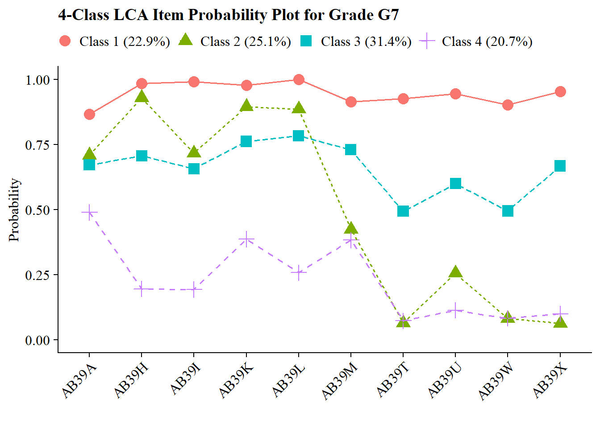
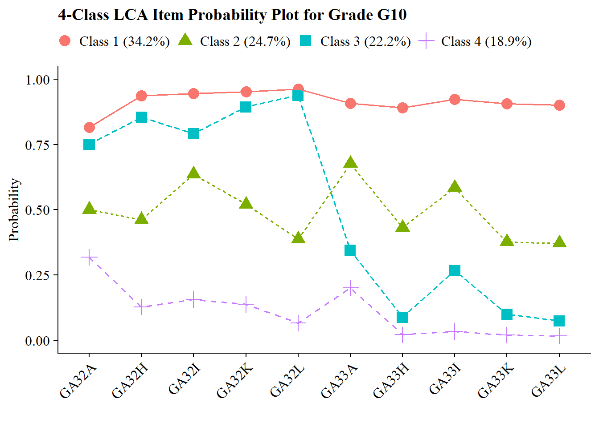
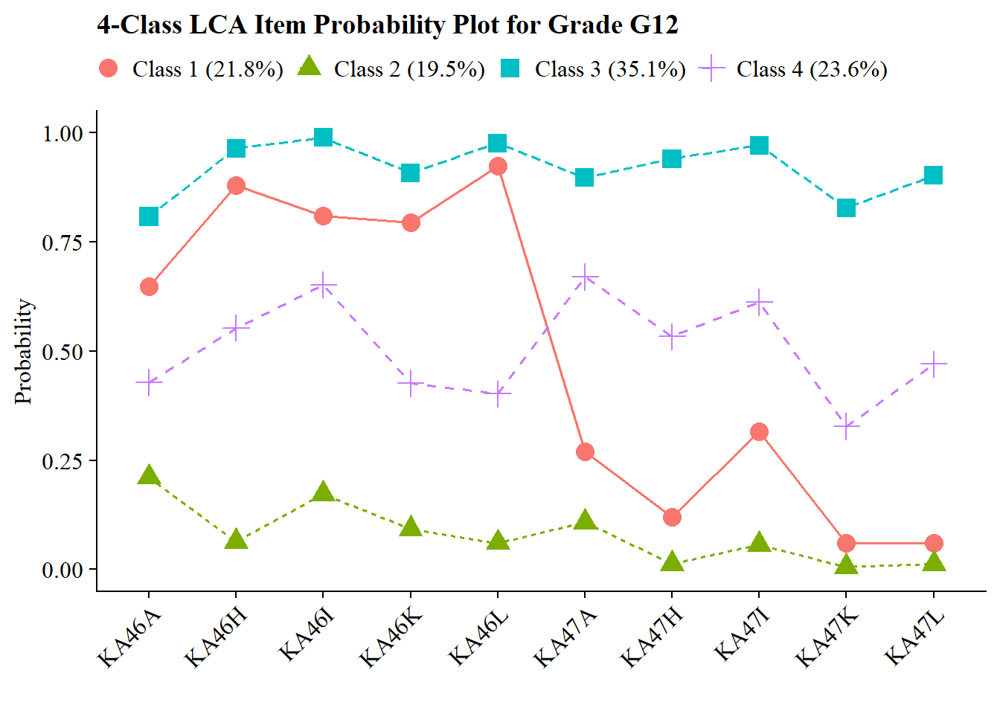
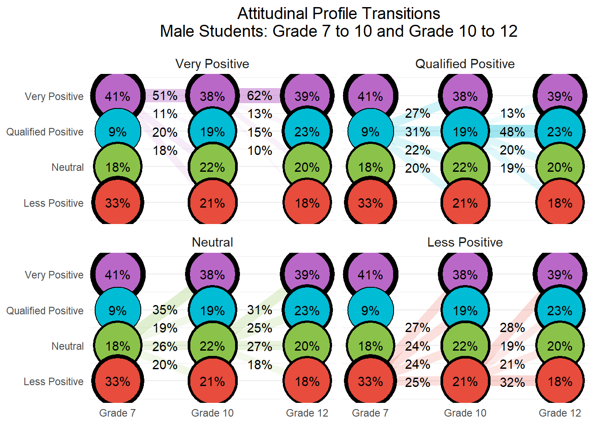
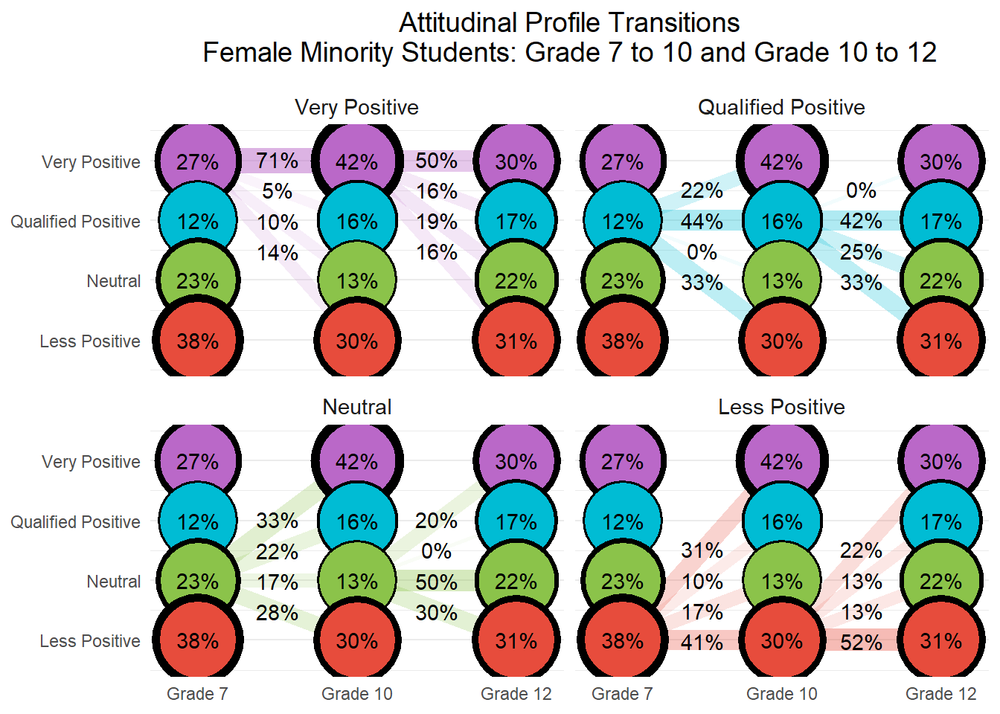
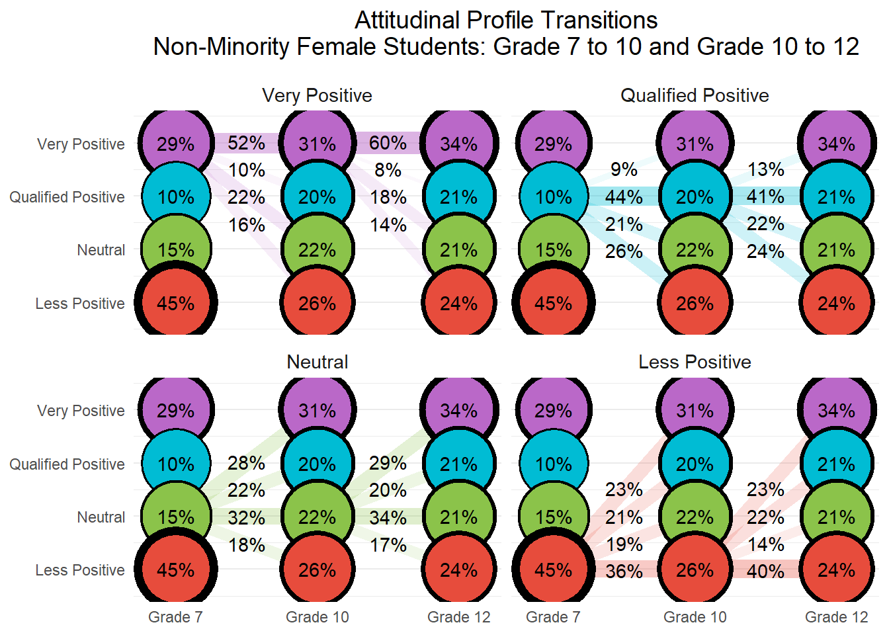

# The Importance of Early Attitudes Toward Mathematics and Science (Ing & Nylund-Gibson, 2017)

------------------------------------------------------------------------

This document presents a replication of the latent transition analysis (LTA) conducted by Ing and Nylund-Gibson, (2017), which investigated how students’ attitudes toward mathematics and science evolve over time and how those attitudinal trajectories relate to later academic outcomes. Using nationally representative longitudinal data from the LSAY study, we follow students from Grade 7 to Grade 12, classifying them into latent attitudinal profiles at each wave and modeling transitions between those profiles across time. This replication reproduces the authors’ manual 3-step LTA approach, including: (1) estimating an invariant unconditional model to identify latent profiles across grades; (2) using fixed logits to classify students into profiles at each wave; and (3) examining how class membership and transitions relate to distal outcomes and demographic covariates. Where applicable, we extend the original analysis by visualizing transition patterns, computing subgroup differences using z-tests, and formatting outputs for clear interpretability.


Citation: [Ing,M., & Nylund-Gibson, K. (2017). The importance of early attitudes toward mathematics and science. *Teachers College Record: The Voice of Scholarship in Education*, *119*(5), 1-32.](https://doi.org/10.1177/016146811711900507)

------------------------------------------------------------------------

## Load Packages


``` r
library(tidyverse)
library(haven)
library(glue)
library(MplusAutomation)
library(here)
library(janitor)
library(gt)
library(cowplot)
library(DiagrammeR) 
library(webshot2)
library(stringr)
library(flextable)
library(officer)
library(dplyr)
library(tidyr)
library(haven)
library(psych)
library(ggrepel)
library(PNWColors)
library(multcompView)
```

------------------------------------------------------------------------

## Prepare Data


``` r
lsay_data <- read_sav(here("tc_lta", "data", "Dataset_Jul9_Mplus.sav"))

# Filter to follow-up sample (target ~1824 rows)
lsay_data <- lsay_data %>% filter(RSTEMM %in% c(0, 1))

# Define survey questions
all_questions <- c(
  "AB39A", "AB39H", "AB39I", "AB39K", "AB39L", "AB39M", "AB39T", "AB39U", "AB39W", "AB39X", # 7th grade
  "GA32A", "GA32H", "GA32I", "GA32K", "GA32L", "GA33A", "GA33H", "GA33I", "GA33K", "GA33L", # 10th grade
  "KA46A", "KA46H", "KA46I", "KA46K", "KA46L", "KA47A", "KA47H", "KA47I", "KA47K", "KA47L"  # 12th grade
)

# Rename variables >8 characters
lsay_data <- lsay_data %>%
  rename(
    SCIG8 = ScienceG8,
    SCIG11 = ScienceG11
  )

# Recode 9999 to NA (missing)
lsay_data <- lsay_data %>%
  mutate(across(all_of(all_questions), ~if_else(. == 9999, NA_real_, .)))

names(lsay_data) <- toupper(names(lsay_data))
```

------------------------------------------------------------------------

## Descriptive Statistics

### Create Table 1

This table provides the overall mean and standard deviation for each attitudinal item at Grades 7, 10, and 12. These values summarize general trends in the full sample and serve as a foundation for the latent class models that follow.


``` r
# Function to compute stats (count, mean, SD)
compute_stats <- function(data, question, grade, question_name) {
  data %>%
    summarise(
      Grade = grade,
      Count = sum(!is.na(.data[[question]])),
      Mean = mean(.data[[question]], na.rm = TRUE),
      SD = sd(.data[[question]], na.rm = TRUE)
    ) %>%
    mutate(Question = question_name)
}

# Define question names and mappings
table_setup <- tibble(
  question_code = all_questions,
  grade = rep(c(7, 10, 12), each = 10),
  question_name = rep(
    c(
      "I enjoy math",
      "Math is useful in everyday problems",
      "Math helps a person think logically",
      "It is important to know math to get a good job",
      "I will use math in many ways as an adult",
      "I enjoy science",
      "Science is useful in everyday problems",
      "Science helps a person think logically",
      "It is important to know science to get a good job",
      "I will use science in many ways as an adult"
    ),
    times = 3
  )
)

# Compute stats for all questions
table1_data <- pmap_dfr(
  list(table_setup$question_code, table_setup$grade, table_setup$question_name),
  ~compute_stats(lsay_data, ..1, ..2, ..3)
) %>%
  mutate(
    Mean = round(Mean, 2),
    SD = round(SD, 2)
  ) %>%
  arrange(match(Question, table_setup$question_name), Grade) %>%
  select(Question, Grade, Count, Mean, SD)

# Build table
table1_gt <- table1_data %>%
  gt(groupname_col = "Question") %>%
  tab_header(
    title = "Table 1. Descriptive Statistics for Mathematics and Science Attitudinal Survey Items Included In Analyses"
  ) %>%
  cols_label(
    Grade = "Grade",
    Count = "N",
    Mean = "M",
    SD = "SD"
  ) %>%
  fmt_number(
    columns = c(Mean, SD),
    decimals = 2
  )

# Show table
table1_gt
```


```{=html}
<div id="wiyqqbaoxm" style="padding-left:0px;padding-right:0px;padding-top:10px;padding-bottom:10px;overflow-x:auto;overflow-y:auto;width:auto;height:auto;">
<style>#wiyqqbaoxm table {
  font-family: system-ui, 'Segoe UI', Roboto, Helvetica, Arial, sans-serif, 'Apple Color Emoji', 'Segoe UI Emoji', 'Segoe UI Symbol', 'Noto Color Emoji';
  -webkit-font-smoothing: antialiased;
  -moz-osx-font-smoothing: grayscale;
}

#wiyqqbaoxm thead, #wiyqqbaoxm tbody, #wiyqqbaoxm tfoot, #wiyqqbaoxm tr, #wiyqqbaoxm td, #wiyqqbaoxm th {
  border-style: none;
}

#wiyqqbaoxm p {
  margin: 0;
  padding: 0;
}

#wiyqqbaoxm .gt_table {
  display: table;
  border-collapse: collapse;
  line-height: normal;
  margin-left: auto;
  margin-right: auto;
  color: #333333;
  font-size: 16px;
  font-weight: normal;
  font-style: normal;
  background-color: #FFFFFF;
  width: auto;
  border-top-style: solid;
  border-top-width: 2px;
  border-top-color: #A8A8A8;
  border-right-style: none;
  border-right-width: 2px;
  border-right-color: #D3D3D3;
  border-bottom-style: solid;
  border-bottom-width: 2px;
  border-bottom-color: #A8A8A8;
  border-left-style: none;
  border-left-width: 2px;
  border-left-color: #D3D3D3;
}

#wiyqqbaoxm .gt_caption {
  padding-top: 4px;
  padding-bottom: 4px;
}

#wiyqqbaoxm .gt_title {
  color: #333333;
  font-size: 125%;
  font-weight: initial;
  padding-top: 4px;
  padding-bottom: 4px;
  padding-left: 5px;
  padding-right: 5px;
  border-bottom-color: #FFFFFF;
  border-bottom-width: 0;
}

#wiyqqbaoxm .gt_subtitle {
  color: #333333;
  font-size: 85%;
  font-weight: initial;
  padding-top: 3px;
  padding-bottom: 5px;
  padding-left: 5px;
  padding-right: 5px;
  border-top-color: #FFFFFF;
  border-top-width: 0;
}

#wiyqqbaoxm .gt_heading {
  background-color: #FFFFFF;
  text-align: center;
  border-bottom-color: #FFFFFF;
  border-left-style: none;
  border-left-width: 1px;
  border-left-color: #D3D3D3;
  border-right-style: none;
  border-right-width: 1px;
  border-right-color: #D3D3D3;
}

#wiyqqbaoxm .gt_bottom_border {
  border-bottom-style: solid;
  border-bottom-width: 2px;
  border-bottom-color: #D3D3D3;
}

#wiyqqbaoxm .gt_col_headings {
  border-top-style: solid;
  border-top-width: 2px;
  border-top-color: #D3D3D3;
  border-bottom-style: solid;
  border-bottom-width: 2px;
  border-bottom-color: #D3D3D3;
  border-left-style: none;
  border-left-width: 1px;
  border-left-color: #D3D3D3;
  border-right-style: none;
  border-right-width: 1px;
  border-right-color: #D3D3D3;
}

#wiyqqbaoxm .gt_col_heading {
  color: #333333;
  background-color: #FFFFFF;
  font-size: 100%;
  font-weight: normal;
  text-transform: inherit;
  border-left-style: none;
  border-left-width: 1px;
  border-left-color: #D3D3D3;
  border-right-style: none;
  border-right-width: 1px;
  border-right-color: #D3D3D3;
  vertical-align: bottom;
  padding-top: 5px;
  padding-bottom: 6px;
  padding-left: 5px;
  padding-right: 5px;
  overflow-x: hidden;
}

#wiyqqbaoxm .gt_column_spanner_outer {
  color: #333333;
  background-color: #FFFFFF;
  font-size: 100%;
  font-weight: normal;
  text-transform: inherit;
  padding-top: 0;
  padding-bottom: 0;
  padding-left: 4px;
  padding-right: 4px;
}

#wiyqqbaoxm .gt_column_spanner_outer:first-child {
  padding-left: 0;
}

#wiyqqbaoxm .gt_column_spanner_outer:last-child {
  padding-right: 0;
}

#wiyqqbaoxm .gt_column_spanner {
  border-bottom-style: solid;
  border-bottom-width: 2px;
  border-bottom-color: #D3D3D3;
  vertical-align: bottom;
  padding-top: 5px;
  padding-bottom: 5px;
  overflow-x: hidden;
  display: inline-block;
  width: 100%;
}

#wiyqqbaoxm .gt_spanner_row {
  border-bottom-style: hidden;
}

#wiyqqbaoxm .gt_group_heading {
  padding-top: 8px;
  padding-bottom: 8px;
  padding-left: 5px;
  padding-right: 5px;
  color: #333333;
  background-color: #FFFFFF;
  font-size: 100%;
  font-weight: initial;
  text-transform: inherit;
  border-top-style: solid;
  border-top-width: 2px;
  border-top-color: #D3D3D3;
  border-bottom-style: solid;
  border-bottom-width: 2px;
  border-bottom-color: #D3D3D3;
  border-left-style: none;
  border-left-width: 1px;
  border-left-color: #D3D3D3;
  border-right-style: none;
  border-right-width: 1px;
  border-right-color: #D3D3D3;
  vertical-align: middle;
  text-align: left;
}

#wiyqqbaoxm .gt_empty_group_heading {
  padding: 0.5px;
  color: #333333;
  background-color: #FFFFFF;
  font-size: 100%;
  font-weight: initial;
  border-top-style: solid;
  border-top-width: 2px;
  border-top-color: #D3D3D3;
  border-bottom-style: solid;
  border-bottom-width: 2px;
  border-bottom-color: #D3D3D3;
  vertical-align: middle;
}

#wiyqqbaoxm .gt_from_md > :first-child {
  margin-top: 0;
}

#wiyqqbaoxm .gt_from_md > :last-child {
  margin-bottom: 0;
}

#wiyqqbaoxm .gt_row {
  padding-top: 8px;
  padding-bottom: 8px;
  padding-left: 5px;
  padding-right: 5px;
  margin: 10px;
  border-top-style: solid;
  border-top-width: 1px;
  border-top-color: #D3D3D3;
  border-left-style: none;
  border-left-width: 1px;
  border-left-color: #D3D3D3;
  border-right-style: none;
  border-right-width: 1px;
  border-right-color: #D3D3D3;
  vertical-align: middle;
  overflow-x: hidden;
}

#wiyqqbaoxm .gt_stub {
  color: #333333;
  background-color: #FFFFFF;
  font-size: 100%;
  font-weight: initial;
  text-transform: inherit;
  border-right-style: solid;
  border-right-width: 2px;
  border-right-color: #D3D3D3;
  padding-left: 5px;
  padding-right: 5px;
}

#wiyqqbaoxm .gt_stub_row_group {
  color: #333333;
  background-color: #FFFFFF;
  font-size: 100%;
  font-weight: initial;
  text-transform: inherit;
  border-right-style: solid;
  border-right-width: 2px;
  border-right-color: #D3D3D3;
  padding-left: 5px;
  padding-right: 5px;
  vertical-align: top;
}

#wiyqqbaoxm .gt_row_group_first td {
  border-top-width: 2px;
}

#wiyqqbaoxm .gt_row_group_first th {
  border-top-width: 2px;
}

#wiyqqbaoxm .gt_summary_row {
  color: #333333;
  background-color: #FFFFFF;
  text-transform: inherit;
  padding-top: 8px;
  padding-bottom: 8px;
  padding-left: 5px;
  padding-right: 5px;
}

#wiyqqbaoxm .gt_first_summary_row {
  border-top-style: solid;
  border-top-color: #D3D3D3;
}

#wiyqqbaoxm .gt_first_summary_row.thick {
  border-top-width: 2px;
}

#wiyqqbaoxm .gt_last_summary_row {
  padding-top: 8px;
  padding-bottom: 8px;
  padding-left: 5px;
  padding-right: 5px;
  border-bottom-style: solid;
  border-bottom-width: 2px;
  border-bottom-color: #D3D3D3;
}

#wiyqqbaoxm .gt_grand_summary_row {
  color: #333333;
  background-color: #FFFFFF;
  text-transform: inherit;
  padding-top: 8px;
  padding-bottom: 8px;
  padding-left: 5px;
  padding-right: 5px;
}

#wiyqqbaoxm .gt_first_grand_summary_row {
  padding-top: 8px;
  padding-bottom: 8px;
  padding-left: 5px;
  padding-right: 5px;
  border-top-style: double;
  border-top-width: 6px;
  border-top-color: #D3D3D3;
}

#wiyqqbaoxm .gt_last_grand_summary_row_top {
  padding-top: 8px;
  padding-bottom: 8px;
  padding-left: 5px;
  padding-right: 5px;
  border-bottom-style: double;
  border-bottom-width: 6px;
  border-bottom-color: #D3D3D3;
}

#wiyqqbaoxm .gt_striped {
  background-color: rgba(128, 128, 128, 0.05);
}

#wiyqqbaoxm .gt_table_body {
  border-top-style: solid;
  border-top-width: 2px;
  border-top-color: #D3D3D3;
  border-bottom-style: solid;
  border-bottom-width: 2px;
  border-bottom-color: #D3D3D3;
}

#wiyqqbaoxm .gt_footnotes {
  color: #333333;
  background-color: #FFFFFF;
  border-bottom-style: none;
  border-bottom-width: 2px;
  border-bottom-color: #D3D3D3;
  border-left-style: none;
  border-left-width: 2px;
  border-left-color: #D3D3D3;
  border-right-style: none;
  border-right-width: 2px;
  border-right-color: #D3D3D3;
}

#wiyqqbaoxm .gt_footnote {
  margin: 0px;
  font-size: 90%;
  padding-top: 4px;
  padding-bottom: 4px;
  padding-left: 5px;
  padding-right: 5px;
}

#wiyqqbaoxm .gt_sourcenotes {
  color: #333333;
  background-color: #FFFFFF;
  border-bottom-style: none;
  border-bottom-width: 2px;
  border-bottom-color: #D3D3D3;
  border-left-style: none;
  border-left-width: 2px;
  border-left-color: #D3D3D3;
  border-right-style: none;
  border-right-width: 2px;
  border-right-color: #D3D3D3;
}

#wiyqqbaoxm .gt_sourcenote {
  font-size: 90%;
  padding-top: 4px;
  padding-bottom: 4px;
  padding-left: 5px;
  padding-right: 5px;
}

#wiyqqbaoxm .gt_left {
  text-align: left;
}

#wiyqqbaoxm .gt_center {
  text-align: center;
}

#wiyqqbaoxm .gt_right {
  text-align: right;
  font-variant-numeric: tabular-nums;
}

#wiyqqbaoxm .gt_font_normal {
  font-weight: normal;
}

#wiyqqbaoxm .gt_font_bold {
  font-weight: bold;
}

#wiyqqbaoxm .gt_font_italic {
  font-style: italic;
}

#wiyqqbaoxm .gt_super {
  font-size: 65%;
}

#wiyqqbaoxm .gt_footnote_marks {
  font-size: 75%;
  vertical-align: 0.4em;
  position: initial;
}

#wiyqqbaoxm .gt_asterisk {
  font-size: 100%;
  vertical-align: 0;
}

#wiyqqbaoxm .gt_indent_1 {
  text-indent: 5px;
}

#wiyqqbaoxm .gt_indent_2 {
  text-indent: 10px;
}

#wiyqqbaoxm .gt_indent_3 {
  text-indent: 15px;
}

#wiyqqbaoxm .gt_indent_4 {
  text-indent: 20px;
}

#wiyqqbaoxm .gt_indent_5 {
  text-indent: 25px;
}

#wiyqqbaoxm .katex-display {
  display: inline-flex !important;
  margin-bottom: 0.75em !important;
}

#wiyqqbaoxm div.Reactable > div.rt-table > div.rt-thead > div.rt-tr.rt-tr-group-header > div.rt-th-group:after {
  height: 0px !important;
}
</style>
<table class="gt_table" data-quarto-disable-processing="false" data-quarto-bootstrap="false">
  <thead>
    <tr class="gt_heading">
      <td colspan="4" class="gt_heading gt_title gt_font_normal gt_bottom_border" style>Table 1. Descriptive Statistics for Mathematics and Science Attitudinal Survey Items Included In Analyses</td>
    </tr>
    
    <tr class="gt_col_headings">
      <th class="gt_col_heading gt_columns_bottom_border gt_right" rowspan="1" colspan="1" scope="col" id="Grade">Grade</th>
      <th class="gt_col_heading gt_columns_bottom_border gt_right" rowspan="1" colspan="1" scope="col" id="Count">N</th>
      <th class="gt_col_heading gt_columns_bottom_border gt_right" rowspan="1" colspan="1" scope="col" id="Mean">M</th>
      <th class="gt_col_heading gt_columns_bottom_border gt_right" rowspan="1" colspan="1" scope="col" id="SD">SD</th>
    </tr>
  </thead>
  <tbody class="gt_table_body">
    <tr class="gt_group_heading_row">
      <th colspan="4" class="gt_group_heading" scope="colgroup" id="I enjoy math">I enjoy math</th>
    </tr>
    <tr class="gt_row_group_first"><td headers="I enjoy math  Grade" class="gt_row gt_right">7</td>
<td headers="I enjoy math  Count" class="gt_row gt_right">1882</td>
<td headers="I enjoy math  Mean" class="gt_row gt_right">0.69</td>
<td headers="I enjoy math  SD" class="gt_row gt_right">0.46</td></tr>
    <tr><td headers="I enjoy math  Grade" class="gt_row gt_right">10</td>
<td headers="I enjoy math  Count" class="gt_row gt_right">1532</td>
<td headers="I enjoy math  Mean" class="gt_row gt_right">0.63</td>
<td headers="I enjoy math  SD" class="gt_row gt_right">0.48</td></tr>
    <tr><td headers="I enjoy math  Grade" class="gt_row gt_right">12</td>
<td headers="I enjoy math  Count" class="gt_row gt_right">1120</td>
<td headers="I enjoy math  Mean" class="gt_row gt_right">0.57</td>
<td headers="I enjoy math  SD" class="gt_row gt_right">0.50</td></tr>
    <tr class="gt_group_heading_row">
      <th colspan="4" class="gt_group_heading" scope="colgroup" id="Math is useful in everyday problems">Math is useful in everyday problems</th>
    </tr>
    <tr class="gt_row_group_first"><td headers="Math is useful in everyday problems  Grade" class="gt_row gt_right">7</td>
<td headers="Math is useful in everyday problems  Count" class="gt_row gt_right">1851</td>
<td headers="Math is useful in everyday problems  Mean" class="gt_row gt_right">0.72</td>
<td headers="Math is useful in everyday problems  SD" class="gt_row gt_right">0.45</td></tr>
    <tr><td headers="Math is useful in everyday problems  Grade" class="gt_row gt_right">10</td>
<td headers="Math is useful in everyday problems  Count" class="gt_row gt_right">1520</td>
<td headers="Math is useful in everyday problems  Mean" class="gt_row gt_right">0.65</td>
<td headers="Math is useful in everyday problems  SD" class="gt_row gt_right">0.48</td></tr>
    <tr><td headers="Math is useful in everyday problems  Grade" class="gt_row gt_right">12</td>
<td headers="Math is useful in everyday problems  Count" class="gt_row gt_right">1111</td>
<td headers="Math is useful in everyday problems  Mean" class="gt_row gt_right">0.67</td>
<td headers="Math is useful in everyday problems  SD" class="gt_row gt_right">0.47</td></tr>
    <tr class="gt_group_heading_row">
      <th colspan="4" class="gt_group_heading" scope="colgroup" id="Math helps a person think logically">Math helps a person think logically</th>
    </tr>
    <tr class="gt_row_group_first"><td headers="Math helps a person think logically  Grade" class="gt_row gt_right">7</td>
<td headers="Math helps a person think logically  Count" class="gt_row gt_right">1847</td>
<td headers="Math helps a person think logically  Mean" class="gt_row gt_right">0.65</td>
<td headers="Math helps a person think logically  SD" class="gt_row gt_right">0.48</td></tr>
    <tr><td headers="Math helps a person think logically  Grade" class="gt_row gt_right">10</td>
<td headers="Math helps a person think logically  Count" class="gt_row gt_right">1517</td>
<td headers="Math helps a person think logically  Mean" class="gt_row gt_right">0.69</td>
<td headers="Math helps a person think logically  SD" class="gt_row gt_right">0.46</td></tr>
    <tr><td headers="Math helps a person think logically  Grade" class="gt_row gt_right">12</td>
<td headers="Math helps a person think logically  Count" class="gt_row gt_right">1108</td>
<td headers="Math helps a person think logically  Mean" class="gt_row gt_right">0.71</td>
<td headers="Math helps a person think logically  SD" class="gt_row gt_right">0.45</td></tr>
    <tr class="gt_group_heading_row">
      <th colspan="4" class="gt_group_heading" scope="colgroup" id="It is important to know math to get a good job">It is important to know math to get a good job</th>
    </tr>
    <tr class="gt_row_group_first"><td headers="It is important to know math to get a good job  Grade" class="gt_row gt_right">7</td>
<td headers="It is important to know math to get a good job  Count" class="gt_row gt_right">1854</td>
<td headers="It is important to know math to get a good job  Mean" class="gt_row gt_right">0.77</td>
<td headers="It is important to know math to get a good job  SD" class="gt_row gt_right">0.42</td></tr>
    <tr><td headers="It is important to know math to get a good job  Grade" class="gt_row gt_right">10</td>
<td headers="It is important to know math to get a good job  Count" class="gt_row gt_right">1517</td>
<td headers="It is important to know math to get a good job  Mean" class="gt_row gt_right">0.68</td>
<td headers="It is important to know math to get a good job  SD" class="gt_row gt_right">0.47</td></tr>
    <tr><td headers="It is important to know math to get a good job  Grade" class="gt_row gt_right">12</td>
<td headers="It is important to know math to get a good job  Count" class="gt_row gt_right">1105</td>
<td headers="It is important to know math to get a good job  Mean" class="gt_row gt_right">0.61</td>
<td headers="It is important to know math to get a good job  SD" class="gt_row gt_right">0.49</td></tr>
    <tr class="gt_group_heading_row">
      <th colspan="4" class="gt_group_heading" scope="colgroup" id="I will use math in many ways as an adult">I will use math in many ways as an adult</th>
    </tr>
    <tr class="gt_row_group_first"><td headers="I will use math in many ways as an adult  Grade" class="gt_row gt_right">7</td>
<td headers="I will use math in many ways as an adult  Count" class="gt_row gt_right">1857</td>
<td headers="I will use math in many ways as an adult  Mean" class="gt_row gt_right">0.75</td>
<td headers="I will use math in many ways as an adult  SD" class="gt_row gt_right">0.43</td></tr>
    <tr><td headers="I will use math in many ways as an adult  Grade" class="gt_row gt_right">10</td>
<td headers="I will use math in many ways as an adult  Count" class="gt_row gt_right">1525</td>
<td headers="I will use math in many ways as an adult  Mean" class="gt_row gt_right">0.65</td>
<td headers="I will use math in many ways as an adult  SD" class="gt_row gt_right">0.48</td></tr>
    <tr><td headers="I will use math in many ways as an adult  Grade" class="gt_row gt_right">12</td>
<td headers="I will use math in many ways as an adult  Count" class="gt_row gt_right">1104</td>
<td headers="I will use math in many ways as an adult  Mean" class="gt_row gt_right">0.65</td>
<td headers="I will use math in many ways as an adult  SD" class="gt_row gt_right">0.48</td></tr>
    <tr class="gt_group_heading_row">
      <th colspan="4" class="gt_group_heading" scope="colgroup" id="I enjoy science">I enjoy science</th>
    </tr>
    <tr class="gt_row_group_first"><td headers="I enjoy science  Grade" class="gt_row gt_right">7</td>
<td headers="I enjoy science  Count" class="gt_row gt_right">1873</td>
<td headers="I enjoy science  Mean" class="gt_row gt_right">0.62</td>
<td headers="I enjoy science  SD" class="gt_row gt_right">0.48</td></tr>
    <tr><td headers="I enjoy science  Grade" class="gt_row gt_right">10</td>
<td headers="I enjoy science  Count" class="gt_row gt_right">1526</td>
<td headers="I enjoy science  Mean" class="gt_row gt_right">0.59</td>
<td headers="I enjoy science  SD" class="gt_row gt_right">0.49</td></tr>
    <tr><td headers="I enjoy science  Grade" class="gt_row gt_right">12</td>
<td headers="I enjoy science  Count" class="gt_row gt_right">1105</td>
<td headers="I enjoy science  Mean" class="gt_row gt_right">0.55</td>
<td headers="I enjoy science  SD" class="gt_row gt_right">0.50</td></tr>
    <tr class="gt_group_heading_row">
      <th colspan="4" class="gt_group_heading" scope="colgroup" id="Science is useful in everyday problems">Science is useful in everyday problems</th>
    </tr>
    <tr class="gt_row_group_first"><td headers="Science is useful in everyday problems  Grade" class="gt_row gt_right">7</td>
<td headers="Science is useful in everyday problems  Count" class="gt_row gt_right">1840</td>
<td headers="Science is useful in everyday problems  Mean" class="gt_row gt_right">0.40</td>
<td headers="Science is useful in everyday problems  SD" class="gt_row gt_right">0.49</td></tr>
    <tr><td headers="Science is useful in everyday problems  Grade" class="gt_row gt_right">10</td>
<td headers="Science is useful in everyday problems  Count" class="gt_row gt_right">1516</td>
<td headers="Science is useful in everyday problems  Mean" class="gt_row gt_right">0.43</td>
<td headers="Science is useful in everyday problems  SD" class="gt_row gt_right">0.50</td></tr>
    <tr><td headers="Science is useful in everyday problems  Grade" class="gt_row gt_right">12</td>
<td headers="Science is useful in everyday problems  Count" class="gt_row gt_right">1099</td>
<td headers="Science is useful in everyday problems  Mean" class="gt_row gt_right">0.48</td>
<td headers="Science is useful in everyday problems  SD" class="gt_row gt_right">0.50</td></tr>
    <tr class="gt_group_heading_row">
      <th colspan="4" class="gt_group_heading" scope="colgroup" id="Science helps a person think logically">Science helps a person think logically</th>
    </tr>
    <tr class="gt_row_group_first"><td headers="Science helps a person think logically  Grade" class="gt_row gt_right">7</td>
<td headers="Science helps a person think logically  Count" class="gt_row gt_right">1850</td>
<td headers="Science helps a person think logically  Mean" class="gt_row gt_right">0.49</td>
<td headers="Science helps a person think logically  SD" class="gt_row gt_right">0.50</td></tr>
    <tr><td headers="Science helps a person think logically  Grade" class="gt_row gt_right">10</td>
<td headers="Science helps a person think logically  Count" class="gt_row gt_right">1516</td>
<td headers="Science helps a person think logically  Mean" class="gt_row gt_right">0.53</td>
<td headers="Science helps a person think logically  SD" class="gt_row gt_right">0.50</td></tr>
    <tr><td headers="Science helps a person think logically  Grade" class="gt_row gt_right">12</td>
<td headers="Science helps a person think logically  Count" class="gt_row gt_right">1100</td>
<td headers="Science helps a person think logically  Mean" class="gt_row gt_right">0.56</td>
<td headers="Science helps a person think logically  SD" class="gt_row gt_right">0.50</td></tr>
    <tr class="gt_group_heading_row">
      <th colspan="4" class="gt_group_heading" scope="colgroup" id="It is important to know science to get a good job">It is important to know science to get a good job</th>
    </tr>
    <tr class="gt_row_group_first"><td headers="It is important to know science to get a good job  Grade" class="gt_row gt_right">7</td>
<td headers="It is important to know science to get a good job  Count" class="gt_row gt_right">1857</td>
<td headers="It is important to know science to get a good job  Mean" class="gt_row gt_right">0.40</td>
<td headers="It is important to know science to get a good job  SD" class="gt_row gt_right">0.49</td></tr>
    <tr><td headers="It is important to know science to get a good job  Grade" class="gt_row gt_right">10</td>
<td headers="It is important to know science to get a good job  Count" class="gt_row gt_right">1518</td>
<td headers="It is important to know science to get a good job  Mean" class="gt_row gt_right">0.43</td>
<td headers="It is important to know science to get a good job  SD" class="gt_row gt_right">0.50</td></tr>
    <tr><td headers="It is important to know science to get a good job  Grade" class="gt_row gt_right">12</td>
<td headers="It is important to know science to get a good job  Count" class="gt_row gt_right">1099</td>
<td headers="It is important to know science to get a good job  Mean" class="gt_row gt_right">0.38</td>
<td headers="It is important to know science to get a good job  SD" class="gt_row gt_right">0.49</td></tr>
    <tr class="gt_group_heading_row">
      <th colspan="4" class="gt_group_heading" scope="colgroup" id="I will use science in many ways as an adult">I will use science in many ways as an adult</th>
    </tr>
    <tr class="gt_row_group_first"><td headers="I will use science in many ways as an adult  Grade" class="gt_row gt_right">7</td>
<td headers="I will use science in many ways as an adult  Count" class="gt_row gt_right">1873</td>
<td headers="I will use science in many ways as an adult  Mean" class="gt_row gt_right">0.46</td>
<td headers="I will use science in many ways as an adult  SD" class="gt_row gt_right">0.50</td></tr>
    <tr><td headers="I will use science in many ways as an adult  Grade" class="gt_row gt_right">10</td>
<td headers="I will use science in many ways as an adult  Count" class="gt_row gt_right">1524</td>
<td headers="I will use science in many ways as an adult  Mean" class="gt_row gt_right">0.42</td>
<td headers="I will use science in many ways as an adult  SD" class="gt_row gt_right">0.49</td></tr>
    <tr><td headers="I will use science in many ways as an adult  Grade" class="gt_row gt_right">12</td>
<td headers="I will use science in many ways as an adult  Count" class="gt_row gt_right">1103</td>
<td headers="I will use science in many ways as an adult  Mean" class="gt_row gt_right">0.44</td>
<td headers="I will use science in many ways as an adult  SD" class="gt_row gt_right">0.50</td></tr>
  </tbody>
  
  
</table>
</div>
```


Save Table 1


``` r
# Save table as PNG
gtsave(table1_gt, here("figures", "table1.png"))
```

------------------------------------------------------------------------

### Create Table 2

This table presents model fit statistics for latent profile enumeration at Grades 7, 10, and 12. For each grade, models with 1 through 6 profiles were estimated and evaluated using the commonly used information criteria (AIC, BIC, SSA-BIC), entropy, and likelihood ratio tests (LMR, BLRT). These values help determine the most appropriate number of latent profiles to retain at each grade.


``` r
# Coerce to numeric just in case
lsay_data <- lsay_data %>%
  mutate(
    MATHG12 = as.numeric(MATHG12),
    SCIG11  = as.numeric(SCIG11),
    STEMSUP = as.numeric(STEMSUP)
  )

# Build the summary table
table2_data <- tibble::tibble(
  `Outcome Variable` = c(
    "12th Grade Mathematics Achievement",
    "11th Grade Science Achievement",
    "STEM Career Attainmentᵃ"
  ),
  N = c(
    sum(lsay_data$MATHG12 != 9999 & !is.na(lsay_data$MATHG12)),
    sum(lsay_data$SCIG11  != 9999 & !is.na(lsay_data$SCIG11)),
    sum(lsay_data$STEMSUP != 9999 & !is.na(lsay_data$STEMSUP))
  ),
  M = c(
    round(mean(lsay_data$MATHG12[lsay_data$MATHG12 != 9999 & !is.na(lsay_data$MATHG12)]), 2),
    round(mean(lsay_data$SCIG11[lsay_data$SCIG11 != 9999 & !is.na(lsay_data$SCIG11)]), 2),
    round(mean(lsay_data$STEMSUP[lsay_data$STEMSUP != 9999 & !is.na(lsay_data$STEMSUP)]), 2)
  ),
  SD = c(
    round(sd(lsay_data$MATHG12[lsay_data$MATHG12 != 9999 & !is.na(lsay_data$MATHG12)]), 2),
    round(sd(lsay_data$SCIG11[lsay_data$SCIG11 != 9999 & !is.na(lsay_data$SCIG11)]), 2),
    NA
  )
)

# Render the gt table
table2_gt <- table2_data %>%
  gt() %>%
  tab_header(
    title = md("**Table 2. Descriptive Statistics for Distal Outcome Variables**")
  ) %>%
  cols_label(
    `Outcome Variable` = "Outcome Variable",
    N = "N",
    M = "M",
    SD = "SD"
  ) %>%
  sub_missing(columns = everything(), missing_text = "") %>%
  tab_footnote(
    footnote = "Binary indicator coded 1 = STEM occupation in mid-30s follow-up.",
    locations = cells_body(rows = 3, columns = "Outcome Variable")
  )

table2_gt
```


```{=html}
<div id="vjnzieeifv" style="padding-left:0px;padding-right:0px;padding-top:10px;padding-bottom:10px;overflow-x:auto;overflow-y:auto;width:auto;height:auto;">
<style>#vjnzieeifv table {
  font-family: system-ui, 'Segoe UI', Roboto, Helvetica, Arial, sans-serif, 'Apple Color Emoji', 'Segoe UI Emoji', 'Segoe UI Symbol', 'Noto Color Emoji';
  -webkit-font-smoothing: antialiased;
  -moz-osx-font-smoothing: grayscale;
}

#vjnzieeifv thead, #vjnzieeifv tbody, #vjnzieeifv tfoot, #vjnzieeifv tr, #vjnzieeifv td, #vjnzieeifv th {
  border-style: none;
}

#vjnzieeifv p {
  margin: 0;
  padding: 0;
}

#vjnzieeifv .gt_table {
  display: table;
  border-collapse: collapse;
  line-height: normal;
  margin-left: auto;
  margin-right: auto;
  color: #333333;
  font-size: 16px;
  font-weight: normal;
  font-style: normal;
  background-color: #FFFFFF;
  width: auto;
  border-top-style: solid;
  border-top-width: 2px;
  border-top-color: #A8A8A8;
  border-right-style: none;
  border-right-width: 2px;
  border-right-color: #D3D3D3;
  border-bottom-style: solid;
  border-bottom-width: 2px;
  border-bottom-color: #A8A8A8;
  border-left-style: none;
  border-left-width: 2px;
  border-left-color: #D3D3D3;
}

#vjnzieeifv .gt_caption {
  padding-top: 4px;
  padding-bottom: 4px;
}

#vjnzieeifv .gt_title {
  color: #333333;
  font-size: 125%;
  font-weight: initial;
  padding-top: 4px;
  padding-bottom: 4px;
  padding-left: 5px;
  padding-right: 5px;
  border-bottom-color: #FFFFFF;
  border-bottom-width: 0;
}

#vjnzieeifv .gt_subtitle {
  color: #333333;
  font-size: 85%;
  font-weight: initial;
  padding-top: 3px;
  padding-bottom: 5px;
  padding-left: 5px;
  padding-right: 5px;
  border-top-color: #FFFFFF;
  border-top-width: 0;
}

#vjnzieeifv .gt_heading {
  background-color: #FFFFFF;
  text-align: center;
  border-bottom-color: #FFFFFF;
  border-left-style: none;
  border-left-width: 1px;
  border-left-color: #D3D3D3;
  border-right-style: none;
  border-right-width: 1px;
  border-right-color: #D3D3D3;
}

#vjnzieeifv .gt_bottom_border {
  border-bottom-style: solid;
  border-bottom-width: 2px;
  border-bottom-color: #D3D3D3;
}

#vjnzieeifv .gt_col_headings {
  border-top-style: solid;
  border-top-width: 2px;
  border-top-color: #D3D3D3;
  border-bottom-style: solid;
  border-bottom-width: 2px;
  border-bottom-color: #D3D3D3;
  border-left-style: none;
  border-left-width: 1px;
  border-left-color: #D3D3D3;
  border-right-style: none;
  border-right-width: 1px;
  border-right-color: #D3D3D3;
}

#vjnzieeifv .gt_col_heading {
  color: #333333;
  background-color: #FFFFFF;
  font-size: 100%;
  font-weight: normal;
  text-transform: inherit;
  border-left-style: none;
  border-left-width: 1px;
  border-left-color: #D3D3D3;
  border-right-style: none;
  border-right-width: 1px;
  border-right-color: #D3D3D3;
  vertical-align: bottom;
  padding-top: 5px;
  padding-bottom: 6px;
  padding-left: 5px;
  padding-right: 5px;
  overflow-x: hidden;
}

#vjnzieeifv .gt_column_spanner_outer {
  color: #333333;
  background-color: #FFFFFF;
  font-size: 100%;
  font-weight: normal;
  text-transform: inherit;
  padding-top: 0;
  padding-bottom: 0;
  padding-left: 4px;
  padding-right: 4px;
}

#vjnzieeifv .gt_column_spanner_outer:first-child {
  padding-left: 0;
}

#vjnzieeifv .gt_column_spanner_outer:last-child {
  padding-right: 0;
}

#vjnzieeifv .gt_column_spanner {
  border-bottom-style: solid;
  border-bottom-width: 2px;
  border-bottom-color: #D3D3D3;
  vertical-align: bottom;
  padding-top: 5px;
  padding-bottom: 5px;
  overflow-x: hidden;
  display: inline-block;
  width: 100%;
}

#vjnzieeifv .gt_spanner_row {
  border-bottom-style: hidden;
}

#vjnzieeifv .gt_group_heading {
  padding-top: 8px;
  padding-bottom: 8px;
  padding-left: 5px;
  padding-right: 5px;
  color: #333333;
  background-color: #FFFFFF;
  font-size: 100%;
  font-weight: initial;
  text-transform: inherit;
  border-top-style: solid;
  border-top-width: 2px;
  border-top-color: #D3D3D3;
  border-bottom-style: solid;
  border-bottom-width: 2px;
  border-bottom-color: #D3D3D3;
  border-left-style: none;
  border-left-width: 1px;
  border-left-color: #D3D3D3;
  border-right-style: none;
  border-right-width: 1px;
  border-right-color: #D3D3D3;
  vertical-align: middle;
  text-align: left;
}

#vjnzieeifv .gt_empty_group_heading {
  padding: 0.5px;
  color: #333333;
  background-color: #FFFFFF;
  font-size: 100%;
  font-weight: initial;
  border-top-style: solid;
  border-top-width: 2px;
  border-top-color: #D3D3D3;
  border-bottom-style: solid;
  border-bottom-width: 2px;
  border-bottom-color: #D3D3D3;
  vertical-align: middle;
}

#vjnzieeifv .gt_from_md > :first-child {
  margin-top: 0;
}

#vjnzieeifv .gt_from_md > :last-child {
  margin-bottom: 0;
}

#vjnzieeifv .gt_row {
  padding-top: 8px;
  padding-bottom: 8px;
  padding-left: 5px;
  padding-right: 5px;
  margin: 10px;
  border-top-style: solid;
  border-top-width: 1px;
  border-top-color: #D3D3D3;
  border-left-style: none;
  border-left-width: 1px;
  border-left-color: #D3D3D3;
  border-right-style: none;
  border-right-width: 1px;
  border-right-color: #D3D3D3;
  vertical-align: middle;
  overflow-x: hidden;
}

#vjnzieeifv .gt_stub {
  color: #333333;
  background-color: #FFFFFF;
  font-size: 100%;
  font-weight: initial;
  text-transform: inherit;
  border-right-style: solid;
  border-right-width: 2px;
  border-right-color: #D3D3D3;
  padding-left: 5px;
  padding-right: 5px;
}

#vjnzieeifv .gt_stub_row_group {
  color: #333333;
  background-color: #FFFFFF;
  font-size: 100%;
  font-weight: initial;
  text-transform: inherit;
  border-right-style: solid;
  border-right-width: 2px;
  border-right-color: #D3D3D3;
  padding-left: 5px;
  padding-right: 5px;
  vertical-align: top;
}

#vjnzieeifv .gt_row_group_first td {
  border-top-width: 2px;
}

#vjnzieeifv .gt_row_group_first th {
  border-top-width: 2px;
}

#vjnzieeifv .gt_summary_row {
  color: #333333;
  background-color: #FFFFFF;
  text-transform: inherit;
  padding-top: 8px;
  padding-bottom: 8px;
  padding-left: 5px;
  padding-right: 5px;
}

#vjnzieeifv .gt_first_summary_row {
  border-top-style: solid;
  border-top-color: #D3D3D3;
}

#vjnzieeifv .gt_first_summary_row.thick {
  border-top-width: 2px;
}

#vjnzieeifv .gt_last_summary_row {
  padding-top: 8px;
  padding-bottom: 8px;
  padding-left: 5px;
  padding-right: 5px;
  border-bottom-style: solid;
  border-bottom-width: 2px;
  border-bottom-color: #D3D3D3;
}

#vjnzieeifv .gt_grand_summary_row {
  color: #333333;
  background-color: #FFFFFF;
  text-transform: inherit;
  padding-top: 8px;
  padding-bottom: 8px;
  padding-left: 5px;
  padding-right: 5px;
}

#vjnzieeifv .gt_first_grand_summary_row {
  padding-top: 8px;
  padding-bottom: 8px;
  padding-left: 5px;
  padding-right: 5px;
  border-top-style: double;
  border-top-width: 6px;
  border-top-color: #D3D3D3;
}

#vjnzieeifv .gt_last_grand_summary_row_top {
  padding-top: 8px;
  padding-bottom: 8px;
  padding-left: 5px;
  padding-right: 5px;
  border-bottom-style: double;
  border-bottom-width: 6px;
  border-bottom-color: #D3D3D3;
}

#vjnzieeifv .gt_striped {
  background-color: rgba(128, 128, 128, 0.05);
}

#vjnzieeifv .gt_table_body {
  border-top-style: solid;
  border-top-width: 2px;
  border-top-color: #D3D3D3;
  border-bottom-style: solid;
  border-bottom-width: 2px;
  border-bottom-color: #D3D3D3;
}

#vjnzieeifv .gt_footnotes {
  color: #333333;
  background-color: #FFFFFF;
  border-bottom-style: none;
  border-bottom-width: 2px;
  border-bottom-color: #D3D3D3;
  border-left-style: none;
  border-left-width: 2px;
  border-left-color: #D3D3D3;
  border-right-style: none;
  border-right-width: 2px;
  border-right-color: #D3D3D3;
}

#vjnzieeifv .gt_footnote {
  margin: 0px;
  font-size: 90%;
  padding-top: 4px;
  padding-bottom: 4px;
  padding-left: 5px;
  padding-right: 5px;
}

#vjnzieeifv .gt_sourcenotes {
  color: #333333;
  background-color: #FFFFFF;
  border-bottom-style: none;
  border-bottom-width: 2px;
  border-bottom-color: #D3D3D3;
  border-left-style: none;
  border-left-width: 2px;
  border-left-color: #D3D3D3;
  border-right-style: none;
  border-right-width: 2px;
  border-right-color: #D3D3D3;
}

#vjnzieeifv .gt_sourcenote {
  font-size: 90%;
  padding-top: 4px;
  padding-bottom: 4px;
  padding-left: 5px;
  padding-right: 5px;
}

#vjnzieeifv .gt_left {
  text-align: left;
}

#vjnzieeifv .gt_center {
  text-align: center;
}

#vjnzieeifv .gt_right {
  text-align: right;
  font-variant-numeric: tabular-nums;
}

#vjnzieeifv .gt_font_normal {
  font-weight: normal;
}

#vjnzieeifv .gt_font_bold {
  font-weight: bold;
}

#vjnzieeifv .gt_font_italic {
  font-style: italic;
}

#vjnzieeifv .gt_super {
  font-size: 65%;
}

#vjnzieeifv .gt_footnote_marks {
  font-size: 75%;
  vertical-align: 0.4em;
  position: initial;
}

#vjnzieeifv .gt_asterisk {
  font-size: 100%;
  vertical-align: 0;
}

#vjnzieeifv .gt_indent_1 {
  text-indent: 5px;
}

#vjnzieeifv .gt_indent_2 {
  text-indent: 10px;
}

#vjnzieeifv .gt_indent_3 {
  text-indent: 15px;
}

#vjnzieeifv .gt_indent_4 {
  text-indent: 20px;
}

#vjnzieeifv .gt_indent_5 {
  text-indent: 25px;
}

#vjnzieeifv .katex-display {
  display: inline-flex !important;
  margin-bottom: 0.75em !important;
}

#vjnzieeifv div.Reactable > div.rt-table > div.rt-thead > div.rt-tr.rt-tr-group-header > div.rt-th-group:after {
  height: 0px !important;
}
</style>
<table class="gt_table" data-quarto-disable-processing="false" data-quarto-bootstrap="false">
  <thead>
    <tr class="gt_heading">
      <td colspan="4" class="gt_heading gt_title gt_font_normal gt_bottom_border" style><span class='gt_from_md'><strong>Table 2. Descriptive Statistics for Distal Outcome Variables</strong></span></td>
    </tr>
    
    <tr class="gt_col_headings">
      <th class="gt_col_heading gt_columns_bottom_border gt_left" rowspan="1" colspan="1" scope="col" id="Outcome-Variable">Outcome Variable</th>
      <th class="gt_col_heading gt_columns_bottom_border gt_right" rowspan="1" colspan="1" scope="col" id="N">N</th>
      <th class="gt_col_heading gt_columns_bottom_border gt_right" rowspan="1" colspan="1" scope="col" id="M">M</th>
      <th class="gt_col_heading gt_columns_bottom_border gt_right" rowspan="1" colspan="1" scope="col" id="SD">SD</th>
    </tr>
  </thead>
  <tbody class="gt_table_body">
    <tr><td headers="Outcome Variable" class="gt_row gt_left">12th Grade Mathematics Achievement</td>
<td headers="N" class="gt_row gt_right">830</td>
<td headers="M" class="gt_row gt_right">71.20</td>
<td headers="SD" class="gt_row gt_right">14.55</td></tr>
    <tr><td headers="Outcome Variable" class="gt_row gt_left">11th Grade Science Achievement</td>
<td headers="N" class="gt_row gt_right">1106</td>
<td headers="M" class="gt_row gt_right">66.67</td>
<td headers="SD" class="gt_row gt_right">11.30</td></tr>
    <tr><td headers="Outcome Variable" class="gt_row gt_left">STEM Career Attainmentᵃ<span class="gt_footnote_marks" style="white-space:nowrap;font-style:italic;font-weight:normal;line-height:0;"><sup>1</sup></span></td>
<td headers="N" class="gt_row gt_right">1912</td>
<td headers="M" class="gt_row gt_right">0.15</td>
<td headers="SD" class="gt_row gt_right"><br /></td></tr>
  </tbody>
  
  <tfoot class="gt_footnotes">
    <tr>
      <td class="gt_footnote" colspan="4"><span class="gt_footnote_marks" style="white-space:nowrap;font-style:italic;font-weight:normal;line-height:0;"><sup>1</sup></span> Binary indicator coded 1 = STEM occupation in mid-30s follow-up.</td>
    </tr>
  </tfoot>
</table>
</div>
```


Save Table 2


``` r
gtsave(
  data = table2_gt,
  filename = here("tc_lta","figures", "table2_distal_outcomes.png")
)

```

------------------------------------------------------------------------

## Run Independent LCAs for Each Timepoint

### Prepare Data for MPlusAutomation

To determine the appropriate number and structure of attitudinal profiles at each timepoint, we first estimate separate latent class models for Grades 7, 10, and 12. This step involves preparing the data in wide format and running independent LCAs using `MplusAutomation`. The goal is to identify the optimal number of latent profiles per grade based on model fit before moving to the longitudinal transition model.

### Run LCA on 7th Grade Items


``` r

lca_belonging <- lapply(1:8, function(k) {
  lca_enum <- mplusObject(
    TITLE = glue("{k}-Class LCA for LSAY 7th Grade"),

    VARIABLE = glue(
      "categorical = AB39A AB39H AB39I AB39K AB39L AB39M AB39T AB39U AB39W AB39X;
       usevar = AB39A AB39H AB39I AB39K AB39L AB39M AB39T AB39U AB39W AB39X;
       missing = all(9999);
       classes = c({k});"
    ),

    ANALYSIS = "
      estimator = mlr;
      type = mixture;
      starts = 500 10;
      processors = 10;",

    OUTPUT = "sampstat; residual; tech11; tech14;",

    PLOT = "
      type = plot3;
      series = AB39A AB39H AB39I AB39K AB39L AB39M 
               AB39T AB39U AB39W AB39X(*);",

    rdata = lsay_data
  )

  lca_enum_fit <- mplusModeler(
    lca_enum,
    dataout = glue(here("tc_lta","g7_enum", "lsay_g7.dat")),
    modelout = glue(here("tc_lta","g7_enum", "c{k}_g7.inp")),
    check = TRUE,
    run = TRUE,
    hashfilename = FALSE
  )
})

```

### Run LCA on 10th Grade


``` r

lca_belonging <- lapply(1:8, function(k) {
  lca_enum <- mplusObject(
    TITLE = glue("{k}-Class LCA for LCA 10th Grade"),

    VARIABLE = glue(
      "categorical = GA32A GA32H GA32I GA32K GA32L GA33A GA33H GA33I GA33K GA33L;
       usevar = GA32A GA32H GA32I GA32K GA32L GA33A GA33H GA33I GA33K GA33L;
       missing = all(9999);
       classes = c({k});"
    ),

    ANALYSIS = "
      estimator = mlr;
      type = mixture;
      starts = 500 10;
      processors = 10;",

    OUTPUT = "sampstat; residual; tech11; tech14;",

    PLOT = "
      type = plot3;
      series = GA32A GA32H GA32I GA32K GA32L GA33A 
               GA33H GA33I GA33K GA33L (*);",

    rdata = lsay_data
  )

  lca_enum_fit <- mplusModeler(
    lca_enum,
    dataout = glue(here("tc_lta","g10_enum", "lsay_g10.dat")),
    modelout = glue(here("tc_lta","g10_enum", "c{k}_g10.inp")),
    check = TRUE,
    run = TRUE,
    hashfilename = FALSE
  )
})

```

### Run LCA for 12th Grade


``` r

lca_belonging <- lapply(1:8, function(k) {
  lca_enum <- mplusObject(
    TITLE = glue("{k}-Class LCA for LCA 12th Grade"),

    VARIABLE = glue(
      "categorical = KA46A KA46H KA46I KA46K KA46L KA47A KA47H KA47I KA47K KA47L;
       usevar = KA46A KA46H KA46I KA46K KA46L KA47A KA47H KA47I KA47K KA47L;
       missing = all(9999);
       classes = c({k});"
    ),

    ANALYSIS = "
      estimator = mlr;
      type = mixture;
      starts = 500 10;
      processors = 10;",

    OUTPUT = "sampstat; residual; tech11; tech14;",

    PLOT = "
      type = plot3;
      series = KA46A KA46H KA46I KA46K KA46L KA47A 
               KA47H KA47I KA47K KA47L (*);",

    rdata = lsay_data
  )

  lca_enum_fit <- mplusModeler(
    lca_enum,
    dataout = glue(here("tc_lta","g12_enum", "lsay_g12.dat")),
    modelout = glue(here("tc_lta","g12_enum", "c{k}_g12.inp")),
    check = TRUE,
    run = TRUE,
    hashfilename = FALSE
  )
})

```

Extract Mplus Information


``` r
# LCA Extraction
source(here("tc_lta","functions", "extract_mplus_info.R"))
output_dir_lca <- here("tc_lta","enum")
output_files_lca <- list.files(output_dir_lca, pattern = "\\.out$", full.names = TRUE)
final_data_lca <- map_dfr(output_files_lca, extract_mplus_info_extended) %>% 
  mutate(Model_Type = "LCA")

```

------------------------------------------------------------------------

## Screen Output for Warnings, Errors, and Loglikelihood Replication

After estimating each LCA model, we examine the Mplus output files for warnings, estimation errors, and loglikelihood replication issues. This quality check helps ensure that solutions are trustworthy and that selected models are not based on local maxima or convergence failures. In this step, we flag any estimation concerns and verify that the best loglikelihood value is replicated consistently across random starts.

------------------------------------------------------------------------

Extract Warnings from Output Files


``` r
source(here("tc_lta","functions", "extract_mplus_info.R"))

# Extract 7th grade LCAs
output_dir_g7 <- here("tc_lta","g7_enum")
output_files_g7 <- list.files(output_dir_g7, pattern = "\\.out$", full.names = TRUE)

final_data_g7 <- map_dfr(output_files_g7, extract_mplus_info_extended) %>%
  mutate(Model_Type = "LCA", Grade = "7th")


# Extract 10th grade LCAs
output_dir_g10 <- here("tc_lta","g10_enum")
output_files_g10 <- list.files(output_dir_g10, pattern = "\\.out$", full.names = TRUE)

final_data_g10 <- map_dfr(output_files_g10, extract_mplus_info_extended) %>%
  mutate(Model_Type = "LCA", Grade = "10th")


# Extract 12th grade LCAs
output_dir_g12 <- here("tc_lta","g12_enum")
output_files_g12 <- list.files(output_dir_g12, pattern = "\\.out$", full.names = TRUE)

final_data_g12 <- map_dfr(output_files_g12, extract_mplus_info_extended) %>%
  mutate(Model_Type = "LCA", Grade = "12th")

```

### Examine Output Warnings


``` r
source(here("tc_lta","functions", "extract_warnings.R"))

# ---- 7th Grade ----
warnings_g7 <- extract_warnings(final_data_g7) %>%
  left_join(select(final_data_g7, File_Name), by = "File_Name")

warnings_table_g7 <- warnings_g7 %>%
  gt() %>%
  tab_header(title = md("**Model Warnings — 7th Grade LCA**")) %>%
  cols_label(
    File_Name = "Output File",
    Warning_Summary = "# of Warnings",
    Warnings = "Warning Message(s)"
  ) %>%
  cols_align(align = "left", columns = everything()) %>%
  cols_width(
    File_Name ~ px(150),
    Warning_Summary ~ px(150),
    Warnings ~ px(400)
  ) %>%
  tab_options(table.width = pct(100))

# ---- 10th Grade ----
warnings_g10 <- extract_warnings(final_data_g10) %>%
  left_join(select(final_data_g10, File_Name), by = "File_Name")

warnings_table_g10 <- warnings_g10 %>%
  gt() %>%
  tab_header(title = md("**Model Warnings — 10th Grade LCA**")) %>%
  cols_label(
    File_Name = "Output File",
    Warning_Summary = "# of Warnings",
    Warnings = "Warning Message(s)"
  ) %>%
  cols_align(align = "left", columns = everything()) %>%
  cols_width(
    File_Name ~ px(150),
    Warning_Summary ~ px(150),
    Warnings ~ px(400)
  ) %>%
  tab_options(table.width = pct(100))

# ---- 12th Grade ----
warnings_g12 <- extract_warnings(final_data_g12) %>%
  left_join(select(final_data_g12, File_Name), by = "File_Name")

warnings_table_g12 <- warnings_g12 %>%
  gt() %>%
  tab_header(title = md("**Model Warnings — 12th Grade LCA**")) %>%
  cols_label(
    File_Name = "Output File",
    Warning_Summary = "# of Warnings",
    Warnings = "Warning Message(s)"
  ) %>%
  cols_align(align = "left", columns = everything()) %>%
  cols_width(
    File_Name ~ px(150),
    Warning_Summary ~ px(150),
    Warnings ~ px(400)
  ) %>%
  tab_options(table.width = pct(100))

# Print all three
warnings_table_g7
```


```{=html}
<div id="awmiouqpns" style="padding-left:0px;padding-right:0px;padding-top:10px;padding-bottom:10px;overflow-x:auto;overflow-y:auto;width:auto;height:auto;">
<style>#awmiouqpns table {
  font-family: system-ui, 'Segoe UI', Roboto, Helvetica, Arial, sans-serif, 'Apple Color Emoji', 'Segoe UI Emoji', 'Segoe UI Symbol', 'Noto Color Emoji';
  -webkit-font-smoothing: antialiased;
  -moz-osx-font-smoothing: grayscale;
}

#awmiouqpns thead, #awmiouqpns tbody, #awmiouqpns tfoot, #awmiouqpns tr, #awmiouqpns td, #awmiouqpns th {
  border-style: none;
}

#awmiouqpns p {
  margin: 0;
  padding: 0;
}

#awmiouqpns .gt_table {
  display: table;
  border-collapse: collapse;
  line-height: normal;
  margin-left: auto;
  margin-right: auto;
  color: #333333;
  font-size: 16px;
  font-weight: normal;
  font-style: normal;
  background-color: #FFFFFF;
  width: 100%;
  border-top-style: solid;
  border-top-width: 2px;
  border-top-color: #A8A8A8;
  border-right-style: none;
  border-right-width: 2px;
  border-right-color: #D3D3D3;
  border-bottom-style: solid;
  border-bottom-width: 2px;
  border-bottom-color: #A8A8A8;
  border-left-style: none;
  border-left-width: 2px;
  border-left-color: #D3D3D3;
}

#awmiouqpns .gt_caption {
  padding-top: 4px;
  padding-bottom: 4px;
}

#awmiouqpns .gt_title {
  color: #333333;
  font-size: 125%;
  font-weight: initial;
  padding-top: 4px;
  padding-bottom: 4px;
  padding-left: 5px;
  padding-right: 5px;
  border-bottom-color: #FFFFFF;
  border-bottom-width: 0;
}

#awmiouqpns .gt_subtitle {
  color: #333333;
  font-size: 85%;
  font-weight: initial;
  padding-top: 3px;
  padding-bottom: 5px;
  padding-left: 5px;
  padding-right: 5px;
  border-top-color: #FFFFFF;
  border-top-width: 0;
}

#awmiouqpns .gt_heading {
  background-color: #FFFFFF;
  text-align: center;
  border-bottom-color: #FFFFFF;
  border-left-style: none;
  border-left-width: 1px;
  border-left-color: #D3D3D3;
  border-right-style: none;
  border-right-width: 1px;
  border-right-color: #D3D3D3;
}

#awmiouqpns .gt_bottom_border {
  border-bottom-style: solid;
  border-bottom-width: 2px;
  border-bottom-color: #D3D3D3;
}

#awmiouqpns .gt_col_headings {
  border-top-style: solid;
  border-top-width: 2px;
  border-top-color: #D3D3D3;
  border-bottom-style: solid;
  border-bottom-width: 2px;
  border-bottom-color: #D3D3D3;
  border-left-style: none;
  border-left-width: 1px;
  border-left-color: #D3D3D3;
  border-right-style: none;
  border-right-width: 1px;
  border-right-color: #D3D3D3;
}

#awmiouqpns .gt_col_heading {
  color: #333333;
  background-color: #FFFFFF;
  font-size: 100%;
  font-weight: normal;
  text-transform: inherit;
  border-left-style: none;
  border-left-width: 1px;
  border-left-color: #D3D3D3;
  border-right-style: none;
  border-right-width: 1px;
  border-right-color: #D3D3D3;
  vertical-align: bottom;
  padding-top: 5px;
  padding-bottom: 6px;
  padding-left: 5px;
  padding-right: 5px;
  overflow-x: hidden;
}

#awmiouqpns .gt_column_spanner_outer {
  color: #333333;
  background-color: #FFFFFF;
  font-size: 100%;
  font-weight: normal;
  text-transform: inherit;
  padding-top: 0;
  padding-bottom: 0;
  padding-left: 4px;
  padding-right: 4px;
}

#awmiouqpns .gt_column_spanner_outer:first-child {
  padding-left: 0;
}

#awmiouqpns .gt_column_spanner_outer:last-child {
  padding-right: 0;
}

#awmiouqpns .gt_column_spanner {
  border-bottom-style: solid;
  border-bottom-width: 2px;
  border-bottom-color: #D3D3D3;
  vertical-align: bottom;
  padding-top: 5px;
  padding-bottom: 5px;
  overflow-x: hidden;
  display: inline-block;
  width: 100%;
}

#awmiouqpns .gt_spanner_row {
  border-bottom-style: hidden;
}

#awmiouqpns .gt_group_heading {
  padding-top: 8px;
  padding-bottom: 8px;
  padding-left: 5px;
  padding-right: 5px;
  color: #333333;
  background-color: #FFFFFF;
  font-size: 100%;
  font-weight: initial;
  text-transform: inherit;
  border-top-style: solid;
  border-top-width: 2px;
  border-top-color: #D3D3D3;
  border-bottom-style: solid;
  border-bottom-width: 2px;
  border-bottom-color: #D3D3D3;
  border-left-style: none;
  border-left-width: 1px;
  border-left-color: #D3D3D3;
  border-right-style: none;
  border-right-width: 1px;
  border-right-color: #D3D3D3;
  vertical-align: middle;
  text-align: left;
}

#awmiouqpns .gt_empty_group_heading {
  padding: 0.5px;
  color: #333333;
  background-color: #FFFFFF;
  font-size: 100%;
  font-weight: initial;
  border-top-style: solid;
  border-top-width: 2px;
  border-top-color: #D3D3D3;
  border-bottom-style: solid;
  border-bottom-width: 2px;
  border-bottom-color: #D3D3D3;
  vertical-align: middle;
}

#awmiouqpns .gt_from_md > :first-child {
  margin-top: 0;
}

#awmiouqpns .gt_from_md > :last-child {
  margin-bottom: 0;
}

#awmiouqpns .gt_row {
  padding-top: 8px;
  padding-bottom: 8px;
  padding-left: 5px;
  padding-right: 5px;
  margin: 10px;
  border-top-style: solid;
  border-top-width: 1px;
  border-top-color: #D3D3D3;
  border-left-style: none;
  border-left-width: 1px;
  border-left-color: #D3D3D3;
  border-right-style: none;
  border-right-width: 1px;
  border-right-color: #D3D3D3;
  vertical-align: middle;
  overflow-x: hidden;
}

#awmiouqpns .gt_stub {
  color: #333333;
  background-color: #FFFFFF;
  font-size: 100%;
  font-weight: initial;
  text-transform: inherit;
  border-right-style: solid;
  border-right-width: 2px;
  border-right-color: #D3D3D3;
  padding-left: 5px;
  padding-right: 5px;
}

#awmiouqpns .gt_stub_row_group {
  color: #333333;
  background-color: #FFFFFF;
  font-size: 100%;
  font-weight: initial;
  text-transform: inherit;
  border-right-style: solid;
  border-right-width: 2px;
  border-right-color: #D3D3D3;
  padding-left: 5px;
  padding-right: 5px;
  vertical-align: top;
}

#awmiouqpns .gt_row_group_first td {
  border-top-width: 2px;
}

#awmiouqpns .gt_row_group_first th {
  border-top-width: 2px;
}

#awmiouqpns .gt_summary_row {
  color: #333333;
  background-color: #FFFFFF;
  text-transform: inherit;
  padding-top: 8px;
  padding-bottom: 8px;
  padding-left: 5px;
  padding-right: 5px;
}

#awmiouqpns .gt_first_summary_row {
  border-top-style: solid;
  border-top-color: #D3D3D3;
}

#awmiouqpns .gt_first_summary_row.thick {
  border-top-width: 2px;
}

#awmiouqpns .gt_last_summary_row {
  padding-top: 8px;
  padding-bottom: 8px;
  padding-left: 5px;
  padding-right: 5px;
  border-bottom-style: solid;
  border-bottom-width: 2px;
  border-bottom-color: #D3D3D3;
}

#awmiouqpns .gt_grand_summary_row {
  color: #333333;
  background-color: #FFFFFF;
  text-transform: inherit;
  padding-top: 8px;
  padding-bottom: 8px;
  padding-left: 5px;
  padding-right: 5px;
}

#awmiouqpns .gt_first_grand_summary_row {
  padding-top: 8px;
  padding-bottom: 8px;
  padding-left: 5px;
  padding-right: 5px;
  border-top-style: double;
  border-top-width: 6px;
  border-top-color: #D3D3D3;
}

#awmiouqpns .gt_last_grand_summary_row_top {
  padding-top: 8px;
  padding-bottom: 8px;
  padding-left: 5px;
  padding-right: 5px;
  border-bottom-style: double;
  border-bottom-width: 6px;
  border-bottom-color: #D3D3D3;
}

#awmiouqpns .gt_striped {
  background-color: rgba(128, 128, 128, 0.05);
}

#awmiouqpns .gt_table_body {
  border-top-style: solid;
  border-top-width: 2px;
  border-top-color: #D3D3D3;
  border-bottom-style: solid;
  border-bottom-width: 2px;
  border-bottom-color: #D3D3D3;
}

#awmiouqpns .gt_footnotes {
  color: #333333;
  background-color: #FFFFFF;
  border-bottom-style: none;
  border-bottom-width: 2px;
  border-bottom-color: #D3D3D3;
  border-left-style: none;
  border-left-width: 2px;
  border-left-color: #D3D3D3;
  border-right-style: none;
  border-right-width: 2px;
  border-right-color: #D3D3D3;
}

#awmiouqpns .gt_footnote {
  margin: 0px;
  font-size: 90%;
  padding-top: 4px;
  padding-bottom: 4px;
  padding-left: 5px;
  padding-right: 5px;
}

#awmiouqpns .gt_sourcenotes {
  color: #333333;
  background-color: #FFFFFF;
  border-bottom-style: none;
  border-bottom-width: 2px;
  border-bottom-color: #D3D3D3;
  border-left-style: none;
  border-left-width: 2px;
  border-left-color: #D3D3D3;
  border-right-style: none;
  border-right-width: 2px;
  border-right-color: #D3D3D3;
}

#awmiouqpns .gt_sourcenote {
  font-size: 90%;
  padding-top: 4px;
  padding-bottom: 4px;
  padding-left: 5px;
  padding-right: 5px;
}

#awmiouqpns .gt_left {
  text-align: left;
}

#awmiouqpns .gt_center {
  text-align: center;
}

#awmiouqpns .gt_right {
  text-align: right;
  font-variant-numeric: tabular-nums;
}

#awmiouqpns .gt_font_normal {
  font-weight: normal;
}

#awmiouqpns .gt_font_bold {
  font-weight: bold;
}

#awmiouqpns .gt_font_italic {
  font-style: italic;
}

#awmiouqpns .gt_super {
  font-size: 65%;
}

#awmiouqpns .gt_footnote_marks {
  font-size: 75%;
  vertical-align: 0.4em;
  position: initial;
}

#awmiouqpns .gt_asterisk {
  font-size: 100%;
  vertical-align: 0;
}

#awmiouqpns .gt_indent_1 {
  text-indent: 5px;
}

#awmiouqpns .gt_indent_2 {
  text-indent: 10px;
}

#awmiouqpns .gt_indent_3 {
  text-indent: 15px;
}

#awmiouqpns .gt_indent_4 {
  text-indent: 20px;
}

#awmiouqpns .gt_indent_5 {
  text-indent: 25px;
}

#awmiouqpns .katex-display {
  display: inline-flex !important;
  margin-bottom: 0.75em !important;
}

#awmiouqpns div.Reactable > div.rt-table > div.rt-thead > div.rt-tr.rt-tr-group-header > div.rt-th-group:after {
  height: 0px !important;
}
</style>
<table class="gt_table" style="table-layout:fixed;width:100%;" data-quarto-disable-processing="false" data-quarto-bootstrap="false">
  <colgroup>
    <col style="width:150px;"/>
    <col style="width:150px;"/>
    <col style="width:400px;"/>
  </colgroup>
  <thead>
    <tr class="gt_heading">
      <td colspan="3" class="gt_heading gt_title gt_font_normal gt_bottom_border" style><span class='gt_from_md'><strong>Model Warnings — 7th Grade LCA</strong></span></td>
    </tr>
    
    <tr class="gt_col_headings">
      <th class="gt_col_heading gt_columns_bottom_border gt_left" rowspan="1" colspan="1" scope="col" id="File_Name">Output File</th>
      <th class="gt_col_heading gt_columns_bottom_border gt_left" rowspan="1" colspan="1" scope="col" id="Warning_Summary"># of Warnings</th>
      <th class="gt_col_heading gt_columns_bottom_border gt_left" rowspan="1" colspan="1" scope="col" id="Warnings">Warning Message(s)</th>
    </tr>
  </thead>
  <tbody class="gt_table_body">
    <tr><td headers="File_Name" class="gt_row gt_left">c1_g7.out</td>
<td headers="Warning_Summary" class="gt_row gt_left">There are 4 warnings in the output file.</td>
<td headers="Warnings" class="gt_row gt_left">*** WARNING in OUTPUT command   SAMPSTAT option is not available when all outcomes are censored, ordered   categorical, unordered categorical (nominal), count or continuous-time   survival variables.  Request for SAMPSTAT is ignored.</td></tr>
    <tr><td headers="File_Name" class="gt_row gt_left"></td>
<td headers="Warning_Summary" class="gt_row gt_left"></td>
<td headers="Warnings" class="gt_row gt_left">*** WARNING in OUTPUT command   TECH11 option is not available for TYPE=MIXTURE with only one class.   Request for TECH11 is ignored.</td></tr>
    <tr><td headers="File_Name" class="gt_row gt_left"></td>
<td headers="Warning_Summary" class="gt_row gt_left"></td>
<td headers="Warnings" class="gt_row gt_left">*** WARNING in OUTPUT command   TECH14 option is not available for TYPE=MIXTURE with only one class.   Request for TECH14 is ignored.</td></tr>
    <tr><td headers="File_Name" class="gt_row gt_left"></td>
<td headers="Warning_Summary" class="gt_row gt_left"></td>
<td headers="Warnings" class="gt_row gt_left">*** WARNING   Data set contains cases with missing on all variables.   These cases were not included in the analysis.   Number of cases with missing on all variables:  26    </td></tr>
    <tr><td headers="File_Name" class="gt_row gt_left">c2_g7.out</td>
<td headers="Warning_Summary" class="gt_row gt_left">There are 2 warnings in the output file.</td>
<td headers="Warnings" class="gt_row gt_left">*** WARNING in OUTPUT command   SAMPSTAT option is not available when all outcomes are censored, ordered   categorical, unordered categorical (nominal), count or continuous-time   survival variables.  Request for SAMPSTAT is ignored.</td></tr>
    <tr><td headers="File_Name" class="gt_row gt_left"></td>
<td headers="Warning_Summary" class="gt_row gt_left"></td>
<td headers="Warnings" class="gt_row gt_left">*** WARNING   Data set contains cases with missing on all variables.   These cases were not included in the analysis.   Number of cases with missing on all variables:  26    </td></tr>
    <tr><td headers="File_Name" class="gt_row gt_left">c3_g7.out</td>
<td headers="Warning_Summary" class="gt_row gt_left">There are 2 warnings in the output file.</td>
<td headers="Warnings" class="gt_row gt_left">*** WARNING in OUTPUT command   SAMPSTAT option is not available when all outcomes are censored, ordered   categorical, unordered categorical (nominal), count or continuous-time   survival variables.  Request for SAMPSTAT is ignored.</td></tr>
    <tr><td headers="File_Name" class="gt_row gt_left"></td>
<td headers="Warning_Summary" class="gt_row gt_left"></td>
<td headers="Warnings" class="gt_row gt_left">*** WARNING   Data set contains cases with missing on all variables.   These cases were not included in the analysis.   Number of cases with missing on all variables:  26    </td></tr>
    <tr><td headers="File_Name" class="gt_row gt_left">c4_g7.out</td>
<td headers="Warning_Summary" class="gt_row gt_left">There are 2 warnings in the output file.</td>
<td headers="Warnings" class="gt_row gt_left">*** WARNING in OUTPUT command   SAMPSTAT option is not available when all outcomes are censored, ordered   categorical, unordered categorical (nominal), count or continuous-time   survival variables.  Request for SAMPSTAT is ignored.</td></tr>
    <tr><td headers="File_Name" class="gt_row gt_left"></td>
<td headers="Warning_Summary" class="gt_row gt_left"></td>
<td headers="Warnings" class="gt_row gt_left">*** WARNING   Data set contains cases with missing on all variables.   These cases were not included in the analysis.   Number of cases with missing on all variables:  26    </td></tr>
    <tr><td headers="File_Name" class="gt_row gt_left">c5_g7.out</td>
<td headers="Warning_Summary" class="gt_row gt_left">There are 2 warnings in the output file.</td>
<td headers="Warnings" class="gt_row gt_left">*** WARNING in OUTPUT command   SAMPSTAT option is not available when all outcomes are censored, ordered   categorical, unordered categorical (nominal), count or continuous-time   survival variables.  Request for SAMPSTAT is ignored.</td></tr>
    <tr><td headers="File_Name" class="gt_row gt_left"></td>
<td headers="Warning_Summary" class="gt_row gt_left"></td>
<td headers="Warnings" class="gt_row gt_left">*** WARNING   Data set contains cases with missing on all variables.   These cases were not included in the analysis.   Number of cases with missing on all variables:  26    </td></tr>
    <tr><td headers="File_Name" class="gt_row gt_left">c6_g7.out</td>
<td headers="Warning_Summary" class="gt_row gt_left">There are 2 warnings in the output file.</td>
<td headers="Warnings" class="gt_row gt_left">*** WARNING in OUTPUT command   SAMPSTAT option is not available when all outcomes are censored, ordered   categorical, unordered categorical (nominal), count or continuous-time   survival variables.  Request for SAMPSTAT is ignored.</td></tr>
    <tr><td headers="File_Name" class="gt_row gt_left"></td>
<td headers="Warning_Summary" class="gt_row gt_left"></td>
<td headers="Warnings" class="gt_row gt_left">*** WARNING   Data set contains cases with missing on all variables.   These cases were not included in the analysis.   Number of cases with missing on all variables:  26    </td></tr>
    <tr><td headers="File_Name" class="gt_row gt_left">c7_g7.out</td>
<td headers="Warning_Summary" class="gt_row gt_left">There are 2 warnings in the output file.</td>
<td headers="Warnings" class="gt_row gt_left">*** WARNING in OUTPUT command   SAMPSTAT option is not available when all outcomes are censored, ordered   categorical, unordered categorical (nominal), count or continuous-time   survival variables.  Request for SAMPSTAT is ignored.</td></tr>
    <tr><td headers="File_Name" class="gt_row gt_left"></td>
<td headers="Warning_Summary" class="gt_row gt_left"></td>
<td headers="Warnings" class="gt_row gt_left">*** WARNING   Data set contains cases with missing on all variables.   These cases were not included in the analysis.   Number of cases with missing on all variables:  26    </td></tr>
    <tr><td headers="File_Name" class="gt_row gt_left">c8_g7.out</td>
<td headers="Warning_Summary" class="gt_row gt_left">There are 2 warnings in the output file.</td>
<td headers="Warnings" class="gt_row gt_left">*** WARNING in OUTPUT command   SAMPSTAT option is not available when all outcomes are censored, ordered   categorical, unordered categorical (nominal), count or continuous-time   survival variables.  Request for SAMPSTAT is ignored.</td></tr>
    <tr><td headers="File_Name" class="gt_row gt_left"></td>
<td headers="Warning_Summary" class="gt_row gt_left"></td>
<td headers="Warnings" class="gt_row gt_left">*** WARNING   Data set contains cases with missing on all variables.   These cases were not included in the analysis.   Number of cases with missing on all variables:  26    </td></tr>
  </tbody>
  
  
</table>
</div>
```


``` r
warnings_table_g10
```


```{=html}
<div id="nktutkzeej" style="padding-left:0px;padding-right:0px;padding-top:10px;padding-bottom:10px;overflow-x:auto;overflow-y:auto;width:auto;height:auto;">
<style>#nktutkzeej table {
  font-family: system-ui, 'Segoe UI', Roboto, Helvetica, Arial, sans-serif, 'Apple Color Emoji', 'Segoe UI Emoji', 'Segoe UI Symbol', 'Noto Color Emoji';
  -webkit-font-smoothing: antialiased;
  -moz-osx-font-smoothing: grayscale;
}

#nktutkzeej thead, #nktutkzeej tbody, #nktutkzeej tfoot, #nktutkzeej tr, #nktutkzeej td, #nktutkzeej th {
  border-style: none;
}

#nktutkzeej p {
  margin: 0;
  padding: 0;
}

#nktutkzeej .gt_table {
  display: table;
  border-collapse: collapse;
  line-height: normal;
  margin-left: auto;
  margin-right: auto;
  color: #333333;
  font-size: 16px;
  font-weight: normal;
  font-style: normal;
  background-color: #FFFFFF;
  width: 100%;
  border-top-style: solid;
  border-top-width: 2px;
  border-top-color: #A8A8A8;
  border-right-style: none;
  border-right-width: 2px;
  border-right-color: #D3D3D3;
  border-bottom-style: solid;
  border-bottom-width: 2px;
  border-bottom-color: #A8A8A8;
  border-left-style: none;
  border-left-width: 2px;
  border-left-color: #D3D3D3;
}

#nktutkzeej .gt_caption {
  padding-top: 4px;
  padding-bottom: 4px;
}

#nktutkzeej .gt_title {
  color: #333333;
  font-size: 125%;
  font-weight: initial;
  padding-top: 4px;
  padding-bottom: 4px;
  padding-left: 5px;
  padding-right: 5px;
  border-bottom-color: #FFFFFF;
  border-bottom-width: 0;
}

#nktutkzeej .gt_subtitle {
  color: #333333;
  font-size: 85%;
  font-weight: initial;
  padding-top: 3px;
  padding-bottom: 5px;
  padding-left: 5px;
  padding-right: 5px;
  border-top-color: #FFFFFF;
  border-top-width: 0;
}

#nktutkzeej .gt_heading {
  background-color: #FFFFFF;
  text-align: center;
  border-bottom-color: #FFFFFF;
  border-left-style: none;
  border-left-width: 1px;
  border-left-color: #D3D3D3;
  border-right-style: none;
  border-right-width: 1px;
  border-right-color: #D3D3D3;
}

#nktutkzeej .gt_bottom_border {
  border-bottom-style: solid;
  border-bottom-width: 2px;
  border-bottom-color: #D3D3D3;
}

#nktutkzeej .gt_col_headings {
  border-top-style: solid;
  border-top-width: 2px;
  border-top-color: #D3D3D3;
  border-bottom-style: solid;
  border-bottom-width: 2px;
  border-bottom-color: #D3D3D3;
  border-left-style: none;
  border-left-width: 1px;
  border-left-color: #D3D3D3;
  border-right-style: none;
  border-right-width: 1px;
  border-right-color: #D3D3D3;
}

#nktutkzeej .gt_col_heading {
  color: #333333;
  background-color: #FFFFFF;
  font-size: 100%;
  font-weight: normal;
  text-transform: inherit;
  border-left-style: none;
  border-left-width: 1px;
  border-left-color: #D3D3D3;
  border-right-style: none;
  border-right-width: 1px;
  border-right-color: #D3D3D3;
  vertical-align: bottom;
  padding-top: 5px;
  padding-bottom: 6px;
  padding-left: 5px;
  padding-right: 5px;
  overflow-x: hidden;
}

#nktutkzeej .gt_column_spanner_outer {
  color: #333333;
  background-color: #FFFFFF;
  font-size: 100%;
  font-weight: normal;
  text-transform: inherit;
  padding-top: 0;
  padding-bottom: 0;
  padding-left: 4px;
  padding-right: 4px;
}

#nktutkzeej .gt_column_spanner_outer:first-child {
  padding-left: 0;
}

#nktutkzeej .gt_column_spanner_outer:last-child {
  padding-right: 0;
}

#nktutkzeej .gt_column_spanner {
  border-bottom-style: solid;
  border-bottom-width: 2px;
  border-bottom-color: #D3D3D3;
  vertical-align: bottom;
  padding-top: 5px;
  padding-bottom: 5px;
  overflow-x: hidden;
  display: inline-block;
  width: 100%;
}

#nktutkzeej .gt_spanner_row {
  border-bottom-style: hidden;
}

#nktutkzeej .gt_group_heading {
  padding-top: 8px;
  padding-bottom: 8px;
  padding-left: 5px;
  padding-right: 5px;
  color: #333333;
  background-color: #FFFFFF;
  font-size: 100%;
  font-weight: initial;
  text-transform: inherit;
  border-top-style: solid;
  border-top-width: 2px;
  border-top-color: #D3D3D3;
  border-bottom-style: solid;
  border-bottom-width: 2px;
  border-bottom-color: #D3D3D3;
  border-left-style: none;
  border-left-width: 1px;
  border-left-color: #D3D3D3;
  border-right-style: none;
  border-right-width: 1px;
  border-right-color: #D3D3D3;
  vertical-align: middle;
  text-align: left;
}

#nktutkzeej .gt_empty_group_heading {
  padding: 0.5px;
  color: #333333;
  background-color: #FFFFFF;
  font-size: 100%;
  font-weight: initial;
  border-top-style: solid;
  border-top-width: 2px;
  border-top-color: #D3D3D3;
  border-bottom-style: solid;
  border-bottom-width: 2px;
  border-bottom-color: #D3D3D3;
  vertical-align: middle;
}

#nktutkzeej .gt_from_md > :first-child {
  margin-top: 0;
}

#nktutkzeej .gt_from_md > :last-child {
  margin-bottom: 0;
}

#nktutkzeej .gt_row {
  padding-top: 8px;
  padding-bottom: 8px;
  padding-left: 5px;
  padding-right: 5px;
  margin: 10px;
  border-top-style: solid;
  border-top-width: 1px;
  border-top-color: #D3D3D3;
  border-left-style: none;
  border-left-width: 1px;
  border-left-color: #D3D3D3;
  border-right-style: none;
  border-right-width: 1px;
  border-right-color: #D3D3D3;
  vertical-align: middle;
  overflow-x: hidden;
}

#nktutkzeej .gt_stub {
  color: #333333;
  background-color: #FFFFFF;
  font-size: 100%;
  font-weight: initial;
  text-transform: inherit;
  border-right-style: solid;
  border-right-width: 2px;
  border-right-color: #D3D3D3;
  padding-left: 5px;
  padding-right: 5px;
}

#nktutkzeej .gt_stub_row_group {
  color: #333333;
  background-color: #FFFFFF;
  font-size: 100%;
  font-weight: initial;
  text-transform: inherit;
  border-right-style: solid;
  border-right-width: 2px;
  border-right-color: #D3D3D3;
  padding-left: 5px;
  padding-right: 5px;
  vertical-align: top;
}

#nktutkzeej .gt_row_group_first td {
  border-top-width: 2px;
}

#nktutkzeej .gt_row_group_first th {
  border-top-width: 2px;
}

#nktutkzeej .gt_summary_row {
  color: #333333;
  background-color: #FFFFFF;
  text-transform: inherit;
  padding-top: 8px;
  padding-bottom: 8px;
  padding-left: 5px;
  padding-right: 5px;
}

#nktutkzeej .gt_first_summary_row {
  border-top-style: solid;
  border-top-color: #D3D3D3;
}

#nktutkzeej .gt_first_summary_row.thick {
  border-top-width: 2px;
}

#nktutkzeej .gt_last_summary_row {
  padding-top: 8px;
  padding-bottom: 8px;
  padding-left: 5px;
  padding-right: 5px;
  border-bottom-style: solid;
  border-bottom-width: 2px;
  border-bottom-color: #D3D3D3;
}

#nktutkzeej .gt_grand_summary_row {
  color: #333333;
  background-color: #FFFFFF;
  text-transform: inherit;
  padding-top: 8px;
  padding-bottom: 8px;
  padding-left: 5px;
  padding-right: 5px;
}

#nktutkzeej .gt_first_grand_summary_row {
  padding-top: 8px;
  padding-bottom: 8px;
  padding-left: 5px;
  padding-right: 5px;
  border-top-style: double;
  border-top-width: 6px;
  border-top-color: #D3D3D3;
}

#nktutkzeej .gt_last_grand_summary_row_top {
  padding-top: 8px;
  padding-bottom: 8px;
  padding-left: 5px;
  padding-right: 5px;
  border-bottom-style: double;
  border-bottom-width: 6px;
  border-bottom-color: #D3D3D3;
}

#nktutkzeej .gt_striped {
  background-color: rgba(128, 128, 128, 0.05);
}

#nktutkzeej .gt_table_body {
  border-top-style: solid;
  border-top-width: 2px;
  border-top-color: #D3D3D3;
  border-bottom-style: solid;
  border-bottom-width: 2px;
  border-bottom-color: #D3D3D3;
}

#nktutkzeej .gt_footnotes {
  color: #333333;
  background-color: #FFFFFF;
  border-bottom-style: none;
  border-bottom-width: 2px;
  border-bottom-color: #D3D3D3;
  border-left-style: none;
  border-left-width: 2px;
  border-left-color: #D3D3D3;
  border-right-style: none;
  border-right-width: 2px;
  border-right-color: #D3D3D3;
}

#nktutkzeej .gt_footnote {
  margin: 0px;
  font-size: 90%;
  padding-top: 4px;
  padding-bottom: 4px;
  padding-left: 5px;
  padding-right: 5px;
}

#nktutkzeej .gt_sourcenotes {
  color: #333333;
  background-color: #FFFFFF;
  border-bottom-style: none;
  border-bottom-width: 2px;
  border-bottom-color: #D3D3D3;
  border-left-style: none;
  border-left-width: 2px;
  border-left-color: #D3D3D3;
  border-right-style: none;
  border-right-width: 2px;
  border-right-color: #D3D3D3;
}

#nktutkzeej .gt_sourcenote {
  font-size: 90%;
  padding-top: 4px;
  padding-bottom: 4px;
  padding-left: 5px;
  padding-right: 5px;
}

#nktutkzeej .gt_left {
  text-align: left;
}

#nktutkzeej .gt_center {
  text-align: center;
}

#nktutkzeej .gt_right {
  text-align: right;
  font-variant-numeric: tabular-nums;
}

#nktutkzeej .gt_font_normal {
  font-weight: normal;
}

#nktutkzeej .gt_font_bold {
  font-weight: bold;
}

#nktutkzeej .gt_font_italic {
  font-style: italic;
}

#nktutkzeej .gt_super {
  font-size: 65%;
}

#nktutkzeej .gt_footnote_marks {
  font-size: 75%;
  vertical-align: 0.4em;
  position: initial;
}

#nktutkzeej .gt_asterisk {
  font-size: 100%;
  vertical-align: 0;
}

#nktutkzeej .gt_indent_1 {
  text-indent: 5px;
}

#nktutkzeej .gt_indent_2 {
  text-indent: 10px;
}

#nktutkzeej .gt_indent_3 {
  text-indent: 15px;
}

#nktutkzeej .gt_indent_4 {
  text-indent: 20px;
}

#nktutkzeej .gt_indent_5 {
  text-indent: 25px;
}

#nktutkzeej .katex-display {
  display: inline-flex !important;
  margin-bottom: 0.75em !important;
}

#nktutkzeej div.Reactable > div.rt-table > div.rt-thead > div.rt-tr.rt-tr-group-header > div.rt-th-group:after {
  height: 0px !important;
}
</style>
<table class="gt_table" style="table-layout:fixed;width:100%;" data-quarto-disable-processing="false" data-quarto-bootstrap="false">
  <colgroup>
    <col style="width:150px;"/>
    <col style="width:150px;"/>
    <col style="width:400px;"/>
  </colgroup>
  <thead>
    <tr class="gt_heading">
      <td colspan="3" class="gt_heading gt_title gt_font_normal gt_bottom_border" style><span class='gt_from_md'><strong>Model Warnings — 10th Grade LCA</strong></span></td>
    </tr>
    
    <tr class="gt_col_headings">
      <th class="gt_col_heading gt_columns_bottom_border gt_left" rowspan="1" colspan="1" scope="col" id="File_Name">Output File</th>
      <th class="gt_col_heading gt_columns_bottom_border gt_left" rowspan="1" colspan="1" scope="col" id="Warning_Summary"># of Warnings</th>
      <th class="gt_col_heading gt_columns_bottom_border gt_left" rowspan="1" colspan="1" scope="col" id="Warnings">Warning Message(s)</th>
    </tr>
  </thead>
  <tbody class="gt_table_body">
    <tr><td headers="File_Name" class="gt_row gt_left">c1_g10.out</td>
<td headers="Warning_Summary" class="gt_row gt_left">There are 4 warnings in the output file.</td>
<td headers="Warnings" class="gt_row gt_left">*** WARNING in OUTPUT command   SAMPSTAT option is not available when all outcomes are censored, ordered   categorical, unordered categorical (nominal), count or continuous-time   survival variables.  Request for SAMPSTAT is ignored.</td></tr>
    <tr><td headers="File_Name" class="gt_row gt_left"></td>
<td headers="Warning_Summary" class="gt_row gt_left"></td>
<td headers="Warnings" class="gt_row gt_left">*** WARNING in OUTPUT command   TECH11 option is not available for TYPE=MIXTURE with only one class.   Request for TECH11 is ignored.</td></tr>
    <tr><td headers="File_Name" class="gt_row gt_left"></td>
<td headers="Warning_Summary" class="gt_row gt_left"></td>
<td headers="Warnings" class="gt_row gt_left">*** WARNING in OUTPUT command   TECH14 option is not available for TYPE=MIXTURE with only one class.   Request for TECH14 is ignored.</td></tr>
    <tr><td headers="File_Name" class="gt_row gt_left"></td>
<td headers="Warning_Summary" class="gt_row gt_left"></td>
<td headers="Warnings" class="gt_row gt_left">*** WARNING   Data set contains cases with missing on all variables.   These cases were not included in the analysis.   Number of cases with missing on all variables:  378    </td></tr>
    <tr><td headers="File_Name" class="gt_row gt_left">c2_g10.out</td>
<td headers="Warning_Summary" class="gt_row gt_left">There are 2 warnings in the output file.</td>
<td headers="Warnings" class="gt_row gt_left">*** WARNING in OUTPUT command   SAMPSTAT option is not available when all outcomes are censored, ordered   categorical, unordered categorical (nominal), count or continuous-time   survival variables.  Request for SAMPSTAT is ignored.</td></tr>
    <tr><td headers="File_Name" class="gt_row gt_left"></td>
<td headers="Warning_Summary" class="gt_row gt_left"></td>
<td headers="Warnings" class="gt_row gt_left">*** WARNING   Data set contains cases with missing on all variables.   These cases were not included in the analysis.   Number of cases with missing on all variables:  378    </td></tr>
    <tr><td headers="File_Name" class="gt_row gt_left">c3_g10.out</td>
<td headers="Warning_Summary" class="gt_row gt_left">There are 2 warnings in the output file.</td>
<td headers="Warnings" class="gt_row gt_left">*** WARNING in OUTPUT command   SAMPSTAT option is not available when all outcomes are censored, ordered   categorical, unordered categorical (nominal), count or continuous-time   survival variables.  Request for SAMPSTAT is ignored.</td></tr>
    <tr><td headers="File_Name" class="gt_row gt_left"></td>
<td headers="Warning_Summary" class="gt_row gt_left"></td>
<td headers="Warnings" class="gt_row gt_left">*** WARNING   Data set contains cases with missing on all variables.   These cases were not included in the analysis.   Number of cases with missing on all variables:  378    </td></tr>
    <tr><td headers="File_Name" class="gt_row gt_left">c4_g10.out</td>
<td headers="Warning_Summary" class="gt_row gt_left">There are 2 warnings in the output file.</td>
<td headers="Warnings" class="gt_row gt_left">*** WARNING in OUTPUT command   SAMPSTAT option is not available when all outcomes are censored, ordered   categorical, unordered categorical (nominal), count or continuous-time   survival variables.  Request for SAMPSTAT is ignored.</td></tr>
    <tr><td headers="File_Name" class="gt_row gt_left"></td>
<td headers="Warning_Summary" class="gt_row gt_left"></td>
<td headers="Warnings" class="gt_row gt_left">*** WARNING   Data set contains cases with missing on all variables.   These cases were not included in the analysis.   Number of cases with missing on all variables:  378    </td></tr>
    <tr><td headers="File_Name" class="gt_row gt_left">c5_g10.out</td>
<td headers="Warning_Summary" class="gt_row gt_left">There are 2 warnings in the output file.</td>
<td headers="Warnings" class="gt_row gt_left">*** WARNING in OUTPUT command   SAMPSTAT option is not available when all outcomes are censored, ordered   categorical, unordered categorical (nominal), count or continuous-time   survival variables.  Request for SAMPSTAT is ignored.</td></tr>
    <tr><td headers="File_Name" class="gt_row gt_left"></td>
<td headers="Warning_Summary" class="gt_row gt_left"></td>
<td headers="Warnings" class="gt_row gt_left">*** WARNING   Data set contains cases with missing on all variables.   These cases were not included in the analysis.   Number of cases with missing on all variables:  378    </td></tr>
    <tr><td headers="File_Name" class="gt_row gt_left">c6_g10.out</td>
<td headers="Warning_Summary" class="gt_row gt_left">There are 2 warnings in the output file.</td>
<td headers="Warnings" class="gt_row gt_left">*** WARNING in OUTPUT command   SAMPSTAT option is not available when all outcomes are censored, ordered   categorical, unordered categorical (nominal), count or continuous-time   survival variables.  Request for SAMPSTAT is ignored.</td></tr>
    <tr><td headers="File_Name" class="gt_row gt_left"></td>
<td headers="Warning_Summary" class="gt_row gt_left"></td>
<td headers="Warnings" class="gt_row gt_left">*** WARNING   Data set contains cases with missing on all variables.   These cases were not included in the analysis.   Number of cases with missing on all variables:  378    </td></tr>
    <tr><td headers="File_Name" class="gt_row gt_left">c7_g10.out</td>
<td headers="Warning_Summary" class="gt_row gt_left">There are 2 warnings in the output file.</td>
<td headers="Warnings" class="gt_row gt_left">*** WARNING in OUTPUT command   SAMPSTAT option is not available when all outcomes are censored, ordered   categorical, unordered categorical (nominal), count or continuous-time   survival variables.  Request for SAMPSTAT is ignored.</td></tr>
    <tr><td headers="File_Name" class="gt_row gt_left"></td>
<td headers="Warning_Summary" class="gt_row gt_left"></td>
<td headers="Warnings" class="gt_row gt_left">*** WARNING   Data set contains cases with missing on all variables.   These cases were not included in the analysis.   Number of cases with missing on all variables:  378    </td></tr>
    <tr><td headers="File_Name" class="gt_row gt_left">c8_g10.out</td>
<td headers="Warning_Summary" class="gt_row gt_left">There are 2 warnings in the output file.</td>
<td headers="Warnings" class="gt_row gt_left">*** WARNING in OUTPUT command   SAMPSTAT option is not available when all outcomes are censored, ordered   categorical, unordered categorical (nominal), count or continuous-time   survival variables.  Request for SAMPSTAT is ignored.</td></tr>
    <tr><td headers="File_Name" class="gt_row gt_left"></td>
<td headers="Warning_Summary" class="gt_row gt_left"></td>
<td headers="Warnings" class="gt_row gt_left">*** WARNING   Data set contains cases with missing on all variables.   These cases were not included in the analysis.   Number of cases with missing on all variables:  378    </td></tr>
  </tbody>
  
  
</table>
</div>
```


``` r
warnings_table_g12
```


```{=html}
<div id="vrootxdgrb" style="padding-left:0px;padding-right:0px;padding-top:10px;padding-bottom:10px;overflow-x:auto;overflow-y:auto;width:auto;height:auto;">
<style>#vrootxdgrb table {
  font-family: system-ui, 'Segoe UI', Roboto, Helvetica, Arial, sans-serif, 'Apple Color Emoji', 'Segoe UI Emoji', 'Segoe UI Symbol', 'Noto Color Emoji';
  -webkit-font-smoothing: antialiased;
  -moz-osx-font-smoothing: grayscale;
}

#vrootxdgrb thead, #vrootxdgrb tbody, #vrootxdgrb tfoot, #vrootxdgrb tr, #vrootxdgrb td, #vrootxdgrb th {
  border-style: none;
}

#vrootxdgrb p {
  margin: 0;
  padding: 0;
}

#vrootxdgrb .gt_table {
  display: table;
  border-collapse: collapse;
  line-height: normal;
  margin-left: auto;
  margin-right: auto;
  color: #333333;
  font-size: 16px;
  font-weight: normal;
  font-style: normal;
  background-color: #FFFFFF;
  width: 100%;
  border-top-style: solid;
  border-top-width: 2px;
  border-top-color: #A8A8A8;
  border-right-style: none;
  border-right-width: 2px;
  border-right-color: #D3D3D3;
  border-bottom-style: solid;
  border-bottom-width: 2px;
  border-bottom-color: #A8A8A8;
  border-left-style: none;
  border-left-width: 2px;
  border-left-color: #D3D3D3;
}

#vrootxdgrb .gt_caption {
  padding-top: 4px;
  padding-bottom: 4px;
}

#vrootxdgrb .gt_title {
  color: #333333;
  font-size: 125%;
  font-weight: initial;
  padding-top: 4px;
  padding-bottom: 4px;
  padding-left: 5px;
  padding-right: 5px;
  border-bottom-color: #FFFFFF;
  border-bottom-width: 0;
}

#vrootxdgrb .gt_subtitle {
  color: #333333;
  font-size: 85%;
  font-weight: initial;
  padding-top: 3px;
  padding-bottom: 5px;
  padding-left: 5px;
  padding-right: 5px;
  border-top-color: #FFFFFF;
  border-top-width: 0;
}

#vrootxdgrb .gt_heading {
  background-color: #FFFFFF;
  text-align: center;
  border-bottom-color: #FFFFFF;
  border-left-style: none;
  border-left-width: 1px;
  border-left-color: #D3D3D3;
  border-right-style: none;
  border-right-width: 1px;
  border-right-color: #D3D3D3;
}

#vrootxdgrb .gt_bottom_border {
  border-bottom-style: solid;
  border-bottom-width: 2px;
  border-bottom-color: #D3D3D3;
}

#vrootxdgrb .gt_col_headings {
  border-top-style: solid;
  border-top-width: 2px;
  border-top-color: #D3D3D3;
  border-bottom-style: solid;
  border-bottom-width: 2px;
  border-bottom-color: #D3D3D3;
  border-left-style: none;
  border-left-width: 1px;
  border-left-color: #D3D3D3;
  border-right-style: none;
  border-right-width: 1px;
  border-right-color: #D3D3D3;
}

#vrootxdgrb .gt_col_heading {
  color: #333333;
  background-color: #FFFFFF;
  font-size: 100%;
  font-weight: normal;
  text-transform: inherit;
  border-left-style: none;
  border-left-width: 1px;
  border-left-color: #D3D3D3;
  border-right-style: none;
  border-right-width: 1px;
  border-right-color: #D3D3D3;
  vertical-align: bottom;
  padding-top: 5px;
  padding-bottom: 6px;
  padding-left: 5px;
  padding-right: 5px;
  overflow-x: hidden;
}

#vrootxdgrb .gt_column_spanner_outer {
  color: #333333;
  background-color: #FFFFFF;
  font-size: 100%;
  font-weight: normal;
  text-transform: inherit;
  padding-top: 0;
  padding-bottom: 0;
  padding-left: 4px;
  padding-right: 4px;
}

#vrootxdgrb .gt_column_spanner_outer:first-child {
  padding-left: 0;
}

#vrootxdgrb .gt_column_spanner_outer:last-child {
  padding-right: 0;
}

#vrootxdgrb .gt_column_spanner {
  border-bottom-style: solid;
  border-bottom-width: 2px;
  border-bottom-color: #D3D3D3;
  vertical-align: bottom;
  padding-top: 5px;
  padding-bottom: 5px;
  overflow-x: hidden;
  display: inline-block;
  width: 100%;
}

#vrootxdgrb .gt_spanner_row {
  border-bottom-style: hidden;
}

#vrootxdgrb .gt_group_heading {
  padding-top: 8px;
  padding-bottom: 8px;
  padding-left: 5px;
  padding-right: 5px;
  color: #333333;
  background-color: #FFFFFF;
  font-size: 100%;
  font-weight: initial;
  text-transform: inherit;
  border-top-style: solid;
  border-top-width: 2px;
  border-top-color: #D3D3D3;
  border-bottom-style: solid;
  border-bottom-width: 2px;
  border-bottom-color: #D3D3D3;
  border-left-style: none;
  border-left-width: 1px;
  border-left-color: #D3D3D3;
  border-right-style: none;
  border-right-width: 1px;
  border-right-color: #D3D3D3;
  vertical-align: middle;
  text-align: left;
}

#vrootxdgrb .gt_empty_group_heading {
  padding: 0.5px;
  color: #333333;
  background-color: #FFFFFF;
  font-size: 100%;
  font-weight: initial;
  border-top-style: solid;
  border-top-width: 2px;
  border-top-color: #D3D3D3;
  border-bottom-style: solid;
  border-bottom-width: 2px;
  border-bottom-color: #D3D3D3;
  vertical-align: middle;
}

#vrootxdgrb .gt_from_md > :first-child {
  margin-top: 0;
}

#vrootxdgrb .gt_from_md > :last-child {
  margin-bottom: 0;
}

#vrootxdgrb .gt_row {
  padding-top: 8px;
  padding-bottom: 8px;
  padding-left: 5px;
  padding-right: 5px;
  margin: 10px;
  border-top-style: solid;
  border-top-width: 1px;
  border-top-color: #D3D3D3;
  border-left-style: none;
  border-left-width: 1px;
  border-left-color: #D3D3D3;
  border-right-style: none;
  border-right-width: 1px;
  border-right-color: #D3D3D3;
  vertical-align: middle;
  overflow-x: hidden;
}

#vrootxdgrb .gt_stub {
  color: #333333;
  background-color: #FFFFFF;
  font-size: 100%;
  font-weight: initial;
  text-transform: inherit;
  border-right-style: solid;
  border-right-width: 2px;
  border-right-color: #D3D3D3;
  padding-left: 5px;
  padding-right: 5px;
}

#vrootxdgrb .gt_stub_row_group {
  color: #333333;
  background-color: #FFFFFF;
  font-size: 100%;
  font-weight: initial;
  text-transform: inherit;
  border-right-style: solid;
  border-right-width: 2px;
  border-right-color: #D3D3D3;
  padding-left: 5px;
  padding-right: 5px;
  vertical-align: top;
}

#vrootxdgrb .gt_row_group_first td {
  border-top-width: 2px;
}

#vrootxdgrb .gt_row_group_first th {
  border-top-width: 2px;
}

#vrootxdgrb .gt_summary_row {
  color: #333333;
  background-color: #FFFFFF;
  text-transform: inherit;
  padding-top: 8px;
  padding-bottom: 8px;
  padding-left: 5px;
  padding-right: 5px;
}

#vrootxdgrb .gt_first_summary_row {
  border-top-style: solid;
  border-top-color: #D3D3D3;
}

#vrootxdgrb .gt_first_summary_row.thick {
  border-top-width: 2px;
}

#vrootxdgrb .gt_last_summary_row {
  padding-top: 8px;
  padding-bottom: 8px;
  padding-left: 5px;
  padding-right: 5px;
  border-bottom-style: solid;
  border-bottom-width: 2px;
  border-bottom-color: #D3D3D3;
}

#vrootxdgrb .gt_grand_summary_row {
  color: #333333;
  background-color: #FFFFFF;
  text-transform: inherit;
  padding-top: 8px;
  padding-bottom: 8px;
  padding-left: 5px;
  padding-right: 5px;
}

#vrootxdgrb .gt_first_grand_summary_row {
  padding-top: 8px;
  padding-bottom: 8px;
  padding-left: 5px;
  padding-right: 5px;
  border-top-style: double;
  border-top-width: 6px;
  border-top-color: #D3D3D3;
}

#vrootxdgrb .gt_last_grand_summary_row_top {
  padding-top: 8px;
  padding-bottom: 8px;
  padding-left: 5px;
  padding-right: 5px;
  border-bottom-style: double;
  border-bottom-width: 6px;
  border-bottom-color: #D3D3D3;
}

#vrootxdgrb .gt_striped {
  background-color: rgba(128, 128, 128, 0.05);
}

#vrootxdgrb .gt_table_body {
  border-top-style: solid;
  border-top-width: 2px;
  border-top-color: #D3D3D3;
  border-bottom-style: solid;
  border-bottom-width: 2px;
  border-bottom-color: #D3D3D3;
}

#vrootxdgrb .gt_footnotes {
  color: #333333;
  background-color: #FFFFFF;
  border-bottom-style: none;
  border-bottom-width: 2px;
  border-bottom-color: #D3D3D3;
  border-left-style: none;
  border-left-width: 2px;
  border-left-color: #D3D3D3;
  border-right-style: none;
  border-right-width: 2px;
  border-right-color: #D3D3D3;
}

#vrootxdgrb .gt_footnote {
  margin: 0px;
  font-size: 90%;
  padding-top: 4px;
  padding-bottom: 4px;
  padding-left: 5px;
  padding-right: 5px;
}

#vrootxdgrb .gt_sourcenotes {
  color: #333333;
  background-color: #FFFFFF;
  border-bottom-style: none;
  border-bottom-width: 2px;
  border-bottom-color: #D3D3D3;
  border-left-style: none;
  border-left-width: 2px;
  border-left-color: #D3D3D3;
  border-right-style: none;
  border-right-width: 2px;
  border-right-color: #D3D3D3;
}

#vrootxdgrb .gt_sourcenote {
  font-size: 90%;
  padding-top: 4px;
  padding-bottom: 4px;
  padding-left: 5px;
  padding-right: 5px;
}

#vrootxdgrb .gt_left {
  text-align: left;
}

#vrootxdgrb .gt_center {
  text-align: center;
}

#vrootxdgrb .gt_right {
  text-align: right;
  font-variant-numeric: tabular-nums;
}

#vrootxdgrb .gt_font_normal {
  font-weight: normal;
}

#vrootxdgrb .gt_font_bold {
  font-weight: bold;
}

#vrootxdgrb .gt_font_italic {
  font-style: italic;
}

#vrootxdgrb .gt_super {
  font-size: 65%;
}

#vrootxdgrb .gt_footnote_marks {
  font-size: 75%;
  vertical-align: 0.4em;
  position: initial;
}

#vrootxdgrb .gt_asterisk {
  font-size: 100%;
  vertical-align: 0;
}

#vrootxdgrb .gt_indent_1 {
  text-indent: 5px;
}

#vrootxdgrb .gt_indent_2 {
  text-indent: 10px;
}

#vrootxdgrb .gt_indent_3 {
  text-indent: 15px;
}

#vrootxdgrb .gt_indent_4 {
  text-indent: 20px;
}

#vrootxdgrb .gt_indent_5 {
  text-indent: 25px;
}

#vrootxdgrb .katex-display {
  display: inline-flex !important;
  margin-bottom: 0.75em !important;
}

#vrootxdgrb div.Reactable > div.rt-table > div.rt-thead > div.rt-tr.rt-tr-group-header > div.rt-th-group:after {
  height: 0px !important;
}
</style>
<table class="gt_table" style="table-layout:fixed;width:100%;" data-quarto-disable-processing="false" data-quarto-bootstrap="false">
  <colgroup>
    <col style="width:150px;"/>
    <col style="width:150px;"/>
    <col style="width:400px;"/>
  </colgroup>
  <thead>
    <tr class="gt_heading">
      <td colspan="3" class="gt_heading gt_title gt_font_normal gt_bottom_border" style><span class='gt_from_md'><strong>Model Warnings — 12th Grade LCA</strong></span></td>
    </tr>
    
    <tr class="gt_col_headings">
      <th class="gt_col_heading gt_columns_bottom_border gt_left" rowspan="1" colspan="1" scope="col" id="File_Name">Output File</th>
      <th class="gt_col_heading gt_columns_bottom_border gt_left" rowspan="1" colspan="1" scope="col" id="Warning_Summary"># of Warnings</th>
      <th class="gt_col_heading gt_columns_bottom_border gt_left" rowspan="1" colspan="1" scope="col" id="Warnings">Warning Message(s)</th>
    </tr>
  </thead>
  <tbody class="gt_table_body">
    <tr><td headers="File_Name" class="gt_row gt_left">c1_g12.out</td>
<td headers="Warning_Summary" class="gt_row gt_left">There are 4 warnings in the output file.</td>
<td headers="Warnings" class="gt_row gt_left">*** WARNING in OUTPUT command   SAMPSTAT option is not available when all outcomes are censored, ordered   categorical, unordered categorical (nominal), count or continuous-time   survival variables.  Request for SAMPSTAT is ignored.</td></tr>
    <tr><td headers="File_Name" class="gt_row gt_left"></td>
<td headers="Warning_Summary" class="gt_row gt_left"></td>
<td headers="Warnings" class="gt_row gt_left">*** WARNING in OUTPUT command   TECH11 option is not available for TYPE=MIXTURE with only one class.   Request for TECH11 is ignored.</td></tr>
    <tr><td headers="File_Name" class="gt_row gt_left"></td>
<td headers="Warning_Summary" class="gt_row gt_left"></td>
<td headers="Warnings" class="gt_row gt_left">*** WARNING in OUTPUT command   TECH14 option is not available for TYPE=MIXTURE with only one class.   Request for TECH14 is ignored.</td></tr>
    <tr><td headers="File_Name" class="gt_row gt_left"></td>
<td headers="Warning_Summary" class="gt_row gt_left"></td>
<td headers="Warnings" class="gt_row gt_left">*** WARNING   Data set contains cases with missing on all variables.   These cases were not included in the analysis.   Number of cases with missing on all variables:  790    </td></tr>
    <tr><td headers="File_Name" class="gt_row gt_left">c2_g12.out</td>
<td headers="Warning_Summary" class="gt_row gt_left">There are 2 warnings in the output file.</td>
<td headers="Warnings" class="gt_row gt_left">*** WARNING in OUTPUT command   SAMPSTAT option is not available when all outcomes are censored, ordered   categorical, unordered categorical (nominal), count or continuous-time   survival variables.  Request for SAMPSTAT is ignored.</td></tr>
    <tr><td headers="File_Name" class="gt_row gt_left"></td>
<td headers="Warning_Summary" class="gt_row gt_left"></td>
<td headers="Warnings" class="gt_row gt_left">*** WARNING   Data set contains cases with missing on all variables.   These cases were not included in the analysis.   Number of cases with missing on all variables:  790    </td></tr>
    <tr><td headers="File_Name" class="gt_row gt_left">c3_g12.out</td>
<td headers="Warning_Summary" class="gt_row gt_left">There are 2 warnings in the output file.</td>
<td headers="Warnings" class="gt_row gt_left">*** WARNING in OUTPUT command   SAMPSTAT option is not available when all outcomes are censored, ordered   categorical, unordered categorical (nominal), count or continuous-time   survival variables.  Request for SAMPSTAT is ignored.</td></tr>
    <tr><td headers="File_Name" class="gt_row gt_left"></td>
<td headers="Warning_Summary" class="gt_row gt_left"></td>
<td headers="Warnings" class="gt_row gt_left">*** WARNING   Data set contains cases with missing on all variables.   These cases were not included in the analysis.   Number of cases with missing on all variables:  790    </td></tr>
    <tr><td headers="File_Name" class="gt_row gt_left">c4_g12.out</td>
<td headers="Warning_Summary" class="gt_row gt_left">There are 2 warnings in the output file.</td>
<td headers="Warnings" class="gt_row gt_left">*** WARNING in OUTPUT command   SAMPSTAT option is not available when all outcomes are censored, ordered   categorical, unordered categorical (nominal), count or continuous-time   survival variables.  Request for SAMPSTAT is ignored.</td></tr>
    <tr><td headers="File_Name" class="gt_row gt_left"></td>
<td headers="Warning_Summary" class="gt_row gt_left"></td>
<td headers="Warnings" class="gt_row gt_left">*** WARNING   Data set contains cases with missing on all variables.   These cases were not included in the analysis.   Number of cases with missing on all variables:  790    </td></tr>
    <tr><td headers="File_Name" class="gt_row gt_left">c5_g12.out</td>
<td headers="Warning_Summary" class="gt_row gt_left">There are 2 warnings in the output file.</td>
<td headers="Warnings" class="gt_row gt_left">*** WARNING in OUTPUT command   SAMPSTAT option is not available when all outcomes are censored, ordered   categorical, unordered categorical (nominal), count or continuous-time   survival variables.  Request for SAMPSTAT is ignored.</td></tr>
    <tr><td headers="File_Name" class="gt_row gt_left"></td>
<td headers="Warning_Summary" class="gt_row gt_left"></td>
<td headers="Warnings" class="gt_row gt_left">*** WARNING   Data set contains cases with missing on all variables.   These cases were not included in the analysis.   Number of cases with missing on all variables:  790    </td></tr>
    <tr><td headers="File_Name" class="gt_row gt_left">c6_g12.out</td>
<td headers="Warning_Summary" class="gt_row gt_left">There are 2 warnings in the output file.</td>
<td headers="Warnings" class="gt_row gt_left">*** WARNING in OUTPUT command   SAMPSTAT option is not available when all outcomes are censored, ordered   categorical, unordered categorical (nominal), count or continuous-time   survival variables.  Request for SAMPSTAT is ignored.</td></tr>
    <tr><td headers="File_Name" class="gt_row gt_left"></td>
<td headers="Warning_Summary" class="gt_row gt_left"></td>
<td headers="Warnings" class="gt_row gt_left">*** WARNING   Data set contains cases with missing on all variables.   These cases were not included in the analysis.   Number of cases with missing on all variables:  790    </td></tr>
    <tr><td headers="File_Name" class="gt_row gt_left">c7_g12.out</td>
<td headers="Warning_Summary" class="gt_row gt_left">There are 2 warnings in the output file.</td>
<td headers="Warnings" class="gt_row gt_left">*** WARNING in OUTPUT command   SAMPSTAT option is not available when all outcomes are censored, ordered   categorical, unordered categorical (nominal), count or continuous-time   survival variables.  Request for SAMPSTAT is ignored.</td></tr>
    <tr><td headers="File_Name" class="gt_row gt_left"></td>
<td headers="Warning_Summary" class="gt_row gt_left"></td>
<td headers="Warnings" class="gt_row gt_left">*** WARNING   Data set contains cases with missing on all variables.   These cases were not included in the analysis.   Number of cases with missing on all variables:  790    </td></tr>
    <tr><td headers="File_Name" class="gt_row gt_left">c8_g12.out</td>
<td headers="Warning_Summary" class="gt_row gt_left">There are 2 warnings in the output file.</td>
<td headers="Warnings" class="gt_row gt_left">*** WARNING in OUTPUT command   SAMPSTAT option is not available when all outcomes are censored, ordered   categorical, unordered categorical (nominal), count or continuous-time   survival variables.  Request for SAMPSTAT is ignored.</td></tr>
    <tr><td headers="File_Name" class="gt_row gt_left"></td>
<td headers="Warning_Summary" class="gt_row gt_left"></td>
<td headers="Warnings" class="gt_row gt_left">*** WARNING   Data set contains cases with missing on all variables.   These cases were not included in the analysis.   Number of cases with missing on all variables:  790    </td></tr>
  </tbody>
  
  
</table>
</div>
```


Save Warning Tables


``` r
gtsave(warnings_table_g7, filename = here("tc_lta","figures", "warnings_g7_lca.png"))
gtsave(warnings_table_g10, filename = here("tc_lta","figures", "warnings_g10_lca.png"))
gtsave(warnings_table_g12, filename = here("tc_lta","figures", "warnings_g12_lca.png"))

```

Extract Errors from Output Files


``` r
source(here("tc_lta","functions", "error_visualization.R"))

# ---- 7th Grade Errors ----
error_table_g7 <- process_error_data(final_data_g7)

# ---- 10th Grade Errors ----
error_table_g10 <- process_error_data(final_data_g10)

# ---- 12th Grade Errors ----
error_table_g12 <- process_error_data(final_data_g12)

```

### Examine Errors


``` r

# Helper to conditionally render or notify
render_error_table <- function(error_df, grade_label) {
  if (nrow(error_df) > 0) {
    error_df %>%
      gt() %>%
      tab_header(title = md(glue("**Model Estimation Errors — {grade_label} Grade**"))) %>%
      cols_label(
        File_Name     = "Output File",
        Class_Model   = "Model Type",
        Error_Message = "Error Message"
      ) %>%
      cols_align(align = "left", columns = everything()) %>%
      cols_width(
        File_Name     ~ px(150),
        Class_Model   ~ px(100),
        Error_Message ~ px(400)
      ) %>%
      tab_options(table.width = px(600)) %>%
      fmt(
        columns = "Error_Message",
        fns = function(x) gsub("\n", "<br>", x)
      )
  } else {
    cat(glue("✅ No errors detected for {grade_label} Grade.\n"))
  }
}

# Print or notify for each grade
render_error_table(error_table_g7, "7th")
```


```{=html}
<div id="mzwonqaftr" style="padding-left:0px;padding-right:0px;padding-top:10px;padding-bottom:10px;overflow-x:auto;overflow-y:auto;width:auto;height:auto;">
<style>#mzwonqaftr table {
  font-family: system-ui, 'Segoe UI', Roboto, Helvetica, Arial, sans-serif, 'Apple Color Emoji', 'Segoe UI Emoji', 'Segoe UI Symbol', 'Noto Color Emoji';
  -webkit-font-smoothing: antialiased;
  -moz-osx-font-smoothing: grayscale;
}

#mzwonqaftr thead, #mzwonqaftr tbody, #mzwonqaftr tfoot, #mzwonqaftr tr, #mzwonqaftr td, #mzwonqaftr th {
  border-style: none;
}

#mzwonqaftr p {
  margin: 0;
  padding: 0;
}

#mzwonqaftr .gt_table {
  display: table;
  border-collapse: collapse;
  line-height: normal;
  margin-left: auto;
  margin-right: auto;
  color: #333333;
  font-size: 16px;
  font-weight: normal;
  font-style: normal;
  background-color: #FFFFFF;
  width: 600px;
  border-top-style: solid;
  border-top-width: 2px;
  border-top-color: #A8A8A8;
  border-right-style: none;
  border-right-width: 2px;
  border-right-color: #D3D3D3;
  border-bottom-style: solid;
  border-bottom-width: 2px;
  border-bottom-color: #A8A8A8;
  border-left-style: none;
  border-left-width: 2px;
  border-left-color: #D3D3D3;
}

#mzwonqaftr .gt_caption {
  padding-top: 4px;
  padding-bottom: 4px;
}

#mzwonqaftr .gt_title {
  color: #333333;
  font-size: 125%;
  font-weight: initial;
  padding-top: 4px;
  padding-bottom: 4px;
  padding-left: 5px;
  padding-right: 5px;
  border-bottom-color: #FFFFFF;
  border-bottom-width: 0;
}

#mzwonqaftr .gt_subtitle {
  color: #333333;
  font-size: 85%;
  font-weight: initial;
  padding-top: 3px;
  padding-bottom: 5px;
  padding-left: 5px;
  padding-right: 5px;
  border-top-color: #FFFFFF;
  border-top-width: 0;
}

#mzwonqaftr .gt_heading {
  background-color: #FFFFFF;
  text-align: center;
  border-bottom-color: #FFFFFF;
  border-left-style: none;
  border-left-width: 1px;
  border-left-color: #D3D3D3;
  border-right-style: none;
  border-right-width: 1px;
  border-right-color: #D3D3D3;
}

#mzwonqaftr .gt_bottom_border {
  border-bottom-style: solid;
  border-bottom-width: 2px;
  border-bottom-color: #D3D3D3;
}

#mzwonqaftr .gt_col_headings {
  border-top-style: solid;
  border-top-width: 2px;
  border-top-color: #D3D3D3;
  border-bottom-style: solid;
  border-bottom-width: 2px;
  border-bottom-color: #D3D3D3;
  border-left-style: none;
  border-left-width: 1px;
  border-left-color: #D3D3D3;
  border-right-style: none;
  border-right-width: 1px;
  border-right-color: #D3D3D3;
}

#mzwonqaftr .gt_col_heading {
  color: #333333;
  background-color: #FFFFFF;
  font-size: 100%;
  font-weight: normal;
  text-transform: inherit;
  border-left-style: none;
  border-left-width: 1px;
  border-left-color: #D3D3D3;
  border-right-style: none;
  border-right-width: 1px;
  border-right-color: #D3D3D3;
  vertical-align: bottom;
  padding-top: 5px;
  padding-bottom: 6px;
  padding-left: 5px;
  padding-right: 5px;
  overflow-x: hidden;
}

#mzwonqaftr .gt_column_spanner_outer {
  color: #333333;
  background-color: #FFFFFF;
  font-size: 100%;
  font-weight: normal;
  text-transform: inherit;
  padding-top: 0;
  padding-bottom: 0;
  padding-left: 4px;
  padding-right: 4px;
}

#mzwonqaftr .gt_column_spanner_outer:first-child {
  padding-left: 0;
}

#mzwonqaftr .gt_column_spanner_outer:last-child {
  padding-right: 0;
}

#mzwonqaftr .gt_column_spanner {
  border-bottom-style: solid;
  border-bottom-width: 2px;
  border-bottom-color: #D3D3D3;
  vertical-align: bottom;
  padding-top: 5px;
  padding-bottom: 5px;
  overflow-x: hidden;
  display: inline-block;
  width: 100%;
}

#mzwonqaftr .gt_spanner_row {
  border-bottom-style: hidden;
}

#mzwonqaftr .gt_group_heading {
  padding-top: 8px;
  padding-bottom: 8px;
  padding-left: 5px;
  padding-right: 5px;
  color: #333333;
  background-color: #FFFFFF;
  font-size: 100%;
  font-weight: initial;
  text-transform: inherit;
  border-top-style: solid;
  border-top-width: 2px;
  border-top-color: #D3D3D3;
  border-bottom-style: solid;
  border-bottom-width: 2px;
  border-bottom-color: #D3D3D3;
  border-left-style: none;
  border-left-width: 1px;
  border-left-color: #D3D3D3;
  border-right-style: none;
  border-right-width: 1px;
  border-right-color: #D3D3D3;
  vertical-align: middle;
  text-align: left;
}

#mzwonqaftr .gt_empty_group_heading {
  padding: 0.5px;
  color: #333333;
  background-color: #FFFFFF;
  font-size: 100%;
  font-weight: initial;
  border-top-style: solid;
  border-top-width: 2px;
  border-top-color: #D3D3D3;
  border-bottom-style: solid;
  border-bottom-width: 2px;
  border-bottom-color: #D3D3D3;
  vertical-align: middle;
}

#mzwonqaftr .gt_from_md > :first-child {
  margin-top: 0;
}

#mzwonqaftr .gt_from_md > :last-child {
  margin-bottom: 0;
}

#mzwonqaftr .gt_row {
  padding-top: 8px;
  padding-bottom: 8px;
  padding-left: 5px;
  padding-right: 5px;
  margin: 10px;
  border-top-style: solid;
  border-top-width: 1px;
  border-top-color: #D3D3D3;
  border-left-style: none;
  border-left-width: 1px;
  border-left-color: #D3D3D3;
  border-right-style: none;
  border-right-width: 1px;
  border-right-color: #D3D3D3;
  vertical-align: middle;
  overflow-x: hidden;
}

#mzwonqaftr .gt_stub {
  color: #333333;
  background-color: #FFFFFF;
  font-size: 100%;
  font-weight: initial;
  text-transform: inherit;
  border-right-style: solid;
  border-right-width: 2px;
  border-right-color: #D3D3D3;
  padding-left: 5px;
  padding-right: 5px;
}

#mzwonqaftr .gt_stub_row_group {
  color: #333333;
  background-color: #FFFFFF;
  font-size: 100%;
  font-weight: initial;
  text-transform: inherit;
  border-right-style: solid;
  border-right-width: 2px;
  border-right-color: #D3D3D3;
  padding-left: 5px;
  padding-right: 5px;
  vertical-align: top;
}

#mzwonqaftr .gt_row_group_first td {
  border-top-width: 2px;
}

#mzwonqaftr .gt_row_group_first th {
  border-top-width: 2px;
}

#mzwonqaftr .gt_summary_row {
  color: #333333;
  background-color: #FFFFFF;
  text-transform: inherit;
  padding-top: 8px;
  padding-bottom: 8px;
  padding-left: 5px;
  padding-right: 5px;
}

#mzwonqaftr .gt_first_summary_row {
  border-top-style: solid;
  border-top-color: #D3D3D3;
}

#mzwonqaftr .gt_first_summary_row.thick {
  border-top-width: 2px;
}

#mzwonqaftr .gt_last_summary_row {
  padding-top: 8px;
  padding-bottom: 8px;
  padding-left: 5px;
  padding-right: 5px;
  border-bottom-style: solid;
  border-bottom-width: 2px;
  border-bottom-color: #D3D3D3;
}

#mzwonqaftr .gt_grand_summary_row {
  color: #333333;
  background-color: #FFFFFF;
  text-transform: inherit;
  padding-top: 8px;
  padding-bottom: 8px;
  padding-left: 5px;
  padding-right: 5px;
}

#mzwonqaftr .gt_first_grand_summary_row {
  padding-top: 8px;
  padding-bottom: 8px;
  padding-left: 5px;
  padding-right: 5px;
  border-top-style: double;
  border-top-width: 6px;
  border-top-color: #D3D3D3;
}

#mzwonqaftr .gt_last_grand_summary_row_top {
  padding-top: 8px;
  padding-bottom: 8px;
  padding-left: 5px;
  padding-right: 5px;
  border-bottom-style: double;
  border-bottom-width: 6px;
  border-bottom-color: #D3D3D3;
}

#mzwonqaftr .gt_striped {
  background-color: rgba(128, 128, 128, 0.05);
}

#mzwonqaftr .gt_table_body {
  border-top-style: solid;
  border-top-width: 2px;
  border-top-color: #D3D3D3;
  border-bottom-style: solid;
  border-bottom-width: 2px;
  border-bottom-color: #D3D3D3;
}

#mzwonqaftr .gt_footnotes {
  color: #333333;
  background-color: #FFFFFF;
  border-bottom-style: none;
  border-bottom-width: 2px;
  border-bottom-color: #D3D3D3;
  border-left-style: none;
  border-left-width: 2px;
  border-left-color: #D3D3D3;
  border-right-style: none;
  border-right-width: 2px;
  border-right-color: #D3D3D3;
}

#mzwonqaftr .gt_footnote {
  margin: 0px;
  font-size: 90%;
  padding-top: 4px;
  padding-bottom: 4px;
  padding-left: 5px;
  padding-right: 5px;
}

#mzwonqaftr .gt_sourcenotes {
  color: #333333;
  background-color: #FFFFFF;
  border-bottom-style: none;
  border-bottom-width: 2px;
  border-bottom-color: #D3D3D3;
  border-left-style: none;
  border-left-width: 2px;
  border-left-color: #D3D3D3;
  border-right-style: none;
  border-right-width: 2px;
  border-right-color: #D3D3D3;
}

#mzwonqaftr .gt_sourcenote {
  font-size: 90%;
  padding-top: 4px;
  padding-bottom: 4px;
  padding-left: 5px;
  padding-right: 5px;
}

#mzwonqaftr .gt_left {
  text-align: left;
}

#mzwonqaftr .gt_center {
  text-align: center;
}

#mzwonqaftr .gt_right {
  text-align: right;
  font-variant-numeric: tabular-nums;
}

#mzwonqaftr .gt_font_normal {
  font-weight: normal;
}

#mzwonqaftr .gt_font_bold {
  font-weight: bold;
}

#mzwonqaftr .gt_font_italic {
  font-style: italic;
}

#mzwonqaftr .gt_super {
  font-size: 65%;
}

#mzwonqaftr .gt_footnote_marks {
  font-size: 75%;
  vertical-align: 0.4em;
  position: initial;
}

#mzwonqaftr .gt_asterisk {
  font-size: 100%;
  vertical-align: 0;
}

#mzwonqaftr .gt_indent_1 {
  text-indent: 5px;
}

#mzwonqaftr .gt_indent_2 {
  text-indent: 10px;
}

#mzwonqaftr .gt_indent_3 {
  text-indent: 15px;
}

#mzwonqaftr .gt_indent_4 {
  text-indent: 20px;
}

#mzwonqaftr .gt_indent_5 {
  text-indent: 25px;
}

#mzwonqaftr .katex-display {
  display: inline-flex !important;
  margin-bottom: 0.75em !important;
}

#mzwonqaftr div.Reactable > div.rt-table > div.rt-thead > div.rt-tr.rt-tr-group-header > div.rt-th-group:after {
  height: 0px !important;
}
</style>
<table class="gt_table" style="table-layout:fixed;width:600px;" data-quarto-disable-processing="false" data-quarto-bootstrap="false">
  <colgroup>
    <col style="width:150px;"/>
    <col style="width:100px;"/>
    <col style="width:400px;"/>
  </colgroup>
  <thead>
    <tr class="gt_heading">
      <td colspan="3" class="gt_heading gt_title gt_font_normal gt_bottom_border" style><span class='gt_from_md'><strong>Model Estimation Errors — 7th Grade</strong></span></td>
    </tr>
    
    <tr class="gt_col_headings">
      <th class="gt_col_heading gt_columns_bottom_border gt_left" rowspan="1" colspan="1" scope="col" id="File_Name">Output File</th>
      <th class="gt_col_heading gt_columns_bottom_border gt_left" rowspan="1" colspan="1" scope="col" id="Class_Model">Model Type</th>
      <th class="gt_col_heading gt_columns_bottom_border gt_left" rowspan="1" colspan="1" scope="col" id="Error_Message">Error Message</th>
    </tr>
  </thead>
  <tbody class="gt_table_body">
    <tr><td headers="File_Name" class="gt_row gt_left">c2_g7.out</td>
<td headers="Class_Model" class="gt_row gt_left">2-Class</td>
<td headers="Error_Message" class="gt_row gt_left">RANDOM STARTS TO CHECK THAT THE BEST LOGLIKELIHOOD IS STILL OBTAINED AND REPLICATED.</td></tr>
    <tr><td headers="File_Name" class="gt_row gt_left">c3_g7.out</td>
<td headers="Class_Model" class="gt_row gt_left">3-Class</td>
<td headers="Error_Message" class="gt_row gt_left">RANDOM STARTS TO CHECK THAT THE BEST LOGLIKELIHOOD IS STILL OBTAINED AND REPLICATED.</td></tr>
    <tr><td headers="File_Name" class="gt_row gt_left">c4_g7.out</td>
<td headers="Class_Model" class="gt_row gt_left">4-Class</td>
<td headers="Error_Message" class="gt_row gt_left">RANDOM STARTS TO CHECK THAT THE BEST LOGLIKELIHOOD IS STILL OBTAINED AND REPLICATED. IN THE OPTIMIZATION, ONE OR MORE LOGIT THRESHOLDS APPROACHED EXTREME VALUES OF -15.000 AND 15.000 AND WERE FIXED TO STABILIZE MODEL ESTIMATION.  THESE VALUES IMPLY PROBABILITIES OF 0 AND 1.  IN THE MODEL RESULTS SECTION, THESE PARAMETERS HAVE 0 STANDARD ERRORS AND 999 IN THE Z-SCORE AND P-VALUE COLUMNS.</td></tr>
    <tr><td headers="File_Name" class="gt_row gt_left">c5_g7.out</td>
<td headers="Class_Model" class="gt_row gt_left">5-Class</td>
<td headers="Error_Message" class="gt_row gt_left">RANDOM STARTS TO CHECK THAT THE BEST LOGLIKELIHOOD IS STILL OBTAINED AND REPLICATED. IN THE OPTIMIZATION, ONE OR MORE LOGIT THRESHOLDS APPROACHED EXTREME VALUES OF -15.000 AND 15.000 AND WERE FIXED TO STABILIZE MODEL ESTIMATION.  THESE VALUES IMPLY PROBABILITIES OF 0 AND 1.  IN THE MODEL RESULTS SECTION, THESE PARAMETERS HAVE 0 STANDARD ERRORS AND 999 IN THE Z-SCORE AND P-VALUE COLUMNS.</td></tr>
    <tr><td headers="File_Name" class="gt_row gt_left">c6_g7.out</td>
<td headers="Class_Model" class="gt_row gt_left">6-Class</td>
<td headers="Error_Message" class="gt_row gt_left">RANDOM STARTS TO CHECK THAT THE BEST LOGLIKELIHOOD IS STILL OBTAINED AND REPLICATED. IN THE OPTIMIZATION, ONE OR MORE LOGIT THRESHOLDS APPROACHED EXTREME VALUES OF -15.000 AND 15.000 AND WERE FIXED TO STABILIZE MODEL ESTIMATION.  THESE VALUES IMPLY PROBABILITIES OF 0 AND 1.  IN THE MODEL RESULTS SECTION, THESE PARAMETERS HAVE 0 STANDARD ERRORS AND 999 IN THE Z-SCORE AND P-VALUE COLUMNS.</td></tr>
    <tr><td headers="File_Name" class="gt_row gt_left">c7_g7.out</td>
<td headers="Class_Model" class="gt_row gt_left">7-Class</td>
<td headers="Error_Message" class="gt_row gt_left">RANDOM STARTS TO CHECK THAT THE BEST LOGLIKELIHOOD IS STILL OBTAINED AND REPLICATED. IN THE OPTIMIZATION, ONE OR MORE LOGIT THRESHOLDS APPROACHED EXTREME VALUES OF -15.000 AND 15.000 AND WERE FIXED TO STABILIZE MODEL ESTIMATION.  THESE VALUES IMPLY PROBABILITIES OF 0 AND 1.  IN THE MODEL RESULTS SECTION, THESE PARAMETERS HAVE 0 STANDARD ERRORS AND 999 IN THE Z-SCORE AND P-VALUE COLUMNS.</td></tr>
    <tr><td headers="File_Name" class="gt_row gt_left">c8_g7.out</td>
<td headers="Class_Model" class="gt_row gt_left">8-Class</td>
<td headers="Error_Message" class="gt_row gt_left">SOLUTION MAY NOT BE TRUSTWORTHY DUE TO LOCAL MAXIMA.  INCREASE THE NUMBER OF RANDOM STARTS. IN THE OPTIMIZATION, ONE OR MORE LOGIT THRESHOLDS APPROACHED EXTREME VALUES OF -15.000 AND 15.000 AND WERE FIXED TO STABILIZE MODEL ESTIMATION.  THESE VALUES IMPLY PROBABILITIES OF 0 AND 1.  IN THE MODEL RESULTS SECTION, THESE PARAMETERS HAVE 0 STANDARD ERRORS AND 999 IN THE Z-SCORE AND P-VALUE COLUMNS.</td></tr>
  </tbody>
  
  
</table>
</div>
```


``` r
render_error_table(error_table_g10, "10th")
```


```{=html}
<div id="hhrbbybayy" style="padding-left:0px;padding-right:0px;padding-top:10px;padding-bottom:10px;overflow-x:auto;overflow-y:auto;width:auto;height:auto;">
<style>#hhrbbybayy table {
  font-family: system-ui, 'Segoe UI', Roboto, Helvetica, Arial, sans-serif, 'Apple Color Emoji', 'Segoe UI Emoji', 'Segoe UI Symbol', 'Noto Color Emoji';
  -webkit-font-smoothing: antialiased;
  -moz-osx-font-smoothing: grayscale;
}

#hhrbbybayy thead, #hhrbbybayy tbody, #hhrbbybayy tfoot, #hhrbbybayy tr, #hhrbbybayy td, #hhrbbybayy th {
  border-style: none;
}

#hhrbbybayy p {
  margin: 0;
  padding: 0;
}

#hhrbbybayy .gt_table {
  display: table;
  border-collapse: collapse;
  line-height: normal;
  margin-left: auto;
  margin-right: auto;
  color: #333333;
  font-size: 16px;
  font-weight: normal;
  font-style: normal;
  background-color: #FFFFFF;
  width: 600px;
  border-top-style: solid;
  border-top-width: 2px;
  border-top-color: #A8A8A8;
  border-right-style: none;
  border-right-width: 2px;
  border-right-color: #D3D3D3;
  border-bottom-style: solid;
  border-bottom-width: 2px;
  border-bottom-color: #A8A8A8;
  border-left-style: none;
  border-left-width: 2px;
  border-left-color: #D3D3D3;
}

#hhrbbybayy .gt_caption {
  padding-top: 4px;
  padding-bottom: 4px;
}

#hhrbbybayy .gt_title {
  color: #333333;
  font-size: 125%;
  font-weight: initial;
  padding-top: 4px;
  padding-bottom: 4px;
  padding-left: 5px;
  padding-right: 5px;
  border-bottom-color: #FFFFFF;
  border-bottom-width: 0;
}

#hhrbbybayy .gt_subtitle {
  color: #333333;
  font-size: 85%;
  font-weight: initial;
  padding-top: 3px;
  padding-bottom: 5px;
  padding-left: 5px;
  padding-right: 5px;
  border-top-color: #FFFFFF;
  border-top-width: 0;
}

#hhrbbybayy .gt_heading {
  background-color: #FFFFFF;
  text-align: center;
  border-bottom-color: #FFFFFF;
  border-left-style: none;
  border-left-width: 1px;
  border-left-color: #D3D3D3;
  border-right-style: none;
  border-right-width: 1px;
  border-right-color: #D3D3D3;
}

#hhrbbybayy .gt_bottom_border {
  border-bottom-style: solid;
  border-bottom-width: 2px;
  border-bottom-color: #D3D3D3;
}

#hhrbbybayy .gt_col_headings {
  border-top-style: solid;
  border-top-width: 2px;
  border-top-color: #D3D3D3;
  border-bottom-style: solid;
  border-bottom-width: 2px;
  border-bottom-color: #D3D3D3;
  border-left-style: none;
  border-left-width: 1px;
  border-left-color: #D3D3D3;
  border-right-style: none;
  border-right-width: 1px;
  border-right-color: #D3D3D3;
}

#hhrbbybayy .gt_col_heading {
  color: #333333;
  background-color: #FFFFFF;
  font-size: 100%;
  font-weight: normal;
  text-transform: inherit;
  border-left-style: none;
  border-left-width: 1px;
  border-left-color: #D3D3D3;
  border-right-style: none;
  border-right-width: 1px;
  border-right-color: #D3D3D3;
  vertical-align: bottom;
  padding-top: 5px;
  padding-bottom: 6px;
  padding-left: 5px;
  padding-right: 5px;
  overflow-x: hidden;
}

#hhrbbybayy .gt_column_spanner_outer {
  color: #333333;
  background-color: #FFFFFF;
  font-size: 100%;
  font-weight: normal;
  text-transform: inherit;
  padding-top: 0;
  padding-bottom: 0;
  padding-left: 4px;
  padding-right: 4px;
}

#hhrbbybayy .gt_column_spanner_outer:first-child {
  padding-left: 0;
}

#hhrbbybayy .gt_column_spanner_outer:last-child {
  padding-right: 0;
}

#hhrbbybayy .gt_column_spanner {
  border-bottom-style: solid;
  border-bottom-width: 2px;
  border-bottom-color: #D3D3D3;
  vertical-align: bottom;
  padding-top: 5px;
  padding-bottom: 5px;
  overflow-x: hidden;
  display: inline-block;
  width: 100%;
}

#hhrbbybayy .gt_spanner_row {
  border-bottom-style: hidden;
}

#hhrbbybayy .gt_group_heading {
  padding-top: 8px;
  padding-bottom: 8px;
  padding-left: 5px;
  padding-right: 5px;
  color: #333333;
  background-color: #FFFFFF;
  font-size: 100%;
  font-weight: initial;
  text-transform: inherit;
  border-top-style: solid;
  border-top-width: 2px;
  border-top-color: #D3D3D3;
  border-bottom-style: solid;
  border-bottom-width: 2px;
  border-bottom-color: #D3D3D3;
  border-left-style: none;
  border-left-width: 1px;
  border-left-color: #D3D3D3;
  border-right-style: none;
  border-right-width: 1px;
  border-right-color: #D3D3D3;
  vertical-align: middle;
  text-align: left;
}

#hhrbbybayy .gt_empty_group_heading {
  padding: 0.5px;
  color: #333333;
  background-color: #FFFFFF;
  font-size: 100%;
  font-weight: initial;
  border-top-style: solid;
  border-top-width: 2px;
  border-top-color: #D3D3D3;
  border-bottom-style: solid;
  border-bottom-width: 2px;
  border-bottom-color: #D3D3D3;
  vertical-align: middle;
}

#hhrbbybayy .gt_from_md > :first-child {
  margin-top: 0;
}

#hhrbbybayy .gt_from_md > :last-child {
  margin-bottom: 0;
}

#hhrbbybayy .gt_row {
  padding-top: 8px;
  padding-bottom: 8px;
  padding-left: 5px;
  padding-right: 5px;
  margin: 10px;
  border-top-style: solid;
  border-top-width: 1px;
  border-top-color: #D3D3D3;
  border-left-style: none;
  border-left-width: 1px;
  border-left-color: #D3D3D3;
  border-right-style: none;
  border-right-width: 1px;
  border-right-color: #D3D3D3;
  vertical-align: middle;
  overflow-x: hidden;
}

#hhrbbybayy .gt_stub {
  color: #333333;
  background-color: #FFFFFF;
  font-size: 100%;
  font-weight: initial;
  text-transform: inherit;
  border-right-style: solid;
  border-right-width: 2px;
  border-right-color: #D3D3D3;
  padding-left: 5px;
  padding-right: 5px;
}

#hhrbbybayy .gt_stub_row_group {
  color: #333333;
  background-color: #FFFFFF;
  font-size: 100%;
  font-weight: initial;
  text-transform: inherit;
  border-right-style: solid;
  border-right-width: 2px;
  border-right-color: #D3D3D3;
  padding-left: 5px;
  padding-right: 5px;
  vertical-align: top;
}

#hhrbbybayy .gt_row_group_first td {
  border-top-width: 2px;
}

#hhrbbybayy .gt_row_group_first th {
  border-top-width: 2px;
}

#hhrbbybayy .gt_summary_row {
  color: #333333;
  background-color: #FFFFFF;
  text-transform: inherit;
  padding-top: 8px;
  padding-bottom: 8px;
  padding-left: 5px;
  padding-right: 5px;
}

#hhrbbybayy .gt_first_summary_row {
  border-top-style: solid;
  border-top-color: #D3D3D3;
}

#hhrbbybayy .gt_first_summary_row.thick {
  border-top-width: 2px;
}

#hhrbbybayy .gt_last_summary_row {
  padding-top: 8px;
  padding-bottom: 8px;
  padding-left: 5px;
  padding-right: 5px;
  border-bottom-style: solid;
  border-bottom-width: 2px;
  border-bottom-color: #D3D3D3;
}

#hhrbbybayy .gt_grand_summary_row {
  color: #333333;
  background-color: #FFFFFF;
  text-transform: inherit;
  padding-top: 8px;
  padding-bottom: 8px;
  padding-left: 5px;
  padding-right: 5px;
}

#hhrbbybayy .gt_first_grand_summary_row {
  padding-top: 8px;
  padding-bottom: 8px;
  padding-left: 5px;
  padding-right: 5px;
  border-top-style: double;
  border-top-width: 6px;
  border-top-color: #D3D3D3;
}

#hhrbbybayy .gt_last_grand_summary_row_top {
  padding-top: 8px;
  padding-bottom: 8px;
  padding-left: 5px;
  padding-right: 5px;
  border-bottom-style: double;
  border-bottom-width: 6px;
  border-bottom-color: #D3D3D3;
}

#hhrbbybayy .gt_striped {
  background-color: rgba(128, 128, 128, 0.05);
}

#hhrbbybayy .gt_table_body {
  border-top-style: solid;
  border-top-width: 2px;
  border-top-color: #D3D3D3;
  border-bottom-style: solid;
  border-bottom-width: 2px;
  border-bottom-color: #D3D3D3;
}

#hhrbbybayy .gt_footnotes {
  color: #333333;
  background-color: #FFFFFF;
  border-bottom-style: none;
  border-bottom-width: 2px;
  border-bottom-color: #D3D3D3;
  border-left-style: none;
  border-left-width: 2px;
  border-left-color: #D3D3D3;
  border-right-style: none;
  border-right-width: 2px;
  border-right-color: #D3D3D3;
}

#hhrbbybayy .gt_footnote {
  margin: 0px;
  font-size: 90%;
  padding-top: 4px;
  padding-bottom: 4px;
  padding-left: 5px;
  padding-right: 5px;
}

#hhrbbybayy .gt_sourcenotes {
  color: #333333;
  background-color: #FFFFFF;
  border-bottom-style: none;
  border-bottom-width: 2px;
  border-bottom-color: #D3D3D3;
  border-left-style: none;
  border-left-width: 2px;
  border-left-color: #D3D3D3;
  border-right-style: none;
  border-right-width: 2px;
  border-right-color: #D3D3D3;
}

#hhrbbybayy .gt_sourcenote {
  font-size: 90%;
  padding-top: 4px;
  padding-bottom: 4px;
  padding-left: 5px;
  padding-right: 5px;
}

#hhrbbybayy .gt_left {
  text-align: left;
}

#hhrbbybayy .gt_center {
  text-align: center;
}

#hhrbbybayy .gt_right {
  text-align: right;
  font-variant-numeric: tabular-nums;
}

#hhrbbybayy .gt_font_normal {
  font-weight: normal;
}

#hhrbbybayy .gt_font_bold {
  font-weight: bold;
}

#hhrbbybayy .gt_font_italic {
  font-style: italic;
}

#hhrbbybayy .gt_super {
  font-size: 65%;
}

#hhrbbybayy .gt_footnote_marks {
  font-size: 75%;
  vertical-align: 0.4em;
  position: initial;
}

#hhrbbybayy .gt_asterisk {
  font-size: 100%;
  vertical-align: 0;
}

#hhrbbybayy .gt_indent_1 {
  text-indent: 5px;
}

#hhrbbybayy .gt_indent_2 {
  text-indent: 10px;
}

#hhrbbybayy .gt_indent_3 {
  text-indent: 15px;
}

#hhrbbybayy .gt_indent_4 {
  text-indent: 20px;
}

#hhrbbybayy .gt_indent_5 {
  text-indent: 25px;
}

#hhrbbybayy .katex-display {
  display: inline-flex !important;
  margin-bottom: 0.75em !important;
}

#hhrbbybayy div.Reactable > div.rt-table > div.rt-thead > div.rt-tr.rt-tr-group-header > div.rt-th-group:after {
  height: 0px !important;
}
</style>
<table class="gt_table" style="table-layout:fixed;width:600px;" data-quarto-disable-processing="false" data-quarto-bootstrap="false">
  <colgroup>
    <col style="width:150px;"/>
    <col style="width:100px;"/>
    <col style="width:400px;"/>
  </colgroup>
  <thead>
    <tr class="gt_heading">
      <td colspan="3" class="gt_heading gt_title gt_font_normal gt_bottom_border" style><span class='gt_from_md'><strong>Model Estimation Errors — 10th Grade</strong></span></td>
    </tr>
    
    <tr class="gt_col_headings">
      <th class="gt_col_heading gt_columns_bottom_border gt_left" rowspan="1" colspan="1" scope="col" id="File_Name">Output File</th>
      <th class="gt_col_heading gt_columns_bottom_border gt_left" rowspan="1" colspan="1" scope="col" id="Class_Model">Model Type</th>
      <th class="gt_col_heading gt_columns_bottom_border gt_left" rowspan="1" colspan="1" scope="col" id="Error_Message">Error Message</th>
    </tr>
  </thead>
  <tbody class="gt_table_body">
    <tr><td headers="File_Name" class="gt_row gt_left">c2_g10.out</td>
<td headers="Class_Model" class="gt_row gt_left">2-Class</td>
<td headers="Error_Message" class="gt_row gt_left">RANDOM STARTS TO CHECK THAT THE BEST LOGLIKELIHOOD IS STILL OBTAINED AND REPLICATED.</td></tr>
    <tr><td headers="File_Name" class="gt_row gt_left">c3_g10.out</td>
<td headers="Class_Model" class="gt_row gt_left">3-Class</td>
<td headers="Error_Message" class="gt_row gt_left">RANDOM STARTS TO CHECK THAT THE BEST LOGLIKELIHOOD IS STILL OBTAINED AND REPLICATED.</td></tr>
    <tr><td headers="File_Name" class="gt_row gt_left">c4_g10.out</td>
<td headers="Class_Model" class="gt_row gt_left">4-Class</td>
<td headers="Error_Message" class="gt_row gt_left">RANDOM STARTS TO CHECK THAT THE BEST LOGLIKELIHOOD IS STILL OBTAINED AND REPLICATED.</td></tr>
    <tr><td headers="File_Name" class="gt_row gt_left">c5_g10.out</td>
<td headers="Class_Model" class="gt_row gt_left">5-Class</td>
<td headers="Error_Message" class="gt_row gt_left">RANDOM STARTS TO CHECK THAT THE BEST LOGLIKELIHOOD IS STILL OBTAINED AND REPLICATED. IN THE OPTIMIZATION, ONE OR MORE LOGIT THRESHOLDS APPROACHED EXTREME VALUES OF -15.000 AND 15.000 AND WERE FIXED TO STABILIZE MODEL ESTIMATION.  THESE VALUES IMPLY PROBABILITIES OF 0 AND 1.  IN THE MODEL RESULTS SECTION, THESE PARAMETERS HAVE 0 STANDARD ERRORS AND 999 IN THE Z-SCORE AND P-VALUE COLUMNS.</td></tr>
    <tr><td headers="File_Name" class="gt_row gt_left">c6_g10.out</td>
<td headers="Class_Model" class="gt_row gt_left">6-Class</td>
<td headers="Error_Message" class="gt_row gt_left">RANDOM STARTS TO CHECK THAT THE BEST LOGLIKELIHOOD IS STILL OBTAINED AND REPLICATED. IN THE OPTIMIZATION, ONE OR MORE LOGIT THRESHOLDS APPROACHED EXTREME VALUES OF -15.000 AND 15.000 AND WERE FIXED TO STABILIZE MODEL ESTIMATION.  THESE VALUES IMPLY PROBABILITIES OF 0 AND 1.  IN THE MODEL RESULTS SECTION, THESE PARAMETERS HAVE 0 STANDARD ERRORS AND 999 IN THE Z-SCORE AND P-VALUE COLUMNS.</td></tr>
    <tr><td headers="File_Name" class="gt_row gt_left">c7_g10.out</td>
<td headers="Class_Model" class="gt_row gt_left">7-Class</td>
<td headers="Error_Message" class="gt_row gt_left">SOLUTION MAY NOT BE TRUSTWORTHY DUE TO LOCAL MAXIMA.  INCREASE THE NUMBER OF RANDOM STARTS. IN THE OPTIMIZATION, ONE OR MORE LOGIT THRESHOLDS APPROACHED EXTREME VALUES OF -15.000 AND 15.000 AND WERE FIXED TO STABILIZE MODEL ESTIMATION.  THESE VALUES IMPLY PROBABILITIES OF 0 AND 1.  IN THE MODEL RESULTS SECTION, THESE PARAMETERS HAVE 0 STANDARD ERRORS AND 999 IN THE Z-SCORE AND P-VALUE COLUMNS.</td></tr>
    <tr><td headers="File_Name" class="gt_row gt_left">c8_g10.out</td>
<td headers="Class_Model" class="gt_row gt_left">8-Class</td>
<td headers="Error_Message" class="gt_row gt_left">RANDOM STARTS TO CHECK THAT THE BEST LOGLIKELIHOOD IS STILL OBTAINED AND REPLICATED. IN THE OPTIMIZATION, ONE OR MORE LOGIT THRESHOLDS APPROACHED EXTREME VALUES OF -15.000 AND 15.000 AND WERE FIXED TO STABILIZE MODEL ESTIMATION.  THESE VALUES IMPLY PROBABILITIES OF 0 AND 1.  IN THE MODEL RESULTS SECTION, THESE PARAMETERS HAVE 0 STANDARD ERRORS AND 999 IN THE Z-SCORE AND P-VALUE COLUMNS. THE STANDARD ERRORS OF THE MODEL PARAMETER ESTIMATES MAY NOT BE TRUSTWORTHY FOR SOME PARAMETERS DUE TO A NON-POSITIVE DEFINITE FIRST-ORDER DERIVATIVE PRODUCT MATRIX.  THIS MAY BE DUE TO THE STARTING VALUES BUT MAY ALSO BE AN INDICATION OF MODEL NONIDENTIFICATION.  THE CONDITION NUMBER IS       0.526D-11.  PROBLEM INVOLVING THE FOLLOWING PARAMETER: Parameter 28, %C#3%: [ GA33I$1 ]</td></tr>
  </tbody>
  
  
</table>
</div>
```


``` r
render_error_table(error_table_g12, "12th")
```


```{=html}
<div id="ywkuxprlet" style="padding-left:0px;padding-right:0px;padding-top:10px;padding-bottom:10px;overflow-x:auto;overflow-y:auto;width:auto;height:auto;">
<style>#ywkuxprlet table {
  font-family: system-ui, 'Segoe UI', Roboto, Helvetica, Arial, sans-serif, 'Apple Color Emoji', 'Segoe UI Emoji', 'Segoe UI Symbol', 'Noto Color Emoji';
  -webkit-font-smoothing: antialiased;
  -moz-osx-font-smoothing: grayscale;
}

#ywkuxprlet thead, #ywkuxprlet tbody, #ywkuxprlet tfoot, #ywkuxprlet tr, #ywkuxprlet td, #ywkuxprlet th {
  border-style: none;
}

#ywkuxprlet p {
  margin: 0;
  padding: 0;
}

#ywkuxprlet .gt_table {
  display: table;
  border-collapse: collapse;
  line-height: normal;
  margin-left: auto;
  margin-right: auto;
  color: #333333;
  font-size: 16px;
  font-weight: normal;
  font-style: normal;
  background-color: #FFFFFF;
  width: 600px;
  border-top-style: solid;
  border-top-width: 2px;
  border-top-color: #A8A8A8;
  border-right-style: none;
  border-right-width: 2px;
  border-right-color: #D3D3D3;
  border-bottom-style: solid;
  border-bottom-width: 2px;
  border-bottom-color: #A8A8A8;
  border-left-style: none;
  border-left-width: 2px;
  border-left-color: #D3D3D3;
}

#ywkuxprlet .gt_caption {
  padding-top: 4px;
  padding-bottom: 4px;
}

#ywkuxprlet .gt_title {
  color: #333333;
  font-size: 125%;
  font-weight: initial;
  padding-top: 4px;
  padding-bottom: 4px;
  padding-left: 5px;
  padding-right: 5px;
  border-bottom-color: #FFFFFF;
  border-bottom-width: 0;
}

#ywkuxprlet .gt_subtitle {
  color: #333333;
  font-size: 85%;
  font-weight: initial;
  padding-top: 3px;
  padding-bottom: 5px;
  padding-left: 5px;
  padding-right: 5px;
  border-top-color: #FFFFFF;
  border-top-width: 0;
}

#ywkuxprlet .gt_heading {
  background-color: #FFFFFF;
  text-align: center;
  border-bottom-color: #FFFFFF;
  border-left-style: none;
  border-left-width: 1px;
  border-left-color: #D3D3D3;
  border-right-style: none;
  border-right-width: 1px;
  border-right-color: #D3D3D3;
}

#ywkuxprlet .gt_bottom_border {
  border-bottom-style: solid;
  border-bottom-width: 2px;
  border-bottom-color: #D3D3D3;
}

#ywkuxprlet .gt_col_headings {
  border-top-style: solid;
  border-top-width: 2px;
  border-top-color: #D3D3D3;
  border-bottom-style: solid;
  border-bottom-width: 2px;
  border-bottom-color: #D3D3D3;
  border-left-style: none;
  border-left-width: 1px;
  border-left-color: #D3D3D3;
  border-right-style: none;
  border-right-width: 1px;
  border-right-color: #D3D3D3;
}

#ywkuxprlet .gt_col_heading {
  color: #333333;
  background-color: #FFFFFF;
  font-size: 100%;
  font-weight: normal;
  text-transform: inherit;
  border-left-style: none;
  border-left-width: 1px;
  border-left-color: #D3D3D3;
  border-right-style: none;
  border-right-width: 1px;
  border-right-color: #D3D3D3;
  vertical-align: bottom;
  padding-top: 5px;
  padding-bottom: 6px;
  padding-left: 5px;
  padding-right: 5px;
  overflow-x: hidden;
}

#ywkuxprlet .gt_column_spanner_outer {
  color: #333333;
  background-color: #FFFFFF;
  font-size: 100%;
  font-weight: normal;
  text-transform: inherit;
  padding-top: 0;
  padding-bottom: 0;
  padding-left: 4px;
  padding-right: 4px;
}

#ywkuxprlet .gt_column_spanner_outer:first-child {
  padding-left: 0;
}

#ywkuxprlet .gt_column_spanner_outer:last-child {
  padding-right: 0;
}

#ywkuxprlet .gt_column_spanner {
  border-bottom-style: solid;
  border-bottom-width: 2px;
  border-bottom-color: #D3D3D3;
  vertical-align: bottom;
  padding-top: 5px;
  padding-bottom: 5px;
  overflow-x: hidden;
  display: inline-block;
  width: 100%;
}

#ywkuxprlet .gt_spanner_row {
  border-bottom-style: hidden;
}

#ywkuxprlet .gt_group_heading {
  padding-top: 8px;
  padding-bottom: 8px;
  padding-left: 5px;
  padding-right: 5px;
  color: #333333;
  background-color: #FFFFFF;
  font-size: 100%;
  font-weight: initial;
  text-transform: inherit;
  border-top-style: solid;
  border-top-width: 2px;
  border-top-color: #D3D3D3;
  border-bottom-style: solid;
  border-bottom-width: 2px;
  border-bottom-color: #D3D3D3;
  border-left-style: none;
  border-left-width: 1px;
  border-left-color: #D3D3D3;
  border-right-style: none;
  border-right-width: 1px;
  border-right-color: #D3D3D3;
  vertical-align: middle;
  text-align: left;
}

#ywkuxprlet .gt_empty_group_heading {
  padding: 0.5px;
  color: #333333;
  background-color: #FFFFFF;
  font-size: 100%;
  font-weight: initial;
  border-top-style: solid;
  border-top-width: 2px;
  border-top-color: #D3D3D3;
  border-bottom-style: solid;
  border-bottom-width: 2px;
  border-bottom-color: #D3D3D3;
  vertical-align: middle;
}

#ywkuxprlet .gt_from_md > :first-child {
  margin-top: 0;
}

#ywkuxprlet .gt_from_md > :last-child {
  margin-bottom: 0;
}

#ywkuxprlet .gt_row {
  padding-top: 8px;
  padding-bottom: 8px;
  padding-left: 5px;
  padding-right: 5px;
  margin: 10px;
  border-top-style: solid;
  border-top-width: 1px;
  border-top-color: #D3D3D3;
  border-left-style: none;
  border-left-width: 1px;
  border-left-color: #D3D3D3;
  border-right-style: none;
  border-right-width: 1px;
  border-right-color: #D3D3D3;
  vertical-align: middle;
  overflow-x: hidden;
}

#ywkuxprlet .gt_stub {
  color: #333333;
  background-color: #FFFFFF;
  font-size: 100%;
  font-weight: initial;
  text-transform: inherit;
  border-right-style: solid;
  border-right-width: 2px;
  border-right-color: #D3D3D3;
  padding-left: 5px;
  padding-right: 5px;
}

#ywkuxprlet .gt_stub_row_group {
  color: #333333;
  background-color: #FFFFFF;
  font-size: 100%;
  font-weight: initial;
  text-transform: inherit;
  border-right-style: solid;
  border-right-width: 2px;
  border-right-color: #D3D3D3;
  padding-left: 5px;
  padding-right: 5px;
  vertical-align: top;
}

#ywkuxprlet .gt_row_group_first td {
  border-top-width: 2px;
}

#ywkuxprlet .gt_row_group_first th {
  border-top-width: 2px;
}

#ywkuxprlet .gt_summary_row {
  color: #333333;
  background-color: #FFFFFF;
  text-transform: inherit;
  padding-top: 8px;
  padding-bottom: 8px;
  padding-left: 5px;
  padding-right: 5px;
}

#ywkuxprlet .gt_first_summary_row {
  border-top-style: solid;
  border-top-color: #D3D3D3;
}

#ywkuxprlet .gt_first_summary_row.thick {
  border-top-width: 2px;
}

#ywkuxprlet .gt_last_summary_row {
  padding-top: 8px;
  padding-bottom: 8px;
  padding-left: 5px;
  padding-right: 5px;
  border-bottom-style: solid;
  border-bottom-width: 2px;
  border-bottom-color: #D3D3D3;
}

#ywkuxprlet .gt_grand_summary_row {
  color: #333333;
  background-color: #FFFFFF;
  text-transform: inherit;
  padding-top: 8px;
  padding-bottom: 8px;
  padding-left: 5px;
  padding-right: 5px;
}

#ywkuxprlet .gt_first_grand_summary_row {
  padding-top: 8px;
  padding-bottom: 8px;
  padding-left: 5px;
  padding-right: 5px;
  border-top-style: double;
  border-top-width: 6px;
  border-top-color: #D3D3D3;
}

#ywkuxprlet .gt_last_grand_summary_row_top {
  padding-top: 8px;
  padding-bottom: 8px;
  padding-left: 5px;
  padding-right: 5px;
  border-bottom-style: double;
  border-bottom-width: 6px;
  border-bottom-color: #D3D3D3;
}

#ywkuxprlet .gt_striped {
  background-color: rgba(128, 128, 128, 0.05);
}

#ywkuxprlet .gt_table_body {
  border-top-style: solid;
  border-top-width: 2px;
  border-top-color: #D3D3D3;
  border-bottom-style: solid;
  border-bottom-width: 2px;
  border-bottom-color: #D3D3D3;
}

#ywkuxprlet .gt_footnotes {
  color: #333333;
  background-color: #FFFFFF;
  border-bottom-style: none;
  border-bottom-width: 2px;
  border-bottom-color: #D3D3D3;
  border-left-style: none;
  border-left-width: 2px;
  border-left-color: #D3D3D3;
  border-right-style: none;
  border-right-width: 2px;
  border-right-color: #D3D3D3;
}

#ywkuxprlet .gt_footnote {
  margin: 0px;
  font-size: 90%;
  padding-top: 4px;
  padding-bottom: 4px;
  padding-left: 5px;
  padding-right: 5px;
}

#ywkuxprlet .gt_sourcenotes {
  color: #333333;
  background-color: #FFFFFF;
  border-bottom-style: none;
  border-bottom-width: 2px;
  border-bottom-color: #D3D3D3;
  border-left-style: none;
  border-left-width: 2px;
  border-left-color: #D3D3D3;
  border-right-style: none;
  border-right-width: 2px;
  border-right-color: #D3D3D3;
}

#ywkuxprlet .gt_sourcenote {
  font-size: 90%;
  padding-top: 4px;
  padding-bottom: 4px;
  padding-left: 5px;
  padding-right: 5px;
}

#ywkuxprlet .gt_left {
  text-align: left;
}

#ywkuxprlet .gt_center {
  text-align: center;
}

#ywkuxprlet .gt_right {
  text-align: right;
  font-variant-numeric: tabular-nums;
}

#ywkuxprlet .gt_font_normal {
  font-weight: normal;
}

#ywkuxprlet .gt_font_bold {
  font-weight: bold;
}

#ywkuxprlet .gt_font_italic {
  font-style: italic;
}

#ywkuxprlet .gt_super {
  font-size: 65%;
}

#ywkuxprlet .gt_footnote_marks {
  font-size: 75%;
  vertical-align: 0.4em;
  position: initial;
}

#ywkuxprlet .gt_asterisk {
  font-size: 100%;
  vertical-align: 0;
}

#ywkuxprlet .gt_indent_1 {
  text-indent: 5px;
}

#ywkuxprlet .gt_indent_2 {
  text-indent: 10px;
}

#ywkuxprlet .gt_indent_3 {
  text-indent: 15px;
}

#ywkuxprlet .gt_indent_4 {
  text-indent: 20px;
}

#ywkuxprlet .gt_indent_5 {
  text-indent: 25px;
}

#ywkuxprlet .katex-display {
  display: inline-flex !important;
  margin-bottom: 0.75em !important;
}

#ywkuxprlet div.Reactable > div.rt-table > div.rt-thead > div.rt-tr.rt-tr-group-header > div.rt-th-group:after {
  height: 0px !important;
}
</style>
<table class="gt_table" style="table-layout:fixed;width:600px;" data-quarto-disable-processing="false" data-quarto-bootstrap="false">
  <colgroup>
    <col style="width:150px;"/>
    <col style="width:100px;"/>
    <col style="width:400px;"/>
  </colgroup>
  <thead>
    <tr class="gt_heading">
      <td colspan="3" class="gt_heading gt_title gt_font_normal gt_bottom_border" style><span class='gt_from_md'><strong>Model Estimation Errors — 12th Grade</strong></span></td>
    </tr>
    
    <tr class="gt_col_headings">
      <th class="gt_col_heading gt_columns_bottom_border gt_left" rowspan="1" colspan="1" scope="col" id="File_Name">Output File</th>
      <th class="gt_col_heading gt_columns_bottom_border gt_left" rowspan="1" colspan="1" scope="col" id="Class_Model">Model Type</th>
      <th class="gt_col_heading gt_columns_bottom_border gt_left" rowspan="1" colspan="1" scope="col" id="Error_Message">Error Message</th>
    </tr>
  </thead>
  <tbody class="gt_table_body">
    <tr><td headers="File_Name" class="gt_row gt_left">c2_g12.out</td>
<td headers="Class_Model" class="gt_row gt_left">2-Class</td>
<td headers="Error_Message" class="gt_row gt_left">RANDOM STARTS TO CHECK THAT THE BEST LOGLIKELIHOOD IS STILL OBTAINED AND REPLICATED.</td></tr>
    <tr><td headers="File_Name" class="gt_row gt_left">c3_g12.out</td>
<td headers="Class_Model" class="gt_row gt_left">3-Class</td>
<td headers="Error_Message" class="gt_row gt_left">RANDOM STARTS TO CHECK THAT THE BEST LOGLIKELIHOOD IS STILL OBTAINED AND REPLICATED.</td></tr>
    <tr><td headers="File_Name" class="gt_row gt_left">c4_g12.out</td>
<td headers="Class_Model" class="gt_row gt_left">4-Class</td>
<td headers="Error_Message" class="gt_row gt_left">RANDOM STARTS TO CHECK THAT THE BEST LOGLIKELIHOOD IS STILL OBTAINED AND REPLICATED.</td></tr>
    <tr><td headers="File_Name" class="gt_row gt_left">c5_g12.out</td>
<td headers="Class_Model" class="gt_row gt_left">5-Class</td>
<td headers="Error_Message" class="gt_row gt_left">RANDOM STARTS TO CHECK THAT THE BEST LOGLIKELIHOOD IS STILL OBTAINED AND REPLICATED. IN THE OPTIMIZATION, ONE OR MORE LOGIT THRESHOLDS APPROACHED EXTREME VALUES OF -15.000 AND 15.000 AND WERE FIXED TO STABILIZE MODEL ESTIMATION.  THESE VALUES IMPLY PROBABILITIES OF 0 AND 1.  IN THE MODEL RESULTS SECTION, THESE PARAMETERS HAVE 0 STANDARD ERRORS AND 999 IN THE Z-SCORE AND P-VALUE COLUMNS.</td></tr>
    <tr><td headers="File_Name" class="gt_row gt_left">c6_g12.out</td>
<td headers="Class_Model" class="gt_row gt_left">6-Class</td>
<td headers="Error_Message" class="gt_row gt_left">RANDOM STARTS TO CHECK THAT THE BEST LOGLIKELIHOOD IS STILL OBTAINED AND REPLICATED. IN THE OPTIMIZATION, ONE OR MORE LOGIT THRESHOLDS APPROACHED EXTREME VALUES OF -15.000 AND 15.000 AND WERE FIXED TO STABILIZE MODEL ESTIMATION.  THESE VALUES IMPLY PROBABILITIES OF 0 AND 1.  IN THE MODEL RESULTS SECTION, THESE PARAMETERS HAVE 0 STANDARD ERRORS AND 999 IN THE Z-SCORE AND P-VALUE COLUMNS. THE STANDARD ERRORS OF THE MODEL PARAMETER ESTIMATES MAY NOT BE TRUSTWORTHY FOR SOME PARAMETERS DUE TO A NON-POSITIVE DEFINITE FIRST-ORDER DERIVATIVE PRODUCT MATRIX.  THIS MAY BE DUE TO THE STARTING VALUES BUT MAY ALSO BE AN INDICATION OF MODEL NONIDENTIFICATION.  THE CONDITION NUMBER IS       0.212D-11.  PROBLEM INVOLVING THE FOLLOWING PARAMETER: Parameter 39, %C#4%: [ KA47K$1 ]</td></tr>
    <tr><td headers="File_Name" class="gt_row gt_left">c7_g12.out</td>
<td headers="Class_Model" class="gt_row gt_left">7-Class</td>
<td headers="Error_Message" class="gt_row gt_left">SOLUTION MAY NOT BE TRUSTWORTHY DUE TO LOCAL MAXIMA.  INCREASE THE NUMBER OF RANDOM STARTS. IN THE OPTIMIZATION, ONE OR MORE LOGIT THRESHOLDS APPROACHED EXTREME VALUES OF -15.000 AND 15.000 AND WERE FIXED TO STABILIZE MODEL ESTIMATION.  THESE VALUES IMPLY PROBABILITIES OF 0 AND 1.  IN THE MODEL RESULTS SECTION, THESE PARAMETERS HAVE 0 STANDARD ERRORS AND 999 IN THE Z-SCORE AND P-VALUE COLUMNS. THE STANDARD ERRORS OF THE MODEL PARAMETER ESTIMATES MAY NOT BE TRUSTWORTHY FOR SOME PARAMETERS DUE TO A NON-POSITIVE DEFINITE FIRST-ORDER DERIVATIVE PRODUCT MATRIX.  THIS MAY BE DUE TO THE STARTING VALUES BUT MAY ALSO BE AN INDICATION OF MODEL NONIDENTIFICATION.  THE CONDITION NUMBER IS       0.120D-13.  PROBLEM INVOLVING THE FOLLOWING PARAMETER: Parameter 16, %C#2%: [ KA47A$1 ]</td></tr>
    <tr><td headers="File_Name" class="gt_row gt_left">c8_g12.out</td>
<td headers="Class_Model" class="gt_row gt_left">8-Class</td>
<td headers="Error_Message" class="gt_row gt_left">SOLUTION MAY NOT BE TRUSTWORTHY DUE TO LOCAL MAXIMA.  INCREASE THE NUMBER OF RANDOM STARTS. IN THE OPTIMIZATION, ONE OR MORE LOGIT THRESHOLDS APPROACHED EXTREME VALUES OF -15.000 AND 15.000 AND WERE FIXED TO STABILIZE MODEL ESTIMATION.  THESE VALUES IMPLY PROBABILITIES OF 0 AND 1.  IN THE MODEL RESULTS SECTION, THESE PARAMETERS HAVE 0 STANDARD ERRORS AND 999 IN THE Z-SCORE AND P-VALUE COLUMNS.</td></tr>
  </tbody>
  
  
</table>
</div>
```


Save Error Tables


``` r
if (exists("error_table_g7") && nrow(error_table_g7) > 0) {
  gtsave(render_error_table(error_table_g7, "7th"), here("tc_lta","figures", "errors_g7_lca.png"))
}

if (exists("error_table_g10") && nrow(error_table_g10) > 0) {
  gtsave(render_error_table(error_table_g10, "10th"), here("tc_lta","figures", "errors_g10_lca.png"))
}

if (exists("error_table_g12") && nrow(error_table_g12) > 0) {
  gtsave(render_error_table(error_table_g12, "12th"), here("tc_lta","figures", "errors_g12_lca.png"))
}

```

### Examine Convergence Information


``` r
# Load function
source(here("tc_lta","functions", "summary_table.R"))

# Helper: clean + prep for each dataset
prepare_convergence_table <- function(data_object, grade_label) {
  sample_size <- data_object$Sample_Size[1]

  data_flat <- data_object %>%
    select(-LogLikelihoods, -Errors, -Warnings) %>%
    mutate(across(
      c(
        Best_LogLikelihood,
        Perc_Convergence,
        Replicated_LL_Perc,
        Smallest_Class_Perc,
        Condition_Number
      ),
      ~ as.numeric(gsub(",", "", .))
    ))

  tbl <- create_flextable(data_flat, sample_size)

  # Get actual number of columns in the flextable object
  n_cols <- length(tbl$body$col_keys)

  # Title string
  title_text <- glue("LCA Convergence Table — {grade_label} Grade (N = {sample_size})")

  # This is the correct call: title as one string, colwidth = full span
  tbl <- add_header_row(
    tbl,
    values = title_text,
    colwidths = n_cols
  ) %>%
    align(i = 1, align = "center", part = "header") %>%
    fontsize(i = 1, size = 12, part = "header") %>%
    bg(i = 1, bg = "#ffffff", part = "header")

  return(tbl)
}

# Create tables
summary_table_g7  <- prepare_convergence_table(final_data_g7, "7th")
summary_table_g10 <- prepare_convergence_table(final_data_g10, "10th")
summary_table_g12 <- prepare_convergence_table(final_data_g12, "12th")

summary_table_g7 
```


```{=html}
<div class="tabwid"><style>.cl-5802e618{}.cl-57fc1842{font-family:'Avenir Next';font-size:12pt;font-weight:normal;font-style:normal;text-decoration:none;color:rgba(0, 0, 0, 1.00);background-color:transparent;}.cl-57fc184c{font-family:'Avenir Next';font-size:11pt;font-weight:normal;font-style:normal;text-decoration:none;color:rgba(0, 0, 0, 1.00);background-color:transparent;}.cl-57fc184d{font-family:'Avenir Next';font-size:11pt;font-weight:normal;font-style:normal;text-decoration:none;color:rgba(255, 255, 255, 1.00);background-color:transparent;}.cl-57fec088{margin:0;text-align:center;border-bottom: 0 solid rgba(0, 0, 0, 1.00);border-top: 0 solid rgba(0, 0, 0, 1.00);border-left: 0 solid rgba(0, 0, 0, 1.00);border-right: 0 solid rgba(0, 0, 0, 1.00);padding-bottom:5pt;padding-top:5pt;padding-left:5pt;padding-right:5pt;line-height: 1;background-color:transparent;}.cl-57fec089{margin:0;text-align:left;border-bottom: 0 solid rgba(0, 0, 0, 1.00);border-top: 0 solid rgba(0, 0, 0, 1.00);border-left: 0 solid rgba(0, 0, 0, 1.00);border-right: 0 solid rgba(0, 0, 0, 1.00);padding-bottom:5pt;padding-top:5pt;padding-left:5pt;padding-right:5pt;line-height: 1;background-color:transparent;}.cl-57fec092{margin:0;text-align:center;border-bottom: 0 solid rgba(0, 0, 0, 1.00);border-top: 0 solid rgba(0, 0, 0, 1.00);border-left: 0 solid rgba(0, 0, 0, 1.00);border-right: 0 solid rgba(0, 0, 0, 1.00);padding-bottom:5pt;padding-top:5pt;padding-left:5pt;padding-right:5pt;line-height: 1;background-color:transparent;}.cl-57fed9ce{width:0.7in;background-color:rgba(255, 255, 255, 1.00);vertical-align: bottom;border-bottom: 0 solid rgba(255, 255, 255, 0.00);border-top: 1.5pt solid rgba(102, 102, 102, 1.00);border-left: 0 solid rgba(0, 0, 0, 1.00);border-right: 0 solid rgba(0, 0, 0, 1.00);margin-bottom:0;margin-top:0;margin-left:0;margin-right:0;}.cl-57fed9d8{width:0.8in;background-color:rgba(255, 255, 255, 1.00);vertical-align: bottom;border-bottom: 0 solid rgba(255, 255, 255, 0.00);border-top: 1.5pt solid rgba(102, 102, 102, 1.00);border-left: 0 solid rgba(0, 0, 0, 1.00);border-right: 0 solid rgba(0, 0, 0, 1.00);margin-bottom:0;margin-top:0;margin-left:0;margin-right:0;}.cl-57fed9d9{width:0.4in;background-color:rgba(255, 255, 255, 1.00);vertical-align: bottom;border-bottom: 0 solid rgba(255, 255, 255, 0.00);border-top: 1.5pt solid rgba(102, 102, 102, 1.00);border-left: 0 solid rgba(0, 0, 0, 1.00);border-right: 0 solid rgba(0, 0, 0, 1.00);margin-bottom:0;margin-top:0;margin-left:0;margin-right:0;}.cl-57fed9e2{width:0.5in;background-color:rgba(255, 255, 255, 1.00);vertical-align: bottom;border-bottom: 0 solid rgba(255, 255, 255, 0.00);border-top: 1.5pt solid rgba(102, 102, 102, 1.00);border-left: 0 solid rgba(0, 0, 0, 1.00);border-right: 0 solid rgba(0, 0, 0, 1.00);margin-bottom:0;margin-top:0;margin-left:0;margin-right:0;}.cl-57fed9e3{width:0.7in;background-color:rgba(240, 240, 240, 1.00);vertical-align: bottom;border-bottom: 0 solid rgba(255, 255, 255, 0.00);border-top: 1.5pt solid rgba(102, 102, 102, 1.00);border-left: 0 solid rgba(0, 0, 0, 1.00);border-right: 0 solid rgba(0, 0, 0, 1.00);margin-bottom:0;margin-top:0;margin-left:0;margin-right:0;}.cl-57fed9e4{width:0.8in;background-color:rgba(240, 240, 240, 1.00);vertical-align: bottom;border-bottom: 0 solid rgba(255, 255, 255, 0.00);border-top: 1.5pt solid rgba(102, 102, 102, 1.00);border-left: 0 solid rgba(0, 0, 0, 1.00);border-right: 0 solid rgba(0, 0, 0, 1.00);margin-bottom:0;margin-top:0;margin-left:0;margin-right:0;}.cl-57fed9ec{width:0.4in;background-color:rgba(240, 240, 240, 1.00);vertical-align: bottom;border-bottom: 0 solid rgba(255, 255, 255, 0.00);border-top: 1.5pt solid rgba(102, 102, 102, 1.00);border-left: 0 solid rgba(0, 0, 0, 1.00);border-right: 0 solid rgba(0, 0, 0, 1.00);margin-bottom:0;margin-top:0;margin-left:0;margin-right:0;}.cl-57fed9ed{width:0.5in;background-color:rgba(240, 240, 240, 1.00);vertical-align: bottom;border-bottom: 0 solid rgba(255, 255, 255, 0.00);border-top: 1.5pt solid rgba(102, 102, 102, 1.00);border-left: 0 solid rgba(0, 0, 0, 1.00);border-right: 0 solid rgba(0, 0, 0, 1.00);margin-bottom:0;margin-top:0;margin-left:0;margin-right:0;}.cl-57fed9f6{width:0.7in;background-color:transparent;vertical-align: bottom;border-bottom: 1.5pt solid rgba(102, 102, 102, 1.00);border-top: 0 solid rgba(255, 255, 255, 0.00);border-left: 0 solid rgba(0, 0, 0, 1.00);border-right: 0 solid rgba(0, 0, 0, 1.00);margin-bottom:0;margin-top:0;margin-left:0;margin-right:0;}.cl-57fed9f7{width:0.8in;background-color:transparent;vertical-align: bottom;border-bottom: 1.5pt solid rgba(102, 102, 102, 1.00);border-top: 0 solid rgba(255, 255, 255, 0.00);border-left: 0 solid rgba(0, 0, 0, 1.00);border-right: 0 solid rgba(0, 0, 0, 1.00);margin-bottom:0;margin-top:0;margin-left:0;margin-right:0;}.cl-57fed9f8{width:0.4in;background-color:transparent;vertical-align: bottom;border-bottom: 1.5pt solid rgba(102, 102, 102, 1.00);border-top: 0 solid rgba(255, 255, 255, 0.00);border-left: 0 solid rgba(0, 0, 0, 1.00);border-right: 0 solid rgba(0, 0, 0, 1.00);margin-bottom:0;margin-top:0;margin-left:0;margin-right:0;}.cl-57fed9f9{width:0.5in;background-color:transparent;vertical-align: bottom;border-bottom: 1.5pt solid rgba(102, 102, 102, 1.00);border-top: 0 solid rgba(255, 255, 255, 0.00);border-left: 0 solid rgba(0, 0, 0, 1.00);border-right: 0 solid rgba(0, 0, 0, 1.00);margin-bottom:0;margin-top:0;margin-left:0;margin-right:0;}.cl-57feda00{width:0.7in;background-color:rgba(240, 240, 240, 1.00);vertical-align: middle;border-bottom: 0 solid rgba(0, 0, 0, 1.00);border-top: 0 solid rgba(0, 0, 0, 1.00);border-left: 0 solid rgba(0, 0, 0, 1.00);border-right: 0 solid rgba(0, 0, 0, 1.00);margin-bottom:0;margin-top:0;margin-left:0;margin-right:0;}.cl-57feda01{width:0.8in;background-color:rgba(240, 240, 240, 1.00);vertical-align: middle;border-bottom: 0 solid rgba(0, 0, 0, 1.00);border-top: 0 solid rgba(0, 0, 0, 1.00);border-left: 0 solid rgba(0, 0, 0, 1.00);border-right: 0 solid rgba(0, 0, 0, 1.00);margin-bottom:0;margin-top:0;margin-left:0;margin-right:0;}.cl-57feda02{width:0.4in;background-color:rgba(240, 240, 240, 1.00);vertical-align: middle;border-bottom: 0 solid rgba(0, 0, 0, 1.00);border-top: 0 solid rgba(0, 0, 0, 1.00);border-left: 0 solid rgba(0, 0, 0, 1.00);border-right: 0 solid rgba(0, 0, 0, 1.00);margin-bottom:0;margin-top:0;margin-left:0;margin-right:0;}.cl-57feda0a{width:0.5in;background-color:rgba(240, 240, 240, 1.00);vertical-align: middle;border-bottom: 0 solid rgba(0, 0, 0, 1.00);border-top: 0 solid rgba(0, 0, 0, 1.00);border-left: 0 solid rgba(0, 0, 0, 1.00);border-right: 0 solid rgba(0, 0, 0, 1.00);margin-bottom:0;margin-top:0;margin-left:0;margin-right:0;}.cl-57feda0b{width:0.7in;background-color:transparent;vertical-align: middle;border-bottom: 0 solid rgba(0, 0, 0, 1.00);border-top: 0 solid rgba(0, 0, 0, 1.00);border-left: 0 solid rgba(0, 0, 0, 1.00);border-right: 0 solid rgba(0, 0, 0, 1.00);margin-bottom:0;margin-top:0;margin-left:0;margin-right:0;}.cl-57feda0c{width:0.8in;background-color:transparent;vertical-align: middle;border-bottom: 0 solid rgba(0, 0, 0, 1.00);border-top: 0 solid rgba(0, 0, 0, 1.00);border-left: 0 solid rgba(0, 0, 0, 1.00);border-right: 0 solid rgba(0, 0, 0, 1.00);margin-bottom:0;margin-top:0;margin-left:0;margin-right:0;}.cl-57feda0d{width:0.4in;background-color:transparent;vertical-align: middle;border-bottom: 0 solid rgba(0, 0, 0, 1.00);border-top: 0 solid rgba(0, 0, 0, 1.00);border-left: 0 solid rgba(0, 0, 0, 1.00);border-right: 0 solid rgba(0, 0, 0, 1.00);margin-bottom:0;margin-top:0;margin-left:0;margin-right:0;}.cl-57feda0e{width:0.5in;background-color:transparent;vertical-align: middle;border-bottom: 0 solid rgba(0, 0, 0, 1.00);border-top: 0 solid rgba(0, 0, 0, 1.00);border-left: 0 solid rgba(0, 0, 0, 1.00);border-right: 0 solid rgba(0, 0, 0, 1.00);margin-bottom:0;margin-top:0;margin-left:0;margin-right:0;}.cl-57feda0f{width:0.5in;background-color:rgba(255, 255, 255, 1.00);vertical-align: middle;border-bottom: 0 solid rgba(0, 0, 0, 1.00);border-top: 0 solid rgba(0, 0, 0, 1.00);border-left: 0 solid rgba(0, 0, 0, 1.00);border-right: 0 solid rgba(0, 0, 0, 1.00);margin-bottom:0;margin-top:0;margin-left:0;margin-right:0;}.cl-57feda14{width:0.5in;background-color:rgba(243, 165, 144, 1.00);vertical-align: middle;border-bottom: 0 solid rgba(0, 0, 0, 1.00);border-top: 0 solid rgba(0, 0, 0, 1.00);border-left: 0 solid rgba(0, 0, 0, 1.00);border-right: 0 solid rgba(0, 0, 0, 1.00);margin-bottom:0;margin-top:0;margin-left:0;margin-right:0;}.cl-57feda15{width:0.5in;background-color:rgba(249, 200, 187, 1.00);vertical-align: middle;border-bottom: 0 solid rgba(0, 0, 0, 1.00);border-top: 0 solid rgba(0, 0, 0, 1.00);border-left: 0 solid rgba(0, 0, 0, 1.00);border-right: 0 solid rgba(0, 0, 0, 1.00);margin-bottom:0;margin-top:0;margin-left:0;margin-right:0;}.cl-57feda16{width:0.5in;background-color:rgba(240, 147, 123, 1.00);vertical-align: middle;border-bottom: 0 solid rgba(0, 0, 0, 1.00);border-top: 0 solid rgba(0, 0, 0, 1.00);border-left: 0 solid rgba(0, 0, 0, 1.00);border-right: 0 solid rgba(0, 0, 0, 1.00);margin-bottom:0;margin-top:0;margin-left:0;margin-right:0;}.cl-57feda17{width:0.7in;background-color:transparent;vertical-align: middle;border-bottom: 1.5pt solid rgba(102, 102, 102, 1.00);border-top: 0 solid rgba(0, 0, 0, 1.00);border-left: 0 solid rgba(0, 0, 0, 1.00);border-right: 0 solid rgba(0, 0, 0, 1.00);margin-bottom:0;margin-top:0;margin-left:0;margin-right:0;}.cl-57feda1e{width:0.8in;background-color:transparent;vertical-align: middle;border-bottom: 1.5pt solid rgba(102, 102, 102, 1.00);border-top: 0 solid rgba(0, 0, 0, 1.00);border-left: 0 solid rgba(0, 0, 0, 1.00);border-right: 0 solid rgba(0, 0, 0, 1.00);margin-bottom:0;margin-top:0;margin-left:0;margin-right:0;}.cl-57feda1f{width:0.4in;background-color:transparent;vertical-align: middle;border-bottom: 1.5pt solid rgba(102, 102, 102, 1.00);border-top: 0 solid rgba(0, 0, 0, 1.00);border-left: 0 solid rgba(0, 0, 0, 1.00);border-right: 0 solid rgba(0, 0, 0, 1.00);margin-bottom:0;margin-top:0;margin-left:0;margin-right:0;}.cl-57feda20{width:0.5in;background-color:transparent;vertical-align: middle;border-bottom: 1.5pt solid rgba(102, 102, 102, 1.00);border-top: 0 solid rgba(0, 0, 0, 1.00);border-left: 0 solid rgba(0, 0, 0, 1.00);border-right: 0 solid rgba(0, 0, 0, 1.00);margin-bottom:0;margin-top:0;margin-left:0;margin-right:0;}.cl-57feda21{width:0.5in;background-color:rgba(255, 255, 255, 1.00);vertical-align: middle;border-bottom: 1.5pt solid rgba(102, 102, 102, 1.00);border-top: 0 solid rgba(0, 0, 0, 1.00);border-left: 0 solid rgba(0, 0, 0, 1.00);border-right: 0 solid rgba(0, 0, 0, 1.00);margin-bottom:0;margin-top:0;margin-left:0;margin-right:0;}.cl-57feda28{width:0.5in;background-color:rgba(228, 77, 38, 1.00);vertical-align: middle;border-bottom: 1.5pt solid rgba(102, 102, 102, 1.00);border-top: 0 solid rgba(0, 0, 0, 1.00);border-left: 0 solid rgba(0, 0, 0, 1.00);border-right: 0 solid rgba(0, 0, 0, 1.00);margin-bottom:0;margin-top:0;margin-left:0;margin-right:0;}</style><table data-quarto-disable-processing='true' class='cl-5802e618'><thead><tr style="overflow-wrap:break-word;"><th  colspan="11"class="cl-57fed9ce"><p class="cl-57fec088"><span class="cl-57fc1842">LCA Convergence Table — 7th Grade (N = 1886)</span></p></th></tr><tr style="overflow-wrap:break-word;"><th  colspan="3"class="cl-57fed9e3"><p class="cl-57fec089"><span class="cl-57fc184c">N = 1886</span></p></th><th  colspan="2"class="cl-57fed9ed"><p class="cl-57fec088"><span class="cl-57fc184c">Random Starts</span></p></th><th  colspan="2"class="cl-57fed9ed"><p class="cl-57fec088"><span class="cl-57fc184c">Final starts converging</span></p></th><th  colspan="2"class="cl-57fed9ed"><p class="cl-57fec088"><span class="cl-57fc184c">LL Replication</span></p></th><th  colspan="2"class="cl-57fed9ed"><p class="cl-57fec088"><span class="cl-57fc184c">Smallest Class</span></p></th></tr><tr style="overflow-wrap:break-word;"><th class="cl-57fed9f6"><p class="cl-57fec089"><span class="cl-57fc184c">Model</span></p></th><th class="cl-57fed9f7"><p class="cl-57fec088"><span class="cl-57fc184c">Best LL</span></p></th><th class="cl-57fed9f8"><p class="cl-57fec088"><span class="cl-57fc184c">npar</span></p></th><th class="cl-57fed9f9"><p class="cl-57fec088"><span class="cl-57fc184c">Initial</span></p></th><th class="cl-57fed9f9"><p class="cl-57fec088"><span class="cl-57fc184c">Final</span></p></th><th class="cl-57fed9f9"><p class="cl-57fec088"><span class="cl-57fc184c">𝒇</span></p></th><th class="cl-57fed9f9"><p class="cl-57fec088"><span class="cl-57fc184c">%</span></p></th><th class="cl-57fed9f9"><p class="cl-57fec088"><span class="cl-57fc184c">𝒇</span></p></th><th class="cl-57fed9f9"><p class="cl-57fec088"><span class="cl-57fc184c">%</span></p></th><th class="cl-57fed9f9"><p class="cl-57fec088"><span class="cl-57fc184c">𝒇</span></p></th><th class="cl-57fed9f9"><p class="cl-57fec088"><span class="cl-57fc184c">%</span></p></th></tr></thead><tbody><tr style="overflow-wrap:break-word;"><td class="cl-57feda00"><p class="cl-57fec092"><span class="cl-57fc184c">1-Class</span></p></td><td class="cl-57feda01"><p class="cl-57fec092"><span class="cl-57fc184c">-11,803.429</span></p></td><td class="cl-57feda02"><p class="cl-57fec092"><span class="cl-57fc184c">10</span></p></td><td class="cl-57feda0a"><p class="cl-57fec092"><span class="cl-57fc184c">500</span></p></td><td class="cl-57feda0a"><p class="cl-57fec092"><span class="cl-57fc184c">10</span></p></td><td class="cl-57feda0a"><p class="cl-57fec092"><span class="cl-57fc184c">10</span></p></td><td class="cl-57feda0a"><p class="cl-57fec092"><span class="cl-57fc184c">100%</span></p></td><td class="cl-57feda0a"><p class="cl-57fec092"><span class="cl-57fc184c">10</span></p></td><td class="cl-57feda0a"><p class="cl-57fec092"><span class="cl-57fc184c">100%</span></p></td><td class="cl-57feda0a"><p class="cl-57fec092"><span class="cl-57fc184c">1,886</span></p></td><td class="cl-57feda0a"><p class="cl-57fec092"><span class="cl-57fc184c">100.0%</span></p></td></tr><tr style="overflow-wrap:break-word;"><td class="cl-57feda0b"><p class="cl-57fec092"><span class="cl-57fc184c">2-Class</span></p></td><td class="cl-57feda0c"><p class="cl-57fec092"><span class="cl-57fc184c">-10,418.761</span></p></td><td class="cl-57feda0d"><p class="cl-57fec092"><span class="cl-57fc184c">21</span></p></td><td class="cl-57feda0e"><p class="cl-57fec092"><span class="cl-57fc184c">500</span></p></td><td class="cl-57feda0e"><p class="cl-57fec092"><span class="cl-57fc184c">10</span></p></td><td class="cl-57feda0e"><p class="cl-57fec092"><span class="cl-57fc184c">10</span></p></td><td class="cl-57feda0f"><p class="cl-57fec092"><span class="cl-57fc184c">100%</span></p></td><td class="cl-57feda0e"><p class="cl-57fec092"><span class="cl-57fc184c">10</span></p></td><td class="cl-57feda0f"><p class="cl-57fec092"><span class="cl-57fc184c">100%</span></p></td><td class="cl-57feda0e"><p class="cl-57fec092"><span class="cl-57fc184c">782</span></p></td><td class="cl-57feda0e"><p class="cl-57fec092"><span class="cl-57fc184c">41.5%</span></p></td></tr><tr style="overflow-wrap:break-word;"><td class="cl-57feda00"><p class="cl-57fec092"><span class="cl-57fc184c">3-Class</span></p></td><td class="cl-57feda01"><p class="cl-57fec092"><span class="cl-57fc184c">-10,165.874</span></p></td><td class="cl-57feda02"><p class="cl-57fec092"><span class="cl-57fc184c">32</span></p></td><td class="cl-57feda0a"><p class="cl-57fec092"><span class="cl-57fc184c">500</span></p></td><td class="cl-57feda0a"><p class="cl-57fec092"><span class="cl-57fc184c">10</span></p></td><td class="cl-57feda0a"><p class="cl-57fec092"><span class="cl-57fc184c">10</span></p></td><td class="cl-57feda0a"><p class="cl-57fec092"><span class="cl-57fc184c">100%</span></p></td><td class="cl-57feda0a"><p class="cl-57fec092"><span class="cl-57fc184c">10</span></p></td><td class="cl-57feda0a"><p class="cl-57fec092"><span class="cl-57fc184c">100%</span></p></td><td class="cl-57feda0a"><p class="cl-57fec092"><span class="cl-57fc184c">384</span></p></td><td class="cl-57feda0a"><p class="cl-57fec092"><span class="cl-57fc184c">20.4%</span></p></td></tr><tr style="overflow-wrap:break-word;"><td class="cl-57feda0b"><p class="cl-57fec092"><span class="cl-57fc184c">4-Class</span></p></td><td class="cl-57feda0c"><p class="cl-57fec092"><span class="cl-57fc184c">-10,042.970</span></p></td><td class="cl-57feda0d"><p class="cl-57fec092"><span class="cl-57fc184c">43</span></p></td><td class="cl-57feda0e"><p class="cl-57fec092"><span class="cl-57fc184c">500</span></p></td><td class="cl-57feda0e"><p class="cl-57fec092"><span class="cl-57fc184c">10</span></p></td><td class="cl-57feda0e"><p class="cl-57fec092"><span class="cl-57fc184c">10</span></p></td><td class="cl-57feda0f"><p class="cl-57fec092"><span class="cl-57fc184c">100%</span></p></td><td class="cl-57feda0e"><p class="cl-57fec092"><span class="cl-57fc184c">10</span></p></td><td class="cl-57feda0f"><p class="cl-57fec092"><span class="cl-57fc184c">100%</span></p></td><td class="cl-57feda0e"><p class="cl-57fec092"><span class="cl-57fc184c">390</span></p></td><td class="cl-57feda0e"><p class="cl-57fec092"><span class="cl-57fc184c">20.7%</span></p></td></tr><tr style="overflow-wrap:break-word;"><td class="cl-57feda00"><p class="cl-57fec092"><span class="cl-57fc184c">5-Class</span></p></td><td class="cl-57feda01"><p class="cl-57fec092"><span class="cl-57fc184c">-9,969.239</span></p></td><td class="cl-57feda02"><p class="cl-57fec092"><span class="cl-57fc184c">54</span></p></td><td class="cl-57feda0a"><p class="cl-57fec092"><span class="cl-57fc184c">500</span></p></td><td class="cl-57feda0a"><p class="cl-57fec092"><span class="cl-57fc184c">10</span></p></td><td class="cl-57feda0a"><p class="cl-57fec092"><span class="cl-57fc184c">10</span></p></td><td class="cl-57feda0a"><p class="cl-57fec092"><span class="cl-57fc184c">100%</span></p></td><td class="cl-57feda0a"><p class="cl-57fec092"><span class="cl-57fc184c">6</span></p></td><td class="cl-57feda14"><p class="cl-57fec092"><span class="cl-57fc184c">60%</span></p></td><td class="cl-57feda0a"><p class="cl-57fec092"><span class="cl-57fc184c">175</span></p></td><td class="cl-57feda0a"><p class="cl-57fec092"><span class="cl-57fc184c">9.3%</span></p></td></tr><tr style="overflow-wrap:break-word;"><td class="cl-57feda0b"><p class="cl-57fec092"><span class="cl-57fc184c">6-Class</span></p></td><td class="cl-57feda0c"><p class="cl-57fec092"><span class="cl-57fc184c">-9,915.148</span></p></td><td class="cl-57feda0d"><p class="cl-57fec092"><span class="cl-57fc184c">65</span></p></td><td class="cl-57feda0e"><p class="cl-57fec092"><span class="cl-57fc184c">500</span></p></td><td class="cl-57feda0e"><p class="cl-57fec092"><span class="cl-57fc184c">10</span></p></td><td class="cl-57feda0e"><p class="cl-57fec092"><span class="cl-57fc184c">10</span></p></td><td class="cl-57feda0f"><p class="cl-57fec092"><span class="cl-57fc184c">100%</span></p></td><td class="cl-57feda0e"><p class="cl-57fec092"><span class="cl-57fc184c">8</span></p></td><td class="cl-57feda15"><p class="cl-57fec092"><span class="cl-57fc184c">80%</span></p></td><td class="cl-57feda0e"><p class="cl-57fec092"><span class="cl-57fc184c">180</span></p></td><td class="cl-57feda0e"><p class="cl-57fec092"><span class="cl-57fc184c">9.5%</span></p></td></tr><tr style="overflow-wrap:break-word;"><td class="cl-57feda00"><p class="cl-57fec092"><span class="cl-57fc184c">7-Class</span></p></td><td class="cl-57feda01"><p class="cl-57fec092"><span class="cl-57fc184c">-9,891.204</span></p></td><td class="cl-57feda02"><p class="cl-57fec092"><span class="cl-57fc184c">76</span></p></td><td class="cl-57feda0a"><p class="cl-57fec092"><span class="cl-57fc184c">500</span></p></td><td class="cl-57feda0a"><p class="cl-57fec092"><span class="cl-57fc184c">10</span></p></td><td class="cl-57feda0a"><p class="cl-57fec092"><span class="cl-57fc184c">10</span></p></td><td class="cl-57feda0a"><p class="cl-57fec092"><span class="cl-57fc184c">100%</span></p></td><td class="cl-57feda0a"><p class="cl-57fec092"><span class="cl-57fc184c">5</span></p></td><td class="cl-57feda16"><p class="cl-57fec092"><span class="cl-57fc184c">50%</span></p></td><td class="cl-57feda0a"><p class="cl-57fec092"><span class="cl-57fc184c">47</span></p></td><td class="cl-57feda0a"><p class="cl-57fec092"><span class="cl-57fc184c">2.5%</span></p></td></tr><tr style="overflow-wrap:break-word;"><td class="cl-57feda17"><p class="cl-57fec092"><span class="cl-57fc184c">8-Class</span></p></td><td class="cl-57feda1e"><p class="cl-57fec092"><span class="cl-57fc184c">-9,871.411</span></p></td><td class="cl-57feda1f"><p class="cl-57fec092"><span class="cl-57fc184c">87</span></p></td><td class="cl-57feda20"><p class="cl-57fec092"><span class="cl-57fc184c">500</span></p></td><td class="cl-57feda20"><p class="cl-57fec092"><span class="cl-57fc184c">10</span></p></td><td class="cl-57feda20"><p class="cl-57fec092"><span class="cl-57fc184c">10</span></p></td><td class="cl-57feda21"><p class="cl-57fec092"><span class="cl-57fc184c">100%</span></p></td><td class="cl-57feda20"><p class="cl-57fec092"><span class="cl-57fc184c">1</span></p></td><td class="cl-57feda28"><p class="cl-57fec092"><span class="cl-57fc184d">10%</span></p></td><td class="cl-57feda20"><p class="cl-57fec092"><span class="cl-57fc184c">55</span></p></td><td class="cl-57feda20"><p class="cl-57fec092"><span class="cl-57fc184c">2.9%</span></p></td></tr></tbody></table></div>
```


``` r
summary_table_g10
```


```{=html}
<div class="tabwid"><style>.cl-580e1e34{}.cl-58074ffa{font-family:'Avenir Next';font-size:12pt;font-weight:normal;font-style:normal;text-decoration:none;color:rgba(0, 0, 0, 1.00);background-color:transparent;}.cl-58075004{font-family:'Avenir Next';font-size:11pt;font-weight:normal;font-style:normal;text-decoration:none;color:rgba(0, 0, 0, 1.00);background-color:transparent;}.cl-58075005{font-family:'Avenir Next';font-size:11pt;font-weight:normal;font-style:normal;text-decoration:none;color:rgba(255, 255, 255, 1.00);background-color:transparent;}.cl-5809c9ce{margin:0;text-align:center;border-bottom: 0 solid rgba(0, 0, 0, 1.00);border-top: 0 solid rgba(0, 0, 0, 1.00);border-left: 0 solid rgba(0, 0, 0, 1.00);border-right: 0 solid rgba(0, 0, 0, 1.00);padding-bottom:5pt;padding-top:5pt;padding-left:5pt;padding-right:5pt;line-height: 1;background-color:transparent;}.cl-5809c9d8{margin:0;text-align:left;border-bottom: 0 solid rgba(0, 0, 0, 1.00);border-top: 0 solid rgba(0, 0, 0, 1.00);border-left: 0 solid rgba(0, 0, 0, 1.00);border-right: 0 solid rgba(0, 0, 0, 1.00);padding-bottom:5pt;padding-top:5pt;padding-left:5pt;padding-right:5pt;line-height: 1;background-color:transparent;}.cl-5809c9d9{margin:0;text-align:center;border-bottom: 0 solid rgba(0, 0, 0, 1.00);border-top: 0 solid rgba(0, 0, 0, 1.00);border-left: 0 solid rgba(0, 0, 0, 1.00);border-right: 0 solid rgba(0, 0, 0, 1.00);padding-bottom:5pt;padding-top:5pt;padding-left:5pt;padding-right:5pt;line-height: 1;background-color:transparent;}.cl-5809e4ea{width:0.7in;background-color:rgba(255, 255, 255, 1.00);vertical-align: bottom;border-bottom: 0 solid rgba(255, 255, 255, 0.00);border-top: 1.5pt solid rgba(102, 102, 102, 1.00);border-left: 0 solid rgba(0, 0, 0, 1.00);border-right: 0 solid rgba(0, 0, 0, 1.00);margin-bottom:0;margin-top:0;margin-left:0;margin-right:0;}.cl-5809e4f4{width:0.8in;background-color:rgba(255, 255, 255, 1.00);vertical-align: bottom;border-bottom: 0 solid rgba(255, 255, 255, 0.00);border-top: 1.5pt solid rgba(102, 102, 102, 1.00);border-left: 0 solid rgba(0, 0, 0, 1.00);border-right: 0 solid rgba(0, 0, 0, 1.00);margin-bottom:0;margin-top:0;margin-left:0;margin-right:0;}.cl-5809e4fe{width:0.4in;background-color:rgba(255, 255, 255, 1.00);vertical-align: bottom;border-bottom: 0 solid rgba(255, 255, 255, 0.00);border-top: 1.5pt solid rgba(102, 102, 102, 1.00);border-left: 0 solid rgba(0, 0, 0, 1.00);border-right: 0 solid rgba(0, 0, 0, 1.00);margin-bottom:0;margin-top:0;margin-left:0;margin-right:0;}.cl-5809e4ff{width:0.5in;background-color:rgba(255, 255, 255, 1.00);vertical-align: bottom;border-bottom: 0 solid rgba(255, 255, 255, 0.00);border-top: 1.5pt solid rgba(102, 102, 102, 1.00);border-left: 0 solid rgba(0, 0, 0, 1.00);border-right: 0 solid rgba(0, 0, 0, 1.00);margin-bottom:0;margin-top:0;margin-left:0;margin-right:0;}.cl-5809e500{width:0.7in;background-color:rgba(240, 240, 240, 1.00);vertical-align: bottom;border-bottom: 0 solid rgba(255, 255, 255, 0.00);border-top: 1.5pt solid rgba(102, 102, 102, 1.00);border-left: 0 solid rgba(0, 0, 0, 1.00);border-right: 0 solid rgba(0, 0, 0, 1.00);margin-bottom:0;margin-top:0;margin-left:0;margin-right:0;}.cl-5809e508{width:0.8in;background-color:rgba(240, 240, 240, 1.00);vertical-align: bottom;border-bottom: 0 solid rgba(255, 255, 255, 0.00);border-top: 1.5pt solid rgba(102, 102, 102, 1.00);border-left: 0 solid rgba(0, 0, 0, 1.00);border-right: 0 solid rgba(0, 0, 0, 1.00);margin-bottom:0;margin-top:0;margin-left:0;margin-right:0;}.cl-5809e509{width:0.4in;background-color:rgba(240, 240, 240, 1.00);vertical-align: bottom;border-bottom: 0 solid rgba(255, 255, 255, 0.00);border-top: 1.5pt solid rgba(102, 102, 102, 1.00);border-left: 0 solid rgba(0, 0, 0, 1.00);border-right: 0 solid rgba(0, 0, 0, 1.00);margin-bottom:0;margin-top:0;margin-left:0;margin-right:0;}.cl-5809e50a{width:0.5in;background-color:rgba(240, 240, 240, 1.00);vertical-align: bottom;border-bottom: 0 solid rgba(255, 255, 255, 0.00);border-top: 1.5pt solid rgba(102, 102, 102, 1.00);border-left: 0 solid rgba(0, 0, 0, 1.00);border-right: 0 solid rgba(0, 0, 0, 1.00);margin-bottom:0;margin-top:0;margin-left:0;margin-right:0;}.cl-5809e50b{width:0.7in;background-color:transparent;vertical-align: bottom;border-bottom: 1.5pt solid rgba(102, 102, 102, 1.00);border-top: 0 solid rgba(255, 255, 255, 0.00);border-left: 0 solid rgba(0, 0, 0, 1.00);border-right: 0 solid rgba(0, 0, 0, 1.00);margin-bottom:0;margin-top:0;margin-left:0;margin-right:0;}.cl-5809e512{width:0.8in;background-color:transparent;vertical-align: bottom;border-bottom: 1.5pt solid rgba(102, 102, 102, 1.00);border-top: 0 solid rgba(255, 255, 255, 0.00);border-left: 0 solid rgba(0, 0, 0, 1.00);border-right: 0 solid rgba(0, 0, 0, 1.00);margin-bottom:0;margin-top:0;margin-left:0;margin-right:0;}.cl-5809e513{width:0.4in;background-color:transparent;vertical-align: bottom;border-bottom: 1.5pt solid rgba(102, 102, 102, 1.00);border-top: 0 solid rgba(255, 255, 255, 0.00);border-left: 0 solid rgba(0, 0, 0, 1.00);border-right: 0 solid rgba(0, 0, 0, 1.00);margin-bottom:0;margin-top:0;margin-left:0;margin-right:0;}.cl-5809e514{width:0.5in;background-color:transparent;vertical-align: bottom;border-bottom: 1.5pt solid rgba(102, 102, 102, 1.00);border-top: 0 solid rgba(255, 255, 255, 0.00);border-left: 0 solid rgba(0, 0, 0, 1.00);border-right: 0 solid rgba(0, 0, 0, 1.00);margin-bottom:0;margin-top:0;margin-left:0;margin-right:0;}.cl-5809e515{width:0.7in;background-color:rgba(240, 240, 240, 1.00);vertical-align: middle;border-bottom: 0 solid rgba(0, 0, 0, 1.00);border-top: 0 solid rgba(0, 0, 0, 1.00);border-left: 0 solid rgba(0, 0, 0, 1.00);border-right: 0 solid rgba(0, 0, 0, 1.00);margin-bottom:0;margin-top:0;margin-left:0;margin-right:0;}.cl-5809e51c{width:0.8in;background-color:rgba(240, 240, 240, 1.00);vertical-align: middle;border-bottom: 0 solid rgba(0, 0, 0, 1.00);border-top: 0 solid rgba(0, 0, 0, 1.00);border-left: 0 solid rgba(0, 0, 0, 1.00);border-right: 0 solid rgba(0, 0, 0, 1.00);margin-bottom:0;margin-top:0;margin-left:0;margin-right:0;}.cl-5809e51d{width:0.4in;background-color:rgba(240, 240, 240, 1.00);vertical-align: middle;border-bottom: 0 solid rgba(0, 0, 0, 1.00);border-top: 0 solid rgba(0, 0, 0, 1.00);border-left: 0 solid rgba(0, 0, 0, 1.00);border-right: 0 solid rgba(0, 0, 0, 1.00);margin-bottom:0;margin-top:0;margin-left:0;margin-right:0;}.cl-5809e51e{width:0.5in;background-color:rgba(240, 240, 240, 1.00);vertical-align: middle;border-bottom: 0 solid rgba(0, 0, 0, 1.00);border-top: 0 solid rgba(0, 0, 0, 1.00);border-left: 0 solid rgba(0, 0, 0, 1.00);border-right: 0 solid rgba(0, 0, 0, 1.00);margin-bottom:0;margin-top:0;margin-left:0;margin-right:0;}.cl-5809e526{width:0.7in;background-color:transparent;vertical-align: middle;border-bottom: 0 solid rgba(0, 0, 0, 1.00);border-top: 0 solid rgba(0, 0, 0, 1.00);border-left: 0 solid rgba(0, 0, 0, 1.00);border-right: 0 solid rgba(0, 0, 0, 1.00);margin-bottom:0;margin-top:0;margin-left:0;margin-right:0;}.cl-5809e527{width:0.8in;background-color:transparent;vertical-align: middle;border-bottom: 0 solid rgba(0, 0, 0, 1.00);border-top: 0 solid rgba(0, 0, 0, 1.00);border-left: 0 solid rgba(0, 0, 0, 1.00);border-right: 0 solid rgba(0, 0, 0, 1.00);margin-bottom:0;margin-top:0;margin-left:0;margin-right:0;}.cl-5809e528{width:0.4in;background-color:transparent;vertical-align: middle;border-bottom: 0 solid rgba(0, 0, 0, 1.00);border-top: 0 solid rgba(0, 0, 0, 1.00);border-left: 0 solid rgba(0, 0, 0, 1.00);border-right: 0 solid rgba(0, 0, 0, 1.00);margin-bottom:0;margin-top:0;margin-left:0;margin-right:0;}.cl-5809e530{width:0.5in;background-color:transparent;vertical-align: middle;border-bottom: 0 solid rgba(0, 0, 0, 1.00);border-top: 0 solid rgba(0, 0, 0, 1.00);border-left: 0 solid rgba(0, 0, 0, 1.00);border-right: 0 solid rgba(0, 0, 0, 1.00);margin-bottom:0;margin-top:0;margin-left:0;margin-right:0;}.cl-5809e531{width:0.5in;background-color:rgba(255, 255, 255, 1.00);vertical-align: middle;border-bottom: 0 solid rgba(0, 0, 0, 1.00);border-top: 0 solid rgba(0, 0, 0, 1.00);border-left: 0 solid rgba(0, 0, 0, 1.00);border-right: 0 solid rgba(0, 0, 0, 1.00);margin-bottom:0;margin-top:0;margin-left:0;margin-right:0;}.cl-5809e532{width:0.5in;background-color:rgba(234, 112, 80, 1.00);vertical-align: middle;border-bottom: 0 solid rgba(0, 0, 0, 1.00);border-top: 0 solid rgba(0, 0, 0, 1.00);border-left: 0 solid rgba(0, 0, 0, 1.00);border-right: 0 solid rgba(0, 0, 0, 1.00);margin-bottom:0;margin-top:0;margin-left:0;margin-right:0;}.cl-5809e533{width:0.5in;background-color:rgba(228, 77, 38, 1.00);vertical-align: middle;border-bottom: 0 solid rgba(0, 0, 0, 1.00);border-top: 0 solid rgba(0, 0, 0, 1.00);border-left: 0 solid rgba(0, 0, 0, 1.00);border-right: 0 solid rgba(0, 0, 0, 1.00);margin-bottom:0;margin-top:0;margin-left:0;margin-right:0;}.cl-5809e53a{width:0.7in;background-color:transparent;vertical-align: middle;border-bottom: 1.5pt solid rgba(102, 102, 102, 1.00);border-top: 0 solid rgba(0, 0, 0, 1.00);border-left: 0 solid rgba(0, 0, 0, 1.00);border-right: 0 solid rgba(0, 0, 0, 1.00);margin-bottom:0;margin-top:0;margin-left:0;margin-right:0;}.cl-5809e53b{width:0.8in;background-color:transparent;vertical-align: middle;border-bottom: 1.5pt solid rgba(102, 102, 102, 1.00);border-top: 0 solid rgba(0, 0, 0, 1.00);border-left: 0 solid rgba(0, 0, 0, 1.00);border-right: 0 solid rgba(0, 0, 0, 1.00);margin-bottom:0;margin-top:0;margin-left:0;margin-right:0;}.cl-5809e53c{width:0.4in;background-color:transparent;vertical-align: middle;border-bottom: 1.5pt solid rgba(102, 102, 102, 1.00);border-top: 0 solid rgba(0, 0, 0, 1.00);border-left: 0 solid rgba(0, 0, 0, 1.00);border-right: 0 solid rgba(0, 0, 0, 1.00);margin-bottom:0;margin-top:0;margin-left:0;margin-right:0;}.cl-5809e53d{width:0.5in;background-color:transparent;vertical-align: middle;border-bottom: 1.5pt solid rgba(102, 102, 102, 1.00);border-top: 0 solid rgba(0, 0, 0, 1.00);border-left: 0 solid rgba(0, 0, 0, 1.00);border-right: 0 solid rgba(0, 0, 0, 1.00);margin-bottom:0;margin-top:0;margin-left:0;margin-right:0;}.cl-5809e544{width:0.5in;background-color:rgba(255, 255, 255, 1.00);vertical-align: middle;border-bottom: 1.5pt solid rgba(102, 102, 102, 1.00);border-top: 0 solid rgba(0, 0, 0, 1.00);border-left: 0 solid rgba(0, 0, 0, 1.00);border-right: 0 solid rgba(0, 0, 0, 1.00);margin-bottom:0;margin-top:0;margin-left:0;margin-right:0;}.cl-5809e545{width:0.5in;background-color:rgba(231, 94, 59, 1.00);vertical-align: middle;border-bottom: 1.5pt solid rgba(102, 102, 102, 1.00);border-top: 0 solid rgba(0, 0, 0, 1.00);border-left: 0 solid rgba(0, 0, 0, 1.00);border-right: 0 solid rgba(0, 0, 0, 1.00);margin-bottom:0;margin-top:0;margin-left:0;margin-right:0;}</style><table data-quarto-disable-processing='true' class='cl-580e1e34'><thead><tr style="overflow-wrap:break-word;"><th  colspan="11"class="cl-5809e4ea"><p class="cl-5809c9ce"><span class="cl-58074ffa">LCA Convergence Table — 10th Grade (N = 1534)</span></p></th></tr><tr style="overflow-wrap:break-word;"><th  colspan="3"class="cl-5809e500"><p class="cl-5809c9d8"><span class="cl-58075004">N = 1534</span></p></th><th  colspan="2"class="cl-5809e50a"><p class="cl-5809c9ce"><span class="cl-58075004">Random Starts</span></p></th><th  colspan="2"class="cl-5809e50a"><p class="cl-5809c9ce"><span class="cl-58075004">Final starts converging</span></p></th><th  colspan="2"class="cl-5809e50a"><p class="cl-5809c9ce"><span class="cl-58075004">LL Replication</span></p></th><th  colspan="2"class="cl-5809e50a"><p class="cl-5809c9ce"><span class="cl-58075004">Smallest Class</span></p></th></tr><tr style="overflow-wrap:break-word;"><th class="cl-5809e50b"><p class="cl-5809c9d8"><span class="cl-58075004">Model</span></p></th><th class="cl-5809e512"><p class="cl-5809c9ce"><span class="cl-58075004">Best LL</span></p></th><th class="cl-5809e513"><p class="cl-5809c9ce"><span class="cl-58075004">npar</span></p></th><th class="cl-5809e514"><p class="cl-5809c9ce"><span class="cl-58075004">Initial</span></p></th><th class="cl-5809e514"><p class="cl-5809c9ce"><span class="cl-58075004">Final</span></p></th><th class="cl-5809e514"><p class="cl-5809c9ce"><span class="cl-58075004">𝒇</span></p></th><th class="cl-5809e514"><p class="cl-5809c9ce"><span class="cl-58075004">%</span></p></th><th class="cl-5809e514"><p class="cl-5809c9ce"><span class="cl-58075004">𝒇</span></p></th><th class="cl-5809e514"><p class="cl-5809c9ce"><span class="cl-58075004">%</span></p></th><th class="cl-5809e514"><p class="cl-5809c9ce"><span class="cl-58075004">𝒇</span></p></th><th class="cl-5809e514"><p class="cl-5809c9ce"><span class="cl-58075004">%</span></p></th></tr></thead><tbody><tr style="overflow-wrap:break-word;"><td class="cl-5809e515"><p class="cl-5809c9d9"><span class="cl-58075004">1-Class</span></p></td><td class="cl-5809e51c"><p class="cl-5809c9d9"><span class="cl-58075004">-10,072.926</span></p></td><td class="cl-5809e51d"><p class="cl-5809c9d9"><span class="cl-58075004">10</span></p></td><td class="cl-5809e51e"><p class="cl-5809c9d9"><span class="cl-58075004">500</span></p></td><td class="cl-5809e51e"><p class="cl-5809c9d9"><span class="cl-58075004">10</span></p></td><td class="cl-5809e51e"><p class="cl-5809c9d9"><span class="cl-58075004">10</span></p></td><td class="cl-5809e51e"><p class="cl-5809c9d9"><span class="cl-58075004">100%</span></p></td><td class="cl-5809e51e"><p class="cl-5809c9d9"><span class="cl-58075004">10</span></p></td><td class="cl-5809e51e"><p class="cl-5809c9d9"><span class="cl-58075004">100%</span></p></td><td class="cl-5809e51e"><p class="cl-5809c9d9"><span class="cl-58075004">1,534</span></p></td><td class="cl-5809e51e"><p class="cl-5809c9d9"><span class="cl-58075004">100.0%</span></p></td></tr><tr style="overflow-wrap:break-word;"><td class="cl-5809e526"><p class="cl-5809c9d9"><span class="cl-58075004">2-Class</span></p></td><td class="cl-5809e527"><p class="cl-5809c9d9"><span class="cl-58075004">-8,428.384</span></p></td><td class="cl-5809e528"><p class="cl-5809c9d9"><span class="cl-58075004">21</span></p></td><td class="cl-5809e530"><p class="cl-5809c9d9"><span class="cl-58075004">500</span></p></td><td class="cl-5809e530"><p class="cl-5809c9d9"><span class="cl-58075004">10</span></p></td><td class="cl-5809e530"><p class="cl-5809c9d9"><span class="cl-58075004">10</span></p></td><td class="cl-5809e531"><p class="cl-5809c9d9"><span class="cl-58075004">100%</span></p></td><td class="cl-5809e530"><p class="cl-5809c9d9"><span class="cl-58075004">10</span></p></td><td class="cl-5809e531"><p class="cl-5809c9d9"><span class="cl-58075004">100%</span></p></td><td class="cl-5809e530"><p class="cl-5809c9d9"><span class="cl-58075004">658</span></p></td><td class="cl-5809e530"><p class="cl-5809c9d9"><span class="cl-58075004">42.9%</span></p></td></tr><tr style="overflow-wrap:break-word;"><td class="cl-5809e515"><p class="cl-5809c9d9"><span class="cl-58075004">3-Class</span></p></td><td class="cl-5809e51c"><p class="cl-5809c9d9"><span class="cl-58075004">-8,067.612</span></p></td><td class="cl-5809e51d"><p class="cl-5809c9d9"><span class="cl-58075004">32</span></p></td><td class="cl-5809e51e"><p class="cl-5809c9d9"><span class="cl-58075004">500</span></p></td><td class="cl-5809e51e"><p class="cl-5809c9d9"><span class="cl-58075004">10</span></p></td><td class="cl-5809e51e"><p class="cl-5809c9d9"><span class="cl-58075004">10</span></p></td><td class="cl-5809e51e"><p class="cl-5809c9d9"><span class="cl-58075004">100%</span></p></td><td class="cl-5809e51e"><p class="cl-5809c9d9"><span class="cl-58075004">10</span></p></td><td class="cl-5809e51e"><p class="cl-5809c9d9"><span class="cl-58075004">100%</span></p></td><td class="cl-5809e51e"><p class="cl-5809c9d9"><span class="cl-58075004">297</span></p></td><td class="cl-5809e51e"><p class="cl-5809c9d9"><span class="cl-58075004">19.4%</span></p></td></tr><tr style="overflow-wrap:break-word;"><td class="cl-5809e526"><p class="cl-5809c9d9"><span class="cl-58075004">4-Class</span></p></td><td class="cl-5809e527"><p class="cl-5809c9d9"><span class="cl-58075004">-7,905.535</span></p></td><td class="cl-5809e528"><p class="cl-5809c9d9"><span class="cl-58075004">43</span></p></td><td class="cl-5809e530"><p class="cl-5809c9d9"><span class="cl-58075004">500</span></p></td><td class="cl-5809e530"><p class="cl-5809c9d9"><span class="cl-58075004">10</span></p></td><td class="cl-5809e530"><p class="cl-5809c9d9"><span class="cl-58075004">10</span></p></td><td class="cl-5809e531"><p class="cl-5809c9d9"><span class="cl-58075004">100%</span></p></td><td class="cl-5809e530"><p class="cl-5809c9d9"><span class="cl-58075004">10</span></p></td><td class="cl-5809e531"><p class="cl-5809c9d9"><span class="cl-58075004">100%</span></p></td><td class="cl-5809e530"><p class="cl-5809c9d9"><span class="cl-58075004">290</span></p></td><td class="cl-5809e530"><p class="cl-5809c9d9"><span class="cl-58075004">18.9%</span></p></td></tr><tr style="overflow-wrap:break-word;"><td class="cl-5809e515"><p class="cl-5809c9d9"><span class="cl-58075004">5-Class</span></p></td><td class="cl-5809e51c"><p class="cl-5809c9d9"><span class="cl-58075004">-7,845.441</span></p></td><td class="cl-5809e51d"><p class="cl-5809c9d9"><span class="cl-58075004">54</span></p></td><td class="cl-5809e51e"><p class="cl-5809c9d9"><span class="cl-58075004">500</span></p></td><td class="cl-5809e51e"><p class="cl-5809c9d9"><span class="cl-58075004">10</span></p></td><td class="cl-5809e51e"><p class="cl-5809c9d9"><span class="cl-58075004">10</span></p></td><td class="cl-5809e51e"><p class="cl-5809c9d9"><span class="cl-58075004">100%</span></p></td><td class="cl-5809e51e"><p class="cl-5809c9d9"><span class="cl-58075004">10</span></p></td><td class="cl-5809e51e"><p class="cl-5809c9d9"><span class="cl-58075004">100%</span></p></td><td class="cl-5809e51e"><p class="cl-5809c9d9"><span class="cl-58075004">220</span></p></td><td class="cl-5809e51e"><p class="cl-5809c9d9"><span class="cl-58075004">14.3%</span></p></td></tr><tr style="overflow-wrap:break-word;"><td class="cl-5809e526"><p class="cl-5809c9d9"><span class="cl-58075004">6-Class</span></p></td><td class="cl-5809e527"><p class="cl-5809c9d9"><span class="cl-58075004">-7,806.987</span></p></td><td class="cl-5809e528"><p class="cl-5809c9d9"><span class="cl-58075004">65</span></p></td><td class="cl-5809e530"><p class="cl-5809c9d9"><span class="cl-58075004">500</span></p></td><td class="cl-5809e530"><p class="cl-5809c9d9"><span class="cl-58075004">10</span></p></td><td class="cl-5809e530"><p class="cl-5809c9d9"><span class="cl-58075004">10</span></p></td><td class="cl-5809e531"><p class="cl-5809c9d9"><span class="cl-58075004">100%</span></p></td><td class="cl-5809e530"><p class="cl-5809c9d9"><span class="cl-58075004">3</span></p></td><td class="cl-5809e532"><p class="cl-5809c9d9"><span class="cl-58075005">30%</span></p></td><td class="cl-5809e530"><p class="cl-5809c9d9"><span class="cl-58075004">130</span></p></td><td class="cl-5809e530"><p class="cl-5809c9d9"><span class="cl-58075004">8.5%</span></p></td></tr><tr style="overflow-wrap:break-word;"><td class="cl-5809e515"><p class="cl-5809c9d9"><span class="cl-58075004">7-Class</span></p></td><td class="cl-5809e51c"><p class="cl-5809c9d9"><span class="cl-58075004">-7,779.821</span></p></td><td class="cl-5809e51d"><p class="cl-5809c9d9"><span class="cl-58075004">76</span></p></td><td class="cl-5809e51e"><p class="cl-5809c9d9"><span class="cl-58075004">500</span></p></td><td class="cl-5809e51e"><p class="cl-5809c9d9"><span class="cl-58075004">10</span></p></td><td class="cl-5809e51e"><p class="cl-5809c9d9"><span class="cl-58075004">10</span></p></td><td class="cl-5809e51e"><p class="cl-5809c9d9"><span class="cl-58075004">100%</span></p></td><td class="cl-5809e51e"><p class="cl-5809c9d9"><span class="cl-58075004">1</span></p></td><td class="cl-5809e533"><p class="cl-5809c9d9"><span class="cl-58075005">10%</span></p></td><td class="cl-5809e51e"><p class="cl-5809c9d9"><span class="cl-58075004">62</span></p></td><td class="cl-5809e51e"><p class="cl-5809c9d9"><span class="cl-58075004">4.1%</span></p></td></tr><tr style="overflow-wrap:break-word;"><td class="cl-5809e53a"><p class="cl-5809c9d9"><span class="cl-58075004">8-Class</span></p></td><td class="cl-5809e53b"><p class="cl-5809c9d9"><span class="cl-58075004">-7,754.190</span></p></td><td class="cl-5809e53c"><p class="cl-5809c9d9"><span class="cl-58075004">87</span></p></td><td class="cl-5809e53d"><p class="cl-5809c9d9"><span class="cl-58075004">500</span></p></td><td class="cl-5809e53d"><p class="cl-5809c9d9"><span class="cl-58075004">10</span></p></td><td class="cl-5809e53d"><p class="cl-5809c9d9"><span class="cl-58075004">10</span></p></td><td class="cl-5809e544"><p class="cl-5809c9d9"><span class="cl-58075004">100%</span></p></td><td class="cl-5809e53d"><p class="cl-5809c9d9"><span class="cl-58075004">2</span></p></td><td class="cl-5809e545"><p class="cl-5809c9d9"><span class="cl-58075005">20%</span></p></td><td class="cl-5809e53d"><p class="cl-5809c9d9"><span class="cl-58075004">84</span></p></td><td class="cl-5809e53d"><p class="cl-5809c9d9"><span class="cl-58075004">5.5%</span></p></td></tr></tbody></table></div>
```


``` r
summary_table_g12
```


```{=html}
<div class="tabwid"><style>.cl-58197612{}.cl-581257e2{font-family:'Avenir Next';font-size:12pt;font-weight:normal;font-style:normal;text-decoration:none;color:rgba(0, 0, 0, 1.00);background-color:transparent;}.cl-581257ec{font-family:'Avenir Next';font-size:11pt;font-weight:normal;font-style:normal;text-decoration:none;color:rgba(0, 0, 0, 1.00);background-color:transparent;}.cl-581257f6{font-family:'Avenir Next';font-size:11pt;font-weight:normal;font-style:normal;text-decoration:none;color:rgba(255, 255, 255, 1.00);background-color:transparent;}.cl-5814c2c0{margin:0;text-align:center;border-bottom: 0 solid rgba(0, 0, 0, 1.00);border-top: 0 solid rgba(0, 0, 0, 1.00);border-left: 0 solid rgba(0, 0, 0, 1.00);border-right: 0 solid rgba(0, 0, 0, 1.00);padding-bottom:5pt;padding-top:5pt;padding-left:5pt;padding-right:5pt;line-height: 1;background-color:transparent;}.cl-5814c2c1{margin:0;text-align:left;border-bottom: 0 solid rgba(0, 0, 0, 1.00);border-top: 0 solid rgba(0, 0, 0, 1.00);border-left: 0 solid rgba(0, 0, 0, 1.00);border-right: 0 solid rgba(0, 0, 0, 1.00);padding-bottom:5pt;padding-top:5pt;padding-left:5pt;padding-right:5pt;line-height: 1;background-color:transparent;}.cl-5814c2ca{margin:0;text-align:center;border-bottom: 0 solid rgba(0, 0, 0, 1.00);border-top: 0 solid rgba(0, 0, 0, 1.00);border-left: 0 solid rgba(0, 0, 0, 1.00);border-right: 0 solid rgba(0, 0, 0, 1.00);padding-bottom:5pt;padding-top:5pt;padding-left:5pt;padding-right:5pt;line-height: 1;background-color:transparent;}.cl-5814db3e{width:0.7in;background-color:rgba(255, 255, 255, 1.00);vertical-align: bottom;border-bottom: 0 solid rgba(255, 255, 255, 0.00);border-top: 1.5pt solid rgba(102, 102, 102, 1.00);border-left: 0 solid rgba(0, 0, 0, 1.00);border-right: 0 solid rgba(0, 0, 0, 1.00);margin-bottom:0;margin-top:0;margin-left:0;margin-right:0;}.cl-5814db3f{width:0.8in;background-color:rgba(255, 255, 255, 1.00);vertical-align: bottom;border-bottom: 0 solid rgba(255, 255, 255, 0.00);border-top: 1.5pt solid rgba(102, 102, 102, 1.00);border-left: 0 solid rgba(0, 0, 0, 1.00);border-right: 0 solid rgba(0, 0, 0, 1.00);margin-bottom:0;margin-top:0;margin-left:0;margin-right:0;}.cl-5814db48{width:0.4in;background-color:rgba(255, 255, 255, 1.00);vertical-align: bottom;border-bottom: 0 solid rgba(255, 255, 255, 0.00);border-top: 1.5pt solid rgba(102, 102, 102, 1.00);border-left: 0 solid rgba(0, 0, 0, 1.00);border-right: 0 solid rgba(0, 0, 0, 1.00);margin-bottom:0;margin-top:0;margin-left:0;margin-right:0;}.cl-5814db49{width:0.5in;background-color:rgba(255, 255, 255, 1.00);vertical-align: bottom;border-bottom: 0 solid rgba(255, 255, 255, 0.00);border-top: 1.5pt solid rgba(102, 102, 102, 1.00);border-left: 0 solid rgba(0, 0, 0, 1.00);border-right: 0 solid rgba(0, 0, 0, 1.00);margin-bottom:0;margin-top:0;margin-left:0;margin-right:0;}.cl-5814db4a{width:0.7in;background-color:rgba(240, 240, 240, 1.00);vertical-align: bottom;border-bottom: 0 solid rgba(255, 255, 255, 0.00);border-top: 1.5pt solid rgba(102, 102, 102, 1.00);border-left: 0 solid rgba(0, 0, 0, 1.00);border-right: 0 solid rgba(0, 0, 0, 1.00);margin-bottom:0;margin-top:0;margin-left:0;margin-right:0;}.cl-5814db52{width:0.8in;background-color:rgba(240, 240, 240, 1.00);vertical-align: bottom;border-bottom: 0 solid rgba(255, 255, 255, 0.00);border-top: 1.5pt solid rgba(102, 102, 102, 1.00);border-left: 0 solid rgba(0, 0, 0, 1.00);border-right: 0 solid rgba(0, 0, 0, 1.00);margin-bottom:0;margin-top:0;margin-left:0;margin-right:0;}.cl-5814db53{width:0.4in;background-color:rgba(240, 240, 240, 1.00);vertical-align: bottom;border-bottom: 0 solid rgba(255, 255, 255, 0.00);border-top: 1.5pt solid rgba(102, 102, 102, 1.00);border-left: 0 solid rgba(0, 0, 0, 1.00);border-right: 0 solid rgba(0, 0, 0, 1.00);margin-bottom:0;margin-top:0;margin-left:0;margin-right:0;}.cl-5814db5c{width:0.5in;background-color:rgba(240, 240, 240, 1.00);vertical-align: bottom;border-bottom: 0 solid rgba(255, 255, 255, 0.00);border-top: 1.5pt solid rgba(102, 102, 102, 1.00);border-left: 0 solid rgba(0, 0, 0, 1.00);border-right: 0 solid rgba(0, 0, 0, 1.00);margin-bottom:0;margin-top:0;margin-left:0;margin-right:0;}.cl-5814db5d{width:0.7in;background-color:transparent;vertical-align: bottom;border-bottom: 1.5pt solid rgba(102, 102, 102, 1.00);border-top: 0 solid rgba(255, 255, 255, 0.00);border-left: 0 solid rgba(0, 0, 0, 1.00);border-right: 0 solid rgba(0, 0, 0, 1.00);margin-bottom:0;margin-top:0;margin-left:0;margin-right:0;}.cl-5814db5e{width:0.8in;background-color:transparent;vertical-align: bottom;border-bottom: 1.5pt solid rgba(102, 102, 102, 1.00);border-top: 0 solid rgba(255, 255, 255, 0.00);border-left: 0 solid rgba(0, 0, 0, 1.00);border-right: 0 solid rgba(0, 0, 0, 1.00);margin-bottom:0;margin-top:0;margin-left:0;margin-right:0;}.cl-5814db66{width:0.4in;background-color:transparent;vertical-align: bottom;border-bottom: 1.5pt solid rgba(102, 102, 102, 1.00);border-top: 0 solid rgba(255, 255, 255, 0.00);border-left: 0 solid rgba(0, 0, 0, 1.00);border-right: 0 solid rgba(0, 0, 0, 1.00);margin-bottom:0;margin-top:0;margin-left:0;margin-right:0;}.cl-5814db67{width:0.5in;background-color:transparent;vertical-align: bottom;border-bottom: 1.5pt solid rgba(102, 102, 102, 1.00);border-top: 0 solid rgba(255, 255, 255, 0.00);border-left: 0 solid rgba(0, 0, 0, 1.00);border-right: 0 solid rgba(0, 0, 0, 1.00);margin-bottom:0;margin-top:0;margin-left:0;margin-right:0;}.cl-5814db68{width:0.7in;background-color:rgba(240, 240, 240, 1.00);vertical-align: middle;border-bottom: 0 solid rgba(0, 0, 0, 1.00);border-top: 0 solid rgba(0, 0, 0, 1.00);border-left: 0 solid rgba(0, 0, 0, 1.00);border-right: 0 solid rgba(0, 0, 0, 1.00);margin-bottom:0;margin-top:0;margin-left:0;margin-right:0;}.cl-5814db70{width:0.8in;background-color:rgba(240, 240, 240, 1.00);vertical-align: middle;border-bottom: 0 solid rgba(0, 0, 0, 1.00);border-top: 0 solid rgba(0, 0, 0, 1.00);border-left: 0 solid rgba(0, 0, 0, 1.00);border-right: 0 solid rgba(0, 0, 0, 1.00);margin-bottom:0;margin-top:0;margin-left:0;margin-right:0;}.cl-5814db71{width:0.4in;background-color:rgba(240, 240, 240, 1.00);vertical-align: middle;border-bottom: 0 solid rgba(0, 0, 0, 1.00);border-top: 0 solid rgba(0, 0, 0, 1.00);border-left: 0 solid rgba(0, 0, 0, 1.00);border-right: 0 solid rgba(0, 0, 0, 1.00);margin-bottom:0;margin-top:0;margin-left:0;margin-right:0;}.cl-5814db7a{width:0.5in;background-color:rgba(240, 240, 240, 1.00);vertical-align: middle;border-bottom: 0 solid rgba(0, 0, 0, 1.00);border-top: 0 solid rgba(0, 0, 0, 1.00);border-left: 0 solid rgba(0, 0, 0, 1.00);border-right: 0 solid rgba(0, 0, 0, 1.00);margin-bottom:0;margin-top:0;margin-left:0;margin-right:0;}.cl-5814db7b{width:0.7in;background-color:transparent;vertical-align: middle;border-bottom: 0 solid rgba(0, 0, 0, 1.00);border-top: 0 solid rgba(0, 0, 0, 1.00);border-left: 0 solid rgba(0, 0, 0, 1.00);border-right: 0 solid rgba(0, 0, 0, 1.00);margin-bottom:0;margin-top:0;margin-left:0;margin-right:0;}.cl-5814db7c{width:0.8in;background-color:transparent;vertical-align: middle;border-bottom: 0 solid rgba(0, 0, 0, 1.00);border-top: 0 solid rgba(0, 0, 0, 1.00);border-left: 0 solid rgba(0, 0, 0, 1.00);border-right: 0 solid rgba(0, 0, 0, 1.00);margin-bottom:0;margin-top:0;margin-left:0;margin-right:0;}.cl-5814db7d{width:0.4in;background-color:transparent;vertical-align: middle;border-bottom: 0 solid rgba(0, 0, 0, 1.00);border-top: 0 solid rgba(0, 0, 0, 1.00);border-left: 0 solid rgba(0, 0, 0, 1.00);border-right: 0 solid rgba(0, 0, 0, 1.00);margin-bottom:0;margin-top:0;margin-left:0;margin-right:0;}.cl-5814db7e{width:0.5in;background-color:transparent;vertical-align: middle;border-bottom: 0 solid rgba(0, 0, 0, 1.00);border-top: 0 solid rgba(0, 0, 0, 1.00);border-left: 0 solid rgba(0, 0, 0, 1.00);border-right: 0 solid rgba(0, 0, 0, 1.00);margin-bottom:0;margin-top:0;margin-left:0;margin-right:0;}.cl-5814db84{width:0.5in;background-color:rgba(255, 255, 255, 1.00);vertical-align: middle;border-bottom: 0 solid rgba(0, 0, 0, 1.00);border-top: 0 solid rgba(0, 0, 0, 1.00);border-left: 0 solid rgba(0, 0, 0, 1.00);border-right: 0 solid rgba(0, 0, 0, 1.00);margin-bottom:0;margin-top:0;margin-left:0;margin-right:0;}.cl-5814db85{width:0.5in;background-color:rgba(252, 218, 208, 1.00);vertical-align: middle;border-bottom: 0 solid rgba(0, 0, 0, 1.00);border-top: 0 solid rgba(0, 0, 0, 1.00);border-left: 0 solid rgba(0, 0, 0, 1.00);border-right: 0 solid rgba(0, 0, 0, 1.00);margin-bottom:0;margin-top:0;margin-left:0;margin-right:0;}.cl-5814db86{width:0.5in;background-color:rgba(240, 147, 123, 1.00);vertical-align: middle;border-bottom: 0 solid rgba(0, 0, 0, 1.00);border-top: 0 solid rgba(0, 0, 0, 1.00);border-left: 0 solid rgba(0, 0, 0, 1.00);border-right: 0 solid rgba(0, 0, 0, 1.00);margin-bottom:0;margin-top:0;margin-left:0;margin-right:0;}.cl-5814db87{width:0.5in;background-color:rgba(228, 77, 38, 1.00);vertical-align: middle;border-bottom: 0 solid rgba(0, 0, 0, 1.00);border-top: 0 solid rgba(0, 0, 0, 1.00);border-left: 0 solid rgba(0, 0, 0, 1.00);border-right: 0 solid rgba(0, 0, 0, 1.00);margin-bottom:0;margin-top:0;margin-left:0;margin-right:0;}.cl-5814db8e{width:0.7in;background-color:transparent;vertical-align: middle;border-bottom: 1.5pt solid rgba(102, 102, 102, 1.00);border-top: 0 solid rgba(0, 0, 0, 1.00);border-left: 0 solid rgba(0, 0, 0, 1.00);border-right: 0 solid rgba(0, 0, 0, 1.00);margin-bottom:0;margin-top:0;margin-left:0;margin-right:0;}.cl-5814db8f{width:0.8in;background-color:transparent;vertical-align: middle;border-bottom: 1.5pt solid rgba(102, 102, 102, 1.00);border-top: 0 solid rgba(0, 0, 0, 1.00);border-left: 0 solid rgba(0, 0, 0, 1.00);border-right: 0 solid rgba(0, 0, 0, 1.00);margin-bottom:0;margin-top:0;margin-left:0;margin-right:0;}.cl-5814db90{width:0.4in;background-color:transparent;vertical-align: middle;border-bottom: 1.5pt solid rgba(102, 102, 102, 1.00);border-top: 0 solid rgba(0, 0, 0, 1.00);border-left: 0 solid rgba(0, 0, 0, 1.00);border-right: 0 solid rgba(0, 0, 0, 1.00);margin-bottom:0;margin-top:0;margin-left:0;margin-right:0;}.cl-5814db98{width:0.5in;background-color:transparent;vertical-align: middle;border-bottom: 1.5pt solid rgba(102, 102, 102, 1.00);border-top: 0 solid rgba(0, 0, 0, 1.00);border-left: 0 solid rgba(0, 0, 0, 1.00);border-right: 0 solid rgba(0, 0, 0, 1.00);margin-bottom:0;margin-top:0;margin-left:0;margin-right:0;}.cl-5814db99{width:0.5in;background-color:rgba(255, 255, 255, 1.00);vertical-align: middle;border-bottom: 1.5pt solid rgba(102, 102, 102, 1.00);border-top: 0 solid rgba(0, 0, 0, 1.00);border-left: 0 solid rgba(0, 0, 0, 1.00);border-right: 0 solid rgba(0, 0, 0, 1.00);margin-bottom:0;margin-top:0;margin-left:0;margin-right:0;}.cl-5814db9a{width:0.5in;background-color:rgba(228, 77, 38, 1.00);vertical-align: middle;border-bottom: 1.5pt solid rgba(102, 102, 102, 1.00);border-top: 0 solid rgba(0, 0, 0, 1.00);border-left: 0 solid rgba(0, 0, 0, 1.00);border-right: 0 solid rgba(0, 0, 0, 1.00);margin-bottom:0;margin-top:0;margin-left:0;margin-right:0;}</style><table data-quarto-disable-processing='true' class='cl-58197612'><thead><tr style="overflow-wrap:break-word;"><th  colspan="11"class="cl-5814db3e"><p class="cl-5814c2c0"><span class="cl-581257e2">LCA Convergence Table — 12th Grade (N = 1122)</span></p></th></tr><tr style="overflow-wrap:break-word;"><th  colspan="3"class="cl-5814db4a"><p class="cl-5814c2c1"><span class="cl-581257ec">N = 1122</span></p></th><th  colspan="2"class="cl-5814db5c"><p class="cl-5814c2c0"><span class="cl-581257ec">Random Starts</span></p></th><th  colspan="2"class="cl-5814db5c"><p class="cl-5814c2c0"><span class="cl-581257ec">Final starts converging</span></p></th><th  colspan="2"class="cl-5814db5c"><p class="cl-5814c2c0"><span class="cl-581257ec">LL Replication</span></p></th><th  colspan="2"class="cl-5814db5c"><p class="cl-5814c2c0"><span class="cl-581257ec">Smallest Class</span></p></th></tr><tr style="overflow-wrap:break-word;"><th class="cl-5814db5d"><p class="cl-5814c2c1"><span class="cl-581257ec">Model</span></p></th><th class="cl-5814db5e"><p class="cl-5814c2c0"><span class="cl-581257ec">Best LL</span></p></th><th class="cl-5814db66"><p class="cl-5814c2c0"><span class="cl-581257ec">npar</span></p></th><th class="cl-5814db67"><p class="cl-5814c2c0"><span class="cl-581257ec">Initial</span></p></th><th class="cl-5814db67"><p class="cl-5814c2c0"><span class="cl-581257ec">Final</span></p></th><th class="cl-5814db67"><p class="cl-5814c2c0"><span class="cl-581257ec">𝒇</span></p></th><th class="cl-5814db67"><p class="cl-5814c2c0"><span class="cl-581257ec">%</span></p></th><th class="cl-5814db67"><p class="cl-5814c2c0"><span class="cl-581257ec">𝒇</span></p></th><th class="cl-5814db67"><p class="cl-5814c2c0"><span class="cl-581257ec">%</span></p></th><th class="cl-5814db67"><p class="cl-5814c2c0"><span class="cl-581257ec">𝒇</span></p></th><th class="cl-5814db67"><p class="cl-5814c2c0"><span class="cl-581257ec">%</span></p></th></tr></thead><tbody><tr style="overflow-wrap:break-word;"><td class="cl-5814db68"><p class="cl-5814c2ca"><span class="cl-581257ec">1-Class</span></p></td><td class="cl-5814db70"><p class="cl-5814c2ca"><span class="cl-581257ec">-7,349.129</span></p></td><td class="cl-5814db71"><p class="cl-5814c2ca"><span class="cl-581257ec">10</span></p></td><td class="cl-5814db7a"><p class="cl-5814c2ca"><span class="cl-581257ec">500</span></p></td><td class="cl-5814db7a"><p class="cl-5814c2ca"><span class="cl-581257ec">10</span></p></td><td class="cl-5814db7a"><p class="cl-5814c2ca"><span class="cl-581257ec">10</span></p></td><td class="cl-5814db7a"><p class="cl-5814c2ca"><span class="cl-581257ec">100%</span></p></td><td class="cl-5814db7a"><p class="cl-5814c2ca"><span class="cl-581257ec">10</span></p></td><td class="cl-5814db7a"><p class="cl-5814c2ca"><span class="cl-581257ec">100%</span></p></td><td class="cl-5814db7a"><p class="cl-5814c2ca"><span class="cl-581257ec">1,122</span></p></td><td class="cl-5814db7a"><p class="cl-5814c2ca"><span class="cl-581257ec">100.0%</span></p></td></tr><tr style="overflow-wrap:break-word;"><td class="cl-5814db7b"><p class="cl-5814c2ca"><span class="cl-581257ec">2-Class</span></p></td><td class="cl-5814db7c"><p class="cl-5814c2ca"><span class="cl-581257ec">-5,976.598</span></p></td><td class="cl-5814db7d"><p class="cl-5814c2ca"><span class="cl-581257ec">21</span></p></td><td class="cl-5814db7e"><p class="cl-5814c2ca"><span class="cl-581257ec">500</span></p></td><td class="cl-5814db7e"><p class="cl-5814c2ca"><span class="cl-581257ec">10</span></p></td><td class="cl-5814db7e"><p class="cl-5814c2ca"><span class="cl-581257ec">10</span></p></td><td class="cl-5814db84"><p class="cl-5814c2ca"><span class="cl-581257ec">100%</span></p></td><td class="cl-5814db7e"><p class="cl-5814c2ca"><span class="cl-581257ec">10</span></p></td><td class="cl-5814db84"><p class="cl-5814c2ca"><span class="cl-581257ec">100%</span></p></td><td class="cl-5814db7e"><p class="cl-5814c2ca"><span class="cl-581257ec">534</span></p></td><td class="cl-5814db7e"><p class="cl-5814c2ca"><span class="cl-581257ec">47.5%</span></p></td></tr><tr style="overflow-wrap:break-word;"><td class="cl-5814db68"><p class="cl-5814c2ca"><span class="cl-581257ec">3-Class</span></p></td><td class="cl-5814db70"><p class="cl-5814c2ca"><span class="cl-581257ec">-5,670.595</span></p></td><td class="cl-5814db71"><p class="cl-5814c2ca"><span class="cl-581257ec">32</span></p></td><td class="cl-5814db7a"><p class="cl-5814c2ca"><span class="cl-581257ec">500</span></p></td><td class="cl-5814db7a"><p class="cl-5814c2ca"><span class="cl-581257ec">10</span></p></td><td class="cl-5814db7a"><p class="cl-5814c2ca"><span class="cl-581257ec">10</span></p></td><td class="cl-5814db7a"><p class="cl-5814c2ca"><span class="cl-581257ec">100%</span></p></td><td class="cl-5814db7a"><p class="cl-5814c2ca"><span class="cl-581257ec">10</span></p></td><td class="cl-5814db7a"><p class="cl-5814c2ca"><span class="cl-581257ec">100%</span></p></td><td class="cl-5814db7a"><p class="cl-5814c2ca"><span class="cl-581257ec">203</span></p></td><td class="cl-5814db7a"><p class="cl-5814c2ca"><span class="cl-581257ec">18.1%</span></p></td></tr><tr style="overflow-wrap:break-word;"><td class="cl-5814db7b"><p class="cl-5814c2ca"><span class="cl-581257ec">4-Class</span></p></td><td class="cl-5814db7c"><p class="cl-5814c2ca"><span class="cl-581257ec">-5,543.616</span></p></td><td class="cl-5814db7d"><p class="cl-5814c2ca"><span class="cl-581257ec">43</span></p></td><td class="cl-5814db7e"><p class="cl-5814c2ca"><span class="cl-581257ec">500</span></p></td><td class="cl-5814db7e"><p class="cl-5814c2ca"><span class="cl-581257ec">10</span></p></td><td class="cl-5814db7e"><p class="cl-5814c2ca"><span class="cl-581257ec">10</span></p></td><td class="cl-5814db84"><p class="cl-5814c2ca"><span class="cl-581257ec">100%</span></p></td><td class="cl-5814db7e"><p class="cl-5814c2ca"><span class="cl-581257ec">10</span></p></td><td class="cl-5814db84"><p class="cl-5814c2ca"><span class="cl-581257ec">100%</span></p></td><td class="cl-5814db7e"><p class="cl-5814c2ca"><span class="cl-581257ec">219</span></p></td><td class="cl-5814db7e"><p class="cl-5814c2ca"><span class="cl-581257ec">19.5%</span></p></td></tr><tr style="overflow-wrap:break-word;"><td class="cl-5814db68"><p class="cl-5814c2ca"><span class="cl-581257ec">5-Class</span></p></td><td class="cl-5814db70"><p class="cl-5814c2ca"><span class="cl-581257ec">-5,483.669</span></p></td><td class="cl-5814db71"><p class="cl-5814c2ca"><span class="cl-581257ec">54</span></p></td><td class="cl-5814db7a"><p class="cl-5814c2ca"><span class="cl-581257ec">500</span></p></td><td class="cl-5814db7a"><p class="cl-5814c2ca"><span class="cl-581257ec">10</span></p></td><td class="cl-5814db7a"><p class="cl-5814c2ca"><span class="cl-581257ec">10</span></p></td><td class="cl-5814db7a"><p class="cl-5814c2ca"><span class="cl-581257ec">100%</span></p></td><td class="cl-5814db7a"><p class="cl-5814c2ca"><span class="cl-581257ec">9</span></p></td><td class="cl-5814db85"><p class="cl-5814c2ca"><span class="cl-581257ec">90%</span></p></td><td class="cl-5814db7a"><p class="cl-5814c2ca"><span class="cl-581257ec">131</span></p></td><td class="cl-5814db7a"><p class="cl-5814c2ca"><span class="cl-581257ec">11.7%</span></p></td></tr><tr style="overflow-wrap:break-word;"><td class="cl-5814db7b"><p class="cl-5814c2ca"><span class="cl-581257ec">6-Class</span></p></td><td class="cl-5814db7c"><p class="cl-5814c2ca"><span class="cl-581257ec">-5,444.055</span></p></td><td class="cl-5814db7d"><p class="cl-5814c2ca"><span class="cl-581257ec">65</span></p></td><td class="cl-5814db7e"><p class="cl-5814c2ca"><span class="cl-581257ec">500</span></p></td><td class="cl-5814db7e"><p class="cl-5814c2ca"><span class="cl-581257ec">10</span></p></td><td class="cl-5814db7e"><p class="cl-5814c2ca"><span class="cl-581257ec">10</span></p></td><td class="cl-5814db84"><p class="cl-5814c2ca"><span class="cl-581257ec">100%</span></p></td><td class="cl-5814db7e"><p class="cl-5814c2ca"><span class="cl-581257ec">5</span></p></td><td class="cl-5814db86"><p class="cl-5814c2ca"><span class="cl-581257ec">50%</span></p></td><td class="cl-5814db7e"><p class="cl-5814c2ca"><span class="cl-581257ec">81</span></p></td><td class="cl-5814db7e"><p class="cl-5814c2ca"><span class="cl-581257ec">7.2%</span></p></td></tr><tr style="overflow-wrap:break-word;"><td class="cl-5814db68"><p class="cl-5814c2ca"><span class="cl-581257ec">7-Class</span></p></td><td class="cl-5814db70"><p class="cl-5814c2ca"><span class="cl-581257ec">-5,420.551</span></p></td><td class="cl-5814db71"><p class="cl-5814c2ca"><span class="cl-581257ec">76</span></p></td><td class="cl-5814db7a"><p class="cl-5814c2ca"><span class="cl-581257ec">500</span></p></td><td class="cl-5814db7a"><p class="cl-5814c2ca"><span class="cl-581257ec">10</span></p></td><td class="cl-5814db7a"><p class="cl-5814c2ca"><span class="cl-581257ec">10</span></p></td><td class="cl-5814db7a"><p class="cl-5814c2ca"><span class="cl-581257ec">100%</span></p></td><td class="cl-5814db7a"><p class="cl-5814c2ca"><span class="cl-581257ec">1</span></p></td><td class="cl-5814db87"><p class="cl-5814c2ca"><span class="cl-581257f6">10%</span></p></td><td class="cl-5814db7a"><p class="cl-5814c2ca"><span class="cl-581257ec">44</span></p></td><td class="cl-5814db7a"><p class="cl-5814c2ca"><span class="cl-581257ec">3.9%</span></p></td></tr><tr style="overflow-wrap:break-word;"><td class="cl-5814db8e"><p class="cl-5814c2ca"><span class="cl-581257ec">8-Class</span></p></td><td class="cl-5814db8f"><p class="cl-5814c2ca"><span class="cl-581257ec">-5,395.532</span></p></td><td class="cl-5814db90"><p class="cl-5814c2ca"><span class="cl-581257ec">87</span></p></td><td class="cl-5814db98"><p class="cl-5814c2ca"><span class="cl-581257ec">500</span></p></td><td class="cl-5814db98"><p class="cl-5814c2ca"><span class="cl-581257ec">10</span></p></td><td class="cl-5814db98"><p class="cl-5814c2ca"><span class="cl-581257ec">10</span></p></td><td class="cl-5814db99"><p class="cl-5814c2ca"><span class="cl-581257ec">100%</span></p></td><td class="cl-5814db98"><p class="cl-5814c2ca"><span class="cl-581257ec">1</span></p></td><td class="cl-5814db9a"><p class="cl-5814c2ca"><span class="cl-581257f6">10%</span></p></td><td class="cl-5814db98"><p class="cl-5814c2ca"><span class="cl-581257ec">61</span></p></td><td class="cl-5814db98"><p class="cl-5814c2ca"><span class="cl-581257ec">5.4%</span></p></td></tr></tbody></table></div>
```


Save Convergence Tables


``` r
# Save convergence tables as PNGs
invisible(save_as_image(summary_table_g7,  path = here("tc_lta","figures", "convergence_g7_lca.png")))
invisible(save_as_image(summary_table_g10, path = here("tc_lta","figures", "convergence_g10_lca.png")))
invisible(save_as_image(summary_table_g12, path = here("tc_lta","figures", "convergence_g12_lca.png")))
```

Scrape Replication Data


``` r
# Load the function file containing generate_ll_replication_plots and create_ll_replication_table_all
source(here("tc_lta","functions", "ll_replication_plots.R"))
# Load the second function from ll_replication_processing.R
source(here("tc_lta","functions", "ll_replication_processing.R"))
```

### Examine Loglikelihood Replication Information


``` r
# Generate replication plots (invisible, for diagnostic use)
ll_replication_tables_g7  <- generate_ll_replication_plots(final_data_g7)
ll_replication_tables_g10 <- generate_ll_replication_plots(final_data_g10)
ll_replication_tables_g12 <- generate_ll_replication_plots(final_data_g12)

# Create replication tables
ll_replication_table_g7 <- create_ll_replication_table_all(final_data_g7)
ll_replication_table_g10 <- create_ll_replication_table_all(final_data_g10)
ll_replication_table_g12 <- create_ll_replication_table_all(final_data_g12)

# Add visible title row to each table
ll_replication_table_g7 <- add_header_row(
  ll_replication_table_g7,
  values = "Log-Likelihood Replication Table — 7th Grade LCA",
  colwidths = ncol(ll_replication_table_g7$body$dataset)
) %>%
  align(i = 1, align = "center", part = "header") %>%
  fontsize(i = 1, size = 12, part = "header") %>%
  bg(i = 1, bg = "#ffffff", part = "header")

ll_replication_table_g10 <- add_header_row(
  ll_replication_table_g10,
  values = "Log-Likelihood Replication Table — 10th Grade LCA",
  colwidths = ncol(ll_replication_table_g10$body$dataset)
) %>%
  align(i = 1, align = "center", part = "header") %>%
  fontsize(i = 1, size = 12, part = "header") %>%
  bg(i = 1, bg = "#ffffff", part = "header")

ll_replication_table_g12 <- add_header_row(
  ll_replication_table_g12,
  values = "Log-Likelihood Replication Table — 12th Grade LCA",
  colwidths = ncol(ll_replication_table_g12$body$dataset)
) %>%
  align(i = 1, align = "center", part = "header") %>%
  fontsize(i = 1, size = 12, part = "header") %>%
  bg(i = 1, bg = "#ffffff", part = "header")

# Display the three titled tables
ll_replication_table_g7
```


```{=html}
<div class="tabwid"><style>.cl-58de71a6{}.cl-58d6f3d6{font-family:'Avenir Next';font-size:12pt;font-weight:normal;font-style:normal;text-decoration:none;color:rgba(0, 0, 0, 1.00);background-color:transparent;}.cl-58d6f3e0{font-family:'Avenir Next';font-size:11pt;font-weight:normal;font-style:normal;text-decoration:none;color:rgba(0, 0, 0, 1.00);background-color:transparent;}.cl-58d6f3e1{font-family:'Avenir Next';font-size:10pt;font-weight:normal;font-style:normal;text-decoration:none;color:rgba(0, 0, 0, 1.00);background-color:transparent;}.cl-58d9c69c{margin:0;text-align:center;border-bottom: 0 solid rgba(0, 0, 0, 1.00);border-top: 0 solid rgba(0, 0, 0, 1.00);border-left: 0 solid rgba(0, 0, 0, 1.00);border-right: 0 solid rgba(0, 0, 0, 1.00);padding-bottom:3pt;padding-top:3pt;padding-left:3pt;padding-right:3pt;line-height: 1;background-color:transparent;}.cl-58d9c6a6{margin:0;text-align:center;border-bottom: 0 solid rgba(0, 0, 0, 1.00);border-top: 0 solid rgba(0, 0, 0, 1.00);border-left: 0 solid rgba(0, 0, 0, 1.00);border-right: 0 solid rgba(0, 0, 0, 1.00);padding-bottom:3pt;padding-top:3pt;padding-left:3pt;padding-right:3pt;line-height: 1;background-color:transparent;}.cl-58d9e208{width:0.7in;background-color:rgba(255, 255, 255, 1.00);vertical-align: middle;border-bottom: 1pt solid rgba(255, 255, 255, 0.00);border-top: 1.5pt solid rgba(102, 102, 102, 1.00);border-left: 0 solid rgba(0, 0, 0, 1.00);border-right: 0 solid rgba(0, 0, 0, 1.00);margin-bottom:0;margin-top:0;margin-left:0;margin-right:0;}.cl-58d9e212{width:0.3in;background-color:rgba(255, 255, 255, 1.00);vertical-align: middle;border-bottom: 1pt solid rgba(255, 255, 255, 0.00);border-top: 1.5pt solid rgba(102, 102, 102, 1.00);border-left: 0 solid rgba(0, 0, 0, 1.00);border-right: 0 solid rgba(0, 0, 0, 1.00);margin-bottom:0;margin-top:0;margin-left:0;margin-right:0;}.cl-58d9e213{width:0.7in;background-color:transparent;vertical-align: middle;border-bottom: 1pt solid rgba(255, 255, 255, 0.00);border-top: 1.5pt solid rgba(102, 102, 102, 1.00);border-left: 0 solid rgba(0, 0, 0, 1.00);border-right: 0 solid rgba(0, 0, 0, 1.00);margin-bottom:0;margin-top:0;margin-left:0;margin-right:0;}.cl-58d9e214{width:0.3in;background-color:transparent;vertical-align: middle;border-bottom: 1pt solid rgba(255, 255, 255, 0.00);border-top: 1.5pt solid rgba(102, 102, 102, 1.00);border-left: 0 solid rgba(0, 0, 0, 1.00);border-right: 0 solid rgba(0, 0, 0, 1.00);margin-bottom:0;margin-top:0;margin-left:0;margin-right:0;}.cl-58d9e21c{width:0.7in;background-color:transparent;vertical-align: middle;border-bottom: 1.5pt solid rgba(102, 102, 102, 1.00);border-top: 1pt solid rgba(255, 255, 255, 0.00);border-left: 0 solid rgba(0, 0, 0, 1.00);border-right: 0 solid rgba(0, 0, 0, 1.00);margin-bottom:0;margin-top:0;margin-left:0;margin-right:0;}.cl-58d9e21d{width:0.3in;background-color:transparent;vertical-align: middle;border-bottom: 1.5pt solid rgba(102, 102, 102, 1.00);border-top: 1pt solid rgba(255, 255, 255, 0.00);border-left: 0 solid rgba(0, 0, 0, 1.00);border-right: 0 solid rgba(0, 0, 0, 1.00);margin-bottom:0;margin-top:0;margin-left:0;margin-right:0;}.cl-58d9e21e{width:0.7in;background-color:transparent;vertical-align: middle;border-bottom: 0 solid rgba(0, 0, 0, 1.00);border-top: 0 solid rgba(0, 0, 0, 1.00);border-left: 0 solid rgba(0, 0, 0, 1.00);border-right: 0 solid rgba(0, 0, 0, 1.00);margin-bottom:0;margin-top:0;margin-left:0;margin-right:0;}.cl-58d9e226{width:0.3in;background-color:transparent;vertical-align: middle;border-bottom: 0 solid rgba(0, 0, 0, 1.00);border-top: 0 solid rgba(0, 0, 0, 1.00);border-left: 0 solid rgba(0, 0, 0, 1.00);border-right: 0 solid rgba(0, 0, 0, 1.00);margin-bottom:0;margin-top:0;margin-left:0;margin-right:0;}.cl-58d9e227{width:0.7in;background-color:transparent;vertical-align: middle;border-bottom: 1.5pt solid rgba(102, 102, 102, 1.00);border-top: 0 solid rgba(0, 0, 0, 1.00);border-left: 0 solid rgba(0, 0, 0, 1.00);border-right: 0 solid rgba(0, 0, 0, 1.00);margin-bottom:0;margin-top:0;margin-left:0;margin-right:0;}.cl-58d9e228{width:0.3in;background-color:transparent;vertical-align: middle;border-bottom: 1.5pt solid rgba(102, 102, 102, 1.00);border-top: 0 solid rgba(0, 0, 0, 1.00);border-left: 0 solid rgba(0, 0, 0, 1.00);border-right: 0 solid rgba(0, 0, 0, 1.00);margin-bottom:0;margin-top:0;margin-left:0;margin-right:0;}</style><table data-quarto-disable-processing='true' class='cl-58de71a6'><thead><tr style="overflow-wrap:break-word;"><th  colspan="24"class="cl-58d9e208"><p class="cl-58d9c69c"><span class="cl-58d6f3d6">Log-Likelihood Replication Table — 7th Grade LCA</span></p></th></tr><tr style="overflow-wrap:break-word;"><th  colspan="3"class="cl-58d9e213"><p class="cl-58d9c69c"><span class="cl-58d6f3e0">1-Class</span></p></th><th  colspan="3"class="cl-58d9e213"><p class="cl-58d9c69c"><span class="cl-58d6f3e0">2-Class</span></p></th><th  colspan="3"class="cl-58d9e213"><p class="cl-58d9c69c"><span class="cl-58d6f3e0">3-Class</span></p></th><th  colspan="3"class="cl-58d9e213"><p class="cl-58d9c69c"><span class="cl-58d6f3e0">4-Class</span></p></th><th  colspan="3"class="cl-58d9e213"><p class="cl-58d9c69c"><span class="cl-58d6f3e0">5-Class</span></p></th><th  colspan="3"class="cl-58d9e213"><p class="cl-58d9c69c"><span class="cl-58d6f3e0">6-Class</span></p></th><th  colspan="3"class="cl-58d9e213"><p class="cl-58d9c69c"><span class="cl-58d6f3e0">7-Class</span></p></th><th  colspan="3"class="cl-58d9e213"><p class="cl-58d9c69c"><span class="cl-58d6f3e0">8-Class</span></p></th></tr><tr style="overflow-wrap:break-word;"><th class="cl-58d9e21c"><p class="cl-58d9c69c"><span class="cl-58d6f3e0">LL_c1</span></p></th><th class="cl-58d9e21d"><p class="cl-58d9c69c"><span class="cl-58d6f3e0">n_c1</span></p></th><th class="cl-58d9e21d"><p class="cl-58d9c69c"><span class="cl-58d6f3e0">perc_c1</span></p></th><th class="cl-58d9e21c"><p class="cl-58d9c69c"><span class="cl-58d6f3e0">LL_c2</span></p></th><th class="cl-58d9e21d"><p class="cl-58d9c69c"><span class="cl-58d6f3e0">n_c2</span></p></th><th class="cl-58d9e21d"><p class="cl-58d9c69c"><span class="cl-58d6f3e0">perc_c2</span></p></th><th class="cl-58d9e21c"><p class="cl-58d9c69c"><span class="cl-58d6f3e0">LL_c3</span></p></th><th class="cl-58d9e21d"><p class="cl-58d9c69c"><span class="cl-58d6f3e0">n_c3</span></p></th><th class="cl-58d9e21d"><p class="cl-58d9c69c"><span class="cl-58d6f3e0">perc_c3</span></p></th><th class="cl-58d9e21c"><p class="cl-58d9c69c"><span class="cl-58d6f3e0">LL_c4</span></p></th><th class="cl-58d9e21d"><p class="cl-58d9c69c"><span class="cl-58d6f3e0">n_c4</span></p></th><th class="cl-58d9e21d"><p class="cl-58d9c69c"><span class="cl-58d6f3e0">perc_c4</span></p></th><th class="cl-58d9e21c"><p class="cl-58d9c69c"><span class="cl-58d6f3e0">LL_c5</span></p></th><th class="cl-58d9e21d"><p class="cl-58d9c69c"><span class="cl-58d6f3e0">n_c5</span></p></th><th class="cl-58d9e21d"><p class="cl-58d9c69c"><span class="cl-58d6f3e0">perc_c5</span></p></th><th class="cl-58d9e21c"><p class="cl-58d9c69c"><span class="cl-58d6f3e0">LL_c6</span></p></th><th class="cl-58d9e21d"><p class="cl-58d9c69c"><span class="cl-58d6f3e0">n_c6</span></p></th><th class="cl-58d9e21d"><p class="cl-58d9c69c"><span class="cl-58d6f3e0">perc_c6</span></p></th><th class="cl-58d9e21c"><p class="cl-58d9c69c"><span class="cl-58d6f3e0">LL_c7</span></p></th><th class="cl-58d9e21d"><p class="cl-58d9c69c"><span class="cl-58d6f3e0">n_c7</span></p></th><th class="cl-58d9e21d"><p class="cl-58d9c69c"><span class="cl-58d6f3e0">perc_c7</span></p></th><th class="cl-58d9e21c"><p class="cl-58d9c69c"><span class="cl-58d6f3e0">LL_c8</span></p></th><th class="cl-58d9e21d"><p class="cl-58d9c69c"><span class="cl-58d6f3e0">n_c8</span></p></th><th class="cl-58d9e21d"><p class="cl-58d9c69c"><span class="cl-58d6f3e0">perc_c8</span></p></th></tr></thead><tbody><tr style="overflow-wrap:break-word;"><td class="cl-58d9e21e"><p class="cl-58d9c6a6"><span class="cl-58d6f3e1">-11803.429</span></p></td><td class="cl-58d9e226"><p class="cl-58d9c6a6"><span class="cl-58d6f3e1">10</span></p></td><td class="cl-58d9e226"><p class="cl-58d9c6a6"><span class="cl-58d6f3e1">100</span></p></td><td class="cl-58d9e21e"><p class="cl-58d9c6a6"><span class="cl-58d6f3e1">-10418.761</span></p></td><td class="cl-58d9e226"><p class="cl-58d9c6a6"><span class="cl-58d6f3e1">10</span></p></td><td class="cl-58d9e226"><p class="cl-58d9c6a6"><span class="cl-58d6f3e1">100</span></p></td><td class="cl-58d9e21e"><p class="cl-58d9c6a6"><span class="cl-58d6f3e1">-10165.874</span></p></td><td class="cl-58d9e226"><p class="cl-58d9c6a6"><span class="cl-58d6f3e1">10</span></p></td><td class="cl-58d9e226"><p class="cl-58d9c6a6"><span class="cl-58d6f3e1">100</span></p></td><td class="cl-58d9e21e"><p class="cl-58d9c6a6"><span class="cl-58d6f3e1">-10042.97</span></p></td><td class="cl-58d9e226"><p class="cl-58d9c6a6"><span class="cl-58d6f3e1">10</span></p></td><td class="cl-58d9e226"><p class="cl-58d9c6a6"><span class="cl-58d6f3e1">100</span></p></td><td class="cl-58d9e21e"><p class="cl-58d9c6a6"><span class="cl-58d6f3e1">-9969.239</span></p></td><td class="cl-58d9e226"><p class="cl-58d9c6a6"><span class="cl-58d6f3e1">6</span></p></td><td class="cl-58d9e226"><p class="cl-58d9c6a6"><span class="cl-58d6f3e1">60</span></p></td><td class="cl-58d9e21e"><p class="cl-58d9c6a6"><span class="cl-58d6f3e1">-9915.148</span></p></td><td class="cl-58d9e226"><p class="cl-58d9c6a6"><span class="cl-58d6f3e1">8</span></p></td><td class="cl-58d9e226"><p class="cl-58d9c6a6"><span class="cl-58d6f3e1">80</span></p></td><td class="cl-58d9e21e"><p class="cl-58d9c6a6"><span class="cl-58d6f3e1">-9891.204</span></p></td><td class="cl-58d9e226"><p class="cl-58d9c6a6"><span class="cl-58d6f3e1">5</span></p></td><td class="cl-58d9e226"><p class="cl-58d9c6a6"><span class="cl-58d6f3e1">50</span></p></td><td class="cl-58d9e21e"><p class="cl-58d9c6a6"><span class="cl-58d6f3e1">-9,871.411</span></p></td><td class="cl-58d9e226"><p class="cl-58d9c6a6"><span class="cl-58d6f3e1">1</span></p></td><td class="cl-58d9e226"><p class="cl-58d9c6a6"><span class="cl-58d6f3e1">10</span></p></td></tr><tr style="overflow-wrap:break-word;"><td class="cl-58d9e21e"><p class="cl-58d9c6a6"><span class="cl-58d6f3e1">—</span></p></td><td class="cl-58d9e226"><p class="cl-58d9c6a6"><span class="cl-58d6f3e1">—</span></p></td><td class="cl-58d9e226"><p class="cl-58d9c6a6"><span class="cl-58d6f3e1">—</span></p></td><td class="cl-58d9e21e"><p class="cl-58d9c6a6"><span class="cl-58d6f3e1">—</span></p></td><td class="cl-58d9e226"><p class="cl-58d9c6a6"><span class="cl-58d6f3e1">—</span></p></td><td class="cl-58d9e226"><p class="cl-58d9c6a6"><span class="cl-58d6f3e1">—</span></p></td><td class="cl-58d9e21e"><p class="cl-58d9c6a6"><span class="cl-58d6f3e1">—</span></p></td><td class="cl-58d9e226"><p class="cl-58d9c6a6"><span class="cl-58d6f3e1">—</span></p></td><td class="cl-58d9e226"><p class="cl-58d9c6a6"><span class="cl-58d6f3e1">—</span></p></td><td class="cl-58d9e21e"><p class="cl-58d9c6a6"><span class="cl-58d6f3e1">—</span></p></td><td class="cl-58d9e226"><p class="cl-58d9c6a6"><span class="cl-58d6f3e1">—</span></p></td><td class="cl-58d9e226"><p class="cl-58d9c6a6"><span class="cl-58d6f3e1">—</span></p></td><td class="cl-58d9e21e"><p class="cl-58d9c6a6"><span class="cl-58d6f3e1">-9969.697</span></p></td><td class="cl-58d9e226"><p class="cl-58d9c6a6"><span class="cl-58d6f3e1">4</span></p></td><td class="cl-58d9e226"><p class="cl-58d9c6a6"><span class="cl-58d6f3e1">40</span></p></td><td class="cl-58d9e21e"><p class="cl-58d9c6a6"><span class="cl-58d6f3e1">-9915.778</span></p></td><td class="cl-58d9e226"><p class="cl-58d9c6a6"><span class="cl-58d6f3e1">1</span></p></td><td class="cl-58d9e226"><p class="cl-58d9c6a6"><span class="cl-58d6f3e1">10</span></p></td><td class="cl-58d9e21e"><p class="cl-58d9c6a6"><span class="cl-58d6f3e1">-9893.864</span></p></td><td class="cl-58d9e226"><p class="cl-58d9c6a6"><span class="cl-58d6f3e1">1</span></p></td><td class="cl-58d9e226"><p class="cl-58d9c6a6"><span class="cl-58d6f3e1">10</span></p></td><td class="cl-58d9e21e"><p class="cl-58d9c6a6"><span class="cl-58d6f3e1">-9,872.124</span></p></td><td class="cl-58d9e226"><p class="cl-58d9c6a6"><span class="cl-58d6f3e1">1</span></p></td><td class="cl-58d9e226"><p class="cl-58d9c6a6"><span class="cl-58d6f3e1">10</span></p></td></tr><tr style="overflow-wrap:break-word;"><td class="cl-58d9e21e"><p class="cl-58d9c6a6"><span class="cl-58d6f3e1">—</span></p></td><td class="cl-58d9e226"><p class="cl-58d9c6a6"><span class="cl-58d6f3e1">—</span></p></td><td class="cl-58d9e226"><p class="cl-58d9c6a6"><span class="cl-58d6f3e1">—</span></p></td><td class="cl-58d9e21e"><p class="cl-58d9c6a6"><span class="cl-58d6f3e1">—</span></p></td><td class="cl-58d9e226"><p class="cl-58d9c6a6"><span class="cl-58d6f3e1">—</span></p></td><td class="cl-58d9e226"><p class="cl-58d9c6a6"><span class="cl-58d6f3e1">—</span></p></td><td class="cl-58d9e21e"><p class="cl-58d9c6a6"><span class="cl-58d6f3e1">—</span></p></td><td class="cl-58d9e226"><p class="cl-58d9c6a6"><span class="cl-58d6f3e1">—</span></p></td><td class="cl-58d9e226"><p class="cl-58d9c6a6"><span class="cl-58d6f3e1">—</span></p></td><td class="cl-58d9e21e"><p class="cl-58d9c6a6"><span class="cl-58d6f3e1">—</span></p></td><td class="cl-58d9e226"><p class="cl-58d9c6a6"><span class="cl-58d6f3e1">—</span></p></td><td class="cl-58d9e226"><p class="cl-58d9c6a6"><span class="cl-58d6f3e1">—</span></p></td><td class="cl-58d9e21e"><p class="cl-58d9c6a6"><span class="cl-58d6f3e1">—</span></p></td><td class="cl-58d9e226"><p class="cl-58d9c6a6"><span class="cl-58d6f3e1">—</span></p></td><td class="cl-58d9e226"><p class="cl-58d9c6a6"><span class="cl-58d6f3e1">—</span></p></td><td class="cl-58d9e21e"><p class="cl-58d9c6a6"><span class="cl-58d6f3e1">-9916.262</span></p></td><td class="cl-58d9e226"><p class="cl-58d9c6a6"><span class="cl-58d6f3e1">1</span></p></td><td class="cl-58d9e226"><p class="cl-58d9c6a6"><span class="cl-58d6f3e1">10</span></p></td><td class="cl-58d9e21e"><p class="cl-58d9c6a6"><span class="cl-58d6f3e1">-9894.265</span></p></td><td class="cl-58d9e226"><p class="cl-58d9c6a6"><span class="cl-58d6f3e1">1</span></p></td><td class="cl-58d9e226"><p class="cl-58d9c6a6"><span class="cl-58d6f3e1">10</span></p></td><td class="cl-58d9e21e"><p class="cl-58d9c6a6"><span class="cl-58d6f3e1">-9,874.200</span></p></td><td class="cl-58d9e226"><p class="cl-58d9c6a6"><span class="cl-58d6f3e1">1</span></p></td><td class="cl-58d9e226"><p class="cl-58d9c6a6"><span class="cl-58d6f3e1">10</span></p></td></tr><tr style="overflow-wrap:break-word;"><td class="cl-58d9e21e"><p class="cl-58d9c6a6"><span class="cl-58d6f3e1">—</span></p></td><td class="cl-58d9e226"><p class="cl-58d9c6a6"><span class="cl-58d6f3e1">—</span></p></td><td class="cl-58d9e226"><p class="cl-58d9c6a6"><span class="cl-58d6f3e1">—</span></p></td><td class="cl-58d9e21e"><p class="cl-58d9c6a6"><span class="cl-58d6f3e1">—</span></p></td><td class="cl-58d9e226"><p class="cl-58d9c6a6"><span class="cl-58d6f3e1">—</span></p></td><td class="cl-58d9e226"><p class="cl-58d9c6a6"><span class="cl-58d6f3e1">—</span></p></td><td class="cl-58d9e21e"><p class="cl-58d9c6a6"><span class="cl-58d6f3e1">—</span></p></td><td class="cl-58d9e226"><p class="cl-58d9c6a6"><span class="cl-58d6f3e1">—</span></p></td><td class="cl-58d9e226"><p class="cl-58d9c6a6"><span class="cl-58d6f3e1">—</span></p></td><td class="cl-58d9e21e"><p class="cl-58d9c6a6"><span class="cl-58d6f3e1">—</span></p></td><td class="cl-58d9e226"><p class="cl-58d9c6a6"><span class="cl-58d6f3e1">—</span></p></td><td class="cl-58d9e226"><p class="cl-58d9c6a6"><span class="cl-58d6f3e1">—</span></p></td><td class="cl-58d9e21e"><p class="cl-58d9c6a6"><span class="cl-58d6f3e1">—</span></p></td><td class="cl-58d9e226"><p class="cl-58d9c6a6"><span class="cl-58d6f3e1">—</span></p></td><td class="cl-58d9e226"><p class="cl-58d9c6a6"><span class="cl-58d6f3e1">—</span></p></td><td class="cl-58d9e21e"><p class="cl-58d9c6a6"><span class="cl-58d6f3e1">—</span></p></td><td class="cl-58d9e226"><p class="cl-58d9c6a6"><span class="cl-58d6f3e1">—</span></p></td><td class="cl-58d9e226"><p class="cl-58d9c6a6"><span class="cl-58d6f3e1">—</span></p></td><td class="cl-58d9e21e"><p class="cl-58d9c6a6"><span class="cl-58d6f3e1">-9898.309</span></p></td><td class="cl-58d9e226"><p class="cl-58d9c6a6"><span class="cl-58d6f3e1">1</span></p></td><td class="cl-58d9e226"><p class="cl-58d9c6a6"><span class="cl-58d6f3e1">10</span></p></td><td class="cl-58d9e21e"><p class="cl-58d9c6a6"><span class="cl-58d6f3e1">-9,876.173</span></p></td><td class="cl-58d9e226"><p class="cl-58d9c6a6"><span class="cl-58d6f3e1">1</span></p></td><td class="cl-58d9e226"><p class="cl-58d9c6a6"><span class="cl-58d6f3e1">10</span></p></td></tr><tr style="overflow-wrap:break-word;"><td class="cl-58d9e21e"><p class="cl-58d9c6a6"><span class="cl-58d6f3e1">—</span></p></td><td class="cl-58d9e226"><p class="cl-58d9c6a6"><span class="cl-58d6f3e1">—</span></p></td><td class="cl-58d9e226"><p class="cl-58d9c6a6"><span class="cl-58d6f3e1">—</span></p></td><td class="cl-58d9e21e"><p class="cl-58d9c6a6"><span class="cl-58d6f3e1">—</span></p></td><td class="cl-58d9e226"><p class="cl-58d9c6a6"><span class="cl-58d6f3e1">—</span></p></td><td class="cl-58d9e226"><p class="cl-58d9c6a6"><span class="cl-58d6f3e1">—</span></p></td><td class="cl-58d9e21e"><p class="cl-58d9c6a6"><span class="cl-58d6f3e1">—</span></p></td><td class="cl-58d9e226"><p class="cl-58d9c6a6"><span class="cl-58d6f3e1">—</span></p></td><td class="cl-58d9e226"><p class="cl-58d9c6a6"><span class="cl-58d6f3e1">—</span></p></td><td class="cl-58d9e21e"><p class="cl-58d9c6a6"><span class="cl-58d6f3e1">—</span></p></td><td class="cl-58d9e226"><p class="cl-58d9c6a6"><span class="cl-58d6f3e1">—</span></p></td><td class="cl-58d9e226"><p class="cl-58d9c6a6"><span class="cl-58d6f3e1">—</span></p></td><td class="cl-58d9e21e"><p class="cl-58d9c6a6"><span class="cl-58d6f3e1">—</span></p></td><td class="cl-58d9e226"><p class="cl-58d9c6a6"><span class="cl-58d6f3e1">—</span></p></td><td class="cl-58d9e226"><p class="cl-58d9c6a6"><span class="cl-58d6f3e1">—</span></p></td><td class="cl-58d9e21e"><p class="cl-58d9c6a6"><span class="cl-58d6f3e1">—</span></p></td><td class="cl-58d9e226"><p class="cl-58d9c6a6"><span class="cl-58d6f3e1">—</span></p></td><td class="cl-58d9e226"><p class="cl-58d9c6a6"><span class="cl-58d6f3e1">—</span></p></td><td class="cl-58d9e21e"><p class="cl-58d9c6a6"><span class="cl-58d6f3e1">-9904.214</span></p></td><td class="cl-58d9e226"><p class="cl-58d9c6a6"><span class="cl-58d6f3e1">1</span></p></td><td class="cl-58d9e226"><p class="cl-58d9c6a6"><span class="cl-58d6f3e1">10</span></p></td><td class="cl-58d9e21e"><p class="cl-58d9c6a6"><span class="cl-58d6f3e1">-9,876.914</span></p></td><td class="cl-58d9e226"><p class="cl-58d9c6a6"><span class="cl-58d6f3e1">1</span></p></td><td class="cl-58d9e226"><p class="cl-58d9c6a6"><span class="cl-58d6f3e1">10</span></p></td></tr><tr style="overflow-wrap:break-word;"><td class="cl-58d9e21e"><p class="cl-58d9c6a6"><span class="cl-58d6f3e1">—</span></p></td><td class="cl-58d9e226"><p class="cl-58d9c6a6"><span class="cl-58d6f3e1">—</span></p></td><td class="cl-58d9e226"><p class="cl-58d9c6a6"><span class="cl-58d6f3e1">—</span></p></td><td class="cl-58d9e21e"><p class="cl-58d9c6a6"><span class="cl-58d6f3e1">—</span></p></td><td class="cl-58d9e226"><p class="cl-58d9c6a6"><span class="cl-58d6f3e1">—</span></p></td><td class="cl-58d9e226"><p class="cl-58d9c6a6"><span class="cl-58d6f3e1">—</span></p></td><td class="cl-58d9e21e"><p class="cl-58d9c6a6"><span class="cl-58d6f3e1">—</span></p></td><td class="cl-58d9e226"><p class="cl-58d9c6a6"><span class="cl-58d6f3e1">—</span></p></td><td class="cl-58d9e226"><p class="cl-58d9c6a6"><span class="cl-58d6f3e1">—</span></p></td><td class="cl-58d9e21e"><p class="cl-58d9c6a6"><span class="cl-58d6f3e1">—</span></p></td><td class="cl-58d9e226"><p class="cl-58d9c6a6"><span class="cl-58d6f3e1">—</span></p></td><td class="cl-58d9e226"><p class="cl-58d9c6a6"><span class="cl-58d6f3e1">—</span></p></td><td class="cl-58d9e21e"><p class="cl-58d9c6a6"><span class="cl-58d6f3e1">—</span></p></td><td class="cl-58d9e226"><p class="cl-58d9c6a6"><span class="cl-58d6f3e1">—</span></p></td><td class="cl-58d9e226"><p class="cl-58d9c6a6"><span class="cl-58d6f3e1">—</span></p></td><td class="cl-58d9e21e"><p class="cl-58d9c6a6"><span class="cl-58d6f3e1">—</span></p></td><td class="cl-58d9e226"><p class="cl-58d9c6a6"><span class="cl-58d6f3e1">—</span></p></td><td class="cl-58d9e226"><p class="cl-58d9c6a6"><span class="cl-58d6f3e1">—</span></p></td><td class="cl-58d9e21e"><p class="cl-58d9c6a6"><span class="cl-58d6f3e1">-9904.532</span></p></td><td class="cl-58d9e226"><p class="cl-58d9c6a6"><span class="cl-58d6f3e1">1</span></p></td><td class="cl-58d9e226"><p class="cl-58d9c6a6"><span class="cl-58d6f3e1">10</span></p></td><td class="cl-58d9e21e"><p class="cl-58d9c6a6"><span class="cl-58d6f3e1">-9,877.583</span></p></td><td class="cl-58d9e226"><p class="cl-58d9c6a6"><span class="cl-58d6f3e1">1</span></p></td><td class="cl-58d9e226"><p class="cl-58d9c6a6"><span class="cl-58d6f3e1">10</span></p></td></tr><tr style="overflow-wrap:break-word;"><td class="cl-58d9e21e"><p class="cl-58d9c6a6"><span class="cl-58d6f3e1">—</span></p></td><td class="cl-58d9e226"><p class="cl-58d9c6a6"><span class="cl-58d6f3e1">—</span></p></td><td class="cl-58d9e226"><p class="cl-58d9c6a6"><span class="cl-58d6f3e1">—</span></p></td><td class="cl-58d9e21e"><p class="cl-58d9c6a6"><span class="cl-58d6f3e1">—</span></p></td><td class="cl-58d9e226"><p class="cl-58d9c6a6"><span class="cl-58d6f3e1">—</span></p></td><td class="cl-58d9e226"><p class="cl-58d9c6a6"><span class="cl-58d6f3e1">—</span></p></td><td class="cl-58d9e21e"><p class="cl-58d9c6a6"><span class="cl-58d6f3e1">—</span></p></td><td class="cl-58d9e226"><p class="cl-58d9c6a6"><span class="cl-58d6f3e1">—</span></p></td><td class="cl-58d9e226"><p class="cl-58d9c6a6"><span class="cl-58d6f3e1">—</span></p></td><td class="cl-58d9e21e"><p class="cl-58d9c6a6"><span class="cl-58d6f3e1">—</span></p></td><td class="cl-58d9e226"><p class="cl-58d9c6a6"><span class="cl-58d6f3e1">—</span></p></td><td class="cl-58d9e226"><p class="cl-58d9c6a6"><span class="cl-58d6f3e1">—</span></p></td><td class="cl-58d9e21e"><p class="cl-58d9c6a6"><span class="cl-58d6f3e1">—</span></p></td><td class="cl-58d9e226"><p class="cl-58d9c6a6"><span class="cl-58d6f3e1">—</span></p></td><td class="cl-58d9e226"><p class="cl-58d9c6a6"><span class="cl-58d6f3e1">—</span></p></td><td class="cl-58d9e21e"><p class="cl-58d9c6a6"><span class="cl-58d6f3e1">—</span></p></td><td class="cl-58d9e226"><p class="cl-58d9c6a6"><span class="cl-58d6f3e1">—</span></p></td><td class="cl-58d9e226"><p class="cl-58d9c6a6"><span class="cl-58d6f3e1">—</span></p></td><td class="cl-58d9e21e"><p class="cl-58d9c6a6"><span class="cl-58d6f3e1">—</span></p></td><td class="cl-58d9e226"><p class="cl-58d9c6a6"><span class="cl-58d6f3e1">—</span></p></td><td class="cl-58d9e226"><p class="cl-58d9c6a6"><span class="cl-58d6f3e1">—</span></p></td><td class="cl-58d9e21e"><p class="cl-58d9c6a6"><span class="cl-58d6f3e1">-9,877.741</span></p></td><td class="cl-58d9e226"><p class="cl-58d9c6a6"><span class="cl-58d6f3e1">1</span></p></td><td class="cl-58d9e226"><p class="cl-58d9c6a6"><span class="cl-58d6f3e1">10</span></p></td></tr><tr style="overflow-wrap:break-word;"><td class="cl-58d9e21e"><p class="cl-58d9c6a6"><span class="cl-58d6f3e1">—</span></p></td><td class="cl-58d9e226"><p class="cl-58d9c6a6"><span class="cl-58d6f3e1">—</span></p></td><td class="cl-58d9e226"><p class="cl-58d9c6a6"><span class="cl-58d6f3e1">—</span></p></td><td class="cl-58d9e21e"><p class="cl-58d9c6a6"><span class="cl-58d6f3e1">—</span></p></td><td class="cl-58d9e226"><p class="cl-58d9c6a6"><span class="cl-58d6f3e1">—</span></p></td><td class="cl-58d9e226"><p class="cl-58d9c6a6"><span class="cl-58d6f3e1">—</span></p></td><td class="cl-58d9e21e"><p class="cl-58d9c6a6"><span class="cl-58d6f3e1">—</span></p></td><td class="cl-58d9e226"><p class="cl-58d9c6a6"><span class="cl-58d6f3e1">—</span></p></td><td class="cl-58d9e226"><p class="cl-58d9c6a6"><span class="cl-58d6f3e1">—</span></p></td><td class="cl-58d9e21e"><p class="cl-58d9c6a6"><span class="cl-58d6f3e1">—</span></p></td><td class="cl-58d9e226"><p class="cl-58d9c6a6"><span class="cl-58d6f3e1">—</span></p></td><td class="cl-58d9e226"><p class="cl-58d9c6a6"><span class="cl-58d6f3e1">—</span></p></td><td class="cl-58d9e21e"><p class="cl-58d9c6a6"><span class="cl-58d6f3e1">—</span></p></td><td class="cl-58d9e226"><p class="cl-58d9c6a6"><span class="cl-58d6f3e1">—</span></p></td><td class="cl-58d9e226"><p class="cl-58d9c6a6"><span class="cl-58d6f3e1">—</span></p></td><td class="cl-58d9e21e"><p class="cl-58d9c6a6"><span class="cl-58d6f3e1">—</span></p></td><td class="cl-58d9e226"><p class="cl-58d9c6a6"><span class="cl-58d6f3e1">—</span></p></td><td class="cl-58d9e226"><p class="cl-58d9c6a6"><span class="cl-58d6f3e1">—</span></p></td><td class="cl-58d9e21e"><p class="cl-58d9c6a6"><span class="cl-58d6f3e1">—</span></p></td><td class="cl-58d9e226"><p class="cl-58d9c6a6"><span class="cl-58d6f3e1">—</span></p></td><td class="cl-58d9e226"><p class="cl-58d9c6a6"><span class="cl-58d6f3e1">—</span></p></td><td class="cl-58d9e21e"><p class="cl-58d9c6a6"><span class="cl-58d6f3e1">-9,877.806</span></p></td><td class="cl-58d9e226"><p class="cl-58d9c6a6"><span class="cl-58d6f3e1">1</span></p></td><td class="cl-58d9e226"><p class="cl-58d9c6a6"><span class="cl-58d6f3e1">10</span></p></td></tr><tr style="overflow-wrap:break-word;"><td class="cl-58d9e21e"><p class="cl-58d9c6a6"><span class="cl-58d6f3e1">—</span></p></td><td class="cl-58d9e226"><p class="cl-58d9c6a6"><span class="cl-58d6f3e1">—</span></p></td><td class="cl-58d9e226"><p class="cl-58d9c6a6"><span class="cl-58d6f3e1">—</span></p></td><td class="cl-58d9e21e"><p class="cl-58d9c6a6"><span class="cl-58d6f3e1">—</span></p></td><td class="cl-58d9e226"><p class="cl-58d9c6a6"><span class="cl-58d6f3e1">—</span></p></td><td class="cl-58d9e226"><p class="cl-58d9c6a6"><span class="cl-58d6f3e1">—</span></p></td><td class="cl-58d9e21e"><p class="cl-58d9c6a6"><span class="cl-58d6f3e1">—</span></p></td><td class="cl-58d9e226"><p class="cl-58d9c6a6"><span class="cl-58d6f3e1">—</span></p></td><td class="cl-58d9e226"><p class="cl-58d9c6a6"><span class="cl-58d6f3e1">—</span></p></td><td class="cl-58d9e21e"><p class="cl-58d9c6a6"><span class="cl-58d6f3e1">—</span></p></td><td class="cl-58d9e226"><p class="cl-58d9c6a6"><span class="cl-58d6f3e1">—</span></p></td><td class="cl-58d9e226"><p class="cl-58d9c6a6"><span class="cl-58d6f3e1">—</span></p></td><td class="cl-58d9e21e"><p class="cl-58d9c6a6"><span class="cl-58d6f3e1">—</span></p></td><td class="cl-58d9e226"><p class="cl-58d9c6a6"><span class="cl-58d6f3e1">—</span></p></td><td class="cl-58d9e226"><p class="cl-58d9c6a6"><span class="cl-58d6f3e1">—</span></p></td><td class="cl-58d9e21e"><p class="cl-58d9c6a6"><span class="cl-58d6f3e1">—</span></p></td><td class="cl-58d9e226"><p class="cl-58d9c6a6"><span class="cl-58d6f3e1">—</span></p></td><td class="cl-58d9e226"><p class="cl-58d9c6a6"><span class="cl-58d6f3e1">—</span></p></td><td class="cl-58d9e21e"><p class="cl-58d9c6a6"><span class="cl-58d6f3e1">—</span></p></td><td class="cl-58d9e226"><p class="cl-58d9c6a6"><span class="cl-58d6f3e1">—</span></p></td><td class="cl-58d9e226"><p class="cl-58d9c6a6"><span class="cl-58d6f3e1">—</span></p></td><td class="cl-58d9e21e"><p class="cl-58d9c6a6"><span class="cl-58d6f3e1">-9,879.960</span></p></td><td class="cl-58d9e226"><p class="cl-58d9c6a6"><span class="cl-58d6f3e1">1</span></p></td><td class="cl-58d9e226"><p class="cl-58d9c6a6"><span class="cl-58d6f3e1">10</span></p></td></tr><tr style="overflow-wrap:break-word;"><td class="cl-58d9e227"><p class="cl-58d9c6a6"><span class="cl-58d6f3e1">—</span></p></td><td class="cl-58d9e228"><p class="cl-58d9c6a6"><span class="cl-58d6f3e1">—</span></p></td><td class="cl-58d9e228"><p class="cl-58d9c6a6"><span class="cl-58d6f3e1">—</span></p></td><td class="cl-58d9e227"><p class="cl-58d9c6a6"><span class="cl-58d6f3e1">—</span></p></td><td class="cl-58d9e228"><p class="cl-58d9c6a6"><span class="cl-58d6f3e1">—</span></p></td><td class="cl-58d9e228"><p class="cl-58d9c6a6"><span class="cl-58d6f3e1">—</span></p></td><td class="cl-58d9e227"><p class="cl-58d9c6a6"><span class="cl-58d6f3e1">—</span></p></td><td class="cl-58d9e228"><p class="cl-58d9c6a6"><span class="cl-58d6f3e1">—</span></p></td><td class="cl-58d9e228"><p class="cl-58d9c6a6"><span class="cl-58d6f3e1">—</span></p></td><td class="cl-58d9e227"><p class="cl-58d9c6a6"><span class="cl-58d6f3e1">—</span></p></td><td class="cl-58d9e228"><p class="cl-58d9c6a6"><span class="cl-58d6f3e1">—</span></p></td><td class="cl-58d9e228"><p class="cl-58d9c6a6"><span class="cl-58d6f3e1">—</span></p></td><td class="cl-58d9e227"><p class="cl-58d9c6a6"><span class="cl-58d6f3e1">—</span></p></td><td class="cl-58d9e228"><p class="cl-58d9c6a6"><span class="cl-58d6f3e1">—</span></p></td><td class="cl-58d9e228"><p class="cl-58d9c6a6"><span class="cl-58d6f3e1">—</span></p></td><td class="cl-58d9e227"><p class="cl-58d9c6a6"><span class="cl-58d6f3e1">—</span></p></td><td class="cl-58d9e228"><p class="cl-58d9c6a6"><span class="cl-58d6f3e1">—</span></p></td><td class="cl-58d9e228"><p class="cl-58d9c6a6"><span class="cl-58d6f3e1">—</span></p></td><td class="cl-58d9e227"><p class="cl-58d9c6a6"><span class="cl-58d6f3e1">—</span></p></td><td class="cl-58d9e228"><p class="cl-58d9c6a6"><span class="cl-58d6f3e1">—</span></p></td><td class="cl-58d9e228"><p class="cl-58d9c6a6"><span class="cl-58d6f3e1">—</span></p></td><td class="cl-58d9e227"><p class="cl-58d9c6a6"><span class="cl-58d6f3e1">-9,888.932</span></p></td><td class="cl-58d9e228"><p class="cl-58d9c6a6"><span class="cl-58d6f3e1">1</span></p></td><td class="cl-58d9e228"><p class="cl-58d9c6a6"><span class="cl-58d6f3e1">10</span></p></td></tr></tbody></table></div>
```


``` r
ll_replication_table_g10
```


```{=html}
<div class="tabwid"><style>.cl-58ed250c{}.cl-58e5d5cc{font-family:'Avenir Next';font-size:12pt;font-weight:normal;font-style:normal;text-decoration:none;color:rgba(0, 0, 0, 1.00);background-color:transparent;}.cl-58e5d5d6{font-family:'Avenir Next';font-size:11pt;font-weight:normal;font-style:normal;text-decoration:none;color:rgba(0, 0, 0, 1.00);background-color:transparent;}.cl-58e5d5d7{font-family:'Avenir Next';font-size:10pt;font-weight:normal;font-style:normal;text-decoration:none;color:rgba(0, 0, 0, 1.00);background-color:transparent;}.cl-58e893f2{margin:0;text-align:center;border-bottom: 0 solid rgba(0, 0, 0, 1.00);border-top: 0 solid rgba(0, 0, 0, 1.00);border-left: 0 solid rgba(0, 0, 0, 1.00);border-right: 0 solid rgba(0, 0, 0, 1.00);padding-bottom:3pt;padding-top:3pt;padding-left:3pt;padding-right:3pt;line-height: 1;background-color:transparent;}.cl-58e893fc{margin:0;text-align:center;border-bottom: 0 solid rgba(0, 0, 0, 1.00);border-top: 0 solid rgba(0, 0, 0, 1.00);border-left: 0 solid rgba(0, 0, 0, 1.00);border-right: 0 solid rgba(0, 0, 0, 1.00);padding-bottom:3pt;padding-top:3pt;padding-left:3pt;padding-right:3pt;line-height: 1;background-color:transparent;}.cl-58e8ae78{width:0.7in;background-color:rgba(255, 255, 255, 1.00);vertical-align: middle;border-bottom: 1pt solid rgba(255, 255, 255, 0.00);border-top: 1.5pt solid rgba(102, 102, 102, 1.00);border-left: 0 solid rgba(0, 0, 0, 1.00);border-right: 0 solid rgba(0, 0, 0, 1.00);margin-bottom:0;margin-top:0;margin-left:0;margin-right:0;}.cl-58e8ae82{width:0.3in;background-color:rgba(255, 255, 255, 1.00);vertical-align: middle;border-bottom: 1pt solid rgba(255, 255, 255, 0.00);border-top: 1.5pt solid rgba(102, 102, 102, 1.00);border-left: 0 solid rgba(0, 0, 0, 1.00);border-right: 0 solid rgba(0, 0, 0, 1.00);margin-bottom:0;margin-top:0;margin-left:0;margin-right:0;}.cl-58e8ae83{width:0.7in;background-color:transparent;vertical-align: middle;border-bottom: 1pt solid rgba(255, 255, 255, 0.00);border-top: 1.5pt solid rgba(102, 102, 102, 1.00);border-left: 0 solid rgba(0, 0, 0, 1.00);border-right: 0 solid rgba(0, 0, 0, 1.00);margin-bottom:0;margin-top:0;margin-left:0;margin-right:0;}.cl-58e8ae84{width:0.3in;background-color:transparent;vertical-align: middle;border-bottom: 1pt solid rgba(255, 255, 255, 0.00);border-top: 1.5pt solid rgba(102, 102, 102, 1.00);border-left: 0 solid rgba(0, 0, 0, 1.00);border-right: 0 solid rgba(0, 0, 0, 1.00);margin-bottom:0;margin-top:0;margin-left:0;margin-right:0;}.cl-58e8ae8c{width:0.7in;background-color:transparent;vertical-align: middle;border-bottom: 1.5pt solid rgba(102, 102, 102, 1.00);border-top: 1pt solid rgba(255, 255, 255, 0.00);border-left: 0 solid rgba(0, 0, 0, 1.00);border-right: 0 solid rgba(0, 0, 0, 1.00);margin-bottom:0;margin-top:0;margin-left:0;margin-right:0;}.cl-58e8ae8d{width:0.3in;background-color:transparent;vertical-align: middle;border-bottom: 1.5pt solid rgba(102, 102, 102, 1.00);border-top: 1pt solid rgba(255, 255, 255, 0.00);border-left: 0 solid rgba(0, 0, 0, 1.00);border-right: 0 solid rgba(0, 0, 0, 1.00);margin-bottom:0;margin-top:0;margin-left:0;margin-right:0;}.cl-58e8ae96{width:0.7in;background-color:transparent;vertical-align: middle;border-bottom: 0 solid rgba(0, 0, 0, 1.00);border-top: 0 solid rgba(0, 0, 0, 1.00);border-left: 0 solid rgba(0, 0, 0, 1.00);border-right: 0 solid rgba(0, 0, 0, 1.00);margin-bottom:0;margin-top:0;margin-left:0;margin-right:0;}.cl-58e8ae97{width:0.3in;background-color:transparent;vertical-align: middle;border-bottom: 0 solid rgba(0, 0, 0, 1.00);border-top: 0 solid rgba(0, 0, 0, 1.00);border-left: 0 solid rgba(0, 0, 0, 1.00);border-right: 0 solid rgba(0, 0, 0, 1.00);margin-bottom:0;margin-top:0;margin-left:0;margin-right:0;}.cl-58e8ae98{width:0.7in;background-color:transparent;vertical-align: middle;border-bottom: 1.5pt solid rgba(102, 102, 102, 1.00);border-top: 0 solid rgba(0, 0, 0, 1.00);border-left: 0 solid rgba(0, 0, 0, 1.00);border-right: 0 solid rgba(0, 0, 0, 1.00);margin-bottom:0;margin-top:0;margin-left:0;margin-right:0;}.cl-58e8ae99{width:0.3in;background-color:transparent;vertical-align: middle;border-bottom: 1.5pt solid rgba(102, 102, 102, 1.00);border-top: 0 solid rgba(0, 0, 0, 1.00);border-left: 0 solid rgba(0, 0, 0, 1.00);border-right: 0 solid rgba(0, 0, 0, 1.00);margin-bottom:0;margin-top:0;margin-left:0;margin-right:0;}</style><table data-quarto-disable-processing='true' class='cl-58ed250c'><thead><tr style="overflow-wrap:break-word;"><th  colspan="24"class="cl-58e8ae78"><p class="cl-58e893f2"><span class="cl-58e5d5cc">Log-Likelihood Replication Table — 10th Grade LCA</span></p></th></tr><tr style="overflow-wrap:break-word;"><th  colspan="3"class="cl-58e8ae83"><p class="cl-58e893f2"><span class="cl-58e5d5d6">1-Class</span></p></th><th  colspan="3"class="cl-58e8ae83"><p class="cl-58e893f2"><span class="cl-58e5d5d6">2-Class</span></p></th><th  colspan="3"class="cl-58e8ae83"><p class="cl-58e893f2"><span class="cl-58e5d5d6">3-Class</span></p></th><th  colspan="3"class="cl-58e8ae83"><p class="cl-58e893f2"><span class="cl-58e5d5d6">4-Class</span></p></th><th  colspan="3"class="cl-58e8ae83"><p class="cl-58e893f2"><span class="cl-58e5d5d6">5-Class</span></p></th><th  colspan="3"class="cl-58e8ae83"><p class="cl-58e893f2"><span class="cl-58e5d5d6">6-Class</span></p></th><th  colspan="3"class="cl-58e8ae83"><p class="cl-58e893f2"><span class="cl-58e5d5d6">7-Class</span></p></th><th  colspan="3"class="cl-58e8ae83"><p class="cl-58e893f2"><span class="cl-58e5d5d6">8-Class</span></p></th></tr><tr style="overflow-wrap:break-word;"><th class="cl-58e8ae8c"><p class="cl-58e893f2"><span class="cl-58e5d5d6">LL_c1</span></p></th><th class="cl-58e8ae8d"><p class="cl-58e893f2"><span class="cl-58e5d5d6">n_c1</span></p></th><th class="cl-58e8ae8d"><p class="cl-58e893f2"><span class="cl-58e5d5d6">perc_c1</span></p></th><th class="cl-58e8ae8c"><p class="cl-58e893f2"><span class="cl-58e5d5d6">LL_c2</span></p></th><th class="cl-58e8ae8d"><p class="cl-58e893f2"><span class="cl-58e5d5d6">n_c2</span></p></th><th class="cl-58e8ae8d"><p class="cl-58e893f2"><span class="cl-58e5d5d6">perc_c2</span></p></th><th class="cl-58e8ae8c"><p class="cl-58e893f2"><span class="cl-58e5d5d6">LL_c3</span></p></th><th class="cl-58e8ae8d"><p class="cl-58e893f2"><span class="cl-58e5d5d6">n_c3</span></p></th><th class="cl-58e8ae8d"><p class="cl-58e893f2"><span class="cl-58e5d5d6">perc_c3</span></p></th><th class="cl-58e8ae8c"><p class="cl-58e893f2"><span class="cl-58e5d5d6">LL_c4</span></p></th><th class="cl-58e8ae8d"><p class="cl-58e893f2"><span class="cl-58e5d5d6">n_c4</span></p></th><th class="cl-58e8ae8d"><p class="cl-58e893f2"><span class="cl-58e5d5d6">perc_c4</span></p></th><th class="cl-58e8ae8c"><p class="cl-58e893f2"><span class="cl-58e5d5d6">LL_c5</span></p></th><th class="cl-58e8ae8d"><p class="cl-58e893f2"><span class="cl-58e5d5d6">n_c5</span></p></th><th class="cl-58e8ae8d"><p class="cl-58e893f2"><span class="cl-58e5d5d6">perc_c5</span></p></th><th class="cl-58e8ae8c"><p class="cl-58e893f2"><span class="cl-58e5d5d6">LL_c6</span></p></th><th class="cl-58e8ae8d"><p class="cl-58e893f2"><span class="cl-58e5d5d6">n_c6</span></p></th><th class="cl-58e8ae8d"><p class="cl-58e893f2"><span class="cl-58e5d5d6">perc_c6</span></p></th><th class="cl-58e8ae8c"><p class="cl-58e893f2"><span class="cl-58e5d5d6">LL_c7</span></p></th><th class="cl-58e8ae8d"><p class="cl-58e893f2"><span class="cl-58e5d5d6">n_c7</span></p></th><th class="cl-58e8ae8d"><p class="cl-58e893f2"><span class="cl-58e5d5d6">perc_c7</span></p></th><th class="cl-58e8ae8c"><p class="cl-58e893f2"><span class="cl-58e5d5d6">LL_c8</span></p></th><th class="cl-58e8ae8d"><p class="cl-58e893f2"><span class="cl-58e5d5d6">n_c8</span></p></th><th class="cl-58e8ae8d"><p class="cl-58e893f2"><span class="cl-58e5d5d6">perc_c8</span></p></th></tr></thead><tbody><tr style="overflow-wrap:break-word;"><td class="cl-58e8ae96"><p class="cl-58e893fc"><span class="cl-58e5d5d7">-10072.926</span></p></td><td class="cl-58e8ae97"><p class="cl-58e893fc"><span class="cl-58e5d5d7">10</span></p></td><td class="cl-58e8ae97"><p class="cl-58e893fc"><span class="cl-58e5d5d7">100</span></p></td><td class="cl-58e8ae96"><p class="cl-58e893fc"><span class="cl-58e5d5d7">-8428.384</span></p></td><td class="cl-58e8ae97"><p class="cl-58e893fc"><span class="cl-58e5d5d7">10</span></p></td><td class="cl-58e8ae97"><p class="cl-58e893fc"><span class="cl-58e5d5d7">100</span></p></td><td class="cl-58e8ae96"><p class="cl-58e893fc"><span class="cl-58e5d5d7">-8067.612</span></p></td><td class="cl-58e8ae97"><p class="cl-58e893fc"><span class="cl-58e5d5d7">10</span></p></td><td class="cl-58e8ae97"><p class="cl-58e893fc"><span class="cl-58e5d5d7">100</span></p></td><td class="cl-58e8ae96"><p class="cl-58e893fc"><span class="cl-58e5d5d7">-7905.535</span></p></td><td class="cl-58e8ae97"><p class="cl-58e893fc"><span class="cl-58e5d5d7">10</span></p></td><td class="cl-58e8ae97"><p class="cl-58e893fc"><span class="cl-58e5d5d7">100</span></p></td><td class="cl-58e8ae96"><p class="cl-58e893fc"><span class="cl-58e5d5d7">-7845.441</span></p></td><td class="cl-58e8ae97"><p class="cl-58e893fc"><span class="cl-58e5d5d7">10</span></p></td><td class="cl-58e8ae97"><p class="cl-58e893fc"><span class="cl-58e5d5d7">100</span></p></td><td class="cl-58e8ae96"><p class="cl-58e893fc"><span class="cl-58e5d5d7">-7806.987</span></p></td><td class="cl-58e8ae97"><p class="cl-58e893fc"><span class="cl-58e5d5d7">3</span></p></td><td class="cl-58e8ae97"><p class="cl-58e893fc"><span class="cl-58e5d5d7">30</span></p></td><td class="cl-58e8ae96"><p class="cl-58e893fc"><span class="cl-58e5d5d7">-7779.821</span></p></td><td class="cl-58e8ae97"><p class="cl-58e893fc"><span class="cl-58e5d5d7">1</span></p></td><td class="cl-58e8ae97"><p class="cl-58e893fc"><span class="cl-58e5d5d7">10</span></p></td><td class="cl-58e8ae96"><p class="cl-58e893fc"><span class="cl-58e5d5d7">-7,754.190</span></p></td><td class="cl-58e8ae97"><p class="cl-58e893fc"><span class="cl-58e5d5d7">2</span></p></td><td class="cl-58e8ae97"><p class="cl-58e893fc"><span class="cl-58e5d5d7">20</span></p></td></tr><tr style="overflow-wrap:break-word;"><td class="cl-58e8ae96"><p class="cl-58e893fc"><span class="cl-58e5d5d7">—</span></p></td><td class="cl-58e8ae97"><p class="cl-58e893fc"><span class="cl-58e5d5d7">—</span></p></td><td class="cl-58e8ae97"><p class="cl-58e893fc"><span class="cl-58e5d5d7">—</span></p></td><td class="cl-58e8ae96"><p class="cl-58e893fc"><span class="cl-58e5d5d7">—</span></p></td><td class="cl-58e8ae97"><p class="cl-58e893fc"><span class="cl-58e5d5d7">—</span></p></td><td class="cl-58e8ae97"><p class="cl-58e893fc"><span class="cl-58e5d5d7">—</span></p></td><td class="cl-58e8ae96"><p class="cl-58e893fc"><span class="cl-58e5d5d7">—</span></p></td><td class="cl-58e8ae97"><p class="cl-58e893fc"><span class="cl-58e5d5d7">—</span></p></td><td class="cl-58e8ae97"><p class="cl-58e893fc"><span class="cl-58e5d5d7">—</span></p></td><td class="cl-58e8ae96"><p class="cl-58e893fc"><span class="cl-58e5d5d7">—</span></p></td><td class="cl-58e8ae97"><p class="cl-58e893fc"><span class="cl-58e5d5d7">—</span></p></td><td class="cl-58e8ae97"><p class="cl-58e893fc"><span class="cl-58e5d5d7">—</span></p></td><td class="cl-58e8ae96"><p class="cl-58e893fc"><span class="cl-58e5d5d7">—</span></p></td><td class="cl-58e8ae97"><p class="cl-58e893fc"><span class="cl-58e5d5d7">—</span></p></td><td class="cl-58e8ae97"><p class="cl-58e893fc"><span class="cl-58e5d5d7">—</span></p></td><td class="cl-58e8ae96"><p class="cl-58e893fc"><span class="cl-58e5d5d7">-7807.464</span></p></td><td class="cl-58e8ae97"><p class="cl-58e893fc"><span class="cl-58e5d5d7">4</span></p></td><td class="cl-58e8ae97"><p class="cl-58e893fc"><span class="cl-58e5d5d7">40</span></p></td><td class="cl-58e8ae96"><p class="cl-58e893fc"><span class="cl-58e5d5d7">-7780.664</span></p></td><td class="cl-58e8ae97"><p class="cl-58e893fc"><span class="cl-58e5d5d7">5</span></p></td><td class="cl-58e8ae97"><p class="cl-58e893fc"><span class="cl-58e5d5d7">50</span></p></td><td class="cl-58e8ae96"><p class="cl-58e893fc"><span class="cl-58e5d5d7">-7,754.206</span></p></td><td class="cl-58e8ae97"><p class="cl-58e893fc"><span class="cl-58e5d5d7">1</span></p></td><td class="cl-58e8ae97"><p class="cl-58e893fc"><span class="cl-58e5d5d7">10</span></p></td></tr><tr style="overflow-wrap:break-word;"><td class="cl-58e8ae96"><p class="cl-58e893fc"><span class="cl-58e5d5d7">—</span></p></td><td class="cl-58e8ae97"><p class="cl-58e893fc"><span class="cl-58e5d5d7">—</span></p></td><td class="cl-58e8ae97"><p class="cl-58e893fc"><span class="cl-58e5d5d7">—</span></p></td><td class="cl-58e8ae96"><p class="cl-58e893fc"><span class="cl-58e5d5d7">—</span></p></td><td class="cl-58e8ae97"><p class="cl-58e893fc"><span class="cl-58e5d5d7">—</span></p></td><td class="cl-58e8ae97"><p class="cl-58e893fc"><span class="cl-58e5d5d7">—</span></p></td><td class="cl-58e8ae96"><p class="cl-58e893fc"><span class="cl-58e5d5d7">—</span></p></td><td class="cl-58e8ae97"><p class="cl-58e893fc"><span class="cl-58e5d5d7">—</span></p></td><td class="cl-58e8ae97"><p class="cl-58e893fc"><span class="cl-58e5d5d7">—</span></p></td><td class="cl-58e8ae96"><p class="cl-58e893fc"><span class="cl-58e5d5d7">—</span></p></td><td class="cl-58e8ae97"><p class="cl-58e893fc"><span class="cl-58e5d5d7">—</span></p></td><td class="cl-58e8ae97"><p class="cl-58e893fc"><span class="cl-58e5d5d7">—</span></p></td><td class="cl-58e8ae96"><p class="cl-58e893fc"><span class="cl-58e5d5d7">—</span></p></td><td class="cl-58e8ae97"><p class="cl-58e893fc"><span class="cl-58e5d5d7">—</span></p></td><td class="cl-58e8ae97"><p class="cl-58e893fc"><span class="cl-58e5d5d7">—</span></p></td><td class="cl-58e8ae96"><p class="cl-58e893fc"><span class="cl-58e5d5d7">-7807.485</span></p></td><td class="cl-58e8ae97"><p class="cl-58e893fc"><span class="cl-58e5d5d7">1</span></p></td><td class="cl-58e8ae97"><p class="cl-58e893fc"><span class="cl-58e5d5d7">10</span></p></td><td class="cl-58e8ae96"><p class="cl-58e893fc"><span class="cl-58e5d5d7">-7781.893</span></p></td><td class="cl-58e8ae97"><p class="cl-58e893fc"><span class="cl-58e5d5d7">1</span></p></td><td class="cl-58e8ae97"><p class="cl-58e893fc"><span class="cl-58e5d5d7">10</span></p></td><td class="cl-58e8ae96"><p class="cl-58e893fc"><span class="cl-58e5d5d7">-7,757.915</span></p></td><td class="cl-58e8ae97"><p class="cl-58e893fc"><span class="cl-58e5d5d7">1</span></p></td><td class="cl-58e8ae97"><p class="cl-58e893fc"><span class="cl-58e5d5d7">10</span></p></td></tr><tr style="overflow-wrap:break-word;"><td class="cl-58e8ae96"><p class="cl-58e893fc"><span class="cl-58e5d5d7">—</span></p></td><td class="cl-58e8ae97"><p class="cl-58e893fc"><span class="cl-58e5d5d7">—</span></p></td><td class="cl-58e8ae97"><p class="cl-58e893fc"><span class="cl-58e5d5d7">—</span></p></td><td class="cl-58e8ae96"><p class="cl-58e893fc"><span class="cl-58e5d5d7">—</span></p></td><td class="cl-58e8ae97"><p class="cl-58e893fc"><span class="cl-58e5d5d7">—</span></p></td><td class="cl-58e8ae97"><p class="cl-58e893fc"><span class="cl-58e5d5d7">—</span></p></td><td class="cl-58e8ae96"><p class="cl-58e893fc"><span class="cl-58e5d5d7">—</span></p></td><td class="cl-58e8ae97"><p class="cl-58e893fc"><span class="cl-58e5d5d7">—</span></p></td><td class="cl-58e8ae97"><p class="cl-58e893fc"><span class="cl-58e5d5d7">—</span></p></td><td class="cl-58e8ae96"><p class="cl-58e893fc"><span class="cl-58e5d5d7">—</span></p></td><td class="cl-58e8ae97"><p class="cl-58e893fc"><span class="cl-58e5d5d7">—</span></p></td><td class="cl-58e8ae97"><p class="cl-58e893fc"><span class="cl-58e5d5d7">—</span></p></td><td class="cl-58e8ae96"><p class="cl-58e893fc"><span class="cl-58e5d5d7">—</span></p></td><td class="cl-58e8ae97"><p class="cl-58e893fc"><span class="cl-58e5d5d7">—</span></p></td><td class="cl-58e8ae97"><p class="cl-58e893fc"><span class="cl-58e5d5d7">—</span></p></td><td class="cl-58e8ae96"><p class="cl-58e893fc"><span class="cl-58e5d5d7">-7808.751</span></p></td><td class="cl-58e8ae97"><p class="cl-58e893fc"><span class="cl-58e5d5d7">1</span></p></td><td class="cl-58e8ae97"><p class="cl-58e893fc"><span class="cl-58e5d5d7">10</span></p></td><td class="cl-58e8ae96"><p class="cl-58e893fc"><span class="cl-58e5d5d7">-7783.866</span></p></td><td class="cl-58e8ae97"><p class="cl-58e893fc"><span class="cl-58e5d5d7">1</span></p></td><td class="cl-58e8ae97"><p class="cl-58e893fc"><span class="cl-58e5d5d7">10</span></p></td><td class="cl-58e8ae96"><p class="cl-58e893fc"><span class="cl-58e5d5d7">-7,758.288</span></p></td><td class="cl-58e8ae97"><p class="cl-58e893fc"><span class="cl-58e5d5d7">1</span></p></td><td class="cl-58e8ae97"><p class="cl-58e893fc"><span class="cl-58e5d5d7">10</span></p></td></tr><tr style="overflow-wrap:break-word;"><td class="cl-58e8ae96"><p class="cl-58e893fc"><span class="cl-58e5d5d7">—</span></p></td><td class="cl-58e8ae97"><p class="cl-58e893fc"><span class="cl-58e5d5d7">—</span></p></td><td class="cl-58e8ae97"><p class="cl-58e893fc"><span class="cl-58e5d5d7">—</span></p></td><td class="cl-58e8ae96"><p class="cl-58e893fc"><span class="cl-58e5d5d7">—</span></p></td><td class="cl-58e8ae97"><p class="cl-58e893fc"><span class="cl-58e5d5d7">—</span></p></td><td class="cl-58e8ae97"><p class="cl-58e893fc"><span class="cl-58e5d5d7">—</span></p></td><td class="cl-58e8ae96"><p class="cl-58e893fc"><span class="cl-58e5d5d7">—</span></p></td><td class="cl-58e8ae97"><p class="cl-58e893fc"><span class="cl-58e5d5d7">—</span></p></td><td class="cl-58e8ae97"><p class="cl-58e893fc"><span class="cl-58e5d5d7">—</span></p></td><td class="cl-58e8ae96"><p class="cl-58e893fc"><span class="cl-58e5d5d7">—</span></p></td><td class="cl-58e8ae97"><p class="cl-58e893fc"><span class="cl-58e5d5d7">—</span></p></td><td class="cl-58e8ae97"><p class="cl-58e893fc"><span class="cl-58e5d5d7">—</span></p></td><td class="cl-58e8ae96"><p class="cl-58e893fc"><span class="cl-58e5d5d7">—</span></p></td><td class="cl-58e8ae97"><p class="cl-58e893fc"><span class="cl-58e5d5d7">—</span></p></td><td class="cl-58e8ae97"><p class="cl-58e893fc"><span class="cl-58e5d5d7">—</span></p></td><td class="cl-58e8ae96"><p class="cl-58e893fc"><span class="cl-58e5d5d7">-7820.453</span></p></td><td class="cl-58e8ae97"><p class="cl-58e893fc"><span class="cl-58e5d5d7">1</span></p></td><td class="cl-58e8ae97"><p class="cl-58e893fc"><span class="cl-58e5d5d7">10</span></p></td><td class="cl-58e8ae96"><p class="cl-58e893fc"><span class="cl-58e5d5d7">-7784.195</span></p></td><td class="cl-58e8ae97"><p class="cl-58e893fc"><span class="cl-58e5d5d7">1</span></p></td><td class="cl-58e8ae97"><p class="cl-58e893fc"><span class="cl-58e5d5d7">10</span></p></td><td class="cl-58e8ae96"><p class="cl-58e893fc"><span class="cl-58e5d5d7">-7,759.634</span></p></td><td class="cl-58e8ae97"><p class="cl-58e893fc"><span class="cl-58e5d5d7">1</span></p></td><td class="cl-58e8ae97"><p class="cl-58e893fc"><span class="cl-58e5d5d7">10</span></p></td></tr><tr style="overflow-wrap:break-word;"><td class="cl-58e8ae96"><p class="cl-58e893fc"><span class="cl-58e5d5d7">—</span></p></td><td class="cl-58e8ae97"><p class="cl-58e893fc"><span class="cl-58e5d5d7">—</span></p></td><td class="cl-58e8ae97"><p class="cl-58e893fc"><span class="cl-58e5d5d7">—</span></p></td><td class="cl-58e8ae96"><p class="cl-58e893fc"><span class="cl-58e5d5d7">—</span></p></td><td class="cl-58e8ae97"><p class="cl-58e893fc"><span class="cl-58e5d5d7">—</span></p></td><td class="cl-58e8ae97"><p class="cl-58e893fc"><span class="cl-58e5d5d7">—</span></p></td><td class="cl-58e8ae96"><p class="cl-58e893fc"><span class="cl-58e5d5d7">—</span></p></td><td class="cl-58e8ae97"><p class="cl-58e893fc"><span class="cl-58e5d5d7">—</span></p></td><td class="cl-58e8ae97"><p class="cl-58e893fc"><span class="cl-58e5d5d7">—</span></p></td><td class="cl-58e8ae96"><p class="cl-58e893fc"><span class="cl-58e5d5d7">—</span></p></td><td class="cl-58e8ae97"><p class="cl-58e893fc"><span class="cl-58e5d5d7">—</span></p></td><td class="cl-58e8ae97"><p class="cl-58e893fc"><span class="cl-58e5d5d7">—</span></p></td><td class="cl-58e8ae96"><p class="cl-58e893fc"><span class="cl-58e5d5d7">—</span></p></td><td class="cl-58e8ae97"><p class="cl-58e893fc"><span class="cl-58e5d5d7">—</span></p></td><td class="cl-58e8ae97"><p class="cl-58e893fc"><span class="cl-58e5d5d7">—</span></p></td><td class="cl-58e8ae96"><p class="cl-58e893fc"><span class="cl-58e5d5d7">—</span></p></td><td class="cl-58e8ae97"><p class="cl-58e893fc"><span class="cl-58e5d5d7">—</span></p></td><td class="cl-58e8ae97"><p class="cl-58e893fc"><span class="cl-58e5d5d7">—</span></p></td><td class="cl-58e8ae96"><p class="cl-58e893fc"><span class="cl-58e5d5d7">-7784.933</span></p></td><td class="cl-58e8ae97"><p class="cl-58e893fc"><span class="cl-58e5d5d7">1</span></p></td><td class="cl-58e8ae97"><p class="cl-58e893fc"><span class="cl-58e5d5d7">10</span></p></td><td class="cl-58e8ae96"><p class="cl-58e893fc"><span class="cl-58e5d5d7">-7,759.730</span></p></td><td class="cl-58e8ae97"><p class="cl-58e893fc"><span class="cl-58e5d5d7">1</span></p></td><td class="cl-58e8ae97"><p class="cl-58e893fc"><span class="cl-58e5d5d7">10</span></p></td></tr><tr style="overflow-wrap:break-word;"><td class="cl-58e8ae96"><p class="cl-58e893fc"><span class="cl-58e5d5d7">—</span></p></td><td class="cl-58e8ae97"><p class="cl-58e893fc"><span class="cl-58e5d5d7">—</span></p></td><td class="cl-58e8ae97"><p class="cl-58e893fc"><span class="cl-58e5d5d7">—</span></p></td><td class="cl-58e8ae96"><p class="cl-58e893fc"><span class="cl-58e5d5d7">—</span></p></td><td class="cl-58e8ae97"><p class="cl-58e893fc"><span class="cl-58e5d5d7">—</span></p></td><td class="cl-58e8ae97"><p class="cl-58e893fc"><span class="cl-58e5d5d7">—</span></p></td><td class="cl-58e8ae96"><p class="cl-58e893fc"><span class="cl-58e5d5d7">—</span></p></td><td class="cl-58e8ae97"><p class="cl-58e893fc"><span class="cl-58e5d5d7">—</span></p></td><td class="cl-58e8ae97"><p class="cl-58e893fc"><span class="cl-58e5d5d7">—</span></p></td><td class="cl-58e8ae96"><p class="cl-58e893fc"><span class="cl-58e5d5d7">—</span></p></td><td class="cl-58e8ae97"><p class="cl-58e893fc"><span class="cl-58e5d5d7">—</span></p></td><td class="cl-58e8ae97"><p class="cl-58e893fc"><span class="cl-58e5d5d7">—</span></p></td><td class="cl-58e8ae96"><p class="cl-58e893fc"><span class="cl-58e5d5d7">—</span></p></td><td class="cl-58e8ae97"><p class="cl-58e893fc"><span class="cl-58e5d5d7">—</span></p></td><td class="cl-58e8ae97"><p class="cl-58e893fc"><span class="cl-58e5d5d7">—</span></p></td><td class="cl-58e8ae96"><p class="cl-58e893fc"><span class="cl-58e5d5d7">—</span></p></td><td class="cl-58e8ae97"><p class="cl-58e893fc"><span class="cl-58e5d5d7">—</span></p></td><td class="cl-58e8ae97"><p class="cl-58e893fc"><span class="cl-58e5d5d7">—</span></p></td><td class="cl-58e8ae96"><p class="cl-58e893fc"><span class="cl-58e5d5d7">—</span></p></td><td class="cl-58e8ae97"><p class="cl-58e893fc"><span class="cl-58e5d5d7">—</span></p></td><td class="cl-58e8ae97"><p class="cl-58e893fc"><span class="cl-58e5d5d7">—</span></p></td><td class="cl-58e8ae96"><p class="cl-58e893fc"><span class="cl-58e5d5d7">-7,760.773</span></p></td><td class="cl-58e8ae97"><p class="cl-58e893fc"><span class="cl-58e5d5d7">1</span></p></td><td class="cl-58e8ae97"><p class="cl-58e893fc"><span class="cl-58e5d5d7">10</span></p></td></tr><tr style="overflow-wrap:break-word;"><td class="cl-58e8ae96"><p class="cl-58e893fc"><span class="cl-58e5d5d7">—</span></p></td><td class="cl-58e8ae97"><p class="cl-58e893fc"><span class="cl-58e5d5d7">—</span></p></td><td class="cl-58e8ae97"><p class="cl-58e893fc"><span class="cl-58e5d5d7">—</span></p></td><td class="cl-58e8ae96"><p class="cl-58e893fc"><span class="cl-58e5d5d7">—</span></p></td><td class="cl-58e8ae97"><p class="cl-58e893fc"><span class="cl-58e5d5d7">—</span></p></td><td class="cl-58e8ae97"><p class="cl-58e893fc"><span class="cl-58e5d5d7">—</span></p></td><td class="cl-58e8ae96"><p class="cl-58e893fc"><span class="cl-58e5d5d7">—</span></p></td><td class="cl-58e8ae97"><p class="cl-58e893fc"><span class="cl-58e5d5d7">—</span></p></td><td class="cl-58e8ae97"><p class="cl-58e893fc"><span class="cl-58e5d5d7">—</span></p></td><td class="cl-58e8ae96"><p class="cl-58e893fc"><span class="cl-58e5d5d7">—</span></p></td><td class="cl-58e8ae97"><p class="cl-58e893fc"><span class="cl-58e5d5d7">—</span></p></td><td class="cl-58e8ae97"><p class="cl-58e893fc"><span class="cl-58e5d5d7">—</span></p></td><td class="cl-58e8ae96"><p class="cl-58e893fc"><span class="cl-58e5d5d7">—</span></p></td><td class="cl-58e8ae97"><p class="cl-58e893fc"><span class="cl-58e5d5d7">—</span></p></td><td class="cl-58e8ae97"><p class="cl-58e893fc"><span class="cl-58e5d5d7">—</span></p></td><td class="cl-58e8ae96"><p class="cl-58e893fc"><span class="cl-58e5d5d7">—</span></p></td><td class="cl-58e8ae97"><p class="cl-58e893fc"><span class="cl-58e5d5d7">—</span></p></td><td class="cl-58e8ae97"><p class="cl-58e893fc"><span class="cl-58e5d5d7">—</span></p></td><td class="cl-58e8ae96"><p class="cl-58e893fc"><span class="cl-58e5d5d7">—</span></p></td><td class="cl-58e8ae97"><p class="cl-58e893fc"><span class="cl-58e5d5d7">—</span></p></td><td class="cl-58e8ae97"><p class="cl-58e893fc"><span class="cl-58e5d5d7">—</span></p></td><td class="cl-58e8ae96"><p class="cl-58e893fc"><span class="cl-58e5d5d7">-7,762.451</span></p></td><td class="cl-58e8ae97"><p class="cl-58e893fc"><span class="cl-58e5d5d7">1</span></p></td><td class="cl-58e8ae97"><p class="cl-58e893fc"><span class="cl-58e5d5d7">10</span></p></td></tr><tr style="overflow-wrap:break-word;"><td class="cl-58e8ae98"><p class="cl-58e893fc"><span class="cl-58e5d5d7">—</span></p></td><td class="cl-58e8ae99"><p class="cl-58e893fc"><span class="cl-58e5d5d7">—</span></p></td><td class="cl-58e8ae99"><p class="cl-58e893fc"><span class="cl-58e5d5d7">—</span></p></td><td class="cl-58e8ae98"><p class="cl-58e893fc"><span class="cl-58e5d5d7">—</span></p></td><td class="cl-58e8ae99"><p class="cl-58e893fc"><span class="cl-58e5d5d7">—</span></p></td><td class="cl-58e8ae99"><p class="cl-58e893fc"><span class="cl-58e5d5d7">—</span></p></td><td class="cl-58e8ae98"><p class="cl-58e893fc"><span class="cl-58e5d5d7">—</span></p></td><td class="cl-58e8ae99"><p class="cl-58e893fc"><span class="cl-58e5d5d7">—</span></p></td><td class="cl-58e8ae99"><p class="cl-58e893fc"><span class="cl-58e5d5d7">—</span></p></td><td class="cl-58e8ae98"><p class="cl-58e893fc"><span class="cl-58e5d5d7">—</span></p></td><td class="cl-58e8ae99"><p class="cl-58e893fc"><span class="cl-58e5d5d7">—</span></p></td><td class="cl-58e8ae99"><p class="cl-58e893fc"><span class="cl-58e5d5d7">—</span></p></td><td class="cl-58e8ae98"><p class="cl-58e893fc"><span class="cl-58e5d5d7">—</span></p></td><td class="cl-58e8ae99"><p class="cl-58e893fc"><span class="cl-58e5d5d7">—</span></p></td><td class="cl-58e8ae99"><p class="cl-58e893fc"><span class="cl-58e5d5d7">—</span></p></td><td class="cl-58e8ae98"><p class="cl-58e893fc"><span class="cl-58e5d5d7">—</span></p></td><td class="cl-58e8ae99"><p class="cl-58e893fc"><span class="cl-58e5d5d7">—</span></p></td><td class="cl-58e8ae99"><p class="cl-58e893fc"><span class="cl-58e5d5d7">—</span></p></td><td class="cl-58e8ae98"><p class="cl-58e893fc"><span class="cl-58e5d5d7">—</span></p></td><td class="cl-58e8ae99"><p class="cl-58e893fc"><span class="cl-58e5d5d7">—</span></p></td><td class="cl-58e8ae99"><p class="cl-58e893fc"><span class="cl-58e5d5d7">—</span></p></td><td class="cl-58e8ae98"><p class="cl-58e893fc"><span class="cl-58e5d5d7">-7,762.777</span></p></td><td class="cl-58e8ae99"><p class="cl-58e893fc"><span class="cl-58e5d5d7">1</span></p></td><td class="cl-58e8ae99"><p class="cl-58e893fc"><span class="cl-58e5d5d7">10</span></p></td></tr></tbody></table></div>
```


``` r
ll_replication_table_g12
```


```{=html}
<div class="tabwid"><style>.cl-58fd5206{}.cl-58f3cb0a{font-family:'Avenir Next';font-size:12pt;font-weight:normal;font-style:normal;text-decoration:none;color:rgba(0, 0, 0, 1.00);background-color:transparent;}.cl-58f3cb14{font-family:'Avenir Next';font-size:11pt;font-weight:normal;font-style:normal;text-decoration:none;color:rgba(0, 0, 0, 1.00);background-color:transparent;}.cl-58f3cb1e{font-family:'Avenir Next';font-size:10pt;font-weight:normal;font-style:normal;text-decoration:none;color:rgba(0, 0, 0, 1.00);background-color:transparent;}.cl-58f6aa1e{margin:0;text-align:center;border-bottom: 0 solid rgba(0, 0, 0, 1.00);border-top: 0 solid rgba(0, 0, 0, 1.00);border-left: 0 solid rgba(0, 0, 0, 1.00);border-right: 0 solid rgba(0, 0, 0, 1.00);padding-bottom:3pt;padding-top:3pt;padding-left:3pt;padding-right:3pt;line-height: 1;background-color:transparent;}.cl-58f6aa28{margin:0;text-align:center;border-bottom: 0 solid rgba(0, 0, 0, 1.00);border-top: 0 solid rgba(0, 0, 0, 1.00);border-left: 0 solid rgba(0, 0, 0, 1.00);border-right: 0 solid rgba(0, 0, 0, 1.00);padding-bottom:3pt;padding-top:3pt;padding-left:3pt;padding-right:3pt;line-height: 1;background-color:transparent;}.cl-58f6ccce{width:0.7in;background-color:rgba(255, 255, 255, 1.00);vertical-align: middle;border-bottom: 1pt solid rgba(255, 255, 255, 0.00);border-top: 1.5pt solid rgba(102, 102, 102, 1.00);border-left: 0 solid rgba(0, 0, 0, 1.00);border-right: 0 solid rgba(0, 0, 0, 1.00);margin-bottom:0;margin-top:0;margin-left:0;margin-right:0;}.cl-58f6ccd8{width:0.3in;background-color:rgba(255, 255, 255, 1.00);vertical-align: middle;border-bottom: 1pt solid rgba(255, 255, 255, 0.00);border-top: 1.5pt solid rgba(102, 102, 102, 1.00);border-left: 0 solid rgba(0, 0, 0, 1.00);border-right: 0 solid rgba(0, 0, 0, 1.00);margin-bottom:0;margin-top:0;margin-left:0;margin-right:0;}.cl-58f6cce2{width:0.7in;background-color:transparent;vertical-align: middle;border-bottom: 1pt solid rgba(255, 255, 255, 0.00);border-top: 1.5pt solid rgba(102, 102, 102, 1.00);border-left: 0 solid rgba(0, 0, 0, 1.00);border-right: 0 solid rgba(0, 0, 0, 1.00);margin-bottom:0;margin-top:0;margin-left:0;margin-right:0;}.cl-58f6cce3{width:0.3in;background-color:transparent;vertical-align: middle;border-bottom: 1pt solid rgba(255, 255, 255, 0.00);border-top: 1.5pt solid rgba(102, 102, 102, 1.00);border-left: 0 solid rgba(0, 0, 0, 1.00);border-right: 0 solid rgba(0, 0, 0, 1.00);margin-bottom:0;margin-top:0;margin-left:0;margin-right:0;}.cl-58f6cce4{width:0.7in;background-color:transparent;vertical-align: middle;border-bottom: 1.5pt solid rgba(102, 102, 102, 1.00);border-top: 1pt solid rgba(255, 255, 255, 0.00);border-left: 0 solid rgba(0, 0, 0, 1.00);border-right: 0 solid rgba(0, 0, 0, 1.00);margin-bottom:0;margin-top:0;margin-left:0;margin-right:0;}.cl-58f6ccec{width:0.3in;background-color:transparent;vertical-align: middle;border-bottom: 1.5pt solid rgba(102, 102, 102, 1.00);border-top: 1pt solid rgba(255, 255, 255, 0.00);border-left: 0 solid rgba(0, 0, 0, 1.00);border-right: 0 solid rgba(0, 0, 0, 1.00);margin-bottom:0;margin-top:0;margin-left:0;margin-right:0;}.cl-58f6cced{width:0.7in;background-color:transparent;vertical-align: middle;border-bottom: 0 solid rgba(0, 0, 0, 1.00);border-top: 0 solid rgba(0, 0, 0, 1.00);border-left: 0 solid rgba(0, 0, 0, 1.00);border-right: 0 solid rgba(0, 0, 0, 1.00);margin-bottom:0;margin-top:0;margin-left:0;margin-right:0;}.cl-58f6ccee{width:0.3in;background-color:transparent;vertical-align: middle;border-bottom: 0 solid rgba(0, 0, 0, 1.00);border-top: 0 solid rgba(0, 0, 0, 1.00);border-left: 0 solid rgba(0, 0, 0, 1.00);border-right: 0 solid rgba(0, 0, 0, 1.00);margin-bottom:0;margin-top:0;margin-left:0;margin-right:0;}.cl-58f6ccf6{width:0.7in;background-color:transparent;vertical-align: middle;border-bottom: 1.5pt solid rgba(102, 102, 102, 1.00);border-top: 0 solid rgba(0, 0, 0, 1.00);border-left: 0 solid rgba(0, 0, 0, 1.00);border-right: 0 solid rgba(0, 0, 0, 1.00);margin-bottom:0;margin-top:0;margin-left:0;margin-right:0;}.cl-58f6ccf7{width:0.3in;background-color:transparent;vertical-align: middle;border-bottom: 1.5pt solid rgba(102, 102, 102, 1.00);border-top: 0 solid rgba(0, 0, 0, 1.00);border-left: 0 solid rgba(0, 0, 0, 1.00);border-right: 0 solid rgba(0, 0, 0, 1.00);margin-bottom:0;margin-top:0;margin-left:0;margin-right:0;}</style><table data-quarto-disable-processing='true' class='cl-58fd5206'><thead><tr style="overflow-wrap:break-word;"><th  colspan="24"class="cl-58f6ccce"><p class="cl-58f6aa1e"><span class="cl-58f3cb0a">Log-Likelihood Replication Table — 12th Grade LCA</span></p></th></tr><tr style="overflow-wrap:break-word;"><th  colspan="3"class="cl-58f6cce2"><p class="cl-58f6aa1e"><span class="cl-58f3cb14">1-Class</span></p></th><th  colspan="3"class="cl-58f6cce2"><p class="cl-58f6aa1e"><span class="cl-58f3cb14">2-Class</span></p></th><th  colspan="3"class="cl-58f6cce2"><p class="cl-58f6aa1e"><span class="cl-58f3cb14">3-Class</span></p></th><th  colspan="3"class="cl-58f6cce2"><p class="cl-58f6aa1e"><span class="cl-58f3cb14">4-Class</span></p></th><th  colspan="3"class="cl-58f6cce2"><p class="cl-58f6aa1e"><span class="cl-58f3cb14">5-Class</span></p></th><th  colspan="3"class="cl-58f6cce2"><p class="cl-58f6aa1e"><span class="cl-58f3cb14">6-Class</span></p></th><th  colspan="3"class="cl-58f6cce2"><p class="cl-58f6aa1e"><span class="cl-58f3cb14">7-Class</span></p></th><th  colspan="3"class="cl-58f6cce2"><p class="cl-58f6aa1e"><span class="cl-58f3cb14">8-Class</span></p></th></tr><tr style="overflow-wrap:break-word;"><th class="cl-58f6cce4"><p class="cl-58f6aa1e"><span class="cl-58f3cb14">LL_c1</span></p></th><th class="cl-58f6ccec"><p class="cl-58f6aa1e"><span class="cl-58f3cb14">n_c1</span></p></th><th class="cl-58f6ccec"><p class="cl-58f6aa1e"><span class="cl-58f3cb14">perc_c1</span></p></th><th class="cl-58f6cce4"><p class="cl-58f6aa1e"><span class="cl-58f3cb14">LL_c2</span></p></th><th class="cl-58f6ccec"><p class="cl-58f6aa1e"><span class="cl-58f3cb14">n_c2</span></p></th><th class="cl-58f6ccec"><p class="cl-58f6aa1e"><span class="cl-58f3cb14">perc_c2</span></p></th><th class="cl-58f6cce4"><p class="cl-58f6aa1e"><span class="cl-58f3cb14">LL_c3</span></p></th><th class="cl-58f6ccec"><p class="cl-58f6aa1e"><span class="cl-58f3cb14">n_c3</span></p></th><th class="cl-58f6ccec"><p class="cl-58f6aa1e"><span class="cl-58f3cb14">perc_c3</span></p></th><th class="cl-58f6cce4"><p class="cl-58f6aa1e"><span class="cl-58f3cb14">LL_c4</span></p></th><th class="cl-58f6ccec"><p class="cl-58f6aa1e"><span class="cl-58f3cb14">n_c4</span></p></th><th class="cl-58f6ccec"><p class="cl-58f6aa1e"><span class="cl-58f3cb14">perc_c4</span></p></th><th class="cl-58f6cce4"><p class="cl-58f6aa1e"><span class="cl-58f3cb14">LL_c5</span></p></th><th class="cl-58f6ccec"><p class="cl-58f6aa1e"><span class="cl-58f3cb14">n_c5</span></p></th><th class="cl-58f6ccec"><p class="cl-58f6aa1e"><span class="cl-58f3cb14">perc_c5</span></p></th><th class="cl-58f6cce4"><p class="cl-58f6aa1e"><span class="cl-58f3cb14">LL_c6</span></p></th><th class="cl-58f6ccec"><p class="cl-58f6aa1e"><span class="cl-58f3cb14">n_c6</span></p></th><th class="cl-58f6ccec"><p class="cl-58f6aa1e"><span class="cl-58f3cb14">perc_c6</span></p></th><th class="cl-58f6cce4"><p class="cl-58f6aa1e"><span class="cl-58f3cb14">LL_c7</span></p></th><th class="cl-58f6ccec"><p class="cl-58f6aa1e"><span class="cl-58f3cb14">n_c7</span></p></th><th class="cl-58f6ccec"><p class="cl-58f6aa1e"><span class="cl-58f3cb14">perc_c7</span></p></th><th class="cl-58f6cce4"><p class="cl-58f6aa1e"><span class="cl-58f3cb14">LL_c8</span></p></th><th class="cl-58f6ccec"><p class="cl-58f6aa1e"><span class="cl-58f3cb14">n_c8</span></p></th><th class="cl-58f6ccec"><p class="cl-58f6aa1e"><span class="cl-58f3cb14">perc_c8</span></p></th></tr></thead><tbody><tr style="overflow-wrap:break-word;"><td class="cl-58f6cced"><p class="cl-58f6aa28"><span class="cl-58f3cb1e">-7349.129</span></p></td><td class="cl-58f6ccee"><p class="cl-58f6aa28"><span class="cl-58f3cb1e">10</span></p></td><td class="cl-58f6ccee"><p class="cl-58f6aa28"><span class="cl-58f3cb1e">100</span></p></td><td class="cl-58f6cced"><p class="cl-58f6aa28"><span class="cl-58f3cb1e">-5976.598</span></p></td><td class="cl-58f6ccee"><p class="cl-58f6aa28"><span class="cl-58f3cb1e">10</span></p></td><td class="cl-58f6ccee"><p class="cl-58f6aa28"><span class="cl-58f3cb1e">100</span></p></td><td class="cl-58f6cced"><p class="cl-58f6aa28"><span class="cl-58f3cb1e">-5670.595</span></p></td><td class="cl-58f6ccee"><p class="cl-58f6aa28"><span class="cl-58f3cb1e">10</span></p></td><td class="cl-58f6ccee"><p class="cl-58f6aa28"><span class="cl-58f3cb1e">100</span></p></td><td class="cl-58f6cced"><p class="cl-58f6aa28"><span class="cl-58f3cb1e">-5543.616</span></p></td><td class="cl-58f6ccee"><p class="cl-58f6aa28"><span class="cl-58f3cb1e">10</span></p></td><td class="cl-58f6ccee"><p class="cl-58f6aa28"><span class="cl-58f3cb1e">100</span></p></td><td class="cl-58f6cced"><p class="cl-58f6aa28"><span class="cl-58f3cb1e">-5483.669</span></p></td><td class="cl-58f6ccee"><p class="cl-58f6aa28"><span class="cl-58f3cb1e">9</span></p></td><td class="cl-58f6ccee"><p class="cl-58f6aa28"><span class="cl-58f3cb1e">90</span></p></td><td class="cl-58f6cced"><p class="cl-58f6aa28"><span class="cl-58f3cb1e">-5444.055</span></p></td><td class="cl-58f6ccee"><p class="cl-58f6aa28"><span class="cl-58f3cb1e">5</span></p></td><td class="cl-58f6ccee"><p class="cl-58f6aa28"><span class="cl-58f3cb1e">50</span></p></td><td class="cl-58f6cced"><p class="cl-58f6aa28"><span class="cl-58f3cb1e">-5420.551</span></p></td><td class="cl-58f6ccee"><p class="cl-58f6aa28"><span class="cl-58f3cb1e">1</span></p></td><td class="cl-58f6ccee"><p class="cl-58f6aa28"><span class="cl-58f3cb1e">10</span></p></td><td class="cl-58f6cced"><p class="cl-58f6aa28"><span class="cl-58f3cb1e">-5,395.532</span></p></td><td class="cl-58f6ccee"><p class="cl-58f6aa28"><span class="cl-58f3cb1e">1</span></p></td><td class="cl-58f6ccee"><p class="cl-58f6aa28"><span class="cl-58f3cb1e">10</span></p></td></tr><tr style="overflow-wrap:break-word;"><td class="cl-58f6cced"><p class="cl-58f6aa28"><span class="cl-58f3cb1e">—</span></p></td><td class="cl-58f6ccee"><p class="cl-58f6aa28"><span class="cl-58f3cb1e">—</span></p></td><td class="cl-58f6ccee"><p class="cl-58f6aa28"><span class="cl-58f3cb1e">—</span></p></td><td class="cl-58f6cced"><p class="cl-58f6aa28"><span class="cl-58f3cb1e">—</span></p></td><td class="cl-58f6ccee"><p class="cl-58f6aa28"><span class="cl-58f3cb1e">—</span></p></td><td class="cl-58f6ccee"><p class="cl-58f6aa28"><span class="cl-58f3cb1e">—</span></p></td><td class="cl-58f6cced"><p class="cl-58f6aa28"><span class="cl-58f3cb1e">—</span></p></td><td class="cl-58f6ccee"><p class="cl-58f6aa28"><span class="cl-58f3cb1e">—</span></p></td><td class="cl-58f6ccee"><p class="cl-58f6aa28"><span class="cl-58f3cb1e">—</span></p></td><td class="cl-58f6cced"><p class="cl-58f6aa28"><span class="cl-58f3cb1e">—</span></p></td><td class="cl-58f6ccee"><p class="cl-58f6aa28"><span class="cl-58f3cb1e">—</span></p></td><td class="cl-58f6ccee"><p class="cl-58f6aa28"><span class="cl-58f3cb1e">—</span></p></td><td class="cl-58f6cced"><p class="cl-58f6aa28"><span class="cl-58f3cb1e">-5484.101</span></p></td><td class="cl-58f6ccee"><p class="cl-58f6aa28"><span class="cl-58f3cb1e">1</span></p></td><td class="cl-58f6ccee"><p class="cl-58f6aa28"><span class="cl-58f3cb1e">10</span></p></td><td class="cl-58f6cced"><p class="cl-58f6aa28"><span class="cl-58f3cb1e">-5446.399</span></p></td><td class="cl-58f6ccee"><p class="cl-58f6aa28"><span class="cl-58f3cb1e">4</span></p></td><td class="cl-58f6ccee"><p class="cl-58f6aa28"><span class="cl-58f3cb1e">40</span></p></td><td class="cl-58f6cced"><p class="cl-58f6aa28"><span class="cl-58f3cb1e">-5421.469</span></p></td><td class="cl-58f6ccee"><p class="cl-58f6aa28"><span class="cl-58f3cb1e">1</span></p></td><td class="cl-58f6ccee"><p class="cl-58f6aa28"><span class="cl-58f3cb1e">10</span></p></td><td class="cl-58f6cced"><p class="cl-58f6aa28"><span class="cl-58f3cb1e">-5,397.310</span></p></td><td class="cl-58f6ccee"><p class="cl-58f6aa28"><span class="cl-58f3cb1e">1</span></p></td><td class="cl-58f6ccee"><p class="cl-58f6aa28"><span class="cl-58f3cb1e">10</span></p></td></tr><tr style="overflow-wrap:break-word;"><td class="cl-58f6cced"><p class="cl-58f6aa28"><span class="cl-58f3cb1e">—</span></p></td><td class="cl-58f6ccee"><p class="cl-58f6aa28"><span class="cl-58f3cb1e">—</span></p></td><td class="cl-58f6ccee"><p class="cl-58f6aa28"><span class="cl-58f3cb1e">—</span></p></td><td class="cl-58f6cced"><p class="cl-58f6aa28"><span class="cl-58f3cb1e">—</span></p></td><td class="cl-58f6ccee"><p class="cl-58f6aa28"><span class="cl-58f3cb1e">—</span></p></td><td class="cl-58f6ccee"><p class="cl-58f6aa28"><span class="cl-58f3cb1e">—</span></p></td><td class="cl-58f6cced"><p class="cl-58f6aa28"><span class="cl-58f3cb1e">—</span></p></td><td class="cl-58f6ccee"><p class="cl-58f6aa28"><span class="cl-58f3cb1e">—</span></p></td><td class="cl-58f6ccee"><p class="cl-58f6aa28"><span class="cl-58f3cb1e">—</span></p></td><td class="cl-58f6cced"><p class="cl-58f6aa28"><span class="cl-58f3cb1e">—</span></p></td><td class="cl-58f6ccee"><p class="cl-58f6aa28"><span class="cl-58f3cb1e">—</span></p></td><td class="cl-58f6ccee"><p class="cl-58f6aa28"><span class="cl-58f3cb1e">—</span></p></td><td class="cl-58f6cced"><p class="cl-58f6aa28"><span class="cl-58f3cb1e">—</span></p></td><td class="cl-58f6ccee"><p class="cl-58f6aa28"><span class="cl-58f3cb1e">—</span></p></td><td class="cl-58f6ccee"><p class="cl-58f6aa28"><span class="cl-58f3cb1e">—</span></p></td><td class="cl-58f6cced"><p class="cl-58f6aa28"><span class="cl-58f3cb1e">-5446.424</span></p></td><td class="cl-58f6ccee"><p class="cl-58f6aa28"><span class="cl-58f3cb1e">1</span></p></td><td class="cl-58f6ccee"><p class="cl-58f6aa28"><span class="cl-58f3cb1e">10</span></p></td><td class="cl-58f6cced"><p class="cl-58f6aa28"><span class="cl-58f3cb1e">-5421.554</span></p></td><td class="cl-58f6ccee"><p class="cl-58f6aa28"><span class="cl-58f3cb1e">2</span></p></td><td class="cl-58f6ccee"><p class="cl-58f6aa28"><span class="cl-58f3cb1e">20</span></p></td><td class="cl-58f6cced"><p class="cl-58f6aa28"><span class="cl-58f3cb1e">-5,397.311</span></p></td><td class="cl-58f6ccee"><p class="cl-58f6aa28"><span class="cl-58f3cb1e">1</span></p></td><td class="cl-58f6ccee"><p class="cl-58f6aa28"><span class="cl-58f3cb1e">10</span></p></td></tr><tr style="overflow-wrap:break-word;"><td class="cl-58f6cced"><p class="cl-58f6aa28"><span class="cl-58f3cb1e">—</span></p></td><td class="cl-58f6ccee"><p class="cl-58f6aa28"><span class="cl-58f3cb1e">—</span></p></td><td class="cl-58f6ccee"><p class="cl-58f6aa28"><span class="cl-58f3cb1e">—</span></p></td><td class="cl-58f6cced"><p class="cl-58f6aa28"><span class="cl-58f3cb1e">—</span></p></td><td class="cl-58f6ccee"><p class="cl-58f6aa28"><span class="cl-58f3cb1e">—</span></p></td><td class="cl-58f6ccee"><p class="cl-58f6aa28"><span class="cl-58f3cb1e">—</span></p></td><td class="cl-58f6cced"><p class="cl-58f6aa28"><span class="cl-58f3cb1e">—</span></p></td><td class="cl-58f6ccee"><p class="cl-58f6aa28"><span class="cl-58f3cb1e">—</span></p></td><td class="cl-58f6ccee"><p class="cl-58f6aa28"><span class="cl-58f3cb1e">—</span></p></td><td class="cl-58f6cced"><p class="cl-58f6aa28"><span class="cl-58f3cb1e">—</span></p></td><td class="cl-58f6ccee"><p class="cl-58f6aa28"><span class="cl-58f3cb1e">—</span></p></td><td class="cl-58f6ccee"><p class="cl-58f6aa28"><span class="cl-58f3cb1e">—</span></p></td><td class="cl-58f6cced"><p class="cl-58f6aa28"><span class="cl-58f3cb1e">—</span></p></td><td class="cl-58f6ccee"><p class="cl-58f6aa28"><span class="cl-58f3cb1e">—</span></p></td><td class="cl-58f6ccee"><p class="cl-58f6aa28"><span class="cl-58f3cb1e">—</span></p></td><td class="cl-58f6cced"><p class="cl-58f6aa28"><span class="cl-58f3cb1e">—</span></p></td><td class="cl-58f6ccee"><p class="cl-58f6aa28"><span class="cl-58f3cb1e">—</span></p></td><td class="cl-58f6ccee"><p class="cl-58f6aa28"><span class="cl-58f3cb1e">—</span></p></td><td class="cl-58f6cced"><p class="cl-58f6aa28"><span class="cl-58f3cb1e">-5421.845</span></p></td><td class="cl-58f6ccee"><p class="cl-58f6aa28"><span class="cl-58f3cb1e">1</span></p></td><td class="cl-58f6ccee"><p class="cl-58f6aa28"><span class="cl-58f3cb1e">10</span></p></td><td class="cl-58f6cced"><p class="cl-58f6aa28"><span class="cl-58f3cb1e">-5,398.708</span></p></td><td class="cl-58f6ccee"><p class="cl-58f6aa28"><span class="cl-58f3cb1e">1</span></p></td><td class="cl-58f6ccee"><p class="cl-58f6aa28"><span class="cl-58f3cb1e">10</span></p></td></tr><tr style="overflow-wrap:break-word;"><td class="cl-58f6cced"><p class="cl-58f6aa28"><span class="cl-58f3cb1e">—</span></p></td><td class="cl-58f6ccee"><p class="cl-58f6aa28"><span class="cl-58f3cb1e">—</span></p></td><td class="cl-58f6ccee"><p class="cl-58f6aa28"><span class="cl-58f3cb1e">—</span></p></td><td class="cl-58f6cced"><p class="cl-58f6aa28"><span class="cl-58f3cb1e">—</span></p></td><td class="cl-58f6ccee"><p class="cl-58f6aa28"><span class="cl-58f3cb1e">—</span></p></td><td class="cl-58f6ccee"><p class="cl-58f6aa28"><span class="cl-58f3cb1e">—</span></p></td><td class="cl-58f6cced"><p class="cl-58f6aa28"><span class="cl-58f3cb1e">—</span></p></td><td class="cl-58f6ccee"><p class="cl-58f6aa28"><span class="cl-58f3cb1e">—</span></p></td><td class="cl-58f6ccee"><p class="cl-58f6aa28"><span class="cl-58f3cb1e">—</span></p></td><td class="cl-58f6cced"><p class="cl-58f6aa28"><span class="cl-58f3cb1e">—</span></p></td><td class="cl-58f6ccee"><p class="cl-58f6aa28"><span class="cl-58f3cb1e">—</span></p></td><td class="cl-58f6ccee"><p class="cl-58f6aa28"><span class="cl-58f3cb1e">—</span></p></td><td class="cl-58f6cced"><p class="cl-58f6aa28"><span class="cl-58f3cb1e">—</span></p></td><td class="cl-58f6ccee"><p class="cl-58f6aa28"><span class="cl-58f3cb1e">—</span></p></td><td class="cl-58f6ccee"><p class="cl-58f6aa28"><span class="cl-58f3cb1e">—</span></p></td><td class="cl-58f6cced"><p class="cl-58f6aa28"><span class="cl-58f3cb1e">—</span></p></td><td class="cl-58f6ccee"><p class="cl-58f6aa28"><span class="cl-58f3cb1e">—</span></p></td><td class="cl-58f6ccee"><p class="cl-58f6aa28"><span class="cl-58f3cb1e">—</span></p></td><td class="cl-58f6cced"><p class="cl-58f6aa28"><span class="cl-58f3cb1e">-5422.176</span></p></td><td class="cl-58f6ccee"><p class="cl-58f6aa28"><span class="cl-58f3cb1e">1</span></p></td><td class="cl-58f6ccee"><p class="cl-58f6aa28"><span class="cl-58f3cb1e">10</span></p></td><td class="cl-58f6cced"><p class="cl-58f6aa28"><span class="cl-58f3cb1e">-5,399.930</span></p></td><td class="cl-58f6ccee"><p class="cl-58f6aa28"><span class="cl-58f3cb1e">1</span></p></td><td class="cl-58f6ccee"><p class="cl-58f6aa28"><span class="cl-58f3cb1e">10</span></p></td></tr><tr style="overflow-wrap:break-word;"><td class="cl-58f6cced"><p class="cl-58f6aa28"><span class="cl-58f3cb1e">—</span></p></td><td class="cl-58f6ccee"><p class="cl-58f6aa28"><span class="cl-58f3cb1e">—</span></p></td><td class="cl-58f6ccee"><p class="cl-58f6aa28"><span class="cl-58f3cb1e">—</span></p></td><td class="cl-58f6cced"><p class="cl-58f6aa28"><span class="cl-58f3cb1e">—</span></p></td><td class="cl-58f6ccee"><p class="cl-58f6aa28"><span class="cl-58f3cb1e">—</span></p></td><td class="cl-58f6ccee"><p class="cl-58f6aa28"><span class="cl-58f3cb1e">—</span></p></td><td class="cl-58f6cced"><p class="cl-58f6aa28"><span class="cl-58f3cb1e">—</span></p></td><td class="cl-58f6ccee"><p class="cl-58f6aa28"><span class="cl-58f3cb1e">—</span></p></td><td class="cl-58f6ccee"><p class="cl-58f6aa28"><span class="cl-58f3cb1e">—</span></p></td><td class="cl-58f6cced"><p class="cl-58f6aa28"><span class="cl-58f3cb1e">—</span></p></td><td class="cl-58f6ccee"><p class="cl-58f6aa28"><span class="cl-58f3cb1e">—</span></p></td><td class="cl-58f6ccee"><p class="cl-58f6aa28"><span class="cl-58f3cb1e">—</span></p></td><td class="cl-58f6cced"><p class="cl-58f6aa28"><span class="cl-58f3cb1e">—</span></p></td><td class="cl-58f6ccee"><p class="cl-58f6aa28"><span class="cl-58f3cb1e">—</span></p></td><td class="cl-58f6ccee"><p class="cl-58f6aa28"><span class="cl-58f3cb1e">—</span></p></td><td class="cl-58f6cced"><p class="cl-58f6aa28"><span class="cl-58f3cb1e">—</span></p></td><td class="cl-58f6ccee"><p class="cl-58f6aa28"><span class="cl-58f3cb1e">—</span></p></td><td class="cl-58f6ccee"><p class="cl-58f6aa28"><span class="cl-58f3cb1e">—</span></p></td><td class="cl-58f6cced"><p class="cl-58f6aa28"><span class="cl-58f3cb1e">-5423.003</span></p></td><td class="cl-58f6ccee"><p class="cl-58f6aa28"><span class="cl-58f3cb1e">1</span></p></td><td class="cl-58f6ccee"><p class="cl-58f6aa28"><span class="cl-58f3cb1e">10</span></p></td><td class="cl-58f6cced"><p class="cl-58f6aa28"><span class="cl-58f3cb1e">-5,400.458</span></p></td><td class="cl-58f6ccee"><p class="cl-58f6aa28"><span class="cl-58f3cb1e">1</span></p></td><td class="cl-58f6ccee"><p class="cl-58f6aa28"><span class="cl-58f3cb1e">10</span></p></td></tr><tr style="overflow-wrap:break-word;"><td class="cl-58f6cced"><p class="cl-58f6aa28"><span class="cl-58f3cb1e">—</span></p></td><td class="cl-58f6ccee"><p class="cl-58f6aa28"><span class="cl-58f3cb1e">—</span></p></td><td class="cl-58f6ccee"><p class="cl-58f6aa28"><span class="cl-58f3cb1e">—</span></p></td><td class="cl-58f6cced"><p class="cl-58f6aa28"><span class="cl-58f3cb1e">—</span></p></td><td class="cl-58f6ccee"><p class="cl-58f6aa28"><span class="cl-58f3cb1e">—</span></p></td><td class="cl-58f6ccee"><p class="cl-58f6aa28"><span class="cl-58f3cb1e">—</span></p></td><td class="cl-58f6cced"><p class="cl-58f6aa28"><span class="cl-58f3cb1e">—</span></p></td><td class="cl-58f6ccee"><p class="cl-58f6aa28"><span class="cl-58f3cb1e">—</span></p></td><td class="cl-58f6ccee"><p class="cl-58f6aa28"><span class="cl-58f3cb1e">—</span></p></td><td class="cl-58f6cced"><p class="cl-58f6aa28"><span class="cl-58f3cb1e">—</span></p></td><td class="cl-58f6ccee"><p class="cl-58f6aa28"><span class="cl-58f3cb1e">—</span></p></td><td class="cl-58f6ccee"><p class="cl-58f6aa28"><span class="cl-58f3cb1e">—</span></p></td><td class="cl-58f6cced"><p class="cl-58f6aa28"><span class="cl-58f3cb1e">—</span></p></td><td class="cl-58f6ccee"><p class="cl-58f6aa28"><span class="cl-58f3cb1e">—</span></p></td><td class="cl-58f6ccee"><p class="cl-58f6aa28"><span class="cl-58f3cb1e">—</span></p></td><td class="cl-58f6cced"><p class="cl-58f6aa28"><span class="cl-58f3cb1e">—</span></p></td><td class="cl-58f6ccee"><p class="cl-58f6aa28"><span class="cl-58f3cb1e">—</span></p></td><td class="cl-58f6ccee"><p class="cl-58f6aa28"><span class="cl-58f3cb1e">—</span></p></td><td class="cl-58f6cced"><p class="cl-58f6aa28"><span class="cl-58f3cb1e">-5424.777</span></p></td><td class="cl-58f6ccee"><p class="cl-58f6aa28"><span class="cl-58f3cb1e">1</span></p></td><td class="cl-58f6ccee"><p class="cl-58f6aa28"><span class="cl-58f3cb1e">10</span></p></td><td class="cl-58f6cced"><p class="cl-58f6aa28"><span class="cl-58f3cb1e">-5,400.463</span></p></td><td class="cl-58f6ccee"><p class="cl-58f6aa28"><span class="cl-58f3cb1e">1</span></p></td><td class="cl-58f6ccee"><p class="cl-58f6aa28"><span class="cl-58f3cb1e">10</span></p></td></tr><tr style="overflow-wrap:break-word;"><td class="cl-58f6cced"><p class="cl-58f6aa28"><span class="cl-58f3cb1e">—</span></p></td><td class="cl-58f6ccee"><p class="cl-58f6aa28"><span class="cl-58f3cb1e">—</span></p></td><td class="cl-58f6ccee"><p class="cl-58f6aa28"><span class="cl-58f3cb1e">—</span></p></td><td class="cl-58f6cced"><p class="cl-58f6aa28"><span class="cl-58f3cb1e">—</span></p></td><td class="cl-58f6ccee"><p class="cl-58f6aa28"><span class="cl-58f3cb1e">—</span></p></td><td class="cl-58f6ccee"><p class="cl-58f6aa28"><span class="cl-58f3cb1e">—</span></p></td><td class="cl-58f6cced"><p class="cl-58f6aa28"><span class="cl-58f3cb1e">—</span></p></td><td class="cl-58f6ccee"><p class="cl-58f6aa28"><span class="cl-58f3cb1e">—</span></p></td><td class="cl-58f6ccee"><p class="cl-58f6aa28"><span class="cl-58f3cb1e">—</span></p></td><td class="cl-58f6cced"><p class="cl-58f6aa28"><span class="cl-58f3cb1e">—</span></p></td><td class="cl-58f6ccee"><p class="cl-58f6aa28"><span class="cl-58f3cb1e">—</span></p></td><td class="cl-58f6ccee"><p class="cl-58f6aa28"><span class="cl-58f3cb1e">—</span></p></td><td class="cl-58f6cced"><p class="cl-58f6aa28"><span class="cl-58f3cb1e">—</span></p></td><td class="cl-58f6ccee"><p class="cl-58f6aa28"><span class="cl-58f3cb1e">—</span></p></td><td class="cl-58f6ccee"><p class="cl-58f6aa28"><span class="cl-58f3cb1e">—</span></p></td><td class="cl-58f6cced"><p class="cl-58f6aa28"><span class="cl-58f3cb1e">—</span></p></td><td class="cl-58f6ccee"><p class="cl-58f6aa28"><span class="cl-58f3cb1e">—</span></p></td><td class="cl-58f6ccee"><p class="cl-58f6aa28"><span class="cl-58f3cb1e">—</span></p></td><td class="cl-58f6cced"><p class="cl-58f6aa28"><span class="cl-58f3cb1e">-5426.79</span></p></td><td class="cl-58f6ccee"><p class="cl-58f6aa28"><span class="cl-58f3cb1e">1</span></p></td><td class="cl-58f6ccee"><p class="cl-58f6aa28"><span class="cl-58f3cb1e">10</span></p></td><td class="cl-58f6cced"><p class="cl-58f6aa28"><span class="cl-58f3cb1e">-5,401.156</span></p></td><td class="cl-58f6ccee"><p class="cl-58f6aa28"><span class="cl-58f3cb1e">1</span></p></td><td class="cl-58f6ccee"><p class="cl-58f6aa28"><span class="cl-58f3cb1e">10</span></p></td></tr><tr style="overflow-wrap:break-word;"><td class="cl-58f6cced"><p class="cl-58f6aa28"><span class="cl-58f3cb1e">—</span></p></td><td class="cl-58f6ccee"><p class="cl-58f6aa28"><span class="cl-58f3cb1e">—</span></p></td><td class="cl-58f6ccee"><p class="cl-58f6aa28"><span class="cl-58f3cb1e">—</span></p></td><td class="cl-58f6cced"><p class="cl-58f6aa28"><span class="cl-58f3cb1e">—</span></p></td><td class="cl-58f6ccee"><p class="cl-58f6aa28"><span class="cl-58f3cb1e">—</span></p></td><td class="cl-58f6ccee"><p class="cl-58f6aa28"><span class="cl-58f3cb1e">—</span></p></td><td class="cl-58f6cced"><p class="cl-58f6aa28"><span class="cl-58f3cb1e">—</span></p></td><td class="cl-58f6ccee"><p class="cl-58f6aa28"><span class="cl-58f3cb1e">—</span></p></td><td class="cl-58f6ccee"><p class="cl-58f6aa28"><span class="cl-58f3cb1e">—</span></p></td><td class="cl-58f6cced"><p class="cl-58f6aa28"><span class="cl-58f3cb1e">—</span></p></td><td class="cl-58f6ccee"><p class="cl-58f6aa28"><span class="cl-58f3cb1e">—</span></p></td><td class="cl-58f6ccee"><p class="cl-58f6aa28"><span class="cl-58f3cb1e">—</span></p></td><td class="cl-58f6cced"><p class="cl-58f6aa28"><span class="cl-58f3cb1e">—</span></p></td><td class="cl-58f6ccee"><p class="cl-58f6aa28"><span class="cl-58f3cb1e">—</span></p></td><td class="cl-58f6ccee"><p class="cl-58f6aa28"><span class="cl-58f3cb1e">—</span></p></td><td class="cl-58f6cced"><p class="cl-58f6aa28"><span class="cl-58f3cb1e">—</span></p></td><td class="cl-58f6ccee"><p class="cl-58f6aa28"><span class="cl-58f3cb1e">—</span></p></td><td class="cl-58f6ccee"><p class="cl-58f6aa28"><span class="cl-58f3cb1e">—</span></p></td><td class="cl-58f6cced"><p class="cl-58f6aa28"><span class="cl-58f3cb1e">-5427.065</span></p></td><td class="cl-58f6ccee"><p class="cl-58f6aa28"><span class="cl-58f3cb1e">1</span></p></td><td class="cl-58f6ccee"><p class="cl-58f6aa28"><span class="cl-58f3cb1e">10</span></p></td><td class="cl-58f6cced"><p class="cl-58f6aa28"><span class="cl-58f3cb1e">-5,403.971</span></p></td><td class="cl-58f6ccee"><p class="cl-58f6aa28"><span class="cl-58f3cb1e">1</span></p></td><td class="cl-58f6ccee"><p class="cl-58f6aa28"><span class="cl-58f3cb1e">10</span></p></td></tr><tr style="overflow-wrap:break-word;"><td class="cl-58f6ccf6"><p class="cl-58f6aa28"><span class="cl-58f3cb1e">—</span></p></td><td class="cl-58f6ccf7"><p class="cl-58f6aa28"><span class="cl-58f3cb1e">—</span></p></td><td class="cl-58f6ccf7"><p class="cl-58f6aa28"><span class="cl-58f3cb1e">—</span></p></td><td class="cl-58f6ccf6"><p class="cl-58f6aa28"><span class="cl-58f3cb1e">—</span></p></td><td class="cl-58f6ccf7"><p class="cl-58f6aa28"><span class="cl-58f3cb1e">—</span></p></td><td class="cl-58f6ccf7"><p class="cl-58f6aa28"><span class="cl-58f3cb1e">—</span></p></td><td class="cl-58f6ccf6"><p class="cl-58f6aa28"><span class="cl-58f3cb1e">—</span></p></td><td class="cl-58f6ccf7"><p class="cl-58f6aa28"><span class="cl-58f3cb1e">—</span></p></td><td class="cl-58f6ccf7"><p class="cl-58f6aa28"><span class="cl-58f3cb1e">—</span></p></td><td class="cl-58f6ccf6"><p class="cl-58f6aa28"><span class="cl-58f3cb1e">—</span></p></td><td class="cl-58f6ccf7"><p class="cl-58f6aa28"><span class="cl-58f3cb1e">—</span></p></td><td class="cl-58f6ccf7"><p class="cl-58f6aa28"><span class="cl-58f3cb1e">—</span></p></td><td class="cl-58f6ccf6"><p class="cl-58f6aa28"><span class="cl-58f3cb1e">—</span></p></td><td class="cl-58f6ccf7"><p class="cl-58f6aa28"><span class="cl-58f3cb1e">—</span></p></td><td class="cl-58f6ccf7"><p class="cl-58f6aa28"><span class="cl-58f3cb1e">—</span></p></td><td class="cl-58f6ccf6"><p class="cl-58f6aa28"><span class="cl-58f3cb1e">—</span></p></td><td class="cl-58f6ccf7"><p class="cl-58f6aa28"><span class="cl-58f3cb1e">—</span></p></td><td class="cl-58f6ccf7"><p class="cl-58f6aa28"><span class="cl-58f3cb1e">—</span></p></td><td class="cl-58f6ccf6"><p class="cl-58f6aa28"><span class="cl-58f3cb1e">—</span></p></td><td class="cl-58f6ccf7"><p class="cl-58f6aa28"><span class="cl-58f3cb1e">—</span></p></td><td class="cl-58f6ccf7"><p class="cl-58f6aa28"><span class="cl-58f3cb1e">—</span></p></td><td class="cl-58f6ccf6"><p class="cl-58f6aa28"><span class="cl-58f3cb1e">-5,405.328</span></p></td><td class="cl-58f6ccf7"><p class="cl-58f6aa28"><span class="cl-58f3cb1e">1</span></p></td><td class="cl-58f6ccf7"><p class="cl-58f6aa28"><span class="cl-58f3cb1e">10</span></p></td></tr></tbody></table></div>
```


Save LL Replication Tables


``` r

invisible({
  flextable::save_as_image(ll_replication_table_g7, path = here::here("tc_lta","figures", "ll_replication_table_g7.png"))
  flextable::save_as_image(ll_replication_table_g10, path = here::here("tc_lta","figures", "ll_replication_table_g10.png"))
  flextable::save_as_image(ll_replication_table_g12, path = here::here("tc_lta","figures", "ll_replication_table_g12.png"))
})

```

------------------------------------------------------------------------

## Examine Model Fit for Optimal Solution

We evaluate model fit for each grade-level LCA to identify the optimal number of latent profiles. Fit statistics such as BIC, entropy, and likelihood ratio tests (LMR and BLRT) are compared across models. The goal is to select the most parsimonious solution that provides clear separation between classes and replicates reliably. These selections will form the basis for the longitudinal model in the next stage.

------------------------------------------------------------------------

Extract fit statistics


``` r

# Define grade-specific folders and data
grades <- c("g7", "g10", "g12")
folder_paths <- c(
  g7 = here("tc_lta","g7_enum"),
  g10 = here("tc_lta","g10_enum"),
  g12 = here("tc_lta","g12_enum")
)
final_data_list <- list(
  g7 = final_data_g7,
  g10 = final_data_g10,
  g12 = final_data_g12
)

# Initialize storage
output_models_all <- list()
allFit_list <- list()

# Process each grade
for (grade in grades) {
  # Get all .out files (1-8 classes)
  out_files <- list.files(folder_paths[grade], pattern = "^c[1-8]_g\\d+\\.out$", full.names = TRUE)
  
  # Read Mplus output files
  output_models <- list()
  for (file in out_files) {
    model <- readModels(file, quiet = TRUE)
    if (!is.null(model) && length(model) > 0) {
      output_models[[basename(file)]] <- model
    }
  }
  
  # Store models
  output_models_all[[grade]] <- output_models
  
  # Extract summary table
  model_extract <- LatexSummaryTable(
    output_models,
    keepCols = c("Title", "Parameters", "LL", "BIC", "aBIC", "T11_VLMR_PValue", "BLRT_PValue", "Observations", "Entropy"),
    sortBy = "Title"
  )
  
  # Compute additional fit indices
  allFit <- model_extract %>%
    mutate(
      Title = str_trim(Title),
      Grade = toupper(grade),
      Classes = as.integer(str_extract(Title, "\\d+")), # Extract class number
      File_Name = names(output_models),
      CAIC = -2 * LL + Parameters * (log(Observations) + 1),
      AWE = -2 * LL + 2 * Parameters * (log(Observations) + 1.5),
      SIC = -0.5 * BIC,
      expSIC = exp(SIC - max(SIC, na.rm = TRUE)),
      BF = if_else(is.na(lead(SIC)), NA_real_, exp(SIC - lead(SIC))),
      cmPk = expSIC / sum(expSIC, na.rm = TRUE)
    ) %>%
    arrange(Classes)
  
  # Clean Class_Model for joining
  final_data_clean <- final_data_list[[grade]] %>%
    mutate(
      Classes = as.integer(str_extract(Class_Model, "\\d+"))
    ) %>%
    select(Class_Model, Classes, Perc_Convergence, Replicated_LL_Perc, Smallest_Class, Smallest_Class_Perc)
  
  # Merge with final_data
  allFit <- allFit %>%
    left_join(
      final_data_clean,
      by = "Classes"
    ) %>%
    mutate(
      Smallest_Class_Combined = paste0(Smallest_Class, "\u00A0(", Smallest_Class_Perc, "%)")
    ) %>%
    relocate(Grade, Classes, Parameters, LL, Perc_Convergence, Replicated_LL_Perc, .before = BIC) %>%
    select(
      Grade, Classes, Parameters, LL, Perc_Convergence, Replicated_LL_Perc,
      BIC, aBIC, CAIC, AWE, T11_VLMR_PValue, BLRT_PValue, Entropy, Smallest_Class_Combined, BF, cmPk
    )
  
  # Store fit data
  allFit_list[[grade]] <- allFit
}

# Combine fit data
allFit_combined <- bind_rows(allFit_list) %>%
  arrange(Grade, Classes)
```

### Examine Fit Statistics


``` r

# Initialize list to store tables
fit_tables <- list()

# Create and render table for each grade
for (grade in grades) {
  # Filter data for current grade
  allFit_grade <- allFit_combined %>%
    filter(Grade == toupper(grade)) %>%
    select(-Perc_Convergence, -Replicated_LL_Perc) # Exclude convergence columns
  
  # Create table
  fit_table <- allFit_grade %>%
    gt() %>%
    tab_header(title = md(sprintf("**Model Fit Summary Table for %s Grade**", toupper(grade)))) %>%
    tab_spanner(label = "Model Fit Indices", columns = c(BIC, aBIC, CAIC, AWE)) %>%
    tab_spanner(label = "LRTs", columns = c(T11_VLMR_PValue, BLRT_PValue)) %>%
    tab_spanner(label = md("Smallest\u00A0Class"), columns = c(Smallest_Class_Combined)) %>%
    cols_label(
      Grade = "Grade",
      Classes = "Classes",
      Parameters = md("npar"),
      LL = md("*LL*"),
      # Perc_Convergence = "% Converged", # Commented out
      # Replicated_LL_Perc = "% Replicated", # Commented out
      BIC = "BIC",
      aBIC = "aBIC",
      CAIC = "CAIC",
      AWE = "AWE",
      T11_VLMR_PValue = "VLMR",
      BLRT_PValue = "BLRT",
      Entropy = "Entropy",
      Smallest_Class_Combined = "n (%)",
      BF = "BF",
      cmPk = "cmPk"
    ) %>%
    tab_footnote(
      footnote = md(
        "*Note.* npar = Parameters; *LL* = model log likelihood;
        BIC = Bayesian information criterion;
        aBIC = sample size adjusted BIC; CAIC = consistent Akaike information criterion;
        AWE = approximate weight of evidence criterion;
        BLRT = bootstrapped likelihood ratio test p-value;
        VLMR = Vuong-Lo-Mendell-Rubin adjusted likelihood ratio test p-value;
        Smallest n (%) = Number of cases in the smallest class."
      ),
      locations = cells_title()
    ) %>%
    tab_options(column_labels.font.weight = "bold") %>%
    fmt_number(
      columns = c(LL, BIC, aBIC, CAIC, AWE, Entropy, BF, cmPk),
      decimals = 2
    ) %>%
    fmt(
      columns = c(T11_VLMR_PValue, BLRT_PValue),
      fns = function(x) ifelse(is.na(x), "—", ifelse(x < 0.001, "<.001", scales::number(x, accuracy = .01)))
    ) %>%
    cols_align(align = "center", columns = everything()) %>%
    tab_style(
      style = list(cell_text(weight = "bold")),
      locations = list(
        cells_body(columns = BIC, rows = BIC == min(BIC)),
        cells_body(columns = aBIC, rows = aBIC == min(aBIC)),
        cells_body(columns = CAIC, rows = CAIC == min(CAIC)),
        cells_body(columns = AWE, rows = AWE == min(AWE)),
        cells_body(
          columns = T11_VLMR_PValue,
          rows = T11_VLMR_PValue < .05 & lead(T11_VLMR_PValue, default = 1) > .05
        ),
        cells_body(
          columns = BLRT_PValue,
          rows = BLRT_PValue < .05 & lead(BLRT_PValue, default = 1) > .05
        )
      )
    )
  
  # Store table
  fit_tables[[grade]] <- fit_table
  
  # Render table without markdown header
  # cat(sprintf("\n### LCA Fit Table for %s Grade\n", toupper(grade))) # Commented out to avoid markdown headers
  print(fit_table)
}
```

<div id="mjqrtmgpps" style="padding-left:0px;padding-right:0px;padding-top:10px;padding-bottom:10px;overflow-x:auto;overflow-y:auto;width:auto;height:auto;">
  <style>#mjqrtmgpps table {
  font-family: system-ui, 'Segoe UI', Roboto, Helvetica, Arial, sans-serif, 'Apple Color Emoji', 'Segoe UI Emoji', 'Segoe UI Symbol', 'Noto Color Emoji';
  -webkit-font-smoothing: antialiased;
  -moz-osx-font-smoothing: grayscale;
}

#mjqrtmgpps thead, #mjqrtmgpps tbody, #mjqrtmgpps tfoot, #mjqrtmgpps tr, #mjqrtmgpps td, #mjqrtmgpps th {
  border-style: none;
}

#mjqrtmgpps p {
  margin: 0;
  padding: 0;
}

#mjqrtmgpps .gt_table {
  display: table;
  border-collapse: collapse;
  line-height: normal;
  margin-left: auto;
  margin-right: auto;
  color: #333333;
  font-size: 16px;
  font-weight: normal;
  font-style: normal;
  background-color: #FFFFFF;
  width: auto;
  border-top-style: solid;
  border-top-width: 2px;
  border-top-color: #A8A8A8;
  border-right-style: none;
  border-right-width: 2px;
  border-right-color: #D3D3D3;
  border-bottom-style: solid;
  border-bottom-width: 2px;
  border-bottom-color: #A8A8A8;
  border-left-style: none;
  border-left-width: 2px;
  border-left-color: #D3D3D3;
}

#mjqrtmgpps .gt_caption {
  padding-top: 4px;
  padding-bottom: 4px;
}

#mjqrtmgpps .gt_title {
  color: #333333;
  font-size: 125%;
  font-weight: initial;
  padding-top: 4px;
  padding-bottom: 4px;
  padding-left: 5px;
  padding-right: 5px;
  border-bottom-color: #FFFFFF;
  border-bottom-width: 0;
}

#mjqrtmgpps .gt_subtitle {
  color: #333333;
  font-size: 85%;
  font-weight: initial;
  padding-top: 3px;
  padding-bottom: 5px;
  padding-left: 5px;
  padding-right: 5px;
  border-top-color: #FFFFFF;
  border-top-width: 0;
}

#mjqrtmgpps .gt_heading {
  background-color: #FFFFFF;
  text-align: center;
  border-bottom-color: #FFFFFF;
  border-left-style: none;
  border-left-width: 1px;
  border-left-color: #D3D3D3;
  border-right-style: none;
  border-right-width: 1px;
  border-right-color: #D3D3D3;
}

#mjqrtmgpps .gt_bottom_border {
  border-bottom-style: solid;
  border-bottom-width: 2px;
  border-bottom-color: #D3D3D3;
}

#mjqrtmgpps .gt_col_headings {
  border-top-style: solid;
  border-top-width: 2px;
  border-top-color: #D3D3D3;
  border-bottom-style: solid;
  border-bottom-width: 2px;
  border-bottom-color: #D3D3D3;
  border-left-style: none;
  border-left-width: 1px;
  border-left-color: #D3D3D3;
  border-right-style: none;
  border-right-width: 1px;
  border-right-color: #D3D3D3;
}

#mjqrtmgpps .gt_col_heading {
  color: #333333;
  background-color: #FFFFFF;
  font-size: 100%;
  font-weight: bold;
  text-transform: inherit;
  border-left-style: none;
  border-left-width: 1px;
  border-left-color: #D3D3D3;
  border-right-style: none;
  border-right-width: 1px;
  border-right-color: #D3D3D3;
  vertical-align: bottom;
  padding-top: 5px;
  padding-bottom: 6px;
  padding-left: 5px;
  padding-right: 5px;
  overflow-x: hidden;
}

#mjqrtmgpps .gt_column_spanner_outer {
  color: #333333;
  background-color: #FFFFFF;
  font-size: 100%;
  font-weight: bold;
  text-transform: inherit;
  padding-top: 0;
  padding-bottom: 0;
  padding-left: 4px;
  padding-right: 4px;
}

#mjqrtmgpps .gt_column_spanner_outer:first-child {
  padding-left: 0;
}

#mjqrtmgpps .gt_column_spanner_outer:last-child {
  padding-right: 0;
}

#mjqrtmgpps .gt_column_spanner {
  border-bottom-style: solid;
  border-bottom-width: 2px;
  border-bottom-color: #D3D3D3;
  vertical-align: bottom;
  padding-top: 5px;
  padding-bottom: 5px;
  overflow-x: hidden;
  display: inline-block;
  width: 100%;
}

#mjqrtmgpps .gt_spanner_row {
  border-bottom-style: hidden;
}

#mjqrtmgpps .gt_group_heading {
  padding-top: 8px;
  padding-bottom: 8px;
  padding-left: 5px;
  padding-right: 5px;
  color: #333333;
  background-color: #FFFFFF;
  font-size: 100%;
  font-weight: initial;
  text-transform: inherit;
  border-top-style: solid;
  border-top-width: 2px;
  border-top-color: #D3D3D3;
  border-bottom-style: solid;
  border-bottom-width: 2px;
  border-bottom-color: #D3D3D3;
  border-left-style: none;
  border-left-width: 1px;
  border-left-color: #D3D3D3;
  border-right-style: none;
  border-right-width: 1px;
  border-right-color: #D3D3D3;
  vertical-align: middle;
  text-align: left;
}

#mjqrtmgpps .gt_empty_group_heading {
  padding: 0.5px;
  color: #333333;
  background-color: #FFFFFF;
  font-size: 100%;
  font-weight: initial;
  border-top-style: solid;
  border-top-width: 2px;
  border-top-color: #D3D3D3;
  border-bottom-style: solid;
  border-bottom-width: 2px;
  border-bottom-color: #D3D3D3;
  vertical-align: middle;
}

#mjqrtmgpps .gt_from_md > :first-child {
  margin-top: 0;
}

#mjqrtmgpps .gt_from_md > :last-child {
  margin-bottom: 0;
}

#mjqrtmgpps .gt_row {
  padding-top: 8px;
  padding-bottom: 8px;
  padding-left: 5px;
  padding-right: 5px;
  margin: 10px;
  border-top-style: solid;
  border-top-width: 1px;
  border-top-color: #D3D3D3;
  border-left-style: none;
  border-left-width: 1px;
  border-left-color: #D3D3D3;
  border-right-style: none;
  border-right-width: 1px;
  border-right-color: #D3D3D3;
  vertical-align: middle;
  overflow-x: hidden;
}

#mjqrtmgpps .gt_stub {
  color: #333333;
  background-color: #FFFFFF;
  font-size: 100%;
  font-weight: initial;
  text-transform: inherit;
  border-right-style: solid;
  border-right-width: 2px;
  border-right-color: #D3D3D3;
  padding-left: 5px;
  padding-right: 5px;
}

#mjqrtmgpps .gt_stub_row_group {
  color: #333333;
  background-color: #FFFFFF;
  font-size: 100%;
  font-weight: initial;
  text-transform: inherit;
  border-right-style: solid;
  border-right-width: 2px;
  border-right-color: #D3D3D3;
  padding-left: 5px;
  padding-right: 5px;
  vertical-align: top;
}

#mjqrtmgpps .gt_row_group_first td {
  border-top-width: 2px;
}

#mjqrtmgpps .gt_row_group_first th {
  border-top-width: 2px;
}

#mjqrtmgpps .gt_summary_row {
  color: #333333;
  background-color: #FFFFFF;
  text-transform: inherit;
  padding-top: 8px;
  padding-bottom: 8px;
  padding-left: 5px;
  padding-right: 5px;
}

#mjqrtmgpps .gt_first_summary_row {
  border-top-style: solid;
  border-top-color: #D3D3D3;
}

#mjqrtmgpps .gt_first_summary_row.thick {
  border-top-width: 2px;
}

#mjqrtmgpps .gt_last_summary_row {
  padding-top: 8px;
  padding-bottom: 8px;
  padding-left: 5px;
  padding-right: 5px;
  border-bottom-style: solid;
  border-bottom-width: 2px;
  border-bottom-color: #D3D3D3;
}

#mjqrtmgpps .gt_grand_summary_row {
  color: #333333;
  background-color: #FFFFFF;
  text-transform: inherit;
  padding-top: 8px;
  padding-bottom: 8px;
  padding-left: 5px;
  padding-right: 5px;
}

#mjqrtmgpps .gt_first_grand_summary_row {
  padding-top: 8px;
  padding-bottom: 8px;
  padding-left: 5px;
  padding-right: 5px;
  border-top-style: double;
  border-top-width: 6px;
  border-top-color: #D3D3D3;
}

#mjqrtmgpps .gt_last_grand_summary_row_top {
  padding-top: 8px;
  padding-bottom: 8px;
  padding-left: 5px;
  padding-right: 5px;
  border-bottom-style: double;
  border-bottom-width: 6px;
  border-bottom-color: #D3D3D3;
}

#mjqrtmgpps .gt_striped {
  background-color: rgba(128, 128, 128, 0.05);
}

#mjqrtmgpps .gt_table_body {
  border-top-style: solid;
  border-top-width: 2px;
  border-top-color: #D3D3D3;
  border-bottom-style: solid;
  border-bottom-width: 2px;
  border-bottom-color: #D3D3D3;
}

#mjqrtmgpps .gt_footnotes {
  color: #333333;
  background-color: #FFFFFF;
  border-bottom-style: none;
  border-bottom-width: 2px;
  border-bottom-color: #D3D3D3;
  border-left-style: none;
  border-left-width: 2px;
  border-left-color: #D3D3D3;
  border-right-style: none;
  border-right-width: 2px;
  border-right-color: #D3D3D3;
}

#mjqrtmgpps .gt_footnote {
  margin: 0px;
  font-size: 90%;
  padding-top: 4px;
  padding-bottom: 4px;
  padding-left: 5px;
  padding-right: 5px;
}

#mjqrtmgpps .gt_sourcenotes {
  color: #333333;
  background-color: #FFFFFF;
  border-bottom-style: none;
  border-bottom-width: 2px;
  border-bottom-color: #D3D3D3;
  border-left-style: none;
  border-left-width: 2px;
  border-left-color: #D3D3D3;
  border-right-style: none;
  border-right-width: 2px;
  border-right-color: #D3D3D3;
}

#mjqrtmgpps .gt_sourcenote {
  font-size: 90%;
  padding-top: 4px;
  padding-bottom: 4px;
  padding-left: 5px;
  padding-right: 5px;
}

#mjqrtmgpps .gt_left {
  text-align: left;
}

#mjqrtmgpps .gt_center {
  text-align: center;
}

#mjqrtmgpps .gt_right {
  text-align: right;
  font-variant-numeric: tabular-nums;
}

#mjqrtmgpps .gt_font_normal {
  font-weight: normal;
}

#mjqrtmgpps .gt_font_bold {
  font-weight: bold;
}

#mjqrtmgpps .gt_font_italic {
  font-style: italic;
}

#mjqrtmgpps .gt_super {
  font-size: 65%;
}

#mjqrtmgpps .gt_footnote_marks {
  font-size: 75%;
  vertical-align: 0.4em;
  position: initial;
}

#mjqrtmgpps .gt_asterisk {
  font-size: 100%;
  vertical-align: 0;
}

#mjqrtmgpps .gt_indent_1 {
  text-indent: 5px;
}

#mjqrtmgpps .gt_indent_2 {
  text-indent: 10px;
}

#mjqrtmgpps .gt_indent_3 {
  text-indent: 15px;
}

#mjqrtmgpps .gt_indent_4 {
  text-indent: 20px;
}

#mjqrtmgpps .gt_indent_5 {
  text-indent: 25px;
}

#mjqrtmgpps .katex-display {
  display: inline-flex !important;
  margin-bottom: 0.75em !important;
}

#mjqrtmgpps div.Reactable > div.rt-table > div.rt-thead > div.rt-tr.rt-tr-group-header > div.rt-th-group:after {
  height: 0px !important;
}
</style>
  <table class="gt_table" data-quarto-disable-processing="false" data-quarto-bootstrap="false">
  <thead>
    <tr class="gt_heading">
      <td colspan="14" class="gt_heading gt_title gt_font_normal gt_bottom_border" style><span class='gt_from_md'><strong>Model Fit Summary Table for G7 Grade</strong></span><span class="gt_footnote_marks" style="white-space:nowrap;font-style:italic;font-weight:normal;line-height:0;"><sup>1</sup></span></td>
    </tr>
    
    <tr class="gt_col_headings gt_spanner_row">
      <th class="gt_col_heading gt_columns_bottom_border gt_center" rowspan="2" colspan="1" scope="col" id="Grade">Grade</th>
      <th class="gt_col_heading gt_columns_bottom_border gt_center" rowspan="2" colspan="1" scope="col" id="Classes">Classes</th>
      <th class="gt_col_heading gt_columns_bottom_border gt_center" rowspan="2" colspan="1" scope="col" id="Parameters"><span class='gt_from_md'>npar</span></th>
      <th class="gt_col_heading gt_columns_bottom_border gt_center" rowspan="2" colspan="1" scope="col" id="LL"><span class='gt_from_md'><em>LL</em></span></th>
      <th class="gt_center gt_columns_top_border gt_column_spanner_outer" rowspan="1" colspan="4" scope="colgroup" id="Model Fit Indices">
        <div class="gt_column_spanner">Model Fit Indices</div>
      </th>
      <th class="gt_center gt_columns_top_border gt_column_spanner_outer" rowspan="1" colspan="2" scope="colgroup" id="LRTs">
        <div class="gt_column_spanner">LRTs</div>
      </th>
      <th class="gt_col_heading gt_columns_bottom_border gt_center" rowspan="2" colspan="1" scope="col" id="Entropy">Entropy</th>
      <th class="gt_center gt_columns_top_border gt_column_spanner_outer" rowspan="1" colspan="1" scope="col" id="Smallest Class">
        <div class="gt_column_spanner"><span class='gt_from_md'>Smallest Class</span></div>
      </th>
      <th class="gt_col_heading gt_columns_bottom_border gt_center" rowspan="2" colspan="1" scope="col" id="BF">BF</th>
      <th class="gt_col_heading gt_columns_bottom_border gt_center" rowspan="2" colspan="1" scope="col" id="cmPk">cmPk</th>
    </tr>
    <tr class="gt_col_headings">
      <th class="gt_col_heading gt_columns_bottom_border gt_center" rowspan="1" colspan="1" scope="col" id="BIC">BIC</th>
      <th class="gt_col_heading gt_columns_bottom_border gt_center" rowspan="1" colspan="1" scope="col" id="aBIC">aBIC</th>
      <th class="gt_col_heading gt_columns_bottom_border gt_center" rowspan="1" colspan="1" scope="col" id="CAIC">CAIC</th>
      <th class="gt_col_heading gt_columns_bottom_border gt_center" rowspan="1" colspan="1" scope="col" id="AWE">AWE</th>
      <th class="gt_col_heading gt_columns_bottom_border gt_center" rowspan="1" colspan="1" scope="col" id="T11_VLMR_PValue">VLMR</th>
      <th class="gt_col_heading gt_columns_bottom_border gt_center" rowspan="1" colspan="1" scope="col" id="BLRT_PValue">BLRT</th>
      <th class="gt_col_heading gt_columns_bottom_border gt_center" rowspan="1" colspan="1" scope="col" id="Smallest_Class_Combined">n (%)</th>
    </tr>
  </thead>
  <tbody class="gt_table_body">
    <tr><td headers="Grade" class="gt_row gt_center">G7</td>
<td headers="Classes" class="gt_row gt_center">1</td>
<td headers="Parameters" class="gt_row gt_center">10</td>
<td headers="LL" class="gt_row gt_center">−11,803.43</td>
<td headers="BIC" class="gt_row gt_center">23,682.28</td>
<td headers="aBIC" class="gt_row gt_center">23,650.51</td>
<td headers="CAIC" class="gt_row gt_center">23,692.28</td>
<td headers="AWE" class="gt_row gt_center">23,787.70</td>
<td headers="T11_VLMR_PValue" class="gt_row gt_center">—</td>
<td headers="BLRT_PValue" class="gt_row gt_center">—</td>
<td headers="Entropy" class="gt_row gt_center">NA</td>
<td headers="Smallest_Class_Combined" class="gt_row gt_center">1886 (100%)</td>
<td headers="BF" class="gt_row gt_center">0.00</td>
<td headers="cmPk" class="gt_row gt_center">0.00</td></tr>
    <tr><td headers="Grade" class="gt_row gt_center">G7</td>
<td headers="Classes" class="gt_row gt_center">2</td>
<td headers="Parameters" class="gt_row gt_center">21</td>
<td headers="LL" class="gt_row gt_center">−10,418.76</td>
<td headers="BIC" class="gt_row gt_center">20,995.91</td>
<td headers="aBIC" class="gt_row gt_center">20,929.19</td>
<td headers="CAIC" class="gt_row gt_center">21,016.91</td>
<td headers="AWE" class="gt_row gt_center">21,217.29</td>
<td headers="T11_VLMR_PValue" class="gt_row gt_center"><.001</td>
<td headers="BLRT_PValue" class="gt_row gt_center"><.001</td>
<td headers="Entropy" class="gt_row gt_center">0.81</td>
<td headers="Smallest_Class_Combined" class="gt_row gt_center">782 (41.5%)</td>
<td headers="BF" class="gt_row gt_center">0.00</td>
<td headers="cmPk" class="gt_row gt_center">0.00</td></tr>
    <tr><td headers="Grade" class="gt_row gt_center">G7</td>
<td headers="Classes" class="gt_row gt_center">3</td>
<td headers="Parameters" class="gt_row gt_center">32</td>
<td headers="LL" class="gt_row gt_center">−10,165.87</td>
<td headers="BIC" class="gt_row gt_center">20,573.10</td>
<td headers="aBIC" class="gt_row gt_center">20,471.44</td>
<td headers="CAIC" class="gt_row gt_center">20,605.10</td>
<td headers="AWE" class="gt_row gt_center">20,910.45</td>
<td headers="T11_VLMR_PValue" class="gt_row gt_center">0.00</td>
<td headers="BLRT_PValue" class="gt_row gt_center"><.001</td>
<td headers="Entropy" class="gt_row gt_center">0.75</td>
<td headers="Smallest_Class_Combined" class="gt_row gt_center">384 (20.4%)</td>
<td headers="BF" class="gt_row gt_center">0.00</td>
<td headers="cmPk" class="gt_row gt_center">0.00</td></tr>
    <tr><td headers="Grade" class="gt_row gt_center">G7</td>
<td headers="Classes" class="gt_row gt_center">4</td>
<td headers="Parameters" class="gt_row gt_center">43</td>
<td headers="LL" class="gt_row gt_center">−10,042.97</td>
<td headers="BIC" class="gt_row gt_center">20,410.26</td>
<td headers="aBIC" class="gt_row gt_center">20,273.64</td>
<td headers="CAIC" class="gt_row gt_center">20,453.26</td>
<td headers="AWE" class="gt_row gt_center" style="font-weight: bold;">20,863.57</td>
<td headers="T11_VLMR_PValue" class="gt_row gt_center">0.00</td>
<td headers="BLRT_PValue" class="gt_row gt_center"><.001</td>
<td headers="Entropy" class="gt_row gt_center">0.70</td>
<td headers="Smallest_Class_Combined" class="gt_row gt_center">390 (20.7%)</td>
<td headers="BF" class="gt_row gt_center">0.00</td>
<td headers="cmPk" class="gt_row gt_center">0.00</td></tr>
    <tr><td headers="Grade" class="gt_row gt_center">G7</td>
<td headers="Classes" class="gt_row gt_center">5</td>
<td headers="Parameters" class="gt_row gt_center">54</td>
<td headers="LL" class="gt_row gt_center">−9,969.24</td>
<td headers="BIC" class="gt_row gt_center">20,345.76</td>
<td headers="aBIC" class="gt_row gt_center">20,174.20</td>
<td headers="CAIC" class="gt_row gt_center">20,399.76</td>
<td headers="AWE" class="gt_row gt_center">20,915.04</td>
<td headers="T11_VLMR_PValue" class="gt_row gt_center">0.04</td>
<td headers="BLRT_PValue" class="gt_row gt_center"><.001</td>
<td headers="Entropy" class="gt_row gt_center">0.76</td>
<td headers="Smallest_Class_Combined" class="gt_row gt_center">175 (9.3%)</td>
<td headers="BF" class="gt_row gt_center">0.00</td>
<td headers="cmPk" class="gt_row gt_center">0.00</td></tr>
    <tr><td headers="Grade" class="gt_row gt_center">G7</td>
<td headers="Classes" class="gt_row gt_center">6</td>
<td headers="Parameters" class="gt_row gt_center">65</td>
<td headers="LL" class="gt_row gt_center">−9,915.15</td>
<td headers="BIC" class="gt_row gt_center" style="font-weight: bold;">20,320.54</td>
<td headers="aBIC" class="gt_row gt_center" style="font-weight: bold;">20,114.04</td>
<td headers="CAIC" class="gt_row gt_center" style="font-weight: bold;">20,385.54</td>
<td headers="AWE" class="gt_row gt_center">21,005.78</td>
<td headers="T11_VLMR_PValue" class="gt_row gt_center" style="font-weight: bold;">0.01</td>
<td headers="BLRT_PValue" class="gt_row gt_center"><.001</td>
<td headers="Entropy" class="gt_row gt_center">0.77</td>
<td headers="Smallest_Class_Combined" class="gt_row gt_center">180 (9.5%)</td>
<td headers="BF" class="gt_row gt_center">41,346,568.94</td>
<td headers="cmPk" class="gt_row gt_center">1.00</td></tr>
    <tr><td headers="Grade" class="gt_row gt_center">G7</td>
<td headers="Classes" class="gt_row gt_center">7</td>
<td headers="Parameters" class="gt_row gt_center">76</td>
<td headers="LL" class="gt_row gt_center">−9,891.20</td>
<td headers="BIC" class="gt_row gt_center">20,355.62</td>
<td headers="aBIC" class="gt_row gt_center">20,114.16</td>
<td headers="CAIC" class="gt_row gt_center">20,431.62</td>
<td headers="AWE" class="gt_row gt_center">21,156.82</td>
<td headers="T11_VLMR_PValue" class="gt_row gt_center">0.08</td>
<td headers="BLRT_PValue" class="gt_row gt_center"><.001</td>
<td headers="Entropy" class="gt_row gt_center">0.77</td>
<td headers="Smallest_Class_Combined" class="gt_row gt_center">47 (2.5%)</td>
<td headers="BF" class="gt_row gt_center">2,628,029,072.23</td>
<td headers="cmPk" class="gt_row gt_center">0.00</td></tr>
    <tr><td headers="Grade" class="gt_row gt_center">G7</td>
<td headers="Classes" class="gt_row gt_center">8</td>
<td headers="Parameters" class="gt_row gt_center">87</td>
<td headers="LL" class="gt_row gt_center">−9,871.41</td>
<td headers="BIC" class="gt_row gt_center">20,398.99</td>
<td headers="aBIC" class="gt_row gt_center">20,122.60</td>
<td headers="CAIC" class="gt_row gt_center">20,485.99</td>
<td headers="AWE" class="gt_row gt_center">21,316.17</td>
<td headers="T11_VLMR_PValue" class="gt_row gt_center">0.36</td>
<td headers="BLRT_PValue" class="gt_row gt_center" style="font-weight: bold;"><.001</td>
<td headers="Entropy" class="gt_row gt_center">0.75</td>
<td headers="Smallest_Class_Combined" class="gt_row gt_center">55 (2.9%)</td>
<td headers="BF" class="gt_row gt_center">NA</td>
<td headers="cmPk" class="gt_row gt_center">0.00</td></tr>
  </tbody>
  
  <tfoot class="gt_footnotes">
    <tr>
      <td class="gt_footnote" colspan="14"><span class="gt_footnote_marks" style="white-space:nowrap;font-style:italic;font-weight:normal;line-height:0;"><sup>1</sup></span> <span class='gt_from_md'><em>Note.</em> npar = Parameters; <em>LL</em> = model log likelihood;
BIC = Bayesian information criterion;
aBIC = sample size adjusted BIC; CAIC = consistent Akaike information criterion;
AWE = approximate weight of evidence criterion;
BLRT = bootstrapped likelihood ratio test p-value;
VLMR = Vuong-Lo-Mendell-Rubin adjusted likelihood ratio test p-value;
Smallest n (%) = Number of cases in the smallest class.</span></td>
    </tr>
  </tfoot>
</table>
</div>
<div id="zyqxpdhxiq" style="padding-left:0px;padding-right:0px;padding-top:10px;padding-bottom:10px;overflow-x:auto;overflow-y:auto;width:auto;height:auto;">
  <style>#zyqxpdhxiq table {
  font-family: system-ui, 'Segoe UI', Roboto, Helvetica, Arial, sans-serif, 'Apple Color Emoji', 'Segoe UI Emoji', 'Segoe UI Symbol', 'Noto Color Emoji';
  -webkit-font-smoothing: antialiased;
  -moz-osx-font-smoothing: grayscale;
}

#zyqxpdhxiq thead, #zyqxpdhxiq tbody, #zyqxpdhxiq tfoot, #zyqxpdhxiq tr, #zyqxpdhxiq td, #zyqxpdhxiq th {
  border-style: none;
}

#zyqxpdhxiq p {
  margin: 0;
  padding: 0;
}

#zyqxpdhxiq .gt_table {
  display: table;
  border-collapse: collapse;
  line-height: normal;
  margin-left: auto;
  margin-right: auto;
  color: #333333;
  font-size: 16px;
  font-weight: normal;
  font-style: normal;
  background-color: #FFFFFF;
  width: auto;
  border-top-style: solid;
  border-top-width: 2px;
  border-top-color: #A8A8A8;
  border-right-style: none;
  border-right-width: 2px;
  border-right-color: #D3D3D3;
  border-bottom-style: solid;
  border-bottom-width: 2px;
  border-bottom-color: #A8A8A8;
  border-left-style: none;
  border-left-width: 2px;
  border-left-color: #D3D3D3;
}

#zyqxpdhxiq .gt_caption {
  padding-top: 4px;
  padding-bottom: 4px;
}

#zyqxpdhxiq .gt_title {
  color: #333333;
  font-size: 125%;
  font-weight: initial;
  padding-top: 4px;
  padding-bottom: 4px;
  padding-left: 5px;
  padding-right: 5px;
  border-bottom-color: #FFFFFF;
  border-bottom-width: 0;
}

#zyqxpdhxiq .gt_subtitle {
  color: #333333;
  font-size: 85%;
  font-weight: initial;
  padding-top: 3px;
  padding-bottom: 5px;
  padding-left: 5px;
  padding-right: 5px;
  border-top-color: #FFFFFF;
  border-top-width: 0;
}

#zyqxpdhxiq .gt_heading {
  background-color: #FFFFFF;
  text-align: center;
  border-bottom-color: #FFFFFF;
  border-left-style: none;
  border-left-width: 1px;
  border-left-color: #D3D3D3;
  border-right-style: none;
  border-right-width: 1px;
  border-right-color: #D3D3D3;
}

#zyqxpdhxiq .gt_bottom_border {
  border-bottom-style: solid;
  border-bottom-width: 2px;
  border-bottom-color: #D3D3D3;
}

#zyqxpdhxiq .gt_col_headings {
  border-top-style: solid;
  border-top-width: 2px;
  border-top-color: #D3D3D3;
  border-bottom-style: solid;
  border-bottom-width: 2px;
  border-bottom-color: #D3D3D3;
  border-left-style: none;
  border-left-width: 1px;
  border-left-color: #D3D3D3;
  border-right-style: none;
  border-right-width: 1px;
  border-right-color: #D3D3D3;
}

#zyqxpdhxiq .gt_col_heading {
  color: #333333;
  background-color: #FFFFFF;
  font-size: 100%;
  font-weight: bold;
  text-transform: inherit;
  border-left-style: none;
  border-left-width: 1px;
  border-left-color: #D3D3D3;
  border-right-style: none;
  border-right-width: 1px;
  border-right-color: #D3D3D3;
  vertical-align: bottom;
  padding-top: 5px;
  padding-bottom: 6px;
  padding-left: 5px;
  padding-right: 5px;
  overflow-x: hidden;
}

#zyqxpdhxiq .gt_column_spanner_outer {
  color: #333333;
  background-color: #FFFFFF;
  font-size: 100%;
  font-weight: bold;
  text-transform: inherit;
  padding-top: 0;
  padding-bottom: 0;
  padding-left: 4px;
  padding-right: 4px;
}

#zyqxpdhxiq .gt_column_spanner_outer:first-child {
  padding-left: 0;
}

#zyqxpdhxiq .gt_column_spanner_outer:last-child {
  padding-right: 0;
}

#zyqxpdhxiq .gt_column_spanner {
  border-bottom-style: solid;
  border-bottom-width: 2px;
  border-bottom-color: #D3D3D3;
  vertical-align: bottom;
  padding-top: 5px;
  padding-bottom: 5px;
  overflow-x: hidden;
  display: inline-block;
  width: 100%;
}

#zyqxpdhxiq .gt_spanner_row {
  border-bottom-style: hidden;
}

#zyqxpdhxiq .gt_group_heading {
  padding-top: 8px;
  padding-bottom: 8px;
  padding-left: 5px;
  padding-right: 5px;
  color: #333333;
  background-color: #FFFFFF;
  font-size: 100%;
  font-weight: initial;
  text-transform: inherit;
  border-top-style: solid;
  border-top-width: 2px;
  border-top-color: #D3D3D3;
  border-bottom-style: solid;
  border-bottom-width: 2px;
  border-bottom-color: #D3D3D3;
  border-left-style: none;
  border-left-width: 1px;
  border-left-color: #D3D3D3;
  border-right-style: none;
  border-right-width: 1px;
  border-right-color: #D3D3D3;
  vertical-align: middle;
  text-align: left;
}

#zyqxpdhxiq .gt_empty_group_heading {
  padding: 0.5px;
  color: #333333;
  background-color: #FFFFFF;
  font-size: 100%;
  font-weight: initial;
  border-top-style: solid;
  border-top-width: 2px;
  border-top-color: #D3D3D3;
  border-bottom-style: solid;
  border-bottom-width: 2px;
  border-bottom-color: #D3D3D3;
  vertical-align: middle;
}

#zyqxpdhxiq .gt_from_md > :first-child {
  margin-top: 0;
}

#zyqxpdhxiq .gt_from_md > :last-child {
  margin-bottom: 0;
}

#zyqxpdhxiq .gt_row {
  padding-top: 8px;
  padding-bottom: 8px;
  padding-left: 5px;
  padding-right: 5px;
  margin: 10px;
  border-top-style: solid;
  border-top-width: 1px;
  border-top-color: #D3D3D3;
  border-left-style: none;
  border-left-width: 1px;
  border-left-color: #D3D3D3;
  border-right-style: none;
  border-right-width: 1px;
  border-right-color: #D3D3D3;
  vertical-align: middle;
  overflow-x: hidden;
}

#zyqxpdhxiq .gt_stub {
  color: #333333;
  background-color: #FFFFFF;
  font-size: 100%;
  font-weight: initial;
  text-transform: inherit;
  border-right-style: solid;
  border-right-width: 2px;
  border-right-color: #D3D3D3;
  padding-left: 5px;
  padding-right: 5px;
}

#zyqxpdhxiq .gt_stub_row_group {
  color: #333333;
  background-color: #FFFFFF;
  font-size: 100%;
  font-weight: initial;
  text-transform: inherit;
  border-right-style: solid;
  border-right-width: 2px;
  border-right-color: #D3D3D3;
  padding-left: 5px;
  padding-right: 5px;
  vertical-align: top;
}

#zyqxpdhxiq .gt_row_group_first td {
  border-top-width: 2px;
}

#zyqxpdhxiq .gt_row_group_first th {
  border-top-width: 2px;
}

#zyqxpdhxiq .gt_summary_row {
  color: #333333;
  background-color: #FFFFFF;
  text-transform: inherit;
  padding-top: 8px;
  padding-bottom: 8px;
  padding-left: 5px;
  padding-right: 5px;
}

#zyqxpdhxiq .gt_first_summary_row {
  border-top-style: solid;
  border-top-color: #D3D3D3;
}

#zyqxpdhxiq .gt_first_summary_row.thick {
  border-top-width: 2px;
}

#zyqxpdhxiq .gt_last_summary_row {
  padding-top: 8px;
  padding-bottom: 8px;
  padding-left: 5px;
  padding-right: 5px;
  border-bottom-style: solid;
  border-bottom-width: 2px;
  border-bottom-color: #D3D3D3;
}

#zyqxpdhxiq .gt_grand_summary_row {
  color: #333333;
  background-color: #FFFFFF;
  text-transform: inherit;
  padding-top: 8px;
  padding-bottom: 8px;
  padding-left: 5px;
  padding-right: 5px;
}

#zyqxpdhxiq .gt_first_grand_summary_row {
  padding-top: 8px;
  padding-bottom: 8px;
  padding-left: 5px;
  padding-right: 5px;
  border-top-style: double;
  border-top-width: 6px;
  border-top-color: #D3D3D3;
}

#zyqxpdhxiq .gt_last_grand_summary_row_top {
  padding-top: 8px;
  padding-bottom: 8px;
  padding-left: 5px;
  padding-right: 5px;
  border-bottom-style: double;
  border-bottom-width: 6px;
  border-bottom-color: #D3D3D3;
}

#zyqxpdhxiq .gt_striped {
  background-color: rgba(128, 128, 128, 0.05);
}

#zyqxpdhxiq .gt_table_body {
  border-top-style: solid;
  border-top-width: 2px;
  border-top-color: #D3D3D3;
  border-bottom-style: solid;
  border-bottom-width: 2px;
  border-bottom-color: #D3D3D3;
}

#zyqxpdhxiq .gt_footnotes {
  color: #333333;
  background-color: #FFFFFF;
  border-bottom-style: none;
  border-bottom-width: 2px;
  border-bottom-color: #D3D3D3;
  border-left-style: none;
  border-left-width: 2px;
  border-left-color: #D3D3D3;
  border-right-style: none;
  border-right-width: 2px;
  border-right-color: #D3D3D3;
}

#zyqxpdhxiq .gt_footnote {
  margin: 0px;
  font-size: 90%;
  padding-top: 4px;
  padding-bottom: 4px;
  padding-left: 5px;
  padding-right: 5px;
}

#zyqxpdhxiq .gt_sourcenotes {
  color: #333333;
  background-color: #FFFFFF;
  border-bottom-style: none;
  border-bottom-width: 2px;
  border-bottom-color: #D3D3D3;
  border-left-style: none;
  border-left-width: 2px;
  border-left-color: #D3D3D3;
  border-right-style: none;
  border-right-width: 2px;
  border-right-color: #D3D3D3;
}

#zyqxpdhxiq .gt_sourcenote {
  font-size: 90%;
  padding-top: 4px;
  padding-bottom: 4px;
  padding-left: 5px;
  padding-right: 5px;
}

#zyqxpdhxiq .gt_left {
  text-align: left;
}

#zyqxpdhxiq .gt_center {
  text-align: center;
}

#zyqxpdhxiq .gt_right {
  text-align: right;
  font-variant-numeric: tabular-nums;
}

#zyqxpdhxiq .gt_font_normal {
  font-weight: normal;
}

#zyqxpdhxiq .gt_font_bold {
  font-weight: bold;
}

#zyqxpdhxiq .gt_font_italic {
  font-style: italic;
}

#zyqxpdhxiq .gt_super {
  font-size: 65%;
}

#zyqxpdhxiq .gt_footnote_marks {
  font-size: 75%;
  vertical-align: 0.4em;
  position: initial;
}

#zyqxpdhxiq .gt_asterisk {
  font-size: 100%;
  vertical-align: 0;
}

#zyqxpdhxiq .gt_indent_1 {
  text-indent: 5px;
}

#zyqxpdhxiq .gt_indent_2 {
  text-indent: 10px;
}

#zyqxpdhxiq .gt_indent_3 {
  text-indent: 15px;
}

#zyqxpdhxiq .gt_indent_4 {
  text-indent: 20px;
}

#zyqxpdhxiq .gt_indent_5 {
  text-indent: 25px;
}

#zyqxpdhxiq .katex-display {
  display: inline-flex !important;
  margin-bottom: 0.75em !important;
}

#zyqxpdhxiq div.Reactable > div.rt-table > div.rt-thead > div.rt-tr.rt-tr-group-header > div.rt-th-group:after {
  height: 0px !important;
}
</style>
  <table class="gt_table" data-quarto-disable-processing="false" data-quarto-bootstrap="false">
  <thead>
    <tr class="gt_heading">
      <td colspan="14" class="gt_heading gt_title gt_font_normal gt_bottom_border" style><span class='gt_from_md'><strong>Model Fit Summary Table for G10 Grade</strong></span><span class="gt_footnote_marks" style="white-space:nowrap;font-style:italic;font-weight:normal;line-height:0;"><sup>1</sup></span></td>
    </tr>
    
    <tr class="gt_col_headings gt_spanner_row">
      <th class="gt_col_heading gt_columns_bottom_border gt_center" rowspan="2" colspan="1" scope="col" id="Grade">Grade</th>
      <th class="gt_col_heading gt_columns_bottom_border gt_center" rowspan="2" colspan="1" scope="col" id="Classes">Classes</th>
      <th class="gt_col_heading gt_columns_bottom_border gt_center" rowspan="2" colspan="1" scope="col" id="Parameters"><span class='gt_from_md'>npar</span></th>
      <th class="gt_col_heading gt_columns_bottom_border gt_center" rowspan="2" colspan="1" scope="col" id="LL"><span class='gt_from_md'><em>LL</em></span></th>
      <th class="gt_center gt_columns_top_border gt_column_spanner_outer" rowspan="1" colspan="4" scope="colgroup" id="Model Fit Indices">
        <div class="gt_column_spanner">Model Fit Indices</div>
      </th>
      <th class="gt_center gt_columns_top_border gt_column_spanner_outer" rowspan="1" colspan="2" scope="colgroup" id="LRTs">
        <div class="gt_column_spanner">LRTs</div>
      </th>
      <th class="gt_col_heading gt_columns_bottom_border gt_center" rowspan="2" colspan="1" scope="col" id="Entropy">Entropy</th>
      <th class="gt_center gt_columns_top_border gt_column_spanner_outer" rowspan="1" colspan="1" scope="col" id="Smallest Class">
        <div class="gt_column_spanner"><span class='gt_from_md'>Smallest Class</span></div>
      </th>
      <th class="gt_col_heading gt_columns_bottom_border gt_center" rowspan="2" colspan="1" scope="col" id="BF">BF</th>
      <th class="gt_col_heading gt_columns_bottom_border gt_center" rowspan="2" colspan="1" scope="col" id="cmPk">cmPk</th>
    </tr>
    <tr class="gt_col_headings">
      <th class="gt_col_heading gt_columns_bottom_border gt_center" rowspan="1" colspan="1" scope="col" id="BIC">BIC</th>
      <th class="gt_col_heading gt_columns_bottom_border gt_center" rowspan="1" colspan="1" scope="col" id="aBIC">aBIC</th>
      <th class="gt_col_heading gt_columns_bottom_border gt_center" rowspan="1" colspan="1" scope="col" id="CAIC">CAIC</th>
      <th class="gt_col_heading gt_columns_bottom_border gt_center" rowspan="1" colspan="1" scope="col" id="AWE">AWE</th>
      <th class="gt_col_heading gt_columns_bottom_border gt_center" rowspan="1" colspan="1" scope="col" id="T11_VLMR_PValue">VLMR</th>
      <th class="gt_col_heading gt_columns_bottom_border gt_center" rowspan="1" colspan="1" scope="col" id="BLRT_PValue">BLRT</th>
      <th class="gt_col_heading gt_columns_bottom_border gt_center" rowspan="1" colspan="1" scope="col" id="Smallest_Class_Combined">n (%)</th>
    </tr>
  </thead>
  <tbody class="gt_table_body">
    <tr><td headers="Grade" class="gt_row gt_center">G10</td>
<td headers="Classes" class="gt_row gt_center">1</td>
<td headers="Parameters" class="gt_row gt_center">10</td>
<td headers="LL" class="gt_row gt_center">−10,072.93</td>
<td headers="BIC" class="gt_row gt_center">20,219.21</td>
<td headers="aBIC" class="gt_row gt_center">20,187.44</td>
<td headers="CAIC" class="gt_row gt_center">20,229.21</td>
<td headers="AWE" class="gt_row gt_center">20,322.56</td>
<td headers="T11_VLMR_PValue" class="gt_row gt_center">—</td>
<td headers="BLRT_PValue" class="gt_row gt_center">—</td>
<td headers="Entropy" class="gt_row gt_center">NA</td>
<td headers="Smallest_Class_Combined" class="gt_row gt_center">1534 (100%)</td>
<td headers="BF" class="gt_row gt_center">0.00</td>
<td headers="cmPk" class="gt_row gt_center">0.00</td></tr>
    <tr><td headers="Grade" class="gt_row gt_center">G10</td>
<td headers="Classes" class="gt_row gt_center">2</td>
<td headers="Parameters" class="gt_row gt_center">21</td>
<td headers="LL" class="gt_row gt_center">−8,428.38</td>
<td headers="BIC" class="gt_row gt_center">17,010.82</td>
<td headers="aBIC" class="gt_row gt_center">16,944.10</td>
<td headers="CAIC" class="gt_row gt_center">17,031.82</td>
<td headers="AWE" class="gt_row gt_center">17,227.86</td>
<td headers="T11_VLMR_PValue" class="gt_row gt_center"><.001</td>
<td headers="BLRT_PValue" class="gt_row gt_center"><.001</td>
<td headers="Entropy" class="gt_row gt_center">0.86</td>
<td headers="Smallest_Class_Combined" class="gt_row gt_center">658 (42.9%)</td>
<td headers="BF" class="gt_row gt_center">0.00</td>
<td headers="cmPk" class="gt_row gt_center">0.00</td></tr>
    <tr><td headers="Grade" class="gt_row gt_center">G10</td>
<td headers="Classes" class="gt_row gt_center">3</td>
<td headers="Parameters" class="gt_row gt_center">32</td>
<td headers="LL" class="gt_row gt_center">−8,067.61</td>
<td headers="BIC" class="gt_row gt_center">16,369.96</td>
<td headers="aBIC" class="gt_row gt_center">16,268.31</td>
<td headers="CAIC" class="gt_row gt_center">16,401.96</td>
<td headers="AWE" class="gt_row gt_center">16,700.70</td>
<td headers="T11_VLMR_PValue" class="gt_row gt_center"><.001</td>
<td headers="BLRT_PValue" class="gt_row gt_center"><.001</td>
<td headers="Entropy" class="gt_row gt_center">0.83</td>
<td headers="Smallest_Class_Combined" class="gt_row gt_center">297 (19.4%)</td>
<td headers="BF" class="gt_row gt_center">0.00</td>
<td headers="cmPk" class="gt_row gt_center">0.00</td></tr>
    <tr><td headers="Grade" class="gt_row gt_center">G10</td>
<td headers="Classes" class="gt_row gt_center">4</td>
<td headers="Parameters" class="gt_row gt_center">43</td>
<td headers="LL" class="gt_row gt_center">−7,905.53</td>
<td headers="BIC" class="gt_row gt_center">16,126.50</td>
<td headers="aBIC" class="gt_row gt_center">15,989.90</td>
<td headers="CAIC" class="gt_row gt_center">16,169.50</td>
<td headers="AWE" class="gt_row gt_center" style="font-weight: bold;">16,570.93</td>
<td headers="T11_VLMR_PValue" class="gt_row gt_center"><.001</td>
<td headers="BLRT_PValue" class="gt_row gt_center"><.001</td>
<td headers="Entropy" class="gt_row gt_center">0.79</td>
<td headers="Smallest_Class_Combined" class="gt_row gt_center">290 (18.9%)</td>
<td headers="BF" class="gt_row gt_center">0.00</td>
<td headers="cmPk" class="gt_row gt_center">0.00</td></tr>
    <tr><td headers="Grade" class="gt_row gt_center">G10</td>
<td headers="Classes" class="gt_row gt_center">5</td>
<td headers="Parameters" class="gt_row gt_center">54</td>
<td headers="LL" class="gt_row gt_center">−7,845.44</td>
<td headers="BIC" class="gt_row gt_center" style="font-weight: bold;">16,087.01</td>
<td headers="aBIC" class="gt_row gt_center">15,915.46</td>
<td headers="CAIC" class="gt_row gt_center" style="font-weight: bold;">16,141.01</td>
<td headers="AWE" class="gt_row gt_center">16,645.13</td>
<td headers="T11_VLMR_PValue" class="gt_row gt_center">0.01</td>
<td headers="BLRT_PValue" class="gt_row gt_center"><.001</td>
<td headers="Entropy" class="gt_row gt_center">0.78</td>
<td headers="Smallest_Class_Combined" class="gt_row gt_center">220 (14.3%)</td>
<td headers="BF" class="gt_row gt_center">6.63</td>
<td headers="cmPk" class="gt_row gt_center">0.87</td></tr>
    <tr><td headers="Grade" class="gt_row gt_center">G10</td>
<td headers="Classes" class="gt_row gt_center">6</td>
<td headers="Parameters" class="gt_row gt_center">65</td>
<td headers="LL" class="gt_row gt_center">−7,806.99</td>
<td headers="BIC" class="gt_row gt_center">16,090.79</td>
<td headers="aBIC" class="gt_row gt_center">15,884.30</td>
<td headers="CAIC" class="gt_row gt_center">16,155.79</td>
<td headers="AWE" class="gt_row gt_center">16,762.61</td>
<td headers="T11_VLMR_PValue" class="gt_row gt_center" style="font-weight: bold;">0.02</td>
<td headers="BLRT_PValue" class="gt_row gt_center"><.001</td>
<td headers="Entropy" class="gt_row gt_center">0.80</td>
<td headers="Smallest_Class_Combined" class="gt_row gt_center">130 (8.5%)</td>
<td headers="BF" class="gt_row gt_center">529,929.89</td>
<td headers="cmPk" class="gt_row gt_center">0.13</td></tr>
    <tr><td headers="Grade" class="gt_row gt_center">G10</td>
<td headers="Classes" class="gt_row gt_center">7</td>
<td headers="Parameters" class="gt_row gt_center">76</td>
<td headers="LL" class="gt_row gt_center">−7,779.82</td>
<td headers="BIC" class="gt_row gt_center">16,117.15</td>
<td headers="aBIC" class="gt_row gt_center">15,875.72</td>
<td headers="CAIC" class="gt_row gt_center">16,193.15</td>
<td headers="AWE" class="gt_row gt_center">16,902.66</td>
<td headers="T11_VLMR_PValue" class="gt_row gt_center">0.53</td>
<td headers="BLRT_PValue" class="gt_row gt_center"><.001</td>
<td headers="Entropy" class="gt_row gt_center">0.85</td>
<td headers="Smallest_Class_Combined" class="gt_row gt_center">62 (4.1%)</td>
<td headers="BF" class="gt_row gt_center">2,455,890.54</td>
<td headers="cmPk" class="gt_row gt_center">0.00</td></tr>
    <tr><td headers="Grade" class="gt_row gt_center">G10</td>
<td headers="Classes" class="gt_row gt_center">8</td>
<td headers="Parameters" class="gt_row gt_center">87</td>
<td headers="LL" class="gt_row gt_center">−7,754.19</td>
<td headers="BIC" class="gt_row gt_center">16,146.58</td>
<td headers="aBIC" class="gt_row gt_center" style="font-weight: bold;">15,870.20</td>
<td headers="CAIC" class="gt_row gt_center">16,233.58</td>
<td headers="AWE" class="gt_row gt_center">17,045.78</td>
<td headers="T11_VLMR_PValue" class="gt_row gt_center">0.32</td>
<td headers="BLRT_PValue" class="gt_row gt_center" style="font-weight: bold;"><.001</td>
<td headers="Entropy" class="gt_row gt_center">0.80</td>
<td headers="Smallest_Class_Combined" class="gt_row gt_center">84 (5.5%)</td>
<td headers="BF" class="gt_row gt_center">NA</td>
<td headers="cmPk" class="gt_row gt_center">0.00</td></tr>
  </tbody>
  
  <tfoot class="gt_footnotes">
    <tr>
      <td class="gt_footnote" colspan="14"><span class="gt_footnote_marks" style="white-space:nowrap;font-style:italic;font-weight:normal;line-height:0;"><sup>1</sup></span> <span class='gt_from_md'><em>Note.</em> npar = Parameters; <em>LL</em> = model log likelihood;
BIC = Bayesian information criterion;
aBIC = sample size adjusted BIC; CAIC = consistent Akaike information criterion;
AWE = approximate weight of evidence criterion;
BLRT = bootstrapped likelihood ratio test p-value;
VLMR = Vuong-Lo-Mendell-Rubin adjusted likelihood ratio test p-value;
Smallest n (%) = Number of cases in the smallest class.</span></td>
    </tr>
  </tfoot>
</table>
</div>
<div id="vngkwymsqc" style="padding-left:0px;padding-right:0px;padding-top:10px;padding-bottom:10px;overflow-x:auto;overflow-y:auto;width:auto;height:auto;">
  <style>#vngkwymsqc table {
  font-family: system-ui, 'Segoe UI', Roboto, Helvetica, Arial, sans-serif, 'Apple Color Emoji', 'Segoe UI Emoji', 'Segoe UI Symbol', 'Noto Color Emoji';
  -webkit-font-smoothing: antialiased;
  -moz-osx-font-smoothing: grayscale;
}

#vngkwymsqc thead, #vngkwymsqc tbody, #vngkwymsqc tfoot, #vngkwymsqc tr, #vngkwymsqc td, #vngkwymsqc th {
  border-style: none;
}

#vngkwymsqc p {
  margin: 0;
  padding: 0;
}

#vngkwymsqc .gt_table {
  display: table;
  border-collapse: collapse;
  line-height: normal;
  margin-left: auto;
  margin-right: auto;
  color: #333333;
  font-size: 16px;
  font-weight: normal;
  font-style: normal;
  background-color: #FFFFFF;
  width: auto;
  border-top-style: solid;
  border-top-width: 2px;
  border-top-color: #A8A8A8;
  border-right-style: none;
  border-right-width: 2px;
  border-right-color: #D3D3D3;
  border-bottom-style: solid;
  border-bottom-width: 2px;
  border-bottom-color: #A8A8A8;
  border-left-style: none;
  border-left-width: 2px;
  border-left-color: #D3D3D3;
}

#vngkwymsqc .gt_caption {
  padding-top: 4px;
  padding-bottom: 4px;
}

#vngkwymsqc .gt_title {
  color: #333333;
  font-size: 125%;
  font-weight: initial;
  padding-top: 4px;
  padding-bottom: 4px;
  padding-left: 5px;
  padding-right: 5px;
  border-bottom-color: #FFFFFF;
  border-bottom-width: 0;
}

#vngkwymsqc .gt_subtitle {
  color: #333333;
  font-size: 85%;
  font-weight: initial;
  padding-top: 3px;
  padding-bottom: 5px;
  padding-left: 5px;
  padding-right: 5px;
  border-top-color: #FFFFFF;
  border-top-width: 0;
}

#vngkwymsqc .gt_heading {
  background-color: #FFFFFF;
  text-align: center;
  border-bottom-color: #FFFFFF;
  border-left-style: none;
  border-left-width: 1px;
  border-left-color: #D3D3D3;
  border-right-style: none;
  border-right-width: 1px;
  border-right-color: #D3D3D3;
}

#vngkwymsqc .gt_bottom_border {
  border-bottom-style: solid;
  border-bottom-width: 2px;
  border-bottom-color: #D3D3D3;
}

#vngkwymsqc .gt_col_headings {
  border-top-style: solid;
  border-top-width: 2px;
  border-top-color: #D3D3D3;
  border-bottom-style: solid;
  border-bottom-width: 2px;
  border-bottom-color: #D3D3D3;
  border-left-style: none;
  border-left-width: 1px;
  border-left-color: #D3D3D3;
  border-right-style: none;
  border-right-width: 1px;
  border-right-color: #D3D3D3;
}

#vngkwymsqc .gt_col_heading {
  color: #333333;
  background-color: #FFFFFF;
  font-size: 100%;
  font-weight: bold;
  text-transform: inherit;
  border-left-style: none;
  border-left-width: 1px;
  border-left-color: #D3D3D3;
  border-right-style: none;
  border-right-width: 1px;
  border-right-color: #D3D3D3;
  vertical-align: bottom;
  padding-top: 5px;
  padding-bottom: 6px;
  padding-left: 5px;
  padding-right: 5px;
  overflow-x: hidden;
}

#vngkwymsqc .gt_column_spanner_outer {
  color: #333333;
  background-color: #FFFFFF;
  font-size: 100%;
  font-weight: bold;
  text-transform: inherit;
  padding-top: 0;
  padding-bottom: 0;
  padding-left: 4px;
  padding-right: 4px;
}

#vngkwymsqc .gt_column_spanner_outer:first-child {
  padding-left: 0;
}

#vngkwymsqc .gt_column_spanner_outer:last-child {
  padding-right: 0;
}

#vngkwymsqc .gt_column_spanner {
  border-bottom-style: solid;
  border-bottom-width: 2px;
  border-bottom-color: #D3D3D3;
  vertical-align: bottom;
  padding-top: 5px;
  padding-bottom: 5px;
  overflow-x: hidden;
  display: inline-block;
  width: 100%;
}

#vngkwymsqc .gt_spanner_row {
  border-bottom-style: hidden;
}

#vngkwymsqc .gt_group_heading {
  padding-top: 8px;
  padding-bottom: 8px;
  padding-left: 5px;
  padding-right: 5px;
  color: #333333;
  background-color: #FFFFFF;
  font-size: 100%;
  font-weight: initial;
  text-transform: inherit;
  border-top-style: solid;
  border-top-width: 2px;
  border-top-color: #D3D3D3;
  border-bottom-style: solid;
  border-bottom-width: 2px;
  border-bottom-color: #D3D3D3;
  border-left-style: none;
  border-left-width: 1px;
  border-left-color: #D3D3D3;
  border-right-style: none;
  border-right-width: 1px;
  border-right-color: #D3D3D3;
  vertical-align: middle;
  text-align: left;
}

#vngkwymsqc .gt_empty_group_heading {
  padding: 0.5px;
  color: #333333;
  background-color: #FFFFFF;
  font-size: 100%;
  font-weight: initial;
  border-top-style: solid;
  border-top-width: 2px;
  border-top-color: #D3D3D3;
  border-bottom-style: solid;
  border-bottom-width: 2px;
  border-bottom-color: #D3D3D3;
  vertical-align: middle;
}

#vngkwymsqc .gt_from_md > :first-child {
  margin-top: 0;
}

#vngkwymsqc .gt_from_md > :last-child {
  margin-bottom: 0;
}

#vngkwymsqc .gt_row {
  padding-top: 8px;
  padding-bottom: 8px;
  padding-left: 5px;
  padding-right: 5px;
  margin: 10px;
  border-top-style: solid;
  border-top-width: 1px;
  border-top-color: #D3D3D3;
  border-left-style: none;
  border-left-width: 1px;
  border-left-color: #D3D3D3;
  border-right-style: none;
  border-right-width: 1px;
  border-right-color: #D3D3D3;
  vertical-align: middle;
  overflow-x: hidden;
}

#vngkwymsqc .gt_stub {
  color: #333333;
  background-color: #FFFFFF;
  font-size: 100%;
  font-weight: initial;
  text-transform: inherit;
  border-right-style: solid;
  border-right-width: 2px;
  border-right-color: #D3D3D3;
  padding-left: 5px;
  padding-right: 5px;
}

#vngkwymsqc .gt_stub_row_group {
  color: #333333;
  background-color: #FFFFFF;
  font-size: 100%;
  font-weight: initial;
  text-transform: inherit;
  border-right-style: solid;
  border-right-width: 2px;
  border-right-color: #D3D3D3;
  padding-left: 5px;
  padding-right: 5px;
  vertical-align: top;
}

#vngkwymsqc .gt_row_group_first td {
  border-top-width: 2px;
}

#vngkwymsqc .gt_row_group_first th {
  border-top-width: 2px;
}

#vngkwymsqc .gt_summary_row {
  color: #333333;
  background-color: #FFFFFF;
  text-transform: inherit;
  padding-top: 8px;
  padding-bottom: 8px;
  padding-left: 5px;
  padding-right: 5px;
}

#vngkwymsqc .gt_first_summary_row {
  border-top-style: solid;
  border-top-color: #D3D3D3;
}

#vngkwymsqc .gt_first_summary_row.thick {
  border-top-width: 2px;
}

#vngkwymsqc .gt_last_summary_row {
  padding-top: 8px;
  padding-bottom: 8px;
  padding-left: 5px;
  padding-right: 5px;
  border-bottom-style: solid;
  border-bottom-width: 2px;
  border-bottom-color: #D3D3D3;
}

#vngkwymsqc .gt_grand_summary_row {
  color: #333333;
  background-color: #FFFFFF;
  text-transform: inherit;
  padding-top: 8px;
  padding-bottom: 8px;
  padding-left: 5px;
  padding-right: 5px;
}

#vngkwymsqc .gt_first_grand_summary_row {
  padding-top: 8px;
  padding-bottom: 8px;
  padding-left: 5px;
  padding-right: 5px;
  border-top-style: double;
  border-top-width: 6px;
  border-top-color: #D3D3D3;
}

#vngkwymsqc .gt_last_grand_summary_row_top {
  padding-top: 8px;
  padding-bottom: 8px;
  padding-left: 5px;
  padding-right: 5px;
  border-bottom-style: double;
  border-bottom-width: 6px;
  border-bottom-color: #D3D3D3;
}

#vngkwymsqc .gt_striped {
  background-color: rgba(128, 128, 128, 0.05);
}

#vngkwymsqc .gt_table_body {
  border-top-style: solid;
  border-top-width: 2px;
  border-top-color: #D3D3D3;
  border-bottom-style: solid;
  border-bottom-width: 2px;
  border-bottom-color: #D3D3D3;
}

#vngkwymsqc .gt_footnotes {
  color: #333333;
  background-color: #FFFFFF;
  border-bottom-style: none;
  border-bottom-width: 2px;
  border-bottom-color: #D3D3D3;
  border-left-style: none;
  border-left-width: 2px;
  border-left-color: #D3D3D3;
  border-right-style: none;
  border-right-width: 2px;
  border-right-color: #D3D3D3;
}

#vngkwymsqc .gt_footnote {
  margin: 0px;
  font-size: 90%;
  padding-top: 4px;
  padding-bottom: 4px;
  padding-left: 5px;
  padding-right: 5px;
}

#vngkwymsqc .gt_sourcenotes {
  color: #333333;
  background-color: #FFFFFF;
  border-bottom-style: none;
  border-bottom-width: 2px;
  border-bottom-color: #D3D3D3;
  border-left-style: none;
  border-left-width: 2px;
  border-left-color: #D3D3D3;
  border-right-style: none;
  border-right-width: 2px;
  border-right-color: #D3D3D3;
}

#vngkwymsqc .gt_sourcenote {
  font-size: 90%;
  padding-top: 4px;
  padding-bottom: 4px;
  padding-left: 5px;
  padding-right: 5px;
}

#vngkwymsqc .gt_left {
  text-align: left;
}

#vngkwymsqc .gt_center {
  text-align: center;
}

#vngkwymsqc .gt_right {
  text-align: right;
  font-variant-numeric: tabular-nums;
}

#vngkwymsqc .gt_font_normal {
  font-weight: normal;
}

#vngkwymsqc .gt_font_bold {
  font-weight: bold;
}

#vngkwymsqc .gt_font_italic {
  font-style: italic;
}

#vngkwymsqc .gt_super {
  font-size: 65%;
}

#vngkwymsqc .gt_footnote_marks {
  font-size: 75%;
  vertical-align: 0.4em;
  position: initial;
}

#vngkwymsqc .gt_asterisk {
  font-size: 100%;
  vertical-align: 0;
}

#vngkwymsqc .gt_indent_1 {
  text-indent: 5px;
}

#vngkwymsqc .gt_indent_2 {
  text-indent: 10px;
}

#vngkwymsqc .gt_indent_3 {
  text-indent: 15px;
}

#vngkwymsqc .gt_indent_4 {
  text-indent: 20px;
}

#vngkwymsqc .gt_indent_5 {
  text-indent: 25px;
}

#vngkwymsqc .katex-display {
  display: inline-flex !important;
  margin-bottom: 0.75em !important;
}

#vngkwymsqc div.Reactable > div.rt-table > div.rt-thead > div.rt-tr.rt-tr-group-header > div.rt-th-group:after {
  height: 0px !important;
}
</style>
  <table class="gt_table" data-quarto-disable-processing="false" data-quarto-bootstrap="false">
  <thead>
    <tr class="gt_heading">
      <td colspan="14" class="gt_heading gt_title gt_font_normal gt_bottom_border" style><span class='gt_from_md'><strong>Model Fit Summary Table for G12 Grade</strong></span><span class="gt_footnote_marks" style="white-space:nowrap;font-style:italic;font-weight:normal;line-height:0;"><sup>1</sup></span></td>
    </tr>
    
    <tr class="gt_col_headings gt_spanner_row">
      <th class="gt_col_heading gt_columns_bottom_border gt_center" rowspan="2" colspan="1" scope="col" id="Grade">Grade</th>
      <th class="gt_col_heading gt_columns_bottom_border gt_center" rowspan="2" colspan="1" scope="col" id="Classes">Classes</th>
      <th class="gt_col_heading gt_columns_bottom_border gt_center" rowspan="2" colspan="1" scope="col" id="Parameters"><span class='gt_from_md'>npar</span></th>
      <th class="gt_col_heading gt_columns_bottom_border gt_center" rowspan="2" colspan="1" scope="col" id="LL"><span class='gt_from_md'><em>LL</em></span></th>
      <th class="gt_center gt_columns_top_border gt_column_spanner_outer" rowspan="1" colspan="4" scope="colgroup" id="Model Fit Indices">
        <div class="gt_column_spanner">Model Fit Indices</div>
      </th>
      <th class="gt_center gt_columns_top_border gt_column_spanner_outer" rowspan="1" colspan="2" scope="colgroup" id="LRTs">
        <div class="gt_column_spanner">LRTs</div>
      </th>
      <th class="gt_col_heading gt_columns_bottom_border gt_center" rowspan="2" colspan="1" scope="col" id="Entropy">Entropy</th>
      <th class="gt_center gt_columns_top_border gt_column_spanner_outer" rowspan="1" colspan="1" scope="col" id="Smallest Class">
        <div class="gt_column_spanner"><span class='gt_from_md'>Smallest Class</span></div>
      </th>
      <th class="gt_col_heading gt_columns_bottom_border gt_center" rowspan="2" colspan="1" scope="col" id="BF">BF</th>
      <th class="gt_col_heading gt_columns_bottom_border gt_center" rowspan="2" colspan="1" scope="col" id="cmPk">cmPk</th>
    </tr>
    <tr class="gt_col_headings">
      <th class="gt_col_heading gt_columns_bottom_border gt_center" rowspan="1" colspan="1" scope="col" id="BIC">BIC</th>
      <th class="gt_col_heading gt_columns_bottom_border gt_center" rowspan="1" colspan="1" scope="col" id="aBIC">aBIC</th>
      <th class="gt_col_heading gt_columns_bottom_border gt_center" rowspan="1" colspan="1" scope="col" id="CAIC">CAIC</th>
      <th class="gt_col_heading gt_columns_bottom_border gt_center" rowspan="1" colspan="1" scope="col" id="AWE">AWE</th>
      <th class="gt_col_heading gt_columns_bottom_border gt_center" rowspan="1" colspan="1" scope="col" id="T11_VLMR_PValue">VLMR</th>
      <th class="gt_col_heading gt_columns_bottom_border gt_center" rowspan="1" colspan="1" scope="col" id="BLRT_PValue">BLRT</th>
      <th class="gt_col_heading gt_columns_bottom_border gt_center" rowspan="1" colspan="1" scope="col" id="Smallest_Class_Combined">n (%)</th>
    </tr>
  </thead>
  <tbody class="gt_table_body">
    <tr><td headers="Grade" class="gt_row gt_center">G12</td>
<td headers="Classes" class="gt_row gt_center">1</td>
<td headers="Parameters" class="gt_row gt_center">10</td>
<td headers="LL" class="gt_row gt_center">−7,349.13</td>
<td headers="BIC" class="gt_row gt_center">14,768.49</td>
<td headers="aBIC" class="gt_row gt_center">14,736.72</td>
<td headers="CAIC" class="gt_row gt_center">14,778.49</td>
<td headers="AWE" class="gt_row gt_center">14,868.72</td>
<td headers="T11_VLMR_PValue" class="gt_row gt_center">—</td>
<td headers="BLRT_PValue" class="gt_row gt_center">—</td>
<td headers="Entropy" class="gt_row gt_center">NA</td>
<td headers="Smallest_Class_Combined" class="gt_row gt_center">1122 (100%)</td>
<td headers="BF" class="gt_row gt_center">0.00</td>
<td headers="cmPk" class="gt_row gt_center">0.00</td></tr>
    <tr><td headers="Grade" class="gt_row gt_center">G12</td>
<td headers="Classes" class="gt_row gt_center">2</td>
<td headers="Parameters" class="gt_row gt_center">21</td>
<td headers="LL" class="gt_row gt_center">−5,976.60</td>
<td headers="BIC" class="gt_row gt_center">12,100.68</td>
<td headers="aBIC" class="gt_row gt_center">12,033.98</td>
<td headers="CAIC" class="gt_row gt_center">12,121.68</td>
<td headers="AWE" class="gt_row gt_center">12,311.16</td>
<td headers="T11_VLMR_PValue" class="gt_row gt_center"><.001</td>
<td headers="BLRT_PValue" class="gt_row gt_center"><.001</td>
<td headers="Entropy" class="gt_row gt_center">0.86</td>
<td headers="Smallest_Class_Combined" class="gt_row gt_center">534 (47.5%)</td>
<td headers="BF" class="gt_row gt_center">0.00</td>
<td headers="cmPk" class="gt_row gt_center">0.00</td></tr>
    <tr><td headers="Grade" class="gt_row gt_center">G12</td>
<td headers="Classes" class="gt_row gt_center">3</td>
<td headers="Parameters" class="gt_row gt_center">32</td>
<td headers="LL" class="gt_row gt_center">−5,670.60</td>
<td headers="BIC" class="gt_row gt_center">11,565.92</td>
<td headers="aBIC" class="gt_row gt_center">11,464.28</td>
<td headers="CAIC" class="gt_row gt_center">11,597.92</td>
<td headers="AWE" class="gt_row gt_center">11,886.65</td>
<td headers="T11_VLMR_PValue" class="gt_row gt_center"><.001</td>
<td headers="BLRT_PValue" class="gt_row gt_center"><.001</td>
<td headers="Entropy" class="gt_row gt_center">0.85</td>
<td headers="Smallest_Class_Combined" class="gt_row gt_center">203 (18.1%)</td>
<td headers="BF" class="gt_row gt_center">0.00</td>
<td headers="cmPk" class="gt_row gt_center">0.00</td></tr>
    <tr><td headers="Grade" class="gt_row gt_center">G12</td>
<td headers="Classes" class="gt_row gt_center">4</td>
<td headers="Parameters" class="gt_row gt_center">43</td>
<td headers="LL" class="gt_row gt_center">−5,543.62</td>
<td headers="BIC" class="gt_row gt_center">11,389.22</td>
<td headers="aBIC" class="gt_row gt_center">11,252.64</td>
<td headers="CAIC" class="gt_row gt_center">11,432.22</td>
<td headers="AWE" class="gt_row gt_center" style="font-weight: bold;">11,820.20</td>
<td headers="T11_VLMR_PValue" class="gt_row gt_center">0.00</td>
<td headers="BLRT_PValue" class="gt_row gt_center"><.001</td>
<td headers="Entropy" class="gt_row gt_center">0.80</td>
<td headers="Smallest_Class_Combined" class="gt_row gt_center">219 (19.5%)</td>
<td headers="BF" class="gt_row gt_center">0.00</td>
<td headers="cmPk" class="gt_row gt_center">0.00</td></tr>
    <tr><td headers="Grade" class="gt_row gt_center">G12</td>
<td headers="Classes" class="gt_row gt_center">5</td>
<td headers="Parameters" class="gt_row gt_center">54</td>
<td headers="LL" class="gt_row gt_center">−5,483.67</td>
<td headers="BIC" class="gt_row gt_center">11,346.57</td>
<td headers="aBIC" class="gt_row gt_center">11,175.06</td>
<td headers="CAIC" class="gt_row gt_center" style="font-weight: bold;">11,400.57</td>
<td headers="AWE" class="gt_row gt_center">11,887.81</td>
<td headers="T11_VLMR_PValue" class="gt_row gt_center" style="font-weight: bold;">0.00</td>
<td headers="BLRT_PValue" class="gt_row gt_center"><.001</td>
<td headers="Entropy" class="gt_row gt_center">0.84</td>
<td headers="Smallest_Class_Combined" class="gt_row gt_center">131 (11.7%)</td>
<td headers="BF" class="gt_row gt_center">0.37</td>
<td headers="cmPk" class="gt_row gt_center">0.27</td></tr>
    <tr><td headers="Grade" class="gt_row gt_center">G12</td>
<td headers="Classes" class="gt_row gt_center">6</td>
<td headers="Parameters" class="gt_row gt_center">65</td>
<td headers="LL" class="gt_row gt_center">−5,444.06</td>
<td headers="BIC" class="gt_row gt_center" style="font-weight: bold;">11,344.60</td>
<td headers="aBIC" class="gt_row gt_center">11,138.14</td>
<td headers="CAIC" class="gt_row gt_center">11,409.60</td>
<td headers="AWE" class="gt_row gt_center">11,996.08</td>
<td headers="T11_VLMR_PValue" class="gt_row gt_center">0.09</td>
<td headers="BLRT_PValue" class="gt_row gt_center"><.001</td>
<td headers="Entropy" class="gt_row gt_center">0.84</td>
<td headers="Smallest_Class_Combined" class="gt_row gt_center">81 (7.2%)</td>
<td headers="BF" class="gt_row gt_center">3,693,185.79</td>
<td headers="cmPk" class="gt_row gt_center">0.73</td></tr>
    <tr><td headers="Grade" class="gt_row gt_center">G12</td>
<td headers="Classes" class="gt_row gt_center">7</td>
<td headers="Parameters" class="gt_row gt_center">76</td>
<td headers="LL" class="gt_row gt_center">−5,420.55</td>
<td headers="BIC" class="gt_row gt_center">11,374.84</td>
<td headers="aBIC" class="gt_row gt_center">11,133.44</td>
<td headers="CAIC" class="gt_row gt_center">11,450.84</td>
<td headers="AWE" class="gt_row gt_center">12,136.58</td>
<td headers="T11_VLMR_PValue" class="gt_row gt_center" style="font-weight: bold;">0.03</td>
<td headers="BLRT_PValue" class="gt_row gt_center"><.001</td>
<td headers="Entropy" class="gt_row gt_center">0.85</td>
<td headers="Smallest_Class_Combined" class="gt_row gt_center">44 (3.9%)</td>
<td headers="BF" class="gt_row gt_center">810,981.08</td>
<td headers="cmPk" class="gt_row gt_center">0.00</td></tr>
    <tr><td headers="Grade" class="gt_row gt_center">G12</td>
<td headers="Classes" class="gt_row gt_center">8</td>
<td headers="Parameters" class="gt_row gt_center">87</td>
<td headers="LL" class="gt_row gt_center">−5,395.53</td>
<td headers="BIC" class="gt_row gt_center">11,402.05</td>
<td headers="aBIC" class="gt_row gt_center" style="font-weight: bold;">11,125.72</td>
<td headers="CAIC" class="gt_row gt_center">11,489.05</td>
<td headers="AWE" class="gt_row gt_center">12,274.04</td>
<td headers="T11_VLMR_PValue" class="gt_row gt_center">0.10</td>
<td headers="BLRT_PValue" class="gt_row gt_center" style="font-weight: bold;"><.001</td>
<td headers="Entropy" class="gt_row gt_center">0.84</td>
<td headers="Smallest_Class_Combined" class="gt_row gt_center">61 (5.4%)</td>
<td headers="BF" class="gt_row gt_center">NA</td>
<td headers="cmPk" class="gt_row gt_center">0.00</td></tr>
  </tbody>
  
  <tfoot class="gt_footnotes">
    <tr>
      <td class="gt_footnote" colspan="14"><span class="gt_footnote_marks" style="white-space:nowrap;font-style:italic;font-weight:normal;line-height:0;"><sup>1</sup></span> <span class='gt_from_md'><em>Note.</em> npar = Parameters; <em>LL</em> = model log likelihood;
BIC = Bayesian information criterion;
aBIC = sample size adjusted BIC; CAIC = consistent Akaike information criterion;
AWE = approximate weight of evidence criterion;
BLRT = bootstrapped likelihood ratio test p-value;
VLMR = Vuong-Lo-Mendell-Rubin adjusted likelihood ratio test p-value;
Smallest n (%) = Number of cases in the smallest class.</span></td>
    </tr>
  </tfoot>
</table>
</div>

Save Fit Tables


``` r
# Save tables as PNG files
gtsave(fit_tables[["g7"]], filename = here("tc_lta","figures", "fit_table_lca_g7.png"))
gtsave(fit_tables[["g10"]], filename = here("tc_lta","figures", "fit_table_lca_g10.png"))
gtsave(fit_tables[["g12"]], filename = here("tc_lta","figures", "fit_table_lca_g12.png"))
```

------------------------------------------------------------------------

## Create and Examine Probability Plots for Four Class Solution

To aid in interpretation, we visualize the conditional response probabilities for the selected four-class solution at each grade. These plots show the probability of endorsing each response category within each latent profile and help clarify how the classes


``` r
# Source plot_lca function
source(here("tc_lta","functions", "plot_lca.txt"))

# Define grades and folders
grades <- c("g7", "g10", "g12")
folder_paths <- c(
  g7 = here("tc_lta","g7_enum"),
  g10 = here("tc_lta","g10_enum"),
  g12 = here("tc_lta","g12_enum")
)

# Generate plot for each grade
for (grade in grades) {
  # Read 4-class model
  model_file <- file.path(folder_paths[grade], paste0("c4_", grade, ".out"))
  model <- readModels(model_file, quiet = TRUE)
  
  # Base plot
  base_plot <- plot_lca(model_name = model)
  
  # Get class sizes and round to 1 decimal
  c_size <- round(model$class_counts$modelEstimated$proportion * 100, 1)
  
  # Customize plot with generic class labels
  final_plot <- base_plot +
    scale_colour_discrete(labels = c(
      glue("Class 1 ({c_size[1]}%)"),
      glue("Class 2 ({c_size[2]}%)"),
      glue("Class 3 ({c_size[3]}%)"),
      glue("Class 4 ({c_size[4]}%)")
    )) +
    scale_shape_discrete(labels = c(
      glue("Class 1 ({c_size[1]}%)"),
      glue("Class 2 ({c_size[2]}%)"),
      glue("Class 3 ({c_size[3]}%)"),
      glue("Class 4 ({c_size[4]}%)")
    )) +
    scale_linetype_discrete(labels = c(
      glue("Class 1 ({c_size[1]}%)"),
      glue("Class 2 ({c_size[2]}%)"),
      glue("Class 3 ({c_size[3]}%)"),
      glue("Class 4 ({c_size[4]}%)")
    )) +
    labs(title = glue("4-Class LCA Item Probability Plot for Grade {toupper(grade)}"))
  
  # Display plot
  print(final_plot)
}
```



------------------------------------------------------------------------

## Conduct step 1: Invariant Latent Transition Analysis

In Step 1 of the latent transition analysis (LTA), we estimate an unconditional longitudinal model with measurement invariance across timepoints. This means that item-response thresholds are constrained to be equal across Grades 7, 10, and 12, allowing us to interpret latent class transitions over time on a consistent measurement scale. This step provides the foundation for the 3-step approach by establishing a stable class structure across waves.


``` r

# Define LTA model
lta_model <- mplusObject(
  TITLE = "4-Class LTA for G7, G10, G12",
  
  VARIABLE = glue(
    "categorical = AB39A AB39H AB39I AB39K AB39L AB39M AB39T AB39U AB39W AB39X
                   GA32A GA32H GA32I GA32K GA32L GA33A GA33H GA33I GA33K GA33L
                   KA46A KA46H KA46I KA46K KA46L KA47A KA47H KA47I KA47K KA47L;
     usevar = AB39A AB39H AB39I AB39K AB39L AB39M AB39T AB39U AB39W AB39X
              GA32A GA32H GA32I GA32K GA32L GA33A GA33H GA33I GA33K GA33L
              KA46A KA46H KA46I KA46K KA46L KA47A KA47H KA47I KA47K KA47L
               FEMALE MINORITY STEM STEMSUP ENGINEER MATHG8 SCIG8 MATHG11 SCIG11
               MATHG7 MATHG10 MATHG12;
     auxiliary = FEMALE MINORITY STEM STEMSUP ENGINEER MATHG8 SCIG8 MATHG11 SCIG11
     MATHG7 MATHG10 MATHG12;
     missing = all(9999);
     classes = c1(4) c2(4) c3(4);
    auxiliary = stem;"
  ),
  
  ANALYSIS = "
    estimator = mlr;
    type = mixture;
    starts = 500 10;
    processors = 4;",
  
  MODEL = glue(
    "%overall%
     c2 on c1;
     c3 on c2;
     
     MODEL c1:
     %c1#1%
     [AB39A$1-AB39X$1] (1-10);
     %c1#2%
     [AB39A$1-AB39X$1] (11-20);
     %c1#3%
     [AB39A$1-AB39X$1] (21-30);
     %c1#4%
     [AB39A$1-AB39X$1] (31-40);
     
     MODEL c2:
     %c2#1%
     [GA32A$1-GA33L$1] (1-10);
     %c2#2%
     [GA32A$1-GA33L$1] (11-20);
     %c2#3%
     [GA32A$1-GA33L$1] (21-30);
     %c2#4%
     [GA32A$1-GA33L$1] (31-40);
     
     MODEL c3:
     %c3#1%
     [KA46A$1-KA47L$1] (1-10);
     %c3#2%
     [KA46A$1-KA47L$1] (11-20);
     %c3#3%
     [KA46A$1-KA47L$1] (21-30);
     %c3#4%
     [KA46A$1-KA47L$1] (31-40);"
  ),
  
  OUTPUT = "svalues; sampstat; tech11; tech14;",
  
    SAVEDATA = "
    file = lta_4class_cprobs.dat;
    save = cprobabilities;
    missflag = 9999;",
  
  PLOT = "
    type = plot3;
    series = AB39A AB39H AB39I AB39K AB39L AB39M AB39T AB39U AB39W AB39X
             GA32A GA32H GA32I GA32K GA32L GA33A GA33H GA33I GA33K GA33L
             KA46A KA46H KA46I KA46K KA46L KA47A KA47H KA47I KA47K KA47L (*);",
  
  rdata = lsay_data
)

# Run LTA model
lta_fit <- mplusModeler(
  lta_model,
  dataout = here("tc_lta","lta_enum", "lsay_lta.dat"),
  modelout = here("tc_lta","lta_enum", "lta_4class.inp"),
  check = TRUE,
  run = TRUE,
  hashfilename = FALSE
)

```

------------------------------------------------------------------------

### Plot Invariant Probability Plot

After fitting the invariant LTA model, we examine the conditional response probabilities for each latent class. These plots illustrate how students in each profile tend to respond to the attitudinal items, averaged across timepoints. Because the model assumes measurement invariance, differences between classes can be interpreted consistently across Grades 7, 10, and 12.


``` r
# Load LTA model
lta_model <- readModels(here("tc_lta","lta_enum", "lta_4class.out"), quiet = TRUE)

# Define G7 items
g7_items <- c("AB39A", "AB39H", "AB39I", "AB39K", "AB39L", "AB39M", "AB39T", "AB39U", "AB39W", "AB39X")

# Define descriptive item labels (from Table 1 in the paper)
item_labels <- c(
  "I enjoy math",
  "Math is useful in everyday problems",
  "Math helps a person think logically",
  "It is important to know math to get a good job",
  "I will use math in many ways as an adult",
  "I enjoy science",
  "Science is useful in everyday problems",
  "Science helps a person think logically",
  "It is important to know science to get a good job",
  "I will use science in many ways as an adult"
)

# Define class names from the paper
class_names <- c(
  "Very Positive",
  "Qualified Positive",
  "Neutral",
  "Less Positive"
)

# Inline plot_lta function (with updated title to match Figure 1)
plot_lta <- function(model_name, time_point = "c1", items = NULL) {
  probs <- data.frame(model_name$parameters$probability.scale)
  
  pp_plots <- probs %>%
    mutate(LatentClass = sub("^", "Class ", LatentClass)) %>%
    filter(grepl(paste0("^Class ", toupper(time_point), "#"), LatentClass)) %>%
    filter(category == 2) %>%
    dplyr::select(est, LatentClass, param)
  
  if (!is.null(items)) {
    pp_plots <- pp_plots %>%
      filter(param %in% items)
  } else {
    pp_plots <- pp_plots %>%
      filter(param %in% unique(param)[1:10])
  }
  
  # Apply class names from the paper
  pp_plots <- pp_plots %>%
    mutate(LatentClass = case_when(
      LatentClass == "Class C1#1" ~ class_names[1],
      LatentClass == "Class C1#2" ~ class_names[2],
      LatentClass == "Class C1#3" ~ class_names[3],
      LatentClass == "Class C1#4" ~ class_names[4],
      TRUE ~ LatentClass
    ))
  
  pp_plots <- pp_plots %>%
    pivot_wider(names_from = LatentClass, values_from = est) %>%
    relocate(param, .after = last_col())
  
  # Extract class proportions (using Grade 7 proportions from Table 4)
  c_size <- data.frame(cs = c(34, 33, 18, 14))
  
  colnames(pp_plots)[1:4] <- paste0(colnames(pp_plots)[1:4], glue(" ({c_size[1:4,]}%)"))
  
  plot_data <- pp_plots %>%
    rename("param" = ncol(pp_plots)) %>%
    reshape2::melt(id.vars = "param") %>%
    mutate(param = fct_inorder(param))
  
  # Apply descriptive item labels
  levels(plot_data$param) <- item_labels
  
  # Create the plot with the exact title from Figure 1
  p <- plot_data %>%
    ggplot(
      aes(
        x = param,
        y = value,
        shape = variable,
        linetype = variable,
        group = variable
      )
    ) +
    geom_point(size = 3) +
    geom_line() +
    scale_shape_manual(values = c(16, 17, 15, 18)) +
    scale_linetype_manual(values = c("solid", "dashed", "dotted", "dotdash")) +
    scale_color_grey(start = 0.1, end = 0.6) +
    scale_x_discrete(labels = function(x) str_wrap(x, width = 15)) +
    ylim(0, 1) +
    labs(
      title = "Proportion of seventh graders endorsing each item by attitudinal profile",  # Exact title from Figure 1
      x = "",
      y = "Probability of Endorsement",
      caption = "Note: The four-class structure is invariant across grades 7, 10, and 12, but probabilities and proportions shown are for Grade 7."
    ) +
    theme_classic() +
    theme(
      text = element_text(family = "serif", size = 12),
      legend.text = element_text(family = "serif", size = 12),
      legend.key.width = unit(1, "cm"),
      legend.title = element_blank(),
      legend.position = "top",
      axis.text.x = element_text(hjust = 0.5),
      plot.margin = margin(b = 40),
      plot.caption = element_text(hjust = 0, size = 10, family = "serif"),
      plot.title = element_text(size = 12, family = "serif")  # Ensure title font matches
    )
  
  return(p)
}

# Generate plot using plot_lta
final_plot <- plot_lta(
  model_name = lta_model,
  time_point = "c1",
  items = g7_items
)

# Display plot
print(final_plot)
```


Save Invariant Probability Plot


``` r

# Save the final_plot from Chunk 1
ggsave(
  filename = here("tc_lta","figures", "LTA_4class_invariant_plot.png"),
  plot = final_plot,
  dpi = 300,
  height = 5,
  width = 7,
  units = "in"
)
```

------------------------------------------------------------------------

## Conduct Step 2 LTA

In Step 2 of the 3-step LTA procedure, we re-estimate the latent class models separately for Grades 7, 10, and 12, this time fixing the item-response thresholds to the logits obtained from the invariant Step 1 model. This ensures that the class measurement remains consistent across time. We also include auxiliary variables to save the modal class assignments for each student at each grade level. These class assignments will be used in Step 3 to estimate covariate and distal outcome effects while accounting for classification uncertainty.

### Scrape logits for each grade for the invariant LTA


``` r
lta_fit <- readModels(here("tc_lta","lta_enum", "lta_4class.out"))


# Extract item thresholds (logits) for all items across all latent classes
item_logits_full <- lta_fit$parameters$unstandardized %>%
  filter(paramHeader == "Thresholds") %>%
  filter(str_detect(param, "\\$1")) %>%
  select(class = LatentClass, item = param, logit = est)

```

### Rerun LCA for Grade 7, 10, and 12 with invariant item probabilities

Run LCA for G7 with fixed item probabilities


``` r

lca_belonging_g7 <- {
  g7_model <- mplusObject(
    TITLE = "4-Class G7 LCA with Fixed Thresholds from Invariant LTA",

  VARIABLE = "
  categorical = AB39A AB39H AB39I AB39K AB39L AB39M AB39T AB39U AB39W AB39X;
  usevar = AB39A AB39H AB39I AB39K AB39L AB39M AB39T AB39U AB39W AB39X;
  missing = all(9999);
  classes = c(4);
  auxiliary = GA32A GA32H GA32I GA32K GA32L GA33A GA33H GA33I GA33K GA33L
            KA46A KA46H KA46I KA46K KA46L KA47A KA47H KA47I KA47K KA47L
            STEM STEMSup ENGINEER MathG8 SciG8 MathG11 SciG11 Female
            Minority MathG7 MathG10 MathG12 CASENUM;",

    ANALYSIS = "
      estimator = mlr;
      type = mixture;
      starts = 0;
      processors = 4;",

    MODEL = glue("
      %OVERALL%
        [c#1@0];

      %c#1%
        [AB39A$1@{item_logits_full$logit[item_logits_full$class == 'C1#1' & item_logits_full$item == 'AB39A$1']}]
        [AB39H$1@{item_logits_full$logit[item_logits_full$class == 'C1#1' & item_logits_full$item == 'AB39H$1']}]
        [AB39I$1@{item_logits_full$logit[item_logits_full$class == 'C1#1' & item_logits_full$item == 'AB39I$1']}]
        [AB39K$1@{item_logits_full$logit[item_logits_full$class == 'C1#1' & item_logits_full$item == 'AB39K$1']}]
        [AB39L$1@{item_logits_full$logit[item_logits_full$class == 'C1#1' & item_logits_full$item == 'AB39L$1']}]
        [AB39M$1@{item_logits_full$logit[item_logits_full$class == 'C1#1' & item_logits_full$item == 'AB39M$1']}]
        [AB39T$1@{item_logits_full$logit[item_logits_full$class == 'C1#1' & item_logits_full$item == 'AB39T$1']}]
        [AB39U$1@{item_logits_full$logit[item_logits_full$class == 'C1#1' & item_logits_full$item == 'AB39U$1']}]
        [AB39W$1@{item_logits_full$logit[item_logits_full$class == 'C1#1' & item_logits_full$item == 'AB39W$1']}]
        [AB39X$1@{item_logits_full$logit[item_logits_full$class == 'C1#1' & item_logits_full$item == 'AB39X$1']}]

      %c#2%
        [AB39A$1@{item_logits_full$logit[item_logits_full$class == 'C1#2' & item_logits_full$item == 'AB39A$1']}]
        [AB39H$1@{item_logits_full$logit[item_logits_full$class == 'C1#2' & item_logits_full$item == 'AB39H$1']}]
        [AB39I$1@{item_logits_full$logit[item_logits_full$class == 'C1#2' & item_logits_full$item == 'AB39I$1']}]
        [AB39K$1@{item_logits_full$logit[item_logits_full$class == 'C1#2' & item_logits_full$item == 'AB39K$1']}]
        [AB39L$1@{item_logits_full$logit[item_logits_full$class == 'C1#2' & item_logits_full$item == 'AB39L$1']}]
        [AB39M$1@{item_logits_full$logit[item_logits_full$class == 'C1#2' & item_logits_full$item == 'AB39M$1']}]
        [AB39T$1@{item_logits_full$logit[item_logits_full$class == 'C1#2' & item_logits_full$item == 'AB39T$1']}]
        [AB39U$1@{item_logits_full$logit[item_logits_full$class == 'C1#2' & item_logits_full$item == 'AB39U$1']}]
        [AB39W$1@{item_logits_full$logit[item_logits_full$class == 'C1#2' & item_logits_full$item == 'AB39W$1']}]
        [AB39X$1@{item_logits_full$logit[item_logits_full$class == 'C1#2' & item_logits_full$item == 'AB39X$1']}]

      %c#3%
        [AB39A$1@{item_logits_full$logit[item_logits_full$class == 'C1#3' & item_logits_full$item == 'AB39A$1']}]
        [AB39H$1@{item_logits_full$logit[item_logits_full$class == 'C1#3' & item_logits_full$item == 'AB39H$1']}]
        [AB39I$1@{item_logits_full$logit[item_logits_full$class == 'C1#3' & item_logits_full$item == 'AB39I$1']}]
        [AB39K$1@{item_logits_full$logit[item_logits_full$class == 'C1#3' & item_logits_full$item == 'AB39K$1']}]
        [AB39L$1@{item_logits_full$logit[item_logits_full$class == 'C1#3' & item_logits_full$item == 'AB39L$1']}]
        [AB39M$1@{item_logits_full$logit[item_logits_full$class == 'C1#3' & item_logits_full$item == 'AB39M$1']}]
        [AB39T$1@{item_logits_full$logit[item_logits_full$class == 'C1#3' & item_logits_full$item == 'AB39T$1']}]
        [AB39U$1@{item_logits_full$logit[item_logits_full$class == 'C1#3' & item_logits_full$item == 'AB39U$1']}]
        [AB39W$1@{item_logits_full$logit[item_logits_full$class == 'C1#3' & item_logits_full$item == 'AB39W$1']}]
        [AB39X$1@{item_logits_full$logit[item_logits_full$class == 'C1#3' & item_logits_full$item == 'AB39X$1']}]

      %c#4%
        [AB39A$1@{item_logits_full$logit[item_logits_full$class == 'C1#4' & item_logits_full$item == 'AB39A$1']}]
        [AB39H$1@{item_logits_full$logit[item_logits_full$class == 'C1#4' & item_logits_full$item == 'AB39H$1']}]
        [AB39I$1@{item_logits_full$logit[item_logits_full$class == 'C1#4' & item_logits_full$item == 'AB39I$1']}]
        [AB39K$1@{item_logits_full$logit[item_logits_full$class == 'C1#4' & item_logits_full$item == 'AB39K$1']}]
        [AB39L$1@{item_logits_full$logit[item_logits_full$class == 'C1#4' & item_logits_full$item == 'AB39L$1']}]
        [AB39M$1@{item_logits_full$logit[item_logits_full$class == 'C1#4' & item_logits_full$item == 'AB39M$1']}]
        [AB39T$1@{item_logits_full$logit[item_logits_full$class == 'C1#4' & item_logits_full$item == 'AB39T$1']}]
        [AB39U$1@{item_logits_full$logit[item_logits_full$class == 'C1#4' & item_logits_full$item == 'AB39U$1']}]
        [AB39W$1@{item_logits_full$logit[item_logits_full$class == 'C1#4' & item_logits_full$item == 'AB39W$1']}]
        [AB39X$1@{item_logits_full$logit[item_logits_full$class == 'C1#4' & item_logits_full$item == 'AB39X$1']}]
    "),

    OUTPUT = "
      sampstat;
      tech1;
      tech11;
      tech14;
      svalues;",

    SAVEDATA = "
      file = g7.dat;
      save = cprobabilities;
      missflag = 9999;",
  
    rdata = lsay_data
  )

  mplusModeler(
    g7_model,
    dataout = here("tc_lta","lca_enum2", "lca_g7.dat"),
    modelout = here("tc_lta","lca_enum2", "lca_g7.inp"),
    check = TRUE,
    run = TRUE,
    hashfilename = FALSE
  )
}
```

Run LCA for G10 with fixed item probabilities


``` r

lca_belonging_g10 <- {
  g10_model <- mplusObject(
    TITLE = "4-Class G10 LCA with Fixed Thresholds from Invariant LTA",

    VARIABLE = "
  categorical = GA32A GA32H GA32I GA32K GA32L GA33A GA33H GA33I GA33K GA33L;
  usevar = GA32A GA32H GA32I GA32K GA32L GA33A GA33H GA33I GA33K GA33L;
  auxiliary = AB39A AB39H AB39I AB39K AB39L AB39M AB39T AB39U AB39W AB39X
              KA46A KA46H KA46I KA46K KA46L KA47A KA47H KA47I KA47K KA47L
              STEM STEMSup ENGINEER MathG8 SciG8 MathG11 SciG11 Female 
              Minority MathG7 MathG10 MathG12 CASENUM;
  missing = all(9999);
  classes = c(4);",

    ANALYSIS = "
      estimator = mlr;
      type = mixture;
      starts = 0;
      processors = 4;",

    MODEL = glue("
      %OVERALL%
        [c#1@0];

      %c#1%
        [GA32A$1@{item_logits_full$logit[item_logits_full$class == 'C2#1' & item_logits_full$item == 'GA32A$1']}]
        [GA32H$1@{item_logits_full$logit[item_logits_full$class == 'C2#1' & item_logits_full$item == 'GA32H$1']}]
        [GA32I$1@{item_logits_full$logit[item_logits_full$class == 'C2#1' & item_logits_full$item == 'GA32I$1']}]
        [GA32K$1@{item_logits_full$logit[item_logits_full$class == 'C2#1' & item_logits_full$item == 'GA32K$1']}]
        [GA32L$1@{item_logits_full$logit[item_logits_full$class == 'C2#1' & item_logits_full$item == 'GA32L$1']}]
        [GA33A$1@{item_logits_full$logit[item_logits_full$class == 'C2#1' & item_logits_full$item == 'GA33A$1']}]
        [GA33H$1@{item_logits_full$logit[item_logits_full$class == 'C2#1' & item_logits_full$item == 'GA33H$1']}]
        [GA33I$1@{item_logits_full$logit[item_logits_full$class == 'C2#1' & item_logits_full$item == 'GA33I$1']}]
        [GA33K$1@{item_logits_full$logit[item_logits_full$class == 'C2#1' & item_logits_full$item == 'GA33K$1']}]
        [GA33L$1@{item_logits_full$logit[item_logits_full$class == 'C2#1' & item_logits_full$item == 'GA33L$1']}]

      %c#2%
        [GA32A$1@{item_logits_full$logit[item_logits_full$class == 'C2#2' & item_logits_full$item == 'GA32A$1']}]
        [GA32H$1@{item_logits_full$logit[item_logits_full$class == 'C2#2' & item_logits_full$item == 'GA32H$1']}]
        [GA32I$1@{item_logits_full$logit[item_logits_full$class == 'C2#2' & item_logits_full$item == 'GA32I$1']}]
        [GA32K$1@{item_logits_full$logit[item_logits_full$class == 'C2#2' & item_logits_full$item == 'GA32K$1']}]
        [GA32L$1@{item_logits_full$logit[item_logits_full$class == 'C2#2' & item_logits_full$item == 'GA32L$1']}]
        [GA33A$1@{item_logits_full$logit[item_logits_full$class == 'C2#2' & item_logits_full$item == 'GA33A$1']}]
        [GA33H$1@{item_logits_full$logit[item_logits_full$class == 'C2#2' & item_logits_full$item == 'GA33H$1']}]
        [GA33I$1@{item_logits_full$logit[item_logits_full$class == 'C2#2' & item_logits_full$item == 'GA33I$1']}]
        [GA33K$1@{item_logits_full$logit[item_logits_full$class == 'C2#2' & item_logits_full$item == 'GA33K$1']}]
        [GA33L$1@{item_logits_full$logit[item_logits_full$class == 'C2#2' & item_logits_full$item == 'GA33L$1']}]

      %c#3%
        [GA32A$1@{item_logits_full$logit[item_logits_full$class == 'C2#3' & item_logits_full$item == 'GA32A$1']}]
        [GA32H$1@{item_logits_full$logit[item_logits_full$class == 'C2#3' & item_logits_full$item == 'GA32H$1']}]
        [GA32I$1@{item_logits_full$logit[item_logits_full$class == 'C2#3' & item_logits_full$item == 'GA32I$1']}]
        [GA32K$1@{item_logits_full$logit[item_logits_full$class == 'C2#3' & item_logits_full$item == 'GA32K$1']}]
        [GA32L$1@{item_logits_full$logit[item_logits_full$class == 'C2#3' & item_logits_full$item == 'GA32L$1']}]
        [GA33A$1@{item_logits_full$logit[item_logits_full$class == 'C2#3' & item_logits_full$item == 'GA33A$1']}]
        [GA33H$1@{item_logits_full$logit[item_logits_full$class == 'C2#3' & item_logits_full$item == 'GA33H$1']}]
        [GA33I$1@{item_logits_full$logit[item_logits_full$class == 'C2#3' & item_logits_full$item == 'GA33I$1']}]
        [GA33K$1@{item_logits_full$logit[item_logits_full$class == 'C2#3' & item_logits_full$item == 'GA33K$1']}]
        [GA33L$1@{item_logits_full$logit[item_logits_full$class == 'C2#3' & item_logits_full$item == 'GA33L$1']}]

      %c#4%
        [GA32A$1@{item_logits_full$logit[item_logits_full$class == 'C2#4' & item_logits_full$item == 'GA32A$1']}]
        [GA32H$1@{item_logits_full$logit[item_logits_full$class == 'C2#4' & item_logits_full$item == 'GA32H$1']}]
        [GA32I$1@{item_logits_full$logit[item_logits_full$class == 'C2#4' & item_logits_full$item == 'GA32I$1']}]
        [GA32K$1@{item_logits_full$logit[item_logits_full$class == 'C2#4' & item_logits_full$item == 'GA32K$1']}]
        [GA32L$1@{item_logits_full$logit[item_logits_full$class == 'C2#4' & item_logits_full$item == 'GA32L$1']}]
        [GA33A$1@{item_logits_full$logit[item_logits_full$class == 'C2#4' & item_logits_full$item == 'GA33A$1']}]
        [GA33H$1@{item_logits_full$logit[item_logits_full$class == 'C2#4' & item_logits_full$item == 'GA33H$1']}]
        [GA33I$1@{item_logits_full$logit[item_logits_full$class == 'C2#4' & item_logits_full$item == 'GA33I$1']}]
        [GA33K$1@{item_logits_full$logit[item_logits_full$class == 'C2#4' & item_logits_full$item == 'GA33K$1']}]
        [GA33L$1@{item_logits_full$logit[item_logits_full$class == 'C2#4' & item_logits_full$item == 'GA33L$1']}]
    "),

    OUTPUT = "
      sampstat;
      tech1;
      tech11;
      tech14;
      svalues;",

    SAVEDATA = "
      file = g10.dat;
      save = cprob;
      missflag = 9999;",

    rdata = lsay_data
  )

  mplusModeler(
    g10_model,
    dataout = here("tc_lta","lca_enum2", "lca_g10.dat"),
    modelout = here("tc_lta","lca_enum2", "lca_g10.inp"),
    check = TRUE,
    run = TRUE,
    hashfilename = FALSE
  )
}

```

Run LCA for G12 with fixed item probabilities


``` r
lca_belonging_g12 <- {
  g12_model <- mplusObject(
    TITLE = "4-Class G12 LCA with Fixed Thresholds from Invariant LTA",

    VARIABLE = "
  categorical = KA46A KA46H KA46I KA46K KA46L KA47A KA47H KA47I KA47K KA47L;
  usevar = KA46A KA46H KA46I KA46K KA46L KA47A KA47H KA47I KA47K KA47L;
  auxiliary = AB39A AB39H AB39I AB39K AB39L AB39M AB39T AB39U AB39W AB39X
              GA32A GA32H GA32I GA32K GA32L GA33A GA33H GA33I GA33K GA33L
              STEM STEMSup ENGINEER MathG8 SciG8 MathG11 SciG11 Female 
              Minority MathG7 MathG10 MathG12 CASENUM;
  missing = all(9999);
  classes = c(4);",

    ANALYSIS = "
      estimator = mlr;
      type = mixture;
      starts = 0;
      processors = 4;",

    MODEL = glue("
      %OVERALL%
        [c#1@0];

      %c#1%
        [KA46A$1@{item_logits_full$logit[item_logits_full$class == 'C3#1' & item_logits_full$item == 'KA46A$1']}]
        [KA46H$1@{item_logits_full$logit[item_logits_full$class == 'C3#1' & item_logits_full$item == 'KA46H$1']}]
        [KA46I$1@{item_logits_full$logit[item_logits_full$class == 'C3#1' & item_logits_full$item == 'KA46I$1']}]
        [KA46K$1@{item_logits_full$logit[item_logits_full$class == 'C3#1' & item_logits_full$item == 'KA46K$1']}]
        [KA46L$1@{item_logits_full$logit[item_logits_full$class == 'C3#1' & item_logits_full$item == 'KA46L$1']}]
        [KA47A$1@{item_logits_full$logit[item_logits_full$class == 'C3#1' & item_logits_full$item == 'KA47A$1']}]
        [KA47H$1@{item_logits_full$logit[item_logits_full$class == 'C3#1' & item_logits_full$item == 'KA47H$1']}]
        [KA47I$1@{item_logits_full$logit[item_logits_full$class == 'C3#1' & item_logits_full$item == 'KA47I$1']}]
        [KA47K$1@{item_logits_full$logit[item_logits_full$class == 'C3#1' & item_logits_full$item == 'KA47K$1']}]
        [KA47L$1@{item_logits_full$logit[item_logits_full$class == 'C3#1' & item_logits_full$item == 'KA47L$1']}]

      %c#2%
        [KA46A$1@{item_logits_full$logit[item_logits_full$class == 'C3#2' & item_logits_full$item == 'KA46A$1']}]
        [KA46H$1@{item_logits_full$logit[item_logits_full$class == 'C3#2' & item_logits_full$item == 'KA46H$1']}]
        [KA46I$1@{item_logits_full$logit[item_logits_full$class == 'C3#2' & item_logits_full$item == 'KA46I$1']}]
        [KA46K$1@{item_logits_full$logit[item_logits_full$class == 'C3#2' & item_logits_full$item == 'KA46K$1']}]
        [KA46L$1@{item_logits_full$logit[item_logits_full$class == 'C3#2' & item_logits_full$item == 'KA46L$1']}]
        [KA47A$1@{item_logits_full$logit[item_logits_full$class == 'C3#2' & item_logits_full$item == 'KA47A$1']}]
        [KA47H$1@{item_logits_full$logit[item_logits_full$class == 'C3#2' & item_logits_full$item == 'KA47H$1']}]
        [KA47I$1@{item_logits_full$logit[item_logits_full$class == 'C3#2' & item_logits_full$item == 'KA47I$1']}]
        [KA47K$1@{item_logits_full$logit[item_logits_full$class == 'C3#2' & item_logits_full$item == 'KA47K$1']}]
        [KA47L$1@{item_logits_full$logit[item_logits_full$class == 'C3#2' & item_logits_full$item == 'KA47L$1']}]

      %c#3%
        [KA46A$1@{item_logits_full$logit[item_logits_full$class == 'C3#3' & item_logits_full$item == 'KA46A$1']}]
        [KA46H$1@{item_logits_full$logit[item_logits_full$class == 'C3#3' & item_logits_full$item == 'KA46H$1']}]
        [KA46I$1@{item_logits_full$logit[item_logits_full$class == 'C3#3' & item_logits_full$item == 'KA46I$1']}]
        [KA46K$1@{item_logits_full$logit[item_logits_full$class == 'C3#3' & item_logits_full$item == 'KA46K$1']}]
        [KA46L$1@{item_logits_full$logit[item_logits_full$class == 'C3#3' & item_logits_full$item == 'KA46L$1']}]
        [KA47A$1@{item_logits_full$logit[item_logits_full$class == 'C3#3' & item_logits_full$item == 'KA47A$1']}]
        [KA47H$1@{item_logits_full$logit[item_logits_full$class == 'C3#3' & item_logits_full$item == 'KA47H$1']}]
        [KA47I$1@{item_logits_full$logit[item_logits_full$class == 'C3#3' & item_logits_full$item == 'KA47I$1']}]
        [KA47K$1@{item_logits_full$logit[item_logits_full$class == 'C3#3' & item_logits_full$item == 'KA47K$1']}]
        [KA47L$1@{item_logits_full$logit[item_logits_full$class == 'C3#3' & item_logits_full$item == 'KA47L$1']}]

      %c#4%
        [KA46A$1@{item_logits_full$logit[item_logits_full$class == 'C3#4' & item_logits_full$item == 'KA46A$1']}]
        [KA46H$1@{item_logits_full$logit[item_logits_full$class == 'C3#4' & item_logits_full$item == 'KA46H$1']}]
        [KA46I$1@{item_logits_full$logit[item_logits_full$class == 'C3#4' & item_logits_full$item == 'KA46I$1']}]
        [KA46K$1@{item_logits_full$logit[item_logits_full$class == 'C3#4' & item_logits_full$item == 'KA46K$1']}]
        [KA46L$1@{item_logits_full$logit[item_logits_full$class == 'C3#4' & item_logits_full$item == 'KA46L$1']}]
        [KA47A$1@{item_logits_full$logit[item_logits_full$class == 'C3#4' & item_logits_full$item == 'KA47A$1']}]
        [KA47H$1@{item_logits_full$logit[item_logits_full$class == 'C3#4' & item_logits_full$item == 'KA47H$1']}]
        [KA47I$1@{item_logits_full$logit[item_logits_full$class == 'C3#4' & item_logits_full$item == 'KA47I$1']}]
        [KA47K$1@{item_logits_full$logit[item_logits_full$class == 'C3#4' & item_logits_full$item == 'KA47K$1']}]
        [KA47L$1@{item_logits_full$logit[item_logits_full$class == 'C3#4' & item_logits_full$item == 'KA47L$1']}]
    "),

    OUTPUT = "
      sampstat;
      tech1;
      tech11;
      tech14;
      svalues;",

    SAVEDATA = "
      file = g12.dat;
      save = cprob;
      missflag = 9999;",

    rdata = lsay_data
  )

  mplusModeler(
    g12_model,
    dataout = here("tc_lta","lca_enum2", "lca_g12.dat"),
    modelout = here("tc_lta","lca_enum2", "lca_g12.inp"),
    check = TRUE,
    run = TRUE,
    hashfilename = FALSE
  )
}

```

### Prepare data for Step 2 LTA


``` r
# Helper: extract variable names from a .out file
scrape_saved_vars <- function(out_path) {
  lines <- readLines(out_path)
  start <- grep("^SAVEDATA INFORMATION$", lines)
  section <- lines[start:length(lines)]
  var_start <- grep("^\\s*Order and format of variables\\s*$", section)
  var_lines <- section[(var_start + 1):length(section)]
  end_idx <- which(grepl("^\\s*Save file format\\s*$", var_lines))[1]
  if (!is.na(end_idx)) {
    var_lines <- var_lines[1:(end_idx - 1)]
  }
  var_lines <- var_lines[grepl("^\\s*[A-Za-z0-9_]+\\s+F10\\.3\\s*$", var_lines)]
  trimws(gsub("\\s+F10\\.3\\s*$", "", var_lines))
}

# Paths
g7_path <- here("tc_lta","lca_enum2", "g7.dat")
g10_path <- here("tc_lta","lca_enum2", "g10.dat")
g12_path <- here("tc_lta","lca_enum2", "g12.dat")

# Output files
g7_out <- here("tc_lta","lca_enum2", "lca_g7.out")
g10_out <- here("tc_lta","lca_enum2", "lca_g10.out")
g12_out <- here("tc_lta","lca_enum2", "lca_g12.out")

# Scrape column names
g7_vars <- scrape_saved_vars(g7_out)
g10_vars <- scrape_saved_vars(g10_out)
g12_vars <- scrape_saved_vars(g12_out)

# Read and rename C column
g7 <- read.table(g7_path, col.names = g7_vars)
g10 <- read.table(g10_path, col.names = g10_vars)
g12 <- read.table(g12_path, col.names = g12_vars)

# Rename C columns
g7 <- g7 %>% rename(N1 = C)
g10 <- g10 %>% rename(N2 = C)
g12 <- g12 %>% rename(N3 = C)

# Write to CSV for inspection
write_csv(g7, here("tc_lta","lca_enum2", "g7_named.csv"))
write_csv(g10, here("tc_lta","lca_enum2", "g10_named.csv"))
write_csv(g12, here("tc_lta","lca_enum2", "g12_named.csv"))

```

## Merge Files


``` r

# Load base file
g7 <- read_csv(here("tc_lta","lca_enum2", "g7_named.csv"), col_types = cols())

# Only grab CASENUM + N2 / N3 from others
g10 <- read_csv(here("tc_lta","lca_enum2", "g10_named.csv"), col_types = cols()) %>% select(CASENUM, N2)
g12 <- read_csv(here("tc_lta","lca_enum2", "g12_named.csv"), col_types = cols()) %>% select(CASENUM, N3)
# After loading all three CSVs:
g7 <- g7 %>% mutate(across(everything(), ~replace_na(.x, 9999)))
g10 <- g10 %>% mutate(across(everything(), ~replace_na(.x, 9999)))
g12 <- g12 %>% mutate(across(everything(), ~replace_na(.x, 9999)))

# Merge cleanly by CASENUM
merged <- g7 %>%
  left_join(g10, by = "CASENUM") %>%
  left_join(g12, by = "CASENUM") %>%
  mutate(
    N1 = replace_na(N1, 9999),
    N2 = replace_na(N2, 9999),
    N3 = replace_na(N3, 9999)
  )

# Write final output
write_csv(merged, here("tc_lta","lca_enum2", "merged.csv"))

```

### Scrape Logits for LTA


``` r
g7_model  <- readModels(here("tc_lta","lca_enum2", "lca_g7.out"))
g10_model <- readModels(here("tc_lta","lca_enum2", "lca_g10.out"))
g12_model <- readModels(here("tc_lta","lca_enum2", "lca_g12.out"))
```

### Extract Logits


``` r
# Model list using correct source: class_counts$logitProbs.mostLikely
model_list <- list(
  G7  = g7_model$class_counts$logitProbs.mostLikely,
  G10 = g10_model$class_counts$logitProbs.mostLikely,
  G12 = g12_model$class_counts$logitProbs.mostLikely
)

# Reshape each 4x4 matrix into tidy long format
step2_logits <- map2_dfr(
  model_list,
  names(model_list),
  function(mat, grade) {
    # Assign column names explicitly
    colnames(mat) <- paste0("V", seq_len(ncol(mat)))

    as.data.frame(mat) %>%
      mutate(source_class = row_number()) %>%
      pivot_longer(
        cols = starts_with("V"),
        names_to = "assigned_class",
        names_prefix = "V",
        values_to = "logit"
      ) %>%
      mutate(
        assigned_class = as.integer(assigned_class),
        grade = grade
      ) %>%
      select(grade, source_class, assigned_class, logit)
  }
)

```

------------------------------------------------------------------------

### Conduct Step 2 LTA with fixed classes

After rerunning the grade-specific LCAs with fixed logits, we merge the saved modal class assignment files into a single dataset. This merged file includes class membership at each grade along with relevant auxiliary variables. Using this file, we then run the Step 2 LTA model by fixing the class assignment logits (classification probabilities) from the grade-specific models. This step allows us to model transitions across latent profiles over time while incorporating the uncertainty in class membership derived from the classification error rates.

As a quality check, we cross-reference the estimated class sizes from Step 2 against those from the invariant Step 1 model. Matching class sizes confirms that the Step 2 specification correctly replicates the measurement structure and preserves consistency in profile estimation.


``` r

# Extract logits for each timepoint into matrices
logits_n1 <- matrix(step2_logits$logit[step2_logits$grade == "G7"],  nrow = 4, byrow = TRUE)
logits_n2 <- matrix(step2_logits$logit[step2_logits$grade == "G10"], nrow = 4, byrow = TRUE)
logits_n3 <- matrix(step2_logits$logit[step2_logits$grade == "G12"], nrow = 4, byrow = TRUE)

# Build Mplus object
step2_lta_model <- mplusObject(
  TITLE = "Step 2 LTA with Fixed Logits — No Covariates",

  VARIABLE = "
  USEVAR = n1 n2 n3;
  NOMINAL = n1 n2 n3;
  MISSING = all(9999);
  CLASSES = c1(4) c2(4) c3(4);",

  ANALYSIS = "
  TYPE = mixture;
  STARTS = 0;",

  MODEL = glue("
  MODEL c1:
    %c1#1%
      [n1#1@{logits_n1[1,1]}];
      [n1#2@{logits_n1[1,2]}];
      [n1#3@{logits_n1[1,3]}];
    %c1#2%
      [n1#1@{logits_n1[2,1]}];
      [n1#2@{logits_n1[2,2]}];
      [n1#3@{logits_n1[2,3]}];
    %c1#3%
      [n1#1@{logits_n1[3,1]}];
      [n1#2@{logits_n1[3,2]}];
      [n1#3@{logits_n1[3,3]}];
    %c1#4%
      [n1#1@{logits_n1[4,1]}];
      [n1#2@{logits_n1[4,2]}];
      [n1#3@{logits_n1[4,3]}];

  MODEL c2:
    %c2#1%
      [n2#1@{logits_n2[1,1]}];
      [n2#2@{logits_n2[1,2]}];
      [n2#3@{logits_n2[1,3]}];
    %c2#2%
      [n2#1@{logits_n2[2,1]}];
      [n2#2@{logits_n2[2,2]}];
      [n2#3@{logits_n2[2,3]}];
    %c2#3%
      [n2#1@{logits_n2[3,1]}];
      [n2#2@{logits_n2[3,2]}];
      [n2#3@{logits_n2[3,3]}];
    %c2#4%
      [n2#1@{logits_n2[4,1]}];
      [n2#2@{logits_n2[4,2]}];
      [n2#3@{logits_n2[4,3]}];

  MODEL c3:
    %c3#1%
      [n3#1@{logits_n3[1,1]}];
      [n3#2@{logits_n3[1,2]}];
      [n3#3@{logits_n3[1,3]}];
    %c3#2%
      [n3#1@{logits_n3[2,1]}];
      [n3#2@{logits_n3[2,2]}];
      [n3#3@{logits_n3[2,3]}];
    %c3#3%
      [n3#1@{logits_n3[3,1]}];
      [n3#2@{logits_n3[3,2]}];
      [n3#3@{logits_n3[3,3]}];
    %c3#4%
      [n3#1@{logits_n3[4,1]}];
      [n3#2@{logits_n3[4,2]}];
      [n3#3@{logits_n3[4,3]}];
  "),

  OUTPUT = "svalues; tech11; tech14;",

  rdata = merged
)

# Run model
step2_lta_fit <- mplusModeler(
  step2_lta_model,
  modelout = here("tc_lta","lta_enum", "step2_lta.inp"),
  dataout  = here("tc_lta","lta_enum", "step2_lta.dat"),
  check = TRUE,
  run = TRUE,
  hashfilename = FALSE
)

```

------------------------------------------------------------------------

## Run Step 3 LTA with Covariates

In Step 3, we estimate the full LTA model with covariates using the merged dataset from Step 2. This step regresses latent class membership and class transitions on external variables (e.g., gender, race/ethnicity, or prior achievement) to examine how background characteristics predict profile membership and change over time. Because classification error was accounted for in Step 2, the resulting covariate estimates are unbiased and reflect the true relationships between predictors and latent trajectories.


``` r

# Build Mplus object
step3_lta_model <- mplusObject(
  TITLE = "Step 3 LTA with Fixed Logits and Covariates",

  VARIABLE = "
  USEVAR = n1 n2 n3 Female Minority MathG7 MathG10 MathG12;
  NOMINAL = n1 n2 n3;
  MISSING = all(9999);
  CLASSES = c1(4) c2(4) c3(4);",

  ANALYSIS = "
  TYPE = mixture;
  STARTS = 0;",

  MODEL = glue("
  %OVERALL%
  c1 ON Minority Female (c11f c12f c13f) MathG7;
  c2 ON c1 Minority Female MathG10;
  c3 ON c2 Minority Female MathG12;
  
  MODEL c1:
    %c1#1%
      [n1#1@{logits_n1[1,1]}];
      [n1#2@{logits_n1[1,2]}];
      [n1#3@{logits_n1[1,3]}];
    %c1#2%
      [n1#1@{logits_n1[2,1]}];
      [n1#2@{logits_n1[2,2]}];
      [n1#3@{logits_n1[2,3]}];
    %c1#3%
      [n1#1@{logits_n1[3,1]}];
      [n1#2@{logits_n1[3,2]}];
      [n1#3@{logits_n1[3,3]}];
    %c1#4%
      [n1#1@{logits_n1[4,1]}];
      [n1#2@{logits_n1[4,2]}];
      [n1#3@{logits_n1[4,3]}];

  MODEL c2:
    %c2#1%
      [n2#1@{logits_n2[1,1]}];
      [n2#2@{logits_n2[1,2]}];
      [n2#3@{logits_n2[1,3]}];
    %c2#2%
      [n2#1@{logits_n2[2,1]}];
      [n2#2@{logits_n2[2,2]}];
      [n2#3@{logits_n2[2,3]}];
    %c2#3%
      [n2#1@{logits_n2[3,1]}];
      [n2#2@{logits_n2[3,2]}];
      [n2#3@{logits_n2[3,3]}];
    %c2#4%
      [n2#1@{logits_n2[4,1]}];
      [n2#2@{logits_n2[4,2]}];
      [n2#3@{logits_n2[4,3]}];

  MODEL c3:
    %c3#1%
      [n3#1@{logits_n3[1,1]}];
      [n3#2@{logits_n3[1,2]}];
      [n3#3@{logits_n3[1,3]}];
    %c3#2%
      [n3#1@{logits_n3[2,1]}];
      [n3#2@{logits_n3[2,2]}];
      [n3#3@{logits_n3[2,3]}];
    %c3#3%
      [n3#1@{logits_n3[3,1]}];
      [n3#2@{logits_n3[3,2]}];
      [n3#3@{logits_n3[3,3]}];
    %c3#4%
      [n3#1@{logits_n3[4,1]}];
      [n3#2@{logits_n3[4,2]}];
      [n3#3@{logits_n3[4,3]}];
  "),

  OUTPUT = "svalues; tech11; tech14;",

  rdata = merged
)

# Run model
step3_lta_fit <- mplusModeler(
  step3_lta_model,
  modelout = here("tc_lta","lta_enum", "step3_lta.inp"),
  dataout  = here("tc_lta","lta_enum", "step3_lta.dat"),
  check = TRUE,
  run = TRUE,
  hashfilename = FALSE
)

```

------------------------------------------------------------------------

## Create Transition Probability Plots

To explore how students' attitudinal profiles evolve over time, we generated transition probability plots using Sankey diagrams. We began with the full sample, then created subgroup-specific plots to highlight potential differences by gender and racial/ethnic identity. Specifically, we examined transitions for female students, male students, female students from minoritized backgrounds, and female students who are not part of a racial/ethnic minority. These visualizations help illustrate which profiles are most stable and where notable shifts occur across grades.

------------------------------------------------------------------------

Re order classes


``` r

merged <- merged %>%
  mutate(
    # Recode N1 (Grade 7)
    N1_label = case_when(
      N1 == 1 ~ "Very Positive",
      N1 == 4 ~ "Qualified Positive",
      N1 == 3 ~ "Neutral",
      N1 == 2 ~ "Less Positive"
    ),
    # Recode N2 (Grade 10)
    N2_label = case_when(
      N2 == 1 ~ "Very Positive",
      N2 == 4 ~ "Qualified Positive",
      N2 == 3 ~ "Neutral",
      N2 == 2 ~ "Less Positive"
    ),
    # Recode N3 (Grade 12)
    N3_label = case_when(
      N3 == 1 ~ "Very Positive",
      N3 == 4 ~ "Qualified Positive",
      N3 == 3 ~ "Neutral",
      N3 == 2 ~ "Less Positive"
    ),
    
    # Factorize with correct top-down plotting order
    N1_label = factor(N1_label, levels = c(
      "Very Positive", "Qualified Positive", "Neutral", "Less Positive"
    )),
    N2_label = factor(N2_label, levels = c(
      "Very Positive", "Qualified Positive", "Neutral", "Less Positive"
    )),
    N3_label = factor(N3_label, levels = c(
      "Very Positive", "Qualified Positive", "Neutral", "Less Positive"
    ))
  )

```

### Examine Transition Probability Plot for the Full Sample


``` r
#### 1. Reload transition function and read model ####
source(here("tc_lta", "functions", "plot_transitions_function.R"))

step3_full <- readModels(here::here("tc_lta","lta_enum", "step3_lta.out"))

#### 2. Define color palette (new correct labels) ####
class_colors <- c(
  "Very Positive"       = "#BA68C8",
  "Qualified Positive"  = "#00BCD4",
  "Neutral"             = "#8BC34A",
  "Less Positive"       = "#E74C3C"
)

#### 3. Set correct class names per quadrant (TL → TR → BL → BR) ####
plot_full <- plot_transitions_function(
  model_name       = step3_full,
  color_palette    = class_colors,
  facet_labels     = c(
    `1` = "Very Positive",
    `2` = "Qualified Positive",
    `3` = "Neutral",
    `4` = "Less Positive"
  ),
  timepoint_labels = c(
    `1` = "Grade 7",
    `2` = "Grade 10",
    `3` = "Grade 12"
  ),
  class_labels     = names(class_colors)
)

#### 4. Add single plot title and theme settings ####
plot_full <- plot_full +
  ggtitle("Attitudinal Profile Transitions: Grade 7 to 10 and Grade 10 to 12") +
  theme(
    strip.text = element_text(
      family = "Avenir Next",
      size = 11,
      face = "plain"
    ),
    plot.title = element_text(
      family = "Avenir Next",
      hjust = 0.5,
      size = 14,
      margin = margin(b = 10)
    ),
    text = element_text(family = "Avenir Next")
  )

#### 5. Render plot ####
plot_full
```


``` r
ggsave(
  filename = here("tc_lta","figures", "transitions_full_sample.png"),
  plot     = plot_full,
  width    = 8,
  height   = 8,
  dpi      = 300
)

```

### Examine Transition Probability Plot for Females


``` r
source(here("tc_lta", "functions", "make_transition_object.R"))

merged_female <- merged %>%
  filter(FEMALE == 1)

#### 2. Build Mplus-style transition object from modal assignments ####
female_obj <- make_transition_object(merged_female, "N1", "N2", "N3")

#### 3. Create plot with updated facet labels and font ####
plot_female <- plot_transitions_function(
  model_name       = female_obj,
  color_palette    = class_colors,
  facet_labels     = c(
    `1` = "Very Positive",
    `2` = "Qualified Positive",
    `3` = "Neutral",
    `4` = "Less Positive"
  ),
  timepoint_labels = c(
    `1` = "Grade 7",
    `2` = "Grade 10",
    `3` = "Grade 12"
  ),
  class_labels     = names(class_colors)
) +
  ggtitle("Attitudinal Profile Transitions\nFemale Students: Grade 7 to 10 and Grade 10 to 12") +
  theme(
    strip.text = element_text(
      family = "Avenir Next",
      size = 11,
      face = "plain"
    ),
    plot.title = element_text(
      family = "Avenir Next",
      hjust = 0.5,
      size = 14,
      margin = margin(b = 10)
    ),
    text = element_text(family = "Avenir Next")
  )

#### 4. Display plot ####
plot_female
```


Save Female plots


``` r
ggsave(
  filename = here("tc_lta","figures", "transitions_female.png"),
  plot     = plot_female,
  width    = 8,
  height   = 8,
  dpi      = 300
)

```

### Examine Transition Probability Plot for Males


``` r
merged_male <- merged %>%
  filter(FEMALE == 0)

#### 2. Build Mplus-style transition object from modal assignments ####
male_obj <- make_transition_object(merged_male, "N1", "N2", "N3")

#### 3. Create plot with updated facet labels and font ####
plot_male <- plot_transitions_function(
  model_name       = male_obj,
  color_palette    = class_colors,
  facet_labels     = c(
    `1` = "Very Positive",
    `2` = "Qualified Positive",
    `3` = "Neutral",
    `4` = "Less Positive"
  ),
  timepoint_labels = c(
    `1` = "Grade 7",
    `2` = "Grade 10",
    `3` = "Grade 12"
  ),
  class_labels     = names(class_colors)
) +
  ggtitle("Attitudinal Profile Transitions\nMale Students: Grade 7 to 10 and Grade 10 to 12") +
  theme(
    strip.text = element_text(
      family = "Avenir Next",
      size = 11,
      face = "plain"
    ),
    plot.title = element_text(
      family = "Avenir Next",
      hjust = 0.5,
      size = 14,
      margin = margin(b = 10)
    ),
    text = element_text(family = "Avenir Next")
  )

#### 4. Display plot ####
plot_male
```



Save plots for males


``` r

ggsave(
  filename = here("tc_lta","figures", "transitions_male.png"),
  plot     = plot_male,
  width    = 8,
  height   = 8,
  dpi      = 300
)

```

### Examine Transition Probability Plot for Underrepresented Females


``` r
merged_female_minority <- merged %>%
  filter(FEMALE == 1, MINORITY == 1)

#### 2. Build Mplus-style transition object from modal assignments ####
female_minority_obj <- make_transition_object(merged_female_minority, "N1", "N2", "N3")

#### 3. Assign plot to object with correct facet labels and custom font ####
plot_female_minority <- plot_transitions_function(
  model_name       = female_minority_obj,
  color_palette    = class_colors,
  facet_labels     = c(
    `1` = "Very Positive",
    `2` = "Qualified Positive",
    `3` = "Neutral",
    `4` = "Less Positive"
  ),
  timepoint_labels = c(
    `1` = "Grade 7",
    `2` = "Grade 10",
    `3` = "Grade 12"
  ),
  class_labels     = names(class_colors)
) +
  ggtitle("Attitudinal Profile Transitions\nFemale Minority Students: Grade 7 to 10 and Grade 10 to 12") +
  theme(
    strip.text = element_text(
      family = "Avenir Next",
      size = 11,
      face = "plain"
    ),
    plot.title = element_text(
      family = "Avenir Next",
      hjust = 0.5,
      size = 14,
      margin = margin(b = 10)
    ),
    text = element_text(family = "Avenir Next")
  )

#### 4. Display plot ####
plot_female_minority
```



Save plot for minority females


``` r

ggsave(
  filename = here("tc_lta","figures", "transitions_female_minority.png"),
  plot     = plot_female_minority,
  width    = 8,
  height   = 8,
  dpi      = 300
)

```

### Examine Transition Probability Plot for Non-Underrepresented Females


``` r
merged_female_nonminority <- merged %>%
  filter(FEMALE == 1, MINORITY == 0)

#### 2. Build Mplus-style transition object from modal assignments ####
female_nonminority_obj <- make_transition_object(merged_female_nonminority, "N1", "N2", "N3")

#### 3. Assign plot to object with labeled facets and Avenir Next font ####
plot_female_nonminority <- plot_transitions_function(
  model_name       = female_nonminority_obj,
  color_palette    = class_colors,
  facet_labels     = c(
    `1` = "Very Positive",
    `2` = "Qualified Positive",
    `3` = "Neutral",
    `4` = "Less Positive"
  ),
  timepoint_labels = c(
    `1` = "Grade 7",
    `2` = "Grade 10",
    `3` = "Grade 12"
  ),
  class_labels     = names(class_colors)
) +
  ggtitle("Attitudinal Profile Transitions\nNon-Minority Female Students: Grade 7 to 10 and Grade 10 to 12") +
  theme(
    strip.text = element_text(
      family = "Avenir Next",
      size = 11,
      face = "plain"
    ),
    plot.title = element_text(
      family = "Avenir Next",
      hjust = 0.5,
      size = 14,
      margin = margin(b = 10)
    ),
    text = element_text(family = "Avenir Next")
  )

#### 4. Display plot ####
plot_female_nonminority
```



Save plots for non underrepresented females


``` r
ggsave(
  filename = here("tc_lta","figures", "transitions_female_nonminority.png"),
  plot     = plot_female_nonminority,
  width    = 8,
  height   = 8,
  dpi      = 300
)

```

------------------------------------------------------------------------

### Examine table of covariate results for the Step 3 LTA

We next examine the covariate results from the Step 3 LTA, which model how student characteristics predict both profile membership and transitions between profiles over time. The table reports logit estimates, standard errors, and odds ratios with confidence intervals for each covariate effect. These results allow us to identify which background factors are significantly associated with students’ starting profile in Grade 7, and how those factors relate to their likelihood of transitioning to different profiles across timepoints.


``` r
# Define class labels
class_names <- c(
  "1" = "Low Belonging",
  "2" = "Moderate Belonging",
  "3" = "High Support",
  "4" = "Engaged & Connected"
)

# Build covariate comparison data
covariate_data <- step3_full$parameters$unstandardized %>%
  filter(
    str_detect(paramHeader, "^C[1-3]#\\d+\\.ON$"),
    param %in% c("MINORITY", "FEMALE", "MATHG7", "MATHG10", "MATHG12")
  ) %>%
  mutate(
    LatentClass = str_extract(paramHeader, "C[1-3]#\\d+"),
    ClassNum = str_extract(LatentClass, "#\\d+") %>% str_remove("#"),
    ClassName = class_names[ClassNum],
    RefName = class_names["4"],
    Comparison = glue("{ClassName} vs. {RefName}"),
    Timepoint = case_when(
      str_detect(LatentClass, "C1") ~ "Grade 7",
      str_detect(LatentClass, "C2") ~ "Grade 10",
      str_detect(LatentClass, "C3") ~ "Grade 12"
    ),
    Timepoint = factor(Timepoint, levels = c("Grade 7", "Grade 10", "Grade 12")),
    OR = exp(est),
    OR_lower = exp(est - 1.96 * se),
    OR_upper = exp(est + 1.96 * se),
    OR_CI = sprintf("%.2f [%.2f, %.2f]", OR, OR_lower, OR_upper),
    Logit = sprintf("%.2f", est),
    SE = sprintf("%.2f", se),
    pval_fmt = ifelse(pval < .001, "<.001", sprintf("%.3f", pval)),
    pval_num = ifelse(pval < .001, 0.0009, pval)  # for styling logic
  ) %>%
  arrange(Timepoint, ClassNum) %>%
  mutate(RowGroup = glue("{Timepoint}: {Comparison}")) %>%
  select(RowGroup, Covariate = param, Logit, SE, `Odds Ratio [95% CI]` = OR_CI, `p-value` = pval_fmt, pval_num)

# Build gt table
covariate_table <- covariate_data %>%
  select(-pval_num) %>%
  gt(groupname_col = "RowGroup") %>%
  tab_header(
    title = "Step 3 LTA Covariate Effects",
    subtitle = "Log Odds of Class Membership Relative to Engaged & Connected"
  ) %>%
  cols_label(
    Covariate = "Covariate",
    Logit = "Logit",
    SE = "SE",
    `Odds Ratio [95% CI]` = "Odds Ratio [95% CI]",
    `p-value` = "p-value"
  ) %>%
  tab_style(
    style = list(
      cell_text(weight = "bold", style = "italic")
    ),
    locations = cells_row_groups()
  ) %>%
  tab_style(
    style = cell_text(weight = "bold"),
    locations = cells_body(
      columns = vars(`p-value`),
      rows = covariate_data$pval_num < 0.05
    )
  )


covariate_table
```


```{=html}
<div id="qbebfjifrr" style="padding-left:0px;padding-right:0px;padding-top:10px;padding-bottom:10px;overflow-x:auto;overflow-y:auto;width:auto;height:auto;">
<style>#qbebfjifrr table {
  font-family: system-ui, 'Segoe UI', Roboto, Helvetica, Arial, sans-serif, 'Apple Color Emoji', 'Segoe UI Emoji', 'Segoe UI Symbol', 'Noto Color Emoji';
  -webkit-font-smoothing: antialiased;
  -moz-osx-font-smoothing: grayscale;
}

#qbebfjifrr thead, #qbebfjifrr tbody, #qbebfjifrr tfoot, #qbebfjifrr tr, #qbebfjifrr td, #qbebfjifrr th {
  border-style: none;
}

#qbebfjifrr p {
  margin: 0;
  padding: 0;
}

#qbebfjifrr .gt_table {
  display: table;
  border-collapse: collapse;
  line-height: normal;
  margin-left: auto;
  margin-right: auto;
  color: #333333;
  font-size: 16px;
  font-weight: normal;
  font-style: normal;
  background-color: #FFFFFF;
  width: auto;
  border-top-style: solid;
  border-top-width: 2px;
  border-top-color: #A8A8A8;
  border-right-style: none;
  border-right-width: 2px;
  border-right-color: #D3D3D3;
  border-bottom-style: solid;
  border-bottom-width: 2px;
  border-bottom-color: #A8A8A8;
  border-left-style: none;
  border-left-width: 2px;
  border-left-color: #D3D3D3;
}

#qbebfjifrr .gt_caption {
  padding-top: 4px;
  padding-bottom: 4px;
}

#qbebfjifrr .gt_title {
  color: #333333;
  font-size: 125%;
  font-weight: initial;
  padding-top: 4px;
  padding-bottom: 4px;
  padding-left: 5px;
  padding-right: 5px;
  border-bottom-color: #FFFFFF;
  border-bottom-width: 0;
}

#qbebfjifrr .gt_subtitle {
  color: #333333;
  font-size: 85%;
  font-weight: initial;
  padding-top: 3px;
  padding-bottom: 5px;
  padding-left: 5px;
  padding-right: 5px;
  border-top-color: #FFFFFF;
  border-top-width: 0;
}

#qbebfjifrr .gt_heading {
  background-color: #FFFFFF;
  text-align: center;
  border-bottom-color: #FFFFFF;
  border-left-style: none;
  border-left-width: 1px;
  border-left-color: #D3D3D3;
  border-right-style: none;
  border-right-width: 1px;
  border-right-color: #D3D3D3;
}

#qbebfjifrr .gt_bottom_border {
  border-bottom-style: solid;
  border-bottom-width: 2px;
  border-bottom-color: #D3D3D3;
}

#qbebfjifrr .gt_col_headings {
  border-top-style: solid;
  border-top-width: 2px;
  border-top-color: #D3D3D3;
  border-bottom-style: solid;
  border-bottom-width: 2px;
  border-bottom-color: #D3D3D3;
  border-left-style: none;
  border-left-width: 1px;
  border-left-color: #D3D3D3;
  border-right-style: none;
  border-right-width: 1px;
  border-right-color: #D3D3D3;
}

#qbebfjifrr .gt_col_heading {
  color: #333333;
  background-color: #FFFFFF;
  font-size: 100%;
  font-weight: normal;
  text-transform: inherit;
  border-left-style: none;
  border-left-width: 1px;
  border-left-color: #D3D3D3;
  border-right-style: none;
  border-right-width: 1px;
  border-right-color: #D3D3D3;
  vertical-align: bottom;
  padding-top: 5px;
  padding-bottom: 6px;
  padding-left: 5px;
  padding-right: 5px;
  overflow-x: hidden;
}

#qbebfjifrr .gt_column_spanner_outer {
  color: #333333;
  background-color: #FFFFFF;
  font-size: 100%;
  font-weight: normal;
  text-transform: inherit;
  padding-top: 0;
  padding-bottom: 0;
  padding-left: 4px;
  padding-right: 4px;
}

#qbebfjifrr .gt_column_spanner_outer:first-child {
  padding-left: 0;
}

#qbebfjifrr .gt_column_spanner_outer:last-child {
  padding-right: 0;
}

#qbebfjifrr .gt_column_spanner {
  border-bottom-style: solid;
  border-bottom-width: 2px;
  border-bottom-color: #D3D3D3;
  vertical-align: bottom;
  padding-top: 5px;
  padding-bottom: 5px;
  overflow-x: hidden;
  display: inline-block;
  width: 100%;
}

#qbebfjifrr .gt_spanner_row {
  border-bottom-style: hidden;
}

#qbebfjifrr .gt_group_heading {
  padding-top: 8px;
  padding-bottom: 8px;
  padding-left: 5px;
  padding-right: 5px;
  color: #333333;
  background-color: #FFFFFF;
  font-size: 100%;
  font-weight: initial;
  text-transform: inherit;
  border-top-style: solid;
  border-top-width: 2px;
  border-top-color: #D3D3D3;
  border-bottom-style: solid;
  border-bottom-width: 2px;
  border-bottom-color: #D3D3D3;
  border-left-style: none;
  border-left-width: 1px;
  border-left-color: #D3D3D3;
  border-right-style: none;
  border-right-width: 1px;
  border-right-color: #D3D3D3;
  vertical-align: middle;
  text-align: left;
}

#qbebfjifrr .gt_empty_group_heading {
  padding: 0.5px;
  color: #333333;
  background-color: #FFFFFF;
  font-size: 100%;
  font-weight: initial;
  border-top-style: solid;
  border-top-width: 2px;
  border-top-color: #D3D3D3;
  border-bottom-style: solid;
  border-bottom-width: 2px;
  border-bottom-color: #D3D3D3;
  vertical-align: middle;
}

#qbebfjifrr .gt_from_md > :first-child {
  margin-top: 0;
}

#qbebfjifrr .gt_from_md > :last-child {
  margin-bottom: 0;
}

#qbebfjifrr .gt_row {
  padding-top: 8px;
  padding-bottom: 8px;
  padding-left: 5px;
  padding-right: 5px;
  margin: 10px;
  border-top-style: solid;
  border-top-width: 1px;
  border-top-color: #D3D3D3;
  border-left-style: none;
  border-left-width: 1px;
  border-left-color: #D3D3D3;
  border-right-style: none;
  border-right-width: 1px;
  border-right-color: #D3D3D3;
  vertical-align: middle;
  overflow-x: hidden;
}

#qbebfjifrr .gt_stub {
  color: #333333;
  background-color: #FFFFFF;
  font-size: 100%;
  font-weight: initial;
  text-transform: inherit;
  border-right-style: solid;
  border-right-width: 2px;
  border-right-color: #D3D3D3;
  padding-left: 5px;
  padding-right: 5px;
}

#qbebfjifrr .gt_stub_row_group {
  color: #333333;
  background-color: #FFFFFF;
  font-size: 100%;
  font-weight: initial;
  text-transform: inherit;
  border-right-style: solid;
  border-right-width: 2px;
  border-right-color: #D3D3D3;
  padding-left: 5px;
  padding-right: 5px;
  vertical-align: top;
}

#qbebfjifrr .gt_row_group_first td {
  border-top-width: 2px;
}

#qbebfjifrr .gt_row_group_first th {
  border-top-width: 2px;
}

#qbebfjifrr .gt_summary_row {
  color: #333333;
  background-color: #FFFFFF;
  text-transform: inherit;
  padding-top: 8px;
  padding-bottom: 8px;
  padding-left: 5px;
  padding-right: 5px;
}

#qbebfjifrr .gt_first_summary_row {
  border-top-style: solid;
  border-top-color: #D3D3D3;
}

#qbebfjifrr .gt_first_summary_row.thick {
  border-top-width: 2px;
}

#qbebfjifrr .gt_last_summary_row {
  padding-top: 8px;
  padding-bottom: 8px;
  padding-left: 5px;
  padding-right: 5px;
  border-bottom-style: solid;
  border-bottom-width: 2px;
  border-bottom-color: #D3D3D3;
}

#qbebfjifrr .gt_grand_summary_row {
  color: #333333;
  background-color: #FFFFFF;
  text-transform: inherit;
  padding-top: 8px;
  padding-bottom: 8px;
  padding-left: 5px;
  padding-right: 5px;
}

#qbebfjifrr .gt_first_grand_summary_row {
  padding-top: 8px;
  padding-bottom: 8px;
  padding-left: 5px;
  padding-right: 5px;
  border-top-style: double;
  border-top-width: 6px;
  border-top-color: #D3D3D3;
}

#qbebfjifrr .gt_last_grand_summary_row_top {
  padding-top: 8px;
  padding-bottom: 8px;
  padding-left: 5px;
  padding-right: 5px;
  border-bottom-style: double;
  border-bottom-width: 6px;
  border-bottom-color: #D3D3D3;
}

#qbebfjifrr .gt_striped {
  background-color: rgba(128, 128, 128, 0.05);
}

#qbebfjifrr .gt_table_body {
  border-top-style: solid;
  border-top-width: 2px;
  border-top-color: #D3D3D3;
  border-bottom-style: solid;
  border-bottom-width: 2px;
  border-bottom-color: #D3D3D3;
}

#qbebfjifrr .gt_footnotes {
  color: #333333;
  background-color: #FFFFFF;
  border-bottom-style: none;
  border-bottom-width: 2px;
  border-bottom-color: #D3D3D3;
  border-left-style: none;
  border-left-width: 2px;
  border-left-color: #D3D3D3;
  border-right-style: none;
  border-right-width: 2px;
  border-right-color: #D3D3D3;
}

#qbebfjifrr .gt_footnote {
  margin: 0px;
  font-size: 90%;
  padding-top: 4px;
  padding-bottom: 4px;
  padding-left: 5px;
  padding-right: 5px;
}

#qbebfjifrr .gt_sourcenotes {
  color: #333333;
  background-color: #FFFFFF;
  border-bottom-style: none;
  border-bottom-width: 2px;
  border-bottom-color: #D3D3D3;
  border-left-style: none;
  border-left-width: 2px;
  border-left-color: #D3D3D3;
  border-right-style: none;
  border-right-width: 2px;
  border-right-color: #D3D3D3;
}

#qbebfjifrr .gt_sourcenote {
  font-size: 90%;
  padding-top: 4px;
  padding-bottom: 4px;
  padding-left: 5px;
  padding-right: 5px;
}

#qbebfjifrr .gt_left {
  text-align: left;
}

#qbebfjifrr .gt_center {
  text-align: center;
}

#qbebfjifrr .gt_right {
  text-align: right;
  font-variant-numeric: tabular-nums;
}

#qbebfjifrr .gt_font_normal {
  font-weight: normal;
}

#qbebfjifrr .gt_font_bold {
  font-weight: bold;
}

#qbebfjifrr .gt_font_italic {
  font-style: italic;
}

#qbebfjifrr .gt_super {
  font-size: 65%;
}

#qbebfjifrr .gt_footnote_marks {
  font-size: 75%;
  vertical-align: 0.4em;
  position: initial;
}

#qbebfjifrr .gt_asterisk {
  font-size: 100%;
  vertical-align: 0;
}

#qbebfjifrr .gt_indent_1 {
  text-indent: 5px;
}

#qbebfjifrr .gt_indent_2 {
  text-indent: 10px;
}

#qbebfjifrr .gt_indent_3 {
  text-indent: 15px;
}

#qbebfjifrr .gt_indent_4 {
  text-indent: 20px;
}

#qbebfjifrr .gt_indent_5 {
  text-indent: 25px;
}

#qbebfjifrr .katex-display {
  display: inline-flex !important;
  margin-bottom: 0.75em !important;
}

#qbebfjifrr div.Reactable > div.rt-table > div.rt-thead > div.rt-tr.rt-tr-group-header > div.rt-th-group:after {
  height: 0px !important;
}
</style>
<table class="gt_table" data-quarto-disable-processing="false" data-quarto-bootstrap="false">
  <thead>
    <tr class="gt_heading">
      <td colspan="5" class="gt_heading gt_title gt_font_normal" style>Step 3 LTA Covariate Effects</td>
    </tr>
    <tr class="gt_heading">
      <td colspan="5" class="gt_heading gt_subtitle gt_font_normal gt_bottom_border" style>Log Odds of Class Membership Relative to Engaged &amp; Connected</td>
    </tr>
    <tr class="gt_col_headings">
      <th class="gt_col_heading gt_columns_bottom_border gt_left" rowspan="1" colspan="1" scope="col" id="Covariate">Covariate</th>
      <th class="gt_col_heading gt_columns_bottom_border gt_right" rowspan="1" colspan="1" scope="col" id="Logit">Logit</th>
      <th class="gt_col_heading gt_columns_bottom_border gt_right" rowspan="1" colspan="1" scope="col" id="SE">SE</th>
      <th class="gt_col_heading gt_columns_bottom_border gt_left" rowspan="1" colspan="1" scope="col" id="Odds-Ratio-[95%-CI]">Odds Ratio [95% CI]</th>
      <th class="gt_col_heading gt_columns_bottom_border gt_left" rowspan="1" colspan="1" scope="col" id="p-value">p-value</th>
    </tr>
  </thead>
  <tbody class="gt_table_body">
    <tr class="gt_group_heading_row">
      <th colspan="5" class="gt_group_heading" style="font-style: italic; font-weight: bold;" scope="colgroup" id="Grade 7: Low Belonging vs. Engaged &amp;amp; Connected">Grade 7: Low Belonging vs. Engaged &amp; Connected</th>
    </tr>
    <tr class="gt_row_group_first"><td headers="Grade 7: Low Belonging vs. Engaged & Connected  Covariate" class="gt_row gt_left">MINORITY</td>
<td headers="Grade 7: Low Belonging vs. Engaged & Connected  Logit" class="gt_row gt_right">0.85</td>
<td headers="Grade 7: Low Belonging vs. Engaged & Connected  SE" class="gt_row gt_right">0.33</td>
<td headers="Grade 7: Low Belonging vs. Engaged & Connected  Odds Ratio [95% CI]" class="gt_row gt_left">2.35 [1.22, 4.52]</td>
<td headers="Grade 7: Low Belonging vs. Engaged & Connected  p-value" class="gt_row gt_left" style="font-weight: bold;">0.011</td></tr>
    <tr><td headers="Grade 7: Low Belonging vs. Engaged & Connected  Covariate" class="gt_row gt_left">FEMALE</td>
<td headers="Grade 7: Low Belonging vs. Engaged & Connected  Logit" class="gt_row gt_right">-0.94</td>
<td headers="Grade 7: Low Belonging vs. Engaged & Connected  SE" class="gt_row gt_right">0.22</td>
<td headers="Grade 7: Low Belonging vs. Engaged & Connected  Odds Ratio [95% CI]" class="gt_row gt_left">0.39 [0.26, 0.60]</td>
<td headers="Grade 7: Low Belonging vs. Engaged & Connected  p-value" class="gt_row gt_left" style="font-weight: bold;">&lt;.001</td></tr>
    <tr><td headers="Grade 7: Low Belonging vs. Engaged & Connected  Covariate" class="gt_row gt_left">MATHG7</td>
<td headers="Grade 7: Low Belonging vs. Engaged & Connected  Logit" class="gt_row gt_right">0.04</td>
<td headers="Grade 7: Low Belonging vs. Engaged & Connected  SE" class="gt_row gt_right">0.01</td>
<td headers="Grade 7: Low Belonging vs. Engaged & Connected  Odds Ratio [95% CI]" class="gt_row gt_left">1.04 [1.02, 1.07]</td>
<td headers="Grade 7: Low Belonging vs. Engaged & Connected  p-value" class="gt_row gt_left" style="font-weight: bold;">&lt;.001</td></tr>
    <tr class="gt_group_heading_row">
      <th colspan="5" class="gt_group_heading" style="font-style: italic; font-weight: bold;" scope="colgroup" id="Grade 7: Moderate Belonging vs. Engaged &amp;amp; Connected">Grade 7: Moderate Belonging vs. Engaged &amp; Connected</th>
    </tr>
    <tr class="gt_row_group_first"><td headers="Grade 7: Moderate Belonging vs. Engaged & Connected  Covariate" class="gt_row gt_left">MINORITY</td>
<td headers="Grade 7: Moderate Belonging vs. Engaged & Connected  Logit" class="gt_row gt_right">0.71</td>
<td headers="Grade 7: Moderate Belonging vs. Engaged & Connected  SE" class="gt_row gt_right">0.53</td>
<td headers="Grade 7: Moderate Belonging vs. Engaged & Connected  Odds Ratio [95% CI]" class="gt_row gt_left">2.03 [0.72, 5.71]</td>
<td headers="Grade 7: Moderate Belonging vs. Engaged & Connected  p-value" class="gt_row gt_left">0.182</td></tr>
    <tr><td headers="Grade 7: Moderate Belonging vs. Engaged & Connected  Covariate" class="gt_row gt_left">FEMALE</td>
<td headers="Grade 7: Moderate Belonging vs. Engaged & Connected  Logit" class="gt_row gt_right">0.12</td>
<td headers="Grade 7: Moderate Belonging vs. Engaged & Connected  SE" class="gt_row gt_right">0.40</td>
<td headers="Grade 7: Moderate Belonging vs. Engaged & Connected  Odds Ratio [95% CI]" class="gt_row gt_left">1.13 [0.51, 2.48]</td>
<td headers="Grade 7: Moderate Belonging vs. Engaged & Connected  p-value" class="gt_row gt_left">0.769</td></tr>
    <tr><td headers="Grade 7: Moderate Belonging vs. Engaged & Connected  Covariate" class="gt_row gt_left">MATHG7</td>
<td headers="Grade 7: Moderate Belonging vs. Engaged & Connected  Logit" class="gt_row gt_right">0.00</td>
<td headers="Grade 7: Moderate Belonging vs. Engaged & Connected  SE" class="gt_row gt_right">0.02</td>
<td headers="Grade 7: Moderate Belonging vs. Engaged & Connected  Odds Ratio [95% CI]" class="gt_row gt_left">1.00 [0.96, 1.04]</td>
<td headers="Grade 7: Moderate Belonging vs. Engaged & Connected  p-value" class="gt_row gt_left">0.939</td></tr>
    <tr class="gt_group_heading_row">
      <th colspan="5" class="gt_group_heading" style="font-style: italic; font-weight: bold;" scope="colgroup" id="Grade 7: High Support vs. Engaged &amp;amp; Connected">Grade 7: High Support vs. Engaged &amp; Connected</th>
    </tr>
    <tr class="gt_row_group_first"><td headers="Grade 7: High Support vs. Engaged & Connected  Covariate" class="gt_row gt_left">MINORITY</td>
<td headers="Grade 7: High Support vs. Engaged & Connected  Logit" class="gt_row gt_right">0.64</td>
<td headers="Grade 7: High Support vs. Engaged & Connected  SE" class="gt_row gt_right">0.48</td>
<td headers="Grade 7: High Support vs. Engaged & Connected  Odds Ratio [95% CI]" class="gt_row gt_left">1.90 [0.74, 4.86]</td>
<td headers="Grade 7: High Support vs. Engaged & Connected  p-value" class="gt_row gt_left">0.182</td></tr>
    <tr><td headers="Grade 7: High Support vs. Engaged & Connected  Covariate" class="gt_row gt_left">FEMALE</td>
<td headers="Grade 7: High Support vs. Engaged & Connected  Logit" class="gt_row gt_right">-0.85</td>
<td headers="Grade 7: High Support vs. Engaged & Connected  SE" class="gt_row gt_right">0.34</td>
<td headers="Grade 7: High Support vs. Engaged & Connected  Odds Ratio [95% CI]" class="gt_row gt_left">0.43 [0.22, 0.84]</td>
<td headers="Grade 7: High Support vs. Engaged & Connected  p-value" class="gt_row gt_left" style="font-weight: bold;">0.013</td></tr>
    <tr><td headers="Grade 7: High Support vs. Engaged & Connected  Covariate" class="gt_row gt_left">MATHG7</td>
<td headers="Grade 7: High Support vs. Engaged & Connected  Logit" class="gt_row gt_right">-0.03</td>
<td headers="Grade 7: High Support vs. Engaged & Connected  SE" class="gt_row gt_right">0.02</td>
<td headers="Grade 7: High Support vs. Engaged & Connected  Odds Ratio [95% CI]" class="gt_row gt_left">0.97 [0.93, 1.01]</td>
<td headers="Grade 7: High Support vs. Engaged & Connected  p-value" class="gt_row gt_left">0.108</td></tr>
    <tr class="gt_group_heading_row">
      <th colspan="5" class="gt_group_heading" style="font-style: italic; font-weight: bold;" scope="colgroup" id="Grade 10: Low Belonging vs. Engaged &amp;amp; Connected">Grade 10: Low Belonging vs. Engaged &amp; Connected</th>
    </tr>
    <tr class="gt_row_group_first"><td headers="Grade 10: Low Belonging vs. Engaged & Connected  Covariate" class="gt_row gt_left">MINORITY</td>
<td headers="Grade 10: Low Belonging vs. Engaged & Connected  Logit" class="gt_row gt_right">-0.15</td>
<td headers="Grade 10: Low Belonging vs. Engaged & Connected  SE" class="gt_row gt_right">0.37</td>
<td headers="Grade 10: Low Belonging vs. Engaged & Connected  Odds Ratio [95% CI]" class="gt_row gt_left">0.86 [0.42, 1.76]</td>
<td headers="Grade 10: Low Belonging vs. Engaged & Connected  p-value" class="gt_row gt_left">0.675</td></tr>
    <tr><td headers="Grade 10: Low Belonging vs. Engaged & Connected  Covariate" class="gt_row gt_left">FEMALE</td>
<td headers="Grade 10: Low Belonging vs. Engaged & Connected  Logit" class="gt_row gt_right">-0.01</td>
<td headers="Grade 10: Low Belonging vs. Engaged & Connected  SE" class="gt_row gt_right">0.26</td>
<td headers="Grade 10: Low Belonging vs. Engaged & Connected  Odds Ratio [95% CI]" class="gt_row gt_left">0.99 [0.59, 1.66]</td>
<td headers="Grade 10: Low Belonging vs. Engaged & Connected  p-value" class="gt_row gt_left">0.962</td></tr>
    <tr><td headers="Grade 10: Low Belonging vs. Engaged & Connected  Covariate" class="gt_row gt_left">MATHG10</td>
<td headers="Grade 10: Low Belonging vs. Engaged & Connected  Logit" class="gt_row gt_right">0.02</td>
<td headers="Grade 10: Low Belonging vs. Engaged & Connected  SE" class="gt_row gt_right">0.01</td>
<td headers="Grade 10: Low Belonging vs. Engaged & Connected  Odds Ratio [95% CI]" class="gt_row gt_left">1.02 [1.00, 1.04]</td>
<td headers="Grade 10: Low Belonging vs. Engaged & Connected  p-value" class="gt_row gt_left">0.094</td></tr>
    <tr class="gt_group_heading_row">
      <th colspan="5" class="gt_group_heading" style="font-style: italic; font-weight: bold;" scope="colgroup" id="Grade 10: Moderate Belonging vs. Engaged &amp;amp; Connected">Grade 10: Moderate Belonging vs. Engaged &amp; Connected</th>
    </tr>
    <tr class="gt_row_group_first"><td headers="Grade 10: Moderate Belonging vs. Engaged & Connected  Covariate" class="gt_row gt_left">MINORITY</td>
<td headers="Grade 10: Moderate Belonging vs. Engaged & Connected  Logit" class="gt_row gt_right">-0.65</td>
<td headers="Grade 10: Moderate Belonging vs. Engaged & Connected  SE" class="gt_row gt_right">0.40</td>
<td headers="Grade 10: Moderate Belonging vs. Engaged & Connected  Odds Ratio [95% CI]" class="gt_row gt_left">0.52 [0.24, 1.15]</td>
<td headers="Grade 10: Moderate Belonging vs. Engaged & Connected  p-value" class="gt_row gt_left">0.105</td></tr>
    <tr><td headers="Grade 10: Moderate Belonging vs. Engaged & Connected  Covariate" class="gt_row gt_left">FEMALE</td>
<td headers="Grade 10: Moderate Belonging vs. Engaged & Connected  Logit" class="gt_row gt_right">0.09</td>
<td headers="Grade 10: Moderate Belonging vs. Engaged & Connected  SE" class="gt_row gt_right">0.32</td>
<td headers="Grade 10: Moderate Belonging vs. Engaged & Connected  Odds Ratio [95% CI]" class="gt_row gt_left">1.10 [0.58, 2.07]</td>
<td headers="Grade 10: Moderate Belonging vs. Engaged & Connected  p-value" class="gt_row gt_left">0.772</td></tr>
    <tr><td headers="Grade 10: Moderate Belonging vs. Engaged & Connected  Covariate" class="gt_row gt_left">MATHG10</td>
<td headers="Grade 10: Moderate Belonging vs. Engaged & Connected  Logit" class="gt_row gt_right">-0.05</td>
<td headers="Grade 10: Moderate Belonging vs. Engaged & Connected  SE" class="gt_row gt_right">0.01</td>
<td headers="Grade 10: Moderate Belonging vs. Engaged & Connected  Odds Ratio [95% CI]" class="gt_row gt_left">0.95 [0.93, 0.98]</td>
<td headers="Grade 10: Moderate Belonging vs. Engaged & Connected  p-value" class="gt_row gt_left" style="font-weight: bold;">&lt;.001</td></tr>
    <tr class="gt_group_heading_row">
      <th colspan="5" class="gt_group_heading" style="font-style: italic; font-weight: bold;" scope="colgroup" id="Grade 10: High Support vs. Engaged &amp;amp; Connected">Grade 10: High Support vs. Engaged &amp; Connected</th>
    </tr>
    <tr class="gt_row_group_first"><td headers="Grade 10: High Support vs. Engaged & Connected  Covariate" class="gt_row gt_left">MINORITY</td>
<td headers="Grade 10: High Support vs. Engaged & Connected  Logit" class="gt_row gt_right">-0.40</td>
<td headers="Grade 10: High Support vs. Engaged & Connected  SE" class="gt_row gt_right">0.50</td>
<td headers="Grade 10: High Support vs. Engaged & Connected  Odds Ratio [95% CI]" class="gt_row gt_left">0.67 [0.25, 1.78]</td>
<td headers="Grade 10: High Support vs. Engaged & Connected  p-value" class="gt_row gt_left">0.421</td></tr>
    <tr><td headers="Grade 10: High Support vs. Engaged & Connected  Covariate" class="gt_row gt_left">FEMALE</td>
<td headers="Grade 10: High Support vs. Engaged & Connected  Logit" class="gt_row gt_right">-0.10</td>
<td headers="Grade 10: High Support vs. Engaged & Connected  SE" class="gt_row gt_right">0.35</td>
<td headers="Grade 10: High Support vs. Engaged & Connected  Odds Ratio [95% CI]" class="gt_row gt_left">0.90 [0.46, 1.79]</td>
<td headers="Grade 10: High Support vs. Engaged & Connected  p-value" class="gt_row gt_left">0.770</td></tr>
    <tr><td headers="Grade 10: High Support vs. Engaged & Connected  Covariate" class="gt_row gt_left">MATHG10</td>
<td headers="Grade 10: High Support vs. Engaged & Connected  Logit" class="gt_row gt_right">0.00</td>
<td headers="Grade 10: High Support vs. Engaged & Connected  SE" class="gt_row gt_right">0.01</td>
<td headers="Grade 10: High Support vs. Engaged & Connected  Odds Ratio [95% CI]" class="gt_row gt_left">1.00 [0.97, 1.03]</td>
<td headers="Grade 10: High Support vs. Engaged & Connected  p-value" class="gt_row gt_left">0.995</td></tr>
    <tr class="gt_group_heading_row">
      <th colspan="5" class="gt_group_heading" style="font-style: italic; font-weight: bold;" scope="colgroup" id="Grade 12: Low Belonging vs. Engaged &amp;amp; Connected">Grade 12: Low Belonging vs. Engaged &amp; Connected</th>
    </tr>
    <tr class="gt_row_group_first"><td headers="Grade 12: Low Belonging vs. Engaged & Connected  Covariate" class="gt_row gt_left">MINORITY</td>
<td headers="Grade 12: Low Belonging vs. Engaged & Connected  Logit" class="gt_row gt_right">-0.37</td>
<td headers="Grade 12: Low Belonging vs. Engaged & Connected  SE" class="gt_row gt_right">0.41</td>
<td headers="Grade 12: Low Belonging vs. Engaged & Connected  Odds Ratio [95% CI]" class="gt_row gt_left">0.69 [0.31, 1.54]</td>
<td headers="Grade 12: Low Belonging vs. Engaged & Connected  p-value" class="gt_row gt_left">0.368</td></tr>
    <tr><td headers="Grade 12: Low Belonging vs. Engaged & Connected  Covariate" class="gt_row gt_left">FEMALE</td>
<td headers="Grade 12: Low Belonging vs. Engaged & Connected  Logit" class="gt_row gt_right">-0.30</td>
<td headers="Grade 12: Low Belonging vs. Engaged & Connected  SE" class="gt_row gt_right">0.31</td>
<td headers="Grade 12: Low Belonging vs. Engaged & Connected  Odds Ratio [95% CI]" class="gt_row gt_left">0.74 [0.41, 1.37]</td>
<td headers="Grade 12: Low Belonging vs. Engaged & Connected  p-value" class="gt_row gt_left">0.339</td></tr>
    <tr><td headers="Grade 12: Low Belonging vs. Engaged & Connected  Covariate" class="gt_row gt_left">MATHG12</td>
<td headers="Grade 12: Low Belonging vs. Engaged & Connected  Logit" class="gt_row gt_right">0.04</td>
<td headers="Grade 12: Low Belonging vs. Engaged & Connected  SE" class="gt_row gt_right">0.01</td>
<td headers="Grade 12: Low Belonging vs. Engaged & Connected  Odds Ratio [95% CI]" class="gt_row gt_left">1.04 [1.01, 1.06]</td>
<td headers="Grade 12: Low Belonging vs. Engaged & Connected  p-value" class="gt_row gt_left" style="font-weight: bold;">0.003</td></tr>
    <tr class="gt_group_heading_row">
      <th colspan="5" class="gt_group_heading" style="font-style: italic; font-weight: bold;" scope="colgroup" id="Grade 12: Moderate Belonging vs. Engaged &amp;amp; Connected">Grade 12: Moderate Belonging vs. Engaged &amp; Connected</th>
    </tr>
    <tr class="gt_row_group_first"><td headers="Grade 12: Moderate Belonging vs. Engaged & Connected  Covariate" class="gt_row gt_left">MINORITY</td>
<td headers="Grade 12: Moderate Belonging vs. Engaged & Connected  Logit" class="gt_row gt_right">-0.82</td>
<td headers="Grade 12: Moderate Belonging vs. Engaged & Connected  SE" class="gt_row gt_right">0.47</td>
<td headers="Grade 12: Moderate Belonging vs. Engaged & Connected  Odds Ratio [95% CI]" class="gt_row gt_left">0.44 [0.18, 1.10]</td>
<td headers="Grade 12: Moderate Belonging vs. Engaged & Connected  p-value" class="gt_row gt_left">0.079</td></tr>
    <tr><td headers="Grade 12: Moderate Belonging vs. Engaged & Connected  Covariate" class="gt_row gt_left">FEMALE</td>
<td headers="Grade 12: Moderate Belonging vs. Engaged & Connected  Logit" class="gt_row gt_right">-0.34</td>
<td headers="Grade 12: Moderate Belonging vs. Engaged & Connected  SE" class="gt_row gt_right">0.33</td>
<td headers="Grade 12: Moderate Belonging vs. Engaged & Connected  Odds Ratio [95% CI]" class="gt_row gt_left">0.71 [0.37, 1.37]</td>
<td headers="Grade 12: Moderate Belonging vs. Engaged & Connected  p-value" class="gt_row gt_left">0.308</td></tr>
    <tr><td headers="Grade 12: Moderate Belonging vs. Engaged & Connected  Covariate" class="gt_row gt_left">MATHG12</td>
<td headers="Grade 12: Moderate Belonging vs. Engaged & Connected  Logit" class="gt_row gt_right">-0.02</td>
<td headers="Grade 12: Moderate Belonging vs. Engaged & Connected  SE" class="gt_row gt_right">0.01</td>
<td headers="Grade 12: Moderate Belonging vs. Engaged & Connected  Odds Ratio [95% CI]" class="gt_row gt_left">0.98 [0.95, 1.00]</td>
<td headers="Grade 12: Moderate Belonging vs. Engaged & Connected  p-value" class="gt_row gt_left">0.052</td></tr>
    <tr class="gt_group_heading_row">
      <th colspan="5" class="gt_group_heading" style="font-style: italic; font-weight: bold;" scope="colgroup" id="Grade 12: High Support vs. Engaged &amp;amp; Connected">Grade 12: High Support vs. Engaged &amp; Connected</th>
    </tr>
    <tr class="gt_row_group_first"><td headers="Grade 12: High Support vs. Engaged & Connected  Covariate" class="gt_row gt_left">MINORITY</td>
<td headers="Grade 12: High Support vs. Engaged & Connected  Logit" class="gt_row gt_right">-0.14</td>
<td headers="Grade 12: High Support vs. Engaged & Connected  SE" class="gt_row gt_right">0.48</td>
<td headers="Grade 12: High Support vs. Engaged & Connected  Odds Ratio [95% CI]" class="gt_row gt_left">0.87 [0.34, 2.23]</td>
<td headers="Grade 12: High Support vs. Engaged & Connected  p-value" class="gt_row gt_left">0.776</td></tr>
    <tr><td headers="Grade 12: High Support vs. Engaged & Connected  Covariate" class="gt_row gt_left">FEMALE</td>
<td headers="Grade 12: High Support vs. Engaged & Connected  Logit" class="gt_row gt_right">-0.22</td>
<td headers="Grade 12: High Support vs. Engaged & Connected  SE" class="gt_row gt_right">0.40</td>
<td headers="Grade 12: High Support vs. Engaged & Connected  Odds Ratio [95% CI]" class="gt_row gt_left">0.80 [0.37, 1.74]</td>
<td headers="Grade 12: High Support vs. Engaged & Connected  p-value" class="gt_row gt_left">0.578</td></tr>
    <tr><td headers="Grade 12: High Support vs. Engaged & Connected  Covariate" class="gt_row gt_left">MATHG12</td>
<td headers="Grade 12: High Support vs. Engaged & Connected  Logit" class="gt_row gt_right">-0.01</td>
<td headers="Grade 12: High Support vs. Engaged & Connected  SE" class="gt_row gt_right">0.01</td>
<td headers="Grade 12: High Support vs. Engaged & Connected  Odds Ratio [95% CI]" class="gt_row gt_left">0.99 [0.97, 1.02]</td>
<td headers="Grade 12: High Support vs. Engaged & Connected  p-value" class="gt_row gt_left">0.712</td></tr>
  </tbody>
  
  
</table>
</div>
```


Save covariate table


``` r
gtsave(
  data = covariate_table,
  filename = here("tc_lta","figures", "step3_covariate_table.png")
)
```

------------------------------------------------------------------------

## Examine Outcome Variables

In a modern three-step LTA workflow, distal outcomes such as achievement are typically incorporated directly into the third step using model constraints. However, in line with the original paper, we replicate their approach by examining achievement outcomes post hoc using ANOVAs. Specifically, we test whether 12th-grade mathematics and science achievement differ by students’ final attitudinal profile. This allows us to assess the external validity of the profiles by linking them to meaningful academic indicators.


``` r
# 1. Prepare variables
merged <- merged %>%
  mutate(
    traj_final = factor(N3, levels = 1:4),
    stable_profile = (N1 == N2 & N2 == N3)
  )

# 2. Group means and SDs, exclude 9999 and NA in traj_final
distal_summary <- merged %>%
  filter(
    MATHG11 != 9999,
    SCIG11 != 9999,
    !is.na(traj_final)
  ) %>%
  group_by(traj_final) %>%
  summarise(
    n = n(),
    math_mean = mean(MATHG11),
    math_sd   = sd(MATHG11),
    sci_mean  = mean(SCIG11),
    sci_sd    = sd(SCIG11),
    .groups = "drop"
  )

# 3. Run ANOVAs (excluding 9999)
aov_math <- aov(MATHG11 ~ traj_final, data = merged %>% filter(MATHG11 != 9999))
aov_sci  <- aov(SCIG11  ~ traj_final, data = merged %>% filter(SCIG11 != 9999))

# 4. Extract test stats
f_math <- summary(aov_math)[[1]]$`F value`[1]
p_math <- summary(aov_math)[[1]]$`Pr(>F)`[1]
df_math1 <- summary(aov_math)[[1]]$Df[1]
df_math2 <- summary(aov_math)[[1]]$Df[2]

f_sci <- summary(aov_sci)[[1]]$`F value`[1]
p_sci <- summary(aov_sci)[[1]]$`Pr(>F)`[1]
df_sci1 <- summary(aov_sci)[[1]]$Df[1]
df_sci2 <- summary(aov_sci)[[1]]$Df[2]

# 5. Format table
gt(distal_summary) %>%
  tab_header(title = "12th Grade Achievement by Final Attitudinal Profile") %>%
  fmt_number(columns = ends_with("mean"), decimals = 2) %>%
  fmt_number(columns = ends_with("sd"), decimals = 2) %>%
  fmt_number(columns = "n", decimals = 0) %>%
  cols_label(
    traj_final = "Final Profile",
    n = "N",
    math_mean = "Math M",
    math_sd   = "Math SD",
    sci_mean  = "Science M",
    sci_sd    = "Science SD"
  ) %>%
  tab_source_note(
    source_note = glue::glue(
      "ANOVA — Math: F({df_math1}, {df_math2}) = {round(f_math, 2)}, p = {format.pval(p_math, digits = 3)}; ",
      "Science: F({df_sci1}, {df_sci2}) = {round(f_sci, 2)}, p = {format.pval(p_sci, digits = 3)}"
    )
  )
```


```{=html}
<div id="rtslynqrur" style="padding-left:0px;padding-right:0px;padding-top:10px;padding-bottom:10px;overflow-x:auto;overflow-y:auto;width:auto;height:auto;">
<style>#rtslynqrur table {
  font-family: system-ui, 'Segoe UI', Roboto, Helvetica, Arial, sans-serif, 'Apple Color Emoji', 'Segoe UI Emoji', 'Segoe UI Symbol', 'Noto Color Emoji';
  -webkit-font-smoothing: antialiased;
  -moz-osx-font-smoothing: grayscale;
}

#rtslynqrur thead, #rtslynqrur tbody, #rtslynqrur tfoot, #rtslynqrur tr, #rtslynqrur td, #rtslynqrur th {
  border-style: none;
}

#rtslynqrur p {
  margin: 0;
  padding: 0;
}

#rtslynqrur .gt_table {
  display: table;
  border-collapse: collapse;
  line-height: normal;
  margin-left: auto;
  margin-right: auto;
  color: #333333;
  font-size: 16px;
  font-weight: normal;
  font-style: normal;
  background-color: #FFFFFF;
  width: auto;
  border-top-style: solid;
  border-top-width: 2px;
  border-top-color: #A8A8A8;
  border-right-style: none;
  border-right-width: 2px;
  border-right-color: #D3D3D3;
  border-bottom-style: solid;
  border-bottom-width: 2px;
  border-bottom-color: #A8A8A8;
  border-left-style: none;
  border-left-width: 2px;
  border-left-color: #D3D3D3;
}

#rtslynqrur .gt_caption {
  padding-top: 4px;
  padding-bottom: 4px;
}

#rtslynqrur .gt_title {
  color: #333333;
  font-size: 125%;
  font-weight: initial;
  padding-top: 4px;
  padding-bottom: 4px;
  padding-left: 5px;
  padding-right: 5px;
  border-bottom-color: #FFFFFF;
  border-bottom-width: 0;
}

#rtslynqrur .gt_subtitle {
  color: #333333;
  font-size: 85%;
  font-weight: initial;
  padding-top: 3px;
  padding-bottom: 5px;
  padding-left: 5px;
  padding-right: 5px;
  border-top-color: #FFFFFF;
  border-top-width: 0;
}

#rtslynqrur .gt_heading {
  background-color: #FFFFFF;
  text-align: center;
  border-bottom-color: #FFFFFF;
  border-left-style: none;
  border-left-width: 1px;
  border-left-color: #D3D3D3;
  border-right-style: none;
  border-right-width: 1px;
  border-right-color: #D3D3D3;
}

#rtslynqrur .gt_bottom_border {
  border-bottom-style: solid;
  border-bottom-width: 2px;
  border-bottom-color: #D3D3D3;
}

#rtslynqrur .gt_col_headings {
  border-top-style: solid;
  border-top-width: 2px;
  border-top-color: #D3D3D3;
  border-bottom-style: solid;
  border-bottom-width: 2px;
  border-bottom-color: #D3D3D3;
  border-left-style: none;
  border-left-width: 1px;
  border-left-color: #D3D3D3;
  border-right-style: none;
  border-right-width: 1px;
  border-right-color: #D3D3D3;
}

#rtslynqrur .gt_col_heading {
  color: #333333;
  background-color: #FFFFFF;
  font-size: 100%;
  font-weight: normal;
  text-transform: inherit;
  border-left-style: none;
  border-left-width: 1px;
  border-left-color: #D3D3D3;
  border-right-style: none;
  border-right-width: 1px;
  border-right-color: #D3D3D3;
  vertical-align: bottom;
  padding-top: 5px;
  padding-bottom: 6px;
  padding-left: 5px;
  padding-right: 5px;
  overflow-x: hidden;
}

#rtslynqrur .gt_column_spanner_outer {
  color: #333333;
  background-color: #FFFFFF;
  font-size: 100%;
  font-weight: normal;
  text-transform: inherit;
  padding-top: 0;
  padding-bottom: 0;
  padding-left: 4px;
  padding-right: 4px;
}

#rtslynqrur .gt_column_spanner_outer:first-child {
  padding-left: 0;
}

#rtslynqrur .gt_column_spanner_outer:last-child {
  padding-right: 0;
}

#rtslynqrur .gt_column_spanner {
  border-bottom-style: solid;
  border-bottom-width: 2px;
  border-bottom-color: #D3D3D3;
  vertical-align: bottom;
  padding-top: 5px;
  padding-bottom: 5px;
  overflow-x: hidden;
  display: inline-block;
  width: 100%;
}

#rtslynqrur .gt_spanner_row {
  border-bottom-style: hidden;
}

#rtslynqrur .gt_group_heading {
  padding-top: 8px;
  padding-bottom: 8px;
  padding-left: 5px;
  padding-right: 5px;
  color: #333333;
  background-color: #FFFFFF;
  font-size: 100%;
  font-weight: initial;
  text-transform: inherit;
  border-top-style: solid;
  border-top-width: 2px;
  border-top-color: #D3D3D3;
  border-bottom-style: solid;
  border-bottom-width: 2px;
  border-bottom-color: #D3D3D3;
  border-left-style: none;
  border-left-width: 1px;
  border-left-color: #D3D3D3;
  border-right-style: none;
  border-right-width: 1px;
  border-right-color: #D3D3D3;
  vertical-align: middle;
  text-align: left;
}

#rtslynqrur .gt_empty_group_heading {
  padding: 0.5px;
  color: #333333;
  background-color: #FFFFFF;
  font-size: 100%;
  font-weight: initial;
  border-top-style: solid;
  border-top-width: 2px;
  border-top-color: #D3D3D3;
  border-bottom-style: solid;
  border-bottom-width: 2px;
  border-bottom-color: #D3D3D3;
  vertical-align: middle;
}

#rtslynqrur .gt_from_md > :first-child {
  margin-top: 0;
}

#rtslynqrur .gt_from_md > :last-child {
  margin-bottom: 0;
}

#rtslynqrur .gt_row {
  padding-top: 8px;
  padding-bottom: 8px;
  padding-left: 5px;
  padding-right: 5px;
  margin: 10px;
  border-top-style: solid;
  border-top-width: 1px;
  border-top-color: #D3D3D3;
  border-left-style: none;
  border-left-width: 1px;
  border-left-color: #D3D3D3;
  border-right-style: none;
  border-right-width: 1px;
  border-right-color: #D3D3D3;
  vertical-align: middle;
  overflow-x: hidden;
}

#rtslynqrur .gt_stub {
  color: #333333;
  background-color: #FFFFFF;
  font-size: 100%;
  font-weight: initial;
  text-transform: inherit;
  border-right-style: solid;
  border-right-width: 2px;
  border-right-color: #D3D3D3;
  padding-left: 5px;
  padding-right: 5px;
}

#rtslynqrur .gt_stub_row_group {
  color: #333333;
  background-color: #FFFFFF;
  font-size: 100%;
  font-weight: initial;
  text-transform: inherit;
  border-right-style: solid;
  border-right-width: 2px;
  border-right-color: #D3D3D3;
  padding-left: 5px;
  padding-right: 5px;
  vertical-align: top;
}

#rtslynqrur .gt_row_group_first td {
  border-top-width: 2px;
}

#rtslynqrur .gt_row_group_first th {
  border-top-width: 2px;
}

#rtslynqrur .gt_summary_row {
  color: #333333;
  background-color: #FFFFFF;
  text-transform: inherit;
  padding-top: 8px;
  padding-bottom: 8px;
  padding-left: 5px;
  padding-right: 5px;
}

#rtslynqrur .gt_first_summary_row {
  border-top-style: solid;
  border-top-color: #D3D3D3;
}

#rtslynqrur .gt_first_summary_row.thick {
  border-top-width: 2px;
}

#rtslynqrur .gt_last_summary_row {
  padding-top: 8px;
  padding-bottom: 8px;
  padding-left: 5px;
  padding-right: 5px;
  border-bottom-style: solid;
  border-bottom-width: 2px;
  border-bottom-color: #D3D3D3;
}

#rtslynqrur .gt_grand_summary_row {
  color: #333333;
  background-color: #FFFFFF;
  text-transform: inherit;
  padding-top: 8px;
  padding-bottom: 8px;
  padding-left: 5px;
  padding-right: 5px;
}

#rtslynqrur .gt_first_grand_summary_row {
  padding-top: 8px;
  padding-bottom: 8px;
  padding-left: 5px;
  padding-right: 5px;
  border-top-style: double;
  border-top-width: 6px;
  border-top-color: #D3D3D3;
}

#rtslynqrur .gt_last_grand_summary_row_top {
  padding-top: 8px;
  padding-bottom: 8px;
  padding-left: 5px;
  padding-right: 5px;
  border-bottom-style: double;
  border-bottom-width: 6px;
  border-bottom-color: #D3D3D3;
}

#rtslynqrur .gt_striped {
  background-color: rgba(128, 128, 128, 0.05);
}

#rtslynqrur .gt_table_body {
  border-top-style: solid;
  border-top-width: 2px;
  border-top-color: #D3D3D3;
  border-bottom-style: solid;
  border-bottom-width: 2px;
  border-bottom-color: #D3D3D3;
}

#rtslynqrur .gt_footnotes {
  color: #333333;
  background-color: #FFFFFF;
  border-bottom-style: none;
  border-bottom-width: 2px;
  border-bottom-color: #D3D3D3;
  border-left-style: none;
  border-left-width: 2px;
  border-left-color: #D3D3D3;
  border-right-style: none;
  border-right-width: 2px;
  border-right-color: #D3D3D3;
}

#rtslynqrur .gt_footnote {
  margin: 0px;
  font-size: 90%;
  padding-top: 4px;
  padding-bottom: 4px;
  padding-left: 5px;
  padding-right: 5px;
}

#rtslynqrur .gt_sourcenotes {
  color: #333333;
  background-color: #FFFFFF;
  border-bottom-style: none;
  border-bottom-width: 2px;
  border-bottom-color: #D3D3D3;
  border-left-style: none;
  border-left-width: 2px;
  border-left-color: #D3D3D3;
  border-right-style: none;
  border-right-width: 2px;
  border-right-color: #D3D3D3;
}

#rtslynqrur .gt_sourcenote {
  font-size: 90%;
  padding-top: 4px;
  padding-bottom: 4px;
  padding-left: 5px;
  padding-right: 5px;
}

#rtslynqrur .gt_left {
  text-align: left;
}

#rtslynqrur .gt_center {
  text-align: center;
}

#rtslynqrur .gt_right {
  text-align: right;
  font-variant-numeric: tabular-nums;
}

#rtslynqrur .gt_font_normal {
  font-weight: normal;
}

#rtslynqrur .gt_font_bold {
  font-weight: bold;
}

#rtslynqrur .gt_font_italic {
  font-style: italic;
}

#rtslynqrur .gt_super {
  font-size: 65%;
}

#rtslynqrur .gt_footnote_marks {
  font-size: 75%;
  vertical-align: 0.4em;
  position: initial;
}

#rtslynqrur .gt_asterisk {
  font-size: 100%;
  vertical-align: 0;
}

#rtslynqrur .gt_indent_1 {
  text-indent: 5px;
}

#rtslynqrur .gt_indent_2 {
  text-indent: 10px;
}

#rtslynqrur .gt_indent_3 {
  text-indent: 15px;
}

#rtslynqrur .gt_indent_4 {
  text-indent: 20px;
}

#rtslynqrur .gt_indent_5 {
  text-indent: 25px;
}

#rtslynqrur .katex-display {
  display: inline-flex !important;
  margin-bottom: 0.75em !important;
}

#rtslynqrur div.Reactable > div.rt-table > div.rt-thead > div.rt-tr.rt-tr-group-header > div.rt-th-group:after {
  height: 0px !important;
}
</style>
<table class="gt_table" data-quarto-disable-processing="false" data-quarto-bootstrap="false">
  <thead>
    <tr class="gt_heading">
      <td colspan="6" class="gt_heading gt_title gt_font_normal gt_bottom_border" style>12th Grade Achievement by Final Attitudinal Profile</td>
    </tr>
    
    <tr class="gt_col_headings">
      <th class="gt_col_heading gt_columns_bottom_border gt_center" rowspan="1" colspan="1" scope="col" id="traj_final">Final Profile</th>
      <th class="gt_col_heading gt_columns_bottom_border gt_right" rowspan="1" colspan="1" scope="col" id="n">N</th>
      <th class="gt_col_heading gt_columns_bottom_border gt_right" rowspan="1" colspan="1" scope="col" id="math_mean">Math M</th>
      <th class="gt_col_heading gt_columns_bottom_border gt_right" rowspan="1" colspan="1" scope="col" id="math_sd">Math SD</th>
      <th class="gt_col_heading gt_columns_bottom_border gt_right" rowspan="1" colspan="1" scope="col" id="sci_mean">Science M</th>
      <th class="gt_col_heading gt_columns_bottom_border gt_right" rowspan="1" colspan="1" scope="col" id="sci_sd">Science SD</th>
    </tr>
  </thead>
  <tbody class="gt_table_body">
    <tr><td headers="traj_final" class="gt_row gt_center">1</td>
<td headers="n" class="gt_row gt_right">297</td>
<td headers="math_mean" class="gt_row gt_right">75.71</td>
<td headers="math_sd" class="gt_row gt_right">11.39</td>
<td headers="sci_mean" class="gt_row gt_right">71.20</td>
<td headers="sci_sd" class="gt_row gt_right">10.53</td></tr>
    <tr><td headers="traj_final" class="gt_row gt_center">2</td>
<td headers="n" class="gt_row gt_right">148</td>
<td headers="math_mean" class="gt_row gt_right">67.37</td>
<td headers="math_sd" class="gt_row gt_right">12.33</td>
<td headers="sci_mean" class="gt_row gt_right">64.19</td>
<td headers="sci_sd" class="gt_row gt_right">9.81</td></tr>
    <tr><td headers="traj_final" class="gt_row gt_center">3</td>
<td headers="n" class="gt_row gt_right">151</td>
<td headers="math_mean" class="gt_row gt_right">69.32</td>
<td headers="math_sd" class="gt_row gt_right">13.54</td>
<td headers="sci_mean" class="gt_row gt_right">66.26</td>
<td headers="sci_sd" class="gt_row gt_right">12.14</td></tr>
    <tr><td headers="traj_final" class="gt_row gt_center">4</td>
<td headers="n" class="gt_row gt_right">161</td>
<td headers="math_mean" class="gt_row gt_right">71.15</td>
<td headers="math_sd" class="gt_row gt_right">10.42</td>
<td headers="sci_mean" class="gt_row gt_right">66.20</td>
<td headers="sci_sd" class="gt_row gt_right">9.55</td></tr>
  </tbody>
  <tfoot class="gt_sourcenotes">
    <tr>
      <td class="gt_sourcenote" colspan="6">ANOVA — Math: F(3, 811) = 22.53, p = 5.12e-14; Science: F(3, 815) = 19.82, p = 2.08e-12</td>
    </tr>
  </tfoot>
  
</table>
</div>
```


``` r
# 1. Class label mapping
profile_labels <- c(
  "1" = "Supportive",
  "2" = "Disconnected",
  "3" = "Moderate",
  "4" = "Negative"
)

# 2. Clean and label profiles
df <- merged %>%
  filter(MATHG11 != 9999, SCIG11 != 9999) %>%
  mutate(profile = factor(N3, levels = 1:4))

# 3. ANOVA + Tukey — Math
aov_math <- aov(MATHG11 ~ profile, data = df)
tukey_math <- TukeyHSD(aov_math)$profile
tukey_math_df <- as.data.frame(tukey_math) %>%
  tibble::rownames_to_column("Comparison") %>%
  mutate(
    Outcome = "Math",
    Group1 = str_match(Comparison, "^(\\d+)-(\\d+)$")[,2],
    Group2 = str_match(Comparison, "^(\\d+)-(\\d+)$")[,3],
    Comparison = glue("{profile_labels[Group2]} vs. {profile_labels[Group1]}")
  ) %>%
  select(Outcome, Comparison, diff, lwr, upr, `p adj`) %>%
  rename(
    `Mean Difference` = diff,
    `Lower CI`        = lwr,
    `Upper CI`        = upr,
    `Adjusted p`      = `p adj`
  )

# 4. ANOVA + Tukey — Science
aov_sci <- aov(SCIG11 ~ profile, data = df)
tukey_sci <- TukeyHSD(aov_sci)$profile
tukey_sci_df <- as.data.frame(tukey_sci) %>%
  tibble::rownames_to_column("Comparison") %>%
  mutate(
    Outcome = "Science",
    Group1 = str_match(Comparison, "^(\\d+)-(\\d+)$")[,2],
    Group2 = str_match(Comparison, "^(\\d+)-(\\d+)$")[,3],
    Comparison = glue("{profile_labels[Group2]} vs. {profile_labels[Group1]}")
  ) %>%
  select(Outcome, Comparison, diff, lwr, upr, `p adj`) %>%
  rename(
    `Mean Difference` = diff,
    `Lower CI`        = lwr,
    `Upper CI`        = upr,
    `Adjusted p`      = `p adj`
  )

# 5. F values
math_f <- summary(aov_math)[[1]]
sci_f  <- summary(aov_sci)[[1]]

# 6. Build Math table
gt_math_table <- gt(tukey_math_df) %>%
  tab_header(title = "Pairwise Comparisons for 12th Grade Math Achievement") %>%
  fmt_number(columns = c("Mean Difference", "Lower CI", "Upper CI"), decimals = 2) %>%
  text_transform(
    locations = cells_body(columns = "Adjusted p"),
    fn = function(x) ifelse(as.numeric(x) < 0.001, "<.001", formatC(as.numeric(x), format = "f", digits = 3))
  ) %>%
  tab_style(
    style = cell_text(weight = "bold"),
    locations = cells_body(columns = "Adjusted p", rows = as.numeric(`Adjusted p`) < 0.05)
  ) %>%
  tab_source_note(source_note = md(glue(
    "*F*({math_f$Df[1]}, {math_f$Df[2]}) = {round(math_f$`F value`[1], 2)}, *p* = {format.pval(math_f$`Pr(>F)`[1], digits = 3, eps = .001)}"
  )))

# 7. Build Science table
gt_sci_table <- gt(tukey_sci_df) %>%
  tab_header(title = "Pairwise Comparisons for 12th Grade Science Achievement") %>%
  fmt_number(columns = c("Mean Difference", "Lower CI", "Upper CI"), decimals = 2) %>%
  text_transform(
    locations = cells_body(columns = "Adjusted p"),
    fn = function(x) ifelse(as.numeric(x) < 0.001, "<.001", formatC(as.numeric(x), format = "f", digits = 3))
  ) %>%
  tab_style(
    style = cell_text(weight = "bold"),
    locations = cells_body(columns = "Adjusted p", rows = as.numeric(`Adjusted p`) < 0.05)
  ) %>%
  tab_source_note(source_note = md(glue(
    "*F*({sci_f$Df[1]}, {sci_f$Df[2]}) = {round(sci_f$`F value`[1], 2)}, *p* = {format.pval(sci_f$`Pr(>F)`[1], digits = 3, eps = .001)}"
  )))

# 8. Render both tables
gt_math_table
```


```{=html}
<div id="zfiflhhfbl" style="padding-left:0px;padding-right:0px;padding-top:10px;padding-bottom:10px;overflow-x:auto;overflow-y:auto;width:auto;height:auto;">
<style>#zfiflhhfbl table {
  font-family: system-ui, 'Segoe UI', Roboto, Helvetica, Arial, sans-serif, 'Apple Color Emoji', 'Segoe UI Emoji', 'Segoe UI Symbol', 'Noto Color Emoji';
  -webkit-font-smoothing: antialiased;
  -moz-osx-font-smoothing: grayscale;
}

#zfiflhhfbl thead, #zfiflhhfbl tbody, #zfiflhhfbl tfoot, #zfiflhhfbl tr, #zfiflhhfbl td, #zfiflhhfbl th {
  border-style: none;
}

#zfiflhhfbl p {
  margin: 0;
  padding: 0;
}

#zfiflhhfbl .gt_table {
  display: table;
  border-collapse: collapse;
  line-height: normal;
  margin-left: auto;
  margin-right: auto;
  color: #333333;
  font-size: 16px;
  font-weight: normal;
  font-style: normal;
  background-color: #FFFFFF;
  width: auto;
  border-top-style: solid;
  border-top-width: 2px;
  border-top-color: #A8A8A8;
  border-right-style: none;
  border-right-width: 2px;
  border-right-color: #D3D3D3;
  border-bottom-style: solid;
  border-bottom-width: 2px;
  border-bottom-color: #A8A8A8;
  border-left-style: none;
  border-left-width: 2px;
  border-left-color: #D3D3D3;
}

#zfiflhhfbl .gt_caption {
  padding-top: 4px;
  padding-bottom: 4px;
}

#zfiflhhfbl .gt_title {
  color: #333333;
  font-size: 125%;
  font-weight: initial;
  padding-top: 4px;
  padding-bottom: 4px;
  padding-left: 5px;
  padding-right: 5px;
  border-bottom-color: #FFFFFF;
  border-bottom-width: 0;
}

#zfiflhhfbl .gt_subtitle {
  color: #333333;
  font-size: 85%;
  font-weight: initial;
  padding-top: 3px;
  padding-bottom: 5px;
  padding-left: 5px;
  padding-right: 5px;
  border-top-color: #FFFFFF;
  border-top-width: 0;
}

#zfiflhhfbl .gt_heading {
  background-color: #FFFFFF;
  text-align: center;
  border-bottom-color: #FFFFFF;
  border-left-style: none;
  border-left-width: 1px;
  border-left-color: #D3D3D3;
  border-right-style: none;
  border-right-width: 1px;
  border-right-color: #D3D3D3;
}

#zfiflhhfbl .gt_bottom_border {
  border-bottom-style: solid;
  border-bottom-width: 2px;
  border-bottom-color: #D3D3D3;
}

#zfiflhhfbl .gt_col_headings {
  border-top-style: solid;
  border-top-width: 2px;
  border-top-color: #D3D3D3;
  border-bottom-style: solid;
  border-bottom-width: 2px;
  border-bottom-color: #D3D3D3;
  border-left-style: none;
  border-left-width: 1px;
  border-left-color: #D3D3D3;
  border-right-style: none;
  border-right-width: 1px;
  border-right-color: #D3D3D3;
}

#zfiflhhfbl .gt_col_heading {
  color: #333333;
  background-color: #FFFFFF;
  font-size: 100%;
  font-weight: normal;
  text-transform: inherit;
  border-left-style: none;
  border-left-width: 1px;
  border-left-color: #D3D3D3;
  border-right-style: none;
  border-right-width: 1px;
  border-right-color: #D3D3D3;
  vertical-align: bottom;
  padding-top: 5px;
  padding-bottom: 6px;
  padding-left: 5px;
  padding-right: 5px;
  overflow-x: hidden;
}

#zfiflhhfbl .gt_column_spanner_outer {
  color: #333333;
  background-color: #FFFFFF;
  font-size: 100%;
  font-weight: normal;
  text-transform: inherit;
  padding-top: 0;
  padding-bottom: 0;
  padding-left: 4px;
  padding-right: 4px;
}

#zfiflhhfbl .gt_column_spanner_outer:first-child {
  padding-left: 0;
}

#zfiflhhfbl .gt_column_spanner_outer:last-child {
  padding-right: 0;
}

#zfiflhhfbl .gt_column_spanner {
  border-bottom-style: solid;
  border-bottom-width: 2px;
  border-bottom-color: #D3D3D3;
  vertical-align: bottom;
  padding-top: 5px;
  padding-bottom: 5px;
  overflow-x: hidden;
  display: inline-block;
  width: 100%;
}

#zfiflhhfbl .gt_spanner_row {
  border-bottom-style: hidden;
}

#zfiflhhfbl .gt_group_heading {
  padding-top: 8px;
  padding-bottom: 8px;
  padding-left: 5px;
  padding-right: 5px;
  color: #333333;
  background-color: #FFFFFF;
  font-size: 100%;
  font-weight: initial;
  text-transform: inherit;
  border-top-style: solid;
  border-top-width: 2px;
  border-top-color: #D3D3D3;
  border-bottom-style: solid;
  border-bottom-width: 2px;
  border-bottom-color: #D3D3D3;
  border-left-style: none;
  border-left-width: 1px;
  border-left-color: #D3D3D3;
  border-right-style: none;
  border-right-width: 1px;
  border-right-color: #D3D3D3;
  vertical-align: middle;
  text-align: left;
}

#zfiflhhfbl .gt_empty_group_heading {
  padding: 0.5px;
  color: #333333;
  background-color: #FFFFFF;
  font-size: 100%;
  font-weight: initial;
  border-top-style: solid;
  border-top-width: 2px;
  border-top-color: #D3D3D3;
  border-bottom-style: solid;
  border-bottom-width: 2px;
  border-bottom-color: #D3D3D3;
  vertical-align: middle;
}

#zfiflhhfbl .gt_from_md > :first-child {
  margin-top: 0;
}

#zfiflhhfbl .gt_from_md > :last-child {
  margin-bottom: 0;
}

#zfiflhhfbl .gt_row {
  padding-top: 8px;
  padding-bottom: 8px;
  padding-left: 5px;
  padding-right: 5px;
  margin: 10px;
  border-top-style: solid;
  border-top-width: 1px;
  border-top-color: #D3D3D3;
  border-left-style: none;
  border-left-width: 1px;
  border-left-color: #D3D3D3;
  border-right-style: none;
  border-right-width: 1px;
  border-right-color: #D3D3D3;
  vertical-align: middle;
  overflow-x: hidden;
}

#zfiflhhfbl .gt_stub {
  color: #333333;
  background-color: #FFFFFF;
  font-size: 100%;
  font-weight: initial;
  text-transform: inherit;
  border-right-style: solid;
  border-right-width: 2px;
  border-right-color: #D3D3D3;
  padding-left: 5px;
  padding-right: 5px;
}

#zfiflhhfbl .gt_stub_row_group {
  color: #333333;
  background-color: #FFFFFF;
  font-size: 100%;
  font-weight: initial;
  text-transform: inherit;
  border-right-style: solid;
  border-right-width: 2px;
  border-right-color: #D3D3D3;
  padding-left: 5px;
  padding-right: 5px;
  vertical-align: top;
}

#zfiflhhfbl .gt_row_group_first td {
  border-top-width: 2px;
}

#zfiflhhfbl .gt_row_group_first th {
  border-top-width: 2px;
}

#zfiflhhfbl .gt_summary_row {
  color: #333333;
  background-color: #FFFFFF;
  text-transform: inherit;
  padding-top: 8px;
  padding-bottom: 8px;
  padding-left: 5px;
  padding-right: 5px;
}

#zfiflhhfbl .gt_first_summary_row {
  border-top-style: solid;
  border-top-color: #D3D3D3;
}

#zfiflhhfbl .gt_first_summary_row.thick {
  border-top-width: 2px;
}

#zfiflhhfbl .gt_last_summary_row {
  padding-top: 8px;
  padding-bottom: 8px;
  padding-left: 5px;
  padding-right: 5px;
  border-bottom-style: solid;
  border-bottom-width: 2px;
  border-bottom-color: #D3D3D3;
}

#zfiflhhfbl .gt_grand_summary_row {
  color: #333333;
  background-color: #FFFFFF;
  text-transform: inherit;
  padding-top: 8px;
  padding-bottom: 8px;
  padding-left: 5px;
  padding-right: 5px;
}

#zfiflhhfbl .gt_first_grand_summary_row {
  padding-top: 8px;
  padding-bottom: 8px;
  padding-left: 5px;
  padding-right: 5px;
  border-top-style: double;
  border-top-width: 6px;
  border-top-color: #D3D3D3;
}

#zfiflhhfbl .gt_last_grand_summary_row_top {
  padding-top: 8px;
  padding-bottom: 8px;
  padding-left: 5px;
  padding-right: 5px;
  border-bottom-style: double;
  border-bottom-width: 6px;
  border-bottom-color: #D3D3D3;
}

#zfiflhhfbl .gt_striped {
  background-color: rgba(128, 128, 128, 0.05);
}

#zfiflhhfbl .gt_table_body {
  border-top-style: solid;
  border-top-width: 2px;
  border-top-color: #D3D3D3;
  border-bottom-style: solid;
  border-bottom-width: 2px;
  border-bottom-color: #D3D3D3;
}

#zfiflhhfbl .gt_footnotes {
  color: #333333;
  background-color: #FFFFFF;
  border-bottom-style: none;
  border-bottom-width: 2px;
  border-bottom-color: #D3D3D3;
  border-left-style: none;
  border-left-width: 2px;
  border-left-color: #D3D3D3;
  border-right-style: none;
  border-right-width: 2px;
  border-right-color: #D3D3D3;
}

#zfiflhhfbl .gt_footnote {
  margin: 0px;
  font-size: 90%;
  padding-top: 4px;
  padding-bottom: 4px;
  padding-left: 5px;
  padding-right: 5px;
}

#zfiflhhfbl .gt_sourcenotes {
  color: #333333;
  background-color: #FFFFFF;
  border-bottom-style: none;
  border-bottom-width: 2px;
  border-bottom-color: #D3D3D3;
  border-left-style: none;
  border-left-width: 2px;
  border-left-color: #D3D3D3;
  border-right-style: none;
  border-right-width: 2px;
  border-right-color: #D3D3D3;
}

#zfiflhhfbl .gt_sourcenote {
  font-size: 90%;
  padding-top: 4px;
  padding-bottom: 4px;
  padding-left: 5px;
  padding-right: 5px;
}

#zfiflhhfbl .gt_left {
  text-align: left;
}

#zfiflhhfbl .gt_center {
  text-align: center;
}

#zfiflhhfbl .gt_right {
  text-align: right;
  font-variant-numeric: tabular-nums;
}

#zfiflhhfbl .gt_font_normal {
  font-weight: normal;
}

#zfiflhhfbl .gt_font_bold {
  font-weight: bold;
}

#zfiflhhfbl .gt_font_italic {
  font-style: italic;
}

#zfiflhhfbl .gt_super {
  font-size: 65%;
}

#zfiflhhfbl .gt_footnote_marks {
  font-size: 75%;
  vertical-align: 0.4em;
  position: initial;
}

#zfiflhhfbl .gt_asterisk {
  font-size: 100%;
  vertical-align: 0;
}

#zfiflhhfbl .gt_indent_1 {
  text-indent: 5px;
}

#zfiflhhfbl .gt_indent_2 {
  text-indent: 10px;
}

#zfiflhhfbl .gt_indent_3 {
  text-indent: 15px;
}

#zfiflhhfbl .gt_indent_4 {
  text-indent: 20px;
}

#zfiflhhfbl .gt_indent_5 {
  text-indent: 25px;
}

#zfiflhhfbl .katex-display {
  display: inline-flex !important;
  margin-bottom: 0.75em !important;
}

#zfiflhhfbl div.Reactable > div.rt-table > div.rt-thead > div.rt-tr.rt-tr-group-header > div.rt-th-group:after {
  height: 0px !important;
}
</style>
<table class="gt_table" data-quarto-disable-processing="false" data-quarto-bootstrap="false">
  <thead>
    <tr class="gt_heading">
      <td colspan="6" class="gt_heading gt_title gt_font_normal gt_bottom_border" style>Pairwise Comparisons for 12th Grade Math Achievement</td>
    </tr>
    
    <tr class="gt_col_headings">
      <th class="gt_col_heading gt_columns_bottom_border gt_left" rowspan="1" colspan="1" scope="col" id="Outcome">Outcome</th>
      <th class="gt_col_heading gt_columns_bottom_border gt_center" rowspan="1" colspan="1" scope="col" id="Comparison">Comparison</th>
      <th class="gt_col_heading gt_columns_bottom_border gt_right" rowspan="1" colspan="1" scope="col" id="Mean-Difference">Mean Difference</th>
      <th class="gt_col_heading gt_columns_bottom_border gt_right" rowspan="1" colspan="1" scope="col" id="Lower-CI">Lower CI</th>
      <th class="gt_col_heading gt_columns_bottom_border gt_right" rowspan="1" colspan="1" scope="col" id="Upper-CI">Upper CI</th>
      <th class="gt_col_heading gt_columns_bottom_border gt_right" rowspan="1" colspan="1" scope="col" id="Adjusted-p">Adjusted p</th>
    </tr>
  </thead>
  <tbody class="gt_table_body">
    <tr><td headers="Outcome" class="gt_row gt_left">Math</td>
<td headers="Comparison" class="gt_row gt_center">Supportive vs. Disconnected</td>
<td headers="Mean Difference" class="gt_row gt_right">−8.34</td>
<td headers="Lower CI" class="gt_row gt_right">−11.41</td>
<td headers="Upper CI" class="gt_row gt_right">−5.27</td>
<td headers="Adjusted p" class="gt_row gt_right" style="font-weight: bold;"><.001</td></tr>
    <tr><td headers="Outcome" class="gt_row gt_left">Math</td>
<td headers="Comparison" class="gt_row gt_center">Supportive vs. Moderate</td>
<td headers="Mean Difference" class="gt_row gt_right">−6.39</td>
<td headers="Lower CI" class="gt_row gt_right">−9.44</td>
<td headers="Upper CI" class="gt_row gt_right">−3.34</td>
<td headers="Adjusted p" class="gt_row gt_right" style="font-weight: bold;"><.001</td></tr>
    <tr><td headers="Outcome" class="gt_row gt_left">Math</td>
<td headers="Comparison" class="gt_row gt_center">Supportive vs. Negative</td>
<td headers="Mean Difference" class="gt_row gt_right">−4.56</td>
<td headers="Lower CI" class="gt_row gt_right">−7.54</td>
<td headers="Upper CI" class="gt_row gt_right">−1.57</td>
<td headers="Adjusted p" class="gt_row gt_right" style="font-weight: bold;"><.001</td></tr>
    <tr><td headers="Outcome" class="gt_row gt_left">Math</td>
<td headers="Comparison" class="gt_row gt_center">Disconnected vs. Moderate</td>
<td headers="Mean Difference" class="gt_row gt_right">1.95</td>
<td headers="Lower CI" class="gt_row gt_right">−1.57</td>
<td headers="Upper CI" class="gt_row gt_right">5.48</td>
<td headers="Adjusted p" class="gt_row gt_right">0.483</td></tr>
    <tr><td headers="Outcome" class="gt_row gt_left">Math</td>
<td headers="Comparison" class="gt_row gt_center">Disconnected vs. Negative</td>
<td headers="Mean Difference" class="gt_row gt_right">3.78</td>
<td headers="Lower CI" class="gt_row gt_right">0.31</td>
<td headers="Upper CI" class="gt_row gt_right">7.26</td>
<td headers="Adjusted p" class="gt_row gt_right" style="font-weight: bold;">0.026</td></tr>
    <tr><td headers="Outcome" class="gt_row gt_left">Math</td>
<td headers="Comparison" class="gt_row gt_center">Moderate vs. Negative</td>
<td headers="Mean Difference" class="gt_row gt_right">1.83</td>
<td headers="Lower CI" class="gt_row gt_right">−1.63</td>
<td headers="Upper CI" class="gt_row gt_right">5.28</td>
<td headers="Adjusted p" class="gt_row gt_right">0.523</td></tr>
  </tbody>
  <tfoot class="gt_sourcenotes">
    <tr>
      <td class="gt_sourcenote" colspan="6"><span class='gt_from_md'><em>F</em>(3, 753) = 20.06, <em>p</em> = &lt;0.001</span></td>
    </tr>
  </tfoot>
  
</table>
</div>
```


``` r
gt_sci_table
```


```{=html}
<div id="xftchbelbx" style="padding-left:0px;padding-right:0px;padding-top:10px;padding-bottom:10px;overflow-x:auto;overflow-y:auto;width:auto;height:auto;">
<style>#xftchbelbx table {
  font-family: system-ui, 'Segoe UI', Roboto, Helvetica, Arial, sans-serif, 'Apple Color Emoji', 'Segoe UI Emoji', 'Segoe UI Symbol', 'Noto Color Emoji';
  -webkit-font-smoothing: antialiased;
  -moz-osx-font-smoothing: grayscale;
}

#xftchbelbx thead, #xftchbelbx tbody, #xftchbelbx tfoot, #xftchbelbx tr, #xftchbelbx td, #xftchbelbx th {
  border-style: none;
}

#xftchbelbx p {
  margin: 0;
  padding: 0;
}

#xftchbelbx .gt_table {
  display: table;
  border-collapse: collapse;
  line-height: normal;
  margin-left: auto;
  margin-right: auto;
  color: #333333;
  font-size: 16px;
  font-weight: normal;
  font-style: normal;
  background-color: #FFFFFF;
  width: auto;
  border-top-style: solid;
  border-top-width: 2px;
  border-top-color: #A8A8A8;
  border-right-style: none;
  border-right-width: 2px;
  border-right-color: #D3D3D3;
  border-bottom-style: solid;
  border-bottom-width: 2px;
  border-bottom-color: #A8A8A8;
  border-left-style: none;
  border-left-width: 2px;
  border-left-color: #D3D3D3;
}

#xftchbelbx .gt_caption {
  padding-top: 4px;
  padding-bottom: 4px;
}

#xftchbelbx .gt_title {
  color: #333333;
  font-size: 125%;
  font-weight: initial;
  padding-top: 4px;
  padding-bottom: 4px;
  padding-left: 5px;
  padding-right: 5px;
  border-bottom-color: #FFFFFF;
  border-bottom-width: 0;
}

#xftchbelbx .gt_subtitle {
  color: #333333;
  font-size: 85%;
  font-weight: initial;
  padding-top: 3px;
  padding-bottom: 5px;
  padding-left: 5px;
  padding-right: 5px;
  border-top-color: #FFFFFF;
  border-top-width: 0;
}

#xftchbelbx .gt_heading {
  background-color: #FFFFFF;
  text-align: center;
  border-bottom-color: #FFFFFF;
  border-left-style: none;
  border-left-width: 1px;
  border-left-color: #D3D3D3;
  border-right-style: none;
  border-right-width: 1px;
  border-right-color: #D3D3D3;
}

#xftchbelbx .gt_bottom_border {
  border-bottom-style: solid;
  border-bottom-width: 2px;
  border-bottom-color: #D3D3D3;
}

#xftchbelbx .gt_col_headings {
  border-top-style: solid;
  border-top-width: 2px;
  border-top-color: #D3D3D3;
  border-bottom-style: solid;
  border-bottom-width: 2px;
  border-bottom-color: #D3D3D3;
  border-left-style: none;
  border-left-width: 1px;
  border-left-color: #D3D3D3;
  border-right-style: none;
  border-right-width: 1px;
  border-right-color: #D3D3D3;
}

#xftchbelbx .gt_col_heading {
  color: #333333;
  background-color: #FFFFFF;
  font-size: 100%;
  font-weight: normal;
  text-transform: inherit;
  border-left-style: none;
  border-left-width: 1px;
  border-left-color: #D3D3D3;
  border-right-style: none;
  border-right-width: 1px;
  border-right-color: #D3D3D3;
  vertical-align: bottom;
  padding-top: 5px;
  padding-bottom: 6px;
  padding-left: 5px;
  padding-right: 5px;
  overflow-x: hidden;
}

#xftchbelbx .gt_column_spanner_outer {
  color: #333333;
  background-color: #FFFFFF;
  font-size: 100%;
  font-weight: normal;
  text-transform: inherit;
  padding-top: 0;
  padding-bottom: 0;
  padding-left: 4px;
  padding-right: 4px;
}

#xftchbelbx .gt_column_spanner_outer:first-child {
  padding-left: 0;
}

#xftchbelbx .gt_column_spanner_outer:last-child {
  padding-right: 0;
}

#xftchbelbx .gt_column_spanner {
  border-bottom-style: solid;
  border-bottom-width: 2px;
  border-bottom-color: #D3D3D3;
  vertical-align: bottom;
  padding-top: 5px;
  padding-bottom: 5px;
  overflow-x: hidden;
  display: inline-block;
  width: 100%;
}

#xftchbelbx .gt_spanner_row {
  border-bottom-style: hidden;
}

#xftchbelbx .gt_group_heading {
  padding-top: 8px;
  padding-bottom: 8px;
  padding-left: 5px;
  padding-right: 5px;
  color: #333333;
  background-color: #FFFFFF;
  font-size: 100%;
  font-weight: initial;
  text-transform: inherit;
  border-top-style: solid;
  border-top-width: 2px;
  border-top-color: #D3D3D3;
  border-bottom-style: solid;
  border-bottom-width: 2px;
  border-bottom-color: #D3D3D3;
  border-left-style: none;
  border-left-width: 1px;
  border-left-color: #D3D3D3;
  border-right-style: none;
  border-right-width: 1px;
  border-right-color: #D3D3D3;
  vertical-align: middle;
  text-align: left;
}

#xftchbelbx .gt_empty_group_heading {
  padding: 0.5px;
  color: #333333;
  background-color: #FFFFFF;
  font-size: 100%;
  font-weight: initial;
  border-top-style: solid;
  border-top-width: 2px;
  border-top-color: #D3D3D3;
  border-bottom-style: solid;
  border-bottom-width: 2px;
  border-bottom-color: #D3D3D3;
  vertical-align: middle;
}

#xftchbelbx .gt_from_md > :first-child {
  margin-top: 0;
}

#xftchbelbx .gt_from_md > :last-child {
  margin-bottom: 0;
}

#xftchbelbx .gt_row {
  padding-top: 8px;
  padding-bottom: 8px;
  padding-left: 5px;
  padding-right: 5px;
  margin: 10px;
  border-top-style: solid;
  border-top-width: 1px;
  border-top-color: #D3D3D3;
  border-left-style: none;
  border-left-width: 1px;
  border-left-color: #D3D3D3;
  border-right-style: none;
  border-right-width: 1px;
  border-right-color: #D3D3D3;
  vertical-align: middle;
  overflow-x: hidden;
}

#xftchbelbx .gt_stub {
  color: #333333;
  background-color: #FFFFFF;
  font-size: 100%;
  font-weight: initial;
  text-transform: inherit;
  border-right-style: solid;
  border-right-width: 2px;
  border-right-color: #D3D3D3;
  padding-left: 5px;
  padding-right: 5px;
}

#xftchbelbx .gt_stub_row_group {
  color: #333333;
  background-color: #FFFFFF;
  font-size: 100%;
  font-weight: initial;
  text-transform: inherit;
  border-right-style: solid;
  border-right-width: 2px;
  border-right-color: #D3D3D3;
  padding-left: 5px;
  padding-right: 5px;
  vertical-align: top;
}

#xftchbelbx .gt_row_group_first td {
  border-top-width: 2px;
}

#xftchbelbx .gt_row_group_first th {
  border-top-width: 2px;
}

#xftchbelbx .gt_summary_row {
  color: #333333;
  background-color: #FFFFFF;
  text-transform: inherit;
  padding-top: 8px;
  padding-bottom: 8px;
  padding-left: 5px;
  padding-right: 5px;
}

#xftchbelbx .gt_first_summary_row {
  border-top-style: solid;
  border-top-color: #D3D3D3;
}

#xftchbelbx .gt_first_summary_row.thick {
  border-top-width: 2px;
}

#xftchbelbx .gt_last_summary_row {
  padding-top: 8px;
  padding-bottom: 8px;
  padding-left: 5px;
  padding-right: 5px;
  border-bottom-style: solid;
  border-bottom-width: 2px;
  border-bottom-color: #D3D3D3;
}

#xftchbelbx .gt_grand_summary_row {
  color: #333333;
  background-color: #FFFFFF;
  text-transform: inherit;
  padding-top: 8px;
  padding-bottom: 8px;
  padding-left: 5px;
  padding-right: 5px;
}

#xftchbelbx .gt_first_grand_summary_row {
  padding-top: 8px;
  padding-bottom: 8px;
  padding-left: 5px;
  padding-right: 5px;
  border-top-style: double;
  border-top-width: 6px;
  border-top-color: #D3D3D3;
}

#xftchbelbx .gt_last_grand_summary_row_top {
  padding-top: 8px;
  padding-bottom: 8px;
  padding-left: 5px;
  padding-right: 5px;
  border-bottom-style: double;
  border-bottom-width: 6px;
  border-bottom-color: #D3D3D3;
}

#xftchbelbx .gt_striped {
  background-color: rgba(128, 128, 128, 0.05);
}

#xftchbelbx .gt_table_body {
  border-top-style: solid;
  border-top-width: 2px;
  border-top-color: #D3D3D3;
  border-bottom-style: solid;
  border-bottom-width: 2px;
  border-bottom-color: #D3D3D3;
}

#xftchbelbx .gt_footnotes {
  color: #333333;
  background-color: #FFFFFF;
  border-bottom-style: none;
  border-bottom-width: 2px;
  border-bottom-color: #D3D3D3;
  border-left-style: none;
  border-left-width: 2px;
  border-left-color: #D3D3D3;
  border-right-style: none;
  border-right-width: 2px;
  border-right-color: #D3D3D3;
}

#xftchbelbx .gt_footnote {
  margin: 0px;
  font-size: 90%;
  padding-top: 4px;
  padding-bottom: 4px;
  padding-left: 5px;
  padding-right: 5px;
}

#xftchbelbx .gt_sourcenotes {
  color: #333333;
  background-color: #FFFFFF;
  border-bottom-style: none;
  border-bottom-width: 2px;
  border-bottom-color: #D3D3D3;
  border-left-style: none;
  border-left-width: 2px;
  border-left-color: #D3D3D3;
  border-right-style: none;
  border-right-width: 2px;
  border-right-color: #D3D3D3;
}

#xftchbelbx .gt_sourcenote {
  font-size: 90%;
  padding-top: 4px;
  padding-bottom: 4px;
  padding-left: 5px;
  padding-right: 5px;
}

#xftchbelbx .gt_left {
  text-align: left;
}

#xftchbelbx .gt_center {
  text-align: center;
}

#xftchbelbx .gt_right {
  text-align: right;
  font-variant-numeric: tabular-nums;
}

#xftchbelbx .gt_font_normal {
  font-weight: normal;
}

#xftchbelbx .gt_font_bold {
  font-weight: bold;
}

#xftchbelbx .gt_font_italic {
  font-style: italic;
}

#xftchbelbx .gt_super {
  font-size: 65%;
}

#xftchbelbx .gt_footnote_marks {
  font-size: 75%;
  vertical-align: 0.4em;
  position: initial;
}

#xftchbelbx .gt_asterisk {
  font-size: 100%;
  vertical-align: 0;
}

#xftchbelbx .gt_indent_1 {
  text-indent: 5px;
}

#xftchbelbx .gt_indent_2 {
  text-indent: 10px;
}

#xftchbelbx .gt_indent_3 {
  text-indent: 15px;
}

#xftchbelbx .gt_indent_4 {
  text-indent: 20px;
}

#xftchbelbx .gt_indent_5 {
  text-indent: 25px;
}

#xftchbelbx .katex-display {
  display: inline-flex !important;
  margin-bottom: 0.75em !important;
}

#xftchbelbx div.Reactable > div.rt-table > div.rt-thead > div.rt-tr.rt-tr-group-header > div.rt-th-group:after {
  height: 0px !important;
}
</style>
<table class="gt_table" data-quarto-disable-processing="false" data-quarto-bootstrap="false">
  <thead>
    <tr class="gt_heading">
      <td colspan="6" class="gt_heading gt_title gt_font_normal gt_bottom_border" style>Pairwise Comparisons for 12th Grade Science Achievement</td>
    </tr>
    
    <tr class="gt_col_headings">
      <th class="gt_col_heading gt_columns_bottom_border gt_left" rowspan="1" colspan="1" scope="col" id="Outcome">Outcome</th>
      <th class="gt_col_heading gt_columns_bottom_border gt_center" rowspan="1" colspan="1" scope="col" id="Comparison">Comparison</th>
      <th class="gt_col_heading gt_columns_bottom_border gt_right" rowspan="1" colspan="1" scope="col" id="Mean-Difference">Mean Difference</th>
      <th class="gt_col_heading gt_columns_bottom_border gt_right" rowspan="1" colspan="1" scope="col" id="Lower-CI">Lower CI</th>
      <th class="gt_col_heading gt_columns_bottom_border gt_right" rowspan="1" colspan="1" scope="col" id="Upper-CI">Upper CI</th>
      <th class="gt_col_heading gt_columns_bottom_border gt_right" rowspan="1" colspan="1" scope="col" id="Adjusted-p">Adjusted p</th>
    </tr>
  </thead>
  <tbody class="gt_table_body">
    <tr><td headers="Outcome" class="gt_row gt_left">Science</td>
<td headers="Comparison" class="gt_row gt_center">Supportive vs. Disconnected</td>
<td headers="Mean Difference" class="gt_row gt_right">−7.01</td>
<td headers="Lower CI" class="gt_row gt_right">−9.74</td>
<td headers="Upper CI" class="gt_row gt_right">−4.28</td>
<td headers="Adjusted p" class="gt_row gt_right" style="font-weight: bold;"><.001</td></tr>
    <tr><td headers="Outcome" class="gt_row gt_left">Science</td>
<td headers="Comparison" class="gt_row gt_center">Supportive vs. Moderate</td>
<td headers="Mean Difference" class="gt_row gt_right">−4.94</td>
<td headers="Lower CI" class="gt_row gt_right">−7.65</td>
<td headers="Upper CI" class="gt_row gt_right">−2.22</td>
<td headers="Adjusted p" class="gt_row gt_right" style="font-weight: bold;"><.001</td></tr>
    <tr><td headers="Outcome" class="gt_row gt_left">Science</td>
<td headers="Comparison" class="gt_row gt_center">Supportive vs. Negative</td>
<td headers="Mean Difference" class="gt_row gt_right">−5.00</td>
<td headers="Lower CI" class="gt_row gt_right">−7.65</td>
<td headers="Upper CI" class="gt_row gt_right">−2.34</td>
<td headers="Adjusted p" class="gt_row gt_right" style="font-weight: bold;"><.001</td></tr>
    <tr><td headers="Outcome" class="gt_row gt_left">Science</td>
<td headers="Comparison" class="gt_row gt_center">Disconnected vs. Moderate</td>
<td headers="Mean Difference" class="gt_row gt_right">2.07</td>
<td headers="Lower CI" class="gt_row gt_right">−1.07</td>
<td headers="Upper CI" class="gt_row gt_right">5.21</td>
<td headers="Adjusted p" class="gt_row gt_right">0.324</td></tr>
    <tr><td headers="Outcome" class="gt_row gt_left">Science</td>
<td headers="Comparison" class="gt_row gt_center">Disconnected vs. Negative</td>
<td headers="Mean Difference" class="gt_row gt_right">2.01</td>
<td headers="Lower CI" class="gt_row gt_right">−1.08</td>
<td headers="Upper CI" class="gt_row gt_right">5.10</td>
<td headers="Adjusted p" class="gt_row gt_right">0.337</td></tr>
    <tr><td headers="Outcome" class="gt_row gt_left">Science</td>
<td headers="Comparison" class="gt_row gt_center">Moderate vs. Negative</td>
<td headers="Mean Difference" class="gt_row gt_right">−0.06</td>
<td headers="Lower CI" class="gt_row gt_right">−3.14</td>
<td headers="Upper CI" class="gt_row gt_right">3.01</td>
<td headers="Adjusted p" class="gt_row gt_right">1.000</td></tr>
  </tbody>
  <tfoot class="gt_sourcenotes">
    <tr>
      <td class="gt_sourcenote" colspan="6"><span class='gt_from_md'><em>F</em>(3, 753) = 18.39, <em>p</em> = &lt;0.001</span></td>
    </tr>
  </tfoot>
  
</table>
</div>
```


### Gender Differences in Transition Probabilities

To test for gender differences in attitudinal profile transitions, we computed pairwise z-tests comparing the proportion of female and male students transitioning between each pair of latent classes from Grade 7 to Grade 10. The table below presents cell counts, transition percentages by gender, and two-tailed z-tests for equality of proportions. Statistically significant differences (p \< .05) are bolded to highlight transitions where gender-based patterns emerge


``` r

# Step 1: Drop invalids and label properly
gender_data <- merged %>%
  filter(N1 %in% 1:4, N2 %in% 1:4, FEMALE %in% 0:1) %>%
  mutate(
    N1 = factor(N1, levels = 1:4),
    N2 = factor(N2, levels = 1:4),
    FEMALE = factor(FEMALE, levels = 0:1, labels = c("MALE", "FEMALE"))
  )

# Step 2: Count transitions
gender_counts <- gender_data %>%
  count(N1, N2, FEMALE) %>%
  tidyr::pivot_wider(
    names_from = FEMALE,
    values_from = n,
    values_fill = 0
  ) %>%
  rename(n_FEMALE = FEMALE, n_MALE = MALE) %>%
  mutate(
    p_FEMALE = n_FEMALE / sum(n_FEMALE + n_MALE),
    p_MALE   = n_MALE / sum(n_FEMALE + n_MALE)
  )

# Step 3: z-tests
gender_counts <- gender_counts %>%
  mutate(
    p1 = n_FEMALE / (n_FEMALE + n_MALE),
    p2 = n_MALE / (n_FEMALE + n_MALE),
    n1 = n_FEMALE + n_MALE,
    se = sqrt((p1 * (1 - p1) / n1) + (p2 * (1 - p2) / n1)),
    z = (p1 - p2) / se,
    p_val_raw = 2 * (1 - pnorm(abs(z)))
  )

# Step 4: Recode class names directly as factors for clean display
gender_counts <- gender_counts %>%
  mutate(
    N1 = fct_recode(N1,
      "Disengaged"     = "1",
      "Moderate"       = "2",
      "Positive"       = "3",
      "Very Positive"  = "4"
    ),
    N2 = fct_recode(N2,
      "Disengaged"     = "1",
      "Moderate"       = "2",
      "Positive"       = "3",
      "Very Positive"  = "4"
    )
  )

# Step 5: Final display formatting
gender_transition_table <- gender_counts %>%
  mutate(
    `Female %` = round(p1 * 100, 1),
    `Male %`   = round(p2 * 100, 1),
    `p-value`  = ifelse(p_val_raw < 0.001, "<.001", sub("^0", "", sprintf("%.3f", p_val_raw)))
  ) %>%
  select(
    `From` = N1, `To` = N2,
    n_FEMALE, n_MALE,
    `Female %`, `Male %`,
    z, `p-value`, p_val_raw
  )

# Step 6: Create gt table with italicized labels and bold significant p-values
gt_gender_ztests <- gender_transition_table %>%
  gt() %>%
  tab_header(title = "Z-Tests for Gender Differences in Transition Probabilities") %>%
  fmt_number(columns = c("z"), decimals = 2) %>%
  cols_label(
    n_FEMALE = md("*n* (Female)"),
    n_MALE   = md("*n* (Male)"),
    z        = md("*z*"),
    `p-value` = md("*p*-value")
  ) %>%
  opt_row_striping() %>%
  tab_style(
    style = cell_text(weight = "bold"),
    locations = cells_body(
      columns = vars(`p-value`),
      rows = p_val_raw < 0.05
    )
  ) %>%
  cols_hide(columns = p_val_raw)

# View table
gt_gender_ztests
```


```{=html}
<div id="kwxbfsmgdl" style="padding-left:0px;padding-right:0px;padding-top:10px;padding-bottom:10px;overflow-x:auto;overflow-y:auto;width:auto;height:auto;">
<style>#kwxbfsmgdl table {
  font-family: system-ui, 'Segoe UI', Roboto, Helvetica, Arial, sans-serif, 'Apple Color Emoji', 'Segoe UI Emoji', 'Segoe UI Symbol', 'Noto Color Emoji';
  -webkit-font-smoothing: antialiased;
  -moz-osx-font-smoothing: grayscale;
}

#kwxbfsmgdl thead, #kwxbfsmgdl tbody, #kwxbfsmgdl tfoot, #kwxbfsmgdl tr, #kwxbfsmgdl td, #kwxbfsmgdl th {
  border-style: none;
}

#kwxbfsmgdl p {
  margin: 0;
  padding: 0;
}

#kwxbfsmgdl .gt_table {
  display: table;
  border-collapse: collapse;
  line-height: normal;
  margin-left: auto;
  margin-right: auto;
  color: #333333;
  font-size: 16px;
  font-weight: normal;
  font-style: normal;
  background-color: #FFFFFF;
  width: auto;
  border-top-style: solid;
  border-top-width: 2px;
  border-top-color: #A8A8A8;
  border-right-style: none;
  border-right-width: 2px;
  border-right-color: #D3D3D3;
  border-bottom-style: solid;
  border-bottom-width: 2px;
  border-bottom-color: #A8A8A8;
  border-left-style: none;
  border-left-width: 2px;
  border-left-color: #D3D3D3;
}

#kwxbfsmgdl .gt_caption {
  padding-top: 4px;
  padding-bottom: 4px;
}

#kwxbfsmgdl .gt_title {
  color: #333333;
  font-size: 125%;
  font-weight: initial;
  padding-top: 4px;
  padding-bottom: 4px;
  padding-left: 5px;
  padding-right: 5px;
  border-bottom-color: #FFFFFF;
  border-bottom-width: 0;
}

#kwxbfsmgdl .gt_subtitle {
  color: #333333;
  font-size: 85%;
  font-weight: initial;
  padding-top: 3px;
  padding-bottom: 5px;
  padding-left: 5px;
  padding-right: 5px;
  border-top-color: #FFFFFF;
  border-top-width: 0;
}

#kwxbfsmgdl .gt_heading {
  background-color: #FFFFFF;
  text-align: center;
  border-bottom-color: #FFFFFF;
  border-left-style: none;
  border-left-width: 1px;
  border-left-color: #D3D3D3;
  border-right-style: none;
  border-right-width: 1px;
  border-right-color: #D3D3D3;
}

#kwxbfsmgdl .gt_bottom_border {
  border-bottom-style: solid;
  border-bottom-width: 2px;
  border-bottom-color: #D3D3D3;
}

#kwxbfsmgdl .gt_col_headings {
  border-top-style: solid;
  border-top-width: 2px;
  border-top-color: #D3D3D3;
  border-bottom-style: solid;
  border-bottom-width: 2px;
  border-bottom-color: #D3D3D3;
  border-left-style: none;
  border-left-width: 1px;
  border-left-color: #D3D3D3;
  border-right-style: none;
  border-right-width: 1px;
  border-right-color: #D3D3D3;
}

#kwxbfsmgdl .gt_col_heading {
  color: #333333;
  background-color: #FFFFFF;
  font-size: 100%;
  font-weight: normal;
  text-transform: inherit;
  border-left-style: none;
  border-left-width: 1px;
  border-left-color: #D3D3D3;
  border-right-style: none;
  border-right-width: 1px;
  border-right-color: #D3D3D3;
  vertical-align: bottom;
  padding-top: 5px;
  padding-bottom: 6px;
  padding-left: 5px;
  padding-right: 5px;
  overflow-x: hidden;
}

#kwxbfsmgdl .gt_column_spanner_outer {
  color: #333333;
  background-color: #FFFFFF;
  font-size: 100%;
  font-weight: normal;
  text-transform: inherit;
  padding-top: 0;
  padding-bottom: 0;
  padding-left: 4px;
  padding-right: 4px;
}

#kwxbfsmgdl .gt_column_spanner_outer:first-child {
  padding-left: 0;
}

#kwxbfsmgdl .gt_column_spanner_outer:last-child {
  padding-right: 0;
}

#kwxbfsmgdl .gt_column_spanner {
  border-bottom-style: solid;
  border-bottom-width: 2px;
  border-bottom-color: #D3D3D3;
  vertical-align: bottom;
  padding-top: 5px;
  padding-bottom: 5px;
  overflow-x: hidden;
  display: inline-block;
  width: 100%;
}

#kwxbfsmgdl .gt_spanner_row {
  border-bottom-style: hidden;
}

#kwxbfsmgdl .gt_group_heading {
  padding-top: 8px;
  padding-bottom: 8px;
  padding-left: 5px;
  padding-right: 5px;
  color: #333333;
  background-color: #FFFFFF;
  font-size: 100%;
  font-weight: initial;
  text-transform: inherit;
  border-top-style: solid;
  border-top-width: 2px;
  border-top-color: #D3D3D3;
  border-bottom-style: solid;
  border-bottom-width: 2px;
  border-bottom-color: #D3D3D3;
  border-left-style: none;
  border-left-width: 1px;
  border-left-color: #D3D3D3;
  border-right-style: none;
  border-right-width: 1px;
  border-right-color: #D3D3D3;
  vertical-align: middle;
  text-align: left;
}

#kwxbfsmgdl .gt_empty_group_heading {
  padding: 0.5px;
  color: #333333;
  background-color: #FFFFFF;
  font-size: 100%;
  font-weight: initial;
  border-top-style: solid;
  border-top-width: 2px;
  border-top-color: #D3D3D3;
  border-bottom-style: solid;
  border-bottom-width: 2px;
  border-bottom-color: #D3D3D3;
  vertical-align: middle;
}

#kwxbfsmgdl .gt_from_md > :first-child {
  margin-top: 0;
}

#kwxbfsmgdl .gt_from_md > :last-child {
  margin-bottom: 0;
}

#kwxbfsmgdl .gt_row {
  padding-top: 8px;
  padding-bottom: 8px;
  padding-left: 5px;
  padding-right: 5px;
  margin: 10px;
  border-top-style: solid;
  border-top-width: 1px;
  border-top-color: #D3D3D3;
  border-left-style: none;
  border-left-width: 1px;
  border-left-color: #D3D3D3;
  border-right-style: none;
  border-right-width: 1px;
  border-right-color: #D3D3D3;
  vertical-align: middle;
  overflow-x: hidden;
}

#kwxbfsmgdl .gt_stub {
  color: #333333;
  background-color: #FFFFFF;
  font-size: 100%;
  font-weight: initial;
  text-transform: inherit;
  border-right-style: solid;
  border-right-width: 2px;
  border-right-color: #D3D3D3;
  padding-left: 5px;
  padding-right: 5px;
}

#kwxbfsmgdl .gt_stub_row_group {
  color: #333333;
  background-color: #FFFFFF;
  font-size: 100%;
  font-weight: initial;
  text-transform: inherit;
  border-right-style: solid;
  border-right-width: 2px;
  border-right-color: #D3D3D3;
  padding-left: 5px;
  padding-right: 5px;
  vertical-align: top;
}

#kwxbfsmgdl .gt_row_group_first td {
  border-top-width: 2px;
}

#kwxbfsmgdl .gt_row_group_first th {
  border-top-width: 2px;
}

#kwxbfsmgdl .gt_summary_row {
  color: #333333;
  background-color: #FFFFFF;
  text-transform: inherit;
  padding-top: 8px;
  padding-bottom: 8px;
  padding-left: 5px;
  padding-right: 5px;
}

#kwxbfsmgdl .gt_first_summary_row {
  border-top-style: solid;
  border-top-color: #D3D3D3;
}

#kwxbfsmgdl .gt_first_summary_row.thick {
  border-top-width: 2px;
}

#kwxbfsmgdl .gt_last_summary_row {
  padding-top: 8px;
  padding-bottom: 8px;
  padding-left: 5px;
  padding-right: 5px;
  border-bottom-style: solid;
  border-bottom-width: 2px;
  border-bottom-color: #D3D3D3;
}

#kwxbfsmgdl .gt_grand_summary_row {
  color: #333333;
  background-color: #FFFFFF;
  text-transform: inherit;
  padding-top: 8px;
  padding-bottom: 8px;
  padding-left: 5px;
  padding-right: 5px;
}

#kwxbfsmgdl .gt_first_grand_summary_row {
  padding-top: 8px;
  padding-bottom: 8px;
  padding-left: 5px;
  padding-right: 5px;
  border-top-style: double;
  border-top-width: 6px;
  border-top-color: #D3D3D3;
}

#kwxbfsmgdl .gt_last_grand_summary_row_top {
  padding-top: 8px;
  padding-bottom: 8px;
  padding-left: 5px;
  padding-right: 5px;
  border-bottom-style: double;
  border-bottom-width: 6px;
  border-bottom-color: #D3D3D3;
}

#kwxbfsmgdl .gt_striped {
  background-color: rgba(128, 128, 128, 0.05);
}

#kwxbfsmgdl .gt_table_body {
  border-top-style: solid;
  border-top-width: 2px;
  border-top-color: #D3D3D3;
  border-bottom-style: solid;
  border-bottom-width: 2px;
  border-bottom-color: #D3D3D3;
}

#kwxbfsmgdl .gt_footnotes {
  color: #333333;
  background-color: #FFFFFF;
  border-bottom-style: none;
  border-bottom-width: 2px;
  border-bottom-color: #D3D3D3;
  border-left-style: none;
  border-left-width: 2px;
  border-left-color: #D3D3D3;
  border-right-style: none;
  border-right-width: 2px;
  border-right-color: #D3D3D3;
}

#kwxbfsmgdl .gt_footnote {
  margin: 0px;
  font-size: 90%;
  padding-top: 4px;
  padding-bottom: 4px;
  padding-left: 5px;
  padding-right: 5px;
}

#kwxbfsmgdl .gt_sourcenotes {
  color: #333333;
  background-color: #FFFFFF;
  border-bottom-style: none;
  border-bottom-width: 2px;
  border-bottom-color: #D3D3D3;
  border-left-style: none;
  border-left-width: 2px;
  border-left-color: #D3D3D3;
  border-right-style: none;
  border-right-width: 2px;
  border-right-color: #D3D3D3;
}

#kwxbfsmgdl .gt_sourcenote {
  font-size: 90%;
  padding-top: 4px;
  padding-bottom: 4px;
  padding-left: 5px;
  padding-right: 5px;
}

#kwxbfsmgdl .gt_left {
  text-align: left;
}

#kwxbfsmgdl .gt_center {
  text-align: center;
}

#kwxbfsmgdl .gt_right {
  text-align: right;
  font-variant-numeric: tabular-nums;
}

#kwxbfsmgdl .gt_font_normal {
  font-weight: normal;
}

#kwxbfsmgdl .gt_font_bold {
  font-weight: bold;
}

#kwxbfsmgdl .gt_font_italic {
  font-style: italic;
}

#kwxbfsmgdl .gt_super {
  font-size: 65%;
}

#kwxbfsmgdl .gt_footnote_marks {
  font-size: 75%;
  vertical-align: 0.4em;
  position: initial;
}

#kwxbfsmgdl .gt_asterisk {
  font-size: 100%;
  vertical-align: 0;
}

#kwxbfsmgdl .gt_indent_1 {
  text-indent: 5px;
}

#kwxbfsmgdl .gt_indent_2 {
  text-indent: 10px;
}

#kwxbfsmgdl .gt_indent_3 {
  text-indent: 15px;
}

#kwxbfsmgdl .gt_indent_4 {
  text-indent: 20px;
}

#kwxbfsmgdl .gt_indent_5 {
  text-indent: 25px;
}

#kwxbfsmgdl .katex-display {
  display: inline-flex !important;
  margin-bottom: 0.75em !important;
}

#kwxbfsmgdl div.Reactable > div.rt-table > div.rt-thead > div.rt-tr.rt-tr-group-header > div.rt-th-group:after {
  height: 0px !important;
}
</style>
<table class="gt_table" data-quarto-disable-processing="false" data-quarto-bootstrap="false">
  <thead>
    <tr class="gt_heading">
      <td colspan="8" class="gt_heading gt_title gt_font_normal gt_bottom_border" style>Z-Tests for Gender Differences in Transition Probabilities</td>
    </tr>
    
    <tr class="gt_col_headings">
      <th class="gt_col_heading gt_columns_bottom_border gt_center" rowspan="1" colspan="1" scope="col" id="From">From</th>
      <th class="gt_col_heading gt_columns_bottom_border gt_center" rowspan="1" colspan="1" scope="col" id="To">To</th>
      <th class="gt_col_heading gt_columns_bottom_border gt_right" rowspan="1" colspan="1" scope="col" id="n_FEMALE"><span class='gt_from_md'><em>n</em> (Female)</span></th>
      <th class="gt_col_heading gt_columns_bottom_border gt_right" rowspan="1" colspan="1" scope="col" id="n_MALE"><span class='gt_from_md'><em>n</em> (Male)</span></th>
      <th class="gt_col_heading gt_columns_bottom_border gt_right" rowspan="1" colspan="1" scope="col" id="Female-%">Female %</th>
      <th class="gt_col_heading gt_columns_bottom_border gt_right" rowspan="1" colspan="1" scope="col" id="Male-%">Male %</th>
      <th class="gt_col_heading gt_columns_bottom_border gt_right" rowspan="1" colspan="1" scope="col" id="z"><span class='gt_from_md'><em>z</em></span></th>
      <th class="gt_col_heading gt_columns_bottom_border gt_left" rowspan="1" colspan="1" scope="col" id="p-value"><span class='gt_from_md'><em>p</em>-value</span></th>
    </tr>
  </thead>
  <tbody class="gt_table_body">
    <tr><td headers="From" class="gt_row gt_center">Disengaged</td>
<td headers="To" class="gt_row gt_center">Disengaged</td>
<td headers="n_FEMALE" class="gt_row gt_right">115</td>
<td headers="n_MALE" class="gt_row gt_right">134</td>
<td headers="Female %" class="gt_row gt_right">46.2</td>
<td headers="Male %" class="gt_row gt_right">53.8</td>
<td headers="z" class="gt_row gt_right">−1.71</td>
<td headers="p-value" class="gt_row gt_left">.088</td></tr>
    <tr><td headers="From" class="gt_row gt_center gt_striped">Disengaged</td>
<td headers="To" class="gt_row gt_center gt_striped">Moderate</td>
<td headers="n_FEMALE" class="gt_row gt_right gt_striped">22</td>
<td headers="n_MALE" class="gt_row gt_right gt_striped">39</td>
<td headers="Female %" class="gt_row gt_right gt_striped">36.1</td>
<td headers="Male %" class="gt_row gt_right gt_striped">63.9</td>
<td headers="z" class="gt_row gt_right gt_striped">−3.21</td>
<td headers="p-value" class="gt_row gt_left gt_striped" style="font-weight: bold;">.001</td></tr>
    <tr><td headers="From" class="gt_row gt_center">Disengaged</td>
<td headers="To" class="gt_row gt_center">Positive</td>
<td headers="n_FEMALE" class="gt_row gt_right">40</td>
<td headers="n_MALE" class="gt_row gt_right">62</td>
<td headers="Female %" class="gt_row gt_right">39.2</td>
<td headers="Male %" class="gt_row gt_right">60.8</td>
<td headers="z" class="gt_row gt_right">−3.15</td>
<td headers="p-value" class="gt_row gt_left" style="font-weight: bold;">.002</td></tr>
    <tr><td headers="From" class="gt_row gt_center gt_striped">Disengaged</td>
<td headers="To" class="gt_row gt_center gt_striped">Very Positive</td>
<td headers="n_FEMALE" class="gt_row gt_right gt_striped">45</td>
<td headers="n_MALE" class="gt_row gt_right gt_striped">53</td>
<td headers="Female %" class="gt_row gt_right gt_striped">45.9</td>
<td headers="Male %" class="gt_row gt_right gt_striped">54.1</td>
<td headers="z" class="gt_row gt_right gt_striped">−1.15</td>
<td headers="p-value" class="gt_row gt_left gt_striped">.252</td></tr>
    <tr><td headers="From" class="gt_row gt_center">Moderate</td>
<td headers="To" class="gt_row gt_center">Disengaged</td>
<td headers="n_FEMALE" class="gt_row gt_right">17</td>
<td headers="n_MALE" class="gt_row gt_right">17</td>
<td headers="Female %" class="gt_row gt_right">50.0</td>
<td headers="Male %" class="gt_row gt_right">50.0</td>
<td headers="z" class="gt_row gt_right">0.00</td>
<td headers="p-value" class="gt_row gt_left">1.000</td></tr>
    <tr><td headers="From" class="gt_row gt_center gt_striped">Moderate</td>
<td headers="To" class="gt_row gt_center gt_striped">Moderate</td>
<td headers="n_FEMALE" class="gt_row gt_right gt_striped">46</td>
<td headers="n_MALE" class="gt_row gt_right gt_striped">25</td>
<td headers="Female %" class="gt_row gt_right gt_striped">64.8</td>
<td headers="Male %" class="gt_row gt_right gt_striped">35.2</td>
<td headers="z" class="gt_row gt_right gt_striped">3.69</td>
<td headers="p-value" class="gt_row gt_left gt_striped" style="font-weight: bold;">&lt;.001</td></tr>
    <tr><td headers="From" class="gt_row gt_center">Moderate</td>
<td headers="To" class="gt_row gt_center">Positive</td>
<td headers="n_FEMALE" class="gt_row gt_right">18</td>
<td headers="n_MALE" class="gt_row gt_right">16</td>
<td headers="Female %" class="gt_row gt_right">52.9</td>
<td headers="Male %" class="gt_row gt_right">47.1</td>
<td headers="z" class="gt_row gt_right">0.49</td>
<td headers="p-value" class="gt_row gt_left">.627</td></tr>
    <tr><td headers="From" class="gt_row gt_center gt_striped">Moderate</td>
<td headers="To" class="gt_row gt_center gt_striped">Very Positive</td>
<td headers="n_FEMALE" class="gt_row gt_right gt_striped">23</td>
<td headers="n_MALE" class="gt_row gt_right gt_striped">13</td>
<td headers="Female %" class="gt_row gt_right gt_striped">63.9</td>
<td headers="Male %" class="gt_row gt_right gt_striped">36.1</td>
<td headers="z" class="gt_row gt_right gt_striped">2.45</td>
<td headers="p-value" class="gt_row gt_left gt_striped" style="font-weight: bold;">.014</td></tr>
    <tr><td headers="From" class="gt_row gt_center">Positive</td>
<td headers="To" class="gt_row gt_center">Disengaged</td>
<td headers="n_FEMALE" class="gt_row gt_right">36</td>
<td headers="n_MALE" class="gt_row gt_right">46</td>
<td headers="Female %" class="gt_row gt_right">43.9</td>
<td headers="Male %" class="gt_row gt_right">56.1</td>
<td headers="z" class="gt_row gt_right">−1.57</td>
<td headers="p-value" class="gt_row gt_left">.116</td></tr>
    <tr><td headers="From" class="gt_row gt_center gt_striped">Positive</td>
<td headers="To" class="gt_row gt_center gt_striped">Moderate</td>
<td headers="n_FEMALE" class="gt_row gt_right gt_striped">31</td>
<td headers="n_MALE" class="gt_row gt_right gt_striped">29</td>
<td headers="Female %" class="gt_row gt_right gt_striped">51.7</td>
<td headers="Male %" class="gt_row gt_right gt_striped">48.3</td>
<td headers="z" class="gt_row gt_right gt_striped">0.37</td>
<td headers="p-value" class="gt_row gt_left gt_striped">.715</td></tr>
    <tr><td headers="From" class="gt_row gt_center">Positive</td>
<td headers="To" class="gt_row gt_center">Positive</td>
<td headers="n_FEMALE" class="gt_row gt_right">41</td>
<td headers="n_MALE" class="gt_row gt_right">32</td>
<td headers="Female %" class="gt_row gt_right">56.2</td>
<td headers="Male %" class="gt_row gt_right">43.8</td>
<td headers="z" class="gt_row gt_right">1.50</td>
<td headers="p-value" class="gt_row gt_left">.133</td></tr>
    <tr><td headers="From" class="gt_row gt_center gt_striped">Positive</td>
<td headers="To" class="gt_row gt_center gt_striped">Very Positive</td>
<td headers="n_FEMALE" class="gt_row gt_right gt_striped">30</td>
<td headers="n_MALE" class="gt_row gt_right gt_striped">27</td>
<td headers="Female %" class="gt_row gt_right gt_striped">52.6</td>
<td headers="Male %" class="gt_row gt_right gt_striped">47.4</td>
<td headers="z" class="gt_row gt_right gt_striped">0.56</td>
<td headers="p-value" class="gt_row gt_left gt_striped">.574</td></tr>
    <tr><td headers="From" class="gt_row gt_center">Very Positive</td>
<td headers="To" class="gt_row gt_center">Disengaged</td>
<td headers="n_FEMALE" class="gt_row gt_right">82</td>
<td headers="n_MALE" class="gt_row gt_right">66</td>
<td headers="Female %" class="gt_row gt_right">55.4</td>
<td headers="Male %" class="gt_row gt_right">44.6</td>
<td headers="z" class="gt_row gt_right">1.87</td>
<td headers="p-value" class="gt_row gt_left">.061</td></tr>
    <tr><td headers="From" class="gt_row gt_center gt_striped">Very Positive</td>
<td headers="To" class="gt_row gt_center gt_striped">Moderate</td>
<td headers="n_FEMALE" class="gt_row gt_right gt_striped">64</td>
<td headers="n_MALE" class="gt_row gt_right gt_striped">57</td>
<td headers="Female %" class="gt_row gt_right gt_striped">52.9</td>
<td headers="Male %" class="gt_row gt_right gt_striped">47.1</td>
<td headers="z" class="gt_row gt_right gt_striped">0.90</td>
<td headers="p-value" class="gt_row gt_left gt_striped">.367</td></tr>
    <tr><td headers="From" class="gt_row gt_center">Very Positive</td>
<td headers="To" class="gt_row gt_center">Positive</td>
<td headers="n_FEMALE" class="gt_row gt_right">64</td>
<td headers="n_MALE" class="gt_row gt_right">44</td>
<td headers="Female %" class="gt_row gt_right">59.3</td>
<td headers="Male %" class="gt_row gt_right">40.7</td>
<td headers="z" class="gt_row gt_right">2.77</td>
<td headers="p-value" class="gt_row gt_left" style="font-weight: bold;">.006</td></tr>
    <tr><td headers="From" class="gt_row gt_center gt_striped">Very Positive</td>
<td headers="To" class="gt_row gt_center gt_striped">Very Positive</td>
<td headers="n_FEMALE" class="gt_row gt_right gt_striped">126</td>
<td headers="n_MALE" class="gt_row gt_right gt_striped">57</td>
<td headers="Female %" class="gt_row gt_right gt_striped">68.9</td>
<td headers="Male %" class="gt_row gt_right gt_striped">31.1</td>
<td headers="z" class="gt_row gt_right gt_striped">7.79</td>
<td headers="p-value" class="gt_row gt_left gt_striped" style="font-weight: bold;">&lt;.001</td></tr>
  </tbody>
  
  
</table>
</div>
```

