------------------------------------------------------------------------
# LTA with Measurement Invariance

### Introduction

This R Markdown document accompanies the tutorial manuscript *Latent Transition Analysis with Auxiliary Variables: A Demonstration of the ML 3-Step and BCH Methods in Mplus* using data from the Longitudinal Study of American Youth (LSAY). Its purpose is to provide a fully reproducible, step-by-step implementation of the multi-step LTA workflow described in the paper using **Mplus** and the **MplusAutomation** package in R.

The focus of this document is operational rather than conceptual.

------------------------------------------------------------------------

Before estimating the latent class structure, we begin by loading the necessary packages and preparing the dataset to ensure the indicators and sample structure are ready for LTA.

------------------------------------------------------------------------

### Data Setup and Preparation


#### Load Required Packages


``` r

# Installation required when using Mplus version 8.6
# devtools::install_github("michaelhallquist/MplusAutomation")
#if (!requireNamespace("BiocManager", quietly = TRUE))
# install.packages("BiocManager")
#BiocManager::install("rhdf5")

library(MplusAutomation)
library(rhdf5)
library(tidyverse)   
library(haven)
library(here)            
library(glue)            
library(janitor)            
library(gt) 
library(naniar)
library(psych)
library(modelsummary)
library(cowplot)
library(patchwork)
```

------------------------------------------------------------------------

#### Set Working Directory


``` r
here::i_am("29-lta-three-timepoint.Rmd")
```

Using `here()` finds your project's files, based on the current working directory at the time when the package is loaded.

------------------------------------------------------------------------

#### Import LSAY Data


``` r
lsay_data <- read_csv(here("data", "lsay_data.csv"), na = c("9999", "-99", "-98", "-96")) %>%
  mutate(across(everything(), as.numeric))

#summary(lsay_data)
#describe(lsay_data)
```


------------------------------------------------------------------------

### Descriptive Statistics

------------------------------------------------------------------------

#### Indicators


``` r
# Define survey questions
all_questions <- c(
  "AB39A", "AB39H", "AB39I", "AB39K", "AB39L", "AB39M", "AB39T", "AB39U", "AB39W", "AB39X", # 7th grade
  "GA32A", "GA32H", "GA32I", "GA32K", "GA32L", "GA33A", "GA33H", "GA33I", "GA33K", "GA33L", # 10th grade
  "KA46A", "KA46H", "KA46I", "KA46K", "KA46L", "KA47A", "KA47H", "KA47I", "KA47K", "KA47L"  # 12th grade
)

# Function to compute stats (count, mean, SD, range)
compute_stats <- function(data, question, grade, question_name) {
  data %>%
    summarise(
      Grade = grade,
      Count = sum(!is.na(.data[[question]])),
      Mean = mean(.data[[question]], na.rm = TRUE),
      SD = sd(.data[[question]], na.rm = TRUE),
      Min = min(.data[[question]], na.rm = TRUE),
      Max = max(.data[[question]], na.rm = TRUE)
    ) %>%
    mutate(Question = question_name)
}

# Define question names and mappings
table_setup <- tibble(
  question_code = all_questions,
  grade = rep(c(7, 10, 12), each = 10),
  question_name = rep(
    c(
      "I enjoy math",
      "Math is useful in everyday problems",
      "Math helps a person think logically",
      "It is important to know math to get a good job",
      "I will use math in many ways as an adult",
      "I enjoy science",
      "Science is useful in everyday problems",
      "Science helps a person think logically",
      "It is important to know science to get a good job",
      "I will use science in many ways as an adult"
    ),
    times = 3
  )
)

# Compute stats for all questions
table1_data <- pmap_dfr(
  list(table_setup$question_code, table_setup$grade, table_setup$question_name),
  ~compute_stats(lsay_data, ..1, ..2, ..3)
) %>%
  mutate(
    Mean = round(Mean, 2),
    SD = round(SD, 2),
    Min = round(Min, 2),
    Max = round(Max, 2)
  ) %>%
  arrange(match(Question, table_setup$question_name), Grade) %>%
  select(Question, Grade, Count, Mean, SD, Min, Max)

# Build table
table1_gt <- table1_data %>%
  gt(groupname_col = "Question") %>%
  tab_header(
    title = "Table 1. Descriptive Statistics for Mathematics and Science Attitudinal Survey Items Included in Analyses"
  ) %>%
  cols_label(
    Grade = "Grade",
    Count = "N",
    Mean = "Prop.",
    SD = "SD",
    Min = "Min",
    Max = "Max"
  ) %>%
  fmt_number(
    columns = c(Mean, SD),
    decimals = 2
  )

# Show table
table1_gt
```


```{=html}
<div id="qouwxjgqzv" style="padding-left:0px;padding-right:0px;padding-top:10px;padding-bottom:10px;overflow-x:auto;overflow-y:auto;width:auto;height:auto;">
<style>#qouwxjgqzv table {
  font-family: system-ui, 'Segoe UI', Roboto, Helvetica, Arial, sans-serif, 'Apple Color Emoji', 'Segoe UI Emoji', 'Segoe UI Symbol', 'Noto Color Emoji';
  -webkit-font-smoothing: antialiased;
  -moz-osx-font-smoothing: grayscale;
}

#qouwxjgqzv thead, #qouwxjgqzv tbody, #qouwxjgqzv tfoot, #qouwxjgqzv tr, #qouwxjgqzv td, #qouwxjgqzv th {
  border-style: none;
}

#qouwxjgqzv p {
  margin: 0;
  padding: 0;
}

#qouwxjgqzv .gt_table {
  display: table;
  border-collapse: collapse;
  line-height: normal;
  margin-left: auto;
  margin-right: auto;
  color: #333333;
  font-size: 16px;
  font-weight: normal;
  font-style: normal;
  background-color: #FFFFFF;
  width: auto;
  border-top-style: solid;
  border-top-width: 2px;
  border-top-color: #A8A8A8;
  border-right-style: none;
  border-right-width: 2px;
  border-right-color: #D3D3D3;
  border-bottom-style: solid;
  border-bottom-width: 2px;
  border-bottom-color: #A8A8A8;
  border-left-style: none;
  border-left-width: 2px;
  border-left-color: #D3D3D3;
}

#qouwxjgqzv .gt_caption {
  padding-top: 4px;
  padding-bottom: 4px;
}

#qouwxjgqzv .gt_title {
  color: #333333;
  font-size: 125%;
  font-weight: initial;
  padding-top: 4px;
  padding-bottom: 4px;
  padding-left: 5px;
  padding-right: 5px;
  border-bottom-color: #FFFFFF;
  border-bottom-width: 0;
}

#qouwxjgqzv .gt_subtitle {
  color: #333333;
  font-size: 85%;
  font-weight: initial;
  padding-top: 3px;
  padding-bottom: 5px;
  padding-left: 5px;
  padding-right: 5px;
  border-top-color: #FFFFFF;
  border-top-width: 0;
}

#qouwxjgqzv .gt_heading {
  background-color: #FFFFFF;
  text-align: center;
  border-bottom-color: #FFFFFF;
  border-left-style: none;
  border-left-width: 1px;
  border-left-color: #D3D3D3;
  border-right-style: none;
  border-right-width: 1px;
  border-right-color: #D3D3D3;
}

#qouwxjgqzv .gt_bottom_border {
  border-bottom-style: solid;
  border-bottom-width: 2px;
  border-bottom-color: #D3D3D3;
}

#qouwxjgqzv .gt_col_headings {
  border-top-style: solid;
  border-top-width: 2px;
  border-top-color: #D3D3D3;
  border-bottom-style: solid;
  border-bottom-width: 2px;
  border-bottom-color: #D3D3D3;
  border-left-style: none;
  border-left-width: 1px;
  border-left-color: #D3D3D3;
  border-right-style: none;
  border-right-width: 1px;
  border-right-color: #D3D3D3;
}

#qouwxjgqzv .gt_col_heading {
  color: #333333;
  background-color: #FFFFFF;
  font-size: 100%;
  font-weight: normal;
  text-transform: inherit;
  border-left-style: none;
  border-left-width: 1px;
  border-left-color: #D3D3D3;
  border-right-style: none;
  border-right-width: 1px;
  border-right-color: #D3D3D3;
  vertical-align: bottom;
  padding-top: 5px;
  padding-bottom: 6px;
  padding-left: 5px;
  padding-right: 5px;
  overflow-x: hidden;
}

#qouwxjgqzv .gt_column_spanner_outer {
  color: #333333;
  background-color: #FFFFFF;
  font-size: 100%;
  font-weight: normal;
  text-transform: inherit;
  padding-top: 0;
  padding-bottom: 0;
  padding-left: 4px;
  padding-right: 4px;
}

#qouwxjgqzv .gt_column_spanner_outer:first-child {
  padding-left: 0;
}

#qouwxjgqzv .gt_column_spanner_outer:last-child {
  padding-right: 0;
}

#qouwxjgqzv .gt_column_spanner {
  border-bottom-style: solid;
  border-bottom-width: 2px;
  border-bottom-color: #D3D3D3;
  vertical-align: bottom;
  padding-top: 5px;
  padding-bottom: 5px;
  overflow-x: hidden;
  display: inline-block;
  width: 100%;
}

#qouwxjgqzv .gt_spanner_row {
  border-bottom-style: hidden;
}

#qouwxjgqzv .gt_group_heading {
  padding-top: 8px;
  padding-bottom: 8px;
  padding-left: 5px;
  padding-right: 5px;
  color: #333333;
  background-color: #FFFFFF;
  font-size: 100%;
  font-weight: initial;
  text-transform: inherit;
  border-top-style: solid;
  border-top-width: 2px;
  border-top-color: #D3D3D3;
  border-bottom-style: solid;
  border-bottom-width: 2px;
  border-bottom-color: #D3D3D3;
  border-left-style: none;
  border-left-width: 1px;
  border-left-color: #D3D3D3;
  border-right-style: none;
  border-right-width: 1px;
  border-right-color: #D3D3D3;
  vertical-align: middle;
  text-align: left;
}

#qouwxjgqzv .gt_empty_group_heading {
  padding: 0.5px;
  color: #333333;
  background-color: #FFFFFF;
  font-size: 100%;
  font-weight: initial;
  border-top-style: solid;
  border-top-width: 2px;
  border-top-color: #D3D3D3;
  border-bottom-style: solid;
  border-bottom-width: 2px;
  border-bottom-color: #D3D3D3;
  vertical-align: middle;
}

#qouwxjgqzv .gt_from_md > :first-child {
  margin-top: 0;
}

#qouwxjgqzv .gt_from_md > :last-child {
  margin-bottom: 0;
}

#qouwxjgqzv .gt_row {
  padding-top: 8px;
  padding-bottom: 8px;
  padding-left: 5px;
  padding-right: 5px;
  margin: 10px;
  border-top-style: solid;
  border-top-width: 1px;
  border-top-color: #D3D3D3;
  border-left-style: none;
  border-left-width: 1px;
  border-left-color: #D3D3D3;
  border-right-style: none;
  border-right-width: 1px;
  border-right-color: #D3D3D3;
  vertical-align: middle;
  overflow-x: hidden;
}

#qouwxjgqzv .gt_stub {
  color: #333333;
  background-color: #FFFFFF;
  font-size: 100%;
  font-weight: initial;
  text-transform: inherit;
  border-right-style: solid;
  border-right-width: 2px;
  border-right-color: #D3D3D3;
  padding-left: 5px;
  padding-right: 5px;
}

#qouwxjgqzv .gt_stub_row_group {
  color: #333333;
  background-color: #FFFFFF;
  font-size: 100%;
  font-weight: initial;
  text-transform: inherit;
  border-right-style: solid;
  border-right-width: 2px;
  border-right-color: #D3D3D3;
  padding-left: 5px;
  padding-right: 5px;
  vertical-align: top;
}

#qouwxjgqzv .gt_row_group_first td {
  border-top-width: 2px;
}

#qouwxjgqzv .gt_row_group_first th {
  border-top-width: 2px;
}

#qouwxjgqzv .gt_summary_row {
  color: #333333;
  background-color: #FFFFFF;
  text-transform: inherit;
  padding-top: 8px;
  padding-bottom: 8px;
  padding-left: 5px;
  padding-right: 5px;
}

#qouwxjgqzv .gt_first_summary_row {
  border-top-style: solid;
  border-top-color: #D3D3D3;
}

#qouwxjgqzv .gt_first_summary_row.thick {
  border-top-width: 2px;
}

#qouwxjgqzv .gt_last_summary_row {
  padding-top: 8px;
  padding-bottom: 8px;
  padding-left: 5px;
  padding-right: 5px;
  border-bottom-style: solid;
  border-bottom-width: 2px;
  border-bottom-color: #D3D3D3;
}

#qouwxjgqzv .gt_grand_summary_row {
  color: #333333;
  background-color: #FFFFFF;
  text-transform: inherit;
  padding-top: 8px;
  padding-bottom: 8px;
  padding-left: 5px;
  padding-right: 5px;
}

#qouwxjgqzv .gt_first_grand_summary_row {
  padding-top: 8px;
  padding-bottom: 8px;
  padding-left: 5px;
  padding-right: 5px;
  border-top-style: double;
  border-top-width: 6px;
  border-top-color: #D3D3D3;
}

#qouwxjgqzv .gt_last_grand_summary_row_top {
  padding-top: 8px;
  padding-bottom: 8px;
  padding-left: 5px;
  padding-right: 5px;
  border-bottom-style: double;
  border-bottom-width: 6px;
  border-bottom-color: #D3D3D3;
}

#qouwxjgqzv .gt_striped {
  background-color: rgba(128, 128, 128, 0.05);
}

#qouwxjgqzv .gt_table_body {
  border-top-style: solid;
  border-top-width: 2px;
  border-top-color: #D3D3D3;
  border-bottom-style: solid;
  border-bottom-width: 2px;
  border-bottom-color: #D3D3D3;
}

#qouwxjgqzv .gt_footnotes {
  color: #333333;
  background-color: #FFFFFF;
  border-bottom-style: none;
  border-bottom-width: 2px;
  border-bottom-color: #D3D3D3;
  border-left-style: none;
  border-left-width: 2px;
  border-left-color: #D3D3D3;
  border-right-style: none;
  border-right-width: 2px;
  border-right-color: #D3D3D3;
}

#qouwxjgqzv .gt_footnote {
  margin: 0px;
  font-size: 90%;
  padding-top: 4px;
  padding-bottom: 4px;
  padding-left: 5px;
  padding-right: 5px;
}

#qouwxjgqzv .gt_sourcenotes {
  color: #333333;
  background-color: #FFFFFF;
  border-bottom-style: none;
  border-bottom-width: 2px;
  border-bottom-color: #D3D3D3;
  border-left-style: none;
  border-left-width: 2px;
  border-left-color: #D3D3D3;
  border-right-style: none;
  border-right-width: 2px;
  border-right-color: #D3D3D3;
}

#qouwxjgqzv .gt_sourcenote {
  font-size: 90%;
  padding-top: 4px;
  padding-bottom: 4px;
  padding-left: 5px;
  padding-right: 5px;
}

#qouwxjgqzv .gt_left {
  text-align: left;
}

#qouwxjgqzv .gt_center {
  text-align: center;
}

#qouwxjgqzv .gt_right {
  text-align: right;
  font-variant-numeric: tabular-nums;
}

#qouwxjgqzv .gt_font_normal {
  font-weight: normal;
}

#qouwxjgqzv .gt_font_bold {
  font-weight: bold;
}

#qouwxjgqzv .gt_font_italic {
  font-style: italic;
}

#qouwxjgqzv .gt_super {
  font-size: 65%;
}

#qouwxjgqzv .gt_footnote_marks {
  font-size: 75%;
  vertical-align: 0.4em;
  position: initial;
}

#qouwxjgqzv .gt_asterisk {
  font-size: 100%;
  vertical-align: 0;
}

#qouwxjgqzv .gt_indent_1 {
  text-indent: 5px;
}

#qouwxjgqzv .gt_indent_2 {
  text-indent: 10px;
}

#qouwxjgqzv .gt_indent_3 {
  text-indent: 15px;
}

#qouwxjgqzv .gt_indent_4 {
  text-indent: 20px;
}

#qouwxjgqzv .gt_indent_5 {
  text-indent: 25px;
}

#qouwxjgqzv .katex-display {
  display: inline-flex !important;
  margin-bottom: 0.75em !important;
}

#qouwxjgqzv div.Reactable > div.rt-table > div.rt-thead > div.rt-tr.rt-tr-group-header > div.rt-th-group:after {
  height: 0px !important;
}
</style>
<table class="gt_table" data-quarto-disable-processing="false" data-quarto-bootstrap="false">
  <thead>
    <tr class="gt_heading">
      <td colspan="6" class="gt_heading gt_title gt_font_normal gt_bottom_border" style>Table 1. Descriptive Statistics for Mathematics and Science Attitudinal Survey Items Included in Analyses</td>
    </tr>
    
    <tr class="gt_col_headings">
      <th class="gt_col_heading gt_columns_bottom_border gt_right" rowspan="1" colspan="1" scope="col" id="Grade">Grade</th>
      <th class="gt_col_heading gt_columns_bottom_border gt_right" rowspan="1" colspan="1" scope="col" id="Count">N</th>
      <th class="gt_col_heading gt_columns_bottom_border gt_right" rowspan="1" colspan="1" scope="col" id="Mean">Prop.</th>
      <th class="gt_col_heading gt_columns_bottom_border gt_right" rowspan="1" colspan="1" scope="col" id="SD">SD</th>
      <th class="gt_col_heading gt_columns_bottom_border gt_right" rowspan="1" colspan="1" scope="col" id="Min">Min</th>
      <th class="gt_col_heading gt_columns_bottom_border gt_right" rowspan="1" colspan="1" scope="col" id="Max">Max</th>
    </tr>
  </thead>
  <tbody class="gt_table_body">
    <tr class="gt_group_heading_row">
      <th colspan="6" class="gt_group_heading" scope="colgroup" id="I enjoy math">I enjoy math</th>
    </tr>
    <tr class="gt_row_group_first"><td headers="I enjoy math  Grade" class="gt_row gt_right">7</td>
<td headers="I enjoy math  Count" class="gt_row gt_right">1882</td>
<td headers="I enjoy math  Mean" class="gt_row gt_right">0.69</td>
<td headers="I enjoy math  SD" class="gt_row gt_right">0.46</td>
<td headers="I enjoy math  Min" class="gt_row gt_right">0</td>
<td headers="I enjoy math  Max" class="gt_row gt_right">1</td></tr>
    <tr><td headers="I enjoy math  Grade" class="gt_row gt_right">10</td>
<td headers="I enjoy math  Count" class="gt_row gt_right">1532</td>
<td headers="I enjoy math  Mean" class="gt_row gt_right">0.63</td>
<td headers="I enjoy math  SD" class="gt_row gt_right">0.48</td>
<td headers="I enjoy math  Min" class="gt_row gt_right">0</td>
<td headers="I enjoy math  Max" class="gt_row gt_right">1</td></tr>
    <tr><td headers="I enjoy math  Grade" class="gt_row gt_right">12</td>
<td headers="I enjoy math  Count" class="gt_row gt_right">1120</td>
<td headers="I enjoy math  Mean" class="gt_row gt_right">0.57</td>
<td headers="I enjoy math  SD" class="gt_row gt_right">0.50</td>
<td headers="I enjoy math  Min" class="gt_row gt_right">0</td>
<td headers="I enjoy math  Max" class="gt_row gt_right">1</td></tr>
    <tr class="gt_group_heading_row">
      <th colspan="6" class="gt_group_heading" scope="colgroup" id="Math is useful in everyday problems">Math is useful in everyday problems</th>
    </tr>
    <tr class="gt_row_group_first"><td headers="Math is useful in everyday problems  Grade" class="gt_row gt_right">7</td>
<td headers="Math is useful in everyday problems  Count" class="gt_row gt_right">1851</td>
<td headers="Math is useful in everyday problems  Mean" class="gt_row gt_right">0.72</td>
<td headers="Math is useful in everyday problems  SD" class="gt_row gt_right">0.45</td>
<td headers="Math is useful in everyday problems  Min" class="gt_row gt_right">0</td>
<td headers="Math is useful in everyday problems  Max" class="gt_row gt_right">1</td></tr>
    <tr><td headers="Math is useful in everyday problems  Grade" class="gt_row gt_right">10</td>
<td headers="Math is useful in everyday problems  Count" class="gt_row gt_right">1520</td>
<td headers="Math is useful in everyday problems  Mean" class="gt_row gt_right">0.65</td>
<td headers="Math is useful in everyday problems  SD" class="gt_row gt_right">0.48</td>
<td headers="Math is useful in everyday problems  Min" class="gt_row gt_right">0</td>
<td headers="Math is useful in everyday problems  Max" class="gt_row gt_right">1</td></tr>
    <tr><td headers="Math is useful in everyday problems  Grade" class="gt_row gt_right">12</td>
<td headers="Math is useful in everyday problems  Count" class="gt_row gt_right">1111</td>
<td headers="Math is useful in everyday problems  Mean" class="gt_row gt_right">0.67</td>
<td headers="Math is useful in everyday problems  SD" class="gt_row gt_right">0.47</td>
<td headers="Math is useful in everyday problems  Min" class="gt_row gt_right">0</td>
<td headers="Math is useful in everyday problems  Max" class="gt_row gt_right">1</td></tr>
    <tr class="gt_group_heading_row">
      <th colspan="6" class="gt_group_heading" scope="colgroup" id="Math helps a person think logically">Math helps a person think logically</th>
    </tr>
    <tr class="gt_row_group_first"><td headers="Math helps a person think logically  Grade" class="gt_row gt_right">7</td>
<td headers="Math helps a person think logically  Count" class="gt_row gt_right">1847</td>
<td headers="Math helps a person think logically  Mean" class="gt_row gt_right">0.65</td>
<td headers="Math helps a person think logically  SD" class="gt_row gt_right">0.48</td>
<td headers="Math helps a person think logically  Min" class="gt_row gt_right">0</td>
<td headers="Math helps a person think logically  Max" class="gt_row gt_right">1</td></tr>
    <tr><td headers="Math helps a person think logically  Grade" class="gt_row gt_right">10</td>
<td headers="Math helps a person think logically  Count" class="gt_row gt_right">1517</td>
<td headers="Math helps a person think logically  Mean" class="gt_row gt_right">0.69</td>
<td headers="Math helps a person think logically  SD" class="gt_row gt_right">0.46</td>
<td headers="Math helps a person think logically  Min" class="gt_row gt_right">0</td>
<td headers="Math helps a person think logically  Max" class="gt_row gt_right">1</td></tr>
    <tr><td headers="Math helps a person think logically  Grade" class="gt_row gt_right">12</td>
<td headers="Math helps a person think logically  Count" class="gt_row gt_right">1108</td>
<td headers="Math helps a person think logically  Mean" class="gt_row gt_right">0.71</td>
<td headers="Math helps a person think logically  SD" class="gt_row gt_right">0.45</td>
<td headers="Math helps a person think logically  Min" class="gt_row gt_right">0</td>
<td headers="Math helps a person think logically  Max" class="gt_row gt_right">1</td></tr>
    <tr class="gt_group_heading_row">
      <th colspan="6" class="gt_group_heading" scope="colgroup" id="It is important to know math to get a good job">It is important to know math to get a good job</th>
    </tr>
    <tr class="gt_row_group_first"><td headers="It is important to know math to get a good job  Grade" class="gt_row gt_right">7</td>
<td headers="It is important to know math to get a good job  Count" class="gt_row gt_right">1854</td>
<td headers="It is important to know math to get a good job  Mean" class="gt_row gt_right">0.77</td>
<td headers="It is important to know math to get a good job  SD" class="gt_row gt_right">0.42</td>
<td headers="It is important to know math to get a good job  Min" class="gt_row gt_right">0</td>
<td headers="It is important to know math to get a good job  Max" class="gt_row gt_right">1</td></tr>
    <tr><td headers="It is important to know math to get a good job  Grade" class="gt_row gt_right">10</td>
<td headers="It is important to know math to get a good job  Count" class="gt_row gt_right">1517</td>
<td headers="It is important to know math to get a good job  Mean" class="gt_row gt_right">0.68</td>
<td headers="It is important to know math to get a good job  SD" class="gt_row gt_right">0.47</td>
<td headers="It is important to know math to get a good job  Min" class="gt_row gt_right">0</td>
<td headers="It is important to know math to get a good job  Max" class="gt_row gt_right">1</td></tr>
    <tr><td headers="It is important to know math to get a good job  Grade" class="gt_row gt_right">12</td>
<td headers="It is important to know math to get a good job  Count" class="gt_row gt_right">1105</td>
<td headers="It is important to know math to get a good job  Mean" class="gt_row gt_right">0.61</td>
<td headers="It is important to know math to get a good job  SD" class="gt_row gt_right">0.49</td>
<td headers="It is important to know math to get a good job  Min" class="gt_row gt_right">0</td>
<td headers="It is important to know math to get a good job  Max" class="gt_row gt_right">1</td></tr>
    <tr class="gt_group_heading_row">
      <th colspan="6" class="gt_group_heading" scope="colgroup" id="I will use math in many ways as an adult">I will use math in many ways as an adult</th>
    </tr>
    <tr class="gt_row_group_first"><td headers="I will use math in many ways as an adult  Grade" class="gt_row gt_right">7</td>
<td headers="I will use math in many ways as an adult  Count" class="gt_row gt_right">1857</td>
<td headers="I will use math in many ways as an adult  Mean" class="gt_row gt_right">0.75</td>
<td headers="I will use math in many ways as an adult  SD" class="gt_row gt_right">0.43</td>
<td headers="I will use math in many ways as an adult  Min" class="gt_row gt_right">0</td>
<td headers="I will use math in many ways as an adult  Max" class="gt_row gt_right">1</td></tr>
    <tr><td headers="I will use math in many ways as an adult  Grade" class="gt_row gt_right">10</td>
<td headers="I will use math in many ways as an adult  Count" class="gt_row gt_right">1525</td>
<td headers="I will use math in many ways as an adult  Mean" class="gt_row gt_right">0.65</td>
<td headers="I will use math in many ways as an adult  SD" class="gt_row gt_right">0.48</td>
<td headers="I will use math in many ways as an adult  Min" class="gt_row gt_right">0</td>
<td headers="I will use math in many ways as an adult  Max" class="gt_row gt_right">1</td></tr>
    <tr><td headers="I will use math in many ways as an adult  Grade" class="gt_row gt_right">12</td>
<td headers="I will use math in many ways as an adult  Count" class="gt_row gt_right">1104</td>
<td headers="I will use math in many ways as an adult  Mean" class="gt_row gt_right">0.65</td>
<td headers="I will use math in many ways as an adult  SD" class="gt_row gt_right">0.48</td>
<td headers="I will use math in many ways as an adult  Min" class="gt_row gt_right">0</td>
<td headers="I will use math in many ways as an adult  Max" class="gt_row gt_right">1</td></tr>
    <tr class="gt_group_heading_row">
      <th colspan="6" class="gt_group_heading" scope="colgroup" id="I enjoy science">I enjoy science</th>
    </tr>
    <tr class="gt_row_group_first"><td headers="I enjoy science  Grade" class="gt_row gt_right">7</td>
<td headers="I enjoy science  Count" class="gt_row gt_right">1873</td>
<td headers="I enjoy science  Mean" class="gt_row gt_right">0.62</td>
<td headers="I enjoy science  SD" class="gt_row gt_right">0.48</td>
<td headers="I enjoy science  Min" class="gt_row gt_right">0</td>
<td headers="I enjoy science  Max" class="gt_row gt_right">1</td></tr>
    <tr><td headers="I enjoy science  Grade" class="gt_row gt_right">10</td>
<td headers="I enjoy science  Count" class="gt_row gt_right">1526</td>
<td headers="I enjoy science  Mean" class="gt_row gt_right">0.59</td>
<td headers="I enjoy science  SD" class="gt_row gt_right">0.49</td>
<td headers="I enjoy science  Min" class="gt_row gt_right">0</td>
<td headers="I enjoy science  Max" class="gt_row gt_right">1</td></tr>
    <tr><td headers="I enjoy science  Grade" class="gt_row gt_right">12</td>
<td headers="I enjoy science  Count" class="gt_row gt_right">1105</td>
<td headers="I enjoy science  Mean" class="gt_row gt_right">0.55</td>
<td headers="I enjoy science  SD" class="gt_row gt_right">0.50</td>
<td headers="I enjoy science  Min" class="gt_row gt_right">0</td>
<td headers="I enjoy science  Max" class="gt_row gt_right">1</td></tr>
    <tr class="gt_group_heading_row">
      <th colspan="6" class="gt_group_heading" scope="colgroup" id="Science is useful in everyday problems">Science is useful in everyday problems</th>
    </tr>
    <tr class="gt_row_group_first"><td headers="Science is useful in everyday problems  Grade" class="gt_row gt_right">7</td>
<td headers="Science is useful in everyday problems  Count" class="gt_row gt_right">1840</td>
<td headers="Science is useful in everyday problems  Mean" class="gt_row gt_right">0.40</td>
<td headers="Science is useful in everyday problems  SD" class="gt_row gt_right">0.49</td>
<td headers="Science is useful in everyday problems  Min" class="gt_row gt_right">0</td>
<td headers="Science is useful in everyday problems  Max" class="gt_row gt_right">1</td></tr>
    <tr><td headers="Science is useful in everyday problems  Grade" class="gt_row gt_right">10</td>
<td headers="Science is useful in everyday problems  Count" class="gt_row gt_right">1516</td>
<td headers="Science is useful in everyday problems  Mean" class="gt_row gt_right">0.43</td>
<td headers="Science is useful in everyday problems  SD" class="gt_row gt_right">0.50</td>
<td headers="Science is useful in everyday problems  Min" class="gt_row gt_right">0</td>
<td headers="Science is useful in everyday problems  Max" class="gt_row gt_right">1</td></tr>
    <tr><td headers="Science is useful in everyday problems  Grade" class="gt_row gt_right">12</td>
<td headers="Science is useful in everyday problems  Count" class="gt_row gt_right">1099</td>
<td headers="Science is useful in everyday problems  Mean" class="gt_row gt_right">0.48</td>
<td headers="Science is useful in everyday problems  SD" class="gt_row gt_right">0.50</td>
<td headers="Science is useful in everyday problems  Min" class="gt_row gt_right">0</td>
<td headers="Science is useful in everyday problems  Max" class="gt_row gt_right">1</td></tr>
    <tr class="gt_group_heading_row">
      <th colspan="6" class="gt_group_heading" scope="colgroup" id="Science helps a person think logically">Science helps a person think logically</th>
    </tr>
    <tr class="gt_row_group_first"><td headers="Science helps a person think logically  Grade" class="gt_row gt_right">7</td>
<td headers="Science helps a person think logically  Count" class="gt_row gt_right">1850</td>
<td headers="Science helps a person think logically  Mean" class="gt_row gt_right">0.49</td>
<td headers="Science helps a person think logically  SD" class="gt_row gt_right">0.50</td>
<td headers="Science helps a person think logically  Min" class="gt_row gt_right">0</td>
<td headers="Science helps a person think logically  Max" class="gt_row gt_right">1</td></tr>
    <tr><td headers="Science helps a person think logically  Grade" class="gt_row gt_right">10</td>
<td headers="Science helps a person think logically  Count" class="gt_row gt_right">1516</td>
<td headers="Science helps a person think logically  Mean" class="gt_row gt_right">0.53</td>
<td headers="Science helps a person think logically  SD" class="gt_row gt_right">0.50</td>
<td headers="Science helps a person think logically  Min" class="gt_row gt_right">0</td>
<td headers="Science helps a person think logically  Max" class="gt_row gt_right">1</td></tr>
    <tr><td headers="Science helps a person think logically  Grade" class="gt_row gt_right">12</td>
<td headers="Science helps a person think logically  Count" class="gt_row gt_right">1100</td>
<td headers="Science helps a person think logically  Mean" class="gt_row gt_right">0.56</td>
<td headers="Science helps a person think logically  SD" class="gt_row gt_right">0.50</td>
<td headers="Science helps a person think logically  Min" class="gt_row gt_right">0</td>
<td headers="Science helps a person think logically  Max" class="gt_row gt_right">1</td></tr>
    <tr class="gt_group_heading_row">
      <th colspan="6" class="gt_group_heading" scope="colgroup" id="It is important to know science to get a good job">It is important to know science to get a good job</th>
    </tr>
    <tr class="gt_row_group_first"><td headers="It is important to know science to get a good job  Grade" class="gt_row gt_right">7</td>
<td headers="It is important to know science to get a good job  Count" class="gt_row gt_right">1857</td>
<td headers="It is important to know science to get a good job  Mean" class="gt_row gt_right">0.40</td>
<td headers="It is important to know science to get a good job  SD" class="gt_row gt_right">0.49</td>
<td headers="It is important to know science to get a good job  Min" class="gt_row gt_right">0</td>
<td headers="It is important to know science to get a good job  Max" class="gt_row gt_right">1</td></tr>
    <tr><td headers="It is important to know science to get a good job  Grade" class="gt_row gt_right">10</td>
<td headers="It is important to know science to get a good job  Count" class="gt_row gt_right">1518</td>
<td headers="It is important to know science to get a good job  Mean" class="gt_row gt_right">0.43</td>
<td headers="It is important to know science to get a good job  SD" class="gt_row gt_right">0.50</td>
<td headers="It is important to know science to get a good job  Min" class="gt_row gt_right">0</td>
<td headers="It is important to know science to get a good job  Max" class="gt_row gt_right">1</td></tr>
    <tr><td headers="It is important to know science to get a good job  Grade" class="gt_row gt_right">12</td>
<td headers="It is important to know science to get a good job  Count" class="gt_row gt_right">1099</td>
<td headers="It is important to know science to get a good job  Mean" class="gt_row gt_right">0.38</td>
<td headers="It is important to know science to get a good job  SD" class="gt_row gt_right">0.49</td>
<td headers="It is important to know science to get a good job  Min" class="gt_row gt_right">0</td>
<td headers="It is important to know science to get a good job  Max" class="gt_row gt_right">1</td></tr>
    <tr class="gt_group_heading_row">
      <th colspan="6" class="gt_group_heading" scope="colgroup" id="I will use science in many ways as an adult">I will use science in many ways as an adult</th>
    </tr>
    <tr class="gt_row_group_first"><td headers="I will use science in many ways as an adult  Grade" class="gt_row gt_right">7</td>
<td headers="I will use science in many ways as an adult  Count" class="gt_row gt_right">1873</td>
<td headers="I will use science in many ways as an adult  Mean" class="gt_row gt_right">0.46</td>
<td headers="I will use science in many ways as an adult  SD" class="gt_row gt_right">0.50</td>
<td headers="I will use science in many ways as an adult  Min" class="gt_row gt_right">0</td>
<td headers="I will use science in many ways as an adult  Max" class="gt_row gt_right">1</td></tr>
    <tr><td headers="I will use science in many ways as an adult  Grade" class="gt_row gt_right">10</td>
<td headers="I will use science in many ways as an adult  Count" class="gt_row gt_right">1524</td>
<td headers="I will use science in many ways as an adult  Mean" class="gt_row gt_right">0.42</td>
<td headers="I will use science in many ways as an adult  SD" class="gt_row gt_right">0.49</td>
<td headers="I will use science in many ways as an adult  Min" class="gt_row gt_right">0</td>
<td headers="I will use science in many ways as an adult  Max" class="gt_row gt_right">1</td></tr>
    <tr><td headers="I will use science in many ways as an adult  Grade" class="gt_row gt_right">12</td>
<td headers="I will use science in many ways as an adult  Count" class="gt_row gt_right">1103</td>
<td headers="I will use science in many ways as an adult  Mean" class="gt_row gt_right">0.44</td>
<td headers="I will use science in many ways as an adult  SD" class="gt_row gt_right">0.50</td>
<td headers="I will use science in many ways as an adult  Min" class="gt_row gt_right">0</td>
<td headers="I will use science in many ways as an adult  Max" class="gt_row gt_right">1</td></tr>
  </tbody>
  
</table>
</div>
```


:::: interpret-box
::: interpret-title
**Data Verification Summary**
:::

All attitudinal indicators fall within the expected 0–1 range and show adequate variability across Grades 7, 10, and 12. No recoding or item removal is required before proceeding to enumeration.
::::

------------------------------------------------------------------------

#### Covariates


``` r
# Define covariates
covariates <- c(
  "MINORITY", "FEMALE"
)

# Function to compute stats (count, mean, SD, range, % missing)
compute_stats <- function(data, question, question_name) {
  total_n <- nrow(data)
  missing_n <- sum(is.na(data[[question]]))
  percent_missing <- (missing_n / total_n) * 100
  
  data %>%
    summarise(
      Count = sum(!is.na(.data[[question]])),
      Mean = mean(.data[[question]], na.rm = TRUE),
      SD = sd(.data[[question]], na.rm = TRUE),
      Min = min(.data[[question]], na.rm = TRUE),
      Max = max(.data[[question]], na.rm = TRUE)
    ) %>%
    mutate(
      Question = question_name,
      PercentMissing = round(percent_missing, 2)
    )
}

# Define question names and mappings
table_setup <- tibble(
  question_code = covariates,
  question_name = c(
    "Minority",
    "Gender"
  )
)

# Compute stats for all questions
table1_data <- pmap_dfr(
  list(table_setup$question_code, table_setup$question_name),
  ~compute_stats(lsay_data, ..1, ..2)
) %>%
  mutate(
    Mean = round(Mean, 2),
    SD = round(SD, 2),
    Min = round(Min, 2),
    Max = round(Max, 2)
  ) %>%
  select(Question, Count, PercentMissing, Mean, SD, Min, Max)

# Build table
table1_gt <- table1_data %>%
  gt() %>%
  tab_header(
    title = "Table 1. Descriptive Statistics for Covariates Included in Analyses"
  ) %>%
  cols_label(
    Count = "N",
    PercentMissing = "% Missing",
    Mean = "Mean or Proportion",
    SD = "SD",
    Min = "Min",
    Max = "Max"
  ) %>%
  fmt_number(
    columns = c(PercentMissing, Mean, SD, Min, Max),
    decimals = 2
  )

# Show table
table1_gt
```


```{=html}
<div id="zinttcxouq" style="padding-left:0px;padding-right:0px;padding-top:10px;padding-bottom:10px;overflow-x:auto;overflow-y:auto;width:auto;height:auto;">
<style>#zinttcxouq table {
  font-family: system-ui, 'Segoe UI', Roboto, Helvetica, Arial, sans-serif, 'Apple Color Emoji', 'Segoe UI Emoji', 'Segoe UI Symbol', 'Noto Color Emoji';
  -webkit-font-smoothing: antialiased;
  -moz-osx-font-smoothing: grayscale;
}

#zinttcxouq thead, #zinttcxouq tbody, #zinttcxouq tfoot, #zinttcxouq tr, #zinttcxouq td, #zinttcxouq th {
  border-style: none;
}

#zinttcxouq p {
  margin: 0;
  padding: 0;
}

#zinttcxouq .gt_table {
  display: table;
  border-collapse: collapse;
  line-height: normal;
  margin-left: auto;
  margin-right: auto;
  color: #333333;
  font-size: 16px;
  font-weight: normal;
  font-style: normal;
  background-color: #FFFFFF;
  width: auto;
  border-top-style: solid;
  border-top-width: 2px;
  border-top-color: #A8A8A8;
  border-right-style: none;
  border-right-width: 2px;
  border-right-color: #D3D3D3;
  border-bottom-style: solid;
  border-bottom-width: 2px;
  border-bottom-color: #A8A8A8;
  border-left-style: none;
  border-left-width: 2px;
  border-left-color: #D3D3D3;
}

#zinttcxouq .gt_caption {
  padding-top: 4px;
  padding-bottom: 4px;
}

#zinttcxouq .gt_title {
  color: #333333;
  font-size: 125%;
  font-weight: initial;
  padding-top: 4px;
  padding-bottom: 4px;
  padding-left: 5px;
  padding-right: 5px;
  border-bottom-color: #FFFFFF;
  border-bottom-width: 0;
}

#zinttcxouq .gt_subtitle {
  color: #333333;
  font-size: 85%;
  font-weight: initial;
  padding-top: 3px;
  padding-bottom: 5px;
  padding-left: 5px;
  padding-right: 5px;
  border-top-color: #FFFFFF;
  border-top-width: 0;
}

#zinttcxouq .gt_heading {
  background-color: #FFFFFF;
  text-align: center;
  border-bottom-color: #FFFFFF;
  border-left-style: none;
  border-left-width: 1px;
  border-left-color: #D3D3D3;
  border-right-style: none;
  border-right-width: 1px;
  border-right-color: #D3D3D3;
}

#zinttcxouq .gt_bottom_border {
  border-bottom-style: solid;
  border-bottom-width: 2px;
  border-bottom-color: #D3D3D3;
}

#zinttcxouq .gt_col_headings {
  border-top-style: solid;
  border-top-width: 2px;
  border-top-color: #D3D3D3;
  border-bottom-style: solid;
  border-bottom-width: 2px;
  border-bottom-color: #D3D3D3;
  border-left-style: none;
  border-left-width: 1px;
  border-left-color: #D3D3D3;
  border-right-style: none;
  border-right-width: 1px;
  border-right-color: #D3D3D3;
}

#zinttcxouq .gt_col_heading {
  color: #333333;
  background-color: #FFFFFF;
  font-size: 100%;
  font-weight: normal;
  text-transform: inherit;
  border-left-style: none;
  border-left-width: 1px;
  border-left-color: #D3D3D3;
  border-right-style: none;
  border-right-width: 1px;
  border-right-color: #D3D3D3;
  vertical-align: bottom;
  padding-top: 5px;
  padding-bottom: 6px;
  padding-left: 5px;
  padding-right: 5px;
  overflow-x: hidden;
}

#zinttcxouq .gt_column_spanner_outer {
  color: #333333;
  background-color: #FFFFFF;
  font-size: 100%;
  font-weight: normal;
  text-transform: inherit;
  padding-top: 0;
  padding-bottom: 0;
  padding-left: 4px;
  padding-right: 4px;
}

#zinttcxouq .gt_column_spanner_outer:first-child {
  padding-left: 0;
}

#zinttcxouq .gt_column_spanner_outer:last-child {
  padding-right: 0;
}

#zinttcxouq .gt_column_spanner {
  border-bottom-style: solid;
  border-bottom-width: 2px;
  border-bottom-color: #D3D3D3;
  vertical-align: bottom;
  padding-top: 5px;
  padding-bottom: 5px;
  overflow-x: hidden;
  display: inline-block;
  width: 100%;
}

#zinttcxouq .gt_spanner_row {
  border-bottom-style: hidden;
}

#zinttcxouq .gt_group_heading {
  padding-top: 8px;
  padding-bottom: 8px;
  padding-left: 5px;
  padding-right: 5px;
  color: #333333;
  background-color: #FFFFFF;
  font-size: 100%;
  font-weight: initial;
  text-transform: inherit;
  border-top-style: solid;
  border-top-width: 2px;
  border-top-color: #D3D3D3;
  border-bottom-style: solid;
  border-bottom-width: 2px;
  border-bottom-color: #D3D3D3;
  border-left-style: none;
  border-left-width: 1px;
  border-left-color: #D3D3D3;
  border-right-style: none;
  border-right-width: 1px;
  border-right-color: #D3D3D3;
  vertical-align: middle;
  text-align: left;
}

#zinttcxouq .gt_empty_group_heading {
  padding: 0.5px;
  color: #333333;
  background-color: #FFFFFF;
  font-size: 100%;
  font-weight: initial;
  border-top-style: solid;
  border-top-width: 2px;
  border-top-color: #D3D3D3;
  border-bottom-style: solid;
  border-bottom-width: 2px;
  border-bottom-color: #D3D3D3;
  vertical-align: middle;
}

#zinttcxouq .gt_from_md > :first-child {
  margin-top: 0;
}

#zinttcxouq .gt_from_md > :last-child {
  margin-bottom: 0;
}

#zinttcxouq .gt_row {
  padding-top: 8px;
  padding-bottom: 8px;
  padding-left: 5px;
  padding-right: 5px;
  margin: 10px;
  border-top-style: solid;
  border-top-width: 1px;
  border-top-color: #D3D3D3;
  border-left-style: none;
  border-left-width: 1px;
  border-left-color: #D3D3D3;
  border-right-style: none;
  border-right-width: 1px;
  border-right-color: #D3D3D3;
  vertical-align: middle;
  overflow-x: hidden;
}

#zinttcxouq .gt_stub {
  color: #333333;
  background-color: #FFFFFF;
  font-size: 100%;
  font-weight: initial;
  text-transform: inherit;
  border-right-style: solid;
  border-right-width: 2px;
  border-right-color: #D3D3D3;
  padding-left: 5px;
  padding-right: 5px;
}

#zinttcxouq .gt_stub_row_group {
  color: #333333;
  background-color: #FFFFFF;
  font-size: 100%;
  font-weight: initial;
  text-transform: inherit;
  border-right-style: solid;
  border-right-width: 2px;
  border-right-color: #D3D3D3;
  padding-left: 5px;
  padding-right: 5px;
  vertical-align: top;
}

#zinttcxouq .gt_row_group_first td {
  border-top-width: 2px;
}

#zinttcxouq .gt_row_group_first th {
  border-top-width: 2px;
}

#zinttcxouq .gt_summary_row {
  color: #333333;
  background-color: #FFFFFF;
  text-transform: inherit;
  padding-top: 8px;
  padding-bottom: 8px;
  padding-left: 5px;
  padding-right: 5px;
}

#zinttcxouq .gt_first_summary_row {
  border-top-style: solid;
  border-top-color: #D3D3D3;
}

#zinttcxouq .gt_first_summary_row.thick {
  border-top-width: 2px;
}

#zinttcxouq .gt_last_summary_row {
  padding-top: 8px;
  padding-bottom: 8px;
  padding-left: 5px;
  padding-right: 5px;
  border-bottom-style: solid;
  border-bottom-width: 2px;
  border-bottom-color: #D3D3D3;
}

#zinttcxouq .gt_grand_summary_row {
  color: #333333;
  background-color: #FFFFFF;
  text-transform: inherit;
  padding-top: 8px;
  padding-bottom: 8px;
  padding-left: 5px;
  padding-right: 5px;
}

#zinttcxouq .gt_first_grand_summary_row {
  padding-top: 8px;
  padding-bottom: 8px;
  padding-left: 5px;
  padding-right: 5px;
  border-top-style: double;
  border-top-width: 6px;
  border-top-color: #D3D3D3;
}

#zinttcxouq .gt_last_grand_summary_row_top {
  padding-top: 8px;
  padding-bottom: 8px;
  padding-left: 5px;
  padding-right: 5px;
  border-bottom-style: double;
  border-bottom-width: 6px;
  border-bottom-color: #D3D3D3;
}

#zinttcxouq .gt_striped {
  background-color: rgba(128, 128, 128, 0.05);
}

#zinttcxouq .gt_table_body {
  border-top-style: solid;
  border-top-width: 2px;
  border-top-color: #D3D3D3;
  border-bottom-style: solid;
  border-bottom-width: 2px;
  border-bottom-color: #D3D3D3;
}

#zinttcxouq .gt_footnotes {
  color: #333333;
  background-color: #FFFFFF;
  border-bottom-style: none;
  border-bottom-width: 2px;
  border-bottom-color: #D3D3D3;
  border-left-style: none;
  border-left-width: 2px;
  border-left-color: #D3D3D3;
  border-right-style: none;
  border-right-width: 2px;
  border-right-color: #D3D3D3;
}

#zinttcxouq .gt_footnote {
  margin: 0px;
  font-size: 90%;
  padding-top: 4px;
  padding-bottom: 4px;
  padding-left: 5px;
  padding-right: 5px;
}

#zinttcxouq .gt_sourcenotes {
  color: #333333;
  background-color: #FFFFFF;
  border-bottom-style: none;
  border-bottom-width: 2px;
  border-bottom-color: #D3D3D3;
  border-left-style: none;
  border-left-width: 2px;
  border-left-color: #D3D3D3;
  border-right-style: none;
  border-right-width: 2px;
  border-right-color: #D3D3D3;
}

#zinttcxouq .gt_sourcenote {
  font-size: 90%;
  padding-top: 4px;
  padding-bottom: 4px;
  padding-left: 5px;
  padding-right: 5px;
}

#zinttcxouq .gt_left {
  text-align: left;
}

#zinttcxouq .gt_center {
  text-align: center;
}

#zinttcxouq .gt_right {
  text-align: right;
  font-variant-numeric: tabular-nums;
}

#zinttcxouq .gt_font_normal {
  font-weight: normal;
}

#zinttcxouq .gt_font_bold {
  font-weight: bold;
}

#zinttcxouq .gt_font_italic {
  font-style: italic;
}

#zinttcxouq .gt_super {
  font-size: 65%;
}

#zinttcxouq .gt_footnote_marks {
  font-size: 75%;
  vertical-align: 0.4em;
  position: initial;
}

#zinttcxouq .gt_asterisk {
  font-size: 100%;
  vertical-align: 0;
}

#zinttcxouq .gt_indent_1 {
  text-indent: 5px;
}

#zinttcxouq .gt_indent_2 {
  text-indent: 10px;
}

#zinttcxouq .gt_indent_3 {
  text-indent: 15px;
}

#zinttcxouq .gt_indent_4 {
  text-indent: 20px;
}

#zinttcxouq .gt_indent_5 {
  text-indent: 25px;
}

#zinttcxouq .katex-display {
  display: inline-flex !important;
  margin-bottom: 0.75em !important;
}

#zinttcxouq div.Reactable > div.rt-table > div.rt-thead > div.rt-tr.rt-tr-group-header > div.rt-th-group:after {
  height: 0px !important;
}
</style>
<table class="gt_table" data-quarto-disable-processing="false" data-quarto-bootstrap="false">
  <thead>
    <tr class="gt_heading">
      <td colspan="7" class="gt_heading gt_title gt_font_normal gt_bottom_border" style>Table 1. Descriptive Statistics for Covariates Included in Analyses</td>
    </tr>
    
    <tr class="gt_col_headings">
      <th class="gt_col_heading gt_columns_bottom_border gt_left" rowspan="1" colspan="1" scope="col" id="Question">Question</th>
      <th class="gt_col_heading gt_columns_bottom_border gt_right" rowspan="1" colspan="1" scope="col" id="Count">N</th>
      <th class="gt_col_heading gt_columns_bottom_border gt_right" rowspan="1" colspan="1" scope="col" id="PercentMissing">% Missing</th>
      <th class="gt_col_heading gt_columns_bottom_border gt_right" rowspan="1" colspan="1" scope="col" id="Mean">Mean or Proportion</th>
      <th class="gt_col_heading gt_columns_bottom_border gt_right" rowspan="1" colspan="1" scope="col" id="SD">SD</th>
      <th class="gt_col_heading gt_columns_bottom_border gt_right" rowspan="1" colspan="1" scope="col" id="Min">Min</th>
      <th class="gt_col_heading gt_columns_bottom_border gt_right" rowspan="1" colspan="1" scope="col" id="Max">Max</th>
    </tr>
  </thead>
  <tbody class="gt_table_body">
    <tr><td headers="Question" class="gt_row gt_left">Minority</td>
<td headers="Count" class="gt_row gt_right">1824</td>
<td headers="PercentMissing" class="gt_row gt_right">4.60</td>
<td headers="Mean" class="gt_row gt_right">0.17</td>
<td headers="SD" class="gt_row gt_right">0.38</td>
<td headers="Min" class="gt_row gt_right">0.00</td>
<td headers="Max" class="gt_row gt_right">1.00</td></tr>
    <tr><td headers="Question" class="gt_row gt_left">Gender</td>
<td headers="Count" class="gt_row gt_right">1912</td>
<td headers="PercentMissing" class="gt_row gt_right">0.00</td>
<td headers="Mean" class="gt_row gt_right">0.51</td>
<td headers="SD" class="gt_row gt_right">0.50</td>
<td headers="Min" class="gt_row gt_right">0.00</td>
<td headers="Max" class="gt_row gt_right">1.00</td></tr>
  </tbody>
  
</table>
</div>
```


:::: interpret-box
::: interpret-title
**Data Verification Summary**
:::

Covariates show valid ranges, expected missingness patterns, and sufficient variability for use in auxiliary-variable models. All covariates can be included as planned under full-information maximum likelihood.
::::

------------------------------------------------------------------------

### **Phase 1**: Latent Class Enumeration at Each Timepoint (Exploratory Stage)

------------------------------------------------------------------------


#### Time 1 Enumeration (Grade 7)


``` r
t1_enum <- lapply(1:6, function(k) { 
  enum_t1  <- mplusObject(                 
    
   TITLE = glue("Class {k} Time 1"), 
  
   VARIABLE = glue( 
    "categorical = AB39A AB39H AB39I AB39K AB39L AB39M AB39T AB39U AB39W AB39X;
     usevar = AB39A AB39H AB39I AB39K AB39L AB39M AB39T AB39U AB39W AB39X;
     
     classes = c({k});"),
  
  ANALYSIS = 
   "estimator = mlr; 
    type = mixture;
    starts = 500 100;           
    processors = 12;",
  
  OUTPUT = "sampstat residual tech11 tech14;",
  
  usevariables = colnames(lsay_data),
  rdata = lsay_data)

enum_t1_fit <- mplusModeler(enum_t1,
                 dataout=here("three_lta", "phase_1", "t1", "t1.dat"), 
                 modelout=glue(here("three_lta", "phase_1", "t1", "c{k}_lca_t1.inp")),
                 check=TRUE, run = TRUE, hashfilename = FALSE)
})
```

#### Time 2 Enumeration (Grade 10)


``` r
t2_enum <- lapply(1:6, function(k) { 
  enum_t2  <- mplusObject(                 
    
   TITLE = glue("Class {k} Time 2"), 
  
   VARIABLE = glue( 
    "categorical = GA32A GA32H GA32I GA32K GA32L GA33A GA33H GA33I GA33K GA33L;
     usevar = GA32A GA32H GA32I GA32K GA32L GA33A GA33H GA33I GA33K GA33L;
     
     classes = c({k});"),
  
  ANALYSIS = 
   "estimator = mlr; 
    type = mixture;
    starts = 500 100;           
    processors = 12;",
  
  OUTPUT = "sampstat residual tech11 tech14;",
  
  usevariables = colnames(lsay_data),
  rdata = lsay_data)

enum_t2_fit <- mplusModeler(enum_t2,
                 dataout=here("three_lta", "phase_1", "t2", "t2.dat"), 
                 modelout=glue(here("three_lta", "phase_1", "t2", "c{k}_lca_t2.inp")),
                 check=TRUE, run = TRUE, hashfilename = FALSE)
})
```

#### Time 3 Enumeration (Grade 12)


``` r
t3_enum <- lapply(1:6, function(k) { 
  enum_t3  <- mplusObject(                 
    
   TITLE = glue("Class {k} Time 3"), 
  
   VARIABLE = glue( 
    "categorical = KA46A KA46H KA46I KA46K KA46L KA47A KA47H KA47I KA47K KA47L;
     usevar = KA46A KA46H KA46I KA46K KA46L KA47A KA47H KA47I KA47K KA47L;
     
     classes = c({k});"),
  
  ANALYSIS = 
   "estimator = mlr; 
    type = mixture;
    starts = 500 100;           
    processors = 12;",
  
  OUTPUT = "sampstat residual tech11 tech14;",
  
  usevariables = colnames(lsay_data),
  rdata = lsay_data)

enum_t3_fit <- mplusModeler(enum_t3,
                 dataout=here("three_lta", "phase_1", "t3", "t3.dat"), 
                 modelout=glue(here("three_lta", "phase_1", "t3", "c{k}_lca_t3.inp")),
                 check=TRUE, run = TRUE, hashfilename = FALSE)
})
```

Enumeration is completed for Grade 12. Agreement in class number and stability across all three waves provides initial empirical support for considering a longitudinal model.

------------------------------------------------------------------------

### Extracting and Summarizing Model Fit

------------------------------------------------------------------------

#### Time 1


``` r
source(here("functions", "extract_mplus_info.R"))
source(here("functions","enum_table_lca.R"))

# Define the directory where all of the .out files are located.
output_dir <- here("three_lta", "phase_1","t1")

# Get all .out files
output_files <- list.files(output_dir, pattern = "\\.out$", full.names = TRUE)

# Process all .out files into one dataframe
final_data <- map_dfr(output_files, extract_mplus_info_extended)

# Extract Sample_Size from final_data
sample_size <- unique(final_data$Sample_Size)

output_enum_t1 <- readModels(here("three_lta", "phase_1","t1"), quiet = TRUE)

fit_table_lca(output_enum_t1, final_data)
```


```{=html}
<div id="vzcttnrmev" style="padding-left:0px;padding-right:0px;padding-top:10px;padding-bottom:10px;overflow-x:auto;overflow-y:auto;width:auto;height:auto;">
<style>#vzcttnrmev table {
  font-family: system-ui, 'Segoe UI', Roboto, Helvetica, Arial, sans-serif, 'Apple Color Emoji', 'Segoe UI Emoji', 'Segoe UI Symbol', 'Noto Color Emoji';
  -webkit-font-smoothing: antialiased;
  -moz-osx-font-smoothing: grayscale;
}

#vzcttnrmev thead, #vzcttnrmev tbody, #vzcttnrmev tfoot, #vzcttnrmev tr, #vzcttnrmev td, #vzcttnrmev th {
  border-style: none;
}

#vzcttnrmev p {
  margin: 0;
  padding: 0;
}

#vzcttnrmev .gt_table {
  display: table;
  border-collapse: collapse;
  line-height: normal;
  margin-left: auto;
  margin-right: auto;
  color: #333333;
  font-size: 16px;
  font-weight: normal;
  font-style: normal;
  background-color: #FFFFFF;
  width: auto;
  border-top-style: solid;
  border-top-width: 2px;
  border-top-color: #A8A8A8;
  border-right-style: none;
  border-right-width: 2px;
  border-right-color: #D3D3D3;
  border-bottom-style: solid;
  border-bottom-width: 2px;
  border-bottom-color: #A8A8A8;
  border-left-style: none;
  border-left-width: 2px;
  border-left-color: #D3D3D3;
}

#vzcttnrmev .gt_caption {
  padding-top: 4px;
  padding-bottom: 4px;
}

#vzcttnrmev .gt_title {
  color: #333333;
  font-size: 125%;
  font-weight: initial;
  padding-top: 4px;
  padding-bottom: 4px;
  padding-left: 5px;
  padding-right: 5px;
  border-bottom-color: #FFFFFF;
  border-bottom-width: 0;
}

#vzcttnrmev .gt_subtitle {
  color: #333333;
  font-size: 85%;
  font-weight: initial;
  padding-top: 3px;
  padding-bottom: 5px;
  padding-left: 5px;
  padding-right: 5px;
  border-top-color: #FFFFFF;
  border-top-width: 0;
}

#vzcttnrmev .gt_heading {
  background-color: #FFFFFF;
  text-align: center;
  border-bottom-color: #FFFFFF;
  border-left-style: none;
  border-left-width: 1px;
  border-left-color: #D3D3D3;
  border-right-style: none;
  border-right-width: 1px;
  border-right-color: #D3D3D3;
}

#vzcttnrmev .gt_bottom_border {
  border-bottom-style: solid;
  border-bottom-width: 2px;
  border-bottom-color: #D3D3D3;
}

#vzcttnrmev .gt_col_headings {
  border-top-style: solid;
  border-top-width: 2px;
  border-top-color: #D3D3D3;
  border-bottom-style: solid;
  border-bottom-width: 2px;
  border-bottom-color: #D3D3D3;
  border-left-style: none;
  border-left-width: 1px;
  border-left-color: #D3D3D3;
  border-right-style: none;
  border-right-width: 1px;
  border-right-color: #D3D3D3;
}

#vzcttnrmev .gt_col_heading {
  color: #333333;
  background-color: #FFFFFF;
  font-size: 100%;
  font-weight: bold;
  text-transform: inherit;
  border-left-style: none;
  border-left-width: 1px;
  border-left-color: #D3D3D3;
  border-right-style: none;
  border-right-width: 1px;
  border-right-color: #D3D3D3;
  vertical-align: bottom;
  padding-top: 5px;
  padding-bottom: 6px;
  padding-left: 5px;
  padding-right: 5px;
  overflow-x: hidden;
}

#vzcttnrmev .gt_column_spanner_outer {
  color: #333333;
  background-color: #FFFFFF;
  font-size: 100%;
  font-weight: bold;
  text-transform: inherit;
  padding-top: 0;
  padding-bottom: 0;
  padding-left: 4px;
  padding-right: 4px;
}

#vzcttnrmev .gt_column_spanner_outer:first-child {
  padding-left: 0;
}

#vzcttnrmev .gt_column_spanner_outer:last-child {
  padding-right: 0;
}

#vzcttnrmev .gt_column_spanner {
  border-bottom-style: solid;
  border-bottom-width: 2px;
  border-bottom-color: #D3D3D3;
  vertical-align: bottom;
  padding-top: 5px;
  padding-bottom: 5px;
  overflow-x: hidden;
  display: inline-block;
  width: 100%;
}

#vzcttnrmev .gt_spanner_row {
  border-bottom-style: hidden;
}

#vzcttnrmev .gt_group_heading {
  padding-top: 8px;
  padding-bottom: 8px;
  padding-left: 5px;
  padding-right: 5px;
  color: #333333;
  background-color: #FFFFFF;
  font-size: 100%;
  font-weight: initial;
  text-transform: inherit;
  border-top-style: solid;
  border-top-width: 2px;
  border-top-color: #D3D3D3;
  border-bottom-style: solid;
  border-bottom-width: 2px;
  border-bottom-color: #D3D3D3;
  border-left-style: none;
  border-left-width: 1px;
  border-left-color: #D3D3D3;
  border-right-style: none;
  border-right-width: 1px;
  border-right-color: #D3D3D3;
  vertical-align: middle;
  text-align: left;
}

#vzcttnrmev .gt_empty_group_heading {
  padding: 0.5px;
  color: #333333;
  background-color: #FFFFFF;
  font-size: 100%;
  font-weight: initial;
  border-top-style: solid;
  border-top-width: 2px;
  border-top-color: #D3D3D3;
  border-bottom-style: solid;
  border-bottom-width: 2px;
  border-bottom-color: #D3D3D3;
  vertical-align: middle;
}

#vzcttnrmev .gt_from_md > :first-child {
  margin-top: 0;
}

#vzcttnrmev .gt_from_md > :last-child {
  margin-bottom: 0;
}

#vzcttnrmev .gt_row {
  padding-top: 8px;
  padding-bottom: 8px;
  padding-left: 5px;
  padding-right: 5px;
  margin: 10px;
  border-top-style: solid;
  border-top-width: 1px;
  border-top-color: #D3D3D3;
  border-left-style: none;
  border-left-width: 1px;
  border-left-color: #D3D3D3;
  border-right-style: none;
  border-right-width: 1px;
  border-right-color: #D3D3D3;
  vertical-align: middle;
  overflow-x: hidden;
}

#vzcttnrmev .gt_stub {
  color: #333333;
  background-color: #FFFFFF;
  font-size: 100%;
  font-weight: initial;
  text-transform: inherit;
  border-right-style: solid;
  border-right-width: 2px;
  border-right-color: #D3D3D3;
  padding-left: 5px;
  padding-right: 5px;
}

#vzcttnrmev .gt_stub_row_group {
  color: #333333;
  background-color: #FFFFFF;
  font-size: 100%;
  font-weight: initial;
  text-transform: inherit;
  border-right-style: solid;
  border-right-width: 2px;
  border-right-color: #D3D3D3;
  padding-left: 5px;
  padding-right: 5px;
  vertical-align: top;
}

#vzcttnrmev .gt_row_group_first td {
  border-top-width: 2px;
}

#vzcttnrmev .gt_row_group_first th {
  border-top-width: 2px;
}

#vzcttnrmev .gt_summary_row {
  color: #333333;
  background-color: #FFFFFF;
  text-transform: inherit;
  padding-top: 8px;
  padding-bottom: 8px;
  padding-left: 5px;
  padding-right: 5px;
}

#vzcttnrmev .gt_first_summary_row {
  border-top-style: solid;
  border-top-color: #D3D3D3;
}

#vzcttnrmev .gt_first_summary_row.thick {
  border-top-width: 2px;
}

#vzcttnrmev .gt_last_summary_row {
  padding-top: 8px;
  padding-bottom: 8px;
  padding-left: 5px;
  padding-right: 5px;
  border-bottom-style: solid;
  border-bottom-width: 2px;
  border-bottom-color: #D3D3D3;
}

#vzcttnrmev .gt_grand_summary_row {
  color: #333333;
  background-color: #FFFFFF;
  text-transform: inherit;
  padding-top: 8px;
  padding-bottom: 8px;
  padding-left: 5px;
  padding-right: 5px;
}

#vzcttnrmev .gt_first_grand_summary_row {
  padding-top: 8px;
  padding-bottom: 8px;
  padding-left: 5px;
  padding-right: 5px;
  border-top-style: double;
  border-top-width: 6px;
  border-top-color: #D3D3D3;
}

#vzcttnrmev .gt_last_grand_summary_row_top {
  padding-top: 8px;
  padding-bottom: 8px;
  padding-left: 5px;
  padding-right: 5px;
  border-bottom-style: double;
  border-bottom-width: 6px;
  border-bottom-color: #D3D3D3;
}

#vzcttnrmev .gt_striped {
  background-color: rgba(128, 128, 128, 0.05);
}

#vzcttnrmev .gt_table_body {
  border-top-style: solid;
  border-top-width: 2px;
  border-top-color: #D3D3D3;
  border-bottom-style: solid;
  border-bottom-width: 2px;
  border-bottom-color: #D3D3D3;
}

#vzcttnrmev .gt_footnotes {
  color: #333333;
  background-color: #FFFFFF;
  border-bottom-style: none;
  border-bottom-width: 2px;
  border-bottom-color: #D3D3D3;
  border-left-style: none;
  border-left-width: 2px;
  border-left-color: #D3D3D3;
  border-right-style: none;
  border-right-width: 2px;
  border-right-color: #D3D3D3;
}

#vzcttnrmev .gt_footnote {
  margin: 0px;
  font-size: 90%;
  padding-top: 4px;
  padding-bottom: 4px;
  padding-left: 5px;
  padding-right: 5px;
}

#vzcttnrmev .gt_sourcenotes {
  color: #333333;
  background-color: #FFFFFF;
  border-bottom-style: none;
  border-bottom-width: 2px;
  border-bottom-color: #D3D3D3;
  border-left-style: none;
  border-left-width: 2px;
  border-left-color: #D3D3D3;
  border-right-style: none;
  border-right-width: 2px;
  border-right-color: #D3D3D3;
}

#vzcttnrmev .gt_sourcenote {
  font-size: 90%;
  padding-top: 4px;
  padding-bottom: 4px;
  padding-left: 5px;
  padding-right: 5px;
}

#vzcttnrmev .gt_left {
  text-align: left;
}

#vzcttnrmev .gt_center {
  text-align: center;
}

#vzcttnrmev .gt_right {
  text-align: right;
  font-variant-numeric: tabular-nums;
}

#vzcttnrmev .gt_font_normal {
  font-weight: normal;
}

#vzcttnrmev .gt_font_bold {
  font-weight: bold;
}

#vzcttnrmev .gt_font_italic {
  font-style: italic;
}

#vzcttnrmev .gt_super {
  font-size: 65%;
}

#vzcttnrmev .gt_footnote_marks {
  font-size: 75%;
  vertical-align: 0.4em;
  position: initial;
}

#vzcttnrmev .gt_asterisk {
  font-size: 100%;
  vertical-align: 0;
}

#vzcttnrmev .gt_indent_1 {
  text-indent: 5px;
}

#vzcttnrmev .gt_indent_2 {
  text-indent: 10px;
}

#vzcttnrmev .gt_indent_3 {
  text-indent: 15px;
}

#vzcttnrmev .gt_indent_4 {
  text-indent: 20px;
}

#vzcttnrmev .gt_indent_5 {
  text-indent: 25px;
}

#vzcttnrmev .katex-display {
  display: inline-flex !important;
  margin-bottom: 0.75em !important;
}

#vzcttnrmev div.Reactable > div.rt-table > div.rt-thead > div.rt-tr.rt-tr-group-header > div.rt-th-group:after {
  height: 0px !important;
}
</style>
<table class="gt_table" data-quarto-disable-processing="false" data-quarto-bootstrap="false">
  <thead>
    <tr class="gt_heading">
      <td colspan="12" class="gt_heading gt_title gt_font_normal gt_bottom_border" style><span class='gt_from_md'><strong>Model Fit Summary Table</strong></span><span class="gt_footnote_marks" style="white-space:nowrap;font-style:italic;font-weight:normal;line-height:0;"><sup>1</sup></span></td>
    </tr>
    
    <tr class="gt_col_headings gt_spanner_row">
      <th class="gt_col_heading gt_columns_bottom_border gt_center" rowspan="2" colspan="1" scope="col" id="Title">Classes</th>
      <th class="gt_col_heading gt_columns_bottom_border gt_center" rowspan="2" colspan="1" scope="col" id="Parameters"><span class='gt_from_md'>Par</span></th>
      <th class="gt_col_heading gt_columns_bottom_border gt_center" rowspan="2" colspan="1" scope="col" id="LL"><span class='gt_from_md'><em>LL</em></span></th>
      <th class="gt_col_heading gt_columns_bottom_border gt_center" rowspan="2" colspan="1" scope="col" id="Perc_Convergence">% Converged</th>
      <th class="gt_col_heading gt_columns_bottom_border gt_center" rowspan="2" colspan="1" scope="col" id="Replicated_LL_Perc">% Replicated</th>
      <th class="gt_center gt_columns_top_border gt_column_spanner_outer" rowspan="1" colspan="4" scope="colgroup" id="Model Fit Indices">
        <div class="gt_column_spanner">Model Fit Indices</div>
      </th>
      <th class="gt_center gt_columns_top_border gt_column_spanner_outer" rowspan="1" colspan="2" scope="colgroup" id="LRTs">
        <div class="gt_column_spanner">LRTs</div>
      </th>
      <th class="gt_center gt_columns_top_border gt_column_spanner_outer" rowspan="1" colspan="1" scope="col" id="Smallest Class">
        <div class="gt_column_spanner"><span class='gt_from_md'>Smallest Class</span></div>
      </th>
    </tr>
    <tr class="gt_col_headings">
      <th class="gt_col_heading gt_columns_bottom_border gt_center" rowspan="1" colspan="1" scope="col" id="BIC">BIC</th>
      <th class="gt_col_heading gt_columns_bottom_border gt_center" rowspan="1" colspan="1" scope="col" id="aBIC">aBIC</th>
      <th class="gt_col_heading gt_columns_bottom_border gt_center" rowspan="1" colspan="1" scope="col" id="CAIC">CAIC</th>
      <th class="gt_col_heading gt_columns_bottom_border gt_center" rowspan="1" colspan="1" scope="col" id="AWE">AWE</th>
      <th class="gt_col_heading gt_columns_bottom_border gt_center" rowspan="1" colspan="1" scope="col" id="T11_VLMR_PValue">VLMR</th>
      <th class="gt_col_heading gt_columns_bottom_border gt_center" rowspan="1" colspan="1" scope="col" id="BLRT_PValue">BLRT</th>
      <th class="gt_col_heading gt_columns_bottom_border gt_center" rowspan="1" colspan="1" scope="col" id="Smallest_Class_Combined">n (%)</th>
    </tr>
  </thead>
  <tbody class="gt_table_body">
    <tr><td headers="Title" class="gt_row gt_center">Class 1 Time 1</td>
<td headers="Parameters" class="gt_row gt_center">10</td>
<td headers="LL" class="gt_row gt_center">−11,803.43</td>
<td headers="Perc_Convergence" class="gt_row gt_center">100%</td>
<td headers="Replicated_LL_Perc" class="gt_row gt_center">100%</td>
<td headers="BIC" class="gt_row gt_center">23,682.28</td>
<td headers="aBIC" class="gt_row gt_center">23,650.51</td>
<td headers="CAIC" class="gt_row gt_center">23,692.28</td>
<td headers="AWE" class="gt_row gt_center">23,787.70</td>
<td headers="T11_VLMR_PValue" class="gt_row gt_center">–</td>
<td headers="BLRT_PValue" class="gt_row gt_center">–</td>
<td headers="Smallest_Class_Combined" class="gt_row gt_center">1886 (100%)</td></tr>
    <tr><td headers="Title" class="gt_row gt_center">Class 2 Time 1</td>
<td headers="Parameters" class="gt_row gt_center">21</td>
<td headers="LL" class="gt_row gt_center">−10,418.76</td>
<td headers="Perc_Convergence" class="gt_row gt_center">100%</td>
<td headers="Replicated_LL_Perc" class="gt_row gt_center">100%</td>
<td headers="BIC" class="gt_row gt_center">20,995.91</td>
<td headers="aBIC" class="gt_row gt_center">20,929.19</td>
<td headers="CAIC" class="gt_row gt_center">21,016.91</td>
<td headers="AWE" class="gt_row gt_center">21,217.29</td>
<td headers="T11_VLMR_PValue" class="gt_row gt_center"><.001</td>
<td headers="BLRT_PValue" class="gt_row gt_center"><.001</td>
<td headers="Smallest_Class_Combined" class="gt_row gt_center">782 (41.5%)</td></tr>
    <tr><td headers="Title" class="gt_row gt_center">Class 3 Time 1</td>
<td headers="Parameters" class="gt_row gt_center">32</td>
<td headers="LL" class="gt_row gt_center">−10,165.87</td>
<td headers="Perc_Convergence" class="gt_row gt_center">36%</td>
<td headers="Replicated_LL_Perc" class="gt_row gt_center">100%</td>
<td headers="BIC" class="gt_row gt_center">20,573.10</td>
<td headers="aBIC" class="gt_row gt_center">20,471.44</td>
<td headers="CAIC" class="gt_row gt_center">20,605.10</td>
<td headers="AWE" class="gt_row gt_center">20,910.45</td>
<td headers="T11_VLMR_PValue" class="gt_row gt_center">0.00</td>
<td headers="BLRT_PValue" class="gt_row gt_center"><.001</td>
<td headers="Smallest_Class_Combined" class="gt_row gt_center">384 (20.4%)</td></tr>
    <tr><td headers="Title" class="gt_row gt_center">Class 4 Time 1</td>
<td headers="Parameters" class="gt_row gt_center">43</td>
<td headers="LL" class="gt_row gt_center">−10,042.97</td>
<td headers="Perc_Convergence" class="gt_row gt_center">64%</td>
<td headers="Replicated_LL_Perc" class="gt_row gt_center">98%</td>
<td headers="BIC" class="gt_row gt_center">20,410.26</td>
<td headers="aBIC" class="gt_row gt_center">20,273.64</td>
<td headers="CAIC" class="gt_row gt_center">20,453.26</td>
<td headers="AWE" class="gt_row gt_center" style="font-weight: bold;">20,863.57</td>
<td headers="T11_VLMR_PValue" class="gt_row gt_center">0.00</td>
<td headers="BLRT_PValue" class="gt_row gt_center"><.001</td>
<td headers="Smallest_Class_Combined" class="gt_row gt_center">390 (20.7%)</td></tr>
    <tr><td headers="Title" class="gt_row gt_center">Class 5 Time 1</td>
<td headers="Parameters" class="gt_row gt_center">54</td>
<td headers="LL" class="gt_row gt_center">−9,969.24</td>
<td headers="Perc_Convergence" class="gt_row gt_center">66%</td>
<td headers="Replicated_LL_Perc" class="gt_row gt_center">47%</td>
<td headers="BIC" class="gt_row gt_center">20,345.76</td>
<td headers="aBIC" class="gt_row gt_center">20,174.20</td>
<td headers="CAIC" class="gt_row gt_center">20,399.76</td>
<td headers="AWE" class="gt_row gt_center">20,915.04</td>
<td headers="T11_VLMR_PValue" class="gt_row gt_center">0.04</td>
<td headers="BLRT_PValue" class="gt_row gt_center"><.001</td>
<td headers="Smallest_Class_Combined" class="gt_row gt_center">175 (9.3%)</td></tr>
    <tr><td headers="Title" class="gt_row gt_center">Class 6 Time 1</td>
<td headers="Parameters" class="gt_row gt_center">65</td>
<td headers="LL" class="gt_row gt_center">−9,915.15</td>
<td headers="Perc_Convergence" class="gt_row gt_center">42%</td>
<td headers="Replicated_LL_Perc" class="gt_row gt_center">67%</td>
<td headers="BIC" class="gt_row gt_center" style="font-weight: bold;">20,320.54</td>
<td headers="aBIC" class="gt_row gt_center" style="font-weight: bold;">20,114.04</td>
<td headers="CAIC" class="gt_row gt_center" style="font-weight: bold;">20,385.54</td>
<td headers="AWE" class="gt_row gt_center">21,005.78</td>
<td headers="T11_VLMR_PValue" class="gt_row gt_center">0.01</td>
<td headers="BLRT_PValue" class="gt_row gt_center"><.001</td>
<td headers="Smallest_Class_Combined" class="gt_row gt_center">180 (9.5%)</td></tr>
  </tbody>
  <tfoot>
    <tr class="gt_footnotes">
      <td class="gt_footnote" colspan="12"><span class="gt_footnote_marks" style="white-space:nowrap;font-style:italic;font-weight:normal;line-height:0;"><sup>1</sup></span> <span class='gt_from_md'><em>Note.</em> Par = Parameters; <em>LL</em> = model log likelihood;
BIC = Bayesian information criterion;
aBIC = sample size adjusted BIC; CAIC = consistent Akaike information criterion;
AWE = approximate weight of evidence criterion;
BLRT = bootstrapped likelihood ratio test p-value;
VLMR = Vuong-Lo-Mendell-Rubin adjusted likelihood ratio test p-value;
<em>cmPk</em> = approximate correct model probability.</span></td>
    </tr>
  </tfoot>
</table>
</div>
```


------------------------------------------------------------------------

IC Plot


``` r
source(here("functions","ic_plot_lca.R"))
ic_plot(output_enum_t1)
```

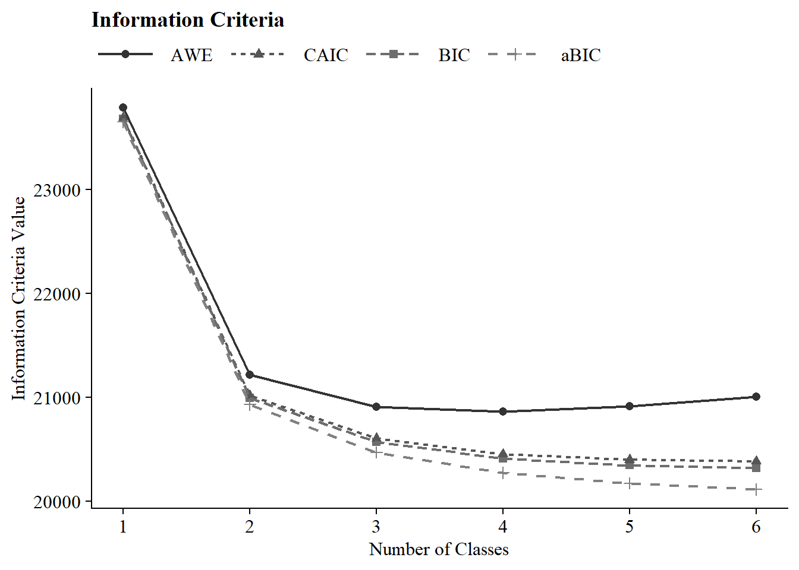

------------------------------------------------------------------------

#### Time 2


``` r
# Define the directory where all of the .out files are located.
output_dir <- here("three_lta", "phase_1","t2")

# Get all .out files
output_files <- list.files(output_dir, pattern = "\\.out$", full.names = TRUE)

# Process all .out files into one dataframe
final_data <- map_dfr(output_files, extract_mplus_info_extended)

# Extract Sample_Size from final_data
sample_size <- unique(final_data$Sample_Size)

output_enum_t2 <- readModels(here("three_lta", "phase_1","t2"), quiet = TRUE)
fit_table_lca(output_enum_t2, final_data)
```


```{=html}
<div id="ejyubsqbou" style="padding-left:0px;padding-right:0px;padding-top:10px;padding-bottom:10px;overflow-x:auto;overflow-y:auto;width:auto;height:auto;">
<style>#ejyubsqbou table {
  font-family: system-ui, 'Segoe UI', Roboto, Helvetica, Arial, sans-serif, 'Apple Color Emoji', 'Segoe UI Emoji', 'Segoe UI Symbol', 'Noto Color Emoji';
  -webkit-font-smoothing: antialiased;
  -moz-osx-font-smoothing: grayscale;
}

#ejyubsqbou thead, #ejyubsqbou tbody, #ejyubsqbou tfoot, #ejyubsqbou tr, #ejyubsqbou td, #ejyubsqbou th {
  border-style: none;
}

#ejyubsqbou p {
  margin: 0;
  padding: 0;
}

#ejyubsqbou .gt_table {
  display: table;
  border-collapse: collapse;
  line-height: normal;
  margin-left: auto;
  margin-right: auto;
  color: #333333;
  font-size: 16px;
  font-weight: normal;
  font-style: normal;
  background-color: #FFFFFF;
  width: auto;
  border-top-style: solid;
  border-top-width: 2px;
  border-top-color: #A8A8A8;
  border-right-style: none;
  border-right-width: 2px;
  border-right-color: #D3D3D3;
  border-bottom-style: solid;
  border-bottom-width: 2px;
  border-bottom-color: #A8A8A8;
  border-left-style: none;
  border-left-width: 2px;
  border-left-color: #D3D3D3;
}

#ejyubsqbou .gt_caption {
  padding-top: 4px;
  padding-bottom: 4px;
}

#ejyubsqbou .gt_title {
  color: #333333;
  font-size: 125%;
  font-weight: initial;
  padding-top: 4px;
  padding-bottom: 4px;
  padding-left: 5px;
  padding-right: 5px;
  border-bottom-color: #FFFFFF;
  border-bottom-width: 0;
}

#ejyubsqbou .gt_subtitle {
  color: #333333;
  font-size: 85%;
  font-weight: initial;
  padding-top: 3px;
  padding-bottom: 5px;
  padding-left: 5px;
  padding-right: 5px;
  border-top-color: #FFFFFF;
  border-top-width: 0;
}

#ejyubsqbou .gt_heading {
  background-color: #FFFFFF;
  text-align: center;
  border-bottom-color: #FFFFFF;
  border-left-style: none;
  border-left-width: 1px;
  border-left-color: #D3D3D3;
  border-right-style: none;
  border-right-width: 1px;
  border-right-color: #D3D3D3;
}

#ejyubsqbou .gt_bottom_border {
  border-bottom-style: solid;
  border-bottom-width: 2px;
  border-bottom-color: #D3D3D3;
}

#ejyubsqbou .gt_col_headings {
  border-top-style: solid;
  border-top-width: 2px;
  border-top-color: #D3D3D3;
  border-bottom-style: solid;
  border-bottom-width: 2px;
  border-bottom-color: #D3D3D3;
  border-left-style: none;
  border-left-width: 1px;
  border-left-color: #D3D3D3;
  border-right-style: none;
  border-right-width: 1px;
  border-right-color: #D3D3D3;
}

#ejyubsqbou .gt_col_heading {
  color: #333333;
  background-color: #FFFFFF;
  font-size: 100%;
  font-weight: bold;
  text-transform: inherit;
  border-left-style: none;
  border-left-width: 1px;
  border-left-color: #D3D3D3;
  border-right-style: none;
  border-right-width: 1px;
  border-right-color: #D3D3D3;
  vertical-align: bottom;
  padding-top: 5px;
  padding-bottom: 6px;
  padding-left: 5px;
  padding-right: 5px;
  overflow-x: hidden;
}

#ejyubsqbou .gt_column_spanner_outer {
  color: #333333;
  background-color: #FFFFFF;
  font-size: 100%;
  font-weight: bold;
  text-transform: inherit;
  padding-top: 0;
  padding-bottom: 0;
  padding-left: 4px;
  padding-right: 4px;
}

#ejyubsqbou .gt_column_spanner_outer:first-child {
  padding-left: 0;
}

#ejyubsqbou .gt_column_spanner_outer:last-child {
  padding-right: 0;
}

#ejyubsqbou .gt_column_spanner {
  border-bottom-style: solid;
  border-bottom-width: 2px;
  border-bottom-color: #D3D3D3;
  vertical-align: bottom;
  padding-top: 5px;
  padding-bottom: 5px;
  overflow-x: hidden;
  display: inline-block;
  width: 100%;
}

#ejyubsqbou .gt_spanner_row {
  border-bottom-style: hidden;
}

#ejyubsqbou .gt_group_heading {
  padding-top: 8px;
  padding-bottom: 8px;
  padding-left: 5px;
  padding-right: 5px;
  color: #333333;
  background-color: #FFFFFF;
  font-size: 100%;
  font-weight: initial;
  text-transform: inherit;
  border-top-style: solid;
  border-top-width: 2px;
  border-top-color: #D3D3D3;
  border-bottom-style: solid;
  border-bottom-width: 2px;
  border-bottom-color: #D3D3D3;
  border-left-style: none;
  border-left-width: 1px;
  border-left-color: #D3D3D3;
  border-right-style: none;
  border-right-width: 1px;
  border-right-color: #D3D3D3;
  vertical-align: middle;
  text-align: left;
}

#ejyubsqbou .gt_empty_group_heading {
  padding: 0.5px;
  color: #333333;
  background-color: #FFFFFF;
  font-size: 100%;
  font-weight: initial;
  border-top-style: solid;
  border-top-width: 2px;
  border-top-color: #D3D3D3;
  border-bottom-style: solid;
  border-bottom-width: 2px;
  border-bottom-color: #D3D3D3;
  vertical-align: middle;
}

#ejyubsqbou .gt_from_md > :first-child {
  margin-top: 0;
}

#ejyubsqbou .gt_from_md > :last-child {
  margin-bottom: 0;
}

#ejyubsqbou .gt_row {
  padding-top: 8px;
  padding-bottom: 8px;
  padding-left: 5px;
  padding-right: 5px;
  margin: 10px;
  border-top-style: solid;
  border-top-width: 1px;
  border-top-color: #D3D3D3;
  border-left-style: none;
  border-left-width: 1px;
  border-left-color: #D3D3D3;
  border-right-style: none;
  border-right-width: 1px;
  border-right-color: #D3D3D3;
  vertical-align: middle;
  overflow-x: hidden;
}

#ejyubsqbou .gt_stub {
  color: #333333;
  background-color: #FFFFFF;
  font-size: 100%;
  font-weight: initial;
  text-transform: inherit;
  border-right-style: solid;
  border-right-width: 2px;
  border-right-color: #D3D3D3;
  padding-left: 5px;
  padding-right: 5px;
}

#ejyubsqbou .gt_stub_row_group {
  color: #333333;
  background-color: #FFFFFF;
  font-size: 100%;
  font-weight: initial;
  text-transform: inherit;
  border-right-style: solid;
  border-right-width: 2px;
  border-right-color: #D3D3D3;
  padding-left: 5px;
  padding-right: 5px;
  vertical-align: top;
}

#ejyubsqbou .gt_row_group_first td {
  border-top-width: 2px;
}

#ejyubsqbou .gt_row_group_first th {
  border-top-width: 2px;
}

#ejyubsqbou .gt_summary_row {
  color: #333333;
  background-color: #FFFFFF;
  text-transform: inherit;
  padding-top: 8px;
  padding-bottom: 8px;
  padding-left: 5px;
  padding-right: 5px;
}

#ejyubsqbou .gt_first_summary_row {
  border-top-style: solid;
  border-top-color: #D3D3D3;
}

#ejyubsqbou .gt_first_summary_row.thick {
  border-top-width: 2px;
}

#ejyubsqbou .gt_last_summary_row {
  padding-top: 8px;
  padding-bottom: 8px;
  padding-left: 5px;
  padding-right: 5px;
  border-bottom-style: solid;
  border-bottom-width: 2px;
  border-bottom-color: #D3D3D3;
}

#ejyubsqbou .gt_grand_summary_row {
  color: #333333;
  background-color: #FFFFFF;
  text-transform: inherit;
  padding-top: 8px;
  padding-bottom: 8px;
  padding-left: 5px;
  padding-right: 5px;
}

#ejyubsqbou .gt_first_grand_summary_row {
  padding-top: 8px;
  padding-bottom: 8px;
  padding-left: 5px;
  padding-right: 5px;
  border-top-style: double;
  border-top-width: 6px;
  border-top-color: #D3D3D3;
}

#ejyubsqbou .gt_last_grand_summary_row_top {
  padding-top: 8px;
  padding-bottom: 8px;
  padding-left: 5px;
  padding-right: 5px;
  border-bottom-style: double;
  border-bottom-width: 6px;
  border-bottom-color: #D3D3D3;
}

#ejyubsqbou .gt_striped {
  background-color: rgba(128, 128, 128, 0.05);
}

#ejyubsqbou .gt_table_body {
  border-top-style: solid;
  border-top-width: 2px;
  border-top-color: #D3D3D3;
  border-bottom-style: solid;
  border-bottom-width: 2px;
  border-bottom-color: #D3D3D3;
}

#ejyubsqbou .gt_footnotes {
  color: #333333;
  background-color: #FFFFFF;
  border-bottom-style: none;
  border-bottom-width: 2px;
  border-bottom-color: #D3D3D3;
  border-left-style: none;
  border-left-width: 2px;
  border-left-color: #D3D3D3;
  border-right-style: none;
  border-right-width: 2px;
  border-right-color: #D3D3D3;
}

#ejyubsqbou .gt_footnote {
  margin: 0px;
  font-size: 90%;
  padding-top: 4px;
  padding-bottom: 4px;
  padding-left: 5px;
  padding-right: 5px;
}

#ejyubsqbou .gt_sourcenotes {
  color: #333333;
  background-color: #FFFFFF;
  border-bottom-style: none;
  border-bottom-width: 2px;
  border-bottom-color: #D3D3D3;
  border-left-style: none;
  border-left-width: 2px;
  border-left-color: #D3D3D3;
  border-right-style: none;
  border-right-width: 2px;
  border-right-color: #D3D3D3;
}

#ejyubsqbou .gt_sourcenote {
  font-size: 90%;
  padding-top: 4px;
  padding-bottom: 4px;
  padding-left: 5px;
  padding-right: 5px;
}

#ejyubsqbou .gt_left {
  text-align: left;
}

#ejyubsqbou .gt_center {
  text-align: center;
}

#ejyubsqbou .gt_right {
  text-align: right;
  font-variant-numeric: tabular-nums;
}

#ejyubsqbou .gt_font_normal {
  font-weight: normal;
}

#ejyubsqbou .gt_font_bold {
  font-weight: bold;
}

#ejyubsqbou .gt_font_italic {
  font-style: italic;
}

#ejyubsqbou .gt_super {
  font-size: 65%;
}

#ejyubsqbou .gt_footnote_marks {
  font-size: 75%;
  vertical-align: 0.4em;
  position: initial;
}

#ejyubsqbou .gt_asterisk {
  font-size: 100%;
  vertical-align: 0;
}

#ejyubsqbou .gt_indent_1 {
  text-indent: 5px;
}

#ejyubsqbou .gt_indent_2 {
  text-indent: 10px;
}

#ejyubsqbou .gt_indent_3 {
  text-indent: 15px;
}

#ejyubsqbou .gt_indent_4 {
  text-indent: 20px;
}

#ejyubsqbou .gt_indent_5 {
  text-indent: 25px;
}

#ejyubsqbou .katex-display {
  display: inline-flex !important;
  margin-bottom: 0.75em !important;
}

#ejyubsqbou div.Reactable > div.rt-table > div.rt-thead > div.rt-tr.rt-tr-group-header > div.rt-th-group:after {
  height: 0px !important;
}
</style>
<table class="gt_table" data-quarto-disable-processing="false" data-quarto-bootstrap="false">
  <thead>
    <tr class="gt_heading">
      <td colspan="12" class="gt_heading gt_title gt_font_normal gt_bottom_border" style><span class='gt_from_md'><strong>Model Fit Summary Table</strong></span><span class="gt_footnote_marks" style="white-space:nowrap;font-style:italic;font-weight:normal;line-height:0;"><sup>1</sup></span></td>
    </tr>
    
    <tr class="gt_col_headings gt_spanner_row">
      <th class="gt_col_heading gt_columns_bottom_border gt_center" rowspan="2" colspan="1" scope="col" id="Title">Classes</th>
      <th class="gt_col_heading gt_columns_bottom_border gt_center" rowspan="2" colspan="1" scope="col" id="Parameters"><span class='gt_from_md'>Par</span></th>
      <th class="gt_col_heading gt_columns_bottom_border gt_center" rowspan="2" colspan="1" scope="col" id="LL"><span class='gt_from_md'><em>LL</em></span></th>
      <th class="gt_col_heading gt_columns_bottom_border gt_center" rowspan="2" colspan="1" scope="col" id="Perc_Convergence">% Converged</th>
      <th class="gt_col_heading gt_columns_bottom_border gt_center" rowspan="2" colspan="1" scope="col" id="Replicated_LL_Perc">% Replicated</th>
      <th class="gt_center gt_columns_top_border gt_column_spanner_outer" rowspan="1" colspan="4" scope="colgroup" id="Model Fit Indices">
        <div class="gt_column_spanner">Model Fit Indices</div>
      </th>
      <th class="gt_center gt_columns_top_border gt_column_spanner_outer" rowspan="1" colspan="2" scope="colgroup" id="LRTs">
        <div class="gt_column_spanner">LRTs</div>
      </th>
      <th class="gt_center gt_columns_top_border gt_column_spanner_outer" rowspan="1" colspan="1" scope="col" id="Smallest Class">
        <div class="gt_column_spanner"><span class='gt_from_md'>Smallest Class</span></div>
      </th>
    </tr>
    <tr class="gt_col_headings">
      <th class="gt_col_heading gt_columns_bottom_border gt_center" rowspan="1" colspan="1" scope="col" id="BIC">BIC</th>
      <th class="gt_col_heading gt_columns_bottom_border gt_center" rowspan="1" colspan="1" scope="col" id="aBIC">aBIC</th>
      <th class="gt_col_heading gt_columns_bottom_border gt_center" rowspan="1" colspan="1" scope="col" id="CAIC">CAIC</th>
      <th class="gt_col_heading gt_columns_bottom_border gt_center" rowspan="1" colspan="1" scope="col" id="AWE">AWE</th>
      <th class="gt_col_heading gt_columns_bottom_border gt_center" rowspan="1" colspan="1" scope="col" id="T11_VLMR_PValue">VLMR</th>
      <th class="gt_col_heading gt_columns_bottom_border gt_center" rowspan="1" colspan="1" scope="col" id="BLRT_PValue">BLRT</th>
      <th class="gt_col_heading gt_columns_bottom_border gt_center" rowspan="1" colspan="1" scope="col" id="Smallest_Class_Combined">n (%)</th>
    </tr>
  </thead>
  <tbody class="gt_table_body">
    <tr><td headers="Title" class="gt_row gt_center">Class 1 Time 2</td>
<td headers="Parameters" class="gt_row gt_center">10</td>
<td headers="LL" class="gt_row gt_center">−10,072.93</td>
<td headers="Perc_Convergence" class="gt_row gt_center">100%</td>
<td headers="Replicated_LL_Perc" class="gt_row gt_center">100%</td>
<td headers="BIC" class="gt_row gt_center">20,219.21</td>
<td headers="aBIC" class="gt_row gt_center">20,187.44</td>
<td headers="CAIC" class="gt_row gt_center">20,229.21</td>
<td headers="AWE" class="gt_row gt_center">20,322.56</td>
<td headers="T11_VLMR_PValue" class="gt_row gt_center">–</td>
<td headers="BLRT_PValue" class="gt_row gt_center">–</td>
<td headers="Smallest_Class_Combined" class="gt_row gt_center">1534 (100%)</td></tr>
    <tr><td headers="Title" class="gt_row gt_center">Class 2 Time 2</td>
<td headers="Parameters" class="gt_row gt_center">21</td>
<td headers="LL" class="gt_row gt_center">−8,428.38</td>
<td headers="Perc_Convergence" class="gt_row gt_center">100%</td>
<td headers="Replicated_LL_Perc" class="gt_row gt_center">100%</td>
<td headers="BIC" class="gt_row gt_center">17,010.82</td>
<td headers="aBIC" class="gt_row gt_center">16,944.10</td>
<td headers="CAIC" class="gt_row gt_center">17,031.82</td>
<td headers="AWE" class="gt_row gt_center">17,227.86</td>
<td headers="T11_VLMR_PValue" class="gt_row gt_center"><.001</td>
<td headers="BLRT_PValue" class="gt_row gt_center"><.001</td>
<td headers="Smallest_Class_Combined" class="gt_row gt_center">658 (42.9%)</td></tr>
    <tr><td headers="Title" class="gt_row gt_center">Class 3 Time 2</td>
<td headers="Parameters" class="gt_row gt_center">32</td>
<td headers="LL" class="gt_row gt_center">−8,067.61</td>
<td headers="Perc_Convergence" class="gt_row gt_center">53%</td>
<td headers="Replicated_LL_Perc" class="gt_row gt_center">100%</td>
<td headers="BIC" class="gt_row gt_center">16,369.96</td>
<td headers="aBIC" class="gt_row gt_center">16,268.31</td>
<td headers="CAIC" class="gt_row gt_center">16,401.96</td>
<td headers="AWE" class="gt_row gt_center">16,700.70</td>
<td headers="T11_VLMR_PValue" class="gt_row gt_center"><.001</td>
<td headers="BLRT_PValue" class="gt_row gt_center"><.001</td>
<td headers="Smallest_Class_Combined" class="gt_row gt_center">297 (19.4%)</td></tr>
    <tr><td headers="Title" class="gt_row gt_center">Class 4 Time 2</td>
<td headers="Parameters" class="gt_row gt_center">43</td>
<td headers="LL" class="gt_row gt_center">−7,905.53</td>
<td headers="Perc_Convergence" class="gt_row gt_center">39%</td>
<td headers="Replicated_LL_Perc" class="gt_row gt_center">100%</td>
<td headers="BIC" class="gt_row gt_center">16,126.50</td>
<td headers="aBIC" class="gt_row gt_center">15,989.90</td>
<td headers="CAIC" class="gt_row gt_center">16,169.50</td>
<td headers="AWE" class="gt_row gt_center" style="font-weight: bold;">16,570.93</td>
<td headers="T11_VLMR_PValue" class="gt_row gt_center"><.001</td>
<td headers="BLRT_PValue" class="gt_row gt_center"><.001</td>
<td headers="Smallest_Class_Combined" class="gt_row gt_center">290 (18.9%)</td></tr>
    <tr><td headers="Title" class="gt_row gt_center">Class 5 Time 2</td>
<td headers="Parameters" class="gt_row gt_center">54</td>
<td headers="LL" class="gt_row gt_center">−7,845.44</td>
<td headers="Perc_Convergence" class="gt_row gt_center">82%</td>
<td headers="Replicated_LL_Perc" class="gt_row gt_center">100%</td>
<td headers="BIC" class="gt_row gt_center" style="font-weight: bold;">16,087.01</td>
<td headers="aBIC" class="gt_row gt_center">15,915.46</td>
<td headers="CAIC" class="gt_row gt_center" style="font-weight: bold;">16,141.01</td>
<td headers="AWE" class="gt_row gt_center">16,645.13</td>
<td headers="T11_VLMR_PValue" class="gt_row gt_center">0.01</td>
<td headers="BLRT_PValue" class="gt_row gt_center"><.001</td>
<td headers="Smallest_Class_Combined" class="gt_row gt_center">220 (14.3%)</td></tr>
    <tr><td headers="Title" class="gt_row gt_center">Class 6 Time 2</td>
<td headers="Parameters" class="gt_row gt_center">65</td>
<td headers="LL" class="gt_row gt_center">−7,806.99</td>
<td headers="Perc_Convergence" class="gt_row gt_center">44%</td>
<td headers="Replicated_LL_Perc" class="gt_row gt_center">36%</td>
<td headers="BIC" class="gt_row gt_center">16,090.79</td>
<td headers="aBIC" class="gt_row gt_center" style="font-weight: bold;">15,884.30</td>
<td headers="CAIC" class="gt_row gt_center">16,155.79</td>
<td headers="AWE" class="gt_row gt_center">16,762.61</td>
<td headers="T11_VLMR_PValue" class="gt_row gt_center">0.02</td>
<td headers="BLRT_PValue" class="gt_row gt_center"><.001</td>
<td headers="Smallest_Class_Combined" class="gt_row gt_center">130 (8.5%)</td></tr>
  </tbody>
  <tfoot>
    <tr class="gt_footnotes">
      <td class="gt_footnote" colspan="12"><span class="gt_footnote_marks" style="white-space:nowrap;font-style:italic;font-weight:normal;line-height:0;"><sup>1</sup></span> <span class='gt_from_md'><em>Note.</em> Par = Parameters; <em>LL</em> = model log likelihood;
BIC = Bayesian information criterion;
aBIC = sample size adjusted BIC; CAIC = consistent Akaike information criterion;
AWE = approximate weight of evidence criterion;
BLRT = bootstrapped likelihood ratio test p-value;
VLMR = Vuong-Lo-Mendell-Rubin adjusted likelihood ratio test p-value;
<em>cmPk</em> = approximate correct model probability.</span></td>
    </tr>
  </tfoot>
</table>
</div>
```


------------------------------------------------------------------------

IC Plot


``` r
source(here("functions","ic_plot_lca.R"))
ic_plot(output_enum_t2)
```

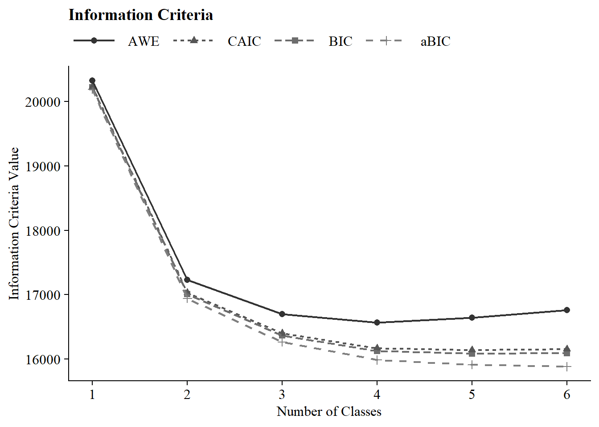

------------------------------------------------------------------------

#### Time 3


``` r
# Define the directory where all of the .out files are located.
output_dir <- here("three_lta", "phase_1","t3")

# Get all .out files
output_files <- list.files(output_dir, pattern = "\\.out$", full.names = TRUE)

# Process all .out files into one dataframe
final_data <- map_dfr(output_files, extract_mplus_info_extended)

# Extract Sample_Size from final_data
sample_size <- unique(final_data$Sample_Size)

output_enum_t3 <- readModels(here("three_lta", "phase_1","t3"), quiet = TRUE)
fit_table_lca(output_enum_t3, final_data)
```


```{=html}
<div id="epnucgnnfw" style="padding-left:0px;padding-right:0px;padding-top:10px;padding-bottom:10px;overflow-x:auto;overflow-y:auto;width:auto;height:auto;">
<style>#epnucgnnfw table {
  font-family: system-ui, 'Segoe UI', Roboto, Helvetica, Arial, sans-serif, 'Apple Color Emoji', 'Segoe UI Emoji', 'Segoe UI Symbol', 'Noto Color Emoji';
  -webkit-font-smoothing: antialiased;
  -moz-osx-font-smoothing: grayscale;
}

#epnucgnnfw thead, #epnucgnnfw tbody, #epnucgnnfw tfoot, #epnucgnnfw tr, #epnucgnnfw td, #epnucgnnfw th {
  border-style: none;
}

#epnucgnnfw p {
  margin: 0;
  padding: 0;
}

#epnucgnnfw .gt_table {
  display: table;
  border-collapse: collapse;
  line-height: normal;
  margin-left: auto;
  margin-right: auto;
  color: #333333;
  font-size: 16px;
  font-weight: normal;
  font-style: normal;
  background-color: #FFFFFF;
  width: auto;
  border-top-style: solid;
  border-top-width: 2px;
  border-top-color: #A8A8A8;
  border-right-style: none;
  border-right-width: 2px;
  border-right-color: #D3D3D3;
  border-bottom-style: solid;
  border-bottom-width: 2px;
  border-bottom-color: #A8A8A8;
  border-left-style: none;
  border-left-width: 2px;
  border-left-color: #D3D3D3;
}

#epnucgnnfw .gt_caption {
  padding-top: 4px;
  padding-bottom: 4px;
}

#epnucgnnfw .gt_title {
  color: #333333;
  font-size: 125%;
  font-weight: initial;
  padding-top: 4px;
  padding-bottom: 4px;
  padding-left: 5px;
  padding-right: 5px;
  border-bottom-color: #FFFFFF;
  border-bottom-width: 0;
}

#epnucgnnfw .gt_subtitle {
  color: #333333;
  font-size: 85%;
  font-weight: initial;
  padding-top: 3px;
  padding-bottom: 5px;
  padding-left: 5px;
  padding-right: 5px;
  border-top-color: #FFFFFF;
  border-top-width: 0;
}

#epnucgnnfw .gt_heading {
  background-color: #FFFFFF;
  text-align: center;
  border-bottom-color: #FFFFFF;
  border-left-style: none;
  border-left-width: 1px;
  border-left-color: #D3D3D3;
  border-right-style: none;
  border-right-width: 1px;
  border-right-color: #D3D3D3;
}

#epnucgnnfw .gt_bottom_border {
  border-bottom-style: solid;
  border-bottom-width: 2px;
  border-bottom-color: #D3D3D3;
}

#epnucgnnfw .gt_col_headings {
  border-top-style: solid;
  border-top-width: 2px;
  border-top-color: #D3D3D3;
  border-bottom-style: solid;
  border-bottom-width: 2px;
  border-bottom-color: #D3D3D3;
  border-left-style: none;
  border-left-width: 1px;
  border-left-color: #D3D3D3;
  border-right-style: none;
  border-right-width: 1px;
  border-right-color: #D3D3D3;
}

#epnucgnnfw .gt_col_heading {
  color: #333333;
  background-color: #FFFFFF;
  font-size: 100%;
  font-weight: bold;
  text-transform: inherit;
  border-left-style: none;
  border-left-width: 1px;
  border-left-color: #D3D3D3;
  border-right-style: none;
  border-right-width: 1px;
  border-right-color: #D3D3D3;
  vertical-align: bottom;
  padding-top: 5px;
  padding-bottom: 6px;
  padding-left: 5px;
  padding-right: 5px;
  overflow-x: hidden;
}

#epnucgnnfw .gt_column_spanner_outer {
  color: #333333;
  background-color: #FFFFFF;
  font-size: 100%;
  font-weight: bold;
  text-transform: inherit;
  padding-top: 0;
  padding-bottom: 0;
  padding-left: 4px;
  padding-right: 4px;
}

#epnucgnnfw .gt_column_spanner_outer:first-child {
  padding-left: 0;
}

#epnucgnnfw .gt_column_spanner_outer:last-child {
  padding-right: 0;
}

#epnucgnnfw .gt_column_spanner {
  border-bottom-style: solid;
  border-bottom-width: 2px;
  border-bottom-color: #D3D3D3;
  vertical-align: bottom;
  padding-top: 5px;
  padding-bottom: 5px;
  overflow-x: hidden;
  display: inline-block;
  width: 100%;
}

#epnucgnnfw .gt_spanner_row {
  border-bottom-style: hidden;
}

#epnucgnnfw .gt_group_heading {
  padding-top: 8px;
  padding-bottom: 8px;
  padding-left: 5px;
  padding-right: 5px;
  color: #333333;
  background-color: #FFFFFF;
  font-size: 100%;
  font-weight: initial;
  text-transform: inherit;
  border-top-style: solid;
  border-top-width: 2px;
  border-top-color: #D3D3D3;
  border-bottom-style: solid;
  border-bottom-width: 2px;
  border-bottom-color: #D3D3D3;
  border-left-style: none;
  border-left-width: 1px;
  border-left-color: #D3D3D3;
  border-right-style: none;
  border-right-width: 1px;
  border-right-color: #D3D3D3;
  vertical-align: middle;
  text-align: left;
}

#epnucgnnfw .gt_empty_group_heading {
  padding: 0.5px;
  color: #333333;
  background-color: #FFFFFF;
  font-size: 100%;
  font-weight: initial;
  border-top-style: solid;
  border-top-width: 2px;
  border-top-color: #D3D3D3;
  border-bottom-style: solid;
  border-bottom-width: 2px;
  border-bottom-color: #D3D3D3;
  vertical-align: middle;
}

#epnucgnnfw .gt_from_md > :first-child {
  margin-top: 0;
}

#epnucgnnfw .gt_from_md > :last-child {
  margin-bottom: 0;
}

#epnucgnnfw .gt_row {
  padding-top: 8px;
  padding-bottom: 8px;
  padding-left: 5px;
  padding-right: 5px;
  margin: 10px;
  border-top-style: solid;
  border-top-width: 1px;
  border-top-color: #D3D3D3;
  border-left-style: none;
  border-left-width: 1px;
  border-left-color: #D3D3D3;
  border-right-style: none;
  border-right-width: 1px;
  border-right-color: #D3D3D3;
  vertical-align: middle;
  overflow-x: hidden;
}

#epnucgnnfw .gt_stub {
  color: #333333;
  background-color: #FFFFFF;
  font-size: 100%;
  font-weight: initial;
  text-transform: inherit;
  border-right-style: solid;
  border-right-width: 2px;
  border-right-color: #D3D3D3;
  padding-left: 5px;
  padding-right: 5px;
}

#epnucgnnfw .gt_stub_row_group {
  color: #333333;
  background-color: #FFFFFF;
  font-size: 100%;
  font-weight: initial;
  text-transform: inherit;
  border-right-style: solid;
  border-right-width: 2px;
  border-right-color: #D3D3D3;
  padding-left: 5px;
  padding-right: 5px;
  vertical-align: top;
}

#epnucgnnfw .gt_row_group_first td {
  border-top-width: 2px;
}

#epnucgnnfw .gt_row_group_first th {
  border-top-width: 2px;
}

#epnucgnnfw .gt_summary_row {
  color: #333333;
  background-color: #FFFFFF;
  text-transform: inherit;
  padding-top: 8px;
  padding-bottom: 8px;
  padding-left: 5px;
  padding-right: 5px;
}

#epnucgnnfw .gt_first_summary_row {
  border-top-style: solid;
  border-top-color: #D3D3D3;
}

#epnucgnnfw .gt_first_summary_row.thick {
  border-top-width: 2px;
}

#epnucgnnfw .gt_last_summary_row {
  padding-top: 8px;
  padding-bottom: 8px;
  padding-left: 5px;
  padding-right: 5px;
  border-bottom-style: solid;
  border-bottom-width: 2px;
  border-bottom-color: #D3D3D3;
}

#epnucgnnfw .gt_grand_summary_row {
  color: #333333;
  background-color: #FFFFFF;
  text-transform: inherit;
  padding-top: 8px;
  padding-bottom: 8px;
  padding-left: 5px;
  padding-right: 5px;
}

#epnucgnnfw .gt_first_grand_summary_row {
  padding-top: 8px;
  padding-bottom: 8px;
  padding-left: 5px;
  padding-right: 5px;
  border-top-style: double;
  border-top-width: 6px;
  border-top-color: #D3D3D3;
}

#epnucgnnfw .gt_last_grand_summary_row_top {
  padding-top: 8px;
  padding-bottom: 8px;
  padding-left: 5px;
  padding-right: 5px;
  border-bottom-style: double;
  border-bottom-width: 6px;
  border-bottom-color: #D3D3D3;
}

#epnucgnnfw .gt_striped {
  background-color: rgba(128, 128, 128, 0.05);
}

#epnucgnnfw .gt_table_body {
  border-top-style: solid;
  border-top-width: 2px;
  border-top-color: #D3D3D3;
  border-bottom-style: solid;
  border-bottom-width: 2px;
  border-bottom-color: #D3D3D3;
}

#epnucgnnfw .gt_footnotes {
  color: #333333;
  background-color: #FFFFFF;
  border-bottom-style: none;
  border-bottom-width: 2px;
  border-bottom-color: #D3D3D3;
  border-left-style: none;
  border-left-width: 2px;
  border-left-color: #D3D3D3;
  border-right-style: none;
  border-right-width: 2px;
  border-right-color: #D3D3D3;
}

#epnucgnnfw .gt_footnote {
  margin: 0px;
  font-size: 90%;
  padding-top: 4px;
  padding-bottom: 4px;
  padding-left: 5px;
  padding-right: 5px;
}

#epnucgnnfw .gt_sourcenotes {
  color: #333333;
  background-color: #FFFFFF;
  border-bottom-style: none;
  border-bottom-width: 2px;
  border-bottom-color: #D3D3D3;
  border-left-style: none;
  border-left-width: 2px;
  border-left-color: #D3D3D3;
  border-right-style: none;
  border-right-width: 2px;
  border-right-color: #D3D3D3;
}

#epnucgnnfw .gt_sourcenote {
  font-size: 90%;
  padding-top: 4px;
  padding-bottom: 4px;
  padding-left: 5px;
  padding-right: 5px;
}

#epnucgnnfw .gt_left {
  text-align: left;
}

#epnucgnnfw .gt_center {
  text-align: center;
}

#epnucgnnfw .gt_right {
  text-align: right;
  font-variant-numeric: tabular-nums;
}

#epnucgnnfw .gt_font_normal {
  font-weight: normal;
}

#epnucgnnfw .gt_font_bold {
  font-weight: bold;
}

#epnucgnnfw .gt_font_italic {
  font-style: italic;
}

#epnucgnnfw .gt_super {
  font-size: 65%;
}

#epnucgnnfw .gt_footnote_marks {
  font-size: 75%;
  vertical-align: 0.4em;
  position: initial;
}

#epnucgnnfw .gt_asterisk {
  font-size: 100%;
  vertical-align: 0;
}

#epnucgnnfw .gt_indent_1 {
  text-indent: 5px;
}

#epnucgnnfw .gt_indent_2 {
  text-indent: 10px;
}

#epnucgnnfw .gt_indent_3 {
  text-indent: 15px;
}

#epnucgnnfw .gt_indent_4 {
  text-indent: 20px;
}

#epnucgnnfw .gt_indent_5 {
  text-indent: 25px;
}

#epnucgnnfw .katex-display {
  display: inline-flex !important;
  margin-bottom: 0.75em !important;
}

#epnucgnnfw div.Reactable > div.rt-table > div.rt-thead > div.rt-tr.rt-tr-group-header > div.rt-th-group:after {
  height: 0px !important;
}
</style>
<table class="gt_table" data-quarto-disable-processing="false" data-quarto-bootstrap="false">
  <thead>
    <tr class="gt_heading">
      <td colspan="12" class="gt_heading gt_title gt_font_normal gt_bottom_border" style><span class='gt_from_md'><strong>Model Fit Summary Table</strong></span><span class="gt_footnote_marks" style="white-space:nowrap;font-style:italic;font-weight:normal;line-height:0;"><sup>1</sup></span></td>
    </tr>
    
    <tr class="gt_col_headings gt_spanner_row">
      <th class="gt_col_heading gt_columns_bottom_border gt_center" rowspan="2" colspan="1" scope="col" id="Title">Classes</th>
      <th class="gt_col_heading gt_columns_bottom_border gt_center" rowspan="2" colspan="1" scope="col" id="Parameters"><span class='gt_from_md'>Par</span></th>
      <th class="gt_col_heading gt_columns_bottom_border gt_center" rowspan="2" colspan="1" scope="col" id="LL"><span class='gt_from_md'><em>LL</em></span></th>
      <th class="gt_col_heading gt_columns_bottom_border gt_center" rowspan="2" colspan="1" scope="col" id="Perc_Convergence">% Converged</th>
      <th class="gt_col_heading gt_columns_bottom_border gt_center" rowspan="2" colspan="1" scope="col" id="Replicated_LL_Perc">% Replicated</th>
      <th class="gt_center gt_columns_top_border gt_column_spanner_outer" rowspan="1" colspan="4" scope="colgroup" id="Model Fit Indices">
        <div class="gt_column_spanner">Model Fit Indices</div>
      </th>
      <th class="gt_center gt_columns_top_border gt_column_spanner_outer" rowspan="1" colspan="2" scope="colgroup" id="LRTs">
        <div class="gt_column_spanner">LRTs</div>
      </th>
      <th class="gt_center gt_columns_top_border gt_column_spanner_outer" rowspan="1" colspan="1" scope="col" id="Smallest Class">
        <div class="gt_column_spanner"><span class='gt_from_md'>Smallest Class</span></div>
      </th>
    </tr>
    <tr class="gt_col_headings">
      <th class="gt_col_heading gt_columns_bottom_border gt_center" rowspan="1" colspan="1" scope="col" id="BIC">BIC</th>
      <th class="gt_col_heading gt_columns_bottom_border gt_center" rowspan="1" colspan="1" scope="col" id="aBIC">aBIC</th>
      <th class="gt_col_heading gt_columns_bottom_border gt_center" rowspan="1" colspan="1" scope="col" id="CAIC">CAIC</th>
      <th class="gt_col_heading gt_columns_bottom_border gt_center" rowspan="1" colspan="1" scope="col" id="AWE">AWE</th>
      <th class="gt_col_heading gt_columns_bottom_border gt_center" rowspan="1" colspan="1" scope="col" id="T11_VLMR_PValue">VLMR</th>
      <th class="gt_col_heading gt_columns_bottom_border gt_center" rowspan="1" colspan="1" scope="col" id="BLRT_PValue">BLRT</th>
      <th class="gt_col_heading gt_columns_bottom_border gt_center" rowspan="1" colspan="1" scope="col" id="Smallest_Class_Combined">n (%)</th>
    </tr>
  </thead>
  <tbody class="gt_table_body">
    <tr><td headers="Title" class="gt_row gt_center">Class 1 Time 3</td>
<td headers="Parameters" class="gt_row gt_center">10</td>
<td headers="LL" class="gt_row gt_center">−7,349.13</td>
<td headers="Perc_Convergence" class="gt_row gt_center">100%</td>
<td headers="Replicated_LL_Perc" class="gt_row gt_center">100%</td>
<td headers="BIC" class="gt_row gt_center">14,768.49</td>
<td headers="aBIC" class="gt_row gt_center">14,736.72</td>
<td headers="CAIC" class="gt_row gt_center">14,778.49</td>
<td headers="AWE" class="gt_row gt_center">14,868.72</td>
<td headers="T11_VLMR_PValue" class="gt_row gt_center">–</td>
<td headers="BLRT_PValue" class="gt_row gt_center">–</td>
<td headers="Smallest_Class_Combined" class="gt_row gt_center">1122 (100%)</td></tr>
    <tr><td headers="Title" class="gt_row gt_center">Class 2 Time 3</td>
<td headers="Parameters" class="gt_row gt_center">21</td>
<td headers="LL" class="gt_row gt_center">−5,976.60</td>
<td headers="Perc_Convergence" class="gt_row gt_center">100%</td>
<td headers="Replicated_LL_Perc" class="gt_row gt_center">100%</td>
<td headers="BIC" class="gt_row gt_center">12,100.68</td>
<td headers="aBIC" class="gt_row gt_center">12,033.98</td>
<td headers="CAIC" class="gt_row gt_center">12,121.68</td>
<td headers="AWE" class="gt_row gt_center">12,311.16</td>
<td headers="T11_VLMR_PValue" class="gt_row gt_center"><.001</td>
<td headers="BLRT_PValue" class="gt_row gt_center"><.001</td>
<td headers="Smallest_Class_Combined" class="gt_row gt_center">534 (47.5%)</td></tr>
    <tr><td headers="Title" class="gt_row gt_center">Class 3 Time 3</td>
<td headers="Parameters" class="gt_row gt_center">32</td>
<td headers="LL" class="gt_row gt_center">−5,670.60</td>
<td headers="Perc_Convergence" class="gt_row gt_center">98%</td>
<td headers="Replicated_LL_Perc" class="gt_row gt_center">99%</td>
<td headers="BIC" class="gt_row gt_center">11,565.92</td>
<td headers="aBIC" class="gt_row gt_center">11,464.28</td>
<td headers="CAIC" class="gt_row gt_center">11,597.92</td>
<td headers="AWE" class="gt_row gt_center">11,886.65</td>
<td headers="T11_VLMR_PValue" class="gt_row gt_center"><.001</td>
<td headers="BLRT_PValue" class="gt_row gt_center"><.001</td>
<td headers="Smallest_Class_Combined" class="gt_row gt_center">203 (18.1%)</td></tr>
    <tr><td headers="Title" class="gt_row gt_center">Class 4 Time 3</td>
<td headers="Parameters" class="gt_row gt_center">43</td>
<td headers="LL" class="gt_row gt_center">−5,543.62</td>
<td headers="Perc_Convergence" class="gt_row gt_center">36%</td>
<td headers="Replicated_LL_Perc" class="gt_row gt_center">97%</td>
<td headers="BIC" class="gt_row gt_center">11,389.22</td>
<td headers="aBIC" class="gt_row gt_center">11,252.64</td>
<td headers="CAIC" class="gt_row gt_center">11,432.22</td>
<td headers="AWE" class="gt_row gt_center" style="font-weight: bold;">11,820.20</td>
<td headers="T11_VLMR_PValue" class="gt_row gt_center">0.00</td>
<td headers="BLRT_PValue" class="gt_row gt_center"><.001</td>
<td headers="Smallest_Class_Combined" class="gt_row gt_center">219 (19.5%)</td></tr>
    <tr><td headers="Title" class="gt_row gt_center">Class 5 Time 3</td>
<td headers="Parameters" class="gt_row gt_center">54</td>
<td headers="LL" class="gt_row gt_center">−5,483.67</td>
<td headers="Perc_Convergence" class="gt_row gt_center">63%</td>
<td headers="Replicated_LL_Perc" class="gt_row gt_center">62%</td>
<td headers="BIC" class="gt_row gt_center">11,346.57</td>
<td headers="aBIC" class="gt_row gt_center">11,175.06</td>
<td headers="CAIC" class="gt_row gt_center" style="font-weight: bold;">11,400.57</td>
<td headers="AWE" class="gt_row gt_center">11,887.81</td>
<td headers="T11_VLMR_PValue" class="gt_row gt_center" style="font-weight: bold;">0.00</td>
<td headers="BLRT_PValue" class="gt_row gt_center"><.001</td>
<td headers="Smallest_Class_Combined" class="gt_row gt_center">131 (11.7%)</td></tr>
    <tr><td headers="Title" class="gt_row gt_center">Class 6 Time 3</td>
<td headers="Parameters" class="gt_row gt_center">65</td>
<td headers="LL" class="gt_row gt_center">−5,444.06</td>
<td headers="Perc_Convergence" class="gt_row gt_center">42%</td>
<td headers="Replicated_LL_Perc" class="gt_row gt_center">64%</td>
<td headers="BIC" class="gt_row gt_center" style="font-weight: bold;">11,344.60</td>
<td headers="aBIC" class="gt_row gt_center" style="font-weight: bold;">11,138.14</td>
<td headers="CAIC" class="gt_row gt_center">11,409.60</td>
<td headers="AWE" class="gt_row gt_center">11,996.08</td>
<td headers="T11_VLMR_PValue" class="gt_row gt_center">0.09</td>
<td headers="BLRT_PValue" class="gt_row gt_center"><.001</td>
<td headers="Smallest_Class_Combined" class="gt_row gt_center">81 (7.2%)</td></tr>
  </tbody>
  <tfoot>
    <tr class="gt_footnotes">
      <td class="gt_footnote" colspan="12"><span class="gt_footnote_marks" style="white-space:nowrap;font-style:italic;font-weight:normal;line-height:0;"><sup>1</sup></span> <span class='gt_from_md'><em>Note.</em> Par = Parameters; <em>LL</em> = model log likelihood;
BIC = Bayesian information criterion;
aBIC = sample size adjusted BIC; CAIC = consistent Akaike information criterion;
AWE = approximate weight of evidence criterion;
BLRT = bootstrapped likelihood ratio test p-value;
VLMR = Vuong-Lo-Mendell-Rubin adjusted likelihood ratio test p-value;
<em>cmPk</em> = approximate correct model probability.</span></td>
    </tr>
  </tfoot>
</table>
</div>
```


------------------------------------------------------------------------

IC Plot


``` r
source(here("functions","ic_plot_lca.R"))
ic_plot(output_enum_t3)
```

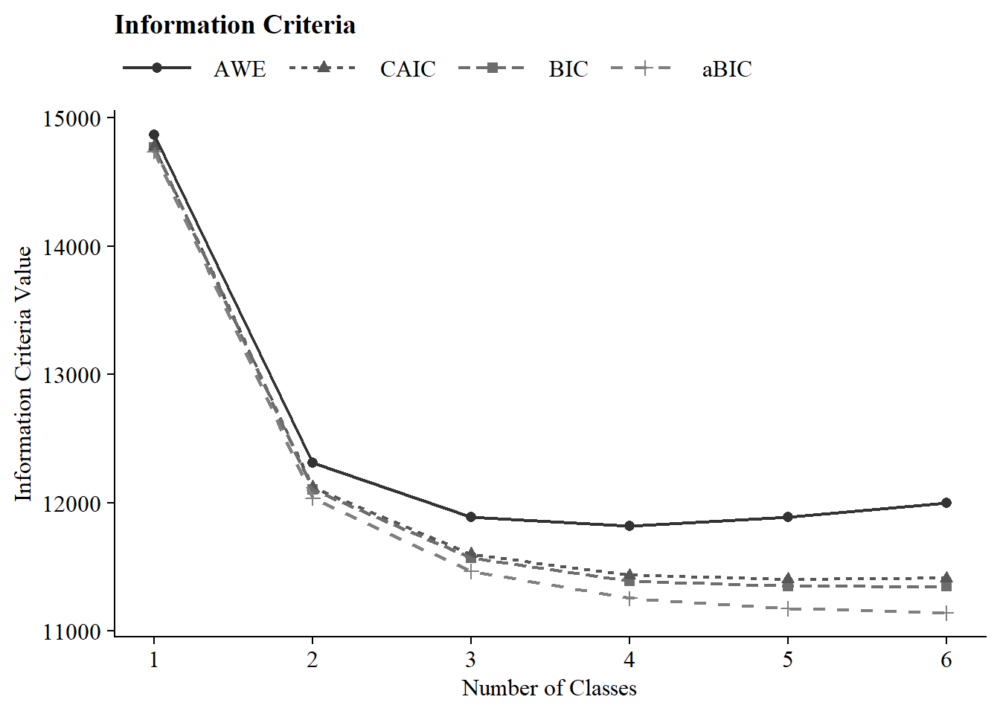


------------------------------------------------------------------------

### 1.5 Plotting Class Probabilities

------------------------------------------------------------------------

Plot LCA:


``` r
source(here("functions","plot_lca.R"))

step1_t1 <- readModels(here("three_lta", "phase_1","t1"))
step1_t2 <- readModels(here("three_lta", "phase_1","t2"))
step1_t3 <- readModels(here("three_lta", "phase_1","t3"))

t1 <- step1_t1$c4_lca_t1.out
t2 <- step1_t2$c4_lca_t2.out
t3 <- step1_t3$c4_lca_t3.out


(plot_lca(t1) | plot_lca(t2) | plot_lca(t3))
```

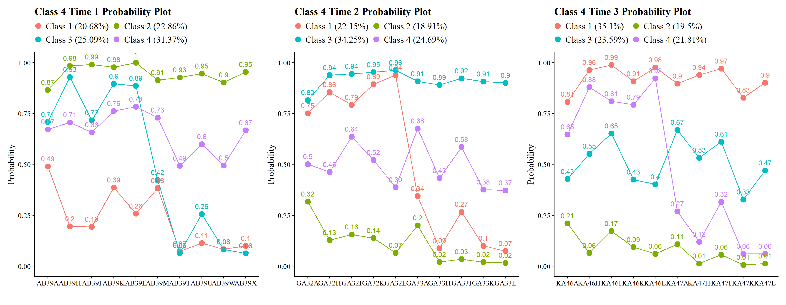

*Class labels used here:*
**Class 1: Very Positive**, **Class 2: Qualified Positive**, **Class 3: Neutral**, **Class 4: Less Positive**

These diagnostics indicate that the same four-class structure is empirically recoverable across Grades 7, 10, and 12.

------------------------------------------------------------------------

### 1.6 Estimate LCAs Independently at Each Time Point to Reorder Classes

In this step, the selected four-class solution is re-estimated independently at each wave with:

-   Fixed number of classes (four)

-   Optimized class ordering using `optseed`

-   Supplied `svalues()` to enforce consistent class numbering across waves

-   Random starts disabled (`starts = 0`)

This step **does not change the class structure**. Its sole purpose is to ensure **stable class labeling across waves** prior to joint longitudinal modeling.

#### Time 1 (Reorder)


``` r
lca_t1  <- mplusObject(                 
    
  TITLE = "Class-3_Time1", 
  
  VARIABLE =
   "categorical = AB39A AB39H AB39I AB39K AB39L AB39M AB39T AB39U AB39W AB39X;
         usevar = AB39A AB39H AB39I AB39K AB39L AB39M AB39T AB39U AB39W AB39X;
         !useobs = patw2==0; 
    
    classes = c(4);",
  
  ANALYSIS = 
   "estimator = mlr; 
    type = mixture;
    starts = 0;    
    optseed = 937588;",
  
  OUTPUT = "TECH1 TECH8 TECH14 svalues(2 3 4 1);",
  
  usevariables = colnames(lsay_data),
  rdata = lsay_data)


lca_t1_fit <- mplusModeler(lca_t1,
                 dataout=here("three_lta", "phase_1","reordered","t1_lca.dat"), 
                 modelout=here("three_lta", "phase_1","reordered","t1_lca_step1.inp"),
                 check=TRUE, run = TRUE, hashfilename = FALSE)
```

#### Time 2 (Reorder)


``` r
lca_t2  <- mplusObject(                 
    
  TITLE = "Class-3_Time2", 
  
  VARIABLE =
   "categorical = GA32A GA32H GA32I GA32K GA32L GA33A GA33H GA33I GA33K GA33L;
         usevar = GA32A GA32H GA32I GA32K GA32L GA33A GA33H GA33I GA33K GA33L;
         !useobs = patw4==0; 
    
    classes = c(4);",
  
  ANALYSIS = 
   "estimator = mlr; 
    type = mixture;
    starts = 0;    
    optseed = 264935;",
  
  OUTPUT = "TECH1 TECH8 TECH14 svalues(3 1 4 2);",
  
  usevariables = colnames(lsay_data),
  rdata = lsay_data)


lca_t2_fit <- mplusModeler(lca_t2,
                 dataout=here("three_lta", "phase_1","reordered","t2_lca.dat"), 
                 modelout=here("three_lta", "phase_1","reordered","t2_lca_step1.inp"),
                 check=TRUE, run = TRUE, hashfilename = FALSE)
```

#### Time 3 (Reorder)


``` r
lca_t3  <- mplusObject(                 
    
  TITLE = "Class-3_Time3", 
  
  VARIABLE =
   "categorical = KA46A KA46H KA46I KA46K KA46L KA47A KA47H KA47I KA47K KA47L;
         usevar = KA46A KA46H KA46I KA46K KA46L KA47A KA47H KA47I KA47K KA47L;
         !useobs = patw6==0; 
    
    classes = c(4);",
  
  ANALYSIS = 
   "estimator = mlr; 
    type = mixture;
    starts = 0;    
    optseed = 366706;",
  
  OUTPUT = "TECH1 TECH8 TECH14 svalues(1 4 3 2);",
  
  usevariables = colnames(lsay_data),
  rdata = lsay_data)


lca_t3_fit <- mplusModeler(lca_t3,
                 dataout=here("three_lta", "phase_1","reordered","t3_lca.dat"), 
                 modelout=here("three_lta", "phase_1","reordered","t3_lca_step1.inp"),
                 check=TRUE, run = TRUE, hashfilename = FALSE)
```

#### Diagnostic Class Plots (Post-Reordering)

------------------------------------------------------------------------


``` r
source(here("functions","plot_lca.R"))
t1 <- readModels(here("three_lta", "phase_1","reordered","t1_lca_step1.out"))
t2 <- readModels(here("three_lta", "phase_1","reordered","t2_lca_step1.out"))
t3 <- readModels(here("three_lta", "phase_1","reordered","t3_lca_step1.out"))


(plot_lca(t1) | plot_lca(t2) | plot_lca(t3))
```

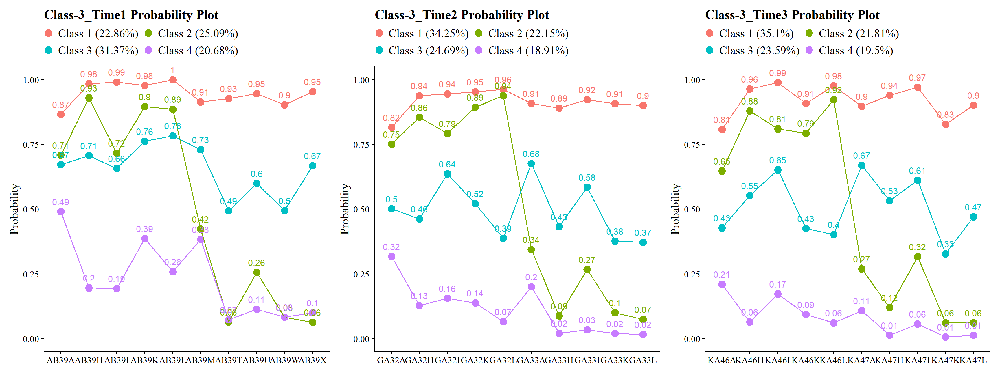

------------------------------------------------------------------------

### **Phase 2**: Testing for Measurement Invariance

------------------------------------------------------------------------

#### Estimate the Non-Invariant Joint Configural Model (No Transitions)


``` r
lta_non_inv <- mplusObject(
  
  TITLE = 
    "Non-Invariant LTA Model", 
  
  VARIABLE = 
     "idvariable=CASENUM;
     
      usev =        
      AB39A AB39H AB39I AB39K AB39L AB39M AB39T AB39U AB39W AB39X
      GA32A GA32H GA32I GA32K GA32L GA33A GA33H GA33I GA33K GA33L
      KA46A KA46H KA46I KA46K KA46L KA47A KA47H KA47I KA47K KA47L;

      categorical = 
      AB39A AB39H AB39I AB39K AB39L AB39M AB39T AB39U AB39W AB39X
      GA32A GA32H GA32I GA32K GA32L GA33A GA33H GA33I GA33K GA33L
      KA46A KA46H KA46I KA46K KA46L KA47A KA47H KA47I KA47K KA47L;

      classes = c1(4) c2(4) c3(4);",
    
  ANALYSIS = 
     "estimator = mlr;
      type = mixture;
      starts = 500 200;",

  MODEL = 
     "%overall%

  MODEL c1:
     %c1#1%
     [AB39A$1-AB39X$1];
     %c1#2%
     [AB39A$1-AB39X$1];
     %c1#3%
     [AB39A$1-AB39X$1];
     %c1#4%
     [AB39A$1-AB39X$1];
     
  MODEL c2:
     %c2#1%
     [GA32A$1-GA33L$1];
     %c2#2%
     [GA32A$1-GA33L$1];
     %c2#3%
     [GA32A$1-GA33L$1];
     %c2#4%
     [GA32A$1-GA33L$1];
     
  MODEL c3:
     %c3#1%
     [KA46A$1-KA47L$1];
     %c3#2%
     [KA46A$1-KA47L$1];
     %c3#3%
     [KA46A$1-KA47L$1];
     %c3#4%
     [KA46A$1-KA47L$1];",

  OUTPUT = "svalues;",
  
  usevariables = colnames(lsay_data),
  rdata = lsay_data)

lta_non_inv_fit <- mplusModeler(lta_non_inv,
                     dataout=here("three_lta", "phase_2", "lta.dat"),
                     modelout=here("three_lta", "phase_2", "noninvariant_lta.inp"),
                     check=TRUE, run = TRUE, hashfilename = FALSE)
```

After estimation, this model is retained strictly as the reference model for nested testing.

------------------------------------------------------------------------

#### Estimate the Full Measurement-Invariance Model


``` r
lta_inv <- mplusObject(
  
  TITLE = 
    "Invariant LTA Model", 
  
  VARIABLE = 
     "idvariable=CASENUM;
     
      usev =        
      AB39A AB39H AB39I AB39K AB39L AB39M AB39T AB39U AB39W AB39X
      GA32A GA32H GA32I GA32K GA32L GA33A GA33H GA33I GA33K GA33L
      KA46A KA46H KA46I KA46K KA46L KA47A KA47H KA47I KA47K KA47L;

      categorical = 
      AB39A AB39H AB39I AB39K AB39L AB39M AB39T AB39U AB39W AB39X
      GA32A GA32H GA32I GA32K GA32L GA33A GA33H GA33I GA33K GA33L
      KA46A KA46H KA46I KA46K KA46L KA47A KA47H KA47I KA47K KA47L;

      classes = c1(4) c2(4) c3(4);",
    
  ANALYSIS = 
     "estimator = mlr;
      type = mixture;
      starts =  0;
      processors=10;",

  MODEL = 
     "
     %overall%
     
  MODEL c1:
     %c1#1%
     [AB39A$1-AB39X$1](1-10);
     %c1#2%
     [AB39A$1-AB39X$1](11-20);
     %c1#3%
     [AB39A$1-AB39X$1](21-30);
     %c1#4%
     [AB39A$1-AB39X$1](31-40);
     
  MODEL c2:
     %c2#1%
     [GA32A$1-GA33L$1](1-10);
     %c2#2%
     [GA32A$1-GA33L$1](11-20);
     %c2#3%
     [GA32A$1-GA33L$1](21-30);
     %c2#4%
     [GA32A$1-GA33L$1](31-40);
     
  MODEL c3:
     %c3#1%
     [KA46A$1-KA47L$1](1-10);
     %c3#2%
     [KA46A$1-KA47L$1](11-20);
     %c3#3%
     [KA46A$1-KA47L$1](21-30);
     %c3#4%
     [KA46A$1-KA47L$1](31-40);",

  OUTPUT = "svalues;", 
  
  usevariables = colnames(lsay_data),
  rdata = lsay_data)

lta_inv_fit <- mplusModeler(lta_inv,
                     dataout=here("three_lta", "phase_2", "lta.dat"),
                     modelout=here("three_lta", "phase_2", "invariant_lta.inp"),
                     check=TRUE, run = TRUE, hashfilename = FALSE)
```

This model yields the measurement structure used for all downstream auxiliary-variable analyses if invariance is retained.

------------------------------------------------------------------------

#### Plotting the Non-Invariant and Invariant Models


``` r
source(here("functions","plot_lta.R"))

inv_mod <- readModels(here("three_lta", "phase_2"), quiet = TRUE)

plot_lta(inv_mod$invariant_lta.out)
```

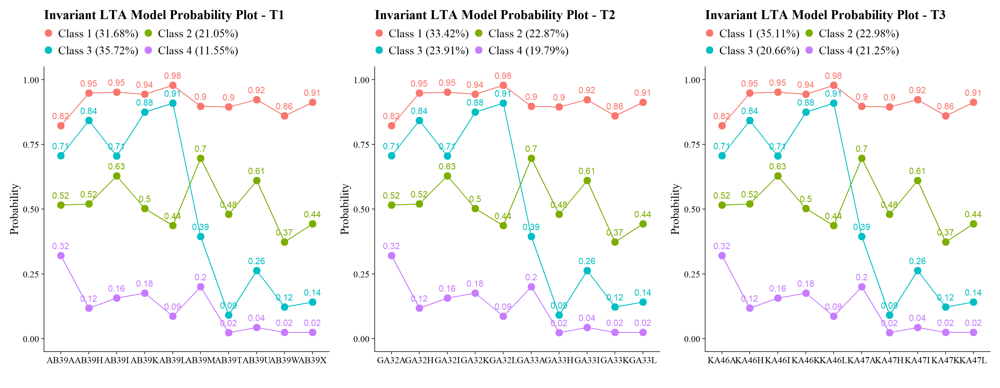

``` r
plot_lta(inv_mod$noninvariant_lta.out)
```

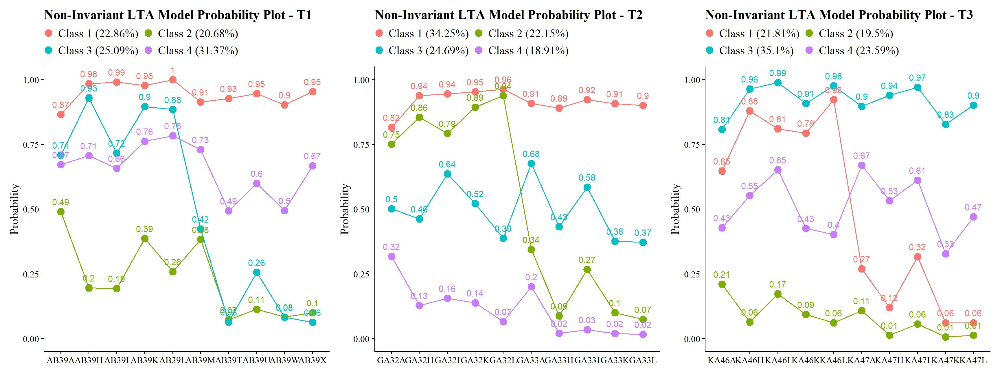

------------------------------------------------------------------------

### Nested Model Testing: Satorra–Bentler Scaled χ² Difference Test


``` r
# *0 = null or nested model & *1 = comparison  or parent model
lta_models <- readModels(here("three_lta", "phase_2"), quiet = TRUE)

# Log Likelihood Values
L0 <- lta_models$invariant_lta.out$summaries$LL
L1 <- lta_models$noninvariant_lta.out$summaries$LL

# LRT equation
lr <- -2*(L0-L1) 

# Parameters
p0 <- lta_models$invariant_lta.out$summaries$Parameters
p1 <- lta_models$noninvariant_lta.out$summaries$Parameters

# Scaling Correction Factors
c0 <- lta_models$invariant_lta.out$summaries$LLCorrectionFactor
c1 <- lta_models$noninvariant_lta.out$summaries$LLCorrectionFactor

# Difference Test Scaling correction
cd <- ((p0*c0)-(p1*c1))/(p0-p1)

# Chi-square difference test(TRd)
TRd <- (lr)/(cd)

# Degrees of freedom
df <- abs(p0 - p1)

# Significance test
(p_diff <- pchisq(TRd, df, lower.tail=FALSE))
#> [1] 2.294394e-40
```


### Alternatively: Nested Model Testing Using `compareModels` in MplusAutomation


``` r
invisible(capture.output(
  comparison <- compareModels(lta_models$invariant_lta.out, lta_models$noninvariant_lta.out, diffTest=TRUE)
))

# p-value
comparison$diffTest$MLR_LL$p
#> [1] 2.294394e-40

#BIC
comparison$summaries
#>                     Title Observations Estimator Parameters
#> 1     Invariant LTA Model         1907       MLR         49
#> 2 Non-Invariant LTA Model         1907       MLR        129
#>          LL      AIC      BIC
#> 1 -23700.74 47499.48 47771.59
#> 2 -23492.12 47242.24 47958.62
```

------------------------------------------------------------------------

### **Phase 3**: Apply Multi-Step Estimation Methods

------------------------------------------------------------------------

### ML Three-Step Procedure

------------------------------------------------------------------------

#### ML STEP 1: Re-Estimate 

------------------------------------------------------------------------

**Time 1: Fixed-Threshold LCA With Saved `CPROBS`**


``` r
inv_t1  <- mplusObject(                 
    
  TITLE = "Time 1 - Invariant LCA", 
  
  VARIABLE =
   "idvariable=CASENUM;
    categorical = AB39A AB39H AB39I AB39K AB39L AB39M AB39T AB39U AB39W AB39X; 
         usevar = AB39A AB39H AB39I AB39K AB39L AB39M AB39T AB39U AB39W AB39X; 
    
    classes = c1(4);
   
    auxiliary = MINORITY, FEMALE, MATHG7, MATHG10, MATHG12;",
  
  ANALYSIS = 
   "estimator = mlr; 
    type = mixture;
    starts = 0;",
  
  MODEL = 
     "%overall%

     %C1#1%

     [ ab39a$1@-1.53313 ] (1);
     [ ab39h$1@-2.90401 ] (2);
     [ ab39i$1@-2.99575 ] (3);
     [ ab39k$1@-2.83359 ] (4);
     [ ab39l$1@-3.85594 ] (5);
     [ ab39m$1@-2.16372 ] (6);
     [ ab39t$1@-2.13876 ] (7);
     [ ab39u$1@-2.48348 ] (8);
     [ ab39w$1@-1.81515 ] (9);
     [ ab39x$1@-2.35163 ] (10);

     %C1#3%

     [ ab39a$1@-0.06349 ] (11);
     [ ab39h$1@-0.07976 ] (12);
     [ ab39i$1@-0.52495 ] (13);
     [ ab39k$1@-0.01216 ] (14);
     [ ab39l$1@0.25484 ] (15);
     [ ab39m$1@-0.83350 ] (16);
     [ ab39t$1@0.07961 ] (17);
     [ ab39u$1@-0.45274 ] (18);
     [ ab39w$1@0.51840 ] (19);
     [ ab39x$1@0.22569 ] (20);

     %C1#2%

     [ ab39a$1@-0.88292 ] (21);
     [ ab39h$1@-1.67761 ] (22);
     [ ab39i$1@-0.87642 ] (23);
     [ ab39k$1@-1.94409 ] (24);
     [ ab39l$1@-2.31259 ] (25);
     [ ab39m$1@0.42887 ] (26);
     [ ab39t$1@2.29606 ] (27);
     [ ab39u$1@1.02908 ] (28);
     [ ab39w$1@1.97179 ] (29);
     [ ab39x$1@1.80988 ] (30);

     %C1#4%

     [ ab39a$1@0.74744 ] (31);
     [ ab39h$1@2.01287 ] (32);
     [ ab39i$1@1.67957 ] (33);
     [ ab39k$1@1.54221 ] (34);
     [ ab39l$1@2.34965 ] (35);
     [ ab39m$1@1.38217 ] (36);
     [ ab39t$1@3.73153 ] (37);
     [ ab39u$1@3.09927 ] (38);
     [ ab39w$1@3.69495 ] (39);
     [ ab39x$1@3.68803 ] (40);",
  
  OUTPUT = "TECH1 TECH8 TECH14;",
  
  SAVEDATA = 
   "File=t1_inv_cprobs.dat;
    Save=cprob;",
  
  usevariables = colnames(lsay_data),
  rdata = lsay_data)


inv_t1_fit <- mplusModeler(inv_t1,
                 dataout=here("three_lta", "phase_3","step_1_ml", "t1_inv.dat"), 
                 modelout=here("three_lta", "phase_3","step_1_ml", "t1_inv_lca.inp"),
                 check=TRUE, run = TRUE, hashfilename = FALSE)
```

**Time 2: Fixed-Threshold LCA With Saved `CPROBS`**


``` r
inv_t2  <- mplusObject(                 
    
  TITLE = "Time 2 - Invariant LCA", 
  
  VARIABLE =
   "idvariable=CASENUM;
    categorical = GA32A GA32H GA32I GA32K GA32L GA33A GA33H GA33I GA33K GA33L;
         usevar = GA32A GA32H GA32I GA32K GA32L GA33A GA33H GA33I GA33K GA33L;
    
    classes = c2(4);
   
    auxiliary = MINORITY, FEMALE, MATHG7, MATHG10, MATHG12;",
  
  ANALYSIS = 
   "estimator = mlr; 
    type = mixture;
    starts = 0;",
  
  MODEL = 
     "%overall%

     %C2#1%

     [ ga32a$1@-1.53313 ] (1);
     [ ga32h$1@-2.90401 ] (2);
     [ ga32i$1@-2.99575 ] (3);
     [ ga32k$1@-2.83359 ] (4);
     [ ga32l$1@-3.85594 ] (5);
     [ ga33a$1@-2.16372 ] (6);
     [ ga33h$1@-2.13876 ] (7);
     [ ga33i$1@-2.48348 ] (8);
     [ ga33k$1@-1.81515 ] (9);
     [ ga33l$1@-2.35163 ] (10);

     %C2#3%

     [ ga32a$1@-0.06349 ] (11);
     [ ga32h$1@-0.07976 ] (12);
     [ ga32i$1@-0.52495 ] (13);
     [ ga32k$1@-0.01216 ] (14);
     [ ga32l$1@0.25484 ] (15);
     [ ga33a$1@-0.83350 ] (16);
     [ ga33h$1@0.07961 ] (17);
     [ ga33i$1@-0.45274 ] (18);
     [ ga33k$1@0.51840 ] (19);
     [ ga33l$1@0.22569 ] (20);

     %C2#2%

     [ ga32a$1@-0.88292 ] (21);
     [ ga32h$1@-1.67761 ] (22);
     [ ga32i$1@-0.87642 ] (23);
     [ ga32k$1@-1.94409 ] (24);
     [ ga32l$1@-2.31259 ] (25);
     [ ga33a$1@0.42887 ] (26);
     [ ga33h$1@2.29606 ] (27);
     [ ga33i$1@1.02908 ] (28);
     [ ga33k$1@1.97179 ] (29);
     [ ga33l$1@1.80988 ] (30);

     %C2#4%

     [ ga32a$1@0.74744 ] (31);
     [ ga32h$1@2.01287 ] (32);
     [ ga32i$1@1.67957 ] (33);
     [ ga32k$1@1.54221 ] (34);
     [ ga32l$1@2.34965 ] (35);
     [ ga33a$1@1.38217 ] (36);
     [ ga33h$1@3.73153 ] (37);
     [ ga33i$1@3.09927 ] (38);
     [ ga33k$1@3.69495 ] (39);
     [ ga33l$1@3.68803 ] (40);
",
  
  OUTPUT = "TECH1 TECH8 TECH14;",
  
  SAVEDATA = 
   "File=t2_inv_cprobs.dat;
    Save=cprob;",
  
  usevariables = colnames(lsay_data),
  rdata = lsay_data)


inv_t2_fit <- mplusModeler(inv_t2,
                 dataout=here("three_lta", "phase_3","step_1_ml", "t2_inv.dat"), 
                 modelout=here("three_lta", "phase_3","step_1_ml", "t2_inv_lca.inp"),
                 check=TRUE, run = TRUE, hashfilename = FALSE)
```

**Time 3: Fixed-Threshold LCA With Saved `CPROBS`**


``` r
inv_t3  <- mplusObject(                 
    
  TITLE = "Time 3 - Invariant LCA", 
  
  VARIABLE =
   "idvariable=CASENUM;
    categorical = KA46A KA46H KA46I KA46K KA46L KA47A KA47H KA47I KA47K KA47L;
         usevar = KA46A KA46H KA46I KA46K KA46L KA47A KA47H KA47I KA47K KA47L;
    
    classes = c3(4);
   
    auxiliary = MINORITY, FEMALE, MATHG7, MATHG10, MATHG12;",
  
  ANALYSIS = 
   "estimator = mlr; 
    type = mixture;
    starts = 0;   ",
  
    MODEL = 
     "%overall%

     %C3#1%

     [ ka46a$1@-1.53313 ] (1);
     [ ka46h$1@-2.90401 ] (2);
     [ ka46i$1@-2.99575 ] (3);
     [ ka46k$1@-2.83359 ] (4);
     [ ka46l$1@-3.85594 ] (5);
     [ ka47a$1@-2.16372 ] (6);
     [ ka47h$1@-2.13876 ] (7);
     [ ka47i$1@-2.48348 ] (8);
     [ ka47k$1@-1.81515 ] (9);
     [ ka47l$1@-2.35163 ] (10);

     %C3#2%

     [ ka46a$1@-0.06349 ] (11);
     [ ka46h$1@-0.07976 ] (12);
     [ ka46i$1@-0.52495 ] (13);
     [ ka46k$1@-0.01216 ] (14);
     [ ka46l$1@0.25484 ] (15);
     [ ka47a$1@-0.83350 ] (16);
     [ ka47h$1@0.07961 ] (17);
     [ ka47i$1@-0.45274 ] (18);
     [ ka47k$1@0.51840 ] (19);
     [ ka47l$1@0.22569 ] (20);

     %C3#3%

     [ ka46a$1@-0.88292 ] (21);
     [ ka46h$1@-1.67761 ] (22);
     [ ka46i$1@-0.87642 ] (23);
     [ ka46k$1@-1.94409 ] (24);
     [ ka46l$1@-2.31259 ] (25);
     [ ka47a$1@0.42887 ] (26);
     [ ka47h$1@2.29606 ] (27);
     [ ka47i$1@1.02908 ] (28);
     [ ka47k$1@1.97179 ] (29);
     [ ka47l$1@1.80988 ] (30);

     %C3#4%

     [ ka46a$1@0.74744 ] (31);
     [ ka46h$1@2.01287 ] (32);
     [ ka46i$1@1.67957 ] (33);
     [ ka46k$1@1.54221 ] (34);
     [ ka46l$1@2.34965 ] (35);
     [ ka47a$1@1.38217 ] (36);
     [ ka47h$1@3.73153 ] (37);
     [ ka47i$1@3.09927 ] (38);
     [ ka47k$1@3.69495 ] (39);
     [ ka47l$1@3.68803 ] (40);",
  
  OUTPUT = "TECH1 TECH8 TECH14;",
  
  SAVEDATA = 
   "File=t3_inv_cprobs.dat;
    Save=cprob;",
  
  usevariables = colnames(lsay_data),
  rdata = lsay_data)


inv_t3_fit <- mplusModeler(inv_t3,
                 dataout=here("three_lta", "phase_3","step_1_ml", "t3_inv.dat"), 
                 modelout=here("three_lta", "phase_3","step_1_ml", "t3_inv_lca.inp"),
                 check=TRUE, run = TRUE, hashfilename = FALSE)
```

##### Plotting the Fixed-Threshold LCAs


``` r
source(here("functions","plot_lca.R"))

t1 <- readModels(here("three_lta", "phase_3","step_1_ml","t1_inv_lca.out"))
t2 <- readModels(here("three_lta", "phase_3","step_1_ml","t2_inv_lca.out"))
t3 <- readModels(here("three_lta", "phase_3","step_1_ml","t3_inv_lca.out"))

(plot_lca(t1) | plot_lca(t2) | plot_lca(t3))
```

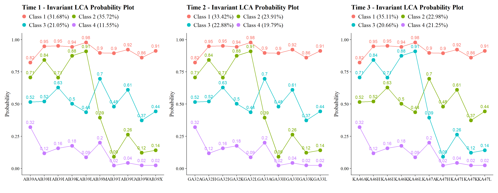

------------------------------------------------------------------------

#### ML STEP 2: Extract Logits and Merge Saved Posterior Data

------------------------------------------------------------------------

**Extract Classification-Error Logits**


``` r
inv_step4 <- readModels(here("three_lta", "phase_3","step_1_ml"), quiet = TRUE)

logits_t1 <- as.data.frame(inv_step4$t1_inv_lca.out$class_counts$logitProbs.mostLikely)
logits_t2 <- as.data.frame(inv_step4$t2_inv_lca.out$class_counts$logitProbs.mostLikely)
logits_t3 <- as.data.frame(inv_step4$t3_inv_lca.out$class_counts$logitProbs.mostLikely)
```

**Extract and Merge Saved Posterior Probabilities**


``` r
savedata_t1 <- as.data.frame(inv_step4$t1_inv_lca.out$savedata) %>%
  rename(cprob11=CPROB1,cprob12=CPROB2,cprob13=CPROB3,cprob14=CPROB4,n1=MLCC1)

savedata_t2 <- as.data.frame(inv_step4$t2_inv_lca.out$savedata) %>%
  rename(cprob21=CPROB1,cprob22=CPROB2,cprob23=CPROB3,cprob24=CPROB4,n2=MLCC2)

savedata_t3 <- as.data.frame(inv_step4$t3_inv_lca.out$savedata) %>%
  rename(cprob31=CPROB1,cprob32=CPROB2,cprob33=CPROB3,cprob34=CPROB4,n3=MLCC3)

savedata_t123 <- savedata_t1 %>%
  full_join(savedata_t2, by = "CASENUM") %>%
  full_join(savedata_t3, by = "CASENUM") %>%
  clean_names() %>% relocate(casenum)

summary(savedata_t123)
#>     casenum         ab39a            ab39h       
#>  Min.   :1004   Min.   :0.0000   Min.   :0.0000  
#>  1st Qu.:2500   1st Qu.:0.0000   1st Qu.:0.0000  
#>  Median :3973   Median :1.0000   Median :1.0000  
#>  Mean   :3991   Mean   :0.6881   Mean   :0.7218  
#>  3rd Qu.:5505   3rd Qu.:1.0000   3rd Qu.:1.0000  
#>  Max.   :6937   Max.   :1.0000   Max.   :1.0000  
#>                 NA's   :25       NA's   :56      
#>      ab39i           ab39k            ab39l       
#>  Min.   :0.000   Min.   :0.0000   Min.   :0.0000  
#>  1st Qu.:0.000   1st Qu.:1.0000   1st Qu.:1.0000  
#>  Median :1.000   Median :1.0000   Median :1.0000  
#>  Mean   :0.653   Mean   :0.7681   Mean   :0.7512  
#>  3rd Qu.:1.000   3rd Qu.:1.0000   3rd Qu.:1.0000  
#>  Max.   :1.000   Max.   :1.0000   Max.   :1.0000  
#>  NA's   :60      NA's   :53       NA's   :50      
#>      ab39m            ab39t            ab39u       
#>  Min.   :0.0000   Min.   :0.0000   Min.   :0.0000  
#>  1st Qu.:0.0000   1st Qu.:0.0000   1st Qu.:0.0000  
#>  Median :1.0000   Median :0.0000   Median :0.0000  
#>  Mean   :0.6236   Mean   :0.3984   Mean   :0.4924  
#>  3rd Qu.:1.0000   3rd Qu.:1.0000   3rd Qu.:1.0000  
#>  Max.   :1.0000   Max.   :1.0000   Max.   :1.0000  
#>  NA's   :34       NA's   :67       NA's   :57      
#>      ab39w            ab39x          minority_x    
#>  Min.   :0.0000   Min.   :0.0000   Min.   :0.0000  
#>  1st Qu.:0.0000   1st Qu.:0.0000   1st Qu.:0.0000  
#>  Median :0.0000   Median :0.0000   Median :0.0000  
#>  Mean   :0.3996   Mean   :0.4645   Mean   :0.1704  
#>  3rd Qu.:1.0000   3rd Qu.:1.0000   3rd Qu.:0.0000  
#>  Max.   :1.0000   Max.   :1.0000   Max.   :1.0000  
#>  NA's   :50       NA's   :34       NA's   :105     
#>     female_x         mathg7_x       mathg10_x    
#>  Min.   :0.0000   Min.   :28.93   Min.   :30.63  
#>  1st Qu.:0.0000   1st Qu.:44.84   1st Qu.:58.58  
#>  Median :1.0000   Median :53.09   Median :67.71  
#>  Mean   :0.5175   Mean   :52.58   Mean   :66.15  
#>  3rd Qu.:1.0000   3rd Qu.:59.86   3rd Qu.:75.27  
#>  Max.   :1.0000   Max.   :85.07   Max.   :95.26  
#>  NA's   :21       NA's   :42      NA's   :532    
#>    mathg12_x        cprob11          cprob12      
#>  Min.   :27.01   Min.   :0.0000   Min.   :0.0000  
#>  1st Qu.:63.40   1st Qu.:0.0000   1st Qu.:0.0030  
#>  Median :72.19   Median :0.0080   Median :0.1405  
#>  Mean   :71.20   Mean   :0.3169   Mean   :0.3572  
#>  3rd Qu.:81.42   3rd Qu.:0.8530   3rd Qu.:0.8210  
#>  Max.   :99.30   Max.   :0.9980   Max.   :0.9950  
#>  NA's   :1085    NA's   :21       NA's   :21      
#>     cprob13          cprob14             n1       
#>  Min.   :0.0020   Min.   :0.0000   Min.   :1.000  
#>  1st Qu.:0.0090   1st Qu.:0.0000   1st Qu.:1.000  
#>  Median :0.0640   Median :0.0000   Median :2.000  
#>  Mean   :0.2105   Mean   :0.1155   Mean   :2.093  
#>  3rd Qu.:0.2752   3rd Qu.:0.0130   3rd Qu.:3.000  
#>  Max.   :0.9990   Max.   :0.9960   Max.   :4.000  
#>  NA's   :21       NA's   :21       NA's   :21     
#>      ga32a            ga32h            ga32i       
#>  Min.   :0.0000   Min.   :0.0000   Min.   :0.0000  
#>  1st Qu.:0.0000   1st Qu.:0.0000   1st Qu.:0.0000  
#>  Median :1.0000   Median :1.0000   Median :1.0000  
#>  Mean   :0.6299   Mean   :0.6493   Mean   :0.6862  
#>  3rd Qu.:1.0000   3rd Qu.:1.0000   3rd Qu.:1.0000  
#>  Max.   :1.0000   Max.   :1.0000   Max.   :1.0000  
#>  NA's   :375      NA's   :387      NA's   :390     
#>      ga32k           ga32l            ga33a       
#>  Min.   :0.000   Min.   :0.0000   Min.   :0.0000  
#>  1st Qu.:0.000   1st Qu.:0.0000   1st Qu.:0.0000  
#>  Median :1.000   Median :1.0000   Median :1.0000  
#>  Mean   :0.679   Mean   :0.6466   Mean   :0.5917  
#>  3rd Qu.:1.000   3rd Qu.:1.0000   3rd Qu.:1.0000  
#>  Max.   :1.000   Max.   :1.0000   Max.   :1.0000  
#>  NA's   :390     NA's   :382      NA's   :381     
#>      ga33h            ga33i            ga33k       
#>  Min.   :0.0000   Min.   :0.0000   Min.   :0.0000  
#>  1st Qu.:0.0000   1st Qu.:0.0000   1st Qu.:0.0000  
#>  Median :0.0000   Median :1.0000   Median :0.0000  
#>  Mean   :0.4347   Mean   :0.5251   Mean   :0.4289  
#>  3rd Qu.:1.0000   3rd Qu.:1.0000   3rd Qu.:1.0000  
#>  Max.   :1.0000   Max.   :1.0000   Max.   :1.0000  
#>  NA's   :391      NA's   :391      NA's   :389     
#>      ga33l          minority_y        female_y     
#>  Min.   :0.0000   Min.   :0.0000   Min.   :0.0000  
#>  1st Qu.:0.0000   1st Qu.:0.0000   1st Qu.:0.0000  
#>  Median :0.0000   Median :0.0000   Median :1.0000  
#>  Mean   :0.4199   Mean   :0.1632   Mean   :0.5254  
#>  3rd Qu.:1.0000   3rd Qu.:0.0000   3rd Qu.:1.0000  
#>  Max.   :1.0000   Max.   :1.0000   Max.   :1.0000  
#>  NA's   :383      NA's   :430      NA's   :373     
#>     mathg7_y       mathg10_y       mathg12_y    
#>  Min.   :28.93   Min.   :30.63   Min.   :27.01  
#>  1st Qu.:46.10   1st Qu.:59.09   1st Qu.:64.00  
#>  Median :53.57   Median :67.86   Median :72.56  
#>  Mean   :53.20   Mean   :66.41   Mean   :71.63  
#>  3rd Qu.:60.09   3rd Qu.:75.30   3rd Qu.:81.73  
#>  Max.   :85.07   Max.   :95.26   Max.   :99.30  
#>  NA's   :390     NA's   :557     NA's   :1128   
#>     cprob21          cprob22          cprob23      
#>  Min.   :0.0000   Min.   :0.0000   Min.   :0.0020  
#>  1st Qu.:0.0000   1st Qu.:0.0000   1st Qu.:0.0055  
#>  Median :0.0035   Median :0.0110   Median :0.0430  
#>  Mean   :0.3343   Mean   :0.2391   Mean   :0.2287  
#>  3rd Qu.:0.9640   3rd Qu.:0.4000   3rd Qu.:0.3210  
#>  Max.   :0.9980   Max.   :0.9920   Max.   :0.9990  
#>  NA's   :373      NA's   :373      NA's   :373     
#>     cprob24             n2            ka46a      
#>  Min.   :0.0000   Min.   :1.000   Min.   :0.000  
#>  1st Qu.:0.0000   1st Qu.:1.000   1st Qu.:0.000  
#>  Median :0.0000   Median :2.000   Median :1.000  
#>  Mean   :0.1979   Mean   :2.275   Mean   :0.567  
#>  3rd Qu.:0.1230   3rd Qu.:3.000   3rd Qu.:1.000  
#>  Max.   :0.9980   Max.   :4.000   Max.   :1.000  
#>  NA's   :373      NA's   :373     NA's   :787    
#>      ka46h            ka46i            ka46k       
#>  Min.   :0.0000   Min.   :0.0000   Min.   :0.0000  
#>  1st Qu.:0.0000   1st Qu.:0.0000   1st Qu.:0.0000  
#>  Median :1.0000   Median :1.0000   Median :1.0000  
#>  Mean   :0.6733   Mean   :0.7121   Mean   :0.6109  
#>  3rd Qu.:1.0000   3rd Qu.:1.0000   3rd Qu.:1.0000  
#>  Max.   :1.0000   Max.   :1.0000   Max.   :1.0000  
#>  NA's   :796      NA's   :799      NA's   :802     
#>      ka46l            ka47a           ka47h      
#>  Min.   :0.0000   Min.   :0.000   Min.   :0.000  
#>  1st Qu.:0.0000   1st Qu.:0.000   1st Qu.:0.000  
#>  Median :1.0000   Median :1.000   Median :0.000  
#>  Mean   :0.6513   Mean   :0.552   Mean   :0.485  
#>  3rd Qu.:1.0000   3rd Qu.:1.000   3rd Qu.:1.000  
#>  Max.   :1.0000   Max.   :1.000   Max.   :1.000  
#>  NA's   :803      NA's   :802     NA's   :808    
#>      ka47i            ka47k            ka47l       
#>  Min.   :0.0000   Min.   :0.0000   Min.   :0.0000  
#>  1st Qu.:0.0000   1st Qu.:0.0000   1st Qu.:0.0000  
#>  Median :1.0000   Median :0.0000   Median :0.0000  
#>  Mean   :0.5645   Mean   :0.3831   Mean   :0.4433  
#>  3rd Qu.:1.0000   3rd Qu.:1.0000   3rd Qu.:1.0000  
#>  Max.   :1.0000   Max.   :1.0000   Max.   :1.0000  
#>  NA's   :807      NA's   :808      NA's   :804     
#>     minority          female           mathg7     
#>  Min.   :0.0000   Min.   :0.0000   Min.   :28.93  
#>  1st Qu.:0.0000   1st Qu.:0.0000   1st Qu.:47.05  
#>  Median :0.0000   Median :1.0000   Median :54.23  
#>  Mean   :0.1513   Mean   :0.5169   Mean   :54.05  
#>  3rd Qu.:0.0000   3rd Qu.:1.0000   3rd Qu.:60.80  
#>  Max.   :1.0000   Max.   :1.0000   Max.   :85.07  
#>  NA's   :823      NA's   :785      NA's   :793    
#>     mathg10         mathg12         cprob31      
#>  Min.   :30.63   Min.   :27.01   Min.   :0.0000  
#>  1st Qu.:60.66   1st Qu.:63.95   1st Qu.:0.0000  
#>  Median :68.83   Median :72.31   Median :0.0060  
#>  Mean   :67.49   Mean   :71.59   Mean   :0.3511  
#>  3rd Qu.:76.10   3rd Qu.:81.66   3rd Qu.:0.9650  
#>  Max.   :95.26   Max.   :99.30   Max.   :0.9980  
#>  NA's   :955     NA's   :1137    NA's   :785     
#>     cprob32          cprob33          cprob34      
#>  Min.   :0.0020   Min.   :0.0000   Min.   :0.0000  
#>  1st Qu.:0.0020   1st Qu.:0.0000   1st Qu.:0.0000  
#>  Median :0.0400   Median :0.0060   Median :0.0000  
#>  Mean   :0.2298   Mean   :0.2066   Mean   :0.2125  
#>  3rd Qu.:0.3095   3rd Qu.:0.2480   3rd Qu.:0.2005  
#>  Max.   :0.9990   Max.   :0.9910   Max.   :0.9980  
#>  NA's   :785      NA's   :785      NA's   :785     
#>        n3       
#>  Min.   :1.000  
#>  1st Qu.:1.000  
#>  Median :2.000  
#>  Mean   :2.291  
#>  3rd Qu.:3.000  
#>  Max.   :4.000  
#>  NA's   :785
#describe(savedata_t123)
```

------------------------------------------------------------------------

#### ML STEP 3a: Estimate the Unconditional LTA Model With Fixed Logits


------------------------------------------------------------------------


``` r
unc_LTA  <- mplusObject(
  TITLE = "Step3a of 3-step", 
  
  VARIABLE = 
 "idvariable =casenum;
 
  nominal=n1 n2 n3;
  
  usevar = n1 n2 n3;

  classes = c1(4) c2(4) c3(4);
 
  auxiliary = MINORITY, FEMALE, MATHG7, MATHG10, MATHG12;",
  
  ANALYSIS = 
 "estimator = mlr; 
  type = mixture; 
  starts = 0;",
  
  MODEL = glue(
  "%overall%
  c2 on c1; 
  c3 on c2;

  Model c1:
    %c1#1%
      [n1#1@{logits_t1[1,1]}];
      [n1#2@{logits_t1[1,2]}];
      [n1#3@{logits_t1[1,3]}];
    %c1#2%
      [n1#1@{logits_t1[2,1]}];
      [n1#2@{logits_t1[2,2]}];
      [n1#3@{logits_t1[2,3]}];
    %c1#3%
      [n1#1@{logits_t1[3,1]}];
      [n1#2@{logits_t1[3,2]}];
      [n1#3@{logits_t1[3,3]}];
    %c1#4%
      [n1#1@{logits_t1[4,1]}];
      [n1#2@{logits_t1[4,2]}];
      [n1#3@{logits_t1[4,3]}];
 
  Model c2:
    %c2#1%
      [n2#1@{logits_t2[1,1]}];
      [n2#2@{logits_t2[1,2]}];
      [n2#3@{logits_t2[1,3]}];
    %c2#2%
      [n2#1@{logits_t2[2,1]}];
      [n2#2@{logits_t2[2,2]}];
      [n2#3@{logits_t2[2,3]}];
    %c2#3%
      [n2#1@{logits_t2[3,1]}];
      [n2#2@{logits_t2[3,2]}];
      [n2#3@{logits_t2[3,3]}];
    %c2#4%
      [n2#1@{logits_t2[4,1]}];
      [n2#2@{logits_t2[4,2]}];
      [n2#3@{logits_t2[4,3]}];
  
  Model c3:
    %c3#1%
      [n3#1@{logits_t3[1,1]}];
      [n3#2@{logits_t3[1,2]}];
      [n3#3@{logits_t3[1,3]}];
    %c3#2%
      [n3#1@{logits_t3[2,1]}];
      [n3#2@{logits_t3[2,2]}];
      [n3#3@{logits_t3[2,3]}];
    %c3#3%
      [n3#1@{logits_t3[3,1]}];
      [n3#2@{logits_t3[3,2]}];
      [n3#3@{logits_t3[3,3]}];
    %c3#4%
      [n3#1@{logits_t3[4,1]}];
      [n3#2@{logits_t3[4,2]}];
      [n3#3@{logits_t3[4,3]}];"),
 
  OUTPUT = "svalues;",
  
  usevariables = colnames(savedata_t123), 
  rdata = savedata_t123)

unc_LTA_fit <- mplusModeler(unc_LTA, 
                 dataout=here("three_lta", "phase_3","step_3a_ml", "t123_LTA.dat"), 
                 modelout=here("three_lta", "phase_3","step_3a_ml", "unconditional_LTA.inp"), 
                 check=TRUE, run = TRUE, hashfilename = FALSE)
```

##### Plotting Transition Probabilities (Unconditional Model)


------------------------------------------------------------------------


``` r
source(here("functions","plot_transition.R"))

lta_model <- readModels(here("three_lta", "phase_3","step_3a_ml", "unconditional_LTA.out"))

plot_transition(
  model_name = lta_model,
  facet_labels = c(`1` = "Very Positive", `2` = "Qualified Positive", `3` = "Neutral", `4` = "Less Positive"),
  timepoint_labels = c(`1` = "Grade 7", `2` = "Grade 10", `3` = "Grade 12"),
  class_labels = c(`1` = "Very Positive", `2` = "Qualified Positive", `3` = "Neutral", `4` = "Less Positive")
) +
  labs(title = "Unconditional LTA (ML Three-Step Method)")
```

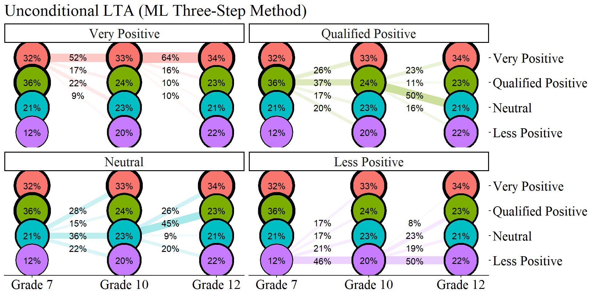

``` r

ggsave(here("figures", "unconditional_lta_ml.jpeg"), dpi="retina", height = 6, width = 10, bg = "white",  units="in")
```

------------------------------------------------------------------------

#### ML STEP 3b: Estimate the Covariate-Adjusted LTA Model With Fixed Logits


``` r
con_LTA  <- mplusObject(
  TITLE = "Step4b of 3-step", 
  
  VARIABLE = 
 "idvariable =casenum;
 
  nominal=n1 n2 n3;
  
  usevar = n1 n2 n3;

  classes = c1(4) c2(4) c3(4);
 
  usevar = MINORITY, FEMALE;",
  
  ANALYSIS = 
 "estimator = mlr; 
  type = mixture; 
  starts = 0;",
  
  MODEL = glue(
  "%overall%
  
  c1 ON MINORITY Female;
  c2 ON c1 MINORITY Female;
  c3 ON c2 MINORITY Female;

  Model c1:
    %c1#1%
      [n1#1@{logits_t1[1,1]}];
      [n1#2@{logits_t1[1,2]}];
      [n1#3@{logits_t1[1,3]}];
    %c1#2%
      [n1#1@{logits_t1[2,1]}];
      [n1#2@{logits_t1[2,2]}];
      [n1#3@{logits_t1[2,3]}];
    %c1#3%
      [n1#1@{logits_t1[3,1]}];
      [n1#2@{logits_t1[3,2]}];
      [n1#3@{logits_t1[3,3]}];
    %c1#4%
      [n1#1@{logits_t1[4,1]}];
      [n1#2@{logits_t1[4,2]}];
      [n1#3@{logits_t1[4,3]}];
 
  Model c2:
    %c2#1%
      [n2#1@{logits_t2[1,1]}];
      [n2#2@{logits_t2[1,2]}];
      [n2#3@{logits_t2[1,3]}];
    %c2#2%
      [n2#1@{logits_t2[2,1]}];
      [n2#2@{logits_t2[2,2]}];
      [n2#3@{logits_t2[2,3]}];
    %c2#3%
      [n2#1@{logits_t2[3,1]}];
      [n2#2@{logits_t2[3,2]}];
      [n2#3@{logits_t2[3,3]}];
    %c2#4%
      [n2#1@{logits_t2[4,1]}];
      [n2#2@{logits_t2[4,2]}];
      [n2#3@{logits_t2[4,3]}];
  
  Model c3:
    %c3#1%
      [n3#1@{logits_t3[1,1]}];
      [n3#2@{logits_t3[1,2]}];
      [n3#3@{logits_t3[1,3]}];
    %c3#2%
      [n3#1@{logits_t3[2,1]}];
      [n3#2@{logits_t3[2,2]}];
      [n3#3@{logits_t3[2,3]}];
    %c3#3%
      [n3#1@{logits_t3[3,1]}];
      [n3#2@{logits_t3[3,2]}];
      [n3#3@{logits_t3[3,3]}];
    %c3#4%
      [n3#1@{logits_t3[4,1]}];
      [n3#2@{logits_t3[4,2]}];
      [n3#3@{logits_t3[4,3]}];"),
 
  OUTPUT = "svalues;",
  
  usevariables = colnames(savedata_t123), 
  rdata = savedata_t123)

con_LTA_fit <- mplusModeler(con_LTA, 
                 dataout=here("three_lta", "phase_3","step_3b_ml", "t123_LTA.dat"), 
                 modelout=here("three_lta", "phase_3","step_3b_ml", "LTA_covariates.inp"), 
                 check=TRUE, run = TRUE, hashfilename = FALSE)
```

##### Covariate Effects Table

------------------------------------------------------------------------


``` r
lta_cov_model <- readModels(here("three_lta", "phase_3","step_3b_ml", "LTA_covariates.out"))

# REFERENCE CLASS 4
cov <- as.data.frame(lta_cov_model[["parameters"]][["unstandardized"]]) %>%
  filter(param %in% c("MINORITY", "FEMALE")) %>% 
  mutate(param = case_when(
            param == "FEMALE" ~ "Gender",
            param == "MINORITY" ~ "URM"),
    se = paste0("(", format(round(se,2), nsmall =2), ")")) %>% 
  separate(paramHeader, into = c("Time", "Class"), sep = "#") %>% 
  mutate(Class = case_when(
            Class == "1.ON" ~ "Very Positive",
            Class == "2.ON" ~ "Qualified Positive",
            Class == "3.ON" ~ "Neutral"),
         Time = case_when(
            Time == "C1" ~ "7th Grade (T1)",
            Time == "C2" ~ "10th Grade (T2)",
            Time == "C3" ~ "12th Grade (T3)",
         )
         ) %>% 
  unite(estimate, est, se, sep = " ") %>% 
  select(Time:pval, -est_se) %>% 
  mutate(pval = ifelse(pval<0.001, paste0("<.001*"),
                       ifelse(pval<0.05, paste0(scales::number(pval, accuracy = .001), "*"),
                              scales::number(pval, accuracy = .001))))

# Create table

cov_m1 <- cov %>% 
  group_by(param, Class) %>% 
  gt() %>% 
  tab_header(
    title = "Relations Between the Covariates and Latent Class (ML Three-Step Method)") %>%
  tab_footnote(
    footnote = md(
      "Reference Group: Less Positive"
    ),
locations = cells_title()
  ) %>% 
  cols_label(
    param = md("Covariate"),
    estimate = md("Estimate (*se*)"),
    pval = md("*p*-value")) %>% 
  sub_missing(1:3,
              missing_text = "") %>%
  sub_values(values = c(999.000), replacement = "-") %>% 
  cols_align(align = "center") %>% 
  opt_align_table_header(align = "left") %>% 
  gt::tab_options(table.font.names = "serif") 

cov_m1
```


```{=html}
<div id="hiqjbzgfjx" style="padding-left:0px;padding-right:0px;padding-top:10px;padding-bottom:10px;overflow-x:auto;overflow-y:auto;width:auto;height:auto;">
<style>#hiqjbzgfjx table {
  font-family: serif;
  -webkit-font-smoothing: antialiased;
  -moz-osx-font-smoothing: grayscale;
}

#hiqjbzgfjx thead, #hiqjbzgfjx tbody, #hiqjbzgfjx tfoot, #hiqjbzgfjx tr, #hiqjbzgfjx td, #hiqjbzgfjx th {
  border-style: none;
}

#hiqjbzgfjx p {
  margin: 0;
  padding: 0;
}

#hiqjbzgfjx .gt_table {
  display: table;
  border-collapse: collapse;
  line-height: normal;
  margin-left: auto;
  margin-right: auto;
  color: #333333;
  font-size: 16px;
  font-weight: normal;
  font-style: normal;
  background-color: #FFFFFF;
  width: auto;
  border-top-style: solid;
  border-top-width: 2px;
  border-top-color: #A8A8A8;
  border-right-style: none;
  border-right-width: 2px;
  border-right-color: #D3D3D3;
  border-bottom-style: solid;
  border-bottom-width: 2px;
  border-bottom-color: #A8A8A8;
  border-left-style: none;
  border-left-width: 2px;
  border-left-color: #D3D3D3;
}

#hiqjbzgfjx .gt_caption {
  padding-top: 4px;
  padding-bottom: 4px;
}

#hiqjbzgfjx .gt_title {
  color: #333333;
  font-size: 125%;
  font-weight: initial;
  padding-top: 4px;
  padding-bottom: 4px;
  padding-left: 5px;
  padding-right: 5px;
  border-bottom-color: #FFFFFF;
  border-bottom-width: 0;
}

#hiqjbzgfjx .gt_subtitle {
  color: #333333;
  font-size: 85%;
  font-weight: initial;
  padding-top: 3px;
  padding-bottom: 5px;
  padding-left: 5px;
  padding-right: 5px;
  border-top-color: #FFFFFF;
  border-top-width: 0;
}

#hiqjbzgfjx .gt_heading {
  background-color: #FFFFFF;
  text-align: left;
  border-bottom-color: #FFFFFF;
  border-left-style: none;
  border-left-width: 1px;
  border-left-color: #D3D3D3;
  border-right-style: none;
  border-right-width: 1px;
  border-right-color: #D3D3D3;
}

#hiqjbzgfjx .gt_bottom_border {
  border-bottom-style: solid;
  border-bottom-width: 2px;
  border-bottom-color: #D3D3D3;
}

#hiqjbzgfjx .gt_col_headings {
  border-top-style: solid;
  border-top-width: 2px;
  border-top-color: #D3D3D3;
  border-bottom-style: solid;
  border-bottom-width: 2px;
  border-bottom-color: #D3D3D3;
  border-left-style: none;
  border-left-width: 1px;
  border-left-color: #D3D3D3;
  border-right-style: none;
  border-right-width: 1px;
  border-right-color: #D3D3D3;
}

#hiqjbzgfjx .gt_col_heading {
  color: #333333;
  background-color: #FFFFFF;
  font-size: 100%;
  font-weight: normal;
  text-transform: inherit;
  border-left-style: none;
  border-left-width: 1px;
  border-left-color: #D3D3D3;
  border-right-style: none;
  border-right-width: 1px;
  border-right-color: #D3D3D3;
  vertical-align: bottom;
  padding-top: 5px;
  padding-bottom: 6px;
  padding-left: 5px;
  padding-right: 5px;
  overflow-x: hidden;
}

#hiqjbzgfjx .gt_column_spanner_outer {
  color: #333333;
  background-color: #FFFFFF;
  font-size: 100%;
  font-weight: normal;
  text-transform: inherit;
  padding-top: 0;
  padding-bottom: 0;
  padding-left: 4px;
  padding-right: 4px;
}

#hiqjbzgfjx .gt_column_spanner_outer:first-child {
  padding-left: 0;
}

#hiqjbzgfjx .gt_column_spanner_outer:last-child {
  padding-right: 0;
}

#hiqjbzgfjx .gt_column_spanner {
  border-bottom-style: solid;
  border-bottom-width: 2px;
  border-bottom-color: #D3D3D3;
  vertical-align: bottom;
  padding-top: 5px;
  padding-bottom: 5px;
  overflow-x: hidden;
  display: inline-block;
  width: 100%;
}

#hiqjbzgfjx .gt_spanner_row {
  border-bottom-style: hidden;
}

#hiqjbzgfjx .gt_group_heading {
  padding-top: 8px;
  padding-bottom: 8px;
  padding-left: 5px;
  padding-right: 5px;
  color: #333333;
  background-color: #FFFFFF;
  font-size: 100%;
  font-weight: initial;
  text-transform: inherit;
  border-top-style: solid;
  border-top-width: 2px;
  border-top-color: #D3D3D3;
  border-bottom-style: solid;
  border-bottom-width: 2px;
  border-bottom-color: #D3D3D3;
  border-left-style: none;
  border-left-width: 1px;
  border-left-color: #D3D3D3;
  border-right-style: none;
  border-right-width: 1px;
  border-right-color: #D3D3D3;
  vertical-align: middle;
  text-align: left;
}

#hiqjbzgfjx .gt_empty_group_heading {
  padding: 0.5px;
  color: #333333;
  background-color: #FFFFFF;
  font-size: 100%;
  font-weight: initial;
  border-top-style: solid;
  border-top-width: 2px;
  border-top-color: #D3D3D3;
  border-bottom-style: solid;
  border-bottom-width: 2px;
  border-bottom-color: #D3D3D3;
  vertical-align: middle;
}

#hiqjbzgfjx .gt_from_md > :first-child {
  margin-top: 0;
}

#hiqjbzgfjx .gt_from_md > :last-child {
  margin-bottom: 0;
}

#hiqjbzgfjx .gt_row {
  padding-top: 8px;
  padding-bottom: 8px;
  padding-left: 5px;
  padding-right: 5px;
  margin: 10px;
  border-top-style: solid;
  border-top-width: 1px;
  border-top-color: #D3D3D3;
  border-left-style: none;
  border-left-width: 1px;
  border-left-color: #D3D3D3;
  border-right-style: none;
  border-right-width: 1px;
  border-right-color: #D3D3D3;
  vertical-align: middle;
  overflow-x: hidden;
}

#hiqjbzgfjx .gt_stub {
  color: #333333;
  background-color: #FFFFFF;
  font-size: 100%;
  font-weight: initial;
  text-transform: inherit;
  border-right-style: solid;
  border-right-width: 2px;
  border-right-color: #D3D3D3;
  padding-left: 5px;
  padding-right: 5px;
}

#hiqjbzgfjx .gt_stub_row_group {
  color: #333333;
  background-color: #FFFFFF;
  font-size: 100%;
  font-weight: initial;
  text-transform: inherit;
  border-right-style: solid;
  border-right-width: 2px;
  border-right-color: #D3D3D3;
  padding-left: 5px;
  padding-right: 5px;
  vertical-align: top;
}

#hiqjbzgfjx .gt_row_group_first td {
  border-top-width: 2px;
}

#hiqjbzgfjx .gt_row_group_first th {
  border-top-width: 2px;
}

#hiqjbzgfjx .gt_summary_row {
  color: #333333;
  background-color: #FFFFFF;
  text-transform: inherit;
  padding-top: 8px;
  padding-bottom: 8px;
  padding-left: 5px;
  padding-right: 5px;
}

#hiqjbzgfjx .gt_first_summary_row {
  border-top-style: solid;
  border-top-color: #D3D3D3;
}

#hiqjbzgfjx .gt_first_summary_row.thick {
  border-top-width: 2px;
}

#hiqjbzgfjx .gt_last_summary_row {
  padding-top: 8px;
  padding-bottom: 8px;
  padding-left: 5px;
  padding-right: 5px;
  border-bottom-style: solid;
  border-bottom-width: 2px;
  border-bottom-color: #D3D3D3;
}

#hiqjbzgfjx .gt_grand_summary_row {
  color: #333333;
  background-color: #FFFFFF;
  text-transform: inherit;
  padding-top: 8px;
  padding-bottom: 8px;
  padding-left: 5px;
  padding-right: 5px;
}

#hiqjbzgfjx .gt_first_grand_summary_row {
  padding-top: 8px;
  padding-bottom: 8px;
  padding-left: 5px;
  padding-right: 5px;
  border-top-style: double;
  border-top-width: 6px;
  border-top-color: #D3D3D3;
}

#hiqjbzgfjx .gt_last_grand_summary_row_top {
  padding-top: 8px;
  padding-bottom: 8px;
  padding-left: 5px;
  padding-right: 5px;
  border-bottom-style: double;
  border-bottom-width: 6px;
  border-bottom-color: #D3D3D3;
}

#hiqjbzgfjx .gt_striped {
  background-color: rgba(128, 128, 128, 0.05);
}

#hiqjbzgfjx .gt_table_body {
  border-top-style: solid;
  border-top-width: 2px;
  border-top-color: #D3D3D3;
  border-bottom-style: solid;
  border-bottom-width: 2px;
  border-bottom-color: #D3D3D3;
}

#hiqjbzgfjx .gt_footnotes {
  color: #333333;
  background-color: #FFFFFF;
  border-bottom-style: none;
  border-bottom-width: 2px;
  border-bottom-color: #D3D3D3;
  border-left-style: none;
  border-left-width: 2px;
  border-left-color: #D3D3D3;
  border-right-style: none;
  border-right-width: 2px;
  border-right-color: #D3D3D3;
}

#hiqjbzgfjx .gt_footnote {
  margin: 0px;
  font-size: 90%;
  padding-top: 4px;
  padding-bottom: 4px;
  padding-left: 5px;
  padding-right: 5px;
}

#hiqjbzgfjx .gt_sourcenotes {
  color: #333333;
  background-color: #FFFFFF;
  border-bottom-style: none;
  border-bottom-width: 2px;
  border-bottom-color: #D3D3D3;
  border-left-style: none;
  border-left-width: 2px;
  border-left-color: #D3D3D3;
  border-right-style: none;
  border-right-width: 2px;
  border-right-color: #D3D3D3;
}

#hiqjbzgfjx .gt_sourcenote {
  font-size: 90%;
  padding-top: 4px;
  padding-bottom: 4px;
  padding-left: 5px;
  padding-right: 5px;
}

#hiqjbzgfjx .gt_left {
  text-align: left;
}

#hiqjbzgfjx .gt_center {
  text-align: center;
}

#hiqjbzgfjx .gt_right {
  text-align: right;
  font-variant-numeric: tabular-nums;
}

#hiqjbzgfjx .gt_font_normal {
  font-weight: normal;
}

#hiqjbzgfjx .gt_font_bold {
  font-weight: bold;
}

#hiqjbzgfjx .gt_font_italic {
  font-style: italic;
}

#hiqjbzgfjx .gt_super {
  font-size: 65%;
}

#hiqjbzgfjx .gt_footnote_marks {
  font-size: 75%;
  vertical-align: 0.4em;
  position: initial;
}

#hiqjbzgfjx .gt_asterisk {
  font-size: 100%;
  vertical-align: 0;
}

#hiqjbzgfjx .gt_indent_1 {
  text-indent: 5px;
}

#hiqjbzgfjx .gt_indent_2 {
  text-indent: 10px;
}

#hiqjbzgfjx .gt_indent_3 {
  text-indent: 15px;
}

#hiqjbzgfjx .gt_indent_4 {
  text-indent: 20px;
}

#hiqjbzgfjx .gt_indent_5 {
  text-indent: 25px;
}

#hiqjbzgfjx .katex-display {
  display: inline-flex !important;
  margin-bottom: 0.75em !important;
}

#hiqjbzgfjx div.Reactable > div.rt-table > div.rt-thead > div.rt-tr.rt-tr-group-header > div.rt-th-group:after {
  height: 0px !important;
}
</style>
<table class="gt_table" data-quarto-disable-processing="false" data-quarto-bootstrap="false">
  <thead>
    <tr class="gt_heading">
      <td colspan="3" class="gt_heading gt_title gt_font_normal gt_bottom_border" style>Relations Between the Covariates and Latent Class (ML Three-Step Method)<span class="gt_footnote_marks" style="white-space:nowrap;font-style:italic;font-weight:normal;line-height:0;"><sup>1</sup></span></td>
    </tr>
    
    <tr class="gt_col_headings">
      <th class="gt_col_heading gt_columns_bottom_border gt_center" rowspan="1" colspan="1" scope="col" id="Time">Time</th>
      <th class="gt_col_heading gt_columns_bottom_border gt_center" rowspan="1" colspan="1" scope="col" id="estimate"><span class='gt_from_md'>Estimate (<em>se</em>)</span></th>
      <th class="gt_col_heading gt_columns_bottom_border gt_center" rowspan="1" colspan="1" scope="col" id="pval"><span class='gt_from_md'><em>p</em>-value</span></th>
    </tr>
  </thead>
  <tbody class="gt_table_body">
    <tr class="gt_group_heading_row">
      <th colspan="3" class="gt_group_heading" scope="colgroup" id="URM - Very Positive">URM - Very Positive</th>
    </tr>
    <tr class="gt_row_group_first"><td headers="URM - Very Positive  Time" class="gt_row gt_center">7th Grade (T1)</td>
<td headers="URM - Very Positive  estimate" class="gt_row gt_center">0.295 (0.40)</td>
<td headers="URM - Very Positive  pval" class="gt_row gt_center">0.459</td></tr>
    <tr><td headers="URM - Very Positive  Time" class="gt_row gt_center">10th Grade (T2)</td>
<td headers="URM - Very Positive  estimate" class="gt_row gt_center">0.169 (0.33)</td>
<td headers="URM - Very Positive  pval" class="gt_row gt_center">0.611</td></tr>
    <tr><td headers="URM - Very Positive  Time" class="gt_row gt_center">12th Grade (T3)</td>
<td headers="URM - Very Positive  estimate" class="gt_row gt_center">0.403 (0.37)</td>
<td headers="URM - Very Positive  pval" class="gt_row gt_center">0.273</td></tr>
    <tr class="gt_group_heading_row">
      <th colspan="3" class="gt_group_heading" scope="colgroup" id="Gender - Very Positive">Gender - Very Positive</th>
    </tr>
    <tr class="gt_row_group_first"><td headers="Gender - Very Positive  Time" class="gt_row gt_center">7th Grade (T1)</td>
<td headers="Gender - Very Positive  estimate" class="gt_row gt_center">-0.398 (0.28)</td>
<td headers="Gender - Very Positive  pval" class="gt_row gt_center">0.150</td></tr>
    <tr><td headers="Gender - Very Positive  Time" class="gt_row gt_center">10th Grade (T2)</td>
<td headers="Gender - Very Positive  estimate" class="gt_row gt_center">-0.124 (0.22)</td>
<td headers="Gender - Very Positive  pval" class="gt_row gt_center">0.580</td></tr>
    <tr><td headers="Gender - Very Positive  Time" class="gt_row gt_center">12th Grade (T3)</td>
<td headers="Gender - Very Positive  estimate" class="gt_row gt_center">0.155 (0.22)</td>
<td headers="Gender - Very Positive  pval" class="gt_row gt_center">0.482</td></tr>
    <tr class="gt_group_heading_row">
      <th colspan="3" class="gt_group_heading" scope="colgroup" id="URM - Qualified Positive">URM - Qualified Positive</th>
    </tr>
    <tr class="gt_row_group_first"><td headers="URM - Qualified Positive  Time" class="gt_row gt_center">7th Grade (T1)</td>
<td headers="URM - Qualified Positive  estimate" class="gt_row gt_center">-0.174 (0.43)</td>
<td headers="URM - Qualified Positive  pval" class="gt_row gt_center">0.683</td></tr>
    <tr><td headers="URM - Qualified Positive  Time" class="gt_row gt_center">10th Grade (T2)</td>
<td headers="URM - Qualified Positive  estimate" class="gt_row gt_center">0.429 (0.34)</td>
<td headers="URM - Qualified Positive  pval" class="gt_row gt_center">0.208</td></tr>
    <tr><td headers="URM - Qualified Positive  Time" class="gt_row gt_center">12th Grade (T3)</td>
<td headers="URM - Qualified Positive  estimate" class="gt_row gt_center">0.818 (0.39)</td>
<td headers="URM - Qualified Positive  pval" class="gt_row gt_center">0.034*</td></tr>
    <tr class="gt_group_heading_row">
      <th colspan="3" class="gt_group_heading" scope="colgroup" id="Gender - Qualified Positive">Gender - Qualified Positive</th>
    </tr>
    <tr class="gt_row_group_first"><td headers="Gender - Qualified Positive  Time" class="gt_row gt_center">7th Grade (T1)</td>
<td headers="Gender - Qualified Positive  estimate" class="gt_row gt_center">0.252 (0.29)</td>
<td headers="Gender - Qualified Positive  pval" class="gt_row gt_center">0.380</td></tr>
    <tr><td headers="Gender - Qualified Positive  Time" class="gt_row gt_center">10th Grade (T2)</td>
<td headers="Gender - Qualified Positive  estimate" class="gt_row gt_center">0.22 (0.25)</td>
<td headers="Gender - Qualified Positive  pval" class="gt_row gt_center">0.379</td></tr>
    <tr><td headers="Gender - Qualified Positive  Time" class="gt_row gt_center">12th Grade (T3)</td>
<td headers="Gender - Qualified Positive  estimate" class="gt_row gt_center">0.414 (0.26)</td>
<td headers="Gender - Qualified Positive  pval" class="gt_row gt_center">0.105</td></tr>
    <tr class="gt_group_heading_row">
      <th colspan="3" class="gt_group_heading" scope="colgroup" id="URM - Neutral">URM - Neutral</th>
    </tr>
    <tr class="gt_row_group_first"><td headers="URM - Neutral  Time" class="gt_row gt_center">7th Grade (T1)</td>
<td headers="URM - Neutral  estimate" class="gt_row gt_center">0.509 (0.47)</td>
<td headers="URM - Neutral  pval" class="gt_row gt_center">0.279</td></tr>
    <tr><td headers="URM - Neutral  Time" class="gt_row gt_center">10th Grade (T2)</td>
<td headers="URM - Neutral  estimate" class="gt_row gt_center">0.164 (0.39)</td>
<td headers="URM - Neutral  pval" class="gt_row gt_center">0.673</td></tr>
    <tr><td headers="URM - Neutral  Time" class="gt_row gt_center">12th Grade (T3)</td>
<td headers="URM - Neutral  estimate" class="gt_row gt_center">1.123 (0.40)</td>
<td headers="URM - Neutral  pval" class="gt_row gt_center">0.005*</td></tr>
    <tr class="gt_group_heading_row">
      <th colspan="3" class="gt_group_heading" scope="colgroup" id="Gender - Neutral">Gender - Neutral</th>
    </tr>
    <tr class="gt_row_group_first"><td headers="Gender - Neutral  Time" class="gt_row gt_center">7th Grade (T1)</td>
<td headers="Gender - Neutral  estimate" class="gt_row gt_center">-0.228 (0.34)</td>
<td headers="Gender - Neutral  pval" class="gt_row gt_center">0.508</td></tr>
    <tr><td headers="Gender - Neutral  Time" class="gt_row gt_center">10th Grade (T2)</td>
<td headers="Gender - Neutral  estimate" class="gt_row gt_center">-0.195 (0.27)</td>
<td headers="Gender - Neutral  pval" class="gt_row gt_center">0.472</td></tr>
    <tr><td headers="Gender - Neutral  Time" class="gt_row gt_center">12th Grade (T3)</td>
<td headers="Gender - Neutral  estimate" class="gt_row gt_center">0.641 (0.26)</td>
<td headers="Gender - Neutral  pval" class="gt_row gt_center">0.015*</td></tr>
  </tbody>
  <tfoot>
    <tr class="gt_footnotes">
      <td class="gt_footnote" colspan="3"><span class="gt_footnote_marks" style="white-space:nowrap;font-style:italic;font-weight:normal;line-height:0;"><sup>1</sup></span> <span class='gt_from_md'>Reference Group: Less Positive</span></td>
    </tr>
  </tfoot>
</table>
</div>
```


``` r

gtsave(cov_m1, here("figures", "cov_table_ml.png"))
```

#### Completion of Phase 3 ML Three-Step

------------------------------------------------------------------------

### BCH Method

**Apply BCH Training Weights for Classification-Error Correction**

------------------------------------------------------------------------

#### BCH Step 1: Estimate the Invariant LTA Model and Compute BCH Training Weights


``` r
step1_bch  <- mplusObject(
  TITLE = "Step 1 - BCH Method", 
  VARIABLE = 
     "idvariable=CASENUM;
     
      usev =        
      AB39A AB39H AB39I AB39K AB39L AB39M AB39T AB39U AB39W AB39X
      GA32A GA32H GA32I GA32K GA32L GA33A GA33H GA33I GA33K GA33L
      KA46A KA46H KA46I KA46K KA46L KA47A KA47H KA47I KA47K KA47L;

      categorical = 
      AB39A AB39H AB39I AB39K AB39L AB39M AB39T AB39U AB39W AB39X
      GA32A GA32H GA32I GA32K GA32L GA33A GA33H GA33I GA33K GA33L
      KA46A KA46H KA46I KA46K KA46L KA47A KA47H KA47I KA47K KA47L;

      classes = c1(4) c2(4) c3(4);
      
      auxiliary = MINORITY, FEMALE, MATHG7, MATHG10, MATHG12;",
  
  ANALYSIS = 
   "estimator = mlr; 
    type = mixture;
    starts = 0;",

  MODEL = 
     "%overall%
     
  MODEL C1:

     %C1#1%

     [ ab39a$1@-1.53313 ] (1);
     [ ab39h$1@-2.90401 ] (2);
     [ ab39i$1@-2.99575 ] (3);
     [ ab39k$1@-2.83359 ] (4);
     [ ab39l$1@-3.85594 ] (5);
     [ ab39m$1@-2.16372 ] (6);
     [ ab39t$1@-2.13876 ] (7);
     [ ab39u$1@-2.48348 ] (8);
     [ ab39w$1@-1.81515 ] (9);
     [ ab39x$1@-2.35163 ] (10);

     %C1#3%

     [ ab39a$1@-0.06349 ] (11);
     [ ab39h$1@-0.07976 ] (12);
     [ ab39i$1@-0.52495 ] (13);
     [ ab39k$1@-0.01216 ] (14);
     [ ab39l$1@0.25484 ] (15);
     [ ab39m$1@-0.83350 ] (16);
     [ ab39t$1@0.07961 ] (17);
     [ ab39u$1@-0.45274 ] (18);
     [ ab39w$1@0.51840 ] (19);
     [ ab39x$1@0.22569 ] (20);

     %C1#2%

     [ ab39a$1@-0.88292 ] (21);
     [ ab39h$1@-1.67761 ] (22);
     [ ab39i$1@-0.87642 ] (23);
     [ ab39k$1@-1.94409 ] (24);
     [ ab39l$1@-2.31259 ] (25);
     [ ab39m$1@0.42887 ] (26);
     [ ab39t$1@2.29606 ] (27);
     [ ab39u$1@1.02908 ] (28);
     [ ab39w$1@1.97179 ] (29);
     [ ab39x$1@1.80988 ] (30);

     %C1#4%

     [ ab39a$1@0.74744 ] (31);
     [ ab39h$1@2.01287 ] (32);
     [ ab39i$1@1.67957 ] (33);
     [ ab39k$1@1.54221 ] (34);
     [ ab39l$1@2.34965 ] (35);
     [ ab39m$1@1.38217 ] (36);
     [ ab39t$1@3.73153 ] (37);
     [ ab39u$1@3.09927 ] (38);
     [ ab39w$1@3.69495 ] (39);
     [ ab39x$1@3.68803 ] (40);

  MODEL C2:

     %C2#1%

     [ ga32a$1@-1.53313 ] (1);
     [ ga32h$1@-2.90401 ] (2);
     [ ga32i$1@-2.99575 ] (3);
     [ ga32k$1@-2.83359 ] (4);
     [ ga32l$1@-3.85594 ] (5);
     [ ga33a$1@-2.16372 ] (6);
     [ ga33h$1@-2.13876 ] (7);
     [ ga33i$1@-2.48348 ] (8);
     [ ga33k$1@-1.81515 ] (9);
     [ ga33l$1@-2.35163 ] (10);

     %C2#3%

     [ ga32a$1@-0.06349 ] (11);
     [ ga32h$1@-0.07976 ] (12);
     [ ga32i$1@-0.52495 ] (13);
     [ ga32k$1@-0.01216 ] (14);
     [ ga32l$1@0.25484 ] (15);
     [ ga33a$1@-0.83350 ] (16);
     [ ga33h$1@0.07961 ] (17);
     [ ga33i$1@-0.45274 ] (18);
     [ ga33k$1@0.51840 ] (19);
     [ ga33l$1@0.22569 ] (20);

     %C2#2%

     [ ga32a$1@-0.88292 ] (21);
     [ ga32h$1@-1.67761 ] (22);
     [ ga32i$1@-0.87642 ] (23);
     [ ga32k$1@-1.94409 ] (24);
     [ ga32l$1@-2.31259 ] (25);
     [ ga33a$1@0.42887 ] (26);
     [ ga33h$1@2.29606 ] (27);
     [ ga33i$1@1.02908 ] (28);
     [ ga33k$1@1.97179 ] (29);
     [ ga33l$1@1.80988 ] (30);

     %C2#4%

     [ ga32a$1@0.74744 ] (31);
     [ ga32h$1@2.01287 ] (32);
     [ ga32i$1@1.67957 ] (33);
     [ ga32k$1@1.54221 ] (34);
     [ ga32l$1@2.34965 ] (35);
     [ ga33a$1@1.38217 ] (36);
     [ ga33h$1@3.73153 ] (37);
     [ ga33i$1@3.09927 ] (38);
     [ ga33k$1@3.69495 ] (39);
     [ ga33l$1@3.68803 ] (40);

  MODEL C3:

     %C3#1%

     [ ka46a$1@-1.53313 ] (1);
     [ ka46h$1@-2.90401 ] (2);
     [ ka46i$1@-2.99575 ] (3);
     [ ka46k$1@-2.83359 ] (4);
     [ ka46l$1@-3.85594 ] (5);
     [ ka47a$1@-2.16372 ] (6);
     [ ka47h$1@-2.13876 ] (7);
     [ ka47i$1@-2.48348 ] (8);
     [ ka47k$1@-1.81515 ] (9);
     [ ka47l$1@-2.35163 ] (10);

     %C3#3%

     [ ka46a$1@-0.06349 ] (11);
     [ ka46h$1@-0.07976 ] (12);
     [ ka46i$1@-0.52495 ] (13);
     [ ka46k$1@-0.01216 ] (14);
     [ ka46l$1@0.25484 ] (15);
     [ ka47a$1@-0.83350 ] (16);
     [ ka47h$1@0.07961 ] (17);
     [ ka47i$1@-0.45274 ] (18);
     [ ka47k$1@0.51840 ] (19);
     [ ka47l$1@0.22569 ] (20);

     %C3#2%

     [ ka46a$1@-0.88292 ] (21);
     [ ka46h$1@-1.67761 ] (22);
     [ ka46i$1@-0.87642 ] (23);
     [ ka46k$1@-1.94409 ] (24);
     [ ka46l$1@-2.31259 ] (25);
     [ ka47a$1@0.42887 ] (26);
     [ ka47h$1@2.29606 ] (27);
     [ ka47i$1@1.02908 ] (28);
     [ ka47k$1@1.97179 ] (29);
     [ ka47l$1@1.80988 ] (30);

     %C3#4%

     [ ka46a$1@0.74744 ] (31);
     [ ka46h$1@2.01287 ] (32);
     [ ka46i$1@1.67957 ] (33);
     [ ka46k$1@1.54221 ] (34);
     [ ka46l$1@2.34965 ] (35);
     [ ka47a$1@1.38217 ] (36);
     [ ka47h$1@3.73153 ] (37);
     [ ka47i$1@3.09927 ] (38);
     [ ka47k$1@3.69495 ] (39);
     [ ka47l$1@3.68803 ] (40);",
  
  SAVEDATA = 
   "File=bch_savedata.dat;
    Save=bchweights;",

  OUTPUT = "sampstat svalues",
  
  usevariables = colnames(lsay_data),
  rdata = lsay_data)

step1_fit_bch <- mplusModeler(step1_bch,
                            dataout=here("three_lta", "phase_3", "step_1_bch", "step1.dat"),
                            modelout=here("three_lta", "phase_3", "step_1_bch", "step1_bch.inp") ,
                            check=TRUE, run = TRUE, hashfilename = FALSE)
```

##### Diagnostic Plot of the Invariant BCH Model


``` r
source(here("functions","plot_lta.R"))

inv_bch <- readModels(here("three_lta", "phase_3","step_1_bch"), quiet = TRUE)

plot_lta(inv_bch)
```

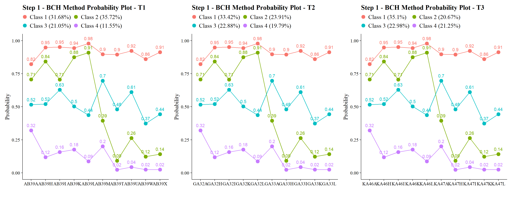

------------------------------------------------------------------------

#### BCH Step 2: Extract BCH weights

------------------------------------------------------------------------


``` r
bch_savedata <- as.data.frame(inv_bch$savedata)
#summary(bch_savedata)
```

------------------------------------------------------------------------

#### BCH Step 3a: Estimate the Unconditional LTA Model Using BCH Weights


``` r
step3_bch  <- mplusObject(
  TITLE = "Step 3 - BCH Method", 
  
  VARIABLE = 
 "usevar = BCHW1-BCHW64;
  
  training = BCHW1-BCHW64(bch);
 
  classes = c1(4) c2(4) c3(4);" ,
  
  ANALYSIS = 
 "type = mixture; 
  starts = 0;",
 
  MODEL = glue(
  "%overall%
  
  c2 ON c1;
  c3 ON c2;"),

  usevariables = colnames(bch_savedata), 
  rdata = bch_savedata)

step3_fit_bch <- mplusModeler(step3_bch,
               dataout=here("three_lta", "phase_3", "step_3a_bch", "step3.dat"), 
               modelout=here("three_lta", "phase_3", "step_3a_bch", "unconditional_bch.inp"), 
               check=TRUE, run = TRUE, hashfilename = FALSE)
```

##### Plotting BCH Transition Probabilities

------------------------------------------------------------------------


``` r
source(here("functions","plot_transition.R"))

lta_model <- readModels(here("three_lta", "phase_3", "step_3a_bch", "unconditional_bch.out"))

plot_transition(
  model_name = lta_model,
  facet_labels = c(`1` = "Very Positive", `2` = "Qualified Positive", `3` = "Neutral", `4` = "Less Positive"),
  timepoint_labels = c(`1` = "Grade 7", `2` = "Grade 10", `3` = "Grade 12"),
  class_labels = c(`1` = "Very Positive", `2` = "Qualified Positive", `3` = "Neutral", `4` = "Less Positive")
) +
  labs(title = "Unconditional LTA (BCH Method)")
```

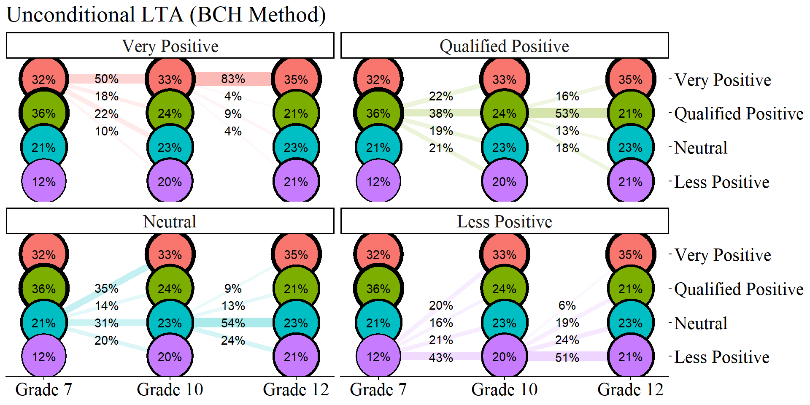

``` r

ggsave(here("figures", "unconditional_lta_bch.jpeg"), dpi="retina", height = 6, width = 10, bg = "white",  units="in")
```

------------------------------------------------------------------------

#### BCH Step 3b: Estimate the Covariate-Adjusted LTA Model Using BCH Weights


``` r
step3_bch  <- mplusObject(
  TITLE = "Step 3 - BCH Method", 
  
  VARIABLE = 
 "usevar = BCHW1-BCHW64 MINORITY, FEMALE;
  
  training = BCHW1-BCHW64(bch);
 
  classes = c1(4) c2(4) c3(4);" ,
  
  ANALYSIS = 
 "estimator = mlr; 
  type = mixture; 
  starts = 0;",
  
  MODEL =
  glue(
 " %OVERALL%
 
  c1 ON MINORITY Female;
  c2 ON c1 MINORITY Female;
  c3 ON c2 MINORITY Female;"),
  
  usevariables = colnames(bch_savedata), 
  rdata = bch_savedata)

step3_fit_bch <- mplusModeler(step3_bch,
               dataout=here("three_lta", "phase_3", "step_3b_bch", "step3.dat"), 
               modelout=here("three_lta", "phase_3", "step_3b_bch", "bch_covariates.inp"), 
               check=TRUE, run = TRUE, hashfilename = FALSE)
```

##### Covariate Table: BCH Method

------------------------------------------------------------------------


``` r
lta_cov_model <- readModels(here("three_lta", "phase_3", "step_3b_bch", "bch_covariates.out"))

# REFERENCE CLASS 4
cov <- as.data.frame(lta_cov_model[["parameters"]][["unstandardized"]]) %>%
  filter(param %in% c("MINORITY", "FEMALE")) %>% 
  mutate(param = case_when(
            param == "FEMALE" ~ "Gender",
            param == "MINORITY" ~ "URM"),
    se = paste0("(", format(round(se,2), nsmall =2), ")")) %>% 
  separate(paramHeader, into = c("Time", "Class"), sep = "#") %>% 
  mutate(Class = case_when(
            Class == "1.ON" ~ "Very Positive",
            Class == "2.ON" ~ "Qualified Positive",
            Class == "3.ON" ~ "Neutral"),
         Time = case_when(
            Time == "C1" ~ "7th Grade (T1)",
            Time == "C2" ~ "10th Grade (T2)",
            Time == "C3" ~ "12th Grade (T3)",
         )
         ) %>% 
  unite(estimate, est, se, sep = " ") %>% 
  select(Time:pval, -est_se) %>% 
  mutate(pval = ifelse(pval<0.001, paste0("<.001*"),
                       ifelse(pval<0.05, paste0(scales::number(pval, accuracy = .001), "*"),
                              scales::number(pval, accuracy = .001))))


# Create table

cov_m1 <- cov %>% 
  group_by(param, Class) %>% 
  gt() %>% 
  tab_header(
    title = "Relations Between the Covariates and Latent Class (BCH Method)") %>%
  tab_footnote(
    footnote = md(
      "Reference Group: Less Positive"
    ),
locations = cells_title()
  ) %>% 
  cols_label(
    param = md("Covariate"),
    estimate = md("Estimate (*se*)"),
    pval = md("*p*-value")) %>% 
  sub_missing(1:3,
              missing_text = "") %>%
  sub_values(values = c(999.000), replacement = "-") %>% 
  cols_align(align = "center") %>% 
  opt_align_table_header(align = "left") %>% 
  gt::tab_options(table.font.names = "serif") 

cov_m1
```


```{=html}
<div id="inywymywld" style="padding-left:0px;padding-right:0px;padding-top:10px;padding-bottom:10px;overflow-x:auto;overflow-y:auto;width:auto;height:auto;">
<style>#inywymywld table {
  font-family: serif;
  -webkit-font-smoothing: antialiased;
  -moz-osx-font-smoothing: grayscale;
}

#inywymywld thead, #inywymywld tbody, #inywymywld tfoot, #inywymywld tr, #inywymywld td, #inywymywld th {
  border-style: none;
}

#inywymywld p {
  margin: 0;
  padding: 0;
}

#inywymywld .gt_table {
  display: table;
  border-collapse: collapse;
  line-height: normal;
  margin-left: auto;
  margin-right: auto;
  color: #333333;
  font-size: 16px;
  font-weight: normal;
  font-style: normal;
  background-color: #FFFFFF;
  width: auto;
  border-top-style: solid;
  border-top-width: 2px;
  border-top-color: #A8A8A8;
  border-right-style: none;
  border-right-width: 2px;
  border-right-color: #D3D3D3;
  border-bottom-style: solid;
  border-bottom-width: 2px;
  border-bottom-color: #A8A8A8;
  border-left-style: none;
  border-left-width: 2px;
  border-left-color: #D3D3D3;
}

#inywymywld .gt_caption {
  padding-top: 4px;
  padding-bottom: 4px;
}

#inywymywld .gt_title {
  color: #333333;
  font-size: 125%;
  font-weight: initial;
  padding-top: 4px;
  padding-bottom: 4px;
  padding-left: 5px;
  padding-right: 5px;
  border-bottom-color: #FFFFFF;
  border-bottom-width: 0;
}

#inywymywld .gt_subtitle {
  color: #333333;
  font-size: 85%;
  font-weight: initial;
  padding-top: 3px;
  padding-bottom: 5px;
  padding-left: 5px;
  padding-right: 5px;
  border-top-color: #FFFFFF;
  border-top-width: 0;
}

#inywymywld .gt_heading {
  background-color: #FFFFFF;
  text-align: left;
  border-bottom-color: #FFFFFF;
  border-left-style: none;
  border-left-width: 1px;
  border-left-color: #D3D3D3;
  border-right-style: none;
  border-right-width: 1px;
  border-right-color: #D3D3D3;
}

#inywymywld .gt_bottom_border {
  border-bottom-style: solid;
  border-bottom-width: 2px;
  border-bottom-color: #D3D3D3;
}

#inywymywld .gt_col_headings {
  border-top-style: solid;
  border-top-width: 2px;
  border-top-color: #D3D3D3;
  border-bottom-style: solid;
  border-bottom-width: 2px;
  border-bottom-color: #D3D3D3;
  border-left-style: none;
  border-left-width: 1px;
  border-left-color: #D3D3D3;
  border-right-style: none;
  border-right-width: 1px;
  border-right-color: #D3D3D3;
}

#inywymywld .gt_col_heading {
  color: #333333;
  background-color: #FFFFFF;
  font-size: 100%;
  font-weight: normal;
  text-transform: inherit;
  border-left-style: none;
  border-left-width: 1px;
  border-left-color: #D3D3D3;
  border-right-style: none;
  border-right-width: 1px;
  border-right-color: #D3D3D3;
  vertical-align: bottom;
  padding-top: 5px;
  padding-bottom: 6px;
  padding-left: 5px;
  padding-right: 5px;
  overflow-x: hidden;
}

#inywymywld .gt_column_spanner_outer {
  color: #333333;
  background-color: #FFFFFF;
  font-size: 100%;
  font-weight: normal;
  text-transform: inherit;
  padding-top: 0;
  padding-bottom: 0;
  padding-left: 4px;
  padding-right: 4px;
}

#inywymywld .gt_column_spanner_outer:first-child {
  padding-left: 0;
}

#inywymywld .gt_column_spanner_outer:last-child {
  padding-right: 0;
}

#inywymywld .gt_column_spanner {
  border-bottom-style: solid;
  border-bottom-width: 2px;
  border-bottom-color: #D3D3D3;
  vertical-align: bottom;
  padding-top: 5px;
  padding-bottom: 5px;
  overflow-x: hidden;
  display: inline-block;
  width: 100%;
}

#inywymywld .gt_spanner_row {
  border-bottom-style: hidden;
}

#inywymywld .gt_group_heading {
  padding-top: 8px;
  padding-bottom: 8px;
  padding-left: 5px;
  padding-right: 5px;
  color: #333333;
  background-color: #FFFFFF;
  font-size: 100%;
  font-weight: initial;
  text-transform: inherit;
  border-top-style: solid;
  border-top-width: 2px;
  border-top-color: #D3D3D3;
  border-bottom-style: solid;
  border-bottom-width: 2px;
  border-bottom-color: #D3D3D3;
  border-left-style: none;
  border-left-width: 1px;
  border-left-color: #D3D3D3;
  border-right-style: none;
  border-right-width: 1px;
  border-right-color: #D3D3D3;
  vertical-align: middle;
  text-align: left;
}

#inywymywld .gt_empty_group_heading {
  padding: 0.5px;
  color: #333333;
  background-color: #FFFFFF;
  font-size: 100%;
  font-weight: initial;
  border-top-style: solid;
  border-top-width: 2px;
  border-top-color: #D3D3D3;
  border-bottom-style: solid;
  border-bottom-width: 2px;
  border-bottom-color: #D3D3D3;
  vertical-align: middle;
}

#inywymywld .gt_from_md > :first-child {
  margin-top: 0;
}

#inywymywld .gt_from_md > :last-child {
  margin-bottom: 0;
}

#inywymywld .gt_row {
  padding-top: 8px;
  padding-bottom: 8px;
  padding-left: 5px;
  padding-right: 5px;
  margin: 10px;
  border-top-style: solid;
  border-top-width: 1px;
  border-top-color: #D3D3D3;
  border-left-style: none;
  border-left-width: 1px;
  border-left-color: #D3D3D3;
  border-right-style: none;
  border-right-width: 1px;
  border-right-color: #D3D3D3;
  vertical-align: middle;
  overflow-x: hidden;
}

#inywymywld .gt_stub {
  color: #333333;
  background-color: #FFFFFF;
  font-size: 100%;
  font-weight: initial;
  text-transform: inherit;
  border-right-style: solid;
  border-right-width: 2px;
  border-right-color: #D3D3D3;
  padding-left: 5px;
  padding-right: 5px;
}

#inywymywld .gt_stub_row_group {
  color: #333333;
  background-color: #FFFFFF;
  font-size: 100%;
  font-weight: initial;
  text-transform: inherit;
  border-right-style: solid;
  border-right-width: 2px;
  border-right-color: #D3D3D3;
  padding-left: 5px;
  padding-right: 5px;
  vertical-align: top;
}

#inywymywld .gt_row_group_first td {
  border-top-width: 2px;
}

#inywymywld .gt_row_group_first th {
  border-top-width: 2px;
}

#inywymywld .gt_summary_row {
  color: #333333;
  background-color: #FFFFFF;
  text-transform: inherit;
  padding-top: 8px;
  padding-bottom: 8px;
  padding-left: 5px;
  padding-right: 5px;
}

#inywymywld .gt_first_summary_row {
  border-top-style: solid;
  border-top-color: #D3D3D3;
}

#inywymywld .gt_first_summary_row.thick {
  border-top-width: 2px;
}

#inywymywld .gt_last_summary_row {
  padding-top: 8px;
  padding-bottom: 8px;
  padding-left: 5px;
  padding-right: 5px;
  border-bottom-style: solid;
  border-bottom-width: 2px;
  border-bottom-color: #D3D3D3;
}

#inywymywld .gt_grand_summary_row {
  color: #333333;
  background-color: #FFFFFF;
  text-transform: inherit;
  padding-top: 8px;
  padding-bottom: 8px;
  padding-left: 5px;
  padding-right: 5px;
}

#inywymywld .gt_first_grand_summary_row {
  padding-top: 8px;
  padding-bottom: 8px;
  padding-left: 5px;
  padding-right: 5px;
  border-top-style: double;
  border-top-width: 6px;
  border-top-color: #D3D3D3;
}

#inywymywld .gt_last_grand_summary_row_top {
  padding-top: 8px;
  padding-bottom: 8px;
  padding-left: 5px;
  padding-right: 5px;
  border-bottom-style: double;
  border-bottom-width: 6px;
  border-bottom-color: #D3D3D3;
}

#inywymywld .gt_striped {
  background-color: rgba(128, 128, 128, 0.05);
}

#inywymywld .gt_table_body {
  border-top-style: solid;
  border-top-width: 2px;
  border-top-color: #D3D3D3;
  border-bottom-style: solid;
  border-bottom-width: 2px;
  border-bottom-color: #D3D3D3;
}

#inywymywld .gt_footnotes {
  color: #333333;
  background-color: #FFFFFF;
  border-bottom-style: none;
  border-bottom-width: 2px;
  border-bottom-color: #D3D3D3;
  border-left-style: none;
  border-left-width: 2px;
  border-left-color: #D3D3D3;
  border-right-style: none;
  border-right-width: 2px;
  border-right-color: #D3D3D3;
}

#inywymywld .gt_footnote {
  margin: 0px;
  font-size: 90%;
  padding-top: 4px;
  padding-bottom: 4px;
  padding-left: 5px;
  padding-right: 5px;
}

#inywymywld .gt_sourcenotes {
  color: #333333;
  background-color: #FFFFFF;
  border-bottom-style: none;
  border-bottom-width: 2px;
  border-bottom-color: #D3D3D3;
  border-left-style: none;
  border-left-width: 2px;
  border-left-color: #D3D3D3;
  border-right-style: none;
  border-right-width: 2px;
  border-right-color: #D3D3D3;
}

#inywymywld .gt_sourcenote {
  font-size: 90%;
  padding-top: 4px;
  padding-bottom: 4px;
  padding-left: 5px;
  padding-right: 5px;
}

#inywymywld .gt_left {
  text-align: left;
}

#inywymywld .gt_center {
  text-align: center;
}

#inywymywld .gt_right {
  text-align: right;
  font-variant-numeric: tabular-nums;
}

#inywymywld .gt_font_normal {
  font-weight: normal;
}

#inywymywld .gt_font_bold {
  font-weight: bold;
}

#inywymywld .gt_font_italic {
  font-style: italic;
}

#inywymywld .gt_super {
  font-size: 65%;
}

#inywymywld .gt_footnote_marks {
  font-size: 75%;
  vertical-align: 0.4em;
  position: initial;
}

#inywymywld .gt_asterisk {
  font-size: 100%;
  vertical-align: 0;
}

#inywymywld .gt_indent_1 {
  text-indent: 5px;
}

#inywymywld .gt_indent_2 {
  text-indent: 10px;
}

#inywymywld .gt_indent_3 {
  text-indent: 15px;
}

#inywymywld .gt_indent_4 {
  text-indent: 20px;
}

#inywymywld .gt_indent_5 {
  text-indent: 25px;
}

#inywymywld .katex-display {
  display: inline-flex !important;
  margin-bottom: 0.75em !important;
}

#inywymywld div.Reactable > div.rt-table > div.rt-thead > div.rt-tr.rt-tr-group-header > div.rt-th-group:after {
  height: 0px !important;
}
</style>
<table class="gt_table" data-quarto-disable-processing="false" data-quarto-bootstrap="false">
  <thead>
    <tr class="gt_heading">
      <td colspan="3" class="gt_heading gt_title gt_font_normal gt_bottom_border" style>Relations Between the Covariates and Latent Class (BCH Method)<span class="gt_footnote_marks" style="white-space:nowrap;font-style:italic;font-weight:normal;line-height:0;"><sup>1</sup></span></td>
    </tr>
    
    <tr class="gt_col_headings">
      <th class="gt_col_heading gt_columns_bottom_border gt_center" rowspan="1" colspan="1" scope="col" id="Time">Time</th>
      <th class="gt_col_heading gt_columns_bottom_border gt_center" rowspan="1" colspan="1" scope="col" id="estimate"><span class='gt_from_md'>Estimate (<em>se</em>)</span></th>
      <th class="gt_col_heading gt_columns_bottom_border gt_center" rowspan="1" colspan="1" scope="col" id="pval"><span class='gt_from_md'><em>p</em>-value</span></th>
    </tr>
  </thead>
  <tbody class="gt_table_body">
    <tr class="gt_group_heading_row">
      <th colspan="3" class="gt_group_heading" scope="colgroup" id="URM - Very Positive">URM - Very Positive</th>
    </tr>
    <tr class="gt_row_group_first"><td headers="URM - Very Positive  Time" class="gt_row gt_center">7th Grade (T1)</td>
<td headers="URM - Very Positive  estimate" class="gt_row gt_center">0.225 (0.27)</td>
<td headers="URM - Very Positive  pval" class="gt_row gt_center">0.406</td></tr>
    <tr><td headers="URM - Very Positive  Time" class="gt_row gt_center">10th Grade (T2)</td>
<td headers="URM - Very Positive  estimate" class="gt_row gt_center">0.442 (0.27)</td>
<td headers="URM - Very Positive  pval" class="gt_row gt_center">0.100</td></tr>
    <tr><td headers="URM - Very Positive  Time" class="gt_row gt_center">12th Grade (T3)</td>
<td headers="URM - Very Positive  estimate" class="gt_row gt_center">0.809 (0.60)</td>
<td headers="URM - Very Positive  pval" class="gt_row gt_center">0.175</td></tr>
    <tr class="gt_group_heading_row">
      <th colspan="3" class="gt_group_heading" scope="colgroup" id="Gender - Very Positive">Gender - Very Positive</th>
    </tr>
    <tr class="gt_row_group_first"><td headers="Gender - Very Positive  Time" class="gt_row gt_center">7th Grade (T1)</td>
<td headers="Gender - Very Positive  estimate" class="gt_row gt_center">-0.655 (0.19)</td>
<td headers="Gender - Very Positive  pval" class="gt_row gt_center">0.001*</td></tr>
    <tr><td headers="Gender - Very Positive  Time" class="gt_row gt_center">10th Grade (T2)</td>
<td headers="Gender - Very Positive  estimate" class="gt_row gt_center">-0.091 (0.20)</td>
<td headers="Gender - Very Positive  pval" class="gt_row gt_center">0.641</td></tr>
    <tr><td headers="Gender - Very Positive  Time" class="gt_row gt_center">12th Grade (T3)</td>
<td headers="Gender - Very Positive  estimate" class="gt_row gt_center">0.338 (0.45)</td>
<td headers="Gender - Very Positive  pval" class="gt_row gt_center">0.457</td></tr>
    <tr class="gt_group_heading_row">
      <th colspan="3" class="gt_group_heading" scope="colgroup" id="URM - Qualified Positive">URM - Qualified Positive</th>
    </tr>
    <tr class="gt_row_group_first"><td headers="URM - Qualified Positive  Time" class="gt_row gt_center">7th Grade (T1)</td>
<td headers="URM - Qualified Positive  estimate" class="gt_row gt_center">0.096 (0.28)</td>
<td headers="URM - Qualified Positive  pval" class="gt_row gt_center">0.736</td></tr>
    <tr><td headers="URM - Qualified Positive  Time" class="gt_row gt_center">10th Grade (T2)</td>
<td headers="URM - Qualified Positive  estimate" class="gt_row gt_center">0.444 (0.27)</td>
<td headers="URM - Qualified Positive  pval" class="gt_row gt_center">0.105</td></tr>
    <tr><td headers="URM - Qualified Positive  Time" class="gt_row gt_center">12th Grade (T3)</td>
<td headers="URM - Qualified Positive  estimate" class="gt_row gt_center">1.099 (0.40)</td>
<td headers="URM - Qualified Positive  pval" class="gt_row gt_center">0.006*</td></tr>
    <tr class="gt_group_heading_row">
      <th colspan="3" class="gt_group_heading" scope="colgroup" id="Gender - Qualified Positive">Gender - Qualified Positive</th>
    </tr>
    <tr class="gt_row_group_first"><td headers="Gender - Qualified Positive  Time" class="gt_row gt_center">7th Grade (T1)</td>
<td headers="Gender - Qualified Positive  estimate" class="gt_row gt_center">0.1 (0.20)</td>
<td headers="Gender - Qualified Positive  pval" class="gt_row gt_center">0.621</td></tr>
    <tr><td headers="Gender - Qualified Positive  Time" class="gt_row gt_center">10th Grade (T2)</td>
<td headers="Gender - Qualified Positive  estimate" class="gt_row gt_center">0.411 (0.20)</td>
<td headers="Gender - Qualified Positive  pval" class="gt_row gt_center">0.039*</td></tr>
    <tr><td headers="Gender - Qualified Positive  Time" class="gt_row gt_center">12th Grade (T3)</td>
<td headers="Gender - Qualified Positive  estimate" class="gt_row gt_center">0.623 (0.27)</td>
<td headers="Gender - Qualified Positive  pval" class="gt_row gt_center">0.022*</td></tr>
    <tr class="gt_group_heading_row">
      <th colspan="3" class="gt_group_heading" scope="colgroup" id="URM - Neutral">URM - Neutral</th>
    </tr>
    <tr class="gt_row_group_first"><td headers="URM - Neutral  Time" class="gt_row gt_center">7th Grade (T1)</td>
<td headers="URM - Neutral  estimate" class="gt_row gt_center">0.515 (0.32)</td>
<td headers="URM - Neutral  pval" class="gt_row gt_center">0.103</td></tr>
    <tr><td headers="URM - Neutral  Time" class="gt_row gt_center">10th Grade (T2)</td>
<td headers="URM - Neutral  estimate" class="gt_row gt_center">0.145 (0.31)</td>
<td headers="URM - Neutral  pval" class="gt_row gt_center">0.640</td></tr>
    <tr><td headers="URM - Neutral  Time" class="gt_row gt_center">12th Grade (T3)</td>
<td headers="URM - Neutral  estimate" class="gt_row gt_center">0.822 (0.40)</td>
<td headers="URM - Neutral  pval" class="gt_row gt_center">0.039*</td></tr>
    <tr class="gt_group_heading_row">
      <th colspan="3" class="gt_group_heading" scope="colgroup" id="Gender - Neutral">Gender - Neutral</th>
    </tr>
    <tr class="gt_row_group_first"><td headers="Gender - Neutral  Time" class="gt_row gt_center">7th Grade (T1)</td>
<td headers="Gender - Neutral  estimate" class="gt_row gt_center">-0.431 (0.24)</td>
<td headers="Gender - Neutral  pval" class="gt_row gt_center">0.069</td></tr>
    <tr><td headers="Gender - Neutral  Time" class="gt_row gt_center">10th Grade (T2)</td>
<td headers="Gender - Neutral  estimate" class="gt_row gt_center">0.062 (0.21)</td>
<td headers="Gender - Neutral  pval" class="gt_row gt_center">0.771</td></tr>
    <tr><td headers="Gender - Neutral  Time" class="gt_row gt_center">12th Grade (T3)</td>
<td headers="Gender - Neutral  estimate" class="gt_row gt_center">0.372 (0.26)</td>
<td headers="Gender - Neutral  pval" class="gt_row gt_center">0.152</td></tr>
  </tbody>
  <tfoot>
    <tr class="gt_footnotes">
      <td class="gt_footnote" colspan="3"><span class="gt_footnote_marks" style="white-space:nowrap;font-style:italic;font-weight:normal;line-height:0;"><sup>1</sup></span> <span class='gt_from_md'>Reference Group: Less Positive</span></td>
    </tr>
  </tfoot>
</table>
</div>
```


``` r

gtsave(cov_m1, here("figures", "cov_table_bch.png"))
```


<div style="text-align: center;"></div>
