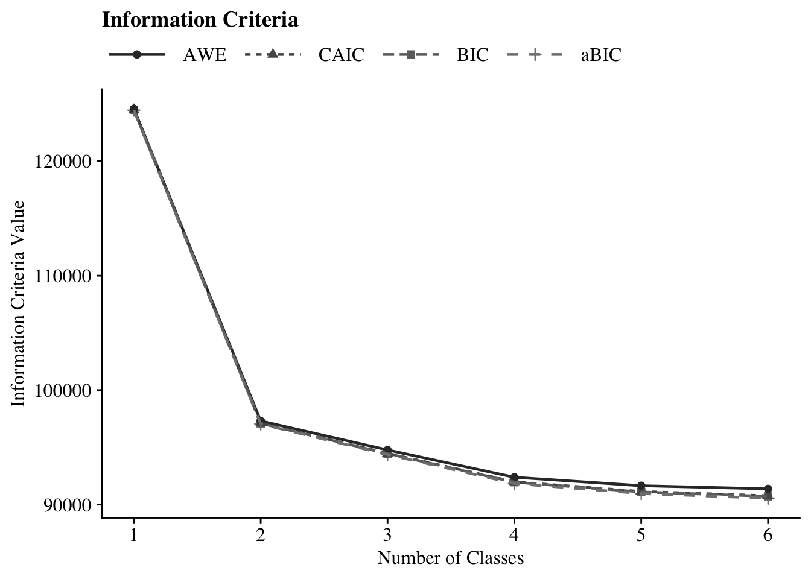
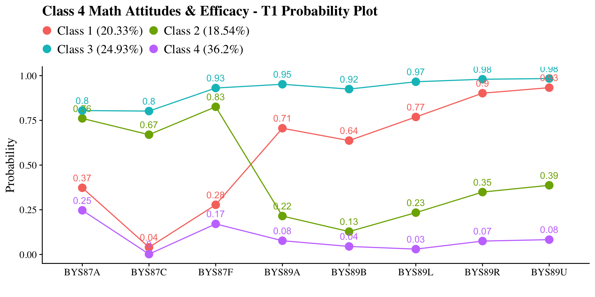
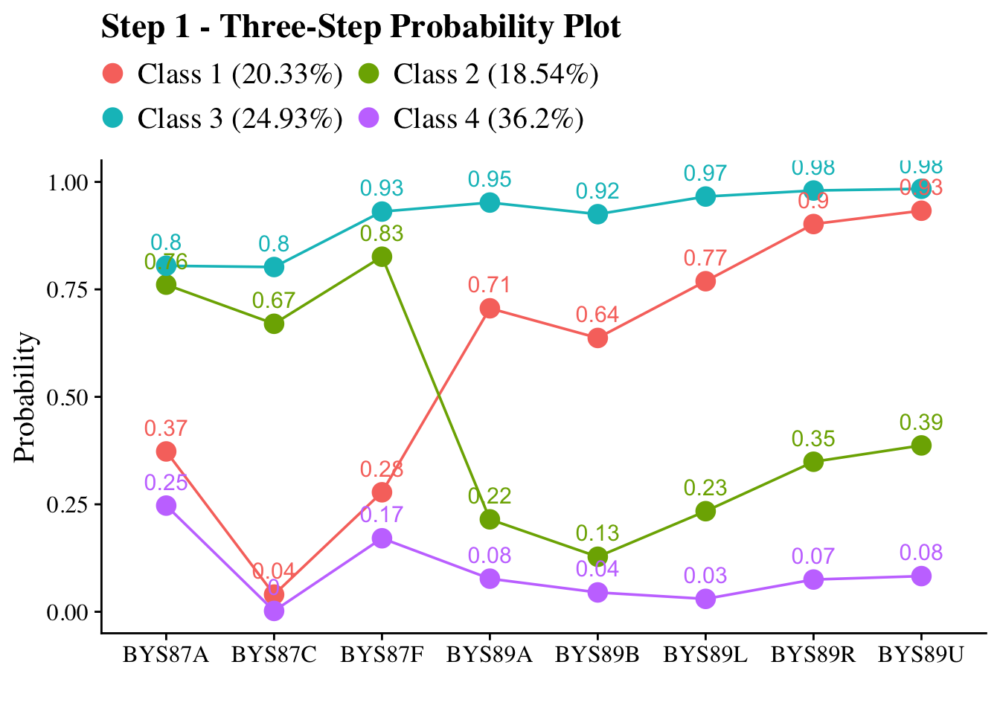
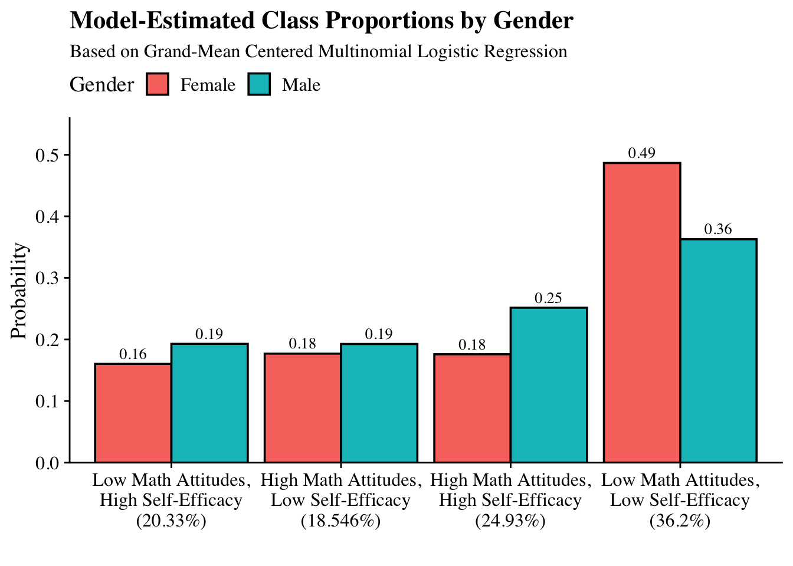
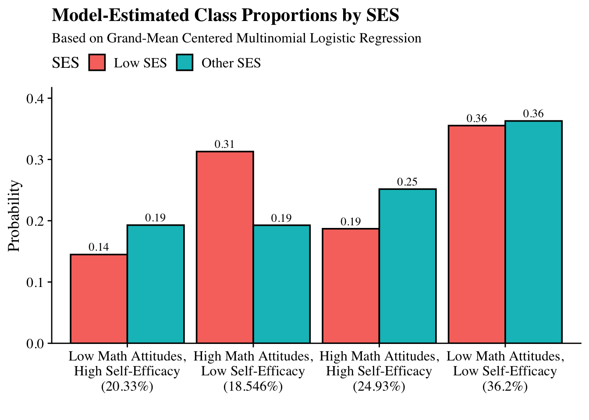
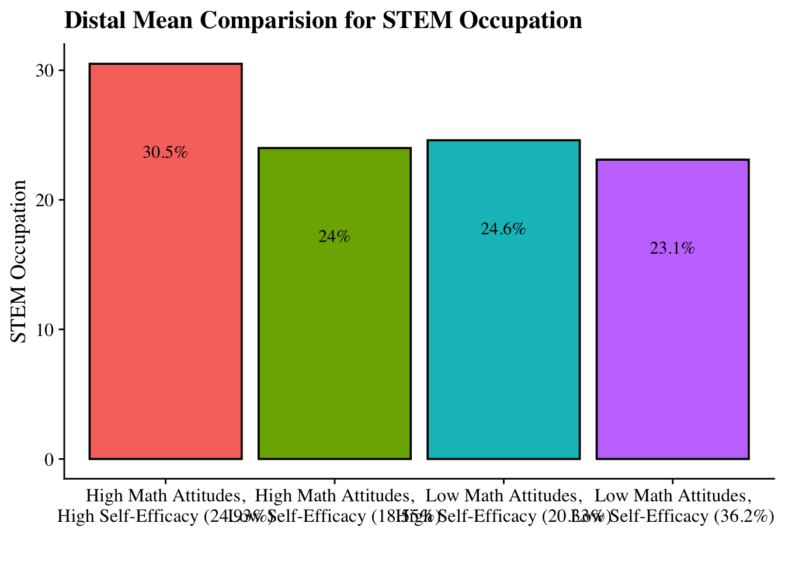

# Math Attitudes with STEM Career Attainment (Dang, M., & Nylund-Gibson, K., 2017)

Citation: [Dang, M., & Nylund-Gibson, K. (2017). Connecting Math Attitudes with STEM Career Attainment: A Latent Class Analysis Approach. Teachers College Record: The Voice of Scholarship in Education, 119(6), 1–38.](https://doi.org/10.1177/016146811711900602)

-   BY = Base Year (2002) - 10th grade

    -   Completed the baseline survey of high school sophomores in spring term 2002.

-   F1 = First follow up (2004) - 12th grade

    -   Most sample members were seniors, but some were dropouts or in other grades (early graduates or retained in an earlier grade).

-   F2 = Second follow up (2006) - Post-high-school follow-up

-   F3 = Third follow up (2012) - Kids are ~26yo

## Item Descriptions

### Base Year Covariates

*English Proficiency*
BYS70A: How well student understands English (1 = Very well, 4 = Not at all) 
BYS70B: How well student speaks English (1 = Very well, 4 = Not at all) 
BYS70C: How well student reads English (1 = Very well, 4 = Not at all)
BYS70D: How well 10th-grader writes English (1 = Very well, 4 = Not at all) 
BYTM12B: Student behind on schoolwork due to limited proficiency in English
BYSTLANG: English if student's native language

*Demographics*
BYSEX: 1 = Male, 2 = Female
BYRACE_R: All -5 since restricted
BYSES2QU: SES Quartile

### Base Year Indicators

BYS87A: When I do mathematics, I sometimes get totally absorbed
BYS87C: Because doing mathematics is fun, I wouldn't want to give it up
BYS87F: Mathematics is important to me personally

BYS89A: I'm confident that I can do an excellent job on my math tests
BYS89B: I'm certain I can understand the most difficult material presented in math texts
BYS89L: I'm confident I can understand the most complex material presented by my math teacher
BYS89R: I'm confident I can do an excellent job on my math assignments
BYS89U: I'm certain I can master the skills being taught in my math class

*Math Attitude BYS87 Items*

[Description]{.underline}: How much do you agree or disagree with the following
statements?

[Response options]{.underline}:

1 - Strongly agree

2 - Agree

3 - Disagree

4-  Strongly disagree


*Math Self-Efficacy BYS89/F1S18 Items*

[Description]{.underline}: How much do you agree or disagree with the following
statements?

[Response options]{.underline}:

1 - Almost never

2 - Sometimes

3 - Often

4-  Almost always

### F1 Indicators

F1S18A: I'm confident that I can do an excellent job on my math tests
F1S18B: I'm certain I can understand the most difficult material presented in my math textbooks
F1S18C: I'm confident I can understand the most complex material presented by my math teacher
F1S18D: I'm confident I can do an excellent job on my math assignments
F1S18E: I'm certain I can master the skills being taught in my math class

### Outcomes

F3ONET2CURR: 2 digit code for most recent job
F3ONET6CURR: 6 digit code for most recent job
F3BYTSCWT: Panel weight

## Read in data

Read in ELS `.sav` file:


``` r
els_sav <- read_csv(here("29-dang-lca-example", "els_data", "els_dang_analysis.csv"))
```


View codebook:


``` r
#view_df(els_sav)
```

Save subset:


``` r
els_subset <- els_sav %>% 
  clean_names() %>%
  dplyr::select(
    stu_id, strat_id, psu,
    bys87a,bys87c,bys87f,bys89a,bys89b,bys89l,bys89r,bys89u,
    f1s18a,f1s18b,f1s18c,f1s18d,f1s18e,
    bys70a,bys70b,bys70c,bys70d,bystlang,bytm12b,bysex,byrace_r,
    byses2qu,f3onet2curr,f3onet6curr, f3bystemoc30, f3bytscwt
         ) %>%
  mutate(school = paste0(strat_id,psu))

view_df(els_subset)

#write_csv(els_subset, here("29-dang-lca-example", "els_data", "els_dang_analysis.csv"))
```

Read in ELS data file, `els_dang_analysis.csv`.


``` r
bys87_items <- c("bys87a","bys87c","bys87f")

f1s18_items <- c("f1s18a","f1s18b","f1s18c","f1s18d","f1s18e")

bys89_items <- c("bys89a","bys89b","bys89l","bys89r","bys89u")

els_data <- read_csv(
  here("29-dang-lca-example", "els_data", "els_dang_analysis.csv"),
  na = c("-9", "-8", "-6", "-5", "-4", "-7", "-1", "-3", "-2", "-99")
) %>%
  # Dichotomize English proficiency
  mutate(across(
    c(bys70a, bys70b, bys70c, bys70d),
    ~ case_when(. %in% c(1, 2) ~ 1, 
                . %in% c(3, 4) ~ 0, 
                TRUE ~ NA_real_)
  )) %>%
  mutate(across(
    c(f3onet2curr),
    ~ case_when(is.na(.) ~ NA_real_,
                . %in% c(11, 15, 17, 19, 25, 45, 51) ~ 1, 
                TRUE ~ 0)
  )) %>%
  mutate(female = case_match(bysex, 
                             2 ~ 1, 
                             1 ~ 0, 
                             .default = NA_real_)) %>%
  mutate(ses_dichotomized = case_match(
    byses2qu,
    1 ~ 1,
    NA ~ NA,
    .default = 0   
  )) %>%
  mutate(across(
    all_of(bys87_items),
    ~ case_when(. %in% c(1, 2) ~ 1,
                . %in% c(3, 4) ~ 0,
                TRUE ~ NA_real_)
  )) %>%
  mutate(across(all_of(c(
    bys89_items, f1s18_items
  )), ~ case_when(
    . %in% c(1, 2) ~ 0,
    . %in% c(3, 4) ~ 1, 
    TRUE ~ NA_real_
  )))

summary(els_data)
#>      stu_id          strat_id          psu       
#>  Min.   :101101   Min.   :101.0   Min.   :1.000  
#>  1st Qu.:190106   1st Qu.:190.0   1st Qu.:1.000  
#>  Median :281116   Median :281.0   Median :2.000  
#>  Mean   :279543   Mean   :279.4   Mean   :1.557  
#>  3rd Qu.:369205   3rd Qu.:369.0   3rd Qu.:2.000  
#>  Max.   :461234   Max.   :461.0   Max.   :3.000  
#>                                                  
#>      bys87a           bys87c           bys87f      
#>  Min.   :0.0000   Min.   :0.0000   Min.   :0.0000  
#>  1st Qu.:0.0000   1st Qu.:0.0000   1st Qu.:0.0000  
#>  Median :1.0000   Median :0.0000   Median :1.0000  
#>  Mean   :0.5181   Mean   :0.3387   Mean   :0.5108  
#>  3rd Qu.:1.0000   3rd Qu.:1.0000   3rd Qu.:1.0000  
#>  Max.   :1.0000   Max.   :1.0000   Max.   :1.0000  
#>  NAs    :4457     NAs    :4523     NAs    :4439    
#>      bys89a           bys89b           bys89l      
#>  Min.   :0.0000   Min.   :0.0000   Min.   :0.0000  
#>  1st Qu.:0.0000   1st Qu.:0.0000   1st Qu.:0.0000  
#>  Median :0.0000   Median :0.0000   Median :0.0000  
#>  Mean   :0.4436   Mean   :0.3987   Mean   :0.4482  
#>  3rd Qu.:1.0000   3rd Qu.:1.0000   3rd Qu.:1.0000  
#>  Max.   :1.0000   Max.   :1.0000   Max.   :1.0000  
#>  NAs    :4806     NAs    :4765     NAs    :5150    
#>      bys89r           bys89u          f1s18a      
#>  Min.   :0.0000   Min.   :0.000   Min.   :0.0000  
#>  1st Qu.:0.0000   1st Qu.:0.000   1st Qu.:0.0000  
#>  Median :1.0000   Median :1.000   Median :0.0000  
#>  Mean   :0.5168   Mean   :0.534   Mean   :0.4841  
#>  3rd Qu.:1.0000   3rd Qu.:1.000   3rd Qu.:1.0000  
#>  Max.   :1.0000   Max.   :1.000   Max.   :1.0000  
#>  NAs    :5374     NAs    :5536    NAs    :5860    
#>      f1s18b           f1s18c           f1s18d      
#>  Min.   :0.0000   Min.   :0.0000   Min.   :0.0000  
#>  1st Qu.:0.0000   1st Qu.:0.0000   1st Qu.:0.0000  
#>  Median :0.0000   Median :0.0000   Median :1.0000  
#>  Mean   :0.4093   Mean   :0.4506   Mean   :0.6541  
#>  3rd Qu.:1.0000   3rd Qu.:1.0000   3rd Qu.:1.0000  
#>  Max.   :1.0000   Max.   :1.0000   Max.   :1.0000  
#>  NAs    :5883     NAs    :5907     NAs    :5913    
#>      f1s18e           bys70a           bys70b      
#>  Min.   :0.0000   Min.   :0.0000   Min.   :0.0000  
#>  1st Qu.:0.0000   1st Qu.:1.0000   1st Qu.:1.0000  
#>  Median :1.0000   Median :1.0000   Median :1.0000  
#>  Mean   :0.5899   Mean   :0.9522   Mean   :0.9272  
#>  3rd Qu.:1.0000   3rd Qu.:1.0000   3rd Qu.:1.0000  
#>  Max.   :1.0000   Max.   :1.0000   Max.   :1.0000  
#>  NAs    :5903     NAs    :13916    NAs    :13904   
#>      bys70c           bys70d          bystlang     
#>  Min.   :0.0000   Min.   :0.0000   Min.   :0.0000  
#>  1st Qu.:1.0000   1st Qu.:1.0000   1st Qu.:1.0000  
#>  Median :1.0000   Median :1.0000   Median :1.0000  
#>  Mean   :0.9222   Mean   :0.8954   Mean   :0.8304  
#>  3rd Qu.:1.0000   3rd Qu.:1.0000   3rd Qu.:1.0000  
#>  Max.   :1.0000   Max.   :1.0000   Max.   :1.0000  
#>  NAs    :13923    NAs    :13913    NAs    :953     
#>     bytm12b            bysex       byrace_r      
#>  Min.   :0.00000   Min.   :1.000   Mode:logical  
#>  1st Qu.:0.00000   1st Qu.:1.000   NAs :16197    
#>  Median :0.00000   Median :2.000                 
#>  Mean   :0.03861   Mean   :1.502                 
#>  3rd Qu.:0.00000   3rd Qu.:2.000                 
#>  Max.   :1.00000   Max.   :2.000                 
#>  NAs    :11924     NAs    :827                   
#>     byses2qu      f3onet2curr    f3onet6curr   
#>  Min.   :1.000   Min.   :0.000   Mode:logical  
#>  1st Qu.:2.000   1st Qu.:0.000   NAs :16197    
#>  Median :3.000   Median :0.000                 
#>  Mean   :2.574   Mean   :0.271                 
#>  3rd Qu.:4.000   3rd Qu.:1.000                 
#>  Max.   :4.000   Max.   :1.000                 
#>  NAs    :953     NAs    :3401                  
#>    f3bytscwt          school         female      
#>  Min.   :   0.0   Min.   :1011   Min.   :0.0000  
#>  1st Qu.:   0.0   1st Qu.:1901   1st Qu.:0.0000  
#>  Median : 150.7   Median :2811   Median :1.0000  
#>  Mean   : 200.6   Mean   :2795   Mean   :0.5021  
#>  3rd Qu.: 310.3   3rd Qu.:3692   3rd Qu.:1.0000  
#>  Max.   :2163.2   Max.   :4612   Max.   :1.0000  
#>                                  NAs    :827     
#>  ses_dichotomized
#>  Min.   :0.0000  
#>  1st Qu.:0.0000  
#>  Median :0.0000  
#>  Mean   :0.2362  
#>  3rd Qu.:0.0000  
#>  Max.   :1.0000  
#>  NAs    :953

summary(factor(els_data$bys70a))
#>     0     1   NAs 
#>   109  2172 13916
summary(factor(els_data$bys70b))
#>     0     1   NAs 
#>   167  2126 13904
summary(factor(els_data$bys70c))
#>     0     1   NAs 
#>   177  2097 13923
summary(factor(els_data$bys70d))
#>     0     1   NAs 
#>   239  2045 13913
summary(factor(els_data$bystlang))
#>     0     1   NAs 
#>  2586 12658   953
summary(factor(els_data$f3onet2curr))
#>    0    1  NAs 
#> 9328 3468 3401
summary(factor(els_data$female))
#>    0    1  NAs 
#> 7653 7717  827
summary(factor(els_data$bysex))
#>    1    2  NAs 
#> 7653 7717  827
summary(factor(els_data$byses2qu))
#>    1    2    3    4  NAs 
#> 3600 3590 3753 4301  953
summary(factor(els_data$ses_dichotomized))
#>     0     1   NAs 
#> 11644  3600   953
```

## Descriptive Statistics


*Linguistic Minority*

"Respondents were classified as linguistic minority if they reported that English was not their first language and they responded that they read,speak, write, and/or understand English well. Respondents were classified as native English speakers if they indicated they speak English as a first language and they read, speak, write, and understand English well. Using these criteria, among the total 8,790 students, 7,490 (85.2%) were classified as native English speakers, 1,040 (11.8%) were classified as linguistic minority students, and 260 (3.0%) were classified as ELLs." (page 8)

BYS70A: How well student understands English (1 = Very well, 4 = Not at all) but already dichotomized
BYS70B: How well student speaks English (1 = Very well, 4 = Not at all) but already dichotomized
BYS70C: How well student reads English (1 = Very well, 4 = Not at all) but already dichotomized
BYS70D: How well 10th-grader writes English (1 = Very well, 4 = Not at all) but already dichotomized
BYTM12B: Student behind on schoolwork due to limited proficiency in English


``` r
ling_min <- els_subset %>% 
  mutate(across(where(is.labelled), zap_labels)) %>%
  replace_with_na_all(condition = ~.x %in% c(-9,-8,-6,-5,-4,-7,-1,-3,-2,-99)) %>% 
  select(bys70a,bys70b,bys70c,bys70d,bytm12b)   

f <- All(ling_min) ~ Mean + SD + Min + Median + Max + Histogram

datasummary(f, els_subset, output="markdown")

summary(factor(ling_min$bys70a))
summary(factor(ling_min$bys70b))
summary(factor(ling_min$bys70c))
summary(factor(ling_min$bys70d))
summary(factor(ling_min$bytm12b))


# Trying to create the linguistic minority variable:
ling_minority_var <- els_data %>% 
  mutate(
    lang_status = case_when(
      # Condition A: Native English Speaker
      # Native language is English AND proficient in all 4 domains
      bystlang == 1 & bys70a == 1 & bys70b == 1 & bys70c == 1 & bys70d == 1 
        ~ "Native English Speaker",
      
      # Condition B: Linguistic Minority
      # Not native English speaker, BUT reads, speaks, writes, and/or understands well
      bystlang == 0 & (bys70a == 1 | bys70b == 1 | bys70c == 1 | bys70d == 1) 
        ~ "Linguistic Minority",
      
      # Condition C: ELL (English Language Learner)
      # Not native English speaker AND has limited proficiency / behind in schoolwork
      bystlang == 0 & (bytm12b == 1 | (bys70a != 1 & bys70b != 1 & bys70c != 1 & bys70d != 1)) 
        ~ "ELL",
      
      # If data is missing for vital logic pieces, preserve it as NA
      TRUE ~ NA_character_
    ),
    # Convert to a factor for clean modeling/summaries later
    lang_status = factor(lang_status, levels = c("Native English Speaker", "Linguistic Minority", "ELL"))
  )
  

summary(factor(ling_minority_var$lang_status))
```

---


``` r
math_subset <- els_data %>% 
  select(bys87a,bys87c,bys87f,bys89a,bys89b,bys89l,bys89r,bys89u,f1s18a,f1s18b,f1s18c,f1s18d,f1s18e)                 
```

Descriptive


``` r
f <- All(math_subset) ~ Mean + SD + Min + Median + Max + Histogram

datasummary(f, els_data, output="markdown")
```


+--------+------+------+------+--------+------+-----------+
|        | Mean | SD   | Min  | Median | Max  | Histogram |
+========+======+======+======+========+======+===========+
| bys87a | 0.52 | 0.50 | 0.00 | 1.00   | 1.00 | ▇▇        |
+--------+------+------+------+--------+------+-----------+
| bys87c | 0.34 | 0.47 | 0.00 | 0.00   | 1.00 | ▇▄        |
+--------+------+------+------+--------+------+-----------+
| bys87f | 0.51 | 0.50 | 0.00 | 1.00   | 1.00 | ▇▇        |
+--------+------+------+------+--------+------+-----------+
| bys89a | 0.44 | 0.50 | 0.00 | 0.00   | 1.00 | ▇▆        |
+--------+------+------+------+--------+------+-----------+
| bys89b | 0.40 | 0.49 | 0.00 | 0.00   | 1.00 | ▇▅        |
+--------+------+------+------+--------+------+-----------+
| bys89l | 0.45 | 0.50 | 0.00 | 0.00   | 1.00 | ▇▆        |
+--------+------+------+------+--------+------+-----------+
| bys89r | 0.52 | 0.50 | 0.00 | 1.00   | 1.00 | ▇▇        |
+--------+------+------+------+--------+------+-----------+
| bys89u | 0.53 | 0.50 | 0.00 | 1.00   | 1.00 | ▆▇        |
+--------+------+------+------+--------+------+-----------+
| f1s18a | 0.48 | 0.50 | 0.00 | 0.00   | 1.00 | ▇▇        |
+--------+------+------+------+--------+------+-----------+
| f1s18b | 0.41 | 0.49 | 0.00 | 0.00   | 1.00 | ▇▅        |
+--------+------+------+------+--------+------+-----------+
| f1s18c | 0.45 | 0.50 | 0.00 | 0.00   | 1.00 | ▇▆        |
+--------+------+------+------+--------+------+-----------+
| f1s18d | 0.65 | 0.48 | 0.00 | 1.00   | 1.00 | ▄▇        |
+--------+------+------+------+--------+------+-----------+
| f1s18e | 0.59 | 0.49 | 0.00 | 1.00   | 1.00 | ▅▇        |
+--------+------+------+------+--------+------+-----------+

Weighted average


``` r
bys87_items <- c("bys87a","bys87c","bys87f")

f1s18_items <- c("f1s18a","f1s18b","f1s18c","f1s18d","f1s18e")

bys89_items <- c("bys89a","bys89b","bys89l","bys89r","bys89u")

math_binary_weighted <- els_data %>%
  summarise(across(c(all_of(bys87_items), all_of(c(bys89_items, f1s18_items))),
                   list(
                     w_mean = ~ weighted.mean(.x, f3bytscwt, na.rm = TRUE),
                     w_sd = ~ {
                       keep <- !is.na(.x) & !is.na(f3bytscwt)
                       x <- .x[keep]
                       w_raw <- f3bytscwt[keep]
                       w <- w_raw / sum(w_raw)
                       mu <- sum(w * x)
                       sqrt(sum(w * (x - mu)^2))
                     }
                   ),
                   .names = "{.col}_{.fn}"
  )) %>%
  pivot_longer(
    cols = everything(),
    names_to = c("item", ".value"),
    names_pattern = "(.*)_(w_mean|w_sd)"
  )

math_binary_weighted
#> # A tibble: 13 × 3
#>    item   w_mean  w_sd
#>    <chr>   <dbl> <dbl>
#>  1 bys87a  0.508 0.500
#>  2 bys87c  0.333 0.471
#>  3 bys87f  0.504 0.500
#>  4 bys89a  0.450 0.497
#>  5 bys89b  0.401 0.490
#>  6 bys89l  0.452 0.498
#>  7 bys89r  0.520 0.500
#>  8 bys89u  0.538 0.499
#>  9 f1s18a  0.483 0.500
#> 10 f1s18b  0.407 0.491
#> 11 f1s18c  0.452 0.498
#> 12 f1s18d  0.655 0.475
#> 13 f1s18e  0.589 0.492
```


``` r
library(tidyverse)
library(gt)

item_labels <- tibble(
  item = c(
    "bys87a", "bys87c", "bys87f",
    "f1s18a", "f1s18b", "f1s18c", "f1s18d", "f1s18e",
    "bys89a", "bys89b", "bys89l", "bys89r", "bys89u"
  ),
  scale = c(
    rep("Math attitudes", 3),
    rep("Math self-efficacy", 5),
    rep("Math experiences", 5)
  ),
  item_label = c(
    "I enjoy math",
    "Math is one of my best subjects",
    "Math is useful for my future",
    "Certain I can understand math",
    "Certain I can do well in math",
    "Certain I can learn math",
    "Certain I can master math skills",
    "Certain I can complete math assignments",
    "Took advanced math",
    "Participated in math club",
    "Worked hard in math",
    "Talked with teacher about math",
    "Planned to take more math"
  )
)

math_binary_weighted_table <- math_binary_weighted %>%
  left_join(item_labels, by = "item") %>%
  mutate(
    percent_endorsed = w_mean * 100,
    sd = w_sd
  ) %>%
  select(scale, item, item_label, percent_endorsed, sd)

math_binary_weighted_table %>%
  gt(groupname_col = "scale") %>%
  cols_label(
    item = "Item",
    item_label = "Item wording",
    percent_endorsed = "% endorsed",
    sd = "SD"
  ) %>%
  fmt_number(
    columns = c(percent_endorsed, sd),
    decimals = 2
  ) %>%
  tab_header(
    title = "Weighted Descriptive Statistics for Binary Math Indicators",
    subtitle = "Weighted means represent the percentage endorsing the focal response category"
  ) %>%
  tab_options(
    table.font.size = 13,
    heading.title.font.size = 16,
    heading.subtitle.font.size = 12,
    row_group.font.weight = "bold",
    column_labels.font.weight = "bold"
  )
```


```{=html}
<div id="eqlihdeagk" style="padding-left:0px;padding-right:0px;padding-top:10px;padding-bottom:10px;overflow-x:auto;overflow-y:auto;width:auto;height:auto;">
<style>#eqlihdeagk table {
  font-family: system-ui, 'Segoe UI', Roboto, Helvetica, Arial, sans-serif, 'Apple Color Emoji', 'Segoe UI Emoji', 'Segoe UI Symbol', 'Noto Color Emoji';
  -webkit-font-smoothing: antialiased;
  -moz-osx-font-smoothing: grayscale;
}

#eqlihdeagk thead, #eqlihdeagk tbody, #eqlihdeagk tfoot, #eqlihdeagk tr, #eqlihdeagk td, #eqlihdeagk th {
  border-style: none;
}

#eqlihdeagk p {
  margin: 0;
  padding: 0;
}

#eqlihdeagk .gt_table {
  display: table;
  border-collapse: collapse;
  line-height: normal;
  margin-left: auto;
  margin-right: auto;
  color: #333333;
  font-size: 13px;
  font-weight: normal;
  font-style: normal;
  background-color: #FFFFFF;
  width: auto;
  border-top-style: solid;
  border-top-width: 2px;
  border-top-color: #A8A8A8;
  border-right-style: none;
  border-right-width: 2px;
  border-right-color: #D3D3D3;
  border-bottom-style: solid;
  border-bottom-width: 2px;
  border-bottom-color: #A8A8A8;
  border-left-style: none;
  border-left-width: 2px;
  border-left-color: #D3D3D3;
}

#eqlihdeagk .gt_caption {
  padding-top: 4px;
  padding-bottom: 4px;
}

#eqlihdeagk .gt_title {
  color: #333333;
  font-size: 16px;
  font-weight: initial;
  padding-top: 4px;
  padding-bottom: 4px;
  padding-left: 5px;
  padding-right: 5px;
  border-bottom-color: #FFFFFF;
  border-bottom-width: 0;
}

#eqlihdeagk .gt_subtitle {
  color: #333333;
  font-size: 12px;
  font-weight: initial;
  padding-top: 3px;
  padding-bottom: 5px;
  padding-left: 5px;
  padding-right: 5px;
  border-top-color: #FFFFFF;
  border-top-width: 0;
}

#eqlihdeagk .gt_heading {
  background-color: #FFFFFF;
  text-align: center;
  border-bottom-color: #FFFFFF;
  border-left-style: none;
  border-left-width: 1px;
  border-left-color: #D3D3D3;
  border-right-style: none;
  border-right-width: 1px;
  border-right-color: #D3D3D3;
}

#eqlihdeagk .gt_bottom_border {
  border-bottom-style: solid;
  border-bottom-width: 2px;
  border-bottom-color: #D3D3D3;
}

#eqlihdeagk .gt_col_headings {
  border-top-style: solid;
  border-top-width: 2px;
  border-top-color: #D3D3D3;
  border-bottom-style: solid;
  border-bottom-width: 2px;
  border-bottom-color: #D3D3D3;
  border-left-style: none;
  border-left-width: 1px;
  border-left-color: #D3D3D3;
  border-right-style: none;
  border-right-width: 1px;
  border-right-color: #D3D3D3;
}

#eqlihdeagk .gt_col_heading {
  color: #333333;
  background-color: #FFFFFF;
  font-size: 100%;
  font-weight: bold;
  text-transform: inherit;
  border-left-style: none;
  border-left-width: 1px;
  border-left-color: #D3D3D3;
  border-right-style: none;
  border-right-width: 1px;
  border-right-color: #D3D3D3;
  vertical-align: bottom;
  padding-top: 5px;
  padding-bottom: 6px;
  padding-left: 5px;
  padding-right: 5px;
  overflow-x: hidden;
}

#eqlihdeagk .gt_column_spanner_outer {
  color: #333333;
  background-color: #FFFFFF;
  font-size: 100%;
  font-weight: bold;
  text-transform: inherit;
  padding-top: 0;
  padding-bottom: 0;
  padding-left: 4px;
  padding-right: 4px;
}

#eqlihdeagk .gt_column_spanner_outer:first-child {
  padding-left: 0;
}

#eqlihdeagk .gt_column_spanner_outer:last-child {
  padding-right: 0;
}

#eqlihdeagk .gt_column_spanner {
  border-bottom-style: solid;
  border-bottom-width: 2px;
  border-bottom-color: #D3D3D3;
  vertical-align: bottom;
  padding-top: 5px;
  padding-bottom: 5px;
  overflow-x: hidden;
  display: inline-block;
  width: 100%;
}

#eqlihdeagk .gt_spanner_row {
  border-bottom-style: hidden;
}

#eqlihdeagk .gt_group_heading {
  padding-top: 8px;
  padding-bottom: 8px;
  padding-left: 5px;
  padding-right: 5px;
  color: #333333;
  background-color: #FFFFFF;
  font-size: 100%;
  font-weight: bold;
  text-transform: inherit;
  border-top-style: solid;
  border-top-width: 2px;
  border-top-color: #D3D3D3;
  border-bottom-style: solid;
  border-bottom-width: 2px;
  border-bottom-color: #D3D3D3;
  border-left-style: none;
  border-left-width: 1px;
  border-left-color: #D3D3D3;
  border-right-style: none;
  border-right-width: 1px;
  border-right-color: #D3D3D3;
  vertical-align: middle;
  text-align: left;
}

#eqlihdeagk .gt_empty_group_heading {
  padding: 0.5px;
  color: #333333;
  background-color: #FFFFFF;
  font-size: 100%;
  font-weight: bold;
  border-top-style: solid;
  border-top-width: 2px;
  border-top-color: #D3D3D3;
  border-bottom-style: solid;
  border-bottom-width: 2px;
  border-bottom-color: #D3D3D3;
  vertical-align: middle;
}

#eqlihdeagk .gt_from_md > :first-child {
  margin-top: 0;
}

#eqlihdeagk .gt_from_md > :last-child {
  margin-bottom: 0;
}

#eqlihdeagk .gt_row {
  padding-top: 8px;
  padding-bottom: 8px;
  padding-left: 5px;
  padding-right: 5px;
  margin: 10px;
  border-top-style: solid;
  border-top-width: 1px;
  border-top-color: #D3D3D3;
  border-left-style: none;
  border-left-width: 1px;
  border-left-color: #D3D3D3;
  border-right-style: none;
  border-right-width: 1px;
  border-right-color: #D3D3D3;
  vertical-align: middle;
  overflow-x: hidden;
}

#eqlihdeagk .gt_stub {
  color: #333333;
  background-color: #FFFFFF;
  font-size: 100%;
  font-weight: initial;
  text-transform: inherit;
  border-right-style: solid;
  border-right-width: 2px;
  border-right-color: #D3D3D3;
  padding-left: 5px;
  padding-right: 5px;
}

#eqlihdeagk .gt_stub_row_group {
  color: #333333;
  background-color: #FFFFFF;
  font-size: 100%;
  font-weight: initial;
  text-transform: inherit;
  border-right-style: solid;
  border-right-width: 2px;
  border-right-color: #D3D3D3;
  padding-left: 5px;
  padding-right: 5px;
  vertical-align: top;
}

#eqlihdeagk .gt_row_group_first td {
  border-top-width: 2px;
}

#eqlihdeagk .gt_row_group_first th {
  border-top-width: 2px;
}

#eqlihdeagk .gt_summary_row {
  color: #333333;
  background-color: #FFFFFF;
  text-transform: inherit;
  padding-top: 8px;
  padding-bottom: 8px;
  padding-left: 5px;
  padding-right: 5px;
}

#eqlihdeagk .gt_first_summary_row {
  border-top-style: solid;
  border-top-color: #D3D3D3;
}

#eqlihdeagk .gt_first_summary_row.thick {
  border-top-width: 2px;
}

#eqlihdeagk .gt_last_summary_row {
  padding-top: 8px;
  padding-bottom: 8px;
  padding-left: 5px;
  padding-right: 5px;
  border-bottom-style: solid;
  border-bottom-width: 2px;
  border-bottom-color: #D3D3D3;
}

#eqlihdeagk .gt_grand_summary_row {
  color: #333333;
  background-color: #FFFFFF;
  text-transform: inherit;
  padding-top: 8px;
  padding-bottom: 8px;
  padding-left: 5px;
  padding-right: 5px;
}

#eqlihdeagk .gt_first_grand_summary_row {
  padding-top: 8px;
  padding-bottom: 8px;
  padding-left: 5px;
  padding-right: 5px;
  border-top-style: double;
  border-top-width: 6px;
  border-top-color: #D3D3D3;
}

#eqlihdeagk .gt_last_grand_summary_row_top {
  padding-top: 8px;
  padding-bottom: 8px;
  padding-left: 5px;
  padding-right: 5px;
  border-bottom-style: double;
  border-bottom-width: 6px;
  border-bottom-color: #D3D3D3;
}

#eqlihdeagk .gt_striped {
  background-color: rgba(128, 128, 128, 0.05);
}

#eqlihdeagk .gt_table_body {
  border-top-style: solid;
  border-top-width: 2px;
  border-top-color: #D3D3D3;
  border-bottom-style: solid;
  border-bottom-width: 2px;
  border-bottom-color: #D3D3D3;
}

#eqlihdeagk .gt_footnotes {
  color: #333333;
  background-color: #FFFFFF;
  border-bottom-style: none;
  border-bottom-width: 2px;
  border-bottom-color: #D3D3D3;
  border-left-style: none;
  border-left-width: 2px;
  border-left-color: #D3D3D3;
  border-right-style: none;
  border-right-width: 2px;
  border-right-color: #D3D3D3;
}

#eqlihdeagk .gt_footnote {
  margin: 0px;
  font-size: 90%;
  padding-top: 4px;
  padding-bottom: 4px;
  padding-left: 5px;
  padding-right: 5px;
}

#eqlihdeagk .gt_sourcenotes {
  color: #333333;
  background-color: #FFFFFF;
  border-bottom-style: none;
  border-bottom-width: 2px;
  border-bottom-color: #D3D3D3;
  border-left-style: none;
  border-left-width: 2px;
  border-left-color: #D3D3D3;
  border-right-style: none;
  border-right-width: 2px;
  border-right-color: #D3D3D3;
}

#eqlihdeagk .gt_sourcenote {
  font-size: 90%;
  padding-top: 4px;
  padding-bottom: 4px;
  padding-left: 5px;
  padding-right: 5px;
}

#eqlihdeagk .gt_left {
  text-align: left;
}

#eqlihdeagk .gt_center {
  text-align: center;
}

#eqlihdeagk .gt_right {
  text-align: right;
  font-variant-numeric: tabular-nums;
}

#eqlihdeagk .gt_font_normal {
  font-weight: normal;
}

#eqlihdeagk .gt_font_bold {
  font-weight: bold;
}

#eqlihdeagk .gt_font_italic {
  font-style: italic;
}

#eqlihdeagk .gt_super {
  font-size: 65%;
}

#eqlihdeagk .gt_footnote_marks {
  font-size: 75%;
  vertical-align: 0.4em;
  position: initial;
}

#eqlihdeagk .gt_asterisk {
  font-size: 100%;
  vertical-align: 0;
}

#eqlihdeagk .gt_indent_1 {
  text-indent: 5px;
}

#eqlihdeagk .gt_indent_2 {
  text-indent: 10px;
}

#eqlihdeagk .gt_indent_3 {
  text-indent: 15px;
}

#eqlihdeagk .gt_indent_4 {
  text-indent: 20px;
}

#eqlihdeagk .gt_indent_5 {
  text-indent: 25px;
}

#eqlihdeagk .katex-display {
  display: inline-flex !important;
  margin-bottom: 0.75em !important;
}

#eqlihdeagk div.Reactable > div.rt-table > div.rt-thead > div.rt-tr.rt-tr-group-header > div.rt-th-group:after {
  height: 0px !important;
}
</style>
<table class="gt_table" data-quarto-disable-processing="false" data-quarto-bootstrap="false">
  <thead>
    <tr class="gt_heading">
      <td colspan="4" class="gt_heading gt_title gt_font_normal" style>Weighted Descriptive Statistics for Binary Math Indicators</td>
    </tr>
    <tr class="gt_heading">
      <td colspan="4" class="gt_heading gt_subtitle gt_font_normal gt_bottom_border" style>Weighted means represent the percentage endorsing the focal response category</td>
    </tr>
    <tr class="gt_col_headings">
      <th class="gt_col_heading gt_columns_bottom_border gt_left" rowspan="1" colspan="1" scope="col" id="item">Item</th>
      <th class="gt_col_heading gt_columns_bottom_border gt_left" rowspan="1" colspan="1" scope="col" id="item_label">Item wording</th>
      <th class="gt_col_heading gt_columns_bottom_border gt_right" rowspan="1" colspan="1" scope="col" id="percent_endorsed">% endorsed</th>
      <th class="gt_col_heading gt_columns_bottom_border gt_right" rowspan="1" colspan="1" scope="col" id="sd">SD</th>
    </tr>
  </thead>
  <tbody class="gt_table_body">
    <tr class="gt_group_heading_row">
      <th colspan="4" class="gt_group_heading" scope="colgroup" id="Math attitudes">Math attitudes</th>
    </tr>
    <tr class="gt_row_group_first"><td headers="Math attitudes  item" class="gt_row gt_left">bys87a</td>
<td headers="Math attitudes  item_label" class="gt_row gt_left">I enjoy math</td>
<td headers="Math attitudes  percent_endorsed" class="gt_row gt_right">50.79</td>
<td headers="Math attitudes  sd" class="gt_row gt_right">0.50</td></tr>
    <tr><td headers="Math attitudes  item" class="gt_row gt_left">bys87c</td>
<td headers="Math attitudes  item_label" class="gt_row gt_left">Math is one of my best subjects</td>
<td headers="Math attitudes  percent_endorsed" class="gt_row gt_right">33.27</td>
<td headers="Math attitudes  sd" class="gt_row gt_right">0.47</td></tr>
    <tr><td headers="Math attitudes  item" class="gt_row gt_left">bys87f</td>
<td headers="Math attitudes  item_label" class="gt_row gt_left">Math is useful for my future</td>
<td headers="Math attitudes  percent_endorsed" class="gt_row gt_right">50.39</td>
<td headers="Math attitudes  sd" class="gt_row gt_right">0.50</td></tr>
    <tr class="gt_group_heading_row">
      <th colspan="4" class="gt_group_heading" scope="colgroup" id="Math experiences">Math experiences</th>
    </tr>
    <tr class="gt_row_group_first"><td headers="Math experiences  item" class="gt_row gt_left">bys89a</td>
<td headers="Math experiences  item_label" class="gt_row gt_left">Took advanced math</td>
<td headers="Math experiences  percent_endorsed" class="gt_row gt_right">44.97</td>
<td headers="Math experiences  sd" class="gt_row gt_right">0.50</td></tr>
    <tr><td headers="Math experiences  item" class="gt_row gt_left">bys89b</td>
<td headers="Math experiences  item_label" class="gt_row gt_left">Participated in math club</td>
<td headers="Math experiences  percent_endorsed" class="gt_row gt_right">40.10</td>
<td headers="Math experiences  sd" class="gt_row gt_right">0.49</td></tr>
    <tr><td headers="Math experiences  item" class="gt_row gt_left">bys89l</td>
<td headers="Math experiences  item_label" class="gt_row gt_left">Worked hard in math</td>
<td headers="Math experiences  percent_endorsed" class="gt_row gt_right">45.20</td>
<td headers="Math experiences  sd" class="gt_row gt_right">0.50</td></tr>
    <tr><td headers="Math experiences  item" class="gt_row gt_left">bys89r</td>
<td headers="Math experiences  item_label" class="gt_row gt_left">Talked with teacher about math</td>
<td headers="Math experiences  percent_endorsed" class="gt_row gt_right">51.97</td>
<td headers="Math experiences  sd" class="gt_row gt_right">0.50</td></tr>
    <tr><td headers="Math experiences  item" class="gt_row gt_left">bys89u</td>
<td headers="Math experiences  item_label" class="gt_row gt_left">Planned to take more math</td>
<td headers="Math experiences  percent_endorsed" class="gt_row gt_right">53.76</td>
<td headers="Math experiences  sd" class="gt_row gt_right">0.50</td></tr>
    <tr class="gt_group_heading_row">
      <th colspan="4" class="gt_group_heading" scope="colgroup" id="Math self-efficacy">Math self-efficacy</th>
    </tr>
    <tr class="gt_row_group_first"><td headers="Math self-efficacy  item" class="gt_row gt_left">f1s18a</td>
<td headers="Math self-efficacy  item_label" class="gt_row gt_left">Certain I can understand math</td>
<td headers="Math self-efficacy  percent_endorsed" class="gt_row gt_right">48.28</td>
<td headers="Math self-efficacy  sd" class="gt_row gt_right">0.50</td></tr>
    <tr><td headers="Math self-efficacy  item" class="gt_row gt_left">f1s18b</td>
<td headers="Math self-efficacy  item_label" class="gt_row gt_left">Certain I can do well in math</td>
<td headers="Math self-efficacy  percent_endorsed" class="gt_row gt_right">40.74</td>
<td headers="Math self-efficacy  sd" class="gt_row gt_right">0.49</td></tr>
    <tr><td headers="Math self-efficacy  item" class="gt_row gt_left">f1s18c</td>
<td headers="Math self-efficacy  item_label" class="gt_row gt_left">Certain I can learn math</td>
<td headers="Math self-efficacy  percent_endorsed" class="gt_row gt_right">45.17</td>
<td headers="Math self-efficacy  sd" class="gt_row gt_right">0.50</td></tr>
    <tr><td headers="Math self-efficacy  item" class="gt_row gt_left">f1s18d</td>
<td headers="Math self-efficacy  item_label" class="gt_row gt_left">Certain I can master math skills</td>
<td headers="Math self-efficacy  percent_endorsed" class="gt_row gt_right">65.52</td>
<td headers="Math self-efficacy  sd" class="gt_row gt_right">0.48</td></tr>
    <tr><td headers="Math self-efficacy  item" class="gt_row gt_left">f1s18e</td>
<td headers="Math self-efficacy  item_label" class="gt_row gt_left">Certain I can complete math assignments</td>
<td headers="Math self-efficacy  percent_endorsed" class="gt_row gt_right">58.94</td>
<td headers="Math self-efficacy  sd" class="gt_row gt_right">0.49</td></tr>
  </tbody>
  
</table>
</div>
```


Proportions


``` r
# Dichotomize
math_binary <- els_data %>% 
  select(bys87_items,bys89_items,f1s18_items, f3bytscwt, f3onet2curr, bystlang, stu_id)

# Set up data to find proportions of binary indicators
ds <- math_binary %>%
  select(-f3bytscwt, -bystlang, -stu_id, -f3onet2curr) %>% 
  pivot_longer(
    cols = everything(),
    names_to = "variable",
    values_to = "value"
  )

# Create table of variables and counts, then find proportions and round to 3 decimal places
prop_df <- ds %>%
  count(variable, value) %>%
  group_by(variable) %>%
  mutate(prop = n / sum(n)) %>%
  ungroup() %>%
  mutate(prop = round(prop, 3))


# Make it a gt() table
prop_table <- prop_df %>% 
  gt(groupname_col = "variable", rowname_col = "value") %>%
  tab_stubhead(label = md("*Values*")) %>%
  tab_header(
    md(
      "Variable Proportions"
    )
  ) %>%
  cols_label(
    variable = md("*Variable*"),
    value = md("*Value*"),
    n = md("*N*"),
    prop = md("*Proportion*")
  ) 
  
prop_table
```


```{=html}
<div id="qqaqlqwnsr" style="padding-left:0px;padding-right:0px;padding-top:10px;padding-bottom:10px;overflow-x:auto;overflow-y:auto;width:auto;height:auto;">
<style>#qqaqlqwnsr table {
  font-family: system-ui, 'Segoe UI', Roboto, Helvetica, Arial, sans-serif, 'Apple Color Emoji', 'Segoe UI Emoji', 'Segoe UI Symbol', 'Noto Color Emoji';
  -webkit-font-smoothing: antialiased;
  -moz-osx-font-smoothing: grayscale;
}

#qqaqlqwnsr thead, #qqaqlqwnsr tbody, #qqaqlqwnsr tfoot, #qqaqlqwnsr tr, #qqaqlqwnsr td, #qqaqlqwnsr th {
  border-style: none;
}

#qqaqlqwnsr p {
  margin: 0;
  padding: 0;
}

#qqaqlqwnsr .gt_table {
  display: table;
  border-collapse: collapse;
  line-height: normal;
  margin-left: auto;
  margin-right: auto;
  color: #333333;
  font-size: 16px;
  font-weight: normal;
  font-style: normal;
  background-color: #FFFFFF;
  width: auto;
  border-top-style: solid;
  border-top-width: 2px;
  border-top-color: #A8A8A8;
  border-right-style: none;
  border-right-width: 2px;
  border-right-color: #D3D3D3;
  border-bottom-style: solid;
  border-bottom-width: 2px;
  border-bottom-color: #A8A8A8;
  border-left-style: none;
  border-left-width: 2px;
  border-left-color: #D3D3D3;
}

#qqaqlqwnsr .gt_caption {
  padding-top: 4px;
  padding-bottom: 4px;
}

#qqaqlqwnsr .gt_title {
  color: #333333;
  font-size: 125%;
  font-weight: initial;
  padding-top: 4px;
  padding-bottom: 4px;
  padding-left: 5px;
  padding-right: 5px;
  border-bottom-color: #FFFFFF;
  border-bottom-width: 0;
}

#qqaqlqwnsr .gt_subtitle {
  color: #333333;
  font-size: 85%;
  font-weight: initial;
  padding-top: 3px;
  padding-bottom: 5px;
  padding-left: 5px;
  padding-right: 5px;
  border-top-color: #FFFFFF;
  border-top-width: 0;
}

#qqaqlqwnsr .gt_heading {
  background-color: #FFFFFF;
  text-align: center;
  border-bottom-color: #FFFFFF;
  border-left-style: none;
  border-left-width: 1px;
  border-left-color: #D3D3D3;
  border-right-style: none;
  border-right-width: 1px;
  border-right-color: #D3D3D3;
}

#qqaqlqwnsr .gt_bottom_border {
  border-bottom-style: solid;
  border-bottom-width: 2px;
  border-bottom-color: #D3D3D3;
}

#qqaqlqwnsr .gt_col_headings {
  border-top-style: solid;
  border-top-width: 2px;
  border-top-color: #D3D3D3;
  border-bottom-style: solid;
  border-bottom-width: 2px;
  border-bottom-color: #D3D3D3;
  border-left-style: none;
  border-left-width: 1px;
  border-left-color: #D3D3D3;
  border-right-style: none;
  border-right-width: 1px;
  border-right-color: #D3D3D3;
}

#qqaqlqwnsr .gt_col_heading {
  color: #333333;
  background-color: #FFFFFF;
  font-size: 100%;
  font-weight: normal;
  text-transform: inherit;
  border-left-style: none;
  border-left-width: 1px;
  border-left-color: #D3D3D3;
  border-right-style: none;
  border-right-width: 1px;
  border-right-color: #D3D3D3;
  vertical-align: bottom;
  padding-top: 5px;
  padding-bottom: 6px;
  padding-left: 5px;
  padding-right: 5px;
  overflow-x: hidden;
}

#qqaqlqwnsr .gt_column_spanner_outer {
  color: #333333;
  background-color: #FFFFFF;
  font-size: 100%;
  font-weight: normal;
  text-transform: inherit;
  padding-top: 0;
  padding-bottom: 0;
  padding-left: 4px;
  padding-right: 4px;
}

#qqaqlqwnsr .gt_column_spanner_outer:first-child {
  padding-left: 0;
}

#qqaqlqwnsr .gt_column_spanner_outer:last-child {
  padding-right: 0;
}

#qqaqlqwnsr .gt_column_spanner {
  border-bottom-style: solid;
  border-bottom-width: 2px;
  border-bottom-color: #D3D3D3;
  vertical-align: bottom;
  padding-top: 5px;
  padding-bottom: 5px;
  overflow-x: hidden;
  display: inline-block;
  width: 100%;
}

#qqaqlqwnsr .gt_spanner_row {
  border-bottom-style: hidden;
}

#qqaqlqwnsr .gt_group_heading {
  padding-top: 8px;
  padding-bottom: 8px;
  padding-left: 5px;
  padding-right: 5px;
  color: #333333;
  background-color: #FFFFFF;
  font-size: 100%;
  font-weight: initial;
  text-transform: inherit;
  border-top-style: solid;
  border-top-width: 2px;
  border-top-color: #D3D3D3;
  border-bottom-style: solid;
  border-bottom-width: 2px;
  border-bottom-color: #D3D3D3;
  border-left-style: none;
  border-left-width: 1px;
  border-left-color: #D3D3D3;
  border-right-style: none;
  border-right-width: 1px;
  border-right-color: #D3D3D3;
  vertical-align: middle;
  text-align: left;
}

#qqaqlqwnsr .gt_empty_group_heading {
  padding: 0.5px;
  color: #333333;
  background-color: #FFFFFF;
  font-size: 100%;
  font-weight: initial;
  border-top-style: solid;
  border-top-width: 2px;
  border-top-color: #D3D3D3;
  border-bottom-style: solid;
  border-bottom-width: 2px;
  border-bottom-color: #D3D3D3;
  vertical-align: middle;
}

#qqaqlqwnsr .gt_from_md > :first-child {
  margin-top: 0;
}

#qqaqlqwnsr .gt_from_md > :last-child {
  margin-bottom: 0;
}

#qqaqlqwnsr .gt_row {
  padding-top: 8px;
  padding-bottom: 8px;
  padding-left: 5px;
  padding-right: 5px;
  margin: 10px;
  border-top-style: solid;
  border-top-width: 1px;
  border-top-color: #D3D3D3;
  border-left-style: none;
  border-left-width: 1px;
  border-left-color: #D3D3D3;
  border-right-style: none;
  border-right-width: 1px;
  border-right-color: #D3D3D3;
  vertical-align: middle;
  overflow-x: hidden;
}

#qqaqlqwnsr .gt_stub {
  color: #333333;
  background-color: #FFFFFF;
  font-size: 100%;
  font-weight: initial;
  text-transform: inherit;
  border-right-style: solid;
  border-right-width: 2px;
  border-right-color: #D3D3D3;
  padding-left: 5px;
  padding-right: 5px;
}

#qqaqlqwnsr .gt_stub_row_group {
  color: #333333;
  background-color: #FFFFFF;
  font-size: 100%;
  font-weight: initial;
  text-transform: inherit;
  border-right-style: solid;
  border-right-width: 2px;
  border-right-color: #D3D3D3;
  padding-left: 5px;
  padding-right: 5px;
  vertical-align: top;
}

#qqaqlqwnsr .gt_row_group_first td {
  border-top-width: 2px;
}

#qqaqlqwnsr .gt_row_group_first th {
  border-top-width: 2px;
}

#qqaqlqwnsr .gt_summary_row {
  color: #333333;
  background-color: #FFFFFF;
  text-transform: inherit;
  padding-top: 8px;
  padding-bottom: 8px;
  padding-left: 5px;
  padding-right: 5px;
}

#qqaqlqwnsr .gt_first_summary_row {
  border-top-style: solid;
  border-top-color: #D3D3D3;
}

#qqaqlqwnsr .gt_first_summary_row.thick {
  border-top-width: 2px;
}

#qqaqlqwnsr .gt_last_summary_row {
  padding-top: 8px;
  padding-bottom: 8px;
  padding-left: 5px;
  padding-right: 5px;
  border-bottom-style: solid;
  border-bottom-width: 2px;
  border-bottom-color: #D3D3D3;
}

#qqaqlqwnsr .gt_grand_summary_row {
  color: #333333;
  background-color: #FFFFFF;
  text-transform: inherit;
  padding-top: 8px;
  padding-bottom: 8px;
  padding-left: 5px;
  padding-right: 5px;
}

#qqaqlqwnsr .gt_first_grand_summary_row {
  padding-top: 8px;
  padding-bottom: 8px;
  padding-left: 5px;
  padding-right: 5px;
  border-top-style: double;
  border-top-width: 6px;
  border-top-color: #D3D3D3;
}

#qqaqlqwnsr .gt_last_grand_summary_row_top {
  padding-top: 8px;
  padding-bottom: 8px;
  padding-left: 5px;
  padding-right: 5px;
  border-bottom-style: double;
  border-bottom-width: 6px;
  border-bottom-color: #D3D3D3;
}

#qqaqlqwnsr .gt_striped {
  background-color: rgba(128, 128, 128, 0.05);
}

#qqaqlqwnsr .gt_table_body {
  border-top-style: solid;
  border-top-width: 2px;
  border-top-color: #D3D3D3;
  border-bottom-style: solid;
  border-bottom-width: 2px;
  border-bottom-color: #D3D3D3;
}

#qqaqlqwnsr .gt_footnotes {
  color: #333333;
  background-color: #FFFFFF;
  border-bottom-style: none;
  border-bottom-width: 2px;
  border-bottom-color: #D3D3D3;
  border-left-style: none;
  border-left-width: 2px;
  border-left-color: #D3D3D3;
  border-right-style: none;
  border-right-width: 2px;
  border-right-color: #D3D3D3;
}

#qqaqlqwnsr .gt_footnote {
  margin: 0px;
  font-size: 90%;
  padding-top: 4px;
  padding-bottom: 4px;
  padding-left: 5px;
  padding-right: 5px;
}

#qqaqlqwnsr .gt_sourcenotes {
  color: #333333;
  background-color: #FFFFFF;
  border-bottom-style: none;
  border-bottom-width: 2px;
  border-bottom-color: #D3D3D3;
  border-left-style: none;
  border-left-width: 2px;
  border-left-color: #D3D3D3;
  border-right-style: none;
  border-right-width: 2px;
  border-right-color: #D3D3D3;
}

#qqaqlqwnsr .gt_sourcenote {
  font-size: 90%;
  padding-top: 4px;
  padding-bottom: 4px;
  padding-left: 5px;
  padding-right: 5px;
}

#qqaqlqwnsr .gt_left {
  text-align: left;
}

#qqaqlqwnsr .gt_center {
  text-align: center;
}

#qqaqlqwnsr .gt_right {
  text-align: right;
  font-variant-numeric: tabular-nums;
}

#qqaqlqwnsr .gt_font_normal {
  font-weight: normal;
}

#qqaqlqwnsr .gt_font_bold {
  font-weight: bold;
}

#qqaqlqwnsr .gt_font_italic {
  font-style: italic;
}

#qqaqlqwnsr .gt_super {
  font-size: 65%;
}

#qqaqlqwnsr .gt_footnote_marks {
  font-size: 75%;
  vertical-align: 0.4em;
  position: initial;
}

#qqaqlqwnsr .gt_asterisk {
  font-size: 100%;
  vertical-align: 0;
}

#qqaqlqwnsr .gt_indent_1 {
  text-indent: 5px;
}

#qqaqlqwnsr .gt_indent_2 {
  text-indent: 10px;
}

#qqaqlqwnsr .gt_indent_3 {
  text-indent: 15px;
}

#qqaqlqwnsr .gt_indent_4 {
  text-indent: 20px;
}

#qqaqlqwnsr .gt_indent_5 {
  text-indent: 25px;
}

#qqaqlqwnsr .katex-display {
  display: inline-flex !important;
  margin-bottom: 0.75em !important;
}

#qqaqlqwnsr div.Reactable > div.rt-table > div.rt-thead > div.rt-tr.rt-tr-group-header > div.rt-th-group:after {
  height: 0px !important;
}
</style>
<table class="gt_table" data-quarto-disable-processing="false" data-quarto-bootstrap="false">
  <thead>
    <tr class="gt_heading">
      <td colspan="3" class="gt_heading gt_title gt_font_normal gt_bottom_border" style><span class='gt_from_md'>Variable Proportions</span></td>
    </tr>
    
    <tr class="gt_col_headings">
      <th class="gt_col_heading gt_columns_bottom_border gt_left" rowspan="1" colspan="1" scope="col" id="a::stub"><span class='gt_from_md'><em>Values</em></span></th>
      <th class="gt_col_heading gt_columns_bottom_border gt_right" rowspan="1" colspan="1" scope="col" id="n"><span class='gt_from_md'><em>N</em></span></th>
      <th class="gt_col_heading gt_columns_bottom_border gt_right" rowspan="1" colspan="1" scope="col" id="prop"><span class='gt_from_md'><em>Proportion</em></span></th>
    </tr>
  </thead>
  <tbody class="gt_table_body">
    <tr class="gt_group_heading_row">
      <th colspan="3" class="gt_group_heading" scope="colgroup" id="bys87a">bys87a</th>
    </tr>
    <tr class="gt_row_group_first"><th id="stub_1_1" scope="row" class="gt_row gt_right gt_stub">0</th>
<td headers="bys87a stub_1_1 n" class="gt_row gt_right">5658</td>
<td headers="bys87a stub_1_1 prop" class="gt_row gt_right">0.349</td></tr>
    <tr><th id="stub_1_2" scope="row" class="gt_row gt_right gt_stub">1</th>
<td headers="bys87a stub_1_2 n" class="gt_row gt_right">6082</td>
<td headers="bys87a stub_1_2 prop" class="gt_row gt_right">0.376</td></tr>
    <tr><th id="stub_1_3" scope="row" class="gt_row gt_right gt_stub">NA</th>
<td headers="bys87a stub_1_3 n" class="gt_row gt_right">4457</td>
<td headers="bys87a stub_1_3 prop" class="gt_row gt_right">0.275</td></tr>
    <tr class="gt_group_heading_row">
      <th colspan="3" class="gt_group_heading" scope="colgroup" id="bys87c">bys87c</th>
    </tr>
    <tr class="gt_row_group_first"><th id="stub_1_4" scope="row" class="gt_row gt_right gt_stub">0</th>
<td headers="bys87c stub_1_4 n" class="gt_row gt_right">7720</td>
<td headers="bys87c stub_1_4 prop" class="gt_row gt_right">0.477</td></tr>
    <tr><th id="stub_1_5" scope="row" class="gt_row gt_right gt_stub">1</th>
<td headers="bys87c stub_1_5 n" class="gt_row gt_right">3954</td>
<td headers="bys87c stub_1_5 prop" class="gt_row gt_right">0.244</td></tr>
    <tr><th id="stub_1_6" scope="row" class="gt_row gt_right gt_stub">NA</th>
<td headers="bys87c stub_1_6 n" class="gt_row gt_right">4523</td>
<td headers="bys87c stub_1_6 prop" class="gt_row gt_right">0.279</td></tr>
    <tr class="gt_group_heading_row">
      <th colspan="3" class="gt_group_heading" scope="colgroup" id="bys87f">bys87f</th>
    </tr>
    <tr class="gt_row_group_first"><th id="stub_1_7" scope="row" class="gt_row gt_right gt_stub">0</th>
<td headers="bys87f stub_1_7 n" class="gt_row gt_right">5752</td>
<td headers="bys87f stub_1_7 prop" class="gt_row gt_right">0.355</td></tr>
    <tr><th id="stub_1_8" scope="row" class="gt_row gt_right gt_stub">1</th>
<td headers="bys87f stub_1_8 n" class="gt_row gt_right">6006</td>
<td headers="bys87f stub_1_8 prop" class="gt_row gt_right">0.371</td></tr>
    <tr><th id="stub_1_9" scope="row" class="gt_row gt_right gt_stub">NA</th>
<td headers="bys87f stub_1_9 n" class="gt_row gt_right">4439</td>
<td headers="bys87f stub_1_9 prop" class="gt_row gt_right">0.274</td></tr>
    <tr class="gt_group_heading_row">
      <th colspan="3" class="gt_group_heading" scope="colgroup" id="bys89a">bys89a</th>
    </tr>
    <tr class="gt_row_group_first"><th id="stub_1_10" scope="row" class="gt_row gt_right gt_stub">0</th>
<td headers="bys89a stub_1_10 n" class="gt_row gt_right">6338</td>
<td headers="bys89a stub_1_10 prop" class="gt_row gt_right">0.391</td></tr>
    <tr><th id="stub_1_11" scope="row" class="gt_row gt_right gt_stub">1</th>
<td headers="bys89a stub_1_11 n" class="gt_row gt_right">5053</td>
<td headers="bys89a stub_1_11 prop" class="gt_row gt_right">0.312</td></tr>
    <tr><th id="stub_1_12" scope="row" class="gt_row gt_right gt_stub">NA</th>
<td headers="bys89a stub_1_12 n" class="gt_row gt_right">4806</td>
<td headers="bys89a stub_1_12 prop" class="gt_row gt_right">0.297</td></tr>
    <tr class="gt_group_heading_row">
      <th colspan="3" class="gt_group_heading" scope="colgroup" id="bys89b">bys89b</th>
    </tr>
    <tr class="gt_row_group_first"><th id="stub_1_13" scope="row" class="gt_row gt_right gt_stub">0</th>
<td headers="bys89b stub_1_13 n" class="gt_row gt_right">6874</td>
<td headers="bys89b stub_1_13 prop" class="gt_row gt_right">0.424</td></tr>
    <tr><th id="stub_1_14" scope="row" class="gt_row gt_right gt_stub">1</th>
<td headers="bys89b stub_1_14 n" class="gt_row gt_right">4558</td>
<td headers="bys89b stub_1_14 prop" class="gt_row gt_right">0.281</td></tr>
    <tr><th id="stub_1_15" scope="row" class="gt_row gt_right gt_stub">NA</th>
<td headers="bys89b stub_1_15 n" class="gt_row gt_right">4765</td>
<td headers="bys89b stub_1_15 prop" class="gt_row gt_right">0.294</td></tr>
    <tr class="gt_group_heading_row">
      <th colspan="3" class="gt_group_heading" scope="colgroup" id="bys89l">bys89l</th>
    </tr>
    <tr class="gt_row_group_first"><th id="stub_1_16" scope="row" class="gt_row gt_right gt_stub">0</th>
<td headers="bys89l stub_1_16 n" class="gt_row gt_right">6096</td>
<td headers="bys89l stub_1_16 prop" class="gt_row gt_right">0.376</td></tr>
    <tr><th id="stub_1_17" scope="row" class="gt_row gt_right gt_stub">1</th>
<td headers="bys89l stub_1_17 n" class="gt_row gt_right">4951</td>
<td headers="bys89l stub_1_17 prop" class="gt_row gt_right">0.306</td></tr>
    <tr><th id="stub_1_18" scope="row" class="gt_row gt_right gt_stub">NA</th>
<td headers="bys89l stub_1_18 n" class="gt_row gt_right">5150</td>
<td headers="bys89l stub_1_18 prop" class="gt_row gt_right">0.318</td></tr>
    <tr class="gt_group_heading_row">
      <th colspan="3" class="gt_group_heading" scope="colgroup" id="bys89r">bys89r</th>
    </tr>
    <tr class="gt_row_group_first"><th id="stub_1_19" scope="row" class="gt_row gt_right gt_stub">0</th>
<td headers="bys89r stub_1_19 n" class="gt_row gt_right">5230</td>
<td headers="bys89r stub_1_19 prop" class="gt_row gt_right">0.323</td></tr>
    <tr><th id="stub_1_20" scope="row" class="gt_row gt_right gt_stub">1</th>
<td headers="bys89r stub_1_20 n" class="gt_row gt_right">5593</td>
<td headers="bys89r stub_1_20 prop" class="gt_row gt_right">0.345</td></tr>
    <tr><th id="stub_1_21" scope="row" class="gt_row gt_right gt_stub">NA</th>
<td headers="bys89r stub_1_21 n" class="gt_row gt_right">5374</td>
<td headers="bys89r stub_1_21 prop" class="gt_row gt_right">0.332</td></tr>
    <tr class="gt_group_heading_row">
      <th colspan="3" class="gt_group_heading" scope="colgroup" id="bys89u">bys89u</th>
    </tr>
    <tr class="gt_row_group_first"><th id="stub_1_22" scope="row" class="gt_row gt_right gt_stub">0</th>
<td headers="bys89u stub_1_22 n" class="gt_row gt_right">4968</td>
<td headers="bys89u stub_1_22 prop" class="gt_row gt_right">0.307</td></tr>
    <tr><th id="stub_1_23" scope="row" class="gt_row gt_right gt_stub">1</th>
<td headers="bys89u stub_1_23 n" class="gt_row gt_right">5693</td>
<td headers="bys89u stub_1_23 prop" class="gt_row gt_right">0.351</td></tr>
    <tr><th id="stub_1_24" scope="row" class="gt_row gt_right gt_stub">NA</th>
<td headers="bys89u stub_1_24 n" class="gt_row gt_right">5536</td>
<td headers="bys89u stub_1_24 prop" class="gt_row gt_right">0.342</td></tr>
    <tr class="gt_group_heading_row">
      <th colspan="3" class="gt_group_heading" scope="colgroup" id="f1s18a">f1s18a</th>
    </tr>
    <tr class="gt_row_group_first"><th id="stub_1_25" scope="row" class="gt_row gt_right gt_stub">0</th>
<td headers="f1s18a stub_1_25 n" class="gt_row gt_right">5333</td>
<td headers="f1s18a stub_1_25 prop" class="gt_row gt_right">0.329</td></tr>
    <tr><th id="stub_1_26" scope="row" class="gt_row gt_right gt_stub">1</th>
<td headers="f1s18a stub_1_26 n" class="gt_row gt_right">5004</td>
<td headers="f1s18a stub_1_26 prop" class="gt_row gt_right">0.309</td></tr>
    <tr><th id="stub_1_27" scope="row" class="gt_row gt_right gt_stub">NA</th>
<td headers="f1s18a stub_1_27 n" class="gt_row gt_right">5860</td>
<td headers="f1s18a stub_1_27 prop" class="gt_row gt_right">0.362</td></tr>
    <tr class="gt_group_heading_row">
      <th colspan="3" class="gt_group_heading" scope="colgroup" id="f1s18b">f1s18b</th>
    </tr>
    <tr class="gt_row_group_first"><th id="stub_1_28" scope="row" class="gt_row gt_right gt_stub">0</th>
<td headers="f1s18b stub_1_28 n" class="gt_row gt_right">6092</td>
<td headers="f1s18b stub_1_28 prop" class="gt_row gt_right">0.376</td></tr>
    <tr><th id="stub_1_29" scope="row" class="gt_row gt_right gt_stub">1</th>
<td headers="f1s18b stub_1_29 n" class="gt_row gt_right">4222</td>
<td headers="f1s18b stub_1_29 prop" class="gt_row gt_right">0.261</td></tr>
    <tr><th id="stub_1_30" scope="row" class="gt_row gt_right gt_stub">NA</th>
<td headers="f1s18b stub_1_30 n" class="gt_row gt_right">5883</td>
<td headers="f1s18b stub_1_30 prop" class="gt_row gt_right">0.363</td></tr>
    <tr class="gt_group_heading_row">
      <th colspan="3" class="gt_group_heading" scope="colgroup" id="f1s18c">f1s18c</th>
    </tr>
    <tr class="gt_row_group_first"><th id="stub_1_31" scope="row" class="gt_row gt_right gt_stub">0</th>
<td headers="f1s18c stub_1_31 n" class="gt_row gt_right">5653</td>
<td headers="f1s18c stub_1_31 prop" class="gt_row gt_right">0.349</td></tr>
    <tr><th id="stub_1_32" scope="row" class="gt_row gt_right gt_stub">1</th>
<td headers="f1s18c stub_1_32 n" class="gt_row gt_right">4637</td>
<td headers="f1s18c stub_1_32 prop" class="gt_row gt_right">0.286</td></tr>
    <tr><th id="stub_1_33" scope="row" class="gt_row gt_right gt_stub">NA</th>
<td headers="f1s18c stub_1_33 n" class="gt_row gt_right">5907</td>
<td headers="f1s18c stub_1_33 prop" class="gt_row gt_right">0.365</td></tr>
    <tr class="gt_group_heading_row">
      <th colspan="3" class="gt_group_heading" scope="colgroup" id="f1s18d">f1s18d</th>
    </tr>
    <tr class="gt_row_group_first"><th id="stub_1_34" scope="row" class="gt_row gt_right gt_stub">0</th>
<td headers="f1s18d stub_1_34 n" class="gt_row gt_right">3557</td>
<td headers="f1s18d stub_1_34 prop" class="gt_row gt_right">0.220</td></tr>
    <tr><th id="stub_1_35" scope="row" class="gt_row gt_right gt_stub">1</th>
<td headers="f1s18d stub_1_35 n" class="gt_row gt_right">6727</td>
<td headers="f1s18d stub_1_35 prop" class="gt_row gt_right">0.415</td></tr>
    <tr><th id="stub_1_36" scope="row" class="gt_row gt_right gt_stub">NA</th>
<td headers="f1s18d stub_1_36 n" class="gt_row gt_right">5913</td>
<td headers="f1s18d stub_1_36 prop" class="gt_row gt_right">0.365</td></tr>
    <tr class="gt_group_heading_row">
      <th colspan="3" class="gt_group_heading" scope="colgroup" id="f1s18e">f1s18e</th>
    </tr>
    <tr class="gt_row_group_first"><th id="stub_1_37" scope="row" class="gt_row gt_right gt_stub">0</th>
<td headers="f1s18e stub_1_37 n" class="gt_row gt_right">4222</td>
<td headers="f1s18e stub_1_37 prop" class="gt_row gt_right">0.261</td></tr>
    <tr><th id="stub_1_38" scope="row" class="gt_row gt_right gt_stub">1</th>
<td headers="f1s18e stub_1_38 n" class="gt_row gt_right">6072</td>
<td headers="f1s18e stub_1_38 prop" class="gt_row gt_right">0.375</td></tr>
    <tr><th id="stub_1_39" scope="row" class="gt_row gt_right gt_stub">NA</th>
<td headers="f1s18e stub_1_39 n" class="gt_row gt_right">5903</td>
<td headers="f1s18e stub_1_39 prop" class="gt_row gt_right">0.364</td></tr>
  </tbody>
  
</table>
</div>
```


``` r
psych::describe(math_binary)
#>             vars     n      mean        sd    median
#> bys87a         1 11740      0.52      0.50      1.00
#> bys87c         2 11674      0.34      0.47      0.00
#> bys87f         3 11758      0.51      0.50      1.00
#> bys89a         4 11391      0.44      0.50      0.00
#> bys89b         5 11432      0.40      0.49      0.00
#> bys89l         6 11047      0.45      0.50      0.00
#> bys89r         7 10823      0.52      0.50      1.00
#> bys89u         8 10661      0.53      0.50      1.00
#> f1s18a         9 10337      0.48      0.50      0.00
#> f1s18b        10 10314      0.41      0.49      0.00
#> f1s18c        11 10290      0.45      0.50      0.00
#> f1s18d        12 10284      0.65      0.48      1.00
#> f1s18e        13 10294      0.59      0.49      1.00
#> f3bytscwt     14 16197    200.58    212.77    150.69
#> f3onet2curr   15 12796      0.27      0.44      0.00
#> bystlang      16 15244      0.83      0.38      1.00
#> stu_id        17 16197 279542.70 104263.77 281116.00
#>               trimmed       mad    min       max     range
#> bys87a           0.52      0.00      0      1.00      1.00
#> bys87c           0.30      0.00      0      1.00      1.00
#> bys87f           0.51      0.00      0      1.00      1.00
#> bys89a           0.43      0.00      0      1.00      1.00
#> bys89b           0.37      0.00      0      1.00      1.00
#> bys89l           0.44      0.00      0      1.00      1.00
#> bys89r           0.52      0.00      0      1.00      1.00
#> bys89u           0.54      0.00      0      1.00      1.00
#> f1s18a           0.48      0.00      0      1.00      1.00
#> f1s18b           0.39      0.00      0      1.00      1.00
#> f1s18c           0.44      0.00      0      1.00      1.00
#> f1s18d           0.69      0.00      0      1.00      1.00
#> f1s18e           0.61      0.00      0      1.00      1.00
#> f3bytscwt      167.57    223.42      0   2163.17   2163.17
#> f3onet2curr      0.21      0.00      0      1.00      1.00
#> bystlang         0.91      0.00      0      1.00      1.00
#> stu_id      279551.71 133070.76 101101 461234.00 360133.00
#>              skew kurtosis     se
#> bys87a      -0.07    -1.99   0.00
#> bys87c       0.68    -1.54   0.00
#> bys87f      -0.04    -2.00   0.00
#> bys89a       0.23    -1.95   0.00
#> bys89b       0.41    -1.83   0.00
#> bys89l       0.21    -1.96   0.00
#> bys89r      -0.07    -2.00   0.00
#> bys89u      -0.14    -1.98   0.00
#> f1s18a       0.06    -2.00   0.00
#> f1s18b       0.37    -1.86   0.00
#> f1s18c       0.20    -1.96   0.00
#> f1s18d      -0.65    -1.58   0.00
#> f1s18e      -0.37    -1.87   0.00
#> f3bytscwt    1.43     3.18   1.67
#> f3onet2curr  1.03    -0.94   0.00
#> bystlang    -1.76     1.10   0.00
#> stu_id       0.00    -1.20 819.25
```


``` r

# Item labels
item_labels <- tibble(
  variable = c(
    "bys87a", "bys87c", "bys87f",
    "bys89a", "bys89b", "bys89l", "bys89r", "bys89u",
    "f1s18a", "f1s18b", "f1s18c", "f1s18d", "f1s18e"
  ),
  scale = c(
    rep("Math attitudes", 3),
    rep("Math experiences", 5),
    rep("Math self-efficacy", 5)
  ),
  item_label = c(
    "I enjoy math",
    "Math is one of my best subjects",
    "Math is useful for my future",
    "Took advanced math",
    "Participated in math club",
    "Worked hard in math",
    "Talked with teacher about math",
    "Planned to take more math",
    "Certain I can understand math",
    "Certain I can do well in math",
    "Certain I can learn math",
    "Certain I can master math skills",
    "Certain I can complete math assignments"
  )
)

prop_table_data <- math_binary %>%
  select(all_of(c(bys87_items, bys89_items, f1s18_items))) %>%
  pivot_longer(
    cols = everything(),
    names_to = "variable",
    values_to = "value"
  ) %>%
  filter(!is.na(value)) %>%
  count(variable, value, name = "n") %>%
  group_by(variable) %>%
  mutate(
    total_n = sum(n),
    prop = n / total_n
  ) %>%
  ungroup() %>%
  left_join(item_labels, by = "variable") %>%
  mutate(
    value_label = case_when(
      value == 1 ~ "1 = endorsed",
      value == 0 ~ "0 = not endorsed"
    )
  ) %>%
  select(scale, variable, item_label, value_label, n, total_n, prop)
```


``` r
prop_endorsed_table <- prop_table_data %>%
  filter(value_label == "1 = endorsed") %>%
  select(scale, variable, item_label, n, total_n, prop) %>%
  gt(groupname_col = "scale") %>%
  cols_label(
    variable = "Item",
    item_label = "Item wording",
    n = "Endorsed N",
    total_n = "Valid N",
    prop = "% endorsed"
  ) %>%
  fmt_percent(
    columns = prop,
    decimals = 1
  ) %>%
  tab_header(
    title = "Unweighted Endorsement Rates for Binary Math Indicators",
    subtitle = "Endorsement refers to the response category recoded as 1"
  ) %>%
  tab_options(
    table.font.size = 13,
    heading.title.font.size = 16,
    heading.subtitle.font.size = 12,
    row_group.font.weight = "bold",
    column_labels.font.weight = "bold"
  )

prop_endorsed_table
```


```{=html}
<div id="mwlmmneqgh" style="padding-left:0px;padding-right:0px;padding-top:10px;padding-bottom:10px;overflow-x:auto;overflow-y:auto;width:auto;height:auto;">
<style>#mwlmmneqgh table {
  font-family: system-ui, 'Segoe UI', Roboto, Helvetica, Arial, sans-serif, 'Apple Color Emoji', 'Segoe UI Emoji', 'Segoe UI Symbol', 'Noto Color Emoji';
  -webkit-font-smoothing: antialiased;
  -moz-osx-font-smoothing: grayscale;
}

#mwlmmneqgh thead, #mwlmmneqgh tbody, #mwlmmneqgh tfoot, #mwlmmneqgh tr, #mwlmmneqgh td, #mwlmmneqgh th {
  border-style: none;
}

#mwlmmneqgh p {
  margin: 0;
  padding: 0;
}

#mwlmmneqgh .gt_table {
  display: table;
  border-collapse: collapse;
  line-height: normal;
  margin-left: auto;
  margin-right: auto;
  color: #333333;
  font-size: 13px;
  font-weight: normal;
  font-style: normal;
  background-color: #FFFFFF;
  width: auto;
  border-top-style: solid;
  border-top-width: 2px;
  border-top-color: #A8A8A8;
  border-right-style: none;
  border-right-width: 2px;
  border-right-color: #D3D3D3;
  border-bottom-style: solid;
  border-bottom-width: 2px;
  border-bottom-color: #A8A8A8;
  border-left-style: none;
  border-left-width: 2px;
  border-left-color: #D3D3D3;
}

#mwlmmneqgh .gt_caption {
  padding-top: 4px;
  padding-bottom: 4px;
}

#mwlmmneqgh .gt_title {
  color: #333333;
  font-size: 16px;
  font-weight: initial;
  padding-top: 4px;
  padding-bottom: 4px;
  padding-left: 5px;
  padding-right: 5px;
  border-bottom-color: #FFFFFF;
  border-bottom-width: 0;
}

#mwlmmneqgh .gt_subtitle {
  color: #333333;
  font-size: 12px;
  font-weight: initial;
  padding-top: 3px;
  padding-bottom: 5px;
  padding-left: 5px;
  padding-right: 5px;
  border-top-color: #FFFFFF;
  border-top-width: 0;
}

#mwlmmneqgh .gt_heading {
  background-color: #FFFFFF;
  text-align: center;
  border-bottom-color: #FFFFFF;
  border-left-style: none;
  border-left-width: 1px;
  border-left-color: #D3D3D3;
  border-right-style: none;
  border-right-width: 1px;
  border-right-color: #D3D3D3;
}

#mwlmmneqgh .gt_bottom_border {
  border-bottom-style: solid;
  border-bottom-width: 2px;
  border-bottom-color: #D3D3D3;
}

#mwlmmneqgh .gt_col_headings {
  border-top-style: solid;
  border-top-width: 2px;
  border-top-color: #D3D3D3;
  border-bottom-style: solid;
  border-bottom-width: 2px;
  border-bottom-color: #D3D3D3;
  border-left-style: none;
  border-left-width: 1px;
  border-left-color: #D3D3D3;
  border-right-style: none;
  border-right-width: 1px;
  border-right-color: #D3D3D3;
}

#mwlmmneqgh .gt_col_heading {
  color: #333333;
  background-color: #FFFFFF;
  font-size: 100%;
  font-weight: bold;
  text-transform: inherit;
  border-left-style: none;
  border-left-width: 1px;
  border-left-color: #D3D3D3;
  border-right-style: none;
  border-right-width: 1px;
  border-right-color: #D3D3D3;
  vertical-align: bottom;
  padding-top: 5px;
  padding-bottom: 6px;
  padding-left: 5px;
  padding-right: 5px;
  overflow-x: hidden;
}

#mwlmmneqgh .gt_column_spanner_outer {
  color: #333333;
  background-color: #FFFFFF;
  font-size: 100%;
  font-weight: bold;
  text-transform: inherit;
  padding-top: 0;
  padding-bottom: 0;
  padding-left: 4px;
  padding-right: 4px;
}

#mwlmmneqgh .gt_column_spanner_outer:first-child {
  padding-left: 0;
}

#mwlmmneqgh .gt_column_spanner_outer:last-child {
  padding-right: 0;
}

#mwlmmneqgh .gt_column_spanner {
  border-bottom-style: solid;
  border-bottom-width: 2px;
  border-bottom-color: #D3D3D3;
  vertical-align: bottom;
  padding-top: 5px;
  padding-bottom: 5px;
  overflow-x: hidden;
  display: inline-block;
  width: 100%;
}

#mwlmmneqgh .gt_spanner_row {
  border-bottom-style: hidden;
}

#mwlmmneqgh .gt_group_heading {
  padding-top: 8px;
  padding-bottom: 8px;
  padding-left: 5px;
  padding-right: 5px;
  color: #333333;
  background-color: #FFFFFF;
  font-size: 100%;
  font-weight: bold;
  text-transform: inherit;
  border-top-style: solid;
  border-top-width: 2px;
  border-top-color: #D3D3D3;
  border-bottom-style: solid;
  border-bottom-width: 2px;
  border-bottom-color: #D3D3D3;
  border-left-style: none;
  border-left-width: 1px;
  border-left-color: #D3D3D3;
  border-right-style: none;
  border-right-width: 1px;
  border-right-color: #D3D3D3;
  vertical-align: middle;
  text-align: left;
}

#mwlmmneqgh .gt_empty_group_heading {
  padding: 0.5px;
  color: #333333;
  background-color: #FFFFFF;
  font-size: 100%;
  font-weight: bold;
  border-top-style: solid;
  border-top-width: 2px;
  border-top-color: #D3D3D3;
  border-bottom-style: solid;
  border-bottom-width: 2px;
  border-bottom-color: #D3D3D3;
  vertical-align: middle;
}

#mwlmmneqgh .gt_from_md > :first-child {
  margin-top: 0;
}

#mwlmmneqgh .gt_from_md > :last-child {
  margin-bottom: 0;
}

#mwlmmneqgh .gt_row {
  padding-top: 8px;
  padding-bottom: 8px;
  padding-left: 5px;
  padding-right: 5px;
  margin: 10px;
  border-top-style: solid;
  border-top-width: 1px;
  border-top-color: #D3D3D3;
  border-left-style: none;
  border-left-width: 1px;
  border-left-color: #D3D3D3;
  border-right-style: none;
  border-right-width: 1px;
  border-right-color: #D3D3D3;
  vertical-align: middle;
  overflow-x: hidden;
}

#mwlmmneqgh .gt_stub {
  color: #333333;
  background-color: #FFFFFF;
  font-size: 100%;
  font-weight: initial;
  text-transform: inherit;
  border-right-style: solid;
  border-right-width: 2px;
  border-right-color: #D3D3D3;
  padding-left: 5px;
  padding-right: 5px;
}

#mwlmmneqgh .gt_stub_row_group {
  color: #333333;
  background-color: #FFFFFF;
  font-size: 100%;
  font-weight: initial;
  text-transform: inherit;
  border-right-style: solid;
  border-right-width: 2px;
  border-right-color: #D3D3D3;
  padding-left: 5px;
  padding-right: 5px;
  vertical-align: top;
}

#mwlmmneqgh .gt_row_group_first td {
  border-top-width: 2px;
}

#mwlmmneqgh .gt_row_group_first th {
  border-top-width: 2px;
}

#mwlmmneqgh .gt_summary_row {
  color: #333333;
  background-color: #FFFFFF;
  text-transform: inherit;
  padding-top: 8px;
  padding-bottom: 8px;
  padding-left: 5px;
  padding-right: 5px;
}

#mwlmmneqgh .gt_first_summary_row {
  border-top-style: solid;
  border-top-color: #D3D3D3;
}

#mwlmmneqgh .gt_first_summary_row.thick {
  border-top-width: 2px;
}

#mwlmmneqgh .gt_last_summary_row {
  padding-top: 8px;
  padding-bottom: 8px;
  padding-left: 5px;
  padding-right: 5px;
  border-bottom-style: solid;
  border-bottom-width: 2px;
  border-bottom-color: #D3D3D3;
}

#mwlmmneqgh .gt_grand_summary_row {
  color: #333333;
  background-color: #FFFFFF;
  text-transform: inherit;
  padding-top: 8px;
  padding-bottom: 8px;
  padding-left: 5px;
  padding-right: 5px;
}

#mwlmmneqgh .gt_first_grand_summary_row {
  padding-top: 8px;
  padding-bottom: 8px;
  padding-left: 5px;
  padding-right: 5px;
  border-top-style: double;
  border-top-width: 6px;
  border-top-color: #D3D3D3;
}

#mwlmmneqgh .gt_last_grand_summary_row_top {
  padding-top: 8px;
  padding-bottom: 8px;
  padding-left: 5px;
  padding-right: 5px;
  border-bottom-style: double;
  border-bottom-width: 6px;
  border-bottom-color: #D3D3D3;
}

#mwlmmneqgh .gt_striped {
  background-color: rgba(128, 128, 128, 0.05);
}

#mwlmmneqgh .gt_table_body {
  border-top-style: solid;
  border-top-width: 2px;
  border-top-color: #D3D3D3;
  border-bottom-style: solid;
  border-bottom-width: 2px;
  border-bottom-color: #D3D3D3;
}

#mwlmmneqgh .gt_footnotes {
  color: #333333;
  background-color: #FFFFFF;
  border-bottom-style: none;
  border-bottom-width: 2px;
  border-bottom-color: #D3D3D3;
  border-left-style: none;
  border-left-width: 2px;
  border-left-color: #D3D3D3;
  border-right-style: none;
  border-right-width: 2px;
  border-right-color: #D3D3D3;
}

#mwlmmneqgh .gt_footnote {
  margin: 0px;
  font-size: 90%;
  padding-top: 4px;
  padding-bottom: 4px;
  padding-left: 5px;
  padding-right: 5px;
}

#mwlmmneqgh .gt_sourcenotes {
  color: #333333;
  background-color: #FFFFFF;
  border-bottom-style: none;
  border-bottom-width: 2px;
  border-bottom-color: #D3D3D3;
  border-left-style: none;
  border-left-width: 2px;
  border-left-color: #D3D3D3;
  border-right-style: none;
  border-right-width: 2px;
  border-right-color: #D3D3D3;
}

#mwlmmneqgh .gt_sourcenote {
  font-size: 90%;
  padding-top: 4px;
  padding-bottom: 4px;
  padding-left: 5px;
  padding-right: 5px;
}

#mwlmmneqgh .gt_left {
  text-align: left;
}

#mwlmmneqgh .gt_center {
  text-align: center;
}

#mwlmmneqgh .gt_right {
  text-align: right;
  font-variant-numeric: tabular-nums;
}

#mwlmmneqgh .gt_font_normal {
  font-weight: normal;
}

#mwlmmneqgh .gt_font_bold {
  font-weight: bold;
}

#mwlmmneqgh .gt_font_italic {
  font-style: italic;
}

#mwlmmneqgh .gt_super {
  font-size: 65%;
}

#mwlmmneqgh .gt_footnote_marks {
  font-size: 75%;
  vertical-align: 0.4em;
  position: initial;
}

#mwlmmneqgh .gt_asterisk {
  font-size: 100%;
  vertical-align: 0;
}

#mwlmmneqgh .gt_indent_1 {
  text-indent: 5px;
}

#mwlmmneqgh .gt_indent_2 {
  text-indent: 10px;
}

#mwlmmneqgh .gt_indent_3 {
  text-indent: 15px;
}

#mwlmmneqgh .gt_indent_4 {
  text-indent: 20px;
}

#mwlmmneqgh .gt_indent_5 {
  text-indent: 25px;
}

#mwlmmneqgh .katex-display {
  display: inline-flex !important;
  margin-bottom: 0.75em !important;
}

#mwlmmneqgh div.Reactable > div.rt-table > div.rt-thead > div.rt-tr.rt-tr-group-header > div.rt-th-group:after {
  height: 0px !important;
}
</style>
<table class="gt_table" data-quarto-disable-processing="false" data-quarto-bootstrap="false">
  <thead>
    <tr class="gt_heading">
      <td colspan="5" class="gt_heading gt_title gt_font_normal" style>Unweighted Endorsement Rates for Binary Math Indicators</td>
    </tr>
    <tr class="gt_heading">
      <td colspan="5" class="gt_heading gt_subtitle gt_font_normal gt_bottom_border" style>Endorsement refers to the response category recoded as 1</td>
    </tr>
    <tr class="gt_col_headings">
      <th class="gt_col_heading gt_columns_bottom_border gt_left" rowspan="1" colspan="1" scope="col" id="variable">Item</th>
      <th class="gt_col_heading gt_columns_bottom_border gt_left" rowspan="1" colspan="1" scope="col" id="item_label">Item wording</th>
      <th class="gt_col_heading gt_columns_bottom_border gt_right" rowspan="1" colspan="1" scope="col" id="n">Endorsed N</th>
      <th class="gt_col_heading gt_columns_bottom_border gt_right" rowspan="1" colspan="1" scope="col" id="total_n">Valid N</th>
      <th class="gt_col_heading gt_columns_bottom_border gt_right" rowspan="1" colspan="1" scope="col" id="prop">% endorsed</th>
    </tr>
  </thead>
  <tbody class="gt_table_body">
    <tr class="gt_group_heading_row">
      <th colspan="5" class="gt_group_heading" scope="colgroup" id="Math attitudes">Math attitudes</th>
    </tr>
    <tr class="gt_row_group_first"><td headers="Math attitudes  variable" class="gt_row gt_left">bys87a</td>
<td headers="Math attitudes  item_label" class="gt_row gt_left">I enjoy math</td>
<td headers="Math attitudes  n" class="gt_row gt_right">6082</td>
<td headers="Math attitudes  total_n" class="gt_row gt_right">11740</td>
<td headers="Math attitudes  prop" class="gt_row gt_right">51.8%</td></tr>
    <tr><td headers="Math attitudes  variable" class="gt_row gt_left">bys87c</td>
<td headers="Math attitudes  item_label" class="gt_row gt_left">Math is one of my best subjects</td>
<td headers="Math attitudes  n" class="gt_row gt_right">3954</td>
<td headers="Math attitudes  total_n" class="gt_row gt_right">11674</td>
<td headers="Math attitudes  prop" class="gt_row gt_right">33.9%</td></tr>
    <tr><td headers="Math attitudes  variable" class="gt_row gt_left">bys87f</td>
<td headers="Math attitudes  item_label" class="gt_row gt_left">Math is useful for my future</td>
<td headers="Math attitudes  n" class="gt_row gt_right">6006</td>
<td headers="Math attitudes  total_n" class="gt_row gt_right">11758</td>
<td headers="Math attitudes  prop" class="gt_row gt_right">51.1%</td></tr>
    <tr class="gt_group_heading_row">
      <th colspan="5" class="gt_group_heading" scope="colgroup" id="Math experiences">Math experiences</th>
    </tr>
    <tr class="gt_row_group_first"><td headers="Math experiences  variable" class="gt_row gt_left">bys89a</td>
<td headers="Math experiences  item_label" class="gt_row gt_left">Took advanced math</td>
<td headers="Math experiences  n" class="gt_row gt_right">5053</td>
<td headers="Math experiences  total_n" class="gt_row gt_right">11391</td>
<td headers="Math experiences  prop" class="gt_row gt_right">44.4%</td></tr>
    <tr><td headers="Math experiences  variable" class="gt_row gt_left">bys89b</td>
<td headers="Math experiences  item_label" class="gt_row gt_left">Participated in math club</td>
<td headers="Math experiences  n" class="gt_row gt_right">4558</td>
<td headers="Math experiences  total_n" class="gt_row gt_right">11432</td>
<td headers="Math experiences  prop" class="gt_row gt_right">39.9%</td></tr>
    <tr><td headers="Math experiences  variable" class="gt_row gt_left">bys89l</td>
<td headers="Math experiences  item_label" class="gt_row gt_left">Worked hard in math</td>
<td headers="Math experiences  n" class="gt_row gt_right">4951</td>
<td headers="Math experiences  total_n" class="gt_row gt_right">11047</td>
<td headers="Math experiences  prop" class="gt_row gt_right">44.8%</td></tr>
    <tr><td headers="Math experiences  variable" class="gt_row gt_left">bys89r</td>
<td headers="Math experiences  item_label" class="gt_row gt_left">Talked with teacher about math</td>
<td headers="Math experiences  n" class="gt_row gt_right">5593</td>
<td headers="Math experiences  total_n" class="gt_row gt_right">10823</td>
<td headers="Math experiences  prop" class="gt_row gt_right">51.7%</td></tr>
    <tr><td headers="Math experiences  variable" class="gt_row gt_left">bys89u</td>
<td headers="Math experiences  item_label" class="gt_row gt_left">Planned to take more math</td>
<td headers="Math experiences  n" class="gt_row gt_right">5693</td>
<td headers="Math experiences  total_n" class="gt_row gt_right">10661</td>
<td headers="Math experiences  prop" class="gt_row gt_right">53.4%</td></tr>
    <tr class="gt_group_heading_row">
      <th colspan="5" class="gt_group_heading" scope="colgroup" id="Math self-efficacy">Math self-efficacy</th>
    </tr>
    <tr class="gt_row_group_first"><td headers="Math self-efficacy  variable" class="gt_row gt_left">f1s18a</td>
<td headers="Math self-efficacy  item_label" class="gt_row gt_left">Certain I can understand math</td>
<td headers="Math self-efficacy  n" class="gt_row gt_right">5004</td>
<td headers="Math self-efficacy  total_n" class="gt_row gt_right">10337</td>
<td headers="Math self-efficacy  prop" class="gt_row gt_right">48.4%</td></tr>
    <tr><td headers="Math self-efficacy  variable" class="gt_row gt_left">f1s18b</td>
<td headers="Math self-efficacy  item_label" class="gt_row gt_left">Certain I can do well in math</td>
<td headers="Math self-efficacy  n" class="gt_row gt_right">4222</td>
<td headers="Math self-efficacy  total_n" class="gt_row gt_right">10314</td>
<td headers="Math self-efficacy  prop" class="gt_row gt_right">40.9%</td></tr>
    <tr><td headers="Math self-efficacy  variable" class="gt_row gt_left">f1s18c</td>
<td headers="Math self-efficacy  item_label" class="gt_row gt_left">Certain I can learn math</td>
<td headers="Math self-efficacy  n" class="gt_row gt_right">4637</td>
<td headers="Math self-efficacy  total_n" class="gt_row gt_right">10290</td>
<td headers="Math self-efficacy  prop" class="gt_row gt_right">45.1%</td></tr>
    <tr><td headers="Math self-efficacy  variable" class="gt_row gt_left">f1s18d</td>
<td headers="Math self-efficacy  item_label" class="gt_row gt_left">Certain I can master math skills</td>
<td headers="Math self-efficacy  n" class="gt_row gt_right">6727</td>
<td headers="Math self-efficacy  total_n" class="gt_row gt_right">10284</td>
<td headers="Math self-efficacy  prop" class="gt_row gt_right">65.4%</td></tr>
    <tr><td headers="Math self-efficacy  variable" class="gt_row gt_left">f1s18e</td>
<td headers="Math self-efficacy  item_label" class="gt_row gt_left">Certain I can complete math assignments</td>
<td headers="Math self-efficacy  n" class="gt_row gt_right">6072</td>
<td headers="Math self-efficacy  total_n" class="gt_row gt_right">10294</td>
<td headers="Math self-efficacy  prop" class="gt_row gt_right">59.0%</td></tr>
  </tbody>
  
</table>
</div>
```


## Math Attitudes & Self-Efficacy

### Full Sample

Basic analysis


``` r
basic_t1  <- mplusObject(                 
    
   TITLE = glue("Basic - T1"), 
  
   VARIABLE = 
    "categorical = bys87a,bys87c,bys87f,bys89a,
    bys89b,bys89l,bys89r,bys89u;
     usevar = bys87a,bys87c,bys87f,bys89a,
    bys89b,bys89l,bys89r,bys89u;
    
    WEIGHT = f3bytscwt;",
  
  ANALYSIS = 
   "type = basic;",
  
  OUTPUT = "sampstat;",
  
  usevariables = colnames(math_binary),
  rdata = math_binary)

basic_t1_fit <- mplusModeler(basic_t1,
                 dataout=here("basic.dat"), 
                 modelout=here("basic.inp"),
                 check=TRUE, run = TRUE, hashfilename = FALSE)
```

Enumeration


``` r
if (!dir.exists("enumeration")) {
  dir.create("enumeration", recursive = TRUE)
}

t1_enum <- lapply(1:6, function(k) { 
  enum_t1  <- mplusObject(                 
    
   TITLE = glue("Class {k} Math Attitudes & Efficacy - T1"), 
  
   VARIABLE = glue( 
    "categorical = bys87a,bys87c,bys87f,bys89a,
    bys89b,bys89l,bys89r,bys89u;
     usevar = bys87a,bys87c,bys87f,bys89a,
    bys89b,bys89l,bys89r,bys89u;
    
    WEIGHT = f3bytscwt;
     
     classes = c({k});"),
  
  ANALYSIS = 
   "estimator = mlr; 
    type = mixture;
    starts = 500 100;           
    processors = 12;",
  
  OUTPUT = "sampstat residual tech11 tech14;",
  
  usevariables = colnames(math_binary),
  rdata = math_binary)

enum_t1_fit <- mplusModeler(enum_t1,
                 dataout=here("enumeration","enum.dat"), 
                 modelout=glue(here("enumeration","c{k}_math_weighted.inp")),
                 check=TRUE, run = TRUE, hashfilename = FALSE)
})
```

Model Fit Summary


``` r
source(here("29-dang-lca-example","functions", "extract_mplus_info.R"))
source(here("29-dang-lca-example","functions","enum_table.R"))

# Define the directory where all of the .out files are located.
output_dir <- here("29-dang-lca-example","enumeration")

# Get all .out files
output_files <- list.files(output_dir, pattern = "\\.out$", full.names = TRUE)

# Process all .out files into one dataframe
final_data <- map_dfr(output_files, extract_mplus_info_extended)

# Extract Sample_Size from final_data
sample_size <- unique(final_data$Sample_Size)

output_enum <- readModels(here("29-dang-lca-example","enumeration"), quiet = TRUE)

enum_table_weights(output_enum)
```


```{=html}
<div id="disntygjda" style="padding-left:0px;padding-right:0px;padding-top:10px;padding-bottom:10px;overflow-x:auto;overflow-y:auto;width:auto;height:auto;">
<style>#disntygjda table {
  font-family: system-ui, 'Segoe UI', Roboto, Helvetica, Arial, sans-serif, 'Apple Color Emoji', 'Segoe UI Emoji', 'Segoe UI Symbol', 'Noto Color Emoji';
  -webkit-font-smoothing: antialiased;
  -moz-osx-font-smoothing: grayscale;
}

#disntygjda thead, #disntygjda tbody, #disntygjda tfoot, #disntygjda tr, #disntygjda td, #disntygjda th {
  border-style: none;
}

#disntygjda p {
  margin: 0;
  padding: 0;
}

#disntygjda .gt_table {
  display: table;
  border-collapse: collapse;
  line-height: normal;
  margin-left: auto;
  margin-right: auto;
  color: #333333;
  font-size: 16px;
  font-weight: normal;
  font-style: normal;
  background-color: #FFFFFF;
  width: auto;
  border-top-style: solid;
  border-top-width: 2px;
  border-top-color: #A8A8A8;
  border-right-style: none;
  border-right-width: 2px;
  border-right-color: #D3D3D3;
  border-bottom-style: solid;
  border-bottom-width: 2px;
  border-bottom-color: #A8A8A8;
  border-left-style: none;
  border-left-width: 2px;
  border-left-color: #D3D3D3;
}

#disntygjda .gt_caption {
  padding-top: 4px;
  padding-bottom: 4px;
}

#disntygjda .gt_title {
  color: #333333;
  font-size: 125%;
  font-weight: initial;
  padding-top: 4px;
  padding-bottom: 4px;
  padding-left: 5px;
  padding-right: 5px;
  border-bottom-color: #FFFFFF;
  border-bottom-width: 0;
}

#disntygjda .gt_subtitle {
  color: #333333;
  font-size: 85%;
  font-weight: initial;
  padding-top: 3px;
  padding-bottom: 5px;
  padding-left: 5px;
  padding-right: 5px;
  border-top-color: #FFFFFF;
  border-top-width: 0;
}

#disntygjda .gt_heading {
  background-color: #FFFFFF;
  text-align: center;
  border-bottom-color: #FFFFFF;
  border-left-style: none;
  border-left-width: 1px;
  border-left-color: #D3D3D3;
  border-right-style: none;
  border-right-width: 1px;
  border-right-color: #D3D3D3;
}

#disntygjda .gt_bottom_border {
  border-bottom-style: solid;
  border-bottom-width: 2px;
  border-bottom-color: #D3D3D3;
}

#disntygjda .gt_col_headings {
  border-top-style: solid;
  border-top-width: 2px;
  border-top-color: #D3D3D3;
  border-bottom-style: solid;
  border-bottom-width: 2px;
  border-bottom-color: #D3D3D3;
  border-left-style: none;
  border-left-width: 1px;
  border-left-color: #D3D3D3;
  border-right-style: none;
  border-right-width: 1px;
  border-right-color: #D3D3D3;
}

#disntygjda .gt_col_heading {
  color: #333333;
  background-color: #FFFFFF;
  font-size: 100%;
  font-weight: bold;
  text-transform: inherit;
  border-left-style: none;
  border-left-width: 1px;
  border-left-color: #D3D3D3;
  border-right-style: none;
  border-right-width: 1px;
  border-right-color: #D3D3D3;
  vertical-align: bottom;
  padding-top: 5px;
  padding-bottom: 6px;
  padding-left: 5px;
  padding-right: 5px;
  overflow-x: hidden;
}

#disntygjda .gt_column_spanner_outer {
  color: #333333;
  background-color: #FFFFFF;
  font-size: 100%;
  font-weight: bold;
  text-transform: inherit;
  padding-top: 0;
  padding-bottom: 0;
  padding-left: 4px;
  padding-right: 4px;
}

#disntygjda .gt_column_spanner_outer:first-child {
  padding-left: 0;
}

#disntygjda .gt_column_spanner_outer:last-child {
  padding-right: 0;
}

#disntygjda .gt_column_spanner {
  border-bottom-style: solid;
  border-bottom-width: 2px;
  border-bottom-color: #D3D3D3;
  vertical-align: bottom;
  padding-top: 5px;
  padding-bottom: 5px;
  overflow-x: hidden;
  display: inline-block;
  width: 100%;
}

#disntygjda .gt_spanner_row {
  border-bottom-style: hidden;
}

#disntygjda .gt_group_heading {
  padding-top: 8px;
  padding-bottom: 8px;
  padding-left: 5px;
  padding-right: 5px;
  color: #333333;
  background-color: #FFFFFF;
  font-size: 100%;
  font-weight: initial;
  text-transform: inherit;
  border-top-style: solid;
  border-top-width: 2px;
  border-top-color: #D3D3D3;
  border-bottom-style: solid;
  border-bottom-width: 2px;
  border-bottom-color: #D3D3D3;
  border-left-style: none;
  border-left-width: 1px;
  border-left-color: #D3D3D3;
  border-right-style: none;
  border-right-width: 1px;
  border-right-color: #D3D3D3;
  vertical-align: middle;
  text-align: left;
}

#disntygjda .gt_empty_group_heading {
  padding: 0.5px;
  color: #333333;
  background-color: #FFFFFF;
  font-size: 100%;
  font-weight: initial;
  border-top-style: solid;
  border-top-width: 2px;
  border-top-color: #D3D3D3;
  border-bottom-style: solid;
  border-bottom-width: 2px;
  border-bottom-color: #D3D3D3;
  vertical-align: middle;
}

#disntygjda .gt_from_md > :first-child {
  margin-top: 0;
}

#disntygjda .gt_from_md > :last-child {
  margin-bottom: 0;
}

#disntygjda .gt_row {
  padding-top: 8px;
  padding-bottom: 8px;
  padding-left: 5px;
  padding-right: 5px;
  margin: 10px;
  border-top-style: solid;
  border-top-width: 1px;
  border-top-color: #D3D3D3;
  border-left-style: none;
  border-left-width: 1px;
  border-left-color: #D3D3D3;
  border-right-style: none;
  border-right-width: 1px;
  border-right-color: #D3D3D3;
  vertical-align: middle;
  overflow-x: hidden;
}

#disntygjda .gt_stub {
  color: #333333;
  background-color: #FFFFFF;
  font-size: 100%;
  font-weight: initial;
  text-transform: inherit;
  border-right-style: solid;
  border-right-width: 2px;
  border-right-color: #D3D3D3;
  padding-left: 5px;
  padding-right: 5px;
}

#disntygjda .gt_stub_row_group {
  color: #333333;
  background-color: #FFFFFF;
  font-size: 100%;
  font-weight: initial;
  text-transform: inherit;
  border-right-style: solid;
  border-right-width: 2px;
  border-right-color: #D3D3D3;
  padding-left: 5px;
  padding-right: 5px;
  vertical-align: top;
}

#disntygjda .gt_row_group_first td {
  border-top-width: 2px;
}

#disntygjda .gt_row_group_first th {
  border-top-width: 2px;
}

#disntygjda .gt_summary_row {
  color: #333333;
  background-color: #FFFFFF;
  text-transform: inherit;
  padding-top: 8px;
  padding-bottom: 8px;
  padding-left: 5px;
  padding-right: 5px;
}

#disntygjda .gt_first_summary_row {
  border-top-style: solid;
  border-top-color: #D3D3D3;
}

#disntygjda .gt_first_summary_row.thick {
  border-top-width: 2px;
}

#disntygjda .gt_last_summary_row {
  padding-top: 8px;
  padding-bottom: 8px;
  padding-left: 5px;
  padding-right: 5px;
  border-bottom-style: solid;
  border-bottom-width: 2px;
  border-bottom-color: #D3D3D3;
}

#disntygjda .gt_grand_summary_row {
  color: #333333;
  background-color: #FFFFFF;
  text-transform: inherit;
  padding-top: 8px;
  padding-bottom: 8px;
  padding-left: 5px;
  padding-right: 5px;
}

#disntygjda .gt_first_grand_summary_row {
  padding-top: 8px;
  padding-bottom: 8px;
  padding-left: 5px;
  padding-right: 5px;
  border-top-style: double;
  border-top-width: 6px;
  border-top-color: #D3D3D3;
}

#disntygjda .gt_last_grand_summary_row_top {
  padding-top: 8px;
  padding-bottom: 8px;
  padding-left: 5px;
  padding-right: 5px;
  border-bottom-style: double;
  border-bottom-width: 6px;
  border-bottom-color: #D3D3D3;
}

#disntygjda .gt_striped {
  background-color: rgba(128, 128, 128, 0.05);
}

#disntygjda .gt_table_body {
  border-top-style: solid;
  border-top-width: 2px;
  border-top-color: #D3D3D3;
  border-bottom-style: solid;
  border-bottom-width: 2px;
  border-bottom-color: #D3D3D3;
}

#disntygjda .gt_footnotes {
  color: #333333;
  background-color: #FFFFFF;
  border-bottom-style: none;
  border-bottom-width: 2px;
  border-bottom-color: #D3D3D3;
  border-left-style: none;
  border-left-width: 2px;
  border-left-color: #D3D3D3;
  border-right-style: none;
  border-right-width: 2px;
  border-right-color: #D3D3D3;
}

#disntygjda .gt_footnote {
  margin: 0px;
  font-size: 90%;
  padding-top: 4px;
  padding-bottom: 4px;
  padding-left: 5px;
  padding-right: 5px;
}

#disntygjda .gt_sourcenotes {
  color: #333333;
  background-color: #FFFFFF;
  border-bottom-style: none;
  border-bottom-width: 2px;
  border-bottom-color: #D3D3D3;
  border-left-style: none;
  border-left-width: 2px;
  border-left-color: #D3D3D3;
  border-right-style: none;
  border-right-width: 2px;
  border-right-color: #D3D3D3;
}

#disntygjda .gt_sourcenote {
  font-size: 90%;
  padding-top: 4px;
  padding-bottom: 4px;
  padding-left: 5px;
  padding-right: 5px;
}

#disntygjda .gt_left {
  text-align: left;
}

#disntygjda .gt_center {
  text-align: center;
}

#disntygjda .gt_right {
  text-align: right;
  font-variant-numeric: tabular-nums;
}

#disntygjda .gt_font_normal {
  font-weight: normal;
}

#disntygjda .gt_font_bold {
  font-weight: bold;
}

#disntygjda .gt_font_italic {
  font-style: italic;
}

#disntygjda .gt_super {
  font-size: 65%;
}

#disntygjda .gt_footnote_marks {
  font-size: 75%;
  vertical-align: 0.4em;
  position: initial;
}

#disntygjda .gt_asterisk {
  font-size: 100%;
  vertical-align: 0;
}

#disntygjda .gt_indent_1 {
  text-indent: 5px;
}

#disntygjda .gt_indent_2 {
  text-indent: 10px;
}

#disntygjda .gt_indent_3 {
  text-indent: 15px;
}

#disntygjda .gt_indent_4 {
  text-indent: 20px;
}

#disntygjda .gt_indent_5 {
  text-indent: 25px;
}

#disntygjda .katex-display {
  display: inline-flex !important;
  margin-bottom: 0.75em !important;
}

#disntygjda div.Reactable > div.rt-table > div.rt-thead > div.rt-tr.rt-tr-group-header > div.rt-th-group:after {
  height: 0px !important;
}
</style>
<table class="gt_table" data-quarto-disable-processing="false" data-quarto-bootstrap="false">
  <thead>
    <tr class="gt_heading">
      <td colspan="11" class="gt_heading gt_title gt_font_normal gt_bottom_border" style><span class='gt_from_md'><strong>Model Fit Summary Table</strong></span><span class="gt_footnote_marks" style="white-space:nowrap;font-style:italic;font-weight:normal;line-height:0;"><sup>1</sup></span></td>
    </tr>
    
    <tr class="gt_col_headings gt_spanner_row">
      <th class="gt_col_heading gt_columns_bottom_border gt_center" rowspan="2" colspan="1" scope="col" id="Title">Classes</th>
      <th class="gt_col_heading gt_columns_bottom_border gt_center" rowspan="2" colspan="1" scope="col" id="Parameters"><span class='gt_from_md'>Par</span></th>
      <th class="gt_col_heading gt_columns_bottom_border gt_center" rowspan="2" colspan="1" scope="col" id="LL"><span class='gt_from_md'><em>LL</em></span></th>
      <th class="gt_col_heading gt_columns_bottom_border gt_center" rowspan="2" colspan="1" scope="col" id="Perc_Convergence">% Converged</th>
      <th class="gt_col_heading gt_columns_bottom_border gt_center" rowspan="2" colspan="1" scope="col" id="Replicated_LL_Perc">% Replicated</th>
      <th class="gt_center gt_columns_top_border gt_column_spanner_outer" rowspan="1" colspan="4" scope="colgroup" id="Model Fit Indices">
        <div class="gt_column_spanner">Model Fit Indices</div>
      </th>
      <th class="gt_center gt_columns_top_border gt_column_spanner_outer" rowspan="1" colspan="1" scope="col" id="LRTs">
        <div class="gt_column_spanner">LRTs</div>
      </th>
      <th class="gt_center gt_columns_top_border gt_column_spanner_outer" rowspan="1" colspan="1" scope="col" id="Smallest Class">
        <div class="gt_column_spanner"><span class='gt_from_md'>Smallest Class</span></div>
      </th>
    </tr>
    <tr class="gt_col_headings">
      <th class="gt_col_heading gt_columns_bottom_border gt_center" rowspan="1" colspan="1" scope="col" id="BIC">BIC</th>
      <th class="gt_col_heading gt_columns_bottom_border gt_center" rowspan="1" colspan="1" scope="col" id="aBIC">aBIC</th>
      <th class="gt_col_heading gt_columns_bottom_border gt_center" rowspan="1" colspan="1" scope="col" id="CAIC">CAIC</th>
      <th class="gt_col_heading gt_columns_bottom_border gt_center" rowspan="1" colspan="1" scope="col" id="AWE">AWE</th>
      <th class="gt_col_heading gt_columns_bottom_border gt_center" rowspan="1" colspan="1" scope="col" id="T11_VLMR_PValue">VLMR</th>
      <th class="gt_col_heading gt_columns_bottom_border gt_center" rowspan="1" colspan="1" scope="col" id="Smallest_Class_Combined">n (%)</th>
    </tr>
  </thead>
  <tbody class="gt_table_body">
    <tr><td headers="Title" class="gt_row gt_center">Class 1 Math Attitudes &amp; Efficacy - T1</td>
<td headers="Parameters" class="gt_row gt_center">8</td>
<td headers="LL" class="gt_row gt_center">−62,206.05</td>
<td headers="Perc_Convergence" class="gt_row gt_center">100%</td>
<td headers="Replicated_LL_Perc" class="gt_row gt_center">100%</td>
<td headers="BIC" class="gt_row gt_center">124,487.34</td>
<td headers="aBIC" class="gt_row gt_center">124,461.91</td>
<td headers="CAIC" class="gt_row gt_center">124,495.34</td>
<td headers="AWE" class="gt_row gt_center">124,586.58</td>
<td headers="T11_VLMR_PValue" class="gt_row gt_center">–</td>
<td headers="Smallest_Class_Combined" class="gt_row gt_center">12146 (100%)</td></tr>
    <tr><td headers="Title" class="gt_row gt_center">Class 2 Math Attitudes &amp; Efficacy - T1</td>
<td headers="Parameters" class="gt_row gt_center">17</td>
<td headers="LL" class="gt_row gt_center">−48,467.32</td>
<td headers="Perc_Convergence" class="gt_row gt_center">100%</td>
<td headers="Replicated_LL_Perc" class="gt_row gt_center">100%</td>
<td headers="BIC" class="gt_row gt_center">97,094.51</td>
<td headers="aBIC" class="gt_row gt_center">97,040.49</td>
<td headers="CAIC" class="gt_row gt_center">97,111.51</td>
<td headers="AWE" class="gt_row gt_center">97,305.39</td>
<td headers="T11_VLMR_PValue" class="gt_row gt_center"><.001</td>
<td headers="Smallest_Class_Combined" class="gt_row gt_center">5607 (46.2%)</td></tr>
    <tr><td headers="Title" class="gt_row gt_center">Class 3 Math Attitudes &amp; Efficacy - T1</td>
<td headers="Parameters" class="gt_row gt_center">26</td>
<td headers="LL" class="gt_row gt_center">−47,104.20</td>
<td headers="Perc_Convergence" class="gt_row gt_center">55%</td>
<td headers="Replicated_LL_Perc" class="gt_row gt_center">62%</td>
<td headers="BIC" class="gt_row gt_center">94,452.93</td>
<td headers="aBIC" class="gt_row gt_center">94,370.30</td>
<td headers="CAIC" class="gt_row gt_center">94,478.93</td>
<td headers="AWE" class="gt_row gt_center">94,775.45</td>
<td headers="T11_VLMR_PValue" class="gt_row gt_center"><.001</td>
<td headers="Smallest_Class_Combined" class="gt_row gt_center">3782 (31.1%)</td></tr>
    <tr><td headers="Title" class="gt_row gt_center">Class 4 Math Attitudes &amp; Efficacy - T1</td>
<td headers="Parameters" class="gt_row gt_center">35</td>
<td headers="LL" class="gt_row gt_center">−45,812.59</td>
<td headers="Perc_Convergence" class="gt_row gt_center">78%</td>
<td headers="Replicated_LL_Perc" class="gt_row gt_center">100%</td>
<td headers="BIC" class="gt_row gt_center">91,954.35</td>
<td headers="aBIC" class="gt_row gt_center">91,843.12</td>
<td headers="CAIC" class="gt_row gt_center">91,989.35</td>
<td headers="AWE" class="gt_row gt_center">92,388.51</td>
<td headers="T11_VLMR_PValue" class="gt_row gt_center"><.001</td>
<td headers="Smallest_Class_Combined" class="gt_row gt_center">2252 (18.5%)</td></tr>
    <tr><td headers="Title" class="gt_row gt_center">Class 5 Math Attitudes &amp; Efficacy - T1</td>
<td headers="Parameters" class="gt_row gt_center">44</td>
<td headers="LL" class="gt_row gt_center">−45,344.55</td>
<td headers="Perc_Convergence" class="gt_row gt_center">76%</td>
<td headers="Replicated_LL_Perc" class="gt_row gt_center">92%</td>
<td headers="BIC" class="gt_row gt_center">91,102.92</td>
<td headers="aBIC" class="gt_row gt_center">90,963.09</td>
<td headers="CAIC" class="gt_row gt_center">91,146.92</td>
<td headers="AWE" class="gt_row gt_center">91,648.73</td>
<td headers="T11_VLMR_PValue" class="gt_row gt_center"><.001</td>
<td headers="Smallest_Class_Combined" class="gt_row gt_center">1584 (13%)</td></tr>
    <tr><td headers="Title" class="gt_row gt_center">Class 6 Math Attitudes &amp; Efficacy - T1</td>
<td headers="Parameters" class="gt_row gt_center">53</td>
<td headers="LL" class="gt_row gt_center">−45,109.87</td>
<td headers="Perc_Convergence" class="gt_row gt_center">41%</td>
<td headers="Replicated_LL_Perc" class="gt_row gt_center">93%</td>
<td headers="BIC" class="gt_row gt_center" style="font-weight: bold;">90,718.20</td>
<td headers="aBIC" class="gt_row gt_center" style="font-weight: bold;">90,549.77</td>
<td headers="CAIC" class="gt_row gt_center" style="font-weight: bold;">90,771.20</td>
<td headers="AWE" class="gt_row gt_center" style="font-weight: bold;">91,375.65</td>
<td headers="T11_VLMR_PValue" class="gt_row gt_center">0.01</td>
<td headers="Smallest_Class_Combined" class="gt_row gt_center">899 (7.4%)</td></tr>
  </tbody>
  <tfoot>
    <tr class="gt_footnotes">
      <td class="gt_footnote" colspan="11"><span class="gt_footnote_marks" style="white-space:nowrap;font-style:italic;font-weight:normal;line-height:0;"><sup>1</sup></span> <span class='gt_from_md'><em>Note.</em> Par = Parameters; <em>LL</em> = model log likelihood;
BIC = Bayesian information criterion;
aBIC = sample size adjusted BIC; CAIC = consistent Akaike information criterion;
AWE = approximate weight of evidence criterion;
VLMR = Vuong-Lo-Mendell-Rubin adjusted likelihood ratio test p-value;
<em>cmPk</em> = approximate correct model probability.</span></td>
    </tr>
  </tfoot>
</table>
</div>
```


IC Plot


``` r
source(here("29-dang-lca-example", "functions","ic_plot_lca.R"))
ic_plot2(output_enum)
```



Plot LCA:


``` r
source(here("29-dang-lca-example", "functions","plot_lca.R"))

plot_lca(output_enum$c4_math_weighted.out)
```




------------------------------------------------------------------------

## Manual ML Three-step

------------------------------------------------------------------------

### Step 1 - Class Enumeration w/ Auxiliary Specification

------------------------------------------------------------------------

This step is done after class enumeration (or after you have selected the best latent class model). In this example, the four class model was the best. Now, we re-estimate the five-class model using `optseed` for efficiency. The difference here is the `SAVEDATA` command, where I can save the posterior probabilities and the modal class assignment that will be used in steps two and three. 


``` r
step1  <- mplusObject(
  
  TITLE = "Step 1 - Three-Step", 
  
  VARIABLE = 
  "categorical = bys87a,bys87c,bys87f,bys89a,
    bys89b,bys89l,bys89r,bys89u; 
   usevar = bys87a,bys87c,bys87f,bys89a,
    bys89b,bys89l,bys89r,bys89u;
    
   classes = c(4); 
    
   auxiliary = 
   female     
   ses_dichotomized
   f3onet2curr;
  
  WEIGHT = f3bytscwt;",
  
  ANALYSIS = 
   "estimator = mlr; 
    type = mixture;
    starts = 0;
    optseed = 399671;",
  
  SAVEDATA = 
   "File=savedata.dat;
    Save=cprob;",
  
  OUTPUT = "residual tech11 tech14",
  
  usevariables = colnames(els_data),
  rdata = els_data)

step1_fit <- mplusModeler(step1,
                            dataout=here("29-dang-lca-example", "three_step", "Step1.dat"),
                            modelout=here("29-dang-lca-example", "three_step", "one.inp") ,
                            check=TRUE, run = TRUE, hashfilename = FALSE)
```

------------------------------------------------------------------------

Plot LCA

Class 1 = Low Math Attitudes, High Self-Efficacy  (20.33%)
Class 2 = High Math Attitudes, Low Self-Efficacy  (18.546%)
Class 3 = High Math Attitudes, High Self-Efficacy  (24.93%)
Class 4 = Low Math Attitudes, Low Self-Efficacy (36.2%)


``` r
source(here("29-dang-lca-example", "functions", "plot_lca.R"))
output_one <- readModels(here("29-dang-lca-example", "three_step", "one.out"))

plot_lca(model_name = output_one)
```



Check that log-likelihood values are the same


``` r
output_one <- readModels(here("29-dang-lca-example", "three_step", "one.out"))
output_one$summaries$LL
#> [1] -45812.59

enumeration_c5 <- readModels(here("29-dang-lca-example", "enumeration", "c4_math_weighted.out"))
enumeration_c5$summaries$LL
#> [1] -45812.59
```

------------------------------------------------------------------------

### Step 2 - Determine Measurement Error

------------------------------------------------------------------------

Extract logits for the classification probabilities for the most likely latent class


``` r
logit_cprobs <- as.data.frame(output_one$class_counts$logitProbs.mostLikely)
logit_cprobs
#>        1      2      3 4
#> 1  2.691 -0.448 -0.013 0
#> 2 -0.893  1.664 -1.308 0
#> 3  3.261  2.159  5.684 0
#> 4 -3.825 -3.826 -5.953 0
```

Extract saved dataset from step one


``` r
savedata <- as.data.frame(output_one$savedata) %>% 
  rename(N = MLCC) #Rename the column in savedata named "MLCC" and change to "N"
```

Check variable names in savedata (Mplus will cut off variable names that are longer than 8 characters)


``` r
names(savedata)
#>  [1] "BYS87A"   "BYS87C"   "BYS87F"   "BYS89A"   "BYS89B"  
#>  [6] "BYS89L"   "BYS89R"   "BYS89U"   "FEMALE"   "SES_DICH"
#> [11] "F3ONET2C" "CPROB1"   "CPROB2"   "CPROB3"   "CPROB4"  
#> [16] "N"        "F3BYTSCW"
```

------------------------------------------------------------------------

### Step 3 - LCA Auxiliary Variable Model with 2 covariates and 1 distal outcome

------------------------------------------------------------------------

Model with 1 covariate (FEMALE) and 1 distal outcome (Math IRT scores)


``` r
step3  <- mplusObject(
  TITLE = "Step 3 - Three-Step", 
  
  VARIABLE = 
 "nominal=N;
  classes = c(4);
  usevar = N FEMALE SES_DICH F3ONET2C;
  categorical = F3ONET2C;" , # Add covariates and distal outcomes in addition to `N` here
  
  ANALYSIS = 
 "estimator = mlr; 
  type = mixture; 
  starts = 0;",
 
  DEFINE = 
   "center FEMALE SES_DICH (grandmean);",
  
  MODEL =
  glue(
 " %OVERALL%
 
  F3ONET2C on FEMALE SES_DICH; ! covariate as a related to the distal outcome
  C on female (f1-f3);
  C on SES_DICH (s1-s3);

     %C#1%
  [n#1@{logit_cprobs[1,1]}]; ! MUST EDIT if you do not have a 5-class model. 
  [n#2@{logit_cprobs[1,2]}];
  [n#3@{logit_cprobs[1,3]}];
  
  [F3ONET2C$1](m1);    ! conditional distal logit

  %C#2%
  [n#1@{logit_cprobs[2,1]}];
  [n#2@{logit_cprobs[2,2]}];
  [n#3@{logit_cprobs[2,3]}];
  
  [F3ONET2C$1](m2);
  
  %C#3%
  [n#1@{logit_cprobs[3,1]}];
  [n#2@{logit_cprobs[3,2]}];
  [n#3@{logit_cprobs[3,3]}];
  
  [F3ONET2C$1](m3);

  %C#4%
  [n#1@{logit_cprobs[4,1]}];
  [n#2@{logit_cprobs[4,2]}];
  [n#3@{logit_cprobs[4,3]}];
  
  [F3ONET2C$1](m4);
 
 "),
  
 MODELCONSTRAINT = 
 "New (
    ! Distal mean differences (6 total for 4 classes)
    diff12 diff13 diff14 
    diff23 diff24 diff34
  );
  
  ! Distal mean comparisons
  diff12 = m1-m2;
  diff13 = m1-m3;
  diff14 = m1-m4;
  diff23 = m2-m3;
  diff24 = m2-m4;
  diff34 = m3-m4;
 ",
  
  MODELTEST = "     ! omnibus test of distal means 
    m1=m2;
    m2=m3;
    m3=m4;
 
    !f1=0;       ! omnibus test of covariate logits (female)  
    !f2=0;
    !f3=0;
    
    !s1=0;       ! omnibus test of covariate logits (ses)  
    !s2=0;
    !s3=0;
   ",
 
 OUTPUT = "sampstat",
 
  usevariables = colnames(savedata), 
  rdata = savedata)

step3_fit <- mplusModeler(step3,
               dataout=here("29-dang-lca-example", "three_step", "Step3.dat"), 
               modelout=here("29-dang-lca-example", "three_step", "three_distal.inp"), 
               check=TRUE, run = TRUE, hashfilename = FALSE)
```

Rerun model with different model test:


``` r
# Update the model test by overwriting string
step3$MODELTEST <- "f1=0; f2=0; f3=0;"

# Then run it again
mplusModeler(step3,
               dataout=here("29-dang-lca-example", "three_step", "Step3.dat"), 
               modelout=here("29-dang-lca-example", "three_step", "three_female.inp"), 
               check=TRUE, run = TRUE, hashfilename = FALSE)
```


Rerun model with different model test:


``` r
# Update the model test by overwriting string
step3$MODELTEST <- "s1=0; s2=0; s3=0;"

# Then run it again
mplusModeler(step3,
               dataout=here("29-dang-lca-example", "three_step", "Step3.dat"), 
               modelout=here("29-dang-lca-example", "three_step", "three_ses.inp"), 
               check=TRUE, run = TRUE, hashfilename = FALSE)
```

------------------------------------------------------------------------

Compare Step 1 classes and Step 3 classes
 

``` r
output_one <- readModels(here("29-dang-lca-example", "three_step", "one.out"))
output_one$class_counts$modelEstimated
#>   class    count proportion
#> 1     1 2468.993    0.20328
#> 2     2 2252.181    0.18543
#> 3     3 3028.463    0.24934
#> 4     4 4396.363    0.36196


output_three <- readModels(here("29-dang-lca-example", "three_step", "three_distal.out"))
output_three$class_counts$modelEstimated
#>   class    count proportion
#> 1     1 2325.724    0.19148
#> 2     2 2357.554    0.19410
#> 3     3 3066.438    0.25246
#> 4     4 4396.284    0.36195
```
 
NOTE:  If there are notable differences between class formation in the Step 1 and the Step 3 models, it means there are one of more covariates included in the Step 3 model that may be sources of unaccounted-for DIF  
 
------------------------------------------------------------------------

## Visualizations

------------------------------------------------------------------------

#### Wald Test Table

This is testing if there is a relation between the latent class variable and the distal outcome.

Note: There are two outputs, each containing separate Wald tests (one for Math IRT scores and the other for self-reported gender). However, other than the Wald test, the outputs are identical. Either can be used for subsequent code.


``` r
# Make a Wald table function
wald_table <- function(mplus_model, table_title) {
  
  # Read the model
  model_output <- mplus_model
  
  # Extract information as data frame
  wald <- as.data.frame(model_output[["summaries"]]) %>%
    dplyr::select(WaldChiSq_Value:WaldChiSq_PValue) %>% 
    mutate(WaldChiSq_DF = paste0("(", WaldChiSq_DF, ")")) %>% 
    unite(wald_test, WaldChiSq_Value, WaldChiSq_DF, sep = " ") %>% 
    rename(pval = WaldChiSq_PValue) %>% 
    mutate(pval = ifelse(pval<0.001, paste0("<.001*"),
                       ifelse(pval<0.05, paste0(scales::number(pval, accuracy = .001), "*"),
                              scales::number(pval, accuracy = .001))))
  
  # Create the gt table
  wald %>% 
  gt() %>%
    tab_header(
    title = table_title) %>%
    cols_label(
      wald_test = md("Wald Test (*df*)"), 
      pval = md("*p*-value")) %>% 
  cols_align(align = "center") %>% 
  opt_align_table_header(align = "left") %>% 
  gt::tab_options(table.font.names = "serif")
}
```

Use `wald_table` funtion


``` r
output_three_distal <- readModels(here("29-dang-lca-example", "three_step", "three_distal.out"))
output_three_female <- readModels(here("29-dang-lca-example", "three_step", "three_female.out"))
output_three_ses <- readModels(here("29-dang-lca-example", "three_step", "three_ses.out"))

wald_table(output_three_distal, "Wald Test Distal Means (Math IRT Scores)")
```


```{=html}
<div id="eumfgqusni" style="padding-left:0px;padding-right:0px;padding-top:10px;padding-bottom:10px;overflow-x:auto;overflow-y:auto;width:auto;height:auto;">
<style>#eumfgqusni table {
  font-family: serif;
  -webkit-font-smoothing: antialiased;
  -moz-osx-font-smoothing: grayscale;
}

#eumfgqusni thead, #eumfgqusni tbody, #eumfgqusni tfoot, #eumfgqusni tr, #eumfgqusni td, #eumfgqusni th {
  border-style: none;
}

#eumfgqusni p {
  margin: 0;
  padding: 0;
}

#eumfgqusni .gt_table {
  display: table;
  border-collapse: collapse;
  line-height: normal;
  margin-left: auto;
  margin-right: auto;
  color: #333333;
  font-size: 16px;
  font-weight: normal;
  font-style: normal;
  background-color: #FFFFFF;
  width: auto;
  border-top-style: solid;
  border-top-width: 2px;
  border-top-color: #A8A8A8;
  border-right-style: none;
  border-right-width: 2px;
  border-right-color: #D3D3D3;
  border-bottom-style: solid;
  border-bottom-width: 2px;
  border-bottom-color: #A8A8A8;
  border-left-style: none;
  border-left-width: 2px;
  border-left-color: #D3D3D3;
}

#eumfgqusni .gt_caption {
  padding-top: 4px;
  padding-bottom: 4px;
}

#eumfgqusni .gt_title {
  color: #333333;
  font-size: 125%;
  font-weight: initial;
  padding-top: 4px;
  padding-bottom: 4px;
  padding-left: 5px;
  padding-right: 5px;
  border-bottom-color: #FFFFFF;
  border-bottom-width: 0;
}

#eumfgqusni .gt_subtitle {
  color: #333333;
  font-size: 85%;
  font-weight: initial;
  padding-top: 3px;
  padding-bottom: 5px;
  padding-left: 5px;
  padding-right: 5px;
  border-top-color: #FFFFFF;
  border-top-width: 0;
}

#eumfgqusni .gt_heading {
  background-color: #FFFFFF;
  text-align: left;
  border-bottom-color: #FFFFFF;
  border-left-style: none;
  border-left-width: 1px;
  border-left-color: #D3D3D3;
  border-right-style: none;
  border-right-width: 1px;
  border-right-color: #D3D3D3;
}

#eumfgqusni .gt_bottom_border {
  border-bottom-style: solid;
  border-bottom-width: 2px;
  border-bottom-color: #D3D3D3;
}

#eumfgqusni .gt_col_headings {
  border-top-style: solid;
  border-top-width: 2px;
  border-top-color: #D3D3D3;
  border-bottom-style: solid;
  border-bottom-width: 2px;
  border-bottom-color: #D3D3D3;
  border-left-style: none;
  border-left-width: 1px;
  border-left-color: #D3D3D3;
  border-right-style: none;
  border-right-width: 1px;
  border-right-color: #D3D3D3;
}

#eumfgqusni .gt_col_heading {
  color: #333333;
  background-color: #FFFFFF;
  font-size: 100%;
  font-weight: normal;
  text-transform: inherit;
  border-left-style: none;
  border-left-width: 1px;
  border-left-color: #D3D3D3;
  border-right-style: none;
  border-right-width: 1px;
  border-right-color: #D3D3D3;
  vertical-align: bottom;
  padding-top: 5px;
  padding-bottom: 6px;
  padding-left: 5px;
  padding-right: 5px;
  overflow-x: hidden;
}

#eumfgqusni .gt_column_spanner_outer {
  color: #333333;
  background-color: #FFFFFF;
  font-size: 100%;
  font-weight: normal;
  text-transform: inherit;
  padding-top: 0;
  padding-bottom: 0;
  padding-left: 4px;
  padding-right: 4px;
}

#eumfgqusni .gt_column_spanner_outer:first-child {
  padding-left: 0;
}

#eumfgqusni .gt_column_spanner_outer:last-child {
  padding-right: 0;
}

#eumfgqusni .gt_column_spanner {
  border-bottom-style: solid;
  border-bottom-width: 2px;
  border-bottom-color: #D3D3D3;
  vertical-align: bottom;
  padding-top: 5px;
  padding-bottom: 5px;
  overflow-x: hidden;
  display: inline-block;
  width: 100%;
}

#eumfgqusni .gt_spanner_row {
  border-bottom-style: hidden;
}

#eumfgqusni .gt_group_heading {
  padding-top: 8px;
  padding-bottom: 8px;
  padding-left: 5px;
  padding-right: 5px;
  color: #333333;
  background-color: #FFFFFF;
  font-size: 100%;
  font-weight: initial;
  text-transform: inherit;
  border-top-style: solid;
  border-top-width: 2px;
  border-top-color: #D3D3D3;
  border-bottom-style: solid;
  border-bottom-width: 2px;
  border-bottom-color: #D3D3D3;
  border-left-style: none;
  border-left-width: 1px;
  border-left-color: #D3D3D3;
  border-right-style: none;
  border-right-width: 1px;
  border-right-color: #D3D3D3;
  vertical-align: middle;
  text-align: left;
}

#eumfgqusni .gt_empty_group_heading {
  padding: 0.5px;
  color: #333333;
  background-color: #FFFFFF;
  font-size: 100%;
  font-weight: initial;
  border-top-style: solid;
  border-top-width: 2px;
  border-top-color: #D3D3D3;
  border-bottom-style: solid;
  border-bottom-width: 2px;
  border-bottom-color: #D3D3D3;
  vertical-align: middle;
}

#eumfgqusni .gt_from_md > :first-child {
  margin-top: 0;
}

#eumfgqusni .gt_from_md > :last-child {
  margin-bottom: 0;
}

#eumfgqusni .gt_row {
  padding-top: 8px;
  padding-bottom: 8px;
  padding-left: 5px;
  padding-right: 5px;
  margin: 10px;
  border-top-style: solid;
  border-top-width: 1px;
  border-top-color: #D3D3D3;
  border-left-style: none;
  border-left-width: 1px;
  border-left-color: #D3D3D3;
  border-right-style: none;
  border-right-width: 1px;
  border-right-color: #D3D3D3;
  vertical-align: middle;
  overflow-x: hidden;
}

#eumfgqusni .gt_stub {
  color: #333333;
  background-color: #FFFFFF;
  font-size: 100%;
  font-weight: initial;
  text-transform: inherit;
  border-right-style: solid;
  border-right-width: 2px;
  border-right-color: #D3D3D3;
  padding-left: 5px;
  padding-right: 5px;
}

#eumfgqusni .gt_stub_row_group {
  color: #333333;
  background-color: #FFFFFF;
  font-size: 100%;
  font-weight: initial;
  text-transform: inherit;
  border-right-style: solid;
  border-right-width: 2px;
  border-right-color: #D3D3D3;
  padding-left: 5px;
  padding-right: 5px;
  vertical-align: top;
}

#eumfgqusni .gt_row_group_first td {
  border-top-width: 2px;
}

#eumfgqusni .gt_row_group_first th {
  border-top-width: 2px;
}

#eumfgqusni .gt_summary_row {
  color: #333333;
  background-color: #FFFFFF;
  text-transform: inherit;
  padding-top: 8px;
  padding-bottom: 8px;
  padding-left: 5px;
  padding-right: 5px;
}

#eumfgqusni .gt_first_summary_row {
  border-top-style: solid;
  border-top-color: #D3D3D3;
}

#eumfgqusni .gt_first_summary_row.thick {
  border-top-width: 2px;
}

#eumfgqusni .gt_last_summary_row {
  padding-top: 8px;
  padding-bottom: 8px;
  padding-left: 5px;
  padding-right: 5px;
  border-bottom-style: solid;
  border-bottom-width: 2px;
  border-bottom-color: #D3D3D3;
}

#eumfgqusni .gt_grand_summary_row {
  color: #333333;
  background-color: #FFFFFF;
  text-transform: inherit;
  padding-top: 8px;
  padding-bottom: 8px;
  padding-left: 5px;
  padding-right: 5px;
}

#eumfgqusni .gt_first_grand_summary_row {
  padding-top: 8px;
  padding-bottom: 8px;
  padding-left: 5px;
  padding-right: 5px;
  border-top-style: double;
  border-top-width: 6px;
  border-top-color: #D3D3D3;
}

#eumfgqusni .gt_last_grand_summary_row_top {
  padding-top: 8px;
  padding-bottom: 8px;
  padding-left: 5px;
  padding-right: 5px;
  border-bottom-style: double;
  border-bottom-width: 6px;
  border-bottom-color: #D3D3D3;
}

#eumfgqusni .gt_striped {
  background-color: rgba(128, 128, 128, 0.05);
}

#eumfgqusni .gt_table_body {
  border-top-style: solid;
  border-top-width: 2px;
  border-top-color: #D3D3D3;
  border-bottom-style: solid;
  border-bottom-width: 2px;
  border-bottom-color: #D3D3D3;
}

#eumfgqusni .gt_footnotes {
  color: #333333;
  background-color: #FFFFFF;
  border-bottom-style: none;
  border-bottom-width: 2px;
  border-bottom-color: #D3D3D3;
  border-left-style: none;
  border-left-width: 2px;
  border-left-color: #D3D3D3;
  border-right-style: none;
  border-right-width: 2px;
  border-right-color: #D3D3D3;
}

#eumfgqusni .gt_footnote {
  margin: 0px;
  font-size: 90%;
  padding-top: 4px;
  padding-bottom: 4px;
  padding-left: 5px;
  padding-right: 5px;
}

#eumfgqusni .gt_sourcenotes {
  color: #333333;
  background-color: #FFFFFF;
  border-bottom-style: none;
  border-bottom-width: 2px;
  border-bottom-color: #D3D3D3;
  border-left-style: none;
  border-left-width: 2px;
  border-left-color: #D3D3D3;
  border-right-style: none;
  border-right-width: 2px;
  border-right-color: #D3D3D3;
}

#eumfgqusni .gt_sourcenote {
  font-size: 90%;
  padding-top: 4px;
  padding-bottom: 4px;
  padding-left: 5px;
  padding-right: 5px;
}

#eumfgqusni .gt_left {
  text-align: left;
}

#eumfgqusni .gt_center {
  text-align: center;
}

#eumfgqusni .gt_right {
  text-align: right;
  font-variant-numeric: tabular-nums;
}

#eumfgqusni .gt_font_normal {
  font-weight: normal;
}

#eumfgqusni .gt_font_bold {
  font-weight: bold;
}

#eumfgqusni .gt_font_italic {
  font-style: italic;
}

#eumfgqusni .gt_super {
  font-size: 65%;
}

#eumfgqusni .gt_footnote_marks {
  font-size: 75%;
  vertical-align: 0.4em;
  position: initial;
}

#eumfgqusni .gt_asterisk {
  font-size: 100%;
  vertical-align: 0;
}

#eumfgqusni .gt_indent_1 {
  text-indent: 5px;
}

#eumfgqusni .gt_indent_2 {
  text-indent: 10px;
}

#eumfgqusni .gt_indent_3 {
  text-indent: 15px;
}

#eumfgqusni .gt_indent_4 {
  text-indent: 20px;
}

#eumfgqusni .gt_indent_5 {
  text-indent: 25px;
}

#eumfgqusni .katex-display {
  display: inline-flex !important;
  margin-bottom: 0.75em !important;
}

#eumfgqusni div.Reactable > div.rt-table > div.rt-thead > div.rt-tr.rt-tr-group-header > div.rt-th-group:after {
  height: 0px !important;
}
</style>
<table class="gt_table" data-quarto-disable-processing="false" data-quarto-bootstrap="false">
  <thead>
    <tr class="gt_heading">
      <td colspan="2" class="gt_heading gt_title gt_font_normal gt_bottom_border" style>Wald Test Distal Means (Math IRT Scores)</td>
    </tr>
    
    <tr class="gt_col_headings">
      <th class="gt_col_heading gt_columns_bottom_border gt_center" rowspan="1" colspan="1" scope="col" id="wald_test"><span class='gt_from_md'>Wald Test (<em>df</em>)</span></th>
      <th class="gt_col_heading gt_columns_bottom_border gt_center" rowspan="1" colspan="1" scope="col" id="pval"><span class='gt_from_md'><em>p</em>-value</span></th>
    </tr>
  </thead>
  <tbody class="gt_table_body">
    <tr><td headers="wald_test" class="gt_row gt_center">39.126 (3)</td>
<td headers="pval" class="gt_row gt_center">&lt;.001*</td></tr>
  </tbody>
  
</table>
</div>
```


``` r
wald_table(output_three_female, "Wald Test Distal Means (Female)")
```


```{=html}
<div id="ktogsskrui" style="padding-left:0px;padding-right:0px;padding-top:10px;padding-bottom:10px;overflow-x:auto;overflow-y:auto;width:auto;height:auto;">
<style>#ktogsskrui table {
  font-family: serif;
  -webkit-font-smoothing: antialiased;
  -moz-osx-font-smoothing: grayscale;
}

#ktogsskrui thead, #ktogsskrui tbody, #ktogsskrui tfoot, #ktogsskrui tr, #ktogsskrui td, #ktogsskrui th {
  border-style: none;
}

#ktogsskrui p {
  margin: 0;
  padding: 0;
}

#ktogsskrui .gt_table {
  display: table;
  border-collapse: collapse;
  line-height: normal;
  margin-left: auto;
  margin-right: auto;
  color: #333333;
  font-size: 16px;
  font-weight: normal;
  font-style: normal;
  background-color: #FFFFFF;
  width: auto;
  border-top-style: solid;
  border-top-width: 2px;
  border-top-color: #A8A8A8;
  border-right-style: none;
  border-right-width: 2px;
  border-right-color: #D3D3D3;
  border-bottom-style: solid;
  border-bottom-width: 2px;
  border-bottom-color: #A8A8A8;
  border-left-style: none;
  border-left-width: 2px;
  border-left-color: #D3D3D3;
}

#ktogsskrui .gt_caption {
  padding-top: 4px;
  padding-bottom: 4px;
}

#ktogsskrui .gt_title {
  color: #333333;
  font-size: 125%;
  font-weight: initial;
  padding-top: 4px;
  padding-bottom: 4px;
  padding-left: 5px;
  padding-right: 5px;
  border-bottom-color: #FFFFFF;
  border-bottom-width: 0;
}

#ktogsskrui .gt_subtitle {
  color: #333333;
  font-size: 85%;
  font-weight: initial;
  padding-top: 3px;
  padding-bottom: 5px;
  padding-left: 5px;
  padding-right: 5px;
  border-top-color: #FFFFFF;
  border-top-width: 0;
}

#ktogsskrui .gt_heading {
  background-color: #FFFFFF;
  text-align: left;
  border-bottom-color: #FFFFFF;
  border-left-style: none;
  border-left-width: 1px;
  border-left-color: #D3D3D3;
  border-right-style: none;
  border-right-width: 1px;
  border-right-color: #D3D3D3;
}

#ktogsskrui .gt_bottom_border {
  border-bottom-style: solid;
  border-bottom-width: 2px;
  border-bottom-color: #D3D3D3;
}

#ktogsskrui .gt_col_headings {
  border-top-style: solid;
  border-top-width: 2px;
  border-top-color: #D3D3D3;
  border-bottom-style: solid;
  border-bottom-width: 2px;
  border-bottom-color: #D3D3D3;
  border-left-style: none;
  border-left-width: 1px;
  border-left-color: #D3D3D3;
  border-right-style: none;
  border-right-width: 1px;
  border-right-color: #D3D3D3;
}

#ktogsskrui .gt_col_heading {
  color: #333333;
  background-color: #FFFFFF;
  font-size: 100%;
  font-weight: normal;
  text-transform: inherit;
  border-left-style: none;
  border-left-width: 1px;
  border-left-color: #D3D3D3;
  border-right-style: none;
  border-right-width: 1px;
  border-right-color: #D3D3D3;
  vertical-align: bottom;
  padding-top: 5px;
  padding-bottom: 6px;
  padding-left: 5px;
  padding-right: 5px;
  overflow-x: hidden;
}

#ktogsskrui .gt_column_spanner_outer {
  color: #333333;
  background-color: #FFFFFF;
  font-size: 100%;
  font-weight: normal;
  text-transform: inherit;
  padding-top: 0;
  padding-bottom: 0;
  padding-left: 4px;
  padding-right: 4px;
}

#ktogsskrui .gt_column_spanner_outer:first-child {
  padding-left: 0;
}

#ktogsskrui .gt_column_spanner_outer:last-child {
  padding-right: 0;
}

#ktogsskrui .gt_column_spanner {
  border-bottom-style: solid;
  border-bottom-width: 2px;
  border-bottom-color: #D3D3D3;
  vertical-align: bottom;
  padding-top: 5px;
  padding-bottom: 5px;
  overflow-x: hidden;
  display: inline-block;
  width: 100%;
}

#ktogsskrui .gt_spanner_row {
  border-bottom-style: hidden;
}

#ktogsskrui .gt_group_heading {
  padding-top: 8px;
  padding-bottom: 8px;
  padding-left: 5px;
  padding-right: 5px;
  color: #333333;
  background-color: #FFFFFF;
  font-size: 100%;
  font-weight: initial;
  text-transform: inherit;
  border-top-style: solid;
  border-top-width: 2px;
  border-top-color: #D3D3D3;
  border-bottom-style: solid;
  border-bottom-width: 2px;
  border-bottom-color: #D3D3D3;
  border-left-style: none;
  border-left-width: 1px;
  border-left-color: #D3D3D3;
  border-right-style: none;
  border-right-width: 1px;
  border-right-color: #D3D3D3;
  vertical-align: middle;
  text-align: left;
}

#ktogsskrui .gt_empty_group_heading {
  padding: 0.5px;
  color: #333333;
  background-color: #FFFFFF;
  font-size: 100%;
  font-weight: initial;
  border-top-style: solid;
  border-top-width: 2px;
  border-top-color: #D3D3D3;
  border-bottom-style: solid;
  border-bottom-width: 2px;
  border-bottom-color: #D3D3D3;
  vertical-align: middle;
}

#ktogsskrui .gt_from_md > :first-child {
  margin-top: 0;
}

#ktogsskrui .gt_from_md > :last-child {
  margin-bottom: 0;
}

#ktogsskrui .gt_row {
  padding-top: 8px;
  padding-bottom: 8px;
  padding-left: 5px;
  padding-right: 5px;
  margin: 10px;
  border-top-style: solid;
  border-top-width: 1px;
  border-top-color: #D3D3D3;
  border-left-style: none;
  border-left-width: 1px;
  border-left-color: #D3D3D3;
  border-right-style: none;
  border-right-width: 1px;
  border-right-color: #D3D3D3;
  vertical-align: middle;
  overflow-x: hidden;
}

#ktogsskrui .gt_stub {
  color: #333333;
  background-color: #FFFFFF;
  font-size: 100%;
  font-weight: initial;
  text-transform: inherit;
  border-right-style: solid;
  border-right-width: 2px;
  border-right-color: #D3D3D3;
  padding-left: 5px;
  padding-right: 5px;
}

#ktogsskrui .gt_stub_row_group {
  color: #333333;
  background-color: #FFFFFF;
  font-size: 100%;
  font-weight: initial;
  text-transform: inherit;
  border-right-style: solid;
  border-right-width: 2px;
  border-right-color: #D3D3D3;
  padding-left: 5px;
  padding-right: 5px;
  vertical-align: top;
}

#ktogsskrui .gt_row_group_first td {
  border-top-width: 2px;
}

#ktogsskrui .gt_row_group_first th {
  border-top-width: 2px;
}

#ktogsskrui .gt_summary_row {
  color: #333333;
  background-color: #FFFFFF;
  text-transform: inherit;
  padding-top: 8px;
  padding-bottom: 8px;
  padding-left: 5px;
  padding-right: 5px;
}

#ktogsskrui .gt_first_summary_row {
  border-top-style: solid;
  border-top-color: #D3D3D3;
}

#ktogsskrui .gt_first_summary_row.thick {
  border-top-width: 2px;
}

#ktogsskrui .gt_last_summary_row {
  padding-top: 8px;
  padding-bottom: 8px;
  padding-left: 5px;
  padding-right: 5px;
  border-bottom-style: solid;
  border-bottom-width: 2px;
  border-bottom-color: #D3D3D3;
}

#ktogsskrui .gt_grand_summary_row {
  color: #333333;
  background-color: #FFFFFF;
  text-transform: inherit;
  padding-top: 8px;
  padding-bottom: 8px;
  padding-left: 5px;
  padding-right: 5px;
}

#ktogsskrui .gt_first_grand_summary_row {
  padding-top: 8px;
  padding-bottom: 8px;
  padding-left: 5px;
  padding-right: 5px;
  border-top-style: double;
  border-top-width: 6px;
  border-top-color: #D3D3D3;
}

#ktogsskrui .gt_last_grand_summary_row_top {
  padding-top: 8px;
  padding-bottom: 8px;
  padding-left: 5px;
  padding-right: 5px;
  border-bottom-style: double;
  border-bottom-width: 6px;
  border-bottom-color: #D3D3D3;
}

#ktogsskrui .gt_striped {
  background-color: rgba(128, 128, 128, 0.05);
}

#ktogsskrui .gt_table_body {
  border-top-style: solid;
  border-top-width: 2px;
  border-top-color: #D3D3D3;
  border-bottom-style: solid;
  border-bottom-width: 2px;
  border-bottom-color: #D3D3D3;
}

#ktogsskrui .gt_footnotes {
  color: #333333;
  background-color: #FFFFFF;
  border-bottom-style: none;
  border-bottom-width: 2px;
  border-bottom-color: #D3D3D3;
  border-left-style: none;
  border-left-width: 2px;
  border-left-color: #D3D3D3;
  border-right-style: none;
  border-right-width: 2px;
  border-right-color: #D3D3D3;
}

#ktogsskrui .gt_footnote {
  margin: 0px;
  font-size: 90%;
  padding-top: 4px;
  padding-bottom: 4px;
  padding-left: 5px;
  padding-right: 5px;
}

#ktogsskrui .gt_sourcenotes {
  color: #333333;
  background-color: #FFFFFF;
  border-bottom-style: none;
  border-bottom-width: 2px;
  border-bottom-color: #D3D3D3;
  border-left-style: none;
  border-left-width: 2px;
  border-left-color: #D3D3D3;
  border-right-style: none;
  border-right-width: 2px;
  border-right-color: #D3D3D3;
}

#ktogsskrui .gt_sourcenote {
  font-size: 90%;
  padding-top: 4px;
  padding-bottom: 4px;
  padding-left: 5px;
  padding-right: 5px;
}

#ktogsskrui .gt_left {
  text-align: left;
}

#ktogsskrui .gt_center {
  text-align: center;
}

#ktogsskrui .gt_right {
  text-align: right;
  font-variant-numeric: tabular-nums;
}

#ktogsskrui .gt_font_normal {
  font-weight: normal;
}

#ktogsskrui .gt_font_bold {
  font-weight: bold;
}

#ktogsskrui .gt_font_italic {
  font-style: italic;
}

#ktogsskrui .gt_super {
  font-size: 65%;
}

#ktogsskrui .gt_footnote_marks {
  font-size: 75%;
  vertical-align: 0.4em;
  position: initial;
}

#ktogsskrui .gt_asterisk {
  font-size: 100%;
  vertical-align: 0;
}

#ktogsskrui .gt_indent_1 {
  text-indent: 5px;
}

#ktogsskrui .gt_indent_2 {
  text-indent: 10px;
}

#ktogsskrui .gt_indent_3 {
  text-indent: 15px;
}

#ktogsskrui .gt_indent_4 {
  text-indent: 20px;
}

#ktogsskrui .gt_indent_5 {
  text-indent: 25px;
}

#ktogsskrui .katex-display {
  display: inline-flex !important;
  margin-bottom: 0.75em !important;
}

#ktogsskrui div.Reactable > div.rt-table > div.rt-thead > div.rt-tr.rt-tr-group-header > div.rt-th-group:after {
  height: 0px !important;
}
</style>
<table class="gt_table" data-quarto-disable-processing="false" data-quarto-bootstrap="false">
  <thead>
    <tr class="gt_heading">
      <td colspan="2" class="gt_heading gt_title gt_font_normal gt_bottom_border" style>Wald Test Distal Means (Female)</td>
    </tr>
    
    <tr class="gt_col_headings">
      <th class="gt_col_heading gt_columns_bottom_border gt_center" rowspan="1" colspan="1" scope="col" id="wald_test"><span class='gt_from_md'>Wald Test (<em>df</em>)</span></th>
      <th class="gt_col_heading gt_columns_bottom_border gt_center" rowspan="1" colspan="1" scope="col" id="pval"><span class='gt_from_md'><em>p</em>-value</span></th>
    </tr>
  </thead>
  <tbody class="gt_table_body">
    <tr><td headers="wald_test" class="gt_row gt_center">171.432 (3)</td>
<td headers="pval" class="gt_row gt_center">&lt;.001*</td></tr>
  </tbody>
  
</table>
</div>
```


``` r
wald_table(output_three_ses, "Wald Test Distal Means (SES)")
```


```{=html}
<div id="siddocuraq" style="padding-left:0px;padding-right:0px;padding-top:10px;padding-bottom:10px;overflow-x:auto;overflow-y:auto;width:auto;height:auto;">
<style>#siddocuraq table {
  font-family: serif;
  -webkit-font-smoothing: antialiased;
  -moz-osx-font-smoothing: grayscale;
}

#siddocuraq thead, #siddocuraq tbody, #siddocuraq tfoot, #siddocuraq tr, #siddocuraq td, #siddocuraq th {
  border-style: none;
}

#siddocuraq p {
  margin: 0;
  padding: 0;
}

#siddocuraq .gt_table {
  display: table;
  border-collapse: collapse;
  line-height: normal;
  margin-left: auto;
  margin-right: auto;
  color: #333333;
  font-size: 16px;
  font-weight: normal;
  font-style: normal;
  background-color: #FFFFFF;
  width: auto;
  border-top-style: solid;
  border-top-width: 2px;
  border-top-color: #A8A8A8;
  border-right-style: none;
  border-right-width: 2px;
  border-right-color: #D3D3D3;
  border-bottom-style: solid;
  border-bottom-width: 2px;
  border-bottom-color: #A8A8A8;
  border-left-style: none;
  border-left-width: 2px;
  border-left-color: #D3D3D3;
}

#siddocuraq .gt_caption {
  padding-top: 4px;
  padding-bottom: 4px;
}

#siddocuraq .gt_title {
  color: #333333;
  font-size: 125%;
  font-weight: initial;
  padding-top: 4px;
  padding-bottom: 4px;
  padding-left: 5px;
  padding-right: 5px;
  border-bottom-color: #FFFFFF;
  border-bottom-width: 0;
}

#siddocuraq .gt_subtitle {
  color: #333333;
  font-size: 85%;
  font-weight: initial;
  padding-top: 3px;
  padding-bottom: 5px;
  padding-left: 5px;
  padding-right: 5px;
  border-top-color: #FFFFFF;
  border-top-width: 0;
}

#siddocuraq .gt_heading {
  background-color: #FFFFFF;
  text-align: left;
  border-bottom-color: #FFFFFF;
  border-left-style: none;
  border-left-width: 1px;
  border-left-color: #D3D3D3;
  border-right-style: none;
  border-right-width: 1px;
  border-right-color: #D3D3D3;
}

#siddocuraq .gt_bottom_border {
  border-bottom-style: solid;
  border-bottom-width: 2px;
  border-bottom-color: #D3D3D3;
}

#siddocuraq .gt_col_headings {
  border-top-style: solid;
  border-top-width: 2px;
  border-top-color: #D3D3D3;
  border-bottom-style: solid;
  border-bottom-width: 2px;
  border-bottom-color: #D3D3D3;
  border-left-style: none;
  border-left-width: 1px;
  border-left-color: #D3D3D3;
  border-right-style: none;
  border-right-width: 1px;
  border-right-color: #D3D3D3;
}

#siddocuraq .gt_col_heading {
  color: #333333;
  background-color: #FFFFFF;
  font-size: 100%;
  font-weight: normal;
  text-transform: inherit;
  border-left-style: none;
  border-left-width: 1px;
  border-left-color: #D3D3D3;
  border-right-style: none;
  border-right-width: 1px;
  border-right-color: #D3D3D3;
  vertical-align: bottom;
  padding-top: 5px;
  padding-bottom: 6px;
  padding-left: 5px;
  padding-right: 5px;
  overflow-x: hidden;
}

#siddocuraq .gt_column_spanner_outer {
  color: #333333;
  background-color: #FFFFFF;
  font-size: 100%;
  font-weight: normal;
  text-transform: inherit;
  padding-top: 0;
  padding-bottom: 0;
  padding-left: 4px;
  padding-right: 4px;
}

#siddocuraq .gt_column_spanner_outer:first-child {
  padding-left: 0;
}

#siddocuraq .gt_column_spanner_outer:last-child {
  padding-right: 0;
}

#siddocuraq .gt_column_spanner {
  border-bottom-style: solid;
  border-bottom-width: 2px;
  border-bottom-color: #D3D3D3;
  vertical-align: bottom;
  padding-top: 5px;
  padding-bottom: 5px;
  overflow-x: hidden;
  display: inline-block;
  width: 100%;
}

#siddocuraq .gt_spanner_row {
  border-bottom-style: hidden;
}

#siddocuraq .gt_group_heading {
  padding-top: 8px;
  padding-bottom: 8px;
  padding-left: 5px;
  padding-right: 5px;
  color: #333333;
  background-color: #FFFFFF;
  font-size: 100%;
  font-weight: initial;
  text-transform: inherit;
  border-top-style: solid;
  border-top-width: 2px;
  border-top-color: #D3D3D3;
  border-bottom-style: solid;
  border-bottom-width: 2px;
  border-bottom-color: #D3D3D3;
  border-left-style: none;
  border-left-width: 1px;
  border-left-color: #D3D3D3;
  border-right-style: none;
  border-right-width: 1px;
  border-right-color: #D3D3D3;
  vertical-align: middle;
  text-align: left;
}

#siddocuraq .gt_empty_group_heading {
  padding: 0.5px;
  color: #333333;
  background-color: #FFFFFF;
  font-size: 100%;
  font-weight: initial;
  border-top-style: solid;
  border-top-width: 2px;
  border-top-color: #D3D3D3;
  border-bottom-style: solid;
  border-bottom-width: 2px;
  border-bottom-color: #D3D3D3;
  vertical-align: middle;
}

#siddocuraq .gt_from_md > :first-child {
  margin-top: 0;
}

#siddocuraq .gt_from_md > :last-child {
  margin-bottom: 0;
}

#siddocuraq .gt_row {
  padding-top: 8px;
  padding-bottom: 8px;
  padding-left: 5px;
  padding-right: 5px;
  margin: 10px;
  border-top-style: solid;
  border-top-width: 1px;
  border-top-color: #D3D3D3;
  border-left-style: none;
  border-left-width: 1px;
  border-left-color: #D3D3D3;
  border-right-style: none;
  border-right-width: 1px;
  border-right-color: #D3D3D3;
  vertical-align: middle;
  overflow-x: hidden;
}

#siddocuraq .gt_stub {
  color: #333333;
  background-color: #FFFFFF;
  font-size: 100%;
  font-weight: initial;
  text-transform: inherit;
  border-right-style: solid;
  border-right-width: 2px;
  border-right-color: #D3D3D3;
  padding-left: 5px;
  padding-right: 5px;
}

#siddocuraq .gt_stub_row_group {
  color: #333333;
  background-color: #FFFFFF;
  font-size: 100%;
  font-weight: initial;
  text-transform: inherit;
  border-right-style: solid;
  border-right-width: 2px;
  border-right-color: #D3D3D3;
  padding-left: 5px;
  padding-right: 5px;
  vertical-align: top;
}

#siddocuraq .gt_row_group_first td {
  border-top-width: 2px;
}

#siddocuraq .gt_row_group_first th {
  border-top-width: 2px;
}

#siddocuraq .gt_summary_row {
  color: #333333;
  background-color: #FFFFFF;
  text-transform: inherit;
  padding-top: 8px;
  padding-bottom: 8px;
  padding-left: 5px;
  padding-right: 5px;
}

#siddocuraq .gt_first_summary_row {
  border-top-style: solid;
  border-top-color: #D3D3D3;
}

#siddocuraq .gt_first_summary_row.thick {
  border-top-width: 2px;
}

#siddocuraq .gt_last_summary_row {
  padding-top: 8px;
  padding-bottom: 8px;
  padding-left: 5px;
  padding-right: 5px;
  border-bottom-style: solid;
  border-bottom-width: 2px;
  border-bottom-color: #D3D3D3;
}

#siddocuraq .gt_grand_summary_row {
  color: #333333;
  background-color: #FFFFFF;
  text-transform: inherit;
  padding-top: 8px;
  padding-bottom: 8px;
  padding-left: 5px;
  padding-right: 5px;
}

#siddocuraq .gt_first_grand_summary_row {
  padding-top: 8px;
  padding-bottom: 8px;
  padding-left: 5px;
  padding-right: 5px;
  border-top-style: double;
  border-top-width: 6px;
  border-top-color: #D3D3D3;
}

#siddocuraq .gt_last_grand_summary_row_top {
  padding-top: 8px;
  padding-bottom: 8px;
  padding-left: 5px;
  padding-right: 5px;
  border-bottom-style: double;
  border-bottom-width: 6px;
  border-bottom-color: #D3D3D3;
}

#siddocuraq .gt_striped {
  background-color: rgba(128, 128, 128, 0.05);
}

#siddocuraq .gt_table_body {
  border-top-style: solid;
  border-top-width: 2px;
  border-top-color: #D3D3D3;
  border-bottom-style: solid;
  border-bottom-width: 2px;
  border-bottom-color: #D3D3D3;
}

#siddocuraq .gt_footnotes {
  color: #333333;
  background-color: #FFFFFF;
  border-bottom-style: none;
  border-bottom-width: 2px;
  border-bottom-color: #D3D3D3;
  border-left-style: none;
  border-left-width: 2px;
  border-left-color: #D3D3D3;
  border-right-style: none;
  border-right-width: 2px;
  border-right-color: #D3D3D3;
}

#siddocuraq .gt_footnote {
  margin: 0px;
  font-size: 90%;
  padding-top: 4px;
  padding-bottom: 4px;
  padding-left: 5px;
  padding-right: 5px;
}

#siddocuraq .gt_sourcenotes {
  color: #333333;
  background-color: #FFFFFF;
  border-bottom-style: none;
  border-bottom-width: 2px;
  border-bottom-color: #D3D3D3;
  border-left-style: none;
  border-left-width: 2px;
  border-left-color: #D3D3D3;
  border-right-style: none;
  border-right-width: 2px;
  border-right-color: #D3D3D3;
}

#siddocuraq .gt_sourcenote {
  font-size: 90%;
  padding-top: 4px;
  padding-bottom: 4px;
  padding-left: 5px;
  padding-right: 5px;
}

#siddocuraq .gt_left {
  text-align: left;
}

#siddocuraq .gt_center {
  text-align: center;
}

#siddocuraq .gt_right {
  text-align: right;
  font-variant-numeric: tabular-nums;
}

#siddocuraq .gt_font_normal {
  font-weight: normal;
}

#siddocuraq .gt_font_bold {
  font-weight: bold;
}

#siddocuraq .gt_font_italic {
  font-style: italic;
}

#siddocuraq .gt_super {
  font-size: 65%;
}

#siddocuraq .gt_footnote_marks {
  font-size: 75%;
  vertical-align: 0.4em;
  position: initial;
}

#siddocuraq .gt_asterisk {
  font-size: 100%;
  vertical-align: 0;
}

#siddocuraq .gt_indent_1 {
  text-indent: 5px;
}

#siddocuraq .gt_indent_2 {
  text-indent: 10px;
}

#siddocuraq .gt_indent_3 {
  text-indent: 15px;
}

#siddocuraq .gt_indent_4 {
  text-indent: 20px;
}

#siddocuraq .gt_indent_5 {
  text-indent: 25px;
}

#siddocuraq .katex-display {
  display: inline-flex !important;
  margin-bottom: 0.75em !important;
}

#siddocuraq div.Reactable > div.rt-table > div.rt-thead > div.rt-tr.rt-tr-group-header > div.rt-th-group:after {
  height: 0px !important;
}
</style>
<table class="gt_table" data-quarto-disable-processing="false" data-quarto-bootstrap="false">
  <thead>
    <tr class="gt_heading">
      <td colspan="2" class="gt_heading gt_title gt_font_normal gt_bottom_border" style>Wald Test Distal Means (SES)</td>
    </tr>
    
    <tr class="gt_col_headings">
      <th class="gt_col_heading gt_columns_bottom_border gt_center" rowspan="1" colspan="1" scope="col" id="wald_test"><span class='gt_from_md'>Wald Test (<em>df</em>)</span></th>
      <th class="gt_col_heading gt_columns_bottom_border gt_center" rowspan="1" colspan="1" scope="col" id="pval"><span class='gt_from_md'><em>p</em>-value</span></th>
    </tr>
  </thead>
  <tbody class="gt_table_body">
    <tr><td headers="wald_test" class="gt_row gt_center">120.158 (3)</td>
<td headers="pval" class="gt_row gt_center">&lt;.001*</td></tr>
  </tbody>
  
</table>
</div>
```


Note: There are two outputs, each containing separate Wald tests (one for Math IRT scores and the other for self-reported gender). However, other than the Wald test, the outputs are identical. Either can be used for subsequent code.

------------------------------------------------------------------------

#### Table of Covariates Relations

Make `predictor_table` function


``` r
# Make a predictor table function
predictor_table <- function(mplus_output,  
                            var_labels = NULL, 
                            table_title = "Predictors of Class Membership") {
  
  # Extract Unstandardized Logits
cov_data <- as.data.frame(mplus_output[["parameters"]][["unstandardized"]]) %>% 
  filter(str_detect(paramHeader, "\\.ON$")) %>% 
  filter(!str_detect(LatentClass, "Categorical\\.Latent\\.Variables")) %>%
  mutate(
    param_label = if (!is.null(var_labels)) {
      str_replace_all(param, var_labels)
    } else {
      str_to_title(param)
    },
    latent_class = paste("Class", LatentClass)
  ) %>% 
  mutate(
    logit = paste0(format(round(est, 3), nsmall = 3), " (", format(round(se, 2), nsmall = 2), ")"),
    pval_label = case_when(
      pval < 0.001 ~ "<.001*",
      pval < 0.05  ~ paste0(scales::number(pval, accuracy = .001), "*"),
      TRUE         ~ scales::number(pval, accuracy = .001)
    )
  ) %>% 
  dplyr::select(param_label, latent_class, logit, pval_label)
  
  # Extract Odds Ratios
  or_data <- as.data.frame(mplus_output[["parameters"]][["odds"]]) %>%
    filter(str_detect(paramHeader, "\\.ON$")) %>% 
    mutate(
      param_label = if (!is.null(var_labels)) {
        str_replace_all(param, var_labels)
      } else {
        str_to_title(param)
      },
      
      latent_class = paste("Class", LatentClass),
      
      CI = paste0("[", format(round(lower_2.5ci, 3), nsmall = 3), ", ", 
                  format(round(upper_2.5ci, 3), nsmall = 3), "]")
    ) %>% 
    dplyr::select(param_label, latent_class, or = est, CI)
  
  # Combine and Format Table
  or_data %>% 
    full_join(cov_data, by = c("param_label", "latent_class")) %>% 
    dplyr::select(param_label, latent_class, logit, pval_label, or, CI) %>% 
    gt(groupname_col = "latent_class", rowname_col = "param_label") %>%
    tab_header(title = table_title) %>%
    cols_label(
      logit = md("Logit (*se*)"),
      or = md("Odds Ratio"),
      CI = md("95% CI"),
      pval_label = md("*p*-value")
    ) %>% 
    sub_missing(missing_text = "-") %>% 
    cols_align(align = "center") %>% 
    opt_align_table_header(align = "left") %>% 
    gt::tab_options(table.font.names = "serif")
}
```

Use `predictor_table` function


``` r
output_three <- readModels(here("29-dang-lca-example", "three_step", "three_distal.out"))

predictor_table(output_three, var_labels = c("FEMALE" = "Female", "SES_DICH" = "SES"))
```

------------------------------------------------------------------------

#### Plot of Gender Differences


Class 1 = Low Math Attitudes, High Self-Efficacy  (20.33%)
Class 2 = High Math Attitudes, Low Self-Efficacy  (18.546%)
Class 3 = High Math Attitudes, High Self-Efficacy  (24.93%)
Class 4 = Low Math Attitudes, Low Self-Efficacy (36.2%)


``` r
output_three <- readModels(here("29-dang-lca-example", "three_step", "three_distal.out"))

# Extract Centering Values from Univariate Stats
# These are the values Mplus used for the 'Female' variable after centering
female_x   <- savedata %>% summarize(max_val = max(FEMALE, na.rm = TRUE)) %>% pull(max_val)
male_x <- savedata %>% summarize(min_val = min(FEMALE, na.rm = TRUE)) %>% pull(min_val)

# Extract Intercepts and Slopes from Parameters
params <- as.data.frame(output_three$parameters$unstandardized)

# Get Intercepts (C#1 to C#4)
intercepts <- params %>%
  filter(paramHeader == "Intercepts" & str_detect(param, "C#")) %>%
  mutate(Class = as.numeric(str_extract(param, "\\d+"))) %>%
  select(Class, intercept = est)

# Get Slopes (C#1.ON to C#4.ON) 
slopes <- params %>%
  filter(str_detect(paramHeader, "C#\\d+\\.ON") & param == "FEMALE") %>%
  mutate(Class = as.numeric(str_extract(paramHeader, "\\d+"))) %>%
  select(Class, slope = est)

# Merge and add the Reference Class (Class 4), which is fixed to 0 in your model
logits_df <- full_join(intercepts, slopes, by = "Class") %>%
  add_row(Class = 4, intercept = 0, slope = 0) %>%
  arrange(Class)

# Class labels
class_labels <- c("1" = "Low Math Attitudes, High Self-Efficacy (20.33%)",
                  "2" = "High Math Attitudes, Low Self-Efficacy (18.546%)",
                  "3" = "High Math Attitudes, High Self-Efficacy (24.93%)",
                  "4" = "Low Math Attitudes, Low Self-Efficacy (36.2%)")

# Calculate Predicted Probabilities
plot_data <- logits_df %>%
  # Create a row for each gender within each class
  crossing(Gender = c("Male", "Female")) %>%
  mutate(
    # Use centered values: Male (-0.485) and Female (0.515)
    x_val = ifelse(Gender == "Male", male_x, female_x),
    logit = intercept + (slope * x_val)
  ) %>%
  group_by(Gender) %>%
  mutate(
    # Apply Softmax: P = exp(logit) / sum(exp(logits))
    prob = exp(logit) / sum(exp(logit)),
    Class_Name = str_wrap(class_labels[as.character(Class)], width = 20)
  )

# Generate the Plot
ggplot(plot_data, aes(x = fct_inorder(Class_Name), y = prob, fill = Gender)) +
  geom_bar(stat = "identity", position = position_dodge(width = 0.9), color = "black") +
  geom_text(aes(label = sprintf("%.2f", prob)), 
            position = position_dodge(width = 0.9), 
            vjust = -0.5, size = 3.5, family = "serif") +
  scale_y_continuous(expand = expansion(mult = c(0, 0.15))) +
  labs(
    title = "Model-Estimated Class Proportions by Gender",
    subtitle = "Based on Grand-Mean Centered Multinomial Logistic Regression",
    x = "",
    y = "Probability",
    fill = "Gender"
  ) +
  theme_cowplot() +
  theme(
    text = element_text(family = "serif"),
    panel.grid.major.x = element_blank(),
    legend.position = "top"
  )
```




------------------------------------------------------------------------

#### Plot of SES Differences


``` r
output_three <- readModels(here("29-dang-lca-example", "three_step", "three_distal.out"))

# Extract Centering Values from Univariate Stats
# These are the values Mplus used for the 'Female' variable after centering
low_ses_x   <- savedata %>% summarize(max_val = max(SES_DICH, na.rm = TRUE)) %>% pull(max_val)
other_ses_x <- savedata %>% summarize(min_val = min(SES_DICH, na.rm = TRUE)) %>% pull(min_val)

# Extract Intercepts and Slopes from Parameters
params <- as.data.frame(output_three$parameters$unstandardized)

# Get Intercepts (C#1 to C#4)
intercepts <- params %>%
  filter(paramHeader == "Intercepts" & str_detect(param, "C#")) %>%
  mutate(Class = as.numeric(str_extract(param, "\\d+"))) %>%
  select(Class, intercept = est)

# Get Slopes (C#1.ON to C#4.ON) 
slopes <- params %>%
  filter(str_detect(paramHeader, "C#\\d+\\.ON") & param == "SES_DICH") %>%
  mutate(Class = as.numeric(str_extract(paramHeader, "\\d+"))) %>%
  select(Class, slope = est)

# Merge and add the Reference Class (Class 5), which is fixed to 0 in your model
logits_df <- full_join(intercepts, slopes, by = "Class") %>%
  add_row(Class = 4, intercept = 0, slope = 0) %>%
  arrange(Class)

# Class labels
class_labels <- c("1" = "Low Math Attitudes, High Self-Efficacy (20.33%)",
                  "2" = "High Math Attitudes, Low Self-Efficacy (18.546%)",
                  "3" = "High Math Attitudes, High Self-Efficacy (24.93%)",
                  "4" = "Low Math Attitudes, Low Self-Efficacy (36.2%)")

# Calculate Predicted Probabilities
plot_data <- logits_df %>%
  # Create a row for each gender within each class
  crossing(SES = c("Other SES", "Low SES")) %>%
  mutate(
    # Use centered values: Male (-0.485) and Female (0.515)
    x_val = ifelse(SES == "Other SES", other_ses_x, low_ses_x),
    logit = intercept + (slope * x_val)
  ) %>%
  group_by(SES) %>%
  mutate(
    # Apply Softmax: P = exp(logit) / sum(exp(logits))
    prob = exp(logit) / sum(exp(logit)),
    Class_Name = str_wrap(class_labels[as.character(Class)], width = 20)
  )

# Generate the Plot
ggplot(plot_data, aes(x = fct_inorder(Class_Name), y = prob, fill = SES)) +
  geom_bar(stat = "identity", position = position_dodge(width = 0.9), color = "black") +
  geom_text(aes(label = sprintf("%.2f", prob)), 
            position = position_dodge(width = 0.9), 
            vjust = -0.5, size = 3.5, family = "serif") +
  scale_y_continuous(expand = expansion(mult = c(0, 0.15))) +
  labs(
    title = "Model-Estimated Class Proportions by SES",
    subtitle = "Based on Grand-Mean Centered Multinomial Logistic Regression",
    x = "",
    y = "Probability",
    fill = "SES"
  ) +
  theme_cowplot() +
  theme(
    text = element_text(family = "serif"),
    panel.grid.major.x = element_blank(),
    legend.position = "top"
  )
```



------------------------------------------------------------------------

#### Table of Pairwise Distal Outcome Differences

Make `diff_table` function


``` r
diff_table <- function(mplus_output, 
                       prefix = "DIFF", 
                       table_title = "Pairwise Comparisons") {
  
  # Extract and Clean
  diff_data <- as.data.frame(mplus_output[["parameters"]][["unstandardized"]]) %>%
    # Dynamically filter by the prefix provided (e.g., DIFF or FEM)
    filter(str_detect(param, paste0("^", prefix))) %>% 
    dplyr::select(param, est, se, pval) %>% 
    # Format Estimate and SE
    mutate(
      estimate = paste0(format(round(est, 3), nsmall = 3), 
                        " (", format(round(se, 2), nsmall = 2), ")")
    ) %>% 
    # Logic to split "DIFF12" into "1" and "2"
    mutate(
      digits = str_remove(param, prefix),
      Group1 = substr(digits, 1, 1),
      Group2 = substr(digits, 2, 2),
      comparison = paste0("Class ", Group1, " vs. Class ", Group2)
    ) %>% 
    # Format p-values
    mutate(pval_label = case_when(
      pval < 0.001 ~ "<.001*",
      pval < 0.05  ~ paste0(scales::number(pval, accuracy = .001), "*"),
      TRUE         ~ scales::number(pval, accuracy = .001)
    )) %>% 
    dplyr::select(comparison, estimate, pval_label)
  
  # Create Table
  diff_data %>% 
    gt() %>%
    tab_header(title = table_title) %>%
    cols_label(
      comparison = "Comparison",
      estimate = md("Difference (*se*)"),
      pval_label = md("*p*-value")
    ) %>% 
    cols_align(align = "center") %>% 
    opt_align_table_header(align = "left") %>% 
    gt::tab_options(table.font.names = "serif")
}
```

Use `diff_table` function


``` r
output_three <- readModels(here("29-dang-lca-example", "three_step", "three_distal.out"))

diff_table(
  mplus_output = output_three, 
  prefix = "DIFF", 
  table_title = "Pairwise Comparisons of Distal Outcome (STEM Occupation)"
)
```


```{=html}
<div id="kduiqzoeaw" style="padding-left:0px;padding-right:0px;padding-top:10px;padding-bottom:10px;overflow-x:auto;overflow-y:auto;width:auto;height:auto;">
<style>#kduiqzoeaw table {
  font-family: serif;
  -webkit-font-smoothing: antialiased;
  -moz-osx-font-smoothing: grayscale;
}

#kduiqzoeaw thead, #kduiqzoeaw tbody, #kduiqzoeaw tfoot, #kduiqzoeaw tr, #kduiqzoeaw td, #kduiqzoeaw th {
  border-style: none;
}

#kduiqzoeaw p {
  margin: 0;
  padding: 0;
}

#kduiqzoeaw .gt_table {
  display: table;
  border-collapse: collapse;
  line-height: normal;
  margin-left: auto;
  margin-right: auto;
  color: #333333;
  font-size: 16px;
  font-weight: normal;
  font-style: normal;
  background-color: #FFFFFF;
  width: auto;
  border-top-style: solid;
  border-top-width: 2px;
  border-top-color: #A8A8A8;
  border-right-style: none;
  border-right-width: 2px;
  border-right-color: #D3D3D3;
  border-bottom-style: solid;
  border-bottom-width: 2px;
  border-bottom-color: #A8A8A8;
  border-left-style: none;
  border-left-width: 2px;
  border-left-color: #D3D3D3;
}

#kduiqzoeaw .gt_caption {
  padding-top: 4px;
  padding-bottom: 4px;
}

#kduiqzoeaw .gt_title {
  color: #333333;
  font-size: 125%;
  font-weight: initial;
  padding-top: 4px;
  padding-bottom: 4px;
  padding-left: 5px;
  padding-right: 5px;
  border-bottom-color: #FFFFFF;
  border-bottom-width: 0;
}

#kduiqzoeaw .gt_subtitle {
  color: #333333;
  font-size: 85%;
  font-weight: initial;
  padding-top: 3px;
  padding-bottom: 5px;
  padding-left: 5px;
  padding-right: 5px;
  border-top-color: #FFFFFF;
  border-top-width: 0;
}

#kduiqzoeaw .gt_heading {
  background-color: #FFFFFF;
  text-align: left;
  border-bottom-color: #FFFFFF;
  border-left-style: none;
  border-left-width: 1px;
  border-left-color: #D3D3D3;
  border-right-style: none;
  border-right-width: 1px;
  border-right-color: #D3D3D3;
}

#kduiqzoeaw .gt_bottom_border {
  border-bottom-style: solid;
  border-bottom-width: 2px;
  border-bottom-color: #D3D3D3;
}

#kduiqzoeaw .gt_col_headings {
  border-top-style: solid;
  border-top-width: 2px;
  border-top-color: #D3D3D3;
  border-bottom-style: solid;
  border-bottom-width: 2px;
  border-bottom-color: #D3D3D3;
  border-left-style: none;
  border-left-width: 1px;
  border-left-color: #D3D3D3;
  border-right-style: none;
  border-right-width: 1px;
  border-right-color: #D3D3D3;
}

#kduiqzoeaw .gt_col_heading {
  color: #333333;
  background-color: #FFFFFF;
  font-size: 100%;
  font-weight: normal;
  text-transform: inherit;
  border-left-style: none;
  border-left-width: 1px;
  border-left-color: #D3D3D3;
  border-right-style: none;
  border-right-width: 1px;
  border-right-color: #D3D3D3;
  vertical-align: bottom;
  padding-top: 5px;
  padding-bottom: 6px;
  padding-left: 5px;
  padding-right: 5px;
  overflow-x: hidden;
}

#kduiqzoeaw .gt_column_spanner_outer {
  color: #333333;
  background-color: #FFFFFF;
  font-size: 100%;
  font-weight: normal;
  text-transform: inherit;
  padding-top: 0;
  padding-bottom: 0;
  padding-left: 4px;
  padding-right: 4px;
}

#kduiqzoeaw .gt_column_spanner_outer:first-child {
  padding-left: 0;
}

#kduiqzoeaw .gt_column_spanner_outer:last-child {
  padding-right: 0;
}

#kduiqzoeaw .gt_column_spanner {
  border-bottom-style: solid;
  border-bottom-width: 2px;
  border-bottom-color: #D3D3D3;
  vertical-align: bottom;
  padding-top: 5px;
  padding-bottom: 5px;
  overflow-x: hidden;
  display: inline-block;
  width: 100%;
}

#kduiqzoeaw .gt_spanner_row {
  border-bottom-style: hidden;
}

#kduiqzoeaw .gt_group_heading {
  padding-top: 8px;
  padding-bottom: 8px;
  padding-left: 5px;
  padding-right: 5px;
  color: #333333;
  background-color: #FFFFFF;
  font-size: 100%;
  font-weight: initial;
  text-transform: inherit;
  border-top-style: solid;
  border-top-width: 2px;
  border-top-color: #D3D3D3;
  border-bottom-style: solid;
  border-bottom-width: 2px;
  border-bottom-color: #D3D3D3;
  border-left-style: none;
  border-left-width: 1px;
  border-left-color: #D3D3D3;
  border-right-style: none;
  border-right-width: 1px;
  border-right-color: #D3D3D3;
  vertical-align: middle;
  text-align: left;
}

#kduiqzoeaw .gt_empty_group_heading {
  padding: 0.5px;
  color: #333333;
  background-color: #FFFFFF;
  font-size: 100%;
  font-weight: initial;
  border-top-style: solid;
  border-top-width: 2px;
  border-top-color: #D3D3D3;
  border-bottom-style: solid;
  border-bottom-width: 2px;
  border-bottom-color: #D3D3D3;
  vertical-align: middle;
}

#kduiqzoeaw .gt_from_md > :first-child {
  margin-top: 0;
}

#kduiqzoeaw .gt_from_md > :last-child {
  margin-bottom: 0;
}

#kduiqzoeaw .gt_row {
  padding-top: 8px;
  padding-bottom: 8px;
  padding-left: 5px;
  padding-right: 5px;
  margin: 10px;
  border-top-style: solid;
  border-top-width: 1px;
  border-top-color: #D3D3D3;
  border-left-style: none;
  border-left-width: 1px;
  border-left-color: #D3D3D3;
  border-right-style: none;
  border-right-width: 1px;
  border-right-color: #D3D3D3;
  vertical-align: middle;
  overflow-x: hidden;
}

#kduiqzoeaw .gt_stub {
  color: #333333;
  background-color: #FFFFFF;
  font-size: 100%;
  font-weight: initial;
  text-transform: inherit;
  border-right-style: solid;
  border-right-width: 2px;
  border-right-color: #D3D3D3;
  padding-left: 5px;
  padding-right: 5px;
}

#kduiqzoeaw .gt_stub_row_group {
  color: #333333;
  background-color: #FFFFFF;
  font-size: 100%;
  font-weight: initial;
  text-transform: inherit;
  border-right-style: solid;
  border-right-width: 2px;
  border-right-color: #D3D3D3;
  padding-left: 5px;
  padding-right: 5px;
  vertical-align: top;
}

#kduiqzoeaw .gt_row_group_first td {
  border-top-width: 2px;
}

#kduiqzoeaw .gt_row_group_first th {
  border-top-width: 2px;
}

#kduiqzoeaw .gt_summary_row {
  color: #333333;
  background-color: #FFFFFF;
  text-transform: inherit;
  padding-top: 8px;
  padding-bottom: 8px;
  padding-left: 5px;
  padding-right: 5px;
}

#kduiqzoeaw .gt_first_summary_row {
  border-top-style: solid;
  border-top-color: #D3D3D3;
}

#kduiqzoeaw .gt_first_summary_row.thick {
  border-top-width: 2px;
}

#kduiqzoeaw .gt_last_summary_row {
  padding-top: 8px;
  padding-bottom: 8px;
  padding-left: 5px;
  padding-right: 5px;
  border-bottom-style: solid;
  border-bottom-width: 2px;
  border-bottom-color: #D3D3D3;
}

#kduiqzoeaw .gt_grand_summary_row {
  color: #333333;
  background-color: #FFFFFF;
  text-transform: inherit;
  padding-top: 8px;
  padding-bottom: 8px;
  padding-left: 5px;
  padding-right: 5px;
}

#kduiqzoeaw .gt_first_grand_summary_row {
  padding-top: 8px;
  padding-bottom: 8px;
  padding-left: 5px;
  padding-right: 5px;
  border-top-style: double;
  border-top-width: 6px;
  border-top-color: #D3D3D3;
}

#kduiqzoeaw .gt_last_grand_summary_row_top {
  padding-top: 8px;
  padding-bottom: 8px;
  padding-left: 5px;
  padding-right: 5px;
  border-bottom-style: double;
  border-bottom-width: 6px;
  border-bottom-color: #D3D3D3;
}

#kduiqzoeaw .gt_striped {
  background-color: rgba(128, 128, 128, 0.05);
}

#kduiqzoeaw .gt_table_body {
  border-top-style: solid;
  border-top-width: 2px;
  border-top-color: #D3D3D3;
  border-bottom-style: solid;
  border-bottom-width: 2px;
  border-bottom-color: #D3D3D3;
}

#kduiqzoeaw .gt_footnotes {
  color: #333333;
  background-color: #FFFFFF;
  border-bottom-style: none;
  border-bottom-width: 2px;
  border-bottom-color: #D3D3D3;
  border-left-style: none;
  border-left-width: 2px;
  border-left-color: #D3D3D3;
  border-right-style: none;
  border-right-width: 2px;
  border-right-color: #D3D3D3;
}

#kduiqzoeaw .gt_footnote {
  margin: 0px;
  font-size: 90%;
  padding-top: 4px;
  padding-bottom: 4px;
  padding-left: 5px;
  padding-right: 5px;
}

#kduiqzoeaw .gt_sourcenotes {
  color: #333333;
  background-color: #FFFFFF;
  border-bottom-style: none;
  border-bottom-width: 2px;
  border-bottom-color: #D3D3D3;
  border-left-style: none;
  border-left-width: 2px;
  border-left-color: #D3D3D3;
  border-right-style: none;
  border-right-width: 2px;
  border-right-color: #D3D3D3;
}

#kduiqzoeaw .gt_sourcenote {
  font-size: 90%;
  padding-top: 4px;
  padding-bottom: 4px;
  padding-left: 5px;
  padding-right: 5px;
}

#kduiqzoeaw .gt_left {
  text-align: left;
}

#kduiqzoeaw .gt_center {
  text-align: center;
}

#kduiqzoeaw .gt_right {
  text-align: right;
  font-variant-numeric: tabular-nums;
}

#kduiqzoeaw .gt_font_normal {
  font-weight: normal;
}

#kduiqzoeaw .gt_font_bold {
  font-weight: bold;
}

#kduiqzoeaw .gt_font_italic {
  font-style: italic;
}

#kduiqzoeaw .gt_super {
  font-size: 65%;
}

#kduiqzoeaw .gt_footnote_marks {
  font-size: 75%;
  vertical-align: 0.4em;
  position: initial;
}

#kduiqzoeaw .gt_asterisk {
  font-size: 100%;
  vertical-align: 0;
}

#kduiqzoeaw .gt_indent_1 {
  text-indent: 5px;
}

#kduiqzoeaw .gt_indent_2 {
  text-indent: 10px;
}

#kduiqzoeaw .gt_indent_3 {
  text-indent: 15px;
}

#kduiqzoeaw .gt_indent_4 {
  text-indent: 20px;
}

#kduiqzoeaw .gt_indent_5 {
  text-indent: 25px;
}

#kduiqzoeaw .katex-display {
  display: inline-flex !important;
  margin-bottom: 0.75em !important;
}

#kduiqzoeaw div.Reactable > div.rt-table > div.rt-thead > div.rt-tr.rt-tr-group-header > div.rt-th-group:after {
  height: 0px !important;
}
</style>
<table class="gt_table" data-quarto-disable-processing="false" data-quarto-bootstrap="false">
  <thead>
    <tr class="gt_heading">
      <td colspan="3" class="gt_heading gt_title gt_font_normal gt_bottom_border" style>Pairwise Comparisons of Distal Outcome (STEM Occupation)</td>
    </tr>
    
    <tr class="gt_col_headings">
      <th class="gt_col_heading gt_columns_bottom_border gt_center" rowspan="1" colspan="1" scope="col" id="comparison">Comparison</th>
      <th class="gt_col_heading gt_columns_bottom_border gt_center" rowspan="1" colspan="1" scope="col" id="estimate"><span class='gt_from_md'>Difference (<em>se</em>)</span></th>
      <th class="gt_col_heading gt_columns_bottom_border gt_center" rowspan="1" colspan="1" scope="col" id="pval_label"><span class='gt_from_md'><em>p</em>-value</span></th>
    </tr>
  </thead>
  <tbody class="gt_table_body">
    <tr><td headers="comparison" class="gt_row gt_center">Class 1 vs. Class 2</td>
<td headers="estimate" class="gt_row gt_center">-0.037 (0.10)</td>
<td headers="pval_label" class="gt_row gt_center">0.709</td></tr>
    <tr><td headers="comparison" class="gt_row gt_center">Class 1 vs. Class 3</td>
<td headers="estimate" class="gt_row gt_center"> 0.296 (0.08)</td>
<td headers="pval_label" class="gt_row gt_center">&lt;.001*</td></tr>
    <tr><td headers="comparison" class="gt_row gt_center">Class 1 vs. Class 4</td>
<td headers="estimate" class="gt_row gt_center">-0.082 (0.08)</td>
<td headers="pval_label" class="gt_row gt_center">0.299</td></tr>
    <tr><td headers="comparison" class="gt_row gt_center">Class 2 vs. Class 3</td>
<td headers="estimate" class="gt_row gt_center"> 0.332 (0.09)</td>
<td headers="pval_label" class="gt_row gt_center">&lt;.001*</td></tr>
    <tr><td headers="comparison" class="gt_row gt_center">Class 2 vs. Class 4</td>
<td headers="estimate" class="gt_row gt_center">-0.045 (0.09)</td>
<td headers="pval_label" class="gt_row gt_center">0.601</td></tr>
    <tr><td headers="comparison" class="gt_row gt_center">Class 3 vs. Class 4</td>
<td headers="estimate" class="gt_row gt_center">-0.378 (0.06)</td>
<td headers="pval_label" class="gt_row gt_center">&lt;.001*</td></tr>
  </tbody>
  
</table>
</div>
```


------------------------------------------------------------------------

#### Plot Distal Outcome Means


``` r
output_three <- readModels(here("29-dang-lca-example", "three_step", "three_distal.out"))

plot_data <- data.frame(
  class_w_label = c(
    "Low Math Attitudes,\nHigh Self-Efficacy (20.33%)",
    "High Math Attitudes,\nLow Self-Efficacy (18.55%)",
    "High Math Attitudes,\nHigh Self-Efficacy (24.93%)",
    "Low Math Attitudes,\nLow Self-Efficacy (36.2%)"
  ),
  est = c(24.6, 24.0, 30.5, 23.1)
)

# Plot bar graphs
plot_data %>%
  ggplot(aes(x=class_w_label, y = est, fill = class_w_label)) +
  geom_col(position = "dodge", stat = "identity", color = "black") +
  geom_text(aes(label = paste0(est, "%")), 
            family = "serif", size = 4,
            position=position_dodge(.9),
            vjust = 8) +  
 # scale_fill_grey(start = .4, end = .7) + # Remove for colorful bars
  labs(y="STEM Occupation", x="",
           title = "Distal Mean Comparision for STEM Occupation") +
  theme_cowplot() +
  theme(text = element_text(family = "serif"),
        legend.position="none")
```



------------------------------------------------------------------------

#### Distal outcome regressed on the covariate

Is there a relation between the distal outcome (Math IRT Scores) and the covariate (Gender)?


``` r
output_three <- readModels(here("29-dang-lca-example", "three_step", "three_distal.out"))

# Extract information as data frame
donx <- as.data.frame(output_three[["parameters"]][["unstandardized"]]) %>%
  filter(!str_detect(LatentClass, "Categorical\\.Latent\\.Variables")) %>%
  filter(param %in% c("FEMALE", "SES_DICH")) %>% 
  mutate(param = str_replace(param, "FEMALE", "Female"),
         param = str_replace(param, "SES_DICH", "SES")) %>% 
  mutate(LatentClass = sub("^","Class ", LatentClass)) %>%  
  dplyr::select(!paramHeader) %>% 
  mutate(se = paste0("(", format(round(se,2), nsmall =2), ")")) %>% 
    unite(estimate, est, se, sep = " ") %>% 
  dplyr::select(param, estimate, pval) %>% 
  distinct(param, .keep_all=TRUE) %>% 
  mutate(pval = ifelse(pval<0.001, paste0("<.001*"),
                       ifelse(pval<0.05, paste0(scales::number(pval, accuracy = .001), "*"),
                              scales::number(pval, accuracy = .001))))

# Create table
donx %>% 
  gt(groupname_col = "LatentClass", rowname_col = "param") %>%
  tab_header(
    title = "Covariates Predicting STEM Occupation") %>%
  cols_label(
    estimate = md("Estimate (*se*)"),
    pval = md("*p*-value")) %>% 
  sub_missing(1:3,
              missing_text = "") %>%
  sub_values(values = c("999.000"), replacement = "-") %>% 
  cols_align(align = "center") %>% 
  opt_align_table_header(align = "left") %>% 
  gt::tab_options(table.font.names = "serif")
```


```{=html}
<div id="zdsurtldhu" style="padding-left:0px;padding-right:0px;padding-top:10px;padding-bottom:10px;overflow-x:auto;overflow-y:auto;width:auto;height:auto;">
<style>#zdsurtldhu table {
  font-family: serif;
  -webkit-font-smoothing: antialiased;
  -moz-osx-font-smoothing: grayscale;
}

#zdsurtldhu thead, #zdsurtldhu tbody, #zdsurtldhu tfoot, #zdsurtldhu tr, #zdsurtldhu td, #zdsurtldhu th {
  border-style: none;
}

#zdsurtldhu p {
  margin: 0;
  padding: 0;
}

#zdsurtldhu .gt_table {
  display: table;
  border-collapse: collapse;
  line-height: normal;
  margin-left: auto;
  margin-right: auto;
  color: #333333;
  font-size: 16px;
  font-weight: normal;
  font-style: normal;
  background-color: #FFFFFF;
  width: auto;
  border-top-style: solid;
  border-top-width: 2px;
  border-top-color: #A8A8A8;
  border-right-style: none;
  border-right-width: 2px;
  border-right-color: #D3D3D3;
  border-bottom-style: solid;
  border-bottom-width: 2px;
  border-bottom-color: #A8A8A8;
  border-left-style: none;
  border-left-width: 2px;
  border-left-color: #D3D3D3;
}

#zdsurtldhu .gt_caption {
  padding-top: 4px;
  padding-bottom: 4px;
}

#zdsurtldhu .gt_title {
  color: #333333;
  font-size: 125%;
  font-weight: initial;
  padding-top: 4px;
  padding-bottom: 4px;
  padding-left: 5px;
  padding-right: 5px;
  border-bottom-color: #FFFFFF;
  border-bottom-width: 0;
}

#zdsurtldhu .gt_subtitle {
  color: #333333;
  font-size: 85%;
  font-weight: initial;
  padding-top: 3px;
  padding-bottom: 5px;
  padding-left: 5px;
  padding-right: 5px;
  border-top-color: #FFFFFF;
  border-top-width: 0;
}

#zdsurtldhu .gt_heading {
  background-color: #FFFFFF;
  text-align: left;
  border-bottom-color: #FFFFFF;
  border-left-style: none;
  border-left-width: 1px;
  border-left-color: #D3D3D3;
  border-right-style: none;
  border-right-width: 1px;
  border-right-color: #D3D3D3;
}

#zdsurtldhu .gt_bottom_border {
  border-bottom-style: solid;
  border-bottom-width: 2px;
  border-bottom-color: #D3D3D3;
}

#zdsurtldhu .gt_col_headings {
  border-top-style: solid;
  border-top-width: 2px;
  border-top-color: #D3D3D3;
  border-bottom-style: solid;
  border-bottom-width: 2px;
  border-bottom-color: #D3D3D3;
  border-left-style: none;
  border-left-width: 1px;
  border-left-color: #D3D3D3;
  border-right-style: none;
  border-right-width: 1px;
  border-right-color: #D3D3D3;
}

#zdsurtldhu .gt_col_heading {
  color: #333333;
  background-color: #FFFFFF;
  font-size: 100%;
  font-weight: normal;
  text-transform: inherit;
  border-left-style: none;
  border-left-width: 1px;
  border-left-color: #D3D3D3;
  border-right-style: none;
  border-right-width: 1px;
  border-right-color: #D3D3D3;
  vertical-align: bottom;
  padding-top: 5px;
  padding-bottom: 6px;
  padding-left: 5px;
  padding-right: 5px;
  overflow-x: hidden;
}

#zdsurtldhu .gt_column_spanner_outer {
  color: #333333;
  background-color: #FFFFFF;
  font-size: 100%;
  font-weight: normal;
  text-transform: inherit;
  padding-top: 0;
  padding-bottom: 0;
  padding-left: 4px;
  padding-right: 4px;
}

#zdsurtldhu .gt_column_spanner_outer:first-child {
  padding-left: 0;
}

#zdsurtldhu .gt_column_spanner_outer:last-child {
  padding-right: 0;
}

#zdsurtldhu .gt_column_spanner {
  border-bottom-style: solid;
  border-bottom-width: 2px;
  border-bottom-color: #D3D3D3;
  vertical-align: bottom;
  padding-top: 5px;
  padding-bottom: 5px;
  overflow-x: hidden;
  display: inline-block;
  width: 100%;
}

#zdsurtldhu .gt_spanner_row {
  border-bottom-style: hidden;
}

#zdsurtldhu .gt_group_heading {
  padding-top: 8px;
  padding-bottom: 8px;
  padding-left: 5px;
  padding-right: 5px;
  color: #333333;
  background-color: #FFFFFF;
  font-size: 100%;
  font-weight: initial;
  text-transform: inherit;
  border-top-style: solid;
  border-top-width: 2px;
  border-top-color: #D3D3D3;
  border-bottom-style: solid;
  border-bottom-width: 2px;
  border-bottom-color: #D3D3D3;
  border-left-style: none;
  border-left-width: 1px;
  border-left-color: #D3D3D3;
  border-right-style: none;
  border-right-width: 1px;
  border-right-color: #D3D3D3;
  vertical-align: middle;
  text-align: left;
}

#zdsurtldhu .gt_empty_group_heading {
  padding: 0.5px;
  color: #333333;
  background-color: #FFFFFF;
  font-size: 100%;
  font-weight: initial;
  border-top-style: solid;
  border-top-width: 2px;
  border-top-color: #D3D3D3;
  border-bottom-style: solid;
  border-bottom-width: 2px;
  border-bottom-color: #D3D3D3;
  vertical-align: middle;
}

#zdsurtldhu .gt_from_md > :first-child {
  margin-top: 0;
}

#zdsurtldhu .gt_from_md > :last-child {
  margin-bottom: 0;
}

#zdsurtldhu .gt_row {
  padding-top: 8px;
  padding-bottom: 8px;
  padding-left: 5px;
  padding-right: 5px;
  margin: 10px;
  border-top-style: solid;
  border-top-width: 1px;
  border-top-color: #D3D3D3;
  border-left-style: none;
  border-left-width: 1px;
  border-left-color: #D3D3D3;
  border-right-style: none;
  border-right-width: 1px;
  border-right-color: #D3D3D3;
  vertical-align: middle;
  overflow-x: hidden;
}

#zdsurtldhu .gt_stub {
  color: #333333;
  background-color: #FFFFFF;
  font-size: 100%;
  font-weight: initial;
  text-transform: inherit;
  border-right-style: solid;
  border-right-width: 2px;
  border-right-color: #D3D3D3;
  padding-left: 5px;
  padding-right: 5px;
}

#zdsurtldhu .gt_stub_row_group {
  color: #333333;
  background-color: #FFFFFF;
  font-size: 100%;
  font-weight: initial;
  text-transform: inherit;
  border-right-style: solid;
  border-right-width: 2px;
  border-right-color: #D3D3D3;
  padding-left: 5px;
  padding-right: 5px;
  vertical-align: top;
}

#zdsurtldhu .gt_row_group_first td {
  border-top-width: 2px;
}

#zdsurtldhu .gt_row_group_first th {
  border-top-width: 2px;
}

#zdsurtldhu .gt_summary_row {
  color: #333333;
  background-color: #FFFFFF;
  text-transform: inherit;
  padding-top: 8px;
  padding-bottom: 8px;
  padding-left: 5px;
  padding-right: 5px;
}

#zdsurtldhu .gt_first_summary_row {
  border-top-style: solid;
  border-top-color: #D3D3D3;
}

#zdsurtldhu .gt_first_summary_row.thick {
  border-top-width: 2px;
}

#zdsurtldhu .gt_last_summary_row {
  padding-top: 8px;
  padding-bottom: 8px;
  padding-left: 5px;
  padding-right: 5px;
  border-bottom-style: solid;
  border-bottom-width: 2px;
  border-bottom-color: #D3D3D3;
}

#zdsurtldhu .gt_grand_summary_row {
  color: #333333;
  background-color: #FFFFFF;
  text-transform: inherit;
  padding-top: 8px;
  padding-bottom: 8px;
  padding-left: 5px;
  padding-right: 5px;
}

#zdsurtldhu .gt_first_grand_summary_row {
  padding-top: 8px;
  padding-bottom: 8px;
  padding-left: 5px;
  padding-right: 5px;
  border-top-style: double;
  border-top-width: 6px;
  border-top-color: #D3D3D3;
}

#zdsurtldhu .gt_last_grand_summary_row_top {
  padding-top: 8px;
  padding-bottom: 8px;
  padding-left: 5px;
  padding-right: 5px;
  border-bottom-style: double;
  border-bottom-width: 6px;
  border-bottom-color: #D3D3D3;
}

#zdsurtldhu .gt_striped {
  background-color: rgba(128, 128, 128, 0.05);
}

#zdsurtldhu .gt_table_body {
  border-top-style: solid;
  border-top-width: 2px;
  border-top-color: #D3D3D3;
  border-bottom-style: solid;
  border-bottom-width: 2px;
  border-bottom-color: #D3D3D3;
}

#zdsurtldhu .gt_footnotes {
  color: #333333;
  background-color: #FFFFFF;
  border-bottom-style: none;
  border-bottom-width: 2px;
  border-bottom-color: #D3D3D3;
  border-left-style: none;
  border-left-width: 2px;
  border-left-color: #D3D3D3;
  border-right-style: none;
  border-right-width: 2px;
  border-right-color: #D3D3D3;
}

#zdsurtldhu .gt_footnote {
  margin: 0px;
  font-size: 90%;
  padding-top: 4px;
  padding-bottom: 4px;
  padding-left: 5px;
  padding-right: 5px;
}

#zdsurtldhu .gt_sourcenotes {
  color: #333333;
  background-color: #FFFFFF;
  border-bottom-style: none;
  border-bottom-width: 2px;
  border-bottom-color: #D3D3D3;
  border-left-style: none;
  border-left-width: 2px;
  border-left-color: #D3D3D3;
  border-right-style: none;
  border-right-width: 2px;
  border-right-color: #D3D3D3;
}

#zdsurtldhu .gt_sourcenote {
  font-size: 90%;
  padding-top: 4px;
  padding-bottom: 4px;
  padding-left: 5px;
  padding-right: 5px;
}

#zdsurtldhu .gt_left {
  text-align: left;
}

#zdsurtldhu .gt_center {
  text-align: center;
}

#zdsurtldhu .gt_right {
  text-align: right;
  font-variant-numeric: tabular-nums;
}

#zdsurtldhu .gt_font_normal {
  font-weight: normal;
}

#zdsurtldhu .gt_font_bold {
  font-weight: bold;
}

#zdsurtldhu .gt_font_italic {
  font-style: italic;
}

#zdsurtldhu .gt_super {
  font-size: 65%;
}

#zdsurtldhu .gt_footnote_marks {
  font-size: 75%;
  vertical-align: 0.4em;
  position: initial;
}

#zdsurtldhu .gt_asterisk {
  font-size: 100%;
  vertical-align: 0;
}

#zdsurtldhu .gt_indent_1 {
  text-indent: 5px;
}

#zdsurtldhu .gt_indent_2 {
  text-indent: 10px;
}

#zdsurtldhu .gt_indent_3 {
  text-indent: 15px;
}

#zdsurtldhu .gt_indent_4 {
  text-indent: 20px;
}

#zdsurtldhu .gt_indent_5 {
  text-indent: 25px;
}

#zdsurtldhu .katex-display {
  display: inline-flex !important;
  margin-bottom: 0.75em !important;
}

#zdsurtldhu div.Reactable > div.rt-table > div.rt-thead > div.rt-tr.rt-tr-group-header > div.rt-th-group:after {
  height: 0px !important;
}
</style>
<table class="gt_table" data-quarto-disable-processing="false" data-quarto-bootstrap="false">
  <thead>
    <tr class="gt_heading">
      <td colspan="3" class="gt_heading gt_title gt_font_normal gt_bottom_border" style>Covariates Predicting STEM Occupation</td>
    </tr>
    
    <tr class="gt_col_headings">
      <th class="gt_col_heading gt_columns_bottom_border gt_left" rowspan="1" colspan="1" scope="col" id="a::stub"></th>
      <th class="gt_col_heading gt_columns_bottom_border gt_center" rowspan="1" colspan="1" scope="col" id="estimate"><span class='gt_from_md'>Estimate (<em>se</em>)</span></th>
      <th class="gt_col_heading gt_columns_bottom_border gt_center" rowspan="1" colspan="1" scope="col" id="pval"><span class='gt_from_md'><em>p</em>-value</span></th>
    </tr>
  </thead>
  <tbody class="gt_table_body">
    <tr><th id="stub_1_1" scope="row" class="gt_row gt_center gt_stub">Female</th>
<td headers="stub_1_1 estimate" class="gt_row gt_center">-0.221 (0.05)</td>
<td headers="stub_1_1 pval" class="gt_row gt_center">&lt;.001*</td></tr>
    <tr><th id="stub_1_2" scope="row" class="gt_row gt_center gt_stub">SES</th>
<td headers="stub_1_2 estimate" class="gt_row gt_center">-0.336 (0.06)</td>
<td headers="stub_1_2 pval" class="gt_row gt_center">&lt;.001*</td></tr>
  </tbody>
  
</table>
</div>
```


------------------------------------------------------------------------


