# Comparing Cluster Analysis and  Latent Profile Analysis (B. J. Yik,* Y. Zhang, K. Nylund-Gibson, M. Ing, L. Krawiec, J. D. Houck, & E. D. Nacsa, 2026)

Citation: [Exploring Heterogeneity in Chemistry Education Research: Comparing Cluster Analysis and  Latent Profile Analysis (B. J. Yik,* Y. Zhang, K. Nylund-Gibson, M. Ing, L. Krawiec, J. D. Houck, & E. D. Nacsa (2026)](https://doi.org/10.1039/D5RP00432B)


``` r
library(tidyverse)
library(haven)
library(glue)
library(MplusAutomation)
library(rhdf5)
library(here)
library(janitor)
library(semPlot)
library(reshape2)
library(cowplot)
library(filesstrings)
library(hrbrthemes)
library(sjPlot)
library(dplyr)
library(naniar)
library(gt)
library(tidyLPA)
#library(pisaUSA15)
library(patchwork)
library(RcppAlgos)
library(DiagrammeR)
library(data.table)
library(poLCA)
library(cluster)
library(factoextra)
library(datasets)
library(Hmisc)
library(car)
```

Proposed model applied in current study

``` r
grViz(" digraph lca_model {

# The `graph` statement - No editing needed

    graph [layout = dot, overlap = true]
 
# Two `node` statements
 
# One for measured variables (box) 

    node [shape=box]
    Attitudes [label = <Attitudes toward <br/>chemistry>]
    Motivation
    Effort [label = <Effort Beliefs>]
    Efficacy [label = <Self-efficacy>] 
    Concept [label = <Self-concept>]
    Grading [label = <Grading Scheme>]
    Exam [label = <ACS Exam Score>];
 
# One for latent variables (circle) 
 
    node [shape=circle]
    dispositions [label=<Student <br/>Affects <br/>C<sub>k=3</sub>>];
    
# `edge` statements
 
    edge [minlen = 2]
    dispositions -> {Attitudes Motivation Effort Efficacy Concept}
    dispositions -> Exam [minlen = 4];
    Grading -> dispositions [minlen = 4];
    Grading -> Exam;
    
 {rank = same; Grading; dispositions; Exam}
 #{rank = source; Attitudes; Motivation; Effort; Efficacy; Concept}
 }") 
```


```{=html}
<div class="grViz html-widget html-fill-item" id="htmlwidget-b7d7180721a9d2b0772a" style="width:672px;height:480px;"></div>
<script type="application/json" data-for="htmlwidget-b7d7180721a9d2b0772a">{"x":{"diagram":" digraph lca_model {\n\n# The `graph` statement - No editing needed\n\n    graph [layout = dot, overlap = true]\n \n# Two `node` statements\n \n# One for measured variables (box) \n\n    node [shape=box]\n    Attitudes [label = <Attitudes toward <br/>chemistry>]\n    Motivation\n    Effort [label = <Effort Beliefs>]\n    Efficacy [label = <Self-efficacy>] \n    Concept [label = <Self-concept>]\n    Grading [label = <Grading Scheme>]\n    Exam [label = <ACS Exam Score>];\n \n# One for latent variables (circle) \n \n    node [shape=circle]\n    dispositions [label=<Student <br/>Affects <br/>C<sub>k=3<\/sub>>];\n    \n# `edge` statements\n \n    edge [minlen = 2]\n    dispositions -> {Attitudes Motivation Effort Efficacy Concept}\n    dispositions -> Exam [minlen = 4];\n    Grading -> dispositions [minlen = 4];\n    Grading -> Exam;\n    \n {rank = same; Grading; dispositions; Exam}\n #{rank = source; Attitudes; Motivation; Effort; Efficacy; Concept}\n }","config":{"engine":"dot","options":null}},"evals":[],"jsHooks":[]}</script>
```


load the dataset

``` r
#load data
pre <- read.csv(here("33-k-means", "grading-pre-v2.csv"))
```

handling missing data

``` r
#any(is.na(pre))
pre_clean <- pre %>% drop_na()
any(is.na(pre_clean))
#> [1] FALSE

#we also cleaned out this few datapoint, since we previously included race as an auxiliary variable, but deleted after; but we did not change the sample for LPA. only 6 sample was deleted due to this step 
pre_clean <- pre_clean %>%
  filter(!Gender %in% c("I am gender nonconforming,I am genderqueer or genderfluid", "My gender or gender identity is best described as:", "I am gender nonconforming", "I prefer not to disclose my gender or gender identity", "I am genderqueer or genderfluid", "I am nonbinary" ))
```

view data


recode

``` r
pre_clean <- pre_clean %>%
  mutate(grading = ifelse(grading == "specs", 1, 0))  # specs = 1, trad = 0
```

calculate means for each scale

``` r
pre_clean <- pre_clean %>%
  mutate(ASCI_IA = rowMeans(across(c(ASCI1:ASCI8)), na.rm = TRUE)) %>%
  mutate(AMSC = rowMeans(across(c(AMSC01:AMSC28)), na.rm = TRUE)) %>%
  mutate(EB = rowMeans(across(c(EBN1:EBP4)), na.rm = TRUE)) %>%
  mutate(MSLQ = rowMeans(across(c(MSLQ05:MSLQ31)), na.rm = TRUE)) %>%
  mutate(CSC = rowMeans(across(c(CSC24:CSC08)), na.rm = TRUE))

#update the data preview
sjPlot::view_df(pre_clean)
```

<table style="border-collapse:collapse; border:none;">
<caption>Data frame: pre_clean</caption>
<tr>
<th style="border-bottom:double; font-style:italic; font-weight:normal; padding:0.2cm; text-align:left; vertical-align:top;">ID</th><th style="border-bottom:double; font-style:italic; font-weight:normal; padding:0.2cm; text-align:left; vertical-align:top;">Name</th><th style="border-bottom:double; font-style:italic; font-weight:normal; padding:0.2cm; text-align:left; vertical-align:top;">Label</th><th style="border-bottom:double; font-style:italic; font-weight:normal; padding:0.2cm; text-align:left; vertical-align:top;">Values</th><th style="border-bottom:double; font-style:italic; font-weight:normal; padding:0.2cm; text-align:left; vertical-align:top;">Value Labels</th>
</tr>
<tr>
<td style="padding:0.2cm; text-align:left; vertical-align:top;">1</td>
<td style="padding:0.2cm; text-align:left; vertical-align:top;">ID</td>
<td style="padding:0.2cm; text-align:left; vertical-align:top;"></td>
<td style="padding:0.2cm; text-align:left; vertical-align:top;"></td>
<td style="padding:0.2cm; text-align:left; vertical-align:top;">&lt;output omitted&gt;</td>
</tr>
<tr>
<td style="padding:0.2cm; text-align:left; vertical-align:top; background-color:#eeeeee">2</td>
<td style="padding:0.2cm; text-align:left; vertical-align:top; background-color:#eeeeee">grading</td>
<td style="padding:0.2cm; text-align:left; vertical-align:top; background-color:#eeeeee"></td>
<td style="padding:0.2cm; text-align:left; vertical-align:top; background-color:#eeeeee" colspan="2"><em>range: 0-1</em></td>
</tr>
<tr>
<td style="padding:0.2cm; text-align:left; vertical-align:top;">3</td>
<td style="padding:0.2cm; text-align:left; vertical-align:top;">exam</td>
<td style="padding:0.2cm; text-align:left; vertical-align:top;"></td>
<td style="padding:0.2cm; text-align:left; vertical-align:top;" colspan="2"><em>range: 34-100</em></td>
</tr>
<tr>
<td style="padding:0.2cm; text-align:left; vertical-align:top; background-color:#eeeeee">4</td>
<td style="padding:0.2cm; text-align:left; vertical-align:top; background-color:#eeeeee">mark</td>
<td style="padding:0.2cm; text-align:left; vertical-align:top; background-color:#eeeeee"></td>
<td style="padding:0.2cm; text-align:left; vertical-align:top; background-color:#eeeeee"></td>
<td style="padding:0.2cm; text-align:left; vertical-align:top; background-color:#eeeeee">&lt;output omitted&gt;</td>
</tr>
<tr>
<td style="padding:0.2cm; text-align:left; vertical-align:top;">5</td>
<td style="padding:0.2cm; text-align:left; vertical-align:top;">ASCI1</td>
<td style="padding:0.2cm; text-align:left; vertical-align:top;"></td>
<td style="padding:0.2cm; text-align:left; vertical-align:top;" colspan="2"><em>range: 2-7</em></td>
</tr>
<tr>
<td style="padding:0.2cm; text-align:left; vertical-align:top; background-color:#eeeeee">6</td>
<td style="padding:0.2cm; text-align:left; vertical-align:top; background-color:#eeeeee">ASCI2</td>
<td style="padding:0.2cm; text-align:left; vertical-align:top; background-color:#eeeeee"></td>
<td style="padding:0.2cm; text-align:left; vertical-align:top; background-color:#eeeeee" colspan="2"><em>range: 1-7</em></td>
</tr>
<tr>
<td style="padding:0.2cm; text-align:left; vertical-align:top;">7</td>
<td style="padding:0.2cm; text-align:left; vertical-align:top;">ASCI3</td>
<td style="padding:0.2cm; text-align:left; vertical-align:top;"></td>
<td style="padding:0.2cm; text-align:left; vertical-align:top;" colspan="2"><em>range: 1-7</em></td>
</tr>
<tr>
<td style="padding:0.2cm; text-align:left; vertical-align:top; background-color:#eeeeee">8</td>
<td style="padding:0.2cm; text-align:left; vertical-align:top; background-color:#eeeeee">ASCI4</td>
<td style="padding:0.2cm; text-align:left; vertical-align:top; background-color:#eeeeee"></td>
<td style="padding:0.2cm; text-align:left; vertical-align:top; background-color:#eeeeee" colspan="2"><em>range: 1-7</em></td>
</tr>
<tr>
<td style="padding:0.2cm; text-align:left; vertical-align:top;">9</td>
<td style="padding:0.2cm; text-align:left; vertical-align:top;">ASCI5</td>
<td style="padding:0.2cm; text-align:left; vertical-align:top;"></td>
<td style="padding:0.2cm; text-align:left; vertical-align:top;" colspan="2"><em>range: 1-7</em></td>
</tr>
<tr>
<td style="padding:0.2cm; text-align:left; vertical-align:top; background-color:#eeeeee">10</td>
<td style="padding:0.2cm; text-align:left; vertical-align:top; background-color:#eeeeee">ASCI6</td>
<td style="padding:0.2cm; text-align:left; vertical-align:top; background-color:#eeeeee"></td>
<td style="padding:0.2cm; text-align:left; vertical-align:top; background-color:#eeeeee" colspan="2"><em>range: 1-7</em></td>
</tr>
<tr>
<td style="padding:0.2cm; text-align:left; vertical-align:top;">11</td>
<td style="padding:0.2cm; text-align:left; vertical-align:top;">ASCI7</td>
<td style="padding:0.2cm; text-align:left; vertical-align:top;"></td>
<td style="padding:0.2cm; text-align:left; vertical-align:top;" colspan="2"><em>range: 1-7</em></td>
</tr>
<tr>
<td style="padding:0.2cm; text-align:left; vertical-align:top; background-color:#eeeeee">12</td>
<td style="padding:0.2cm; text-align:left; vertical-align:top; background-color:#eeeeee">ASCI8</td>
<td style="padding:0.2cm; text-align:left; vertical-align:top; background-color:#eeeeee"></td>
<td style="padding:0.2cm; text-align:left; vertical-align:top; background-color:#eeeeee" colspan="2"><em>range: 1-7</em></td>
</tr>
<tr>
<td style="padding:0.2cm; text-align:left; vertical-align:top;">13</td>
<td style="padding:0.2cm; text-align:left; vertical-align:top;">AMSC01</td>
<td style="padding:0.2cm; text-align:left; vertical-align:top;"></td>
<td style="padding:0.2cm; text-align:left; vertical-align:top;" colspan="2"><em>range: 1-5</em></td>
</tr>
<tr>
<td style="padding:0.2cm; text-align:left; vertical-align:top; background-color:#eeeeee">14</td>
<td style="padding:0.2cm; text-align:left; vertical-align:top; background-color:#eeeeee">AMSC02</td>
<td style="padding:0.2cm; text-align:left; vertical-align:top; background-color:#eeeeee"></td>
<td style="padding:0.2cm; text-align:left; vertical-align:top; background-color:#eeeeee" colspan="2"><em>range: 1-5</em></td>
</tr>
<tr>
<td style="padding:0.2cm; text-align:left; vertical-align:top;">15</td>
<td style="padding:0.2cm; text-align:left; vertical-align:top;">AMSC03</td>
<td style="padding:0.2cm; text-align:left; vertical-align:top;"></td>
<td style="padding:0.2cm; text-align:left; vertical-align:top;" colspan="2"><em>range: 1-5</em></td>
</tr>
<tr>
<td style="padding:0.2cm; text-align:left; vertical-align:top; background-color:#eeeeee">16</td>
<td style="padding:0.2cm; text-align:left; vertical-align:top; background-color:#eeeeee">AMSC04</td>
<td style="padding:0.2cm; text-align:left; vertical-align:top; background-color:#eeeeee"></td>
<td style="padding:0.2cm; text-align:left; vertical-align:top; background-color:#eeeeee" colspan="2"><em>range: 1-5</em></td>
</tr>
<tr>
<td style="padding:0.2cm; text-align:left; vertical-align:top;">17</td>
<td style="padding:0.2cm; text-align:left; vertical-align:top;">AMSC05</td>
<td style="padding:0.2cm; text-align:left; vertical-align:top;"></td>
<td style="padding:0.2cm; text-align:left; vertical-align:top;" colspan="2"><em>range: 1-5</em></td>
</tr>
<tr>
<td style="padding:0.2cm; text-align:left; vertical-align:top; background-color:#eeeeee">18</td>
<td style="padding:0.2cm; text-align:left; vertical-align:top; background-color:#eeeeee">AMSC06</td>
<td style="padding:0.2cm; text-align:left; vertical-align:top; background-color:#eeeeee"></td>
<td style="padding:0.2cm; text-align:left; vertical-align:top; background-color:#eeeeee" colspan="2"><em>range: 1-5</em></td>
</tr>
<tr>
<td style="padding:0.2cm; text-align:left; vertical-align:top;">19</td>
<td style="padding:0.2cm; text-align:left; vertical-align:top;">AMSC07</td>
<td style="padding:0.2cm; text-align:left; vertical-align:top;"></td>
<td style="padding:0.2cm; text-align:left; vertical-align:top;" colspan="2"><em>range: 1-5</em></td>
</tr>
<tr>
<td style="padding:0.2cm; text-align:left; vertical-align:top; background-color:#eeeeee">20</td>
<td style="padding:0.2cm; text-align:left; vertical-align:top; background-color:#eeeeee">AMSC08</td>
<td style="padding:0.2cm; text-align:left; vertical-align:top; background-color:#eeeeee"></td>
<td style="padding:0.2cm; text-align:left; vertical-align:top; background-color:#eeeeee" colspan="2"><em>range: 1-5</em></td>
</tr>
<tr>
<td style="padding:0.2cm; text-align:left; vertical-align:top;">21</td>
<td style="padding:0.2cm; text-align:left; vertical-align:top;">AMSC09</td>
<td style="padding:0.2cm; text-align:left; vertical-align:top;"></td>
<td style="padding:0.2cm; text-align:left; vertical-align:top;" colspan="2"><em>range: 1-5</em></td>
</tr>
<tr>
<td style="padding:0.2cm; text-align:left; vertical-align:top; background-color:#eeeeee">22</td>
<td style="padding:0.2cm; text-align:left; vertical-align:top; background-color:#eeeeee">AMSC10</td>
<td style="padding:0.2cm; text-align:left; vertical-align:top; background-color:#eeeeee"></td>
<td style="padding:0.2cm; text-align:left; vertical-align:top; background-color:#eeeeee" colspan="2"><em>range: 1-5</em></td>
</tr>
<tr>
<td style="padding:0.2cm; text-align:left; vertical-align:top;">23</td>
<td style="padding:0.2cm; text-align:left; vertical-align:top;">AMSC11</td>
<td style="padding:0.2cm; text-align:left; vertical-align:top;"></td>
<td style="padding:0.2cm; text-align:left; vertical-align:top;" colspan="2"><em>range: 1-5</em></td>
</tr>
<tr>
<td style="padding:0.2cm; text-align:left; vertical-align:top; background-color:#eeeeee">24</td>
<td style="padding:0.2cm; text-align:left; vertical-align:top; background-color:#eeeeee">AMSC12</td>
<td style="padding:0.2cm; text-align:left; vertical-align:top; background-color:#eeeeee"></td>
<td style="padding:0.2cm; text-align:left; vertical-align:top; background-color:#eeeeee" colspan="2"><em>range: 1-5</em></td>
</tr>
<tr>
<td style="padding:0.2cm; text-align:left; vertical-align:top;">25</td>
<td style="padding:0.2cm; text-align:left; vertical-align:top;">AMSC13</td>
<td style="padding:0.2cm; text-align:left; vertical-align:top;"></td>
<td style="padding:0.2cm; text-align:left; vertical-align:top;" colspan="2"><em>range: 1-5</em></td>
</tr>
<tr>
<td style="padding:0.2cm; text-align:left; vertical-align:top; background-color:#eeeeee">26</td>
<td style="padding:0.2cm; text-align:left; vertical-align:top; background-color:#eeeeee">AMSC14</td>
<td style="padding:0.2cm; text-align:left; vertical-align:top; background-color:#eeeeee"></td>
<td style="padding:0.2cm; text-align:left; vertical-align:top; background-color:#eeeeee" colspan="2"><em>range: 1-5</em></td>
</tr>
<tr>
<td style="padding:0.2cm; text-align:left; vertical-align:top;">27</td>
<td style="padding:0.2cm; text-align:left; vertical-align:top;">AMSC15</td>
<td style="padding:0.2cm; text-align:left; vertical-align:top;"></td>
<td style="padding:0.2cm; text-align:left; vertical-align:top;" colspan="2"><em>range: 1-5</em></td>
</tr>
<tr>
<td style="padding:0.2cm; text-align:left; vertical-align:top; background-color:#eeeeee">28</td>
<td style="padding:0.2cm; text-align:left; vertical-align:top; background-color:#eeeeee">AMSC16</td>
<td style="padding:0.2cm; text-align:left; vertical-align:top; background-color:#eeeeee"></td>
<td style="padding:0.2cm; text-align:left; vertical-align:top; background-color:#eeeeee" colspan="2"><em>range: 1-5</em></td>
</tr>
<tr>
<td style="padding:0.2cm; text-align:left; vertical-align:top;">29</td>
<td style="padding:0.2cm; text-align:left; vertical-align:top;">AMSC17</td>
<td style="padding:0.2cm; text-align:left; vertical-align:top;"></td>
<td style="padding:0.2cm; text-align:left; vertical-align:top;" colspan="2"><em>range: 1-5</em></td>
</tr>
<tr>
<td style="padding:0.2cm; text-align:left; vertical-align:top; background-color:#eeeeee">30</td>
<td style="padding:0.2cm; text-align:left; vertical-align:top; background-color:#eeeeee">AMSC18</td>
<td style="padding:0.2cm; text-align:left; vertical-align:top; background-color:#eeeeee"></td>
<td style="padding:0.2cm; text-align:left; vertical-align:top; background-color:#eeeeee" colspan="2"><em>range: 1-5</em></td>
</tr>
<tr>
<td style="padding:0.2cm; text-align:left; vertical-align:top;">31</td>
<td style="padding:0.2cm; text-align:left; vertical-align:top;">AMSC19</td>
<td style="padding:0.2cm; text-align:left; vertical-align:top;"></td>
<td style="padding:0.2cm; text-align:left; vertical-align:top;" colspan="2"><em>range: 1-5</em></td>
</tr>
<tr>
<td style="padding:0.2cm; text-align:left; vertical-align:top; background-color:#eeeeee">32</td>
<td style="padding:0.2cm; text-align:left; vertical-align:top; background-color:#eeeeee">AMSC20</td>
<td style="padding:0.2cm; text-align:left; vertical-align:top; background-color:#eeeeee"></td>
<td style="padding:0.2cm; text-align:left; vertical-align:top; background-color:#eeeeee" colspan="2"><em>range: 1-5</em></td>
</tr>
<tr>
<td style="padding:0.2cm; text-align:left; vertical-align:top;">33</td>
<td style="padding:0.2cm; text-align:left; vertical-align:top;">AMSC21</td>
<td style="padding:0.2cm; text-align:left; vertical-align:top;"></td>
<td style="padding:0.2cm; text-align:left; vertical-align:top;" colspan="2"><em>range: 1-5</em></td>
</tr>
<tr>
<td style="padding:0.2cm; text-align:left; vertical-align:top; background-color:#eeeeee">34</td>
<td style="padding:0.2cm; text-align:left; vertical-align:top; background-color:#eeeeee">AMSC22</td>
<td style="padding:0.2cm; text-align:left; vertical-align:top; background-color:#eeeeee"></td>
<td style="padding:0.2cm; text-align:left; vertical-align:top; background-color:#eeeeee" colspan="2"><em>range: 1-5</em></td>
</tr>
<tr>
<td style="padding:0.2cm; text-align:left; vertical-align:top;">35</td>
<td style="padding:0.2cm; text-align:left; vertical-align:top;">AMSC23</td>
<td style="padding:0.2cm; text-align:left; vertical-align:top;"></td>
<td style="padding:0.2cm; text-align:left; vertical-align:top;" colspan="2"><em>range: 1-5</em></td>
</tr>
<tr>
<td style="padding:0.2cm; text-align:left; vertical-align:top; background-color:#eeeeee">36</td>
<td style="padding:0.2cm; text-align:left; vertical-align:top; background-color:#eeeeee">AMSC24</td>
<td style="padding:0.2cm; text-align:left; vertical-align:top; background-color:#eeeeee"></td>
<td style="padding:0.2cm; text-align:left; vertical-align:top; background-color:#eeeeee" colspan="2"><em>range: 1-5</em></td>
</tr>
<tr>
<td style="padding:0.2cm; text-align:left; vertical-align:top;">37</td>
<td style="padding:0.2cm; text-align:left; vertical-align:top;">AMSC25</td>
<td style="padding:0.2cm; text-align:left; vertical-align:top;"></td>
<td style="padding:0.2cm; text-align:left; vertical-align:top;" colspan="2"><em>range: 1-5</em></td>
</tr>
<tr>
<td style="padding:0.2cm; text-align:left; vertical-align:top; background-color:#eeeeee">38</td>
<td style="padding:0.2cm; text-align:left; vertical-align:top; background-color:#eeeeee">AMSC26</td>
<td style="padding:0.2cm; text-align:left; vertical-align:top; background-color:#eeeeee"></td>
<td style="padding:0.2cm; text-align:left; vertical-align:top; background-color:#eeeeee" colspan="2"><em>range: 1-5</em></td>
</tr>
<tr>
<td style="padding:0.2cm; text-align:left; vertical-align:top;">39</td>
<td style="padding:0.2cm; text-align:left; vertical-align:top;">AMSC27</td>
<td style="padding:0.2cm; text-align:left; vertical-align:top;"></td>
<td style="padding:0.2cm; text-align:left; vertical-align:top;" colspan="2"><em>range: 1-5</em></td>
</tr>
<tr>
<td style="padding:0.2cm; text-align:left; vertical-align:top; background-color:#eeeeee">40</td>
<td style="padding:0.2cm; text-align:left; vertical-align:top; background-color:#eeeeee">AMSC28</td>
<td style="padding:0.2cm; text-align:left; vertical-align:top; background-color:#eeeeee"></td>
<td style="padding:0.2cm; text-align:left; vertical-align:top; background-color:#eeeeee" colspan="2"><em>range: 1-5</em></td>
</tr>
<tr>
<td style="padding:0.2cm; text-align:left; vertical-align:top;">41</td>
<td style="padding:0.2cm; text-align:left; vertical-align:top;">EBN1</td>
<td style="padding:0.2cm; text-align:left; vertical-align:top;"></td>
<td style="padding:0.2cm; text-align:left; vertical-align:top;" colspan="2"><em>range: 1-5</em></td>
</tr>
<tr>
<td style="padding:0.2cm; text-align:left; vertical-align:top; background-color:#eeeeee">42</td>
<td style="padding:0.2cm; text-align:left; vertical-align:top; background-color:#eeeeee">EBN2</td>
<td style="padding:0.2cm; text-align:left; vertical-align:top; background-color:#eeeeee"></td>
<td style="padding:0.2cm; text-align:left; vertical-align:top; background-color:#eeeeee" colspan="2"><em>range: 1-5</em></td>
</tr>
<tr>
<td style="padding:0.2cm; text-align:left; vertical-align:top;">43</td>
<td style="padding:0.2cm; text-align:left; vertical-align:top;">EBN3</td>
<td style="padding:0.2cm; text-align:left; vertical-align:top;"></td>
<td style="padding:0.2cm; text-align:left; vertical-align:top;" colspan="2"><em>range: 1-5</em></td>
</tr>
<tr>
<td style="padding:0.2cm; text-align:left; vertical-align:top; background-color:#eeeeee">44</td>
<td style="padding:0.2cm; text-align:left; vertical-align:top; background-color:#eeeeee">EBN4</td>
<td style="padding:0.2cm; text-align:left; vertical-align:top; background-color:#eeeeee"></td>
<td style="padding:0.2cm; text-align:left; vertical-align:top; background-color:#eeeeee" colspan="2"><em>range: 1-5</em></td>
</tr>
<tr>
<td style="padding:0.2cm; text-align:left; vertical-align:top;">45</td>
<td style="padding:0.2cm; text-align:left; vertical-align:top;">EBN5</td>
<td style="padding:0.2cm; text-align:left; vertical-align:top;"></td>
<td style="padding:0.2cm; text-align:left; vertical-align:top;" colspan="2"><em>range: 1-5</em></td>
</tr>
<tr>
<td style="padding:0.2cm; text-align:left; vertical-align:top; background-color:#eeeeee">46</td>
<td style="padding:0.2cm; text-align:left; vertical-align:top; background-color:#eeeeee">EBP1</td>
<td style="padding:0.2cm; text-align:left; vertical-align:top; background-color:#eeeeee"></td>
<td style="padding:0.2cm; text-align:left; vertical-align:top; background-color:#eeeeee" colspan="2"><em>range: 1-5</em></td>
</tr>
<tr>
<td style="padding:0.2cm; text-align:left; vertical-align:top;">47</td>
<td style="padding:0.2cm; text-align:left; vertical-align:top;">EBP2</td>
<td style="padding:0.2cm; text-align:left; vertical-align:top;"></td>
<td style="padding:0.2cm; text-align:left; vertical-align:top;" colspan="2"><em>range: 1-5</em></td>
</tr>
<tr>
<td style="padding:0.2cm; text-align:left; vertical-align:top; background-color:#eeeeee">48</td>
<td style="padding:0.2cm; text-align:left; vertical-align:top; background-color:#eeeeee">EBP3</td>
<td style="padding:0.2cm; text-align:left; vertical-align:top; background-color:#eeeeee"></td>
<td style="padding:0.2cm; text-align:left; vertical-align:top; background-color:#eeeeee" colspan="2"><em>range: 1-5</em></td>
</tr>
<tr>
<td style="padding:0.2cm; text-align:left; vertical-align:top;">49</td>
<td style="padding:0.2cm; text-align:left; vertical-align:top;">EBP4</td>
<td style="padding:0.2cm; text-align:left; vertical-align:top;"></td>
<td style="padding:0.2cm; text-align:left; vertical-align:top;" colspan="2"><em>range: 1-5</em></td>
</tr>
<tr>
<td style="padding:0.2cm; text-align:left; vertical-align:top; background-color:#eeeeee">50</td>
<td style="padding:0.2cm; text-align:left; vertical-align:top; background-color:#eeeeee">MSLQ05</td>
<td style="padding:0.2cm; text-align:left; vertical-align:top; background-color:#eeeeee"></td>
<td style="padding:0.2cm; text-align:left; vertical-align:top; background-color:#eeeeee" colspan="2"><em>range: 1-5</em></td>
</tr>
<tr>
<td style="padding:0.2cm; text-align:left; vertical-align:top;">51</td>
<td style="padding:0.2cm; text-align:left; vertical-align:top;">MSLQ06</td>
<td style="padding:0.2cm; text-align:left; vertical-align:top;"></td>
<td style="padding:0.2cm; text-align:left; vertical-align:top;" colspan="2"><em>range: 1-5</em></td>
</tr>
<tr>
<td style="padding:0.2cm; text-align:left; vertical-align:top; background-color:#eeeeee">52</td>
<td style="padding:0.2cm; text-align:left; vertical-align:top; background-color:#eeeeee">MSLQ12</td>
<td style="padding:0.2cm; text-align:left; vertical-align:top; background-color:#eeeeee"></td>
<td style="padding:0.2cm; text-align:left; vertical-align:top; background-color:#eeeeee" colspan="2"><em>range: 1-5</em></td>
</tr>
<tr>
<td style="padding:0.2cm; text-align:left; vertical-align:top;">53</td>
<td style="padding:0.2cm; text-align:left; vertical-align:top;">MSLQ15</td>
<td style="padding:0.2cm; text-align:left; vertical-align:top;"></td>
<td style="padding:0.2cm; text-align:left; vertical-align:top;" colspan="2"><em>range: 1-5</em></td>
</tr>
<tr>
<td style="padding:0.2cm; text-align:left; vertical-align:top; background-color:#eeeeee">54</td>
<td style="padding:0.2cm; text-align:left; vertical-align:top; background-color:#eeeeee">MSLQ20</td>
<td style="padding:0.2cm; text-align:left; vertical-align:top; background-color:#eeeeee"></td>
<td style="padding:0.2cm; text-align:left; vertical-align:top; background-color:#eeeeee" colspan="2"><em>range: 1-5</em></td>
</tr>
<tr>
<td style="padding:0.2cm; text-align:left; vertical-align:top;">55</td>
<td style="padding:0.2cm; text-align:left; vertical-align:top;">MSLQ21</td>
<td style="padding:0.2cm; text-align:left; vertical-align:top;"></td>
<td style="padding:0.2cm; text-align:left; vertical-align:top;" colspan="2"><em>range: 1-5</em></td>
</tr>
<tr>
<td style="padding:0.2cm; text-align:left; vertical-align:top; background-color:#eeeeee">56</td>
<td style="padding:0.2cm; text-align:left; vertical-align:top; background-color:#eeeeee">MSLQ29</td>
<td style="padding:0.2cm; text-align:left; vertical-align:top; background-color:#eeeeee"></td>
<td style="padding:0.2cm; text-align:left; vertical-align:top; background-color:#eeeeee" colspan="2"><em>range: 1-5</em></td>
</tr>
<tr>
<td style="padding:0.2cm; text-align:left; vertical-align:top;">57</td>
<td style="padding:0.2cm; text-align:left; vertical-align:top;">MSLQ31</td>
<td style="padding:0.2cm; text-align:left; vertical-align:top;"></td>
<td style="padding:0.2cm; text-align:left; vertical-align:top;" colspan="2"><em>range: 1-5</em></td>
</tr>
<tr>
<td style="padding:0.2cm; text-align:left; vertical-align:top; background-color:#eeeeee">58</td>
<td style="padding:0.2cm; text-align:left; vertical-align:top; background-color:#eeeeee">CSC24</td>
<td style="padding:0.2cm; text-align:left; vertical-align:top; background-color:#eeeeee"></td>
<td style="padding:0.2cm; text-align:left; vertical-align:top; background-color:#eeeeee" colspan="2"><em>range: 1-5</em></td>
</tr>
<tr>
<td style="padding:0.2cm; text-align:left; vertical-align:top;">59</td>
<td style="padding:0.2cm; text-align:left; vertical-align:top;">CSC28</td>
<td style="padding:0.2cm; text-align:left; vertical-align:top;"></td>
<td style="padding:0.2cm; text-align:left; vertical-align:top;" colspan="2"><em>range: 1-5</em></td>
</tr>
<tr>
<td style="padding:0.2cm; text-align:left; vertical-align:top; background-color:#eeeeee">60</td>
<td style="padding:0.2cm; text-align:left; vertical-align:top; background-color:#eeeeee">CSC20</td>
<td style="padding:0.2cm; text-align:left; vertical-align:top; background-color:#eeeeee"></td>
<td style="padding:0.2cm; text-align:left; vertical-align:top; background-color:#eeeeee" colspan="2"><em>range: 1-5</em></td>
</tr>
<tr>
<td style="padding:0.2cm; text-align:left; vertical-align:top;">61</td>
<td style="padding:0.2cm; text-align:left; vertical-align:top;">CSC36</td>
<td style="padding:0.2cm; text-align:left; vertical-align:top;"></td>
<td style="padding:0.2cm; text-align:left; vertical-align:top;" colspan="2"><em>range: 1-5</em></td>
</tr>
<tr>
<td style="padding:0.2cm; text-align:left; vertical-align:top; background-color:#eeeeee">62</td>
<td style="padding:0.2cm; text-align:left; vertical-align:top; background-color:#eeeeee">CSC16</td>
<td style="padding:0.2cm; text-align:left; vertical-align:top; background-color:#eeeeee"></td>
<td style="padding:0.2cm; text-align:left; vertical-align:top; background-color:#eeeeee" colspan="2"><em>range: 1-5</em></td>
</tr>
<tr>
<td style="padding:0.2cm; text-align:left; vertical-align:top;">63</td>
<td style="padding:0.2cm; text-align:left; vertical-align:top;">CSC40</td>
<td style="padding:0.2cm; text-align:left; vertical-align:top;"></td>
<td style="padding:0.2cm; text-align:left; vertical-align:top;" colspan="2"><em>range: 1-5</em></td>
</tr>
<tr>
<td style="padding:0.2cm; text-align:left; vertical-align:top; background-color:#eeeeee">64</td>
<td style="padding:0.2cm; text-align:left; vertical-align:top; background-color:#eeeeee">CSC04</td>
<td style="padding:0.2cm; text-align:left; vertical-align:top; background-color:#eeeeee"></td>
<td style="padding:0.2cm; text-align:left; vertical-align:top; background-color:#eeeeee" colspan="2"><em>range: 1-5</em></td>
</tr>
<tr>
<td style="padding:0.2cm; text-align:left; vertical-align:top;">65</td>
<td style="padding:0.2cm; text-align:left; vertical-align:top;">CSC12</td>
<td style="padding:0.2cm; text-align:left; vertical-align:top;"></td>
<td style="padding:0.2cm; text-align:left; vertical-align:top;" colspan="2"><em>range: 1-5</em></td>
</tr>
<tr>
<td style="padding:0.2cm; text-align:left; vertical-align:top; background-color:#eeeeee">66</td>
<td style="padding:0.2cm; text-align:left; vertical-align:top; background-color:#eeeeee">CSC32</td>
<td style="padding:0.2cm; text-align:left; vertical-align:top; background-color:#eeeeee"></td>
<td style="padding:0.2cm; text-align:left; vertical-align:top; background-color:#eeeeee" colspan="2"><em>range: 1-5</em></td>
</tr>
<tr>
<td style="padding:0.2cm; text-align:left; vertical-align:top;">67</td>
<td style="padding:0.2cm; text-align:left; vertical-align:top;">CSC08</td>
<td style="padding:0.2cm; text-align:left; vertical-align:top;"></td>
<td style="padding:0.2cm; text-align:left; vertical-align:top;" colspan="2"><em>range: 1-5</em></td>
</tr>
<tr>
<td style="padding:0.2cm; text-align:left; vertical-align:top; background-color:#eeeeee">68</td>
<td style="padding:0.2cm; text-align:left; vertical-align:top; background-color:#eeeeee">Age</td>
<td style="padding:0.2cm; text-align:left; vertical-align:top; background-color:#eeeeee"></td>
<td style="padding:0.2cm; text-align:left; vertical-align:top; background-color:#eeeeee" colspan="2"><em>range: 18-25</em></td>
</tr>
<tr>
<td style="padding:0.2cm; text-align:left; vertical-align:top;">69</td>
<td style="padding:0.2cm; text-align:left; vertical-align:top;">Major</td>
<td style="padding:0.2cm; text-align:left; vertical-align:top;"></td>
<td style="padding:0.2cm; text-align:left; vertical-align:top;"></td>
<td style="padding:0.2cm; text-align:left; vertical-align:top;">&lt;output omitted&gt;</td>
</tr>
<tr>
<td style="padding:0.2cm; text-align:left; vertical-align:top; background-color:#eeeeee">70</td>
<td style="padding:0.2cm; text-align:left; vertical-align:top; background-color:#eeeeee">Year</td>
<td style="padding:0.2cm; text-align:left; vertical-align:top; background-color:#eeeeee"></td>
<td style="padding:0.2cm; text-align:left; vertical-align:top; background-color:#eeeeee"></td>
<td style="padding:0.2cm; text-align:left; vertical-align:top; background-color:#eeeeee">&lt;output omitted&gt;</td>
</tr>
<tr>
<td style="padding:0.2cm; text-align:left; vertical-align:top;">71</td>
<td style="padding:0.2cm; text-align:left; vertical-align:top;">Year_6_TEXT</td>
<td style="padding:0.2cm; text-align:left; vertical-align:top;"></td>
<td style="padding:0.2cm; text-align:left; vertical-align:top;"></td>
<td style="padding:0.2cm; text-align:left; vertical-align:top;"></td>
</tr>
<tr>
<td style="padding:0.2cm; text-align:left; vertical-align:top; background-color:#eeeeee">72</td>
<td style="padding:0.2cm; text-align:left; vertical-align:top; background-color:#eeeeee">Credits.</td>
<td style="padding:0.2cm; text-align:left; vertical-align:top; background-color:#eeeeee"></td>
<td style="padding:0.2cm; text-align:left; vertical-align:top; background-color:#eeeeee"></td>
<td style="padding:0.2cm; text-align:left; vertical-align:top; background-color:#eeeeee">&lt;output omitted&gt;</td>
</tr>
<tr>
<td style="padding:0.2cm; text-align:left; vertical-align:top;">73</td>
<td style="padding:0.2cm; text-align:left; vertical-align:top;">Work</td>
<td style="padding:0.2cm; text-align:left; vertical-align:top;"></td>
<td style="padding:0.2cm; text-align:left; vertical-align:top;"></td>
<td style="padding:0.2cm; text-align:left; vertical-align:top;">&lt;output omitted&gt;</td>
</tr>
<tr>
<td style="padding:0.2cm; text-align:left; vertical-align:top; background-color:#eeeeee">74</td>
<td style="padding:0.2cm; text-align:left; vertical-align:top; background-color:#eeeeee">FirstGen</td>
<td style="padding:0.2cm; text-align:left; vertical-align:top; background-color:#eeeeee"></td>
<td style="padding:0.2cm; text-align:left; vertical-align:top; background-color:#eeeeee"></td>
<td style="padding:0.2cm; text-align:left; vertical-align:top; background-color:#eeeeee">&lt;output omitted&gt;</td>
</tr>
<tr>
<td style="padding:0.2cm; text-align:left; vertical-align:top;">75</td>
<td style="padding:0.2cm; text-align:left; vertical-align:top;">Gender</td>
<td style="padding:0.2cm; text-align:left; vertical-align:top;"></td>
<td style="padding:0.2cm; text-align:left; vertical-align:top;"></td>
<td style="padding:0.2cm; text-align:left; vertical-align:top;">&lt;output omitted&gt;</td>
</tr>
<tr>
<td style="padding:0.2cm; text-align:left; vertical-align:top; background-color:#eeeeee">76</td>
<td style="padding:0.2cm; text-align:left; vertical-align:top; background-color:#eeeeee">Gender.1</td>
<td style="padding:0.2cm; text-align:left; vertical-align:top; background-color:#eeeeee"></td>
<td style="padding:0.2cm; text-align:left; vertical-align:top; background-color:#eeeeee"></td>
<td style="padding:0.2cm; text-align:left; vertical-align:top; background-color:#eeeeee">&lt;output omitted&gt;</td>
</tr>
<tr>
<td style="padding:0.2cm; text-align:left; vertical-align:top;">77</td>
<td style="padding:0.2cm; text-align:left; vertical-align:top;">Race</td>
<td style="padding:0.2cm; text-align:left; vertical-align:top;"></td>
<td style="padding:0.2cm; text-align:left; vertical-align:top;"></td>
<td style="padding:0.2cm; text-align:left; vertical-align:top;">&lt;output omitted&gt;</td>
</tr>
<tr>
<td style="padding:0.2cm; text-align:left; vertical-align:top; background-color:#eeeeee">78</td>
<td style="padding:0.2cm; text-align:left; vertical-align:top; background-color:#eeeeee">Race._8_TEXT</td>
<td style="padding:0.2cm; text-align:left; vertical-align:top; background-color:#eeeeee"></td>
<td style="padding:0.2cm; text-align:left; vertical-align:top; background-color:#eeeeee"></td>
<td style="padding:0.2cm; text-align:left; vertical-align:top; background-color:#eeeeee"></td>
</tr>
<tr>
<td style="padding:0.2cm; text-align:left; vertical-align:top;">79</td>
<td style="padding:0.2cm; text-align:left; vertical-align:top;">ASCI_IA</td>
<td style="padding:0.2cm; text-align:left; vertical-align:top;"></td>
<td style="padding:0.2cm; text-align:left; vertical-align:top;" colspan="2"><em>range: 2.1-5.8</em></td>
</tr>
<tr>
<td style="padding:0.2cm; text-align:left; vertical-align:top; background-color:#eeeeee">80</td>
<td style="padding:0.2cm; text-align:left; vertical-align:top; background-color:#eeeeee">AMSC</td>
<td style="padding:0.2cm; text-align:left; vertical-align:top; background-color:#eeeeee"></td>
<td style="padding:0.2cm; text-align:left; vertical-align:top; background-color:#eeeeee" colspan="2"><em>range: 1.6-4.3</em></td>
</tr>
<tr>
<td style="padding:0.2cm; text-align:left; vertical-align:top;">81</td>
<td style="padding:0.2cm; text-align:left; vertical-align:top;">EB</td>
<td style="padding:0.2cm; text-align:left; vertical-align:top;"></td>
<td style="padding:0.2cm; text-align:left; vertical-align:top;" colspan="2"><em>range: 1.0-4.3</em></td>
</tr>
<tr>
<td style="padding:0.2cm; text-align:left; vertical-align:top; background-color:#eeeeee">82</td>
<td style="padding:0.2cm; text-align:left; vertical-align:top; background-color:#eeeeee">MSLQ</td>
<td style="padding:0.2cm; text-align:left; vertical-align:top; background-color:#eeeeee"></td>
<td style="padding:0.2cm; text-align:left; vertical-align:top; background-color:#eeeeee" colspan="2"><em>range: 1.0-5.0</em></td>
</tr>
<tr>
<td style="padding:0.2cm; text-align:left; vertical-align:top;">83</td>
<td style="padding:0.2cm; text-align:left; vertical-align:top;">CSC</td>
<td style="padding:0.2cm; text-align:left; vertical-align:top;"></td>
<td style="padding:0.2cm; text-align:left; vertical-align:top;" colspan="2"><em>range: 1.8-4.8</em></td>
</tr>

</table>

standardize the variables (z-score)

``` r
pre_clean <- pre_clean %>%
  mutate(across(all_of(c("ASCI_IA", "AMSC", "EB", "MSLQ", "CSC")), ~ scale(.)[,1], .names = "z_{.col}"))
```

double check all indicators are standardized

``` r
ds <- pre_clean %>%
    pivot_longer(z_ASCI_IA:z_CSC, names_to = "variable") %>%
    group_by(variable) %>%
    summarise(mean = mean(value, na.rm = TRUE), sd = sd(value, na.rm = TRUE))

ds %>%
    gt() %>%
    tab_header(title = md("**Descriptive Summary**")) %>%
    cols_label(variable = "Variable", mean = md("M"), sd = md("SD")) %>%
    fmt_number(c(2:3), decimals = 2) %>%
    cols_align(align = "center", columns = mean)
```


```{=html}
<div id="ncitmwaxzl" style="padding-left:0px;padding-right:0px;padding-top:10px;padding-bottom:10px;overflow-x:auto;overflow-y:auto;width:auto;height:auto;">
<style>#ncitmwaxzl table {
  font-family: system-ui, 'Segoe UI', Roboto, Helvetica, Arial, sans-serif, 'Apple Color Emoji', 'Segoe UI Emoji', 'Segoe UI Symbol', 'Noto Color Emoji';
  -webkit-font-smoothing: antialiased;
  -moz-osx-font-smoothing: grayscale;
}

#ncitmwaxzl thead, #ncitmwaxzl tbody, #ncitmwaxzl tfoot, #ncitmwaxzl tr, #ncitmwaxzl td, #ncitmwaxzl th {
  border-style: none;
}

#ncitmwaxzl p {
  margin: 0;
  padding: 0;
}

#ncitmwaxzl .gt_table {
  display: table;
  border-collapse: collapse;
  line-height: normal;
  margin-left: auto;
  margin-right: auto;
  color: #333333;
  font-size: 16px;
  font-weight: normal;
  font-style: normal;
  background-color: #FFFFFF;
  width: auto;
  border-top-style: solid;
  border-top-width: 2px;
  border-top-color: #A8A8A8;
  border-right-style: none;
  border-right-width: 2px;
  border-right-color: #D3D3D3;
  border-bottom-style: solid;
  border-bottom-width: 2px;
  border-bottom-color: #A8A8A8;
  border-left-style: none;
  border-left-width: 2px;
  border-left-color: #D3D3D3;
}

#ncitmwaxzl .gt_caption {
  padding-top: 4px;
  padding-bottom: 4px;
}

#ncitmwaxzl .gt_title {
  color: #333333;
  font-size: 125%;
  font-weight: initial;
  padding-top: 4px;
  padding-bottom: 4px;
  padding-left: 5px;
  padding-right: 5px;
  border-bottom-color: #FFFFFF;
  border-bottom-width: 0;
}

#ncitmwaxzl .gt_subtitle {
  color: #333333;
  font-size: 85%;
  font-weight: initial;
  padding-top: 3px;
  padding-bottom: 5px;
  padding-left: 5px;
  padding-right: 5px;
  border-top-color: #FFFFFF;
  border-top-width: 0;
}

#ncitmwaxzl .gt_heading {
  background-color: #FFFFFF;
  text-align: center;
  border-bottom-color: #FFFFFF;
  border-left-style: none;
  border-left-width: 1px;
  border-left-color: #D3D3D3;
  border-right-style: none;
  border-right-width: 1px;
  border-right-color: #D3D3D3;
}

#ncitmwaxzl .gt_bottom_border {
  border-bottom-style: solid;
  border-bottom-width: 2px;
  border-bottom-color: #D3D3D3;
}

#ncitmwaxzl .gt_col_headings {
  border-top-style: solid;
  border-top-width: 2px;
  border-top-color: #D3D3D3;
  border-bottom-style: solid;
  border-bottom-width: 2px;
  border-bottom-color: #D3D3D3;
  border-left-style: none;
  border-left-width: 1px;
  border-left-color: #D3D3D3;
  border-right-style: none;
  border-right-width: 1px;
  border-right-color: #D3D3D3;
}

#ncitmwaxzl .gt_col_heading {
  color: #333333;
  background-color: #FFFFFF;
  font-size: 100%;
  font-weight: normal;
  text-transform: inherit;
  border-left-style: none;
  border-left-width: 1px;
  border-left-color: #D3D3D3;
  border-right-style: none;
  border-right-width: 1px;
  border-right-color: #D3D3D3;
  vertical-align: bottom;
  padding-top: 5px;
  padding-bottom: 6px;
  padding-left: 5px;
  padding-right: 5px;
  overflow-x: hidden;
}

#ncitmwaxzl .gt_column_spanner_outer {
  color: #333333;
  background-color: #FFFFFF;
  font-size: 100%;
  font-weight: normal;
  text-transform: inherit;
  padding-top: 0;
  padding-bottom: 0;
  padding-left: 4px;
  padding-right: 4px;
}

#ncitmwaxzl .gt_column_spanner_outer:first-child {
  padding-left: 0;
}

#ncitmwaxzl .gt_column_spanner_outer:last-child {
  padding-right: 0;
}

#ncitmwaxzl .gt_column_spanner {
  border-bottom-style: solid;
  border-bottom-width: 2px;
  border-bottom-color: #D3D3D3;
  vertical-align: bottom;
  padding-top: 5px;
  padding-bottom: 5px;
  overflow-x: hidden;
  display: inline-block;
  width: 100%;
}

#ncitmwaxzl .gt_spanner_row {
  border-bottom-style: hidden;
}

#ncitmwaxzl .gt_group_heading {
  padding-top: 8px;
  padding-bottom: 8px;
  padding-left: 5px;
  padding-right: 5px;
  color: #333333;
  background-color: #FFFFFF;
  font-size: 100%;
  font-weight: initial;
  text-transform: inherit;
  border-top-style: solid;
  border-top-width: 2px;
  border-top-color: #D3D3D3;
  border-bottom-style: solid;
  border-bottom-width: 2px;
  border-bottom-color: #D3D3D3;
  border-left-style: none;
  border-left-width: 1px;
  border-left-color: #D3D3D3;
  border-right-style: none;
  border-right-width: 1px;
  border-right-color: #D3D3D3;
  vertical-align: middle;
  text-align: left;
}

#ncitmwaxzl .gt_empty_group_heading {
  padding: 0.5px;
  color: #333333;
  background-color: #FFFFFF;
  font-size: 100%;
  font-weight: initial;
  border-top-style: solid;
  border-top-width: 2px;
  border-top-color: #D3D3D3;
  border-bottom-style: solid;
  border-bottom-width: 2px;
  border-bottom-color: #D3D3D3;
  vertical-align: middle;
}

#ncitmwaxzl .gt_from_md > :first-child {
  margin-top: 0;
}

#ncitmwaxzl .gt_from_md > :last-child {
  margin-bottom: 0;
}

#ncitmwaxzl .gt_row {
  padding-top: 8px;
  padding-bottom: 8px;
  padding-left: 5px;
  padding-right: 5px;
  margin: 10px;
  border-top-style: solid;
  border-top-width: 1px;
  border-top-color: #D3D3D3;
  border-left-style: none;
  border-left-width: 1px;
  border-left-color: #D3D3D3;
  border-right-style: none;
  border-right-width: 1px;
  border-right-color: #D3D3D3;
  vertical-align: middle;
  overflow-x: hidden;
}

#ncitmwaxzl .gt_stub {
  color: #333333;
  background-color: #FFFFFF;
  font-size: 100%;
  font-weight: initial;
  text-transform: inherit;
  border-right-style: solid;
  border-right-width: 2px;
  border-right-color: #D3D3D3;
  padding-left: 5px;
  padding-right: 5px;
}

#ncitmwaxzl .gt_stub_row_group {
  color: #333333;
  background-color: #FFFFFF;
  font-size: 100%;
  font-weight: initial;
  text-transform: inherit;
  border-right-style: solid;
  border-right-width: 2px;
  border-right-color: #D3D3D3;
  padding-left: 5px;
  padding-right: 5px;
  vertical-align: top;
}

#ncitmwaxzl .gt_row_group_first td {
  border-top-width: 2px;
}

#ncitmwaxzl .gt_row_group_first th {
  border-top-width: 2px;
}

#ncitmwaxzl .gt_summary_row {
  color: #333333;
  background-color: #FFFFFF;
  text-transform: inherit;
  padding-top: 8px;
  padding-bottom: 8px;
  padding-left: 5px;
  padding-right: 5px;
}

#ncitmwaxzl .gt_first_summary_row {
  border-top-style: solid;
  border-top-color: #D3D3D3;
}

#ncitmwaxzl .gt_first_summary_row.thick {
  border-top-width: 2px;
}

#ncitmwaxzl .gt_last_summary_row {
  padding-top: 8px;
  padding-bottom: 8px;
  padding-left: 5px;
  padding-right: 5px;
  border-bottom-style: solid;
  border-bottom-width: 2px;
  border-bottom-color: #D3D3D3;
}

#ncitmwaxzl .gt_grand_summary_row {
  color: #333333;
  background-color: #FFFFFF;
  text-transform: inherit;
  padding-top: 8px;
  padding-bottom: 8px;
  padding-left: 5px;
  padding-right: 5px;
}

#ncitmwaxzl .gt_first_grand_summary_row {
  padding-top: 8px;
  padding-bottom: 8px;
  padding-left: 5px;
  padding-right: 5px;
  border-top-style: double;
  border-top-width: 6px;
  border-top-color: #D3D3D3;
}

#ncitmwaxzl .gt_last_grand_summary_row_top {
  padding-top: 8px;
  padding-bottom: 8px;
  padding-left: 5px;
  padding-right: 5px;
  border-bottom-style: double;
  border-bottom-width: 6px;
  border-bottom-color: #D3D3D3;
}

#ncitmwaxzl .gt_striped {
  background-color: rgba(128, 128, 128, 0.05);
}

#ncitmwaxzl .gt_table_body {
  border-top-style: solid;
  border-top-width: 2px;
  border-top-color: #D3D3D3;
  border-bottom-style: solid;
  border-bottom-width: 2px;
  border-bottom-color: #D3D3D3;
}

#ncitmwaxzl .gt_footnotes {
  color: #333333;
  background-color: #FFFFFF;
  border-bottom-style: none;
  border-bottom-width: 2px;
  border-bottom-color: #D3D3D3;
  border-left-style: none;
  border-left-width: 2px;
  border-left-color: #D3D3D3;
  border-right-style: none;
  border-right-width: 2px;
  border-right-color: #D3D3D3;
}

#ncitmwaxzl .gt_footnote {
  margin: 0px;
  font-size: 90%;
  padding-top: 4px;
  padding-bottom: 4px;
  padding-left: 5px;
  padding-right: 5px;
}

#ncitmwaxzl .gt_sourcenotes {
  color: #333333;
  background-color: #FFFFFF;
  border-bottom-style: none;
  border-bottom-width: 2px;
  border-bottom-color: #D3D3D3;
  border-left-style: none;
  border-left-width: 2px;
  border-left-color: #D3D3D3;
  border-right-style: none;
  border-right-width: 2px;
  border-right-color: #D3D3D3;
}

#ncitmwaxzl .gt_sourcenote {
  font-size: 90%;
  padding-top: 4px;
  padding-bottom: 4px;
  padding-left: 5px;
  padding-right: 5px;
}

#ncitmwaxzl .gt_left {
  text-align: left;
}

#ncitmwaxzl .gt_center {
  text-align: center;
}

#ncitmwaxzl .gt_right {
  text-align: right;
  font-variant-numeric: tabular-nums;
}

#ncitmwaxzl .gt_font_normal {
  font-weight: normal;
}

#ncitmwaxzl .gt_font_bold {
  font-weight: bold;
}

#ncitmwaxzl .gt_font_italic {
  font-style: italic;
}

#ncitmwaxzl .gt_super {
  font-size: 65%;
}

#ncitmwaxzl .gt_footnote_marks {
  font-size: 75%;
  vertical-align: 0.4em;
  position: initial;
}

#ncitmwaxzl .gt_asterisk {
  font-size: 100%;
  vertical-align: 0;
}

#ncitmwaxzl .gt_indent_1 {
  text-indent: 5px;
}

#ncitmwaxzl .gt_indent_2 {
  text-indent: 10px;
}

#ncitmwaxzl .gt_indent_3 {
  text-indent: 15px;
}

#ncitmwaxzl .gt_indent_4 {
  text-indent: 20px;
}

#ncitmwaxzl .gt_indent_5 {
  text-indent: 25px;
}

#ncitmwaxzl .katex-display {
  display: inline-flex !important;
  margin-bottom: 0.75em !important;
}

#ncitmwaxzl div.Reactable > div.rt-table > div.rt-thead > div.rt-tr.rt-tr-group-header > div.rt-th-group:after {
  height: 0px !important;
}
</style>
<table class="gt_table" data-quarto-disable-processing="false" data-quarto-bootstrap="false">
  <thead>
    <tr class="gt_heading">
      <td colspan="3" class="gt_heading gt_title gt_font_normal gt_bottom_border" style><span class='gt_from_md'><strong>Descriptive Summary</strong></span></td>
    </tr>
    
    <tr class="gt_col_headings">
      <th class="gt_col_heading gt_columns_bottom_border gt_left" rowspan="1" colspan="1" scope="col" id="variable">Variable</th>
      <th class="gt_col_heading gt_columns_bottom_border gt_center" rowspan="1" colspan="1" scope="col" id="mean"><span class='gt_from_md'>M</span></th>
      <th class="gt_col_heading gt_columns_bottom_border gt_right" rowspan="1" colspan="1" scope="col" id="sd"><span class='gt_from_md'>SD</span></th>
    </tr>
  </thead>
  <tbody class="gt_table_body">
    <tr><td headers="variable" class="gt_row gt_left">z_AMSC</td>
<td headers="mean" class="gt_row gt_center">0.00</td>
<td headers="sd" class="gt_row gt_right">1.00</td></tr>
    <tr><td headers="variable" class="gt_row gt_left">z_ASCI_IA</td>
<td headers="mean" class="gt_row gt_center">0.00</td>
<td headers="sd" class="gt_row gt_right">1.00</td></tr>
    <tr><td headers="variable" class="gt_row gt_left">z_CSC</td>
<td headers="mean" class="gt_row gt_center">0.00</td>
<td headers="sd" class="gt_row gt_right">1.00</td></tr>
    <tr><td headers="variable" class="gt_row gt_left">z_EB</td>
<td headers="mean" class="gt_row gt_center">0.00</td>
<td headers="sd" class="gt_row gt_right">1.00</td></tr>
    <tr><td headers="variable" class="gt_row gt_left">z_MSLQ</td>
<td headers="mean" class="gt_row gt_center">0.00</td>
<td headers="sd" class="gt_row gt_right">1.00</td></tr>
  </tbody>
  
</table>
</div>
```


``` r

data_long <- pre_clean %>%
    pivot_longer(z_ASCI_IA:z_CSC, names_to = "variable")

ggplot(data_long, aes(x = value)) + geom_histogram(binwidth = 0.3, fill = "#69b3a2",
    color = "black") + facet_wrap(~variable, scales = "free_x") + labs(title = "Histograms of Variables",
    x = "Value", y = "Frequency") + theme_cowplot()
```

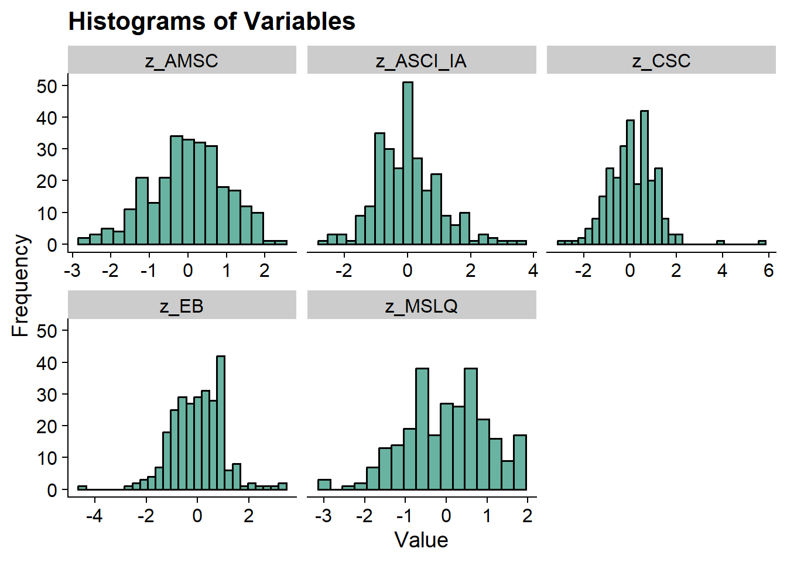
correlations

``` r
df_cor <- pre_clean %>%
  dplyr::select(z_ASCI_IA, z_AMSC, z_EB, z_MSLQ, z_CSC, grading, exam)

cor_matrix <- cor(df_cor, use = "pairwise.complete.obs")

print(cor_matrix)
#>             z_ASCI_IA      z_AMSC        z_EB     z_MSLQ
#> z_ASCI_IA  1.00000000 -0.27197825  0.14356191 -0.1530685
#> z_AMSC    -0.27197825  1.00000000  0.01863942  0.2160171
#> z_EB       0.14356191  0.01863942  1.00000000 -0.3713385
#> z_MSLQ    -0.15306849  0.21601714 -0.37133853  1.0000000
#> z_CSC      0.10072946  0.16121343  0.33859758 -0.1155573
#> grading    0.05509749 -0.08774336  0.07088039  0.1083377
#> exam      -0.15544345  0.02709785 -0.21220105  0.3720302
#>                 z_CSC     grading        exam
#> z_ASCI_IA  0.10072946  0.05509749 -0.15544345
#> z_AMSC     0.16121343 -0.08774336  0.02709785
#> z_EB       0.33859758  0.07088039 -0.21220105
#> z_MSLQ    -0.11555730  0.10833767  0.37203022
#> z_CSC      1.00000000  0.11970707 -0.02177322
#> grading    0.11970707  1.00000000  0.11708381
#> exam      -0.02177322  0.11708381  1.00000000

cor_result <- rcorr(as.matrix(df_cor))

formatted_p <- formatC(cor_result$P, format = "f", digits = 2)

dim(formatted_p) <- dim(cor_result$P)
rownames(formatted_p) <- colnames(formatted_p) <- colnames(df_cor)

print(formatted_p, quote = FALSE)
#>           z_ASCI_IA z_AMSC z_EB z_MSLQ z_CSC grading exam
#> z_ASCI_IA  NA       0.00   0.02 0.01   0.10  0.37    0.01
#> z_AMSC    0.00       NA    0.76 0.00   0.01  0.15    0.66
#> z_EB      0.02      0.76    NA  0.00   0.00  0.25    0.00
#> z_MSLQ    0.01      0.00   0.00  NA    0.06  0.08    0.00
#> z_CSC     0.10      0.01   0.00 0.06    NA   0.05    0.72
#> grading   0.37      0.15   0.25 0.08   0.05   NA     0.06
#> exam      0.01      0.66   0.00 0.00   0.72  0.06     NA
```


run LPA model

``` r
# Run LPA models (no need to run it everytime)
lpa_fit <- pre_clean %>%
    dplyr::select(z_ASCI_IA, z_AMSC, z_EB, z_MSLQ, z_CSC) %>%
    estimate_profiles(1:6, package = "MplusAutomation", ANALYSIS = "starts = 500 100;",
        OUTPUT = "sampstat residual tech11 tech14", variances = c("equal", "varying",
            "equal", "varying"), covariances = c("zero", "zero",
            "equal", "varying"), keepfiles = TRUE)

#compare fit statistics
get_fit(lpa_fit)

# Move files to folder
files <- list.files(here(), pattern = "^model")
move_files(files, here("33-k-means", "new"), overwrite = TRUE)
```


``` r
source(here("33-k-means", "functions", "enum_table_lpa.r")) #file in the folder

# Read in model
output_pisa <- readModels(here("33-k-means", "new"), quiet = TRUE)
```


``` r
# Preview with numbered rows
enum_fit(output_pisa)
```

model fit summary table (this is the old version table, still working on the new one; the new one will include smallest profile)

``` r
select_models <-LatexSummaryTable(output_pisa,                                 
                keepCols=c("Title", "Parameters", "LL", "BIC", "aBIC",
                           "BLRT_PValue", "T11_VLMR_PValue","Observations"))
```


``` r
enum_table(select_models, 1:6, 7:12, 13:18, 19:23)
```


``` r
source(here("33-k-means", "functions","ic_plot_lpa.R")) 
#file in the folder
ic_plot(output_pisa)
```

second round comparison among different profiles

``` r
# CmpK recalculation:
enum_fit1 <- select_models

stage2_cmpk <- enum_fit1 %>% 
  slice(2, 3, 6, 8, 12, 16, 20, 22) %>% # Change this to select the rows of the candidate models
  mutate(CAIC = -2 * LL + Parameters * (log(Observations) + 1)) %>%
  mutate(AWE = -2 * LL + 2 * Parameters * (log(Observations) + 1.5)) %>%
  mutate(SIC = -.5 * BIC,
         expSIC = exp(SIC - max(SIC)),
         cmPk = expSIC / sum(expSIC),
         BF = exp(SIC - lead(SIC)))  %>%
  dplyr::select(Title, Parameters, BIC, aBIC, CAIC, AWE, cmPk, BF) %>%
  mutate(Title = str_to_title(Title)) 

# Format Fit Table
stage2_cmpk %>%
  gt() %>% 
  tab_options(column_labels.font.weight = "bold") %>%
  fmt_number(
    7,
    decimals = 2,
    drop_trailing_zeros = TRUE,
    suffixing = TRUE
  ) %>%
  fmt_number(c(3:6),
             decimals = 2) %>% 
    fmt_number(8,decimals = 2,
             drop_trailing_zeros=TRUE,
             suffixing = TRUE) %>% 
  fmt(8, fns = function(x) 
    ifelse(x>100, ">100",
           scales::number(x, accuracy = .1))) %>% 
  tab_style(
    style = list(
      cell_text(weight = "bold")
      ),
    locations = list(cells_body(
     columns = BIC,
     row = BIC == min(BIC[1:nrow(stage2_cmpk)]) 
    ),
    cells_body(
     columns = aBIC,
     row = aBIC == min(aBIC[1:nrow(stage2_cmpk)])
    ),
    cells_body(
     columns = CAIC,
     row = CAIC == min(CAIC[1:nrow(stage2_cmpk)])
    ),
    cells_body(
     columns = AWE,
     row = AWE == min(AWE[1:nrow(stage2_cmpk)])
    ),
    cells_body(
     columns = cmPk,
     row =  cmPk == max(cmPk[1:nrow(stage2_cmpk)])
     ),
    cells_body(
     columns = BF, 
     row =  BF > 10)
  )
)
```


```{=html}
<div id="sludvfpiqs" style="padding-left:0px;padding-right:0px;padding-top:10px;padding-bottom:10px;overflow-x:auto;overflow-y:auto;width:auto;height:auto;">
<style>#sludvfpiqs table {
  font-family: system-ui, 'Segoe UI', Roboto, Helvetica, Arial, sans-serif, 'Apple Color Emoji', 'Segoe UI Emoji', 'Segoe UI Symbol', 'Noto Color Emoji';
  -webkit-font-smoothing: antialiased;
  -moz-osx-font-smoothing: grayscale;
}

#sludvfpiqs thead, #sludvfpiqs tbody, #sludvfpiqs tfoot, #sludvfpiqs tr, #sludvfpiqs td, #sludvfpiqs th {
  border-style: none;
}

#sludvfpiqs p {
  margin: 0;
  padding: 0;
}

#sludvfpiqs .gt_table {
  display: table;
  border-collapse: collapse;
  line-height: normal;
  margin-left: auto;
  margin-right: auto;
  color: #333333;
  font-size: 16px;
  font-weight: normal;
  font-style: normal;
  background-color: #FFFFFF;
  width: auto;
  border-top-style: solid;
  border-top-width: 2px;
  border-top-color: #A8A8A8;
  border-right-style: none;
  border-right-width: 2px;
  border-right-color: #D3D3D3;
  border-bottom-style: solid;
  border-bottom-width: 2px;
  border-bottom-color: #A8A8A8;
  border-left-style: none;
  border-left-width: 2px;
  border-left-color: #D3D3D3;
}

#sludvfpiqs .gt_caption {
  padding-top: 4px;
  padding-bottom: 4px;
}

#sludvfpiqs .gt_title {
  color: #333333;
  font-size: 125%;
  font-weight: initial;
  padding-top: 4px;
  padding-bottom: 4px;
  padding-left: 5px;
  padding-right: 5px;
  border-bottom-color: #FFFFFF;
  border-bottom-width: 0;
}

#sludvfpiqs .gt_subtitle {
  color: #333333;
  font-size: 85%;
  font-weight: initial;
  padding-top: 3px;
  padding-bottom: 5px;
  padding-left: 5px;
  padding-right: 5px;
  border-top-color: #FFFFFF;
  border-top-width: 0;
}

#sludvfpiqs .gt_heading {
  background-color: #FFFFFF;
  text-align: center;
  border-bottom-color: #FFFFFF;
  border-left-style: none;
  border-left-width: 1px;
  border-left-color: #D3D3D3;
  border-right-style: none;
  border-right-width: 1px;
  border-right-color: #D3D3D3;
}

#sludvfpiqs .gt_bottom_border {
  border-bottom-style: solid;
  border-bottom-width: 2px;
  border-bottom-color: #D3D3D3;
}

#sludvfpiqs .gt_col_headings {
  border-top-style: solid;
  border-top-width: 2px;
  border-top-color: #D3D3D3;
  border-bottom-style: solid;
  border-bottom-width: 2px;
  border-bottom-color: #D3D3D3;
  border-left-style: none;
  border-left-width: 1px;
  border-left-color: #D3D3D3;
  border-right-style: none;
  border-right-width: 1px;
  border-right-color: #D3D3D3;
}

#sludvfpiqs .gt_col_heading {
  color: #333333;
  background-color: #FFFFFF;
  font-size: 100%;
  font-weight: bold;
  text-transform: inherit;
  border-left-style: none;
  border-left-width: 1px;
  border-left-color: #D3D3D3;
  border-right-style: none;
  border-right-width: 1px;
  border-right-color: #D3D3D3;
  vertical-align: bottom;
  padding-top: 5px;
  padding-bottom: 6px;
  padding-left: 5px;
  padding-right: 5px;
  overflow-x: hidden;
}

#sludvfpiqs .gt_column_spanner_outer {
  color: #333333;
  background-color: #FFFFFF;
  font-size: 100%;
  font-weight: bold;
  text-transform: inherit;
  padding-top: 0;
  padding-bottom: 0;
  padding-left: 4px;
  padding-right: 4px;
}

#sludvfpiqs .gt_column_spanner_outer:first-child {
  padding-left: 0;
}

#sludvfpiqs .gt_column_spanner_outer:last-child {
  padding-right: 0;
}

#sludvfpiqs .gt_column_spanner {
  border-bottom-style: solid;
  border-bottom-width: 2px;
  border-bottom-color: #D3D3D3;
  vertical-align: bottom;
  padding-top: 5px;
  padding-bottom: 5px;
  overflow-x: hidden;
  display: inline-block;
  width: 100%;
}

#sludvfpiqs .gt_spanner_row {
  border-bottom-style: hidden;
}

#sludvfpiqs .gt_group_heading {
  padding-top: 8px;
  padding-bottom: 8px;
  padding-left: 5px;
  padding-right: 5px;
  color: #333333;
  background-color: #FFFFFF;
  font-size: 100%;
  font-weight: initial;
  text-transform: inherit;
  border-top-style: solid;
  border-top-width: 2px;
  border-top-color: #D3D3D3;
  border-bottom-style: solid;
  border-bottom-width: 2px;
  border-bottom-color: #D3D3D3;
  border-left-style: none;
  border-left-width: 1px;
  border-left-color: #D3D3D3;
  border-right-style: none;
  border-right-width: 1px;
  border-right-color: #D3D3D3;
  vertical-align: middle;
  text-align: left;
}

#sludvfpiqs .gt_empty_group_heading {
  padding: 0.5px;
  color: #333333;
  background-color: #FFFFFF;
  font-size: 100%;
  font-weight: initial;
  border-top-style: solid;
  border-top-width: 2px;
  border-top-color: #D3D3D3;
  border-bottom-style: solid;
  border-bottom-width: 2px;
  border-bottom-color: #D3D3D3;
  vertical-align: middle;
}

#sludvfpiqs .gt_from_md > :first-child {
  margin-top: 0;
}

#sludvfpiqs .gt_from_md > :last-child {
  margin-bottom: 0;
}

#sludvfpiqs .gt_row {
  padding-top: 8px;
  padding-bottom: 8px;
  padding-left: 5px;
  padding-right: 5px;
  margin: 10px;
  border-top-style: solid;
  border-top-width: 1px;
  border-top-color: #D3D3D3;
  border-left-style: none;
  border-left-width: 1px;
  border-left-color: #D3D3D3;
  border-right-style: none;
  border-right-width: 1px;
  border-right-color: #D3D3D3;
  vertical-align: middle;
  overflow-x: hidden;
}

#sludvfpiqs .gt_stub {
  color: #333333;
  background-color: #FFFFFF;
  font-size: 100%;
  font-weight: initial;
  text-transform: inherit;
  border-right-style: solid;
  border-right-width: 2px;
  border-right-color: #D3D3D3;
  padding-left: 5px;
  padding-right: 5px;
}

#sludvfpiqs .gt_stub_row_group {
  color: #333333;
  background-color: #FFFFFF;
  font-size: 100%;
  font-weight: initial;
  text-transform: inherit;
  border-right-style: solid;
  border-right-width: 2px;
  border-right-color: #D3D3D3;
  padding-left: 5px;
  padding-right: 5px;
  vertical-align: top;
}

#sludvfpiqs .gt_row_group_first td {
  border-top-width: 2px;
}

#sludvfpiqs .gt_row_group_first th {
  border-top-width: 2px;
}

#sludvfpiqs .gt_summary_row {
  color: #333333;
  background-color: #FFFFFF;
  text-transform: inherit;
  padding-top: 8px;
  padding-bottom: 8px;
  padding-left: 5px;
  padding-right: 5px;
}

#sludvfpiqs .gt_first_summary_row {
  border-top-style: solid;
  border-top-color: #D3D3D3;
}

#sludvfpiqs .gt_first_summary_row.thick {
  border-top-width: 2px;
}

#sludvfpiqs .gt_last_summary_row {
  padding-top: 8px;
  padding-bottom: 8px;
  padding-left: 5px;
  padding-right: 5px;
  border-bottom-style: solid;
  border-bottom-width: 2px;
  border-bottom-color: #D3D3D3;
}

#sludvfpiqs .gt_grand_summary_row {
  color: #333333;
  background-color: #FFFFFF;
  text-transform: inherit;
  padding-top: 8px;
  padding-bottom: 8px;
  padding-left: 5px;
  padding-right: 5px;
}

#sludvfpiqs .gt_first_grand_summary_row {
  padding-top: 8px;
  padding-bottom: 8px;
  padding-left: 5px;
  padding-right: 5px;
  border-top-style: double;
  border-top-width: 6px;
  border-top-color: #D3D3D3;
}

#sludvfpiqs .gt_last_grand_summary_row_top {
  padding-top: 8px;
  padding-bottom: 8px;
  padding-left: 5px;
  padding-right: 5px;
  border-bottom-style: double;
  border-bottom-width: 6px;
  border-bottom-color: #D3D3D3;
}

#sludvfpiqs .gt_striped {
  background-color: rgba(128, 128, 128, 0.05);
}

#sludvfpiqs .gt_table_body {
  border-top-style: solid;
  border-top-width: 2px;
  border-top-color: #D3D3D3;
  border-bottom-style: solid;
  border-bottom-width: 2px;
  border-bottom-color: #D3D3D3;
}

#sludvfpiqs .gt_footnotes {
  color: #333333;
  background-color: #FFFFFF;
  border-bottom-style: none;
  border-bottom-width: 2px;
  border-bottom-color: #D3D3D3;
  border-left-style: none;
  border-left-width: 2px;
  border-left-color: #D3D3D3;
  border-right-style: none;
  border-right-width: 2px;
  border-right-color: #D3D3D3;
}

#sludvfpiqs .gt_footnote {
  margin: 0px;
  font-size: 90%;
  padding-top: 4px;
  padding-bottom: 4px;
  padding-left: 5px;
  padding-right: 5px;
}

#sludvfpiqs .gt_sourcenotes {
  color: #333333;
  background-color: #FFFFFF;
  border-bottom-style: none;
  border-bottom-width: 2px;
  border-bottom-color: #D3D3D3;
  border-left-style: none;
  border-left-width: 2px;
  border-left-color: #D3D3D3;
  border-right-style: none;
  border-right-width: 2px;
  border-right-color: #D3D3D3;
}

#sludvfpiqs .gt_sourcenote {
  font-size: 90%;
  padding-top: 4px;
  padding-bottom: 4px;
  padding-left: 5px;
  padding-right: 5px;
}

#sludvfpiqs .gt_left {
  text-align: left;
}

#sludvfpiqs .gt_center {
  text-align: center;
}

#sludvfpiqs .gt_right {
  text-align: right;
  font-variant-numeric: tabular-nums;
}

#sludvfpiqs .gt_font_normal {
  font-weight: normal;
}

#sludvfpiqs .gt_font_bold {
  font-weight: bold;
}

#sludvfpiqs .gt_font_italic {
  font-style: italic;
}

#sludvfpiqs .gt_super {
  font-size: 65%;
}

#sludvfpiqs .gt_footnote_marks {
  font-size: 75%;
  vertical-align: 0.4em;
  position: initial;
}

#sludvfpiqs .gt_asterisk {
  font-size: 100%;
  vertical-align: 0;
}

#sludvfpiqs .gt_indent_1 {
  text-indent: 5px;
}

#sludvfpiqs .gt_indent_2 {
  text-indent: 10px;
}

#sludvfpiqs .gt_indent_3 {
  text-indent: 15px;
}

#sludvfpiqs .gt_indent_4 {
  text-indent: 20px;
}

#sludvfpiqs .gt_indent_5 {
  text-indent: 25px;
}

#sludvfpiqs .katex-display {
  display: inline-flex !important;
  margin-bottom: 0.75em !important;
}

#sludvfpiqs div.Reactable > div.rt-table > div.rt-thead > div.rt-tr.rt-tr-group-header > div.rt-th-group:after {
  height: 0px !important;
}
</style>
<table class="gt_table" data-quarto-disable-processing="false" data-quarto-bootstrap="false">
  <thead>
    <tr class="gt_col_headings">
      <th class="gt_col_heading gt_columns_bottom_border gt_left" rowspan="1" colspan="1" scope="col" id="Title">Title</th>
      <th class="gt_col_heading gt_columns_bottom_border gt_right" rowspan="1" colspan="1" scope="col" id="Parameters">Parameters</th>
      <th class="gt_col_heading gt_columns_bottom_border gt_right" rowspan="1" colspan="1" scope="col" id="BIC">BIC</th>
      <th class="gt_col_heading gt_columns_bottom_border gt_right" rowspan="1" colspan="1" scope="col" id="aBIC">aBIC</th>
      <th class="gt_col_heading gt_columns_bottom_border gt_right" rowspan="1" colspan="1" scope="col" id="CAIC">CAIC</th>
      <th class="gt_col_heading gt_columns_bottom_border gt_right" rowspan="1" colspan="1" scope="col" id="AWE">AWE</th>
      <th class="gt_col_heading gt_columns_bottom_border gt_right" rowspan="1" colspan="1" scope="col" id="cmPk">cmPk</th>
      <th class="gt_col_heading gt_columns_bottom_border gt_right" rowspan="1" colspan="1" scope="col" id="BF">BF</th>
    </tr>
  </thead>
  <tbody class="gt_table_body">
    <tr><td headers="Title" class="gt_row gt_left">Model 1 With 2 Classes</td>
<td headers="Parameters" class="gt_row gt_right">16</td>
<td headers="BIC" class="gt_row gt_right">3,820.72</td>
<td headers="aBIC" class="gt_row gt_right">3,769.99</td>
<td headers="CAIC" class="gt_row gt_right">3,836.72</td>
<td headers="AWE" class="gt_row gt_right">3,958.24</td>
<td headers="cmPk" class="gt_row gt_right">NA</td>
<td headers="BF" class="gt_row gt_right">0.2</td></tr>
    <tr><td headers="Title" class="gt_row gt_left">Model 1 With 3 Classes</td>
<td headers="Parameters" class="gt_row gt_right">22</td>
<td headers="BIC" class="gt_row gt_right">3,817.02</td>
<td headers="aBIC" class="gt_row gt_right">3,747.27</td>
<td headers="CAIC" class="gt_row gt_right">3,839.02</td>
<td headers="AWE" class="gt_row gt_right">4,006.11</td>
<td headers="cmPk" class="gt_row gt_right">NA</td>
<td headers="BF" class="gt_row gt_right" style="font-weight: bold;">>100</td></tr>
    <tr><td headers="Title" class="gt_row gt_left">Model 1 With 6 Classes</td>
<td headers="Parameters" class="gt_row gt_right">40</td>
<td headers="BIC" class="gt_row gt_right">3,842.50</td>
<td headers="aBIC" class="gt_row gt_right">3,715.68</td>
<td headers="CAIC" class="gt_row gt_right">3,882.50</td>
<td headers="AWE" class="gt_row gt_right">4,186.29</td>
<td headers="cmPk" class="gt_row gt_right">NA</td>
<td headers="BF" class="gt_row gt_right">0.0</td></tr>
    <tr><td headers="Title" class="gt_row gt_left">Model 2 With 2 Classes</td>
<td headers="Parameters" class="gt_row gt_right">21</td>
<td headers="BIC" class="gt_row gt_right">3,831.49</td>
<td headers="aBIC" class="gt_row gt_right">3,764.91</td>
<td headers="CAIC" class="gt_row gt_right">3,852.49</td>
<td headers="AWE" class="gt_row gt_right">4,011.98</td>
<td headers="cmPk" class="gt_row gt_right">NA</td>
<td headers="BF" class="gt_row gt_right" style="font-weight: bold;">>100</td></tr>
    <tr><td headers="Title" class="gt_row gt_left">Model 2 With 6 Classes</td>
<td headers="Parameters" class="gt_row gt_right">65</td>
<td headers="BIC" class="gt_row gt_right">3,922.35</td>
<td headers="aBIC" class="gt_row gt_right">3,716.26</td>
<td headers="CAIC" class="gt_row gt_right">3,987.35</td>
<td headers="AWE" class="gt_row gt_right">4,481.01</td>
<td headers="cmPk" class="gt_row gt_right">NA</td>
<td headers="BF" class="gt_row gt_right">0.0</td></tr>
    <tr><td headers="Title" class="gt_row gt_left">Model 3 With 4 Classes</td>
<td headers="Parameters" class="gt_row gt_right">38</td>
<td headers="BIC" class="gt_row gt_right">3,817.99</td>
<td headers="aBIC" class="gt_row gt_right">3,697.51</td>
<td headers="CAIC" class="gt_row gt_right">3,855.99</td>
<td headers="AWE" class="gt_row gt_right">4,144.59</td>
<td headers="cmPk" class="gt_row gt_right">NA</td>
<td headers="BF" class="gt_row gt_right">0.9</td></tr>
    <tr><td headers="Title" class="gt_row gt_left">Model 6 With 2 Classes</td>
<td headers="Parameters" class="gt_row gt_right">41</td>
<td headers="BIC" class="gt_row gt_right">3,817.80</td>
<td headers="aBIC" class="gt_row gt_right">3,687.80</td>
<td headers="CAIC" class="gt_row gt_right">3,858.80</td>
<td headers="AWE" class="gt_row gt_right">4,170.18</td>
<td headers="cmPk" class="gt_row gt_right">NA</td>
<td headers="BF" class="gt_row gt_right">NA</td></tr>
    <tr><td headers="Title" class="gt_row gt_left">Model 6 With 4 Classes</td>
<td headers="Parameters" class="gt_row gt_right">NA</td>
<td headers="BIC" class="gt_row gt_right">NA</td>
<td headers="aBIC" class="gt_row gt_right">NA</td>
<td headers="CAIC" class="gt_row gt_right">NA</td>
<td headers="AWE" class="gt_row gt_right">NA</td>
<td headers="cmPk" class="gt_row gt_right">NA</td>
<td headers="BF" class="gt_row gt_right">NA</td></tr>
  </tbody>
  
</table>
</div>
```


Comparing two profiles

``` r
a <- plotMixtures(output_pisa$model_2_class_2.out, ci = 0.95, bw = FALSE)

b <- plotMixtures(output_pisa$model_6_class_2.out, ci = 0.95, bw = FALSE)

a + labs(title = "Model 2 two-profile") + theme(plot.title = element_text(size = 12)) + b + labs(title = "Model 4 two-profile") +
    theme(plot.title = element_text(size = 12))
```

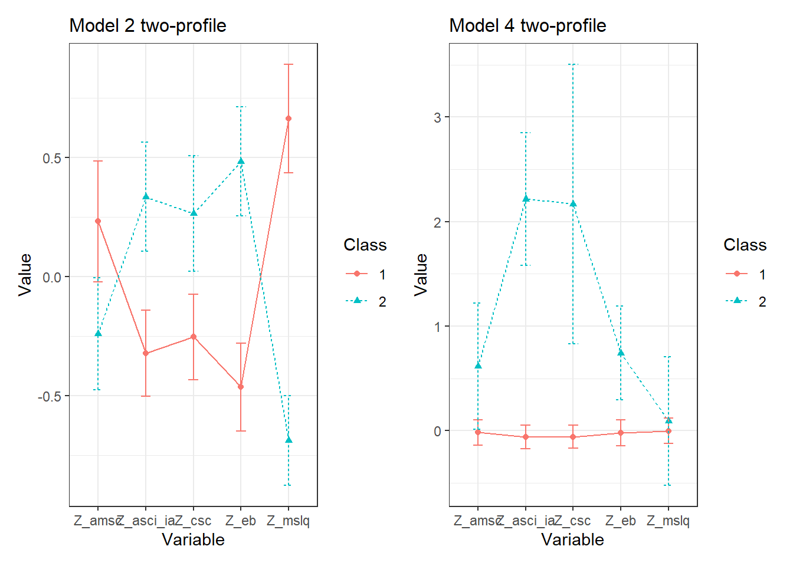

a initial look, not the final figure

``` r
source(here("33-k-means", "functions", "plot_lpa.R"))  #file in the folder

plot_lpa(model_name = output_pisa$model_2_class_2.out)
```

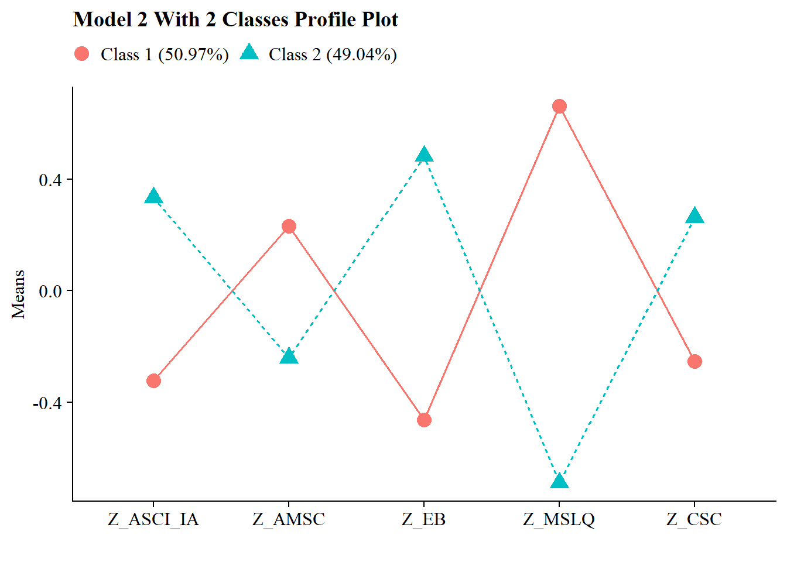
another version: this one changed the color of two profiles and the variable names (all labels)

``` r
plot_lpa <- function(model_name) {

  # Extract and reshape mean estimates by class
  pp_plots <- data.frame(model_name$parameters$unstandardized) %>%
    mutate(LatentClass = sub("^", "Class ", LatentClass)) %>%
    filter(paramHeader == "Means") %>%
    filter(LatentClass != "Class Categorical.Latent.Variables") %>%
    dplyr::select(est, LatentClass, param) %>%
    pivot_wider(names_from = LatentClass, values_from = est) %>%
    relocate(param, .after = last_col())
  
  # Extract class proportions
  c_size <- as.data.frame(model_name$class_counts$modelEstimated$proportion) %>%
    dplyr::rename("cs" = 1) %>%
    mutate(cs = round(cs * 100, 2))
  
  # Rename class labels with proportions
# Keep class labels without proportions
  colnames(pp_plots) <- c("Motivated but Unconfident", "Confident but Disengaged", "param")

  
  # Melt data into long format
  plot_data <- pp_plots %>%
    dplyr::rename("param" = ncol(pp_plots)) %>%
    reshape2::melt(id.vars = "param") %>%
    mutate(
     param = factor(param,
                   levels = c("Z_AMSC", "Z_ASCI_IA", "Z_CSC", "Z_EB", "Z_MSLQ"),
                   labels = c("Motivation", "Attitudes", "Self-concept", "Effort beliefs", "Self-efficacy")),
     variable = factor(variable)
    )
  
  # Title
  name <- str_to_title(model_name$input$title)
  
  # Define color palette (can customize further)
  #class_colors <- c("#1b1b1b", "#595959", "#a6a6a6", "#d9d9d9")  # Extend if >2 classes
  class_colors <- c("#F8766D", "#00BFC4")
  
  # Plot
  p <- plot_data %>%
    ggplot(
      aes(
        x = param,
        y = value,
        shape = variable,
        colour = variable,
        lty = variable,
        group = variable
      )
    ) +
    geom_point(size = 4) + 
    geom_line() +
    scale_x_discrete("") +
    scale_color_manual(values = class_colors[1:nlevels(plot_data$variable)]) +  # custom colors
    labs(title = glue("{name} Profile Plot"), y = "Means") +
    theme_cowplot() +
    theme(
      text = element_text(family = "serif", size = 12),
      legend.key.width = unit(.5, "line"),
      legend.text = element_text(family = "serif", size = 12),
      legend.title = element_blank(),
      legend.position = "top"
    )
  
  return(p)
}

plot_lpa(model_name = output_pisa$model_2_class_2.out)
```

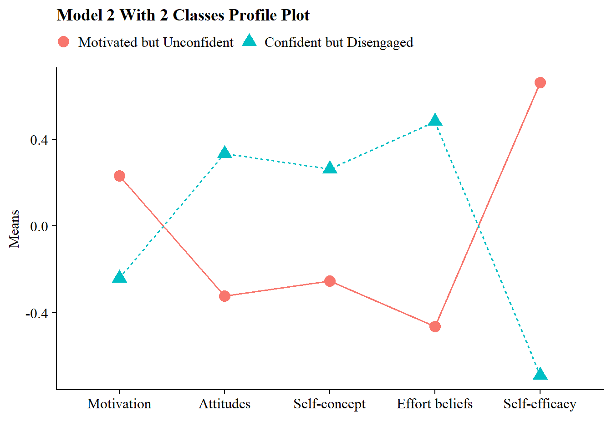

Final figure


``` r
plot_lpa <- function(model_name) {

  # Extract and reshape mean estimates by class
  pp_plots <- data.frame(model_name$parameters$unstandardized) %>%
    mutate(LatentClass = sub("^", "Class ", LatentClass)) %>%
    filter(paramHeader == "Means") %>%
    filter(LatentClass != "Class Categorical.Latent.Variables") %>%
    dplyr::select(est, LatentClass, param) %>%
    pivot_wider(names_from = LatentClass, values_from = est) %>%
    relocate(param, .after = last_col())
  
  # Extract class proportions
  c_size <- as.data.frame(model_name$class_counts$modelEstimated$proportion) %>%
    dplyr::rename("cs" = 1) %>%
    mutate(cs = round(cs * 100, 2))
  
  # Rename class labels with proportions
# Keep class labels without proportions
  colnames(pp_plots) <- c("Motivated but Unconfident", "Confident but Disengaged", "param")

  
  # Melt data into long format
  plot_data <- pp_plots %>%
    dplyr::rename("param" = ncol(pp_plots)) %>%
    reshape2::melt(id.vars = "param") %>%
    mutate(
     param = factor(param,
                   levels = c("Z_AMSC", "Z_ASCI_IA", "Z_CSC", "Z_EB", "Z_MSLQ"),
                   labels = c("Chemistry\nmotivation", "Chemistry\nattitudes", "Chemistry\nself-concept", "Effort beliefs", "Self-efficacy")),
     variable = factor(variable)
    )
  
  # Title
  name <- str_to_title(model_name$input$title)
  
  # Define color palette (can customize further)
  #class_colors <- c("#1b1b1b", "#595959", "#a6a6a6", "#d9d9d9")  # Extend if >2 classes
  class_colors <- c("#F8766D", "#005B96")  # red and dark blue
  
  # Plot
  p <- plot_data %>%
    ggplot(
      aes(
        x = param,
        y = value,
        shape = variable,
        colour = variable,
        lty = variable,
        group = variable
      )
    ) +
    geom_line(linewidth = 1) +
    geom_point(size = 4) +
    scale_x_discrete("") +
    scale_y_continuous(
    limits = c(-0.8, 0.8),
    breaks = c(-0.75, -0.5, -0.25, 0, 0.25, 0.5, 0.75)
    ) +
    scale_color_manual(values = class_colors[1:nlevels(plot_data$variable)]) +  # custom colors
    #labs(title = glue("{name} Profile Plot"), y = "Standardized indicator means") +
    labs(title = NULL, y = "Standardized indicator means") +
    theme_cowplot() +
    theme(
      text = element_text(family = "sans", size = 12),         # serif font
      axis.text = element_text(family = "sans", size = 12),    # axis labels
      axis.title = element_text(family = "sans", size = 14),    # axis labels
      legend.text = element_text(family = "sans", size = 12),  # legend text
      legend.title = element_text(family = "sans", size = 14),
      #legend.position = "top",
      legend.position = "none",
      panel.border = element_rect(colour = "black", fill = NA, linewidth = 1),
      axis.line = element_line(colour = "black", linewidth = 0.3)
    )
  
  return(p)
}

plot_lpa(model_name = output_pisa$model_2_class_2.out)
```

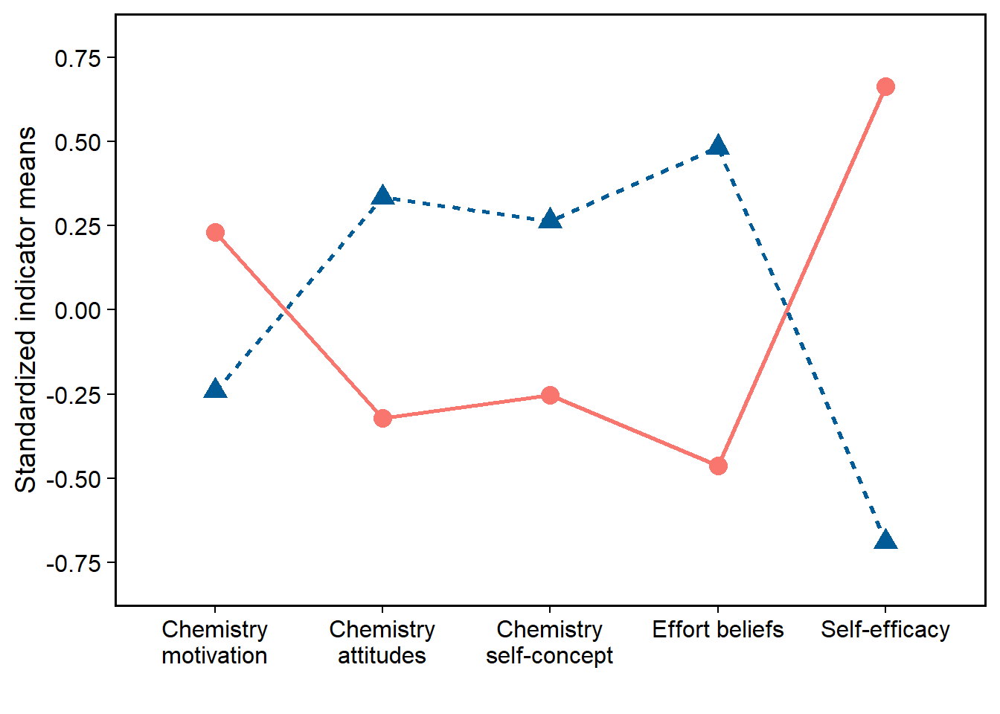

``` r

p <- plot_lpa(model_name = output_pisa$model_2_class_2.out)
ggsave("profile_plot.png", plot = p, width = 9, height = 5.6, units = "in", dpi = 600, bg = "white")

```


Three step ML 

``` r
lpa_result <- pre_clean %>%
  dplyr::select(z_ASCI_IA, z_AMSC, z_EB, z_MSLQ, z_CSC) %>%
  estimate_profiles(n_profiles = 2, model = 2)  # Adjust the number of profiles as needed
```


``` r
classified_data <- bind_cols(pre_clean, get_data(lpa_result))
```


``` r
t.test(exam ~ Class, data = classified_data, var.equal = TRUE)
#> 
#> 	Two Sample t-test
#> 
#> data:  exam by Class
#> t = 5.0593, df = 267, p-value = 7.837e-07
#> alternative hypothesis: true difference in means between group 1 and group 2 is not equal to 0
#> 95 percent confidence interval:
#>   5.064922 11.518549
#> sample estimates:
#> mean in group 1 mean in group 2 
#>        70.82609        62.53435
```

``` r
classified_data %>%
  group_by(Class) %>%
  summarise(
    n = n(),
    mean = mean(exam, na.rm = TRUE),
    sd = sd(exam, na.rm = TRUE)
  )
#> # A tibble: 2 × 4
#>   Class     n  mean    sd
#>   <dbl> <int> <dbl> <dbl>
#> 1     1   138  70.8  13.3
#> 2     2   131  62.5  13.6
```

wald test


``` r
lm_model <- lm(exam ~ Class, data = classified_data)
summary(lm_model)
#> 
#> Call:
#> lm(formula = exam ~ Class, data = classified_data)
#> 
#> Residuals:
#>     Min      1Q  Median      3Q     Max 
#> -30.826  -8.826   1.174   9.466  29.466 
#> 
#> Coefficients:
#>             Estimate Std. Error t value Pr(>|t|)    
#> (Intercept)   79.118      2.571  30.773  < 2e-16 ***
#> Class         -8.292      1.639  -5.059 7.84e-07 ***
#> ---
#> Signif. codes:  
#> 0 '***' 0.001 '**' 0.01 '*' 0.05 '.' 0.1 ' ' 1
#> 
#> Residual standard error: 13.44 on 267 degrees of freedom
#> Multiple R-squared:  0.08748,	Adjusted R-squared:  0.08406 
#> F-statistic:  25.6 on 1 and 267 DF,  p-value: 7.837e-07
```


``` r
Anova(lm_model, type = 3)  
#> Anova Table (Type III tests)
#> 
#> Response: exam
#>             Sum Sq  Df F value    Pr(>F)    
#> (Intercept) 170939   1 946.973 < 2.2e-16 ***
#> Class         4621   1  25.597 7.837e-07 ***
#> Residuals    48196 267                      
#> ---
#> Signif. codes:  
#> 0 '***' 0.001 '**' 0.01 '*' 0.05 '.' 0.1 ' ' 1
```
Kmeans

``` r
pre_clean <- pre_clean %>%
  mutate(across(all_of(c("ASCI_IA", "AMSC", "EB", "MSLQ", "CSC")), ~ scale(.)[,1], .names = "z_{.col}"))

dfk <- pre_clean %>%
  dplyr::select(z_ASCI_IA, z_AMSC, z_EB, z_MSLQ, z_CSC, exam, grading)
```


``` r
# Step 1: Select specific variables for clustering
dfk_selected <- dfk %>%
  dplyr::select(z_AMSC, z_ASCI_IA, z_CSC, z_EB, z_MSLQ) 

# Step 2: Scale the selected data
dfk_scaled <- scale(dfk_selected)

# Step 3: Set random seed for reproducibility
set.seed(123)

# Step 4: Run K-means for k = 2 to 10 and store total within-cluster sum of squares
wss <- numeric(9)
kmeans_results <- list()

for (k in 2:10) {
  km <- kmeans(dfk_scaled, centers = k, nstart = 10, iter.max = 25)
  wss[k - 1] <- km$tot.withinss
  kmeans_results[[as.character(k)]] <- km
}

# Step 5: Plot Elbow Method to choose optimal k
plot(2:10, wss, type = "b", pch = 19,
     xlab = "Number of Clusters (k)",
     ylab = "Total Within-Cluster Sum of Squares",
     main = "Elbow Method for Optimal k")
```

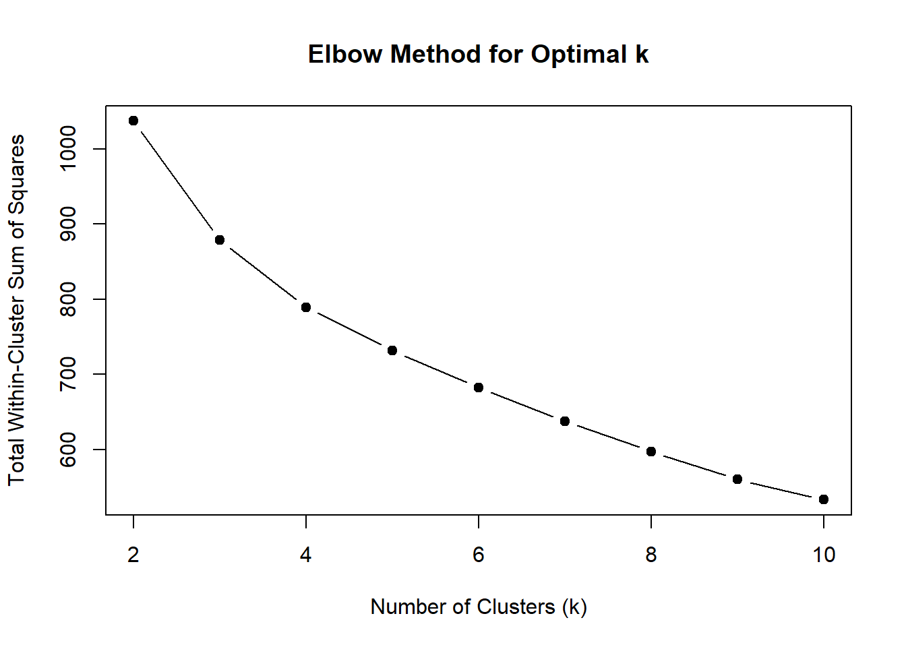

``` r

# Step 6: Assign cluster labels to the original selected data for chosen k
chosen_k <- 2
dfk_clustered <- dfk_selected %>%
  mutate(Cluster = factor(kmeans_results[[as.character(chosen_k)]]$cluster))

# Step 7: Visualize the clusters using PCA
fviz_cluster(kmeans_results[[as.character(chosen_k)]], data = dfk_scaled,
             geom = "point", ellipse.type = "convex",
             main = paste("K-means Clustering (k =", chosen_k, ")"))
```

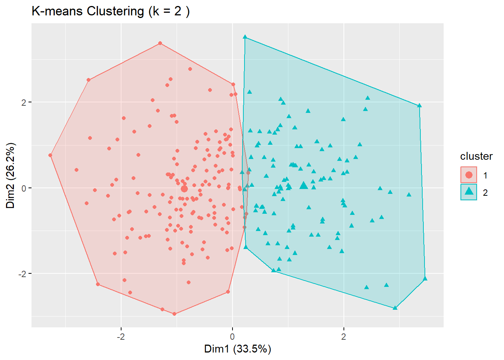

``` r
kmeans_results[["2"]]$size
#> [1] 160 109
```


``` r
fviz_nbclust(dfk_clustered, kmeans, method = "wss") #choose 3
```

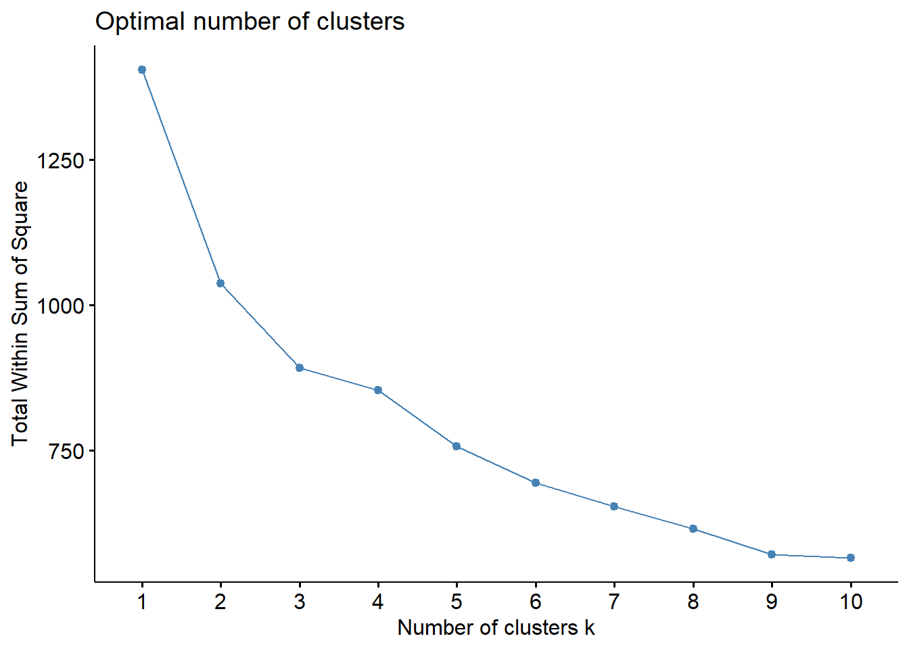

elbow plot

``` r
# Step 1: Add WSS for k = 1
# (Only if it wasn’t previously computed)
set.seed(123)
km1 <- kmeans(dfk_scaled, centers = 1, nstart = 10, iter.max = 25)
wss_full <- c(km1$tot.withinss, wss)  # Add k=1 to the front

# Step 2: Recreate full dataframe
elbow_df <- data.frame(
  k = 1:10,
  wss = wss_full
)

# Step 3: Create the updated plot
plot.wss <- ggplot(elbow_df, aes(x = k, y = wss)) +
  geom_line(color = "steelblue", linewidth = 1) +
  geom_point(color = "steelblue", size = 3) +
  scale_x_continuous(breaks = 1:10) +
  scale_y_continuous(limits = c(400, 1400)) +  # << Set y-axis range
  labs(
    x = expression("Number of clusters (" * italic(k) * ")"),
    y = "Total Within Sum of Squares (WSS)"
  ) +
  theme_minimal(base_size = 12) +
  theme(
    plot.title = element_blank(),
    panel.grid.major = element_blank(),
    panel.grid.minor = element_blank(),
    panel.border = element_rect(color = "black", fill = NA, linewidth = 1),
    axis.text = element_text(size = 12, color = "black"),
    axis.title = element_text(size = 14, color = "black"),
    axis.ticks.y = element_line(color = "black")
  )

plot.wss
```

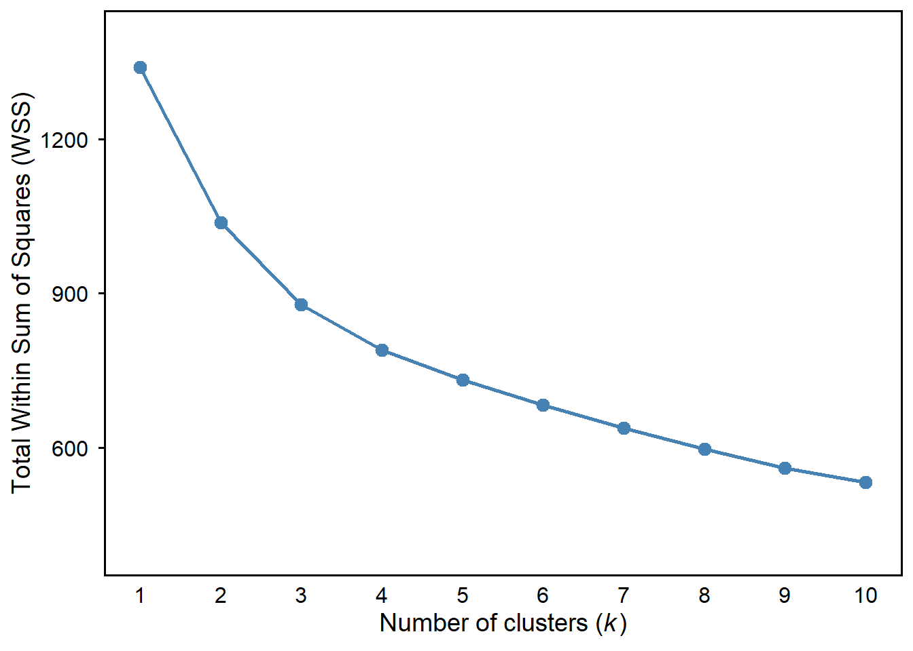

``` r

ggsave("cluster-wss.png", plot = plot.wss, width = 9, height = 5.6, units = "in", dpi = 600, bg = "white")
```


``` r
fviz_nbclust(dfk_clustered, kmeans, method = "silhouette") #choose 2
```

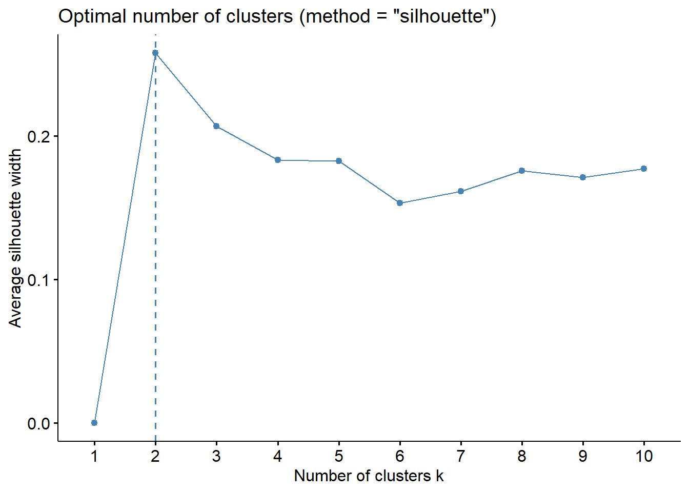

``` r

# Generate silhouette plot and customize it
plot.silhouette <- fviz_nbclust(dfk_clustered, kmeans, method = "silhouette") +
  geom_line(color = "steelblue", linewidth = 3) +
  geom_point(color = "steelblue", size = 3) +
  labs(
    x = expression("Number of clusters (" * italic(k) * ")"),
    y = "Average silhouette width",
    title = NULL
  ) +
  scale_x_discrete() +  # ← key fix here
  scale_y_continuous(limits = c(0, 0.3)) +
  theme_minimal(base_size = 12) +
  theme(
    panel.grid.major = element_blank(),
    panel.grid.minor = element_blank(),
    panel.border = element_rect(color = "black", fill = NA, linewidth = 1),
    axis.text = element_text(size = 12, color = "black"),
    axis.title = element_text(size = 14, color = "black"),
    axis.ticks.y = element_line(color = "black")
  )

plot.silhouette
```

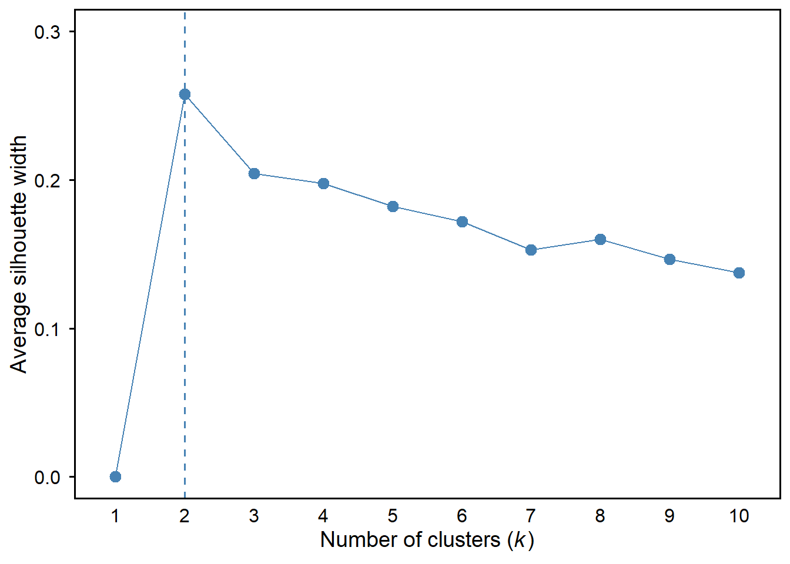

``` r

ggsave("silhouette.png", plot = plot.silhouette, width = 9, height = 5.6, units = "in", dpi = 600, bg = "white")
```

``` r
# Reshape the cluster centers data for plotting
long_data <- kmeans_results[["2"]]$centers %>%
  as.data.frame() %>%
  mutate(Cluster = factor(rownames(.))) %>%
  pivot_longer(-Cluster, names_to = "Variable", values_to = "Mean")

long_data$Cluster <- dplyr::recode(long_data$Cluster,
                            "1" = "Motivated but Unconfident",
                            "2" = "Confident but Disengaged")

# Define readable labels for each variable
variable_labels <- c("z_AMSC" = "Motivation",
                     "z_ASCI_IA" = "Attitudes",
                     "z_CSC" = "Self-concept",
                     "z_EB" = "Effort beliefs",
                     "z_MSLQ" = "Self-efficacy")

# Plot the cluster profiles
ggplot(long_data, aes(x = Variable, y = Mean, group = Cluster, color = Cluster)) +
  geom_line(linewidth = 1.2) +
  geom_point(size = 3) +
  theme_minimal() +
  labs(title = "Cluster Profiles on Key Academic Variables",
       y = "Cluster Mean (Z-score)",
       x = NULL) +
  scale_x_discrete(labels = variable_labels) +
  theme(
    axis.text.x = element_text(angle = 0, hjust = 0.5),  # Horizontal text
    plot.title = element_text(hjust = 0.5),
    legend.position = "top",
    legend.direction = "horizontal",
    panel.grid.major = element_blank(),  # remove major grid lines
    panel.grid.minor = element_blank(),   # remove minor grid lines
    axis.line.x = element_line(color = "black"),
    axis.line.y = element_line(color = "black")
  )
```

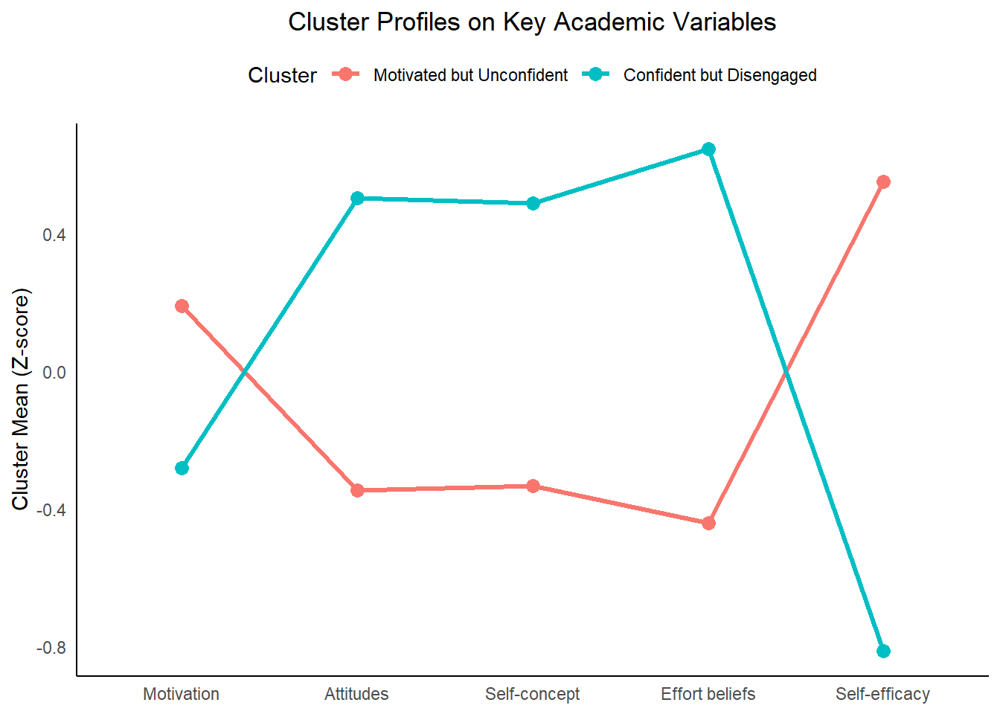

final cluster plot

``` r
# Define consistent color palette
cluster_colors <- c("Motivated but Unconfident" = "#F8766D",
                    "Confident but Disengaged" = "#005B96")

# Updated variable labels with line breaks
variable_labels <- c(
  "z_AMSC"    = "Chemistry\nmotivation",
  "z_ASCI_IA" = "Chemistry\nattitudes",
  "z_CSC"     = "Chemistry\nself-concept",
  "z_EB"      = "Effort beliefs",
  "z_MSLQ"    = "Self-efficacy"
)

# Generate the plot
plot.cluster <- ggplot(long_data, aes(x = Variable, y = Mean, group = Cluster, color = Cluster, linetype = Cluster, shape = Cluster)) +
  geom_line(linewidth = 1) +
  geom_point(size = 4) +
  scale_color_manual(values = cluster_colors) +
  scale_x_discrete(labels = variable_labels) +
  scale_y_continuous(
    limits = c(-0.9, 0.9),
    breaks = c(-0.75, -0.5, -0.25, 0, 0.25, 0.5, 0.75)
  ) +
  labs(
    #title = "Cluster Profiles on Key Academic Variables",
    y = "Standardized indicator means",
    x = NULL
  ) +
  theme_classic(base_family = "sans") +
  theme(
    text = element_text(size = 12),
    axis.text = element_text(size = 12, colour = "black"),
    axis.title = element_text(size = 14),
    legend.text = element_text(size = 12),
    legend.title = element_blank(),
    legend.position = "none",  # or "top" if you want to keep it
    panel.border = element_rect(colour = "black", fill = NA, linewidth = 0.8),
    axis.line = element_line(colour = "black", linewidth = 0.3)
  )

plot.cluster
```

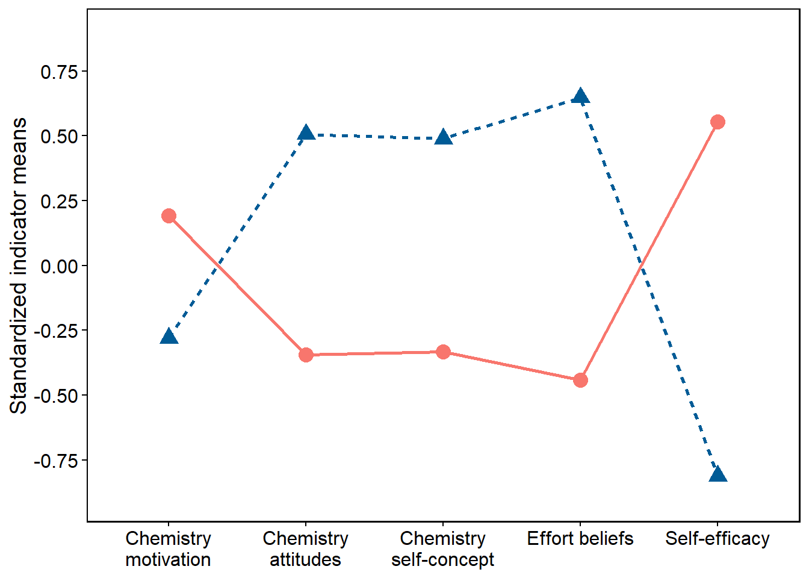

``` r

ggsave("cluster.png", plot = plot.cluster, width = 9, height = 5.6, units = "in", dpi = 600, bg = "white")

```


auxiliary

``` r
dfk_clustered <- dfk %>%
  dplyr::select(z_ASCI_IA, z_AMSC, z_EB, z_MSLQ, z_CSC, exam, grading) %>%  # include your two auxiliary variables
  drop_na() %>%  # drop rows with missing values
  mutate(Cluster = factor(kmeans_results[["2"]]$cluster))
```


``` r
# t-test for exam by Cluster (equal variances)
t.test(exam ~ Cluster, data = dfk_clustered, var.equal = TRUE)
#> 
#> 	Two Sample t-test
#> 
#> data:  exam by Cluster
#> t = 4.664, df = 267, p-value = 4.906e-06
#> alternative hypothesis: true difference in means between group 1 and group 2 is not equal to 0
#> 95 percent confidence interval:
#>   4.52696 11.14116
#> sample estimates:
#> mean in group 1 mean in group 2 
#>        69.96250        62.12844
```


``` r
# t-test for grading by Cluster (equal variances)
t.test(grading ~ Cluster, data = dfk_clustered, var.equal = TRUE)
#> 
#> 	Two Sample t-test
#> 
#> data:  grading by Cluster
#> t = -0.70234, df = 267, p-value = 0.4831
#> alternative hypothesis: true difference in means between group 1 and group 2 is not equal to 0
#> 95 percent confidence interval:
#>  -0.16508645  0.07827452
#> sample estimates:
#> mean in group 1 mean in group 2 
#>        0.543750        0.587156
```


``` r
dfk_clustered %>%
  group_by(Cluster) %>%
  summarise(
    Mean = mean(exam, na.rm = TRUE),
    SD = sd(exam, na.rm = TRUE),
    N = n()
  )
#> # A tibble: 2 × 4
#>   Cluster  Mean    SD     N
#>   <fct>   <dbl> <dbl> <int>
#> 1 1        70.0  13.4   160
#> 2 2        62.1  13.7   109
```


``` r
df_combined <- cbind(dfk_clustered, classified_data %>% rename(exam_2 = exam, grading_2 = grading))
```


``` r
tab <- df_combined %>%
  count(Cluster, Class) %>%
  group_by(Class) %>%
  mutate(percent = round(100 * n / sum(n), 1)) %>%
  ungroup()

tab <- tab %>%
  group_by(Class) %>%
  mutate(percent = round(100 * n / sum(n), 1)) %>%
  ungroup()

print(names(tab))
#> [1] "Cluster" "Class"   "n"       "percent"
```

``` r
tab %>%
  gt() %>%
  tab_header(
    title = "Contingency Table: K-means Cluster × LPA Class"
  ) %>%
  cols_label(
    Cluster = "K-means Cluster",
    Class = "LPA Class",
    n = "Count",
    percent = "Percent (%)"
  ) %>%
  fmt_number(columns = percent, decimals = 1)
```


```{=html}
<div id="nfyhlzdmnu" style="padding-left:0px;padding-right:0px;padding-top:10px;padding-bottom:10px;overflow-x:auto;overflow-y:auto;width:auto;height:auto;">
<style>#nfyhlzdmnu table {
  font-family: system-ui, 'Segoe UI', Roboto, Helvetica, Arial, sans-serif, 'Apple Color Emoji', 'Segoe UI Emoji', 'Segoe UI Symbol', 'Noto Color Emoji';
  -webkit-font-smoothing: antialiased;
  -moz-osx-font-smoothing: grayscale;
}

#nfyhlzdmnu thead, #nfyhlzdmnu tbody, #nfyhlzdmnu tfoot, #nfyhlzdmnu tr, #nfyhlzdmnu td, #nfyhlzdmnu th {
  border-style: none;
}

#nfyhlzdmnu p {
  margin: 0;
  padding: 0;
}

#nfyhlzdmnu .gt_table {
  display: table;
  border-collapse: collapse;
  line-height: normal;
  margin-left: auto;
  margin-right: auto;
  color: #333333;
  font-size: 16px;
  font-weight: normal;
  font-style: normal;
  background-color: #FFFFFF;
  width: auto;
  border-top-style: solid;
  border-top-width: 2px;
  border-top-color: #A8A8A8;
  border-right-style: none;
  border-right-width: 2px;
  border-right-color: #D3D3D3;
  border-bottom-style: solid;
  border-bottom-width: 2px;
  border-bottom-color: #A8A8A8;
  border-left-style: none;
  border-left-width: 2px;
  border-left-color: #D3D3D3;
}

#nfyhlzdmnu .gt_caption {
  padding-top: 4px;
  padding-bottom: 4px;
}

#nfyhlzdmnu .gt_title {
  color: #333333;
  font-size: 125%;
  font-weight: initial;
  padding-top: 4px;
  padding-bottom: 4px;
  padding-left: 5px;
  padding-right: 5px;
  border-bottom-color: #FFFFFF;
  border-bottom-width: 0;
}

#nfyhlzdmnu .gt_subtitle {
  color: #333333;
  font-size: 85%;
  font-weight: initial;
  padding-top: 3px;
  padding-bottom: 5px;
  padding-left: 5px;
  padding-right: 5px;
  border-top-color: #FFFFFF;
  border-top-width: 0;
}

#nfyhlzdmnu .gt_heading {
  background-color: #FFFFFF;
  text-align: center;
  border-bottom-color: #FFFFFF;
  border-left-style: none;
  border-left-width: 1px;
  border-left-color: #D3D3D3;
  border-right-style: none;
  border-right-width: 1px;
  border-right-color: #D3D3D3;
}

#nfyhlzdmnu .gt_bottom_border {
  border-bottom-style: solid;
  border-bottom-width: 2px;
  border-bottom-color: #D3D3D3;
}

#nfyhlzdmnu .gt_col_headings {
  border-top-style: solid;
  border-top-width: 2px;
  border-top-color: #D3D3D3;
  border-bottom-style: solid;
  border-bottom-width: 2px;
  border-bottom-color: #D3D3D3;
  border-left-style: none;
  border-left-width: 1px;
  border-left-color: #D3D3D3;
  border-right-style: none;
  border-right-width: 1px;
  border-right-color: #D3D3D3;
}

#nfyhlzdmnu .gt_col_heading {
  color: #333333;
  background-color: #FFFFFF;
  font-size: 100%;
  font-weight: normal;
  text-transform: inherit;
  border-left-style: none;
  border-left-width: 1px;
  border-left-color: #D3D3D3;
  border-right-style: none;
  border-right-width: 1px;
  border-right-color: #D3D3D3;
  vertical-align: bottom;
  padding-top: 5px;
  padding-bottom: 6px;
  padding-left: 5px;
  padding-right: 5px;
  overflow-x: hidden;
}

#nfyhlzdmnu .gt_column_spanner_outer {
  color: #333333;
  background-color: #FFFFFF;
  font-size: 100%;
  font-weight: normal;
  text-transform: inherit;
  padding-top: 0;
  padding-bottom: 0;
  padding-left: 4px;
  padding-right: 4px;
}

#nfyhlzdmnu .gt_column_spanner_outer:first-child {
  padding-left: 0;
}

#nfyhlzdmnu .gt_column_spanner_outer:last-child {
  padding-right: 0;
}

#nfyhlzdmnu .gt_column_spanner {
  border-bottom-style: solid;
  border-bottom-width: 2px;
  border-bottom-color: #D3D3D3;
  vertical-align: bottom;
  padding-top: 5px;
  padding-bottom: 5px;
  overflow-x: hidden;
  display: inline-block;
  width: 100%;
}

#nfyhlzdmnu .gt_spanner_row {
  border-bottom-style: hidden;
}

#nfyhlzdmnu .gt_group_heading {
  padding-top: 8px;
  padding-bottom: 8px;
  padding-left: 5px;
  padding-right: 5px;
  color: #333333;
  background-color: #FFFFFF;
  font-size: 100%;
  font-weight: initial;
  text-transform: inherit;
  border-top-style: solid;
  border-top-width: 2px;
  border-top-color: #D3D3D3;
  border-bottom-style: solid;
  border-bottom-width: 2px;
  border-bottom-color: #D3D3D3;
  border-left-style: none;
  border-left-width: 1px;
  border-left-color: #D3D3D3;
  border-right-style: none;
  border-right-width: 1px;
  border-right-color: #D3D3D3;
  vertical-align: middle;
  text-align: left;
}

#nfyhlzdmnu .gt_empty_group_heading {
  padding: 0.5px;
  color: #333333;
  background-color: #FFFFFF;
  font-size: 100%;
  font-weight: initial;
  border-top-style: solid;
  border-top-width: 2px;
  border-top-color: #D3D3D3;
  border-bottom-style: solid;
  border-bottom-width: 2px;
  border-bottom-color: #D3D3D3;
  vertical-align: middle;
}

#nfyhlzdmnu .gt_from_md > :first-child {
  margin-top: 0;
}

#nfyhlzdmnu .gt_from_md > :last-child {
  margin-bottom: 0;
}

#nfyhlzdmnu .gt_row {
  padding-top: 8px;
  padding-bottom: 8px;
  padding-left: 5px;
  padding-right: 5px;
  margin: 10px;
  border-top-style: solid;
  border-top-width: 1px;
  border-top-color: #D3D3D3;
  border-left-style: none;
  border-left-width: 1px;
  border-left-color: #D3D3D3;
  border-right-style: none;
  border-right-width: 1px;
  border-right-color: #D3D3D3;
  vertical-align: middle;
  overflow-x: hidden;
}

#nfyhlzdmnu .gt_stub {
  color: #333333;
  background-color: #FFFFFF;
  font-size: 100%;
  font-weight: initial;
  text-transform: inherit;
  border-right-style: solid;
  border-right-width: 2px;
  border-right-color: #D3D3D3;
  padding-left: 5px;
  padding-right: 5px;
}

#nfyhlzdmnu .gt_stub_row_group {
  color: #333333;
  background-color: #FFFFFF;
  font-size: 100%;
  font-weight: initial;
  text-transform: inherit;
  border-right-style: solid;
  border-right-width: 2px;
  border-right-color: #D3D3D3;
  padding-left: 5px;
  padding-right: 5px;
  vertical-align: top;
}

#nfyhlzdmnu .gt_row_group_first td {
  border-top-width: 2px;
}

#nfyhlzdmnu .gt_row_group_first th {
  border-top-width: 2px;
}

#nfyhlzdmnu .gt_summary_row {
  color: #333333;
  background-color: #FFFFFF;
  text-transform: inherit;
  padding-top: 8px;
  padding-bottom: 8px;
  padding-left: 5px;
  padding-right: 5px;
}

#nfyhlzdmnu .gt_first_summary_row {
  border-top-style: solid;
  border-top-color: #D3D3D3;
}

#nfyhlzdmnu .gt_first_summary_row.thick {
  border-top-width: 2px;
}

#nfyhlzdmnu .gt_last_summary_row {
  padding-top: 8px;
  padding-bottom: 8px;
  padding-left: 5px;
  padding-right: 5px;
  border-bottom-style: solid;
  border-bottom-width: 2px;
  border-bottom-color: #D3D3D3;
}

#nfyhlzdmnu .gt_grand_summary_row {
  color: #333333;
  background-color: #FFFFFF;
  text-transform: inherit;
  padding-top: 8px;
  padding-bottom: 8px;
  padding-left: 5px;
  padding-right: 5px;
}

#nfyhlzdmnu .gt_first_grand_summary_row {
  padding-top: 8px;
  padding-bottom: 8px;
  padding-left: 5px;
  padding-right: 5px;
  border-top-style: double;
  border-top-width: 6px;
  border-top-color: #D3D3D3;
}

#nfyhlzdmnu .gt_last_grand_summary_row_top {
  padding-top: 8px;
  padding-bottom: 8px;
  padding-left: 5px;
  padding-right: 5px;
  border-bottom-style: double;
  border-bottom-width: 6px;
  border-bottom-color: #D3D3D3;
}

#nfyhlzdmnu .gt_striped {
  background-color: rgba(128, 128, 128, 0.05);
}

#nfyhlzdmnu .gt_table_body {
  border-top-style: solid;
  border-top-width: 2px;
  border-top-color: #D3D3D3;
  border-bottom-style: solid;
  border-bottom-width: 2px;
  border-bottom-color: #D3D3D3;
}

#nfyhlzdmnu .gt_footnotes {
  color: #333333;
  background-color: #FFFFFF;
  border-bottom-style: none;
  border-bottom-width: 2px;
  border-bottom-color: #D3D3D3;
  border-left-style: none;
  border-left-width: 2px;
  border-left-color: #D3D3D3;
  border-right-style: none;
  border-right-width: 2px;
  border-right-color: #D3D3D3;
}

#nfyhlzdmnu .gt_footnote {
  margin: 0px;
  font-size: 90%;
  padding-top: 4px;
  padding-bottom: 4px;
  padding-left: 5px;
  padding-right: 5px;
}

#nfyhlzdmnu .gt_sourcenotes {
  color: #333333;
  background-color: #FFFFFF;
  border-bottom-style: none;
  border-bottom-width: 2px;
  border-bottom-color: #D3D3D3;
  border-left-style: none;
  border-left-width: 2px;
  border-left-color: #D3D3D3;
  border-right-style: none;
  border-right-width: 2px;
  border-right-color: #D3D3D3;
}

#nfyhlzdmnu .gt_sourcenote {
  font-size: 90%;
  padding-top: 4px;
  padding-bottom: 4px;
  padding-left: 5px;
  padding-right: 5px;
}

#nfyhlzdmnu .gt_left {
  text-align: left;
}

#nfyhlzdmnu .gt_center {
  text-align: center;
}

#nfyhlzdmnu .gt_right {
  text-align: right;
  font-variant-numeric: tabular-nums;
}

#nfyhlzdmnu .gt_font_normal {
  font-weight: normal;
}

#nfyhlzdmnu .gt_font_bold {
  font-weight: bold;
}

#nfyhlzdmnu .gt_font_italic {
  font-style: italic;
}

#nfyhlzdmnu .gt_super {
  font-size: 65%;
}

#nfyhlzdmnu .gt_footnote_marks {
  font-size: 75%;
  vertical-align: 0.4em;
  position: initial;
}

#nfyhlzdmnu .gt_asterisk {
  font-size: 100%;
  vertical-align: 0;
}

#nfyhlzdmnu .gt_indent_1 {
  text-indent: 5px;
}

#nfyhlzdmnu .gt_indent_2 {
  text-indent: 10px;
}

#nfyhlzdmnu .gt_indent_3 {
  text-indent: 15px;
}

#nfyhlzdmnu .gt_indent_4 {
  text-indent: 20px;
}

#nfyhlzdmnu .gt_indent_5 {
  text-indent: 25px;
}

#nfyhlzdmnu .katex-display {
  display: inline-flex !important;
  margin-bottom: 0.75em !important;
}

#nfyhlzdmnu div.Reactable > div.rt-table > div.rt-thead > div.rt-tr.rt-tr-group-header > div.rt-th-group:after {
  height: 0px !important;
}
</style>
<table class="gt_table" data-quarto-disable-processing="false" data-quarto-bootstrap="false">
  <thead>
    <tr class="gt_heading">
      <td colspan="4" class="gt_heading gt_title gt_font_normal gt_bottom_border" style>Contingency Table: K-means Cluster × LPA Class</td>
    </tr>
    
    <tr class="gt_col_headings">
      <th class="gt_col_heading gt_columns_bottom_border gt_center" rowspan="1" colspan="1" scope="col" id="Cluster">K-means Cluster</th>
      <th class="gt_col_heading gt_columns_bottom_border gt_right" rowspan="1" colspan="1" scope="col" id="Class">LPA Class</th>
      <th class="gt_col_heading gt_columns_bottom_border gt_right" rowspan="1" colspan="1" scope="col" id="n">Count</th>
      <th class="gt_col_heading gt_columns_bottom_border gt_right" rowspan="1" colspan="1" scope="col" id="percent">Percent (%)</th>
    </tr>
  </thead>
  <tbody class="gt_table_body">
    <tr><td headers="Cluster" class="gt_row gt_center">1</td>
<td headers="Class" class="gt_row gt_right">1</td>
<td headers="n" class="gt_row gt_right">137</td>
<td headers="percent" class="gt_row gt_right">99.3</td></tr>
    <tr><td headers="Cluster" class="gt_row gt_center">1</td>
<td headers="Class" class="gt_row gt_right">2</td>
<td headers="n" class="gt_row gt_right">23</td>
<td headers="percent" class="gt_row gt_right">17.6</td></tr>
    <tr><td headers="Cluster" class="gt_row gt_center">2</td>
<td headers="Class" class="gt_row gt_right">1</td>
<td headers="n" class="gt_row gt_right">1</td>
<td headers="percent" class="gt_row gt_right">0.7</td></tr>
    <tr><td headers="Cluster" class="gt_row gt_center">2</td>
<td headers="Class" class="gt_row gt_right">2</td>
<td headers="n" class="gt_row gt_right">108</td>
<td headers="percent" class="gt_row gt_right">82.4</td></tr>
  </tbody>
  
</table>
</div>
```


