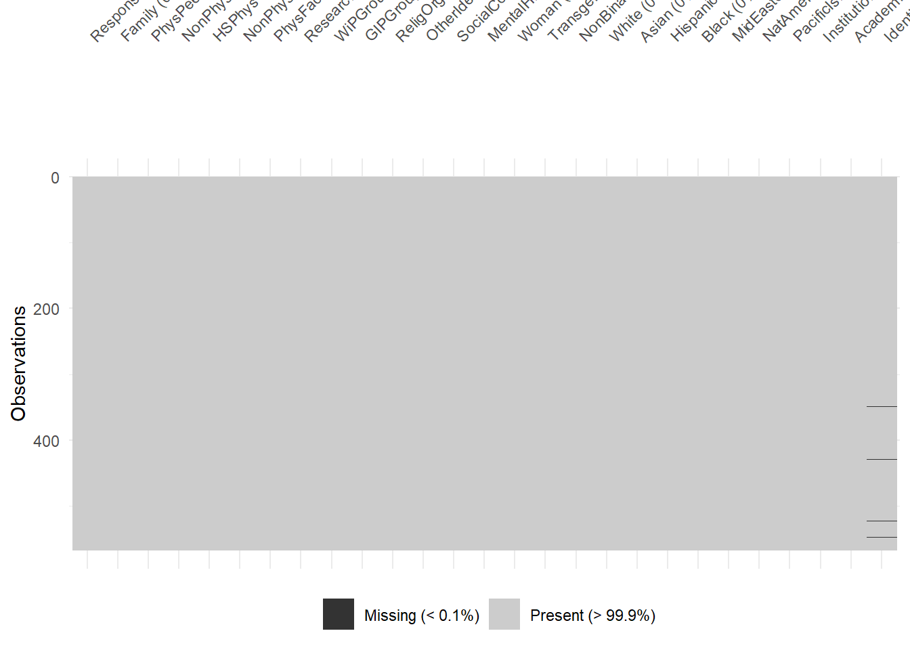
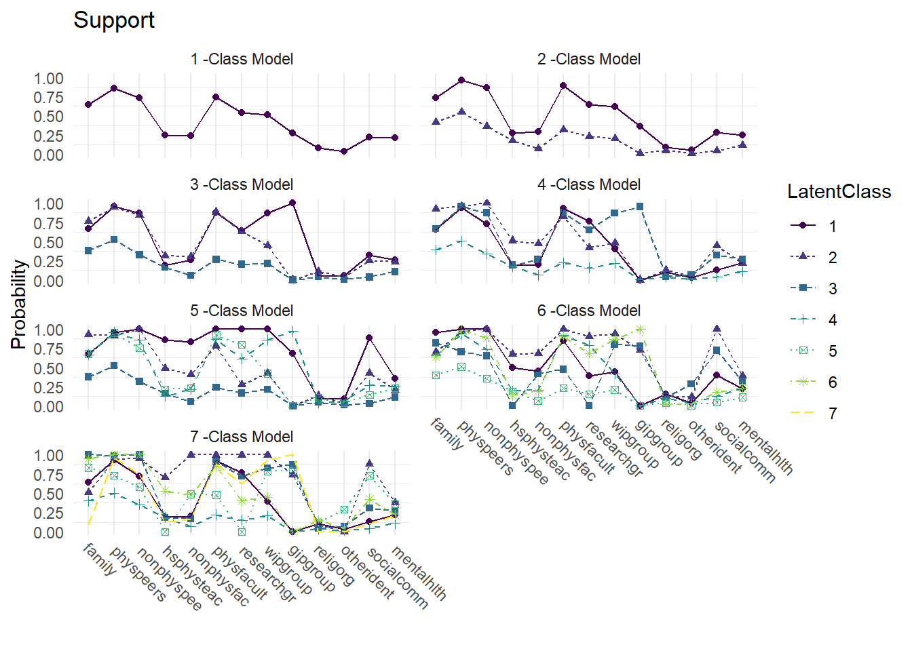
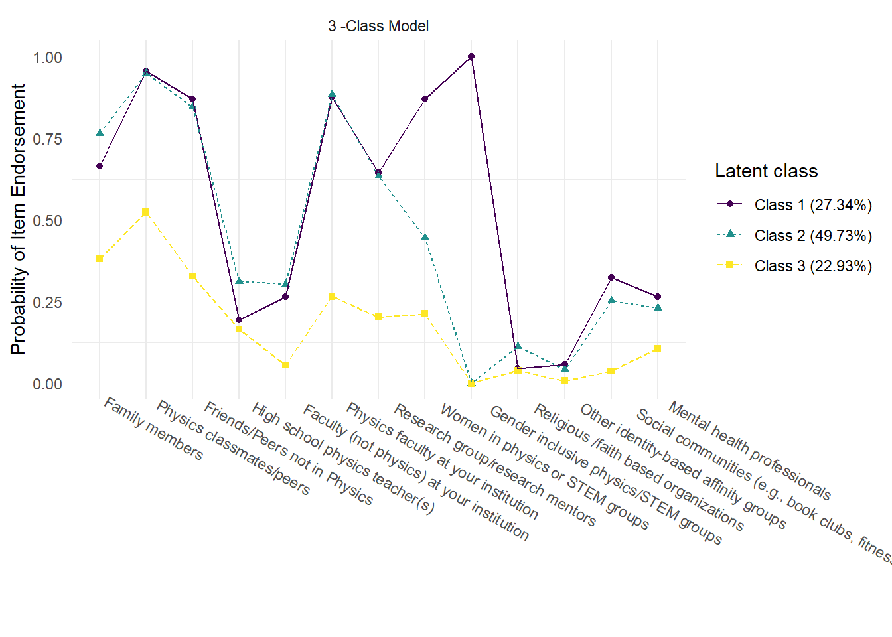
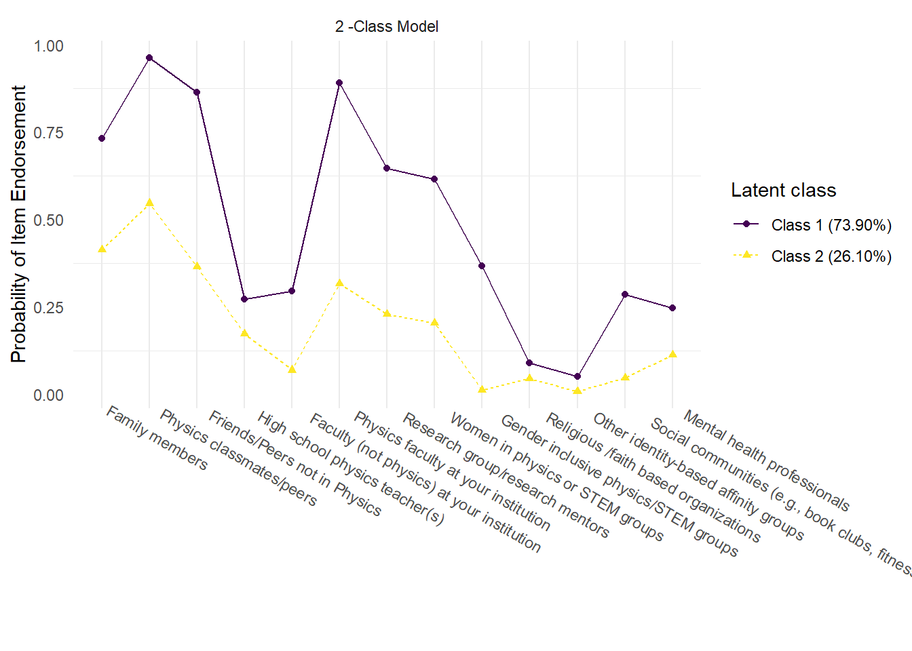
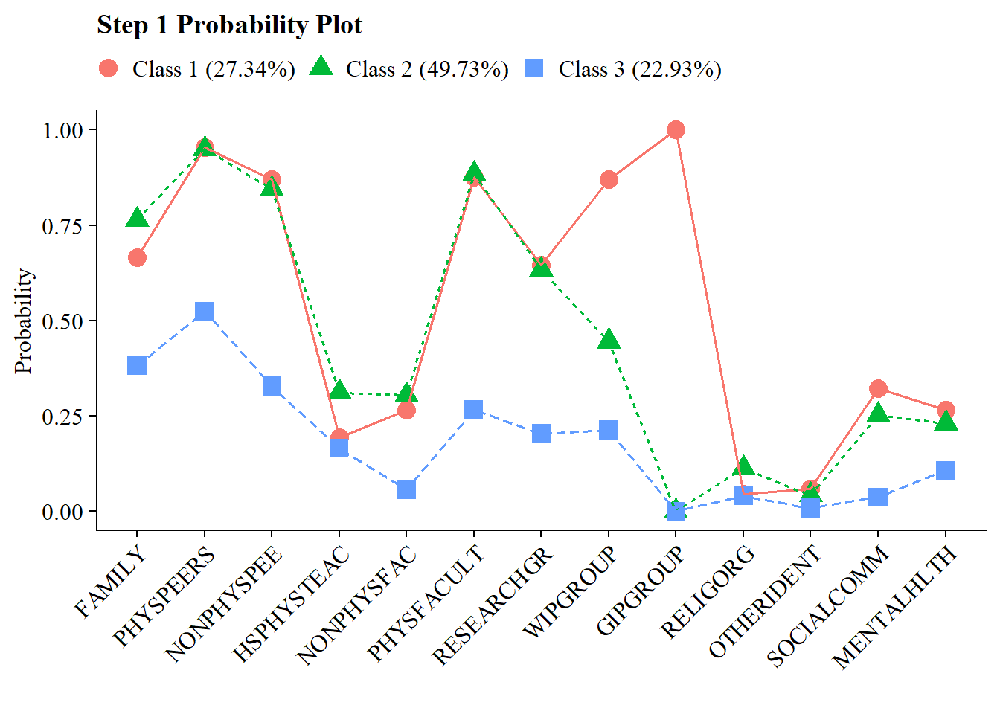
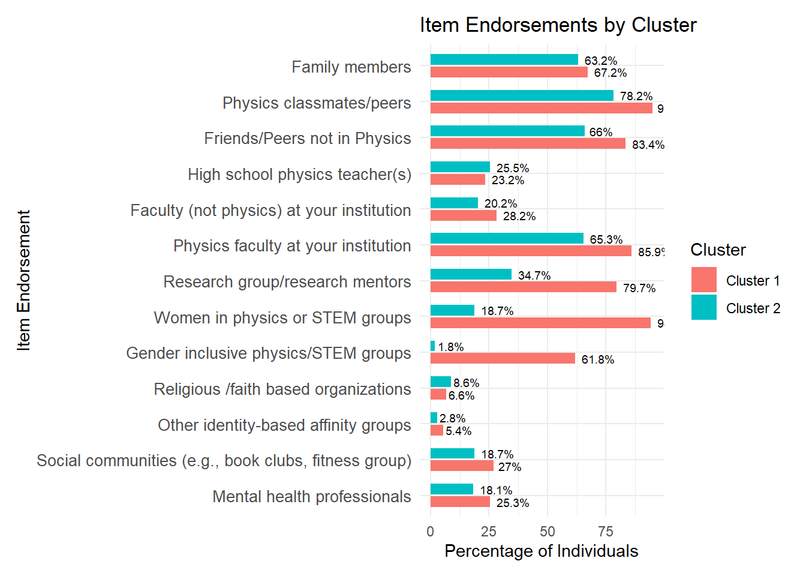
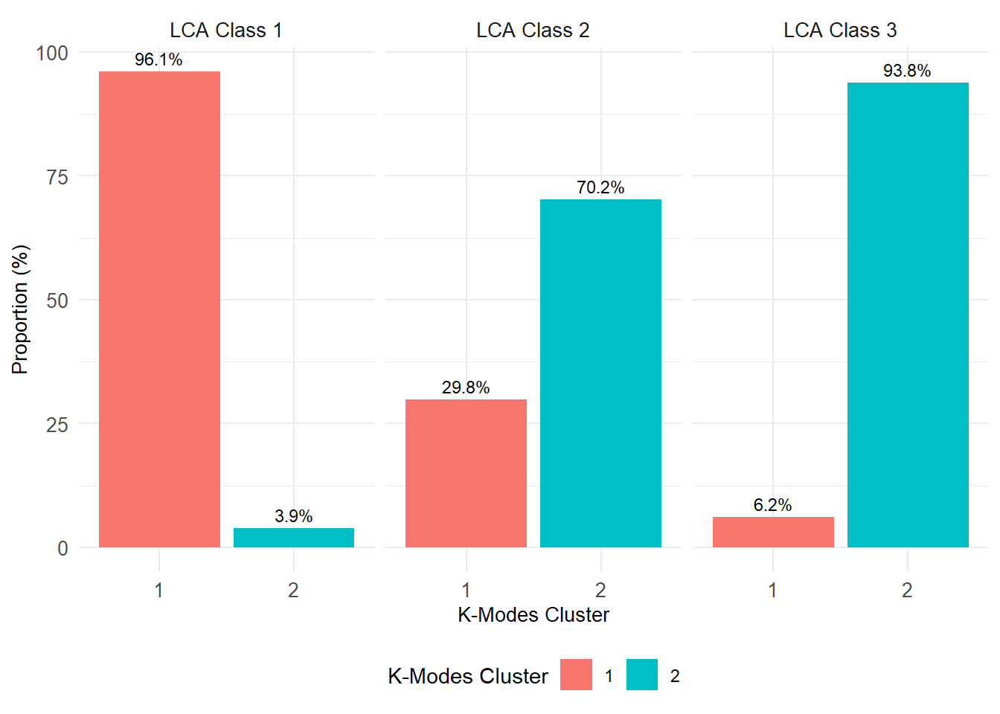
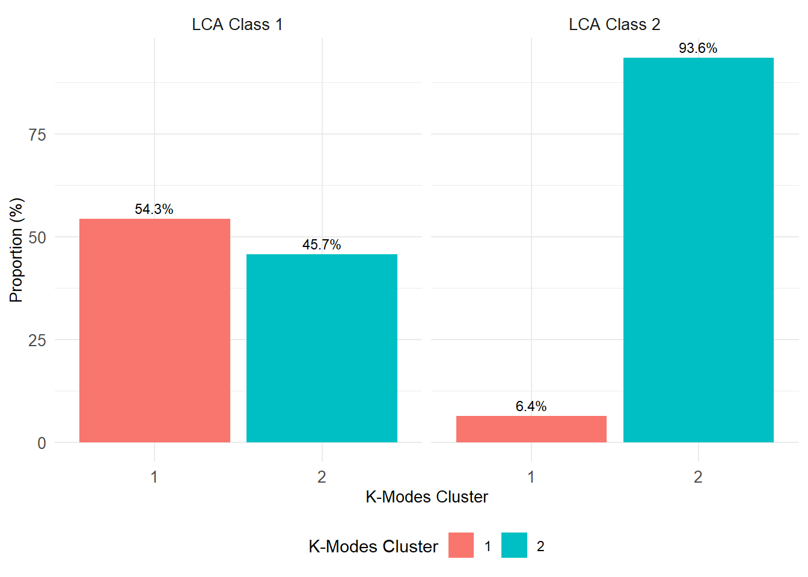
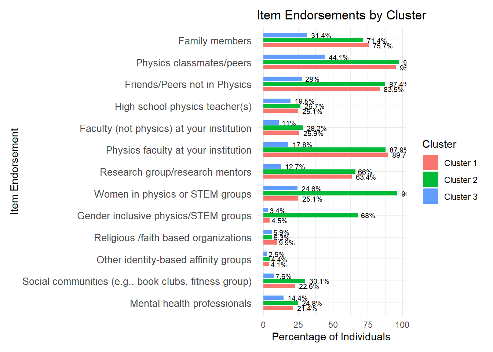
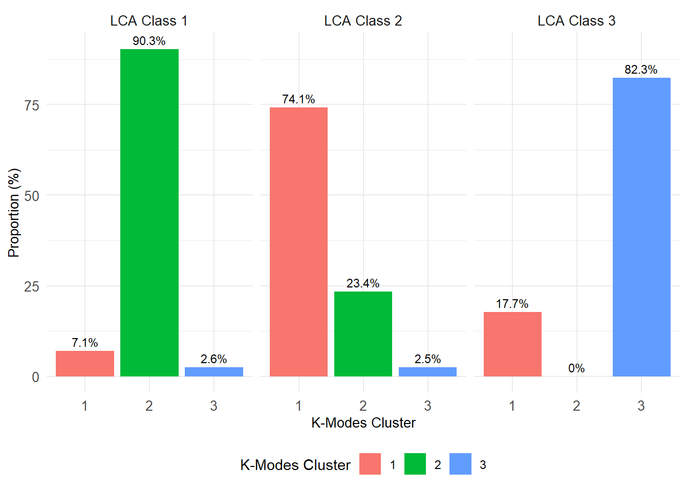

``` r
library(tidyverse)
library(haven)
library(glue)
library(MplusAutomation)
library(rhdf5)
library(here)
library(janitor)
library(gt)
library(semPlot)
library(reshape2)
library(cowplot)
library(filesstrings)
library(hrbrthemes)
library(poLCA)
library(naniar)
library(psych)
library(flextable)
library(officer)
conflicted::conflicts_prefer(flextable::compose)
```

# Mixture Models in Physics Education Research (Wang, Minghui, Meagan Sundstrom, Karen Nylund-Gibson, and Marsha Ing, 2025)

Wang, Minghui, Meagan Sundstrom, Karen Nylund-Gibson, and Marsha Ing. “Advancing Clustering Methods in Physics Education Research: A Case for Mixture Models.” Physical Review Physics Education Research 21, no. 2 (2025): 020126. https://doi.org/10.1103/1fn4-nqvj.


``` r
options(scipen=999, digits=4)
```


``` r
support_data <- read.csv(here("32-k-modes", "SocialSupport.csv"))
```


``` r
vis_miss(support_data)
```




``` r
describe(support_data)
#>                  vars   n   mean     sd median trimmed
#> ResponseId*         1 567 284.00 163.82  284.0  284.00
#> Family              2 567   0.65   0.48    1.0    0.69
#> PhysPeers           3 567   0.85   0.35    1.0    0.94
#> NonPhysPeers        4 567   0.73   0.44    1.0    0.79
#> HSPhysTeach         5 567   0.25   0.43    0.0    0.18
#> NonPhysFaculty      6 567   0.24   0.43    0.0    0.17
#> PhysFaculty         7 567   0.74   0.44    1.0    0.80
#> ResearchGrp         8 567   0.54   0.50    1.0    0.55
#> WiPGroup            9 567   0.51   0.50    1.0    0.51
#> GIPGroup           10 567   0.27   0.45    0.0    0.22
#> ReligOrg           11 567   0.08   0.27    0.0    0.00
#> OtherIdent         12 567   0.04   0.19    0.0    0.00
#> SocialComm         13 567   0.22   0.42    0.0    0.15
#> MentalHlth         14 567   0.21   0.41    0.0    0.14
#> Woman              15 567   0.88   0.32    1.0    0.98
#> Transgender        16 567   0.07   0.25    0.0    0.00
#> NonBinary          17 567   0.17   0.37    0.0    0.08
#> White              18 567   0.71   0.45    1.0    0.76
#> Asian              19 567   0.22   0.41    0.0    0.15
#> Hispanic           20 567   0.13   0.34    0.0    0.04
#> Black              21 567   0.05   0.22    0.0    0.00
#> MidEastern         22 567   0.03   0.17    0.0    0.00
#> NatAmerican        23 567   0.01   0.10    0.0    0.00
#> PacificIslander    24 567   0.01   0.10    0.0    0.00
#> InstitutionType*   25 567   4.41   0.69    5.0    4.50
#> AcademicYear*      26 567   4.20   1.62    5.0    4.29
#> Identity           27 563   2.54   0.84    2.5    2.59
#>                     mad min max range  skew kurtosis   se
#> ResponseId*      210.53   1 567   566  0.00    -1.21 6.88
#> Family             0.00   0   1     1 -0.62    -1.61 0.02
#> PhysPeers          0.00   0   1     1 -2.00     1.99 0.01
#> NonPhysPeers       0.00   0   1     1 -1.05    -0.89 0.02
#> HSPhysTeach        0.00   0   1     1  1.18    -0.60 0.02
#> NonPhysFaculty     0.00   0   1     1  1.24    -0.47 0.02
#> PhysFaculty        0.00   0   1     1 -1.10    -0.80 0.02
#> ResearchGrp        0.00   0   1     1 -0.15    -1.98 0.02
#> WiPGroup           0.00   0   1     1 -0.03    -2.00 0.02
#> GIPGroup           0.00   0   1     1  1.01    -0.97 0.02
#> ReligOrg           0.00   0   1     1  3.15     7.93 0.01
#> OtherIdent         0.00   0   1     1  4.76    20.73 0.01
#> SocialComm         0.00   0   1     1  1.33    -0.22 0.02
#> MentalHlth         0.00   0   1     1  1.41    -0.02 0.02
#> Woman              0.00   0   1     1 -2.39     3.70 0.01
#> Transgender        0.00   0   1     1  3.45     9.95 0.01
#> NonBinary          0.00   0   1     1  1.79     1.22 0.02
#> White              0.00   0   1     1 -0.93    -1.14 0.02
#> Asian              0.00   0   1     1  1.38    -0.09 0.02
#> Hispanic           0.00   0   1     1  2.14     2.60 0.01
#> Black              0.00   0   1     1  3.98    13.90 0.01
#> MidEastern         0.00   0   1     1  5.68    30.35 0.01
#> NatAmerican        0.00   0   1     1  9.54    89.18 0.00
#> PacificIslander    0.00   0   1     1  9.54    89.18 0.00
#> InstitutionType*   0.00   1   5     4 -1.25     2.22 0.03
#> AcademicYear*      1.48   1   6     5 -0.31    -1.40 0.07
#> Identity           0.74   0   4     4 -0.54     0.07 0.04
```


``` r
cor(support_data$Woman, support_data$Transgender)
#> [1] -0.4965
cor(support_data$Woman, support_data$NonBinary)
#> [1] -0.6959
cor(support_data$Transgender, support_data$NonBinary)
#> [1] 0.3547
```


``` r
conflicted::conflicts_prefer(dplyr::filter)
#> [conflicted] Will prefer dplyr::filter over any other
#> package.
```


``` r
nonbinary_subset <- support_data %>% filter(NonBinary == 1) #94 people
trans_subset <- support_data %>% filter(Transgender == 1)
nowoman_subset <- support_data %>% filter(Woman == 0) #66 people
nowoman_nonbinary <- nowoman_subset %>% filter(NonBinary == 1) #58 people
filtered_data <- support_data %>%
  filter(Woman == 1 | NonBinary == 1 | Transgender == 1)
```

## LCA

### Enumeration


``` r
lca_7  <- lapply(1:7, function(k) {
  lca_enum  <- mplusObject(
      
    TITLE = glue("{k}-Class"), 
  
    VARIABLE = glue(
    "categorical = Family-MentalHlth; 
     usevar = Family-MentalHlth;
     classes = c({k}); "),
  
  ANALYSIS = 
   "estimator = mlr; 
    type = mixture;
    starts = 200 100; 
    processors = 10;",
  
  OUTPUT = "sampstat residual tech11 tech14 svalues;",
  
  PLOT = 
    "type = plot3; 
    series = Family-MentalHlth(*);",
  
  usevariables = colnames(support_data),
  rdata = support_data)

lca_enum_fit <- mplusModeler(lca_enum, 
                            dataout=glue("support.dat"),
                            modelout=glue("c{k}_support.inp") ,
                            check=TRUE, run = TRUE, hashfilename = FALSE)
})
```

### Table of Fit


``` r
source(here("32-k-modes", "function/extract_mplus_info.R"))

output_dir <- here("32-k-modes", "enum_mplus")

output_files <- list.files(output_dir, pattern = "\\.out$", full.names = TRUE)

final_data <- map_dfr(output_files, extract_mplus_info_extended)

sample_size <- unique(final_data$Sample_Size)
```


``` r
output <- readModels(here("32-k-modes", "enum_mplus"), filefilter = "support", quiet = TRUE)
#> No PROPORTION OF DATA PRESENT sections found within COVARIANCE COVERAGE OF DATA output.
#> No PROPORTION OF DATA PRESENT sections found within COVARIANCE COVERAGE OF DATA output.
#> No PROPORTION OF DATA PRESENT sections found within COVARIANCE COVERAGE OF DATA output.
#> No PROPORTION OF DATA PRESENT sections found within COVARIANCE COVERAGE OF DATA output.
#> No PROPORTION OF DATA PRESENT sections found within COVARIANCE COVERAGE OF DATA output.
#> No PROPORTION OF DATA PRESENT sections found within COVARIANCE COVERAGE OF DATA output.
#> No PROPORTION OF DATA PRESENT sections found within COVARIANCE COVERAGE OF DATA output.

enum_extract <- LatexSummaryTable(output,
    keepCols = c("Title","Parameters","LL","BIC","aBIC",
    "BLRT_PValue","T11_VLMR_PValue","Observations"),
    sortBy = "Title") 

allFit <- enum_extract %>%
  mutate(CAIC = -2 * LL + Parameters * (log(Observations) + 1)) %>%
  mutate(AWE = -2 * LL + 2 * Parameters * (log(Observations) + 1.5)) %>%
  mutate(SIC = -.5 * BIC) %>%
  mutate(expSIC = exp(SIC - max(SIC))) %>%
  mutate(BF = exp(SIC - lead(SIC))) %>%
  mutate(cmPk = expSIC / sum(expSIC)) %>%
  dplyr::select(1:5, 9:10, 6:7, 13, 14) %>%
  arrange(Parameters)

allFit <- allFit %>%
  mutate(Title = str_trim(Title)) %>%
  left_join(
    final_data %>%
      dplyr::select(Class_Model, Perc_Convergence, Replicated_LL_Perc, 
             Smallest_Class, Smallest_Class_Perc),
    by = c("Title" = "Class_Model")
  ) %>%
  mutate(Smallest_Class = coalesce(Smallest_Class, 
                                   final_data$Smallest_Class[match(Title, final_data$Class_Model)])) %>%
  relocate(Perc_Convergence, Replicated_LL_Perc, .after = LL) %>%
  mutate(Smallest_Class_Combined = paste0(Smallest_Class, "\u00A0(", Smallest_Class_Perc, "%)")) %>%  # ✅ Use Non-Breaking Space
  dplyr::select(-Smallest_Class, -Smallest_Class_Perc)  # ✅ Remove old columns to avoid duplication

allFit <- allFit %>%
  dplyr::select(
    Title, Parameters, LL,  # Core model fit stats
    Perc_Convergence, Replicated_LL_Perc,  # ✅ Move these next to LL
    BIC, aBIC, CAIC, AWE,  # Other fit indices
    T11_VLMR_PValue, BLRT_PValue,  # Fit test p-values
    Smallest_Class_Combined,  # ✅ Merged column in correct position
    BF, cmPk  # ✅ Comment these out in Flextable, but keep them in the data
  )
```


``` r
fit_table1 <- allFit %>%
  dplyr::select(Title, Parameters, LL, Perc_Convergence, Replicated_LL_Perc, 
         BIC, aBIC, CAIC, AWE, 
         T11_VLMR_PValue, BLRT_PValue, 
         Smallest_Class_Combined  
         # BF,  # 🔹 Commented Out
         # cmPk  # 🔹 Commented Out
  ) %>%
  gt() %>%
  tab_header(title = md("**Model Fit Summary Table**")) %>%
  
  # ✅ Superheaders for groups of columns
  tab_spanner(label = "Model Fit Indices", columns = c(BIC, aBIC, CAIC, AWE)) %>%
  tab_spanner(label = "LRTs", columns = c(T11_VLMR_PValue, BLRT_PValue)) %>%
  tab_spanner(label = md("Smallest\u00A0Class"), columns = c(Smallest_Class_Combined)) %>%  # ✅ Non-Breaking Space
  
  cols_label(
    Title = "Classes",
    Parameters = md("npar"),
    LL = md("*LL*"),
    Perc_Convergence = "% Converged",
    Replicated_LL_Perc = "% Replicated",
    BIC = "BIC",
    aBIC = "aBIC",
    CAIC = "CAIC",
    AWE = "AWE",
    T11_VLMR_PValue = "VLMR",
    BLRT_PValue = "BLRT",
    Smallest_Class_Combined = "n (%)"
  ) %>%
  tab_footnote(
    footnote = md(
      "*Note.* Par = Parameters; *LL* = model log likelihood;
      BIC = Bayesian information criterion;
      aBIC = sample size adjusted BIC; CAIC = consistent Akaike information criterion;
      AWE = approximate weight of evidence criterion;
      BLRT = bootstrapped likelihood ratio test p-value;
      VLMR = Vuong-Lo-Mendell-Rubin adjusted likelihood ratio test p-value;
      *cmPk* = approximate correct model probability;
      Smallest K = Number of cases in the smallest class (n (%));
      LL Replicated = Whether the best log-likelihood was replicated."
    ),
    locations = cells_title()
  ) %>%
  tab_options(column_labels.font.weight = "bold") %>%
  
  # ✅ Format numerical values
  fmt_number(
    columns = c(3, 6:9),  # Keep decimal formatting for model fit statistics
    decimals = 2
  ) %>%
  fmt(
    columns = c(T11_VLMR_PValue, BLRT_PValue),  # ✅ Handle NA replacement & formatting
    fns = function(x) ifelse(is.na(x), "—", ifelse(x < 0.001, "<.001", scales::number(x, accuracy = .01)))
  ) %>%
  
  # ✅ Format as percentages (keeps 0-100 format)
  fmt_percent(
    columns = c(Perc_Convergence, Replicated_LL_Perc),
    decimals = 0,
    scale_values = FALSE  # ⚠️ IMPORTANT: Keeps numbers in 0-100 range
  ) %>%
  
  cols_align(align = "center", columns = everything()) %>%  # ✅ Center ALL columns
  tab_style(
    style = list(cell_text(weight = "bold")),
    locations = list(
      cells_body(columns = BIC, row = BIC == min(BIC)),
      cells_body(columns = aBIC, row = aBIC == min(aBIC)),
      cells_body(columns = CAIC, row = CAIC == min(CAIC)),
      cells_body(columns = AWE, row = AWE == min(AWE)),
      cells_body(columns = T11_VLMR_PValue, 
                 row = ifelse(T11_VLMR_PValue < .05 & lead(T11_VLMR_PValue) > .05, T11_VLMR_PValue < .05, NA)),
      cells_body(columns = BLRT_PValue, 
                 row = ifelse(BLRT_PValue < .05 & lead(BLRT_PValue) > .05, BLRT_PValue < .05, NA))
    )
  )

fit_table1
```


```{=html}
<div id="fzpobtofge" style="padding-left:0px;padding-right:0px;padding-top:10px;padding-bottom:10px;overflow-x:auto;overflow-y:auto;width:auto;height:auto;">
<style>#fzpobtofge table {
  font-family: system-ui, 'Segoe UI', Roboto, Helvetica, Arial, sans-serif, 'Apple Color Emoji', 'Segoe UI Emoji', 'Segoe UI Symbol', 'Noto Color Emoji';
  -webkit-font-smoothing: antialiased;
  -moz-osx-font-smoothing: grayscale;
}

#fzpobtofge thead, #fzpobtofge tbody, #fzpobtofge tfoot, #fzpobtofge tr, #fzpobtofge td, #fzpobtofge th {
  border-style: none;
}

#fzpobtofge p {
  margin: 0;
  padding: 0;
}

#fzpobtofge .gt_table {
  display: table;
  border-collapse: collapse;
  line-height: normal;
  margin-left: auto;
  margin-right: auto;
  color: #333333;
  font-size: 16px;
  font-weight: normal;
  font-style: normal;
  background-color: #FFFFFF;
  width: auto;
  border-top-style: solid;
  border-top-width: 2px;
  border-top-color: #A8A8A8;
  border-right-style: none;
  border-right-width: 2px;
  border-right-color: #D3D3D3;
  border-bottom-style: solid;
  border-bottom-width: 2px;
  border-bottom-color: #A8A8A8;
  border-left-style: none;
  border-left-width: 2px;
  border-left-color: #D3D3D3;
}

#fzpobtofge .gt_caption {
  padding-top: 4px;
  padding-bottom: 4px;
}

#fzpobtofge .gt_title {
  color: #333333;
  font-size: 125%;
  font-weight: initial;
  padding-top: 4px;
  padding-bottom: 4px;
  padding-left: 5px;
  padding-right: 5px;
  border-bottom-color: #FFFFFF;
  border-bottom-width: 0;
}

#fzpobtofge .gt_subtitle {
  color: #333333;
  font-size: 85%;
  font-weight: initial;
  padding-top: 3px;
  padding-bottom: 5px;
  padding-left: 5px;
  padding-right: 5px;
  border-top-color: #FFFFFF;
  border-top-width: 0;
}

#fzpobtofge .gt_heading {
  background-color: #FFFFFF;
  text-align: center;
  border-bottom-color: #FFFFFF;
  border-left-style: none;
  border-left-width: 1px;
  border-left-color: #D3D3D3;
  border-right-style: none;
  border-right-width: 1px;
  border-right-color: #D3D3D3;
}

#fzpobtofge .gt_bottom_border {
  border-bottom-style: solid;
  border-bottom-width: 2px;
  border-bottom-color: #D3D3D3;
}

#fzpobtofge .gt_col_headings {
  border-top-style: solid;
  border-top-width: 2px;
  border-top-color: #D3D3D3;
  border-bottom-style: solid;
  border-bottom-width: 2px;
  border-bottom-color: #D3D3D3;
  border-left-style: none;
  border-left-width: 1px;
  border-left-color: #D3D3D3;
  border-right-style: none;
  border-right-width: 1px;
  border-right-color: #D3D3D3;
}

#fzpobtofge .gt_col_heading {
  color: #333333;
  background-color: #FFFFFF;
  font-size: 100%;
  font-weight: bold;
  text-transform: inherit;
  border-left-style: none;
  border-left-width: 1px;
  border-left-color: #D3D3D3;
  border-right-style: none;
  border-right-width: 1px;
  border-right-color: #D3D3D3;
  vertical-align: bottom;
  padding-top: 5px;
  padding-bottom: 6px;
  padding-left: 5px;
  padding-right: 5px;
  overflow-x: hidden;
}

#fzpobtofge .gt_column_spanner_outer {
  color: #333333;
  background-color: #FFFFFF;
  font-size: 100%;
  font-weight: bold;
  text-transform: inherit;
  padding-top: 0;
  padding-bottom: 0;
  padding-left: 4px;
  padding-right: 4px;
}

#fzpobtofge .gt_column_spanner_outer:first-child {
  padding-left: 0;
}

#fzpobtofge .gt_column_spanner_outer:last-child {
  padding-right: 0;
}

#fzpobtofge .gt_column_spanner {
  border-bottom-style: solid;
  border-bottom-width: 2px;
  border-bottom-color: #D3D3D3;
  vertical-align: bottom;
  padding-top: 5px;
  padding-bottom: 5px;
  overflow-x: hidden;
  display: inline-block;
  width: 100%;
}

#fzpobtofge .gt_spanner_row {
  border-bottom-style: hidden;
}

#fzpobtofge .gt_group_heading {
  padding-top: 8px;
  padding-bottom: 8px;
  padding-left: 5px;
  padding-right: 5px;
  color: #333333;
  background-color: #FFFFFF;
  font-size: 100%;
  font-weight: initial;
  text-transform: inherit;
  border-top-style: solid;
  border-top-width: 2px;
  border-top-color: #D3D3D3;
  border-bottom-style: solid;
  border-bottom-width: 2px;
  border-bottom-color: #D3D3D3;
  border-left-style: none;
  border-left-width: 1px;
  border-left-color: #D3D3D3;
  border-right-style: none;
  border-right-width: 1px;
  border-right-color: #D3D3D3;
  vertical-align: middle;
  text-align: left;
}

#fzpobtofge .gt_empty_group_heading {
  padding: 0.5px;
  color: #333333;
  background-color: #FFFFFF;
  font-size: 100%;
  font-weight: initial;
  border-top-style: solid;
  border-top-width: 2px;
  border-top-color: #D3D3D3;
  border-bottom-style: solid;
  border-bottom-width: 2px;
  border-bottom-color: #D3D3D3;
  vertical-align: middle;
}

#fzpobtofge .gt_from_md > :first-child {
  margin-top: 0;
}

#fzpobtofge .gt_from_md > :last-child {
  margin-bottom: 0;
}

#fzpobtofge .gt_row {
  padding-top: 8px;
  padding-bottom: 8px;
  padding-left: 5px;
  padding-right: 5px;
  margin: 10px;
  border-top-style: solid;
  border-top-width: 1px;
  border-top-color: #D3D3D3;
  border-left-style: none;
  border-left-width: 1px;
  border-left-color: #D3D3D3;
  border-right-style: none;
  border-right-width: 1px;
  border-right-color: #D3D3D3;
  vertical-align: middle;
  overflow-x: hidden;
}

#fzpobtofge .gt_stub {
  color: #333333;
  background-color: #FFFFFF;
  font-size: 100%;
  font-weight: initial;
  text-transform: inherit;
  border-right-style: solid;
  border-right-width: 2px;
  border-right-color: #D3D3D3;
  padding-left: 5px;
  padding-right: 5px;
}

#fzpobtofge .gt_stub_row_group {
  color: #333333;
  background-color: #FFFFFF;
  font-size: 100%;
  font-weight: initial;
  text-transform: inherit;
  border-right-style: solid;
  border-right-width: 2px;
  border-right-color: #D3D3D3;
  padding-left: 5px;
  padding-right: 5px;
  vertical-align: top;
}

#fzpobtofge .gt_row_group_first td {
  border-top-width: 2px;
}

#fzpobtofge .gt_row_group_first th {
  border-top-width: 2px;
}

#fzpobtofge .gt_summary_row {
  color: #333333;
  background-color: #FFFFFF;
  text-transform: inherit;
  padding-top: 8px;
  padding-bottom: 8px;
  padding-left: 5px;
  padding-right: 5px;
}

#fzpobtofge .gt_first_summary_row {
  border-top-style: solid;
  border-top-color: #D3D3D3;
}

#fzpobtofge .gt_first_summary_row.thick {
  border-top-width: 2px;
}

#fzpobtofge .gt_last_summary_row {
  padding-top: 8px;
  padding-bottom: 8px;
  padding-left: 5px;
  padding-right: 5px;
  border-bottom-style: solid;
  border-bottom-width: 2px;
  border-bottom-color: #D3D3D3;
}

#fzpobtofge .gt_grand_summary_row {
  color: #333333;
  background-color: #FFFFFF;
  text-transform: inherit;
  padding-top: 8px;
  padding-bottom: 8px;
  padding-left: 5px;
  padding-right: 5px;
}

#fzpobtofge .gt_first_grand_summary_row {
  padding-top: 8px;
  padding-bottom: 8px;
  padding-left: 5px;
  padding-right: 5px;
  border-top-style: double;
  border-top-width: 6px;
  border-top-color: #D3D3D3;
}

#fzpobtofge .gt_last_grand_summary_row_top {
  padding-top: 8px;
  padding-bottom: 8px;
  padding-left: 5px;
  padding-right: 5px;
  border-bottom-style: double;
  border-bottom-width: 6px;
  border-bottom-color: #D3D3D3;
}

#fzpobtofge .gt_striped {
  background-color: rgba(128, 128, 128, 0.05);
}

#fzpobtofge .gt_table_body {
  border-top-style: solid;
  border-top-width: 2px;
  border-top-color: #D3D3D3;
  border-bottom-style: solid;
  border-bottom-width: 2px;
  border-bottom-color: #D3D3D3;
}

#fzpobtofge .gt_footnotes {
  color: #333333;
  background-color: #FFFFFF;
  border-bottom-style: none;
  border-bottom-width: 2px;
  border-bottom-color: #D3D3D3;
  border-left-style: none;
  border-left-width: 2px;
  border-left-color: #D3D3D3;
  border-right-style: none;
  border-right-width: 2px;
  border-right-color: #D3D3D3;
}

#fzpobtofge .gt_footnote {
  margin: 0px;
  font-size: 90%;
  padding-top: 4px;
  padding-bottom: 4px;
  padding-left: 5px;
  padding-right: 5px;
}

#fzpobtofge .gt_sourcenotes {
  color: #333333;
  background-color: #FFFFFF;
  border-bottom-style: none;
  border-bottom-width: 2px;
  border-bottom-color: #D3D3D3;
  border-left-style: none;
  border-left-width: 2px;
  border-left-color: #D3D3D3;
  border-right-style: none;
  border-right-width: 2px;
  border-right-color: #D3D3D3;
}

#fzpobtofge .gt_sourcenote {
  font-size: 90%;
  padding-top: 4px;
  padding-bottom: 4px;
  padding-left: 5px;
  padding-right: 5px;
}

#fzpobtofge .gt_left {
  text-align: left;
}

#fzpobtofge .gt_center {
  text-align: center;
}

#fzpobtofge .gt_right {
  text-align: right;
  font-variant-numeric: tabular-nums;
}

#fzpobtofge .gt_font_normal {
  font-weight: normal;
}

#fzpobtofge .gt_font_bold {
  font-weight: bold;
}

#fzpobtofge .gt_font_italic {
  font-style: italic;
}

#fzpobtofge .gt_super {
  font-size: 65%;
}

#fzpobtofge .gt_footnote_marks {
  font-size: 75%;
  vertical-align: 0.4em;
  position: initial;
}

#fzpobtofge .gt_asterisk {
  font-size: 100%;
  vertical-align: 0;
}

#fzpobtofge .gt_indent_1 {
  text-indent: 5px;
}

#fzpobtofge .gt_indent_2 {
  text-indent: 10px;
}

#fzpobtofge .gt_indent_3 {
  text-indent: 15px;
}

#fzpobtofge .gt_indent_4 {
  text-indent: 20px;
}

#fzpobtofge .gt_indent_5 {
  text-indent: 25px;
}

#fzpobtofge .katex-display {
  display: inline-flex !important;
  margin-bottom: 0.75em !important;
}

#fzpobtofge div.Reactable > div.rt-table > div.rt-thead > div.rt-tr.rt-tr-group-header > div.rt-th-group:after {
  height: 0px !important;
}
</style>
<table class="gt_table" data-quarto-disable-processing="false" data-quarto-bootstrap="false">
  <thead>
    <tr class="gt_heading">
      <td colspan="12" class="gt_heading gt_title gt_font_normal gt_bottom_border" style><span class='gt_from_md'><strong>Model Fit Summary Table</strong></span><span class="gt_footnote_marks" style="white-space:nowrap;font-style:italic;font-weight:normal;line-height:0;"><sup>1</sup></span></td>
    </tr>
    
    <tr class="gt_col_headings gt_spanner_row">
      <th class="gt_col_heading gt_columns_bottom_border gt_center" rowspan="2" colspan="1" scope="col" id="Title">Classes</th>
      <th class="gt_col_heading gt_columns_bottom_border gt_center" rowspan="2" colspan="1" scope="col" id="Parameters"><span class='gt_from_md'>npar</span></th>
      <th class="gt_col_heading gt_columns_bottom_border gt_center" rowspan="2" colspan="1" scope="col" id="LL"><span class='gt_from_md'><em>LL</em></span></th>
      <th class="gt_col_heading gt_columns_bottom_border gt_center" rowspan="2" colspan="1" scope="col" id="Perc_Convergence">% Converged</th>
      <th class="gt_col_heading gt_columns_bottom_border gt_center" rowspan="2" colspan="1" scope="col" id="Replicated_LL_Perc">% Replicated</th>
      <th class="gt_center gt_columns_top_border gt_column_spanner_outer" rowspan="1" colspan="4" scope="colgroup" id="Model Fit Indices">
        <div class="gt_column_spanner">Model Fit Indices</div>
      </th>
      <th class="gt_center gt_columns_top_border gt_column_spanner_outer" rowspan="1" colspan="2" scope="colgroup" id="LRTs">
        <div class="gt_column_spanner">LRTs</div>
      </th>
      <th class="gt_center gt_columns_top_border gt_column_spanner_outer" rowspan="1" colspan="1" scope="col" id="Smallest Class">
        <div class="gt_column_spanner"><span class='gt_from_md'>Smallest Class</span></div>
      </th>
    </tr>
    <tr class="gt_col_headings">
      <th class="gt_col_heading gt_columns_bottom_border gt_center" rowspan="1" colspan="1" scope="col" id="BIC">BIC</th>
      <th class="gt_col_heading gt_columns_bottom_border gt_center" rowspan="1" colspan="1" scope="col" id="aBIC">aBIC</th>
      <th class="gt_col_heading gt_columns_bottom_border gt_center" rowspan="1" colspan="1" scope="col" id="CAIC">CAIC</th>
      <th class="gt_col_heading gt_columns_bottom_border gt_center" rowspan="1" colspan="1" scope="col" id="AWE">AWE</th>
      <th class="gt_col_heading gt_columns_bottom_border gt_center" rowspan="1" colspan="1" scope="col" id="T11_VLMR_PValue">VLMR</th>
      <th class="gt_col_heading gt_columns_bottom_border gt_center" rowspan="1" colspan="1" scope="col" id="BLRT_PValue">BLRT</th>
      <th class="gt_col_heading gt_columns_bottom_border gt_center" rowspan="1" colspan="1" scope="col" id="Smallest_Class_Combined">n (%)</th>
    </tr>
  </thead>
  <tbody class="gt_table_body">
    <tr><td headers="Title" class="gt_row gt_center">1-Class</td>
<td headers="Parameters" class="gt_row gt_center">13</td>
<td headers="LL" class="gt_row gt_center">−3,840.13</td>
<td headers="Perc_Convergence" class="gt_row gt_center">100%</td>
<td headers="Replicated_LL_Perc" class="gt_row gt_center">100%</td>
<td headers="BIC" class="gt_row gt_center">7,762.68</td>
<td headers="aBIC" class="gt_row gt_center">7,721.41</td>
<td headers="CAIC" class="gt_row gt_center">7,775.68</td>
<td headers="AWE" class="gt_row gt_center">7,884.11</td>
<td headers="T11_VLMR_PValue" class="gt_row gt_center">—</td>
<td headers="BLRT_PValue" class="gt_row gt_center">—</td>
<td headers="Smallest_Class_Combined" class="gt_row gt_center">567 (100%)</td></tr>
    <tr><td headers="Title" class="gt_row gt_center">2-Class</td>
<td headers="Parameters" class="gt_row gt_center">27</td>
<td headers="LL" class="gt_row gt_center">−3,647.65</td>
<td headers="Perc_Convergence" class="gt_row gt_center">98%</td>
<td headers="Replicated_LL_Perc" class="gt_row gt_center">98%</td>
<td headers="BIC" class="gt_row gt_center">7,466.49</td>
<td headers="aBIC" class="gt_row gt_center">7,380.77</td>
<td headers="CAIC" class="gt_row gt_center" style="font-weight: bold;">7,493.49</td>
<td headers="AWE" class="gt_row gt_center" style="font-weight: bold;">7,718.68</td>
<td headers="T11_VLMR_PValue" class="gt_row gt_center"><.001</td>
<td headers="BLRT_PValue" class="gt_row gt_center"><.001</td>
<td headers="Smallest_Class_Combined" class="gt_row gt_center">148 (26.1%)</td></tr>
    <tr><td headers="Title" class="gt_row gt_center">3-Class</td>
<td headers="Parameters" class="gt_row gt_center">41</td>
<td headers="LL" class="gt_row gt_center">−3,596.93</td>
<td headers="Perc_Convergence" class="gt_row gt_center">85%</td>
<td headers="Replicated_LL_Perc" class="gt_row gt_center">95%</td>
<td headers="BIC" class="gt_row gt_center" style="font-weight: bold;">7,453.81</td>
<td headers="aBIC" class="gt_row gt_center" style="font-weight: bold;">7,323.65</td>
<td headers="CAIC" class="gt_row gt_center">7,494.81</td>
<td headers="AWE" class="gt_row gt_center">7,836.76</td>
<td headers="T11_VLMR_PValue" class="gt_row gt_center" style="font-weight: bold;"><.001</td>
<td headers="BLRT_PValue" class="gt_row gt_center"><.001</td>
<td headers="Smallest_Class_Combined" class="gt_row gt_center">130 (22.9%)</td></tr>
    <tr><td headers="Title" class="gt_row gt_center">4-Class</td>
<td headers="Parameters" class="gt_row gt_center">55</td>
<td headers="LL" class="gt_row gt_center">−3,576.71</td>
<td headers="Perc_Convergence" class="gt_row gt_center">23%</td>
<td headers="Replicated_LL_Perc" class="gt_row gt_center">34%</td>
<td headers="BIC" class="gt_row gt_center">7,502.15</td>
<td headers="aBIC" class="gt_row gt_center">7,327.55</td>
<td headers="CAIC" class="gt_row gt_center">7,557.15</td>
<td headers="AWE" class="gt_row gt_center">8,015.87</td>
<td headers="T11_VLMR_PValue" class="gt_row gt_center">0.68</td>
<td headers="BLRT_PValue" class="gt_row gt_center" style="font-weight: bold;">0.04</td>
<td headers="Smallest_Class_Combined" class="gt_row gt_center">101 (17.8%)</td></tr>
    <tr><td headers="Title" class="gt_row gt_center">5-Class</td>
<td headers="Parameters" class="gt_row gt_center">69</td>
<td headers="LL" class="gt_row gt_center">−3,558.81</td>
<td headers="Perc_Convergence" class="gt_row gt_center">17%</td>
<td headers="Replicated_LL_Perc" class="gt_row gt_center">10%</td>
<td headers="BIC" class="gt_row gt_center">7,555.10</td>
<td headers="aBIC" class="gt_row gt_center">7,336.06</td>
<td headers="CAIC" class="gt_row gt_center">7,624.10</td>
<td headers="AWE" class="gt_row gt_center">8,199.59</td>
<td headers="T11_VLMR_PValue" class="gt_row gt_center">0.38</td>
<td headers="BLRT_PValue" class="gt_row gt_center">0.14</td>
<td headers="Smallest_Class_Combined" class="gt_row gt_center">20 (3.5%)</td></tr>
    <tr><td headers="Title" class="gt_row gt_center">6-Class</td>
<td headers="Parameters" class="gt_row gt_center">83</td>
<td headers="LL" class="gt_row gt_center">−3,542.47</td>
<td headers="Perc_Convergence" class="gt_row gt_center">11%</td>
<td headers="Replicated_LL_Perc" class="gt_row gt_center">19%</td>
<td headers="BIC" class="gt_row gt_center">7,611.19</td>
<td headers="aBIC" class="gt_row gt_center">7,347.71</td>
<td headers="CAIC" class="gt_row gt_center">7,694.19</td>
<td headers="AWE" class="gt_row gt_center">8,386.44</td>
<td headers="T11_VLMR_PValue" class="gt_row gt_center">0.34</td>
<td headers="BLRT_PValue" class="gt_row gt_center">0.14</td>
<td headers="Smallest_Class_Combined" class="gt_row gt_center">18 (3.2%)</td></tr>
    <tr><td headers="Title" class="gt_row gt_center">7-Class</td>
<td headers="Parameters" class="gt_row gt_center">97</td>
<td headers="LL" class="gt_row gt_center">−3,526.55</td>
<td headers="Perc_Convergence" class="gt_row gt_center">8%</td>
<td headers="Replicated_LL_Perc" class="gt_row gt_center">2%</td>
<td headers="BIC" class="gt_row gt_center">7,668.12</td>
<td headers="aBIC" class="gt_row gt_center">7,360.19</td>
<td headers="CAIC" class="gt_row gt_center">7,765.12</td>
<td headers="AWE" class="gt_row gt_center">8,574.14</td>
<td headers="T11_VLMR_PValue" class="gt_row gt_center">0.10</td>
<td headers="BLRT_PValue" class="gt_row gt_center">0.16</td>
<td headers="Smallest_Class_Combined" class="gt_row gt_center">17 (3%)</td></tr>
  </tbody>
  <tfoot>
    <tr class="gt_footnotes">
      <td class="gt_footnote" colspan="12"><span class="gt_footnote_marks" style="white-space:nowrap;font-style:italic;font-weight:normal;line-height:0;"><sup>1</sup></span> <span class='gt_from_md'><em>Note.</em> Par = Parameters; <em>LL</em> = model log likelihood;
BIC = Bayesian information criterion;
aBIC = sample size adjusted BIC; CAIC = consistent Akaike information criterion;
AWE = approximate weight of evidence criterion;
BLRT = bootstrapped likelihood ratio test p-value;
VLMR = Vuong-Lo-Mendell-Rubin adjusted likelihood ratio test p-value;
<em>cmPk</em> = approximate correct model probability;
Smallest K = Number of cases in the smallest class (n (%));
LL Replicated = Whether the best log-likelihood was replicated.</span></td>
    </tr>
  </tfoot>
</table>
</div>
```


### Examine Convergence and Loglikelihood Replications


``` r
source(here("32-k-modes", "function/extract_mplus_info.R"))
output_dir <- here("32-k-modes", "enum_mplus")
output_files <- list.files(output_dir, pattern = "\\.out$", full.names = TRUE)
final_data <- map_dfr(output_files, extract_mplus_info_extended)
sample_size <- unique(final_data$Sample_Size)
```


``` r
source(here("32-k-modes", "function/summary_table.R"))
source(here("32-k-modes","function/error_visualization.R"))

summary_table <- create_flextable(final_data, sample_size)
summary_table
```


```{=html}
<div class="tabwid"><style>.cl-fd9313b6{}.cl-fd8ab126{font-family:'Avenir Next';font-size:11pt;font-weight:normal;font-style:italic;text-decoration:none;color:rgba(0, 0, 0, 1.00);background-color:transparent;}.cl-fd8ab144{font-family:'Avenir Next';font-size:11pt;font-weight:normal;font-style:normal;text-decoration:none;color:rgba(0, 0, 0, 1.00);background-color:transparent;}.cl-fd8ab145{font-family:'Avenir Next';font-size:11pt;font-weight:normal;font-style:normal;text-decoration:none;color:rgba(255, 255, 255, 1.00);background-color:transparent;}.cl-fd8e2676{margin:0;text-align:left;border-bottom: 0 solid rgba(0, 0, 0, 1.00);border-top: 0 solid rgba(0, 0, 0, 1.00);border-left: 0 solid rgba(0, 0, 0, 1.00);border-right: 0 solid rgba(0, 0, 0, 1.00);padding-bottom:5pt;padding-top:5pt;padding-left:5pt;padding-right:5pt;line-height: 1;background-color:transparent;}.cl-fd8e2680{margin:0;text-align:center;border-bottom: 0 solid rgba(0, 0, 0, 1.00);border-top: 0 solid rgba(0, 0, 0, 1.00);border-left: 0 solid rgba(0, 0, 0, 1.00);border-right: 0 solid rgba(0, 0, 0, 1.00);padding-bottom:5pt;padding-top:5pt;padding-left:5pt;padding-right:5pt;line-height: 1;background-color:transparent;}.cl-fd8e268a{margin:0;text-align:center;border-bottom: 0 solid rgba(0, 0, 0, 1.00);border-top: 0 solid rgba(0, 0, 0, 1.00);border-left: 0 solid rgba(0, 0, 0, 1.00);border-right: 0 solid rgba(0, 0, 0, 1.00);padding-bottom:5pt;padding-top:5pt;padding-left:5pt;padding-right:5pt;line-height: 1;background-color:transparent;}.cl-fd8e5e34{width:0.7in;background-color:rgba(240, 240, 240, 1.00);vertical-align: bottom;border-bottom: 0 solid rgba(255, 255, 255, 0.00);border-top: 1.5pt solid rgba(102, 102, 102, 1.00);border-left: 0 solid rgba(0, 0, 0, 1.00);border-right: 0 solid rgba(0, 0, 0, 1.00);margin-bottom:0;margin-top:0;margin-left:0;margin-right:0;}.cl-fd8e5e3e{width:0.8in;background-color:rgba(240, 240, 240, 1.00);vertical-align: bottom;border-bottom: 0 solid rgba(255, 255, 255, 0.00);border-top: 1.5pt solid rgba(102, 102, 102, 1.00);border-left: 0 solid rgba(0, 0, 0, 1.00);border-right: 0 solid rgba(0, 0, 0, 1.00);margin-bottom:0;margin-top:0;margin-left:0;margin-right:0;}.cl-fd8e5e3f{width:0.4in;background-color:rgba(240, 240, 240, 1.00);vertical-align: bottom;border-bottom: 0 solid rgba(255, 255, 255, 0.00);border-top: 1.5pt solid rgba(102, 102, 102, 1.00);border-left: 0 solid rgba(0, 0, 0, 1.00);border-right: 0 solid rgba(0, 0, 0, 1.00);margin-bottom:0;margin-top:0;margin-left:0;margin-right:0;}.cl-fd8e5e48{width:0.5in;background-color:rgba(240, 240, 240, 1.00);vertical-align: bottom;border-bottom: 0 solid rgba(255, 255, 255, 0.00);border-top: 1.5pt solid rgba(102, 102, 102, 1.00);border-left: 0 solid rgba(0, 0, 0, 1.00);border-right: 0 solid rgba(0, 0, 0, 1.00);margin-bottom:0;margin-top:0;margin-left:0;margin-right:0;}.cl-fd8e5e52{width:0.7in;background-color:transparent;vertical-align: bottom;border-bottom: 1.5pt solid rgba(102, 102, 102, 1.00);border-top: 0 solid rgba(255, 255, 255, 0.00);border-left: 0 solid rgba(0, 0, 0, 1.00);border-right: 0 solid rgba(0, 0, 0, 1.00);margin-bottom:0;margin-top:0;margin-left:0;margin-right:0;}.cl-fd8e5e53{width:0.8in;background-color:transparent;vertical-align: bottom;border-bottom: 1.5pt solid rgba(102, 102, 102, 1.00);border-top: 0 solid rgba(255, 255, 255, 0.00);border-left: 0 solid rgba(0, 0, 0, 1.00);border-right: 0 solid rgba(0, 0, 0, 1.00);margin-bottom:0;margin-top:0;margin-left:0;margin-right:0;}.cl-fd8e5e54{width:0.4in;background-color:transparent;vertical-align: bottom;border-bottom: 1.5pt solid rgba(102, 102, 102, 1.00);border-top: 0 solid rgba(255, 255, 255, 0.00);border-left: 0 solid rgba(0, 0, 0, 1.00);border-right: 0 solid rgba(0, 0, 0, 1.00);margin-bottom:0;margin-top:0;margin-left:0;margin-right:0;}.cl-fd8e5e55{width:0.5in;background-color:transparent;vertical-align: bottom;border-bottom: 1.5pt solid rgba(102, 102, 102, 1.00);border-top: 0 solid rgba(255, 255, 255, 0.00);border-left: 0 solid rgba(0, 0, 0, 1.00);border-right: 0 solid rgba(0, 0, 0, 1.00);margin-bottom:0;margin-top:0;margin-left:0;margin-right:0;}.cl-fd8e5e5c{width:0.7in;background-color:rgba(240, 240, 240, 1.00);vertical-align: middle;border-bottom: 0 solid rgba(0, 0, 0, 1.00);border-top: 0 solid rgba(0, 0, 0, 1.00);border-left: 0 solid rgba(0, 0, 0, 1.00);border-right: 0 solid rgba(0, 0, 0, 1.00);margin-bottom:0;margin-top:0;margin-left:0;margin-right:0;}.cl-fd8e5e5d{width:0.8in;background-color:rgba(240, 240, 240, 1.00);vertical-align: middle;border-bottom: 0 solid rgba(0, 0, 0, 1.00);border-top: 0 solid rgba(0, 0, 0, 1.00);border-left: 0 solid rgba(0, 0, 0, 1.00);border-right: 0 solid rgba(0, 0, 0, 1.00);margin-bottom:0;margin-top:0;margin-left:0;margin-right:0;}.cl-fd8e5e66{width:0.4in;background-color:rgba(240, 240, 240, 1.00);vertical-align: middle;border-bottom: 0 solid rgba(0, 0, 0, 1.00);border-top: 0 solid rgba(0, 0, 0, 1.00);border-left: 0 solid rgba(0, 0, 0, 1.00);border-right: 0 solid rgba(0, 0, 0, 1.00);margin-bottom:0;margin-top:0;margin-left:0;margin-right:0;}.cl-fd8e5e70{width:0.5in;background-color:rgba(240, 240, 240, 1.00);vertical-align: middle;border-bottom: 0 solid rgba(0, 0, 0, 1.00);border-top: 0 solid rgba(0, 0, 0, 1.00);border-left: 0 solid rgba(0, 0, 0, 1.00);border-right: 0 solid rgba(0, 0, 0, 1.00);margin-bottom:0;margin-top:0;margin-left:0;margin-right:0;}.cl-fd8e5e71{width:0.7in;background-color:transparent;vertical-align: middle;border-bottom: 0 solid rgba(0, 0, 0, 1.00);border-top: 0 solid rgba(0, 0, 0, 1.00);border-left: 0 solid rgba(0, 0, 0, 1.00);border-right: 0 solid rgba(0, 0, 0, 1.00);margin-bottom:0;margin-top:0;margin-left:0;margin-right:0;}.cl-fd8e5e7a{width:0.8in;background-color:transparent;vertical-align: middle;border-bottom: 0 solid rgba(0, 0, 0, 1.00);border-top: 0 solid rgba(0, 0, 0, 1.00);border-left: 0 solid rgba(0, 0, 0, 1.00);border-right: 0 solid rgba(0, 0, 0, 1.00);margin-bottom:0;margin-top:0;margin-left:0;margin-right:0;}.cl-fd8e5e7b{width:0.4in;background-color:transparent;vertical-align: middle;border-bottom: 0 solid rgba(0, 0, 0, 1.00);border-top: 0 solid rgba(0, 0, 0, 1.00);border-left: 0 solid rgba(0, 0, 0, 1.00);border-right: 0 solid rgba(0, 0, 0, 1.00);margin-bottom:0;margin-top:0;margin-left:0;margin-right:0;}.cl-fd8e5e84{width:0.5in;background-color:transparent;vertical-align: middle;border-bottom: 0 solid rgba(0, 0, 0, 1.00);border-top: 0 solid rgba(0, 0, 0, 1.00);border-left: 0 solid rgba(0, 0, 0, 1.00);border-right: 0 solid rgba(0, 0, 0, 1.00);margin-bottom:0;margin-top:0;margin-left:0;margin-right:0;}.cl-fd8e5e85{width:0.5in;background-color:rgba(254, 232, 226, 1.00);vertical-align: middle;border-bottom: 0 solid rgba(0, 0, 0, 1.00);border-top: 0 solid rgba(0, 0, 0, 1.00);border-left: 0 solid rgba(0, 0, 0, 1.00);border-right: 0 solid rgba(0, 0, 0, 1.00);margin-bottom:0;margin-top:0;margin-left:0;margin-right:0;}.cl-fd8e5e8e{width:0.5in;background-color:rgba(250, 210, 198, 1.00);vertical-align: middle;border-bottom: 0 solid rgba(0, 0, 0, 1.00);border-top: 0 solid rgba(0, 0, 0, 1.00);border-left: 0 solid rgba(0, 0, 0, 1.00);border-right: 0 solid rgba(0, 0, 0, 1.00);margin-bottom:0;margin-top:0;margin-left:0;margin-right:0;}.cl-fd8e5e8f{width:0.5in;background-color:rgba(253, 229, 222, 1.00);vertical-align: middle;border-bottom: 0 solid rgba(0, 0, 0, 1.00);border-top: 0 solid rgba(0, 0, 0, 1.00);border-left: 0 solid rgba(0, 0, 0, 1.00);border-right: 0 solid rgba(0, 0, 0, 1.00);margin-bottom:0;margin-top:0;margin-left:0;margin-right:0;}.cl-fd8e5e90{width:0.5in;background-color:rgba(232, 101, 67, 1.00);vertical-align: middle;border-bottom: 0 solid rgba(0, 0, 0, 1.00);border-top: 0 solid rgba(0, 0, 0, 1.00);border-left: 0 solid rgba(0, 0, 0, 1.00);border-right: 0 solid rgba(0, 0, 0, 1.00);margin-bottom:0;margin-top:0;margin-left:0;margin-right:0;}.cl-fd8e5e98{width:0.5in;background-color:rgba(236, 128, 100, 1.00);vertical-align: middle;border-bottom: 0 solid rgba(0, 0, 0, 1.00);border-top: 0 solid rgba(0, 0, 0, 1.00);border-left: 0 solid rgba(0, 0, 0, 1.00);border-right: 0 solid rgba(0, 0, 0, 1.00);margin-bottom:0;margin-top:0;margin-left:0;margin-right:0;}.cl-fd8e5ea2{width:0.5in;background-color:rgba(230, 93, 57, 1.00);vertical-align: middle;border-bottom: 0 solid rgba(0, 0, 0, 1.00);border-top: 0 solid rgba(0, 0, 0, 1.00);border-left: 0 solid rgba(0, 0, 0, 1.00);border-right: 0 solid rgba(0, 0, 0, 1.00);margin-bottom:0;margin-top:0;margin-left:0;margin-right:0;}.cl-fd8e5ea3{width:0.5in;background-color:rgba(230, 89, 53, 1.00);vertical-align: middle;border-bottom: 0 solid rgba(0, 0, 0, 1.00);border-top: 0 solid rgba(0, 0, 0, 1.00);border-left: 0 solid rgba(0, 0, 0, 1.00);border-right: 0 solid rgba(0, 0, 0, 1.00);margin-bottom:0;margin-top:0;margin-left:0;margin-right:0;}.cl-fd8e5eac{width:0.5in;background-color:rgba(228, 80, 41, 1.00);vertical-align: middle;border-bottom: 0 solid rgba(0, 0, 0, 1.00);border-top: 0 solid rgba(0, 0, 0, 1.00);border-left: 0 solid rgba(0, 0, 0, 1.00);border-right: 0 solid rgba(0, 0, 0, 1.00);margin-bottom:0;margin-top:0;margin-left:0;margin-right:0;}.cl-fd8e5eb6{width:0.5in;background-color:rgba(232, 102, 69, 1.00);vertical-align: middle;border-bottom: 0 solid rgba(0, 0, 0, 1.00);border-top: 0 solid rgba(0, 0, 0, 1.00);border-left: 0 solid rgba(0, 0, 0, 1.00);border-right: 0 solid rgba(0, 0, 0, 1.00);margin-bottom:0;margin-top:0;margin-left:0;margin-right:0;}.cl-fd8e5eb7{width:0.7in;background-color:rgba(240, 240, 240, 1.00);vertical-align: middle;border-bottom: 1.5pt solid rgba(102, 102, 102, 1.00);border-top: 0 solid rgba(0, 0, 0, 1.00);border-left: 0 solid rgba(0, 0, 0, 1.00);border-right: 0 solid rgba(0, 0, 0, 1.00);margin-bottom:0;margin-top:0;margin-left:0;margin-right:0;}.cl-fd8e5eb8{width:0.8in;background-color:rgba(240, 240, 240, 1.00);vertical-align: middle;border-bottom: 1.5pt solid rgba(102, 102, 102, 1.00);border-top: 0 solid rgba(0, 0, 0, 1.00);border-left: 0 solid rgba(0, 0, 0, 1.00);border-right: 0 solid rgba(0, 0, 0, 1.00);margin-bottom:0;margin-top:0;margin-left:0;margin-right:0;}.cl-fd8e5ec0{width:0.4in;background-color:rgba(240, 240, 240, 1.00);vertical-align: middle;border-bottom: 1.5pt solid rgba(102, 102, 102, 1.00);border-top: 0 solid rgba(0, 0, 0, 1.00);border-left: 0 solid rgba(0, 0, 0, 1.00);border-right: 0 solid rgba(0, 0, 0, 1.00);margin-bottom:0;margin-top:0;margin-left:0;margin-right:0;}.cl-fd8e5eca{width:0.5in;background-color:rgba(240, 240, 240, 1.00);vertical-align: middle;border-bottom: 1.5pt solid rgba(102, 102, 102, 1.00);border-top: 0 solid rgba(0, 0, 0, 1.00);border-left: 0 solid rgba(0, 0, 0, 1.00);border-right: 0 solid rgba(0, 0, 0, 1.00);margin-bottom:0;margin-top:0;margin-left:0;margin-right:0;}.cl-fd8e5ecb{width:0.5in;background-color:rgba(228, 77, 38, 1.00);vertical-align: middle;border-bottom: 1.5pt solid rgba(102, 102, 102, 1.00);border-top: 0 solid rgba(0, 0, 0, 1.00);border-left: 0 solid rgba(0, 0, 0, 1.00);border-right: 0 solid rgba(0, 0, 0, 1.00);margin-bottom:0;margin-top:0;margin-left:0;margin-right:0;}</style><table data-quarto-disable-processing='true' class='cl-fd9313b6'><thead><tr style="overflow-wrap:break-word;"><th  colspan="3"class="cl-fd8e5e34"><p class="cl-fd8e2676"><span class="cl-fd8ab126">N</span><span class="cl-fd8ab144"> = </span><span class="cl-fd8ab144">567</span></p></th><th  colspan="2"class="cl-fd8e5e48"><p class="cl-fd8e2680"><span class="cl-fd8ab144">Random Starts</span></p></th><th  colspan="2"class="cl-fd8e5e48"><p class="cl-fd8e2680"><span class="cl-fd8ab144">Final starting value sets converging</span></p></th><th  colspan="2"class="cl-fd8e5e48"><p class="cl-fd8e2680"><span class="cl-fd8ab144">LL Replication</span></p></th><th  colspan="2"class="cl-fd8e5e48"><p class="cl-fd8e2680"><span class="cl-fd8ab144">Smallest Class</span></p></th></tr><tr style="overflow-wrap:break-word;"><th class="cl-fd8e5e52"><p class="cl-fd8e2676"><span class="cl-fd8ab144">Model</span></p></th><th class="cl-fd8e5e53"><p class="cl-fd8e2680"><span class="cl-fd8ab144">Best LL</span></p></th><th class="cl-fd8e5e54"><p class="cl-fd8e2680"><span class="cl-fd8ab144">npar</span></p></th><th class="cl-fd8e5e55"><p class="cl-fd8e2680"><span class="cl-fd8ab144">Initial</span></p></th><th class="cl-fd8e5e55"><p class="cl-fd8e2680"><span class="cl-fd8ab144">Final</span></p></th><th class="cl-fd8e5e55"><p class="cl-fd8e2680"><span class="cl-fd8ab126">f</span></p></th><th class="cl-fd8e5e55"><p class="cl-fd8e2680"><span class="cl-fd8ab144">%</span></p></th><th class="cl-fd8e5e55"><p class="cl-fd8e2680"><span class="cl-fd8ab126">f</span></p></th><th class="cl-fd8e5e55"><p class="cl-fd8e2680"><span class="cl-fd8ab144">%</span></p></th><th class="cl-fd8e5e55"><p class="cl-fd8e2680"><span class="cl-fd8ab126">f</span></p></th><th class="cl-fd8e5e55"><p class="cl-fd8e2680"><span class="cl-fd8ab144">%</span></p></th></tr></thead><tbody><tr style="overflow-wrap:break-word;"><td class="cl-fd8e5e5c"><p class="cl-fd8e268a"><span class="cl-fd8ab144">1-Class</span></p></td><td class="cl-fd8e5e5d"><p class="cl-fd8e268a"><span class="cl-fd8ab144">-3,840</span></p></td><td class="cl-fd8e5e66"><p class="cl-fd8e268a"><span class="cl-fd8ab144">13</span></p></td><td class="cl-fd8e5e70"><p class="cl-fd8e268a"><span class="cl-fd8ab144">200</span></p></td><td class="cl-fd8e5e70"><p class="cl-fd8e268a"><span class="cl-fd8ab144">100</span></p></td><td class="cl-fd8e5e70"><p class="cl-fd8e268a"><span class="cl-fd8ab144">100</span></p></td><td class="cl-fd8e5e70"><p class="cl-fd8e268a"><span class="cl-fd8ab144">100.0%</span></p></td><td class="cl-fd8e5e70"><p class="cl-fd8e268a"><span class="cl-fd8ab144">100</span></p></td><td class="cl-fd8e5e70"><p class="cl-fd8e268a"><span class="cl-fd8ab144">100.0%</span></p></td><td class="cl-fd8e5e70"><p class="cl-fd8e268a"><span class="cl-fd8ab144">567</span></p></td><td class="cl-fd8e5e70"><p class="cl-fd8e268a"><span class="cl-fd8ab144">100.0%</span></p></td></tr><tr style="overflow-wrap:break-word;"><td class="cl-fd8e5e71"><p class="cl-fd8e268a"><span class="cl-fd8ab144">2-Class</span></p></td><td class="cl-fd8e5e7a"><p class="cl-fd8e268a"><span class="cl-fd8ab144">-3,648</span></p></td><td class="cl-fd8e5e7b"><p class="cl-fd8e268a"><span class="cl-fd8ab144">27</span></p></td><td class="cl-fd8e5e84"><p class="cl-fd8e268a"><span class="cl-fd8ab144">200</span></p></td><td class="cl-fd8e5e84"><p class="cl-fd8e268a"><span class="cl-fd8ab144">100</span></p></td><td class="cl-fd8e5e84"><p class="cl-fd8e268a"><span class="cl-fd8ab144">98</span></p></td><td class="cl-fd8e5e85"><p class="cl-fd8e268a"><span class="cl-fd8ab144">98.0%</span></p></td><td class="cl-fd8e5e84"><p class="cl-fd8e268a"><span class="cl-fd8ab144">96</span></p></td><td class="cl-fd8e5e85"><p class="cl-fd8e268a"><span class="cl-fd8ab144">98.0%</span></p></td><td class="cl-fd8e5e84"><p class="cl-fd8e268a"><span class="cl-fd8ab144">148</span></p></td><td class="cl-fd8e5e84"><p class="cl-fd8e268a"><span class="cl-fd8ab144">26.1%</span></p></td></tr><tr style="overflow-wrap:break-word;"><td class="cl-fd8e5e5c"><p class="cl-fd8e268a"><span class="cl-fd8ab144">3-Class</span></p></td><td class="cl-fd8e5e5d"><p class="cl-fd8e268a"><span class="cl-fd8ab144">-3,597</span></p></td><td class="cl-fd8e5e66"><p class="cl-fd8e268a"><span class="cl-fd8ab144">41</span></p></td><td class="cl-fd8e5e70"><p class="cl-fd8e268a"><span class="cl-fd8ab144">200</span></p></td><td class="cl-fd8e5e70"><p class="cl-fd8e268a"><span class="cl-fd8ab144">100</span></p></td><td class="cl-fd8e5e70"><p class="cl-fd8e268a"><span class="cl-fd8ab144">85</span></p></td><td class="cl-fd8e5e8e"><p class="cl-fd8e268a"><span class="cl-fd8ab144">85.0%</span></p></td><td class="cl-fd8e5e70"><p class="cl-fd8e268a"><span class="cl-fd8ab144">81</span></p></td><td class="cl-fd8e5e8f"><p class="cl-fd8e268a"><span class="cl-fd8ab144">95.3%</span></p></td><td class="cl-fd8e5e70"><p class="cl-fd8e268a"><span class="cl-fd8ab144">130</span></p></td><td class="cl-fd8e5e70"><p class="cl-fd8e268a"><span class="cl-fd8ab144">22.9%</span></p></td></tr><tr style="overflow-wrap:break-word;"><td class="cl-fd8e5e71"><p class="cl-fd8e268a"><span class="cl-fd8ab144">4-Class</span></p></td><td class="cl-fd8e5e7a"><p class="cl-fd8e268a"><span class="cl-fd8ab144">-3,577</span></p></td><td class="cl-fd8e5e7b"><p class="cl-fd8e268a"><span class="cl-fd8ab144">55</span></p></td><td class="cl-fd8e5e84"><p class="cl-fd8e268a"><span class="cl-fd8ab144">2,000</span></p></td><td class="cl-fd8e5e84"><p class="cl-fd8e268a"><span class="cl-fd8ab144">500</span></p></td><td class="cl-fd8e5e84"><p class="cl-fd8e268a"><span class="cl-fd8ab144">113</span></p></td><td class="cl-fd8e5e90"><p class="cl-fd8e268a"><span class="cl-fd8ab145">22.6%</span></p></td><td class="cl-fd8e5e84"><p class="cl-fd8e268a"><span class="cl-fd8ab144">39</span></p></td><td class="cl-fd8e5e98"><p class="cl-fd8e268a"><span class="cl-fd8ab145">34.5%</span></p></td><td class="cl-fd8e5e84"><p class="cl-fd8e268a"><span class="cl-fd8ab144">101</span></p></td><td class="cl-fd8e5e84"><p class="cl-fd8e268a"><span class="cl-fd8ab144">17.8%</span></p></td></tr><tr style="overflow-wrap:break-word;"><td class="cl-fd8e5e5c"><p class="cl-fd8e268a"><span class="cl-fd8ab144">5-Class</span></p></td><td class="cl-fd8e5e5d"><p class="cl-fd8e268a"><span class="cl-fd8ab144">-3,559</span></p></td><td class="cl-fd8e5e66"><p class="cl-fd8e268a"><span class="cl-fd8ab144">69</span></p></td><td class="cl-fd8e5e70"><p class="cl-fd8e268a"><span class="cl-fd8ab144">2,000</span></p></td><td class="cl-fd8e5e70"><p class="cl-fd8e268a"><span class="cl-fd8ab144">500</span></p></td><td class="cl-fd8e5e70"><p class="cl-fd8e268a"><span class="cl-fd8ab144">87</span></p></td><td class="cl-fd8e5ea2"><p class="cl-fd8e268a"><span class="cl-fd8ab145">17.4%</span></p></td><td class="cl-fd8e5e70"><p class="cl-fd8e268a"><span class="cl-fd8ab144">9</span></p></td><td class="cl-fd8e5ea3"><p class="cl-fd8e268a"><span class="cl-fd8ab145">10.3%</span></p></td><td class="cl-fd8e5e70"><p class="cl-fd8e268a"><span class="cl-fd8ab144">20</span></p></td><td class="cl-fd8e5e70"><p class="cl-fd8e268a"><span class="cl-fd8ab144">3.5%</span></p></td></tr><tr style="overflow-wrap:break-word;"><td class="cl-fd8e5e71"><p class="cl-fd8e268a"><span class="cl-fd8ab144">6-Class</span></p></td><td class="cl-fd8e5e7a"><p class="cl-fd8e268a"><span class="cl-fd8ab144">-3,542</span></p></td><td class="cl-fd8e5e7b"><p class="cl-fd8e268a"><span class="cl-fd8ab144">83</span></p></td><td class="cl-fd8e5e84"><p class="cl-fd8e268a"><span class="cl-fd8ab144">2,000</span></p></td><td class="cl-fd8e5e84"><p class="cl-fd8e268a"><span class="cl-fd8ab144">500</span></p></td><td class="cl-fd8e5e84"><p class="cl-fd8e268a"><span class="cl-fd8ab144">53</span></p></td><td class="cl-fd8e5eac"><p class="cl-fd8e268a"><span class="cl-fd8ab145">10.6%</span></p></td><td class="cl-fd8e5e84"><p class="cl-fd8e268a"><span class="cl-fd8ab144">10</span></p></td><td class="cl-fd8e5eb6"><p class="cl-fd8e268a"><span class="cl-fd8ab145">18.9%</span></p></td><td class="cl-fd8e5e84"><p class="cl-fd8e268a"><span class="cl-fd8ab144">18</span></p></td><td class="cl-fd8e5e84"><p class="cl-fd8e268a"><span class="cl-fd8ab144">3.2%</span></p></td></tr><tr style="overflow-wrap:break-word;"><td class="cl-fd8e5eb7"><p class="cl-fd8e268a"><span class="cl-fd8ab144">7-Class</span></p></td><td class="cl-fd8e5eb8"><p class="cl-fd8e268a"><span class="cl-fd8ab144">-3,527</span></p></td><td class="cl-fd8e5ec0"><p class="cl-fd8e268a"><span class="cl-fd8ab144">97</span></p></td><td class="cl-fd8e5eca"><p class="cl-fd8e268a"><span class="cl-fd8ab144">2,000</span></p></td><td class="cl-fd8e5eca"><p class="cl-fd8e268a"><span class="cl-fd8ab144">500</span></p></td><td class="cl-fd8e5eca"><p class="cl-fd8e268a"><span class="cl-fd8ab144">41</span></p></td><td class="cl-fd8e5ecb"><p class="cl-fd8e268a"><span class="cl-fd8ab145">8.2%</span></p></td><td class="cl-fd8e5eca"><p class="cl-fd8e268a"><span class="cl-fd8ab144">1</span></p></td><td class="cl-fd8e5ecb"><p class="cl-fd8e268a"><span class="cl-fd8ab145">2.4%</span></p></td><td class="cl-fd8e5eca"><p class="cl-fd8e268a"><span class="cl-fd8ab144">17</span></p></td><td class="cl-fd8e5eca"><p class="cl-fd8e268a"><span class="cl-fd8ab144">3.0%</span></p></td></tr></tbody></table></div>
```


### Check for Loglikelihood Replication


``` r
source(here("32-k-modes","function/ll_replication_plots.R"))

ll_replication_tables <- generate_ll_replication_plots(final_data)

walk(names(ll_replication_tables), function(name) {
  table <- ll_replication_tables[[name]]
  
  if (knitr::is_latex_output()) {
    img_path <- here("32-k-modes", "figures", paste0("ll_replication_table_", name, ".png"))
    gtsave(table, img_path, expand = 0, vwidth = 1200, vheight = 80 * nrow(table))
    cat(sprintf("\\includegraphics[width=5in]{%s}\n\n", img_path))
  } else {
    print(table) # Works fine in HTML
  }
})
```


``` r
ll_replication_table_all <- source("32-k-modes/function/ll_replication_processing.R", local = TRUE)$value
ll_replication_table_all
```


```{=html}
<div class="tabwid"><style>.cl-fe1e08cc{}.cl-fe137826{font-family:'Avenir Next';font-size:11pt;font-weight:normal;font-style:normal;text-decoration:none;color:rgba(0, 0, 0, 1.00);background-color:transparent;}.cl-fe137830{font-family:'Avenir Next';font-size:11pt;font-weight:normal;font-style:italic;text-decoration:none;color:rgba(0, 0, 0, 1.00);background-color:transparent;}.cl-fe1378a8{font-family:'Avenir Next';font-size:10pt;font-weight:normal;font-style:normal;text-decoration:none;color:rgba(0, 0, 0, 1.00);background-color:transparent;}.cl-fe16b5cc{margin:0;text-align:center;border-bottom: 0 solid rgba(0, 0, 0, 1.00);border-top: 0 solid rgba(0, 0, 0, 1.00);border-left: 0 solid rgba(0, 0, 0, 1.00);border-right: 0 solid rgba(0, 0, 0, 1.00);padding-bottom:3pt;padding-top:3pt;padding-left:3pt;padding-right:3pt;line-height: 1;background-color:transparent;}.cl-fe16b5e0{margin:0;text-align:center;border-bottom: 0 solid rgba(0, 0, 0, 1.00);border-top: 0 solid rgba(0, 0, 0, 1.00);border-left: 0 solid rgba(0, 0, 0, 1.00);border-right: 0 solid rgba(0, 0, 0, 1.00);padding-bottom:3pt;padding-top:3pt;padding-left:3pt;padding-right:3pt;line-height: 1;background-color:transparent;}.cl-fe16f758{width:0.7in;background-color:transparent;vertical-align: middle;border-bottom: 1pt solid rgba(255, 255, 255, 0.00);border-top: 1.5pt solid rgba(102, 102, 102, 1.00);border-left: 0 solid rgba(0, 0, 0, 1.00);border-right: 0 solid rgba(0, 0, 0, 1.00);margin-bottom:0;margin-top:0;margin-left:0;margin-right:0;}.cl-fe16f762{width:0.3in;background-color:transparent;vertical-align: middle;border-bottom: 1pt solid rgba(255, 255, 255, 0.00);border-top: 1.5pt solid rgba(102, 102, 102, 1.00);border-left: 0 solid rgba(0, 0, 0, 1.00);border-right: 0 solid rgba(0, 0, 0, 1.00);margin-bottom:0;margin-top:0;margin-left:0;margin-right:0;}.cl-fe16f76c{width:0.7in;background-color:transparent;vertical-align: middle;border-bottom: 1.5pt solid rgba(102, 102, 102, 1.00);border-top: 1pt solid rgba(255, 255, 255, 0.00);border-left: 0 solid rgba(0, 0, 0, 1.00);border-right: 0 solid rgba(0, 0, 0, 1.00);margin-bottom:0;margin-top:0;margin-left:0;margin-right:0;}.cl-fe16f776{width:0.3in;background-color:transparent;vertical-align: middle;border-bottom: 1.5pt solid rgba(102, 102, 102, 1.00);border-top: 1pt solid rgba(255, 255, 255, 0.00);border-left: 0 solid rgba(0, 0, 0, 1.00);border-right: 0 solid rgba(0, 0, 0, 1.00);margin-bottom:0;margin-top:0;margin-left:0;margin-right:0;}.cl-fe16f777{width:0.7in;background-color:transparent;vertical-align: middle;border-bottom: 0 solid rgba(0, 0, 0, 1.00);border-top: 0 solid rgba(0, 0, 0, 1.00);border-left: 0 solid rgba(0, 0, 0, 1.00);border-right: 0 solid rgba(0, 0, 0, 1.00);margin-bottom:0;margin-top:0;margin-left:0;margin-right:0;}.cl-fe16f780{width:0.3in;background-color:transparent;vertical-align: middle;border-bottom: 0 solid rgba(0, 0, 0, 1.00);border-top: 0 solid rgba(0, 0, 0, 1.00);border-left: 0 solid rgba(0, 0, 0, 1.00);border-right: 0 solid rgba(0, 0, 0, 1.00);margin-bottom:0;margin-top:0;margin-left:0;margin-right:0;}.cl-fe16f781{width:0.7in;background-color:transparent;vertical-align: middle;border-bottom: 1.5pt solid rgba(102, 102, 102, 1.00);border-top: 0 solid rgba(0, 0, 0, 1.00);border-left: 0 solid rgba(0, 0, 0, 1.00);border-right: 0 solid rgba(0, 0, 0, 1.00);margin-bottom:0;margin-top:0;margin-left:0;margin-right:0;}.cl-fe16f782{width:0.3in;background-color:transparent;vertical-align: middle;border-bottom: 1.5pt solid rgba(102, 102, 102, 1.00);border-top: 0 solid rgba(0, 0, 0, 1.00);border-left: 0 solid rgba(0, 0, 0, 1.00);border-right: 0 solid rgba(0, 0, 0, 1.00);margin-bottom:0;margin-top:0;margin-left:0;margin-right:0;}</style><table data-quarto-disable-processing='true' class='cl-fe1e08cc'><thead><tr style="overflow-wrap:break-word;"><th  colspan="3"class="cl-fe16f758"><p class="cl-fe16b5cc"><span class="cl-fe137826">1-Class</span></p></th><th  colspan="3"class="cl-fe16f758"><p class="cl-fe16b5cc"><span class="cl-fe137826">2-Class</span></p></th><th  colspan="3"class="cl-fe16f758"><p class="cl-fe16b5cc"><span class="cl-fe137826">3-Class</span></p></th><th  colspan="3"class="cl-fe16f758"><p class="cl-fe16b5cc"><span class="cl-fe137826">4-Class</span></p></th><th  colspan="3"class="cl-fe16f758"><p class="cl-fe16b5cc"><span class="cl-fe137826">5-Class</span></p></th><th  colspan="3"class="cl-fe16f758"><p class="cl-fe16b5cc"><span class="cl-fe137826">6-Class</span></p></th><th  colspan="3"class="cl-fe16f758"><p class="cl-fe16b5cc"><span class="cl-fe137826">7-Class</span></p></th></tr><tr style="overflow-wrap:break-word;"><th class="cl-fe16f76c"><p class="cl-fe16b5cc"><span class="cl-fe137830">LL</span></p></th><th class="cl-fe16f776"><p class="cl-fe16b5cc"><span class="cl-fe137830">N</span></p></th><th class="cl-fe16f776"><p class="cl-fe16b5cc"><span class="cl-fe137830">%</span></p></th><th class="cl-fe16f76c"><p class="cl-fe16b5cc"><span class="cl-fe137830">LL</span></p></th><th class="cl-fe16f776"><p class="cl-fe16b5cc"><span class="cl-fe137830">N</span></p></th><th class="cl-fe16f776"><p class="cl-fe16b5cc"><span class="cl-fe137830">%</span></p></th><th class="cl-fe16f76c"><p class="cl-fe16b5cc"><span class="cl-fe137830">LL</span></p></th><th class="cl-fe16f776"><p class="cl-fe16b5cc"><span class="cl-fe137830">N</span></p></th><th class="cl-fe16f776"><p class="cl-fe16b5cc"><span class="cl-fe137830">%</span></p></th><th class="cl-fe16f76c"><p class="cl-fe16b5cc"><span class="cl-fe137830">LL</span></p></th><th class="cl-fe16f776"><p class="cl-fe16b5cc"><span class="cl-fe137830">N</span></p></th><th class="cl-fe16f776"><p class="cl-fe16b5cc"><span class="cl-fe137830">%</span></p></th><th class="cl-fe16f76c"><p class="cl-fe16b5cc"><span class="cl-fe137830">LL</span></p></th><th class="cl-fe16f776"><p class="cl-fe16b5cc"><span class="cl-fe137830">N</span></p></th><th class="cl-fe16f776"><p class="cl-fe16b5cc"><span class="cl-fe137830">%</span></p></th><th class="cl-fe16f76c"><p class="cl-fe16b5cc"><span class="cl-fe137830">LL</span></p></th><th class="cl-fe16f776"><p class="cl-fe16b5cc"><span class="cl-fe137830">N</span></p></th><th class="cl-fe16f776"><p class="cl-fe16b5cc"><span class="cl-fe137830">%</span></p></th><th class="cl-fe16f76c"><p class="cl-fe16b5cc"><span class="cl-fe137830">LL</span></p></th><th class="cl-fe16f776"><p class="cl-fe16b5cc"><span class="cl-fe137830">N</span></p></th><th class="cl-fe16f776"><p class="cl-fe16b5cc"><span class="cl-fe137830">%</span></p></th></tr></thead><tbody><tr style="overflow-wrap:break-word;"><td class="cl-fe16f777"><p class="cl-fe16b5e0"><span class="cl-fe1378a8">-3840.128</span></p></td><td class="cl-fe16f780"><p class="cl-fe16b5e0"><span class="cl-fe1378a8">100</span></p></td><td class="cl-fe16f780"><p class="cl-fe16b5e0"><span class="cl-fe1378a8">100</span></p></td><td class="cl-fe16f777"><p class="cl-fe16b5e0"><span class="cl-fe1378a8">-3647.649</span></p></td><td class="cl-fe16f780"><p class="cl-fe16b5e0"><span class="cl-fe1378a8">96</span></p></td><td class="cl-fe16f780"><p class="cl-fe16b5e0"><span class="cl-fe1378a8">98</span></p></td><td class="cl-fe16f777"><p class="cl-fe16b5e0"><span class="cl-fe1378a8">-3596.927</span></p></td><td class="cl-fe16f780"><p class="cl-fe16b5e0"><span class="cl-fe1378a8">81</span></p></td><td class="cl-fe16f780"><p class="cl-fe16b5e0"><span class="cl-fe1378a8">95.3</span></p></td><td class="cl-fe16f777"><p class="cl-fe16b5e0"><span class="cl-fe1378a8">-3576.713</span></p></td><td class="cl-fe16f780"><p class="cl-fe16b5e0"><span class="cl-fe1378a8">39</span></p></td><td class="cl-fe16f780"><p class="cl-fe16b5e0"><span class="cl-fe1378a8">34.5</span></p></td><td class="cl-fe16f777"><p class="cl-fe16b5e0"><span class="cl-fe1378a8">-3558.808</span></p></td><td class="cl-fe16f780"><p class="cl-fe16b5e0"><span class="cl-fe1378a8">9</span></p></td><td class="cl-fe16f780"><p class="cl-fe16b5e0"><span class="cl-fe1378a8">10.3</span></p></td><td class="cl-fe16f777"><p class="cl-fe16b5e0"><span class="cl-fe1378a8">-3542.472</span></p></td><td class="cl-fe16f780"><p class="cl-fe16b5e0"><span class="cl-fe1378a8">10</span></p></td><td class="cl-fe16f780"><p class="cl-fe16b5e0"><span class="cl-fe1378a8">18.9</span></p></td><td class="cl-fe16f777"><p class="cl-fe16b5e0"><span class="cl-fe1378a8">-3,527</span></p></td><td class="cl-fe16f780"><p class="cl-fe16b5e0"><span class="cl-fe1378a8">1</span></p></td><td class="cl-fe16f780"><p class="cl-fe16b5e0"><span class="cl-fe1378a8">2.4</span></p></td></tr><tr style="overflow-wrap:break-word;"><td class="cl-fe16f777"><p class="cl-fe16b5e0"><span class="cl-fe1378a8">—</span></p></td><td class="cl-fe16f780"><p class="cl-fe16b5e0"><span class="cl-fe1378a8">—</span></p></td><td class="cl-fe16f780"><p class="cl-fe16b5e0"><span class="cl-fe1378a8">—</span></p></td><td class="cl-fe16f777"><p class="cl-fe16b5e0"><span class="cl-fe1378a8">-3647.861</span></p></td><td class="cl-fe16f780"><p class="cl-fe16b5e0"><span class="cl-fe1378a8">2</span></p></td><td class="cl-fe16f780"><p class="cl-fe16b5e0"><span class="cl-fe1378a8">2</span></p></td><td class="cl-fe16f777"><p class="cl-fe16b5e0"><span class="cl-fe1378a8">-3598.959</span></p></td><td class="cl-fe16f780"><p class="cl-fe16b5e0"><span class="cl-fe1378a8">1</span></p></td><td class="cl-fe16f780"><p class="cl-fe16b5e0"><span class="cl-fe1378a8">1.2</span></p></td><td class="cl-fe16f777"><p class="cl-fe16b5e0"><span class="cl-fe1378a8">-3576.731</span></p></td><td class="cl-fe16f780"><p class="cl-fe16b5e0"><span class="cl-fe1378a8">1</span></p></td><td class="cl-fe16f780"><p class="cl-fe16b5e0"><span class="cl-fe1378a8">0.9</span></p></td><td class="cl-fe16f777"><p class="cl-fe16b5e0"><span class="cl-fe1378a8">-3558.817</span></p></td><td class="cl-fe16f780"><p class="cl-fe16b5e0"><span class="cl-fe1378a8">2</span></p></td><td class="cl-fe16f780"><p class="cl-fe16b5e0"><span class="cl-fe1378a8">2.3</span></p></td><td class="cl-fe16f777"><p class="cl-fe16b5e0"><span class="cl-fe1378a8">-3542.502</span></p></td><td class="cl-fe16f780"><p class="cl-fe16b5e0"><span class="cl-fe1378a8">5</span></p></td><td class="cl-fe16f780"><p class="cl-fe16b5e0"><span class="cl-fe1378a8">9.4</span></p></td><td class="cl-fe16f777"><p class="cl-fe16b5e0"><span class="cl-fe1378a8">-3,527</span></p></td><td class="cl-fe16f780"><p class="cl-fe16b5e0"><span class="cl-fe1378a8">1</span></p></td><td class="cl-fe16f780"><p class="cl-fe16b5e0"><span class="cl-fe1378a8">2.4</span></p></td></tr><tr style="overflow-wrap:break-word;"><td class="cl-fe16f777"><p class="cl-fe16b5e0"><span class="cl-fe1378a8">—</span></p></td><td class="cl-fe16f780"><p class="cl-fe16b5e0"><span class="cl-fe1378a8">—</span></p></td><td class="cl-fe16f780"><p class="cl-fe16b5e0"><span class="cl-fe1378a8">—</span></p></td><td class="cl-fe16f777"><p class="cl-fe16b5e0"><span class="cl-fe1378a8">—</span></p></td><td class="cl-fe16f780"><p class="cl-fe16b5e0"><span class="cl-fe1378a8">—</span></p></td><td class="cl-fe16f780"><p class="cl-fe16b5e0"><span class="cl-fe1378a8">—</span></p></td><td class="cl-fe16f777"><p class="cl-fe16b5e0"><span class="cl-fe1378a8">-3624.733</span></p></td><td class="cl-fe16f780"><p class="cl-fe16b5e0"><span class="cl-fe1378a8">2</span></p></td><td class="cl-fe16f780"><p class="cl-fe16b5e0"><span class="cl-fe1378a8">2.4</span></p></td><td class="cl-fe16f777"><p class="cl-fe16b5e0"><span class="cl-fe1378a8">-3576.738</span></p></td><td class="cl-fe16f780"><p class="cl-fe16b5e0"><span class="cl-fe1378a8">4</span></p></td><td class="cl-fe16f780"><p class="cl-fe16b5e0"><span class="cl-fe1378a8">3.5</span></p></td><td class="cl-fe16f777"><p class="cl-fe16b5e0"><span class="cl-fe1378a8">-3558.937</span></p></td><td class="cl-fe16f780"><p class="cl-fe16b5e0"><span class="cl-fe1378a8">22</span></p></td><td class="cl-fe16f780"><p class="cl-fe16b5e0"><span class="cl-fe1378a8">25.3</span></p></td><td class="cl-fe16f777"><p class="cl-fe16b5e0"><span class="cl-fe1378a8">-3542.508</span></p></td><td class="cl-fe16f780"><p class="cl-fe16b5e0"><span class="cl-fe1378a8">5</span></p></td><td class="cl-fe16f780"><p class="cl-fe16b5e0"><span class="cl-fe1378a8">9.4</span></p></td><td class="cl-fe16f777"><p class="cl-fe16b5e0"><span class="cl-fe1378a8">-3,527</span></p></td><td class="cl-fe16f780"><p class="cl-fe16b5e0"><span class="cl-fe1378a8">1</span></p></td><td class="cl-fe16f780"><p class="cl-fe16b5e0"><span class="cl-fe1378a8">2.4</span></p></td></tr><tr style="overflow-wrap:break-word;"><td class="cl-fe16f777"><p class="cl-fe16b5e0"><span class="cl-fe1378a8">—</span></p></td><td class="cl-fe16f780"><p class="cl-fe16b5e0"><span class="cl-fe1378a8">—</span></p></td><td class="cl-fe16f780"><p class="cl-fe16b5e0"><span class="cl-fe1378a8">—</span></p></td><td class="cl-fe16f777"><p class="cl-fe16b5e0"><span class="cl-fe1378a8">—</span></p></td><td class="cl-fe16f780"><p class="cl-fe16b5e0"><span class="cl-fe1378a8">—</span></p></td><td class="cl-fe16f780"><p class="cl-fe16b5e0"><span class="cl-fe1378a8">—</span></p></td><td class="cl-fe16f777"><p class="cl-fe16b5e0"><span class="cl-fe1378a8">-3630.457</span></p></td><td class="cl-fe16f780"><p class="cl-fe16b5e0"><span class="cl-fe1378a8">1</span></p></td><td class="cl-fe16f780"><p class="cl-fe16b5e0"><span class="cl-fe1378a8">1.2</span></p></td><td class="cl-fe16f777"><p class="cl-fe16b5e0"><span class="cl-fe1378a8">-3576.749</span></p></td><td class="cl-fe16f780"><p class="cl-fe16b5e0"><span class="cl-fe1378a8">2</span></p></td><td class="cl-fe16f780"><p class="cl-fe16b5e0"><span class="cl-fe1378a8">1.8</span></p></td><td class="cl-fe16f777"><p class="cl-fe16b5e0"><span class="cl-fe1378a8">-3560.118</span></p></td><td class="cl-fe16f780"><p class="cl-fe16b5e0"><span class="cl-fe1378a8">9</span></p></td><td class="cl-fe16f780"><p class="cl-fe16b5e0"><span class="cl-fe1378a8">10.3</span></p></td><td class="cl-fe16f777"><p class="cl-fe16b5e0"><span class="cl-fe1378a8">-3542.528</span></p></td><td class="cl-fe16f780"><p class="cl-fe16b5e0"><span class="cl-fe1378a8">1</span></p></td><td class="cl-fe16f780"><p class="cl-fe16b5e0"><span class="cl-fe1378a8">1.9</span></p></td><td class="cl-fe16f777"><p class="cl-fe16b5e0"><span class="cl-fe1378a8">-3,528</span></p></td><td class="cl-fe16f780"><p class="cl-fe16b5e0"><span class="cl-fe1378a8">1</span></p></td><td class="cl-fe16f780"><p class="cl-fe16b5e0"><span class="cl-fe1378a8">2.4</span></p></td></tr><tr style="overflow-wrap:break-word;"><td class="cl-fe16f777"><p class="cl-fe16b5e0"><span class="cl-fe1378a8">—</span></p></td><td class="cl-fe16f780"><p class="cl-fe16b5e0"><span class="cl-fe1378a8">—</span></p></td><td class="cl-fe16f780"><p class="cl-fe16b5e0"><span class="cl-fe1378a8">—</span></p></td><td class="cl-fe16f777"><p class="cl-fe16b5e0"><span class="cl-fe1378a8">—</span></p></td><td class="cl-fe16f780"><p class="cl-fe16b5e0"><span class="cl-fe1378a8">—</span></p></td><td class="cl-fe16f780"><p class="cl-fe16b5e0"><span class="cl-fe1378a8">—</span></p></td><td class="cl-fe16f777"><p class="cl-fe16b5e0"><span class="cl-fe1378a8">—</span></p></td><td class="cl-fe16f780"><p class="cl-fe16b5e0"><span class="cl-fe1378a8">—</span></p></td><td class="cl-fe16f780"><p class="cl-fe16b5e0"><span class="cl-fe1378a8">—</span></p></td><td class="cl-fe16f777"><p class="cl-fe16b5e0"><span class="cl-fe1378a8">-3577.235</span></p></td><td class="cl-fe16f780"><p class="cl-fe16b5e0"><span class="cl-fe1378a8">2</span></p></td><td class="cl-fe16f780"><p class="cl-fe16b5e0"><span class="cl-fe1378a8">1.8</span></p></td><td class="cl-fe16f777"><p class="cl-fe16b5e0"><span class="cl-fe1378a8">-3560.121</span></p></td><td class="cl-fe16f780"><p class="cl-fe16b5e0"><span class="cl-fe1378a8">2</span></p></td><td class="cl-fe16f780"><p class="cl-fe16b5e0"><span class="cl-fe1378a8">2.3</span></p></td><td class="cl-fe16f777"><p class="cl-fe16b5e0"><span class="cl-fe1378a8">-3542.681</span></p></td><td class="cl-fe16f780"><p class="cl-fe16b5e0"><span class="cl-fe1378a8">1</span></p></td><td class="cl-fe16f780"><p class="cl-fe16b5e0"><span class="cl-fe1378a8">1.9</span></p></td><td class="cl-fe16f777"><p class="cl-fe16b5e0"><span class="cl-fe1378a8">-3,529</span></p></td><td class="cl-fe16f780"><p class="cl-fe16b5e0"><span class="cl-fe1378a8">1</span></p></td><td class="cl-fe16f780"><p class="cl-fe16b5e0"><span class="cl-fe1378a8">2.4</span></p></td></tr><tr style="overflow-wrap:break-word;"><td class="cl-fe16f777"><p class="cl-fe16b5e0"><span class="cl-fe1378a8">—</span></p></td><td class="cl-fe16f780"><p class="cl-fe16b5e0"><span class="cl-fe1378a8">—</span></p></td><td class="cl-fe16f780"><p class="cl-fe16b5e0"><span class="cl-fe1378a8">—</span></p></td><td class="cl-fe16f777"><p class="cl-fe16b5e0"><span class="cl-fe1378a8">—</span></p></td><td class="cl-fe16f780"><p class="cl-fe16b5e0"><span class="cl-fe1378a8">—</span></p></td><td class="cl-fe16f780"><p class="cl-fe16b5e0"><span class="cl-fe1378a8">—</span></p></td><td class="cl-fe16f777"><p class="cl-fe16b5e0"><span class="cl-fe1378a8">—</span></p></td><td class="cl-fe16f780"><p class="cl-fe16b5e0"><span class="cl-fe1378a8">—</span></p></td><td class="cl-fe16f780"><p class="cl-fe16b5e0"><span class="cl-fe1378a8">—</span></p></td><td class="cl-fe16f777"><p class="cl-fe16b5e0"><span class="cl-fe1378a8">-3577.914</span></p></td><td class="cl-fe16f780"><p class="cl-fe16b5e0"><span class="cl-fe1378a8">5</span></p></td><td class="cl-fe16f780"><p class="cl-fe16b5e0"><span class="cl-fe1378a8">4.4</span></p></td><td class="cl-fe16f777"><p class="cl-fe16b5e0"><span class="cl-fe1378a8">-3560.185</span></p></td><td class="cl-fe16f780"><p class="cl-fe16b5e0"><span class="cl-fe1378a8">2</span></p></td><td class="cl-fe16f780"><p class="cl-fe16b5e0"><span class="cl-fe1378a8">2.3</span></p></td><td class="cl-fe16f777"><p class="cl-fe16b5e0"><span class="cl-fe1378a8">-3543.568</span></p></td><td class="cl-fe16f780"><p class="cl-fe16b5e0"><span class="cl-fe1378a8">1</span></p></td><td class="cl-fe16f780"><p class="cl-fe16b5e0"><span class="cl-fe1378a8">1.9</span></p></td><td class="cl-fe16f777"><p class="cl-fe16b5e0"><span class="cl-fe1378a8">-3,529</span></p></td><td class="cl-fe16f780"><p class="cl-fe16b5e0"><span class="cl-fe1378a8">1</span></p></td><td class="cl-fe16f780"><p class="cl-fe16b5e0"><span class="cl-fe1378a8">2.4</span></p></td></tr><tr style="overflow-wrap:break-word;"><td class="cl-fe16f777"><p class="cl-fe16b5e0"><span class="cl-fe1378a8">—</span></p></td><td class="cl-fe16f780"><p class="cl-fe16b5e0"><span class="cl-fe1378a8">—</span></p></td><td class="cl-fe16f780"><p class="cl-fe16b5e0"><span class="cl-fe1378a8">—</span></p></td><td class="cl-fe16f777"><p class="cl-fe16b5e0"><span class="cl-fe1378a8">—</span></p></td><td class="cl-fe16f780"><p class="cl-fe16b5e0"><span class="cl-fe1378a8">—</span></p></td><td class="cl-fe16f780"><p class="cl-fe16b5e0"><span class="cl-fe1378a8">—</span></p></td><td class="cl-fe16f777"><p class="cl-fe16b5e0"><span class="cl-fe1378a8">—</span></p></td><td class="cl-fe16f780"><p class="cl-fe16b5e0"><span class="cl-fe1378a8">—</span></p></td><td class="cl-fe16f780"><p class="cl-fe16b5e0"><span class="cl-fe1378a8">—</span></p></td><td class="cl-fe16f777"><p class="cl-fe16b5e0"><span class="cl-fe1378a8">-3577.919</span></p></td><td class="cl-fe16f780"><p class="cl-fe16b5e0"><span class="cl-fe1378a8">1</span></p></td><td class="cl-fe16f780"><p class="cl-fe16b5e0"><span class="cl-fe1378a8">0.9</span></p></td><td class="cl-fe16f777"><p class="cl-fe16b5e0"><span class="cl-fe1378a8">-3560.519</span></p></td><td class="cl-fe16f780"><p class="cl-fe16b5e0"><span class="cl-fe1378a8">1</span></p></td><td class="cl-fe16f780"><p class="cl-fe16b5e0"><span class="cl-fe1378a8">1.1</span></p></td><td class="cl-fe16f777"><p class="cl-fe16b5e0"><span class="cl-fe1378a8">-3543.62</span></p></td><td class="cl-fe16f780"><p class="cl-fe16b5e0"><span class="cl-fe1378a8">1</span></p></td><td class="cl-fe16f780"><p class="cl-fe16b5e0"><span class="cl-fe1378a8">1.9</span></p></td><td class="cl-fe16f777"><p class="cl-fe16b5e0"><span class="cl-fe1378a8">-3,529</span></p></td><td class="cl-fe16f780"><p class="cl-fe16b5e0"><span class="cl-fe1378a8">2</span></p></td><td class="cl-fe16f780"><p class="cl-fe16b5e0"><span class="cl-fe1378a8">4.9</span></p></td></tr><tr style="overflow-wrap:break-word;"><td class="cl-fe16f777"><p class="cl-fe16b5e0"><span class="cl-fe1378a8">—</span></p></td><td class="cl-fe16f780"><p class="cl-fe16b5e0"><span class="cl-fe1378a8">—</span></p></td><td class="cl-fe16f780"><p class="cl-fe16b5e0"><span class="cl-fe1378a8">—</span></p></td><td class="cl-fe16f777"><p class="cl-fe16b5e0"><span class="cl-fe1378a8">—</span></p></td><td class="cl-fe16f780"><p class="cl-fe16b5e0"><span class="cl-fe1378a8">—</span></p></td><td class="cl-fe16f780"><p class="cl-fe16b5e0"><span class="cl-fe1378a8">—</span></p></td><td class="cl-fe16f777"><p class="cl-fe16b5e0"><span class="cl-fe1378a8">—</span></p></td><td class="cl-fe16f780"><p class="cl-fe16b5e0"><span class="cl-fe1378a8">—</span></p></td><td class="cl-fe16f780"><p class="cl-fe16b5e0"><span class="cl-fe1378a8">—</span></p></td><td class="cl-fe16f777"><p class="cl-fe16b5e0"><span class="cl-fe1378a8">-3577.954</span></p></td><td class="cl-fe16f780"><p class="cl-fe16b5e0"><span class="cl-fe1378a8">1</span></p></td><td class="cl-fe16f780"><p class="cl-fe16b5e0"><span class="cl-fe1378a8">0.9</span></p></td><td class="cl-fe16f777"><p class="cl-fe16b5e0"><span class="cl-fe1378a8">-3560.913</span></p></td><td class="cl-fe16f780"><p class="cl-fe16b5e0"><span class="cl-fe1378a8">4</span></p></td><td class="cl-fe16f780"><p class="cl-fe16b5e0"><span class="cl-fe1378a8">4.6</span></p></td><td class="cl-fe16f777"><p class="cl-fe16b5e0"><span class="cl-fe1378a8">-3543.654</span></p></td><td class="cl-fe16f780"><p class="cl-fe16b5e0"><span class="cl-fe1378a8">1</span></p></td><td class="cl-fe16f780"><p class="cl-fe16b5e0"><span class="cl-fe1378a8">1.9</span></p></td><td class="cl-fe16f777"><p class="cl-fe16b5e0"><span class="cl-fe1378a8">-3,529</span></p></td><td class="cl-fe16f780"><p class="cl-fe16b5e0"><span class="cl-fe1378a8">1</span></p></td><td class="cl-fe16f780"><p class="cl-fe16b5e0"><span class="cl-fe1378a8">2.4</span></p></td></tr><tr style="overflow-wrap:break-word;"><td class="cl-fe16f777"><p class="cl-fe16b5e0"><span class="cl-fe1378a8">—</span></p></td><td class="cl-fe16f780"><p class="cl-fe16b5e0"><span class="cl-fe1378a8">—</span></p></td><td class="cl-fe16f780"><p class="cl-fe16b5e0"><span class="cl-fe1378a8">—</span></p></td><td class="cl-fe16f777"><p class="cl-fe16b5e0"><span class="cl-fe1378a8">—</span></p></td><td class="cl-fe16f780"><p class="cl-fe16b5e0"><span class="cl-fe1378a8">—</span></p></td><td class="cl-fe16f780"><p class="cl-fe16b5e0"><span class="cl-fe1378a8">—</span></p></td><td class="cl-fe16f777"><p class="cl-fe16b5e0"><span class="cl-fe1378a8">—</span></p></td><td class="cl-fe16f780"><p class="cl-fe16b5e0"><span class="cl-fe1378a8">—</span></p></td><td class="cl-fe16f780"><p class="cl-fe16b5e0"><span class="cl-fe1378a8">—</span></p></td><td class="cl-fe16f777"><p class="cl-fe16b5e0"><span class="cl-fe1378a8">-3578.071</span></p></td><td class="cl-fe16f780"><p class="cl-fe16b5e0"><span class="cl-fe1378a8">1</span></p></td><td class="cl-fe16f780"><p class="cl-fe16b5e0"><span class="cl-fe1378a8">0.9</span></p></td><td class="cl-fe16f777"><p class="cl-fe16b5e0"><span class="cl-fe1378a8">-3561.07</span></p></td><td class="cl-fe16f780"><p class="cl-fe16b5e0"><span class="cl-fe1378a8">1</span></p></td><td class="cl-fe16f780"><p class="cl-fe16b5e0"><span class="cl-fe1378a8">1.1</span></p></td><td class="cl-fe16f777"><p class="cl-fe16b5e0"><span class="cl-fe1378a8">-3543.754</span></p></td><td class="cl-fe16f780"><p class="cl-fe16b5e0"><span class="cl-fe1378a8">1</span></p></td><td class="cl-fe16f780"><p class="cl-fe16b5e0"><span class="cl-fe1378a8">1.9</span></p></td><td class="cl-fe16f777"><p class="cl-fe16b5e0"><span class="cl-fe1378a8">-3,529</span></p></td><td class="cl-fe16f780"><p class="cl-fe16b5e0"><span class="cl-fe1378a8">4</span></p></td><td class="cl-fe16f780"><p class="cl-fe16b5e0"><span class="cl-fe1378a8">9.8</span></p></td></tr><tr style="overflow-wrap:break-word;"><td class="cl-fe16f777"><p class="cl-fe16b5e0"><span class="cl-fe1378a8">—</span></p></td><td class="cl-fe16f780"><p class="cl-fe16b5e0"><span class="cl-fe1378a8">—</span></p></td><td class="cl-fe16f780"><p class="cl-fe16b5e0"><span class="cl-fe1378a8">—</span></p></td><td class="cl-fe16f777"><p class="cl-fe16b5e0"><span class="cl-fe1378a8">—</span></p></td><td class="cl-fe16f780"><p class="cl-fe16b5e0"><span class="cl-fe1378a8">—</span></p></td><td class="cl-fe16f780"><p class="cl-fe16b5e0"><span class="cl-fe1378a8">—</span></p></td><td class="cl-fe16f777"><p class="cl-fe16b5e0"><span class="cl-fe1378a8">—</span></p></td><td class="cl-fe16f780"><p class="cl-fe16b5e0"><span class="cl-fe1378a8">—</span></p></td><td class="cl-fe16f780"><p class="cl-fe16b5e0"><span class="cl-fe1378a8">—</span></p></td><td class="cl-fe16f777"><p class="cl-fe16b5e0"><span class="cl-fe1378a8">-3578.083</span></p></td><td class="cl-fe16f780"><p class="cl-fe16b5e0"><span class="cl-fe1378a8">4</span></p></td><td class="cl-fe16f780"><p class="cl-fe16b5e0"><span class="cl-fe1378a8">3.5</span></p></td><td class="cl-fe16f777"><p class="cl-fe16b5e0"><span class="cl-fe1378a8">-3561.1</span></p></td><td class="cl-fe16f780"><p class="cl-fe16b5e0"><span class="cl-fe1378a8">5</span></p></td><td class="cl-fe16f780"><p class="cl-fe16b5e0"><span class="cl-fe1378a8">5.7</span></p></td><td class="cl-fe16f777"><p class="cl-fe16b5e0"><span class="cl-fe1378a8">-3544.163</span></p></td><td class="cl-fe16f780"><p class="cl-fe16b5e0"><span class="cl-fe1378a8">1</span></p></td><td class="cl-fe16f780"><p class="cl-fe16b5e0"><span class="cl-fe1378a8">1.9</span></p></td><td class="cl-fe16f777"><p class="cl-fe16b5e0"><span class="cl-fe1378a8">-3,529</span></p></td><td class="cl-fe16f780"><p class="cl-fe16b5e0"><span class="cl-fe1378a8">1</span></p></td><td class="cl-fe16f780"><p class="cl-fe16b5e0"><span class="cl-fe1378a8">2.4</span></p></td></tr><tr style="overflow-wrap:break-word;"><td class="cl-fe16f777"><p class="cl-fe16b5e0"><span class="cl-fe1378a8">—</span></p></td><td class="cl-fe16f780"><p class="cl-fe16b5e0"><span class="cl-fe1378a8">—</span></p></td><td class="cl-fe16f780"><p class="cl-fe16b5e0"><span class="cl-fe1378a8">—</span></p></td><td class="cl-fe16f777"><p class="cl-fe16b5e0"><span class="cl-fe1378a8">—</span></p></td><td class="cl-fe16f780"><p class="cl-fe16b5e0"><span class="cl-fe1378a8">—</span></p></td><td class="cl-fe16f780"><p class="cl-fe16b5e0"><span class="cl-fe1378a8">—</span></p></td><td class="cl-fe16f777"><p class="cl-fe16b5e0"><span class="cl-fe1378a8">—</span></p></td><td class="cl-fe16f780"><p class="cl-fe16b5e0"><span class="cl-fe1378a8">—</span></p></td><td class="cl-fe16f780"><p class="cl-fe16b5e0"><span class="cl-fe1378a8">—</span></p></td><td class="cl-fe16f777"><p class="cl-fe16b5e0"><span class="cl-fe1378a8">-3578.087</span></p></td><td class="cl-fe16f780"><p class="cl-fe16b5e0"><span class="cl-fe1378a8">2</span></p></td><td class="cl-fe16f780"><p class="cl-fe16b5e0"><span class="cl-fe1378a8">1.8</span></p></td><td class="cl-fe16f777"><p class="cl-fe16b5e0"><span class="cl-fe1378a8">-3561.135</span></p></td><td class="cl-fe16f780"><p class="cl-fe16b5e0"><span class="cl-fe1378a8">1</span></p></td><td class="cl-fe16f780"><p class="cl-fe16b5e0"><span class="cl-fe1378a8">1.1</span></p></td><td class="cl-fe16f777"><p class="cl-fe16b5e0"><span class="cl-fe1378a8">-3544.231</span></p></td><td class="cl-fe16f780"><p class="cl-fe16b5e0"><span class="cl-fe1378a8">1</span></p></td><td class="cl-fe16f780"><p class="cl-fe16b5e0"><span class="cl-fe1378a8">1.9</span></p></td><td class="cl-fe16f777"><p class="cl-fe16b5e0"><span class="cl-fe1378a8">-3,529</span></p></td><td class="cl-fe16f780"><p class="cl-fe16b5e0"><span class="cl-fe1378a8">2</span></p></td><td class="cl-fe16f780"><p class="cl-fe16b5e0"><span class="cl-fe1378a8">4.9</span></p></td></tr><tr style="overflow-wrap:break-word;"><td class="cl-fe16f777"><p class="cl-fe16b5e0"><span class="cl-fe1378a8">—</span></p></td><td class="cl-fe16f780"><p class="cl-fe16b5e0"><span class="cl-fe1378a8">—</span></p></td><td class="cl-fe16f780"><p class="cl-fe16b5e0"><span class="cl-fe1378a8">—</span></p></td><td class="cl-fe16f777"><p class="cl-fe16b5e0"><span class="cl-fe1378a8">—</span></p></td><td class="cl-fe16f780"><p class="cl-fe16b5e0"><span class="cl-fe1378a8">—</span></p></td><td class="cl-fe16f780"><p class="cl-fe16b5e0"><span class="cl-fe1378a8">—</span></p></td><td class="cl-fe16f777"><p class="cl-fe16b5e0"><span class="cl-fe1378a8">—</span></p></td><td class="cl-fe16f780"><p class="cl-fe16b5e0"><span class="cl-fe1378a8">—</span></p></td><td class="cl-fe16f780"><p class="cl-fe16b5e0"><span class="cl-fe1378a8">—</span></p></td><td class="cl-fe16f777"><p class="cl-fe16b5e0"><span class="cl-fe1378a8">-3578.2</span></p></td><td class="cl-fe16f780"><p class="cl-fe16b5e0"><span class="cl-fe1378a8">1</span></p></td><td class="cl-fe16f780"><p class="cl-fe16b5e0"><span class="cl-fe1378a8">0.9</span></p></td><td class="cl-fe16f777"><p class="cl-fe16b5e0"><span class="cl-fe1378a8">-3561.403</span></p></td><td class="cl-fe16f780"><p class="cl-fe16b5e0"><span class="cl-fe1378a8">4</span></p></td><td class="cl-fe16f780"><p class="cl-fe16b5e0"><span class="cl-fe1378a8">4.6</span></p></td><td class="cl-fe16f777"><p class="cl-fe16b5e0"><span class="cl-fe1378a8">-3544.273</span></p></td><td class="cl-fe16f780"><p class="cl-fe16b5e0"><span class="cl-fe1378a8">1</span></p></td><td class="cl-fe16f780"><p class="cl-fe16b5e0"><span class="cl-fe1378a8">1.9</span></p></td><td class="cl-fe16f777"><p class="cl-fe16b5e0"><span class="cl-fe1378a8">-3,529</span></p></td><td class="cl-fe16f780"><p class="cl-fe16b5e0"><span class="cl-fe1378a8">1</span></p></td><td class="cl-fe16f780"><p class="cl-fe16b5e0"><span class="cl-fe1378a8">2.4</span></p></td></tr><tr style="overflow-wrap:break-word;"><td class="cl-fe16f777"><p class="cl-fe16b5e0"><span class="cl-fe1378a8">—</span></p></td><td class="cl-fe16f780"><p class="cl-fe16b5e0"><span class="cl-fe1378a8">—</span></p></td><td class="cl-fe16f780"><p class="cl-fe16b5e0"><span class="cl-fe1378a8">—</span></p></td><td class="cl-fe16f777"><p class="cl-fe16b5e0"><span class="cl-fe1378a8">—</span></p></td><td class="cl-fe16f780"><p class="cl-fe16b5e0"><span class="cl-fe1378a8">—</span></p></td><td class="cl-fe16f780"><p class="cl-fe16b5e0"><span class="cl-fe1378a8">—</span></p></td><td class="cl-fe16f777"><p class="cl-fe16b5e0"><span class="cl-fe1378a8">—</span></p></td><td class="cl-fe16f780"><p class="cl-fe16b5e0"><span class="cl-fe1378a8">—</span></p></td><td class="cl-fe16f780"><p class="cl-fe16b5e0"><span class="cl-fe1378a8">—</span></p></td><td class="cl-fe16f777"><p class="cl-fe16b5e0"><span class="cl-fe1378a8">-3578.285</span></p></td><td class="cl-fe16f780"><p class="cl-fe16b5e0"><span class="cl-fe1378a8">3</span></p></td><td class="cl-fe16f780"><p class="cl-fe16b5e0"><span class="cl-fe1378a8">2.7</span></p></td><td class="cl-fe16f777"><p class="cl-fe16b5e0"><span class="cl-fe1378a8">-3561.464</span></p></td><td class="cl-fe16f780"><p class="cl-fe16b5e0"><span class="cl-fe1378a8">1</span></p></td><td class="cl-fe16f780"><p class="cl-fe16b5e0"><span class="cl-fe1378a8">1.1</span></p></td><td class="cl-fe16f777"><p class="cl-fe16b5e0"><span class="cl-fe1378a8">-3544.675</span></p></td><td class="cl-fe16f780"><p class="cl-fe16b5e0"><span class="cl-fe1378a8">1</span></p></td><td class="cl-fe16f780"><p class="cl-fe16b5e0"><span class="cl-fe1378a8">1.9</span></p></td><td class="cl-fe16f777"><p class="cl-fe16b5e0"><span class="cl-fe1378a8">-3,529</span></p></td><td class="cl-fe16f780"><p class="cl-fe16b5e0"><span class="cl-fe1378a8">1</span></p></td><td class="cl-fe16f780"><p class="cl-fe16b5e0"><span class="cl-fe1378a8">2.4</span></p></td></tr><tr style="overflow-wrap:break-word;"><td class="cl-fe16f777"><p class="cl-fe16b5e0"><span class="cl-fe1378a8">—</span></p></td><td class="cl-fe16f780"><p class="cl-fe16b5e0"><span class="cl-fe1378a8">—</span></p></td><td class="cl-fe16f780"><p class="cl-fe16b5e0"><span class="cl-fe1378a8">—</span></p></td><td class="cl-fe16f777"><p class="cl-fe16b5e0"><span class="cl-fe1378a8">—</span></p></td><td class="cl-fe16f780"><p class="cl-fe16b5e0"><span class="cl-fe1378a8">—</span></p></td><td class="cl-fe16f780"><p class="cl-fe16b5e0"><span class="cl-fe1378a8">—</span></p></td><td class="cl-fe16f777"><p class="cl-fe16b5e0"><span class="cl-fe1378a8">—</span></p></td><td class="cl-fe16f780"><p class="cl-fe16b5e0"><span class="cl-fe1378a8">—</span></p></td><td class="cl-fe16f780"><p class="cl-fe16b5e0"><span class="cl-fe1378a8">—</span></p></td><td class="cl-fe16f777"><p class="cl-fe16b5e0"><span class="cl-fe1378a8">-3578.286</span></p></td><td class="cl-fe16f780"><p class="cl-fe16b5e0"><span class="cl-fe1378a8">2</span></p></td><td class="cl-fe16f780"><p class="cl-fe16b5e0"><span class="cl-fe1378a8">1.8</span></p></td><td class="cl-fe16f777"><p class="cl-fe16b5e0"><span class="cl-fe1378a8">-3561.532</span></p></td><td class="cl-fe16f780"><p class="cl-fe16b5e0"><span class="cl-fe1378a8">3</span></p></td><td class="cl-fe16f780"><p class="cl-fe16b5e0"><span class="cl-fe1378a8">3.4</span></p></td><td class="cl-fe16f777"><p class="cl-fe16b5e0"><span class="cl-fe1378a8">-3545.343</span></p></td><td class="cl-fe16f780"><p class="cl-fe16b5e0"><span class="cl-fe1378a8">2</span></p></td><td class="cl-fe16f780"><p class="cl-fe16b5e0"><span class="cl-fe1378a8">3.8</span></p></td><td class="cl-fe16f777"><p class="cl-fe16b5e0"><span class="cl-fe1378a8">-3,529</span></p></td><td class="cl-fe16f780"><p class="cl-fe16b5e0"><span class="cl-fe1378a8">1</span></p></td><td class="cl-fe16f780"><p class="cl-fe16b5e0"><span class="cl-fe1378a8">2.4</span></p></td></tr><tr style="overflow-wrap:break-word;"><td class="cl-fe16f777"><p class="cl-fe16b5e0"><span class="cl-fe1378a8">—</span></p></td><td class="cl-fe16f780"><p class="cl-fe16b5e0"><span class="cl-fe1378a8">—</span></p></td><td class="cl-fe16f780"><p class="cl-fe16b5e0"><span class="cl-fe1378a8">—</span></p></td><td class="cl-fe16f777"><p class="cl-fe16b5e0"><span class="cl-fe1378a8">—</span></p></td><td class="cl-fe16f780"><p class="cl-fe16b5e0"><span class="cl-fe1378a8">—</span></p></td><td class="cl-fe16f780"><p class="cl-fe16b5e0"><span class="cl-fe1378a8">—</span></p></td><td class="cl-fe16f777"><p class="cl-fe16b5e0"><span class="cl-fe1378a8">—</span></p></td><td class="cl-fe16f780"><p class="cl-fe16b5e0"><span class="cl-fe1378a8">—</span></p></td><td class="cl-fe16f780"><p class="cl-fe16b5e0"><span class="cl-fe1378a8">—</span></p></td><td class="cl-fe16f777"><p class="cl-fe16b5e0"><span class="cl-fe1378a8">-3578.318</span></p></td><td class="cl-fe16f780"><p class="cl-fe16b5e0"><span class="cl-fe1378a8">2</span></p></td><td class="cl-fe16f780"><p class="cl-fe16b5e0"><span class="cl-fe1378a8">1.8</span></p></td><td class="cl-fe16f777"><p class="cl-fe16b5e0"><span class="cl-fe1378a8">-3561.586</span></p></td><td class="cl-fe16f780"><p class="cl-fe16b5e0"><span class="cl-fe1378a8">1</span></p></td><td class="cl-fe16f780"><p class="cl-fe16b5e0"><span class="cl-fe1378a8">1.1</span></p></td><td class="cl-fe16f777"><p class="cl-fe16b5e0"><span class="cl-fe1378a8">-3545.874</span></p></td><td class="cl-fe16f780"><p class="cl-fe16b5e0"><span class="cl-fe1378a8">1</span></p></td><td class="cl-fe16f780"><p class="cl-fe16b5e0"><span class="cl-fe1378a8">1.9</span></p></td><td class="cl-fe16f777"><p class="cl-fe16b5e0"><span class="cl-fe1378a8">-3,530</span></p></td><td class="cl-fe16f780"><p class="cl-fe16b5e0"><span class="cl-fe1378a8">1</span></p></td><td class="cl-fe16f780"><p class="cl-fe16b5e0"><span class="cl-fe1378a8">2.4</span></p></td></tr><tr style="overflow-wrap:break-word;"><td class="cl-fe16f777"><p class="cl-fe16b5e0"><span class="cl-fe1378a8">—</span></p></td><td class="cl-fe16f780"><p class="cl-fe16b5e0"><span class="cl-fe1378a8">—</span></p></td><td class="cl-fe16f780"><p class="cl-fe16b5e0"><span class="cl-fe1378a8">—</span></p></td><td class="cl-fe16f777"><p class="cl-fe16b5e0"><span class="cl-fe1378a8">—</span></p></td><td class="cl-fe16f780"><p class="cl-fe16b5e0"><span class="cl-fe1378a8">—</span></p></td><td class="cl-fe16f780"><p class="cl-fe16b5e0"><span class="cl-fe1378a8">—</span></p></td><td class="cl-fe16f777"><p class="cl-fe16b5e0"><span class="cl-fe1378a8">—</span></p></td><td class="cl-fe16f780"><p class="cl-fe16b5e0"><span class="cl-fe1378a8">—</span></p></td><td class="cl-fe16f780"><p class="cl-fe16b5e0"><span class="cl-fe1378a8">—</span></p></td><td class="cl-fe16f777"><p class="cl-fe16b5e0"><span class="cl-fe1378a8">-3578.84</span></p></td><td class="cl-fe16f780"><p class="cl-fe16b5e0"><span class="cl-fe1378a8">4</span></p></td><td class="cl-fe16f780"><p class="cl-fe16b5e0"><span class="cl-fe1378a8">3.5</span></p></td><td class="cl-fe16f777"><p class="cl-fe16b5e0"><span class="cl-fe1378a8">-3561.61</span></p></td><td class="cl-fe16f780"><p class="cl-fe16b5e0"><span class="cl-fe1378a8">1</span></p></td><td class="cl-fe16f780"><p class="cl-fe16b5e0"><span class="cl-fe1378a8">1.1</span></p></td><td class="cl-fe16f777"><p class="cl-fe16b5e0"><span class="cl-fe1378a8">-3546.599</span></p></td><td class="cl-fe16f780"><p class="cl-fe16b5e0"><span class="cl-fe1378a8">1</span></p></td><td class="cl-fe16f780"><p class="cl-fe16b5e0"><span class="cl-fe1378a8">1.9</span></p></td><td class="cl-fe16f777"><p class="cl-fe16b5e0"><span class="cl-fe1378a8">-3,530</span></p></td><td class="cl-fe16f780"><p class="cl-fe16b5e0"><span class="cl-fe1378a8">1</span></p></td><td class="cl-fe16f780"><p class="cl-fe16b5e0"><span class="cl-fe1378a8">2.4</span></p></td></tr><tr style="overflow-wrap:break-word;"><td class="cl-fe16f777"><p class="cl-fe16b5e0"><span class="cl-fe1378a8">—</span></p></td><td class="cl-fe16f780"><p class="cl-fe16b5e0"><span class="cl-fe1378a8">—</span></p></td><td class="cl-fe16f780"><p class="cl-fe16b5e0"><span class="cl-fe1378a8">—</span></p></td><td class="cl-fe16f777"><p class="cl-fe16b5e0"><span class="cl-fe1378a8">—</span></p></td><td class="cl-fe16f780"><p class="cl-fe16b5e0"><span class="cl-fe1378a8">—</span></p></td><td class="cl-fe16f780"><p class="cl-fe16b5e0"><span class="cl-fe1378a8">—</span></p></td><td class="cl-fe16f777"><p class="cl-fe16b5e0"><span class="cl-fe1378a8">—</span></p></td><td class="cl-fe16f780"><p class="cl-fe16b5e0"><span class="cl-fe1378a8">—</span></p></td><td class="cl-fe16f780"><p class="cl-fe16b5e0"><span class="cl-fe1378a8">—</span></p></td><td class="cl-fe16f777"><p class="cl-fe16b5e0"><span class="cl-fe1378a8">-3578.976</span></p></td><td class="cl-fe16f780"><p class="cl-fe16b5e0"><span class="cl-fe1378a8">2</span></p></td><td class="cl-fe16f780"><p class="cl-fe16b5e0"><span class="cl-fe1378a8">1.8</span></p></td><td class="cl-fe16f777"><p class="cl-fe16b5e0"><span class="cl-fe1378a8">-3561.635</span></p></td><td class="cl-fe16f780"><p class="cl-fe16b5e0"><span class="cl-fe1378a8">1</span></p></td><td class="cl-fe16f780"><p class="cl-fe16b5e0"><span class="cl-fe1378a8">1.1</span></p></td><td class="cl-fe16f777"><p class="cl-fe16b5e0"><span class="cl-fe1378a8">-3546.755</span></p></td><td class="cl-fe16f780"><p class="cl-fe16b5e0"><span class="cl-fe1378a8">1</span></p></td><td class="cl-fe16f780"><p class="cl-fe16b5e0"><span class="cl-fe1378a8">1.9</span></p></td><td class="cl-fe16f777"><p class="cl-fe16b5e0"><span class="cl-fe1378a8">-3,530</span></p></td><td class="cl-fe16f780"><p class="cl-fe16b5e0"><span class="cl-fe1378a8">1</span></p></td><td class="cl-fe16f780"><p class="cl-fe16b5e0"><span class="cl-fe1378a8">2.4</span></p></td></tr><tr style="overflow-wrap:break-word;"><td class="cl-fe16f777"><p class="cl-fe16b5e0"><span class="cl-fe1378a8">—</span></p></td><td class="cl-fe16f780"><p class="cl-fe16b5e0"><span class="cl-fe1378a8">—</span></p></td><td class="cl-fe16f780"><p class="cl-fe16b5e0"><span class="cl-fe1378a8">—</span></p></td><td class="cl-fe16f777"><p class="cl-fe16b5e0"><span class="cl-fe1378a8">—</span></p></td><td class="cl-fe16f780"><p class="cl-fe16b5e0"><span class="cl-fe1378a8">—</span></p></td><td class="cl-fe16f780"><p class="cl-fe16b5e0"><span class="cl-fe1378a8">—</span></p></td><td class="cl-fe16f777"><p class="cl-fe16b5e0"><span class="cl-fe1378a8">—</span></p></td><td class="cl-fe16f780"><p class="cl-fe16b5e0"><span class="cl-fe1378a8">—</span></p></td><td class="cl-fe16f780"><p class="cl-fe16b5e0"><span class="cl-fe1378a8">—</span></p></td><td class="cl-fe16f777"><p class="cl-fe16b5e0"><span class="cl-fe1378a8">-3579.059</span></p></td><td class="cl-fe16f780"><p class="cl-fe16b5e0"><span class="cl-fe1378a8">1</span></p></td><td class="cl-fe16f780"><p class="cl-fe16b5e0"><span class="cl-fe1378a8">0.9</span></p></td><td class="cl-fe16f777"><p class="cl-fe16b5e0"><span class="cl-fe1378a8">-3561.751</span></p></td><td class="cl-fe16f780"><p class="cl-fe16b5e0"><span class="cl-fe1378a8">1</span></p></td><td class="cl-fe16f780"><p class="cl-fe16b5e0"><span class="cl-fe1378a8">1.1</span></p></td><td class="cl-fe16f777"><p class="cl-fe16b5e0"><span class="cl-fe1378a8">-3546.966</span></p></td><td class="cl-fe16f780"><p class="cl-fe16b5e0"><span class="cl-fe1378a8">1</span></p></td><td class="cl-fe16f780"><p class="cl-fe16b5e0"><span class="cl-fe1378a8">1.9</span></p></td><td class="cl-fe16f777"><p class="cl-fe16b5e0"><span class="cl-fe1378a8">-3,530</span></p></td><td class="cl-fe16f780"><p class="cl-fe16b5e0"><span class="cl-fe1378a8">1</span></p></td><td class="cl-fe16f780"><p class="cl-fe16b5e0"><span class="cl-fe1378a8">2.4</span></p></td></tr><tr style="overflow-wrap:break-word;"><td class="cl-fe16f777"><p class="cl-fe16b5e0"><span class="cl-fe1378a8">—</span></p></td><td class="cl-fe16f780"><p class="cl-fe16b5e0"><span class="cl-fe1378a8">—</span></p></td><td class="cl-fe16f780"><p class="cl-fe16b5e0"><span class="cl-fe1378a8">—</span></p></td><td class="cl-fe16f777"><p class="cl-fe16b5e0"><span class="cl-fe1378a8">—</span></p></td><td class="cl-fe16f780"><p class="cl-fe16b5e0"><span class="cl-fe1378a8">—</span></p></td><td class="cl-fe16f780"><p class="cl-fe16b5e0"><span class="cl-fe1378a8">—</span></p></td><td class="cl-fe16f777"><p class="cl-fe16b5e0"><span class="cl-fe1378a8">—</span></p></td><td class="cl-fe16f780"><p class="cl-fe16b5e0"><span class="cl-fe1378a8">—</span></p></td><td class="cl-fe16f780"><p class="cl-fe16b5e0"><span class="cl-fe1378a8">—</span></p></td><td class="cl-fe16f777"><p class="cl-fe16b5e0"><span class="cl-fe1378a8">-3579.117</span></p></td><td class="cl-fe16f780"><p class="cl-fe16b5e0"><span class="cl-fe1378a8">2</span></p></td><td class="cl-fe16f780"><p class="cl-fe16b5e0"><span class="cl-fe1378a8">1.8</span></p></td><td class="cl-fe16f777"><p class="cl-fe16b5e0"><span class="cl-fe1378a8">-3561.762</span></p></td><td class="cl-fe16f780"><p class="cl-fe16b5e0"><span class="cl-fe1378a8">1</span></p></td><td class="cl-fe16f780"><p class="cl-fe16b5e0"><span class="cl-fe1378a8">1.1</span></p></td><td class="cl-fe16f777"><p class="cl-fe16b5e0"><span class="cl-fe1378a8">-3547.244</span></p></td><td class="cl-fe16f780"><p class="cl-fe16b5e0"><span class="cl-fe1378a8">1</span></p></td><td class="cl-fe16f780"><p class="cl-fe16b5e0"><span class="cl-fe1378a8">1.9</span></p></td><td class="cl-fe16f777"><p class="cl-fe16b5e0"><span class="cl-fe1378a8">-3,530</span></p></td><td class="cl-fe16f780"><p class="cl-fe16b5e0"><span class="cl-fe1378a8">1</span></p></td><td class="cl-fe16f780"><p class="cl-fe16b5e0"><span class="cl-fe1378a8">2.4</span></p></td></tr><tr style="overflow-wrap:break-word;"><td class="cl-fe16f777"><p class="cl-fe16b5e0"><span class="cl-fe1378a8">—</span></p></td><td class="cl-fe16f780"><p class="cl-fe16b5e0"><span class="cl-fe1378a8">—</span></p></td><td class="cl-fe16f780"><p class="cl-fe16b5e0"><span class="cl-fe1378a8">—</span></p></td><td class="cl-fe16f777"><p class="cl-fe16b5e0"><span class="cl-fe1378a8">—</span></p></td><td class="cl-fe16f780"><p class="cl-fe16b5e0"><span class="cl-fe1378a8">—</span></p></td><td class="cl-fe16f780"><p class="cl-fe16b5e0"><span class="cl-fe1378a8">—</span></p></td><td class="cl-fe16f777"><p class="cl-fe16b5e0"><span class="cl-fe1378a8">—</span></p></td><td class="cl-fe16f780"><p class="cl-fe16b5e0"><span class="cl-fe1378a8">—</span></p></td><td class="cl-fe16f780"><p class="cl-fe16b5e0"><span class="cl-fe1378a8">—</span></p></td><td class="cl-fe16f777"><p class="cl-fe16b5e0"><span class="cl-fe1378a8">-3579.591</span></p></td><td class="cl-fe16f780"><p class="cl-fe16b5e0"><span class="cl-fe1378a8">10</span></p></td><td class="cl-fe16f780"><p class="cl-fe16b5e0"><span class="cl-fe1378a8">8.8</span></p></td><td class="cl-fe16f777"><p class="cl-fe16b5e0"><span class="cl-fe1378a8">-3562.215</span></p></td><td class="cl-fe16f780"><p class="cl-fe16b5e0"><span class="cl-fe1378a8">1</span></p></td><td class="cl-fe16f780"><p class="cl-fe16b5e0"><span class="cl-fe1378a8">1.1</span></p></td><td class="cl-fe16f777"><p class="cl-fe16b5e0"><span class="cl-fe1378a8">-3547.508</span></p></td><td class="cl-fe16f780"><p class="cl-fe16b5e0"><span class="cl-fe1378a8">1</span></p></td><td class="cl-fe16f780"><p class="cl-fe16b5e0"><span class="cl-fe1378a8">1.9</span></p></td><td class="cl-fe16f777"><p class="cl-fe16b5e0"><span class="cl-fe1378a8">-3,530</span></p></td><td class="cl-fe16f780"><p class="cl-fe16b5e0"><span class="cl-fe1378a8">1</span></p></td><td class="cl-fe16f780"><p class="cl-fe16b5e0"><span class="cl-fe1378a8">2.4</span></p></td></tr><tr style="overflow-wrap:break-word;"><td class="cl-fe16f777"><p class="cl-fe16b5e0"><span class="cl-fe1378a8">—</span></p></td><td class="cl-fe16f780"><p class="cl-fe16b5e0"><span class="cl-fe1378a8">—</span></p></td><td class="cl-fe16f780"><p class="cl-fe16b5e0"><span class="cl-fe1378a8">—</span></p></td><td class="cl-fe16f777"><p class="cl-fe16b5e0"><span class="cl-fe1378a8">—</span></p></td><td class="cl-fe16f780"><p class="cl-fe16b5e0"><span class="cl-fe1378a8">—</span></p></td><td class="cl-fe16f780"><p class="cl-fe16b5e0"><span class="cl-fe1378a8">—</span></p></td><td class="cl-fe16f777"><p class="cl-fe16b5e0"><span class="cl-fe1378a8">—</span></p></td><td class="cl-fe16f780"><p class="cl-fe16b5e0"><span class="cl-fe1378a8">—</span></p></td><td class="cl-fe16f780"><p class="cl-fe16b5e0"><span class="cl-fe1378a8">—</span></p></td><td class="cl-fe16f777"><p class="cl-fe16b5e0"><span class="cl-fe1378a8">-3579.752</span></p></td><td class="cl-fe16f780"><p class="cl-fe16b5e0"><span class="cl-fe1378a8">1</span></p></td><td class="cl-fe16f780"><p class="cl-fe16b5e0"><span class="cl-fe1378a8">0.9</span></p></td><td class="cl-fe16f777"><p class="cl-fe16b5e0"><span class="cl-fe1378a8">-3562.252</span></p></td><td class="cl-fe16f780"><p class="cl-fe16b5e0"><span class="cl-fe1378a8">1</span></p></td><td class="cl-fe16f780"><p class="cl-fe16b5e0"><span class="cl-fe1378a8">1.1</span></p></td><td class="cl-fe16f777"><p class="cl-fe16b5e0"><span class="cl-fe1378a8">-3547.679</span></p></td><td class="cl-fe16f780"><p class="cl-fe16b5e0"><span class="cl-fe1378a8">1</span></p></td><td class="cl-fe16f780"><p class="cl-fe16b5e0"><span class="cl-fe1378a8">1.9</span></p></td><td class="cl-fe16f777"><p class="cl-fe16b5e0"><span class="cl-fe1378a8">-3,530</span></p></td><td class="cl-fe16f780"><p class="cl-fe16b5e0"><span class="cl-fe1378a8">1</span></p></td><td class="cl-fe16f780"><p class="cl-fe16b5e0"><span class="cl-fe1378a8">2.4</span></p></td></tr><tr style="overflow-wrap:break-word;"><td class="cl-fe16f777"><p class="cl-fe16b5e0"><span class="cl-fe1378a8">—</span></p></td><td class="cl-fe16f780"><p class="cl-fe16b5e0"><span class="cl-fe1378a8">—</span></p></td><td class="cl-fe16f780"><p class="cl-fe16b5e0"><span class="cl-fe1378a8">—</span></p></td><td class="cl-fe16f777"><p class="cl-fe16b5e0"><span class="cl-fe1378a8">—</span></p></td><td class="cl-fe16f780"><p class="cl-fe16b5e0"><span class="cl-fe1378a8">—</span></p></td><td class="cl-fe16f780"><p class="cl-fe16b5e0"><span class="cl-fe1378a8">—</span></p></td><td class="cl-fe16f777"><p class="cl-fe16b5e0"><span class="cl-fe1378a8">—</span></p></td><td class="cl-fe16f780"><p class="cl-fe16b5e0"><span class="cl-fe1378a8">—</span></p></td><td class="cl-fe16f780"><p class="cl-fe16b5e0"><span class="cl-fe1378a8">—</span></p></td><td class="cl-fe16f777"><p class="cl-fe16b5e0"><span class="cl-fe1378a8">-3579.866</span></p></td><td class="cl-fe16f780"><p class="cl-fe16b5e0"><span class="cl-fe1378a8">1</span></p></td><td class="cl-fe16f780"><p class="cl-fe16b5e0"><span class="cl-fe1378a8">0.9</span></p></td><td class="cl-fe16f777"><p class="cl-fe16b5e0"><span class="cl-fe1378a8">-3562.346</span></p></td><td class="cl-fe16f780"><p class="cl-fe16b5e0"><span class="cl-fe1378a8">1</span></p></td><td class="cl-fe16f780"><p class="cl-fe16b5e0"><span class="cl-fe1378a8">1.1</span></p></td><td class="cl-fe16f777"><p class="cl-fe16b5e0"><span class="cl-fe1378a8">-3547.738</span></p></td><td class="cl-fe16f780"><p class="cl-fe16b5e0"><span class="cl-fe1378a8">1</span></p></td><td class="cl-fe16f780"><p class="cl-fe16b5e0"><span class="cl-fe1378a8">1.9</span></p></td><td class="cl-fe16f777"><p class="cl-fe16b5e0"><span class="cl-fe1378a8">-3,530</span></p></td><td class="cl-fe16f780"><p class="cl-fe16b5e0"><span class="cl-fe1378a8">1</span></p></td><td class="cl-fe16f780"><p class="cl-fe16b5e0"><span class="cl-fe1378a8">2.4</span></p></td></tr><tr style="overflow-wrap:break-word;"><td class="cl-fe16f777"><p class="cl-fe16b5e0"><span class="cl-fe1378a8">—</span></p></td><td class="cl-fe16f780"><p class="cl-fe16b5e0"><span class="cl-fe1378a8">—</span></p></td><td class="cl-fe16f780"><p class="cl-fe16b5e0"><span class="cl-fe1378a8">—</span></p></td><td class="cl-fe16f777"><p class="cl-fe16b5e0"><span class="cl-fe1378a8">—</span></p></td><td class="cl-fe16f780"><p class="cl-fe16b5e0"><span class="cl-fe1378a8">—</span></p></td><td class="cl-fe16f780"><p class="cl-fe16b5e0"><span class="cl-fe1378a8">—</span></p></td><td class="cl-fe16f777"><p class="cl-fe16b5e0"><span class="cl-fe1378a8">—</span></p></td><td class="cl-fe16f780"><p class="cl-fe16b5e0"><span class="cl-fe1378a8">—</span></p></td><td class="cl-fe16f780"><p class="cl-fe16b5e0"><span class="cl-fe1378a8">—</span></p></td><td class="cl-fe16f777"><p class="cl-fe16b5e0"><span class="cl-fe1378a8">-3580.474</span></p></td><td class="cl-fe16f780"><p class="cl-fe16b5e0"><span class="cl-fe1378a8">2</span></p></td><td class="cl-fe16f780"><p class="cl-fe16b5e0"><span class="cl-fe1378a8">1.8</span></p></td><td class="cl-fe16f777"><p class="cl-fe16b5e0"><span class="cl-fe1378a8">-3562.442</span></p></td><td class="cl-fe16f780"><p class="cl-fe16b5e0"><span class="cl-fe1378a8">1</span></p></td><td class="cl-fe16f780"><p class="cl-fe16b5e0"><span class="cl-fe1378a8">1.1</span></p></td><td class="cl-fe16f777"><p class="cl-fe16b5e0"><span class="cl-fe1378a8">-3548.185</span></p></td><td class="cl-fe16f780"><p class="cl-fe16b5e0"><span class="cl-fe1378a8">1</span></p></td><td class="cl-fe16f780"><p class="cl-fe16b5e0"><span class="cl-fe1378a8">1.9</span></p></td><td class="cl-fe16f777"><p class="cl-fe16b5e0"><span class="cl-fe1378a8">-3,531</span></p></td><td class="cl-fe16f780"><p class="cl-fe16b5e0"><span class="cl-fe1378a8">1</span></p></td><td class="cl-fe16f780"><p class="cl-fe16b5e0"><span class="cl-fe1378a8">2.4</span></p></td></tr><tr style="overflow-wrap:break-word;"><td class="cl-fe16f777"><p class="cl-fe16b5e0"><span class="cl-fe1378a8">—</span></p></td><td class="cl-fe16f780"><p class="cl-fe16b5e0"><span class="cl-fe1378a8">—</span></p></td><td class="cl-fe16f780"><p class="cl-fe16b5e0"><span class="cl-fe1378a8">—</span></p></td><td class="cl-fe16f777"><p class="cl-fe16b5e0"><span class="cl-fe1378a8">—</span></p></td><td class="cl-fe16f780"><p class="cl-fe16b5e0"><span class="cl-fe1378a8">—</span></p></td><td class="cl-fe16f780"><p class="cl-fe16b5e0"><span class="cl-fe1378a8">—</span></p></td><td class="cl-fe16f777"><p class="cl-fe16b5e0"><span class="cl-fe1378a8">—</span></p></td><td class="cl-fe16f780"><p class="cl-fe16b5e0"><span class="cl-fe1378a8">—</span></p></td><td class="cl-fe16f780"><p class="cl-fe16b5e0"><span class="cl-fe1378a8">—</span></p></td><td class="cl-fe16f777"><p class="cl-fe16b5e0"><span class="cl-fe1378a8">-3581.25</span></p></td><td class="cl-fe16f780"><p class="cl-fe16b5e0"><span class="cl-fe1378a8">4</span></p></td><td class="cl-fe16f780"><p class="cl-fe16b5e0"><span class="cl-fe1378a8">3.5</span></p></td><td class="cl-fe16f777"><p class="cl-fe16b5e0"><span class="cl-fe1378a8">-3562.782</span></p></td><td class="cl-fe16f780"><p class="cl-fe16b5e0"><span class="cl-fe1378a8">1</span></p></td><td class="cl-fe16f780"><p class="cl-fe16b5e0"><span class="cl-fe1378a8">1.1</span></p></td><td class="cl-fe16f777"><p class="cl-fe16b5e0"><span class="cl-fe1378a8">-3548.187</span></p></td><td class="cl-fe16f780"><p class="cl-fe16b5e0"><span class="cl-fe1378a8">1</span></p></td><td class="cl-fe16f780"><p class="cl-fe16b5e0"><span class="cl-fe1378a8">1.9</span></p></td><td class="cl-fe16f777"><p class="cl-fe16b5e0"><span class="cl-fe1378a8">-3,531</span></p></td><td class="cl-fe16f780"><p class="cl-fe16b5e0"><span class="cl-fe1378a8">1</span></p></td><td class="cl-fe16f780"><p class="cl-fe16b5e0"><span class="cl-fe1378a8">2.4</span></p></td></tr><tr style="overflow-wrap:break-word;"><td class="cl-fe16f777"><p class="cl-fe16b5e0"><span class="cl-fe1378a8">—</span></p></td><td class="cl-fe16f780"><p class="cl-fe16b5e0"><span class="cl-fe1378a8">—</span></p></td><td class="cl-fe16f780"><p class="cl-fe16b5e0"><span class="cl-fe1378a8">—</span></p></td><td class="cl-fe16f777"><p class="cl-fe16b5e0"><span class="cl-fe1378a8">—</span></p></td><td class="cl-fe16f780"><p class="cl-fe16b5e0"><span class="cl-fe1378a8">—</span></p></td><td class="cl-fe16f780"><p class="cl-fe16b5e0"><span class="cl-fe1378a8">—</span></p></td><td class="cl-fe16f777"><p class="cl-fe16b5e0"><span class="cl-fe1378a8">—</span></p></td><td class="cl-fe16f780"><p class="cl-fe16b5e0"><span class="cl-fe1378a8">—</span></p></td><td class="cl-fe16f780"><p class="cl-fe16b5e0"><span class="cl-fe1378a8">—</span></p></td><td class="cl-fe16f777"><p class="cl-fe16b5e0"><span class="cl-fe1378a8">-3581.295</span></p></td><td class="cl-fe16f780"><p class="cl-fe16b5e0"><span class="cl-fe1378a8">1</span></p></td><td class="cl-fe16f780"><p class="cl-fe16b5e0"><span class="cl-fe1378a8">0.9</span></p></td><td class="cl-fe16f777"><p class="cl-fe16b5e0"><span class="cl-fe1378a8">-3564.378</span></p></td><td class="cl-fe16f780"><p class="cl-fe16b5e0"><span class="cl-fe1378a8">1</span></p></td><td class="cl-fe16f780"><p class="cl-fe16b5e0"><span class="cl-fe1378a8">1.1</span></p></td><td class="cl-fe16f777"><p class="cl-fe16b5e0"><span class="cl-fe1378a8">-3549.553</span></p></td><td class="cl-fe16f780"><p class="cl-fe16b5e0"><span class="cl-fe1378a8">1</span></p></td><td class="cl-fe16f780"><p class="cl-fe16b5e0"><span class="cl-fe1378a8">1.9</span></p></td><td class="cl-fe16f777"><p class="cl-fe16b5e0"><span class="cl-fe1378a8">-3,531</span></p></td><td class="cl-fe16f780"><p class="cl-fe16b5e0"><span class="cl-fe1378a8">1</span></p></td><td class="cl-fe16f780"><p class="cl-fe16b5e0"><span class="cl-fe1378a8">2.4</span></p></td></tr><tr style="overflow-wrap:break-word;"><td class="cl-fe16f777"><p class="cl-fe16b5e0"><span class="cl-fe1378a8">—</span></p></td><td class="cl-fe16f780"><p class="cl-fe16b5e0"><span class="cl-fe1378a8">—</span></p></td><td class="cl-fe16f780"><p class="cl-fe16b5e0"><span class="cl-fe1378a8">—</span></p></td><td class="cl-fe16f777"><p class="cl-fe16b5e0"><span class="cl-fe1378a8">—</span></p></td><td class="cl-fe16f780"><p class="cl-fe16b5e0"><span class="cl-fe1378a8">—</span></p></td><td class="cl-fe16f780"><p class="cl-fe16b5e0"><span class="cl-fe1378a8">—</span></p></td><td class="cl-fe16f777"><p class="cl-fe16b5e0"><span class="cl-fe1378a8">—</span></p></td><td class="cl-fe16f780"><p class="cl-fe16b5e0"><span class="cl-fe1378a8">—</span></p></td><td class="cl-fe16f780"><p class="cl-fe16b5e0"><span class="cl-fe1378a8">—</span></p></td><td class="cl-fe16f777"><p class="cl-fe16b5e0"><span class="cl-fe1378a8">-3581.493</span></p></td><td class="cl-fe16f780"><p class="cl-fe16b5e0"><span class="cl-fe1378a8">1</span></p></td><td class="cl-fe16f780"><p class="cl-fe16b5e0"><span class="cl-fe1378a8">0.9</span></p></td><td class="cl-fe16f777"><p class="cl-fe16b5e0"><span class="cl-fe1378a8">-3564.523</span></p></td><td class="cl-fe16f780"><p class="cl-fe16b5e0"><span class="cl-fe1378a8">1</span></p></td><td class="cl-fe16f780"><p class="cl-fe16b5e0"><span class="cl-fe1378a8">1.1</span></p></td><td class="cl-fe16f777"><p class="cl-fe16b5e0"><span class="cl-fe1378a8">-3549.903</span></p></td><td class="cl-fe16f780"><p class="cl-fe16b5e0"><span class="cl-fe1378a8">1</span></p></td><td class="cl-fe16f780"><p class="cl-fe16b5e0"><span class="cl-fe1378a8">1.9</span></p></td><td class="cl-fe16f777"><p class="cl-fe16b5e0"><span class="cl-fe1378a8">-3,532</span></p></td><td class="cl-fe16f780"><p class="cl-fe16b5e0"><span class="cl-fe1378a8">1</span></p></td><td class="cl-fe16f780"><p class="cl-fe16b5e0"><span class="cl-fe1378a8">2.4</span></p></td></tr><tr style="overflow-wrap:break-word;"><td class="cl-fe16f777"><p class="cl-fe16b5e0"><span class="cl-fe1378a8">—</span></p></td><td class="cl-fe16f780"><p class="cl-fe16b5e0"><span class="cl-fe1378a8">—</span></p></td><td class="cl-fe16f780"><p class="cl-fe16b5e0"><span class="cl-fe1378a8">—</span></p></td><td class="cl-fe16f777"><p class="cl-fe16b5e0"><span class="cl-fe1378a8">—</span></p></td><td class="cl-fe16f780"><p class="cl-fe16b5e0"><span class="cl-fe1378a8">—</span></p></td><td class="cl-fe16f780"><p class="cl-fe16b5e0"><span class="cl-fe1378a8">—</span></p></td><td class="cl-fe16f777"><p class="cl-fe16b5e0"><span class="cl-fe1378a8">—</span></p></td><td class="cl-fe16f780"><p class="cl-fe16b5e0"><span class="cl-fe1378a8">—</span></p></td><td class="cl-fe16f780"><p class="cl-fe16b5e0"><span class="cl-fe1378a8">—</span></p></td><td class="cl-fe16f777"><p class="cl-fe16b5e0"><span class="cl-fe1378a8">-3581.5</span></p></td><td class="cl-fe16f780"><p class="cl-fe16b5e0"><span class="cl-fe1378a8">8</span></p></td><td class="cl-fe16f780"><p class="cl-fe16b5e0"><span class="cl-fe1378a8">7.1</span></p></td><td class="cl-fe16f777"><p class="cl-fe16b5e0"><span class="cl-fe1378a8">-3564.871</span></p></td><td class="cl-fe16f780"><p class="cl-fe16b5e0"><span class="cl-fe1378a8">1</span></p></td><td class="cl-fe16f780"><p class="cl-fe16b5e0"><span class="cl-fe1378a8">1.1</span></p></td><td class="cl-fe16f777"><p class="cl-fe16b5e0"><span class="cl-fe1378a8">-3550.2</span></p></td><td class="cl-fe16f780"><p class="cl-fe16b5e0"><span class="cl-fe1378a8">1</span></p></td><td class="cl-fe16f780"><p class="cl-fe16b5e0"><span class="cl-fe1378a8">1.9</span></p></td><td class="cl-fe16f777"><p class="cl-fe16b5e0"><span class="cl-fe1378a8">-3,532</span></p></td><td class="cl-fe16f780"><p class="cl-fe16b5e0"><span class="cl-fe1378a8">1</span></p></td><td class="cl-fe16f780"><p class="cl-fe16b5e0"><span class="cl-fe1378a8">2.4</span></p></td></tr><tr style="overflow-wrap:break-word;"><td class="cl-fe16f777"><p class="cl-fe16b5e0"><span class="cl-fe1378a8">—</span></p></td><td class="cl-fe16f780"><p class="cl-fe16b5e0"><span class="cl-fe1378a8">—</span></p></td><td class="cl-fe16f780"><p class="cl-fe16b5e0"><span class="cl-fe1378a8">—</span></p></td><td class="cl-fe16f777"><p class="cl-fe16b5e0"><span class="cl-fe1378a8">—</span></p></td><td class="cl-fe16f780"><p class="cl-fe16b5e0"><span class="cl-fe1378a8">—</span></p></td><td class="cl-fe16f780"><p class="cl-fe16b5e0"><span class="cl-fe1378a8">—</span></p></td><td class="cl-fe16f777"><p class="cl-fe16b5e0"><span class="cl-fe1378a8">—</span></p></td><td class="cl-fe16f780"><p class="cl-fe16b5e0"><span class="cl-fe1378a8">—</span></p></td><td class="cl-fe16f780"><p class="cl-fe16b5e0"><span class="cl-fe1378a8">—</span></p></td><td class="cl-fe16f777"><p class="cl-fe16b5e0"><span class="cl-fe1378a8">-3581.716</span></p></td><td class="cl-fe16f780"><p class="cl-fe16b5e0"><span class="cl-fe1378a8">2</span></p></td><td class="cl-fe16f780"><p class="cl-fe16b5e0"><span class="cl-fe1378a8">1.8</span></p></td><td class="cl-fe16f777"><p class="cl-fe16b5e0"><span class="cl-fe1378a8">-3565.28</span></p></td><td class="cl-fe16f780"><p class="cl-fe16b5e0"><span class="cl-fe1378a8">1</span></p></td><td class="cl-fe16f780"><p class="cl-fe16b5e0"><span class="cl-fe1378a8">1.1</span></p></td><td class="cl-fe16f777"><p class="cl-fe16b5e0"><span class="cl-fe1378a8">-3550.537</span></p></td><td class="cl-fe16f780"><p class="cl-fe16b5e0"><span class="cl-fe1378a8">1</span></p></td><td class="cl-fe16f780"><p class="cl-fe16b5e0"><span class="cl-fe1378a8">1.9</span></p></td><td class="cl-fe16f777"><p class="cl-fe16b5e0"><span class="cl-fe1378a8">-3,533</span></p></td><td class="cl-fe16f780"><p class="cl-fe16b5e0"><span class="cl-fe1378a8">1</span></p></td><td class="cl-fe16f780"><p class="cl-fe16b5e0"><span class="cl-fe1378a8">2.4</span></p></td></tr><tr style="overflow-wrap:break-word;"><td class="cl-fe16f777"><p class="cl-fe16b5e0"><span class="cl-fe1378a8">—</span></p></td><td class="cl-fe16f780"><p class="cl-fe16b5e0"><span class="cl-fe1378a8">—</span></p></td><td class="cl-fe16f780"><p class="cl-fe16b5e0"><span class="cl-fe1378a8">—</span></p></td><td class="cl-fe16f777"><p class="cl-fe16b5e0"><span class="cl-fe1378a8">—</span></p></td><td class="cl-fe16f780"><p class="cl-fe16b5e0"><span class="cl-fe1378a8">—</span></p></td><td class="cl-fe16f780"><p class="cl-fe16b5e0"><span class="cl-fe1378a8">—</span></p></td><td class="cl-fe16f777"><p class="cl-fe16b5e0"><span class="cl-fe1378a8">—</span></p></td><td class="cl-fe16f780"><p class="cl-fe16b5e0"><span class="cl-fe1378a8">—</span></p></td><td class="cl-fe16f780"><p class="cl-fe16b5e0"><span class="cl-fe1378a8">—</span></p></td><td class="cl-fe16f777"><p class="cl-fe16b5e0"><span class="cl-fe1378a8">-3583.421</span></p></td><td class="cl-fe16f780"><p class="cl-fe16b5e0"><span class="cl-fe1378a8">1</span></p></td><td class="cl-fe16f780"><p class="cl-fe16b5e0"><span class="cl-fe1378a8">0.9</span></p></td><td class="cl-fe16f777"><p class="cl-fe16b5e0"><span class="cl-fe1378a8">-3566.904</span></p></td><td class="cl-fe16f780"><p class="cl-fe16b5e0"><span class="cl-fe1378a8">1</span></p></td><td class="cl-fe16f780"><p class="cl-fe16b5e0"><span class="cl-fe1378a8">1.1</span></p></td><td class="cl-fe16f777"><p class="cl-fe16b5e0"><span class="cl-fe1378a8">-3550.665</span></p></td><td class="cl-fe16f780"><p class="cl-fe16b5e0"><span class="cl-fe1378a8">1</span></p></td><td class="cl-fe16f780"><p class="cl-fe16b5e0"><span class="cl-fe1378a8">1.9</span></p></td><td class="cl-fe16f777"><p class="cl-fe16b5e0"><span class="cl-fe1378a8">-3,533</span></p></td><td class="cl-fe16f780"><p class="cl-fe16b5e0"><span class="cl-fe1378a8">1</span></p></td><td class="cl-fe16f780"><p class="cl-fe16b5e0"><span class="cl-fe1378a8">2.4</span></p></td></tr><tr style="overflow-wrap:break-word;"><td class="cl-fe16f777"><p class="cl-fe16b5e0"><span class="cl-fe1378a8">—</span></p></td><td class="cl-fe16f780"><p class="cl-fe16b5e0"><span class="cl-fe1378a8">—</span></p></td><td class="cl-fe16f780"><p class="cl-fe16b5e0"><span class="cl-fe1378a8">—</span></p></td><td class="cl-fe16f777"><p class="cl-fe16b5e0"><span class="cl-fe1378a8">—</span></p></td><td class="cl-fe16f780"><p class="cl-fe16b5e0"><span class="cl-fe1378a8">—</span></p></td><td class="cl-fe16f780"><p class="cl-fe16b5e0"><span class="cl-fe1378a8">—</span></p></td><td class="cl-fe16f777"><p class="cl-fe16b5e0"><span class="cl-fe1378a8">—</span></p></td><td class="cl-fe16f780"><p class="cl-fe16b5e0"><span class="cl-fe1378a8">—</span></p></td><td class="cl-fe16f780"><p class="cl-fe16b5e0"><span class="cl-fe1378a8">—</span></p></td><td class="cl-fe16f777"><p class="cl-fe16b5e0"><span class="cl-fe1378a8">-3583.928</span></p></td><td class="cl-fe16f780"><p class="cl-fe16b5e0"><span class="cl-fe1378a8">1</span></p></td><td class="cl-fe16f780"><p class="cl-fe16b5e0"><span class="cl-fe1378a8">0.9</span></p></td><td class="cl-fe16f777"><p class="cl-fe16b5e0"><span class="cl-fe1378a8">-3567.157</span></p></td><td class="cl-fe16f780"><p class="cl-fe16b5e0"><span class="cl-fe1378a8">1</span></p></td><td class="cl-fe16f780"><p class="cl-fe16b5e0"><span class="cl-fe1378a8">1.1</span></p></td><td class="cl-fe16f777"><p class="cl-fe16b5e0"><span class="cl-fe1378a8">-3551.677</span></p></td><td class="cl-fe16f780"><p class="cl-fe16b5e0"><span class="cl-fe1378a8">1</span></p></td><td class="cl-fe16f780"><p class="cl-fe16b5e0"><span class="cl-fe1378a8">1.9</span></p></td><td class="cl-fe16f777"><p class="cl-fe16b5e0"><span class="cl-fe1378a8">-3,534</span></p></td><td class="cl-fe16f780"><p class="cl-fe16b5e0"><span class="cl-fe1378a8">1</span></p></td><td class="cl-fe16f780"><p class="cl-fe16b5e0"><span class="cl-fe1378a8">2.4</span></p></td></tr><tr style="overflow-wrap:break-word;"><td class="cl-fe16f777"><p class="cl-fe16b5e0"><span class="cl-fe1378a8">—</span></p></td><td class="cl-fe16f780"><p class="cl-fe16b5e0"><span class="cl-fe1378a8">—</span></p></td><td class="cl-fe16f780"><p class="cl-fe16b5e0"><span class="cl-fe1378a8">—</span></p></td><td class="cl-fe16f777"><p class="cl-fe16b5e0"><span class="cl-fe1378a8">—</span></p></td><td class="cl-fe16f780"><p class="cl-fe16b5e0"><span class="cl-fe1378a8">—</span></p></td><td class="cl-fe16f780"><p class="cl-fe16b5e0"><span class="cl-fe1378a8">—</span></p></td><td class="cl-fe16f777"><p class="cl-fe16b5e0"><span class="cl-fe1378a8">—</span></p></td><td class="cl-fe16f780"><p class="cl-fe16b5e0"><span class="cl-fe1378a8">—</span></p></td><td class="cl-fe16f780"><p class="cl-fe16b5e0"><span class="cl-fe1378a8">—</span></p></td><td class="cl-fe16f777"><p class="cl-fe16b5e0"><span class="cl-fe1378a8">-3584.709</span></p></td><td class="cl-fe16f780"><p class="cl-fe16b5e0"><span class="cl-fe1378a8">1</span></p></td><td class="cl-fe16f780"><p class="cl-fe16b5e0"><span class="cl-fe1378a8">0.9</span></p></td><td class="cl-fe16f777"><p class="cl-fe16b5e0"><span class="cl-fe1378a8">-3568.678</span></p></td><td class="cl-fe16f780"><p class="cl-fe16b5e0"><span class="cl-fe1378a8">1</span></p></td><td class="cl-fe16f780"><p class="cl-fe16b5e0"><span class="cl-fe1378a8">1.1</span></p></td><td class="cl-fe16f777"><p class="cl-fe16b5e0"><span class="cl-fe1378a8">-3552.387</span></p></td><td class="cl-fe16f780"><p class="cl-fe16b5e0"><span class="cl-fe1378a8">1</span></p></td><td class="cl-fe16f780"><p class="cl-fe16b5e0"><span class="cl-fe1378a8">1.9</span></p></td><td class="cl-fe16f777"><p class="cl-fe16b5e0"><span class="cl-fe1378a8">-3,534</span></p></td><td class="cl-fe16f780"><p class="cl-fe16b5e0"><span class="cl-fe1378a8">1</span></p></td><td class="cl-fe16f780"><p class="cl-fe16b5e0"><span class="cl-fe1378a8">2.4</span></p></td></tr><tr style="overflow-wrap:break-word;"><td class="cl-fe16f777"><p class="cl-fe16b5e0"><span class="cl-fe1378a8">—</span></p></td><td class="cl-fe16f780"><p class="cl-fe16b5e0"><span class="cl-fe1378a8">—</span></p></td><td class="cl-fe16f780"><p class="cl-fe16b5e0"><span class="cl-fe1378a8">—</span></p></td><td class="cl-fe16f777"><p class="cl-fe16b5e0"><span class="cl-fe1378a8">—</span></p></td><td class="cl-fe16f780"><p class="cl-fe16b5e0"><span class="cl-fe1378a8">—</span></p></td><td class="cl-fe16f780"><p class="cl-fe16b5e0"><span class="cl-fe1378a8">—</span></p></td><td class="cl-fe16f777"><p class="cl-fe16b5e0"><span class="cl-fe1378a8">—</span></p></td><td class="cl-fe16f780"><p class="cl-fe16b5e0"><span class="cl-fe1378a8">—</span></p></td><td class="cl-fe16f780"><p class="cl-fe16b5e0"><span class="cl-fe1378a8">—</span></p></td><td class="cl-fe16f777"><p class="cl-fe16b5e0"><span class="cl-fe1378a8">-3586.547</span></p></td><td class="cl-fe16f780"><p class="cl-fe16b5e0"><span class="cl-fe1378a8">1</span></p></td><td class="cl-fe16f780"><p class="cl-fe16b5e0"><span class="cl-fe1378a8">0.9</span></p></td><td class="cl-fe16f777"><p class="cl-fe16b5e0"><span class="cl-fe1378a8">-3569.113</span></p></td><td class="cl-fe16f780"><p class="cl-fe16b5e0"><span class="cl-fe1378a8">1</span></p></td><td class="cl-fe16f780"><p class="cl-fe16b5e0"><span class="cl-fe1378a8">1.1</span></p></td><td class="cl-fe16f777"><p class="cl-fe16b5e0"><span class="cl-fe1378a8">-3552.507</span></p></td><td class="cl-fe16f780"><p class="cl-fe16b5e0"><span class="cl-fe1378a8">1</span></p></td><td class="cl-fe16f780"><p class="cl-fe16b5e0"><span class="cl-fe1378a8">1.9</span></p></td><td class="cl-fe16f777"><p class="cl-fe16b5e0"><span class="cl-fe1378a8">-3,535</span></p></td><td class="cl-fe16f780"><p class="cl-fe16b5e0"><span class="cl-fe1378a8">1</span></p></td><td class="cl-fe16f780"><p class="cl-fe16b5e0"><span class="cl-fe1378a8">2.4</span></p></td></tr><tr style="overflow-wrap:break-word;"><td class="cl-fe16f777"><p class="cl-fe16b5e0"><span class="cl-fe1378a8">—</span></p></td><td class="cl-fe16f780"><p class="cl-fe16b5e0"><span class="cl-fe1378a8">—</span></p></td><td class="cl-fe16f780"><p class="cl-fe16b5e0"><span class="cl-fe1378a8">—</span></p></td><td class="cl-fe16f777"><p class="cl-fe16b5e0"><span class="cl-fe1378a8">—</span></p></td><td class="cl-fe16f780"><p class="cl-fe16b5e0"><span class="cl-fe1378a8">—</span></p></td><td class="cl-fe16f780"><p class="cl-fe16b5e0"><span class="cl-fe1378a8">—</span></p></td><td class="cl-fe16f777"><p class="cl-fe16b5e0"><span class="cl-fe1378a8">—</span></p></td><td class="cl-fe16f780"><p class="cl-fe16b5e0"><span class="cl-fe1378a8">—</span></p></td><td class="cl-fe16f780"><p class="cl-fe16b5e0"><span class="cl-fe1378a8">—</span></p></td><td class="cl-fe16f777"><p class="cl-fe16b5e0"><span class="cl-fe1378a8">—</span></p></td><td class="cl-fe16f780"><p class="cl-fe16b5e0"><span class="cl-fe1378a8">—</span></p></td><td class="cl-fe16f780"><p class="cl-fe16b5e0"><span class="cl-fe1378a8">—</span></p></td><td class="cl-fe16f777"><p class="cl-fe16b5e0"><span class="cl-fe1378a8">-3569.259</span></p></td><td class="cl-fe16f780"><p class="cl-fe16b5e0"><span class="cl-fe1378a8">1</span></p></td><td class="cl-fe16f780"><p class="cl-fe16b5e0"><span class="cl-fe1378a8">1.1</span></p></td><td class="cl-fe16f777"><p class="cl-fe16b5e0"><span class="cl-fe1378a8">-3553.918</span></p></td><td class="cl-fe16f780"><p class="cl-fe16b5e0"><span class="cl-fe1378a8">1</span></p></td><td class="cl-fe16f780"><p class="cl-fe16b5e0"><span class="cl-fe1378a8">1.9</span></p></td><td class="cl-fe16f777"><p class="cl-fe16b5e0"><span class="cl-fe1378a8">-3,535</span></p></td><td class="cl-fe16f780"><p class="cl-fe16b5e0"><span class="cl-fe1378a8">1</span></p></td><td class="cl-fe16f780"><p class="cl-fe16b5e0"><span class="cl-fe1378a8">2.4</span></p></td></tr><tr style="overflow-wrap:break-word;"><td class="cl-fe16f777"><p class="cl-fe16b5e0"><span class="cl-fe1378a8">—</span></p></td><td class="cl-fe16f780"><p class="cl-fe16b5e0"><span class="cl-fe1378a8">—</span></p></td><td class="cl-fe16f780"><p class="cl-fe16b5e0"><span class="cl-fe1378a8">—</span></p></td><td class="cl-fe16f777"><p class="cl-fe16b5e0"><span class="cl-fe1378a8">—</span></p></td><td class="cl-fe16f780"><p class="cl-fe16b5e0"><span class="cl-fe1378a8">—</span></p></td><td class="cl-fe16f780"><p class="cl-fe16b5e0"><span class="cl-fe1378a8">—</span></p></td><td class="cl-fe16f777"><p class="cl-fe16b5e0"><span class="cl-fe1378a8">—</span></p></td><td class="cl-fe16f780"><p class="cl-fe16b5e0"><span class="cl-fe1378a8">—</span></p></td><td class="cl-fe16f780"><p class="cl-fe16b5e0"><span class="cl-fe1378a8">—</span></p></td><td class="cl-fe16f777"><p class="cl-fe16b5e0"><span class="cl-fe1378a8">—</span></p></td><td class="cl-fe16f780"><p class="cl-fe16b5e0"><span class="cl-fe1378a8">—</span></p></td><td class="cl-fe16f780"><p class="cl-fe16b5e0"><span class="cl-fe1378a8">—</span></p></td><td class="cl-fe16f777"><p class="cl-fe16b5e0"><span class="cl-fe1378a8">-3569.434</span></p></td><td class="cl-fe16f780"><p class="cl-fe16b5e0"><span class="cl-fe1378a8">1</span></p></td><td class="cl-fe16f780"><p class="cl-fe16b5e0"><span class="cl-fe1378a8">1.1</span></p></td><td class="cl-fe16f777"><p class="cl-fe16b5e0"><span class="cl-fe1378a8">-3555.238</span></p></td><td class="cl-fe16f780"><p class="cl-fe16b5e0"><span class="cl-fe1378a8">1</span></p></td><td class="cl-fe16f780"><p class="cl-fe16b5e0"><span class="cl-fe1378a8">1.9</span></p></td><td class="cl-fe16f777"><p class="cl-fe16b5e0"><span class="cl-fe1378a8">-3,536</span></p></td><td class="cl-fe16f780"><p class="cl-fe16b5e0"><span class="cl-fe1378a8">1</span></p></td><td class="cl-fe16f780"><p class="cl-fe16b5e0"><span class="cl-fe1378a8">2.4</span></p></td></tr><tr style="overflow-wrap:break-word;"><td class="cl-fe16f777"><p class="cl-fe16b5e0"><span class="cl-fe1378a8">—</span></p></td><td class="cl-fe16f780"><p class="cl-fe16b5e0"><span class="cl-fe1378a8">—</span></p></td><td class="cl-fe16f780"><p class="cl-fe16b5e0"><span class="cl-fe1378a8">—</span></p></td><td class="cl-fe16f777"><p class="cl-fe16b5e0"><span class="cl-fe1378a8">—</span></p></td><td class="cl-fe16f780"><p class="cl-fe16b5e0"><span class="cl-fe1378a8">—</span></p></td><td class="cl-fe16f780"><p class="cl-fe16b5e0"><span class="cl-fe1378a8">—</span></p></td><td class="cl-fe16f777"><p class="cl-fe16b5e0"><span class="cl-fe1378a8">—</span></p></td><td class="cl-fe16f780"><p class="cl-fe16b5e0"><span class="cl-fe1378a8">—</span></p></td><td class="cl-fe16f780"><p class="cl-fe16b5e0"><span class="cl-fe1378a8">—</span></p></td><td class="cl-fe16f777"><p class="cl-fe16b5e0"><span class="cl-fe1378a8">—</span></p></td><td class="cl-fe16f780"><p class="cl-fe16b5e0"><span class="cl-fe1378a8">—</span></p></td><td class="cl-fe16f780"><p class="cl-fe16b5e0"><span class="cl-fe1378a8">—</span></p></td><td class="cl-fe16f777"><p class="cl-fe16b5e0"><span class="cl-fe1378a8">-3570.054</span></p></td><td class="cl-fe16f780"><p class="cl-fe16b5e0"><span class="cl-fe1378a8">1</span></p></td><td class="cl-fe16f780"><p class="cl-fe16b5e0"><span class="cl-fe1378a8">1.1</span></p></td><td class="cl-fe16f777"><p class="cl-fe16b5e0"><span class="cl-fe1378a8">-3565.704</span></p></td><td class="cl-fe16f780"><p class="cl-fe16b5e0"><span class="cl-fe1378a8">1</span></p></td><td class="cl-fe16f780"><p class="cl-fe16b5e0"><span class="cl-fe1378a8">1.9</span></p></td><td class="cl-fe16f777"><p class="cl-fe16b5e0"><span class="cl-fe1378a8">-3,539</span></p></td><td class="cl-fe16f780"><p class="cl-fe16b5e0"><span class="cl-fe1378a8">1</span></p></td><td class="cl-fe16f780"><p class="cl-fe16b5e0"><span class="cl-fe1378a8">2.4</span></p></td></tr><tr style="overflow-wrap:break-word;"><td class="cl-fe16f781"><p class="cl-fe16b5e0"><span class="cl-fe1378a8">—</span></p></td><td class="cl-fe16f782"><p class="cl-fe16b5e0"><span class="cl-fe1378a8">—</span></p></td><td class="cl-fe16f782"><p class="cl-fe16b5e0"><span class="cl-fe1378a8">—</span></p></td><td class="cl-fe16f781"><p class="cl-fe16b5e0"><span class="cl-fe1378a8">—</span></p></td><td class="cl-fe16f782"><p class="cl-fe16b5e0"><span class="cl-fe1378a8">—</span></p></td><td class="cl-fe16f782"><p class="cl-fe16b5e0"><span class="cl-fe1378a8">—</span></p></td><td class="cl-fe16f781"><p class="cl-fe16b5e0"><span class="cl-fe1378a8">—</span></p></td><td class="cl-fe16f782"><p class="cl-fe16b5e0"><span class="cl-fe1378a8">—</span></p></td><td class="cl-fe16f782"><p class="cl-fe16b5e0"><span class="cl-fe1378a8">—</span></p></td><td class="cl-fe16f781"><p class="cl-fe16b5e0"><span class="cl-fe1378a8">—</span></p></td><td class="cl-fe16f782"><p class="cl-fe16b5e0"><span class="cl-fe1378a8">—</span></p></td><td class="cl-fe16f782"><p class="cl-fe16b5e0"><span class="cl-fe1378a8">—</span></p></td><td class="cl-fe16f781"><p class="cl-fe16b5e0"><span class="cl-fe1378a8">—</span></p></td><td class="cl-fe16f782"><p class="cl-fe16b5e0"><span class="cl-fe1378a8">—</span></p></td><td class="cl-fe16f782"><p class="cl-fe16b5e0"><span class="cl-fe1378a8">—</span></p></td><td class="cl-fe16f781"><p class="cl-fe16b5e0"><span class="cl-fe1378a8">—</span></p></td><td class="cl-fe16f782"><p class="cl-fe16b5e0"><span class="cl-fe1378a8">—</span></p></td><td class="cl-fe16f782"><p class="cl-fe16b5e0"><span class="cl-fe1378a8">—</span></p></td><td class="cl-fe16f781"><p class="cl-fe16b5e0"><span class="cl-fe1378a8">-3,541</span></p></td><td class="cl-fe16f782"><p class="cl-fe16b5e0"><span class="cl-fe1378a8">1</span></p></td><td class="cl-fe16f782"><p class="cl-fe16b5e0"><span class="cl-fe1378a8">2.4</span></p></td></tr></tbody></table></div>
```


### Plot

#### Comparison plot 1-7 Class


``` r
model_results <- data.frame()

for (i in 1:length(output)) {
  
  temp <- output[[i]]$parameters$probability.scale %>%                                       
    mutate(model = paste(i,"-Class Model"))                                                  
  
  model_results <- rbind(model_results, temp)
}

rm(temp)

compare_plot <-
  model_results %>%
  filter(category == 2) %>%
  dplyr::select(est, model, LatentClass, param) %>%
  mutate(param = as.factor(str_to_lower(param))) 

compare_plot$param <- fct_inorder(compare_plot$param)

ggplot(
  compare_plot,
  aes(
    x = param,
    y = est,
    color = LatentClass,
    shape = LatentClass,
    group = LatentClass,
    lty = LatentClass
  )
) +
  geom_point() + 
  geom_line() +
  scale_colour_viridis_d() +
  facet_wrap( ~ model, ncol = 2) +
  labs(title = "Support",
       x = " ", y = "Probability") +
  theme_minimal() +
  theme(panel.grid.major.y = element_blank(),
                          axis.text.x = element_text(angle = -45, hjust = -.1))    
#> Warning: The shape palette can deal with a maximum of 6 discrete
#> values because more than 6 becomes difficult to
#> discriminate
#> ℹ you have requested 7 values. Consider specifying shapes
#>   manually if you need that many of them.
#> Warning: Removed 13 rows containing missing values or values outside
#> the scale range (`geom_point()`).
```



#### 3-Class Plot


``` r
model_results_3 <- output[[3]]$parameters$probability.scale %>%
  mutate(model = "3 -Class Model")

plot_3 <-
  model_results_3 %>%
  filter(category == 2) %>%
  dplyr::select(est, model, LatentClass, param) %>%
  mutate(param = as.factor(str_to_lower(param))) 

plot_3$param <- fct_inorder(plot_3$param)

plot_3$param <- fct_recode(plot_3$param,
  "Family members" = "family",
  "Physics classmates/peers" = "physpeers",
  "Friends/Peers not in Physics" = "nonphyspee",
  "High school physics teacher(s)" = "hsphysteac",
  "Faculty (not physics) at your institution" = "nonphysfac",
  "Physics faculty at your institution" = "physfacult",
  "Research group/research mentors" = "researchgr",
  "Women in physics or STEM groups" = "wipgroup",
  "Gender inclusive physics/STEM groups" = "gipgroup",
  "Religious /faith based organizations" = "religorg",
  "Other identity-based affinity groups" = "otherident",
  "Social communities (e.g., book clubs, fitness group)" = "socialcomm",
  "Mental health professionals" = "mentalhlth"
)

plot_3$LatentClass <- recode(plot_3$LatentClass,
  `1` = "Class 1 (27.34%)",
  `2` = "Class 2 (49.73%)",
  `3` = "Class 3 (22.93%)"
)

ggplot(
  plot_3,
  aes(
    x = param,
    y = est,
    color = LatentClass,
    shape = LatentClass,
    group = LatentClass,
    lty = LatentClass
  )
) +
  geom_point() + 
  geom_line() +
  scale_colour_viridis_d() +
  facet_wrap( ~ model, ncol = 2) +
  labs(x = " ", y = "Probability of Item Endorsement") +
  theme_minimal() +
  theme(panel.grid.major.y = element_blank(),
                          axis.text.x = element_text(angle = -30, hjust = -.1)) +
  labs(color = "Latent class", shape = "Latent class", lty = "Latent class")
```



#### 2-Class Plot


``` r
model_results_2 <- output[[2]]$parameters$probability.scale %>%
  mutate(model = "2 -Class Model")

plot_2 <-
  model_results_2 %>%
  filter(category == 2) %>%
  dplyr::select(est, model, LatentClass, param) %>%
  mutate(param = as.factor(str_to_lower(param))) 

plot_2$param <- fct_inorder(plot_2$param)

plot_2$param <- fct_recode(plot_2$param,
  "Family members" = "family",
  "Physics classmates/peers" = "physpeers",
  "Friends/Peers not in Physics" = "nonphyspee",
  "High school physics teacher(s)" = "hsphysteac",
  "Faculty (not physics) at your institution" = "nonphysfac",
  "Physics faculty at your institution" = "physfacult",
  "Research group/research mentors" = "researchgr",
  "Women in physics or STEM groups" = "wipgroup",
  "Gender inclusive physics/STEM groups" = "gipgroup",
  "Religious /faith based organizations" = "religorg",
  "Other identity-based affinity groups" = "otherident",
  "Social communities (e.g., book clubs, fitness group)" = "socialcomm",
  "Mental health professionals" = "mentalhlth"
)

plot_2$LatentClass <- recode(plot_2$LatentClass,
  `1` = "Class 1 (73.90%)",
  `2` = "Class 2 (26.10%)"
)

ggplot(
  plot_2,
  aes(
    x = param,
    y = est,
    color = LatentClass,
    shape = LatentClass,
    group = LatentClass,
    lty = LatentClass
  )
) +
  geom_point() + 
  geom_line() +
  scale_colour_viridis_d() +
  facet_wrap( ~ model, ncol = 2) +
  labs(x = " ", y = "Probability of Item Endorsement") +
  theme_minimal() +
  theme(panel.grid.major.y = element_blank(),
                          axis.text.x = element_text(angle = -30, hjust = -.1)) +
  labs(color = "Latent class", shape = "Latent class", lty = "Latent class")
```



### Observed Response Patterns


``` r
patterns  <- mplusObject(
  
  TITLE = "LCA - Save response patterns", 
  
  VARIABLE = 
  "categorical = Family-MentalHlth; 
   usevar =  Family-MentalHlth;
   classes = c(3);",
  
  ANALYSIS = 
   "estimator = mlr; 
    type = mixture;    
    starts = 0; 
    processors = 10;
    optseed = 794236;",
  
  SAVEDATA = 
   "File=savedata.dat;
    Save=cprob;
    
    ! Code to save response frequency data 
    
    response is resp_patterns.dat;",
  
  OUTPUT = "patterns tech10 tech11 tech14",
  
  usevariables = colnames(support_data),
  rdata = support_data)

patterns_fit <- mplusModeler(patterns,
                dataout=("patterns.dat"),
                modelout=("patterns.inp") ,
                check=TRUE, run = TRUE, hashfilename = FALSE)
```


``` r
# Read in response frequency data that we just created:
patterns <- read_table("resp_patterns.dat",
                        col_names=FALSE, na = "*") 

# Extract the column names
names <- names(readModels("patterns.out")[['savedata']])

# Add the names back to the dataset
colnames(patterns) <- c("Frequency", names)  
```


``` r
# Order responses by highest frequency
order_highest <- patterns %>% 
  arrange(desc(Frequency)) 

# Loop `patterns` data to list top 5 conditional response patterns for each class
loop_cond  <- lapply(1:max(patterns$MLCC), function(k) {
  order_cond <- patterns %>%
    filter(MLCC == k) %>%
    arrange(desc(Frequency)) %>%
    head(5)
  })

# Convert loop into data frame
table_data <- as.data.frame(bind_rows(loop_cond))

# Combine unconditional and conditional responses patterns
response_patterns <-  rbind(order_highest[1:5,], table_data) 
```


``` r
resp_table <- response_patterns %>% 
  gt() %>%
    tab_header(
    title = "Observed Response Patterns",
    subtitle = html("Response patterns, estimated frequencies, estimated posterior class probabilities and modal assignments")) %>% 
    tab_source_note(
    source_note = md("Data Source: **Physics Education Data**")) %>%
    cols_label(
      Frequency = html("<i>f</i><sub>r</sub>"),
    CPROB1 = html("P<sub><i>k</i></sub>=1"),
    CPROB2 = html("P<sub><i>k</i></sub>=2"), 
    CPROB3 = html("P<sub><i>k</i></sub>=3"),# Change based on number of classes
    MLCC = md("*k*")) %>% 
  tab_row_group(
    label = "Unconditional response patterns",
    rows = 1:5) %>%
  tab_row_group(
    label = md("*k* = 1 Conditional response patterns"),
    rows = 6:10) %>% #EDIT THESE VALUES BASED ON THE LAST COLUMN
  tab_row_group(
    label = md("*k* = 2 Conditional response patterns"),
    rows = 11:15)  %>% #EDIT THESE VALUES BASED ON THE LAST COLUMN
  tab_row_group(
    label = md("*k* = 3 Conditional response patterns"),
    rows = 16:20)  %>% #EDIT THESE VALUES BASED ON THE LAST COLUMN
    row_group_order(
      groups = c("Unconditional response patterns",
                 md("*k* = 1 Conditional response patterns"),
                 md("*k* = 2 Conditional response patterns"),
                 md("*k* = 3 Conditional response patterns"))) %>% 
    tab_footnote(
    footnote = html(
      "<i>Note.</i> <i>f</i><sub>r</sub> = response pattern frequency; P<sub><i>k</i></sub> = posterior class probabilities"
    )
  ) %>% 
  cols_align(align = "center") %>% 
  opt_align_table_header(align = "left") %>% 
  gt::tab_options(table.font.names = "Times New Roman") 

resp_table
```


```{=html}
<div id="fjagbgkndv" style="padding-left:0px;padding-right:0px;padding-top:10px;padding-bottom:10px;overflow-x:auto;overflow-y:auto;width:auto;height:auto;">
<style>#fjagbgkndv table {
  font-family: 'Times New Roman';
  -webkit-font-smoothing: antialiased;
  -moz-osx-font-smoothing: grayscale;
}

#fjagbgkndv thead, #fjagbgkndv tbody, #fjagbgkndv tfoot, #fjagbgkndv tr, #fjagbgkndv td, #fjagbgkndv th {
  border-style: none;
}

#fjagbgkndv p {
  margin: 0;
  padding: 0;
}

#fjagbgkndv .gt_table {
  display: table;
  border-collapse: collapse;
  line-height: normal;
  margin-left: auto;
  margin-right: auto;
  color: #333333;
  font-size: 16px;
  font-weight: normal;
  font-style: normal;
  background-color: #FFFFFF;
  width: auto;
  border-top-style: solid;
  border-top-width: 2px;
  border-top-color: #A8A8A8;
  border-right-style: none;
  border-right-width: 2px;
  border-right-color: #D3D3D3;
  border-bottom-style: solid;
  border-bottom-width: 2px;
  border-bottom-color: #A8A8A8;
  border-left-style: none;
  border-left-width: 2px;
  border-left-color: #D3D3D3;
}

#fjagbgkndv .gt_caption {
  padding-top: 4px;
  padding-bottom: 4px;
}

#fjagbgkndv .gt_title {
  color: #333333;
  font-size: 125%;
  font-weight: initial;
  padding-top: 4px;
  padding-bottom: 4px;
  padding-left: 5px;
  padding-right: 5px;
  border-bottom-color: #FFFFFF;
  border-bottom-width: 0;
}

#fjagbgkndv .gt_subtitle {
  color: #333333;
  font-size: 85%;
  font-weight: initial;
  padding-top: 3px;
  padding-bottom: 5px;
  padding-left: 5px;
  padding-right: 5px;
  border-top-color: #FFFFFF;
  border-top-width: 0;
}

#fjagbgkndv .gt_heading {
  background-color: #FFFFFF;
  text-align: left;
  border-bottom-color: #FFFFFF;
  border-left-style: none;
  border-left-width: 1px;
  border-left-color: #D3D3D3;
  border-right-style: none;
  border-right-width: 1px;
  border-right-color: #D3D3D3;
}

#fjagbgkndv .gt_bottom_border {
  border-bottom-style: solid;
  border-bottom-width: 2px;
  border-bottom-color: #D3D3D3;
}

#fjagbgkndv .gt_col_headings {
  border-top-style: solid;
  border-top-width: 2px;
  border-top-color: #D3D3D3;
  border-bottom-style: solid;
  border-bottom-width: 2px;
  border-bottom-color: #D3D3D3;
  border-left-style: none;
  border-left-width: 1px;
  border-left-color: #D3D3D3;
  border-right-style: none;
  border-right-width: 1px;
  border-right-color: #D3D3D3;
}

#fjagbgkndv .gt_col_heading {
  color: #333333;
  background-color: #FFFFFF;
  font-size: 100%;
  font-weight: normal;
  text-transform: inherit;
  border-left-style: none;
  border-left-width: 1px;
  border-left-color: #D3D3D3;
  border-right-style: none;
  border-right-width: 1px;
  border-right-color: #D3D3D3;
  vertical-align: bottom;
  padding-top: 5px;
  padding-bottom: 6px;
  padding-left: 5px;
  padding-right: 5px;
  overflow-x: hidden;
}

#fjagbgkndv .gt_column_spanner_outer {
  color: #333333;
  background-color: #FFFFFF;
  font-size: 100%;
  font-weight: normal;
  text-transform: inherit;
  padding-top: 0;
  padding-bottom: 0;
  padding-left: 4px;
  padding-right: 4px;
}

#fjagbgkndv .gt_column_spanner_outer:first-child {
  padding-left: 0;
}

#fjagbgkndv .gt_column_spanner_outer:last-child {
  padding-right: 0;
}

#fjagbgkndv .gt_column_spanner {
  border-bottom-style: solid;
  border-bottom-width: 2px;
  border-bottom-color: #D3D3D3;
  vertical-align: bottom;
  padding-top: 5px;
  padding-bottom: 5px;
  overflow-x: hidden;
  display: inline-block;
  width: 100%;
}

#fjagbgkndv .gt_spanner_row {
  border-bottom-style: hidden;
}

#fjagbgkndv .gt_group_heading {
  padding-top: 8px;
  padding-bottom: 8px;
  padding-left: 5px;
  padding-right: 5px;
  color: #333333;
  background-color: #FFFFFF;
  font-size: 100%;
  font-weight: initial;
  text-transform: inherit;
  border-top-style: solid;
  border-top-width: 2px;
  border-top-color: #D3D3D3;
  border-bottom-style: solid;
  border-bottom-width: 2px;
  border-bottom-color: #D3D3D3;
  border-left-style: none;
  border-left-width: 1px;
  border-left-color: #D3D3D3;
  border-right-style: none;
  border-right-width: 1px;
  border-right-color: #D3D3D3;
  vertical-align: middle;
  text-align: left;
}

#fjagbgkndv .gt_empty_group_heading {
  padding: 0.5px;
  color: #333333;
  background-color: #FFFFFF;
  font-size: 100%;
  font-weight: initial;
  border-top-style: solid;
  border-top-width: 2px;
  border-top-color: #D3D3D3;
  border-bottom-style: solid;
  border-bottom-width: 2px;
  border-bottom-color: #D3D3D3;
  vertical-align: middle;
}

#fjagbgkndv .gt_from_md > :first-child {
  margin-top: 0;
}

#fjagbgkndv .gt_from_md > :last-child {
  margin-bottom: 0;
}

#fjagbgkndv .gt_row {
  padding-top: 8px;
  padding-bottom: 8px;
  padding-left: 5px;
  padding-right: 5px;
  margin: 10px;
  border-top-style: solid;
  border-top-width: 1px;
  border-top-color: #D3D3D3;
  border-left-style: none;
  border-left-width: 1px;
  border-left-color: #D3D3D3;
  border-right-style: none;
  border-right-width: 1px;
  border-right-color: #D3D3D3;
  vertical-align: middle;
  overflow-x: hidden;
}

#fjagbgkndv .gt_stub {
  color: #333333;
  background-color: #FFFFFF;
  font-size: 100%;
  font-weight: initial;
  text-transform: inherit;
  border-right-style: solid;
  border-right-width: 2px;
  border-right-color: #D3D3D3;
  padding-left: 5px;
  padding-right: 5px;
}

#fjagbgkndv .gt_stub_row_group {
  color: #333333;
  background-color: #FFFFFF;
  font-size: 100%;
  font-weight: initial;
  text-transform: inherit;
  border-right-style: solid;
  border-right-width: 2px;
  border-right-color: #D3D3D3;
  padding-left: 5px;
  padding-right: 5px;
  vertical-align: top;
}

#fjagbgkndv .gt_row_group_first td {
  border-top-width: 2px;
}

#fjagbgkndv .gt_row_group_first th {
  border-top-width: 2px;
}

#fjagbgkndv .gt_summary_row {
  color: #333333;
  background-color: #FFFFFF;
  text-transform: inherit;
  padding-top: 8px;
  padding-bottom: 8px;
  padding-left: 5px;
  padding-right: 5px;
}

#fjagbgkndv .gt_first_summary_row {
  border-top-style: solid;
  border-top-color: #D3D3D3;
}

#fjagbgkndv .gt_first_summary_row.thick {
  border-top-width: 2px;
}

#fjagbgkndv .gt_last_summary_row {
  padding-top: 8px;
  padding-bottom: 8px;
  padding-left: 5px;
  padding-right: 5px;
  border-bottom-style: solid;
  border-bottom-width: 2px;
  border-bottom-color: #D3D3D3;
}

#fjagbgkndv .gt_grand_summary_row {
  color: #333333;
  background-color: #FFFFFF;
  text-transform: inherit;
  padding-top: 8px;
  padding-bottom: 8px;
  padding-left: 5px;
  padding-right: 5px;
}

#fjagbgkndv .gt_first_grand_summary_row {
  padding-top: 8px;
  padding-bottom: 8px;
  padding-left: 5px;
  padding-right: 5px;
  border-top-style: double;
  border-top-width: 6px;
  border-top-color: #D3D3D3;
}

#fjagbgkndv .gt_last_grand_summary_row_top {
  padding-top: 8px;
  padding-bottom: 8px;
  padding-left: 5px;
  padding-right: 5px;
  border-bottom-style: double;
  border-bottom-width: 6px;
  border-bottom-color: #D3D3D3;
}

#fjagbgkndv .gt_striped {
  background-color: rgba(128, 128, 128, 0.05);
}

#fjagbgkndv .gt_table_body {
  border-top-style: solid;
  border-top-width: 2px;
  border-top-color: #D3D3D3;
  border-bottom-style: solid;
  border-bottom-width: 2px;
  border-bottom-color: #D3D3D3;
}

#fjagbgkndv .gt_footnotes {
  color: #333333;
  background-color: #FFFFFF;
  border-bottom-style: none;
  border-bottom-width: 2px;
  border-bottom-color: #D3D3D3;
  border-left-style: none;
  border-left-width: 2px;
  border-left-color: #D3D3D3;
  border-right-style: none;
  border-right-width: 2px;
  border-right-color: #D3D3D3;
}

#fjagbgkndv .gt_footnote {
  margin: 0px;
  font-size: 90%;
  padding-top: 4px;
  padding-bottom: 4px;
  padding-left: 5px;
  padding-right: 5px;
}

#fjagbgkndv .gt_sourcenotes {
  color: #333333;
  background-color: #FFFFFF;
  border-bottom-style: none;
  border-bottom-width: 2px;
  border-bottom-color: #D3D3D3;
  border-left-style: none;
  border-left-width: 2px;
  border-left-color: #D3D3D3;
  border-right-style: none;
  border-right-width: 2px;
  border-right-color: #D3D3D3;
}

#fjagbgkndv .gt_sourcenote {
  font-size: 90%;
  padding-top: 4px;
  padding-bottom: 4px;
  padding-left: 5px;
  padding-right: 5px;
}

#fjagbgkndv .gt_left {
  text-align: left;
}

#fjagbgkndv .gt_center {
  text-align: center;
}

#fjagbgkndv .gt_right {
  text-align: right;
  font-variant-numeric: tabular-nums;
}

#fjagbgkndv .gt_font_normal {
  font-weight: normal;
}

#fjagbgkndv .gt_font_bold {
  font-weight: bold;
}

#fjagbgkndv .gt_font_italic {
  font-style: italic;
}

#fjagbgkndv .gt_super {
  font-size: 65%;
}

#fjagbgkndv .gt_footnote_marks {
  font-size: 75%;
  vertical-align: 0.4em;
  position: initial;
}

#fjagbgkndv .gt_asterisk {
  font-size: 100%;
  vertical-align: 0;
}

#fjagbgkndv .gt_indent_1 {
  text-indent: 5px;
}

#fjagbgkndv .gt_indent_2 {
  text-indent: 10px;
}

#fjagbgkndv .gt_indent_3 {
  text-indent: 15px;
}

#fjagbgkndv .gt_indent_4 {
  text-indent: 20px;
}

#fjagbgkndv .gt_indent_5 {
  text-indent: 25px;
}

#fjagbgkndv .katex-display {
  display: inline-flex !important;
  margin-bottom: 0.75em !important;
}

#fjagbgkndv div.Reactable > div.rt-table > div.rt-thead > div.rt-tr.rt-tr-group-header > div.rt-th-group:after {
  height: 0px !important;
}
</style>
<table class="gt_table" data-quarto-disable-processing="false" data-quarto-bootstrap="false">
  <thead>
    <tr class="gt_heading">
      <td colspan="18" class="gt_heading gt_title gt_font_normal" style>Observed Response Patterns</td>
    </tr>
    <tr class="gt_heading">
      <td colspan="18" class="gt_heading gt_subtitle gt_font_normal gt_bottom_border" style>Response patterns, estimated frequencies, estimated posterior class probabilities and modal assignments</td>
    </tr>
    <tr class="gt_col_headings">
      <th class="gt_col_heading gt_columns_bottom_border gt_center" rowspan="1" colspan="1" scope="col" id="Frequency"><i>f</i><sub>r</sub></th>
      <th class="gt_col_heading gt_columns_bottom_border gt_center" rowspan="1" colspan="1" scope="col" id="FAMILY">FAMILY</th>
      <th class="gt_col_heading gt_columns_bottom_border gt_center" rowspan="1" colspan="1" scope="col" id="PHYSPEER">PHYSPEER</th>
      <th class="gt_col_heading gt_columns_bottom_border gt_center" rowspan="1" colspan="1" scope="col" id="NONPHYSP">NONPHYSP</th>
      <th class="gt_col_heading gt_columns_bottom_border gt_center" rowspan="1" colspan="1" scope="col" id="HSPHYSTE">HSPHYSTE</th>
      <th class="gt_col_heading gt_columns_bottom_border gt_center" rowspan="1" colspan="1" scope="col" id="NONPHYSF">NONPHYSF</th>
      <th class="gt_col_heading gt_columns_bottom_border gt_center" rowspan="1" colspan="1" scope="col" id="PHYSFACU">PHYSFACU</th>
      <th class="gt_col_heading gt_columns_bottom_border gt_center" rowspan="1" colspan="1" scope="col" id="RESEARCH">RESEARCH</th>
      <th class="gt_col_heading gt_columns_bottom_border gt_center" rowspan="1" colspan="1" scope="col" id="WIPGROUP">WIPGROUP</th>
      <th class="gt_col_heading gt_columns_bottom_border gt_center" rowspan="1" colspan="1" scope="col" id="GIPGROUP">GIPGROUP</th>
      <th class="gt_col_heading gt_columns_bottom_border gt_center" rowspan="1" colspan="1" scope="col" id="RELIGORG">RELIGORG</th>
      <th class="gt_col_heading gt_columns_bottom_border gt_center" rowspan="1" colspan="1" scope="col" id="OTHERIDE">OTHERIDE</th>
      <th class="gt_col_heading gt_columns_bottom_border gt_center" rowspan="1" colspan="1" scope="col" id="SOCIALCO">SOCIALCO</th>
      <th class="gt_col_heading gt_columns_bottom_border gt_center" rowspan="1" colspan="1" scope="col" id="MENTALHL">MENTALHL</th>
      <th class="gt_col_heading gt_columns_bottom_border gt_center" rowspan="1" colspan="1" scope="col" id="CPROB1">P<sub><i>k</i></sub>=1</th>
      <th class="gt_col_heading gt_columns_bottom_border gt_center" rowspan="1" colspan="1" scope="col" id="CPROB2">P<sub><i>k</i></sub>=2</th>
      <th class="gt_col_heading gt_columns_bottom_border gt_center" rowspan="1" colspan="1" scope="col" id="CPROB3">P<sub><i>k</i></sub>=3</th>
      <th class="gt_col_heading gt_columns_bottom_border gt_center" rowspan="1" colspan="1" scope="col" id="MLCC"><span class='gt_from_md'><em>k</em></span></th>
    </tr>
  </thead>
  <tbody class="gt_table_body">
    <tr class="gt_group_heading_row">
      <th colspan="18" class="gt_group_heading" scope="colgroup" id="Unconditional response patterns">Unconditional response patterns</th>
    </tr>
    <tr class="gt_row_group_first"><td headers="Unconditional response patterns  Frequency" class="gt_row gt_center">14</td>
<td headers="Unconditional response patterns  FAMILY" class="gt_row gt_center">1</td>
<td headers="Unconditional response patterns  PHYSPEER" class="gt_row gt_center">1</td>
<td headers="Unconditional response patterns  NONPHYSP" class="gt_row gt_center">1</td>
<td headers="Unconditional response patterns  HSPHYSTE" class="gt_row gt_center">0</td>
<td headers="Unconditional response patterns  NONPHYSF" class="gt_row gt_center">0</td>
<td headers="Unconditional response patterns  PHYSFACU" class="gt_row gt_center">1</td>
<td headers="Unconditional response patterns  RESEARCH" class="gt_row gt_center">1</td>
<td headers="Unconditional response patterns  WIPGROUP" class="gt_row gt_center">1</td>
<td headers="Unconditional response patterns  GIPGROUP" class="gt_row gt_center">1</td>
<td headers="Unconditional response patterns  RELIGORG" class="gt_row gt_center">0</td>
<td headers="Unconditional response patterns  OTHERIDE" class="gt_row gt_center">0</td>
<td headers="Unconditional response patterns  SOCIALCO" class="gt_row gt_center">0</td>
<td headers="Unconditional response patterns  MENTALHL" class="gt_row gt_center">0</td>
<td headers="Unconditional response patterns  CPROB1" class="gt_row gt_center">1</td>
<td headers="Unconditional response patterns  CPROB2" class="gt_row gt_center">0.000</td>
<td headers="Unconditional response patterns  CPROB3" class="gt_row gt_center">0.000</td>
<td headers="Unconditional response patterns  MLCC" class="gt_row gt_center">1</td></tr>
    <tr><td headers="Unconditional response patterns  Frequency" class="gt_row gt_center">13</td>
<td headers="Unconditional response patterns  FAMILY" class="gt_row gt_center">1</td>
<td headers="Unconditional response patterns  PHYSPEER" class="gt_row gt_center">1</td>
<td headers="Unconditional response patterns  NONPHYSP" class="gt_row gt_center">1</td>
<td headers="Unconditional response patterns  HSPHYSTE" class="gt_row gt_center">0</td>
<td headers="Unconditional response patterns  NONPHYSF" class="gt_row gt_center">0</td>
<td headers="Unconditional response patterns  PHYSFACU" class="gt_row gt_center">1</td>
<td headers="Unconditional response patterns  RESEARCH" class="gt_row gt_center">1</td>
<td headers="Unconditional response patterns  WIPGROUP" class="gt_row gt_center">0</td>
<td headers="Unconditional response patterns  GIPGROUP" class="gt_row gt_center">0</td>
<td headers="Unconditional response patterns  RELIGORG" class="gt_row gt_center">0</td>
<td headers="Unconditional response patterns  OTHERIDE" class="gt_row gt_center">0</td>
<td headers="Unconditional response patterns  SOCIALCO" class="gt_row gt_center">0</td>
<td headers="Unconditional response patterns  MENTALHL" class="gt_row gt_center">0</td>
<td headers="Unconditional response patterns  CPROB1" class="gt_row gt_center">0</td>
<td headers="Unconditional response patterns  CPROB2" class="gt_row gt_center">0.982</td>
<td headers="Unconditional response patterns  CPROB3" class="gt_row gt_center">0.018</td>
<td headers="Unconditional response patterns  MLCC" class="gt_row gt_center">2</td></tr>
    <tr><td headers="Unconditional response patterns  Frequency" class="gt_row gt_center">12</td>
<td headers="Unconditional response patterns  FAMILY" class="gt_row gt_center">1</td>
<td headers="Unconditional response patterns  PHYSPEER" class="gt_row gt_center">1</td>
<td headers="Unconditional response patterns  NONPHYSP" class="gt_row gt_center">1</td>
<td headers="Unconditional response patterns  HSPHYSTE" class="gt_row gt_center">0</td>
<td headers="Unconditional response patterns  NONPHYSF" class="gt_row gt_center">0</td>
<td headers="Unconditional response patterns  PHYSFACU" class="gt_row gt_center">1</td>
<td headers="Unconditional response patterns  RESEARCH" class="gt_row gt_center">1</td>
<td headers="Unconditional response patterns  WIPGROUP" class="gt_row gt_center">1</td>
<td headers="Unconditional response patterns  GIPGROUP" class="gt_row gt_center">0</td>
<td headers="Unconditional response patterns  RELIGORG" class="gt_row gt_center">0</td>
<td headers="Unconditional response patterns  OTHERIDE" class="gt_row gt_center">0</td>
<td headers="Unconditional response patterns  SOCIALCO" class="gt_row gt_center">0</td>
<td headers="Unconditional response patterns  MENTALHL" class="gt_row gt_center">0</td>
<td headers="Unconditional response patterns  CPROB1" class="gt_row gt_center">0</td>
<td headers="Unconditional response patterns  CPROB2" class="gt_row gt_center">0.994</td>
<td headers="Unconditional response patterns  CPROB3" class="gt_row gt_center">0.006</td>
<td headers="Unconditional response patterns  MLCC" class="gt_row gt_center">2</td></tr>
    <tr><td headers="Unconditional response patterns  Frequency" class="gt_row gt_center">12</td>
<td headers="Unconditional response patterns  FAMILY" class="gt_row gt_center">0</td>
<td headers="Unconditional response patterns  PHYSPEER" class="gt_row gt_center">1</td>
<td headers="Unconditional response patterns  NONPHYSP" class="gt_row gt_center">0</td>
<td headers="Unconditional response patterns  HSPHYSTE" class="gt_row gt_center">0</td>
<td headers="Unconditional response patterns  NONPHYSF" class="gt_row gt_center">0</td>
<td headers="Unconditional response patterns  PHYSFACU" class="gt_row gt_center">0</td>
<td headers="Unconditional response patterns  RESEARCH" class="gt_row gt_center">0</td>
<td headers="Unconditional response patterns  WIPGROUP" class="gt_row gt_center">0</td>
<td headers="Unconditional response patterns  GIPGROUP" class="gt_row gt_center">0</td>
<td headers="Unconditional response patterns  RELIGORG" class="gt_row gt_center">0</td>
<td headers="Unconditional response patterns  OTHERIDE" class="gt_row gt_center">0</td>
<td headers="Unconditional response patterns  SOCIALCO" class="gt_row gt_center">0</td>
<td headers="Unconditional response patterns  MENTALHL" class="gt_row gt_center">0</td>
<td headers="Unconditional response patterns  CPROB1" class="gt_row gt_center">0</td>
<td headers="Unconditional response patterns  CPROB2" class="gt_row gt_center">0.006</td>
<td headers="Unconditional response patterns  CPROB3" class="gt_row gt_center">0.994</td>
<td headers="Unconditional response patterns  MLCC" class="gt_row gt_center">3</td></tr>
    <tr><td headers="Unconditional response patterns  Frequency" class="gt_row gt_center">10</td>
<td headers="Unconditional response patterns  FAMILY" class="gt_row gt_center">1</td>
<td headers="Unconditional response patterns  PHYSPEER" class="gt_row gt_center">1</td>
<td headers="Unconditional response patterns  NONPHYSP" class="gt_row gt_center">1</td>
<td headers="Unconditional response patterns  HSPHYSTE" class="gt_row gt_center">0</td>
<td headers="Unconditional response patterns  NONPHYSF" class="gt_row gt_center">0</td>
<td headers="Unconditional response patterns  PHYSFACU" class="gt_row gt_center">1</td>
<td headers="Unconditional response patterns  RESEARCH" class="gt_row gt_center">0</td>
<td headers="Unconditional response patterns  WIPGROUP" class="gt_row gt_center">0</td>
<td headers="Unconditional response patterns  GIPGROUP" class="gt_row gt_center">0</td>
<td headers="Unconditional response patterns  RELIGORG" class="gt_row gt_center">0</td>
<td headers="Unconditional response patterns  OTHERIDE" class="gt_row gt_center">0</td>
<td headers="Unconditional response patterns  SOCIALCO" class="gt_row gt_center">0</td>
<td headers="Unconditional response patterns  MENTALHL" class="gt_row gt_center">0</td>
<td headers="Unconditional response patterns  CPROB1" class="gt_row gt_center">0</td>
<td headers="Unconditional response patterns  CPROB2" class="gt_row gt_center">0.888</td>
<td headers="Unconditional response patterns  CPROB3" class="gt_row gt_center">0.112</td>
<td headers="Unconditional response patterns  MLCC" class="gt_row gt_center">2</td></tr>
    <tr class="gt_group_heading_row">
      <th colspan="18" class="gt_group_heading" scope="colgroup" id="&lt;span class='gt_from_md'&gt;&lt;em&gt;k&lt;/em&gt; = 1 Conditional response patterns&lt;/span&gt;"><span class='gt_from_md'><em>k</em> = 1 Conditional response patterns</span></th>
    </tr>
    <tr class="gt_row_group_first"><td headers="*k* = 1 Conditional response patterns  Frequency" class="gt_row gt_center">14</td>
<td headers="*k* = 1 Conditional response patterns  FAMILY" class="gt_row gt_center">1</td>
<td headers="*k* = 1 Conditional response patterns  PHYSPEER" class="gt_row gt_center">1</td>
<td headers="*k* = 1 Conditional response patterns  NONPHYSP" class="gt_row gt_center">1</td>
<td headers="*k* = 1 Conditional response patterns  HSPHYSTE" class="gt_row gt_center">0</td>
<td headers="*k* = 1 Conditional response patterns  NONPHYSF" class="gt_row gt_center">0</td>
<td headers="*k* = 1 Conditional response patterns  PHYSFACU" class="gt_row gt_center">1</td>
<td headers="*k* = 1 Conditional response patterns  RESEARCH" class="gt_row gt_center">1</td>
<td headers="*k* = 1 Conditional response patterns  WIPGROUP" class="gt_row gt_center">1</td>
<td headers="*k* = 1 Conditional response patterns  GIPGROUP" class="gt_row gt_center">1</td>
<td headers="*k* = 1 Conditional response patterns  RELIGORG" class="gt_row gt_center">0</td>
<td headers="*k* = 1 Conditional response patterns  OTHERIDE" class="gt_row gt_center">0</td>
<td headers="*k* = 1 Conditional response patterns  SOCIALCO" class="gt_row gt_center">0</td>
<td headers="*k* = 1 Conditional response patterns  MENTALHL" class="gt_row gt_center">0</td>
<td headers="*k* = 1 Conditional response patterns  CPROB1" class="gt_row gt_center">1</td>
<td headers="*k* = 1 Conditional response patterns  CPROB2" class="gt_row gt_center">0.000</td>
<td headers="*k* = 1 Conditional response patterns  CPROB3" class="gt_row gt_center">0.000</td>
<td headers="*k* = 1 Conditional response patterns  MLCC" class="gt_row gt_center">1</td></tr>
    <tr><td headers="*k* = 1 Conditional response patterns  Frequency" class="gt_row gt_center">9</td>
<td headers="*k* = 1 Conditional response patterns  FAMILY" class="gt_row gt_center">0</td>
<td headers="*k* = 1 Conditional response patterns  PHYSPEER" class="gt_row gt_center">1</td>
<td headers="*k* = 1 Conditional response patterns  NONPHYSP" class="gt_row gt_center">1</td>
<td headers="*k* = 1 Conditional response patterns  HSPHYSTE" class="gt_row gt_center">0</td>
<td headers="*k* = 1 Conditional response patterns  NONPHYSF" class="gt_row gt_center">0</td>
<td headers="*k* = 1 Conditional response patterns  PHYSFACU" class="gt_row gt_center">1</td>
<td headers="*k* = 1 Conditional response patterns  RESEARCH" class="gt_row gt_center">0</td>
<td headers="*k* = 1 Conditional response patterns  WIPGROUP" class="gt_row gt_center">1</td>
<td headers="*k* = 1 Conditional response patterns  GIPGROUP" class="gt_row gt_center">1</td>
<td headers="*k* = 1 Conditional response patterns  RELIGORG" class="gt_row gt_center">0</td>
<td headers="*k* = 1 Conditional response patterns  OTHERIDE" class="gt_row gt_center">0</td>
<td headers="*k* = 1 Conditional response patterns  SOCIALCO" class="gt_row gt_center">0</td>
<td headers="*k* = 1 Conditional response patterns  MENTALHL" class="gt_row gt_center">0</td>
<td headers="*k* = 1 Conditional response patterns  CPROB1" class="gt_row gt_center">1</td>
<td headers="*k* = 1 Conditional response patterns  CPROB2" class="gt_row gt_center">0.000</td>
<td headers="*k* = 1 Conditional response patterns  CPROB3" class="gt_row gt_center">0.000</td>
<td headers="*k* = 1 Conditional response patterns  MLCC" class="gt_row gt_center">1</td></tr>
    <tr><td headers="*k* = 1 Conditional response patterns  Frequency" class="gt_row gt_center">6</td>
<td headers="*k* = 1 Conditional response patterns  FAMILY" class="gt_row gt_center">1</td>
<td headers="*k* = 1 Conditional response patterns  PHYSPEER" class="gt_row gt_center">1</td>
<td headers="*k* = 1 Conditional response patterns  NONPHYSP" class="gt_row gt_center">1</td>
<td headers="*k* = 1 Conditional response patterns  HSPHYSTE" class="gt_row gt_center">0</td>
<td headers="*k* = 1 Conditional response patterns  NONPHYSF" class="gt_row gt_center">0</td>
<td headers="*k* = 1 Conditional response patterns  PHYSFACU" class="gt_row gt_center">1</td>
<td headers="*k* = 1 Conditional response patterns  RESEARCH" class="gt_row gt_center">0</td>
<td headers="*k* = 1 Conditional response patterns  WIPGROUP" class="gt_row gt_center">1</td>
<td headers="*k* = 1 Conditional response patterns  GIPGROUP" class="gt_row gt_center">1</td>
<td headers="*k* = 1 Conditional response patterns  RELIGORG" class="gt_row gt_center">0</td>
<td headers="*k* = 1 Conditional response patterns  OTHERIDE" class="gt_row gt_center">0</td>
<td headers="*k* = 1 Conditional response patterns  SOCIALCO" class="gt_row gt_center">0</td>
<td headers="*k* = 1 Conditional response patterns  MENTALHL" class="gt_row gt_center">0</td>
<td headers="*k* = 1 Conditional response patterns  CPROB1" class="gt_row gt_center">1</td>
<td headers="*k* = 1 Conditional response patterns  CPROB2" class="gt_row gt_center">0.000</td>
<td headers="*k* = 1 Conditional response patterns  CPROB3" class="gt_row gt_center">0.000</td>
<td headers="*k* = 1 Conditional response patterns  MLCC" class="gt_row gt_center">1</td></tr>
    <tr><td headers="*k* = 1 Conditional response patterns  Frequency" class="gt_row gt_center">5</td>
<td headers="*k* = 1 Conditional response patterns  FAMILY" class="gt_row gt_center">1</td>
<td headers="*k* = 1 Conditional response patterns  PHYSPEER" class="gt_row gt_center">1</td>
<td headers="*k* = 1 Conditional response patterns  NONPHYSP" class="gt_row gt_center">1</td>
<td headers="*k* = 1 Conditional response patterns  HSPHYSTE" class="gt_row gt_center">0</td>
<td headers="*k* = 1 Conditional response patterns  NONPHYSF" class="gt_row gt_center">0</td>
<td headers="*k* = 1 Conditional response patterns  PHYSFACU" class="gt_row gt_center">1</td>
<td headers="*k* = 1 Conditional response patterns  RESEARCH" class="gt_row gt_center">1</td>
<td headers="*k* = 1 Conditional response patterns  WIPGROUP" class="gt_row gt_center">0</td>
<td headers="*k* = 1 Conditional response patterns  GIPGROUP" class="gt_row gt_center">1</td>
<td headers="*k* = 1 Conditional response patterns  RELIGORG" class="gt_row gt_center">0</td>
<td headers="*k* = 1 Conditional response patterns  OTHERIDE" class="gt_row gt_center">0</td>
<td headers="*k* = 1 Conditional response patterns  SOCIALCO" class="gt_row gt_center">0</td>
<td headers="*k* = 1 Conditional response patterns  MENTALHL" class="gt_row gt_center">0</td>
<td headers="*k* = 1 Conditional response patterns  CPROB1" class="gt_row gt_center">1</td>
<td headers="*k* = 1 Conditional response patterns  CPROB2" class="gt_row gt_center">0.000</td>
<td headers="*k* = 1 Conditional response patterns  CPROB3" class="gt_row gt_center">0.000</td>
<td headers="*k* = 1 Conditional response patterns  MLCC" class="gt_row gt_center">1</td></tr>
    <tr><td headers="*k* = 1 Conditional response patterns  Frequency" class="gt_row gt_center">5</td>
<td headers="*k* = 1 Conditional response patterns  FAMILY" class="gt_row gt_center">0</td>
<td headers="*k* = 1 Conditional response patterns  PHYSPEER" class="gt_row gt_center">1</td>
<td headers="*k* = 1 Conditional response patterns  NONPHYSP" class="gt_row gt_center">1</td>
<td headers="*k* = 1 Conditional response patterns  HSPHYSTE" class="gt_row gt_center">0</td>
<td headers="*k* = 1 Conditional response patterns  NONPHYSF" class="gt_row gt_center">0</td>
<td headers="*k* = 1 Conditional response patterns  PHYSFACU" class="gt_row gt_center">1</td>
<td headers="*k* = 1 Conditional response patterns  RESEARCH" class="gt_row gt_center">1</td>
<td headers="*k* = 1 Conditional response patterns  WIPGROUP" class="gt_row gt_center">1</td>
<td headers="*k* = 1 Conditional response patterns  GIPGROUP" class="gt_row gt_center">1</td>
<td headers="*k* = 1 Conditional response patterns  RELIGORG" class="gt_row gt_center">0</td>
<td headers="*k* = 1 Conditional response patterns  OTHERIDE" class="gt_row gt_center">0</td>
<td headers="*k* = 1 Conditional response patterns  SOCIALCO" class="gt_row gt_center">0</td>
<td headers="*k* = 1 Conditional response patterns  MENTALHL" class="gt_row gt_center">0</td>
<td headers="*k* = 1 Conditional response patterns  CPROB1" class="gt_row gt_center">1</td>
<td headers="*k* = 1 Conditional response patterns  CPROB2" class="gt_row gt_center">0.000</td>
<td headers="*k* = 1 Conditional response patterns  CPROB3" class="gt_row gt_center">0.000</td>
<td headers="*k* = 1 Conditional response patterns  MLCC" class="gt_row gt_center">1</td></tr>
    <tr class="gt_group_heading_row">
      <th colspan="18" class="gt_group_heading" scope="colgroup" id="&lt;span class='gt_from_md'&gt;&lt;em&gt;k&lt;/em&gt; = 2 Conditional response patterns&lt;/span&gt;"><span class='gt_from_md'><em>k</em> = 2 Conditional response patterns</span></th>
    </tr>
    <tr class="gt_row_group_first"><td headers="*k* = 2 Conditional response patterns  Frequency" class="gt_row gt_center">13</td>
<td headers="*k* = 2 Conditional response patterns  FAMILY" class="gt_row gt_center">1</td>
<td headers="*k* = 2 Conditional response patterns  PHYSPEER" class="gt_row gt_center">1</td>
<td headers="*k* = 2 Conditional response patterns  NONPHYSP" class="gt_row gt_center">1</td>
<td headers="*k* = 2 Conditional response patterns  HSPHYSTE" class="gt_row gt_center">0</td>
<td headers="*k* = 2 Conditional response patterns  NONPHYSF" class="gt_row gt_center">0</td>
<td headers="*k* = 2 Conditional response patterns  PHYSFACU" class="gt_row gt_center">1</td>
<td headers="*k* = 2 Conditional response patterns  RESEARCH" class="gt_row gt_center">1</td>
<td headers="*k* = 2 Conditional response patterns  WIPGROUP" class="gt_row gt_center">0</td>
<td headers="*k* = 2 Conditional response patterns  GIPGROUP" class="gt_row gt_center">0</td>
<td headers="*k* = 2 Conditional response patterns  RELIGORG" class="gt_row gt_center">0</td>
<td headers="*k* = 2 Conditional response patterns  OTHERIDE" class="gt_row gt_center">0</td>
<td headers="*k* = 2 Conditional response patterns  SOCIALCO" class="gt_row gt_center">0</td>
<td headers="*k* = 2 Conditional response patterns  MENTALHL" class="gt_row gt_center">0</td>
<td headers="*k* = 2 Conditional response patterns  CPROB1" class="gt_row gt_center">0</td>
<td headers="*k* = 2 Conditional response patterns  CPROB2" class="gt_row gt_center">0.982</td>
<td headers="*k* = 2 Conditional response patterns  CPROB3" class="gt_row gt_center">0.018</td>
<td headers="*k* = 2 Conditional response patterns  MLCC" class="gt_row gt_center">2</td></tr>
    <tr><td headers="*k* = 2 Conditional response patterns  Frequency" class="gt_row gt_center">12</td>
<td headers="*k* = 2 Conditional response patterns  FAMILY" class="gt_row gt_center">1</td>
<td headers="*k* = 2 Conditional response patterns  PHYSPEER" class="gt_row gt_center">1</td>
<td headers="*k* = 2 Conditional response patterns  NONPHYSP" class="gt_row gt_center">1</td>
<td headers="*k* = 2 Conditional response patterns  HSPHYSTE" class="gt_row gt_center">0</td>
<td headers="*k* = 2 Conditional response patterns  NONPHYSF" class="gt_row gt_center">0</td>
<td headers="*k* = 2 Conditional response patterns  PHYSFACU" class="gt_row gt_center">1</td>
<td headers="*k* = 2 Conditional response patterns  RESEARCH" class="gt_row gt_center">1</td>
<td headers="*k* = 2 Conditional response patterns  WIPGROUP" class="gt_row gt_center">1</td>
<td headers="*k* = 2 Conditional response patterns  GIPGROUP" class="gt_row gt_center">0</td>
<td headers="*k* = 2 Conditional response patterns  RELIGORG" class="gt_row gt_center">0</td>
<td headers="*k* = 2 Conditional response patterns  OTHERIDE" class="gt_row gt_center">0</td>
<td headers="*k* = 2 Conditional response patterns  SOCIALCO" class="gt_row gt_center">0</td>
<td headers="*k* = 2 Conditional response patterns  MENTALHL" class="gt_row gt_center">0</td>
<td headers="*k* = 2 Conditional response patterns  CPROB1" class="gt_row gt_center">0</td>
<td headers="*k* = 2 Conditional response patterns  CPROB2" class="gt_row gt_center">0.994</td>
<td headers="*k* = 2 Conditional response patterns  CPROB3" class="gt_row gt_center">0.006</td>
<td headers="*k* = 2 Conditional response patterns  MLCC" class="gt_row gt_center">2</td></tr>
    <tr><td headers="*k* = 2 Conditional response patterns  Frequency" class="gt_row gt_center">10</td>
<td headers="*k* = 2 Conditional response patterns  FAMILY" class="gt_row gt_center">1</td>
<td headers="*k* = 2 Conditional response patterns  PHYSPEER" class="gt_row gt_center">1</td>
<td headers="*k* = 2 Conditional response patterns  NONPHYSP" class="gt_row gt_center">1</td>
<td headers="*k* = 2 Conditional response patterns  HSPHYSTE" class="gt_row gt_center">0</td>
<td headers="*k* = 2 Conditional response patterns  NONPHYSF" class="gt_row gt_center">0</td>
<td headers="*k* = 2 Conditional response patterns  PHYSFACU" class="gt_row gt_center">1</td>
<td headers="*k* = 2 Conditional response patterns  RESEARCH" class="gt_row gt_center">0</td>
<td headers="*k* = 2 Conditional response patterns  WIPGROUP" class="gt_row gt_center">0</td>
<td headers="*k* = 2 Conditional response patterns  GIPGROUP" class="gt_row gt_center">0</td>
<td headers="*k* = 2 Conditional response patterns  RELIGORG" class="gt_row gt_center">0</td>
<td headers="*k* = 2 Conditional response patterns  OTHERIDE" class="gt_row gt_center">0</td>
<td headers="*k* = 2 Conditional response patterns  SOCIALCO" class="gt_row gt_center">0</td>
<td headers="*k* = 2 Conditional response patterns  MENTALHL" class="gt_row gt_center">0</td>
<td headers="*k* = 2 Conditional response patterns  CPROB1" class="gt_row gt_center">0</td>
<td headers="*k* = 2 Conditional response patterns  CPROB2" class="gt_row gt_center">0.888</td>
<td headers="*k* = 2 Conditional response patterns  CPROB3" class="gt_row gt_center">0.112</td>
<td headers="*k* = 2 Conditional response patterns  MLCC" class="gt_row gt_center">2</td></tr>
    <tr><td headers="*k* = 2 Conditional response patterns  Frequency" class="gt_row gt_center">7</td>
<td headers="*k* = 2 Conditional response patterns  FAMILY" class="gt_row gt_center">1</td>
<td headers="*k* = 2 Conditional response patterns  PHYSPEER" class="gt_row gt_center">1</td>
<td headers="*k* = 2 Conditional response patterns  NONPHYSP" class="gt_row gt_center">1</td>
<td headers="*k* = 2 Conditional response patterns  HSPHYSTE" class="gt_row gt_center">0</td>
<td headers="*k* = 2 Conditional response patterns  NONPHYSF" class="gt_row gt_center">1</td>
<td headers="*k* = 2 Conditional response patterns  PHYSFACU" class="gt_row gt_center">1</td>
<td headers="*k* = 2 Conditional response patterns  RESEARCH" class="gt_row gt_center">1</td>
<td headers="*k* = 2 Conditional response patterns  WIPGROUP" class="gt_row gt_center">0</td>
<td headers="*k* = 2 Conditional response patterns  GIPGROUP" class="gt_row gt_center">0</td>
<td headers="*k* = 2 Conditional response patterns  RELIGORG" class="gt_row gt_center">0</td>
<td headers="*k* = 2 Conditional response patterns  OTHERIDE" class="gt_row gt_center">0</td>
<td headers="*k* = 2 Conditional response patterns  SOCIALCO" class="gt_row gt_center">0</td>
<td headers="*k* = 2 Conditional response patterns  MENTALHL" class="gt_row gt_center">0</td>
<td headers="*k* = 2 Conditional response patterns  CPROB1" class="gt_row gt_center">0</td>
<td headers="*k* = 2 Conditional response patterns  CPROB2" class="gt_row gt_center">0.997</td>
<td headers="*k* = 2 Conditional response patterns  CPROB3" class="gt_row gt_center">0.003</td>
<td headers="*k* = 2 Conditional response patterns  MLCC" class="gt_row gt_center">2</td></tr>
    <tr><td headers="*k* = 2 Conditional response patterns  Frequency" class="gt_row gt_center">6</td>
<td headers="*k* = 2 Conditional response patterns  FAMILY" class="gt_row gt_center">0</td>
<td headers="*k* = 2 Conditional response patterns  PHYSPEER" class="gt_row gt_center">1</td>
<td headers="*k* = 2 Conditional response patterns  NONPHYSP" class="gt_row gt_center">1</td>
<td headers="*k* = 2 Conditional response patterns  HSPHYSTE" class="gt_row gt_center">0</td>
<td headers="*k* = 2 Conditional response patterns  NONPHYSF" class="gt_row gt_center">0</td>
<td headers="*k* = 2 Conditional response patterns  PHYSFACU" class="gt_row gt_center">1</td>
<td headers="*k* = 2 Conditional response patterns  RESEARCH" class="gt_row gt_center">1</td>
<td headers="*k* = 2 Conditional response patterns  WIPGROUP" class="gt_row gt_center">0</td>
<td headers="*k* = 2 Conditional response patterns  GIPGROUP" class="gt_row gt_center">0</td>
<td headers="*k* = 2 Conditional response patterns  RELIGORG" class="gt_row gt_center">0</td>
<td headers="*k* = 2 Conditional response patterns  OTHERIDE" class="gt_row gt_center">0</td>
<td headers="*k* = 2 Conditional response patterns  SOCIALCO" class="gt_row gt_center">0</td>
<td headers="*k* = 2 Conditional response patterns  MENTALHL" class="gt_row gt_center">0</td>
<td headers="*k* = 2 Conditional response patterns  CPROB1" class="gt_row gt_center">0</td>
<td headers="*k* = 2 Conditional response patterns  CPROB2" class="gt_row gt_center">0.911</td>
<td headers="*k* = 2 Conditional response patterns  CPROB3" class="gt_row gt_center">0.089</td>
<td headers="*k* = 2 Conditional response patterns  MLCC" class="gt_row gt_center">2</td></tr>
    <tr class="gt_group_heading_row">
      <th colspan="18" class="gt_group_heading" scope="colgroup" id="&lt;span class='gt_from_md'&gt;&lt;em&gt;k&lt;/em&gt; = 3 Conditional response patterns&lt;/span&gt;"><span class='gt_from_md'><em>k</em> = 3 Conditional response patterns</span></th>
    </tr>
    <tr class="gt_row_group_first"><td headers="*k* = 3 Conditional response patterns  Frequency" class="gt_row gt_center">12</td>
<td headers="*k* = 3 Conditional response patterns  FAMILY" class="gt_row gt_center">0</td>
<td headers="*k* = 3 Conditional response patterns  PHYSPEER" class="gt_row gt_center">1</td>
<td headers="*k* = 3 Conditional response patterns  NONPHYSP" class="gt_row gt_center">0</td>
<td headers="*k* = 3 Conditional response patterns  HSPHYSTE" class="gt_row gt_center">0</td>
<td headers="*k* = 3 Conditional response patterns  NONPHYSF" class="gt_row gt_center">0</td>
<td headers="*k* = 3 Conditional response patterns  PHYSFACU" class="gt_row gt_center">0</td>
<td headers="*k* = 3 Conditional response patterns  RESEARCH" class="gt_row gt_center">0</td>
<td headers="*k* = 3 Conditional response patterns  WIPGROUP" class="gt_row gt_center">0</td>
<td headers="*k* = 3 Conditional response patterns  GIPGROUP" class="gt_row gt_center">0</td>
<td headers="*k* = 3 Conditional response patterns  RELIGORG" class="gt_row gt_center">0</td>
<td headers="*k* = 3 Conditional response patterns  OTHERIDE" class="gt_row gt_center">0</td>
<td headers="*k* = 3 Conditional response patterns  SOCIALCO" class="gt_row gt_center">0</td>
<td headers="*k* = 3 Conditional response patterns  MENTALHL" class="gt_row gt_center">0</td>
<td headers="*k* = 3 Conditional response patterns  CPROB1" class="gt_row gt_center">0</td>
<td headers="*k* = 3 Conditional response patterns  CPROB2" class="gt_row gt_center">0.006</td>
<td headers="*k* = 3 Conditional response patterns  CPROB3" class="gt_row gt_center">0.994</td>
<td headers="*k* = 3 Conditional response patterns  MLCC" class="gt_row gt_center">3</td></tr>
    <tr><td headers="*k* = 3 Conditional response patterns  Frequency" class="gt_row gt_center">8</td>
<td headers="*k* = 3 Conditional response patterns  FAMILY" class="gt_row gt_center">0</td>
<td headers="*k* = 3 Conditional response patterns  PHYSPEER" class="gt_row gt_center">0</td>
<td headers="*k* = 3 Conditional response patterns  NONPHYSP" class="gt_row gt_center">0</td>
<td headers="*k* = 3 Conditional response patterns  HSPHYSTE" class="gt_row gt_center">0</td>
<td headers="*k* = 3 Conditional response patterns  NONPHYSF" class="gt_row gt_center">0</td>
<td headers="*k* = 3 Conditional response patterns  PHYSFACU" class="gt_row gt_center">0</td>
<td headers="*k* = 3 Conditional response patterns  RESEARCH" class="gt_row gt_center">0</td>
<td headers="*k* = 3 Conditional response patterns  WIPGROUP" class="gt_row gt_center">0</td>
<td headers="*k* = 3 Conditional response patterns  GIPGROUP" class="gt_row gt_center">0</td>
<td headers="*k* = 3 Conditional response patterns  RELIGORG" class="gt_row gt_center">0</td>
<td headers="*k* = 3 Conditional response patterns  OTHERIDE" class="gt_row gt_center">0</td>
<td headers="*k* = 3 Conditional response patterns  SOCIALCO" class="gt_row gt_center">0</td>
<td headers="*k* = 3 Conditional response patterns  MENTALHL" class="gt_row gt_center">0</td>
<td headers="*k* = 3 Conditional response patterns  CPROB1" class="gt_row gt_center">0</td>
<td headers="*k* = 3 Conditional response patterns  CPROB2" class="gt_row gt_center">0.000</td>
<td headers="*k* = 3 Conditional response patterns  CPROB3" class="gt_row gt_center">1.000</td>
<td headers="*k* = 3 Conditional response patterns  MLCC" class="gt_row gt_center">3</td></tr>
    <tr><td headers="*k* = 3 Conditional response patterns  Frequency" class="gt_row gt_center">8</td>
<td headers="*k* = 3 Conditional response patterns  FAMILY" class="gt_row gt_center">1</td>
<td headers="*k* = 3 Conditional response patterns  PHYSPEER" class="gt_row gt_center">0</td>
<td headers="*k* = 3 Conditional response patterns  NONPHYSP" class="gt_row gt_center">0</td>
<td headers="*k* = 3 Conditional response patterns  HSPHYSTE" class="gt_row gt_center">0</td>
<td headers="*k* = 3 Conditional response patterns  NONPHYSF" class="gt_row gt_center">0</td>
<td headers="*k* = 3 Conditional response patterns  PHYSFACU" class="gt_row gt_center">0</td>
<td headers="*k* = 3 Conditional response patterns  RESEARCH" class="gt_row gt_center">0</td>
<td headers="*k* = 3 Conditional response patterns  WIPGROUP" class="gt_row gt_center">0</td>
<td headers="*k* = 3 Conditional response patterns  GIPGROUP" class="gt_row gt_center">0</td>
<td headers="*k* = 3 Conditional response patterns  RELIGORG" class="gt_row gt_center">0</td>
<td headers="*k* = 3 Conditional response patterns  OTHERIDE" class="gt_row gt_center">0</td>
<td headers="*k* = 3 Conditional response patterns  SOCIALCO" class="gt_row gt_center">0</td>
<td headers="*k* = 3 Conditional response patterns  MENTALHL" class="gt_row gt_center">0</td>
<td headers="*k* = 3 Conditional response patterns  CPROB1" class="gt_row gt_center">0</td>
<td headers="*k* = 3 Conditional response patterns  CPROB2" class="gt_row gt_center">0.002</td>
<td headers="*k* = 3 Conditional response patterns  CPROB3" class="gt_row gt_center">0.998</td>
<td headers="*k* = 3 Conditional response patterns  MLCC" class="gt_row gt_center">3</td></tr>
    <tr><td headers="*k* = 3 Conditional response patterns  Frequency" class="gt_row gt_center">7</td>
<td headers="*k* = 3 Conditional response patterns  FAMILY" class="gt_row gt_center">0</td>
<td headers="*k* = 3 Conditional response patterns  PHYSPEER" class="gt_row gt_center">1</td>
<td headers="*k* = 3 Conditional response patterns  NONPHYSP" class="gt_row gt_center">1</td>
<td headers="*k* = 3 Conditional response patterns  HSPHYSTE" class="gt_row gt_center">0</td>
<td headers="*k* = 3 Conditional response patterns  NONPHYSF" class="gt_row gt_center">0</td>
<td headers="*k* = 3 Conditional response patterns  PHYSFACU" class="gt_row gt_center">0</td>
<td headers="*k* = 3 Conditional response patterns  RESEARCH" class="gt_row gt_center">0</td>
<td headers="*k* = 3 Conditional response patterns  WIPGROUP" class="gt_row gt_center">0</td>
<td headers="*k* = 3 Conditional response patterns  GIPGROUP" class="gt_row gt_center">0</td>
<td headers="*k* = 3 Conditional response patterns  RELIGORG" class="gt_row gt_center">0</td>
<td headers="*k* = 3 Conditional response patterns  OTHERIDE" class="gt_row gt_center">0</td>
<td headers="*k* = 3 Conditional response patterns  SOCIALCO" class="gt_row gt_center">0</td>
<td headers="*k* = 3 Conditional response patterns  MENTALHL" class="gt_row gt_center">0</td>
<td headers="*k* = 3 Conditional response patterns  CPROB1" class="gt_row gt_center">0</td>
<td headers="*k* = 3 Conditional response patterns  CPROB2" class="gt_row gt_center">0.067</td>
<td headers="*k* = 3 Conditional response patterns  CPROB3" class="gt_row gt_center">0.933</td>
<td headers="*k* = 3 Conditional response patterns  MLCC" class="gt_row gt_center">3</td></tr>
    <tr><td headers="*k* = 3 Conditional response patterns  Frequency" class="gt_row gt_center">7</td>
<td headers="*k* = 3 Conditional response patterns  FAMILY" class="gt_row gt_center">0</td>
<td headers="*k* = 3 Conditional response patterns  PHYSPEER" class="gt_row gt_center">1</td>
<td headers="*k* = 3 Conditional response patterns  NONPHYSP" class="gt_row gt_center">0</td>
<td headers="*k* = 3 Conditional response patterns  HSPHYSTE" class="gt_row gt_center">0</td>
<td headers="*k* = 3 Conditional response patterns  NONPHYSF" class="gt_row gt_center">0</td>
<td headers="*k* = 3 Conditional response patterns  PHYSFACU" class="gt_row gt_center">1</td>
<td headers="*k* = 3 Conditional response patterns  RESEARCH" class="gt_row gt_center">1</td>
<td headers="*k* = 3 Conditional response patterns  WIPGROUP" class="gt_row gt_center">0</td>
<td headers="*k* = 3 Conditional response patterns  GIPGROUP" class="gt_row gt_center">0</td>
<td headers="*k* = 3 Conditional response patterns  RELIGORG" class="gt_row gt_center">0</td>
<td headers="*k* = 3 Conditional response patterns  OTHERIDE" class="gt_row gt_center">0</td>
<td headers="*k* = 3 Conditional response patterns  SOCIALCO" class="gt_row gt_center">0</td>
<td headers="*k* = 3 Conditional response patterns  MENTALHL" class="gt_row gt_center">0</td>
<td headers="*k* = 3 Conditional response patterns  CPROB1" class="gt_row gt_center">0</td>
<td headers="*k* = 3 Conditional response patterns  CPROB2" class="gt_row gt_center">0.478</td>
<td headers="*k* = 3 Conditional response patterns  CPROB3" class="gt_row gt_center">0.522</td>
<td headers="*k* = 3 Conditional response patterns  MLCC" class="gt_row gt_center">3</td></tr>
  </tbody>
  <tfoot>
    <tr class="gt_footnotes">
      <td class="gt_footnote" colspan="18"> <i>Note.</i> <i>f</i><sub>r</sub> = response pattern frequency; P<sub><i>k</i></sub> = posterior class probabilities</td>
    </tr>
    <tr class="gt_sourcenotes">
      <td class="gt_sourcenote" colspan="18"><span class='gt_from_md'>Data Source: <strong>Physics Education Data</strong></span></td>
    </tr>
  </tfoot>
</table>
</div>
```


### Classification Diagnostic Table


``` r
classification  <- mplusObject(
  
  TITLE = "LCA - Calculated k-Class 95% CI",
  
  VARIABLE = 
  "categorical = Family-MentalHlth; 
   usevar =  Family-MentalHlth;
   classes = c(3);",
  
  ANALYSIS = 
   "estimator = ml; 
    type = mixture;    
    starts = 0; 
    processors = 10;
    optseed = 794236;
    bootstrap = 1000;",
  
  MODEL =
    "
  !CHANGE THIS SECTION TO YOUR CHOSEN k-CLASS MODEL
    
  %OVERALL%
  [C#1](c1);
  [C#2](c2);

  Model Constraint:
  New(p1 p2 p3);
  
  p1 = exp(c1)/(1+exp(c1)+exp(c2));
  p2 = exp(c2)/(1+exp(c1)+exp(c2));
  p3 = 1/(1+exp(c1)+exp(c2));",

  
  OUTPUT = "cinterval(bcbootstrap)",
  
  usevariables = colnames(support_data),
  rdata = support_data)

classification_fit <- mplusModeler(classification,
                dataout=("class.dat"),
                modelout=("class.inp") ,
                check=TRUE, run = TRUE, hashfilename = FALSE)
```


``` r
class_output <- readModels(here("32-k-modes", "Classification diagnosis", "class.out"))
#> No PROPORTION OF DATA PRESENT sections found within COVARIANCE COVERAGE OF DATA output.

entropy <- c(class_output$summaries$Entropy, rep(NA, class_output$summaries$NLatentClasses-1))
entropy
#> [1] 0.873    NA    NA

k_ci <- class_output$parameters$ci.unstandardized %>% 
  filter(paramHeader == "New.Additional.Parameters") %>% 
  unite(CI, c(low2.5,up2.5), sep=", ", remove = TRUE) %>% 
  mutate(CI = paste0("[", CI, "]")) %>% 
  rename(kclass=est) %>% 
  dplyr::select(kclass, CI)

avePPk <- tibble(avePPk = diag(class_output$class_counts$avgProbs.mostLikely))

mcaPk <- round(class_output$class_counts$mostLikely,3) %>% 
  mutate(model = paste0("Class ", class)) %>% 
  add_column(avePPk, k_ci) %>% 
  rename(mcaPk = proportion) %>% 
  dplyr::select(model, kclass, CI, mcaPk, avePPk)

OCCk <- mcaPk %>% 
  mutate(OCCk = round((avePPk/(1-avePPk))/(kclass/(1-kclass)),3))

class_df <- data.frame(OCCk)

class_table <- class_df %>% 
  gt() %>%
    tab_header(
    title = "Model Classification Diagnostics for the 3-Class Solution") %>%
    cols_label(
      model = md("*k*-Class"),
      kclass = md("*k*-Class Proportions"),
      CI = "95% CI",
      mcaPk = md("*mcaPk*"),
      avePPk = md("*AvePPk*"),
      OCCk = md("*OCCk*")) %>% 
    sub_missing(6,
              missing_text = "") %>%
  cols_align(align = "center") %>% 
  opt_align_table_header(align = "left") %>% 
  gt::tab_options(table.font.names = "Times New Roman")

class_table
```


```{=html}
<div id="vukecskbnr" style="padding-left:0px;padding-right:0px;padding-top:10px;padding-bottom:10px;overflow-x:auto;overflow-y:auto;width:auto;height:auto;">
<style>#vukecskbnr table {
  font-family: 'Times New Roman';
  -webkit-font-smoothing: antialiased;
  -moz-osx-font-smoothing: grayscale;
}

#vukecskbnr thead, #vukecskbnr tbody, #vukecskbnr tfoot, #vukecskbnr tr, #vukecskbnr td, #vukecskbnr th {
  border-style: none;
}

#vukecskbnr p {
  margin: 0;
  padding: 0;
}

#vukecskbnr .gt_table {
  display: table;
  border-collapse: collapse;
  line-height: normal;
  margin-left: auto;
  margin-right: auto;
  color: #333333;
  font-size: 16px;
  font-weight: normal;
  font-style: normal;
  background-color: #FFFFFF;
  width: auto;
  border-top-style: solid;
  border-top-width: 2px;
  border-top-color: #A8A8A8;
  border-right-style: none;
  border-right-width: 2px;
  border-right-color: #D3D3D3;
  border-bottom-style: solid;
  border-bottom-width: 2px;
  border-bottom-color: #A8A8A8;
  border-left-style: none;
  border-left-width: 2px;
  border-left-color: #D3D3D3;
}

#vukecskbnr .gt_caption {
  padding-top: 4px;
  padding-bottom: 4px;
}

#vukecskbnr .gt_title {
  color: #333333;
  font-size: 125%;
  font-weight: initial;
  padding-top: 4px;
  padding-bottom: 4px;
  padding-left: 5px;
  padding-right: 5px;
  border-bottom-color: #FFFFFF;
  border-bottom-width: 0;
}

#vukecskbnr .gt_subtitle {
  color: #333333;
  font-size: 85%;
  font-weight: initial;
  padding-top: 3px;
  padding-bottom: 5px;
  padding-left: 5px;
  padding-right: 5px;
  border-top-color: #FFFFFF;
  border-top-width: 0;
}

#vukecskbnr .gt_heading {
  background-color: #FFFFFF;
  text-align: left;
  border-bottom-color: #FFFFFF;
  border-left-style: none;
  border-left-width: 1px;
  border-left-color: #D3D3D3;
  border-right-style: none;
  border-right-width: 1px;
  border-right-color: #D3D3D3;
}

#vukecskbnr .gt_bottom_border {
  border-bottom-style: solid;
  border-bottom-width: 2px;
  border-bottom-color: #D3D3D3;
}

#vukecskbnr .gt_col_headings {
  border-top-style: solid;
  border-top-width: 2px;
  border-top-color: #D3D3D3;
  border-bottom-style: solid;
  border-bottom-width: 2px;
  border-bottom-color: #D3D3D3;
  border-left-style: none;
  border-left-width: 1px;
  border-left-color: #D3D3D3;
  border-right-style: none;
  border-right-width: 1px;
  border-right-color: #D3D3D3;
}

#vukecskbnr .gt_col_heading {
  color: #333333;
  background-color: #FFFFFF;
  font-size: 100%;
  font-weight: normal;
  text-transform: inherit;
  border-left-style: none;
  border-left-width: 1px;
  border-left-color: #D3D3D3;
  border-right-style: none;
  border-right-width: 1px;
  border-right-color: #D3D3D3;
  vertical-align: bottom;
  padding-top: 5px;
  padding-bottom: 6px;
  padding-left: 5px;
  padding-right: 5px;
  overflow-x: hidden;
}

#vukecskbnr .gt_column_spanner_outer {
  color: #333333;
  background-color: #FFFFFF;
  font-size: 100%;
  font-weight: normal;
  text-transform: inherit;
  padding-top: 0;
  padding-bottom: 0;
  padding-left: 4px;
  padding-right: 4px;
}

#vukecskbnr .gt_column_spanner_outer:first-child {
  padding-left: 0;
}

#vukecskbnr .gt_column_spanner_outer:last-child {
  padding-right: 0;
}

#vukecskbnr .gt_column_spanner {
  border-bottom-style: solid;
  border-bottom-width: 2px;
  border-bottom-color: #D3D3D3;
  vertical-align: bottom;
  padding-top: 5px;
  padding-bottom: 5px;
  overflow-x: hidden;
  display: inline-block;
  width: 100%;
}

#vukecskbnr .gt_spanner_row {
  border-bottom-style: hidden;
}

#vukecskbnr .gt_group_heading {
  padding-top: 8px;
  padding-bottom: 8px;
  padding-left: 5px;
  padding-right: 5px;
  color: #333333;
  background-color: #FFFFFF;
  font-size: 100%;
  font-weight: initial;
  text-transform: inherit;
  border-top-style: solid;
  border-top-width: 2px;
  border-top-color: #D3D3D3;
  border-bottom-style: solid;
  border-bottom-width: 2px;
  border-bottom-color: #D3D3D3;
  border-left-style: none;
  border-left-width: 1px;
  border-left-color: #D3D3D3;
  border-right-style: none;
  border-right-width: 1px;
  border-right-color: #D3D3D3;
  vertical-align: middle;
  text-align: left;
}

#vukecskbnr .gt_empty_group_heading {
  padding: 0.5px;
  color: #333333;
  background-color: #FFFFFF;
  font-size: 100%;
  font-weight: initial;
  border-top-style: solid;
  border-top-width: 2px;
  border-top-color: #D3D3D3;
  border-bottom-style: solid;
  border-bottom-width: 2px;
  border-bottom-color: #D3D3D3;
  vertical-align: middle;
}

#vukecskbnr .gt_from_md > :first-child {
  margin-top: 0;
}

#vukecskbnr .gt_from_md > :last-child {
  margin-bottom: 0;
}

#vukecskbnr .gt_row {
  padding-top: 8px;
  padding-bottom: 8px;
  padding-left: 5px;
  padding-right: 5px;
  margin: 10px;
  border-top-style: solid;
  border-top-width: 1px;
  border-top-color: #D3D3D3;
  border-left-style: none;
  border-left-width: 1px;
  border-left-color: #D3D3D3;
  border-right-style: none;
  border-right-width: 1px;
  border-right-color: #D3D3D3;
  vertical-align: middle;
  overflow-x: hidden;
}

#vukecskbnr .gt_stub {
  color: #333333;
  background-color: #FFFFFF;
  font-size: 100%;
  font-weight: initial;
  text-transform: inherit;
  border-right-style: solid;
  border-right-width: 2px;
  border-right-color: #D3D3D3;
  padding-left: 5px;
  padding-right: 5px;
}

#vukecskbnr .gt_stub_row_group {
  color: #333333;
  background-color: #FFFFFF;
  font-size: 100%;
  font-weight: initial;
  text-transform: inherit;
  border-right-style: solid;
  border-right-width: 2px;
  border-right-color: #D3D3D3;
  padding-left: 5px;
  padding-right: 5px;
  vertical-align: top;
}

#vukecskbnr .gt_row_group_first td {
  border-top-width: 2px;
}

#vukecskbnr .gt_row_group_first th {
  border-top-width: 2px;
}

#vukecskbnr .gt_summary_row {
  color: #333333;
  background-color: #FFFFFF;
  text-transform: inherit;
  padding-top: 8px;
  padding-bottom: 8px;
  padding-left: 5px;
  padding-right: 5px;
}

#vukecskbnr .gt_first_summary_row {
  border-top-style: solid;
  border-top-color: #D3D3D3;
}

#vukecskbnr .gt_first_summary_row.thick {
  border-top-width: 2px;
}

#vukecskbnr .gt_last_summary_row {
  padding-top: 8px;
  padding-bottom: 8px;
  padding-left: 5px;
  padding-right: 5px;
  border-bottom-style: solid;
  border-bottom-width: 2px;
  border-bottom-color: #D3D3D3;
}

#vukecskbnr .gt_grand_summary_row {
  color: #333333;
  background-color: #FFFFFF;
  text-transform: inherit;
  padding-top: 8px;
  padding-bottom: 8px;
  padding-left: 5px;
  padding-right: 5px;
}

#vukecskbnr .gt_first_grand_summary_row {
  padding-top: 8px;
  padding-bottom: 8px;
  padding-left: 5px;
  padding-right: 5px;
  border-top-style: double;
  border-top-width: 6px;
  border-top-color: #D3D3D3;
}

#vukecskbnr .gt_last_grand_summary_row_top {
  padding-top: 8px;
  padding-bottom: 8px;
  padding-left: 5px;
  padding-right: 5px;
  border-bottom-style: double;
  border-bottom-width: 6px;
  border-bottom-color: #D3D3D3;
}

#vukecskbnr .gt_striped {
  background-color: rgba(128, 128, 128, 0.05);
}

#vukecskbnr .gt_table_body {
  border-top-style: solid;
  border-top-width: 2px;
  border-top-color: #D3D3D3;
  border-bottom-style: solid;
  border-bottom-width: 2px;
  border-bottom-color: #D3D3D3;
}

#vukecskbnr .gt_footnotes {
  color: #333333;
  background-color: #FFFFFF;
  border-bottom-style: none;
  border-bottom-width: 2px;
  border-bottom-color: #D3D3D3;
  border-left-style: none;
  border-left-width: 2px;
  border-left-color: #D3D3D3;
  border-right-style: none;
  border-right-width: 2px;
  border-right-color: #D3D3D3;
}

#vukecskbnr .gt_footnote {
  margin: 0px;
  font-size: 90%;
  padding-top: 4px;
  padding-bottom: 4px;
  padding-left: 5px;
  padding-right: 5px;
}

#vukecskbnr .gt_sourcenotes {
  color: #333333;
  background-color: #FFFFFF;
  border-bottom-style: none;
  border-bottom-width: 2px;
  border-bottom-color: #D3D3D3;
  border-left-style: none;
  border-left-width: 2px;
  border-left-color: #D3D3D3;
  border-right-style: none;
  border-right-width: 2px;
  border-right-color: #D3D3D3;
}

#vukecskbnr .gt_sourcenote {
  font-size: 90%;
  padding-top: 4px;
  padding-bottom: 4px;
  padding-left: 5px;
  padding-right: 5px;
}

#vukecskbnr .gt_left {
  text-align: left;
}

#vukecskbnr .gt_center {
  text-align: center;
}

#vukecskbnr .gt_right {
  text-align: right;
  font-variant-numeric: tabular-nums;
}

#vukecskbnr .gt_font_normal {
  font-weight: normal;
}

#vukecskbnr .gt_font_bold {
  font-weight: bold;
}

#vukecskbnr .gt_font_italic {
  font-style: italic;
}

#vukecskbnr .gt_super {
  font-size: 65%;
}

#vukecskbnr .gt_footnote_marks {
  font-size: 75%;
  vertical-align: 0.4em;
  position: initial;
}

#vukecskbnr .gt_asterisk {
  font-size: 100%;
  vertical-align: 0;
}

#vukecskbnr .gt_indent_1 {
  text-indent: 5px;
}

#vukecskbnr .gt_indent_2 {
  text-indent: 10px;
}

#vukecskbnr .gt_indent_3 {
  text-indent: 15px;
}

#vukecskbnr .gt_indent_4 {
  text-indent: 20px;
}

#vukecskbnr .gt_indent_5 {
  text-indent: 25px;
}

#vukecskbnr .katex-display {
  display: inline-flex !important;
  margin-bottom: 0.75em !important;
}

#vukecskbnr div.Reactable > div.rt-table > div.rt-thead > div.rt-tr.rt-tr-group-header > div.rt-th-group:after {
  height: 0px !important;
}
</style>
<table class="gt_table" data-quarto-disable-processing="false" data-quarto-bootstrap="false">
  <thead>
    <tr class="gt_heading">
      <td colspan="6" class="gt_heading gt_title gt_font_normal gt_bottom_border" style>Model Classification Diagnostics for the 3-Class Solution</td>
    </tr>
    
    <tr class="gt_col_headings">
      <th class="gt_col_heading gt_columns_bottom_border gt_center" rowspan="1" colspan="1" scope="col" id="model"><span class='gt_from_md'><em>k</em>-Class</span></th>
      <th class="gt_col_heading gt_columns_bottom_border gt_center" rowspan="1" colspan="1" scope="col" id="kclass"><span class='gt_from_md'><em>k</em>-Class Proportions</span></th>
      <th class="gt_col_heading gt_columns_bottom_border gt_center" rowspan="1" colspan="1" scope="col" id="CI">95% CI</th>
      <th class="gt_col_heading gt_columns_bottom_border gt_center" rowspan="1" colspan="1" scope="col" id="mcaPk"><span class='gt_from_md'><em>mcaPk</em></span></th>
      <th class="gt_col_heading gt_columns_bottom_border gt_center" rowspan="1" colspan="1" scope="col" id="avePPk"><span class='gt_from_md'><em>AvePPk</em></span></th>
      <th class="gt_col_heading gt_columns_bottom_border gt_center" rowspan="1" colspan="1" scope="col" id="OCCk"><span class='gt_from_md'><em>OCCk</em></span></th>
    </tr>
  </thead>
  <tbody class="gt_table_body">
    <tr><td headers="model" class="gt_row gt_center">Class 1</td>
<td headers="kclass" class="gt_row gt_center">0.273</td>
<td headers="CI" class="gt_row gt_center">[0.236, 0.309]</td>
<td headers="mcaPk" class="gt_row gt_center">0.273</td>
<td headers="avePPk" class="gt_row gt_center">1.000</td>
<td headers="OCCk" class="gt_row gt_center">Inf</td></tr>
    <tr><td headers="model" class="gt_row gt_center">Class 2</td>
<td headers="kclass" class="gt_row gt_center">0.497</td>
<td headers="CI" class="gt_row gt_center">[0.414, 0.561]</td>
<td headers="mcaPk" class="gt_row gt_center">0.497</td>
<td headers="avePPk" class="gt_row gt_center">0.944</td>
<td headers="OCCk" class="gt_row gt_center">17.06</td></tr>
    <tr><td headers="model" class="gt_row gt_center">Class 3</td>
<td headers="kclass" class="gt_row gt_center">0.229</td>
<td headers="CI" class="gt_row gt_center">[0.168, 0.305]</td>
<td headers="mcaPk" class="gt_row gt_center">0.229</td>
<td headers="avePPk" class="gt_row gt_center">0.879</td>
<td headers="OCCk" class="gt_row gt_center">24.46</td></tr>
  </tbody>
  
</table>
</div>
```


### Step 1 - Class Enumeration w/ Auxiliary Specification


``` r
step1  <- mplusObject(
  TITLE = "Step 1", 
  VARIABLE = 
  "categorical = Family-MentalHlth; 
   usevar = Family-MentalHlth;
    
   classes = c(3); 
    
   auxiliary =   ! list all potential covariates and distals here
   Woman NonBinary Transgender     ! covariate
   Identity;      ! distal outcome ",
  
  ANALYSIS = 
   "estimator = mlr; 
    type = mixture;
    starts = 0;
    optseed = 794236;",
  
  SAVEDATA = 
   "File=3step_savedata.dat;
    Save=cprob;",
  
  OUTPUT = "residual tech11 tech14",
  
  PLOT = 
    "type = plot3; 
    series = Family-MentalHlth(*);",
  
  usevariables = colnames(support_data),
  rdata = support_data)

step1_fit <- mplusModeler(step1,
                            dataout=("Step1.dat"),
                            modelout=("Step1.inp") ,
                            check=TRUE, run = TRUE, hashfilename = FALSE)
```


``` r
#for 2 class modal assignment only
step1_2class  <- mplusObject(
  TITLE = "Step 1_2class", 
  VARIABLE = 
  "categorical = Family-MentalHlth; 
   usevar = Family-MentalHlth;
    
   classes = c(2); 
    
   auxiliary =   ! list all potential covariates and distals here
   Woman NonBinary Transgender     ! covariate
   Identity;      ! distal outcome ",
  
  ANALYSIS = 
   "estimator = mlr; 
    type = mixture;
    starts = 0;
    optseed = 987090;",
  
  SAVEDATA = 
   "File=3step_savedata.dat;
    Save=cprob;",
  
  OUTPUT = "residual tech11 tech14",
  
  PLOT = 
    "type = plot3; 
    series = Family-MentalHlth(*);",
  
  usevariables = colnames(support_data),
  rdata = support_data)

step1_fit_2class <- mplusModeler(step1_2class,
                            dataout=("Step1_2class.dat"),
                            modelout=("Step1_2class.inp") ,
                            check=TRUE, run = TRUE, hashfilename = FALSE)
```


``` r
source("32-k-modes/function/plot_lca.txt")
output_lca <- readModels("Step1.out")
#> Warning in (function (..., deparse.level = 1) : number of
#> columns of result is not a multiple of vector length (arg
#> 1)
#> Warning in extractSampstat(outfiletext, curfile): NAs
#> introduced by coercion
#> Warning in extractSampstat(outfiletext, curfile): NAs
#> introduced by coercion
#> Warning in extractSampstat(outfiletext, curfile): NAs
#> introduced by coercion
#> No PROPORTION OF DATA PRESENT sections found within COVARIANCE COVERAGE OF DATA output.
#> Warning in rbind(c("FAMILY.Cat.1", "0.619", "0.055",
#> "11.193", "0.000"), : number of columns of result is not a
#> multiple of vector length (arg 1)

output_lca$parameters$probability.scale<- output_lca$parameters$probability.scale %>%
  mutate(est = as.numeric(est))
#> Warning: There was 1 warning in `mutate()`.
#> ℹ In argument: `est = as.numeric(est)`.
#> Caused by warning:
#> ! NAs introduced by coercion

plot_lca(model_name = output_lca)+
  theme(axis.text.x = element_text(angle = 45, hjust = 1))
```



### Step 2 - Determine Measurement Error


``` r
logit_cprobs <- as.data.frame(output_lca[["class_counts"]]
                                       [["logitProbs.mostLikely"]])

savedata <- as.data.frame(output_lca[["savedata"]])

colnames(savedata)[colnames(savedata)=="MLCC"] <- "N"
```

### Step 3 - Add Auxiliary Variables (Non-binary status and physics identity)


``` r
step3  <- mplusObject(
  TITLE = "Step3;", 
  
  VARIABLE = 
 "nominal = N;
  usevar = n;
  
  classes = c(3);
  
  usevar = NonBinar Identity;" ,
  
  ANALYSIS = 
 "estimator = mlr; 
  type = mixture; 
  starts = 0;",
 
  DEFINE = 
   "center NonBinar (grandmean);",
  
  MODEL =
  glue(
 " %OVERALL%
 
  Identity on NonBinar; 
  C on NonBinar;  

  %C#1%
  [n#1@{logit_cprobs[1,1]}];
  [n#2@{logit_cprobs[1,2]}];
  
  [Identity](m1);   
  Identity;    

  %C#2%
  [n#1@{logit_cprobs[2,1]}];
  [n#2@{logit_cprobs[2,2]}];
  
  [Identity](m2);
  Identity;
  
  %C#3%
  [n#1@{logit_cprobs[3,1]}];
  [n#2@{logit_cprobs[3,2]}];
  
  [Identity](m3);
  Identity;"),
  
  MODELCONSTRAINT = 
   "New (diff12 diff13 diff23);
  
    diff12 = m1-m2; 
    diff13 = m1-m3;
    diff23 = m2-m3;",
  
  MODELTEST = "   
    m1=m2;
    m2=m3;",
 
  usevariables = colnames(savedata), 
  rdata = savedata)

step3_fit <- mplusModeler(step3,
               dataout=("Step3.dat"), 
               modelout=("Step3.inp"), 
               check=TRUE, run = TRUE, hashfilename = FALSE)
```


``` r
modelParams <- readModels(here("32-k-modes", "ML-3 Step", "Step3.out"))

wald <- as.data.frame(modelParams[["summaries"]]) %>%
  dplyr::select(WaldChiSq_Value:WaldChiSq_PValue) %>% 
  mutate(WaldChiSq_DF = paste0("(", WaldChiSq_DF, ")")) %>% 
  unite(wald_test, WaldChiSq_Value, WaldChiSq_DF, sep = " ") %>% 
  rename(pval = WaldChiSq_PValue) %>% 
  mutate(pval = ifelse(pval<0.001, paste0("<.001*"),
                       ifelse(pval<0.05, paste0(scales::number(pval, accuracy = .001), "*"),
                              scales::number(pval, accuracy = .001))))

wald_table <- wald %>% 
  gt() %>%
    tab_header(
    title = "Wald Test of Paramter Constraints (Math)") %>%
    cols_label(
      wald_test = md("Wald Test (*df*)"),
      pval = md("*p*-value")) %>% 
  cols_align(align = "center") %>% 
  opt_align_table_header(align = "left") %>% 
  gt::tab_options(table.font.names = "serif")

wald_table
```


```{=html}
<div id="pcoxtrqhnd" style="padding-left:0px;padding-right:0px;padding-top:10px;padding-bottom:10px;overflow-x:auto;overflow-y:auto;width:auto;height:auto;">
<style>#pcoxtrqhnd table {
  font-family: serif;
  -webkit-font-smoothing: antialiased;
  -moz-osx-font-smoothing: grayscale;
}

#pcoxtrqhnd thead, #pcoxtrqhnd tbody, #pcoxtrqhnd tfoot, #pcoxtrqhnd tr, #pcoxtrqhnd td, #pcoxtrqhnd th {
  border-style: none;
}

#pcoxtrqhnd p {
  margin: 0;
  padding: 0;
}

#pcoxtrqhnd .gt_table {
  display: table;
  border-collapse: collapse;
  line-height: normal;
  margin-left: auto;
  margin-right: auto;
  color: #333333;
  font-size: 16px;
  font-weight: normal;
  font-style: normal;
  background-color: #FFFFFF;
  width: auto;
  border-top-style: solid;
  border-top-width: 2px;
  border-top-color: #A8A8A8;
  border-right-style: none;
  border-right-width: 2px;
  border-right-color: #D3D3D3;
  border-bottom-style: solid;
  border-bottom-width: 2px;
  border-bottom-color: #A8A8A8;
  border-left-style: none;
  border-left-width: 2px;
  border-left-color: #D3D3D3;
}

#pcoxtrqhnd .gt_caption {
  padding-top: 4px;
  padding-bottom: 4px;
}

#pcoxtrqhnd .gt_title {
  color: #333333;
  font-size: 125%;
  font-weight: initial;
  padding-top: 4px;
  padding-bottom: 4px;
  padding-left: 5px;
  padding-right: 5px;
  border-bottom-color: #FFFFFF;
  border-bottom-width: 0;
}

#pcoxtrqhnd .gt_subtitle {
  color: #333333;
  font-size: 85%;
  font-weight: initial;
  padding-top: 3px;
  padding-bottom: 5px;
  padding-left: 5px;
  padding-right: 5px;
  border-top-color: #FFFFFF;
  border-top-width: 0;
}

#pcoxtrqhnd .gt_heading {
  background-color: #FFFFFF;
  text-align: left;
  border-bottom-color: #FFFFFF;
  border-left-style: none;
  border-left-width: 1px;
  border-left-color: #D3D3D3;
  border-right-style: none;
  border-right-width: 1px;
  border-right-color: #D3D3D3;
}

#pcoxtrqhnd .gt_bottom_border {
  border-bottom-style: solid;
  border-bottom-width: 2px;
  border-bottom-color: #D3D3D3;
}

#pcoxtrqhnd .gt_col_headings {
  border-top-style: solid;
  border-top-width: 2px;
  border-top-color: #D3D3D3;
  border-bottom-style: solid;
  border-bottom-width: 2px;
  border-bottom-color: #D3D3D3;
  border-left-style: none;
  border-left-width: 1px;
  border-left-color: #D3D3D3;
  border-right-style: none;
  border-right-width: 1px;
  border-right-color: #D3D3D3;
}

#pcoxtrqhnd .gt_col_heading {
  color: #333333;
  background-color: #FFFFFF;
  font-size: 100%;
  font-weight: normal;
  text-transform: inherit;
  border-left-style: none;
  border-left-width: 1px;
  border-left-color: #D3D3D3;
  border-right-style: none;
  border-right-width: 1px;
  border-right-color: #D3D3D3;
  vertical-align: bottom;
  padding-top: 5px;
  padding-bottom: 6px;
  padding-left: 5px;
  padding-right: 5px;
  overflow-x: hidden;
}

#pcoxtrqhnd .gt_column_spanner_outer {
  color: #333333;
  background-color: #FFFFFF;
  font-size: 100%;
  font-weight: normal;
  text-transform: inherit;
  padding-top: 0;
  padding-bottom: 0;
  padding-left: 4px;
  padding-right: 4px;
}

#pcoxtrqhnd .gt_column_spanner_outer:first-child {
  padding-left: 0;
}

#pcoxtrqhnd .gt_column_spanner_outer:last-child {
  padding-right: 0;
}

#pcoxtrqhnd .gt_column_spanner {
  border-bottom-style: solid;
  border-bottom-width: 2px;
  border-bottom-color: #D3D3D3;
  vertical-align: bottom;
  padding-top: 5px;
  padding-bottom: 5px;
  overflow-x: hidden;
  display: inline-block;
  width: 100%;
}

#pcoxtrqhnd .gt_spanner_row {
  border-bottom-style: hidden;
}

#pcoxtrqhnd .gt_group_heading {
  padding-top: 8px;
  padding-bottom: 8px;
  padding-left: 5px;
  padding-right: 5px;
  color: #333333;
  background-color: #FFFFFF;
  font-size: 100%;
  font-weight: initial;
  text-transform: inherit;
  border-top-style: solid;
  border-top-width: 2px;
  border-top-color: #D3D3D3;
  border-bottom-style: solid;
  border-bottom-width: 2px;
  border-bottom-color: #D3D3D3;
  border-left-style: none;
  border-left-width: 1px;
  border-left-color: #D3D3D3;
  border-right-style: none;
  border-right-width: 1px;
  border-right-color: #D3D3D3;
  vertical-align: middle;
  text-align: left;
}

#pcoxtrqhnd .gt_empty_group_heading {
  padding: 0.5px;
  color: #333333;
  background-color: #FFFFFF;
  font-size: 100%;
  font-weight: initial;
  border-top-style: solid;
  border-top-width: 2px;
  border-top-color: #D3D3D3;
  border-bottom-style: solid;
  border-bottom-width: 2px;
  border-bottom-color: #D3D3D3;
  vertical-align: middle;
}

#pcoxtrqhnd .gt_from_md > :first-child {
  margin-top: 0;
}

#pcoxtrqhnd .gt_from_md > :last-child {
  margin-bottom: 0;
}

#pcoxtrqhnd .gt_row {
  padding-top: 8px;
  padding-bottom: 8px;
  padding-left: 5px;
  padding-right: 5px;
  margin: 10px;
  border-top-style: solid;
  border-top-width: 1px;
  border-top-color: #D3D3D3;
  border-left-style: none;
  border-left-width: 1px;
  border-left-color: #D3D3D3;
  border-right-style: none;
  border-right-width: 1px;
  border-right-color: #D3D3D3;
  vertical-align: middle;
  overflow-x: hidden;
}

#pcoxtrqhnd .gt_stub {
  color: #333333;
  background-color: #FFFFFF;
  font-size: 100%;
  font-weight: initial;
  text-transform: inherit;
  border-right-style: solid;
  border-right-width: 2px;
  border-right-color: #D3D3D3;
  padding-left: 5px;
  padding-right: 5px;
}

#pcoxtrqhnd .gt_stub_row_group {
  color: #333333;
  background-color: #FFFFFF;
  font-size: 100%;
  font-weight: initial;
  text-transform: inherit;
  border-right-style: solid;
  border-right-width: 2px;
  border-right-color: #D3D3D3;
  padding-left: 5px;
  padding-right: 5px;
  vertical-align: top;
}

#pcoxtrqhnd .gt_row_group_first td {
  border-top-width: 2px;
}

#pcoxtrqhnd .gt_row_group_first th {
  border-top-width: 2px;
}

#pcoxtrqhnd .gt_summary_row {
  color: #333333;
  background-color: #FFFFFF;
  text-transform: inherit;
  padding-top: 8px;
  padding-bottom: 8px;
  padding-left: 5px;
  padding-right: 5px;
}

#pcoxtrqhnd .gt_first_summary_row {
  border-top-style: solid;
  border-top-color: #D3D3D3;
}

#pcoxtrqhnd .gt_first_summary_row.thick {
  border-top-width: 2px;
}

#pcoxtrqhnd .gt_last_summary_row {
  padding-top: 8px;
  padding-bottom: 8px;
  padding-left: 5px;
  padding-right: 5px;
  border-bottom-style: solid;
  border-bottom-width: 2px;
  border-bottom-color: #D3D3D3;
}

#pcoxtrqhnd .gt_grand_summary_row {
  color: #333333;
  background-color: #FFFFFF;
  text-transform: inherit;
  padding-top: 8px;
  padding-bottom: 8px;
  padding-left: 5px;
  padding-right: 5px;
}

#pcoxtrqhnd .gt_first_grand_summary_row {
  padding-top: 8px;
  padding-bottom: 8px;
  padding-left: 5px;
  padding-right: 5px;
  border-top-style: double;
  border-top-width: 6px;
  border-top-color: #D3D3D3;
}

#pcoxtrqhnd .gt_last_grand_summary_row_top {
  padding-top: 8px;
  padding-bottom: 8px;
  padding-left: 5px;
  padding-right: 5px;
  border-bottom-style: double;
  border-bottom-width: 6px;
  border-bottom-color: #D3D3D3;
}

#pcoxtrqhnd .gt_striped {
  background-color: rgba(128, 128, 128, 0.05);
}

#pcoxtrqhnd .gt_table_body {
  border-top-style: solid;
  border-top-width: 2px;
  border-top-color: #D3D3D3;
  border-bottom-style: solid;
  border-bottom-width: 2px;
  border-bottom-color: #D3D3D3;
}

#pcoxtrqhnd .gt_footnotes {
  color: #333333;
  background-color: #FFFFFF;
  border-bottom-style: none;
  border-bottom-width: 2px;
  border-bottom-color: #D3D3D3;
  border-left-style: none;
  border-left-width: 2px;
  border-left-color: #D3D3D3;
  border-right-style: none;
  border-right-width: 2px;
  border-right-color: #D3D3D3;
}

#pcoxtrqhnd .gt_footnote {
  margin: 0px;
  font-size: 90%;
  padding-top: 4px;
  padding-bottom: 4px;
  padding-left: 5px;
  padding-right: 5px;
}

#pcoxtrqhnd .gt_sourcenotes {
  color: #333333;
  background-color: #FFFFFF;
  border-bottom-style: none;
  border-bottom-width: 2px;
  border-bottom-color: #D3D3D3;
  border-left-style: none;
  border-left-width: 2px;
  border-left-color: #D3D3D3;
  border-right-style: none;
  border-right-width: 2px;
  border-right-color: #D3D3D3;
}

#pcoxtrqhnd .gt_sourcenote {
  font-size: 90%;
  padding-top: 4px;
  padding-bottom: 4px;
  padding-left: 5px;
  padding-right: 5px;
}

#pcoxtrqhnd .gt_left {
  text-align: left;
}

#pcoxtrqhnd .gt_center {
  text-align: center;
}

#pcoxtrqhnd .gt_right {
  text-align: right;
  font-variant-numeric: tabular-nums;
}

#pcoxtrqhnd .gt_font_normal {
  font-weight: normal;
}

#pcoxtrqhnd .gt_font_bold {
  font-weight: bold;
}

#pcoxtrqhnd .gt_font_italic {
  font-style: italic;
}

#pcoxtrqhnd .gt_super {
  font-size: 65%;
}

#pcoxtrqhnd .gt_footnote_marks {
  font-size: 75%;
  vertical-align: 0.4em;
  position: initial;
}

#pcoxtrqhnd .gt_asterisk {
  font-size: 100%;
  vertical-align: 0;
}

#pcoxtrqhnd .gt_indent_1 {
  text-indent: 5px;
}

#pcoxtrqhnd .gt_indent_2 {
  text-indent: 10px;
}

#pcoxtrqhnd .gt_indent_3 {
  text-indent: 15px;
}

#pcoxtrqhnd .gt_indent_4 {
  text-indent: 20px;
}

#pcoxtrqhnd .gt_indent_5 {
  text-indent: 25px;
}

#pcoxtrqhnd .katex-display {
  display: inline-flex !important;
  margin-bottom: 0.75em !important;
}

#pcoxtrqhnd div.Reactable > div.rt-table > div.rt-thead > div.rt-tr.rt-tr-group-header > div.rt-th-group:after {
  height: 0px !important;
}
</style>
<table class="gt_table" data-quarto-disable-processing="false" data-quarto-bootstrap="false">
  <thead>
    <tr class="gt_heading">
      <td colspan="2" class="gt_heading gt_title gt_font_normal gt_bottom_border" style>Wald Test of Paramter Constraints (Math)</td>
    </tr>
    
    <tr class="gt_col_headings">
      <th class="gt_col_heading gt_columns_bottom_border gt_center" rowspan="1" colspan="1" scope="col" id="wald_test"><span class='gt_from_md'>Wald Test (<em>df</em>)</span></th>
      <th class="gt_col_heading gt_columns_bottom_border gt_center" rowspan="1" colspan="1" scope="col" id="pval"><span class='gt_from_md'><em>p</em>-value</span></th>
    </tr>
  </thead>
  <tbody class="gt_table_body">
    <tr><td headers="wald_test" class="gt_row gt_center">6.088 (2)</td>
<td headers="pval" class="gt_row gt_center">0.048*</td></tr>
  </tbody>
  
</table>
</div>
```


``` r
# Extract information as data frame
diff <- as.data.frame(modelParams[["parameters"]][["unstandardized"]]) %>%
  filter(grepl("DIFF", param)) %>% 
  dplyr::select(param:pval) %>% 
  mutate(se = paste0("(", format(round(se,2), nsmall =2), ")")) %>% 
  unite(estimate, est, se, sep = " ") %>% 
  mutate(param = str_remove(param, "DIFF"),
         param = as.numeric(param)) %>% 
  separate(param, into = paste0("Group", 1:2), sep = 1) %>% 
  mutate(class = paste0("Class ", Group1, " vs ", Group2)) %>% 
  dplyr::select(class, estimate, pval)

# Create table

diff %>% 
  gt() %>%
    tab_header(
    title = "Distal Outcome Differences") %>%
    cols_label(
      class = "Class",
      estimate = md("Mean (*se*)"),
      pval = md("*p*-value")) %>% 
    sub_missing(1:3,
              missing_text = "") %>%
  fmt(3,
    fns = function(x)
      ifelse(x<0.05, paste0(scales::number(x, accuracy = .001), "*"),
             scales::number(x, accuracy = .001))
  ) %>% 
  cols_align(align = "center") %>% 
  opt_align_table_header(align = "left") %>% 
  gt::tab_options(table.font.names = "serif")
```


```{=html}
<div id="rswmogfjmi" style="padding-left:0px;padding-right:0px;padding-top:10px;padding-bottom:10px;overflow-x:auto;overflow-y:auto;width:auto;height:auto;">
<style>#rswmogfjmi table {
  font-family: serif;
  -webkit-font-smoothing: antialiased;
  -moz-osx-font-smoothing: grayscale;
}

#rswmogfjmi thead, #rswmogfjmi tbody, #rswmogfjmi tfoot, #rswmogfjmi tr, #rswmogfjmi td, #rswmogfjmi th {
  border-style: none;
}

#rswmogfjmi p {
  margin: 0;
  padding: 0;
}

#rswmogfjmi .gt_table {
  display: table;
  border-collapse: collapse;
  line-height: normal;
  margin-left: auto;
  margin-right: auto;
  color: #333333;
  font-size: 16px;
  font-weight: normal;
  font-style: normal;
  background-color: #FFFFFF;
  width: auto;
  border-top-style: solid;
  border-top-width: 2px;
  border-top-color: #A8A8A8;
  border-right-style: none;
  border-right-width: 2px;
  border-right-color: #D3D3D3;
  border-bottom-style: solid;
  border-bottom-width: 2px;
  border-bottom-color: #A8A8A8;
  border-left-style: none;
  border-left-width: 2px;
  border-left-color: #D3D3D3;
}

#rswmogfjmi .gt_caption {
  padding-top: 4px;
  padding-bottom: 4px;
}

#rswmogfjmi .gt_title {
  color: #333333;
  font-size: 125%;
  font-weight: initial;
  padding-top: 4px;
  padding-bottom: 4px;
  padding-left: 5px;
  padding-right: 5px;
  border-bottom-color: #FFFFFF;
  border-bottom-width: 0;
}

#rswmogfjmi .gt_subtitle {
  color: #333333;
  font-size: 85%;
  font-weight: initial;
  padding-top: 3px;
  padding-bottom: 5px;
  padding-left: 5px;
  padding-right: 5px;
  border-top-color: #FFFFFF;
  border-top-width: 0;
}

#rswmogfjmi .gt_heading {
  background-color: #FFFFFF;
  text-align: left;
  border-bottom-color: #FFFFFF;
  border-left-style: none;
  border-left-width: 1px;
  border-left-color: #D3D3D3;
  border-right-style: none;
  border-right-width: 1px;
  border-right-color: #D3D3D3;
}

#rswmogfjmi .gt_bottom_border {
  border-bottom-style: solid;
  border-bottom-width: 2px;
  border-bottom-color: #D3D3D3;
}

#rswmogfjmi .gt_col_headings {
  border-top-style: solid;
  border-top-width: 2px;
  border-top-color: #D3D3D3;
  border-bottom-style: solid;
  border-bottom-width: 2px;
  border-bottom-color: #D3D3D3;
  border-left-style: none;
  border-left-width: 1px;
  border-left-color: #D3D3D3;
  border-right-style: none;
  border-right-width: 1px;
  border-right-color: #D3D3D3;
}

#rswmogfjmi .gt_col_heading {
  color: #333333;
  background-color: #FFFFFF;
  font-size: 100%;
  font-weight: normal;
  text-transform: inherit;
  border-left-style: none;
  border-left-width: 1px;
  border-left-color: #D3D3D3;
  border-right-style: none;
  border-right-width: 1px;
  border-right-color: #D3D3D3;
  vertical-align: bottom;
  padding-top: 5px;
  padding-bottom: 6px;
  padding-left: 5px;
  padding-right: 5px;
  overflow-x: hidden;
}

#rswmogfjmi .gt_column_spanner_outer {
  color: #333333;
  background-color: #FFFFFF;
  font-size: 100%;
  font-weight: normal;
  text-transform: inherit;
  padding-top: 0;
  padding-bottom: 0;
  padding-left: 4px;
  padding-right: 4px;
}

#rswmogfjmi .gt_column_spanner_outer:first-child {
  padding-left: 0;
}

#rswmogfjmi .gt_column_spanner_outer:last-child {
  padding-right: 0;
}

#rswmogfjmi .gt_column_spanner {
  border-bottom-style: solid;
  border-bottom-width: 2px;
  border-bottom-color: #D3D3D3;
  vertical-align: bottom;
  padding-top: 5px;
  padding-bottom: 5px;
  overflow-x: hidden;
  display: inline-block;
  width: 100%;
}

#rswmogfjmi .gt_spanner_row {
  border-bottom-style: hidden;
}

#rswmogfjmi .gt_group_heading {
  padding-top: 8px;
  padding-bottom: 8px;
  padding-left: 5px;
  padding-right: 5px;
  color: #333333;
  background-color: #FFFFFF;
  font-size: 100%;
  font-weight: initial;
  text-transform: inherit;
  border-top-style: solid;
  border-top-width: 2px;
  border-top-color: #D3D3D3;
  border-bottom-style: solid;
  border-bottom-width: 2px;
  border-bottom-color: #D3D3D3;
  border-left-style: none;
  border-left-width: 1px;
  border-left-color: #D3D3D3;
  border-right-style: none;
  border-right-width: 1px;
  border-right-color: #D3D3D3;
  vertical-align: middle;
  text-align: left;
}

#rswmogfjmi .gt_empty_group_heading {
  padding: 0.5px;
  color: #333333;
  background-color: #FFFFFF;
  font-size: 100%;
  font-weight: initial;
  border-top-style: solid;
  border-top-width: 2px;
  border-top-color: #D3D3D3;
  border-bottom-style: solid;
  border-bottom-width: 2px;
  border-bottom-color: #D3D3D3;
  vertical-align: middle;
}

#rswmogfjmi .gt_from_md > :first-child {
  margin-top: 0;
}

#rswmogfjmi .gt_from_md > :last-child {
  margin-bottom: 0;
}

#rswmogfjmi .gt_row {
  padding-top: 8px;
  padding-bottom: 8px;
  padding-left: 5px;
  padding-right: 5px;
  margin: 10px;
  border-top-style: solid;
  border-top-width: 1px;
  border-top-color: #D3D3D3;
  border-left-style: none;
  border-left-width: 1px;
  border-left-color: #D3D3D3;
  border-right-style: none;
  border-right-width: 1px;
  border-right-color: #D3D3D3;
  vertical-align: middle;
  overflow-x: hidden;
}

#rswmogfjmi .gt_stub {
  color: #333333;
  background-color: #FFFFFF;
  font-size: 100%;
  font-weight: initial;
  text-transform: inherit;
  border-right-style: solid;
  border-right-width: 2px;
  border-right-color: #D3D3D3;
  padding-left: 5px;
  padding-right: 5px;
}

#rswmogfjmi .gt_stub_row_group {
  color: #333333;
  background-color: #FFFFFF;
  font-size: 100%;
  font-weight: initial;
  text-transform: inherit;
  border-right-style: solid;
  border-right-width: 2px;
  border-right-color: #D3D3D3;
  padding-left: 5px;
  padding-right: 5px;
  vertical-align: top;
}

#rswmogfjmi .gt_row_group_first td {
  border-top-width: 2px;
}

#rswmogfjmi .gt_row_group_first th {
  border-top-width: 2px;
}

#rswmogfjmi .gt_summary_row {
  color: #333333;
  background-color: #FFFFFF;
  text-transform: inherit;
  padding-top: 8px;
  padding-bottom: 8px;
  padding-left: 5px;
  padding-right: 5px;
}

#rswmogfjmi .gt_first_summary_row {
  border-top-style: solid;
  border-top-color: #D3D3D3;
}

#rswmogfjmi .gt_first_summary_row.thick {
  border-top-width: 2px;
}

#rswmogfjmi .gt_last_summary_row {
  padding-top: 8px;
  padding-bottom: 8px;
  padding-left: 5px;
  padding-right: 5px;
  border-bottom-style: solid;
  border-bottom-width: 2px;
  border-bottom-color: #D3D3D3;
}

#rswmogfjmi .gt_grand_summary_row {
  color: #333333;
  background-color: #FFFFFF;
  text-transform: inherit;
  padding-top: 8px;
  padding-bottom: 8px;
  padding-left: 5px;
  padding-right: 5px;
}

#rswmogfjmi .gt_first_grand_summary_row {
  padding-top: 8px;
  padding-bottom: 8px;
  padding-left: 5px;
  padding-right: 5px;
  border-top-style: double;
  border-top-width: 6px;
  border-top-color: #D3D3D3;
}

#rswmogfjmi .gt_last_grand_summary_row_top {
  padding-top: 8px;
  padding-bottom: 8px;
  padding-left: 5px;
  padding-right: 5px;
  border-bottom-style: double;
  border-bottom-width: 6px;
  border-bottom-color: #D3D3D3;
}

#rswmogfjmi .gt_striped {
  background-color: rgba(128, 128, 128, 0.05);
}

#rswmogfjmi .gt_table_body {
  border-top-style: solid;
  border-top-width: 2px;
  border-top-color: #D3D3D3;
  border-bottom-style: solid;
  border-bottom-width: 2px;
  border-bottom-color: #D3D3D3;
}

#rswmogfjmi .gt_footnotes {
  color: #333333;
  background-color: #FFFFFF;
  border-bottom-style: none;
  border-bottom-width: 2px;
  border-bottom-color: #D3D3D3;
  border-left-style: none;
  border-left-width: 2px;
  border-left-color: #D3D3D3;
  border-right-style: none;
  border-right-width: 2px;
  border-right-color: #D3D3D3;
}

#rswmogfjmi .gt_footnote {
  margin: 0px;
  font-size: 90%;
  padding-top: 4px;
  padding-bottom: 4px;
  padding-left: 5px;
  padding-right: 5px;
}

#rswmogfjmi .gt_sourcenotes {
  color: #333333;
  background-color: #FFFFFF;
  border-bottom-style: none;
  border-bottom-width: 2px;
  border-bottom-color: #D3D3D3;
  border-left-style: none;
  border-left-width: 2px;
  border-left-color: #D3D3D3;
  border-right-style: none;
  border-right-width: 2px;
  border-right-color: #D3D3D3;
}

#rswmogfjmi .gt_sourcenote {
  font-size: 90%;
  padding-top: 4px;
  padding-bottom: 4px;
  padding-left: 5px;
  padding-right: 5px;
}

#rswmogfjmi .gt_left {
  text-align: left;
}

#rswmogfjmi .gt_center {
  text-align: center;
}

#rswmogfjmi .gt_right {
  text-align: right;
  font-variant-numeric: tabular-nums;
}

#rswmogfjmi .gt_font_normal {
  font-weight: normal;
}

#rswmogfjmi .gt_font_bold {
  font-weight: bold;
}

#rswmogfjmi .gt_font_italic {
  font-style: italic;
}

#rswmogfjmi .gt_super {
  font-size: 65%;
}

#rswmogfjmi .gt_footnote_marks {
  font-size: 75%;
  vertical-align: 0.4em;
  position: initial;
}

#rswmogfjmi .gt_asterisk {
  font-size: 100%;
  vertical-align: 0;
}

#rswmogfjmi .gt_indent_1 {
  text-indent: 5px;
}

#rswmogfjmi .gt_indent_2 {
  text-indent: 10px;
}

#rswmogfjmi .gt_indent_3 {
  text-indent: 15px;
}

#rswmogfjmi .gt_indent_4 {
  text-indent: 20px;
}

#rswmogfjmi .gt_indent_5 {
  text-indent: 25px;
}

#rswmogfjmi .katex-display {
  display: inline-flex !important;
  margin-bottom: 0.75em !important;
}

#rswmogfjmi div.Reactable > div.rt-table > div.rt-thead > div.rt-tr.rt-tr-group-header > div.rt-th-group:after {
  height: 0px !important;
}
</style>
<table class="gt_table" data-quarto-disable-processing="false" data-quarto-bootstrap="false">
  <thead>
    <tr class="gt_heading">
      <td colspan="3" class="gt_heading gt_title gt_font_normal gt_bottom_border" style>Distal Outcome Differences</td>
    </tr>
    
    <tr class="gt_col_headings">
      <th class="gt_col_heading gt_columns_bottom_border gt_center" rowspan="1" colspan="1" scope="col" id="class">Class</th>
      <th class="gt_col_heading gt_columns_bottom_border gt_center" rowspan="1" colspan="1" scope="col" id="estimate"><span class='gt_from_md'>Mean (<em>se</em>)</span></th>
      <th class="gt_col_heading gt_columns_bottom_border gt_center" rowspan="1" colspan="1" scope="col" id="pval"><span class='gt_from_md'><em>p</em>-value</span></th>
    </tr>
  </thead>
  <tbody class="gt_table_body">
    <tr><td headers="class" class="gt_row gt_center">Class 1 vs 2</td>
<td headers="estimate" class="gt_row gt_center">0.004 (0.09)</td>
<td headers="pval" class="gt_row gt_center">0.967</td></tr>
    <tr><td headers="class" class="gt_row gt_center">Class 1 vs 3</td>
<td headers="estimate" class="gt_row gt_center">0.262 (0.12)</td>
<td headers="pval" class="gt_row gt_center">0.024*</td></tr>
    <tr><td headers="class" class="gt_row gt_center">Class 2 vs 3</td>
<td headers="estimate" class="gt_row gt_center">0.258 (0.11)</td>
<td headers="pval" class="gt_row gt_center">0.023*</td></tr>
  </tbody>
  
</table>
</div>
```


## K-modes clustering


``` r
library(tidymodels)
library(tidyverse)
library(modeldata)
library(kernlab)
library(tidyclust)
library(corrplot)
library(klaR)
library(cluster)
library(clValid)
library(caret)
library(lattice)
library(mclust)
library(Rtsne)
library(gmodels)
library(ggplot2)
library(klaR)
library(cluster) 
library(car)
tidymodels_prefer()
```

### Choose the optimal number of cluster


``` r
max_k <- 10

costs <- numeric(max_k)

df_selected <- savedata[, c("FAMILY", "PHYSPEER", "NONPHYSP", "HSPHYSTE", "NONPHYSF",
                            "PHYSFACU", "RESEARCH", "WIPGROUP", "GIPGROUP", "RELIGORG",
                            "OTHERIDE", "SOCIALCO", "MENTALHL")]  
```

#### Elbow plot


``` r
for(k in 1:max_k) {
  set.seed(123)  
  km <- kmodes(df_selected, modes = k, iter.max = 300)
  costs[k] <- sum(km$withindiff)
}

plot(1:max_k, costs, type="b", pch=19,
     xlab="Number of Clusters (k)",
     ylab="Total Within-Cluster Dissimilarity",
     main="Elbow Plot for K-Modes Clustering")
```

#### Silhouette plot


``` r
#specify silhouette width
diss_matrix <- daisy(df_selected, metric = "gower", type = list(symm = 1:ncol(df_selected)))
dist_matrix <- as.dist(diss_matrix)

avg_sil_width <- numeric(max_k) 
avg_sil_width[1] <- NA   

for(k in 2:max_k) {
  set.seed(123)
  km <- kmodes(df_selected, modes = k, iter.max = 300)
  cluster_labels <- km$cluster  
  costs[k] <- sum(km$withindiff)
  sil <- cluster::silhouette(cluster_labels, dist_matrix)
  avg_sil_width[k] <- mean(sil[, "sil_width"])  # average silhouette width
}

plot(2:max_k, avg_sil_width[2:max_k], type="b", pch=19,
     xlab="Number of Clusters (k)",
     ylab="Average Silhouette Width",
     main="Silhouette Analysis for k-modes")

avg_sil_width[2]
avg_sil_width[3]

optimal_k_sil <- which.max(avg_sil_width[2:max_k]) + 1 
optimal_k_sil
```

### 2-Cluster Solution


``` r
num_clusters <- 2

df_2cluster <- savedata[, c("FAMILY", "PHYSPEER", "NONPHYSP", "HSPHYSTE", "NONPHYSF",
                            "PHYSFACU", "RESEARCH", "WIPGROUP", "GIPGROUP", "RELIGORG",
                            "OTHERIDE", "SOCIALCO", "MENTALHL")]  

set.seed(123) 
kmodes_result_2 <- kmodes(df_2cluster, num_clusters, iter.max = 300, weighted = FALSE)

df_2cluster$Cluster <- as.factor(kmodes_result_2$cluster)
```

#### Response patterns - mode


``` r
print(kmodes_result_2$modes)
#>   FAMILY PHYSPEER NONPHYSP HSPHYSTE NONPHYSF PHYSFACU
#> 1      1        1        1        0        0        1
#> 2      1        1        1        0        0        1
#>   RESEARCH WIPGROUP GIPGROUP RELIGORG OTHERIDE SOCIALCO
#> 1        1        1        1        0        0        0
#> 2        0        0        0        0        0        0
#>   MENTALHL
#> 1        0
#> 2        0
```

#### Response patterns plot


``` r
cluster_totals <- df_2cluster %>%
  group_by(Cluster) %>%
  summarise(Total = n())


df_long <- df_2cluster %>%
  pivot_longer(
    cols = -Cluster,
    names_to = "Item",
    values_to = "Endorsed"
  )

endorsed_counts <- df_long %>%
  filter(Endorsed == 1) %>%
  group_by(Cluster, Item) %>%
  summarise(Count = n(), .groups = "drop") %>%
  left_join(cluster_totals, by = "Cluster") %>%
  mutate(Percentage = (Count / Total) * 100)

endorsed_counts$Item <- factor(endorsed_counts$Item)

endorsed_counts$Cluster <- dplyr::recode(endorsed_counts$Cluster,
  `1` = "Cluster 1",
  `2` = "Cluster 2"
)

endorsed_counts$Item <- dplyr::recode(tolower(endorsed_counts$Item),
  "family"       = "Family members",
  "physpeer"     = "Physics classmates/peers",
  "nonphysp"     = "Friends/Peers not in Physics",
  "hsphyste"     = "High school physics teacher(s)",
  "nonphysf"     = "Faculty (not physics) at your institution",
  "physfacu"     = "Physics faculty at your institution",
  "research"     = "Research group/research mentors",
  "wipgroup"     = "Women in physics or STEM groups",
  "gipgroup"     = "Gender inclusive physics/STEM groups",
  "religorg"     = "Religious /faith based organizations",
  "otheride"     = "Other identity-based affinity groups",
  "socialco"     = "Social communities (e.g., book clubs, fitness group)",
  "mentalhl"     = "Mental health professionals"
)

item_order <- c("Family members", "Physics classmates/peers", 
                "Friends/Peers not in Physics", "High school physics teacher(s)", 
                "Faculty (not physics) at your institution",
                "Physics faculty at your institution", "Research group/research mentors",
                "Women in physics or STEM groups", "Gender inclusive physics/STEM groups",
                "Religious /faith based organizations",
                "Other identity-based affinity groups", 
                "Social communities (e.g., book clubs, fitness group)", 
                "Mental health professionals")
```


``` r
plot_2cluster <- ggplot(endorsed_counts, aes(x = Percentage, y = Item, fill = Cluster)) +
  geom_col(position = position_dodge(width = 0.7), width = 0.6) +
  geom_text(aes(label = paste0(round(Percentage, 1), "%")),
            position = position_dodge(width = 0.7),
            hjust = ifelse(endorsed_counts$Percentage < 10, -0.1, -0.2), 
            size = 2.5) +
  scale_y_discrete(limits = rev(item_order)) +
  theme_minimal() +
  labs(
    title = "Item Endorsements by Cluster",
    x = "Percentage of Individuals",
    y = "Item Endorsement"
  ) +
  theme(
    axis.text.y = element_text(size = 10),
    strip.text = element_text(face = "bold"),
    plot.margin = margin(10, 10, 10, 10),
    legend.position = "right",
    clip = "off"
  )

plot_2cluster
#> Warning in plot_theme(plot): The `clip` theme element is not defined in the element
#> hierarchy.
```



#### Cross comparison of K-modes clustering and LCA results - 2 clusters


``` r
savedata$Cluster_2 <- as.factor(kmodes_result_2$cluster)

CrossTable(savedata$N, savedata$Cluster_2, prop.chisq = FALSE, prop.t = FALSE, 
           prop.r = TRUE, prop.c = TRUE, dnn = c("LCA Enumeration", "K-Modes Clustering"))
#> 
#>  
#>    Cell Contents
#> |-------------------------|
#> |                       N |
#> |           N / Row Total |
#> |           N / Col Total |
#> |-------------------------|
#> 
#>  
#> Total Observations in Table:  567 
#> 
#>  
#>                 | K-Modes Clustering 
#> LCA Enumeration |         1 |         2 | Row Total | 
#> ----------------|-----------|-----------|-----------|
#>               1 |       149 |         6 |       155 | 
#>                 |     0.961 |     0.039 |     0.273 | 
#>                 |     0.618 |     0.018 |           | 
#> ----------------|-----------|-----------|-----------|
#>               2 |        84 |       198 |       282 | 
#>                 |     0.298 |     0.702 |     0.497 | 
#>                 |     0.349 |     0.607 |           | 
#> ----------------|-----------|-----------|-----------|
#>               3 |         8 |       122 |       130 | 
#>                 |     0.062 |     0.938 |     0.229 | 
#>                 |     0.033 |     0.374 |           | 
#> ----------------|-----------|-----------|-----------|
#>    Column Total |       241 |       326 |       567 | 
#>                 |     0.425 |     0.575 |           | 
#> ----------------|-----------|-----------|-----------|
#> 
#> 
```

#### Comparison bar plot - 2 cluster/3 class


``` r
cross_tab <- table(savedata$N, savedata$Cluster_2)
cross_tab
#>    
#>       1   2
#>   1 149   6
#>   2  84 198
#>   3   8 122

cross_tab_df <- as.data.frame(cross_tab)
colnames(cross_tab_df) <- c("LCA_Class", "KModes_Cluster", "Count")

cross_tab_df$LCA_Class <- as.factor(cross_tab_df$LCA_Class)
cross_tab_df$KModes_Cluster <- as.factor(cross_tab_df$KModes_Cluster)

cross_tab_df <- cross_tab_df %>%
  group_by(LCA_Class) %>%
  mutate(Percentage = (Count / sum(Count)) * 100)

ggplot(cross_tab_df, aes(x = KModes_Cluster, y = Percentage, fill = KModes_Cluster)) +
  geom_bar(stat = "identity") +  
  geom_text(aes(label = paste0(round(Percentage, 1), "%")), vjust = -0.5, size = 3) + 
  facet_wrap(~ LCA_Class, ncol = 3,  
             labeller = labeller(LCA_Class = c("1" = "LCA Class 1",
                                               "2" = "LCA Class 2",
                                               "3" = "LCA Class 3"))) +
  theme_minimal() +
  labs(y = "Proportion (%)",
       x = "K-Modes Cluster",
       fill = "K-Modes Cluster") +
  theme(legend.position = "bottom", 
        plot.title = element_text(size = 12),
        axis.text = element_text(size = 10),
        axis.title = element_text(size = 10),
        strip.text = element_text(size = 10))
```



#### Comparison bar plot - 2 cluster/2 class


``` r
output_2class <- readModels(here("32-k-modes", "ML-3 Step", "Step1_2class.out"))
#> No PROPORTION OF DATA PRESENT sections found within COVARIANCE COVERAGE OF DATA output.

logit_cprobs2 <- as.data.frame(output_2class[["class_counts"]]
                                       [["logitProbs.mostLikely"]])

savedata2 <- as.data.frame(output_2class[["savedata"]])

colnames(savedata2)[colnames(savedata2)=="C"] <- "N"
```


``` r
cross_tab <- table(savedata2$N, savedata$Cluster_2)
cross_tab
#>    
#>       1   2
#>   1 232 195
#>   2   9 131

cross_tab_df <- as.data.frame(cross_tab)
colnames(cross_tab_df) <- c("LCA_Class", "KModes_Cluster", "Count")

cross_tab_df$LCA_Class <- as.factor(cross_tab_df$LCA_Class)
cross_tab_df$KModes_Cluster <- as.factor(cross_tab_df$KModes_Cluster)

cross_tab_df <- cross_tab_df %>%
  group_by(LCA_Class) %>%
  mutate(Percentage = (Count / sum(Count)) * 100)

ggplot(cross_tab_df, aes(x = KModes_Cluster, y = Percentage, fill = KModes_Cluster)) +
  geom_bar(stat = "identity") +  
  geom_text(aes(label = paste0(round(Percentage, 1), "%")), vjust = -0.5, size = 3) + 
  facet_wrap(~ LCA_Class, ncol = 3,  
             labeller = labeller(LCA_Class = c("1" = "LCA Class 1",
                                               "2" = "LCA Class 2",
                                               "3" = "LCA Class 3"))) +
  theme_minimal() +
  labs(y = "Proportion (%)",
       x = "K-Modes Cluster",
       fill = "K-Modes Cluster") +
  theme(legend.position = "bottom", 
        plot.title = element_text(size = 12),
        axis.text = element_text(size = 10),
        axis.title = element_text(size = 10),
        strip.text = element_text(size = 10))
```



#### Identity by K-modes cluster - 2 clusters


``` r
summary_table <- savedata %>%
  group_by(Cluster_2) %>%
  summarise(Mean_Identity = mean(IDENTITY, na.rm = TRUE),  
            SD_Identity = sd(IDENTITY, na.rm = TRUE),     
            Count = n()) 

print(summary_table) 
#> # A tibble: 2 × 4
#>   Cluster_2 Mean_Identity SD_Identity Count
#>   <fct>             <dbl>       <dbl> <int>
#> 1 1                  2.65       0.833   241
#> 2 2                  2.46       0.844   326
```

#### ANCOVA - Relating cluster membership to physics identity


``` r
model_ancova <- lm(IDENTITY ~ Cluster_2 + NONBINAR, data = savedata)
summary(model_ancova)
#> 
#> Call:
#> lm(formula = IDENTITY ~ Cluster_2 + NONBINAR, data = savedata)
#> 
#> Residuals:
#>     Min      1Q  Median      3Q     Max 
#> -2.6774 -0.4771  0.0229  0.5229  1.6657 
#> 
#> Coefficients:
#>             Estimate Std. Error t value            Pr(>|t|)
#> (Intercept)   2.6774     0.0575   46.54 <0.0000000000000002
#> Cluster_22   -0.2002     0.0717   -2.79              0.0054
#> NONBINAR     -0.1428     0.0954   -1.50              0.1350
#>                
#> (Intercept) ***
#> Cluster_22  ** 
#> NONBINAR       
#> ---
#> Signif. codes:  
#> 0 '***' 0.001 '**' 0.01 '*' 0.05 '.' 0.1 ' ' 1
#> 
#> Residual standard error: 0.839 on 560 degrees of freedom
#>   (4 observations deleted due to missingness)
#> Multiple R-squared:  0.0166,	Adjusted R-squared:  0.0131 
#> F-statistic: 4.73 on 2 and 560 DF,  p-value: 0.00918

Anova(model_ancova, type = "III")
#> Anova Table (Type III tests)
#> 
#> Response: IDENTITY
#>             Sum Sq  Df F value              Pr(>F)    
#> (Intercept)   1523   1 2165.86 <0.0000000000000002 ***
#> Cluster_2        5   1    7.79              0.0054 ** 
#> NONBINAR         2   1    2.24              0.1350    
#> Residuals      394 560                                
#> ---
#> Signif. codes:  
#> 0 '***' 0.001 '**' 0.01 '*' 0.05 '.' 0.1 ' ' 1

interaction_model <- lm(IDENTITY ~ Cluster_2 * NONBINAR, data = savedata)
summary(interaction_model)
#> 
#> Call:
#> lm(formula = IDENTITY ~ Cluster_2 * NONBINAR, data = savedata)
#> 
#> Residuals:
#>     Min      1Q  Median      3Q     Max 
#> -2.6754 -0.4785  0.0215  0.5215  1.6739 
#> 
#> Coefficients:
#>                     Estimate Std. Error t value
#> (Intercept)           2.6754     0.0607   44.05
#> Cluster_22           -0.1969     0.0788   -2.50
#> NONBINAR             -0.1328     0.1367   -0.97
#> Cluster_22:NONBINAR  -0.0196     0.1911   -0.10
#>                                Pr(>|t|)    
#> (Intercept)         <0.0000000000000002 ***
#> Cluster_22                        0.013 *  
#> NONBINAR                          0.331    
#> Cluster_22:NONBINAR               0.918    
#> ---
#> Signif. codes:  
#> 0 '***' 0.001 '**' 0.01 '*' 0.05 '.' 0.1 ' ' 1
#> 
#> Residual standard error: 0.839 on 559 degrees of freedom
#>   (4 observations deleted due to missingness)
#> Multiple R-squared:  0.0166,	Adjusted R-squared:  0.0114 
#> F-statistic: 3.15 on 3 and 559 DF,  p-value: 0.0246
```

#### Logistic regression & Chi-square - Relating cluster membership to non-binary status


``` r
log_model <- glm(Cluster_2 ~ NONBINAR, data = savedata, family = "binomial")

summary(log_model)
#> 
#> Call:
#> glm(formula = Cluster_2 ~ NONBINAR, family = "binomial", data = savedata)
#> 
#> Coefficients:
#>             Estimate Std. Error z value Pr(>|z|)    
#> (Intercept)   0.3634     0.0935    3.89   0.0001 ***
#> NONBINAR     -0.3634     0.2265   -1.60   0.1086    
#> ---
#> Signif. codes:  
#> 0 '***' 0.001 '**' 0.01 '*' 0.05 '.' 0.1 ' ' 1
#> 
#> (Dispersion parameter for binomial family taken to be 1)
#> 
#>     Null deviance: 773.24  on 566  degrees of freedom
#> Residual deviance: 770.67  on 565  degrees of freedom
#> AIC: 774.7
#> 
#> Number of Fisher Scoring iterations: 4
```


``` r
table_data <- table(savedata$Cluster_2, savedata$NONBINAR)
stats::chisq.test(table_data)
#> 
#> 	Pearson's Chi-squared test with Yates' continuity
#> 	correction
#> 
#> data:  table_data
#> X-squared = 2.2, df = 1, p-value = 0.1
```

### 3-Cluster Solution


``` r
num_clusters <- 3

df_3cluster <- savedata[, c("FAMILY", "PHYSPEER", "NONPHYSP", "HSPHYSTE", "NONPHYSF",
                            "PHYSFACU", "RESEARCH", "WIPGROUP", "GIPGROUP", "RELIGORG",
                            "OTHERIDE", "SOCIALCO", "MENTALHL")]  

set.seed(57) 
kmodes_result_3 <- kmodes(df_3cluster, num_clusters, iter.max = 200, weighted = FALSE)

df_3cluster$Cluster <- as.factor(kmodes_result_3$cluster)
```

#### Response patterns


``` r
print(kmodes_result_3$modes)
#>   FAMILY PHYSPEER NONPHYSP HSPHYSTE NONPHYSF PHYSFACU
#> 1      1        1        1        0        0        1
#> 2      1        1        1        0        0        1
#> 3      0        0        0        0        0        0
#>   RESEARCH WIPGROUP GIPGROUP RELIGORG OTHERIDE SOCIALCO
#> 1        1        0        0        0        0        0
#> 2        1        1        1        0        0        0
#> 3        0        0        0        0        0        0
#>   MENTALHL
#> 1        0
#> 2        0
#> 3        0
```

#### Response patterns plot


``` r
cluster_totals <- df_3cluster %>%
  group_by(Cluster) %>%
  summarise(Total = n())


df_long <- df_3cluster %>%
  pivot_longer(
    cols = -Cluster,
    names_to = "Item",
    values_to = "Endorsed"
  )

endorsed_counts <- df_long %>%
  filter(Endorsed == 1) %>%
  group_by(Cluster, Item) %>%
  summarise(Count = n(), .groups = "drop") %>%
  left_join(cluster_totals, by = "Cluster") %>%
  mutate(Percentage = (Count / Total) * 100)

endorsed_counts$Item <- factor(endorsed_counts$Item)

endorsed_counts$Cluster <- dplyr::recode(endorsed_counts$Cluster,
  `1` = "Cluster 1",
  `2` = "Cluster 2",
  `3` = "Cluster 3"
)

endorsed_counts$Item <- dplyr::recode(tolower(endorsed_counts$Item),
  "family"       = "Family members",
  "physpeer"     = "Physics classmates/peers",
  "nonphysp"     = "Friends/Peers not in Physics",
  "hsphyste"     = "High school physics teacher(s)",
  "nonphysf"     = "Faculty (not physics) at your institution",
  "physfacu"     = "Physics faculty at your institution",
  "research"     = "Research group/research mentors",
  "wipgroup"     = "Women in physics or STEM groups",
  "gipgroup"     = "Gender inclusive physics/STEM groups",
  "religorg"     = "Religious /faith based organizations",
  "otheride"     = "Other identity-based affinity groups",
  "socialco"     = "Social communities (e.g., book clubs, fitness group)",
  "mentalhl"     = "Mental health professionals"
)

item_order <- c("Family members", "Physics classmates/peers", 
                "Friends/Peers not in Physics", "High school physics teacher(s)", 
                "Faculty (not physics) at your institution",
                "Physics faculty at your institution", "Research group/research mentors",
                "Women in physics or STEM groups", "Gender inclusive physics/STEM groups",
                "Religious /faith based organizations",
                "Other identity-based affinity groups", 
                "Social communities (e.g., book clubs, fitness group)", 
                "Mental health professionals")

plot_3cluster <- ggplot(endorsed_counts, aes(x = Percentage, y = Item, fill = Cluster)) +
  geom_col(position = position_dodge(width = 0.7), width = 0.6) +
  geom_text(aes(label = paste0(round(Percentage, 1), "%")),
            position = position_dodge(width = 0.7),
            hjust = ifelse(endorsed_counts$Percentage < 10, -0.1, -0.2), 
            size = 2.5) +
  scale_y_discrete(limits = rev(item_order)) +
  theme_minimal() +
  labs(
    title = "Item Endorsements by Cluster",
    x = "Percentage of Individuals",
    y = "Item Endorsement"
  ) +
  theme(
    axis.text.y = element_text(size = 10),
    strip.text = element_text(face = "bold"),
    plot.margin = margin(10, 10, 10, 10),
    legend.position = "right",
    clip = "off"
  )

plot_3cluster
#> Warning in plot_theme(plot): The `clip` theme element is not defined in the element
#> hierarchy.
```



#### Cross comparison of K-modes clustering and LCA results - 3 clusters


``` r
savedata$Cluster_3 <- as.factor(kmodes_result_3$cluster)

CrossTable(savedata$N, savedata$Cluster_3, prop.chisq = FALSE, prop.t = FALSE, 
           prop.r = TRUE, prop.c = TRUE, dnn = c("LCA Enumeration", "K-Modes Clustering"))
#> 
#>  
#>    Cell Contents
#> |-------------------------|
#> |                       N |
#> |           N / Row Total |
#> |           N / Col Total |
#> |-------------------------|
#> 
#>  
#> Total Observations in Table:  567 
#> 
#>  
#>                 | K-Modes Clustering 
#> LCA Enumeration |         1 |         2 |         3 | Row Total | 
#> ----------------|-----------|-----------|-----------|-----------|
#>               1 |        11 |       140 |         4 |       155 | 
#>                 |     0.071 |     0.903 |     0.026 |     0.273 | 
#>                 |     0.045 |     0.680 |     0.034 |           | 
#> ----------------|-----------|-----------|-----------|-----------|
#>               2 |       209 |        66 |         7 |       282 | 
#>                 |     0.741 |     0.234 |     0.025 |     0.497 | 
#>                 |     0.860 |     0.320 |     0.059 |           | 
#> ----------------|-----------|-----------|-----------|-----------|
#>               3 |        23 |         0 |       107 |       130 | 
#>                 |     0.177 |     0.000 |     0.823 |     0.229 | 
#>                 |     0.095 |     0.000 |     0.907 |           | 
#> ----------------|-----------|-----------|-----------|-----------|
#>    Column Total |       243 |       206 |       118 |       567 | 
#>                 |     0.429 |     0.363 |     0.208 |           | 
#> ----------------|-----------|-----------|-----------|-----------|
#> 
#> 
```

#### Comparison bar plot


``` r
cross_tab <- table(savedata$N, savedata$Cluster_3)
cross_tab
#>    
#>       1   2   3
#>   1  11 140   4
#>   2 209  66   7
#>   3  23   0 107

cross_tab_df <- as.data.frame(cross_tab)
colnames(cross_tab_df) <- c("LCA_Class", "KModes_Cluster", "Count")

cross_tab_df$LCA_Class <- as.factor(cross_tab_df$LCA_Class)
cross_tab_df$KModes_Cluster <- as.factor(cross_tab_df$KModes_Cluster)

cross_tab_df <- cross_tab_df %>%
  group_by(LCA_Class) %>%
  mutate(Percentage = (Count / sum(Count)) * 100)

ggplot(cross_tab_df, aes(x = KModes_Cluster, y = Percentage, fill = KModes_Cluster)) +
  geom_bar(stat = "identity") +  
  geom_text(aes(label = paste0(round(Percentage, 1), "%")), vjust = -0.5, size = 3) + 
  facet_wrap(~ LCA_Class, ncol = 3,  
             labeller = labeller(LCA_Class = c("1" = "LCA Class 1",
                                               "2" = "LCA Class 2",
                                               "3" = "LCA Class 3"))) +
  theme_minimal() +
  labs(y = "Proportion (%)",
       x = "K-Modes Cluster",
       fill = "K-Modes Cluster") +
  theme(legend.position = "bottom", 
        plot.title = element_text(size = 12),
        axis.text = element_text(size = 10),
        axis.title = element_text(size = 10),
        strip.text = element_text(size = 10))
```


