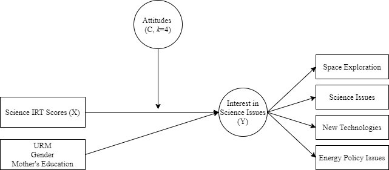
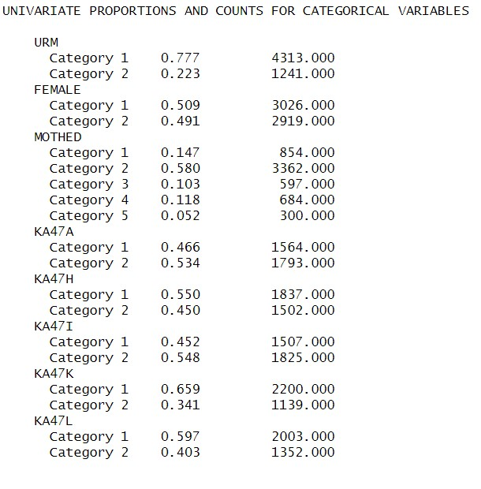
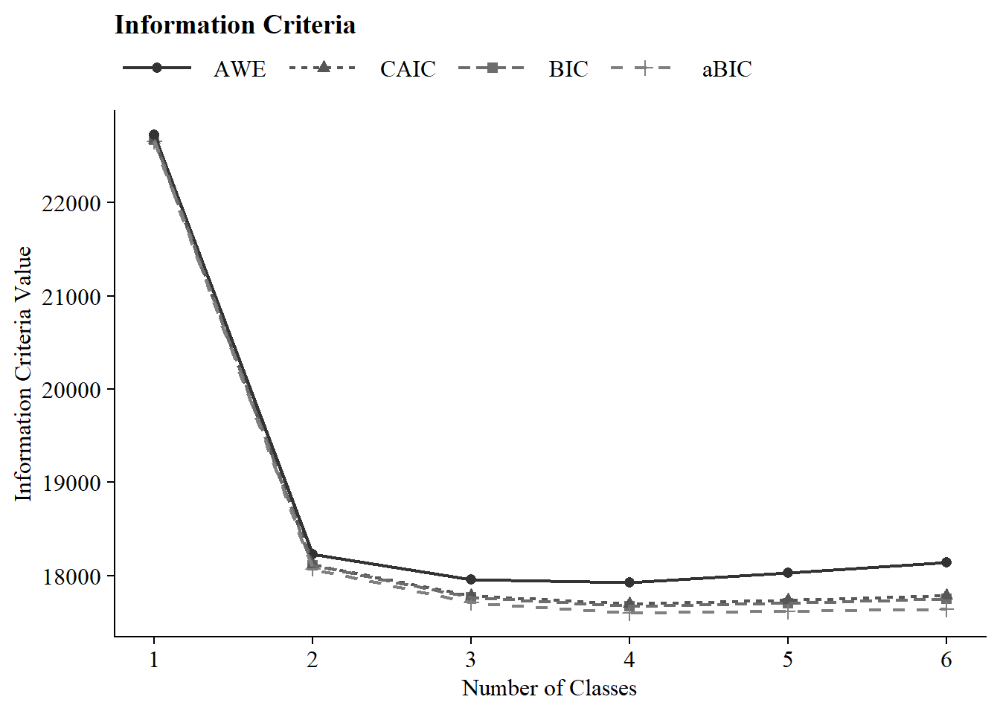
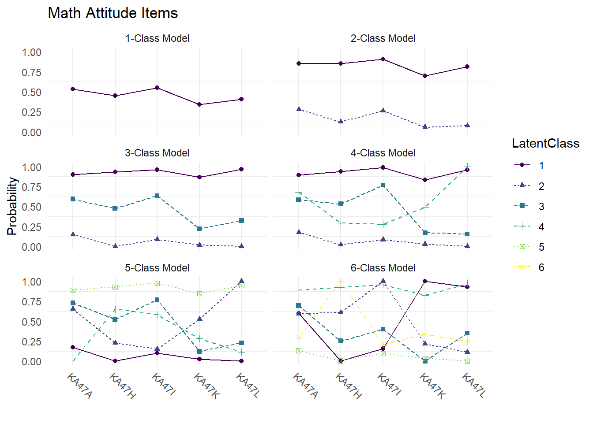
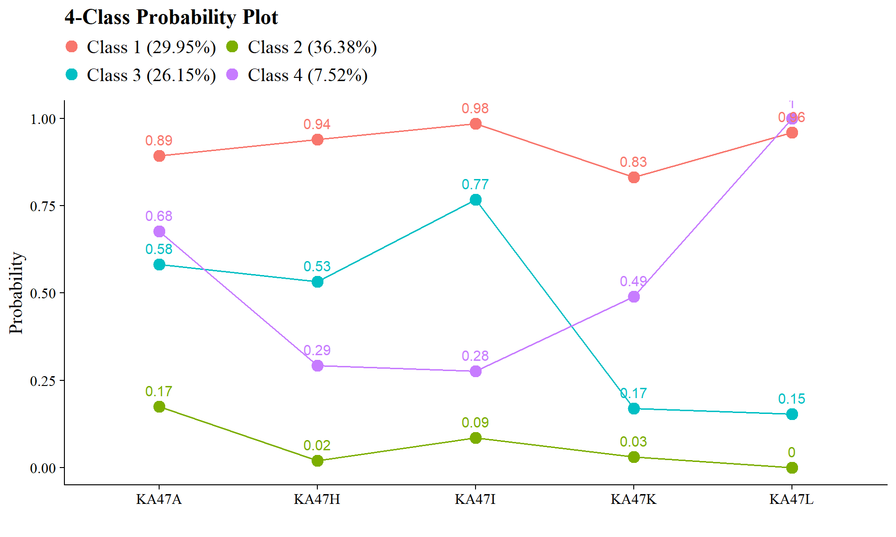
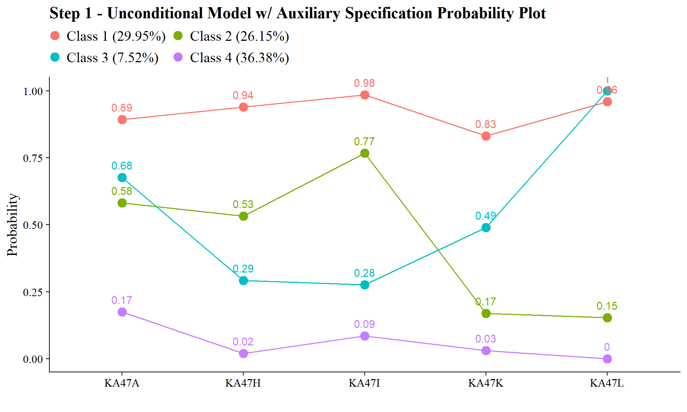
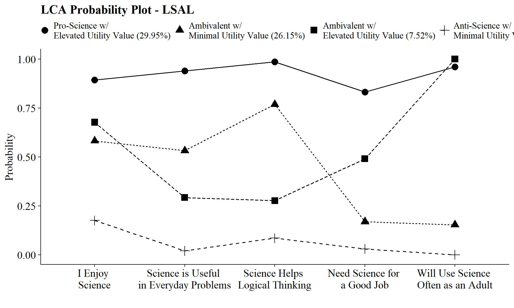
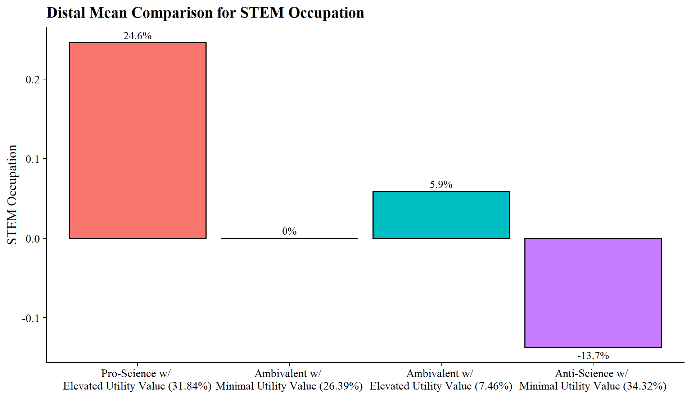
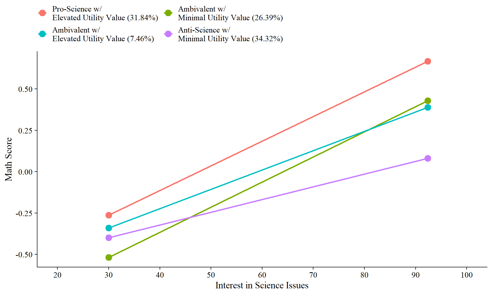

# Moderation with a Latent Class Variable (Arch, Nylund-Gibson, Ing, 2026)

Arch, Dina Ali Naji, Karen Nylund-Gibson, and Marsha Ing. “Moderation with a Latent Class Variable: A Tutorial and Example.” Behavior Research Methods 58, no. 4 (2026): 108. https://doi.org/10.3758/s13428-025-02886-x.


------------------------------------------------------------------------

# R Code for the Manual ML Three-Step in M*plus*

This appendix walks through the R code to apply moderation with a latent class variable using the `MplusAutomation` package.

------------------------------------------------------------------------

Packages


``` r
library(MplusAutomation)
library(tidyverse)
library(here)
library(glue)
library(gt)
library(cowplot)
library(kableExtra)
library(psych)
library(dplyr)
```

------------------------------------------------------------------------



------------------------------------------------------------------------


<table class="table" style="margin-left: auto; margin-right: auto;">
<caption>(\#tab:unnamed-chunk-4)(\#tab:unnamed-chunk-4)Longitudinal Study of American Life</caption>
 <thead>
  <tr>
   <th style="text-align:left;"> Name </th>
   <th style="text-align:left;"> Description </th>
  </tr>
 </thead>
<tbody>
  <tr grouplength="5"><td colspan="2" style="border-bottom: 1px solid;"><strong>LCA Indicator Variables</strong></td></tr>
<tr>
   <td style="text-align:left;padding-left: 2em;" indentlevel="1"> KA47A </td>
   <td style="text-align:left;"> I Enjoy Science </td>
  </tr>
  <tr>
   <td style="text-align:left;padding-left: 2em;" indentlevel="1"> KA47H </td>
   <td style="text-align:left;"> Science is Useful in Everyday Problems </td>
  </tr>
  <tr>
   <td style="text-align:left;padding-left: 2em;" indentlevel="1"> KA47I </td>
   <td style="text-align:left;"> Science Helps Logical Thinking </td>
  </tr>
  <tr>
   <td style="text-align:left;padding-left: 2em;" indentlevel="1"> KA47K </td>
   <td style="text-align:left;"> Need Science for a Good Job </td>
  </tr>
  <tr>
   <td style="text-align:left;padding-left: 2em;" indentlevel="1"> KA47L </td>
   <td style="text-align:left;"> Will Use Science Often as an Adult </td>
  </tr>
  <tr grouplength="1"><td colspan="2" style="border-bottom: 1px solid;"><strong>Predictor</strong></td></tr>
<tr>
   <td style="text-align:left;padding-left: 2em;" indentlevel="1"> ISCIIRT </td>
   <td style="text-align:left;"> Science IRT Score (11th Grade) </td>
  </tr>
  <tr grouplength="4"><td colspan="2" style="border-bottom: 1px solid;"><strong>Distal Outcome</strong></td></tr>
<tr>
   <td style="text-align:left;padding-left: 2em;" indentlevel="1"> KA9B </td>
   <td style="text-align:left;"> Space Exploration </td>
  </tr>
  <tr>
   <td style="text-align:left;padding-left: 2em;" indentlevel="1"> KA9D </td>
   <td style="text-align:left;"> Science Issues </td>
  </tr>
  <tr>
   <td style="text-align:left;padding-left: 2em;" indentlevel="1"> KA9G </td>
   <td style="text-align:left;"> New Technologies </td>
  </tr>
  <tr>
   <td style="text-align:left;padding-left: 2em;" indentlevel="1"> KA9K </td>
   <td style="text-align:left;"> Energy Policy Issues </td>
  </tr>
  <tr grouplength="3"><td colspan="2" style="border-bottom: 1px solid;"><strong>Covariates</strong></td></tr>
<tr>
   <td style="text-align:left;padding-left: 2em;" indentlevel="1"> URM </td>
   <td style="text-align:left;"> Under-represented Minority (0 = represented, 1 = under-represented) </td>
  </tr>
  <tr>
   <td style="text-align:left;padding-left: 2em;" indentlevel="1"> FEMALE </td>
   <td style="text-align:left;"> Sex (0 = male, 1 = female) </td>
  </tr>
  <tr>
   <td style="text-align:left;padding-left: 2em;" indentlevel="1"> MOTHED </td>
   <td style="text-align:left;"> \makecell[l]{Mother's Education (0 = less than high school, 1 = high school diploma, \\2 = some college, 3 = 4-year college, 4 = an advanced degree)} </td>
  </tr>
</tbody>
</table>


------------------------------------------------------------------------

Read in LSAL dataset


``` r
data <- read_csv(here("34-lca-moderation", "data", "LSAL_data.csv"))
```

------------------------------------------------------------------------

## Descriptive Statistics

### Descriptive Statistics using R:

Quick view of all the variables in the dataset (excluding `CASENUM`, `COHORT` and SCHOOLID`):


``` r
data %>% 
  select(-CASENUM, -COHORT, -SCHOOLID) %>% 
  describe()
```

Proportion of indicators using R:


``` r
# Set up data to find proportions of binary indicators
ds <- data %>% 
  pivot_longer(KA47A:KA47L, names_to = "Variable") 

# Create table of variables and counts
tab <- table(ds$Variable, ds$value)

# Find proportions and round to 3 decimal places
prop <- prop.table(tab, margin = 1) %>% 
  round(3)

# Combine everything to one table 
dframe <- data.frame(Variables=rownames(tab), Proportion=prop[,2], Count=tab[,2])
#remove row names
row.names(dframe) <- NULL
```


``` r
# Format table using `kable()`
dframe %>%
  kable(caption = "Descriptive Summary",booktabs = TRUE, escape = FALSE) %>% 
  kableExtra::kable_styling(latex_options=c("HOLD_position")) 
```


``` r
# Format table using `markdown`
gt(dframe) %>% 
tab_header(title = md("**LCA Indicator Proportions**"), subtitle = md("&nbsp;")) %>%
tab_options(column_labels.font.weight = "bold", row_group.font.weight = "bold") 
```


```{=html}
<div id="nvczidblns" style="padding-left:0px;padding-right:0px;padding-top:10px;padding-bottom:10px;overflow-x:auto;overflow-y:auto;width:auto;height:auto;">
<style>#nvczidblns table {
  font-family: system-ui, 'Segoe UI', Roboto, Helvetica, Arial, sans-serif, 'Apple Color Emoji', 'Segoe UI Emoji', 'Segoe UI Symbol', 'Noto Color Emoji';
  -webkit-font-smoothing: antialiased;
  -moz-osx-font-smoothing: grayscale;
}

#nvczidblns thead, #nvczidblns tbody, #nvczidblns tfoot, #nvczidblns tr, #nvczidblns td, #nvczidblns th {
  border-style: none;
}

#nvczidblns p {
  margin: 0;
  padding: 0;
}

#nvczidblns .gt_table {
  display: table;
  border-collapse: collapse;
  line-height: normal;
  margin-left: auto;
  margin-right: auto;
  color: #333333;
  font-size: 16px;
  font-weight: normal;
  font-style: normal;
  background-color: #FFFFFF;
  width: auto;
  border-top-style: solid;
  border-top-width: 2px;
  border-top-color: #A8A8A8;
  border-right-style: none;
  border-right-width: 2px;
  border-right-color: #D3D3D3;
  border-bottom-style: solid;
  border-bottom-width: 2px;
  border-bottom-color: #A8A8A8;
  border-left-style: none;
  border-left-width: 2px;
  border-left-color: #D3D3D3;
}

#nvczidblns .gt_caption {
  padding-top: 4px;
  padding-bottom: 4px;
}

#nvczidblns .gt_title {
  color: #333333;
  font-size: 125%;
  font-weight: initial;
  padding-top: 4px;
  padding-bottom: 4px;
  padding-left: 5px;
  padding-right: 5px;
  border-bottom-color: #FFFFFF;
  border-bottom-width: 0;
}

#nvczidblns .gt_subtitle {
  color: #333333;
  font-size: 85%;
  font-weight: initial;
  padding-top: 3px;
  padding-bottom: 5px;
  padding-left: 5px;
  padding-right: 5px;
  border-top-color: #FFFFFF;
  border-top-width: 0;
}

#nvczidblns .gt_heading {
  background-color: #FFFFFF;
  text-align: center;
  border-bottom-color: #FFFFFF;
  border-left-style: none;
  border-left-width: 1px;
  border-left-color: #D3D3D3;
  border-right-style: none;
  border-right-width: 1px;
  border-right-color: #D3D3D3;
}

#nvczidblns .gt_bottom_border {
  border-bottom-style: solid;
  border-bottom-width: 2px;
  border-bottom-color: #D3D3D3;
}

#nvczidblns .gt_col_headings {
  border-top-style: solid;
  border-top-width: 2px;
  border-top-color: #D3D3D3;
  border-bottom-style: solid;
  border-bottom-width: 2px;
  border-bottom-color: #D3D3D3;
  border-left-style: none;
  border-left-width: 1px;
  border-left-color: #D3D3D3;
  border-right-style: none;
  border-right-width: 1px;
  border-right-color: #D3D3D3;
}

#nvczidblns .gt_col_heading {
  color: #333333;
  background-color: #FFFFFF;
  font-size: 100%;
  font-weight: bold;
  text-transform: inherit;
  border-left-style: none;
  border-left-width: 1px;
  border-left-color: #D3D3D3;
  border-right-style: none;
  border-right-width: 1px;
  border-right-color: #D3D3D3;
  vertical-align: bottom;
  padding-top: 5px;
  padding-bottom: 6px;
  padding-left: 5px;
  padding-right: 5px;
  overflow-x: hidden;
}

#nvczidblns .gt_column_spanner_outer {
  color: #333333;
  background-color: #FFFFFF;
  font-size: 100%;
  font-weight: bold;
  text-transform: inherit;
  padding-top: 0;
  padding-bottom: 0;
  padding-left: 4px;
  padding-right: 4px;
}

#nvczidblns .gt_column_spanner_outer:first-child {
  padding-left: 0;
}

#nvczidblns .gt_column_spanner_outer:last-child {
  padding-right: 0;
}

#nvczidblns .gt_column_spanner {
  border-bottom-style: solid;
  border-bottom-width: 2px;
  border-bottom-color: #D3D3D3;
  vertical-align: bottom;
  padding-top: 5px;
  padding-bottom: 5px;
  overflow-x: hidden;
  display: inline-block;
  width: 100%;
}

#nvczidblns .gt_spanner_row {
  border-bottom-style: hidden;
}

#nvczidblns .gt_group_heading {
  padding-top: 8px;
  padding-bottom: 8px;
  padding-left: 5px;
  padding-right: 5px;
  color: #333333;
  background-color: #FFFFFF;
  font-size: 100%;
  font-weight: bold;
  text-transform: inherit;
  border-top-style: solid;
  border-top-width: 2px;
  border-top-color: #D3D3D3;
  border-bottom-style: solid;
  border-bottom-width: 2px;
  border-bottom-color: #D3D3D3;
  border-left-style: none;
  border-left-width: 1px;
  border-left-color: #D3D3D3;
  border-right-style: none;
  border-right-width: 1px;
  border-right-color: #D3D3D3;
  vertical-align: middle;
  text-align: left;
}

#nvczidblns .gt_empty_group_heading {
  padding: 0.5px;
  color: #333333;
  background-color: #FFFFFF;
  font-size: 100%;
  font-weight: bold;
  border-top-style: solid;
  border-top-width: 2px;
  border-top-color: #D3D3D3;
  border-bottom-style: solid;
  border-bottom-width: 2px;
  border-bottom-color: #D3D3D3;
  vertical-align: middle;
}

#nvczidblns .gt_from_md > :first-child {
  margin-top: 0;
}

#nvczidblns .gt_from_md > :last-child {
  margin-bottom: 0;
}

#nvczidblns .gt_row {
  padding-top: 8px;
  padding-bottom: 8px;
  padding-left: 5px;
  padding-right: 5px;
  margin: 10px;
  border-top-style: solid;
  border-top-width: 1px;
  border-top-color: #D3D3D3;
  border-left-style: none;
  border-left-width: 1px;
  border-left-color: #D3D3D3;
  border-right-style: none;
  border-right-width: 1px;
  border-right-color: #D3D3D3;
  vertical-align: middle;
  overflow-x: hidden;
}

#nvczidblns .gt_stub {
  color: #333333;
  background-color: #FFFFFF;
  font-size: 100%;
  font-weight: initial;
  text-transform: inherit;
  border-right-style: solid;
  border-right-width: 2px;
  border-right-color: #D3D3D3;
  padding-left: 5px;
  padding-right: 5px;
}

#nvczidblns .gt_stub_row_group {
  color: #333333;
  background-color: #FFFFFF;
  font-size: 100%;
  font-weight: initial;
  text-transform: inherit;
  border-right-style: solid;
  border-right-width: 2px;
  border-right-color: #D3D3D3;
  padding-left: 5px;
  padding-right: 5px;
  vertical-align: top;
}

#nvczidblns .gt_row_group_first td {
  border-top-width: 2px;
}

#nvczidblns .gt_row_group_first th {
  border-top-width: 2px;
}

#nvczidblns .gt_summary_row {
  color: #333333;
  background-color: #FFFFFF;
  text-transform: inherit;
  padding-top: 8px;
  padding-bottom: 8px;
  padding-left: 5px;
  padding-right: 5px;
}

#nvczidblns .gt_first_summary_row {
  border-top-style: solid;
  border-top-color: #D3D3D3;
}

#nvczidblns .gt_first_summary_row.thick {
  border-top-width: 2px;
}

#nvczidblns .gt_last_summary_row {
  padding-top: 8px;
  padding-bottom: 8px;
  padding-left: 5px;
  padding-right: 5px;
  border-bottom-style: solid;
  border-bottom-width: 2px;
  border-bottom-color: #D3D3D3;
}

#nvczidblns .gt_grand_summary_row {
  color: #333333;
  background-color: #FFFFFF;
  text-transform: inherit;
  padding-top: 8px;
  padding-bottom: 8px;
  padding-left: 5px;
  padding-right: 5px;
}

#nvczidblns .gt_first_grand_summary_row {
  padding-top: 8px;
  padding-bottom: 8px;
  padding-left: 5px;
  padding-right: 5px;
  border-top-style: double;
  border-top-width: 6px;
  border-top-color: #D3D3D3;
}

#nvczidblns .gt_last_grand_summary_row_top {
  padding-top: 8px;
  padding-bottom: 8px;
  padding-left: 5px;
  padding-right: 5px;
  border-bottom-style: double;
  border-bottom-width: 6px;
  border-bottom-color: #D3D3D3;
}

#nvczidblns .gt_striped {
  background-color: rgba(128, 128, 128, 0.05);
}

#nvczidblns .gt_table_body {
  border-top-style: solid;
  border-top-width: 2px;
  border-top-color: #D3D3D3;
  border-bottom-style: solid;
  border-bottom-width: 2px;
  border-bottom-color: #D3D3D3;
}

#nvczidblns .gt_footnotes {
  color: #333333;
  background-color: #FFFFFF;
  border-bottom-style: none;
  border-bottom-width: 2px;
  border-bottom-color: #D3D3D3;
  border-left-style: none;
  border-left-width: 2px;
  border-left-color: #D3D3D3;
  border-right-style: none;
  border-right-width: 2px;
  border-right-color: #D3D3D3;
}

#nvczidblns .gt_footnote {
  margin: 0px;
  font-size: 90%;
  padding-top: 4px;
  padding-bottom: 4px;
  padding-left: 5px;
  padding-right: 5px;
}

#nvczidblns .gt_sourcenotes {
  color: #333333;
  background-color: #FFFFFF;
  border-bottom-style: none;
  border-bottom-width: 2px;
  border-bottom-color: #D3D3D3;
  border-left-style: none;
  border-left-width: 2px;
  border-left-color: #D3D3D3;
  border-right-style: none;
  border-right-width: 2px;
  border-right-color: #D3D3D3;
}

#nvczidblns .gt_sourcenote {
  font-size: 90%;
  padding-top: 4px;
  padding-bottom: 4px;
  padding-left: 5px;
  padding-right: 5px;
}

#nvczidblns .gt_left {
  text-align: left;
}

#nvczidblns .gt_center {
  text-align: center;
}

#nvczidblns .gt_right {
  text-align: right;
  font-variant-numeric: tabular-nums;
}

#nvczidblns .gt_font_normal {
  font-weight: normal;
}

#nvczidblns .gt_font_bold {
  font-weight: bold;
}

#nvczidblns .gt_font_italic {
  font-style: italic;
}

#nvczidblns .gt_super {
  font-size: 65%;
}

#nvczidblns .gt_footnote_marks {
  font-size: 75%;
  vertical-align: 0.4em;
  position: initial;
}

#nvczidblns .gt_asterisk {
  font-size: 100%;
  vertical-align: 0;
}

#nvczidblns .gt_indent_1 {
  text-indent: 5px;
}

#nvczidblns .gt_indent_2 {
  text-indent: 10px;
}

#nvczidblns .gt_indent_3 {
  text-indent: 15px;
}

#nvczidblns .gt_indent_4 {
  text-indent: 20px;
}

#nvczidblns .gt_indent_5 {
  text-indent: 25px;
}

#nvczidblns .katex-display {
  display: inline-flex !important;
  margin-bottom: 0.75em !important;
}

#nvczidblns div.Reactable > div.rt-table > div.rt-thead > div.rt-tr.rt-tr-group-header > div.rt-th-group:after {
  height: 0px !important;
}
</style>
<table class="gt_table" data-quarto-disable-processing="false" data-quarto-bootstrap="false">
  <thead>
    <tr class="gt_heading">
      <td colspan="3" class="gt_heading gt_title gt_font_normal" style><span class='gt_from_md'><strong>LCA Indicator Proportions</strong></span></td>
    </tr>
    <tr class="gt_heading">
      <td colspan="3" class="gt_heading gt_subtitle gt_font_normal gt_bottom_border" style><span class='gt_from_md'> </span></td>
    </tr>
    <tr class="gt_col_headings">
      <th class="gt_col_heading gt_columns_bottom_border gt_left" rowspan="1" colspan="1" scope="col" id="Variables">Variables</th>
      <th class="gt_col_heading gt_columns_bottom_border gt_right" rowspan="1" colspan="1" scope="col" id="Proportion">Proportion</th>
      <th class="gt_col_heading gt_columns_bottom_border gt_right" rowspan="1" colspan="1" scope="col" id="Count">Count</th>
    </tr>
  </thead>
  <tbody class="gt_table_body">
    <tr><td headers="Variables" class="gt_row gt_left">KA47A</td>
<td headers="Proportion" class="gt_row gt_right">0.534</td>
<td headers="Count" class="gt_row gt_right">1793</td></tr>
    <tr><td headers="Variables" class="gt_row gt_left">KA47H</td>
<td headers="Proportion" class="gt_row gt_right">0.450</td>
<td headers="Count" class="gt_row gt_right">1502</td></tr>
    <tr><td headers="Variables" class="gt_row gt_left">KA47I</td>
<td headers="Proportion" class="gt_row gt_right">0.548</td>
<td headers="Count" class="gt_row gt_right">1825</td></tr>
    <tr><td headers="Variables" class="gt_row gt_left">KA47K</td>
<td headers="Proportion" class="gt_row gt_right">0.341</td>
<td headers="Count" class="gt_row gt_right">1139</td></tr>
    <tr><td headers="Variables" class="gt_row gt_left">KA47L</td>
<td headers="Proportion" class="gt_row gt_right">0.403</td>
<td headers="Count" class="gt_row gt_right">1352</td></tr>
  </tbody>
  
</table>
</div>
```


### Descriptive Statistics using `MplusAutomation`:


``` r
basic_mplus  <- mplusObject(
  TITLE = "LSAL Descriptive Statistics;",
  
  VARIABLE =
    "usevar = FEMALE MOTHED URM ISCIIRT KA9B KA9D KA9G KA9K
    KA47A KA47H KA47I KA47K KA47L;
    categorical = KA47A KA47H KA47I KA47K KA47L FEMALE MOTHED URM;",
  
  ANALYSIS = "TYPE=basic;",
  
  OUTPUT = "sampstat",  
  
  usevariables = colnames(data),
  rdata = data)

basic_mplus_fit <- mplusModeler(basic_mplus, 
                            dataout = here("34-lca-moderation","three_step", "LSAL_data.dat"),
                            modelout = here("34-lca-moderation","three_step","zero.inp"),
                            check = TRUE, run = TRUE, hashfilename = FALSE)
```

View of descriptive statistics using `get_sampstat()`:


``` r
get_sampstat(m.step0.fit)
summary(data)
```

Or, view the `.out` file:



------------------------------------------------------------------------

## Enumeration

This code uses the `mplusObject` function in the `MplusAutomation` package and saves all model runs in the `mplus_enum` folder.


``` r

lca_6  <- lapply(1:6, function(k) {
  lca_enum  <- mplusObject(
    
    TITLE = glue("{k}-Class"), 
    
    VARIABLE = glue(
      "categorical = KA47A KA47H KA47I KA47K KA47L; 
     usevar = KA47A KA47H KA47I KA47K KA47L;
     classes = c({k});"),
    
    ANALYSIS = 
      "estimator = mlr;
      type = mixture;
    starts = 500 100;",
    
    OUTPUT = "sampstat residual tech11 tech14;",
    
    usevariables = colnames(data),
    
    rdata = data)
  
  lca_enum_fit <- mplusModeler(lca_enum,
                               
                               dataout=glue(here("34-lca-moderation","mplus_enum", "LSAL_data.dat")),
                               modelout=glue(here("34-lca-moderation","mplus_enum", "c{k}_lsal.inp")),
                               check=TRUE, run = TRUE, hashfilename = FALSE)
})

```

**IMPORTANT**: Before moving forward, make sure to open each output document to ensure models were estimated normally. In this example, the last two models (5- and 6-class models) did not produce reliable output and are excluded. 

------------------------------------------------------------------------

### Table of Fit

First, extract data:


``` r
output_enum <- readModels(here("34-lca-moderation","mplus_enum")) 

enum_extract <- LatexSummaryTable(
  output_enum,
  keepCols = c(
    "Title",
    "Parameters",
    "LL",
    "BIC",
    "aBIC",
    "BLRT_PValue",
    "T11_VLMR_PValue",
    "Observations"
  ),
  sortBy = "Title"
) 


allFit <- enum_extract %>%
  mutate(CAIC = -2* LL + Parameters * (log(Observations)+1)) %>%
  mutate(AWE = -2*LL+2*Parameters*(log(Observations)+1.5)) %>%
  mutate(SIC = -.5*BIC) %>%
  mutate(expSIC = exp(SIC - max(SIC))) %>%
  mutate(BF = exp(SIC - lead(SIC))) %>%
  mutate(cmPk = expSIC / sum(expSIC)) %>%
  dplyr::select(1:5, 9:10, 6:7, 13, 14) %>%
  arrange(Parameters)
```

Then, create table using `gt()` instead of `kable()`:


``` r
fit_table <- allFit %>%
  gt() %>%
  tab_header(title = md("Model Fit Summary Table")) %>%
  cols_label(
    Title = "Classes",
    Parameters = md("Par"),
    LL = md("*LL*"),
    T11_VLMR_PValue = "VLMR",
    BLRT_PValue = "BLRT",
    BF = md("BF"),
    cmPk = md("*cmPk*")
  ) %>%
  tab_footnote(
    footnote = md(
      "*Note.* Par = Parameters; *LL* = model log likelihood;
BIC = Bayesian information criterion;
aBIC = sample size adjusted BIC; CAIC = consistent Akaike information criterion;
AWE = approximate weight of evidence criterion;
BLRT = bootstrapped likelihood ratio test p-value;
VLMR = Vuong-Lo-Mendell-Rubin adjusted likelihood ratio test p-value;
*cmPk* = approximate correct model probability."
    ),
locations = cells_title()
  ) %>%
  fmt_number(c(3:7),
             decimals = 2) %>%
  sub_missing(1:11,
              missing_text = "--") %>%
  fmt(
    c(8:9, 11),
    fns = function(x)
      ifelse(x < 0.001, "<.001",
             scales::number(x, accuracy = .01))
  ) %>%
  fmt(
    10,
    fns = function (x)
      ifelse(x > 100, ">100",
             scales::number(x, accuracy = .01))
  ) %>%  
  tab_style(
    style = list(
      cell_text(weight = "bold")
      ),
    locations = list(cells_body(
     columns = BIC,
     row = BIC == min(BIC[c(1:nrow(allFit))]) 
    ),
    cells_body(
     columns = aBIC,
     row = aBIC == min(aBIC[1:nrow(allFit)])
    ),
    cells_body(
     columns = CAIC,
     row = CAIC == min(CAIC[1:nrow(allFit)])
    ),
    cells_body(
     columns = AWE,
     row = AWE == min(AWE[1:nrow(allFit)])
    ),
    cells_body(
     columns = cmPk,
     row =  cmPk == max(cmPk[1:nrow(allFit)])
     ),    
    cells_body(
     columns = BF,
     row =  BF > 10),
    cells_body( 
     columns =  T11_VLMR_PValue,
     row =  ifelse(T11_VLMR_PValue < .05 & lead(T11_VLMR_PValue) > .05, T11_VLMR_PValue < .05, NA)),
    cells_body(
     columns =  BLRT_PValue,
     row =  ifelse(BLRT_PValue < .05 & lead(BLRT_PValue) > .05, BLRT_PValue < .05, NA))
  )
)

fit_table
```


```{=html}
<div id="vwjxkmybmt" style="padding-left:0px;padding-right:0px;padding-top:10px;padding-bottom:10px;overflow-x:auto;overflow-y:auto;width:auto;height:auto;">
<style>#vwjxkmybmt table {
  font-family: system-ui, 'Segoe UI', Roboto, Helvetica, Arial, sans-serif, 'Apple Color Emoji', 'Segoe UI Emoji', 'Segoe UI Symbol', 'Noto Color Emoji';
  -webkit-font-smoothing: antialiased;
  -moz-osx-font-smoothing: grayscale;
}

#vwjxkmybmt thead, #vwjxkmybmt tbody, #vwjxkmybmt tfoot, #vwjxkmybmt tr, #vwjxkmybmt td, #vwjxkmybmt th {
  border-style: none;
}

#vwjxkmybmt p {
  margin: 0;
  padding: 0;
}

#vwjxkmybmt .gt_table {
  display: table;
  border-collapse: collapse;
  line-height: normal;
  margin-left: auto;
  margin-right: auto;
  color: #333333;
  font-size: 16px;
  font-weight: normal;
  font-style: normal;
  background-color: #FFFFFF;
  width: auto;
  border-top-style: solid;
  border-top-width: 2px;
  border-top-color: #A8A8A8;
  border-right-style: none;
  border-right-width: 2px;
  border-right-color: #D3D3D3;
  border-bottom-style: solid;
  border-bottom-width: 2px;
  border-bottom-color: #A8A8A8;
  border-left-style: none;
  border-left-width: 2px;
  border-left-color: #D3D3D3;
}

#vwjxkmybmt .gt_caption {
  padding-top: 4px;
  padding-bottom: 4px;
}

#vwjxkmybmt .gt_title {
  color: #333333;
  font-size: 125%;
  font-weight: initial;
  padding-top: 4px;
  padding-bottom: 4px;
  padding-left: 5px;
  padding-right: 5px;
  border-bottom-color: #FFFFFF;
  border-bottom-width: 0;
}

#vwjxkmybmt .gt_subtitle {
  color: #333333;
  font-size: 85%;
  font-weight: initial;
  padding-top: 3px;
  padding-bottom: 5px;
  padding-left: 5px;
  padding-right: 5px;
  border-top-color: #FFFFFF;
  border-top-width: 0;
}

#vwjxkmybmt .gt_heading {
  background-color: #FFFFFF;
  text-align: center;
  border-bottom-color: #FFFFFF;
  border-left-style: none;
  border-left-width: 1px;
  border-left-color: #D3D3D3;
  border-right-style: none;
  border-right-width: 1px;
  border-right-color: #D3D3D3;
}

#vwjxkmybmt .gt_bottom_border {
  border-bottom-style: solid;
  border-bottom-width: 2px;
  border-bottom-color: #D3D3D3;
}

#vwjxkmybmt .gt_col_headings {
  border-top-style: solid;
  border-top-width: 2px;
  border-top-color: #D3D3D3;
  border-bottom-style: solid;
  border-bottom-width: 2px;
  border-bottom-color: #D3D3D3;
  border-left-style: none;
  border-left-width: 1px;
  border-left-color: #D3D3D3;
  border-right-style: none;
  border-right-width: 1px;
  border-right-color: #D3D3D3;
}

#vwjxkmybmt .gt_col_heading {
  color: #333333;
  background-color: #FFFFFF;
  font-size: 100%;
  font-weight: normal;
  text-transform: inherit;
  border-left-style: none;
  border-left-width: 1px;
  border-left-color: #D3D3D3;
  border-right-style: none;
  border-right-width: 1px;
  border-right-color: #D3D3D3;
  vertical-align: bottom;
  padding-top: 5px;
  padding-bottom: 6px;
  padding-left: 5px;
  padding-right: 5px;
  overflow-x: hidden;
}

#vwjxkmybmt .gt_column_spanner_outer {
  color: #333333;
  background-color: #FFFFFF;
  font-size: 100%;
  font-weight: normal;
  text-transform: inherit;
  padding-top: 0;
  padding-bottom: 0;
  padding-left: 4px;
  padding-right: 4px;
}

#vwjxkmybmt .gt_column_spanner_outer:first-child {
  padding-left: 0;
}

#vwjxkmybmt .gt_column_spanner_outer:last-child {
  padding-right: 0;
}

#vwjxkmybmt .gt_column_spanner {
  border-bottom-style: solid;
  border-bottom-width: 2px;
  border-bottom-color: #D3D3D3;
  vertical-align: bottom;
  padding-top: 5px;
  padding-bottom: 5px;
  overflow-x: hidden;
  display: inline-block;
  width: 100%;
}

#vwjxkmybmt .gt_spanner_row {
  border-bottom-style: hidden;
}

#vwjxkmybmt .gt_group_heading {
  padding-top: 8px;
  padding-bottom: 8px;
  padding-left: 5px;
  padding-right: 5px;
  color: #333333;
  background-color: #FFFFFF;
  font-size: 100%;
  font-weight: initial;
  text-transform: inherit;
  border-top-style: solid;
  border-top-width: 2px;
  border-top-color: #D3D3D3;
  border-bottom-style: solid;
  border-bottom-width: 2px;
  border-bottom-color: #D3D3D3;
  border-left-style: none;
  border-left-width: 1px;
  border-left-color: #D3D3D3;
  border-right-style: none;
  border-right-width: 1px;
  border-right-color: #D3D3D3;
  vertical-align: middle;
  text-align: left;
}

#vwjxkmybmt .gt_empty_group_heading {
  padding: 0.5px;
  color: #333333;
  background-color: #FFFFFF;
  font-size: 100%;
  font-weight: initial;
  border-top-style: solid;
  border-top-width: 2px;
  border-top-color: #D3D3D3;
  border-bottom-style: solid;
  border-bottom-width: 2px;
  border-bottom-color: #D3D3D3;
  vertical-align: middle;
}

#vwjxkmybmt .gt_from_md > :first-child {
  margin-top: 0;
}

#vwjxkmybmt .gt_from_md > :last-child {
  margin-bottom: 0;
}

#vwjxkmybmt .gt_row {
  padding-top: 8px;
  padding-bottom: 8px;
  padding-left: 5px;
  padding-right: 5px;
  margin: 10px;
  border-top-style: solid;
  border-top-width: 1px;
  border-top-color: #D3D3D3;
  border-left-style: none;
  border-left-width: 1px;
  border-left-color: #D3D3D3;
  border-right-style: none;
  border-right-width: 1px;
  border-right-color: #D3D3D3;
  vertical-align: middle;
  overflow-x: hidden;
}

#vwjxkmybmt .gt_stub {
  color: #333333;
  background-color: #FFFFFF;
  font-size: 100%;
  font-weight: initial;
  text-transform: inherit;
  border-right-style: solid;
  border-right-width: 2px;
  border-right-color: #D3D3D3;
  padding-left: 5px;
  padding-right: 5px;
}

#vwjxkmybmt .gt_stub_row_group {
  color: #333333;
  background-color: #FFFFFF;
  font-size: 100%;
  font-weight: initial;
  text-transform: inherit;
  border-right-style: solid;
  border-right-width: 2px;
  border-right-color: #D3D3D3;
  padding-left: 5px;
  padding-right: 5px;
  vertical-align: top;
}

#vwjxkmybmt .gt_row_group_first td {
  border-top-width: 2px;
}

#vwjxkmybmt .gt_row_group_first th {
  border-top-width: 2px;
}

#vwjxkmybmt .gt_summary_row {
  color: #333333;
  background-color: #FFFFFF;
  text-transform: inherit;
  padding-top: 8px;
  padding-bottom: 8px;
  padding-left: 5px;
  padding-right: 5px;
}

#vwjxkmybmt .gt_first_summary_row {
  border-top-style: solid;
  border-top-color: #D3D3D3;
}

#vwjxkmybmt .gt_first_summary_row.thick {
  border-top-width: 2px;
}

#vwjxkmybmt .gt_last_summary_row {
  padding-top: 8px;
  padding-bottom: 8px;
  padding-left: 5px;
  padding-right: 5px;
  border-bottom-style: solid;
  border-bottom-width: 2px;
  border-bottom-color: #D3D3D3;
}

#vwjxkmybmt .gt_grand_summary_row {
  color: #333333;
  background-color: #FFFFFF;
  text-transform: inherit;
  padding-top: 8px;
  padding-bottom: 8px;
  padding-left: 5px;
  padding-right: 5px;
}

#vwjxkmybmt .gt_first_grand_summary_row {
  padding-top: 8px;
  padding-bottom: 8px;
  padding-left: 5px;
  padding-right: 5px;
  border-top-style: double;
  border-top-width: 6px;
  border-top-color: #D3D3D3;
}

#vwjxkmybmt .gt_last_grand_summary_row_top {
  padding-top: 8px;
  padding-bottom: 8px;
  padding-left: 5px;
  padding-right: 5px;
  border-bottom-style: double;
  border-bottom-width: 6px;
  border-bottom-color: #D3D3D3;
}

#vwjxkmybmt .gt_striped {
  background-color: rgba(128, 128, 128, 0.05);
}

#vwjxkmybmt .gt_table_body {
  border-top-style: solid;
  border-top-width: 2px;
  border-top-color: #D3D3D3;
  border-bottom-style: solid;
  border-bottom-width: 2px;
  border-bottom-color: #D3D3D3;
}

#vwjxkmybmt .gt_footnotes {
  color: #333333;
  background-color: #FFFFFF;
  border-bottom-style: none;
  border-bottom-width: 2px;
  border-bottom-color: #D3D3D3;
  border-left-style: none;
  border-left-width: 2px;
  border-left-color: #D3D3D3;
  border-right-style: none;
  border-right-width: 2px;
  border-right-color: #D3D3D3;
}

#vwjxkmybmt .gt_footnote {
  margin: 0px;
  font-size: 90%;
  padding-top: 4px;
  padding-bottom: 4px;
  padding-left: 5px;
  padding-right: 5px;
}

#vwjxkmybmt .gt_sourcenotes {
  color: #333333;
  background-color: #FFFFFF;
  border-bottom-style: none;
  border-bottom-width: 2px;
  border-bottom-color: #D3D3D3;
  border-left-style: none;
  border-left-width: 2px;
  border-left-color: #D3D3D3;
  border-right-style: none;
  border-right-width: 2px;
  border-right-color: #D3D3D3;
}

#vwjxkmybmt .gt_sourcenote {
  font-size: 90%;
  padding-top: 4px;
  padding-bottom: 4px;
  padding-left: 5px;
  padding-right: 5px;
}

#vwjxkmybmt .gt_left {
  text-align: left;
}

#vwjxkmybmt .gt_center {
  text-align: center;
}

#vwjxkmybmt .gt_right {
  text-align: right;
  font-variant-numeric: tabular-nums;
}

#vwjxkmybmt .gt_font_normal {
  font-weight: normal;
}

#vwjxkmybmt .gt_font_bold {
  font-weight: bold;
}

#vwjxkmybmt .gt_font_italic {
  font-style: italic;
}

#vwjxkmybmt .gt_super {
  font-size: 65%;
}

#vwjxkmybmt .gt_footnote_marks {
  font-size: 75%;
  vertical-align: 0.4em;
  position: initial;
}

#vwjxkmybmt .gt_asterisk {
  font-size: 100%;
  vertical-align: 0;
}

#vwjxkmybmt .gt_indent_1 {
  text-indent: 5px;
}

#vwjxkmybmt .gt_indent_2 {
  text-indent: 10px;
}

#vwjxkmybmt .gt_indent_3 {
  text-indent: 15px;
}

#vwjxkmybmt .gt_indent_4 {
  text-indent: 20px;
}

#vwjxkmybmt .gt_indent_5 {
  text-indent: 25px;
}

#vwjxkmybmt .katex-display {
  display: inline-flex !important;
  margin-bottom: 0.75em !important;
}

#vwjxkmybmt div.Reactable > div.rt-table > div.rt-thead > div.rt-tr.rt-tr-group-header > div.rt-th-group:after {
  height: 0px !important;
}
</style>
<table class="gt_table" data-quarto-disable-processing="false" data-quarto-bootstrap="false">
  <thead>
    <tr class="gt_heading">
      <td colspan="11" class="gt_heading gt_title gt_font_normal gt_bottom_border" style><span class='gt_from_md'>Model Fit Summary Table</span><span class="gt_footnote_marks" style="white-space:nowrap;font-style:italic;font-weight:normal;line-height:0;"><sup>1</sup></span></td>
    </tr>
    
    <tr class="gt_col_headings">
      <th class="gt_col_heading gt_columns_bottom_border gt_left" rowspan="1" colspan="1" scope="col" id="Title">Classes</th>
      <th class="gt_col_heading gt_columns_bottom_border gt_right" rowspan="1" colspan="1" scope="col" id="Parameters"><span class='gt_from_md'>Par</span></th>
      <th class="gt_col_heading gt_columns_bottom_border gt_right" rowspan="1" colspan="1" scope="col" id="LL"><span class='gt_from_md'><em>LL</em></span></th>
      <th class="gt_col_heading gt_columns_bottom_border gt_right" rowspan="1" colspan="1" scope="col" id="BIC">BIC</th>
      <th class="gt_col_heading gt_columns_bottom_border gt_right" rowspan="1" colspan="1" scope="col" id="aBIC">aBIC</th>
      <th class="gt_col_heading gt_columns_bottom_border gt_right" rowspan="1" colspan="1" scope="col" id="CAIC">CAIC</th>
      <th class="gt_col_heading gt_columns_bottom_border gt_right" rowspan="1" colspan="1" scope="col" id="AWE">AWE</th>
      <th class="gt_col_heading gt_columns_bottom_border gt_right" rowspan="1" colspan="1" scope="col" id="BLRT_PValue">BLRT</th>
      <th class="gt_col_heading gt_columns_bottom_border gt_right" rowspan="1" colspan="1" scope="col" id="T11_VLMR_PValue">VLMR</th>
      <th class="gt_col_heading gt_columns_bottom_border gt_right" rowspan="1" colspan="1" scope="col" id="BF"><span class='gt_from_md'>BF</span></th>
      <th class="gt_col_heading gt_columns_bottom_border gt_right" rowspan="1" colspan="1" scope="col" id="cmPk"><span class='gt_from_md'><em>cmPk</em></span></th>
    </tr>
  </thead>
  <tbody class="gt_table_body">
    <tr><td headers="Title" class="gt_row gt_left">1-Class</td>
<td headers="Parameters" class="gt_row gt_right">5</td>
<td headers="LL" class="gt_row gt_right">−11,315.87</td>
<td headers="BIC" class="gt_row gt_right">22,672.34</td>
<td headers="aBIC" class="gt_row gt_right">22,656.45</td>
<td headers="CAIC" class="gt_row gt_right">22,677.34</td>
<td headers="AWE" class="gt_row gt_right">22,727.94</td>
<td headers="BLRT_PValue" class="gt_row gt_right">–</td>
<td headers="T11_VLMR_PValue" class="gt_row gt_right">–</td>
<td headers="BF" class="gt_row gt_right">0.00</td>
<td headers="cmPk" class="gt_row gt_right"><.001</td></tr>
    <tr><td headers="Title" class="gt_row gt_left">2-Class</td>
<td headers="Parameters" class="gt_row gt_right">11</td>
<td headers="LL" class="gt_row gt_right">−9,009.08</td>
<td headers="BIC" class="gt_row gt_right">18,107.48</td>
<td headers="aBIC" class="gt_row gt_right">18,072.53</td>
<td headers="CAIC" class="gt_row gt_right">18,118.48</td>
<td headers="AWE" class="gt_row gt_right">18,229.81</td>
<td headers="BLRT_PValue" class="gt_row gt_right"><.001</td>
<td headers="T11_VLMR_PValue" class="gt_row gt_right"><.001</td>
<td headers="BF" class="gt_row gt_right">0.00</td>
<td headers="cmPk" class="gt_row gt_right"><.001</td></tr>
    <tr><td headers="Title" class="gt_row gt_left">3-Class</td>
<td headers="Parameters" class="gt_row gt_right">17</td>
<td headers="LL" class="gt_row gt_right">−8,814.56</td>
<td headers="BIC" class="gt_row gt_right">17,767.18</td>
<td headers="aBIC" class="gt_row gt_right">17,713.17</td>
<td headers="CAIC" class="gt_row gt_right">17,784.18</td>
<td headers="AWE" class="gt_row gt_right">17,956.24</td>
<td headers="BLRT_PValue" class="gt_row gt_right"><.001</td>
<td headers="T11_VLMR_PValue" class="gt_row gt_right"><.001</td>
<td headers="BF" class="gt_row gt_right">0.00</td>
<td headers="cmPk" class="gt_row gt_right"><.001</td></tr>
    <tr><td headers="Title" class="gt_row gt_left">4-Class</td>
<td headers="Parameters" class="gt_row gt_right">23</td>
<td headers="LL" class="gt_row gt_right">−8,742.24</td>
<td headers="BIC" class="gt_row gt_right" style="font-weight: bold;">17,671.26</td>
<td headers="aBIC" class="gt_row gt_right" style="font-weight: bold;">17,598.17</td>
<td headers="CAIC" class="gt_row gt_right" style="font-weight: bold;">17,694.26</td>
<td headers="AWE" class="gt_row gt_right" style="font-weight: bold;">17,927.04</td>
<td headers="BLRT_PValue" class="gt_row gt_right"><.001</td>
<td headers="T11_VLMR_PValue" class="gt_row gt_right"><.001</td>
<td headers="BF" class="gt_row gt_right" style="font-weight: bold;">>100</td>
<td headers="cmPk" class="gt_row gt_right" style="font-weight: bold;">1.00</td></tr>
    <tr><td headers="Title" class="gt_row gt_left">5-Class</td>
<td headers="Parameters" class="gt_row gt_right">29</td>
<td headers="LL" class="gt_row gt_right">−8,734.82</td>
<td headers="BIC" class="gt_row gt_right">17,705.15</td>
<td headers="aBIC" class="gt_row gt_right">17,613.01</td>
<td headers="CAIC" class="gt_row gt_right">17,734.15</td>
<td headers="AWE" class="gt_row gt_right">18,027.66</td>
<td headers="BLRT_PValue" class="gt_row gt_right" style="font-weight: bold;"><.001</td>
<td headers="T11_VLMR_PValue" class="gt_row gt_right" style="font-weight: bold;">0.01</td>
<td headers="BF" class="gt_row gt_right" style="font-weight: bold;">>100</td>
<td headers="cmPk" class="gt_row gt_right"><.001</td></tr>
    <tr><td headers="Title" class="gt_row gt_left">6-Class</td>
<td headers="Parameters" class="gt_row gt_right">35</td>
<td headers="LL" class="gt_row gt_right">−8,732.97</td>
<td headers="BIC" class="gt_row gt_right">17,750.16</td>
<td headers="aBIC" class="gt_row gt_right">17,638.95</td>
<td headers="CAIC" class="gt_row gt_right">17,785.17</td>
<td headers="AWE" class="gt_row gt_right">18,139.40</td>
<td headers="BLRT_PValue" class="gt_row gt_right">1.00</td>
<td headers="T11_VLMR_PValue" class="gt_row gt_right">0.48</td>
<td headers="BF" class="gt_row gt_right">–</td>
<td headers="cmPk" class="gt_row gt_right"><.001</td></tr>
  </tbody>
  <tfoot>
    <tr class="gt_footnotes">
      <td class="gt_footnote" colspan="11"><span class="gt_footnote_marks" style="white-space:nowrap;font-style:italic;font-weight:normal;line-height:0;"><sup>1</sup></span> <span class='gt_from_md'><em>Note.</em> Par = Parameters; <em>LL</em> = model log likelihood;
BIC = Bayesian information criterion;
aBIC = sample size adjusted BIC; CAIC = consistent Akaike information criterion;
AWE = approximate weight of evidence criterion;
BLRT = bootstrapped likelihood ratio test p-value;
VLMR = Vuong-Lo-Mendell-Rubin adjusted likelihood ratio test p-value;
<em>cmPk</em> = approximate correct model probability.</span></td>
    </tr>
  </tfoot>
</table>
</div>
```


------------------------------------------------------------------------

Save table:


``` r
gtsave(fit_table, here("34-lca-moderation","figures", "fit_table.png"))
```

------------------------------------------------------------------------

### Information Criteria Plot


``` r
allFit %>%
  dplyr::select(2:7) %>%
  rowid_to_column() %>%
  pivot_longer(`BIC`:`AWE`,
               names_to = "Index",
               values_to = "ic_value") %>%
  mutate(Index = factor(Index,
                        levels = c ("AWE", "CAIC", "BIC", "aBIC"))) %>%
  ggplot(aes(
    x = rowid,
    y = ic_value,
    color = Index,
    shape = Index,
    group = Index,
    lty = Index
  )) +
  geom_point(size = 2.0) + geom_line(size = .8) +
  scale_x_continuous(breaks = 1:nrow(allFit)) +
  scale_colour_grey(end = .5) +
  theme_cowplot() +
  labs(x = "Number of Classes", y = "Information Criteria Value", title = "Information Criteria") +
  theme(
    text = element_text(family = "serif", size = 12),
    legend.text = element_text(family="serif", size=12),
    legend.key.width = unit(3, "line"),
    legend.title = element_blank(),
    legend.position = "top"  
  )
```



------------------------------------------------------------------------

Save figure:


``` r
ggsave(here("34-lca-moderation","figures", "info_criteria.png"), dpi = "retina", bg = "white",  height=5, width=7, units="in")
```

------------------------------------------------------------------------

### Compare Class Solutions

Compare probability plots for $K = 1:6$ class solutions


``` r
model_results <- data.frame()

for (i in 1:length(output_enum)) {
  temp <- output_enum[[i]]$parameters$probability.scale %>%
    mutate(model = paste0(i, "-Class Model"))
  
  model_results <- rbind(model_results, temp)
}

compare_plot <- model_results %>%
  filter(category == 2) %>%
  mutate(est = as.numeric(est)) %>% 
  mutate(LatentClass = as.factor(LatentClass)) %>% 
  dplyr::select(est, model, LatentClass, param) 

compare_plot$param <- fct_inorder(compare_plot$param)

ggplot(
  compare_plot,
  aes(
    x = param,
    y = est,
    color = LatentClass,
    shape = LatentClass,
    group = LatentClass,
    lty = LatentClass
  )
) +
  geom_point() +
  geom_line() +
  scale_colour_viridis_d() +
  facet_wrap(~ model, ncol = 2) +
  labs(title = "Math Attitude Items", x = " ", y = "Probability") +
  theme_minimal() +
  theme(
    panel.grid.major.y = element_blank(),
    axis.text.x = element_text(angle = -45, hjust = 0) 
  )                               
```



------------------------------------------------------------------------

Save figure:


``` r
ggsave(here("34-lca-moderation","figures", "compare_kclass_plot.png"), dpi = "retina", bg = "white", height=5, width=7, units="in")
```

------------------------------------------------------------------------

### 4-Class Probability Plot

Use the `plot_lca` function provided in the folder to plot the item probability plot. This function requires one argument:
- `model_name`: The name of the Mplus `readModels` object (e.g., `output_enum$c4_lsal.out`)


``` r
source(here("34-lca-moderation","functions", "plot_lca.R"))

plot_lca(model_name = output_enum$c4_lsal.out)
```



------------------------------------------------------------------------

Save figure:


``` r
ggsave(here("34-lca-moderation","figures", "probability_plot.png"), dpi="retina", height=5, width=7, units="in")
```

------------------------------------------------------------------------

## LCA Moderation - ML Three-Step

------------------------------------------------------------------------

### Step 1 - Estimate Unconditional Model w/ Auxiliary Specification

------------------------------------------------------------------------


``` r

step1  <- mplusObject(
  TITLE = "Step 1 - Unconditional Model w/ Auxiliary Specification", 
  VARIABLE = "categorical = KA47A KA47H KA47I KA47K KA47L;
  usevar =  KA47A KA47H KA47I KA47K KA47L;
  classes = c(4);
  AUXILIARY = FEMALE MOTHED ISCIIRT KA9B KA9D KA9G KA9K URM;",
  
  ANALYSIS = 
   "estimator = mlr; 
    type = mixture;
    starts = 0;
    OPTSEED = 375590;",
  
  SAVEDATA = 
   "File=savedata.dat;
    Save=cprob;",
  
  OUTPUT = "sampstat residual tech11 tech14 svalues(1 3 4 2)", # `svalues` used here to relabel classes
  
  usevariables = colnames(data),
  rdata = data)

step1_fit <- mplusModeler(step1,
                            dataout=here("34-lca-moderation","three_step", "new.dat"),
                            modelout=here("34-lca-moderation","three_step", "one.inp") ,
                            check=TRUE, run = TRUE, hashfilename = FALSE)
```

*Note*: Ensure that the classes did not shift during this step (i.g., Class 1 in the enumeration run is now Class 4). Evaluate output and compare the class counts and proportions for the latent classes. Using the OPTSEED function ensures replication of the best loglikelihood value run.  

Plot LCA

| **Latent Class** | **Label**                               |
|------------------|-----------------------------------------|
| 1                | Pro-Science with Elevated Utility Value |
| 2                | Ambivalent with Minimal Utility Value   |
| 3                | Ambivalent with Elevated Utility Value  |
| 4                | Anti-Science with Minimal Utility Value |


``` r
source(here("34-lca-moderation","functions", "plot_lca.R"))
output_one <- readModels(here("34-lca-moderation","three_step", "one.out"))

plot_lca(model_name = output_one)
```




Check that log-likelihood values are the same


``` r
output_one <- readModels(here("34-lca-moderation","three_step", "one.out"))
output_one$summaries$LL
#> [1] -8742.238

enumeration_c4 <- readModels(here("34-lca-moderation","mplus_enum", "c4_lsal.out"))
enumeration_c4$summaries$LL
#> [1] -8742.238
```

------------------------------------------------------------------------

After selecting the latent class model, add class labels to item probability plot using the `plot_lca_labels` function.  This function requires three arguments:

  - `model_name`: The Mplus `readModels` object (e.g., `output_enum$c4_lsal.out`)
  - `item_labels`: The item labels for x-axis (e.g.,c("Enjoy","Useful","Logical","Job","Adult"))
  - `class_labels`: The class labels (e.g., c("Pro-Science w/ Elevated Utility Value", "Ambivalent w/ Minimal Utility Value", "Ambivalent w/ Elevated Utility Value", "Anti-Science w/ Minimal Utility Value"))

Note: Use `\n` to add a return if the label is lengthy. 


``` r
source(here("34-lca-moderation","functions","plot_lca_labels.R"))

# Read in output from step 1.
output_one <- readModels(here("34-lca-moderation","three_step", "one.out"))

# Plot Title
title <- "LCA Probability Plot - LSAL"

#Identify item and class labels (Make sure they are in the order presented in the plot above)
item_labels <-  c(
  "I Enjoy \nScience",
  "Science is Useful \nin Everyday Problems",
  "Science Helps \nLogical Thinking",
  "Need Science for \na Good Job",
  "Will Use Science \nOften as an Adult"
)

class_labels <- c(
  
  "Pro-Science w/ \nElevated Utility Value",
  "Ambivalent w/ \nMinimal Utility Value",
  "Ambivalent w/ \nElevated Utility Value",
  "Anti-Science w/ \nMinimal Utility Value"
)

# Plot LCA plot
plot_lca_labels(model_name = output_one, item_labels, class_labels, title)
```



``` r

# Save
ggsave(here("34-lca-moderation","figures", "final_probability_plot_mod.png"), dpi = "retina", bg = "white", height=7, width=10, units="in")
```

------------------------------------------------------------------------

### Step 2 - Determine Measurement Error

------------------------------------------------------------------------

Extract logits for the classification probabilities for the most likely latent class


``` r
logit_cprobs <- as.data.frame(output_one$class_counts$logitProbs.mostLikely)
logit_cprobs
#>        1      2       3 4
#> 1  8.959  6.319   5.092 0
#> 2 -0.610  2.237  -0.819 0
#> 3  4.497  4.352   6.199 0
#> 4 -8.219 -2.150 -13.705 0
```

Extract saved dataset from step one


``` r
savedata <- as.data.frame(output_one$savedata) %>% 
  rename(N = MLCC) #Rename the column in savedata named "MLCC" and change to "N"
```

Check variable names in savedata (Mplus will cut off variable names that are longer than 8 characters)


``` r
names(savedata)
#>  [1] "KA47A"   "KA47H"   "KA47I"   "KA47K"   "KA47L"  
#>  [6] "FEMALE"  "MOTHED"  "ISCIIRT" "KA9B"    "KA9D"   
#> [11] "KA9G"    "KA9K"    "URM"     "CPROB1"  "CPROB2" 
#> [16] "CPROB3"  "CPROB4"  "N"
```

------------------------------------------------------------------------

### Step 3 - Add Auxiliary Variables

------------------------------------------------------------------------

To test for moderation, an overall test of equivalence of the regression of science issues on science ability across the latent classes was conducted using the omnibus Wald test. This is done in `MplusAutomation` using the `MODELTEST` command shown below. Mplus can run only one Wald test at a time. After evaluating the first Wald test (slopes), re-run step three for the second Wald test (intercepts). Pairwise comparisons can be tested simultaneously, but should be evaluated after significant Wald tests.


``` r
step3mod  <- mplusObject(
  TITLE = "Step 3 - LCA Moderation", 
  
  VARIABLE = 
  "USEVAR = FEMALE MOTHED ISCIIRT URM KA9B KA9D KA9G KA9K N;
  classes = c(4);
  nominal = N;",
  
  ANALYSIS = 
 "estimator = mlr; 
  type = mixture; 
  starts = 500 100;", 
  
  DEFINE = 
  "ISCIIRT = ISCIIRT/10;
   Center ISCIIRT (GRANDMEAN);",
     
  MODEL =
  glue("
!Covariates: URM FEMALE MOTHED ISCIIRT
!Distal: ISSUES

  %OVERALL%
  ISSUES by KA9B KA9D KA9G KA9K;
  ISSUES on FEMALE MOTHED URM;
  ISSUES on ISCIIRT;

         %C#1%
[N#1@{logit_cprobs[1,1]}];
[N#2@{logit_cprobs[1,2]}];
[N#3@{logit_cprobs[1,3]}];
      [ISSUES] (B01);        ! conditional distal mean
      ISSUES;                ! conditional distal variance (freely estimated)
      ISSUES on ISCIIRT(B11);! conditional slope (class 1)

        %C#2%
[N#1@{logit_cprobs[2,1]}];
[N#2@{logit_cprobs[2,2]}];
[N#3@{logit_cprobs[2,3]}];
      [ISSUES@0] (B02);
      ISSUES;
      ISSUES on ISCIIRT(B12);

        %C#3%
[N#1@{logit_cprobs[3,1]}];
[N#2@{logit_cprobs[3,2]}];
[N#3@{logit_cprobs[3,3]}];
      [ISSUES] (B03);
      ISSUES;
      ISSUES on ISCIIRT(B13);

        %C#4%
[N#1@{logit_cprobs[4,1]}];
[N#2@{logit_cprobs[4,2]}];
[N#3@{logit_cprobs[4,3]}];
      [ISSUES] (B04);
      ISSUES;
      ISSUES on ISCIIRT(B14);"),

MODELTEST = "
! can run only a single Omnibus test per model 
    ! Omnibus test 1 (Slope)
       B11=B12;
       B12=B13;
       B13=B14;
    ! Omnibus test 2 (Intercept)
       !B01=B03;
       !B03=B04;",
 
  MODELCONSTRAINT = 
   "NEW (slope12, slope13, slope14, slope23, slope24, slope34,
           int13, int14, int34);
           
      slope12=B11-B12; ! Test slope differences
      slope13=B11-B13;
      slope14=B11-B14;
      slope23=B12-B13;
      slope24=B12-B14;
      slope34=B13-B14;
      
      int13=B01-B03; ! Test intercept differences
      int14=B01-B04;
      int34=B03-B04;",
  
  usevariables = colnames(savedata), 
  rdata = savedata)

step3mod_fit <- mplusModeler(step3mod,
               dataout=here("34-lca-moderation","three_step", "Step3.dat"), 
               modelout=here("34-lca-moderation","three_step", "three_slope.inp"), 
               check=TRUE, run = TRUE, hashfilename = FALSE)
```

Rerun model with different model test:


``` r
# Update the model test by overwriting string
step3mod$MODELTEST <- "B01=B03; B03=B04"

# Then run it again
mplusModeler(step3mod,
               dataout=here("34-lca-moderation","three_step", "Step3.dat"), 
               modelout=here("34-lca-moderation","three_step", "three_intercept.inp"), 
               check=TRUE, run = TRUE, hashfilename = FALSE)
```

------------------------------------------------------------------------

Compare Step 1 classes and Step 3 classes
 

``` r
output_one <- readModels(here("34-lca-moderation","three_step", "one.out"))
output_one$class_counts$modelEstimated
#>   class     count proportion
#> 1     1 1007.4747    0.29949
#> 2     2  879.5794    0.26147
#> 3     3  253.0090    0.07521
#> 4     4 1223.9368    0.36383


output_three <- readModels(here("34-lca-moderation","three_step", "three_slope.out"))
output_three$class_counts$modelEstimated
#>   class    count proportion
#> 1     1 824.8687    0.31836
#> 2     2 683.8538    0.26393
#> 3     3 193.1539    0.07455
#> 4     4 889.1236    0.34316
```
 
NOTE:  If there are notable differences between class formation in the Step 1 and the Step 3 models, it means there are one of more covariates included in the Step 3 model that may be sources of unaccounted-for DIF  
 
------------------------------------------------------------------------

#### Wald Test Table

This is testing if there is a relation between the latent class variable and the distal outcome.

Note: There are two outputs, each containing separate Wald tests (one for slope and one for intercept). However, other than the Wald test, the outputs are identical. Either can be used for subsequent code.


``` r
# Make a Wald table function
wald_table <- function(mplus_model, table_title) {
  
  # Read the model
  model_output <- mplus_model
  
  # Extract information as data frame
  wald <- as.data.frame(model_output[["summaries"]]) %>%
    dplyr::select(WaldChiSq_Value:WaldChiSq_PValue) %>% 
    mutate(WaldChiSq_DF = paste0("(", WaldChiSq_DF, ")")) %>% 
    unite(wald_test, WaldChiSq_Value, WaldChiSq_DF, sep = " ") %>% 
    rename(pval = WaldChiSq_PValue) %>% 
    mutate(pval = ifelse(pval<0.001, paste0("<.001*"),
                       ifelse(pval<0.05, paste0(scales::number(pval, accuracy = .001), "*"),
                              scales::number(pval, accuracy = .001))))
  
  # Create the gt table
  wald %>% 
  gt() %>%
    tab_header(
    title = table_title) %>%
    cols_label(
      wald_test = md("Wald Test (*df*)"), 
      pval = md("*p*-value")) %>% 
  cols_align(align = "center") %>% 
  opt_align_table_header(align = "left") %>% 
  gt::tab_options(table.font.names = "serif")
}
```

Use `wald_table` function


``` r
output_three_slope <- readModels(here("34-lca-moderation","three_step", "three_slope.out"))
output_three_intercept <- readModels(here("34-lca-moderation","three_step", "three_intercept.out"))

wald_table(output_three_slope, "Wald Test Distal Means (Slope)")
```


```{=html}
<div id="pvkmedmiof" style="padding-left:0px;padding-right:0px;padding-top:10px;padding-bottom:10px;overflow-x:auto;overflow-y:auto;width:auto;height:auto;">
<style>#pvkmedmiof table {
  font-family: serif;
  -webkit-font-smoothing: antialiased;
  -moz-osx-font-smoothing: grayscale;
}

#pvkmedmiof thead, #pvkmedmiof tbody, #pvkmedmiof tfoot, #pvkmedmiof tr, #pvkmedmiof td, #pvkmedmiof th {
  border-style: none;
}

#pvkmedmiof p {
  margin: 0;
  padding: 0;
}

#pvkmedmiof .gt_table {
  display: table;
  border-collapse: collapse;
  line-height: normal;
  margin-left: auto;
  margin-right: auto;
  color: #333333;
  font-size: 16px;
  font-weight: normal;
  font-style: normal;
  background-color: #FFFFFF;
  width: auto;
  border-top-style: solid;
  border-top-width: 2px;
  border-top-color: #A8A8A8;
  border-right-style: none;
  border-right-width: 2px;
  border-right-color: #D3D3D3;
  border-bottom-style: solid;
  border-bottom-width: 2px;
  border-bottom-color: #A8A8A8;
  border-left-style: none;
  border-left-width: 2px;
  border-left-color: #D3D3D3;
}

#pvkmedmiof .gt_caption {
  padding-top: 4px;
  padding-bottom: 4px;
}

#pvkmedmiof .gt_title {
  color: #333333;
  font-size: 125%;
  font-weight: initial;
  padding-top: 4px;
  padding-bottom: 4px;
  padding-left: 5px;
  padding-right: 5px;
  border-bottom-color: #FFFFFF;
  border-bottom-width: 0;
}

#pvkmedmiof .gt_subtitle {
  color: #333333;
  font-size: 85%;
  font-weight: initial;
  padding-top: 3px;
  padding-bottom: 5px;
  padding-left: 5px;
  padding-right: 5px;
  border-top-color: #FFFFFF;
  border-top-width: 0;
}

#pvkmedmiof .gt_heading {
  background-color: #FFFFFF;
  text-align: left;
  border-bottom-color: #FFFFFF;
  border-left-style: none;
  border-left-width: 1px;
  border-left-color: #D3D3D3;
  border-right-style: none;
  border-right-width: 1px;
  border-right-color: #D3D3D3;
}

#pvkmedmiof .gt_bottom_border {
  border-bottom-style: solid;
  border-bottom-width: 2px;
  border-bottom-color: #D3D3D3;
}

#pvkmedmiof .gt_col_headings {
  border-top-style: solid;
  border-top-width: 2px;
  border-top-color: #D3D3D3;
  border-bottom-style: solid;
  border-bottom-width: 2px;
  border-bottom-color: #D3D3D3;
  border-left-style: none;
  border-left-width: 1px;
  border-left-color: #D3D3D3;
  border-right-style: none;
  border-right-width: 1px;
  border-right-color: #D3D3D3;
}

#pvkmedmiof .gt_col_heading {
  color: #333333;
  background-color: #FFFFFF;
  font-size: 100%;
  font-weight: normal;
  text-transform: inherit;
  border-left-style: none;
  border-left-width: 1px;
  border-left-color: #D3D3D3;
  border-right-style: none;
  border-right-width: 1px;
  border-right-color: #D3D3D3;
  vertical-align: bottom;
  padding-top: 5px;
  padding-bottom: 6px;
  padding-left: 5px;
  padding-right: 5px;
  overflow-x: hidden;
}

#pvkmedmiof .gt_column_spanner_outer {
  color: #333333;
  background-color: #FFFFFF;
  font-size: 100%;
  font-weight: normal;
  text-transform: inherit;
  padding-top: 0;
  padding-bottom: 0;
  padding-left: 4px;
  padding-right: 4px;
}

#pvkmedmiof .gt_column_spanner_outer:first-child {
  padding-left: 0;
}

#pvkmedmiof .gt_column_spanner_outer:last-child {
  padding-right: 0;
}

#pvkmedmiof .gt_column_spanner {
  border-bottom-style: solid;
  border-bottom-width: 2px;
  border-bottom-color: #D3D3D3;
  vertical-align: bottom;
  padding-top: 5px;
  padding-bottom: 5px;
  overflow-x: hidden;
  display: inline-block;
  width: 100%;
}

#pvkmedmiof .gt_spanner_row {
  border-bottom-style: hidden;
}

#pvkmedmiof .gt_group_heading {
  padding-top: 8px;
  padding-bottom: 8px;
  padding-left: 5px;
  padding-right: 5px;
  color: #333333;
  background-color: #FFFFFF;
  font-size: 100%;
  font-weight: initial;
  text-transform: inherit;
  border-top-style: solid;
  border-top-width: 2px;
  border-top-color: #D3D3D3;
  border-bottom-style: solid;
  border-bottom-width: 2px;
  border-bottom-color: #D3D3D3;
  border-left-style: none;
  border-left-width: 1px;
  border-left-color: #D3D3D3;
  border-right-style: none;
  border-right-width: 1px;
  border-right-color: #D3D3D3;
  vertical-align: middle;
  text-align: left;
}

#pvkmedmiof .gt_empty_group_heading {
  padding: 0.5px;
  color: #333333;
  background-color: #FFFFFF;
  font-size: 100%;
  font-weight: initial;
  border-top-style: solid;
  border-top-width: 2px;
  border-top-color: #D3D3D3;
  border-bottom-style: solid;
  border-bottom-width: 2px;
  border-bottom-color: #D3D3D3;
  vertical-align: middle;
}

#pvkmedmiof .gt_from_md > :first-child {
  margin-top: 0;
}

#pvkmedmiof .gt_from_md > :last-child {
  margin-bottom: 0;
}

#pvkmedmiof .gt_row {
  padding-top: 8px;
  padding-bottom: 8px;
  padding-left: 5px;
  padding-right: 5px;
  margin: 10px;
  border-top-style: solid;
  border-top-width: 1px;
  border-top-color: #D3D3D3;
  border-left-style: none;
  border-left-width: 1px;
  border-left-color: #D3D3D3;
  border-right-style: none;
  border-right-width: 1px;
  border-right-color: #D3D3D3;
  vertical-align: middle;
  overflow-x: hidden;
}

#pvkmedmiof .gt_stub {
  color: #333333;
  background-color: #FFFFFF;
  font-size: 100%;
  font-weight: initial;
  text-transform: inherit;
  border-right-style: solid;
  border-right-width: 2px;
  border-right-color: #D3D3D3;
  padding-left: 5px;
  padding-right: 5px;
}

#pvkmedmiof .gt_stub_row_group {
  color: #333333;
  background-color: #FFFFFF;
  font-size: 100%;
  font-weight: initial;
  text-transform: inherit;
  border-right-style: solid;
  border-right-width: 2px;
  border-right-color: #D3D3D3;
  padding-left: 5px;
  padding-right: 5px;
  vertical-align: top;
}

#pvkmedmiof .gt_row_group_first td {
  border-top-width: 2px;
}

#pvkmedmiof .gt_row_group_first th {
  border-top-width: 2px;
}

#pvkmedmiof .gt_summary_row {
  color: #333333;
  background-color: #FFFFFF;
  text-transform: inherit;
  padding-top: 8px;
  padding-bottom: 8px;
  padding-left: 5px;
  padding-right: 5px;
}

#pvkmedmiof .gt_first_summary_row {
  border-top-style: solid;
  border-top-color: #D3D3D3;
}

#pvkmedmiof .gt_first_summary_row.thick {
  border-top-width: 2px;
}

#pvkmedmiof .gt_last_summary_row {
  padding-top: 8px;
  padding-bottom: 8px;
  padding-left: 5px;
  padding-right: 5px;
  border-bottom-style: solid;
  border-bottom-width: 2px;
  border-bottom-color: #D3D3D3;
}

#pvkmedmiof .gt_grand_summary_row {
  color: #333333;
  background-color: #FFFFFF;
  text-transform: inherit;
  padding-top: 8px;
  padding-bottom: 8px;
  padding-left: 5px;
  padding-right: 5px;
}

#pvkmedmiof .gt_first_grand_summary_row {
  padding-top: 8px;
  padding-bottom: 8px;
  padding-left: 5px;
  padding-right: 5px;
  border-top-style: double;
  border-top-width: 6px;
  border-top-color: #D3D3D3;
}

#pvkmedmiof .gt_last_grand_summary_row_top {
  padding-top: 8px;
  padding-bottom: 8px;
  padding-left: 5px;
  padding-right: 5px;
  border-bottom-style: double;
  border-bottom-width: 6px;
  border-bottom-color: #D3D3D3;
}

#pvkmedmiof .gt_striped {
  background-color: rgba(128, 128, 128, 0.05);
}

#pvkmedmiof .gt_table_body {
  border-top-style: solid;
  border-top-width: 2px;
  border-top-color: #D3D3D3;
  border-bottom-style: solid;
  border-bottom-width: 2px;
  border-bottom-color: #D3D3D3;
}

#pvkmedmiof .gt_footnotes {
  color: #333333;
  background-color: #FFFFFF;
  border-bottom-style: none;
  border-bottom-width: 2px;
  border-bottom-color: #D3D3D3;
  border-left-style: none;
  border-left-width: 2px;
  border-left-color: #D3D3D3;
  border-right-style: none;
  border-right-width: 2px;
  border-right-color: #D3D3D3;
}

#pvkmedmiof .gt_footnote {
  margin: 0px;
  font-size: 90%;
  padding-top: 4px;
  padding-bottom: 4px;
  padding-left: 5px;
  padding-right: 5px;
}

#pvkmedmiof .gt_sourcenotes {
  color: #333333;
  background-color: #FFFFFF;
  border-bottom-style: none;
  border-bottom-width: 2px;
  border-bottom-color: #D3D3D3;
  border-left-style: none;
  border-left-width: 2px;
  border-left-color: #D3D3D3;
  border-right-style: none;
  border-right-width: 2px;
  border-right-color: #D3D3D3;
}

#pvkmedmiof .gt_sourcenote {
  font-size: 90%;
  padding-top: 4px;
  padding-bottom: 4px;
  padding-left: 5px;
  padding-right: 5px;
}

#pvkmedmiof .gt_left {
  text-align: left;
}

#pvkmedmiof .gt_center {
  text-align: center;
}

#pvkmedmiof .gt_right {
  text-align: right;
  font-variant-numeric: tabular-nums;
}

#pvkmedmiof .gt_font_normal {
  font-weight: normal;
}

#pvkmedmiof .gt_font_bold {
  font-weight: bold;
}

#pvkmedmiof .gt_font_italic {
  font-style: italic;
}

#pvkmedmiof .gt_super {
  font-size: 65%;
}

#pvkmedmiof .gt_footnote_marks {
  font-size: 75%;
  vertical-align: 0.4em;
  position: initial;
}

#pvkmedmiof .gt_asterisk {
  font-size: 100%;
  vertical-align: 0;
}

#pvkmedmiof .gt_indent_1 {
  text-indent: 5px;
}

#pvkmedmiof .gt_indent_2 {
  text-indent: 10px;
}

#pvkmedmiof .gt_indent_3 {
  text-indent: 15px;
}

#pvkmedmiof .gt_indent_4 {
  text-indent: 20px;
}

#pvkmedmiof .gt_indent_5 {
  text-indent: 25px;
}

#pvkmedmiof .katex-display {
  display: inline-flex !important;
  margin-bottom: 0.75em !important;
}

#pvkmedmiof div.Reactable > div.rt-table > div.rt-thead > div.rt-tr.rt-tr-group-header > div.rt-th-group:after {
  height: 0px !important;
}
</style>
<table class="gt_table" data-quarto-disable-processing="false" data-quarto-bootstrap="false">
  <thead>
    <tr class="gt_heading">
      <td colspan="2" class="gt_heading gt_title gt_font_normal gt_bottom_border" style>Wald Test Distal Means (Slope)</td>
    </tr>
    
    <tr class="gt_col_headings">
      <th class="gt_col_heading gt_columns_bottom_border gt_center" rowspan="1" colspan="1" scope="col" id="wald_test"><span class='gt_from_md'>Wald Test (<em>df</em>)</span></th>
      <th class="gt_col_heading gt_columns_bottom_border gt_center" rowspan="1" colspan="1" scope="col" id="pval"><span class='gt_from_md'><em>p</em>-value</span></th>
    </tr>
  </thead>
  <tbody class="gt_table_body">
    <tr><td headers="wald_test" class="gt_row gt_center">11.003 (3)</td>
<td headers="pval" class="gt_row gt_center">0.012*</td></tr>
  </tbody>
  
</table>
</div>
```


``` r
wald_table(output_three_intercept, "Wald Test Distal Means (Math IRT Scores)")
```


```{=html}
<div id="xhxapuyjfa" style="padding-left:0px;padding-right:0px;padding-top:10px;padding-bottom:10px;overflow-x:auto;overflow-y:auto;width:auto;height:auto;">
<style>#xhxapuyjfa table {
  font-family: serif;
  -webkit-font-smoothing: antialiased;
  -moz-osx-font-smoothing: grayscale;
}

#xhxapuyjfa thead, #xhxapuyjfa tbody, #xhxapuyjfa tfoot, #xhxapuyjfa tr, #xhxapuyjfa td, #xhxapuyjfa th {
  border-style: none;
}

#xhxapuyjfa p {
  margin: 0;
  padding: 0;
}

#xhxapuyjfa .gt_table {
  display: table;
  border-collapse: collapse;
  line-height: normal;
  margin-left: auto;
  margin-right: auto;
  color: #333333;
  font-size: 16px;
  font-weight: normal;
  font-style: normal;
  background-color: #FFFFFF;
  width: auto;
  border-top-style: solid;
  border-top-width: 2px;
  border-top-color: #A8A8A8;
  border-right-style: none;
  border-right-width: 2px;
  border-right-color: #D3D3D3;
  border-bottom-style: solid;
  border-bottom-width: 2px;
  border-bottom-color: #A8A8A8;
  border-left-style: none;
  border-left-width: 2px;
  border-left-color: #D3D3D3;
}

#xhxapuyjfa .gt_caption {
  padding-top: 4px;
  padding-bottom: 4px;
}

#xhxapuyjfa .gt_title {
  color: #333333;
  font-size: 125%;
  font-weight: initial;
  padding-top: 4px;
  padding-bottom: 4px;
  padding-left: 5px;
  padding-right: 5px;
  border-bottom-color: #FFFFFF;
  border-bottom-width: 0;
}

#xhxapuyjfa .gt_subtitle {
  color: #333333;
  font-size: 85%;
  font-weight: initial;
  padding-top: 3px;
  padding-bottom: 5px;
  padding-left: 5px;
  padding-right: 5px;
  border-top-color: #FFFFFF;
  border-top-width: 0;
}

#xhxapuyjfa .gt_heading {
  background-color: #FFFFFF;
  text-align: left;
  border-bottom-color: #FFFFFF;
  border-left-style: none;
  border-left-width: 1px;
  border-left-color: #D3D3D3;
  border-right-style: none;
  border-right-width: 1px;
  border-right-color: #D3D3D3;
}

#xhxapuyjfa .gt_bottom_border {
  border-bottom-style: solid;
  border-bottom-width: 2px;
  border-bottom-color: #D3D3D3;
}

#xhxapuyjfa .gt_col_headings {
  border-top-style: solid;
  border-top-width: 2px;
  border-top-color: #D3D3D3;
  border-bottom-style: solid;
  border-bottom-width: 2px;
  border-bottom-color: #D3D3D3;
  border-left-style: none;
  border-left-width: 1px;
  border-left-color: #D3D3D3;
  border-right-style: none;
  border-right-width: 1px;
  border-right-color: #D3D3D3;
}

#xhxapuyjfa .gt_col_heading {
  color: #333333;
  background-color: #FFFFFF;
  font-size: 100%;
  font-weight: normal;
  text-transform: inherit;
  border-left-style: none;
  border-left-width: 1px;
  border-left-color: #D3D3D3;
  border-right-style: none;
  border-right-width: 1px;
  border-right-color: #D3D3D3;
  vertical-align: bottom;
  padding-top: 5px;
  padding-bottom: 6px;
  padding-left: 5px;
  padding-right: 5px;
  overflow-x: hidden;
}

#xhxapuyjfa .gt_column_spanner_outer {
  color: #333333;
  background-color: #FFFFFF;
  font-size: 100%;
  font-weight: normal;
  text-transform: inherit;
  padding-top: 0;
  padding-bottom: 0;
  padding-left: 4px;
  padding-right: 4px;
}

#xhxapuyjfa .gt_column_spanner_outer:first-child {
  padding-left: 0;
}

#xhxapuyjfa .gt_column_spanner_outer:last-child {
  padding-right: 0;
}

#xhxapuyjfa .gt_column_spanner {
  border-bottom-style: solid;
  border-bottom-width: 2px;
  border-bottom-color: #D3D3D3;
  vertical-align: bottom;
  padding-top: 5px;
  padding-bottom: 5px;
  overflow-x: hidden;
  display: inline-block;
  width: 100%;
}

#xhxapuyjfa .gt_spanner_row {
  border-bottom-style: hidden;
}

#xhxapuyjfa .gt_group_heading {
  padding-top: 8px;
  padding-bottom: 8px;
  padding-left: 5px;
  padding-right: 5px;
  color: #333333;
  background-color: #FFFFFF;
  font-size: 100%;
  font-weight: initial;
  text-transform: inherit;
  border-top-style: solid;
  border-top-width: 2px;
  border-top-color: #D3D3D3;
  border-bottom-style: solid;
  border-bottom-width: 2px;
  border-bottom-color: #D3D3D3;
  border-left-style: none;
  border-left-width: 1px;
  border-left-color: #D3D3D3;
  border-right-style: none;
  border-right-width: 1px;
  border-right-color: #D3D3D3;
  vertical-align: middle;
  text-align: left;
}

#xhxapuyjfa .gt_empty_group_heading {
  padding: 0.5px;
  color: #333333;
  background-color: #FFFFFF;
  font-size: 100%;
  font-weight: initial;
  border-top-style: solid;
  border-top-width: 2px;
  border-top-color: #D3D3D3;
  border-bottom-style: solid;
  border-bottom-width: 2px;
  border-bottom-color: #D3D3D3;
  vertical-align: middle;
}

#xhxapuyjfa .gt_from_md > :first-child {
  margin-top: 0;
}

#xhxapuyjfa .gt_from_md > :last-child {
  margin-bottom: 0;
}

#xhxapuyjfa .gt_row {
  padding-top: 8px;
  padding-bottom: 8px;
  padding-left: 5px;
  padding-right: 5px;
  margin: 10px;
  border-top-style: solid;
  border-top-width: 1px;
  border-top-color: #D3D3D3;
  border-left-style: none;
  border-left-width: 1px;
  border-left-color: #D3D3D3;
  border-right-style: none;
  border-right-width: 1px;
  border-right-color: #D3D3D3;
  vertical-align: middle;
  overflow-x: hidden;
}

#xhxapuyjfa .gt_stub {
  color: #333333;
  background-color: #FFFFFF;
  font-size: 100%;
  font-weight: initial;
  text-transform: inherit;
  border-right-style: solid;
  border-right-width: 2px;
  border-right-color: #D3D3D3;
  padding-left: 5px;
  padding-right: 5px;
}

#xhxapuyjfa .gt_stub_row_group {
  color: #333333;
  background-color: #FFFFFF;
  font-size: 100%;
  font-weight: initial;
  text-transform: inherit;
  border-right-style: solid;
  border-right-width: 2px;
  border-right-color: #D3D3D3;
  padding-left: 5px;
  padding-right: 5px;
  vertical-align: top;
}

#xhxapuyjfa .gt_row_group_first td {
  border-top-width: 2px;
}

#xhxapuyjfa .gt_row_group_first th {
  border-top-width: 2px;
}

#xhxapuyjfa .gt_summary_row {
  color: #333333;
  background-color: #FFFFFF;
  text-transform: inherit;
  padding-top: 8px;
  padding-bottom: 8px;
  padding-left: 5px;
  padding-right: 5px;
}

#xhxapuyjfa .gt_first_summary_row {
  border-top-style: solid;
  border-top-color: #D3D3D3;
}

#xhxapuyjfa .gt_first_summary_row.thick {
  border-top-width: 2px;
}

#xhxapuyjfa .gt_last_summary_row {
  padding-top: 8px;
  padding-bottom: 8px;
  padding-left: 5px;
  padding-right: 5px;
  border-bottom-style: solid;
  border-bottom-width: 2px;
  border-bottom-color: #D3D3D3;
}

#xhxapuyjfa .gt_grand_summary_row {
  color: #333333;
  background-color: #FFFFFF;
  text-transform: inherit;
  padding-top: 8px;
  padding-bottom: 8px;
  padding-left: 5px;
  padding-right: 5px;
}

#xhxapuyjfa .gt_first_grand_summary_row {
  padding-top: 8px;
  padding-bottom: 8px;
  padding-left: 5px;
  padding-right: 5px;
  border-top-style: double;
  border-top-width: 6px;
  border-top-color: #D3D3D3;
}

#xhxapuyjfa .gt_last_grand_summary_row_top {
  padding-top: 8px;
  padding-bottom: 8px;
  padding-left: 5px;
  padding-right: 5px;
  border-bottom-style: double;
  border-bottom-width: 6px;
  border-bottom-color: #D3D3D3;
}

#xhxapuyjfa .gt_striped {
  background-color: rgba(128, 128, 128, 0.05);
}

#xhxapuyjfa .gt_table_body {
  border-top-style: solid;
  border-top-width: 2px;
  border-top-color: #D3D3D3;
  border-bottom-style: solid;
  border-bottom-width: 2px;
  border-bottom-color: #D3D3D3;
}

#xhxapuyjfa .gt_footnotes {
  color: #333333;
  background-color: #FFFFFF;
  border-bottom-style: none;
  border-bottom-width: 2px;
  border-bottom-color: #D3D3D3;
  border-left-style: none;
  border-left-width: 2px;
  border-left-color: #D3D3D3;
  border-right-style: none;
  border-right-width: 2px;
  border-right-color: #D3D3D3;
}

#xhxapuyjfa .gt_footnote {
  margin: 0px;
  font-size: 90%;
  padding-top: 4px;
  padding-bottom: 4px;
  padding-left: 5px;
  padding-right: 5px;
}

#xhxapuyjfa .gt_sourcenotes {
  color: #333333;
  background-color: #FFFFFF;
  border-bottom-style: none;
  border-bottom-width: 2px;
  border-bottom-color: #D3D3D3;
  border-left-style: none;
  border-left-width: 2px;
  border-left-color: #D3D3D3;
  border-right-style: none;
  border-right-width: 2px;
  border-right-color: #D3D3D3;
}

#xhxapuyjfa .gt_sourcenote {
  font-size: 90%;
  padding-top: 4px;
  padding-bottom: 4px;
  padding-left: 5px;
  padding-right: 5px;
}

#xhxapuyjfa .gt_left {
  text-align: left;
}

#xhxapuyjfa .gt_center {
  text-align: center;
}

#xhxapuyjfa .gt_right {
  text-align: right;
  font-variant-numeric: tabular-nums;
}

#xhxapuyjfa .gt_font_normal {
  font-weight: normal;
}

#xhxapuyjfa .gt_font_bold {
  font-weight: bold;
}

#xhxapuyjfa .gt_font_italic {
  font-style: italic;
}

#xhxapuyjfa .gt_super {
  font-size: 65%;
}

#xhxapuyjfa .gt_footnote_marks {
  font-size: 75%;
  vertical-align: 0.4em;
  position: initial;
}

#xhxapuyjfa .gt_asterisk {
  font-size: 100%;
  vertical-align: 0;
}

#xhxapuyjfa .gt_indent_1 {
  text-indent: 5px;
}

#xhxapuyjfa .gt_indent_2 {
  text-indent: 10px;
}

#xhxapuyjfa .gt_indent_3 {
  text-indent: 15px;
}

#xhxapuyjfa .gt_indent_4 {
  text-indent: 20px;
}

#xhxapuyjfa .gt_indent_5 {
  text-indent: 25px;
}

#xhxapuyjfa .katex-display {
  display: inline-flex !important;
  margin-bottom: 0.75em !important;
}

#xhxapuyjfa div.Reactable > div.rt-table > div.rt-thead > div.rt-tr.rt-tr-group-header > div.rt-th-group:after {
  height: 0px !important;
}
</style>
<table class="gt_table" data-quarto-disable-processing="false" data-quarto-bootstrap="false">
  <thead>
    <tr class="gt_heading">
      <td colspan="2" class="gt_heading gt_title gt_font_normal gt_bottom_border" style>Wald Test Distal Means (Math IRT Scores)</td>
    </tr>
    
    <tr class="gt_col_headings">
      <th class="gt_col_heading gt_columns_bottom_border gt_center" rowspan="1" colspan="1" scope="col" id="wald_test"><span class='gt_from_md'>Wald Test (<em>df</em>)</span></th>
      <th class="gt_col_heading gt_columns_bottom_border gt_center" rowspan="1" colspan="1" scope="col" id="pval"><span class='gt_from_md'><em>p</em>-value</span></th>
    </tr>
  </thead>
  <tbody class="gt_table_body">
    <tr><td headers="wald_test" class="gt_row gt_center">205.616 (2)</td>
<td headers="pval" class="gt_row gt_center">&lt;.001*</td></tr>
  </tbody>
  
</table>
</div>
```


------------------------------------------------------------------------

#### Table of Slope and Intercept Values Across Classes


``` r
modelParams <- readModels(here("34-lca-moderation","three_step", "three_intercept.out"))

# Extract information as data frame
values <- as.data.frame(modelParams[["parameters"]][["unstandardized"]]) %>%
  filter(param %in% c("ISSUES", "ISCIIRT"),
         paramHeader != "Residual.Variances") %>% 
  mutate(param = str_replace(param, 
                                   pattern = "ISCIIRT", replacement = "Slope"),
         param = str_replace(param, 
                                   pattern = "ISSUES", replacement = "Intercept")) %>% 
  mutate(LatentClass = sub("^","Class ", LatentClass)) %>%  
  dplyr::select(!paramHeader) %>% 
  mutate(se = paste0("(", format(round(se,2), nsmall =2), ")")) %>% 
    unite(estimate, est, se, sep = " ") %>% 
  dplyr::select(-est_se) %>% 
  mutate(pval = ifelse(pval<0.001, paste0("<.001*"),
                       ifelse(pval<0.05, paste0(scales::number(pval, accuracy = .001), "*"),
                              scales::number(pval, accuracy = .001))))


# Create table

values %>% 
  gt(groupname_col = "LatentClass", rowname_col = "param") %>%
  tab_header(
    title = "Slope and Intercept Values Across Science Attitudes Classes") %>%
  cols_label(
    estimate = md("Estimate (*se*)"),
    pval = md("*p*-value")) %>% 
  sub_values(values = "999.000", replacement = "-") %>% 
  sub_missing(1:3,
              missing_text = "") %>%
  cols_align(align = "center") %>% 
  opt_align_table_header(align = "left") %>% 
  gt::tab_options(table.font.names = "serif")
```


```{=html}
<div id="lwqnlhklgs" style="padding-left:0px;padding-right:0px;padding-top:10px;padding-bottom:10px;overflow-x:auto;overflow-y:auto;width:auto;height:auto;">
<style>#lwqnlhklgs table {
  font-family: serif;
  -webkit-font-smoothing: antialiased;
  -moz-osx-font-smoothing: grayscale;
}

#lwqnlhklgs thead, #lwqnlhklgs tbody, #lwqnlhklgs tfoot, #lwqnlhklgs tr, #lwqnlhklgs td, #lwqnlhklgs th {
  border-style: none;
}

#lwqnlhklgs p {
  margin: 0;
  padding: 0;
}

#lwqnlhklgs .gt_table {
  display: table;
  border-collapse: collapse;
  line-height: normal;
  margin-left: auto;
  margin-right: auto;
  color: #333333;
  font-size: 16px;
  font-weight: normal;
  font-style: normal;
  background-color: #FFFFFF;
  width: auto;
  border-top-style: solid;
  border-top-width: 2px;
  border-top-color: #A8A8A8;
  border-right-style: none;
  border-right-width: 2px;
  border-right-color: #D3D3D3;
  border-bottom-style: solid;
  border-bottom-width: 2px;
  border-bottom-color: #A8A8A8;
  border-left-style: none;
  border-left-width: 2px;
  border-left-color: #D3D3D3;
}

#lwqnlhklgs .gt_caption {
  padding-top: 4px;
  padding-bottom: 4px;
}

#lwqnlhklgs .gt_title {
  color: #333333;
  font-size: 125%;
  font-weight: initial;
  padding-top: 4px;
  padding-bottom: 4px;
  padding-left: 5px;
  padding-right: 5px;
  border-bottom-color: #FFFFFF;
  border-bottom-width: 0;
}

#lwqnlhklgs .gt_subtitle {
  color: #333333;
  font-size: 85%;
  font-weight: initial;
  padding-top: 3px;
  padding-bottom: 5px;
  padding-left: 5px;
  padding-right: 5px;
  border-top-color: #FFFFFF;
  border-top-width: 0;
}

#lwqnlhklgs .gt_heading {
  background-color: #FFFFFF;
  text-align: left;
  border-bottom-color: #FFFFFF;
  border-left-style: none;
  border-left-width: 1px;
  border-left-color: #D3D3D3;
  border-right-style: none;
  border-right-width: 1px;
  border-right-color: #D3D3D3;
}

#lwqnlhklgs .gt_bottom_border {
  border-bottom-style: solid;
  border-bottom-width: 2px;
  border-bottom-color: #D3D3D3;
}

#lwqnlhklgs .gt_col_headings {
  border-top-style: solid;
  border-top-width: 2px;
  border-top-color: #D3D3D3;
  border-bottom-style: solid;
  border-bottom-width: 2px;
  border-bottom-color: #D3D3D3;
  border-left-style: none;
  border-left-width: 1px;
  border-left-color: #D3D3D3;
  border-right-style: none;
  border-right-width: 1px;
  border-right-color: #D3D3D3;
}

#lwqnlhklgs .gt_col_heading {
  color: #333333;
  background-color: #FFFFFF;
  font-size: 100%;
  font-weight: normal;
  text-transform: inherit;
  border-left-style: none;
  border-left-width: 1px;
  border-left-color: #D3D3D3;
  border-right-style: none;
  border-right-width: 1px;
  border-right-color: #D3D3D3;
  vertical-align: bottom;
  padding-top: 5px;
  padding-bottom: 6px;
  padding-left: 5px;
  padding-right: 5px;
  overflow-x: hidden;
}

#lwqnlhklgs .gt_column_spanner_outer {
  color: #333333;
  background-color: #FFFFFF;
  font-size: 100%;
  font-weight: normal;
  text-transform: inherit;
  padding-top: 0;
  padding-bottom: 0;
  padding-left: 4px;
  padding-right: 4px;
}

#lwqnlhklgs .gt_column_spanner_outer:first-child {
  padding-left: 0;
}

#lwqnlhklgs .gt_column_spanner_outer:last-child {
  padding-right: 0;
}

#lwqnlhklgs .gt_column_spanner {
  border-bottom-style: solid;
  border-bottom-width: 2px;
  border-bottom-color: #D3D3D3;
  vertical-align: bottom;
  padding-top: 5px;
  padding-bottom: 5px;
  overflow-x: hidden;
  display: inline-block;
  width: 100%;
}

#lwqnlhklgs .gt_spanner_row {
  border-bottom-style: hidden;
}

#lwqnlhklgs .gt_group_heading {
  padding-top: 8px;
  padding-bottom: 8px;
  padding-left: 5px;
  padding-right: 5px;
  color: #333333;
  background-color: #FFFFFF;
  font-size: 100%;
  font-weight: initial;
  text-transform: inherit;
  border-top-style: solid;
  border-top-width: 2px;
  border-top-color: #D3D3D3;
  border-bottom-style: solid;
  border-bottom-width: 2px;
  border-bottom-color: #D3D3D3;
  border-left-style: none;
  border-left-width: 1px;
  border-left-color: #D3D3D3;
  border-right-style: none;
  border-right-width: 1px;
  border-right-color: #D3D3D3;
  vertical-align: middle;
  text-align: left;
}

#lwqnlhklgs .gt_empty_group_heading {
  padding: 0.5px;
  color: #333333;
  background-color: #FFFFFF;
  font-size: 100%;
  font-weight: initial;
  border-top-style: solid;
  border-top-width: 2px;
  border-top-color: #D3D3D3;
  border-bottom-style: solid;
  border-bottom-width: 2px;
  border-bottom-color: #D3D3D3;
  vertical-align: middle;
}

#lwqnlhklgs .gt_from_md > :first-child {
  margin-top: 0;
}

#lwqnlhklgs .gt_from_md > :last-child {
  margin-bottom: 0;
}

#lwqnlhklgs .gt_row {
  padding-top: 8px;
  padding-bottom: 8px;
  padding-left: 5px;
  padding-right: 5px;
  margin: 10px;
  border-top-style: solid;
  border-top-width: 1px;
  border-top-color: #D3D3D3;
  border-left-style: none;
  border-left-width: 1px;
  border-left-color: #D3D3D3;
  border-right-style: none;
  border-right-width: 1px;
  border-right-color: #D3D3D3;
  vertical-align: middle;
  overflow-x: hidden;
}

#lwqnlhklgs .gt_stub {
  color: #333333;
  background-color: #FFFFFF;
  font-size: 100%;
  font-weight: initial;
  text-transform: inherit;
  border-right-style: solid;
  border-right-width: 2px;
  border-right-color: #D3D3D3;
  padding-left: 5px;
  padding-right: 5px;
}

#lwqnlhklgs .gt_stub_row_group {
  color: #333333;
  background-color: #FFFFFF;
  font-size: 100%;
  font-weight: initial;
  text-transform: inherit;
  border-right-style: solid;
  border-right-width: 2px;
  border-right-color: #D3D3D3;
  padding-left: 5px;
  padding-right: 5px;
  vertical-align: top;
}

#lwqnlhklgs .gt_row_group_first td {
  border-top-width: 2px;
}

#lwqnlhklgs .gt_row_group_first th {
  border-top-width: 2px;
}

#lwqnlhklgs .gt_summary_row {
  color: #333333;
  background-color: #FFFFFF;
  text-transform: inherit;
  padding-top: 8px;
  padding-bottom: 8px;
  padding-left: 5px;
  padding-right: 5px;
}

#lwqnlhklgs .gt_first_summary_row {
  border-top-style: solid;
  border-top-color: #D3D3D3;
}

#lwqnlhklgs .gt_first_summary_row.thick {
  border-top-width: 2px;
}

#lwqnlhklgs .gt_last_summary_row {
  padding-top: 8px;
  padding-bottom: 8px;
  padding-left: 5px;
  padding-right: 5px;
  border-bottom-style: solid;
  border-bottom-width: 2px;
  border-bottom-color: #D3D3D3;
}

#lwqnlhklgs .gt_grand_summary_row {
  color: #333333;
  background-color: #FFFFFF;
  text-transform: inherit;
  padding-top: 8px;
  padding-bottom: 8px;
  padding-left: 5px;
  padding-right: 5px;
}

#lwqnlhklgs .gt_first_grand_summary_row {
  padding-top: 8px;
  padding-bottom: 8px;
  padding-left: 5px;
  padding-right: 5px;
  border-top-style: double;
  border-top-width: 6px;
  border-top-color: #D3D3D3;
}

#lwqnlhklgs .gt_last_grand_summary_row_top {
  padding-top: 8px;
  padding-bottom: 8px;
  padding-left: 5px;
  padding-right: 5px;
  border-bottom-style: double;
  border-bottom-width: 6px;
  border-bottom-color: #D3D3D3;
}

#lwqnlhklgs .gt_striped {
  background-color: rgba(128, 128, 128, 0.05);
}

#lwqnlhklgs .gt_table_body {
  border-top-style: solid;
  border-top-width: 2px;
  border-top-color: #D3D3D3;
  border-bottom-style: solid;
  border-bottom-width: 2px;
  border-bottom-color: #D3D3D3;
}

#lwqnlhklgs .gt_footnotes {
  color: #333333;
  background-color: #FFFFFF;
  border-bottom-style: none;
  border-bottom-width: 2px;
  border-bottom-color: #D3D3D3;
  border-left-style: none;
  border-left-width: 2px;
  border-left-color: #D3D3D3;
  border-right-style: none;
  border-right-width: 2px;
  border-right-color: #D3D3D3;
}

#lwqnlhklgs .gt_footnote {
  margin: 0px;
  font-size: 90%;
  padding-top: 4px;
  padding-bottom: 4px;
  padding-left: 5px;
  padding-right: 5px;
}

#lwqnlhklgs .gt_sourcenotes {
  color: #333333;
  background-color: #FFFFFF;
  border-bottom-style: none;
  border-bottom-width: 2px;
  border-bottom-color: #D3D3D3;
  border-left-style: none;
  border-left-width: 2px;
  border-left-color: #D3D3D3;
  border-right-style: none;
  border-right-width: 2px;
  border-right-color: #D3D3D3;
}

#lwqnlhklgs .gt_sourcenote {
  font-size: 90%;
  padding-top: 4px;
  padding-bottom: 4px;
  padding-left: 5px;
  padding-right: 5px;
}

#lwqnlhklgs .gt_left {
  text-align: left;
}

#lwqnlhklgs .gt_center {
  text-align: center;
}

#lwqnlhklgs .gt_right {
  text-align: right;
  font-variant-numeric: tabular-nums;
}

#lwqnlhklgs .gt_font_normal {
  font-weight: normal;
}

#lwqnlhklgs .gt_font_bold {
  font-weight: bold;
}

#lwqnlhklgs .gt_font_italic {
  font-style: italic;
}

#lwqnlhklgs .gt_super {
  font-size: 65%;
}

#lwqnlhklgs .gt_footnote_marks {
  font-size: 75%;
  vertical-align: 0.4em;
  position: initial;
}

#lwqnlhklgs .gt_asterisk {
  font-size: 100%;
  vertical-align: 0;
}

#lwqnlhklgs .gt_indent_1 {
  text-indent: 5px;
}

#lwqnlhklgs .gt_indent_2 {
  text-indent: 10px;
}

#lwqnlhklgs .gt_indent_3 {
  text-indent: 15px;
}

#lwqnlhklgs .gt_indent_4 {
  text-indent: 20px;
}

#lwqnlhklgs .gt_indent_5 {
  text-indent: 25px;
}

#lwqnlhklgs .katex-display {
  display: inline-flex !important;
  margin-bottom: 0.75em !important;
}

#lwqnlhklgs div.Reactable > div.rt-table > div.rt-thead > div.rt-tr.rt-tr-group-header > div.rt-th-group:after {
  height: 0px !important;
}
</style>
<table class="gt_table" data-quarto-disable-processing="false" data-quarto-bootstrap="false">
  <thead>
    <tr class="gt_heading">
      <td colspan="3" class="gt_heading gt_title gt_font_normal gt_bottom_border" style>Slope and Intercept Values Across Science Attitudes Classes</td>
    </tr>
    
    <tr class="gt_col_headings">
      <th class="gt_col_heading gt_columns_bottom_border gt_left" rowspan="1" colspan="1" scope="col" id="a::stub"></th>
      <th class="gt_col_heading gt_columns_bottom_border gt_center" rowspan="1" colspan="1" scope="col" id="estimate"><span class='gt_from_md'>Estimate (<em>se</em>)</span></th>
      <th class="gt_col_heading gt_columns_bottom_border gt_center" rowspan="1" colspan="1" scope="col" id="pval"><span class='gt_from_md'><em>p</em>-value</span></th>
    </tr>
  </thead>
  <tbody class="gt_table_body">
    <tr class="gt_group_heading_row">
      <th colspan="3" class="gt_group_heading" scope="colgroup" id="Class 1">Class 1</th>
    </tr>
    <tr class="gt_row_group_first"><th id="stub_1_1" scope="row" class="gt_row gt_center gt_stub">Slope</th>
<td headers="Class 1 stub_1_1 estimate" class="gt_row gt_center">0.149 (0.01)</td>
<td headers="Class 1 stub_1_1 pval" class="gt_row gt_center">&lt;.001*</td></tr>
    <tr><th id="stub_1_2" scope="row" class="gt_row gt_center gt_stub">Intercept</th>
<td headers="Class 1 stub_1_2 estimate" class="gt_row gt_center">0.246 (0.03)</td>
<td headers="Class 1 stub_1_2 pval" class="gt_row gt_center">&lt;.001*</td></tr>
    <tr class="gt_group_heading_row">
      <th colspan="3" class="gt_group_heading" scope="colgroup" id="Class 2">Class 2</th>
    </tr>
    <tr class="gt_row_group_first"><th id="stub_1_3" scope="row" class="gt_row gt_center gt_stub">Slope</th>
<td headers="Class 2 stub_1_3 estimate" class="gt_row gt_center">0.152 (0.02)</td>
<td headers="Class 2 stub_1_3 pval" class="gt_row gt_center">&lt;.001*</td></tr>
    <tr><th id="stub_1_4" scope="row" class="gt_row gt_center gt_stub">Intercept</th>
<td headers="Class 2 stub_1_4 estimate" class="gt_row gt_center">0 (0.00)</td>
<td headers="Class 2 stub_1_4 pval" class="gt_row gt_center">-</td></tr>
    <tr class="gt_group_heading_row">
      <th colspan="3" class="gt_group_heading" scope="colgroup" id="Class 3">Class 3</th>
    </tr>
    <tr class="gt_row_group_first"><th id="stub_1_5" scope="row" class="gt_row gt_center gt_stub">Slope</th>
<td headers="Class 3 stub_1_5 estimate" class="gt_row gt_center">0.117 (0.03)</td>
<td headers="Class 3 stub_1_5 pval" class="gt_row gt_center">&lt;.001*</td></tr>
    <tr><th id="stub_1_6" scope="row" class="gt_row gt_center gt_stub">Intercept</th>
<td headers="Class 3 stub_1_6 estimate" class="gt_row gt_center">0.059 (0.05)</td>
<td headers="Class 3 stub_1_6 pval" class="gt_row gt_center">0.269</td></tr>
    <tr class="gt_group_heading_row">
      <th colspan="3" class="gt_group_heading" scope="colgroup" id="Class 4">Class 4</th>
    </tr>
    <tr class="gt_row_group_first"><th id="stub_1_7" scope="row" class="gt_row gt_center gt_stub">Slope</th>
<td headers="Class 4 stub_1_7 estimate" class="gt_row gt_center">0.077 (0.02)</td>
<td headers="Class 4 stub_1_7 pval" class="gt_row gt_center">&lt;.001*</td></tr>
    <tr><th id="stub_1_8" scope="row" class="gt_row gt_center gt_stub">Intercept</th>
<td headers="Class 4 stub_1_8 estimate" class="gt_row gt_center">-0.137 (0.03)</td>
<td headers="Class 4 stub_1_8 pval" class="gt_row gt_center">&lt;.001*</td></tr>
  </tbody>
  
</table>
</div>
```


------------------------------------------------------------------------

#### Table of Distal Outcome Differences


``` r
modelParams <- readModels(here("34-lca-moderation","three_step", "three_intercept.out"))

# Extract information as data frame
diff1 <- as.data.frame(modelParams[["parameters"]][["unstandardized"]]) %>%
  filter(grepl("INT", param)) %>% 
  dplyr::select(param:pval) %>% 
  mutate(se = paste0("(", format(round(se,2), nsmall =2), ")")) %>% 
  unite(estimate, est, se, sep = " ") %>% 
  mutate(param = str_remove(param, "INT"),
         param = as.numeric(param)) %>% 
  separate(param, into = paste0("Group", 1:2), sep = 1) %>% 
  mutate(class = paste0("Class ", Group1, " vs ", Group2)) %>% 
  dplyr::select(class, estimate, pval) %>% 
  mutate(pval = ifelse(pval<0.001, paste0("<.001*"),
                       ifelse(pval<0.05, paste0(scales::number(pval, accuracy = .001), "*"),
                              scales::number(pval, accuracy = .001))))


# Create table

diff1 %>% 
  gt() %>%
    tab_header(
    title = "Distal Outcome Differences") %>%
    cols_label(
      class = "Class",
      estimate = md("Mean Difference (*se*)"),
      pval = md("*p*-value")) %>% 
    sub_missing(1:3,
              missing_text = "") %>%
  cols_align(align = "center") %>% 
  opt_align_table_header(align = "left") %>% 
  gt::tab_options(table.font.names = "serif")
```


```{=html}
<div id="tpscwltpfg" style="padding-left:0px;padding-right:0px;padding-top:10px;padding-bottom:10px;overflow-x:auto;overflow-y:auto;width:auto;height:auto;">
<style>#tpscwltpfg table {
  font-family: serif;
  -webkit-font-smoothing: antialiased;
  -moz-osx-font-smoothing: grayscale;
}

#tpscwltpfg thead, #tpscwltpfg tbody, #tpscwltpfg tfoot, #tpscwltpfg tr, #tpscwltpfg td, #tpscwltpfg th {
  border-style: none;
}

#tpscwltpfg p {
  margin: 0;
  padding: 0;
}

#tpscwltpfg .gt_table {
  display: table;
  border-collapse: collapse;
  line-height: normal;
  margin-left: auto;
  margin-right: auto;
  color: #333333;
  font-size: 16px;
  font-weight: normal;
  font-style: normal;
  background-color: #FFFFFF;
  width: auto;
  border-top-style: solid;
  border-top-width: 2px;
  border-top-color: #A8A8A8;
  border-right-style: none;
  border-right-width: 2px;
  border-right-color: #D3D3D3;
  border-bottom-style: solid;
  border-bottom-width: 2px;
  border-bottom-color: #A8A8A8;
  border-left-style: none;
  border-left-width: 2px;
  border-left-color: #D3D3D3;
}

#tpscwltpfg .gt_caption {
  padding-top: 4px;
  padding-bottom: 4px;
}

#tpscwltpfg .gt_title {
  color: #333333;
  font-size: 125%;
  font-weight: initial;
  padding-top: 4px;
  padding-bottom: 4px;
  padding-left: 5px;
  padding-right: 5px;
  border-bottom-color: #FFFFFF;
  border-bottom-width: 0;
}

#tpscwltpfg .gt_subtitle {
  color: #333333;
  font-size: 85%;
  font-weight: initial;
  padding-top: 3px;
  padding-bottom: 5px;
  padding-left: 5px;
  padding-right: 5px;
  border-top-color: #FFFFFF;
  border-top-width: 0;
}

#tpscwltpfg .gt_heading {
  background-color: #FFFFFF;
  text-align: left;
  border-bottom-color: #FFFFFF;
  border-left-style: none;
  border-left-width: 1px;
  border-left-color: #D3D3D3;
  border-right-style: none;
  border-right-width: 1px;
  border-right-color: #D3D3D3;
}

#tpscwltpfg .gt_bottom_border {
  border-bottom-style: solid;
  border-bottom-width: 2px;
  border-bottom-color: #D3D3D3;
}

#tpscwltpfg .gt_col_headings {
  border-top-style: solid;
  border-top-width: 2px;
  border-top-color: #D3D3D3;
  border-bottom-style: solid;
  border-bottom-width: 2px;
  border-bottom-color: #D3D3D3;
  border-left-style: none;
  border-left-width: 1px;
  border-left-color: #D3D3D3;
  border-right-style: none;
  border-right-width: 1px;
  border-right-color: #D3D3D3;
}

#tpscwltpfg .gt_col_heading {
  color: #333333;
  background-color: #FFFFFF;
  font-size: 100%;
  font-weight: normal;
  text-transform: inherit;
  border-left-style: none;
  border-left-width: 1px;
  border-left-color: #D3D3D3;
  border-right-style: none;
  border-right-width: 1px;
  border-right-color: #D3D3D3;
  vertical-align: bottom;
  padding-top: 5px;
  padding-bottom: 6px;
  padding-left: 5px;
  padding-right: 5px;
  overflow-x: hidden;
}

#tpscwltpfg .gt_column_spanner_outer {
  color: #333333;
  background-color: #FFFFFF;
  font-size: 100%;
  font-weight: normal;
  text-transform: inherit;
  padding-top: 0;
  padding-bottom: 0;
  padding-left: 4px;
  padding-right: 4px;
}

#tpscwltpfg .gt_column_spanner_outer:first-child {
  padding-left: 0;
}

#tpscwltpfg .gt_column_spanner_outer:last-child {
  padding-right: 0;
}

#tpscwltpfg .gt_column_spanner {
  border-bottom-style: solid;
  border-bottom-width: 2px;
  border-bottom-color: #D3D3D3;
  vertical-align: bottom;
  padding-top: 5px;
  padding-bottom: 5px;
  overflow-x: hidden;
  display: inline-block;
  width: 100%;
}

#tpscwltpfg .gt_spanner_row {
  border-bottom-style: hidden;
}

#tpscwltpfg .gt_group_heading {
  padding-top: 8px;
  padding-bottom: 8px;
  padding-left: 5px;
  padding-right: 5px;
  color: #333333;
  background-color: #FFFFFF;
  font-size: 100%;
  font-weight: initial;
  text-transform: inherit;
  border-top-style: solid;
  border-top-width: 2px;
  border-top-color: #D3D3D3;
  border-bottom-style: solid;
  border-bottom-width: 2px;
  border-bottom-color: #D3D3D3;
  border-left-style: none;
  border-left-width: 1px;
  border-left-color: #D3D3D3;
  border-right-style: none;
  border-right-width: 1px;
  border-right-color: #D3D3D3;
  vertical-align: middle;
  text-align: left;
}

#tpscwltpfg .gt_empty_group_heading {
  padding: 0.5px;
  color: #333333;
  background-color: #FFFFFF;
  font-size: 100%;
  font-weight: initial;
  border-top-style: solid;
  border-top-width: 2px;
  border-top-color: #D3D3D3;
  border-bottom-style: solid;
  border-bottom-width: 2px;
  border-bottom-color: #D3D3D3;
  vertical-align: middle;
}

#tpscwltpfg .gt_from_md > :first-child {
  margin-top: 0;
}

#tpscwltpfg .gt_from_md > :last-child {
  margin-bottom: 0;
}

#tpscwltpfg .gt_row {
  padding-top: 8px;
  padding-bottom: 8px;
  padding-left: 5px;
  padding-right: 5px;
  margin: 10px;
  border-top-style: solid;
  border-top-width: 1px;
  border-top-color: #D3D3D3;
  border-left-style: none;
  border-left-width: 1px;
  border-left-color: #D3D3D3;
  border-right-style: none;
  border-right-width: 1px;
  border-right-color: #D3D3D3;
  vertical-align: middle;
  overflow-x: hidden;
}

#tpscwltpfg .gt_stub {
  color: #333333;
  background-color: #FFFFFF;
  font-size: 100%;
  font-weight: initial;
  text-transform: inherit;
  border-right-style: solid;
  border-right-width: 2px;
  border-right-color: #D3D3D3;
  padding-left: 5px;
  padding-right: 5px;
}

#tpscwltpfg .gt_stub_row_group {
  color: #333333;
  background-color: #FFFFFF;
  font-size: 100%;
  font-weight: initial;
  text-transform: inherit;
  border-right-style: solid;
  border-right-width: 2px;
  border-right-color: #D3D3D3;
  padding-left: 5px;
  padding-right: 5px;
  vertical-align: top;
}

#tpscwltpfg .gt_row_group_first td {
  border-top-width: 2px;
}

#tpscwltpfg .gt_row_group_first th {
  border-top-width: 2px;
}

#tpscwltpfg .gt_summary_row {
  color: #333333;
  background-color: #FFFFFF;
  text-transform: inherit;
  padding-top: 8px;
  padding-bottom: 8px;
  padding-left: 5px;
  padding-right: 5px;
}

#tpscwltpfg .gt_first_summary_row {
  border-top-style: solid;
  border-top-color: #D3D3D3;
}

#tpscwltpfg .gt_first_summary_row.thick {
  border-top-width: 2px;
}

#tpscwltpfg .gt_last_summary_row {
  padding-top: 8px;
  padding-bottom: 8px;
  padding-left: 5px;
  padding-right: 5px;
  border-bottom-style: solid;
  border-bottom-width: 2px;
  border-bottom-color: #D3D3D3;
}

#tpscwltpfg .gt_grand_summary_row {
  color: #333333;
  background-color: #FFFFFF;
  text-transform: inherit;
  padding-top: 8px;
  padding-bottom: 8px;
  padding-left: 5px;
  padding-right: 5px;
}

#tpscwltpfg .gt_first_grand_summary_row {
  padding-top: 8px;
  padding-bottom: 8px;
  padding-left: 5px;
  padding-right: 5px;
  border-top-style: double;
  border-top-width: 6px;
  border-top-color: #D3D3D3;
}

#tpscwltpfg .gt_last_grand_summary_row_top {
  padding-top: 8px;
  padding-bottom: 8px;
  padding-left: 5px;
  padding-right: 5px;
  border-bottom-style: double;
  border-bottom-width: 6px;
  border-bottom-color: #D3D3D3;
}

#tpscwltpfg .gt_striped {
  background-color: rgba(128, 128, 128, 0.05);
}

#tpscwltpfg .gt_table_body {
  border-top-style: solid;
  border-top-width: 2px;
  border-top-color: #D3D3D3;
  border-bottom-style: solid;
  border-bottom-width: 2px;
  border-bottom-color: #D3D3D3;
}

#tpscwltpfg .gt_footnotes {
  color: #333333;
  background-color: #FFFFFF;
  border-bottom-style: none;
  border-bottom-width: 2px;
  border-bottom-color: #D3D3D3;
  border-left-style: none;
  border-left-width: 2px;
  border-left-color: #D3D3D3;
  border-right-style: none;
  border-right-width: 2px;
  border-right-color: #D3D3D3;
}

#tpscwltpfg .gt_footnote {
  margin: 0px;
  font-size: 90%;
  padding-top: 4px;
  padding-bottom: 4px;
  padding-left: 5px;
  padding-right: 5px;
}

#tpscwltpfg .gt_sourcenotes {
  color: #333333;
  background-color: #FFFFFF;
  border-bottom-style: none;
  border-bottom-width: 2px;
  border-bottom-color: #D3D3D3;
  border-left-style: none;
  border-left-width: 2px;
  border-left-color: #D3D3D3;
  border-right-style: none;
  border-right-width: 2px;
  border-right-color: #D3D3D3;
}

#tpscwltpfg .gt_sourcenote {
  font-size: 90%;
  padding-top: 4px;
  padding-bottom: 4px;
  padding-left: 5px;
  padding-right: 5px;
}

#tpscwltpfg .gt_left {
  text-align: left;
}

#tpscwltpfg .gt_center {
  text-align: center;
}

#tpscwltpfg .gt_right {
  text-align: right;
  font-variant-numeric: tabular-nums;
}

#tpscwltpfg .gt_font_normal {
  font-weight: normal;
}

#tpscwltpfg .gt_font_bold {
  font-weight: bold;
}

#tpscwltpfg .gt_font_italic {
  font-style: italic;
}

#tpscwltpfg .gt_super {
  font-size: 65%;
}

#tpscwltpfg .gt_footnote_marks {
  font-size: 75%;
  vertical-align: 0.4em;
  position: initial;
}

#tpscwltpfg .gt_asterisk {
  font-size: 100%;
  vertical-align: 0;
}

#tpscwltpfg .gt_indent_1 {
  text-indent: 5px;
}

#tpscwltpfg .gt_indent_2 {
  text-indent: 10px;
}

#tpscwltpfg .gt_indent_3 {
  text-indent: 15px;
}

#tpscwltpfg .gt_indent_4 {
  text-indent: 20px;
}

#tpscwltpfg .gt_indent_5 {
  text-indent: 25px;
}

#tpscwltpfg .katex-display {
  display: inline-flex !important;
  margin-bottom: 0.75em !important;
}

#tpscwltpfg div.Reactable > div.rt-table > div.rt-thead > div.rt-tr.rt-tr-group-header > div.rt-th-group:after {
  height: 0px !important;
}
</style>
<table class="gt_table" data-quarto-disable-processing="false" data-quarto-bootstrap="false">
  <thead>
    <tr class="gt_heading">
      <td colspan="3" class="gt_heading gt_title gt_font_normal gt_bottom_border" style>Distal Outcome Differences</td>
    </tr>
    
    <tr class="gt_col_headings">
      <th class="gt_col_heading gt_columns_bottom_border gt_center" rowspan="1" colspan="1" scope="col" id="class">Class</th>
      <th class="gt_col_heading gt_columns_bottom_border gt_center" rowspan="1" colspan="1" scope="col" id="estimate"><span class='gt_from_md'>Mean Difference (<em>se</em>)</span></th>
      <th class="gt_col_heading gt_columns_bottom_border gt_center" rowspan="1" colspan="1" scope="col" id="pval"><span class='gt_from_md'><em>p</em>-value</span></th>
    </tr>
  </thead>
  <tbody class="gt_table_body">
    <tr><td headers="class" class="gt_row gt_center">Class 1 vs 3</td>
<td headers="estimate" class="gt_row gt_center">0.187 (0.05)</td>
<td headers="pval" class="gt_row gt_center">&lt;.001*</td></tr>
    <tr><td headers="class" class="gt_row gt_center">Class 1 vs 4</td>
<td headers="estimate" class="gt_row gt_center">0.383 (0.03)</td>
<td headers="pval" class="gt_row gt_center">&lt;.001*</td></tr>
    <tr><td headers="class" class="gt_row gt_center">Class 3 vs 4</td>
<td headers="estimate" class="gt_row gt_center">0.196 (0.05)</td>
<td headers="pval" class="gt_row gt_center">&lt;.001*</td></tr>
  </tbody>
  
</table>
</div>
```


------------------------------------------------------------------------

#### Table of Slope Differences


``` r
modelParams <- readModels(here("34-lca-moderation","three_step", "three_intercept.out"))

# Extract information as data frame
diff2 <- as.data.frame(modelParams[["parameters"]][["unstandardized"]]) %>%
  filter(grepl("SLOPE", param)) %>% 
  dplyr::select(param:pval) %>% 
  mutate(se = paste0("(", format(round(se,2), nsmall =2), ")")) %>% 
  unite(estimate, est, se, sep = " ") %>% 
  mutate(param = str_remove(param, "SLOPE"),
         param = as.numeric(param)) %>% 
  separate(param, into = paste0("Group", 1:2), sep = 1) %>% 
  mutate(class = paste0("Class ", Group1, " vs ", Group2)) %>% 
  dplyr::select(class, estimate, pval) %>% 
  mutate(pval = ifelse(pval<0.001, paste0("<.001*"),
                       ifelse(pval<0.05, paste0(scales::number(pval, accuracy = .001), "*"),
                              scales::number(pval, accuracy = .001))))


# Create table

diff2 %>% 
  gt() %>%
    tab_header(
    title = "Slope Differences") %>%
    cols_label(
      class = "Class",
      estimate = md("Mean (*se*)"),
      pval = md("*p*-value")) %>% 
    sub_missing(1:3,
              missing_text = "") %>%
  cols_align(align = "center") %>% 
  opt_align_table_header(align = "left") %>% 
  gt::tab_options(table.font.names = "serif")
```


```{=html}
<div id="nktdsackbl" style="padding-left:0px;padding-right:0px;padding-top:10px;padding-bottom:10px;overflow-x:auto;overflow-y:auto;width:auto;height:auto;">
<style>#nktdsackbl table {
  font-family: serif;
  -webkit-font-smoothing: antialiased;
  -moz-osx-font-smoothing: grayscale;
}

#nktdsackbl thead, #nktdsackbl tbody, #nktdsackbl tfoot, #nktdsackbl tr, #nktdsackbl td, #nktdsackbl th {
  border-style: none;
}

#nktdsackbl p {
  margin: 0;
  padding: 0;
}

#nktdsackbl .gt_table {
  display: table;
  border-collapse: collapse;
  line-height: normal;
  margin-left: auto;
  margin-right: auto;
  color: #333333;
  font-size: 16px;
  font-weight: normal;
  font-style: normal;
  background-color: #FFFFFF;
  width: auto;
  border-top-style: solid;
  border-top-width: 2px;
  border-top-color: #A8A8A8;
  border-right-style: none;
  border-right-width: 2px;
  border-right-color: #D3D3D3;
  border-bottom-style: solid;
  border-bottom-width: 2px;
  border-bottom-color: #A8A8A8;
  border-left-style: none;
  border-left-width: 2px;
  border-left-color: #D3D3D3;
}

#nktdsackbl .gt_caption {
  padding-top: 4px;
  padding-bottom: 4px;
}

#nktdsackbl .gt_title {
  color: #333333;
  font-size: 125%;
  font-weight: initial;
  padding-top: 4px;
  padding-bottom: 4px;
  padding-left: 5px;
  padding-right: 5px;
  border-bottom-color: #FFFFFF;
  border-bottom-width: 0;
}

#nktdsackbl .gt_subtitle {
  color: #333333;
  font-size: 85%;
  font-weight: initial;
  padding-top: 3px;
  padding-bottom: 5px;
  padding-left: 5px;
  padding-right: 5px;
  border-top-color: #FFFFFF;
  border-top-width: 0;
}

#nktdsackbl .gt_heading {
  background-color: #FFFFFF;
  text-align: left;
  border-bottom-color: #FFFFFF;
  border-left-style: none;
  border-left-width: 1px;
  border-left-color: #D3D3D3;
  border-right-style: none;
  border-right-width: 1px;
  border-right-color: #D3D3D3;
}

#nktdsackbl .gt_bottom_border {
  border-bottom-style: solid;
  border-bottom-width: 2px;
  border-bottom-color: #D3D3D3;
}

#nktdsackbl .gt_col_headings {
  border-top-style: solid;
  border-top-width: 2px;
  border-top-color: #D3D3D3;
  border-bottom-style: solid;
  border-bottom-width: 2px;
  border-bottom-color: #D3D3D3;
  border-left-style: none;
  border-left-width: 1px;
  border-left-color: #D3D3D3;
  border-right-style: none;
  border-right-width: 1px;
  border-right-color: #D3D3D3;
}

#nktdsackbl .gt_col_heading {
  color: #333333;
  background-color: #FFFFFF;
  font-size: 100%;
  font-weight: normal;
  text-transform: inherit;
  border-left-style: none;
  border-left-width: 1px;
  border-left-color: #D3D3D3;
  border-right-style: none;
  border-right-width: 1px;
  border-right-color: #D3D3D3;
  vertical-align: bottom;
  padding-top: 5px;
  padding-bottom: 6px;
  padding-left: 5px;
  padding-right: 5px;
  overflow-x: hidden;
}

#nktdsackbl .gt_column_spanner_outer {
  color: #333333;
  background-color: #FFFFFF;
  font-size: 100%;
  font-weight: normal;
  text-transform: inherit;
  padding-top: 0;
  padding-bottom: 0;
  padding-left: 4px;
  padding-right: 4px;
}

#nktdsackbl .gt_column_spanner_outer:first-child {
  padding-left: 0;
}

#nktdsackbl .gt_column_spanner_outer:last-child {
  padding-right: 0;
}

#nktdsackbl .gt_column_spanner {
  border-bottom-style: solid;
  border-bottom-width: 2px;
  border-bottom-color: #D3D3D3;
  vertical-align: bottom;
  padding-top: 5px;
  padding-bottom: 5px;
  overflow-x: hidden;
  display: inline-block;
  width: 100%;
}

#nktdsackbl .gt_spanner_row {
  border-bottom-style: hidden;
}

#nktdsackbl .gt_group_heading {
  padding-top: 8px;
  padding-bottom: 8px;
  padding-left: 5px;
  padding-right: 5px;
  color: #333333;
  background-color: #FFFFFF;
  font-size: 100%;
  font-weight: initial;
  text-transform: inherit;
  border-top-style: solid;
  border-top-width: 2px;
  border-top-color: #D3D3D3;
  border-bottom-style: solid;
  border-bottom-width: 2px;
  border-bottom-color: #D3D3D3;
  border-left-style: none;
  border-left-width: 1px;
  border-left-color: #D3D3D3;
  border-right-style: none;
  border-right-width: 1px;
  border-right-color: #D3D3D3;
  vertical-align: middle;
  text-align: left;
}

#nktdsackbl .gt_empty_group_heading {
  padding: 0.5px;
  color: #333333;
  background-color: #FFFFFF;
  font-size: 100%;
  font-weight: initial;
  border-top-style: solid;
  border-top-width: 2px;
  border-top-color: #D3D3D3;
  border-bottom-style: solid;
  border-bottom-width: 2px;
  border-bottom-color: #D3D3D3;
  vertical-align: middle;
}

#nktdsackbl .gt_from_md > :first-child {
  margin-top: 0;
}

#nktdsackbl .gt_from_md > :last-child {
  margin-bottom: 0;
}

#nktdsackbl .gt_row {
  padding-top: 8px;
  padding-bottom: 8px;
  padding-left: 5px;
  padding-right: 5px;
  margin: 10px;
  border-top-style: solid;
  border-top-width: 1px;
  border-top-color: #D3D3D3;
  border-left-style: none;
  border-left-width: 1px;
  border-left-color: #D3D3D3;
  border-right-style: none;
  border-right-width: 1px;
  border-right-color: #D3D3D3;
  vertical-align: middle;
  overflow-x: hidden;
}

#nktdsackbl .gt_stub {
  color: #333333;
  background-color: #FFFFFF;
  font-size: 100%;
  font-weight: initial;
  text-transform: inherit;
  border-right-style: solid;
  border-right-width: 2px;
  border-right-color: #D3D3D3;
  padding-left: 5px;
  padding-right: 5px;
}

#nktdsackbl .gt_stub_row_group {
  color: #333333;
  background-color: #FFFFFF;
  font-size: 100%;
  font-weight: initial;
  text-transform: inherit;
  border-right-style: solid;
  border-right-width: 2px;
  border-right-color: #D3D3D3;
  padding-left: 5px;
  padding-right: 5px;
  vertical-align: top;
}

#nktdsackbl .gt_row_group_first td {
  border-top-width: 2px;
}

#nktdsackbl .gt_row_group_first th {
  border-top-width: 2px;
}

#nktdsackbl .gt_summary_row {
  color: #333333;
  background-color: #FFFFFF;
  text-transform: inherit;
  padding-top: 8px;
  padding-bottom: 8px;
  padding-left: 5px;
  padding-right: 5px;
}

#nktdsackbl .gt_first_summary_row {
  border-top-style: solid;
  border-top-color: #D3D3D3;
}

#nktdsackbl .gt_first_summary_row.thick {
  border-top-width: 2px;
}

#nktdsackbl .gt_last_summary_row {
  padding-top: 8px;
  padding-bottom: 8px;
  padding-left: 5px;
  padding-right: 5px;
  border-bottom-style: solid;
  border-bottom-width: 2px;
  border-bottom-color: #D3D3D3;
}

#nktdsackbl .gt_grand_summary_row {
  color: #333333;
  background-color: #FFFFFF;
  text-transform: inherit;
  padding-top: 8px;
  padding-bottom: 8px;
  padding-left: 5px;
  padding-right: 5px;
}

#nktdsackbl .gt_first_grand_summary_row {
  padding-top: 8px;
  padding-bottom: 8px;
  padding-left: 5px;
  padding-right: 5px;
  border-top-style: double;
  border-top-width: 6px;
  border-top-color: #D3D3D3;
}

#nktdsackbl .gt_last_grand_summary_row_top {
  padding-top: 8px;
  padding-bottom: 8px;
  padding-left: 5px;
  padding-right: 5px;
  border-bottom-style: double;
  border-bottom-width: 6px;
  border-bottom-color: #D3D3D3;
}

#nktdsackbl .gt_striped {
  background-color: rgba(128, 128, 128, 0.05);
}

#nktdsackbl .gt_table_body {
  border-top-style: solid;
  border-top-width: 2px;
  border-top-color: #D3D3D3;
  border-bottom-style: solid;
  border-bottom-width: 2px;
  border-bottom-color: #D3D3D3;
}

#nktdsackbl .gt_footnotes {
  color: #333333;
  background-color: #FFFFFF;
  border-bottom-style: none;
  border-bottom-width: 2px;
  border-bottom-color: #D3D3D3;
  border-left-style: none;
  border-left-width: 2px;
  border-left-color: #D3D3D3;
  border-right-style: none;
  border-right-width: 2px;
  border-right-color: #D3D3D3;
}

#nktdsackbl .gt_footnote {
  margin: 0px;
  font-size: 90%;
  padding-top: 4px;
  padding-bottom: 4px;
  padding-left: 5px;
  padding-right: 5px;
}

#nktdsackbl .gt_sourcenotes {
  color: #333333;
  background-color: #FFFFFF;
  border-bottom-style: none;
  border-bottom-width: 2px;
  border-bottom-color: #D3D3D3;
  border-left-style: none;
  border-left-width: 2px;
  border-left-color: #D3D3D3;
  border-right-style: none;
  border-right-width: 2px;
  border-right-color: #D3D3D3;
}

#nktdsackbl .gt_sourcenote {
  font-size: 90%;
  padding-top: 4px;
  padding-bottom: 4px;
  padding-left: 5px;
  padding-right: 5px;
}

#nktdsackbl .gt_left {
  text-align: left;
}

#nktdsackbl .gt_center {
  text-align: center;
}

#nktdsackbl .gt_right {
  text-align: right;
  font-variant-numeric: tabular-nums;
}

#nktdsackbl .gt_font_normal {
  font-weight: normal;
}

#nktdsackbl .gt_font_bold {
  font-weight: bold;
}

#nktdsackbl .gt_font_italic {
  font-style: italic;
}

#nktdsackbl .gt_super {
  font-size: 65%;
}

#nktdsackbl .gt_footnote_marks {
  font-size: 75%;
  vertical-align: 0.4em;
  position: initial;
}

#nktdsackbl .gt_asterisk {
  font-size: 100%;
  vertical-align: 0;
}

#nktdsackbl .gt_indent_1 {
  text-indent: 5px;
}

#nktdsackbl .gt_indent_2 {
  text-indent: 10px;
}

#nktdsackbl .gt_indent_3 {
  text-indent: 15px;
}

#nktdsackbl .gt_indent_4 {
  text-indent: 20px;
}

#nktdsackbl .gt_indent_5 {
  text-indent: 25px;
}

#nktdsackbl .katex-display {
  display: inline-flex !important;
  margin-bottom: 0.75em !important;
}

#nktdsackbl div.Reactable > div.rt-table > div.rt-thead > div.rt-tr.rt-tr-group-header > div.rt-th-group:after {
  height: 0px !important;
}
</style>
<table class="gt_table" data-quarto-disable-processing="false" data-quarto-bootstrap="false">
  <thead>
    <tr class="gt_heading">
      <td colspan="3" class="gt_heading gt_title gt_font_normal gt_bottom_border" style>Slope Differences</td>
    </tr>
    
    <tr class="gt_col_headings">
      <th class="gt_col_heading gt_columns_bottom_border gt_center" rowspan="1" colspan="1" scope="col" id="class">Class</th>
      <th class="gt_col_heading gt_columns_bottom_border gt_center" rowspan="1" colspan="1" scope="col" id="estimate"><span class='gt_from_md'>Mean (<em>se</em>)</span></th>
      <th class="gt_col_heading gt_columns_bottom_border gt_center" rowspan="1" colspan="1" scope="col" id="pval"><span class='gt_from_md'><em>p</em>-value</span></th>
    </tr>
  </thead>
  <tbody class="gt_table_body">
    <tr><td headers="class" class="gt_row gt_center">Class 1 vs 2</td>
<td headers="estimate" class="gt_row gt_center">-0.003 (0.03)</td>
<td headers="pval" class="gt_row gt_center">0.924</td></tr>
    <tr><td headers="class" class="gt_row gt_center">Class 1 vs 3</td>
<td headers="estimate" class="gt_row gt_center">0.032 (0.04)</td>
<td headers="pval" class="gt_row gt_center">0.388</td></tr>
    <tr><td headers="class" class="gt_row gt_center">Class 1 vs 4</td>
<td headers="estimate" class="gt_row gt_center">0.072 (0.02)</td>
<td headers="pval" class="gt_row gt_center">0.001*</td></tr>
    <tr><td headers="class" class="gt_row gt_center">Class 2 vs 3</td>
<td headers="estimate" class="gt_row gt_center">0.035 (0.04)</td>
<td headers="pval" class="gt_row gt_center">0.419</td></tr>
    <tr><td headers="class" class="gt_row gt_center">Class 2 vs 4</td>
<td headers="estimate" class="gt_row gt_center">0.075 (0.03)</td>
<td headers="pval" class="gt_row gt_center">0.019*</td></tr>
    <tr><td headers="class" class="gt_row gt_center">Class 3 vs 4</td>
<td headers="estimate" class="gt_row gt_center">0.04 (0.04)</td>
<td headers="pval" class="gt_row gt_center">0.285</td></tr>
  </tbody>
  
</table>
</div>
```


------------------------------------------------------------------------

#### Table of Covariates


``` r
modelParams <- readModels(here("34-lca-moderation","three_step", "three_intercept.out"))

# Extract information as data frame
cov <- as.data.frame(modelParams[["parameters"]][["unstandardized"]]) %>%
  filter(param %in% c("FEMALE", "MOTHED", "URM")) %>% 
  mutate(param = str_replace(param, "FEMALE", "Gender"),
         param = str_replace(param, "MOTHED", "Mother's Education"),
         param = str_replace(param, "URM", "Underrepresented Minority"))%>% 
  mutate(LatentClass = sub("^","Class ", LatentClass)) %>%  
  dplyr::select(!paramHeader) %>% 
  mutate(se = paste0("(", format(round(se,2), nsmall =2), ")")) %>% 
    unite(estimate, est, se, sep = " ") %>% 
  select(param, estimate, pval) %>% 
  distinct(param, .keep_all=TRUE)  %>% 
  mutate(pval = ifelse(pval<0.001, paste0("<.001*"),
                       ifelse(pval<0.05, paste0(scales::number(pval, accuracy = .001), "*"),
                              scales::number(pval, accuracy = .001))))


# Create table

cov %>% 
  gt(groupname_col = "LatentClass", rowname_col = "param") %>%
  tab_header(
    title = "Relations Between the Covariates and Distal Outcome") %>%
  cols_label(
    estimate = md("Estimate (*se*)"),
    pval = md("*p*-value")) %>% 
  sub_missing(1:3,
              missing_text = "") %>%
  sub_values(values = c(999.000), replacement = "-") %>% 
  cols_align(align = "center") %>% 
  opt_align_table_header(align = "left") %>% 
  gt::tab_options(table.font.names = "serif")
```


```{=html}
<div id="dtmczgvndz" style="padding-left:0px;padding-right:0px;padding-top:10px;padding-bottom:10px;overflow-x:auto;overflow-y:auto;width:auto;height:auto;">
<style>#dtmczgvndz table {
  font-family: serif;
  -webkit-font-smoothing: antialiased;
  -moz-osx-font-smoothing: grayscale;
}

#dtmczgvndz thead, #dtmczgvndz tbody, #dtmczgvndz tfoot, #dtmczgvndz tr, #dtmczgvndz td, #dtmczgvndz th {
  border-style: none;
}

#dtmczgvndz p {
  margin: 0;
  padding: 0;
}

#dtmczgvndz .gt_table {
  display: table;
  border-collapse: collapse;
  line-height: normal;
  margin-left: auto;
  margin-right: auto;
  color: #333333;
  font-size: 16px;
  font-weight: normal;
  font-style: normal;
  background-color: #FFFFFF;
  width: auto;
  border-top-style: solid;
  border-top-width: 2px;
  border-top-color: #A8A8A8;
  border-right-style: none;
  border-right-width: 2px;
  border-right-color: #D3D3D3;
  border-bottom-style: solid;
  border-bottom-width: 2px;
  border-bottom-color: #A8A8A8;
  border-left-style: none;
  border-left-width: 2px;
  border-left-color: #D3D3D3;
}

#dtmczgvndz .gt_caption {
  padding-top: 4px;
  padding-bottom: 4px;
}

#dtmczgvndz .gt_title {
  color: #333333;
  font-size: 125%;
  font-weight: initial;
  padding-top: 4px;
  padding-bottom: 4px;
  padding-left: 5px;
  padding-right: 5px;
  border-bottom-color: #FFFFFF;
  border-bottom-width: 0;
}

#dtmczgvndz .gt_subtitle {
  color: #333333;
  font-size: 85%;
  font-weight: initial;
  padding-top: 3px;
  padding-bottom: 5px;
  padding-left: 5px;
  padding-right: 5px;
  border-top-color: #FFFFFF;
  border-top-width: 0;
}

#dtmczgvndz .gt_heading {
  background-color: #FFFFFF;
  text-align: left;
  border-bottom-color: #FFFFFF;
  border-left-style: none;
  border-left-width: 1px;
  border-left-color: #D3D3D3;
  border-right-style: none;
  border-right-width: 1px;
  border-right-color: #D3D3D3;
}

#dtmczgvndz .gt_bottom_border {
  border-bottom-style: solid;
  border-bottom-width: 2px;
  border-bottom-color: #D3D3D3;
}

#dtmczgvndz .gt_col_headings {
  border-top-style: solid;
  border-top-width: 2px;
  border-top-color: #D3D3D3;
  border-bottom-style: solid;
  border-bottom-width: 2px;
  border-bottom-color: #D3D3D3;
  border-left-style: none;
  border-left-width: 1px;
  border-left-color: #D3D3D3;
  border-right-style: none;
  border-right-width: 1px;
  border-right-color: #D3D3D3;
}

#dtmczgvndz .gt_col_heading {
  color: #333333;
  background-color: #FFFFFF;
  font-size: 100%;
  font-weight: normal;
  text-transform: inherit;
  border-left-style: none;
  border-left-width: 1px;
  border-left-color: #D3D3D3;
  border-right-style: none;
  border-right-width: 1px;
  border-right-color: #D3D3D3;
  vertical-align: bottom;
  padding-top: 5px;
  padding-bottom: 6px;
  padding-left: 5px;
  padding-right: 5px;
  overflow-x: hidden;
}

#dtmczgvndz .gt_column_spanner_outer {
  color: #333333;
  background-color: #FFFFFF;
  font-size: 100%;
  font-weight: normal;
  text-transform: inherit;
  padding-top: 0;
  padding-bottom: 0;
  padding-left: 4px;
  padding-right: 4px;
}

#dtmczgvndz .gt_column_spanner_outer:first-child {
  padding-left: 0;
}

#dtmczgvndz .gt_column_spanner_outer:last-child {
  padding-right: 0;
}

#dtmczgvndz .gt_column_spanner {
  border-bottom-style: solid;
  border-bottom-width: 2px;
  border-bottom-color: #D3D3D3;
  vertical-align: bottom;
  padding-top: 5px;
  padding-bottom: 5px;
  overflow-x: hidden;
  display: inline-block;
  width: 100%;
}

#dtmczgvndz .gt_spanner_row {
  border-bottom-style: hidden;
}

#dtmczgvndz .gt_group_heading {
  padding-top: 8px;
  padding-bottom: 8px;
  padding-left: 5px;
  padding-right: 5px;
  color: #333333;
  background-color: #FFFFFF;
  font-size: 100%;
  font-weight: initial;
  text-transform: inherit;
  border-top-style: solid;
  border-top-width: 2px;
  border-top-color: #D3D3D3;
  border-bottom-style: solid;
  border-bottom-width: 2px;
  border-bottom-color: #D3D3D3;
  border-left-style: none;
  border-left-width: 1px;
  border-left-color: #D3D3D3;
  border-right-style: none;
  border-right-width: 1px;
  border-right-color: #D3D3D3;
  vertical-align: middle;
  text-align: left;
}

#dtmczgvndz .gt_empty_group_heading {
  padding: 0.5px;
  color: #333333;
  background-color: #FFFFFF;
  font-size: 100%;
  font-weight: initial;
  border-top-style: solid;
  border-top-width: 2px;
  border-top-color: #D3D3D3;
  border-bottom-style: solid;
  border-bottom-width: 2px;
  border-bottom-color: #D3D3D3;
  vertical-align: middle;
}

#dtmczgvndz .gt_from_md > :first-child {
  margin-top: 0;
}

#dtmczgvndz .gt_from_md > :last-child {
  margin-bottom: 0;
}

#dtmczgvndz .gt_row {
  padding-top: 8px;
  padding-bottom: 8px;
  padding-left: 5px;
  padding-right: 5px;
  margin: 10px;
  border-top-style: solid;
  border-top-width: 1px;
  border-top-color: #D3D3D3;
  border-left-style: none;
  border-left-width: 1px;
  border-left-color: #D3D3D3;
  border-right-style: none;
  border-right-width: 1px;
  border-right-color: #D3D3D3;
  vertical-align: middle;
  overflow-x: hidden;
}

#dtmczgvndz .gt_stub {
  color: #333333;
  background-color: #FFFFFF;
  font-size: 100%;
  font-weight: initial;
  text-transform: inherit;
  border-right-style: solid;
  border-right-width: 2px;
  border-right-color: #D3D3D3;
  padding-left: 5px;
  padding-right: 5px;
}

#dtmczgvndz .gt_stub_row_group {
  color: #333333;
  background-color: #FFFFFF;
  font-size: 100%;
  font-weight: initial;
  text-transform: inherit;
  border-right-style: solid;
  border-right-width: 2px;
  border-right-color: #D3D3D3;
  padding-left: 5px;
  padding-right: 5px;
  vertical-align: top;
}

#dtmczgvndz .gt_row_group_first td {
  border-top-width: 2px;
}

#dtmczgvndz .gt_row_group_first th {
  border-top-width: 2px;
}

#dtmczgvndz .gt_summary_row {
  color: #333333;
  background-color: #FFFFFF;
  text-transform: inherit;
  padding-top: 8px;
  padding-bottom: 8px;
  padding-left: 5px;
  padding-right: 5px;
}

#dtmczgvndz .gt_first_summary_row {
  border-top-style: solid;
  border-top-color: #D3D3D3;
}

#dtmczgvndz .gt_first_summary_row.thick {
  border-top-width: 2px;
}

#dtmczgvndz .gt_last_summary_row {
  padding-top: 8px;
  padding-bottom: 8px;
  padding-left: 5px;
  padding-right: 5px;
  border-bottom-style: solid;
  border-bottom-width: 2px;
  border-bottom-color: #D3D3D3;
}

#dtmczgvndz .gt_grand_summary_row {
  color: #333333;
  background-color: #FFFFFF;
  text-transform: inherit;
  padding-top: 8px;
  padding-bottom: 8px;
  padding-left: 5px;
  padding-right: 5px;
}

#dtmczgvndz .gt_first_grand_summary_row {
  padding-top: 8px;
  padding-bottom: 8px;
  padding-left: 5px;
  padding-right: 5px;
  border-top-style: double;
  border-top-width: 6px;
  border-top-color: #D3D3D3;
}

#dtmczgvndz .gt_last_grand_summary_row_top {
  padding-top: 8px;
  padding-bottom: 8px;
  padding-left: 5px;
  padding-right: 5px;
  border-bottom-style: double;
  border-bottom-width: 6px;
  border-bottom-color: #D3D3D3;
}

#dtmczgvndz .gt_striped {
  background-color: rgba(128, 128, 128, 0.05);
}

#dtmczgvndz .gt_table_body {
  border-top-style: solid;
  border-top-width: 2px;
  border-top-color: #D3D3D3;
  border-bottom-style: solid;
  border-bottom-width: 2px;
  border-bottom-color: #D3D3D3;
}

#dtmczgvndz .gt_footnotes {
  color: #333333;
  background-color: #FFFFFF;
  border-bottom-style: none;
  border-bottom-width: 2px;
  border-bottom-color: #D3D3D3;
  border-left-style: none;
  border-left-width: 2px;
  border-left-color: #D3D3D3;
  border-right-style: none;
  border-right-width: 2px;
  border-right-color: #D3D3D3;
}

#dtmczgvndz .gt_footnote {
  margin: 0px;
  font-size: 90%;
  padding-top: 4px;
  padding-bottom: 4px;
  padding-left: 5px;
  padding-right: 5px;
}

#dtmczgvndz .gt_sourcenotes {
  color: #333333;
  background-color: #FFFFFF;
  border-bottom-style: none;
  border-bottom-width: 2px;
  border-bottom-color: #D3D3D3;
  border-left-style: none;
  border-left-width: 2px;
  border-left-color: #D3D3D3;
  border-right-style: none;
  border-right-width: 2px;
  border-right-color: #D3D3D3;
}

#dtmczgvndz .gt_sourcenote {
  font-size: 90%;
  padding-top: 4px;
  padding-bottom: 4px;
  padding-left: 5px;
  padding-right: 5px;
}

#dtmczgvndz .gt_left {
  text-align: left;
}

#dtmczgvndz .gt_center {
  text-align: center;
}

#dtmczgvndz .gt_right {
  text-align: right;
  font-variant-numeric: tabular-nums;
}

#dtmczgvndz .gt_font_normal {
  font-weight: normal;
}

#dtmczgvndz .gt_font_bold {
  font-weight: bold;
}

#dtmczgvndz .gt_font_italic {
  font-style: italic;
}

#dtmczgvndz .gt_super {
  font-size: 65%;
}

#dtmczgvndz .gt_footnote_marks {
  font-size: 75%;
  vertical-align: 0.4em;
  position: initial;
}

#dtmczgvndz .gt_asterisk {
  font-size: 100%;
  vertical-align: 0;
}

#dtmczgvndz .gt_indent_1 {
  text-indent: 5px;
}

#dtmczgvndz .gt_indent_2 {
  text-indent: 10px;
}

#dtmczgvndz .gt_indent_3 {
  text-indent: 15px;
}

#dtmczgvndz .gt_indent_4 {
  text-indent: 20px;
}

#dtmczgvndz .gt_indent_5 {
  text-indent: 25px;
}

#dtmczgvndz .katex-display {
  display: inline-flex !important;
  margin-bottom: 0.75em !important;
}

#dtmczgvndz div.Reactable > div.rt-table > div.rt-thead > div.rt-tr.rt-tr-group-header > div.rt-th-group:after {
  height: 0px !important;
}
</style>
<table class="gt_table" data-quarto-disable-processing="false" data-quarto-bootstrap="false">
  <thead>
    <tr class="gt_heading">
      <td colspan="3" class="gt_heading gt_title gt_font_normal gt_bottom_border" style>Relations Between the Covariates and Distal Outcome</td>
    </tr>
    
    <tr class="gt_col_headings">
      <th class="gt_col_heading gt_columns_bottom_border gt_left" rowspan="1" colspan="1" scope="col" id="a::stub"></th>
      <th class="gt_col_heading gt_columns_bottom_border gt_center" rowspan="1" colspan="1" scope="col" id="estimate"><span class='gt_from_md'>Estimate (<em>se</em>)</span></th>
      <th class="gt_col_heading gt_columns_bottom_border gt_center" rowspan="1" colspan="1" scope="col" id="pval"><span class='gt_from_md'><em>p</em>-value</span></th>
    </tr>
  </thead>
  <tbody class="gt_table_body">
    <tr><th id="stub_1_1" scope="row" class="gt_row gt_center gt_stub">Gender</th>
<td headers="stub_1_1 estimate" class="gt_row gt_center">-0.16 (0.02)</td>
<td headers="stub_1_1 pval" class="gt_row gt_center">&lt;.001*</td></tr>
    <tr><th id="stub_1_2" scope="row" class="gt_row gt_center gt_stub">Mother's Education</th>
<td headers="stub_1_2 estimate" class="gt_row gt_center">0.004 (0.01)</td>
<td headers="stub_1_2 pval" class="gt_row gt_center">0.677</td></tr>
    <tr><th id="stub_1_3" scope="row" class="gt_row gt_center gt_stub">Underrepresented Minority</th>
<td headers="stub_1_3 estimate" class="gt_row gt_center">0.043 (0.02)</td>
<td headers="stub_1_3 pval" class="gt_row gt_center">0.072</td></tr>
  </tbody>
  
</table>
</div>
```


------------------------------------------------------------------------

#### Plot Distal Outcome


``` r
modelParams <- readModels(here("34-lca-moderation","three_step", "three_intercept.out"))

# Extract class size 
c_size <- as.data.frame(modelParams[["class_counts"]][["modelEstimated"]][["proportion"]]) %>%
  rename("cs" = 1) %>% 
  mutate(cs = round(cs*100, 2))

# Class labels
class_labels <- c(
  
  "Pro-Science w/ \nElevated Utility Value",
  "Ambivalent w/ \nMinimal Utility Value",
  "Ambivalent w/ \nElevated Utility Value",
  "Anti-Science w/ \nMinimal Utility Value"
)


# Keep this code if you want a generic label for the classes
#c_size_val <- paste0("C", 1:nrow(c_size), glue(" ({c_size[1:nrow(c_size),]}%)"))

# Otherwise use this:
c_size_val <- paste0(class_labels, glue(" ({c_size[1:nrow(c_size),]}%)"))

# Extract information as data frame
estimates <- as.data.frame(modelParams[["parameters"]][["unstandardized"]]) %>%
  filter(paramHeader == "Intercepts") %>%
  dplyr::select(param, est, se) %>% 
  filter(param == "ISSUES") %>% # Distal Outcome Name
  mutate(across(c(est, se), as.numeric)) %>% 
  mutate(LatentClass = c_size_val)

# Add labels (NOTE: You must change the labels to match the significance testing!!) 
#value_labels <- paste0(estimates$est, c("a"," bc"," abd"," cd"))

estimates$LatentClass <- fct_inorder(estimates$LatentClass)

# Plot bar graphs
estimates %>%
  ggplot(aes(x = LatentClass, y = est, fill = LatentClass)) +
  geom_col(position = "dodge", color = "black") +
  
  # Dynamic text labels
  geom_text(
    aes(
      label = paste0(round(est * 100, 2), "%"),
      vjust = ifelse(est >= 0, -0.5, 1.5) 
    ), 
    family = "serif", 
    size = 4,
    position = position_dodge(1)
  ) +  
  labs(
    y = "STEM Occupation", 
    x = "",
    title = "Distal Mean Comparison for STEM Occupation"
  ) +
  theme_cowplot() +
  theme(
    text = element_text(family = "serif"),
    legend.position = "none"
  )
```




``` r
# Save plot
ggsave(here("34-lca-moderation","figures","distal_plot.jpg"), dpi = "retina", bg = "white",  width=13, height = 7, units="in") 
```

------------------------------------------------------------------------

#### Plot Slopes


``` r
modelParams <- readModels(here("34-lca-moderation","three_step", "three_intercept.out"))

# Minimum and Maximum Values
desc <- as.data.frame(modelParams$sampstat$univariate.sample.statistics) %>% 
  rownames_to_column("Variables")

# Class Sizes
c_size_val <- paste0(class_labels, glue(" ({c_size[1:nrow(c_size),]}%)"))

# Select min amd max values of covariate
xmin <- desc %>% 
  filter(Variables == "ISCIIRT") %>% 
  dplyr::select(Minimum) %>% 
  as.numeric()
xmax <- desc %>% 
  filter(Variables == "ISCIIRT") %>% 
  dplyr::select(Maximum) %>% 
  as.numeric()

# Add slope and intercept, Min and Max values 
line <- as.data.frame(modelParams$parameters$unstandardized) %>% 
  filter(str_detect(paramHeader, 'ON|Inter'),
         str_detect(param, 'ISCIIRT|ISSUES')) %>% # ISCIIRT is X and ISSUES is Y
  unite("param", paramHeader:param, remove = TRUE) %>% 
  mutate(param = replace(param,agrep(".ON",param),"slope"),
         param = replace(param,agrep("Inter", param), "intercept"),
         LatentClass = factor(LatentClass, labels = c_size_val)) %>% # Uses previous `c_size_val` object that contains the class labels
  dplyr::select(param, est, LatentClass) %>% 
  pivot_wider(names_from = param, values_from = est) %>%  
  add_column(x_max = xmax,
         x_min = xmin)


# Add column with y values
plot_data <- line %>% 
  mutate(y_min = (slope*xmin) + intercept,
         y_max = (slope*xmax) + intercept) %>% 
  dplyr::select(-slope, -intercept) %>% 
  pivot_longer(-LatentClass, 
               names_to = c("xvalues", "yvalues"), 
               names_sep="_" ) %>% 
  pivot_wider(names_from = xvalues, values_from = value) %>% 
  dplyr::select(-yvalues) 

# un-center and un-scale so values on x-axis are on the original scale
sampstat <- readModels(here("34-lca-moderation","three_step", "zero.out"))
desc <- as.data.frame(sampstat$sampstat$univariate.sample.statistics) %>% 
  rownames_to_column("Variables")
mean <- desc %>% 
  filter(Variables == "ISCIIRT") %>% 
  select(Mean) %>% 
  as.numeric()
  uncentered_data <- plot_data %>% mutate(x = x*10 + mean) 


# Plot 
uncentered_data %>%
  ggplot(aes(
    x = x,
    y = y,
    color = LatentClass,
    group = LatentClass
  )) +
  geom_point(size = 4) +
  geom_line(linewidth = 1) + 
  labs(
    x = "Interest in Science Issues",
    y = "Math Score"
  ) +
  scale_x_continuous(n.breaks = 10, limits = c(20, 100)) +
  theme_cowplot() +
  theme(
    text = element_text(family = "serif"),
    legend.position = "top",
    legend.title = element_blank()
  ) +
  guides(color = guide_legend(nrow = 2, byrow = TRUE))
```




``` r
# Save
ggsave(here("34-lca-moderation","figures","slope_plot.jpg"), dpi = "retina", bg = "white",  width=11, height = 7, units="in")   
```

------------------------------------------------------------------------
