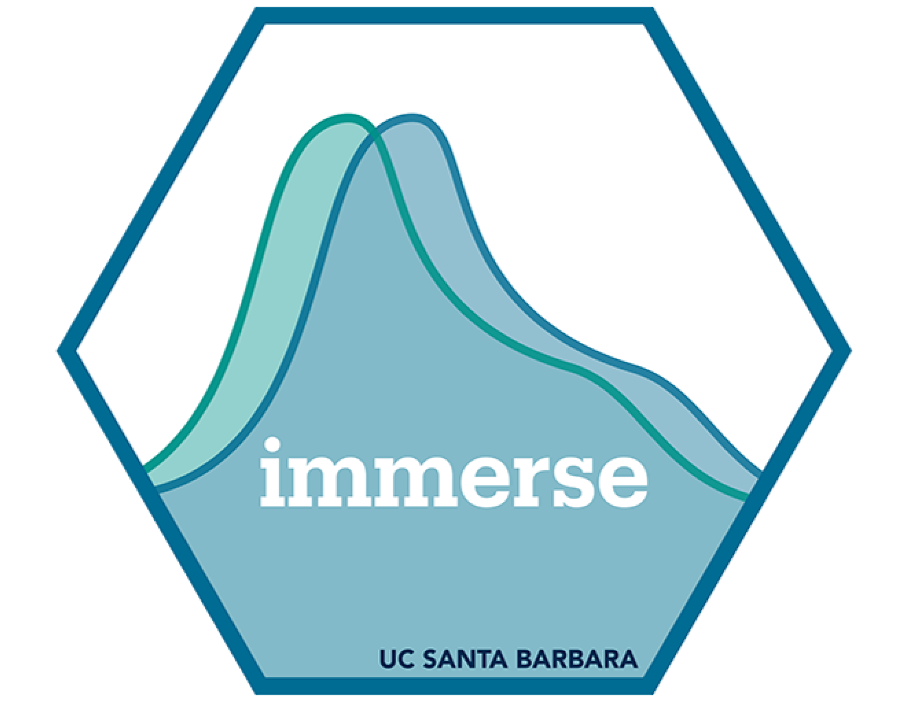
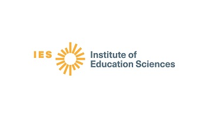

--- 
title: "Latent Class Analysis with `MplusAutomation`"
author: "Dina Arch"
date: "2025-02-07"
site: bookdown::bookdown_site
documentclass: book
bibliography: [book.bib, packages.bib]
url: "https://bookdown.org/dina_arch/lca-bookdown/"
description: 
  latent class analysis with 
biblio-style: apalike
csl: chicago-fullnote-bibliography.csl
---

# Latent Class Analysis with `MplusAutomation` {-}

 Welcome! This book will teach you how to apply Latent Class Analysis (LCA) using Mplus[@muthen2017] and `MplusAutomation`[@hallquist2018]! This bookdown serves as your comprehensive guide to understanding and applying LCA using Mplus and its automation capabilities with `MplusAutomation`. Here, you will learn from start to finish how to apply mixture modeling using Mplus with the `MplusAutomation` package.

## Stay in touch! {-}

-   Please [visit our website](https://immerse.education.ucsb.edu/) to learn more about the IMMERSE fellowship.

-   Visit our [GitHub](https://github.com/immerse-ucsb) account to access all the IMMERSE training materials.

-   Follow us on [BlueSky](https://bsky.app/profile/immerse-ucsb.bsky.social) and [X](https://twitter.com/IMMERSE_UCSB) to stay-up-to date on our fellowship!

## Acknowledgements {-}

The Institute of Mixture Modeling for Equity-Oriented Researchers, Scholars, and Educators (IMMERSE) is an IES funded training grant (R305B220021) to support education scholars in integrating mixture modeling into their research.

How to reference this workshop: Institute of Mixture Modeling for Equity-Oriented Researchers, Scholars, and Educators (2025).
IMMERSE Online Resources (IES No. 305B220021).
Institute of Education Sciences.
<https://bookdown.org/dina_arch/lca-bookdown/>

